cola Report for Consensus Partitioning
==================

**Date**: 2019-12-07 07:22:04 CET, **cola version**: 1.3.2

----------------------------------------------------------------

<style type='text/css'>

body, td, th {
   font-family: Arial,Helvetica,sans-serif;
   background-color: white;
   font-size: 13px;
  max-width: 800px;
  margin: auto;
  margin-left:210px;
  padding: 0px 10px 0px 10px;
  border-left: 1px solid #EEEEEE;
  line-height: 150%;
}

tt, code, pre {
   font-family: 'DejaVu Sans Mono', 'Droid Sans Mono', 'Lucida Console', Consolas, Monaco, 

monospace;
}

h1 {
   font-size:2.2em;
}

h2 {
   font-size:1.8em;
}

h3 {
   font-size:1.4em;
}

h4 {
   font-size:1.0em;
}

h5 {
   font-size:0.9em;
}

h6 {
   font-size:0.8em;
}

a {
  text-decoration: none;
  color: #0366d6;
}

a:hover {
  text-decoration: underline;
}

a:visited {
   color: #0366d6;
}

pre, img {
  max-width: 100%;
}
pre {
  overflow-x: auto;
}
pre code {
   display: block; padding: 0.5em;
}

code {
  font-size: 92%;
  border: 1px solid #ccc;
}

code[class] {
  background-color: #F8F8F8;
}

table, td, th {
  border: 1px solid #ccc;
}

blockquote {
   color:#666666;
   margin:0;
   padding-left: 1em;
   border-left: 0.5em #EEE solid;
}

hr {
   height: 0px;
   border-bottom: none;
   border-top-width: thin;
   border-top-style: dotted;
   border-top-color: #999999;
}

@media print {
   * {
      background: transparent !important;
      color: black !important;
      filter:none !important;
      -ms-filter: none !important;
   }

   body {
      font-size:12pt;
      max-width:100%;
   }

   a, a:visited {
      text-decoration: underline;
   }

   hr {
      visibility: hidden;
      page-break-before: always;
   }

   pre, blockquote {
      padding-right: 1em;
      page-break-inside: avoid;
   }

   tr, img {
      page-break-inside: avoid;
   }

   img {
      max-width: 100% !important;
   }

   @page :left {
      margin: 15mm 20mm 15mm 10mm;
   }

   @page :right {
      margin: 15mm 10mm 15mm 20mm;
   }

   p, h2, h3 {
      orphans: 3; widows: 3;
   }

   h2, h3 {
      page-break-after: avoid;
   }
}
</style>


## Summary


All available functions which can be applied to this `res_list` object:


```r
res_list
```

```
#> A 'ConsensusPartitionList' object with 24 methods.
#>   On a matrix with 17245 rows and 418 columns.
#>   Top rows are extracted by 'SD, CV, MAD, ATC' methods.
#>   Subgroups are detected by 'hclust, kmeans, skmeans, pam, mclust, NMF' method.
#>   Number of partitions are tried for k = 2, 3, 4, 5, 6.
#>   Performed in total 30000 partitions by row resampling.
#> 
#> Following methods can be applied to this 'ConsensusPartitionList' object:
#>  [1] "cola_report"           "collect_classes"       "collect_plots"         "collect_stats"        
#>  [5] "colnames"              "functional_enrichment" "get_anno_col"          "get_anno"             
#>  [9] "get_classes"           "get_matrix"            "get_membership"        "get_stats"            
#> [13] "is_best_k"             "is_stable_k"           "ncol"                  "nrow"                 
#> [17] "rownames"              "show"                  "suggest_best_k"        "test_to_known_factors"
#> [21] "top_rows_heatmap"      "top_rows_overlap"     
#> 
#> You can get result for a single method by, e.g. object["SD", "hclust"] or object["SD:hclust"]
#> or a subset of methods by object[c("SD", "CV")], c("hclust", "kmeans")]
```

The call of `run_all_consensus_partition_methods()` was:


```
#> run_all_consensus_partition_methods(data = mat, mc.cores = 4)
```

Dimension of the input matrix:


```r
mat = get_matrix(res_list)
dim(mat)
```

```
#> [1] 17245   418
```

### Density distribution

The density distribution for each sample is visualized as in one column in the
following heatmap. The clustering is based on the distance which is the
Kolmogorov-Smirnov statistic between two distributions.


```r
library(ComplexHeatmap)
densityHeatmap(mat, ylab = "value", cluster_columns = TRUE, show_column_names = FALSE,
    mc.cores = 4)
```


### Suggest the best k


Folowing table shows the best `k` (number of partitions) for each combination
of top-value methods and partition methods. Clicking on the method name in
the table goes to the section for a single combination of methods.

[The cola vignette](http://bioconductor.org/packages/devel/bioc/vignettes/cola/inst/doc/cola.html#toc_13)
explains the definition of the metrics used for determining the best
number of partitions.


```r
suggest_best_k(res_list)
```


|                            | The best k| 1-PAC| Mean silhouette| Concordance|   |Optional k |
|:---------------------------|----------:|-----:|---------------:|-----------:|:--|:----------|
|[SD:mclust](#SD-mclust)     |          3| 1.000|           1.000|       1.000|** |2          |
|[MAD:kmeans](#MAD-kmeans)   |          2| 1.000|           0.982|       0.984|** |           |
|[MAD:mclust](#MAD-mclust)   |          3| 1.000|           1.000|       1.000|** |2          |
|[ATC:kmeans](#ATC-kmeans)   |          2| 1.000|           1.000|       1.000|** |           |
|[ATC:skmeans](#ATC-skmeans) |          4| 1.000|           0.985|       0.980|** |2,3        |
|[ATC:mclust](#ATC-mclust)   |          2| 1.000|           0.977|       0.992|** |           |
|[ATC:NMF](#ATC-NMF)         |          2| 1.000|           1.000|       1.000|** |           |
|[CV:NMF](#CV-NMF)           |          6| 0.986|           0.940|       0.969|** |           |
|[CV:hclust](#CV-hclust)     |          6| 0.972|           0.950|       0.971|** |2,3,4,5    |
|[ATC:hclust](#ATC-hclust)   |          5| 0.966|           0.944|       0.963|** |3,4        |
|[SD:NMF](#SD-NMF)           |          3| 0.962|           0.936|       0.970|** |2          |
|[MAD:skmeans](#MAD-skmeans) |          3| 0.961|           0.949|       0.972|** |2          |
|[CV:pam](#CV-pam)           |          6| 0.954|           0.929|       0.965|** |3,4,5      |
|[MAD:pam](#MAD-pam)         |          6| 0.946|           0.893|       0.948|*  |5          |
|[CV:skmeans](#CV-skmeans)   |          6| 0.939|           0.900|       0.937|*  |2,3,4,5    |
|[SD:pam](#SD-pam)           |          5| 0.937|           0.887|       0.954|*  |           |
|[SD:skmeans](#SD-skmeans)   |          6| 0.931|           0.860|       0.914|*  |2          |
|[CV:mclust](#CV-mclust)     |          6| 0.924|           0.915|       0.954|*  |           |
|[SD:hclust](#SD-hclust)     |          6| 0.918|           0.865|       0.919|*  |           |
|[MAD:NMF](#MAD-NMF)         |          2| 0.910|           0.953|       0.978|*  |           |
|[ATC:pam](#ATC-pam)         |          6| 0.903|           0.891|       0.932|*  |2,3,4,5    |
|[MAD:hclust](#MAD-hclust)   |          6| 0.872|           0.911|       0.909|   |           |
|[SD:kmeans](#SD-kmeans)     |          2| 0.530|           0.928|       0.941|   |           |
|[CV:kmeans](#CV-kmeans)     |          2| 0.463|           0.866|       0.899|   |           |

\*\*: 1-PAC > 0.95, \*: 1-PAC > 0.9


### CDF of consensus matrices

Cumulative distribution function curves of consensus matrix for all methods.


```r
collect_plots(res_list, fun = plot_ecdf)
```


### Consensus heatmap

Consensus heatmaps for all methods. ([What is a consensus heatmap?](http://bioconductor.org/packages/devel/bioc/vignettes/cola/inst/doc/cola.html#toc_9))


<style type='text/css'>


.ui-helper-hidden {
	display: none;
}
.ui-helper-hidden-accessible {
	border: 0;
	clip: rect(0 0 0 0);
	height: 1px;
	margin: -1px;
	overflow: hidden;
	padding: 0;
	position: absolute;
	width: 1px;
}
.ui-helper-reset {
	margin: 0;
	padding: 0;
	border: 0;
	outline: 0;
	line-height: 1.3;
	text-decoration: none;
	font-size: 100%;
	list-style: none;
}
.ui-helper-clearfix:before,
.ui-helper-clearfix:after {
	content: "";
	display: table;
	border-collapse: collapse;
}
.ui-helper-clearfix:after {
	clear: both;
}
.ui-helper-zfix {
	width: 100%;
	height: 100%;
	top: 0;
	left: 0;
	position: absolute;
	opacity: 0;
	filter:Alpha(Opacity=0); 
}

.ui-front {
	z-index: 100;
}


.ui-state-disabled {
	cursor: default !important;
	pointer-events: none;
}


.ui-icon {
	display: inline-block;
	vertical-align: middle;
	margin-top: -.25em;
	position: relative;
	text-indent: -99999px;
	overflow: hidden;
	background-repeat: no-repeat;
}

.ui-widget-icon-block {
	left: 50%;
	margin-left: -8px;
	display: block;
}


.ui-widget-overlay {
	position: fixed;
	top: 0;
	left: 0;
	width: 100%;
	height: 100%;
}
.ui-accordion .ui-accordion-header {
	display: block;
	cursor: pointer;
	position: relative;
	margin: 2px 0 0 0;
	padding: .5em .5em .5em .7em;
	font-size: 100%;
}
.ui-accordion .ui-accordion-content {
	padding: 1em 2.2em;
	border-top: 0;
	overflow: auto;
}
.ui-autocomplete {
	position: absolute;
	top: 0;
	left: 0;
	cursor: default;
}
.ui-menu {
	list-style: none;
	padding: 0;
	margin: 0;
	display: block;
	outline: 0;
}
.ui-menu .ui-menu {
	position: absolute;
}
.ui-menu .ui-menu-item {
	margin: 0;
	cursor: pointer;
	
	list-style-image: url("data:image/gif;base64,R0lGODlhAQABAIAAAAAAAP///yH5BAEAAAAALAAAAAABAAEAAAIBRAA7");
}
.ui-menu .ui-menu-item-wrapper {
	position: relative;
	padding: 3px 1em 3px .4em;
}
.ui-menu .ui-menu-divider {
	margin: 5px 0;
	height: 0;
	font-size: 0;
	line-height: 0;
	border-width: 1px 0 0 0;
}
.ui-menu .ui-state-focus,
.ui-menu .ui-state-active {
	margin: -1px;
}


.ui-menu-icons {
	position: relative;
}
.ui-menu-icons .ui-menu-item-wrapper {
	padding-left: 2em;
}


.ui-menu .ui-icon {
	position: absolute;
	top: 0;
	bottom: 0;
	left: .2em;
	margin: auto 0;
}


.ui-menu .ui-menu-icon {
	left: auto;
	right: 0;
}
.ui-button {
	padding: .4em 1em;
	display: inline-block;
	position: relative;
	line-height: normal;
	margin-right: .1em;
	cursor: pointer;
	vertical-align: middle;
	text-align: center;
	-webkit-user-select: none;
	-moz-user-select: none;
	-ms-user-select: none;
	user-select: none;

	
	overflow: visible;
}

.ui-button,
.ui-button:link,
.ui-button:visited,
.ui-button:hover,
.ui-button:active {
	text-decoration: none;
}


.ui-button-icon-only {
	width: 2em;
	box-sizing: border-box;
	text-indent: -9999px;
	white-space: nowrap;
}


input.ui-button.ui-button-icon-only {
	text-indent: 0;
}


.ui-button-icon-only .ui-icon {
	position: absolute;
	top: 50%;
	left: 50%;
	margin-top: -8px;
	margin-left: -8px;
}

.ui-button.ui-icon-notext .ui-icon {
	padding: 0;
	width: 2.1em;
	height: 2.1em;
	text-indent: -9999px;
	white-space: nowrap;

}

input.ui-button.ui-icon-notext .ui-icon {
	width: auto;
	height: auto;
	text-indent: 0;
	white-space: normal;
	padding: .4em 1em;
}


input.ui-button::-moz-focus-inner,
button.ui-button::-moz-focus-inner {
	border: 0;
	padding: 0;
}
.ui-controlgroup {
	vertical-align: middle;
	display: inline-block;
}
.ui-controlgroup > .ui-controlgroup-item {
	float: left;
	margin-left: 0;
	margin-right: 0;
}
.ui-controlgroup > .ui-controlgroup-item:focus,
.ui-controlgroup > .ui-controlgroup-item.ui-visual-focus {
	z-index: 9999;
}
.ui-controlgroup-vertical > .ui-controlgroup-item {
	display: block;
	float: none;
	width: 100%;
	margin-top: 0;
	margin-bottom: 0;
	text-align: left;
}
.ui-controlgroup-vertical .ui-controlgroup-item {
	box-sizing: border-box;
}
.ui-controlgroup .ui-controlgroup-label {
	padding: .4em 1em;
}
.ui-controlgroup .ui-controlgroup-label span {
	font-size: 80%;
}
.ui-controlgroup-horizontal .ui-controlgroup-label + .ui-controlgroup-item {
	border-left: none;
}
.ui-controlgroup-vertical .ui-controlgroup-label + .ui-controlgroup-item {
	border-top: none;
}
.ui-controlgroup-horizontal .ui-controlgroup-label.ui-widget-content {
	border-right: none;
}
.ui-controlgroup-vertical .ui-controlgroup-label.ui-widget-content {
	border-bottom: none;
}


.ui-controlgroup-vertical .ui-spinner-input {

	
	width: 75%;
	width: calc( 100% - 2.4em );
}
.ui-controlgroup-vertical .ui-spinner .ui-spinner-up {
	border-top-style: solid;
}

.ui-checkboxradio-label .ui-icon-background {
	box-shadow: inset 1px 1px 1px #ccc;
	border-radius: .12em;
	border: none;
}
.ui-checkboxradio-radio-label .ui-icon-background {
	width: 16px;
	height: 16px;
	border-radius: 1em;
	overflow: visible;
	border: none;
}
.ui-checkboxradio-radio-label.ui-checkboxradio-checked .ui-icon,
.ui-checkboxradio-radio-label.ui-checkboxradio-checked:hover .ui-icon {
	background-image: none;
	width: 8px;
	height: 8px;
	border-width: 4px;
	border-style: solid;
}
.ui-checkboxradio-disabled {
	pointer-events: none;
}
.ui-datepicker {
	width: 17em;
	padding: .2em .2em 0;
	display: none;
}
.ui-datepicker .ui-datepicker-header {
	position: relative;
	padding: .2em 0;
}
.ui-datepicker .ui-datepicker-prev,
.ui-datepicker .ui-datepicker-next {
	position: absolute;
	top: 2px;
	width: 1.8em;
	height: 1.8em;
}
.ui-datepicker .ui-datepicker-prev-hover,
.ui-datepicker .ui-datepicker-next-hover {
	top: 1px;
}
.ui-datepicker .ui-datepicker-prev {
	left: 2px;
}
.ui-datepicker .ui-datepicker-next {
	right: 2px;
}
.ui-datepicker .ui-datepicker-prev-hover {
	left: 1px;
}
.ui-datepicker .ui-datepicker-next-hover {
	right: 1px;
}
.ui-datepicker .ui-datepicker-prev span,
.ui-datepicker .ui-datepicker-next span {
	display: block;
	position: absolute;
	left: 50%;
	margin-left: -8px;
	top: 50%;
	margin-top: -8px;
}
.ui-datepicker .ui-datepicker-title {
	margin: 0 2.3em;
	line-height: 1.8em;
	text-align: center;
}
.ui-datepicker .ui-datepicker-title select {
	font-size: 1em;
	margin: 1px 0;
}
.ui-datepicker select.ui-datepicker-month,
.ui-datepicker select.ui-datepicker-year {
	width: 45%;
}
.ui-datepicker table {
	width: 100%;
	font-size: .9em;
	border-collapse: collapse;
	margin: 0 0 .4em;
}
.ui-datepicker th {
	padding: .7em .3em;
	text-align: center;
	font-weight: bold;
	border: 0;
}
.ui-datepicker td {
	border: 0;
	padding: 1px;
}
.ui-datepicker td span,
.ui-datepicker td a {
	display: block;
	padding: .2em;
	text-align: right;
	text-decoration: none;
}
.ui-datepicker .ui-datepicker-buttonpane {
	background-image: none;
	margin: .7em 0 0 0;
	padding: 0 .2em;
	border-left: 0;
	border-right: 0;
	border-bottom: 0;
}
.ui-datepicker .ui-datepicker-buttonpane button {
	float: right;
	margin: .5em .2em .4em;
	cursor: pointer;
	padding: .2em .6em .3em .6em;
	width: auto;
	overflow: visible;
}
.ui-datepicker .ui-datepicker-buttonpane button.ui-datepicker-current {
	float: left;
}


.ui-datepicker.ui-datepicker-multi {
	width: auto;
}
.ui-datepicker-multi .ui-datepicker-group {
	float: left;
}
.ui-datepicker-multi .ui-datepicker-group table {
	width: 95%;
	margin: 0 auto .4em;
}
.ui-datepicker-multi-2 .ui-datepicker-group {
	width: 50%;
}
.ui-datepicker-multi-3 .ui-datepicker-group {
	width: 33.3%;
}
.ui-datepicker-multi-4 .ui-datepicker-group {
	width: 25%;
}
.ui-datepicker-multi .ui-datepicker-group-last .ui-datepicker-header,
.ui-datepicker-multi .ui-datepicker-group-middle .ui-datepicker-header {
	border-left-width: 0;
}
.ui-datepicker-multi .ui-datepicker-buttonpane {
	clear: left;
}
.ui-datepicker-row-break {
	clear: both;
	width: 100%;
	font-size: 0;
}


.ui-datepicker-rtl {
	direction: rtl;
}
.ui-datepicker-rtl .ui-datepicker-prev {
	right: 2px;
	left: auto;
}
.ui-datepicker-rtl .ui-datepicker-next {
	left: 2px;
	right: auto;
}
.ui-datepicker-rtl .ui-datepicker-prev:hover {
	right: 1px;
	left: auto;
}
.ui-datepicker-rtl .ui-datepicker-next:hover {
	left: 1px;
	right: auto;
}
.ui-datepicker-rtl .ui-datepicker-buttonpane {
	clear: right;
}
.ui-datepicker-rtl .ui-datepicker-buttonpane button {
	float: left;
}
.ui-datepicker-rtl .ui-datepicker-buttonpane button.ui-datepicker-current,
.ui-datepicker-rtl .ui-datepicker-group {
	float: right;
}
.ui-datepicker-rtl .ui-datepicker-group-last .ui-datepicker-header,
.ui-datepicker-rtl .ui-datepicker-group-middle .ui-datepicker-header {
	border-right-width: 0;
	border-left-width: 1px;
}


.ui-datepicker .ui-icon {
	display: block;
	text-indent: -99999px;
	overflow: hidden;
	background-repeat: no-repeat;
	left: .5em;
	top: .3em;
}
.ui-dialog {
	position: absolute;
	top: 0;
	left: 0;
	padding: .2em;
	outline: 0;
}
.ui-dialog .ui-dialog-titlebar {
	padding: .4em 1em;
	position: relative;
}
.ui-dialog .ui-dialog-title {
	float: left;
	margin: .1em 0;
	white-space: nowrap;
	width: 90%;
	overflow: hidden;
	text-overflow: ellipsis;
}
.ui-dialog .ui-dialog-titlebar-close {
	position: absolute;
	right: .3em;
	top: 50%;
	width: 20px;
	margin: -10px 0 0 0;
	padding: 1px;
	height: 20px;
}
.ui-dialog .ui-dialog-content {
	position: relative;
	border: 0;
	padding: .5em 1em;
	background: none;
	overflow: auto;
}
.ui-dialog .ui-dialog-buttonpane {
	text-align: left;
	border-width: 1px 0 0 0;
	background-image: none;
	margin-top: .5em;
	padding: .3em 1em .5em .4em;
}
.ui-dialog .ui-dialog-buttonpane .ui-dialog-buttonset {
	float: right;
}
.ui-dialog .ui-dialog-buttonpane button {
	margin: .5em .4em .5em 0;
	cursor: pointer;
}
.ui-dialog .ui-resizable-n {
	height: 2px;
	top: 0;
}
.ui-dialog .ui-resizable-e {
	width: 2px;
	right: 0;
}
.ui-dialog .ui-resizable-s {
	height: 2px;
	bottom: 0;
}
.ui-dialog .ui-resizable-w {
	width: 2px;
	left: 0;
}
.ui-dialog .ui-resizable-se,
.ui-dialog .ui-resizable-sw,
.ui-dialog .ui-resizable-ne,
.ui-dialog .ui-resizable-nw {
	width: 7px;
	height: 7px;
}
.ui-dialog .ui-resizable-se {
	right: 0;
	bottom: 0;
}
.ui-dialog .ui-resizable-sw {
	left: 0;
	bottom: 0;
}
.ui-dialog .ui-resizable-ne {
	right: 0;
	top: 0;
}
.ui-dialog .ui-resizable-nw {
	left: 0;
	top: 0;
}
.ui-draggable .ui-dialog-titlebar {
	cursor: move;
}
.ui-draggable-handle {
	-ms-touch-action: none;
	touch-action: none;
}
.ui-resizable {
	position: relative;
}
.ui-resizable-handle {
	position: absolute;
	font-size: 0.1px;
	display: block;
	-ms-touch-action: none;
	touch-action: none;
}
.ui-resizable-disabled .ui-resizable-handle,
.ui-resizable-autohide .ui-resizable-handle {
	display: none;
}
.ui-resizable-n {
	cursor: n-resize;
	height: 7px;
	width: 100%;
	top: -5px;
	left: 0;
}
.ui-resizable-s {
	cursor: s-resize;
	height: 7px;
	width: 100%;
	bottom: -5px;
	left: 0;
}
.ui-resizable-e {
	cursor: e-resize;
	width: 7px;
	right: -5px;
	top: 0;
	height: 100%;
}
.ui-resizable-w {
	cursor: w-resize;
	width: 7px;
	left: -5px;
	top: 0;
	height: 100%;
}
.ui-resizable-se {
	cursor: se-resize;
	width: 12px;
	height: 12px;
	right: 1px;
	bottom: 1px;
}
.ui-resizable-sw {
	cursor: sw-resize;
	width: 9px;
	height: 9px;
	left: -5px;
	bottom: -5px;
}
.ui-resizable-nw {
	cursor: nw-resize;
	width: 9px;
	height: 9px;
	left: -5px;
	top: -5px;
}
.ui-resizable-ne {
	cursor: ne-resize;
	width: 9px;
	height: 9px;
	right: -5px;
	top: -5px;
}
.ui-progressbar {
	height: 2em;
	text-align: left;
	overflow: hidden;
}
.ui-progressbar .ui-progressbar-value {
	margin: -1px;
	height: 100%;
}
.ui-progressbar .ui-progressbar-overlay {
	background: url("data:image/gif;base64,R0lGODlhKAAoAIABAAAAAP///yH/C05FVFNDQVBFMi4wAwEAAAAh+QQJAQABACwAAAAAKAAoAAACkYwNqXrdC52DS06a7MFZI+4FHBCKoDeWKXqymPqGqxvJrXZbMx7Ttc+w9XgU2FB3lOyQRWET2IFGiU9m1frDVpxZZc6bfHwv4c1YXP6k1Vdy292Fb6UkuvFtXpvWSzA+HycXJHUXiGYIiMg2R6W459gnWGfHNdjIqDWVqemH2ekpObkpOlppWUqZiqr6edqqWQAAIfkECQEAAQAsAAAAACgAKAAAApSMgZnGfaqcg1E2uuzDmmHUBR8Qil95hiPKqWn3aqtLsS18y7G1SzNeowWBENtQd+T1JktP05nzPTdJZlR6vUxNWWjV+vUWhWNkWFwxl9VpZRedYcflIOLafaa28XdsH/ynlcc1uPVDZxQIR0K25+cICCmoqCe5mGhZOfeYSUh5yJcJyrkZWWpaR8doJ2o4NYq62lAAACH5BAkBAAEALAAAAAAoACgAAAKVDI4Yy22ZnINRNqosw0Bv7i1gyHUkFj7oSaWlu3ovC8GxNso5fluz3qLVhBVeT/Lz7ZTHyxL5dDalQWPVOsQWtRnuwXaFTj9jVVh8pma9JjZ4zYSj5ZOyma7uuolffh+IR5aW97cHuBUXKGKXlKjn+DiHWMcYJah4N0lYCMlJOXipGRr5qdgoSTrqWSq6WFl2ypoaUAAAIfkECQEAAQAsAAAAACgAKAAAApaEb6HLgd/iO7FNWtcFWe+ufODGjRfoiJ2akShbueb0wtI50zm02pbvwfWEMWBQ1zKGlLIhskiEPm9R6vRXxV4ZzWT2yHOGpWMyorblKlNp8HmHEb/lCXjcW7bmtXP8Xt229OVWR1fod2eWqNfHuMjXCPkIGNileOiImVmCOEmoSfn3yXlJWmoHGhqp6ilYuWYpmTqKUgAAIfkECQEAAQAsAAAAACgAKAAAApiEH6kb58biQ3FNWtMFWW3eNVcojuFGfqnZqSebuS06w5V80/X02pKe8zFwP6EFWOT1lDFk8rGERh1TTNOocQ61Hm4Xm2VexUHpzjymViHrFbiELsefVrn6XKfnt2Q9G/+Xdie499XHd2g4h7ioOGhXGJboGAnXSBnoBwKYyfioubZJ2Hn0RuRZaflZOil56Zp6iioKSXpUAAAh+QQJAQABACwAAAAAKAAoAAACkoQRqRvnxuI7kU1a1UU5bd5tnSeOZXhmn5lWK3qNTWvRdQxP8qvaC+/yaYQzXO7BMvaUEmJRd3TsiMAgswmNYrSgZdYrTX6tSHGZO73ezuAw2uxuQ+BbeZfMxsexY35+/Qe4J1inV0g4x3WHuMhIl2jXOKT2Q+VU5fgoSUI52VfZyfkJGkha6jmY+aaYdirq+lQAACH5BAkBAAEALAAAAAAoACgAAAKWBIKpYe0L3YNKToqswUlvznigd4wiR4KhZrKt9Upqip61i9E3vMvxRdHlbEFiEXfk9YARYxOZZD6VQ2pUunBmtRXo1Lf8hMVVcNl8JafV38aM2/Fu5V16Bn63r6xt97j09+MXSFi4BniGFae3hzbH9+hYBzkpuUh5aZmHuanZOZgIuvbGiNeomCnaxxap2upaCZsq+1kAACH5BAkBAAEALAAAAAAoACgAAAKXjI8By5zf4kOxTVrXNVlv1X0d8IGZGKLnNpYtm8Lr9cqVeuOSvfOW79D9aDHizNhDJidFZhNydEahOaDH6nomtJjp1tutKoNWkvA6JqfRVLHU/QUfau9l2x7G54d1fl995xcIGAdXqMfBNadoYrhH+Mg2KBlpVpbluCiXmMnZ2Sh4GBqJ+ckIOqqJ6LmKSllZmsoq6wpQAAAh+QQJAQABACwAAAAAKAAoAAAClYx/oLvoxuJDkU1a1YUZbJ59nSd2ZXhWqbRa2/gF8Gu2DY3iqs7yrq+xBYEkYvFSM8aSSObE+ZgRl1BHFZNr7pRCavZ5BW2142hY3AN/zWtsmf12p9XxxFl2lpLn1rseztfXZjdIWIf2s5dItwjYKBgo9yg5pHgzJXTEeGlZuenpyPmpGQoKOWkYmSpaSnqKileI2FAAACH5BAkBAAEALAAAAAAoACgAAAKVjB+gu+jG4kORTVrVhRlsnn2dJ3ZleFaptFrb+CXmO9OozeL5VfP99HvAWhpiUdcwkpBH3825AwYdU8xTqlLGhtCosArKMpvfa1mMRae9VvWZfeB2XfPkeLmm18lUcBj+p5dnN8jXZ3YIGEhYuOUn45aoCDkp16hl5IjYJvjWKcnoGQpqyPlpOhr3aElaqrq56Bq7VAAAOw==");
	height: 100%;
	filter: alpha(opacity=25); 
	opacity: 0.25;
}
.ui-progressbar-indeterminate .ui-progressbar-value {
	background-image: none;
}
.ui-selectable {
	-ms-touch-action: none;
	touch-action: none;
}
.ui-selectable-helper {
	position: absolute;
	z-index: 100;
	border: 1px dotted black;
}
.ui-selectmenu-menu {
	padding: 0;
	margin: 0;
	position: absolute;
	top: 0;
	left: 0;
	display: none;
}
.ui-selectmenu-menu .ui-menu {
	overflow: auto;
	overflow-x: hidden;
	padding-bottom: 1px;
}
.ui-selectmenu-menu .ui-menu .ui-selectmenu-optgroup {
	font-size: 1em;
	font-weight: bold;
	line-height: 1.5;
	padding: 2px 0.4em;
	margin: 0.5em 0 0 0;
	height: auto;
	border: 0;
}
.ui-selectmenu-open {
	display: block;
}
.ui-selectmenu-text {
	display: block;
	margin-right: 20px;
	overflow: hidden;
	text-overflow: ellipsis;
}
.ui-selectmenu-button.ui-button {
	text-align: left;
	white-space: nowrap;
	width: 14em;
}
.ui-selectmenu-icon.ui-icon {
	float: right;
	margin-top: 0;
}
.ui-slider {
	position: relative;
	text-align: left;
}
.ui-slider .ui-slider-handle {
	position: absolute;
	z-index: 2;
	width: 1.2em;
	height: 1.2em;
	cursor: default;
	-ms-touch-action: none;
	touch-action: none;
}
.ui-slider .ui-slider-range {
	position: absolute;
	z-index: 1;
	font-size: .7em;
	display: block;
	border: 0;
	background-position: 0 0;
}


.ui-slider.ui-state-disabled .ui-slider-handle,
.ui-slider.ui-state-disabled .ui-slider-range {
	filter: inherit;
}

.ui-slider-horizontal {
	height: .8em;
}
.ui-slider-horizontal .ui-slider-handle {
	top: -.3em;
	margin-left: -.6em;
}
.ui-slider-horizontal .ui-slider-range {
	top: 0;
	height: 100%;
}
.ui-slider-horizontal .ui-slider-range-min {
	left: 0;
}
.ui-slider-horizontal .ui-slider-range-max {
	right: 0;
}

.ui-slider-vertical {
	width: .8em;
	height: 100px;
}
.ui-slider-vertical .ui-slider-handle {
	left: -.3em;
	margin-left: 0;
	margin-bottom: -.6em;
}
.ui-slider-vertical .ui-slider-range {
	left: 0;
	width: 100%;
}
.ui-slider-vertical .ui-slider-range-min {
	bottom: 0;
}
.ui-slider-vertical .ui-slider-range-max {
	top: 0;
}
.ui-sortable-handle {
	-ms-touch-action: none;
	touch-action: none;
}
.ui-spinner {
	position: relative;
	display: inline-block;
	overflow: hidden;
	padding: 0;
	vertical-align: middle;
}
.ui-spinner-input {
	border: none;
	background: none;
	color: inherit;
	padding: .222em 0;
	margin: .2em 0;
	vertical-align: middle;
	margin-left: .4em;
	margin-right: 2em;
}
.ui-spinner-button {
	width: 1.6em;
	height: 50%;
	font-size: .5em;
	padding: 0;
	margin: 0;
	text-align: center;
	position: absolute;
	cursor: default;
	display: block;
	overflow: hidden;
	right: 0;
}

.ui-spinner a.ui-spinner-button {
	border-top-style: none;
	border-bottom-style: none;
	border-right-style: none;
}
.ui-spinner-up {
	top: 0;
}
.ui-spinner-down {
	bottom: 0;
}
.ui-tabs {
	position: relative;
	padding: .2em;
}
.ui-tabs .ui-tabs-nav {
	margin: 0;
	padding: .2em .2em 0;
}
.ui-tabs .ui-tabs-nav li {
	list-style: none;
	float: left;
	position: relative;
	top: 0;
	margin: 1px .2em 0 0;
	border-bottom-width: 0;
	padding: 0;
	white-space: nowrap;
}
.ui-tabs .ui-tabs-nav .ui-tabs-anchor {
	float: left;
	padding: .5em 1em;
	text-decoration: none;
}
.ui-tabs .ui-tabs-nav li.ui-tabs-active {
	margin-bottom: -1px;
	padding-bottom: 1px;
}
.ui-tabs .ui-tabs-nav li.ui-tabs-active .ui-tabs-anchor,
.ui-tabs .ui-tabs-nav li.ui-state-disabled .ui-tabs-anchor,
.ui-tabs .ui-tabs-nav li.ui-tabs-loading .ui-tabs-anchor {
	cursor: text;
}
.ui-tabs-collapsible .ui-tabs-nav li.ui-tabs-active .ui-tabs-anchor {
	cursor: pointer;
}
.ui-tabs .ui-tabs-panel {
	display: block;
	border-width: 0;
	padding: 1em 1.4em;
	background: none;
}
.ui-tooltip {
	padding: 8px;
	position: absolute;
	z-index: 9999;
	max-width: 300px;
}
body .ui-tooltip {
	border-width: 2px;
}

.ui-widget {
	font-family: Arial,Helvetica,sans-serif;
	font-size: 1em;
}
.ui-widget .ui-widget {
	font-size: 1em;
}
.ui-widget input,
.ui-widget select,
.ui-widget textarea,
.ui-widget button {
	font-family: Arial,Helvetica,sans-serif;
	font-size: 1em;
}
.ui-widget.ui-widget-content {
	border: 1px solid #c5c5c5;
}
.ui-widget-content {
	border: 1px solid #dddddd;
	background: #ffffff;
	color: #333333;
}
.ui-widget-content a {
	color: #333333;
}
.ui-widget-header {
	border: 1px solid #dddddd;
	background: #e9e9e9;
	color: #333333;
	font-weight: bold;
}
.ui-widget-header a {
	color: #333333;
}


.ui-state-default,
.ui-widget-content .ui-state-default,
.ui-widget-header .ui-state-default,
.ui-button,


html .ui-button.ui-state-disabled:hover,
html .ui-button.ui-state-disabled:active {
	border: 1px solid #c5c5c5;
	background: #f6f6f6;
	font-weight: normal;
	color: #454545;
}
.ui-state-default a,
.ui-state-default a:link,
.ui-state-default a:visited,
a.ui-button,
a:link.ui-button,
a:visited.ui-button,
.ui-button {
	color: #454545;
	text-decoration: none;
}
.ui-state-hover,
.ui-widget-content .ui-state-hover,
.ui-widget-header .ui-state-hover,
.ui-state-focus,
.ui-widget-content .ui-state-focus,
.ui-widget-header .ui-state-focus,
.ui-button:hover,
.ui-button:focus {
	border: 1px solid #cccccc;
	background: #ededed;
	font-weight: normal;
	color: #2b2b2b;
}
.ui-state-hover a,
.ui-state-hover a:hover,
.ui-state-hover a:link,
.ui-state-hover a:visited,
.ui-state-focus a,
.ui-state-focus a:hover,
.ui-state-focus a:link,
.ui-state-focus a:visited,
a.ui-button:hover,
a.ui-button:focus {
	color: #2b2b2b;
	text-decoration: none;
}

.ui-visual-focus {
	box-shadow: 0 0 3px 1px rgb(94, 158, 214);
}
.ui-state-active,
.ui-widget-content .ui-state-active,
.ui-widget-header .ui-state-active,
a.ui-button:active,
.ui-button:active,
.ui-button.ui-state-active:hover {
	border: 1px solid #003eff;
	background: #007fff;
	font-weight: normal;
	color: #ffffff;
}
.ui-icon-background,
.ui-state-active .ui-icon-background {
	border: #003eff;
	background-color: #ffffff;
}
.ui-state-active a,
.ui-state-active a:link,
.ui-state-active a:visited {
	color: #ffffff;
	text-decoration: none;
}


.ui-state-highlight,
.ui-widget-content .ui-state-highlight,
.ui-widget-header .ui-state-highlight {
	border: 1px solid #dad55e;
	background: #fffa90;
	color: #777620;
}
.ui-state-checked {
	border: 1px solid #dad55e;
	background: #fffa90;
}
.ui-state-highlight a,
.ui-widget-content .ui-state-highlight a,
.ui-widget-header .ui-state-highlight a {
	color: #777620;
}
.ui-state-error,
.ui-widget-content .ui-state-error,
.ui-widget-header .ui-state-error {
	border: 1px solid #f1a899;
	background: #fddfdf;
	color: #5f3f3f;
}
.ui-state-error a,
.ui-widget-content .ui-state-error a,
.ui-widget-header .ui-state-error a {
	color: #5f3f3f;
}
.ui-state-error-text,
.ui-widget-content .ui-state-error-text,
.ui-widget-header .ui-state-error-text {
	color: #5f3f3f;
}
.ui-priority-primary,
.ui-widget-content .ui-priority-primary,
.ui-widget-header .ui-priority-primary {
	font-weight: bold;
}
.ui-priority-secondary,
.ui-widget-content .ui-priority-secondary,
.ui-widget-header .ui-priority-secondary {
	opacity: .7;
	filter:Alpha(Opacity=70); 
	font-weight: normal;
}
.ui-state-disabled,
.ui-widget-content .ui-state-disabled,
.ui-widget-header .ui-state-disabled {
	opacity: .35;
	filter:Alpha(Opacity=35); 
	background-image: none;
}
.ui-state-disabled .ui-icon {
	filter:Alpha(Opacity=35); 
}


.ui-icon {
	width: 16px;
	height: 16px;
}
.ui-icon,
.ui-widget-content .ui-icon {
	background-image: url("images/ui-icons_444444_256x240.png");
}
.ui-widget-header .ui-icon {
	background-image: url("images/ui-icons_444444_256x240.png");
}
.ui-state-hover .ui-icon,
.ui-state-focus .ui-icon,
.ui-button:hover .ui-icon,
.ui-button:focus .ui-icon {
	background-image: url("images/ui-icons_555555_256x240.png");
}
.ui-state-active .ui-icon,
.ui-button:active .ui-icon {
	background-image: url("images/ui-icons_ffffff_256x240.png");
}
.ui-state-highlight .ui-icon,
.ui-button .ui-state-highlight.ui-icon {
	background-image: url("images/ui-icons_777620_256x240.png");
}
.ui-state-error .ui-icon,
.ui-state-error-text .ui-icon {
	background-image: url("images/ui-icons_cc0000_256x240.png");
}
.ui-button .ui-icon {
	background-image: url("images/ui-icons_777777_256x240.png");
}


.ui-icon-blank { background-position: 16px 16px; }
.ui-icon-caret-1-n { background-position: 0 0; }
.ui-icon-caret-1-ne { background-position: -16px 0; }
.ui-icon-caret-1-e { background-position: -32px 0; }
.ui-icon-caret-1-se { background-position: -48px 0; }
.ui-icon-caret-1-s { background-position: -65px 0; }
.ui-icon-caret-1-sw { background-position: -80px 0; }
.ui-icon-caret-1-w { background-position: -96px 0; }
.ui-icon-caret-1-nw { background-position: -112px 0; }
.ui-icon-caret-2-n-s { background-position: -128px 0; }
.ui-icon-caret-2-e-w { background-position: -144px 0; }
.ui-icon-triangle-1-n { background-position: 0 -16px; }
.ui-icon-triangle-1-ne { background-position: -16px -16px; }
.ui-icon-triangle-1-e { background-position: -32px -16px; }
.ui-icon-triangle-1-se { background-position: -48px -16px; }
.ui-icon-triangle-1-s { background-position: -65px -16px; }
.ui-icon-triangle-1-sw { background-position: -80px -16px; }
.ui-icon-triangle-1-w { background-position: -96px -16px; }
.ui-icon-triangle-1-nw { background-position: -112px -16px; }
.ui-icon-triangle-2-n-s { background-position: -128px -16px; }
.ui-icon-triangle-2-e-w { background-position: -144px -16px; }
.ui-icon-arrow-1-n { background-position: 0 -32px; }
.ui-icon-arrow-1-ne { background-position: -16px -32px; }
.ui-icon-arrow-1-e { background-position: -32px -32px; }
.ui-icon-arrow-1-se { background-position: -48px -32px; }
.ui-icon-arrow-1-s { background-position: -65px -32px; }
.ui-icon-arrow-1-sw { background-position: -80px -32px; }
.ui-icon-arrow-1-w { background-position: -96px -32px; }
.ui-icon-arrow-1-nw { background-position: -112px -32px; }
.ui-icon-arrow-2-n-s { background-position: -128px -32px; }
.ui-icon-arrow-2-ne-sw { background-position: -144px -32px; }
.ui-icon-arrow-2-e-w { background-position: -160px -32px; }
.ui-icon-arrow-2-se-nw { background-position: -176px -32px; }
.ui-icon-arrowstop-1-n { background-position: -192px -32px; }
.ui-icon-arrowstop-1-e { background-position: -208px -32px; }
.ui-icon-arrowstop-1-s { background-position: -224px -32px; }
.ui-icon-arrowstop-1-w { background-position: -240px -32px; }
.ui-icon-arrowthick-1-n { background-position: 1px -48px; }
.ui-icon-arrowthick-1-ne { background-position: -16px -48px; }
.ui-icon-arrowthick-1-e { background-position: -32px -48px; }
.ui-icon-arrowthick-1-se { background-position: -48px -48px; }
.ui-icon-arrowthick-1-s { background-position: -64px -48px; }
.ui-icon-arrowthick-1-sw { background-position: -80px -48px; }
.ui-icon-arrowthick-1-w { background-position: -96px -48px; }
.ui-icon-arrowthick-1-nw { background-position: -112px -48px; }
.ui-icon-arrowthick-2-n-s { background-position: -128px -48px; }
.ui-icon-arrowthick-2-ne-sw { background-position: -144px -48px; }
.ui-icon-arrowthick-2-e-w { background-position: -160px -48px; }
.ui-icon-arrowthick-2-se-nw { background-position: -176px -48px; }
.ui-icon-arrowthickstop-1-n { background-position: -192px -48px; }
.ui-icon-arrowthickstop-1-e { background-position: -208px -48px; }
.ui-icon-arrowthickstop-1-s { background-position: -224px -48px; }
.ui-icon-arrowthickstop-1-w { background-position: -240px -48px; }
.ui-icon-arrowreturnthick-1-w { background-position: 0 -64px; }
.ui-icon-arrowreturnthick-1-n { background-position: -16px -64px; }
.ui-icon-arrowreturnthick-1-e { background-position: -32px -64px; }
.ui-icon-arrowreturnthick-1-s { background-position: -48px -64px; }
.ui-icon-arrowreturn-1-w { background-position: -64px -64px; }
.ui-icon-arrowreturn-1-n { background-position: -80px -64px; }
.ui-icon-arrowreturn-1-e { background-position: -96px -64px; }
.ui-icon-arrowreturn-1-s { background-position: -112px -64px; }
.ui-icon-arrowrefresh-1-w { background-position: -128px -64px; }
.ui-icon-arrowrefresh-1-n { background-position: -144px -64px; }
.ui-icon-arrowrefresh-1-e { background-position: -160px -64px; }
.ui-icon-arrowrefresh-1-s { background-position: -176px -64px; }
.ui-icon-arrow-4 { background-position: 0 -80px; }
.ui-icon-arrow-4-diag { background-position: -16px -80px; }
.ui-icon-extlink { background-position: -32px -80px; }
.ui-icon-newwin { background-position: -48px -80px; }
.ui-icon-refresh { background-position: -64px -80px; }
.ui-icon-shuffle { background-position: -80px -80px; }
.ui-icon-transfer-e-w { background-position: -96px -80px; }
.ui-icon-transferthick-e-w { background-position: -112px -80px; }
.ui-icon-folder-collapsed { background-position: 0 -96px; }
.ui-icon-folder-open { background-position: -16px -96px; }
.ui-icon-document { background-position: -32px -96px; }
.ui-icon-document-b { background-position: -48px -96px; }
.ui-icon-note { background-position: -64px -96px; }
.ui-icon-mail-closed { background-position: -80px -96px; }
.ui-icon-mail-open { background-position: -96px -96px; }
.ui-icon-suitcase { background-position: -112px -96px; }
.ui-icon-comment { background-position: -128px -96px; }
.ui-icon-person { background-position: -144px -96px; }
.ui-icon-print { background-position: -160px -96px; }
.ui-icon-trash { background-position: -176px -96px; }
.ui-icon-locked { background-position: -192px -96px; }
.ui-icon-unlocked { background-position: -208px -96px; }
.ui-icon-bookmark { background-position: -224px -96px; }
.ui-icon-tag { background-position: -240px -96px; }
.ui-icon-home { background-position: 0 -112px; }
.ui-icon-flag { background-position: -16px -112px; }
.ui-icon-calendar { background-position: -32px -112px; }
.ui-icon-cart { background-position: -48px -112px; }
.ui-icon-pencil { background-position: -64px -112px; }
.ui-icon-clock { background-position: -80px -112px; }
.ui-icon-disk { background-position: -96px -112px; }
.ui-icon-calculator { background-position: -112px -112px; }
.ui-icon-zoomin { background-position: -128px -112px; }
.ui-icon-zoomout { background-position: -144px -112px; }
.ui-icon-search { background-position: -160px -112px; }
.ui-icon-wrench { background-position: -176px -112px; }
.ui-icon-gear { background-position: -192px -112px; }
.ui-icon-heart { background-position: -208px -112px; }
.ui-icon-star { background-position: -224px -112px; }
.ui-icon-link { background-position: -240px -112px; }
.ui-icon-cancel { background-position: 0 -128px; }
.ui-icon-plus { background-position: -16px -128px; }
.ui-icon-plusthick { background-position: -32px -128px; }
.ui-icon-minus { background-position: -48px -128px; }
.ui-icon-minusthick { background-position: -64px -128px; }
.ui-icon-close { background-position: -80px -128px; }
.ui-icon-closethick { background-position: -96px -128px; }
.ui-icon-key { background-position: -112px -128px; }
.ui-icon-lightbulb { background-position: -128px -128px; }
.ui-icon-scissors { background-position: -144px -128px; }
.ui-icon-clipboard { background-position: -160px -128px; }
.ui-icon-copy { background-position: -176px -128px; }
.ui-icon-contact { background-position: -192px -128px; }
.ui-icon-image { background-position: -208px -128px; }
.ui-icon-video { background-position: -224px -128px; }
.ui-icon-script { background-position: -240px -128px; }
.ui-icon-alert { background-position: 0 -144px; }
.ui-icon-info { background-position: -16px -144px; }
.ui-icon-notice { background-position: -32px -144px; }
.ui-icon-help { background-position: -48px -144px; }
.ui-icon-check { background-position: -64px -144px; }
.ui-icon-bullet { background-position: -80px -144px; }
.ui-icon-radio-on { background-position: -96px -144px; }
.ui-icon-radio-off { background-position: -112px -144px; }
.ui-icon-pin-w { background-position: -128px -144px; }
.ui-icon-pin-s { background-position: -144px -144px; }
.ui-icon-play { background-position: 0 -160px; }
.ui-icon-pause { background-position: -16px -160px; }
.ui-icon-seek-next { background-position: -32px -160px; }
.ui-icon-seek-prev { background-position: -48px -160px; }
.ui-icon-seek-end { background-position: -64px -160px; }
.ui-icon-seek-start { background-position: -80px -160px; }

.ui-icon-seek-first { background-position: -80px -160px; }
.ui-icon-stop { background-position: -96px -160px; }
.ui-icon-eject { background-position: -112px -160px; }
.ui-icon-volume-off { background-position: -128px -160px; }
.ui-icon-volume-on { background-position: -144px -160px; }
.ui-icon-power { background-position: 0 -176px; }
.ui-icon-signal-diag { background-position: -16px -176px; }
.ui-icon-signal { background-position: -32px -176px; }
.ui-icon-battery-0 { background-position: -48px -176px; }
.ui-icon-battery-1 { background-position: -64px -176px; }
.ui-icon-battery-2 { background-position: -80px -176px; }
.ui-icon-battery-3 { background-position: -96px -176px; }
.ui-icon-circle-plus { background-position: 0 -192px; }
.ui-icon-circle-minus { background-position: -16px -192px; }
.ui-icon-circle-close { background-position: -32px -192px; }
.ui-icon-circle-triangle-e { background-position: -48px -192px; }
.ui-icon-circle-triangle-s { background-position: -64px -192px; }
.ui-icon-circle-triangle-w { background-position: -80px -192px; }
.ui-icon-circle-triangle-n { background-position: -96px -192px; }
.ui-icon-circle-arrow-e { background-position: -112px -192px; }
.ui-icon-circle-arrow-s { background-position: -128px -192px; }
.ui-icon-circle-arrow-w { background-position: -144px -192px; }
.ui-icon-circle-arrow-n { background-position: -160px -192px; }
.ui-icon-circle-zoomin { background-position: -176px -192px; }
.ui-icon-circle-zoomout { background-position: -192px -192px; }
.ui-icon-circle-check { background-position: -208px -192px; }
.ui-icon-circlesmall-plus { background-position: 0 -208px; }
.ui-icon-circlesmall-minus { background-position: -16px -208px; }
.ui-icon-circlesmall-close { background-position: -32px -208px; }
.ui-icon-squaresmall-plus { background-position: -48px -208px; }
.ui-icon-squaresmall-minus { background-position: -64px -208px; }
.ui-icon-squaresmall-close { background-position: -80px -208px; }
.ui-icon-grip-dotted-vertical { background-position: 0 -224px; }
.ui-icon-grip-dotted-horizontal { background-position: -16px -224px; }
.ui-icon-grip-solid-vertical { background-position: -32px -224px; }
.ui-icon-grip-solid-horizontal { background-position: -48px -224px; }
.ui-icon-gripsmall-diagonal-se { background-position: -64px -224px; }
.ui-icon-grip-diagonal-se { background-position: -80px -224px; }


.ui-corner-all,
.ui-corner-top,
.ui-corner-left,
.ui-corner-tl {
	border-top-left-radius: 3px;
}
.ui-corner-all,
.ui-corner-top,
.ui-corner-right,
.ui-corner-tr {
	border-top-right-radius: 3px;
}
.ui-corner-all,
.ui-corner-bottom,
.ui-corner-left,
.ui-corner-bl {
	border-bottom-left-radius: 3px;
}
.ui-corner-all,
.ui-corner-bottom,
.ui-corner-right,
.ui-corner-br {
	border-bottom-right-radius: 3px;
}


.ui-widget-overlay {
	background: #aaaaaa;
	opacity: .3;
	filter: Alpha(Opacity=30); 
}
.ui-widget-shadow {
	-webkit-box-shadow: 0px 0px 5px #666666;
	box-shadow: 0px 0px 5px #666666;
} 
</style>
<script src='js/jquery-1.12.4.js'></script>
<script src='js/jquery-ui.js'></script>

<script>
$( function() {
	$( '#tabs-collect-consensus-heatmap' ).tabs();
} );
</script>
<div id='tabs-collect-consensus-heatmap'>
<ul>
<li><a href='#tab-collect-consensus-heatmap-1'>k = 2</a></li>
<li><a href='#tab-collect-consensus-heatmap-2'>k = 3</a></li>
<li><a href='#tab-collect-consensus-heatmap-3'>k = 4</a></li>
<li><a href='#tab-collect-consensus-heatmap-4'>k = 5</a></li>
<li><a href='#tab-collect-consensus-heatmap-5'>k = 6</a></li>
</ul>
<div id='tab-collect-consensus-heatmap-1'>
<pre><code class="r">collect_plots(res_list, k = 2, fun = consensus_heatmap, mc.cores = 4)
</code></pre>

<p></p>

</div>
<div id='tab-collect-consensus-heatmap-2'>
<pre><code class="r">collect_plots(res_list, k = 3, fun = consensus_heatmap, mc.cores = 4)
</code></pre>

<p></p>

</div>
<div id='tab-collect-consensus-heatmap-3'>
<pre><code class="r">collect_plots(res_list, k = 4, fun = consensus_heatmap, mc.cores = 4)
</code></pre>

<p></p>

</div>
<div id='tab-collect-consensus-heatmap-4'>
<pre><code class="r">collect_plots(res_list, k = 5, fun = consensus_heatmap, mc.cores = 4)
</code></pre>

<p></p>

</div>
<div id='tab-collect-consensus-heatmap-5'>
<pre><code class="r">collect_plots(res_list, k = 6, fun = consensus_heatmap, mc.cores = 4)
</code></pre>

<p></p>

</div>
</div>


### Membership heatmap

Membership heatmaps for all methods. ([What is a membership heatmap?](http://bioconductor.org/packages/devel/bioc/vignettes/cola/inst/doc/cola.html#toc_12))


<script>
$( function() {
	$( '#tabs-collect-membership-heatmap' ).tabs();
} );
</script>
<div id='tabs-collect-membership-heatmap'>
<ul>
<li><a href='#tab-collect-membership-heatmap-1'>k = 2</a></li>
<li><a href='#tab-collect-membership-heatmap-2'>k = 3</a></li>
<li><a href='#tab-collect-membership-heatmap-3'>k = 4</a></li>
<li><a href='#tab-collect-membership-heatmap-4'>k = 5</a></li>
<li><a href='#tab-collect-membership-heatmap-5'>k = 6</a></li>
</ul>
<div id='tab-collect-membership-heatmap-1'>
<pre><code class="r">collect_plots(res_list, k = 2, fun = membership_heatmap, mc.cores = 4)
</code></pre>

<p></p>

</div>
<div id='tab-collect-membership-heatmap-2'>
<pre><code class="r">collect_plots(res_list, k = 3, fun = membership_heatmap, mc.cores = 4)
</code></pre>

<p></p>

</div>
<div id='tab-collect-membership-heatmap-3'>
<pre><code class="r">collect_plots(res_list, k = 4, fun = membership_heatmap, mc.cores = 4)
</code></pre>

<p></p>

</div>
<div id='tab-collect-membership-heatmap-4'>
<pre><code class="r">collect_plots(res_list, k = 5, fun = membership_heatmap, mc.cores = 4)
</code></pre>

<p>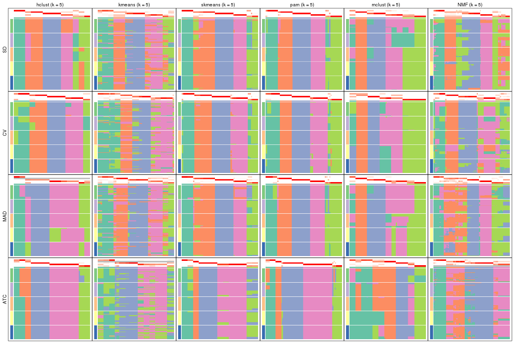</p>

</div>
<div id='tab-collect-membership-heatmap-5'>
<pre><code class="r">collect_plots(res_list, k = 6, fun = membership_heatmap, mc.cores = 4)
</code></pre>

<p></p>

</div>
</div>


### Signature heatmap

Signature heatmaps for all methods. ([What is a signature heatmap?](http://bioconductor.org/packages/devel/bioc/vignettes/cola/inst/doc/cola.html#toc_22))


Note in following heatmaps, rows are scaled.


<script>
$( function() {
	$( '#tabs-collect-get-signatures' ).tabs();
} );
</script>
<div id='tabs-collect-get-signatures'>
<ul>
<li><a href='#tab-collect-get-signatures-1'>k = 2</a></li>
<li><a href='#tab-collect-get-signatures-2'>k = 3</a></li>
<li><a href='#tab-collect-get-signatures-3'>k = 4</a></li>
<li><a href='#tab-collect-get-signatures-4'>k = 5</a></li>
<li><a href='#tab-collect-get-signatures-5'>k = 6</a></li>
</ul>
<div id='tab-collect-get-signatures-1'>
<pre><code class="r">collect_plots(res_list, k = 2, fun = get_signatures, mc.cores = 4)
</code></pre>

<p></p>

</div>
<div id='tab-collect-get-signatures-2'>
<pre><code class="r">collect_plots(res_list, k = 3, fun = get_signatures, mc.cores = 4)
</code></pre>

<p></p>

</div>
<div id='tab-collect-get-signatures-3'>
<pre><code class="r">collect_plots(res_list, k = 4, fun = get_signatures, mc.cores = 4)
</code></pre>

<p></p>

</div>
<div id='tab-collect-get-signatures-4'>
<pre><code class="r">collect_plots(res_list, k = 5, fun = get_signatures, mc.cores = 4)
</code></pre>

<p></p>

</div>
<div id='tab-collect-get-signatures-5'>
<pre><code class="r">collect_plots(res_list, k = 6, fun = get_signatures, mc.cores = 4)
</code></pre>

<p></p>

</div>
</div>


### Statistics table

The statistics used for measuring the stability of consensus partitioning.
([How are they
defined?](http://bioconductor.org/packages/devel/bioc/vignettes/cola/inst/doc/cola.html#toc_13))


<script>
$( function() {
	$( '#tabs-get-stats-from-consensus-partition-list' ).tabs();
} );
</script>
<div id='tabs-get-stats-from-consensus-partition-list'>
<ul>
<li><a href='#tab-get-stats-from-consensus-partition-list-1'>k = 2</a></li>
<li><a href='#tab-get-stats-from-consensus-partition-list-2'>k = 3</a></li>
<li><a href='#tab-get-stats-from-consensus-partition-list-3'>k = 4</a></li>
<li><a href='#tab-get-stats-from-consensus-partition-list-4'>k = 5</a></li>
<li><a href='#tab-get-stats-from-consensus-partition-list-5'>k = 6</a></li>
</ul>
<div id='tab-get-stats-from-consensus-partition-list-1'>
<pre><code class="r">get_stats(res_list, k = 2)
</code></pre>

<pre><code>#&gt;             k 1-PAC mean_silhouette concordance area_increased  Rand Jaccard
#&gt; SD:NMF      2 1.000           1.000       1.000          0.498 0.502   0.502
#&gt; CV:NMF      2 0.819           0.965       0.981          0.498 0.502   0.502
#&gt; MAD:NMF     2 0.910           0.953       0.978          0.499 0.502   0.502
#&gt; ATC:NMF     2 1.000           1.000       1.000          0.498 0.502   0.502
#&gt; SD:skmeans  2 1.000           1.000       1.000          0.498 0.502   0.502
#&gt; CV:skmeans  2 1.000           1.000       1.000          0.498 0.502   0.502
#&gt; MAD:skmeans 2 1.000           1.000       1.000          0.498 0.502   0.502
#&gt; ATC:skmeans 2 1.000           0.993       0.996          0.499 0.502   0.502
#&gt; SD:mclust   2 1.000           0.999       0.998          0.368 0.633   0.633
#&gt; CV:mclust   2 0.521           0.917       0.924          0.281 0.740   0.740
#&gt; MAD:mclust  2 1.000           1.000       1.000          0.368 0.633   0.633
#&gt; ATC:mclust  2 1.000           0.977       0.992          0.376 0.633   0.633
#&gt; SD:kmeans   2 0.530           0.928       0.941          0.493 0.502   0.502
#&gt; CV:kmeans   2 0.463           0.866       0.899          0.495 0.502   0.502
#&gt; MAD:kmeans  2 1.000           0.982       0.984          0.494 0.502   0.502
#&gt; ATC:kmeans  2 1.000           1.000       1.000          0.498 0.502   0.502
#&gt; SD:pam      2 0.762           0.882       0.949          0.487 0.515   0.515
#&gt; CV:pam      2 0.386           0.722       0.871          0.452 0.508   0.508
#&gt; MAD:pam     2 0.760           0.897       0.957          0.483 0.518   0.518
#&gt; ATC:pam     2 1.000           0.964       0.986          0.500 0.502   0.502
#&gt; SD:hclust   2 0.386           0.639       0.813          0.460 0.526   0.526
#&gt; CV:hclust   2 1.000           1.000       1.000          0.498 0.502   0.502
#&gt; MAD:hclust  2 0.375           0.783       0.878          0.478 0.502   0.502
#&gt; ATC:hclust  2 0.858           0.934       0.970          0.490 0.502   0.502
</code></pre>

</div>
<div id='tab-get-stats-from-consensus-partition-list-2'>
<pre><code class="r">get_stats(res_list, k = 3)
</code></pre>

<pre><code>#&gt;             k 1-PAC mean_silhouette concordance area_increased  Rand Jaccard
#&gt; SD:NMF      3 0.962           0.936       0.970          0.273 0.857   0.716
#&gt; CV:NMF      3 0.842           0.868       0.926          0.258 0.874   0.749
#&gt; MAD:NMF     3 0.811           0.903       0.930          0.264 0.857   0.716
#&gt; ATC:NMF     3 0.853           0.935       0.936          0.234 0.868   0.736
#&gt; SD:skmeans  3 0.765           0.817       0.901          0.300 0.862   0.725
#&gt; CV:skmeans  3 0.944           0.943       0.969          0.291 0.855   0.712
#&gt; MAD:skmeans 3 0.961           0.949       0.972          0.269 0.862   0.725
#&gt; ATC:skmeans 3 1.000           0.999       0.997          0.232 0.883   0.768
#&gt; SD:mclust   3 1.000           1.000       1.000          0.506 0.814   0.706
#&gt; CV:mclust   3 0.869           0.927       0.966          0.858 0.707   0.604
#&gt; MAD:mclust  3 1.000           1.000       1.000          0.504 0.814   0.706
#&gt; ATC:mclust  3 0.710           0.759       0.897          0.634 0.722   0.561
#&gt; SD:kmeans   3 0.631           0.784       0.841          0.303 0.862   0.725
#&gt; CV:kmeans   3 0.553           0.516       0.725          0.290 0.674   0.445
#&gt; MAD:kmeans  3 0.606           0.727       0.840          0.299 0.883   0.768
#&gt; ATC:kmeans  3 0.654           0.809       0.890          0.256 0.802   0.622
#&gt; SD:pam      3 0.870           0.874       0.948          0.358 0.683   0.460
#&gt; CV:pam      3 1.000           0.989       0.995          0.435 0.652   0.425
#&gt; MAD:pam     3 0.718           0.852       0.923          0.368 0.704   0.485
#&gt; ATC:pam     3 1.000           0.988       0.995          0.319 0.781   0.588
#&gt; SD:hclust   3 0.621           0.515       0.712          0.406 0.859   0.732
#&gt; CV:hclust   3 1.000           1.000       1.000          0.290 0.855   0.712
#&gt; MAD:hclust  3 0.623           0.810       0.869          0.302 0.883   0.768
#&gt; ATC:hclust  3 0.918           0.927       0.966          0.281 0.883   0.768
</code></pre>

</div>
<div id='tab-get-stats-from-consensus-partition-list-3'>
<pre><code class="r">get_stats(res_list, k = 4)
</code></pre>

<pre><code>#&gt;             k 1-PAC mean_silhouette concordance area_increased  Rand Jaccard
#&gt; SD:NMF      4 0.672           0.566       0.687         0.1422 0.823   0.550
#&gt; CV:NMF      4 0.709           0.802       0.864         0.1627 0.794   0.510
#&gt; MAD:NMF     4 0.634           0.656       0.762         0.1469 0.940   0.836
#&gt; ATC:NMF     4 0.773           0.791       0.826         0.1356 0.879   0.678
#&gt; SD:skmeans  4 0.845           0.935       0.927         0.1306 0.901   0.728
#&gt; CV:skmeans  4 0.940           0.928       0.959         0.1613 0.894   0.704
#&gt; MAD:skmeans 4 0.780           0.888       0.903         0.1461 0.899   0.722
#&gt; ATC:skmeans 4 1.000           0.985       0.980         0.0982 0.941   0.848
#&gt; SD:mclust   4 0.861           0.909       0.939         0.2980 0.816   0.589
#&gt; CV:mclust   4 0.766           0.848       0.907         0.4056 0.816   0.589
#&gt; MAD:mclust  4 0.861           0.877       0.923         0.2888 0.816   0.589
#&gt; ATC:mclust  4 0.663           0.802       0.860         0.1589 0.827   0.571
#&gt; SD:kmeans   4 0.620           0.717       0.708         0.1082 0.951   0.866
#&gt; CV:kmeans   4 0.722           0.886       0.863         0.1269 0.894   0.704
#&gt; MAD:kmeans  4 0.613           0.689       0.721         0.1192 0.822   0.570
#&gt; ATC:kmeans  4 0.647           0.748       0.796         0.1083 0.977   0.935
#&gt; SD:pam      4 0.783           0.795       0.898         0.1197 0.798   0.497
#&gt; CV:pam      4 1.000           0.974       0.988         0.1303 0.785   0.485
#&gt; MAD:pam     4 0.765           0.865       0.923         0.1204 0.853   0.603
#&gt; ATC:pam     4 0.978           0.946       0.962         0.0315 0.920   0.784
#&gt; SD:hclust   4 0.776           0.755       0.836         0.1057 0.905   0.754
#&gt; CV:hclust   4 1.000           0.992       0.994         0.1629 0.894   0.704
#&gt; MAD:hclust  4 0.812           0.860       0.893         0.1427 0.883   0.704
#&gt; ATC:hclust  4 0.978           0.957       0.971         0.0734 0.941   0.848
</code></pre>

</div>
<div id='tab-get-stats-from-consensus-partition-list-4'>
<pre><code class="r">get_stats(res_list, k = 5)
</code></pre>

<pre><code>#&gt;             k 1-PAC mean_silhouette concordance area_increased  Rand Jaccard
#&gt; SD:NMF      5 0.775           0.591       0.736         0.0825 0.851   0.509
#&gt; CV:NMF      5 0.747           0.647       0.753         0.0769 0.886   0.605
#&gt; MAD:NMF     5 0.654           0.685       0.782         0.0787 0.845   0.548
#&gt; ATC:NMF     5 0.711           0.657       0.799         0.0347 0.933   0.777
#&gt; SD:skmeans  5 0.894           0.886       0.921         0.0718 0.927   0.735
#&gt; CV:skmeans  5 0.956           0.890       0.950         0.0554 0.939   0.764
#&gt; MAD:skmeans 5 0.887           0.918       0.928         0.0742 0.918   0.707
#&gt; ATC:skmeans 5 0.845           0.951       0.892         0.0750 0.927   0.777
#&gt; SD:mclust   5 0.777           0.818       0.859         0.0606 0.965   0.869
#&gt; CV:mclust   5 0.864           0.923       0.881         0.0456 0.973   0.898
#&gt; MAD:mclust  5 0.768           0.785       0.879         0.0595 0.911   0.693
#&gt; ATC:mclust  5 0.718           0.790       0.836         0.0489 0.892   0.653
#&gt; SD:kmeans   5 0.694           0.745       0.787         0.0818 0.867   0.596
#&gt; CV:kmeans   5 0.706           0.711       0.803         0.0662 0.989   0.958
#&gt; MAD:kmeans  5 0.689           0.751       0.793         0.0675 0.889   0.617
#&gt; ATC:kmeans  5 0.641           0.660       0.698         0.0652 0.921   0.775
#&gt; SD:pam      5 0.937           0.887       0.954         0.0754 0.879   0.585
#&gt; CV:pam      5 0.922           0.918       0.957         0.0873 0.866   0.557
#&gt; MAD:pam     5 0.942           0.914       0.959         0.0752 0.876   0.578
#&gt; ATC:pam     5 0.966           0.919       0.962         0.0787 0.932   0.791
#&gt; SD:hclust   5 0.825           0.776       0.862         0.0906 0.869   0.584
#&gt; CV:hclust   5 0.921           0.908       0.916         0.0530 0.962   0.847
#&gt; MAD:hclust  5 0.800           0.740       0.832         0.0663 1.000   1.000
#&gt; ATC:hclust  5 0.966           0.944       0.963         0.1042 0.927   0.777
</code></pre>

</div>
<div id='tab-get-stats-from-consensus-partition-list-5'>
<pre><code class="r">get_stats(res_list, k = 6)
</code></pre>

<pre><code>#&gt;             k 1-PAC mean_silhouette concordance area_increased  Rand Jaccard
#&gt; SD:NMF      6 0.887           0.928       0.921         0.0394 0.935   0.709
#&gt; CV:NMF      6 0.986           0.940       0.969         0.0519 0.926   0.673
#&gt; MAD:NMF     6 0.860           0.889       0.881         0.0358 0.899   0.588
#&gt; ATC:NMF     6 0.752           0.919       0.819         0.0795 0.867   0.539
#&gt; SD:skmeans  6 0.931           0.860       0.914         0.0404 0.968   0.849
#&gt; CV:skmeans  6 0.939           0.900       0.937         0.0408 0.921   0.660
#&gt; MAD:skmeans 6 0.888           0.874       0.905         0.0421 0.954   0.790
#&gt; ATC:skmeans 6 0.834           0.848       0.852         0.0698 1.000   1.000
#&gt; SD:mclust   6 0.801           0.777       0.792         0.0539 0.965   0.847
#&gt; CV:mclust   6 0.924           0.915       0.954         0.0498 0.965   0.854
#&gt; MAD:mclust  6 0.823           0.839       0.841         0.0577 0.934   0.723
#&gt; ATC:mclust  6 0.765           0.811       0.860         0.0683 0.965   0.852
#&gt; SD:kmeans   6 0.724           0.685       0.761         0.0419 0.987   0.935
#&gt; CV:kmeans   6 0.774           0.788       0.795         0.0456 0.933   0.736
#&gt; MAD:kmeans  6 0.723           0.700       0.756         0.0431 0.964   0.837
#&gt; ATC:kmeans  6 0.726           0.681       0.735         0.0508 0.903   0.678
#&gt; SD:pam      6 0.891           0.856       0.914         0.0332 0.957   0.794
#&gt; CV:pam      6 0.954           0.929       0.965         0.0328 0.963   0.821
#&gt; MAD:pam     6 0.946           0.893       0.948         0.0286 0.975   0.879
#&gt; ATC:pam     6 0.903           0.891       0.932         0.0308 0.975   0.909
#&gt; SD:hclust   6 0.918           0.865       0.919         0.0533 0.930   0.695
#&gt; CV:hclust   6 0.972           0.950       0.971         0.0353 0.949   0.771
#&gt; MAD:hclust  6 0.872           0.911       0.909         0.0613 0.892   0.630
#&gt; ATC:hclust  6 0.930           0.962       0.962         0.0244 0.989   0.957
</code></pre>

</div>
</div>

Following heatmap plots the partition for each combination of methods and the
lightness correspond to the silhouette scores for samples in each method. On
top the consensus subgroup is inferred from all methods by taking the mean
silhouette scores as weight.


<script>
$( function() {
	$( '#tabs-collect-stats-from-consensus-partition-list' ).tabs();
} );
</script>
<div id='tabs-collect-stats-from-consensus-partition-list'>
<ul>
<li><a href='#tab-collect-stats-from-consensus-partition-list-1'>k = 2</a></li>
<li><a href='#tab-collect-stats-from-consensus-partition-list-2'>k = 3</a></li>
<li><a href='#tab-collect-stats-from-consensus-partition-list-3'>k = 4</a></li>
<li><a href='#tab-collect-stats-from-consensus-partition-list-4'>k = 5</a></li>
<li><a href='#tab-collect-stats-from-consensus-partition-list-5'>k = 6</a></li>
</ul>
<div id='tab-collect-stats-from-consensus-partition-list-1'>
<pre><code class="r">collect_stats(res_list, k = 2)
</code></pre>

<p></p>

</div>
<div id='tab-collect-stats-from-consensus-partition-list-2'>
<pre><code class="r">collect_stats(res_list, k = 3)
</code></pre>

<p></p>

</div>
<div id='tab-collect-stats-from-consensus-partition-list-3'>
<pre><code class="r">collect_stats(res_list, k = 4)
</code></pre>

<p></p>

</div>
<div id='tab-collect-stats-from-consensus-partition-list-4'>
<pre><code class="r">collect_stats(res_list, k = 5)
</code></pre>

<p></p>

</div>
<div id='tab-collect-stats-from-consensus-partition-list-5'>
<pre><code class="r">collect_stats(res_list, k = 6)
</code></pre>

<p></p>

</div>
</div>

### Partition from all methods


Collect partitions from all methods:


<script>
$( function() {
	$( '#tabs-collect-classes-from-consensus-partition-list' ).tabs();
} );
</script>
<div id='tabs-collect-classes-from-consensus-partition-list'>
<ul>
<li><a href='#tab-collect-classes-from-consensus-partition-list-1'>k = 2</a></li>
<li><a href='#tab-collect-classes-from-consensus-partition-list-2'>k = 3</a></li>
<li><a href='#tab-collect-classes-from-consensus-partition-list-3'>k = 4</a></li>
<li><a href='#tab-collect-classes-from-consensus-partition-list-4'>k = 5</a></li>
<li><a href='#tab-collect-classes-from-consensus-partition-list-5'>k = 6</a></li>
</ul>
<div id='tab-collect-classes-from-consensus-partition-list-1'>
<pre><code class="r">collect_classes(res_list, k = 2)
</code></pre>

<p></p>

</div>
<div id='tab-collect-classes-from-consensus-partition-list-2'>
<pre><code class="r">collect_classes(res_list, k = 3)
</code></pre>

<p></p>

</div>
<div id='tab-collect-classes-from-consensus-partition-list-3'>
<pre><code class="r">collect_classes(res_list, k = 4)
</code></pre>

<p></p>

</div>
<div id='tab-collect-classes-from-consensus-partition-list-4'>
<pre><code class="r">collect_classes(res_list, k = 5)
</code></pre>

<p></p>

</div>
<div id='tab-collect-classes-from-consensus-partition-list-5'>
<pre><code class="r">collect_classes(res_list, k = 6)
</code></pre>

<p></p>

</div>
</div>


### Top rows overlap


Overlap of top rows from different top-row methods:


<script>
$( function() {
	$( '#tabs-top-rows-overlap-by-euler' ).tabs();
} );
</script>
<div id='tabs-top-rows-overlap-by-euler'>
<ul>
<li><a href='#tab-top-rows-overlap-by-euler-1'>top_n = 1000</a></li>
<li><a href='#tab-top-rows-overlap-by-euler-2'>top_n = 2000</a></li>
<li><a href='#tab-top-rows-overlap-by-euler-3'>top_n = 3000</a></li>
<li><a href='#tab-top-rows-overlap-by-euler-4'>top_n = 4000</a></li>
<li><a href='#tab-top-rows-overlap-by-euler-5'>top_n = 5000</a></li>
</ul>
<div id='tab-top-rows-overlap-by-euler-1'>
<pre><code class="r">top_rows_overlap(res_list, top_n = 1000, method = &quot;euler&quot;)
</code></pre>

<p></p>

</div>
<div id='tab-top-rows-overlap-by-euler-2'>
<pre><code class="r">top_rows_overlap(res_list, top_n = 2000, method = &quot;euler&quot;)
</code></pre>

<p></p>

</div>
<div id='tab-top-rows-overlap-by-euler-3'>
<pre><code class="r">top_rows_overlap(res_list, top_n = 3000, method = &quot;euler&quot;)
</code></pre>

<p>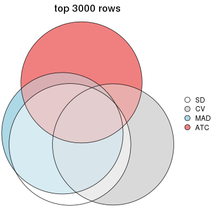</p>

</div>
<div id='tab-top-rows-overlap-by-euler-4'>
<pre><code class="r">top_rows_overlap(res_list, top_n = 4000, method = &quot;euler&quot;)
</code></pre>

<p>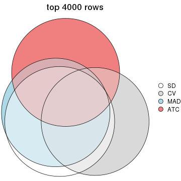</p>

</div>
<div id='tab-top-rows-overlap-by-euler-5'>
<pre><code class="r">top_rows_overlap(res_list, top_n = 5000, method = &quot;euler&quot;)
</code></pre>

<p></p>

</div>
</div>

Also visualize the correspondance of rankings between different top-row methods:


<script>
$( function() {
	$( '#tabs-top-rows-overlap-by-correspondance' ).tabs();
} );
</script>
<div id='tabs-top-rows-overlap-by-correspondance'>
<ul>
<li><a href='#tab-top-rows-overlap-by-correspondance-1'>top_n = 1000</a></li>
<li><a href='#tab-top-rows-overlap-by-correspondance-2'>top_n = 2000</a></li>
<li><a href='#tab-top-rows-overlap-by-correspondance-3'>top_n = 3000</a></li>
<li><a href='#tab-top-rows-overlap-by-correspondance-4'>top_n = 4000</a></li>
<li><a href='#tab-top-rows-overlap-by-correspondance-5'>top_n = 5000</a></li>
</ul>
<div id='tab-top-rows-overlap-by-correspondance-1'>
<pre><code class="r">top_rows_overlap(res_list, top_n = 1000, method = &quot;correspondance&quot;)
</code></pre>

<p></p>

</div>
<div id='tab-top-rows-overlap-by-correspondance-2'>
<pre><code class="r">top_rows_overlap(res_list, top_n = 2000, method = &quot;correspondance&quot;)
</code></pre>

<p></p>

</div>
<div id='tab-top-rows-overlap-by-correspondance-3'>
<pre><code class="r">top_rows_overlap(res_list, top_n = 3000, method = &quot;correspondance&quot;)
</code></pre>

<p>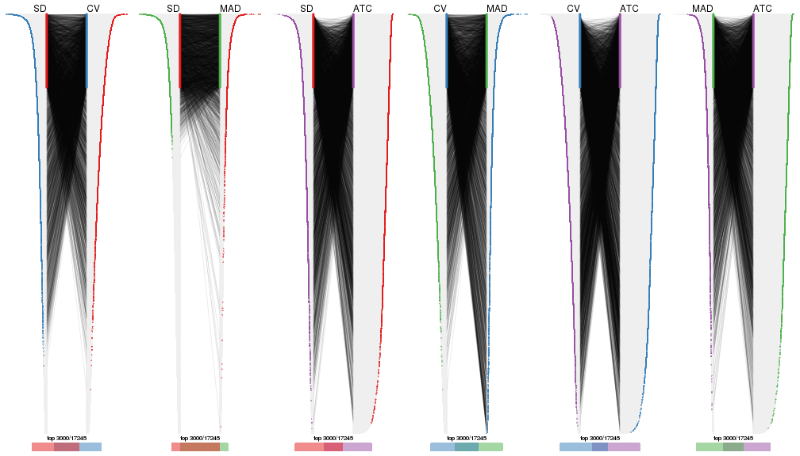</p>

</div>
<div id='tab-top-rows-overlap-by-correspondance-4'>
<pre><code class="r">top_rows_overlap(res_list, top_n = 4000, method = &quot;correspondance&quot;)
</code></pre>

<p></p>

</div>
<div id='tab-top-rows-overlap-by-correspondance-5'>
<pre><code class="r">top_rows_overlap(res_list, top_n = 5000, method = &quot;correspondance&quot;)
</code></pre>

<p></p>

</div>
</div>


Heatmaps of the top rows:


<script>
$( function() {
	$( '#tabs-top-rows-heatmap' ).tabs();
} );
</script>
<div id='tabs-top-rows-heatmap'>
<ul>
<li><a href='#tab-top-rows-heatmap-1'>top_n = 1000</a></li>
<li><a href='#tab-top-rows-heatmap-2'>top_n = 2000</a></li>
<li><a href='#tab-top-rows-heatmap-3'>top_n = 3000</a></li>
<li><a href='#tab-top-rows-heatmap-4'>top_n = 4000</a></li>
<li><a href='#tab-top-rows-heatmap-5'>top_n = 5000</a></li>
</ul>
<div id='tab-top-rows-heatmap-1'>
<pre><code class="r">top_rows_heatmap(res_list, top_n = 1000)
</code></pre>

<p></p>

</div>
<div id='tab-top-rows-heatmap-2'>
<pre><code class="r">top_rows_heatmap(res_list, top_n = 2000)
</code></pre>

<p></p>

</div>
<div id='tab-top-rows-heatmap-3'>
<pre><code class="r">top_rows_heatmap(res_list, top_n = 3000)
</code></pre>

<p></p>

</div>
<div id='tab-top-rows-heatmap-4'>
<pre><code class="r">top_rows_heatmap(res_list, top_n = 4000)
</code></pre>

<p></p>

</div>
<div id='tab-top-rows-heatmap-5'>
<pre><code class="r">top_rows_heatmap(res_list, top_n = 5000)
</code></pre>

<p></p>

</div>
</div>


 
## Results for each method


---------------------------------------------------


### SD:hclust*


The object with results only for a single top-value method and a single partition method 
can be extracted as:

```r
res = res_list["SD", "hclust"]
# you can also extract it by
# res = res_list["SD:hclust"]
```

A summary of `res` and all the functions that can be applied to it:

```r
res
```

```
#> A 'ConsensusPartition' object with k = 2, 3, 4, 5, 6.
#>   On a matrix with 17245 rows and 418 columns.
#>   Top rows (1000, 2000, 3000, 4000, 5000) are extracted by 'SD' method.
#>   Subgroups are detected by 'hclust' method.
#>   Performed in total 1250 partitions by row resampling.
#>   Best k for subgroups seems to be 6.
#> 
#> Following methods can be applied to this 'ConsensusPartition' object:
#>  [1] "cola_report"             "collect_classes"         "collect_plots"          
#>  [4] "collect_stats"           "colnames"                "compare_signatures"     
#>  [7] "consensus_heatmap"       "dimension_reduction"     "functional_enrichment"  
#> [10] "get_anno_col"            "get_anno"                "get_classes"            
#> [13] "get_consensus"           "get_matrix"              "get_membership"         
#> [16] "get_param"               "get_signatures"          "get_stats"              
#> [19] "is_best_k"               "is_stable_k"             "membership_heatmap"     
#> [22] "ncol"                    "nrow"                    "plot_ecdf"              
#> [25] "rownames"                "select_partition_number" "show"                   
#> [28] "suggest_best_k"          "test_to_known_factors"
```

`collect_plots()` function collects all the plots made from `res` for all `k` (number of partitions)
into one single page to provide an easy and fast comparison between different `k`.

```r
collect_plots(res)
```


The plots are:

- The first row: a plot of the ECDF (Empirical cumulative distribution
  function) curves of the consensus matrix for each `k` and the heatmap of
  predicted classes for each `k`.
- The second row: heatmaps of the consensus matrix for each `k`.
- The third row: heatmaps of the membership matrix for each `k`.
- The fouth row: heatmaps of the signatures for each `k`.

All the plots in panels can be made by individual functions and they are
plotted later in this section.

`select_partition_number()` produces several plots showing different
statistics for choosing "optimized" `k`. There are following statistics:

- ECDF curves of the consensus matrix for each `k`;
- 1-PAC. [The PAC
  score](https://en.wikipedia.org/wiki/Consensus_clustering#Over-interpretation_potential_of_consensus_clustering)
  measures the proportion of the ambiguous subgrouping.
- Mean silhouette score.
- Concordance. The mean probability of fiting the consensus class ids in all
  partitions.
- Area increased. Denote $A_k$ as the area under the ECDF curve for current
  `k`, the area increased is defined as $A_k - A_{k-1}$.
- Rand index. The percent of pairs of samples that are both in a same cluster
  or both are not in a same cluster in the partition of k and k-1.
- Jaccard index. The ratio of pairs of samples are both in a same cluster in
  the partition of k and k-1 and the pairs of samples are both in a same
  cluster in the partition k or k-1.

The detailed explanations of these statistics can be found in [the cola
vignette](http://bioconductor.org/packages/devel/bioc/vignettes/cola/inst/doc/cola.html#toc_13).

Generally speaking, lower PAC score, higher mean silhouette score or higher
concordance corresponds to better partition. Rand index and Jaccard index
measure how similar the current partition is compared to partition with `k-1`.
If they are too similar, we won't accept `k` is better than `k-1`.

```r
select_partition_number(res)
```


The numeric values for all these statistics can be obtained by `get_stats()`.

```r
get_stats(res)
```

```
#>   k 1-PAC mean_silhouette concordance area_increased  Rand Jaccard
#> 2 2 0.386           0.639       0.813         0.4599 0.526   0.526
#> 3 3 0.621           0.515       0.712         0.4064 0.859   0.732
#> 4 4 0.776           0.755       0.836         0.1057 0.905   0.754
#> 5 5 0.825           0.776       0.862         0.0906 0.869   0.584
#> 6 6 0.918           0.865       0.919         0.0533 0.930   0.695
```

`suggest_best_k()` suggests the best $k$ based on these statistics. The rules are as follows:

- All $k$ with Jaccard index larger than 0.95 are removed because the increase of
  the partition number does not provides enough extra information. If all $k$ are removed,
  the best $k$ is assigned by `NA`.
- For $k$ with 1-PAC larger than 0.9, the maximal $k$ is taken as the "best k". Other $k$ is called "optional k".
- If it does not fit the second rule. The $k$ with the highest vote of highest
  1-PAC, mean silhouette and concordance is taken as the "best k".

```r
suggest_best_k(res)
```

```
#> [1] 6
```


Following shows the table of the partitions (You need to click the **show/hide
code output** link to see it). The membership matrix (columns with name `p*`)
is inferred by
[`clue::cl_consensus()`](https://www.rdocumentation.org/link/cl_consensus?package=clue)
function with the `SE` method. Basically the value in the membership matrix
represents the probability to belong to a certain group. The finall class
label for an item is determined with the group with highest probability it
belongs to.

In `get_classes()` function, the entropy is calculated from the membership
matrix and the silhouette score is calculated from the consensus matrix.


<script>
$( function() {
	$( '#tabs-SD-hclust-get-classes' ).tabs();
} );
</script>
<div id='tabs-SD-hclust-get-classes'>
<ul>
<li><a href='#tab-SD-hclust-get-classes-1'>k = 2</a></li>
<li><a href='#tab-SD-hclust-get-classes-2'>k = 3</a></li>
<li><a href='#tab-SD-hclust-get-classes-3'>k = 4</a></li>
<li><a href='#tab-SD-hclust-get-classes-4'>k = 5</a></li>
<li><a href='#tab-SD-hclust-get-classes-5'>k = 6</a></li>
</ul>

<div id='tab-SD-hclust-get-classes-1'>
<p><a id='tab-SD-hclust-get-classes-1-a' style='color:#0366d6' href='#'>show/hide code output</a></p>
<pre><code class="r">cbind(get_classes(res, k = 2), get_membership(res, k = 2))
</code></pre>

<pre><code>#&gt;           class entropy silhouette    p1    p2
#&gt; SRR902920     1   0.000      0.757 1.000 0.000
#&gt; SRR902921     1   0.000      0.757 1.000 0.000
#&gt; SRR902922     1   0.000      0.757 1.000 0.000
#&gt; SRR902923     1   0.000      0.757 1.000 0.000
#&gt; SRR902924     1   0.000      0.757 1.000 0.000
#&gt; SRR902925     1   0.000      0.757 1.000 0.000
#&gt; SRR902926     1   0.000      0.757 1.000 0.000
#&gt; SRR902927     1   0.000      0.757 1.000 0.000
#&gt; SRR902928     1   0.000      0.757 1.000 0.000
#&gt; SRR902929     1   0.000      0.757 1.000 0.000
#&gt; SRR902930     1   0.000      0.757 1.000 0.000
#&gt; SRR902931     1   0.000      0.757 1.000 0.000
#&gt; SRR902932     2   0.971      0.695 0.400 0.600
#&gt; SRR902933     2   0.971      0.695 0.400 0.600
#&gt; SRR902934     2   0.971      0.695 0.400 0.600
#&gt; SRR902935     2   0.971      0.695 0.400 0.600
#&gt; SRR902936     2   0.971      0.695 0.400 0.600
#&gt; SRR902937     2   0.971      0.695 0.400 0.600
#&gt; SRR902938     2   0.971      0.695 0.400 0.600
#&gt; SRR902939     2   0.971      0.695 0.400 0.600
#&gt; SRR902940     2   0.971      0.695 0.400 0.600
#&gt; SRR902941     2   0.971      0.695 0.400 0.600
#&gt; SRR902942     1   0.000      0.757 1.000 0.000
#&gt; SRR902943     1   0.000      0.757 1.000 0.000
#&gt; SRR902944     1   0.000      0.757 1.000 0.000
#&gt; SRR902945     1   0.000      0.757 1.000 0.000
#&gt; SRR902946     1   0.000      0.757 1.000 0.000
#&gt; SRR902947     1   0.000      0.757 1.000 0.000
#&gt; SRR902954     1   0.000      0.757 1.000 0.000
#&gt; SRR902955     1   0.000      0.757 1.000 0.000
#&gt; SRR902956     1   0.000      0.757 1.000 0.000
#&gt; SRR902957     1   0.000      0.757 1.000 0.000
#&gt; SRR902958     1   0.000      0.757 1.000 0.000
#&gt; SRR902959     1   0.000      0.757 1.000 0.000
#&gt; SRR902948     1   0.000      0.757 1.000 0.000
#&gt; SRR902949     1   0.000      0.757 1.000 0.000
#&gt; SRR902950     1   0.000      0.757 1.000 0.000
#&gt; SRR902951     1   0.000      0.757 1.000 0.000
#&gt; SRR902952     1   0.000      0.757 1.000 0.000
#&gt; SRR902953     1   0.000      0.757 1.000 0.000
#&gt; SRR902960     1   0.000      0.757 1.000 0.000
#&gt; SRR902961     1   0.000      0.757 1.000 0.000
#&gt; SRR902962     1   0.000      0.757 1.000 0.000
#&gt; SRR902963     1   0.000      0.757 1.000 0.000
#&gt; SRR902964     1   0.000      0.757 1.000 0.000
#&gt; SRR902965     1   0.000      0.757 1.000 0.000
#&gt; SRR902966     1   0.000      0.757 1.000 0.000
#&gt; SRR902967     1   0.000      0.757 1.000 0.000
#&gt; SRR902968     1   0.000      0.757 1.000 0.000
#&gt; SRR902969     1   0.000      0.757 1.000 0.000
#&gt; SRR902970     1   0.000      0.757 1.000 0.000
#&gt; SRR902971     1   0.000      0.757 1.000 0.000
#&gt; SRR902972     1   0.000      0.757 1.000 0.000
#&gt; SRR902973     1   0.000      0.757 1.000 0.000
#&gt; SRR902974     1   0.000      0.757 1.000 0.000
#&gt; SRR902975     1   0.000      0.757 1.000 0.000
#&gt; SRR902976     1   0.000      0.757 1.000 0.000
#&gt; SRR902977     1   0.000      0.757 1.000 0.000
#&gt; SRR902978     1   0.000      0.757 1.000 0.000
#&gt; SRR902980     1   0.000      0.757 1.000 0.000
#&gt; SRR902981     1   0.000      0.757 1.000 0.000
#&gt; SRR902982     1   0.000      0.757 1.000 0.000
#&gt; SRR902983     1   0.000      0.757 1.000 0.000
#&gt; SRR902984     1   0.000      0.757 1.000 0.000
#&gt; SRR902985     1   0.000      0.757 1.000 0.000
#&gt; SRR902986     1   0.000      0.757 1.000 0.000
#&gt; SRR902987     1   0.000      0.757 1.000 0.000
#&gt; SRR902988     1   0.000      0.757 1.000 0.000
#&gt; SRR902989     1   0.000      0.757 1.000 0.000
#&gt; SRR902990     1   0.000      0.757 1.000 0.000
#&gt; SRR902991     1   0.000      0.757 1.000 0.000
#&gt; SRR902992     1   0.000      0.757 1.000 0.000
#&gt; SRR902993     1   0.000      0.757 1.000 0.000
#&gt; SRR902994     1   0.000      0.757 1.000 0.000
#&gt; SRR902995     1   0.000      0.757 1.000 0.000
#&gt; SRR902996     2   0.971      0.695 0.400 0.600
#&gt; SRR902997     2   0.971      0.695 0.400 0.600
#&gt; SRR902998     2   0.971      0.695 0.400 0.600
#&gt; SRR902999     2   0.971      0.695 0.400 0.600
#&gt; SRR903000     2   0.971      0.695 0.400 0.600
#&gt; SRR903001     2   0.971      0.695 0.400 0.600
#&gt; SRR903008     2   0.971      0.695 0.400 0.600
#&gt; SRR903009     2   0.971      0.695 0.400 0.600
#&gt; SRR903010     2   0.971      0.695 0.400 0.600
#&gt; SRR903011     2   0.971      0.695 0.400 0.600
#&gt; SRR903012     2   0.971      0.695 0.400 0.600
#&gt; SRR903013     2   0.971      0.695 0.400 0.600
#&gt; SRR903002     2   0.971      0.695 0.400 0.600
#&gt; SRR903003     2   0.971      0.695 0.400 0.600
#&gt; SRR903004     2   0.971      0.695 0.400 0.600
#&gt; SRR903005     2   0.971      0.695 0.400 0.600
#&gt; SRR903006     2   0.971      0.695 0.400 0.600
#&gt; SRR903007     2   0.971      0.695 0.400 0.600
#&gt; SRR903014     1   0.000      0.757 1.000 0.000
#&gt; SRR903015     1   0.000      0.757 1.000 0.000
#&gt; SRR903016     1   0.000      0.757 1.000 0.000
#&gt; SRR903017     1   0.000      0.757 1.000 0.000
#&gt; SRR903018     1   0.000      0.757 1.000 0.000
#&gt; SRR903019     1   0.000      0.757 1.000 0.000
#&gt; SRR903020     1   0.000      0.757 1.000 0.000
#&gt; SRR903021     1   0.000      0.757 1.000 0.000
#&gt; SRR903022     1   0.000      0.757 1.000 0.000
#&gt; SRR903023     1   0.000      0.757 1.000 0.000
#&gt; SRR903024     1   0.000      0.757 1.000 0.000
#&gt; SRR903025     1   0.000      0.757 1.000 0.000
#&gt; SRR903026     1   0.000      0.757 1.000 0.000
#&gt; SRR903027     1   0.000      0.757 1.000 0.000
#&gt; SRR903028     1   0.000      0.757 1.000 0.000
#&gt; SRR903029     1   0.000      0.757 1.000 0.000
#&gt; SRR903030     1   0.000      0.757 1.000 0.000
#&gt; SRR903031     1   0.000      0.757 1.000 0.000
#&gt; SRR903032     2   0.971      0.695 0.400 0.600
#&gt; SRR903033     2   0.971      0.695 0.400 0.600
#&gt; SRR903034     2   0.971      0.695 0.400 0.600
#&gt; SRR903035     2   0.971      0.695 0.400 0.600
#&gt; SRR903036     2   0.971      0.695 0.400 0.600
#&gt; SRR903037     2   0.971      0.695 0.400 0.600
#&gt; SRR903038     2   0.971      0.695 0.400 0.600
#&gt; SRR903039     2   0.971      0.695 0.400 0.600
#&gt; SRR903040     2   0.971      0.695 0.400 0.600
#&gt; SRR903041     2   0.971      0.695 0.400 0.600
#&gt; SRR903042     2   0.971      0.695 0.400 0.600
#&gt; SRR903043     2   0.971      0.695 0.400 0.600
#&gt; SRR903044     2   0.971      0.695 0.400 0.600
#&gt; SRR903045     2   0.971      0.695 0.400 0.600
#&gt; SRR903046     2   0.971      0.695 0.400 0.600
#&gt; SRR903047     2   0.971      0.695 0.400 0.600
#&gt; SRR903048     2   0.971      0.695 0.400 0.600
#&gt; SRR903049     2   0.971      0.695 0.400 0.600
#&gt; SRR903050     1   0.971      0.466 0.600 0.400
#&gt; SRR903051     1   0.971      0.466 0.600 0.400
#&gt; SRR903052     1   0.971      0.466 0.600 0.400
#&gt; SRR903053     1   0.971      0.466 0.600 0.400
#&gt; SRR903054     1   0.971      0.466 0.600 0.400
#&gt; SRR903055     1   0.971      0.466 0.600 0.400
#&gt; SRR903056     1   0.971      0.466 0.600 0.400
#&gt; SRR903057     1   0.971      0.466 0.600 0.400
#&gt; SRR903058     1   0.971      0.466 0.600 0.400
#&gt; SRR903059     1   0.971      0.466 0.600 0.400
#&gt; SRR903060     1   0.971      0.466 0.600 0.400
#&gt; SRR903061     1   0.971      0.466 0.600 0.400
#&gt; SRR903062     1   0.971      0.466 0.600 0.400
#&gt; SRR903063     1   0.971      0.466 0.600 0.400
#&gt; SRR903064     1   0.971      0.466 0.600 0.400
#&gt; SRR903065     1   0.971      0.466 0.600 0.400
#&gt; SRR903066     1   0.971      0.466 0.600 0.400
#&gt; SRR903067     1   0.971      0.466 0.600 0.400
#&gt; SRR903068     1   0.971      0.466 0.600 0.400
#&gt; SRR903069     1   0.971      0.466 0.600 0.400
#&gt; SRR903070     1   0.971      0.466 0.600 0.400
#&gt; SRR903071     1   0.971      0.466 0.600 0.400
#&gt; SRR903072     1   0.971      0.466 0.600 0.400
#&gt; SRR903073     1   0.971      0.466 0.600 0.400
#&gt; SRR903074     1   0.971      0.466 0.600 0.400
#&gt; SRR903075     1   0.971      0.466 0.600 0.400
#&gt; SRR903076     1   0.971      0.466 0.600 0.400
#&gt; SRR903077     1   0.971      0.466 0.600 0.400
#&gt; SRR903078     1   0.971      0.466 0.600 0.400
#&gt; SRR903079     1   0.971      0.466 0.600 0.400
#&gt; SRR903080     1   0.971      0.466 0.600 0.400
#&gt; SRR903081     1   0.971      0.466 0.600 0.400
#&gt; SRR903082     2   0.000      0.631 0.000 1.000
#&gt; SRR903083     2   0.000      0.631 0.000 1.000
#&gt; SRR903084     2   0.000      0.631 0.000 1.000
#&gt; SRR903085     2   0.000      0.631 0.000 1.000
#&gt; SRR903086     2   0.000      0.631 0.000 1.000
#&gt; SRR903087     2   0.000      0.631 0.000 1.000
#&gt; SRR903088     2   0.000      0.631 0.000 1.000
#&gt; SRR903089     2   0.000      0.631 0.000 1.000
#&gt; SRR903090     2   0.000      0.631 0.000 1.000
#&gt; SRR903091     2   0.000      0.631 0.000 1.000
#&gt; SRR903092     2   0.000      0.631 0.000 1.000
#&gt; SRR903093     2   0.000      0.631 0.000 1.000
#&gt; SRR903094     2   0.000      0.631 0.000 1.000
#&gt; SRR903095     2   0.000      0.631 0.000 1.000
#&gt; SRR903096     2   0.000      0.631 0.000 1.000
#&gt; SRR903097     2   0.000      0.631 0.000 1.000
#&gt; SRR903098     2   0.000      0.631 0.000 1.000
#&gt; SRR903099     2   0.000      0.631 0.000 1.000
#&gt; SRR903100     2   0.000      0.631 0.000 1.000
#&gt; SRR903101     2   0.000      0.631 0.000 1.000
#&gt; SRR903102     2   0.000      0.631 0.000 1.000
#&gt; SRR903103     2   0.000      0.631 0.000 1.000
#&gt; SRR903104     2   0.000      0.631 0.000 1.000
#&gt; SRR903105     2   0.000      0.631 0.000 1.000
#&gt; SRR903106     2   0.000      0.631 0.000 1.000
#&gt; SRR903107     2   0.000      0.631 0.000 1.000
#&gt; SRR903108     2   0.000      0.631 0.000 1.000
#&gt; SRR903109     2   0.000      0.631 0.000 1.000
#&gt; SRR903110     2   0.000      0.631 0.000 1.000
#&gt; SRR903111     2   0.000      0.631 0.000 1.000
#&gt; SRR903112     2   0.000      0.631 0.000 1.000
#&gt; SRR903113     2   0.000      0.631 0.000 1.000
#&gt; SRR903114     1   0.975      0.462 0.592 0.408
#&gt; SRR903115     1   0.975      0.462 0.592 0.408
#&gt; SRR903116     1   0.975      0.462 0.592 0.408
#&gt; SRR903117     1   0.975      0.462 0.592 0.408
#&gt; SRR903118     1   0.975      0.462 0.592 0.408
#&gt; SRR903119     1   0.975      0.462 0.592 0.408
#&gt; SRR903121     1   0.975      0.462 0.592 0.408
#&gt; SRR903122     1   0.975      0.462 0.592 0.408
#&gt; SRR903124     1   0.975      0.462 0.592 0.408
#&gt; SRR903125     1   0.975      0.462 0.592 0.408
#&gt; SRR903126     1   0.975      0.462 0.592 0.408
#&gt; SRR903127     1   0.975      0.462 0.592 0.408
#&gt; SRR903128     1   0.975      0.462 0.592 0.408
#&gt; SRR903129     1   0.975      0.462 0.592 0.408
#&gt; SRR903130     1   0.975      0.462 0.592 0.408
#&gt; SRR903131     1   0.975      0.462 0.592 0.408
#&gt; SRR903132     1   0.975      0.462 0.592 0.408
#&gt; SRR903133     1   0.975      0.462 0.592 0.408
#&gt; SRR903134     1   0.975      0.462 0.592 0.408
#&gt; SRR903135     1   0.975      0.462 0.592 0.408
#&gt; SRR903136     1   0.975      0.462 0.592 0.408
#&gt; SRR903137     1   0.975      0.462 0.592 0.408
#&gt; SRR903146     2   0.000      0.631 0.000 1.000
#&gt; SRR903147     2   0.000      0.631 0.000 1.000
#&gt; SRR903148     2   0.000      0.631 0.000 1.000
#&gt; SRR903149     2   0.000      0.631 0.000 1.000
#&gt; SRR903150     2   0.000      0.631 0.000 1.000
#&gt; SRR903151     2   0.000      0.631 0.000 1.000
#&gt; SRR903152     2   0.000      0.631 0.000 1.000
#&gt; SRR903153     2   0.000      0.631 0.000 1.000
#&gt; SRR903138     1   0.975      0.462 0.592 0.408
#&gt; SRR903139     1   0.975      0.462 0.592 0.408
#&gt; SRR903140     1   0.975      0.462 0.592 0.408
#&gt; SRR903141     1   0.975      0.462 0.592 0.408
#&gt; SRR903142     1   0.975      0.462 0.592 0.408
#&gt; SRR903143     1   0.975      0.462 0.592 0.408
#&gt; SRR903144     1   0.975      0.462 0.592 0.408
#&gt; SRR903145     1   0.975      0.462 0.592 0.408
#&gt; SRR903154     2   0.000      0.631 0.000 1.000
#&gt; SRR903155     2   0.000      0.631 0.000 1.000
#&gt; SRR903156     2   0.000      0.631 0.000 1.000
#&gt; SRR903157     2   0.000      0.631 0.000 1.000
#&gt; SRR903158     2   0.000      0.631 0.000 1.000
#&gt; SRR903159     2   0.000      0.631 0.000 1.000
#&gt; SRR903160     2   0.000      0.631 0.000 1.000
#&gt; SRR903161     2   0.000      0.631 0.000 1.000
#&gt; SRR903162     2   0.000      0.631 0.000 1.000
#&gt; SRR903163     2   0.000      0.631 0.000 1.000
#&gt; SRR903164     2   0.000      0.631 0.000 1.000
#&gt; SRR903165     2   0.000      0.631 0.000 1.000
#&gt; SRR903166     2   0.000      0.631 0.000 1.000
#&gt; SRR903167     2   0.000      0.631 0.000 1.000
#&gt; SRR903168     2   0.000      0.631 0.000 1.000
#&gt; SRR903169     2   0.000      0.631 0.000 1.000
#&gt; SRR903178     1   0.000      0.757 1.000 0.000
#&gt; SRR903179     1   0.000      0.757 1.000 0.000
#&gt; SRR903180     1   0.000      0.757 1.000 0.000
#&gt; SRR903181     1   0.000      0.757 1.000 0.000
#&gt; SRR903182     1   0.000      0.757 1.000 0.000
#&gt; SRR903183     1   0.000      0.757 1.000 0.000
#&gt; SRR903184     1   0.000      0.757 1.000 0.000
#&gt; SRR903185     1   0.000      0.757 1.000 0.000
#&gt; SRR903170     2   0.000      0.631 0.000 1.000
#&gt; SRR903171     2   0.000      0.631 0.000 1.000
#&gt; SRR903172     2   0.000      0.631 0.000 1.000
#&gt; SRR903173     2   0.000      0.631 0.000 1.000
#&gt; SRR903174     2   0.000      0.631 0.000 1.000
#&gt; SRR903175     2   0.000      0.631 0.000 1.000
#&gt; SRR903176     2   0.000      0.631 0.000 1.000
#&gt; SRR903177     2   0.000      0.631 0.000 1.000
#&gt; SRR903186     1   0.000      0.757 1.000 0.000
#&gt; SRR903187     1   0.000      0.757 1.000 0.000
#&gt; SRR903188     1   0.000      0.757 1.000 0.000
#&gt; SRR903189     1   0.000      0.757 1.000 0.000
#&gt; SRR903190     1   0.000      0.757 1.000 0.000
#&gt; SRR903191     1   0.000      0.757 1.000 0.000
#&gt; SRR903192     1   0.000      0.757 1.000 0.000
#&gt; SRR903193     1   0.000      0.757 1.000 0.000
#&gt; SRR903194     1   0.000      0.757 1.000 0.000
#&gt; SRR903195     1   0.000      0.757 1.000 0.000
#&gt; SRR903196     1   0.000      0.757 1.000 0.000
#&gt; SRR903197     1   0.000      0.757 1.000 0.000
#&gt; SRR903198     1   0.000      0.757 1.000 0.000
#&gt; SRR903199     1   0.000      0.757 1.000 0.000
#&gt; SRR903200     1   0.000      0.757 1.000 0.000
#&gt; SRR903201     1   0.000      0.757 1.000 0.000
#&gt; SRR903210     2   0.971      0.695 0.400 0.600
#&gt; SRR903211     2   0.971      0.695 0.400 0.600
#&gt; SRR903212     2   0.971      0.695 0.400 0.600
#&gt; SRR903213     2   0.971      0.695 0.400 0.600
#&gt; SRR903214     2   0.971      0.695 0.400 0.600
#&gt; SRR903215     2   0.971      0.695 0.400 0.600
#&gt; SRR903216     2   0.971      0.695 0.400 0.600
#&gt; SRR903217     2   0.971      0.695 0.400 0.600
#&gt; SRR903202     1   0.000      0.757 1.000 0.000
#&gt; SRR903203     1   0.000      0.757 1.000 0.000
#&gt; SRR903204     1   0.000      0.757 1.000 0.000
#&gt; SRR903205     1   0.000      0.757 1.000 0.000
#&gt; SRR903206     1   0.000      0.757 1.000 0.000
#&gt; SRR903207     1   0.000      0.757 1.000 0.000
#&gt; SRR903208     1   0.000      0.757 1.000 0.000
#&gt; SRR903209     1   0.000      0.757 1.000 0.000
#&gt; SRR903218     2   0.971      0.695 0.400 0.600
#&gt; SRR903219     2   0.971      0.695 0.400 0.600
#&gt; SRR903220     2   0.971      0.695 0.400 0.600
#&gt; SRR903221     2   0.971      0.695 0.400 0.600
#&gt; SRR903222     2   0.971      0.695 0.400 0.600
#&gt; SRR903223     2   0.971      0.695 0.400 0.600
#&gt; SRR903224     2   0.971      0.695 0.400 0.600
#&gt; SRR903225     2   0.971      0.695 0.400 0.600
#&gt; SRR903226     2   0.971      0.695 0.400 0.600
#&gt; SRR903227     2   0.971      0.695 0.400 0.600
#&gt; SRR903228     2   0.971      0.695 0.400 0.600
#&gt; SRR903229     2   0.971      0.695 0.400 0.600
#&gt; SRR903230     2   0.971      0.695 0.400 0.600
#&gt; SRR903231     2   0.971      0.695 0.400 0.600
#&gt; SRR903232     2   0.971      0.695 0.400 0.600
#&gt; SRR903233     2   0.971      0.695 0.400 0.600
#&gt; SRR903242     1   0.722      0.545 0.800 0.200
#&gt; SRR903243     1   0.722      0.545 0.800 0.200
#&gt; SRR903244     1   0.722      0.545 0.800 0.200
#&gt; SRR903245     1   0.722      0.545 0.800 0.200
#&gt; SRR903246     1   0.722      0.545 0.800 0.200
#&gt; SRR903247     1   0.722      0.545 0.800 0.200
#&gt; SRR903248     1   0.722      0.545 0.800 0.200
#&gt; SRR903249     1   0.722      0.545 0.800 0.200
#&gt; SRR903234     2   0.971      0.695 0.400 0.600
#&gt; SRR903235     2   0.971      0.695 0.400 0.600
#&gt; SRR903236     2   0.971      0.695 0.400 0.600
#&gt; SRR903237     2   0.971      0.695 0.400 0.600
#&gt; SRR903238     2   0.971      0.695 0.400 0.600
#&gt; SRR903239     2   0.971      0.695 0.400 0.600
#&gt; SRR903240     2   0.971      0.695 0.400 0.600
#&gt; SRR903241     2   0.971      0.695 0.400 0.600
#&gt; SRR903258     1   0.722      0.545 0.800 0.200
#&gt; SRR903259     1   0.722      0.545 0.800 0.200
#&gt; SRR903260     1   0.722      0.545 0.800 0.200
#&gt; SRR903261     1   0.722      0.545 0.800 0.200
#&gt; SRR903262     1   0.722      0.545 0.800 0.200
#&gt; SRR903263     1   0.722      0.545 0.800 0.200
#&gt; SRR903264     1   0.722      0.545 0.800 0.200
#&gt; SRR903265     1   0.722      0.545 0.800 0.200
#&gt; SRR903250     1   0.722      0.545 0.800 0.200
#&gt; SRR903251     1   0.722      0.545 0.800 0.200
#&gt; SRR903252     1   0.722      0.545 0.800 0.200
#&gt; SRR903253     1   0.722      0.545 0.800 0.200
#&gt; SRR903254     1   0.722      0.545 0.800 0.200
#&gt; SRR903255     1   0.722      0.545 0.800 0.200
#&gt; SRR903256     1   0.722      0.545 0.800 0.200
#&gt; SRR903257     1   0.722      0.545 0.800 0.200
#&gt; SRR903266     1   0.722      0.545 0.800 0.200
#&gt; SRR903267     1   0.722      0.545 0.800 0.200
#&gt; SRR903268     1   0.722      0.545 0.800 0.200
#&gt; SRR903270     1   0.722      0.545 0.800 0.200
#&gt; SRR903271     1   0.722      0.545 0.800 0.200
#&gt; SRR903272     1   0.722      0.545 0.800 0.200
#&gt; SRR903273     1   0.722      0.545 0.800 0.200
#&gt; SRR903274     1   0.827      0.424 0.740 0.260
#&gt; SRR903275     1   0.827      0.424 0.740 0.260
#&gt; SRR903276     1   0.827      0.424 0.740 0.260
#&gt; SRR903277     1   0.827      0.424 0.740 0.260
#&gt; SRR903278     1   0.827      0.424 0.740 0.260
#&gt; SRR903279     1   0.827      0.424 0.740 0.260
#&gt; SRR903280     1   0.827      0.424 0.740 0.260
#&gt; SRR903281     1   0.827      0.424 0.740 0.260
#&gt; SRR903282     1   0.827      0.424 0.740 0.260
#&gt; SRR903283     1   0.827      0.424 0.740 0.260
#&gt; SRR903284     1   0.827      0.424 0.740 0.260
#&gt; SRR903285     1   0.827      0.424 0.740 0.260
#&gt; SRR903286     1   0.827      0.424 0.740 0.260
#&gt; SRR903287     1   0.827      0.424 0.740 0.260
#&gt; SRR903288     1   0.827      0.424 0.740 0.260
#&gt; SRR903289     1   0.827      0.424 0.740 0.260
#&gt; SRR903290     1   0.827      0.424 0.740 0.260
#&gt; SRR903291     1   0.827      0.424 0.740 0.260
#&gt; SRR903292     1   0.827      0.424 0.740 0.260
#&gt; SRR903293     1   0.827      0.424 0.740 0.260
#&gt; SRR903294     1   0.827      0.424 0.740 0.260
#&gt; SRR903295     1   0.827      0.424 0.740 0.260
#&gt; SRR903296     1   0.827      0.424 0.740 0.260
#&gt; SRR903297     1   0.827      0.424 0.740 0.260
#&gt; SRR903298     1   0.827      0.424 0.740 0.260
#&gt; SRR903299     1   0.827      0.424 0.740 0.260
#&gt; SRR903300     1   0.827      0.424 0.740 0.260
#&gt; SRR903301     1   0.827      0.424 0.740 0.260
#&gt; SRR903302     1   0.827      0.424 0.740 0.260
#&gt; SRR903303     1   0.827      0.424 0.740 0.260
#&gt; SRR903304     1   0.827      0.424 0.740 0.260
#&gt; SRR903305     1   0.827      0.424 0.740 0.260
#&gt; SRR903306     1   0.000      0.757 1.000 0.000
#&gt; SRR903307     1   0.000      0.757 1.000 0.000
#&gt; SRR903308     1   0.000      0.757 1.000 0.000
#&gt; SRR903309     1   0.000      0.757 1.000 0.000
#&gt; SRR903310     1   0.000      0.757 1.000 0.000
#&gt; SRR903311     1   0.000      0.757 1.000 0.000
#&gt; SRR903312     1   0.000      0.757 1.000 0.000
#&gt; SRR903313     1   0.000      0.757 1.000 0.000
#&gt; SRR903314     1   0.000      0.757 1.000 0.000
#&gt; SRR903315     1   0.000      0.757 1.000 0.000
#&gt; SRR903316     1   0.000      0.757 1.000 0.000
#&gt; SRR903317     1   0.000      0.757 1.000 0.000
#&gt; SRR903318     1   0.000      0.757 1.000 0.000
#&gt; SRR903319     1   0.000      0.757 1.000 0.000
#&gt; SRR903320     1   0.000      0.757 1.000 0.000
#&gt; SRR903321     1   0.000      0.757 1.000 0.000
#&gt; SRR903322     1   0.000      0.757 1.000 0.000
#&gt; SRR903323     1   0.000      0.757 1.000 0.000
#&gt; SRR903324     2   0.971      0.695 0.400 0.600
#&gt; SRR903325     2   0.971      0.695 0.400 0.600
#&gt; SRR903326     2   0.971      0.695 0.400 0.600
#&gt; SRR903327     2   0.971      0.695 0.400 0.600
#&gt; SRR903328     2   0.971      0.695 0.400 0.600
#&gt; SRR903329     2   0.971      0.695 0.400 0.600
#&gt; SRR903330     2   0.971      0.695 0.400 0.600
#&gt; SRR903331     2   0.971      0.695 0.400 0.600
#&gt; SRR903332     2   0.971      0.695 0.400 0.600
#&gt; SRR903333     2   0.971      0.695 0.400 0.600
#&gt; SRR903334     2   0.971      0.695 0.400 0.600
#&gt; SRR903335     2   0.971      0.695 0.400 0.600
#&gt; SRR903336     2   0.971      0.695 0.400 0.600
#&gt; SRR903337     2   0.971      0.695 0.400 0.600
#&gt; SRR903338     2   0.971      0.695 0.400 0.600
#&gt; SRR903339     2   0.971      0.695 0.400 0.600
#&gt; SRR903340     2   0.971      0.695 0.400 0.600
#&gt; SRR903341     2   0.971      0.695 0.400 0.600
</code></pre>

<script>
$('#tab-SD-hclust-get-classes-1-a').parent().next().next().hide();
$('#tab-SD-hclust-get-classes-1-a').click(function(){
  $('#tab-SD-hclust-get-classes-1-a').parent().next().next().toggle();
  return(false);
});
</script>
</div>

<div id='tab-SD-hclust-get-classes-2'>
<p><a id='tab-SD-hclust-get-classes-2-a' style='color:#0366d6' href='#'>show/hide code output</a></p>
<pre><code class="r">cbind(get_classes(res, k = 3), get_membership(res, k = 3))
</code></pre>

<pre><code>#&gt;           class entropy silhouette    p1    p2    p3
#&gt; SRR902920     3   0.581      0.290 0.336 0.000 0.664
#&gt; SRR902921     3   0.581      0.290 0.336 0.000 0.664
#&gt; SRR902922     3   0.581      0.290 0.336 0.000 0.664
#&gt; SRR902923     3   0.581      0.290 0.336 0.000 0.664
#&gt; SRR902924     3   0.581      0.290 0.336 0.000 0.664
#&gt; SRR902925     3   0.581      0.290 0.336 0.000 0.664
#&gt; SRR902926     3   0.581      0.290 0.336 0.000 0.664
#&gt; SRR902927     3   0.581      0.290 0.336 0.000 0.664
#&gt; SRR902928     3   0.581      0.290 0.336 0.000 0.664
#&gt; SRR902929     3   0.581      0.290 0.336 0.000 0.664
#&gt; SRR902930     3   0.581      0.290 0.336 0.000 0.664
#&gt; SRR902931     3   0.581      0.290 0.336 0.000 0.664
#&gt; SRR902932     2   0.000      0.781 0.000 1.000 0.000
#&gt; SRR902933     2   0.000      0.781 0.000 1.000 0.000
#&gt; SRR902934     2   0.000      0.781 0.000 1.000 0.000
#&gt; SRR902935     2   0.000      0.781 0.000 1.000 0.000
#&gt; SRR902936     2   0.000      0.781 0.000 1.000 0.000
#&gt; SRR902937     2   0.000      0.781 0.000 1.000 0.000
#&gt; SRR902938     2   0.000      0.781 0.000 1.000 0.000
#&gt; SRR902939     2   0.000      0.781 0.000 1.000 0.000
#&gt; SRR902940     2   0.000      0.781 0.000 1.000 0.000
#&gt; SRR902941     2   0.000      0.781 0.000 1.000 0.000
#&gt; SRR902942     3   0.581      0.290 0.336 0.000 0.664
#&gt; SRR902943     3   0.581      0.290 0.336 0.000 0.664
#&gt; SRR902944     3   0.581      0.290 0.336 0.000 0.664
#&gt; SRR902945     3   0.581      0.290 0.336 0.000 0.664
#&gt; SRR902946     3   0.581      0.290 0.336 0.000 0.664
#&gt; SRR902947     3   0.581      0.290 0.336 0.000 0.664
#&gt; SRR902954     3   0.581      0.290 0.336 0.000 0.664
#&gt; SRR902955     3   0.581      0.290 0.336 0.000 0.664
#&gt; SRR902956     3   0.581      0.290 0.336 0.000 0.664
#&gt; SRR902957     3   0.581      0.290 0.336 0.000 0.664
#&gt; SRR902958     3   0.581      0.290 0.336 0.000 0.664
#&gt; SRR902959     3   0.581      0.290 0.336 0.000 0.664
#&gt; SRR902948     3   0.581      0.290 0.336 0.000 0.664
#&gt; SRR902949     3   0.581      0.290 0.336 0.000 0.664
#&gt; SRR902950     3   0.581      0.290 0.336 0.000 0.664
#&gt; SRR902951     3   0.581      0.290 0.336 0.000 0.664
#&gt; SRR902952     3   0.581      0.290 0.336 0.000 0.664
#&gt; SRR902953     3   0.581      0.290 0.336 0.000 0.664
#&gt; SRR902960     3   0.581      0.290 0.336 0.000 0.664
#&gt; SRR902961     3   0.581      0.290 0.336 0.000 0.664
#&gt; SRR902962     3   0.581      0.290 0.336 0.000 0.664
#&gt; SRR902963     3   0.581      0.290 0.336 0.000 0.664
#&gt; SRR902964     3   0.581      0.290 0.336 0.000 0.664
#&gt; SRR902965     3   0.581      0.290 0.336 0.000 0.664
#&gt; SRR902966     3   0.581      0.290 0.336 0.000 0.664
#&gt; SRR902967     3   0.581      0.290 0.336 0.000 0.664
#&gt; SRR902968     3   0.581      0.290 0.336 0.000 0.664
#&gt; SRR902969     3   0.581      0.290 0.336 0.000 0.664
#&gt; SRR902970     3   0.581      0.290 0.336 0.000 0.664
#&gt; SRR902971     3   0.581      0.290 0.336 0.000 0.664
#&gt; SRR902972     3   0.581      0.290 0.336 0.000 0.664
#&gt; SRR902973     3   0.581      0.290 0.336 0.000 0.664
#&gt; SRR902974     3   0.581      0.290 0.336 0.000 0.664
#&gt; SRR902975     3   0.581      0.290 0.336 0.000 0.664
#&gt; SRR902976     3   0.581      0.290 0.336 0.000 0.664
#&gt; SRR902977     3   0.581      0.290 0.336 0.000 0.664
#&gt; SRR902978     3   0.581      0.290 0.336 0.000 0.664
#&gt; SRR902980     3   0.581      0.290 0.336 0.000 0.664
#&gt; SRR902981     3   0.581      0.290 0.336 0.000 0.664
#&gt; SRR902982     3   0.581      0.290 0.336 0.000 0.664
#&gt; SRR902983     3   0.581      0.290 0.336 0.000 0.664
#&gt; SRR902984     3   0.581      0.290 0.336 0.000 0.664
#&gt; SRR902985     3   0.581      0.290 0.336 0.000 0.664
#&gt; SRR902986     3   0.581      0.290 0.336 0.000 0.664
#&gt; SRR902987     3   0.581      0.290 0.336 0.000 0.664
#&gt; SRR902988     3   0.581      0.290 0.336 0.000 0.664
#&gt; SRR902989     3   0.581      0.290 0.336 0.000 0.664
#&gt; SRR902990     3   0.581      0.290 0.336 0.000 0.664
#&gt; SRR902991     3   0.581      0.290 0.336 0.000 0.664
#&gt; SRR902992     3   0.581      0.290 0.336 0.000 0.664
#&gt; SRR902993     3   0.581      0.290 0.336 0.000 0.664
#&gt; SRR902994     3   0.581      0.290 0.336 0.000 0.664
#&gt; SRR902995     3   0.581      0.290 0.336 0.000 0.664
#&gt; SRR902996     2   0.000      0.781 0.000 1.000 0.000
#&gt; SRR902997     2   0.000      0.781 0.000 1.000 0.000
#&gt; SRR902998     2   0.000      0.781 0.000 1.000 0.000
#&gt; SRR902999     2   0.000      0.781 0.000 1.000 0.000
#&gt; SRR903000     2   0.000      0.781 0.000 1.000 0.000
#&gt; SRR903001     2   0.000      0.781 0.000 1.000 0.000
#&gt; SRR903008     2   0.000      0.781 0.000 1.000 0.000
#&gt; SRR903009     2   0.000      0.781 0.000 1.000 0.000
#&gt; SRR903010     2   0.000      0.781 0.000 1.000 0.000
#&gt; SRR903011     2   0.000      0.781 0.000 1.000 0.000
#&gt; SRR903012     2   0.000      0.781 0.000 1.000 0.000
#&gt; SRR903013     2   0.000      0.781 0.000 1.000 0.000
#&gt; SRR903002     2   0.000      0.781 0.000 1.000 0.000
#&gt; SRR903003     2   0.000      0.781 0.000 1.000 0.000
#&gt; SRR903004     2   0.000      0.781 0.000 1.000 0.000
#&gt; SRR903005     2   0.000      0.781 0.000 1.000 0.000
#&gt; SRR903006     2   0.000      0.781 0.000 1.000 0.000
#&gt; SRR903007     2   0.000      0.781 0.000 1.000 0.000
#&gt; SRR903014     3   0.581      0.290 0.336 0.000 0.664
#&gt; SRR903015     3   0.581      0.290 0.336 0.000 0.664
#&gt; SRR903016     3   0.581      0.290 0.336 0.000 0.664
#&gt; SRR903017     3   0.581      0.290 0.336 0.000 0.664
#&gt; SRR903018     3   0.581      0.290 0.336 0.000 0.664
#&gt; SRR903019     3   0.581      0.290 0.336 0.000 0.664
#&gt; SRR903020     3   0.581      0.290 0.336 0.000 0.664
#&gt; SRR903021     3   0.581      0.290 0.336 0.000 0.664
#&gt; SRR903022     3   0.581      0.290 0.336 0.000 0.664
#&gt; SRR903023     3   0.581      0.290 0.336 0.000 0.664
#&gt; SRR903024     3   0.581      0.290 0.336 0.000 0.664
#&gt; SRR903025     3   0.581      0.290 0.336 0.000 0.664
#&gt; SRR903026     3   0.581      0.290 0.336 0.000 0.664
#&gt; SRR903027     3   0.581      0.290 0.336 0.000 0.664
#&gt; SRR903028     3   0.581      0.290 0.336 0.000 0.664
#&gt; SRR903029     3   0.581      0.290 0.336 0.000 0.664
#&gt; SRR903030     3   0.581      0.290 0.336 0.000 0.664
#&gt; SRR903031     3   0.581      0.290 0.336 0.000 0.664
#&gt; SRR903032     2   0.000      0.781 0.000 1.000 0.000
#&gt; SRR903033     2   0.000      0.781 0.000 1.000 0.000
#&gt; SRR903034     2   0.000      0.781 0.000 1.000 0.000
#&gt; SRR903035     2   0.000      0.781 0.000 1.000 0.000
#&gt; SRR903036     2   0.000      0.781 0.000 1.000 0.000
#&gt; SRR903037     2   0.000      0.781 0.000 1.000 0.000
#&gt; SRR903038     2   0.000      0.781 0.000 1.000 0.000
#&gt; SRR903039     2   0.000      0.781 0.000 1.000 0.000
#&gt; SRR903040     2   0.000      0.781 0.000 1.000 0.000
#&gt; SRR903041     2   0.000      0.781 0.000 1.000 0.000
#&gt; SRR903042     2   0.000      0.781 0.000 1.000 0.000
#&gt; SRR903043     2   0.000      0.781 0.000 1.000 0.000
#&gt; SRR903044     2   0.000      0.781 0.000 1.000 0.000
#&gt; SRR903045     2   0.000      0.781 0.000 1.000 0.000
#&gt; SRR903046     2   0.000      0.781 0.000 1.000 0.000
#&gt; SRR903047     2   0.000      0.781 0.000 1.000 0.000
#&gt; SRR903048     2   0.000      0.781 0.000 1.000 0.000
#&gt; SRR903049     2   0.000      0.781 0.000 1.000 0.000
#&gt; SRR903050     3   0.629      0.376 0.464 0.000 0.536
#&gt; SRR903051     3   0.629      0.376 0.464 0.000 0.536
#&gt; SRR903052     3   0.629      0.376 0.464 0.000 0.536
#&gt; SRR903053     3   0.629      0.376 0.464 0.000 0.536
#&gt; SRR903054     3   0.629      0.376 0.464 0.000 0.536
#&gt; SRR903055     3   0.629      0.376 0.464 0.000 0.536
#&gt; SRR903056     3   0.629      0.376 0.464 0.000 0.536
#&gt; SRR903057     3   0.629      0.376 0.464 0.000 0.536
#&gt; SRR903058     3   0.629      0.376 0.464 0.000 0.536
#&gt; SRR903059     3   0.629      0.376 0.464 0.000 0.536
#&gt; SRR903060     3   0.629      0.376 0.464 0.000 0.536
#&gt; SRR903061     3   0.629      0.376 0.464 0.000 0.536
#&gt; SRR903062     3   0.629      0.376 0.464 0.000 0.536
#&gt; SRR903063     3   0.629      0.376 0.464 0.000 0.536
#&gt; SRR903064     3   0.629      0.376 0.464 0.000 0.536
#&gt; SRR903065     3   0.629      0.376 0.464 0.000 0.536
#&gt; SRR903066     3   0.629      0.376 0.464 0.000 0.536
#&gt; SRR903067     3   0.629      0.376 0.464 0.000 0.536
#&gt; SRR903068     3   0.629      0.376 0.464 0.000 0.536
#&gt; SRR903069     3   0.629      0.376 0.464 0.000 0.536
#&gt; SRR903070     3   0.629      0.376 0.464 0.000 0.536
#&gt; SRR903071     3   0.629      0.376 0.464 0.000 0.536
#&gt; SRR903072     3   0.629      0.376 0.464 0.000 0.536
#&gt; SRR903073     3   0.629      0.376 0.464 0.000 0.536
#&gt; SRR903074     3   0.629      0.376 0.464 0.000 0.536
#&gt; SRR903075     3   0.629      0.376 0.464 0.000 0.536
#&gt; SRR903076     3   0.629      0.376 0.464 0.000 0.536
#&gt; SRR903077     3   0.629      0.376 0.464 0.000 0.536
#&gt; SRR903078     3   0.629      0.376 0.464 0.000 0.536
#&gt; SRR903079     3   0.629      0.376 0.464 0.000 0.536
#&gt; SRR903080     3   0.629      0.376 0.464 0.000 0.536
#&gt; SRR903081     3   0.629      0.376 0.464 0.000 0.536
#&gt; SRR903082     2   0.613      0.696 0.400 0.600 0.000
#&gt; SRR903083     2   0.613      0.696 0.400 0.600 0.000
#&gt; SRR903084     2   0.613      0.696 0.400 0.600 0.000
#&gt; SRR903085     2   0.613      0.696 0.400 0.600 0.000
#&gt; SRR903086     2   0.613      0.696 0.400 0.600 0.000
#&gt; SRR903087     2   0.613      0.696 0.400 0.600 0.000
#&gt; SRR903088     2   0.613      0.696 0.400 0.600 0.000
#&gt; SRR903089     2   0.613      0.696 0.400 0.600 0.000
#&gt; SRR903090     2   0.613      0.696 0.400 0.600 0.000
#&gt; SRR903091     2   0.613      0.696 0.400 0.600 0.000
#&gt; SRR903092     2   0.613      0.696 0.400 0.600 0.000
#&gt; SRR903093     2   0.613      0.696 0.400 0.600 0.000
#&gt; SRR903094     2   0.613      0.696 0.400 0.600 0.000
#&gt; SRR903095     2   0.613      0.696 0.400 0.600 0.000
#&gt; SRR903096     2   0.613      0.696 0.400 0.600 0.000
#&gt; SRR903097     2   0.613      0.696 0.400 0.600 0.000
#&gt; SRR903098     2   0.613      0.696 0.400 0.600 0.000
#&gt; SRR903099     2   0.613      0.696 0.400 0.600 0.000
#&gt; SRR903100     2   0.613      0.696 0.400 0.600 0.000
#&gt; SRR903101     2   0.613      0.696 0.400 0.600 0.000
#&gt; SRR903102     2   0.613      0.696 0.400 0.600 0.000
#&gt; SRR903103     2   0.613      0.696 0.400 0.600 0.000
#&gt; SRR903104     2   0.613      0.696 0.400 0.600 0.000
#&gt; SRR903105     2   0.613      0.696 0.400 0.600 0.000
#&gt; SRR903106     2   0.613      0.696 0.400 0.600 0.000
#&gt; SRR903107     2   0.613      0.696 0.400 0.600 0.000
#&gt; SRR903108     2   0.613      0.696 0.400 0.600 0.000
#&gt; SRR903109     2   0.613      0.696 0.400 0.600 0.000
#&gt; SRR903110     2   0.613      0.696 0.400 0.600 0.000
#&gt; SRR903111     2   0.613      0.696 0.400 0.600 0.000
#&gt; SRR903112     2   0.613      0.696 0.400 0.600 0.000
#&gt; SRR903113     2   0.613      0.696 0.400 0.600 0.000
#&gt; SRR903114     3   0.630      0.371 0.472 0.000 0.528
#&gt; SRR903115     3   0.630      0.371 0.472 0.000 0.528
#&gt; SRR903116     3   0.630      0.371 0.472 0.000 0.528
#&gt; SRR903117     3   0.630      0.371 0.472 0.000 0.528
#&gt; SRR903118     3   0.630      0.371 0.472 0.000 0.528
#&gt; SRR903119     3   0.630      0.371 0.472 0.000 0.528
#&gt; SRR903121     3   0.630      0.371 0.472 0.000 0.528
#&gt; SRR903122     3   0.630      0.371 0.472 0.000 0.528
#&gt; SRR903124     3   0.630      0.371 0.472 0.000 0.528
#&gt; SRR903125     3   0.630      0.371 0.472 0.000 0.528
#&gt; SRR903126     3   0.630      0.371 0.472 0.000 0.528
#&gt; SRR903127     3   0.630      0.371 0.472 0.000 0.528
#&gt; SRR903128     3   0.630      0.371 0.472 0.000 0.528
#&gt; SRR903129     3   0.630      0.371 0.472 0.000 0.528
#&gt; SRR903130     3   0.630      0.371 0.472 0.000 0.528
#&gt; SRR903131     3   0.630      0.371 0.472 0.000 0.528
#&gt; SRR903132     3   0.630      0.371 0.472 0.000 0.528
#&gt; SRR903133     3   0.630      0.371 0.472 0.000 0.528
#&gt; SRR903134     3   0.630      0.371 0.472 0.000 0.528
#&gt; SRR903135     3   0.630      0.371 0.472 0.000 0.528
#&gt; SRR903136     3   0.630      0.371 0.472 0.000 0.528
#&gt; SRR903137     3   0.630      0.371 0.472 0.000 0.528
#&gt; SRR903146     2   0.615      0.692 0.408 0.592 0.000
#&gt; SRR903147     2   0.615      0.692 0.408 0.592 0.000
#&gt; SRR903148     2   0.615      0.692 0.408 0.592 0.000
#&gt; SRR903149     2   0.615      0.692 0.408 0.592 0.000
#&gt; SRR903150     2   0.615      0.692 0.408 0.592 0.000
#&gt; SRR903151     2   0.615      0.692 0.408 0.592 0.000
#&gt; SRR903152     2   0.615      0.692 0.408 0.592 0.000
#&gt; SRR903153     2   0.615      0.692 0.408 0.592 0.000
#&gt; SRR903138     3   0.630      0.371 0.472 0.000 0.528
#&gt; SRR903139     3   0.630      0.371 0.472 0.000 0.528
#&gt; SRR903140     3   0.630      0.371 0.472 0.000 0.528
#&gt; SRR903141     3   0.630      0.371 0.472 0.000 0.528
#&gt; SRR903142     3   0.630      0.371 0.472 0.000 0.528
#&gt; SRR903143     3   0.630      0.371 0.472 0.000 0.528
#&gt; SRR903144     3   0.630      0.371 0.472 0.000 0.528
#&gt; SRR903145     3   0.630      0.371 0.472 0.000 0.528
#&gt; SRR903154     2   0.615      0.692 0.408 0.592 0.000
#&gt; SRR903155     2   0.615      0.692 0.408 0.592 0.000
#&gt; SRR903156     2   0.615      0.692 0.408 0.592 0.000
#&gt; SRR903157     2   0.615      0.692 0.408 0.592 0.000
#&gt; SRR903158     2   0.615      0.692 0.408 0.592 0.000
#&gt; SRR903159     2   0.615      0.692 0.408 0.592 0.000
#&gt; SRR903160     2   0.615      0.692 0.408 0.592 0.000
#&gt; SRR903161     2   0.615      0.692 0.408 0.592 0.000
#&gt; SRR903162     2   0.615      0.692 0.408 0.592 0.000
#&gt; SRR903163     2   0.615      0.692 0.408 0.592 0.000
#&gt; SRR903164     2   0.615      0.692 0.408 0.592 0.000
#&gt; SRR903165     2   0.615      0.692 0.408 0.592 0.000
#&gt; SRR903166     2   0.615      0.692 0.408 0.592 0.000
#&gt; SRR903167     2   0.615      0.692 0.408 0.592 0.000
#&gt; SRR903168     2   0.615      0.692 0.408 0.592 0.000
#&gt; SRR903169     2   0.615      0.692 0.408 0.592 0.000
#&gt; SRR903178     3   0.000      0.396 0.000 0.000 1.000
#&gt; SRR903179     3   0.000      0.396 0.000 0.000 1.000
#&gt; SRR903180     3   0.000      0.396 0.000 0.000 1.000
#&gt; SRR903181     3   0.000      0.396 0.000 0.000 1.000
#&gt; SRR903182     3   0.000      0.396 0.000 0.000 1.000
#&gt; SRR903183     3   0.000      0.396 0.000 0.000 1.000
#&gt; SRR903184     3   0.000      0.396 0.000 0.000 1.000
#&gt; SRR903185     3   0.000      0.396 0.000 0.000 1.000
#&gt; SRR903170     2   0.615      0.692 0.408 0.592 0.000
#&gt; SRR903171     2   0.615      0.692 0.408 0.592 0.000
#&gt; SRR903172     2   0.615      0.692 0.408 0.592 0.000
#&gt; SRR903173     2   0.615      0.692 0.408 0.592 0.000
#&gt; SRR903174     2   0.615      0.692 0.408 0.592 0.000
#&gt; SRR903175     2   0.615      0.692 0.408 0.592 0.000
#&gt; SRR903176     2   0.615      0.692 0.408 0.592 0.000
#&gt; SRR903177     2   0.615      0.692 0.408 0.592 0.000
#&gt; SRR903186     3   0.000      0.396 0.000 0.000 1.000
#&gt; SRR903187     3   0.000      0.396 0.000 0.000 1.000
#&gt; SRR903188     3   0.000      0.396 0.000 0.000 1.000
#&gt; SRR903189     3   0.000      0.396 0.000 0.000 1.000
#&gt; SRR903190     3   0.000      0.396 0.000 0.000 1.000
#&gt; SRR903191     3   0.000      0.396 0.000 0.000 1.000
#&gt; SRR903192     3   0.000      0.396 0.000 0.000 1.000
#&gt; SRR903193     3   0.000      0.396 0.000 0.000 1.000
#&gt; SRR903194     3   0.000      0.396 0.000 0.000 1.000
#&gt; SRR903195     3   0.000      0.396 0.000 0.000 1.000
#&gt; SRR903196     3   0.000      0.396 0.000 0.000 1.000
#&gt; SRR903197     3   0.000      0.396 0.000 0.000 1.000
#&gt; SRR903198     3   0.000      0.396 0.000 0.000 1.000
#&gt; SRR903199     3   0.000      0.396 0.000 0.000 1.000
#&gt; SRR903200     3   0.000      0.396 0.000 0.000 1.000
#&gt; SRR903201     3   0.000      0.396 0.000 0.000 1.000
#&gt; SRR903210     2   0.000      0.781 0.000 1.000 0.000
#&gt; SRR903211     2   0.000      0.781 0.000 1.000 0.000
#&gt; SRR903212     2   0.000      0.781 0.000 1.000 0.000
#&gt; SRR903213     2   0.000      0.781 0.000 1.000 0.000
#&gt; SRR903214     2   0.000      0.781 0.000 1.000 0.000
#&gt; SRR903215     2   0.000      0.781 0.000 1.000 0.000
#&gt; SRR903216     2   0.000      0.781 0.000 1.000 0.000
#&gt; SRR903217     2   0.000      0.781 0.000 1.000 0.000
#&gt; SRR903202     3   0.000      0.396 0.000 0.000 1.000
#&gt; SRR903203     3   0.000      0.396 0.000 0.000 1.000
#&gt; SRR903204     3   0.000      0.396 0.000 0.000 1.000
#&gt; SRR903205     3   0.000      0.396 0.000 0.000 1.000
#&gt; SRR903206     3   0.000      0.396 0.000 0.000 1.000
#&gt; SRR903207     3   0.000      0.396 0.000 0.000 1.000
#&gt; SRR903208     3   0.000      0.396 0.000 0.000 1.000
#&gt; SRR903209     3   0.000      0.396 0.000 0.000 1.000
#&gt; SRR903218     2   0.000      0.781 0.000 1.000 0.000
#&gt; SRR903219     2   0.000      0.781 0.000 1.000 0.000
#&gt; SRR903220     2   0.000      0.781 0.000 1.000 0.000
#&gt; SRR903221     2   0.000      0.781 0.000 1.000 0.000
#&gt; SRR903222     2   0.000      0.781 0.000 1.000 0.000
#&gt; SRR903223     2   0.000      0.781 0.000 1.000 0.000
#&gt; SRR903224     2   0.000      0.781 0.000 1.000 0.000
#&gt; SRR903225     2   0.000      0.781 0.000 1.000 0.000
#&gt; SRR903226     2   0.000      0.781 0.000 1.000 0.000
#&gt; SRR903227     2   0.000      0.781 0.000 1.000 0.000
#&gt; SRR903228     2   0.000      0.781 0.000 1.000 0.000
#&gt; SRR903229     2   0.000      0.781 0.000 1.000 0.000
#&gt; SRR903230     2   0.000      0.781 0.000 1.000 0.000
#&gt; SRR903231     2   0.000      0.781 0.000 1.000 0.000
#&gt; SRR903232     2   0.000      0.781 0.000 1.000 0.000
#&gt; SRR903233     2   0.000      0.781 0.000 1.000 0.000
#&gt; SRR903242     1   0.629      0.388 0.536 0.000 0.464
#&gt; SRR903243     1   0.629      0.388 0.536 0.000 0.464
#&gt; SRR903244     1   0.629      0.388 0.536 0.000 0.464
#&gt; SRR903245     1   0.629      0.388 0.536 0.000 0.464
#&gt; SRR903246     1   0.629      0.388 0.536 0.000 0.464
#&gt; SRR903247     1   0.629      0.388 0.536 0.000 0.464
#&gt; SRR903248     1   0.629      0.388 0.536 0.000 0.464
#&gt; SRR903249     1   0.629      0.388 0.536 0.000 0.464
#&gt; SRR903234     2   0.000      0.781 0.000 1.000 0.000
#&gt; SRR903235     2   0.000      0.781 0.000 1.000 0.000
#&gt; SRR903236     2   0.000      0.781 0.000 1.000 0.000
#&gt; SRR903237     2   0.000      0.781 0.000 1.000 0.000
#&gt; SRR903238     2   0.000      0.781 0.000 1.000 0.000
#&gt; SRR903239     2   0.000      0.781 0.000 1.000 0.000
#&gt; SRR903240     2   0.000      0.781 0.000 1.000 0.000
#&gt; SRR903241     2   0.000      0.781 0.000 1.000 0.000
#&gt; SRR903258     1   0.629      0.388 0.536 0.000 0.464
#&gt; SRR903259     1   0.629      0.388 0.536 0.000 0.464
#&gt; SRR903260     1   0.629      0.388 0.536 0.000 0.464
#&gt; SRR903261     1   0.629      0.388 0.536 0.000 0.464
#&gt; SRR903262     1   0.629      0.388 0.536 0.000 0.464
#&gt; SRR903263     1   0.629      0.388 0.536 0.000 0.464
#&gt; SRR903264     1   0.629      0.388 0.536 0.000 0.464
#&gt; SRR903265     1   0.629      0.388 0.536 0.000 0.464
#&gt; SRR903250     1   0.629      0.388 0.536 0.000 0.464
#&gt; SRR903251     1   0.629      0.388 0.536 0.000 0.464
#&gt; SRR903252     1   0.629      0.388 0.536 0.000 0.464
#&gt; SRR903253     1   0.629      0.388 0.536 0.000 0.464
#&gt; SRR903254     1   0.629      0.388 0.536 0.000 0.464
#&gt; SRR903255     1   0.629      0.388 0.536 0.000 0.464
#&gt; SRR903256     1   0.629      0.388 0.536 0.000 0.464
#&gt; SRR903257     1   0.629      0.388 0.536 0.000 0.464
#&gt; SRR903266     1   0.629      0.388 0.536 0.000 0.464
#&gt; SRR903267     1   0.629      0.388 0.536 0.000 0.464
#&gt; SRR903268     1   0.629      0.388 0.536 0.000 0.464
#&gt; SRR903270     1   0.629      0.388 0.536 0.000 0.464
#&gt; SRR903271     1   0.629      0.388 0.536 0.000 0.464
#&gt; SRR903272     1   0.629      0.388 0.536 0.000 0.464
#&gt; SRR903273     1   0.629      0.388 0.536 0.000 0.464
#&gt; SRR903274     1   0.650      0.587 0.536 0.460 0.004
#&gt; SRR903275     1   0.650      0.587 0.536 0.460 0.004
#&gt; SRR903276     1   0.650      0.587 0.536 0.460 0.004
#&gt; SRR903277     1   0.650      0.587 0.536 0.460 0.004
#&gt; SRR903278     1   0.650      0.587 0.536 0.460 0.004
#&gt; SRR903279     1   0.650      0.587 0.536 0.460 0.004
#&gt; SRR903280     1   0.650      0.587 0.536 0.460 0.004
#&gt; SRR903281     1   0.650      0.587 0.536 0.460 0.004
#&gt; SRR903282     1   0.650      0.587 0.536 0.460 0.004
#&gt; SRR903283     1   0.650      0.587 0.536 0.460 0.004
#&gt; SRR903284     1   0.650      0.587 0.536 0.460 0.004
#&gt; SRR903285     1   0.650      0.587 0.536 0.460 0.004
#&gt; SRR903286     1   0.650      0.587 0.536 0.460 0.004
#&gt; SRR903287     1   0.650      0.587 0.536 0.460 0.004
#&gt; SRR903288     1   0.650      0.587 0.536 0.460 0.004
#&gt; SRR903289     1   0.650      0.587 0.536 0.460 0.004
#&gt; SRR903290     1   0.650      0.587 0.536 0.460 0.004
#&gt; SRR903291     1   0.650      0.587 0.536 0.460 0.004
#&gt; SRR903292     1   0.650      0.587 0.536 0.460 0.004
#&gt; SRR903293     1   0.650      0.587 0.536 0.460 0.004
#&gt; SRR903294     1   0.650      0.587 0.536 0.460 0.004
#&gt; SRR903295     1   0.650      0.587 0.536 0.460 0.004
#&gt; SRR903296     1   0.650      0.587 0.536 0.460 0.004
#&gt; SRR903297     1   0.650      0.587 0.536 0.460 0.004
#&gt; SRR903298     1   0.650      0.587 0.536 0.460 0.004
#&gt; SRR903299     1   0.650      0.587 0.536 0.460 0.004
#&gt; SRR903300     1   0.650      0.587 0.536 0.460 0.004
#&gt; SRR903301     1   0.650      0.587 0.536 0.460 0.004
#&gt; SRR903302     1   0.650      0.587 0.536 0.460 0.004
#&gt; SRR903303     1   0.650      0.587 0.536 0.460 0.004
#&gt; SRR903304     1   0.650      0.587 0.536 0.460 0.004
#&gt; SRR903305     1   0.650      0.587 0.536 0.460 0.004
#&gt; SRR903306     3   0.581      0.290 0.336 0.000 0.664
#&gt; SRR903307     3   0.581      0.290 0.336 0.000 0.664
#&gt; SRR903308     3   0.581      0.290 0.336 0.000 0.664
#&gt; SRR903309     3   0.581      0.290 0.336 0.000 0.664
#&gt; SRR903310     3   0.581      0.290 0.336 0.000 0.664
#&gt; SRR903311     3   0.581      0.290 0.336 0.000 0.664
#&gt; SRR903312     3   0.581      0.290 0.336 0.000 0.664
#&gt; SRR903313     3   0.581      0.290 0.336 0.000 0.664
#&gt; SRR903314     3   0.581      0.290 0.336 0.000 0.664
#&gt; SRR903315     3   0.581      0.290 0.336 0.000 0.664
#&gt; SRR903316     3   0.581      0.290 0.336 0.000 0.664
#&gt; SRR903317     3   0.581      0.290 0.336 0.000 0.664
#&gt; SRR903318     3   0.581      0.290 0.336 0.000 0.664
#&gt; SRR903319     3   0.581      0.290 0.336 0.000 0.664
#&gt; SRR903320     3   0.581      0.290 0.336 0.000 0.664
#&gt; SRR903321     3   0.581      0.290 0.336 0.000 0.664
#&gt; SRR903322     3   0.581      0.290 0.336 0.000 0.664
#&gt; SRR903323     3   0.581      0.290 0.336 0.000 0.664
#&gt; SRR903324     2   0.000      0.781 0.000 1.000 0.000
#&gt; SRR903325     2   0.000      0.781 0.000 1.000 0.000
#&gt; SRR903326     2   0.000      0.781 0.000 1.000 0.000
#&gt; SRR903327     2   0.000      0.781 0.000 1.000 0.000
#&gt; SRR903328     2   0.000      0.781 0.000 1.000 0.000
#&gt; SRR903329     2   0.000      0.781 0.000 1.000 0.000
#&gt; SRR903330     2   0.000      0.781 0.000 1.000 0.000
#&gt; SRR903331     2   0.000      0.781 0.000 1.000 0.000
#&gt; SRR903332     2   0.000      0.781 0.000 1.000 0.000
#&gt; SRR903333     2   0.000      0.781 0.000 1.000 0.000
#&gt; SRR903334     2   0.000      0.781 0.000 1.000 0.000
#&gt; SRR903335     2   0.000      0.781 0.000 1.000 0.000
#&gt; SRR903336     2   0.000      0.781 0.000 1.000 0.000
#&gt; SRR903337     2   0.000      0.781 0.000 1.000 0.000
#&gt; SRR903338     2   0.000      0.781 0.000 1.000 0.000
#&gt; SRR903339     2   0.000      0.781 0.000 1.000 0.000
#&gt; SRR903340     2   0.000      0.781 0.000 1.000 0.000
#&gt; SRR903341     2   0.000      0.781 0.000 1.000 0.000
</code></pre>

<script>
$('#tab-SD-hclust-get-classes-2-a').parent().next().next().hide();
$('#tab-SD-hclust-get-classes-2-a').click(function(){
  $('#tab-SD-hclust-get-classes-2-a').parent().next().next().toggle();
  return(false);
});
</script>
</div>

<div id='tab-SD-hclust-get-classes-3'>
<p><a id='tab-SD-hclust-get-classes-3-a' style='color:#0366d6' href='#'>show/hide code output</a></p>
<pre><code class="r">cbind(get_classes(res, k = 4), get_membership(res, k = 4))
</code></pre>

<pre><code>#&gt;           class entropy silhouette    p1    p2   p3    p4
#&gt; SRR902920     3  0.0000      0.878 0.000 0.000 1.00 0.000
#&gt; SRR902921     3  0.0000      0.878 0.000 0.000 1.00 0.000
#&gt; SRR902922     3  0.0000      0.878 0.000 0.000 1.00 0.000
#&gt; SRR902923     3  0.0000      0.878 0.000 0.000 1.00 0.000
#&gt; SRR902924     3  0.0000      0.878 0.000 0.000 1.00 0.000
#&gt; SRR902925     3  0.0000      0.878 0.000 0.000 1.00 0.000
#&gt; SRR902926     3  0.0000      0.878 0.000 0.000 1.00 0.000
#&gt; SRR902927     3  0.0000      0.878 0.000 0.000 1.00 0.000
#&gt; SRR902928     3  0.0000      0.878 0.000 0.000 1.00 0.000
#&gt; SRR902929     3  0.0000      0.878 0.000 0.000 1.00 0.000
#&gt; SRR902930     3  0.0000      0.878 0.000 0.000 1.00 0.000
#&gt; SRR902931     3  0.0000      0.878 0.000 0.000 1.00 0.000
#&gt; SRR902932     4  0.4977      0.748 0.000 0.460 0.00 0.540
#&gt; SRR902933     4  0.4977      0.748 0.000 0.460 0.00 0.540
#&gt; SRR902934     4  0.4977      0.748 0.000 0.460 0.00 0.540
#&gt; SRR902935     4  0.4977      0.748 0.000 0.460 0.00 0.540
#&gt; SRR902936     4  0.4977      0.748 0.000 0.460 0.00 0.540
#&gt; SRR902937     4  0.4977      0.748 0.000 0.460 0.00 0.540
#&gt; SRR902938     4  0.4977      0.748 0.000 0.460 0.00 0.540
#&gt; SRR902939     4  0.4977      0.748 0.000 0.460 0.00 0.540
#&gt; SRR902940     4  0.4977      0.748 0.000 0.460 0.00 0.540
#&gt; SRR902941     4  0.4977      0.748 0.000 0.460 0.00 0.540
#&gt; SRR902942     3  0.0000      0.878 0.000 0.000 1.00 0.000
#&gt; SRR902943     3  0.0000      0.878 0.000 0.000 1.00 0.000
#&gt; SRR902944     3  0.0000      0.878 0.000 0.000 1.00 0.000
#&gt; SRR902945     3  0.0000      0.878 0.000 0.000 1.00 0.000
#&gt; SRR902946     3  0.0000      0.878 0.000 0.000 1.00 0.000
#&gt; SRR902947     3  0.0000      0.878 0.000 0.000 1.00 0.000
#&gt; SRR902954     3  0.0000      0.878 0.000 0.000 1.00 0.000
#&gt; SRR902955     3  0.0000      0.878 0.000 0.000 1.00 0.000
#&gt; SRR902956     3  0.0000      0.878 0.000 0.000 1.00 0.000
#&gt; SRR902957     3  0.0000      0.878 0.000 0.000 1.00 0.000
#&gt; SRR902958     3  0.0000      0.878 0.000 0.000 1.00 0.000
#&gt; SRR902959     3  0.0000      0.878 0.000 0.000 1.00 0.000
#&gt; SRR902948     3  0.0000      0.878 0.000 0.000 1.00 0.000
#&gt; SRR902949     3  0.0000      0.878 0.000 0.000 1.00 0.000
#&gt; SRR902950     3  0.0000      0.878 0.000 0.000 1.00 0.000
#&gt; SRR902951     3  0.0000      0.878 0.000 0.000 1.00 0.000
#&gt; SRR902952     3  0.0000      0.878 0.000 0.000 1.00 0.000
#&gt; SRR902953     3  0.0000      0.878 0.000 0.000 1.00 0.000
#&gt; SRR902960     3  0.0000      0.878 0.000 0.000 1.00 0.000
#&gt; SRR902961     3  0.0000      0.878 0.000 0.000 1.00 0.000
#&gt; SRR902962     3  0.0000      0.878 0.000 0.000 1.00 0.000
#&gt; SRR902963     3  0.0000      0.878 0.000 0.000 1.00 0.000
#&gt; SRR902964     3  0.0000      0.878 0.000 0.000 1.00 0.000
#&gt; SRR902965     3  0.0000      0.878 0.000 0.000 1.00 0.000
#&gt; SRR902966     3  0.0000      0.878 0.000 0.000 1.00 0.000
#&gt; SRR902967     3  0.0000      0.878 0.000 0.000 1.00 0.000
#&gt; SRR902968     3  0.0000      0.878 0.000 0.000 1.00 0.000
#&gt; SRR902969     3  0.0000      0.878 0.000 0.000 1.00 0.000
#&gt; SRR902970     3  0.0000      0.878 0.000 0.000 1.00 0.000
#&gt; SRR902971     3  0.0000      0.878 0.000 0.000 1.00 0.000
#&gt; SRR902972     3  0.0000      0.878 0.000 0.000 1.00 0.000
#&gt; SRR902973     3  0.0000      0.878 0.000 0.000 1.00 0.000
#&gt; SRR902974     3  0.0000      0.878 0.000 0.000 1.00 0.000
#&gt; SRR902975     3  0.0000      0.878 0.000 0.000 1.00 0.000
#&gt; SRR902976     3  0.0000      0.878 0.000 0.000 1.00 0.000
#&gt; SRR902977     3  0.0000      0.878 0.000 0.000 1.00 0.000
#&gt; SRR902978     3  0.0000      0.878 0.000 0.000 1.00 0.000
#&gt; SRR902980     3  0.0000      0.878 0.000 0.000 1.00 0.000
#&gt; SRR902981     3  0.0000      0.878 0.000 0.000 1.00 0.000
#&gt; SRR902982     3  0.0000      0.878 0.000 0.000 1.00 0.000
#&gt; SRR902983     3  0.0000      0.878 0.000 0.000 1.00 0.000
#&gt; SRR902984     3  0.0000      0.878 0.000 0.000 1.00 0.000
#&gt; SRR902985     3  0.0000      0.878 0.000 0.000 1.00 0.000
#&gt; SRR902986     3  0.0000      0.878 0.000 0.000 1.00 0.000
#&gt; SRR902987     3  0.0000      0.878 0.000 0.000 1.00 0.000
#&gt; SRR902988     3  0.0000      0.878 0.000 0.000 1.00 0.000
#&gt; SRR902989     3  0.0000      0.878 0.000 0.000 1.00 0.000
#&gt; SRR902990     3  0.0000      0.878 0.000 0.000 1.00 0.000
#&gt; SRR902991     3  0.0000      0.878 0.000 0.000 1.00 0.000
#&gt; SRR902992     3  0.0000      0.878 0.000 0.000 1.00 0.000
#&gt; SRR902993     3  0.0000      0.878 0.000 0.000 1.00 0.000
#&gt; SRR902994     3  0.0000      0.878 0.000 0.000 1.00 0.000
#&gt; SRR902995     3  0.0000      0.878 0.000 0.000 1.00 0.000
#&gt; SRR902996     4  0.4977      0.748 0.000 0.460 0.00 0.540
#&gt; SRR902997     4  0.4977      0.748 0.000 0.460 0.00 0.540
#&gt; SRR902998     4  0.4977      0.748 0.000 0.460 0.00 0.540
#&gt; SRR902999     4  0.4977      0.748 0.000 0.460 0.00 0.540
#&gt; SRR903000     4  0.4977      0.748 0.000 0.460 0.00 0.540
#&gt; SRR903001     4  0.4977      0.748 0.000 0.460 0.00 0.540
#&gt; SRR903008     4  0.4977      0.748 0.000 0.460 0.00 0.540
#&gt; SRR903009     4  0.4977      0.748 0.000 0.460 0.00 0.540
#&gt; SRR903010     4  0.4977      0.748 0.000 0.460 0.00 0.540
#&gt; SRR903011     4  0.4977      0.748 0.000 0.460 0.00 0.540
#&gt; SRR903012     4  0.4977      0.748 0.000 0.460 0.00 0.540
#&gt; SRR903013     4  0.4977      0.748 0.000 0.460 0.00 0.540
#&gt; SRR903002     4  0.4977      0.748 0.000 0.460 0.00 0.540
#&gt; SRR903003     4  0.4977      0.748 0.000 0.460 0.00 0.540
#&gt; SRR903004     4  0.4977      0.748 0.000 0.460 0.00 0.540
#&gt; SRR903005     4  0.4977      0.748 0.000 0.460 0.00 0.540
#&gt; SRR903006     4  0.4977      0.748 0.000 0.460 0.00 0.540
#&gt; SRR903007     4  0.4977      0.748 0.000 0.460 0.00 0.540
#&gt; SRR903014     3  0.0000      0.878 0.000 0.000 1.00 0.000
#&gt; SRR903015     3  0.0000      0.878 0.000 0.000 1.00 0.000
#&gt; SRR903016     3  0.0000      0.878 0.000 0.000 1.00 0.000
#&gt; SRR903017     3  0.0000      0.878 0.000 0.000 1.00 0.000
#&gt; SRR903018     3  0.0000      0.878 0.000 0.000 1.00 0.000
#&gt; SRR903019     3  0.0000      0.878 0.000 0.000 1.00 0.000
#&gt; SRR903020     3  0.0000      0.878 0.000 0.000 1.00 0.000
#&gt; SRR903021     3  0.0000      0.878 0.000 0.000 1.00 0.000
#&gt; SRR903022     3  0.0000      0.878 0.000 0.000 1.00 0.000
#&gt; SRR903023     3  0.0000      0.878 0.000 0.000 1.00 0.000
#&gt; SRR903024     3  0.0000      0.878 0.000 0.000 1.00 0.000
#&gt; SRR903025     3  0.0000      0.878 0.000 0.000 1.00 0.000
#&gt; SRR903026     3  0.0000      0.878 0.000 0.000 1.00 0.000
#&gt; SRR903027     3  0.0000      0.878 0.000 0.000 1.00 0.000
#&gt; SRR903028     3  0.0000      0.878 0.000 0.000 1.00 0.000
#&gt; SRR903029     3  0.0000      0.878 0.000 0.000 1.00 0.000
#&gt; SRR903030     3  0.0000      0.878 0.000 0.000 1.00 0.000
#&gt; SRR903031     3  0.0000      0.878 0.000 0.000 1.00 0.000
#&gt; SRR903032     4  0.4977      0.748 0.000 0.460 0.00 0.540
#&gt; SRR903033     4  0.4977      0.748 0.000 0.460 0.00 0.540
#&gt; SRR903034     4  0.4977      0.748 0.000 0.460 0.00 0.540
#&gt; SRR903035     4  0.4977      0.748 0.000 0.460 0.00 0.540
#&gt; SRR903036     4  0.4977      0.748 0.000 0.460 0.00 0.540
#&gt; SRR903037     4  0.4977      0.748 0.000 0.460 0.00 0.540
#&gt; SRR903038     4  0.4977      0.748 0.000 0.460 0.00 0.540
#&gt; SRR903039     4  0.4977      0.748 0.000 0.460 0.00 0.540
#&gt; SRR903040     4  0.4977      0.748 0.000 0.460 0.00 0.540
#&gt; SRR903041     4  0.4977      0.748 0.000 0.460 0.00 0.540
#&gt; SRR903042     4  0.4977      0.748 0.000 0.460 0.00 0.540
#&gt; SRR903043     4  0.4977      0.748 0.000 0.460 0.00 0.540
#&gt; SRR903044     4  0.4977      0.748 0.000 0.460 0.00 0.540
#&gt; SRR903045     4  0.4977      0.748 0.000 0.460 0.00 0.540
#&gt; SRR903046     4  0.4977      0.748 0.000 0.460 0.00 0.540
#&gt; SRR903047     4  0.4977      0.748 0.000 0.460 0.00 0.540
#&gt; SRR903048     4  0.4977      0.748 0.000 0.460 0.00 0.540
#&gt; SRR903049     4  0.4977      0.748 0.000 0.460 0.00 0.540
#&gt; SRR903050     1  0.0000      0.995 1.000 0.000 0.00 0.000
#&gt; SRR903051     1  0.0000      0.995 1.000 0.000 0.00 0.000
#&gt; SRR903052     1  0.0000      0.995 1.000 0.000 0.00 0.000
#&gt; SRR903053     1  0.0000      0.995 1.000 0.000 0.00 0.000
#&gt; SRR903054     1  0.0000      0.995 1.000 0.000 0.00 0.000
#&gt; SRR903055     1  0.0000      0.995 1.000 0.000 0.00 0.000
#&gt; SRR903056     1  0.0000      0.995 1.000 0.000 0.00 0.000
#&gt; SRR903057     1  0.0000      0.995 1.000 0.000 0.00 0.000
#&gt; SRR903058     1  0.0000      0.995 1.000 0.000 0.00 0.000
#&gt; SRR903059     1  0.0000      0.995 1.000 0.000 0.00 0.000
#&gt; SRR903060     1  0.0000      0.995 1.000 0.000 0.00 0.000
#&gt; SRR903061     1  0.0000      0.995 1.000 0.000 0.00 0.000
#&gt; SRR903062     1  0.0000      0.995 1.000 0.000 0.00 0.000
#&gt; SRR903063     1  0.0000      0.995 1.000 0.000 0.00 0.000
#&gt; SRR903064     1  0.0000      0.995 1.000 0.000 0.00 0.000
#&gt; SRR903065     1  0.0000      0.995 1.000 0.000 0.00 0.000
#&gt; SRR903066     1  0.0000      0.995 1.000 0.000 0.00 0.000
#&gt; SRR903067     1  0.0000      0.995 1.000 0.000 0.00 0.000
#&gt; SRR903068     1  0.0000      0.995 1.000 0.000 0.00 0.000
#&gt; SRR903069     1  0.0000      0.995 1.000 0.000 0.00 0.000
#&gt; SRR903070     1  0.0000      0.995 1.000 0.000 0.00 0.000
#&gt; SRR903071     1  0.0000      0.995 1.000 0.000 0.00 0.000
#&gt; SRR903072     1  0.0000      0.995 1.000 0.000 0.00 0.000
#&gt; SRR903073     1  0.0000      0.995 1.000 0.000 0.00 0.000
#&gt; SRR903074     1  0.0000      0.995 1.000 0.000 0.00 0.000
#&gt; SRR903075     1  0.0000      0.995 1.000 0.000 0.00 0.000
#&gt; SRR903076     1  0.0000      0.995 1.000 0.000 0.00 0.000
#&gt; SRR903077     1  0.0000      0.995 1.000 0.000 0.00 0.000
#&gt; SRR903078     1  0.0000      0.995 1.000 0.000 0.00 0.000
#&gt; SRR903079     1  0.0000      0.995 1.000 0.000 0.00 0.000
#&gt; SRR903080     1  0.0000      0.995 1.000 0.000 0.00 0.000
#&gt; SRR903081     1  0.0000      0.995 1.000 0.000 0.00 0.000
#&gt; SRR903082     4  0.0000      0.686 0.000 0.000 0.00 1.000
#&gt; SRR903083     4  0.0000      0.686 0.000 0.000 0.00 1.000
#&gt; SRR903084     4  0.0000      0.686 0.000 0.000 0.00 1.000
#&gt; SRR903085     4  0.0000      0.686 0.000 0.000 0.00 1.000
#&gt; SRR903086     4  0.0000      0.686 0.000 0.000 0.00 1.000
#&gt; SRR903087     4  0.0000      0.686 0.000 0.000 0.00 1.000
#&gt; SRR903088     4  0.0000      0.686 0.000 0.000 0.00 1.000
#&gt; SRR903089     4  0.0000      0.686 0.000 0.000 0.00 1.000
#&gt; SRR903090     4  0.0000      0.686 0.000 0.000 0.00 1.000
#&gt; SRR903091     4  0.0000      0.686 0.000 0.000 0.00 1.000
#&gt; SRR903092     4  0.0000      0.686 0.000 0.000 0.00 1.000
#&gt; SRR903093     4  0.0000      0.686 0.000 0.000 0.00 1.000
#&gt; SRR903094     4  0.0000      0.686 0.000 0.000 0.00 1.000
#&gt; SRR903095     4  0.0000      0.686 0.000 0.000 0.00 1.000
#&gt; SRR903096     4  0.0000      0.686 0.000 0.000 0.00 1.000
#&gt; SRR903097     4  0.0000      0.686 0.000 0.000 0.00 1.000
#&gt; SRR903098     4  0.0000      0.686 0.000 0.000 0.00 1.000
#&gt; SRR903099     4  0.0000      0.686 0.000 0.000 0.00 1.000
#&gt; SRR903100     4  0.0000      0.686 0.000 0.000 0.00 1.000
#&gt; SRR903101     4  0.0000      0.686 0.000 0.000 0.00 1.000
#&gt; SRR903102     4  0.0000      0.686 0.000 0.000 0.00 1.000
#&gt; SRR903103     4  0.0000      0.686 0.000 0.000 0.00 1.000
#&gt; SRR903104     4  0.0000      0.686 0.000 0.000 0.00 1.000
#&gt; SRR903105     4  0.0000      0.686 0.000 0.000 0.00 1.000
#&gt; SRR903106     4  0.0000      0.686 0.000 0.000 0.00 1.000
#&gt; SRR903107     4  0.0000      0.686 0.000 0.000 0.00 1.000
#&gt; SRR903108     4  0.0000      0.686 0.000 0.000 0.00 1.000
#&gt; SRR903109     4  0.0000      0.686 0.000 0.000 0.00 1.000
#&gt; SRR903110     4  0.0000      0.686 0.000 0.000 0.00 1.000
#&gt; SRR903111     4  0.0000      0.686 0.000 0.000 0.00 1.000
#&gt; SRR903112     4  0.0000      0.686 0.000 0.000 0.00 1.000
#&gt; SRR903113     4  0.0000      0.686 0.000 0.000 0.00 1.000
#&gt; SRR903114     1  0.0336      0.995 0.992 0.008 0.00 0.000
#&gt; SRR903115     1  0.0336      0.995 0.992 0.008 0.00 0.000
#&gt; SRR903116     1  0.0336      0.995 0.992 0.008 0.00 0.000
#&gt; SRR903117     1  0.0336      0.995 0.992 0.008 0.00 0.000
#&gt; SRR903118     1  0.0336      0.995 0.992 0.008 0.00 0.000
#&gt; SRR903119     1  0.0336      0.995 0.992 0.008 0.00 0.000
#&gt; SRR903121     1  0.0336      0.995 0.992 0.008 0.00 0.000
#&gt; SRR903122     1  0.0336      0.995 0.992 0.008 0.00 0.000
#&gt; SRR903124     1  0.0336      0.995 0.992 0.008 0.00 0.000
#&gt; SRR903125     1  0.0336      0.995 0.992 0.008 0.00 0.000
#&gt; SRR903126     1  0.0336      0.995 0.992 0.008 0.00 0.000
#&gt; SRR903127     1  0.0336      0.995 0.992 0.008 0.00 0.000
#&gt; SRR903128     1  0.0336      0.995 0.992 0.008 0.00 0.000
#&gt; SRR903129     1  0.0336      0.995 0.992 0.008 0.00 0.000
#&gt; SRR903130     1  0.0336      0.995 0.992 0.008 0.00 0.000
#&gt; SRR903131     1  0.0336      0.995 0.992 0.008 0.00 0.000
#&gt; SRR903132     1  0.0336      0.995 0.992 0.008 0.00 0.000
#&gt; SRR903133     1  0.0336      0.995 0.992 0.008 0.00 0.000
#&gt; SRR903134     1  0.0336      0.995 0.992 0.008 0.00 0.000
#&gt; SRR903135     1  0.0336      0.995 0.992 0.008 0.00 0.000
#&gt; SRR903136     1  0.0336      0.995 0.992 0.008 0.00 0.000
#&gt; SRR903137     1  0.0336      0.995 0.992 0.008 0.00 0.000
#&gt; SRR903146     4  0.0336      0.682 0.000 0.008 0.00 0.992
#&gt; SRR903147     4  0.0336      0.682 0.000 0.008 0.00 0.992
#&gt; SRR903148     4  0.0336      0.682 0.000 0.008 0.00 0.992
#&gt; SRR903149     4  0.0336      0.682 0.000 0.008 0.00 0.992
#&gt; SRR903150     4  0.0336      0.682 0.000 0.008 0.00 0.992
#&gt; SRR903151     4  0.0336      0.682 0.000 0.008 0.00 0.992
#&gt; SRR903152     4  0.0336      0.682 0.000 0.008 0.00 0.992
#&gt; SRR903153     4  0.0336      0.682 0.000 0.008 0.00 0.992
#&gt; SRR903138     1  0.0336      0.995 0.992 0.008 0.00 0.000
#&gt; SRR903139     1  0.0336      0.995 0.992 0.008 0.00 0.000
#&gt; SRR903140     1  0.0336      0.995 0.992 0.008 0.00 0.000
#&gt; SRR903141     1  0.0336      0.995 0.992 0.008 0.00 0.000
#&gt; SRR903142     1  0.0336      0.995 0.992 0.008 0.00 0.000
#&gt; SRR903143     1  0.0336      0.995 0.992 0.008 0.00 0.000
#&gt; SRR903144     1  0.0336      0.995 0.992 0.008 0.00 0.000
#&gt; SRR903145     1  0.0336      0.995 0.992 0.008 0.00 0.000
#&gt; SRR903154     4  0.0336      0.682 0.000 0.008 0.00 0.992
#&gt; SRR903155     4  0.0336      0.682 0.000 0.008 0.00 0.992
#&gt; SRR903156     4  0.0336      0.682 0.000 0.008 0.00 0.992
#&gt; SRR903157     4  0.0336      0.682 0.000 0.008 0.00 0.992
#&gt; SRR903158     4  0.0336      0.682 0.000 0.008 0.00 0.992
#&gt; SRR903159     4  0.0336      0.682 0.000 0.008 0.00 0.992
#&gt; SRR903160     4  0.0336      0.682 0.000 0.008 0.00 0.992
#&gt; SRR903161     4  0.0336      0.682 0.000 0.008 0.00 0.992
#&gt; SRR903162     4  0.0336      0.682 0.000 0.008 0.00 0.992
#&gt; SRR903163     4  0.0336      0.682 0.000 0.008 0.00 0.992
#&gt; SRR903164     4  0.0336      0.682 0.000 0.008 0.00 0.992
#&gt; SRR903165     4  0.0336      0.682 0.000 0.008 0.00 0.992
#&gt; SRR903166     4  0.0336      0.682 0.000 0.008 0.00 0.992
#&gt; SRR903167     4  0.0336      0.682 0.000 0.008 0.00 0.992
#&gt; SRR903168     4  0.0336      0.682 0.000 0.008 0.00 0.992
#&gt; SRR903169     4  0.0336      0.682 0.000 0.008 0.00 0.992
#&gt; SRR903178     3  0.4713      0.569 0.360 0.000 0.64 0.000
#&gt; SRR903179     3  0.4713      0.569 0.360 0.000 0.64 0.000
#&gt; SRR903180     3  0.4713      0.569 0.360 0.000 0.64 0.000
#&gt; SRR903181     3  0.4713      0.569 0.360 0.000 0.64 0.000
#&gt; SRR903182     3  0.4713      0.569 0.360 0.000 0.64 0.000
#&gt; SRR903183     3  0.4713      0.569 0.360 0.000 0.64 0.000
#&gt; SRR903184     3  0.4713      0.569 0.360 0.000 0.64 0.000
#&gt; SRR903185     3  0.4713      0.569 0.360 0.000 0.64 0.000
#&gt; SRR903170     4  0.0336      0.682 0.000 0.008 0.00 0.992
#&gt; SRR903171     4  0.0336      0.682 0.000 0.008 0.00 0.992
#&gt; SRR903172     4  0.0336      0.682 0.000 0.008 0.00 0.992
#&gt; SRR903173     4  0.0336      0.682 0.000 0.008 0.00 0.992
#&gt; SRR903174     4  0.0336      0.682 0.000 0.008 0.00 0.992
#&gt; SRR903175     4  0.0336      0.682 0.000 0.008 0.00 0.992
#&gt; SRR903176     4  0.0336      0.682 0.000 0.008 0.00 0.992
#&gt; SRR903177     4  0.0336      0.682 0.000 0.008 0.00 0.992
#&gt; SRR903186     3  0.4713      0.569 0.360 0.000 0.64 0.000
#&gt; SRR903187     3  0.4713      0.569 0.360 0.000 0.64 0.000
#&gt; SRR903188     3  0.4713      0.569 0.360 0.000 0.64 0.000
#&gt; SRR903189     3  0.4713      0.569 0.360 0.000 0.64 0.000
#&gt; SRR903190     3  0.4713      0.569 0.360 0.000 0.64 0.000
#&gt; SRR903191     3  0.4713      0.569 0.360 0.000 0.64 0.000
#&gt; SRR903192     3  0.4713      0.569 0.360 0.000 0.64 0.000
#&gt; SRR903193     3  0.4713      0.569 0.360 0.000 0.64 0.000
#&gt; SRR903194     3  0.4713      0.569 0.360 0.000 0.64 0.000
#&gt; SRR903195     3  0.4713      0.569 0.360 0.000 0.64 0.000
#&gt; SRR903196     3  0.4713      0.569 0.360 0.000 0.64 0.000
#&gt; SRR903197     3  0.4713      0.569 0.360 0.000 0.64 0.000
#&gt; SRR903198     3  0.4713      0.569 0.360 0.000 0.64 0.000
#&gt; SRR903199     3  0.4713      0.569 0.360 0.000 0.64 0.000
#&gt; SRR903200     3  0.4713      0.569 0.360 0.000 0.64 0.000
#&gt; SRR903201     3  0.4713      0.569 0.360 0.000 0.64 0.000
#&gt; SRR903210     4  0.4855      0.759 0.000 0.400 0.00 0.600
#&gt; SRR903211     4  0.4855      0.759 0.000 0.400 0.00 0.600
#&gt; SRR903212     4  0.4855      0.759 0.000 0.400 0.00 0.600
#&gt; SRR903213     4  0.4855      0.759 0.000 0.400 0.00 0.600
#&gt; SRR903214     4  0.4855      0.759 0.000 0.400 0.00 0.600
#&gt; SRR903215     4  0.4855      0.759 0.000 0.400 0.00 0.600
#&gt; SRR903216     4  0.4855      0.759 0.000 0.400 0.00 0.600
#&gt; SRR903217     4  0.4855      0.759 0.000 0.400 0.00 0.600
#&gt; SRR903202     3  0.4713      0.569 0.360 0.000 0.64 0.000
#&gt; SRR903203     3  0.4713      0.569 0.360 0.000 0.64 0.000
#&gt; SRR903204     3  0.4713      0.569 0.360 0.000 0.64 0.000
#&gt; SRR903205     3  0.4713      0.569 0.360 0.000 0.64 0.000
#&gt; SRR903206     3  0.4713      0.569 0.360 0.000 0.64 0.000
#&gt; SRR903207     3  0.4713      0.569 0.360 0.000 0.64 0.000
#&gt; SRR903208     3  0.4713      0.569 0.360 0.000 0.64 0.000
#&gt; SRR903209     3  0.4713      0.569 0.360 0.000 0.64 0.000
#&gt; SRR903218     4  0.4855      0.759 0.000 0.400 0.00 0.600
#&gt; SRR903219     4  0.4855      0.759 0.000 0.400 0.00 0.600
#&gt; SRR903220     4  0.4855      0.759 0.000 0.400 0.00 0.600
#&gt; SRR903221     4  0.4855      0.759 0.000 0.400 0.00 0.600
#&gt; SRR903222     4  0.4855      0.759 0.000 0.400 0.00 0.600
#&gt; SRR903223     4  0.4855      0.759 0.000 0.400 0.00 0.600
#&gt; SRR903224     4  0.4855      0.759 0.000 0.400 0.00 0.600
#&gt; SRR903225     4  0.4855      0.759 0.000 0.400 0.00 0.600
#&gt; SRR903226     4  0.4855      0.759 0.000 0.400 0.00 0.600
#&gt; SRR903227     4  0.4855      0.759 0.000 0.400 0.00 0.600
#&gt; SRR903228     4  0.4855      0.759 0.000 0.400 0.00 0.600
#&gt; SRR903229     4  0.4855      0.759 0.000 0.400 0.00 0.600
#&gt; SRR903230     4  0.4855      0.759 0.000 0.400 0.00 0.600
#&gt; SRR903231     4  0.4855      0.759 0.000 0.400 0.00 0.600
#&gt; SRR903232     4  0.4855      0.759 0.000 0.400 0.00 0.600
#&gt; SRR903233     4  0.4855      0.759 0.000 0.400 0.00 0.600
#&gt; SRR903242     2  0.4977      0.412 0.000 0.540 0.46 0.000
#&gt; SRR903243     2  0.4977      0.412 0.000 0.540 0.46 0.000
#&gt; SRR903244     2  0.4977      0.412 0.000 0.540 0.46 0.000
#&gt; SRR903245     2  0.4977      0.412 0.000 0.540 0.46 0.000
#&gt; SRR903246     2  0.4977      0.412 0.000 0.540 0.46 0.000
#&gt; SRR903247     2  0.4977      0.412 0.000 0.540 0.46 0.000
#&gt; SRR903248     2  0.4977      0.412 0.000 0.540 0.46 0.000
#&gt; SRR903249     2  0.4977      0.412 0.000 0.540 0.46 0.000
#&gt; SRR903234     4  0.4855      0.759 0.000 0.400 0.00 0.600
#&gt; SRR903235     4  0.4855      0.759 0.000 0.400 0.00 0.600
#&gt; SRR903236     4  0.4855      0.759 0.000 0.400 0.00 0.600
#&gt; SRR903237     4  0.4855      0.759 0.000 0.400 0.00 0.600
#&gt; SRR903238     4  0.4855      0.759 0.000 0.400 0.00 0.600
#&gt; SRR903239     4  0.4855      0.759 0.000 0.400 0.00 0.600
#&gt; SRR903240     4  0.4855      0.759 0.000 0.400 0.00 0.600
#&gt; SRR903241     4  0.4855      0.759 0.000 0.400 0.00 0.600
#&gt; SRR903258     2  0.4977      0.412 0.000 0.540 0.46 0.000
#&gt; SRR903259     2  0.4977      0.412 0.000 0.540 0.46 0.000
#&gt; SRR903260     2  0.4977      0.412 0.000 0.540 0.46 0.000
#&gt; SRR903261     2  0.4977      0.412 0.000 0.540 0.46 0.000
#&gt; SRR903262     2  0.4977      0.412 0.000 0.540 0.46 0.000
#&gt; SRR903263     2  0.4977      0.412 0.000 0.540 0.46 0.000
#&gt; SRR903264     2  0.4977      0.412 0.000 0.540 0.46 0.000
#&gt; SRR903265     2  0.4977      0.412 0.000 0.540 0.46 0.000
#&gt; SRR903250     2  0.4977      0.412 0.000 0.540 0.46 0.000
#&gt; SRR903251     2  0.4977      0.412 0.000 0.540 0.46 0.000
#&gt; SRR903252     2  0.4977      0.412 0.000 0.540 0.46 0.000
#&gt; SRR903253     2  0.4977      0.412 0.000 0.540 0.46 0.000
#&gt; SRR903254     2  0.4977      0.412 0.000 0.540 0.46 0.000
#&gt; SRR903255     2  0.4977      0.412 0.000 0.540 0.46 0.000
#&gt; SRR903256     2  0.4977      0.412 0.000 0.540 0.46 0.000
#&gt; SRR903257     2  0.4977      0.412 0.000 0.540 0.46 0.000
#&gt; SRR903266     2  0.4977      0.412 0.000 0.540 0.46 0.000
#&gt; SRR903267     2  0.4977      0.412 0.000 0.540 0.46 0.000
#&gt; SRR903268     2  0.4977      0.412 0.000 0.540 0.46 0.000
#&gt; SRR903270     2  0.4977      0.412 0.000 0.540 0.46 0.000
#&gt; SRR903271     2  0.4977      0.412 0.000 0.540 0.46 0.000
#&gt; SRR903272     2  0.4977      0.412 0.000 0.540 0.46 0.000
#&gt; SRR903273     2  0.4977      0.412 0.000 0.540 0.46 0.000
#&gt; SRR903274     2  0.0000      0.568 0.000 1.000 0.00 0.000
#&gt; SRR903275     2  0.0000      0.568 0.000 1.000 0.00 0.000
#&gt; SRR903276     2  0.0000      0.568 0.000 1.000 0.00 0.000
#&gt; SRR903277     2  0.0000      0.568 0.000 1.000 0.00 0.000
#&gt; SRR903278     2  0.0000      0.568 0.000 1.000 0.00 0.000
#&gt; SRR903279     2  0.0000      0.568 0.000 1.000 0.00 0.000
#&gt; SRR903280     2  0.0000      0.568 0.000 1.000 0.00 0.000
#&gt; SRR903281     2  0.0000      0.568 0.000 1.000 0.00 0.000
#&gt; SRR903282     2  0.0000      0.568 0.000 1.000 0.00 0.000
#&gt; SRR903283     2  0.0000      0.568 0.000 1.000 0.00 0.000
#&gt; SRR903284     2  0.0000      0.568 0.000 1.000 0.00 0.000
#&gt; SRR903285     2  0.0000      0.568 0.000 1.000 0.00 0.000
#&gt; SRR903286     2  0.0000      0.568 0.000 1.000 0.00 0.000
#&gt; SRR903287     2  0.0000      0.568 0.000 1.000 0.00 0.000
#&gt; SRR903288     2  0.0000      0.568 0.000 1.000 0.00 0.000
#&gt; SRR903289     2  0.0000      0.568 0.000 1.000 0.00 0.000
#&gt; SRR903290     2  0.0000      0.568 0.000 1.000 0.00 0.000
#&gt; SRR903291     2  0.0000      0.568 0.000 1.000 0.00 0.000
#&gt; SRR903292     2  0.0000      0.568 0.000 1.000 0.00 0.000
#&gt; SRR903293     2  0.0000      0.568 0.000 1.000 0.00 0.000
#&gt; SRR903294     2  0.0000      0.568 0.000 1.000 0.00 0.000
#&gt; SRR903295     2  0.0000      0.568 0.000 1.000 0.00 0.000
#&gt; SRR903296     2  0.0000      0.568 0.000 1.000 0.00 0.000
#&gt; SRR903297     2  0.0000      0.568 0.000 1.000 0.00 0.000
#&gt; SRR903298     2  0.0000      0.568 0.000 1.000 0.00 0.000
#&gt; SRR903299     2  0.0000      0.568 0.000 1.000 0.00 0.000
#&gt; SRR903300     2  0.0000      0.568 0.000 1.000 0.00 0.000
#&gt; SRR903301     2  0.0000      0.568 0.000 1.000 0.00 0.000
#&gt; SRR903302     2  0.0000      0.568 0.000 1.000 0.00 0.000
#&gt; SRR903303     2  0.0000      0.568 0.000 1.000 0.00 0.000
#&gt; SRR903304     2  0.0000      0.568 0.000 1.000 0.00 0.000
#&gt; SRR903305     2  0.0000      0.568 0.000 1.000 0.00 0.000
#&gt; SRR903306     3  0.0000      0.878 0.000 0.000 1.00 0.000
#&gt; SRR903307     3  0.0000      0.878 0.000 0.000 1.00 0.000
#&gt; SRR903308     3  0.0000      0.878 0.000 0.000 1.00 0.000
#&gt; SRR903309     3  0.0000      0.878 0.000 0.000 1.00 0.000
#&gt; SRR903310     3  0.0000      0.878 0.000 0.000 1.00 0.000
#&gt; SRR903311     3  0.0000      0.878 0.000 0.000 1.00 0.000
#&gt; SRR903312     3  0.0000      0.878 0.000 0.000 1.00 0.000
#&gt; SRR903313     3  0.0000      0.878 0.000 0.000 1.00 0.000
#&gt; SRR903314     3  0.0000      0.878 0.000 0.000 1.00 0.000
#&gt; SRR903315     3  0.0000      0.878 0.000 0.000 1.00 0.000
#&gt; SRR903316     3  0.0000      0.878 0.000 0.000 1.00 0.000
#&gt; SRR903317     3  0.0000      0.878 0.000 0.000 1.00 0.000
#&gt; SRR903318     3  0.0000      0.878 0.000 0.000 1.00 0.000
#&gt; SRR903319     3  0.0000      0.878 0.000 0.000 1.00 0.000
#&gt; SRR903320     3  0.0000      0.878 0.000 0.000 1.00 0.000
#&gt; SRR903321     3  0.0000      0.878 0.000 0.000 1.00 0.000
#&gt; SRR903322     3  0.0000      0.878 0.000 0.000 1.00 0.000
#&gt; SRR903323     3  0.0000      0.878 0.000 0.000 1.00 0.000
#&gt; SRR903324     4  0.4977      0.748 0.000 0.460 0.00 0.540
#&gt; SRR903325     4  0.4977      0.748 0.000 0.460 0.00 0.540
#&gt; SRR903326     4  0.4977      0.748 0.000 0.460 0.00 0.540
#&gt; SRR903327     4  0.4977      0.748 0.000 0.460 0.00 0.540
#&gt; SRR903328     4  0.4977      0.748 0.000 0.460 0.00 0.540
#&gt; SRR903329     4  0.4977      0.748 0.000 0.460 0.00 0.540
#&gt; SRR903330     4  0.4977      0.748 0.000 0.460 0.00 0.540
#&gt; SRR903331     4  0.4977      0.748 0.000 0.460 0.00 0.540
#&gt; SRR903332     4  0.4977      0.748 0.000 0.460 0.00 0.540
#&gt; SRR903333     4  0.4977      0.748 0.000 0.460 0.00 0.540
#&gt; SRR903334     4  0.4977      0.748 0.000 0.460 0.00 0.540
#&gt; SRR903335     4  0.4977      0.748 0.000 0.460 0.00 0.540
#&gt; SRR903336     4  0.4977      0.748 0.000 0.460 0.00 0.540
#&gt; SRR903337     4  0.4977      0.748 0.000 0.460 0.00 0.540
#&gt; SRR903338     4  0.4977      0.748 0.000 0.460 0.00 0.540
#&gt; SRR903339     4  0.4977      0.748 0.000 0.460 0.00 0.540
#&gt; SRR903340     4  0.4977      0.748 0.000 0.460 0.00 0.540
#&gt; SRR903341     4  0.4977      0.748 0.000 0.460 0.00 0.540
</code></pre>

<script>
$('#tab-SD-hclust-get-classes-3-a').parent().next().next().hide();
$('#tab-SD-hclust-get-classes-3-a').click(function(){
  $('#tab-SD-hclust-get-classes-3-a').parent().next().next().toggle();
  return(false);
});
</script>
</div>

<div id='tab-SD-hclust-get-classes-4'>
<p><a id='tab-SD-hclust-get-classes-4-a' style='color:#0366d6' href='#'>show/hide code output</a></p>
<pre><code class="r">cbind(get_classes(res, k = 5), get_membership(res, k = 5))
</code></pre>

<pre><code>#&gt;           class entropy silhouette    p1    p2    p3    p4   p5
#&gt; SRR902920     3   0.000      1.000 0.000 0.000 1.000 0.000 0.00
#&gt; SRR902921     3   0.000      1.000 0.000 0.000 1.000 0.000 0.00
#&gt; SRR902922     3   0.000      1.000 0.000 0.000 1.000 0.000 0.00
#&gt; SRR902923     3   0.000      1.000 0.000 0.000 1.000 0.000 0.00
#&gt; SRR902924     3   0.000      1.000 0.000 0.000 1.000 0.000 0.00
#&gt; SRR902925     3   0.000      1.000 0.000 0.000 1.000 0.000 0.00
#&gt; SRR902926     3   0.000      1.000 0.000 0.000 1.000 0.000 0.00
#&gt; SRR902927     3   0.000      1.000 0.000 0.000 1.000 0.000 0.00
#&gt; SRR902928     3   0.000      1.000 0.000 0.000 1.000 0.000 0.00
#&gt; SRR902929     3   0.000      1.000 0.000 0.000 1.000 0.000 0.00
#&gt; SRR902930     3   0.000      1.000 0.000 0.000 1.000 0.000 0.00
#&gt; SRR902931     3   0.000      1.000 0.000 0.000 1.000 0.000 0.00
#&gt; SRR902932     2   0.000      0.819 0.000 1.000 0.000 0.000 0.00
#&gt; SRR902933     2   0.000      0.819 0.000 1.000 0.000 0.000 0.00
#&gt; SRR902934     2   0.000      0.819 0.000 1.000 0.000 0.000 0.00
#&gt; SRR902935     2   0.000      0.819 0.000 1.000 0.000 0.000 0.00
#&gt; SRR902936     2   0.000      0.819 0.000 1.000 0.000 0.000 0.00
#&gt; SRR902937     2   0.000      0.819 0.000 1.000 0.000 0.000 0.00
#&gt; SRR902938     2   0.000      0.819 0.000 1.000 0.000 0.000 0.00
#&gt; SRR902939     2   0.000      0.819 0.000 1.000 0.000 0.000 0.00
#&gt; SRR902940     2   0.000      0.819 0.000 1.000 0.000 0.000 0.00
#&gt; SRR902941     2   0.000      0.819 0.000 1.000 0.000 0.000 0.00
#&gt; SRR902942     3   0.000      1.000 0.000 0.000 1.000 0.000 0.00
#&gt; SRR902943     3   0.000      1.000 0.000 0.000 1.000 0.000 0.00
#&gt; SRR902944     3   0.000      1.000 0.000 0.000 1.000 0.000 0.00
#&gt; SRR902945     3   0.000      1.000 0.000 0.000 1.000 0.000 0.00
#&gt; SRR902946     3   0.000      1.000 0.000 0.000 1.000 0.000 0.00
#&gt; SRR902947     3   0.000      1.000 0.000 0.000 1.000 0.000 0.00
#&gt; SRR902954     3   0.000      1.000 0.000 0.000 1.000 0.000 0.00
#&gt; SRR902955     3   0.000      1.000 0.000 0.000 1.000 0.000 0.00
#&gt; SRR902956     3   0.000      1.000 0.000 0.000 1.000 0.000 0.00
#&gt; SRR902957     3   0.000      1.000 0.000 0.000 1.000 0.000 0.00
#&gt; SRR902958     3   0.000      1.000 0.000 0.000 1.000 0.000 0.00
#&gt; SRR902959     3   0.000      1.000 0.000 0.000 1.000 0.000 0.00
#&gt; SRR902948     3   0.000      1.000 0.000 0.000 1.000 0.000 0.00
#&gt; SRR902949     3   0.000      1.000 0.000 0.000 1.000 0.000 0.00
#&gt; SRR902950     3   0.000      1.000 0.000 0.000 1.000 0.000 0.00
#&gt; SRR902951     3   0.000      1.000 0.000 0.000 1.000 0.000 0.00
#&gt; SRR902952     3   0.000      1.000 0.000 0.000 1.000 0.000 0.00
#&gt; SRR902953     3   0.000      1.000 0.000 0.000 1.000 0.000 0.00
#&gt; SRR902960     3   0.000      1.000 0.000 0.000 1.000 0.000 0.00
#&gt; SRR902961     3   0.000      1.000 0.000 0.000 1.000 0.000 0.00
#&gt; SRR902962     3   0.000      1.000 0.000 0.000 1.000 0.000 0.00
#&gt; SRR902963     3   0.000      1.000 0.000 0.000 1.000 0.000 0.00
#&gt; SRR902964     3   0.000      1.000 0.000 0.000 1.000 0.000 0.00
#&gt; SRR902965     3   0.000      1.000 0.000 0.000 1.000 0.000 0.00
#&gt; SRR902966     3   0.000      1.000 0.000 0.000 1.000 0.000 0.00
#&gt; SRR902967     3   0.000      1.000 0.000 0.000 1.000 0.000 0.00
#&gt; SRR902968     3   0.000      1.000 0.000 0.000 1.000 0.000 0.00
#&gt; SRR902969     3   0.000      1.000 0.000 0.000 1.000 0.000 0.00
#&gt; SRR902970     3   0.000      1.000 0.000 0.000 1.000 0.000 0.00
#&gt; SRR902971     3   0.000      1.000 0.000 0.000 1.000 0.000 0.00
#&gt; SRR902972     3   0.000      1.000 0.000 0.000 1.000 0.000 0.00
#&gt; SRR902973     3   0.000      1.000 0.000 0.000 1.000 0.000 0.00
#&gt; SRR902974     3   0.000      1.000 0.000 0.000 1.000 0.000 0.00
#&gt; SRR902975     3   0.000      1.000 0.000 0.000 1.000 0.000 0.00
#&gt; SRR902976     3   0.000      1.000 0.000 0.000 1.000 0.000 0.00
#&gt; SRR902977     3   0.000      1.000 0.000 0.000 1.000 0.000 0.00
#&gt; SRR902978     3   0.000      1.000 0.000 0.000 1.000 0.000 0.00
#&gt; SRR902980     3   0.000      1.000 0.000 0.000 1.000 0.000 0.00
#&gt; SRR902981     3   0.000      1.000 0.000 0.000 1.000 0.000 0.00
#&gt; SRR902982     3   0.000      1.000 0.000 0.000 1.000 0.000 0.00
#&gt; SRR902983     3   0.000      1.000 0.000 0.000 1.000 0.000 0.00
#&gt; SRR902984     3   0.000      1.000 0.000 0.000 1.000 0.000 0.00
#&gt; SRR902985     3   0.000      1.000 0.000 0.000 1.000 0.000 0.00
#&gt; SRR902986     3   0.000      1.000 0.000 0.000 1.000 0.000 0.00
#&gt; SRR902987     3   0.000      1.000 0.000 0.000 1.000 0.000 0.00
#&gt; SRR902988     3   0.000      1.000 0.000 0.000 1.000 0.000 0.00
#&gt; SRR902989     3   0.000      1.000 0.000 0.000 1.000 0.000 0.00
#&gt; SRR902990     3   0.000      1.000 0.000 0.000 1.000 0.000 0.00
#&gt; SRR902991     3   0.000      1.000 0.000 0.000 1.000 0.000 0.00
#&gt; SRR902992     3   0.000      1.000 0.000 0.000 1.000 0.000 0.00
#&gt; SRR902993     3   0.000      1.000 0.000 0.000 1.000 0.000 0.00
#&gt; SRR902994     3   0.000      1.000 0.000 0.000 1.000 0.000 0.00
#&gt; SRR902995     3   0.000      1.000 0.000 0.000 1.000 0.000 0.00
#&gt; SRR902996     2   0.000      0.819 0.000 1.000 0.000 0.000 0.00
#&gt; SRR902997     2   0.000      0.819 0.000 1.000 0.000 0.000 0.00
#&gt; SRR902998     2   0.000      0.819 0.000 1.000 0.000 0.000 0.00
#&gt; SRR902999     2   0.000      0.819 0.000 1.000 0.000 0.000 0.00
#&gt; SRR903000     2   0.000      0.819 0.000 1.000 0.000 0.000 0.00
#&gt; SRR903001     2   0.000      0.819 0.000 1.000 0.000 0.000 0.00
#&gt; SRR903008     2   0.000      0.819 0.000 1.000 0.000 0.000 0.00
#&gt; SRR903009     2   0.000      0.819 0.000 1.000 0.000 0.000 0.00
#&gt; SRR903010     2   0.000      0.819 0.000 1.000 0.000 0.000 0.00
#&gt; SRR903011     2   0.000      0.819 0.000 1.000 0.000 0.000 0.00
#&gt; SRR903012     2   0.000      0.819 0.000 1.000 0.000 0.000 0.00
#&gt; SRR903013     2   0.000      0.819 0.000 1.000 0.000 0.000 0.00
#&gt; SRR903002     2   0.000      0.819 0.000 1.000 0.000 0.000 0.00
#&gt; SRR903003     2   0.000      0.819 0.000 1.000 0.000 0.000 0.00
#&gt; SRR903004     2   0.000      0.819 0.000 1.000 0.000 0.000 0.00
#&gt; SRR903005     2   0.000      0.819 0.000 1.000 0.000 0.000 0.00
#&gt; SRR903006     2   0.000      0.819 0.000 1.000 0.000 0.000 0.00
#&gt; SRR903007     2   0.000      0.819 0.000 1.000 0.000 0.000 0.00
#&gt; SRR903014     3   0.000      1.000 0.000 0.000 1.000 0.000 0.00
#&gt; SRR903015     3   0.000      1.000 0.000 0.000 1.000 0.000 0.00
#&gt; SRR903016     3   0.000      1.000 0.000 0.000 1.000 0.000 0.00
#&gt; SRR903017     3   0.000      1.000 0.000 0.000 1.000 0.000 0.00
#&gt; SRR903018     3   0.000      1.000 0.000 0.000 1.000 0.000 0.00
#&gt; SRR903019     3   0.000      1.000 0.000 0.000 1.000 0.000 0.00
#&gt; SRR903020     3   0.000      1.000 0.000 0.000 1.000 0.000 0.00
#&gt; SRR903021     3   0.000      1.000 0.000 0.000 1.000 0.000 0.00
#&gt; SRR903022     3   0.000      1.000 0.000 0.000 1.000 0.000 0.00
#&gt; SRR903023     3   0.000      1.000 0.000 0.000 1.000 0.000 0.00
#&gt; SRR903024     3   0.000      1.000 0.000 0.000 1.000 0.000 0.00
#&gt; SRR903025     3   0.000      1.000 0.000 0.000 1.000 0.000 0.00
#&gt; SRR903026     3   0.000      1.000 0.000 0.000 1.000 0.000 0.00
#&gt; SRR903027     3   0.000      1.000 0.000 0.000 1.000 0.000 0.00
#&gt; SRR903028     3   0.000      1.000 0.000 0.000 1.000 0.000 0.00
#&gt; SRR903029     3   0.000      1.000 0.000 0.000 1.000 0.000 0.00
#&gt; SRR903030     3   0.000      1.000 0.000 0.000 1.000 0.000 0.00
#&gt; SRR903031     3   0.000      1.000 0.000 0.000 1.000 0.000 0.00
#&gt; SRR903032     2   0.000      0.819 0.000 1.000 0.000 0.000 0.00
#&gt; SRR903033     2   0.000      0.819 0.000 1.000 0.000 0.000 0.00
#&gt; SRR903034     2   0.000      0.819 0.000 1.000 0.000 0.000 0.00
#&gt; SRR903035     2   0.000      0.819 0.000 1.000 0.000 0.000 0.00
#&gt; SRR903036     2   0.000      0.819 0.000 1.000 0.000 0.000 0.00
#&gt; SRR903037     2   0.000      0.819 0.000 1.000 0.000 0.000 0.00
#&gt; SRR903038     2   0.000      0.819 0.000 1.000 0.000 0.000 0.00
#&gt; SRR903039     2   0.000      0.819 0.000 1.000 0.000 0.000 0.00
#&gt; SRR903040     2   0.000      0.819 0.000 1.000 0.000 0.000 0.00
#&gt; SRR903041     2   0.000      0.819 0.000 1.000 0.000 0.000 0.00
#&gt; SRR903042     2   0.000      0.819 0.000 1.000 0.000 0.000 0.00
#&gt; SRR903043     2   0.000      0.819 0.000 1.000 0.000 0.000 0.00
#&gt; SRR903044     2   0.000      0.819 0.000 1.000 0.000 0.000 0.00
#&gt; SRR903045     2   0.000      0.819 0.000 1.000 0.000 0.000 0.00
#&gt; SRR903046     2   0.000      0.819 0.000 1.000 0.000 0.000 0.00
#&gt; SRR903047     2   0.000      0.819 0.000 1.000 0.000 0.000 0.00
#&gt; SRR903048     2   0.000      0.819 0.000 1.000 0.000 0.000 0.00
#&gt; SRR903049     2   0.000      0.819 0.000 1.000 0.000 0.000 0.00
#&gt; SRR903050     1   0.000      0.995 1.000 0.000 0.000 0.000 0.00
#&gt; SRR903051     1   0.000      0.995 1.000 0.000 0.000 0.000 0.00
#&gt; SRR903052     1   0.000      0.995 1.000 0.000 0.000 0.000 0.00
#&gt; SRR903053     1   0.000      0.995 1.000 0.000 0.000 0.000 0.00
#&gt; SRR903054     1   0.000      0.995 1.000 0.000 0.000 0.000 0.00
#&gt; SRR903055     1   0.000      0.995 1.000 0.000 0.000 0.000 0.00
#&gt; SRR903056     1   0.000      0.995 1.000 0.000 0.000 0.000 0.00
#&gt; SRR903057     1   0.000      0.995 1.000 0.000 0.000 0.000 0.00
#&gt; SRR903058     1   0.000      0.995 1.000 0.000 0.000 0.000 0.00
#&gt; SRR903059     1   0.000      0.995 1.000 0.000 0.000 0.000 0.00
#&gt; SRR903060     1   0.000      0.995 1.000 0.000 0.000 0.000 0.00
#&gt; SRR903061     1   0.000      0.995 1.000 0.000 0.000 0.000 0.00
#&gt; SRR903062     1   0.000      0.995 1.000 0.000 0.000 0.000 0.00
#&gt; SRR903063     1   0.000      0.995 1.000 0.000 0.000 0.000 0.00
#&gt; SRR903064     1   0.000      0.995 1.000 0.000 0.000 0.000 0.00
#&gt; SRR903065     1   0.000      0.995 1.000 0.000 0.000 0.000 0.00
#&gt; SRR903066     1   0.000      0.995 1.000 0.000 0.000 0.000 0.00
#&gt; SRR903067     1   0.000      0.995 1.000 0.000 0.000 0.000 0.00
#&gt; SRR903068     1   0.000      0.995 1.000 0.000 0.000 0.000 0.00
#&gt; SRR903069     1   0.000      0.995 1.000 0.000 0.000 0.000 0.00
#&gt; SRR903070     1   0.000      0.995 1.000 0.000 0.000 0.000 0.00
#&gt; SRR903071     1   0.000      0.995 1.000 0.000 0.000 0.000 0.00
#&gt; SRR903072     1   0.000      0.995 1.000 0.000 0.000 0.000 0.00
#&gt; SRR903073     1   0.000      0.995 1.000 0.000 0.000 0.000 0.00
#&gt; SRR903074     1   0.000      0.995 1.000 0.000 0.000 0.000 0.00
#&gt; SRR903075     1   0.000      0.995 1.000 0.000 0.000 0.000 0.00
#&gt; SRR903076     1   0.000      0.995 1.000 0.000 0.000 0.000 0.00
#&gt; SRR903077     1   0.000      0.995 1.000 0.000 0.000 0.000 0.00
#&gt; SRR903078     1   0.000      0.995 1.000 0.000 0.000 0.000 0.00
#&gt; SRR903079     1   0.000      0.995 1.000 0.000 0.000 0.000 0.00
#&gt; SRR903080     1   0.000      0.995 1.000 0.000 0.000 0.000 0.00
#&gt; SRR903081     1   0.000      0.995 1.000 0.000 0.000 0.000 0.00
#&gt; SRR903082     4   0.311      0.993 0.000 0.200 0.000 0.800 0.00
#&gt; SRR903083     4   0.311      0.993 0.000 0.200 0.000 0.800 0.00
#&gt; SRR903084     4   0.311      0.993 0.000 0.200 0.000 0.800 0.00
#&gt; SRR903085     4   0.311      0.993 0.000 0.200 0.000 0.800 0.00
#&gt; SRR903086     4   0.311      0.993 0.000 0.200 0.000 0.800 0.00
#&gt; SRR903087     4   0.311      0.993 0.000 0.200 0.000 0.800 0.00
#&gt; SRR903088     4   0.311      0.993 0.000 0.200 0.000 0.800 0.00
#&gt; SRR903089     4   0.311      0.993 0.000 0.200 0.000 0.800 0.00
#&gt; SRR903090     4   0.311      0.993 0.000 0.200 0.000 0.800 0.00
#&gt; SRR903091     4   0.311      0.993 0.000 0.200 0.000 0.800 0.00
#&gt; SRR903092     4   0.311      0.993 0.000 0.200 0.000 0.800 0.00
#&gt; SRR903093     4   0.311      0.993 0.000 0.200 0.000 0.800 0.00
#&gt; SRR903094     4   0.311      0.993 0.000 0.200 0.000 0.800 0.00
#&gt; SRR903095     4   0.311      0.993 0.000 0.200 0.000 0.800 0.00
#&gt; SRR903096     4   0.311      0.993 0.000 0.200 0.000 0.800 0.00
#&gt; SRR903097     4   0.311      0.993 0.000 0.200 0.000 0.800 0.00
#&gt; SRR903098     4   0.311      0.993 0.000 0.200 0.000 0.800 0.00
#&gt; SRR903099     4   0.311      0.993 0.000 0.200 0.000 0.800 0.00
#&gt; SRR903100     4   0.311      0.993 0.000 0.200 0.000 0.800 0.00
#&gt; SRR903101     4   0.311      0.993 0.000 0.200 0.000 0.800 0.00
#&gt; SRR903102     4   0.311      0.993 0.000 0.200 0.000 0.800 0.00
#&gt; SRR903103     4   0.311      0.993 0.000 0.200 0.000 0.800 0.00
#&gt; SRR903104     4   0.311      0.993 0.000 0.200 0.000 0.800 0.00
#&gt; SRR903105     4   0.311      0.993 0.000 0.200 0.000 0.800 0.00
#&gt; SRR903106     4   0.311      0.993 0.000 0.200 0.000 0.800 0.00
#&gt; SRR903107     4   0.311      0.993 0.000 0.200 0.000 0.800 0.00
#&gt; SRR903108     4   0.311      0.993 0.000 0.200 0.000 0.800 0.00
#&gt; SRR903109     4   0.311      0.993 0.000 0.200 0.000 0.800 0.00
#&gt; SRR903110     4   0.311      0.993 0.000 0.200 0.000 0.800 0.00
#&gt; SRR903111     4   0.311      0.993 0.000 0.200 0.000 0.800 0.00
#&gt; SRR903112     4   0.311      0.993 0.000 0.200 0.000 0.800 0.00
#&gt; SRR903113     4   0.311      0.993 0.000 0.200 0.000 0.800 0.00
#&gt; SRR903114     1   0.029      0.995 0.992 0.000 0.000 0.008 0.00
#&gt; SRR903115     1   0.029      0.995 0.992 0.000 0.000 0.008 0.00
#&gt; SRR903116     1   0.029      0.995 0.992 0.000 0.000 0.008 0.00
#&gt; SRR903117     1   0.029      0.995 0.992 0.000 0.000 0.008 0.00
#&gt; SRR903118     1   0.029      0.995 0.992 0.000 0.000 0.008 0.00
#&gt; SRR903119     1   0.029      0.995 0.992 0.000 0.000 0.008 0.00
#&gt; SRR903121     1   0.029      0.995 0.992 0.000 0.000 0.008 0.00
#&gt; SRR903122     1   0.029      0.995 0.992 0.000 0.000 0.008 0.00
#&gt; SRR903124     1   0.029      0.995 0.992 0.000 0.000 0.008 0.00
#&gt; SRR903125     1   0.029      0.995 0.992 0.000 0.000 0.008 0.00
#&gt; SRR903126     1   0.029      0.995 0.992 0.000 0.000 0.008 0.00
#&gt; SRR903127     1   0.029      0.995 0.992 0.000 0.000 0.008 0.00
#&gt; SRR903128     1   0.029      0.995 0.992 0.000 0.000 0.008 0.00
#&gt; SRR903129     1   0.029      0.995 0.992 0.000 0.000 0.008 0.00
#&gt; SRR903130     1   0.029      0.995 0.992 0.000 0.000 0.008 0.00
#&gt; SRR903131     1   0.029      0.995 0.992 0.000 0.000 0.008 0.00
#&gt; SRR903132     1   0.029      0.995 0.992 0.000 0.000 0.008 0.00
#&gt; SRR903133     1   0.029      0.995 0.992 0.000 0.000 0.008 0.00
#&gt; SRR903134     1   0.029      0.995 0.992 0.000 0.000 0.008 0.00
#&gt; SRR903135     1   0.029      0.995 0.992 0.000 0.000 0.008 0.00
#&gt; SRR903136     1   0.029      0.995 0.992 0.000 0.000 0.008 0.00
#&gt; SRR903137     1   0.029      0.995 0.992 0.000 0.000 0.008 0.00
#&gt; SRR903146     4   0.304      0.993 0.000 0.192 0.000 0.808 0.00
#&gt; SRR903147     4   0.304      0.993 0.000 0.192 0.000 0.808 0.00
#&gt; SRR903148     4   0.304      0.993 0.000 0.192 0.000 0.808 0.00
#&gt; SRR903149     4   0.304      0.993 0.000 0.192 0.000 0.808 0.00
#&gt; SRR903150     4   0.304      0.993 0.000 0.192 0.000 0.808 0.00
#&gt; SRR903151     4   0.304      0.993 0.000 0.192 0.000 0.808 0.00
#&gt; SRR903152     4   0.304      0.993 0.000 0.192 0.000 0.808 0.00
#&gt; SRR903153     4   0.304      0.993 0.000 0.192 0.000 0.808 0.00
#&gt; SRR903138     1   0.029      0.995 0.992 0.000 0.000 0.008 0.00
#&gt; SRR903139     1   0.029      0.995 0.992 0.000 0.000 0.008 0.00
#&gt; SRR903140     1   0.029      0.995 0.992 0.000 0.000 0.008 0.00
#&gt; SRR903141     1   0.029      0.995 0.992 0.000 0.000 0.008 0.00
#&gt; SRR903142     1   0.029      0.995 0.992 0.000 0.000 0.008 0.00
#&gt; SRR903143     1   0.029      0.995 0.992 0.000 0.000 0.008 0.00
#&gt; SRR903144     1   0.029      0.995 0.992 0.000 0.000 0.008 0.00
#&gt; SRR903145     1   0.029      0.995 0.992 0.000 0.000 0.008 0.00
#&gt; SRR903154     4   0.304      0.993 0.000 0.192 0.000 0.808 0.00
#&gt; SRR903155     4   0.304      0.993 0.000 0.192 0.000 0.808 0.00
#&gt; SRR903156     4   0.304      0.993 0.000 0.192 0.000 0.808 0.00
#&gt; SRR903157     4   0.304      0.993 0.000 0.192 0.000 0.808 0.00
#&gt; SRR903158     4   0.304      0.993 0.000 0.192 0.000 0.808 0.00
#&gt; SRR903159     4   0.304      0.993 0.000 0.192 0.000 0.808 0.00
#&gt; SRR903160     4   0.304      0.993 0.000 0.192 0.000 0.808 0.00
#&gt; SRR903161     4   0.304      0.993 0.000 0.192 0.000 0.808 0.00
#&gt; SRR903162     4   0.304      0.993 0.000 0.192 0.000 0.808 0.00
#&gt; SRR903163     4   0.304      0.993 0.000 0.192 0.000 0.808 0.00
#&gt; SRR903164     4   0.304      0.993 0.000 0.192 0.000 0.808 0.00
#&gt; SRR903165     4   0.304      0.993 0.000 0.192 0.000 0.808 0.00
#&gt; SRR903166     4   0.304      0.993 0.000 0.192 0.000 0.808 0.00
#&gt; SRR903167     4   0.304      0.993 0.000 0.192 0.000 0.808 0.00
#&gt; SRR903168     4   0.304      0.993 0.000 0.192 0.000 0.808 0.00
#&gt; SRR903169     4   0.304      0.993 0.000 0.192 0.000 0.808 0.00
#&gt; SRR903178     5   0.661      0.246 0.344 0.000 0.004 0.192 0.46
#&gt; SRR903179     5   0.661      0.246 0.344 0.000 0.004 0.192 0.46
#&gt; SRR903180     5   0.661      0.246 0.344 0.000 0.004 0.192 0.46
#&gt; SRR903181     5   0.661      0.246 0.344 0.000 0.004 0.192 0.46
#&gt; SRR903182     5   0.661      0.246 0.344 0.000 0.004 0.192 0.46
#&gt; SRR903183     5   0.661      0.246 0.344 0.000 0.004 0.192 0.46
#&gt; SRR903184     5   0.661      0.246 0.344 0.000 0.004 0.192 0.46
#&gt; SRR903185     5   0.661      0.246 0.344 0.000 0.004 0.192 0.46
#&gt; SRR903170     4   0.304      0.993 0.000 0.192 0.000 0.808 0.00
#&gt; SRR903171     4   0.304      0.993 0.000 0.192 0.000 0.808 0.00
#&gt; SRR903172     4   0.304      0.993 0.000 0.192 0.000 0.808 0.00
#&gt; SRR903173     4   0.304      0.993 0.000 0.192 0.000 0.808 0.00
#&gt; SRR903174     4   0.304      0.993 0.000 0.192 0.000 0.808 0.00
#&gt; SRR903175     4   0.304      0.993 0.000 0.192 0.000 0.808 0.00
#&gt; SRR903176     4   0.304      0.993 0.000 0.192 0.000 0.808 0.00
#&gt; SRR903177     4   0.304      0.993 0.000 0.192 0.000 0.808 0.00
#&gt; SRR903186     5   0.661      0.246 0.344 0.000 0.004 0.192 0.46
#&gt; SRR903187     5   0.661      0.246 0.344 0.000 0.004 0.192 0.46
#&gt; SRR903188     5   0.661      0.246 0.344 0.000 0.004 0.192 0.46
#&gt; SRR903189     5   0.661      0.246 0.344 0.000 0.004 0.192 0.46
#&gt; SRR903190     5   0.661      0.246 0.344 0.000 0.004 0.192 0.46
#&gt; SRR903191     5   0.661      0.246 0.344 0.000 0.004 0.192 0.46
#&gt; SRR903192     5   0.661      0.246 0.344 0.000 0.004 0.192 0.46
#&gt; SRR903193     5   0.661      0.246 0.344 0.000 0.004 0.192 0.46
#&gt; SRR903194     5   0.661      0.246 0.344 0.000 0.004 0.192 0.46
#&gt; SRR903195     5   0.661      0.246 0.344 0.000 0.004 0.192 0.46
#&gt; SRR903196     5   0.661      0.246 0.344 0.000 0.004 0.192 0.46
#&gt; SRR903197     5   0.661      0.246 0.344 0.000 0.004 0.192 0.46
#&gt; SRR903198     5   0.661      0.246 0.344 0.000 0.004 0.192 0.46
#&gt; SRR903199     5   0.661      0.246 0.344 0.000 0.004 0.192 0.46
#&gt; SRR903200     5   0.661      0.246 0.344 0.000 0.004 0.192 0.46
#&gt; SRR903201     5   0.661      0.246 0.344 0.000 0.004 0.192 0.46
#&gt; SRR903210     2   0.418      0.387 0.000 0.600 0.000 0.400 0.00
#&gt; SRR903211     2   0.418      0.387 0.000 0.600 0.000 0.400 0.00
#&gt; SRR903212     2   0.418      0.387 0.000 0.600 0.000 0.400 0.00
#&gt; SRR903213     2   0.418      0.387 0.000 0.600 0.000 0.400 0.00
#&gt; SRR903214     2   0.418      0.387 0.000 0.600 0.000 0.400 0.00
#&gt; SRR903215     2   0.418      0.387 0.000 0.600 0.000 0.400 0.00
#&gt; SRR903216     2   0.418      0.387 0.000 0.600 0.000 0.400 0.00
#&gt; SRR903217     2   0.418      0.387 0.000 0.600 0.000 0.400 0.00
#&gt; SRR903202     5   0.661      0.246 0.344 0.000 0.004 0.192 0.46
#&gt; SRR903203     5   0.661      0.246 0.344 0.000 0.004 0.192 0.46
#&gt; SRR903204     5   0.661      0.246 0.344 0.000 0.004 0.192 0.46
#&gt; SRR903205     5   0.661      0.246 0.344 0.000 0.004 0.192 0.46
#&gt; SRR903206     5   0.661      0.246 0.344 0.000 0.004 0.192 0.46
#&gt; SRR903207     5   0.661      0.246 0.344 0.000 0.004 0.192 0.46
#&gt; SRR903208     5   0.661      0.246 0.344 0.000 0.004 0.192 0.46
#&gt; SRR903209     5   0.661      0.246 0.344 0.000 0.004 0.192 0.46
#&gt; SRR903218     2   0.418      0.387 0.000 0.600 0.000 0.400 0.00
#&gt; SRR903219     2   0.418      0.387 0.000 0.600 0.000 0.400 0.00
#&gt; SRR903220     2   0.418      0.387 0.000 0.600 0.000 0.400 0.00
#&gt; SRR903221     2   0.418      0.387 0.000 0.600 0.000 0.400 0.00
#&gt; SRR903222     2   0.418      0.387 0.000 0.600 0.000 0.400 0.00
#&gt; SRR903223     2   0.418      0.387 0.000 0.600 0.000 0.400 0.00
#&gt; SRR903224     2   0.418      0.387 0.000 0.600 0.000 0.400 0.00
#&gt; SRR903225     2   0.418      0.387 0.000 0.600 0.000 0.400 0.00
#&gt; SRR903226     2   0.418      0.387 0.000 0.600 0.000 0.400 0.00
#&gt; SRR903227     2   0.418      0.387 0.000 0.600 0.000 0.400 0.00
#&gt; SRR903228     2   0.418      0.387 0.000 0.600 0.000 0.400 0.00
#&gt; SRR903229     2   0.418      0.387 0.000 0.600 0.000 0.400 0.00
#&gt; SRR903230     2   0.418      0.387 0.000 0.600 0.000 0.400 0.00
#&gt; SRR903231     2   0.418      0.387 0.000 0.600 0.000 0.400 0.00
#&gt; SRR903232     2   0.418      0.387 0.000 0.600 0.000 0.400 0.00
#&gt; SRR903233     2   0.418      0.387 0.000 0.600 0.000 0.400 0.00
#&gt; SRR903242     5   0.000      0.592 0.000 0.000 0.000 0.000 1.00
#&gt; SRR903243     5   0.000      0.592 0.000 0.000 0.000 0.000 1.00
#&gt; SRR903244     5   0.000      0.592 0.000 0.000 0.000 0.000 1.00
#&gt; SRR903245     5   0.000      0.592 0.000 0.000 0.000 0.000 1.00
#&gt; SRR903246     5   0.000      0.592 0.000 0.000 0.000 0.000 1.00
#&gt; SRR903247     5   0.000      0.592 0.000 0.000 0.000 0.000 1.00
#&gt; SRR903248     5   0.000      0.592 0.000 0.000 0.000 0.000 1.00
#&gt; SRR903249     5   0.000      0.592 0.000 0.000 0.000 0.000 1.00
#&gt; SRR903234     2   0.418      0.387 0.000 0.600 0.000 0.400 0.00
#&gt; SRR903235     2   0.418      0.387 0.000 0.600 0.000 0.400 0.00
#&gt; SRR903236     2   0.418      0.387 0.000 0.600 0.000 0.400 0.00
#&gt; SRR903237     2   0.418      0.387 0.000 0.600 0.000 0.400 0.00
#&gt; SRR903238     2   0.418      0.387 0.000 0.600 0.000 0.400 0.00
#&gt; SRR903239     2   0.418      0.387 0.000 0.600 0.000 0.400 0.00
#&gt; SRR903240     2   0.418      0.387 0.000 0.600 0.000 0.400 0.00
#&gt; SRR903241     2   0.418      0.387 0.000 0.600 0.000 0.400 0.00
#&gt; SRR903258     5   0.000      0.592 0.000 0.000 0.000 0.000 1.00
#&gt; SRR903259     5   0.000      0.592 0.000 0.000 0.000 0.000 1.00
#&gt; SRR903260     5   0.000      0.592 0.000 0.000 0.000 0.000 1.00
#&gt; SRR903261     5   0.000      0.592 0.000 0.000 0.000 0.000 1.00
#&gt; SRR903262     5   0.000      0.592 0.000 0.000 0.000 0.000 1.00
#&gt; SRR903263     5   0.000      0.592 0.000 0.000 0.000 0.000 1.00
#&gt; SRR903264     5   0.000      0.592 0.000 0.000 0.000 0.000 1.00
#&gt; SRR903265     5   0.000      0.592 0.000 0.000 0.000 0.000 1.00
#&gt; SRR903250     5   0.000      0.592 0.000 0.000 0.000 0.000 1.00
#&gt; SRR903251     5   0.000      0.592 0.000 0.000 0.000 0.000 1.00
#&gt; SRR903252     5   0.000      0.592 0.000 0.000 0.000 0.000 1.00
#&gt; SRR903253     5   0.000      0.592 0.000 0.000 0.000 0.000 1.00
#&gt; SRR903254     5   0.000      0.592 0.000 0.000 0.000 0.000 1.00
#&gt; SRR903255     5   0.000      0.592 0.000 0.000 0.000 0.000 1.00
#&gt; SRR903256     5   0.000      0.592 0.000 0.000 0.000 0.000 1.00
#&gt; SRR903257     5   0.000      0.592 0.000 0.000 0.000 0.000 1.00
#&gt; SRR903266     5   0.000      0.592 0.000 0.000 0.000 0.000 1.00
#&gt; SRR903267     5   0.000      0.592 0.000 0.000 0.000 0.000 1.00
#&gt; SRR903268     5   0.000      0.592 0.000 0.000 0.000 0.000 1.00
#&gt; SRR903270     5   0.000      0.592 0.000 0.000 0.000 0.000 1.00
#&gt; SRR903271     5   0.000      0.592 0.000 0.000 0.000 0.000 1.00
#&gt; SRR903272     5   0.000      0.592 0.000 0.000 0.000 0.000 1.00
#&gt; SRR903273     5   0.000      0.592 0.000 0.000 0.000 0.000 1.00
#&gt; SRR903274     5   0.429      0.218 0.000 0.460 0.000 0.000 0.54
#&gt; SRR903275     5   0.429      0.218 0.000 0.460 0.000 0.000 0.54
#&gt; SRR903276     5   0.429      0.218 0.000 0.460 0.000 0.000 0.54
#&gt; SRR903277     5   0.429      0.218 0.000 0.460 0.000 0.000 0.54
#&gt; SRR903278     5   0.429      0.218 0.000 0.460 0.000 0.000 0.54
#&gt; SRR903279     5   0.429      0.218 0.000 0.460 0.000 0.000 0.54
#&gt; SRR903280     5   0.429      0.218 0.000 0.460 0.000 0.000 0.54
#&gt; SRR903281     5   0.429      0.218 0.000 0.460 0.000 0.000 0.54
#&gt; SRR903282     5   0.429      0.218 0.000 0.460 0.000 0.000 0.54
#&gt; SRR903283     5   0.429      0.218 0.000 0.460 0.000 0.000 0.54
#&gt; SRR903284     5   0.429      0.218 0.000 0.460 0.000 0.000 0.54
#&gt; SRR903285     5   0.429      0.218 0.000 0.460 0.000 0.000 0.54
#&gt; SRR903286     5   0.429      0.218 0.000 0.460 0.000 0.000 0.54
#&gt; SRR903287     5   0.429      0.218 0.000 0.460 0.000 0.000 0.54
#&gt; SRR903288     5   0.429      0.218 0.000 0.460 0.000 0.000 0.54
#&gt; SRR903289     5   0.429      0.218 0.000 0.460 0.000 0.000 0.54
#&gt; SRR903290     5   0.429      0.218 0.000 0.460 0.000 0.000 0.54
#&gt; SRR903291     5   0.429      0.218 0.000 0.460 0.000 0.000 0.54
#&gt; SRR903292     5   0.429      0.218 0.000 0.460 0.000 0.000 0.54
#&gt; SRR903293     5   0.429      0.218 0.000 0.460 0.000 0.000 0.54
#&gt; SRR903294     5   0.429      0.218 0.000 0.460 0.000 0.000 0.54
#&gt; SRR903295     5   0.429      0.218 0.000 0.460 0.000 0.000 0.54
#&gt; SRR903296     5   0.429      0.218 0.000 0.460 0.000 0.000 0.54
#&gt; SRR903297     5   0.429      0.218 0.000 0.460 0.000 0.000 0.54
#&gt; SRR903298     5   0.429      0.218 0.000 0.460 0.000 0.000 0.54
#&gt; SRR903299     5   0.429      0.218 0.000 0.460 0.000 0.000 0.54
#&gt; SRR903300     5   0.429      0.218 0.000 0.460 0.000 0.000 0.54
#&gt; SRR903301     5   0.429      0.218 0.000 0.460 0.000 0.000 0.54
#&gt; SRR903302     5   0.429      0.218 0.000 0.460 0.000 0.000 0.54
#&gt; SRR903303     5   0.429      0.218 0.000 0.460 0.000 0.000 0.54
#&gt; SRR903304     5   0.429      0.218 0.000 0.460 0.000 0.000 0.54
#&gt; SRR903305     5   0.429      0.218 0.000 0.460 0.000 0.000 0.54
#&gt; SRR903306     3   0.000      1.000 0.000 0.000 1.000 0.000 0.00
#&gt; SRR903307     3   0.000      1.000 0.000 0.000 1.000 0.000 0.00
#&gt; SRR903308     3   0.000      1.000 0.000 0.000 1.000 0.000 0.00
#&gt; SRR903309     3   0.000      1.000 0.000 0.000 1.000 0.000 0.00
#&gt; SRR903310     3   0.000      1.000 0.000 0.000 1.000 0.000 0.00
#&gt; SRR903311     3   0.000      1.000 0.000 0.000 1.000 0.000 0.00
#&gt; SRR903312     3   0.000      1.000 0.000 0.000 1.000 0.000 0.00
#&gt; SRR903313     3   0.000      1.000 0.000 0.000 1.000 0.000 0.00
#&gt; SRR903314     3   0.000      1.000 0.000 0.000 1.000 0.000 0.00
#&gt; SRR903315     3   0.000      1.000 0.000 0.000 1.000 0.000 0.00
#&gt; SRR903316     3   0.000      1.000 0.000 0.000 1.000 0.000 0.00
#&gt; SRR903317     3   0.000      1.000 0.000 0.000 1.000 0.000 0.00
#&gt; SRR903318     3   0.000      1.000 0.000 0.000 1.000 0.000 0.00
#&gt; SRR903319     3   0.000      1.000 0.000 0.000 1.000 0.000 0.00
#&gt; SRR903320     3   0.000      1.000 0.000 0.000 1.000 0.000 0.00
#&gt; SRR903321     3   0.000      1.000 0.000 0.000 1.000 0.000 0.00
#&gt; SRR903322     3   0.000      1.000 0.000 0.000 1.000 0.000 0.00
#&gt; SRR903323     3   0.000      1.000 0.000 0.000 1.000 0.000 0.00
#&gt; SRR903324     2   0.000      0.819 0.000 1.000 0.000 0.000 0.00
#&gt; SRR903325     2   0.000      0.819 0.000 1.000 0.000 0.000 0.00
#&gt; SRR903326     2   0.000      0.819 0.000 1.000 0.000 0.000 0.00
#&gt; SRR903327     2   0.000      0.819 0.000 1.000 0.000 0.000 0.00
#&gt; SRR903328     2   0.000      0.819 0.000 1.000 0.000 0.000 0.00
#&gt; SRR903329     2   0.000      0.819 0.000 1.000 0.000 0.000 0.00
#&gt; SRR903330     2   0.000      0.819 0.000 1.000 0.000 0.000 0.00
#&gt; SRR903331     2   0.000      0.819 0.000 1.000 0.000 0.000 0.00
#&gt; SRR903332     2   0.000      0.819 0.000 1.000 0.000 0.000 0.00
#&gt; SRR903333     2   0.000      0.819 0.000 1.000 0.000 0.000 0.00
#&gt; SRR903334     2   0.000      0.819 0.000 1.000 0.000 0.000 0.00
#&gt; SRR903335     2   0.000      0.819 0.000 1.000 0.000 0.000 0.00
#&gt; SRR903336     2   0.000      0.819 0.000 1.000 0.000 0.000 0.00
#&gt; SRR903337     2   0.000      0.819 0.000 1.000 0.000 0.000 0.00
#&gt; SRR903338     2   0.000      0.819 0.000 1.000 0.000 0.000 0.00
#&gt; SRR903339     2   0.000      0.819 0.000 1.000 0.000 0.000 0.00
#&gt; SRR903340     2   0.000      0.819 0.000 1.000 0.000 0.000 0.00
#&gt; SRR903341     2   0.000      0.819 0.000 1.000 0.000 0.000 0.00
</code></pre>

<script>
$('#tab-SD-hclust-get-classes-4-a').parent().next().next().hide();
$('#tab-SD-hclust-get-classes-4-a').click(function(){
  $('#tab-SD-hclust-get-classes-4-a').parent().next().next().toggle();
  return(false);
});
</script>
</div>

<div id='tab-SD-hclust-get-classes-5'>
<p><a id='tab-SD-hclust-get-classes-5-a' style='color:#0366d6' href='#'>show/hide code output</a></p>
<pre><code class="r">cbind(get_classes(res, k = 6), get_membership(res, k = 6))
</code></pre>

<pre><code>#&gt;           class entropy silhouette    p1    p2 p3    p4   p5   p6
#&gt; SRR902920     3   0.000      1.000 0.000 0.000  1 0.000 0.00 0.00
#&gt; SRR902921     3   0.000      1.000 0.000 0.000  1 0.000 0.00 0.00
#&gt; SRR902922     3   0.000      1.000 0.000 0.000  1 0.000 0.00 0.00
#&gt; SRR902923     3   0.000      1.000 0.000 0.000  1 0.000 0.00 0.00
#&gt; SRR902924     3   0.000      1.000 0.000 0.000  1 0.000 0.00 0.00
#&gt; SRR902925     3   0.000      1.000 0.000 0.000  1 0.000 0.00 0.00
#&gt; SRR902926     3   0.000      1.000 0.000 0.000  1 0.000 0.00 0.00
#&gt; SRR902927     3   0.000      1.000 0.000 0.000  1 0.000 0.00 0.00
#&gt; SRR902928     3   0.000      1.000 0.000 0.000  1 0.000 0.00 0.00
#&gt; SRR902929     3   0.000      1.000 0.000 0.000  1 0.000 0.00 0.00
#&gt; SRR902930     3   0.000      1.000 0.000 0.000  1 0.000 0.00 0.00
#&gt; SRR902931     3   0.000      1.000 0.000 0.000  1 0.000 0.00 0.00
#&gt; SRR902932     2   0.000      1.000 0.000 1.000  0 0.000 0.00 0.00
#&gt; SRR902933     2   0.000      1.000 0.000 1.000  0 0.000 0.00 0.00
#&gt; SRR902934     2   0.000      1.000 0.000 1.000  0 0.000 0.00 0.00
#&gt; SRR902935     2   0.000      1.000 0.000 1.000  0 0.000 0.00 0.00
#&gt; SRR902936     2   0.000      1.000 0.000 1.000  0 0.000 0.00 0.00
#&gt; SRR902937     2   0.000      1.000 0.000 1.000  0 0.000 0.00 0.00
#&gt; SRR902938     2   0.000      1.000 0.000 1.000  0 0.000 0.00 0.00
#&gt; SRR902939     2   0.000      1.000 0.000 1.000  0 0.000 0.00 0.00
#&gt; SRR902940     2   0.000      1.000 0.000 1.000  0 0.000 0.00 0.00
#&gt; SRR902941     2   0.000      1.000 0.000 1.000  0 0.000 0.00 0.00
#&gt; SRR902942     3   0.000      1.000 0.000 0.000  1 0.000 0.00 0.00
#&gt; SRR902943     3   0.000      1.000 0.000 0.000  1 0.000 0.00 0.00
#&gt; SRR902944     3   0.000      1.000 0.000 0.000  1 0.000 0.00 0.00
#&gt; SRR902945     3   0.000      1.000 0.000 0.000  1 0.000 0.00 0.00
#&gt; SRR902946     3   0.000      1.000 0.000 0.000  1 0.000 0.00 0.00
#&gt; SRR902947     3   0.000      1.000 0.000 0.000  1 0.000 0.00 0.00
#&gt; SRR902954     3   0.000      1.000 0.000 0.000  1 0.000 0.00 0.00
#&gt; SRR902955     3   0.000      1.000 0.000 0.000  1 0.000 0.00 0.00
#&gt; SRR902956     3   0.000      1.000 0.000 0.000  1 0.000 0.00 0.00
#&gt; SRR902957     3   0.000      1.000 0.000 0.000  1 0.000 0.00 0.00
#&gt; SRR902958     3   0.000      1.000 0.000 0.000  1 0.000 0.00 0.00
#&gt; SRR902959     3   0.000      1.000 0.000 0.000  1 0.000 0.00 0.00
#&gt; SRR902948     3   0.000      1.000 0.000 0.000  1 0.000 0.00 0.00
#&gt; SRR902949     3   0.000      1.000 0.000 0.000  1 0.000 0.00 0.00
#&gt; SRR902950     3   0.000      1.000 0.000 0.000  1 0.000 0.00 0.00
#&gt; SRR902951     3   0.000      1.000 0.000 0.000  1 0.000 0.00 0.00
#&gt; SRR902952     3   0.000      1.000 0.000 0.000  1 0.000 0.00 0.00
#&gt; SRR902953     3   0.000      1.000 0.000 0.000  1 0.000 0.00 0.00
#&gt; SRR902960     3   0.000      1.000 0.000 0.000  1 0.000 0.00 0.00
#&gt; SRR902961     3   0.000      1.000 0.000 0.000  1 0.000 0.00 0.00
#&gt; SRR902962     3   0.000      1.000 0.000 0.000  1 0.000 0.00 0.00
#&gt; SRR902963     3   0.000      1.000 0.000 0.000  1 0.000 0.00 0.00
#&gt; SRR902964     3   0.000      1.000 0.000 0.000  1 0.000 0.00 0.00
#&gt; SRR902965     3   0.000      1.000 0.000 0.000  1 0.000 0.00 0.00
#&gt; SRR902966     3   0.000      1.000 0.000 0.000  1 0.000 0.00 0.00
#&gt; SRR902967     3   0.000      1.000 0.000 0.000  1 0.000 0.00 0.00
#&gt; SRR902968     3   0.000      1.000 0.000 0.000  1 0.000 0.00 0.00
#&gt; SRR902969     3   0.000      1.000 0.000 0.000  1 0.000 0.00 0.00
#&gt; SRR902970     3   0.000      1.000 0.000 0.000  1 0.000 0.00 0.00
#&gt; SRR902971     3   0.000      1.000 0.000 0.000  1 0.000 0.00 0.00
#&gt; SRR902972     3   0.000      1.000 0.000 0.000  1 0.000 0.00 0.00
#&gt; SRR902973     3   0.000      1.000 0.000 0.000  1 0.000 0.00 0.00
#&gt; SRR902974     3   0.000      1.000 0.000 0.000  1 0.000 0.00 0.00
#&gt; SRR902975     3   0.000      1.000 0.000 0.000  1 0.000 0.00 0.00
#&gt; SRR902976     3   0.000      1.000 0.000 0.000  1 0.000 0.00 0.00
#&gt; SRR902977     3   0.000      1.000 0.000 0.000  1 0.000 0.00 0.00
#&gt; SRR902978     3   0.000      1.000 0.000 0.000  1 0.000 0.00 0.00
#&gt; SRR902980     3   0.000      1.000 0.000 0.000  1 0.000 0.00 0.00
#&gt; SRR902981     3   0.000      1.000 0.000 0.000  1 0.000 0.00 0.00
#&gt; SRR902982     3   0.000      1.000 0.000 0.000  1 0.000 0.00 0.00
#&gt; SRR902983     3   0.000      1.000 0.000 0.000  1 0.000 0.00 0.00
#&gt; SRR902984     3   0.000      1.000 0.000 0.000  1 0.000 0.00 0.00
#&gt; SRR902985     3   0.000      1.000 0.000 0.000  1 0.000 0.00 0.00
#&gt; SRR902986     3   0.000      1.000 0.000 0.000  1 0.000 0.00 0.00
#&gt; SRR902987     3   0.000      1.000 0.000 0.000  1 0.000 0.00 0.00
#&gt; SRR902988     3   0.000      1.000 0.000 0.000  1 0.000 0.00 0.00
#&gt; SRR902989     3   0.000      1.000 0.000 0.000  1 0.000 0.00 0.00
#&gt; SRR902990     3   0.000      1.000 0.000 0.000  1 0.000 0.00 0.00
#&gt; SRR902991     3   0.000      1.000 0.000 0.000  1 0.000 0.00 0.00
#&gt; SRR902992     3   0.000      1.000 0.000 0.000  1 0.000 0.00 0.00
#&gt; SRR902993     3   0.000      1.000 0.000 0.000  1 0.000 0.00 0.00
#&gt; SRR902994     3   0.000      1.000 0.000 0.000  1 0.000 0.00 0.00
#&gt; SRR902995     3   0.000      1.000 0.000 0.000  1 0.000 0.00 0.00
#&gt; SRR902996     2   0.000      1.000 0.000 1.000  0 0.000 0.00 0.00
#&gt; SRR902997     2   0.000      1.000 0.000 1.000  0 0.000 0.00 0.00
#&gt; SRR902998     2   0.000      1.000 0.000 1.000  0 0.000 0.00 0.00
#&gt; SRR902999     2   0.000      1.000 0.000 1.000  0 0.000 0.00 0.00
#&gt; SRR903000     2   0.000      1.000 0.000 1.000  0 0.000 0.00 0.00
#&gt; SRR903001     2   0.000      1.000 0.000 1.000  0 0.000 0.00 0.00
#&gt; SRR903008     2   0.000      1.000 0.000 1.000  0 0.000 0.00 0.00
#&gt; SRR903009     2   0.000      1.000 0.000 1.000  0 0.000 0.00 0.00
#&gt; SRR903010     2   0.000      1.000 0.000 1.000  0 0.000 0.00 0.00
#&gt; SRR903011     2   0.000      1.000 0.000 1.000  0 0.000 0.00 0.00
#&gt; SRR903012     2   0.000      1.000 0.000 1.000  0 0.000 0.00 0.00
#&gt; SRR903013     2   0.000      1.000 0.000 1.000  0 0.000 0.00 0.00
#&gt; SRR903002     2   0.000      1.000 0.000 1.000  0 0.000 0.00 0.00
#&gt; SRR903003     2   0.000      1.000 0.000 1.000  0 0.000 0.00 0.00
#&gt; SRR903004     2   0.000      1.000 0.000 1.000  0 0.000 0.00 0.00
#&gt; SRR903005     2   0.000      1.000 0.000 1.000  0 0.000 0.00 0.00
#&gt; SRR903006     2   0.000      1.000 0.000 1.000  0 0.000 0.00 0.00
#&gt; SRR903007     2   0.000      1.000 0.000 1.000  0 0.000 0.00 0.00
#&gt; SRR903014     3   0.000      1.000 0.000 0.000  1 0.000 0.00 0.00
#&gt; SRR903015     3   0.000      1.000 0.000 0.000  1 0.000 0.00 0.00
#&gt; SRR903016     3   0.000      1.000 0.000 0.000  1 0.000 0.00 0.00
#&gt; SRR903017     3   0.000      1.000 0.000 0.000  1 0.000 0.00 0.00
#&gt; SRR903018     3   0.000      1.000 0.000 0.000  1 0.000 0.00 0.00
#&gt; SRR903019     3   0.000      1.000 0.000 0.000  1 0.000 0.00 0.00
#&gt; SRR903020     3   0.000      1.000 0.000 0.000  1 0.000 0.00 0.00
#&gt; SRR903021     3   0.000      1.000 0.000 0.000  1 0.000 0.00 0.00
#&gt; SRR903022     3   0.000      1.000 0.000 0.000  1 0.000 0.00 0.00
#&gt; SRR903023     3   0.000      1.000 0.000 0.000  1 0.000 0.00 0.00
#&gt; SRR903024     3   0.000      1.000 0.000 0.000  1 0.000 0.00 0.00
#&gt; SRR903025     3   0.000      1.000 0.000 0.000  1 0.000 0.00 0.00
#&gt; SRR903026     3   0.000      1.000 0.000 0.000  1 0.000 0.00 0.00
#&gt; SRR903027     3   0.000      1.000 0.000 0.000  1 0.000 0.00 0.00
#&gt; SRR903028     3   0.000      1.000 0.000 0.000  1 0.000 0.00 0.00
#&gt; SRR903029     3   0.000      1.000 0.000 0.000  1 0.000 0.00 0.00
#&gt; SRR903030     3   0.000      1.000 0.000 0.000  1 0.000 0.00 0.00
#&gt; SRR903031     3   0.000      1.000 0.000 0.000  1 0.000 0.00 0.00
#&gt; SRR903032     2   0.000      1.000 0.000 1.000  0 0.000 0.00 0.00
#&gt; SRR903033     2   0.000      1.000 0.000 1.000  0 0.000 0.00 0.00
#&gt; SRR903034     2   0.000      1.000 0.000 1.000  0 0.000 0.00 0.00
#&gt; SRR903035     2   0.000      1.000 0.000 1.000  0 0.000 0.00 0.00
#&gt; SRR903036     2   0.000      1.000 0.000 1.000  0 0.000 0.00 0.00
#&gt; SRR903037     2   0.000      1.000 0.000 1.000  0 0.000 0.00 0.00
#&gt; SRR903038     2   0.000      1.000 0.000 1.000  0 0.000 0.00 0.00
#&gt; SRR903039     2   0.000      1.000 0.000 1.000  0 0.000 0.00 0.00
#&gt; SRR903040     2   0.000      1.000 0.000 1.000  0 0.000 0.00 0.00
#&gt; SRR903041     2   0.000      1.000 0.000 1.000  0 0.000 0.00 0.00
#&gt; SRR903042     2   0.000      1.000 0.000 1.000  0 0.000 0.00 0.00
#&gt; SRR903043     2   0.000      1.000 0.000 1.000  0 0.000 0.00 0.00
#&gt; SRR903044     2   0.000      1.000 0.000 1.000  0 0.000 0.00 0.00
#&gt; SRR903045     2   0.000      1.000 0.000 1.000  0 0.000 0.00 0.00
#&gt; SRR903046     2   0.000      1.000 0.000 1.000  0 0.000 0.00 0.00
#&gt; SRR903047     2   0.000      1.000 0.000 1.000  0 0.000 0.00 0.00
#&gt; SRR903048     2   0.000      1.000 0.000 1.000  0 0.000 0.00 0.00
#&gt; SRR903049     2   0.000      1.000 0.000 1.000  0 0.000 0.00 0.00
#&gt; SRR903050     1   0.385      0.996 0.540 0.000  0 0.000 0.46 0.00
#&gt; SRR903051     1   0.385      0.996 0.540 0.000  0 0.000 0.46 0.00
#&gt; SRR903052     1   0.385      0.996 0.540 0.000  0 0.000 0.46 0.00
#&gt; SRR903053     1   0.385      0.996 0.540 0.000  0 0.000 0.46 0.00
#&gt; SRR903054     1   0.385      0.996 0.540 0.000  0 0.000 0.46 0.00
#&gt; SRR903055     1   0.385      0.996 0.540 0.000  0 0.000 0.46 0.00
#&gt; SRR903056     1   0.385      0.996 0.540 0.000  0 0.000 0.46 0.00
#&gt; SRR903057     1   0.385      0.996 0.540 0.000  0 0.000 0.46 0.00
#&gt; SRR903058     1   0.385      0.996 0.540 0.000  0 0.000 0.46 0.00
#&gt; SRR903059     1   0.385      0.996 0.540 0.000  0 0.000 0.46 0.00
#&gt; SRR903060     1   0.385      0.996 0.540 0.000  0 0.000 0.46 0.00
#&gt; SRR903061     1   0.385      0.996 0.540 0.000  0 0.000 0.46 0.00
#&gt; SRR903062     1   0.385      0.996 0.540 0.000  0 0.000 0.46 0.00
#&gt; SRR903063     1   0.385      0.996 0.540 0.000  0 0.000 0.46 0.00
#&gt; SRR903064     1   0.385      0.996 0.540 0.000  0 0.000 0.46 0.00
#&gt; SRR903065     1   0.385      0.996 0.540 0.000  0 0.000 0.46 0.00
#&gt; SRR903066     1   0.385      0.996 0.540 0.000  0 0.000 0.46 0.00
#&gt; SRR903067     1   0.385      0.996 0.540 0.000  0 0.000 0.46 0.00
#&gt; SRR903068     1   0.385      0.996 0.540 0.000  0 0.000 0.46 0.00
#&gt; SRR903069     1   0.385      0.996 0.540 0.000  0 0.000 0.46 0.00
#&gt; SRR903070     1   0.385      0.996 0.540 0.000  0 0.000 0.46 0.00
#&gt; SRR903071     1   0.385      0.996 0.540 0.000  0 0.000 0.46 0.00
#&gt; SRR903072     1   0.385      0.996 0.540 0.000  0 0.000 0.46 0.00
#&gt; SRR903073     1   0.385      0.996 0.540 0.000  0 0.000 0.46 0.00
#&gt; SRR903074     1   0.385      0.996 0.540 0.000  0 0.000 0.46 0.00
#&gt; SRR903075     1   0.385      0.996 0.540 0.000  0 0.000 0.46 0.00
#&gt; SRR903076     1   0.385      0.996 0.540 0.000  0 0.000 0.46 0.00
#&gt; SRR903077     1   0.385      0.996 0.540 0.000  0 0.000 0.46 0.00
#&gt; SRR903078     1   0.385      0.996 0.540 0.000  0 0.000 0.46 0.00
#&gt; SRR903079     1   0.385      0.996 0.540 0.000  0 0.000 0.46 0.00
#&gt; SRR903080     1   0.385      0.996 0.540 0.000  0 0.000 0.46 0.00
#&gt; SRR903081     1   0.385      0.996 0.540 0.000  0 0.000 0.46 0.00
#&gt; SRR903082     4   0.399      0.788 0.000 0.008  0 0.592 0.00 0.40
#&gt; SRR903083     4   0.399      0.788 0.000 0.008  0 0.592 0.00 0.40
#&gt; SRR903084     4   0.399      0.788 0.000 0.008  0 0.592 0.00 0.40
#&gt; SRR903085     4   0.399      0.788 0.000 0.008  0 0.592 0.00 0.40
#&gt; SRR903086     4   0.399      0.788 0.000 0.008  0 0.592 0.00 0.40
#&gt; SRR903087     4   0.399      0.788 0.000 0.008  0 0.592 0.00 0.40
#&gt; SRR903088     4   0.399      0.788 0.000 0.008  0 0.592 0.00 0.40
#&gt; SRR903089     4   0.399      0.788 0.000 0.008  0 0.592 0.00 0.40
#&gt; SRR903090     4   0.399      0.788 0.000 0.008  0 0.592 0.00 0.40
#&gt; SRR903091     4   0.399      0.788 0.000 0.008  0 0.592 0.00 0.40
#&gt; SRR903092     4   0.399      0.788 0.000 0.008  0 0.592 0.00 0.40
#&gt; SRR903093     4   0.399      0.788 0.000 0.008  0 0.592 0.00 0.40
#&gt; SRR903094     4   0.399      0.788 0.000 0.008  0 0.592 0.00 0.40
#&gt; SRR903095     4   0.399      0.788 0.000 0.008  0 0.592 0.00 0.40
#&gt; SRR903096     4   0.399      0.788 0.000 0.008  0 0.592 0.00 0.40
#&gt; SRR903097     4   0.399      0.788 0.000 0.008  0 0.592 0.00 0.40
#&gt; SRR903098     4   0.399      0.788 0.000 0.008  0 0.592 0.00 0.40
#&gt; SRR903099     4   0.399      0.788 0.000 0.008  0 0.592 0.00 0.40
#&gt; SRR903100     4   0.399      0.788 0.000 0.008  0 0.592 0.00 0.40
#&gt; SRR903101     4   0.399      0.788 0.000 0.008  0 0.592 0.00 0.40
#&gt; SRR903102     4   0.399      0.788 0.000 0.008  0 0.592 0.00 0.40
#&gt; SRR903103     4   0.399      0.788 0.000 0.008  0 0.592 0.00 0.40
#&gt; SRR903104     4   0.399      0.788 0.000 0.008  0 0.592 0.00 0.40
#&gt; SRR903105     4   0.399      0.788 0.000 0.008  0 0.592 0.00 0.40
#&gt; SRR903106     4   0.399      0.788 0.000 0.008  0 0.592 0.00 0.40
#&gt; SRR903107     4   0.399      0.788 0.000 0.008  0 0.592 0.00 0.40
#&gt; SRR903108     4   0.399      0.788 0.000 0.008  0 0.592 0.00 0.40
#&gt; SRR903109     4   0.399      0.788 0.000 0.008  0 0.592 0.00 0.40
#&gt; SRR903110     4   0.399      0.788 0.000 0.008  0 0.592 0.00 0.40
#&gt; SRR903111     4   0.399      0.788 0.000 0.008  0 0.592 0.00 0.40
#&gt; SRR903112     4   0.399      0.788 0.000 0.008  0 0.592 0.00 0.40
#&gt; SRR903113     4   0.399      0.788 0.000 0.008  0 0.592 0.00 0.40
#&gt; SRR903114     1   0.408      0.996 0.532 0.000  0 0.008 0.46 0.00
#&gt; SRR903115     1   0.408      0.996 0.532 0.000  0 0.008 0.46 0.00
#&gt; SRR903116     1   0.408      0.996 0.532 0.000  0 0.008 0.46 0.00
#&gt; SRR903117     1   0.408      0.996 0.532 0.000  0 0.008 0.46 0.00
#&gt; SRR903118     1   0.408      0.996 0.532 0.000  0 0.008 0.46 0.00
#&gt; SRR903119     1   0.408      0.996 0.532 0.000  0 0.008 0.46 0.00
#&gt; SRR903121     1   0.408      0.996 0.532 0.000  0 0.008 0.46 0.00
#&gt; SRR903122     1   0.408      0.996 0.532 0.000  0 0.008 0.46 0.00
#&gt; SRR903124     1   0.408      0.996 0.532 0.000  0 0.008 0.46 0.00
#&gt; SRR903125     1   0.408      0.996 0.532 0.000  0 0.008 0.46 0.00
#&gt; SRR903126     1   0.408      0.996 0.532 0.000  0 0.008 0.46 0.00
#&gt; SRR903127     1   0.408      0.996 0.532 0.000  0 0.008 0.46 0.00
#&gt; SRR903128     1   0.408      0.996 0.532 0.000  0 0.008 0.46 0.00
#&gt; SRR903129     1   0.408      0.996 0.532 0.000  0 0.008 0.46 0.00
#&gt; SRR903130     1   0.408      0.996 0.532 0.000  0 0.008 0.46 0.00
#&gt; SRR903131     1   0.408      0.996 0.532 0.000  0 0.008 0.46 0.00
#&gt; SRR903132     1   0.408      0.996 0.532 0.000  0 0.008 0.46 0.00
#&gt; SRR903133     1   0.408      0.996 0.532 0.000  0 0.008 0.46 0.00
#&gt; SRR903134     1   0.408      0.996 0.532 0.000  0 0.008 0.46 0.00
#&gt; SRR903135     1   0.408      0.996 0.532 0.000  0 0.008 0.46 0.00
#&gt; SRR903136     1   0.408      0.996 0.532 0.000  0 0.008 0.46 0.00
#&gt; SRR903137     1   0.408      0.996 0.532 0.000  0 0.008 0.46 0.00
#&gt; SRR903146     4   0.376      0.786 0.000 0.000  0 0.600 0.00 0.40
#&gt; SRR903147     4   0.376      0.786 0.000 0.000  0 0.600 0.00 0.40
#&gt; SRR903148     4   0.376      0.786 0.000 0.000  0 0.600 0.00 0.40
#&gt; SRR903149     4   0.376      0.786 0.000 0.000  0 0.600 0.00 0.40
#&gt; SRR903150     4   0.376      0.786 0.000 0.000  0 0.600 0.00 0.40
#&gt; SRR903151     4   0.376      0.786 0.000 0.000  0 0.600 0.00 0.40
#&gt; SRR903152     4   0.376      0.786 0.000 0.000  0 0.600 0.00 0.40
#&gt; SRR903153     4   0.376      0.786 0.000 0.000  0 0.600 0.00 0.40
#&gt; SRR903138     1   0.408      0.996 0.532 0.000  0 0.008 0.46 0.00
#&gt; SRR903139     1   0.408      0.996 0.532 0.000  0 0.008 0.46 0.00
#&gt; SRR903140     1   0.408      0.996 0.532 0.000  0 0.008 0.46 0.00
#&gt; SRR903141     1   0.408      0.996 0.532 0.000  0 0.008 0.46 0.00
#&gt; SRR903142     1   0.408      0.996 0.532 0.000  0 0.008 0.46 0.00
#&gt; SRR903143     1   0.408      0.996 0.532 0.000  0 0.008 0.46 0.00
#&gt; SRR903144     1   0.408      0.996 0.532 0.000  0 0.008 0.46 0.00
#&gt; SRR903145     1   0.408      0.996 0.532 0.000  0 0.008 0.46 0.00
#&gt; SRR903154     4   0.376      0.786 0.000 0.000  0 0.600 0.00 0.40
#&gt; SRR903155     4   0.376      0.786 0.000 0.000  0 0.600 0.00 0.40
#&gt; SRR903156     4   0.376      0.786 0.000 0.000  0 0.600 0.00 0.40
#&gt; SRR903157     4   0.376      0.786 0.000 0.000  0 0.600 0.00 0.40
#&gt; SRR903158     4   0.376      0.786 0.000 0.000  0 0.600 0.00 0.40
#&gt; SRR903159     4   0.376      0.786 0.000 0.000  0 0.600 0.00 0.40
#&gt; SRR903160     4   0.376      0.786 0.000 0.000  0 0.600 0.00 0.40
#&gt; SRR903161     4   0.376      0.786 0.000 0.000  0 0.600 0.00 0.40
#&gt; SRR903162     4   0.376      0.786 0.000 0.000  0 0.600 0.00 0.40
#&gt; SRR903163     4   0.376      0.786 0.000 0.000  0 0.600 0.00 0.40
#&gt; SRR903164     4   0.376      0.786 0.000 0.000  0 0.600 0.00 0.40
#&gt; SRR903165     4   0.376      0.786 0.000 0.000  0 0.600 0.00 0.40
#&gt; SRR903166     4   0.376      0.786 0.000 0.000  0 0.600 0.00 0.40
#&gt; SRR903167     4   0.376      0.786 0.000 0.000  0 0.600 0.00 0.40
#&gt; SRR903168     4   0.376      0.786 0.000 0.000  0 0.600 0.00 0.40
#&gt; SRR903169     4   0.376      0.786 0.000 0.000  0 0.600 0.00 0.40
#&gt; SRR903178     5   0.385      1.000 0.460 0.000  0 0.000 0.54 0.00
#&gt; SRR903179     5   0.385      1.000 0.460 0.000  0 0.000 0.54 0.00
#&gt; SRR903180     5   0.385      1.000 0.460 0.000  0 0.000 0.54 0.00
#&gt; SRR903181     5   0.385      1.000 0.460 0.000  0 0.000 0.54 0.00
#&gt; SRR903182     5   0.385      1.000 0.460 0.000  0 0.000 0.54 0.00
#&gt; SRR903183     5   0.385      1.000 0.460 0.000  0 0.000 0.54 0.00
#&gt; SRR903184     5   0.385      1.000 0.460 0.000  0 0.000 0.54 0.00
#&gt; SRR903185     5   0.385      1.000 0.460 0.000  0 0.000 0.54 0.00
#&gt; SRR903170     4   0.376      0.786 0.000 0.000  0 0.600 0.00 0.40
#&gt; SRR903171     4   0.376      0.786 0.000 0.000  0 0.600 0.00 0.40
#&gt; SRR903172     4   0.376      0.786 0.000 0.000  0 0.600 0.00 0.40
#&gt; SRR903173     4   0.376      0.786 0.000 0.000  0 0.600 0.00 0.40
#&gt; SRR903174     4   0.376      0.786 0.000 0.000  0 0.600 0.00 0.40
#&gt; SRR903175     4   0.376      0.786 0.000 0.000  0 0.600 0.00 0.40
#&gt; SRR903176     4   0.376      0.786 0.000 0.000  0 0.600 0.00 0.40
#&gt; SRR903177     4   0.376      0.786 0.000 0.000  0 0.600 0.00 0.40
#&gt; SRR903186     5   0.385      1.000 0.460 0.000  0 0.000 0.54 0.00
#&gt; SRR903187     5   0.385      1.000 0.460 0.000  0 0.000 0.54 0.00
#&gt; SRR903188     5   0.385      1.000 0.460 0.000  0 0.000 0.54 0.00
#&gt; SRR903189     5   0.385      1.000 0.460 0.000  0 0.000 0.54 0.00
#&gt; SRR903190     5   0.385      1.000 0.460 0.000  0 0.000 0.54 0.00
#&gt; SRR903191     5   0.385      1.000 0.460 0.000  0 0.000 0.54 0.00
#&gt; SRR903192     5   0.385      1.000 0.460 0.000  0 0.000 0.54 0.00
#&gt; SRR903193     5   0.385      1.000 0.460 0.000  0 0.000 0.54 0.00
#&gt; SRR903194     5   0.385      1.000 0.460 0.000  0 0.000 0.54 0.00
#&gt; SRR903195     5   0.385      1.000 0.460 0.000  0 0.000 0.54 0.00
#&gt; SRR903196     5   0.385      1.000 0.460 0.000  0 0.000 0.54 0.00
#&gt; SRR903197     5   0.385      1.000 0.460 0.000  0 0.000 0.54 0.00
#&gt; SRR903198     5   0.385      1.000 0.460 0.000  0 0.000 0.54 0.00
#&gt; SRR903199     5   0.385      1.000 0.460 0.000  0 0.000 0.54 0.00
#&gt; SRR903200     5   0.385      1.000 0.460 0.000  0 0.000 0.54 0.00
#&gt; SRR903201     5   0.385      1.000 0.460 0.000  0 0.000 0.54 0.00
#&gt; SRR903210     4   0.279      0.452 0.000 0.200  0 0.800 0.00 0.00
#&gt; SRR903211     4   0.279      0.452 0.000 0.200  0 0.800 0.00 0.00
#&gt; SRR903212     4   0.279      0.452 0.000 0.200  0 0.800 0.00 0.00
#&gt; SRR903213     4   0.279      0.452 0.000 0.200  0 0.800 0.00 0.00
#&gt; SRR903214     4   0.279      0.452 0.000 0.200  0 0.800 0.00 0.00
#&gt; SRR903215     4   0.279      0.452 0.000 0.200  0 0.800 0.00 0.00
#&gt; SRR903216     4   0.279      0.452 0.000 0.200  0 0.800 0.00 0.00
#&gt; SRR903217     4   0.279      0.452 0.000 0.200  0 0.800 0.00 0.00
#&gt; SRR903202     5   0.385      1.000 0.460 0.000  0 0.000 0.54 0.00
#&gt; SRR903203     5   0.385      1.000 0.460 0.000  0 0.000 0.54 0.00
#&gt; SRR903204     5   0.385      1.000 0.460 0.000  0 0.000 0.54 0.00
#&gt; SRR903205     5   0.385      1.000 0.460 0.000  0 0.000 0.54 0.00
#&gt; SRR903206     5   0.385      1.000 0.460 0.000  0 0.000 0.54 0.00
#&gt; SRR903207     5   0.385      1.000 0.460 0.000  0 0.000 0.54 0.00
#&gt; SRR903208     5   0.385      1.000 0.460 0.000  0 0.000 0.54 0.00
#&gt; SRR903209     5   0.385      1.000 0.460 0.000  0 0.000 0.54 0.00
#&gt; SRR903218     4   0.279      0.452 0.000 0.200  0 0.800 0.00 0.00
#&gt; SRR903219     4   0.279      0.452 0.000 0.200  0 0.800 0.00 0.00
#&gt; SRR903220     4   0.279      0.452 0.000 0.200  0 0.800 0.00 0.00
#&gt; SRR903221     4   0.279      0.452 0.000 0.200  0 0.800 0.00 0.00
#&gt; SRR903222     4   0.279      0.452 0.000 0.200  0 0.800 0.00 0.00
#&gt; SRR903223     4   0.279      0.452 0.000 0.200  0 0.800 0.00 0.00
#&gt; SRR903224     4   0.279      0.452 0.000 0.200  0 0.800 0.00 0.00
#&gt; SRR903225     4   0.279      0.452 0.000 0.200  0 0.800 0.00 0.00
#&gt; SRR903226     4   0.279      0.452 0.000 0.200  0 0.800 0.00 0.00
#&gt; SRR903227     4   0.279      0.452 0.000 0.200  0 0.800 0.00 0.00
#&gt; SRR903228     4   0.279      0.452 0.000 0.200  0 0.800 0.00 0.00
#&gt; SRR903229     4   0.279      0.452 0.000 0.200  0 0.800 0.00 0.00
#&gt; SRR903230     4   0.279      0.452 0.000 0.200  0 0.800 0.00 0.00
#&gt; SRR903231     4   0.279      0.452 0.000 0.200  0 0.800 0.00 0.00
#&gt; SRR903232     4   0.279      0.452 0.000 0.200  0 0.800 0.00 0.00
#&gt; SRR903233     4   0.279      0.452 0.000 0.200  0 0.800 0.00 0.00
#&gt; SRR903242     6   0.385      0.508 0.460 0.000  0 0.000 0.00 0.54
#&gt; SRR903243     6   0.385      0.508 0.460 0.000  0 0.000 0.00 0.54
#&gt; SRR903244     6   0.385      0.508 0.460 0.000  0 0.000 0.00 0.54
#&gt; SRR903245     6   0.385      0.508 0.460 0.000  0 0.000 0.00 0.54
#&gt; SRR903246     6   0.385      0.508 0.460 0.000  0 0.000 0.00 0.54
#&gt; SRR903247     6   0.385      0.508 0.460 0.000  0 0.000 0.00 0.54
#&gt; SRR903248     6   0.385      0.508 0.460 0.000  0 0.000 0.00 0.54
#&gt; SRR903249     6   0.385      0.508 0.460 0.000  0 0.000 0.00 0.54
#&gt; SRR903234     4   0.279      0.452 0.000 0.200  0 0.800 0.00 0.00
#&gt; SRR903235     4   0.279      0.452 0.000 0.200  0 0.800 0.00 0.00
#&gt; SRR903236     4   0.279      0.452 0.000 0.200  0 0.800 0.00 0.00
#&gt; SRR903237     4   0.279      0.452 0.000 0.200  0 0.800 0.00 0.00
#&gt; SRR903238     4   0.279      0.452 0.000 0.200  0 0.800 0.00 0.00
#&gt; SRR903239     4   0.279      0.452 0.000 0.200  0 0.800 0.00 0.00
#&gt; SRR903240     4   0.279      0.452 0.000 0.200  0 0.800 0.00 0.00
#&gt; SRR903241     4   0.279      0.452 0.000 0.200  0 0.800 0.00 0.00
#&gt; SRR903258     6   0.385      0.508 0.460 0.000  0 0.000 0.00 0.54
#&gt; SRR903259     6   0.385      0.508 0.460 0.000  0 0.000 0.00 0.54
#&gt; SRR903260     6   0.385      0.508 0.460 0.000  0 0.000 0.00 0.54
#&gt; SRR903261     6   0.385      0.508 0.460 0.000  0 0.000 0.00 0.54
#&gt; SRR903262     6   0.385      0.508 0.460 0.000  0 0.000 0.00 0.54
#&gt; SRR903263     6   0.385      0.508 0.460 0.000  0 0.000 0.00 0.54
#&gt; SRR903264     6   0.385      0.508 0.460 0.000  0 0.000 0.00 0.54
#&gt; SRR903265     6   0.385      0.508 0.460 0.000  0 0.000 0.00 0.54
#&gt; SRR903250     6   0.385      0.508 0.460 0.000  0 0.000 0.00 0.54
#&gt; SRR903251     6   0.385      0.508 0.460 0.000  0 0.000 0.00 0.54
#&gt; SRR903252     6   0.385      0.508 0.460 0.000  0 0.000 0.00 0.54
#&gt; SRR903253     6   0.385      0.508 0.460 0.000  0 0.000 0.00 0.54
#&gt; SRR903254     6   0.385      0.508 0.460 0.000  0 0.000 0.00 0.54
#&gt; SRR903255     6   0.385      0.508 0.460 0.000  0 0.000 0.00 0.54
#&gt; SRR903256     6   0.385      0.508 0.460 0.000  0 0.000 0.00 0.54
#&gt; SRR903257     6   0.385      0.508 0.460 0.000  0 0.000 0.00 0.54
#&gt; SRR903266     6   0.385      0.508 0.460 0.000  0 0.000 0.00 0.54
#&gt; SRR903267     6   0.385      0.508 0.460 0.000  0 0.000 0.00 0.54
#&gt; SRR903268     6   0.385      0.508 0.460 0.000  0 0.000 0.00 0.54
#&gt; SRR903270     6   0.385      0.508 0.460 0.000  0 0.000 0.00 0.54
#&gt; SRR903271     6   0.385      0.508 0.460 0.000  0 0.000 0.00 0.54
#&gt; SRR903272     6   0.385      0.508 0.460 0.000  0 0.000 0.00 0.54
#&gt; SRR903273     6   0.385      0.508 0.460 0.000  0 0.000 0.00 0.54
#&gt; SRR903274     6   0.376      0.698 0.000 0.000  0 0.400 0.00 0.60
#&gt; SRR903275     6   0.376      0.698 0.000 0.000  0 0.400 0.00 0.60
#&gt; SRR903276     6   0.376      0.698 0.000 0.000  0 0.400 0.00 0.60
#&gt; SRR903277     6   0.376      0.698 0.000 0.000  0 0.400 0.00 0.60
#&gt; SRR903278     6   0.376      0.698 0.000 0.000  0 0.400 0.00 0.60
#&gt; SRR903279     6   0.376      0.698 0.000 0.000  0 0.400 0.00 0.60
#&gt; SRR903280     6   0.376      0.698 0.000 0.000  0 0.400 0.00 0.60
#&gt; SRR903281     6   0.376      0.698 0.000 0.000  0 0.400 0.00 0.60
#&gt; SRR903282     6   0.376      0.698 0.000 0.000  0 0.400 0.00 0.60
#&gt; SRR903283     6   0.376      0.698 0.000 0.000  0 0.400 0.00 0.60
#&gt; SRR903284     6   0.376      0.698 0.000 0.000  0 0.400 0.00 0.60
#&gt; SRR903285     6   0.376      0.698 0.000 0.000  0 0.400 0.00 0.60
#&gt; SRR903286     6   0.376      0.698 0.000 0.000  0 0.400 0.00 0.60
#&gt; SRR903287     6   0.376      0.698 0.000 0.000  0 0.400 0.00 0.60
#&gt; SRR903288     6   0.376      0.698 0.000 0.000  0 0.400 0.00 0.60
#&gt; SRR903289     6   0.376      0.698 0.000 0.000  0 0.400 0.00 0.60
#&gt; SRR903290     6   0.376      0.698 0.000 0.000  0 0.400 0.00 0.60
#&gt; SRR903291     6   0.376      0.698 0.000 0.000  0 0.400 0.00 0.60
#&gt; SRR903292     6   0.376      0.698 0.000 0.000  0 0.400 0.00 0.60
#&gt; SRR903293     6   0.376      0.698 0.000 0.000  0 0.400 0.00 0.60
#&gt; SRR903294     6   0.376      0.698 0.000 0.000  0 0.400 0.00 0.60
#&gt; SRR903295     6   0.376      0.698 0.000 0.000  0 0.400 0.00 0.60
#&gt; SRR903296     6   0.376      0.698 0.000 0.000  0 0.400 0.00 0.60
#&gt; SRR903297     6   0.376      0.698 0.000 0.000  0 0.400 0.00 0.60
#&gt; SRR903298     6   0.376      0.698 0.000 0.000  0 0.400 0.00 0.60
#&gt; SRR903299     6   0.376      0.698 0.000 0.000  0 0.400 0.00 0.60
#&gt; SRR903300     6   0.376      0.698 0.000 0.000  0 0.400 0.00 0.60
#&gt; SRR903301     6   0.376      0.698 0.000 0.000  0 0.400 0.00 0.60
#&gt; SRR903302     6   0.376      0.698 0.000 0.000  0 0.400 0.00 0.60
#&gt; SRR903303     6   0.376      0.698 0.000 0.000  0 0.400 0.00 0.60
#&gt; SRR903304     6   0.376      0.698 0.000 0.000  0 0.400 0.00 0.60
#&gt; SRR903305     6   0.376      0.698 0.000 0.000  0 0.400 0.00 0.60
#&gt; SRR903306     3   0.000      1.000 0.000 0.000  1 0.000 0.00 0.00
#&gt; SRR903307     3   0.000      1.000 0.000 0.000  1 0.000 0.00 0.00
#&gt; SRR903308     3   0.000      1.000 0.000 0.000  1 0.000 0.00 0.00
#&gt; SRR903309     3   0.000      1.000 0.000 0.000  1 0.000 0.00 0.00
#&gt; SRR903310     3   0.000      1.000 0.000 0.000  1 0.000 0.00 0.00
#&gt; SRR903311     3   0.000      1.000 0.000 0.000  1 0.000 0.00 0.00
#&gt; SRR903312     3   0.000      1.000 0.000 0.000  1 0.000 0.00 0.00
#&gt; SRR903313     3   0.000      1.000 0.000 0.000  1 0.000 0.00 0.00
#&gt; SRR903314     3   0.000      1.000 0.000 0.000  1 0.000 0.00 0.00
#&gt; SRR903315     3   0.000      1.000 0.000 0.000  1 0.000 0.00 0.00
#&gt; SRR903316     3   0.000      1.000 0.000 0.000  1 0.000 0.00 0.00
#&gt; SRR903317     3   0.000      1.000 0.000 0.000  1 0.000 0.00 0.00
#&gt; SRR903318     3   0.000      1.000 0.000 0.000  1 0.000 0.00 0.00
#&gt; SRR903319     3   0.000      1.000 0.000 0.000  1 0.000 0.00 0.00
#&gt; SRR903320     3   0.000      1.000 0.000 0.000  1 0.000 0.00 0.00
#&gt; SRR903321     3   0.000      1.000 0.000 0.000  1 0.000 0.00 0.00
#&gt; SRR903322     3   0.000      1.000 0.000 0.000  1 0.000 0.00 0.00
#&gt; SRR903323     3   0.000      1.000 0.000 0.000  1 0.000 0.00 0.00
#&gt; SRR903324     2   0.000      1.000 0.000 1.000  0 0.000 0.00 0.00
#&gt; SRR903325     2   0.000      1.000 0.000 1.000  0 0.000 0.00 0.00
#&gt; SRR903326     2   0.000      1.000 0.000 1.000  0 0.000 0.00 0.00
#&gt; SRR903327     2   0.000      1.000 0.000 1.000  0 0.000 0.00 0.00
#&gt; SRR903328     2   0.000      1.000 0.000 1.000  0 0.000 0.00 0.00
#&gt; SRR903329     2   0.000      1.000 0.000 1.000  0 0.000 0.00 0.00
#&gt; SRR903330     2   0.000      1.000 0.000 1.000  0 0.000 0.00 0.00
#&gt; SRR903331     2   0.000      1.000 0.000 1.000  0 0.000 0.00 0.00
#&gt; SRR903332     2   0.000      1.000 0.000 1.000  0 0.000 0.00 0.00
#&gt; SRR903333     2   0.000      1.000 0.000 1.000  0 0.000 0.00 0.00
#&gt; SRR903334     2   0.000      1.000 0.000 1.000  0 0.000 0.00 0.00
#&gt; SRR903335     2   0.000      1.000 0.000 1.000  0 0.000 0.00 0.00
#&gt; SRR903336     2   0.000      1.000 0.000 1.000  0 0.000 0.00 0.00
#&gt; SRR903337     2   0.000      1.000 0.000 1.000  0 0.000 0.00 0.00
#&gt; SRR903338     2   0.000      1.000 0.000 1.000  0 0.000 0.00 0.00
#&gt; SRR903339     2   0.000      1.000 0.000 1.000  0 0.000 0.00 0.00
#&gt; SRR903340     2   0.000      1.000 0.000 1.000  0 0.000 0.00 0.00
#&gt; SRR903341     2   0.000      1.000 0.000 1.000  0 0.000 0.00 0.00
</code></pre>

<script>
$('#tab-SD-hclust-get-classes-5-a').parent().next().next().hide();
$('#tab-SD-hclust-get-classes-5-a').click(function(){
  $('#tab-SD-hclust-get-classes-5-a').parent().next().next().toggle();
  return(false);
});
</script>
</div>
</div>

Heatmaps for the consensus matrix. It visualizes the probability of two
samples to be in a same group.


<script>
$( function() {
	$( '#tabs-SD-hclust-consensus-heatmap' ).tabs();
} );
</script>
<div id='tabs-SD-hclust-consensus-heatmap'>
<ul>
<li><a href='#tab-SD-hclust-consensus-heatmap-1'>k = 2</a></li>
<li><a href='#tab-SD-hclust-consensus-heatmap-2'>k = 3</a></li>
<li><a href='#tab-SD-hclust-consensus-heatmap-3'>k = 4</a></li>
<li><a href='#tab-SD-hclust-consensus-heatmap-4'>k = 5</a></li>
<li><a href='#tab-SD-hclust-consensus-heatmap-5'>k = 6</a></li>
</ul>
<div id='tab-SD-hclust-consensus-heatmap-1'>
<pre><code class="r">consensus_heatmap(res, k = 2)
</code></pre>

<p></p>

</div>
<div id='tab-SD-hclust-consensus-heatmap-2'>
<pre><code class="r">consensus_heatmap(res, k = 3)
</code></pre>

<p></p>

</div>
<div id='tab-SD-hclust-consensus-heatmap-3'>
<pre><code class="r">consensus_heatmap(res, k = 4)
</code></pre>

<p></p>

</div>
<div id='tab-SD-hclust-consensus-heatmap-4'>
<pre><code class="r">consensus_heatmap(res, k = 5)
</code></pre>

<p>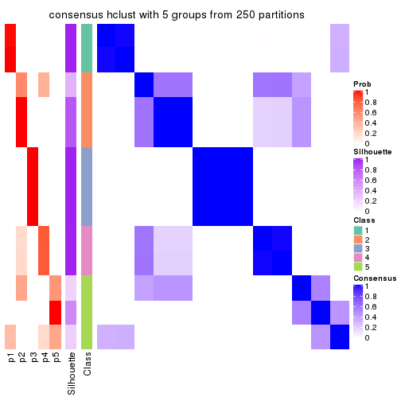</p>

</div>
<div id='tab-SD-hclust-consensus-heatmap-5'>
<pre><code class="r">consensus_heatmap(res, k = 6)
</code></pre>

<p></p>

</div>
</div>

Heatmaps for the membership of samples in all partitions to see how consistent they are:


<script>
$( function() {
	$( '#tabs-SD-hclust-membership-heatmap' ).tabs();
} );
</script>
<div id='tabs-SD-hclust-membership-heatmap'>
<ul>
<li><a href='#tab-SD-hclust-membership-heatmap-1'>k = 2</a></li>
<li><a href='#tab-SD-hclust-membership-heatmap-2'>k = 3</a></li>
<li><a href='#tab-SD-hclust-membership-heatmap-3'>k = 4</a></li>
<li><a href='#tab-SD-hclust-membership-heatmap-4'>k = 5</a></li>
<li><a href='#tab-SD-hclust-membership-heatmap-5'>k = 6</a></li>
</ul>
<div id='tab-SD-hclust-membership-heatmap-1'>
<pre><code class="r">membership_heatmap(res, k = 2)
</code></pre>

<p></p>

</div>
<div id='tab-SD-hclust-membership-heatmap-2'>
<pre><code class="r">membership_heatmap(res, k = 3)
</code></pre>

<p></p>

</div>
<div id='tab-SD-hclust-membership-heatmap-3'>
<pre><code class="r">membership_heatmap(res, k = 4)
</code></pre>

<p></p>

</div>
<div id='tab-SD-hclust-membership-heatmap-4'>
<pre><code class="r">membership_heatmap(res, k = 5)
</code></pre>

<p></p>

</div>
<div id='tab-SD-hclust-membership-heatmap-5'>
<pre><code class="r">membership_heatmap(res, k = 6)
</code></pre>

<p></p>

</div>
</div>

As soon as we have had the classes for columns, we can look for signatures
which are significantly different between classes which can be candidate marks
for certain classes. Following are the heatmaps for signatures.


Signature heatmaps where rows are scaled:


<script>
$( function() {
	$( '#tabs-SD-hclust-get-signatures' ).tabs();
} );
</script>
<div id='tabs-SD-hclust-get-signatures'>
<ul>
<li><a href='#tab-SD-hclust-get-signatures-1'>k = 2</a></li>
<li><a href='#tab-SD-hclust-get-signatures-2'>k = 3</a></li>
<li><a href='#tab-SD-hclust-get-signatures-3'>k = 4</a></li>
<li><a href='#tab-SD-hclust-get-signatures-4'>k = 5</a></li>
<li><a href='#tab-SD-hclust-get-signatures-5'>k = 6</a></li>
</ul>
<div id='tab-SD-hclust-get-signatures-1'>
<pre><code class="r">get_signatures(res, k = 2)
</code></pre>

<p></p>

</div>
<div id='tab-SD-hclust-get-signatures-2'>
<pre><code class="r">get_signatures(res, k = 3)
</code></pre>

<p></p>

</div>
<div id='tab-SD-hclust-get-signatures-3'>
<pre><code class="r">get_signatures(res, k = 4)
</code></pre>

<p></p>

</div>
<div id='tab-SD-hclust-get-signatures-4'>
<pre><code class="r">get_signatures(res, k = 5)
</code></pre>

<p></p>

</div>
<div id='tab-SD-hclust-get-signatures-5'>
<pre><code class="r">get_signatures(res, k = 6)
</code></pre>

<p></p>

</div>
</div>


Signature heatmaps where rows are not scaled:


<script>
$( function() {
	$( '#tabs-SD-hclust-get-signatures-no-scale' ).tabs();
} );
</script>
<div id='tabs-SD-hclust-get-signatures-no-scale'>
<ul>
<li><a href='#tab-SD-hclust-get-signatures-no-scale-1'>k = 2</a></li>
<li><a href='#tab-SD-hclust-get-signatures-no-scale-2'>k = 3</a></li>
<li><a href='#tab-SD-hclust-get-signatures-no-scale-3'>k = 4</a></li>
<li><a href='#tab-SD-hclust-get-signatures-no-scale-4'>k = 5</a></li>
<li><a href='#tab-SD-hclust-get-signatures-no-scale-5'>k = 6</a></li>
</ul>
<div id='tab-SD-hclust-get-signatures-no-scale-1'>
<pre><code class="r">get_signatures(res, k = 2, scale_rows = FALSE)
</code></pre>

<p></p>

</div>
<div id='tab-SD-hclust-get-signatures-no-scale-2'>
<pre><code class="r">get_signatures(res, k = 3, scale_rows = FALSE)
</code></pre>

<p></p>

</div>
<div id='tab-SD-hclust-get-signatures-no-scale-3'>
<pre><code class="r">get_signatures(res, k = 4, scale_rows = FALSE)
</code></pre>

<p></p>

</div>
<div id='tab-SD-hclust-get-signatures-no-scale-4'>
<pre><code class="r">get_signatures(res, k = 5, scale_rows = FALSE)
</code></pre>

<p></p>

</div>
<div id='tab-SD-hclust-get-signatures-no-scale-5'>
<pre><code class="r">get_signatures(res, k = 6, scale_rows = FALSE)
</code></pre>

<p></p>

</div>
</div>


Compare the overlap of signatures from different k:

```r
compare_signatures(res)
```


`get_signature()` returns a data frame invisibly. TO get the list of signatures, the function
call should be assigned to a variable explicitly. In following code, if `plot` argument is set
to `FALSE`, no heatmap is plotted while only the differential analysis is performed.

```r
# code only for demonstration
tb = get_signature(res, k = ..., plot = FALSE)
```

An example of the output of `tb` is:

```
#>   which_row         fdr    mean_1    mean_2 scaled_mean_1 scaled_mean_2 km
#> 1        38 0.042760348  8.373488  9.131774    -0.5533452     0.5164555  1
#> 2        40 0.018707592  7.106213  8.469186    -0.6173731     0.5762149  1
#> 3        55 0.019134737 10.221463 11.207825    -0.6159697     0.5749050  1
#> 4        59 0.006059896  5.921854  7.869574    -0.6899429     0.6439467  1
#> 5        60 0.018055526  8.928898 10.211722    -0.6204761     0.5791110  1
#> 6        98 0.009384629 15.714769 14.887706     0.6635654    -0.6193277  2
...
```

The columns in `tb` are:

1. `which_row`: row indices corresponding to the input matrix.
2. `fdr`: FDR for the differential test. 
3. `mean_x`: The mean value in group x.
4. `scaled_mean_x`: The mean value in group x after rows are scaled.
5. `km`: Row groups if k-means clustering is applied to rows.


UMAP plot which shows how samples are separated.


<script>
$( function() {
	$( '#tabs-SD-hclust-dimension-reduction' ).tabs();
} );
</script>
<div id='tabs-SD-hclust-dimension-reduction'>
<ul>
<li><a href='#tab-SD-hclust-dimension-reduction-1'>k = 2</a></li>
<li><a href='#tab-SD-hclust-dimension-reduction-2'>k = 3</a></li>
<li><a href='#tab-SD-hclust-dimension-reduction-3'>k = 4</a></li>
<li><a href='#tab-SD-hclust-dimension-reduction-4'>k = 5</a></li>
<li><a href='#tab-SD-hclust-dimension-reduction-5'>k = 6</a></li>
</ul>
<div id='tab-SD-hclust-dimension-reduction-1'>
<pre><code class="r">dimension_reduction(res, k = 2, method = &quot;UMAP&quot;)
</code></pre>

<p></p>

</div>
<div id='tab-SD-hclust-dimension-reduction-2'>
<pre><code class="r">dimension_reduction(res, k = 3, method = &quot;UMAP&quot;)
</code></pre>

<p></p>

</div>
<div id='tab-SD-hclust-dimension-reduction-3'>
<pre><code class="r">dimension_reduction(res, k = 4, method = &quot;UMAP&quot;)
</code></pre>

<p></p>

</div>
<div id='tab-SD-hclust-dimension-reduction-4'>
<pre><code class="r">dimension_reduction(res, k = 5, method = &quot;UMAP&quot;)
</code></pre>

<p></p>

</div>
<div id='tab-SD-hclust-dimension-reduction-5'>
<pre><code class="r">dimension_reduction(res, k = 6, method = &quot;UMAP&quot;)
</code></pre>

<p></p>

</div>
</div>


Following heatmap shows how subgroups are split when increasing `k`:

```r
collect_classes(res)
```


If matrix rows can be associated to genes, consider to use `GO_Enrichment(res,
...)` to perform function enrichment for the signature genes.


 

---------------------------------------------------


### SD:kmeans


The object with results only for a single top-value method and a single partition method 
can be extracted as:

```r
res = res_list["SD", "kmeans"]
# you can also extract it by
# res = res_list["SD:kmeans"]
```

A summary of `res` and all the functions that can be applied to it:

```r
res
```

```
#> A 'ConsensusPartition' object with k = 2, 3, 4, 5, 6.
#>   On a matrix with 17245 rows and 418 columns.
#>   Top rows (1000, 2000, 3000, 4000, 5000) are extracted by 'SD' method.
#>   Subgroups are detected by 'kmeans' method.
#>   Performed in total 1250 partitions by row resampling.
#>   Best k for subgroups seems to be 2.
#> 
#> Following methods can be applied to this 'ConsensusPartition' object:
#>  [1] "cola_report"             "collect_classes"         "collect_plots"          
#>  [4] "collect_stats"           "colnames"                "compare_signatures"     
#>  [7] "consensus_heatmap"       "dimension_reduction"     "functional_enrichment"  
#> [10] "get_anno_col"            "get_anno"                "get_classes"            
#> [13] "get_consensus"           "get_matrix"              "get_membership"         
#> [16] "get_param"               "get_signatures"          "get_stats"              
#> [19] "is_best_k"               "is_stable_k"             "membership_heatmap"     
#> [22] "ncol"                    "nrow"                    "plot_ecdf"              
#> [25] "rownames"                "select_partition_number" "show"                   
#> [28] "suggest_best_k"          "test_to_known_factors"
```

`collect_plots()` function collects all the plots made from `res` for all `k` (number of partitions)
into one single page to provide an easy and fast comparison between different `k`.

```r
collect_plots(res)
```


The plots are:

- The first row: a plot of the ECDF (Empirical cumulative distribution
  function) curves of the consensus matrix for each `k` and the heatmap of
  predicted classes for each `k`.
- The second row: heatmaps of the consensus matrix for each `k`.
- The third row: heatmaps of the membership matrix for each `k`.
- The fouth row: heatmaps of the signatures for each `k`.

All the plots in panels can be made by individual functions and they are
plotted later in this section.

`select_partition_number()` produces several plots showing different
statistics for choosing "optimized" `k`. There are following statistics:

- ECDF curves of the consensus matrix for each `k`;
- 1-PAC. [The PAC
  score](https://en.wikipedia.org/wiki/Consensus_clustering#Over-interpretation_potential_of_consensus_clustering)
  measures the proportion of the ambiguous subgrouping.
- Mean silhouette score.
- Concordance. The mean probability of fiting the consensus class ids in all
  partitions.
- Area increased. Denote $A_k$ as the area under the ECDF curve for current
  `k`, the area increased is defined as $A_k - A_{k-1}$.
- Rand index. The percent of pairs of samples that are both in a same cluster
  or both are not in a same cluster in the partition of k and k-1.
- Jaccard index. The ratio of pairs of samples are both in a same cluster in
  the partition of k and k-1 and the pairs of samples are both in a same
  cluster in the partition k or k-1.

The detailed explanations of these statistics can be found in [the cola
vignette](http://bioconductor.org/packages/devel/bioc/vignettes/cola/inst/doc/cola.html#toc_13).

Generally speaking, lower PAC score, higher mean silhouette score or higher
concordance corresponds to better partition. Rand index and Jaccard index
measure how similar the current partition is compared to partition with `k-1`.
If they are too similar, we won't accept `k` is better than `k-1`.

```r
select_partition_number(res)
```

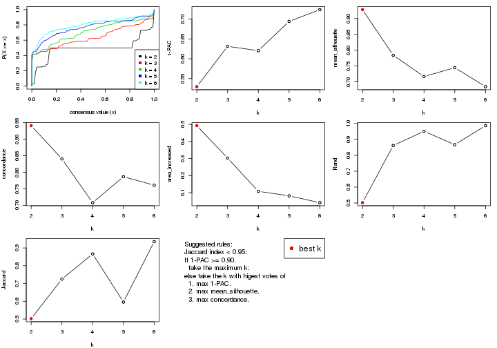

The numeric values for all these statistics can be obtained by `get_stats()`.

```r
get_stats(res)
```

```
#>   k 1-PAC mean_silhouette concordance area_increased  Rand Jaccard
#> 2 2 0.530           0.928       0.941         0.4925 0.502   0.502
#> 3 3 0.631           0.784       0.841         0.3026 0.862   0.725
#> 4 4 0.620           0.717       0.708         0.1082 0.951   0.866
#> 5 5 0.694           0.745       0.787         0.0818 0.867   0.596
#> 6 6 0.724           0.685       0.761         0.0419 0.987   0.935
```

`suggest_best_k()` suggests the best $k$ based on these statistics. The rules are as follows:

- All $k$ with Jaccard index larger than 0.95 are removed because the increase of
  the partition number does not provides enough extra information. If all $k$ are removed,
  the best $k$ is assigned by `NA`.
- For $k$ with 1-PAC larger than 0.9, the maximal $k$ is taken as the "best k". Other $k$ is called "optional k".
- If it does not fit the second rule. The $k$ with the highest vote of highest
  1-PAC, mean silhouette and concordance is taken as the "best k".

```r
suggest_best_k(res)
```

```
#> [1] 2
```


Following shows the table of the partitions (You need to click the **show/hide
code output** link to see it). The membership matrix (columns with name `p*`)
is inferred by
[`clue::cl_consensus()`](https://www.rdocumentation.org/link/cl_consensus?package=clue)
function with the `SE` method. Basically the value in the membership matrix
represents the probability to belong to a certain group. The finall class
label for an item is determined with the group with highest probability it
belongs to.

In `get_classes()` function, the entropy is calculated from the membership
matrix and the silhouette score is calculated from the consensus matrix.


<script>
$( function() {
	$( '#tabs-SD-kmeans-get-classes' ).tabs();
} );
</script>
<div id='tabs-SD-kmeans-get-classes'>
<ul>
<li><a href='#tab-SD-kmeans-get-classes-1'>k = 2</a></li>
<li><a href='#tab-SD-kmeans-get-classes-2'>k = 3</a></li>
<li><a href='#tab-SD-kmeans-get-classes-3'>k = 4</a></li>
<li><a href='#tab-SD-kmeans-get-classes-4'>k = 5</a></li>
<li><a href='#tab-SD-kmeans-get-classes-5'>k = 6</a></li>
</ul>

<div id='tab-SD-kmeans-get-classes-1'>
<p><a id='tab-SD-kmeans-get-classes-1-a' style='color:#0366d6' href='#'>show/hide code output</a></p>
<pre><code class="r">cbind(get_classes(res, k = 2), get_membership(res, k = 2))
</code></pre>

<pre><code>#&gt;           class entropy silhouette    p1    p2
#&gt; SRR902920     1   0.163      0.945 0.976 0.024
#&gt; SRR902921     1   0.163      0.945 0.976 0.024
#&gt; SRR902922     1   0.163      0.945 0.976 0.024
#&gt; SRR902923     1   0.163      0.945 0.976 0.024
#&gt; SRR902924     1   0.163      0.945 0.976 0.024
#&gt; SRR902925     1   0.163      0.945 0.976 0.024
#&gt; SRR902926     1   0.163      0.945 0.976 0.024
#&gt; SRR902927     1   0.163      0.945 0.976 0.024
#&gt; SRR902928     1   0.163      0.945 0.976 0.024
#&gt; SRR902929     1   0.163      0.945 0.976 0.024
#&gt; SRR902930     1   0.163      0.945 0.976 0.024
#&gt; SRR902931     1   0.163      0.945 0.976 0.024
#&gt; SRR902932     2   0.518      0.931 0.116 0.884
#&gt; SRR902933     2   0.518      0.931 0.116 0.884
#&gt; SRR902934     2   0.518      0.931 0.116 0.884
#&gt; SRR902935     2   0.518      0.931 0.116 0.884
#&gt; SRR902936     2   0.518      0.931 0.116 0.884
#&gt; SRR902937     2   0.518      0.931 0.116 0.884
#&gt; SRR902938     2   0.518      0.931 0.116 0.884
#&gt; SRR902939     2   0.518      0.931 0.116 0.884
#&gt; SRR902940     2   0.518      0.931 0.116 0.884
#&gt; SRR902941     2   0.518      0.931 0.116 0.884
#&gt; SRR902942     1   0.163      0.945 0.976 0.024
#&gt; SRR902943     1   0.163      0.945 0.976 0.024
#&gt; SRR902944     1   0.163      0.945 0.976 0.024
#&gt; SRR902945     1   0.163      0.945 0.976 0.024
#&gt; SRR902946     1   0.163      0.945 0.976 0.024
#&gt; SRR902947     1   0.163      0.945 0.976 0.024
#&gt; SRR902954     1   0.163      0.945 0.976 0.024
#&gt; SRR902955     1   0.163      0.945 0.976 0.024
#&gt; SRR902956     1   0.163      0.945 0.976 0.024
#&gt; SRR902957     1   0.163      0.945 0.976 0.024
#&gt; SRR902958     1   0.163      0.945 0.976 0.024
#&gt; SRR902959     1   0.163      0.945 0.976 0.024
#&gt; SRR902948     1   0.163      0.945 0.976 0.024
#&gt; SRR902949     1   0.163      0.945 0.976 0.024
#&gt; SRR902950     1   0.163      0.945 0.976 0.024
#&gt; SRR902951     1   0.163      0.945 0.976 0.024
#&gt; SRR902952     1   0.163      0.945 0.976 0.024
#&gt; SRR902953     1   0.163      0.945 0.976 0.024
#&gt; SRR902960     1   0.163      0.945 0.976 0.024
#&gt; SRR902961     1   0.163      0.945 0.976 0.024
#&gt; SRR902962     1   0.163      0.945 0.976 0.024
#&gt; SRR902963     1   0.163      0.945 0.976 0.024
#&gt; SRR902964     1   0.163      0.945 0.976 0.024
#&gt; SRR902965     1   0.163      0.945 0.976 0.024
#&gt; SRR902966     1   0.163      0.945 0.976 0.024
#&gt; SRR902967     1   0.163      0.945 0.976 0.024
#&gt; SRR902968     1   0.163      0.945 0.976 0.024
#&gt; SRR902969     1   0.163      0.945 0.976 0.024
#&gt; SRR902970     1   0.163      0.945 0.976 0.024
#&gt; SRR902971     1   0.163      0.945 0.976 0.024
#&gt; SRR902972     1   0.163      0.945 0.976 0.024
#&gt; SRR902973     1   0.163      0.945 0.976 0.024
#&gt; SRR902974     1   0.163      0.945 0.976 0.024
#&gt; SRR902975     1   0.163      0.945 0.976 0.024
#&gt; SRR902976     1   0.163      0.945 0.976 0.024
#&gt; SRR902977     1   0.163      0.945 0.976 0.024
#&gt; SRR902978     1   0.163      0.945 0.976 0.024
#&gt; SRR902980     1   0.163      0.945 0.976 0.024
#&gt; SRR902981     1   0.163      0.945 0.976 0.024
#&gt; SRR902982     1   0.163      0.945 0.976 0.024
#&gt; SRR902983     1   0.163      0.945 0.976 0.024
#&gt; SRR902984     1   0.163      0.945 0.976 0.024
#&gt; SRR902985     1   0.163      0.945 0.976 0.024
#&gt; SRR902986     1   0.163      0.945 0.976 0.024
#&gt; SRR902987     1   0.163      0.945 0.976 0.024
#&gt; SRR902988     1   0.163      0.945 0.976 0.024
#&gt; SRR902989     1   0.163      0.945 0.976 0.024
#&gt; SRR902990     1   0.163      0.945 0.976 0.024
#&gt; SRR902991     1   0.163      0.945 0.976 0.024
#&gt; SRR902992     1   0.163      0.945 0.976 0.024
#&gt; SRR902993     1   0.163      0.945 0.976 0.024
#&gt; SRR902994     1   0.163      0.945 0.976 0.024
#&gt; SRR902995     1   0.163      0.945 0.976 0.024
#&gt; SRR902996     2   0.518      0.931 0.116 0.884
#&gt; SRR902997     2   0.518      0.931 0.116 0.884
#&gt; SRR902998     2   0.518      0.931 0.116 0.884
#&gt; SRR902999     2   0.518      0.931 0.116 0.884
#&gt; SRR903000     2   0.518      0.931 0.116 0.884
#&gt; SRR903001     2   0.518      0.931 0.116 0.884
#&gt; SRR903008     2   0.518      0.931 0.116 0.884
#&gt; SRR903009     2   0.518      0.931 0.116 0.884
#&gt; SRR903010     2   0.518      0.931 0.116 0.884
#&gt; SRR903011     2   0.518      0.931 0.116 0.884
#&gt; SRR903012     2   0.518      0.931 0.116 0.884
#&gt; SRR903013     2   0.518      0.931 0.116 0.884
#&gt; SRR903002     2   0.518      0.931 0.116 0.884
#&gt; SRR903003     2   0.518      0.931 0.116 0.884
#&gt; SRR903004     2   0.518      0.931 0.116 0.884
#&gt; SRR903005     2   0.518      0.931 0.116 0.884
#&gt; SRR903006     2   0.518      0.931 0.116 0.884
#&gt; SRR903007     2   0.518      0.931 0.116 0.884
#&gt; SRR903014     1   0.163      0.945 0.976 0.024
#&gt; SRR903015     1   0.163      0.945 0.976 0.024
#&gt; SRR903016     1   0.163      0.945 0.976 0.024
#&gt; SRR903017     1   0.163      0.945 0.976 0.024
#&gt; SRR903018     1   0.163      0.945 0.976 0.024
#&gt; SRR903019     1   0.163      0.945 0.976 0.024
#&gt; SRR903020     1   0.163      0.945 0.976 0.024
#&gt; SRR903021     1   0.163      0.945 0.976 0.024
#&gt; SRR903022     1   0.163      0.945 0.976 0.024
#&gt; SRR903023     1   0.163      0.945 0.976 0.024
#&gt; SRR903024     1   0.163      0.945 0.976 0.024
#&gt; SRR903025     1   0.163      0.945 0.976 0.024
#&gt; SRR903026     1   0.163      0.945 0.976 0.024
#&gt; SRR903027     1   0.163      0.945 0.976 0.024
#&gt; SRR903028     1   0.163      0.945 0.976 0.024
#&gt; SRR903029     1   0.163      0.945 0.976 0.024
#&gt; SRR903030     1   0.163      0.945 0.976 0.024
#&gt; SRR903031     1   0.163      0.945 0.976 0.024
#&gt; SRR903032     2   0.518      0.931 0.116 0.884
#&gt; SRR903033     2   0.518      0.931 0.116 0.884
#&gt; SRR903034     2   0.518      0.931 0.116 0.884
#&gt; SRR903035     2   0.518      0.931 0.116 0.884
#&gt; SRR903036     2   0.518      0.931 0.116 0.884
#&gt; SRR903037     2   0.518      0.931 0.116 0.884
#&gt; SRR903038     2   0.518      0.931 0.116 0.884
#&gt; SRR903039     2   0.518      0.931 0.116 0.884
#&gt; SRR903040     2   0.518      0.931 0.116 0.884
#&gt; SRR903041     2   0.518      0.931 0.116 0.884
#&gt; SRR903042     2   0.518      0.931 0.116 0.884
#&gt; SRR903043     2   0.518      0.931 0.116 0.884
#&gt; SRR903044     2   0.518      0.931 0.116 0.884
#&gt; SRR903045     2   0.518      0.931 0.116 0.884
#&gt; SRR903046     2   0.518      0.931 0.116 0.884
#&gt; SRR903047     2   0.518      0.931 0.116 0.884
#&gt; SRR903048     2   0.518      0.931 0.116 0.884
#&gt; SRR903049     2   0.518      0.931 0.116 0.884
#&gt; SRR903050     1   0.605      0.881 0.852 0.148
#&gt; SRR903051     1   0.605      0.881 0.852 0.148
#&gt; SRR903052     1   0.605      0.881 0.852 0.148
#&gt; SRR903053     1   0.605      0.881 0.852 0.148
#&gt; SRR903054     1   0.605      0.881 0.852 0.148
#&gt; SRR903055     1   0.605      0.881 0.852 0.148
#&gt; SRR903056     1   0.605      0.881 0.852 0.148
#&gt; SRR903057     1   0.605      0.881 0.852 0.148
#&gt; SRR903058     1   0.605      0.881 0.852 0.148
#&gt; SRR903059     1   0.605      0.881 0.852 0.148
#&gt; SRR903060     1   0.605      0.881 0.852 0.148
#&gt; SRR903061     1   0.605      0.881 0.852 0.148
#&gt; SRR903062     1   0.605      0.881 0.852 0.148
#&gt; SRR903063     1   0.605      0.881 0.852 0.148
#&gt; SRR903064     1   0.605      0.881 0.852 0.148
#&gt; SRR903065     1   0.605      0.881 0.852 0.148
#&gt; SRR903066     1   0.605      0.881 0.852 0.148
#&gt; SRR903067     1   0.605      0.881 0.852 0.148
#&gt; SRR903068     1   0.605      0.881 0.852 0.148
#&gt; SRR903069     1   0.605      0.881 0.852 0.148
#&gt; SRR903070     1   0.605      0.881 0.852 0.148
#&gt; SRR903071     1   0.605      0.881 0.852 0.148
#&gt; SRR903072     1   0.605      0.881 0.852 0.148
#&gt; SRR903073     1   0.605      0.881 0.852 0.148
#&gt; SRR903074     1   0.605      0.881 0.852 0.148
#&gt; SRR903075     1   0.605      0.881 0.852 0.148
#&gt; SRR903076     1   0.605      0.881 0.852 0.148
#&gt; SRR903077     1   0.605      0.881 0.852 0.148
#&gt; SRR903078     1   0.605      0.881 0.852 0.148
#&gt; SRR903079     1   0.605      0.881 0.852 0.148
#&gt; SRR903080     1   0.605      0.881 0.852 0.148
#&gt; SRR903081     1   0.605      0.881 0.852 0.148
#&gt; SRR903082     2   0.000      0.933 0.000 1.000
#&gt; SRR903083     2   0.000      0.933 0.000 1.000
#&gt; SRR903084     2   0.000      0.933 0.000 1.000
#&gt; SRR903085     2   0.000      0.933 0.000 1.000
#&gt; SRR903086     2   0.000      0.933 0.000 1.000
#&gt; SRR903087     2   0.000      0.933 0.000 1.000
#&gt; SRR903088     2   0.000      0.933 0.000 1.000
#&gt; SRR903089     2   0.000      0.933 0.000 1.000
#&gt; SRR903090     2   0.000      0.933 0.000 1.000
#&gt; SRR903091     2   0.000      0.933 0.000 1.000
#&gt; SRR903092     2   0.000      0.933 0.000 1.000
#&gt; SRR903093     2   0.000      0.933 0.000 1.000
#&gt; SRR903094     2   0.000      0.933 0.000 1.000
#&gt; SRR903095     2   0.000      0.933 0.000 1.000
#&gt; SRR903096     2   0.000      0.933 0.000 1.000
#&gt; SRR903097     2   0.000      0.933 0.000 1.000
#&gt; SRR903098     2   0.000      0.933 0.000 1.000
#&gt; SRR903099     2   0.000      0.933 0.000 1.000
#&gt; SRR903100     2   0.000      0.933 0.000 1.000
#&gt; SRR903101     2   0.000      0.933 0.000 1.000
#&gt; SRR903102     2   0.000      0.933 0.000 1.000
#&gt; SRR903103     2   0.000      0.933 0.000 1.000
#&gt; SRR903104     2   0.000      0.933 0.000 1.000
#&gt; SRR903105     2   0.000      0.933 0.000 1.000
#&gt; SRR903106     2   0.000      0.933 0.000 1.000
#&gt; SRR903107     2   0.000      0.933 0.000 1.000
#&gt; SRR903108     2   0.000      0.933 0.000 1.000
#&gt; SRR903109     2   0.000      0.933 0.000 1.000
#&gt; SRR903110     2   0.000      0.933 0.000 1.000
#&gt; SRR903111     2   0.000      0.933 0.000 1.000
#&gt; SRR903112     2   0.000      0.933 0.000 1.000
#&gt; SRR903113     2   0.000      0.933 0.000 1.000
#&gt; SRR903114     1   0.605      0.881 0.852 0.148
#&gt; SRR903115     1   0.605      0.881 0.852 0.148
#&gt; SRR903116     1   0.605      0.881 0.852 0.148
#&gt; SRR903117     1   0.605      0.881 0.852 0.148
#&gt; SRR903118     1   0.605      0.881 0.852 0.148
#&gt; SRR903119     1   0.605      0.881 0.852 0.148
#&gt; SRR903121     1   0.605      0.881 0.852 0.148
#&gt; SRR903122     1   0.605      0.881 0.852 0.148
#&gt; SRR903124     1   0.605      0.881 0.852 0.148
#&gt; SRR903125     1   0.605      0.881 0.852 0.148
#&gt; SRR903126     1   0.605      0.881 0.852 0.148
#&gt; SRR903127     1   0.605      0.881 0.852 0.148
#&gt; SRR903128     1   0.605      0.881 0.852 0.148
#&gt; SRR903129     1   0.605      0.881 0.852 0.148
#&gt; SRR903130     1   0.605      0.881 0.852 0.148
#&gt; SRR903131     1   0.605      0.881 0.852 0.148
#&gt; SRR903132     1   0.605      0.881 0.852 0.148
#&gt; SRR903133     1   0.605      0.881 0.852 0.148
#&gt; SRR903134     1   0.605      0.881 0.852 0.148
#&gt; SRR903135     1   0.605      0.881 0.852 0.148
#&gt; SRR903136     1   0.605      0.881 0.852 0.148
#&gt; SRR903137     1   0.605      0.881 0.852 0.148
#&gt; SRR903146     2   0.000      0.933 0.000 1.000
#&gt; SRR903147     2   0.000      0.933 0.000 1.000
#&gt; SRR903148     2   0.000      0.933 0.000 1.000
#&gt; SRR903149     2   0.000      0.933 0.000 1.000
#&gt; SRR903150     2   0.000      0.933 0.000 1.000
#&gt; SRR903151     2   0.000      0.933 0.000 1.000
#&gt; SRR903152     2   0.000      0.933 0.000 1.000
#&gt; SRR903153     2   0.000      0.933 0.000 1.000
#&gt; SRR903138     1   0.605      0.881 0.852 0.148
#&gt; SRR903139     1   0.605      0.881 0.852 0.148
#&gt; SRR903140     1   0.605      0.881 0.852 0.148
#&gt; SRR903141     1   0.605      0.881 0.852 0.148
#&gt; SRR903142     1   0.605      0.881 0.852 0.148
#&gt; SRR903143     1   0.605      0.881 0.852 0.148
#&gt; SRR903144     1   0.605      0.881 0.852 0.148
#&gt; SRR903145     1   0.605      0.881 0.852 0.148
#&gt; SRR903154     2   0.000      0.933 0.000 1.000
#&gt; SRR903155     2   0.000      0.933 0.000 1.000
#&gt; SRR903156     2   0.000      0.933 0.000 1.000
#&gt; SRR903157     2   0.000      0.933 0.000 1.000
#&gt; SRR903158     2   0.000      0.933 0.000 1.000
#&gt; SRR903159     2   0.000      0.933 0.000 1.000
#&gt; SRR903160     2   0.000      0.933 0.000 1.000
#&gt; SRR903161     2   0.000      0.933 0.000 1.000
#&gt; SRR903162     2   0.000      0.933 0.000 1.000
#&gt; SRR903163     2   0.000      0.933 0.000 1.000
#&gt; SRR903164     2   0.000      0.933 0.000 1.000
#&gt; SRR903165     2   0.000      0.933 0.000 1.000
#&gt; SRR903166     2   0.000      0.933 0.000 1.000
#&gt; SRR903167     2   0.000      0.933 0.000 1.000
#&gt; SRR903168     2   0.000      0.933 0.000 1.000
#&gt; SRR903169     2   0.000      0.933 0.000 1.000
#&gt; SRR903178     1   0.000      0.936 1.000 0.000
#&gt; SRR903179     1   0.000      0.936 1.000 0.000
#&gt; SRR903180     1   0.000      0.936 1.000 0.000
#&gt; SRR903181     1   0.000      0.936 1.000 0.000
#&gt; SRR903182     1   0.000      0.936 1.000 0.000
#&gt; SRR903183     1   0.000      0.936 1.000 0.000
#&gt; SRR903184     1   0.000      0.936 1.000 0.000
#&gt; SRR903185     1   0.000      0.936 1.000 0.000
#&gt; SRR903170     2   0.000      0.933 0.000 1.000
#&gt; SRR903171     2   0.000      0.933 0.000 1.000
#&gt; SRR903172     2   0.000      0.933 0.000 1.000
#&gt; SRR903173     2   0.000      0.933 0.000 1.000
#&gt; SRR903174     2   0.000      0.933 0.000 1.000
#&gt; SRR903175     2   0.000      0.933 0.000 1.000
#&gt; SRR903176     2   0.000      0.933 0.000 1.000
#&gt; SRR903177     2   0.000      0.933 0.000 1.000
#&gt; SRR903186     1   0.000      0.936 1.000 0.000
#&gt; SRR903187     1   0.000      0.936 1.000 0.000
#&gt; SRR903188     1   0.000      0.936 1.000 0.000
#&gt; SRR903189     1   0.000      0.936 1.000 0.000
#&gt; SRR903190     1   0.000      0.936 1.000 0.000
#&gt; SRR903191     1   0.000      0.936 1.000 0.000
#&gt; SRR903192     1   0.000      0.936 1.000 0.000
#&gt; SRR903193     1   0.000      0.936 1.000 0.000
#&gt; SRR903194     1   0.518      0.889 0.884 0.116
#&gt; SRR903195     1   0.518      0.889 0.884 0.116
#&gt; SRR903196     1   0.518      0.889 0.884 0.116
#&gt; SRR903197     1   0.518      0.889 0.884 0.116
#&gt; SRR903198     1   0.518      0.889 0.884 0.116
#&gt; SRR903199     1   0.518      0.889 0.884 0.116
#&gt; SRR903200     1   0.518      0.889 0.884 0.116
#&gt; SRR903201     1   0.518      0.889 0.884 0.116
#&gt; SRR903210     2   0.000      0.933 0.000 1.000
#&gt; SRR903211     2   0.000      0.933 0.000 1.000
#&gt; SRR903212     2   0.000      0.933 0.000 1.000
#&gt; SRR903213     2   0.000      0.933 0.000 1.000
#&gt; SRR903214     2   0.000      0.933 0.000 1.000
#&gt; SRR903215     2   0.000      0.933 0.000 1.000
#&gt; SRR903216     2   0.000      0.933 0.000 1.000
#&gt; SRR903217     2   0.000      0.933 0.000 1.000
#&gt; SRR903202     1   0.184      0.930 0.972 0.028
#&gt; SRR903203     1   0.184      0.930 0.972 0.028
#&gt; SRR903204     1   0.184      0.930 0.972 0.028
#&gt; SRR903205     1   0.184      0.930 0.972 0.028
#&gt; SRR903206     1   0.184      0.930 0.972 0.028
#&gt; SRR903207     1   0.184      0.930 0.972 0.028
#&gt; SRR903208     1   0.184      0.930 0.972 0.028
#&gt; SRR903209     1   0.184      0.930 0.972 0.028
#&gt; SRR903218     2   0.000      0.933 0.000 1.000
#&gt; SRR903219     2   0.000      0.933 0.000 1.000
#&gt; SRR903220     2   0.000      0.933 0.000 1.000
#&gt; SRR903221     2   0.000      0.933 0.000 1.000
#&gt; SRR903222     2   0.000      0.933 0.000 1.000
#&gt; SRR903223     2   0.000      0.933 0.000 1.000
#&gt; SRR903224     2   0.000      0.933 0.000 1.000
#&gt; SRR903225     2   0.000      0.933 0.000 1.000
#&gt; SRR903226     2   0.000      0.933 0.000 1.000
#&gt; SRR903227     2   0.000      0.933 0.000 1.000
#&gt; SRR903228     2   0.000      0.933 0.000 1.000
#&gt; SRR903229     2   0.000      0.933 0.000 1.000
#&gt; SRR903230     2   0.000      0.933 0.000 1.000
#&gt; SRR903231     2   0.000      0.933 0.000 1.000
#&gt; SRR903232     2   0.000      0.933 0.000 1.000
#&gt; SRR903233     2   0.000      0.933 0.000 1.000
#&gt; SRR903242     1   0.163      0.945 0.976 0.024
#&gt; SRR903243     1   0.163      0.945 0.976 0.024
#&gt; SRR903244     1   0.163      0.945 0.976 0.024
#&gt; SRR903245     1   0.163      0.945 0.976 0.024
#&gt; SRR903246     1   0.163      0.945 0.976 0.024
#&gt; SRR903247     1   0.163      0.945 0.976 0.024
#&gt; SRR903248     1   0.163      0.945 0.976 0.024
#&gt; SRR903249     1   0.163      0.945 0.976 0.024
#&gt; SRR903234     2   0.000      0.933 0.000 1.000
#&gt; SRR903235     2   0.000      0.933 0.000 1.000
#&gt; SRR903236     2   0.000      0.933 0.000 1.000
#&gt; SRR903237     2   0.000      0.933 0.000 1.000
#&gt; SRR903238     2   0.000      0.933 0.000 1.000
#&gt; SRR903239     2   0.000      0.933 0.000 1.000
#&gt; SRR903240     2   0.000      0.933 0.000 1.000
#&gt; SRR903241     2   0.000      0.933 0.000 1.000
#&gt; SRR903258     1   0.163      0.945 0.976 0.024
#&gt; SRR903259     1   0.163      0.945 0.976 0.024
#&gt; SRR903260     1   0.163      0.945 0.976 0.024
#&gt; SRR903261     1   0.163      0.945 0.976 0.024
#&gt; SRR903262     1   0.163      0.945 0.976 0.024
#&gt; SRR903263     1   0.163      0.945 0.976 0.024
#&gt; SRR903264     1   0.163      0.945 0.976 0.024
#&gt; SRR903265     1   0.163      0.945 0.976 0.024
#&gt; SRR903250     1   0.163      0.945 0.976 0.024
#&gt; SRR903251     1   0.163      0.945 0.976 0.024
#&gt; SRR903252     1   0.163      0.945 0.976 0.024
#&gt; SRR903253     1   0.163      0.945 0.976 0.024
#&gt; SRR903254     1   0.163      0.945 0.976 0.024
#&gt; SRR903255     1   0.163      0.945 0.976 0.024
#&gt; SRR903256     1   0.163      0.945 0.976 0.024
#&gt; SRR903257     1   0.163      0.945 0.976 0.024
#&gt; SRR903266     1   0.163      0.945 0.976 0.024
#&gt; SRR903267     1   0.163      0.945 0.976 0.024
#&gt; SRR903268     1   0.163      0.945 0.976 0.024
#&gt; SRR903270     1   0.163      0.945 0.976 0.024
#&gt; SRR903271     1   0.163      0.945 0.976 0.024
#&gt; SRR903272     1   0.163      0.945 0.976 0.024
#&gt; SRR903273     1   0.163      0.945 0.976 0.024
#&gt; SRR903274     2   0.518      0.931 0.116 0.884
#&gt; SRR903275     2   0.518      0.931 0.116 0.884
#&gt; SRR903276     2   0.518      0.931 0.116 0.884
#&gt; SRR903277     2   0.518      0.931 0.116 0.884
#&gt; SRR903278     2   0.518      0.931 0.116 0.884
#&gt; SRR903279     2   0.518      0.931 0.116 0.884
#&gt; SRR903280     2   0.518      0.931 0.116 0.884
#&gt; SRR903281     2   0.518      0.931 0.116 0.884
#&gt; SRR903282     2   0.518      0.931 0.116 0.884
#&gt; SRR903283     2   0.518      0.931 0.116 0.884
#&gt; SRR903284     2   0.518      0.931 0.116 0.884
#&gt; SRR903285     2   0.518      0.931 0.116 0.884
#&gt; SRR903286     2   0.518      0.931 0.116 0.884
#&gt; SRR903287     2   0.518      0.931 0.116 0.884
#&gt; SRR903288     2   0.518      0.931 0.116 0.884
#&gt; SRR903289     2   0.518      0.931 0.116 0.884
#&gt; SRR903290     2   0.518      0.931 0.116 0.884
#&gt; SRR903291     2   0.518      0.931 0.116 0.884
#&gt; SRR903292     2   0.518      0.931 0.116 0.884
#&gt; SRR903293     2   0.518      0.931 0.116 0.884
#&gt; SRR903294     2   0.518      0.931 0.116 0.884
#&gt; SRR903295     2   0.518      0.931 0.116 0.884
#&gt; SRR903296     2   0.518      0.931 0.116 0.884
#&gt; SRR903297     2   0.518      0.931 0.116 0.884
#&gt; SRR903298     2   0.518      0.931 0.116 0.884
#&gt; SRR903299     2   0.518      0.931 0.116 0.884
#&gt; SRR903300     2   0.518      0.931 0.116 0.884
#&gt; SRR903301     2   0.518      0.931 0.116 0.884
#&gt; SRR903302     2   0.518      0.931 0.116 0.884
#&gt; SRR903303     2   0.518      0.931 0.116 0.884
#&gt; SRR903304     2   0.518      0.931 0.116 0.884
#&gt; SRR903305     2   0.518      0.931 0.116 0.884
#&gt; SRR903306     1   0.163      0.945 0.976 0.024
#&gt; SRR903307     1   0.163      0.945 0.976 0.024
#&gt; SRR903308     1   0.163      0.945 0.976 0.024
#&gt; SRR903309     1   0.163      0.945 0.976 0.024
#&gt; SRR903310     1   0.163      0.945 0.976 0.024
#&gt; SRR903311     1   0.163      0.945 0.976 0.024
#&gt; SRR903312     1   0.163      0.945 0.976 0.024
#&gt; SRR903313     1   0.163      0.945 0.976 0.024
#&gt; SRR903314     1   0.163      0.945 0.976 0.024
#&gt; SRR903315     1   0.163      0.945 0.976 0.024
#&gt; SRR903316     1   0.163      0.945 0.976 0.024
#&gt; SRR903317     1   0.163      0.945 0.976 0.024
#&gt; SRR903318     1   0.163      0.945 0.976 0.024
#&gt; SRR903319     1   0.163      0.945 0.976 0.024
#&gt; SRR903320     1   0.163      0.945 0.976 0.024
#&gt; SRR903321     1   0.163      0.945 0.976 0.024
#&gt; SRR903322     1   0.163      0.945 0.976 0.024
#&gt; SRR903323     1   0.163      0.945 0.976 0.024
#&gt; SRR903324     2   0.518      0.931 0.116 0.884
#&gt; SRR903325     2   0.518      0.931 0.116 0.884
#&gt; SRR903326     2   0.518      0.931 0.116 0.884
#&gt; SRR903327     2   0.518      0.931 0.116 0.884
#&gt; SRR903328     2   0.518      0.931 0.116 0.884
#&gt; SRR903329     2   0.518      0.931 0.116 0.884
#&gt; SRR903330     2   0.518      0.931 0.116 0.884
#&gt; SRR903331     2   0.518      0.931 0.116 0.884
#&gt; SRR903332     2   0.518      0.931 0.116 0.884
#&gt; SRR903333     2   0.518      0.931 0.116 0.884
#&gt; SRR903334     2   0.518      0.931 0.116 0.884
#&gt; SRR903335     2   0.518      0.931 0.116 0.884
#&gt; SRR903336     2   0.518      0.931 0.116 0.884
#&gt; SRR903337     2   0.518      0.931 0.116 0.884
#&gt; SRR903338     2   0.518      0.931 0.116 0.884
#&gt; SRR903339     2   0.518      0.931 0.116 0.884
#&gt; SRR903340     2   0.518      0.931 0.116 0.884
#&gt; SRR903341     2   0.518      0.931 0.116 0.884
</code></pre>

<script>
$('#tab-SD-kmeans-get-classes-1-a').parent().next().next().hide();
$('#tab-SD-kmeans-get-classes-1-a').click(function(){
  $('#tab-SD-kmeans-get-classes-1-a').parent().next().next().toggle();
  return(false);
});
</script>
</div>

<div id='tab-SD-kmeans-get-classes-2'>
<p><a id='tab-SD-kmeans-get-classes-2-a' style='color:#0366d6' href='#'>show/hide code output</a></p>
<pre><code class="r">cbind(get_classes(res, k = 3), get_membership(res, k = 3))
</code></pre>

<pre><code>#&gt;           class entropy silhouette    p1    p2    p3
#&gt; SRR902920     3  0.0000      0.898 0.000 0.000 1.000
#&gt; SRR902921     3  0.0000      0.898 0.000 0.000 1.000
#&gt; SRR902922     3  0.0000      0.898 0.000 0.000 1.000
#&gt; SRR902923     3  0.0000      0.898 0.000 0.000 1.000
#&gt; SRR902924     3  0.0000      0.898 0.000 0.000 1.000
#&gt; SRR902925     3  0.0000      0.898 0.000 0.000 1.000
#&gt; SRR902926     3  0.0000      0.898 0.000 0.000 1.000
#&gt; SRR902927     3  0.0000      0.898 0.000 0.000 1.000
#&gt; SRR902928     3  0.0000      0.898 0.000 0.000 1.000
#&gt; SRR902929     3  0.0000      0.898 0.000 0.000 1.000
#&gt; SRR902930     3  0.0000      0.898 0.000 0.000 1.000
#&gt; SRR902931     3  0.0000      0.898 0.000 0.000 1.000
#&gt; SRR902932     2  0.0237      0.841 0.000 0.996 0.004
#&gt; SRR902933     2  0.0237      0.841 0.000 0.996 0.004
#&gt; SRR902934     2  0.0237      0.841 0.000 0.996 0.004
#&gt; SRR902935     2  0.0237      0.841 0.000 0.996 0.004
#&gt; SRR902936     2  0.0237      0.841 0.000 0.996 0.004
#&gt; SRR902937     2  0.0237      0.841 0.000 0.996 0.004
#&gt; SRR902938     2  0.0237      0.841 0.000 0.996 0.004
#&gt; SRR902939     2  0.0237      0.841 0.000 0.996 0.004
#&gt; SRR902940     2  0.0237      0.841 0.000 0.996 0.004
#&gt; SRR902941     2  0.0237      0.841 0.000 0.996 0.004
#&gt; SRR902942     3  0.0000      0.898 0.000 0.000 1.000
#&gt; SRR902943     3  0.0000      0.898 0.000 0.000 1.000
#&gt; SRR902944     3  0.0000      0.898 0.000 0.000 1.000
#&gt; SRR902945     3  0.0000      0.898 0.000 0.000 1.000
#&gt; SRR902946     3  0.0000      0.898 0.000 0.000 1.000
#&gt; SRR902947     3  0.0000      0.898 0.000 0.000 1.000
#&gt; SRR902954     3  0.0000      0.898 0.000 0.000 1.000
#&gt; SRR902955     3  0.0000      0.898 0.000 0.000 1.000
#&gt; SRR902956     3  0.0000      0.898 0.000 0.000 1.000
#&gt; SRR902957     3  0.0000      0.898 0.000 0.000 1.000
#&gt; SRR902958     3  0.0000      0.898 0.000 0.000 1.000
#&gt; SRR902959     3  0.0000      0.898 0.000 0.000 1.000
#&gt; SRR902948     3  0.0000      0.898 0.000 0.000 1.000
#&gt; SRR902949     3  0.0000      0.898 0.000 0.000 1.000
#&gt; SRR902950     3  0.0000      0.898 0.000 0.000 1.000
#&gt; SRR902951     3  0.0000      0.898 0.000 0.000 1.000
#&gt; SRR902952     3  0.0000      0.898 0.000 0.000 1.000
#&gt; SRR902953     3  0.0000      0.898 0.000 0.000 1.000
#&gt; SRR902960     3  0.0000      0.898 0.000 0.000 1.000
#&gt; SRR902961     3  0.0000      0.898 0.000 0.000 1.000
#&gt; SRR902962     3  0.0000      0.898 0.000 0.000 1.000
#&gt; SRR902963     3  0.0000      0.898 0.000 0.000 1.000
#&gt; SRR902964     3  0.0000      0.898 0.000 0.000 1.000
#&gt; SRR902965     3  0.0000      0.898 0.000 0.000 1.000
#&gt; SRR902966     3  0.0000      0.898 0.000 0.000 1.000
#&gt; SRR902967     3  0.0000      0.898 0.000 0.000 1.000
#&gt; SRR902968     3  0.0000      0.898 0.000 0.000 1.000
#&gt; SRR902969     3  0.0000      0.898 0.000 0.000 1.000
#&gt; SRR902970     3  0.0000      0.898 0.000 0.000 1.000
#&gt; SRR902971     3  0.0000      0.898 0.000 0.000 1.000
#&gt; SRR902972     3  0.0000      0.898 0.000 0.000 1.000
#&gt; SRR902973     3  0.0000      0.898 0.000 0.000 1.000
#&gt; SRR902974     3  0.0000      0.898 0.000 0.000 1.000
#&gt; SRR902975     3  0.0000      0.898 0.000 0.000 1.000
#&gt; SRR902976     3  0.0000      0.898 0.000 0.000 1.000
#&gt; SRR902977     3  0.0000      0.898 0.000 0.000 1.000
#&gt; SRR902978     3  0.0000      0.898 0.000 0.000 1.000
#&gt; SRR902980     3  0.0000      0.898 0.000 0.000 1.000
#&gt; SRR902981     3  0.0000      0.898 0.000 0.000 1.000
#&gt; SRR902982     3  0.0000      0.898 0.000 0.000 1.000
#&gt; SRR902983     3  0.0000      0.898 0.000 0.000 1.000
#&gt; SRR902984     3  0.0000      0.898 0.000 0.000 1.000
#&gt; SRR902985     3  0.0000      0.898 0.000 0.000 1.000
#&gt; SRR902986     3  0.0000      0.898 0.000 0.000 1.000
#&gt; SRR902987     3  0.0000      0.898 0.000 0.000 1.000
#&gt; SRR902988     3  0.0000      0.898 0.000 0.000 1.000
#&gt; SRR902989     3  0.0000      0.898 0.000 0.000 1.000
#&gt; SRR902990     3  0.0000      0.898 0.000 0.000 1.000
#&gt; SRR902991     3  0.0000      0.898 0.000 0.000 1.000
#&gt; SRR902992     3  0.0000      0.898 0.000 0.000 1.000
#&gt; SRR902993     3  0.0000      0.898 0.000 0.000 1.000
#&gt; SRR902994     3  0.0000      0.898 0.000 0.000 1.000
#&gt; SRR902995     3  0.0000      0.898 0.000 0.000 1.000
#&gt; SRR902996     2  0.0237      0.841 0.000 0.996 0.004
#&gt; SRR902997     2  0.0237      0.841 0.000 0.996 0.004
#&gt; SRR902998     2  0.0237      0.841 0.000 0.996 0.004
#&gt; SRR902999     2  0.0237      0.841 0.000 0.996 0.004
#&gt; SRR903000     2  0.0237      0.841 0.000 0.996 0.004
#&gt; SRR903001     2  0.0237      0.841 0.000 0.996 0.004
#&gt; SRR903008     2  0.0237      0.841 0.000 0.996 0.004
#&gt; SRR903009     2  0.0237      0.841 0.000 0.996 0.004
#&gt; SRR903010     2  0.0237      0.841 0.000 0.996 0.004
#&gt; SRR903011     2  0.0237      0.841 0.000 0.996 0.004
#&gt; SRR903012     2  0.0237      0.841 0.000 0.996 0.004
#&gt; SRR903013     2  0.0237      0.841 0.000 0.996 0.004
#&gt; SRR903002     2  0.0237      0.841 0.000 0.996 0.004
#&gt; SRR903003     2  0.0237      0.841 0.000 0.996 0.004
#&gt; SRR903004     2  0.0237      0.841 0.000 0.996 0.004
#&gt; SRR903005     2  0.0237      0.841 0.000 0.996 0.004
#&gt; SRR903006     2  0.0237      0.841 0.000 0.996 0.004
#&gt; SRR903007     2  0.0237      0.841 0.000 0.996 0.004
#&gt; SRR903014     3  0.0000      0.898 0.000 0.000 1.000
#&gt; SRR903015     3  0.0000      0.898 0.000 0.000 1.000
#&gt; SRR903016     3  0.0000      0.898 0.000 0.000 1.000
#&gt; SRR903017     3  0.0000      0.898 0.000 0.000 1.000
#&gt; SRR903018     3  0.0000      0.898 0.000 0.000 1.000
#&gt; SRR903019     3  0.0000      0.898 0.000 0.000 1.000
#&gt; SRR903020     3  0.0000      0.898 0.000 0.000 1.000
#&gt; SRR903021     3  0.0000      0.898 0.000 0.000 1.000
#&gt; SRR903022     3  0.0000      0.898 0.000 0.000 1.000
#&gt; SRR903023     3  0.0000      0.898 0.000 0.000 1.000
#&gt; SRR903024     3  0.0000      0.898 0.000 0.000 1.000
#&gt; SRR903025     3  0.0000      0.898 0.000 0.000 1.000
#&gt; SRR903026     3  0.0000      0.898 0.000 0.000 1.000
#&gt; SRR903027     3  0.0000      0.898 0.000 0.000 1.000
#&gt; SRR903028     3  0.0000      0.898 0.000 0.000 1.000
#&gt; SRR903029     3  0.0000      0.898 0.000 0.000 1.000
#&gt; SRR903030     3  0.0000      0.898 0.000 0.000 1.000
#&gt; SRR903031     3  0.0000      0.898 0.000 0.000 1.000
#&gt; SRR903032     2  0.0237      0.841 0.000 0.996 0.004
#&gt; SRR903033     2  0.0237      0.841 0.000 0.996 0.004
#&gt; SRR903034     2  0.0237      0.841 0.000 0.996 0.004
#&gt; SRR903035     2  0.0237      0.841 0.000 0.996 0.004
#&gt; SRR903036     2  0.0237      0.841 0.000 0.996 0.004
#&gt; SRR903037     2  0.0237      0.841 0.000 0.996 0.004
#&gt; SRR903038     2  0.0237      0.841 0.000 0.996 0.004
#&gt; SRR903039     2  0.0237      0.841 0.000 0.996 0.004
#&gt; SRR903040     2  0.0237      0.841 0.000 0.996 0.004
#&gt; SRR903041     2  0.0237      0.841 0.000 0.996 0.004
#&gt; SRR903042     2  0.0237      0.841 0.000 0.996 0.004
#&gt; SRR903043     2  0.0237      0.841 0.000 0.996 0.004
#&gt; SRR903044     2  0.0237      0.841 0.000 0.996 0.004
#&gt; SRR903045     2  0.0237      0.841 0.000 0.996 0.004
#&gt; SRR903046     2  0.0237      0.841 0.000 0.996 0.004
#&gt; SRR903047     2  0.0237      0.841 0.000 0.996 0.004
#&gt; SRR903048     2  0.0237      0.841 0.000 0.996 0.004
#&gt; SRR903049     2  0.0237      0.841 0.000 0.996 0.004
#&gt; SRR903050     1  0.4750      0.832 0.784 0.000 0.216
#&gt; SRR903051     1  0.4750      0.832 0.784 0.000 0.216
#&gt; SRR903052     1  0.4750      0.832 0.784 0.000 0.216
#&gt; SRR903053     1  0.4750      0.832 0.784 0.000 0.216
#&gt; SRR903054     1  0.4750      0.832 0.784 0.000 0.216
#&gt; SRR903055     1  0.4750      0.832 0.784 0.000 0.216
#&gt; SRR903056     1  0.4750      0.832 0.784 0.000 0.216
#&gt; SRR903057     1  0.4750      0.832 0.784 0.000 0.216
#&gt; SRR903058     1  0.4750      0.832 0.784 0.000 0.216
#&gt; SRR903059     1  0.4750      0.832 0.784 0.000 0.216
#&gt; SRR903060     1  0.4750      0.832 0.784 0.000 0.216
#&gt; SRR903061     1  0.4750      0.832 0.784 0.000 0.216
#&gt; SRR903062     1  0.4750      0.832 0.784 0.000 0.216
#&gt; SRR903063     1  0.4750      0.832 0.784 0.000 0.216
#&gt; SRR903064     1  0.4750      0.832 0.784 0.000 0.216
#&gt; SRR903065     1  0.4750      0.832 0.784 0.000 0.216
#&gt; SRR903066     1  0.4750      0.832 0.784 0.000 0.216
#&gt; SRR903067     1  0.4750      0.832 0.784 0.000 0.216
#&gt; SRR903068     1  0.4750      0.832 0.784 0.000 0.216
#&gt; SRR903069     1  0.4750      0.832 0.784 0.000 0.216
#&gt; SRR903070     1  0.4750      0.832 0.784 0.000 0.216
#&gt; SRR903071     1  0.4750      0.832 0.784 0.000 0.216
#&gt; SRR903072     1  0.4750      0.832 0.784 0.000 0.216
#&gt; SRR903073     1  0.4750      0.832 0.784 0.000 0.216
#&gt; SRR903074     1  0.4702      0.832 0.788 0.000 0.212
#&gt; SRR903075     1  0.4702      0.832 0.788 0.000 0.212
#&gt; SRR903076     1  0.4702      0.832 0.788 0.000 0.212
#&gt; SRR903077     1  0.4702      0.832 0.788 0.000 0.212
#&gt; SRR903078     1  0.4702      0.832 0.788 0.000 0.212
#&gt; SRR903079     1  0.4702      0.832 0.788 0.000 0.212
#&gt; SRR903080     1  0.4702      0.832 0.788 0.000 0.212
#&gt; SRR903081     1  0.4702      0.832 0.788 0.000 0.212
#&gt; SRR903082     2  0.6079      0.722 0.388 0.612 0.000
#&gt; SRR903083     2  0.6079      0.722 0.388 0.612 0.000
#&gt; SRR903084     2  0.6079      0.722 0.388 0.612 0.000
#&gt; SRR903085     2  0.6079      0.722 0.388 0.612 0.000
#&gt; SRR903086     2  0.6079      0.722 0.388 0.612 0.000
#&gt; SRR903087     2  0.6079      0.722 0.388 0.612 0.000
#&gt; SRR903088     2  0.6079      0.722 0.388 0.612 0.000
#&gt; SRR903089     2  0.6079      0.722 0.388 0.612 0.000
#&gt; SRR903090     2  0.6079      0.722 0.388 0.612 0.000
#&gt; SRR903091     2  0.6079      0.722 0.388 0.612 0.000
#&gt; SRR903092     2  0.6079      0.722 0.388 0.612 0.000
#&gt; SRR903093     2  0.6079      0.722 0.388 0.612 0.000
#&gt; SRR903094     2  0.6079      0.722 0.388 0.612 0.000
#&gt; SRR903095     2  0.6079      0.722 0.388 0.612 0.000
#&gt; SRR903096     2  0.6079      0.722 0.388 0.612 0.000
#&gt; SRR903097     2  0.6079      0.722 0.388 0.612 0.000
#&gt; SRR903098     2  0.6079      0.722 0.388 0.612 0.000
#&gt; SRR903099     2  0.6079      0.722 0.388 0.612 0.000
#&gt; SRR903100     2  0.6079      0.722 0.388 0.612 0.000
#&gt; SRR903101     2  0.6079      0.722 0.388 0.612 0.000
#&gt; SRR903102     2  0.6079      0.722 0.388 0.612 0.000
#&gt; SRR903103     2  0.6079      0.722 0.388 0.612 0.000
#&gt; SRR903104     2  0.6079      0.722 0.388 0.612 0.000
#&gt; SRR903105     2  0.6079      0.722 0.388 0.612 0.000
#&gt; SRR903106     2  0.6079      0.722 0.388 0.612 0.000
#&gt; SRR903107     2  0.6079      0.722 0.388 0.612 0.000
#&gt; SRR903108     2  0.6079      0.722 0.388 0.612 0.000
#&gt; SRR903109     2  0.6079      0.722 0.388 0.612 0.000
#&gt; SRR903110     2  0.6079      0.722 0.388 0.612 0.000
#&gt; SRR903111     2  0.6079      0.722 0.388 0.612 0.000
#&gt; SRR903112     2  0.6079      0.722 0.388 0.612 0.000
#&gt; SRR903113     2  0.6079      0.722 0.388 0.612 0.000
#&gt; SRR903114     1  0.3482      0.812 0.872 0.000 0.128
#&gt; SRR903115     1  0.3482      0.812 0.872 0.000 0.128
#&gt; SRR903116     1  0.3482      0.812 0.872 0.000 0.128
#&gt; SRR903117     1  0.3482      0.812 0.872 0.000 0.128
#&gt; SRR903118     1  0.3482      0.812 0.872 0.000 0.128
#&gt; SRR903119     1  0.3482      0.812 0.872 0.000 0.128
#&gt; SRR903121     1  0.3482      0.812 0.872 0.000 0.128
#&gt; SRR903122     1  0.3752      0.819 0.856 0.000 0.144
#&gt; SRR903124     1  0.3752      0.819 0.856 0.000 0.144
#&gt; SRR903125     1  0.3752      0.819 0.856 0.000 0.144
#&gt; SRR903126     1  0.3752      0.819 0.856 0.000 0.144
#&gt; SRR903127     1  0.3752      0.819 0.856 0.000 0.144
#&gt; SRR903128     1  0.3752      0.819 0.856 0.000 0.144
#&gt; SRR903129     1  0.3752      0.819 0.856 0.000 0.144
#&gt; SRR903130     1  0.3551      0.814 0.868 0.000 0.132
#&gt; SRR903131     1  0.3551      0.814 0.868 0.000 0.132
#&gt; SRR903132     1  0.3551      0.814 0.868 0.000 0.132
#&gt; SRR903133     1  0.3551      0.814 0.868 0.000 0.132
#&gt; SRR903134     1  0.3551      0.814 0.868 0.000 0.132
#&gt; SRR903135     1  0.3551      0.814 0.868 0.000 0.132
#&gt; SRR903136     1  0.3551      0.814 0.868 0.000 0.132
#&gt; SRR903137     1  0.3551      0.814 0.868 0.000 0.132
#&gt; SRR903146     2  0.6225      0.703 0.432 0.568 0.000
#&gt; SRR903147     2  0.6225      0.703 0.432 0.568 0.000
#&gt; SRR903148     2  0.6225      0.703 0.432 0.568 0.000
#&gt; SRR903149     2  0.6225      0.703 0.432 0.568 0.000
#&gt; SRR903150     2  0.6225      0.703 0.432 0.568 0.000
#&gt; SRR903151     2  0.6225      0.703 0.432 0.568 0.000
#&gt; SRR903152     2  0.6225      0.703 0.432 0.568 0.000
#&gt; SRR903153     2  0.6225      0.703 0.432 0.568 0.000
#&gt; SRR903138     1  0.3482      0.812 0.872 0.000 0.128
#&gt; SRR903139     1  0.3482      0.812 0.872 0.000 0.128
#&gt; SRR903140     1  0.3482      0.812 0.872 0.000 0.128
#&gt; SRR903141     1  0.3482      0.812 0.872 0.000 0.128
#&gt; SRR903142     1  0.3482      0.812 0.872 0.000 0.128
#&gt; SRR903143     1  0.3482      0.812 0.872 0.000 0.128
#&gt; SRR903144     1  0.3482      0.812 0.872 0.000 0.128
#&gt; SRR903145     1  0.3482      0.812 0.872 0.000 0.128
#&gt; SRR903154     2  0.6225      0.703 0.432 0.568 0.000
#&gt; SRR903155     2  0.6225      0.703 0.432 0.568 0.000
#&gt; SRR903156     2  0.6225      0.703 0.432 0.568 0.000
#&gt; SRR903157     2  0.6225      0.703 0.432 0.568 0.000
#&gt; SRR903158     2  0.6225      0.703 0.432 0.568 0.000
#&gt; SRR903159     2  0.6225      0.703 0.432 0.568 0.000
#&gt; SRR903160     2  0.6225      0.703 0.432 0.568 0.000
#&gt; SRR903161     2  0.6225      0.703 0.432 0.568 0.000
#&gt; SRR903162     2  0.6225      0.703 0.432 0.568 0.000
#&gt; SRR903163     2  0.6225      0.703 0.432 0.568 0.000
#&gt; SRR903164     2  0.6225      0.703 0.432 0.568 0.000
#&gt; SRR903165     2  0.6225      0.703 0.432 0.568 0.000
#&gt; SRR903166     2  0.6225      0.703 0.432 0.568 0.000
#&gt; SRR903167     2  0.6225      0.703 0.432 0.568 0.000
#&gt; SRR903168     2  0.6225      0.703 0.432 0.568 0.000
#&gt; SRR903169     2  0.6225      0.703 0.432 0.568 0.000
#&gt; SRR903178     3  0.2772      0.822 0.080 0.004 0.916
#&gt; SRR903179     3  0.2772      0.822 0.080 0.004 0.916
#&gt; SRR903180     3  0.2772      0.822 0.080 0.004 0.916
#&gt; SRR903181     3  0.2772      0.822 0.080 0.004 0.916
#&gt; SRR903182     3  0.2772      0.822 0.080 0.004 0.916
#&gt; SRR903183     3  0.2772      0.822 0.080 0.004 0.916
#&gt; SRR903184     3  0.2772      0.822 0.080 0.004 0.916
#&gt; SRR903185     3  0.2772      0.822 0.080 0.004 0.916
#&gt; SRR903170     2  0.6225      0.703 0.432 0.568 0.000
#&gt; SRR903171     2  0.6225      0.703 0.432 0.568 0.000
#&gt; SRR903172     2  0.6225      0.703 0.432 0.568 0.000
#&gt; SRR903173     2  0.6225      0.703 0.432 0.568 0.000
#&gt; SRR903174     2  0.6225      0.703 0.432 0.568 0.000
#&gt; SRR903175     2  0.6225      0.703 0.432 0.568 0.000
#&gt; SRR903176     2  0.6225      0.703 0.432 0.568 0.000
#&gt; SRR903177     2  0.6225      0.703 0.432 0.568 0.000
#&gt; SRR903186     1  0.6500      0.481 0.532 0.004 0.464
#&gt; SRR903187     1  0.6500      0.481 0.532 0.004 0.464
#&gt; SRR903188     1  0.6500      0.481 0.532 0.004 0.464
#&gt; SRR903189     1  0.6500      0.481 0.532 0.004 0.464
#&gt; SRR903190     1  0.6500      0.481 0.532 0.004 0.464
#&gt; SRR903191     1  0.6500      0.481 0.532 0.004 0.464
#&gt; SRR903192     1  0.6500      0.481 0.532 0.004 0.464
#&gt; SRR903193     1  0.6500      0.481 0.532 0.004 0.464
#&gt; SRR903194     1  0.6286      0.486 0.536 0.000 0.464
#&gt; SRR903195     1  0.6286      0.486 0.536 0.000 0.464
#&gt; SRR903196     1  0.6286      0.486 0.536 0.000 0.464
#&gt; SRR903197     1  0.6286      0.486 0.536 0.000 0.464
#&gt; SRR903198     1  0.6286      0.486 0.536 0.000 0.464
#&gt; SRR903199     1  0.6286      0.486 0.536 0.000 0.464
#&gt; SRR903200     1  0.6286      0.486 0.536 0.000 0.464
#&gt; SRR903201     1  0.6286      0.486 0.536 0.000 0.464
#&gt; SRR903210     2  0.3192      0.845 0.112 0.888 0.000
#&gt; SRR903211     2  0.3192      0.845 0.112 0.888 0.000
#&gt; SRR903212     2  0.3192      0.845 0.112 0.888 0.000
#&gt; SRR903213     2  0.3192      0.845 0.112 0.888 0.000
#&gt; SRR903214     2  0.3192      0.845 0.112 0.888 0.000
#&gt; SRR903215     2  0.3192      0.845 0.112 0.888 0.000
#&gt; SRR903216     2  0.3192      0.845 0.112 0.888 0.000
#&gt; SRR903217     2  0.3192      0.845 0.112 0.888 0.000
#&gt; SRR903202     1  0.6500      0.481 0.532 0.004 0.464
#&gt; SRR903203     1  0.6500      0.481 0.532 0.004 0.464
#&gt; SRR903204     1  0.6500      0.481 0.532 0.004 0.464
#&gt; SRR903205     1  0.6500      0.481 0.532 0.004 0.464
#&gt; SRR903206     1  0.6500      0.481 0.532 0.004 0.464
#&gt; SRR903207     1  0.6500      0.481 0.532 0.004 0.464
#&gt; SRR903208     1  0.6500      0.481 0.532 0.004 0.464
#&gt; SRR903209     1  0.6500      0.481 0.532 0.004 0.464
#&gt; SRR903218     2  0.2625      0.846 0.084 0.916 0.000
#&gt; SRR903219     2  0.2625      0.846 0.084 0.916 0.000
#&gt; SRR903220     2  0.2625      0.846 0.084 0.916 0.000
#&gt; SRR903221     2  0.2625      0.846 0.084 0.916 0.000
#&gt; SRR903222     2  0.2625      0.846 0.084 0.916 0.000
#&gt; SRR903223     2  0.2625      0.846 0.084 0.916 0.000
#&gt; SRR903224     2  0.2625      0.846 0.084 0.916 0.000
#&gt; SRR903225     2  0.2625      0.846 0.084 0.916 0.000
#&gt; SRR903226     2  0.2796      0.846 0.092 0.908 0.000
#&gt; SRR903227     2  0.2796      0.846 0.092 0.908 0.000
#&gt; SRR903228     2  0.2796      0.846 0.092 0.908 0.000
#&gt; SRR903229     2  0.2796      0.846 0.092 0.908 0.000
#&gt; SRR903230     2  0.2796      0.846 0.092 0.908 0.000
#&gt; SRR903231     2  0.2796      0.846 0.092 0.908 0.000
#&gt; SRR903232     2  0.2796      0.846 0.092 0.908 0.000
#&gt; SRR903233     2  0.2796      0.846 0.092 0.908 0.000
#&gt; SRR903242     3  0.6282      0.309 0.384 0.004 0.612
#&gt; SRR903243     3  0.6282      0.309 0.384 0.004 0.612
#&gt; SRR903244     3  0.6282      0.309 0.384 0.004 0.612
#&gt; SRR903245     3  0.6282      0.309 0.384 0.004 0.612
#&gt; SRR903246     3  0.6282      0.309 0.384 0.004 0.612
#&gt; SRR903247     3  0.6282      0.309 0.384 0.004 0.612
#&gt; SRR903248     3  0.6282      0.309 0.384 0.004 0.612
#&gt; SRR903249     3  0.6282      0.309 0.384 0.004 0.612
#&gt; SRR903234     2  0.3192      0.845 0.112 0.888 0.000
#&gt; SRR903235     2  0.3192      0.845 0.112 0.888 0.000
#&gt; SRR903236     2  0.3192      0.845 0.112 0.888 0.000
#&gt; SRR903237     2  0.3192      0.845 0.112 0.888 0.000
#&gt; SRR903238     2  0.3192      0.845 0.112 0.888 0.000
#&gt; SRR903239     2  0.3192      0.845 0.112 0.888 0.000
#&gt; SRR903240     2  0.3192      0.845 0.112 0.888 0.000
#&gt; SRR903241     2  0.3192      0.845 0.112 0.888 0.000
#&gt; SRR903258     3  0.5517      0.605 0.268 0.004 0.728
#&gt; SRR903259     3  0.5517      0.605 0.268 0.004 0.728
#&gt; SRR903260     3  0.5517      0.605 0.268 0.004 0.728
#&gt; SRR903261     3  0.5517      0.605 0.268 0.004 0.728
#&gt; SRR903262     3  0.5517      0.605 0.268 0.004 0.728
#&gt; SRR903263     3  0.5517      0.605 0.268 0.004 0.728
#&gt; SRR903264     3  0.5517      0.605 0.268 0.004 0.728
#&gt; SRR903265     3  0.5517      0.605 0.268 0.004 0.728
#&gt; SRR903250     3  0.5517      0.605 0.268 0.004 0.728
#&gt; SRR903251     3  0.5517      0.605 0.268 0.004 0.728
#&gt; SRR903252     3  0.5517      0.605 0.268 0.004 0.728
#&gt; SRR903253     3  0.5517      0.605 0.268 0.004 0.728
#&gt; SRR903254     3  0.5517      0.605 0.268 0.004 0.728
#&gt; SRR903255     3  0.5517      0.605 0.268 0.004 0.728
#&gt; SRR903256     3  0.5517      0.605 0.268 0.004 0.728
#&gt; SRR903257     3  0.5517      0.605 0.268 0.004 0.728
#&gt; SRR903266     3  0.6209      0.361 0.368 0.004 0.628
#&gt; SRR903267     3  0.6209      0.361 0.368 0.004 0.628
#&gt; SRR903268     3  0.6209      0.361 0.368 0.004 0.628
#&gt; SRR903270     3  0.6209      0.361 0.368 0.004 0.628
#&gt; SRR903271     3  0.6209      0.361 0.368 0.004 0.628
#&gt; SRR903272     3  0.6209      0.361 0.368 0.004 0.628
#&gt; SRR903273     3  0.6209      0.361 0.368 0.004 0.628
#&gt; SRR903274     2  0.3941      0.832 0.156 0.844 0.000
#&gt; SRR903275     2  0.3941      0.832 0.156 0.844 0.000
#&gt; SRR903276     2  0.3941      0.832 0.156 0.844 0.000
#&gt; SRR903277     2  0.3941      0.832 0.156 0.844 0.000
#&gt; SRR903278     2  0.3941      0.832 0.156 0.844 0.000
#&gt; SRR903279     2  0.3941      0.832 0.156 0.844 0.000
#&gt; SRR903280     2  0.3941      0.832 0.156 0.844 0.000
#&gt; SRR903281     2  0.3941      0.832 0.156 0.844 0.000
#&gt; SRR903282     2  0.3941      0.832 0.156 0.844 0.000
#&gt; SRR903283     2  0.3941      0.832 0.156 0.844 0.000
#&gt; SRR903284     2  0.3941      0.832 0.156 0.844 0.000
#&gt; SRR903285     2  0.3941      0.832 0.156 0.844 0.000
#&gt; SRR903286     2  0.3941      0.832 0.156 0.844 0.000
#&gt; SRR903287     2  0.3941      0.832 0.156 0.844 0.000
#&gt; SRR903288     2  0.3941      0.832 0.156 0.844 0.000
#&gt; SRR903289     2  0.3941      0.832 0.156 0.844 0.000
#&gt; SRR903290     2  0.2959      0.826 0.100 0.900 0.000
#&gt; SRR903291     2  0.2959      0.826 0.100 0.900 0.000
#&gt; SRR903292     2  0.2959      0.826 0.100 0.900 0.000
#&gt; SRR903293     2  0.2959      0.826 0.100 0.900 0.000
#&gt; SRR903294     2  0.2959      0.826 0.100 0.900 0.000
#&gt; SRR903295     2  0.2959      0.826 0.100 0.900 0.000
#&gt; SRR903296     2  0.2959      0.826 0.100 0.900 0.000
#&gt; SRR903297     2  0.2959      0.826 0.100 0.900 0.000
#&gt; SRR903298     2  0.3941      0.832 0.156 0.844 0.000
#&gt; SRR903299     2  0.3941      0.832 0.156 0.844 0.000
#&gt; SRR903300     2  0.3941      0.832 0.156 0.844 0.000
#&gt; SRR903301     2  0.3941      0.832 0.156 0.844 0.000
#&gt; SRR903302     2  0.3941      0.832 0.156 0.844 0.000
#&gt; SRR903303     2  0.3941      0.832 0.156 0.844 0.000
#&gt; SRR903304     2  0.3941      0.832 0.156 0.844 0.000
#&gt; SRR903305     2  0.3941      0.832 0.156 0.844 0.000
#&gt; SRR903306     3  0.0000      0.898 0.000 0.000 1.000
#&gt; SRR903307     3  0.0000      0.898 0.000 0.000 1.000
#&gt; SRR903308     3  0.0000      0.898 0.000 0.000 1.000
#&gt; SRR903309     3  0.0000      0.898 0.000 0.000 1.000
#&gt; SRR903310     3  0.0000      0.898 0.000 0.000 1.000
#&gt; SRR903311     3  0.0000      0.898 0.000 0.000 1.000
#&gt; SRR903312     3  0.0000      0.898 0.000 0.000 1.000
#&gt; SRR903313     3  0.0000      0.898 0.000 0.000 1.000
#&gt; SRR903314     3  0.0000      0.898 0.000 0.000 1.000
#&gt; SRR903315     3  0.0000      0.898 0.000 0.000 1.000
#&gt; SRR903316     3  0.0000      0.898 0.000 0.000 1.000
#&gt; SRR903317     3  0.0000      0.898 0.000 0.000 1.000
#&gt; SRR903318     3  0.0000      0.898 0.000 0.000 1.000
#&gt; SRR903319     3  0.0000      0.898 0.000 0.000 1.000
#&gt; SRR903320     3  0.0000      0.898 0.000 0.000 1.000
#&gt; SRR903321     3  0.0000      0.898 0.000 0.000 1.000
#&gt; SRR903322     3  0.0000      0.898 0.000 0.000 1.000
#&gt; SRR903323     3  0.0000      0.898 0.000 0.000 1.000
#&gt; SRR903324     2  0.0237      0.841 0.000 0.996 0.004
#&gt; SRR903325     2  0.0237      0.841 0.000 0.996 0.004
#&gt; SRR903326     2  0.0237      0.841 0.000 0.996 0.004
#&gt; SRR903327     2  0.0237      0.841 0.000 0.996 0.004
#&gt; SRR903328     2  0.0237      0.841 0.000 0.996 0.004
#&gt; SRR903329     2  0.0237      0.841 0.000 0.996 0.004
#&gt; SRR903330     2  0.0237      0.841 0.000 0.996 0.004
#&gt; SRR903331     2  0.0237      0.841 0.000 0.996 0.004
#&gt; SRR903332     2  0.0237      0.841 0.000 0.996 0.004
#&gt; SRR903333     2  0.0237      0.841 0.000 0.996 0.004
#&gt; SRR903334     2  0.0237      0.841 0.000 0.996 0.004
#&gt; SRR903335     2  0.0237      0.841 0.000 0.996 0.004
#&gt; SRR903336     2  0.0237      0.841 0.000 0.996 0.004
#&gt; SRR903337     2  0.0237      0.841 0.000 0.996 0.004
#&gt; SRR903338     2  0.0237      0.841 0.000 0.996 0.004
#&gt; SRR903339     2  0.0237      0.841 0.000 0.996 0.004
#&gt; SRR903340     2  0.0237      0.841 0.000 0.996 0.004
#&gt; SRR903341     2  0.0237      0.841 0.000 0.996 0.004
</code></pre>

<script>
$('#tab-SD-kmeans-get-classes-2-a').parent().next().next().hide();
$('#tab-SD-kmeans-get-classes-2-a').click(function(){
  $('#tab-SD-kmeans-get-classes-2-a').parent().next().next().toggle();
  return(false);
});
</script>
</div>

<div id='tab-SD-kmeans-get-classes-3'>
<p><a id='tab-SD-kmeans-get-classes-3-a' style='color:#0366d6' href='#'>show/hide code output</a></p>
<pre><code class="r">cbind(get_classes(res, k = 4), get_membership(res, k = 4))
</code></pre>

<pre><code>#&gt;           class entropy silhouette    p1    p2    p3    p4
#&gt; SRR902920     3   0.000      0.947 0.000 0.000 1.000 0.000
#&gt; SRR902921     3   0.000      0.947 0.000 0.000 1.000 0.000
#&gt; SRR902922     3   0.000      0.947 0.000 0.000 1.000 0.000
#&gt; SRR902923     3   0.000      0.947 0.000 0.000 1.000 0.000
#&gt; SRR902924     3   0.000      0.947 0.000 0.000 1.000 0.000
#&gt; SRR902925     3   0.000      0.947 0.000 0.000 1.000 0.000
#&gt; SRR902926     3   0.000      0.947 0.000 0.000 1.000 0.000
#&gt; SRR902927     3   0.000      0.947 0.000 0.000 1.000 0.000
#&gt; SRR902928     3   0.000      0.947 0.000 0.000 1.000 0.000
#&gt; SRR902929     3   0.000      0.947 0.000 0.000 1.000 0.000
#&gt; SRR902930     3   0.000      0.947 0.000 0.000 1.000 0.000
#&gt; SRR902931     3   0.000      0.947 0.000 0.000 1.000 0.000
#&gt; SRR902932     4   0.500      0.671 0.000 0.492 0.000 0.508
#&gt; SRR902933     4   0.500      0.671 0.000 0.492 0.000 0.508
#&gt; SRR902934     4   0.500      0.671 0.000 0.492 0.000 0.508
#&gt; SRR902935     4   0.500      0.671 0.000 0.492 0.000 0.508
#&gt; SRR902936     4   0.500      0.671 0.000 0.492 0.000 0.508
#&gt; SRR902937     4   0.500      0.671 0.000 0.492 0.000 0.508
#&gt; SRR902938     4   0.500      0.671 0.000 0.492 0.000 0.508
#&gt; SRR902939     4   0.500      0.671 0.000 0.492 0.000 0.508
#&gt; SRR902940     4   0.500      0.671 0.000 0.492 0.000 0.508
#&gt; SRR902941     4   0.500      0.671 0.000 0.492 0.000 0.508
#&gt; SRR902942     3   0.130      0.932 0.000 0.044 0.956 0.000
#&gt; SRR902943     3   0.130      0.932 0.000 0.044 0.956 0.000
#&gt; SRR902944     3   0.130      0.932 0.000 0.044 0.956 0.000
#&gt; SRR902945     3   0.130      0.932 0.000 0.044 0.956 0.000
#&gt; SRR902946     3   0.130      0.932 0.000 0.044 0.956 0.000
#&gt; SRR902947     3   0.130      0.932 0.000 0.044 0.956 0.000
#&gt; SRR902954     3   0.130      0.932 0.000 0.044 0.956 0.000
#&gt; SRR902955     3   0.130      0.932 0.000 0.044 0.956 0.000
#&gt; SRR902956     3   0.130      0.932 0.000 0.044 0.956 0.000
#&gt; SRR902957     3   0.130      0.932 0.000 0.044 0.956 0.000
#&gt; SRR902958     3   0.130      0.932 0.000 0.044 0.956 0.000
#&gt; SRR902959     3   0.130      0.932 0.000 0.044 0.956 0.000
#&gt; SRR902948     3   0.130      0.932 0.000 0.044 0.956 0.000
#&gt; SRR902949     3   0.130      0.932 0.000 0.044 0.956 0.000
#&gt; SRR902950     3   0.130      0.932 0.000 0.044 0.956 0.000
#&gt; SRR902951     3   0.130      0.932 0.000 0.044 0.956 0.000
#&gt; SRR902952     3   0.130      0.932 0.000 0.044 0.956 0.000
#&gt; SRR902953     3   0.130      0.932 0.000 0.044 0.956 0.000
#&gt; SRR902960     3   0.130      0.932 0.000 0.044 0.956 0.000
#&gt; SRR902961     3   0.130      0.932 0.000 0.044 0.956 0.000
#&gt; SRR902962     3   0.130      0.932 0.000 0.044 0.956 0.000
#&gt; SRR902963     3   0.130      0.932 0.000 0.044 0.956 0.000
#&gt; SRR902964     3   0.130      0.932 0.000 0.044 0.956 0.000
#&gt; SRR902965     3   0.130      0.932 0.000 0.044 0.956 0.000
#&gt; SRR902966     3   0.130      0.932 0.000 0.044 0.956 0.000
#&gt; SRR902967     3   0.130      0.932 0.000 0.044 0.956 0.000
#&gt; SRR902968     3   0.130      0.932 0.000 0.044 0.956 0.000
#&gt; SRR902969     3   0.130      0.932 0.000 0.044 0.956 0.000
#&gt; SRR902970     3   0.130      0.932 0.000 0.044 0.956 0.000
#&gt; SRR902971     3   0.130      0.932 0.000 0.044 0.956 0.000
#&gt; SRR902972     3   0.130      0.932 0.000 0.044 0.956 0.000
#&gt; SRR902973     3   0.130      0.932 0.000 0.044 0.956 0.000
#&gt; SRR902974     3   0.130      0.932 0.000 0.044 0.956 0.000
#&gt; SRR902975     3   0.130      0.932 0.000 0.044 0.956 0.000
#&gt; SRR902976     3   0.130      0.932 0.000 0.044 0.956 0.000
#&gt; SRR902977     3   0.130      0.932 0.000 0.044 0.956 0.000
#&gt; SRR902978     3   0.000      0.947 0.000 0.000 1.000 0.000
#&gt; SRR902980     3   0.000      0.947 0.000 0.000 1.000 0.000
#&gt; SRR902981     3   0.000      0.947 0.000 0.000 1.000 0.000
#&gt; SRR902982     3   0.000      0.947 0.000 0.000 1.000 0.000
#&gt; SRR902983     3   0.000      0.947 0.000 0.000 1.000 0.000
#&gt; SRR902984     3   0.000      0.947 0.000 0.000 1.000 0.000
#&gt; SRR902985     3   0.000      0.947 0.000 0.000 1.000 0.000
#&gt; SRR902986     3   0.000      0.947 0.000 0.000 1.000 0.000
#&gt; SRR902987     3   0.000      0.947 0.000 0.000 1.000 0.000
#&gt; SRR902988     3   0.000      0.947 0.000 0.000 1.000 0.000
#&gt; SRR902989     3   0.000      0.947 0.000 0.000 1.000 0.000
#&gt; SRR902990     3   0.000      0.947 0.000 0.000 1.000 0.000
#&gt; SRR902991     3   0.000      0.947 0.000 0.000 1.000 0.000
#&gt; SRR902992     3   0.000      0.947 0.000 0.000 1.000 0.000
#&gt; SRR902993     3   0.000      0.947 0.000 0.000 1.000 0.000
#&gt; SRR902994     3   0.000      0.947 0.000 0.000 1.000 0.000
#&gt; SRR902995     3   0.000      0.947 0.000 0.000 1.000 0.000
#&gt; SRR902996     4   0.541      0.671 0.012 0.480 0.000 0.508
#&gt; SRR902997     4   0.541      0.671 0.012 0.480 0.000 0.508
#&gt; SRR902998     4   0.541      0.671 0.012 0.480 0.000 0.508
#&gt; SRR902999     4   0.541      0.671 0.012 0.480 0.000 0.508
#&gt; SRR903000     4   0.541      0.671 0.012 0.480 0.000 0.508
#&gt; SRR903001     4   0.541      0.671 0.012 0.480 0.000 0.508
#&gt; SRR903008     4   0.541      0.671 0.012 0.480 0.000 0.508
#&gt; SRR903009     4   0.541      0.671 0.012 0.480 0.000 0.508
#&gt; SRR903010     4   0.541      0.671 0.012 0.480 0.000 0.508
#&gt; SRR903011     4   0.541      0.671 0.012 0.480 0.000 0.508
#&gt; SRR903012     4   0.541      0.671 0.012 0.480 0.000 0.508
#&gt; SRR903013     4   0.541      0.671 0.012 0.480 0.000 0.508
#&gt; SRR903002     4   0.541      0.671 0.012 0.480 0.000 0.508
#&gt; SRR903003     4   0.541      0.671 0.012 0.480 0.000 0.508
#&gt; SRR903004     4   0.541      0.671 0.012 0.480 0.000 0.508
#&gt; SRR903005     4   0.541      0.671 0.012 0.480 0.000 0.508
#&gt; SRR903006     4   0.541      0.671 0.012 0.480 0.000 0.508
#&gt; SRR903007     4   0.541      0.671 0.012 0.480 0.000 0.508
#&gt; SRR903014     3   0.000      0.947 0.000 0.000 1.000 0.000
#&gt; SRR903015     3   0.000      0.947 0.000 0.000 1.000 0.000
#&gt; SRR903016     3   0.000      0.947 0.000 0.000 1.000 0.000
#&gt; SRR903017     3   0.000      0.947 0.000 0.000 1.000 0.000
#&gt; SRR903018     3   0.000      0.947 0.000 0.000 1.000 0.000
#&gt; SRR903019     3   0.000      0.947 0.000 0.000 1.000 0.000
#&gt; SRR903020     3   0.000      0.947 0.000 0.000 1.000 0.000
#&gt; SRR903021     3   0.000      0.947 0.000 0.000 1.000 0.000
#&gt; SRR903022     3   0.000      0.947 0.000 0.000 1.000 0.000
#&gt; SRR903023     3   0.000      0.947 0.000 0.000 1.000 0.000
#&gt; SRR903024     3   0.000      0.947 0.000 0.000 1.000 0.000
#&gt; SRR903025     3   0.000      0.947 0.000 0.000 1.000 0.000
#&gt; SRR903026     3   0.000      0.947 0.000 0.000 1.000 0.000
#&gt; SRR903027     3   0.000      0.947 0.000 0.000 1.000 0.000
#&gt; SRR903028     3   0.000      0.947 0.000 0.000 1.000 0.000
#&gt; SRR903029     3   0.000      0.947 0.000 0.000 1.000 0.000
#&gt; SRR903030     3   0.000      0.947 0.000 0.000 1.000 0.000
#&gt; SRR903031     3   0.000      0.947 0.000 0.000 1.000 0.000
#&gt; SRR903032     4   0.500      0.671 0.000 0.492 0.000 0.508
#&gt; SRR903033     4   0.500      0.671 0.000 0.492 0.000 0.508
#&gt; SRR903034     4   0.500      0.671 0.000 0.492 0.000 0.508
#&gt; SRR903035     4   0.500      0.671 0.000 0.492 0.000 0.508
#&gt; SRR903036     4   0.500      0.671 0.000 0.492 0.000 0.508
#&gt; SRR903037     4   0.500      0.671 0.000 0.492 0.000 0.508
#&gt; SRR903038     4   0.500      0.671 0.000 0.492 0.000 0.508
#&gt; SRR903039     4   0.500      0.671 0.000 0.492 0.000 0.508
#&gt; SRR903040     4   0.500      0.671 0.000 0.492 0.000 0.508
#&gt; SRR903041     4   0.500      0.671 0.000 0.492 0.000 0.508
#&gt; SRR903042     4   0.500      0.671 0.000 0.492 0.000 0.508
#&gt; SRR903043     4   0.500      0.671 0.000 0.492 0.000 0.508
#&gt; SRR903044     4   0.500      0.671 0.000 0.492 0.000 0.508
#&gt; SRR903045     4   0.500      0.671 0.000 0.492 0.000 0.508
#&gt; SRR903046     4   0.500      0.671 0.000 0.492 0.000 0.508
#&gt; SRR903047     4   0.500      0.671 0.000 0.492 0.000 0.508
#&gt; SRR903048     4   0.500      0.671 0.000 0.492 0.000 0.508
#&gt; SRR903049     4   0.500      0.671 0.000 0.492 0.000 0.508
#&gt; SRR903050     1   0.287      0.807 0.864 0.000 0.136 0.000
#&gt; SRR903051     1   0.287      0.807 0.864 0.000 0.136 0.000
#&gt; SRR903052     1   0.287      0.807 0.864 0.000 0.136 0.000
#&gt; SRR903053     1   0.287      0.807 0.864 0.000 0.136 0.000
#&gt; SRR903054     1   0.287      0.807 0.864 0.000 0.136 0.000
#&gt; SRR903055     1   0.287      0.807 0.864 0.000 0.136 0.000
#&gt; SRR903056     1   0.287      0.807 0.864 0.000 0.136 0.000
#&gt; SRR903057     1   0.287      0.807 0.864 0.000 0.136 0.000
#&gt; SRR903058     1   0.287      0.807 0.864 0.000 0.136 0.000
#&gt; SRR903059     1   0.287      0.807 0.864 0.000 0.136 0.000
#&gt; SRR903060     1   0.287      0.807 0.864 0.000 0.136 0.000
#&gt; SRR903061     1   0.287      0.807 0.864 0.000 0.136 0.000
#&gt; SRR903062     1   0.287      0.807 0.864 0.000 0.136 0.000
#&gt; SRR903063     1   0.287      0.807 0.864 0.000 0.136 0.000
#&gt; SRR903064     1   0.287      0.807 0.864 0.000 0.136 0.000
#&gt; SRR903065     1   0.287      0.807 0.864 0.000 0.136 0.000
#&gt; SRR903066     1   0.287      0.807 0.864 0.000 0.136 0.000
#&gt; SRR903067     1   0.287      0.807 0.864 0.000 0.136 0.000
#&gt; SRR903068     1   0.287      0.807 0.864 0.000 0.136 0.000
#&gt; SRR903069     1   0.287      0.807 0.864 0.000 0.136 0.000
#&gt; SRR903070     1   0.287      0.807 0.864 0.000 0.136 0.000
#&gt; SRR903071     1   0.287      0.807 0.864 0.000 0.136 0.000
#&gt; SRR903072     1   0.287      0.807 0.864 0.000 0.136 0.000
#&gt; SRR903073     1   0.287      0.807 0.864 0.000 0.136 0.000
#&gt; SRR903074     1   0.287      0.807 0.864 0.000 0.136 0.000
#&gt; SRR903075     1   0.287      0.807 0.864 0.000 0.136 0.000
#&gt; SRR903076     1   0.287      0.807 0.864 0.000 0.136 0.000
#&gt; SRR903077     1   0.287      0.807 0.864 0.000 0.136 0.000
#&gt; SRR903078     1   0.287      0.807 0.864 0.000 0.136 0.000
#&gt; SRR903079     1   0.287      0.807 0.864 0.000 0.136 0.000
#&gt; SRR903080     1   0.287      0.807 0.864 0.000 0.136 0.000
#&gt; SRR903081     1   0.287      0.807 0.864 0.000 0.136 0.000
#&gt; SRR903082     4   0.327      0.625 0.168 0.000 0.000 0.832
#&gt; SRR903083     4   0.327      0.625 0.168 0.000 0.000 0.832
#&gt; SRR903084     4   0.327      0.625 0.168 0.000 0.000 0.832
#&gt; SRR903085     4   0.327      0.625 0.168 0.000 0.000 0.832
#&gt; SRR903086     4   0.327      0.625 0.168 0.000 0.000 0.832
#&gt; SRR903087     4   0.327      0.625 0.168 0.000 0.000 0.832
#&gt; SRR903088     4   0.327      0.625 0.168 0.000 0.000 0.832
#&gt; SRR903089     4   0.327      0.625 0.168 0.000 0.000 0.832
#&gt; SRR903090     4   0.327      0.625 0.168 0.000 0.000 0.832
#&gt; SRR903091     4   0.327      0.625 0.168 0.000 0.000 0.832
#&gt; SRR903092     4   0.327      0.625 0.168 0.000 0.000 0.832
#&gt; SRR903093     4   0.327      0.625 0.168 0.000 0.000 0.832
#&gt; SRR903094     4   0.327      0.625 0.168 0.000 0.000 0.832
#&gt; SRR903095     4   0.327      0.625 0.168 0.000 0.000 0.832
#&gt; SRR903096     4   0.327      0.625 0.168 0.000 0.000 0.832
#&gt; SRR903097     4   0.327      0.625 0.168 0.000 0.000 0.832
#&gt; SRR903098     4   0.327      0.625 0.168 0.000 0.000 0.832
#&gt; SRR903099     4   0.327      0.625 0.168 0.000 0.000 0.832
#&gt; SRR903100     4   0.327      0.625 0.168 0.000 0.000 0.832
#&gt; SRR903101     4   0.327      0.625 0.168 0.000 0.000 0.832
#&gt; SRR903102     4   0.327      0.625 0.168 0.000 0.000 0.832
#&gt; SRR903103     4   0.327      0.625 0.168 0.000 0.000 0.832
#&gt; SRR903104     4   0.327      0.625 0.168 0.000 0.000 0.832
#&gt; SRR903105     4   0.327      0.625 0.168 0.000 0.000 0.832
#&gt; SRR903106     4   0.327      0.625 0.168 0.000 0.000 0.832
#&gt; SRR903107     4   0.327      0.625 0.168 0.000 0.000 0.832
#&gt; SRR903108     4   0.327      0.625 0.168 0.000 0.000 0.832
#&gt; SRR903109     4   0.327      0.625 0.168 0.000 0.000 0.832
#&gt; SRR903110     4   0.327      0.625 0.168 0.000 0.000 0.832
#&gt; SRR903111     4   0.327      0.625 0.168 0.000 0.000 0.832
#&gt; SRR903112     4   0.327      0.625 0.168 0.000 0.000 0.832
#&gt; SRR903113     4   0.327      0.625 0.168 0.000 0.000 0.832
#&gt; SRR903114     1   0.380      0.773 0.860 0.064 0.068 0.008
#&gt; SRR903115     1   0.380      0.773 0.860 0.064 0.068 0.008
#&gt; SRR903116     1   0.380      0.773 0.860 0.064 0.068 0.008
#&gt; SRR903117     1   0.380      0.773 0.860 0.064 0.068 0.008
#&gt; SRR903118     1   0.380      0.773 0.860 0.064 0.068 0.008
#&gt; SRR903119     1   0.380      0.773 0.860 0.064 0.068 0.008
#&gt; SRR903121     1   0.380      0.773 0.860 0.064 0.068 0.008
#&gt; SRR903122     1   0.362      0.776 0.860 0.064 0.076 0.000
#&gt; SRR903124     1   0.362      0.776 0.860 0.064 0.076 0.000
#&gt; SRR903125     1   0.362      0.776 0.860 0.064 0.076 0.000
#&gt; SRR903126     1   0.362      0.776 0.860 0.064 0.076 0.000
#&gt; SRR903127     1   0.362      0.776 0.860 0.064 0.076 0.000
#&gt; SRR903128     1   0.362      0.776 0.860 0.064 0.076 0.000
#&gt; SRR903129     1   0.362      0.776 0.860 0.064 0.076 0.000
#&gt; SRR903130     1   0.355      0.775 0.864 0.064 0.072 0.000
#&gt; SRR903131     1   0.355      0.775 0.864 0.064 0.072 0.000
#&gt; SRR903132     1   0.355      0.775 0.864 0.064 0.072 0.000
#&gt; SRR903133     1   0.355      0.775 0.864 0.064 0.072 0.000
#&gt; SRR903134     1   0.355      0.775 0.864 0.064 0.072 0.000
#&gt; SRR903135     1   0.355      0.775 0.864 0.064 0.072 0.000
#&gt; SRR903136     1   0.355      0.775 0.864 0.064 0.072 0.000
#&gt; SRR903137     1   0.355      0.775 0.864 0.064 0.072 0.000
#&gt; SRR903146     4   0.505      0.593 0.176 0.068 0.000 0.756
#&gt; SRR903147     4   0.505      0.593 0.176 0.068 0.000 0.756
#&gt; SRR903148     4   0.505      0.593 0.176 0.068 0.000 0.756
#&gt; SRR903149     4   0.505      0.593 0.176 0.068 0.000 0.756
#&gt; SRR903150     4   0.505      0.593 0.176 0.068 0.000 0.756
#&gt; SRR903151     4   0.505      0.593 0.176 0.068 0.000 0.756
#&gt; SRR903152     4   0.505      0.593 0.176 0.068 0.000 0.756
#&gt; SRR903153     4   0.505      0.593 0.176 0.068 0.000 0.756
#&gt; SRR903138     1   0.380      0.773 0.860 0.064 0.068 0.008
#&gt; SRR903139     1   0.380      0.773 0.860 0.064 0.068 0.008
#&gt; SRR903140     1   0.380      0.773 0.860 0.064 0.068 0.008
#&gt; SRR903141     1   0.380      0.773 0.860 0.064 0.068 0.008
#&gt; SRR903142     1   0.380      0.773 0.860 0.064 0.068 0.008
#&gt; SRR903143     1   0.380      0.773 0.860 0.064 0.068 0.008
#&gt; SRR903144     1   0.380      0.773 0.860 0.064 0.068 0.008
#&gt; SRR903145     1   0.380      0.773 0.860 0.064 0.068 0.008
#&gt; SRR903154     4   0.505      0.593 0.176 0.068 0.000 0.756
#&gt; SRR903155     4   0.505      0.593 0.176 0.068 0.000 0.756
#&gt; SRR903156     4   0.505      0.593 0.176 0.068 0.000 0.756
#&gt; SRR903157     4   0.505      0.593 0.176 0.068 0.000 0.756
#&gt; SRR903158     4   0.505      0.593 0.176 0.068 0.000 0.756
#&gt; SRR903159     4   0.505      0.593 0.176 0.068 0.000 0.756
#&gt; SRR903160     4   0.505      0.593 0.176 0.068 0.000 0.756
#&gt; SRR903161     4   0.505      0.593 0.176 0.068 0.000 0.756
#&gt; SRR903162     4   0.505      0.593 0.176 0.068 0.000 0.756
#&gt; SRR903163     4   0.505      0.593 0.176 0.068 0.000 0.756
#&gt; SRR903164     4   0.505      0.593 0.176 0.068 0.000 0.756
#&gt; SRR903165     4   0.505      0.593 0.176 0.068 0.000 0.756
#&gt; SRR903166     4   0.505      0.593 0.176 0.068 0.000 0.756
#&gt; SRR903167     4   0.505      0.593 0.176 0.068 0.000 0.756
#&gt; SRR903168     4   0.505      0.593 0.176 0.068 0.000 0.756
#&gt; SRR903169     4   0.505      0.593 0.176 0.068 0.000 0.756
#&gt; SRR903178     3   0.536      0.338 0.036 0.288 0.676 0.000
#&gt; SRR903179     3   0.536      0.338 0.036 0.288 0.676 0.000
#&gt; SRR903180     3   0.536      0.338 0.036 0.288 0.676 0.000
#&gt; SRR903181     3   0.536      0.338 0.036 0.288 0.676 0.000
#&gt; SRR903182     3   0.536      0.338 0.036 0.288 0.676 0.000
#&gt; SRR903183     3   0.536      0.338 0.036 0.288 0.676 0.000
#&gt; SRR903184     3   0.536      0.338 0.036 0.288 0.676 0.000
#&gt; SRR903185     3   0.536      0.338 0.036 0.288 0.676 0.000
#&gt; SRR903170     4   0.505      0.593 0.176 0.068 0.000 0.756
#&gt; SRR903171     4   0.505      0.593 0.176 0.068 0.000 0.756
#&gt; SRR903172     4   0.505      0.593 0.176 0.068 0.000 0.756
#&gt; SRR903173     4   0.505      0.593 0.176 0.068 0.000 0.756
#&gt; SRR903174     4   0.505      0.593 0.176 0.068 0.000 0.756
#&gt; SRR903175     4   0.505      0.593 0.176 0.068 0.000 0.756
#&gt; SRR903176     4   0.505      0.593 0.176 0.068 0.000 0.756
#&gt; SRR903177     4   0.505      0.593 0.176 0.068 0.000 0.756
#&gt; SRR903186     1   0.737      0.469 0.524 0.244 0.232 0.000
#&gt; SRR903187     1   0.737      0.469 0.524 0.244 0.232 0.000
#&gt; SRR903188     1   0.737      0.469 0.524 0.244 0.232 0.000
#&gt; SRR903189     1   0.737      0.469 0.524 0.244 0.232 0.000
#&gt; SRR903190     1   0.737      0.469 0.524 0.244 0.232 0.000
#&gt; SRR903191     1   0.737      0.469 0.524 0.244 0.232 0.000
#&gt; SRR903192     1   0.737      0.469 0.524 0.244 0.232 0.000
#&gt; SRR903193     1   0.737      0.469 0.524 0.244 0.232 0.000
#&gt; SRR903194     1   0.696      0.553 0.584 0.188 0.228 0.000
#&gt; SRR903195     1   0.696      0.553 0.584 0.188 0.228 0.000
#&gt; SRR903196     1   0.696      0.553 0.584 0.188 0.228 0.000
#&gt; SRR903197     1   0.696      0.553 0.584 0.188 0.228 0.000
#&gt; SRR903198     1   0.696      0.553 0.584 0.188 0.228 0.000
#&gt; SRR903199     1   0.696      0.553 0.584 0.188 0.228 0.000
#&gt; SRR903200     1   0.696      0.553 0.584 0.188 0.228 0.000
#&gt; SRR903201     1   0.696      0.553 0.584 0.188 0.228 0.000
#&gt; SRR903210     4   0.325      0.687 0.008 0.140 0.000 0.852
#&gt; SRR903211     4   0.325      0.687 0.008 0.140 0.000 0.852
#&gt; SRR903212     4   0.325      0.687 0.008 0.140 0.000 0.852
#&gt; SRR903213     4   0.325      0.687 0.008 0.140 0.000 0.852
#&gt; SRR903214     4   0.325      0.687 0.008 0.140 0.000 0.852
#&gt; SRR903215     4   0.325      0.687 0.008 0.140 0.000 0.852
#&gt; SRR903216     4   0.325      0.687 0.008 0.140 0.000 0.852
#&gt; SRR903217     4   0.325      0.687 0.008 0.140 0.000 0.852
#&gt; SRR903202     1   0.735      0.476 0.528 0.240 0.232 0.000
#&gt; SRR903203     1   0.735      0.476 0.528 0.240 0.232 0.000
#&gt; SRR903204     1   0.735      0.476 0.528 0.240 0.232 0.000
#&gt; SRR903205     1   0.735      0.476 0.528 0.240 0.232 0.000
#&gt; SRR903206     1   0.735      0.476 0.528 0.240 0.232 0.000
#&gt; SRR903207     1   0.735      0.476 0.528 0.240 0.232 0.000
#&gt; SRR903208     1   0.735      0.476 0.528 0.240 0.232 0.000
#&gt; SRR903209     1   0.735      0.476 0.528 0.240 0.232 0.000
#&gt; SRR903218     4   0.419      0.688 0.008 0.228 0.000 0.764
#&gt; SRR903219     4   0.419      0.688 0.008 0.228 0.000 0.764
#&gt; SRR903220     4   0.419      0.688 0.008 0.228 0.000 0.764
#&gt; SRR903221     4   0.419      0.688 0.008 0.228 0.000 0.764
#&gt; SRR903222     4   0.419      0.688 0.008 0.228 0.000 0.764
#&gt; SRR903223     4   0.419      0.688 0.008 0.228 0.000 0.764
#&gt; SRR903224     4   0.419      0.688 0.008 0.228 0.000 0.764
#&gt; SRR903225     4   0.419      0.688 0.008 0.228 0.000 0.764
#&gt; SRR903226     4   0.416      0.688 0.008 0.224 0.000 0.768
#&gt; SRR903227     4   0.416      0.688 0.008 0.224 0.000 0.768
#&gt; SRR903228     4   0.416      0.688 0.008 0.224 0.000 0.768
#&gt; SRR903229     4   0.416      0.688 0.008 0.224 0.000 0.768
#&gt; SRR903230     4   0.416      0.688 0.008 0.224 0.000 0.768
#&gt; SRR903231     4   0.416      0.688 0.008 0.224 0.000 0.768
#&gt; SRR903232     4   0.416      0.688 0.008 0.224 0.000 0.768
#&gt; SRR903233     4   0.416      0.688 0.008 0.224 0.000 0.768
#&gt; SRR903242     2   0.762      0.784 0.208 0.432 0.360 0.000
#&gt; SRR903243     2   0.762      0.784 0.208 0.432 0.360 0.000
#&gt; SRR903244     2   0.762      0.784 0.208 0.432 0.360 0.000
#&gt; SRR903245     2   0.762      0.784 0.208 0.432 0.360 0.000
#&gt; SRR903246     2   0.762      0.784 0.208 0.432 0.360 0.000
#&gt; SRR903247     2   0.762      0.784 0.208 0.432 0.360 0.000
#&gt; SRR903248     2   0.762      0.784 0.208 0.432 0.360 0.000
#&gt; SRR903249     2   0.762      0.784 0.208 0.432 0.360 0.000
#&gt; SRR903234     4   0.227      0.678 0.008 0.076 0.000 0.916
#&gt; SRR903235     4   0.227      0.678 0.008 0.076 0.000 0.916
#&gt; SRR903236     4   0.227      0.678 0.008 0.076 0.000 0.916
#&gt; SRR903237     4   0.227      0.678 0.008 0.076 0.000 0.916
#&gt; SRR903238     4   0.227      0.678 0.008 0.076 0.000 0.916
#&gt; SRR903239     4   0.227      0.678 0.008 0.076 0.000 0.916
#&gt; SRR903240     4   0.227      0.678 0.008 0.076 0.000 0.916
#&gt; SRR903241     4   0.227      0.678 0.008 0.076 0.000 0.916
#&gt; SRR903258     2   0.742      0.790 0.168 0.432 0.400 0.000
#&gt; SRR903259     2   0.742      0.790 0.168 0.432 0.400 0.000
#&gt; SRR903260     2   0.742      0.790 0.168 0.432 0.400 0.000
#&gt; SRR903261     2   0.742      0.790 0.168 0.432 0.400 0.000
#&gt; SRR903262     2   0.742      0.790 0.168 0.432 0.400 0.000
#&gt; SRR903263     2   0.742      0.790 0.168 0.432 0.400 0.000
#&gt; SRR903264     2   0.742      0.790 0.168 0.432 0.400 0.000
#&gt; SRR903265     2   0.742      0.790 0.168 0.432 0.400 0.000
#&gt; SRR903250     2   0.742      0.790 0.168 0.432 0.400 0.000
#&gt; SRR903251     2   0.742      0.790 0.168 0.432 0.400 0.000
#&gt; SRR903252     2   0.742      0.790 0.168 0.432 0.400 0.000
#&gt; SRR903253     2   0.742      0.790 0.168 0.432 0.400 0.000
#&gt; SRR903254     2   0.742      0.790 0.168 0.432 0.400 0.000
#&gt; SRR903255     2   0.742      0.790 0.168 0.432 0.400 0.000
#&gt; SRR903256     2   0.742      0.790 0.168 0.432 0.400 0.000
#&gt; SRR903257     2   0.742      0.790 0.168 0.432 0.400 0.000
#&gt; SRR903266     2   0.759      0.794 0.200 0.432 0.368 0.000
#&gt; SRR903267     2   0.759      0.794 0.200 0.432 0.368 0.000
#&gt; SRR903268     2   0.759      0.794 0.200 0.432 0.368 0.000
#&gt; SRR903270     2   0.759      0.794 0.200 0.432 0.368 0.000
#&gt; SRR903271     2   0.759      0.794 0.200 0.432 0.368 0.000
#&gt; SRR903272     2   0.759      0.794 0.200 0.432 0.368 0.000
#&gt; SRR903273     2   0.759      0.794 0.200 0.432 0.368 0.000
#&gt; SRR903274     4   0.669      0.528 0.088 0.420 0.000 0.492
#&gt; SRR903275     4   0.669      0.528 0.088 0.420 0.000 0.492
#&gt; SRR903276     4   0.669      0.528 0.088 0.420 0.000 0.492
#&gt; SRR903277     4   0.669      0.528 0.088 0.420 0.000 0.492
#&gt; SRR903278     4   0.669      0.528 0.088 0.420 0.000 0.492
#&gt; SRR903279     4   0.669      0.528 0.088 0.420 0.000 0.492
#&gt; SRR903280     4   0.669      0.528 0.088 0.420 0.000 0.492
#&gt; SRR903281     4   0.669      0.528 0.088 0.420 0.000 0.492
#&gt; SRR903282     4   0.669      0.528 0.088 0.420 0.000 0.492
#&gt; SRR903283     4   0.669      0.528 0.088 0.420 0.000 0.492
#&gt; SRR903284     4   0.669      0.528 0.088 0.420 0.000 0.492
#&gt; SRR903285     4   0.669      0.528 0.088 0.420 0.000 0.492
#&gt; SRR903286     4   0.669      0.528 0.088 0.420 0.000 0.492
#&gt; SRR903287     4   0.669      0.528 0.088 0.420 0.000 0.492
#&gt; SRR903288     4   0.669      0.528 0.088 0.420 0.000 0.492
#&gt; SRR903289     4   0.669      0.528 0.088 0.420 0.000 0.492
#&gt; SRR903290     4   0.671      0.516 0.088 0.456 0.000 0.456
#&gt; SRR903291     2   0.671     -0.532 0.088 0.456 0.000 0.456
#&gt; SRR903292     4   0.671      0.516 0.088 0.456 0.000 0.456
#&gt; SRR903293     4   0.671      0.516 0.088 0.456 0.000 0.456
#&gt; SRR903294     2   0.671     -0.532 0.088 0.456 0.000 0.456
#&gt; SRR903295     2   0.671     -0.532 0.088 0.456 0.000 0.456
#&gt; SRR903296     2   0.671     -0.532 0.088 0.456 0.000 0.456
#&gt; SRR903297     4   0.671      0.516 0.088 0.456 0.000 0.456
#&gt; SRR903298     4   0.669      0.528 0.088 0.420 0.000 0.492
#&gt; SRR903299     4   0.669      0.528 0.088 0.420 0.000 0.492
#&gt; SRR903300     4   0.669      0.528 0.088 0.420 0.000 0.492
#&gt; SRR903301     4   0.669      0.528 0.088 0.420 0.000 0.492
#&gt; SRR903302     4   0.669      0.528 0.088 0.420 0.000 0.492
#&gt; SRR903303     4   0.669      0.528 0.088 0.420 0.000 0.492
#&gt; SRR903304     4   0.669      0.528 0.088 0.420 0.000 0.492
#&gt; SRR903305     4   0.669      0.528 0.088 0.420 0.000 0.492
#&gt; SRR903306     3   0.000      0.947 0.000 0.000 1.000 0.000
#&gt; SRR903307     3   0.000      0.947 0.000 0.000 1.000 0.000
#&gt; SRR903308     3   0.000      0.947 0.000 0.000 1.000 0.000
#&gt; SRR903309     3   0.000      0.947 0.000 0.000 1.000 0.000
#&gt; SRR903310     3   0.000      0.947 0.000 0.000 1.000 0.000
#&gt; SRR903311     3   0.000      0.947 0.000 0.000 1.000 0.000
#&gt; SRR903312     3   0.000      0.947 0.000 0.000 1.000 0.000
#&gt; SRR903313     3   0.000      0.947 0.000 0.000 1.000 0.000
#&gt; SRR903314     3   0.000      0.947 0.000 0.000 1.000 0.000
#&gt; SRR903315     3   0.000      0.947 0.000 0.000 1.000 0.000
#&gt; SRR903316     3   0.000      0.947 0.000 0.000 1.000 0.000
#&gt; SRR903317     3   0.000      0.947 0.000 0.000 1.000 0.000
#&gt; SRR903318     3   0.000      0.947 0.000 0.000 1.000 0.000
#&gt; SRR903319     3   0.000      0.947 0.000 0.000 1.000 0.000
#&gt; SRR903320     3   0.000      0.947 0.000 0.000 1.000 0.000
#&gt; SRR903321     3   0.000      0.947 0.000 0.000 1.000 0.000
#&gt; SRR903322     3   0.000      0.947 0.000 0.000 1.000 0.000
#&gt; SRR903323     3   0.000      0.947 0.000 0.000 1.000 0.000
#&gt; SRR903324     4   0.517      0.671 0.004 0.488 0.000 0.508
#&gt; SRR903325     4   0.517      0.671 0.004 0.488 0.000 0.508
#&gt; SRR903326     4   0.517      0.671 0.004 0.488 0.000 0.508
#&gt; SRR903327     4   0.517      0.671 0.004 0.488 0.000 0.508
#&gt; SRR903328     4   0.517      0.671 0.004 0.488 0.000 0.508
#&gt; SRR903329     4   0.517      0.671 0.004 0.488 0.000 0.508
#&gt; SRR903330     4   0.517      0.671 0.004 0.488 0.000 0.508
#&gt; SRR903331     4   0.517      0.671 0.004 0.488 0.000 0.508
#&gt; SRR903332     4   0.517      0.671 0.004 0.488 0.000 0.508
#&gt; SRR903333     4   0.517      0.671 0.004 0.488 0.000 0.508
#&gt; SRR903334     4   0.517      0.671 0.004 0.488 0.000 0.508
#&gt; SRR903335     4   0.517      0.671 0.004 0.488 0.000 0.508
#&gt; SRR903336     4   0.517      0.671 0.004 0.488 0.000 0.508
#&gt; SRR903337     4   0.517      0.671 0.004 0.488 0.000 0.508
#&gt; SRR903338     4   0.517      0.671 0.004 0.488 0.000 0.508
#&gt; SRR903339     4   0.517      0.671 0.004 0.488 0.000 0.508
#&gt; SRR903340     4   0.517      0.671 0.004 0.488 0.000 0.508
#&gt; SRR903341     4   0.517      0.671 0.004 0.488 0.000 0.508
</code></pre>

<script>
$('#tab-SD-kmeans-get-classes-3-a').parent().next().next().hide();
$('#tab-SD-kmeans-get-classes-3-a').click(function(){
  $('#tab-SD-kmeans-get-classes-3-a').parent().next().next().toggle();
  return(false);
});
</script>
</div>

<div id='tab-SD-kmeans-get-classes-4'>
<p><a id='tab-SD-kmeans-get-classes-4-a' style='color:#0366d6' href='#'>show/hide code output</a></p>
<pre><code class="r">cbind(get_classes(res, k = 5), get_membership(res, k = 5))
</code></pre>

<pre><code>#&gt;           class entropy silhouette    p1    p2    p3    p4    p5
#&gt; SRR902920     3  0.0609      0.910 0.000 0.000 0.980 0.000 0.020
#&gt; SRR902921     3  0.0609      0.910 0.000 0.000 0.980 0.000 0.020
#&gt; SRR902922     3  0.0609      0.910 0.000 0.000 0.980 0.000 0.020
#&gt; SRR902923     3  0.0609      0.910 0.000 0.000 0.980 0.000 0.020
#&gt; SRR902924     3  0.0609      0.910 0.000 0.000 0.980 0.000 0.020
#&gt; SRR902925     3  0.0609      0.910 0.000 0.000 0.980 0.000 0.020
#&gt; SRR902926     3  0.0609      0.910 0.000 0.000 0.980 0.000 0.020
#&gt; SRR902927     3  0.0609      0.910 0.000 0.000 0.980 0.000 0.020
#&gt; SRR902928     3  0.0609      0.910 0.000 0.000 0.980 0.000 0.020
#&gt; SRR902929     3  0.0609      0.910 0.000 0.000 0.980 0.000 0.020
#&gt; SRR902930     3  0.0609      0.910 0.000 0.000 0.980 0.000 0.020
#&gt; SRR902931     3  0.0609      0.910 0.000 0.000 0.980 0.000 0.020
#&gt; SRR902932     2  0.6804      0.987 0.004 0.440 0.000 0.276 0.280
#&gt; SRR902933     2  0.6804      0.987 0.004 0.440 0.000 0.276 0.280
#&gt; SRR902934     2  0.6804      0.987 0.004 0.440 0.000 0.276 0.280
#&gt; SRR902935     2  0.6804      0.987 0.004 0.440 0.000 0.276 0.280
#&gt; SRR902936     2  0.6804      0.987 0.004 0.440 0.000 0.276 0.280
#&gt; SRR902937     2  0.6804      0.987 0.004 0.440 0.000 0.276 0.280
#&gt; SRR902938     2  0.6804      0.987 0.004 0.440 0.000 0.276 0.280
#&gt; SRR902939     2  0.6804      0.987 0.004 0.440 0.000 0.276 0.280
#&gt; SRR902940     2  0.6804      0.987 0.004 0.440 0.000 0.276 0.280
#&gt; SRR902941     2  0.6804      0.987 0.004 0.440 0.000 0.276 0.280
#&gt; SRR902942     3  0.3002      0.878 0.000 0.116 0.856 0.000 0.028
#&gt; SRR902943     3  0.3002      0.878 0.000 0.116 0.856 0.000 0.028
#&gt; SRR902944     3  0.3002      0.878 0.000 0.116 0.856 0.000 0.028
#&gt; SRR902945     3  0.3002      0.878 0.000 0.116 0.856 0.000 0.028
#&gt; SRR902946     3  0.3002      0.878 0.000 0.116 0.856 0.000 0.028
#&gt; SRR902947     3  0.3002      0.878 0.000 0.116 0.856 0.000 0.028
#&gt; SRR902954     3  0.3002      0.878 0.000 0.116 0.856 0.000 0.028
#&gt; SRR902955     3  0.3002      0.878 0.000 0.116 0.856 0.000 0.028
#&gt; SRR902956     3  0.3002      0.878 0.000 0.116 0.856 0.000 0.028
#&gt; SRR902957     3  0.3002      0.878 0.000 0.116 0.856 0.000 0.028
#&gt; SRR902958     3  0.3002      0.878 0.000 0.116 0.856 0.000 0.028
#&gt; SRR902959     3  0.3002      0.878 0.000 0.116 0.856 0.000 0.028
#&gt; SRR902948     3  0.3002      0.878 0.000 0.116 0.856 0.000 0.028
#&gt; SRR902949     3  0.3002      0.878 0.000 0.116 0.856 0.000 0.028
#&gt; SRR902950     3  0.3002      0.878 0.000 0.116 0.856 0.000 0.028
#&gt; SRR902951     3  0.3002      0.878 0.000 0.116 0.856 0.000 0.028
#&gt; SRR902952     3  0.3002      0.878 0.000 0.116 0.856 0.000 0.028
#&gt; SRR902953     3  0.3002      0.878 0.000 0.116 0.856 0.000 0.028
#&gt; SRR902960     3  0.3002      0.878 0.000 0.116 0.856 0.000 0.028
#&gt; SRR902961     3  0.3002      0.878 0.000 0.116 0.856 0.000 0.028
#&gt; SRR902962     3  0.3002      0.878 0.000 0.116 0.856 0.000 0.028
#&gt; SRR902963     3  0.3002      0.878 0.000 0.116 0.856 0.000 0.028
#&gt; SRR902964     3  0.3002      0.878 0.000 0.116 0.856 0.000 0.028
#&gt; SRR902965     3  0.3002      0.878 0.000 0.116 0.856 0.000 0.028
#&gt; SRR902966     3  0.3002      0.878 0.000 0.116 0.856 0.000 0.028
#&gt; SRR902967     3  0.3002      0.878 0.000 0.116 0.856 0.000 0.028
#&gt; SRR902968     3  0.3002      0.878 0.000 0.116 0.856 0.000 0.028
#&gt; SRR902969     3  0.3002      0.878 0.000 0.116 0.856 0.000 0.028
#&gt; SRR902970     3  0.3002      0.878 0.000 0.116 0.856 0.000 0.028
#&gt; SRR902971     3  0.3002      0.878 0.000 0.116 0.856 0.000 0.028
#&gt; SRR902972     3  0.3002      0.878 0.000 0.116 0.856 0.000 0.028
#&gt; SRR902973     3  0.3002      0.878 0.000 0.116 0.856 0.000 0.028
#&gt; SRR902974     3  0.3002      0.878 0.000 0.116 0.856 0.000 0.028
#&gt; SRR902975     3  0.3002      0.878 0.000 0.116 0.856 0.000 0.028
#&gt; SRR902976     3  0.3002      0.878 0.000 0.116 0.856 0.000 0.028
#&gt; SRR902977     3  0.3002      0.878 0.000 0.116 0.856 0.000 0.028
#&gt; SRR902978     3  0.0671      0.907 0.004 0.000 0.980 0.000 0.016
#&gt; SRR902980     3  0.0671      0.907 0.004 0.000 0.980 0.000 0.016
#&gt; SRR902981     3  0.0671      0.907 0.004 0.000 0.980 0.000 0.016
#&gt; SRR902982     3  0.0671      0.907 0.004 0.000 0.980 0.000 0.016
#&gt; SRR902983     3  0.0671      0.907 0.004 0.000 0.980 0.000 0.016
#&gt; SRR902984     3  0.0671      0.907 0.004 0.000 0.980 0.000 0.016
#&gt; SRR902985     3  0.0671      0.907 0.004 0.000 0.980 0.000 0.016
#&gt; SRR902986     3  0.0671      0.907 0.004 0.000 0.980 0.000 0.016
#&gt; SRR902987     3  0.0671      0.907 0.004 0.000 0.980 0.000 0.016
#&gt; SRR902988     3  0.0671      0.907 0.004 0.000 0.980 0.000 0.016
#&gt; SRR902989     3  0.0671      0.907 0.004 0.000 0.980 0.000 0.016
#&gt; SRR902990     3  0.0671      0.907 0.004 0.000 0.980 0.000 0.016
#&gt; SRR902991     3  0.0671      0.907 0.004 0.000 0.980 0.000 0.016
#&gt; SRR902992     3  0.0671      0.907 0.004 0.000 0.980 0.000 0.016
#&gt; SRR902993     3  0.0671      0.907 0.004 0.000 0.980 0.000 0.016
#&gt; SRR902994     3  0.0671      0.907 0.004 0.000 0.980 0.000 0.016
#&gt; SRR902995     3  0.0671      0.907 0.004 0.000 0.980 0.000 0.016
#&gt; SRR902996     2  0.7068      0.979 0.016 0.436 0.000 0.276 0.272
#&gt; SRR902997     2  0.7068      0.979 0.016 0.436 0.000 0.276 0.272
#&gt; SRR902998     2  0.7068      0.979 0.016 0.436 0.000 0.276 0.272
#&gt; SRR902999     2  0.7068      0.979 0.016 0.436 0.000 0.276 0.272
#&gt; SRR903000     2  0.7068      0.979 0.016 0.436 0.000 0.276 0.272
#&gt; SRR903001     2  0.7068      0.979 0.016 0.436 0.000 0.276 0.272
#&gt; SRR903008     2  0.7068      0.979 0.016 0.436 0.000 0.276 0.272
#&gt; SRR903009     2  0.7068      0.979 0.016 0.436 0.000 0.276 0.272
#&gt; SRR903010     2  0.7068      0.979 0.016 0.436 0.000 0.276 0.272
#&gt; SRR903011     2  0.7068      0.979 0.016 0.436 0.000 0.276 0.272
#&gt; SRR903012     2  0.7068      0.979 0.016 0.436 0.000 0.276 0.272
#&gt; SRR903013     2  0.7068      0.979 0.016 0.436 0.000 0.276 0.272
#&gt; SRR903002     2  0.7068      0.979 0.016 0.436 0.000 0.276 0.272
#&gt; SRR903003     2  0.7068      0.979 0.016 0.436 0.000 0.276 0.272
#&gt; SRR903004     2  0.7068      0.979 0.016 0.436 0.000 0.276 0.272
#&gt; SRR903005     2  0.7068      0.979 0.016 0.436 0.000 0.276 0.272
#&gt; SRR903006     2  0.7068      0.979 0.016 0.436 0.000 0.276 0.272
#&gt; SRR903007     2  0.7068      0.979 0.016 0.436 0.000 0.276 0.272
#&gt; SRR903014     3  0.0609      0.910 0.000 0.000 0.980 0.000 0.020
#&gt; SRR903015     3  0.0609      0.910 0.000 0.000 0.980 0.000 0.020
#&gt; SRR903016     3  0.0609      0.910 0.000 0.000 0.980 0.000 0.020
#&gt; SRR903017     3  0.0609      0.910 0.000 0.000 0.980 0.000 0.020
#&gt; SRR903018     3  0.0609      0.910 0.000 0.000 0.980 0.000 0.020
#&gt; SRR903019     3  0.0609      0.910 0.000 0.000 0.980 0.000 0.020
#&gt; SRR903020     3  0.0609      0.910 0.000 0.000 0.980 0.000 0.020
#&gt; SRR903021     3  0.0609      0.910 0.000 0.000 0.980 0.000 0.020
#&gt; SRR903022     3  0.0609      0.910 0.000 0.000 0.980 0.000 0.020
#&gt; SRR903023     3  0.0609      0.910 0.000 0.000 0.980 0.000 0.020
#&gt; SRR903024     3  0.0609      0.910 0.000 0.000 0.980 0.000 0.020
#&gt; SRR903025     3  0.0609      0.910 0.000 0.000 0.980 0.000 0.020
#&gt; SRR903026     3  0.0609      0.910 0.000 0.000 0.980 0.000 0.020
#&gt; SRR903027     3  0.0609      0.910 0.000 0.000 0.980 0.000 0.020
#&gt; SRR903028     3  0.0609      0.910 0.000 0.000 0.980 0.000 0.020
#&gt; SRR903029     3  0.0609      0.910 0.000 0.000 0.980 0.000 0.020
#&gt; SRR903030     3  0.0609      0.910 0.000 0.000 0.980 0.000 0.020
#&gt; SRR903031     3  0.0609      0.910 0.000 0.000 0.980 0.000 0.020
#&gt; SRR903032     2  0.6662      0.988 0.000 0.444 0.000 0.276 0.280
#&gt; SRR903033     2  0.6662      0.988 0.000 0.444 0.000 0.276 0.280
#&gt; SRR903034     2  0.6662      0.988 0.000 0.444 0.000 0.276 0.280
#&gt; SRR903035     2  0.6662      0.988 0.000 0.444 0.000 0.276 0.280
#&gt; SRR903036     2  0.6662      0.988 0.000 0.444 0.000 0.276 0.280
#&gt; SRR903037     2  0.6662      0.988 0.000 0.444 0.000 0.276 0.280
#&gt; SRR903038     2  0.6662      0.988 0.000 0.444 0.000 0.276 0.280
#&gt; SRR903039     2  0.6662      0.988 0.000 0.444 0.000 0.276 0.280
#&gt; SRR903040     2  0.6662      0.988 0.000 0.444 0.000 0.276 0.280
#&gt; SRR903041     2  0.6662      0.988 0.000 0.444 0.000 0.276 0.280
#&gt; SRR903042     2  0.6662      0.988 0.000 0.444 0.000 0.276 0.280
#&gt; SRR903043     2  0.6662      0.988 0.000 0.444 0.000 0.276 0.280
#&gt; SRR903044     2  0.6662      0.988 0.000 0.444 0.000 0.276 0.280
#&gt; SRR903045     2  0.6662      0.988 0.000 0.444 0.000 0.276 0.280
#&gt; SRR903046     2  0.6662      0.988 0.000 0.444 0.000 0.276 0.280
#&gt; SRR903047     2  0.6662      0.988 0.000 0.444 0.000 0.276 0.280
#&gt; SRR903048     2  0.6662      0.988 0.000 0.444 0.000 0.276 0.280
#&gt; SRR903049     2  0.6662      0.988 0.000 0.444 0.000 0.276 0.280
#&gt; SRR903050     1  0.3201      0.814 0.872 0.024 0.044 0.060 0.000
#&gt; SRR903051     1  0.3201      0.814 0.872 0.024 0.044 0.060 0.000
#&gt; SRR903052     1  0.3201      0.814 0.872 0.024 0.044 0.060 0.000
#&gt; SRR903053     1  0.3201      0.814 0.872 0.024 0.044 0.060 0.000
#&gt; SRR903054     1  0.3201      0.814 0.872 0.024 0.044 0.060 0.000
#&gt; SRR903055     1  0.3201      0.814 0.872 0.024 0.044 0.060 0.000
#&gt; SRR903056     1  0.3201      0.814 0.872 0.024 0.044 0.060 0.000
#&gt; SRR903057     1  0.3201      0.814 0.872 0.024 0.044 0.060 0.000
#&gt; SRR903058     1  0.3201      0.814 0.872 0.024 0.044 0.060 0.000
#&gt; SRR903059     1  0.3201      0.814 0.872 0.024 0.044 0.060 0.000
#&gt; SRR903060     1  0.3201      0.814 0.872 0.024 0.044 0.060 0.000
#&gt; SRR903061     1  0.3201      0.814 0.872 0.024 0.044 0.060 0.000
#&gt; SRR903062     1  0.3201      0.814 0.872 0.024 0.044 0.060 0.000
#&gt; SRR903063     1  0.3201      0.814 0.872 0.024 0.044 0.060 0.000
#&gt; SRR903064     1  0.3201      0.814 0.872 0.024 0.044 0.060 0.000
#&gt; SRR903065     1  0.3201      0.814 0.872 0.024 0.044 0.060 0.000
#&gt; SRR903066     1  0.3201      0.814 0.872 0.024 0.044 0.060 0.000
#&gt; SRR903067     1  0.3201      0.814 0.872 0.024 0.044 0.060 0.000
#&gt; SRR903068     1  0.3201      0.814 0.872 0.024 0.044 0.060 0.000
#&gt; SRR903069     1  0.3201      0.814 0.872 0.024 0.044 0.060 0.000
#&gt; SRR903070     1  0.3201      0.814 0.872 0.024 0.044 0.060 0.000
#&gt; SRR903071     1  0.3201      0.814 0.872 0.024 0.044 0.060 0.000
#&gt; SRR903072     1  0.3201      0.814 0.872 0.024 0.044 0.060 0.000
#&gt; SRR903073     1  0.3201      0.814 0.872 0.024 0.044 0.060 0.000
#&gt; SRR903074     1  0.3201      0.814 0.872 0.024 0.044 0.060 0.000
#&gt; SRR903075     1  0.3201      0.814 0.872 0.024 0.044 0.060 0.000
#&gt; SRR903076     1  0.3201      0.814 0.872 0.024 0.044 0.060 0.000
#&gt; SRR903077     1  0.3201      0.814 0.872 0.024 0.044 0.060 0.000
#&gt; SRR903078     1  0.3201      0.814 0.872 0.024 0.044 0.060 0.000
#&gt; SRR903079     1  0.3201      0.814 0.872 0.024 0.044 0.060 0.000
#&gt; SRR903080     1  0.3201      0.814 0.872 0.024 0.044 0.060 0.000
#&gt; SRR903081     1  0.3201      0.814 0.872 0.024 0.044 0.060 0.000
#&gt; SRR903082     4  0.0671      0.755 0.016 0.004 0.000 0.980 0.000
#&gt; SRR903083     4  0.0671      0.755 0.016 0.004 0.000 0.980 0.000
#&gt; SRR903084     4  0.0671      0.755 0.016 0.004 0.000 0.980 0.000
#&gt; SRR903085     4  0.0671      0.755 0.016 0.004 0.000 0.980 0.000
#&gt; SRR903086     4  0.0671      0.755 0.016 0.004 0.000 0.980 0.000
#&gt; SRR903087     4  0.0671      0.755 0.016 0.004 0.000 0.980 0.000
#&gt; SRR903088     4  0.0671      0.755 0.016 0.004 0.000 0.980 0.000
#&gt; SRR903089     4  0.0671      0.755 0.016 0.004 0.000 0.980 0.000
#&gt; SRR903090     4  0.0671      0.755 0.016 0.004 0.000 0.980 0.000
#&gt; SRR903091     4  0.0671      0.755 0.016 0.004 0.000 0.980 0.000
#&gt; SRR903092     4  0.0671      0.755 0.016 0.004 0.000 0.980 0.000
#&gt; SRR903093     4  0.0671      0.755 0.016 0.004 0.000 0.980 0.000
#&gt; SRR903094     4  0.0671      0.755 0.016 0.004 0.000 0.980 0.000
#&gt; SRR903095     4  0.0671      0.755 0.016 0.004 0.000 0.980 0.000
#&gt; SRR903096     4  0.0671      0.755 0.016 0.004 0.000 0.980 0.000
#&gt; SRR903097     4  0.0671      0.755 0.016 0.004 0.000 0.980 0.000
#&gt; SRR903098     4  0.0671      0.755 0.016 0.004 0.000 0.980 0.000
#&gt; SRR903099     4  0.0671      0.755 0.016 0.004 0.000 0.980 0.000
#&gt; SRR903100     4  0.0671      0.755 0.016 0.004 0.000 0.980 0.000
#&gt; SRR903101     4  0.0671      0.755 0.016 0.004 0.000 0.980 0.000
#&gt; SRR903102     4  0.0671      0.755 0.016 0.004 0.000 0.980 0.000
#&gt; SRR903103     4  0.0671      0.755 0.016 0.004 0.000 0.980 0.000
#&gt; SRR903104     4  0.0671      0.755 0.016 0.004 0.000 0.980 0.000
#&gt; SRR903105     4  0.0671      0.755 0.016 0.004 0.000 0.980 0.000
#&gt; SRR903106     4  0.0671      0.755 0.016 0.004 0.000 0.980 0.000
#&gt; SRR903107     4  0.0671      0.755 0.016 0.004 0.000 0.980 0.000
#&gt; SRR903108     4  0.0671      0.755 0.016 0.004 0.000 0.980 0.000
#&gt; SRR903109     4  0.0671      0.755 0.016 0.004 0.000 0.980 0.000
#&gt; SRR903110     4  0.0671      0.755 0.016 0.004 0.000 0.980 0.000
#&gt; SRR903111     4  0.0671      0.755 0.016 0.004 0.000 0.980 0.000
#&gt; SRR903112     4  0.0671      0.755 0.016 0.004 0.000 0.980 0.000
#&gt; SRR903113     4  0.0671      0.755 0.016 0.004 0.000 0.980 0.000
#&gt; SRR903114     1  0.4929      0.783 0.780 0.064 0.008 0.080 0.068
#&gt; SRR903115     1  0.4929      0.783 0.780 0.064 0.008 0.080 0.068
#&gt; SRR903116     1  0.4929      0.783 0.780 0.064 0.008 0.080 0.068
#&gt; SRR903117     1  0.4929      0.783 0.780 0.064 0.008 0.080 0.068
#&gt; SRR903118     1  0.4929      0.783 0.780 0.064 0.008 0.080 0.068
#&gt; SRR903119     1  0.4929      0.783 0.780 0.064 0.008 0.080 0.068
#&gt; SRR903121     1  0.4929      0.783 0.780 0.064 0.008 0.080 0.068
#&gt; SRR903122     1  0.5047      0.778 0.772 0.064 0.008 0.080 0.076
#&gt; SRR903124     1  0.5047      0.778 0.772 0.064 0.008 0.080 0.076
#&gt; SRR903125     1  0.5047      0.778 0.772 0.064 0.008 0.080 0.076
#&gt; SRR903126     1  0.5047      0.778 0.772 0.064 0.008 0.080 0.076
#&gt; SRR903127     1  0.5047      0.778 0.772 0.064 0.008 0.080 0.076
#&gt; SRR903128     1  0.5047      0.778 0.772 0.064 0.008 0.080 0.076
#&gt; SRR903129     1  0.5047      0.778 0.772 0.064 0.008 0.080 0.076
#&gt; SRR903130     1  0.4988      0.781 0.776 0.064 0.008 0.080 0.072
#&gt; SRR903131     1  0.4988      0.781 0.776 0.064 0.008 0.080 0.072
#&gt; SRR903132     1  0.4988      0.781 0.776 0.064 0.008 0.080 0.072
#&gt; SRR903133     1  0.4988      0.781 0.776 0.064 0.008 0.080 0.072
#&gt; SRR903134     1  0.4988      0.781 0.776 0.064 0.008 0.080 0.072
#&gt; SRR903135     1  0.4988      0.781 0.776 0.064 0.008 0.080 0.072
#&gt; SRR903136     1  0.4988      0.781 0.776 0.064 0.008 0.080 0.072
#&gt; SRR903137     1  0.4988      0.781 0.776 0.064 0.008 0.080 0.072
#&gt; SRR903146     4  0.3361      0.744 0.024 0.036 0.000 0.860 0.080
#&gt; SRR903147     4  0.3361      0.744 0.024 0.036 0.000 0.860 0.080
#&gt; SRR903148     4  0.3361      0.744 0.024 0.036 0.000 0.860 0.080
#&gt; SRR903149     4  0.3361      0.744 0.024 0.036 0.000 0.860 0.080
#&gt; SRR903150     4  0.3361      0.744 0.024 0.036 0.000 0.860 0.080
#&gt; SRR903151     4  0.3361      0.744 0.024 0.036 0.000 0.860 0.080
#&gt; SRR903152     4  0.3361      0.744 0.024 0.036 0.000 0.860 0.080
#&gt; SRR903153     4  0.3361      0.744 0.024 0.036 0.000 0.860 0.080
#&gt; SRR903138     1  0.4867      0.785 0.784 0.064 0.008 0.080 0.064
#&gt; SRR903139     1  0.4867      0.785 0.784 0.064 0.008 0.080 0.064
#&gt; SRR903140     1  0.4867      0.785 0.784 0.064 0.008 0.080 0.064
#&gt; SRR903141     1  0.4867      0.785 0.784 0.064 0.008 0.080 0.064
#&gt; SRR903142     1  0.4867      0.785 0.784 0.064 0.008 0.080 0.064
#&gt; SRR903143     1  0.4867      0.785 0.784 0.064 0.008 0.080 0.064
#&gt; SRR903144     1  0.4867      0.785 0.784 0.064 0.008 0.080 0.064
#&gt; SRR903145     1  0.4867      0.785 0.784 0.064 0.008 0.080 0.064
#&gt; SRR903154     4  0.3439      0.745 0.024 0.040 0.000 0.856 0.080
#&gt; SRR903155     4  0.3439      0.745 0.024 0.040 0.000 0.856 0.080
#&gt; SRR903156     4  0.3439      0.745 0.024 0.040 0.000 0.856 0.080
#&gt; SRR903157     4  0.3439      0.745 0.024 0.040 0.000 0.856 0.080
#&gt; SRR903158     4  0.3439      0.745 0.024 0.040 0.000 0.856 0.080
#&gt; SRR903159     4  0.3439      0.745 0.024 0.040 0.000 0.856 0.080
#&gt; SRR903160     4  0.3439      0.745 0.024 0.040 0.000 0.856 0.080
#&gt; SRR903161     4  0.3439      0.745 0.024 0.040 0.000 0.856 0.080
#&gt; SRR903162     4  0.3439      0.745 0.024 0.040 0.000 0.856 0.080
#&gt; SRR903163     4  0.3439      0.745 0.024 0.040 0.000 0.856 0.080
#&gt; SRR903164     4  0.3439      0.745 0.024 0.040 0.000 0.856 0.080
#&gt; SRR903165     4  0.3439      0.745 0.024 0.040 0.000 0.856 0.080
#&gt; SRR903166     4  0.3439      0.745 0.024 0.040 0.000 0.856 0.080
#&gt; SRR903167     4  0.3439      0.745 0.024 0.040 0.000 0.856 0.080
#&gt; SRR903168     4  0.3439      0.745 0.024 0.040 0.000 0.856 0.080
#&gt; SRR903169     4  0.3439      0.745 0.024 0.040 0.000 0.856 0.080
#&gt; SRR903178     3  0.6426      0.380 0.084 0.392 0.492 0.000 0.032
#&gt; SRR903179     3  0.6426      0.380 0.084 0.392 0.492 0.000 0.032
#&gt; SRR903180     3  0.6426      0.380 0.084 0.392 0.492 0.000 0.032
#&gt; SRR903181     3  0.6426      0.380 0.084 0.392 0.492 0.000 0.032
#&gt; SRR903182     3  0.6426      0.380 0.084 0.392 0.492 0.000 0.032
#&gt; SRR903183     3  0.6426      0.380 0.084 0.392 0.492 0.000 0.032
#&gt; SRR903184     3  0.6426      0.380 0.084 0.392 0.492 0.000 0.032
#&gt; SRR903185     3  0.6426      0.380 0.084 0.392 0.492 0.000 0.032
#&gt; SRR903170     4  0.3439      0.745 0.024 0.040 0.000 0.856 0.080
#&gt; SRR903171     4  0.3439      0.745 0.024 0.040 0.000 0.856 0.080
#&gt; SRR903172     4  0.3439      0.745 0.024 0.040 0.000 0.856 0.080
#&gt; SRR903173     4  0.3439      0.745 0.024 0.040 0.000 0.856 0.080
#&gt; SRR903174     4  0.3439      0.745 0.024 0.040 0.000 0.856 0.080
#&gt; SRR903175     4  0.3439      0.745 0.024 0.040 0.000 0.856 0.080
#&gt; SRR903176     4  0.3439      0.745 0.024 0.040 0.000 0.856 0.080
#&gt; SRR903177     4  0.3439      0.745 0.024 0.040 0.000 0.856 0.080
#&gt; SRR903186     1  0.5964      0.556 0.592 0.312 0.064 0.000 0.032
#&gt; SRR903187     1  0.5964      0.556 0.592 0.312 0.064 0.000 0.032
#&gt; SRR903188     1  0.5964      0.556 0.592 0.312 0.064 0.000 0.032
#&gt; SRR903189     1  0.5964      0.556 0.592 0.312 0.064 0.000 0.032
#&gt; SRR903190     1  0.5964      0.556 0.592 0.312 0.064 0.000 0.032
#&gt; SRR903191     1  0.5964      0.556 0.592 0.312 0.064 0.000 0.032
#&gt; SRR903192     1  0.5964      0.556 0.592 0.312 0.064 0.000 0.032
#&gt; SRR903193     1  0.5964      0.556 0.592 0.312 0.064 0.000 0.032
#&gt; SRR903194     1  0.5311      0.619 0.660 0.264 0.064 0.000 0.012
#&gt; SRR903195     1  0.5311      0.619 0.660 0.264 0.064 0.000 0.012
#&gt; SRR903196     1  0.5311      0.619 0.660 0.264 0.064 0.000 0.012
#&gt; SRR903197     1  0.5311      0.619 0.660 0.264 0.064 0.000 0.012
#&gt; SRR903198     1  0.5311      0.619 0.660 0.264 0.064 0.000 0.012
#&gt; SRR903199     1  0.5311      0.619 0.660 0.264 0.064 0.000 0.012
#&gt; SRR903200     1  0.5311      0.619 0.660 0.264 0.064 0.000 0.012
#&gt; SRR903201     1  0.5311      0.619 0.660 0.264 0.064 0.000 0.012
#&gt; SRR903210     4  0.5513      0.399 0.012 0.084 0.000 0.652 0.252
#&gt; SRR903211     4  0.5513      0.399 0.012 0.084 0.000 0.652 0.252
#&gt; SRR903212     4  0.5513      0.399 0.012 0.084 0.000 0.652 0.252
#&gt; SRR903213     4  0.5513      0.399 0.012 0.084 0.000 0.652 0.252
#&gt; SRR903214     4  0.5513      0.399 0.012 0.084 0.000 0.652 0.252
#&gt; SRR903215     4  0.5513      0.399 0.012 0.084 0.000 0.652 0.252
#&gt; SRR903216     4  0.5513      0.399 0.012 0.084 0.000 0.652 0.252
#&gt; SRR903217     4  0.5513      0.399 0.012 0.084 0.000 0.652 0.252
#&gt; SRR903202     1  0.5784      0.581 0.620 0.288 0.064 0.000 0.028
#&gt; SRR903203     1  0.5784      0.581 0.620 0.288 0.064 0.000 0.028
#&gt; SRR903204     1  0.5784      0.581 0.620 0.288 0.064 0.000 0.028
#&gt; SRR903205     1  0.5784      0.581 0.620 0.288 0.064 0.000 0.028
#&gt; SRR903206     1  0.5784      0.581 0.620 0.288 0.064 0.000 0.028
#&gt; SRR903207     1  0.5784      0.581 0.620 0.288 0.064 0.000 0.028
#&gt; SRR903208     1  0.5784      0.581 0.620 0.288 0.064 0.000 0.028
#&gt; SRR903209     1  0.5784      0.581 0.620 0.288 0.064 0.000 0.028
#&gt; SRR903218     4  0.6475      0.025 0.012 0.156 0.000 0.528 0.304
#&gt; SRR903219     4  0.6475      0.025 0.012 0.156 0.000 0.528 0.304
#&gt; SRR903220     4  0.6475      0.025 0.012 0.156 0.000 0.528 0.304
#&gt; SRR903221     4  0.6475      0.025 0.012 0.156 0.000 0.528 0.304
#&gt; SRR903222     4  0.6475      0.025 0.012 0.156 0.000 0.528 0.304
#&gt; SRR903223     4  0.6475      0.025 0.012 0.156 0.000 0.528 0.304
#&gt; SRR903224     4  0.6475      0.025 0.012 0.156 0.000 0.528 0.304
#&gt; SRR903225     4  0.6475      0.025 0.012 0.156 0.000 0.528 0.304
#&gt; SRR903226     4  0.6415      0.072 0.012 0.152 0.000 0.540 0.296
#&gt; SRR903227     4  0.6415      0.072 0.012 0.152 0.000 0.540 0.296
#&gt; SRR903228     4  0.6415      0.072 0.012 0.152 0.000 0.540 0.296
#&gt; SRR903229     4  0.6415      0.072 0.012 0.152 0.000 0.540 0.296
#&gt; SRR903230     4  0.6415      0.072 0.012 0.152 0.000 0.540 0.296
#&gt; SRR903231     4  0.6415      0.072 0.012 0.152 0.000 0.540 0.296
#&gt; SRR903232     4  0.6415      0.072 0.012 0.152 0.000 0.540 0.296
#&gt; SRR903233     4  0.6415      0.072 0.012 0.152 0.000 0.540 0.296
#&gt; SRR903242     5  0.7569      0.565 0.116 0.292 0.120 0.000 0.472
#&gt; SRR903243     5  0.7569      0.565 0.116 0.292 0.120 0.000 0.472
#&gt; SRR903244     5  0.7569      0.565 0.116 0.292 0.120 0.000 0.472
#&gt; SRR903245     5  0.7569      0.565 0.116 0.292 0.120 0.000 0.472
#&gt; SRR903246     5  0.7569      0.565 0.116 0.292 0.120 0.000 0.472
#&gt; SRR903247     5  0.7569      0.565 0.116 0.292 0.120 0.000 0.472
#&gt; SRR903248     5  0.7569      0.565 0.116 0.292 0.120 0.000 0.472
#&gt; SRR903249     5  0.7569      0.565 0.116 0.292 0.120 0.000 0.472
#&gt; SRR903234     4  0.4450      0.577 0.012 0.044 0.000 0.756 0.188
#&gt; SRR903235     4  0.4450      0.577 0.012 0.044 0.000 0.756 0.188
#&gt; SRR903236     4  0.4450      0.577 0.012 0.044 0.000 0.756 0.188
#&gt; SRR903237     4  0.4450      0.577 0.012 0.044 0.000 0.756 0.188
#&gt; SRR903238     4  0.4450      0.577 0.012 0.044 0.000 0.756 0.188
#&gt; SRR903239     4  0.4450      0.577 0.012 0.044 0.000 0.756 0.188
#&gt; SRR903240     4  0.4450      0.577 0.012 0.044 0.000 0.756 0.188
#&gt; SRR903241     4  0.4450      0.577 0.012 0.044 0.000 0.756 0.188
#&gt; SRR903258     5  0.7531      0.577 0.096 0.288 0.140 0.000 0.476
#&gt; SRR903259     5  0.7531      0.577 0.096 0.288 0.140 0.000 0.476
#&gt; SRR903260     5  0.7531      0.577 0.096 0.288 0.140 0.000 0.476
#&gt; SRR903261     5  0.7531      0.577 0.096 0.288 0.140 0.000 0.476
#&gt; SRR903262     5  0.7531      0.577 0.096 0.288 0.140 0.000 0.476
#&gt; SRR903263     5  0.7531      0.577 0.096 0.288 0.140 0.000 0.476
#&gt; SRR903264     5  0.7531      0.577 0.096 0.288 0.140 0.000 0.476
#&gt; SRR903265     5  0.7531      0.577 0.096 0.288 0.140 0.000 0.476
#&gt; SRR903250     5  0.7531      0.577 0.096 0.288 0.140 0.000 0.476
#&gt; SRR903251     5  0.7531      0.577 0.096 0.288 0.140 0.000 0.476
#&gt; SRR903252     5  0.7531      0.577 0.096 0.288 0.140 0.000 0.476
#&gt; SRR903253     5  0.7531      0.577 0.096 0.288 0.140 0.000 0.476
#&gt; SRR903254     5  0.7531      0.577 0.096 0.288 0.140 0.000 0.476
#&gt; SRR903255     5  0.7531      0.577 0.096 0.288 0.140 0.000 0.476
#&gt; SRR903256     5  0.7531      0.577 0.096 0.288 0.140 0.000 0.476
#&gt; SRR903257     5  0.7531      0.577 0.096 0.288 0.140 0.000 0.476
#&gt; SRR903266     5  0.7564      0.572 0.108 0.292 0.128 0.000 0.472
#&gt; SRR903267     5  0.7564      0.572 0.108 0.292 0.128 0.000 0.472
#&gt; SRR903268     5  0.7564      0.572 0.108 0.292 0.128 0.000 0.472
#&gt; SRR903270     5  0.7564      0.572 0.108 0.292 0.128 0.000 0.472
#&gt; SRR903271     5  0.7564      0.572 0.108 0.292 0.128 0.000 0.472
#&gt; SRR903272     5  0.7564      0.572 0.108 0.292 0.128 0.000 0.472
#&gt; SRR903273     5  0.7564      0.572 0.108 0.292 0.128 0.000 0.472
#&gt; SRR903274     5  0.2732      0.537 0.000 0.000 0.000 0.160 0.840
#&gt; SRR903275     5  0.2732      0.537 0.000 0.000 0.000 0.160 0.840
#&gt; SRR903276     5  0.2732      0.537 0.000 0.000 0.000 0.160 0.840
#&gt; SRR903277     5  0.2732      0.537 0.000 0.000 0.000 0.160 0.840
#&gt; SRR903278     5  0.2732      0.537 0.000 0.000 0.000 0.160 0.840
#&gt; SRR903279     5  0.2732      0.537 0.000 0.000 0.000 0.160 0.840
#&gt; SRR903280     5  0.2732      0.537 0.000 0.000 0.000 0.160 0.840
#&gt; SRR903281     5  0.2732      0.537 0.000 0.000 0.000 0.160 0.840
#&gt; SRR903282     5  0.2732      0.537 0.000 0.000 0.000 0.160 0.840
#&gt; SRR903283     5  0.2732      0.537 0.000 0.000 0.000 0.160 0.840
#&gt; SRR903284     5  0.2732      0.537 0.000 0.000 0.000 0.160 0.840
#&gt; SRR903285     5  0.2732      0.537 0.000 0.000 0.000 0.160 0.840
#&gt; SRR903286     5  0.2732      0.537 0.000 0.000 0.000 0.160 0.840
#&gt; SRR903287     5  0.2732      0.537 0.000 0.000 0.000 0.160 0.840
#&gt; SRR903288     5  0.2732      0.537 0.000 0.000 0.000 0.160 0.840
#&gt; SRR903289     5  0.2732      0.537 0.000 0.000 0.000 0.160 0.840
#&gt; SRR903290     5  0.2408      0.475 0.000 0.016 0.000 0.092 0.892
#&gt; SRR903291     5  0.2408      0.475 0.000 0.016 0.000 0.092 0.892
#&gt; SRR903292     5  0.2408      0.475 0.000 0.016 0.000 0.092 0.892
#&gt; SRR903293     5  0.2408      0.475 0.000 0.016 0.000 0.092 0.892
#&gt; SRR903294     5  0.2408      0.475 0.000 0.016 0.000 0.092 0.892
#&gt; SRR903295     5  0.2408      0.475 0.000 0.016 0.000 0.092 0.892
#&gt; SRR903296     5  0.2408      0.475 0.000 0.016 0.000 0.092 0.892
#&gt; SRR903297     5  0.2408      0.475 0.000 0.016 0.000 0.092 0.892
#&gt; SRR903298     5  0.2732      0.537 0.000 0.000 0.000 0.160 0.840
#&gt; SRR903299     5  0.2732      0.537 0.000 0.000 0.000 0.160 0.840
#&gt; SRR903300     5  0.2732      0.537 0.000 0.000 0.000 0.160 0.840
#&gt; SRR903301     5  0.2732      0.537 0.000 0.000 0.000 0.160 0.840
#&gt; SRR903302     5  0.2732      0.537 0.000 0.000 0.000 0.160 0.840
#&gt; SRR903303     5  0.2732      0.537 0.000 0.000 0.000 0.160 0.840
#&gt; SRR903304     5  0.2732      0.537 0.000 0.000 0.000 0.160 0.840
#&gt; SRR903305     5  0.2732      0.537 0.000 0.000 0.000 0.160 0.840
#&gt; SRR903306     3  0.0609      0.910 0.000 0.000 0.980 0.000 0.020
#&gt; SRR903307     3  0.0609      0.910 0.000 0.000 0.980 0.000 0.020
#&gt; SRR903308     3  0.0609      0.910 0.000 0.000 0.980 0.000 0.020
#&gt; SRR903309     3  0.0609      0.910 0.000 0.000 0.980 0.000 0.020
#&gt; SRR903310     3  0.0609      0.910 0.000 0.000 0.980 0.000 0.020
#&gt; SRR903311     3  0.0609      0.910 0.000 0.000 0.980 0.000 0.020
#&gt; SRR903312     3  0.0609      0.910 0.000 0.000 0.980 0.000 0.020
#&gt; SRR903313     3  0.0609      0.910 0.000 0.000 0.980 0.000 0.020
#&gt; SRR903314     3  0.0609      0.910 0.000 0.000 0.980 0.000 0.020
#&gt; SRR903315     3  0.0609      0.910 0.000 0.000 0.980 0.000 0.020
#&gt; SRR903316     3  0.0609      0.910 0.000 0.000 0.980 0.000 0.020
#&gt; SRR903317     3  0.0609      0.910 0.000 0.000 0.980 0.000 0.020
#&gt; SRR903318     3  0.0609      0.910 0.000 0.000 0.980 0.000 0.020
#&gt; SRR903319     3  0.0609      0.910 0.000 0.000 0.980 0.000 0.020
#&gt; SRR903320     3  0.0609      0.910 0.000 0.000 0.980 0.000 0.020
#&gt; SRR903321     3  0.0609      0.910 0.000 0.000 0.980 0.000 0.020
#&gt; SRR903322     3  0.0609      0.910 0.000 0.000 0.980 0.000 0.020
#&gt; SRR903323     3  0.0609      0.910 0.000 0.000 0.980 0.000 0.020
#&gt; SRR903324     2  0.7005      0.985 0.012 0.432 0.000 0.276 0.280
#&gt; SRR903325     2  0.7005      0.985 0.012 0.432 0.000 0.276 0.280
#&gt; SRR903326     2  0.7005      0.985 0.012 0.432 0.000 0.276 0.280
#&gt; SRR903327     2  0.7005      0.985 0.012 0.432 0.000 0.276 0.280
#&gt; SRR903328     2  0.7005      0.985 0.012 0.432 0.000 0.276 0.280
#&gt; SRR903329     2  0.7005      0.985 0.012 0.432 0.000 0.276 0.280
#&gt; SRR903330     2  0.7005      0.985 0.012 0.432 0.000 0.276 0.280
#&gt; SRR903331     2  0.7005      0.985 0.012 0.432 0.000 0.276 0.280
#&gt; SRR903332     2  0.7005      0.985 0.012 0.432 0.000 0.276 0.280
#&gt; SRR903333     2  0.7005      0.985 0.012 0.432 0.000 0.276 0.280
#&gt; SRR903334     2  0.7005      0.985 0.012 0.432 0.000 0.276 0.280
#&gt; SRR903335     2  0.7005      0.985 0.012 0.432 0.000 0.276 0.280
#&gt; SRR903336     2  0.7005      0.985 0.012 0.432 0.000 0.276 0.280
#&gt; SRR903337     2  0.7005      0.985 0.012 0.432 0.000 0.276 0.280
#&gt; SRR903338     2  0.7005      0.985 0.012 0.432 0.000 0.276 0.280
#&gt; SRR903339     2  0.7005      0.985 0.012 0.432 0.000 0.276 0.280
#&gt; SRR903340     2  0.7005      0.985 0.012 0.432 0.000 0.276 0.280
#&gt; SRR903341     2  0.7005      0.985 0.012 0.432 0.000 0.276 0.280
</code></pre>

<script>
$('#tab-SD-kmeans-get-classes-4-a').parent().next().next().hide();
$('#tab-SD-kmeans-get-classes-4-a').click(function(){
  $('#tab-SD-kmeans-get-classes-4-a').parent().next().next().toggle();
  return(false);
});
</script>
</div>

<div id='tab-SD-kmeans-get-classes-5'>
<p><a id='tab-SD-kmeans-get-classes-5-a' style='color:#0366d6' href='#'>show/hide code output</a></p>
<pre><code class="r">cbind(get_classes(res, k = 6), get_membership(res, k = 6))
</code></pre>

<pre><code>#&gt;           class entropy silhouette    p1    p2    p3    p4    p5    p6
#&gt; SRR902920     3  0.0000     0.8314 0.000 0.000 1.000 0.000 0.000 0.000
#&gt; SRR902921     3  0.0000     0.8314 0.000 0.000 1.000 0.000 0.000 0.000
#&gt; SRR902922     3  0.0000     0.8314 0.000 0.000 1.000 0.000 0.000 0.000
#&gt; SRR902923     3  0.0000     0.8314 0.000 0.000 1.000 0.000 0.000 0.000
#&gt; SRR902924     3  0.0000     0.8314 0.000 0.000 1.000 0.000 0.000 0.000
#&gt; SRR902925     3  0.0000     0.8314 0.000 0.000 1.000 0.000 0.000 0.000
#&gt; SRR902926     3  0.0000     0.8314 0.000 0.000 1.000 0.000 0.000 0.000
#&gt; SRR902927     3  0.0000     0.8314 0.000 0.000 1.000 0.000 0.000 0.000
#&gt; SRR902928     3  0.0000     0.8314 0.000 0.000 1.000 0.000 0.000 0.000
#&gt; SRR902929     3  0.0000     0.8314 0.000 0.000 1.000 0.000 0.000 0.000
#&gt; SRR902930     3  0.0000     0.8314 0.000 0.000 1.000 0.000 0.000 0.000
#&gt; SRR902931     3  0.0000     0.8314 0.000 0.000 1.000 0.000 0.000 0.000
#&gt; SRR902932     2  0.2432     0.9662 0.000 0.876 0.000 0.100 0.024 0.000
#&gt; SRR902933     2  0.2432     0.9662 0.000 0.876 0.000 0.100 0.024 0.000
#&gt; SRR902934     2  0.2432     0.9662 0.000 0.876 0.000 0.100 0.024 0.000
#&gt; SRR902935     2  0.2432     0.9662 0.000 0.876 0.000 0.100 0.024 0.000
#&gt; SRR902936     2  0.2432     0.9662 0.000 0.876 0.000 0.100 0.024 0.000
#&gt; SRR902937     2  0.2432     0.9662 0.000 0.876 0.000 0.100 0.024 0.000
#&gt; SRR902938     2  0.2432     0.9662 0.000 0.876 0.000 0.100 0.024 0.000
#&gt; SRR902939     2  0.2432     0.9662 0.000 0.876 0.000 0.100 0.024 0.000
#&gt; SRR902940     2  0.2432     0.9662 0.000 0.876 0.000 0.100 0.024 0.000
#&gt; SRR902941     2  0.2432     0.9662 0.000 0.876 0.000 0.100 0.024 0.000
#&gt; SRR902942     3  0.5066     0.7148 0.000 0.016 0.680 0.004 0.192 0.108
#&gt; SRR902943     3  0.5066     0.7148 0.000 0.016 0.680 0.004 0.192 0.108
#&gt; SRR902944     3  0.5066     0.7148 0.000 0.016 0.680 0.004 0.192 0.108
#&gt; SRR902945     3  0.5066     0.7148 0.000 0.016 0.680 0.004 0.192 0.108
#&gt; SRR902946     3  0.5066     0.7148 0.000 0.016 0.680 0.004 0.192 0.108
#&gt; SRR902947     3  0.5066     0.7148 0.000 0.016 0.680 0.004 0.192 0.108
#&gt; SRR902954     3  0.5066     0.7148 0.000 0.016 0.680 0.004 0.192 0.108
#&gt; SRR902955     3  0.5066     0.7148 0.000 0.016 0.680 0.004 0.192 0.108
#&gt; SRR902956     3  0.5066     0.7148 0.000 0.016 0.680 0.004 0.192 0.108
#&gt; SRR902957     3  0.5066     0.7148 0.000 0.016 0.680 0.004 0.192 0.108
#&gt; SRR902958     3  0.5066     0.7148 0.000 0.016 0.680 0.004 0.192 0.108
#&gt; SRR902959     3  0.5066     0.7148 0.000 0.016 0.680 0.004 0.192 0.108
#&gt; SRR902948     3  0.5066     0.7148 0.000 0.016 0.680 0.004 0.192 0.108
#&gt; SRR902949     3  0.5066     0.7148 0.000 0.016 0.680 0.004 0.192 0.108
#&gt; SRR902950     3  0.5066     0.7148 0.000 0.016 0.680 0.004 0.192 0.108
#&gt; SRR902951     3  0.5066     0.7148 0.000 0.016 0.680 0.004 0.192 0.108
#&gt; SRR902952     3  0.5066     0.7148 0.000 0.016 0.680 0.004 0.192 0.108
#&gt; SRR902953     3  0.5066     0.7148 0.000 0.016 0.680 0.004 0.192 0.108
#&gt; SRR902960     3  0.5066     0.7148 0.000 0.016 0.680 0.004 0.192 0.108
#&gt; SRR902961     3  0.5066     0.7148 0.000 0.016 0.680 0.004 0.192 0.108
#&gt; SRR902962     3  0.5066     0.7148 0.000 0.016 0.680 0.004 0.192 0.108
#&gt; SRR902963     3  0.5066     0.7148 0.000 0.016 0.680 0.004 0.192 0.108
#&gt; SRR902964     3  0.5066     0.7148 0.000 0.016 0.680 0.004 0.192 0.108
#&gt; SRR902965     3  0.5066     0.7148 0.000 0.016 0.680 0.004 0.192 0.108
#&gt; SRR902966     3  0.5066     0.7148 0.000 0.016 0.680 0.004 0.192 0.108
#&gt; SRR902967     3  0.5066     0.7148 0.000 0.016 0.680 0.004 0.192 0.108
#&gt; SRR902968     3  0.5066     0.7148 0.000 0.016 0.680 0.004 0.192 0.108
#&gt; SRR902969     3  0.5066     0.7148 0.000 0.016 0.680 0.004 0.192 0.108
#&gt; SRR902970     3  0.5066     0.7148 0.000 0.016 0.680 0.004 0.192 0.108
#&gt; SRR902971     3  0.5066     0.7148 0.000 0.016 0.680 0.004 0.192 0.108
#&gt; SRR902972     3  0.5066     0.7148 0.000 0.016 0.680 0.004 0.192 0.108
#&gt; SRR902973     3  0.5066     0.7148 0.000 0.016 0.680 0.004 0.192 0.108
#&gt; SRR902974     3  0.5066     0.7148 0.000 0.016 0.680 0.004 0.192 0.108
#&gt; SRR902975     3  0.5066     0.7148 0.000 0.016 0.680 0.004 0.192 0.108
#&gt; SRR902976     3  0.5066     0.7148 0.000 0.016 0.680 0.004 0.192 0.108
#&gt; SRR902977     3  0.5066     0.7148 0.000 0.016 0.680 0.004 0.192 0.108
#&gt; SRR902978     3  0.3214     0.7935 0.000 0.068 0.860 0.028 0.012 0.032
#&gt; SRR902980     3  0.3214     0.7935 0.000 0.068 0.860 0.028 0.012 0.032
#&gt; SRR902981     3  0.3214     0.7935 0.000 0.068 0.860 0.028 0.012 0.032
#&gt; SRR902982     3  0.3214     0.7935 0.000 0.068 0.860 0.028 0.012 0.032
#&gt; SRR902983     3  0.3214     0.7935 0.000 0.068 0.860 0.028 0.012 0.032
#&gt; SRR902984     3  0.3214     0.7935 0.000 0.068 0.860 0.028 0.012 0.032
#&gt; SRR902985     3  0.3214     0.7935 0.000 0.068 0.860 0.028 0.012 0.032
#&gt; SRR902986     3  0.3214     0.7935 0.000 0.068 0.860 0.028 0.012 0.032
#&gt; SRR902987     3  0.3214     0.7935 0.000 0.068 0.860 0.028 0.012 0.032
#&gt; SRR902988     3  0.3214     0.7935 0.000 0.068 0.860 0.028 0.012 0.032
#&gt; SRR902989     3  0.3214     0.7935 0.000 0.068 0.860 0.028 0.012 0.032
#&gt; SRR902990     3  0.3214     0.7935 0.000 0.068 0.860 0.028 0.012 0.032
#&gt; SRR902991     3  0.3214     0.7935 0.000 0.068 0.860 0.028 0.012 0.032
#&gt; SRR902992     3  0.3214     0.7935 0.000 0.068 0.860 0.028 0.012 0.032
#&gt; SRR902993     3  0.3214     0.7935 0.000 0.068 0.860 0.028 0.012 0.032
#&gt; SRR902994     3  0.3214     0.7935 0.000 0.068 0.860 0.028 0.012 0.032
#&gt; SRR902995     3  0.3214     0.7935 0.000 0.068 0.860 0.028 0.012 0.032
#&gt; SRR902996     2  0.3497     0.9416 0.004 0.820 0.000 0.100 0.072 0.004
#&gt; SRR902997     2  0.3497     0.9416 0.004 0.820 0.000 0.100 0.072 0.004
#&gt; SRR902998     2  0.3497     0.9416 0.004 0.820 0.000 0.100 0.072 0.004
#&gt; SRR902999     2  0.3497     0.9416 0.004 0.820 0.000 0.100 0.072 0.004
#&gt; SRR903000     2  0.3497     0.9416 0.004 0.820 0.000 0.100 0.072 0.004
#&gt; SRR903001     2  0.3497     0.9416 0.004 0.820 0.000 0.100 0.072 0.004
#&gt; SRR903008     2  0.3497     0.9416 0.004 0.820 0.000 0.100 0.072 0.004
#&gt; SRR903009     2  0.3497     0.9416 0.004 0.820 0.000 0.100 0.072 0.004
#&gt; SRR903010     2  0.3497     0.9416 0.004 0.820 0.000 0.100 0.072 0.004
#&gt; SRR903011     2  0.3497     0.9416 0.004 0.820 0.000 0.100 0.072 0.004
#&gt; SRR903012     2  0.3497     0.9416 0.004 0.820 0.000 0.100 0.072 0.004
#&gt; SRR903013     2  0.3497     0.9416 0.004 0.820 0.000 0.100 0.072 0.004
#&gt; SRR903002     2  0.3497     0.9416 0.004 0.820 0.000 0.100 0.072 0.004
#&gt; SRR903003     2  0.3497     0.9416 0.004 0.820 0.000 0.100 0.072 0.004
#&gt; SRR903004     2  0.3497     0.9416 0.004 0.820 0.000 0.100 0.072 0.004
#&gt; SRR903005     2  0.3497     0.9416 0.004 0.820 0.000 0.100 0.072 0.004
#&gt; SRR903006     2  0.3497     0.9416 0.004 0.820 0.000 0.100 0.072 0.004
#&gt; SRR903007     2  0.3497     0.9416 0.004 0.820 0.000 0.100 0.072 0.004
#&gt; SRR903014     3  0.0146     0.8312 0.000 0.000 0.996 0.000 0.000 0.004
#&gt; SRR903015     3  0.0146     0.8312 0.000 0.000 0.996 0.000 0.000 0.004
#&gt; SRR903016     3  0.0146     0.8312 0.000 0.000 0.996 0.000 0.000 0.004
#&gt; SRR903017     3  0.0146     0.8312 0.000 0.000 0.996 0.000 0.000 0.004
#&gt; SRR903018     3  0.0146     0.8312 0.000 0.000 0.996 0.000 0.000 0.004
#&gt; SRR903019     3  0.0146     0.8312 0.000 0.000 0.996 0.000 0.000 0.004
#&gt; SRR903020     3  0.0146     0.8312 0.000 0.000 0.996 0.000 0.000 0.004
#&gt; SRR903021     3  0.0146     0.8312 0.000 0.000 0.996 0.000 0.000 0.004
#&gt; SRR903022     3  0.0146     0.8312 0.000 0.000 0.996 0.000 0.000 0.004
#&gt; SRR903023     3  0.0146     0.8312 0.000 0.000 0.996 0.000 0.000 0.004
#&gt; SRR903024     3  0.0146     0.8312 0.000 0.000 0.996 0.000 0.000 0.004
#&gt; SRR903025     3  0.0146     0.8312 0.000 0.000 0.996 0.000 0.000 0.004
#&gt; SRR903026     3  0.0146     0.8312 0.000 0.000 0.996 0.000 0.000 0.004
#&gt; SRR903027     3  0.0146     0.8312 0.000 0.000 0.996 0.000 0.000 0.004
#&gt; SRR903028     3  0.0146     0.8312 0.000 0.000 0.996 0.000 0.000 0.004
#&gt; SRR903029     3  0.0146     0.8312 0.000 0.000 0.996 0.000 0.000 0.004
#&gt; SRR903030     3  0.0146     0.8312 0.000 0.000 0.996 0.000 0.000 0.004
#&gt; SRR903031     3  0.0146     0.8312 0.000 0.000 0.996 0.000 0.000 0.004
#&gt; SRR903032     2  0.2425     0.9676 0.008 0.880 0.000 0.100 0.012 0.000
#&gt; SRR903033     2  0.2425     0.9676 0.008 0.880 0.000 0.100 0.012 0.000
#&gt; SRR903034     2  0.2425     0.9676 0.008 0.880 0.000 0.100 0.012 0.000
#&gt; SRR903035     2  0.2425     0.9676 0.008 0.880 0.000 0.100 0.012 0.000
#&gt; SRR903036     2  0.2425     0.9676 0.008 0.880 0.000 0.100 0.012 0.000
#&gt; SRR903037     2  0.2425     0.9676 0.008 0.880 0.000 0.100 0.012 0.000
#&gt; SRR903038     2  0.2213     0.9681 0.004 0.888 0.000 0.100 0.008 0.000
#&gt; SRR903039     2  0.2213     0.9681 0.004 0.888 0.000 0.100 0.008 0.000
#&gt; SRR903040     2  0.2213     0.9681 0.004 0.888 0.000 0.100 0.008 0.000
#&gt; SRR903041     2  0.2213     0.9681 0.004 0.888 0.000 0.100 0.008 0.000
#&gt; SRR903042     2  0.2213     0.9681 0.004 0.888 0.000 0.100 0.008 0.000
#&gt; SRR903043     2  0.2213     0.9681 0.004 0.888 0.000 0.100 0.008 0.000
#&gt; SRR903044     2  0.2313     0.9676 0.004 0.884 0.000 0.100 0.012 0.000
#&gt; SRR903045     2  0.2313     0.9676 0.004 0.884 0.000 0.100 0.012 0.000
#&gt; SRR903046     2  0.2313     0.9676 0.004 0.884 0.000 0.100 0.012 0.000
#&gt; SRR903047     2  0.2313     0.9676 0.004 0.884 0.000 0.100 0.012 0.000
#&gt; SRR903048     2  0.2313     0.9676 0.004 0.884 0.000 0.100 0.012 0.000
#&gt; SRR903049     2  0.2313     0.9676 0.004 0.884 0.000 0.100 0.012 0.000
#&gt; SRR903050     1  0.0865     0.7388 0.964 0.000 0.036 0.000 0.000 0.000
#&gt; SRR903051     1  0.0865     0.7388 0.964 0.000 0.036 0.000 0.000 0.000
#&gt; SRR903052     1  0.0865     0.7388 0.964 0.000 0.036 0.000 0.000 0.000
#&gt; SRR903053     1  0.0865     0.7388 0.964 0.000 0.036 0.000 0.000 0.000
#&gt; SRR903054     1  0.0865     0.7388 0.964 0.000 0.036 0.000 0.000 0.000
#&gt; SRR903055     1  0.0865     0.7388 0.964 0.000 0.036 0.000 0.000 0.000
#&gt; SRR903056     1  0.0865     0.7388 0.964 0.000 0.036 0.000 0.000 0.000
#&gt; SRR903057     1  0.0865     0.7388 0.964 0.000 0.036 0.000 0.000 0.000
#&gt; SRR903058     1  0.0865     0.7388 0.964 0.000 0.036 0.000 0.000 0.000
#&gt; SRR903059     1  0.0865     0.7388 0.964 0.000 0.036 0.000 0.000 0.000
#&gt; SRR903060     1  0.0865     0.7388 0.964 0.000 0.036 0.000 0.000 0.000
#&gt; SRR903061     1  0.0865     0.7388 0.964 0.000 0.036 0.000 0.000 0.000
#&gt; SRR903062     1  0.0865     0.7388 0.964 0.000 0.036 0.000 0.000 0.000
#&gt; SRR903063     1  0.0865     0.7388 0.964 0.000 0.036 0.000 0.000 0.000
#&gt; SRR903064     1  0.0865     0.7388 0.964 0.000 0.036 0.000 0.000 0.000
#&gt; SRR903065     1  0.0865     0.7388 0.964 0.000 0.036 0.000 0.000 0.000
#&gt; SRR903066     1  0.0865     0.7388 0.964 0.000 0.036 0.000 0.000 0.000
#&gt; SRR903067     1  0.0865     0.7388 0.964 0.000 0.036 0.000 0.000 0.000
#&gt; SRR903068     1  0.0865     0.7388 0.964 0.000 0.036 0.000 0.000 0.000
#&gt; SRR903069     1  0.0865     0.7388 0.964 0.000 0.036 0.000 0.000 0.000
#&gt; SRR903070     1  0.0865     0.7388 0.964 0.000 0.036 0.000 0.000 0.000
#&gt; SRR903071     1  0.0865     0.7388 0.964 0.000 0.036 0.000 0.000 0.000
#&gt; SRR903072     1  0.0865     0.7388 0.964 0.000 0.036 0.000 0.000 0.000
#&gt; SRR903073     1  0.0865     0.7388 0.964 0.000 0.036 0.000 0.000 0.000
#&gt; SRR903074     1  0.0865     0.7388 0.964 0.000 0.036 0.000 0.000 0.000
#&gt; SRR903075     1  0.0865     0.7388 0.964 0.000 0.036 0.000 0.000 0.000
#&gt; SRR903076     1  0.0865     0.7388 0.964 0.000 0.036 0.000 0.000 0.000
#&gt; SRR903077     1  0.0865     0.7388 0.964 0.000 0.036 0.000 0.000 0.000
#&gt; SRR903078     1  0.0865     0.7388 0.964 0.000 0.036 0.000 0.000 0.000
#&gt; SRR903079     1  0.0865     0.7388 0.964 0.000 0.036 0.000 0.000 0.000
#&gt; SRR903080     1  0.0865     0.7388 0.964 0.000 0.036 0.000 0.000 0.000
#&gt; SRR903081     1  0.0865     0.7388 0.964 0.000 0.036 0.000 0.000 0.000
#&gt; SRR903082     4  0.3026     0.7483 0.068 0.036 0.000 0.868 0.008 0.020
#&gt; SRR903083     4  0.3026     0.7483 0.068 0.036 0.000 0.868 0.008 0.020
#&gt; SRR903084     4  0.3026     0.7483 0.068 0.036 0.000 0.868 0.008 0.020
#&gt; SRR903085     4  0.3026     0.7483 0.068 0.036 0.000 0.868 0.008 0.020
#&gt; SRR903086     4  0.3026     0.7483 0.068 0.036 0.000 0.868 0.008 0.020
#&gt; SRR903087     4  0.3026     0.7483 0.068 0.036 0.000 0.868 0.008 0.020
#&gt; SRR903088     4  0.3026     0.7483 0.068 0.036 0.000 0.868 0.008 0.020
#&gt; SRR903089     4  0.3026     0.7483 0.068 0.036 0.000 0.868 0.008 0.020
#&gt; SRR903090     4  0.3026     0.7483 0.068 0.036 0.000 0.868 0.008 0.020
#&gt; SRR903091     4  0.3026     0.7483 0.068 0.036 0.000 0.868 0.008 0.020
#&gt; SRR903092     4  0.3026     0.7483 0.068 0.036 0.000 0.868 0.008 0.020
#&gt; SRR903093     4  0.3026     0.7483 0.068 0.036 0.000 0.868 0.008 0.020
#&gt; SRR903094     4  0.3026     0.7483 0.068 0.036 0.000 0.868 0.008 0.020
#&gt; SRR903095     4  0.3026     0.7483 0.068 0.036 0.000 0.868 0.008 0.020
#&gt; SRR903096     4  0.3026     0.7483 0.068 0.036 0.000 0.868 0.008 0.020
#&gt; SRR903097     4  0.3026     0.7483 0.068 0.036 0.000 0.868 0.008 0.020
#&gt; SRR903098     4  0.2982     0.7483 0.064 0.036 0.000 0.872 0.012 0.016
#&gt; SRR903099     4  0.2982     0.7483 0.064 0.036 0.000 0.872 0.012 0.016
#&gt; SRR903100     4  0.2982     0.7483 0.064 0.036 0.000 0.872 0.012 0.016
#&gt; SRR903101     4  0.2982     0.7483 0.064 0.036 0.000 0.872 0.012 0.016
#&gt; SRR903102     4  0.2982     0.7483 0.064 0.036 0.000 0.872 0.012 0.016
#&gt; SRR903103     4  0.2982     0.7483 0.064 0.036 0.000 0.872 0.012 0.016
#&gt; SRR903104     4  0.2982     0.7483 0.064 0.036 0.000 0.872 0.012 0.016
#&gt; SRR903105     4  0.2982     0.7483 0.064 0.036 0.000 0.872 0.012 0.016
#&gt; SRR903106     4  0.2982     0.7483 0.064 0.036 0.000 0.872 0.012 0.016
#&gt; SRR903107     4  0.2982     0.7483 0.064 0.036 0.000 0.872 0.012 0.016
#&gt; SRR903108     4  0.2982     0.7483 0.064 0.036 0.000 0.872 0.012 0.016
#&gt; SRR903109     4  0.2982     0.7483 0.064 0.036 0.000 0.872 0.012 0.016
#&gt; SRR903110     4  0.2982     0.7483 0.064 0.036 0.000 0.872 0.012 0.016
#&gt; SRR903111     4  0.2982     0.7483 0.064 0.036 0.000 0.872 0.012 0.016
#&gt; SRR903112     4  0.2982     0.7483 0.064 0.036 0.000 0.872 0.012 0.016
#&gt; SRR903113     4  0.2982     0.7483 0.064 0.036 0.000 0.872 0.012 0.016
#&gt; SRR903114     1  0.4571     0.7221 0.784 0.008 0.020 0.036 0.076 0.076
#&gt; SRR903115     1  0.4571     0.7221 0.784 0.008 0.020 0.036 0.076 0.076
#&gt; SRR903116     1  0.4571     0.7221 0.784 0.008 0.020 0.036 0.076 0.076
#&gt; SRR903117     1  0.4571     0.7221 0.784 0.008 0.020 0.036 0.076 0.076
#&gt; SRR903118     1  0.4571     0.7221 0.784 0.008 0.020 0.036 0.076 0.076
#&gt; SRR903119     1  0.4571     0.7221 0.784 0.008 0.020 0.036 0.076 0.076
#&gt; SRR903121     1  0.4571     0.7221 0.784 0.008 0.020 0.036 0.076 0.076
#&gt; SRR903122     1  0.4773     0.7128 0.768 0.008 0.020 0.036 0.080 0.088
#&gt; SRR903124     1  0.4773     0.7128 0.768 0.008 0.020 0.036 0.080 0.088
#&gt; SRR903125     1  0.4773     0.7128 0.768 0.008 0.020 0.036 0.080 0.088
#&gt; SRR903126     1  0.4773     0.7128 0.768 0.008 0.020 0.036 0.080 0.088
#&gt; SRR903127     1  0.4773     0.7128 0.768 0.008 0.020 0.036 0.080 0.088
#&gt; SRR903128     1  0.4773     0.7128 0.768 0.008 0.020 0.036 0.080 0.088
#&gt; SRR903129     1  0.4773     0.7128 0.768 0.008 0.020 0.036 0.080 0.088
#&gt; SRR903130     1  0.4674     0.7180 0.776 0.008 0.020 0.036 0.080 0.080
#&gt; SRR903131     1  0.4674     0.7180 0.776 0.008 0.020 0.036 0.080 0.080
#&gt; SRR903132     1  0.4674     0.7180 0.776 0.008 0.020 0.036 0.080 0.080
#&gt; SRR903133     1  0.4674     0.7180 0.776 0.008 0.020 0.036 0.080 0.080
#&gt; SRR903134     1  0.4674     0.7180 0.776 0.008 0.020 0.036 0.080 0.080
#&gt; SRR903135     1  0.4674     0.7180 0.776 0.008 0.020 0.036 0.080 0.080
#&gt; SRR903136     1  0.4674     0.7180 0.776 0.008 0.020 0.036 0.080 0.080
#&gt; SRR903137     1  0.4674     0.7180 0.776 0.008 0.020 0.036 0.080 0.080
#&gt; SRR903146     4  0.3721     0.7364 0.072 0.000 0.000 0.820 0.060 0.048
#&gt; SRR903147     4  0.3721     0.7364 0.072 0.000 0.000 0.820 0.060 0.048
#&gt; SRR903148     4  0.3721     0.7364 0.072 0.000 0.000 0.820 0.060 0.048
#&gt; SRR903149     4  0.3721     0.7364 0.072 0.000 0.000 0.820 0.060 0.048
#&gt; SRR903150     4  0.3721     0.7364 0.072 0.000 0.000 0.820 0.060 0.048
#&gt; SRR903151     4  0.3721     0.7364 0.072 0.000 0.000 0.820 0.060 0.048
#&gt; SRR903152     4  0.3721     0.7364 0.072 0.000 0.000 0.820 0.060 0.048
#&gt; SRR903153     4  0.3721     0.7364 0.072 0.000 0.000 0.820 0.060 0.048
#&gt; SRR903138     1  0.4571     0.7221 0.784 0.008 0.020 0.036 0.076 0.076
#&gt; SRR903139     1  0.4571     0.7221 0.784 0.008 0.020 0.036 0.076 0.076
#&gt; SRR903140     1  0.4571     0.7221 0.784 0.008 0.020 0.036 0.076 0.076
#&gt; SRR903141     1  0.4571     0.7221 0.784 0.008 0.020 0.036 0.076 0.076
#&gt; SRR903142     1  0.4571     0.7221 0.784 0.008 0.020 0.036 0.076 0.076
#&gt; SRR903143     1  0.4571     0.7221 0.784 0.008 0.020 0.036 0.076 0.076
#&gt; SRR903144     1  0.4571     0.7221 0.784 0.008 0.020 0.036 0.076 0.076
#&gt; SRR903145     1  0.4571     0.7221 0.784 0.008 0.020 0.036 0.076 0.076
#&gt; SRR903154     4  0.3721     0.7364 0.072 0.000 0.000 0.820 0.060 0.048
#&gt; SRR903155     4  0.3721     0.7364 0.072 0.000 0.000 0.820 0.060 0.048
#&gt; SRR903156     4  0.3721     0.7364 0.072 0.000 0.000 0.820 0.060 0.048
#&gt; SRR903157     4  0.3721     0.7364 0.072 0.000 0.000 0.820 0.060 0.048
#&gt; SRR903158     4  0.3721     0.7364 0.072 0.000 0.000 0.820 0.060 0.048
#&gt; SRR903159     4  0.3721     0.7364 0.072 0.000 0.000 0.820 0.060 0.048
#&gt; SRR903160     4  0.3721     0.7364 0.072 0.000 0.000 0.820 0.060 0.048
#&gt; SRR903161     4  0.3721     0.7364 0.072 0.000 0.000 0.820 0.060 0.048
#&gt; SRR903162     4  0.3721     0.7364 0.072 0.000 0.000 0.820 0.060 0.048
#&gt; SRR903163     4  0.3721     0.7364 0.072 0.000 0.000 0.820 0.060 0.048
#&gt; SRR903164     4  0.3721     0.7364 0.072 0.000 0.000 0.820 0.060 0.048
#&gt; SRR903165     4  0.3721     0.7364 0.072 0.000 0.000 0.820 0.060 0.048
#&gt; SRR903166     4  0.3721     0.7364 0.072 0.000 0.000 0.820 0.060 0.048
#&gt; SRR903167     4  0.3721     0.7364 0.072 0.000 0.000 0.820 0.060 0.048
#&gt; SRR903168     4  0.3721     0.7364 0.072 0.000 0.000 0.820 0.060 0.048
#&gt; SRR903169     4  0.3721     0.7364 0.072 0.000 0.000 0.820 0.060 0.048
#&gt; SRR903178     5  0.5163     0.6868 0.052 0.008 0.316 0.000 0.608 0.016
#&gt; SRR903179     5  0.5163     0.6868 0.052 0.008 0.316 0.000 0.608 0.016
#&gt; SRR903180     5  0.5163     0.6868 0.052 0.008 0.316 0.000 0.608 0.016
#&gt; SRR903181     5  0.5163     0.6868 0.052 0.008 0.316 0.000 0.608 0.016
#&gt; SRR903182     5  0.5163     0.6868 0.052 0.008 0.316 0.000 0.608 0.016
#&gt; SRR903183     5  0.5163     0.6868 0.052 0.008 0.316 0.000 0.608 0.016
#&gt; SRR903184     5  0.5163     0.6868 0.052 0.008 0.316 0.000 0.608 0.016
#&gt; SRR903185     5  0.5163     0.6868 0.052 0.008 0.316 0.000 0.608 0.016
#&gt; SRR903170     4  0.3721     0.7364 0.072 0.000 0.000 0.820 0.060 0.048
#&gt; SRR903171     4  0.3721     0.7364 0.072 0.000 0.000 0.820 0.060 0.048
#&gt; SRR903172     4  0.3721     0.7364 0.072 0.000 0.000 0.820 0.060 0.048
#&gt; SRR903173     4  0.3721     0.7364 0.072 0.000 0.000 0.820 0.060 0.048
#&gt; SRR903174     4  0.3721     0.7364 0.072 0.000 0.000 0.820 0.060 0.048
#&gt; SRR903175     4  0.3721     0.7364 0.072 0.000 0.000 0.820 0.060 0.048
#&gt; SRR903176     4  0.3721     0.7364 0.072 0.000 0.000 0.820 0.060 0.048
#&gt; SRR903177     4  0.3721     0.7364 0.072 0.000 0.000 0.820 0.060 0.048
#&gt; SRR903186     1  0.4985    -0.1308 0.472 0.000 0.048 0.000 0.472 0.008
#&gt; SRR903187     1  0.4985    -0.1308 0.472 0.000 0.048 0.000 0.472 0.008
#&gt; SRR903188     5  0.4985     0.0400 0.472 0.000 0.048 0.000 0.472 0.008
#&gt; SRR903189     5  0.4985     0.0400 0.472 0.000 0.048 0.000 0.472 0.008
#&gt; SRR903190     1  0.4985    -0.1308 0.472 0.000 0.048 0.000 0.472 0.008
#&gt; SRR903191     5  0.4985     0.0400 0.472 0.000 0.048 0.000 0.472 0.008
#&gt; SRR903192     1  0.4985    -0.1308 0.472 0.000 0.048 0.000 0.472 0.008
#&gt; SRR903193     5  0.4985     0.0400 0.472 0.000 0.048 0.000 0.472 0.008
#&gt; SRR903194     1  0.4942     0.0732 0.532 0.000 0.048 0.000 0.412 0.008
#&gt; SRR903195     1  0.4942     0.0732 0.532 0.000 0.048 0.000 0.412 0.008
#&gt; SRR903196     1  0.4942     0.0732 0.532 0.000 0.048 0.000 0.412 0.008
#&gt; SRR903197     1  0.4942     0.0732 0.532 0.000 0.048 0.000 0.412 0.008
#&gt; SRR903198     1  0.4942     0.0732 0.532 0.000 0.048 0.000 0.412 0.008
#&gt; SRR903199     1  0.4942     0.0732 0.532 0.000 0.048 0.000 0.412 0.008
#&gt; SRR903200     1  0.4942     0.0732 0.532 0.000 0.048 0.000 0.412 0.008
#&gt; SRR903201     1  0.4942     0.0732 0.532 0.000 0.048 0.000 0.412 0.008
#&gt; SRR903210     4  0.6566     0.4692 0.000 0.192 0.000 0.536 0.088 0.184
#&gt; SRR903211     4  0.6566     0.4692 0.000 0.192 0.000 0.536 0.088 0.184
#&gt; SRR903212     4  0.6566     0.4692 0.000 0.192 0.000 0.536 0.088 0.184
#&gt; SRR903213     4  0.6566     0.4692 0.000 0.192 0.000 0.536 0.088 0.184
#&gt; SRR903214     4  0.6566     0.4692 0.000 0.192 0.000 0.536 0.088 0.184
#&gt; SRR903215     4  0.6566     0.4692 0.000 0.192 0.000 0.536 0.088 0.184
#&gt; SRR903216     4  0.6566     0.4692 0.000 0.192 0.000 0.536 0.088 0.184
#&gt; SRR903217     4  0.6566     0.4692 0.000 0.192 0.000 0.536 0.088 0.184
#&gt; SRR903202     1  0.4978    -0.0440 0.496 0.000 0.048 0.000 0.448 0.008
#&gt; SRR903203     1  0.4978    -0.0440 0.496 0.000 0.048 0.000 0.448 0.008
#&gt; SRR903204     1  0.4978    -0.0440 0.496 0.000 0.048 0.000 0.448 0.008
#&gt; SRR903205     1  0.4978    -0.0440 0.496 0.000 0.048 0.000 0.448 0.008
#&gt; SRR903206     1  0.4978    -0.0440 0.496 0.000 0.048 0.000 0.448 0.008
#&gt; SRR903207     1  0.4978    -0.0440 0.496 0.000 0.048 0.000 0.448 0.008
#&gt; SRR903208     1  0.4978    -0.0440 0.496 0.000 0.048 0.000 0.448 0.008
#&gt; SRR903209     1  0.4978    -0.0440 0.496 0.000 0.048 0.000 0.448 0.008
#&gt; SRR903218     4  0.7047     0.2046 0.000 0.324 0.000 0.396 0.088 0.192
#&gt; SRR903219     4  0.7047     0.2046 0.000 0.324 0.000 0.396 0.088 0.192
#&gt; SRR903220     4  0.7047     0.2046 0.000 0.324 0.000 0.396 0.088 0.192
#&gt; SRR903221     4  0.7047     0.2046 0.000 0.324 0.000 0.396 0.088 0.192
#&gt; SRR903222     4  0.7047     0.2046 0.000 0.324 0.000 0.396 0.088 0.192
#&gt; SRR903223     4  0.7047     0.2046 0.000 0.324 0.000 0.396 0.088 0.192
#&gt; SRR903224     4  0.7047     0.2046 0.000 0.324 0.000 0.396 0.088 0.192
#&gt; SRR903225     4  0.7047     0.2046 0.000 0.324 0.000 0.396 0.088 0.192
#&gt; SRR903226     4  0.7032     0.2344 0.000 0.312 0.000 0.408 0.088 0.192
#&gt; SRR903227     4  0.7032     0.2344 0.000 0.312 0.000 0.408 0.088 0.192
#&gt; SRR903228     4  0.7032     0.2344 0.000 0.312 0.000 0.408 0.088 0.192
#&gt; SRR903229     4  0.7032     0.2344 0.000 0.312 0.000 0.408 0.088 0.192
#&gt; SRR903230     4  0.7032     0.2344 0.000 0.312 0.000 0.408 0.088 0.192
#&gt; SRR903231     4  0.7032     0.2344 0.000 0.312 0.000 0.408 0.088 0.192
#&gt; SRR903232     4  0.7032     0.2344 0.000 0.312 0.000 0.408 0.088 0.192
#&gt; SRR903233     4  0.7032     0.2344 0.000 0.312 0.000 0.408 0.088 0.192
#&gt; SRR903242     6  0.5602     0.4972 0.040 0.000 0.056 0.000 0.408 0.496
#&gt; SRR903243     6  0.5602     0.4972 0.040 0.000 0.056 0.000 0.408 0.496
#&gt; SRR903244     6  0.5602     0.4972 0.040 0.000 0.056 0.000 0.408 0.496
#&gt; SRR903245     6  0.5602     0.4972 0.040 0.000 0.056 0.000 0.408 0.496
#&gt; SRR903246     6  0.5602     0.4972 0.040 0.000 0.056 0.000 0.408 0.496
#&gt; SRR903247     6  0.5602     0.4972 0.040 0.000 0.056 0.000 0.408 0.496
#&gt; SRR903248     6  0.5602     0.4972 0.040 0.000 0.056 0.000 0.408 0.496
#&gt; SRR903249     6  0.5602     0.4972 0.040 0.000 0.056 0.000 0.408 0.496
#&gt; SRR903234     4  0.6334     0.5200 0.000 0.152 0.000 0.576 0.096 0.176
#&gt; SRR903235     4  0.6334     0.5200 0.000 0.152 0.000 0.576 0.096 0.176
#&gt; SRR903236     4  0.6334     0.5200 0.000 0.152 0.000 0.576 0.096 0.176
#&gt; SRR903237     4  0.6334     0.5200 0.000 0.152 0.000 0.576 0.096 0.176
#&gt; SRR903238     4  0.6334     0.5200 0.000 0.152 0.000 0.576 0.096 0.176
#&gt; SRR903239     4  0.6334     0.5200 0.000 0.152 0.000 0.576 0.096 0.176
#&gt; SRR903240     4  0.6334     0.5200 0.000 0.152 0.000 0.576 0.096 0.176
#&gt; SRR903241     4  0.6334     0.5200 0.000 0.152 0.000 0.576 0.096 0.176
#&gt; SRR903258     6  0.5601     0.4963 0.028 0.000 0.072 0.000 0.404 0.496
#&gt; SRR903259     6  0.5601     0.4963 0.028 0.000 0.072 0.000 0.404 0.496
#&gt; SRR903260     6  0.5601     0.4963 0.028 0.000 0.072 0.000 0.404 0.496
#&gt; SRR903261     6  0.5601     0.4963 0.028 0.000 0.072 0.000 0.404 0.496
#&gt; SRR903262     6  0.5601     0.4963 0.028 0.000 0.072 0.000 0.404 0.496
#&gt; SRR903263     6  0.5601     0.4963 0.028 0.000 0.072 0.000 0.404 0.496
#&gt; SRR903264     6  0.5601     0.4963 0.028 0.000 0.072 0.000 0.404 0.496
#&gt; SRR903265     6  0.5601     0.4963 0.028 0.000 0.072 0.000 0.404 0.496
#&gt; SRR903250     6  0.5601     0.4963 0.028 0.000 0.072 0.000 0.404 0.496
#&gt; SRR903251     6  0.5601     0.4963 0.028 0.000 0.072 0.000 0.404 0.496
#&gt; SRR903252     6  0.5601     0.4963 0.028 0.000 0.072 0.000 0.404 0.496
#&gt; SRR903253     6  0.5601     0.4963 0.028 0.000 0.072 0.000 0.404 0.496
#&gt; SRR903254     6  0.5601     0.4963 0.028 0.000 0.072 0.000 0.404 0.496
#&gt; SRR903255     6  0.5601     0.4963 0.028 0.000 0.072 0.000 0.404 0.496
#&gt; SRR903256     6  0.5601     0.4963 0.028 0.000 0.072 0.000 0.404 0.496
#&gt; SRR903257     6  0.5601     0.4963 0.028 0.000 0.072 0.000 0.404 0.496
#&gt; SRR903266     6  0.5592     0.4990 0.036 0.000 0.060 0.000 0.408 0.496
#&gt; SRR903267     6  0.5592     0.4990 0.036 0.000 0.060 0.000 0.408 0.496
#&gt; SRR903268     6  0.5592     0.4990 0.036 0.000 0.060 0.000 0.408 0.496
#&gt; SRR903270     6  0.5592     0.4990 0.036 0.000 0.060 0.000 0.408 0.496
#&gt; SRR903271     6  0.5592     0.4990 0.036 0.000 0.060 0.000 0.408 0.496
#&gt; SRR903272     6  0.5592     0.4990 0.036 0.000 0.060 0.000 0.408 0.496
#&gt; SRR903273     6  0.5592     0.4990 0.036 0.000 0.060 0.000 0.408 0.496
#&gt; SRR903274     6  0.4094     0.6542 0.000 0.168 0.000 0.088 0.000 0.744
#&gt; SRR903275     6  0.4094     0.6542 0.000 0.168 0.000 0.088 0.000 0.744
#&gt; SRR903276     6  0.4094     0.6542 0.000 0.168 0.000 0.088 0.000 0.744
#&gt; SRR903277     6  0.4094     0.6542 0.000 0.168 0.000 0.088 0.000 0.744
#&gt; SRR903278     6  0.4094     0.6542 0.000 0.168 0.000 0.088 0.000 0.744
#&gt; SRR903279     6  0.4094     0.6542 0.000 0.168 0.000 0.088 0.000 0.744
#&gt; SRR903280     6  0.4094     0.6542 0.000 0.168 0.000 0.088 0.000 0.744
#&gt; SRR903281     6  0.4094     0.6542 0.000 0.168 0.000 0.088 0.000 0.744
#&gt; SRR903282     6  0.4094     0.6542 0.000 0.168 0.000 0.088 0.000 0.744
#&gt; SRR903283     6  0.4094     0.6542 0.000 0.168 0.000 0.088 0.000 0.744
#&gt; SRR903284     6  0.4094     0.6542 0.000 0.168 0.000 0.088 0.000 0.744
#&gt; SRR903285     6  0.4094     0.6542 0.000 0.168 0.000 0.088 0.000 0.744
#&gt; SRR903286     6  0.4094     0.6542 0.000 0.168 0.000 0.088 0.000 0.744
#&gt; SRR903287     6  0.4094     0.6542 0.000 0.168 0.000 0.088 0.000 0.744
#&gt; SRR903288     6  0.4094     0.6542 0.000 0.168 0.000 0.088 0.000 0.744
#&gt; SRR903289     6  0.4094     0.6542 0.000 0.168 0.000 0.088 0.000 0.744
#&gt; SRR903290     6  0.4002     0.6408 0.000 0.188 0.000 0.068 0.000 0.744
#&gt; SRR903291     6  0.4002     0.6408 0.000 0.188 0.000 0.068 0.000 0.744
#&gt; SRR903292     6  0.4002     0.6408 0.000 0.188 0.000 0.068 0.000 0.744
#&gt; SRR903293     6  0.4002     0.6408 0.000 0.188 0.000 0.068 0.000 0.744
#&gt; SRR903294     6  0.4002     0.6408 0.000 0.188 0.000 0.068 0.000 0.744
#&gt; SRR903295     6  0.4002     0.6408 0.000 0.188 0.000 0.068 0.000 0.744
#&gt; SRR903296     6  0.4002     0.6408 0.000 0.188 0.000 0.068 0.000 0.744
#&gt; SRR903297     6  0.4002     0.6408 0.000 0.188 0.000 0.068 0.000 0.744
#&gt; SRR903298     6  0.4094     0.6542 0.000 0.168 0.000 0.088 0.000 0.744
#&gt; SRR903299     6  0.4094     0.6542 0.000 0.168 0.000 0.088 0.000 0.744
#&gt; SRR903300     6  0.4094     0.6542 0.000 0.168 0.000 0.088 0.000 0.744
#&gt; SRR903301     6  0.4094     0.6542 0.000 0.168 0.000 0.088 0.000 0.744
#&gt; SRR903302     6  0.4094     0.6542 0.000 0.168 0.000 0.088 0.000 0.744
#&gt; SRR903303     6  0.4094     0.6542 0.000 0.168 0.000 0.088 0.000 0.744
#&gt; SRR903304     6  0.4094     0.6542 0.000 0.168 0.000 0.088 0.000 0.744
#&gt; SRR903305     6  0.4094     0.6542 0.000 0.168 0.000 0.088 0.000 0.744
#&gt; SRR903306     3  0.0000     0.8314 0.000 0.000 1.000 0.000 0.000 0.000
#&gt; SRR903307     3  0.0000     0.8314 0.000 0.000 1.000 0.000 0.000 0.000
#&gt; SRR903308     3  0.0000     0.8314 0.000 0.000 1.000 0.000 0.000 0.000
#&gt; SRR903309     3  0.0000     0.8314 0.000 0.000 1.000 0.000 0.000 0.000
#&gt; SRR903310     3  0.0000     0.8314 0.000 0.000 1.000 0.000 0.000 0.000
#&gt; SRR903311     3  0.0000     0.8314 0.000 0.000 1.000 0.000 0.000 0.000
#&gt; SRR903312     3  0.0000     0.8314 0.000 0.000 1.000 0.000 0.000 0.000
#&gt; SRR903313     3  0.0000     0.8314 0.000 0.000 1.000 0.000 0.000 0.000
#&gt; SRR903314     3  0.0000     0.8314 0.000 0.000 1.000 0.000 0.000 0.000
#&gt; SRR903315     3  0.0000     0.8314 0.000 0.000 1.000 0.000 0.000 0.000
#&gt; SRR903316     3  0.0000     0.8314 0.000 0.000 1.000 0.000 0.000 0.000
#&gt; SRR903317     3  0.0000     0.8314 0.000 0.000 1.000 0.000 0.000 0.000
#&gt; SRR903318     3  0.0000     0.8314 0.000 0.000 1.000 0.000 0.000 0.000
#&gt; SRR903319     3  0.0000     0.8314 0.000 0.000 1.000 0.000 0.000 0.000
#&gt; SRR903320     3  0.0000     0.8314 0.000 0.000 1.000 0.000 0.000 0.000
#&gt; SRR903321     3  0.0000     0.8314 0.000 0.000 1.000 0.000 0.000 0.000
#&gt; SRR903322     3  0.0000     0.8314 0.000 0.000 1.000 0.000 0.000 0.000
#&gt; SRR903323     3  0.0000     0.8314 0.000 0.000 1.000 0.000 0.000 0.000
#&gt; SRR903324     2  0.2361     0.9664 0.004 0.880 0.000 0.104 0.012 0.000
#&gt; SRR903325     2  0.2361     0.9664 0.004 0.880 0.000 0.104 0.012 0.000
#&gt; SRR903326     2  0.2361     0.9664 0.004 0.880 0.000 0.104 0.012 0.000
#&gt; SRR903327     2  0.2361     0.9664 0.004 0.880 0.000 0.104 0.012 0.000
#&gt; SRR903328     2  0.2361     0.9664 0.004 0.880 0.000 0.104 0.012 0.000
#&gt; SRR903329     2  0.2361     0.9664 0.004 0.880 0.000 0.104 0.012 0.000
#&gt; SRR903330     2  0.2361     0.9664 0.004 0.880 0.000 0.104 0.012 0.000
#&gt; SRR903331     2  0.2361     0.9664 0.004 0.880 0.000 0.104 0.012 0.000
#&gt; SRR903332     2  0.2361     0.9664 0.004 0.880 0.000 0.104 0.012 0.000
#&gt; SRR903333     2  0.2361     0.9664 0.004 0.880 0.000 0.104 0.012 0.000
#&gt; SRR903334     2  0.2361     0.9664 0.004 0.880 0.000 0.104 0.012 0.000
#&gt; SRR903335     2  0.2361     0.9664 0.004 0.880 0.000 0.104 0.012 0.000
#&gt; SRR903336     2  0.2361     0.9664 0.004 0.880 0.000 0.104 0.012 0.000
#&gt; SRR903337     2  0.2361     0.9664 0.004 0.880 0.000 0.104 0.012 0.000
#&gt; SRR903338     2  0.2361     0.9664 0.004 0.880 0.000 0.104 0.012 0.000
#&gt; SRR903339     2  0.2361     0.9664 0.004 0.880 0.000 0.104 0.012 0.000
#&gt; SRR903340     2  0.2361     0.9664 0.004 0.880 0.000 0.104 0.012 0.000
#&gt; SRR903341     2  0.2361     0.9664 0.004 0.880 0.000 0.104 0.012 0.000
</code></pre>

<script>
$('#tab-SD-kmeans-get-classes-5-a').parent().next().next().hide();
$('#tab-SD-kmeans-get-classes-5-a').click(function(){
  $('#tab-SD-kmeans-get-classes-5-a').parent().next().next().toggle();
  return(false);
});
</script>
</div>
</div>

Heatmaps for the consensus matrix. It visualizes the probability of two
samples to be in a same group.


<script>
$( function() {
	$( '#tabs-SD-kmeans-consensus-heatmap' ).tabs();
} );
</script>
<div id='tabs-SD-kmeans-consensus-heatmap'>
<ul>
<li><a href='#tab-SD-kmeans-consensus-heatmap-1'>k = 2</a></li>
<li><a href='#tab-SD-kmeans-consensus-heatmap-2'>k = 3</a></li>
<li><a href='#tab-SD-kmeans-consensus-heatmap-3'>k = 4</a></li>
<li><a href='#tab-SD-kmeans-consensus-heatmap-4'>k = 5</a></li>
<li><a href='#tab-SD-kmeans-consensus-heatmap-5'>k = 6</a></li>
</ul>
<div id='tab-SD-kmeans-consensus-heatmap-1'>
<pre><code class="r">consensus_heatmap(res, k = 2)
</code></pre>

<p></p>

</div>
<div id='tab-SD-kmeans-consensus-heatmap-2'>
<pre><code class="r">consensus_heatmap(res, k = 3)
</code></pre>

<p></p>

</div>
<div id='tab-SD-kmeans-consensus-heatmap-3'>
<pre><code class="r">consensus_heatmap(res, k = 4)
</code></pre>

<p></p>

</div>
<div id='tab-SD-kmeans-consensus-heatmap-4'>
<pre><code class="r">consensus_heatmap(res, k = 5)
</code></pre>

<p></p>

</div>
<div id='tab-SD-kmeans-consensus-heatmap-5'>
<pre><code class="r">consensus_heatmap(res, k = 6)
</code></pre>

<p></p>

</div>
</div>

Heatmaps for the membership of samples in all partitions to see how consistent they are:


<script>
$( function() {
	$( '#tabs-SD-kmeans-membership-heatmap' ).tabs();
} );
</script>
<div id='tabs-SD-kmeans-membership-heatmap'>
<ul>
<li><a href='#tab-SD-kmeans-membership-heatmap-1'>k = 2</a></li>
<li><a href='#tab-SD-kmeans-membership-heatmap-2'>k = 3</a></li>
<li><a href='#tab-SD-kmeans-membership-heatmap-3'>k = 4</a></li>
<li><a href='#tab-SD-kmeans-membership-heatmap-4'>k = 5</a></li>
<li><a href='#tab-SD-kmeans-membership-heatmap-5'>k = 6</a></li>
</ul>
<div id='tab-SD-kmeans-membership-heatmap-1'>
<pre><code class="r">membership_heatmap(res, k = 2)
</code></pre>

<p></p>

</div>
<div id='tab-SD-kmeans-membership-heatmap-2'>
<pre><code class="r">membership_heatmap(res, k = 3)
</code></pre>

<p></p>

</div>
<div id='tab-SD-kmeans-membership-heatmap-3'>
<pre><code class="r">membership_heatmap(res, k = 4)
</code></pre>

<p></p>

</div>
<div id='tab-SD-kmeans-membership-heatmap-4'>
<pre><code class="r">membership_heatmap(res, k = 5)
</code></pre>

<p></p>

</div>
<div id='tab-SD-kmeans-membership-heatmap-5'>
<pre><code class="r">membership_heatmap(res, k = 6)
</code></pre>

<p></p>

</div>
</div>

As soon as we have had the classes for columns, we can look for signatures
which are significantly different between classes which can be candidate marks
for certain classes. Following are the heatmaps for signatures.


Signature heatmaps where rows are scaled:


<script>
$( function() {
	$( '#tabs-SD-kmeans-get-signatures' ).tabs();
} );
</script>
<div id='tabs-SD-kmeans-get-signatures'>
<ul>
<li><a href='#tab-SD-kmeans-get-signatures-1'>k = 2</a></li>
<li><a href='#tab-SD-kmeans-get-signatures-2'>k = 3</a></li>
<li><a href='#tab-SD-kmeans-get-signatures-3'>k = 4</a></li>
<li><a href='#tab-SD-kmeans-get-signatures-4'>k = 5</a></li>
<li><a href='#tab-SD-kmeans-get-signatures-5'>k = 6</a></li>
</ul>
<div id='tab-SD-kmeans-get-signatures-1'>
<pre><code class="r">get_signatures(res, k = 2)
</code></pre>

<p></p>

</div>
<div id='tab-SD-kmeans-get-signatures-2'>
<pre><code class="r">get_signatures(res, k = 3)
</code></pre>

<p></p>

</div>
<div id='tab-SD-kmeans-get-signatures-3'>
<pre><code class="r">get_signatures(res, k = 4)
</code></pre>

<p></p>

</div>
<div id='tab-SD-kmeans-get-signatures-4'>
<pre><code class="r">get_signatures(res, k = 5)
</code></pre>

<p></p>

</div>
<div id='tab-SD-kmeans-get-signatures-5'>
<pre><code class="r">get_signatures(res, k = 6)
</code></pre>

<p></p>

</div>
</div>


Signature heatmaps where rows are not scaled:


<script>
$( function() {
	$( '#tabs-SD-kmeans-get-signatures-no-scale' ).tabs();
} );
</script>
<div id='tabs-SD-kmeans-get-signatures-no-scale'>
<ul>
<li><a href='#tab-SD-kmeans-get-signatures-no-scale-1'>k = 2</a></li>
<li><a href='#tab-SD-kmeans-get-signatures-no-scale-2'>k = 3</a></li>
<li><a href='#tab-SD-kmeans-get-signatures-no-scale-3'>k = 4</a></li>
<li><a href='#tab-SD-kmeans-get-signatures-no-scale-4'>k = 5</a></li>
<li><a href='#tab-SD-kmeans-get-signatures-no-scale-5'>k = 6</a></li>
</ul>
<div id='tab-SD-kmeans-get-signatures-no-scale-1'>
<pre><code class="r">get_signatures(res, k = 2, scale_rows = FALSE)
</code></pre>

<p></p>

</div>
<div id='tab-SD-kmeans-get-signatures-no-scale-2'>
<pre><code class="r">get_signatures(res, k = 3, scale_rows = FALSE)
</code></pre>

<p></p>

</div>
<div id='tab-SD-kmeans-get-signatures-no-scale-3'>
<pre><code class="r">get_signatures(res, k = 4, scale_rows = FALSE)
</code></pre>

<p></p>

</div>
<div id='tab-SD-kmeans-get-signatures-no-scale-4'>
<pre><code class="r">get_signatures(res, k = 5, scale_rows = FALSE)
</code></pre>

<p></p>

</div>
<div id='tab-SD-kmeans-get-signatures-no-scale-5'>
<pre><code class="r">get_signatures(res, k = 6, scale_rows = FALSE)
</code></pre>

<p></p>

</div>
</div>


Compare the overlap of signatures from different k:

```r
compare_signatures(res)
```


`get_signature()` returns a data frame invisibly. TO get the list of signatures, the function
call should be assigned to a variable explicitly. In following code, if `plot` argument is set
to `FALSE`, no heatmap is plotted while only the differential analysis is performed.

```r
# code only for demonstration
tb = get_signature(res, k = ..., plot = FALSE)
```

An example of the output of `tb` is:

```
#>   which_row         fdr    mean_1    mean_2 scaled_mean_1 scaled_mean_2 km
#> 1        38 0.042760348  8.373488  9.131774    -0.5533452     0.5164555  1
#> 2        40 0.018707592  7.106213  8.469186    -0.6173731     0.5762149  1
#> 3        55 0.019134737 10.221463 11.207825    -0.6159697     0.5749050  1
#> 4        59 0.006059896  5.921854  7.869574    -0.6899429     0.6439467  1
#> 5        60 0.018055526  8.928898 10.211722    -0.6204761     0.5791110  1
#> 6        98 0.009384629 15.714769 14.887706     0.6635654    -0.6193277  2
...
```

The columns in `tb` are:

1. `which_row`: row indices corresponding to the input matrix.
2. `fdr`: FDR for the differential test. 
3. `mean_x`: The mean value in group x.
4. `scaled_mean_x`: The mean value in group x after rows are scaled.
5. `km`: Row groups if k-means clustering is applied to rows.


UMAP plot which shows how samples are separated.


<script>
$( function() {
	$( '#tabs-SD-kmeans-dimension-reduction' ).tabs();
} );
</script>
<div id='tabs-SD-kmeans-dimension-reduction'>
<ul>
<li><a href='#tab-SD-kmeans-dimension-reduction-1'>k = 2</a></li>
<li><a href='#tab-SD-kmeans-dimension-reduction-2'>k = 3</a></li>
<li><a href='#tab-SD-kmeans-dimension-reduction-3'>k = 4</a></li>
<li><a href='#tab-SD-kmeans-dimension-reduction-4'>k = 5</a></li>
<li><a href='#tab-SD-kmeans-dimension-reduction-5'>k = 6</a></li>
</ul>
<div id='tab-SD-kmeans-dimension-reduction-1'>
<pre><code class="r">dimension_reduction(res, k = 2, method = &quot;UMAP&quot;)
</code></pre>

<p></p>

</div>
<div id='tab-SD-kmeans-dimension-reduction-2'>
<pre><code class="r">dimension_reduction(res, k = 3, method = &quot;UMAP&quot;)
</code></pre>

<p></p>

</div>
<div id='tab-SD-kmeans-dimension-reduction-3'>
<pre><code class="r">dimension_reduction(res, k = 4, method = &quot;UMAP&quot;)
</code></pre>

<p></p>

</div>
<div id='tab-SD-kmeans-dimension-reduction-4'>
<pre><code class="r">dimension_reduction(res, k = 5, method = &quot;UMAP&quot;)
</code></pre>

<p></p>

</div>
<div id='tab-SD-kmeans-dimension-reduction-5'>
<pre><code class="r">dimension_reduction(res, k = 6, method = &quot;UMAP&quot;)
</code></pre>

<p></p>

</div>
</div>


Following heatmap shows how subgroups are split when increasing `k`:

```r
collect_classes(res)
```


If matrix rows can be associated to genes, consider to use `GO_Enrichment(res,
...)` to perform function enrichment for the signature genes.


 

---------------------------------------------------


### SD:skmeans*


The object with results only for a single top-value method and a single partition method 
can be extracted as:

```r
res = res_list["SD", "skmeans"]
# you can also extract it by
# res = res_list["SD:skmeans"]
```

A summary of `res` and all the functions that can be applied to it:

```r
res
```

```
#> A 'ConsensusPartition' object with k = 2, 3, 4, 5, 6.
#>   On a matrix with 17245 rows and 418 columns.
#>   Top rows (1000, 2000, 3000, 4000, 5000) are extracted by 'SD' method.
#>   Subgroups are detected by 'skmeans' method.
#>   Performed in total 1250 partitions by row resampling.
#>   Best k for subgroups seems to be 6.
#> 
#> Following methods can be applied to this 'ConsensusPartition' object:
#>  [1] "cola_report"             "collect_classes"         "collect_plots"          
#>  [4] "collect_stats"           "colnames"                "compare_signatures"     
#>  [7] "consensus_heatmap"       "dimension_reduction"     "functional_enrichment"  
#> [10] "get_anno_col"            "get_anno"                "get_classes"            
#> [13] "get_consensus"           "get_matrix"              "get_membership"         
#> [16] "get_param"               "get_signatures"          "get_stats"              
#> [19] "is_best_k"               "is_stable_k"             "membership_heatmap"     
#> [22] "ncol"                    "nrow"                    "plot_ecdf"              
#> [25] "rownames"                "select_partition_number" "show"                   
#> [28] "suggest_best_k"          "test_to_known_factors"
```

`collect_plots()` function collects all the plots made from `res` for all `k` (number of partitions)
into one single page to provide an easy and fast comparison between different `k`.

```r
collect_plots(res)
```


The plots are:

- The first row: a plot of the ECDF (Empirical cumulative distribution
  function) curves of the consensus matrix for each `k` and the heatmap of
  predicted classes for each `k`.
- The second row: heatmaps of the consensus matrix for each `k`.
- The third row: heatmaps of the membership matrix for each `k`.
- The fouth row: heatmaps of the signatures for each `k`.

All the plots in panels can be made by individual functions and they are
plotted later in this section.

`select_partition_number()` produces several plots showing different
statistics for choosing "optimized" `k`. There are following statistics:

- ECDF curves of the consensus matrix for each `k`;
- 1-PAC. [The PAC
  score](https://en.wikipedia.org/wiki/Consensus_clustering#Over-interpretation_potential_of_consensus_clustering)
  measures the proportion of the ambiguous subgrouping.
- Mean silhouette score.
- Concordance. The mean probability of fiting the consensus class ids in all
  partitions.
- Area increased. Denote $A_k$ as the area under the ECDF curve for current
  `k`, the area increased is defined as $A_k - A_{k-1}$.
- Rand index. The percent of pairs of samples that are both in a same cluster
  or both are not in a same cluster in the partition of k and k-1.
- Jaccard index. The ratio of pairs of samples are both in a same cluster in
  the partition of k and k-1 and the pairs of samples are both in a same
  cluster in the partition k or k-1.

The detailed explanations of these statistics can be found in [the cola
vignette](http://bioconductor.org/packages/devel/bioc/vignettes/cola/inst/doc/cola.html#toc_13).

Generally speaking, lower PAC score, higher mean silhouette score or higher
concordance corresponds to better partition. Rand index and Jaccard index
measure how similar the current partition is compared to partition with `k-1`.
If they are too similar, we won't accept `k` is better than `k-1`.

```r
select_partition_number(res)
```


The numeric values for all these statistics can be obtained by `get_stats()`.

```r
get_stats(res)
```

```
#>   k 1-PAC mean_silhouette concordance area_increased  Rand Jaccard
#> 2 2 1.000           1.000       1.000         0.4984 0.502   0.502
#> 3 3 0.765           0.817       0.901         0.2995 0.862   0.725
#> 4 4 0.845           0.935       0.927         0.1306 0.901   0.728
#> 5 5 0.894           0.886       0.921         0.0718 0.927   0.735
#> 6 6 0.931           0.860       0.914         0.0404 0.968   0.849
```

`suggest_best_k()` suggests the best $k$ based on these statistics. The rules are as follows:

- All $k$ with Jaccard index larger than 0.95 are removed because the increase of
  the partition number does not provides enough extra information. If all $k$ are removed,
  the best $k$ is assigned by `NA`.
- For $k$ with 1-PAC larger than 0.9, the maximal $k$ is taken as the "best k". Other $k$ is called "optional k".
- If it does not fit the second rule. The $k$ with the highest vote of highest
  1-PAC, mean silhouette and concordance is taken as the "best k".

```r
suggest_best_k(res)
```

```
#> [1] 6
#> attr(,"optional")
#> [1] 2
```

There is also optional best $k$ = 2 that is worth to check.

Following shows the table of the partitions (You need to click the **show/hide
code output** link to see it). The membership matrix (columns with name `p*`)
is inferred by
[`clue::cl_consensus()`](https://www.rdocumentation.org/link/cl_consensus?package=clue)
function with the `SE` method. Basically the value in the membership matrix
represents the probability to belong to a certain group. The finall class
label for an item is determined with the group with highest probability it
belongs to.

In `get_classes()` function, the entropy is calculated from the membership
matrix and the silhouette score is calculated from the consensus matrix.


<script>
$( function() {
	$( '#tabs-SD-skmeans-get-classes' ).tabs();
} );
</script>
<div id='tabs-SD-skmeans-get-classes'>
<ul>
<li><a href='#tab-SD-skmeans-get-classes-1'>k = 2</a></li>
<li><a href='#tab-SD-skmeans-get-classes-2'>k = 3</a></li>
<li><a href='#tab-SD-skmeans-get-classes-3'>k = 4</a></li>
<li><a href='#tab-SD-skmeans-get-classes-4'>k = 5</a></li>
<li><a href='#tab-SD-skmeans-get-classes-5'>k = 6</a></li>
</ul>

<div id='tab-SD-skmeans-get-classes-1'>
<p><a id='tab-SD-skmeans-get-classes-1-a' style='color:#0366d6' href='#'>show/hide code output</a></p>
<pre><code class="r">cbind(get_classes(res, k = 2), get_membership(res, k = 2))
</code></pre>

<pre><code>#&gt;           class entropy silhouette p1 p2
#&gt; SRR902920     1       0          1  1  0
#&gt; SRR902921     1       0          1  1  0
#&gt; SRR902922     1       0          1  1  0
#&gt; SRR902923     1       0          1  1  0
#&gt; SRR902924     1       0          1  1  0
#&gt; SRR902925     1       0          1  1  0
#&gt; SRR902926     1       0          1  1  0
#&gt; SRR902927     1       0          1  1  0
#&gt; SRR902928     1       0          1  1  0
#&gt; SRR902929     1       0          1  1  0
#&gt; SRR902930     1       0          1  1  0
#&gt; SRR902931     1       0          1  1  0
#&gt; SRR902932     2       0          1  0  1
#&gt; SRR902933     2       0          1  0  1
#&gt; SRR902934     2       0          1  0  1
#&gt; SRR902935     2       0          1  0  1
#&gt; SRR902936     2       0          1  0  1
#&gt; SRR902937     2       0          1  0  1
#&gt; SRR902938     2       0          1  0  1
#&gt; SRR902939     2       0          1  0  1
#&gt; SRR902940     2       0          1  0  1
#&gt; SRR902941     2       0          1  0  1
#&gt; SRR902942     1       0          1  1  0
#&gt; SRR902943     1       0          1  1  0
#&gt; SRR902944     1       0          1  1  0
#&gt; SRR902945     1       0          1  1  0
#&gt; SRR902946     1       0          1  1  0
#&gt; SRR902947     1       0          1  1  0
#&gt; SRR902954     1       0          1  1  0
#&gt; SRR902955     1       0          1  1  0
#&gt; SRR902956     1       0          1  1  0
#&gt; SRR902957     1       0          1  1  0
#&gt; SRR902958     1       0          1  1  0
#&gt; SRR902959     1       0          1  1  0
#&gt; SRR902948     1       0          1  1  0
#&gt; SRR902949     1       0          1  1  0
#&gt; SRR902950     1       0          1  1  0
#&gt; SRR902951     1       0          1  1  0
#&gt; SRR902952     1       0          1  1  0
#&gt; SRR902953     1       0          1  1  0
#&gt; SRR902960     1       0          1  1  0
#&gt; SRR902961     1       0          1  1  0
#&gt; SRR902962     1       0          1  1  0
#&gt; SRR902963     1       0          1  1  0
#&gt; SRR902964     1       0          1  1  0
#&gt; SRR902965     1       0          1  1  0
#&gt; SRR902966     1       0          1  1  0
#&gt; SRR902967     1       0          1  1  0
#&gt; SRR902968     1       0          1  1  0
#&gt; SRR902969     1       0          1  1  0
#&gt; SRR902970     1       0          1  1  0
#&gt; SRR902971     1       0          1  1  0
#&gt; SRR902972     1       0          1  1  0
#&gt; SRR902973     1       0          1  1  0
#&gt; SRR902974     1       0          1  1  0
#&gt; SRR902975     1       0          1  1  0
#&gt; SRR902976     1       0          1  1  0
#&gt; SRR902977     1       0          1  1  0
#&gt; SRR902978     1       0          1  1  0
#&gt; SRR902980     1       0          1  1  0
#&gt; SRR902981     1       0          1  1  0
#&gt; SRR902982     1       0          1  1  0
#&gt; SRR902983     1       0          1  1  0
#&gt; SRR902984     1       0          1  1  0
#&gt; SRR902985     1       0          1  1  0
#&gt; SRR902986     1       0          1  1  0
#&gt; SRR902987     1       0          1  1  0
#&gt; SRR902988     1       0          1  1  0
#&gt; SRR902989     1       0          1  1  0
#&gt; SRR902990     1       0          1  1  0
#&gt; SRR902991     1       0          1  1  0
#&gt; SRR902992     1       0          1  1  0
#&gt; SRR902993     1       0          1  1  0
#&gt; SRR902994     1       0          1  1  0
#&gt; SRR902995     1       0          1  1  0
#&gt; SRR902996     2       0          1  0  1
#&gt; SRR902997     2       0          1  0  1
#&gt; SRR902998     2       0          1  0  1
#&gt; SRR902999     2       0          1  0  1
#&gt; SRR903000     2       0          1  0  1
#&gt; SRR903001     2       0          1  0  1
#&gt; SRR903008     2       0          1  0  1
#&gt; SRR903009     2       0          1  0  1
#&gt; SRR903010     2       0          1  0  1
#&gt; SRR903011     2       0          1  0  1
#&gt; SRR903012     2       0          1  0  1
#&gt; SRR903013     2       0          1  0  1
#&gt; SRR903002     2       0          1  0  1
#&gt; SRR903003     2       0          1  0  1
#&gt; SRR903004     2       0          1  0  1
#&gt; SRR903005     2       0          1  0  1
#&gt; SRR903006     2       0          1  0  1
#&gt; SRR903007     2       0          1  0  1
#&gt; SRR903014     1       0          1  1  0
#&gt; SRR903015     1       0          1  1  0
#&gt; SRR903016     1       0          1  1  0
#&gt; SRR903017     1       0          1  1  0
#&gt; SRR903018     1       0          1  1  0
#&gt; SRR903019     1       0          1  1  0
#&gt; SRR903020     1       0          1  1  0
#&gt; SRR903021     1       0          1  1  0
#&gt; SRR903022     1       0          1  1  0
#&gt; SRR903023     1       0          1  1  0
#&gt; SRR903024     1       0          1  1  0
#&gt; SRR903025     1       0          1  1  0
#&gt; SRR903026     1       0          1  1  0
#&gt; SRR903027     1       0          1  1  0
#&gt; SRR903028     1       0          1  1  0
#&gt; SRR903029     1       0          1  1  0
#&gt; SRR903030     1       0          1  1  0
#&gt; SRR903031     1       0          1  1  0
#&gt; SRR903032     2       0          1  0  1
#&gt; SRR903033     2       0          1  0  1
#&gt; SRR903034     2       0          1  0  1
#&gt; SRR903035     2       0          1  0  1
#&gt; SRR903036     2       0          1  0  1
#&gt; SRR903037     2       0          1  0  1
#&gt; SRR903038     2       0          1  0  1
#&gt; SRR903039     2       0          1  0  1
#&gt; SRR903040     2       0          1  0  1
#&gt; SRR903041     2       0          1  0  1
#&gt; SRR903042     2       0          1  0  1
#&gt; SRR903043     2       0          1  0  1
#&gt; SRR903044     2       0          1  0  1
#&gt; SRR903045     2       0          1  0  1
#&gt; SRR903046     2       0          1  0  1
#&gt; SRR903047     2       0          1  0  1
#&gt; SRR903048     2       0          1  0  1
#&gt; SRR903049     2       0          1  0  1
#&gt; SRR903050     1       0          1  1  0
#&gt; SRR903051     1       0          1  1  0
#&gt; SRR903052     1       0          1  1  0
#&gt; SRR903053     1       0          1  1  0
#&gt; SRR903054     1       0          1  1  0
#&gt; SRR903055     1       0          1  1  0
#&gt; SRR903056     1       0          1  1  0
#&gt; SRR903057     1       0          1  1  0
#&gt; SRR903058     1       0          1  1  0
#&gt; SRR903059     1       0          1  1  0
#&gt; SRR903060     1       0          1  1  0
#&gt; SRR903061     1       0          1  1  0
#&gt; SRR903062     1       0          1  1  0
#&gt; SRR903063     1       0          1  1  0
#&gt; SRR903064     1       0          1  1  0
#&gt; SRR903065     1       0          1  1  0
#&gt; SRR903066     1       0          1  1  0
#&gt; SRR903067     1       0          1  1  0
#&gt; SRR903068     1       0          1  1  0
#&gt; SRR903069     1       0          1  1  0
#&gt; SRR903070     1       0          1  1  0
#&gt; SRR903071     1       0          1  1  0
#&gt; SRR903072     1       0          1  1  0
#&gt; SRR903073     1       0          1  1  0
#&gt; SRR903074     1       0          1  1  0
#&gt; SRR903075     1       0          1  1  0
#&gt; SRR903076     1       0          1  1  0
#&gt; SRR903077     1       0          1  1  0
#&gt; SRR903078     1       0          1  1  0
#&gt; SRR903079     1       0          1  1  0
#&gt; SRR903080     1       0          1  1  0
#&gt; SRR903081     1       0          1  1  0
#&gt; SRR903082     2       0          1  0  1
#&gt; SRR903083     2       0          1  0  1
#&gt; SRR903084     2       0          1  0  1
#&gt; SRR903085     2       0          1  0  1
#&gt; SRR903086     2       0          1  0  1
#&gt; SRR903087     2       0          1  0  1
#&gt; SRR903088     2       0          1  0  1
#&gt; SRR903089     2       0          1  0  1
#&gt; SRR903090     2       0          1  0  1
#&gt; SRR903091     2       0          1  0  1
#&gt; SRR903092     2       0          1  0  1
#&gt; SRR903093     2       0          1  0  1
#&gt; SRR903094     2       0          1  0  1
#&gt; SRR903095     2       0          1  0  1
#&gt; SRR903096     2       0          1  0  1
#&gt; SRR903097     2       0          1  0  1
#&gt; SRR903098     2       0          1  0  1
#&gt; SRR903099     2       0          1  0  1
#&gt; SRR903100     2       0          1  0  1
#&gt; SRR903101     2       0          1  0  1
#&gt; SRR903102     2       0          1  0  1
#&gt; SRR903103     2       0          1  0  1
#&gt; SRR903104     2       0          1  0  1
#&gt; SRR903105     2       0          1  0  1
#&gt; SRR903106     2       0          1  0  1
#&gt; SRR903107     2       0          1  0  1
#&gt; SRR903108     2       0          1  0  1
#&gt; SRR903109     2       0          1  0  1
#&gt; SRR903110     2       0          1  0  1
#&gt; SRR903111     2       0          1  0  1
#&gt; SRR903112     2       0          1  0  1
#&gt; SRR903113     2       0          1  0  1
#&gt; SRR903114     1       0          1  1  0
#&gt; SRR903115     1       0          1  1  0
#&gt; SRR903116     1       0          1  1  0
#&gt; SRR903117     1       0          1  1  0
#&gt; SRR903118     1       0          1  1  0
#&gt; SRR903119     1       0          1  1  0
#&gt; SRR903121     1       0          1  1  0
#&gt; SRR903122     1       0          1  1  0
#&gt; SRR903124     1       0          1  1  0
#&gt; SRR903125     1       0          1  1  0
#&gt; SRR903126     1       0          1  1  0
#&gt; SRR903127     1       0          1  1  0
#&gt; SRR903128     1       0          1  1  0
#&gt; SRR903129     1       0          1  1  0
#&gt; SRR903130     1       0          1  1  0
#&gt; SRR903131     1       0          1  1  0
#&gt; SRR903132     1       0          1  1  0
#&gt; SRR903133     1       0          1  1  0
#&gt; SRR903134     1       0          1  1  0
#&gt; SRR903135     1       0          1  1  0
#&gt; SRR903136     1       0          1  1  0
#&gt; SRR903137     1       0          1  1  0
#&gt; SRR903146     2       0          1  0  1
#&gt; SRR903147     2       0          1  0  1
#&gt; SRR903148     2       0          1  0  1
#&gt; SRR903149     2       0          1  0  1
#&gt; SRR903150     2       0          1  0  1
#&gt; SRR903151     2       0          1  0  1
#&gt; SRR903152     2       0          1  0  1
#&gt; SRR903153     2       0          1  0  1
#&gt; SRR903138     1       0          1  1  0
#&gt; SRR903139     1       0          1  1  0
#&gt; SRR903140     1       0          1  1  0
#&gt; SRR903141     1       0          1  1  0
#&gt; SRR903142     1       0          1  1  0
#&gt; SRR903143     1       0          1  1  0
#&gt; SRR903144     1       0          1  1  0
#&gt; SRR903145     1       0          1  1  0
#&gt; SRR903154     2       0          1  0  1
#&gt; SRR903155     2       0          1  0  1
#&gt; SRR903156     2       0          1  0  1
#&gt; SRR903157     2       0          1  0  1
#&gt; SRR903158     2       0          1  0  1
#&gt; SRR903159     2       0          1  0  1
#&gt; SRR903160     2       0          1  0  1
#&gt; SRR903161     2       0          1  0  1
#&gt; SRR903162     2       0          1  0  1
#&gt; SRR903163     2       0          1  0  1
#&gt; SRR903164     2       0          1  0  1
#&gt; SRR903165     2       0          1  0  1
#&gt; SRR903166     2       0          1  0  1
#&gt; SRR903167     2       0          1  0  1
#&gt; SRR903168     2       0          1  0  1
#&gt; SRR903169     2       0          1  0  1
#&gt; SRR903178     1       0          1  1  0
#&gt; SRR903179     1       0          1  1  0
#&gt; SRR903180     1       0          1  1  0
#&gt; SRR903181     1       0          1  1  0
#&gt; SRR903182     1       0          1  1  0
#&gt; SRR903183     1       0          1  1  0
#&gt; SRR903184     1       0          1  1  0
#&gt; SRR903185     1       0          1  1  0
#&gt; SRR903170     2       0          1  0  1
#&gt; SRR903171     2       0          1  0  1
#&gt; SRR903172     2       0          1  0  1
#&gt; SRR903173     2       0          1  0  1
#&gt; SRR903174     2       0          1  0  1
#&gt; SRR903175     2       0          1  0  1
#&gt; SRR903176     2       0          1  0  1
#&gt; SRR903177     2       0          1  0  1
#&gt; SRR903186     1       0          1  1  0
#&gt; SRR903187     1       0          1  1  0
#&gt; SRR903188     1       0          1  1  0
#&gt; SRR903189     1       0          1  1  0
#&gt; SRR903190     1       0          1  1  0
#&gt; SRR903191     1       0          1  1  0
#&gt; SRR903192     1       0          1  1  0
#&gt; SRR903193     1       0          1  1  0
#&gt; SRR903194     1       0          1  1  0
#&gt; SRR903195     1       0          1  1  0
#&gt; SRR903196     1       0          1  1  0
#&gt; SRR903197     1       0          1  1  0
#&gt; SRR903198     1       0          1  1  0
#&gt; SRR903199     1       0          1  1  0
#&gt; SRR903200     1       0          1  1  0
#&gt; SRR903201     1       0          1  1  0
#&gt; SRR903210     2       0          1  0  1
#&gt; SRR903211     2       0          1  0  1
#&gt; SRR903212     2       0          1  0  1
#&gt; SRR903213     2       0          1  0  1
#&gt; SRR903214     2       0          1  0  1
#&gt; SRR903215     2       0          1  0  1
#&gt; SRR903216     2       0          1  0  1
#&gt; SRR903217     2       0          1  0  1
#&gt; SRR903202     1       0          1  1  0
#&gt; SRR903203     1       0          1  1  0
#&gt; SRR903204     1       0          1  1  0
#&gt; SRR903205     1       0          1  1  0
#&gt; SRR903206     1       0          1  1  0
#&gt; SRR903207     1       0          1  1  0
#&gt; SRR903208     1       0          1  1  0
#&gt; SRR903209     1       0          1  1  0
#&gt; SRR903218     2       0          1  0  1
#&gt; SRR903219     2       0          1  0  1
#&gt; SRR903220     2       0          1  0  1
#&gt; SRR903221     2       0          1  0  1
#&gt; SRR903222     2       0          1  0  1
#&gt; SRR903223     2       0          1  0  1
#&gt; SRR903224     2       0          1  0  1
#&gt; SRR903225     2       0          1  0  1
#&gt; SRR903226     2       0          1  0  1
#&gt; SRR903227     2       0          1  0  1
#&gt; SRR903228     2       0          1  0  1
#&gt; SRR903229     2       0          1  0  1
#&gt; SRR903230     2       0          1  0  1
#&gt; SRR903231     2       0          1  0  1
#&gt; SRR903232     2       0          1  0  1
#&gt; SRR903233     2       0          1  0  1
#&gt; SRR903242     1       0          1  1  0
#&gt; SRR903243     1       0          1  1  0
#&gt; SRR903244     1       0          1  1  0
#&gt; SRR903245     1       0          1  1  0
#&gt; SRR903246     1       0          1  1  0
#&gt; SRR903247     1       0          1  1  0
#&gt; SRR903248     1       0          1  1  0
#&gt; SRR903249     1       0          1  1  0
#&gt; SRR903234     2       0          1  0  1
#&gt; SRR903235     2       0          1  0  1
#&gt; SRR903236     2       0          1  0  1
#&gt; SRR903237     2       0          1  0  1
#&gt; SRR903238     2       0          1  0  1
#&gt; SRR903239     2       0          1  0  1
#&gt; SRR903240     2       0          1  0  1
#&gt; SRR903241     2       0          1  0  1
#&gt; SRR903258     1       0          1  1  0
#&gt; SRR903259     1       0          1  1  0
#&gt; SRR903260     1       0          1  1  0
#&gt; SRR903261     1       0          1  1  0
#&gt; SRR903262     1       0          1  1  0
#&gt; SRR903263     1       0          1  1  0
#&gt; SRR903264     1       0          1  1  0
#&gt; SRR903265     1       0          1  1  0
#&gt; SRR903250     1       0          1  1  0
#&gt; SRR903251     1       0          1  1  0
#&gt; SRR903252     1       0          1  1  0
#&gt; SRR903253     1       0          1  1  0
#&gt; SRR903254     1       0          1  1  0
#&gt; SRR903255     1       0          1  1  0
#&gt; SRR903256     1       0          1  1  0
#&gt; SRR903257     1       0          1  1  0
#&gt; SRR903266     1       0          1  1  0
#&gt; SRR903267     1       0          1  1  0
#&gt; SRR903268     1       0          1  1  0
#&gt; SRR903270     1       0          1  1  0
#&gt; SRR903271     1       0          1  1  0
#&gt; SRR903272     1       0          1  1  0
#&gt; SRR903273     1       0          1  1  0
#&gt; SRR903274     2       0          1  0  1
#&gt; SRR903275     2       0          1  0  1
#&gt; SRR903276     2       0          1  0  1
#&gt; SRR903277     2       0          1  0  1
#&gt; SRR903278     2       0          1  0  1
#&gt; SRR903279     2       0          1  0  1
#&gt; SRR903280     2       0          1  0  1
#&gt; SRR903281     2       0          1  0  1
#&gt; SRR903282     2       0          1  0  1
#&gt; SRR903283     2       0          1  0  1
#&gt; SRR903284     2       0          1  0  1
#&gt; SRR903285     2       0          1  0  1
#&gt; SRR903286     2       0          1  0  1
#&gt; SRR903287     2       0          1  0  1
#&gt; SRR903288     2       0          1  0  1
#&gt; SRR903289     2       0          1  0  1
#&gt; SRR903290     2       0          1  0  1
#&gt; SRR903291     2       0          1  0  1
#&gt; SRR903292     2       0          1  0  1
#&gt; SRR903293     2       0          1  0  1
#&gt; SRR903294     2       0          1  0  1
#&gt; SRR903295     2       0          1  0  1
#&gt; SRR903296     2       0          1  0  1
#&gt; SRR903297     2       0          1  0  1
#&gt; SRR903298     2       0          1  0  1
#&gt; SRR903299     2       0          1  0  1
#&gt; SRR903300     2       0          1  0  1
#&gt; SRR903301     2       0          1  0  1
#&gt; SRR903302     2       0          1  0  1
#&gt; SRR903303     2       0          1  0  1
#&gt; SRR903304     2       0          1  0  1
#&gt; SRR903305     2       0          1  0  1
#&gt; SRR903306     1       0          1  1  0
#&gt; SRR903307     1       0          1  1  0
#&gt; SRR903308     1       0          1  1  0
#&gt; SRR903309     1       0          1  1  0
#&gt; SRR903310     1       0          1  1  0
#&gt; SRR903311     1       0          1  1  0
#&gt; SRR903312     1       0          1  1  0
#&gt; SRR903313     1       0          1  1  0
#&gt; SRR903314     1       0          1  1  0
#&gt; SRR903315     1       0          1  1  0
#&gt; SRR903316     1       0          1  1  0
#&gt; SRR903317     1       0          1  1  0
#&gt; SRR903318     1       0          1  1  0
#&gt; SRR903319     1       0          1  1  0
#&gt; SRR903320     1       0          1  1  0
#&gt; SRR903321     1       0          1  1  0
#&gt; SRR903322     1       0          1  1  0
#&gt; SRR903323     1       0          1  1  0
#&gt; SRR903324     2       0          1  0  1
#&gt; SRR903325     2       0          1  0  1
#&gt; SRR903326     2       0          1  0  1
#&gt; SRR903327     2       0          1  0  1
#&gt; SRR903328     2       0          1  0  1
#&gt; SRR903329     2       0          1  0  1
#&gt; SRR903330     2       0          1  0  1
#&gt; SRR903331     2       0          1  0  1
#&gt; SRR903332     2       0          1  0  1
#&gt; SRR903333     2       0          1  0  1
#&gt; SRR903334     2       0          1  0  1
#&gt; SRR903335     2       0          1  0  1
#&gt; SRR903336     2       0          1  0  1
#&gt; SRR903337     2       0          1  0  1
#&gt; SRR903338     2       0          1  0  1
#&gt; SRR903339     2       0          1  0  1
#&gt; SRR903340     2       0          1  0  1
#&gt; SRR903341     2       0          1  0  1
</code></pre>

<script>
$('#tab-SD-skmeans-get-classes-1-a').parent().next().next().hide();
$('#tab-SD-skmeans-get-classes-1-a').click(function(){
  $('#tab-SD-skmeans-get-classes-1-a').parent().next().next().toggle();
  return(false);
});
</script>
</div>

<div id='tab-SD-skmeans-get-classes-2'>
<p><a id='tab-SD-skmeans-get-classes-2-a' style='color:#0366d6' href='#'>show/hide code output</a></p>
<pre><code class="r">cbind(get_classes(res, k = 3), get_membership(res, k = 3))
</code></pre>

<pre><code>#&gt;           class entropy silhouette    p1   p2    p3
#&gt; SRR902920     3  0.0000      0.970 0.000 0.00 1.000
#&gt; SRR902921     3  0.0000      0.970 0.000 0.00 1.000
#&gt; SRR902922     3  0.0000      0.970 0.000 0.00 1.000
#&gt; SRR902923     3  0.0000      0.970 0.000 0.00 1.000
#&gt; SRR902924     3  0.0000      0.970 0.000 0.00 1.000
#&gt; SRR902925     3  0.0000      0.970 0.000 0.00 1.000
#&gt; SRR902926     3  0.0000      0.970 0.000 0.00 1.000
#&gt; SRR902927     3  0.0000      0.970 0.000 0.00 1.000
#&gt; SRR902928     3  0.0000      0.970 0.000 0.00 1.000
#&gt; SRR902929     3  0.0000      0.970 0.000 0.00 1.000
#&gt; SRR902930     3  0.0000      0.970 0.000 0.00 1.000
#&gt; SRR902931     3  0.0000      0.970 0.000 0.00 1.000
#&gt; SRR902932     2  0.0000      0.848 0.000 1.00 0.000
#&gt; SRR902933     2  0.0000      0.848 0.000 1.00 0.000
#&gt; SRR902934     2  0.0000      0.848 0.000 1.00 0.000
#&gt; SRR902935     2  0.0000      0.848 0.000 1.00 0.000
#&gt; SRR902936     2  0.0000      0.848 0.000 1.00 0.000
#&gt; SRR902937     2  0.0000      0.848 0.000 1.00 0.000
#&gt; SRR902938     2  0.0000      0.848 0.000 1.00 0.000
#&gt; SRR902939     2  0.0000      0.848 0.000 1.00 0.000
#&gt; SRR902940     2  0.0000      0.848 0.000 1.00 0.000
#&gt; SRR902941     2  0.0000      0.848 0.000 1.00 0.000
#&gt; SRR902942     3  0.0000      0.970 0.000 0.00 1.000
#&gt; SRR902943     3  0.0000      0.970 0.000 0.00 1.000
#&gt; SRR902944     3  0.0000      0.970 0.000 0.00 1.000
#&gt; SRR902945     3  0.0000      0.970 0.000 0.00 1.000
#&gt; SRR902946     3  0.0000      0.970 0.000 0.00 1.000
#&gt; SRR902947     3  0.0000      0.970 0.000 0.00 1.000
#&gt; SRR902954     3  0.0000      0.970 0.000 0.00 1.000
#&gt; SRR902955     3  0.0000      0.970 0.000 0.00 1.000
#&gt; SRR902956     3  0.0000      0.970 0.000 0.00 1.000
#&gt; SRR902957     3  0.0000      0.970 0.000 0.00 1.000
#&gt; SRR902958     3  0.0000      0.970 0.000 0.00 1.000
#&gt; SRR902959     3  0.0000      0.970 0.000 0.00 1.000
#&gt; SRR902948     3  0.0000      0.970 0.000 0.00 1.000
#&gt; SRR902949     3  0.0000      0.970 0.000 0.00 1.000
#&gt; SRR902950     3  0.0000      0.970 0.000 0.00 1.000
#&gt; SRR902951     3  0.0000      0.970 0.000 0.00 1.000
#&gt; SRR902952     3  0.0000      0.970 0.000 0.00 1.000
#&gt; SRR902953     3  0.0000      0.970 0.000 0.00 1.000
#&gt; SRR902960     3  0.0000      0.970 0.000 0.00 1.000
#&gt; SRR902961     3  0.0000      0.970 0.000 0.00 1.000
#&gt; SRR902962     3  0.0000      0.970 0.000 0.00 1.000
#&gt; SRR902963     3  0.0000      0.970 0.000 0.00 1.000
#&gt; SRR902964     3  0.0000      0.970 0.000 0.00 1.000
#&gt; SRR902965     3  0.0000      0.970 0.000 0.00 1.000
#&gt; SRR902966     3  0.0000      0.970 0.000 0.00 1.000
#&gt; SRR902967     3  0.0000      0.970 0.000 0.00 1.000
#&gt; SRR902968     3  0.0000      0.970 0.000 0.00 1.000
#&gt; SRR902969     3  0.0000      0.970 0.000 0.00 1.000
#&gt; SRR902970     3  0.0000      0.970 0.000 0.00 1.000
#&gt; SRR902971     3  0.0000      0.970 0.000 0.00 1.000
#&gt; SRR902972     3  0.0000      0.970 0.000 0.00 1.000
#&gt; SRR902973     3  0.0000      0.970 0.000 0.00 1.000
#&gt; SRR902974     3  0.0000      0.970 0.000 0.00 1.000
#&gt; SRR902975     3  0.0000      0.970 0.000 0.00 1.000
#&gt; SRR902976     3  0.0000      0.970 0.000 0.00 1.000
#&gt; SRR902977     3  0.0000      0.970 0.000 0.00 1.000
#&gt; SRR902978     3  0.0000      0.970 0.000 0.00 1.000
#&gt; SRR902980     3  0.0000      0.970 0.000 0.00 1.000
#&gt; SRR902981     3  0.0000      0.970 0.000 0.00 1.000
#&gt; SRR902982     3  0.0000      0.970 0.000 0.00 1.000
#&gt; SRR902983     3  0.0000      0.970 0.000 0.00 1.000
#&gt; SRR902984     3  0.0000      0.970 0.000 0.00 1.000
#&gt; SRR902985     3  0.0000      0.970 0.000 0.00 1.000
#&gt; SRR902986     3  0.0000      0.970 0.000 0.00 1.000
#&gt; SRR902987     3  0.0000      0.970 0.000 0.00 1.000
#&gt; SRR902988     3  0.0000      0.970 0.000 0.00 1.000
#&gt; SRR902989     3  0.0000      0.970 0.000 0.00 1.000
#&gt; SRR902990     3  0.0000      0.970 0.000 0.00 1.000
#&gt; SRR902991     3  0.0000      0.970 0.000 0.00 1.000
#&gt; SRR902992     3  0.0000      0.970 0.000 0.00 1.000
#&gt; SRR902993     3  0.0000      0.970 0.000 0.00 1.000
#&gt; SRR902994     3  0.0000      0.970 0.000 0.00 1.000
#&gt; SRR902995     3  0.0000      0.970 0.000 0.00 1.000
#&gt; SRR902996     2  0.0000      0.848 0.000 1.00 0.000
#&gt; SRR902997     2  0.0000      0.848 0.000 1.00 0.000
#&gt; SRR902998     2  0.0000      0.848 0.000 1.00 0.000
#&gt; SRR902999     2  0.0000      0.848 0.000 1.00 0.000
#&gt; SRR903000     2  0.0000      0.848 0.000 1.00 0.000
#&gt; SRR903001     2  0.0000      0.848 0.000 1.00 0.000
#&gt; SRR903008     2  0.0000      0.848 0.000 1.00 0.000
#&gt; SRR903009     2  0.0000      0.848 0.000 1.00 0.000
#&gt; SRR903010     2  0.0000      0.848 0.000 1.00 0.000
#&gt; SRR903011     2  0.0000      0.848 0.000 1.00 0.000
#&gt; SRR903012     2  0.0000      0.848 0.000 1.00 0.000
#&gt; SRR903013     2  0.0000      0.848 0.000 1.00 0.000
#&gt; SRR903002     2  0.0000      0.848 0.000 1.00 0.000
#&gt; SRR903003     2  0.0000      0.848 0.000 1.00 0.000
#&gt; SRR903004     2  0.0000      0.848 0.000 1.00 0.000
#&gt; SRR903005     2  0.0000      0.848 0.000 1.00 0.000
#&gt; SRR903006     2  0.0000      0.848 0.000 1.00 0.000
#&gt; SRR903007     2  0.0000      0.848 0.000 1.00 0.000
#&gt; SRR903014     3  0.0000      0.970 0.000 0.00 1.000
#&gt; SRR903015     3  0.0000      0.970 0.000 0.00 1.000
#&gt; SRR903016     3  0.0000      0.970 0.000 0.00 1.000
#&gt; SRR903017     3  0.0000      0.970 0.000 0.00 1.000
#&gt; SRR903018     3  0.0000      0.970 0.000 0.00 1.000
#&gt; SRR903019     3  0.0000      0.970 0.000 0.00 1.000
#&gt; SRR903020     3  0.0000      0.970 0.000 0.00 1.000
#&gt; SRR903021     3  0.0000      0.970 0.000 0.00 1.000
#&gt; SRR903022     3  0.0000      0.970 0.000 0.00 1.000
#&gt; SRR903023     3  0.0000      0.970 0.000 0.00 1.000
#&gt; SRR903024     3  0.0000      0.970 0.000 0.00 1.000
#&gt; SRR903025     3  0.0000      0.970 0.000 0.00 1.000
#&gt; SRR903026     3  0.0000      0.970 0.000 0.00 1.000
#&gt; SRR903027     3  0.0000      0.970 0.000 0.00 1.000
#&gt; SRR903028     3  0.0000      0.970 0.000 0.00 1.000
#&gt; SRR903029     3  0.0000      0.970 0.000 0.00 1.000
#&gt; SRR903030     3  0.0000      0.970 0.000 0.00 1.000
#&gt; SRR903031     3  0.0000      0.970 0.000 0.00 1.000
#&gt; SRR903032     2  0.0000      0.848 0.000 1.00 0.000
#&gt; SRR903033     2  0.0000      0.848 0.000 1.00 0.000
#&gt; SRR903034     2  0.0000      0.848 0.000 1.00 0.000
#&gt; SRR903035     2  0.0000      0.848 0.000 1.00 0.000
#&gt; SRR903036     2  0.0000      0.848 0.000 1.00 0.000
#&gt; SRR903037     2  0.0000      0.848 0.000 1.00 0.000
#&gt; SRR903038     2  0.0000      0.848 0.000 1.00 0.000
#&gt; SRR903039     2  0.0000      0.848 0.000 1.00 0.000
#&gt; SRR903040     2  0.0000      0.848 0.000 1.00 0.000
#&gt; SRR903041     2  0.0000      0.848 0.000 1.00 0.000
#&gt; SRR903042     2  0.0000      0.848 0.000 1.00 0.000
#&gt; SRR903043     2  0.0000      0.848 0.000 1.00 0.000
#&gt; SRR903044     2  0.0000      0.848 0.000 1.00 0.000
#&gt; SRR903045     2  0.0000      0.848 0.000 1.00 0.000
#&gt; SRR903046     2  0.0000      0.848 0.000 1.00 0.000
#&gt; SRR903047     2  0.0000      0.848 0.000 1.00 0.000
#&gt; SRR903048     2  0.0000      0.848 0.000 1.00 0.000
#&gt; SRR903049     2  0.0000      0.848 0.000 1.00 0.000
#&gt; SRR903050     1  0.0892      0.849 0.980 0.00 0.020
#&gt; SRR903051     1  0.0892      0.849 0.980 0.00 0.020
#&gt; SRR903052     1  0.0892      0.849 0.980 0.00 0.020
#&gt; SRR903053     1  0.0892      0.849 0.980 0.00 0.020
#&gt; SRR903054     1  0.0892      0.849 0.980 0.00 0.020
#&gt; SRR903055     1  0.0892      0.849 0.980 0.00 0.020
#&gt; SRR903056     1  0.0892      0.849 0.980 0.00 0.020
#&gt; SRR903057     1  0.0892      0.849 0.980 0.00 0.020
#&gt; SRR903058     1  0.0892      0.849 0.980 0.00 0.020
#&gt; SRR903059     1  0.0892      0.849 0.980 0.00 0.020
#&gt; SRR903060     1  0.0892      0.849 0.980 0.00 0.020
#&gt; SRR903061     1  0.0892      0.849 0.980 0.00 0.020
#&gt; SRR903062     1  0.0892      0.849 0.980 0.00 0.020
#&gt; SRR903063     1  0.0892      0.849 0.980 0.00 0.020
#&gt; SRR903064     1  0.0892      0.849 0.980 0.00 0.020
#&gt; SRR903065     1  0.0892      0.849 0.980 0.00 0.020
#&gt; SRR903066     1  0.0892      0.849 0.980 0.00 0.020
#&gt; SRR903067     1  0.0892      0.849 0.980 0.00 0.020
#&gt; SRR903068     1  0.0892      0.849 0.980 0.00 0.020
#&gt; SRR903069     1  0.0892      0.849 0.980 0.00 0.020
#&gt; SRR903070     1  0.0892      0.849 0.980 0.00 0.020
#&gt; SRR903071     1  0.0892      0.849 0.980 0.00 0.020
#&gt; SRR903072     1  0.0892      0.849 0.980 0.00 0.020
#&gt; SRR903073     1  0.0892      0.849 0.980 0.00 0.020
#&gt; SRR903074     1  0.0892      0.849 0.980 0.00 0.020
#&gt; SRR903075     1  0.0892      0.849 0.980 0.00 0.020
#&gt; SRR903076     1  0.0892      0.849 0.980 0.00 0.020
#&gt; SRR903077     1  0.0892      0.849 0.980 0.00 0.020
#&gt; SRR903078     1  0.0892      0.849 0.980 0.00 0.020
#&gt; SRR903079     1  0.0892      0.849 0.980 0.00 0.020
#&gt; SRR903080     1  0.0892      0.849 0.980 0.00 0.020
#&gt; SRR903081     1  0.0892      0.849 0.980 0.00 0.020
#&gt; SRR903082     2  0.6126      0.603 0.400 0.60 0.000
#&gt; SRR903083     2  0.6126      0.603 0.400 0.60 0.000
#&gt; SRR903084     2  0.6126      0.603 0.400 0.60 0.000
#&gt; SRR903085     2  0.6126      0.603 0.400 0.60 0.000
#&gt; SRR903086     2  0.6126      0.603 0.400 0.60 0.000
#&gt; SRR903087     2  0.6126      0.603 0.400 0.60 0.000
#&gt; SRR903088     2  0.6126      0.603 0.400 0.60 0.000
#&gt; SRR903089     2  0.6126      0.603 0.400 0.60 0.000
#&gt; SRR903090     2  0.6126      0.603 0.400 0.60 0.000
#&gt; SRR903091     2  0.6126      0.603 0.400 0.60 0.000
#&gt; SRR903092     2  0.6126      0.603 0.400 0.60 0.000
#&gt; SRR903093     2  0.6126      0.603 0.400 0.60 0.000
#&gt; SRR903094     2  0.6126      0.603 0.400 0.60 0.000
#&gt; SRR903095     2  0.6126      0.603 0.400 0.60 0.000
#&gt; SRR903096     2  0.6126      0.603 0.400 0.60 0.000
#&gt; SRR903097     2  0.6126      0.603 0.400 0.60 0.000
#&gt; SRR903098     2  0.6126      0.603 0.400 0.60 0.000
#&gt; SRR903099     2  0.6126      0.603 0.400 0.60 0.000
#&gt; SRR903100     2  0.6126      0.603 0.400 0.60 0.000
#&gt; SRR903101     2  0.6126      0.603 0.400 0.60 0.000
#&gt; SRR903102     2  0.6126      0.603 0.400 0.60 0.000
#&gt; SRR903103     2  0.6126      0.603 0.400 0.60 0.000
#&gt; SRR903104     2  0.6126      0.603 0.400 0.60 0.000
#&gt; SRR903105     2  0.6126      0.603 0.400 0.60 0.000
#&gt; SRR903106     2  0.6126      0.603 0.400 0.60 0.000
#&gt; SRR903107     2  0.6126      0.603 0.400 0.60 0.000
#&gt; SRR903108     2  0.6126      0.603 0.400 0.60 0.000
#&gt; SRR903109     2  0.6126      0.603 0.400 0.60 0.000
#&gt; SRR903110     2  0.6126      0.603 0.400 0.60 0.000
#&gt; SRR903111     2  0.6126      0.603 0.400 0.60 0.000
#&gt; SRR903112     2  0.6126      0.603 0.400 0.60 0.000
#&gt; SRR903113     2  0.6126      0.603 0.400 0.60 0.000
#&gt; SRR903114     1  0.0892      0.849 0.980 0.00 0.020
#&gt; SRR903115     1  0.0892      0.849 0.980 0.00 0.020
#&gt; SRR903116     1  0.0892      0.849 0.980 0.00 0.020
#&gt; SRR903117     1  0.0892      0.849 0.980 0.00 0.020
#&gt; SRR903118     1  0.0892      0.849 0.980 0.00 0.020
#&gt; SRR903119     1  0.0892      0.849 0.980 0.00 0.020
#&gt; SRR903121     1  0.0892      0.849 0.980 0.00 0.020
#&gt; SRR903122     1  0.0892      0.849 0.980 0.00 0.020
#&gt; SRR903124     1  0.0892      0.849 0.980 0.00 0.020
#&gt; SRR903125     1  0.0892      0.849 0.980 0.00 0.020
#&gt; SRR903126     1  0.0892      0.849 0.980 0.00 0.020
#&gt; SRR903127     1  0.0892      0.849 0.980 0.00 0.020
#&gt; SRR903128     1  0.0892      0.849 0.980 0.00 0.020
#&gt; SRR903129     1  0.0892      0.849 0.980 0.00 0.020
#&gt; SRR903130     1  0.0892      0.849 0.980 0.00 0.020
#&gt; SRR903131     1  0.0892      0.849 0.980 0.00 0.020
#&gt; SRR903132     1  0.0892      0.849 0.980 0.00 0.020
#&gt; SRR903133     1  0.0892      0.849 0.980 0.00 0.020
#&gt; SRR903134     1  0.0892      0.849 0.980 0.00 0.020
#&gt; SRR903135     1  0.0892      0.849 0.980 0.00 0.020
#&gt; SRR903136     1  0.0892      0.849 0.980 0.00 0.020
#&gt; SRR903137     1  0.0892      0.849 0.980 0.00 0.020
#&gt; SRR903146     2  0.6126      0.603 0.400 0.60 0.000
#&gt; SRR903147     2  0.6126      0.603 0.400 0.60 0.000
#&gt; SRR903148     2  0.6126      0.603 0.400 0.60 0.000
#&gt; SRR903149     2  0.6126      0.603 0.400 0.60 0.000
#&gt; SRR903150     2  0.6126      0.603 0.400 0.60 0.000
#&gt; SRR903151     2  0.6126      0.603 0.400 0.60 0.000
#&gt; SRR903152     2  0.6126      0.603 0.400 0.60 0.000
#&gt; SRR903153     2  0.6126      0.603 0.400 0.60 0.000
#&gt; SRR903138     1  0.0892      0.849 0.980 0.00 0.020
#&gt; SRR903139     1  0.0892      0.849 0.980 0.00 0.020
#&gt; SRR903140     1  0.0892      0.849 0.980 0.00 0.020
#&gt; SRR903141     1  0.0892      0.849 0.980 0.00 0.020
#&gt; SRR903142     1  0.0892      0.849 0.980 0.00 0.020
#&gt; SRR903143     1  0.0892      0.849 0.980 0.00 0.020
#&gt; SRR903144     1  0.0892      0.849 0.980 0.00 0.020
#&gt; SRR903145     1  0.0892      0.849 0.980 0.00 0.020
#&gt; SRR903154     2  0.6126      0.603 0.400 0.60 0.000
#&gt; SRR903155     2  0.6126      0.603 0.400 0.60 0.000
#&gt; SRR903156     2  0.6126      0.603 0.400 0.60 0.000
#&gt; SRR903157     2  0.6126      0.603 0.400 0.60 0.000
#&gt; SRR903158     2  0.6126      0.603 0.400 0.60 0.000
#&gt; SRR903159     2  0.6126      0.603 0.400 0.60 0.000
#&gt; SRR903160     2  0.6126      0.603 0.400 0.60 0.000
#&gt; SRR903161     2  0.6126      0.603 0.400 0.60 0.000
#&gt; SRR903162     2  0.6126      0.603 0.400 0.60 0.000
#&gt; SRR903163     2  0.6126      0.603 0.400 0.60 0.000
#&gt; SRR903164     2  0.6126      0.603 0.400 0.60 0.000
#&gt; SRR903165     2  0.6126      0.603 0.400 0.60 0.000
#&gt; SRR903166     2  0.6126      0.603 0.400 0.60 0.000
#&gt; SRR903167     2  0.6126      0.603 0.400 0.60 0.000
#&gt; SRR903168     2  0.6126      0.603 0.400 0.60 0.000
#&gt; SRR903169     2  0.6126      0.603 0.400 0.60 0.000
#&gt; SRR903178     3  0.0000      0.970 0.000 0.00 1.000
#&gt; SRR903179     3  0.0000      0.970 0.000 0.00 1.000
#&gt; SRR903180     3  0.0000      0.970 0.000 0.00 1.000
#&gt; SRR903181     3  0.0000      0.970 0.000 0.00 1.000
#&gt; SRR903182     3  0.0000      0.970 0.000 0.00 1.000
#&gt; SRR903183     3  0.0000      0.970 0.000 0.00 1.000
#&gt; SRR903184     3  0.0000      0.970 0.000 0.00 1.000
#&gt; SRR903185     3  0.0000      0.970 0.000 0.00 1.000
#&gt; SRR903170     2  0.6126      0.603 0.400 0.60 0.000
#&gt; SRR903171     2  0.6126      0.603 0.400 0.60 0.000
#&gt; SRR903172     2  0.6126      0.603 0.400 0.60 0.000
#&gt; SRR903173     2  0.6126      0.603 0.400 0.60 0.000
#&gt; SRR903174     2  0.6126      0.603 0.400 0.60 0.000
#&gt; SRR903175     2  0.6126      0.603 0.400 0.60 0.000
#&gt; SRR903176     2  0.6126      0.603 0.400 0.60 0.000
#&gt; SRR903177     2  0.6126      0.603 0.400 0.60 0.000
#&gt; SRR903186     1  0.6204      0.375 0.576 0.00 0.424
#&gt; SRR903187     1  0.6204      0.375 0.576 0.00 0.424
#&gt; SRR903188     1  0.6204      0.375 0.576 0.00 0.424
#&gt; SRR903189     1  0.6204      0.375 0.576 0.00 0.424
#&gt; SRR903190     1  0.6204      0.375 0.576 0.00 0.424
#&gt; SRR903191     1  0.6204      0.375 0.576 0.00 0.424
#&gt; SRR903192     1  0.6204      0.375 0.576 0.00 0.424
#&gt; SRR903193     1  0.6204      0.375 0.576 0.00 0.424
#&gt; SRR903194     1  0.6192      0.384 0.580 0.00 0.420
#&gt; SRR903195     1  0.6192      0.384 0.580 0.00 0.420
#&gt; SRR903196     1  0.6192      0.384 0.580 0.00 0.420
#&gt; SRR903197     1  0.6192      0.384 0.580 0.00 0.420
#&gt; SRR903198     1  0.6192      0.384 0.580 0.00 0.420
#&gt; SRR903199     1  0.6192      0.384 0.580 0.00 0.420
#&gt; SRR903200     1  0.6192      0.384 0.580 0.00 0.420
#&gt; SRR903201     1  0.6192      0.384 0.580 0.00 0.420
#&gt; SRR903210     2  0.0000      0.848 0.000 1.00 0.000
#&gt; SRR903211     2  0.0000      0.848 0.000 1.00 0.000
#&gt; SRR903212     2  0.0000      0.848 0.000 1.00 0.000
#&gt; SRR903213     2  0.0000      0.848 0.000 1.00 0.000
#&gt; SRR903214     2  0.0000      0.848 0.000 1.00 0.000
#&gt; SRR903215     2  0.0000      0.848 0.000 1.00 0.000
#&gt; SRR903216     2  0.0000      0.848 0.000 1.00 0.000
#&gt; SRR903217     2  0.0000      0.848 0.000 1.00 0.000
#&gt; SRR903202     1  0.6192      0.384 0.580 0.00 0.420
#&gt; SRR903203     1  0.6192      0.384 0.580 0.00 0.420
#&gt; SRR903204     1  0.6192      0.384 0.580 0.00 0.420
#&gt; SRR903205     1  0.6192      0.384 0.580 0.00 0.420
#&gt; SRR903206     1  0.6192      0.384 0.580 0.00 0.420
#&gt; SRR903207     1  0.6192      0.384 0.580 0.00 0.420
#&gt; SRR903208     1  0.6192      0.384 0.580 0.00 0.420
#&gt; SRR903209     1  0.6192      0.384 0.580 0.00 0.420
#&gt; SRR903218     2  0.0000      0.848 0.000 1.00 0.000
#&gt; SRR903219     2  0.0000      0.848 0.000 1.00 0.000
#&gt; SRR903220     2  0.0000      0.848 0.000 1.00 0.000
#&gt; SRR903221     2  0.0000      0.848 0.000 1.00 0.000
#&gt; SRR903222     2  0.0000      0.848 0.000 1.00 0.000
#&gt; SRR903223     2  0.0000      0.848 0.000 1.00 0.000
#&gt; SRR903224     2  0.0000      0.848 0.000 1.00 0.000
#&gt; SRR903225     2  0.0000      0.848 0.000 1.00 0.000
#&gt; SRR903226     2  0.0000      0.848 0.000 1.00 0.000
#&gt; SRR903227     2  0.0000      0.848 0.000 1.00 0.000
#&gt; SRR903228     2  0.0000      0.848 0.000 1.00 0.000
#&gt; SRR903229     2  0.0000      0.848 0.000 1.00 0.000
#&gt; SRR903230     2  0.0000      0.848 0.000 1.00 0.000
#&gt; SRR903231     2  0.0000      0.848 0.000 1.00 0.000
#&gt; SRR903232     2  0.0000      0.848 0.000 1.00 0.000
#&gt; SRR903233     2  0.0000      0.848 0.000 1.00 0.000
#&gt; SRR903242     3  0.3619      0.869 0.136 0.00 0.864
#&gt; SRR903243     3  0.3619      0.869 0.136 0.00 0.864
#&gt; SRR903244     3  0.3619      0.869 0.136 0.00 0.864
#&gt; SRR903245     3  0.3619      0.869 0.136 0.00 0.864
#&gt; SRR903246     3  0.3619      0.869 0.136 0.00 0.864
#&gt; SRR903247     3  0.3619      0.869 0.136 0.00 0.864
#&gt; SRR903248     3  0.3619      0.869 0.136 0.00 0.864
#&gt; SRR903249     3  0.3619      0.869 0.136 0.00 0.864
#&gt; SRR903234     2  0.0000      0.848 0.000 1.00 0.000
#&gt; SRR903235     2  0.0000      0.848 0.000 1.00 0.000
#&gt; SRR903236     2  0.0000      0.848 0.000 1.00 0.000
#&gt; SRR903237     2  0.0000      0.848 0.000 1.00 0.000
#&gt; SRR903238     2  0.0000      0.848 0.000 1.00 0.000
#&gt; SRR903239     2  0.0000      0.848 0.000 1.00 0.000
#&gt; SRR903240     2  0.0000      0.848 0.000 1.00 0.000
#&gt; SRR903241     2  0.0000      0.848 0.000 1.00 0.000
#&gt; SRR903258     3  0.3267      0.890 0.116 0.00 0.884
#&gt; SRR903259     3  0.3267      0.890 0.116 0.00 0.884
#&gt; SRR903260     3  0.3267      0.890 0.116 0.00 0.884
#&gt; SRR903261     3  0.3267      0.890 0.116 0.00 0.884
#&gt; SRR903262     3  0.3267      0.890 0.116 0.00 0.884
#&gt; SRR903263     3  0.3267      0.890 0.116 0.00 0.884
#&gt; SRR903264     3  0.3267      0.890 0.116 0.00 0.884
#&gt; SRR903265     3  0.3267      0.890 0.116 0.00 0.884
#&gt; SRR903250     3  0.3267      0.890 0.116 0.00 0.884
#&gt; SRR903251     3  0.3267      0.890 0.116 0.00 0.884
#&gt; SRR903252     3  0.3267      0.890 0.116 0.00 0.884
#&gt; SRR903253     3  0.3267      0.890 0.116 0.00 0.884
#&gt; SRR903254     3  0.3267      0.890 0.116 0.00 0.884
#&gt; SRR903255     3  0.3267      0.890 0.116 0.00 0.884
#&gt; SRR903256     3  0.3267      0.890 0.116 0.00 0.884
#&gt; SRR903257     3  0.3267      0.890 0.116 0.00 0.884
#&gt; SRR903266     3  0.3619      0.869 0.136 0.00 0.864
#&gt; SRR903267     3  0.3619      0.869 0.136 0.00 0.864
#&gt; SRR903268     3  0.3619      0.869 0.136 0.00 0.864
#&gt; SRR903270     3  0.3619      0.869 0.136 0.00 0.864
#&gt; SRR903271     3  0.3619      0.869 0.136 0.00 0.864
#&gt; SRR903272     3  0.3619      0.869 0.136 0.00 0.864
#&gt; SRR903273     3  0.3619      0.869 0.136 0.00 0.864
#&gt; SRR903274     2  0.0892      0.839 0.020 0.98 0.000
#&gt; SRR903275     2  0.0892      0.839 0.020 0.98 0.000
#&gt; SRR903276     2  0.0892      0.839 0.020 0.98 0.000
#&gt; SRR903277     2  0.0892      0.839 0.020 0.98 0.000
#&gt; SRR903278     2  0.0892      0.839 0.020 0.98 0.000
#&gt; SRR903279     2  0.0892      0.839 0.020 0.98 0.000
#&gt; SRR903280     2  0.0892      0.839 0.020 0.98 0.000
#&gt; SRR903281     2  0.0892      0.839 0.020 0.98 0.000
#&gt; SRR903282     2  0.0892      0.839 0.020 0.98 0.000
#&gt; SRR903283     2  0.0892      0.839 0.020 0.98 0.000
#&gt; SRR903284     2  0.0892      0.839 0.020 0.98 0.000
#&gt; SRR903285     2  0.0892      0.839 0.020 0.98 0.000
#&gt; SRR903286     2  0.0892      0.839 0.020 0.98 0.000
#&gt; SRR903287     2  0.0892      0.839 0.020 0.98 0.000
#&gt; SRR903288     2  0.0892      0.839 0.020 0.98 0.000
#&gt; SRR903289     2  0.0892      0.839 0.020 0.98 0.000
#&gt; SRR903290     2  0.0892      0.839 0.020 0.98 0.000
#&gt; SRR903291     2  0.0892      0.839 0.020 0.98 0.000
#&gt; SRR903292     2  0.0892      0.839 0.020 0.98 0.000
#&gt; SRR903293     2  0.0892      0.839 0.020 0.98 0.000
#&gt; SRR903294     2  0.0892      0.839 0.020 0.98 0.000
#&gt; SRR903295     2  0.0892      0.839 0.020 0.98 0.000
#&gt; SRR903296     2  0.0892      0.839 0.020 0.98 0.000
#&gt; SRR903297     2  0.0892      0.839 0.020 0.98 0.000
#&gt; SRR903298     2  0.0892      0.839 0.020 0.98 0.000
#&gt; SRR903299     2  0.0892      0.839 0.020 0.98 0.000
#&gt; SRR903300     2  0.0892      0.839 0.020 0.98 0.000
#&gt; SRR903301     2  0.0892      0.839 0.020 0.98 0.000
#&gt; SRR903302     2  0.0892      0.839 0.020 0.98 0.000
#&gt; SRR903303     2  0.0892      0.839 0.020 0.98 0.000
#&gt; SRR903304     2  0.0892      0.839 0.020 0.98 0.000
#&gt; SRR903305     2  0.0892      0.839 0.020 0.98 0.000
#&gt; SRR903306     3  0.0000      0.970 0.000 0.00 1.000
#&gt; SRR903307     3  0.0000      0.970 0.000 0.00 1.000
#&gt; SRR903308     3  0.0000      0.970 0.000 0.00 1.000
#&gt; SRR903309     3  0.0000      0.970 0.000 0.00 1.000
#&gt; SRR903310     3  0.0000      0.970 0.000 0.00 1.000
#&gt; SRR903311     3  0.0000      0.970 0.000 0.00 1.000
#&gt; SRR903312     3  0.0000      0.970 0.000 0.00 1.000
#&gt; SRR903313     3  0.0000      0.970 0.000 0.00 1.000
#&gt; SRR903314     3  0.0000      0.970 0.000 0.00 1.000
#&gt; SRR903315     3  0.0000      0.970 0.000 0.00 1.000
#&gt; SRR903316     3  0.0000      0.970 0.000 0.00 1.000
#&gt; SRR903317     3  0.0000      0.970 0.000 0.00 1.000
#&gt; SRR903318     3  0.0000      0.970 0.000 0.00 1.000
#&gt; SRR903319     3  0.0000      0.970 0.000 0.00 1.000
#&gt; SRR903320     3  0.0000      0.970 0.000 0.00 1.000
#&gt; SRR903321     3  0.0000      0.970 0.000 0.00 1.000
#&gt; SRR903322     3  0.0000      0.970 0.000 0.00 1.000
#&gt; SRR903323     3  0.0000      0.970 0.000 0.00 1.000
#&gt; SRR903324     2  0.0000      0.848 0.000 1.00 0.000
#&gt; SRR903325     2  0.0000      0.848 0.000 1.00 0.000
#&gt; SRR903326     2  0.0000      0.848 0.000 1.00 0.000
#&gt; SRR903327     2  0.0000      0.848 0.000 1.00 0.000
#&gt; SRR903328     2  0.0000      0.848 0.000 1.00 0.000
#&gt; SRR903329     2  0.0000      0.848 0.000 1.00 0.000
#&gt; SRR903330     2  0.0000      0.848 0.000 1.00 0.000
#&gt; SRR903331     2  0.0000      0.848 0.000 1.00 0.000
#&gt; SRR903332     2  0.0000      0.848 0.000 1.00 0.000
#&gt; SRR903333     2  0.0000      0.848 0.000 1.00 0.000
#&gt; SRR903334     2  0.0000      0.848 0.000 1.00 0.000
#&gt; SRR903335     2  0.0000      0.848 0.000 1.00 0.000
#&gt; SRR903336     2  0.0000      0.848 0.000 1.00 0.000
#&gt; SRR903337     2  0.0000      0.848 0.000 1.00 0.000
#&gt; SRR903338     2  0.0000      0.848 0.000 1.00 0.000
#&gt; SRR903339     2  0.0000      0.848 0.000 1.00 0.000
#&gt; SRR903340     2  0.0000      0.848 0.000 1.00 0.000
#&gt; SRR903341     2  0.0000      0.848 0.000 1.00 0.000
</code></pre>

<script>
$('#tab-SD-skmeans-get-classes-2-a').parent().next().next().hide();
$('#tab-SD-skmeans-get-classes-2-a').click(function(){
  $('#tab-SD-skmeans-get-classes-2-a').parent().next().next().toggle();
  return(false);
});
</script>
</div>

<div id='tab-SD-skmeans-get-classes-3'>
<p><a id='tab-SD-skmeans-get-classes-3-a' style='color:#0366d6' href='#'>show/hide code output</a></p>
<pre><code class="r">cbind(get_classes(res, k = 4), get_membership(res, k = 4))
</code></pre>

<pre><code>#&gt;           class entropy silhouette    p1    p2    p3    p4
#&gt; SRR902920     3  0.0000      0.948 0.000 0.000 1.000 0.000
#&gt; SRR902921     3  0.0000      0.948 0.000 0.000 1.000 0.000
#&gt; SRR902922     3  0.0000      0.948 0.000 0.000 1.000 0.000
#&gt; SRR902923     3  0.0000      0.948 0.000 0.000 1.000 0.000
#&gt; SRR902924     3  0.0000      0.948 0.000 0.000 1.000 0.000
#&gt; SRR902925     3  0.0000      0.948 0.000 0.000 1.000 0.000
#&gt; SRR902926     3  0.0000      0.948 0.000 0.000 1.000 0.000
#&gt; SRR902927     3  0.0000      0.948 0.000 0.000 1.000 0.000
#&gt; SRR902928     3  0.0000      0.948 0.000 0.000 1.000 0.000
#&gt; SRR902929     3  0.0000      0.948 0.000 0.000 1.000 0.000
#&gt; SRR902930     3  0.0000      0.948 0.000 0.000 1.000 0.000
#&gt; SRR902931     3  0.0000      0.948 0.000 0.000 1.000 0.000
#&gt; SRR902932     2  0.0000      0.924 0.000 1.000 0.000 0.000
#&gt; SRR902933     2  0.0000      0.924 0.000 1.000 0.000 0.000
#&gt; SRR902934     2  0.0000      0.924 0.000 1.000 0.000 0.000
#&gt; SRR902935     2  0.0000      0.924 0.000 1.000 0.000 0.000
#&gt; SRR902936     2  0.0000      0.924 0.000 1.000 0.000 0.000
#&gt; SRR902937     2  0.0000      0.924 0.000 1.000 0.000 0.000
#&gt; SRR902938     2  0.0000      0.924 0.000 1.000 0.000 0.000
#&gt; SRR902939     2  0.0000      0.924 0.000 1.000 0.000 0.000
#&gt; SRR902940     2  0.0000      0.924 0.000 1.000 0.000 0.000
#&gt; SRR902941     2  0.0000      0.924 0.000 1.000 0.000 0.000
#&gt; SRR902942     3  0.0000      0.948 0.000 0.000 1.000 0.000
#&gt; SRR902943     3  0.0000      0.948 0.000 0.000 1.000 0.000
#&gt; SRR902944     3  0.0000      0.948 0.000 0.000 1.000 0.000
#&gt; SRR902945     3  0.0000      0.948 0.000 0.000 1.000 0.000
#&gt; SRR902946     3  0.0000      0.948 0.000 0.000 1.000 0.000
#&gt; SRR902947     3  0.0000      0.948 0.000 0.000 1.000 0.000
#&gt; SRR902954     3  0.0000      0.948 0.000 0.000 1.000 0.000
#&gt; SRR902955     3  0.0000      0.948 0.000 0.000 1.000 0.000
#&gt; SRR902956     3  0.0000      0.948 0.000 0.000 1.000 0.000
#&gt; SRR902957     3  0.0000      0.948 0.000 0.000 1.000 0.000
#&gt; SRR902958     3  0.0000      0.948 0.000 0.000 1.000 0.000
#&gt; SRR902959     3  0.0000      0.948 0.000 0.000 1.000 0.000
#&gt; SRR902948     3  0.0000      0.948 0.000 0.000 1.000 0.000
#&gt; SRR902949     3  0.0000      0.948 0.000 0.000 1.000 0.000
#&gt; SRR902950     3  0.0000      0.948 0.000 0.000 1.000 0.000
#&gt; SRR902951     3  0.0000      0.948 0.000 0.000 1.000 0.000
#&gt; SRR902952     3  0.0000      0.948 0.000 0.000 1.000 0.000
#&gt; SRR902953     3  0.0000      0.948 0.000 0.000 1.000 0.000
#&gt; SRR902960     3  0.0000      0.948 0.000 0.000 1.000 0.000
#&gt; SRR902961     3  0.0000      0.948 0.000 0.000 1.000 0.000
#&gt; SRR902962     3  0.0000      0.948 0.000 0.000 1.000 0.000
#&gt; SRR902963     3  0.0000      0.948 0.000 0.000 1.000 0.000
#&gt; SRR902964     3  0.0000      0.948 0.000 0.000 1.000 0.000
#&gt; SRR902965     3  0.0000      0.948 0.000 0.000 1.000 0.000
#&gt; SRR902966     3  0.0000      0.948 0.000 0.000 1.000 0.000
#&gt; SRR902967     3  0.0000      0.948 0.000 0.000 1.000 0.000
#&gt; SRR902968     3  0.0000      0.948 0.000 0.000 1.000 0.000
#&gt; SRR902969     3  0.0000      0.948 0.000 0.000 1.000 0.000
#&gt; SRR902970     3  0.0000      0.948 0.000 0.000 1.000 0.000
#&gt; SRR902971     3  0.0000      0.948 0.000 0.000 1.000 0.000
#&gt; SRR902972     3  0.0000      0.948 0.000 0.000 1.000 0.000
#&gt; SRR902973     3  0.0000      0.948 0.000 0.000 1.000 0.000
#&gt; SRR902974     3  0.0000      0.948 0.000 0.000 1.000 0.000
#&gt; SRR902975     3  0.0000      0.948 0.000 0.000 1.000 0.000
#&gt; SRR902976     3  0.0000      0.948 0.000 0.000 1.000 0.000
#&gt; SRR902977     3  0.0000      0.948 0.000 0.000 1.000 0.000
#&gt; SRR902978     3  0.0000      0.948 0.000 0.000 1.000 0.000
#&gt; SRR902980     3  0.0000      0.948 0.000 0.000 1.000 0.000
#&gt; SRR902981     3  0.0000      0.948 0.000 0.000 1.000 0.000
#&gt; SRR902982     3  0.0000      0.948 0.000 0.000 1.000 0.000
#&gt; SRR902983     3  0.0000      0.948 0.000 0.000 1.000 0.000
#&gt; SRR902984     3  0.0000      0.948 0.000 0.000 1.000 0.000
#&gt; SRR902985     3  0.0000      0.948 0.000 0.000 1.000 0.000
#&gt; SRR902986     3  0.0000      0.948 0.000 0.000 1.000 0.000
#&gt; SRR902987     3  0.0000      0.948 0.000 0.000 1.000 0.000
#&gt; SRR902988     3  0.0000      0.948 0.000 0.000 1.000 0.000
#&gt; SRR902989     3  0.0000      0.948 0.000 0.000 1.000 0.000
#&gt; SRR902990     3  0.0000      0.948 0.000 0.000 1.000 0.000
#&gt; SRR902991     3  0.0000      0.948 0.000 0.000 1.000 0.000
#&gt; SRR902992     3  0.0000      0.948 0.000 0.000 1.000 0.000
#&gt; SRR902993     3  0.0000      0.948 0.000 0.000 1.000 0.000
#&gt; SRR902994     3  0.0000      0.948 0.000 0.000 1.000 0.000
#&gt; SRR902995     3  0.0000      0.948 0.000 0.000 1.000 0.000
#&gt; SRR902996     2  0.0000      0.924 0.000 1.000 0.000 0.000
#&gt; SRR902997     2  0.0000      0.924 0.000 1.000 0.000 0.000
#&gt; SRR902998     2  0.0000      0.924 0.000 1.000 0.000 0.000
#&gt; SRR902999     2  0.0000      0.924 0.000 1.000 0.000 0.000
#&gt; SRR903000     2  0.0000      0.924 0.000 1.000 0.000 0.000
#&gt; SRR903001     2  0.0000      0.924 0.000 1.000 0.000 0.000
#&gt; SRR903008     2  0.0000      0.924 0.000 1.000 0.000 0.000
#&gt; SRR903009     2  0.0000      0.924 0.000 1.000 0.000 0.000
#&gt; SRR903010     2  0.0000      0.924 0.000 1.000 0.000 0.000
#&gt; SRR903011     2  0.0000      0.924 0.000 1.000 0.000 0.000
#&gt; SRR903012     2  0.0000      0.924 0.000 1.000 0.000 0.000
#&gt; SRR903013     2  0.0000      0.924 0.000 1.000 0.000 0.000
#&gt; SRR903002     2  0.0000      0.924 0.000 1.000 0.000 0.000
#&gt; SRR903003     2  0.0000      0.924 0.000 1.000 0.000 0.000
#&gt; SRR903004     2  0.0000      0.924 0.000 1.000 0.000 0.000
#&gt; SRR903005     2  0.0000      0.924 0.000 1.000 0.000 0.000
#&gt; SRR903006     2  0.0000      0.924 0.000 1.000 0.000 0.000
#&gt; SRR903007     2  0.0000      0.924 0.000 1.000 0.000 0.000
#&gt; SRR903014     3  0.0000      0.948 0.000 0.000 1.000 0.000
#&gt; SRR903015     3  0.0000      0.948 0.000 0.000 1.000 0.000
#&gt; SRR903016     3  0.0000      0.948 0.000 0.000 1.000 0.000
#&gt; SRR903017     3  0.0000      0.948 0.000 0.000 1.000 0.000
#&gt; SRR903018     3  0.0000      0.948 0.000 0.000 1.000 0.000
#&gt; SRR903019     3  0.0000      0.948 0.000 0.000 1.000 0.000
#&gt; SRR903020     3  0.0000      0.948 0.000 0.000 1.000 0.000
#&gt; SRR903021     3  0.0000      0.948 0.000 0.000 1.000 0.000
#&gt; SRR903022     3  0.0000      0.948 0.000 0.000 1.000 0.000
#&gt; SRR903023     3  0.0000      0.948 0.000 0.000 1.000 0.000
#&gt; SRR903024     3  0.0000      0.948 0.000 0.000 1.000 0.000
#&gt; SRR903025     3  0.0000      0.948 0.000 0.000 1.000 0.000
#&gt; SRR903026     3  0.0000      0.948 0.000 0.000 1.000 0.000
#&gt; SRR903027     3  0.0000      0.948 0.000 0.000 1.000 0.000
#&gt; SRR903028     3  0.0000      0.948 0.000 0.000 1.000 0.000
#&gt; SRR903029     3  0.0000      0.948 0.000 0.000 1.000 0.000
#&gt; SRR903030     3  0.0000      0.948 0.000 0.000 1.000 0.000
#&gt; SRR903031     3  0.0000      0.948 0.000 0.000 1.000 0.000
#&gt; SRR903032     2  0.0000      0.924 0.000 1.000 0.000 0.000
#&gt; SRR903033     2  0.0000      0.924 0.000 1.000 0.000 0.000
#&gt; SRR903034     2  0.0000      0.924 0.000 1.000 0.000 0.000
#&gt; SRR903035     2  0.0000      0.924 0.000 1.000 0.000 0.000
#&gt; SRR903036     2  0.0000      0.924 0.000 1.000 0.000 0.000
#&gt; SRR903037     2  0.0000      0.924 0.000 1.000 0.000 0.000
#&gt; SRR903038     2  0.0000      0.924 0.000 1.000 0.000 0.000
#&gt; SRR903039     2  0.0000      0.924 0.000 1.000 0.000 0.000
#&gt; SRR903040     2  0.0000      0.924 0.000 1.000 0.000 0.000
#&gt; SRR903041     2  0.0000      0.924 0.000 1.000 0.000 0.000
#&gt; SRR903042     2  0.0000      0.924 0.000 1.000 0.000 0.000
#&gt; SRR903043     2  0.0000      0.924 0.000 1.000 0.000 0.000
#&gt; SRR903044     2  0.0000      0.924 0.000 1.000 0.000 0.000
#&gt; SRR903045     2  0.0000      0.924 0.000 1.000 0.000 0.000
#&gt; SRR903046     2  0.0000      0.924 0.000 1.000 0.000 0.000
#&gt; SRR903047     2  0.0000      0.924 0.000 1.000 0.000 0.000
#&gt; SRR903048     2  0.0000      0.924 0.000 1.000 0.000 0.000
#&gt; SRR903049     2  0.0000      0.924 0.000 1.000 0.000 0.000
#&gt; SRR903050     1  0.1022      0.987 0.968 0.000 0.000 0.032
#&gt; SRR903051     1  0.1022      0.987 0.968 0.000 0.000 0.032
#&gt; SRR903052     1  0.1022      0.987 0.968 0.000 0.000 0.032
#&gt; SRR903053     1  0.1022      0.987 0.968 0.000 0.000 0.032
#&gt; SRR903054     1  0.1022      0.987 0.968 0.000 0.000 0.032
#&gt; SRR903055     1  0.1022      0.987 0.968 0.000 0.000 0.032
#&gt; SRR903056     1  0.1022      0.987 0.968 0.000 0.000 0.032
#&gt; SRR903057     1  0.1022      0.987 0.968 0.000 0.000 0.032
#&gt; SRR903058     1  0.1022      0.987 0.968 0.000 0.000 0.032
#&gt; SRR903059     1  0.1022      0.987 0.968 0.000 0.000 0.032
#&gt; SRR903060     1  0.1022      0.987 0.968 0.000 0.000 0.032
#&gt; SRR903061     1  0.1022      0.987 0.968 0.000 0.000 0.032
#&gt; SRR903062     1  0.1022      0.987 0.968 0.000 0.000 0.032
#&gt; SRR903063     1  0.1022      0.987 0.968 0.000 0.000 0.032
#&gt; SRR903064     1  0.1022      0.987 0.968 0.000 0.000 0.032
#&gt; SRR903065     1  0.1022      0.987 0.968 0.000 0.000 0.032
#&gt; SRR903066     1  0.1022      0.987 0.968 0.000 0.000 0.032
#&gt; SRR903067     1  0.1022      0.987 0.968 0.000 0.000 0.032
#&gt; SRR903068     1  0.1022      0.987 0.968 0.000 0.000 0.032
#&gt; SRR903069     1  0.1022      0.987 0.968 0.000 0.000 0.032
#&gt; SRR903070     1  0.1022      0.987 0.968 0.000 0.000 0.032
#&gt; SRR903071     1  0.1022      0.987 0.968 0.000 0.000 0.032
#&gt; SRR903072     1  0.1022      0.987 0.968 0.000 0.000 0.032
#&gt; SRR903073     1  0.1022      0.987 0.968 0.000 0.000 0.032
#&gt; SRR903074     1  0.1022      0.987 0.968 0.000 0.000 0.032
#&gt; SRR903075     1  0.1022      0.987 0.968 0.000 0.000 0.032
#&gt; SRR903076     1  0.1022      0.987 0.968 0.000 0.000 0.032
#&gt; SRR903077     1  0.1022      0.987 0.968 0.000 0.000 0.032
#&gt; SRR903078     1  0.1022      0.987 0.968 0.000 0.000 0.032
#&gt; SRR903079     1  0.1022      0.987 0.968 0.000 0.000 0.032
#&gt; SRR903080     1  0.1022      0.987 0.968 0.000 0.000 0.032
#&gt; SRR903081     1  0.1022      0.987 0.968 0.000 0.000 0.032
#&gt; SRR903082     4  0.3764      0.993 0.000 0.216 0.000 0.784
#&gt; SRR903083     4  0.3764      0.993 0.000 0.216 0.000 0.784
#&gt; SRR903084     4  0.3764      0.993 0.000 0.216 0.000 0.784
#&gt; SRR903085     4  0.3764      0.993 0.000 0.216 0.000 0.784
#&gt; SRR903086     4  0.3764      0.993 0.000 0.216 0.000 0.784
#&gt; SRR903087     4  0.3764      0.993 0.000 0.216 0.000 0.784
#&gt; SRR903088     4  0.3764      0.993 0.000 0.216 0.000 0.784
#&gt; SRR903089     4  0.3764      0.993 0.000 0.216 0.000 0.784
#&gt; SRR903090     4  0.3764      0.993 0.000 0.216 0.000 0.784
#&gt; SRR903091     4  0.3764      0.993 0.000 0.216 0.000 0.784
#&gt; SRR903092     4  0.3764      0.993 0.000 0.216 0.000 0.784
#&gt; SRR903093     4  0.3764      0.993 0.000 0.216 0.000 0.784
#&gt; SRR903094     4  0.3764      0.993 0.000 0.216 0.000 0.784
#&gt; SRR903095     4  0.3764      0.993 0.000 0.216 0.000 0.784
#&gt; SRR903096     4  0.3764      0.993 0.000 0.216 0.000 0.784
#&gt; SRR903097     4  0.3764      0.993 0.000 0.216 0.000 0.784
#&gt; SRR903098     4  0.3764      0.993 0.000 0.216 0.000 0.784
#&gt; SRR903099     4  0.3764      0.993 0.000 0.216 0.000 0.784
#&gt; SRR903100     4  0.3764      0.993 0.000 0.216 0.000 0.784
#&gt; SRR903101     4  0.3764      0.993 0.000 0.216 0.000 0.784
#&gt; SRR903102     4  0.3764      0.993 0.000 0.216 0.000 0.784
#&gt; SRR903103     4  0.3764      0.993 0.000 0.216 0.000 0.784
#&gt; SRR903104     4  0.3764      0.993 0.000 0.216 0.000 0.784
#&gt; SRR903105     4  0.3764      0.993 0.000 0.216 0.000 0.784
#&gt; SRR903106     4  0.3764      0.993 0.000 0.216 0.000 0.784
#&gt; SRR903107     4  0.3764      0.993 0.000 0.216 0.000 0.784
#&gt; SRR903108     4  0.3764      0.993 0.000 0.216 0.000 0.784
#&gt; SRR903109     4  0.3764      0.993 0.000 0.216 0.000 0.784
#&gt; SRR903110     4  0.3764      0.993 0.000 0.216 0.000 0.784
#&gt; SRR903111     4  0.3764      0.993 0.000 0.216 0.000 0.784
#&gt; SRR903112     4  0.3764      0.993 0.000 0.216 0.000 0.784
#&gt; SRR903113     4  0.3764      0.993 0.000 0.216 0.000 0.784
#&gt; SRR903114     1  0.1022      0.987 0.968 0.000 0.000 0.032
#&gt; SRR903115     1  0.1022      0.987 0.968 0.000 0.000 0.032
#&gt; SRR903116     1  0.1022      0.987 0.968 0.000 0.000 0.032
#&gt; SRR903117     1  0.1022      0.987 0.968 0.000 0.000 0.032
#&gt; SRR903118     1  0.1022      0.987 0.968 0.000 0.000 0.032
#&gt; SRR903119     1  0.1022      0.987 0.968 0.000 0.000 0.032
#&gt; SRR903121     1  0.1022      0.987 0.968 0.000 0.000 0.032
#&gt; SRR903122     1  0.1022      0.987 0.968 0.000 0.000 0.032
#&gt; SRR903124     1  0.1022      0.987 0.968 0.000 0.000 0.032
#&gt; SRR903125     1  0.1022      0.987 0.968 0.000 0.000 0.032
#&gt; SRR903126     1  0.1022      0.987 0.968 0.000 0.000 0.032
#&gt; SRR903127     1  0.1022      0.987 0.968 0.000 0.000 0.032
#&gt; SRR903128     1  0.1022      0.987 0.968 0.000 0.000 0.032
#&gt; SRR903129     1  0.1022      0.987 0.968 0.000 0.000 0.032
#&gt; SRR903130     1  0.1022      0.987 0.968 0.000 0.000 0.032
#&gt; SRR903131     1  0.1022      0.987 0.968 0.000 0.000 0.032
#&gt; SRR903132     1  0.1022      0.987 0.968 0.000 0.000 0.032
#&gt; SRR903133     1  0.1022      0.987 0.968 0.000 0.000 0.032
#&gt; SRR903134     1  0.1022      0.987 0.968 0.000 0.000 0.032
#&gt; SRR903135     1  0.1022      0.987 0.968 0.000 0.000 0.032
#&gt; SRR903136     1  0.1022      0.987 0.968 0.000 0.000 0.032
#&gt; SRR903137     1  0.1022      0.987 0.968 0.000 0.000 0.032
#&gt; SRR903146     4  0.3764      0.993 0.000 0.216 0.000 0.784
#&gt; SRR903147     4  0.3764      0.993 0.000 0.216 0.000 0.784
#&gt; SRR903148     4  0.3764      0.993 0.000 0.216 0.000 0.784
#&gt; SRR903149     4  0.3764      0.993 0.000 0.216 0.000 0.784
#&gt; SRR903150     4  0.3764      0.993 0.000 0.216 0.000 0.784
#&gt; SRR903151     4  0.3764      0.993 0.000 0.216 0.000 0.784
#&gt; SRR903152     4  0.3764      0.993 0.000 0.216 0.000 0.784
#&gt; SRR903153     4  0.3764      0.993 0.000 0.216 0.000 0.784
#&gt; SRR903138     1  0.1022      0.987 0.968 0.000 0.000 0.032
#&gt; SRR903139     1  0.1022      0.987 0.968 0.000 0.000 0.032
#&gt; SRR903140     1  0.1022      0.987 0.968 0.000 0.000 0.032
#&gt; SRR903141     1  0.1022      0.987 0.968 0.000 0.000 0.032
#&gt; SRR903142     1  0.1022      0.987 0.968 0.000 0.000 0.032
#&gt; SRR903143     1  0.1022      0.987 0.968 0.000 0.000 0.032
#&gt; SRR903144     1  0.1022      0.987 0.968 0.000 0.000 0.032
#&gt; SRR903145     1  0.1022      0.987 0.968 0.000 0.000 0.032
#&gt; SRR903154     4  0.3764      0.993 0.000 0.216 0.000 0.784
#&gt; SRR903155     4  0.3764      0.993 0.000 0.216 0.000 0.784
#&gt; SRR903156     4  0.3764      0.993 0.000 0.216 0.000 0.784
#&gt; SRR903157     4  0.3764      0.993 0.000 0.216 0.000 0.784
#&gt; SRR903158     4  0.3764      0.993 0.000 0.216 0.000 0.784
#&gt; SRR903159     4  0.3764      0.993 0.000 0.216 0.000 0.784
#&gt; SRR903160     4  0.3764      0.993 0.000 0.216 0.000 0.784
#&gt; SRR903161     4  0.3764      0.993 0.000 0.216 0.000 0.784
#&gt; SRR903162     4  0.3764      0.993 0.000 0.216 0.000 0.784
#&gt; SRR903163     4  0.3764      0.993 0.000 0.216 0.000 0.784
#&gt; SRR903164     4  0.3764      0.993 0.000 0.216 0.000 0.784
#&gt; SRR903165     4  0.3764      0.993 0.000 0.216 0.000 0.784
#&gt; SRR903166     4  0.3764      0.993 0.000 0.216 0.000 0.784
#&gt; SRR903167     4  0.3764      0.993 0.000 0.216 0.000 0.784
#&gt; SRR903168     4  0.3764      0.993 0.000 0.216 0.000 0.784
#&gt; SRR903169     4  0.3764      0.993 0.000 0.216 0.000 0.784
#&gt; SRR903178     3  0.1488      0.928 0.032 0.000 0.956 0.012
#&gt; SRR903179     3  0.1488      0.928 0.032 0.000 0.956 0.012
#&gt; SRR903180     3  0.1488      0.928 0.032 0.000 0.956 0.012
#&gt; SRR903181     3  0.1488      0.928 0.032 0.000 0.956 0.012
#&gt; SRR903182     3  0.1488      0.928 0.032 0.000 0.956 0.012
#&gt; SRR903183     3  0.1488      0.928 0.032 0.000 0.956 0.012
#&gt; SRR903184     3  0.1488      0.928 0.032 0.000 0.956 0.012
#&gt; SRR903185     3  0.1488      0.928 0.032 0.000 0.956 0.012
#&gt; SRR903170     4  0.3764      0.993 0.000 0.216 0.000 0.784
#&gt; SRR903171     4  0.3764      0.993 0.000 0.216 0.000 0.784
#&gt; SRR903172     4  0.3764      0.993 0.000 0.216 0.000 0.784
#&gt; SRR903173     4  0.3764      0.993 0.000 0.216 0.000 0.784
#&gt; SRR903174     4  0.3764      0.993 0.000 0.216 0.000 0.784
#&gt; SRR903175     4  0.3764      0.993 0.000 0.216 0.000 0.784
#&gt; SRR903176     4  0.3764      0.993 0.000 0.216 0.000 0.784
#&gt; SRR903177     4  0.3764      0.993 0.000 0.216 0.000 0.784
#&gt; SRR903186     1  0.0469      0.967 0.988 0.000 0.000 0.012
#&gt; SRR903187     1  0.0469      0.967 0.988 0.000 0.000 0.012
#&gt; SRR903188     1  0.0469      0.967 0.988 0.000 0.000 0.012
#&gt; SRR903189     1  0.0469      0.967 0.988 0.000 0.000 0.012
#&gt; SRR903190     1  0.0469      0.967 0.988 0.000 0.000 0.012
#&gt; SRR903191     1  0.0469      0.967 0.988 0.000 0.000 0.012
#&gt; SRR903192     1  0.0469      0.967 0.988 0.000 0.000 0.012
#&gt; SRR903193     1  0.0469      0.967 0.988 0.000 0.000 0.012
#&gt; SRR903194     1  0.0469      0.967 0.988 0.000 0.000 0.012
#&gt; SRR903195     1  0.0469      0.967 0.988 0.000 0.000 0.012
#&gt; SRR903196     1  0.0469      0.967 0.988 0.000 0.000 0.012
#&gt; SRR903197     1  0.0469      0.967 0.988 0.000 0.000 0.012
#&gt; SRR903198     1  0.0469      0.967 0.988 0.000 0.000 0.012
#&gt; SRR903199     1  0.0469      0.967 0.988 0.000 0.000 0.012
#&gt; SRR903200     1  0.0469      0.967 0.988 0.000 0.000 0.012
#&gt; SRR903201     1  0.0469      0.967 0.988 0.000 0.000 0.012
#&gt; SRR903210     2  0.0000      0.924 0.000 1.000 0.000 0.000
#&gt; SRR903211     2  0.0000      0.924 0.000 1.000 0.000 0.000
#&gt; SRR903212     2  0.0000      0.924 0.000 1.000 0.000 0.000
#&gt; SRR903213     2  0.0000      0.924 0.000 1.000 0.000 0.000
#&gt; SRR903214     2  0.0000      0.924 0.000 1.000 0.000 0.000
#&gt; SRR903215     2  0.0000      0.924 0.000 1.000 0.000 0.000
#&gt; SRR903216     2  0.0000      0.924 0.000 1.000 0.000 0.000
#&gt; SRR903217     2  0.0000      0.924 0.000 1.000 0.000 0.000
#&gt; SRR903202     1  0.0469      0.967 0.988 0.000 0.000 0.012
#&gt; SRR903203     1  0.0469      0.967 0.988 0.000 0.000 0.012
#&gt; SRR903204     1  0.0469      0.967 0.988 0.000 0.000 0.012
#&gt; SRR903205     1  0.0469      0.967 0.988 0.000 0.000 0.012
#&gt; SRR903206     1  0.0469      0.967 0.988 0.000 0.000 0.012
#&gt; SRR903207     1  0.0469      0.967 0.988 0.000 0.000 0.012
#&gt; SRR903208     1  0.0469      0.967 0.988 0.000 0.000 0.012
#&gt; SRR903209     1  0.0469      0.967 0.988 0.000 0.000 0.012
#&gt; SRR903218     2  0.0000      0.924 0.000 1.000 0.000 0.000
#&gt; SRR903219     2  0.0000      0.924 0.000 1.000 0.000 0.000
#&gt; SRR903220     2  0.0000      0.924 0.000 1.000 0.000 0.000
#&gt; SRR903221     2  0.0000      0.924 0.000 1.000 0.000 0.000
#&gt; SRR903222     2  0.0000      0.924 0.000 1.000 0.000 0.000
#&gt; SRR903223     2  0.0000      0.924 0.000 1.000 0.000 0.000
#&gt; SRR903224     2  0.0000      0.924 0.000 1.000 0.000 0.000
#&gt; SRR903225     2  0.0000      0.924 0.000 1.000 0.000 0.000
#&gt; SRR903226     2  0.0000      0.924 0.000 1.000 0.000 0.000
#&gt; SRR903227     2  0.0000      0.924 0.000 1.000 0.000 0.000
#&gt; SRR903228     2  0.0000      0.924 0.000 1.000 0.000 0.000
#&gt; SRR903229     2  0.0000      0.924 0.000 1.000 0.000 0.000
#&gt; SRR903230     2  0.0000      0.924 0.000 1.000 0.000 0.000
#&gt; SRR903231     2  0.0000      0.924 0.000 1.000 0.000 0.000
#&gt; SRR903232     2  0.0000      0.924 0.000 1.000 0.000 0.000
#&gt; SRR903233     2  0.0000      0.924 0.000 1.000 0.000 0.000
#&gt; SRR903242     3  0.4818      0.811 0.036 0.000 0.748 0.216
#&gt; SRR903243     3  0.4818      0.811 0.036 0.000 0.748 0.216
#&gt; SRR903244     3  0.4818      0.811 0.036 0.000 0.748 0.216
#&gt; SRR903245     3  0.4818      0.811 0.036 0.000 0.748 0.216
#&gt; SRR903246     3  0.4818      0.811 0.036 0.000 0.748 0.216
#&gt; SRR903247     3  0.4818      0.811 0.036 0.000 0.748 0.216
#&gt; SRR903248     3  0.4818      0.811 0.036 0.000 0.748 0.216
#&gt; SRR903249     3  0.4818      0.811 0.036 0.000 0.748 0.216
#&gt; SRR903234     4  0.4134      0.943 0.000 0.260 0.000 0.740
#&gt; SRR903235     4  0.4134      0.943 0.000 0.260 0.000 0.740
#&gt; SRR903236     4  0.4134      0.943 0.000 0.260 0.000 0.740
#&gt; SRR903237     4  0.4134      0.943 0.000 0.260 0.000 0.740
#&gt; SRR903238     4  0.4134      0.943 0.000 0.260 0.000 0.740
#&gt; SRR903239     4  0.4134      0.943 0.000 0.260 0.000 0.740
#&gt; SRR903240     4  0.4134      0.943 0.000 0.260 0.000 0.740
#&gt; SRR903241     4  0.4134      0.943 0.000 0.260 0.000 0.740
#&gt; SRR903258     3  0.4728      0.814 0.032 0.000 0.752 0.216
#&gt; SRR903259     3  0.4728      0.814 0.032 0.000 0.752 0.216
#&gt; SRR903260     3  0.4728      0.814 0.032 0.000 0.752 0.216
#&gt; SRR903261     3  0.4728      0.814 0.032 0.000 0.752 0.216
#&gt; SRR903262     3  0.4728      0.814 0.032 0.000 0.752 0.216
#&gt; SRR903263     3  0.4728      0.814 0.032 0.000 0.752 0.216
#&gt; SRR903264     3  0.4728      0.814 0.032 0.000 0.752 0.216
#&gt; SRR903265     3  0.4728      0.814 0.032 0.000 0.752 0.216
#&gt; SRR903250     3  0.4728      0.814 0.032 0.000 0.752 0.216
#&gt; SRR903251     3  0.4728      0.814 0.032 0.000 0.752 0.216
#&gt; SRR903252     3  0.4728      0.814 0.032 0.000 0.752 0.216
#&gt; SRR903253     3  0.4728      0.814 0.032 0.000 0.752 0.216
#&gt; SRR903254     3  0.4728      0.814 0.032 0.000 0.752 0.216
#&gt; SRR903255     3  0.4728      0.814 0.032 0.000 0.752 0.216
#&gt; SRR903256     3  0.4728      0.814 0.032 0.000 0.752 0.216
#&gt; SRR903257     3  0.4728      0.814 0.032 0.000 0.752 0.216
#&gt; SRR903266     3  0.4818      0.811 0.036 0.000 0.748 0.216
#&gt; SRR903267     3  0.4818      0.811 0.036 0.000 0.748 0.216
#&gt; SRR903268     3  0.4818      0.811 0.036 0.000 0.748 0.216
#&gt; SRR903270     3  0.4818      0.811 0.036 0.000 0.748 0.216
#&gt; SRR903271     3  0.4818      0.811 0.036 0.000 0.748 0.216
#&gt; SRR903272     3  0.4818      0.811 0.036 0.000 0.748 0.216
#&gt; SRR903273     3  0.4818      0.811 0.036 0.000 0.748 0.216
#&gt; SRR903274     2  0.3649      0.802 0.000 0.796 0.000 0.204
#&gt; SRR903275     2  0.3649      0.802 0.000 0.796 0.000 0.204
#&gt; SRR903276     2  0.3649      0.802 0.000 0.796 0.000 0.204
#&gt; SRR903277     2  0.3649      0.802 0.000 0.796 0.000 0.204
#&gt; SRR903278     2  0.3649      0.802 0.000 0.796 0.000 0.204
#&gt; SRR903279     2  0.3649      0.802 0.000 0.796 0.000 0.204
#&gt; SRR903280     2  0.3649      0.802 0.000 0.796 0.000 0.204
#&gt; SRR903281     2  0.3649      0.802 0.000 0.796 0.000 0.204
#&gt; SRR903282     2  0.3649      0.802 0.000 0.796 0.000 0.204
#&gt; SRR903283     2  0.3649      0.802 0.000 0.796 0.000 0.204
#&gt; SRR903284     2  0.3649      0.802 0.000 0.796 0.000 0.204
#&gt; SRR903285     2  0.3649      0.802 0.000 0.796 0.000 0.204
#&gt; SRR903286     2  0.3649      0.802 0.000 0.796 0.000 0.204
#&gt; SRR903287     2  0.3649      0.802 0.000 0.796 0.000 0.204
#&gt; SRR903288     2  0.3649      0.802 0.000 0.796 0.000 0.204
#&gt; SRR903289     2  0.3649      0.802 0.000 0.796 0.000 0.204
#&gt; SRR903290     2  0.3649      0.802 0.000 0.796 0.000 0.204
#&gt; SRR903291     2  0.3649      0.802 0.000 0.796 0.000 0.204
#&gt; SRR903292     2  0.3649      0.802 0.000 0.796 0.000 0.204
#&gt; SRR903293     2  0.3649      0.802 0.000 0.796 0.000 0.204
#&gt; SRR903294     2  0.3649      0.802 0.000 0.796 0.000 0.204
#&gt; SRR903295     2  0.3649      0.802 0.000 0.796 0.000 0.204
#&gt; SRR903296     2  0.3649      0.802 0.000 0.796 0.000 0.204
#&gt; SRR903297     2  0.3649      0.802 0.000 0.796 0.000 0.204
#&gt; SRR903298     2  0.3649      0.802 0.000 0.796 0.000 0.204
#&gt; SRR903299     2  0.3649      0.802 0.000 0.796 0.000 0.204
#&gt; SRR903300     2  0.3649      0.802 0.000 0.796 0.000 0.204
#&gt; SRR903301     2  0.3649      0.802 0.000 0.796 0.000 0.204
#&gt; SRR903302     2  0.3649      0.802 0.000 0.796 0.000 0.204
#&gt; SRR903303     2  0.3649      0.802 0.000 0.796 0.000 0.204
#&gt; SRR903304     2  0.3649      0.802 0.000 0.796 0.000 0.204
#&gt; SRR903305     2  0.3649      0.802 0.000 0.796 0.000 0.204
#&gt; SRR903306     3  0.0000      0.948 0.000 0.000 1.000 0.000
#&gt; SRR903307     3  0.0000      0.948 0.000 0.000 1.000 0.000
#&gt; SRR903308     3  0.0000      0.948 0.000 0.000 1.000 0.000
#&gt; SRR903309     3  0.0000      0.948 0.000 0.000 1.000 0.000
#&gt; SRR903310     3  0.0000      0.948 0.000 0.000 1.000 0.000
#&gt; SRR903311     3  0.0000      0.948 0.000 0.000 1.000 0.000
#&gt; SRR903312     3  0.0000      0.948 0.000 0.000 1.000 0.000
#&gt; SRR903313     3  0.0000      0.948 0.000 0.000 1.000 0.000
#&gt; SRR903314     3  0.0000      0.948 0.000 0.000 1.000 0.000
#&gt; SRR903315     3  0.0000      0.948 0.000 0.000 1.000 0.000
#&gt; SRR903316     3  0.0000      0.948 0.000 0.000 1.000 0.000
#&gt; SRR903317     3  0.0000      0.948 0.000 0.000 1.000 0.000
#&gt; SRR903318     3  0.0000      0.948 0.000 0.000 1.000 0.000
#&gt; SRR903319     3  0.0000      0.948 0.000 0.000 1.000 0.000
#&gt; SRR903320     3  0.0000      0.948 0.000 0.000 1.000 0.000
#&gt; SRR903321     3  0.0000      0.948 0.000 0.000 1.000 0.000
#&gt; SRR903322     3  0.0000      0.948 0.000 0.000 1.000 0.000
#&gt; SRR903323     3  0.0000      0.948 0.000 0.000 1.000 0.000
#&gt; SRR903324     2  0.0000      0.924 0.000 1.000 0.000 0.000
#&gt; SRR903325     2  0.0000      0.924 0.000 1.000 0.000 0.000
#&gt; SRR903326     2  0.0000      0.924 0.000 1.000 0.000 0.000
#&gt; SRR903327     2  0.0000      0.924 0.000 1.000 0.000 0.000
#&gt; SRR903328     2  0.0000      0.924 0.000 1.000 0.000 0.000
#&gt; SRR903329     2  0.0000      0.924 0.000 1.000 0.000 0.000
#&gt; SRR903330     2  0.0000      0.924 0.000 1.000 0.000 0.000
#&gt; SRR903331     2  0.0000      0.924 0.000 1.000 0.000 0.000
#&gt; SRR903332     2  0.0000      0.924 0.000 1.000 0.000 0.000
#&gt; SRR903333     2  0.0000      0.924 0.000 1.000 0.000 0.000
#&gt; SRR903334     2  0.0000      0.924 0.000 1.000 0.000 0.000
#&gt; SRR903335     2  0.0000      0.924 0.000 1.000 0.000 0.000
#&gt; SRR903336     2  0.0000      0.924 0.000 1.000 0.000 0.000
#&gt; SRR903337     2  0.0000      0.924 0.000 1.000 0.000 0.000
#&gt; SRR903338     2  0.0000      0.924 0.000 1.000 0.000 0.000
#&gt; SRR903339     2  0.0000      0.924 0.000 1.000 0.000 0.000
#&gt; SRR903340     2  0.0000      0.924 0.000 1.000 0.000 0.000
#&gt; SRR903341     2  0.0000      0.924 0.000 1.000 0.000 0.000
</code></pre>

<script>
$('#tab-SD-skmeans-get-classes-3-a').parent().next().next().hide();
$('#tab-SD-skmeans-get-classes-3-a').click(function(){
  $('#tab-SD-skmeans-get-classes-3-a').parent().next().next().toggle();
  return(false);
});
</script>
</div>

<div id='tab-SD-skmeans-get-classes-4'>
<p><a id='tab-SD-skmeans-get-classes-4-a' style='color:#0366d6' href='#'>show/hide code output</a></p>
<pre><code class="r">cbind(get_classes(res, k = 5), get_membership(res, k = 5))
</code></pre>

<pre><code>#&gt;           class entropy silhouette    p1    p2    p3    p4    p5
#&gt; SRR902920     3  0.0000      1.000 0.000 0.000 1.000 0.000 0.000
#&gt; SRR902921     3  0.0000      1.000 0.000 0.000 1.000 0.000 0.000
#&gt; SRR902922     3  0.0000      1.000 0.000 0.000 1.000 0.000 0.000
#&gt; SRR902923     3  0.0000      1.000 0.000 0.000 1.000 0.000 0.000
#&gt; SRR902924     3  0.0000      1.000 0.000 0.000 1.000 0.000 0.000
#&gt; SRR902925     3  0.0000      1.000 0.000 0.000 1.000 0.000 0.000
#&gt; SRR902926     3  0.0000      1.000 0.000 0.000 1.000 0.000 0.000
#&gt; SRR902927     3  0.0000      1.000 0.000 0.000 1.000 0.000 0.000
#&gt; SRR902928     3  0.0000      1.000 0.000 0.000 1.000 0.000 0.000
#&gt; SRR902929     3  0.0000      1.000 0.000 0.000 1.000 0.000 0.000
#&gt; SRR902930     3  0.0000      1.000 0.000 0.000 1.000 0.000 0.000
#&gt; SRR902931     3  0.0000      1.000 0.000 0.000 1.000 0.000 0.000
#&gt; SRR902932     2  0.0703      0.888 0.000 0.976 0.000 0.024 0.000
#&gt; SRR902933     2  0.0703      0.888 0.000 0.976 0.000 0.024 0.000
#&gt; SRR902934     2  0.0703      0.888 0.000 0.976 0.000 0.024 0.000
#&gt; SRR902935     2  0.0703      0.888 0.000 0.976 0.000 0.024 0.000
#&gt; SRR902936     2  0.0703      0.888 0.000 0.976 0.000 0.024 0.000
#&gt; SRR902937     2  0.0703      0.888 0.000 0.976 0.000 0.024 0.000
#&gt; SRR902938     2  0.0703      0.888 0.000 0.976 0.000 0.024 0.000
#&gt; SRR902939     2  0.0703      0.888 0.000 0.976 0.000 0.024 0.000
#&gt; SRR902940     2  0.0703      0.888 0.000 0.976 0.000 0.024 0.000
#&gt; SRR902941     2  0.0703      0.888 0.000 0.976 0.000 0.024 0.000
#&gt; SRR902942     3  0.0000      1.000 0.000 0.000 1.000 0.000 0.000
#&gt; SRR902943     3  0.0000      1.000 0.000 0.000 1.000 0.000 0.000
#&gt; SRR902944     3  0.0000      1.000 0.000 0.000 1.000 0.000 0.000
#&gt; SRR902945     3  0.0000      1.000 0.000 0.000 1.000 0.000 0.000
#&gt; SRR902946     3  0.0000      1.000 0.000 0.000 1.000 0.000 0.000
#&gt; SRR902947     3  0.0000      1.000 0.000 0.000 1.000 0.000 0.000
#&gt; SRR902954     3  0.0000      1.000 0.000 0.000 1.000 0.000 0.000
#&gt; SRR902955     3  0.0000      1.000 0.000 0.000 1.000 0.000 0.000
#&gt; SRR902956     3  0.0000      1.000 0.000 0.000 1.000 0.000 0.000
#&gt; SRR902957     3  0.0000      1.000 0.000 0.000 1.000 0.000 0.000
#&gt; SRR902958     3  0.0000      1.000 0.000 0.000 1.000 0.000 0.000
#&gt; SRR902959     3  0.0000      1.000 0.000 0.000 1.000 0.000 0.000
#&gt; SRR902948     3  0.0000      1.000 0.000 0.000 1.000 0.000 0.000
#&gt; SRR902949     3  0.0000      1.000 0.000 0.000 1.000 0.000 0.000
#&gt; SRR902950     3  0.0000      1.000 0.000 0.000 1.000 0.000 0.000
#&gt; SRR902951     3  0.0000      1.000 0.000 0.000 1.000 0.000 0.000
#&gt; SRR902952     3  0.0000      1.000 0.000 0.000 1.000 0.000 0.000
#&gt; SRR902953     3  0.0000      1.000 0.000 0.000 1.000 0.000 0.000
#&gt; SRR902960     3  0.0000      1.000 0.000 0.000 1.000 0.000 0.000
#&gt; SRR902961     3  0.0000      1.000 0.000 0.000 1.000 0.000 0.000
#&gt; SRR902962     3  0.0000      1.000 0.000 0.000 1.000 0.000 0.000
#&gt; SRR902963     3  0.0000      1.000 0.000 0.000 1.000 0.000 0.000
#&gt; SRR902964     3  0.0000      1.000 0.000 0.000 1.000 0.000 0.000
#&gt; SRR902965     3  0.0000      1.000 0.000 0.000 1.000 0.000 0.000
#&gt; SRR902966     3  0.0000      1.000 0.000 0.000 1.000 0.000 0.000
#&gt; SRR902967     3  0.0000      1.000 0.000 0.000 1.000 0.000 0.000
#&gt; SRR902968     3  0.0000      1.000 0.000 0.000 1.000 0.000 0.000
#&gt; SRR902969     3  0.0000      1.000 0.000 0.000 1.000 0.000 0.000
#&gt; SRR902970     3  0.0000      1.000 0.000 0.000 1.000 0.000 0.000
#&gt; SRR902971     3  0.0000      1.000 0.000 0.000 1.000 0.000 0.000
#&gt; SRR902972     3  0.0000      1.000 0.000 0.000 1.000 0.000 0.000
#&gt; SRR902973     3  0.0000      1.000 0.000 0.000 1.000 0.000 0.000
#&gt; SRR902974     3  0.0000      1.000 0.000 0.000 1.000 0.000 0.000
#&gt; SRR902975     3  0.0000      1.000 0.000 0.000 1.000 0.000 0.000
#&gt; SRR902976     3  0.0000      1.000 0.000 0.000 1.000 0.000 0.000
#&gt; SRR902977     3  0.0000      1.000 0.000 0.000 1.000 0.000 0.000
#&gt; SRR902978     3  0.0000      1.000 0.000 0.000 1.000 0.000 0.000
#&gt; SRR902980     3  0.0000      1.000 0.000 0.000 1.000 0.000 0.000
#&gt; SRR902981     3  0.0000      1.000 0.000 0.000 1.000 0.000 0.000
#&gt; SRR902982     3  0.0000      1.000 0.000 0.000 1.000 0.000 0.000
#&gt; SRR902983     3  0.0000      1.000 0.000 0.000 1.000 0.000 0.000
#&gt; SRR902984     3  0.0000      1.000 0.000 0.000 1.000 0.000 0.000
#&gt; SRR902985     3  0.0000      1.000 0.000 0.000 1.000 0.000 0.000
#&gt; SRR902986     3  0.0000      1.000 0.000 0.000 1.000 0.000 0.000
#&gt; SRR902987     3  0.0000      1.000 0.000 0.000 1.000 0.000 0.000
#&gt; SRR902988     3  0.0000      1.000 0.000 0.000 1.000 0.000 0.000
#&gt; SRR902989     3  0.0000      1.000 0.000 0.000 1.000 0.000 0.000
#&gt; SRR902990     3  0.0000      1.000 0.000 0.000 1.000 0.000 0.000
#&gt; SRR902991     3  0.0000      1.000 0.000 0.000 1.000 0.000 0.000
#&gt; SRR902992     3  0.0000      1.000 0.000 0.000 1.000 0.000 0.000
#&gt; SRR902993     3  0.0000      1.000 0.000 0.000 1.000 0.000 0.000
#&gt; SRR902994     3  0.0000      1.000 0.000 0.000 1.000 0.000 0.000
#&gt; SRR902995     3  0.0000      1.000 0.000 0.000 1.000 0.000 0.000
#&gt; SRR902996     2  0.0703      0.888 0.000 0.976 0.000 0.024 0.000
#&gt; SRR902997     2  0.0703      0.888 0.000 0.976 0.000 0.024 0.000
#&gt; SRR902998     2  0.0703      0.888 0.000 0.976 0.000 0.024 0.000
#&gt; SRR902999     2  0.0703      0.888 0.000 0.976 0.000 0.024 0.000
#&gt; SRR903000     2  0.0703      0.888 0.000 0.976 0.000 0.024 0.000
#&gt; SRR903001     2  0.0703      0.888 0.000 0.976 0.000 0.024 0.000
#&gt; SRR903008     2  0.0703      0.888 0.000 0.976 0.000 0.024 0.000
#&gt; SRR903009     2  0.0703      0.888 0.000 0.976 0.000 0.024 0.000
#&gt; SRR903010     2  0.0703      0.888 0.000 0.976 0.000 0.024 0.000
#&gt; SRR903011     2  0.0703      0.888 0.000 0.976 0.000 0.024 0.000
#&gt; SRR903012     2  0.0703      0.888 0.000 0.976 0.000 0.024 0.000
#&gt; SRR903013     2  0.0703      0.888 0.000 0.976 0.000 0.024 0.000
#&gt; SRR903002     2  0.0703      0.888 0.000 0.976 0.000 0.024 0.000
#&gt; SRR903003     2  0.0703      0.888 0.000 0.976 0.000 0.024 0.000
#&gt; SRR903004     2  0.0703      0.888 0.000 0.976 0.000 0.024 0.000
#&gt; SRR903005     2  0.0703      0.888 0.000 0.976 0.000 0.024 0.000
#&gt; SRR903006     2  0.0703      0.888 0.000 0.976 0.000 0.024 0.000
#&gt; SRR903007     2  0.0703      0.888 0.000 0.976 0.000 0.024 0.000
#&gt; SRR903014     3  0.0000      1.000 0.000 0.000 1.000 0.000 0.000
#&gt; SRR903015     3  0.0000      1.000 0.000 0.000 1.000 0.000 0.000
#&gt; SRR903016     3  0.0000      1.000 0.000 0.000 1.000 0.000 0.000
#&gt; SRR903017     3  0.0000      1.000 0.000 0.000 1.000 0.000 0.000
#&gt; SRR903018     3  0.0000      1.000 0.000 0.000 1.000 0.000 0.000
#&gt; SRR903019     3  0.0000      1.000 0.000 0.000 1.000 0.000 0.000
#&gt; SRR903020     3  0.0000      1.000 0.000 0.000 1.000 0.000 0.000
#&gt; SRR903021     3  0.0000      1.000 0.000 0.000 1.000 0.000 0.000
#&gt; SRR903022     3  0.0000      1.000 0.000 0.000 1.000 0.000 0.000
#&gt; SRR903023     3  0.0000      1.000 0.000 0.000 1.000 0.000 0.000
#&gt; SRR903024     3  0.0000      1.000 0.000 0.000 1.000 0.000 0.000
#&gt; SRR903025     3  0.0000      1.000 0.000 0.000 1.000 0.000 0.000
#&gt; SRR903026     3  0.0000      1.000 0.000 0.000 1.000 0.000 0.000
#&gt; SRR903027     3  0.0000      1.000 0.000 0.000 1.000 0.000 0.000
#&gt; SRR903028     3  0.0000      1.000 0.000 0.000 1.000 0.000 0.000
#&gt; SRR903029     3  0.0000      1.000 0.000 0.000 1.000 0.000 0.000
#&gt; SRR903030     3  0.0000      1.000 0.000 0.000 1.000 0.000 0.000
#&gt; SRR903031     3  0.0000      1.000 0.000 0.000 1.000 0.000 0.000
#&gt; SRR903032     2  0.0703      0.888 0.000 0.976 0.000 0.024 0.000
#&gt; SRR903033     2  0.0703      0.888 0.000 0.976 0.000 0.024 0.000
#&gt; SRR903034     2  0.0703      0.888 0.000 0.976 0.000 0.024 0.000
#&gt; SRR903035     2  0.0703      0.888 0.000 0.976 0.000 0.024 0.000
#&gt; SRR903036     2  0.0703      0.888 0.000 0.976 0.000 0.024 0.000
#&gt; SRR903037     2  0.0703      0.888 0.000 0.976 0.000 0.024 0.000
#&gt; SRR903038     2  0.0703      0.888 0.000 0.976 0.000 0.024 0.000
#&gt; SRR903039     2  0.0703      0.888 0.000 0.976 0.000 0.024 0.000
#&gt; SRR903040     2  0.0703      0.888 0.000 0.976 0.000 0.024 0.000
#&gt; SRR903041     2  0.0703      0.888 0.000 0.976 0.000 0.024 0.000
#&gt; SRR903042     2  0.0703      0.888 0.000 0.976 0.000 0.024 0.000
#&gt; SRR903043     2  0.0703      0.888 0.000 0.976 0.000 0.024 0.000
#&gt; SRR903044     2  0.0703      0.888 0.000 0.976 0.000 0.024 0.000
#&gt; SRR903045     2  0.0703      0.888 0.000 0.976 0.000 0.024 0.000
#&gt; SRR903046     2  0.0703      0.888 0.000 0.976 0.000 0.024 0.000
#&gt; SRR903047     2  0.0703      0.888 0.000 0.976 0.000 0.024 0.000
#&gt; SRR903048     2  0.0703      0.888 0.000 0.976 0.000 0.024 0.000
#&gt; SRR903049     2  0.0703      0.888 0.000 0.976 0.000 0.024 0.000
#&gt; SRR903050     1  0.0000      0.995 1.000 0.000 0.000 0.000 0.000
#&gt; SRR903051     1  0.0000      0.995 1.000 0.000 0.000 0.000 0.000
#&gt; SRR903052     1  0.0000      0.995 1.000 0.000 0.000 0.000 0.000
#&gt; SRR903053     1  0.0000      0.995 1.000 0.000 0.000 0.000 0.000
#&gt; SRR903054     1  0.0000      0.995 1.000 0.000 0.000 0.000 0.000
#&gt; SRR903055     1  0.0000      0.995 1.000 0.000 0.000 0.000 0.000
#&gt; SRR903056     1  0.0000      0.995 1.000 0.000 0.000 0.000 0.000
#&gt; SRR903057     1  0.0000      0.995 1.000 0.000 0.000 0.000 0.000
#&gt; SRR903058     1  0.0000      0.995 1.000 0.000 0.000 0.000 0.000
#&gt; SRR903059     1  0.0000      0.995 1.000 0.000 0.000 0.000 0.000
#&gt; SRR903060     1  0.0000      0.995 1.000 0.000 0.000 0.000 0.000
#&gt; SRR903061     1  0.0000      0.995 1.000 0.000 0.000 0.000 0.000
#&gt; SRR903062     1  0.0000      0.995 1.000 0.000 0.000 0.000 0.000
#&gt; SRR903063     1  0.0000      0.995 1.000 0.000 0.000 0.000 0.000
#&gt; SRR903064     1  0.0000      0.995 1.000 0.000 0.000 0.000 0.000
#&gt; SRR903065     1  0.0000      0.995 1.000 0.000 0.000 0.000 0.000
#&gt; SRR903066     1  0.0000      0.995 1.000 0.000 0.000 0.000 0.000
#&gt; SRR903067     1  0.0000      0.995 1.000 0.000 0.000 0.000 0.000
#&gt; SRR903068     1  0.0000      0.995 1.000 0.000 0.000 0.000 0.000
#&gt; SRR903069     1  0.0000      0.995 1.000 0.000 0.000 0.000 0.000
#&gt; SRR903070     1  0.0000      0.995 1.000 0.000 0.000 0.000 0.000
#&gt; SRR903071     1  0.0000      0.995 1.000 0.000 0.000 0.000 0.000
#&gt; SRR903072     1  0.0000      0.995 1.000 0.000 0.000 0.000 0.000
#&gt; SRR903073     1  0.0000      0.995 1.000 0.000 0.000 0.000 0.000
#&gt; SRR903074     1  0.0000      0.995 1.000 0.000 0.000 0.000 0.000
#&gt; SRR903075     1  0.0000      0.995 1.000 0.000 0.000 0.000 0.000
#&gt; SRR903076     1  0.0000      0.995 1.000 0.000 0.000 0.000 0.000
#&gt; SRR903077     1  0.0000      0.995 1.000 0.000 0.000 0.000 0.000
#&gt; SRR903078     1  0.0000      0.995 1.000 0.000 0.000 0.000 0.000
#&gt; SRR903079     1  0.0000      0.995 1.000 0.000 0.000 0.000 0.000
#&gt; SRR903080     1  0.0000      0.995 1.000 0.000 0.000 0.000 0.000
#&gt; SRR903081     1  0.0000      0.995 1.000 0.000 0.000 0.000 0.000
#&gt; SRR903082     4  0.0290      0.991 0.000 0.008 0.000 0.992 0.000
#&gt; SRR903083     4  0.0290      0.991 0.000 0.008 0.000 0.992 0.000
#&gt; SRR903084     4  0.0290      0.991 0.000 0.008 0.000 0.992 0.000
#&gt; SRR903085     4  0.0290      0.991 0.000 0.008 0.000 0.992 0.000
#&gt; SRR903086     4  0.0290      0.991 0.000 0.008 0.000 0.992 0.000
#&gt; SRR903087     4  0.0290      0.991 0.000 0.008 0.000 0.992 0.000
#&gt; SRR903088     4  0.0290      0.991 0.000 0.008 0.000 0.992 0.000
#&gt; SRR903089     4  0.0290      0.991 0.000 0.008 0.000 0.992 0.000
#&gt; SRR903090     4  0.0290      0.991 0.000 0.008 0.000 0.992 0.000
#&gt; SRR903091     4  0.0290      0.991 0.000 0.008 0.000 0.992 0.000
#&gt; SRR903092     4  0.0290      0.991 0.000 0.008 0.000 0.992 0.000
#&gt; SRR903093     4  0.0290      0.991 0.000 0.008 0.000 0.992 0.000
#&gt; SRR903094     4  0.0290      0.991 0.000 0.008 0.000 0.992 0.000
#&gt; SRR903095     4  0.0290      0.991 0.000 0.008 0.000 0.992 0.000
#&gt; SRR903096     4  0.0290      0.991 0.000 0.008 0.000 0.992 0.000
#&gt; SRR903097     4  0.0290      0.991 0.000 0.008 0.000 0.992 0.000
#&gt; SRR903098     4  0.0290      0.991 0.000 0.008 0.000 0.992 0.000
#&gt; SRR903099     4  0.0290      0.991 0.000 0.008 0.000 0.992 0.000
#&gt; SRR903100     4  0.0290      0.991 0.000 0.008 0.000 0.992 0.000
#&gt; SRR903101     4  0.0290      0.991 0.000 0.008 0.000 0.992 0.000
#&gt; SRR903102     4  0.0290      0.991 0.000 0.008 0.000 0.992 0.000
#&gt; SRR903103     4  0.0290      0.991 0.000 0.008 0.000 0.992 0.000
#&gt; SRR903104     4  0.0290      0.991 0.000 0.008 0.000 0.992 0.000
#&gt; SRR903105     4  0.0290      0.991 0.000 0.008 0.000 0.992 0.000
#&gt; SRR903106     4  0.0290      0.991 0.000 0.008 0.000 0.992 0.000
#&gt; SRR903107     4  0.0290      0.991 0.000 0.008 0.000 0.992 0.000
#&gt; SRR903108     4  0.0290      0.991 0.000 0.008 0.000 0.992 0.000
#&gt; SRR903109     4  0.0290      0.991 0.000 0.008 0.000 0.992 0.000
#&gt; SRR903110     4  0.0290      0.991 0.000 0.008 0.000 0.992 0.000
#&gt; SRR903111     4  0.0290      0.991 0.000 0.008 0.000 0.992 0.000
#&gt; SRR903112     4  0.0290      0.991 0.000 0.008 0.000 0.992 0.000
#&gt; SRR903113     4  0.0290      0.991 0.000 0.008 0.000 0.992 0.000
#&gt; SRR903114     1  0.0290      0.995 0.992 0.000 0.000 0.008 0.000
#&gt; SRR903115     1  0.0290      0.995 0.992 0.000 0.000 0.008 0.000
#&gt; SRR903116     1  0.0290      0.995 0.992 0.000 0.000 0.008 0.000
#&gt; SRR903117     1  0.0290      0.995 0.992 0.000 0.000 0.008 0.000
#&gt; SRR903118     1  0.0290      0.995 0.992 0.000 0.000 0.008 0.000
#&gt; SRR903119     1  0.0290      0.995 0.992 0.000 0.000 0.008 0.000
#&gt; SRR903121     1  0.0290      0.995 0.992 0.000 0.000 0.008 0.000
#&gt; SRR903122     1  0.0290      0.995 0.992 0.000 0.000 0.008 0.000
#&gt; SRR903124     1  0.0290      0.995 0.992 0.000 0.000 0.008 0.000
#&gt; SRR903125     1  0.0290      0.995 0.992 0.000 0.000 0.008 0.000
#&gt; SRR903126     1  0.0290      0.995 0.992 0.000 0.000 0.008 0.000
#&gt; SRR903127     1  0.0290      0.995 0.992 0.000 0.000 0.008 0.000
#&gt; SRR903128     1  0.0290      0.995 0.992 0.000 0.000 0.008 0.000
#&gt; SRR903129     1  0.0290      0.995 0.992 0.000 0.000 0.008 0.000
#&gt; SRR903130     1  0.0290      0.995 0.992 0.000 0.000 0.008 0.000
#&gt; SRR903131     1  0.0290      0.995 0.992 0.000 0.000 0.008 0.000
#&gt; SRR903132     1  0.0290      0.995 0.992 0.000 0.000 0.008 0.000
#&gt; SRR903133     1  0.0290      0.995 0.992 0.000 0.000 0.008 0.000
#&gt; SRR903134     1  0.0290      0.995 0.992 0.000 0.000 0.008 0.000
#&gt; SRR903135     1  0.0290      0.995 0.992 0.000 0.000 0.008 0.000
#&gt; SRR903136     1  0.0290      0.995 0.992 0.000 0.000 0.008 0.000
#&gt; SRR903137     1  0.0290      0.995 0.992 0.000 0.000 0.008 0.000
#&gt; SRR903146     4  0.0290      0.991 0.000 0.008 0.000 0.992 0.000
#&gt; SRR903147     4  0.0290      0.991 0.000 0.008 0.000 0.992 0.000
#&gt; SRR903148     4  0.0290      0.991 0.000 0.008 0.000 0.992 0.000
#&gt; SRR903149     4  0.0290      0.991 0.000 0.008 0.000 0.992 0.000
#&gt; SRR903150     4  0.0290      0.991 0.000 0.008 0.000 0.992 0.000
#&gt; SRR903151     4  0.0290      0.991 0.000 0.008 0.000 0.992 0.000
#&gt; SRR903152     4  0.0290      0.991 0.000 0.008 0.000 0.992 0.000
#&gt; SRR903153     4  0.0290      0.991 0.000 0.008 0.000 0.992 0.000
#&gt; SRR903138     1  0.0290      0.995 0.992 0.000 0.000 0.008 0.000
#&gt; SRR903139     1  0.0290      0.995 0.992 0.000 0.000 0.008 0.000
#&gt; SRR903140     1  0.0290      0.995 0.992 0.000 0.000 0.008 0.000
#&gt; SRR903141     1  0.0290      0.995 0.992 0.000 0.000 0.008 0.000
#&gt; SRR903142     1  0.0290      0.995 0.992 0.000 0.000 0.008 0.000
#&gt; SRR903143     1  0.0290      0.995 0.992 0.000 0.000 0.008 0.000
#&gt; SRR903144     1  0.0290      0.995 0.992 0.000 0.000 0.008 0.000
#&gt; SRR903145     1  0.0290      0.995 0.992 0.000 0.000 0.008 0.000
#&gt; SRR903154     4  0.0290      0.991 0.000 0.008 0.000 0.992 0.000
#&gt; SRR903155     4  0.0290      0.991 0.000 0.008 0.000 0.992 0.000
#&gt; SRR903156     4  0.0290      0.991 0.000 0.008 0.000 0.992 0.000
#&gt; SRR903157     4  0.0290      0.991 0.000 0.008 0.000 0.992 0.000
#&gt; SRR903158     4  0.0290      0.991 0.000 0.008 0.000 0.992 0.000
#&gt; SRR903159     4  0.0290      0.991 0.000 0.008 0.000 0.992 0.000
#&gt; SRR903160     4  0.0290      0.991 0.000 0.008 0.000 0.992 0.000
#&gt; SRR903161     4  0.0290      0.991 0.000 0.008 0.000 0.992 0.000
#&gt; SRR903162     4  0.0290      0.991 0.000 0.008 0.000 0.992 0.000
#&gt; SRR903163     4  0.0290      0.991 0.000 0.008 0.000 0.992 0.000
#&gt; SRR903164     4  0.0290      0.991 0.000 0.008 0.000 0.992 0.000
#&gt; SRR903165     4  0.0290      0.991 0.000 0.008 0.000 0.992 0.000
#&gt; SRR903166     4  0.0290      0.991 0.000 0.008 0.000 0.992 0.000
#&gt; SRR903167     4  0.0290      0.991 0.000 0.008 0.000 0.992 0.000
#&gt; SRR903168     4  0.0290      0.991 0.000 0.008 0.000 0.992 0.000
#&gt; SRR903169     4  0.0290      0.991 0.000 0.008 0.000 0.992 0.000
#&gt; SRR903178     5  0.4517      0.324 0.008 0.000 0.436 0.000 0.556
#&gt; SRR903179     5  0.4517      0.324 0.008 0.000 0.436 0.000 0.556
#&gt; SRR903180     5  0.4517      0.324 0.008 0.000 0.436 0.000 0.556
#&gt; SRR903181     5  0.4517      0.324 0.008 0.000 0.436 0.000 0.556
#&gt; SRR903182     5  0.4517      0.324 0.008 0.000 0.436 0.000 0.556
#&gt; SRR903183     5  0.4517      0.324 0.008 0.000 0.436 0.000 0.556
#&gt; SRR903184     5  0.4517      0.324 0.008 0.000 0.436 0.000 0.556
#&gt; SRR903185     5  0.4517      0.324 0.008 0.000 0.436 0.000 0.556
#&gt; SRR903170     4  0.0290      0.991 0.000 0.008 0.000 0.992 0.000
#&gt; SRR903171     4  0.0290      0.991 0.000 0.008 0.000 0.992 0.000
#&gt; SRR903172     4  0.0290      0.991 0.000 0.008 0.000 0.992 0.000
#&gt; SRR903173     4  0.0290      0.991 0.000 0.008 0.000 0.992 0.000
#&gt; SRR903174     4  0.0290      0.991 0.000 0.008 0.000 0.992 0.000
#&gt; SRR903175     4  0.0290      0.991 0.000 0.008 0.000 0.992 0.000
#&gt; SRR903176     4  0.0290      0.991 0.000 0.008 0.000 0.992 0.000
#&gt; SRR903177     4  0.0290      0.991 0.000 0.008 0.000 0.992 0.000
#&gt; SRR903186     5  0.4268      0.464 0.444 0.000 0.000 0.000 0.556
#&gt; SRR903187     5  0.4268      0.464 0.444 0.000 0.000 0.000 0.556
#&gt; SRR903188     5  0.4268      0.464 0.444 0.000 0.000 0.000 0.556
#&gt; SRR903189     5  0.4268      0.464 0.444 0.000 0.000 0.000 0.556
#&gt; SRR903190     5  0.4268      0.464 0.444 0.000 0.000 0.000 0.556
#&gt; SRR903191     5  0.4268      0.464 0.444 0.000 0.000 0.000 0.556
#&gt; SRR903192     5  0.4268      0.464 0.444 0.000 0.000 0.000 0.556
#&gt; SRR903193     5  0.4268      0.464 0.444 0.000 0.000 0.000 0.556
#&gt; SRR903194     5  0.4287      0.437 0.460 0.000 0.000 0.000 0.540
#&gt; SRR903195     5  0.4287      0.437 0.460 0.000 0.000 0.000 0.540
#&gt; SRR903196     5  0.4287      0.437 0.460 0.000 0.000 0.000 0.540
#&gt; SRR903197     5  0.4287      0.437 0.460 0.000 0.000 0.000 0.540
#&gt; SRR903198     5  0.4287      0.437 0.460 0.000 0.000 0.000 0.540
#&gt; SRR903199     5  0.4287      0.437 0.460 0.000 0.000 0.000 0.540
#&gt; SRR903200     5  0.4287      0.437 0.460 0.000 0.000 0.000 0.540
#&gt; SRR903201     5  0.4287      0.437 0.460 0.000 0.000 0.000 0.540
#&gt; SRR903210     2  0.3596      0.791 0.000 0.784 0.000 0.200 0.016
#&gt; SRR903211     2  0.3596      0.791 0.000 0.784 0.000 0.200 0.016
#&gt; SRR903212     2  0.3596      0.791 0.000 0.784 0.000 0.200 0.016
#&gt; SRR903213     2  0.3596      0.791 0.000 0.784 0.000 0.200 0.016
#&gt; SRR903214     2  0.3596      0.791 0.000 0.784 0.000 0.200 0.016
#&gt; SRR903215     2  0.3596      0.791 0.000 0.784 0.000 0.200 0.016
#&gt; SRR903216     2  0.3596      0.791 0.000 0.784 0.000 0.200 0.016
#&gt; SRR903217     2  0.3596      0.791 0.000 0.784 0.000 0.200 0.016
#&gt; SRR903202     5  0.4273      0.459 0.448 0.000 0.000 0.000 0.552
#&gt; SRR903203     5  0.4273      0.459 0.448 0.000 0.000 0.000 0.552
#&gt; SRR903204     5  0.4273      0.459 0.448 0.000 0.000 0.000 0.552
#&gt; SRR903205     5  0.4273      0.459 0.448 0.000 0.000 0.000 0.552
#&gt; SRR903206     5  0.4273      0.459 0.448 0.000 0.000 0.000 0.552
#&gt; SRR903207     5  0.4273      0.459 0.448 0.000 0.000 0.000 0.552
#&gt; SRR903208     5  0.4273      0.459 0.448 0.000 0.000 0.000 0.552
#&gt; SRR903209     5  0.4273      0.459 0.448 0.000 0.000 0.000 0.552
#&gt; SRR903218     2  0.2920      0.845 0.000 0.852 0.000 0.132 0.016
#&gt; SRR903219     2  0.2920      0.845 0.000 0.852 0.000 0.132 0.016
#&gt; SRR903220     2  0.2920      0.845 0.000 0.852 0.000 0.132 0.016
#&gt; SRR903221     2  0.2920      0.845 0.000 0.852 0.000 0.132 0.016
#&gt; SRR903222     2  0.2920      0.845 0.000 0.852 0.000 0.132 0.016
#&gt; SRR903223     2  0.2920      0.845 0.000 0.852 0.000 0.132 0.016
#&gt; SRR903224     2  0.2920      0.845 0.000 0.852 0.000 0.132 0.016
#&gt; SRR903225     2  0.2920      0.845 0.000 0.852 0.000 0.132 0.016
#&gt; SRR903226     2  0.2920      0.845 0.000 0.852 0.000 0.132 0.016
#&gt; SRR903227     2  0.2920      0.845 0.000 0.852 0.000 0.132 0.016
#&gt; SRR903228     2  0.2920      0.845 0.000 0.852 0.000 0.132 0.016
#&gt; SRR903229     2  0.2920      0.845 0.000 0.852 0.000 0.132 0.016
#&gt; SRR903230     2  0.2920      0.845 0.000 0.852 0.000 0.132 0.016
#&gt; SRR903231     2  0.2920      0.845 0.000 0.852 0.000 0.132 0.016
#&gt; SRR903232     2  0.2920      0.845 0.000 0.852 0.000 0.132 0.016
#&gt; SRR903233     2  0.2920      0.845 0.000 0.852 0.000 0.132 0.016
#&gt; SRR903242     5  0.0963      0.737 0.000 0.000 0.036 0.000 0.964
#&gt; SRR903243     5  0.0963      0.737 0.000 0.000 0.036 0.000 0.964
#&gt; SRR903244     5  0.0963      0.737 0.000 0.000 0.036 0.000 0.964
#&gt; SRR903245     5  0.0963      0.737 0.000 0.000 0.036 0.000 0.964
#&gt; SRR903246     5  0.0963      0.737 0.000 0.000 0.036 0.000 0.964
#&gt; SRR903247     5  0.0963      0.737 0.000 0.000 0.036 0.000 0.964
#&gt; SRR903248     5  0.0963      0.737 0.000 0.000 0.036 0.000 0.964
#&gt; SRR903249     5  0.0963      0.737 0.000 0.000 0.036 0.000 0.964
#&gt; SRR903234     4  0.1914      0.927 0.000 0.060 0.000 0.924 0.016
#&gt; SRR903235     4  0.1914      0.927 0.000 0.060 0.000 0.924 0.016
#&gt; SRR903236     4  0.1914      0.927 0.000 0.060 0.000 0.924 0.016
#&gt; SRR903237     4  0.1914      0.927 0.000 0.060 0.000 0.924 0.016
#&gt; SRR903238     4  0.1914      0.927 0.000 0.060 0.000 0.924 0.016
#&gt; SRR903239     4  0.1914      0.927 0.000 0.060 0.000 0.924 0.016
#&gt; SRR903240     4  0.1914      0.927 0.000 0.060 0.000 0.924 0.016
#&gt; SRR903241     4  0.1914      0.927 0.000 0.060 0.000 0.924 0.016
#&gt; SRR903258     5  0.0963      0.737 0.000 0.000 0.036 0.000 0.964
#&gt; SRR903259     5  0.0963      0.737 0.000 0.000 0.036 0.000 0.964
#&gt; SRR903260     5  0.0963      0.737 0.000 0.000 0.036 0.000 0.964
#&gt; SRR903261     5  0.0963      0.737 0.000 0.000 0.036 0.000 0.964
#&gt; SRR903262     5  0.0963      0.737 0.000 0.000 0.036 0.000 0.964
#&gt; SRR903263     5  0.0963      0.737 0.000 0.000 0.036 0.000 0.964
#&gt; SRR903264     5  0.0963      0.737 0.000 0.000 0.036 0.000 0.964
#&gt; SRR903265     5  0.0963      0.737 0.000 0.000 0.036 0.000 0.964
#&gt; SRR903250     5  0.0963      0.737 0.000 0.000 0.036 0.000 0.964
#&gt; SRR903251     5  0.0963      0.737 0.000 0.000 0.036 0.000 0.964
#&gt; SRR903252     5  0.0963      0.737 0.000 0.000 0.036 0.000 0.964
#&gt; SRR903253     5  0.0963      0.737 0.000 0.000 0.036 0.000 0.964
#&gt; SRR903254     5  0.0963      0.737 0.000 0.000 0.036 0.000 0.964
#&gt; SRR903255     5  0.0963      0.737 0.000 0.000 0.036 0.000 0.964
#&gt; SRR903256     5  0.0963      0.737 0.000 0.000 0.036 0.000 0.964
#&gt; SRR903257     5  0.0963      0.737 0.000 0.000 0.036 0.000 0.964
#&gt; SRR903266     5  0.0963      0.737 0.000 0.000 0.036 0.000 0.964
#&gt; SRR903267     5  0.0963      0.737 0.000 0.000 0.036 0.000 0.964
#&gt; SRR903268     5  0.0963      0.737 0.000 0.000 0.036 0.000 0.964
#&gt; SRR903270     5  0.0963      0.737 0.000 0.000 0.036 0.000 0.964
#&gt; SRR903271     5  0.0963      0.737 0.000 0.000 0.036 0.000 0.964
#&gt; SRR903272     5  0.0963      0.737 0.000 0.000 0.036 0.000 0.964
#&gt; SRR903273     5  0.0963      0.737 0.000 0.000 0.036 0.000 0.964
#&gt; SRR903274     2  0.3774      0.742 0.000 0.704 0.000 0.000 0.296
#&gt; SRR903275     2  0.3774      0.742 0.000 0.704 0.000 0.000 0.296
#&gt; SRR903276     2  0.3774      0.742 0.000 0.704 0.000 0.000 0.296
#&gt; SRR903277     2  0.3774      0.742 0.000 0.704 0.000 0.000 0.296
#&gt; SRR903278     2  0.3774      0.742 0.000 0.704 0.000 0.000 0.296
#&gt; SRR903279     2  0.3774      0.742 0.000 0.704 0.000 0.000 0.296
#&gt; SRR903280     2  0.3774      0.742 0.000 0.704 0.000 0.000 0.296
#&gt; SRR903281     2  0.3774      0.742 0.000 0.704 0.000 0.000 0.296
#&gt; SRR903282     2  0.3774      0.742 0.000 0.704 0.000 0.000 0.296
#&gt; SRR903283     2  0.3774      0.742 0.000 0.704 0.000 0.000 0.296
#&gt; SRR903284     2  0.3774      0.742 0.000 0.704 0.000 0.000 0.296
#&gt; SRR903285     2  0.3774      0.742 0.000 0.704 0.000 0.000 0.296
#&gt; SRR903286     2  0.3774      0.742 0.000 0.704 0.000 0.000 0.296
#&gt; SRR903287     2  0.3774      0.742 0.000 0.704 0.000 0.000 0.296
#&gt; SRR903288     2  0.3774      0.742 0.000 0.704 0.000 0.000 0.296
#&gt; SRR903289     2  0.3774      0.742 0.000 0.704 0.000 0.000 0.296
#&gt; SRR903290     2  0.3774      0.742 0.000 0.704 0.000 0.000 0.296
#&gt; SRR903291     2  0.3774      0.742 0.000 0.704 0.000 0.000 0.296
#&gt; SRR903292     2  0.3774      0.742 0.000 0.704 0.000 0.000 0.296
#&gt; SRR903293     2  0.3774      0.742 0.000 0.704 0.000 0.000 0.296
#&gt; SRR903294     2  0.3774      0.742 0.000 0.704 0.000 0.000 0.296
#&gt; SRR903295     2  0.3774      0.742 0.000 0.704 0.000 0.000 0.296
#&gt; SRR903296     2  0.3774      0.742 0.000 0.704 0.000 0.000 0.296
#&gt; SRR903297     2  0.3774      0.742 0.000 0.704 0.000 0.000 0.296
#&gt; SRR903298     2  0.3774      0.742 0.000 0.704 0.000 0.000 0.296
#&gt; SRR903299     2  0.3774      0.742 0.000 0.704 0.000 0.000 0.296
#&gt; SRR903300     2  0.3774      0.742 0.000 0.704 0.000 0.000 0.296
#&gt; SRR903301     2  0.3774      0.742 0.000 0.704 0.000 0.000 0.296
#&gt; SRR903302     2  0.3774      0.742 0.000 0.704 0.000 0.000 0.296
#&gt; SRR903303     2  0.3774      0.742 0.000 0.704 0.000 0.000 0.296
#&gt; SRR903304     2  0.3774      0.742 0.000 0.704 0.000 0.000 0.296
#&gt; SRR903305     2  0.3774      0.742 0.000 0.704 0.000 0.000 0.296
#&gt; SRR903306     3  0.0000      1.000 0.000 0.000 1.000 0.000 0.000
#&gt; SRR903307     3  0.0000      1.000 0.000 0.000 1.000 0.000 0.000
#&gt; SRR903308     3  0.0000      1.000 0.000 0.000 1.000 0.000 0.000
#&gt; SRR903309     3  0.0000      1.000 0.000 0.000 1.000 0.000 0.000
#&gt; SRR903310     3  0.0000      1.000 0.000 0.000 1.000 0.000 0.000
#&gt; SRR903311     3  0.0000      1.000 0.000 0.000 1.000 0.000 0.000
#&gt; SRR903312     3  0.0000      1.000 0.000 0.000 1.000 0.000 0.000
#&gt; SRR903313     3  0.0000      1.000 0.000 0.000 1.000 0.000 0.000
#&gt; SRR903314     3  0.0000      1.000 0.000 0.000 1.000 0.000 0.000
#&gt; SRR903315     3  0.0000      1.000 0.000 0.000 1.000 0.000 0.000
#&gt; SRR903316     3  0.0000      1.000 0.000 0.000 1.000 0.000 0.000
#&gt; SRR903317     3  0.0000      1.000 0.000 0.000 1.000 0.000 0.000
#&gt; SRR903318     3  0.0000      1.000 0.000 0.000 1.000 0.000 0.000
#&gt; SRR903319     3  0.0000      1.000 0.000 0.000 1.000 0.000 0.000
#&gt; SRR903320     3  0.0000      1.000 0.000 0.000 1.000 0.000 0.000
#&gt; SRR903321     3  0.0000      1.000 0.000 0.000 1.000 0.000 0.000
#&gt; SRR903322     3  0.0000      1.000 0.000 0.000 1.000 0.000 0.000
#&gt; SRR903323     3  0.0000      1.000 0.000 0.000 1.000 0.000 0.000
#&gt; SRR903324     2  0.0703      0.888 0.000 0.976 0.000 0.024 0.000
#&gt; SRR903325     2  0.0703      0.888 0.000 0.976 0.000 0.024 0.000
#&gt; SRR903326     2  0.0703      0.888 0.000 0.976 0.000 0.024 0.000
#&gt; SRR903327     2  0.0703      0.888 0.000 0.976 0.000 0.024 0.000
#&gt; SRR903328     2  0.0703      0.888 0.000 0.976 0.000 0.024 0.000
#&gt; SRR903329     2  0.0703      0.888 0.000 0.976 0.000 0.024 0.000
#&gt; SRR903330     2  0.0703      0.888 0.000 0.976 0.000 0.024 0.000
#&gt; SRR903331     2  0.0703      0.888 0.000 0.976 0.000 0.024 0.000
#&gt; SRR903332     2  0.0703      0.888 0.000 0.976 0.000 0.024 0.000
#&gt; SRR903333     2  0.0703      0.888 0.000 0.976 0.000 0.024 0.000
#&gt; SRR903334     2  0.0703      0.888 0.000 0.976 0.000 0.024 0.000
#&gt; SRR903335     2  0.0703      0.888 0.000 0.976 0.000 0.024 0.000
#&gt; SRR903336     2  0.0703      0.888 0.000 0.976 0.000 0.024 0.000
#&gt; SRR903337     2  0.0703      0.888 0.000 0.976 0.000 0.024 0.000
#&gt; SRR903338     2  0.0703      0.888 0.000 0.976 0.000 0.024 0.000
#&gt; SRR903339     2  0.0703      0.888 0.000 0.976 0.000 0.024 0.000
#&gt; SRR903340     2  0.0703      0.888 0.000 0.976 0.000 0.024 0.000
#&gt; SRR903341     2  0.0703      0.888 0.000 0.976 0.000 0.024 0.000
</code></pre>

<script>
$('#tab-SD-skmeans-get-classes-4-a').parent().next().next().hide();
$('#tab-SD-skmeans-get-classes-4-a').click(function(){
  $('#tab-SD-skmeans-get-classes-4-a').parent().next().next().toggle();
  return(false);
});
</script>
</div>

<div id='tab-SD-skmeans-get-classes-5'>
<p><a id='tab-SD-skmeans-get-classes-5-a' style='color:#0366d6' href='#'>show/hide code output</a></p>
<pre><code class="r">cbind(get_classes(res, k = 6), get_membership(res, k = 6))
</code></pre>

<pre><code>#&gt;           class entropy silhouette    p1    p2    p3    p4    p5    p6
#&gt; SRR902920     3  0.0000     0.9987 0.000 0.000 1.000 0.000 0.000 0.000
#&gt; SRR902921     3  0.0000     0.9987 0.000 0.000 1.000 0.000 0.000 0.000
#&gt; SRR902922     3  0.0000     0.9987 0.000 0.000 1.000 0.000 0.000 0.000
#&gt; SRR902923     3  0.0000     0.9987 0.000 0.000 1.000 0.000 0.000 0.000
#&gt; SRR902924     3  0.0000     0.9987 0.000 0.000 1.000 0.000 0.000 0.000
#&gt; SRR902925     3  0.0000     0.9987 0.000 0.000 1.000 0.000 0.000 0.000
#&gt; SRR902926     3  0.0000     0.9987 0.000 0.000 1.000 0.000 0.000 0.000
#&gt; SRR902927     3  0.0000     0.9987 0.000 0.000 1.000 0.000 0.000 0.000
#&gt; SRR902928     3  0.0000     0.9987 0.000 0.000 1.000 0.000 0.000 0.000
#&gt; SRR902929     3  0.0000     0.9987 0.000 0.000 1.000 0.000 0.000 0.000
#&gt; SRR902930     3  0.0000     0.9987 0.000 0.000 1.000 0.000 0.000 0.000
#&gt; SRR902931     3  0.0000     0.9987 0.000 0.000 1.000 0.000 0.000 0.000
#&gt; SRR902932     2  0.0000     0.8310 0.000 1.000 0.000 0.000 0.000 0.000
#&gt; SRR902933     2  0.0000     0.8310 0.000 1.000 0.000 0.000 0.000 0.000
#&gt; SRR902934     2  0.0000     0.8310 0.000 1.000 0.000 0.000 0.000 0.000
#&gt; SRR902935     2  0.0000     0.8310 0.000 1.000 0.000 0.000 0.000 0.000
#&gt; SRR902936     2  0.0000     0.8310 0.000 1.000 0.000 0.000 0.000 0.000
#&gt; SRR902937     2  0.0000     0.8310 0.000 1.000 0.000 0.000 0.000 0.000
#&gt; SRR902938     2  0.0000     0.8310 0.000 1.000 0.000 0.000 0.000 0.000
#&gt; SRR902939     2  0.0000     0.8310 0.000 1.000 0.000 0.000 0.000 0.000
#&gt; SRR902940     2  0.0000     0.8310 0.000 1.000 0.000 0.000 0.000 0.000
#&gt; SRR902941     2  0.0000     0.8310 0.000 1.000 0.000 0.000 0.000 0.000
#&gt; SRR902942     3  0.0146     0.9977 0.000 0.000 0.996 0.000 0.000 0.004
#&gt; SRR902943     3  0.0146     0.9977 0.000 0.000 0.996 0.000 0.000 0.004
#&gt; SRR902944     3  0.0146     0.9977 0.000 0.000 0.996 0.000 0.000 0.004
#&gt; SRR902945     3  0.0146     0.9977 0.000 0.000 0.996 0.000 0.000 0.004
#&gt; SRR902946     3  0.0146     0.9977 0.000 0.000 0.996 0.000 0.000 0.004
#&gt; SRR902947     3  0.0146     0.9977 0.000 0.000 0.996 0.000 0.000 0.004
#&gt; SRR902954     3  0.0146     0.9977 0.000 0.000 0.996 0.000 0.000 0.004
#&gt; SRR902955     3  0.0146     0.9977 0.000 0.000 0.996 0.000 0.000 0.004
#&gt; SRR902956     3  0.0146     0.9977 0.000 0.000 0.996 0.000 0.000 0.004
#&gt; SRR902957     3  0.0146     0.9977 0.000 0.000 0.996 0.000 0.000 0.004
#&gt; SRR902958     3  0.0146     0.9977 0.000 0.000 0.996 0.000 0.000 0.004
#&gt; SRR902959     3  0.0146     0.9977 0.000 0.000 0.996 0.000 0.000 0.004
#&gt; SRR902948     3  0.0146     0.9977 0.000 0.000 0.996 0.000 0.000 0.004
#&gt; SRR902949     3  0.0146     0.9977 0.000 0.000 0.996 0.000 0.000 0.004
#&gt; SRR902950     3  0.0146     0.9977 0.000 0.000 0.996 0.000 0.000 0.004
#&gt; SRR902951     3  0.0146     0.9977 0.000 0.000 0.996 0.000 0.000 0.004
#&gt; SRR902952     3  0.0146     0.9977 0.000 0.000 0.996 0.000 0.000 0.004
#&gt; SRR902953     3  0.0146     0.9977 0.000 0.000 0.996 0.000 0.000 0.004
#&gt; SRR902960     3  0.0146     0.9977 0.000 0.000 0.996 0.000 0.000 0.004
#&gt; SRR902961     3  0.0146     0.9977 0.000 0.000 0.996 0.000 0.000 0.004
#&gt; SRR902962     3  0.0146     0.9977 0.000 0.000 0.996 0.000 0.000 0.004
#&gt; SRR902963     3  0.0146     0.9977 0.000 0.000 0.996 0.000 0.000 0.004
#&gt; SRR902964     3  0.0146     0.9977 0.000 0.000 0.996 0.000 0.000 0.004
#&gt; SRR902965     3  0.0146     0.9977 0.000 0.000 0.996 0.000 0.000 0.004
#&gt; SRR902966     3  0.0146     0.9977 0.000 0.000 0.996 0.000 0.000 0.004
#&gt; SRR902967     3  0.0146     0.9977 0.000 0.000 0.996 0.000 0.000 0.004
#&gt; SRR902968     3  0.0146     0.9977 0.000 0.000 0.996 0.000 0.000 0.004
#&gt; SRR902969     3  0.0146     0.9977 0.000 0.000 0.996 0.000 0.000 0.004
#&gt; SRR902970     3  0.0146     0.9977 0.000 0.000 0.996 0.000 0.000 0.004
#&gt; SRR902971     3  0.0146     0.9977 0.000 0.000 0.996 0.000 0.000 0.004
#&gt; SRR902972     3  0.0146     0.9977 0.000 0.000 0.996 0.000 0.000 0.004
#&gt; SRR902973     3  0.0146     0.9977 0.000 0.000 0.996 0.000 0.000 0.004
#&gt; SRR902974     3  0.0146     0.9977 0.000 0.000 0.996 0.000 0.000 0.004
#&gt; SRR902975     3  0.0146     0.9977 0.000 0.000 0.996 0.000 0.000 0.004
#&gt; SRR902976     3  0.0146     0.9977 0.000 0.000 0.996 0.000 0.000 0.004
#&gt; SRR902977     3  0.0146     0.9977 0.000 0.000 0.996 0.000 0.000 0.004
#&gt; SRR902978     3  0.0000     0.9987 0.000 0.000 1.000 0.000 0.000 0.000
#&gt; SRR902980     3  0.0000     0.9987 0.000 0.000 1.000 0.000 0.000 0.000
#&gt; SRR902981     3  0.0000     0.9987 0.000 0.000 1.000 0.000 0.000 0.000
#&gt; SRR902982     3  0.0000     0.9987 0.000 0.000 1.000 0.000 0.000 0.000
#&gt; SRR902983     3  0.0000     0.9987 0.000 0.000 1.000 0.000 0.000 0.000
#&gt; SRR902984     3  0.0000     0.9987 0.000 0.000 1.000 0.000 0.000 0.000
#&gt; SRR902985     3  0.0000     0.9987 0.000 0.000 1.000 0.000 0.000 0.000
#&gt; SRR902986     3  0.0000     0.9987 0.000 0.000 1.000 0.000 0.000 0.000
#&gt; SRR902987     3  0.0000     0.9987 0.000 0.000 1.000 0.000 0.000 0.000
#&gt; SRR902988     3  0.0000     0.9987 0.000 0.000 1.000 0.000 0.000 0.000
#&gt; SRR902989     3  0.0000     0.9987 0.000 0.000 1.000 0.000 0.000 0.000
#&gt; SRR902990     3  0.0000     0.9987 0.000 0.000 1.000 0.000 0.000 0.000
#&gt; SRR902991     3  0.0000     0.9987 0.000 0.000 1.000 0.000 0.000 0.000
#&gt; SRR902992     3  0.0000     0.9987 0.000 0.000 1.000 0.000 0.000 0.000
#&gt; SRR902993     3  0.0000     0.9987 0.000 0.000 1.000 0.000 0.000 0.000
#&gt; SRR902994     3  0.0000     0.9987 0.000 0.000 1.000 0.000 0.000 0.000
#&gt; SRR902995     3  0.0000     0.9987 0.000 0.000 1.000 0.000 0.000 0.000
#&gt; SRR902996     2  0.0000     0.8310 0.000 1.000 0.000 0.000 0.000 0.000
#&gt; SRR902997     2  0.0000     0.8310 0.000 1.000 0.000 0.000 0.000 0.000
#&gt; SRR902998     2  0.0000     0.8310 0.000 1.000 0.000 0.000 0.000 0.000
#&gt; SRR902999     2  0.0000     0.8310 0.000 1.000 0.000 0.000 0.000 0.000
#&gt; SRR903000     2  0.0000     0.8310 0.000 1.000 0.000 0.000 0.000 0.000
#&gt; SRR903001     2  0.0000     0.8310 0.000 1.000 0.000 0.000 0.000 0.000
#&gt; SRR903008     2  0.0000     0.8310 0.000 1.000 0.000 0.000 0.000 0.000
#&gt; SRR903009     2  0.0000     0.8310 0.000 1.000 0.000 0.000 0.000 0.000
#&gt; SRR903010     2  0.0000     0.8310 0.000 1.000 0.000 0.000 0.000 0.000
#&gt; SRR903011     2  0.0000     0.8310 0.000 1.000 0.000 0.000 0.000 0.000
#&gt; SRR903012     2  0.0000     0.8310 0.000 1.000 0.000 0.000 0.000 0.000
#&gt; SRR903013     2  0.0000     0.8310 0.000 1.000 0.000 0.000 0.000 0.000
#&gt; SRR903002     2  0.0000     0.8310 0.000 1.000 0.000 0.000 0.000 0.000
#&gt; SRR903003     2  0.0000     0.8310 0.000 1.000 0.000 0.000 0.000 0.000
#&gt; SRR903004     2  0.0000     0.8310 0.000 1.000 0.000 0.000 0.000 0.000
#&gt; SRR903005     2  0.0000     0.8310 0.000 1.000 0.000 0.000 0.000 0.000
#&gt; SRR903006     2  0.0000     0.8310 0.000 1.000 0.000 0.000 0.000 0.000
#&gt; SRR903007     2  0.0000     0.8310 0.000 1.000 0.000 0.000 0.000 0.000
#&gt; SRR903014     3  0.0000     0.9987 0.000 0.000 1.000 0.000 0.000 0.000
#&gt; SRR903015     3  0.0000     0.9987 0.000 0.000 1.000 0.000 0.000 0.000
#&gt; SRR903016     3  0.0000     0.9987 0.000 0.000 1.000 0.000 0.000 0.000
#&gt; SRR903017     3  0.0000     0.9987 0.000 0.000 1.000 0.000 0.000 0.000
#&gt; SRR903018     3  0.0000     0.9987 0.000 0.000 1.000 0.000 0.000 0.000
#&gt; SRR903019     3  0.0000     0.9987 0.000 0.000 1.000 0.000 0.000 0.000
#&gt; SRR903020     3  0.0000     0.9987 0.000 0.000 1.000 0.000 0.000 0.000
#&gt; SRR903021     3  0.0000     0.9987 0.000 0.000 1.000 0.000 0.000 0.000
#&gt; SRR903022     3  0.0000     0.9987 0.000 0.000 1.000 0.000 0.000 0.000
#&gt; SRR903023     3  0.0000     0.9987 0.000 0.000 1.000 0.000 0.000 0.000
#&gt; SRR903024     3  0.0000     0.9987 0.000 0.000 1.000 0.000 0.000 0.000
#&gt; SRR903025     3  0.0000     0.9987 0.000 0.000 1.000 0.000 0.000 0.000
#&gt; SRR903026     3  0.0000     0.9987 0.000 0.000 1.000 0.000 0.000 0.000
#&gt; SRR903027     3  0.0000     0.9987 0.000 0.000 1.000 0.000 0.000 0.000
#&gt; SRR903028     3  0.0000     0.9987 0.000 0.000 1.000 0.000 0.000 0.000
#&gt; SRR903029     3  0.0000     0.9987 0.000 0.000 1.000 0.000 0.000 0.000
#&gt; SRR903030     3  0.0000     0.9987 0.000 0.000 1.000 0.000 0.000 0.000
#&gt; SRR903031     3  0.0000     0.9987 0.000 0.000 1.000 0.000 0.000 0.000
#&gt; SRR903032     2  0.0000     0.8310 0.000 1.000 0.000 0.000 0.000 0.000
#&gt; SRR903033     2  0.0000     0.8310 0.000 1.000 0.000 0.000 0.000 0.000
#&gt; SRR903034     2  0.0000     0.8310 0.000 1.000 0.000 0.000 0.000 0.000
#&gt; SRR903035     2  0.0000     0.8310 0.000 1.000 0.000 0.000 0.000 0.000
#&gt; SRR903036     2  0.0000     0.8310 0.000 1.000 0.000 0.000 0.000 0.000
#&gt; SRR903037     2  0.0000     0.8310 0.000 1.000 0.000 0.000 0.000 0.000
#&gt; SRR903038     2  0.0000     0.8310 0.000 1.000 0.000 0.000 0.000 0.000
#&gt; SRR903039     2  0.0000     0.8310 0.000 1.000 0.000 0.000 0.000 0.000
#&gt; SRR903040     2  0.0000     0.8310 0.000 1.000 0.000 0.000 0.000 0.000
#&gt; SRR903041     2  0.0000     0.8310 0.000 1.000 0.000 0.000 0.000 0.000
#&gt; SRR903042     2  0.0000     0.8310 0.000 1.000 0.000 0.000 0.000 0.000
#&gt; SRR903043     2  0.0000     0.8310 0.000 1.000 0.000 0.000 0.000 0.000
#&gt; SRR903044     2  0.0000     0.8310 0.000 1.000 0.000 0.000 0.000 0.000
#&gt; SRR903045     2  0.0000     0.8310 0.000 1.000 0.000 0.000 0.000 0.000
#&gt; SRR903046     2  0.0000     0.8310 0.000 1.000 0.000 0.000 0.000 0.000
#&gt; SRR903047     2  0.0000     0.8310 0.000 1.000 0.000 0.000 0.000 0.000
#&gt; SRR903048     2  0.0000     0.8310 0.000 1.000 0.000 0.000 0.000 0.000
#&gt; SRR903049     2  0.0000     0.8310 0.000 1.000 0.000 0.000 0.000 0.000
#&gt; SRR903050     1  0.0865     0.9678 0.964 0.000 0.000 0.000 0.036 0.000
#&gt; SRR903051     1  0.0865     0.9678 0.964 0.000 0.000 0.000 0.036 0.000
#&gt; SRR903052     1  0.0865     0.9678 0.964 0.000 0.000 0.000 0.036 0.000
#&gt; SRR903053     1  0.0865     0.9678 0.964 0.000 0.000 0.000 0.036 0.000
#&gt; SRR903054     1  0.0865     0.9678 0.964 0.000 0.000 0.000 0.036 0.000
#&gt; SRR903055     1  0.0865     0.9678 0.964 0.000 0.000 0.000 0.036 0.000
#&gt; SRR903056     1  0.0865     0.9678 0.964 0.000 0.000 0.000 0.036 0.000
#&gt; SRR903057     1  0.0865     0.9678 0.964 0.000 0.000 0.000 0.036 0.000
#&gt; SRR903058     1  0.0865     0.9678 0.964 0.000 0.000 0.000 0.036 0.000
#&gt; SRR903059     1  0.0865     0.9678 0.964 0.000 0.000 0.000 0.036 0.000
#&gt; SRR903060     1  0.0865     0.9678 0.964 0.000 0.000 0.000 0.036 0.000
#&gt; SRR903061     1  0.0865     0.9678 0.964 0.000 0.000 0.000 0.036 0.000
#&gt; SRR903062     1  0.0865     0.9678 0.964 0.000 0.000 0.000 0.036 0.000
#&gt; SRR903063     1  0.0865     0.9678 0.964 0.000 0.000 0.000 0.036 0.000
#&gt; SRR903064     1  0.0865     0.9678 0.964 0.000 0.000 0.000 0.036 0.000
#&gt; SRR903065     1  0.0865     0.9678 0.964 0.000 0.000 0.000 0.036 0.000
#&gt; SRR903066     1  0.0865     0.9678 0.964 0.000 0.000 0.000 0.036 0.000
#&gt; SRR903067     1  0.0865     0.9678 0.964 0.000 0.000 0.000 0.036 0.000
#&gt; SRR903068     1  0.0865     0.9678 0.964 0.000 0.000 0.000 0.036 0.000
#&gt; SRR903069     1  0.0865     0.9678 0.964 0.000 0.000 0.000 0.036 0.000
#&gt; SRR903070     1  0.0865     0.9678 0.964 0.000 0.000 0.000 0.036 0.000
#&gt; SRR903071     1  0.0865     0.9678 0.964 0.000 0.000 0.000 0.036 0.000
#&gt; SRR903072     1  0.0865     0.9678 0.964 0.000 0.000 0.000 0.036 0.000
#&gt; SRR903073     1  0.0865     0.9678 0.964 0.000 0.000 0.000 0.036 0.000
#&gt; SRR903074     1  0.0865     0.9678 0.964 0.000 0.000 0.000 0.036 0.000
#&gt; SRR903075     1  0.0865     0.9678 0.964 0.000 0.000 0.000 0.036 0.000
#&gt; SRR903076     1  0.0865     0.9678 0.964 0.000 0.000 0.000 0.036 0.000
#&gt; SRR903077     1  0.0865     0.9678 0.964 0.000 0.000 0.000 0.036 0.000
#&gt; SRR903078     1  0.0865     0.9678 0.964 0.000 0.000 0.000 0.036 0.000
#&gt; SRR903079     1  0.0865     0.9678 0.964 0.000 0.000 0.000 0.036 0.000
#&gt; SRR903080     1  0.0865     0.9678 0.964 0.000 0.000 0.000 0.036 0.000
#&gt; SRR903081     1  0.0865     0.9678 0.964 0.000 0.000 0.000 0.036 0.000
#&gt; SRR903082     4  0.0260     0.9534 0.000 0.000 0.000 0.992 0.000 0.008
#&gt; SRR903083     4  0.0260     0.9534 0.000 0.000 0.000 0.992 0.000 0.008
#&gt; SRR903084     4  0.0260     0.9534 0.000 0.000 0.000 0.992 0.000 0.008
#&gt; SRR903085     4  0.0260     0.9534 0.000 0.000 0.000 0.992 0.000 0.008
#&gt; SRR903086     4  0.0260     0.9534 0.000 0.000 0.000 0.992 0.000 0.008
#&gt; SRR903087     4  0.0260     0.9534 0.000 0.000 0.000 0.992 0.000 0.008
#&gt; SRR903088     4  0.0260     0.9534 0.000 0.000 0.000 0.992 0.000 0.008
#&gt; SRR903089     4  0.0260     0.9534 0.000 0.000 0.000 0.992 0.000 0.008
#&gt; SRR903090     4  0.0260     0.9534 0.000 0.000 0.000 0.992 0.000 0.008
#&gt; SRR903091     4  0.0260     0.9534 0.000 0.000 0.000 0.992 0.000 0.008
#&gt; SRR903092     4  0.0260     0.9534 0.000 0.000 0.000 0.992 0.000 0.008
#&gt; SRR903093     4  0.0260     0.9534 0.000 0.000 0.000 0.992 0.000 0.008
#&gt; SRR903094     4  0.0260     0.9534 0.000 0.000 0.000 0.992 0.000 0.008
#&gt; SRR903095     4  0.0260     0.9534 0.000 0.000 0.000 0.992 0.000 0.008
#&gt; SRR903096     4  0.0260     0.9534 0.000 0.000 0.000 0.992 0.000 0.008
#&gt; SRR903097     4  0.0260     0.9534 0.000 0.000 0.000 0.992 0.000 0.008
#&gt; SRR903098     4  0.0260     0.9534 0.000 0.000 0.000 0.992 0.000 0.008
#&gt; SRR903099     4  0.0260     0.9534 0.000 0.000 0.000 0.992 0.000 0.008
#&gt; SRR903100     4  0.0260     0.9534 0.000 0.000 0.000 0.992 0.000 0.008
#&gt; SRR903101     4  0.0260     0.9534 0.000 0.000 0.000 0.992 0.000 0.008
#&gt; SRR903102     4  0.0260     0.9534 0.000 0.000 0.000 0.992 0.000 0.008
#&gt; SRR903103     4  0.0260     0.9534 0.000 0.000 0.000 0.992 0.000 0.008
#&gt; SRR903104     4  0.0260     0.9534 0.000 0.000 0.000 0.992 0.000 0.008
#&gt; SRR903105     4  0.0260     0.9534 0.000 0.000 0.000 0.992 0.000 0.008
#&gt; SRR903106     4  0.0260     0.9534 0.000 0.000 0.000 0.992 0.000 0.008
#&gt; SRR903107     4  0.0260     0.9534 0.000 0.000 0.000 0.992 0.000 0.008
#&gt; SRR903108     4  0.0260     0.9534 0.000 0.000 0.000 0.992 0.000 0.008
#&gt; SRR903109     4  0.0260     0.9534 0.000 0.000 0.000 0.992 0.000 0.008
#&gt; SRR903110     4  0.0260     0.9534 0.000 0.000 0.000 0.992 0.000 0.008
#&gt; SRR903111     4  0.0260     0.9534 0.000 0.000 0.000 0.992 0.000 0.008
#&gt; SRR903112     4  0.0260     0.9534 0.000 0.000 0.000 0.992 0.000 0.008
#&gt; SRR903113     4  0.0260     0.9534 0.000 0.000 0.000 0.992 0.000 0.008
#&gt; SRR903114     1  0.0632     0.9660 0.976 0.000 0.000 0.000 0.000 0.024
#&gt; SRR903115     1  0.0632     0.9660 0.976 0.000 0.000 0.000 0.000 0.024
#&gt; SRR903116     1  0.0632     0.9660 0.976 0.000 0.000 0.000 0.000 0.024
#&gt; SRR903117     1  0.0632     0.9660 0.976 0.000 0.000 0.000 0.000 0.024
#&gt; SRR903118     1  0.0632     0.9660 0.976 0.000 0.000 0.000 0.000 0.024
#&gt; SRR903119     1  0.0632     0.9660 0.976 0.000 0.000 0.000 0.000 0.024
#&gt; SRR903121     1  0.0632     0.9660 0.976 0.000 0.000 0.000 0.000 0.024
#&gt; SRR903122     1  0.0632     0.9660 0.976 0.000 0.000 0.000 0.000 0.024
#&gt; SRR903124     1  0.0632     0.9660 0.976 0.000 0.000 0.000 0.000 0.024
#&gt; SRR903125     1  0.0632     0.9660 0.976 0.000 0.000 0.000 0.000 0.024
#&gt; SRR903126     1  0.0632     0.9660 0.976 0.000 0.000 0.000 0.000 0.024
#&gt; SRR903127     1  0.0632     0.9660 0.976 0.000 0.000 0.000 0.000 0.024
#&gt; SRR903128     1  0.0632     0.9660 0.976 0.000 0.000 0.000 0.000 0.024
#&gt; SRR903129     1  0.0632     0.9660 0.976 0.000 0.000 0.000 0.000 0.024
#&gt; SRR903130     1  0.0632     0.9660 0.976 0.000 0.000 0.000 0.000 0.024
#&gt; SRR903131     1  0.0632     0.9660 0.976 0.000 0.000 0.000 0.000 0.024
#&gt; SRR903132     1  0.0632     0.9660 0.976 0.000 0.000 0.000 0.000 0.024
#&gt; SRR903133     1  0.0632     0.9660 0.976 0.000 0.000 0.000 0.000 0.024
#&gt; SRR903134     1  0.0632     0.9660 0.976 0.000 0.000 0.000 0.000 0.024
#&gt; SRR903135     1  0.0632     0.9660 0.976 0.000 0.000 0.000 0.000 0.024
#&gt; SRR903136     1  0.0632     0.9660 0.976 0.000 0.000 0.000 0.000 0.024
#&gt; SRR903137     1  0.0632     0.9660 0.976 0.000 0.000 0.000 0.000 0.024
#&gt; SRR903146     4  0.0000     0.9531 0.000 0.000 0.000 1.000 0.000 0.000
#&gt; SRR903147     4  0.0000     0.9531 0.000 0.000 0.000 1.000 0.000 0.000
#&gt; SRR903148     4  0.0000     0.9531 0.000 0.000 0.000 1.000 0.000 0.000
#&gt; SRR903149     4  0.0000     0.9531 0.000 0.000 0.000 1.000 0.000 0.000
#&gt; SRR903150     4  0.0000     0.9531 0.000 0.000 0.000 1.000 0.000 0.000
#&gt; SRR903151     4  0.0000     0.9531 0.000 0.000 0.000 1.000 0.000 0.000
#&gt; SRR903152     4  0.0000     0.9531 0.000 0.000 0.000 1.000 0.000 0.000
#&gt; SRR903153     4  0.0000     0.9531 0.000 0.000 0.000 1.000 0.000 0.000
#&gt; SRR903138     1  0.0632     0.9660 0.976 0.000 0.000 0.000 0.000 0.024
#&gt; SRR903139     1  0.0632     0.9660 0.976 0.000 0.000 0.000 0.000 0.024
#&gt; SRR903140     1  0.0632     0.9660 0.976 0.000 0.000 0.000 0.000 0.024
#&gt; SRR903141     1  0.0632     0.9660 0.976 0.000 0.000 0.000 0.000 0.024
#&gt; SRR903142     1  0.0632     0.9660 0.976 0.000 0.000 0.000 0.000 0.024
#&gt; SRR903143     1  0.0632     0.9660 0.976 0.000 0.000 0.000 0.000 0.024
#&gt; SRR903144     1  0.0632     0.9660 0.976 0.000 0.000 0.000 0.000 0.024
#&gt; SRR903145     1  0.0632     0.9660 0.976 0.000 0.000 0.000 0.000 0.024
#&gt; SRR903154     4  0.0000     0.9531 0.000 0.000 0.000 1.000 0.000 0.000
#&gt; SRR903155     4  0.0000     0.9531 0.000 0.000 0.000 1.000 0.000 0.000
#&gt; SRR903156     4  0.0000     0.9531 0.000 0.000 0.000 1.000 0.000 0.000
#&gt; SRR903157     4  0.0000     0.9531 0.000 0.000 0.000 1.000 0.000 0.000
#&gt; SRR903158     4  0.0000     0.9531 0.000 0.000 0.000 1.000 0.000 0.000
#&gt; SRR903159     4  0.0000     0.9531 0.000 0.000 0.000 1.000 0.000 0.000
#&gt; SRR903160     4  0.0000     0.9531 0.000 0.000 0.000 1.000 0.000 0.000
#&gt; SRR903161     4  0.0000     0.9531 0.000 0.000 0.000 1.000 0.000 0.000
#&gt; SRR903162     4  0.0000     0.9531 0.000 0.000 0.000 1.000 0.000 0.000
#&gt; SRR903163     4  0.0000     0.9531 0.000 0.000 0.000 1.000 0.000 0.000
#&gt; SRR903164     4  0.0000     0.9531 0.000 0.000 0.000 1.000 0.000 0.000
#&gt; SRR903165     4  0.0000     0.9531 0.000 0.000 0.000 1.000 0.000 0.000
#&gt; SRR903166     4  0.0000     0.9531 0.000 0.000 0.000 1.000 0.000 0.000
#&gt; SRR903167     4  0.0000     0.9531 0.000 0.000 0.000 1.000 0.000 0.000
#&gt; SRR903168     4  0.0000     0.9531 0.000 0.000 0.000 1.000 0.000 0.000
#&gt; SRR903169     4  0.0000     0.9531 0.000 0.000 0.000 1.000 0.000 0.000
#&gt; SRR903178     5  0.4676     0.5674 0.008 0.000 0.312 0.000 0.632 0.048
#&gt; SRR903179     5  0.4676     0.5674 0.008 0.000 0.312 0.000 0.632 0.048
#&gt; SRR903180     5  0.4676     0.5674 0.008 0.000 0.312 0.000 0.632 0.048
#&gt; SRR903181     5  0.4676     0.5674 0.008 0.000 0.312 0.000 0.632 0.048
#&gt; SRR903182     5  0.4676     0.5674 0.008 0.000 0.312 0.000 0.632 0.048
#&gt; SRR903183     5  0.4676     0.5674 0.008 0.000 0.312 0.000 0.632 0.048
#&gt; SRR903184     5  0.4676     0.5674 0.008 0.000 0.312 0.000 0.632 0.048
#&gt; SRR903185     5  0.4676     0.5674 0.008 0.000 0.312 0.000 0.632 0.048
#&gt; SRR903170     4  0.0000     0.9531 0.000 0.000 0.000 1.000 0.000 0.000
#&gt; SRR903171     4  0.0000     0.9531 0.000 0.000 0.000 1.000 0.000 0.000
#&gt; SRR903172     4  0.0000     0.9531 0.000 0.000 0.000 1.000 0.000 0.000
#&gt; SRR903173     4  0.0000     0.9531 0.000 0.000 0.000 1.000 0.000 0.000
#&gt; SRR903174     4  0.0000     0.9531 0.000 0.000 0.000 1.000 0.000 0.000
#&gt; SRR903175     4  0.0000     0.9531 0.000 0.000 0.000 1.000 0.000 0.000
#&gt; SRR903176     4  0.0000     0.9531 0.000 0.000 0.000 1.000 0.000 0.000
#&gt; SRR903177     4  0.0000     0.9531 0.000 0.000 0.000 1.000 0.000 0.000
#&gt; SRR903186     5  0.4452     0.6312 0.316 0.000 0.000 0.000 0.636 0.048
#&gt; SRR903187     5  0.4452     0.6312 0.316 0.000 0.000 0.000 0.636 0.048
#&gt; SRR903188     5  0.4452     0.6312 0.316 0.000 0.000 0.000 0.636 0.048
#&gt; SRR903189     5  0.4452     0.6312 0.316 0.000 0.000 0.000 0.636 0.048
#&gt; SRR903190     5  0.4452     0.6312 0.316 0.000 0.000 0.000 0.636 0.048
#&gt; SRR903191     5  0.4452     0.6312 0.316 0.000 0.000 0.000 0.636 0.048
#&gt; SRR903192     5  0.4452     0.6312 0.316 0.000 0.000 0.000 0.636 0.048
#&gt; SRR903193     5  0.4452     0.6312 0.316 0.000 0.000 0.000 0.636 0.048
#&gt; SRR903194     5  0.4575     0.5810 0.352 0.000 0.000 0.000 0.600 0.048
#&gt; SRR903195     5  0.4575     0.5810 0.352 0.000 0.000 0.000 0.600 0.048
#&gt; SRR903196     5  0.4575     0.5810 0.352 0.000 0.000 0.000 0.600 0.048
#&gt; SRR903197     5  0.4575     0.5810 0.352 0.000 0.000 0.000 0.600 0.048
#&gt; SRR903198     5  0.4575     0.5810 0.352 0.000 0.000 0.000 0.600 0.048
#&gt; SRR903199     5  0.4575     0.5810 0.352 0.000 0.000 0.000 0.600 0.048
#&gt; SRR903200     5  0.4575     0.5810 0.352 0.000 0.000 0.000 0.600 0.048
#&gt; SRR903201     5  0.4575     0.5810 0.352 0.000 0.000 0.000 0.600 0.048
#&gt; SRR903210     2  0.6342     0.0319 0.000 0.336 0.000 0.332 0.008 0.324
#&gt; SRR903211     2  0.6342     0.0319 0.000 0.336 0.000 0.332 0.008 0.324
#&gt; SRR903212     2  0.6342     0.0319 0.000 0.336 0.000 0.332 0.008 0.324
#&gt; SRR903213     2  0.6342     0.0319 0.000 0.336 0.000 0.332 0.008 0.324
#&gt; SRR903214     2  0.6342     0.0319 0.000 0.336 0.000 0.332 0.008 0.324
#&gt; SRR903215     2  0.6342     0.0319 0.000 0.336 0.000 0.332 0.008 0.324
#&gt; SRR903216     2  0.6342     0.0319 0.000 0.336 0.000 0.332 0.008 0.324
#&gt; SRR903217     2  0.6342     0.0319 0.000 0.336 0.000 0.332 0.008 0.324
#&gt; SRR903202     5  0.4452     0.6312 0.316 0.000 0.000 0.000 0.636 0.048
#&gt; SRR903203     5  0.4452     0.6312 0.316 0.000 0.000 0.000 0.636 0.048
#&gt; SRR903204     5  0.4452     0.6312 0.316 0.000 0.000 0.000 0.636 0.048
#&gt; SRR903205     5  0.4452     0.6312 0.316 0.000 0.000 0.000 0.636 0.048
#&gt; SRR903206     5  0.4452     0.6312 0.316 0.000 0.000 0.000 0.636 0.048
#&gt; SRR903207     5  0.4452     0.6312 0.316 0.000 0.000 0.000 0.636 0.048
#&gt; SRR903208     5  0.4452     0.6312 0.316 0.000 0.000 0.000 0.636 0.048
#&gt; SRR903209     5  0.4452     0.6312 0.316 0.000 0.000 0.000 0.636 0.048
#&gt; SRR903218     2  0.5611     0.3510 0.000 0.536 0.000 0.132 0.008 0.324
#&gt; SRR903219     2  0.5611     0.3510 0.000 0.536 0.000 0.132 0.008 0.324
#&gt; SRR903220     2  0.5611     0.3510 0.000 0.536 0.000 0.132 0.008 0.324
#&gt; SRR903221     2  0.5611     0.3510 0.000 0.536 0.000 0.132 0.008 0.324
#&gt; SRR903222     2  0.5611     0.3510 0.000 0.536 0.000 0.132 0.008 0.324
#&gt; SRR903223     2  0.5611     0.3510 0.000 0.536 0.000 0.132 0.008 0.324
#&gt; SRR903224     2  0.5611     0.3510 0.000 0.536 0.000 0.132 0.008 0.324
#&gt; SRR903225     2  0.5611     0.3510 0.000 0.536 0.000 0.132 0.008 0.324
#&gt; SRR903226     2  0.5642     0.3461 0.000 0.532 0.000 0.136 0.008 0.324
#&gt; SRR903227     2  0.5642     0.3461 0.000 0.532 0.000 0.136 0.008 0.324
#&gt; SRR903228     2  0.5642     0.3461 0.000 0.532 0.000 0.136 0.008 0.324
#&gt; SRR903229     2  0.5642     0.3461 0.000 0.532 0.000 0.136 0.008 0.324
#&gt; SRR903230     2  0.5642     0.3461 0.000 0.532 0.000 0.136 0.008 0.324
#&gt; SRR903231     2  0.5642     0.3461 0.000 0.532 0.000 0.136 0.008 0.324
#&gt; SRR903232     2  0.5642     0.3461 0.000 0.532 0.000 0.136 0.008 0.324
#&gt; SRR903233     2  0.5642     0.3461 0.000 0.532 0.000 0.136 0.008 0.324
#&gt; SRR903242     5  0.1333     0.7464 0.000 0.000 0.008 0.000 0.944 0.048
#&gt; SRR903243     5  0.1333     0.7464 0.000 0.000 0.008 0.000 0.944 0.048
#&gt; SRR903244     5  0.1333     0.7464 0.000 0.000 0.008 0.000 0.944 0.048
#&gt; SRR903245     5  0.1333     0.7464 0.000 0.000 0.008 0.000 0.944 0.048
#&gt; SRR903246     5  0.1333     0.7464 0.000 0.000 0.008 0.000 0.944 0.048
#&gt; SRR903247     5  0.1333     0.7464 0.000 0.000 0.008 0.000 0.944 0.048
#&gt; SRR903248     5  0.1333     0.7464 0.000 0.000 0.008 0.000 0.944 0.048
#&gt; SRR903249     5  0.1333     0.7464 0.000 0.000 0.008 0.000 0.944 0.048
#&gt; SRR903234     4  0.4259     0.5082 0.000 0.020 0.000 0.648 0.008 0.324
#&gt; SRR903235     4  0.4259     0.5082 0.000 0.020 0.000 0.648 0.008 0.324
#&gt; SRR903236     4  0.4259     0.5082 0.000 0.020 0.000 0.648 0.008 0.324
#&gt; SRR903237     4  0.4259     0.5082 0.000 0.020 0.000 0.648 0.008 0.324
#&gt; SRR903238     4  0.4259     0.5082 0.000 0.020 0.000 0.648 0.008 0.324
#&gt; SRR903239     4  0.4259     0.5082 0.000 0.020 0.000 0.648 0.008 0.324
#&gt; SRR903240     4  0.4259     0.5082 0.000 0.020 0.000 0.648 0.008 0.324
#&gt; SRR903241     4  0.4259     0.5082 0.000 0.020 0.000 0.648 0.008 0.324
#&gt; SRR903258     5  0.1333     0.7464 0.000 0.000 0.008 0.000 0.944 0.048
#&gt; SRR903259     5  0.1333     0.7464 0.000 0.000 0.008 0.000 0.944 0.048
#&gt; SRR903260     5  0.1333     0.7464 0.000 0.000 0.008 0.000 0.944 0.048
#&gt; SRR903261     5  0.1333     0.7464 0.000 0.000 0.008 0.000 0.944 0.048
#&gt; SRR903262     5  0.1333     0.7464 0.000 0.000 0.008 0.000 0.944 0.048
#&gt; SRR903263     5  0.1333     0.7464 0.000 0.000 0.008 0.000 0.944 0.048
#&gt; SRR903264     5  0.1333     0.7464 0.000 0.000 0.008 0.000 0.944 0.048
#&gt; SRR903265     5  0.1333     0.7464 0.000 0.000 0.008 0.000 0.944 0.048
#&gt; SRR903250     5  0.1333     0.7464 0.000 0.000 0.008 0.000 0.944 0.048
#&gt; SRR903251     5  0.1333     0.7464 0.000 0.000 0.008 0.000 0.944 0.048
#&gt; SRR903252     5  0.1333     0.7464 0.000 0.000 0.008 0.000 0.944 0.048
#&gt; SRR903253     5  0.1333     0.7464 0.000 0.000 0.008 0.000 0.944 0.048
#&gt; SRR903254     5  0.1333     0.7464 0.000 0.000 0.008 0.000 0.944 0.048
#&gt; SRR903255     5  0.1333     0.7464 0.000 0.000 0.008 0.000 0.944 0.048
#&gt; SRR903256     5  0.1333     0.7464 0.000 0.000 0.008 0.000 0.944 0.048
#&gt; SRR903257     5  0.1333     0.7464 0.000 0.000 0.008 0.000 0.944 0.048
#&gt; SRR903266     5  0.1333     0.7464 0.000 0.000 0.008 0.000 0.944 0.048
#&gt; SRR903267     5  0.1333     0.7464 0.000 0.000 0.008 0.000 0.944 0.048
#&gt; SRR903268     5  0.1333     0.7464 0.000 0.000 0.008 0.000 0.944 0.048
#&gt; SRR903270     5  0.1333     0.7464 0.000 0.000 0.008 0.000 0.944 0.048
#&gt; SRR903271     5  0.1333     0.7464 0.000 0.000 0.008 0.000 0.944 0.048
#&gt; SRR903272     5  0.1333     0.7464 0.000 0.000 0.008 0.000 0.944 0.048
#&gt; SRR903273     5  0.1333     0.7464 0.000 0.000 0.008 0.000 0.944 0.048
#&gt; SRR903274     6  0.2277     1.0000 0.000 0.076 0.000 0.000 0.032 0.892
#&gt; SRR903275     6  0.2277     1.0000 0.000 0.076 0.000 0.000 0.032 0.892
#&gt; SRR903276     6  0.2277     1.0000 0.000 0.076 0.000 0.000 0.032 0.892
#&gt; SRR903277     6  0.2277     1.0000 0.000 0.076 0.000 0.000 0.032 0.892
#&gt; SRR903278     6  0.2277     1.0000 0.000 0.076 0.000 0.000 0.032 0.892
#&gt; SRR903279     6  0.2277     1.0000 0.000 0.076 0.000 0.000 0.032 0.892
#&gt; SRR903280     6  0.2277     1.0000 0.000 0.076 0.000 0.000 0.032 0.892
#&gt; SRR903281     6  0.2277     1.0000 0.000 0.076 0.000 0.000 0.032 0.892
#&gt; SRR903282     6  0.2277     1.0000 0.000 0.076 0.000 0.000 0.032 0.892
#&gt; SRR903283     6  0.2277     1.0000 0.000 0.076 0.000 0.000 0.032 0.892
#&gt; SRR903284     6  0.2277     1.0000 0.000 0.076 0.000 0.000 0.032 0.892
#&gt; SRR903285     6  0.2277     1.0000 0.000 0.076 0.000 0.000 0.032 0.892
#&gt; SRR903286     6  0.2277     1.0000 0.000 0.076 0.000 0.000 0.032 0.892
#&gt; SRR903287     6  0.2277     1.0000 0.000 0.076 0.000 0.000 0.032 0.892
#&gt; SRR903288     6  0.2277     1.0000 0.000 0.076 0.000 0.000 0.032 0.892
#&gt; SRR903289     6  0.2277     1.0000 0.000 0.076 0.000 0.000 0.032 0.892
#&gt; SRR903290     6  0.2277     1.0000 0.000 0.076 0.000 0.000 0.032 0.892
#&gt; SRR903291     6  0.2277     1.0000 0.000 0.076 0.000 0.000 0.032 0.892
#&gt; SRR903292     6  0.2277     1.0000 0.000 0.076 0.000 0.000 0.032 0.892
#&gt; SRR903293     6  0.2277     1.0000 0.000 0.076 0.000 0.000 0.032 0.892
#&gt; SRR903294     6  0.2277     1.0000 0.000 0.076 0.000 0.000 0.032 0.892
#&gt; SRR903295     6  0.2277     1.0000 0.000 0.076 0.000 0.000 0.032 0.892
#&gt; SRR903296     6  0.2277     1.0000 0.000 0.076 0.000 0.000 0.032 0.892
#&gt; SRR903297     6  0.2277     1.0000 0.000 0.076 0.000 0.000 0.032 0.892
#&gt; SRR903298     6  0.2277     1.0000 0.000 0.076 0.000 0.000 0.032 0.892
#&gt; SRR903299     6  0.2277     1.0000 0.000 0.076 0.000 0.000 0.032 0.892
#&gt; SRR903300     6  0.2277     1.0000 0.000 0.076 0.000 0.000 0.032 0.892
#&gt; SRR903301     6  0.2277     1.0000 0.000 0.076 0.000 0.000 0.032 0.892
#&gt; SRR903302     6  0.2277     1.0000 0.000 0.076 0.000 0.000 0.032 0.892
#&gt; SRR903303     6  0.2277     1.0000 0.000 0.076 0.000 0.000 0.032 0.892
#&gt; SRR903304     6  0.2277     1.0000 0.000 0.076 0.000 0.000 0.032 0.892
#&gt; SRR903305     6  0.2277     1.0000 0.000 0.076 0.000 0.000 0.032 0.892
#&gt; SRR903306     3  0.0000     0.9987 0.000 0.000 1.000 0.000 0.000 0.000
#&gt; SRR903307     3  0.0000     0.9987 0.000 0.000 1.000 0.000 0.000 0.000
#&gt; SRR903308     3  0.0000     0.9987 0.000 0.000 1.000 0.000 0.000 0.000
#&gt; SRR903309     3  0.0000     0.9987 0.000 0.000 1.000 0.000 0.000 0.000
#&gt; SRR903310     3  0.0000     0.9987 0.000 0.000 1.000 0.000 0.000 0.000
#&gt; SRR903311     3  0.0000     0.9987 0.000 0.000 1.000 0.000 0.000 0.000
#&gt; SRR903312     3  0.0000     0.9987 0.000 0.000 1.000 0.000 0.000 0.000
#&gt; SRR903313     3  0.0000     0.9987 0.000 0.000 1.000 0.000 0.000 0.000
#&gt; SRR903314     3  0.0000     0.9987 0.000 0.000 1.000 0.000 0.000 0.000
#&gt; SRR903315     3  0.0000     0.9987 0.000 0.000 1.000 0.000 0.000 0.000
#&gt; SRR903316     3  0.0000     0.9987 0.000 0.000 1.000 0.000 0.000 0.000
#&gt; SRR903317     3  0.0000     0.9987 0.000 0.000 1.000 0.000 0.000 0.000
#&gt; SRR903318     3  0.0000     0.9987 0.000 0.000 1.000 0.000 0.000 0.000
#&gt; SRR903319     3  0.0000     0.9987 0.000 0.000 1.000 0.000 0.000 0.000
#&gt; SRR903320     3  0.0000     0.9987 0.000 0.000 1.000 0.000 0.000 0.000
#&gt; SRR903321     3  0.0000     0.9987 0.000 0.000 1.000 0.000 0.000 0.000
#&gt; SRR903322     3  0.0000     0.9987 0.000 0.000 1.000 0.000 0.000 0.000
#&gt; SRR903323     3  0.0000     0.9987 0.000 0.000 1.000 0.000 0.000 0.000
#&gt; SRR903324     2  0.0000     0.8310 0.000 1.000 0.000 0.000 0.000 0.000
#&gt; SRR903325     2  0.0000     0.8310 0.000 1.000 0.000 0.000 0.000 0.000
#&gt; SRR903326     2  0.0000     0.8310 0.000 1.000 0.000 0.000 0.000 0.000
#&gt; SRR903327     2  0.0000     0.8310 0.000 1.000 0.000 0.000 0.000 0.000
#&gt; SRR903328     2  0.0000     0.8310 0.000 1.000 0.000 0.000 0.000 0.000
#&gt; SRR903329     2  0.0000     0.8310 0.000 1.000 0.000 0.000 0.000 0.000
#&gt; SRR903330     2  0.0000     0.8310 0.000 1.000 0.000 0.000 0.000 0.000
#&gt; SRR903331     2  0.0000     0.8310 0.000 1.000 0.000 0.000 0.000 0.000
#&gt; SRR903332     2  0.0000     0.8310 0.000 1.000 0.000 0.000 0.000 0.000
#&gt; SRR903333     2  0.0000     0.8310 0.000 1.000 0.000 0.000 0.000 0.000
#&gt; SRR903334     2  0.0000     0.8310 0.000 1.000 0.000 0.000 0.000 0.000
#&gt; SRR903335     2  0.0000     0.8310 0.000 1.000 0.000 0.000 0.000 0.000
#&gt; SRR903336     2  0.0000     0.8310 0.000 1.000 0.000 0.000 0.000 0.000
#&gt; SRR903337     2  0.0000     0.8310 0.000 1.000 0.000 0.000 0.000 0.000
#&gt; SRR903338     2  0.0000     0.8310 0.000 1.000 0.000 0.000 0.000 0.000
#&gt; SRR903339     2  0.0000     0.8310 0.000 1.000 0.000 0.000 0.000 0.000
#&gt; SRR903340     2  0.0000     0.8310 0.000 1.000 0.000 0.000 0.000 0.000
#&gt; SRR903341     2  0.0000     0.8310 0.000 1.000 0.000 0.000 0.000 0.000
</code></pre>

<script>
$('#tab-SD-skmeans-get-classes-5-a').parent().next().next().hide();
$('#tab-SD-skmeans-get-classes-5-a').click(function(){
  $('#tab-SD-skmeans-get-classes-5-a').parent().next().next().toggle();
  return(false);
});
</script>
</div>
</div>

Heatmaps for the consensus matrix. It visualizes the probability of two
samples to be in a same group.


<script>
$( function() {
	$( '#tabs-SD-skmeans-consensus-heatmap' ).tabs();
} );
</script>
<div id='tabs-SD-skmeans-consensus-heatmap'>
<ul>
<li><a href='#tab-SD-skmeans-consensus-heatmap-1'>k = 2</a></li>
<li><a href='#tab-SD-skmeans-consensus-heatmap-2'>k = 3</a></li>
<li><a href='#tab-SD-skmeans-consensus-heatmap-3'>k = 4</a></li>
<li><a href='#tab-SD-skmeans-consensus-heatmap-4'>k = 5</a></li>
<li><a href='#tab-SD-skmeans-consensus-heatmap-5'>k = 6</a></li>
</ul>
<div id='tab-SD-skmeans-consensus-heatmap-1'>
<pre><code class="r">consensus_heatmap(res, k = 2)
</code></pre>

<p></p>

</div>
<div id='tab-SD-skmeans-consensus-heatmap-2'>
<pre><code class="r">consensus_heatmap(res, k = 3)
</code></pre>

<p></p>

</div>
<div id='tab-SD-skmeans-consensus-heatmap-3'>
<pre><code class="r">consensus_heatmap(res, k = 4)
</code></pre>

<p></p>

</div>
<div id='tab-SD-skmeans-consensus-heatmap-4'>
<pre><code class="r">consensus_heatmap(res, k = 5)
</code></pre>

<p></p>

</div>
<div id='tab-SD-skmeans-consensus-heatmap-5'>
<pre><code class="r">consensus_heatmap(res, k = 6)
</code></pre>

<p></p>

</div>
</div>

Heatmaps for the membership of samples in all partitions to see how consistent they are:


<script>
$( function() {
	$( '#tabs-SD-skmeans-membership-heatmap' ).tabs();
} );
</script>
<div id='tabs-SD-skmeans-membership-heatmap'>
<ul>
<li><a href='#tab-SD-skmeans-membership-heatmap-1'>k = 2</a></li>
<li><a href='#tab-SD-skmeans-membership-heatmap-2'>k = 3</a></li>
<li><a href='#tab-SD-skmeans-membership-heatmap-3'>k = 4</a></li>
<li><a href='#tab-SD-skmeans-membership-heatmap-4'>k = 5</a></li>
<li><a href='#tab-SD-skmeans-membership-heatmap-5'>k = 6</a></li>
</ul>
<div id='tab-SD-skmeans-membership-heatmap-1'>
<pre><code class="r">membership_heatmap(res, k = 2)
</code></pre>

<p></p>

</div>
<div id='tab-SD-skmeans-membership-heatmap-2'>
<pre><code class="r">membership_heatmap(res, k = 3)
</code></pre>

<p></p>

</div>
<div id='tab-SD-skmeans-membership-heatmap-3'>
<pre><code class="r">membership_heatmap(res, k = 4)
</code></pre>

<p></p>

</div>
<div id='tab-SD-skmeans-membership-heatmap-4'>
<pre><code class="r">membership_heatmap(res, k = 5)
</code></pre>

<p></p>

</div>
<div id='tab-SD-skmeans-membership-heatmap-5'>
<pre><code class="r">membership_heatmap(res, k = 6)
</code></pre>

<p>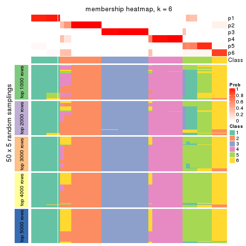</p>

</div>
</div>

As soon as we have had the classes for columns, we can look for signatures
which are significantly different between classes which can be candidate marks
for certain classes. Following are the heatmaps for signatures.


Signature heatmaps where rows are scaled:


<script>
$( function() {
	$( '#tabs-SD-skmeans-get-signatures' ).tabs();
} );
</script>
<div id='tabs-SD-skmeans-get-signatures'>
<ul>
<li><a href='#tab-SD-skmeans-get-signatures-1'>k = 2</a></li>
<li><a href='#tab-SD-skmeans-get-signatures-2'>k = 3</a></li>
<li><a href='#tab-SD-skmeans-get-signatures-3'>k = 4</a></li>
<li><a href='#tab-SD-skmeans-get-signatures-4'>k = 5</a></li>
<li><a href='#tab-SD-skmeans-get-signatures-5'>k = 6</a></li>
</ul>
<div id='tab-SD-skmeans-get-signatures-1'>
<pre><code class="r">get_signatures(res, k = 2)
</code></pre>

<p></p>

</div>
<div id='tab-SD-skmeans-get-signatures-2'>
<pre><code class="r">get_signatures(res, k = 3)
</code></pre>

<p></p>

</div>
<div id='tab-SD-skmeans-get-signatures-3'>
<pre><code class="r">get_signatures(res, k = 4)
</code></pre>

<p></p>

</div>
<div id='tab-SD-skmeans-get-signatures-4'>
<pre><code class="r">get_signatures(res, k = 5)
</code></pre>

<p></p>

</div>
<div id='tab-SD-skmeans-get-signatures-5'>
<pre><code class="r">get_signatures(res, k = 6)
</code></pre>

<p></p>

</div>
</div>


Signature heatmaps where rows are not scaled:


<script>
$( function() {
	$( '#tabs-SD-skmeans-get-signatures-no-scale' ).tabs();
} );
</script>
<div id='tabs-SD-skmeans-get-signatures-no-scale'>
<ul>
<li><a href='#tab-SD-skmeans-get-signatures-no-scale-1'>k = 2</a></li>
<li><a href='#tab-SD-skmeans-get-signatures-no-scale-2'>k = 3</a></li>
<li><a href='#tab-SD-skmeans-get-signatures-no-scale-3'>k = 4</a></li>
<li><a href='#tab-SD-skmeans-get-signatures-no-scale-4'>k = 5</a></li>
<li><a href='#tab-SD-skmeans-get-signatures-no-scale-5'>k = 6</a></li>
</ul>
<div id='tab-SD-skmeans-get-signatures-no-scale-1'>
<pre><code class="r">get_signatures(res, k = 2, scale_rows = FALSE)
</code></pre>

<p></p>

</div>
<div id='tab-SD-skmeans-get-signatures-no-scale-2'>
<pre><code class="r">get_signatures(res, k = 3, scale_rows = FALSE)
</code></pre>

<p></p>

</div>
<div id='tab-SD-skmeans-get-signatures-no-scale-3'>
<pre><code class="r">get_signatures(res, k = 4, scale_rows = FALSE)
</code></pre>

<p></p>

</div>
<div id='tab-SD-skmeans-get-signatures-no-scale-4'>
<pre><code class="r">get_signatures(res, k = 5, scale_rows = FALSE)
</code></pre>

<p></p>

</div>
<div id='tab-SD-skmeans-get-signatures-no-scale-5'>
<pre><code class="r">get_signatures(res, k = 6, scale_rows = FALSE)
</code></pre>

<p></p>

</div>
</div>


Compare the overlap of signatures from different k:

```r
compare_signatures(res)
```


`get_signature()` returns a data frame invisibly. TO get the list of signatures, the function
call should be assigned to a variable explicitly. In following code, if `plot` argument is set
to `FALSE`, no heatmap is plotted while only the differential analysis is performed.

```r
# code only for demonstration
tb = get_signature(res, k = ..., plot = FALSE)
```

An example of the output of `tb` is:

```
#>   which_row         fdr    mean_1    mean_2 scaled_mean_1 scaled_mean_2 km
#> 1        38 0.042760348  8.373488  9.131774    -0.5533452     0.5164555  1
#> 2        40 0.018707592  7.106213  8.469186    -0.6173731     0.5762149  1
#> 3        55 0.019134737 10.221463 11.207825    -0.6159697     0.5749050  1
#> 4        59 0.006059896  5.921854  7.869574    -0.6899429     0.6439467  1
#> 5        60 0.018055526  8.928898 10.211722    -0.6204761     0.5791110  1
#> 6        98 0.009384629 15.714769 14.887706     0.6635654    -0.6193277  2
...
```

The columns in `tb` are:

1. `which_row`: row indices corresponding to the input matrix.
2. `fdr`: FDR for the differential test. 
3. `mean_x`: The mean value in group x.
4. `scaled_mean_x`: The mean value in group x after rows are scaled.
5. `km`: Row groups if k-means clustering is applied to rows.


UMAP plot which shows how samples are separated.


<script>
$( function() {
	$( '#tabs-SD-skmeans-dimension-reduction' ).tabs();
} );
</script>
<div id='tabs-SD-skmeans-dimension-reduction'>
<ul>
<li><a href='#tab-SD-skmeans-dimension-reduction-1'>k = 2</a></li>
<li><a href='#tab-SD-skmeans-dimension-reduction-2'>k = 3</a></li>
<li><a href='#tab-SD-skmeans-dimension-reduction-3'>k = 4</a></li>
<li><a href='#tab-SD-skmeans-dimension-reduction-4'>k = 5</a></li>
<li><a href='#tab-SD-skmeans-dimension-reduction-5'>k = 6</a></li>
</ul>
<div id='tab-SD-skmeans-dimension-reduction-1'>
<pre><code class="r">dimension_reduction(res, k = 2, method = &quot;UMAP&quot;)
</code></pre>

<p></p>

</div>
<div id='tab-SD-skmeans-dimension-reduction-2'>
<pre><code class="r">dimension_reduction(res, k = 3, method = &quot;UMAP&quot;)
</code></pre>

<p></p>

</div>
<div id='tab-SD-skmeans-dimension-reduction-3'>
<pre><code class="r">dimension_reduction(res, k = 4, method = &quot;UMAP&quot;)
</code></pre>

<p></p>

</div>
<div id='tab-SD-skmeans-dimension-reduction-4'>
<pre><code class="r">dimension_reduction(res, k = 5, method = &quot;UMAP&quot;)
</code></pre>

<p></p>

</div>
<div id='tab-SD-skmeans-dimension-reduction-5'>
<pre><code class="r">dimension_reduction(res, k = 6, method = &quot;UMAP&quot;)
</code></pre>

<p></p>

</div>
</div>


Following heatmap shows how subgroups are split when increasing `k`:

```r
collect_classes(res)
```


If matrix rows can be associated to genes, consider to use `GO_Enrichment(res,
...)` to perform function enrichment for the signature genes.


 

---------------------------------------------------


### SD:pam*


The object with results only for a single top-value method and a single partition method 
can be extracted as:

```r
res = res_list["SD", "pam"]
# you can also extract it by
# res = res_list["SD:pam"]
```

A summary of `res` and all the functions that can be applied to it:

```r
res
```

```
#> A 'ConsensusPartition' object with k = 2, 3, 4, 5, 6.
#>   On a matrix with 17245 rows and 418 columns.
#>   Top rows (1000, 2000, 3000, 4000, 5000) are extracted by 'SD' method.
#>   Subgroups are detected by 'pam' method.
#>   Performed in total 1250 partitions by row resampling.
#>   Best k for subgroups seems to be 5.
#> 
#> Following methods can be applied to this 'ConsensusPartition' object:
#>  [1] "cola_report"             "collect_classes"         "collect_plots"          
#>  [4] "collect_stats"           "colnames"                "compare_signatures"     
#>  [7] "consensus_heatmap"       "dimension_reduction"     "functional_enrichment"  
#> [10] "get_anno_col"            "get_anno"                "get_classes"            
#> [13] "get_consensus"           "get_matrix"              "get_membership"         
#> [16] "get_param"               "get_signatures"          "get_stats"              
#> [19] "is_best_k"               "is_stable_k"             "membership_heatmap"     
#> [22] "ncol"                    "nrow"                    "plot_ecdf"              
#> [25] "rownames"                "select_partition_number" "show"                   
#> [28] "suggest_best_k"          "test_to_known_factors"
```

`collect_plots()` function collects all the plots made from `res` for all `k` (number of partitions)
into one single page to provide an easy and fast comparison between different `k`.

```r
collect_plots(res)
```


The plots are:

- The first row: a plot of the ECDF (Empirical cumulative distribution
  function) curves of the consensus matrix for each `k` and the heatmap of
  predicted classes for each `k`.
- The second row: heatmaps of the consensus matrix for each `k`.
- The third row: heatmaps of the membership matrix for each `k`.
- The fouth row: heatmaps of the signatures for each `k`.

All the plots in panels can be made by individual functions and they are
plotted later in this section.

`select_partition_number()` produces several plots showing different
statistics for choosing "optimized" `k`. There are following statistics:

- ECDF curves of the consensus matrix for each `k`;
- 1-PAC. [The PAC
  score](https://en.wikipedia.org/wiki/Consensus_clustering#Over-interpretation_potential_of_consensus_clustering)
  measures the proportion of the ambiguous subgrouping.
- Mean silhouette score.
- Concordance. The mean probability of fiting the consensus class ids in all
  partitions.
- Area increased. Denote $A_k$ as the area under the ECDF curve for current
  `k`, the area increased is defined as $A_k - A_{k-1}$.
- Rand index. The percent of pairs of samples that are both in a same cluster
  or both are not in a same cluster in the partition of k and k-1.
- Jaccard index. The ratio of pairs of samples are both in a same cluster in
  the partition of k and k-1 and the pairs of samples are both in a same
  cluster in the partition k or k-1.

The detailed explanations of these statistics can be found in [the cola
vignette](http://bioconductor.org/packages/devel/bioc/vignettes/cola/inst/doc/cola.html#toc_13).

Generally speaking, lower PAC score, higher mean silhouette score or higher
concordance corresponds to better partition. Rand index and Jaccard index
measure how similar the current partition is compared to partition with `k-1`.
If they are too similar, we won't accept `k` is better than `k-1`.

```r
select_partition_number(res)
```


The numeric values for all these statistics can be obtained by `get_stats()`.

```r
get_stats(res)
```

```
#>   k 1-PAC mean_silhouette concordance area_increased  Rand Jaccard
#> 2 2 0.762           0.882       0.949         0.4874 0.515   0.515
#> 3 3 0.870           0.874       0.948         0.3576 0.683   0.460
#> 4 4 0.783           0.795       0.898         0.1197 0.798   0.497
#> 5 5 0.937           0.887       0.954         0.0754 0.879   0.585
#> 6 6 0.891           0.856       0.914         0.0332 0.957   0.794
```

`suggest_best_k()` suggests the best $k$ based on these statistics. The rules are as follows:

- All $k$ with Jaccard index larger than 0.95 are removed because the increase of
  the partition number does not provides enough extra information. If all $k$ are removed,
  the best $k$ is assigned by `NA`.
- For $k$ with 1-PAC larger than 0.9, the maximal $k$ is taken as the "best k". Other $k$ is called "optional k".
- If it does not fit the second rule. The $k$ with the highest vote of highest
  1-PAC, mean silhouette and concordance is taken as the "best k".

```r
suggest_best_k(res)
```

```
#> [1] 5
```


Following shows the table of the partitions (You need to click the **show/hide
code output** link to see it). The membership matrix (columns with name `p*`)
is inferred by
[`clue::cl_consensus()`](https://www.rdocumentation.org/link/cl_consensus?package=clue)
function with the `SE` method. Basically the value in the membership matrix
represents the probability to belong to a certain group. The finall class
label for an item is determined with the group with highest probability it
belongs to.

In `get_classes()` function, the entropy is calculated from the membership
matrix and the silhouette score is calculated from the consensus matrix.


<script>
$( function() {
	$( '#tabs-SD-pam-get-classes' ).tabs();
} );
</script>
<div id='tabs-SD-pam-get-classes'>
<ul>
<li><a href='#tab-SD-pam-get-classes-1'>k = 2</a></li>
<li><a href='#tab-SD-pam-get-classes-2'>k = 3</a></li>
<li><a href='#tab-SD-pam-get-classes-3'>k = 4</a></li>
<li><a href='#tab-SD-pam-get-classes-4'>k = 5</a></li>
<li><a href='#tab-SD-pam-get-classes-5'>k = 6</a></li>
</ul>

<div id='tab-SD-pam-get-classes-1'>
<p><a id='tab-SD-pam-get-classes-1-a' style='color:#0366d6' href='#'>show/hide code output</a></p>
<pre><code class="r">cbind(get_classes(res, k = 2), get_membership(res, k = 2))
</code></pre>

<pre><code>#&gt;           class entropy silhouette    p1    p2
#&gt; SRR902920     1  0.0000    0.97592 1.000 0.000
#&gt; SRR902921     1  0.0000    0.97592 1.000 0.000
#&gt; SRR902922     1  0.0000    0.97592 1.000 0.000
#&gt; SRR902923     1  0.0000    0.97592 1.000 0.000
#&gt; SRR902924     1  0.0000    0.97592 1.000 0.000
#&gt; SRR902925     1  0.0000    0.97592 1.000 0.000
#&gt; SRR902926     1  0.0000    0.97592 1.000 0.000
#&gt; SRR902927     1  0.0000    0.97592 1.000 0.000
#&gt; SRR902928     1  0.0000    0.97592 1.000 0.000
#&gt; SRR902929     1  0.0000    0.97592 1.000 0.000
#&gt; SRR902930     1  0.0000    0.97592 1.000 0.000
#&gt; SRR902931     1  0.0000    0.97592 1.000 0.000
#&gt; SRR902932     2  0.0000    0.92319 0.000 1.000
#&gt; SRR902933     2  0.0000    0.92319 0.000 1.000
#&gt; SRR902934     2  0.0000    0.92319 0.000 1.000
#&gt; SRR902935     2  0.0000    0.92319 0.000 1.000
#&gt; SRR902936     2  0.0000    0.92319 0.000 1.000
#&gt; SRR902937     2  0.0000    0.92319 0.000 1.000
#&gt; SRR902938     2  0.0000    0.92319 0.000 1.000
#&gt; SRR902939     2  0.0000    0.92319 0.000 1.000
#&gt; SRR902940     2  0.0000    0.92319 0.000 1.000
#&gt; SRR902941     2  0.0000    0.92319 0.000 1.000
#&gt; SRR902942     1  0.0000    0.97592 1.000 0.000
#&gt; SRR902943     1  0.0000    0.97592 1.000 0.000
#&gt; SRR902944     1  0.0000    0.97592 1.000 0.000
#&gt; SRR902945     1  0.0000    0.97592 1.000 0.000
#&gt; SRR902946     1  0.0000    0.97592 1.000 0.000
#&gt; SRR902947     1  0.0000    0.97592 1.000 0.000
#&gt; SRR902954     1  0.0000    0.97592 1.000 0.000
#&gt; SRR902955     1  0.0000    0.97592 1.000 0.000
#&gt; SRR902956     1  0.0000    0.97592 1.000 0.000
#&gt; SRR902957     1  0.0000    0.97592 1.000 0.000
#&gt; SRR902958     1  0.0000    0.97592 1.000 0.000
#&gt; SRR902959     1  0.0000    0.97592 1.000 0.000
#&gt; SRR902948     1  0.0000    0.97592 1.000 0.000
#&gt; SRR902949     1  0.0000    0.97592 1.000 0.000
#&gt; SRR902950     1  0.0000    0.97592 1.000 0.000
#&gt; SRR902951     1  0.0000    0.97592 1.000 0.000
#&gt; SRR902952     1  0.0000    0.97592 1.000 0.000
#&gt; SRR902953     1  0.0000    0.97592 1.000 0.000
#&gt; SRR902960     1  0.0000    0.97592 1.000 0.000
#&gt; SRR902961     1  0.0000    0.97592 1.000 0.000
#&gt; SRR902962     1  0.0000    0.97592 1.000 0.000
#&gt; SRR902963     1  0.0000    0.97592 1.000 0.000
#&gt; SRR902964     1  0.0000    0.97592 1.000 0.000
#&gt; SRR902965     1  0.0000    0.97592 1.000 0.000
#&gt; SRR902966     1  0.0000    0.97592 1.000 0.000
#&gt; SRR902967     1  0.0000    0.97592 1.000 0.000
#&gt; SRR902968     1  0.0000    0.97592 1.000 0.000
#&gt; SRR902969     1  0.0000    0.97592 1.000 0.000
#&gt; SRR902970     1  0.0000    0.97592 1.000 0.000
#&gt; SRR902971     1  0.0000    0.97592 1.000 0.000
#&gt; SRR902972     1  0.0000    0.97592 1.000 0.000
#&gt; SRR902973     1  0.0000    0.97592 1.000 0.000
#&gt; SRR902974     1  0.0000    0.97592 1.000 0.000
#&gt; SRR902975     1  0.0000    0.97592 1.000 0.000
#&gt; SRR902976     1  0.0000    0.97592 1.000 0.000
#&gt; SRR902977     1  0.0000    0.97592 1.000 0.000
#&gt; SRR902978     1  0.0000    0.97592 1.000 0.000
#&gt; SRR902980     1  0.0000    0.97592 1.000 0.000
#&gt; SRR902981     1  0.0000    0.97592 1.000 0.000
#&gt; SRR902982     1  0.0000    0.97592 1.000 0.000
#&gt; SRR902983     1  0.0000    0.97592 1.000 0.000
#&gt; SRR902984     1  0.0000    0.97592 1.000 0.000
#&gt; SRR902985     1  0.0000    0.97592 1.000 0.000
#&gt; SRR902986     1  0.0000    0.97592 1.000 0.000
#&gt; SRR902987     1  0.0000    0.97592 1.000 0.000
#&gt; SRR902988     1  0.0000    0.97592 1.000 0.000
#&gt; SRR902989     1  0.0000    0.97592 1.000 0.000
#&gt; SRR902990     1  0.0000    0.97592 1.000 0.000
#&gt; SRR902991     1  0.0000    0.97592 1.000 0.000
#&gt; SRR902992     1  0.0000    0.97592 1.000 0.000
#&gt; SRR902993     1  0.0000    0.97592 1.000 0.000
#&gt; SRR902994     1  0.0000    0.97592 1.000 0.000
#&gt; SRR902995     1  0.0000    0.97592 1.000 0.000
#&gt; SRR902996     2  0.0000    0.92319 0.000 1.000
#&gt; SRR902997     2  0.0000    0.92319 0.000 1.000
#&gt; SRR902998     2  0.0000    0.92319 0.000 1.000
#&gt; SRR902999     2  0.0000    0.92319 0.000 1.000
#&gt; SRR903000     2  0.0000    0.92319 0.000 1.000
#&gt; SRR903001     2  0.0000    0.92319 0.000 1.000
#&gt; SRR903008     2  0.0000    0.92319 0.000 1.000
#&gt; SRR903009     2  0.0000    0.92319 0.000 1.000
#&gt; SRR903010     2  0.0000    0.92319 0.000 1.000
#&gt; SRR903011     2  0.0000    0.92319 0.000 1.000
#&gt; SRR903012     2  0.0000    0.92319 0.000 1.000
#&gt; SRR903013     2  0.0000    0.92319 0.000 1.000
#&gt; SRR903002     2  0.0000    0.92319 0.000 1.000
#&gt; SRR903003     2  0.0000    0.92319 0.000 1.000
#&gt; SRR903004     2  0.0000    0.92319 0.000 1.000
#&gt; SRR903005     2  0.0000    0.92319 0.000 1.000
#&gt; SRR903006     2  0.0000    0.92319 0.000 1.000
#&gt; SRR903007     2  0.0000    0.92319 0.000 1.000
#&gt; SRR903014     1  0.0000    0.97592 1.000 0.000
#&gt; SRR903015     1  0.0000    0.97592 1.000 0.000
#&gt; SRR903016     1  0.0000    0.97592 1.000 0.000
#&gt; SRR903017     1  0.0000    0.97592 1.000 0.000
#&gt; SRR903018     1  0.0000    0.97592 1.000 0.000
#&gt; SRR903019     1  0.0000    0.97592 1.000 0.000
#&gt; SRR903020     1  0.0000    0.97592 1.000 0.000
#&gt; SRR903021     1  0.0000    0.97592 1.000 0.000
#&gt; SRR903022     1  0.0000    0.97592 1.000 0.000
#&gt; SRR903023     1  0.0000    0.97592 1.000 0.000
#&gt; SRR903024     1  0.0000    0.97592 1.000 0.000
#&gt; SRR903025     1  0.0000    0.97592 1.000 0.000
#&gt; SRR903026     1  0.0000    0.97592 1.000 0.000
#&gt; SRR903027     1  0.0000    0.97592 1.000 0.000
#&gt; SRR903028     1  0.0000    0.97592 1.000 0.000
#&gt; SRR903029     1  0.0000    0.97592 1.000 0.000
#&gt; SRR903030     1  0.0000    0.97592 1.000 0.000
#&gt; SRR903031     1  0.0000    0.97592 1.000 0.000
#&gt; SRR903032     2  0.0000    0.92319 0.000 1.000
#&gt; SRR903033     2  0.0000    0.92319 0.000 1.000
#&gt; SRR903034     2  0.0000    0.92319 0.000 1.000
#&gt; SRR903035     2  0.0000    0.92319 0.000 1.000
#&gt; SRR903036     2  0.0000    0.92319 0.000 1.000
#&gt; SRR903037     2  0.0000    0.92319 0.000 1.000
#&gt; SRR903038     2  0.0000    0.92319 0.000 1.000
#&gt; SRR903039     2  0.0000    0.92319 0.000 1.000
#&gt; SRR903040     2  0.0000    0.92319 0.000 1.000
#&gt; SRR903041     2  0.0000    0.92319 0.000 1.000
#&gt; SRR903042     2  0.0000    0.92319 0.000 1.000
#&gt; SRR903043     2  0.0000    0.92319 0.000 1.000
#&gt; SRR903044     2  0.0000    0.92319 0.000 1.000
#&gt; SRR903045     2  0.0000    0.92319 0.000 1.000
#&gt; SRR903046     2  0.0000    0.92319 0.000 1.000
#&gt; SRR903047     2  0.0000    0.92319 0.000 1.000
#&gt; SRR903048     2  0.0000    0.92319 0.000 1.000
#&gt; SRR903049     2  0.0000    0.92319 0.000 1.000
#&gt; SRR903050     2  0.9710    0.44694 0.400 0.600
#&gt; SRR903051     2  0.9710    0.44694 0.400 0.600
#&gt; SRR903052     2  0.9710    0.44694 0.400 0.600
#&gt; SRR903053     2  0.9710    0.44694 0.400 0.600
#&gt; SRR903054     2  0.9710    0.44694 0.400 0.600
#&gt; SRR903055     2  0.9710    0.44694 0.400 0.600
#&gt; SRR903056     2  0.9710    0.44694 0.400 0.600
#&gt; SRR903057     2  0.9710    0.44694 0.400 0.600
#&gt; SRR903058     1  0.9944    0.00932 0.544 0.456
#&gt; SRR903059     1  1.0000   -0.14562 0.504 0.496
#&gt; SRR903060     1  0.9963   -0.02353 0.536 0.464
#&gt; SRR903061     1  0.9896    0.07277 0.560 0.440
#&gt; SRR903062     1  1.0000   -0.15996 0.500 0.500
#&gt; SRR903063     1  1.0000   -0.14563 0.504 0.496
#&gt; SRR903064     1  0.9983   -0.07113 0.524 0.476
#&gt; SRR903065     2  1.0000    0.16590 0.496 0.504
#&gt; SRR903066     2  0.9710    0.44694 0.400 0.600
#&gt; SRR903067     2  0.9710    0.44694 0.400 0.600
#&gt; SRR903068     2  0.9710    0.44694 0.400 0.600
#&gt; SRR903069     2  0.9710    0.44694 0.400 0.600
#&gt; SRR903070     2  0.9710    0.44694 0.400 0.600
#&gt; SRR903071     2  0.9710    0.44694 0.400 0.600
#&gt; SRR903072     2  0.9710    0.44694 0.400 0.600
#&gt; SRR903073     2  0.9710    0.44694 0.400 0.600
#&gt; SRR903074     2  0.9608    0.48160 0.384 0.616
#&gt; SRR903075     2  0.9635    0.47317 0.388 0.612
#&gt; SRR903076     2  0.9580    0.48981 0.380 0.620
#&gt; SRR903077     2  0.9608    0.48160 0.384 0.616
#&gt; SRR903078     2  0.9552    0.49787 0.376 0.624
#&gt; SRR903079     2  0.9635    0.47317 0.388 0.612
#&gt; SRR903080     2  0.9608    0.48160 0.384 0.616
#&gt; SRR903081     2  0.9552    0.49787 0.376 0.624
#&gt; SRR903082     2  0.0000    0.92319 0.000 1.000
#&gt; SRR903083     2  0.0000    0.92319 0.000 1.000
#&gt; SRR903084     2  0.0000    0.92319 0.000 1.000
#&gt; SRR903085     2  0.0000    0.92319 0.000 1.000
#&gt; SRR903086     2  0.0000    0.92319 0.000 1.000
#&gt; SRR903087     2  0.0000    0.92319 0.000 1.000
#&gt; SRR903088     2  0.0000    0.92319 0.000 1.000
#&gt; SRR903089     2  0.0000    0.92319 0.000 1.000
#&gt; SRR903090     2  0.0000    0.92319 0.000 1.000
#&gt; SRR903091     2  0.0000    0.92319 0.000 1.000
#&gt; SRR903092     2  0.0000    0.92319 0.000 1.000
#&gt; SRR903093     2  0.0000    0.92319 0.000 1.000
#&gt; SRR903094     2  0.0000    0.92319 0.000 1.000
#&gt; SRR903095     2  0.0000    0.92319 0.000 1.000
#&gt; SRR903096     2  0.0000    0.92319 0.000 1.000
#&gt; SRR903097     2  0.0000    0.92319 0.000 1.000
#&gt; SRR903098     2  0.0000    0.92319 0.000 1.000
#&gt; SRR903099     2  0.0000    0.92319 0.000 1.000
#&gt; SRR903100     2  0.0000    0.92319 0.000 1.000
#&gt; SRR903101     2  0.0000    0.92319 0.000 1.000
#&gt; SRR903102     2  0.0000    0.92319 0.000 1.000
#&gt; SRR903103     2  0.0000    0.92319 0.000 1.000
#&gt; SRR903104     2  0.0000    0.92319 0.000 1.000
#&gt; SRR903105     2  0.0000    0.92319 0.000 1.000
#&gt; SRR903106     2  0.0000    0.92319 0.000 1.000
#&gt; SRR903107     2  0.0000    0.92319 0.000 1.000
#&gt; SRR903108     2  0.0000    0.92319 0.000 1.000
#&gt; SRR903109     2  0.0000    0.92319 0.000 1.000
#&gt; SRR903110     2  0.0000    0.92319 0.000 1.000
#&gt; SRR903111     2  0.0000    0.92319 0.000 1.000
#&gt; SRR903112     2  0.0000    0.92319 0.000 1.000
#&gt; SRR903113     2  0.0000    0.92319 0.000 1.000
#&gt; SRR903114     2  0.8207    0.69550 0.256 0.744
#&gt; SRR903115     2  0.8207    0.69550 0.256 0.744
#&gt; SRR903116     2  0.8207    0.69550 0.256 0.744
#&gt; SRR903117     2  0.8207    0.69550 0.256 0.744
#&gt; SRR903118     2  0.8207    0.69550 0.256 0.744
#&gt; SRR903119     2  0.8207    0.69550 0.256 0.744
#&gt; SRR903121     2  0.8207    0.69550 0.256 0.744
#&gt; SRR903122     2  0.8207    0.69550 0.256 0.744
#&gt; SRR903124     2  0.8207    0.69550 0.256 0.744
#&gt; SRR903125     2  0.8207    0.69550 0.256 0.744
#&gt; SRR903126     2  0.8207    0.69550 0.256 0.744
#&gt; SRR903127     2  0.8207    0.69550 0.256 0.744
#&gt; SRR903128     2  0.8207    0.69550 0.256 0.744
#&gt; SRR903129     2  0.8207    0.69550 0.256 0.744
#&gt; SRR903130     2  0.8207    0.69550 0.256 0.744
#&gt; SRR903131     2  0.8207    0.69550 0.256 0.744
#&gt; SRR903132     2  0.8207    0.69550 0.256 0.744
#&gt; SRR903133     2  0.8207    0.69550 0.256 0.744
#&gt; SRR903134     2  0.8207    0.69550 0.256 0.744
#&gt; SRR903135     2  0.8207    0.69550 0.256 0.744
#&gt; SRR903136     2  0.8207    0.69550 0.256 0.744
#&gt; SRR903137     2  0.8207    0.69550 0.256 0.744
#&gt; SRR903146     2  0.0000    0.92319 0.000 1.000
#&gt; SRR903147     2  0.0000    0.92319 0.000 1.000
#&gt; SRR903148     2  0.0000    0.92319 0.000 1.000
#&gt; SRR903149     2  0.0000    0.92319 0.000 1.000
#&gt; SRR903150     2  0.0000    0.92319 0.000 1.000
#&gt; SRR903151     2  0.0000    0.92319 0.000 1.000
#&gt; SRR903152     2  0.0000    0.92319 0.000 1.000
#&gt; SRR903153     2  0.0000    0.92319 0.000 1.000
#&gt; SRR903138     2  0.8207    0.69550 0.256 0.744
#&gt; SRR903139     2  0.8207    0.69550 0.256 0.744
#&gt; SRR903140     2  0.8207    0.69550 0.256 0.744
#&gt; SRR903141     2  0.8207    0.69550 0.256 0.744
#&gt; SRR903142     2  0.8207    0.69550 0.256 0.744
#&gt; SRR903143     2  0.8207    0.69550 0.256 0.744
#&gt; SRR903144     2  0.8207    0.69550 0.256 0.744
#&gt; SRR903145     2  0.8207    0.69550 0.256 0.744
#&gt; SRR903154     2  0.0000    0.92319 0.000 1.000
#&gt; SRR903155     2  0.0000    0.92319 0.000 1.000
#&gt; SRR903156     2  0.0000    0.92319 0.000 1.000
#&gt; SRR903157     2  0.0000    0.92319 0.000 1.000
#&gt; SRR903158     2  0.0000    0.92319 0.000 1.000
#&gt; SRR903159     2  0.0000    0.92319 0.000 1.000
#&gt; SRR903160     2  0.0000    0.92319 0.000 1.000
#&gt; SRR903161     2  0.0000    0.92319 0.000 1.000
#&gt; SRR903162     2  0.0000    0.92319 0.000 1.000
#&gt; SRR903163     2  0.0000    0.92319 0.000 1.000
#&gt; SRR903164     2  0.0000    0.92319 0.000 1.000
#&gt; SRR903165     2  0.0000    0.92319 0.000 1.000
#&gt; SRR903166     2  0.0000    0.92319 0.000 1.000
#&gt; SRR903167     2  0.0000    0.92319 0.000 1.000
#&gt; SRR903168     2  0.0000    0.92319 0.000 1.000
#&gt; SRR903169     2  0.0000    0.92319 0.000 1.000
#&gt; SRR903178     1  0.0000    0.97592 1.000 0.000
#&gt; SRR903179     1  0.0000    0.97592 1.000 0.000
#&gt; SRR903180     1  0.0000    0.97592 1.000 0.000
#&gt; SRR903181     1  0.0000    0.97592 1.000 0.000
#&gt; SRR903182     1  0.0000    0.97592 1.000 0.000
#&gt; SRR903183     1  0.0000    0.97592 1.000 0.000
#&gt; SRR903184     1  0.0000    0.97592 1.000 0.000
#&gt; SRR903185     1  0.0000    0.97592 1.000 0.000
#&gt; SRR903170     2  0.0000    0.92319 0.000 1.000
#&gt; SRR903171     2  0.0000    0.92319 0.000 1.000
#&gt; SRR903172     2  0.0000    0.92319 0.000 1.000
#&gt; SRR903173     2  0.0000    0.92319 0.000 1.000
#&gt; SRR903174     2  0.0000    0.92319 0.000 1.000
#&gt; SRR903175     2  0.0000    0.92319 0.000 1.000
#&gt; SRR903176     2  0.0000    0.92319 0.000 1.000
#&gt; SRR903177     2  0.0000    0.92319 0.000 1.000
#&gt; SRR903186     1  0.0000    0.97592 1.000 0.000
#&gt; SRR903187     1  0.0000    0.97592 1.000 0.000
#&gt; SRR903188     1  0.0000    0.97592 1.000 0.000
#&gt; SRR903189     1  0.0000    0.97592 1.000 0.000
#&gt; SRR903190     1  0.0000    0.97592 1.000 0.000
#&gt; SRR903191     1  0.0000    0.97592 1.000 0.000
#&gt; SRR903192     1  0.0000    0.97592 1.000 0.000
#&gt; SRR903193     1  0.0000    0.97592 1.000 0.000
#&gt; SRR903194     1  0.0000    0.97592 1.000 0.000
#&gt; SRR903195     1  0.0000    0.97592 1.000 0.000
#&gt; SRR903196     1  0.0000    0.97592 1.000 0.000
#&gt; SRR903197     1  0.0000    0.97592 1.000 0.000
#&gt; SRR903198     1  0.0000    0.97592 1.000 0.000
#&gt; SRR903199     1  0.0000    0.97592 1.000 0.000
#&gt; SRR903200     1  0.0000    0.97592 1.000 0.000
#&gt; SRR903201     1  0.0000    0.97592 1.000 0.000
#&gt; SRR903210     2  0.0000    0.92319 0.000 1.000
#&gt; SRR903211     2  0.0000    0.92319 0.000 1.000
#&gt; SRR903212     2  0.0000    0.92319 0.000 1.000
#&gt; SRR903213     2  0.0000    0.92319 0.000 1.000
#&gt; SRR903214     2  0.0000    0.92319 0.000 1.000
#&gt; SRR903215     2  0.0000    0.92319 0.000 1.000
#&gt; SRR903216     2  0.0000    0.92319 0.000 1.000
#&gt; SRR903217     2  0.0000    0.92319 0.000 1.000
#&gt; SRR903202     1  0.0000    0.97592 1.000 0.000
#&gt; SRR903203     1  0.0000    0.97592 1.000 0.000
#&gt; SRR903204     1  0.0000    0.97592 1.000 0.000
#&gt; SRR903205     1  0.0000    0.97592 1.000 0.000
#&gt; SRR903206     1  0.0000    0.97592 1.000 0.000
#&gt; SRR903207     1  0.0000    0.97592 1.000 0.000
#&gt; SRR903208     1  0.0000    0.97592 1.000 0.000
#&gt; SRR903209     1  0.0000    0.97592 1.000 0.000
#&gt; SRR903218     2  0.0000    0.92319 0.000 1.000
#&gt; SRR903219     2  0.0000    0.92319 0.000 1.000
#&gt; SRR903220     2  0.0000    0.92319 0.000 1.000
#&gt; SRR903221     2  0.0000    0.92319 0.000 1.000
#&gt; SRR903222     2  0.0000    0.92319 0.000 1.000
#&gt; SRR903223     2  0.0000    0.92319 0.000 1.000
#&gt; SRR903224     2  0.0000    0.92319 0.000 1.000
#&gt; SRR903225     2  0.0000    0.92319 0.000 1.000
#&gt; SRR903226     2  0.0000    0.92319 0.000 1.000
#&gt; SRR903227     2  0.0000    0.92319 0.000 1.000
#&gt; SRR903228     2  0.0000    0.92319 0.000 1.000
#&gt; SRR903229     2  0.0000    0.92319 0.000 1.000
#&gt; SRR903230     2  0.0000    0.92319 0.000 1.000
#&gt; SRR903231     2  0.0000    0.92319 0.000 1.000
#&gt; SRR903232     2  0.0000    0.92319 0.000 1.000
#&gt; SRR903233     2  0.0000    0.92319 0.000 1.000
#&gt; SRR903242     1  0.0672    0.97048 0.992 0.008
#&gt; SRR903243     1  0.0672    0.97048 0.992 0.008
#&gt; SRR903244     1  0.0672    0.97048 0.992 0.008
#&gt; SRR903245     1  0.0672    0.97048 0.992 0.008
#&gt; SRR903246     1  0.0672    0.97048 0.992 0.008
#&gt; SRR903247     1  0.0672    0.97048 0.992 0.008
#&gt; SRR903248     1  0.0672    0.97048 0.992 0.008
#&gt; SRR903249     1  0.0672    0.97048 0.992 0.008
#&gt; SRR903234     2  0.0000    0.92319 0.000 1.000
#&gt; SRR903235     2  0.0000    0.92319 0.000 1.000
#&gt; SRR903236     2  0.0000    0.92319 0.000 1.000
#&gt; SRR903237     2  0.0000    0.92319 0.000 1.000
#&gt; SRR903238     2  0.0000    0.92319 0.000 1.000
#&gt; SRR903239     2  0.0000    0.92319 0.000 1.000
#&gt; SRR903240     2  0.0000    0.92319 0.000 1.000
#&gt; SRR903241     2  0.0000    0.92319 0.000 1.000
#&gt; SRR903258     1  0.0672    0.97048 0.992 0.008
#&gt; SRR903259     1  0.0672    0.97048 0.992 0.008
#&gt; SRR903260     1  0.0672    0.97048 0.992 0.008
#&gt; SRR903261     1  0.0672    0.97048 0.992 0.008
#&gt; SRR903262     1  0.0672    0.97048 0.992 0.008
#&gt; SRR903263     1  0.0672    0.97048 0.992 0.008
#&gt; SRR903264     1  0.0672    0.97048 0.992 0.008
#&gt; SRR903265     1  0.0672    0.97048 0.992 0.008
#&gt; SRR903250     1  0.0672    0.97048 0.992 0.008
#&gt; SRR903251     1  0.0672    0.97048 0.992 0.008
#&gt; SRR903252     1  0.0672    0.97048 0.992 0.008
#&gt; SRR903253     1  0.0672    0.97048 0.992 0.008
#&gt; SRR903254     1  0.0672    0.97048 0.992 0.008
#&gt; SRR903255     1  0.0672    0.97048 0.992 0.008
#&gt; SRR903256     1  0.0672    0.97048 0.992 0.008
#&gt; SRR903257     1  0.0672    0.97048 0.992 0.008
#&gt; SRR903266     1  0.0672    0.97048 0.992 0.008
#&gt; SRR903267     1  0.0672    0.97048 0.992 0.008
#&gt; SRR903268     1  0.0672    0.97048 0.992 0.008
#&gt; SRR903270     1  0.0672    0.97048 0.992 0.008
#&gt; SRR903271     1  0.0672    0.97048 0.992 0.008
#&gt; SRR903272     1  0.0672    0.97048 0.992 0.008
#&gt; SRR903273     1  0.0672    0.97048 0.992 0.008
#&gt; SRR903274     2  0.0000    0.92319 0.000 1.000
#&gt; SRR903275     2  0.0000    0.92319 0.000 1.000
#&gt; SRR903276     2  0.0000    0.92319 0.000 1.000
#&gt; SRR903277     2  0.0000    0.92319 0.000 1.000
#&gt; SRR903278     2  0.0000    0.92319 0.000 1.000
#&gt; SRR903279     2  0.0000    0.92319 0.000 1.000
#&gt; SRR903280     2  0.0000    0.92319 0.000 1.000
#&gt; SRR903281     2  0.0000    0.92319 0.000 1.000
#&gt; SRR903282     2  0.0000    0.92319 0.000 1.000
#&gt; SRR903283     2  0.0000    0.92319 0.000 1.000
#&gt; SRR903284     2  0.0000    0.92319 0.000 1.000
#&gt; SRR903285     2  0.0000    0.92319 0.000 1.000
#&gt; SRR903286     2  0.0000    0.92319 0.000 1.000
#&gt; SRR903287     2  0.0000    0.92319 0.000 1.000
#&gt; SRR903288     2  0.0000    0.92319 0.000 1.000
#&gt; SRR903289     2  0.0000    0.92319 0.000 1.000
#&gt; SRR903290     2  0.0000    0.92319 0.000 1.000
#&gt; SRR903291     2  0.0000    0.92319 0.000 1.000
#&gt; SRR903292     2  0.0000    0.92319 0.000 1.000
#&gt; SRR903293     2  0.0000    0.92319 0.000 1.000
#&gt; SRR903294     2  0.0000    0.92319 0.000 1.000
#&gt; SRR903295     2  0.0000    0.92319 0.000 1.000
#&gt; SRR903296     2  0.0000    0.92319 0.000 1.000
#&gt; SRR903297     2  0.0000    0.92319 0.000 1.000
#&gt; SRR903298     2  0.0000    0.92319 0.000 1.000
#&gt; SRR903299     2  0.0000    0.92319 0.000 1.000
#&gt; SRR903300     2  0.0000    0.92319 0.000 1.000
#&gt; SRR903301     2  0.0000    0.92319 0.000 1.000
#&gt; SRR903302     2  0.0000    0.92319 0.000 1.000
#&gt; SRR903303     2  0.0000    0.92319 0.000 1.000
#&gt; SRR903304     2  0.0000    0.92319 0.000 1.000
#&gt; SRR903305     2  0.0000    0.92319 0.000 1.000
#&gt; SRR903306     1  0.0000    0.97592 1.000 0.000
#&gt; SRR903307     1  0.0000    0.97592 1.000 0.000
#&gt; SRR903308     1  0.0000    0.97592 1.000 0.000
#&gt; SRR903309     1  0.0000    0.97592 1.000 0.000
#&gt; SRR903310     1  0.0000    0.97592 1.000 0.000
#&gt; SRR903311     1  0.0000    0.97592 1.000 0.000
#&gt; SRR903312     1  0.0000    0.97592 1.000 0.000
#&gt; SRR903313     1  0.0000    0.97592 1.000 0.000
#&gt; SRR903314     1  0.0000    0.97592 1.000 0.000
#&gt; SRR903315     1  0.0000    0.97592 1.000 0.000
#&gt; SRR903316     1  0.0000    0.97592 1.000 0.000
#&gt; SRR903317     1  0.0000    0.97592 1.000 0.000
#&gt; SRR903318     1  0.0000    0.97592 1.000 0.000
#&gt; SRR903319     1  0.0000    0.97592 1.000 0.000
#&gt; SRR903320     1  0.0000    0.97592 1.000 0.000
#&gt; SRR903321     1  0.0000    0.97592 1.000 0.000
#&gt; SRR903322     1  0.0000    0.97592 1.000 0.000
#&gt; SRR903323     1  0.0000    0.97592 1.000 0.000
#&gt; SRR903324     2  0.0000    0.92319 0.000 1.000
#&gt; SRR903325     2  0.0000    0.92319 0.000 1.000
#&gt; SRR903326     2  0.0000    0.92319 0.000 1.000
#&gt; SRR903327     2  0.0000    0.92319 0.000 1.000
#&gt; SRR903328     2  0.0000    0.92319 0.000 1.000
#&gt; SRR903329     2  0.0000    0.92319 0.000 1.000
#&gt; SRR903330     2  0.0000    0.92319 0.000 1.000
#&gt; SRR903331     2  0.0000    0.92319 0.000 1.000
#&gt; SRR903332     2  0.0000    0.92319 0.000 1.000
#&gt; SRR903333     2  0.0000    0.92319 0.000 1.000
#&gt; SRR903334     2  0.0000    0.92319 0.000 1.000
#&gt; SRR903335     2  0.0000    0.92319 0.000 1.000
#&gt; SRR903336     2  0.0000    0.92319 0.000 1.000
#&gt; SRR903337     2  0.0000    0.92319 0.000 1.000
#&gt; SRR903338     2  0.0000    0.92319 0.000 1.000
#&gt; SRR903339     2  0.0000    0.92319 0.000 1.000
#&gt; SRR903340     2  0.0000    0.92319 0.000 1.000
#&gt; SRR903341     2  0.0000    0.92319 0.000 1.000
</code></pre>

<script>
$('#tab-SD-pam-get-classes-1-a').parent().next().next().hide();
$('#tab-SD-pam-get-classes-1-a').click(function(){
  $('#tab-SD-pam-get-classes-1-a').parent().next().next().toggle();
  return(false);
});
</script>
</div>

<div id='tab-SD-pam-get-classes-2'>
<p><a id='tab-SD-pam-get-classes-2-a' style='color:#0366d6' href='#'>show/hide code output</a></p>
<pre><code class="r">cbind(get_classes(res, k = 3), get_membership(res, k = 3))
</code></pre>

<pre><code>#&gt;           class entropy silhouette    p1    p2    p3
#&gt; SRR902920     3  0.0000     0.9632 0.000 0.000 1.000
#&gt; SRR902921     3  0.0000     0.9632 0.000 0.000 1.000
#&gt; SRR902922     3  0.0000     0.9632 0.000 0.000 1.000
#&gt; SRR902923     3  0.0000     0.9632 0.000 0.000 1.000
#&gt; SRR902924     3  0.0000     0.9632 0.000 0.000 1.000
#&gt; SRR902925     3  0.0000     0.9632 0.000 0.000 1.000
#&gt; SRR902926     3  0.0000     0.9632 0.000 0.000 1.000
#&gt; SRR902927     3  0.0000     0.9632 0.000 0.000 1.000
#&gt; SRR902928     3  0.0000     0.9632 0.000 0.000 1.000
#&gt; SRR902929     3  0.0000     0.9632 0.000 0.000 1.000
#&gt; SRR902930     3  0.0000     0.9632 0.000 0.000 1.000
#&gt; SRR902931     3  0.0000     0.9632 0.000 0.000 1.000
#&gt; SRR902932     2  0.0000     0.9849 0.000 1.000 0.000
#&gt; SRR902933     2  0.0000     0.9849 0.000 1.000 0.000
#&gt; SRR902934     2  0.0000     0.9849 0.000 1.000 0.000
#&gt; SRR902935     2  0.0000     0.9849 0.000 1.000 0.000
#&gt; SRR902936     2  0.0000     0.9849 0.000 1.000 0.000
#&gt; SRR902937     2  0.0000     0.9849 0.000 1.000 0.000
#&gt; SRR902938     2  0.0000     0.9849 0.000 1.000 0.000
#&gt; SRR902939     2  0.0000     0.9849 0.000 1.000 0.000
#&gt; SRR902940     2  0.0000     0.9849 0.000 1.000 0.000
#&gt; SRR902941     2  0.0000     0.9849 0.000 1.000 0.000
#&gt; SRR902942     3  0.0000     0.9632 0.000 0.000 1.000
#&gt; SRR902943     3  0.0000     0.9632 0.000 0.000 1.000
#&gt; SRR902944     3  0.0000     0.9632 0.000 0.000 1.000
#&gt; SRR902945     3  0.0000     0.9632 0.000 0.000 1.000
#&gt; SRR902946     3  0.0000     0.9632 0.000 0.000 1.000
#&gt; SRR902947     3  0.0000     0.9632 0.000 0.000 1.000
#&gt; SRR902954     3  0.0000     0.9632 0.000 0.000 1.000
#&gt; SRR902955     3  0.0000     0.9632 0.000 0.000 1.000
#&gt; SRR902956     3  0.0000     0.9632 0.000 0.000 1.000
#&gt; SRR902957     3  0.0000     0.9632 0.000 0.000 1.000
#&gt; SRR902958     3  0.0000     0.9632 0.000 0.000 1.000
#&gt; SRR902959     3  0.0000     0.9632 0.000 0.000 1.000
#&gt; SRR902948     3  0.0000     0.9632 0.000 0.000 1.000
#&gt; SRR902949     3  0.0000     0.9632 0.000 0.000 1.000
#&gt; SRR902950     3  0.0000     0.9632 0.000 0.000 1.000
#&gt; SRR902951     3  0.0000     0.9632 0.000 0.000 1.000
#&gt; SRR902952     3  0.0000     0.9632 0.000 0.000 1.000
#&gt; SRR902953     3  0.0000     0.9632 0.000 0.000 1.000
#&gt; SRR902960     3  0.0000     0.9632 0.000 0.000 1.000
#&gt; SRR902961     3  0.0000     0.9632 0.000 0.000 1.000
#&gt; SRR902962     3  0.0000     0.9632 0.000 0.000 1.000
#&gt; SRR902963     3  0.0000     0.9632 0.000 0.000 1.000
#&gt; SRR902964     3  0.0000     0.9632 0.000 0.000 1.000
#&gt; SRR902965     3  0.0000     0.9632 0.000 0.000 1.000
#&gt; SRR902966     3  0.0000     0.9632 0.000 0.000 1.000
#&gt; SRR902967     3  0.0000     0.9632 0.000 0.000 1.000
#&gt; SRR902968     3  0.0000     0.9632 0.000 0.000 1.000
#&gt; SRR902969     3  0.0000     0.9632 0.000 0.000 1.000
#&gt; SRR902970     3  0.0000     0.9632 0.000 0.000 1.000
#&gt; SRR902971     3  0.0000     0.9632 0.000 0.000 1.000
#&gt; SRR902972     3  0.0000     0.9632 0.000 0.000 1.000
#&gt; SRR902973     3  0.0000     0.9632 0.000 0.000 1.000
#&gt; SRR902974     3  0.0000     0.9632 0.000 0.000 1.000
#&gt; SRR902975     3  0.0000     0.9632 0.000 0.000 1.000
#&gt; SRR902976     3  0.0000     0.9632 0.000 0.000 1.000
#&gt; SRR902977     3  0.0000     0.9632 0.000 0.000 1.000
#&gt; SRR902978     3  0.0000     0.9632 0.000 0.000 1.000
#&gt; SRR902980     3  0.0000     0.9632 0.000 0.000 1.000
#&gt; SRR902981     3  0.0000     0.9632 0.000 0.000 1.000
#&gt; SRR902982     3  0.0000     0.9632 0.000 0.000 1.000
#&gt; SRR902983     3  0.0000     0.9632 0.000 0.000 1.000
#&gt; SRR902984     3  0.0000     0.9632 0.000 0.000 1.000
#&gt; SRR902985     3  0.0000     0.9632 0.000 0.000 1.000
#&gt; SRR902986     3  0.0000     0.9632 0.000 0.000 1.000
#&gt; SRR902987     3  0.0000     0.9632 0.000 0.000 1.000
#&gt; SRR902988     3  0.0000     0.9632 0.000 0.000 1.000
#&gt; SRR902989     3  0.0000     0.9632 0.000 0.000 1.000
#&gt; SRR902990     3  0.0000     0.9632 0.000 0.000 1.000
#&gt; SRR902991     3  0.0000     0.9632 0.000 0.000 1.000
#&gt; SRR902992     3  0.0000     0.9632 0.000 0.000 1.000
#&gt; SRR902993     3  0.0000     0.9632 0.000 0.000 1.000
#&gt; SRR902994     3  0.0000     0.9632 0.000 0.000 1.000
#&gt; SRR902995     3  0.0000     0.9632 0.000 0.000 1.000
#&gt; SRR902996     2  0.0000     0.9849 0.000 1.000 0.000
#&gt; SRR902997     2  0.0000     0.9849 0.000 1.000 0.000
#&gt; SRR902998     2  0.0000     0.9849 0.000 1.000 0.000
#&gt; SRR902999     2  0.0000     0.9849 0.000 1.000 0.000
#&gt; SRR903000     2  0.0000     0.9849 0.000 1.000 0.000
#&gt; SRR903001     2  0.0000     0.9849 0.000 1.000 0.000
#&gt; SRR903008     2  0.0000     0.9849 0.000 1.000 0.000
#&gt; SRR903009     2  0.0000     0.9849 0.000 1.000 0.000
#&gt; SRR903010     2  0.0000     0.9849 0.000 1.000 0.000
#&gt; SRR903011     2  0.0000     0.9849 0.000 1.000 0.000
#&gt; SRR903012     2  0.0000     0.9849 0.000 1.000 0.000
#&gt; SRR903013     2  0.0000     0.9849 0.000 1.000 0.000
#&gt; SRR903002     2  0.0000     0.9849 0.000 1.000 0.000
#&gt; SRR903003     2  0.0000     0.9849 0.000 1.000 0.000
#&gt; SRR903004     2  0.0000     0.9849 0.000 1.000 0.000
#&gt; SRR903005     2  0.0000     0.9849 0.000 1.000 0.000
#&gt; SRR903006     2  0.0000     0.9849 0.000 1.000 0.000
#&gt; SRR903007     2  0.0000     0.9849 0.000 1.000 0.000
#&gt; SRR903014     3  0.0000     0.9632 0.000 0.000 1.000
#&gt; SRR903015     3  0.0000     0.9632 0.000 0.000 1.000
#&gt; SRR903016     3  0.0000     0.9632 0.000 0.000 1.000
#&gt; SRR903017     3  0.0000     0.9632 0.000 0.000 1.000
#&gt; SRR903018     3  0.0000     0.9632 0.000 0.000 1.000
#&gt; SRR903019     3  0.0000     0.9632 0.000 0.000 1.000
#&gt; SRR903020     3  0.0000     0.9632 0.000 0.000 1.000
#&gt; SRR903021     3  0.0000     0.9632 0.000 0.000 1.000
#&gt; SRR903022     3  0.0000     0.9632 0.000 0.000 1.000
#&gt; SRR903023     3  0.0000     0.9632 0.000 0.000 1.000
#&gt; SRR903024     3  0.0000     0.9632 0.000 0.000 1.000
#&gt; SRR903025     3  0.0000     0.9632 0.000 0.000 1.000
#&gt; SRR903026     3  0.0000     0.9632 0.000 0.000 1.000
#&gt; SRR903027     3  0.0000     0.9632 0.000 0.000 1.000
#&gt; SRR903028     3  0.0000     0.9632 0.000 0.000 1.000
#&gt; SRR903029     3  0.0000     0.9632 0.000 0.000 1.000
#&gt; SRR903030     3  0.0000     0.9632 0.000 0.000 1.000
#&gt; SRR903031     3  0.0000     0.9632 0.000 0.000 1.000
#&gt; SRR903032     2  0.0000     0.9849 0.000 1.000 0.000
#&gt; SRR903033     2  0.0000     0.9849 0.000 1.000 0.000
#&gt; SRR903034     2  0.0000     0.9849 0.000 1.000 0.000
#&gt; SRR903035     2  0.0000     0.9849 0.000 1.000 0.000
#&gt; SRR903036     2  0.0000     0.9849 0.000 1.000 0.000
#&gt; SRR903037     2  0.0000     0.9849 0.000 1.000 0.000
#&gt; SRR903038     2  0.0000     0.9849 0.000 1.000 0.000
#&gt; SRR903039     2  0.0000     0.9849 0.000 1.000 0.000
#&gt; SRR903040     2  0.0000     0.9849 0.000 1.000 0.000
#&gt; SRR903041     2  0.0000     0.9849 0.000 1.000 0.000
#&gt; SRR903042     2  0.0000     0.9849 0.000 1.000 0.000
#&gt; SRR903043     2  0.0000     0.9849 0.000 1.000 0.000
#&gt; SRR903044     2  0.0000     0.9849 0.000 1.000 0.000
#&gt; SRR903045     2  0.0000     0.9849 0.000 1.000 0.000
#&gt; SRR903046     2  0.0000     0.9849 0.000 1.000 0.000
#&gt; SRR903047     2  0.0000     0.9849 0.000 1.000 0.000
#&gt; SRR903048     2  0.0000     0.9849 0.000 1.000 0.000
#&gt; SRR903049     2  0.0000     0.9849 0.000 1.000 0.000
#&gt; SRR903050     1  0.0000     0.8966 1.000 0.000 0.000
#&gt; SRR903051     1  0.0000     0.8966 1.000 0.000 0.000
#&gt; SRR903052     1  0.0000     0.8966 1.000 0.000 0.000
#&gt; SRR903053     1  0.0000     0.8966 1.000 0.000 0.000
#&gt; SRR903054     1  0.0000     0.8966 1.000 0.000 0.000
#&gt; SRR903055     1  0.0000     0.8966 1.000 0.000 0.000
#&gt; SRR903056     1  0.0000     0.8966 1.000 0.000 0.000
#&gt; SRR903057     1  0.0000     0.8966 1.000 0.000 0.000
#&gt; SRR903058     1  0.0000     0.8966 1.000 0.000 0.000
#&gt; SRR903059     1  0.0000     0.8966 1.000 0.000 0.000
#&gt; SRR903060     1  0.0000     0.8966 1.000 0.000 0.000
#&gt; SRR903061     1  0.0000     0.8966 1.000 0.000 0.000
#&gt; SRR903062     1  0.0000     0.8966 1.000 0.000 0.000
#&gt; SRR903063     1  0.0000     0.8966 1.000 0.000 0.000
#&gt; SRR903064     1  0.0000     0.8966 1.000 0.000 0.000
#&gt; SRR903065     1  0.0000     0.8966 1.000 0.000 0.000
#&gt; SRR903066     1  0.0000     0.8966 1.000 0.000 0.000
#&gt; SRR903067     1  0.0000     0.8966 1.000 0.000 0.000
#&gt; SRR903068     1  0.0000     0.8966 1.000 0.000 0.000
#&gt; SRR903069     1  0.0000     0.8966 1.000 0.000 0.000
#&gt; SRR903070     1  0.0000     0.8966 1.000 0.000 0.000
#&gt; SRR903071     1  0.0000     0.8966 1.000 0.000 0.000
#&gt; SRR903072     1  0.0000     0.8966 1.000 0.000 0.000
#&gt; SRR903073     1  0.0000     0.8966 1.000 0.000 0.000
#&gt; SRR903074     1  0.0000     0.8966 1.000 0.000 0.000
#&gt; SRR903075     1  0.0000     0.8966 1.000 0.000 0.000
#&gt; SRR903076     1  0.0000     0.8966 1.000 0.000 0.000
#&gt; SRR903077     1  0.0000     0.8966 1.000 0.000 0.000
#&gt; SRR903078     1  0.0000     0.8966 1.000 0.000 0.000
#&gt; SRR903079     1  0.0000     0.8966 1.000 0.000 0.000
#&gt; SRR903080     1  0.0000     0.8966 1.000 0.000 0.000
#&gt; SRR903081     1  0.0000     0.8966 1.000 0.000 0.000
#&gt; SRR903082     1  0.6126     0.4323 0.600 0.400 0.000
#&gt; SRR903083     1  0.6126     0.4323 0.600 0.400 0.000
#&gt; SRR903084     1  0.6126     0.4323 0.600 0.400 0.000
#&gt; SRR903085     1  0.6126     0.4323 0.600 0.400 0.000
#&gt; SRR903086     1  0.6126     0.4323 0.600 0.400 0.000
#&gt; SRR903087     1  0.6126     0.4323 0.600 0.400 0.000
#&gt; SRR903088     1  0.6126     0.4323 0.600 0.400 0.000
#&gt; SRR903089     1  0.6126     0.4323 0.600 0.400 0.000
#&gt; SRR903090     1  0.6225     0.3578 0.568 0.432 0.000
#&gt; SRR903091     1  0.6215     0.3677 0.572 0.428 0.000
#&gt; SRR903092     1  0.6180     0.3965 0.584 0.416 0.000
#&gt; SRR903093     1  0.6244     0.3371 0.560 0.440 0.000
#&gt; SRR903094     1  0.6244     0.3371 0.560 0.440 0.000
#&gt; SRR903095     1  0.6225     0.3578 0.568 0.432 0.000
#&gt; SRR903096     1  0.6192     0.3870 0.580 0.420 0.000
#&gt; SRR903097     1  0.6180     0.3965 0.584 0.416 0.000
#&gt; SRR903098     1  0.6095     0.4481 0.608 0.392 0.000
#&gt; SRR903099     1  0.6126     0.4323 0.600 0.400 0.000
#&gt; SRR903100     1  0.6126     0.4323 0.600 0.400 0.000
#&gt; SRR903101     1  0.6126     0.4323 0.600 0.400 0.000
#&gt; SRR903102     1  0.6126     0.4323 0.600 0.400 0.000
#&gt; SRR903103     1  0.6079     0.4558 0.612 0.388 0.000
#&gt; SRR903104     1  0.6126     0.4323 0.600 0.400 0.000
#&gt; SRR903105     1  0.6079     0.4558 0.612 0.388 0.000
#&gt; SRR903106     1  0.5882     0.5246 0.652 0.348 0.000
#&gt; SRR903107     1  0.6026     0.4780 0.624 0.376 0.000
#&gt; SRR903108     1  0.5988     0.4919 0.632 0.368 0.000
#&gt; SRR903109     1  0.6045     0.4708 0.620 0.380 0.000
#&gt; SRR903110     1  0.6045     0.4708 0.620 0.380 0.000
#&gt; SRR903111     1  0.5988     0.4919 0.632 0.368 0.000
#&gt; SRR903112     1  0.6026     0.4780 0.624 0.376 0.000
#&gt; SRR903113     1  0.5968     0.4986 0.636 0.364 0.000
#&gt; SRR903114     1  0.0000     0.8966 1.000 0.000 0.000
#&gt; SRR903115     1  0.0000     0.8966 1.000 0.000 0.000
#&gt; SRR903116     1  0.0000     0.8966 1.000 0.000 0.000
#&gt; SRR903117     1  0.0000     0.8966 1.000 0.000 0.000
#&gt; SRR903118     1  0.0000     0.8966 1.000 0.000 0.000
#&gt; SRR903119     1  0.0000     0.8966 1.000 0.000 0.000
#&gt; SRR903121     1  0.0000     0.8966 1.000 0.000 0.000
#&gt; SRR903122     1  0.0000     0.8966 1.000 0.000 0.000
#&gt; SRR903124     1  0.0000     0.8966 1.000 0.000 0.000
#&gt; SRR903125     1  0.0000     0.8966 1.000 0.000 0.000
#&gt; SRR903126     1  0.0000     0.8966 1.000 0.000 0.000
#&gt; SRR903127     1  0.0000     0.8966 1.000 0.000 0.000
#&gt; SRR903128     1  0.0000     0.8966 1.000 0.000 0.000
#&gt; SRR903129     1  0.0000     0.8966 1.000 0.000 0.000
#&gt; SRR903130     1  0.0000     0.8966 1.000 0.000 0.000
#&gt; SRR903131     1  0.0000     0.8966 1.000 0.000 0.000
#&gt; SRR903132     1  0.0000     0.8966 1.000 0.000 0.000
#&gt; SRR903133     1  0.0000     0.8966 1.000 0.000 0.000
#&gt; SRR903134     1  0.0000     0.8966 1.000 0.000 0.000
#&gt; SRR903135     1  0.0000     0.8966 1.000 0.000 0.000
#&gt; SRR903136     1  0.0000     0.8966 1.000 0.000 0.000
#&gt; SRR903137     1  0.0000     0.8966 1.000 0.000 0.000
#&gt; SRR903146     1  0.0000     0.8966 1.000 0.000 0.000
#&gt; SRR903147     1  0.0000     0.8966 1.000 0.000 0.000
#&gt; SRR903148     1  0.0000     0.8966 1.000 0.000 0.000
#&gt; SRR903149     1  0.0000     0.8966 1.000 0.000 0.000
#&gt; SRR903150     1  0.0000     0.8966 1.000 0.000 0.000
#&gt; SRR903151     1  0.0000     0.8966 1.000 0.000 0.000
#&gt; SRR903152     1  0.0000     0.8966 1.000 0.000 0.000
#&gt; SRR903153     1  0.0000     0.8966 1.000 0.000 0.000
#&gt; SRR903138     1  0.0000     0.8966 1.000 0.000 0.000
#&gt; SRR903139     1  0.0000     0.8966 1.000 0.000 0.000
#&gt; SRR903140     1  0.0000     0.8966 1.000 0.000 0.000
#&gt; SRR903141     1  0.0000     0.8966 1.000 0.000 0.000
#&gt; SRR903142     1  0.0000     0.8966 1.000 0.000 0.000
#&gt; SRR903143     1  0.0000     0.8966 1.000 0.000 0.000
#&gt; SRR903144     1  0.0000     0.8966 1.000 0.000 0.000
#&gt; SRR903145     1  0.0000     0.8966 1.000 0.000 0.000
#&gt; SRR903154     1  0.0000     0.8966 1.000 0.000 0.000
#&gt; SRR903155     1  0.0000     0.8966 1.000 0.000 0.000
#&gt; SRR903156     1  0.0000     0.8966 1.000 0.000 0.000
#&gt; SRR903157     1  0.0000     0.8966 1.000 0.000 0.000
#&gt; SRR903158     1  0.0000     0.8966 1.000 0.000 0.000
#&gt; SRR903159     1  0.0000     0.8966 1.000 0.000 0.000
#&gt; SRR903160     1  0.0000     0.8966 1.000 0.000 0.000
#&gt; SRR903161     1  0.0000     0.8966 1.000 0.000 0.000
#&gt; SRR903162     1  0.0000     0.8966 1.000 0.000 0.000
#&gt; SRR903163     1  0.0000     0.8966 1.000 0.000 0.000
#&gt; SRR903164     1  0.0000     0.8966 1.000 0.000 0.000
#&gt; SRR903165     1  0.0000     0.8966 1.000 0.000 0.000
#&gt; SRR903166     1  0.0000     0.8966 1.000 0.000 0.000
#&gt; SRR903167     1  0.0000     0.8966 1.000 0.000 0.000
#&gt; SRR903168     1  0.0000     0.8966 1.000 0.000 0.000
#&gt; SRR903169     1  0.0000     0.8966 1.000 0.000 0.000
#&gt; SRR903178     3  0.0000     0.9632 0.000 0.000 1.000
#&gt; SRR903179     3  0.0000     0.9632 0.000 0.000 1.000
#&gt; SRR903180     3  0.0000     0.9632 0.000 0.000 1.000
#&gt; SRR903181     3  0.0000     0.9632 0.000 0.000 1.000
#&gt; SRR903182     3  0.0000     0.9632 0.000 0.000 1.000
#&gt; SRR903183     3  0.0000     0.9632 0.000 0.000 1.000
#&gt; SRR903184     3  0.0000     0.9632 0.000 0.000 1.000
#&gt; SRR903185     3  0.0000     0.9632 0.000 0.000 1.000
#&gt; SRR903170     1  0.0000     0.8966 1.000 0.000 0.000
#&gt; SRR903171     1  0.0000     0.8966 1.000 0.000 0.000
#&gt; SRR903172     1  0.0000     0.8966 1.000 0.000 0.000
#&gt; SRR903173     1  0.0000     0.8966 1.000 0.000 0.000
#&gt; SRR903174     1  0.0000     0.8966 1.000 0.000 0.000
#&gt; SRR903175     1  0.0000     0.8966 1.000 0.000 0.000
#&gt; SRR903176     1  0.0000     0.8966 1.000 0.000 0.000
#&gt; SRR903177     1  0.0000     0.8966 1.000 0.000 0.000
#&gt; SRR903186     1  0.0892     0.8822 0.980 0.000 0.020
#&gt; SRR903187     1  0.1529     0.8665 0.960 0.000 0.040
#&gt; SRR903188     1  0.0892     0.8822 0.980 0.000 0.020
#&gt; SRR903189     1  0.2066     0.8492 0.940 0.000 0.060
#&gt; SRR903190     1  0.0747     0.8851 0.984 0.000 0.016
#&gt; SRR903191     1  0.1163     0.8761 0.972 0.000 0.028
#&gt; SRR903192     1  0.1529     0.8665 0.960 0.000 0.040
#&gt; SRR903193     1  0.1411     0.8697 0.964 0.000 0.036
#&gt; SRR903194     1  0.0000     0.8966 1.000 0.000 0.000
#&gt; SRR903195     1  0.0000     0.8966 1.000 0.000 0.000
#&gt; SRR903196     1  0.0000     0.8966 1.000 0.000 0.000
#&gt; SRR903197     1  0.0000     0.8966 1.000 0.000 0.000
#&gt; SRR903198     1  0.0000     0.8966 1.000 0.000 0.000
#&gt; SRR903199     1  0.0000     0.8966 1.000 0.000 0.000
#&gt; SRR903200     1  0.0000     0.8966 1.000 0.000 0.000
#&gt; SRR903201     1  0.0000     0.8966 1.000 0.000 0.000
#&gt; SRR903210     2  0.0000     0.9849 0.000 1.000 0.000
#&gt; SRR903211     2  0.0000     0.9849 0.000 1.000 0.000
#&gt; SRR903212     2  0.0000     0.9849 0.000 1.000 0.000
#&gt; SRR903213     2  0.0000     0.9849 0.000 1.000 0.000
#&gt; SRR903214     2  0.0000     0.9849 0.000 1.000 0.000
#&gt; SRR903215     2  0.0000     0.9849 0.000 1.000 0.000
#&gt; SRR903216     2  0.0000     0.9849 0.000 1.000 0.000
#&gt; SRR903217     2  0.0000     0.9849 0.000 1.000 0.000
#&gt; SRR903202     1  0.0000     0.8966 1.000 0.000 0.000
#&gt; SRR903203     1  0.0000     0.8966 1.000 0.000 0.000
#&gt; SRR903204     1  0.0000     0.8966 1.000 0.000 0.000
#&gt; SRR903205     1  0.0000     0.8966 1.000 0.000 0.000
#&gt; SRR903206     1  0.0000     0.8966 1.000 0.000 0.000
#&gt; SRR903207     1  0.0000     0.8966 1.000 0.000 0.000
#&gt; SRR903208     1  0.0000     0.8966 1.000 0.000 0.000
#&gt; SRR903209     1  0.0000     0.8966 1.000 0.000 0.000
#&gt; SRR903218     2  0.0000     0.9849 0.000 1.000 0.000
#&gt; SRR903219     2  0.0000     0.9849 0.000 1.000 0.000
#&gt; SRR903220     2  0.0000     0.9849 0.000 1.000 0.000
#&gt; SRR903221     2  0.0000     0.9849 0.000 1.000 0.000
#&gt; SRR903222     2  0.0000     0.9849 0.000 1.000 0.000
#&gt; SRR903223     2  0.0000     0.9849 0.000 1.000 0.000
#&gt; SRR903224     2  0.0000     0.9849 0.000 1.000 0.000
#&gt; SRR903225     2  0.0000     0.9849 0.000 1.000 0.000
#&gt; SRR903226     2  0.0000     0.9849 0.000 1.000 0.000
#&gt; SRR903227     2  0.0000     0.9849 0.000 1.000 0.000
#&gt; SRR903228     2  0.0000     0.9849 0.000 1.000 0.000
#&gt; SRR903229     2  0.0000     0.9849 0.000 1.000 0.000
#&gt; SRR903230     2  0.0000     0.9849 0.000 1.000 0.000
#&gt; SRR903231     2  0.0000     0.9849 0.000 1.000 0.000
#&gt; SRR903232     2  0.0000     0.9849 0.000 1.000 0.000
#&gt; SRR903233     2  0.0000     0.9849 0.000 1.000 0.000
#&gt; SRR903242     1  0.0000     0.8966 1.000 0.000 0.000
#&gt; SRR903243     1  0.0000     0.8966 1.000 0.000 0.000
#&gt; SRR903244     1  0.0000     0.8966 1.000 0.000 0.000
#&gt; SRR903245     1  0.0000     0.8966 1.000 0.000 0.000
#&gt; SRR903246     1  0.0000     0.8966 1.000 0.000 0.000
#&gt; SRR903247     1  0.0000     0.8966 1.000 0.000 0.000
#&gt; SRR903248     1  0.0000     0.8966 1.000 0.000 0.000
#&gt; SRR903249     1  0.0000     0.8966 1.000 0.000 0.000
#&gt; SRR903234     2  0.0000     0.9849 0.000 1.000 0.000
#&gt; SRR903235     2  0.0000     0.9849 0.000 1.000 0.000
#&gt; SRR903236     2  0.0000     0.9849 0.000 1.000 0.000
#&gt; SRR903237     2  0.0000     0.9849 0.000 1.000 0.000
#&gt; SRR903238     2  0.0000     0.9849 0.000 1.000 0.000
#&gt; SRR903239     2  0.0000     0.9849 0.000 1.000 0.000
#&gt; SRR903240     2  0.0000     0.9849 0.000 1.000 0.000
#&gt; SRR903241     2  0.0000     0.9849 0.000 1.000 0.000
#&gt; SRR903258     3  0.6126     0.3959 0.400 0.000 0.600
#&gt; SRR903259     3  0.6126     0.3959 0.400 0.000 0.600
#&gt; SRR903260     3  0.6126     0.3959 0.400 0.000 0.600
#&gt; SRR903261     3  0.6126     0.3959 0.400 0.000 0.600
#&gt; SRR903262     3  0.6126     0.3959 0.400 0.000 0.600
#&gt; SRR903263     3  0.6126     0.3959 0.400 0.000 0.600
#&gt; SRR903264     3  0.6126     0.3959 0.400 0.000 0.600
#&gt; SRR903265     3  0.6168     0.3663 0.412 0.000 0.588
#&gt; SRR903250     1  0.6299    -0.0275 0.524 0.000 0.476
#&gt; SRR903251     1  0.6309    -0.1008 0.504 0.000 0.496
#&gt; SRR903252     1  0.6280     0.0335 0.540 0.000 0.460
#&gt; SRR903253     1  0.6305    -0.0574 0.516 0.000 0.484
#&gt; SRR903254     1  0.6280     0.0332 0.540 0.000 0.460
#&gt; SRR903255     3  0.6308     0.1302 0.492 0.000 0.508
#&gt; SRR903256     3  0.6274     0.2452 0.456 0.000 0.544
#&gt; SRR903257     1  0.6180     0.1833 0.584 0.000 0.416
#&gt; SRR903266     1  0.0000     0.8966 1.000 0.000 0.000
#&gt; SRR903267     1  0.0000     0.8966 1.000 0.000 0.000
#&gt; SRR903268     1  0.0000     0.8966 1.000 0.000 0.000
#&gt; SRR903270     1  0.0000     0.8966 1.000 0.000 0.000
#&gt; SRR903271     1  0.0000     0.8966 1.000 0.000 0.000
#&gt; SRR903272     1  0.0000     0.8966 1.000 0.000 0.000
#&gt; SRR903273     1  0.0000     0.8966 1.000 0.000 0.000
#&gt; SRR903274     2  0.4555     0.7284 0.200 0.800 0.000
#&gt; SRR903275     2  0.4555     0.7284 0.200 0.800 0.000
#&gt; SRR903276     2  0.4555     0.7284 0.200 0.800 0.000
#&gt; SRR903277     2  0.4555     0.7284 0.200 0.800 0.000
#&gt; SRR903278     2  0.4452     0.7410 0.192 0.808 0.000
#&gt; SRR903279     2  0.4555     0.7284 0.200 0.800 0.000
#&gt; SRR903280     2  0.4504     0.7348 0.196 0.804 0.000
#&gt; SRR903281     2  0.4605     0.7216 0.204 0.796 0.000
#&gt; SRR903282     2  0.0000     0.9849 0.000 1.000 0.000
#&gt; SRR903283     2  0.0000     0.9849 0.000 1.000 0.000
#&gt; SRR903284     2  0.0000     0.9849 0.000 1.000 0.000
#&gt; SRR903285     2  0.0000     0.9849 0.000 1.000 0.000
#&gt; SRR903286     2  0.0000     0.9849 0.000 1.000 0.000
#&gt; SRR903287     2  0.0000     0.9849 0.000 1.000 0.000
#&gt; SRR903288     2  0.0000     0.9849 0.000 1.000 0.000
#&gt; SRR903289     2  0.0000     0.9849 0.000 1.000 0.000
#&gt; SRR903290     2  0.0000     0.9849 0.000 1.000 0.000
#&gt; SRR903291     2  0.0000     0.9849 0.000 1.000 0.000
#&gt; SRR903292     2  0.0000     0.9849 0.000 1.000 0.000
#&gt; SRR903293     2  0.0000     0.9849 0.000 1.000 0.000
#&gt; SRR903294     2  0.0000     0.9849 0.000 1.000 0.000
#&gt; SRR903295     2  0.0000     0.9849 0.000 1.000 0.000
#&gt; SRR903296     2  0.0000     0.9849 0.000 1.000 0.000
#&gt; SRR903297     2  0.0000     0.9849 0.000 1.000 0.000
#&gt; SRR903298     2  0.0424     0.9773 0.008 0.992 0.000
#&gt; SRR903299     2  0.0424     0.9773 0.008 0.992 0.000
#&gt; SRR903300     2  0.0237     0.9813 0.004 0.996 0.000
#&gt; SRR903301     2  0.0424     0.9773 0.008 0.992 0.000
#&gt; SRR903302     2  0.0237     0.9813 0.004 0.996 0.000
#&gt; SRR903303     2  0.0237     0.9813 0.004 0.996 0.000
#&gt; SRR903304     2  0.0237     0.9813 0.004 0.996 0.000
#&gt; SRR903305     2  0.0237     0.9813 0.004 0.996 0.000
#&gt; SRR903306     3  0.0000     0.9632 0.000 0.000 1.000
#&gt; SRR903307     3  0.0000     0.9632 0.000 0.000 1.000
#&gt; SRR903308     3  0.0000     0.9632 0.000 0.000 1.000
#&gt; SRR903309     3  0.0000     0.9632 0.000 0.000 1.000
#&gt; SRR903310     3  0.0000     0.9632 0.000 0.000 1.000
#&gt; SRR903311     3  0.0000     0.9632 0.000 0.000 1.000
#&gt; SRR903312     3  0.0000     0.9632 0.000 0.000 1.000
#&gt; SRR903313     3  0.0000     0.9632 0.000 0.000 1.000
#&gt; SRR903314     3  0.0000     0.9632 0.000 0.000 1.000
#&gt; SRR903315     3  0.0000     0.9632 0.000 0.000 1.000
#&gt; SRR903316     3  0.0000     0.9632 0.000 0.000 1.000
#&gt; SRR903317     3  0.0000     0.9632 0.000 0.000 1.000
#&gt; SRR903318     3  0.0000     0.9632 0.000 0.000 1.000
#&gt; SRR903319     3  0.0000     0.9632 0.000 0.000 1.000
#&gt; SRR903320     3  0.0000     0.9632 0.000 0.000 1.000
#&gt; SRR903321     3  0.0000     0.9632 0.000 0.000 1.000
#&gt; SRR903322     3  0.0000     0.9632 0.000 0.000 1.000
#&gt; SRR903323     3  0.0000     0.9632 0.000 0.000 1.000
#&gt; SRR903324     2  0.0000     0.9849 0.000 1.000 0.000
#&gt; SRR903325     2  0.0000     0.9849 0.000 1.000 0.000
#&gt; SRR903326     2  0.0000     0.9849 0.000 1.000 0.000
#&gt; SRR903327     2  0.0000     0.9849 0.000 1.000 0.000
#&gt; SRR903328     2  0.0000     0.9849 0.000 1.000 0.000
#&gt; SRR903329     2  0.0000     0.9849 0.000 1.000 0.000
#&gt; SRR903330     2  0.0000     0.9849 0.000 1.000 0.000
#&gt; SRR903331     2  0.0000     0.9849 0.000 1.000 0.000
#&gt; SRR903332     2  0.0000     0.9849 0.000 1.000 0.000
#&gt; SRR903333     2  0.0000     0.9849 0.000 1.000 0.000
#&gt; SRR903334     2  0.0000     0.9849 0.000 1.000 0.000
#&gt; SRR903335     2  0.0000     0.9849 0.000 1.000 0.000
#&gt; SRR903336     2  0.0000     0.9849 0.000 1.000 0.000
#&gt; SRR903337     2  0.0000     0.9849 0.000 1.000 0.000
#&gt; SRR903338     2  0.0000     0.9849 0.000 1.000 0.000
#&gt; SRR903339     2  0.0000     0.9849 0.000 1.000 0.000
#&gt; SRR903340     2  0.0000     0.9849 0.000 1.000 0.000
#&gt; SRR903341     2  0.0000     0.9849 0.000 1.000 0.000
</code></pre>

<script>
$('#tab-SD-pam-get-classes-2-a').parent().next().next().hide();
$('#tab-SD-pam-get-classes-2-a').click(function(){
  $('#tab-SD-pam-get-classes-2-a').parent().next().next().toggle();
  return(false);
});
</script>
</div>

<div id='tab-SD-pam-get-classes-3'>
<p><a id='tab-SD-pam-get-classes-3-a' style='color:#0366d6' href='#'>show/hide code output</a></p>
<pre><code class="r">cbind(get_classes(res, k = 4), get_membership(res, k = 4))
</code></pre>

<pre><code>#&gt;           class entropy silhouette    p1    p2    p3    p4
#&gt; SRR902920     3  0.0000      0.882 0.000 0.000 1.000 0.000
#&gt; SRR902921     3  0.0000      0.882 0.000 0.000 1.000 0.000
#&gt; SRR902922     3  0.0000      0.882 0.000 0.000 1.000 0.000
#&gt; SRR902923     3  0.0000      0.882 0.000 0.000 1.000 0.000
#&gt; SRR902924     3  0.0000      0.882 0.000 0.000 1.000 0.000
#&gt; SRR902925     3  0.0000      0.882 0.000 0.000 1.000 0.000
#&gt; SRR902926     3  0.0000      0.882 0.000 0.000 1.000 0.000
#&gt; SRR902927     3  0.0000      0.882 0.000 0.000 1.000 0.000
#&gt; SRR902928     3  0.0000      0.882 0.000 0.000 1.000 0.000
#&gt; SRR902929     3  0.0000      0.882 0.000 0.000 1.000 0.000
#&gt; SRR902930     3  0.0000      0.882 0.000 0.000 1.000 0.000
#&gt; SRR902931     3  0.0000      0.882 0.000 0.000 1.000 0.000
#&gt; SRR902932     2  0.0000      0.964 0.000 1.000 0.000 0.000
#&gt; SRR902933     2  0.0000      0.964 0.000 1.000 0.000 0.000
#&gt; SRR902934     2  0.0000      0.964 0.000 1.000 0.000 0.000
#&gt; SRR902935     2  0.0000      0.964 0.000 1.000 0.000 0.000
#&gt; SRR902936     2  0.0000      0.964 0.000 1.000 0.000 0.000
#&gt; SRR902937     2  0.0000      0.964 0.000 1.000 0.000 0.000
#&gt; SRR902938     2  0.0000      0.964 0.000 1.000 0.000 0.000
#&gt; SRR902939     2  0.0000      0.964 0.000 1.000 0.000 0.000
#&gt; SRR902940     2  0.0000      0.964 0.000 1.000 0.000 0.000
#&gt; SRR902941     2  0.0000      0.964 0.000 1.000 0.000 0.000
#&gt; SRR902942     3  0.0000      0.882 0.000 0.000 1.000 0.000
#&gt; SRR902943     3  0.0000      0.882 0.000 0.000 1.000 0.000
#&gt; SRR902944     3  0.0000      0.882 0.000 0.000 1.000 0.000
#&gt; SRR902945     3  0.0000      0.882 0.000 0.000 1.000 0.000
#&gt; SRR902946     3  0.0000      0.882 0.000 0.000 1.000 0.000
#&gt; SRR902947     3  0.0000      0.882 0.000 0.000 1.000 0.000
#&gt; SRR902954     3  0.0000      0.882 0.000 0.000 1.000 0.000
#&gt; SRR902955     3  0.0000      0.882 0.000 0.000 1.000 0.000
#&gt; SRR902956     3  0.0000      0.882 0.000 0.000 1.000 0.000
#&gt; SRR902957     3  0.0000      0.882 0.000 0.000 1.000 0.000
#&gt; SRR902958     3  0.0000      0.882 0.000 0.000 1.000 0.000
#&gt; SRR902959     3  0.0000      0.882 0.000 0.000 1.000 0.000
#&gt; SRR902948     3  0.0000      0.882 0.000 0.000 1.000 0.000
#&gt; SRR902949     3  0.0000      0.882 0.000 0.000 1.000 0.000
#&gt; SRR902950     3  0.0000      0.882 0.000 0.000 1.000 0.000
#&gt; SRR902951     3  0.0000      0.882 0.000 0.000 1.000 0.000
#&gt; SRR902952     3  0.0000      0.882 0.000 0.000 1.000 0.000
#&gt; SRR902953     3  0.0000      0.882 0.000 0.000 1.000 0.000
#&gt; SRR902960     3  0.0000      0.882 0.000 0.000 1.000 0.000
#&gt; SRR902961     3  0.0000      0.882 0.000 0.000 1.000 0.000
#&gt; SRR902962     3  0.0000      0.882 0.000 0.000 1.000 0.000
#&gt; SRR902963     3  0.0000      0.882 0.000 0.000 1.000 0.000
#&gt; SRR902964     3  0.0000      0.882 0.000 0.000 1.000 0.000
#&gt; SRR902965     3  0.0000      0.882 0.000 0.000 1.000 0.000
#&gt; SRR902966     3  0.0000      0.882 0.000 0.000 1.000 0.000
#&gt; SRR902967     3  0.0000      0.882 0.000 0.000 1.000 0.000
#&gt; SRR902968     3  0.0000      0.882 0.000 0.000 1.000 0.000
#&gt; SRR902969     3  0.0000      0.882 0.000 0.000 1.000 0.000
#&gt; SRR902970     3  0.0000      0.882 0.000 0.000 1.000 0.000
#&gt; SRR902971     3  0.0000      0.882 0.000 0.000 1.000 0.000
#&gt; SRR902972     3  0.0000      0.882 0.000 0.000 1.000 0.000
#&gt; SRR902973     3  0.0000      0.882 0.000 0.000 1.000 0.000
#&gt; SRR902974     3  0.0000      0.882 0.000 0.000 1.000 0.000
#&gt; SRR902975     3  0.0000      0.882 0.000 0.000 1.000 0.000
#&gt; SRR902976     3  0.0000      0.882 0.000 0.000 1.000 0.000
#&gt; SRR902977     3  0.0000      0.882 0.000 0.000 1.000 0.000
#&gt; SRR902978     3  0.0000      0.882 0.000 0.000 1.000 0.000
#&gt; SRR902980     3  0.0000      0.882 0.000 0.000 1.000 0.000
#&gt; SRR902981     3  0.0000      0.882 0.000 0.000 1.000 0.000
#&gt; SRR902982     3  0.0000      0.882 0.000 0.000 1.000 0.000
#&gt; SRR902983     3  0.0000      0.882 0.000 0.000 1.000 0.000
#&gt; SRR902984     3  0.0000      0.882 0.000 0.000 1.000 0.000
#&gt; SRR902985     3  0.0000      0.882 0.000 0.000 1.000 0.000
#&gt; SRR902986     3  0.0000      0.882 0.000 0.000 1.000 0.000
#&gt; SRR902987     3  0.0000      0.882 0.000 0.000 1.000 0.000
#&gt; SRR902988     3  0.0000      0.882 0.000 0.000 1.000 0.000
#&gt; SRR902989     3  0.0000      0.882 0.000 0.000 1.000 0.000
#&gt; SRR902990     3  0.0000      0.882 0.000 0.000 1.000 0.000
#&gt; SRR902991     3  0.0000      0.882 0.000 0.000 1.000 0.000
#&gt; SRR902992     3  0.0000      0.882 0.000 0.000 1.000 0.000
#&gt; SRR902993     3  0.0000      0.882 0.000 0.000 1.000 0.000
#&gt; SRR902994     3  0.0000      0.882 0.000 0.000 1.000 0.000
#&gt; SRR902995     3  0.0000      0.882 0.000 0.000 1.000 0.000
#&gt; SRR902996     2  0.0000      0.964 0.000 1.000 0.000 0.000
#&gt; SRR902997     2  0.0000      0.964 0.000 1.000 0.000 0.000
#&gt; SRR902998     2  0.0000      0.964 0.000 1.000 0.000 0.000
#&gt; SRR902999     2  0.0000      0.964 0.000 1.000 0.000 0.000
#&gt; SRR903000     2  0.0000      0.964 0.000 1.000 0.000 0.000
#&gt; SRR903001     2  0.0000      0.964 0.000 1.000 0.000 0.000
#&gt; SRR903008     2  0.0000      0.964 0.000 1.000 0.000 0.000
#&gt; SRR903009     2  0.0000      0.964 0.000 1.000 0.000 0.000
#&gt; SRR903010     2  0.0000      0.964 0.000 1.000 0.000 0.000
#&gt; SRR903011     2  0.0000      0.964 0.000 1.000 0.000 0.000
#&gt; SRR903012     2  0.0000      0.964 0.000 1.000 0.000 0.000
#&gt; SRR903013     2  0.0000      0.964 0.000 1.000 0.000 0.000
#&gt; SRR903002     2  0.0000      0.964 0.000 1.000 0.000 0.000
#&gt; SRR903003     2  0.0000      0.964 0.000 1.000 0.000 0.000
#&gt; SRR903004     2  0.0000      0.964 0.000 1.000 0.000 0.000
#&gt; SRR903005     2  0.0000      0.964 0.000 1.000 0.000 0.000
#&gt; SRR903006     2  0.0000      0.964 0.000 1.000 0.000 0.000
#&gt; SRR903007     2  0.0000      0.964 0.000 1.000 0.000 0.000
#&gt; SRR903014     3  0.0000      0.882 0.000 0.000 1.000 0.000
#&gt; SRR903015     3  0.0000      0.882 0.000 0.000 1.000 0.000
#&gt; SRR903016     3  0.0000      0.882 0.000 0.000 1.000 0.000
#&gt; SRR903017     3  0.0000      0.882 0.000 0.000 1.000 0.000
#&gt; SRR903018     3  0.0000      0.882 0.000 0.000 1.000 0.000
#&gt; SRR903019     3  0.0000      0.882 0.000 0.000 1.000 0.000
#&gt; SRR903020     3  0.0000      0.882 0.000 0.000 1.000 0.000
#&gt; SRR903021     3  0.0000      0.882 0.000 0.000 1.000 0.000
#&gt; SRR903022     3  0.0000      0.882 0.000 0.000 1.000 0.000
#&gt; SRR903023     3  0.0000      0.882 0.000 0.000 1.000 0.000
#&gt; SRR903024     3  0.0000      0.882 0.000 0.000 1.000 0.000
#&gt; SRR903025     3  0.0000      0.882 0.000 0.000 1.000 0.000
#&gt; SRR903026     3  0.0000      0.882 0.000 0.000 1.000 0.000
#&gt; SRR903027     3  0.0000      0.882 0.000 0.000 1.000 0.000
#&gt; SRR903028     3  0.0000      0.882 0.000 0.000 1.000 0.000
#&gt; SRR903029     3  0.0000      0.882 0.000 0.000 1.000 0.000
#&gt; SRR903030     3  0.0000      0.882 0.000 0.000 1.000 0.000
#&gt; SRR903031     3  0.0000      0.882 0.000 0.000 1.000 0.000
#&gt; SRR903032     2  0.0000      0.964 0.000 1.000 0.000 0.000
#&gt; SRR903033     2  0.0000      0.964 0.000 1.000 0.000 0.000
#&gt; SRR903034     2  0.0000      0.964 0.000 1.000 0.000 0.000
#&gt; SRR903035     2  0.0000      0.964 0.000 1.000 0.000 0.000
#&gt; SRR903036     2  0.0000      0.964 0.000 1.000 0.000 0.000
#&gt; SRR903037     2  0.0000      0.964 0.000 1.000 0.000 0.000
#&gt; SRR903038     2  0.0000      0.964 0.000 1.000 0.000 0.000
#&gt; SRR903039     2  0.0000      0.964 0.000 1.000 0.000 0.000
#&gt; SRR903040     2  0.0000      0.964 0.000 1.000 0.000 0.000
#&gt; SRR903041     2  0.0000      0.964 0.000 1.000 0.000 0.000
#&gt; SRR903042     2  0.0000      0.964 0.000 1.000 0.000 0.000
#&gt; SRR903043     2  0.0000      0.964 0.000 1.000 0.000 0.000
#&gt; SRR903044     2  0.0000      0.964 0.000 1.000 0.000 0.000
#&gt; SRR903045     2  0.0000      0.964 0.000 1.000 0.000 0.000
#&gt; SRR903046     2  0.0000      0.964 0.000 1.000 0.000 0.000
#&gt; SRR903047     2  0.0000      0.964 0.000 1.000 0.000 0.000
#&gt; SRR903048     2  0.0000      0.964 0.000 1.000 0.000 0.000
#&gt; SRR903049     2  0.0000      0.964 0.000 1.000 0.000 0.000
#&gt; SRR903050     1  0.0000      0.887 1.000 0.000 0.000 0.000
#&gt; SRR903051     1  0.0000      0.887 1.000 0.000 0.000 0.000
#&gt; SRR903052     1  0.0000      0.887 1.000 0.000 0.000 0.000
#&gt; SRR903053     1  0.0000      0.887 1.000 0.000 0.000 0.000
#&gt; SRR903054     1  0.0000      0.887 1.000 0.000 0.000 0.000
#&gt; SRR903055     1  0.0000      0.887 1.000 0.000 0.000 0.000
#&gt; SRR903056     1  0.0000      0.887 1.000 0.000 0.000 0.000
#&gt; SRR903057     1  0.0000      0.887 1.000 0.000 0.000 0.000
#&gt; SRR903058     1  0.0000      0.887 1.000 0.000 0.000 0.000
#&gt; SRR903059     1  0.0000      0.887 1.000 0.000 0.000 0.000
#&gt; SRR903060     1  0.0000      0.887 1.000 0.000 0.000 0.000
#&gt; SRR903061     1  0.0000      0.887 1.000 0.000 0.000 0.000
#&gt; SRR903062     1  0.0000      0.887 1.000 0.000 0.000 0.000
#&gt; SRR903063     1  0.0000      0.887 1.000 0.000 0.000 0.000
#&gt; SRR903064     1  0.0000      0.887 1.000 0.000 0.000 0.000
#&gt; SRR903065     1  0.0000      0.887 1.000 0.000 0.000 0.000
#&gt; SRR903066     1  0.0000      0.887 1.000 0.000 0.000 0.000
#&gt; SRR903067     1  0.0000      0.887 1.000 0.000 0.000 0.000
#&gt; SRR903068     1  0.0000      0.887 1.000 0.000 0.000 0.000
#&gt; SRR903069     1  0.0000      0.887 1.000 0.000 0.000 0.000
#&gt; SRR903070     1  0.0000      0.887 1.000 0.000 0.000 0.000
#&gt; SRR903071     1  0.0000      0.887 1.000 0.000 0.000 0.000
#&gt; SRR903072     1  0.0000      0.887 1.000 0.000 0.000 0.000
#&gt; SRR903073     1  0.0000      0.887 1.000 0.000 0.000 0.000
#&gt; SRR903074     1  0.0000      0.887 1.000 0.000 0.000 0.000
#&gt; SRR903075     1  0.0000      0.887 1.000 0.000 0.000 0.000
#&gt; SRR903076     1  0.0000      0.887 1.000 0.000 0.000 0.000
#&gt; SRR903077     1  0.0000      0.887 1.000 0.000 0.000 0.000
#&gt; SRR903078     1  0.0000      0.887 1.000 0.000 0.000 0.000
#&gt; SRR903079     1  0.0000      0.887 1.000 0.000 0.000 0.000
#&gt; SRR903080     1  0.0000      0.887 1.000 0.000 0.000 0.000
#&gt; SRR903081     1  0.0000      0.887 1.000 0.000 0.000 0.000
#&gt; SRR903082     4  0.1118      0.820 0.000 0.036 0.000 0.964
#&gt; SRR903083     4  0.1118      0.820 0.000 0.036 0.000 0.964
#&gt; SRR903084     4  0.1118      0.820 0.000 0.036 0.000 0.964
#&gt; SRR903085     4  0.1118      0.820 0.000 0.036 0.000 0.964
#&gt; SRR903086     4  0.1118      0.820 0.000 0.036 0.000 0.964
#&gt; SRR903087     4  0.1118      0.820 0.000 0.036 0.000 0.964
#&gt; SRR903088     4  0.1118      0.820 0.000 0.036 0.000 0.964
#&gt; SRR903089     4  0.1118      0.820 0.000 0.036 0.000 0.964
#&gt; SRR903090     4  0.1118      0.820 0.000 0.036 0.000 0.964
#&gt; SRR903091     4  0.1118      0.820 0.000 0.036 0.000 0.964
#&gt; SRR903092     4  0.1118      0.820 0.000 0.036 0.000 0.964
#&gt; SRR903093     4  0.1118      0.820 0.000 0.036 0.000 0.964
#&gt; SRR903094     4  0.1118      0.820 0.000 0.036 0.000 0.964
#&gt; SRR903095     4  0.1118      0.820 0.000 0.036 0.000 0.964
#&gt; SRR903096     4  0.1118      0.820 0.000 0.036 0.000 0.964
#&gt; SRR903097     4  0.1118      0.820 0.000 0.036 0.000 0.964
#&gt; SRR903098     4  0.1118      0.820 0.000 0.036 0.000 0.964
#&gt; SRR903099     4  0.1118      0.820 0.000 0.036 0.000 0.964
#&gt; SRR903100     4  0.1118      0.820 0.000 0.036 0.000 0.964
#&gt; SRR903101     4  0.1118      0.820 0.000 0.036 0.000 0.964
#&gt; SRR903102     4  0.1118      0.820 0.000 0.036 0.000 0.964
#&gt; SRR903103     4  0.1118      0.820 0.000 0.036 0.000 0.964
#&gt; SRR903104     4  0.1118      0.820 0.000 0.036 0.000 0.964
#&gt; SRR903105     4  0.1118      0.820 0.000 0.036 0.000 0.964
#&gt; SRR903106     4  0.1118      0.820 0.000 0.036 0.000 0.964
#&gt; SRR903107     4  0.1118      0.820 0.000 0.036 0.000 0.964
#&gt; SRR903108     4  0.1118      0.820 0.000 0.036 0.000 0.964
#&gt; SRR903109     4  0.1118      0.820 0.000 0.036 0.000 0.964
#&gt; SRR903110     4  0.1118      0.820 0.000 0.036 0.000 0.964
#&gt; SRR903111     4  0.1118      0.820 0.000 0.036 0.000 0.964
#&gt; SRR903112     4  0.1118      0.820 0.000 0.036 0.000 0.964
#&gt; SRR903113     4  0.1118      0.820 0.000 0.036 0.000 0.964
#&gt; SRR903114     1  0.4304      0.624 0.716 0.000 0.000 0.284
#&gt; SRR903115     1  0.4304      0.624 0.716 0.000 0.000 0.284
#&gt; SRR903116     1  0.4304      0.624 0.716 0.000 0.000 0.284
#&gt; SRR903117     1  0.4304      0.624 0.716 0.000 0.000 0.284
#&gt; SRR903118     1  0.4304      0.624 0.716 0.000 0.000 0.284
#&gt; SRR903119     1  0.4304      0.624 0.716 0.000 0.000 0.284
#&gt; SRR903121     1  0.4304      0.624 0.716 0.000 0.000 0.284
#&gt; SRR903122     4  0.4989      0.113 0.472 0.000 0.000 0.528
#&gt; SRR903124     4  0.4989      0.113 0.472 0.000 0.000 0.528
#&gt; SRR903125     4  0.4989      0.113 0.472 0.000 0.000 0.528
#&gt; SRR903126     4  0.4989      0.113 0.472 0.000 0.000 0.528
#&gt; SRR903127     4  0.4989      0.113 0.472 0.000 0.000 0.528
#&gt; SRR903128     4  0.4989      0.113 0.472 0.000 0.000 0.528
#&gt; SRR903129     4  0.4989      0.113 0.472 0.000 0.000 0.528
#&gt; SRR903130     1  0.4304      0.624 0.716 0.000 0.000 0.284
#&gt; SRR903131     1  0.4304      0.624 0.716 0.000 0.000 0.284
#&gt; SRR903132     1  0.4304      0.624 0.716 0.000 0.000 0.284
#&gt; SRR903133     1  0.4304      0.624 0.716 0.000 0.000 0.284
#&gt; SRR903134     1  0.4304      0.624 0.716 0.000 0.000 0.284
#&gt; SRR903135     1  0.4304      0.624 0.716 0.000 0.000 0.284
#&gt; SRR903136     1  0.4304      0.624 0.716 0.000 0.000 0.284
#&gt; SRR903137     1  0.4304      0.624 0.716 0.000 0.000 0.284
#&gt; SRR903146     4  0.2081      0.784 0.084 0.000 0.000 0.916
#&gt; SRR903147     4  0.2081      0.784 0.084 0.000 0.000 0.916
#&gt; SRR903148     4  0.2081      0.784 0.084 0.000 0.000 0.916
#&gt; SRR903149     4  0.2081      0.784 0.084 0.000 0.000 0.916
#&gt; SRR903150     4  0.2081      0.784 0.084 0.000 0.000 0.916
#&gt; SRR903151     4  0.2081      0.784 0.084 0.000 0.000 0.916
#&gt; SRR903152     4  0.2081      0.784 0.084 0.000 0.000 0.916
#&gt; SRR903153     4  0.2081      0.784 0.084 0.000 0.000 0.916
#&gt; SRR903138     1  0.4304      0.624 0.716 0.000 0.000 0.284
#&gt; SRR903139     1  0.4304      0.624 0.716 0.000 0.000 0.284
#&gt; SRR903140     1  0.4304      0.624 0.716 0.000 0.000 0.284
#&gt; SRR903141     1  0.4304      0.624 0.716 0.000 0.000 0.284
#&gt; SRR903142     1  0.4304      0.624 0.716 0.000 0.000 0.284
#&gt; SRR903143     1  0.4304      0.624 0.716 0.000 0.000 0.284
#&gt; SRR903144     1  0.4304      0.624 0.716 0.000 0.000 0.284
#&gt; SRR903145     1  0.4304      0.624 0.716 0.000 0.000 0.284
#&gt; SRR903154     4  0.2081      0.784 0.084 0.000 0.000 0.916
#&gt; SRR903155     4  0.2081      0.784 0.084 0.000 0.000 0.916
#&gt; SRR903156     4  0.2081      0.784 0.084 0.000 0.000 0.916
#&gt; SRR903157     4  0.2081      0.784 0.084 0.000 0.000 0.916
#&gt; SRR903158     4  0.2081      0.784 0.084 0.000 0.000 0.916
#&gt; SRR903159     4  0.2081      0.784 0.084 0.000 0.000 0.916
#&gt; SRR903160     4  0.2081      0.784 0.084 0.000 0.000 0.916
#&gt; SRR903161     4  0.2081      0.784 0.084 0.000 0.000 0.916
#&gt; SRR903162     4  0.2081      0.784 0.084 0.000 0.000 0.916
#&gt; SRR903163     4  0.2081      0.784 0.084 0.000 0.000 0.916
#&gt; SRR903164     4  0.2081      0.784 0.084 0.000 0.000 0.916
#&gt; SRR903165     4  0.2081      0.784 0.084 0.000 0.000 0.916
#&gt; SRR903166     4  0.2081      0.784 0.084 0.000 0.000 0.916
#&gt; SRR903167     4  0.2081      0.784 0.084 0.000 0.000 0.916
#&gt; SRR903168     4  0.2081      0.784 0.084 0.000 0.000 0.916
#&gt; SRR903169     4  0.2081      0.784 0.084 0.000 0.000 0.916
#&gt; SRR903178     3  0.4304      0.673 0.284 0.000 0.716 0.000
#&gt; SRR903179     3  0.4304      0.673 0.284 0.000 0.716 0.000
#&gt; SRR903180     3  0.4304      0.673 0.284 0.000 0.716 0.000
#&gt; SRR903181     3  0.4304      0.673 0.284 0.000 0.716 0.000
#&gt; SRR903182     3  0.4304      0.673 0.284 0.000 0.716 0.000
#&gt; SRR903183     3  0.4304      0.673 0.284 0.000 0.716 0.000
#&gt; SRR903184     3  0.4304      0.673 0.284 0.000 0.716 0.000
#&gt; SRR903185     3  0.4304      0.673 0.284 0.000 0.716 0.000
#&gt; SRR903170     4  0.2081      0.784 0.084 0.000 0.000 0.916
#&gt; SRR903171     4  0.2081      0.784 0.084 0.000 0.000 0.916
#&gt; SRR903172     4  0.2081      0.784 0.084 0.000 0.000 0.916
#&gt; SRR903173     4  0.2081      0.784 0.084 0.000 0.000 0.916
#&gt; SRR903174     4  0.2081      0.784 0.084 0.000 0.000 0.916
#&gt; SRR903175     4  0.2081      0.784 0.084 0.000 0.000 0.916
#&gt; SRR903176     4  0.2081      0.784 0.084 0.000 0.000 0.916
#&gt; SRR903177     4  0.2081      0.784 0.084 0.000 0.000 0.916
#&gt; SRR903186     1  0.0188      0.884 0.996 0.000 0.004 0.000
#&gt; SRR903187     1  0.0188      0.884 0.996 0.000 0.004 0.000
#&gt; SRR903188     1  0.0188      0.884 0.996 0.000 0.004 0.000
#&gt; SRR903189     1  0.0188      0.884 0.996 0.000 0.004 0.000
#&gt; SRR903190     1  0.0188      0.884 0.996 0.000 0.004 0.000
#&gt; SRR903191     1  0.0188      0.884 0.996 0.000 0.004 0.000
#&gt; SRR903192     1  0.0188      0.884 0.996 0.000 0.004 0.000
#&gt; SRR903193     1  0.0188      0.884 0.996 0.000 0.004 0.000
#&gt; SRR903194     1  0.0000      0.887 1.000 0.000 0.000 0.000
#&gt; SRR903195     1  0.0000      0.887 1.000 0.000 0.000 0.000
#&gt; SRR903196     1  0.0000      0.887 1.000 0.000 0.000 0.000
#&gt; SRR903197     1  0.0000      0.887 1.000 0.000 0.000 0.000
#&gt; SRR903198     1  0.0000      0.887 1.000 0.000 0.000 0.000
#&gt; SRR903199     1  0.0000      0.887 1.000 0.000 0.000 0.000
#&gt; SRR903200     1  0.0000      0.887 1.000 0.000 0.000 0.000
#&gt; SRR903201     1  0.0000      0.887 1.000 0.000 0.000 0.000
#&gt; SRR903210     4  0.2589      0.776 0.000 0.116 0.000 0.884
#&gt; SRR903211     4  0.2589      0.776 0.000 0.116 0.000 0.884
#&gt; SRR903212     4  0.2760      0.767 0.000 0.128 0.000 0.872
#&gt; SRR903213     4  0.2704      0.770 0.000 0.124 0.000 0.876
#&gt; SRR903214     4  0.2589      0.776 0.000 0.116 0.000 0.884
#&gt; SRR903215     4  0.2647      0.773 0.000 0.120 0.000 0.880
#&gt; SRR903216     4  0.2589      0.776 0.000 0.116 0.000 0.884
#&gt; SRR903217     4  0.2704      0.770 0.000 0.124 0.000 0.876
#&gt; SRR903202     1  0.0000      0.887 1.000 0.000 0.000 0.000
#&gt; SRR903203     1  0.0000      0.887 1.000 0.000 0.000 0.000
#&gt; SRR903204     1  0.0000      0.887 1.000 0.000 0.000 0.000
#&gt; SRR903205     1  0.0000      0.887 1.000 0.000 0.000 0.000
#&gt; SRR903206     1  0.0000      0.887 1.000 0.000 0.000 0.000
#&gt; SRR903207     1  0.0000      0.887 1.000 0.000 0.000 0.000
#&gt; SRR903208     1  0.0000      0.887 1.000 0.000 0.000 0.000
#&gt; SRR903209     1  0.0000      0.887 1.000 0.000 0.000 0.000
#&gt; SRR903218     2  0.2081      0.913 0.000 0.916 0.000 0.084
#&gt; SRR903219     2  0.2081      0.913 0.000 0.916 0.000 0.084
#&gt; SRR903220     2  0.2081      0.913 0.000 0.916 0.000 0.084
#&gt; SRR903221     2  0.2081      0.913 0.000 0.916 0.000 0.084
#&gt; SRR903222     2  0.2081      0.913 0.000 0.916 0.000 0.084
#&gt; SRR903223     2  0.2081      0.913 0.000 0.916 0.000 0.084
#&gt; SRR903224     2  0.2081      0.913 0.000 0.916 0.000 0.084
#&gt; SRR903225     2  0.2081      0.913 0.000 0.916 0.000 0.084
#&gt; SRR903226     2  0.2081      0.913 0.000 0.916 0.000 0.084
#&gt; SRR903227     2  0.2216      0.906 0.000 0.908 0.000 0.092
#&gt; SRR903228     2  0.2081      0.913 0.000 0.916 0.000 0.084
#&gt; SRR903229     2  0.2081      0.913 0.000 0.916 0.000 0.084
#&gt; SRR903230     2  0.2081      0.913 0.000 0.916 0.000 0.084
#&gt; SRR903231     2  0.2216      0.906 0.000 0.908 0.000 0.092
#&gt; SRR903232     2  0.2081      0.913 0.000 0.916 0.000 0.084
#&gt; SRR903233     2  0.2345      0.898 0.000 0.900 0.000 0.100
#&gt; SRR903242     3  0.7743      0.226 0.368 0.000 0.400 0.232
#&gt; SRR903243     3  0.7743      0.226 0.368 0.000 0.400 0.232
#&gt; SRR903244     3  0.7743      0.226 0.368 0.000 0.400 0.232
#&gt; SRR903245     3  0.7726      0.234 0.368 0.000 0.404 0.228
#&gt; SRR903246     3  0.7743      0.226 0.368 0.000 0.400 0.232
#&gt; SRR903247     3  0.7743      0.226 0.368 0.000 0.400 0.232
#&gt; SRR903248     3  0.7726      0.234 0.368 0.000 0.404 0.228
#&gt; SRR903249     3  0.7743      0.226 0.368 0.000 0.400 0.232
#&gt; SRR903234     4  0.1118      0.820 0.000 0.036 0.000 0.964
#&gt; SRR903235     4  0.1118      0.820 0.000 0.036 0.000 0.964
#&gt; SRR903236     4  0.1118      0.820 0.000 0.036 0.000 0.964
#&gt; SRR903237     4  0.1118      0.820 0.000 0.036 0.000 0.964
#&gt; SRR903238     4  0.1118      0.820 0.000 0.036 0.000 0.964
#&gt; SRR903239     4  0.1118      0.820 0.000 0.036 0.000 0.964
#&gt; SRR903240     4  0.1118      0.820 0.000 0.036 0.000 0.964
#&gt; SRR903241     4  0.1118      0.820 0.000 0.036 0.000 0.964
#&gt; SRR903258     3  0.5742      0.545 0.368 0.000 0.596 0.036
#&gt; SRR903259     3  0.5742      0.545 0.368 0.000 0.596 0.036
#&gt; SRR903260     3  0.5742      0.545 0.368 0.000 0.596 0.036
#&gt; SRR903261     3  0.5742      0.545 0.368 0.000 0.596 0.036
#&gt; SRR903262     3  0.5742      0.545 0.368 0.000 0.596 0.036
#&gt; SRR903263     3  0.5742      0.545 0.368 0.000 0.596 0.036
#&gt; SRR903264     3  0.5742      0.545 0.368 0.000 0.596 0.036
#&gt; SRR903265     3  0.5742      0.545 0.368 0.000 0.596 0.036
#&gt; SRR903250     3  0.5742      0.545 0.368 0.000 0.596 0.036
#&gt; SRR903251     3  0.5742      0.545 0.368 0.000 0.596 0.036
#&gt; SRR903252     3  0.5742      0.545 0.368 0.000 0.596 0.036
#&gt; SRR903253     3  0.5742      0.545 0.368 0.000 0.596 0.036
#&gt; SRR903254     3  0.5742      0.545 0.368 0.000 0.596 0.036
#&gt; SRR903255     3  0.5742      0.545 0.368 0.000 0.596 0.036
#&gt; SRR903256     3  0.5742      0.545 0.368 0.000 0.596 0.036
#&gt; SRR903257     3  0.5742      0.545 0.368 0.000 0.596 0.036
#&gt; SRR903266     3  0.5742      0.545 0.368 0.000 0.596 0.036
#&gt; SRR903267     3  0.5742      0.545 0.368 0.000 0.596 0.036
#&gt; SRR903268     3  0.5742      0.545 0.368 0.000 0.596 0.036
#&gt; SRR903270     3  0.5742      0.545 0.368 0.000 0.596 0.036
#&gt; SRR903271     3  0.5742      0.545 0.368 0.000 0.596 0.036
#&gt; SRR903272     3  0.5742      0.545 0.368 0.000 0.596 0.036
#&gt; SRR903273     3  0.5971      0.530 0.368 0.000 0.584 0.048
#&gt; SRR903274     4  0.4679      0.506 0.000 0.352 0.000 0.648
#&gt; SRR903275     4  0.4679      0.506 0.000 0.352 0.000 0.648
#&gt; SRR903276     4  0.4679      0.506 0.000 0.352 0.000 0.648
#&gt; SRR903277     4  0.4679      0.506 0.000 0.352 0.000 0.648
#&gt; SRR903278     4  0.4679      0.506 0.000 0.352 0.000 0.648
#&gt; SRR903279     4  0.4679      0.506 0.000 0.352 0.000 0.648
#&gt; SRR903280     4  0.4679      0.506 0.000 0.352 0.000 0.648
#&gt; SRR903281     4  0.4679      0.506 0.000 0.352 0.000 0.648
#&gt; SRR903282     4  0.4679      0.506 0.000 0.352 0.000 0.648
#&gt; SRR903283     4  0.4679      0.506 0.000 0.352 0.000 0.648
#&gt; SRR903284     4  0.4679      0.506 0.000 0.352 0.000 0.648
#&gt; SRR903285     4  0.4679      0.506 0.000 0.352 0.000 0.648
#&gt; SRR903286     4  0.4679      0.506 0.000 0.352 0.000 0.648
#&gt; SRR903287     4  0.4679      0.506 0.000 0.352 0.000 0.648
#&gt; SRR903288     4  0.4679      0.506 0.000 0.352 0.000 0.648
#&gt; SRR903289     4  0.4679      0.506 0.000 0.352 0.000 0.648
#&gt; SRR903290     2  0.3610      0.795 0.000 0.800 0.000 0.200
#&gt; SRR903291     2  0.3610      0.795 0.000 0.800 0.000 0.200
#&gt; SRR903292     2  0.3610      0.795 0.000 0.800 0.000 0.200
#&gt; SRR903293     2  0.3610      0.795 0.000 0.800 0.000 0.200
#&gt; SRR903294     2  0.3610      0.795 0.000 0.800 0.000 0.200
#&gt; SRR903295     2  0.3610      0.795 0.000 0.800 0.000 0.200
#&gt; SRR903296     2  0.3610      0.795 0.000 0.800 0.000 0.200
#&gt; SRR903297     2  0.3610      0.795 0.000 0.800 0.000 0.200
#&gt; SRR903298     4  0.4679      0.506 0.000 0.352 0.000 0.648
#&gt; SRR903299     4  0.4679      0.506 0.000 0.352 0.000 0.648
#&gt; SRR903300     4  0.4679      0.506 0.000 0.352 0.000 0.648
#&gt; SRR903301     4  0.4679      0.506 0.000 0.352 0.000 0.648
#&gt; SRR903302     4  0.4679      0.506 0.000 0.352 0.000 0.648
#&gt; SRR903303     4  0.4679      0.506 0.000 0.352 0.000 0.648
#&gt; SRR903304     4  0.4679      0.506 0.000 0.352 0.000 0.648
#&gt; SRR903305     4  0.4679      0.506 0.000 0.352 0.000 0.648
#&gt; SRR903306     3  0.0000      0.882 0.000 0.000 1.000 0.000
#&gt; SRR903307     3  0.0000      0.882 0.000 0.000 1.000 0.000
#&gt; SRR903308     3  0.0000      0.882 0.000 0.000 1.000 0.000
#&gt; SRR903309     3  0.0000      0.882 0.000 0.000 1.000 0.000
#&gt; SRR903310     3  0.0000      0.882 0.000 0.000 1.000 0.000
#&gt; SRR903311     3  0.0000      0.882 0.000 0.000 1.000 0.000
#&gt; SRR903312     3  0.0000      0.882 0.000 0.000 1.000 0.000
#&gt; SRR903313     3  0.0000      0.882 0.000 0.000 1.000 0.000
#&gt; SRR903314     3  0.0000      0.882 0.000 0.000 1.000 0.000
#&gt; SRR903315     3  0.0000      0.882 0.000 0.000 1.000 0.000
#&gt; SRR903316     3  0.0000      0.882 0.000 0.000 1.000 0.000
#&gt; SRR903317     3  0.0000      0.882 0.000 0.000 1.000 0.000
#&gt; SRR903318     3  0.0000      0.882 0.000 0.000 1.000 0.000
#&gt; SRR903319     3  0.0000      0.882 0.000 0.000 1.000 0.000
#&gt; SRR903320     3  0.0000      0.882 0.000 0.000 1.000 0.000
#&gt; SRR903321     3  0.0000      0.882 0.000 0.000 1.000 0.000
#&gt; SRR903322     3  0.0000      0.882 0.000 0.000 1.000 0.000
#&gt; SRR903323     3  0.0000      0.882 0.000 0.000 1.000 0.000
#&gt; SRR903324     2  0.0000      0.964 0.000 1.000 0.000 0.000
#&gt; SRR903325     2  0.0000      0.964 0.000 1.000 0.000 0.000
#&gt; SRR903326     2  0.0000      0.964 0.000 1.000 0.000 0.000
#&gt; SRR903327     2  0.0000      0.964 0.000 1.000 0.000 0.000
#&gt; SRR903328     2  0.0000      0.964 0.000 1.000 0.000 0.000
#&gt; SRR903329     2  0.0000      0.964 0.000 1.000 0.000 0.000
#&gt; SRR903330     2  0.0000      0.964 0.000 1.000 0.000 0.000
#&gt; SRR903331     2  0.0000      0.964 0.000 1.000 0.000 0.000
#&gt; SRR903332     2  0.0000      0.964 0.000 1.000 0.000 0.000
#&gt; SRR903333     2  0.0000      0.964 0.000 1.000 0.000 0.000
#&gt; SRR903334     2  0.0000      0.964 0.000 1.000 0.000 0.000
#&gt; SRR903335     2  0.0000      0.964 0.000 1.000 0.000 0.000
#&gt; SRR903336     2  0.0000      0.964 0.000 1.000 0.000 0.000
#&gt; SRR903337     2  0.0000      0.964 0.000 1.000 0.000 0.000
#&gt; SRR903338     2  0.0000      0.964 0.000 1.000 0.000 0.000
#&gt; SRR903339     2  0.0000      0.964 0.000 1.000 0.000 0.000
#&gt; SRR903340     2  0.0000      0.964 0.000 1.000 0.000 0.000
#&gt; SRR903341     2  0.0000      0.964 0.000 1.000 0.000 0.000
</code></pre>

<script>
$('#tab-SD-pam-get-classes-3-a').parent().next().next().hide();
$('#tab-SD-pam-get-classes-3-a').click(function(){
  $('#tab-SD-pam-get-classes-3-a').parent().next().next().toggle();
  return(false);
});
</script>
</div>

<div id='tab-SD-pam-get-classes-4'>
<p><a id='tab-SD-pam-get-classes-4-a' style='color:#0366d6' href='#'>show/hide code output</a></p>
<pre><code class="r">cbind(get_classes(res, k = 5), get_membership(res, k = 5))
</code></pre>

<pre><code>#&gt;           class entropy silhouette    p1    p2    p3    p4    p5
#&gt; SRR902920     3   0.000     1.0000 0.000 0.000 1.000 0.000 0.000
#&gt; SRR902921     3   0.000     1.0000 0.000 0.000 1.000 0.000 0.000
#&gt; SRR902922     3   0.000     1.0000 0.000 0.000 1.000 0.000 0.000
#&gt; SRR902923     3   0.000     1.0000 0.000 0.000 1.000 0.000 0.000
#&gt; SRR902924     3   0.000     1.0000 0.000 0.000 1.000 0.000 0.000
#&gt; SRR902925     3   0.000     1.0000 0.000 0.000 1.000 0.000 0.000
#&gt; SRR902926     3   0.000     1.0000 0.000 0.000 1.000 0.000 0.000
#&gt; SRR902927     3   0.000     1.0000 0.000 0.000 1.000 0.000 0.000
#&gt; SRR902928     3   0.000     1.0000 0.000 0.000 1.000 0.000 0.000
#&gt; SRR902929     3   0.000     1.0000 0.000 0.000 1.000 0.000 0.000
#&gt; SRR902930     3   0.000     1.0000 0.000 0.000 1.000 0.000 0.000
#&gt; SRR902931     3   0.000     1.0000 0.000 0.000 1.000 0.000 0.000
#&gt; SRR902932     2   0.000     0.9453 0.000 1.000 0.000 0.000 0.000
#&gt; SRR902933     2   0.000     0.9453 0.000 1.000 0.000 0.000 0.000
#&gt; SRR902934     2   0.000     0.9453 0.000 1.000 0.000 0.000 0.000
#&gt; SRR902935     2   0.000     0.9453 0.000 1.000 0.000 0.000 0.000
#&gt; SRR902936     2   0.000     0.9453 0.000 1.000 0.000 0.000 0.000
#&gt; SRR902937     2   0.000     0.9453 0.000 1.000 0.000 0.000 0.000
#&gt; SRR902938     2   0.000     0.9453 0.000 1.000 0.000 0.000 0.000
#&gt; SRR902939     2   0.000     0.9453 0.000 1.000 0.000 0.000 0.000
#&gt; SRR902940     2   0.000     0.9453 0.000 1.000 0.000 0.000 0.000
#&gt; SRR902941     2   0.000     0.9453 0.000 1.000 0.000 0.000 0.000
#&gt; SRR902942     3   0.000     1.0000 0.000 0.000 1.000 0.000 0.000
#&gt; SRR902943     3   0.000     1.0000 0.000 0.000 1.000 0.000 0.000
#&gt; SRR902944     3   0.000     1.0000 0.000 0.000 1.000 0.000 0.000
#&gt; SRR902945     3   0.000     1.0000 0.000 0.000 1.000 0.000 0.000
#&gt; SRR902946     3   0.000     1.0000 0.000 0.000 1.000 0.000 0.000
#&gt; SRR902947     3   0.000     1.0000 0.000 0.000 1.000 0.000 0.000
#&gt; SRR902954     3   0.000     1.0000 0.000 0.000 1.000 0.000 0.000
#&gt; SRR902955     3   0.000     1.0000 0.000 0.000 1.000 0.000 0.000
#&gt; SRR902956     3   0.000     1.0000 0.000 0.000 1.000 0.000 0.000
#&gt; SRR902957     3   0.000     1.0000 0.000 0.000 1.000 0.000 0.000
#&gt; SRR902958     3   0.000     1.0000 0.000 0.000 1.000 0.000 0.000
#&gt; SRR902959     3   0.000     1.0000 0.000 0.000 1.000 0.000 0.000
#&gt; SRR902948     3   0.000     1.0000 0.000 0.000 1.000 0.000 0.000
#&gt; SRR902949     3   0.000     1.0000 0.000 0.000 1.000 0.000 0.000
#&gt; SRR902950     3   0.000     1.0000 0.000 0.000 1.000 0.000 0.000
#&gt; SRR902951     3   0.000     1.0000 0.000 0.000 1.000 0.000 0.000
#&gt; SRR902952     3   0.000     1.0000 0.000 0.000 1.000 0.000 0.000
#&gt; SRR902953     3   0.000     1.0000 0.000 0.000 1.000 0.000 0.000
#&gt; SRR902960     3   0.000     1.0000 0.000 0.000 1.000 0.000 0.000
#&gt; SRR902961     3   0.000     1.0000 0.000 0.000 1.000 0.000 0.000
#&gt; SRR902962     3   0.000     1.0000 0.000 0.000 1.000 0.000 0.000
#&gt; SRR902963     3   0.000     1.0000 0.000 0.000 1.000 0.000 0.000
#&gt; SRR902964     3   0.000     1.0000 0.000 0.000 1.000 0.000 0.000
#&gt; SRR902965     3   0.000     1.0000 0.000 0.000 1.000 0.000 0.000
#&gt; SRR902966     3   0.000     1.0000 0.000 0.000 1.000 0.000 0.000
#&gt; SRR902967     3   0.000     1.0000 0.000 0.000 1.000 0.000 0.000
#&gt; SRR902968     3   0.000     1.0000 0.000 0.000 1.000 0.000 0.000
#&gt; SRR902969     3   0.000     1.0000 0.000 0.000 1.000 0.000 0.000
#&gt; SRR902970     3   0.000     1.0000 0.000 0.000 1.000 0.000 0.000
#&gt; SRR902971     3   0.000     1.0000 0.000 0.000 1.000 0.000 0.000
#&gt; SRR902972     3   0.000     1.0000 0.000 0.000 1.000 0.000 0.000
#&gt; SRR902973     3   0.000     1.0000 0.000 0.000 1.000 0.000 0.000
#&gt; SRR902974     3   0.000     1.0000 0.000 0.000 1.000 0.000 0.000
#&gt; SRR902975     3   0.000     1.0000 0.000 0.000 1.000 0.000 0.000
#&gt; SRR902976     3   0.000     1.0000 0.000 0.000 1.000 0.000 0.000
#&gt; SRR902977     3   0.000     1.0000 0.000 0.000 1.000 0.000 0.000
#&gt; SRR902978     3   0.000     1.0000 0.000 0.000 1.000 0.000 0.000
#&gt; SRR902980     3   0.000     1.0000 0.000 0.000 1.000 0.000 0.000
#&gt; SRR902981     3   0.000     1.0000 0.000 0.000 1.000 0.000 0.000
#&gt; SRR902982     3   0.000     1.0000 0.000 0.000 1.000 0.000 0.000
#&gt; SRR902983     3   0.000     1.0000 0.000 0.000 1.000 0.000 0.000
#&gt; SRR902984     3   0.000     1.0000 0.000 0.000 1.000 0.000 0.000
#&gt; SRR902985     3   0.000     1.0000 0.000 0.000 1.000 0.000 0.000
#&gt; SRR902986     3   0.000     1.0000 0.000 0.000 1.000 0.000 0.000
#&gt; SRR902987     3   0.000     1.0000 0.000 0.000 1.000 0.000 0.000
#&gt; SRR902988     3   0.000     1.0000 0.000 0.000 1.000 0.000 0.000
#&gt; SRR902989     3   0.000     1.0000 0.000 0.000 1.000 0.000 0.000
#&gt; SRR902990     3   0.000     1.0000 0.000 0.000 1.000 0.000 0.000
#&gt; SRR902991     3   0.000     1.0000 0.000 0.000 1.000 0.000 0.000
#&gt; SRR902992     3   0.000     1.0000 0.000 0.000 1.000 0.000 0.000
#&gt; SRR902993     3   0.000     1.0000 0.000 0.000 1.000 0.000 0.000
#&gt; SRR902994     3   0.000     1.0000 0.000 0.000 1.000 0.000 0.000
#&gt; SRR902995     3   0.000     1.0000 0.000 0.000 1.000 0.000 0.000
#&gt; SRR902996     2   0.000     0.9453 0.000 1.000 0.000 0.000 0.000
#&gt; SRR902997     2   0.000     0.9453 0.000 1.000 0.000 0.000 0.000
#&gt; SRR902998     2   0.000     0.9453 0.000 1.000 0.000 0.000 0.000
#&gt; SRR902999     2   0.000     0.9453 0.000 1.000 0.000 0.000 0.000
#&gt; SRR903000     2   0.000     0.9453 0.000 1.000 0.000 0.000 0.000
#&gt; SRR903001     2   0.000     0.9453 0.000 1.000 0.000 0.000 0.000
#&gt; SRR903008     2   0.000     0.9453 0.000 1.000 0.000 0.000 0.000
#&gt; SRR903009     2   0.000     0.9453 0.000 1.000 0.000 0.000 0.000
#&gt; SRR903010     2   0.000     0.9453 0.000 1.000 0.000 0.000 0.000
#&gt; SRR903011     2   0.000     0.9453 0.000 1.000 0.000 0.000 0.000
#&gt; SRR903012     2   0.000     0.9453 0.000 1.000 0.000 0.000 0.000
#&gt; SRR903013     2   0.000     0.9453 0.000 1.000 0.000 0.000 0.000
#&gt; SRR903002     2   0.000     0.9453 0.000 1.000 0.000 0.000 0.000
#&gt; SRR903003     2   0.000     0.9453 0.000 1.000 0.000 0.000 0.000
#&gt; SRR903004     2   0.000     0.9453 0.000 1.000 0.000 0.000 0.000
#&gt; SRR903005     2   0.000     0.9453 0.000 1.000 0.000 0.000 0.000
#&gt; SRR903006     2   0.000     0.9453 0.000 1.000 0.000 0.000 0.000
#&gt; SRR903007     2   0.000     0.9453 0.000 1.000 0.000 0.000 0.000
#&gt; SRR903014     3   0.000     1.0000 0.000 0.000 1.000 0.000 0.000
#&gt; SRR903015     3   0.000     1.0000 0.000 0.000 1.000 0.000 0.000
#&gt; SRR903016     3   0.000     1.0000 0.000 0.000 1.000 0.000 0.000
#&gt; SRR903017     3   0.000     1.0000 0.000 0.000 1.000 0.000 0.000
#&gt; SRR903018     3   0.000     1.0000 0.000 0.000 1.000 0.000 0.000
#&gt; SRR903019     3   0.000     1.0000 0.000 0.000 1.000 0.000 0.000
#&gt; SRR903020     3   0.000     1.0000 0.000 0.000 1.000 0.000 0.000
#&gt; SRR903021     3   0.000     1.0000 0.000 0.000 1.000 0.000 0.000
#&gt; SRR903022     3   0.000     1.0000 0.000 0.000 1.000 0.000 0.000
#&gt; SRR903023     3   0.000     1.0000 0.000 0.000 1.000 0.000 0.000
#&gt; SRR903024     3   0.000     1.0000 0.000 0.000 1.000 0.000 0.000
#&gt; SRR903025     3   0.000     1.0000 0.000 0.000 1.000 0.000 0.000
#&gt; SRR903026     3   0.000     1.0000 0.000 0.000 1.000 0.000 0.000
#&gt; SRR903027     3   0.000     1.0000 0.000 0.000 1.000 0.000 0.000
#&gt; SRR903028     3   0.000     1.0000 0.000 0.000 1.000 0.000 0.000
#&gt; SRR903029     3   0.000     1.0000 0.000 0.000 1.000 0.000 0.000
#&gt; SRR903030     3   0.000     1.0000 0.000 0.000 1.000 0.000 0.000
#&gt; SRR903031     3   0.000     1.0000 0.000 0.000 1.000 0.000 0.000
#&gt; SRR903032     2   0.000     0.9453 0.000 1.000 0.000 0.000 0.000
#&gt; SRR903033     2   0.000     0.9453 0.000 1.000 0.000 0.000 0.000
#&gt; SRR903034     2   0.000     0.9453 0.000 1.000 0.000 0.000 0.000
#&gt; SRR903035     2   0.000     0.9453 0.000 1.000 0.000 0.000 0.000
#&gt; SRR903036     2   0.000     0.9453 0.000 1.000 0.000 0.000 0.000
#&gt; SRR903037     2   0.000     0.9453 0.000 1.000 0.000 0.000 0.000
#&gt; SRR903038     2   0.000     0.9453 0.000 1.000 0.000 0.000 0.000
#&gt; SRR903039     2   0.000     0.9453 0.000 1.000 0.000 0.000 0.000
#&gt; SRR903040     2   0.000     0.9453 0.000 1.000 0.000 0.000 0.000
#&gt; SRR903041     2   0.000     0.9453 0.000 1.000 0.000 0.000 0.000
#&gt; SRR903042     2   0.000     0.9453 0.000 1.000 0.000 0.000 0.000
#&gt; SRR903043     2   0.000     0.9453 0.000 1.000 0.000 0.000 0.000
#&gt; SRR903044     2   0.000     0.9453 0.000 1.000 0.000 0.000 0.000
#&gt; SRR903045     2   0.000     0.9453 0.000 1.000 0.000 0.000 0.000
#&gt; SRR903046     2   0.000     0.9453 0.000 1.000 0.000 0.000 0.000
#&gt; SRR903047     2   0.000     0.9453 0.000 1.000 0.000 0.000 0.000
#&gt; SRR903048     2   0.000     0.9453 0.000 1.000 0.000 0.000 0.000
#&gt; SRR903049     2   0.000     0.9453 0.000 1.000 0.000 0.000 0.000
#&gt; SRR903050     1   0.000     0.9354 1.000 0.000 0.000 0.000 0.000
#&gt; SRR903051     1   0.000     0.9354 1.000 0.000 0.000 0.000 0.000
#&gt; SRR903052     1   0.000     0.9354 1.000 0.000 0.000 0.000 0.000
#&gt; SRR903053     1   0.000     0.9354 1.000 0.000 0.000 0.000 0.000
#&gt; SRR903054     1   0.000     0.9354 1.000 0.000 0.000 0.000 0.000
#&gt; SRR903055     1   0.000     0.9354 1.000 0.000 0.000 0.000 0.000
#&gt; SRR903056     1   0.000     0.9354 1.000 0.000 0.000 0.000 0.000
#&gt; SRR903057     1   0.000     0.9354 1.000 0.000 0.000 0.000 0.000
#&gt; SRR903058     1   0.000     0.9354 1.000 0.000 0.000 0.000 0.000
#&gt; SRR903059     1   0.000     0.9354 1.000 0.000 0.000 0.000 0.000
#&gt; SRR903060     1   0.000     0.9354 1.000 0.000 0.000 0.000 0.000
#&gt; SRR903061     1   0.000     0.9354 1.000 0.000 0.000 0.000 0.000
#&gt; SRR903062     1   0.000     0.9354 1.000 0.000 0.000 0.000 0.000
#&gt; SRR903063     1   0.000     0.9354 1.000 0.000 0.000 0.000 0.000
#&gt; SRR903064     1   0.000     0.9354 1.000 0.000 0.000 0.000 0.000
#&gt; SRR903065     1   0.000     0.9354 1.000 0.000 0.000 0.000 0.000
#&gt; SRR903066     1   0.000     0.9354 1.000 0.000 0.000 0.000 0.000
#&gt; SRR903067     1   0.000     0.9354 1.000 0.000 0.000 0.000 0.000
#&gt; SRR903068     1   0.000     0.9354 1.000 0.000 0.000 0.000 0.000
#&gt; SRR903069     1   0.000     0.9354 1.000 0.000 0.000 0.000 0.000
#&gt; SRR903070     1   0.000     0.9354 1.000 0.000 0.000 0.000 0.000
#&gt; SRR903071     1   0.000     0.9354 1.000 0.000 0.000 0.000 0.000
#&gt; SRR903072     1   0.000     0.9354 1.000 0.000 0.000 0.000 0.000
#&gt; SRR903073     1   0.000     0.9354 1.000 0.000 0.000 0.000 0.000
#&gt; SRR903074     1   0.000     0.9354 1.000 0.000 0.000 0.000 0.000
#&gt; SRR903075     1   0.000     0.9354 1.000 0.000 0.000 0.000 0.000
#&gt; SRR903076     1   0.000     0.9354 1.000 0.000 0.000 0.000 0.000
#&gt; SRR903077     1   0.000     0.9354 1.000 0.000 0.000 0.000 0.000
#&gt; SRR903078     1   0.000     0.9354 1.000 0.000 0.000 0.000 0.000
#&gt; SRR903079     1   0.000     0.9354 1.000 0.000 0.000 0.000 0.000
#&gt; SRR903080     1   0.000     0.9354 1.000 0.000 0.000 0.000 0.000
#&gt; SRR903081     1   0.000     0.9354 1.000 0.000 0.000 0.000 0.000
#&gt; SRR903082     4   0.000     1.0000 0.000 0.000 0.000 1.000 0.000
#&gt; SRR903083     4   0.000     1.0000 0.000 0.000 0.000 1.000 0.000
#&gt; SRR903084     4   0.000     1.0000 0.000 0.000 0.000 1.000 0.000
#&gt; SRR903085     4   0.000     1.0000 0.000 0.000 0.000 1.000 0.000
#&gt; SRR903086     4   0.000     1.0000 0.000 0.000 0.000 1.000 0.000
#&gt; SRR903087     4   0.000     1.0000 0.000 0.000 0.000 1.000 0.000
#&gt; SRR903088     4   0.000     1.0000 0.000 0.000 0.000 1.000 0.000
#&gt; SRR903089     4   0.000     1.0000 0.000 0.000 0.000 1.000 0.000
#&gt; SRR903090     4   0.000     1.0000 0.000 0.000 0.000 1.000 0.000
#&gt; SRR903091     4   0.000     1.0000 0.000 0.000 0.000 1.000 0.000
#&gt; SRR903092     4   0.000     1.0000 0.000 0.000 0.000 1.000 0.000
#&gt; SRR903093     4   0.000     1.0000 0.000 0.000 0.000 1.000 0.000
#&gt; SRR903094     4   0.000     1.0000 0.000 0.000 0.000 1.000 0.000
#&gt; SRR903095     4   0.000     1.0000 0.000 0.000 0.000 1.000 0.000
#&gt; SRR903096     4   0.000     1.0000 0.000 0.000 0.000 1.000 0.000
#&gt; SRR903097     4   0.000     1.0000 0.000 0.000 0.000 1.000 0.000
#&gt; SRR903098     4   0.000     1.0000 0.000 0.000 0.000 1.000 0.000
#&gt; SRR903099     4   0.000     1.0000 0.000 0.000 0.000 1.000 0.000
#&gt; SRR903100     4   0.000     1.0000 0.000 0.000 0.000 1.000 0.000
#&gt; SRR903101     4   0.000     1.0000 0.000 0.000 0.000 1.000 0.000
#&gt; SRR903102     4   0.000     1.0000 0.000 0.000 0.000 1.000 0.000
#&gt; SRR903103     4   0.000     1.0000 0.000 0.000 0.000 1.000 0.000
#&gt; SRR903104     4   0.000     1.0000 0.000 0.000 0.000 1.000 0.000
#&gt; SRR903105     4   0.000     1.0000 0.000 0.000 0.000 1.000 0.000
#&gt; SRR903106     4   0.000     1.0000 0.000 0.000 0.000 1.000 0.000
#&gt; SRR903107     4   0.000     1.0000 0.000 0.000 0.000 1.000 0.000
#&gt; SRR903108     4   0.000     1.0000 0.000 0.000 0.000 1.000 0.000
#&gt; SRR903109     4   0.000     1.0000 0.000 0.000 0.000 1.000 0.000
#&gt; SRR903110     4   0.000     1.0000 0.000 0.000 0.000 1.000 0.000
#&gt; SRR903111     4   0.000     1.0000 0.000 0.000 0.000 1.000 0.000
#&gt; SRR903112     4   0.000     1.0000 0.000 0.000 0.000 1.000 0.000
#&gt; SRR903113     4   0.000     1.0000 0.000 0.000 0.000 1.000 0.000
#&gt; SRR903114     1   0.000     0.9354 1.000 0.000 0.000 0.000 0.000
#&gt; SRR903115     1   0.000     0.9354 1.000 0.000 0.000 0.000 0.000
#&gt; SRR903116     1   0.000     0.9354 1.000 0.000 0.000 0.000 0.000
#&gt; SRR903117     1   0.000     0.9354 1.000 0.000 0.000 0.000 0.000
#&gt; SRR903118     1   0.000     0.9354 1.000 0.000 0.000 0.000 0.000
#&gt; SRR903119     1   0.000     0.9354 1.000 0.000 0.000 0.000 0.000
#&gt; SRR903121     1   0.000     0.9354 1.000 0.000 0.000 0.000 0.000
#&gt; SRR903122     5   0.407     0.4291 0.364 0.000 0.000 0.000 0.636
#&gt; SRR903124     5   0.407     0.4291 0.364 0.000 0.000 0.000 0.636
#&gt; SRR903125     5   0.423     0.2954 0.420 0.000 0.000 0.000 0.580
#&gt; SRR903126     5   0.361     0.5878 0.268 0.000 0.000 0.000 0.732
#&gt; SRR903127     5   0.424     0.2732 0.428 0.000 0.000 0.000 0.572
#&gt; SRR903128     5   0.382     0.5368 0.304 0.000 0.000 0.000 0.696
#&gt; SRR903129     5   0.427     0.2258 0.444 0.000 0.000 0.000 0.556
#&gt; SRR903130     1   0.311     0.7217 0.800 0.000 0.000 0.000 0.200
#&gt; SRR903131     1   0.311     0.7217 0.800 0.000 0.000 0.000 0.200
#&gt; SRR903132     1   0.311     0.7217 0.800 0.000 0.000 0.000 0.200
#&gt; SRR903133     1   0.311     0.7217 0.800 0.000 0.000 0.000 0.200
#&gt; SRR903134     1   0.311     0.7217 0.800 0.000 0.000 0.000 0.200
#&gt; SRR903135     1   0.311     0.7217 0.800 0.000 0.000 0.000 0.200
#&gt; SRR903136     1   0.311     0.7217 0.800 0.000 0.000 0.000 0.200
#&gt; SRR903137     1   0.311     0.7217 0.800 0.000 0.000 0.000 0.200
#&gt; SRR903146     4   0.000     1.0000 0.000 0.000 0.000 1.000 0.000
#&gt; SRR903147     4   0.000     1.0000 0.000 0.000 0.000 1.000 0.000
#&gt; SRR903148     4   0.000     1.0000 0.000 0.000 0.000 1.000 0.000
#&gt; SRR903149     4   0.000     1.0000 0.000 0.000 0.000 1.000 0.000
#&gt; SRR903150     4   0.000     1.0000 0.000 0.000 0.000 1.000 0.000
#&gt; SRR903151     4   0.000     1.0000 0.000 0.000 0.000 1.000 0.000
#&gt; SRR903152     4   0.000     1.0000 0.000 0.000 0.000 1.000 0.000
#&gt; SRR903153     4   0.000     1.0000 0.000 0.000 0.000 1.000 0.000
#&gt; SRR903138     1   0.000     0.9354 1.000 0.000 0.000 0.000 0.000
#&gt; SRR903139     1   0.000     0.9354 1.000 0.000 0.000 0.000 0.000
#&gt; SRR903140     1   0.000     0.9354 1.000 0.000 0.000 0.000 0.000
#&gt; SRR903141     1   0.000     0.9354 1.000 0.000 0.000 0.000 0.000
#&gt; SRR903142     1   0.000     0.9354 1.000 0.000 0.000 0.000 0.000
#&gt; SRR903143     1   0.000     0.9354 1.000 0.000 0.000 0.000 0.000
#&gt; SRR903144     1   0.000     0.9354 1.000 0.000 0.000 0.000 0.000
#&gt; SRR903145     1   0.000     0.9354 1.000 0.000 0.000 0.000 0.000
#&gt; SRR903154     4   0.000     1.0000 0.000 0.000 0.000 1.000 0.000
#&gt; SRR903155     4   0.000     1.0000 0.000 0.000 0.000 1.000 0.000
#&gt; SRR903156     4   0.000     1.0000 0.000 0.000 0.000 1.000 0.000
#&gt; SRR903157     4   0.000     1.0000 0.000 0.000 0.000 1.000 0.000
#&gt; SRR903158     4   0.000     1.0000 0.000 0.000 0.000 1.000 0.000
#&gt; SRR903159     4   0.000     1.0000 0.000 0.000 0.000 1.000 0.000
#&gt; SRR903160     4   0.000     1.0000 0.000 0.000 0.000 1.000 0.000
#&gt; SRR903161     4   0.000     1.0000 0.000 0.000 0.000 1.000 0.000
#&gt; SRR903162     4   0.000     1.0000 0.000 0.000 0.000 1.000 0.000
#&gt; SRR903163     4   0.000     1.0000 0.000 0.000 0.000 1.000 0.000
#&gt; SRR903164     4   0.000     1.0000 0.000 0.000 0.000 1.000 0.000
#&gt; SRR903165     4   0.000     1.0000 0.000 0.000 0.000 1.000 0.000
#&gt; SRR903166     4   0.000     1.0000 0.000 0.000 0.000 1.000 0.000
#&gt; SRR903167     4   0.000     1.0000 0.000 0.000 0.000 1.000 0.000
#&gt; SRR903168     4   0.000     1.0000 0.000 0.000 0.000 1.000 0.000
#&gt; SRR903169     4   0.000     1.0000 0.000 0.000 0.000 1.000 0.000
#&gt; SRR903178     5   0.427     0.2792 0.000 0.000 0.448 0.000 0.552
#&gt; SRR903179     5   0.427     0.2792 0.000 0.000 0.448 0.000 0.552
#&gt; SRR903180     5   0.427     0.2792 0.000 0.000 0.448 0.000 0.552
#&gt; SRR903181     5   0.427     0.2792 0.000 0.000 0.448 0.000 0.552
#&gt; SRR903182     5   0.427     0.2792 0.000 0.000 0.448 0.000 0.552
#&gt; SRR903183     5   0.427     0.2792 0.000 0.000 0.448 0.000 0.552
#&gt; SRR903184     5   0.427     0.2792 0.000 0.000 0.448 0.000 0.552
#&gt; SRR903185     5   0.427     0.2792 0.000 0.000 0.448 0.000 0.552
#&gt; SRR903170     4   0.000     1.0000 0.000 0.000 0.000 1.000 0.000
#&gt; SRR903171     4   0.000     1.0000 0.000 0.000 0.000 1.000 0.000
#&gt; SRR903172     4   0.000     1.0000 0.000 0.000 0.000 1.000 0.000
#&gt; SRR903173     4   0.000     1.0000 0.000 0.000 0.000 1.000 0.000
#&gt; SRR903174     4   0.000     1.0000 0.000 0.000 0.000 1.000 0.000
#&gt; SRR903175     4   0.000     1.0000 0.000 0.000 0.000 1.000 0.000
#&gt; SRR903176     4   0.000     1.0000 0.000 0.000 0.000 1.000 0.000
#&gt; SRR903177     4   0.000     1.0000 0.000 0.000 0.000 1.000 0.000
#&gt; SRR903186     5   0.427     0.2942 0.448 0.000 0.000 0.000 0.552
#&gt; SRR903187     5   0.427     0.2942 0.448 0.000 0.000 0.000 0.552
#&gt; SRR903188     5   0.427     0.2942 0.448 0.000 0.000 0.000 0.552
#&gt; SRR903189     5   0.427     0.2942 0.448 0.000 0.000 0.000 0.552
#&gt; SRR903190     5   0.427     0.2942 0.448 0.000 0.000 0.000 0.552
#&gt; SRR903191     5   0.427     0.2942 0.448 0.000 0.000 0.000 0.552
#&gt; SRR903192     5   0.427     0.2942 0.448 0.000 0.000 0.000 0.552
#&gt; SRR903193     5   0.427     0.2942 0.448 0.000 0.000 0.000 0.552
#&gt; SRR903194     1   0.000     0.9354 1.000 0.000 0.000 0.000 0.000
#&gt; SRR903195     1   0.000     0.9354 1.000 0.000 0.000 0.000 0.000
#&gt; SRR903196     1   0.000     0.9354 1.000 0.000 0.000 0.000 0.000
#&gt; SRR903197     1   0.000     0.9354 1.000 0.000 0.000 0.000 0.000
#&gt; SRR903198     1   0.000     0.9354 1.000 0.000 0.000 0.000 0.000
#&gt; SRR903199     1   0.000     0.9354 1.000 0.000 0.000 0.000 0.000
#&gt; SRR903200     1   0.000     0.9354 1.000 0.000 0.000 0.000 0.000
#&gt; SRR903201     1   0.000     0.9354 1.000 0.000 0.000 0.000 0.000
#&gt; SRR903210     4   0.000     1.0000 0.000 0.000 0.000 1.000 0.000
#&gt; SRR903211     4   0.000     1.0000 0.000 0.000 0.000 1.000 0.000
#&gt; SRR903212     4   0.000     1.0000 0.000 0.000 0.000 1.000 0.000
#&gt; SRR903213     4   0.000     1.0000 0.000 0.000 0.000 1.000 0.000
#&gt; SRR903214     4   0.000     1.0000 0.000 0.000 0.000 1.000 0.000
#&gt; SRR903215     4   0.000     1.0000 0.000 0.000 0.000 1.000 0.000
#&gt; SRR903216     4   0.000     1.0000 0.000 0.000 0.000 1.000 0.000
#&gt; SRR903217     4   0.000     1.0000 0.000 0.000 0.000 1.000 0.000
#&gt; SRR903202     5   0.431     0.1527 0.496 0.000 0.000 0.000 0.504
#&gt; SRR903203     5   0.430     0.2278 0.472 0.000 0.000 0.000 0.528
#&gt; SRR903204     1   0.429    -0.0481 0.532 0.000 0.000 0.000 0.468
#&gt; SRR903205     1   0.431    -0.1476 0.504 0.000 0.000 0.000 0.496
#&gt; SRR903206     5   0.431     0.1527 0.496 0.000 0.000 0.000 0.504
#&gt; SRR903207     1   0.430    -0.0774 0.524 0.000 0.000 0.000 0.476
#&gt; SRR903208     5   0.430     0.1788 0.488 0.000 0.000 0.000 0.512
#&gt; SRR903209     1   0.430    -0.1199 0.512 0.000 0.000 0.000 0.488
#&gt; SRR903218     2   0.260     0.8305 0.000 0.852 0.000 0.148 0.000
#&gt; SRR903219     2   0.260     0.8304 0.000 0.852 0.000 0.148 0.000
#&gt; SRR903220     2   0.293     0.7958 0.000 0.820 0.000 0.180 0.000
#&gt; SRR903221     2   0.233     0.8525 0.000 0.876 0.000 0.124 0.000
#&gt; SRR903222     2   0.265     0.8265 0.000 0.848 0.000 0.152 0.000
#&gt; SRR903223     2   0.269     0.8223 0.000 0.844 0.000 0.156 0.000
#&gt; SRR903224     2   0.247     0.8417 0.000 0.864 0.000 0.136 0.000
#&gt; SRR903225     2   0.277     0.8137 0.000 0.836 0.000 0.164 0.000
#&gt; SRR903226     2   0.440     0.5686 0.000 0.656 0.000 0.328 0.016
#&gt; SRR903227     2   0.451     0.5145 0.000 0.628 0.000 0.356 0.016
#&gt; SRR903228     2   0.448     0.5309 0.000 0.636 0.000 0.348 0.016
#&gt; SRR903229     2   0.448     0.5309 0.000 0.636 0.000 0.348 0.016
#&gt; SRR903230     2   0.450     0.5228 0.000 0.632 0.000 0.352 0.016
#&gt; SRR903231     2   0.451     0.5145 0.000 0.628 0.000 0.356 0.016
#&gt; SRR903232     2   0.443     0.5540 0.000 0.648 0.000 0.336 0.016
#&gt; SRR903233     2   0.451     0.5145 0.000 0.628 0.000 0.356 0.016
#&gt; SRR903242     5   0.000     0.8499 0.000 0.000 0.000 0.000 1.000
#&gt; SRR903243     5   0.000     0.8499 0.000 0.000 0.000 0.000 1.000
#&gt; SRR903244     5   0.000     0.8499 0.000 0.000 0.000 0.000 1.000
#&gt; SRR903245     5   0.000     0.8499 0.000 0.000 0.000 0.000 1.000
#&gt; SRR903246     5   0.000     0.8499 0.000 0.000 0.000 0.000 1.000
#&gt; SRR903247     5   0.000     0.8499 0.000 0.000 0.000 0.000 1.000
#&gt; SRR903248     5   0.000     0.8499 0.000 0.000 0.000 0.000 1.000
#&gt; SRR903249     5   0.000     0.8499 0.000 0.000 0.000 0.000 1.000
#&gt; SRR903234     4   0.000     1.0000 0.000 0.000 0.000 1.000 0.000
#&gt; SRR903235     4   0.000     1.0000 0.000 0.000 0.000 1.000 0.000
#&gt; SRR903236     4   0.000     1.0000 0.000 0.000 0.000 1.000 0.000
#&gt; SRR903237     4   0.000     1.0000 0.000 0.000 0.000 1.000 0.000
#&gt; SRR903238     4   0.000     1.0000 0.000 0.000 0.000 1.000 0.000
#&gt; SRR903239     4   0.000     1.0000 0.000 0.000 0.000 1.000 0.000
#&gt; SRR903240     4   0.000     1.0000 0.000 0.000 0.000 1.000 0.000
#&gt; SRR903241     4   0.000     1.0000 0.000 0.000 0.000 1.000 0.000
#&gt; SRR903258     5   0.000     0.8499 0.000 0.000 0.000 0.000 1.000
#&gt; SRR903259     5   0.000     0.8499 0.000 0.000 0.000 0.000 1.000
#&gt; SRR903260     5   0.000     0.8499 0.000 0.000 0.000 0.000 1.000
#&gt; SRR903261     5   0.000     0.8499 0.000 0.000 0.000 0.000 1.000
#&gt; SRR903262     5   0.000     0.8499 0.000 0.000 0.000 0.000 1.000
#&gt; SRR903263     5   0.000     0.8499 0.000 0.000 0.000 0.000 1.000
#&gt; SRR903264     5   0.000     0.8499 0.000 0.000 0.000 0.000 1.000
#&gt; SRR903265     5   0.000     0.8499 0.000 0.000 0.000 0.000 1.000
#&gt; SRR903250     5   0.000     0.8499 0.000 0.000 0.000 0.000 1.000
#&gt; SRR903251     5   0.000     0.8499 0.000 0.000 0.000 0.000 1.000
#&gt; SRR903252     5   0.000     0.8499 0.000 0.000 0.000 0.000 1.000
#&gt; SRR903253     5   0.000     0.8499 0.000 0.000 0.000 0.000 1.000
#&gt; SRR903254     5   0.000     0.8499 0.000 0.000 0.000 0.000 1.000
#&gt; SRR903255     5   0.000     0.8499 0.000 0.000 0.000 0.000 1.000
#&gt; SRR903256     5   0.000     0.8499 0.000 0.000 0.000 0.000 1.000
#&gt; SRR903257     5   0.000     0.8499 0.000 0.000 0.000 0.000 1.000
#&gt; SRR903266     5   0.000     0.8499 0.000 0.000 0.000 0.000 1.000
#&gt; SRR903267     5   0.000     0.8499 0.000 0.000 0.000 0.000 1.000
#&gt; SRR903268     5   0.000     0.8499 0.000 0.000 0.000 0.000 1.000
#&gt; SRR903270     5   0.000     0.8499 0.000 0.000 0.000 0.000 1.000
#&gt; SRR903271     5   0.000     0.8499 0.000 0.000 0.000 0.000 1.000
#&gt; SRR903272     5   0.000     0.8499 0.000 0.000 0.000 0.000 1.000
#&gt; SRR903273     5   0.000     0.8499 0.000 0.000 0.000 0.000 1.000
#&gt; SRR903274     5   0.000     0.8499 0.000 0.000 0.000 0.000 1.000
#&gt; SRR903275     5   0.000     0.8499 0.000 0.000 0.000 0.000 1.000
#&gt; SRR903276     5   0.000     0.8499 0.000 0.000 0.000 0.000 1.000
#&gt; SRR903277     5   0.000     0.8499 0.000 0.000 0.000 0.000 1.000
#&gt; SRR903278     5   0.000     0.8499 0.000 0.000 0.000 0.000 1.000
#&gt; SRR903279     5   0.000     0.8499 0.000 0.000 0.000 0.000 1.000
#&gt; SRR903280     5   0.000     0.8499 0.000 0.000 0.000 0.000 1.000
#&gt; SRR903281     5   0.000     0.8499 0.000 0.000 0.000 0.000 1.000
#&gt; SRR903282     5   0.000     0.8499 0.000 0.000 0.000 0.000 1.000
#&gt; SRR903283     5   0.000     0.8499 0.000 0.000 0.000 0.000 1.000
#&gt; SRR903284     5   0.000     0.8499 0.000 0.000 0.000 0.000 1.000
#&gt; SRR903285     5   0.000     0.8499 0.000 0.000 0.000 0.000 1.000
#&gt; SRR903286     5   0.000     0.8499 0.000 0.000 0.000 0.000 1.000
#&gt; SRR903287     5   0.000     0.8499 0.000 0.000 0.000 0.000 1.000
#&gt; SRR903288     5   0.000     0.8499 0.000 0.000 0.000 0.000 1.000
#&gt; SRR903289     5   0.000     0.8499 0.000 0.000 0.000 0.000 1.000
#&gt; SRR903290     5   0.000     0.8499 0.000 0.000 0.000 0.000 1.000
#&gt; SRR903291     5   0.000     0.8499 0.000 0.000 0.000 0.000 1.000
#&gt; SRR903292     5   0.000     0.8499 0.000 0.000 0.000 0.000 1.000
#&gt; SRR903293     5   0.000     0.8499 0.000 0.000 0.000 0.000 1.000
#&gt; SRR903294     5   0.000     0.8499 0.000 0.000 0.000 0.000 1.000
#&gt; SRR903295     5   0.000     0.8499 0.000 0.000 0.000 0.000 1.000
#&gt; SRR903296     5   0.000     0.8499 0.000 0.000 0.000 0.000 1.000
#&gt; SRR903297     5   0.000     0.8499 0.000 0.000 0.000 0.000 1.000
#&gt; SRR903298     5   0.000     0.8499 0.000 0.000 0.000 0.000 1.000
#&gt; SRR903299     5   0.000     0.8499 0.000 0.000 0.000 0.000 1.000
#&gt; SRR903300     5   0.000     0.8499 0.000 0.000 0.000 0.000 1.000
#&gt; SRR903301     5   0.000     0.8499 0.000 0.000 0.000 0.000 1.000
#&gt; SRR903302     5   0.000     0.8499 0.000 0.000 0.000 0.000 1.000
#&gt; SRR903303     5   0.000     0.8499 0.000 0.000 0.000 0.000 1.000
#&gt; SRR903304     5   0.000     0.8499 0.000 0.000 0.000 0.000 1.000
#&gt; SRR903305     5   0.000     0.8499 0.000 0.000 0.000 0.000 1.000
#&gt; SRR903306     3   0.000     1.0000 0.000 0.000 1.000 0.000 0.000
#&gt; SRR903307     3   0.000     1.0000 0.000 0.000 1.000 0.000 0.000
#&gt; SRR903308     3   0.000     1.0000 0.000 0.000 1.000 0.000 0.000
#&gt; SRR903309     3   0.000     1.0000 0.000 0.000 1.000 0.000 0.000
#&gt; SRR903310     3   0.000     1.0000 0.000 0.000 1.000 0.000 0.000
#&gt; SRR903311     3   0.000     1.0000 0.000 0.000 1.000 0.000 0.000
#&gt; SRR903312     3   0.000     1.0000 0.000 0.000 1.000 0.000 0.000
#&gt; SRR903313     3   0.000     1.0000 0.000 0.000 1.000 0.000 0.000
#&gt; SRR903314     3   0.000     1.0000 0.000 0.000 1.000 0.000 0.000
#&gt; SRR903315     3   0.000     1.0000 0.000 0.000 1.000 0.000 0.000
#&gt; SRR903316     3   0.000     1.0000 0.000 0.000 1.000 0.000 0.000
#&gt; SRR903317     3   0.000     1.0000 0.000 0.000 1.000 0.000 0.000
#&gt; SRR903318     3   0.000     1.0000 0.000 0.000 1.000 0.000 0.000
#&gt; SRR903319     3   0.000     1.0000 0.000 0.000 1.000 0.000 0.000
#&gt; SRR903320     3   0.000     1.0000 0.000 0.000 1.000 0.000 0.000
#&gt; SRR903321     3   0.000     1.0000 0.000 0.000 1.000 0.000 0.000
#&gt; SRR903322     3   0.000     1.0000 0.000 0.000 1.000 0.000 0.000
#&gt; SRR903323     3   0.000     1.0000 0.000 0.000 1.000 0.000 0.000
#&gt; SRR903324     2   0.000     0.9453 0.000 1.000 0.000 0.000 0.000
#&gt; SRR903325     2   0.000     0.9453 0.000 1.000 0.000 0.000 0.000
#&gt; SRR903326     2   0.000     0.9453 0.000 1.000 0.000 0.000 0.000
#&gt; SRR903327     2   0.000     0.9453 0.000 1.000 0.000 0.000 0.000
#&gt; SRR903328     2   0.000     0.9453 0.000 1.000 0.000 0.000 0.000
#&gt; SRR903329     2   0.000     0.9453 0.000 1.000 0.000 0.000 0.000
#&gt; SRR903330     2   0.000     0.9453 0.000 1.000 0.000 0.000 0.000
#&gt; SRR903331     2   0.000     0.9453 0.000 1.000 0.000 0.000 0.000
#&gt; SRR903332     2   0.000     0.9453 0.000 1.000 0.000 0.000 0.000
#&gt; SRR903333     2   0.000     0.9453 0.000 1.000 0.000 0.000 0.000
#&gt; SRR903334     2   0.000     0.9453 0.000 1.000 0.000 0.000 0.000
#&gt; SRR903335     2   0.000     0.9453 0.000 1.000 0.000 0.000 0.000
#&gt; SRR903336     2   0.000     0.9453 0.000 1.000 0.000 0.000 0.000
#&gt; SRR903337     2   0.000     0.9453 0.000 1.000 0.000 0.000 0.000
#&gt; SRR903338     2   0.000     0.9453 0.000 1.000 0.000 0.000 0.000
#&gt; SRR903339     2   0.000     0.9453 0.000 1.000 0.000 0.000 0.000
#&gt; SRR903340     2   0.000     0.9453 0.000 1.000 0.000 0.000 0.000
#&gt; SRR903341     2   0.000     0.9453 0.000 1.000 0.000 0.000 0.000
</code></pre>

<script>
$('#tab-SD-pam-get-classes-4-a').parent().next().next().hide();
$('#tab-SD-pam-get-classes-4-a').click(function(){
  $('#tab-SD-pam-get-classes-4-a').parent().next().next().toggle();
  return(false);
});
</script>
</div>

<div id='tab-SD-pam-get-classes-5'>
<p><a id='tab-SD-pam-get-classes-5-a' style='color:#0366d6' href='#'>show/hide code output</a></p>
<pre><code class="r">cbind(get_classes(res, k = 6), get_membership(res, k = 6))
</code></pre>

<pre><code>#&gt;           class entropy silhouette    p1    p2    p3    p4    p5    p6
#&gt; SRR902920     3  0.0000      1.000 0.000 0.000 1.000 0.000 0.000 0.000
#&gt; SRR902921     3  0.0000      1.000 0.000 0.000 1.000 0.000 0.000 0.000
#&gt; SRR902922     3  0.0000      1.000 0.000 0.000 1.000 0.000 0.000 0.000
#&gt; SRR902923     3  0.0000      1.000 0.000 0.000 1.000 0.000 0.000 0.000
#&gt; SRR902924     3  0.0000      1.000 0.000 0.000 1.000 0.000 0.000 0.000
#&gt; SRR902925     3  0.0000      1.000 0.000 0.000 1.000 0.000 0.000 0.000
#&gt; SRR902926     3  0.0000      1.000 0.000 0.000 1.000 0.000 0.000 0.000
#&gt; SRR902927     3  0.0000      1.000 0.000 0.000 1.000 0.000 0.000 0.000
#&gt; SRR902928     3  0.0000      1.000 0.000 0.000 1.000 0.000 0.000 0.000
#&gt; SRR902929     3  0.0000      1.000 0.000 0.000 1.000 0.000 0.000 0.000
#&gt; SRR902930     3  0.0000      1.000 0.000 0.000 1.000 0.000 0.000 0.000
#&gt; SRR902931     3  0.0000      1.000 0.000 0.000 1.000 0.000 0.000 0.000
#&gt; SRR902932     2  0.0000      1.000 0.000 1.000 0.000 0.000 0.000 0.000
#&gt; SRR902933     2  0.0000      1.000 0.000 1.000 0.000 0.000 0.000 0.000
#&gt; SRR902934     2  0.0000      1.000 0.000 1.000 0.000 0.000 0.000 0.000
#&gt; SRR902935     2  0.0000      1.000 0.000 1.000 0.000 0.000 0.000 0.000
#&gt; SRR902936     2  0.0000      1.000 0.000 1.000 0.000 0.000 0.000 0.000
#&gt; SRR902937     2  0.0000      1.000 0.000 1.000 0.000 0.000 0.000 0.000
#&gt; SRR902938     2  0.0000      1.000 0.000 1.000 0.000 0.000 0.000 0.000
#&gt; SRR902939     2  0.0000      1.000 0.000 1.000 0.000 0.000 0.000 0.000
#&gt; SRR902940     2  0.0000      1.000 0.000 1.000 0.000 0.000 0.000 0.000
#&gt; SRR902941     2  0.0000      1.000 0.000 1.000 0.000 0.000 0.000 0.000
#&gt; SRR902942     3  0.0000      1.000 0.000 0.000 1.000 0.000 0.000 0.000
#&gt; SRR902943     3  0.0000      1.000 0.000 0.000 1.000 0.000 0.000 0.000
#&gt; SRR902944     3  0.0000      1.000 0.000 0.000 1.000 0.000 0.000 0.000
#&gt; SRR902945     3  0.0000      1.000 0.000 0.000 1.000 0.000 0.000 0.000
#&gt; SRR902946     3  0.0000      1.000 0.000 0.000 1.000 0.000 0.000 0.000
#&gt; SRR902947     3  0.0000      1.000 0.000 0.000 1.000 0.000 0.000 0.000
#&gt; SRR902954     3  0.0000      1.000 0.000 0.000 1.000 0.000 0.000 0.000
#&gt; SRR902955     3  0.0000      1.000 0.000 0.000 1.000 0.000 0.000 0.000
#&gt; SRR902956     3  0.0000      1.000 0.000 0.000 1.000 0.000 0.000 0.000
#&gt; SRR902957     3  0.0000      1.000 0.000 0.000 1.000 0.000 0.000 0.000
#&gt; SRR902958     3  0.0000      1.000 0.000 0.000 1.000 0.000 0.000 0.000
#&gt; SRR902959     3  0.0000      1.000 0.000 0.000 1.000 0.000 0.000 0.000
#&gt; SRR902948     3  0.0000      1.000 0.000 0.000 1.000 0.000 0.000 0.000
#&gt; SRR902949     3  0.0000      1.000 0.000 0.000 1.000 0.000 0.000 0.000
#&gt; SRR902950     3  0.0000      1.000 0.000 0.000 1.000 0.000 0.000 0.000
#&gt; SRR902951     3  0.0000      1.000 0.000 0.000 1.000 0.000 0.000 0.000
#&gt; SRR902952     3  0.0000      1.000 0.000 0.000 1.000 0.000 0.000 0.000
#&gt; SRR902953     3  0.0000      1.000 0.000 0.000 1.000 0.000 0.000 0.000
#&gt; SRR902960     3  0.0000      1.000 0.000 0.000 1.000 0.000 0.000 0.000
#&gt; SRR902961     3  0.0000      1.000 0.000 0.000 1.000 0.000 0.000 0.000
#&gt; SRR902962     3  0.0000      1.000 0.000 0.000 1.000 0.000 0.000 0.000
#&gt; SRR902963     3  0.0000      1.000 0.000 0.000 1.000 0.000 0.000 0.000
#&gt; SRR902964     3  0.0000      1.000 0.000 0.000 1.000 0.000 0.000 0.000
#&gt; SRR902965     3  0.0000      1.000 0.000 0.000 1.000 0.000 0.000 0.000
#&gt; SRR902966     3  0.0000      1.000 0.000 0.000 1.000 0.000 0.000 0.000
#&gt; SRR902967     3  0.0000      1.000 0.000 0.000 1.000 0.000 0.000 0.000
#&gt; SRR902968     3  0.0000      1.000 0.000 0.000 1.000 0.000 0.000 0.000
#&gt; SRR902969     3  0.0000      1.000 0.000 0.000 1.000 0.000 0.000 0.000
#&gt; SRR902970     3  0.0000      1.000 0.000 0.000 1.000 0.000 0.000 0.000
#&gt; SRR902971     3  0.0000      1.000 0.000 0.000 1.000 0.000 0.000 0.000
#&gt; SRR902972     3  0.0000      1.000 0.000 0.000 1.000 0.000 0.000 0.000
#&gt; SRR902973     3  0.0000      1.000 0.000 0.000 1.000 0.000 0.000 0.000
#&gt; SRR902974     3  0.0000      1.000 0.000 0.000 1.000 0.000 0.000 0.000
#&gt; SRR902975     3  0.0000      1.000 0.000 0.000 1.000 0.000 0.000 0.000
#&gt; SRR902976     3  0.0000      1.000 0.000 0.000 1.000 0.000 0.000 0.000
#&gt; SRR902977     3  0.0000      1.000 0.000 0.000 1.000 0.000 0.000 0.000
#&gt; SRR902978     3  0.0000      1.000 0.000 0.000 1.000 0.000 0.000 0.000
#&gt; SRR902980     3  0.0000      1.000 0.000 0.000 1.000 0.000 0.000 0.000
#&gt; SRR902981     3  0.0000      1.000 0.000 0.000 1.000 0.000 0.000 0.000
#&gt; SRR902982     3  0.0000      1.000 0.000 0.000 1.000 0.000 0.000 0.000
#&gt; SRR902983     3  0.0000      1.000 0.000 0.000 1.000 0.000 0.000 0.000
#&gt; SRR902984     3  0.0000      1.000 0.000 0.000 1.000 0.000 0.000 0.000
#&gt; SRR902985     3  0.0000      1.000 0.000 0.000 1.000 0.000 0.000 0.000
#&gt; SRR902986     3  0.0000      1.000 0.000 0.000 1.000 0.000 0.000 0.000
#&gt; SRR902987     3  0.0000      1.000 0.000 0.000 1.000 0.000 0.000 0.000
#&gt; SRR902988     3  0.0000      1.000 0.000 0.000 1.000 0.000 0.000 0.000
#&gt; SRR902989     3  0.0000      1.000 0.000 0.000 1.000 0.000 0.000 0.000
#&gt; SRR902990     3  0.0000      1.000 0.000 0.000 1.000 0.000 0.000 0.000
#&gt; SRR902991     3  0.0000      1.000 0.000 0.000 1.000 0.000 0.000 0.000
#&gt; SRR902992     3  0.0000      1.000 0.000 0.000 1.000 0.000 0.000 0.000
#&gt; SRR902993     3  0.0000      1.000 0.000 0.000 1.000 0.000 0.000 0.000
#&gt; SRR902994     3  0.0000      1.000 0.000 0.000 1.000 0.000 0.000 0.000
#&gt; SRR902995     3  0.0000      1.000 0.000 0.000 1.000 0.000 0.000 0.000
#&gt; SRR902996     2  0.0000      1.000 0.000 1.000 0.000 0.000 0.000 0.000
#&gt; SRR902997     2  0.0000      1.000 0.000 1.000 0.000 0.000 0.000 0.000
#&gt; SRR902998     2  0.0000      1.000 0.000 1.000 0.000 0.000 0.000 0.000
#&gt; SRR902999     2  0.0000      1.000 0.000 1.000 0.000 0.000 0.000 0.000
#&gt; SRR903000     2  0.0000      1.000 0.000 1.000 0.000 0.000 0.000 0.000
#&gt; SRR903001     2  0.0000      1.000 0.000 1.000 0.000 0.000 0.000 0.000
#&gt; SRR903008     2  0.0000      1.000 0.000 1.000 0.000 0.000 0.000 0.000
#&gt; SRR903009     2  0.0000      1.000 0.000 1.000 0.000 0.000 0.000 0.000
#&gt; SRR903010     2  0.0000      1.000 0.000 1.000 0.000 0.000 0.000 0.000
#&gt; SRR903011     2  0.0000      1.000 0.000 1.000 0.000 0.000 0.000 0.000
#&gt; SRR903012     2  0.0000      1.000 0.000 1.000 0.000 0.000 0.000 0.000
#&gt; SRR903013     2  0.0000      1.000 0.000 1.000 0.000 0.000 0.000 0.000
#&gt; SRR903002     2  0.0000      1.000 0.000 1.000 0.000 0.000 0.000 0.000
#&gt; SRR903003     2  0.0000      1.000 0.000 1.000 0.000 0.000 0.000 0.000
#&gt; SRR903004     2  0.0000      1.000 0.000 1.000 0.000 0.000 0.000 0.000
#&gt; SRR903005     2  0.0000      1.000 0.000 1.000 0.000 0.000 0.000 0.000
#&gt; SRR903006     2  0.0000      1.000 0.000 1.000 0.000 0.000 0.000 0.000
#&gt; SRR903007     2  0.0000      1.000 0.000 1.000 0.000 0.000 0.000 0.000
#&gt; SRR903014     3  0.0000      1.000 0.000 0.000 1.000 0.000 0.000 0.000
#&gt; SRR903015     3  0.0000      1.000 0.000 0.000 1.000 0.000 0.000 0.000
#&gt; SRR903016     3  0.0000      1.000 0.000 0.000 1.000 0.000 0.000 0.000
#&gt; SRR903017     3  0.0000      1.000 0.000 0.000 1.000 0.000 0.000 0.000
#&gt; SRR903018     3  0.0000      1.000 0.000 0.000 1.000 0.000 0.000 0.000
#&gt; SRR903019     3  0.0000      1.000 0.000 0.000 1.000 0.000 0.000 0.000
#&gt; SRR903020     3  0.0000      1.000 0.000 0.000 1.000 0.000 0.000 0.000
#&gt; SRR903021     3  0.0000      1.000 0.000 0.000 1.000 0.000 0.000 0.000
#&gt; SRR903022     3  0.0000      1.000 0.000 0.000 1.000 0.000 0.000 0.000
#&gt; SRR903023     3  0.0000      1.000 0.000 0.000 1.000 0.000 0.000 0.000
#&gt; SRR903024     3  0.0000      1.000 0.000 0.000 1.000 0.000 0.000 0.000
#&gt; SRR903025     3  0.0000      1.000 0.000 0.000 1.000 0.000 0.000 0.000
#&gt; SRR903026     3  0.0000      1.000 0.000 0.000 1.000 0.000 0.000 0.000
#&gt; SRR903027     3  0.0000      1.000 0.000 0.000 1.000 0.000 0.000 0.000
#&gt; SRR903028     3  0.0000      1.000 0.000 0.000 1.000 0.000 0.000 0.000
#&gt; SRR903029     3  0.0000      1.000 0.000 0.000 1.000 0.000 0.000 0.000
#&gt; SRR903030     3  0.0000      1.000 0.000 0.000 1.000 0.000 0.000 0.000
#&gt; SRR903031     3  0.0000      1.000 0.000 0.000 1.000 0.000 0.000 0.000
#&gt; SRR903032     2  0.0000      1.000 0.000 1.000 0.000 0.000 0.000 0.000
#&gt; SRR903033     2  0.0000      1.000 0.000 1.000 0.000 0.000 0.000 0.000
#&gt; SRR903034     2  0.0000      1.000 0.000 1.000 0.000 0.000 0.000 0.000
#&gt; SRR903035     2  0.0000      1.000 0.000 1.000 0.000 0.000 0.000 0.000
#&gt; SRR903036     2  0.0000      1.000 0.000 1.000 0.000 0.000 0.000 0.000
#&gt; SRR903037     2  0.0000      1.000 0.000 1.000 0.000 0.000 0.000 0.000
#&gt; SRR903038     2  0.0000      1.000 0.000 1.000 0.000 0.000 0.000 0.000
#&gt; SRR903039     2  0.0000      1.000 0.000 1.000 0.000 0.000 0.000 0.000
#&gt; SRR903040     2  0.0000      1.000 0.000 1.000 0.000 0.000 0.000 0.000
#&gt; SRR903041     2  0.0000      1.000 0.000 1.000 0.000 0.000 0.000 0.000
#&gt; SRR903042     2  0.0000      1.000 0.000 1.000 0.000 0.000 0.000 0.000
#&gt; SRR903043     2  0.0000      1.000 0.000 1.000 0.000 0.000 0.000 0.000
#&gt; SRR903044     2  0.0000      1.000 0.000 1.000 0.000 0.000 0.000 0.000
#&gt; SRR903045     2  0.0000      1.000 0.000 1.000 0.000 0.000 0.000 0.000
#&gt; SRR903046     2  0.0000      1.000 0.000 1.000 0.000 0.000 0.000 0.000
#&gt; SRR903047     2  0.0000      1.000 0.000 1.000 0.000 0.000 0.000 0.000
#&gt; SRR903048     2  0.0000      1.000 0.000 1.000 0.000 0.000 0.000 0.000
#&gt; SRR903049     2  0.0000      1.000 0.000 1.000 0.000 0.000 0.000 0.000
#&gt; SRR903050     1  0.0000      0.883 1.000 0.000 0.000 0.000 0.000 0.000
#&gt; SRR903051     1  0.0000      0.883 1.000 0.000 0.000 0.000 0.000 0.000
#&gt; SRR903052     1  0.0000      0.883 1.000 0.000 0.000 0.000 0.000 0.000
#&gt; SRR903053     1  0.0000      0.883 1.000 0.000 0.000 0.000 0.000 0.000
#&gt; SRR903054     1  0.0000      0.883 1.000 0.000 0.000 0.000 0.000 0.000
#&gt; SRR903055     1  0.0000      0.883 1.000 0.000 0.000 0.000 0.000 0.000
#&gt; SRR903056     1  0.0000      0.883 1.000 0.000 0.000 0.000 0.000 0.000
#&gt; SRR903057     1  0.0000      0.883 1.000 0.000 0.000 0.000 0.000 0.000
#&gt; SRR903058     1  0.0000      0.883 1.000 0.000 0.000 0.000 0.000 0.000
#&gt; SRR903059     1  0.0000      0.883 1.000 0.000 0.000 0.000 0.000 0.000
#&gt; SRR903060     1  0.0000      0.883 1.000 0.000 0.000 0.000 0.000 0.000
#&gt; SRR903061     1  0.0000      0.883 1.000 0.000 0.000 0.000 0.000 0.000
#&gt; SRR903062     1  0.0000      0.883 1.000 0.000 0.000 0.000 0.000 0.000
#&gt; SRR903063     1  0.0000      0.883 1.000 0.000 0.000 0.000 0.000 0.000
#&gt; SRR903064     1  0.0000      0.883 1.000 0.000 0.000 0.000 0.000 0.000
#&gt; SRR903065     1  0.0000      0.883 1.000 0.000 0.000 0.000 0.000 0.000
#&gt; SRR903066     1  0.0000      0.883 1.000 0.000 0.000 0.000 0.000 0.000
#&gt; SRR903067     1  0.0000      0.883 1.000 0.000 0.000 0.000 0.000 0.000
#&gt; SRR903068     1  0.0000      0.883 1.000 0.000 0.000 0.000 0.000 0.000
#&gt; SRR903069     1  0.0000      0.883 1.000 0.000 0.000 0.000 0.000 0.000
#&gt; SRR903070     1  0.0000      0.883 1.000 0.000 0.000 0.000 0.000 0.000
#&gt; SRR903071     1  0.0000      0.883 1.000 0.000 0.000 0.000 0.000 0.000
#&gt; SRR903072     1  0.0000      0.883 1.000 0.000 0.000 0.000 0.000 0.000
#&gt; SRR903073     1  0.0000      0.883 1.000 0.000 0.000 0.000 0.000 0.000
#&gt; SRR903074     1  0.0000      0.883 1.000 0.000 0.000 0.000 0.000 0.000
#&gt; SRR903075     1  0.0000      0.883 1.000 0.000 0.000 0.000 0.000 0.000
#&gt; SRR903076     1  0.0000      0.883 1.000 0.000 0.000 0.000 0.000 0.000
#&gt; SRR903077     1  0.0000      0.883 1.000 0.000 0.000 0.000 0.000 0.000
#&gt; SRR903078     1  0.0000      0.883 1.000 0.000 0.000 0.000 0.000 0.000
#&gt; SRR903079     1  0.0000      0.883 1.000 0.000 0.000 0.000 0.000 0.000
#&gt; SRR903080     1  0.0000      0.883 1.000 0.000 0.000 0.000 0.000 0.000
#&gt; SRR903081     1  0.0000      0.883 1.000 0.000 0.000 0.000 0.000 0.000
#&gt; SRR903082     4  0.0000      0.868 0.000 0.000 0.000 1.000 0.000 0.000
#&gt; SRR903083     4  0.0000      0.868 0.000 0.000 0.000 1.000 0.000 0.000
#&gt; SRR903084     4  0.0000      0.868 0.000 0.000 0.000 1.000 0.000 0.000
#&gt; SRR903085     4  0.0000      0.868 0.000 0.000 0.000 1.000 0.000 0.000
#&gt; SRR903086     4  0.0000      0.868 0.000 0.000 0.000 1.000 0.000 0.000
#&gt; SRR903087     4  0.0000      0.868 0.000 0.000 0.000 1.000 0.000 0.000
#&gt; SRR903088     4  0.0000      0.868 0.000 0.000 0.000 1.000 0.000 0.000
#&gt; SRR903089     4  0.0000      0.868 0.000 0.000 0.000 1.000 0.000 0.000
#&gt; SRR903090     4  0.0000      0.868 0.000 0.000 0.000 1.000 0.000 0.000
#&gt; SRR903091     4  0.0000      0.868 0.000 0.000 0.000 1.000 0.000 0.000
#&gt; SRR903092     4  0.0000      0.868 0.000 0.000 0.000 1.000 0.000 0.000
#&gt; SRR903093     4  0.0000      0.868 0.000 0.000 0.000 1.000 0.000 0.000
#&gt; SRR903094     4  0.0000      0.868 0.000 0.000 0.000 1.000 0.000 0.000
#&gt; SRR903095     4  0.0000      0.868 0.000 0.000 0.000 1.000 0.000 0.000
#&gt; SRR903096     4  0.0000      0.868 0.000 0.000 0.000 1.000 0.000 0.000
#&gt; SRR903097     4  0.0000      0.868 0.000 0.000 0.000 1.000 0.000 0.000
#&gt; SRR903098     4  0.0000      0.868 0.000 0.000 0.000 1.000 0.000 0.000
#&gt; SRR903099     4  0.0000      0.868 0.000 0.000 0.000 1.000 0.000 0.000
#&gt; SRR903100     4  0.0000      0.868 0.000 0.000 0.000 1.000 0.000 0.000
#&gt; SRR903101     4  0.0000      0.868 0.000 0.000 0.000 1.000 0.000 0.000
#&gt; SRR903102     4  0.0000      0.868 0.000 0.000 0.000 1.000 0.000 0.000
#&gt; SRR903103     4  0.0000      0.868 0.000 0.000 0.000 1.000 0.000 0.000
#&gt; SRR903104     4  0.0000      0.868 0.000 0.000 0.000 1.000 0.000 0.000
#&gt; SRR903105     4  0.0000      0.868 0.000 0.000 0.000 1.000 0.000 0.000
#&gt; SRR903106     4  0.0000      0.868 0.000 0.000 0.000 1.000 0.000 0.000
#&gt; SRR903107     4  0.0000      0.868 0.000 0.000 0.000 1.000 0.000 0.000
#&gt; SRR903108     4  0.0000      0.868 0.000 0.000 0.000 1.000 0.000 0.000
#&gt; SRR903109     4  0.0000      0.868 0.000 0.000 0.000 1.000 0.000 0.000
#&gt; SRR903110     4  0.0000      0.868 0.000 0.000 0.000 1.000 0.000 0.000
#&gt; SRR903111     4  0.0000      0.868 0.000 0.000 0.000 1.000 0.000 0.000
#&gt; SRR903112     4  0.0000      0.868 0.000 0.000 0.000 1.000 0.000 0.000
#&gt; SRR903113     4  0.0000      0.868 0.000 0.000 0.000 1.000 0.000 0.000
#&gt; SRR903114     1  0.2664      0.831 0.816 0.000 0.000 0.000 0.184 0.000
#&gt; SRR903115     1  0.2664      0.831 0.816 0.000 0.000 0.000 0.184 0.000
#&gt; SRR903116     1  0.2664      0.831 0.816 0.000 0.000 0.000 0.184 0.000
#&gt; SRR903117     1  0.2664      0.831 0.816 0.000 0.000 0.000 0.184 0.000
#&gt; SRR903118     1  0.2664      0.831 0.816 0.000 0.000 0.000 0.184 0.000
#&gt; SRR903119     1  0.2664      0.831 0.816 0.000 0.000 0.000 0.184 0.000
#&gt; SRR903121     1  0.2664      0.831 0.816 0.000 0.000 0.000 0.184 0.000
#&gt; SRR903122     5  0.0146      0.706 0.004 0.000 0.000 0.000 0.996 0.000
#&gt; SRR903124     5  0.0146      0.706 0.004 0.000 0.000 0.000 0.996 0.000
#&gt; SRR903125     5  0.0260      0.705 0.008 0.000 0.000 0.000 0.992 0.000
#&gt; SRR903126     5  0.0000      0.707 0.000 0.000 0.000 0.000 1.000 0.000
#&gt; SRR903127     5  0.0260      0.705 0.008 0.000 0.000 0.000 0.992 0.000
#&gt; SRR903128     5  0.0146      0.706 0.004 0.000 0.000 0.000 0.996 0.000
#&gt; SRR903129     5  0.0260      0.705 0.008 0.000 0.000 0.000 0.992 0.000
#&gt; SRR903130     1  0.2793      0.822 0.800 0.000 0.000 0.000 0.200 0.000
#&gt; SRR903131     1  0.2793      0.822 0.800 0.000 0.000 0.000 0.200 0.000
#&gt; SRR903132     1  0.2793      0.822 0.800 0.000 0.000 0.000 0.200 0.000
#&gt; SRR903133     1  0.2793      0.822 0.800 0.000 0.000 0.000 0.200 0.000
#&gt; SRR903134     1  0.2793      0.822 0.800 0.000 0.000 0.000 0.200 0.000
#&gt; SRR903135     1  0.2793      0.822 0.800 0.000 0.000 0.000 0.200 0.000
#&gt; SRR903136     1  0.2793      0.822 0.800 0.000 0.000 0.000 0.200 0.000
#&gt; SRR903137     1  0.2793      0.822 0.800 0.000 0.000 0.000 0.200 0.000
#&gt; SRR903146     4  0.2664      0.839 0.000 0.000 0.000 0.816 0.184 0.000
#&gt; SRR903147     4  0.2664      0.839 0.000 0.000 0.000 0.816 0.184 0.000
#&gt; SRR903148     4  0.2664      0.839 0.000 0.000 0.000 0.816 0.184 0.000
#&gt; SRR903149     4  0.2664      0.839 0.000 0.000 0.000 0.816 0.184 0.000
#&gt; SRR903150     4  0.2664      0.839 0.000 0.000 0.000 0.816 0.184 0.000
#&gt; SRR903151     4  0.2664      0.839 0.000 0.000 0.000 0.816 0.184 0.000
#&gt; SRR903152     4  0.2664      0.839 0.000 0.000 0.000 0.816 0.184 0.000
#&gt; SRR903153     4  0.2664      0.839 0.000 0.000 0.000 0.816 0.184 0.000
#&gt; SRR903138     1  0.2664      0.831 0.816 0.000 0.000 0.000 0.184 0.000
#&gt; SRR903139     1  0.2664      0.831 0.816 0.000 0.000 0.000 0.184 0.000
#&gt; SRR903140     1  0.2664      0.831 0.816 0.000 0.000 0.000 0.184 0.000
#&gt; SRR903141     1  0.2664      0.831 0.816 0.000 0.000 0.000 0.184 0.000
#&gt; SRR903142     1  0.2664      0.831 0.816 0.000 0.000 0.000 0.184 0.000
#&gt; SRR903143     1  0.2664      0.831 0.816 0.000 0.000 0.000 0.184 0.000
#&gt; SRR903144     1  0.2664      0.831 0.816 0.000 0.000 0.000 0.184 0.000
#&gt; SRR903145     1  0.2664      0.831 0.816 0.000 0.000 0.000 0.184 0.000
#&gt; SRR903154     4  0.2664      0.839 0.000 0.000 0.000 0.816 0.184 0.000
#&gt; SRR903155     4  0.2664      0.839 0.000 0.000 0.000 0.816 0.184 0.000
#&gt; SRR903156     4  0.2664      0.839 0.000 0.000 0.000 0.816 0.184 0.000
#&gt; SRR903157     4  0.2664      0.839 0.000 0.000 0.000 0.816 0.184 0.000
#&gt; SRR903158     4  0.2664      0.839 0.000 0.000 0.000 0.816 0.184 0.000
#&gt; SRR903159     4  0.2664      0.839 0.000 0.000 0.000 0.816 0.184 0.000
#&gt; SRR903160     4  0.2664      0.839 0.000 0.000 0.000 0.816 0.184 0.000
#&gt; SRR903161     4  0.2664      0.839 0.000 0.000 0.000 0.816 0.184 0.000
#&gt; SRR903162     4  0.2664      0.839 0.000 0.000 0.000 0.816 0.184 0.000
#&gt; SRR903163     4  0.2664      0.839 0.000 0.000 0.000 0.816 0.184 0.000
#&gt; SRR903164     4  0.2664      0.839 0.000 0.000 0.000 0.816 0.184 0.000
#&gt; SRR903165     4  0.2664      0.839 0.000 0.000 0.000 0.816 0.184 0.000
#&gt; SRR903166     4  0.2664      0.839 0.000 0.000 0.000 0.816 0.184 0.000
#&gt; SRR903167     4  0.2664      0.839 0.000 0.000 0.000 0.816 0.184 0.000
#&gt; SRR903168     4  0.2664      0.839 0.000 0.000 0.000 0.816 0.184 0.000
#&gt; SRR903169     4  0.2664      0.839 0.000 0.000 0.000 0.816 0.184 0.000
#&gt; SRR903178     5  0.3672      0.493 0.000 0.000 0.368 0.000 0.632 0.000
#&gt; SRR903179     5  0.3695      0.478 0.000 0.000 0.376 0.000 0.624 0.000
#&gt; SRR903180     5  0.3563      0.546 0.000 0.000 0.336 0.000 0.664 0.000
#&gt; SRR903181     5  0.3706      0.470 0.000 0.000 0.380 0.000 0.620 0.000
#&gt; SRR903182     5  0.3695      0.478 0.000 0.000 0.376 0.000 0.624 0.000
#&gt; SRR903183     5  0.3684      0.486 0.000 0.000 0.372 0.000 0.628 0.000
#&gt; SRR903184     5  0.3695      0.478 0.000 0.000 0.376 0.000 0.624 0.000
#&gt; SRR903185     5  0.3684      0.486 0.000 0.000 0.372 0.000 0.628 0.000
#&gt; SRR903170     4  0.2664      0.839 0.000 0.000 0.000 0.816 0.184 0.000
#&gt; SRR903171     4  0.2664      0.839 0.000 0.000 0.000 0.816 0.184 0.000
#&gt; SRR903172     4  0.2664      0.839 0.000 0.000 0.000 0.816 0.184 0.000
#&gt; SRR903173     4  0.2664      0.839 0.000 0.000 0.000 0.816 0.184 0.000
#&gt; SRR903174     4  0.2664      0.839 0.000 0.000 0.000 0.816 0.184 0.000
#&gt; SRR903175     4  0.2664      0.839 0.000 0.000 0.000 0.816 0.184 0.000
#&gt; SRR903176     4  0.2664      0.839 0.000 0.000 0.000 0.816 0.184 0.000
#&gt; SRR903177     4  0.2664      0.839 0.000 0.000 0.000 0.816 0.184 0.000
#&gt; SRR903186     5  0.3198      0.667 0.260 0.000 0.000 0.000 0.740 0.000
#&gt; SRR903187     5  0.3198      0.667 0.260 0.000 0.000 0.000 0.740 0.000
#&gt; SRR903188     5  0.3198      0.667 0.260 0.000 0.000 0.000 0.740 0.000
#&gt; SRR903189     5  0.3198      0.667 0.260 0.000 0.000 0.000 0.740 0.000
#&gt; SRR903190     5  0.3198      0.667 0.260 0.000 0.000 0.000 0.740 0.000
#&gt; SRR903191     5  0.3198      0.667 0.260 0.000 0.000 0.000 0.740 0.000
#&gt; SRR903192     5  0.3175      0.670 0.256 0.000 0.000 0.000 0.744 0.000
#&gt; SRR903193     5  0.3198      0.667 0.260 0.000 0.000 0.000 0.740 0.000
#&gt; SRR903194     1  0.2562      0.710 0.828 0.000 0.000 0.000 0.172 0.000
#&gt; SRR903195     1  0.2454      0.727 0.840 0.000 0.000 0.000 0.160 0.000
#&gt; SRR903196     1  0.2454      0.727 0.840 0.000 0.000 0.000 0.160 0.000
#&gt; SRR903197     1  0.2527      0.716 0.832 0.000 0.000 0.000 0.168 0.000
#&gt; SRR903198     1  0.2003      0.782 0.884 0.000 0.000 0.000 0.116 0.000
#&gt; SRR903199     1  0.2527      0.716 0.832 0.000 0.000 0.000 0.168 0.000
#&gt; SRR903200     1  0.2597      0.703 0.824 0.000 0.000 0.000 0.176 0.000
#&gt; SRR903201     1  0.1075      0.849 0.952 0.000 0.000 0.000 0.048 0.000
#&gt; SRR903210     4  0.3647      0.292 0.000 0.000 0.000 0.640 0.000 0.360
#&gt; SRR903211     4  0.3634      0.303 0.000 0.000 0.000 0.644 0.000 0.356
#&gt; SRR903212     4  0.3592      0.336 0.000 0.000 0.000 0.656 0.000 0.344
#&gt; SRR903213     4  0.3351      0.471 0.000 0.000 0.000 0.712 0.000 0.288
#&gt; SRR903214     4  0.3371      0.462 0.000 0.000 0.000 0.708 0.000 0.292
#&gt; SRR903215     4  0.3695      0.243 0.000 0.000 0.000 0.624 0.000 0.376
#&gt; SRR903216     4  0.3647      0.292 0.000 0.000 0.000 0.640 0.000 0.360
#&gt; SRR903217     4  0.3309      0.488 0.000 0.000 0.000 0.720 0.000 0.280
#&gt; SRR903202     5  0.3847      0.344 0.456 0.000 0.000 0.000 0.544 0.000
#&gt; SRR903203     5  0.3828      0.381 0.440 0.000 0.000 0.000 0.560 0.000
#&gt; SRR903204     1  0.3868     -0.232 0.504 0.000 0.000 0.000 0.496 0.000
#&gt; SRR903205     5  0.3866      0.269 0.484 0.000 0.000 0.000 0.516 0.000
#&gt; SRR903206     5  0.3860      0.303 0.472 0.000 0.000 0.000 0.528 0.000
#&gt; SRR903207     5  0.3868      0.233 0.496 0.000 0.000 0.000 0.504 0.000
#&gt; SRR903208     5  0.3851      0.334 0.460 0.000 0.000 0.000 0.540 0.000
#&gt; SRR903209     5  0.3864      0.281 0.480 0.000 0.000 0.000 0.520 0.000
#&gt; SRR903218     6  0.5531      0.527 0.000 0.316 0.000 0.156 0.000 0.528
#&gt; SRR903219     6  0.5558      0.525 0.000 0.316 0.000 0.160 0.000 0.524
#&gt; SRR903220     6  0.5672      0.529 0.000 0.304 0.000 0.184 0.000 0.512
#&gt; SRR903221     6  0.5442      0.502 0.000 0.336 0.000 0.136 0.000 0.528
#&gt; SRR903222     6  0.5558      0.525 0.000 0.316 0.000 0.160 0.000 0.524
#&gt; SRR903223     6  0.5561      0.535 0.000 0.308 0.000 0.164 0.000 0.528
#&gt; SRR903224     6  0.5509      0.511 0.000 0.328 0.000 0.148 0.000 0.524
#&gt; SRR903225     6  0.5587      0.533 0.000 0.308 0.000 0.168 0.000 0.524
#&gt; SRR903226     6  0.5390      0.531 0.000 0.132 0.000 0.328 0.000 0.540
#&gt; SRR903227     6  0.5223      0.501 0.000 0.104 0.000 0.356 0.000 0.540
#&gt; SRR903228     6  0.5276      0.511 0.000 0.112 0.000 0.348 0.000 0.540
#&gt; SRR903229     6  0.5276      0.511 0.000 0.112 0.000 0.348 0.000 0.540
#&gt; SRR903230     6  0.5250      0.506 0.000 0.108 0.000 0.352 0.000 0.540
#&gt; SRR903231     6  0.5223      0.501 0.000 0.104 0.000 0.356 0.000 0.540
#&gt; SRR903232     6  0.5347      0.524 0.000 0.124 0.000 0.336 0.000 0.540
#&gt; SRR903233     6  0.5223      0.501 0.000 0.104 0.000 0.356 0.000 0.540
#&gt; SRR903242     5  0.2664      0.785 0.000 0.000 0.000 0.000 0.816 0.184
#&gt; SRR903243     5  0.2664      0.785 0.000 0.000 0.000 0.000 0.816 0.184
#&gt; SRR903244     5  0.2664      0.785 0.000 0.000 0.000 0.000 0.816 0.184
#&gt; SRR903245     5  0.2664      0.785 0.000 0.000 0.000 0.000 0.816 0.184
#&gt; SRR903246     5  0.2664      0.785 0.000 0.000 0.000 0.000 0.816 0.184
#&gt; SRR903247     5  0.2664      0.785 0.000 0.000 0.000 0.000 0.816 0.184
#&gt; SRR903248     5  0.2664      0.785 0.000 0.000 0.000 0.000 0.816 0.184
#&gt; SRR903249     5  0.2664      0.785 0.000 0.000 0.000 0.000 0.816 0.184
#&gt; SRR903234     4  0.0000      0.868 0.000 0.000 0.000 1.000 0.000 0.000
#&gt; SRR903235     4  0.0000      0.868 0.000 0.000 0.000 1.000 0.000 0.000
#&gt; SRR903236     4  0.0000      0.868 0.000 0.000 0.000 1.000 0.000 0.000
#&gt; SRR903237     4  0.0000      0.868 0.000 0.000 0.000 1.000 0.000 0.000
#&gt; SRR903238     4  0.0000      0.868 0.000 0.000 0.000 1.000 0.000 0.000
#&gt; SRR903239     4  0.0000      0.868 0.000 0.000 0.000 1.000 0.000 0.000
#&gt; SRR903240     4  0.0000      0.868 0.000 0.000 0.000 1.000 0.000 0.000
#&gt; SRR903241     4  0.0000      0.868 0.000 0.000 0.000 1.000 0.000 0.000
#&gt; SRR903258     5  0.2664      0.785 0.000 0.000 0.000 0.000 0.816 0.184
#&gt; SRR903259     5  0.2664      0.785 0.000 0.000 0.000 0.000 0.816 0.184
#&gt; SRR903260     5  0.2664      0.785 0.000 0.000 0.000 0.000 0.816 0.184
#&gt; SRR903261     5  0.2664      0.785 0.000 0.000 0.000 0.000 0.816 0.184
#&gt; SRR903262     5  0.2664      0.785 0.000 0.000 0.000 0.000 0.816 0.184
#&gt; SRR903263     5  0.2664      0.785 0.000 0.000 0.000 0.000 0.816 0.184
#&gt; SRR903264     5  0.2664      0.785 0.000 0.000 0.000 0.000 0.816 0.184
#&gt; SRR903265     5  0.2664      0.785 0.000 0.000 0.000 0.000 0.816 0.184
#&gt; SRR903250     5  0.2664      0.785 0.000 0.000 0.000 0.000 0.816 0.184
#&gt; SRR903251     5  0.2664      0.785 0.000 0.000 0.000 0.000 0.816 0.184
#&gt; SRR903252     5  0.2664      0.785 0.000 0.000 0.000 0.000 0.816 0.184
#&gt; SRR903253     5  0.2664      0.785 0.000 0.000 0.000 0.000 0.816 0.184
#&gt; SRR903254     5  0.2664      0.785 0.000 0.000 0.000 0.000 0.816 0.184
#&gt; SRR903255     5  0.2664      0.785 0.000 0.000 0.000 0.000 0.816 0.184
#&gt; SRR903256     5  0.2664      0.785 0.000 0.000 0.000 0.000 0.816 0.184
#&gt; SRR903257     5  0.2664      0.785 0.000 0.000 0.000 0.000 0.816 0.184
#&gt; SRR903266     5  0.2664      0.785 0.000 0.000 0.000 0.000 0.816 0.184
#&gt; SRR903267     5  0.2664      0.785 0.000 0.000 0.000 0.000 0.816 0.184
#&gt; SRR903268     5  0.2664      0.785 0.000 0.000 0.000 0.000 0.816 0.184
#&gt; SRR903270     5  0.2664      0.785 0.000 0.000 0.000 0.000 0.816 0.184
#&gt; SRR903271     5  0.2664      0.785 0.000 0.000 0.000 0.000 0.816 0.184
#&gt; SRR903272     5  0.2664      0.785 0.000 0.000 0.000 0.000 0.816 0.184
#&gt; SRR903273     5  0.2664      0.785 0.000 0.000 0.000 0.000 0.816 0.184
#&gt; SRR903274     6  0.0000      0.823 0.000 0.000 0.000 0.000 0.000 1.000
#&gt; SRR903275     6  0.0000      0.823 0.000 0.000 0.000 0.000 0.000 1.000
#&gt; SRR903276     6  0.0000      0.823 0.000 0.000 0.000 0.000 0.000 1.000
#&gt; SRR903277     6  0.0000      0.823 0.000 0.000 0.000 0.000 0.000 1.000
#&gt; SRR903278     6  0.0000      0.823 0.000 0.000 0.000 0.000 0.000 1.000
#&gt; SRR903279     6  0.0000      0.823 0.000 0.000 0.000 0.000 0.000 1.000
#&gt; SRR903280     6  0.0000      0.823 0.000 0.000 0.000 0.000 0.000 1.000
#&gt; SRR903281     6  0.0000      0.823 0.000 0.000 0.000 0.000 0.000 1.000
#&gt; SRR903282     6  0.0000      0.823 0.000 0.000 0.000 0.000 0.000 1.000
#&gt; SRR903283     6  0.0000      0.823 0.000 0.000 0.000 0.000 0.000 1.000
#&gt; SRR903284     6  0.0000      0.823 0.000 0.000 0.000 0.000 0.000 1.000
#&gt; SRR903285     6  0.0000      0.823 0.000 0.000 0.000 0.000 0.000 1.000
#&gt; SRR903286     6  0.0000      0.823 0.000 0.000 0.000 0.000 0.000 1.000
#&gt; SRR903287     6  0.0000      0.823 0.000 0.000 0.000 0.000 0.000 1.000
#&gt; SRR903288     6  0.0000      0.823 0.000 0.000 0.000 0.000 0.000 1.000
#&gt; SRR903289     6  0.0000      0.823 0.000 0.000 0.000 0.000 0.000 1.000
#&gt; SRR903290     6  0.0000      0.823 0.000 0.000 0.000 0.000 0.000 1.000
#&gt; SRR903291     6  0.0000      0.823 0.000 0.000 0.000 0.000 0.000 1.000
#&gt; SRR903292     6  0.0000      0.823 0.000 0.000 0.000 0.000 0.000 1.000
#&gt; SRR903293     6  0.0000      0.823 0.000 0.000 0.000 0.000 0.000 1.000
#&gt; SRR903294     6  0.0000      0.823 0.000 0.000 0.000 0.000 0.000 1.000
#&gt; SRR903295     6  0.0000      0.823 0.000 0.000 0.000 0.000 0.000 1.000
#&gt; SRR903296     6  0.0000      0.823 0.000 0.000 0.000 0.000 0.000 1.000
#&gt; SRR903297     6  0.0000      0.823 0.000 0.000 0.000 0.000 0.000 1.000
#&gt; SRR903298     6  0.0000      0.823 0.000 0.000 0.000 0.000 0.000 1.000
#&gt; SRR903299     6  0.0000      0.823 0.000 0.000 0.000 0.000 0.000 1.000
#&gt; SRR903300     6  0.0000      0.823 0.000 0.000 0.000 0.000 0.000 1.000
#&gt; SRR903301     6  0.0000      0.823 0.000 0.000 0.000 0.000 0.000 1.000
#&gt; SRR903302     6  0.0000      0.823 0.000 0.000 0.000 0.000 0.000 1.000
#&gt; SRR903303     6  0.0000      0.823 0.000 0.000 0.000 0.000 0.000 1.000
#&gt; SRR903304     6  0.0000      0.823 0.000 0.000 0.000 0.000 0.000 1.000
#&gt; SRR903305     6  0.0000      0.823 0.000 0.000 0.000 0.000 0.000 1.000
#&gt; SRR903306     3  0.0000      1.000 0.000 0.000 1.000 0.000 0.000 0.000
#&gt; SRR903307     3  0.0000      1.000 0.000 0.000 1.000 0.000 0.000 0.000
#&gt; SRR903308     3  0.0000      1.000 0.000 0.000 1.000 0.000 0.000 0.000
#&gt; SRR903309     3  0.0000      1.000 0.000 0.000 1.000 0.000 0.000 0.000
#&gt; SRR903310     3  0.0000      1.000 0.000 0.000 1.000 0.000 0.000 0.000
#&gt; SRR903311     3  0.0000      1.000 0.000 0.000 1.000 0.000 0.000 0.000
#&gt; SRR903312     3  0.0000      1.000 0.000 0.000 1.000 0.000 0.000 0.000
#&gt; SRR903313     3  0.0000      1.000 0.000 0.000 1.000 0.000 0.000 0.000
#&gt; SRR903314     3  0.0000      1.000 0.000 0.000 1.000 0.000 0.000 0.000
#&gt; SRR903315     3  0.0000      1.000 0.000 0.000 1.000 0.000 0.000 0.000
#&gt; SRR903316     3  0.0000      1.000 0.000 0.000 1.000 0.000 0.000 0.000
#&gt; SRR903317     3  0.0000      1.000 0.000 0.000 1.000 0.000 0.000 0.000
#&gt; SRR903318     3  0.0000      1.000 0.000 0.000 1.000 0.000 0.000 0.000
#&gt; SRR903319     3  0.0000      1.000 0.000 0.000 1.000 0.000 0.000 0.000
#&gt; SRR903320     3  0.0000      1.000 0.000 0.000 1.000 0.000 0.000 0.000
#&gt; SRR903321     3  0.0000      1.000 0.000 0.000 1.000 0.000 0.000 0.000
#&gt; SRR903322     3  0.0000      1.000 0.000 0.000 1.000 0.000 0.000 0.000
#&gt; SRR903323     3  0.0000      1.000 0.000 0.000 1.000 0.000 0.000 0.000
#&gt; SRR903324     2  0.0000      1.000 0.000 1.000 0.000 0.000 0.000 0.000
#&gt; SRR903325     2  0.0000      1.000 0.000 1.000 0.000 0.000 0.000 0.000
#&gt; SRR903326     2  0.0000      1.000 0.000 1.000 0.000 0.000 0.000 0.000
#&gt; SRR903327     2  0.0000      1.000 0.000 1.000 0.000 0.000 0.000 0.000
#&gt; SRR903328     2  0.0000      1.000 0.000 1.000 0.000 0.000 0.000 0.000
#&gt; SRR903329     2  0.0000      1.000 0.000 1.000 0.000 0.000 0.000 0.000
#&gt; SRR903330     2  0.0000      1.000 0.000 1.000 0.000 0.000 0.000 0.000
#&gt; SRR903331     2  0.0000      1.000 0.000 1.000 0.000 0.000 0.000 0.000
#&gt; SRR903332     2  0.0000      1.000 0.000 1.000 0.000 0.000 0.000 0.000
#&gt; SRR903333     2  0.0000      1.000 0.000 1.000 0.000 0.000 0.000 0.000
#&gt; SRR903334     2  0.0000      1.000 0.000 1.000 0.000 0.000 0.000 0.000
#&gt; SRR903335     2  0.0000      1.000 0.000 1.000 0.000 0.000 0.000 0.000
#&gt; SRR903336     2  0.0000      1.000 0.000 1.000 0.000 0.000 0.000 0.000
#&gt; SRR903337     2  0.0000      1.000 0.000 1.000 0.000 0.000 0.000 0.000
#&gt; SRR903338     2  0.0000      1.000 0.000 1.000 0.000 0.000 0.000 0.000
#&gt; SRR903339     2  0.0000      1.000 0.000 1.000 0.000 0.000 0.000 0.000
#&gt; SRR903340     2  0.0000      1.000 0.000 1.000 0.000 0.000 0.000 0.000
#&gt; SRR903341     2  0.0000      1.000 0.000 1.000 0.000 0.000 0.000 0.000
</code></pre>

<script>
$('#tab-SD-pam-get-classes-5-a').parent().next().next().hide();
$('#tab-SD-pam-get-classes-5-a').click(function(){
  $('#tab-SD-pam-get-classes-5-a').parent().next().next().toggle();
  return(false);
});
</script>
</div>
</div>

Heatmaps for the consensus matrix. It visualizes the probability of two
samples to be in a same group.


<script>
$( function() {
	$( '#tabs-SD-pam-consensus-heatmap' ).tabs();
} );
</script>
<div id='tabs-SD-pam-consensus-heatmap'>
<ul>
<li><a href='#tab-SD-pam-consensus-heatmap-1'>k = 2</a></li>
<li><a href='#tab-SD-pam-consensus-heatmap-2'>k = 3</a></li>
<li><a href='#tab-SD-pam-consensus-heatmap-3'>k = 4</a></li>
<li><a href='#tab-SD-pam-consensus-heatmap-4'>k = 5</a></li>
<li><a href='#tab-SD-pam-consensus-heatmap-5'>k = 6</a></li>
</ul>
<div id='tab-SD-pam-consensus-heatmap-1'>
<pre><code class="r">consensus_heatmap(res, k = 2)
</code></pre>

<p></p>

</div>
<div id='tab-SD-pam-consensus-heatmap-2'>
<pre><code class="r">consensus_heatmap(res, k = 3)
</code></pre>

<p></p>

</div>
<div id='tab-SD-pam-consensus-heatmap-3'>
<pre><code class="r">consensus_heatmap(res, k = 4)
</code></pre>

<p></p>

</div>
<div id='tab-SD-pam-consensus-heatmap-4'>
<pre><code class="r">consensus_heatmap(res, k = 5)
</code></pre>

<p></p>

</div>
<div id='tab-SD-pam-consensus-heatmap-5'>
<pre><code class="r">consensus_heatmap(res, k = 6)
</code></pre>

<p></p>

</div>
</div>

Heatmaps for the membership of samples in all partitions to see how consistent they are:


<script>
$( function() {
	$( '#tabs-SD-pam-membership-heatmap' ).tabs();
} );
</script>
<div id='tabs-SD-pam-membership-heatmap'>
<ul>
<li><a href='#tab-SD-pam-membership-heatmap-1'>k = 2</a></li>
<li><a href='#tab-SD-pam-membership-heatmap-2'>k = 3</a></li>
<li><a href='#tab-SD-pam-membership-heatmap-3'>k = 4</a></li>
<li><a href='#tab-SD-pam-membership-heatmap-4'>k = 5</a></li>
<li><a href='#tab-SD-pam-membership-heatmap-5'>k = 6</a></li>
</ul>
<div id='tab-SD-pam-membership-heatmap-1'>
<pre><code class="r">membership_heatmap(res, k = 2)
</code></pre>

<p></p>

</div>
<div id='tab-SD-pam-membership-heatmap-2'>
<pre><code class="r">membership_heatmap(res, k = 3)
</code></pre>

<p></p>

</div>
<div id='tab-SD-pam-membership-heatmap-3'>
<pre><code class="r">membership_heatmap(res, k = 4)
</code></pre>

<p></p>

</div>
<div id='tab-SD-pam-membership-heatmap-4'>
<pre><code class="r">membership_heatmap(res, k = 5)
</code></pre>

<p></p>

</div>
<div id='tab-SD-pam-membership-heatmap-5'>
<pre><code class="r">membership_heatmap(res, k = 6)
</code></pre>

<p></p>

</div>
</div>

As soon as we have had the classes for columns, we can look for signatures
which are significantly different between classes which can be candidate marks
for certain classes. Following are the heatmaps for signatures.


Signature heatmaps where rows are scaled:


<script>
$( function() {
	$( '#tabs-SD-pam-get-signatures' ).tabs();
} );
</script>
<div id='tabs-SD-pam-get-signatures'>
<ul>
<li><a href='#tab-SD-pam-get-signatures-1'>k = 2</a></li>
<li><a href='#tab-SD-pam-get-signatures-2'>k = 3</a></li>
<li><a href='#tab-SD-pam-get-signatures-3'>k = 4</a></li>
<li><a href='#tab-SD-pam-get-signatures-4'>k = 5</a></li>
<li><a href='#tab-SD-pam-get-signatures-5'>k = 6</a></li>
</ul>
<div id='tab-SD-pam-get-signatures-1'>
<pre><code class="r">get_signatures(res, k = 2)
</code></pre>

<p></p>

</div>
<div id='tab-SD-pam-get-signatures-2'>
<pre><code class="r">get_signatures(res, k = 3)
</code></pre>

<p></p>

</div>
<div id='tab-SD-pam-get-signatures-3'>
<pre><code class="r">get_signatures(res, k = 4)
</code></pre>

<p></p>

</div>
<div id='tab-SD-pam-get-signatures-4'>
<pre><code class="r">get_signatures(res, k = 5)
</code></pre>

<p></p>

</div>
<div id='tab-SD-pam-get-signatures-5'>
<pre><code class="r">get_signatures(res, k = 6)
</code></pre>

<p>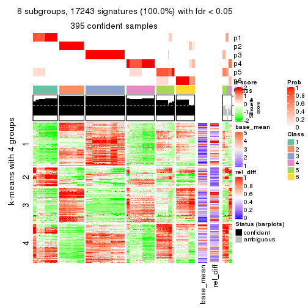</p>

</div>
</div>


Signature heatmaps where rows are not scaled:


<script>
$( function() {
	$( '#tabs-SD-pam-get-signatures-no-scale' ).tabs();
} );
</script>
<div id='tabs-SD-pam-get-signatures-no-scale'>
<ul>
<li><a href='#tab-SD-pam-get-signatures-no-scale-1'>k = 2</a></li>
<li><a href='#tab-SD-pam-get-signatures-no-scale-2'>k = 3</a></li>
<li><a href='#tab-SD-pam-get-signatures-no-scale-3'>k = 4</a></li>
<li><a href='#tab-SD-pam-get-signatures-no-scale-4'>k = 5</a></li>
<li><a href='#tab-SD-pam-get-signatures-no-scale-5'>k = 6</a></li>
</ul>
<div id='tab-SD-pam-get-signatures-no-scale-1'>
<pre><code class="r">get_signatures(res, k = 2, scale_rows = FALSE)
</code></pre>

<p>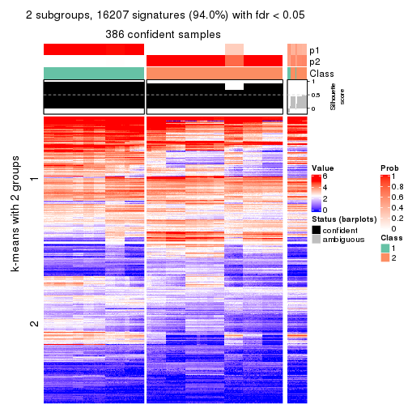</p>

</div>
<div id='tab-SD-pam-get-signatures-no-scale-2'>
<pre><code class="r">get_signatures(res, k = 3, scale_rows = FALSE)
</code></pre>

<p></p>

</div>
<div id='tab-SD-pam-get-signatures-no-scale-3'>
<pre><code class="r">get_signatures(res, k = 4, scale_rows = FALSE)
</code></pre>

<p></p>

</div>
<div id='tab-SD-pam-get-signatures-no-scale-4'>
<pre><code class="r">get_signatures(res, k = 5, scale_rows = FALSE)
</code></pre>

<p></p>

</div>
<div id='tab-SD-pam-get-signatures-no-scale-5'>
<pre><code class="r">get_signatures(res, k = 6, scale_rows = FALSE)
</code></pre>

<p></p>

</div>
</div>


Compare the overlap of signatures from different k:

```r
compare_signatures(res)
```


`get_signature()` returns a data frame invisibly. TO get the list of signatures, the function
call should be assigned to a variable explicitly. In following code, if `plot` argument is set
to `FALSE`, no heatmap is plotted while only the differential analysis is performed.

```r
# code only for demonstration
tb = get_signature(res, k = ..., plot = FALSE)
```

An example of the output of `tb` is:

```
#>   which_row         fdr    mean_1    mean_2 scaled_mean_1 scaled_mean_2 km
#> 1        38 0.042760348  8.373488  9.131774    -0.5533452     0.5164555  1
#> 2        40 0.018707592  7.106213  8.469186    -0.6173731     0.5762149  1
#> 3        55 0.019134737 10.221463 11.207825    -0.6159697     0.5749050  1
#> 4        59 0.006059896  5.921854  7.869574    -0.6899429     0.6439467  1
#> 5        60 0.018055526  8.928898 10.211722    -0.6204761     0.5791110  1
#> 6        98 0.009384629 15.714769 14.887706     0.6635654    -0.6193277  2
...
```

The columns in `tb` are:

1. `which_row`: row indices corresponding to the input matrix.
2. `fdr`: FDR for the differential test. 
3. `mean_x`: The mean value in group x.
4. `scaled_mean_x`: The mean value in group x after rows are scaled.
5. `km`: Row groups if k-means clustering is applied to rows.


UMAP plot which shows how samples are separated.


<script>
$( function() {
	$( '#tabs-SD-pam-dimension-reduction' ).tabs();
} );
</script>
<div id='tabs-SD-pam-dimension-reduction'>
<ul>
<li><a href='#tab-SD-pam-dimension-reduction-1'>k = 2</a></li>
<li><a href='#tab-SD-pam-dimension-reduction-2'>k = 3</a></li>
<li><a href='#tab-SD-pam-dimension-reduction-3'>k = 4</a></li>
<li><a href='#tab-SD-pam-dimension-reduction-4'>k = 5</a></li>
<li><a href='#tab-SD-pam-dimension-reduction-5'>k = 6</a></li>
</ul>
<div id='tab-SD-pam-dimension-reduction-1'>
<pre><code class="r">dimension_reduction(res, k = 2, method = &quot;UMAP&quot;)
</code></pre>

<p></p>

</div>
<div id='tab-SD-pam-dimension-reduction-2'>
<pre><code class="r">dimension_reduction(res, k = 3, method = &quot;UMAP&quot;)
</code></pre>

<p></p>

</div>
<div id='tab-SD-pam-dimension-reduction-3'>
<pre><code class="r">dimension_reduction(res, k = 4, method = &quot;UMAP&quot;)
</code></pre>

<p></p>

</div>
<div id='tab-SD-pam-dimension-reduction-4'>
<pre><code class="r">dimension_reduction(res, k = 5, method = &quot;UMAP&quot;)
</code></pre>

<p></p>

</div>
<div id='tab-SD-pam-dimension-reduction-5'>
<pre><code class="r">dimension_reduction(res, k = 6, method = &quot;UMAP&quot;)
</code></pre>

<p></p>

</div>
</div>


Following heatmap shows how subgroups are split when increasing `k`:

```r
collect_classes(res)
```


If matrix rows can be associated to genes, consider to use `GO_Enrichment(res,
...)` to perform function enrichment for the signature genes.


 

---------------------------------------------------


### SD:mclust**


The object with results only for a single top-value method and a single partition method 
can be extracted as:

```r
res = res_list["SD", "mclust"]
# you can also extract it by
# res = res_list["SD:mclust"]
```

A summary of `res` and all the functions that can be applied to it:

```r
res
```

```
#> A 'ConsensusPartition' object with k = 2, 3, 4, 5, 6.
#>   On a matrix with 17245 rows and 418 columns.
#>   Top rows (1000, 2000, 3000, 4000, 5000) are extracted by 'SD' method.
#>   Subgroups are detected by 'mclust' method.
#>   Performed in total 1250 partitions by row resampling.
#>   Best k for subgroups seems to be 3.
#> 
#> Following methods can be applied to this 'ConsensusPartition' object:
#>  [1] "cola_report"             "collect_classes"         "collect_plots"          
#>  [4] "collect_stats"           "colnames"                "compare_signatures"     
#>  [7] "consensus_heatmap"       "dimension_reduction"     "functional_enrichment"  
#> [10] "get_anno_col"            "get_anno"                "get_classes"            
#> [13] "get_consensus"           "get_matrix"              "get_membership"         
#> [16] "get_param"               "get_signatures"          "get_stats"              
#> [19] "is_best_k"               "is_stable_k"             "membership_heatmap"     
#> [22] "ncol"                    "nrow"                    "plot_ecdf"              
#> [25] "rownames"                "select_partition_number" "show"                   
#> [28] "suggest_best_k"          "test_to_known_factors"
```

`collect_plots()` function collects all the plots made from `res` for all `k` (number of partitions)
into one single page to provide an easy and fast comparison between different `k`.

```r
collect_plots(res)
```


The plots are:

- The first row: a plot of the ECDF (Empirical cumulative distribution
  function) curves of the consensus matrix for each `k` and the heatmap of
  predicted classes for each `k`.
- The second row: heatmaps of the consensus matrix for each `k`.
- The third row: heatmaps of the membership matrix for each `k`.
- The fouth row: heatmaps of the signatures for each `k`.

All the plots in panels can be made by individual functions and they are
plotted later in this section.

`select_partition_number()` produces several plots showing different
statistics for choosing "optimized" `k`. There are following statistics:

- ECDF curves of the consensus matrix for each `k`;
- 1-PAC. [The PAC
  score](https://en.wikipedia.org/wiki/Consensus_clustering#Over-interpretation_potential_of_consensus_clustering)
  measures the proportion of the ambiguous subgrouping.
- Mean silhouette score.
- Concordance. The mean probability of fiting the consensus class ids in all
  partitions.
- Area increased. Denote $A_k$ as the area under the ECDF curve for current
  `k`, the area increased is defined as $A_k - A_{k-1}$.
- Rand index. The percent of pairs of samples that are both in a same cluster
  or both are not in a same cluster in the partition of k and k-1.
- Jaccard index. The ratio of pairs of samples are both in a same cluster in
  the partition of k and k-1 and the pairs of samples are both in a same
  cluster in the partition k or k-1.

The detailed explanations of these statistics can be found in [the cola
vignette](http://bioconductor.org/packages/devel/bioc/vignettes/cola/inst/doc/cola.html#toc_13).

Generally speaking, lower PAC score, higher mean silhouette score or higher
concordance corresponds to better partition. Rand index and Jaccard index
measure how similar the current partition is compared to partition with `k-1`.
If they are too similar, we won't accept `k` is better than `k-1`.

```r
select_partition_number(res)
```


The numeric values for all these statistics can be obtained by `get_stats()`.

```r
get_stats(res)
```

```
#>   k 1-PAC mean_silhouette concordance area_increased  Rand Jaccard
#> 2 2 1.000           0.999       0.998         0.3677 0.633   0.633
#> 3 3 1.000           1.000       1.000         0.5057 0.814   0.706
#> 4 4 0.861           0.909       0.939         0.2980 0.816   0.589
#> 5 5 0.777           0.818       0.859         0.0606 0.965   0.869
#> 6 6 0.801           0.777       0.792         0.0539 0.965   0.847
```

`suggest_best_k()` suggests the best $k$ based on these statistics. The rules are as follows:

- All $k$ with Jaccard index larger than 0.95 are removed because the increase of
  the partition number does not provides enough extra information. If all $k$ are removed,
  the best $k$ is assigned by `NA`.
- For $k$ with 1-PAC larger than 0.9, the maximal $k$ is taken as the "best k". Other $k$ is called "optional k".
- If it does not fit the second rule. The $k$ with the highest vote of highest
  1-PAC, mean silhouette and concordance is taken as the "best k".

```r
suggest_best_k(res)
```

```
#> [1] 3
#> attr(,"optional")
#> [1] 2
```

There is also optional best $k$ = 2 that is worth to check.

Following shows the table of the partitions (You need to click the **show/hide
code output** link to see it). The membership matrix (columns with name `p*`)
is inferred by
[`clue::cl_consensus()`](https://www.rdocumentation.org/link/cl_consensus?package=clue)
function with the `SE` method. Basically the value in the membership matrix
represents the probability to belong to a certain group. The finall class
label for an item is determined with the group with highest probability it
belongs to.

In `get_classes()` function, the entropy is calculated from the membership
matrix and the silhouette score is calculated from the consensus matrix.


<script>
$( function() {
	$( '#tabs-SD-mclust-get-classes' ).tabs();
} );
</script>
<div id='tabs-SD-mclust-get-classes'>
<ul>
<li><a href='#tab-SD-mclust-get-classes-1'>k = 2</a></li>
<li><a href='#tab-SD-mclust-get-classes-2'>k = 3</a></li>
<li><a href='#tab-SD-mclust-get-classes-3'>k = 4</a></li>
<li><a href='#tab-SD-mclust-get-classes-4'>k = 5</a></li>
<li><a href='#tab-SD-mclust-get-classes-5'>k = 6</a></li>
</ul>

<div id='tab-SD-mclust-get-classes-1'>
<p><a id='tab-SD-mclust-get-classes-1-a' style='color:#0366d6' href='#'>show/hide code output</a></p>
<pre><code class="r">cbind(get_classes(res, k = 2), get_membership(res, k = 2))
</code></pre>

<pre><code>#&gt;           class entropy silhouette    p1    p2
#&gt; SRR902920     1  0.0376      1.000 0.996 0.004
#&gt; SRR902921     1  0.0376      1.000 0.996 0.004
#&gt; SRR902922     1  0.0376      1.000 0.996 0.004
#&gt; SRR902923     1  0.0376      1.000 0.996 0.004
#&gt; SRR902924     1  0.0376      1.000 0.996 0.004
#&gt; SRR902925     1  0.0376      1.000 0.996 0.004
#&gt; SRR902926     1  0.0376      1.000 0.996 0.004
#&gt; SRR902927     1  0.0376      1.000 0.996 0.004
#&gt; SRR902928     1  0.0376      1.000 0.996 0.004
#&gt; SRR902929     1  0.0376      1.000 0.996 0.004
#&gt; SRR902930     1  0.0376      1.000 0.996 0.004
#&gt; SRR902931     1  0.0376      1.000 0.996 0.004
#&gt; SRR902932     2  0.0376      0.997 0.004 0.996
#&gt; SRR902933     2  0.0376      0.997 0.004 0.996
#&gt; SRR902934     2  0.0376      0.997 0.004 0.996
#&gt; SRR902935     2  0.0376      0.997 0.004 0.996
#&gt; SRR902936     2  0.0376      0.997 0.004 0.996
#&gt; SRR902937     2  0.0376      0.997 0.004 0.996
#&gt; SRR902938     2  0.0376      0.997 0.004 0.996
#&gt; SRR902939     2  0.0376      0.997 0.004 0.996
#&gt; SRR902940     2  0.0376      0.997 0.004 0.996
#&gt; SRR902941     2  0.0376      0.997 0.004 0.996
#&gt; SRR902942     1  0.0376      1.000 0.996 0.004
#&gt; SRR902943     1  0.0376      1.000 0.996 0.004
#&gt; SRR902944     1  0.0376      1.000 0.996 0.004
#&gt; SRR902945     1  0.0376      1.000 0.996 0.004
#&gt; SRR902946     1  0.0376      1.000 0.996 0.004
#&gt; SRR902947     1  0.0376      1.000 0.996 0.004
#&gt; SRR902954     1  0.0376      1.000 0.996 0.004
#&gt; SRR902955     1  0.0376      1.000 0.996 0.004
#&gt; SRR902956     1  0.0376      1.000 0.996 0.004
#&gt; SRR902957     1  0.0376      1.000 0.996 0.004
#&gt; SRR902958     1  0.0376      1.000 0.996 0.004
#&gt; SRR902959     1  0.0376      1.000 0.996 0.004
#&gt; SRR902948     1  0.0376      1.000 0.996 0.004
#&gt; SRR902949     1  0.0376      1.000 0.996 0.004
#&gt; SRR902950     1  0.0376      1.000 0.996 0.004
#&gt; SRR902951     1  0.0376      1.000 0.996 0.004
#&gt; SRR902952     1  0.0376      1.000 0.996 0.004
#&gt; SRR902953     1  0.0376      1.000 0.996 0.004
#&gt; SRR902960     1  0.0376      1.000 0.996 0.004
#&gt; SRR902961     1  0.0376      1.000 0.996 0.004
#&gt; SRR902962     1  0.0376      1.000 0.996 0.004
#&gt; SRR902963     1  0.0376      1.000 0.996 0.004
#&gt; SRR902964     1  0.0376      1.000 0.996 0.004
#&gt; SRR902965     1  0.0376      1.000 0.996 0.004
#&gt; SRR902966     1  0.0376      1.000 0.996 0.004
#&gt; SRR902967     1  0.0376      1.000 0.996 0.004
#&gt; SRR902968     1  0.0376      1.000 0.996 0.004
#&gt; SRR902969     1  0.0376      1.000 0.996 0.004
#&gt; SRR902970     1  0.0376      1.000 0.996 0.004
#&gt; SRR902971     1  0.0376      1.000 0.996 0.004
#&gt; SRR902972     1  0.0376      1.000 0.996 0.004
#&gt; SRR902973     1  0.0376      1.000 0.996 0.004
#&gt; SRR902974     1  0.0376      1.000 0.996 0.004
#&gt; SRR902975     1  0.0376      1.000 0.996 0.004
#&gt; SRR902976     1  0.0376      1.000 0.996 0.004
#&gt; SRR902977     1  0.0376      1.000 0.996 0.004
#&gt; SRR902978     1  0.0376      1.000 0.996 0.004
#&gt; SRR902980     1  0.0376      1.000 0.996 0.004
#&gt; SRR902981     1  0.0376      1.000 0.996 0.004
#&gt; SRR902982     1  0.0376      1.000 0.996 0.004
#&gt; SRR902983     1  0.0376      1.000 0.996 0.004
#&gt; SRR902984     1  0.0376      1.000 0.996 0.004
#&gt; SRR902985     1  0.0376      1.000 0.996 0.004
#&gt; SRR902986     1  0.0376      1.000 0.996 0.004
#&gt; SRR902987     1  0.0376      1.000 0.996 0.004
#&gt; SRR902988     1  0.0376      1.000 0.996 0.004
#&gt; SRR902989     1  0.0376      1.000 0.996 0.004
#&gt; SRR902990     1  0.0376      1.000 0.996 0.004
#&gt; SRR902991     1  0.0376      1.000 0.996 0.004
#&gt; SRR902992     1  0.0376      1.000 0.996 0.004
#&gt; SRR902993     1  0.0376      1.000 0.996 0.004
#&gt; SRR902994     1  0.0376      1.000 0.996 0.004
#&gt; SRR902995     1  0.0376      1.000 0.996 0.004
#&gt; SRR902996     2  0.0376      0.997 0.004 0.996
#&gt; SRR902997     2  0.0376      0.997 0.004 0.996
#&gt; SRR902998     2  0.0376      0.997 0.004 0.996
#&gt; SRR902999     2  0.0376      0.997 0.004 0.996
#&gt; SRR903000     2  0.0376      0.997 0.004 0.996
#&gt; SRR903001     2  0.0376      0.997 0.004 0.996
#&gt; SRR903008     2  0.0376      0.997 0.004 0.996
#&gt; SRR903009     2  0.0376      0.997 0.004 0.996
#&gt; SRR903010     2  0.0376      0.997 0.004 0.996
#&gt; SRR903011     2  0.0376      0.997 0.004 0.996
#&gt; SRR903012     2  0.0376      0.997 0.004 0.996
#&gt; SRR903013     2  0.0376      0.997 0.004 0.996
#&gt; SRR903002     2  0.0376      0.997 0.004 0.996
#&gt; SRR903003     2  0.0376      0.997 0.004 0.996
#&gt; SRR903004     2  0.0376      0.997 0.004 0.996
#&gt; SRR903005     2  0.0376      0.997 0.004 0.996
#&gt; SRR903006     2  0.0376      0.997 0.004 0.996
#&gt; SRR903007     2  0.0376      0.997 0.004 0.996
#&gt; SRR903014     1  0.0376      1.000 0.996 0.004
#&gt; SRR903015     1  0.0376      1.000 0.996 0.004
#&gt; SRR903016     1  0.0376      1.000 0.996 0.004
#&gt; SRR903017     1  0.0376      1.000 0.996 0.004
#&gt; SRR903018     1  0.0376      1.000 0.996 0.004
#&gt; SRR903019     1  0.0376      1.000 0.996 0.004
#&gt; SRR903020     1  0.0376      1.000 0.996 0.004
#&gt; SRR903021     1  0.0376      1.000 0.996 0.004
#&gt; SRR903022     1  0.0376      1.000 0.996 0.004
#&gt; SRR903023     1  0.0376      1.000 0.996 0.004
#&gt; SRR903024     1  0.0376      1.000 0.996 0.004
#&gt; SRR903025     1  0.0376      1.000 0.996 0.004
#&gt; SRR903026     1  0.0376      1.000 0.996 0.004
#&gt; SRR903027     1  0.0376      1.000 0.996 0.004
#&gt; SRR903028     1  0.0376      1.000 0.996 0.004
#&gt; SRR903029     1  0.0376      1.000 0.996 0.004
#&gt; SRR903030     1  0.0376      1.000 0.996 0.004
#&gt; SRR903031     1  0.0376      1.000 0.996 0.004
#&gt; SRR903032     2  0.0376      0.997 0.004 0.996
#&gt; SRR903033     2  0.0376      0.997 0.004 0.996
#&gt; SRR903034     2  0.0376      0.997 0.004 0.996
#&gt; SRR903035     2  0.0376      0.997 0.004 0.996
#&gt; SRR903036     2  0.0376      0.997 0.004 0.996
#&gt; SRR903037     2  0.0376      0.997 0.004 0.996
#&gt; SRR903038     2  0.0376      0.997 0.004 0.996
#&gt; SRR903039     2  0.0376      0.997 0.004 0.996
#&gt; SRR903040     2  0.0376      0.997 0.004 0.996
#&gt; SRR903041     2  0.0376      0.997 0.004 0.996
#&gt; SRR903042     2  0.0376      0.997 0.004 0.996
#&gt; SRR903043     2  0.0376      0.997 0.004 0.996
#&gt; SRR903044     2  0.0376      0.997 0.004 0.996
#&gt; SRR903045     2  0.0376      0.997 0.004 0.996
#&gt; SRR903046     2  0.0376      0.997 0.004 0.996
#&gt; SRR903047     2  0.0376      0.997 0.004 0.996
#&gt; SRR903048     2  0.0376      0.997 0.004 0.996
#&gt; SRR903049     2  0.0376      0.997 0.004 0.996
#&gt; SRR903050     2  0.0000      0.999 0.000 1.000
#&gt; SRR903051     2  0.0000      0.999 0.000 1.000
#&gt; SRR903052     2  0.0000      0.999 0.000 1.000
#&gt; SRR903053     2  0.0000      0.999 0.000 1.000
#&gt; SRR903054     2  0.0000      0.999 0.000 1.000
#&gt; SRR903055     2  0.0000      0.999 0.000 1.000
#&gt; SRR903056     2  0.0000      0.999 0.000 1.000
#&gt; SRR903057     2  0.0000      0.999 0.000 1.000
#&gt; SRR903058     2  0.0000      0.999 0.000 1.000
#&gt; SRR903059     2  0.0000      0.999 0.000 1.000
#&gt; SRR903060     2  0.0000      0.999 0.000 1.000
#&gt; SRR903061     2  0.0000      0.999 0.000 1.000
#&gt; SRR903062     2  0.0000      0.999 0.000 1.000
#&gt; SRR903063     2  0.0000      0.999 0.000 1.000
#&gt; SRR903064     2  0.0000      0.999 0.000 1.000
#&gt; SRR903065     2  0.0000      0.999 0.000 1.000
#&gt; SRR903066     2  0.0000      0.999 0.000 1.000
#&gt; SRR903067     2  0.0000      0.999 0.000 1.000
#&gt; SRR903068     2  0.0000      0.999 0.000 1.000
#&gt; SRR903069     2  0.0000      0.999 0.000 1.000
#&gt; SRR903070     2  0.0000      0.999 0.000 1.000
#&gt; SRR903071     2  0.0000      0.999 0.000 1.000
#&gt; SRR903072     2  0.0000      0.999 0.000 1.000
#&gt; SRR903073     2  0.0000      0.999 0.000 1.000
#&gt; SRR903074     2  0.0000      0.999 0.000 1.000
#&gt; SRR903075     2  0.0000      0.999 0.000 1.000
#&gt; SRR903076     2  0.0000      0.999 0.000 1.000
#&gt; SRR903077     2  0.0000      0.999 0.000 1.000
#&gt; SRR903078     2  0.0000      0.999 0.000 1.000
#&gt; SRR903079     2  0.0000      0.999 0.000 1.000
#&gt; SRR903080     2  0.0000      0.999 0.000 1.000
#&gt; SRR903081     2  0.0000      0.999 0.000 1.000
#&gt; SRR903082     2  0.0000      0.999 0.000 1.000
#&gt; SRR903083     2  0.0000      0.999 0.000 1.000
#&gt; SRR903084     2  0.0000      0.999 0.000 1.000
#&gt; SRR903085     2  0.0000      0.999 0.000 1.000
#&gt; SRR903086     2  0.0000      0.999 0.000 1.000
#&gt; SRR903087     2  0.0000      0.999 0.000 1.000
#&gt; SRR903088     2  0.0000      0.999 0.000 1.000
#&gt; SRR903089     2  0.0000      0.999 0.000 1.000
#&gt; SRR903090     2  0.0000      0.999 0.000 1.000
#&gt; SRR903091     2  0.0000      0.999 0.000 1.000
#&gt; SRR903092     2  0.0000      0.999 0.000 1.000
#&gt; SRR903093     2  0.0000      0.999 0.000 1.000
#&gt; SRR903094     2  0.0000      0.999 0.000 1.000
#&gt; SRR903095     2  0.0000      0.999 0.000 1.000
#&gt; SRR903096     2  0.0000      0.999 0.000 1.000
#&gt; SRR903097     2  0.0000      0.999 0.000 1.000
#&gt; SRR903098     2  0.0000      0.999 0.000 1.000
#&gt; SRR903099     2  0.0000      0.999 0.000 1.000
#&gt; SRR903100     2  0.0000      0.999 0.000 1.000
#&gt; SRR903101     2  0.0000      0.999 0.000 1.000
#&gt; SRR903102     2  0.0000      0.999 0.000 1.000
#&gt; SRR903103     2  0.0000      0.999 0.000 1.000
#&gt; SRR903104     2  0.0000      0.999 0.000 1.000
#&gt; SRR903105     2  0.0000      0.999 0.000 1.000
#&gt; SRR903106     2  0.0000      0.999 0.000 1.000
#&gt; SRR903107     2  0.0000      0.999 0.000 1.000
#&gt; SRR903108     2  0.0000      0.999 0.000 1.000
#&gt; SRR903109     2  0.0000      0.999 0.000 1.000
#&gt; SRR903110     2  0.0000      0.999 0.000 1.000
#&gt; SRR903111     2  0.0000      0.999 0.000 1.000
#&gt; SRR903112     2  0.0000      0.999 0.000 1.000
#&gt; SRR903113     2  0.0000      0.999 0.000 1.000
#&gt; SRR903114     2  0.0000      0.999 0.000 1.000
#&gt; SRR903115     2  0.0000      0.999 0.000 1.000
#&gt; SRR903116     2  0.0000      0.999 0.000 1.000
#&gt; SRR903117     2  0.0000      0.999 0.000 1.000
#&gt; SRR903118     2  0.0000      0.999 0.000 1.000
#&gt; SRR903119     2  0.0000      0.999 0.000 1.000
#&gt; SRR903121     2  0.0000      0.999 0.000 1.000
#&gt; SRR903122     2  0.0000      0.999 0.000 1.000
#&gt; SRR903124     2  0.0000      0.999 0.000 1.000
#&gt; SRR903125     2  0.0000      0.999 0.000 1.000
#&gt; SRR903126     2  0.0000      0.999 0.000 1.000
#&gt; SRR903127     2  0.0000      0.999 0.000 1.000
#&gt; SRR903128     2  0.0000      0.999 0.000 1.000
#&gt; SRR903129     2  0.0000      0.999 0.000 1.000
#&gt; SRR903130     2  0.0000      0.999 0.000 1.000
#&gt; SRR903131     2  0.0000      0.999 0.000 1.000
#&gt; SRR903132     2  0.0000      0.999 0.000 1.000
#&gt; SRR903133     2  0.0000      0.999 0.000 1.000
#&gt; SRR903134     2  0.0000      0.999 0.000 1.000
#&gt; SRR903135     2  0.0000      0.999 0.000 1.000
#&gt; SRR903136     2  0.0000      0.999 0.000 1.000
#&gt; SRR903137     2  0.0000      0.999 0.000 1.000
#&gt; SRR903146     2  0.0000      0.999 0.000 1.000
#&gt; SRR903147     2  0.0000      0.999 0.000 1.000
#&gt; SRR903148     2  0.0000      0.999 0.000 1.000
#&gt; SRR903149     2  0.0000      0.999 0.000 1.000
#&gt; SRR903150     2  0.0000      0.999 0.000 1.000
#&gt; SRR903151     2  0.0000      0.999 0.000 1.000
#&gt; SRR903152     2  0.0000      0.999 0.000 1.000
#&gt; SRR903153     2  0.0000      0.999 0.000 1.000
#&gt; SRR903138     2  0.0000      0.999 0.000 1.000
#&gt; SRR903139     2  0.0000      0.999 0.000 1.000
#&gt; SRR903140     2  0.0000      0.999 0.000 1.000
#&gt; SRR903141     2  0.0000      0.999 0.000 1.000
#&gt; SRR903142     2  0.0000      0.999 0.000 1.000
#&gt; SRR903143     2  0.0000      0.999 0.000 1.000
#&gt; SRR903144     2  0.0000      0.999 0.000 1.000
#&gt; SRR903145     2  0.0000      0.999 0.000 1.000
#&gt; SRR903154     2  0.0000      0.999 0.000 1.000
#&gt; SRR903155     2  0.0000      0.999 0.000 1.000
#&gt; SRR903156     2  0.0000      0.999 0.000 1.000
#&gt; SRR903157     2  0.0000      0.999 0.000 1.000
#&gt; SRR903158     2  0.0000      0.999 0.000 1.000
#&gt; SRR903159     2  0.0000      0.999 0.000 1.000
#&gt; SRR903160     2  0.0000      0.999 0.000 1.000
#&gt; SRR903161     2  0.0000      0.999 0.000 1.000
#&gt; SRR903162     2  0.0000      0.999 0.000 1.000
#&gt; SRR903163     2  0.0000      0.999 0.000 1.000
#&gt; SRR903164     2  0.0000      0.999 0.000 1.000
#&gt; SRR903165     2  0.0000      0.999 0.000 1.000
#&gt; SRR903166     2  0.0000      0.999 0.000 1.000
#&gt; SRR903167     2  0.0000      0.999 0.000 1.000
#&gt; SRR903168     2  0.0000      0.999 0.000 1.000
#&gt; SRR903169     2  0.0000      0.999 0.000 1.000
#&gt; SRR903178     2  0.0000      0.999 0.000 1.000
#&gt; SRR903179     2  0.0000      0.999 0.000 1.000
#&gt; SRR903180     2  0.0000      0.999 0.000 1.000
#&gt; SRR903181     2  0.0000      0.999 0.000 1.000
#&gt; SRR903182     2  0.0000      0.999 0.000 1.000
#&gt; SRR903183     2  0.0000      0.999 0.000 1.000
#&gt; SRR903184     2  0.0000      0.999 0.000 1.000
#&gt; SRR903185     2  0.0000      0.999 0.000 1.000
#&gt; SRR903170     2  0.0000      0.999 0.000 1.000
#&gt; SRR903171     2  0.0000      0.999 0.000 1.000
#&gt; SRR903172     2  0.0000      0.999 0.000 1.000
#&gt; SRR903173     2  0.0000      0.999 0.000 1.000
#&gt; SRR903174     2  0.0000      0.999 0.000 1.000
#&gt; SRR903175     2  0.0000      0.999 0.000 1.000
#&gt; SRR903176     2  0.0000      0.999 0.000 1.000
#&gt; SRR903177     2  0.0000      0.999 0.000 1.000
#&gt; SRR903186     2  0.0000      0.999 0.000 1.000
#&gt; SRR903187     2  0.0000      0.999 0.000 1.000
#&gt; SRR903188     2  0.0000      0.999 0.000 1.000
#&gt; SRR903189     2  0.0000      0.999 0.000 1.000
#&gt; SRR903190     2  0.0000      0.999 0.000 1.000
#&gt; SRR903191     2  0.0000      0.999 0.000 1.000
#&gt; SRR903192     2  0.0000      0.999 0.000 1.000
#&gt; SRR903193     2  0.0000      0.999 0.000 1.000
#&gt; SRR903194     2  0.0000      0.999 0.000 1.000
#&gt; SRR903195     2  0.0000      0.999 0.000 1.000
#&gt; SRR903196     2  0.0000      0.999 0.000 1.000
#&gt; SRR903197     2  0.0000      0.999 0.000 1.000
#&gt; SRR903198     2  0.0000      0.999 0.000 1.000
#&gt; SRR903199     2  0.0000      0.999 0.000 1.000
#&gt; SRR903200     2  0.0000      0.999 0.000 1.000
#&gt; SRR903201     2  0.0000      0.999 0.000 1.000
#&gt; SRR903210     2  0.0000      0.999 0.000 1.000
#&gt; SRR903211     2  0.0000      0.999 0.000 1.000
#&gt; SRR903212     2  0.0000      0.999 0.000 1.000
#&gt; SRR903213     2  0.0000      0.999 0.000 1.000
#&gt; SRR903214     2  0.0000      0.999 0.000 1.000
#&gt; SRR903215     2  0.0000      0.999 0.000 1.000
#&gt; SRR903216     2  0.0000      0.999 0.000 1.000
#&gt; SRR903217     2  0.0000      0.999 0.000 1.000
#&gt; SRR903202     2  0.0000      0.999 0.000 1.000
#&gt; SRR903203     2  0.0000      0.999 0.000 1.000
#&gt; SRR903204     2  0.0000      0.999 0.000 1.000
#&gt; SRR903205     2  0.0000      0.999 0.000 1.000
#&gt; SRR903206     2  0.0000      0.999 0.000 1.000
#&gt; SRR903207     2  0.0000      0.999 0.000 1.000
#&gt; SRR903208     2  0.0000      0.999 0.000 1.000
#&gt; SRR903209     2  0.0000      0.999 0.000 1.000
#&gt; SRR903218     2  0.0000      0.999 0.000 1.000
#&gt; SRR903219     2  0.0000      0.999 0.000 1.000
#&gt; SRR903220     2  0.0000      0.999 0.000 1.000
#&gt; SRR903221     2  0.0000      0.999 0.000 1.000
#&gt; SRR903222     2  0.0000      0.999 0.000 1.000
#&gt; SRR903223     2  0.0000      0.999 0.000 1.000
#&gt; SRR903224     2  0.0000      0.999 0.000 1.000
#&gt; SRR903225     2  0.0000      0.999 0.000 1.000
#&gt; SRR903226     2  0.0000      0.999 0.000 1.000
#&gt; SRR903227     2  0.0000      0.999 0.000 1.000
#&gt; SRR903228     2  0.0000      0.999 0.000 1.000
#&gt; SRR903229     2  0.0000      0.999 0.000 1.000
#&gt; SRR903230     2  0.0000      0.999 0.000 1.000
#&gt; SRR903231     2  0.0000      0.999 0.000 1.000
#&gt; SRR903232     2  0.0000      0.999 0.000 1.000
#&gt; SRR903233     2  0.0000      0.999 0.000 1.000
#&gt; SRR903242     2  0.0000      0.999 0.000 1.000
#&gt; SRR903243     2  0.0000      0.999 0.000 1.000
#&gt; SRR903244     2  0.0000      0.999 0.000 1.000
#&gt; SRR903245     2  0.0000      0.999 0.000 1.000
#&gt; SRR903246     2  0.0000      0.999 0.000 1.000
#&gt; SRR903247     2  0.0000      0.999 0.000 1.000
#&gt; SRR903248     2  0.0000      0.999 0.000 1.000
#&gt; SRR903249     2  0.0000      0.999 0.000 1.000
#&gt; SRR903234     2  0.0000      0.999 0.000 1.000
#&gt; SRR903235     2  0.0000      0.999 0.000 1.000
#&gt; SRR903236     2  0.0000      0.999 0.000 1.000
#&gt; SRR903237     2  0.0000      0.999 0.000 1.000
#&gt; SRR903238     2  0.0000      0.999 0.000 1.000
#&gt; SRR903239     2  0.0000      0.999 0.000 1.000
#&gt; SRR903240     2  0.0000      0.999 0.000 1.000
#&gt; SRR903241     2  0.0000      0.999 0.000 1.000
#&gt; SRR903258     2  0.0000      0.999 0.000 1.000
#&gt; SRR903259     2  0.0000      0.999 0.000 1.000
#&gt; SRR903260     2  0.0000      0.999 0.000 1.000
#&gt; SRR903261     2  0.0000      0.999 0.000 1.000
#&gt; SRR903262     2  0.0000      0.999 0.000 1.000
#&gt; SRR903263     2  0.0000      0.999 0.000 1.000
#&gt; SRR903264     2  0.0000      0.999 0.000 1.000
#&gt; SRR903265     2  0.0000      0.999 0.000 1.000
#&gt; SRR903250     2  0.0000      0.999 0.000 1.000
#&gt; SRR903251     2  0.0000      0.999 0.000 1.000
#&gt; SRR903252     2  0.0000      0.999 0.000 1.000
#&gt; SRR903253     2  0.0000      0.999 0.000 1.000
#&gt; SRR903254     2  0.0000      0.999 0.000 1.000
#&gt; SRR903255     2  0.0000      0.999 0.000 1.000
#&gt; SRR903256     2  0.0000      0.999 0.000 1.000
#&gt; SRR903257     2  0.0000      0.999 0.000 1.000
#&gt; SRR903266     2  0.0000      0.999 0.000 1.000
#&gt; SRR903267     2  0.0000      0.999 0.000 1.000
#&gt; SRR903268     2  0.0000      0.999 0.000 1.000
#&gt; SRR903270     2  0.0000      0.999 0.000 1.000
#&gt; SRR903271     2  0.0000      0.999 0.000 1.000
#&gt; SRR903272     2  0.0000      0.999 0.000 1.000
#&gt; SRR903273     2  0.0000      0.999 0.000 1.000
#&gt; SRR903274     2  0.0000      0.999 0.000 1.000
#&gt; SRR903275     2  0.0000      0.999 0.000 1.000
#&gt; SRR903276     2  0.0000      0.999 0.000 1.000
#&gt; SRR903277     2  0.0000      0.999 0.000 1.000
#&gt; SRR903278     2  0.0000      0.999 0.000 1.000
#&gt; SRR903279     2  0.0000      0.999 0.000 1.000
#&gt; SRR903280     2  0.0000      0.999 0.000 1.000
#&gt; SRR903281     2  0.0000      0.999 0.000 1.000
#&gt; SRR903282     2  0.0000      0.999 0.000 1.000
#&gt; SRR903283     2  0.0000      0.999 0.000 1.000
#&gt; SRR903284     2  0.0000      0.999 0.000 1.000
#&gt; SRR903285     2  0.0000      0.999 0.000 1.000
#&gt; SRR903286     2  0.0000      0.999 0.000 1.000
#&gt; SRR903287     2  0.0000      0.999 0.000 1.000
#&gt; SRR903288     2  0.0000      0.999 0.000 1.000
#&gt; SRR903289     2  0.0000      0.999 0.000 1.000
#&gt; SRR903290     2  0.0000      0.999 0.000 1.000
#&gt; SRR903291     2  0.0000      0.999 0.000 1.000
#&gt; SRR903292     2  0.0000      0.999 0.000 1.000
#&gt; SRR903293     2  0.0000      0.999 0.000 1.000
#&gt; SRR903294     2  0.0000      0.999 0.000 1.000
#&gt; SRR903295     2  0.0000      0.999 0.000 1.000
#&gt; SRR903296     2  0.0000      0.999 0.000 1.000
#&gt; SRR903297     2  0.0000      0.999 0.000 1.000
#&gt; SRR903298     2  0.0000      0.999 0.000 1.000
#&gt; SRR903299     2  0.0000      0.999 0.000 1.000
#&gt; SRR903300     2  0.0000      0.999 0.000 1.000
#&gt; SRR903301     2  0.0000      0.999 0.000 1.000
#&gt; SRR903302     2  0.0000      0.999 0.000 1.000
#&gt; SRR903303     2  0.0000      0.999 0.000 1.000
#&gt; SRR903304     2  0.0000      0.999 0.000 1.000
#&gt; SRR903305     2  0.0000      0.999 0.000 1.000
#&gt; SRR903306     1  0.0376      1.000 0.996 0.004
#&gt; SRR903307     1  0.0376      1.000 0.996 0.004
#&gt; SRR903308     1  0.0376      1.000 0.996 0.004
#&gt; SRR903309     1  0.0376      1.000 0.996 0.004
#&gt; SRR903310     1  0.0376      1.000 0.996 0.004
#&gt; SRR903311     1  0.0376      1.000 0.996 0.004
#&gt; SRR903312     1  0.0376      1.000 0.996 0.004
#&gt; SRR903313     1  0.0376      1.000 0.996 0.004
#&gt; SRR903314     1  0.0376      1.000 0.996 0.004
#&gt; SRR903315     1  0.0376      1.000 0.996 0.004
#&gt; SRR903316     1  0.0376      1.000 0.996 0.004
#&gt; SRR903317     1  0.0376      1.000 0.996 0.004
#&gt; SRR903318     1  0.0376      1.000 0.996 0.004
#&gt; SRR903319     1  0.0376      1.000 0.996 0.004
#&gt; SRR903320     1  0.0376      1.000 0.996 0.004
#&gt; SRR903321     1  0.0376      1.000 0.996 0.004
#&gt; SRR903322     1  0.0376      1.000 0.996 0.004
#&gt; SRR903323     1  0.0376      1.000 0.996 0.004
#&gt; SRR903324     2  0.0376      0.997 0.004 0.996
#&gt; SRR903325     2  0.0376      0.997 0.004 0.996
#&gt; SRR903326     2  0.0376      0.997 0.004 0.996
#&gt; SRR903327     2  0.0376      0.997 0.004 0.996
#&gt; SRR903328     2  0.0376      0.997 0.004 0.996
#&gt; SRR903329     2  0.0376      0.997 0.004 0.996
#&gt; SRR903330     2  0.0376      0.997 0.004 0.996
#&gt; SRR903331     2  0.0376      0.997 0.004 0.996
#&gt; SRR903332     2  0.0376      0.997 0.004 0.996
#&gt; SRR903333     2  0.0376      0.997 0.004 0.996
#&gt; SRR903334     2  0.0376      0.997 0.004 0.996
#&gt; SRR903335     2  0.0376      0.997 0.004 0.996
#&gt; SRR903336     2  0.0376      0.997 0.004 0.996
#&gt; SRR903337     2  0.0376      0.997 0.004 0.996
#&gt; SRR903338     2  0.0376      0.997 0.004 0.996
#&gt; SRR903339     2  0.0376      0.997 0.004 0.996
#&gt; SRR903340     2  0.0376      0.997 0.004 0.996
#&gt; SRR903341     2  0.0376      0.997 0.004 0.996
</code></pre>

<script>
$('#tab-SD-mclust-get-classes-1-a').parent().next().next().hide();
$('#tab-SD-mclust-get-classes-1-a').click(function(){
  $('#tab-SD-mclust-get-classes-1-a').parent().next().next().toggle();
  return(false);
});
</script>
</div>

<div id='tab-SD-mclust-get-classes-2'>
<p><a id='tab-SD-mclust-get-classes-2-a' style='color:#0366d6' href='#'>show/hide code output</a></p>
<pre><code class="r">cbind(get_classes(res, k = 3), get_membership(res, k = 3))
</code></pre>

<pre><code>#&gt;           class entropy silhouette p1 p2 p3
#&gt; SRR902920     3       0          1  0  0  1
#&gt; SRR902921     3       0          1  0  0  1
#&gt; SRR902922     3       0          1  0  0  1
#&gt; SRR902923     3       0          1  0  0  1
#&gt; SRR902924     3       0          1  0  0  1
#&gt; SRR902925     3       0          1  0  0  1
#&gt; SRR902926     3       0          1  0  0  1
#&gt; SRR902927     3       0          1  0  0  1
#&gt; SRR902928     3       0          1  0  0  1
#&gt; SRR902929     3       0          1  0  0  1
#&gt; SRR902930     3       0          1  0  0  1
#&gt; SRR902931     3       0          1  0  0  1
#&gt; SRR902932     2       0          1  0  1  0
#&gt; SRR902933     2       0          1  0  1  0
#&gt; SRR902934     2       0          1  0  1  0
#&gt; SRR902935     2       0          1  0  1  0
#&gt; SRR902936     2       0          1  0  1  0
#&gt; SRR902937     2       0          1  0  1  0
#&gt; SRR902938     2       0          1  0  1  0
#&gt; SRR902939     2       0          1  0  1  0
#&gt; SRR902940     2       0          1  0  1  0
#&gt; SRR902941     2       0          1  0  1  0
#&gt; SRR902942     3       0          1  0  0  1
#&gt; SRR902943     3       0          1  0  0  1
#&gt; SRR902944     3       0          1  0  0  1
#&gt; SRR902945     3       0          1  0  0  1
#&gt; SRR902946     3       0          1  0  0  1
#&gt; SRR902947     3       0          1  0  0  1
#&gt; SRR902954     3       0          1  0  0  1
#&gt; SRR902955     3       0          1  0  0  1
#&gt; SRR902956     3       0          1  0  0  1
#&gt; SRR902957     3       0          1  0  0  1
#&gt; SRR902958     3       0          1  0  0  1
#&gt; SRR902959     3       0          1  0  0  1
#&gt; SRR902948     3       0          1  0  0  1
#&gt; SRR902949     3       0          1  0  0  1
#&gt; SRR902950     3       0          1  0  0  1
#&gt; SRR902951     3       0          1  0  0  1
#&gt; SRR902952     3       0          1  0  0  1
#&gt; SRR902953     3       0          1  0  0  1
#&gt; SRR902960     3       0          1  0  0  1
#&gt; SRR902961     3       0          1  0  0  1
#&gt; SRR902962     3       0          1  0  0  1
#&gt; SRR902963     3       0          1  0  0  1
#&gt; SRR902964     3       0          1  0  0  1
#&gt; SRR902965     3       0          1  0  0  1
#&gt; SRR902966     3       0          1  0  0  1
#&gt; SRR902967     3       0          1  0  0  1
#&gt; SRR902968     3       0          1  0  0  1
#&gt; SRR902969     3       0          1  0  0  1
#&gt; SRR902970     3       0          1  0  0  1
#&gt; SRR902971     3       0          1  0  0  1
#&gt; SRR902972     3       0          1  0  0  1
#&gt; SRR902973     3       0          1  0  0  1
#&gt; SRR902974     3       0          1  0  0  1
#&gt; SRR902975     3       0          1  0  0  1
#&gt; SRR902976     3       0          1  0  0  1
#&gt; SRR902977     3       0          1  0  0  1
#&gt; SRR902978     3       0          1  0  0  1
#&gt; SRR902980     3       0          1  0  0  1
#&gt; SRR902981     3       0          1  0  0  1
#&gt; SRR902982     3       0          1  0  0  1
#&gt; SRR902983     3       0          1  0  0  1
#&gt; SRR902984     3       0          1  0  0  1
#&gt; SRR902985     3       0          1  0  0  1
#&gt; SRR902986     3       0          1  0  0  1
#&gt; SRR902987     3       0          1  0  0  1
#&gt; SRR902988     3       0          1  0  0  1
#&gt; SRR902989     3       0          1  0  0  1
#&gt; SRR902990     3       0          1  0  0  1
#&gt; SRR902991     3       0          1  0  0  1
#&gt; SRR902992     3       0          1  0  0  1
#&gt; SRR902993     3       0          1  0  0  1
#&gt; SRR902994     3       0          1  0  0  1
#&gt; SRR902995     3       0          1  0  0  1
#&gt; SRR902996     2       0          1  0  1  0
#&gt; SRR902997     2       0          1  0  1  0
#&gt; SRR902998     2       0          1  0  1  0
#&gt; SRR902999     2       0          1  0  1  0
#&gt; SRR903000     2       0          1  0  1  0
#&gt; SRR903001     2       0          1  0  1  0
#&gt; SRR903008     2       0          1  0  1  0
#&gt; SRR903009     2       0          1  0  1  0
#&gt; SRR903010     2       0          1  0  1  0
#&gt; SRR903011     2       0          1  0  1  0
#&gt; SRR903012     2       0          1  0  1  0
#&gt; SRR903013     2       0          1  0  1  0
#&gt; SRR903002     2       0          1  0  1  0
#&gt; SRR903003     2       0          1  0  1  0
#&gt; SRR903004     2       0          1  0  1  0
#&gt; SRR903005     2       0          1  0  1  0
#&gt; SRR903006     2       0          1  0  1  0
#&gt; SRR903007     2       0          1  0  1  0
#&gt; SRR903014     3       0          1  0  0  1
#&gt; SRR903015     3       0          1  0  0  1
#&gt; SRR903016     3       0          1  0  0  1
#&gt; SRR903017     3       0          1  0  0  1
#&gt; SRR903018     3       0          1  0  0  1
#&gt; SRR903019     3       0          1  0  0  1
#&gt; SRR903020     3       0          1  0  0  1
#&gt; SRR903021     3       0          1  0  0  1
#&gt; SRR903022     3       0          1  0  0  1
#&gt; SRR903023     3       0          1  0  0  1
#&gt; SRR903024     3       0          1  0  0  1
#&gt; SRR903025     3       0          1  0  0  1
#&gt; SRR903026     3       0          1  0  0  1
#&gt; SRR903027     3       0          1  0  0  1
#&gt; SRR903028     3       0          1  0  0  1
#&gt; SRR903029     3       0          1  0  0  1
#&gt; SRR903030     3       0          1  0  0  1
#&gt; SRR903031     3       0          1  0  0  1
#&gt; SRR903032     2       0          1  0  1  0
#&gt; SRR903033     2       0          1  0  1  0
#&gt; SRR903034     2       0          1  0  1  0
#&gt; SRR903035     2       0          1  0  1  0
#&gt; SRR903036     2       0          1  0  1  0
#&gt; SRR903037     2       0          1  0  1  0
#&gt; SRR903038     2       0          1  0  1  0
#&gt; SRR903039     2       0          1  0  1  0
#&gt; SRR903040     2       0          1  0  1  0
#&gt; SRR903041     2       0          1  0  1  0
#&gt; SRR903042     2       0          1  0  1  0
#&gt; SRR903043     2       0          1  0  1  0
#&gt; SRR903044     2       0          1  0  1  0
#&gt; SRR903045     2       0          1  0  1  0
#&gt; SRR903046     2       0          1  0  1  0
#&gt; SRR903047     2       0          1  0  1  0
#&gt; SRR903048     2       0          1  0  1  0
#&gt; SRR903049     2       0          1  0  1  0
#&gt; SRR903050     1       0          1  1  0  0
#&gt; SRR903051     1       0          1  1  0  0
#&gt; SRR903052     1       0          1  1  0  0
#&gt; SRR903053     1       0          1  1  0  0
#&gt; SRR903054     1       0          1  1  0  0
#&gt; SRR903055     1       0          1  1  0  0
#&gt; SRR903056     1       0          1  1  0  0
#&gt; SRR903057     1       0          1  1  0  0
#&gt; SRR903058     1       0          1  1  0  0
#&gt; SRR903059     1       0          1  1  0  0
#&gt; SRR903060     1       0          1  1  0  0
#&gt; SRR903061     1       0          1  1  0  0
#&gt; SRR903062     1       0          1  1  0  0
#&gt; SRR903063     1       0          1  1  0  0
#&gt; SRR903064     1       0          1  1  0  0
#&gt; SRR903065     1       0          1  1  0  0
#&gt; SRR903066     1       0          1  1  0  0
#&gt; SRR903067     1       0          1  1  0  0
#&gt; SRR903068     1       0          1  1  0  0
#&gt; SRR903069     1       0          1  1  0  0
#&gt; SRR903070     1       0          1  1  0  0
#&gt; SRR903071     1       0          1  1  0  0
#&gt; SRR903072     1       0          1  1  0  0
#&gt; SRR903073     1       0          1  1  0  0
#&gt; SRR903074     1       0          1  1  0  0
#&gt; SRR903075     1       0          1  1  0  0
#&gt; SRR903076     1       0          1  1  0  0
#&gt; SRR903077     1       0          1  1  0  0
#&gt; SRR903078     1       0          1  1  0  0
#&gt; SRR903079     1       0          1  1  0  0
#&gt; SRR903080     1       0          1  1  0  0
#&gt; SRR903081     1       0          1  1  0  0
#&gt; SRR903082     1       0          1  1  0  0
#&gt; SRR903083     1       0          1  1  0  0
#&gt; SRR903084     1       0          1  1  0  0
#&gt; SRR903085     1       0          1  1  0  0
#&gt; SRR903086     1       0          1  1  0  0
#&gt; SRR903087     1       0          1  1  0  0
#&gt; SRR903088     1       0          1  1  0  0
#&gt; SRR903089     1       0          1  1  0  0
#&gt; SRR903090     1       0          1  1  0  0
#&gt; SRR903091     1       0          1  1  0  0
#&gt; SRR903092     1       0          1  1  0  0
#&gt; SRR903093     1       0          1  1  0  0
#&gt; SRR903094     1       0          1  1  0  0
#&gt; SRR903095     1       0          1  1  0  0
#&gt; SRR903096     1       0          1  1  0  0
#&gt; SRR903097     1       0          1  1  0  0
#&gt; SRR903098     1       0          1  1  0  0
#&gt; SRR903099     1       0          1  1  0  0
#&gt; SRR903100     1       0          1  1  0  0
#&gt; SRR903101     1       0          1  1  0  0
#&gt; SRR903102     1       0          1  1  0  0
#&gt; SRR903103     1       0          1  1  0  0
#&gt; SRR903104     1       0          1  1  0  0
#&gt; SRR903105     1       0          1  1  0  0
#&gt; SRR903106     1       0          1  1  0  0
#&gt; SRR903107     1       0          1  1  0  0
#&gt; SRR903108     1       0          1  1  0  0
#&gt; SRR903109     1       0          1  1  0  0
#&gt; SRR903110     1       0          1  1  0  0
#&gt; SRR903111     1       0          1  1  0  0
#&gt; SRR903112     1       0          1  1  0  0
#&gt; SRR903113     1       0          1  1  0  0
#&gt; SRR903114     1       0          1  1  0  0
#&gt; SRR903115     1       0          1  1  0  0
#&gt; SRR903116     1       0          1  1  0  0
#&gt; SRR903117     1       0          1  1  0  0
#&gt; SRR903118     1       0          1  1  0  0
#&gt; SRR903119     1       0          1  1  0  0
#&gt; SRR903121     1       0          1  1  0  0
#&gt; SRR903122     1       0          1  1  0  0
#&gt; SRR903124     1       0          1  1  0  0
#&gt; SRR903125     1       0          1  1  0  0
#&gt; SRR903126     1       0          1  1  0  0
#&gt; SRR903127     1       0          1  1  0  0
#&gt; SRR903128     1       0          1  1  0  0
#&gt; SRR903129     1       0          1  1  0  0
#&gt; SRR903130     1       0          1  1  0  0
#&gt; SRR903131     1       0          1  1  0  0
#&gt; SRR903132     1       0          1  1  0  0
#&gt; SRR903133     1       0          1  1  0  0
#&gt; SRR903134     1       0          1  1  0  0
#&gt; SRR903135     1       0          1  1  0  0
#&gt; SRR903136     1       0          1  1  0  0
#&gt; SRR903137     1       0          1  1  0  0
#&gt; SRR903146     1       0          1  1  0  0
#&gt; SRR903147     1       0          1  1  0  0
#&gt; SRR903148     1       0          1  1  0  0
#&gt; SRR903149     1       0          1  1  0  0
#&gt; SRR903150     1       0          1  1  0  0
#&gt; SRR903151     1       0          1  1  0  0
#&gt; SRR903152     1       0          1  1  0  0
#&gt; SRR903153     1       0          1  1  0  0
#&gt; SRR903138     1       0          1  1  0  0
#&gt; SRR903139     1       0          1  1  0  0
#&gt; SRR903140     1       0          1  1  0  0
#&gt; SRR903141     1       0          1  1  0  0
#&gt; SRR903142     1       0          1  1  0  0
#&gt; SRR903143     1       0          1  1  0  0
#&gt; SRR903144     1       0          1  1  0  0
#&gt; SRR903145     1       0          1  1  0  0
#&gt; SRR903154     1       0          1  1  0  0
#&gt; SRR903155     1       0          1  1  0  0
#&gt; SRR903156     1       0          1  1  0  0
#&gt; SRR903157     1       0          1  1  0  0
#&gt; SRR903158     1       0          1  1  0  0
#&gt; SRR903159     1       0          1  1  0  0
#&gt; SRR903160     1       0          1  1  0  0
#&gt; SRR903161     1       0          1  1  0  0
#&gt; SRR903162     1       0          1  1  0  0
#&gt; SRR903163     1       0          1  1  0  0
#&gt; SRR903164     1       0          1  1  0  0
#&gt; SRR903165     1       0          1  1  0  0
#&gt; SRR903166     1       0          1  1  0  0
#&gt; SRR903167     1       0          1  1  0  0
#&gt; SRR903168     1       0          1  1  0  0
#&gt; SRR903169     1       0          1  1  0  0
#&gt; SRR903178     1       0          1  1  0  0
#&gt; SRR903179     1       0          1  1  0  0
#&gt; SRR903180     1       0          1  1  0  0
#&gt; SRR903181     1       0          1  1  0  0
#&gt; SRR903182     1       0          1  1  0  0
#&gt; SRR903183     1       0          1  1  0  0
#&gt; SRR903184     1       0          1  1  0  0
#&gt; SRR903185     1       0          1  1  0  0
#&gt; SRR903170     1       0          1  1  0  0
#&gt; SRR903171     1       0          1  1  0  0
#&gt; SRR903172     1       0          1  1  0  0
#&gt; SRR903173     1       0          1  1  0  0
#&gt; SRR903174     1       0          1  1  0  0
#&gt; SRR903175     1       0          1  1  0  0
#&gt; SRR903176     1       0          1  1  0  0
#&gt; SRR903177     1       0          1  1  0  0
#&gt; SRR903186     1       0          1  1  0  0
#&gt; SRR903187     1       0          1  1  0  0
#&gt; SRR903188     1       0          1  1  0  0
#&gt; SRR903189     1       0          1  1  0  0
#&gt; SRR903190     1       0          1  1  0  0
#&gt; SRR903191     1       0          1  1  0  0
#&gt; SRR903192     1       0          1  1  0  0
#&gt; SRR903193     1       0          1  1  0  0
#&gt; SRR903194     1       0          1  1  0  0
#&gt; SRR903195     1       0          1  1  0  0
#&gt; SRR903196     1       0          1  1  0  0
#&gt; SRR903197     1       0          1  1  0  0
#&gt; SRR903198     1       0          1  1  0  0
#&gt; SRR903199     1       0          1  1  0  0
#&gt; SRR903200     1       0          1  1  0  0
#&gt; SRR903201     1       0          1  1  0  0
#&gt; SRR903210     1       0          1  1  0  0
#&gt; SRR903211     1       0          1  1  0  0
#&gt; SRR903212     1       0          1  1  0  0
#&gt; SRR903213     1       0          1  1  0  0
#&gt; SRR903214     1       0          1  1  0  0
#&gt; SRR903215     1       0          1  1  0  0
#&gt; SRR903216     1       0          1  1  0  0
#&gt; SRR903217     1       0          1  1  0  0
#&gt; SRR903202     1       0          1  1  0  0
#&gt; SRR903203     1       0          1  1  0  0
#&gt; SRR903204     1       0          1  1  0  0
#&gt; SRR903205     1       0          1  1  0  0
#&gt; SRR903206     1       0          1  1  0  0
#&gt; SRR903207     1       0          1  1  0  0
#&gt; SRR903208     1       0          1  1  0  0
#&gt; SRR903209     1       0          1  1  0  0
#&gt; SRR903218     1       0          1  1  0  0
#&gt; SRR903219     1       0          1  1  0  0
#&gt; SRR903220     1       0          1  1  0  0
#&gt; SRR903221     1       0          1  1  0  0
#&gt; SRR903222     1       0          1  1  0  0
#&gt; SRR903223     1       0          1  1  0  0
#&gt; SRR903224     1       0          1  1  0  0
#&gt; SRR903225     1       0          1  1  0  0
#&gt; SRR903226     1       0          1  1  0  0
#&gt; SRR903227     1       0          1  1  0  0
#&gt; SRR903228     1       0          1  1  0  0
#&gt; SRR903229     1       0          1  1  0  0
#&gt; SRR903230     1       0          1  1  0  0
#&gt; SRR903231     1       0          1  1  0  0
#&gt; SRR903232     1       0          1  1  0  0
#&gt; SRR903233     1       0          1  1  0  0
#&gt; SRR903242     1       0          1  1  0  0
#&gt; SRR903243     1       0          1  1  0  0
#&gt; SRR903244     1       0          1  1  0  0
#&gt; SRR903245     1       0          1  1  0  0
#&gt; SRR903246     1       0          1  1  0  0
#&gt; SRR903247     1       0          1  1  0  0
#&gt; SRR903248     1       0          1  1  0  0
#&gt; SRR903249     1       0          1  1  0  0
#&gt; SRR903234     1       0          1  1  0  0
#&gt; SRR903235     1       0          1  1  0  0
#&gt; SRR903236     1       0          1  1  0  0
#&gt; SRR903237     1       0          1  1  0  0
#&gt; SRR903238     1       0          1  1  0  0
#&gt; SRR903239     1       0          1  1  0  0
#&gt; SRR903240     1       0          1  1  0  0
#&gt; SRR903241     1       0          1  1  0  0
#&gt; SRR903258     1       0          1  1  0  0
#&gt; SRR903259     1       0          1  1  0  0
#&gt; SRR903260     1       0          1  1  0  0
#&gt; SRR903261     1       0          1  1  0  0
#&gt; SRR903262     1       0          1  1  0  0
#&gt; SRR903263     1       0          1  1  0  0
#&gt; SRR903264     1       0          1  1  0  0
#&gt; SRR903265     1       0          1  1  0  0
#&gt; SRR903250     1       0          1  1  0  0
#&gt; SRR903251     1       0          1  1  0  0
#&gt; SRR903252     1       0          1  1  0  0
#&gt; SRR903253     1       0          1  1  0  0
#&gt; SRR903254     1       0          1  1  0  0
#&gt; SRR903255     1       0          1  1  0  0
#&gt; SRR903256     1       0          1  1  0  0
#&gt; SRR903257     1       0          1  1  0  0
#&gt; SRR903266     1       0          1  1  0  0
#&gt; SRR903267     1       0          1  1  0  0
#&gt; SRR903268     1       0          1  1  0  0
#&gt; SRR903270     1       0          1  1  0  0
#&gt; SRR903271     1       0          1  1  0  0
#&gt; SRR903272     1       0          1  1  0  0
#&gt; SRR903273     1       0          1  1  0  0
#&gt; SRR903274     1       0          1  1  0  0
#&gt; SRR903275     1       0          1  1  0  0
#&gt; SRR903276     1       0          1  1  0  0
#&gt; SRR903277     1       0          1  1  0  0
#&gt; SRR903278     1       0          1  1  0  0
#&gt; SRR903279     1       0          1  1  0  0
#&gt; SRR903280     1       0          1  1  0  0
#&gt; SRR903281     1       0          1  1  0  0
#&gt; SRR903282     1       0          1  1  0  0
#&gt; SRR903283     1       0          1  1  0  0
#&gt; SRR903284     1       0          1  1  0  0
#&gt; SRR903285     1       0          1  1  0  0
#&gt; SRR903286     1       0          1  1  0  0
#&gt; SRR903287     1       0          1  1  0  0
#&gt; SRR903288     1       0          1  1  0  0
#&gt; SRR903289     1       0          1  1  0  0
#&gt; SRR903290     1       0          1  1  0  0
#&gt; SRR903291     1       0          1  1  0  0
#&gt; SRR903292     1       0          1  1  0  0
#&gt; SRR903293     1       0          1  1  0  0
#&gt; SRR903294     1       0          1  1  0  0
#&gt; SRR903295     1       0          1  1  0  0
#&gt; SRR903296     1       0          1  1  0  0
#&gt; SRR903297     1       0          1  1  0  0
#&gt; SRR903298     1       0          1  1  0  0
#&gt; SRR903299     1       0          1  1  0  0
#&gt; SRR903300     1       0          1  1  0  0
#&gt; SRR903301     1       0          1  1  0  0
#&gt; SRR903302     1       0          1  1  0  0
#&gt; SRR903303     1       0          1  1  0  0
#&gt; SRR903304     1       0          1  1  0  0
#&gt; SRR903305     1       0          1  1  0  0
#&gt; SRR903306     3       0          1  0  0  1
#&gt; SRR903307     3       0          1  0  0  1
#&gt; SRR903308     3       0          1  0  0  1
#&gt; SRR903309     3       0          1  0  0  1
#&gt; SRR903310     3       0          1  0  0  1
#&gt; SRR903311     3       0          1  0  0  1
#&gt; SRR903312     3       0          1  0  0  1
#&gt; SRR903313     3       0          1  0  0  1
#&gt; SRR903314     3       0          1  0  0  1
#&gt; SRR903315     3       0          1  0  0  1
#&gt; SRR903316     3       0          1  0  0  1
#&gt; SRR903317     3       0          1  0  0  1
#&gt; SRR903318     3       0          1  0  0  1
#&gt; SRR903319     3       0          1  0  0  1
#&gt; SRR903320     3       0          1  0  0  1
#&gt; SRR903321     3       0          1  0  0  1
#&gt; SRR903322     3       0          1  0  0  1
#&gt; SRR903323     3       0          1  0  0  1
#&gt; SRR903324     2       0          1  0  1  0
#&gt; SRR903325     2       0          1  0  1  0
#&gt; SRR903326     2       0          1  0  1  0
#&gt; SRR903327     2       0          1  0  1  0
#&gt; SRR903328     2       0          1  0  1  0
#&gt; SRR903329     2       0          1  0  1  0
#&gt; SRR903330     2       0          1  0  1  0
#&gt; SRR903331     2       0          1  0  1  0
#&gt; SRR903332     2       0          1  0  1  0
#&gt; SRR903333     2       0          1  0  1  0
#&gt; SRR903334     2       0          1  0  1  0
#&gt; SRR903335     2       0          1  0  1  0
#&gt; SRR903336     2       0          1  0  1  0
#&gt; SRR903337     2       0          1  0  1  0
#&gt; SRR903338     2       0          1  0  1  0
#&gt; SRR903339     2       0          1  0  1  0
#&gt; SRR903340     2       0          1  0  1  0
#&gt; SRR903341     2       0          1  0  1  0
</code></pre>

<script>
$('#tab-SD-mclust-get-classes-2-a').parent().next().next().hide();
$('#tab-SD-mclust-get-classes-2-a').click(function(){
  $('#tab-SD-mclust-get-classes-2-a').parent().next().next().toggle();
  return(false);
});
</script>
</div>

<div id='tab-SD-mclust-get-classes-3'>
<p><a id='tab-SD-mclust-get-classes-3-a' style='color:#0366d6' href='#'>show/hide code output</a></p>
<pre><code class="r">cbind(get_classes(res, k = 4), get_membership(res, k = 4))
</code></pre>

<pre><code>#&gt;           class entropy silhouette  p1 p2 p3  p4
#&gt; SRR902920     3   0.000      1.000 0.0  0  1 0.0
#&gt; SRR902921     3   0.000      1.000 0.0  0  1 0.0
#&gt; SRR902922     3   0.000      1.000 0.0  0  1 0.0
#&gt; SRR902923     3   0.000      1.000 0.0  0  1 0.0
#&gt; SRR902924     3   0.000      1.000 0.0  0  1 0.0
#&gt; SRR902925     3   0.000      1.000 0.0  0  1 0.0
#&gt; SRR902926     3   0.000      1.000 0.0  0  1 0.0
#&gt; SRR902927     3   0.000      1.000 0.0  0  1 0.0
#&gt; SRR902928     3   0.000      1.000 0.0  0  1 0.0
#&gt; SRR902929     3   0.000      1.000 0.0  0  1 0.0
#&gt; SRR902930     3   0.000      1.000 0.0  0  1 0.0
#&gt; SRR902931     3   0.000      1.000 0.0  0  1 0.0
#&gt; SRR902932     2   0.000      1.000 0.0  1  0 0.0
#&gt; SRR902933     2   0.000      1.000 0.0  1  0 0.0
#&gt; SRR902934     2   0.000      1.000 0.0  1  0 0.0
#&gt; SRR902935     2   0.000      1.000 0.0  1  0 0.0
#&gt; SRR902936     2   0.000      1.000 0.0  1  0 0.0
#&gt; SRR902937     2   0.000      1.000 0.0  1  0 0.0
#&gt; SRR902938     2   0.000      1.000 0.0  1  0 0.0
#&gt; SRR902939     2   0.000      1.000 0.0  1  0 0.0
#&gt; SRR902940     2   0.000      1.000 0.0  1  0 0.0
#&gt; SRR902941     2   0.000      1.000 0.0  1  0 0.0
#&gt; SRR902942     3   0.000      1.000 0.0  0  1 0.0
#&gt; SRR902943     3   0.000      1.000 0.0  0  1 0.0
#&gt; SRR902944     3   0.000      1.000 0.0  0  1 0.0
#&gt; SRR902945     3   0.000      1.000 0.0  0  1 0.0
#&gt; SRR902946     3   0.000      1.000 0.0  0  1 0.0
#&gt; SRR902947     3   0.000      1.000 0.0  0  1 0.0
#&gt; SRR902954     3   0.000      1.000 0.0  0  1 0.0
#&gt; SRR902955     3   0.000      1.000 0.0  0  1 0.0
#&gt; SRR902956     3   0.000      1.000 0.0  0  1 0.0
#&gt; SRR902957     3   0.000      1.000 0.0  0  1 0.0
#&gt; SRR902958     3   0.000      1.000 0.0  0  1 0.0
#&gt; SRR902959     3   0.000      1.000 0.0  0  1 0.0
#&gt; SRR902948     3   0.000      1.000 0.0  0  1 0.0
#&gt; SRR902949     3   0.000      1.000 0.0  0  1 0.0
#&gt; SRR902950     3   0.000      1.000 0.0  0  1 0.0
#&gt; SRR902951     3   0.000      1.000 0.0  0  1 0.0
#&gt; SRR902952     3   0.000      1.000 0.0  0  1 0.0
#&gt; SRR902953     3   0.000      1.000 0.0  0  1 0.0
#&gt; SRR902960     3   0.000      1.000 0.0  0  1 0.0
#&gt; SRR902961     3   0.000      1.000 0.0  0  1 0.0
#&gt; SRR902962     3   0.000      1.000 0.0  0  1 0.0
#&gt; SRR902963     3   0.000      1.000 0.0  0  1 0.0
#&gt; SRR902964     3   0.000      1.000 0.0  0  1 0.0
#&gt; SRR902965     3   0.000      1.000 0.0  0  1 0.0
#&gt; SRR902966     3   0.000      1.000 0.0  0  1 0.0
#&gt; SRR902967     3   0.000      1.000 0.0  0  1 0.0
#&gt; SRR902968     3   0.000      1.000 0.0  0  1 0.0
#&gt; SRR902969     3   0.000      1.000 0.0  0  1 0.0
#&gt; SRR902970     3   0.000      1.000 0.0  0  1 0.0
#&gt; SRR902971     3   0.000      1.000 0.0  0  1 0.0
#&gt; SRR902972     3   0.000      1.000 0.0  0  1 0.0
#&gt; SRR902973     3   0.000      1.000 0.0  0  1 0.0
#&gt; SRR902974     3   0.000      1.000 0.0  0  1 0.0
#&gt; SRR902975     3   0.000      1.000 0.0  0  1 0.0
#&gt; SRR902976     3   0.000      1.000 0.0  0  1 0.0
#&gt; SRR902977     3   0.000      1.000 0.0  0  1 0.0
#&gt; SRR902978     3   0.000      1.000 0.0  0  1 0.0
#&gt; SRR902980     3   0.000      1.000 0.0  0  1 0.0
#&gt; SRR902981     3   0.000      1.000 0.0  0  1 0.0
#&gt; SRR902982     3   0.000      1.000 0.0  0  1 0.0
#&gt; SRR902983     3   0.000      1.000 0.0  0  1 0.0
#&gt; SRR902984     3   0.000      1.000 0.0  0  1 0.0
#&gt; SRR902985     3   0.000      1.000 0.0  0  1 0.0
#&gt; SRR902986     3   0.000      1.000 0.0  0  1 0.0
#&gt; SRR902987     3   0.000      1.000 0.0  0  1 0.0
#&gt; SRR902988     3   0.000      1.000 0.0  0  1 0.0
#&gt; SRR902989     3   0.000      1.000 0.0  0  1 0.0
#&gt; SRR902990     3   0.000      1.000 0.0  0  1 0.0
#&gt; SRR902991     3   0.000      1.000 0.0  0  1 0.0
#&gt; SRR902992     3   0.000      1.000 0.0  0  1 0.0
#&gt; SRR902993     3   0.000      1.000 0.0  0  1 0.0
#&gt; SRR902994     3   0.000      1.000 0.0  0  1 0.0
#&gt; SRR902995     3   0.000      1.000 0.0  0  1 0.0
#&gt; SRR902996     2   0.000      1.000 0.0  1  0 0.0
#&gt; SRR902997     2   0.000      1.000 0.0  1  0 0.0
#&gt; SRR902998     2   0.000      1.000 0.0  1  0 0.0
#&gt; SRR902999     2   0.000      1.000 0.0  1  0 0.0
#&gt; SRR903000     2   0.000      1.000 0.0  1  0 0.0
#&gt; SRR903001     2   0.000      1.000 0.0  1  0 0.0
#&gt; SRR903008     2   0.000      1.000 0.0  1  0 0.0
#&gt; SRR903009     2   0.000      1.000 0.0  1  0 0.0
#&gt; SRR903010     2   0.000      1.000 0.0  1  0 0.0
#&gt; SRR903011     2   0.000      1.000 0.0  1  0 0.0
#&gt; SRR903012     2   0.000      1.000 0.0  1  0 0.0
#&gt; SRR903013     2   0.000      1.000 0.0  1  0 0.0
#&gt; SRR903002     2   0.000      1.000 0.0  1  0 0.0
#&gt; SRR903003     2   0.000      1.000 0.0  1  0 0.0
#&gt; SRR903004     2   0.000      1.000 0.0  1  0 0.0
#&gt; SRR903005     2   0.000      1.000 0.0  1  0 0.0
#&gt; SRR903006     2   0.000      1.000 0.0  1  0 0.0
#&gt; SRR903007     2   0.000      1.000 0.0  1  0 0.0
#&gt; SRR903014     3   0.000      1.000 0.0  0  1 0.0
#&gt; SRR903015     3   0.000      1.000 0.0  0  1 0.0
#&gt; SRR903016     3   0.000      1.000 0.0  0  1 0.0
#&gt; SRR903017     3   0.000      1.000 0.0  0  1 0.0
#&gt; SRR903018     3   0.000      1.000 0.0  0  1 0.0
#&gt; SRR903019     3   0.000      1.000 0.0  0  1 0.0
#&gt; SRR903020     3   0.000      1.000 0.0  0  1 0.0
#&gt; SRR903021     3   0.000      1.000 0.0  0  1 0.0
#&gt; SRR903022     3   0.000      1.000 0.0  0  1 0.0
#&gt; SRR903023     3   0.000      1.000 0.0  0  1 0.0
#&gt; SRR903024     3   0.000      1.000 0.0  0  1 0.0
#&gt; SRR903025     3   0.000      1.000 0.0  0  1 0.0
#&gt; SRR903026     3   0.000      1.000 0.0  0  1 0.0
#&gt; SRR903027     3   0.000      1.000 0.0  0  1 0.0
#&gt; SRR903028     3   0.000      1.000 0.0  0  1 0.0
#&gt; SRR903029     3   0.000      1.000 0.0  0  1 0.0
#&gt; SRR903030     3   0.000      1.000 0.0  0  1 0.0
#&gt; SRR903031     3   0.000      1.000 0.0  0  1 0.0
#&gt; SRR903032     2   0.000      1.000 0.0  1  0 0.0
#&gt; SRR903033     2   0.000      1.000 0.0  1  0 0.0
#&gt; SRR903034     2   0.000      1.000 0.0  1  0 0.0
#&gt; SRR903035     2   0.000      1.000 0.0  1  0 0.0
#&gt; SRR903036     2   0.000      1.000 0.0  1  0 0.0
#&gt; SRR903037     2   0.000      1.000 0.0  1  0 0.0
#&gt; SRR903038     2   0.000      1.000 0.0  1  0 0.0
#&gt; SRR903039     2   0.000      1.000 0.0  1  0 0.0
#&gt; SRR903040     2   0.000      1.000 0.0  1  0 0.0
#&gt; SRR903041     2   0.000      1.000 0.0  1  0 0.0
#&gt; SRR903042     2   0.000      1.000 0.0  1  0 0.0
#&gt; SRR903043     2   0.000      1.000 0.0  1  0 0.0
#&gt; SRR903044     2   0.000      1.000 0.0  1  0 0.0
#&gt; SRR903045     2   0.000      1.000 0.0  1  0 0.0
#&gt; SRR903046     2   0.000      1.000 0.0  1  0 0.0
#&gt; SRR903047     2   0.000      1.000 0.0  1  0 0.0
#&gt; SRR903048     2   0.000      1.000 0.0  1  0 0.0
#&gt; SRR903049     2   0.000      1.000 0.0  1  0 0.0
#&gt; SRR903050     1   0.485      1.000 0.6  0  0 0.4
#&gt; SRR903051     1   0.485      1.000 0.6  0  0 0.4
#&gt; SRR903052     1   0.485      1.000 0.6  0  0 0.4
#&gt; SRR903053     1   0.485      1.000 0.6  0  0 0.4
#&gt; SRR903054     1   0.485      1.000 0.6  0  0 0.4
#&gt; SRR903055     1   0.485      1.000 0.6  0  0 0.4
#&gt; SRR903056     1   0.485      1.000 0.6  0  0 0.4
#&gt; SRR903057     1   0.485      1.000 0.6  0  0 0.4
#&gt; SRR903058     1   0.485      1.000 0.6  0  0 0.4
#&gt; SRR903059     1   0.485      1.000 0.6  0  0 0.4
#&gt; SRR903060     1   0.485      1.000 0.6  0  0 0.4
#&gt; SRR903061     1   0.485      1.000 0.6  0  0 0.4
#&gt; SRR903062     1   0.485      1.000 0.6  0  0 0.4
#&gt; SRR903063     1   0.485      1.000 0.6  0  0 0.4
#&gt; SRR903064     1   0.485      1.000 0.6  0  0 0.4
#&gt; SRR903065     1   0.485      1.000 0.6  0  0 0.4
#&gt; SRR903066     1   0.485      1.000 0.6  0  0 0.4
#&gt; SRR903067     1   0.485      1.000 0.6  0  0 0.4
#&gt; SRR903068     1   0.485      1.000 0.6  0  0 0.4
#&gt; SRR903069     1   0.485      1.000 0.6  0  0 0.4
#&gt; SRR903070     1   0.485      1.000 0.6  0  0 0.4
#&gt; SRR903071     1   0.485      1.000 0.6  0  0 0.4
#&gt; SRR903072     1   0.485      1.000 0.6  0  0 0.4
#&gt; SRR903073     1   0.485      1.000 0.6  0  0 0.4
#&gt; SRR903074     1   0.485      1.000 0.6  0  0 0.4
#&gt; SRR903075     1   0.485      1.000 0.6  0  0 0.4
#&gt; SRR903076     1   0.485      1.000 0.6  0  0 0.4
#&gt; SRR903077     1   0.485      1.000 0.6  0  0 0.4
#&gt; SRR903078     1   0.485      1.000 0.6  0  0 0.4
#&gt; SRR903079     1   0.485      1.000 0.6  0  0 0.4
#&gt; SRR903080     1   0.485      1.000 0.6  0  0 0.4
#&gt; SRR903081     1   0.485      1.000 0.6  0  0 0.4
#&gt; SRR903082     1   0.485      1.000 0.6  0  0 0.4
#&gt; SRR903083     1   0.485      1.000 0.6  0  0 0.4
#&gt; SRR903084     1   0.485      1.000 0.6  0  0 0.4
#&gt; SRR903085     1   0.485      1.000 0.6  0  0 0.4
#&gt; SRR903086     1   0.485      1.000 0.6  0  0 0.4
#&gt; SRR903087     1   0.485      1.000 0.6  0  0 0.4
#&gt; SRR903088     1   0.485      1.000 0.6  0  0 0.4
#&gt; SRR903089     1   0.485      1.000 0.6  0  0 0.4
#&gt; SRR903090     1   0.485      1.000 0.6  0  0 0.4
#&gt; SRR903091     1   0.485      1.000 0.6  0  0 0.4
#&gt; SRR903092     1   0.485      1.000 0.6  0  0 0.4
#&gt; SRR903093     1   0.485      1.000 0.6  0  0 0.4
#&gt; SRR903094     1   0.485      1.000 0.6  0  0 0.4
#&gt; SRR903095     1   0.485      1.000 0.6  0  0 0.4
#&gt; SRR903096     1   0.485      1.000 0.6  0  0 0.4
#&gt; SRR903097     1   0.485      1.000 0.6  0  0 0.4
#&gt; SRR903098     1   0.485      1.000 0.6  0  0 0.4
#&gt; SRR903099     1   0.485      1.000 0.6  0  0 0.4
#&gt; SRR903100     1   0.485      1.000 0.6  0  0 0.4
#&gt; SRR903101     1   0.485      1.000 0.6  0  0 0.4
#&gt; SRR903102     1   0.485      1.000 0.6  0  0 0.4
#&gt; SRR903103     1   0.485      1.000 0.6  0  0 0.4
#&gt; SRR903104     1   0.485      1.000 0.6  0  0 0.4
#&gt; SRR903105     1   0.485      1.000 0.6  0  0 0.4
#&gt; SRR903106     1   0.485      1.000 0.6  0  0 0.4
#&gt; SRR903107     1   0.485      1.000 0.6  0  0 0.4
#&gt; SRR903108     1   0.485      1.000 0.6  0  0 0.4
#&gt; SRR903109     1   0.485      1.000 0.6  0  0 0.4
#&gt; SRR903110     1   0.485      1.000 0.6  0  0 0.4
#&gt; SRR903111     1   0.485      1.000 0.6  0  0 0.4
#&gt; SRR903112     1   0.485      1.000 0.6  0  0 0.4
#&gt; SRR903113     1   0.485      1.000 0.6  0  0 0.4
#&gt; SRR903114     1   0.485      1.000 0.6  0  0 0.4
#&gt; SRR903115     1   0.485      1.000 0.6  0  0 0.4
#&gt; SRR903116     1   0.485      1.000 0.6  0  0 0.4
#&gt; SRR903117     1   0.485      1.000 0.6  0  0 0.4
#&gt; SRR903118     1   0.485      1.000 0.6  0  0 0.4
#&gt; SRR903119     1   0.485      1.000 0.6  0  0 0.4
#&gt; SRR903121     1   0.485      1.000 0.6  0  0 0.4
#&gt; SRR903122     1   0.485      1.000 0.6  0  0 0.4
#&gt; SRR903124     1   0.485      1.000 0.6  0  0 0.4
#&gt; SRR903125     1   0.485      1.000 0.6  0  0 0.4
#&gt; SRR903126     1   0.485      1.000 0.6  0  0 0.4
#&gt; SRR903127     1   0.485      1.000 0.6  0  0 0.4
#&gt; SRR903128     1   0.485      1.000 0.6  0  0 0.4
#&gt; SRR903129     1   0.485      1.000 0.6  0  0 0.4
#&gt; SRR903130     1   0.485      1.000 0.6  0  0 0.4
#&gt; SRR903131     1   0.485      1.000 0.6  0  0 0.4
#&gt; SRR903132     1   0.485      1.000 0.6  0  0 0.4
#&gt; SRR903133     1   0.485      1.000 0.6  0  0 0.4
#&gt; SRR903134     1   0.485      1.000 0.6  0  0 0.4
#&gt; SRR903135     1   0.485      1.000 0.6  0  0 0.4
#&gt; SRR903136     1   0.485      1.000 0.6  0  0 0.4
#&gt; SRR903137     1   0.485      1.000 0.6  0  0 0.4
#&gt; SRR903146     1   0.485      1.000 0.6  0  0 0.4
#&gt; SRR903147     1   0.485      1.000 0.6  0  0 0.4
#&gt; SRR903148     1   0.485      1.000 0.6  0  0 0.4
#&gt; SRR903149     1   0.485      1.000 0.6  0  0 0.4
#&gt; SRR903150     1   0.485      1.000 0.6  0  0 0.4
#&gt; SRR903151     1   0.485      1.000 0.6  0  0 0.4
#&gt; SRR903152     1   0.485      1.000 0.6  0  0 0.4
#&gt; SRR903153     1   0.485      1.000 0.6  0  0 0.4
#&gt; SRR903138     1   0.485      1.000 0.6  0  0 0.4
#&gt; SRR903139     1   0.485      1.000 0.6  0  0 0.4
#&gt; SRR903140     1   0.485      1.000 0.6  0  0 0.4
#&gt; SRR903141     1   0.485      1.000 0.6  0  0 0.4
#&gt; SRR903142     1   0.485      1.000 0.6  0  0 0.4
#&gt; SRR903143     1   0.485      1.000 0.6  0  0 0.4
#&gt; SRR903144     1   0.485      1.000 0.6  0  0 0.4
#&gt; SRR903145     1   0.485      1.000 0.6  0  0 0.4
#&gt; SRR903154     1   0.485      1.000 0.6  0  0 0.4
#&gt; SRR903155     1   0.485      1.000 0.6  0  0 0.4
#&gt; SRR903156     1   0.485      1.000 0.6  0  0 0.4
#&gt; SRR903157     1   0.485      1.000 0.6  0  0 0.4
#&gt; SRR903158     1   0.485      1.000 0.6  0  0 0.4
#&gt; SRR903159     1   0.485      1.000 0.6  0  0 0.4
#&gt; SRR903160     1   0.485      1.000 0.6  0  0 0.4
#&gt; SRR903161     1   0.485      1.000 0.6  0  0 0.4
#&gt; SRR903162     1   0.485      1.000 0.6  0  0 0.4
#&gt; SRR903163     1   0.485      1.000 0.6  0  0 0.4
#&gt; SRR903164     1   0.485      1.000 0.6  0  0 0.4
#&gt; SRR903165     1   0.485      1.000 0.6  0  0 0.4
#&gt; SRR903166     1   0.485      1.000 0.6  0  0 0.4
#&gt; SRR903167     1   0.485      1.000 0.6  0  0 0.4
#&gt; SRR903168     1   0.485      1.000 0.6  0  0 0.4
#&gt; SRR903169     1   0.485      1.000 0.6  0  0 0.4
#&gt; SRR903178     4   0.000      0.667 0.0  0  0 1.0
#&gt; SRR903179     4   0.000      0.667 0.0  0  0 1.0
#&gt; SRR903180     4   0.000      0.667 0.0  0  0 1.0
#&gt; SRR903181     4   0.000      0.667 0.0  0  0 1.0
#&gt; SRR903182     4   0.000      0.667 0.0  0  0 1.0
#&gt; SRR903183     4   0.000      0.667 0.0  0  0 1.0
#&gt; SRR903184     4   0.000      0.667 0.0  0  0 1.0
#&gt; SRR903185     4   0.000      0.667 0.0  0  0 1.0
#&gt; SRR903170     1   0.485      1.000 0.6  0  0 0.4
#&gt; SRR903171     1   0.485      1.000 0.6  0  0 0.4
#&gt; SRR903172     1   0.485      1.000 0.6  0  0 0.4
#&gt; SRR903173     1   0.485      1.000 0.6  0  0 0.4
#&gt; SRR903174     1   0.485      1.000 0.6  0  0 0.4
#&gt; SRR903175     1   0.485      1.000 0.6  0  0 0.4
#&gt; SRR903176     1   0.485      1.000 0.6  0  0 0.4
#&gt; SRR903177     1   0.485      1.000 0.6  0  0 0.4
#&gt; SRR903186     4   0.000      0.667 0.0  0  0 1.0
#&gt; SRR903187     4   0.000      0.667 0.0  0  0 1.0
#&gt; SRR903188     4   0.000      0.667 0.0  0  0 1.0
#&gt; SRR903189     4   0.000      0.667 0.0  0  0 1.0
#&gt; SRR903190     4   0.000      0.667 0.0  0  0 1.0
#&gt; SRR903191     4   0.000      0.667 0.0  0  0 1.0
#&gt; SRR903192     4   0.000      0.667 0.0  0  0 1.0
#&gt; SRR903193     4   0.000      0.667 0.0  0  0 1.0
#&gt; SRR903194     4   0.000      0.667 0.0  0  0 1.0
#&gt; SRR903195     4   0.000      0.667 0.0  0  0 1.0
#&gt; SRR903196     4   0.000      0.667 0.0  0  0 1.0
#&gt; SRR903197     4   0.000      0.667 0.0  0  0 1.0
#&gt; SRR903198     4   0.000      0.667 0.0  0  0 1.0
#&gt; SRR903199     4   0.000      0.667 0.0  0  0 1.0
#&gt; SRR903200     4   0.000      0.667 0.0  0  0 1.0
#&gt; SRR903201     4   0.000      0.667 0.0  0  0 1.0
#&gt; SRR903210     4   0.000      0.667 0.0  0  0 1.0
#&gt; SRR903211     4   0.000      0.667 0.0  0  0 1.0
#&gt; SRR903212     4   0.000      0.667 0.0  0  0 1.0
#&gt; SRR903213     4   0.000      0.667 0.0  0  0 1.0
#&gt; SRR903214     4   0.000      0.667 0.0  0  0 1.0
#&gt; SRR903215     4   0.000      0.667 0.0  0  0 1.0
#&gt; SRR903216     4   0.000      0.667 0.0  0  0 1.0
#&gt; SRR903217     4   0.000      0.667 0.0  0  0 1.0
#&gt; SRR903202     4   0.000      0.667 0.0  0  0 1.0
#&gt; SRR903203     4   0.000      0.667 0.0  0  0 1.0
#&gt; SRR903204     4   0.000      0.667 0.0  0  0 1.0
#&gt; SRR903205     4   0.000      0.667 0.0  0  0 1.0
#&gt; SRR903206     4   0.000      0.667 0.0  0  0 1.0
#&gt; SRR903207     4   0.000      0.667 0.0  0  0 1.0
#&gt; SRR903208     4   0.000      0.667 0.0  0  0 1.0
#&gt; SRR903209     4   0.000      0.667 0.0  0  0 1.0
#&gt; SRR903218     4   0.000      0.667 0.0  0  0 1.0
#&gt; SRR903219     4   0.000      0.667 0.0  0  0 1.0
#&gt; SRR903220     4   0.000      0.667 0.0  0  0 1.0
#&gt; SRR903221     4   0.000      0.667 0.0  0  0 1.0
#&gt; SRR903222     4   0.000      0.667 0.0  0  0 1.0
#&gt; SRR903223     4   0.000      0.667 0.0  0  0 1.0
#&gt; SRR903224     4   0.000      0.667 0.0  0  0 1.0
#&gt; SRR903225     4   0.000      0.667 0.0  0  0 1.0
#&gt; SRR903226     4   0.000      0.667 0.0  0  0 1.0
#&gt; SRR903227     4   0.000      0.667 0.0  0  0 1.0
#&gt; SRR903228     4   0.000      0.667 0.0  0  0 1.0
#&gt; SRR903229     4   0.000      0.667 0.0  0  0 1.0
#&gt; SRR903230     4   0.000      0.667 0.0  0  0 1.0
#&gt; SRR903231     4   0.000      0.667 0.0  0  0 1.0
#&gt; SRR903232     4   0.000      0.667 0.0  0  0 1.0
#&gt; SRR903233     4   0.000      0.667 0.0  0  0 1.0
#&gt; SRR903242     4   0.485      0.736 0.4  0  0 0.6
#&gt; SRR903243     4   0.485      0.736 0.4  0  0 0.6
#&gt; SRR903244     4   0.485      0.736 0.4  0  0 0.6
#&gt; SRR903245     4   0.485      0.736 0.4  0  0 0.6
#&gt; SRR903246     4   0.485      0.736 0.4  0  0 0.6
#&gt; SRR903247     4   0.485      0.736 0.4  0  0 0.6
#&gt; SRR903248     4   0.485      0.736 0.4  0  0 0.6
#&gt; SRR903249     4   0.485      0.736 0.4  0  0 0.6
#&gt; SRR903234     4   0.000      0.667 0.0  0  0 1.0
#&gt; SRR903235     4   0.000      0.667 0.0  0  0 1.0
#&gt; SRR903236     4   0.000      0.667 0.0  0  0 1.0
#&gt; SRR903237     4   0.000      0.667 0.0  0  0 1.0
#&gt; SRR903238     4   0.000      0.667 0.0  0  0 1.0
#&gt; SRR903239     4   0.000      0.667 0.0  0  0 1.0
#&gt; SRR903240     4   0.000      0.667 0.0  0  0 1.0
#&gt; SRR903241     4   0.000      0.667 0.0  0  0 1.0
#&gt; SRR903258     4   0.485      0.736 0.4  0  0 0.6
#&gt; SRR903259     4   0.485      0.736 0.4  0  0 0.6
#&gt; SRR903260     4   0.485      0.736 0.4  0  0 0.6
#&gt; SRR903261     4   0.485      0.736 0.4  0  0 0.6
#&gt; SRR903262     4   0.485      0.736 0.4  0  0 0.6
#&gt; SRR903263     4   0.485      0.736 0.4  0  0 0.6
#&gt; SRR903264     4   0.485      0.736 0.4  0  0 0.6
#&gt; SRR903265     4   0.485      0.736 0.4  0  0 0.6
#&gt; SRR903250     4   0.485      0.736 0.4  0  0 0.6
#&gt; SRR903251     4   0.485      0.736 0.4  0  0 0.6
#&gt; SRR903252     4   0.485      0.736 0.4  0  0 0.6
#&gt; SRR903253     4   0.485      0.736 0.4  0  0 0.6
#&gt; SRR903254     4   0.485      0.736 0.4  0  0 0.6
#&gt; SRR903255     4   0.485      0.736 0.4  0  0 0.6
#&gt; SRR903256     4   0.485      0.736 0.4  0  0 0.6
#&gt; SRR903257     4   0.485      0.736 0.4  0  0 0.6
#&gt; SRR903266     4   0.485      0.736 0.4  0  0 0.6
#&gt; SRR903267     4   0.485      0.736 0.4  0  0 0.6
#&gt; SRR903268     4   0.485      0.736 0.4  0  0 0.6
#&gt; SRR903270     4   0.485      0.736 0.4  0  0 0.6
#&gt; SRR903271     4   0.485      0.736 0.4  0  0 0.6
#&gt; SRR903272     4   0.485      0.736 0.4  0  0 0.6
#&gt; SRR903273     4   0.485      0.736 0.4  0  0 0.6
#&gt; SRR903274     4   0.485      0.736 0.4  0  0 0.6
#&gt; SRR903275     4   0.485      0.736 0.4  0  0 0.6
#&gt; SRR903276     4   0.485      0.736 0.4  0  0 0.6
#&gt; SRR903277     4   0.485      0.736 0.4  0  0 0.6
#&gt; SRR903278     4   0.485      0.736 0.4  0  0 0.6
#&gt; SRR903279     4   0.485      0.736 0.4  0  0 0.6
#&gt; SRR903280     4   0.485      0.736 0.4  0  0 0.6
#&gt; SRR903281     4   0.485      0.736 0.4  0  0 0.6
#&gt; SRR903282     4   0.485      0.736 0.4  0  0 0.6
#&gt; SRR903283     4   0.485      0.736 0.4  0  0 0.6
#&gt; SRR903284     4   0.485      0.736 0.4  0  0 0.6
#&gt; SRR903285     4   0.485      0.736 0.4  0  0 0.6
#&gt; SRR903286     4   0.485      0.736 0.4  0  0 0.6
#&gt; SRR903287     4   0.485      0.736 0.4  0  0 0.6
#&gt; SRR903288     4   0.485      0.736 0.4  0  0 0.6
#&gt; SRR903289     4   0.485      0.736 0.4  0  0 0.6
#&gt; SRR903290     4   0.485      0.736 0.4  0  0 0.6
#&gt; SRR903291     4   0.485      0.736 0.4  0  0 0.6
#&gt; SRR903292     4   0.485      0.736 0.4  0  0 0.6
#&gt; SRR903293     4   0.485      0.736 0.4  0  0 0.6
#&gt; SRR903294     4   0.485      0.736 0.4  0  0 0.6
#&gt; SRR903295     4   0.485      0.736 0.4  0  0 0.6
#&gt; SRR903296     4   0.485      0.736 0.4  0  0 0.6
#&gt; SRR903297     4   0.485      0.736 0.4  0  0 0.6
#&gt; SRR903298     4   0.485      0.736 0.4  0  0 0.6
#&gt; SRR903299     4   0.485      0.736 0.4  0  0 0.6
#&gt; SRR903300     4   0.485      0.736 0.4  0  0 0.6
#&gt; SRR903301     4   0.485      0.736 0.4  0  0 0.6
#&gt; SRR903302     4   0.485      0.736 0.4  0  0 0.6
#&gt; SRR903303     4   0.485      0.736 0.4  0  0 0.6
#&gt; SRR903304     4   0.485      0.736 0.4  0  0 0.6
#&gt; SRR903305     4   0.485      0.736 0.4  0  0 0.6
#&gt; SRR903306     3   0.000      1.000 0.0  0  1 0.0
#&gt; SRR903307     3   0.000      1.000 0.0  0  1 0.0
#&gt; SRR903308     3   0.000      1.000 0.0  0  1 0.0
#&gt; SRR903309     3   0.000      1.000 0.0  0  1 0.0
#&gt; SRR903310     3   0.000      1.000 0.0  0  1 0.0
#&gt; SRR903311     3   0.000      1.000 0.0  0  1 0.0
#&gt; SRR903312     3   0.000      1.000 0.0  0  1 0.0
#&gt; SRR903313     3   0.000      1.000 0.0  0  1 0.0
#&gt; SRR903314     3   0.000      1.000 0.0  0  1 0.0
#&gt; SRR903315     3   0.000      1.000 0.0  0  1 0.0
#&gt; SRR903316     3   0.000      1.000 0.0  0  1 0.0
#&gt; SRR903317     3   0.000      1.000 0.0  0  1 0.0
#&gt; SRR903318     3   0.000      1.000 0.0  0  1 0.0
#&gt; SRR903319     3   0.000      1.000 0.0  0  1 0.0
#&gt; SRR903320     3   0.000      1.000 0.0  0  1 0.0
#&gt; SRR903321     3   0.000      1.000 0.0  0  1 0.0
#&gt; SRR903322     3   0.000      1.000 0.0  0  1 0.0
#&gt; SRR903323     3   0.000      1.000 0.0  0  1 0.0
#&gt; SRR903324     2   0.000      1.000 0.0  1  0 0.0
#&gt; SRR903325     2   0.000      1.000 0.0  1  0 0.0
#&gt; SRR903326     2   0.000      1.000 0.0  1  0 0.0
#&gt; SRR903327     2   0.000      1.000 0.0  1  0 0.0
#&gt; SRR903328     2   0.000      1.000 0.0  1  0 0.0
#&gt; SRR903329     2   0.000      1.000 0.0  1  0 0.0
#&gt; SRR903330     2   0.000      1.000 0.0  1  0 0.0
#&gt; SRR903331     2   0.000      1.000 0.0  1  0 0.0
#&gt; SRR903332     2   0.000      1.000 0.0  1  0 0.0
#&gt; SRR903333     2   0.000      1.000 0.0  1  0 0.0
#&gt; SRR903334     2   0.000      1.000 0.0  1  0 0.0
#&gt; SRR903335     2   0.000      1.000 0.0  1  0 0.0
#&gt; SRR903336     2   0.000      1.000 0.0  1  0 0.0
#&gt; SRR903337     2   0.000      1.000 0.0  1  0 0.0
#&gt; SRR903338     2   0.000      1.000 0.0  1  0 0.0
#&gt; SRR903339     2   0.000      1.000 0.0  1  0 0.0
#&gt; SRR903340     2   0.000      1.000 0.0  1  0 0.0
#&gt; SRR903341     2   0.000      1.000 0.0  1  0 0.0
</code></pre>

<script>
$('#tab-SD-mclust-get-classes-3-a').parent().next().next().hide();
$('#tab-SD-mclust-get-classes-3-a').click(function(){
  $('#tab-SD-mclust-get-classes-3-a').parent().next().next().toggle();
  return(false);
});
</script>
</div>

<div id='tab-SD-mclust-get-classes-4'>
<p><a id='tab-SD-mclust-get-classes-4-a' style='color:#0366d6' href='#'>show/hide code output</a></p>
<pre><code class="r">cbind(get_classes(res, k = 5), get_membership(res, k = 5))
</code></pre>

<pre><code>#&gt;           class entropy silhouette    p1 p2    p3    p4  p5
#&gt; SRR902920     3   0.000      0.923 0.000  0 1.000 0.000 0.0
#&gt; SRR902921     3   0.000      0.923 0.000  0 1.000 0.000 0.0
#&gt; SRR902922     3   0.000      0.923 0.000  0 1.000 0.000 0.0
#&gt; SRR902923     3   0.000      0.923 0.000  0 1.000 0.000 0.0
#&gt; SRR902924     3   0.000      0.923 0.000  0 1.000 0.000 0.0
#&gt; SRR902925     3   0.000      0.923 0.000  0 1.000 0.000 0.0
#&gt; SRR902926     3   0.000      0.923 0.000  0 1.000 0.000 0.0
#&gt; SRR902927     3   0.000      0.923 0.000  0 1.000 0.000 0.0
#&gt; SRR902928     3   0.000      0.923 0.000  0 1.000 0.000 0.0
#&gt; SRR902929     3   0.000      0.923 0.000  0 1.000 0.000 0.0
#&gt; SRR902930     3   0.000      0.923 0.000  0 1.000 0.000 0.0
#&gt; SRR902931     3   0.000      0.923 0.000  0 1.000 0.000 0.0
#&gt; SRR902932     2   0.000      1.000 0.000  1 0.000 0.000 0.0
#&gt; SRR902933     2   0.000      1.000 0.000  1 0.000 0.000 0.0
#&gt; SRR902934     2   0.000      1.000 0.000  1 0.000 0.000 0.0
#&gt; SRR902935     2   0.000      1.000 0.000  1 0.000 0.000 0.0
#&gt; SRR902936     2   0.000      1.000 0.000  1 0.000 0.000 0.0
#&gt; SRR902937     2   0.000      1.000 0.000  1 0.000 0.000 0.0
#&gt; SRR902938     2   0.000      1.000 0.000  1 0.000 0.000 0.0
#&gt; SRR902939     2   0.000      1.000 0.000  1 0.000 0.000 0.0
#&gt; SRR902940     2   0.000      1.000 0.000  1 0.000 0.000 0.0
#&gt; SRR902941     2   0.000      1.000 0.000  1 0.000 0.000 0.0
#&gt; SRR902942     3   0.351      0.855 0.252  0 0.748 0.000 0.0
#&gt; SRR902943     3   0.351      0.855 0.252  0 0.748 0.000 0.0
#&gt; SRR902944     3   0.351      0.855 0.252  0 0.748 0.000 0.0
#&gt; SRR902945     3   0.351      0.855 0.252  0 0.748 0.000 0.0
#&gt; SRR902946     3   0.351      0.855 0.252  0 0.748 0.000 0.0
#&gt; SRR902947     3   0.351      0.855 0.252  0 0.748 0.000 0.0
#&gt; SRR902954     3   0.351      0.855 0.252  0 0.748 0.000 0.0
#&gt; SRR902955     3   0.351      0.855 0.252  0 0.748 0.000 0.0
#&gt; SRR902956     3   0.351      0.855 0.252  0 0.748 0.000 0.0
#&gt; SRR902957     3   0.351      0.855 0.252  0 0.748 0.000 0.0
#&gt; SRR902958     3   0.351      0.855 0.252  0 0.748 0.000 0.0
#&gt; SRR902959     3   0.351      0.855 0.252  0 0.748 0.000 0.0
#&gt; SRR902948     3   0.351      0.855 0.252  0 0.748 0.000 0.0
#&gt; SRR902949     3   0.351      0.855 0.252  0 0.748 0.000 0.0
#&gt; SRR902950     3   0.351      0.855 0.252  0 0.748 0.000 0.0
#&gt; SRR902951     3   0.351      0.855 0.252  0 0.748 0.000 0.0
#&gt; SRR902952     3   0.351      0.855 0.252  0 0.748 0.000 0.0
#&gt; SRR902953     3   0.351      0.855 0.252  0 0.748 0.000 0.0
#&gt; SRR902960     3   0.351      0.855 0.252  0 0.748 0.000 0.0
#&gt; SRR902961     3   0.351      0.855 0.252  0 0.748 0.000 0.0
#&gt; SRR902962     3   0.351      0.855 0.252  0 0.748 0.000 0.0
#&gt; SRR902963     3   0.351      0.855 0.252  0 0.748 0.000 0.0
#&gt; SRR902964     3   0.351      0.855 0.252  0 0.748 0.000 0.0
#&gt; SRR902965     3   0.351      0.855 0.252  0 0.748 0.000 0.0
#&gt; SRR902966     3   0.351      0.855 0.252  0 0.748 0.000 0.0
#&gt; SRR902967     3   0.351      0.855 0.252  0 0.748 0.000 0.0
#&gt; SRR902968     3   0.351      0.855 0.252  0 0.748 0.000 0.0
#&gt; SRR902969     3   0.351      0.855 0.252  0 0.748 0.000 0.0
#&gt; SRR902970     3   0.351      0.855 0.252  0 0.748 0.000 0.0
#&gt; SRR902971     3   0.351      0.855 0.252  0 0.748 0.000 0.0
#&gt; SRR902972     3   0.351      0.855 0.252  0 0.748 0.000 0.0
#&gt; SRR902973     3   0.351      0.855 0.252  0 0.748 0.000 0.0
#&gt; SRR902974     3   0.351      0.855 0.252  0 0.748 0.000 0.0
#&gt; SRR902975     3   0.351      0.855 0.252  0 0.748 0.000 0.0
#&gt; SRR902976     3   0.351      0.855 0.252  0 0.748 0.000 0.0
#&gt; SRR902977     3   0.351      0.855 0.252  0 0.748 0.000 0.0
#&gt; SRR902978     3   0.000      0.923 0.000  0 1.000 0.000 0.0
#&gt; SRR902980     3   0.000      0.923 0.000  0 1.000 0.000 0.0
#&gt; SRR902981     3   0.000      0.923 0.000  0 1.000 0.000 0.0
#&gt; SRR902982     3   0.000      0.923 0.000  0 1.000 0.000 0.0
#&gt; SRR902983     3   0.000      0.923 0.000  0 1.000 0.000 0.0
#&gt; SRR902984     3   0.000      0.923 0.000  0 1.000 0.000 0.0
#&gt; SRR902985     3   0.000      0.923 0.000  0 1.000 0.000 0.0
#&gt; SRR902986     3   0.000      0.923 0.000  0 1.000 0.000 0.0
#&gt; SRR902987     3   0.000      0.923 0.000  0 1.000 0.000 0.0
#&gt; SRR902988     3   0.000      0.923 0.000  0 1.000 0.000 0.0
#&gt; SRR902989     3   0.000      0.923 0.000  0 1.000 0.000 0.0
#&gt; SRR902990     3   0.000      0.923 0.000  0 1.000 0.000 0.0
#&gt; SRR902991     3   0.000      0.923 0.000  0 1.000 0.000 0.0
#&gt; SRR902992     3   0.000      0.923 0.000  0 1.000 0.000 0.0
#&gt; SRR902993     3   0.000      0.923 0.000  0 1.000 0.000 0.0
#&gt; SRR902994     3   0.000      0.923 0.000  0 1.000 0.000 0.0
#&gt; SRR902995     3   0.000      0.923 0.000  0 1.000 0.000 0.0
#&gt; SRR902996     2   0.000      1.000 0.000  1 0.000 0.000 0.0
#&gt; SRR902997     2   0.000      1.000 0.000  1 0.000 0.000 0.0
#&gt; SRR902998     2   0.000      1.000 0.000  1 0.000 0.000 0.0
#&gt; SRR902999     2   0.000      1.000 0.000  1 0.000 0.000 0.0
#&gt; SRR903000     2   0.000      1.000 0.000  1 0.000 0.000 0.0
#&gt; SRR903001     2   0.000      1.000 0.000  1 0.000 0.000 0.0
#&gt; SRR903008     2   0.000      1.000 0.000  1 0.000 0.000 0.0
#&gt; SRR903009     2   0.000      1.000 0.000  1 0.000 0.000 0.0
#&gt; SRR903010     2   0.000      1.000 0.000  1 0.000 0.000 0.0
#&gt; SRR903011     2   0.000      1.000 0.000  1 0.000 0.000 0.0
#&gt; SRR903012     2   0.000      1.000 0.000  1 0.000 0.000 0.0
#&gt; SRR903013     2   0.000      1.000 0.000  1 0.000 0.000 0.0
#&gt; SRR903002     2   0.000      1.000 0.000  1 0.000 0.000 0.0
#&gt; SRR903003     2   0.000      1.000 0.000  1 0.000 0.000 0.0
#&gt; SRR903004     2   0.000      1.000 0.000  1 0.000 0.000 0.0
#&gt; SRR903005     2   0.000      1.000 0.000  1 0.000 0.000 0.0
#&gt; SRR903006     2   0.000      1.000 0.000  1 0.000 0.000 0.0
#&gt; SRR903007     2   0.000      1.000 0.000  1 0.000 0.000 0.0
#&gt; SRR903014     3   0.000      0.923 0.000  0 1.000 0.000 0.0
#&gt; SRR903015     3   0.000      0.923 0.000  0 1.000 0.000 0.0
#&gt; SRR903016     3   0.000      0.923 0.000  0 1.000 0.000 0.0
#&gt; SRR903017     3   0.000      0.923 0.000  0 1.000 0.000 0.0
#&gt; SRR903018     3   0.000      0.923 0.000  0 1.000 0.000 0.0
#&gt; SRR903019     3   0.000      0.923 0.000  0 1.000 0.000 0.0
#&gt; SRR903020     3   0.000      0.923 0.000  0 1.000 0.000 0.0
#&gt; SRR903021     3   0.000      0.923 0.000  0 1.000 0.000 0.0
#&gt; SRR903022     3   0.000      0.923 0.000  0 1.000 0.000 0.0
#&gt; SRR903023     3   0.000      0.923 0.000  0 1.000 0.000 0.0
#&gt; SRR903024     3   0.000      0.923 0.000  0 1.000 0.000 0.0
#&gt; SRR903025     3   0.000      0.923 0.000  0 1.000 0.000 0.0
#&gt; SRR903026     3   0.000      0.923 0.000  0 1.000 0.000 0.0
#&gt; SRR903027     3   0.000      0.923 0.000  0 1.000 0.000 0.0
#&gt; SRR903028     3   0.000      0.923 0.000  0 1.000 0.000 0.0
#&gt; SRR903029     3   0.000      0.923 0.000  0 1.000 0.000 0.0
#&gt; SRR903030     3   0.000      0.923 0.000  0 1.000 0.000 0.0
#&gt; SRR903031     3   0.000      0.923 0.000  0 1.000 0.000 0.0
#&gt; SRR903032     2   0.000      1.000 0.000  1 0.000 0.000 0.0
#&gt; SRR903033     2   0.000      1.000 0.000  1 0.000 0.000 0.0
#&gt; SRR903034     2   0.000      1.000 0.000  1 0.000 0.000 0.0
#&gt; SRR903035     2   0.000      1.000 0.000  1 0.000 0.000 0.0
#&gt; SRR903036     2   0.000      1.000 0.000  1 0.000 0.000 0.0
#&gt; SRR903037     2   0.000      1.000 0.000  1 0.000 0.000 0.0
#&gt; SRR903038     2   0.000      1.000 0.000  1 0.000 0.000 0.0
#&gt; SRR903039     2   0.000      1.000 0.000  1 0.000 0.000 0.0
#&gt; SRR903040     2   0.000      1.000 0.000  1 0.000 0.000 0.0
#&gt; SRR903041     2   0.000      1.000 0.000  1 0.000 0.000 0.0
#&gt; SRR903042     2   0.000      1.000 0.000  1 0.000 0.000 0.0
#&gt; SRR903043     2   0.000      1.000 0.000  1 0.000 0.000 0.0
#&gt; SRR903044     2   0.000      1.000 0.000  1 0.000 0.000 0.0
#&gt; SRR903045     2   0.000      1.000 0.000  1 0.000 0.000 0.0
#&gt; SRR903046     2   0.000      1.000 0.000  1 0.000 0.000 0.0
#&gt; SRR903047     2   0.000      1.000 0.000  1 0.000 0.000 0.0
#&gt; SRR903048     2   0.000      1.000 0.000  1 0.000 0.000 0.0
#&gt; SRR903049     2   0.000      1.000 0.000  1 0.000 0.000 0.0
#&gt; SRR903050     1   0.428      1.000 0.544  0 0.000 0.456 0.0
#&gt; SRR903051     1   0.428      1.000 0.544  0 0.000 0.456 0.0
#&gt; SRR903052     1   0.428      1.000 0.544  0 0.000 0.456 0.0
#&gt; SRR903053     1   0.428      1.000 0.544  0 0.000 0.456 0.0
#&gt; SRR903054     1   0.428      1.000 0.544  0 0.000 0.456 0.0
#&gt; SRR903055     1   0.428      1.000 0.544  0 0.000 0.456 0.0
#&gt; SRR903056     1   0.428      1.000 0.544  0 0.000 0.456 0.0
#&gt; SRR903057     1   0.428      1.000 0.544  0 0.000 0.456 0.0
#&gt; SRR903058     1   0.428      1.000 0.544  0 0.000 0.456 0.0
#&gt; SRR903059     1   0.428      1.000 0.544  0 0.000 0.456 0.0
#&gt; SRR903060     1   0.428      1.000 0.544  0 0.000 0.456 0.0
#&gt; SRR903061     1   0.428      1.000 0.544  0 0.000 0.456 0.0
#&gt; SRR903062     1   0.428      1.000 0.544  0 0.000 0.456 0.0
#&gt; SRR903063     1   0.428      1.000 0.544  0 0.000 0.456 0.0
#&gt; SRR903064     1   0.428      1.000 0.544  0 0.000 0.456 0.0
#&gt; SRR903065     1   0.428      1.000 0.544  0 0.000 0.456 0.0
#&gt; SRR903066     1   0.428      1.000 0.544  0 0.000 0.456 0.0
#&gt; SRR903067     1   0.428      1.000 0.544  0 0.000 0.456 0.0
#&gt; SRR903068     1   0.428      1.000 0.544  0 0.000 0.456 0.0
#&gt; SRR903069     1   0.428      1.000 0.544  0 0.000 0.456 0.0
#&gt; SRR903070     1   0.428      1.000 0.544  0 0.000 0.456 0.0
#&gt; SRR903071     1   0.428      1.000 0.544  0 0.000 0.456 0.0
#&gt; SRR903072     1   0.428      1.000 0.544  0 0.000 0.456 0.0
#&gt; SRR903073     1   0.428      1.000 0.544  0 0.000 0.456 0.0
#&gt; SRR903074     1   0.428      1.000 0.544  0 0.000 0.456 0.0
#&gt; SRR903075     1   0.428      1.000 0.544  0 0.000 0.456 0.0
#&gt; SRR903076     1   0.428      1.000 0.544  0 0.000 0.456 0.0
#&gt; SRR903077     1   0.428      1.000 0.544  0 0.000 0.456 0.0
#&gt; SRR903078     1   0.428      1.000 0.544  0 0.000 0.456 0.0
#&gt; SRR903079     1   0.428      1.000 0.544  0 0.000 0.456 0.0
#&gt; SRR903080     1   0.428      1.000 0.544  0 0.000 0.456 0.0
#&gt; SRR903081     1   0.428      1.000 0.544  0 0.000 0.456 0.0
#&gt; SRR903082     4   0.314      0.691 0.204  0 0.000 0.796 0.0
#&gt; SRR903083     4   0.314      0.691 0.204  0 0.000 0.796 0.0
#&gt; SRR903084     4   0.314      0.691 0.204  0 0.000 0.796 0.0
#&gt; SRR903085     4   0.314      0.691 0.204  0 0.000 0.796 0.0
#&gt; SRR903086     4   0.314      0.691 0.204  0 0.000 0.796 0.0
#&gt; SRR903087     4   0.314      0.691 0.204  0 0.000 0.796 0.0
#&gt; SRR903088     4   0.314      0.691 0.204  0 0.000 0.796 0.0
#&gt; SRR903089     4   0.314      0.691 0.204  0 0.000 0.796 0.0
#&gt; SRR903090     4   0.314      0.691 0.204  0 0.000 0.796 0.0
#&gt; SRR903091     4   0.314      0.691 0.204  0 0.000 0.796 0.0
#&gt; SRR903092     4   0.314      0.691 0.204  0 0.000 0.796 0.0
#&gt; SRR903093     4   0.314      0.691 0.204  0 0.000 0.796 0.0
#&gt; SRR903094     4   0.314      0.691 0.204  0 0.000 0.796 0.0
#&gt; SRR903095     4   0.314      0.691 0.204  0 0.000 0.796 0.0
#&gt; SRR903096     4   0.314      0.691 0.204  0 0.000 0.796 0.0
#&gt; SRR903097     4   0.314      0.691 0.204  0 0.000 0.796 0.0
#&gt; SRR903098     4   0.314      0.691 0.204  0 0.000 0.796 0.0
#&gt; SRR903099     4   0.314      0.691 0.204  0 0.000 0.796 0.0
#&gt; SRR903100     4   0.314      0.691 0.204  0 0.000 0.796 0.0
#&gt; SRR903101     4   0.314      0.691 0.204  0 0.000 0.796 0.0
#&gt; SRR903102     4   0.314      0.691 0.204  0 0.000 0.796 0.0
#&gt; SRR903103     4   0.314      0.691 0.204  0 0.000 0.796 0.0
#&gt; SRR903104     4   0.314      0.691 0.204  0 0.000 0.796 0.0
#&gt; SRR903105     4   0.314      0.691 0.204  0 0.000 0.796 0.0
#&gt; SRR903106     4   0.314      0.691 0.204  0 0.000 0.796 0.0
#&gt; SRR903107     4   0.314      0.691 0.204  0 0.000 0.796 0.0
#&gt; SRR903108     4   0.314      0.691 0.204  0 0.000 0.796 0.0
#&gt; SRR903109     4   0.314      0.691 0.204  0 0.000 0.796 0.0
#&gt; SRR903110     4   0.314      0.691 0.204  0 0.000 0.796 0.0
#&gt; SRR903111     4   0.314      0.691 0.204  0 0.000 0.796 0.0
#&gt; SRR903112     4   0.314      0.691 0.204  0 0.000 0.796 0.0
#&gt; SRR903113     4   0.314      0.691 0.204  0 0.000 0.796 0.0
#&gt; SRR903114     4   0.167      0.718 0.076  0 0.000 0.924 0.0
#&gt; SRR903115     4   0.167      0.718 0.076  0 0.000 0.924 0.0
#&gt; SRR903116     4   0.167      0.718 0.076  0 0.000 0.924 0.0
#&gt; SRR903117     4   0.167      0.718 0.076  0 0.000 0.924 0.0
#&gt; SRR903118     4   0.167      0.718 0.076  0 0.000 0.924 0.0
#&gt; SRR903119     4   0.167      0.718 0.076  0 0.000 0.924 0.0
#&gt; SRR903121     4   0.167      0.718 0.076  0 0.000 0.924 0.0
#&gt; SRR903122     4   0.167      0.718 0.076  0 0.000 0.924 0.0
#&gt; SRR903124     4   0.167      0.718 0.076  0 0.000 0.924 0.0
#&gt; SRR903125     4   0.167      0.718 0.076  0 0.000 0.924 0.0
#&gt; SRR903126     4   0.167      0.718 0.076  0 0.000 0.924 0.0
#&gt; SRR903127     4   0.167      0.718 0.076  0 0.000 0.924 0.0
#&gt; SRR903128     4   0.167      0.718 0.076  0 0.000 0.924 0.0
#&gt; SRR903129     4   0.167      0.718 0.076  0 0.000 0.924 0.0
#&gt; SRR903130     4   0.167      0.718 0.076  0 0.000 0.924 0.0
#&gt; SRR903131     4   0.167      0.718 0.076  0 0.000 0.924 0.0
#&gt; SRR903132     4   0.167      0.718 0.076  0 0.000 0.924 0.0
#&gt; SRR903133     4   0.167      0.718 0.076  0 0.000 0.924 0.0
#&gt; SRR903134     4   0.167      0.718 0.076  0 0.000 0.924 0.0
#&gt; SRR903135     4   0.167      0.718 0.076  0 0.000 0.924 0.0
#&gt; SRR903136     4   0.167      0.718 0.076  0 0.000 0.924 0.0
#&gt; SRR903137     4   0.167      0.718 0.076  0 0.000 0.924 0.0
#&gt; SRR903146     4   0.000      0.777 0.000  0 0.000 1.000 0.0
#&gt; SRR903147     4   0.000      0.777 0.000  0 0.000 1.000 0.0
#&gt; SRR903148     4   0.000      0.777 0.000  0 0.000 1.000 0.0
#&gt; SRR903149     4   0.000      0.777 0.000  0 0.000 1.000 0.0
#&gt; SRR903150     4   0.000      0.777 0.000  0 0.000 1.000 0.0
#&gt; SRR903151     4   0.000      0.777 0.000  0 0.000 1.000 0.0
#&gt; SRR903152     4   0.000      0.777 0.000  0 0.000 1.000 0.0
#&gt; SRR903153     4   0.000      0.777 0.000  0 0.000 1.000 0.0
#&gt; SRR903138     4   0.167      0.718 0.076  0 0.000 0.924 0.0
#&gt; SRR903139     4   0.167      0.718 0.076  0 0.000 0.924 0.0
#&gt; SRR903140     4   0.167      0.718 0.076  0 0.000 0.924 0.0
#&gt; SRR903141     4   0.167      0.718 0.076  0 0.000 0.924 0.0
#&gt; SRR903142     4   0.167      0.718 0.076  0 0.000 0.924 0.0
#&gt; SRR903143     4   0.167      0.718 0.076  0 0.000 0.924 0.0
#&gt; SRR903144     4   0.167      0.718 0.076  0 0.000 0.924 0.0
#&gt; SRR903145     4   0.167      0.718 0.076  0 0.000 0.924 0.0
#&gt; SRR903154     4   0.000      0.777 0.000  0 0.000 1.000 0.0
#&gt; SRR903155     4   0.000      0.777 0.000  0 0.000 1.000 0.0
#&gt; SRR903156     4   0.000      0.777 0.000  0 0.000 1.000 0.0
#&gt; SRR903157     4   0.000      0.777 0.000  0 0.000 1.000 0.0
#&gt; SRR903158     4   0.000      0.777 0.000  0 0.000 1.000 0.0
#&gt; SRR903159     4   0.000      0.777 0.000  0 0.000 1.000 0.0
#&gt; SRR903160     4   0.000      0.777 0.000  0 0.000 1.000 0.0
#&gt; SRR903161     4   0.000      0.777 0.000  0 0.000 1.000 0.0
#&gt; SRR903162     4   0.000      0.777 0.000  0 0.000 1.000 0.0
#&gt; SRR903163     4   0.000      0.777 0.000  0 0.000 1.000 0.0
#&gt; SRR903164     4   0.000      0.777 0.000  0 0.000 1.000 0.0
#&gt; SRR903165     4   0.000      0.777 0.000  0 0.000 1.000 0.0
#&gt; SRR903166     4   0.000      0.777 0.000  0 0.000 1.000 0.0
#&gt; SRR903167     4   0.000      0.777 0.000  0 0.000 1.000 0.0
#&gt; SRR903168     4   0.000      0.777 0.000  0 0.000 1.000 0.0
#&gt; SRR903169     4   0.000      0.777 0.000  0 0.000 1.000 0.0
#&gt; SRR903178     5   0.535      0.615 0.072  0 0.000 0.328 0.6
#&gt; SRR903179     5   0.535      0.615 0.072  0 0.000 0.328 0.6
#&gt; SRR903180     5   0.535      0.615 0.072  0 0.000 0.328 0.6
#&gt; SRR903181     5   0.535      0.615 0.072  0 0.000 0.328 0.6
#&gt; SRR903182     5   0.535      0.615 0.072  0 0.000 0.328 0.6
#&gt; SRR903183     5   0.535      0.615 0.072  0 0.000 0.328 0.6
#&gt; SRR903184     5   0.535      0.615 0.072  0 0.000 0.328 0.6
#&gt; SRR903185     5   0.535      0.615 0.072  0 0.000 0.328 0.6
#&gt; SRR903170     4   0.000      0.777 0.000  0 0.000 1.000 0.0
#&gt; SRR903171     4   0.000      0.777 0.000  0 0.000 1.000 0.0
#&gt; SRR903172     4   0.000      0.777 0.000  0 0.000 1.000 0.0
#&gt; SRR903173     4   0.000      0.777 0.000  0 0.000 1.000 0.0
#&gt; SRR903174     4   0.000      0.777 0.000  0 0.000 1.000 0.0
#&gt; SRR903175     4   0.000      0.777 0.000  0 0.000 1.000 0.0
#&gt; SRR903176     4   0.000      0.777 0.000  0 0.000 1.000 0.0
#&gt; SRR903177     4   0.000      0.777 0.000  0 0.000 1.000 0.0
#&gt; SRR903186     5   0.535      0.615 0.072  0 0.000 0.328 0.6
#&gt; SRR903187     5   0.535      0.615 0.072  0 0.000 0.328 0.6
#&gt; SRR903188     5   0.535      0.615 0.072  0 0.000 0.328 0.6
#&gt; SRR903189     5   0.535      0.615 0.072  0 0.000 0.328 0.6
#&gt; SRR903190     5   0.535      0.615 0.072  0 0.000 0.328 0.6
#&gt; SRR903191     5   0.535      0.615 0.072  0 0.000 0.328 0.6
#&gt; SRR903192     5   0.535      0.615 0.072  0 0.000 0.328 0.6
#&gt; SRR903193     5   0.535      0.615 0.072  0 0.000 0.328 0.6
#&gt; SRR903194     5   0.535      0.615 0.072  0 0.000 0.328 0.6
#&gt; SRR903195     5   0.535      0.615 0.072  0 0.000 0.328 0.6
#&gt; SRR903196     5   0.535      0.615 0.072  0 0.000 0.328 0.6
#&gt; SRR903197     5   0.535      0.615 0.072  0 0.000 0.328 0.6
#&gt; SRR903198     5   0.535      0.615 0.072  0 0.000 0.328 0.6
#&gt; SRR903199     5   0.535      0.615 0.072  0 0.000 0.328 0.6
#&gt; SRR903200     5   0.535      0.615 0.072  0 0.000 0.328 0.6
#&gt; SRR903201     5   0.535      0.615 0.072  0 0.000 0.328 0.6
#&gt; SRR903210     5   0.443      0.632 0.008  0 0.000 0.392 0.6
#&gt; SRR903211     5   0.443      0.632 0.008  0 0.000 0.392 0.6
#&gt; SRR903212     5   0.443      0.632 0.008  0 0.000 0.392 0.6
#&gt; SRR903213     5   0.443      0.632 0.008  0 0.000 0.392 0.6
#&gt; SRR903214     5   0.443      0.632 0.008  0 0.000 0.392 0.6
#&gt; SRR903215     5   0.443      0.632 0.008  0 0.000 0.392 0.6
#&gt; SRR903216     5   0.443      0.632 0.008  0 0.000 0.392 0.6
#&gt; SRR903217     5   0.443      0.632 0.008  0 0.000 0.392 0.6
#&gt; SRR903202     5   0.535      0.615 0.072  0 0.000 0.328 0.6
#&gt; SRR903203     5   0.535      0.615 0.072  0 0.000 0.328 0.6
#&gt; SRR903204     5   0.535      0.615 0.072  0 0.000 0.328 0.6
#&gt; SRR903205     5   0.535      0.615 0.072  0 0.000 0.328 0.6
#&gt; SRR903206     5   0.535      0.615 0.072  0 0.000 0.328 0.6
#&gt; SRR903207     5   0.535      0.615 0.072  0 0.000 0.328 0.6
#&gt; SRR903208     5   0.535      0.615 0.072  0 0.000 0.328 0.6
#&gt; SRR903209     5   0.535      0.615 0.072  0 0.000 0.328 0.6
#&gt; SRR903218     5   0.443      0.632 0.008  0 0.000 0.392 0.6
#&gt; SRR903219     5   0.443      0.632 0.008  0 0.000 0.392 0.6
#&gt; SRR903220     5   0.443      0.632 0.008  0 0.000 0.392 0.6
#&gt; SRR903221     5   0.443      0.632 0.008  0 0.000 0.392 0.6
#&gt; SRR903222     5   0.443      0.632 0.008  0 0.000 0.392 0.6
#&gt; SRR903223     5   0.443      0.632 0.008  0 0.000 0.392 0.6
#&gt; SRR903224     5   0.443      0.632 0.008  0 0.000 0.392 0.6
#&gt; SRR903225     5   0.443      0.632 0.008  0 0.000 0.392 0.6
#&gt; SRR903226     5   0.443      0.632 0.008  0 0.000 0.392 0.6
#&gt; SRR903227     5   0.443      0.632 0.008  0 0.000 0.392 0.6
#&gt; SRR903228     5   0.443      0.632 0.008  0 0.000 0.392 0.6
#&gt; SRR903229     5   0.443      0.632 0.008  0 0.000 0.392 0.6
#&gt; SRR903230     5   0.443      0.632 0.008  0 0.000 0.392 0.6
#&gt; SRR903231     5   0.443      0.632 0.008  0 0.000 0.392 0.6
#&gt; SRR903232     5   0.443      0.632 0.008  0 0.000 0.392 0.6
#&gt; SRR903233     5   0.443      0.632 0.008  0 0.000 0.392 0.6
#&gt; SRR903242     5   0.000      0.740 0.000  0 0.000 0.000 1.0
#&gt; SRR903243     5   0.000      0.740 0.000  0 0.000 0.000 1.0
#&gt; SRR903244     5   0.000      0.740 0.000  0 0.000 0.000 1.0
#&gt; SRR903245     5   0.000      0.740 0.000  0 0.000 0.000 1.0
#&gt; SRR903246     5   0.000      0.740 0.000  0 0.000 0.000 1.0
#&gt; SRR903247     5   0.000      0.740 0.000  0 0.000 0.000 1.0
#&gt; SRR903248     5   0.000      0.740 0.000  0 0.000 0.000 1.0
#&gt; SRR903249     5   0.000      0.740 0.000  0 0.000 0.000 1.0
#&gt; SRR903234     5   0.443      0.632 0.008  0 0.000 0.392 0.6
#&gt; SRR903235     5   0.443      0.632 0.008  0 0.000 0.392 0.6
#&gt; SRR903236     5   0.443      0.632 0.008  0 0.000 0.392 0.6
#&gt; SRR903237     5   0.443      0.632 0.008  0 0.000 0.392 0.6
#&gt; SRR903238     5   0.443      0.632 0.008  0 0.000 0.392 0.6
#&gt; SRR903239     5   0.443      0.632 0.008  0 0.000 0.392 0.6
#&gt; SRR903240     5   0.443      0.632 0.008  0 0.000 0.392 0.6
#&gt; SRR903241     5   0.443      0.632 0.008  0 0.000 0.392 0.6
#&gt; SRR903258     5   0.000      0.740 0.000  0 0.000 0.000 1.0
#&gt; SRR903259     5   0.000      0.740 0.000  0 0.000 0.000 1.0
#&gt; SRR903260     5   0.000      0.740 0.000  0 0.000 0.000 1.0
#&gt; SRR903261     5   0.000      0.740 0.000  0 0.000 0.000 1.0
#&gt; SRR903262     5   0.000      0.740 0.000  0 0.000 0.000 1.0
#&gt; SRR903263     5   0.000      0.740 0.000  0 0.000 0.000 1.0
#&gt; SRR903264     5   0.000      0.740 0.000  0 0.000 0.000 1.0
#&gt; SRR903265     5   0.000      0.740 0.000  0 0.000 0.000 1.0
#&gt; SRR903250     5   0.000      0.740 0.000  0 0.000 0.000 1.0
#&gt; SRR903251     5   0.000      0.740 0.000  0 0.000 0.000 1.0
#&gt; SRR903252     5   0.000      0.740 0.000  0 0.000 0.000 1.0
#&gt; SRR903253     5   0.000      0.740 0.000  0 0.000 0.000 1.0
#&gt; SRR903254     5   0.000      0.740 0.000  0 0.000 0.000 1.0
#&gt; SRR903255     5   0.000      0.740 0.000  0 0.000 0.000 1.0
#&gt; SRR903256     5   0.000      0.740 0.000  0 0.000 0.000 1.0
#&gt; SRR903257     5   0.000      0.740 0.000  0 0.000 0.000 1.0
#&gt; SRR903266     5   0.000      0.740 0.000  0 0.000 0.000 1.0
#&gt; SRR903267     5   0.000      0.740 0.000  0 0.000 0.000 1.0
#&gt; SRR903268     5   0.000      0.740 0.000  0 0.000 0.000 1.0
#&gt; SRR903270     5   0.000      0.740 0.000  0 0.000 0.000 1.0
#&gt; SRR903271     5   0.000      0.740 0.000  0 0.000 0.000 1.0
#&gt; SRR903272     5   0.000      0.740 0.000  0 0.000 0.000 1.0
#&gt; SRR903273     5   0.000      0.740 0.000  0 0.000 0.000 1.0
#&gt; SRR903274     5   0.000      0.740 0.000  0 0.000 0.000 1.0
#&gt; SRR903275     5   0.000      0.740 0.000  0 0.000 0.000 1.0
#&gt; SRR903276     5   0.000      0.740 0.000  0 0.000 0.000 1.0
#&gt; SRR903277     5   0.000      0.740 0.000  0 0.000 0.000 1.0
#&gt; SRR903278     5   0.000      0.740 0.000  0 0.000 0.000 1.0
#&gt; SRR903279     5   0.000      0.740 0.000  0 0.000 0.000 1.0
#&gt; SRR903280     5   0.000      0.740 0.000  0 0.000 0.000 1.0
#&gt; SRR903281     5   0.000      0.740 0.000  0 0.000 0.000 1.0
#&gt; SRR903282     5   0.000      0.740 0.000  0 0.000 0.000 1.0
#&gt; SRR903283     5   0.000      0.740 0.000  0 0.000 0.000 1.0
#&gt; SRR903284     5   0.000      0.740 0.000  0 0.000 0.000 1.0
#&gt; SRR903285     5   0.000      0.740 0.000  0 0.000 0.000 1.0
#&gt; SRR903286     5   0.000      0.740 0.000  0 0.000 0.000 1.0
#&gt; SRR903287     5   0.000      0.740 0.000  0 0.000 0.000 1.0
#&gt; SRR903288     5   0.000      0.740 0.000  0 0.000 0.000 1.0
#&gt; SRR903289     5   0.000      0.740 0.000  0 0.000 0.000 1.0
#&gt; SRR903290     5   0.000      0.740 0.000  0 0.000 0.000 1.0
#&gt; SRR903291     5   0.000      0.740 0.000  0 0.000 0.000 1.0
#&gt; SRR903292     5   0.000      0.740 0.000  0 0.000 0.000 1.0
#&gt; SRR903293     5   0.000      0.740 0.000  0 0.000 0.000 1.0
#&gt; SRR903294     5   0.000      0.740 0.000  0 0.000 0.000 1.0
#&gt; SRR903295     5   0.000      0.740 0.000  0 0.000 0.000 1.0
#&gt; SRR903296     5   0.000      0.740 0.000  0 0.000 0.000 1.0
#&gt; SRR903297     5   0.000      0.740 0.000  0 0.000 0.000 1.0
#&gt; SRR903298     5   0.000      0.740 0.000  0 0.000 0.000 1.0
#&gt; SRR903299     5   0.000      0.740 0.000  0 0.000 0.000 1.0
#&gt; SRR903300     5   0.000      0.740 0.000  0 0.000 0.000 1.0
#&gt; SRR903301     5   0.000      0.740 0.000  0 0.000 0.000 1.0
#&gt; SRR903302     5   0.000      0.740 0.000  0 0.000 0.000 1.0
#&gt; SRR903303     5   0.000      0.740 0.000  0 0.000 0.000 1.0
#&gt; SRR903304     5   0.000      0.740 0.000  0 0.000 0.000 1.0
#&gt; SRR903305     5   0.000      0.740 0.000  0 0.000 0.000 1.0
#&gt; SRR903306     3   0.000      0.923 0.000  0 1.000 0.000 0.0
#&gt; SRR903307     3   0.000      0.923 0.000  0 1.000 0.000 0.0
#&gt; SRR903308     3   0.000      0.923 0.000  0 1.000 0.000 0.0
#&gt; SRR903309     3   0.000      0.923 0.000  0 1.000 0.000 0.0
#&gt; SRR903310     3   0.000      0.923 0.000  0 1.000 0.000 0.0
#&gt; SRR903311     3   0.000      0.923 0.000  0 1.000 0.000 0.0
#&gt; SRR903312     3   0.000      0.923 0.000  0 1.000 0.000 0.0
#&gt; SRR903313     3   0.000      0.923 0.000  0 1.000 0.000 0.0
#&gt; SRR903314     3   0.000      0.923 0.000  0 1.000 0.000 0.0
#&gt; SRR903315     3   0.000      0.923 0.000  0 1.000 0.000 0.0
#&gt; SRR903316     3   0.000      0.923 0.000  0 1.000 0.000 0.0
#&gt; SRR903317     3   0.000      0.923 0.000  0 1.000 0.000 0.0
#&gt; SRR903318     3   0.000      0.923 0.000  0 1.000 0.000 0.0
#&gt; SRR903319     3   0.000      0.923 0.000  0 1.000 0.000 0.0
#&gt; SRR903320     3   0.000      0.923 0.000  0 1.000 0.000 0.0
#&gt; SRR903321     3   0.000      0.923 0.000  0 1.000 0.000 0.0
#&gt; SRR903322     3   0.000      0.923 0.000  0 1.000 0.000 0.0
#&gt; SRR903323     3   0.000      0.923 0.000  0 1.000 0.000 0.0
#&gt; SRR903324     2   0.000      1.000 0.000  1 0.000 0.000 0.0
#&gt; SRR903325     2   0.000      1.000 0.000  1 0.000 0.000 0.0
#&gt; SRR903326     2   0.000      1.000 0.000  1 0.000 0.000 0.0
#&gt; SRR903327     2   0.000      1.000 0.000  1 0.000 0.000 0.0
#&gt; SRR903328     2   0.000      1.000 0.000  1 0.000 0.000 0.0
#&gt; SRR903329     2   0.000      1.000 0.000  1 0.000 0.000 0.0
#&gt; SRR903330     2   0.000      1.000 0.000  1 0.000 0.000 0.0
#&gt; SRR903331     2   0.000      1.000 0.000  1 0.000 0.000 0.0
#&gt; SRR903332     2   0.000      1.000 0.000  1 0.000 0.000 0.0
#&gt; SRR903333     2   0.000      1.000 0.000  1 0.000 0.000 0.0
#&gt; SRR903334     2   0.000      1.000 0.000  1 0.000 0.000 0.0
#&gt; SRR903335     2   0.000      1.000 0.000  1 0.000 0.000 0.0
#&gt; SRR903336     2   0.000      1.000 0.000  1 0.000 0.000 0.0
#&gt; SRR903337     2   0.000      1.000 0.000  1 0.000 0.000 0.0
#&gt; SRR903338     2   0.000      1.000 0.000  1 0.000 0.000 0.0
#&gt; SRR903339     2   0.000      1.000 0.000  1 0.000 0.000 0.0
#&gt; SRR903340     2   0.000      1.000 0.000  1 0.000 0.000 0.0
#&gt; SRR903341     2   0.000      1.000 0.000  1 0.000 0.000 0.0
</code></pre>

<script>
$('#tab-SD-mclust-get-classes-4-a').parent().next().next().hide();
$('#tab-SD-mclust-get-classes-4-a').click(function(){
  $('#tab-SD-mclust-get-classes-4-a').parent().next().next().toggle();
  return(false);
});
</script>
</div>

<div id='tab-SD-mclust-get-classes-5'>
<p><a id='tab-SD-mclust-get-classes-5-a' style='color:#0366d6' href='#'>show/hide code output</a></p>
<pre><code class="r">cbind(get_classes(res, k = 6), get_membership(res, k = 6))
</code></pre>

<pre><code>#&gt;           class entropy silhouette    p1 p2    p3    p4    p5    p6
#&gt; SRR902920     3   0.000      0.837 0.000  0 1.000 0.000 0.000 0.000
#&gt; SRR902921     3   0.000      0.837 0.000  0 1.000 0.000 0.000 0.000
#&gt; SRR902922     3   0.000      0.837 0.000  0 1.000 0.000 0.000 0.000
#&gt; SRR902923     3   0.000      0.837 0.000  0 1.000 0.000 0.000 0.000
#&gt; SRR902924     3   0.000      0.837 0.000  0 1.000 0.000 0.000 0.000
#&gt; SRR902925     3   0.000      0.837 0.000  0 1.000 0.000 0.000 0.000
#&gt; SRR902926     3   0.000      0.837 0.000  0 1.000 0.000 0.000 0.000
#&gt; SRR902927     3   0.000      0.837 0.000  0 1.000 0.000 0.000 0.000
#&gt; SRR902928     3   0.000      0.837 0.000  0 1.000 0.000 0.000 0.000
#&gt; SRR902929     3   0.000      0.837 0.000  0 1.000 0.000 0.000 0.000
#&gt; SRR902930     3   0.000      0.837 0.000  0 1.000 0.000 0.000 0.000
#&gt; SRR902931     3   0.000      0.837 0.000  0 1.000 0.000 0.000 0.000
#&gt; SRR902932     2   0.000      1.000 0.000  1 0.000 0.000 0.000 0.000
#&gt; SRR902933     2   0.000      1.000 0.000  1 0.000 0.000 0.000 0.000
#&gt; SRR902934     2   0.000      1.000 0.000  1 0.000 0.000 0.000 0.000
#&gt; SRR902935     2   0.000      1.000 0.000  1 0.000 0.000 0.000 0.000
#&gt; SRR902936     2   0.000      1.000 0.000  1 0.000 0.000 0.000 0.000
#&gt; SRR902937     2   0.000      1.000 0.000  1 0.000 0.000 0.000 0.000
#&gt; SRR902938     2   0.000      1.000 0.000  1 0.000 0.000 0.000 0.000
#&gt; SRR902939     2   0.000      1.000 0.000  1 0.000 0.000 0.000 0.000
#&gt; SRR902940     2   0.000      1.000 0.000  1 0.000 0.000 0.000 0.000
#&gt; SRR902941     2   0.000      1.000 0.000  1 0.000 0.000 0.000 0.000
#&gt; SRR902942     3   0.387      0.674 0.000  0 0.516 0.000 0.484 0.000
#&gt; SRR902943     3   0.387      0.674 0.000  0 0.516 0.000 0.484 0.000
#&gt; SRR902944     3   0.387      0.674 0.000  0 0.516 0.000 0.484 0.000
#&gt; SRR902945     3   0.387      0.674 0.000  0 0.516 0.000 0.484 0.000
#&gt; SRR902946     3   0.387      0.674 0.000  0 0.516 0.000 0.484 0.000
#&gt; SRR902947     3   0.387      0.674 0.000  0 0.516 0.000 0.484 0.000
#&gt; SRR902954     3   0.387      0.674 0.000  0 0.516 0.000 0.484 0.000
#&gt; SRR902955     3   0.387      0.674 0.000  0 0.516 0.000 0.484 0.000
#&gt; SRR902956     3   0.387      0.674 0.000  0 0.516 0.000 0.484 0.000
#&gt; SRR902957     3   0.387      0.674 0.000  0 0.516 0.000 0.484 0.000
#&gt; SRR902958     3   0.387      0.674 0.000  0 0.516 0.000 0.484 0.000
#&gt; SRR902959     3   0.387      0.674 0.000  0 0.516 0.000 0.484 0.000
#&gt; SRR902948     3   0.387      0.674 0.000  0 0.516 0.000 0.484 0.000
#&gt; SRR902949     3   0.387      0.674 0.000  0 0.516 0.000 0.484 0.000
#&gt; SRR902950     3   0.387      0.674 0.000  0 0.516 0.000 0.484 0.000
#&gt; SRR902951     3   0.387      0.674 0.000  0 0.516 0.000 0.484 0.000
#&gt; SRR902952     3   0.387      0.674 0.000  0 0.516 0.000 0.484 0.000
#&gt; SRR902953     3   0.387      0.674 0.000  0 0.516 0.000 0.484 0.000
#&gt; SRR902960     3   0.387      0.674 0.000  0 0.516 0.000 0.484 0.000
#&gt; SRR902961     3   0.387      0.674 0.000  0 0.516 0.000 0.484 0.000
#&gt; SRR902962     3   0.387      0.674 0.000  0 0.516 0.000 0.484 0.000
#&gt; SRR902963     3   0.387      0.674 0.000  0 0.516 0.000 0.484 0.000
#&gt; SRR902964     3   0.387      0.674 0.000  0 0.516 0.000 0.484 0.000
#&gt; SRR902965     3   0.387      0.674 0.000  0 0.516 0.000 0.484 0.000
#&gt; SRR902966     3   0.387      0.674 0.000  0 0.516 0.000 0.484 0.000
#&gt; SRR902967     3   0.387      0.674 0.000  0 0.516 0.000 0.484 0.000
#&gt; SRR902968     3   0.387      0.674 0.000  0 0.516 0.000 0.484 0.000
#&gt; SRR902969     3   0.387      0.674 0.000  0 0.516 0.000 0.484 0.000
#&gt; SRR902970     3   0.387      0.674 0.000  0 0.516 0.000 0.484 0.000
#&gt; SRR902971     3   0.387      0.674 0.000  0 0.516 0.000 0.484 0.000
#&gt; SRR902972     3   0.387      0.674 0.000  0 0.516 0.000 0.484 0.000
#&gt; SRR902973     3   0.387      0.674 0.000  0 0.516 0.000 0.484 0.000
#&gt; SRR902974     3   0.387      0.674 0.000  0 0.516 0.000 0.484 0.000
#&gt; SRR902975     3   0.387      0.674 0.000  0 0.516 0.000 0.484 0.000
#&gt; SRR902976     3   0.387      0.674 0.000  0 0.516 0.000 0.484 0.000
#&gt; SRR902977     3   0.387      0.674 0.000  0 0.516 0.000 0.484 0.000
#&gt; SRR902978     3   0.000      0.837 0.000  0 1.000 0.000 0.000 0.000
#&gt; SRR902980     3   0.000      0.837 0.000  0 1.000 0.000 0.000 0.000
#&gt; SRR902981     3   0.000      0.837 0.000  0 1.000 0.000 0.000 0.000
#&gt; SRR902982     3   0.000      0.837 0.000  0 1.000 0.000 0.000 0.000
#&gt; SRR902983     3   0.000      0.837 0.000  0 1.000 0.000 0.000 0.000
#&gt; SRR902984     3   0.000      0.837 0.000  0 1.000 0.000 0.000 0.000
#&gt; SRR902985     3   0.000      0.837 0.000  0 1.000 0.000 0.000 0.000
#&gt; SRR902986     3   0.000      0.837 0.000  0 1.000 0.000 0.000 0.000
#&gt; SRR902987     3   0.000      0.837 0.000  0 1.000 0.000 0.000 0.000
#&gt; SRR902988     3   0.000      0.837 0.000  0 1.000 0.000 0.000 0.000
#&gt; SRR902989     3   0.000      0.837 0.000  0 1.000 0.000 0.000 0.000
#&gt; SRR902990     3   0.000      0.837 0.000  0 1.000 0.000 0.000 0.000
#&gt; SRR902991     3   0.000      0.837 0.000  0 1.000 0.000 0.000 0.000
#&gt; SRR902992     3   0.000      0.837 0.000  0 1.000 0.000 0.000 0.000
#&gt; SRR902993     3   0.000      0.837 0.000  0 1.000 0.000 0.000 0.000
#&gt; SRR902994     3   0.000      0.837 0.000  0 1.000 0.000 0.000 0.000
#&gt; SRR902995     3   0.000      0.837 0.000  0 1.000 0.000 0.000 0.000
#&gt; SRR902996     2   0.000      1.000 0.000  1 0.000 0.000 0.000 0.000
#&gt; SRR902997     2   0.000      1.000 0.000  1 0.000 0.000 0.000 0.000
#&gt; SRR902998     2   0.000      1.000 0.000  1 0.000 0.000 0.000 0.000
#&gt; SRR902999     2   0.000      1.000 0.000  1 0.000 0.000 0.000 0.000
#&gt; SRR903000     2   0.000      1.000 0.000  1 0.000 0.000 0.000 0.000
#&gt; SRR903001     2   0.000      1.000 0.000  1 0.000 0.000 0.000 0.000
#&gt; SRR903008     2   0.000      1.000 0.000  1 0.000 0.000 0.000 0.000
#&gt; SRR903009     2   0.000      1.000 0.000  1 0.000 0.000 0.000 0.000
#&gt; SRR903010     2   0.000      1.000 0.000  1 0.000 0.000 0.000 0.000
#&gt; SRR903011     2   0.000      1.000 0.000  1 0.000 0.000 0.000 0.000
#&gt; SRR903012     2   0.000      1.000 0.000  1 0.000 0.000 0.000 0.000
#&gt; SRR903013     2   0.000      1.000 0.000  1 0.000 0.000 0.000 0.000
#&gt; SRR903002     2   0.000      1.000 0.000  1 0.000 0.000 0.000 0.000
#&gt; SRR903003     2   0.000      1.000 0.000  1 0.000 0.000 0.000 0.000
#&gt; SRR903004     2   0.000      1.000 0.000  1 0.000 0.000 0.000 0.000
#&gt; SRR903005     2   0.000      1.000 0.000  1 0.000 0.000 0.000 0.000
#&gt; SRR903006     2   0.000      1.000 0.000  1 0.000 0.000 0.000 0.000
#&gt; SRR903007     2   0.000      1.000 0.000  1 0.000 0.000 0.000 0.000
#&gt; SRR903014     3   0.000      0.837 0.000  0 1.000 0.000 0.000 0.000
#&gt; SRR903015     3   0.000      0.837 0.000  0 1.000 0.000 0.000 0.000
#&gt; SRR903016     3   0.000      0.837 0.000  0 1.000 0.000 0.000 0.000
#&gt; SRR903017     3   0.000      0.837 0.000  0 1.000 0.000 0.000 0.000
#&gt; SRR903018     3   0.000      0.837 0.000  0 1.000 0.000 0.000 0.000
#&gt; SRR903019     3   0.000      0.837 0.000  0 1.000 0.000 0.000 0.000
#&gt; SRR903020     3   0.000      0.837 0.000  0 1.000 0.000 0.000 0.000
#&gt; SRR903021     3   0.000      0.837 0.000  0 1.000 0.000 0.000 0.000
#&gt; SRR903022     3   0.000      0.837 0.000  0 1.000 0.000 0.000 0.000
#&gt; SRR903023     3   0.000      0.837 0.000  0 1.000 0.000 0.000 0.000
#&gt; SRR903024     3   0.000      0.837 0.000  0 1.000 0.000 0.000 0.000
#&gt; SRR903025     3   0.000      0.837 0.000  0 1.000 0.000 0.000 0.000
#&gt; SRR903026     3   0.000      0.837 0.000  0 1.000 0.000 0.000 0.000
#&gt; SRR903027     3   0.000      0.837 0.000  0 1.000 0.000 0.000 0.000
#&gt; SRR903028     3   0.000      0.837 0.000  0 1.000 0.000 0.000 0.000
#&gt; SRR903029     3   0.000      0.837 0.000  0 1.000 0.000 0.000 0.000
#&gt; SRR903030     3   0.000      0.837 0.000  0 1.000 0.000 0.000 0.000
#&gt; SRR903031     3   0.000      0.837 0.000  0 1.000 0.000 0.000 0.000
#&gt; SRR903032     2   0.000      1.000 0.000  1 0.000 0.000 0.000 0.000
#&gt; SRR903033     2   0.000      1.000 0.000  1 0.000 0.000 0.000 0.000
#&gt; SRR903034     2   0.000      1.000 0.000  1 0.000 0.000 0.000 0.000
#&gt; SRR903035     2   0.000      1.000 0.000  1 0.000 0.000 0.000 0.000
#&gt; SRR903036     2   0.000      1.000 0.000  1 0.000 0.000 0.000 0.000
#&gt; SRR903037     2   0.000      1.000 0.000  1 0.000 0.000 0.000 0.000
#&gt; SRR903038     2   0.000      1.000 0.000  1 0.000 0.000 0.000 0.000
#&gt; SRR903039     2   0.000      1.000 0.000  1 0.000 0.000 0.000 0.000
#&gt; SRR903040     2   0.000      1.000 0.000  1 0.000 0.000 0.000 0.000
#&gt; SRR903041     2   0.000      1.000 0.000  1 0.000 0.000 0.000 0.000
#&gt; SRR903042     2   0.000      1.000 0.000  1 0.000 0.000 0.000 0.000
#&gt; SRR903043     2   0.000      1.000 0.000  1 0.000 0.000 0.000 0.000
#&gt; SRR903044     2   0.000      1.000 0.000  1 0.000 0.000 0.000 0.000
#&gt; SRR903045     2   0.000      1.000 0.000  1 0.000 0.000 0.000 0.000
#&gt; SRR903046     2   0.000      1.000 0.000  1 0.000 0.000 0.000 0.000
#&gt; SRR903047     2   0.000      1.000 0.000  1 0.000 0.000 0.000 0.000
#&gt; SRR903048     2   0.000      1.000 0.000  1 0.000 0.000 0.000 0.000
#&gt; SRR903049     2   0.000      1.000 0.000  1 0.000 0.000 0.000 0.000
#&gt; SRR903050     1   0.329      1.000 0.724  0 0.000 0.000 0.276 0.000
#&gt; SRR903051     1   0.329      1.000 0.724  0 0.000 0.000 0.276 0.000
#&gt; SRR903052     1   0.329      1.000 0.724  0 0.000 0.000 0.276 0.000
#&gt; SRR903053     1   0.329      1.000 0.724  0 0.000 0.000 0.276 0.000
#&gt; SRR903054     1   0.329      1.000 0.724  0 0.000 0.000 0.276 0.000
#&gt; SRR903055     1   0.329      1.000 0.724  0 0.000 0.000 0.276 0.000
#&gt; SRR903056     1   0.329      1.000 0.724  0 0.000 0.000 0.276 0.000
#&gt; SRR903057     1   0.329      1.000 0.724  0 0.000 0.000 0.276 0.000
#&gt; SRR903058     1   0.329      1.000 0.724  0 0.000 0.000 0.276 0.000
#&gt; SRR903059     1   0.329      1.000 0.724  0 0.000 0.000 0.276 0.000
#&gt; SRR903060     1   0.329      1.000 0.724  0 0.000 0.000 0.276 0.000
#&gt; SRR903061     1   0.329      1.000 0.724  0 0.000 0.000 0.276 0.000
#&gt; SRR903062     1   0.329      1.000 0.724  0 0.000 0.000 0.276 0.000
#&gt; SRR903063     1   0.329      1.000 0.724  0 0.000 0.000 0.276 0.000
#&gt; SRR903064     1   0.329      1.000 0.724  0 0.000 0.000 0.276 0.000
#&gt; SRR903065     1   0.329      1.000 0.724  0 0.000 0.000 0.276 0.000
#&gt; SRR903066     1   0.329      1.000 0.724  0 0.000 0.000 0.276 0.000
#&gt; SRR903067     1   0.329      1.000 0.724  0 0.000 0.000 0.276 0.000
#&gt; SRR903068     1   0.329      1.000 0.724  0 0.000 0.000 0.276 0.000
#&gt; SRR903069     1   0.329      1.000 0.724  0 0.000 0.000 0.276 0.000
#&gt; SRR903070     1   0.329      1.000 0.724  0 0.000 0.000 0.276 0.000
#&gt; SRR903071     1   0.329      1.000 0.724  0 0.000 0.000 0.276 0.000
#&gt; SRR903072     1   0.329      1.000 0.724  0 0.000 0.000 0.276 0.000
#&gt; SRR903073     1   0.329      1.000 0.724  0 0.000 0.000 0.276 0.000
#&gt; SRR903074     1   0.329      1.000 0.724  0 0.000 0.000 0.276 0.000
#&gt; SRR903075     1   0.329      1.000 0.724  0 0.000 0.000 0.276 0.000
#&gt; SRR903076     1   0.329      1.000 0.724  0 0.000 0.000 0.276 0.000
#&gt; SRR903077     1   0.329      1.000 0.724  0 0.000 0.000 0.276 0.000
#&gt; SRR903078     1   0.329      1.000 0.724  0 0.000 0.000 0.276 0.000
#&gt; SRR903079     1   0.329      1.000 0.724  0 0.000 0.000 0.276 0.000
#&gt; SRR903080     1   0.329      1.000 0.724  0 0.000 0.000 0.276 0.000
#&gt; SRR903081     1   0.329      1.000 0.724  0 0.000 0.000 0.276 0.000
#&gt; SRR903082     4   0.000      0.699 0.000  0 0.000 1.000 0.000 0.000
#&gt; SRR903083     4   0.000      0.699 0.000  0 0.000 1.000 0.000 0.000
#&gt; SRR903084     4   0.000      0.699 0.000  0 0.000 1.000 0.000 0.000
#&gt; SRR903085     4   0.000      0.699 0.000  0 0.000 1.000 0.000 0.000
#&gt; SRR903086     4   0.000      0.699 0.000  0 0.000 1.000 0.000 0.000
#&gt; SRR903087     4   0.000      0.699 0.000  0 0.000 1.000 0.000 0.000
#&gt; SRR903088     4   0.000      0.699 0.000  0 0.000 1.000 0.000 0.000
#&gt; SRR903089     4   0.000      0.699 0.000  0 0.000 1.000 0.000 0.000
#&gt; SRR903090     4   0.000      0.699 0.000  0 0.000 1.000 0.000 0.000
#&gt; SRR903091     4   0.000      0.699 0.000  0 0.000 1.000 0.000 0.000
#&gt; SRR903092     4   0.000      0.699 0.000  0 0.000 1.000 0.000 0.000
#&gt; SRR903093     4   0.000      0.699 0.000  0 0.000 1.000 0.000 0.000
#&gt; SRR903094     4   0.000      0.699 0.000  0 0.000 1.000 0.000 0.000
#&gt; SRR903095     4   0.000      0.699 0.000  0 0.000 1.000 0.000 0.000
#&gt; SRR903096     4   0.000      0.699 0.000  0 0.000 1.000 0.000 0.000
#&gt; SRR903097     4   0.000      0.699 0.000  0 0.000 1.000 0.000 0.000
#&gt; SRR903098     4   0.000      0.699 0.000  0 0.000 1.000 0.000 0.000
#&gt; SRR903099     4   0.000      0.699 0.000  0 0.000 1.000 0.000 0.000
#&gt; SRR903100     4   0.000      0.699 0.000  0 0.000 1.000 0.000 0.000
#&gt; SRR903101     4   0.000      0.699 0.000  0 0.000 1.000 0.000 0.000
#&gt; SRR903102     4   0.000      0.699 0.000  0 0.000 1.000 0.000 0.000
#&gt; SRR903103     4   0.000      0.699 0.000  0 0.000 1.000 0.000 0.000
#&gt; SRR903104     4   0.000      0.699 0.000  0 0.000 1.000 0.000 0.000
#&gt; SRR903105     4   0.000      0.699 0.000  0 0.000 1.000 0.000 0.000
#&gt; SRR903106     4   0.000      0.699 0.000  0 0.000 1.000 0.000 0.000
#&gt; SRR903107     4   0.000      0.699 0.000  0 0.000 1.000 0.000 0.000
#&gt; SRR903108     4   0.000      0.699 0.000  0 0.000 1.000 0.000 0.000
#&gt; SRR903109     4   0.000      0.699 0.000  0 0.000 1.000 0.000 0.000
#&gt; SRR903110     4   0.000      0.699 0.000  0 0.000 1.000 0.000 0.000
#&gt; SRR903111     4   0.000      0.699 0.000  0 0.000 1.000 0.000 0.000
#&gt; SRR903112     4   0.000      0.699 0.000  0 0.000 1.000 0.000 0.000
#&gt; SRR903113     4   0.000      0.699 0.000  0 0.000 1.000 0.000 0.000
#&gt; SRR903114     4   0.467      0.721 0.064  0 0.000 0.620 0.316 0.000
#&gt; SRR903115     4   0.467      0.721 0.064  0 0.000 0.620 0.316 0.000
#&gt; SRR903116     4   0.467      0.721 0.064  0 0.000 0.620 0.316 0.000
#&gt; SRR903117     4   0.467      0.721 0.064  0 0.000 0.620 0.316 0.000
#&gt; SRR903118     4   0.467      0.721 0.064  0 0.000 0.620 0.316 0.000
#&gt; SRR903119     4   0.467      0.721 0.064  0 0.000 0.620 0.316 0.000
#&gt; SRR903121     4   0.467      0.721 0.064  0 0.000 0.620 0.316 0.000
#&gt; SRR903122     4   0.480      0.719 0.064  0 0.000 0.616 0.316 0.004
#&gt; SRR903124     4   0.480      0.719 0.064  0 0.000 0.616 0.316 0.004
#&gt; SRR903125     4   0.480      0.719 0.064  0 0.000 0.616 0.316 0.004
#&gt; SRR903126     4   0.480      0.719 0.064  0 0.000 0.616 0.316 0.004
#&gt; SRR903127     4   0.480      0.719 0.064  0 0.000 0.616 0.316 0.004
#&gt; SRR903128     4   0.480      0.719 0.064  0 0.000 0.616 0.316 0.004
#&gt; SRR903129     4   0.480      0.719 0.064  0 0.000 0.616 0.316 0.004
#&gt; SRR903130     4   0.467      0.721 0.064  0 0.000 0.620 0.316 0.000
#&gt; SRR903131     4   0.467      0.721 0.064  0 0.000 0.620 0.316 0.000
#&gt; SRR903132     4   0.467      0.721 0.064  0 0.000 0.620 0.316 0.000
#&gt; SRR903133     4   0.467      0.721 0.064  0 0.000 0.620 0.316 0.000
#&gt; SRR903134     4   0.467      0.721 0.064  0 0.000 0.620 0.316 0.000
#&gt; SRR903135     4   0.467      0.721 0.064  0 0.000 0.620 0.316 0.000
#&gt; SRR903136     4   0.467      0.721 0.064  0 0.000 0.620 0.316 0.000
#&gt; SRR903137     4   0.467      0.721 0.064  0 0.000 0.620 0.316 0.000
#&gt; SRR903146     4   0.466      0.779 0.096  0 0.000 0.668 0.236 0.000
#&gt; SRR903147     4   0.466      0.779 0.096  0 0.000 0.668 0.236 0.000
#&gt; SRR903148     4   0.466      0.779 0.096  0 0.000 0.668 0.236 0.000
#&gt; SRR903149     4   0.466      0.779 0.096  0 0.000 0.668 0.236 0.000
#&gt; SRR903150     4   0.466      0.779 0.096  0 0.000 0.668 0.236 0.000
#&gt; SRR903151     4   0.466      0.779 0.096  0 0.000 0.668 0.236 0.000
#&gt; SRR903152     4   0.466      0.779 0.096  0 0.000 0.668 0.236 0.000
#&gt; SRR903153     4   0.466      0.779 0.096  0 0.000 0.668 0.236 0.000
#&gt; SRR903138     4   0.467      0.721 0.064  0 0.000 0.620 0.316 0.000
#&gt; SRR903139     4   0.467      0.721 0.064  0 0.000 0.620 0.316 0.000
#&gt; SRR903140     4   0.467      0.721 0.064  0 0.000 0.620 0.316 0.000
#&gt; SRR903141     4   0.467      0.721 0.064  0 0.000 0.620 0.316 0.000
#&gt; SRR903142     4   0.467      0.721 0.064  0 0.000 0.620 0.316 0.000
#&gt; SRR903143     4   0.467      0.721 0.064  0 0.000 0.620 0.316 0.000
#&gt; SRR903144     4   0.467      0.721 0.064  0 0.000 0.620 0.316 0.000
#&gt; SRR903145     4   0.467      0.721 0.064  0 0.000 0.620 0.316 0.000
#&gt; SRR903154     4   0.466      0.779 0.096  0 0.000 0.668 0.236 0.000
#&gt; SRR903155     4   0.466      0.779 0.096  0 0.000 0.668 0.236 0.000
#&gt; SRR903156     4   0.466      0.779 0.096  0 0.000 0.668 0.236 0.000
#&gt; SRR903157     4   0.466      0.779 0.096  0 0.000 0.668 0.236 0.000
#&gt; SRR903158     4   0.466      0.779 0.096  0 0.000 0.668 0.236 0.000
#&gt; SRR903159     4   0.466      0.779 0.096  0 0.000 0.668 0.236 0.000
#&gt; SRR903160     4   0.466      0.779 0.096  0 0.000 0.668 0.236 0.000
#&gt; SRR903161     4   0.466      0.779 0.096  0 0.000 0.668 0.236 0.000
#&gt; SRR903162     4   0.466      0.779 0.096  0 0.000 0.668 0.236 0.000
#&gt; SRR903163     4   0.466      0.779 0.096  0 0.000 0.668 0.236 0.000
#&gt; SRR903164     4   0.466      0.779 0.096  0 0.000 0.668 0.236 0.000
#&gt; SRR903165     4   0.466      0.779 0.096  0 0.000 0.668 0.236 0.000
#&gt; SRR903166     4   0.466      0.779 0.096  0 0.000 0.668 0.236 0.000
#&gt; SRR903167     4   0.466      0.779 0.096  0 0.000 0.668 0.236 0.000
#&gt; SRR903168     4   0.466      0.779 0.096  0 0.000 0.668 0.236 0.000
#&gt; SRR903169     4   0.466      0.779 0.096  0 0.000 0.668 0.236 0.000
#&gt; SRR903178     5   0.539      0.991 0.060  0 0.000 0.024 0.516 0.400
#&gt; SRR903179     5   0.539      0.991 0.060  0 0.000 0.024 0.516 0.400
#&gt; SRR903180     5   0.539      0.991 0.060  0 0.000 0.024 0.516 0.400
#&gt; SRR903181     5   0.539      0.991 0.060  0 0.000 0.024 0.516 0.400
#&gt; SRR903182     5   0.539      0.991 0.060  0 0.000 0.024 0.516 0.400
#&gt; SRR903183     5   0.539      0.991 0.060  0 0.000 0.024 0.516 0.400
#&gt; SRR903184     5   0.539      0.991 0.060  0 0.000 0.024 0.516 0.400
#&gt; SRR903185     5   0.539      0.991 0.060  0 0.000 0.024 0.516 0.400
#&gt; SRR903170     4   0.466      0.779 0.096  0 0.000 0.668 0.236 0.000
#&gt; SRR903171     4   0.466      0.779 0.096  0 0.000 0.668 0.236 0.000
#&gt; SRR903172     4   0.466      0.779 0.096  0 0.000 0.668 0.236 0.000
#&gt; SRR903173     4   0.466      0.779 0.096  0 0.000 0.668 0.236 0.000
#&gt; SRR903174     4   0.466      0.779 0.096  0 0.000 0.668 0.236 0.000
#&gt; SRR903175     4   0.466      0.779 0.096  0 0.000 0.668 0.236 0.000
#&gt; SRR903176     4   0.466      0.779 0.096  0 0.000 0.668 0.236 0.000
#&gt; SRR903177     4   0.466      0.779 0.096  0 0.000 0.668 0.236 0.000
#&gt; SRR903186     5   0.545      0.997 0.060  0 0.000 0.028 0.516 0.396
#&gt; SRR903187     5   0.545      0.997 0.060  0 0.000 0.028 0.516 0.396
#&gt; SRR903188     5   0.545      0.997 0.060  0 0.000 0.028 0.516 0.396
#&gt; SRR903189     5   0.545      0.997 0.060  0 0.000 0.028 0.516 0.396
#&gt; SRR903190     5   0.545      0.997 0.060  0 0.000 0.028 0.516 0.396
#&gt; SRR903191     5   0.545      0.997 0.060  0 0.000 0.028 0.516 0.396
#&gt; SRR903192     5   0.545      0.997 0.060  0 0.000 0.028 0.516 0.396
#&gt; SRR903193     5   0.545      0.997 0.060  0 0.000 0.028 0.516 0.396
#&gt; SRR903194     5   0.545      0.997 0.060  0 0.000 0.028 0.516 0.396
#&gt; SRR903195     5   0.545      0.997 0.060  0 0.000 0.028 0.516 0.396
#&gt; SRR903196     5   0.545      0.997 0.060  0 0.000 0.028 0.516 0.396
#&gt; SRR903197     5   0.545      0.997 0.060  0 0.000 0.028 0.516 0.396
#&gt; SRR903198     5   0.545      0.997 0.060  0 0.000 0.028 0.516 0.396
#&gt; SRR903199     5   0.545      0.997 0.060  0 0.000 0.028 0.516 0.396
#&gt; SRR903200     5   0.545      0.997 0.060  0 0.000 0.028 0.516 0.396
#&gt; SRR903201     5   0.545      0.997 0.060  0 0.000 0.028 0.516 0.396
#&gt; SRR903210     6   0.546      0.400 0.292  0 0.000 0.068 0.040 0.600
#&gt; SRR903211     6   0.546      0.400 0.292  0 0.000 0.068 0.040 0.600
#&gt; SRR903212     6   0.546      0.400 0.292  0 0.000 0.068 0.040 0.600
#&gt; SRR903213     6   0.546      0.400 0.292  0 0.000 0.068 0.040 0.600
#&gt; SRR903214     6   0.546      0.400 0.292  0 0.000 0.068 0.040 0.600
#&gt; SRR903215     6   0.546      0.400 0.292  0 0.000 0.068 0.040 0.600
#&gt; SRR903216     6   0.546      0.400 0.292  0 0.000 0.068 0.040 0.600
#&gt; SRR903217     6   0.546      0.400 0.292  0 0.000 0.068 0.040 0.600
#&gt; SRR903202     5   0.545      0.997 0.060  0 0.000 0.028 0.516 0.396
#&gt; SRR903203     5   0.545      0.997 0.060  0 0.000 0.028 0.516 0.396
#&gt; SRR903204     5   0.545      0.997 0.060  0 0.000 0.028 0.516 0.396
#&gt; SRR903205     5   0.545      0.997 0.060  0 0.000 0.028 0.516 0.396
#&gt; SRR903206     5   0.545      0.997 0.060  0 0.000 0.028 0.516 0.396
#&gt; SRR903207     5   0.545      0.997 0.060  0 0.000 0.028 0.516 0.396
#&gt; SRR903208     5   0.545      0.997 0.060  0 0.000 0.028 0.516 0.396
#&gt; SRR903209     5   0.545      0.997 0.060  0 0.000 0.028 0.516 0.396
#&gt; SRR903218     6   0.546      0.400 0.292  0 0.000 0.068 0.040 0.600
#&gt; SRR903219     6   0.546      0.400 0.292  0 0.000 0.068 0.040 0.600
#&gt; SRR903220     6   0.546      0.400 0.292  0 0.000 0.068 0.040 0.600
#&gt; SRR903221     6   0.546      0.400 0.292  0 0.000 0.068 0.040 0.600
#&gt; SRR903222     6   0.546      0.400 0.292  0 0.000 0.068 0.040 0.600
#&gt; SRR903223     6   0.546      0.400 0.292  0 0.000 0.068 0.040 0.600
#&gt; SRR903224     6   0.546      0.400 0.292  0 0.000 0.068 0.040 0.600
#&gt; SRR903225     6   0.546      0.400 0.292  0 0.000 0.068 0.040 0.600
#&gt; SRR903226     6   0.546      0.400 0.292  0 0.000 0.068 0.040 0.600
#&gt; SRR903227     6   0.546      0.400 0.292  0 0.000 0.068 0.040 0.600
#&gt; SRR903228     6   0.546      0.400 0.292  0 0.000 0.068 0.040 0.600
#&gt; SRR903229     6   0.546      0.400 0.292  0 0.000 0.068 0.040 0.600
#&gt; SRR903230     6   0.546      0.400 0.292  0 0.000 0.068 0.040 0.600
#&gt; SRR903231     6   0.546      0.400 0.292  0 0.000 0.068 0.040 0.600
#&gt; SRR903232     6   0.546      0.400 0.292  0 0.000 0.068 0.040 0.600
#&gt; SRR903233     6   0.546      0.400 0.292  0 0.000 0.068 0.040 0.600
#&gt; SRR903242     6   0.279      0.514 0.000  0 0.000 0.000 0.200 0.800
#&gt; SRR903243     6   0.279      0.514 0.000  0 0.000 0.000 0.200 0.800
#&gt; SRR903244     6   0.279      0.514 0.000  0 0.000 0.000 0.200 0.800
#&gt; SRR903245     6   0.279      0.514 0.000  0 0.000 0.000 0.200 0.800
#&gt; SRR903246     6   0.279      0.514 0.000  0 0.000 0.000 0.200 0.800
#&gt; SRR903247     6   0.279      0.514 0.000  0 0.000 0.000 0.200 0.800
#&gt; SRR903248     6   0.279      0.514 0.000  0 0.000 0.000 0.200 0.800
#&gt; SRR903249     6   0.279      0.514 0.000  0 0.000 0.000 0.200 0.800
#&gt; SRR903234     6   0.546      0.400 0.292  0 0.000 0.068 0.040 0.600
#&gt; SRR903235     6   0.546      0.400 0.292  0 0.000 0.068 0.040 0.600
#&gt; SRR903236     6   0.546      0.400 0.292  0 0.000 0.068 0.040 0.600
#&gt; SRR903237     6   0.546      0.400 0.292  0 0.000 0.068 0.040 0.600
#&gt; SRR903238     6   0.546      0.400 0.292  0 0.000 0.068 0.040 0.600
#&gt; SRR903239     6   0.546      0.400 0.292  0 0.000 0.068 0.040 0.600
#&gt; SRR903240     6   0.546      0.400 0.292  0 0.000 0.068 0.040 0.600
#&gt; SRR903241     6   0.546      0.400 0.292  0 0.000 0.068 0.040 0.600
#&gt; SRR903258     6   0.279      0.514 0.000  0 0.000 0.000 0.200 0.800
#&gt; SRR903259     6   0.279      0.514 0.000  0 0.000 0.000 0.200 0.800
#&gt; SRR903260     6   0.279      0.514 0.000  0 0.000 0.000 0.200 0.800
#&gt; SRR903261     6   0.279      0.514 0.000  0 0.000 0.000 0.200 0.800
#&gt; SRR903262     6   0.279      0.514 0.000  0 0.000 0.000 0.200 0.800
#&gt; SRR903263     6   0.279      0.514 0.000  0 0.000 0.000 0.200 0.800
#&gt; SRR903264     6   0.279      0.514 0.000  0 0.000 0.000 0.200 0.800
#&gt; SRR903265     6   0.279      0.514 0.000  0 0.000 0.000 0.200 0.800
#&gt; SRR903250     6   0.279      0.514 0.000  0 0.000 0.000 0.200 0.800
#&gt; SRR903251     6   0.279      0.514 0.000  0 0.000 0.000 0.200 0.800
#&gt; SRR903252     6   0.279      0.514 0.000  0 0.000 0.000 0.200 0.800
#&gt; SRR903253     6   0.279      0.514 0.000  0 0.000 0.000 0.200 0.800
#&gt; SRR903254     6   0.279      0.514 0.000  0 0.000 0.000 0.200 0.800
#&gt; SRR903255     6   0.279      0.514 0.000  0 0.000 0.000 0.200 0.800
#&gt; SRR903256     6   0.279      0.514 0.000  0 0.000 0.000 0.200 0.800
#&gt; SRR903257     6   0.279      0.514 0.000  0 0.000 0.000 0.200 0.800
#&gt; SRR903266     6   0.279      0.514 0.000  0 0.000 0.000 0.200 0.800
#&gt; SRR903267     6   0.279      0.514 0.000  0 0.000 0.000 0.200 0.800
#&gt; SRR903268     6   0.279      0.514 0.000  0 0.000 0.000 0.200 0.800
#&gt; SRR903270     6   0.279      0.514 0.000  0 0.000 0.000 0.200 0.800
#&gt; SRR903271     6   0.279      0.514 0.000  0 0.000 0.000 0.200 0.800
#&gt; SRR903272     6   0.279      0.514 0.000  0 0.000 0.000 0.200 0.800
#&gt; SRR903273     6   0.279      0.514 0.000  0 0.000 0.000 0.200 0.800
#&gt; SRR903274     6   0.000      0.641 0.000  0 0.000 0.000 0.000 1.000
#&gt; SRR903275     6   0.000      0.641 0.000  0 0.000 0.000 0.000 1.000
#&gt; SRR903276     6   0.000      0.641 0.000  0 0.000 0.000 0.000 1.000
#&gt; SRR903277     6   0.000      0.641 0.000  0 0.000 0.000 0.000 1.000
#&gt; SRR903278     6   0.000      0.641 0.000  0 0.000 0.000 0.000 1.000
#&gt; SRR903279     6   0.000      0.641 0.000  0 0.000 0.000 0.000 1.000
#&gt; SRR903280     6   0.000      0.641 0.000  0 0.000 0.000 0.000 1.000
#&gt; SRR903281     6   0.000      0.641 0.000  0 0.000 0.000 0.000 1.000
#&gt; SRR903282     6   0.000      0.641 0.000  0 0.000 0.000 0.000 1.000
#&gt; SRR903283     6   0.000      0.641 0.000  0 0.000 0.000 0.000 1.000
#&gt; SRR903284     6   0.000      0.641 0.000  0 0.000 0.000 0.000 1.000
#&gt; SRR903285     6   0.000      0.641 0.000  0 0.000 0.000 0.000 1.000
#&gt; SRR903286     6   0.000      0.641 0.000  0 0.000 0.000 0.000 1.000
#&gt; SRR903287     6   0.000      0.641 0.000  0 0.000 0.000 0.000 1.000
#&gt; SRR903288     6   0.000      0.641 0.000  0 0.000 0.000 0.000 1.000
#&gt; SRR903289     6   0.000      0.641 0.000  0 0.000 0.000 0.000 1.000
#&gt; SRR903290     6   0.000      0.641 0.000  0 0.000 0.000 0.000 1.000
#&gt; SRR903291     6   0.000      0.641 0.000  0 0.000 0.000 0.000 1.000
#&gt; SRR903292     6   0.000      0.641 0.000  0 0.000 0.000 0.000 1.000
#&gt; SRR903293     6   0.000      0.641 0.000  0 0.000 0.000 0.000 1.000
#&gt; SRR903294     6   0.000      0.641 0.000  0 0.000 0.000 0.000 1.000
#&gt; SRR903295     6   0.000      0.641 0.000  0 0.000 0.000 0.000 1.000
#&gt; SRR903296     6   0.000      0.641 0.000  0 0.000 0.000 0.000 1.000
#&gt; SRR903297     6   0.000      0.641 0.000  0 0.000 0.000 0.000 1.000
#&gt; SRR903298     6   0.000      0.641 0.000  0 0.000 0.000 0.000 1.000
#&gt; SRR903299     6   0.000      0.641 0.000  0 0.000 0.000 0.000 1.000
#&gt; SRR903300     6   0.000      0.641 0.000  0 0.000 0.000 0.000 1.000
#&gt; SRR903301     6   0.000      0.641 0.000  0 0.000 0.000 0.000 1.000
#&gt; SRR903302     6   0.000      0.641 0.000  0 0.000 0.000 0.000 1.000
#&gt; SRR903303     6   0.000      0.641 0.000  0 0.000 0.000 0.000 1.000
#&gt; SRR903304     6   0.000      0.641 0.000  0 0.000 0.000 0.000 1.000
#&gt; SRR903305     6   0.000      0.641 0.000  0 0.000 0.000 0.000 1.000
#&gt; SRR903306     3   0.000      0.837 0.000  0 1.000 0.000 0.000 0.000
#&gt; SRR903307     3   0.000      0.837 0.000  0 1.000 0.000 0.000 0.000
#&gt; SRR903308     3   0.000      0.837 0.000  0 1.000 0.000 0.000 0.000
#&gt; SRR903309     3   0.000      0.837 0.000  0 1.000 0.000 0.000 0.000
#&gt; SRR903310     3   0.000      0.837 0.000  0 1.000 0.000 0.000 0.000
#&gt; SRR903311     3   0.000      0.837 0.000  0 1.000 0.000 0.000 0.000
#&gt; SRR903312     3   0.000      0.837 0.000  0 1.000 0.000 0.000 0.000
#&gt; SRR903313     3   0.000      0.837 0.000  0 1.000 0.000 0.000 0.000
#&gt; SRR903314     3   0.000      0.837 0.000  0 1.000 0.000 0.000 0.000
#&gt; SRR903315     3   0.000      0.837 0.000  0 1.000 0.000 0.000 0.000
#&gt; SRR903316     3   0.000      0.837 0.000  0 1.000 0.000 0.000 0.000
#&gt; SRR903317     3   0.000      0.837 0.000  0 1.000 0.000 0.000 0.000
#&gt; SRR903318     3   0.000      0.837 0.000  0 1.000 0.000 0.000 0.000
#&gt; SRR903319     3   0.000      0.837 0.000  0 1.000 0.000 0.000 0.000
#&gt; SRR903320     3   0.000      0.837 0.000  0 1.000 0.000 0.000 0.000
#&gt; SRR903321     3   0.000      0.837 0.000  0 1.000 0.000 0.000 0.000
#&gt; SRR903322     3   0.000      0.837 0.000  0 1.000 0.000 0.000 0.000
#&gt; SRR903323     3   0.000      0.837 0.000  0 1.000 0.000 0.000 0.000
#&gt; SRR903324     2   0.000      1.000 0.000  1 0.000 0.000 0.000 0.000
#&gt; SRR903325     2   0.000      1.000 0.000  1 0.000 0.000 0.000 0.000
#&gt; SRR903326     2   0.000      1.000 0.000  1 0.000 0.000 0.000 0.000
#&gt; SRR903327     2   0.000      1.000 0.000  1 0.000 0.000 0.000 0.000
#&gt; SRR903328     2   0.000      1.000 0.000  1 0.000 0.000 0.000 0.000
#&gt; SRR903329     2   0.000      1.000 0.000  1 0.000 0.000 0.000 0.000
#&gt; SRR903330     2   0.000      1.000 0.000  1 0.000 0.000 0.000 0.000
#&gt; SRR903331     2   0.000      1.000 0.000  1 0.000 0.000 0.000 0.000
#&gt; SRR903332     2   0.000      1.000 0.000  1 0.000 0.000 0.000 0.000
#&gt; SRR903333     2   0.000      1.000 0.000  1 0.000 0.000 0.000 0.000
#&gt; SRR903334     2   0.000      1.000 0.000  1 0.000 0.000 0.000 0.000
#&gt; SRR903335     2   0.000      1.000 0.000  1 0.000 0.000 0.000 0.000
#&gt; SRR903336     2   0.000      1.000 0.000  1 0.000 0.000 0.000 0.000
#&gt; SRR903337     2   0.000      1.000 0.000  1 0.000 0.000 0.000 0.000
#&gt; SRR903338     2   0.000      1.000 0.000  1 0.000 0.000 0.000 0.000
#&gt; SRR903339     2   0.000      1.000 0.000  1 0.000 0.000 0.000 0.000
#&gt; SRR903340     2   0.000      1.000 0.000  1 0.000 0.000 0.000 0.000
#&gt; SRR903341     2   0.000      1.000 0.000  1 0.000 0.000 0.000 0.000
</code></pre>

<script>
$('#tab-SD-mclust-get-classes-5-a').parent().next().next().hide();
$('#tab-SD-mclust-get-classes-5-a').click(function(){
  $('#tab-SD-mclust-get-classes-5-a').parent().next().next().toggle();
  return(false);
});
</script>
</div>
</div>

Heatmaps for the consensus matrix. It visualizes the probability of two
samples to be in a same group.


<script>
$( function() {
	$( '#tabs-SD-mclust-consensus-heatmap' ).tabs();
} );
</script>
<div id='tabs-SD-mclust-consensus-heatmap'>
<ul>
<li><a href='#tab-SD-mclust-consensus-heatmap-1'>k = 2</a></li>
<li><a href='#tab-SD-mclust-consensus-heatmap-2'>k = 3</a></li>
<li><a href='#tab-SD-mclust-consensus-heatmap-3'>k = 4</a></li>
<li><a href='#tab-SD-mclust-consensus-heatmap-4'>k = 5</a></li>
<li><a href='#tab-SD-mclust-consensus-heatmap-5'>k = 6</a></li>
</ul>
<div id='tab-SD-mclust-consensus-heatmap-1'>
<pre><code class="r">consensus_heatmap(res, k = 2)
</code></pre>

<p></p>

</div>
<div id='tab-SD-mclust-consensus-heatmap-2'>
<pre><code class="r">consensus_heatmap(res, k = 3)
</code></pre>

<p></p>

</div>
<div id='tab-SD-mclust-consensus-heatmap-3'>
<pre><code class="r">consensus_heatmap(res, k = 4)
</code></pre>

<p></p>

</div>
<div id='tab-SD-mclust-consensus-heatmap-4'>
<pre><code class="r">consensus_heatmap(res, k = 5)
</code></pre>

<p></p>

</div>
<div id='tab-SD-mclust-consensus-heatmap-5'>
<pre><code class="r">consensus_heatmap(res, k = 6)
</code></pre>

<p></p>

</div>
</div>

Heatmaps for the membership of samples in all partitions to see how consistent they are:


<script>
$( function() {
	$( '#tabs-SD-mclust-membership-heatmap' ).tabs();
} );
</script>
<div id='tabs-SD-mclust-membership-heatmap'>
<ul>
<li><a href='#tab-SD-mclust-membership-heatmap-1'>k = 2</a></li>
<li><a href='#tab-SD-mclust-membership-heatmap-2'>k = 3</a></li>
<li><a href='#tab-SD-mclust-membership-heatmap-3'>k = 4</a></li>
<li><a href='#tab-SD-mclust-membership-heatmap-4'>k = 5</a></li>
<li><a href='#tab-SD-mclust-membership-heatmap-5'>k = 6</a></li>
</ul>
<div id='tab-SD-mclust-membership-heatmap-1'>
<pre><code class="r">membership_heatmap(res, k = 2)
</code></pre>

<p></p>

</div>
<div id='tab-SD-mclust-membership-heatmap-2'>
<pre><code class="r">membership_heatmap(res, k = 3)
</code></pre>

<p></p>

</div>
<div id='tab-SD-mclust-membership-heatmap-3'>
<pre><code class="r">membership_heatmap(res, k = 4)
</code></pre>

<p></p>

</div>
<div id='tab-SD-mclust-membership-heatmap-4'>
<pre><code class="r">membership_heatmap(res, k = 5)
</code></pre>

<p></p>

</div>
<div id='tab-SD-mclust-membership-heatmap-5'>
<pre><code class="r">membership_heatmap(res, k = 6)
</code></pre>

<p></p>

</div>
</div>

As soon as we have had the classes for columns, we can look for signatures
which are significantly different between classes which can be candidate marks
for certain classes. Following are the heatmaps for signatures.


Signature heatmaps where rows are scaled:


<script>
$( function() {
	$( '#tabs-SD-mclust-get-signatures' ).tabs();
} );
</script>
<div id='tabs-SD-mclust-get-signatures'>
<ul>
<li><a href='#tab-SD-mclust-get-signatures-1'>k = 2</a></li>
<li><a href='#tab-SD-mclust-get-signatures-2'>k = 3</a></li>
<li><a href='#tab-SD-mclust-get-signatures-3'>k = 4</a></li>
<li><a href='#tab-SD-mclust-get-signatures-4'>k = 5</a></li>
<li><a href='#tab-SD-mclust-get-signatures-5'>k = 6</a></li>
</ul>
<div id='tab-SD-mclust-get-signatures-1'>
<pre><code class="r">get_signatures(res, k = 2)
</code></pre>

<p></p>

</div>
<div id='tab-SD-mclust-get-signatures-2'>
<pre><code class="r">get_signatures(res, k = 3)
</code></pre>

<p></p>

</div>
<div id='tab-SD-mclust-get-signatures-3'>
<pre><code class="r">get_signatures(res, k = 4)
</code></pre>

<p></p>

</div>
<div id='tab-SD-mclust-get-signatures-4'>
<pre><code class="r">get_signatures(res, k = 5)
</code></pre>

<p></p>

</div>
<div id='tab-SD-mclust-get-signatures-5'>
<pre><code class="r">get_signatures(res, k = 6)
</code></pre>

<p></p>

</div>
</div>


Signature heatmaps where rows are not scaled:


<script>
$( function() {
	$( '#tabs-SD-mclust-get-signatures-no-scale' ).tabs();
} );
</script>
<div id='tabs-SD-mclust-get-signatures-no-scale'>
<ul>
<li><a href='#tab-SD-mclust-get-signatures-no-scale-1'>k = 2</a></li>
<li><a href='#tab-SD-mclust-get-signatures-no-scale-2'>k = 3</a></li>
<li><a href='#tab-SD-mclust-get-signatures-no-scale-3'>k = 4</a></li>
<li><a href='#tab-SD-mclust-get-signatures-no-scale-4'>k = 5</a></li>
<li><a href='#tab-SD-mclust-get-signatures-no-scale-5'>k = 6</a></li>
</ul>
<div id='tab-SD-mclust-get-signatures-no-scale-1'>
<pre><code class="r">get_signatures(res, k = 2, scale_rows = FALSE)
</code></pre>

<p></p>

</div>
<div id='tab-SD-mclust-get-signatures-no-scale-2'>
<pre><code class="r">get_signatures(res, k = 3, scale_rows = FALSE)
</code></pre>

<p></p>

</div>
<div id='tab-SD-mclust-get-signatures-no-scale-3'>
<pre><code class="r">get_signatures(res, k = 4, scale_rows = FALSE)
</code></pre>

<p></p>

</div>
<div id='tab-SD-mclust-get-signatures-no-scale-4'>
<pre><code class="r">get_signatures(res, k = 5, scale_rows = FALSE)
</code></pre>

<p></p>

</div>
<div id='tab-SD-mclust-get-signatures-no-scale-5'>
<pre><code class="r">get_signatures(res, k = 6, scale_rows = FALSE)
</code></pre>

<p></p>

</div>
</div>


Compare the overlap of signatures from different k:

```r
compare_signatures(res)
```


`get_signature()` returns a data frame invisibly. TO get the list of signatures, the function
call should be assigned to a variable explicitly. In following code, if `plot` argument is set
to `FALSE`, no heatmap is plotted while only the differential analysis is performed.

```r
# code only for demonstration
tb = get_signature(res, k = ..., plot = FALSE)
```

An example of the output of `tb` is:

```
#>   which_row         fdr    mean_1    mean_2 scaled_mean_1 scaled_mean_2 km
#> 1        38 0.042760348  8.373488  9.131774    -0.5533452     0.5164555  1
#> 2        40 0.018707592  7.106213  8.469186    -0.6173731     0.5762149  1
#> 3        55 0.019134737 10.221463 11.207825    -0.6159697     0.5749050  1
#> 4        59 0.006059896  5.921854  7.869574    -0.6899429     0.6439467  1
#> 5        60 0.018055526  8.928898 10.211722    -0.6204761     0.5791110  1
#> 6        98 0.009384629 15.714769 14.887706     0.6635654    -0.6193277  2
...
```

The columns in `tb` are:

1. `which_row`: row indices corresponding to the input matrix.
2. `fdr`: FDR for the differential test. 
3. `mean_x`: The mean value in group x.
4. `scaled_mean_x`: The mean value in group x after rows are scaled.
5. `km`: Row groups if k-means clustering is applied to rows.


UMAP plot which shows how samples are separated.


<script>
$( function() {
	$( '#tabs-SD-mclust-dimension-reduction' ).tabs();
} );
</script>
<div id='tabs-SD-mclust-dimension-reduction'>
<ul>
<li><a href='#tab-SD-mclust-dimension-reduction-1'>k = 2</a></li>
<li><a href='#tab-SD-mclust-dimension-reduction-2'>k = 3</a></li>
<li><a href='#tab-SD-mclust-dimension-reduction-3'>k = 4</a></li>
<li><a href='#tab-SD-mclust-dimension-reduction-4'>k = 5</a></li>
<li><a href='#tab-SD-mclust-dimension-reduction-5'>k = 6</a></li>
</ul>
<div id='tab-SD-mclust-dimension-reduction-1'>
<pre><code class="r">dimension_reduction(res, k = 2, method = &quot;UMAP&quot;)
</code></pre>

<p></p>

</div>
<div id='tab-SD-mclust-dimension-reduction-2'>
<pre><code class="r">dimension_reduction(res, k = 3, method = &quot;UMAP&quot;)
</code></pre>

<p></p>

</div>
<div id='tab-SD-mclust-dimension-reduction-3'>
<pre><code class="r">dimension_reduction(res, k = 4, method = &quot;UMAP&quot;)
</code></pre>

<p></p>

</div>
<div id='tab-SD-mclust-dimension-reduction-4'>
<pre><code class="r">dimension_reduction(res, k = 5, method = &quot;UMAP&quot;)
</code></pre>

<p></p>

</div>
<div id='tab-SD-mclust-dimension-reduction-5'>
<pre><code class="r">dimension_reduction(res, k = 6, method = &quot;UMAP&quot;)
</code></pre>

<p></p>

</div>
</div>


Following heatmap shows how subgroups are split when increasing `k`:

```r
collect_classes(res)
```


If matrix rows can be associated to genes, consider to use `GO_Enrichment(res,
...)` to perform function enrichment for the signature genes.


 

---------------------------------------------------


### SD:NMF**


The object with results only for a single top-value method and a single partition method 
can be extracted as:

```r
res = res_list["SD", "NMF"]
# you can also extract it by
# res = res_list["SD:NMF"]
```

A summary of `res` and all the functions that can be applied to it:

```r
res
```

```
#> A 'ConsensusPartition' object with k = 2, 3, 4, 5, 6.
#>   On a matrix with 17245 rows and 418 columns.
#>   Top rows (1000, 2000, 3000, 4000, 5000) are extracted by 'SD' method.
#>   Subgroups are detected by 'NMF' method.
#>   Performed in total 1250 partitions by row resampling.
#>   Best k for subgroups seems to be 3.
#> 
#> Following methods can be applied to this 'ConsensusPartition' object:
#>  [1] "cola_report"             "collect_classes"         "collect_plots"          
#>  [4] "collect_stats"           "colnames"                "compare_signatures"     
#>  [7] "consensus_heatmap"       "dimension_reduction"     "functional_enrichment"  
#> [10] "get_anno_col"            "get_anno"                "get_classes"            
#> [13] "get_consensus"           "get_matrix"              "get_membership"         
#> [16] "get_param"               "get_signatures"          "get_stats"              
#> [19] "is_best_k"               "is_stable_k"             "membership_heatmap"     
#> [22] "ncol"                    "nrow"                    "plot_ecdf"              
#> [25] "rownames"                "select_partition_number" "show"                   
#> [28] "suggest_best_k"          "test_to_known_factors"
```

`collect_plots()` function collects all the plots made from `res` for all `k` (number of partitions)
into one single page to provide an easy and fast comparison between different `k`.

```r
collect_plots(res)
```


The plots are:

- The first row: a plot of the ECDF (Empirical cumulative distribution
  function) curves of the consensus matrix for each `k` and the heatmap of
  predicted classes for each `k`.
- The second row: heatmaps of the consensus matrix for each `k`.
- The third row: heatmaps of the membership matrix for each `k`.
- The fouth row: heatmaps of the signatures for each `k`.

All the plots in panels can be made by individual functions and they are
plotted later in this section.

`select_partition_number()` produces several plots showing different
statistics for choosing "optimized" `k`. There are following statistics:

- ECDF curves of the consensus matrix for each `k`;
- 1-PAC. [The PAC
  score](https://en.wikipedia.org/wiki/Consensus_clustering#Over-interpretation_potential_of_consensus_clustering)
  measures the proportion of the ambiguous subgrouping.
- Mean silhouette score.
- Concordance. The mean probability of fiting the consensus class ids in all
  partitions.
- Area increased. Denote $A_k$ as the area under the ECDF curve for current
  `k`, the area increased is defined as $A_k - A_{k-1}$.
- Rand index. The percent of pairs of samples that are both in a same cluster
  or both are not in a same cluster in the partition of k and k-1.
- Jaccard index. The ratio of pairs of samples are both in a same cluster in
  the partition of k and k-1 and the pairs of samples are both in a same
  cluster in the partition k or k-1.

The detailed explanations of these statistics can be found in [the cola
vignette](http://bioconductor.org/packages/devel/bioc/vignettes/cola/inst/doc/cola.html#toc_13).

Generally speaking, lower PAC score, higher mean silhouette score or higher
concordance corresponds to better partition. Rand index and Jaccard index
measure how similar the current partition is compared to partition with `k-1`.
If they are too similar, we won't accept `k` is better than `k-1`.

```r
select_partition_number(res)
```


The numeric values for all these statistics can be obtained by `get_stats()`.

```r
get_stats(res)
```

```
#>   k 1-PAC mean_silhouette concordance area_increased  Rand Jaccard
#> 2 2 1.000           1.000       1.000         0.4984 0.502   0.502
#> 3 3 0.962           0.936       0.970         0.2735 0.857   0.716
#> 4 4 0.672           0.566       0.687         0.1422 0.823   0.550
#> 5 5 0.775           0.591       0.736         0.0825 0.851   0.509
#> 6 6 0.887           0.928       0.921         0.0394 0.935   0.709
```

`suggest_best_k()` suggests the best $k$ based on these statistics. The rules are as follows:

- All $k$ with Jaccard index larger than 0.95 are removed because the increase of
  the partition number does not provides enough extra information. If all $k$ are removed,
  the best $k$ is assigned by `NA`.
- For $k$ with 1-PAC larger than 0.9, the maximal $k$ is taken as the "best k". Other $k$ is called "optional k".
- If it does not fit the second rule. The $k$ with the highest vote of highest
  1-PAC, mean silhouette and concordance is taken as the "best k".

```r
suggest_best_k(res)
```

```
#> [1] 3
#> attr(,"optional")
#> [1] 2
```

There is also optional best $k$ = 2 that is worth to check.

Following shows the table of the partitions (You need to click the **show/hide
code output** link to see it). The membership matrix (columns with name `p*`)
is inferred by
[`clue::cl_consensus()`](https://www.rdocumentation.org/link/cl_consensus?package=clue)
function with the `SE` method. Basically the value in the membership matrix
represents the probability to belong to a certain group. The finall class
label for an item is determined with the group with highest probability it
belongs to.

In `get_classes()` function, the entropy is calculated from the membership
matrix and the silhouette score is calculated from the consensus matrix.


<script>
$( function() {
	$( '#tabs-SD-NMF-get-classes' ).tabs();
} );
</script>
<div id='tabs-SD-NMF-get-classes'>
<ul>
<li><a href='#tab-SD-NMF-get-classes-1'>k = 2</a></li>
<li><a href='#tab-SD-NMF-get-classes-2'>k = 3</a></li>
<li><a href='#tab-SD-NMF-get-classes-3'>k = 4</a></li>
<li><a href='#tab-SD-NMF-get-classes-4'>k = 5</a></li>
<li><a href='#tab-SD-NMF-get-classes-5'>k = 6</a></li>
</ul>

<div id='tab-SD-NMF-get-classes-1'>
<p><a id='tab-SD-NMF-get-classes-1-a' style='color:#0366d6' href='#'>show/hide code output</a></p>
<pre><code class="r">cbind(get_classes(res, k = 2), get_membership(res, k = 2))
</code></pre>

<pre><code>#&gt;           class entropy silhouette p1 p2
#&gt; SRR902920     1       0          1  1  0
#&gt; SRR902921     1       0          1  1  0
#&gt; SRR902922     1       0          1  1  0
#&gt; SRR902923     1       0          1  1  0
#&gt; SRR902924     1       0          1  1  0
#&gt; SRR902925     1       0          1  1  0
#&gt; SRR902926     1       0          1  1  0
#&gt; SRR902927     1       0          1  1  0
#&gt; SRR902928     1       0          1  1  0
#&gt; SRR902929     1       0          1  1  0
#&gt; SRR902930     1       0          1  1  0
#&gt; SRR902931     1       0          1  1  0
#&gt; SRR902932     2       0          1  0  1
#&gt; SRR902933     2       0          1  0  1
#&gt; SRR902934     2       0          1  0  1
#&gt; SRR902935     2       0          1  0  1
#&gt; SRR902936     2       0          1  0  1
#&gt; SRR902937     2       0          1  0  1
#&gt; SRR902938     2       0          1  0  1
#&gt; SRR902939     2       0          1  0  1
#&gt; SRR902940     2       0          1  0  1
#&gt; SRR902941     2       0          1  0  1
#&gt; SRR902942     1       0          1  1  0
#&gt; SRR902943     1       0          1  1  0
#&gt; SRR902944     1       0          1  1  0
#&gt; SRR902945     1       0          1  1  0
#&gt; SRR902946     1       0          1  1  0
#&gt; SRR902947     1       0          1  1  0
#&gt; SRR902954     1       0          1  1  0
#&gt; SRR902955     1       0          1  1  0
#&gt; SRR902956     1       0          1  1  0
#&gt; SRR902957     1       0          1  1  0
#&gt; SRR902958     1       0          1  1  0
#&gt; SRR902959     1       0          1  1  0
#&gt; SRR902948     1       0          1  1  0
#&gt; SRR902949     1       0          1  1  0
#&gt; SRR902950     1       0          1  1  0
#&gt; SRR902951     1       0          1  1  0
#&gt; SRR902952     1       0          1  1  0
#&gt; SRR902953     1       0          1  1  0
#&gt; SRR902960     1       0          1  1  0
#&gt; SRR902961     1       0          1  1  0
#&gt; SRR902962     1       0          1  1  0
#&gt; SRR902963     1       0          1  1  0
#&gt; SRR902964     1       0          1  1  0
#&gt; SRR902965     1       0          1  1  0
#&gt; SRR902966     1       0          1  1  0
#&gt; SRR902967     1       0          1  1  0
#&gt; SRR902968     1       0          1  1  0
#&gt; SRR902969     1       0          1  1  0
#&gt; SRR902970     1       0          1  1  0
#&gt; SRR902971     1       0          1  1  0
#&gt; SRR902972     1       0          1  1  0
#&gt; SRR902973     1       0          1  1  0
#&gt; SRR902974     1       0          1  1  0
#&gt; SRR902975     1       0          1  1  0
#&gt; SRR902976     1       0          1  1  0
#&gt; SRR902977     1       0          1  1  0
#&gt; SRR902978     1       0          1  1  0
#&gt; SRR902980     1       0          1  1  0
#&gt; SRR902981     1       0          1  1  0
#&gt; SRR902982     1       0          1  1  0
#&gt; SRR902983     1       0          1  1  0
#&gt; SRR902984     1       0          1  1  0
#&gt; SRR902985     1       0          1  1  0
#&gt; SRR902986     1       0          1  1  0
#&gt; SRR902987     1       0          1  1  0
#&gt; SRR902988     1       0          1  1  0
#&gt; SRR902989     1       0          1  1  0
#&gt; SRR902990     1       0          1  1  0
#&gt; SRR902991     1       0          1  1  0
#&gt; SRR902992     1       0          1  1  0
#&gt; SRR902993     1       0          1  1  0
#&gt; SRR902994     1       0          1  1  0
#&gt; SRR902995     1       0          1  1  0
#&gt; SRR902996     2       0          1  0  1
#&gt; SRR902997     2       0          1  0  1
#&gt; SRR902998     2       0          1  0  1
#&gt; SRR902999     2       0          1  0  1
#&gt; SRR903000     2       0          1  0  1
#&gt; SRR903001     2       0          1  0  1
#&gt; SRR903008     2       0          1  0  1
#&gt; SRR903009     2       0          1  0  1
#&gt; SRR903010     2       0          1  0  1
#&gt; SRR903011     2       0          1  0  1
#&gt; SRR903012     2       0          1  0  1
#&gt; SRR903013     2       0          1  0  1
#&gt; SRR903002     2       0          1  0  1
#&gt; SRR903003     2       0          1  0  1
#&gt; SRR903004     2       0          1  0  1
#&gt; SRR903005     2       0          1  0  1
#&gt; SRR903006     2       0          1  0  1
#&gt; SRR903007     2       0          1  0  1
#&gt; SRR903014     1       0          1  1  0
#&gt; SRR903015     1       0          1  1  0
#&gt; SRR903016     1       0          1  1  0
#&gt; SRR903017     1       0          1  1  0
#&gt; SRR903018     1       0          1  1  0
#&gt; SRR903019     1       0          1  1  0
#&gt; SRR903020     1       0          1  1  0
#&gt; SRR903021     1       0          1  1  0
#&gt; SRR903022     1       0          1  1  0
#&gt; SRR903023     1       0          1  1  0
#&gt; SRR903024     1       0          1  1  0
#&gt; SRR903025     1       0          1  1  0
#&gt; SRR903026     1       0          1  1  0
#&gt; SRR903027     1       0          1  1  0
#&gt; SRR903028     1       0          1  1  0
#&gt; SRR903029     1       0          1  1  0
#&gt; SRR903030     1       0          1  1  0
#&gt; SRR903031     1       0          1  1  0
#&gt; SRR903032     2       0          1  0  1
#&gt; SRR903033     2       0          1  0  1
#&gt; SRR903034     2       0          1  0  1
#&gt; SRR903035     2       0          1  0  1
#&gt; SRR903036     2       0          1  0  1
#&gt; SRR903037     2       0          1  0  1
#&gt; SRR903038     2       0          1  0  1
#&gt; SRR903039     2       0          1  0  1
#&gt; SRR903040     2       0          1  0  1
#&gt; SRR903041     2       0          1  0  1
#&gt; SRR903042     2       0          1  0  1
#&gt; SRR903043     2       0          1  0  1
#&gt; SRR903044     2       0          1  0  1
#&gt; SRR903045     2       0          1  0  1
#&gt; SRR903046     2       0          1  0  1
#&gt; SRR903047     2       0          1  0  1
#&gt; SRR903048     2       0          1  0  1
#&gt; SRR903049     2       0          1  0  1
#&gt; SRR903050     1       0          1  1  0
#&gt; SRR903051     1       0          1  1  0
#&gt; SRR903052     1       0          1  1  0
#&gt; SRR903053     1       0          1  1  0
#&gt; SRR903054     1       0          1  1  0
#&gt; SRR903055     1       0          1  1  0
#&gt; SRR903056     1       0          1  1  0
#&gt; SRR903057     1       0          1  1  0
#&gt; SRR903058     1       0          1  1  0
#&gt; SRR903059     1       0          1  1  0
#&gt; SRR903060     1       0          1  1  0
#&gt; SRR903061     1       0          1  1  0
#&gt; SRR903062     1       0          1  1  0
#&gt; SRR903063     1       0          1  1  0
#&gt; SRR903064     1       0          1  1  0
#&gt; SRR903065     1       0          1  1  0
#&gt; SRR903066     1       0          1  1  0
#&gt; SRR903067     1       0          1  1  0
#&gt; SRR903068     1       0          1  1  0
#&gt; SRR903069     1       0          1  1  0
#&gt; SRR903070     1       0          1  1  0
#&gt; SRR903071     1       0          1  1  0
#&gt; SRR903072     1       0          1  1  0
#&gt; SRR903073     1       0          1  1  0
#&gt; SRR903074     1       0          1  1  0
#&gt; SRR903075     1       0          1  1  0
#&gt; SRR903076     1       0          1  1  0
#&gt; SRR903077     1       0          1  1  0
#&gt; SRR903078     1       0          1  1  0
#&gt; SRR903079     1       0          1  1  0
#&gt; SRR903080     1       0          1  1  0
#&gt; SRR903081     1       0          1  1  0
#&gt; SRR903082     2       0          1  0  1
#&gt; SRR903083     2       0          1  0  1
#&gt; SRR903084     2       0          1  0  1
#&gt; SRR903085     2       0          1  0  1
#&gt; SRR903086     2       0          1  0  1
#&gt; SRR903087     2       0          1  0  1
#&gt; SRR903088     2       0          1  0  1
#&gt; SRR903089     2       0          1  0  1
#&gt; SRR903090     2       0          1  0  1
#&gt; SRR903091     2       0          1  0  1
#&gt; SRR903092     2       0          1  0  1
#&gt; SRR903093     2       0          1  0  1
#&gt; SRR903094     2       0          1  0  1
#&gt; SRR903095     2       0          1  0  1
#&gt; SRR903096     2       0          1  0  1
#&gt; SRR903097     2       0          1  0  1
#&gt; SRR903098     2       0          1  0  1
#&gt; SRR903099     2       0          1  0  1
#&gt; SRR903100     2       0          1  0  1
#&gt; SRR903101     2       0          1  0  1
#&gt; SRR903102     2       0          1  0  1
#&gt; SRR903103     2       0          1  0  1
#&gt; SRR903104     2       0          1  0  1
#&gt; SRR903105     2       0          1  0  1
#&gt; SRR903106     2       0          1  0  1
#&gt; SRR903107     2       0          1  0  1
#&gt; SRR903108     2       0          1  0  1
#&gt; SRR903109     2       0          1  0  1
#&gt; SRR903110     2       0          1  0  1
#&gt; SRR903111     2       0          1  0  1
#&gt; SRR903112     2       0          1  0  1
#&gt; SRR903113     2       0          1  0  1
#&gt; SRR903114     1       0          1  1  0
#&gt; SRR903115     1       0          1  1  0
#&gt; SRR903116     1       0          1  1  0
#&gt; SRR903117     1       0          1  1  0
#&gt; SRR903118     1       0          1  1  0
#&gt; SRR903119     1       0          1  1  0
#&gt; SRR903121     1       0          1  1  0
#&gt; SRR903122     1       0          1  1  0
#&gt; SRR903124     1       0          1  1  0
#&gt; SRR903125     1       0          1  1  0
#&gt; SRR903126     1       0          1  1  0
#&gt; SRR903127     1       0          1  1  0
#&gt; SRR903128     1       0          1  1  0
#&gt; SRR903129     1       0          1  1  0
#&gt; SRR903130     1       0          1  1  0
#&gt; SRR903131     1       0          1  1  0
#&gt; SRR903132     1       0          1  1  0
#&gt; SRR903133     1       0          1  1  0
#&gt; SRR903134     1       0          1  1  0
#&gt; SRR903135     1       0          1  1  0
#&gt; SRR903136     1       0          1  1  0
#&gt; SRR903137     1       0          1  1  0
#&gt; SRR903146     2       0          1  0  1
#&gt; SRR903147     2       0          1  0  1
#&gt; SRR903148     2       0          1  0  1
#&gt; SRR903149     2       0          1  0  1
#&gt; SRR903150     2       0          1  0  1
#&gt; SRR903151     2       0          1  0  1
#&gt; SRR903152     2       0          1  0  1
#&gt; SRR903153     2       0          1  0  1
#&gt; SRR903138     1       0          1  1  0
#&gt; SRR903139     1       0          1  1  0
#&gt; SRR903140     1       0          1  1  0
#&gt; SRR903141     1       0          1  1  0
#&gt; SRR903142     1       0          1  1  0
#&gt; SRR903143     1       0          1  1  0
#&gt; SRR903144     1       0          1  1  0
#&gt; SRR903145     1       0          1  1  0
#&gt; SRR903154     2       0          1  0  1
#&gt; SRR903155     2       0          1  0  1
#&gt; SRR903156     2       0          1  0  1
#&gt; SRR903157     2       0          1  0  1
#&gt; SRR903158     2       0          1  0  1
#&gt; SRR903159     2       0          1  0  1
#&gt; SRR903160     2       0          1  0  1
#&gt; SRR903161     2       0          1  0  1
#&gt; SRR903162     2       0          1  0  1
#&gt; SRR903163     2       0          1  0  1
#&gt; SRR903164     2       0          1  0  1
#&gt; SRR903165     2       0          1  0  1
#&gt; SRR903166     2       0          1  0  1
#&gt; SRR903167     2       0          1  0  1
#&gt; SRR903168     2       0          1  0  1
#&gt; SRR903169     2       0          1  0  1
#&gt; SRR903178     1       0          1  1  0
#&gt; SRR903179     1       0          1  1  0
#&gt; SRR903180     1       0          1  1  0
#&gt; SRR903181     1       0          1  1  0
#&gt; SRR903182     1       0          1  1  0
#&gt; SRR903183     1       0          1  1  0
#&gt; SRR903184     1       0          1  1  0
#&gt; SRR903185     1       0          1  1  0
#&gt; SRR903170     2       0          1  0  1
#&gt; SRR903171     2       0          1  0  1
#&gt; SRR903172     2       0          1  0  1
#&gt; SRR903173     2       0          1  0  1
#&gt; SRR903174     2       0          1  0  1
#&gt; SRR903175     2       0          1  0  1
#&gt; SRR903176     2       0          1  0  1
#&gt; SRR903177     2       0          1  0  1
#&gt; SRR903186     1       0          1  1  0
#&gt; SRR903187     1       0          1  1  0
#&gt; SRR903188     1       0          1  1  0
#&gt; SRR903189     1       0          1  1  0
#&gt; SRR903190     1       0          1  1  0
#&gt; SRR903191     1       0          1  1  0
#&gt; SRR903192     1       0          1  1  0
#&gt; SRR903193     1       0          1  1  0
#&gt; SRR903194     1       0          1  1  0
#&gt; SRR903195     1       0          1  1  0
#&gt; SRR903196     1       0          1  1  0
#&gt; SRR903197     1       0          1  1  0
#&gt; SRR903198     1       0          1  1  0
#&gt; SRR903199     1       0          1  1  0
#&gt; SRR903200     1       0          1  1  0
#&gt; SRR903201     1       0          1  1  0
#&gt; SRR903210     2       0          1  0  1
#&gt; SRR903211     2       0          1  0  1
#&gt; SRR903212     2       0          1  0  1
#&gt; SRR903213     2       0          1  0  1
#&gt; SRR903214     2       0          1  0  1
#&gt; SRR903215     2       0          1  0  1
#&gt; SRR903216     2       0          1  0  1
#&gt; SRR903217     2       0          1  0  1
#&gt; SRR903202     1       0          1  1  0
#&gt; SRR903203     1       0          1  1  0
#&gt; SRR903204     1       0          1  1  0
#&gt; SRR903205     1       0          1  1  0
#&gt; SRR903206     1       0          1  1  0
#&gt; SRR903207     1       0          1  1  0
#&gt; SRR903208     1       0          1  1  0
#&gt; SRR903209     1       0          1  1  0
#&gt; SRR903218     2       0          1  0  1
#&gt; SRR903219     2       0          1  0  1
#&gt; SRR903220     2       0          1  0  1
#&gt; SRR903221     2       0          1  0  1
#&gt; SRR903222     2       0          1  0  1
#&gt; SRR903223     2       0          1  0  1
#&gt; SRR903224     2       0          1  0  1
#&gt; SRR903225     2       0          1  0  1
#&gt; SRR903226     2       0          1  0  1
#&gt; SRR903227     2       0          1  0  1
#&gt; SRR903228     2       0          1  0  1
#&gt; SRR903229     2       0          1  0  1
#&gt; SRR903230     2       0          1  0  1
#&gt; SRR903231     2       0          1  0  1
#&gt; SRR903232     2       0          1  0  1
#&gt; SRR903233     2       0          1  0  1
#&gt; SRR903242     1       0          1  1  0
#&gt; SRR903243     1       0          1  1  0
#&gt; SRR903244     1       0          1  1  0
#&gt; SRR903245     1       0          1  1  0
#&gt; SRR903246     1       0          1  1  0
#&gt; SRR903247     1       0          1  1  0
#&gt; SRR903248     1       0          1  1  0
#&gt; SRR903249     1       0          1  1  0
#&gt; SRR903234     2       0          1  0  1
#&gt; SRR903235     2       0          1  0  1
#&gt; SRR903236     2       0          1  0  1
#&gt; SRR903237     2       0          1  0  1
#&gt; SRR903238     2       0          1  0  1
#&gt; SRR903239     2       0          1  0  1
#&gt; SRR903240     2       0          1  0  1
#&gt; SRR903241     2       0          1  0  1
#&gt; SRR903258     1       0          1  1  0
#&gt; SRR903259     1       0          1  1  0
#&gt; SRR903260     1       0          1  1  0
#&gt; SRR903261     1       0          1  1  0
#&gt; SRR903262     1       0          1  1  0
#&gt; SRR903263     1       0          1  1  0
#&gt; SRR903264     1       0          1  1  0
#&gt; SRR903265     1       0          1  1  0
#&gt; SRR903250     1       0          1  1  0
#&gt; SRR903251     1       0          1  1  0
#&gt; SRR903252     1       0          1  1  0
#&gt; SRR903253     1       0          1  1  0
#&gt; SRR903254     1       0          1  1  0
#&gt; SRR903255     1       0          1  1  0
#&gt; SRR903256     1       0          1  1  0
#&gt; SRR903257     1       0          1  1  0
#&gt; SRR903266     1       0          1  1  0
#&gt; SRR903267     1       0          1  1  0
#&gt; SRR903268     1       0          1  1  0
#&gt; SRR903270     1       0          1  1  0
#&gt; SRR903271     1       0          1  1  0
#&gt; SRR903272     1       0          1  1  0
#&gt; SRR903273     1       0          1  1  0
#&gt; SRR903274     2       0          1  0  1
#&gt; SRR903275     2       0          1  0  1
#&gt; SRR903276     2       0          1  0  1
#&gt; SRR903277     2       0          1  0  1
#&gt; SRR903278     2       0          1  0  1
#&gt; SRR903279     2       0          1  0  1
#&gt; SRR903280     2       0          1  0  1
#&gt; SRR903281     2       0          1  0  1
#&gt; SRR903282     2       0          1  0  1
#&gt; SRR903283     2       0          1  0  1
#&gt; SRR903284     2       0          1  0  1
#&gt; SRR903285     2       0          1  0  1
#&gt; SRR903286     2       0          1  0  1
#&gt; SRR903287     2       0          1  0  1
#&gt; SRR903288     2       0          1  0  1
#&gt; SRR903289     2       0          1  0  1
#&gt; SRR903290     2       0          1  0  1
#&gt; SRR903291     2       0          1  0  1
#&gt; SRR903292     2       0          1  0  1
#&gt; SRR903293     2       0          1  0  1
#&gt; SRR903294     2       0          1  0  1
#&gt; SRR903295     2       0          1  0  1
#&gt; SRR903296     2       0          1  0  1
#&gt; SRR903297     2       0          1  0  1
#&gt; SRR903298     2       0          1  0  1
#&gt; SRR903299     2       0          1  0  1
#&gt; SRR903300     2       0          1  0  1
#&gt; SRR903301     2       0          1  0  1
#&gt; SRR903302     2       0          1  0  1
#&gt; SRR903303     2       0          1  0  1
#&gt; SRR903304     2       0          1  0  1
#&gt; SRR903305     2       0          1  0  1
#&gt; SRR903306     1       0          1  1  0
#&gt; SRR903307     1       0          1  1  0
#&gt; SRR903308     1       0          1  1  0
#&gt; SRR903309     1       0          1  1  0
#&gt; SRR903310     1       0          1  1  0
#&gt; SRR903311     1       0          1  1  0
#&gt; SRR903312     1       0          1  1  0
#&gt; SRR903313     1       0          1  1  0
#&gt; SRR903314     1       0          1  1  0
#&gt; SRR903315     1       0          1  1  0
#&gt; SRR903316     1       0          1  1  0
#&gt; SRR903317     1       0          1  1  0
#&gt; SRR903318     1       0          1  1  0
#&gt; SRR903319     1       0          1  1  0
#&gt; SRR903320     1       0          1  1  0
#&gt; SRR903321     1       0          1  1  0
#&gt; SRR903322     1       0          1  1  0
#&gt; SRR903323     1       0          1  1  0
#&gt; SRR903324     2       0          1  0  1
#&gt; SRR903325     2       0          1  0  1
#&gt; SRR903326     2       0          1  0  1
#&gt; SRR903327     2       0          1  0  1
#&gt; SRR903328     2       0          1  0  1
#&gt; SRR903329     2       0          1  0  1
#&gt; SRR903330     2       0          1  0  1
#&gt; SRR903331     2       0          1  0  1
#&gt; SRR903332     2       0          1  0  1
#&gt; SRR903333     2       0          1  0  1
#&gt; SRR903334     2       0          1  0  1
#&gt; SRR903335     2       0          1  0  1
#&gt; SRR903336     2       0          1  0  1
#&gt; SRR903337     2       0          1  0  1
#&gt; SRR903338     2       0          1  0  1
#&gt; SRR903339     2       0          1  0  1
#&gt; SRR903340     2       0          1  0  1
#&gt; SRR903341     2       0          1  0  1
</code></pre>

<script>
$('#tab-SD-NMF-get-classes-1-a').parent().next().next().hide();
$('#tab-SD-NMF-get-classes-1-a').click(function(){
  $('#tab-SD-NMF-get-classes-1-a').parent().next().next().toggle();
  return(false);
});
</script>
</div>

<div id='tab-SD-NMF-get-classes-2'>
<p><a id='tab-SD-NMF-get-classes-2-a' style='color:#0366d6' href='#'>show/hide code output</a></p>
<pre><code class="r">cbind(get_classes(res, k = 3), get_membership(res, k = 3))
</code></pre>

<pre><code>#&gt;           class entropy silhouette    p1 p2    p3
#&gt; SRR902920     3  0.0424     0.8940 0.008  0 0.992
#&gt; SRR902921     3  0.0424     0.8940 0.008  0 0.992
#&gt; SRR902922     3  0.0592     0.8937 0.012  0 0.988
#&gt; SRR902923     3  0.0592     0.8937 0.012  0 0.988
#&gt; SRR902924     3  0.0424     0.8940 0.008  0 0.992
#&gt; SRR902925     3  0.0424     0.8940 0.008  0 0.992
#&gt; SRR902926     3  0.0424     0.8940 0.008  0 0.992
#&gt; SRR902927     3  0.0424     0.8940 0.008  0 0.992
#&gt; SRR902928     3  0.1031     0.8915 0.024  0 0.976
#&gt; SRR902929     3  0.0747     0.8931 0.016  0 0.984
#&gt; SRR902930     3  0.0892     0.8924 0.020  0 0.980
#&gt; SRR902931     3  0.1031     0.8915 0.024  0 0.976
#&gt; SRR902932     2  0.0000     1.0000 0.000  1 0.000
#&gt; SRR902933     2  0.0000     1.0000 0.000  1 0.000
#&gt; SRR902934     2  0.0000     1.0000 0.000  1 0.000
#&gt; SRR902935     2  0.0000     1.0000 0.000  1 0.000
#&gt; SRR902936     2  0.0000     1.0000 0.000  1 0.000
#&gt; SRR902937     2  0.0000     1.0000 0.000  1 0.000
#&gt; SRR902938     2  0.0000     1.0000 0.000  1 0.000
#&gt; SRR902939     2  0.0000     1.0000 0.000  1 0.000
#&gt; SRR902940     2  0.0000     1.0000 0.000  1 0.000
#&gt; SRR902941     2  0.0000     1.0000 0.000  1 0.000
#&gt; SRR902942     1  0.6215     0.0713 0.572  0 0.428
#&gt; SRR902943     1  0.6168     0.1332 0.588  0 0.412
#&gt; SRR902944     1  0.6204     0.0873 0.576  0 0.424
#&gt; SRR902945     1  0.6168     0.1332 0.588  0 0.412
#&gt; SRR902946     1  0.6215     0.0713 0.572  0 0.428
#&gt; SRR902947     1  0.6225     0.0548 0.568  0 0.432
#&gt; SRR902954     3  0.6260     0.3679 0.448  0 0.552
#&gt; SRR902955     3  0.6260     0.3679 0.448  0 0.552
#&gt; SRR902956     3  0.6260     0.3679 0.448  0 0.552
#&gt; SRR902957     3  0.6260     0.3679 0.448  0 0.552
#&gt; SRR902958     3  0.6252     0.3785 0.444  0 0.556
#&gt; SRR902959     3  0.6260     0.3679 0.448  0 0.552
#&gt; SRR902948     3  0.6225     0.4089 0.432  0 0.568
#&gt; SRR902949     3  0.6235     0.3991 0.436  0 0.564
#&gt; SRR902950     3  0.6225     0.4089 0.432  0 0.568
#&gt; SRR902951     3  0.6235     0.3991 0.436  0 0.564
#&gt; SRR902952     3  0.6192     0.4364 0.420  0 0.580
#&gt; SRR902953     3  0.6215     0.4183 0.428  0 0.572
#&gt; SRR902960     3  0.4399     0.7932 0.188  0 0.812
#&gt; SRR902961     3  0.4399     0.7932 0.188  0 0.812
#&gt; SRR902962     3  0.4346     0.7964 0.184  0 0.816
#&gt; SRR902963     3  0.4346     0.7964 0.184  0 0.816
#&gt; SRR902964     3  0.4291     0.7994 0.180  0 0.820
#&gt; SRR902965     3  0.4291     0.7994 0.180  0 0.820
#&gt; SRR902966     3  0.4931     0.7517 0.232  0 0.768
#&gt; SRR902967     3  0.4974     0.7469 0.236  0 0.764
#&gt; SRR902968     3  0.4974     0.7469 0.236  0 0.764
#&gt; SRR902969     3  0.4931     0.7517 0.232  0 0.768
#&gt; SRR902970     3  0.4842     0.7605 0.224  0 0.776
#&gt; SRR902971     3  0.4931     0.7517 0.232  0 0.768
#&gt; SRR902972     3  0.4842     0.7605 0.224  0 0.776
#&gt; SRR902973     3  0.4796     0.7647 0.220  0 0.780
#&gt; SRR902974     3  0.4796     0.7647 0.220  0 0.780
#&gt; SRR902975     3  0.4796     0.7647 0.220  0 0.780
#&gt; SRR902976     3  0.4796     0.7647 0.220  0 0.780
#&gt; SRR902977     3  0.4796     0.7647 0.220  0 0.780
#&gt; SRR902978     3  0.0000     0.8905 0.000  0 1.000
#&gt; SRR902980     3  0.0000     0.8905 0.000  0 1.000
#&gt; SRR902981     3  0.0000     0.8905 0.000  0 1.000
#&gt; SRR902982     3  0.0000     0.8905 0.000  0 1.000
#&gt; SRR902983     3  0.0000     0.8905 0.000  0 1.000
#&gt; SRR902984     3  0.0000     0.8905 0.000  0 1.000
#&gt; SRR902985     3  0.0000     0.8905 0.000  0 1.000
#&gt; SRR902986     3  0.0000     0.8905 0.000  0 1.000
#&gt; SRR902987     3  0.0000     0.8905 0.000  0 1.000
#&gt; SRR902988     3  0.0000     0.8905 0.000  0 1.000
#&gt; SRR902989     3  0.0000     0.8905 0.000  0 1.000
#&gt; SRR902990     3  0.0000     0.8905 0.000  0 1.000
#&gt; SRR902991     3  0.0000     0.8905 0.000  0 1.000
#&gt; SRR902992     3  0.0000     0.8905 0.000  0 1.000
#&gt; SRR902993     3  0.0000     0.8905 0.000  0 1.000
#&gt; SRR902994     3  0.0000     0.8905 0.000  0 1.000
#&gt; SRR902995     3  0.0000     0.8905 0.000  0 1.000
#&gt; SRR902996     2  0.0000     1.0000 0.000  1 0.000
#&gt; SRR902997     2  0.0000     1.0000 0.000  1 0.000
#&gt; SRR902998     2  0.0000     1.0000 0.000  1 0.000
#&gt; SRR902999     2  0.0000     1.0000 0.000  1 0.000
#&gt; SRR903000     2  0.0000     1.0000 0.000  1 0.000
#&gt; SRR903001     2  0.0000     1.0000 0.000  1 0.000
#&gt; SRR903008     2  0.0000     1.0000 0.000  1 0.000
#&gt; SRR903009     2  0.0000     1.0000 0.000  1 0.000
#&gt; SRR903010     2  0.0000     1.0000 0.000  1 0.000
#&gt; SRR903011     2  0.0000     1.0000 0.000  1 0.000
#&gt; SRR903012     2  0.0000     1.0000 0.000  1 0.000
#&gt; SRR903013     2  0.0000     1.0000 0.000  1 0.000
#&gt; SRR903002     2  0.0000     1.0000 0.000  1 0.000
#&gt; SRR903003     2  0.0000     1.0000 0.000  1 0.000
#&gt; SRR903004     2  0.0000     1.0000 0.000  1 0.000
#&gt; SRR903005     2  0.0000     1.0000 0.000  1 0.000
#&gt; SRR903006     2  0.0000     1.0000 0.000  1 0.000
#&gt; SRR903007     2  0.0000     1.0000 0.000  1 0.000
#&gt; SRR903014     3  0.1289     0.8892 0.032  0 0.968
#&gt; SRR903015     3  0.1289     0.8892 0.032  0 0.968
#&gt; SRR903016     3  0.1289     0.8892 0.032  0 0.968
#&gt; SRR903017     3  0.1289     0.8892 0.032  0 0.968
#&gt; SRR903018     3  0.1163     0.8905 0.028  0 0.972
#&gt; SRR903019     3  0.1289     0.8892 0.032  0 0.968
#&gt; SRR903020     3  0.0424     0.8940 0.008  0 0.992
#&gt; SRR903021     3  0.0424     0.8940 0.008  0 0.992
#&gt; SRR903022     3  0.0424     0.8940 0.008  0 0.992
#&gt; SRR903023     3  0.0424     0.8940 0.008  0 0.992
#&gt; SRR903024     3  0.0424     0.8940 0.008  0 0.992
#&gt; SRR903025     3  0.0424     0.8940 0.008  0 0.992
#&gt; SRR903026     3  0.1163     0.8905 0.028  0 0.972
#&gt; SRR903027     3  0.1289     0.8892 0.032  0 0.968
#&gt; SRR903028     3  0.1163     0.8905 0.028  0 0.972
#&gt; SRR903029     3  0.1289     0.8892 0.032  0 0.968
#&gt; SRR903030     3  0.1163     0.8905 0.028  0 0.972
#&gt; SRR903031     3  0.1289     0.8892 0.032  0 0.968
#&gt; SRR903032     2  0.0000     1.0000 0.000  1 0.000
#&gt; SRR903033     2  0.0000     1.0000 0.000  1 0.000
#&gt; SRR903034     2  0.0000     1.0000 0.000  1 0.000
#&gt; SRR903035     2  0.0000     1.0000 0.000  1 0.000
#&gt; SRR903036     2  0.0000     1.0000 0.000  1 0.000
#&gt; SRR903037     2  0.0000     1.0000 0.000  1 0.000
#&gt; SRR903038     2  0.0000     1.0000 0.000  1 0.000
#&gt; SRR903039     2  0.0000     1.0000 0.000  1 0.000
#&gt; SRR903040     2  0.0000     1.0000 0.000  1 0.000
#&gt; SRR903041     2  0.0000     1.0000 0.000  1 0.000
#&gt; SRR903042     2  0.0000     1.0000 0.000  1 0.000
#&gt; SRR903043     2  0.0000     1.0000 0.000  1 0.000
#&gt; SRR903044     2  0.0000     1.0000 0.000  1 0.000
#&gt; SRR903045     2  0.0000     1.0000 0.000  1 0.000
#&gt; SRR903046     2  0.0000     1.0000 0.000  1 0.000
#&gt; SRR903047     2  0.0000     1.0000 0.000  1 0.000
#&gt; SRR903048     2  0.0000     1.0000 0.000  1 0.000
#&gt; SRR903049     2  0.0000     1.0000 0.000  1 0.000
#&gt; SRR903050     1  0.0000     0.9766 1.000  0 0.000
#&gt; SRR903051     1  0.0000     0.9766 1.000  0 0.000
#&gt; SRR903052     1  0.0000     0.9766 1.000  0 0.000
#&gt; SRR903053     1  0.0000     0.9766 1.000  0 0.000
#&gt; SRR903054     1  0.0000     0.9766 1.000  0 0.000
#&gt; SRR903055     1  0.0000     0.9766 1.000  0 0.000
#&gt; SRR903056     1  0.0000     0.9766 1.000  0 0.000
#&gt; SRR903057     1  0.0000     0.9766 1.000  0 0.000
#&gt; SRR903058     1  0.0000     0.9766 1.000  0 0.000
#&gt; SRR903059     1  0.0000     0.9766 1.000  0 0.000
#&gt; SRR903060     1  0.0000     0.9766 1.000  0 0.000
#&gt; SRR903061     1  0.0000     0.9766 1.000  0 0.000
#&gt; SRR903062     1  0.0000     0.9766 1.000  0 0.000
#&gt; SRR903063     1  0.0000     0.9766 1.000  0 0.000
#&gt; SRR903064     1  0.0000     0.9766 1.000  0 0.000
#&gt; SRR903065     1  0.0000     0.9766 1.000  0 0.000
#&gt; SRR903066     1  0.0000     0.9766 1.000  0 0.000
#&gt; SRR903067     1  0.0000     0.9766 1.000  0 0.000
#&gt; SRR903068     1  0.0000     0.9766 1.000  0 0.000
#&gt; SRR903069     1  0.0000     0.9766 1.000  0 0.000
#&gt; SRR903070     1  0.0000     0.9766 1.000  0 0.000
#&gt; SRR903071     1  0.0000     0.9766 1.000  0 0.000
#&gt; SRR903072     1  0.0000     0.9766 1.000  0 0.000
#&gt; SRR903073     1  0.0000     0.9766 1.000  0 0.000
#&gt; SRR903074     1  0.0000     0.9766 1.000  0 0.000
#&gt; SRR903075     1  0.0000     0.9766 1.000  0 0.000
#&gt; SRR903076     1  0.0000     0.9766 1.000  0 0.000
#&gt; SRR903077     1  0.0000     0.9766 1.000  0 0.000
#&gt; SRR903078     1  0.0000     0.9766 1.000  0 0.000
#&gt; SRR903079     1  0.0000     0.9766 1.000  0 0.000
#&gt; SRR903080     1  0.0000     0.9766 1.000  0 0.000
#&gt; SRR903081     1  0.0000     0.9766 1.000  0 0.000
#&gt; SRR903082     2  0.0000     1.0000 0.000  1 0.000
#&gt; SRR903083     2  0.0000     1.0000 0.000  1 0.000
#&gt; SRR903084     2  0.0000     1.0000 0.000  1 0.000
#&gt; SRR903085     2  0.0000     1.0000 0.000  1 0.000
#&gt; SRR903086     2  0.0000     1.0000 0.000  1 0.000
#&gt; SRR903087     2  0.0000     1.0000 0.000  1 0.000
#&gt; SRR903088     2  0.0000     1.0000 0.000  1 0.000
#&gt; SRR903089     2  0.0000     1.0000 0.000  1 0.000
#&gt; SRR903090     2  0.0000     1.0000 0.000  1 0.000
#&gt; SRR903091     2  0.0000     1.0000 0.000  1 0.000
#&gt; SRR903092     2  0.0000     1.0000 0.000  1 0.000
#&gt; SRR903093     2  0.0000     1.0000 0.000  1 0.000
#&gt; SRR903094     2  0.0000     1.0000 0.000  1 0.000
#&gt; SRR903095     2  0.0000     1.0000 0.000  1 0.000
#&gt; SRR903096     2  0.0000     1.0000 0.000  1 0.000
#&gt; SRR903097     2  0.0000     1.0000 0.000  1 0.000
#&gt; SRR903098     2  0.0000     1.0000 0.000  1 0.000
#&gt; SRR903099     2  0.0000     1.0000 0.000  1 0.000
#&gt; SRR903100     2  0.0000     1.0000 0.000  1 0.000
#&gt; SRR903101     2  0.0000     1.0000 0.000  1 0.000
#&gt; SRR903102     2  0.0000     1.0000 0.000  1 0.000
#&gt; SRR903103     2  0.0000     1.0000 0.000  1 0.000
#&gt; SRR903104     2  0.0000     1.0000 0.000  1 0.000
#&gt; SRR903105     2  0.0000     1.0000 0.000  1 0.000
#&gt; SRR903106     2  0.0000     1.0000 0.000  1 0.000
#&gt; SRR903107     2  0.0000     1.0000 0.000  1 0.000
#&gt; SRR903108     2  0.0000     1.0000 0.000  1 0.000
#&gt; SRR903109     2  0.0000     1.0000 0.000  1 0.000
#&gt; SRR903110     2  0.0000     1.0000 0.000  1 0.000
#&gt; SRR903111     2  0.0000     1.0000 0.000  1 0.000
#&gt; SRR903112     2  0.0000     1.0000 0.000  1 0.000
#&gt; SRR903113     2  0.0000     1.0000 0.000  1 0.000
#&gt; SRR903114     1  0.0000     0.9766 1.000  0 0.000
#&gt; SRR903115     1  0.0000     0.9766 1.000  0 0.000
#&gt; SRR903116     1  0.0000     0.9766 1.000  0 0.000
#&gt; SRR903117     1  0.0000     0.9766 1.000  0 0.000
#&gt; SRR903118     1  0.0000     0.9766 1.000  0 0.000
#&gt; SRR903119     1  0.0000     0.9766 1.000  0 0.000
#&gt; SRR903121     1  0.0000     0.9766 1.000  0 0.000
#&gt; SRR903122     1  0.0000     0.9766 1.000  0 0.000
#&gt; SRR903124     1  0.0000     0.9766 1.000  0 0.000
#&gt; SRR903125     1  0.0000     0.9766 1.000  0 0.000
#&gt; SRR903126     1  0.0000     0.9766 1.000  0 0.000
#&gt; SRR903127     1  0.0000     0.9766 1.000  0 0.000
#&gt; SRR903128     1  0.0000     0.9766 1.000  0 0.000
#&gt; SRR903129     1  0.0000     0.9766 1.000  0 0.000
#&gt; SRR903130     1  0.0000     0.9766 1.000  0 0.000
#&gt; SRR903131     1  0.0000     0.9766 1.000  0 0.000
#&gt; SRR903132     1  0.0000     0.9766 1.000  0 0.000
#&gt; SRR903133     1  0.0000     0.9766 1.000  0 0.000
#&gt; SRR903134     1  0.0000     0.9766 1.000  0 0.000
#&gt; SRR903135     1  0.0000     0.9766 1.000  0 0.000
#&gt; SRR903136     1  0.0000     0.9766 1.000  0 0.000
#&gt; SRR903137     1  0.0000     0.9766 1.000  0 0.000
#&gt; SRR903146     2  0.0000     1.0000 0.000  1 0.000
#&gt; SRR903147     2  0.0000     1.0000 0.000  1 0.000
#&gt; SRR903148     2  0.0000     1.0000 0.000  1 0.000
#&gt; SRR903149     2  0.0000     1.0000 0.000  1 0.000
#&gt; SRR903150     2  0.0000     1.0000 0.000  1 0.000
#&gt; SRR903151     2  0.0000     1.0000 0.000  1 0.000
#&gt; SRR903152     2  0.0000     1.0000 0.000  1 0.000
#&gt; SRR903153     2  0.0000     1.0000 0.000  1 0.000
#&gt; SRR903138     1  0.0000     0.9766 1.000  0 0.000
#&gt; SRR903139     1  0.0000     0.9766 1.000  0 0.000
#&gt; SRR903140     1  0.0000     0.9766 1.000  0 0.000
#&gt; SRR903141     1  0.0000     0.9766 1.000  0 0.000
#&gt; SRR903142     1  0.0000     0.9766 1.000  0 0.000
#&gt; SRR903143     1  0.0000     0.9766 1.000  0 0.000
#&gt; SRR903144     1  0.0000     0.9766 1.000  0 0.000
#&gt; SRR903145     1  0.0000     0.9766 1.000  0 0.000
#&gt; SRR903154     2  0.0000     1.0000 0.000  1 0.000
#&gt; SRR903155     2  0.0000     1.0000 0.000  1 0.000
#&gt; SRR903156     2  0.0000     1.0000 0.000  1 0.000
#&gt; SRR903157     2  0.0000     1.0000 0.000  1 0.000
#&gt; SRR903158     2  0.0000     1.0000 0.000  1 0.000
#&gt; SRR903159     2  0.0000     1.0000 0.000  1 0.000
#&gt; SRR903160     2  0.0000     1.0000 0.000  1 0.000
#&gt; SRR903161     2  0.0000     1.0000 0.000  1 0.000
#&gt; SRR903162     2  0.0000     1.0000 0.000  1 0.000
#&gt; SRR903163     2  0.0000     1.0000 0.000  1 0.000
#&gt; SRR903164     2  0.0000     1.0000 0.000  1 0.000
#&gt; SRR903165     2  0.0000     1.0000 0.000  1 0.000
#&gt; SRR903166     2  0.0000     1.0000 0.000  1 0.000
#&gt; SRR903167     2  0.0000     1.0000 0.000  1 0.000
#&gt; SRR903168     2  0.0000     1.0000 0.000  1 0.000
#&gt; SRR903169     2  0.0000     1.0000 0.000  1 0.000
#&gt; SRR903178     1  0.0237     0.9727 0.996  0 0.004
#&gt; SRR903179     1  0.0237     0.9727 0.996  0 0.004
#&gt; SRR903180     1  0.0237     0.9727 0.996  0 0.004
#&gt; SRR903181     1  0.0237     0.9727 0.996  0 0.004
#&gt; SRR903182     1  0.0237     0.9727 0.996  0 0.004
#&gt; SRR903183     1  0.0237     0.9727 0.996  0 0.004
#&gt; SRR903184     1  0.0237     0.9727 0.996  0 0.004
#&gt; SRR903185     1  0.0237     0.9727 0.996  0 0.004
#&gt; SRR903170     2  0.0000     1.0000 0.000  1 0.000
#&gt; SRR903171     2  0.0000     1.0000 0.000  1 0.000
#&gt; SRR903172     2  0.0000     1.0000 0.000  1 0.000
#&gt; SRR903173     2  0.0000     1.0000 0.000  1 0.000
#&gt; SRR903174     2  0.0000     1.0000 0.000  1 0.000
#&gt; SRR903175     2  0.0000     1.0000 0.000  1 0.000
#&gt; SRR903176     2  0.0000     1.0000 0.000  1 0.000
#&gt; SRR903177     2  0.0000     1.0000 0.000  1 0.000
#&gt; SRR903186     1  0.0000     0.9766 1.000  0 0.000
#&gt; SRR903187     1  0.0000     0.9766 1.000  0 0.000
#&gt; SRR903188     1  0.0000     0.9766 1.000  0 0.000
#&gt; SRR903189     1  0.0000     0.9766 1.000  0 0.000
#&gt; SRR903190     1  0.0000     0.9766 1.000  0 0.000
#&gt; SRR903191     1  0.0000     0.9766 1.000  0 0.000
#&gt; SRR903192     1  0.0000     0.9766 1.000  0 0.000
#&gt; SRR903193     1  0.0000     0.9766 1.000  0 0.000
#&gt; SRR903194     1  0.0000     0.9766 1.000  0 0.000
#&gt; SRR903195     1  0.0000     0.9766 1.000  0 0.000
#&gt; SRR903196     1  0.0000     0.9766 1.000  0 0.000
#&gt; SRR903197     1  0.0000     0.9766 1.000  0 0.000
#&gt; SRR903198     1  0.0000     0.9766 1.000  0 0.000
#&gt; SRR903199     1  0.0000     0.9766 1.000  0 0.000
#&gt; SRR903200     1  0.0000     0.9766 1.000  0 0.000
#&gt; SRR903201     1  0.0000     0.9766 1.000  0 0.000
#&gt; SRR903210     2  0.0000     1.0000 0.000  1 0.000
#&gt; SRR903211     2  0.0000     1.0000 0.000  1 0.000
#&gt; SRR903212     2  0.0000     1.0000 0.000  1 0.000
#&gt; SRR903213     2  0.0000     1.0000 0.000  1 0.000
#&gt; SRR903214     2  0.0000     1.0000 0.000  1 0.000
#&gt; SRR903215     2  0.0000     1.0000 0.000  1 0.000
#&gt; SRR903216     2  0.0000     1.0000 0.000  1 0.000
#&gt; SRR903217     2  0.0000     1.0000 0.000  1 0.000
#&gt; SRR903202     1  0.0000     0.9766 1.000  0 0.000
#&gt; SRR903203     1  0.0000     0.9766 1.000  0 0.000
#&gt; SRR903204     1  0.0000     0.9766 1.000  0 0.000
#&gt; SRR903205     1  0.0000     0.9766 1.000  0 0.000
#&gt; SRR903206     1  0.0000     0.9766 1.000  0 0.000
#&gt; SRR903207     1  0.0000     0.9766 1.000  0 0.000
#&gt; SRR903208     1  0.0000     0.9766 1.000  0 0.000
#&gt; SRR903209     1  0.0000     0.9766 1.000  0 0.000
#&gt; SRR903218     2  0.0000     1.0000 0.000  1 0.000
#&gt; SRR903219     2  0.0000     1.0000 0.000  1 0.000
#&gt; SRR903220     2  0.0000     1.0000 0.000  1 0.000
#&gt; SRR903221     2  0.0000     1.0000 0.000  1 0.000
#&gt; SRR903222     2  0.0000     1.0000 0.000  1 0.000
#&gt; SRR903223     2  0.0000     1.0000 0.000  1 0.000
#&gt; SRR903224     2  0.0000     1.0000 0.000  1 0.000
#&gt; SRR903225     2  0.0000     1.0000 0.000  1 0.000
#&gt; SRR903226     2  0.0000     1.0000 0.000  1 0.000
#&gt; SRR903227     2  0.0000     1.0000 0.000  1 0.000
#&gt; SRR903228     2  0.0000     1.0000 0.000  1 0.000
#&gt; SRR903229     2  0.0000     1.0000 0.000  1 0.000
#&gt; SRR903230     2  0.0000     1.0000 0.000  1 0.000
#&gt; SRR903231     2  0.0000     1.0000 0.000  1 0.000
#&gt; SRR903232     2  0.0000     1.0000 0.000  1 0.000
#&gt; SRR903233     2  0.0000     1.0000 0.000  1 0.000
#&gt; SRR903242     1  0.0000     0.9766 1.000  0 0.000
#&gt; SRR903243     1  0.0000     0.9766 1.000  0 0.000
#&gt; SRR903244     1  0.0000     0.9766 1.000  0 0.000
#&gt; SRR903245     1  0.0000     0.9766 1.000  0 0.000
#&gt; SRR903246     1  0.0000     0.9766 1.000  0 0.000
#&gt; SRR903247     1  0.0000     0.9766 1.000  0 0.000
#&gt; SRR903248     1  0.0000     0.9766 1.000  0 0.000
#&gt; SRR903249     1  0.0000     0.9766 1.000  0 0.000
#&gt; SRR903234     2  0.0000     1.0000 0.000  1 0.000
#&gt; SRR903235     2  0.0000     1.0000 0.000  1 0.000
#&gt; SRR903236     2  0.0000     1.0000 0.000  1 0.000
#&gt; SRR903237     2  0.0000     1.0000 0.000  1 0.000
#&gt; SRR903238     2  0.0000     1.0000 0.000  1 0.000
#&gt; SRR903239     2  0.0000     1.0000 0.000  1 0.000
#&gt; SRR903240     2  0.0000     1.0000 0.000  1 0.000
#&gt; SRR903241     2  0.0000     1.0000 0.000  1 0.000
#&gt; SRR903258     1  0.0000     0.9766 1.000  0 0.000
#&gt; SRR903259     1  0.0000     0.9766 1.000  0 0.000
#&gt; SRR903260     1  0.0000     0.9766 1.000  0 0.000
#&gt; SRR903261     1  0.0000     0.9766 1.000  0 0.000
#&gt; SRR903262     1  0.0000     0.9766 1.000  0 0.000
#&gt; SRR903263     1  0.0000     0.9766 1.000  0 0.000
#&gt; SRR903264     1  0.0000     0.9766 1.000  0 0.000
#&gt; SRR903265     1  0.0000     0.9766 1.000  0 0.000
#&gt; SRR903250     1  0.0000     0.9766 1.000  0 0.000
#&gt; SRR903251     1  0.0000     0.9766 1.000  0 0.000
#&gt; SRR903252     1  0.0000     0.9766 1.000  0 0.000
#&gt; SRR903253     1  0.0000     0.9766 1.000  0 0.000
#&gt; SRR903254     1  0.0000     0.9766 1.000  0 0.000
#&gt; SRR903255     1  0.0000     0.9766 1.000  0 0.000
#&gt; SRR903256     1  0.0000     0.9766 1.000  0 0.000
#&gt; SRR903257     1  0.0000     0.9766 1.000  0 0.000
#&gt; SRR903266     1  0.0000     0.9766 1.000  0 0.000
#&gt; SRR903267     1  0.0000     0.9766 1.000  0 0.000
#&gt; SRR903268     1  0.0000     0.9766 1.000  0 0.000
#&gt; SRR903270     1  0.0000     0.9766 1.000  0 0.000
#&gt; SRR903271     1  0.0000     0.9766 1.000  0 0.000
#&gt; SRR903272     1  0.0000     0.9766 1.000  0 0.000
#&gt; SRR903273     1  0.0000     0.9766 1.000  0 0.000
#&gt; SRR903274     2  0.0000     1.0000 0.000  1 0.000
#&gt; SRR903275     2  0.0000     1.0000 0.000  1 0.000
#&gt; SRR903276     2  0.0000     1.0000 0.000  1 0.000
#&gt; SRR903277     2  0.0000     1.0000 0.000  1 0.000
#&gt; SRR903278     2  0.0000     1.0000 0.000  1 0.000
#&gt; SRR903279     2  0.0000     1.0000 0.000  1 0.000
#&gt; SRR903280     2  0.0000     1.0000 0.000  1 0.000
#&gt; SRR903281     2  0.0000     1.0000 0.000  1 0.000
#&gt; SRR903282     2  0.0000     1.0000 0.000  1 0.000
#&gt; SRR903283     2  0.0000     1.0000 0.000  1 0.000
#&gt; SRR903284     2  0.0000     1.0000 0.000  1 0.000
#&gt; SRR903285     2  0.0000     1.0000 0.000  1 0.000
#&gt; SRR903286     2  0.0000     1.0000 0.000  1 0.000
#&gt; SRR903287     2  0.0000     1.0000 0.000  1 0.000
#&gt; SRR903288     2  0.0000     1.0000 0.000  1 0.000
#&gt; SRR903289     2  0.0000     1.0000 0.000  1 0.000
#&gt; SRR903290     2  0.0000     1.0000 0.000  1 0.000
#&gt; SRR903291     2  0.0000     1.0000 0.000  1 0.000
#&gt; SRR903292     2  0.0000     1.0000 0.000  1 0.000
#&gt; SRR903293     2  0.0000     1.0000 0.000  1 0.000
#&gt; SRR903294     2  0.0000     1.0000 0.000  1 0.000
#&gt; SRR903295     2  0.0000     1.0000 0.000  1 0.000
#&gt; SRR903296     2  0.0000     1.0000 0.000  1 0.000
#&gt; SRR903297     2  0.0000     1.0000 0.000  1 0.000
#&gt; SRR903298     2  0.0000     1.0000 0.000  1 0.000
#&gt; SRR903299     2  0.0000     1.0000 0.000  1 0.000
#&gt; SRR903300     2  0.0000     1.0000 0.000  1 0.000
#&gt; SRR903301     2  0.0000     1.0000 0.000  1 0.000
#&gt; SRR903302     2  0.0000     1.0000 0.000  1 0.000
#&gt; SRR903303     2  0.0000     1.0000 0.000  1 0.000
#&gt; SRR903304     2  0.0000     1.0000 0.000  1 0.000
#&gt; SRR903305     2  0.0000     1.0000 0.000  1 0.000
#&gt; SRR903306     3  0.0424     0.8940 0.008  0 0.992
#&gt; SRR903307     3  0.0424     0.8940 0.008  0 0.992
#&gt; SRR903308     3  0.0424     0.8940 0.008  0 0.992
#&gt; SRR903309     3  0.0424     0.8940 0.008  0 0.992
#&gt; SRR903310     3  0.0424     0.8940 0.008  0 0.992
#&gt; SRR903311     3  0.0424     0.8940 0.008  0 0.992
#&gt; SRR903312     3  0.0237     0.8925 0.004  0 0.996
#&gt; SRR903313     3  0.0237     0.8925 0.004  0 0.996
#&gt; SRR903314     3  0.0237     0.8925 0.004  0 0.996
#&gt; SRR903315     3  0.0424     0.8940 0.008  0 0.992
#&gt; SRR903316     3  0.0424     0.8940 0.008  0 0.992
#&gt; SRR903317     3  0.0424     0.8940 0.008  0 0.992
#&gt; SRR903318     3  0.0237     0.8925 0.004  0 0.996
#&gt; SRR903319     3  0.0424     0.8940 0.008  0 0.992
#&gt; SRR903320     3  0.0424     0.8940 0.008  0 0.992
#&gt; SRR903321     3  0.0424     0.8940 0.008  0 0.992
#&gt; SRR903322     3  0.0424     0.8940 0.008  0 0.992
#&gt; SRR903323     3  0.0424     0.8940 0.008  0 0.992
#&gt; SRR903324     2  0.0000     1.0000 0.000  1 0.000
#&gt; SRR903325     2  0.0000     1.0000 0.000  1 0.000
#&gt; SRR903326     2  0.0000     1.0000 0.000  1 0.000
#&gt; SRR903327     2  0.0000     1.0000 0.000  1 0.000
#&gt; SRR903328     2  0.0000     1.0000 0.000  1 0.000
#&gt; SRR903329     2  0.0000     1.0000 0.000  1 0.000
#&gt; SRR903330     2  0.0000     1.0000 0.000  1 0.000
#&gt; SRR903331     2  0.0000     1.0000 0.000  1 0.000
#&gt; SRR903332     2  0.0000     1.0000 0.000  1 0.000
#&gt; SRR903333     2  0.0000     1.0000 0.000  1 0.000
#&gt; SRR903334     2  0.0000     1.0000 0.000  1 0.000
#&gt; SRR903335     2  0.0000     1.0000 0.000  1 0.000
#&gt; SRR903336     2  0.0000     1.0000 0.000  1 0.000
#&gt; SRR903337     2  0.0000     1.0000 0.000  1 0.000
#&gt; SRR903338     2  0.0000     1.0000 0.000  1 0.000
#&gt; SRR903339     2  0.0000     1.0000 0.000  1 0.000
#&gt; SRR903340     2  0.0000     1.0000 0.000  1 0.000
#&gt; SRR903341     2  0.0000     1.0000 0.000  1 0.000
</code></pre>

<script>
$('#tab-SD-NMF-get-classes-2-a').parent().next().next().hide();
$('#tab-SD-NMF-get-classes-2-a').click(function(){
  $('#tab-SD-NMF-get-classes-2-a').parent().next().next().toggle();
  return(false);
});
</script>
</div>

<div id='tab-SD-NMF-get-classes-3'>
<p><a id='tab-SD-NMF-get-classes-3-a' style='color:#0366d6' href='#'>show/hide code output</a></p>
<pre><code class="r">cbind(get_classes(res, k = 4), get_membership(res, k = 4))
</code></pre>

<pre><code>#&gt;           class entropy silhouette    p1    p2    p3    p4
#&gt; SRR902920     3  0.0188     0.8841 0.004 0.000 0.996 0.000
#&gt; SRR902921     3  0.0000     0.8855 0.000 0.000 1.000 0.000
#&gt; SRR902922     3  0.0336     0.8828 0.008 0.000 0.992 0.000
#&gt; SRR902923     3  0.0188     0.8841 0.004 0.000 0.996 0.000
#&gt; SRR902924     3  0.0188     0.8841 0.004 0.000 0.996 0.000
#&gt; SRR902925     3  0.0188     0.8841 0.004 0.000 0.996 0.000
#&gt; SRR902926     3  0.0000     0.8855 0.000 0.000 1.000 0.000
#&gt; SRR902927     3  0.0188     0.8841 0.004 0.000 0.996 0.000
#&gt; SRR902928     3  0.0188     0.8845 0.004 0.000 0.996 0.000
#&gt; SRR902929     3  0.0336     0.8828 0.008 0.000 0.992 0.000
#&gt; SRR902930     3  0.0336     0.8828 0.008 0.000 0.992 0.000
#&gt; SRR902931     3  0.0336     0.8828 0.008 0.000 0.992 0.000
#&gt; SRR902932     2  0.5000     0.3601 0.000 0.504 0.000 0.496
#&gt; SRR902933     2  0.5000     0.3601 0.000 0.504 0.000 0.496
#&gt; SRR902934     2  0.5000     0.3601 0.000 0.504 0.000 0.496
#&gt; SRR902935     2  0.5000     0.3601 0.000 0.504 0.000 0.496
#&gt; SRR902936     2  0.5000     0.3601 0.000 0.504 0.000 0.496
#&gt; SRR902937     2  0.5000     0.3601 0.000 0.504 0.000 0.496
#&gt; SRR902938     2  0.5000     0.3601 0.000 0.504 0.000 0.496
#&gt; SRR902939     2  0.5000     0.3601 0.000 0.504 0.000 0.496
#&gt; SRR902940     2  0.5000     0.3601 0.000 0.504 0.000 0.496
#&gt; SRR902941     2  0.5000     0.3601 0.000 0.504 0.000 0.496
#&gt; SRR902942     3  0.6238     0.7172 0.112 0.236 0.652 0.000
#&gt; SRR902943     3  0.6238     0.7172 0.112 0.236 0.652 0.000
#&gt; SRR902944     3  0.6238     0.7172 0.112 0.236 0.652 0.000
#&gt; SRR902945     3  0.6187     0.7216 0.108 0.236 0.656 0.000
#&gt; SRR902946     3  0.6187     0.7227 0.108 0.236 0.656 0.000
#&gt; SRR902947     3  0.6134     0.7269 0.104 0.236 0.660 0.000
#&gt; SRR902954     3  0.5386     0.7771 0.056 0.236 0.708 0.000
#&gt; SRR902955     3  0.5386     0.7771 0.056 0.236 0.708 0.000
#&gt; SRR902956     3  0.5386     0.7771 0.056 0.236 0.708 0.000
#&gt; SRR902957     3  0.5458     0.7746 0.060 0.236 0.704 0.000
#&gt; SRR902958     3  0.5386     0.7771 0.056 0.236 0.708 0.000
#&gt; SRR902959     3  0.5386     0.7771 0.056 0.236 0.708 0.000
#&gt; SRR902948     3  0.5386     0.7771 0.056 0.236 0.708 0.000
#&gt; SRR902949     3  0.5312     0.7811 0.052 0.236 0.712 0.000
#&gt; SRR902950     3  0.5312     0.7811 0.052 0.236 0.712 0.000
#&gt; SRR902951     3  0.5312     0.7811 0.052 0.236 0.712 0.000
#&gt; SRR902952     3  0.5312     0.7811 0.052 0.236 0.712 0.000
#&gt; SRR902953     3  0.5312     0.7811 0.052 0.236 0.712 0.000
#&gt; SRR902960     3  0.4088     0.8164 0.004 0.232 0.764 0.000
#&gt; SRR902961     3  0.4088     0.8164 0.004 0.232 0.764 0.000
#&gt; SRR902962     3  0.4122     0.8141 0.004 0.236 0.760 0.000
#&gt; SRR902963     3  0.4088     0.8164 0.004 0.232 0.764 0.000
#&gt; SRR902964     3  0.4088     0.8164 0.004 0.232 0.764 0.000
#&gt; SRR902965     3  0.4088     0.8164 0.004 0.232 0.764 0.000
#&gt; SRR902966     3  0.4262     0.8117 0.008 0.236 0.756 0.000
#&gt; SRR902967     3  0.4262     0.8117 0.008 0.236 0.756 0.000
#&gt; SRR902968     3  0.4262     0.8117 0.008 0.236 0.756 0.000
#&gt; SRR902969     3  0.4262     0.8117 0.008 0.236 0.756 0.000
#&gt; SRR902970     3  0.4262     0.8117 0.008 0.236 0.756 0.000
#&gt; SRR902971     3  0.4262     0.8117 0.008 0.236 0.756 0.000
#&gt; SRR902972     3  0.4262     0.8117 0.008 0.236 0.756 0.000
#&gt; SRR902973     3  0.4262     0.8117 0.008 0.236 0.756 0.000
#&gt; SRR902974     3  0.4262     0.8117 0.008 0.236 0.756 0.000
#&gt; SRR902975     3  0.4262     0.8117 0.008 0.236 0.756 0.000
#&gt; SRR902976     3  0.4262     0.8117 0.008 0.236 0.756 0.000
#&gt; SRR902977     3  0.4262     0.8117 0.008 0.236 0.756 0.000
#&gt; SRR902978     3  0.2011     0.8782 0.000 0.080 0.920 0.000
#&gt; SRR902980     3  0.2469     0.8703 0.000 0.108 0.892 0.000
#&gt; SRR902981     3  0.2469     0.8703 0.000 0.108 0.892 0.000
#&gt; SRR902982     3  0.2589     0.8675 0.000 0.116 0.884 0.000
#&gt; SRR902983     3  0.2345     0.8727 0.000 0.100 0.900 0.000
#&gt; SRR902984     3  0.1716     0.8818 0.000 0.064 0.936 0.000
#&gt; SRR902985     3  0.1474     0.8834 0.000 0.052 0.948 0.000
#&gt; SRR902986     3  0.1557     0.8829 0.000 0.056 0.944 0.000
#&gt; SRR902987     3  0.1637     0.8824 0.000 0.060 0.940 0.000
#&gt; SRR902988     3  0.1474     0.8834 0.000 0.052 0.948 0.000
#&gt; SRR902989     3  0.1474     0.8834 0.000 0.052 0.948 0.000
#&gt; SRR902990     3  0.1637     0.8824 0.000 0.060 0.940 0.000
#&gt; SRR902991     3  0.1716     0.8818 0.000 0.064 0.936 0.000
#&gt; SRR902992     3  0.1792     0.8811 0.000 0.068 0.932 0.000
#&gt; SRR902993     3  0.1716     0.8818 0.000 0.064 0.936 0.000
#&gt; SRR902994     3  0.1637     0.8824 0.000 0.060 0.940 0.000
#&gt; SRR902995     3  0.1867     0.8802 0.000 0.072 0.928 0.000
#&gt; SRR902996     2  0.5294     0.3620 0.000 0.508 0.008 0.484
#&gt; SRR902997     2  0.5292     0.3601 0.000 0.512 0.008 0.480
#&gt; SRR902998     2  0.5167     0.3636 0.000 0.508 0.004 0.488
#&gt; SRR902999     2  0.5165     0.3626 0.000 0.512 0.004 0.484
#&gt; SRR903000     2  0.5167     0.3636 0.000 0.508 0.004 0.488
#&gt; SRR903001     2  0.5167     0.3636 0.000 0.508 0.004 0.488
#&gt; SRR903008     2  0.5165     0.3626 0.000 0.512 0.004 0.484
#&gt; SRR903009     2  0.5167     0.3636 0.000 0.508 0.004 0.488
#&gt; SRR903010     2  0.5167     0.3636 0.000 0.508 0.004 0.488
#&gt; SRR903011     2  0.5167     0.3636 0.000 0.508 0.004 0.488
#&gt; SRR903012     2  0.5167     0.3636 0.000 0.508 0.004 0.488
#&gt; SRR903013     2  0.4999     0.3610 0.000 0.508 0.000 0.492
#&gt; SRR903002     2  0.5167     0.3636 0.000 0.508 0.004 0.488
#&gt; SRR903003     2  0.5167     0.3636 0.000 0.508 0.004 0.488
#&gt; SRR903004     2  0.5167     0.3636 0.000 0.508 0.004 0.488
#&gt; SRR903005     2  0.5167     0.3636 0.000 0.508 0.004 0.488
#&gt; SRR903006     2  0.5167     0.3636 0.000 0.508 0.004 0.488
#&gt; SRR903007     2  0.4999     0.3610 0.000 0.508 0.000 0.492
#&gt; SRR903014     3  0.0000     0.8855 0.000 0.000 1.000 0.000
#&gt; SRR903015     3  0.0000     0.8855 0.000 0.000 1.000 0.000
#&gt; SRR903016     3  0.0000     0.8855 0.000 0.000 1.000 0.000
#&gt; SRR903017     3  0.0000     0.8855 0.000 0.000 1.000 0.000
#&gt; SRR903018     3  0.0000     0.8855 0.000 0.000 1.000 0.000
#&gt; SRR903019     3  0.0000     0.8855 0.000 0.000 1.000 0.000
#&gt; SRR903020     3  0.0000     0.8855 0.000 0.000 1.000 0.000
#&gt; SRR903021     3  0.0000     0.8855 0.000 0.000 1.000 0.000
#&gt; SRR903022     3  0.0000     0.8855 0.000 0.000 1.000 0.000
#&gt; SRR903023     3  0.0000     0.8855 0.000 0.000 1.000 0.000
#&gt; SRR903024     3  0.0000     0.8855 0.000 0.000 1.000 0.000
#&gt; SRR903025     3  0.0000     0.8855 0.000 0.000 1.000 0.000
#&gt; SRR903026     3  0.0000     0.8855 0.000 0.000 1.000 0.000
#&gt; SRR903027     3  0.0000     0.8855 0.000 0.000 1.000 0.000
#&gt; SRR903028     3  0.0000     0.8855 0.000 0.000 1.000 0.000
#&gt; SRR903029     3  0.0000     0.8855 0.000 0.000 1.000 0.000
#&gt; SRR903030     3  0.0000     0.8855 0.000 0.000 1.000 0.000
#&gt; SRR903031     3  0.0000     0.8855 0.000 0.000 1.000 0.000
#&gt; SRR903032     2  0.5168     0.3613 0.000 0.504 0.004 0.492
#&gt; SRR903033     2  0.5168     0.3613 0.000 0.504 0.004 0.492
#&gt; SRR903034     2  0.5295     0.3598 0.000 0.504 0.008 0.488
#&gt; SRR903035     2  0.5295     0.3598 0.000 0.504 0.008 0.488
#&gt; SRR903036     2  0.5295     0.3598 0.000 0.504 0.008 0.488
#&gt; SRR903037     2  0.5295     0.3598 0.000 0.504 0.008 0.488
#&gt; SRR903038     2  0.5000     0.3601 0.000 0.504 0.000 0.496
#&gt; SRR903039     2  0.5000     0.3601 0.000 0.504 0.000 0.496
#&gt; SRR903040     2  0.5000     0.3601 0.000 0.504 0.000 0.496
#&gt; SRR903041     2  0.5000     0.3601 0.000 0.504 0.000 0.496
#&gt; SRR903042     2  0.5168     0.3613 0.000 0.504 0.004 0.492
#&gt; SRR903043     2  0.5000     0.3601 0.000 0.504 0.000 0.496
#&gt; SRR903044     2  0.5000     0.3601 0.000 0.504 0.000 0.496
#&gt; SRR903045     2  0.5000     0.3601 0.000 0.504 0.000 0.496
#&gt; SRR903046     2  0.5000     0.3601 0.000 0.504 0.000 0.496
#&gt; SRR903047     2  0.5000     0.3601 0.000 0.504 0.000 0.496
#&gt; SRR903048     2  0.5000     0.3601 0.000 0.504 0.000 0.496
#&gt; SRR903049     2  0.5000     0.3601 0.000 0.504 0.000 0.496
#&gt; SRR903050     1  0.0336     0.7550 0.992 0.000 0.008 0.000
#&gt; SRR903051     1  0.0336     0.7550 0.992 0.000 0.008 0.000
#&gt; SRR903052     1  0.0336     0.7550 0.992 0.000 0.008 0.000
#&gt; SRR903053     1  0.0336     0.7550 0.992 0.000 0.008 0.000
#&gt; SRR903054     1  0.0336     0.7550 0.992 0.000 0.008 0.000
#&gt; SRR903055     1  0.0336     0.7550 0.992 0.000 0.008 0.000
#&gt; SRR903056     1  0.0336     0.7550 0.992 0.000 0.008 0.000
#&gt; SRR903057     1  0.0336     0.7550 0.992 0.000 0.008 0.000
#&gt; SRR903058     1  0.0336     0.7550 0.992 0.000 0.008 0.000
#&gt; SRR903059     1  0.0336     0.7550 0.992 0.000 0.008 0.000
#&gt; SRR903060     1  0.0336     0.7550 0.992 0.000 0.008 0.000
#&gt; SRR903061     1  0.0336     0.7550 0.992 0.000 0.008 0.000
#&gt; SRR903062     1  0.0336     0.7550 0.992 0.000 0.008 0.000
#&gt; SRR903063     1  0.0336     0.7550 0.992 0.000 0.008 0.000
#&gt; SRR903064     1  0.0469     0.7531 0.988 0.000 0.012 0.000
#&gt; SRR903065     1  0.0336     0.7550 0.992 0.000 0.008 0.000
#&gt; SRR903066     1  0.0336     0.7550 0.992 0.000 0.008 0.000
#&gt; SRR903067     1  0.0336     0.7550 0.992 0.000 0.008 0.000
#&gt; SRR903068     1  0.0336     0.7550 0.992 0.000 0.008 0.000
#&gt; SRR903069     1  0.0336     0.7550 0.992 0.000 0.008 0.000
#&gt; SRR903070     1  0.0336     0.7550 0.992 0.000 0.008 0.000
#&gt; SRR903071     1  0.0336     0.7550 0.992 0.000 0.008 0.000
#&gt; SRR903072     1  0.0336     0.7550 0.992 0.000 0.008 0.000
#&gt; SRR903073     1  0.0336     0.7550 0.992 0.000 0.008 0.000
#&gt; SRR903074     1  0.0336     0.7550 0.992 0.000 0.008 0.000
#&gt; SRR903075     1  0.0336     0.7550 0.992 0.000 0.008 0.000
#&gt; SRR903076     1  0.0336     0.7550 0.992 0.000 0.008 0.000
#&gt; SRR903077     1  0.0188     0.7546 0.996 0.000 0.004 0.000
#&gt; SRR903078     1  0.0336     0.7550 0.992 0.000 0.008 0.000
#&gt; SRR903079     1  0.0336     0.7550 0.992 0.000 0.008 0.000
#&gt; SRR903080     1  0.0188     0.7546 0.996 0.000 0.004 0.000
#&gt; SRR903081     1  0.0336     0.7550 0.992 0.000 0.008 0.000
#&gt; SRR903082     4  0.0000     0.8263 0.000 0.000 0.000 1.000
#&gt; SRR903083     4  0.0000     0.8263 0.000 0.000 0.000 1.000
#&gt; SRR903084     4  0.0000     0.8263 0.000 0.000 0.000 1.000
#&gt; SRR903085     4  0.0000     0.8263 0.000 0.000 0.000 1.000
#&gt; SRR903086     4  0.0000     0.8263 0.000 0.000 0.000 1.000
#&gt; SRR903087     4  0.0000     0.8263 0.000 0.000 0.000 1.000
#&gt; SRR903088     4  0.0000     0.8263 0.000 0.000 0.000 1.000
#&gt; SRR903089     4  0.0000     0.8263 0.000 0.000 0.000 1.000
#&gt; SRR903090     4  0.0000     0.8263 0.000 0.000 0.000 1.000
#&gt; SRR903091     4  0.0000     0.8263 0.000 0.000 0.000 1.000
#&gt; SRR903092     4  0.0000     0.8263 0.000 0.000 0.000 1.000
#&gt; SRR903093     4  0.0000     0.8263 0.000 0.000 0.000 1.000
#&gt; SRR903094     4  0.0000     0.8263 0.000 0.000 0.000 1.000
#&gt; SRR903095     4  0.0000     0.8263 0.000 0.000 0.000 1.000
#&gt; SRR903096     4  0.0000     0.8263 0.000 0.000 0.000 1.000
#&gt; SRR903097     4  0.0000     0.8263 0.000 0.000 0.000 1.000
#&gt; SRR903098     4  0.0000     0.8263 0.000 0.000 0.000 1.000
#&gt; SRR903099     4  0.0000     0.8263 0.000 0.000 0.000 1.000
#&gt; SRR903100     4  0.0000     0.8263 0.000 0.000 0.000 1.000
#&gt; SRR903101     4  0.0000     0.8263 0.000 0.000 0.000 1.000
#&gt; SRR903102     4  0.0000     0.8263 0.000 0.000 0.000 1.000
#&gt; SRR903103     4  0.0000     0.8263 0.000 0.000 0.000 1.000
#&gt; SRR903104     4  0.0000     0.8263 0.000 0.000 0.000 1.000
#&gt; SRR903105     4  0.0000     0.8263 0.000 0.000 0.000 1.000
#&gt; SRR903106     4  0.0000     0.8263 0.000 0.000 0.000 1.000
#&gt; SRR903107     4  0.0000     0.8263 0.000 0.000 0.000 1.000
#&gt; SRR903108     4  0.0000     0.8263 0.000 0.000 0.000 1.000
#&gt; SRR903109     4  0.0000     0.8263 0.000 0.000 0.000 1.000
#&gt; SRR903110     4  0.0000     0.8263 0.000 0.000 0.000 1.000
#&gt; SRR903111     4  0.0000     0.8263 0.000 0.000 0.000 1.000
#&gt; SRR903112     4  0.0000     0.8263 0.000 0.000 0.000 1.000
#&gt; SRR903113     4  0.0000     0.8263 0.000 0.000 0.000 1.000
#&gt; SRR903114     1  0.3810     0.6888 0.804 0.000 0.008 0.188
#&gt; SRR903115     1  0.3810     0.6888 0.804 0.000 0.008 0.188
#&gt; SRR903116     1  0.3810     0.6888 0.804 0.000 0.008 0.188
#&gt; SRR903117     1  0.3810     0.6888 0.804 0.000 0.008 0.188
#&gt; SRR903118     1  0.3810     0.6888 0.804 0.000 0.008 0.188
#&gt; SRR903119     1  0.3768     0.6919 0.808 0.000 0.008 0.184
#&gt; SRR903121     1  0.3810     0.6888 0.804 0.000 0.008 0.188
#&gt; SRR903122     1  0.5345     0.3816 0.560 0.000 0.012 0.428
#&gt; SRR903124     1  0.5345     0.3816 0.560 0.000 0.012 0.428
#&gt; SRR903125     1  0.5337     0.3884 0.564 0.000 0.012 0.424
#&gt; SRR903126     1  0.5345     0.3816 0.560 0.000 0.012 0.428
#&gt; SRR903127     1  0.5345     0.3816 0.560 0.000 0.012 0.428
#&gt; SRR903128     1  0.5345     0.3816 0.560 0.000 0.012 0.428
#&gt; SRR903129     1  0.5329     0.3950 0.568 0.000 0.012 0.420
#&gt; SRR903130     1  0.4516     0.6288 0.736 0.000 0.012 0.252
#&gt; SRR903131     1  0.4546     0.6246 0.732 0.000 0.012 0.256
#&gt; SRR903132     1  0.4576     0.6202 0.728 0.000 0.012 0.260
#&gt; SRR903133     1  0.4453     0.6368 0.744 0.000 0.012 0.244
#&gt; SRR903134     1  0.4546     0.6246 0.732 0.000 0.012 0.256
#&gt; SRR903135     1  0.4606     0.6159 0.724 0.000 0.012 0.264
#&gt; SRR903136     1  0.4546     0.6246 0.732 0.000 0.012 0.256
#&gt; SRR903137     1  0.4546     0.6246 0.732 0.000 0.012 0.256
#&gt; SRR903146     4  0.0000     0.8263 0.000 0.000 0.000 1.000
#&gt; SRR903147     4  0.0000     0.8263 0.000 0.000 0.000 1.000
#&gt; SRR903148     4  0.0000     0.8263 0.000 0.000 0.000 1.000
#&gt; SRR903149     4  0.0000     0.8263 0.000 0.000 0.000 1.000
#&gt; SRR903150     4  0.0000     0.8263 0.000 0.000 0.000 1.000
#&gt; SRR903151     4  0.0000     0.8263 0.000 0.000 0.000 1.000
#&gt; SRR903152     4  0.0000     0.8263 0.000 0.000 0.000 1.000
#&gt; SRR903153     4  0.0000     0.8263 0.000 0.000 0.000 1.000
#&gt; SRR903138     1  0.3591     0.7016 0.824 0.000 0.008 0.168
#&gt; SRR903139     1  0.3591     0.7016 0.824 0.000 0.008 0.168
#&gt; SRR903140     1  0.3591     0.7016 0.824 0.000 0.008 0.168
#&gt; SRR903141     1  0.3545     0.7036 0.828 0.000 0.008 0.164
#&gt; SRR903142     1  0.3545     0.7036 0.828 0.000 0.008 0.164
#&gt; SRR903143     1  0.3591     0.7016 0.824 0.000 0.008 0.168
#&gt; SRR903144     1  0.3498     0.7053 0.832 0.000 0.008 0.160
#&gt; SRR903145     1  0.3545     0.7036 0.828 0.000 0.008 0.164
#&gt; SRR903154     4  0.0000     0.8263 0.000 0.000 0.000 1.000
#&gt; SRR903155     4  0.0000     0.8263 0.000 0.000 0.000 1.000
#&gt; SRR903156     4  0.0000     0.8263 0.000 0.000 0.000 1.000
#&gt; SRR903157     4  0.0000     0.8263 0.000 0.000 0.000 1.000
#&gt; SRR903158     4  0.0000     0.8263 0.000 0.000 0.000 1.000
#&gt; SRR903159     4  0.0000     0.8263 0.000 0.000 0.000 1.000
#&gt; SRR903160     4  0.0000     0.8263 0.000 0.000 0.000 1.000
#&gt; SRR903161     4  0.0000     0.8263 0.000 0.000 0.000 1.000
#&gt; SRR903162     4  0.0000     0.8263 0.000 0.000 0.000 1.000
#&gt; SRR903163     4  0.0000     0.8263 0.000 0.000 0.000 1.000
#&gt; SRR903164     4  0.0000     0.8263 0.000 0.000 0.000 1.000
#&gt; SRR903165     4  0.0000     0.8263 0.000 0.000 0.000 1.000
#&gt; SRR903166     4  0.0000     0.8263 0.000 0.000 0.000 1.000
#&gt; SRR903167     4  0.0000     0.8263 0.000 0.000 0.000 1.000
#&gt; SRR903168     4  0.0000     0.8263 0.000 0.000 0.000 1.000
#&gt; SRR903169     4  0.0000     0.8263 0.000 0.000 0.000 1.000
#&gt; SRR903178     2  0.7771    -0.3731 0.276 0.432 0.292 0.000
#&gt; SRR903179     2  0.7771    -0.3731 0.276 0.432 0.292 0.000
#&gt; SRR903180     2  0.7771    -0.3731 0.276 0.432 0.292 0.000
#&gt; SRR903181     2  0.7771    -0.3731 0.276 0.432 0.292 0.000
#&gt; SRR903182     2  0.7771    -0.3731 0.276 0.432 0.292 0.000
#&gt; SRR903183     2  0.7771    -0.3731 0.276 0.432 0.292 0.000
#&gt; SRR903184     2  0.7771    -0.3731 0.276 0.432 0.292 0.000
#&gt; SRR903185     2  0.7771    -0.3731 0.276 0.432 0.292 0.000
#&gt; SRR903170     4  0.0000     0.8263 0.000 0.000 0.000 1.000
#&gt; SRR903171     4  0.0000     0.8263 0.000 0.000 0.000 1.000
#&gt; SRR903172     4  0.0000     0.8263 0.000 0.000 0.000 1.000
#&gt; SRR903173     4  0.0000     0.8263 0.000 0.000 0.000 1.000
#&gt; SRR903174     4  0.0000     0.8263 0.000 0.000 0.000 1.000
#&gt; SRR903175     4  0.0000     0.8263 0.000 0.000 0.000 1.000
#&gt; SRR903176     4  0.0000     0.8263 0.000 0.000 0.000 1.000
#&gt; SRR903177     4  0.0000     0.8263 0.000 0.000 0.000 1.000
#&gt; SRR903186     1  0.5028     0.6295 0.596 0.400 0.004 0.000
#&gt; SRR903187     1  0.5028     0.6295 0.596 0.400 0.004 0.000
#&gt; SRR903188     1  0.5028     0.6295 0.596 0.400 0.004 0.000
#&gt; SRR903189     1  0.5028     0.6295 0.596 0.400 0.004 0.000
#&gt; SRR903190     1  0.5028     0.6295 0.596 0.400 0.004 0.000
#&gt; SRR903191     1  0.5028     0.6295 0.596 0.400 0.004 0.000
#&gt; SRR903192     1  0.5028     0.6295 0.596 0.400 0.004 0.000
#&gt; SRR903193     1  0.5028     0.6295 0.596 0.400 0.004 0.000
#&gt; SRR903194     1  0.4103     0.6832 0.744 0.256 0.000 0.000
#&gt; SRR903195     1  0.4103     0.6832 0.744 0.256 0.000 0.000
#&gt; SRR903196     1  0.4103     0.6832 0.744 0.256 0.000 0.000
#&gt; SRR903197     1  0.4103     0.6832 0.744 0.256 0.000 0.000
#&gt; SRR903198     1  0.4103     0.6832 0.744 0.256 0.000 0.000
#&gt; SRR903199     1  0.4103     0.6832 0.744 0.256 0.000 0.000
#&gt; SRR903200     1  0.4103     0.6832 0.744 0.256 0.000 0.000
#&gt; SRR903201     1  0.4103     0.6832 0.744 0.256 0.000 0.000
#&gt; SRR903210     4  0.3873     0.5831 0.000 0.228 0.000 0.772
#&gt; SRR903211     4  0.3942     0.5682 0.000 0.236 0.000 0.764
#&gt; SRR903212     4  0.3942     0.5682 0.000 0.236 0.000 0.764
#&gt; SRR903213     4  0.3907     0.5758 0.000 0.232 0.000 0.768
#&gt; SRR903214     4  0.3873     0.5831 0.000 0.228 0.000 0.772
#&gt; SRR903215     4  0.3942     0.5682 0.000 0.236 0.000 0.764
#&gt; SRR903216     4  0.3907     0.5758 0.000 0.232 0.000 0.768
#&gt; SRR903217     4  0.3873     0.5831 0.000 0.228 0.000 0.772
#&gt; SRR903202     1  0.4855     0.6514 0.644 0.352 0.004 0.000
#&gt; SRR903203     1  0.4837     0.6528 0.648 0.348 0.004 0.000
#&gt; SRR903204     1  0.4837     0.6528 0.648 0.348 0.004 0.000
#&gt; SRR903205     1  0.4800     0.6556 0.656 0.340 0.004 0.000
#&gt; SRR903206     1  0.4837     0.6528 0.648 0.348 0.004 0.000
#&gt; SRR903207     1  0.4819     0.6543 0.652 0.344 0.004 0.000
#&gt; SRR903208     1  0.4837     0.6528 0.648 0.348 0.004 0.000
#&gt; SRR903209     1  0.4819     0.6543 0.652 0.344 0.004 0.000
#&gt; SRR903218     4  0.4981    -0.1360 0.000 0.464 0.000 0.536
#&gt; SRR903219     4  0.4972    -0.1045 0.000 0.456 0.000 0.544
#&gt; SRR903220     4  0.4967    -0.0889 0.000 0.452 0.000 0.548
#&gt; SRR903221     4  0.4981    -0.1360 0.000 0.464 0.000 0.536
#&gt; SRR903222     4  0.4972    -0.1045 0.000 0.456 0.000 0.544
#&gt; SRR903223     4  0.4967    -0.0889 0.000 0.452 0.000 0.548
#&gt; SRR903224     4  0.4977    -0.1202 0.000 0.460 0.000 0.540
#&gt; SRR903225     4  0.4977    -0.1202 0.000 0.460 0.000 0.540
#&gt; SRR903226     4  0.4916     0.0239 0.000 0.424 0.000 0.576
#&gt; SRR903227     4  0.4907     0.0357 0.000 0.420 0.000 0.580
#&gt; SRR903228     4  0.4907     0.0357 0.000 0.420 0.000 0.580
#&gt; SRR903229     4  0.4916     0.0239 0.000 0.424 0.000 0.576
#&gt; SRR903230     4  0.4916     0.0239 0.000 0.424 0.000 0.576
#&gt; SRR903231     4  0.4898     0.0507 0.000 0.416 0.000 0.584
#&gt; SRR903232     4  0.4916     0.0239 0.000 0.424 0.000 0.576
#&gt; SRR903233     4  0.4898     0.0507 0.000 0.416 0.000 0.584
#&gt; SRR903242     1  0.6156     0.5516 0.484 0.476 0.032 0.008
#&gt; SRR903243     1  0.6156     0.5516 0.484 0.476 0.032 0.008
#&gt; SRR903244     1  0.6156     0.5516 0.484 0.476 0.032 0.008
#&gt; SRR903245     1  0.6156     0.5516 0.484 0.476 0.032 0.008
#&gt; SRR903246     1  0.6156     0.5516 0.484 0.476 0.032 0.008
#&gt; SRR903247     1  0.6156     0.5516 0.484 0.476 0.032 0.008
#&gt; SRR903248     1  0.6156     0.5516 0.484 0.476 0.032 0.008
#&gt; SRR903249     1  0.6156     0.5516 0.484 0.476 0.032 0.008
#&gt; SRR903234     4  0.3400     0.6570 0.000 0.180 0.000 0.820
#&gt; SRR903235     4  0.3400     0.6570 0.000 0.180 0.000 0.820
#&gt; SRR903236     4  0.3400     0.6570 0.000 0.180 0.000 0.820
#&gt; SRR903237     4  0.3400     0.6570 0.000 0.180 0.000 0.820
#&gt; SRR903238     4  0.3400     0.6570 0.000 0.180 0.000 0.820
#&gt; SRR903239     4  0.3400     0.6570 0.000 0.180 0.000 0.820
#&gt; SRR903240     4  0.3400     0.6570 0.000 0.180 0.000 0.820
#&gt; SRR903241     4  0.3400     0.6570 0.000 0.180 0.000 0.820
#&gt; SRR903258     2  0.6306    -0.5231 0.448 0.500 0.048 0.004
#&gt; SRR903259     2  0.6306    -0.5231 0.448 0.500 0.048 0.004
#&gt; SRR903260     2  0.6306    -0.5231 0.448 0.500 0.048 0.004
#&gt; SRR903261     2  0.6306    -0.5231 0.448 0.500 0.048 0.004
#&gt; SRR903262     2  0.6306    -0.5231 0.448 0.500 0.048 0.004
#&gt; SRR903263     2  0.6306    -0.5231 0.448 0.500 0.048 0.004
#&gt; SRR903264     2  0.6306    -0.5231 0.448 0.500 0.048 0.004
#&gt; SRR903265     2  0.6306    -0.5231 0.448 0.500 0.048 0.004
#&gt; SRR903250     2  0.6311    -0.5328 0.456 0.492 0.048 0.004
#&gt; SRR903251     2  0.6240    -0.5264 0.452 0.500 0.044 0.004
#&gt; SRR903252     2  0.6240    -0.5264 0.452 0.500 0.044 0.004
#&gt; SRR903253     2  0.6245    -0.5360 0.460 0.492 0.044 0.004
#&gt; SRR903254     2  0.6245    -0.5360 0.460 0.492 0.044 0.004
#&gt; SRR903255     2  0.6306    -0.5231 0.448 0.500 0.048 0.004
#&gt; SRR903256     2  0.6306    -0.5231 0.448 0.500 0.048 0.004
#&gt; SRR903257     2  0.6245    -0.5360 0.460 0.492 0.044 0.004
#&gt; SRR903266     1  0.6249     0.5440 0.476 0.476 0.044 0.004
#&gt; SRR903267     1  0.6249     0.5440 0.476 0.476 0.044 0.004
#&gt; SRR903268     2  0.6249    -0.5523 0.476 0.476 0.044 0.004
#&gt; SRR903270     1  0.6249     0.5440 0.476 0.476 0.044 0.004
#&gt; SRR903271     1  0.6249     0.5440 0.476 0.476 0.044 0.004
#&gt; SRR903272     1  0.6249     0.5440 0.476 0.476 0.044 0.004
#&gt; SRR903273     1  0.6249     0.5440 0.476 0.476 0.044 0.004
#&gt; SRR903274     2  0.4800     0.3715 0.004 0.656 0.000 0.340
#&gt; SRR903275     2  0.4800     0.3715 0.004 0.656 0.000 0.340
#&gt; SRR903276     2  0.4800     0.3715 0.004 0.656 0.000 0.340
#&gt; SRR903277     2  0.4800     0.3715 0.004 0.656 0.000 0.340
#&gt; SRR903278     2  0.4800     0.3715 0.004 0.656 0.000 0.340
#&gt; SRR903279     2  0.4800     0.3715 0.004 0.656 0.000 0.340
#&gt; SRR903280     2  0.4800     0.3715 0.004 0.656 0.000 0.340
#&gt; SRR903281     2  0.4819     0.3666 0.004 0.652 0.000 0.344
#&gt; SRR903282     2  0.4605     0.3753 0.000 0.664 0.000 0.336
#&gt; SRR903283     2  0.4605     0.3753 0.000 0.664 0.000 0.336
#&gt; SRR903284     2  0.4605     0.3753 0.000 0.664 0.000 0.336
#&gt; SRR903285     2  0.4605     0.3753 0.000 0.664 0.000 0.336
#&gt; SRR903286     2  0.4605     0.3753 0.000 0.664 0.000 0.336
#&gt; SRR903287     2  0.4605     0.3753 0.000 0.664 0.000 0.336
#&gt; SRR903288     2  0.4605     0.3753 0.000 0.664 0.000 0.336
#&gt; SRR903289     2  0.4605     0.3753 0.000 0.664 0.000 0.336
#&gt; SRR903290     2  0.4535     0.3780 0.000 0.704 0.004 0.292
#&gt; SRR903291     2  0.4535     0.3780 0.000 0.704 0.004 0.292
#&gt; SRR903292     2  0.4560     0.3762 0.000 0.700 0.004 0.296
#&gt; SRR903293     2  0.4535     0.3780 0.000 0.704 0.004 0.292
#&gt; SRR903294     2  0.4535     0.3780 0.000 0.704 0.004 0.292
#&gt; SRR903295     2  0.4560     0.3762 0.000 0.700 0.004 0.296
#&gt; SRR903296     2  0.4560     0.3762 0.000 0.700 0.004 0.296
#&gt; SRR903297     2  0.4560     0.3762 0.000 0.700 0.004 0.296
#&gt; SRR903298     2  0.4661     0.3706 0.000 0.652 0.000 0.348
#&gt; SRR903299     2  0.4661     0.3706 0.000 0.652 0.000 0.348
#&gt; SRR903300     2  0.4661     0.3706 0.000 0.652 0.000 0.348
#&gt; SRR903301     2  0.4661     0.3706 0.000 0.652 0.000 0.348
#&gt; SRR903302     2  0.4661     0.3706 0.000 0.652 0.000 0.348
#&gt; SRR903303     2  0.4661     0.3706 0.000 0.652 0.000 0.348
#&gt; SRR903304     2  0.4661     0.3706 0.000 0.652 0.000 0.348
#&gt; SRR903305     2  0.4661     0.3706 0.000 0.652 0.000 0.348
#&gt; SRR903306     3  0.0000     0.8855 0.000 0.000 1.000 0.000
#&gt; SRR903307     3  0.0000     0.8855 0.000 0.000 1.000 0.000
#&gt; SRR903308     3  0.0000     0.8855 0.000 0.000 1.000 0.000
#&gt; SRR903309     3  0.0000     0.8855 0.000 0.000 1.000 0.000
#&gt; SRR903310     3  0.0000     0.8855 0.000 0.000 1.000 0.000
#&gt; SRR903311     3  0.0000     0.8855 0.000 0.000 1.000 0.000
#&gt; SRR903312     3  0.0000     0.8855 0.000 0.000 1.000 0.000
#&gt; SRR903313     3  0.0000     0.8855 0.000 0.000 1.000 0.000
#&gt; SRR903314     3  0.0000     0.8855 0.000 0.000 1.000 0.000
#&gt; SRR903315     3  0.0000     0.8855 0.000 0.000 1.000 0.000
#&gt; SRR903316     3  0.0000     0.8855 0.000 0.000 1.000 0.000
#&gt; SRR903317     3  0.0000     0.8855 0.000 0.000 1.000 0.000
#&gt; SRR903318     3  0.0000     0.8855 0.000 0.000 1.000 0.000
#&gt; SRR903319     3  0.0000     0.8855 0.000 0.000 1.000 0.000
#&gt; SRR903320     3  0.0000     0.8855 0.000 0.000 1.000 0.000
#&gt; SRR903321     3  0.0000     0.8855 0.000 0.000 1.000 0.000
#&gt; SRR903322     3  0.0000     0.8855 0.000 0.000 1.000 0.000
#&gt; SRR903323     3  0.0000     0.8855 0.000 0.000 1.000 0.000
#&gt; SRR903324     2  0.5000     0.3601 0.000 0.504 0.000 0.496
#&gt; SRR903325     2  0.5000     0.3601 0.000 0.504 0.000 0.496
#&gt; SRR903326     2  0.5000     0.3601 0.000 0.504 0.000 0.496
#&gt; SRR903327     2  0.5000     0.3601 0.000 0.504 0.000 0.496
#&gt; SRR903328     2  0.5000     0.3601 0.000 0.504 0.000 0.496
#&gt; SRR903329     2  0.5000     0.3601 0.000 0.504 0.000 0.496
#&gt; SRR903330     2  0.5168     0.3613 0.000 0.504 0.004 0.492
#&gt; SRR903331     2  0.5168     0.3613 0.000 0.504 0.004 0.492
#&gt; SRR903332     2  0.5000     0.3601 0.000 0.504 0.000 0.496
#&gt; SRR903333     2  0.5000     0.3601 0.000 0.504 0.000 0.496
#&gt; SRR903334     2  0.5168     0.3613 0.000 0.504 0.004 0.492
#&gt; SRR903335     2  0.5000     0.3601 0.000 0.504 0.000 0.496
#&gt; SRR903336     2  0.5000     0.3601 0.000 0.504 0.000 0.496
#&gt; SRR903337     2  0.5000     0.3601 0.000 0.504 0.000 0.496
#&gt; SRR903338     2  0.5000     0.3601 0.000 0.504 0.000 0.496
#&gt; SRR903339     2  0.5000     0.3601 0.000 0.504 0.000 0.496
#&gt; SRR903340     2  0.5000     0.3601 0.000 0.504 0.000 0.496
#&gt; SRR903341     2  0.5000     0.3601 0.000 0.504 0.000 0.496
</code></pre>

<script>
$('#tab-SD-NMF-get-classes-3-a').parent().next().next().hide();
$('#tab-SD-NMF-get-classes-3-a').click(function(){
  $('#tab-SD-NMF-get-classes-3-a').parent().next().next().toggle();
  return(false);
});
</script>
</div>

<div id='tab-SD-NMF-get-classes-4'>
<p><a id='tab-SD-NMF-get-classes-4-a' style='color:#0366d6' href='#'>show/hide code output</a></p>
<pre><code class="r">cbind(get_classes(res, k = 5), get_membership(res, k = 5))
</code></pre>

<pre><code>#&gt;           class entropy silhouette    p1    p2    p3    p4    p5
#&gt; SRR902920     3  0.1082      0.823 0.000 0.028 0.964 0.000 0.008
#&gt; SRR902921     3  0.0898      0.822 0.000 0.020 0.972 0.000 0.008
#&gt; SRR902922     3  0.0693      0.820 0.000 0.012 0.980 0.000 0.008
#&gt; SRR902923     3  0.1082      0.823 0.000 0.028 0.964 0.000 0.008
#&gt; SRR902924     3  0.0771      0.822 0.000 0.020 0.976 0.000 0.004
#&gt; SRR902925     3  0.0955      0.823 0.000 0.028 0.968 0.000 0.004
#&gt; SRR902926     3  0.0898      0.822 0.000 0.020 0.972 0.000 0.008
#&gt; SRR902927     3  0.0865      0.823 0.000 0.024 0.972 0.000 0.004
#&gt; SRR902928     3  0.1082      0.823 0.000 0.028 0.964 0.000 0.008
#&gt; SRR902929     3  0.1082      0.823 0.000 0.028 0.964 0.000 0.008
#&gt; SRR902930     3  0.1168      0.823 0.000 0.032 0.960 0.000 0.008
#&gt; SRR902931     3  0.1251      0.822 0.000 0.036 0.956 0.000 0.008
#&gt; SRR902932     2  0.6734      0.520 0.000 0.500 0.056 0.084 0.360
#&gt; SRR902933     2  0.6734      0.520 0.000 0.500 0.056 0.084 0.360
#&gt; SRR902934     2  0.6734      0.520 0.000 0.500 0.056 0.084 0.360
#&gt; SRR902935     2  0.6734      0.520 0.000 0.500 0.056 0.084 0.360
#&gt; SRR902936     2  0.6749      0.524 0.000 0.500 0.064 0.076 0.360
#&gt; SRR902937     2  0.6749      0.524 0.000 0.500 0.064 0.076 0.360
#&gt; SRR902938     2  0.6749      0.524 0.000 0.500 0.064 0.076 0.360
#&gt; SRR902939     2  0.6262      0.457 0.000 0.500 0.004 0.136 0.360
#&gt; SRR902940     2  0.6262      0.457 0.000 0.500 0.004 0.136 0.360
#&gt; SRR902941     2  0.6262      0.457 0.000 0.500 0.004 0.136 0.360
#&gt; SRR902942     3  0.4219      0.682 0.000 0.416 0.584 0.000 0.000
#&gt; SRR902943     3  0.4219      0.682 0.000 0.416 0.584 0.000 0.000
#&gt; SRR902944     3  0.4219      0.682 0.000 0.416 0.584 0.000 0.000
#&gt; SRR902945     3  0.4219      0.682 0.000 0.416 0.584 0.000 0.000
#&gt; SRR902946     3  0.4219      0.682 0.000 0.416 0.584 0.000 0.000
#&gt; SRR902947     3  0.4219      0.682 0.000 0.416 0.584 0.000 0.000
#&gt; SRR902954     3  0.4210      0.686 0.000 0.412 0.588 0.000 0.000
#&gt; SRR902955     3  0.4210      0.686 0.000 0.412 0.588 0.000 0.000
#&gt; SRR902956     3  0.4210      0.686 0.000 0.412 0.588 0.000 0.000
#&gt; SRR902957     3  0.4210      0.686 0.000 0.412 0.588 0.000 0.000
#&gt; SRR902958     3  0.4210      0.686 0.000 0.412 0.588 0.000 0.000
#&gt; SRR902959     3  0.4210      0.686 0.000 0.412 0.588 0.000 0.000
#&gt; SRR902948     3  0.4210      0.686 0.000 0.412 0.588 0.000 0.000
#&gt; SRR902949     3  0.4210      0.686 0.000 0.412 0.588 0.000 0.000
#&gt; SRR902950     3  0.4210      0.686 0.000 0.412 0.588 0.000 0.000
#&gt; SRR902951     3  0.4210      0.686 0.000 0.412 0.588 0.000 0.000
#&gt; SRR902952     3  0.4210      0.686 0.000 0.412 0.588 0.000 0.000
#&gt; SRR902953     3  0.4210      0.686 0.000 0.412 0.588 0.000 0.000
#&gt; SRR902960     3  0.4210      0.686 0.000 0.412 0.588 0.000 0.000
#&gt; SRR902961     3  0.4210      0.686 0.000 0.412 0.588 0.000 0.000
#&gt; SRR902962     3  0.4210      0.686 0.000 0.412 0.588 0.000 0.000
#&gt; SRR902963     3  0.4210      0.686 0.000 0.412 0.588 0.000 0.000
#&gt; SRR902964     3  0.4210      0.686 0.000 0.412 0.588 0.000 0.000
#&gt; SRR902965     3  0.4210      0.686 0.000 0.412 0.588 0.000 0.000
#&gt; SRR902966     3  0.4210      0.686 0.000 0.412 0.588 0.000 0.000
#&gt; SRR902967     3  0.4210      0.686 0.000 0.412 0.588 0.000 0.000
#&gt; SRR902968     3  0.4210      0.686 0.000 0.412 0.588 0.000 0.000
#&gt; SRR902969     3  0.4210      0.686 0.000 0.412 0.588 0.000 0.000
#&gt; SRR902970     3  0.4210      0.686 0.000 0.412 0.588 0.000 0.000
#&gt; SRR902971     3  0.4210      0.686 0.000 0.412 0.588 0.000 0.000
#&gt; SRR902972     3  0.4210      0.686 0.000 0.412 0.588 0.000 0.000
#&gt; SRR902973     3  0.4210      0.686 0.000 0.412 0.588 0.000 0.000
#&gt; SRR902974     3  0.4210      0.686 0.000 0.412 0.588 0.000 0.000
#&gt; SRR902975     3  0.4210      0.686 0.000 0.412 0.588 0.000 0.000
#&gt; SRR902976     3  0.4210      0.686 0.000 0.412 0.588 0.000 0.000
#&gt; SRR902977     3  0.4210      0.686 0.000 0.412 0.588 0.000 0.000
#&gt; SRR902978     3  0.2648      0.791 0.000 0.152 0.848 0.000 0.000
#&gt; SRR902980     3  0.2891      0.782 0.000 0.176 0.824 0.000 0.000
#&gt; SRR902981     3  0.2813      0.785 0.000 0.168 0.832 0.000 0.000
#&gt; SRR902982     3  0.2929      0.781 0.000 0.180 0.820 0.000 0.000
#&gt; SRR902983     3  0.2852      0.784 0.000 0.172 0.828 0.000 0.000
#&gt; SRR902984     3  0.0963      0.823 0.000 0.036 0.964 0.000 0.000
#&gt; SRR902985     3  0.0963      0.823 0.000 0.036 0.964 0.000 0.000
#&gt; SRR902986     3  0.0963      0.823 0.000 0.036 0.964 0.000 0.000
#&gt; SRR902987     3  0.1043      0.822 0.000 0.040 0.960 0.000 0.000
#&gt; SRR902988     3  0.0963      0.823 0.000 0.036 0.964 0.000 0.000
#&gt; SRR902989     3  0.0963      0.823 0.000 0.036 0.964 0.000 0.000
#&gt; SRR902990     3  0.0963      0.823 0.000 0.036 0.964 0.000 0.000
#&gt; SRR902991     3  0.1043      0.822 0.000 0.040 0.960 0.000 0.000
#&gt; SRR902992     3  0.1121      0.822 0.000 0.044 0.956 0.000 0.000
#&gt; SRR902993     3  0.1121      0.822 0.000 0.044 0.956 0.000 0.000
#&gt; SRR902994     3  0.0963      0.823 0.000 0.036 0.964 0.000 0.000
#&gt; SRR902995     3  0.1197      0.821 0.000 0.048 0.952 0.000 0.000
#&gt; SRR902996     2  0.6709      0.522 0.000 0.500 0.072 0.064 0.364
#&gt; SRR902997     2  0.6705      0.519 0.000 0.500 0.076 0.060 0.364
#&gt; SRR902998     2  0.6705      0.519 0.000 0.500 0.076 0.060 0.364
#&gt; SRR902999     2  0.6705      0.519 0.000 0.500 0.076 0.060 0.364
#&gt; SRR903000     2  0.6709      0.522 0.000 0.500 0.072 0.064 0.364
#&gt; SRR903001     2  0.6709      0.522 0.000 0.500 0.072 0.064 0.364
#&gt; SRR903008     2  0.6705      0.519 0.000 0.500 0.076 0.060 0.364
#&gt; SRR903009     2  0.6711      0.524 0.000 0.500 0.068 0.068 0.364
#&gt; SRR903010     2  0.6711      0.524 0.000 0.500 0.068 0.068 0.364
#&gt; SRR903011     2  0.6711      0.524 0.000 0.500 0.068 0.068 0.364
#&gt; SRR903012     2  0.6711      0.524 0.000 0.500 0.068 0.068 0.364
#&gt; SRR903013     2  0.6711      0.524 0.000 0.500 0.068 0.068 0.364
#&gt; SRR903002     2  0.6711      0.524 0.000 0.500 0.068 0.068 0.364
#&gt; SRR903003     2  0.6711      0.524 0.000 0.500 0.068 0.068 0.364
#&gt; SRR903004     2  0.6711      0.524 0.000 0.500 0.068 0.068 0.364
#&gt; SRR903005     2  0.6711      0.524 0.000 0.500 0.068 0.068 0.364
#&gt; SRR903006     2  0.6711      0.524 0.000 0.500 0.068 0.068 0.364
#&gt; SRR903007     2  0.6711      0.524 0.000 0.500 0.068 0.068 0.364
#&gt; SRR903014     3  0.0162      0.818 0.000 0.000 0.996 0.000 0.004
#&gt; SRR903015     3  0.0290      0.816 0.000 0.000 0.992 0.000 0.008
#&gt; SRR903016     3  0.0162      0.818 0.000 0.000 0.996 0.000 0.004
#&gt; SRR903017     3  0.0162      0.818 0.000 0.000 0.996 0.000 0.004
#&gt; SRR903018     3  0.0162      0.818 0.000 0.000 0.996 0.000 0.004
#&gt; SRR903019     3  0.0162      0.818 0.000 0.000 0.996 0.000 0.004
#&gt; SRR903020     3  0.0000      0.819 0.000 0.000 1.000 0.000 0.000
#&gt; SRR903021     3  0.0000      0.819 0.000 0.000 1.000 0.000 0.000
#&gt; SRR903022     3  0.0000      0.819 0.000 0.000 1.000 0.000 0.000
#&gt; SRR903023     3  0.0000      0.819 0.000 0.000 1.000 0.000 0.000
#&gt; SRR903024     3  0.0000      0.819 0.000 0.000 1.000 0.000 0.000
#&gt; SRR903025     3  0.0000      0.819 0.000 0.000 1.000 0.000 0.000
#&gt; SRR903026     3  0.0000      0.819 0.000 0.000 1.000 0.000 0.000
#&gt; SRR903027     3  0.0000      0.819 0.000 0.000 1.000 0.000 0.000
#&gt; SRR903028     3  0.0162      0.820 0.000 0.004 0.996 0.000 0.000
#&gt; SRR903029     3  0.0000      0.819 0.000 0.000 1.000 0.000 0.000
#&gt; SRR903030     3  0.0000      0.819 0.000 0.000 1.000 0.000 0.000
#&gt; SRR903031     3  0.0000      0.819 0.000 0.000 1.000 0.000 0.000
#&gt; SRR903032     2  0.6942      0.517 0.000 0.500 0.084 0.076 0.340
#&gt; SRR903033     2  0.6942      0.517 0.000 0.500 0.084 0.076 0.340
#&gt; SRR903034     2  0.6938      0.516 0.000 0.500 0.088 0.072 0.340
#&gt; SRR903035     2  0.6938      0.516 0.000 0.500 0.088 0.072 0.340
#&gt; SRR903036     2  0.6954      0.509 0.000 0.500 0.100 0.064 0.336
#&gt; SRR903037     2  0.6938      0.516 0.000 0.500 0.088 0.072 0.340
#&gt; SRR903038     2  0.6831      0.524 0.000 0.500 0.076 0.072 0.352
#&gt; SRR903039     2  0.6828      0.522 0.000 0.500 0.080 0.068 0.352
#&gt; SRR903040     2  0.6864      0.520 0.000 0.500 0.084 0.068 0.348
#&gt; SRR903041     2  0.6792      0.525 0.000 0.500 0.072 0.072 0.356
#&gt; SRR903042     2  0.6828      0.522 0.000 0.500 0.080 0.068 0.352
#&gt; SRR903043     2  0.6791      0.524 0.000 0.500 0.076 0.068 0.356
#&gt; SRR903044     2  0.6723      0.516 0.000 0.500 0.052 0.088 0.360
#&gt; SRR903045     2  0.6770      0.518 0.000 0.500 0.056 0.088 0.356
#&gt; SRR903046     2  0.6708      0.512 0.000 0.500 0.048 0.092 0.360
#&gt; SRR903047     2  0.6723      0.516 0.000 0.500 0.052 0.088 0.360
#&gt; SRR903048     2  0.6780      0.521 0.000 0.500 0.060 0.084 0.356
#&gt; SRR903049     2  0.6757      0.514 0.000 0.500 0.052 0.092 0.356
#&gt; SRR903050     1  0.0000      0.900 1.000 0.000 0.000 0.000 0.000
#&gt; SRR903051     1  0.0000      0.900 1.000 0.000 0.000 0.000 0.000
#&gt; SRR903052     1  0.0000      0.900 1.000 0.000 0.000 0.000 0.000
#&gt; SRR903053     1  0.0000      0.900 1.000 0.000 0.000 0.000 0.000
#&gt; SRR903054     1  0.0000      0.900 1.000 0.000 0.000 0.000 0.000
#&gt; SRR903055     1  0.0000      0.900 1.000 0.000 0.000 0.000 0.000
#&gt; SRR903056     1  0.0000      0.900 1.000 0.000 0.000 0.000 0.000
#&gt; SRR903057     1  0.0000      0.900 1.000 0.000 0.000 0.000 0.000
#&gt; SRR903058     1  0.0000      0.900 1.000 0.000 0.000 0.000 0.000
#&gt; SRR903059     1  0.0000      0.900 1.000 0.000 0.000 0.000 0.000
#&gt; SRR903060     1  0.0000      0.900 1.000 0.000 0.000 0.000 0.000
#&gt; SRR903061     1  0.0000      0.900 1.000 0.000 0.000 0.000 0.000
#&gt; SRR903062     1  0.0000      0.900 1.000 0.000 0.000 0.000 0.000
#&gt; SRR903063     1  0.0000      0.900 1.000 0.000 0.000 0.000 0.000
#&gt; SRR903064     1  0.0000      0.900 1.000 0.000 0.000 0.000 0.000
#&gt; SRR903065     1  0.0000      0.900 1.000 0.000 0.000 0.000 0.000
#&gt; SRR903066     1  0.0000      0.900 1.000 0.000 0.000 0.000 0.000
#&gt; SRR903067     1  0.0000      0.900 1.000 0.000 0.000 0.000 0.000
#&gt; SRR903068     1  0.0000      0.900 1.000 0.000 0.000 0.000 0.000
#&gt; SRR903069     1  0.0000      0.900 1.000 0.000 0.000 0.000 0.000
#&gt; SRR903070     1  0.0000      0.900 1.000 0.000 0.000 0.000 0.000
#&gt; SRR903071     1  0.0000      0.900 1.000 0.000 0.000 0.000 0.000
#&gt; SRR903072     1  0.0000      0.900 1.000 0.000 0.000 0.000 0.000
#&gt; SRR903073     1  0.0000      0.900 1.000 0.000 0.000 0.000 0.000
#&gt; SRR903074     1  0.0000      0.900 1.000 0.000 0.000 0.000 0.000
#&gt; SRR903075     1  0.0000      0.900 1.000 0.000 0.000 0.000 0.000
#&gt; SRR903076     1  0.0000      0.900 1.000 0.000 0.000 0.000 0.000
#&gt; SRR903077     1  0.0000      0.900 1.000 0.000 0.000 0.000 0.000
#&gt; SRR903078     1  0.0000      0.900 1.000 0.000 0.000 0.000 0.000
#&gt; SRR903079     1  0.0000      0.900 1.000 0.000 0.000 0.000 0.000
#&gt; SRR903080     1  0.0000      0.900 1.000 0.000 0.000 0.000 0.000
#&gt; SRR903081     1  0.0000      0.900 1.000 0.000 0.000 0.000 0.000
#&gt; SRR903082     4  0.0290      0.976 0.000 0.000 0.000 0.992 0.008
#&gt; SRR903083     4  0.0290      0.976 0.000 0.000 0.000 0.992 0.008
#&gt; SRR903084     4  0.0290      0.976 0.000 0.000 0.000 0.992 0.008
#&gt; SRR903085     4  0.0290      0.976 0.000 0.000 0.000 0.992 0.008
#&gt; SRR903086     4  0.0290      0.976 0.000 0.000 0.000 0.992 0.008
#&gt; SRR903087     4  0.0290      0.976 0.000 0.000 0.000 0.992 0.008
#&gt; SRR903088     4  0.0290      0.976 0.000 0.000 0.000 0.992 0.008
#&gt; SRR903089     4  0.0290      0.976 0.000 0.000 0.000 0.992 0.008
#&gt; SRR903090     4  0.0290      0.976 0.000 0.000 0.000 0.992 0.008
#&gt; SRR903091     4  0.0290      0.976 0.000 0.000 0.000 0.992 0.008
#&gt; SRR903092     4  0.0290      0.976 0.000 0.000 0.000 0.992 0.008
#&gt; SRR903093     4  0.0290      0.976 0.000 0.000 0.000 0.992 0.008
#&gt; SRR903094     4  0.0290      0.976 0.000 0.000 0.000 0.992 0.008
#&gt; SRR903095     4  0.0290      0.976 0.000 0.000 0.000 0.992 0.008
#&gt; SRR903096     4  0.0290      0.976 0.000 0.000 0.000 0.992 0.008
#&gt; SRR903097     4  0.0290      0.976 0.000 0.000 0.000 0.992 0.008
#&gt; SRR903098     4  0.0290      0.976 0.000 0.000 0.000 0.992 0.008
#&gt; SRR903099     4  0.0290      0.976 0.000 0.000 0.000 0.992 0.008
#&gt; SRR903100     4  0.0290      0.976 0.000 0.000 0.000 0.992 0.008
#&gt; SRR903101     4  0.0290      0.976 0.000 0.000 0.000 0.992 0.008
#&gt; SRR903102     4  0.0290      0.976 0.000 0.000 0.000 0.992 0.008
#&gt; SRR903103     4  0.0290      0.976 0.000 0.000 0.000 0.992 0.008
#&gt; SRR903104     4  0.0290      0.976 0.000 0.000 0.000 0.992 0.008
#&gt; SRR903105     4  0.0290      0.976 0.000 0.000 0.000 0.992 0.008
#&gt; SRR903106     4  0.0290      0.976 0.000 0.000 0.000 0.992 0.008
#&gt; SRR903107     4  0.0404      0.971 0.000 0.000 0.000 0.988 0.012
#&gt; SRR903108     4  0.0290      0.976 0.000 0.000 0.000 0.992 0.008
#&gt; SRR903109     4  0.0290      0.976 0.000 0.000 0.000 0.992 0.008
#&gt; SRR903110     4  0.0290      0.976 0.000 0.000 0.000 0.992 0.008
#&gt; SRR903111     4  0.0290      0.976 0.000 0.000 0.000 0.992 0.008
#&gt; SRR903112     4  0.0404      0.971 0.000 0.000 0.000 0.988 0.012
#&gt; SRR903113     4  0.0290      0.976 0.000 0.000 0.000 0.992 0.008
#&gt; SRR903114     1  0.1732      0.879 0.920 0.000 0.000 0.080 0.000
#&gt; SRR903115     1  0.1908      0.871 0.908 0.000 0.000 0.092 0.000
#&gt; SRR903116     1  0.1732      0.879 0.920 0.000 0.000 0.080 0.000
#&gt; SRR903117     1  0.1732      0.879 0.920 0.000 0.000 0.080 0.000
#&gt; SRR903118     1  0.1671      0.882 0.924 0.000 0.000 0.076 0.000
#&gt; SRR903119     1  0.1732      0.879 0.920 0.000 0.000 0.080 0.000
#&gt; SRR903121     1  0.1792      0.877 0.916 0.000 0.000 0.084 0.000
#&gt; SRR903122     1  0.4452      0.232 0.500 0.000 0.004 0.496 0.000
#&gt; SRR903124     1  0.4452      0.232 0.500 0.000 0.004 0.496 0.000
#&gt; SRR903125     1  0.4452      0.232 0.500 0.000 0.004 0.496 0.000
#&gt; SRR903126     4  0.4452     -0.245 0.496 0.000 0.004 0.500 0.000
#&gt; SRR903127     1  0.4452      0.232 0.500 0.000 0.004 0.496 0.000
#&gt; SRR903128     4  0.4452     -0.245 0.496 0.000 0.004 0.500 0.000
#&gt; SRR903129     1  0.4305      0.263 0.512 0.000 0.000 0.488 0.000
#&gt; SRR903130     1  0.3534      0.720 0.744 0.000 0.000 0.256 0.000
#&gt; SRR903131     1  0.3612      0.705 0.732 0.000 0.000 0.268 0.000
#&gt; SRR903132     1  0.3534      0.720 0.744 0.000 0.000 0.256 0.000
#&gt; SRR903133     1  0.3424      0.738 0.760 0.000 0.000 0.240 0.000
#&gt; SRR903134     1  0.3586      0.710 0.736 0.000 0.000 0.264 0.000
#&gt; SRR903135     1  0.3508      0.725 0.748 0.000 0.000 0.252 0.000
#&gt; SRR903136     1  0.3612      0.705 0.732 0.000 0.000 0.268 0.000
#&gt; SRR903137     1  0.3480      0.729 0.752 0.000 0.000 0.248 0.000
#&gt; SRR903146     4  0.0000      0.976 0.000 0.000 0.000 1.000 0.000
#&gt; SRR903147     4  0.0000      0.976 0.000 0.000 0.000 1.000 0.000
#&gt; SRR903148     4  0.0000      0.976 0.000 0.000 0.000 1.000 0.000
#&gt; SRR903149     4  0.0000      0.976 0.000 0.000 0.000 1.000 0.000
#&gt; SRR903150     4  0.0000      0.976 0.000 0.000 0.000 1.000 0.000
#&gt; SRR903151     4  0.0000      0.976 0.000 0.000 0.000 1.000 0.000
#&gt; SRR903152     4  0.0000      0.976 0.000 0.000 0.000 1.000 0.000
#&gt; SRR903153     4  0.0000      0.976 0.000 0.000 0.000 1.000 0.000
#&gt; SRR903138     1  0.1478      0.887 0.936 0.000 0.000 0.064 0.000
#&gt; SRR903139     1  0.1410      0.889 0.940 0.000 0.000 0.060 0.000
#&gt; SRR903140     1  0.1410      0.889 0.940 0.000 0.000 0.060 0.000
#&gt; SRR903141     1  0.1341      0.891 0.944 0.000 0.000 0.056 0.000
#&gt; SRR903142     1  0.1341      0.891 0.944 0.000 0.000 0.056 0.000
#&gt; SRR903143     1  0.1544      0.886 0.932 0.000 0.000 0.068 0.000
#&gt; SRR903144     1  0.1341      0.891 0.944 0.000 0.000 0.056 0.000
#&gt; SRR903145     1  0.1341      0.891 0.944 0.000 0.000 0.056 0.000
#&gt; SRR903154     4  0.0000      0.976 0.000 0.000 0.000 1.000 0.000
#&gt; SRR903155     4  0.0000      0.976 0.000 0.000 0.000 1.000 0.000
#&gt; SRR903156     4  0.0000      0.976 0.000 0.000 0.000 1.000 0.000
#&gt; SRR903157     4  0.0000      0.976 0.000 0.000 0.000 1.000 0.000
#&gt; SRR903158     4  0.0000      0.976 0.000 0.000 0.000 1.000 0.000
#&gt; SRR903159     4  0.0000      0.976 0.000 0.000 0.000 1.000 0.000
#&gt; SRR903160     4  0.0000      0.976 0.000 0.000 0.000 1.000 0.000
#&gt; SRR903161     4  0.0000      0.976 0.000 0.000 0.000 1.000 0.000
#&gt; SRR903162     4  0.0000      0.976 0.000 0.000 0.000 1.000 0.000
#&gt; SRR903163     4  0.0000      0.976 0.000 0.000 0.000 1.000 0.000
#&gt; SRR903164     4  0.0000      0.976 0.000 0.000 0.000 1.000 0.000
#&gt; SRR903165     4  0.0000      0.976 0.000 0.000 0.000 1.000 0.000
#&gt; SRR903166     4  0.0000      0.976 0.000 0.000 0.000 1.000 0.000
#&gt; SRR903167     4  0.0000      0.976 0.000 0.000 0.000 1.000 0.000
#&gt; SRR903168     4  0.0000      0.976 0.000 0.000 0.000 1.000 0.000
#&gt; SRR903169     4  0.0000      0.976 0.000 0.000 0.000 1.000 0.000
#&gt; SRR903178     2  0.7231     -0.180 0.076 0.448 0.108 0.000 0.368
#&gt; SRR903179     2  0.7231     -0.180 0.076 0.448 0.108 0.000 0.368
#&gt; SRR903180     2  0.7231     -0.180 0.076 0.448 0.108 0.000 0.368
#&gt; SRR903181     2  0.7231     -0.180 0.076 0.448 0.108 0.000 0.368
#&gt; SRR903182     2  0.7239     -0.180 0.080 0.448 0.104 0.000 0.368
#&gt; SRR903183     2  0.7231     -0.180 0.076 0.448 0.108 0.000 0.368
#&gt; SRR903184     2  0.7221     -0.180 0.072 0.448 0.112 0.000 0.368
#&gt; SRR903185     2  0.7231     -0.180 0.076 0.448 0.108 0.000 0.368
#&gt; SRR903170     4  0.0000      0.976 0.000 0.000 0.000 1.000 0.000
#&gt; SRR903171     4  0.0000      0.976 0.000 0.000 0.000 1.000 0.000
#&gt; SRR903172     4  0.0000      0.976 0.000 0.000 0.000 1.000 0.000
#&gt; SRR903173     4  0.0000      0.976 0.000 0.000 0.000 1.000 0.000
#&gt; SRR903174     4  0.0000      0.976 0.000 0.000 0.000 1.000 0.000
#&gt; SRR903175     4  0.0000      0.976 0.000 0.000 0.000 1.000 0.000
#&gt; SRR903176     4  0.0000      0.976 0.000 0.000 0.000 1.000 0.000
#&gt; SRR903177     4  0.0000      0.976 0.000 0.000 0.000 1.000 0.000
#&gt; SRR903186     2  0.6679     -0.169 0.180 0.448 0.008 0.000 0.364
#&gt; SRR903187     2  0.6679     -0.169 0.180 0.448 0.008 0.000 0.364
#&gt; SRR903188     2  0.6679     -0.169 0.180 0.448 0.008 0.000 0.364
#&gt; SRR903189     2  0.6661     -0.171 0.176 0.448 0.008 0.000 0.368
#&gt; SRR903190     2  0.6661     -0.171 0.176 0.448 0.008 0.000 0.368
#&gt; SRR903191     2  0.6679     -0.169 0.180 0.448 0.008 0.000 0.364
#&gt; SRR903192     2  0.6661     -0.171 0.176 0.448 0.008 0.000 0.368
#&gt; SRR903193     2  0.6661     -0.171 0.176 0.448 0.008 0.000 0.368
#&gt; SRR903194     2  0.6976     -0.166 0.256 0.380 0.008 0.000 0.356
#&gt; SRR903195     2  0.7017     -0.166 0.276 0.360 0.008 0.000 0.356
#&gt; SRR903196     2  0.7003     -0.166 0.268 0.368 0.008 0.000 0.356
#&gt; SRR903197     2  0.7003     -0.165 0.268 0.368 0.008 0.000 0.356
#&gt; SRR903198     2  0.7011     -0.166 0.272 0.364 0.008 0.000 0.356
#&gt; SRR903199     2  0.6986     -0.166 0.260 0.376 0.008 0.000 0.356
#&gt; SRR903200     2  0.6986     -0.166 0.260 0.376 0.008 0.000 0.356
#&gt; SRR903201     5  0.7050      0.151 0.308 0.328 0.008 0.000 0.356
#&gt; SRR903210     5  0.4161      0.300 0.000 0.000 0.000 0.392 0.608
#&gt; SRR903211     5  0.4161      0.300 0.000 0.000 0.000 0.392 0.608
#&gt; SRR903212     5  0.4171      0.296 0.000 0.000 0.000 0.396 0.604
#&gt; SRR903213     5  0.4171      0.296 0.000 0.000 0.000 0.396 0.604
#&gt; SRR903214     5  0.4171      0.296 0.000 0.000 0.000 0.396 0.604
#&gt; SRR903215     5  0.4161      0.300 0.000 0.000 0.000 0.392 0.608
#&gt; SRR903216     5  0.4171      0.296 0.000 0.000 0.000 0.396 0.604
#&gt; SRR903217     5  0.4171      0.296 0.000 0.000 0.000 0.396 0.604
#&gt; SRR903202     2  0.6679     -0.169 0.180 0.448 0.008 0.000 0.364
#&gt; SRR903203     2  0.6679     -0.169 0.180 0.448 0.008 0.000 0.364
#&gt; SRR903204     2  0.6679     -0.169 0.180 0.448 0.008 0.000 0.364
#&gt; SRR903205     2  0.6679     -0.169 0.180 0.448 0.008 0.000 0.364
#&gt; SRR903206     2  0.6679     -0.169 0.180 0.448 0.008 0.000 0.364
#&gt; SRR903207     2  0.6679     -0.169 0.180 0.448 0.008 0.000 0.364
#&gt; SRR903208     2  0.6679     -0.169 0.180 0.448 0.008 0.000 0.364
#&gt; SRR903209     2  0.6679     -0.169 0.180 0.448 0.008 0.000 0.364
#&gt; SRR903218     5  0.5704      0.245 0.000 0.148 0.000 0.232 0.620
#&gt; SRR903219     5  0.5693      0.249 0.000 0.144 0.000 0.236 0.620
#&gt; SRR903220     5  0.5680      0.253 0.000 0.140 0.000 0.240 0.620
#&gt; SRR903221     5  0.5704      0.245 0.000 0.148 0.000 0.232 0.620
#&gt; SRR903222     5  0.5704      0.245 0.000 0.148 0.000 0.232 0.620
#&gt; SRR903223     5  0.5666      0.257 0.000 0.136 0.000 0.244 0.620
#&gt; SRR903224     5  0.5704      0.245 0.000 0.148 0.000 0.232 0.620
#&gt; SRR903225     5  0.5693      0.249 0.000 0.144 0.000 0.236 0.620
#&gt; SRR903226     5  0.4126      0.317 0.000 0.000 0.000 0.380 0.620
#&gt; SRR903227     5  0.4126      0.317 0.000 0.000 0.000 0.380 0.620
#&gt; SRR903228     5  0.4126      0.317 0.000 0.000 0.000 0.380 0.620
#&gt; SRR903229     5  0.4126      0.317 0.000 0.000 0.000 0.380 0.620
#&gt; SRR903230     5  0.4126      0.317 0.000 0.000 0.000 0.380 0.620
#&gt; SRR903231     5  0.4126      0.317 0.000 0.000 0.000 0.380 0.620
#&gt; SRR903232     5  0.4126      0.317 0.000 0.000 0.000 0.380 0.620
#&gt; SRR903233     5  0.4126      0.317 0.000 0.000 0.000 0.380 0.620
#&gt; SRR903242     5  0.5637      0.307 0.056 0.428 0.008 0.000 0.508
#&gt; SRR903243     5  0.5637      0.307 0.056 0.428 0.008 0.000 0.508
#&gt; SRR903244     5  0.5637      0.307 0.056 0.428 0.008 0.000 0.508
#&gt; SRR903245     5  0.5637      0.307 0.056 0.428 0.008 0.000 0.508
#&gt; SRR903246     5  0.5637      0.307 0.056 0.428 0.008 0.000 0.508
#&gt; SRR903247     5  0.5637      0.307 0.056 0.428 0.008 0.000 0.508
#&gt; SRR903248     5  0.5637      0.307 0.056 0.428 0.008 0.000 0.508
#&gt; SRR903249     5  0.5637      0.307 0.056 0.428 0.008 0.000 0.508
#&gt; SRR903234     5  0.4304      0.136 0.000 0.000 0.000 0.484 0.516
#&gt; SRR903235     5  0.4302      0.146 0.000 0.000 0.000 0.480 0.520
#&gt; SRR903236     5  0.4304      0.136 0.000 0.000 0.000 0.484 0.516
#&gt; SRR903237     5  0.4294      0.170 0.000 0.000 0.000 0.468 0.532
#&gt; SRR903238     5  0.4297      0.163 0.000 0.000 0.000 0.472 0.528
#&gt; SRR903239     5  0.4300      0.153 0.000 0.000 0.000 0.476 0.524
#&gt; SRR903240     5  0.4302      0.146 0.000 0.000 0.000 0.480 0.520
#&gt; SRR903241     5  0.4302      0.146 0.000 0.000 0.000 0.480 0.520
#&gt; SRR903258     5  0.5617      0.315 0.056 0.412 0.008 0.000 0.524
#&gt; SRR903259     5  0.5623      0.314 0.056 0.416 0.008 0.000 0.520
#&gt; SRR903260     5  0.5623      0.314 0.056 0.416 0.008 0.000 0.520
#&gt; SRR903261     5  0.5617      0.315 0.056 0.412 0.008 0.000 0.524
#&gt; SRR903262     5  0.5623      0.313 0.056 0.416 0.008 0.000 0.520
#&gt; SRR903263     5  0.5623      0.314 0.056 0.416 0.008 0.000 0.520
#&gt; SRR903264     5  0.5597      0.317 0.056 0.400 0.008 0.000 0.536
#&gt; SRR903265     5  0.5623      0.314 0.056 0.416 0.008 0.000 0.520
#&gt; SRR903250     5  0.5628      0.312 0.056 0.420 0.008 0.000 0.516
#&gt; SRR903251     5  0.5623      0.314 0.056 0.416 0.008 0.000 0.520
#&gt; SRR903252     5  0.5617      0.315 0.056 0.412 0.008 0.000 0.524
#&gt; SRR903253     5  0.5628      0.312 0.056 0.420 0.008 0.000 0.516
#&gt; SRR903254     5  0.5628      0.312 0.056 0.420 0.008 0.000 0.516
#&gt; SRR903255     5  0.5611      0.315 0.056 0.408 0.008 0.000 0.528
#&gt; SRR903256     5  0.5628      0.312 0.056 0.420 0.008 0.000 0.516
#&gt; SRR903257     5  0.5633      0.309 0.056 0.424 0.008 0.000 0.512
#&gt; SRR903266     5  0.5645      0.299 0.056 0.436 0.008 0.000 0.500
#&gt; SRR903267     5  0.5633      0.309 0.056 0.424 0.008 0.000 0.512
#&gt; SRR903268     5  0.5641      0.303 0.056 0.432 0.008 0.000 0.504
#&gt; SRR903270     5  0.5641      0.303 0.056 0.432 0.008 0.000 0.504
#&gt; SRR903271     5  0.5641      0.303 0.056 0.432 0.008 0.000 0.504
#&gt; SRR903272     5  0.5641      0.303 0.056 0.432 0.008 0.000 0.504
#&gt; SRR903273     5  0.5645      0.299 0.056 0.436 0.008 0.000 0.500
#&gt; SRR903274     5  0.0404      0.432 0.000 0.000 0.000 0.012 0.988
#&gt; SRR903275     5  0.0404      0.432 0.000 0.000 0.000 0.012 0.988
#&gt; SRR903276     5  0.0404      0.432 0.000 0.000 0.000 0.012 0.988
#&gt; SRR903277     5  0.0404      0.432 0.000 0.000 0.000 0.012 0.988
#&gt; SRR903278     5  0.0404      0.432 0.000 0.000 0.000 0.012 0.988
#&gt; SRR903279     5  0.0404      0.432 0.000 0.000 0.000 0.012 0.988
#&gt; SRR903280     5  0.0404      0.432 0.000 0.000 0.000 0.012 0.988
#&gt; SRR903281     5  0.0671      0.433 0.000 0.004 0.000 0.016 0.980
#&gt; SRR903282     5  0.0404      0.432 0.000 0.000 0.000 0.012 0.988
#&gt; SRR903283     5  0.0404      0.432 0.000 0.000 0.000 0.012 0.988
#&gt; SRR903284     5  0.0404      0.432 0.000 0.000 0.000 0.012 0.988
#&gt; SRR903285     5  0.0404      0.432 0.000 0.000 0.000 0.012 0.988
#&gt; SRR903286     5  0.0404      0.432 0.000 0.000 0.000 0.012 0.988
#&gt; SRR903287     5  0.0404      0.432 0.000 0.000 0.000 0.012 0.988
#&gt; SRR903288     5  0.0404      0.432 0.000 0.000 0.000 0.012 0.988
#&gt; SRR903289     5  0.0404      0.432 0.000 0.000 0.000 0.012 0.988
#&gt; SRR903290     5  0.3280      0.261 0.000 0.176 0.000 0.012 0.812
#&gt; SRR903291     5  0.3242      0.266 0.000 0.172 0.000 0.012 0.816
#&gt; SRR903292     5  0.3242      0.266 0.000 0.172 0.000 0.012 0.816
#&gt; SRR903293     5  0.3242      0.266 0.000 0.172 0.000 0.012 0.816
#&gt; SRR903294     5  0.3242      0.266 0.000 0.172 0.000 0.012 0.816
#&gt; SRR903295     5  0.3280      0.261 0.000 0.176 0.000 0.012 0.812
#&gt; SRR903296     5  0.3203      0.271 0.000 0.168 0.000 0.012 0.820
#&gt; SRR903297     5  0.3163      0.276 0.000 0.164 0.000 0.012 0.824
#&gt; SRR903298     5  0.0404      0.432 0.000 0.000 0.000 0.012 0.988
#&gt; SRR903299     5  0.0404      0.432 0.000 0.000 0.000 0.012 0.988
#&gt; SRR903300     5  0.0404      0.432 0.000 0.000 0.000 0.012 0.988
#&gt; SRR903301     5  0.0404      0.432 0.000 0.000 0.000 0.012 0.988
#&gt; SRR903302     5  0.0404      0.432 0.000 0.000 0.000 0.012 0.988
#&gt; SRR903303     5  0.0404      0.432 0.000 0.000 0.000 0.012 0.988
#&gt; SRR903304     5  0.0510      0.432 0.000 0.000 0.000 0.016 0.984
#&gt; SRR903305     5  0.0404      0.432 0.000 0.000 0.000 0.012 0.988
#&gt; SRR903306     3  0.0162      0.818 0.000 0.000 0.996 0.000 0.004
#&gt; SRR903307     3  0.0162      0.818 0.000 0.000 0.996 0.000 0.004
#&gt; SRR903308     3  0.0162      0.818 0.000 0.000 0.996 0.000 0.004
#&gt; SRR903309     3  0.0162      0.818 0.000 0.000 0.996 0.000 0.004
#&gt; SRR903310     3  0.0162      0.818 0.000 0.000 0.996 0.000 0.004
#&gt; SRR903311     3  0.0162      0.818 0.000 0.000 0.996 0.000 0.004
#&gt; SRR903312     3  0.0000      0.819 0.000 0.000 1.000 0.000 0.000
#&gt; SRR903313     3  0.0000      0.819 0.000 0.000 1.000 0.000 0.000
#&gt; SRR903314     3  0.0162      0.818 0.000 0.000 0.996 0.000 0.004
#&gt; SRR903315     3  0.0000      0.819 0.000 0.000 1.000 0.000 0.000
#&gt; SRR903316     3  0.0000      0.819 0.000 0.000 1.000 0.000 0.000
#&gt; SRR903317     3  0.0162      0.818 0.000 0.000 0.996 0.000 0.004
#&gt; SRR903318     3  0.0000      0.819 0.000 0.000 1.000 0.000 0.000
#&gt; SRR903319     3  0.0000      0.819 0.000 0.000 1.000 0.000 0.000
#&gt; SRR903320     3  0.0162      0.818 0.000 0.000 0.996 0.000 0.004
#&gt; SRR903321     3  0.0162      0.818 0.000 0.000 0.996 0.000 0.004
#&gt; SRR903322     3  0.0000      0.819 0.000 0.000 1.000 0.000 0.000
#&gt; SRR903323     3  0.0162      0.818 0.000 0.000 0.996 0.000 0.004
#&gt; SRR903324     2  0.6749      0.524 0.000 0.500 0.064 0.076 0.360
#&gt; SRR903325     2  0.6743      0.523 0.000 0.500 0.060 0.080 0.360
#&gt; SRR903326     2  0.6743      0.523 0.000 0.500 0.060 0.080 0.360
#&gt; SRR903327     2  0.6749      0.524 0.000 0.500 0.064 0.076 0.360
#&gt; SRR903328     2  0.6749      0.524 0.000 0.500 0.064 0.076 0.360
#&gt; SRR903329     2  0.6734      0.520 0.000 0.500 0.056 0.084 0.360
#&gt; SRR903330     2  0.6751      0.525 0.000 0.500 0.072 0.068 0.360
#&gt; SRR903331     2  0.6751      0.525 0.000 0.500 0.072 0.068 0.360
#&gt; SRR903332     2  0.6751      0.525 0.000 0.500 0.072 0.068 0.360
#&gt; SRR903333     2  0.6751      0.525 0.000 0.500 0.072 0.068 0.360
#&gt; SRR903334     2  0.6751      0.525 0.000 0.500 0.072 0.068 0.360
#&gt; SRR903335     2  0.6751      0.525 0.000 0.500 0.072 0.068 0.360
#&gt; SRR903336     2  0.6749      0.524 0.000 0.500 0.064 0.076 0.360
#&gt; SRR903337     2  0.6743      0.523 0.000 0.500 0.060 0.080 0.360
#&gt; SRR903338     2  0.6743      0.523 0.000 0.500 0.060 0.080 0.360
#&gt; SRR903339     2  0.6743      0.523 0.000 0.500 0.060 0.080 0.360
#&gt; SRR903340     2  0.6734      0.520 0.000 0.500 0.056 0.084 0.360
#&gt; SRR903341     2  0.6734      0.520 0.000 0.500 0.056 0.084 0.360
</code></pre>

<script>
$('#tab-SD-NMF-get-classes-4-a').parent().next().next().hide();
$('#tab-SD-NMF-get-classes-4-a').click(function(){
  $('#tab-SD-NMF-get-classes-4-a').parent().next().next().toggle();
  return(false);
});
</script>
</div>

<div id='tab-SD-NMF-get-classes-5'>
<p><a id='tab-SD-NMF-get-classes-5-a' style='color:#0366d6' href='#'>show/hide code output</a></p>
<pre><code class="r">cbind(get_classes(res, k = 6), get_membership(res, k = 6))
</code></pre>

<pre><code>#&gt;           class entropy silhouette    p1    p2    p3    p4    p5    p6
#&gt; SRR902920     3  0.0260      0.921 0.000 0.000 0.992 0.000 0.008 0.000
#&gt; SRR902921     3  0.0260      0.921 0.000 0.000 0.992 0.000 0.008 0.000
#&gt; SRR902922     3  0.0260      0.921 0.000 0.000 0.992 0.000 0.008 0.000
#&gt; SRR902923     3  0.0260      0.921 0.000 0.000 0.992 0.000 0.008 0.000
#&gt; SRR902924     3  0.0260      0.921 0.000 0.000 0.992 0.000 0.008 0.000
#&gt; SRR902925     3  0.0260      0.921 0.000 0.000 0.992 0.000 0.008 0.000
#&gt; SRR902926     3  0.0260      0.921 0.000 0.000 0.992 0.000 0.008 0.000
#&gt; SRR902927     3  0.0260      0.921 0.000 0.000 0.992 0.000 0.008 0.000
#&gt; SRR902928     3  0.0260      0.921 0.000 0.000 0.992 0.000 0.008 0.000
#&gt; SRR902929     3  0.0260      0.921 0.000 0.000 0.992 0.000 0.008 0.000
#&gt; SRR902930     3  0.0260      0.921 0.000 0.000 0.992 0.000 0.008 0.000
#&gt; SRR902931     3  0.0260      0.921 0.000 0.000 0.992 0.000 0.008 0.000
#&gt; SRR902932     2  0.3081      0.995 0.000 0.776 0.000 0.004 0.000 0.220
#&gt; SRR902933     2  0.3081      0.995 0.000 0.776 0.000 0.004 0.000 0.220
#&gt; SRR902934     2  0.3081      0.995 0.000 0.776 0.000 0.004 0.000 0.220
#&gt; SRR902935     2  0.3081      0.995 0.000 0.776 0.000 0.004 0.000 0.220
#&gt; SRR902936     2  0.3081      0.995 0.000 0.776 0.000 0.004 0.000 0.220
#&gt; SRR902937     2  0.3081      0.995 0.000 0.776 0.000 0.004 0.000 0.220
#&gt; SRR902938     2  0.3081      0.995 0.000 0.776 0.000 0.004 0.000 0.220
#&gt; SRR902939     2  0.3190      0.992 0.000 0.772 0.000 0.008 0.000 0.220
#&gt; SRR902940     2  0.3190      0.992 0.000 0.772 0.000 0.008 0.000 0.220
#&gt; SRR902941     2  0.3190      0.992 0.000 0.772 0.000 0.008 0.000 0.220
#&gt; SRR902942     3  0.2793      0.849 0.000 0.000 0.800 0.000 0.200 0.000
#&gt; SRR902943     3  0.2793      0.849 0.000 0.000 0.800 0.000 0.200 0.000
#&gt; SRR902944     3  0.2793      0.849 0.000 0.000 0.800 0.000 0.200 0.000
#&gt; SRR902945     3  0.2793      0.849 0.000 0.000 0.800 0.000 0.200 0.000
#&gt; SRR902946     3  0.2793      0.849 0.000 0.000 0.800 0.000 0.200 0.000
#&gt; SRR902947     3  0.2793      0.849 0.000 0.000 0.800 0.000 0.200 0.000
#&gt; SRR902954     3  0.2793      0.849 0.000 0.000 0.800 0.000 0.200 0.000
#&gt; SRR902955     3  0.2793      0.849 0.000 0.000 0.800 0.000 0.200 0.000
#&gt; SRR902956     3  0.2793      0.849 0.000 0.000 0.800 0.000 0.200 0.000
#&gt; SRR902957     3  0.2793      0.849 0.000 0.000 0.800 0.000 0.200 0.000
#&gt; SRR902958     3  0.2793      0.849 0.000 0.000 0.800 0.000 0.200 0.000
#&gt; SRR902959     3  0.2793      0.849 0.000 0.000 0.800 0.000 0.200 0.000
#&gt; SRR902948     3  0.2762      0.852 0.000 0.000 0.804 0.000 0.196 0.000
#&gt; SRR902949     3  0.2793      0.849 0.000 0.000 0.800 0.000 0.200 0.000
#&gt; SRR902950     3  0.2762      0.852 0.000 0.000 0.804 0.000 0.196 0.000
#&gt; SRR902951     3  0.2762      0.852 0.000 0.000 0.804 0.000 0.196 0.000
#&gt; SRR902952     3  0.2762      0.852 0.000 0.000 0.804 0.000 0.196 0.000
#&gt; SRR902953     3  0.2793      0.849 0.000 0.000 0.800 0.000 0.200 0.000
#&gt; SRR902960     3  0.2762      0.853 0.000 0.000 0.804 0.000 0.196 0.000
#&gt; SRR902961     3  0.2793      0.851 0.000 0.000 0.800 0.000 0.200 0.000
#&gt; SRR902962     3  0.2793      0.851 0.000 0.000 0.800 0.000 0.200 0.000
#&gt; SRR902963     3  0.2762      0.853 0.000 0.000 0.804 0.000 0.196 0.000
#&gt; SRR902964     3  0.2793      0.851 0.000 0.000 0.800 0.000 0.200 0.000
#&gt; SRR902965     3  0.2762      0.853 0.000 0.000 0.804 0.000 0.196 0.000
#&gt; SRR902966     3  0.2793      0.851 0.000 0.000 0.800 0.000 0.200 0.000
#&gt; SRR902967     3  0.2793      0.851 0.000 0.000 0.800 0.000 0.200 0.000
#&gt; SRR902968     3  0.2793      0.851 0.000 0.000 0.800 0.000 0.200 0.000
#&gt; SRR902969     3  0.2793      0.851 0.000 0.000 0.800 0.000 0.200 0.000
#&gt; SRR902970     3  0.2793      0.851 0.000 0.000 0.800 0.000 0.200 0.000
#&gt; SRR902971     3  0.2793      0.851 0.000 0.000 0.800 0.000 0.200 0.000
#&gt; SRR902972     3  0.2793      0.851 0.000 0.000 0.800 0.000 0.200 0.000
#&gt; SRR902973     3  0.2793      0.851 0.000 0.000 0.800 0.000 0.200 0.000
#&gt; SRR902974     3  0.2793      0.851 0.000 0.000 0.800 0.000 0.200 0.000
#&gt; SRR902975     3  0.2793      0.851 0.000 0.000 0.800 0.000 0.200 0.000
#&gt; SRR902976     3  0.2793      0.851 0.000 0.000 0.800 0.000 0.200 0.000
#&gt; SRR902977     3  0.2793      0.851 0.000 0.000 0.800 0.000 0.200 0.000
#&gt; SRR902978     3  0.0937      0.916 0.000 0.000 0.960 0.000 0.040 0.000
#&gt; SRR902980     3  0.0937      0.916 0.000 0.000 0.960 0.000 0.040 0.000
#&gt; SRR902981     3  0.0865      0.917 0.000 0.000 0.964 0.000 0.036 0.000
#&gt; SRR902982     3  0.0937      0.916 0.000 0.000 0.960 0.000 0.040 0.000
#&gt; SRR902983     3  0.0865      0.917 0.000 0.000 0.964 0.000 0.036 0.000
#&gt; SRR902984     3  0.0632      0.919 0.000 0.000 0.976 0.000 0.024 0.000
#&gt; SRR902985     3  0.0632      0.919 0.000 0.000 0.976 0.000 0.024 0.000
#&gt; SRR902986     3  0.0632      0.919 0.000 0.000 0.976 0.000 0.024 0.000
#&gt; SRR902987     3  0.0713      0.919 0.000 0.000 0.972 0.000 0.028 0.000
#&gt; SRR902988     3  0.0632      0.919 0.000 0.000 0.976 0.000 0.024 0.000
#&gt; SRR902989     3  0.0632      0.919 0.000 0.000 0.976 0.000 0.024 0.000
#&gt; SRR902990     3  0.0713      0.919 0.000 0.000 0.972 0.000 0.028 0.000
#&gt; SRR902991     3  0.0713      0.919 0.000 0.000 0.972 0.000 0.028 0.000
#&gt; SRR902992     3  0.0713      0.919 0.000 0.000 0.972 0.000 0.028 0.000
#&gt; SRR902993     3  0.0713      0.919 0.000 0.000 0.972 0.000 0.028 0.000
#&gt; SRR902994     3  0.0713      0.919 0.000 0.000 0.972 0.000 0.028 0.000
#&gt; SRR902995     3  0.0713      0.919 0.000 0.000 0.972 0.000 0.028 0.000
#&gt; SRR902996     2  0.2996      0.988 0.000 0.772 0.000 0.000 0.000 0.228
#&gt; SRR902997     2  0.2941      0.993 0.000 0.780 0.000 0.000 0.000 0.220
#&gt; SRR902998     2  0.2969      0.991 0.000 0.776 0.000 0.000 0.000 0.224
#&gt; SRR902999     2  0.2941      0.993 0.000 0.780 0.000 0.000 0.000 0.220
#&gt; SRR903000     2  0.2941      0.993 0.000 0.780 0.000 0.000 0.000 0.220
#&gt; SRR903001     2  0.2969      0.991 0.000 0.776 0.000 0.000 0.000 0.224
#&gt; SRR903008     2  0.2941      0.993 0.000 0.780 0.000 0.000 0.000 0.220
#&gt; SRR903009     2  0.2941      0.993 0.000 0.780 0.000 0.000 0.000 0.220
#&gt; SRR903010     2  0.2941      0.993 0.000 0.780 0.000 0.000 0.000 0.220
#&gt; SRR903011     2  0.2941      0.993 0.000 0.780 0.000 0.000 0.000 0.220
#&gt; SRR903012     2  0.2941      0.993 0.000 0.780 0.000 0.000 0.000 0.220
#&gt; SRR903013     2  0.2969      0.991 0.000 0.776 0.000 0.000 0.000 0.224
#&gt; SRR903002     2  0.2969      0.991 0.000 0.776 0.000 0.000 0.000 0.224
#&gt; SRR903003     2  0.3081      0.989 0.000 0.776 0.004 0.000 0.000 0.220
#&gt; SRR903004     2  0.2996      0.988 0.000 0.772 0.000 0.000 0.000 0.228
#&gt; SRR903005     2  0.3109      0.986 0.000 0.772 0.004 0.000 0.000 0.224
#&gt; SRR903006     2  0.3109      0.986 0.000 0.772 0.004 0.000 0.000 0.224
#&gt; SRR903007     2  0.2996      0.988 0.000 0.772 0.000 0.000 0.000 0.228
#&gt; SRR903014     3  0.0000      0.919 0.000 0.000 1.000 0.000 0.000 0.000
#&gt; SRR903015     3  0.0000      0.919 0.000 0.000 1.000 0.000 0.000 0.000
#&gt; SRR903016     3  0.0000      0.919 0.000 0.000 1.000 0.000 0.000 0.000
#&gt; SRR903017     3  0.0000      0.919 0.000 0.000 1.000 0.000 0.000 0.000
#&gt; SRR903018     3  0.0000      0.919 0.000 0.000 1.000 0.000 0.000 0.000
#&gt; SRR903019     3  0.0000      0.919 0.000 0.000 1.000 0.000 0.000 0.000
#&gt; SRR903020     3  0.0000      0.919 0.000 0.000 1.000 0.000 0.000 0.000
#&gt; SRR903021     3  0.0000      0.919 0.000 0.000 1.000 0.000 0.000 0.000
#&gt; SRR903022     3  0.0000      0.919 0.000 0.000 1.000 0.000 0.000 0.000
#&gt; SRR903023     3  0.0000      0.919 0.000 0.000 1.000 0.000 0.000 0.000
#&gt; SRR903024     3  0.0146      0.920 0.000 0.000 0.996 0.000 0.004 0.000
#&gt; SRR903025     3  0.0000      0.919 0.000 0.000 1.000 0.000 0.000 0.000
#&gt; SRR903026     3  0.0146      0.920 0.000 0.000 0.996 0.000 0.004 0.000
#&gt; SRR903027     3  0.0146      0.920 0.000 0.000 0.996 0.000 0.004 0.000
#&gt; SRR903028     3  0.0146      0.920 0.000 0.000 0.996 0.000 0.004 0.000
#&gt; SRR903029     3  0.0146      0.920 0.000 0.000 0.996 0.000 0.004 0.000
#&gt; SRR903030     3  0.0146      0.920 0.000 0.000 0.996 0.000 0.004 0.000
#&gt; SRR903031     3  0.0146      0.920 0.000 0.000 0.996 0.000 0.004 0.000
#&gt; SRR903032     2  0.3404      0.983 0.000 0.760 0.000 0.016 0.000 0.224
#&gt; SRR903033     2  0.3404      0.983 0.000 0.760 0.000 0.016 0.000 0.224
#&gt; SRR903034     2  0.3314      0.988 0.000 0.764 0.000 0.012 0.000 0.224
#&gt; SRR903035     2  0.3404      0.983 0.000 0.760 0.000 0.016 0.000 0.224
#&gt; SRR903036     2  0.3404      0.983 0.000 0.760 0.000 0.016 0.000 0.224
#&gt; SRR903037     2  0.3314      0.988 0.000 0.764 0.000 0.012 0.000 0.224
#&gt; SRR903038     2  0.3081      0.995 0.000 0.776 0.000 0.004 0.000 0.220
#&gt; SRR903039     2  0.3081      0.995 0.000 0.776 0.000 0.004 0.000 0.220
#&gt; SRR903040     2  0.3081      0.995 0.000 0.776 0.000 0.004 0.000 0.220
#&gt; SRR903041     2  0.3081      0.995 0.000 0.776 0.000 0.004 0.000 0.220
#&gt; SRR903042     2  0.3081      0.995 0.000 0.776 0.000 0.004 0.000 0.220
#&gt; SRR903043     2  0.3081      0.995 0.000 0.776 0.000 0.004 0.000 0.220
#&gt; SRR903044     2  0.3190      0.993 0.000 0.772 0.000 0.008 0.000 0.220
#&gt; SRR903045     2  0.3190      0.993 0.000 0.772 0.000 0.008 0.000 0.220
#&gt; SRR903046     2  0.3190      0.993 0.000 0.772 0.000 0.008 0.000 0.220
#&gt; SRR903047     2  0.3190      0.993 0.000 0.772 0.000 0.008 0.000 0.220
#&gt; SRR903048     2  0.3190      0.993 0.000 0.772 0.000 0.008 0.000 0.220
#&gt; SRR903049     2  0.3190      0.993 0.000 0.772 0.000 0.008 0.000 0.220
#&gt; SRR903050     1  0.0260      0.933 0.992 0.000 0.000 0.000 0.008 0.000
#&gt; SRR903051     1  0.0260      0.933 0.992 0.000 0.000 0.000 0.008 0.000
#&gt; SRR903052     1  0.0260      0.933 0.992 0.000 0.000 0.000 0.008 0.000
#&gt; SRR903053     1  0.0260      0.933 0.992 0.000 0.000 0.000 0.008 0.000
#&gt; SRR903054     1  0.0260      0.933 0.992 0.000 0.000 0.000 0.008 0.000
#&gt; SRR903055     1  0.0260      0.933 0.992 0.000 0.000 0.000 0.008 0.000
#&gt; SRR903056     1  0.0260      0.933 0.992 0.000 0.000 0.000 0.008 0.000
#&gt; SRR903057     1  0.0260      0.933 0.992 0.000 0.000 0.000 0.008 0.000
#&gt; SRR903058     1  0.0405      0.931 0.988 0.000 0.004 0.000 0.008 0.000
#&gt; SRR903059     1  0.0260      0.933 0.992 0.000 0.000 0.000 0.008 0.000
#&gt; SRR903060     1  0.0405      0.931 0.988 0.000 0.004 0.000 0.008 0.000
#&gt; SRR903061     1  0.0405      0.931 0.988 0.000 0.004 0.000 0.008 0.000
#&gt; SRR903062     1  0.0260      0.933 0.992 0.000 0.000 0.000 0.008 0.000
#&gt; SRR903063     1  0.0405      0.931 0.988 0.000 0.004 0.000 0.008 0.000
#&gt; SRR903064     1  0.0405      0.931 0.988 0.000 0.004 0.000 0.008 0.000
#&gt; SRR903065     1  0.0405      0.931 0.988 0.000 0.004 0.000 0.008 0.000
#&gt; SRR903066     1  0.0260      0.933 0.992 0.000 0.000 0.000 0.008 0.000
#&gt; SRR903067     1  0.0260      0.933 0.992 0.000 0.000 0.000 0.008 0.000
#&gt; SRR903068     1  0.0260      0.933 0.992 0.000 0.000 0.000 0.008 0.000
#&gt; SRR903069     1  0.0260      0.933 0.992 0.000 0.000 0.000 0.008 0.000
#&gt; SRR903070     1  0.0260      0.933 0.992 0.000 0.000 0.000 0.008 0.000
#&gt; SRR903071     1  0.0260      0.933 0.992 0.000 0.000 0.000 0.008 0.000
#&gt; SRR903072     1  0.0260      0.933 0.992 0.000 0.000 0.000 0.008 0.000
#&gt; SRR903073     1  0.0260      0.933 0.992 0.000 0.000 0.000 0.008 0.000
#&gt; SRR903074     1  0.0260      0.933 0.992 0.000 0.000 0.000 0.008 0.000
#&gt; SRR903075     1  0.0260      0.933 0.992 0.000 0.000 0.000 0.008 0.000
#&gt; SRR903076     1  0.0260      0.933 0.992 0.000 0.000 0.000 0.008 0.000
#&gt; SRR903077     1  0.0260      0.933 0.992 0.000 0.000 0.000 0.008 0.000
#&gt; SRR903078     1  0.0260      0.933 0.992 0.000 0.000 0.000 0.008 0.000
#&gt; SRR903079     1  0.0260      0.933 0.992 0.000 0.000 0.000 0.008 0.000
#&gt; SRR903080     1  0.0260      0.933 0.992 0.000 0.000 0.000 0.008 0.000
#&gt; SRR903081     1  0.0260      0.933 0.992 0.000 0.000 0.000 0.008 0.000
#&gt; SRR903082     4  0.0146      0.956 0.000 0.000 0.000 0.996 0.000 0.004
#&gt; SRR903083     4  0.0000      0.959 0.000 0.000 0.000 1.000 0.000 0.000
#&gt; SRR903084     4  0.0000      0.959 0.000 0.000 0.000 1.000 0.000 0.000
#&gt; SRR903085     4  0.0146      0.956 0.000 0.000 0.000 0.996 0.000 0.004
#&gt; SRR903086     4  0.0000      0.959 0.000 0.000 0.000 1.000 0.000 0.000
#&gt; SRR903087     4  0.0146      0.956 0.000 0.000 0.000 0.996 0.000 0.004
#&gt; SRR903088     4  0.0146      0.956 0.000 0.000 0.000 0.996 0.000 0.004
#&gt; SRR903089     4  0.0146      0.956 0.000 0.000 0.000 0.996 0.000 0.004
#&gt; SRR903090     4  0.0000      0.959 0.000 0.000 0.000 1.000 0.000 0.000
#&gt; SRR903091     4  0.0000      0.959 0.000 0.000 0.000 1.000 0.000 0.000
#&gt; SRR903092     4  0.0146      0.956 0.000 0.000 0.000 0.996 0.000 0.004
#&gt; SRR903093     4  0.0146      0.956 0.000 0.000 0.000 0.996 0.000 0.004
#&gt; SRR903094     4  0.0000      0.959 0.000 0.000 0.000 1.000 0.000 0.000
#&gt; SRR903095     4  0.0000      0.959 0.000 0.000 0.000 1.000 0.000 0.000
#&gt; SRR903096     4  0.0000      0.959 0.000 0.000 0.000 1.000 0.000 0.000
#&gt; SRR903097     4  0.0146      0.956 0.000 0.000 0.000 0.996 0.000 0.004
#&gt; SRR903098     4  0.0146      0.956 0.000 0.000 0.000 0.996 0.000 0.004
#&gt; SRR903099     4  0.0000      0.959 0.000 0.000 0.000 1.000 0.000 0.000
#&gt; SRR903100     4  0.0000      0.959 0.000 0.000 0.000 1.000 0.000 0.000
#&gt; SRR903101     4  0.0000      0.959 0.000 0.000 0.000 1.000 0.000 0.000
#&gt; SRR903102     4  0.0000      0.959 0.000 0.000 0.000 1.000 0.000 0.000
#&gt; SRR903103     4  0.0146      0.956 0.000 0.000 0.000 0.996 0.000 0.004
#&gt; SRR903104     4  0.0000      0.959 0.000 0.000 0.000 1.000 0.000 0.000
#&gt; SRR903105     4  0.0000      0.959 0.000 0.000 0.000 1.000 0.000 0.000
#&gt; SRR903106     4  0.0146      0.956 0.000 0.000 0.000 0.996 0.000 0.004
#&gt; SRR903107     4  0.0146      0.956 0.000 0.000 0.000 0.996 0.000 0.004
#&gt; SRR903108     4  0.0000      0.959 0.000 0.000 0.000 1.000 0.000 0.000
#&gt; SRR903109     4  0.0000      0.959 0.000 0.000 0.000 1.000 0.000 0.000
#&gt; SRR903110     4  0.0146      0.956 0.000 0.000 0.000 0.996 0.000 0.004
#&gt; SRR903111     4  0.0000      0.959 0.000 0.000 0.000 1.000 0.000 0.000
#&gt; SRR903112     4  0.0146      0.956 0.000 0.000 0.000 0.996 0.000 0.004
#&gt; SRR903113     4  0.0146      0.956 0.000 0.000 0.000 0.996 0.000 0.004
#&gt; SRR903114     1  0.0632      0.925 0.976 0.000 0.000 0.024 0.000 0.000
#&gt; SRR903115     1  0.0632      0.925 0.976 0.000 0.000 0.024 0.000 0.000
#&gt; SRR903116     1  0.0632      0.925 0.976 0.000 0.000 0.024 0.000 0.000
#&gt; SRR903117     1  0.0632      0.925 0.976 0.000 0.000 0.024 0.000 0.000
#&gt; SRR903118     1  0.0632      0.925 0.976 0.000 0.000 0.024 0.000 0.000
#&gt; SRR903119     1  0.0632      0.925 0.976 0.000 0.000 0.024 0.000 0.000
#&gt; SRR903121     1  0.0632      0.925 0.976 0.000 0.000 0.024 0.000 0.000
#&gt; SRR903122     4  0.3782      0.407 0.360 0.000 0.004 0.636 0.000 0.000
#&gt; SRR903124     4  0.3782      0.407 0.360 0.000 0.004 0.636 0.000 0.000
#&gt; SRR903125     4  0.3728      0.446 0.344 0.000 0.004 0.652 0.000 0.000
#&gt; SRR903126     4  0.3874      0.412 0.356 0.000 0.008 0.636 0.000 0.000
#&gt; SRR903127     4  0.3728      0.446 0.344 0.000 0.004 0.652 0.000 0.000
#&gt; SRR903128     4  0.3728      0.446 0.344 0.000 0.004 0.652 0.000 0.000
#&gt; SRR903129     4  0.3756      0.427 0.352 0.000 0.004 0.644 0.000 0.000
#&gt; SRR903130     1  0.3706      0.434 0.620 0.000 0.000 0.380 0.000 0.000
#&gt; SRR903131     1  0.3706      0.434 0.620 0.000 0.000 0.380 0.000 0.000
#&gt; SRR903132     1  0.3672      0.462 0.632 0.000 0.000 0.368 0.000 0.000
#&gt; SRR903133     1  0.3620      0.495 0.648 0.000 0.000 0.352 0.000 0.000
#&gt; SRR903134     1  0.3706      0.434 0.620 0.000 0.000 0.380 0.000 0.000
#&gt; SRR903135     1  0.3684      0.453 0.628 0.000 0.000 0.372 0.000 0.000
#&gt; SRR903136     1  0.3684      0.453 0.628 0.000 0.000 0.372 0.000 0.000
#&gt; SRR903137     1  0.3647      0.479 0.640 0.000 0.000 0.360 0.000 0.000
#&gt; SRR903146     4  0.0000      0.959 0.000 0.000 0.000 1.000 0.000 0.000
#&gt; SRR903147     4  0.0000      0.959 0.000 0.000 0.000 1.000 0.000 0.000
#&gt; SRR903148     4  0.0000      0.959 0.000 0.000 0.000 1.000 0.000 0.000
#&gt; SRR903149     4  0.0000      0.959 0.000 0.000 0.000 1.000 0.000 0.000
#&gt; SRR903150     4  0.0000      0.959 0.000 0.000 0.000 1.000 0.000 0.000
#&gt; SRR903151     4  0.0000      0.959 0.000 0.000 0.000 1.000 0.000 0.000
#&gt; SRR903152     4  0.0000      0.959 0.000 0.000 0.000 1.000 0.000 0.000
#&gt; SRR903153     4  0.0000      0.959 0.000 0.000 0.000 1.000 0.000 0.000
#&gt; SRR903138     1  0.0632      0.925 0.976 0.000 0.000 0.024 0.000 0.000
#&gt; SRR903139     1  0.0547      0.927 0.980 0.000 0.000 0.020 0.000 0.000
#&gt; SRR903140     1  0.0547      0.927 0.980 0.000 0.000 0.020 0.000 0.000
#&gt; SRR903141     1  0.0547      0.927 0.980 0.000 0.000 0.020 0.000 0.000
#&gt; SRR903142     1  0.0547      0.927 0.980 0.000 0.000 0.020 0.000 0.000
#&gt; SRR903143     1  0.0547      0.927 0.980 0.000 0.000 0.020 0.000 0.000
#&gt; SRR903144     1  0.0547      0.927 0.980 0.000 0.000 0.020 0.000 0.000
#&gt; SRR903145     1  0.0547      0.927 0.980 0.000 0.000 0.020 0.000 0.000
#&gt; SRR903154     4  0.0000      0.959 0.000 0.000 0.000 1.000 0.000 0.000
#&gt; SRR903155     4  0.0000      0.959 0.000 0.000 0.000 1.000 0.000 0.000
#&gt; SRR903156     4  0.0000      0.959 0.000 0.000 0.000 1.000 0.000 0.000
#&gt; SRR903157     4  0.0000      0.959 0.000 0.000 0.000 1.000 0.000 0.000
#&gt; SRR903158     4  0.0000      0.959 0.000 0.000 0.000 1.000 0.000 0.000
#&gt; SRR903159     4  0.0000      0.959 0.000 0.000 0.000 1.000 0.000 0.000
#&gt; SRR903160     4  0.0000      0.959 0.000 0.000 0.000 1.000 0.000 0.000
#&gt; SRR903161     4  0.0000      0.959 0.000 0.000 0.000 1.000 0.000 0.000
#&gt; SRR903162     4  0.0000      0.959 0.000 0.000 0.000 1.000 0.000 0.000
#&gt; SRR903163     4  0.0000      0.959 0.000 0.000 0.000 1.000 0.000 0.000
#&gt; SRR903164     4  0.0000      0.959 0.000 0.000 0.000 1.000 0.000 0.000
#&gt; SRR903165     4  0.0000      0.959 0.000 0.000 0.000 1.000 0.000 0.000
#&gt; SRR903166     4  0.0000      0.959 0.000 0.000 0.000 1.000 0.000 0.000
#&gt; SRR903167     4  0.0000      0.959 0.000 0.000 0.000 1.000 0.000 0.000
#&gt; SRR903168     4  0.0000      0.959 0.000 0.000 0.000 1.000 0.000 0.000
#&gt; SRR903169     4  0.0000      0.959 0.000 0.000 0.000 1.000 0.000 0.000
#&gt; SRR903178     5  0.0458      0.972 0.000 0.000 0.016 0.000 0.984 0.000
#&gt; SRR903179     5  0.0458      0.972 0.000 0.000 0.016 0.000 0.984 0.000
#&gt; SRR903180     5  0.0458      0.972 0.000 0.000 0.016 0.000 0.984 0.000
#&gt; SRR903181     5  0.0458      0.972 0.000 0.000 0.016 0.000 0.984 0.000
#&gt; SRR903182     5  0.0458      0.972 0.000 0.000 0.016 0.000 0.984 0.000
#&gt; SRR903183     5  0.0458      0.972 0.000 0.000 0.016 0.000 0.984 0.000
#&gt; SRR903184     5  0.0458      0.972 0.000 0.000 0.016 0.000 0.984 0.000
#&gt; SRR903185     5  0.0458      0.972 0.000 0.000 0.016 0.000 0.984 0.000
#&gt; SRR903170     4  0.0000      0.959 0.000 0.000 0.000 1.000 0.000 0.000
#&gt; SRR903171     4  0.0000      0.959 0.000 0.000 0.000 1.000 0.000 0.000
#&gt; SRR903172     4  0.0000      0.959 0.000 0.000 0.000 1.000 0.000 0.000
#&gt; SRR903173     4  0.0000      0.959 0.000 0.000 0.000 1.000 0.000 0.000
#&gt; SRR903174     4  0.0000      0.959 0.000 0.000 0.000 1.000 0.000 0.000
#&gt; SRR903175     4  0.0000      0.959 0.000 0.000 0.000 1.000 0.000 0.000
#&gt; SRR903176     4  0.0000      0.959 0.000 0.000 0.000 1.000 0.000 0.000
#&gt; SRR903177     4  0.0000      0.959 0.000 0.000 0.000 1.000 0.000 0.000
#&gt; SRR903186     5  0.0717      0.972 0.016 0.000 0.008 0.000 0.976 0.000
#&gt; SRR903187     5  0.0717      0.972 0.016 0.000 0.008 0.000 0.976 0.000
#&gt; SRR903188     5  0.0717      0.972 0.016 0.000 0.008 0.000 0.976 0.000
#&gt; SRR903189     5  0.0622      0.973 0.012 0.000 0.008 0.000 0.980 0.000
#&gt; SRR903190     5  0.0717      0.972 0.016 0.000 0.008 0.000 0.976 0.000
#&gt; SRR903191     5  0.0717      0.972 0.016 0.000 0.008 0.000 0.976 0.000
#&gt; SRR903192     5  0.0622      0.973 0.012 0.000 0.008 0.000 0.980 0.000
#&gt; SRR903193     5  0.0717      0.972 0.016 0.000 0.008 0.000 0.976 0.000
#&gt; SRR903194     5  0.2951      0.874 0.092 0.044 0.008 0.000 0.856 0.000
#&gt; SRR903195     5  0.2979      0.861 0.112 0.032 0.008 0.000 0.848 0.000
#&gt; SRR903196     5  0.3075      0.859 0.108 0.040 0.008 0.000 0.844 0.000
#&gt; SRR903197     5  0.3075      0.859 0.108 0.040 0.008 0.000 0.844 0.000
#&gt; SRR903198     5  0.2933      0.866 0.108 0.032 0.008 0.000 0.852 0.000
#&gt; SRR903199     5  0.2981      0.868 0.100 0.040 0.008 0.000 0.852 0.000
#&gt; SRR903200     5  0.2900      0.879 0.088 0.044 0.008 0.000 0.860 0.000
#&gt; SRR903201     5  0.3075      0.859 0.108 0.040 0.008 0.000 0.844 0.000
#&gt; SRR903210     6  0.1082      0.973 0.000 0.004 0.000 0.040 0.000 0.956
#&gt; SRR903211     6  0.1082      0.973 0.000 0.004 0.000 0.040 0.000 0.956
#&gt; SRR903212     6  0.1082      0.973 0.000 0.004 0.000 0.040 0.000 0.956
#&gt; SRR903213     6  0.1082      0.973 0.000 0.004 0.000 0.040 0.000 0.956
#&gt; SRR903214     6  0.1082      0.973 0.000 0.004 0.000 0.040 0.000 0.956
#&gt; SRR903215     6  0.1082      0.973 0.000 0.004 0.000 0.040 0.000 0.956
#&gt; SRR903216     6  0.1082      0.973 0.000 0.004 0.000 0.040 0.000 0.956
#&gt; SRR903217     6  0.1082      0.973 0.000 0.004 0.000 0.040 0.000 0.956
#&gt; SRR903202     5  0.0891      0.969 0.024 0.000 0.008 0.000 0.968 0.000
#&gt; SRR903203     5  0.1036      0.967 0.024 0.004 0.008 0.000 0.964 0.000
#&gt; SRR903204     5  0.0891      0.969 0.024 0.000 0.008 0.000 0.968 0.000
#&gt; SRR903205     5  0.0891      0.969 0.024 0.000 0.008 0.000 0.968 0.000
#&gt; SRR903206     5  0.0891      0.969 0.024 0.000 0.008 0.000 0.968 0.000
#&gt; SRR903207     5  0.0891      0.969 0.024 0.000 0.008 0.000 0.968 0.000
#&gt; SRR903208     5  0.0891      0.969 0.024 0.000 0.008 0.000 0.968 0.000
#&gt; SRR903209     5  0.0891      0.969 0.024 0.000 0.008 0.000 0.968 0.000
#&gt; SRR903218     6  0.0858      0.979 0.000 0.004 0.000 0.028 0.000 0.968
#&gt; SRR903219     6  0.0858      0.979 0.000 0.004 0.000 0.028 0.000 0.968
#&gt; SRR903220     6  0.0858      0.979 0.000 0.004 0.000 0.028 0.000 0.968
#&gt; SRR903221     6  0.0858      0.979 0.000 0.004 0.000 0.028 0.000 0.968
#&gt; SRR903222     6  0.0858      0.979 0.000 0.004 0.000 0.028 0.000 0.968
#&gt; SRR903223     6  0.0858      0.979 0.000 0.004 0.000 0.028 0.000 0.968
#&gt; SRR903224     6  0.0858      0.979 0.000 0.004 0.000 0.028 0.000 0.968
#&gt; SRR903225     6  0.0858      0.979 0.000 0.004 0.000 0.028 0.000 0.968
#&gt; SRR903226     6  0.0858      0.979 0.000 0.004 0.000 0.028 0.000 0.968
#&gt; SRR903227     6  0.0713      0.979 0.000 0.000 0.000 0.028 0.000 0.972
#&gt; SRR903228     6  0.0713      0.979 0.000 0.000 0.000 0.028 0.000 0.972
#&gt; SRR903229     6  0.0790      0.978 0.000 0.000 0.000 0.032 0.000 0.968
#&gt; SRR903230     6  0.0713      0.979 0.000 0.000 0.000 0.028 0.000 0.972
#&gt; SRR903231     6  0.0713      0.979 0.000 0.000 0.000 0.028 0.000 0.972
#&gt; SRR903232     6  0.0713      0.979 0.000 0.000 0.000 0.028 0.000 0.972
#&gt; SRR903233     6  0.0713      0.979 0.000 0.000 0.000 0.028 0.000 0.972
#&gt; SRR903242     5  0.0405      0.975 0.004 0.000 0.008 0.000 0.988 0.000
#&gt; SRR903243     5  0.0405      0.975 0.004 0.000 0.008 0.000 0.988 0.000
#&gt; SRR903244     5  0.0405      0.975 0.004 0.000 0.008 0.000 0.988 0.000
#&gt; SRR903245     5  0.0405      0.975 0.004 0.000 0.008 0.000 0.988 0.000
#&gt; SRR903246     5  0.0405      0.975 0.004 0.000 0.008 0.000 0.988 0.000
#&gt; SRR903247     5  0.0405      0.975 0.004 0.000 0.008 0.000 0.988 0.000
#&gt; SRR903248     5  0.0405      0.975 0.004 0.000 0.008 0.000 0.988 0.000
#&gt; SRR903249     5  0.0405      0.975 0.004 0.000 0.008 0.000 0.988 0.000
#&gt; SRR903234     6  0.1556      0.931 0.000 0.000 0.000 0.080 0.000 0.920
#&gt; SRR903235     6  0.1501      0.936 0.000 0.000 0.000 0.076 0.000 0.924
#&gt; SRR903236     6  0.1663      0.919 0.000 0.000 0.000 0.088 0.000 0.912
#&gt; SRR903237     6  0.1501      0.936 0.000 0.000 0.000 0.076 0.000 0.924
#&gt; SRR903238     6  0.1444      0.941 0.000 0.000 0.000 0.072 0.000 0.928
#&gt; SRR903239     6  0.1501      0.936 0.000 0.000 0.000 0.076 0.000 0.924
#&gt; SRR903240     6  0.1501      0.936 0.000 0.000 0.000 0.076 0.000 0.924
#&gt; SRR903241     6  0.1501      0.936 0.000 0.000 0.000 0.076 0.000 0.924
#&gt; SRR903258     5  0.0405      0.974 0.000 0.000 0.008 0.000 0.988 0.004
#&gt; SRR903259     5  0.0405      0.974 0.000 0.000 0.008 0.000 0.988 0.004
#&gt; SRR903260     5  0.0405      0.974 0.000 0.000 0.008 0.000 0.988 0.004
#&gt; SRR903261     5  0.0405      0.974 0.000 0.000 0.008 0.000 0.988 0.004
#&gt; SRR903262     5  0.0405      0.974 0.000 0.000 0.008 0.000 0.988 0.004
#&gt; SRR903263     5  0.0405      0.974 0.000 0.000 0.008 0.000 0.988 0.004
#&gt; SRR903264     5  0.0405      0.974 0.000 0.000 0.008 0.000 0.988 0.004
#&gt; SRR903265     5  0.0405      0.974 0.000 0.000 0.008 0.000 0.988 0.004
#&gt; SRR903250     5  0.0405      0.974 0.000 0.000 0.008 0.000 0.988 0.004
#&gt; SRR903251     5  0.0405      0.974 0.000 0.000 0.008 0.000 0.988 0.004
#&gt; SRR903252     5  0.0405      0.974 0.000 0.000 0.008 0.000 0.988 0.004
#&gt; SRR903253     5  0.0405      0.974 0.000 0.000 0.008 0.000 0.988 0.004
#&gt; SRR903254     5  0.0405      0.974 0.000 0.000 0.008 0.000 0.988 0.004
#&gt; SRR903255     5  0.0405      0.974 0.000 0.000 0.008 0.000 0.988 0.004
#&gt; SRR903256     5  0.0405      0.974 0.000 0.000 0.008 0.000 0.988 0.004
#&gt; SRR903257     5  0.0405      0.974 0.000 0.000 0.008 0.000 0.988 0.004
#&gt; SRR903266     5  0.0405      0.975 0.004 0.000 0.008 0.000 0.988 0.000
#&gt; SRR903267     5  0.0405      0.975 0.004 0.000 0.008 0.000 0.988 0.000
#&gt; SRR903268     5  0.0405      0.975 0.004 0.000 0.008 0.000 0.988 0.000
#&gt; SRR903270     5  0.0405      0.975 0.004 0.000 0.008 0.000 0.988 0.000
#&gt; SRR903271     5  0.0405      0.975 0.004 0.000 0.008 0.000 0.988 0.000
#&gt; SRR903272     5  0.0405      0.975 0.004 0.000 0.008 0.000 0.988 0.000
#&gt; SRR903273     5  0.0405      0.975 0.004 0.000 0.008 0.000 0.988 0.000
#&gt; SRR903274     6  0.1138      0.977 0.000 0.004 0.000 0.024 0.012 0.960
#&gt; SRR903275     6  0.1232      0.974 0.000 0.004 0.000 0.024 0.016 0.956
#&gt; SRR903276     6  0.1232      0.974 0.000 0.004 0.000 0.024 0.016 0.956
#&gt; SRR903277     6  0.1138      0.977 0.000 0.004 0.000 0.024 0.012 0.960
#&gt; SRR903278     6  0.1138      0.977 0.000 0.004 0.000 0.024 0.012 0.960
#&gt; SRR903279     6  0.1138      0.977 0.000 0.004 0.000 0.024 0.012 0.960
#&gt; SRR903280     6  0.1138      0.977 0.000 0.004 0.000 0.024 0.012 0.960
#&gt; SRR903281     6  0.1232      0.974 0.000 0.004 0.000 0.024 0.016 0.956
#&gt; SRR903282     6  0.0858      0.979 0.000 0.004 0.000 0.028 0.000 0.968
#&gt; SRR903283     6  0.1003      0.980 0.000 0.004 0.000 0.028 0.004 0.964
#&gt; SRR903284     6  0.1003      0.980 0.000 0.004 0.000 0.028 0.004 0.964
#&gt; SRR903285     6  0.1003      0.980 0.000 0.004 0.000 0.028 0.004 0.964
#&gt; SRR903286     6  0.0922      0.979 0.000 0.004 0.000 0.024 0.004 0.968
#&gt; SRR903287     6  0.1036      0.978 0.000 0.004 0.000 0.024 0.008 0.964
#&gt; SRR903288     6  0.0858      0.979 0.000 0.004 0.000 0.028 0.000 0.968
#&gt; SRR903289     6  0.1036      0.978 0.000 0.004 0.000 0.024 0.008 0.964
#&gt; SRR903290     6  0.1138      0.954 0.000 0.024 0.000 0.004 0.012 0.960
#&gt; SRR903291     6  0.1149      0.958 0.000 0.024 0.000 0.008 0.008 0.960
#&gt; SRR903292     6  0.1149      0.958 0.000 0.024 0.000 0.008 0.008 0.960
#&gt; SRR903293     6  0.1138      0.961 0.000 0.024 0.000 0.012 0.004 0.960
#&gt; SRR903294     6  0.1149      0.958 0.000 0.024 0.000 0.008 0.008 0.960
#&gt; SRR903295     6  0.1138      0.961 0.000 0.024 0.000 0.012 0.004 0.960
#&gt; SRR903296     6  0.1149      0.958 0.000 0.024 0.000 0.008 0.008 0.960
#&gt; SRR903297     6  0.1149      0.958 0.000 0.024 0.000 0.008 0.008 0.960
#&gt; SRR903298     6  0.1003      0.980 0.000 0.004 0.000 0.028 0.004 0.964
#&gt; SRR903299     6  0.1036      0.978 0.000 0.004 0.000 0.024 0.008 0.964
#&gt; SRR903300     6  0.1036      0.978 0.000 0.004 0.000 0.024 0.008 0.964
#&gt; SRR903301     6  0.1036      0.978 0.000 0.004 0.000 0.024 0.008 0.964
#&gt; SRR903302     6  0.1003      0.980 0.000 0.004 0.000 0.028 0.004 0.964
#&gt; SRR903303     6  0.1036      0.978 0.000 0.004 0.000 0.024 0.008 0.964
#&gt; SRR903304     6  0.1003      0.980 0.000 0.004 0.000 0.028 0.004 0.964
#&gt; SRR903305     6  0.1036      0.978 0.000 0.004 0.000 0.024 0.008 0.964
#&gt; SRR903306     3  0.0146      0.920 0.000 0.000 0.996 0.000 0.004 0.000
#&gt; SRR903307     3  0.0146      0.920 0.000 0.000 0.996 0.000 0.004 0.000
#&gt; SRR903308     3  0.0146      0.920 0.000 0.000 0.996 0.000 0.004 0.000
#&gt; SRR903309     3  0.0146      0.920 0.000 0.000 0.996 0.000 0.004 0.000
#&gt; SRR903310     3  0.0146      0.920 0.000 0.000 0.996 0.000 0.004 0.000
#&gt; SRR903311     3  0.0146      0.920 0.000 0.000 0.996 0.000 0.004 0.000
#&gt; SRR903312     3  0.0405      0.919 0.000 0.008 0.988 0.000 0.004 0.000
#&gt; SRR903313     3  0.0291      0.919 0.000 0.004 0.992 0.000 0.004 0.000
#&gt; SRR903314     3  0.0291      0.919 0.000 0.004 0.992 0.000 0.004 0.000
#&gt; SRR903315     3  0.0405      0.919 0.000 0.008 0.988 0.000 0.004 0.000
#&gt; SRR903316     3  0.0405      0.919 0.000 0.008 0.988 0.000 0.004 0.000
#&gt; SRR903317     3  0.0405      0.919 0.000 0.008 0.988 0.000 0.004 0.000
#&gt; SRR903318     3  0.0291      0.919 0.000 0.004 0.992 0.000 0.004 0.000
#&gt; SRR903319     3  0.0405      0.919 0.000 0.008 0.988 0.000 0.004 0.000
#&gt; SRR903320     3  0.0291      0.919 0.000 0.004 0.992 0.000 0.004 0.000
#&gt; SRR903321     3  0.0405      0.919 0.000 0.008 0.988 0.000 0.004 0.000
#&gt; SRR903322     3  0.0405      0.919 0.000 0.008 0.988 0.000 0.004 0.000
#&gt; SRR903323     3  0.0291      0.920 0.000 0.004 0.992 0.000 0.004 0.000
#&gt; SRR903324     2  0.3081      0.995 0.000 0.776 0.000 0.004 0.000 0.220
#&gt; SRR903325     2  0.3081      0.995 0.000 0.776 0.000 0.004 0.000 0.220
#&gt; SRR903326     2  0.3081      0.995 0.000 0.776 0.000 0.004 0.000 0.220
#&gt; SRR903327     2  0.3081      0.995 0.000 0.776 0.000 0.004 0.000 0.220
#&gt; SRR903328     2  0.3081      0.995 0.000 0.776 0.000 0.004 0.000 0.220
#&gt; SRR903329     2  0.3081      0.995 0.000 0.776 0.000 0.004 0.000 0.220
#&gt; SRR903330     2  0.3081      0.995 0.000 0.776 0.000 0.004 0.000 0.220
#&gt; SRR903331     2  0.3081      0.995 0.000 0.776 0.000 0.004 0.000 0.220
#&gt; SRR903332     2  0.3081      0.995 0.000 0.776 0.000 0.004 0.000 0.220
#&gt; SRR903333     2  0.3081      0.995 0.000 0.776 0.000 0.004 0.000 0.220
#&gt; SRR903334     2  0.3081      0.995 0.000 0.776 0.000 0.004 0.000 0.220
#&gt; SRR903335     2  0.3081      0.995 0.000 0.776 0.000 0.004 0.000 0.220
#&gt; SRR903336     2  0.3081      0.995 0.000 0.776 0.000 0.004 0.000 0.220
#&gt; SRR903337     2  0.3081      0.995 0.000 0.776 0.000 0.004 0.000 0.220
#&gt; SRR903338     2  0.3081      0.995 0.000 0.776 0.000 0.004 0.000 0.220
#&gt; SRR903339     2  0.3081      0.995 0.000 0.776 0.000 0.004 0.000 0.220
#&gt; SRR903340     2  0.3081      0.995 0.000 0.776 0.000 0.004 0.000 0.220
#&gt; SRR903341     2  0.3081      0.995 0.000 0.776 0.000 0.004 0.000 0.220
</code></pre>

<script>
$('#tab-SD-NMF-get-classes-5-a').parent().next().next().hide();
$('#tab-SD-NMF-get-classes-5-a').click(function(){
  $('#tab-SD-NMF-get-classes-5-a').parent().next().next().toggle();
  return(false);
});
</script>
</div>
</div>

Heatmaps for the consensus matrix. It visualizes the probability of two
samples to be in a same group.


<script>
$( function() {
	$( '#tabs-SD-NMF-consensus-heatmap' ).tabs();
} );
</script>
<div id='tabs-SD-NMF-consensus-heatmap'>
<ul>
<li><a href='#tab-SD-NMF-consensus-heatmap-1'>k = 2</a></li>
<li><a href='#tab-SD-NMF-consensus-heatmap-2'>k = 3</a></li>
<li><a href='#tab-SD-NMF-consensus-heatmap-3'>k = 4</a></li>
<li><a href='#tab-SD-NMF-consensus-heatmap-4'>k = 5</a></li>
<li><a href='#tab-SD-NMF-consensus-heatmap-5'>k = 6</a></li>
</ul>
<div id='tab-SD-NMF-consensus-heatmap-1'>
<pre><code class="r">consensus_heatmap(res, k = 2)
</code></pre>

<p></p>

</div>
<div id='tab-SD-NMF-consensus-heatmap-2'>
<pre><code class="r">consensus_heatmap(res, k = 3)
</code></pre>

<p></p>

</div>
<div id='tab-SD-NMF-consensus-heatmap-3'>
<pre><code class="r">consensus_heatmap(res, k = 4)
</code></pre>

<p></p>

</div>
<div id='tab-SD-NMF-consensus-heatmap-4'>
<pre><code class="r">consensus_heatmap(res, k = 5)
</code></pre>

<p></p>

</div>
<div id='tab-SD-NMF-consensus-heatmap-5'>
<pre><code class="r">consensus_heatmap(res, k = 6)
</code></pre>

<p></p>

</div>
</div>

Heatmaps for the membership of samples in all partitions to see how consistent they are:


<script>
$( function() {
	$( '#tabs-SD-NMF-membership-heatmap' ).tabs();
} );
</script>
<div id='tabs-SD-NMF-membership-heatmap'>
<ul>
<li><a href='#tab-SD-NMF-membership-heatmap-1'>k = 2</a></li>
<li><a href='#tab-SD-NMF-membership-heatmap-2'>k = 3</a></li>
<li><a href='#tab-SD-NMF-membership-heatmap-3'>k = 4</a></li>
<li><a href='#tab-SD-NMF-membership-heatmap-4'>k = 5</a></li>
<li><a href='#tab-SD-NMF-membership-heatmap-5'>k = 6</a></li>
</ul>
<div id='tab-SD-NMF-membership-heatmap-1'>
<pre><code class="r">membership_heatmap(res, k = 2)
</code></pre>

<p></p>

</div>
<div id='tab-SD-NMF-membership-heatmap-2'>
<pre><code class="r">membership_heatmap(res, k = 3)
</code></pre>

<p></p>

</div>
<div id='tab-SD-NMF-membership-heatmap-3'>
<pre><code class="r">membership_heatmap(res, k = 4)
</code></pre>

<p></p>

</div>
<div id='tab-SD-NMF-membership-heatmap-4'>
<pre><code class="r">membership_heatmap(res, k = 5)
</code></pre>

<p></p>

</div>
<div id='tab-SD-NMF-membership-heatmap-5'>
<pre><code class="r">membership_heatmap(res, k = 6)
</code></pre>

<p></p>

</div>
</div>

As soon as we have had the classes for columns, we can look for signatures
which are significantly different between classes which can be candidate marks
for certain classes. Following are the heatmaps for signatures.


Signature heatmaps where rows are scaled:


<script>
$( function() {
	$( '#tabs-SD-NMF-get-signatures' ).tabs();
} );
</script>
<div id='tabs-SD-NMF-get-signatures'>
<ul>
<li><a href='#tab-SD-NMF-get-signatures-1'>k = 2</a></li>
<li><a href='#tab-SD-NMF-get-signatures-2'>k = 3</a></li>
<li><a href='#tab-SD-NMF-get-signatures-3'>k = 4</a></li>
<li><a href='#tab-SD-NMF-get-signatures-4'>k = 5</a></li>
<li><a href='#tab-SD-NMF-get-signatures-5'>k = 6</a></li>
</ul>
<div id='tab-SD-NMF-get-signatures-1'>
<pre><code class="r">get_signatures(res, k = 2)
</code></pre>

<p></p>

</div>
<div id='tab-SD-NMF-get-signatures-2'>
<pre><code class="r">get_signatures(res, k = 3)
</code></pre>

<p></p>

</div>
<div id='tab-SD-NMF-get-signatures-3'>
<pre><code class="r">get_signatures(res, k = 4)
</code></pre>

<p></p>

</div>
<div id='tab-SD-NMF-get-signatures-4'>
<pre><code class="r">get_signatures(res, k = 5)
</code></pre>

<p></p>

</div>
<div id='tab-SD-NMF-get-signatures-5'>
<pre><code class="r">get_signatures(res, k = 6)
</code></pre>

<p></p>

</div>
</div>


Signature heatmaps where rows are not scaled:


<script>
$( function() {
	$( '#tabs-SD-NMF-get-signatures-no-scale' ).tabs();
} );
</script>
<div id='tabs-SD-NMF-get-signatures-no-scale'>
<ul>
<li><a href='#tab-SD-NMF-get-signatures-no-scale-1'>k = 2</a></li>
<li><a href='#tab-SD-NMF-get-signatures-no-scale-2'>k = 3</a></li>
<li><a href='#tab-SD-NMF-get-signatures-no-scale-3'>k = 4</a></li>
<li><a href='#tab-SD-NMF-get-signatures-no-scale-4'>k = 5</a></li>
<li><a href='#tab-SD-NMF-get-signatures-no-scale-5'>k = 6</a></li>
</ul>
<div id='tab-SD-NMF-get-signatures-no-scale-1'>
<pre><code class="r">get_signatures(res, k = 2, scale_rows = FALSE)
</code></pre>

<p></p>

</div>
<div id='tab-SD-NMF-get-signatures-no-scale-2'>
<pre><code class="r">get_signatures(res, k = 3, scale_rows = FALSE)
</code></pre>

<p></p>

</div>
<div id='tab-SD-NMF-get-signatures-no-scale-3'>
<pre><code class="r">get_signatures(res, k = 4, scale_rows = FALSE)
</code></pre>

<p></p>

</div>
<div id='tab-SD-NMF-get-signatures-no-scale-4'>
<pre><code class="r">get_signatures(res, k = 5, scale_rows = FALSE)
</code></pre>

<p></p>

</div>
<div id='tab-SD-NMF-get-signatures-no-scale-5'>
<pre><code class="r">get_signatures(res, k = 6, scale_rows = FALSE)
</code></pre>

<p></p>

</div>
</div>


Compare the overlap of signatures from different k:

```r
compare_signatures(res)
```


`get_signature()` returns a data frame invisibly. TO get the list of signatures, the function
call should be assigned to a variable explicitly. In following code, if `plot` argument is set
to `FALSE`, no heatmap is plotted while only the differential analysis is performed.

```r
# code only for demonstration
tb = get_signature(res, k = ..., plot = FALSE)
```

An example of the output of `tb` is:

```
#>   which_row         fdr    mean_1    mean_2 scaled_mean_1 scaled_mean_2 km
#> 1        38 0.042760348  8.373488  9.131774    -0.5533452     0.5164555  1
#> 2        40 0.018707592  7.106213  8.469186    -0.6173731     0.5762149  1
#> 3        55 0.019134737 10.221463 11.207825    -0.6159697     0.5749050  1
#> 4        59 0.006059896  5.921854  7.869574    -0.6899429     0.6439467  1
#> 5        60 0.018055526  8.928898 10.211722    -0.6204761     0.5791110  1
#> 6        98 0.009384629 15.714769 14.887706     0.6635654    -0.6193277  2
...
```

The columns in `tb` are:

1. `which_row`: row indices corresponding to the input matrix.
2. `fdr`: FDR for the differential test. 
3. `mean_x`: The mean value in group x.
4. `scaled_mean_x`: The mean value in group x after rows are scaled.
5. `km`: Row groups if k-means clustering is applied to rows.


UMAP plot which shows how samples are separated.


<script>
$( function() {
	$( '#tabs-SD-NMF-dimension-reduction' ).tabs();
} );
</script>
<div id='tabs-SD-NMF-dimension-reduction'>
<ul>
<li><a href='#tab-SD-NMF-dimension-reduction-1'>k = 2</a></li>
<li><a href='#tab-SD-NMF-dimension-reduction-2'>k = 3</a></li>
<li><a href='#tab-SD-NMF-dimension-reduction-3'>k = 4</a></li>
<li><a href='#tab-SD-NMF-dimension-reduction-4'>k = 5</a></li>
<li><a href='#tab-SD-NMF-dimension-reduction-5'>k = 6</a></li>
</ul>
<div id='tab-SD-NMF-dimension-reduction-1'>
<pre><code class="r">dimension_reduction(res, k = 2, method = &quot;UMAP&quot;)
</code></pre>

<p></p>

</div>
<div id='tab-SD-NMF-dimension-reduction-2'>
<pre><code class="r">dimension_reduction(res, k = 3, method = &quot;UMAP&quot;)
</code></pre>

<p></p>

</div>
<div id='tab-SD-NMF-dimension-reduction-3'>
<pre><code class="r">dimension_reduction(res, k = 4, method = &quot;UMAP&quot;)
</code></pre>

<p></p>

</div>
<div id='tab-SD-NMF-dimension-reduction-4'>
<pre><code class="r">dimension_reduction(res, k = 5, method = &quot;UMAP&quot;)
</code></pre>

<p></p>

</div>
<div id='tab-SD-NMF-dimension-reduction-5'>
<pre><code class="r">dimension_reduction(res, k = 6, method = &quot;UMAP&quot;)
</code></pre>

<p></p>

</div>
</div>


Following heatmap shows how subgroups are split when increasing `k`:

```r
collect_classes(res)
```


If matrix rows can be associated to genes, consider to use `GO_Enrichment(res,
...)` to perform function enrichment for the signature genes.


 

---------------------------------------------------


### CV:hclust**


The object with results only for a single top-value method and a single partition method 
can be extracted as:

```r
res = res_list["CV", "hclust"]
# you can also extract it by
# res = res_list["CV:hclust"]
```

A summary of `res` and all the functions that can be applied to it:

```r
res
```

```
#> A 'ConsensusPartition' object with k = 2, 3, 4, 5, 6.
#>   On a matrix with 17245 rows and 418 columns.
#>   Top rows (1000, 2000, 3000, 4000, 5000) are extracted by 'CV' method.
#>   Subgroups are detected by 'hclust' method.
#>   Performed in total 1250 partitions by row resampling.
#>   Best k for subgroups seems to be 6.
#> 
#> Following methods can be applied to this 'ConsensusPartition' object:
#>  [1] "cola_report"             "collect_classes"         "collect_plots"          
#>  [4] "collect_stats"           "colnames"                "compare_signatures"     
#>  [7] "consensus_heatmap"       "dimension_reduction"     "functional_enrichment"  
#> [10] "get_anno_col"            "get_anno"                "get_classes"            
#> [13] "get_consensus"           "get_matrix"              "get_membership"         
#> [16] "get_param"               "get_signatures"          "get_stats"              
#> [19] "is_best_k"               "is_stable_k"             "membership_heatmap"     
#> [22] "ncol"                    "nrow"                    "plot_ecdf"              
#> [25] "rownames"                "select_partition_number" "show"                   
#> [28] "suggest_best_k"          "test_to_known_factors"
```

`collect_plots()` function collects all the plots made from `res` for all `k` (number of partitions)
into one single page to provide an easy and fast comparison between different `k`.

```r
collect_plots(res)
```


The plots are:

- The first row: a plot of the ECDF (Empirical cumulative distribution
  function) curves of the consensus matrix for each `k` and the heatmap of
  predicted classes for each `k`.
- The second row: heatmaps of the consensus matrix for each `k`.
- The third row: heatmaps of the membership matrix for each `k`.
- The fouth row: heatmaps of the signatures for each `k`.

All the plots in panels can be made by individual functions and they are
plotted later in this section.

`select_partition_number()` produces several plots showing different
statistics for choosing "optimized" `k`. There are following statistics:

- ECDF curves of the consensus matrix for each `k`;
- 1-PAC. [The PAC
  score](https://en.wikipedia.org/wiki/Consensus_clustering#Over-interpretation_potential_of_consensus_clustering)
  measures the proportion of the ambiguous subgrouping.
- Mean silhouette score.
- Concordance. The mean probability of fiting the consensus class ids in all
  partitions.
- Area increased. Denote $A_k$ as the area under the ECDF curve for current
  `k`, the area increased is defined as $A_k - A_{k-1}$.
- Rand index. The percent of pairs of samples that are both in a same cluster
  or both are not in a same cluster in the partition of k and k-1.
- Jaccard index. The ratio of pairs of samples are both in a same cluster in
  the partition of k and k-1 and the pairs of samples are both in a same
  cluster in the partition k or k-1.

The detailed explanations of these statistics can be found in [the cola
vignette](http://bioconductor.org/packages/devel/bioc/vignettes/cola/inst/doc/cola.html#toc_13).

Generally speaking, lower PAC score, higher mean silhouette score or higher
concordance corresponds to better partition. Rand index and Jaccard index
measure how similar the current partition is compared to partition with `k-1`.
If they are too similar, we won't accept `k` is better than `k-1`.

```r
select_partition_number(res)
```


The numeric values for all these statistics can be obtained by `get_stats()`.

```r
get_stats(res)
```

```
#>   k 1-PAC mean_silhouette concordance area_increased  Rand Jaccard
#> 2 2 1.000           1.000       1.000         0.4984 0.502   0.502
#> 3 3 1.000           1.000       1.000         0.2904 0.855   0.712
#> 4 4 1.000           0.992       0.994         0.1629 0.894   0.704
#> 5 5 0.921           0.908       0.916         0.0530 0.962   0.847
#> 6 6 0.972           0.950       0.971         0.0353 0.949   0.771
```

`suggest_best_k()` suggests the best $k$ based on these statistics. The rules are as follows:

- All $k$ with Jaccard index larger than 0.95 are removed because the increase of
  the partition number does not provides enough extra information. If all $k$ are removed,
  the best $k$ is assigned by `NA`.
- For $k$ with 1-PAC larger than 0.9, the maximal $k$ is taken as the "best k". Other $k$ is called "optional k".
- If it does not fit the second rule. The $k$ with the highest vote of highest
  1-PAC, mean silhouette and concordance is taken as the "best k".

```r
suggest_best_k(res)
```

```
#> [1] 6
#> attr(,"optional")
#> [1] 2 3 4 5
```

There is also optional best $k$ = 2 3 4 5 that is worth to check.

Following shows the table of the partitions (You need to click the **show/hide
code output** link to see it). The membership matrix (columns with name `p*`)
is inferred by
[`clue::cl_consensus()`](https://www.rdocumentation.org/link/cl_consensus?package=clue)
function with the `SE` method. Basically the value in the membership matrix
represents the probability to belong to a certain group. The finall class
label for an item is determined with the group with highest probability it
belongs to.

In `get_classes()` function, the entropy is calculated from the membership
matrix and the silhouette score is calculated from the consensus matrix.


<script>
$( function() {
	$( '#tabs-CV-hclust-get-classes' ).tabs();
} );
</script>
<div id='tabs-CV-hclust-get-classes'>
<ul>
<li><a href='#tab-CV-hclust-get-classes-1'>k = 2</a></li>
<li><a href='#tab-CV-hclust-get-classes-2'>k = 3</a></li>
<li><a href='#tab-CV-hclust-get-classes-3'>k = 4</a></li>
<li><a href='#tab-CV-hclust-get-classes-4'>k = 5</a></li>
<li><a href='#tab-CV-hclust-get-classes-5'>k = 6</a></li>
</ul>

<div id='tab-CV-hclust-get-classes-1'>
<p><a id='tab-CV-hclust-get-classes-1-a' style='color:#0366d6' href='#'>show/hide code output</a></p>
<pre><code class="r">cbind(get_classes(res, k = 2), get_membership(res, k = 2))
</code></pre>

<pre><code>#&gt;           class entropy silhouette p1 p2
#&gt; SRR902920     1       0          1  1  0
#&gt; SRR902921     1       0          1  1  0
#&gt; SRR902922     1       0          1  1  0
#&gt; SRR902923     1       0          1  1  0
#&gt; SRR902924     1       0          1  1  0
#&gt; SRR902925     1       0          1  1  0
#&gt; SRR902926     1       0          1  1  0
#&gt; SRR902927     1       0          1  1  0
#&gt; SRR902928     1       0          1  1  0
#&gt; SRR902929     1       0          1  1  0
#&gt; SRR902930     1       0          1  1  0
#&gt; SRR902931     1       0          1  1  0
#&gt; SRR902932     2       0          1  0  1
#&gt; SRR902933     2       0          1  0  1
#&gt; SRR902934     2       0          1  0  1
#&gt; SRR902935     2       0          1  0  1
#&gt; SRR902936     2       0          1  0  1
#&gt; SRR902937     2       0          1  0  1
#&gt; SRR902938     2       0          1  0  1
#&gt; SRR902939     2       0          1  0  1
#&gt; SRR902940     2       0          1  0  1
#&gt; SRR902941     2       0          1  0  1
#&gt; SRR902942     1       0          1  1  0
#&gt; SRR902943     1       0          1  1  0
#&gt; SRR902944     1       0          1  1  0
#&gt; SRR902945     1       0          1  1  0
#&gt; SRR902946     1       0          1  1  0
#&gt; SRR902947     1       0          1  1  0
#&gt; SRR902954     1       0          1  1  0
#&gt; SRR902955     1       0          1  1  0
#&gt; SRR902956     1       0          1  1  0
#&gt; SRR902957     1       0          1  1  0
#&gt; SRR902958     1       0          1  1  0
#&gt; SRR902959     1       0          1  1  0
#&gt; SRR902948     1       0          1  1  0
#&gt; SRR902949     1       0          1  1  0
#&gt; SRR902950     1       0          1  1  0
#&gt; SRR902951     1       0          1  1  0
#&gt; SRR902952     1       0          1  1  0
#&gt; SRR902953     1       0          1  1  0
#&gt; SRR902960     1       0          1  1  0
#&gt; SRR902961     1       0          1  1  0
#&gt; SRR902962     1       0          1  1  0
#&gt; SRR902963     1       0          1  1  0
#&gt; SRR902964     1       0          1  1  0
#&gt; SRR902965     1       0          1  1  0
#&gt; SRR902966     1       0          1  1  0
#&gt; SRR902967     1       0          1  1  0
#&gt; SRR902968     1       0          1  1  0
#&gt; SRR902969     1       0          1  1  0
#&gt; SRR902970     1       0          1  1  0
#&gt; SRR902971     1       0          1  1  0
#&gt; SRR902972     1       0          1  1  0
#&gt; SRR902973     1       0          1  1  0
#&gt; SRR902974     1       0          1  1  0
#&gt; SRR902975     1       0          1  1  0
#&gt; SRR902976     1       0          1  1  0
#&gt; SRR902977     1       0          1  1  0
#&gt; SRR902978     1       0          1  1  0
#&gt; SRR902980     1       0          1  1  0
#&gt; SRR902981     1       0          1  1  0
#&gt; SRR902982     1       0          1  1  0
#&gt; SRR902983     1       0          1  1  0
#&gt; SRR902984     1       0          1  1  0
#&gt; SRR902985     1       0          1  1  0
#&gt; SRR902986     1       0          1  1  0
#&gt; SRR902987     1       0          1  1  0
#&gt; SRR902988     1       0          1  1  0
#&gt; SRR902989     1       0          1  1  0
#&gt; SRR902990     1       0          1  1  0
#&gt; SRR902991     1       0          1  1  0
#&gt; SRR902992     1       0          1  1  0
#&gt; SRR902993     1       0          1  1  0
#&gt; SRR902994     1       0          1  1  0
#&gt; SRR902995     1       0          1  1  0
#&gt; SRR902996     2       0          1  0  1
#&gt; SRR902997     2       0          1  0  1
#&gt; SRR902998     2       0          1  0  1
#&gt; SRR902999     2       0          1  0  1
#&gt; SRR903000     2       0          1  0  1
#&gt; SRR903001     2       0          1  0  1
#&gt; SRR903008     2       0          1  0  1
#&gt; SRR903009     2       0          1  0  1
#&gt; SRR903010     2       0          1  0  1
#&gt; SRR903011     2       0          1  0  1
#&gt; SRR903012     2       0          1  0  1
#&gt; SRR903013     2       0          1  0  1
#&gt; SRR903002     2       0          1  0  1
#&gt; SRR903003     2       0          1  0  1
#&gt; SRR903004     2       0          1  0  1
#&gt; SRR903005     2       0          1  0  1
#&gt; SRR903006     2       0          1  0  1
#&gt; SRR903007     2       0          1  0  1
#&gt; SRR903014     1       0          1  1  0
#&gt; SRR903015     1       0          1  1  0
#&gt; SRR903016     1       0          1  1  0
#&gt; SRR903017     1       0          1  1  0
#&gt; SRR903018     1       0          1  1  0
#&gt; SRR903019     1       0          1  1  0
#&gt; SRR903020     1       0          1  1  0
#&gt; SRR903021     1       0          1  1  0
#&gt; SRR903022     1       0          1  1  0
#&gt; SRR903023     1       0          1  1  0
#&gt; SRR903024     1       0          1  1  0
#&gt; SRR903025     1       0          1  1  0
#&gt; SRR903026     1       0          1  1  0
#&gt; SRR903027     1       0          1  1  0
#&gt; SRR903028     1       0          1  1  0
#&gt; SRR903029     1       0          1  1  0
#&gt; SRR903030     1       0          1  1  0
#&gt; SRR903031     1       0          1  1  0
#&gt; SRR903032     2       0          1  0  1
#&gt; SRR903033     2       0          1  0  1
#&gt; SRR903034     2       0          1  0  1
#&gt; SRR903035     2       0          1  0  1
#&gt; SRR903036     2       0          1  0  1
#&gt; SRR903037     2       0          1  0  1
#&gt; SRR903038     2       0          1  0  1
#&gt; SRR903039     2       0          1  0  1
#&gt; SRR903040     2       0          1  0  1
#&gt; SRR903041     2       0          1  0  1
#&gt; SRR903042     2       0          1  0  1
#&gt; SRR903043     2       0          1  0  1
#&gt; SRR903044     2       0          1  0  1
#&gt; SRR903045     2       0          1  0  1
#&gt; SRR903046     2       0          1  0  1
#&gt; SRR903047     2       0          1  0  1
#&gt; SRR903048     2       0          1  0  1
#&gt; SRR903049     2       0          1  0  1
#&gt; SRR903050     1       0          1  1  0
#&gt; SRR903051     1       0          1  1  0
#&gt; SRR903052     1       0          1  1  0
#&gt; SRR903053     1       0          1  1  0
#&gt; SRR903054     1       0          1  1  0
#&gt; SRR903055     1       0          1  1  0
#&gt; SRR903056     1       0          1  1  0
#&gt; SRR903057     1       0          1  1  0
#&gt; SRR903058     1       0          1  1  0
#&gt; SRR903059     1       0          1  1  0
#&gt; SRR903060     1       0          1  1  0
#&gt; SRR903061     1       0          1  1  0
#&gt; SRR903062     1       0          1  1  0
#&gt; SRR903063     1       0          1  1  0
#&gt; SRR903064     1       0          1  1  0
#&gt; SRR903065     1       0          1  1  0
#&gt; SRR903066     1       0          1  1  0
#&gt; SRR903067     1       0          1  1  0
#&gt; SRR903068     1       0          1  1  0
#&gt; SRR903069     1       0          1  1  0
#&gt; SRR903070     1       0          1  1  0
#&gt; SRR903071     1       0          1  1  0
#&gt; SRR903072     1       0          1  1  0
#&gt; SRR903073     1       0          1  1  0
#&gt; SRR903074     1       0          1  1  0
#&gt; SRR903075     1       0          1  1  0
#&gt; SRR903076     1       0          1  1  0
#&gt; SRR903077     1       0          1  1  0
#&gt; SRR903078     1       0          1  1  0
#&gt; SRR903079     1       0          1  1  0
#&gt; SRR903080     1       0          1  1  0
#&gt; SRR903081     1       0          1  1  0
#&gt; SRR903082     2       0          1  0  1
#&gt; SRR903083     2       0          1  0  1
#&gt; SRR903084     2       0          1  0  1
#&gt; SRR903085     2       0          1  0  1
#&gt; SRR903086     2       0          1  0  1
#&gt; SRR903087     2       0          1  0  1
#&gt; SRR903088     2       0          1  0  1
#&gt; SRR903089     2       0          1  0  1
#&gt; SRR903090     2       0          1  0  1
#&gt; SRR903091     2       0          1  0  1
#&gt; SRR903092     2       0          1  0  1
#&gt; SRR903093     2       0          1  0  1
#&gt; SRR903094     2       0          1  0  1
#&gt; SRR903095     2       0          1  0  1
#&gt; SRR903096     2       0          1  0  1
#&gt; SRR903097     2       0          1  0  1
#&gt; SRR903098     2       0          1  0  1
#&gt; SRR903099     2       0          1  0  1
#&gt; SRR903100     2       0          1  0  1
#&gt; SRR903101     2       0          1  0  1
#&gt; SRR903102     2       0          1  0  1
#&gt; SRR903103     2       0          1  0  1
#&gt; SRR903104     2       0          1  0  1
#&gt; SRR903105     2       0          1  0  1
#&gt; SRR903106     2       0          1  0  1
#&gt; SRR903107     2       0          1  0  1
#&gt; SRR903108     2       0          1  0  1
#&gt; SRR903109     2       0          1  0  1
#&gt; SRR903110     2       0          1  0  1
#&gt; SRR903111     2       0          1  0  1
#&gt; SRR903112     2       0          1  0  1
#&gt; SRR903113     2       0          1  0  1
#&gt; SRR903114     1       0          1  1  0
#&gt; SRR903115     1       0          1  1  0
#&gt; SRR903116     1       0          1  1  0
#&gt; SRR903117     1       0          1  1  0
#&gt; SRR903118     1       0          1  1  0
#&gt; SRR903119     1       0          1  1  0
#&gt; SRR903121     1       0          1  1  0
#&gt; SRR903122     1       0          1  1  0
#&gt; SRR903124     1       0          1  1  0
#&gt; SRR903125     1       0          1  1  0
#&gt; SRR903126     1       0          1  1  0
#&gt; SRR903127     1       0          1  1  0
#&gt; SRR903128     1       0          1  1  0
#&gt; SRR903129     1       0          1  1  0
#&gt; SRR903130     1       0          1  1  0
#&gt; SRR903131     1       0          1  1  0
#&gt; SRR903132     1       0          1  1  0
#&gt; SRR903133     1       0          1  1  0
#&gt; SRR903134     1       0          1  1  0
#&gt; SRR903135     1       0          1  1  0
#&gt; SRR903136     1       0          1  1  0
#&gt; SRR903137     1       0          1  1  0
#&gt; SRR903146     2       0          1  0  1
#&gt; SRR903147     2       0          1  0  1
#&gt; SRR903148     2       0          1  0  1
#&gt; SRR903149     2       0          1  0  1
#&gt; SRR903150     2       0          1  0  1
#&gt; SRR903151     2       0          1  0  1
#&gt; SRR903152     2       0          1  0  1
#&gt; SRR903153     2       0          1  0  1
#&gt; SRR903138     1       0          1  1  0
#&gt; SRR903139     1       0          1  1  0
#&gt; SRR903140     1       0          1  1  0
#&gt; SRR903141     1       0          1  1  0
#&gt; SRR903142     1       0          1  1  0
#&gt; SRR903143     1       0          1  1  0
#&gt; SRR903144     1       0          1  1  0
#&gt; SRR903145     1       0          1  1  0
#&gt; SRR903154     2       0          1  0  1
#&gt; SRR903155     2       0          1  0  1
#&gt; SRR903156     2       0          1  0  1
#&gt; SRR903157     2       0          1  0  1
#&gt; SRR903158     2       0          1  0  1
#&gt; SRR903159     2       0          1  0  1
#&gt; SRR903160     2       0          1  0  1
#&gt; SRR903161     2       0          1  0  1
#&gt; SRR903162     2       0          1  0  1
#&gt; SRR903163     2       0          1  0  1
#&gt; SRR903164     2       0          1  0  1
#&gt; SRR903165     2       0          1  0  1
#&gt; SRR903166     2       0          1  0  1
#&gt; SRR903167     2       0          1  0  1
#&gt; SRR903168     2       0          1  0  1
#&gt; SRR903169     2       0          1  0  1
#&gt; SRR903178     1       0          1  1  0
#&gt; SRR903179     1       0          1  1  0
#&gt; SRR903180     1       0          1  1  0
#&gt; SRR903181     1       0          1  1  0
#&gt; SRR903182     1       0          1  1  0
#&gt; SRR903183     1       0          1  1  0
#&gt; SRR903184     1       0          1  1  0
#&gt; SRR903185     1       0          1  1  0
#&gt; SRR903170     2       0          1  0  1
#&gt; SRR903171     2       0          1  0  1
#&gt; SRR903172     2       0          1  0  1
#&gt; SRR903173     2       0          1  0  1
#&gt; SRR903174     2       0          1  0  1
#&gt; SRR903175     2       0          1  0  1
#&gt; SRR903176     2       0          1  0  1
#&gt; SRR903177     2       0          1  0  1
#&gt; SRR903186     1       0          1  1  0
#&gt; SRR903187     1       0          1  1  0
#&gt; SRR903188     1       0          1  1  0
#&gt; SRR903189     1       0          1  1  0
#&gt; SRR903190     1       0          1  1  0
#&gt; SRR903191     1       0          1  1  0
#&gt; SRR903192     1       0          1  1  0
#&gt; SRR903193     1       0          1  1  0
#&gt; SRR903194     1       0          1  1  0
#&gt; SRR903195     1       0          1  1  0
#&gt; SRR903196     1       0          1  1  0
#&gt; SRR903197     1       0          1  1  0
#&gt; SRR903198     1       0          1  1  0
#&gt; SRR903199     1       0          1  1  0
#&gt; SRR903200     1       0          1  1  0
#&gt; SRR903201     1       0          1  1  0
#&gt; SRR903210     2       0          1  0  1
#&gt; SRR903211     2       0          1  0  1
#&gt; SRR903212     2       0          1  0  1
#&gt; SRR903213     2       0          1  0  1
#&gt; SRR903214     2       0          1  0  1
#&gt; SRR903215     2       0          1  0  1
#&gt; SRR903216     2       0          1  0  1
#&gt; SRR903217     2       0          1  0  1
#&gt; SRR903202     1       0          1  1  0
#&gt; SRR903203     1       0          1  1  0
#&gt; SRR903204     1       0          1  1  0
#&gt; SRR903205     1       0          1  1  0
#&gt; SRR903206     1       0          1  1  0
#&gt; SRR903207     1       0          1  1  0
#&gt; SRR903208     1       0          1  1  0
#&gt; SRR903209     1       0          1  1  0
#&gt; SRR903218     2       0          1  0  1
#&gt; SRR903219     2       0          1  0  1
#&gt; SRR903220     2       0          1  0  1
#&gt; SRR903221     2       0          1  0  1
#&gt; SRR903222     2       0          1  0  1
#&gt; SRR903223     2       0          1  0  1
#&gt; SRR903224     2       0          1  0  1
#&gt; SRR903225     2       0          1  0  1
#&gt; SRR903226     2       0          1  0  1
#&gt; SRR903227     2       0          1  0  1
#&gt; SRR903228     2       0          1  0  1
#&gt; SRR903229     2       0          1  0  1
#&gt; SRR903230     2       0          1  0  1
#&gt; SRR903231     2       0          1  0  1
#&gt; SRR903232     2       0          1  0  1
#&gt; SRR903233     2       0          1  0  1
#&gt; SRR903242     1       0          1  1  0
#&gt; SRR903243     1       0          1  1  0
#&gt; SRR903244     1       0          1  1  0
#&gt; SRR903245     1       0          1  1  0
#&gt; SRR903246     1       0          1  1  0
#&gt; SRR903247     1       0          1  1  0
#&gt; SRR903248     1       0          1  1  0
#&gt; SRR903249     1       0          1  1  0
#&gt; SRR903234     2       0          1  0  1
#&gt; SRR903235     2       0          1  0  1
#&gt; SRR903236     2       0          1  0  1
#&gt; SRR903237     2       0          1  0  1
#&gt; SRR903238     2       0          1  0  1
#&gt; SRR903239     2       0          1  0  1
#&gt; SRR903240     2       0          1  0  1
#&gt; SRR903241     2       0          1  0  1
#&gt; SRR903258     1       0          1  1  0
#&gt; SRR903259     1       0          1  1  0
#&gt; SRR903260     1       0          1  1  0
#&gt; SRR903261     1       0          1  1  0
#&gt; SRR903262     1       0          1  1  0
#&gt; SRR903263     1       0          1  1  0
#&gt; SRR903264     1       0          1  1  0
#&gt; SRR903265     1       0          1  1  0
#&gt; SRR903250     1       0          1  1  0
#&gt; SRR903251     1       0          1  1  0
#&gt; SRR903252     1       0          1  1  0
#&gt; SRR903253     1       0          1  1  0
#&gt; SRR903254     1       0          1  1  0
#&gt; SRR903255     1       0          1  1  0
#&gt; SRR903256     1       0          1  1  0
#&gt; SRR903257     1       0          1  1  0
#&gt; SRR903266     1       0          1  1  0
#&gt; SRR903267     1       0          1  1  0
#&gt; SRR903268     1       0          1  1  0
#&gt; SRR903270     1       0          1  1  0
#&gt; SRR903271     1       0          1  1  0
#&gt; SRR903272     1       0          1  1  0
#&gt; SRR903273     1       0          1  1  0
#&gt; SRR903274     2       0          1  0  1
#&gt; SRR903275     2       0          1  0  1
#&gt; SRR903276     2       0          1  0  1
#&gt; SRR903277     2       0          1  0  1
#&gt; SRR903278     2       0          1  0  1
#&gt; SRR903279     2       0          1  0  1
#&gt; SRR903280     2       0          1  0  1
#&gt; SRR903281     2       0          1  0  1
#&gt; SRR903282     2       0          1  0  1
#&gt; SRR903283     2       0          1  0  1
#&gt; SRR903284     2       0          1  0  1
#&gt; SRR903285     2       0          1  0  1
#&gt; SRR903286     2       0          1  0  1
#&gt; SRR903287     2       0          1  0  1
#&gt; SRR903288     2       0          1  0  1
#&gt; SRR903289     2       0          1  0  1
#&gt; SRR903290     2       0          1  0  1
#&gt; SRR903291     2       0          1  0  1
#&gt; SRR903292     2       0          1  0  1
#&gt; SRR903293     2       0          1  0  1
#&gt; SRR903294     2       0          1  0  1
#&gt; SRR903295     2       0          1  0  1
#&gt; SRR903296     2       0          1  0  1
#&gt; SRR903297     2       0          1  0  1
#&gt; SRR903298     2       0          1  0  1
#&gt; SRR903299     2       0          1  0  1
#&gt; SRR903300     2       0          1  0  1
#&gt; SRR903301     2       0          1  0  1
#&gt; SRR903302     2       0          1  0  1
#&gt; SRR903303     2       0          1  0  1
#&gt; SRR903304     2       0          1  0  1
#&gt; SRR903305     2       0          1  0  1
#&gt; SRR903306     1       0          1  1  0
#&gt; SRR903307     1       0          1  1  0
#&gt; SRR903308     1       0          1  1  0
#&gt; SRR903309     1       0          1  1  0
#&gt; SRR903310     1       0          1  1  0
#&gt; SRR903311     1       0          1  1  0
#&gt; SRR903312     1       0          1  1  0
#&gt; SRR903313     1       0          1  1  0
#&gt; SRR903314     1       0          1  1  0
#&gt; SRR903315     1       0          1  1  0
#&gt; SRR903316     1       0          1  1  0
#&gt; SRR903317     1       0          1  1  0
#&gt; SRR903318     1       0          1  1  0
#&gt; SRR903319     1       0          1  1  0
#&gt; SRR903320     1       0          1  1  0
#&gt; SRR903321     1       0          1  1  0
#&gt; SRR903322     1       0          1  1  0
#&gt; SRR903323     1       0          1  1  0
#&gt; SRR903324     2       0          1  0  1
#&gt; SRR903325     2       0          1  0  1
#&gt; SRR903326     2       0          1  0  1
#&gt; SRR903327     2       0          1  0  1
#&gt; SRR903328     2       0          1  0  1
#&gt; SRR903329     2       0          1  0  1
#&gt; SRR903330     2       0          1  0  1
#&gt; SRR903331     2       0          1  0  1
#&gt; SRR903332     2       0          1  0  1
#&gt; SRR903333     2       0          1  0  1
#&gt; SRR903334     2       0          1  0  1
#&gt; SRR903335     2       0          1  0  1
#&gt; SRR903336     2       0          1  0  1
#&gt; SRR903337     2       0          1  0  1
#&gt; SRR903338     2       0          1  0  1
#&gt; SRR903339     2       0          1  0  1
#&gt; SRR903340     2       0          1  0  1
#&gt; SRR903341     2       0          1  0  1
</code></pre>

<script>
$('#tab-CV-hclust-get-classes-1-a').parent().next().next().hide();
$('#tab-CV-hclust-get-classes-1-a').click(function(){
  $('#tab-CV-hclust-get-classes-1-a').parent().next().next().toggle();
  return(false);
});
</script>
</div>

<div id='tab-CV-hclust-get-classes-2'>
<p><a id='tab-CV-hclust-get-classes-2-a' style='color:#0366d6' href='#'>show/hide code output</a></p>
<pre><code class="r">cbind(get_classes(res, k = 3), get_membership(res, k = 3))
</code></pre>

<pre><code>#&gt;           class entropy silhouette p1 p2 p3
#&gt; SRR902920     3       0          1  0  0  1
#&gt; SRR902921     3       0          1  0  0  1
#&gt; SRR902922     3       0          1  0  0  1
#&gt; SRR902923     3       0          1  0  0  1
#&gt; SRR902924     3       0          1  0  0  1
#&gt; SRR902925     3       0          1  0  0  1
#&gt; SRR902926     3       0          1  0  0  1
#&gt; SRR902927     3       0          1  0  0  1
#&gt; SRR902928     3       0          1  0  0  1
#&gt; SRR902929     3       0          1  0  0  1
#&gt; SRR902930     3       0          1  0  0  1
#&gt; SRR902931     3       0          1  0  0  1
#&gt; SRR902932     2       0          1  0  1  0
#&gt; SRR902933     2       0          1  0  1  0
#&gt; SRR902934     2       0          1  0  1  0
#&gt; SRR902935     2       0          1  0  1  0
#&gt; SRR902936     2       0          1  0  1  0
#&gt; SRR902937     2       0          1  0  1  0
#&gt; SRR902938     2       0          1  0  1  0
#&gt; SRR902939     2       0          1  0  1  0
#&gt; SRR902940     2       0          1  0  1  0
#&gt; SRR902941     2       0          1  0  1  0
#&gt; SRR902942     3       0          1  0  0  1
#&gt; SRR902943     3       0          1  0  0  1
#&gt; SRR902944     3       0          1  0  0  1
#&gt; SRR902945     3       0          1  0  0  1
#&gt; SRR902946     3       0          1  0  0  1
#&gt; SRR902947     3       0          1  0  0  1
#&gt; SRR902954     3       0          1  0  0  1
#&gt; SRR902955     3       0          1  0  0  1
#&gt; SRR902956     3       0          1  0  0  1
#&gt; SRR902957     3       0          1  0  0  1
#&gt; SRR902958     3       0          1  0  0  1
#&gt; SRR902959     3       0          1  0  0  1
#&gt; SRR902948     3       0          1  0  0  1
#&gt; SRR902949     3       0          1  0  0  1
#&gt; SRR902950     3       0          1  0  0  1
#&gt; SRR902951     3       0          1  0  0  1
#&gt; SRR902952     3       0          1  0  0  1
#&gt; SRR902953     3       0          1  0  0  1
#&gt; SRR902960     3       0          1  0  0  1
#&gt; SRR902961     3       0          1  0  0  1
#&gt; SRR902962     3       0          1  0  0  1
#&gt; SRR902963     3       0          1  0  0  1
#&gt; SRR902964     3       0          1  0  0  1
#&gt; SRR902965     3       0          1  0  0  1
#&gt; SRR902966     3       0          1  0  0  1
#&gt; SRR902967     3       0          1  0  0  1
#&gt; SRR902968     3       0          1  0  0  1
#&gt; SRR902969     3       0          1  0  0  1
#&gt; SRR902970     3       0          1  0  0  1
#&gt; SRR902971     3       0          1  0  0  1
#&gt; SRR902972     3       0          1  0  0  1
#&gt; SRR902973     3       0          1  0  0  1
#&gt; SRR902974     3       0          1  0  0  1
#&gt; SRR902975     3       0          1  0  0  1
#&gt; SRR902976     3       0          1  0  0  1
#&gt; SRR902977     3       0          1  0  0  1
#&gt; SRR902978     3       0          1  0  0  1
#&gt; SRR902980     3       0          1  0  0  1
#&gt; SRR902981     3       0          1  0  0  1
#&gt; SRR902982     3       0          1  0  0  1
#&gt; SRR902983     3       0          1  0  0  1
#&gt; SRR902984     3       0          1  0  0  1
#&gt; SRR902985     3       0          1  0  0  1
#&gt; SRR902986     3       0          1  0  0  1
#&gt; SRR902987     3       0          1  0  0  1
#&gt; SRR902988     3       0          1  0  0  1
#&gt; SRR902989     3       0          1  0  0  1
#&gt; SRR902990     3       0          1  0  0  1
#&gt; SRR902991     3       0          1  0  0  1
#&gt; SRR902992     3       0          1  0  0  1
#&gt; SRR902993     3       0          1  0  0  1
#&gt; SRR902994     3       0          1  0  0  1
#&gt; SRR902995     3       0          1  0  0  1
#&gt; SRR902996     2       0          1  0  1  0
#&gt; SRR902997     2       0          1  0  1  0
#&gt; SRR902998     2       0          1  0  1  0
#&gt; SRR902999     2       0          1  0  1  0
#&gt; SRR903000     2       0          1  0  1  0
#&gt; SRR903001     2       0          1  0  1  0
#&gt; SRR903008     2       0          1  0  1  0
#&gt; SRR903009     2       0          1  0  1  0
#&gt; SRR903010     2       0          1  0  1  0
#&gt; SRR903011     2       0          1  0  1  0
#&gt; SRR903012     2       0          1  0  1  0
#&gt; SRR903013     2       0          1  0  1  0
#&gt; SRR903002     2       0          1  0  1  0
#&gt; SRR903003     2       0          1  0  1  0
#&gt; SRR903004     2       0          1  0  1  0
#&gt; SRR903005     2       0          1  0  1  0
#&gt; SRR903006     2       0          1  0  1  0
#&gt; SRR903007     2       0          1  0  1  0
#&gt; SRR903014     3       0          1  0  0  1
#&gt; SRR903015     3       0          1  0  0  1
#&gt; SRR903016     3       0          1  0  0  1
#&gt; SRR903017     3       0          1  0  0  1
#&gt; SRR903018     3       0          1  0  0  1
#&gt; SRR903019     3       0          1  0  0  1
#&gt; SRR903020     3       0          1  0  0  1
#&gt; SRR903021     3       0          1  0  0  1
#&gt; SRR903022     3       0          1  0  0  1
#&gt; SRR903023     3       0          1  0  0  1
#&gt; SRR903024     3       0          1  0  0  1
#&gt; SRR903025     3       0          1  0  0  1
#&gt; SRR903026     3       0          1  0  0  1
#&gt; SRR903027     3       0          1  0  0  1
#&gt; SRR903028     3       0          1  0  0  1
#&gt; SRR903029     3       0          1  0  0  1
#&gt; SRR903030     3       0          1  0  0  1
#&gt; SRR903031     3       0          1  0  0  1
#&gt; SRR903032     2       0          1  0  1  0
#&gt; SRR903033     2       0          1  0  1  0
#&gt; SRR903034     2       0          1  0  1  0
#&gt; SRR903035     2       0          1  0  1  0
#&gt; SRR903036     2       0          1  0  1  0
#&gt; SRR903037     2       0          1  0  1  0
#&gt; SRR903038     2       0          1  0  1  0
#&gt; SRR903039     2       0          1  0  1  0
#&gt; SRR903040     2       0          1  0  1  0
#&gt; SRR903041     2       0          1  0  1  0
#&gt; SRR903042     2       0          1  0  1  0
#&gt; SRR903043     2       0          1  0  1  0
#&gt; SRR903044     2       0          1  0  1  0
#&gt; SRR903045     2       0          1  0  1  0
#&gt; SRR903046     2       0          1  0  1  0
#&gt; SRR903047     2       0          1  0  1  0
#&gt; SRR903048     2       0          1  0  1  0
#&gt; SRR903049     2       0          1  0  1  0
#&gt; SRR903050     1       0          1  1  0  0
#&gt; SRR903051     1       0          1  1  0  0
#&gt; SRR903052     1       0          1  1  0  0
#&gt; SRR903053     1       0          1  1  0  0
#&gt; SRR903054     1       0          1  1  0  0
#&gt; SRR903055     1       0          1  1  0  0
#&gt; SRR903056     1       0          1  1  0  0
#&gt; SRR903057     1       0          1  1  0  0
#&gt; SRR903058     1       0          1  1  0  0
#&gt; SRR903059     1       0          1  1  0  0
#&gt; SRR903060     1       0          1  1  0  0
#&gt; SRR903061     1       0          1  1  0  0
#&gt; SRR903062     1       0          1  1  0  0
#&gt; SRR903063     1       0          1  1  0  0
#&gt; SRR903064     1       0          1  1  0  0
#&gt; SRR903065     1       0          1  1  0  0
#&gt; SRR903066     1       0          1  1  0  0
#&gt; SRR903067     1       0          1  1  0  0
#&gt; SRR903068     1       0          1  1  0  0
#&gt; SRR903069     1       0          1  1  0  0
#&gt; SRR903070     1       0          1  1  0  0
#&gt; SRR903071     1       0          1  1  0  0
#&gt; SRR903072     1       0          1  1  0  0
#&gt; SRR903073     1       0          1  1  0  0
#&gt; SRR903074     1       0          1  1  0  0
#&gt; SRR903075     1       0          1  1  0  0
#&gt; SRR903076     1       0          1  1  0  0
#&gt; SRR903077     1       0          1  1  0  0
#&gt; SRR903078     1       0          1  1  0  0
#&gt; SRR903079     1       0          1  1  0  0
#&gt; SRR903080     1       0          1  1  0  0
#&gt; SRR903081     1       0          1  1  0  0
#&gt; SRR903082     2       0          1  0  1  0
#&gt; SRR903083     2       0          1  0  1  0
#&gt; SRR903084     2       0          1  0  1  0
#&gt; SRR903085     2       0          1  0  1  0
#&gt; SRR903086     2       0          1  0  1  0
#&gt; SRR903087     2       0          1  0  1  0
#&gt; SRR903088     2       0          1  0  1  0
#&gt; SRR903089     2       0          1  0  1  0
#&gt; SRR903090     2       0          1  0  1  0
#&gt; SRR903091     2       0          1  0  1  0
#&gt; SRR903092     2       0          1  0  1  0
#&gt; SRR903093     2       0          1  0  1  0
#&gt; SRR903094     2       0          1  0  1  0
#&gt; SRR903095     2       0          1  0  1  0
#&gt; SRR903096     2       0          1  0  1  0
#&gt; SRR903097     2       0          1  0  1  0
#&gt; SRR903098     2       0          1  0  1  0
#&gt; SRR903099     2       0          1  0  1  0
#&gt; SRR903100     2       0          1  0  1  0
#&gt; SRR903101     2       0          1  0  1  0
#&gt; SRR903102     2       0          1  0  1  0
#&gt; SRR903103     2       0          1  0  1  0
#&gt; SRR903104     2       0          1  0  1  0
#&gt; SRR903105     2       0          1  0  1  0
#&gt; SRR903106     2       0          1  0  1  0
#&gt; SRR903107     2       0          1  0  1  0
#&gt; SRR903108     2       0          1  0  1  0
#&gt; SRR903109     2       0          1  0  1  0
#&gt; SRR903110     2       0          1  0  1  0
#&gt; SRR903111     2       0          1  0  1  0
#&gt; SRR903112     2       0          1  0  1  0
#&gt; SRR903113     2       0          1  0  1  0
#&gt; SRR903114     1       0          1  1  0  0
#&gt; SRR903115     1       0          1  1  0  0
#&gt; SRR903116     1       0          1  1  0  0
#&gt; SRR903117     1       0          1  1  0  0
#&gt; SRR903118     1       0          1  1  0  0
#&gt; SRR903119     1       0          1  1  0  0
#&gt; SRR903121     1       0          1  1  0  0
#&gt; SRR903122     1       0          1  1  0  0
#&gt; SRR903124     1       0          1  1  0  0
#&gt; SRR903125     1       0          1  1  0  0
#&gt; SRR903126     1       0          1  1  0  0
#&gt; SRR903127     1       0          1  1  0  0
#&gt; SRR903128     1       0          1  1  0  0
#&gt; SRR903129     1       0          1  1  0  0
#&gt; SRR903130     1       0          1  1  0  0
#&gt; SRR903131     1       0          1  1  0  0
#&gt; SRR903132     1       0          1  1  0  0
#&gt; SRR903133     1       0          1  1  0  0
#&gt; SRR903134     1       0          1  1  0  0
#&gt; SRR903135     1       0          1  1  0  0
#&gt; SRR903136     1       0          1  1  0  0
#&gt; SRR903137     1       0          1  1  0  0
#&gt; SRR903146     2       0          1  0  1  0
#&gt; SRR903147     2       0          1  0  1  0
#&gt; SRR903148     2       0          1  0  1  0
#&gt; SRR903149     2       0          1  0  1  0
#&gt; SRR903150     2       0          1  0  1  0
#&gt; SRR903151     2       0          1  0  1  0
#&gt; SRR903152     2       0          1  0  1  0
#&gt; SRR903153     2       0          1  0  1  0
#&gt; SRR903138     1       0          1  1  0  0
#&gt; SRR903139     1       0          1  1  0  0
#&gt; SRR903140     1       0          1  1  0  0
#&gt; SRR903141     1       0          1  1  0  0
#&gt; SRR903142     1       0          1  1  0  0
#&gt; SRR903143     1       0          1  1  0  0
#&gt; SRR903144     1       0          1  1  0  0
#&gt; SRR903145     1       0          1  1  0  0
#&gt; SRR903154     2       0          1  0  1  0
#&gt; SRR903155     2       0          1  0  1  0
#&gt; SRR903156     2       0          1  0  1  0
#&gt; SRR903157     2       0          1  0  1  0
#&gt; SRR903158     2       0          1  0  1  0
#&gt; SRR903159     2       0          1  0  1  0
#&gt; SRR903160     2       0          1  0  1  0
#&gt; SRR903161     2       0          1  0  1  0
#&gt; SRR903162     2       0          1  0  1  0
#&gt; SRR903163     2       0          1  0  1  0
#&gt; SRR903164     2       0          1  0  1  0
#&gt; SRR903165     2       0          1  0  1  0
#&gt; SRR903166     2       0          1  0  1  0
#&gt; SRR903167     2       0          1  0  1  0
#&gt; SRR903168     2       0          1  0  1  0
#&gt; SRR903169     2       0          1  0  1  0
#&gt; SRR903178     1       0          1  1  0  0
#&gt; SRR903179     1       0          1  1  0  0
#&gt; SRR903180     1       0          1  1  0  0
#&gt; SRR903181     1       0          1  1  0  0
#&gt; SRR903182     1       0          1  1  0  0
#&gt; SRR903183     1       0          1  1  0  0
#&gt; SRR903184     1       0          1  1  0  0
#&gt; SRR903185     1       0          1  1  0  0
#&gt; SRR903170     2       0          1  0  1  0
#&gt; SRR903171     2       0          1  0  1  0
#&gt; SRR903172     2       0          1  0  1  0
#&gt; SRR903173     2       0          1  0  1  0
#&gt; SRR903174     2       0          1  0  1  0
#&gt; SRR903175     2       0          1  0  1  0
#&gt; SRR903176     2       0          1  0  1  0
#&gt; SRR903177     2       0          1  0  1  0
#&gt; SRR903186     1       0          1  1  0  0
#&gt; SRR903187     1       0          1  1  0  0
#&gt; SRR903188     1       0          1  1  0  0
#&gt; SRR903189     1       0          1  1  0  0
#&gt; SRR903190     1       0          1  1  0  0
#&gt; SRR903191     1       0          1  1  0  0
#&gt; SRR903192     1       0          1  1  0  0
#&gt; SRR903193     1       0          1  1  0  0
#&gt; SRR903194     1       0          1  1  0  0
#&gt; SRR903195     1       0          1  1  0  0
#&gt; SRR903196     1       0          1  1  0  0
#&gt; SRR903197     1       0          1  1  0  0
#&gt; SRR903198     1       0          1  1  0  0
#&gt; SRR903199     1       0          1  1  0  0
#&gt; SRR903200     1       0          1  1  0  0
#&gt; SRR903201     1       0          1  1  0  0
#&gt; SRR903210     2       0          1  0  1  0
#&gt; SRR903211     2       0          1  0  1  0
#&gt; SRR903212     2       0          1  0  1  0
#&gt; SRR903213     2       0          1  0  1  0
#&gt; SRR903214     2       0          1  0  1  0
#&gt; SRR903215     2       0          1  0  1  0
#&gt; SRR903216     2       0          1  0  1  0
#&gt; SRR903217     2       0          1  0  1  0
#&gt; SRR903202     1       0          1  1  0  0
#&gt; SRR903203     1       0          1  1  0  0
#&gt; SRR903204     1       0          1  1  0  0
#&gt; SRR903205     1       0          1  1  0  0
#&gt; SRR903206     1       0          1  1  0  0
#&gt; SRR903207     1       0          1  1  0  0
#&gt; SRR903208     1       0          1  1  0  0
#&gt; SRR903209     1       0          1  1  0  0
#&gt; SRR903218     2       0          1  0  1  0
#&gt; SRR903219     2       0          1  0  1  0
#&gt; SRR903220     2       0          1  0  1  0
#&gt; SRR903221     2       0          1  0  1  0
#&gt; SRR903222     2       0          1  0  1  0
#&gt; SRR903223     2       0          1  0  1  0
#&gt; SRR903224     2       0          1  0  1  0
#&gt; SRR903225     2       0          1  0  1  0
#&gt; SRR903226     2       0          1  0  1  0
#&gt; SRR903227     2       0          1  0  1  0
#&gt; SRR903228     2       0          1  0  1  0
#&gt; SRR903229     2       0          1  0  1  0
#&gt; SRR903230     2       0          1  0  1  0
#&gt; SRR903231     2       0          1  0  1  0
#&gt; SRR903232     2       0          1  0  1  0
#&gt; SRR903233     2       0          1  0  1  0
#&gt; SRR903242     1       0          1  1  0  0
#&gt; SRR903243     1       0          1  1  0  0
#&gt; SRR903244     1       0          1  1  0  0
#&gt; SRR903245     1       0          1  1  0  0
#&gt; SRR903246     1       0          1  1  0  0
#&gt; SRR903247     1       0          1  1  0  0
#&gt; SRR903248     1       0          1  1  0  0
#&gt; SRR903249     1       0          1  1  0  0
#&gt; SRR903234     2       0          1  0  1  0
#&gt; SRR903235     2       0          1  0  1  0
#&gt; SRR903236     2       0          1  0  1  0
#&gt; SRR903237     2       0          1  0  1  0
#&gt; SRR903238     2       0          1  0  1  0
#&gt; SRR903239     2       0          1  0  1  0
#&gt; SRR903240     2       0          1  0  1  0
#&gt; SRR903241     2       0          1  0  1  0
#&gt; SRR903258     1       0          1  1  0  0
#&gt; SRR903259     1       0          1  1  0  0
#&gt; SRR903260     1       0          1  1  0  0
#&gt; SRR903261     1       0          1  1  0  0
#&gt; SRR903262     1       0          1  1  0  0
#&gt; SRR903263     1       0          1  1  0  0
#&gt; SRR903264     1       0          1  1  0  0
#&gt; SRR903265     1       0          1  1  0  0
#&gt; SRR903250     1       0          1  1  0  0
#&gt; SRR903251     1       0          1  1  0  0
#&gt; SRR903252     1       0          1  1  0  0
#&gt; SRR903253     1       0          1  1  0  0
#&gt; SRR903254     1       0          1  1  0  0
#&gt; SRR903255     1       0          1  1  0  0
#&gt; SRR903256     1       0          1  1  0  0
#&gt; SRR903257     1       0          1  1  0  0
#&gt; SRR903266     1       0          1  1  0  0
#&gt; SRR903267     1       0          1  1  0  0
#&gt; SRR903268     1       0          1  1  0  0
#&gt; SRR903270     1       0          1  1  0  0
#&gt; SRR903271     1       0          1  1  0  0
#&gt; SRR903272     1       0          1  1  0  0
#&gt; SRR903273     1       0          1  1  0  0
#&gt; SRR903274     2       0          1  0  1  0
#&gt; SRR903275     2       0          1  0  1  0
#&gt; SRR903276     2       0          1  0  1  0
#&gt; SRR903277     2       0          1  0  1  0
#&gt; SRR903278     2       0          1  0  1  0
#&gt; SRR903279     2       0          1  0  1  0
#&gt; SRR903280     2       0          1  0  1  0
#&gt; SRR903281     2       0          1  0  1  0
#&gt; SRR903282     2       0          1  0  1  0
#&gt; SRR903283     2       0          1  0  1  0
#&gt; SRR903284     2       0          1  0  1  0
#&gt; SRR903285     2       0          1  0  1  0
#&gt; SRR903286     2       0          1  0  1  0
#&gt; SRR903287     2       0          1  0  1  0
#&gt; SRR903288     2       0          1  0  1  0
#&gt; SRR903289     2       0          1  0  1  0
#&gt; SRR903290     2       0          1  0  1  0
#&gt; SRR903291     2       0          1  0  1  0
#&gt; SRR903292     2       0          1  0  1  0
#&gt; SRR903293     2       0          1  0  1  0
#&gt; SRR903294     2       0          1  0  1  0
#&gt; SRR903295     2       0          1  0  1  0
#&gt; SRR903296     2       0          1  0  1  0
#&gt; SRR903297     2       0          1  0  1  0
#&gt; SRR903298     2       0          1  0  1  0
#&gt; SRR903299     2       0          1  0  1  0
#&gt; SRR903300     2       0          1  0  1  0
#&gt; SRR903301     2       0          1  0  1  0
#&gt; SRR903302     2       0          1  0  1  0
#&gt; SRR903303     2       0          1  0  1  0
#&gt; SRR903304     2       0          1  0  1  0
#&gt; SRR903305     2       0          1  0  1  0
#&gt; SRR903306     3       0          1  0  0  1
#&gt; SRR903307     3       0          1  0  0  1
#&gt; SRR903308     3       0          1  0  0  1
#&gt; SRR903309     3       0          1  0  0  1
#&gt; SRR903310     3       0          1  0  0  1
#&gt; SRR903311     3       0          1  0  0  1
#&gt; SRR903312     3       0          1  0  0  1
#&gt; SRR903313     3       0          1  0  0  1
#&gt; SRR903314     3       0          1  0  0  1
#&gt; SRR903315     3       0          1  0  0  1
#&gt; SRR903316     3       0          1  0  0  1
#&gt; SRR903317     3       0          1  0  0  1
#&gt; SRR903318     3       0          1  0  0  1
#&gt; SRR903319     3       0          1  0  0  1
#&gt; SRR903320     3       0          1  0  0  1
#&gt; SRR903321     3       0          1  0  0  1
#&gt; SRR903322     3       0          1  0  0  1
#&gt; SRR903323     3       0          1  0  0  1
#&gt; SRR903324     2       0          1  0  1  0
#&gt; SRR903325     2       0          1  0  1  0
#&gt; SRR903326     2       0          1  0  1  0
#&gt; SRR903327     2       0          1  0  1  0
#&gt; SRR903328     2       0          1  0  1  0
#&gt; SRR903329     2       0          1  0  1  0
#&gt; SRR903330     2       0          1  0  1  0
#&gt; SRR903331     2       0          1  0  1  0
#&gt; SRR903332     2       0          1  0  1  0
#&gt; SRR903333     2       0          1  0  1  0
#&gt; SRR903334     2       0          1  0  1  0
#&gt; SRR903335     2       0          1  0  1  0
#&gt; SRR903336     2       0          1  0  1  0
#&gt; SRR903337     2       0          1  0  1  0
#&gt; SRR903338     2       0          1  0  1  0
#&gt; SRR903339     2       0          1  0  1  0
#&gt; SRR903340     2       0          1  0  1  0
#&gt; SRR903341     2       0          1  0  1  0
</code></pre>

<script>
$('#tab-CV-hclust-get-classes-2-a').parent().next().next().hide();
$('#tab-CV-hclust-get-classes-2-a').click(function(){
  $('#tab-CV-hclust-get-classes-2-a').parent().next().next().toggle();
  return(false);
});
</script>
</div>

<div id='tab-CV-hclust-get-classes-3'>
<p><a id='tab-CV-hclust-get-classes-3-a' style='color:#0366d6' href='#'>show/hide code output</a></p>
<pre><code class="r">cbind(get_classes(res, k = 4), get_membership(res, k = 4))
</code></pre>

<pre><code>#&gt;           class entropy silhouette p1    p2 p3    p4
#&gt; SRR902920     3  0.0000      1.000  0 0.000  1 0.000
#&gt; SRR902921     3  0.0000      1.000  0 0.000  1 0.000
#&gt; SRR902922     3  0.0000      1.000  0 0.000  1 0.000
#&gt; SRR902923     3  0.0000      1.000  0 0.000  1 0.000
#&gt; SRR902924     3  0.0000      1.000  0 0.000  1 0.000
#&gt; SRR902925     3  0.0000      1.000  0 0.000  1 0.000
#&gt; SRR902926     3  0.0000      1.000  0 0.000  1 0.000
#&gt; SRR902927     3  0.0000      1.000  0 0.000  1 0.000
#&gt; SRR902928     3  0.0000      1.000  0 0.000  1 0.000
#&gt; SRR902929     3  0.0000      1.000  0 0.000  1 0.000
#&gt; SRR902930     3  0.0000      1.000  0 0.000  1 0.000
#&gt; SRR902931     3  0.0000      1.000  0 0.000  1 0.000
#&gt; SRR902932     2  0.0000      0.990  0 1.000  0 0.000
#&gt; SRR902933     2  0.0000      0.990  0 1.000  0 0.000
#&gt; SRR902934     2  0.0000      0.990  0 1.000  0 0.000
#&gt; SRR902935     2  0.0000      0.990  0 1.000  0 0.000
#&gt; SRR902936     2  0.0000      0.990  0 1.000  0 0.000
#&gt; SRR902937     2  0.0000      0.990  0 1.000  0 0.000
#&gt; SRR902938     2  0.0000      0.990  0 1.000  0 0.000
#&gt; SRR902939     2  0.0000      0.990  0 1.000  0 0.000
#&gt; SRR902940     2  0.0000      0.990  0 1.000  0 0.000
#&gt; SRR902941     2  0.0000      0.990  0 1.000  0 0.000
#&gt; SRR902942     3  0.0000      1.000  0 0.000  1 0.000
#&gt; SRR902943     3  0.0000      1.000  0 0.000  1 0.000
#&gt; SRR902944     3  0.0000      1.000  0 0.000  1 0.000
#&gt; SRR902945     3  0.0000      1.000  0 0.000  1 0.000
#&gt; SRR902946     3  0.0000      1.000  0 0.000  1 0.000
#&gt; SRR902947     3  0.0000      1.000  0 0.000  1 0.000
#&gt; SRR902954     3  0.0000      1.000  0 0.000  1 0.000
#&gt; SRR902955     3  0.0000      1.000  0 0.000  1 0.000
#&gt; SRR902956     3  0.0000      1.000  0 0.000  1 0.000
#&gt; SRR902957     3  0.0000      1.000  0 0.000  1 0.000
#&gt; SRR902958     3  0.0000      1.000  0 0.000  1 0.000
#&gt; SRR902959     3  0.0000      1.000  0 0.000  1 0.000
#&gt; SRR902948     3  0.0000      1.000  0 0.000  1 0.000
#&gt; SRR902949     3  0.0000      1.000  0 0.000  1 0.000
#&gt; SRR902950     3  0.0000      1.000  0 0.000  1 0.000
#&gt; SRR902951     3  0.0000      1.000  0 0.000  1 0.000
#&gt; SRR902952     3  0.0000      1.000  0 0.000  1 0.000
#&gt; SRR902953     3  0.0000      1.000  0 0.000  1 0.000
#&gt; SRR902960     3  0.0000      1.000  0 0.000  1 0.000
#&gt; SRR902961     3  0.0000      1.000  0 0.000  1 0.000
#&gt; SRR902962     3  0.0000      1.000  0 0.000  1 0.000
#&gt; SRR902963     3  0.0000      1.000  0 0.000  1 0.000
#&gt; SRR902964     3  0.0000      1.000  0 0.000  1 0.000
#&gt; SRR902965     3  0.0000      1.000  0 0.000  1 0.000
#&gt; SRR902966     3  0.0000      1.000  0 0.000  1 0.000
#&gt; SRR902967     3  0.0000      1.000  0 0.000  1 0.000
#&gt; SRR902968     3  0.0000      1.000  0 0.000  1 0.000
#&gt; SRR902969     3  0.0000      1.000  0 0.000  1 0.000
#&gt; SRR902970     3  0.0000      1.000  0 0.000  1 0.000
#&gt; SRR902971     3  0.0000      1.000  0 0.000  1 0.000
#&gt; SRR902972     3  0.0000      1.000  0 0.000  1 0.000
#&gt; SRR902973     3  0.0000      1.000  0 0.000  1 0.000
#&gt; SRR902974     3  0.0000      1.000  0 0.000  1 0.000
#&gt; SRR902975     3  0.0000      1.000  0 0.000  1 0.000
#&gt; SRR902976     3  0.0000      1.000  0 0.000  1 0.000
#&gt; SRR902977     3  0.0000      1.000  0 0.000  1 0.000
#&gt; SRR902978     3  0.0000      1.000  0 0.000  1 0.000
#&gt; SRR902980     3  0.0000      1.000  0 0.000  1 0.000
#&gt; SRR902981     3  0.0000      1.000  0 0.000  1 0.000
#&gt; SRR902982     3  0.0000      1.000  0 0.000  1 0.000
#&gt; SRR902983     3  0.0000      1.000  0 0.000  1 0.000
#&gt; SRR902984     3  0.0000      1.000  0 0.000  1 0.000
#&gt; SRR902985     3  0.0000      1.000  0 0.000  1 0.000
#&gt; SRR902986     3  0.0000      1.000  0 0.000  1 0.000
#&gt; SRR902987     3  0.0000      1.000  0 0.000  1 0.000
#&gt; SRR902988     3  0.0000      1.000  0 0.000  1 0.000
#&gt; SRR902989     3  0.0000      1.000  0 0.000  1 0.000
#&gt; SRR902990     3  0.0000      1.000  0 0.000  1 0.000
#&gt; SRR902991     3  0.0000      1.000  0 0.000  1 0.000
#&gt; SRR902992     3  0.0000      1.000  0 0.000  1 0.000
#&gt; SRR902993     3  0.0000      1.000  0 0.000  1 0.000
#&gt; SRR902994     3  0.0000      1.000  0 0.000  1 0.000
#&gt; SRR902995     3  0.0000      1.000  0 0.000  1 0.000
#&gt; SRR902996     2  0.0000      0.990  0 1.000  0 0.000
#&gt; SRR902997     2  0.0000      0.990  0 1.000  0 0.000
#&gt; SRR902998     2  0.0000      0.990  0 1.000  0 0.000
#&gt; SRR902999     2  0.0000      0.990  0 1.000  0 0.000
#&gt; SRR903000     2  0.0000      0.990  0 1.000  0 0.000
#&gt; SRR903001     2  0.0000      0.990  0 1.000  0 0.000
#&gt; SRR903008     2  0.0000      0.990  0 1.000  0 0.000
#&gt; SRR903009     2  0.0000      0.990  0 1.000  0 0.000
#&gt; SRR903010     2  0.0000      0.990  0 1.000  0 0.000
#&gt; SRR903011     2  0.0000      0.990  0 1.000  0 0.000
#&gt; SRR903012     2  0.0000      0.990  0 1.000  0 0.000
#&gt; SRR903013     2  0.0000      0.990  0 1.000  0 0.000
#&gt; SRR903002     2  0.0000      0.990  0 1.000  0 0.000
#&gt; SRR903003     2  0.0000      0.990  0 1.000  0 0.000
#&gt; SRR903004     2  0.0000      0.990  0 1.000  0 0.000
#&gt; SRR903005     2  0.0000      0.990  0 1.000  0 0.000
#&gt; SRR903006     2  0.0000      0.990  0 1.000  0 0.000
#&gt; SRR903007     2  0.0000      0.990  0 1.000  0 0.000
#&gt; SRR903014     3  0.0000      1.000  0 0.000  1 0.000
#&gt; SRR903015     3  0.0000      1.000  0 0.000  1 0.000
#&gt; SRR903016     3  0.0000      1.000  0 0.000  1 0.000
#&gt; SRR903017     3  0.0000      1.000  0 0.000  1 0.000
#&gt; SRR903018     3  0.0000      1.000  0 0.000  1 0.000
#&gt; SRR903019     3  0.0000      1.000  0 0.000  1 0.000
#&gt; SRR903020     3  0.0000      1.000  0 0.000  1 0.000
#&gt; SRR903021     3  0.0000      1.000  0 0.000  1 0.000
#&gt; SRR903022     3  0.0000      1.000  0 0.000  1 0.000
#&gt; SRR903023     3  0.0000      1.000  0 0.000  1 0.000
#&gt; SRR903024     3  0.0000      1.000  0 0.000  1 0.000
#&gt; SRR903025     3  0.0000      1.000  0 0.000  1 0.000
#&gt; SRR903026     3  0.0000      1.000  0 0.000  1 0.000
#&gt; SRR903027     3  0.0000      1.000  0 0.000  1 0.000
#&gt; SRR903028     3  0.0000      1.000  0 0.000  1 0.000
#&gt; SRR903029     3  0.0000      1.000  0 0.000  1 0.000
#&gt; SRR903030     3  0.0000      1.000  0 0.000  1 0.000
#&gt; SRR903031     3  0.0000      1.000  0 0.000  1 0.000
#&gt; SRR903032     2  0.0000      0.990  0 1.000  0 0.000
#&gt; SRR903033     2  0.0000      0.990  0 1.000  0 0.000
#&gt; SRR903034     2  0.0000      0.990  0 1.000  0 0.000
#&gt; SRR903035     2  0.0000      0.990  0 1.000  0 0.000
#&gt; SRR903036     2  0.0000      0.990  0 1.000  0 0.000
#&gt; SRR903037     2  0.0000      0.990  0 1.000  0 0.000
#&gt; SRR903038     2  0.0000      0.990  0 1.000  0 0.000
#&gt; SRR903039     2  0.0000      0.990  0 1.000  0 0.000
#&gt; SRR903040     2  0.0000      0.990  0 1.000  0 0.000
#&gt; SRR903041     2  0.0000      0.990  0 1.000  0 0.000
#&gt; SRR903042     2  0.0000      0.990  0 1.000  0 0.000
#&gt; SRR903043     2  0.0000      0.990  0 1.000  0 0.000
#&gt; SRR903044     2  0.0000      0.990  0 1.000  0 0.000
#&gt; SRR903045     2  0.0000      0.990  0 1.000  0 0.000
#&gt; SRR903046     2  0.0000      0.990  0 1.000  0 0.000
#&gt; SRR903047     2  0.0000      0.990  0 1.000  0 0.000
#&gt; SRR903048     2  0.0000      0.990  0 1.000  0 0.000
#&gt; SRR903049     2  0.0000      0.990  0 1.000  0 0.000
#&gt; SRR903050     1  0.0000      1.000  1 0.000  0 0.000
#&gt; SRR903051     1  0.0000      1.000  1 0.000  0 0.000
#&gt; SRR903052     1  0.0000      1.000  1 0.000  0 0.000
#&gt; SRR903053     1  0.0000      1.000  1 0.000  0 0.000
#&gt; SRR903054     1  0.0000      1.000  1 0.000  0 0.000
#&gt; SRR903055     1  0.0000      1.000  1 0.000  0 0.000
#&gt; SRR903056     1  0.0000      1.000  1 0.000  0 0.000
#&gt; SRR903057     1  0.0000      1.000  1 0.000  0 0.000
#&gt; SRR903058     1  0.0000      1.000  1 0.000  0 0.000
#&gt; SRR903059     1  0.0000      1.000  1 0.000  0 0.000
#&gt; SRR903060     1  0.0000      1.000  1 0.000  0 0.000
#&gt; SRR903061     1  0.0000      1.000  1 0.000  0 0.000
#&gt; SRR903062     1  0.0000      1.000  1 0.000  0 0.000
#&gt; SRR903063     1  0.0000      1.000  1 0.000  0 0.000
#&gt; SRR903064     1  0.0000      1.000  1 0.000  0 0.000
#&gt; SRR903065     1  0.0000      1.000  1 0.000  0 0.000
#&gt; SRR903066     1  0.0000      1.000  1 0.000  0 0.000
#&gt; SRR903067     1  0.0000      1.000  1 0.000  0 0.000
#&gt; SRR903068     1  0.0000      1.000  1 0.000  0 0.000
#&gt; SRR903069     1  0.0000      1.000  1 0.000  0 0.000
#&gt; SRR903070     1  0.0000      1.000  1 0.000  0 0.000
#&gt; SRR903071     1  0.0000      1.000  1 0.000  0 0.000
#&gt; SRR903072     1  0.0000      1.000  1 0.000  0 0.000
#&gt; SRR903073     1  0.0000      1.000  1 0.000  0 0.000
#&gt; SRR903074     1  0.0000      1.000  1 0.000  0 0.000
#&gt; SRR903075     1  0.0000      1.000  1 0.000  0 0.000
#&gt; SRR903076     1  0.0000      1.000  1 0.000  0 0.000
#&gt; SRR903077     1  0.0000      1.000  1 0.000  0 0.000
#&gt; SRR903078     1  0.0000      1.000  1 0.000  0 0.000
#&gt; SRR903079     1  0.0000      1.000  1 0.000  0 0.000
#&gt; SRR903080     1  0.0000      1.000  1 0.000  0 0.000
#&gt; SRR903081     1  0.0000      1.000  1 0.000  0 0.000
#&gt; SRR903082     4  0.0000      0.983  0 0.000  0 1.000
#&gt; SRR903083     4  0.0000      0.983  0 0.000  0 1.000
#&gt; SRR903084     4  0.0000      0.983  0 0.000  0 1.000
#&gt; SRR903085     4  0.0000      0.983  0 0.000  0 1.000
#&gt; SRR903086     4  0.0000      0.983  0 0.000  0 1.000
#&gt; SRR903087     4  0.0000      0.983  0 0.000  0 1.000
#&gt; SRR903088     4  0.0000      0.983  0 0.000  0 1.000
#&gt; SRR903089     4  0.0000      0.983  0 0.000  0 1.000
#&gt; SRR903090     4  0.0000      0.983  0 0.000  0 1.000
#&gt; SRR903091     4  0.0000      0.983  0 0.000  0 1.000
#&gt; SRR903092     4  0.0000      0.983  0 0.000  0 1.000
#&gt; SRR903093     4  0.0000      0.983  0 0.000  0 1.000
#&gt; SRR903094     4  0.0000      0.983  0 0.000  0 1.000
#&gt; SRR903095     4  0.0000      0.983  0 0.000  0 1.000
#&gt; SRR903096     4  0.0000      0.983  0 0.000  0 1.000
#&gt; SRR903097     4  0.0000      0.983  0 0.000  0 1.000
#&gt; SRR903098     4  0.0000      0.983  0 0.000  0 1.000
#&gt; SRR903099     4  0.0000      0.983  0 0.000  0 1.000
#&gt; SRR903100     4  0.0000      0.983  0 0.000  0 1.000
#&gt; SRR903101     4  0.0000      0.983  0 0.000  0 1.000
#&gt; SRR903102     4  0.0000      0.983  0 0.000  0 1.000
#&gt; SRR903103     4  0.0000      0.983  0 0.000  0 1.000
#&gt; SRR903104     4  0.0000      0.983  0 0.000  0 1.000
#&gt; SRR903105     4  0.0000      0.983  0 0.000  0 1.000
#&gt; SRR903106     4  0.0000      0.983  0 0.000  0 1.000
#&gt; SRR903107     4  0.0000      0.983  0 0.000  0 1.000
#&gt; SRR903108     4  0.0000      0.983  0 0.000  0 1.000
#&gt; SRR903109     4  0.0000      0.983  0 0.000  0 1.000
#&gt; SRR903110     4  0.0000      0.983  0 0.000  0 1.000
#&gt; SRR903111     4  0.0000      0.983  0 0.000  0 1.000
#&gt; SRR903112     4  0.0000      0.983  0 0.000  0 1.000
#&gt; SRR903113     4  0.0000      0.983  0 0.000  0 1.000
#&gt; SRR903114     1  0.0000      1.000  1 0.000  0 0.000
#&gt; SRR903115     1  0.0000      1.000  1 0.000  0 0.000
#&gt; SRR903116     1  0.0000      1.000  1 0.000  0 0.000
#&gt; SRR903117     1  0.0000      1.000  1 0.000  0 0.000
#&gt; SRR903118     1  0.0000      1.000  1 0.000  0 0.000
#&gt; SRR903119     1  0.0000      1.000  1 0.000  0 0.000
#&gt; SRR903121     1  0.0000      1.000  1 0.000  0 0.000
#&gt; SRR903122     1  0.0000      1.000  1 0.000  0 0.000
#&gt; SRR903124     1  0.0000      1.000  1 0.000  0 0.000
#&gt; SRR903125     1  0.0000      1.000  1 0.000  0 0.000
#&gt; SRR903126     1  0.0000      1.000  1 0.000  0 0.000
#&gt; SRR903127     1  0.0000      1.000  1 0.000  0 0.000
#&gt; SRR903128     1  0.0000      1.000  1 0.000  0 0.000
#&gt; SRR903129     1  0.0000      1.000  1 0.000  0 0.000
#&gt; SRR903130     1  0.0000      1.000  1 0.000  0 0.000
#&gt; SRR903131     1  0.0000      1.000  1 0.000  0 0.000
#&gt; SRR903132     1  0.0000      1.000  1 0.000  0 0.000
#&gt; SRR903133     1  0.0000      1.000  1 0.000  0 0.000
#&gt; SRR903134     1  0.0000      1.000  1 0.000  0 0.000
#&gt; SRR903135     1  0.0000      1.000  1 0.000  0 0.000
#&gt; SRR903136     1  0.0000      1.000  1 0.000  0 0.000
#&gt; SRR903137     1  0.0000      1.000  1 0.000  0 0.000
#&gt; SRR903146     4  0.0000      0.983  0 0.000  0 1.000
#&gt; SRR903147     4  0.0000      0.983  0 0.000  0 1.000
#&gt; SRR903148     4  0.0000      0.983  0 0.000  0 1.000
#&gt; SRR903149     4  0.0000      0.983  0 0.000  0 1.000
#&gt; SRR903150     4  0.0000      0.983  0 0.000  0 1.000
#&gt; SRR903151     4  0.0000      0.983  0 0.000  0 1.000
#&gt; SRR903152     4  0.0000      0.983  0 0.000  0 1.000
#&gt; SRR903153     4  0.0000      0.983  0 0.000  0 1.000
#&gt; SRR903138     1  0.0000      1.000  1 0.000  0 0.000
#&gt; SRR903139     1  0.0000      1.000  1 0.000  0 0.000
#&gt; SRR903140     1  0.0000      1.000  1 0.000  0 0.000
#&gt; SRR903141     1  0.0000      1.000  1 0.000  0 0.000
#&gt; SRR903142     1  0.0000      1.000  1 0.000  0 0.000
#&gt; SRR903143     1  0.0000      1.000  1 0.000  0 0.000
#&gt; SRR903144     1  0.0000      1.000  1 0.000  0 0.000
#&gt; SRR903145     1  0.0000      1.000  1 0.000  0 0.000
#&gt; SRR903154     4  0.0000      0.983  0 0.000  0 1.000
#&gt; SRR903155     4  0.0000      0.983  0 0.000  0 1.000
#&gt; SRR903156     4  0.0000      0.983  0 0.000  0 1.000
#&gt; SRR903157     4  0.0000      0.983  0 0.000  0 1.000
#&gt; SRR903158     4  0.0000      0.983  0 0.000  0 1.000
#&gt; SRR903159     4  0.0000      0.983  0 0.000  0 1.000
#&gt; SRR903160     4  0.0000      0.983  0 0.000  0 1.000
#&gt; SRR903161     4  0.0000      0.983  0 0.000  0 1.000
#&gt; SRR903162     4  0.0000      0.983  0 0.000  0 1.000
#&gt; SRR903163     4  0.0000      0.983  0 0.000  0 1.000
#&gt; SRR903164     4  0.0000      0.983  0 0.000  0 1.000
#&gt; SRR903165     4  0.0000      0.983  0 0.000  0 1.000
#&gt; SRR903166     4  0.0000      0.983  0 0.000  0 1.000
#&gt; SRR903167     4  0.0000      0.983  0 0.000  0 1.000
#&gt; SRR903168     4  0.0000      0.983  0 0.000  0 1.000
#&gt; SRR903169     4  0.0000      0.983  0 0.000  0 1.000
#&gt; SRR903178     1  0.0000      1.000  1 0.000  0 0.000
#&gt; SRR903179     1  0.0000      1.000  1 0.000  0 0.000
#&gt; SRR903180     1  0.0000      1.000  1 0.000  0 0.000
#&gt; SRR903181     1  0.0000      1.000  1 0.000  0 0.000
#&gt; SRR903182     1  0.0000      1.000  1 0.000  0 0.000
#&gt; SRR903183     1  0.0000      1.000  1 0.000  0 0.000
#&gt; SRR903184     1  0.0000      1.000  1 0.000  0 0.000
#&gt; SRR903185     1  0.0000      1.000  1 0.000  0 0.000
#&gt; SRR903170     4  0.0000      0.983  0 0.000  0 1.000
#&gt; SRR903171     4  0.0000      0.983  0 0.000  0 1.000
#&gt; SRR903172     4  0.0000      0.983  0 0.000  0 1.000
#&gt; SRR903173     4  0.0000      0.983  0 0.000  0 1.000
#&gt; SRR903174     4  0.0000      0.983  0 0.000  0 1.000
#&gt; SRR903175     4  0.0000      0.983  0 0.000  0 1.000
#&gt; SRR903176     4  0.0000      0.983  0 0.000  0 1.000
#&gt; SRR903177     4  0.0000      0.983  0 0.000  0 1.000
#&gt; SRR903186     1  0.0000      1.000  1 0.000  0 0.000
#&gt; SRR903187     1  0.0000      1.000  1 0.000  0 0.000
#&gt; SRR903188     1  0.0000      1.000  1 0.000  0 0.000
#&gt; SRR903189     1  0.0000      1.000  1 0.000  0 0.000
#&gt; SRR903190     1  0.0000      1.000  1 0.000  0 0.000
#&gt; SRR903191     1  0.0000      1.000  1 0.000  0 0.000
#&gt; SRR903192     1  0.0000      1.000  1 0.000  0 0.000
#&gt; SRR903193     1  0.0000      1.000  1 0.000  0 0.000
#&gt; SRR903194     1  0.0000      1.000  1 0.000  0 0.000
#&gt; SRR903195     1  0.0000      1.000  1 0.000  0 0.000
#&gt; SRR903196     1  0.0000      1.000  1 0.000  0 0.000
#&gt; SRR903197     1  0.0000      1.000  1 0.000  0 0.000
#&gt; SRR903198     1  0.0000      1.000  1 0.000  0 0.000
#&gt; SRR903199     1  0.0000      1.000  1 0.000  0 0.000
#&gt; SRR903200     1  0.0000      1.000  1 0.000  0 0.000
#&gt; SRR903201     1  0.0000      1.000  1 0.000  0 0.000
#&gt; SRR903210     4  0.1389      0.965  0 0.048  0 0.952
#&gt; SRR903211     4  0.1389      0.965  0 0.048  0 0.952
#&gt; SRR903212     4  0.1389      0.965  0 0.048  0 0.952
#&gt; SRR903213     4  0.1389      0.965  0 0.048  0 0.952
#&gt; SRR903214     4  0.1389      0.965  0 0.048  0 0.952
#&gt; SRR903215     4  0.1389      0.965  0 0.048  0 0.952
#&gt; SRR903216     4  0.1389      0.965  0 0.048  0 0.952
#&gt; SRR903217     4  0.1389      0.965  0 0.048  0 0.952
#&gt; SRR903202     1  0.0000      1.000  1 0.000  0 0.000
#&gt; SRR903203     1  0.0000      1.000  1 0.000  0 0.000
#&gt; SRR903204     1  0.0000      1.000  1 0.000  0 0.000
#&gt; SRR903205     1  0.0000      1.000  1 0.000  0 0.000
#&gt; SRR903206     1  0.0000      1.000  1 0.000  0 0.000
#&gt; SRR903207     1  0.0000      1.000  1 0.000  0 0.000
#&gt; SRR903208     1  0.0000      1.000  1 0.000  0 0.000
#&gt; SRR903209     1  0.0000      1.000  1 0.000  0 0.000
#&gt; SRR903218     4  0.1389      0.965  0 0.048  0 0.952
#&gt; SRR903219     4  0.1389      0.965  0 0.048  0 0.952
#&gt; SRR903220     4  0.1389      0.965  0 0.048  0 0.952
#&gt; SRR903221     4  0.1389      0.965  0 0.048  0 0.952
#&gt; SRR903222     4  0.1389      0.965  0 0.048  0 0.952
#&gt; SRR903223     4  0.1389      0.965  0 0.048  0 0.952
#&gt; SRR903224     4  0.1389      0.965  0 0.048  0 0.952
#&gt; SRR903225     4  0.1389      0.965  0 0.048  0 0.952
#&gt; SRR903226     4  0.1389      0.965  0 0.048  0 0.952
#&gt; SRR903227     4  0.1389      0.965  0 0.048  0 0.952
#&gt; SRR903228     4  0.1389      0.965  0 0.048  0 0.952
#&gt; SRR903229     4  0.1389      0.965  0 0.048  0 0.952
#&gt; SRR903230     4  0.1389      0.965  0 0.048  0 0.952
#&gt; SRR903231     4  0.1389      0.965  0 0.048  0 0.952
#&gt; SRR903232     4  0.1389      0.965  0 0.048  0 0.952
#&gt; SRR903233     4  0.1389      0.965  0 0.048  0 0.952
#&gt; SRR903242     1  0.0000      1.000  1 0.000  0 0.000
#&gt; SRR903243     1  0.0000      1.000  1 0.000  0 0.000
#&gt; SRR903244     1  0.0000      1.000  1 0.000  0 0.000
#&gt; SRR903245     1  0.0000      1.000  1 0.000  0 0.000
#&gt; SRR903246     1  0.0000      1.000  1 0.000  0 0.000
#&gt; SRR903247     1  0.0000      1.000  1 0.000  0 0.000
#&gt; SRR903248     1  0.0000      1.000  1 0.000  0 0.000
#&gt; SRR903249     1  0.0000      1.000  1 0.000  0 0.000
#&gt; SRR903234     4  0.1389      0.965  0 0.048  0 0.952
#&gt; SRR903235     4  0.1389      0.965  0 0.048  0 0.952
#&gt; SRR903236     4  0.1389      0.965  0 0.048  0 0.952
#&gt; SRR903237     4  0.1389      0.965  0 0.048  0 0.952
#&gt; SRR903238     4  0.1389      0.965  0 0.048  0 0.952
#&gt; SRR903239     4  0.1389      0.965  0 0.048  0 0.952
#&gt; SRR903240     4  0.1389      0.965  0 0.048  0 0.952
#&gt; SRR903241     4  0.1389      0.965  0 0.048  0 0.952
#&gt; SRR903258     1  0.0000      1.000  1 0.000  0 0.000
#&gt; SRR903259     1  0.0000      1.000  1 0.000  0 0.000
#&gt; SRR903260     1  0.0000      1.000  1 0.000  0 0.000
#&gt; SRR903261     1  0.0000      1.000  1 0.000  0 0.000
#&gt; SRR903262     1  0.0000      1.000  1 0.000  0 0.000
#&gt; SRR903263     1  0.0000      1.000  1 0.000  0 0.000
#&gt; SRR903264     1  0.0000      1.000  1 0.000  0 0.000
#&gt; SRR903265     1  0.0000      1.000  1 0.000  0 0.000
#&gt; SRR903250     1  0.0000      1.000  1 0.000  0 0.000
#&gt; SRR903251     1  0.0000      1.000  1 0.000  0 0.000
#&gt; SRR903252     1  0.0000      1.000  1 0.000  0 0.000
#&gt; SRR903253     1  0.0000      1.000  1 0.000  0 0.000
#&gt; SRR903254     1  0.0000      1.000  1 0.000  0 0.000
#&gt; SRR903255     1  0.0000      1.000  1 0.000  0 0.000
#&gt; SRR903256     1  0.0000      1.000  1 0.000  0 0.000
#&gt; SRR903257     1  0.0000      1.000  1 0.000  0 0.000
#&gt; SRR903266     1  0.0000      1.000  1 0.000  0 0.000
#&gt; SRR903267     1  0.0000      1.000  1 0.000  0 0.000
#&gt; SRR903268     1  0.0000      1.000  1 0.000  0 0.000
#&gt; SRR903270     1  0.0000      1.000  1 0.000  0 0.000
#&gt; SRR903271     1  0.0000      1.000  1 0.000  0 0.000
#&gt; SRR903272     1  0.0000      1.000  1 0.000  0 0.000
#&gt; SRR903273     1  0.0000      1.000  1 0.000  0 0.000
#&gt; SRR903274     2  0.0921      0.980  0 0.972  0 0.028
#&gt; SRR903275     2  0.0921      0.980  0 0.972  0 0.028
#&gt; SRR903276     2  0.0921      0.980  0 0.972  0 0.028
#&gt; SRR903277     2  0.0921      0.980  0 0.972  0 0.028
#&gt; SRR903278     2  0.0921      0.980  0 0.972  0 0.028
#&gt; SRR903279     2  0.0921      0.980  0 0.972  0 0.028
#&gt; SRR903280     2  0.0921      0.980  0 0.972  0 0.028
#&gt; SRR903281     2  0.0921      0.980  0 0.972  0 0.028
#&gt; SRR903282     2  0.0921      0.980  0 0.972  0 0.028
#&gt; SRR903283     2  0.0921      0.980  0 0.972  0 0.028
#&gt; SRR903284     2  0.0921      0.980  0 0.972  0 0.028
#&gt; SRR903285     2  0.0921      0.980  0 0.972  0 0.028
#&gt; SRR903286     2  0.0921      0.980  0 0.972  0 0.028
#&gt; SRR903287     2  0.0921      0.980  0 0.972  0 0.028
#&gt; SRR903288     2  0.0921      0.980  0 0.972  0 0.028
#&gt; SRR903289     2  0.0921      0.980  0 0.972  0 0.028
#&gt; SRR903290     2  0.0921      0.980  0 0.972  0 0.028
#&gt; SRR903291     2  0.0921      0.980  0 0.972  0 0.028
#&gt; SRR903292     2  0.0921      0.980  0 0.972  0 0.028
#&gt; SRR903293     2  0.0921      0.980  0 0.972  0 0.028
#&gt; SRR903294     2  0.0921      0.980  0 0.972  0 0.028
#&gt; SRR903295     2  0.0921      0.980  0 0.972  0 0.028
#&gt; SRR903296     2  0.0921      0.980  0 0.972  0 0.028
#&gt; SRR903297     2  0.0921      0.980  0 0.972  0 0.028
#&gt; SRR903298     2  0.0921      0.980  0 0.972  0 0.028
#&gt; SRR903299     2  0.0921      0.980  0 0.972  0 0.028
#&gt; SRR903300     2  0.0921      0.980  0 0.972  0 0.028
#&gt; SRR903301     2  0.0921      0.980  0 0.972  0 0.028
#&gt; SRR903302     2  0.0921      0.980  0 0.972  0 0.028
#&gt; SRR903303     2  0.0921      0.980  0 0.972  0 0.028
#&gt; SRR903304     2  0.0921      0.980  0 0.972  0 0.028
#&gt; SRR903305     2  0.0921      0.980  0 0.972  0 0.028
#&gt; SRR903306     3  0.0000      1.000  0 0.000  1 0.000
#&gt; SRR903307     3  0.0000      1.000  0 0.000  1 0.000
#&gt; SRR903308     3  0.0000      1.000  0 0.000  1 0.000
#&gt; SRR903309     3  0.0000      1.000  0 0.000  1 0.000
#&gt; SRR903310     3  0.0000      1.000  0 0.000  1 0.000
#&gt; SRR903311     3  0.0000      1.000  0 0.000  1 0.000
#&gt; SRR903312     3  0.0000      1.000  0 0.000  1 0.000
#&gt; SRR903313     3  0.0000      1.000  0 0.000  1 0.000
#&gt; SRR903314     3  0.0000      1.000  0 0.000  1 0.000
#&gt; SRR903315     3  0.0000      1.000  0 0.000  1 0.000
#&gt; SRR903316     3  0.0000      1.000  0 0.000  1 0.000
#&gt; SRR903317     3  0.0000      1.000  0 0.000  1 0.000
#&gt; SRR903318     3  0.0000      1.000  0 0.000  1 0.000
#&gt; SRR903319     3  0.0000      1.000  0 0.000  1 0.000
#&gt; SRR903320     3  0.0000      1.000  0 0.000  1 0.000
#&gt; SRR903321     3  0.0000      1.000  0 0.000  1 0.000
#&gt; SRR903322     3  0.0000      1.000  0 0.000  1 0.000
#&gt; SRR903323     3  0.0000      1.000  0 0.000  1 0.000
#&gt; SRR903324     2  0.0000      0.990  0 1.000  0 0.000
#&gt; SRR903325     2  0.0000      0.990  0 1.000  0 0.000
#&gt; SRR903326     2  0.0000      0.990  0 1.000  0 0.000
#&gt; SRR903327     2  0.0000      0.990  0 1.000  0 0.000
#&gt; SRR903328     2  0.0000      0.990  0 1.000  0 0.000
#&gt; SRR903329     2  0.0000      0.990  0 1.000  0 0.000
#&gt; SRR903330     2  0.0000      0.990  0 1.000  0 0.000
#&gt; SRR903331     2  0.0000      0.990  0 1.000  0 0.000
#&gt; SRR903332     2  0.0000      0.990  0 1.000  0 0.000
#&gt; SRR903333     2  0.0000      0.990  0 1.000  0 0.000
#&gt; SRR903334     2  0.0000      0.990  0 1.000  0 0.000
#&gt; SRR903335     2  0.0000      0.990  0 1.000  0 0.000
#&gt; SRR903336     2  0.0000      0.990  0 1.000  0 0.000
#&gt; SRR903337     2  0.0000      0.990  0 1.000  0 0.000
#&gt; SRR903338     2  0.0000      0.990  0 1.000  0 0.000
#&gt; SRR903339     2  0.0000      0.990  0 1.000  0 0.000
#&gt; SRR903340     2  0.0000      0.990  0 1.000  0 0.000
#&gt; SRR903341     2  0.0000      0.990  0 1.000  0 0.000
</code></pre>

<script>
$('#tab-CV-hclust-get-classes-3-a').parent().next().next().hide();
$('#tab-CV-hclust-get-classes-3-a').click(function(){
  $('#tab-CV-hclust-get-classes-3-a').parent().next().next().toggle();
  return(false);
});
</script>
</div>

<div id='tab-CV-hclust-get-classes-4'>
<p><a id='tab-CV-hclust-get-classes-4-a' style='color:#0366d6' href='#'>show/hide code output</a></p>
<pre><code class="r">cbind(get_classes(res, k = 5), get_membership(res, k = 5))
</code></pre>

<pre><code>#&gt;           class entropy silhouette    p1    p2 p3    p4    p5
#&gt; SRR902920     3   0.000      1.000 0.000 0.000  1 0.000 0.000
#&gt; SRR902921     3   0.000      1.000 0.000 0.000  1 0.000 0.000
#&gt; SRR902922     3   0.000      1.000 0.000 0.000  1 0.000 0.000
#&gt; SRR902923     3   0.000      1.000 0.000 0.000  1 0.000 0.000
#&gt; SRR902924     3   0.000      1.000 0.000 0.000  1 0.000 0.000
#&gt; SRR902925     3   0.000      1.000 0.000 0.000  1 0.000 0.000
#&gt; SRR902926     3   0.000      1.000 0.000 0.000  1 0.000 0.000
#&gt; SRR902927     3   0.000      1.000 0.000 0.000  1 0.000 0.000
#&gt; SRR902928     3   0.000      1.000 0.000 0.000  1 0.000 0.000
#&gt; SRR902929     3   0.000      1.000 0.000 0.000  1 0.000 0.000
#&gt; SRR902930     3   0.000      1.000 0.000 0.000  1 0.000 0.000
#&gt; SRR902931     3   0.000      1.000 0.000 0.000  1 0.000 0.000
#&gt; SRR902932     2   0.000      0.946 0.000 1.000  0 0.000 0.000
#&gt; SRR902933     2   0.000      0.946 0.000 1.000  0 0.000 0.000
#&gt; SRR902934     2   0.000      0.946 0.000 1.000  0 0.000 0.000
#&gt; SRR902935     2   0.000      0.946 0.000 1.000  0 0.000 0.000
#&gt; SRR902936     2   0.000      0.946 0.000 1.000  0 0.000 0.000
#&gt; SRR902937     2   0.000      0.946 0.000 1.000  0 0.000 0.000
#&gt; SRR902938     2   0.000      0.946 0.000 1.000  0 0.000 0.000
#&gt; SRR902939     2   0.000      0.946 0.000 1.000  0 0.000 0.000
#&gt; SRR902940     2   0.000      0.946 0.000 1.000  0 0.000 0.000
#&gt; SRR902941     2   0.000      0.946 0.000 1.000  0 0.000 0.000
#&gt; SRR902942     3   0.000      1.000 0.000 0.000  1 0.000 0.000
#&gt; SRR902943     3   0.000      1.000 0.000 0.000  1 0.000 0.000
#&gt; SRR902944     3   0.000      1.000 0.000 0.000  1 0.000 0.000
#&gt; SRR902945     3   0.000      1.000 0.000 0.000  1 0.000 0.000
#&gt; SRR902946     3   0.000      1.000 0.000 0.000  1 0.000 0.000
#&gt; SRR902947     3   0.000      1.000 0.000 0.000  1 0.000 0.000
#&gt; SRR902954     3   0.000      1.000 0.000 0.000  1 0.000 0.000
#&gt; SRR902955     3   0.000      1.000 0.000 0.000  1 0.000 0.000
#&gt; SRR902956     3   0.000      1.000 0.000 0.000  1 0.000 0.000
#&gt; SRR902957     3   0.000      1.000 0.000 0.000  1 0.000 0.000
#&gt; SRR902958     3   0.000      1.000 0.000 0.000  1 0.000 0.000
#&gt; SRR902959     3   0.000      1.000 0.000 0.000  1 0.000 0.000
#&gt; SRR902948     3   0.000      1.000 0.000 0.000  1 0.000 0.000
#&gt; SRR902949     3   0.000      1.000 0.000 0.000  1 0.000 0.000
#&gt; SRR902950     3   0.000      1.000 0.000 0.000  1 0.000 0.000
#&gt; SRR902951     3   0.000      1.000 0.000 0.000  1 0.000 0.000
#&gt; SRR902952     3   0.000      1.000 0.000 0.000  1 0.000 0.000
#&gt; SRR902953     3   0.000      1.000 0.000 0.000  1 0.000 0.000
#&gt; SRR902960     3   0.000      1.000 0.000 0.000  1 0.000 0.000
#&gt; SRR902961     3   0.000      1.000 0.000 0.000  1 0.000 0.000
#&gt; SRR902962     3   0.000      1.000 0.000 0.000  1 0.000 0.000
#&gt; SRR902963     3   0.000      1.000 0.000 0.000  1 0.000 0.000
#&gt; SRR902964     3   0.000      1.000 0.000 0.000  1 0.000 0.000
#&gt; SRR902965     3   0.000      1.000 0.000 0.000  1 0.000 0.000
#&gt; SRR902966     3   0.000      1.000 0.000 0.000  1 0.000 0.000
#&gt; SRR902967     3   0.000      1.000 0.000 0.000  1 0.000 0.000
#&gt; SRR902968     3   0.000      1.000 0.000 0.000  1 0.000 0.000
#&gt; SRR902969     3   0.000      1.000 0.000 0.000  1 0.000 0.000
#&gt; SRR902970     3   0.000      1.000 0.000 0.000  1 0.000 0.000
#&gt; SRR902971     3   0.000      1.000 0.000 0.000  1 0.000 0.000
#&gt; SRR902972     3   0.000      1.000 0.000 0.000  1 0.000 0.000
#&gt; SRR902973     3   0.000      1.000 0.000 0.000  1 0.000 0.000
#&gt; SRR902974     3   0.000      1.000 0.000 0.000  1 0.000 0.000
#&gt; SRR902975     3   0.000      1.000 0.000 0.000  1 0.000 0.000
#&gt; SRR902976     3   0.000      1.000 0.000 0.000  1 0.000 0.000
#&gt; SRR902977     3   0.000      1.000 0.000 0.000  1 0.000 0.000
#&gt; SRR902978     3   0.000      1.000 0.000 0.000  1 0.000 0.000
#&gt; SRR902980     3   0.000      1.000 0.000 0.000  1 0.000 0.000
#&gt; SRR902981     3   0.000      1.000 0.000 0.000  1 0.000 0.000
#&gt; SRR902982     3   0.000      1.000 0.000 0.000  1 0.000 0.000
#&gt; SRR902983     3   0.000      1.000 0.000 0.000  1 0.000 0.000
#&gt; SRR902984     3   0.000      1.000 0.000 0.000  1 0.000 0.000
#&gt; SRR902985     3   0.000      1.000 0.000 0.000  1 0.000 0.000
#&gt; SRR902986     3   0.000      1.000 0.000 0.000  1 0.000 0.000
#&gt; SRR902987     3   0.000      1.000 0.000 0.000  1 0.000 0.000
#&gt; SRR902988     3   0.000      1.000 0.000 0.000  1 0.000 0.000
#&gt; SRR902989     3   0.000      1.000 0.000 0.000  1 0.000 0.000
#&gt; SRR902990     3   0.000      1.000 0.000 0.000  1 0.000 0.000
#&gt; SRR902991     3   0.000      1.000 0.000 0.000  1 0.000 0.000
#&gt; SRR902992     3   0.000      1.000 0.000 0.000  1 0.000 0.000
#&gt; SRR902993     3   0.000      1.000 0.000 0.000  1 0.000 0.000
#&gt; SRR902994     3   0.000      1.000 0.000 0.000  1 0.000 0.000
#&gt; SRR902995     3   0.000      1.000 0.000 0.000  1 0.000 0.000
#&gt; SRR902996     2   0.000      0.946 0.000 1.000  0 0.000 0.000
#&gt; SRR902997     2   0.000      0.946 0.000 1.000  0 0.000 0.000
#&gt; SRR902998     2   0.000      0.946 0.000 1.000  0 0.000 0.000
#&gt; SRR902999     2   0.000      0.946 0.000 1.000  0 0.000 0.000
#&gt; SRR903000     2   0.000      0.946 0.000 1.000  0 0.000 0.000
#&gt; SRR903001     2   0.000      0.946 0.000 1.000  0 0.000 0.000
#&gt; SRR903008     2   0.000      0.946 0.000 1.000  0 0.000 0.000
#&gt; SRR903009     2   0.000      0.946 0.000 1.000  0 0.000 0.000
#&gt; SRR903010     2   0.000      0.946 0.000 1.000  0 0.000 0.000
#&gt; SRR903011     2   0.000      0.946 0.000 1.000  0 0.000 0.000
#&gt; SRR903012     2   0.000      0.946 0.000 1.000  0 0.000 0.000
#&gt; SRR903013     2   0.000      0.946 0.000 1.000  0 0.000 0.000
#&gt; SRR903002     2   0.000      0.946 0.000 1.000  0 0.000 0.000
#&gt; SRR903003     2   0.000      0.946 0.000 1.000  0 0.000 0.000
#&gt; SRR903004     2   0.000      0.946 0.000 1.000  0 0.000 0.000
#&gt; SRR903005     2   0.000      0.946 0.000 1.000  0 0.000 0.000
#&gt; SRR903006     2   0.000      0.946 0.000 1.000  0 0.000 0.000
#&gt; SRR903007     2   0.000      0.946 0.000 1.000  0 0.000 0.000
#&gt; SRR903014     3   0.000      1.000 0.000 0.000  1 0.000 0.000
#&gt; SRR903015     3   0.000      1.000 0.000 0.000  1 0.000 0.000
#&gt; SRR903016     3   0.000      1.000 0.000 0.000  1 0.000 0.000
#&gt; SRR903017     3   0.000      1.000 0.000 0.000  1 0.000 0.000
#&gt; SRR903018     3   0.000      1.000 0.000 0.000  1 0.000 0.000
#&gt; SRR903019     3   0.000      1.000 0.000 0.000  1 0.000 0.000
#&gt; SRR903020     3   0.000      1.000 0.000 0.000  1 0.000 0.000
#&gt; SRR903021     3   0.000      1.000 0.000 0.000  1 0.000 0.000
#&gt; SRR903022     3   0.000      1.000 0.000 0.000  1 0.000 0.000
#&gt; SRR903023     3   0.000      1.000 0.000 0.000  1 0.000 0.000
#&gt; SRR903024     3   0.000      1.000 0.000 0.000  1 0.000 0.000
#&gt; SRR903025     3   0.000      1.000 0.000 0.000  1 0.000 0.000
#&gt; SRR903026     3   0.000      1.000 0.000 0.000  1 0.000 0.000
#&gt; SRR903027     3   0.000      1.000 0.000 0.000  1 0.000 0.000
#&gt; SRR903028     3   0.000      1.000 0.000 0.000  1 0.000 0.000
#&gt; SRR903029     3   0.000      1.000 0.000 0.000  1 0.000 0.000
#&gt; SRR903030     3   0.000      1.000 0.000 0.000  1 0.000 0.000
#&gt; SRR903031     3   0.000      1.000 0.000 0.000  1 0.000 0.000
#&gt; SRR903032     2   0.000      0.946 0.000 1.000  0 0.000 0.000
#&gt; SRR903033     2   0.000      0.946 0.000 1.000  0 0.000 0.000
#&gt; SRR903034     2   0.000      0.946 0.000 1.000  0 0.000 0.000
#&gt; SRR903035     2   0.000      0.946 0.000 1.000  0 0.000 0.000
#&gt; SRR903036     2   0.000      0.946 0.000 1.000  0 0.000 0.000
#&gt; SRR903037     2   0.000      0.946 0.000 1.000  0 0.000 0.000
#&gt; SRR903038     2   0.000      0.946 0.000 1.000  0 0.000 0.000
#&gt; SRR903039     2   0.000      0.946 0.000 1.000  0 0.000 0.000
#&gt; SRR903040     2   0.000      0.946 0.000 1.000  0 0.000 0.000
#&gt; SRR903041     2   0.000      0.946 0.000 1.000  0 0.000 0.000
#&gt; SRR903042     2   0.000      0.946 0.000 1.000  0 0.000 0.000
#&gt; SRR903043     2   0.000      0.946 0.000 1.000  0 0.000 0.000
#&gt; SRR903044     2   0.000      0.946 0.000 1.000  0 0.000 0.000
#&gt; SRR903045     2   0.000      0.946 0.000 1.000  0 0.000 0.000
#&gt; SRR903046     2   0.000      0.946 0.000 1.000  0 0.000 0.000
#&gt; SRR903047     2   0.000      0.946 0.000 1.000  0 0.000 0.000
#&gt; SRR903048     2   0.000      0.946 0.000 1.000  0 0.000 0.000
#&gt; SRR903049     2   0.000      0.946 0.000 1.000  0 0.000 0.000
#&gt; SRR903050     1   0.000      0.840 1.000 0.000  0 0.000 0.000
#&gt; SRR903051     1   0.000      0.840 1.000 0.000  0 0.000 0.000
#&gt; SRR903052     1   0.000      0.840 1.000 0.000  0 0.000 0.000
#&gt; SRR903053     1   0.000      0.840 1.000 0.000  0 0.000 0.000
#&gt; SRR903054     1   0.000      0.840 1.000 0.000  0 0.000 0.000
#&gt; SRR903055     1   0.000      0.840 1.000 0.000  0 0.000 0.000
#&gt; SRR903056     1   0.000      0.840 1.000 0.000  0 0.000 0.000
#&gt; SRR903057     1   0.000      0.840 1.000 0.000  0 0.000 0.000
#&gt; SRR903058     1   0.000      0.840 1.000 0.000  0 0.000 0.000
#&gt; SRR903059     1   0.000      0.840 1.000 0.000  0 0.000 0.000
#&gt; SRR903060     1   0.000      0.840 1.000 0.000  0 0.000 0.000
#&gt; SRR903061     1   0.000      0.840 1.000 0.000  0 0.000 0.000
#&gt; SRR903062     1   0.000      0.840 1.000 0.000  0 0.000 0.000
#&gt; SRR903063     1   0.000      0.840 1.000 0.000  0 0.000 0.000
#&gt; SRR903064     1   0.000      0.840 1.000 0.000  0 0.000 0.000
#&gt; SRR903065     1   0.000      0.840 1.000 0.000  0 0.000 0.000
#&gt; SRR903066     1   0.000      0.840 1.000 0.000  0 0.000 0.000
#&gt; SRR903067     1   0.000      0.840 1.000 0.000  0 0.000 0.000
#&gt; SRR903068     1   0.000      0.840 1.000 0.000  0 0.000 0.000
#&gt; SRR903069     1   0.000      0.840 1.000 0.000  0 0.000 0.000
#&gt; SRR903070     1   0.000      0.840 1.000 0.000  0 0.000 0.000
#&gt; SRR903071     1   0.000      0.840 1.000 0.000  0 0.000 0.000
#&gt; SRR903072     1   0.000      0.840 1.000 0.000  0 0.000 0.000
#&gt; SRR903073     1   0.000      0.840 1.000 0.000  0 0.000 0.000
#&gt; SRR903074     1   0.000      0.840 1.000 0.000  0 0.000 0.000
#&gt; SRR903075     1   0.000      0.840 1.000 0.000  0 0.000 0.000
#&gt; SRR903076     1   0.000      0.840 1.000 0.000  0 0.000 0.000
#&gt; SRR903077     1   0.000      0.840 1.000 0.000  0 0.000 0.000
#&gt; SRR903078     1   0.000      0.840 1.000 0.000  0 0.000 0.000
#&gt; SRR903079     1   0.000      0.840 1.000 0.000  0 0.000 0.000
#&gt; SRR903080     1   0.000      0.840 1.000 0.000  0 0.000 0.000
#&gt; SRR903081     1   0.000      0.840 1.000 0.000  0 0.000 0.000
#&gt; SRR903082     4   0.000      0.977 0.000 0.000  0 1.000 0.000
#&gt; SRR903083     4   0.000      0.977 0.000 0.000  0 1.000 0.000
#&gt; SRR903084     4   0.000      0.977 0.000 0.000  0 1.000 0.000
#&gt; SRR903085     4   0.000      0.977 0.000 0.000  0 1.000 0.000
#&gt; SRR903086     4   0.000      0.977 0.000 0.000  0 1.000 0.000
#&gt; SRR903087     4   0.000      0.977 0.000 0.000  0 1.000 0.000
#&gt; SRR903088     4   0.000      0.977 0.000 0.000  0 1.000 0.000
#&gt; SRR903089     4   0.000      0.977 0.000 0.000  0 1.000 0.000
#&gt; SRR903090     4   0.000      0.977 0.000 0.000  0 1.000 0.000
#&gt; SRR903091     4   0.000      0.977 0.000 0.000  0 1.000 0.000
#&gt; SRR903092     4   0.000      0.977 0.000 0.000  0 1.000 0.000
#&gt; SRR903093     4   0.000      0.977 0.000 0.000  0 1.000 0.000
#&gt; SRR903094     4   0.000      0.977 0.000 0.000  0 1.000 0.000
#&gt; SRR903095     4   0.000      0.977 0.000 0.000  0 1.000 0.000
#&gt; SRR903096     4   0.000      0.977 0.000 0.000  0 1.000 0.000
#&gt; SRR903097     4   0.000      0.977 0.000 0.000  0 1.000 0.000
#&gt; SRR903098     4   0.000      0.977 0.000 0.000  0 1.000 0.000
#&gt; SRR903099     4   0.000      0.977 0.000 0.000  0 1.000 0.000
#&gt; SRR903100     4   0.000      0.977 0.000 0.000  0 1.000 0.000
#&gt; SRR903101     4   0.000      0.977 0.000 0.000  0 1.000 0.000
#&gt; SRR903102     4   0.000      0.977 0.000 0.000  0 1.000 0.000
#&gt; SRR903103     4   0.000      0.977 0.000 0.000  0 1.000 0.000
#&gt; SRR903104     4   0.000      0.977 0.000 0.000  0 1.000 0.000
#&gt; SRR903105     4   0.000      0.977 0.000 0.000  0 1.000 0.000
#&gt; SRR903106     4   0.000      0.977 0.000 0.000  0 1.000 0.000
#&gt; SRR903107     4   0.000      0.977 0.000 0.000  0 1.000 0.000
#&gt; SRR903108     4   0.000      0.977 0.000 0.000  0 1.000 0.000
#&gt; SRR903109     4   0.000      0.977 0.000 0.000  0 1.000 0.000
#&gt; SRR903110     4   0.000      0.977 0.000 0.000  0 1.000 0.000
#&gt; SRR903111     4   0.000      0.977 0.000 0.000  0 1.000 0.000
#&gt; SRR903112     4   0.000      0.977 0.000 0.000  0 1.000 0.000
#&gt; SRR903113     4   0.000      0.977 0.000 0.000  0 1.000 0.000
#&gt; SRR903114     1   0.000      0.840 1.000 0.000  0 0.000 0.000
#&gt; SRR903115     1   0.000      0.840 1.000 0.000  0 0.000 0.000
#&gt; SRR903116     1   0.000      0.840 1.000 0.000  0 0.000 0.000
#&gt; SRR903117     1   0.000      0.840 1.000 0.000  0 0.000 0.000
#&gt; SRR903118     1   0.000      0.840 1.000 0.000  0 0.000 0.000
#&gt; SRR903119     1   0.000      0.840 1.000 0.000  0 0.000 0.000
#&gt; SRR903121     1   0.000      0.840 1.000 0.000  0 0.000 0.000
#&gt; SRR903122     1   0.000      0.840 1.000 0.000  0 0.000 0.000
#&gt; SRR903124     1   0.000      0.840 1.000 0.000  0 0.000 0.000
#&gt; SRR903125     1   0.000      0.840 1.000 0.000  0 0.000 0.000
#&gt; SRR903126     1   0.000      0.840 1.000 0.000  0 0.000 0.000
#&gt; SRR903127     1   0.000      0.840 1.000 0.000  0 0.000 0.000
#&gt; SRR903128     1   0.000      0.840 1.000 0.000  0 0.000 0.000
#&gt; SRR903129     1   0.000      0.840 1.000 0.000  0 0.000 0.000
#&gt; SRR903130     1   0.000      0.840 1.000 0.000  0 0.000 0.000
#&gt; SRR903131     1   0.000      0.840 1.000 0.000  0 0.000 0.000
#&gt; SRR903132     1   0.000      0.840 1.000 0.000  0 0.000 0.000
#&gt; SRR903133     1   0.000      0.840 1.000 0.000  0 0.000 0.000
#&gt; SRR903134     1   0.000      0.840 1.000 0.000  0 0.000 0.000
#&gt; SRR903135     1   0.000      0.840 1.000 0.000  0 0.000 0.000
#&gt; SRR903136     1   0.000      0.840 1.000 0.000  0 0.000 0.000
#&gt; SRR903137     1   0.000      0.840 1.000 0.000  0 0.000 0.000
#&gt; SRR903146     4   0.000      0.977 0.000 0.000  0 1.000 0.000
#&gt; SRR903147     4   0.000      0.977 0.000 0.000  0 1.000 0.000
#&gt; SRR903148     4   0.000      0.977 0.000 0.000  0 1.000 0.000
#&gt; SRR903149     4   0.000      0.977 0.000 0.000  0 1.000 0.000
#&gt; SRR903150     4   0.000      0.977 0.000 0.000  0 1.000 0.000
#&gt; SRR903151     4   0.000      0.977 0.000 0.000  0 1.000 0.000
#&gt; SRR903152     4   0.000      0.977 0.000 0.000  0 1.000 0.000
#&gt; SRR903153     4   0.000      0.977 0.000 0.000  0 1.000 0.000
#&gt; SRR903138     1   0.000      0.840 1.000 0.000  0 0.000 0.000
#&gt; SRR903139     1   0.000      0.840 1.000 0.000  0 0.000 0.000
#&gt; SRR903140     1   0.000      0.840 1.000 0.000  0 0.000 0.000
#&gt; SRR903141     1   0.000      0.840 1.000 0.000  0 0.000 0.000
#&gt; SRR903142     1   0.000      0.840 1.000 0.000  0 0.000 0.000
#&gt; SRR903143     1   0.000      0.840 1.000 0.000  0 0.000 0.000
#&gt; SRR903144     1   0.000      0.840 1.000 0.000  0 0.000 0.000
#&gt; SRR903145     1   0.000      0.840 1.000 0.000  0 0.000 0.000
#&gt; SRR903154     4   0.000      0.977 0.000 0.000  0 1.000 0.000
#&gt; SRR903155     4   0.000      0.977 0.000 0.000  0 1.000 0.000
#&gt; SRR903156     4   0.000      0.977 0.000 0.000  0 1.000 0.000
#&gt; SRR903157     4   0.000      0.977 0.000 0.000  0 1.000 0.000
#&gt; SRR903158     4   0.000      0.977 0.000 0.000  0 1.000 0.000
#&gt; SRR903159     4   0.000      0.977 0.000 0.000  0 1.000 0.000
#&gt; SRR903160     4   0.000      0.977 0.000 0.000  0 1.000 0.000
#&gt; SRR903161     4   0.000      0.977 0.000 0.000  0 1.000 0.000
#&gt; SRR903162     4   0.000      0.977 0.000 0.000  0 1.000 0.000
#&gt; SRR903163     4   0.000      0.977 0.000 0.000  0 1.000 0.000
#&gt; SRR903164     4   0.000      0.977 0.000 0.000  0 1.000 0.000
#&gt; SRR903165     4   0.000      0.977 0.000 0.000  0 1.000 0.000
#&gt; SRR903166     4   0.000      0.977 0.000 0.000  0 1.000 0.000
#&gt; SRR903167     4   0.000      0.977 0.000 0.000  0 1.000 0.000
#&gt; SRR903168     4   0.000      0.977 0.000 0.000  0 1.000 0.000
#&gt; SRR903169     4   0.000      0.977 0.000 0.000  0 1.000 0.000
#&gt; SRR903178     5   0.297      1.000 0.184 0.000  0 0.000 0.816
#&gt; SRR903179     5   0.297      1.000 0.184 0.000  0 0.000 0.816
#&gt; SRR903180     5   0.297      1.000 0.184 0.000  0 0.000 0.816
#&gt; SRR903181     5   0.297      1.000 0.184 0.000  0 0.000 0.816
#&gt; SRR903182     5   0.297      1.000 0.184 0.000  0 0.000 0.816
#&gt; SRR903183     5   0.297      1.000 0.184 0.000  0 0.000 0.816
#&gt; SRR903184     5   0.297      1.000 0.184 0.000  0 0.000 0.816
#&gt; SRR903185     5   0.297      1.000 0.184 0.000  0 0.000 0.816
#&gt; SRR903170     4   0.000      0.977 0.000 0.000  0 1.000 0.000
#&gt; SRR903171     4   0.000      0.977 0.000 0.000  0 1.000 0.000
#&gt; SRR903172     4   0.000      0.977 0.000 0.000  0 1.000 0.000
#&gt; SRR903173     4   0.000      0.977 0.000 0.000  0 1.000 0.000
#&gt; SRR903174     4   0.000      0.977 0.000 0.000  0 1.000 0.000
#&gt; SRR903175     4   0.000      0.977 0.000 0.000  0 1.000 0.000
#&gt; SRR903176     4   0.000      0.977 0.000 0.000  0 1.000 0.000
#&gt; SRR903177     4   0.000      0.977 0.000 0.000  0 1.000 0.000
#&gt; SRR903186     1   0.422      0.241 0.584 0.000  0 0.000 0.416
#&gt; SRR903187     1   0.422      0.241 0.584 0.000  0 0.000 0.416
#&gt; SRR903188     1   0.422      0.241 0.584 0.000  0 0.000 0.416
#&gt; SRR903189     1   0.422      0.241 0.584 0.000  0 0.000 0.416
#&gt; SRR903190     1   0.422      0.241 0.584 0.000  0 0.000 0.416
#&gt; SRR903191     1   0.422      0.241 0.584 0.000  0 0.000 0.416
#&gt; SRR903192     1   0.422      0.241 0.584 0.000  0 0.000 0.416
#&gt; SRR903193     1   0.422      0.241 0.584 0.000  0 0.000 0.416
#&gt; SRR903194     1   0.422      0.241 0.584 0.000  0 0.000 0.416
#&gt; SRR903195     1   0.422      0.241 0.584 0.000  0 0.000 0.416
#&gt; SRR903196     1   0.422      0.241 0.584 0.000  0 0.000 0.416
#&gt; SRR903197     1   0.422      0.241 0.584 0.000  0 0.000 0.416
#&gt; SRR903198     1   0.422      0.241 0.584 0.000  0 0.000 0.416
#&gt; SRR903199     1   0.422      0.241 0.584 0.000  0 0.000 0.416
#&gt; SRR903200     1   0.422      0.241 0.584 0.000  0 0.000 0.416
#&gt; SRR903201     1   0.422      0.241 0.584 0.000  0 0.000 0.416
#&gt; SRR903210     4   0.184      0.953 0.000 0.016  0 0.928 0.056
#&gt; SRR903211     4   0.184      0.953 0.000 0.016  0 0.928 0.056
#&gt; SRR903212     4   0.184      0.953 0.000 0.016  0 0.928 0.056
#&gt; SRR903213     4   0.184      0.953 0.000 0.016  0 0.928 0.056
#&gt; SRR903214     4   0.184      0.953 0.000 0.016  0 0.928 0.056
#&gt; SRR903215     4   0.184      0.953 0.000 0.016  0 0.928 0.056
#&gt; SRR903216     4   0.184      0.953 0.000 0.016  0 0.928 0.056
#&gt; SRR903217     4   0.184      0.953 0.000 0.016  0 0.928 0.056
#&gt; SRR903202     1   0.422      0.241 0.584 0.000  0 0.000 0.416
#&gt; SRR903203     1   0.422      0.241 0.584 0.000  0 0.000 0.416
#&gt; SRR903204     1   0.422      0.241 0.584 0.000  0 0.000 0.416
#&gt; SRR903205     1   0.422      0.241 0.584 0.000  0 0.000 0.416
#&gt; SRR903206     1   0.422      0.241 0.584 0.000  0 0.000 0.416
#&gt; SRR903207     1   0.422      0.241 0.584 0.000  0 0.000 0.416
#&gt; SRR903208     1   0.422      0.241 0.584 0.000  0 0.000 0.416
#&gt; SRR903209     1   0.422      0.241 0.584 0.000  0 0.000 0.416
#&gt; SRR903218     4   0.184      0.953 0.000 0.016  0 0.928 0.056
#&gt; SRR903219     4   0.184      0.953 0.000 0.016  0 0.928 0.056
#&gt; SRR903220     4   0.184      0.953 0.000 0.016  0 0.928 0.056
#&gt; SRR903221     4   0.184      0.953 0.000 0.016  0 0.928 0.056
#&gt; SRR903222     4   0.184      0.953 0.000 0.016  0 0.928 0.056
#&gt; SRR903223     4   0.184      0.953 0.000 0.016  0 0.928 0.056
#&gt; SRR903224     4   0.184      0.953 0.000 0.016  0 0.928 0.056
#&gt; SRR903225     4   0.184      0.953 0.000 0.016  0 0.928 0.056
#&gt; SRR903226     4   0.184      0.953 0.000 0.016  0 0.928 0.056
#&gt; SRR903227     4   0.184      0.953 0.000 0.016  0 0.928 0.056
#&gt; SRR903228     4   0.184      0.953 0.000 0.016  0 0.928 0.056
#&gt; SRR903229     4   0.184      0.953 0.000 0.016  0 0.928 0.056
#&gt; SRR903230     4   0.184      0.953 0.000 0.016  0 0.928 0.056
#&gt; SRR903231     4   0.184      0.953 0.000 0.016  0 0.928 0.056
#&gt; SRR903232     4   0.184      0.953 0.000 0.016  0 0.928 0.056
#&gt; SRR903233     4   0.184      0.953 0.000 0.016  0 0.928 0.056
#&gt; SRR903242     5   0.297      1.000 0.184 0.000  0 0.000 0.816
#&gt; SRR903243     5   0.297      1.000 0.184 0.000  0 0.000 0.816
#&gt; SRR903244     5   0.297      1.000 0.184 0.000  0 0.000 0.816
#&gt; SRR903245     5   0.297      1.000 0.184 0.000  0 0.000 0.816
#&gt; SRR903246     5   0.297      1.000 0.184 0.000  0 0.000 0.816
#&gt; SRR903247     5   0.297      1.000 0.184 0.000  0 0.000 0.816
#&gt; SRR903248     5   0.297      1.000 0.184 0.000  0 0.000 0.816
#&gt; SRR903249     5   0.297      1.000 0.184 0.000  0 0.000 0.816
#&gt; SRR903234     4   0.184      0.953 0.000 0.016  0 0.928 0.056
#&gt; SRR903235     4   0.184      0.953 0.000 0.016  0 0.928 0.056
#&gt; SRR903236     4   0.184      0.953 0.000 0.016  0 0.928 0.056
#&gt; SRR903237     4   0.184      0.953 0.000 0.016  0 0.928 0.056
#&gt; SRR903238     4   0.184      0.953 0.000 0.016  0 0.928 0.056
#&gt; SRR903239     4   0.184      0.953 0.000 0.016  0 0.928 0.056
#&gt; SRR903240     4   0.184      0.953 0.000 0.016  0 0.928 0.056
#&gt; SRR903241     4   0.184      0.953 0.000 0.016  0 0.928 0.056
#&gt; SRR903258     5   0.297      1.000 0.184 0.000  0 0.000 0.816
#&gt; SRR903259     5   0.297      1.000 0.184 0.000  0 0.000 0.816
#&gt; SRR903260     5   0.297      1.000 0.184 0.000  0 0.000 0.816
#&gt; SRR903261     5   0.297      1.000 0.184 0.000  0 0.000 0.816
#&gt; SRR903262     5   0.297      1.000 0.184 0.000  0 0.000 0.816
#&gt; SRR903263     5   0.297      1.000 0.184 0.000  0 0.000 0.816
#&gt; SRR903264     5   0.297      1.000 0.184 0.000  0 0.000 0.816
#&gt; SRR903265     5   0.297      1.000 0.184 0.000  0 0.000 0.816
#&gt; SRR903250     5   0.297      1.000 0.184 0.000  0 0.000 0.816
#&gt; SRR903251     5   0.297      1.000 0.184 0.000  0 0.000 0.816
#&gt; SRR903252     5   0.297      1.000 0.184 0.000  0 0.000 0.816
#&gt; SRR903253     5   0.297      1.000 0.184 0.000  0 0.000 0.816
#&gt; SRR903254     5   0.297      1.000 0.184 0.000  0 0.000 0.816
#&gt; SRR903255     5   0.297      1.000 0.184 0.000  0 0.000 0.816
#&gt; SRR903256     5   0.297      1.000 0.184 0.000  0 0.000 0.816
#&gt; SRR903257     5   0.297      1.000 0.184 0.000  0 0.000 0.816
#&gt; SRR903266     5   0.297      1.000 0.184 0.000  0 0.000 0.816
#&gt; SRR903267     5   0.297      1.000 0.184 0.000  0 0.000 0.816
#&gt; SRR903268     5   0.297      1.000 0.184 0.000  0 0.000 0.816
#&gt; SRR903270     5   0.297      1.000 0.184 0.000  0 0.000 0.816
#&gt; SRR903271     5   0.297      1.000 0.184 0.000  0 0.000 0.816
#&gt; SRR903272     5   0.297      1.000 0.184 0.000  0 0.000 0.816
#&gt; SRR903273     5   0.297      1.000 0.184 0.000  0 0.000 0.816
#&gt; SRR903274     2   0.312      0.887 0.000 0.812  0 0.004 0.184
#&gt; SRR903275     2   0.312      0.887 0.000 0.812  0 0.004 0.184
#&gt; SRR903276     2   0.312      0.887 0.000 0.812  0 0.004 0.184
#&gt; SRR903277     2   0.312      0.887 0.000 0.812  0 0.004 0.184
#&gt; SRR903278     2   0.312      0.887 0.000 0.812  0 0.004 0.184
#&gt; SRR903279     2   0.312      0.887 0.000 0.812  0 0.004 0.184
#&gt; SRR903280     2   0.312      0.887 0.000 0.812  0 0.004 0.184
#&gt; SRR903281     2   0.312      0.887 0.000 0.812  0 0.004 0.184
#&gt; SRR903282     2   0.312      0.887 0.000 0.812  0 0.004 0.184
#&gt; SRR903283     2   0.312      0.887 0.000 0.812  0 0.004 0.184
#&gt; SRR903284     2   0.312      0.887 0.000 0.812  0 0.004 0.184
#&gt; SRR903285     2   0.312      0.887 0.000 0.812  0 0.004 0.184
#&gt; SRR903286     2   0.312      0.887 0.000 0.812  0 0.004 0.184
#&gt; SRR903287     2   0.312      0.887 0.000 0.812  0 0.004 0.184
#&gt; SRR903288     2   0.312      0.887 0.000 0.812  0 0.004 0.184
#&gt; SRR903289     2   0.312      0.887 0.000 0.812  0 0.004 0.184
#&gt; SRR903290     2   0.312      0.887 0.000 0.812  0 0.004 0.184
#&gt; SRR903291     2   0.312      0.887 0.000 0.812  0 0.004 0.184
#&gt; SRR903292     2   0.312      0.887 0.000 0.812  0 0.004 0.184
#&gt; SRR903293     2   0.312      0.887 0.000 0.812  0 0.004 0.184
#&gt; SRR903294     2   0.312      0.887 0.000 0.812  0 0.004 0.184
#&gt; SRR903295     2   0.312      0.887 0.000 0.812  0 0.004 0.184
#&gt; SRR903296     2   0.312      0.887 0.000 0.812  0 0.004 0.184
#&gt; SRR903297     2   0.312      0.887 0.000 0.812  0 0.004 0.184
#&gt; SRR903298     2   0.312      0.887 0.000 0.812  0 0.004 0.184
#&gt; SRR903299     2   0.312      0.887 0.000 0.812  0 0.004 0.184
#&gt; SRR903300     2   0.312      0.887 0.000 0.812  0 0.004 0.184
#&gt; SRR903301     2   0.312      0.887 0.000 0.812  0 0.004 0.184
#&gt; SRR903302     2   0.312      0.887 0.000 0.812  0 0.004 0.184
#&gt; SRR903303     2   0.312      0.887 0.000 0.812  0 0.004 0.184
#&gt; SRR903304     2   0.312      0.887 0.000 0.812  0 0.004 0.184
#&gt; SRR903305     2   0.312      0.887 0.000 0.812  0 0.004 0.184
#&gt; SRR903306     3   0.000      1.000 0.000 0.000  1 0.000 0.000
#&gt; SRR903307     3   0.000      1.000 0.000 0.000  1 0.000 0.000
#&gt; SRR903308     3   0.000      1.000 0.000 0.000  1 0.000 0.000
#&gt; SRR903309     3   0.000      1.000 0.000 0.000  1 0.000 0.000
#&gt; SRR903310     3   0.000      1.000 0.000 0.000  1 0.000 0.000
#&gt; SRR903311     3   0.000      1.000 0.000 0.000  1 0.000 0.000
#&gt; SRR903312     3   0.000      1.000 0.000 0.000  1 0.000 0.000
#&gt; SRR903313     3   0.000      1.000 0.000 0.000  1 0.000 0.000
#&gt; SRR903314     3   0.000      1.000 0.000 0.000  1 0.000 0.000
#&gt; SRR903315     3   0.000      1.000 0.000 0.000  1 0.000 0.000
#&gt; SRR903316     3   0.000      1.000 0.000 0.000  1 0.000 0.000
#&gt; SRR903317     3   0.000      1.000 0.000 0.000  1 0.000 0.000
#&gt; SRR903318     3   0.000      1.000 0.000 0.000  1 0.000 0.000
#&gt; SRR903319     3   0.000      1.000 0.000 0.000  1 0.000 0.000
#&gt; SRR903320     3   0.000      1.000 0.000 0.000  1 0.000 0.000
#&gt; SRR903321     3   0.000      1.000 0.000 0.000  1 0.000 0.000
#&gt; SRR903322     3   0.000      1.000 0.000 0.000  1 0.000 0.000
#&gt; SRR903323     3   0.000      1.000 0.000 0.000  1 0.000 0.000
#&gt; SRR903324     2   0.000      0.946 0.000 1.000  0 0.000 0.000
#&gt; SRR903325     2   0.000      0.946 0.000 1.000  0 0.000 0.000
#&gt; SRR903326     2   0.000      0.946 0.000 1.000  0 0.000 0.000
#&gt; SRR903327     2   0.000      0.946 0.000 1.000  0 0.000 0.000
#&gt; SRR903328     2   0.000      0.946 0.000 1.000  0 0.000 0.000
#&gt; SRR903329     2   0.000      0.946 0.000 1.000  0 0.000 0.000
#&gt; SRR903330     2   0.000      0.946 0.000 1.000  0 0.000 0.000
#&gt; SRR903331     2   0.000      0.946 0.000 1.000  0 0.000 0.000
#&gt; SRR903332     2   0.000      0.946 0.000 1.000  0 0.000 0.000
#&gt; SRR903333     2   0.000      0.946 0.000 1.000  0 0.000 0.000
#&gt; SRR903334     2   0.000      0.946 0.000 1.000  0 0.000 0.000
#&gt; SRR903335     2   0.000      0.946 0.000 1.000  0 0.000 0.000
#&gt; SRR903336     2   0.000      0.946 0.000 1.000  0 0.000 0.000
#&gt; SRR903337     2   0.000      0.946 0.000 1.000  0 0.000 0.000
#&gt; SRR903338     2   0.000      0.946 0.000 1.000  0 0.000 0.000
#&gt; SRR903339     2   0.000      0.946 0.000 1.000  0 0.000 0.000
#&gt; SRR903340     2   0.000      0.946 0.000 1.000  0 0.000 0.000
#&gt; SRR903341     2   0.000      0.946 0.000 1.000  0 0.000 0.000
</code></pre>

<script>
$('#tab-CV-hclust-get-classes-4-a').parent().next().next().hide();
$('#tab-CV-hclust-get-classes-4-a').click(function(){
  $('#tab-CV-hclust-get-classes-4-a').parent().next().next().toggle();
  return(false);
});
</script>
</div>

<div id='tab-CV-hclust-get-classes-5'>
<p><a id='tab-CV-hclust-get-classes-5-a' style='color:#0366d6' href='#'>show/hide code output</a></p>
<pre><code class="r">cbind(get_classes(res, k = 6), get_membership(res, k = 6))
</code></pre>

<pre><code>#&gt;           class entropy silhouette  p1 p2 p3    p4  p5    p6
#&gt; SRR902920     3   0.000      1.000 0.0  0  1 0.000 0.0 0.000
#&gt; SRR902921     3   0.000      1.000 0.0  0  1 0.000 0.0 0.000
#&gt; SRR902922     3   0.000      1.000 0.0  0  1 0.000 0.0 0.000
#&gt; SRR902923     3   0.000      1.000 0.0  0  1 0.000 0.0 0.000
#&gt; SRR902924     3   0.000      1.000 0.0  0  1 0.000 0.0 0.000
#&gt; SRR902925     3   0.000      1.000 0.0  0  1 0.000 0.0 0.000
#&gt; SRR902926     3   0.000      1.000 0.0  0  1 0.000 0.0 0.000
#&gt; SRR902927     3   0.000      1.000 0.0  0  1 0.000 0.0 0.000
#&gt; SRR902928     3   0.000      1.000 0.0  0  1 0.000 0.0 0.000
#&gt; SRR902929     3   0.000      1.000 0.0  0  1 0.000 0.0 0.000
#&gt; SRR902930     3   0.000      1.000 0.0  0  1 0.000 0.0 0.000
#&gt; SRR902931     3   0.000      1.000 0.0  0  1 0.000 0.0 0.000
#&gt; SRR902932     2   0.000      1.000 0.0  1  0 0.000 0.0 0.000
#&gt; SRR902933     2   0.000      1.000 0.0  1  0 0.000 0.0 0.000
#&gt; SRR902934     2   0.000      1.000 0.0  1  0 0.000 0.0 0.000
#&gt; SRR902935     2   0.000      1.000 0.0  1  0 0.000 0.0 0.000
#&gt; SRR902936     2   0.000      1.000 0.0  1  0 0.000 0.0 0.000
#&gt; SRR902937     2   0.000      1.000 0.0  1  0 0.000 0.0 0.000
#&gt; SRR902938     2   0.000      1.000 0.0  1  0 0.000 0.0 0.000
#&gt; SRR902939     2   0.000      1.000 0.0  1  0 0.000 0.0 0.000
#&gt; SRR902940     2   0.000      1.000 0.0  1  0 0.000 0.0 0.000
#&gt; SRR902941     2   0.000      1.000 0.0  1  0 0.000 0.0 0.000
#&gt; SRR902942     3   0.000      1.000 0.0  0  1 0.000 0.0 0.000
#&gt; SRR902943     3   0.000      1.000 0.0  0  1 0.000 0.0 0.000
#&gt; SRR902944     3   0.000      1.000 0.0  0  1 0.000 0.0 0.000
#&gt; SRR902945     3   0.000      1.000 0.0  0  1 0.000 0.0 0.000
#&gt; SRR902946     3   0.000      1.000 0.0  0  1 0.000 0.0 0.000
#&gt; SRR902947     3   0.000      1.000 0.0  0  1 0.000 0.0 0.000
#&gt; SRR902954     3   0.000      1.000 0.0  0  1 0.000 0.0 0.000
#&gt; SRR902955     3   0.000      1.000 0.0  0  1 0.000 0.0 0.000
#&gt; SRR902956     3   0.000      1.000 0.0  0  1 0.000 0.0 0.000
#&gt; SRR902957     3   0.000      1.000 0.0  0  1 0.000 0.0 0.000
#&gt; SRR902958     3   0.000      1.000 0.0  0  1 0.000 0.0 0.000
#&gt; SRR902959     3   0.000      1.000 0.0  0  1 0.000 0.0 0.000
#&gt; SRR902948     3   0.000      1.000 0.0  0  1 0.000 0.0 0.000
#&gt; SRR902949     3   0.000      1.000 0.0  0  1 0.000 0.0 0.000
#&gt; SRR902950     3   0.000      1.000 0.0  0  1 0.000 0.0 0.000
#&gt; SRR902951     3   0.000      1.000 0.0  0  1 0.000 0.0 0.000
#&gt; SRR902952     3   0.000      1.000 0.0  0  1 0.000 0.0 0.000
#&gt; SRR902953     3   0.000      1.000 0.0  0  1 0.000 0.0 0.000
#&gt; SRR902960     3   0.000      1.000 0.0  0  1 0.000 0.0 0.000
#&gt; SRR902961     3   0.000      1.000 0.0  0  1 0.000 0.0 0.000
#&gt; SRR902962     3   0.000      1.000 0.0  0  1 0.000 0.0 0.000
#&gt; SRR902963     3   0.000      1.000 0.0  0  1 0.000 0.0 0.000
#&gt; SRR902964     3   0.000      1.000 0.0  0  1 0.000 0.0 0.000
#&gt; SRR902965     3   0.000      1.000 0.0  0  1 0.000 0.0 0.000
#&gt; SRR902966     3   0.000      1.000 0.0  0  1 0.000 0.0 0.000
#&gt; SRR902967     3   0.000      1.000 0.0  0  1 0.000 0.0 0.000
#&gt; SRR902968     3   0.000      1.000 0.0  0  1 0.000 0.0 0.000
#&gt; SRR902969     3   0.000      1.000 0.0  0  1 0.000 0.0 0.000
#&gt; SRR902970     3   0.000      1.000 0.0  0  1 0.000 0.0 0.000
#&gt; SRR902971     3   0.000      1.000 0.0  0  1 0.000 0.0 0.000
#&gt; SRR902972     3   0.000      1.000 0.0  0  1 0.000 0.0 0.000
#&gt; SRR902973     3   0.000      1.000 0.0  0  1 0.000 0.0 0.000
#&gt; SRR902974     3   0.000      1.000 0.0  0  1 0.000 0.0 0.000
#&gt; SRR902975     3   0.000      1.000 0.0  0  1 0.000 0.0 0.000
#&gt; SRR902976     3   0.000      1.000 0.0  0  1 0.000 0.0 0.000
#&gt; SRR902977     3   0.000      1.000 0.0  0  1 0.000 0.0 0.000
#&gt; SRR902978     3   0.000      1.000 0.0  0  1 0.000 0.0 0.000
#&gt; SRR902980     3   0.000      1.000 0.0  0  1 0.000 0.0 0.000
#&gt; SRR902981     3   0.000      1.000 0.0  0  1 0.000 0.0 0.000
#&gt; SRR902982     3   0.000      1.000 0.0  0  1 0.000 0.0 0.000
#&gt; SRR902983     3   0.000      1.000 0.0  0  1 0.000 0.0 0.000
#&gt; SRR902984     3   0.000      1.000 0.0  0  1 0.000 0.0 0.000
#&gt; SRR902985     3   0.000      1.000 0.0  0  1 0.000 0.0 0.000
#&gt; SRR902986     3   0.000      1.000 0.0  0  1 0.000 0.0 0.000
#&gt; SRR902987     3   0.000      1.000 0.0  0  1 0.000 0.0 0.000
#&gt; SRR902988     3   0.000      1.000 0.0  0  1 0.000 0.0 0.000
#&gt; SRR902989     3   0.000      1.000 0.0  0  1 0.000 0.0 0.000
#&gt; SRR902990     3   0.000      1.000 0.0  0  1 0.000 0.0 0.000
#&gt; SRR902991     3   0.000      1.000 0.0  0  1 0.000 0.0 0.000
#&gt; SRR902992     3   0.000      1.000 0.0  0  1 0.000 0.0 0.000
#&gt; SRR902993     3   0.000      1.000 0.0  0  1 0.000 0.0 0.000
#&gt; SRR902994     3   0.000      1.000 0.0  0  1 0.000 0.0 0.000
#&gt; SRR902995     3   0.000      1.000 0.0  0  1 0.000 0.0 0.000
#&gt; SRR902996     2   0.000      1.000 0.0  1  0 0.000 0.0 0.000
#&gt; SRR902997     2   0.000      1.000 0.0  1  0 0.000 0.0 0.000
#&gt; SRR902998     2   0.000      1.000 0.0  1  0 0.000 0.0 0.000
#&gt; SRR902999     2   0.000      1.000 0.0  1  0 0.000 0.0 0.000
#&gt; SRR903000     2   0.000      1.000 0.0  1  0 0.000 0.0 0.000
#&gt; SRR903001     2   0.000      1.000 0.0  1  0 0.000 0.0 0.000
#&gt; SRR903008     2   0.000      1.000 0.0  1  0 0.000 0.0 0.000
#&gt; SRR903009     2   0.000      1.000 0.0  1  0 0.000 0.0 0.000
#&gt; SRR903010     2   0.000      1.000 0.0  1  0 0.000 0.0 0.000
#&gt; SRR903011     2   0.000      1.000 0.0  1  0 0.000 0.0 0.000
#&gt; SRR903012     2   0.000      1.000 0.0  1  0 0.000 0.0 0.000
#&gt; SRR903013     2   0.000      1.000 0.0  1  0 0.000 0.0 0.000
#&gt; SRR903002     2   0.000      1.000 0.0  1  0 0.000 0.0 0.000
#&gt; SRR903003     2   0.000      1.000 0.0  1  0 0.000 0.0 0.000
#&gt; SRR903004     2   0.000      1.000 0.0  1  0 0.000 0.0 0.000
#&gt; SRR903005     2   0.000      1.000 0.0  1  0 0.000 0.0 0.000
#&gt; SRR903006     2   0.000      1.000 0.0  1  0 0.000 0.0 0.000
#&gt; SRR903007     2   0.000      1.000 0.0  1  0 0.000 0.0 0.000
#&gt; SRR903014     3   0.000      1.000 0.0  0  1 0.000 0.0 0.000
#&gt; SRR903015     3   0.000      1.000 0.0  0  1 0.000 0.0 0.000
#&gt; SRR903016     3   0.000      1.000 0.0  0  1 0.000 0.0 0.000
#&gt; SRR903017     3   0.000      1.000 0.0  0  1 0.000 0.0 0.000
#&gt; SRR903018     3   0.000      1.000 0.0  0  1 0.000 0.0 0.000
#&gt; SRR903019     3   0.000      1.000 0.0  0  1 0.000 0.0 0.000
#&gt; SRR903020     3   0.000      1.000 0.0  0  1 0.000 0.0 0.000
#&gt; SRR903021     3   0.000      1.000 0.0  0  1 0.000 0.0 0.000
#&gt; SRR903022     3   0.000      1.000 0.0  0  1 0.000 0.0 0.000
#&gt; SRR903023     3   0.000      1.000 0.0  0  1 0.000 0.0 0.000
#&gt; SRR903024     3   0.000      1.000 0.0  0  1 0.000 0.0 0.000
#&gt; SRR903025     3   0.000      1.000 0.0  0  1 0.000 0.0 0.000
#&gt; SRR903026     3   0.000      1.000 0.0  0  1 0.000 0.0 0.000
#&gt; SRR903027     3   0.000      1.000 0.0  0  1 0.000 0.0 0.000
#&gt; SRR903028     3   0.000      1.000 0.0  0  1 0.000 0.0 0.000
#&gt; SRR903029     3   0.000      1.000 0.0  0  1 0.000 0.0 0.000
#&gt; SRR903030     3   0.000      1.000 0.0  0  1 0.000 0.0 0.000
#&gt; SRR903031     3   0.000      1.000 0.0  0  1 0.000 0.0 0.000
#&gt; SRR903032     2   0.000      1.000 0.0  1  0 0.000 0.0 0.000
#&gt; SRR903033     2   0.000      1.000 0.0  1  0 0.000 0.0 0.000
#&gt; SRR903034     2   0.000      1.000 0.0  1  0 0.000 0.0 0.000
#&gt; SRR903035     2   0.000      1.000 0.0  1  0 0.000 0.0 0.000
#&gt; SRR903036     2   0.000      1.000 0.0  1  0 0.000 0.0 0.000
#&gt; SRR903037     2   0.000      1.000 0.0  1  0 0.000 0.0 0.000
#&gt; SRR903038     2   0.000      1.000 0.0  1  0 0.000 0.0 0.000
#&gt; SRR903039     2   0.000      1.000 0.0  1  0 0.000 0.0 0.000
#&gt; SRR903040     2   0.000      1.000 0.0  1  0 0.000 0.0 0.000
#&gt; SRR903041     2   0.000      1.000 0.0  1  0 0.000 0.0 0.000
#&gt; SRR903042     2   0.000      1.000 0.0  1  0 0.000 0.0 0.000
#&gt; SRR903043     2   0.000      1.000 0.0  1  0 0.000 0.0 0.000
#&gt; SRR903044     2   0.000      1.000 0.0  1  0 0.000 0.0 0.000
#&gt; SRR903045     2   0.000      1.000 0.0  1  0 0.000 0.0 0.000
#&gt; SRR903046     2   0.000      1.000 0.0  1  0 0.000 0.0 0.000
#&gt; SRR903047     2   0.000      1.000 0.0  1  0 0.000 0.0 0.000
#&gt; SRR903048     2   0.000      1.000 0.0  1  0 0.000 0.0 0.000
#&gt; SRR903049     2   0.000      1.000 0.0  1  0 0.000 0.0 0.000
#&gt; SRR903050     1   0.000      1.000 1.0  0  0 0.000 0.0 0.000
#&gt; SRR903051     1   0.000      1.000 1.0  0  0 0.000 0.0 0.000
#&gt; SRR903052     1   0.000      1.000 1.0  0  0 0.000 0.0 0.000
#&gt; SRR903053     1   0.000      1.000 1.0  0  0 0.000 0.0 0.000
#&gt; SRR903054     1   0.000      1.000 1.0  0  0 0.000 0.0 0.000
#&gt; SRR903055     1   0.000      1.000 1.0  0  0 0.000 0.0 0.000
#&gt; SRR903056     1   0.000      1.000 1.0  0  0 0.000 0.0 0.000
#&gt; SRR903057     1   0.000      1.000 1.0  0  0 0.000 0.0 0.000
#&gt; SRR903058     1   0.000      1.000 1.0  0  0 0.000 0.0 0.000
#&gt; SRR903059     1   0.000      1.000 1.0  0  0 0.000 0.0 0.000
#&gt; SRR903060     1   0.000      1.000 1.0  0  0 0.000 0.0 0.000
#&gt; SRR903061     1   0.000      1.000 1.0  0  0 0.000 0.0 0.000
#&gt; SRR903062     1   0.000      1.000 1.0  0  0 0.000 0.0 0.000
#&gt; SRR903063     1   0.000      1.000 1.0  0  0 0.000 0.0 0.000
#&gt; SRR903064     1   0.000      1.000 1.0  0  0 0.000 0.0 0.000
#&gt; SRR903065     1   0.000      1.000 1.0  0  0 0.000 0.0 0.000
#&gt; SRR903066     1   0.000      1.000 1.0  0  0 0.000 0.0 0.000
#&gt; SRR903067     1   0.000      1.000 1.0  0  0 0.000 0.0 0.000
#&gt; SRR903068     1   0.000      1.000 1.0  0  0 0.000 0.0 0.000
#&gt; SRR903069     1   0.000      1.000 1.0  0  0 0.000 0.0 0.000
#&gt; SRR903070     1   0.000      1.000 1.0  0  0 0.000 0.0 0.000
#&gt; SRR903071     1   0.000      1.000 1.0  0  0 0.000 0.0 0.000
#&gt; SRR903072     1   0.000      1.000 1.0  0  0 0.000 0.0 0.000
#&gt; SRR903073     1   0.000      1.000 1.0  0  0 0.000 0.0 0.000
#&gt; SRR903074     1   0.000      1.000 1.0  0  0 0.000 0.0 0.000
#&gt; SRR903075     1   0.000      1.000 1.0  0  0 0.000 0.0 0.000
#&gt; SRR903076     1   0.000      1.000 1.0  0  0 0.000 0.0 0.000
#&gt; SRR903077     1   0.000      1.000 1.0  0  0 0.000 0.0 0.000
#&gt; SRR903078     1   0.000      1.000 1.0  0  0 0.000 0.0 0.000
#&gt; SRR903079     1   0.000      1.000 1.0  0  0 0.000 0.0 0.000
#&gt; SRR903080     1   0.000      1.000 1.0  0  0 0.000 0.0 0.000
#&gt; SRR903081     1   0.000      1.000 1.0  0  0 0.000 0.0 0.000
#&gt; SRR903082     4   0.000      0.973 0.0  0  0 1.000 0.0 0.000
#&gt; SRR903083     4   0.000      0.973 0.0  0  0 1.000 0.0 0.000
#&gt; SRR903084     4   0.000      0.973 0.0  0  0 1.000 0.0 0.000
#&gt; SRR903085     4   0.000      0.973 0.0  0  0 1.000 0.0 0.000
#&gt; SRR903086     4   0.000      0.973 0.0  0  0 1.000 0.0 0.000
#&gt; SRR903087     4   0.000      0.973 0.0  0  0 1.000 0.0 0.000
#&gt; SRR903088     4   0.000      0.973 0.0  0  0 1.000 0.0 0.000
#&gt; SRR903089     4   0.000      0.973 0.0  0  0 1.000 0.0 0.000
#&gt; SRR903090     4   0.000      0.973 0.0  0  0 1.000 0.0 0.000
#&gt; SRR903091     4   0.000      0.973 0.0  0  0 1.000 0.0 0.000
#&gt; SRR903092     4   0.000      0.973 0.0  0  0 1.000 0.0 0.000
#&gt; SRR903093     4   0.000      0.973 0.0  0  0 1.000 0.0 0.000
#&gt; SRR903094     4   0.000      0.973 0.0  0  0 1.000 0.0 0.000
#&gt; SRR903095     4   0.000      0.973 0.0  0  0 1.000 0.0 0.000
#&gt; SRR903096     4   0.000      0.973 0.0  0  0 1.000 0.0 0.000
#&gt; SRR903097     4   0.000      0.973 0.0  0  0 1.000 0.0 0.000
#&gt; SRR903098     4   0.000      0.973 0.0  0  0 1.000 0.0 0.000
#&gt; SRR903099     4   0.000      0.973 0.0  0  0 1.000 0.0 0.000
#&gt; SRR903100     4   0.000      0.973 0.0  0  0 1.000 0.0 0.000
#&gt; SRR903101     4   0.000      0.973 0.0  0  0 1.000 0.0 0.000
#&gt; SRR903102     4   0.000      0.973 0.0  0  0 1.000 0.0 0.000
#&gt; SRR903103     4   0.000      0.973 0.0  0  0 1.000 0.0 0.000
#&gt; SRR903104     4   0.000      0.973 0.0  0  0 1.000 0.0 0.000
#&gt; SRR903105     4   0.000      0.973 0.0  0  0 1.000 0.0 0.000
#&gt; SRR903106     4   0.000      0.973 0.0  0  0 1.000 0.0 0.000
#&gt; SRR903107     4   0.000      0.973 0.0  0  0 1.000 0.0 0.000
#&gt; SRR903108     4   0.000      0.973 0.0  0  0 1.000 0.0 0.000
#&gt; SRR903109     4   0.000      0.973 0.0  0  0 1.000 0.0 0.000
#&gt; SRR903110     4   0.000      0.973 0.0  0  0 1.000 0.0 0.000
#&gt; SRR903111     4   0.000      0.973 0.0  0  0 1.000 0.0 0.000
#&gt; SRR903112     4   0.000      0.973 0.0  0  0 1.000 0.0 0.000
#&gt; SRR903113     4   0.000      0.973 0.0  0  0 1.000 0.0 0.000
#&gt; SRR903114     1   0.000      1.000 1.0  0  0 0.000 0.0 0.000
#&gt; SRR903115     1   0.000      1.000 1.0  0  0 0.000 0.0 0.000
#&gt; SRR903116     1   0.000      1.000 1.0  0  0 0.000 0.0 0.000
#&gt; SRR903117     1   0.000      1.000 1.0  0  0 0.000 0.0 0.000
#&gt; SRR903118     1   0.000      1.000 1.0  0  0 0.000 0.0 0.000
#&gt; SRR903119     1   0.000      1.000 1.0  0  0 0.000 0.0 0.000
#&gt; SRR903121     1   0.000      1.000 1.0  0  0 0.000 0.0 0.000
#&gt; SRR903122     1   0.000      1.000 1.0  0  0 0.000 0.0 0.000
#&gt; SRR903124     1   0.000      1.000 1.0  0  0 0.000 0.0 0.000
#&gt; SRR903125     1   0.000      1.000 1.0  0  0 0.000 0.0 0.000
#&gt; SRR903126     1   0.000      1.000 1.0  0  0 0.000 0.0 0.000
#&gt; SRR903127     1   0.000      1.000 1.0  0  0 0.000 0.0 0.000
#&gt; SRR903128     1   0.000      1.000 1.0  0  0 0.000 0.0 0.000
#&gt; SRR903129     1   0.000      1.000 1.0  0  0 0.000 0.0 0.000
#&gt; SRR903130     1   0.000      1.000 1.0  0  0 0.000 0.0 0.000
#&gt; SRR903131     1   0.000      1.000 1.0  0  0 0.000 0.0 0.000
#&gt; SRR903132     1   0.000      1.000 1.0  0  0 0.000 0.0 0.000
#&gt; SRR903133     1   0.000      1.000 1.0  0  0 0.000 0.0 0.000
#&gt; SRR903134     1   0.000      1.000 1.0  0  0 0.000 0.0 0.000
#&gt; SRR903135     1   0.000      1.000 1.0  0  0 0.000 0.0 0.000
#&gt; SRR903136     1   0.000      1.000 1.0  0  0 0.000 0.0 0.000
#&gt; SRR903137     1   0.000      1.000 1.0  0  0 0.000 0.0 0.000
#&gt; SRR903146     4   0.000      0.973 0.0  0  0 1.000 0.0 0.000
#&gt; SRR903147     4   0.000      0.973 0.0  0  0 1.000 0.0 0.000
#&gt; SRR903148     4   0.000      0.973 0.0  0  0 1.000 0.0 0.000
#&gt; SRR903149     4   0.000      0.973 0.0  0  0 1.000 0.0 0.000
#&gt; SRR903150     4   0.000      0.973 0.0  0  0 1.000 0.0 0.000
#&gt; SRR903151     4   0.000      0.973 0.0  0  0 1.000 0.0 0.000
#&gt; SRR903152     4   0.000      0.973 0.0  0  0 1.000 0.0 0.000
#&gt; SRR903153     4   0.000      0.973 0.0  0  0 1.000 0.0 0.000
#&gt; SRR903138     1   0.000      1.000 1.0  0  0 0.000 0.0 0.000
#&gt; SRR903139     1   0.000      1.000 1.0  0  0 0.000 0.0 0.000
#&gt; SRR903140     1   0.000      1.000 1.0  0  0 0.000 0.0 0.000
#&gt; SRR903141     1   0.000      1.000 1.0  0  0 0.000 0.0 0.000
#&gt; SRR903142     1   0.000      1.000 1.0  0  0 0.000 0.0 0.000
#&gt; SRR903143     1   0.000      1.000 1.0  0  0 0.000 0.0 0.000
#&gt; SRR903144     1   0.000      1.000 1.0  0  0 0.000 0.0 0.000
#&gt; SRR903145     1   0.000      1.000 1.0  0  0 0.000 0.0 0.000
#&gt; SRR903154     4   0.000      0.973 0.0  0  0 1.000 0.0 0.000
#&gt; SRR903155     4   0.000      0.973 0.0  0  0 1.000 0.0 0.000
#&gt; SRR903156     4   0.000      0.973 0.0  0  0 1.000 0.0 0.000
#&gt; SRR903157     4   0.000      0.973 0.0  0  0 1.000 0.0 0.000
#&gt; SRR903158     4   0.000      0.973 0.0  0  0 1.000 0.0 0.000
#&gt; SRR903159     4   0.000      0.973 0.0  0  0 1.000 0.0 0.000
#&gt; SRR903160     4   0.000      0.973 0.0  0  0 1.000 0.0 0.000
#&gt; SRR903161     4   0.000      0.973 0.0  0  0 1.000 0.0 0.000
#&gt; SRR903162     4   0.000      0.973 0.0  0  0 1.000 0.0 0.000
#&gt; SRR903163     4   0.000      0.973 0.0  0  0 1.000 0.0 0.000
#&gt; SRR903164     4   0.000      0.973 0.0  0  0 1.000 0.0 0.000
#&gt; SRR903165     4   0.000      0.973 0.0  0  0 1.000 0.0 0.000
#&gt; SRR903166     4   0.000      0.973 0.0  0  0 1.000 0.0 0.000
#&gt; SRR903167     4   0.000      0.973 0.0  0  0 1.000 0.0 0.000
#&gt; SRR903168     4   0.000      0.973 0.0  0  0 1.000 0.0 0.000
#&gt; SRR903169     4   0.000      0.973 0.0  0  0 1.000 0.0 0.000
#&gt; SRR903178     5   0.000      0.806 0.0  0  0 0.000 1.0 0.000
#&gt; SRR903179     5   0.000      0.806 0.0  0  0 0.000 1.0 0.000
#&gt; SRR903180     5   0.000      0.806 0.0  0  0 0.000 1.0 0.000
#&gt; SRR903181     5   0.000      0.806 0.0  0  0 0.000 1.0 0.000
#&gt; SRR903182     5   0.000      0.806 0.0  0  0 0.000 1.0 0.000
#&gt; SRR903183     5   0.000      0.806 0.0  0  0 0.000 1.0 0.000
#&gt; SRR903184     5   0.000      0.806 0.0  0  0 0.000 1.0 0.000
#&gt; SRR903185     5   0.000      0.806 0.0  0  0 0.000 1.0 0.000
#&gt; SRR903170     4   0.000      0.973 0.0  0  0 1.000 0.0 0.000
#&gt; SRR903171     4   0.000      0.973 0.0  0  0 1.000 0.0 0.000
#&gt; SRR903172     4   0.000      0.973 0.0  0  0 1.000 0.0 0.000
#&gt; SRR903173     4   0.000      0.973 0.0  0  0 1.000 0.0 0.000
#&gt; SRR903174     4   0.000      0.973 0.0  0  0 1.000 0.0 0.000
#&gt; SRR903175     4   0.000      0.973 0.0  0  0 1.000 0.0 0.000
#&gt; SRR903176     4   0.000      0.973 0.0  0  0 1.000 0.0 0.000
#&gt; SRR903177     4   0.000      0.973 0.0  0  0 1.000 0.0 0.000
#&gt; SRR903186     5   0.376      0.581 0.4  0  0 0.000 0.6 0.000
#&gt; SRR903187     5   0.376      0.581 0.4  0  0 0.000 0.6 0.000
#&gt; SRR903188     5   0.376      0.581 0.4  0  0 0.000 0.6 0.000
#&gt; SRR903189     5   0.376      0.581 0.4  0  0 0.000 0.6 0.000
#&gt; SRR903190     5   0.376      0.581 0.4  0  0 0.000 0.6 0.000
#&gt; SRR903191     5   0.376      0.581 0.4  0  0 0.000 0.6 0.000
#&gt; SRR903192     5   0.376      0.581 0.4  0  0 0.000 0.6 0.000
#&gt; SRR903193     5   0.376      0.581 0.4  0  0 0.000 0.6 0.000
#&gt; SRR903194     5   0.376      0.581 0.4  0  0 0.000 0.6 0.000
#&gt; SRR903195     5   0.376      0.581 0.4  0  0 0.000 0.6 0.000
#&gt; SRR903196     5   0.376      0.581 0.4  0  0 0.000 0.6 0.000
#&gt; SRR903197     5   0.376      0.581 0.4  0  0 0.000 0.6 0.000
#&gt; SRR903198     5   0.376      0.581 0.4  0  0 0.000 0.6 0.000
#&gt; SRR903199     5   0.376      0.581 0.4  0  0 0.000 0.6 0.000
#&gt; SRR903200     5   0.376      0.581 0.4  0  0 0.000 0.6 0.000
#&gt; SRR903201     5   0.376      0.581 0.4  0  0 0.000 0.6 0.000
#&gt; SRR903210     4   0.150      0.945 0.0  0  0 0.924 0.0 0.076
#&gt; SRR903211     4   0.150      0.945 0.0  0  0 0.924 0.0 0.076
#&gt; SRR903212     4   0.150      0.945 0.0  0  0 0.924 0.0 0.076
#&gt; SRR903213     4   0.150      0.945 0.0  0  0 0.924 0.0 0.076
#&gt; SRR903214     4   0.150      0.945 0.0  0  0 0.924 0.0 0.076
#&gt; SRR903215     4   0.150      0.945 0.0  0  0 0.924 0.0 0.076
#&gt; SRR903216     4   0.150      0.945 0.0  0  0 0.924 0.0 0.076
#&gt; SRR903217     4   0.150      0.945 0.0  0  0 0.924 0.0 0.076
#&gt; SRR903202     5   0.376      0.581 0.4  0  0 0.000 0.6 0.000
#&gt; SRR903203     5   0.376      0.581 0.4  0  0 0.000 0.6 0.000
#&gt; SRR903204     5   0.376      0.581 0.4  0  0 0.000 0.6 0.000
#&gt; SRR903205     5   0.376      0.581 0.4  0  0 0.000 0.6 0.000
#&gt; SRR903206     5   0.376      0.581 0.4  0  0 0.000 0.6 0.000
#&gt; SRR903207     5   0.376      0.581 0.4  0  0 0.000 0.6 0.000
#&gt; SRR903208     5   0.376      0.581 0.4  0  0 0.000 0.6 0.000
#&gt; SRR903209     5   0.376      0.581 0.4  0  0 0.000 0.6 0.000
#&gt; SRR903218     4   0.150      0.945 0.0  0  0 0.924 0.0 0.076
#&gt; SRR903219     4   0.150      0.945 0.0  0  0 0.924 0.0 0.076
#&gt; SRR903220     4   0.150      0.945 0.0  0  0 0.924 0.0 0.076
#&gt; SRR903221     4   0.150      0.945 0.0  0  0 0.924 0.0 0.076
#&gt; SRR903222     4   0.150      0.945 0.0  0  0 0.924 0.0 0.076
#&gt; SRR903223     4   0.150      0.945 0.0  0  0 0.924 0.0 0.076
#&gt; SRR903224     4   0.150      0.945 0.0  0  0 0.924 0.0 0.076
#&gt; SRR903225     4   0.150      0.945 0.0  0  0 0.924 0.0 0.076
#&gt; SRR903226     4   0.150      0.945 0.0  0  0 0.924 0.0 0.076
#&gt; SRR903227     4   0.150      0.945 0.0  0  0 0.924 0.0 0.076
#&gt; SRR903228     4   0.150      0.945 0.0  0  0 0.924 0.0 0.076
#&gt; SRR903229     4   0.150      0.945 0.0  0  0 0.924 0.0 0.076
#&gt; SRR903230     4   0.150      0.945 0.0  0  0 0.924 0.0 0.076
#&gt; SRR903231     4   0.150      0.945 0.0  0  0 0.924 0.0 0.076
#&gt; SRR903232     4   0.150      0.945 0.0  0  0 0.924 0.0 0.076
#&gt; SRR903233     4   0.150      0.945 0.0  0  0 0.924 0.0 0.076
#&gt; SRR903242     5   0.000      0.806 0.0  0  0 0.000 1.0 0.000
#&gt; SRR903243     5   0.000      0.806 0.0  0  0 0.000 1.0 0.000
#&gt; SRR903244     5   0.000      0.806 0.0  0  0 0.000 1.0 0.000
#&gt; SRR903245     5   0.000      0.806 0.0  0  0 0.000 1.0 0.000
#&gt; SRR903246     5   0.000      0.806 0.0  0  0 0.000 1.0 0.000
#&gt; SRR903247     5   0.000      0.806 0.0  0  0 0.000 1.0 0.000
#&gt; SRR903248     5   0.000      0.806 0.0  0  0 0.000 1.0 0.000
#&gt; SRR903249     5   0.000      0.806 0.0  0  0 0.000 1.0 0.000
#&gt; SRR903234     4   0.150      0.945 0.0  0  0 0.924 0.0 0.076
#&gt; SRR903235     4   0.150      0.945 0.0  0  0 0.924 0.0 0.076
#&gt; SRR903236     4   0.150      0.945 0.0  0  0 0.924 0.0 0.076
#&gt; SRR903237     4   0.150      0.945 0.0  0  0 0.924 0.0 0.076
#&gt; SRR903238     4   0.150      0.945 0.0  0  0 0.924 0.0 0.076
#&gt; SRR903239     4   0.150      0.945 0.0  0  0 0.924 0.0 0.076
#&gt; SRR903240     4   0.150      0.945 0.0  0  0 0.924 0.0 0.076
#&gt; SRR903241     4   0.150      0.945 0.0  0  0 0.924 0.0 0.076
#&gt; SRR903258     5   0.000      0.806 0.0  0  0 0.000 1.0 0.000
#&gt; SRR903259     5   0.000      0.806 0.0  0  0 0.000 1.0 0.000
#&gt; SRR903260     5   0.000      0.806 0.0  0  0 0.000 1.0 0.000
#&gt; SRR903261     5   0.000      0.806 0.0  0  0 0.000 1.0 0.000
#&gt; SRR903262     5   0.000      0.806 0.0  0  0 0.000 1.0 0.000
#&gt; SRR903263     5   0.000      0.806 0.0  0  0 0.000 1.0 0.000
#&gt; SRR903264     5   0.000      0.806 0.0  0  0 0.000 1.0 0.000
#&gt; SRR903265     5   0.000      0.806 0.0  0  0 0.000 1.0 0.000
#&gt; SRR903250     5   0.000      0.806 0.0  0  0 0.000 1.0 0.000
#&gt; SRR903251     5   0.000      0.806 0.0  0  0 0.000 1.0 0.000
#&gt; SRR903252     5   0.000      0.806 0.0  0  0 0.000 1.0 0.000
#&gt; SRR903253     5   0.000      0.806 0.0  0  0 0.000 1.0 0.000
#&gt; SRR903254     5   0.000      0.806 0.0  0  0 0.000 1.0 0.000
#&gt; SRR903255     5   0.000      0.806 0.0  0  0 0.000 1.0 0.000
#&gt; SRR903256     5   0.000      0.806 0.0  0  0 0.000 1.0 0.000
#&gt; SRR903257     5   0.000      0.806 0.0  0  0 0.000 1.0 0.000
#&gt; SRR903266     5   0.000      0.806 0.0  0  0 0.000 1.0 0.000
#&gt; SRR903267     5   0.000      0.806 0.0  0  0 0.000 1.0 0.000
#&gt; SRR903268     5   0.000      0.806 0.0  0  0 0.000 1.0 0.000
#&gt; SRR903270     5   0.000      0.806 0.0  0  0 0.000 1.0 0.000
#&gt; SRR903271     5   0.000      0.806 0.0  0  0 0.000 1.0 0.000
#&gt; SRR903272     5   0.000      0.806 0.0  0  0 0.000 1.0 0.000
#&gt; SRR903273     5   0.000      0.806 0.0  0  0 0.000 1.0 0.000
#&gt; SRR903274     6   0.000      1.000 0.0  0  0 0.000 0.0 1.000
#&gt; SRR903275     6   0.000      1.000 0.0  0  0 0.000 0.0 1.000
#&gt; SRR903276     6   0.000      1.000 0.0  0  0 0.000 0.0 1.000
#&gt; SRR903277     6   0.000      1.000 0.0  0  0 0.000 0.0 1.000
#&gt; SRR903278     6   0.000      1.000 0.0  0  0 0.000 0.0 1.000
#&gt; SRR903279     6   0.000      1.000 0.0  0  0 0.000 0.0 1.000
#&gt; SRR903280     6   0.000      1.000 0.0  0  0 0.000 0.0 1.000
#&gt; SRR903281     6   0.000      1.000 0.0  0  0 0.000 0.0 1.000
#&gt; SRR903282     6   0.000      1.000 0.0  0  0 0.000 0.0 1.000
#&gt; SRR903283     6   0.000      1.000 0.0  0  0 0.000 0.0 1.000
#&gt; SRR903284     6   0.000      1.000 0.0  0  0 0.000 0.0 1.000
#&gt; SRR903285     6   0.000      1.000 0.0  0  0 0.000 0.0 1.000
#&gt; SRR903286     6   0.000      1.000 0.0  0  0 0.000 0.0 1.000
#&gt; SRR903287     6   0.000      1.000 0.0  0  0 0.000 0.0 1.000
#&gt; SRR903288     6   0.000      1.000 0.0  0  0 0.000 0.0 1.000
#&gt; SRR903289     6   0.000      1.000 0.0  0  0 0.000 0.0 1.000
#&gt; SRR903290     6   0.000      1.000 0.0  0  0 0.000 0.0 1.000
#&gt; SRR903291     6   0.000      1.000 0.0  0  0 0.000 0.0 1.000
#&gt; SRR903292     6   0.000      1.000 0.0  0  0 0.000 0.0 1.000
#&gt; SRR903293     6   0.000      1.000 0.0  0  0 0.000 0.0 1.000
#&gt; SRR903294     6   0.000      1.000 0.0  0  0 0.000 0.0 1.000
#&gt; SRR903295     6   0.000      1.000 0.0  0  0 0.000 0.0 1.000
#&gt; SRR903296     6   0.000      1.000 0.0  0  0 0.000 0.0 1.000
#&gt; SRR903297     6   0.000      1.000 0.0  0  0 0.000 0.0 1.000
#&gt; SRR903298     6   0.000      1.000 0.0  0  0 0.000 0.0 1.000
#&gt; SRR903299     6   0.000      1.000 0.0  0  0 0.000 0.0 1.000
#&gt; SRR903300     6   0.000      1.000 0.0  0  0 0.000 0.0 1.000
#&gt; SRR903301     6   0.000      1.000 0.0  0  0 0.000 0.0 1.000
#&gt; SRR903302     6   0.000      1.000 0.0  0  0 0.000 0.0 1.000
#&gt; SRR903303     6   0.000      1.000 0.0  0  0 0.000 0.0 1.000
#&gt; SRR903304     6   0.000      1.000 0.0  0  0 0.000 0.0 1.000
#&gt; SRR903305     6   0.000      1.000 0.0  0  0 0.000 0.0 1.000
#&gt; SRR903306     3   0.000      1.000 0.0  0  1 0.000 0.0 0.000
#&gt; SRR903307     3   0.000      1.000 0.0  0  1 0.000 0.0 0.000
#&gt; SRR903308     3   0.000      1.000 0.0  0  1 0.000 0.0 0.000
#&gt; SRR903309     3   0.000      1.000 0.0  0  1 0.000 0.0 0.000
#&gt; SRR903310     3   0.000      1.000 0.0  0  1 0.000 0.0 0.000
#&gt; SRR903311     3   0.000      1.000 0.0  0  1 0.000 0.0 0.000
#&gt; SRR903312     3   0.000      1.000 0.0  0  1 0.000 0.0 0.000
#&gt; SRR903313     3   0.000      1.000 0.0  0  1 0.000 0.0 0.000
#&gt; SRR903314     3   0.000      1.000 0.0  0  1 0.000 0.0 0.000
#&gt; SRR903315     3   0.000      1.000 0.0  0  1 0.000 0.0 0.000
#&gt; SRR903316     3   0.000      1.000 0.0  0  1 0.000 0.0 0.000
#&gt; SRR903317     3   0.000      1.000 0.0  0  1 0.000 0.0 0.000
#&gt; SRR903318     3   0.000      1.000 0.0  0  1 0.000 0.0 0.000
#&gt; SRR903319     3   0.000      1.000 0.0  0  1 0.000 0.0 0.000
#&gt; SRR903320     3   0.000      1.000 0.0  0  1 0.000 0.0 0.000
#&gt; SRR903321     3   0.000      1.000 0.0  0  1 0.000 0.0 0.000
#&gt; SRR903322     3   0.000      1.000 0.0  0  1 0.000 0.0 0.000
#&gt; SRR903323     3   0.000      1.000 0.0  0  1 0.000 0.0 0.000
#&gt; SRR903324     2   0.000      1.000 0.0  1  0 0.000 0.0 0.000
#&gt; SRR903325     2   0.000      1.000 0.0  1  0 0.000 0.0 0.000
#&gt; SRR903326     2   0.000      1.000 0.0  1  0 0.000 0.0 0.000
#&gt; SRR903327     2   0.000      1.000 0.0  1  0 0.000 0.0 0.000
#&gt; SRR903328     2   0.000      1.000 0.0  1  0 0.000 0.0 0.000
#&gt; SRR903329     2   0.000      1.000 0.0  1  0 0.000 0.0 0.000
#&gt; SRR903330     2   0.000      1.000 0.0  1  0 0.000 0.0 0.000
#&gt; SRR903331     2   0.000      1.000 0.0  1  0 0.000 0.0 0.000
#&gt; SRR903332     2   0.000      1.000 0.0  1  0 0.000 0.0 0.000
#&gt; SRR903333     2   0.000      1.000 0.0  1  0 0.000 0.0 0.000
#&gt; SRR903334     2   0.000      1.000 0.0  1  0 0.000 0.0 0.000
#&gt; SRR903335     2   0.000      1.000 0.0  1  0 0.000 0.0 0.000
#&gt; SRR903336     2   0.000      1.000 0.0  1  0 0.000 0.0 0.000
#&gt; SRR903337     2   0.000      1.000 0.0  1  0 0.000 0.0 0.000
#&gt; SRR903338     2   0.000      1.000 0.0  1  0 0.000 0.0 0.000
#&gt; SRR903339     2   0.000      1.000 0.0  1  0 0.000 0.0 0.000
#&gt; SRR903340     2   0.000      1.000 0.0  1  0 0.000 0.0 0.000
#&gt; SRR903341     2   0.000      1.000 0.0  1  0 0.000 0.0 0.000
</code></pre>

<script>
$('#tab-CV-hclust-get-classes-5-a').parent().next().next().hide();
$('#tab-CV-hclust-get-classes-5-a').click(function(){
  $('#tab-CV-hclust-get-classes-5-a').parent().next().next().toggle();
  return(false);
});
</script>
</div>
</div>

Heatmaps for the consensus matrix. It visualizes the probability of two
samples to be in a same group.


<script>
$( function() {
	$( '#tabs-CV-hclust-consensus-heatmap' ).tabs();
} );
</script>
<div id='tabs-CV-hclust-consensus-heatmap'>
<ul>
<li><a href='#tab-CV-hclust-consensus-heatmap-1'>k = 2</a></li>
<li><a href='#tab-CV-hclust-consensus-heatmap-2'>k = 3</a></li>
<li><a href='#tab-CV-hclust-consensus-heatmap-3'>k = 4</a></li>
<li><a href='#tab-CV-hclust-consensus-heatmap-4'>k = 5</a></li>
<li><a href='#tab-CV-hclust-consensus-heatmap-5'>k = 6</a></li>
</ul>
<div id='tab-CV-hclust-consensus-heatmap-1'>
<pre><code class="r">consensus_heatmap(res, k = 2)
</code></pre>

<p></p>

</div>
<div id='tab-CV-hclust-consensus-heatmap-2'>
<pre><code class="r">consensus_heatmap(res, k = 3)
</code></pre>

<p></p>

</div>
<div id='tab-CV-hclust-consensus-heatmap-3'>
<pre><code class="r">consensus_heatmap(res, k = 4)
</code></pre>

<p></p>

</div>
<div id='tab-CV-hclust-consensus-heatmap-4'>
<pre><code class="r">consensus_heatmap(res, k = 5)
</code></pre>

<p></p>

</div>
<div id='tab-CV-hclust-consensus-heatmap-5'>
<pre><code class="r">consensus_heatmap(res, k = 6)
</code></pre>

<p></p>

</div>
</div>

Heatmaps for the membership of samples in all partitions to see how consistent they are:


<script>
$( function() {
	$( '#tabs-CV-hclust-membership-heatmap' ).tabs();
} );
</script>
<div id='tabs-CV-hclust-membership-heatmap'>
<ul>
<li><a href='#tab-CV-hclust-membership-heatmap-1'>k = 2</a></li>
<li><a href='#tab-CV-hclust-membership-heatmap-2'>k = 3</a></li>
<li><a href='#tab-CV-hclust-membership-heatmap-3'>k = 4</a></li>
<li><a href='#tab-CV-hclust-membership-heatmap-4'>k = 5</a></li>
<li><a href='#tab-CV-hclust-membership-heatmap-5'>k = 6</a></li>
</ul>
<div id='tab-CV-hclust-membership-heatmap-1'>
<pre><code class="r">membership_heatmap(res, k = 2)
</code></pre>

<p></p>

</div>
<div id='tab-CV-hclust-membership-heatmap-2'>
<pre><code class="r">membership_heatmap(res, k = 3)
</code></pre>

<p></p>

</div>
<div id='tab-CV-hclust-membership-heatmap-3'>
<pre><code class="r">membership_heatmap(res, k = 4)
</code></pre>

<p></p>

</div>
<div id='tab-CV-hclust-membership-heatmap-4'>
<pre><code class="r">membership_heatmap(res, k = 5)
</code></pre>

<p></p>

</div>
<div id='tab-CV-hclust-membership-heatmap-5'>
<pre><code class="r">membership_heatmap(res, k = 6)
</code></pre>

<p></p>

</div>
</div>

As soon as we have had the classes for columns, we can look for signatures
which are significantly different between classes which can be candidate marks
for certain classes. Following are the heatmaps for signatures.


Signature heatmaps where rows are scaled:


<script>
$( function() {
	$( '#tabs-CV-hclust-get-signatures' ).tabs();
} );
</script>
<div id='tabs-CV-hclust-get-signatures'>
<ul>
<li><a href='#tab-CV-hclust-get-signatures-1'>k = 2</a></li>
<li><a href='#tab-CV-hclust-get-signatures-2'>k = 3</a></li>
<li><a href='#tab-CV-hclust-get-signatures-3'>k = 4</a></li>
<li><a href='#tab-CV-hclust-get-signatures-4'>k = 5</a></li>
<li><a href='#tab-CV-hclust-get-signatures-5'>k = 6</a></li>
</ul>
<div id='tab-CV-hclust-get-signatures-1'>
<pre><code class="r">get_signatures(res, k = 2)
</code></pre>

<p></p>

</div>
<div id='tab-CV-hclust-get-signatures-2'>
<pre><code class="r">get_signatures(res, k = 3)
</code></pre>

<p></p>

</div>
<div id='tab-CV-hclust-get-signatures-3'>
<pre><code class="r">get_signatures(res, k = 4)
</code></pre>

<p></p>

</div>
<div id='tab-CV-hclust-get-signatures-4'>
<pre><code class="r">get_signatures(res, k = 5)
</code></pre>

<p></p>

</div>
<div id='tab-CV-hclust-get-signatures-5'>
<pre><code class="r">get_signatures(res, k = 6)
</code></pre>

<p></p>

</div>
</div>


Signature heatmaps where rows are not scaled:


<script>
$( function() {
	$( '#tabs-CV-hclust-get-signatures-no-scale' ).tabs();
} );
</script>
<div id='tabs-CV-hclust-get-signatures-no-scale'>
<ul>
<li><a href='#tab-CV-hclust-get-signatures-no-scale-1'>k = 2</a></li>
<li><a href='#tab-CV-hclust-get-signatures-no-scale-2'>k = 3</a></li>
<li><a href='#tab-CV-hclust-get-signatures-no-scale-3'>k = 4</a></li>
<li><a href='#tab-CV-hclust-get-signatures-no-scale-4'>k = 5</a></li>
<li><a href='#tab-CV-hclust-get-signatures-no-scale-5'>k = 6</a></li>
</ul>
<div id='tab-CV-hclust-get-signatures-no-scale-1'>
<pre><code class="r">get_signatures(res, k = 2, scale_rows = FALSE)
</code></pre>

<p></p>

</div>
<div id='tab-CV-hclust-get-signatures-no-scale-2'>
<pre><code class="r">get_signatures(res, k = 3, scale_rows = FALSE)
</code></pre>

<p></p>

</div>
<div id='tab-CV-hclust-get-signatures-no-scale-3'>
<pre><code class="r">get_signatures(res, k = 4, scale_rows = FALSE)
</code></pre>

<p></p>

</div>
<div id='tab-CV-hclust-get-signatures-no-scale-4'>
<pre><code class="r">get_signatures(res, k = 5, scale_rows = FALSE)
</code></pre>

<p></p>

</div>
<div id='tab-CV-hclust-get-signatures-no-scale-5'>
<pre><code class="r">get_signatures(res, k = 6, scale_rows = FALSE)
</code></pre>

<p></p>

</div>
</div>


Compare the overlap of signatures from different k:

```r
compare_signatures(res)
```


`get_signature()` returns a data frame invisibly. TO get the list of signatures, the function
call should be assigned to a variable explicitly. In following code, if `plot` argument is set
to `FALSE`, no heatmap is plotted while only the differential analysis is performed.

```r
# code only for demonstration
tb = get_signature(res, k = ..., plot = FALSE)
```

An example of the output of `tb` is:

```
#>   which_row         fdr    mean_1    mean_2 scaled_mean_1 scaled_mean_2 km
#> 1        38 0.042760348  8.373488  9.131774    -0.5533452     0.5164555  1
#> 2        40 0.018707592  7.106213  8.469186    -0.6173731     0.5762149  1
#> 3        55 0.019134737 10.221463 11.207825    -0.6159697     0.5749050  1
#> 4        59 0.006059896  5.921854  7.869574    -0.6899429     0.6439467  1
#> 5        60 0.018055526  8.928898 10.211722    -0.6204761     0.5791110  1
#> 6        98 0.009384629 15.714769 14.887706     0.6635654    -0.6193277  2
...
```

The columns in `tb` are:

1. `which_row`: row indices corresponding to the input matrix.
2. `fdr`: FDR for the differential test. 
3. `mean_x`: The mean value in group x.
4. `scaled_mean_x`: The mean value in group x after rows are scaled.
5. `km`: Row groups if k-means clustering is applied to rows.


UMAP plot which shows how samples are separated.


<script>
$( function() {
	$( '#tabs-CV-hclust-dimension-reduction' ).tabs();
} );
</script>
<div id='tabs-CV-hclust-dimension-reduction'>
<ul>
<li><a href='#tab-CV-hclust-dimension-reduction-1'>k = 2</a></li>
<li><a href='#tab-CV-hclust-dimension-reduction-2'>k = 3</a></li>
<li><a href='#tab-CV-hclust-dimension-reduction-3'>k = 4</a></li>
<li><a href='#tab-CV-hclust-dimension-reduction-4'>k = 5</a></li>
<li><a href='#tab-CV-hclust-dimension-reduction-5'>k = 6</a></li>
</ul>
<div id='tab-CV-hclust-dimension-reduction-1'>
<pre><code class="r">dimension_reduction(res, k = 2, method = &quot;UMAP&quot;)
</code></pre>

<p></p>

</div>
<div id='tab-CV-hclust-dimension-reduction-2'>
<pre><code class="r">dimension_reduction(res, k = 3, method = &quot;UMAP&quot;)
</code></pre>

<p></p>

</div>
<div id='tab-CV-hclust-dimension-reduction-3'>
<pre><code class="r">dimension_reduction(res, k = 4, method = &quot;UMAP&quot;)
</code></pre>

<p></p>

</div>
<div id='tab-CV-hclust-dimension-reduction-4'>
<pre><code class="r">dimension_reduction(res, k = 5, method = &quot;UMAP&quot;)
</code></pre>

<p></p>

</div>
<div id='tab-CV-hclust-dimension-reduction-5'>
<pre><code class="r">dimension_reduction(res, k = 6, method = &quot;UMAP&quot;)
</code></pre>

<p></p>

</div>
</div>


Following heatmap shows how subgroups are split when increasing `k`:

```r
collect_classes(res)
```


If matrix rows can be associated to genes, consider to use `GO_Enrichment(res,
...)` to perform function enrichment for the signature genes.


 

---------------------------------------------------


### CV:kmeans


The object with results only for a single top-value method and a single partition method 
can be extracted as:

```r
res = res_list["CV", "kmeans"]
# you can also extract it by
# res = res_list["CV:kmeans"]
```

A summary of `res` and all the functions that can be applied to it:

```r
res
```

```
#> A 'ConsensusPartition' object with k = 2, 3, 4, 5, 6.
#>   On a matrix with 17245 rows and 418 columns.
#>   Top rows (1000, 2000, 3000, 4000, 5000) are extracted by 'CV' method.
#>   Subgroups are detected by 'kmeans' method.
#>   Performed in total 1250 partitions by row resampling.
#>   Best k for subgroups seems to be 2.
#> 
#> Following methods can be applied to this 'ConsensusPartition' object:
#>  [1] "cola_report"             "collect_classes"         "collect_plots"          
#>  [4] "collect_stats"           "colnames"                "compare_signatures"     
#>  [7] "consensus_heatmap"       "dimension_reduction"     "functional_enrichment"  
#> [10] "get_anno_col"            "get_anno"                "get_classes"            
#> [13] "get_consensus"           "get_matrix"              "get_membership"         
#> [16] "get_param"               "get_signatures"          "get_stats"              
#> [19] "is_best_k"               "is_stable_k"             "membership_heatmap"     
#> [22] "ncol"                    "nrow"                    "plot_ecdf"              
#> [25] "rownames"                "select_partition_number" "show"                   
#> [28] "suggest_best_k"          "test_to_known_factors"
```

`collect_plots()` function collects all the plots made from `res` for all `k` (number of partitions)
into one single page to provide an easy and fast comparison between different `k`.

```r
collect_plots(res)
```


The plots are:

- The first row: a plot of the ECDF (Empirical cumulative distribution
  function) curves of the consensus matrix for each `k` and the heatmap of
  predicted classes for each `k`.
- The second row: heatmaps of the consensus matrix for each `k`.
- The third row: heatmaps of the membership matrix for each `k`.
- The fouth row: heatmaps of the signatures for each `k`.

All the plots in panels can be made by individual functions and they are
plotted later in this section.

`select_partition_number()` produces several plots showing different
statistics for choosing "optimized" `k`. There are following statistics:

- ECDF curves of the consensus matrix for each `k`;
- 1-PAC. [The PAC
  score](https://en.wikipedia.org/wiki/Consensus_clustering#Over-interpretation_potential_of_consensus_clustering)
  measures the proportion of the ambiguous subgrouping.
- Mean silhouette score.
- Concordance. The mean probability of fiting the consensus class ids in all
  partitions.
- Area increased. Denote $A_k$ as the area under the ECDF curve for current
  `k`, the area increased is defined as $A_k - A_{k-1}$.
- Rand index. The percent of pairs of samples that are both in a same cluster
  or both are not in a same cluster in the partition of k and k-1.
- Jaccard index. The ratio of pairs of samples are both in a same cluster in
  the partition of k and k-1 and the pairs of samples are both in a same
  cluster in the partition k or k-1.

The detailed explanations of these statistics can be found in [the cola
vignette](http://bioconductor.org/packages/devel/bioc/vignettes/cola/inst/doc/cola.html#toc_13).

Generally speaking, lower PAC score, higher mean silhouette score or higher
concordance corresponds to better partition. Rand index and Jaccard index
measure how similar the current partition is compared to partition with `k-1`.
If they are too similar, we won't accept `k` is better than `k-1`.

```r
select_partition_number(res)
```


The numeric values for all these statistics can be obtained by `get_stats()`.

```r
get_stats(res)
```

```
#>   k 1-PAC mean_silhouette concordance area_increased  Rand Jaccard
#> 2 2 0.463           0.866       0.899         0.4946 0.502   0.502
#> 3 3 0.553           0.516       0.725         0.2898 0.674   0.445
#> 4 4 0.722           0.886       0.863         0.1269 0.894   0.704
#> 5 5 0.706           0.711       0.803         0.0662 0.989   0.958
#> 6 6 0.774           0.788       0.795         0.0456 0.933   0.736
```

`suggest_best_k()` suggests the best $k$ based on these statistics. The rules are as follows:

- All $k$ with Jaccard index larger than 0.95 are removed because the increase of
  the partition number does not provides enough extra information. If all $k$ are removed,
  the best $k$ is assigned by `NA`.
- For $k$ with 1-PAC larger than 0.9, the maximal $k$ is taken as the "best k". Other $k$ is called "optional k".
- If it does not fit the second rule. The $k$ with the highest vote of highest
  1-PAC, mean silhouette and concordance is taken as the "best k".

```r
suggest_best_k(res)
```

```
#> [1] 2
```


Following shows the table of the partitions (You need to click the **show/hide
code output** link to see it). The membership matrix (columns with name `p*`)
is inferred by
[`clue::cl_consensus()`](https://www.rdocumentation.org/link/cl_consensus?package=clue)
function with the `SE` method. Basically the value in the membership matrix
represents the probability to belong to a certain group. The finall class
label for an item is determined with the group with highest probability it
belongs to.

In `get_classes()` function, the entropy is calculated from the membership
matrix and the silhouette score is calculated from the consensus matrix.


<script>
$( function() {
	$( '#tabs-CV-kmeans-get-classes' ).tabs();
} );
</script>
<div id='tabs-CV-kmeans-get-classes'>
<ul>
<li><a href='#tab-CV-kmeans-get-classes-1'>k = 2</a></li>
<li><a href='#tab-CV-kmeans-get-classes-2'>k = 3</a></li>
<li><a href='#tab-CV-kmeans-get-classes-3'>k = 4</a></li>
<li><a href='#tab-CV-kmeans-get-classes-4'>k = 5</a></li>
<li><a href='#tab-CV-kmeans-get-classes-5'>k = 6</a></li>
</ul>

<div id='tab-CV-kmeans-get-classes-1'>
<p><a id='tab-CV-kmeans-get-classes-1-a' style='color:#0366d6' href='#'>show/hide code output</a></p>
<pre><code class="r">cbind(get_classes(res, k = 2), get_membership(res, k = 2))
</code></pre>

<pre><code>#&gt;           class entropy silhouette    p1    p2
#&gt; SRR902920     1  0.0672      0.863 0.992 0.008
#&gt; SRR902921     1  0.0672      0.863 0.992 0.008
#&gt; SRR902922     1  0.0672      0.863 0.992 0.008
#&gt; SRR902923     1  0.0672      0.863 0.992 0.008
#&gt; SRR902924     1  0.0672      0.863 0.992 0.008
#&gt; SRR902925     1  0.0672      0.863 0.992 0.008
#&gt; SRR902926     1  0.0672      0.863 0.992 0.008
#&gt; SRR902927     1  0.0672      0.863 0.992 0.008
#&gt; SRR902928     1  0.0672      0.863 0.992 0.008
#&gt; SRR902929     1  0.0672      0.863 0.992 0.008
#&gt; SRR902930     1  0.0672      0.863 0.992 0.008
#&gt; SRR902931     1  0.0672      0.863 0.992 0.008
#&gt; SRR902932     2  0.7219      0.839 0.200 0.800
#&gt; SRR902933     2  0.7219      0.839 0.200 0.800
#&gt; SRR902934     2  0.7219      0.839 0.200 0.800
#&gt; SRR902935     2  0.7219      0.839 0.200 0.800
#&gt; SRR902936     2  0.7219      0.839 0.200 0.800
#&gt; SRR902937     2  0.7219      0.839 0.200 0.800
#&gt; SRR902938     2  0.7219      0.839 0.200 0.800
#&gt; SRR902939     2  0.7139      0.841 0.196 0.804
#&gt; SRR902940     2  0.7139      0.841 0.196 0.804
#&gt; SRR902941     2  0.7139      0.841 0.196 0.804
#&gt; SRR902942     1  0.1184      0.866 0.984 0.016
#&gt; SRR902943     1  0.1184      0.866 0.984 0.016
#&gt; SRR902944     1  0.1184      0.866 0.984 0.016
#&gt; SRR902945     1  0.1184      0.866 0.984 0.016
#&gt; SRR902946     1  0.1184      0.866 0.984 0.016
#&gt; SRR902947     1  0.1184      0.866 0.984 0.016
#&gt; SRR902954     1  0.1184      0.866 0.984 0.016
#&gt; SRR902955     1  0.1184      0.866 0.984 0.016
#&gt; SRR902956     1  0.1184      0.866 0.984 0.016
#&gt; SRR902957     1  0.1184      0.866 0.984 0.016
#&gt; SRR902958     1  0.1184      0.866 0.984 0.016
#&gt; SRR902959     1  0.1184      0.866 0.984 0.016
#&gt; SRR902948     1  0.1184      0.866 0.984 0.016
#&gt; SRR902949     1  0.1184      0.866 0.984 0.016
#&gt; SRR902950     1  0.1184      0.866 0.984 0.016
#&gt; SRR902951     1  0.1184      0.866 0.984 0.016
#&gt; SRR902952     1  0.1184      0.866 0.984 0.016
#&gt; SRR902953     1  0.1184      0.866 0.984 0.016
#&gt; SRR902960     1  0.1184      0.866 0.984 0.016
#&gt; SRR902961     1  0.1184      0.866 0.984 0.016
#&gt; SRR902962     1  0.1184      0.866 0.984 0.016
#&gt; SRR902963     1  0.1184      0.866 0.984 0.016
#&gt; SRR902964     1  0.1184      0.866 0.984 0.016
#&gt; SRR902965     1  0.1184      0.866 0.984 0.016
#&gt; SRR902966     1  0.1184      0.866 0.984 0.016
#&gt; SRR902967     1  0.1184      0.866 0.984 0.016
#&gt; SRR902968     1  0.1184      0.866 0.984 0.016
#&gt; SRR902969     1  0.1184      0.866 0.984 0.016
#&gt; SRR902970     1  0.1184      0.866 0.984 0.016
#&gt; SRR902971     1  0.1184      0.866 0.984 0.016
#&gt; SRR902972     1  0.1184      0.866 0.984 0.016
#&gt; SRR902973     1  0.1184      0.866 0.984 0.016
#&gt; SRR902974     1  0.1184      0.866 0.984 0.016
#&gt; SRR902975     1  0.1184      0.866 0.984 0.016
#&gt; SRR902976     1  0.1184      0.866 0.984 0.016
#&gt; SRR902977     1  0.1184      0.866 0.984 0.016
#&gt; SRR902978     1  0.0672      0.863 0.992 0.008
#&gt; SRR902980     1  0.0672      0.863 0.992 0.008
#&gt; SRR902981     1  0.0672      0.863 0.992 0.008
#&gt; SRR902982     1  0.0672      0.863 0.992 0.008
#&gt; SRR902983     1  0.0672      0.863 0.992 0.008
#&gt; SRR902984     1  0.0672      0.863 0.992 0.008
#&gt; SRR902985     1  0.0672      0.863 0.992 0.008
#&gt; SRR902986     1  0.0672      0.863 0.992 0.008
#&gt; SRR902987     1  0.0672      0.863 0.992 0.008
#&gt; SRR902988     1  0.0672      0.863 0.992 0.008
#&gt; SRR902989     1  0.0672      0.863 0.992 0.008
#&gt; SRR902990     1  0.0672      0.863 0.992 0.008
#&gt; SRR902991     1  0.0672      0.863 0.992 0.008
#&gt; SRR902992     1  0.0672      0.863 0.992 0.008
#&gt; SRR902993     1  0.0672      0.863 0.992 0.008
#&gt; SRR902994     1  0.0672      0.863 0.992 0.008
#&gt; SRR902995     1  0.0672      0.863 0.992 0.008
#&gt; SRR902996     2  0.7219      0.839 0.200 0.800
#&gt; SRR902997     2  0.7219      0.839 0.200 0.800
#&gt; SRR902998     2  0.7219      0.839 0.200 0.800
#&gt; SRR902999     2  0.7219      0.839 0.200 0.800
#&gt; SRR903000     2  0.7219      0.839 0.200 0.800
#&gt; SRR903001     2  0.7219      0.839 0.200 0.800
#&gt; SRR903008     2  0.7219      0.839 0.200 0.800
#&gt; SRR903009     2  0.7219      0.839 0.200 0.800
#&gt; SRR903010     2  0.7219      0.839 0.200 0.800
#&gt; SRR903011     2  0.7219      0.839 0.200 0.800
#&gt; SRR903012     2  0.7219      0.839 0.200 0.800
#&gt; SRR903013     2  0.7219      0.839 0.200 0.800
#&gt; SRR903002     2  0.7219      0.839 0.200 0.800
#&gt; SRR903003     2  0.7219      0.839 0.200 0.800
#&gt; SRR903004     2  0.7219      0.839 0.200 0.800
#&gt; SRR903005     2  0.7219      0.839 0.200 0.800
#&gt; SRR903006     2  0.7219      0.839 0.200 0.800
#&gt; SRR903007     2  0.7219      0.839 0.200 0.800
#&gt; SRR903014     1  0.0672      0.863 0.992 0.008
#&gt; SRR903015     1  0.0672      0.863 0.992 0.008
#&gt; SRR903016     1  0.0672      0.863 0.992 0.008
#&gt; SRR903017     1  0.0672      0.863 0.992 0.008
#&gt; SRR903018     1  0.0672      0.863 0.992 0.008
#&gt; SRR903019     1  0.0672      0.863 0.992 0.008
#&gt; SRR903020     1  0.0672      0.863 0.992 0.008
#&gt; SRR903021     1  0.0672      0.863 0.992 0.008
#&gt; SRR903022     1  0.0672      0.863 0.992 0.008
#&gt; SRR903023     1  0.0672      0.863 0.992 0.008
#&gt; SRR903024     1  0.0672      0.863 0.992 0.008
#&gt; SRR903025     1  0.0672      0.863 0.992 0.008
#&gt; SRR903026     1  0.0672      0.863 0.992 0.008
#&gt; SRR903027     1  0.0672      0.863 0.992 0.008
#&gt; SRR903028     1  0.0672      0.863 0.992 0.008
#&gt; SRR903029     1  0.0672      0.863 0.992 0.008
#&gt; SRR903030     1  0.0672      0.863 0.992 0.008
#&gt; SRR903031     1  0.0672      0.863 0.992 0.008
#&gt; SRR903032     2  0.7219      0.839 0.200 0.800
#&gt; SRR903033     2  0.7219      0.839 0.200 0.800
#&gt; SRR903034     2  0.7219      0.839 0.200 0.800
#&gt; SRR903035     2  0.7219      0.839 0.200 0.800
#&gt; SRR903036     2  0.7219      0.839 0.200 0.800
#&gt; SRR903037     2  0.7219      0.839 0.200 0.800
#&gt; SRR903038     2  0.7219      0.839 0.200 0.800
#&gt; SRR903039     2  0.7219      0.839 0.200 0.800
#&gt; SRR903040     2  0.7219      0.839 0.200 0.800
#&gt; SRR903041     2  0.7219      0.839 0.200 0.800
#&gt; SRR903042     2  0.7219      0.839 0.200 0.800
#&gt; SRR903043     2  0.7219      0.839 0.200 0.800
#&gt; SRR903044     2  0.7219      0.839 0.200 0.800
#&gt; SRR903045     2  0.7219      0.839 0.200 0.800
#&gt; SRR903046     2  0.7219      0.839 0.200 0.800
#&gt; SRR903047     2  0.7219      0.839 0.200 0.800
#&gt; SRR903048     2  0.7219      0.839 0.200 0.800
#&gt; SRR903049     2  0.7219      0.839 0.200 0.800
#&gt; SRR903050     1  0.7219      0.854 0.800 0.200
#&gt; SRR903051     1  0.7219      0.854 0.800 0.200
#&gt; SRR903052     1  0.7219      0.854 0.800 0.200
#&gt; SRR903053     1  0.7219      0.854 0.800 0.200
#&gt; SRR903054     1  0.7219      0.854 0.800 0.200
#&gt; SRR903055     1  0.7219      0.854 0.800 0.200
#&gt; SRR903056     1  0.7219      0.854 0.800 0.200
#&gt; SRR903057     1  0.7219      0.854 0.800 0.200
#&gt; SRR903058     1  0.7219      0.854 0.800 0.200
#&gt; SRR903059     1  0.7219      0.854 0.800 0.200
#&gt; SRR903060     1  0.7219      0.854 0.800 0.200
#&gt; SRR903061     1  0.7219      0.854 0.800 0.200
#&gt; SRR903062     1  0.7219      0.854 0.800 0.200
#&gt; SRR903063     1  0.7219      0.854 0.800 0.200
#&gt; SRR903064     1  0.7219      0.854 0.800 0.200
#&gt; SRR903065     1  0.7219      0.854 0.800 0.200
#&gt; SRR903066     1  0.7219      0.854 0.800 0.200
#&gt; SRR903067     1  0.7219      0.854 0.800 0.200
#&gt; SRR903068     1  0.7219      0.854 0.800 0.200
#&gt; SRR903069     1  0.7219      0.854 0.800 0.200
#&gt; SRR903070     1  0.7219      0.854 0.800 0.200
#&gt; SRR903071     1  0.7219      0.854 0.800 0.200
#&gt; SRR903072     1  0.7219      0.854 0.800 0.200
#&gt; SRR903073     1  0.7219      0.854 0.800 0.200
#&gt; SRR903074     1  0.7219      0.854 0.800 0.200
#&gt; SRR903075     1  0.7219      0.854 0.800 0.200
#&gt; SRR903076     1  0.7219      0.854 0.800 0.200
#&gt; SRR903077     1  0.7219      0.854 0.800 0.200
#&gt; SRR903078     1  0.7219      0.854 0.800 0.200
#&gt; SRR903079     1  0.7219      0.854 0.800 0.200
#&gt; SRR903080     1  0.7219      0.854 0.800 0.200
#&gt; SRR903081     1  0.7219      0.854 0.800 0.200
#&gt; SRR903082     2  0.0000      0.909 0.000 1.000
#&gt; SRR903083     2  0.0000      0.909 0.000 1.000
#&gt; SRR903084     2  0.0000      0.909 0.000 1.000
#&gt; SRR903085     2  0.0000      0.909 0.000 1.000
#&gt; SRR903086     2  0.0000      0.909 0.000 1.000
#&gt; SRR903087     2  0.0000      0.909 0.000 1.000
#&gt; SRR903088     2  0.0000      0.909 0.000 1.000
#&gt; SRR903089     2  0.0000      0.909 0.000 1.000
#&gt; SRR903090     2  0.0000      0.909 0.000 1.000
#&gt; SRR903091     2  0.0000      0.909 0.000 1.000
#&gt; SRR903092     2  0.0000      0.909 0.000 1.000
#&gt; SRR903093     2  0.0000      0.909 0.000 1.000
#&gt; SRR903094     2  0.0000      0.909 0.000 1.000
#&gt; SRR903095     2  0.0000      0.909 0.000 1.000
#&gt; SRR903096     2  0.0000      0.909 0.000 1.000
#&gt; SRR903097     2  0.0000      0.909 0.000 1.000
#&gt; SRR903098     2  0.0000      0.909 0.000 1.000
#&gt; SRR903099     2  0.0000      0.909 0.000 1.000
#&gt; SRR903100     2  0.0000      0.909 0.000 1.000
#&gt; SRR903101     2  0.0000      0.909 0.000 1.000
#&gt; SRR903102     2  0.0000      0.909 0.000 1.000
#&gt; SRR903103     2  0.0000      0.909 0.000 1.000
#&gt; SRR903104     2  0.0000      0.909 0.000 1.000
#&gt; SRR903105     2  0.0000      0.909 0.000 1.000
#&gt; SRR903106     2  0.0000      0.909 0.000 1.000
#&gt; SRR903107     2  0.0000      0.909 0.000 1.000
#&gt; SRR903108     2  0.0000      0.909 0.000 1.000
#&gt; SRR903109     2  0.0000      0.909 0.000 1.000
#&gt; SRR903110     2  0.0000      0.909 0.000 1.000
#&gt; SRR903111     2  0.0000      0.909 0.000 1.000
#&gt; SRR903112     2  0.0000      0.909 0.000 1.000
#&gt; SRR903113     2  0.0000      0.909 0.000 1.000
#&gt; SRR903114     1  0.8499      0.814 0.724 0.276
#&gt; SRR903115     1  0.8499      0.814 0.724 0.276
#&gt; SRR903116     1  0.8499      0.814 0.724 0.276
#&gt; SRR903117     1  0.8499      0.814 0.724 0.276
#&gt; SRR903118     1  0.8499      0.814 0.724 0.276
#&gt; SRR903119     1  0.8499      0.814 0.724 0.276
#&gt; SRR903121     1  0.8499      0.814 0.724 0.276
#&gt; SRR903122     1  0.8499      0.814 0.724 0.276
#&gt; SRR903124     1  0.8499      0.814 0.724 0.276
#&gt; SRR903125     1  0.8499      0.814 0.724 0.276
#&gt; SRR903126     1  0.8499      0.814 0.724 0.276
#&gt; SRR903127     1  0.8499      0.814 0.724 0.276
#&gt; SRR903128     1  0.8499      0.814 0.724 0.276
#&gt; SRR903129     1  0.8499      0.814 0.724 0.276
#&gt; SRR903130     1  0.8499      0.814 0.724 0.276
#&gt; SRR903131     1  0.8499      0.814 0.724 0.276
#&gt; SRR903132     1  0.8499      0.814 0.724 0.276
#&gt; SRR903133     1  0.8499      0.814 0.724 0.276
#&gt; SRR903134     1  0.8499      0.814 0.724 0.276
#&gt; SRR903135     1  0.8499      0.814 0.724 0.276
#&gt; SRR903136     1  0.8499      0.814 0.724 0.276
#&gt; SRR903137     1  0.8499      0.814 0.724 0.276
#&gt; SRR903146     2  0.0000      0.909 0.000 1.000
#&gt; SRR903147     2  0.0000      0.909 0.000 1.000
#&gt; SRR903148     2  0.0000      0.909 0.000 1.000
#&gt; SRR903149     2  0.0000      0.909 0.000 1.000
#&gt; SRR903150     2  0.0000      0.909 0.000 1.000
#&gt; SRR903151     2  0.0000      0.909 0.000 1.000
#&gt; SRR903152     2  0.0000      0.909 0.000 1.000
#&gt; SRR903153     2  0.0000      0.909 0.000 1.000
#&gt; SRR903138     1  0.8499      0.814 0.724 0.276
#&gt; SRR903139     1  0.8499      0.814 0.724 0.276
#&gt; SRR903140     1  0.8499      0.814 0.724 0.276
#&gt; SRR903141     1  0.8499      0.814 0.724 0.276
#&gt; SRR903142     1  0.8499      0.814 0.724 0.276
#&gt; SRR903143     1  0.8499      0.814 0.724 0.276
#&gt; SRR903144     1  0.8499      0.814 0.724 0.276
#&gt; SRR903145     1  0.8499      0.814 0.724 0.276
#&gt; SRR903154     2  0.0000      0.909 0.000 1.000
#&gt; SRR903155     2  0.0000      0.909 0.000 1.000
#&gt; SRR903156     2  0.0000      0.909 0.000 1.000
#&gt; SRR903157     2  0.0000      0.909 0.000 1.000
#&gt; SRR903158     2  0.0000      0.909 0.000 1.000
#&gt; SRR903159     2  0.0000      0.909 0.000 1.000
#&gt; SRR903160     2  0.0000      0.909 0.000 1.000
#&gt; SRR903161     2  0.0000      0.909 0.000 1.000
#&gt; SRR903162     2  0.0000      0.909 0.000 1.000
#&gt; SRR903163     2  0.0000      0.909 0.000 1.000
#&gt; SRR903164     2  0.0000      0.909 0.000 1.000
#&gt; SRR903165     2  0.0000      0.909 0.000 1.000
#&gt; SRR903166     2  0.0000      0.909 0.000 1.000
#&gt; SRR903167     2  0.0000      0.909 0.000 1.000
#&gt; SRR903168     2  0.0000      0.909 0.000 1.000
#&gt; SRR903169     2  0.0000      0.909 0.000 1.000
#&gt; SRR903178     1  0.4562      0.869 0.904 0.096
#&gt; SRR903179     1  0.4562      0.869 0.904 0.096
#&gt; SRR903180     1  0.4562      0.869 0.904 0.096
#&gt; SRR903181     1  0.4562      0.869 0.904 0.096
#&gt; SRR903182     1  0.4562      0.869 0.904 0.096
#&gt; SRR903183     1  0.4562      0.869 0.904 0.096
#&gt; SRR903184     1  0.4562      0.869 0.904 0.096
#&gt; SRR903185     1  0.4562      0.869 0.904 0.096
#&gt; SRR903170     2  0.0000      0.909 0.000 1.000
#&gt; SRR903171     2  0.0000      0.909 0.000 1.000
#&gt; SRR903172     2  0.0000      0.909 0.000 1.000
#&gt; SRR903173     2  0.0000      0.909 0.000 1.000
#&gt; SRR903174     2  0.0000      0.909 0.000 1.000
#&gt; SRR903175     2  0.0000      0.909 0.000 1.000
#&gt; SRR903176     2  0.0000      0.909 0.000 1.000
#&gt; SRR903177     2  0.0000      0.909 0.000 1.000
#&gt; SRR903186     1  0.7219      0.854 0.800 0.200
#&gt; SRR903187     1  0.7219      0.854 0.800 0.200
#&gt; SRR903188     1  0.7219      0.854 0.800 0.200
#&gt; SRR903189     1  0.7219      0.854 0.800 0.200
#&gt; SRR903190     1  0.7219      0.854 0.800 0.200
#&gt; SRR903191     1  0.7219      0.854 0.800 0.200
#&gt; SRR903192     1  0.7219      0.854 0.800 0.200
#&gt; SRR903193     1  0.7219      0.854 0.800 0.200
#&gt; SRR903194     1  0.7219      0.854 0.800 0.200
#&gt; SRR903195     1  0.7219      0.854 0.800 0.200
#&gt; SRR903196     1  0.7219      0.854 0.800 0.200
#&gt; SRR903197     1  0.7219      0.854 0.800 0.200
#&gt; SRR903198     1  0.7219      0.854 0.800 0.200
#&gt; SRR903199     1  0.7219      0.854 0.800 0.200
#&gt; SRR903200     1  0.7219      0.854 0.800 0.200
#&gt; SRR903201     1  0.7219      0.854 0.800 0.200
#&gt; SRR903210     2  0.0000      0.909 0.000 1.000
#&gt; SRR903211     2  0.0000      0.909 0.000 1.000
#&gt; SRR903212     2  0.0000      0.909 0.000 1.000
#&gt; SRR903213     2  0.0000      0.909 0.000 1.000
#&gt; SRR903214     2  0.0000      0.909 0.000 1.000
#&gt; SRR903215     2  0.0000      0.909 0.000 1.000
#&gt; SRR903216     2  0.0000      0.909 0.000 1.000
#&gt; SRR903217     2  0.0000      0.909 0.000 1.000
#&gt; SRR903202     1  0.7219      0.854 0.800 0.200
#&gt; SRR903203     1  0.7219      0.854 0.800 0.200
#&gt; SRR903204     1  0.7219      0.854 0.800 0.200
#&gt; SRR903205     1  0.7219      0.854 0.800 0.200
#&gt; SRR903206     1  0.7219      0.854 0.800 0.200
#&gt; SRR903207     1  0.7219      0.854 0.800 0.200
#&gt; SRR903208     1  0.7219      0.854 0.800 0.200
#&gt; SRR903209     1  0.7219      0.854 0.800 0.200
#&gt; SRR903218     2  0.0000      0.909 0.000 1.000
#&gt; SRR903219     2  0.0000      0.909 0.000 1.000
#&gt; SRR903220     2  0.0000      0.909 0.000 1.000
#&gt; SRR903221     2  0.0000      0.909 0.000 1.000
#&gt; SRR903222     2  0.0000      0.909 0.000 1.000
#&gt; SRR903223     2  0.0000      0.909 0.000 1.000
#&gt; SRR903224     2  0.0000      0.909 0.000 1.000
#&gt; SRR903225     2  0.0000      0.909 0.000 1.000
#&gt; SRR903226     2  0.0000      0.909 0.000 1.000
#&gt; SRR903227     2  0.0000      0.909 0.000 1.000
#&gt; SRR903228     2  0.0000      0.909 0.000 1.000
#&gt; SRR903229     2  0.0000      0.909 0.000 1.000
#&gt; SRR903230     2  0.0000      0.909 0.000 1.000
#&gt; SRR903231     2  0.0000      0.909 0.000 1.000
#&gt; SRR903232     2  0.0000      0.909 0.000 1.000
#&gt; SRR903233     2  0.0000      0.909 0.000 1.000
#&gt; SRR903242     1  0.8499      0.814 0.724 0.276
#&gt; SRR903243     1  0.8499      0.814 0.724 0.276
#&gt; SRR903244     1  0.8499      0.814 0.724 0.276
#&gt; SRR903245     1  0.8499      0.814 0.724 0.276
#&gt; SRR903246     1  0.8499      0.814 0.724 0.276
#&gt; SRR903247     1  0.8499      0.814 0.724 0.276
#&gt; SRR903248     1  0.8499      0.814 0.724 0.276
#&gt; SRR903249     1  0.8499      0.814 0.724 0.276
#&gt; SRR903234     2  0.0000      0.909 0.000 1.000
#&gt; SRR903235     2  0.0000      0.909 0.000 1.000
#&gt; SRR903236     2  0.0000      0.909 0.000 1.000
#&gt; SRR903237     2  0.0000      0.909 0.000 1.000
#&gt; SRR903238     2  0.0000      0.909 0.000 1.000
#&gt; SRR903239     2  0.0000      0.909 0.000 1.000
#&gt; SRR903240     2  0.0000      0.909 0.000 1.000
#&gt; SRR903241     2  0.0000      0.909 0.000 1.000
#&gt; SRR903258     1  0.6973      0.843 0.812 0.188
#&gt; SRR903259     1  0.6973      0.843 0.812 0.188
#&gt; SRR903260     1  0.6973      0.843 0.812 0.188
#&gt; SRR903261     1  0.6973      0.843 0.812 0.188
#&gt; SRR903262     1  0.6973      0.843 0.812 0.188
#&gt; SRR903263     1  0.6973      0.843 0.812 0.188
#&gt; SRR903264     1  0.6973      0.843 0.812 0.188
#&gt; SRR903265     1  0.6973      0.843 0.812 0.188
#&gt; SRR903250     1  0.6973      0.843 0.812 0.188
#&gt; SRR903251     1  0.6973      0.843 0.812 0.188
#&gt; SRR903252     1  0.6973      0.843 0.812 0.188
#&gt; SRR903253     1  0.6973      0.843 0.812 0.188
#&gt; SRR903254     1  0.6973      0.843 0.812 0.188
#&gt; SRR903255     1  0.6973      0.843 0.812 0.188
#&gt; SRR903256     1  0.6973      0.843 0.812 0.188
#&gt; SRR903257     1  0.6973      0.843 0.812 0.188
#&gt; SRR903266     1  0.8499      0.814 0.724 0.276
#&gt; SRR903267     1  0.8499      0.814 0.724 0.276
#&gt; SRR903268     1  0.8499      0.814 0.724 0.276
#&gt; SRR903270     1  0.8499      0.814 0.724 0.276
#&gt; SRR903271     1  0.8499      0.814 0.724 0.276
#&gt; SRR903272     1  0.8499      0.814 0.724 0.276
#&gt; SRR903273     1  0.8499      0.814 0.724 0.276
#&gt; SRR903274     2  0.0000      0.909 0.000 1.000
#&gt; SRR903275     2  0.0000      0.909 0.000 1.000
#&gt; SRR903276     2  0.0000      0.909 0.000 1.000
#&gt; SRR903277     2  0.0000      0.909 0.000 1.000
#&gt; SRR903278     2  0.0000      0.909 0.000 1.000
#&gt; SRR903279     2  0.0000      0.909 0.000 1.000
#&gt; SRR903280     2  0.0000      0.909 0.000 1.000
#&gt; SRR903281     2  0.0000      0.909 0.000 1.000
#&gt; SRR903282     2  0.0000      0.909 0.000 1.000
#&gt; SRR903283     2  0.0000      0.909 0.000 1.000
#&gt; SRR903284     2  0.0000      0.909 0.000 1.000
#&gt; SRR903285     2  0.0000      0.909 0.000 1.000
#&gt; SRR903286     2  0.0000      0.909 0.000 1.000
#&gt; SRR903287     2  0.0000      0.909 0.000 1.000
#&gt; SRR903288     2  0.0000      0.909 0.000 1.000
#&gt; SRR903289     2  0.0000      0.909 0.000 1.000
#&gt; SRR903290     2  0.6531      0.852 0.168 0.832
#&gt; SRR903291     2  0.6531      0.852 0.168 0.832
#&gt; SRR903292     2  0.6531      0.852 0.168 0.832
#&gt; SRR903293     2  0.6531      0.852 0.168 0.832
#&gt; SRR903294     2  0.6531      0.852 0.168 0.832
#&gt; SRR903295     2  0.6531      0.852 0.168 0.832
#&gt; SRR903296     2  0.6531      0.852 0.168 0.832
#&gt; SRR903297     2  0.6531      0.852 0.168 0.832
#&gt; SRR903298     2  0.0000      0.909 0.000 1.000
#&gt; SRR903299     2  0.0000      0.909 0.000 1.000
#&gt; SRR903300     2  0.0000      0.909 0.000 1.000
#&gt; SRR903301     2  0.0000      0.909 0.000 1.000
#&gt; SRR903302     2  0.0000      0.909 0.000 1.000
#&gt; SRR903303     2  0.0000      0.909 0.000 1.000
#&gt; SRR903304     2  0.0000      0.909 0.000 1.000
#&gt; SRR903305     2  0.0000      0.909 0.000 1.000
#&gt; SRR903306     1  0.0672      0.863 0.992 0.008
#&gt; SRR903307     1  0.0672      0.863 0.992 0.008
#&gt; SRR903308     1  0.0672      0.863 0.992 0.008
#&gt; SRR903309     1  0.0672      0.863 0.992 0.008
#&gt; SRR903310     1  0.0672      0.863 0.992 0.008
#&gt; SRR903311     1  0.0672      0.863 0.992 0.008
#&gt; SRR903312     1  0.0672      0.863 0.992 0.008
#&gt; SRR903313     1  0.0672      0.863 0.992 0.008
#&gt; SRR903314     1  0.0672      0.863 0.992 0.008
#&gt; SRR903315     1  0.0672      0.863 0.992 0.008
#&gt; SRR903316     1  0.0672      0.863 0.992 0.008
#&gt; SRR903317     1  0.0672      0.863 0.992 0.008
#&gt; SRR903318     1  0.0672      0.863 0.992 0.008
#&gt; SRR903319     1  0.0672      0.863 0.992 0.008
#&gt; SRR903320     1  0.0672      0.863 0.992 0.008
#&gt; SRR903321     1  0.0672      0.863 0.992 0.008
#&gt; SRR903322     1  0.0672      0.863 0.992 0.008
#&gt; SRR903323     1  0.0672      0.863 0.992 0.008
#&gt; SRR903324     2  0.7219      0.839 0.200 0.800
#&gt; SRR903325     2  0.7219      0.839 0.200 0.800
#&gt; SRR903326     2  0.7219      0.839 0.200 0.800
#&gt; SRR903327     2  0.7219      0.839 0.200 0.800
#&gt; SRR903328     2  0.7219      0.839 0.200 0.800
#&gt; SRR903329     2  0.7219      0.839 0.200 0.800
#&gt; SRR903330     2  0.7219      0.839 0.200 0.800
#&gt; SRR903331     2  0.7219      0.839 0.200 0.800
#&gt; SRR903332     2  0.7219      0.839 0.200 0.800
#&gt; SRR903333     2  0.7219      0.839 0.200 0.800
#&gt; SRR903334     2  0.7219      0.839 0.200 0.800
#&gt; SRR903335     2  0.7219      0.839 0.200 0.800
#&gt; SRR903336     2  0.7219      0.839 0.200 0.800
#&gt; SRR903337     2  0.7219      0.839 0.200 0.800
#&gt; SRR903338     2  0.7219      0.839 0.200 0.800
#&gt; SRR903339     2  0.7219      0.839 0.200 0.800
#&gt; SRR903340     2  0.7219      0.839 0.200 0.800
#&gt; SRR903341     2  0.7219      0.839 0.200 0.800
</code></pre>

<script>
$('#tab-CV-kmeans-get-classes-1-a').parent().next().next().hide();
$('#tab-CV-kmeans-get-classes-1-a').click(function(){
  $('#tab-CV-kmeans-get-classes-1-a').parent().next().next().toggle();
  return(false);
});
</script>
</div>

<div id='tab-CV-kmeans-get-classes-2'>
<p><a id='tab-CV-kmeans-get-classes-2-a' style='color:#0366d6' href='#'>show/hide code output</a></p>
<pre><code class="r">cbind(get_classes(res, k = 3), get_membership(res, k = 3))
</code></pre>

<pre><code>#&gt;           class entropy silhouette    p1    p2    p3
#&gt; SRR902920     3  0.0000      0.959 0.000 0.000 1.000
#&gt; SRR902921     3  0.0000      0.959 0.000 0.000 1.000
#&gt; SRR902922     3  0.0000      0.959 0.000 0.000 1.000
#&gt; SRR902923     3  0.0000      0.959 0.000 0.000 1.000
#&gt; SRR902924     3  0.0000      0.959 0.000 0.000 1.000
#&gt; SRR902925     3  0.0000      0.959 0.000 0.000 1.000
#&gt; SRR902926     3  0.0000      0.959 0.000 0.000 1.000
#&gt; SRR902927     3  0.0000      0.959 0.000 0.000 1.000
#&gt; SRR902928     3  0.0000      0.959 0.000 0.000 1.000
#&gt; SRR902929     3  0.0000      0.959 0.000 0.000 1.000
#&gt; SRR902930     3  0.0000      0.959 0.000 0.000 1.000
#&gt; SRR902931     3  0.0000      0.959 0.000 0.000 1.000
#&gt; SRR902932     1  0.6647     -0.423 0.540 0.452 0.008
#&gt; SRR902933     1  0.6647     -0.423 0.540 0.452 0.008
#&gt; SRR902934     1  0.6647     -0.423 0.540 0.452 0.008
#&gt; SRR902935     1  0.6647     -0.423 0.540 0.452 0.008
#&gt; SRR902936     1  0.6647     -0.423 0.540 0.452 0.008
#&gt; SRR902937     1  0.6647     -0.423 0.540 0.452 0.008
#&gt; SRR902938     1  0.6647     -0.423 0.540 0.452 0.008
#&gt; SRR902939     1  0.6489     -0.429 0.540 0.456 0.004
#&gt; SRR902940     1  0.6489     -0.429 0.540 0.456 0.004
#&gt; SRR902941     1  0.6489     -0.429 0.540 0.456 0.004
#&gt; SRR902942     3  0.0237      0.958 0.004 0.000 0.996
#&gt; SRR902943     3  0.0237      0.958 0.004 0.000 0.996
#&gt; SRR902944     3  0.0237      0.958 0.004 0.000 0.996
#&gt; SRR902945     3  0.0237      0.958 0.004 0.000 0.996
#&gt; SRR902946     3  0.0237      0.958 0.004 0.000 0.996
#&gt; SRR902947     3  0.0237      0.958 0.004 0.000 0.996
#&gt; SRR902954     3  0.0237      0.958 0.004 0.000 0.996
#&gt; SRR902955     3  0.0237      0.958 0.004 0.000 0.996
#&gt; SRR902956     3  0.0237      0.958 0.004 0.000 0.996
#&gt; SRR902957     3  0.0237      0.958 0.004 0.000 0.996
#&gt; SRR902958     3  0.0237      0.958 0.004 0.000 0.996
#&gt; SRR902959     3  0.0237      0.958 0.004 0.000 0.996
#&gt; SRR902948     3  0.0237      0.958 0.004 0.000 0.996
#&gt; SRR902949     3  0.0237      0.958 0.004 0.000 0.996
#&gt; SRR902950     3  0.0237      0.958 0.004 0.000 0.996
#&gt; SRR902951     3  0.0237      0.958 0.004 0.000 0.996
#&gt; SRR902952     3  0.0237      0.958 0.004 0.000 0.996
#&gt; SRR902953     3  0.0237      0.958 0.004 0.000 0.996
#&gt; SRR902960     3  0.0237      0.958 0.004 0.000 0.996
#&gt; SRR902961     3  0.0237      0.958 0.004 0.000 0.996
#&gt; SRR902962     3  0.0237      0.958 0.004 0.000 0.996
#&gt; SRR902963     3  0.0237      0.958 0.004 0.000 0.996
#&gt; SRR902964     3  0.0237      0.958 0.004 0.000 0.996
#&gt; SRR902965     3  0.0237      0.958 0.004 0.000 0.996
#&gt; SRR902966     3  0.0237      0.958 0.004 0.000 0.996
#&gt; SRR902967     3  0.0237      0.958 0.004 0.000 0.996
#&gt; SRR902968     3  0.0237      0.958 0.004 0.000 0.996
#&gt; SRR902969     3  0.0237      0.958 0.004 0.000 0.996
#&gt; SRR902970     3  0.0237      0.958 0.004 0.000 0.996
#&gt; SRR902971     3  0.0237      0.958 0.004 0.000 0.996
#&gt; SRR902972     3  0.0237      0.958 0.004 0.000 0.996
#&gt; SRR902973     3  0.0237      0.958 0.004 0.000 0.996
#&gt; SRR902974     3  0.0237      0.958 0.004 0.000 0.996
#&gt; SRR902975     3  0.0237      0.958 0.004 0.000 0.996
#&gt; SRR902976     3  0.0237      0.958 0.004 0.000 0.996
#&gt; SRR902977     3  0.0237      0.958 0.004 0.000 0.996
#&gt; SRR902978     3  0.0000      0.959 0.000 0.000 1.000
#&gt; SRR902980     3  0.0000      0.959 0.000 0.000 1.000
#&gt; SRR902981     3  0.0000      0.959 0.000 0.000 1.000
#&gt; SRR902982     3  0.0000      0.959 0.000 0.000 1.000
#&gt; SRR902983     3  0.0000      0.959 0.000 0.000 1.000
#&gt; SRR902984     3  0.0000      0.959 0.000 0.000 1.000
#&gt; SRR902985     3  0.0000      0.959 0.000 0.000 1.000
#&gt; SRR902986     3  0.0000      0.959 0.000 0.000 1.000
#&gt; SRR902987     3  0.0000      0.959 0.000 0.000 1.000
#&gt; SRR902988     3  0.0000      0.959 0.000 0.000 1.000
#&gt; SRR902989     3  0.0000      0.959 0.000 0.000 1.000
#&gt; SRR902990     3  0.0000      0.959 0.000 0.000 1.000
#&gt; SRR902991     3  0.0000      0.959 0.000 0.000 1.000
#&gt; SRR902992     3  0.0000      0.959 0.000 0.000 1.000
#&gt; SRR902993     3  0.0000      0.959 0.000 0.000 1.000
#&gt; SRR902994     3  0.0000      0.959 0.000 0.000 1.000
#&gt; SRR902995     3  0.0000      0.959 0.000 0.000 1.000
#&gt; SRR902996     1  0.6647     -0.423 0.540 0.452 0.008
#&gt; SRR902997     1  0.6647     -0.423 0.540 0.452 0.008
#&gt; SRR902998     1  0.6647     -0.423 0.540 0.452 0.008
#&gt; SRR902999     1  0.6647     -0.423 0.540 0.452 0.008
#&gt; SRR903000     1  0.6647     -0.423 0.540 0.452 0.008
#&gt; SRR903001     1  0.6647     -0.423 0.540 0.452 0.008
#&gt; SRR903008     1  0.6647     -0.423 0.540 0.452 0.008
#&gt; SRR903009     1  0.6647     -0.423 0.540 0.452 0.008
#&gt; SRR903010     1  0.6647     -0.423 0.540 0.452 0.008
#&gt; SRR903011     1  0.6647     -0.423 0.540 0.452 0.008
#&gt; SRR903012     1  0.6647     -0.423 0.540 0.452 0.008
#&gt; SRR903013     1  0.6647     -0.423 0.540 0.452 0.008
#&gt; SRR903002     1  0.6647     -0.423 0.540 0.452 0.008
#&gt; SRR903003     1  0.6647     -0.423 0.540 0.452 0.008
#&gt; SRR903004     1  0.6647     -0.423 0.540 0.452 0.008
#&gt; SRR903005     1  0.6647     -0.423 0.540 0.452 0.008
#&gt; SRR903006     1  0.6647     -0.423 0.540 0.452 0.008
#&gt; SRR903007     1  0.6647     -0.423 0.540 0.452 0.008
#&gt; SRR903014     3  0.0000      0.959 0.000 0.000 1.000
#&gt; SRR903015     3  0.0000      0.959 0.000 0.000 1.000
#&gt; SRR903016     3  0.0000      0.959 0.000 0.000 1.000
#&gt; SRR903017     3  0.0000      0.959 0.000 0.000 1.000
#&gt; SRR903018     3  0.0000      0.959 0.000 0.000 1.000
#&gt; SRR903019     3  0.0000      0.959 0.000 0.000 1.000
#&gt; SRR903020     3  0.0000      0.959 0.000 0.000 1.000
#&gt; SRR903021     3  0.0000      0.959 0.000 0.000 1.000
#&gt; SRR903022     3  0.0000      0.959 0.000 0.000 1.000
#&gt; SRR903023     3  0.0000      0.959 0.000 0.000 1.000
#&gt; SRR903024     3  0.0000      0.959 0.000 0.000 1.000
#&gt; SRR903025     3  0.0000      0.959 0.000 0.000 1.000
#&gt; SRR903026     3  0.0000      0.959 0.000 0.000 1.000
#&gt; SRR903027     3  0.0000      0.959 0.000 0.000 1.000
#&gt; SRR903028     3  0.0000      0.959 0.000 0.000 1.000
#&gt; SRR903029     3  0.0000      0.959 0.000 0.000 1.000
#&gt; SRR903030     3  0.0000      0.959 0.000 0.000 1.000
#&gt; SRR903031     3  0.0000      0.959 0.000 0.000 1.000
#&gt; SRR903032     1  0.6647     -0.423 0.540 0.452 0.008
#&gt; SRR903033     1  0.6647     -0.423 0.540 0.452 0.008
#&gt; SRR903034     1  0.6647     -0.423 0.540 0.452 0.008
#&gt; SRR903035     1  0.6647     -0.423 0.540 0.452 0.008
#&gt; SRR903036     1  0.6647     -0.423 0.540 0.452 0.008
#&gt; SRR903037     1  0.6647     -0.423 0.540 0.452 0.008
#&gt; SRR903038     1  0.6647     -0.423 0.540 0.452 0.008
#&gt; SRR903039     1  0.6647     -0.423 0.540 0.452 0.008
#&gt; SRR903040     1  0.6647     -0.423 0.540 0.452 0.008
#&gt; SRR903041     1  0.6647     -0.423 0.540 0.452 0.008
#&gt; SRR903042     1  0.6647     -0.423 0.540 0.452 0.008
#&gt; SRR903043     1  0.6647     -0.423 0.540 0.452 0.008
#&gt; SRR903044     1  0.6647     -0.423 0.540 0.452 0.008
#&gt; SRR903045     1  0.6647     -0.423 0.540 0.452 0.008
#&gt; SRR903046     1  0.6647     -0.423 0.540 0.452 0.008
#&gt; SRR903047     1  0.6647     -0.423 0.540 0.452 0.008
#&gt; SRR903048     1  0.6647     -0.423 0.540 0.452 0.008
#&gt; SRR903049     1  0.6647     -0.423 0.540 0.452 0.008
#&gt; SRR903050     1  0.9706      0.411 0.456 0.268 0.276
#&gt; SRR903051     1  0.9706      0.411 0.456 0.268 0.276
#&gt; SRR903052     1  0.9706      0.411 0.456 0.268 0.276
#&gt; SRR903053     1  0.9706      0.411 0.456 0.268 0.276
#&gt; SRR903054     1  0.9706      0.411 0.456 0.268 0.276
#&gt; SRR903055     1  0.9706      0.411 0.456 0.268 0.276
#&gt; SRR903056     1  0.9706      0.411 0.456 0.268 0.276
#&gt; SRR903057     1  0.9706      0.411 0.456 0.268 0.276
#&gt; SRR903058     1  0.9706      0.411 0.456 0.268 0.276
#&gt; SRR903059     1  0.9706      0.411 0.456 0.268 0.276
#&gt; SRR903060     1  0.9706      0.411 0.456 0.268 0.276
#&gt; SRR903061     1  0.9706      0.411 0.456 0.268 0.276
#&gt; SRR903062     1  0.9706      0.411 0.456 0.268 0.276
#&gt; SRR903063     1  0.9706      0.411 0.456 0.268 0.276
#&gt; SRR903064     1  0.9706      0.411 0.456 0.268 0.276
#&gt; SRR903065     1  0.9706      0.411 0.456 0.268 0.276
#&gt; SRR903066     1  0.9706      0.411 0.456 0.268 0.276
#&gt; SRR903067     1  0.9706      0.411 0.456 0.268 0.276
#&gt; SRR903068     1  0.9706      0.411 0.456 0.268 0.276
#&gt; SRR903069     1  0.9706      0.411 0.456 0.268 0.276
#&gt; SRR903070     1  0.9706      0.411 0.456 0.268 0.276
#&gt; SRR903071     1  0.9706      0.411 0.456 0.268 0.276
#&gt; SRR903072     1  0.9706      0.411 0.456 0.268 0.276
#&gt; SRR903073     1  0.9706      0.411 0.456 0.268 0.276
#&gt; SRR903074     1  0.9706      0.411 0.456 0.268 0.276
#&gt; SRR903075     1  0.9706      0.411 0.456 0.268 0.276
#&gt; SRR903076     1  0.9706      0.411 0.456 0.268 0.276
#&gt; SRR903077     1  0.9706      0.411 0.456 0.268 0.276
#&gt; SRR903078     1  0.9706      0.411 0.456 0.268 0.276
#&gt; SRR903079     1  0.9706      0.411 0.456 0.268 0.276
#&gt; SRR903080     1  0.9706      0.411 0.456 0.268 0.276
#&gt; SRR903081     1  0.9706      0.411 0.456 0.268 0.276
#&gt; SRR903082     2  0.0000      0.747 0.000 1.000 0.000
#&gt; SRR903083     2  0.0000      0.747 0.000 1.000 0.000
#&gt; SRR903084     2  0.0000      0.747 0.000 1.000 0.000
#&gt; SRR903085     2  0.0000      0.747 0.000 1.000 0.000
#&gt; SRR903086     2  0.0000      0.747 0.000 1.000 0.000
#&gt; SRR903087     2  0.0000      0.747 0.000 1.000 0.000
#&gt; SRR903088     2  0.0000      0.747 0.000 1.000 0.000
#&gt; SRR903089     2  0.0000      0.747 0.000 1.000 0.000
#&gt; SRR903090     2  0.0000      0.747 0.000 1.000 0.000
#&gt; SRR903091     2  0.0000      0.747 0.000 1.000 0.000
#&gt; SRR903092     2  0.0000      0.747 0.000 1.000 0.000
#&gt; SRR903093     2  0.0000      0.747 0.000 1.000 0.000
#&gt; SRR903094     2  0.0000      0.747 0.000 1.000 0.000
#&gt; SRR903095     2  0.0000      0.747 0.000 1.000 0.000
#&gt; SRR903096     2  0.0000      0.747 0.000 1.000 0.000
#&gt; SRR903097     2  0.0000      0.747 0.000 1.000 0.000
#&gt; SRR903098     2  0.0000      0.747 0.000 1.000 0.000
#&gt; SRR903099     2  0.0000      0.747 0.000 1.000 0.000
#&gt; SRR903100     2  0.0000      0.747 0.000 1.000 0.000
#&gt; SRR903101     2  0.0000      0.747 0.000 1.000 0.000
#&gt; SRR903102     2  0.0000      0.747 0.000 1.000 0.000
#&gt; SRR903103     2  0.0000      0.747 0.000 1.000 0.000
#&gt; SRR903104     2  0.0000      0.747 0.000 1.000 0.000
#&gt; SRR903105     2  0.0000      0.747 0.000 1.000 0.000
#&gt; SRR903106     2  0.0000      0.747 0.000 1.000 0.000
#&gt; SRR903107     2  0.0000      0.747 0.000 1.000 0.000
#&gt; SRR903108     2  0.0000      0.747 0.000 1.000 0.000
#&gt; SRR903109     2  0.0000      0.747 0.000 1.000 0.000
#&gt; SRR903110     2  0.0000      0.747 0.000 1.000 0.000
#&gt; SRR903111     2  0.0000      0.747 0.000 1.000 0.000
#&gt; SRR903112     2  0.0000      0.747 0.000 1.000 0.000
#&gt; SRR903113     2  0.0000      0.747 0.000 1.000 0.000
#&gt; SRR903114     1  0.8932      0.466 0.456 0.420 0.124
#&gt; SRR903115     1  0.8932      0.466 0.456 0.420 0.124
#&gt; SRR903116     1  0.8932      0.466 0.456 0.420 0.124
#&gt; SRR903117     1  0.8932      0.466 0.456 0.420 0.124
#&gt; SRR903118     1  0.8932      0.466 0.456 0.420 0.124
#&gt; SRR903119     1  0.8932      0.466 0.456 0.420 0.124
#&gt; SRR903121     1  0.8932      0.466 0.456 0.420 0.124
#&gt; SRR903122     1  0.8932      0.466 0.456 0.420 0.124
#&gt; SRR903124     1  0.8932      0.466 0.456 0.420 0.124
#&gt; SRR903125     1  0.8932      0.466 0.456 0.420 0.124
#&gt; SRR903126     1  0.8932      0.466 0.456 0.420 0.124
#&gt; SRR903127     1  0.8932      0.466 0.456 0.420 0.124
#&gt; SRR903128     1  0.8932      0.466 0.456 0.420 0.124
#&gt; SRR903129     1  0.8932      0.466 0.456 0.420 0.124
#&gt; SRR903130     1  0.8932      0.466 0.456 0.420 0.124
#&gt; SRR903131     1  0.8932      0.466 0.456 0.420 0.124
#&gt; SRR903132     1  0.8932      0.466 0.456 0.420 0.124
#&gt; SRR903133     1  0.8932      0.466 0.456 0.420 0.124
#&gt; SRR903134     1  0.8932      0.466 0.456 0.420 0.124
#&gt; SRR903135     1  0.8932      0.466 0.456 0.420 0.124
#&gt; SRR903136     1  0.8932      0.466 0.456 0.420 0.124
#&gt; SRR903137     1  0.8932      0.466 0.456 0.420 0.124
#&gt; SRR903146     2  0.0000      0.747 0.000 1.000 0.000
#&gt; SRR903147     2  0.0000      0.747 0.000 1.000 0.000
#&gt; SRR903148     2  0.0000      0.747 0.000 1.000 0.000
#&gt; SRR903149     2  0.0000      0.747 0.000 1.000 0.000
#&gt; SRR903150     2  0.0000      0.747 0.000 1.000 0.000
#&gt; SRR903151     2  0.0000      0.747 0.000 1.000 0.000
#&gt; SRR903152     2  0.0000      0.747 0.000 1.000 0.000
#&gt; SRR903153     2  0.0000      0.747 0.000 1.000 0.000
#&gt; SRR903138     1  0.8932      0.466 0.456 0.420 0.124
#&gt; SRR903139     1  0.8932      0.466 0.456 0.420 0.124
#&gt; SRR903140     1  0.8932      0.466 0.456 0.420 0.124
#&gt; SRR903141     1  0.8932      0.466 0.456 0.420 0.124
#&gt; SRR903142     1  0.8932      0.466 0.456 0.420 0.124
#&gt; SRR903143     1  0.8932      0.466 0.456 0.420 0.124
#&gt; SRR903144     1  0.8932      0.466 0.456 0.420 0.124
#&gt; SRR903145     1  0.8932      0.466 0.456 0.420 0.124
#&gt; SRR903154     2  0.0000      0.747 0.000 1.000 0.000
#&gt; SRR903155     2  0.0000      0.747 0.000 1.000 0.000
#&gt; SRR903156     2  0.0000      0.747 0.000 1.000 0.000
#&gt; SRR903157     2  0.0000      0.747 0.000 1.000 0.000
#&gt; SRR903158     2  0.0000      0.747 0.000 1.000 0.000
#&gt; SRR903159     2  0.0000      0.747 0.000 1.000 0.000
#&gt; SRR903160     2  0.0000      0.747 0.000 1.000 0.000
#&gt; SRR903161     2  0.0000      0.747 0.000 1.000 0.000
#&gt; SRR903162     2  0.0000      0.747 0.000 1.000 0.000
#&gt; SRR903163     2  0.0000      0.747 0.000 1.000 0.000
#&gt; SRR903164     2  0.0000      0.747 0.000 1.000 0.000
#&gt; SRR903165     2  0.0000      0.747 0.000 1.000 0.000
#&gt; SRR903166     2  0.0000      0.747 0.000 1.000 0.000
#&gt; SRR903167     2  0.0000      0.747 0.000 1.000 0.000
#&gt; SRR903168     2  0.0000      0.747 0.000 1.000 0.000
#&gt; SRR903169     2  0.0000      0.747 0.000 1.000 0.000
#&gt; SRR903178     3  0.6215      0.283 0.428 0.000 0.572
#&gt; SRR903179     3  0.6215      0.283 0.428 0.000 0.572
#&gt; SRR903180     3  0.6215      0.283 0.428 0.000 0.572
#&gt; SRR903181     3  0.6215      0.283 0.428 0.000 0.572
#&gt; SRR903182     3  0.6215      0.283 0.428 0.000 0.572
#&gt; SRR903183     3  0.6215      0.283 0.428 0.000 0.572
#&gt; SRR903184     3  0.6215      0.283 0.428 0.000 0.572
#&gt; SRR903185     3  0.6215      0.283 0.428 0.000 0.572
#&gt; SRR903170     2  0.0000      0.747 0.000 1.000 0.000
#&gt; SRR903171     2  0.0000      0.747 0.000 1.000 0.000
#&gt; SRR903172     2  0.0000      0.747 0.000 1.000 0.000
#&gt; SRR903173     2  0.0000      0.747 0.000 1.000 0.000
#&gt; SRR903174     2  0.0000      0.747 0.000 1.000 0.000
#&gt; SRR903175     2  0.0000      0.747 0.000 1.000 0.000
#&gt; SRR903176     2  0.0000      0.747 0.000 1.000 0.000
#&gt; SRR903177     2  0.0000      0.747 0.000 1.000 0.000
#&gt; SRR903186     1  0.9648      0.378 0.460 0.236 0.304
#&gt; SRR903187     1  0.9648      0.378 0.460 0.236 0.304
#&gt; SRR903188     1  0.9648      0.378 0.460 0.236 0.304
#&gt; SRR903189     1  0.9648      0.378 0.460 0.236 0.304
#&gt; SRR903190     1  0.9648      0.378 0.460 0.236 0.304
#&gt; SRR903191     1  0.9648      0.378 0.460 0.236 0.304
#&gt; SRR903192     1  0.9648      0.378 0.460 0.236 0.304
#&gt; SRR903193     1  0.9648      0.378 0.460 0.236 0.304
#&gt; SRR903194     1  0.9676      0.397 0.460 0.252 0.288
#&gt; SRR903195     1  0.9676      0.397 0.460 0.252 0.288
#&gt; SRR903196     1  0.9676      0.397 0.460 0.252 0.288
#&gt; SRR903197     1  0.9676      0.397 0.460 0.252 0.288
#&gt; SRR903198     1  0.9676      0.397 0.460 0.252 0.288
#&gt; SRR903199     1  0.9676      0.397 0.460 0.252 0.288
#&gt; SRR903200     1  0.9676      0.397 0.460 0.252 0.288
#&gt; SRR903201     1  0.9676      0.397 0.460 0.252 0.288
#&gt; SRR903210     2  0.5431      0.757 0.284 0.716 0.000
#&gt; SRR903211     2  0.5431      0.757 0.284 0.716 0.000
#&gt; SRR903212     2  0.5431      0.757 0.284 0.716 0.000
#&gt; SRR903213     2  0.5431      0.757 0.284 0.716 0.000
#&gt; SRR903214     2  0.5431      0.757 0.284 0.716 0.000
#&gt; SRR903215     2  0.5431      0.757 0.284 0.716 0.000
#&gt; SRR903216     2  0.5431      0.757 0.284 0.716 0.000
#&gt; SRR903217     2  0.5431      0.757 0.284 0.716 0.000
#&gt; SRR903202     1  0.9648      0.378 0.460 0.236 0.304
#&gt; SRR903203     1  0.9648      0.378 0.460 0.236 0.304
#&gt; SRR903204     1  0.9648      0.378 0.460 0.236 0.304
#&gt; SRR903205     1  0.9648      0.378 0.460 0.236 0.304
#&gt; SRR903206     1  0.9648      0.378 0.460 0.236 0.304
#&gt; SRR903207     1  0.9648      0.378 0.460 0.236 0.304
#&gt; SRR903208     1  0.9648      0.378 0.460 0.236 0.304
#&gt; SRR903209     1  0.9648      0.378 0.460 0.236 0.304
#&gt; SRR903218     2  0.5465      0.756 0.288 0.712 0.000
#&gt; SRR903219     2  0.5465      0.756 0.288 0.712 0.000
#&gt; SRR903220     2  0.5465      0.756 0.288 0.712 0.000
#&gt; SRR903221     2  0.5465      0.756 0.288 0.712 0.000
#&gt; SRR903222     2  0.5465      0.756 0.288 0.712 0.000
#&gt; SRR903223     2  0.5465      0.756 0.288 0.712 0.000
#&gt; SRR903224     2  0.5465      0.756 0.288 0.712 0.000
#&gt; SRR903225     2  0.5465      0.756 0.288 0.712 0.000
#&gt; SRR903226     2  0.5465      0.756 0.288 0.712 0.000
#&gt; SRR903227     2  0.5465      0.756 0.288 0.712 0.000
#&gt; SRR903228     2  0.5465      0.756 0.288 0.712 0.000
#&gt; SRR903229     2  0.5465      0.756 0.288 0.712 0.000
#&gt; SRR903230     2  0.5465      0.756 0.288 0.712 0.000
#&gt; SRR903231     2  0.5465      0.756 0.288 0.712 0.000
#&gt; SRR903232     2  0.5465      0.756 0.288 0.712 0.000
#&gt; SRR903233     2  0.5465      0.756 0.288 0.712 0.000
#&gt; SRR903242     1  0.9588      0.444 0.460 0.324 0.216
#&gt; SRR903243     1  0.9588      0.444 0.460 0.324 0.216
#&gt; SRR903244     1  0.9588      0.444 0.460 0.324 0.216
#&gt; SRR903245     1  0.9588      0.444 0.460 0.324 0.216
#&gt; SRR903246     1  0.9588      0.444 0.460 0.324 0.216
#&gt; SRR903247     1  0.9588      0.444 0.460 0.324 0.216
#&gt; SRR903248     1  0.9588      0.444 0.460 0.324 0.216
#&gt; SRR903249     1  0.9588      0.444 0.460 0.324 0.216
#&gt; SRR903234     2  0.5363      0.759 0.276 0.724 0.000
#&gt; SRR903235     2  0.5363      0.759 0.276 0.724 0.000
#&gt; SRR903236     2  0.5363      0.759 0.276 0.724 0.000
#&gt; SRR903237     2  0.5363      0.759 0.276 0.724 0.000
#&gt; SRR903238     2  0.5363      0.759 0.276 0.724 0.000
#&gt; SRR903239     2  0.5363      0.759 0.276 0.724 0.000
#&gt; SRR903240     2  0.5363      0.759 0.276 0.724 0.000
#&gt; SRR903241     2  0.5363      0.759 0.276 0.724 0.000
#&gt; SRR903258     1  0.9730      0.300 0.428 0.232 0.340
#&gt; SRR903259     1  0.9730      0.300 0.428 0.232 0.340
#&gt; SRR903260     1  0.9730      0.300 0.428 0.232 0.340
#&gt; SRR903261     1  0.9730      0.300 0.428 0.232 0.340
#&gt; SRR903262     1  0.9730      0.300 0.428 0.232 0.340
#&gt; SRR903263     1  0.9730      0.300 0.428 0.232 0.340
#&gt; SRR903264     1  0.9730      0.300 0.428 0.232 0.340
#&gt; SRR903265     1  0.9730      0.300 0.428 0.232 0.340
#&gt; SRR903250     1  0.9730      0.300 0.428 0.232 0.340
#&gt; SRR903251     1  0.9730      0.300 0.428 0.232 0.340
#&gt; SRR903252     1  0.9730      0.300 0.428 0.232 0.340
#&gt; SRR903253     1  0.9730      0.300 0.428 0.232 0.340
#&gt; SRR903254     1  0.9730      0.300 0.428 0.232 0.340
#&gt; SRR903255     1  0.9730      0.300 0.428 0.232 0.340
#&gt; SRR903256     1  0.9730      0.300 0.428 0.232 0.340
#&gt; SRR903257     1  0.9730      0.300 0.428 0.232 0.340
#&gt; SRR903266     1  0.9588      0.444 0.460 0.324 0.216
#&gt; SRR903267     1  0.9588      0.444 0.460 0.324 0.216
#&gt; SRR903268     1  0.9588      0.444 0.460 0.324 0.216
#&gt; SRR903270     1  0.9588      0.444 0.460 0.324 0.216
#&gt; SRR903271     1  0.9588      0.444 0.460 0.324 0.216
#&gt; SRR903272     1  0.9588      0.444 0.460 0.324 0.216
#&gt; SRR903273     1  0.9588      0.444 0.460 0.324 0.216
#&gt; SRR903274     2  0.5497      0.755 0.292 0.708 0.000
#&gt; SRR903275     2  0.5497      0.755 0.292 0.708 0.000
#&gt; SRR903276     2  0.5497      0.755 0.292 0.708 0.000
#&gt; SRR903277     2  0.5497      0.755 0.292 0.708 0.000
#&gt; SRR903278     2  0.5497      0.755 0.292 0.708 0.000
#&gt; SRR903279     2  0.5497      0.755 0.292 0.708 0.000
#&gt; SRR903280     2  0.5497      0.755 0.292 0.708 0.000
#&gt; SRR903281     2  0.5497      0.755 0.292 0.708 0.000
#&gt; SRR903282     2  0.5497      0.755 0.292 0.708 0.000
#&gt; SRR903283     2  0.5497      0.755 0.292 0.708 0.000
#&gt; SRR903284     2  0.5497      0.755 0.292 0.708 0.000
#&gt; SRR903285     2  0.5497      0.755 0.292 0.708 0.000
#&gt; SRR903286     2  0.5497      0.755 0.292 0.708 0.000
#&gt; SRR903287     2  0.5497      0.755 0.292 0.708 0.000
#&gt; SRR903288     2  0.5497      0.755 0.292 0.708 0.000
#&gt; SRR903289     2  0.5497      0.755 0.292 0.708 0.000
#&gt; SRR903290     2  0.6252      0.694 0.344 0.648 0.008
#&gt; SRR903291     2  0.6252      0.694 0.344 0.648 0.008
#&gt; SRR903292     2  0.6252      0.694 0.344 0.648 0.008
#&gt; SRR903293     2  0.6252      0.694 0.344 0.648 0.008
#&gt; SRR903294     2  0.6252      0.694 0.344 0.648 0.008
#&gt; SRR903295     2  0.6252      0.694 0.344 0.648 0.008
#&gt; SRR903296     2  0.6252      0.694 0.344 0.648 0.008
#&gt; SRR903297     2  0.6252      0.694 0.344 0.648 0.008
#&gt; SRR903298     2  0.5497      0.755 0.292 0.708 0.000
#&gt; SRR903299     2  0.5497      0.755 0.292 0.708 0.000
#&gt; SRR903300     2  0.5497      0.755 0.292 0.708 0.000
#&gt; SRR903301     2  0.5497      0.755 0.292 0.708 0.000
#&gt; SRR903302     2  0.5497      0.755 0.292 0.708 0.000
#&gt; SRR903303     2  0.5497      0.755 0.292 0.708 0.000
#&gt; SRR903304     2  0.5497      0.755 0.292 0.708 0.000
#&gt; SRR903305     2  0.5497      0.755 0.292 0.708 0.000
#&gt; SRR903306     3  0.0000      0.959 0.000 0.000 1.000
#&gt; SRR903307     3  0.0000      0.959 0.000 0.000 1.000
#&gt; SRR903308     3  0.0000      0.959 0.000 0.000 1.000
#&gt; SRR903309     3  0.0000      0.959 0.000 0.000 1.000
#&gt; SRR903310     3  0.0000      0.959 0.000 0.000 1.000
#&gt; SRR903311     3  0.0000      0.959 0.000 0.000 1.000
#&gt; SRR903312     3  0.0000      0.959 0.000 0.000 1.000
#&gt; SRR903313     3  0.0000      0.959 0.000 0.000 1.000
#&gt; SRR903314     3  0.0000      0.959 0.000 0.000 1.000
#&gt; SRR903315     3  0.0000      0.959 0.000 0.000 1.000
#&gt; SRR903316     3  0.0000      0.959 0.000 0.000 1.000
#&gt; SRR903317     3  0.0000      0.959 0.000 0.000 1.000
#&gt; SRR903318     3  0.0000      0.959 0.000 0.000 1.000
#&gt; SRR903319     3  0.0000      0.959 0.000 0.000 1.000
#&gt; SRR903320     3  0.0000      0.959 0.000 0.000 1.000
#&gt; SRR903321     3  0.0000      0.959 0.000 0.000 1.000
#&gt; SRR903322     3  0.0000      0.959 0.000 0.000 1.000
#&gt; SRR903323     3  0.0000      0.959 0.000 0.000 1.000
#&gt; SRR903324     1  0.6647     -0.423 0.540 0.452 0.008
#&gt; SRR903325     1  0.6647     -0.423 0.540 0.452 0.008
#&gt; SRR903326     1  0.6647     -0.423 0.540 0.452 0.008
#&gt; SRR903327     1  0.6647     -0.423 0.540 0.452 0.008
#&gt; SRR903328     1  0.6647     -0.423 0.540 0.452 0.008
#&gt; SRR903329     1  0.6647     -0.423 0.540 0.452 0.008
#&gt; SRR903330     1  0.6647     -0.423 0.540 0.452 0.008
#&gt; SRR903331     1  0.6647     -0.423 0.540 0.452 0.008
#&gt; SRR903332     1  0.6647     -0.423 0.540 0.452 0.008
#&gt; SRR903333     1  0.6647     -0.423 0.540 0.452 0.008
#&gt; SRR903334     1  0.6647     -0.423 0.540 0.452 0.008
#&gt; SRR903335     1  0.6647     -0.423 0.540 0.452 0.008
#&gt; SRR903336     1  0.6647     -0.423 0.540 0.452 0.008
#&gt; SRR903337     1  0.6647     -0.423 0.540 0.452 0.008
#&gt; SRR903338     1  0.6647     -0.423 0.540 0.452 0.008
#&gt; SRR903339     1  0.6647     -0.423 0.540 0.452 0.008
#&gt; SRR903340     1  0.6647     -0.423 0.540 0.452 0.008
#&gt; SRR903341     1  0.6647     -0.423 0.540 0.452 0.008
</code></pre>

<script>
$('#tab-CV-kmeans-get-classes-2-a').parent().next().next().hide();
$('#tab-CV-kmeans-get-classes-2-a').click(function(){
  $('#tab-CV-kmeans-get-classes-2-a').parent().next().next().toggle();
  return(false);
});
</script>
</div>

<div id='tab-CV-kmeans-get-classes-3'>
<p><a id='tab-CV-kmeans-get-classes-3-a' style='color:#0366d6' href='#'>show/hide code output</a></p>
<pre><code class="r">cbind(get_classes(res, k = 4), get_membership(res, k = 4))
</code></pre>

<pre><code>#&gt;           class entropy silhouette    p1    p2    p3    p4
#&gt; SRR902920     3  0.0000      0.959 0.000 0.000 1.000 0.000
#&gt; SRR902921     3  0.0000      0.959 0.000 0.000 1.000 0.000
#&gt; SRR902922     3  0.0000      0.959 0.000 0.000 1.000 0.000
#&gt; SRR902923     3  0.0000      0.959 0.000 0.000 1.000 0.000
#&gt; SRR902924     3  0.0000      0.959 0.000 0.000 1.000 0.000
#&gt; SRR902925     3  0.0000      0.959 0.000 0.000 1.000 0.000
#&gt; SRR902926     3  0.0000      0.959 0.000 0.000 1.000 0.000
#&gt; SRR902927     3  0.0000      0.959 0.000 0.000 1.000 0.000
#&gt; SRR902928     3  0.0000      0.959 0.000 0.000 1.000 0.000
#&gt; SRR902929     3  0.0000      0.959 0.000 0.000 1.000 0.000
#&gt; SRR902930     3  0.0000      0.959 0.000 0.000 1.000 0.000
#&gt; SRR902931     3  0.0000      0.959 0.000 0.000 1.000 0.000
#&gt; SRR902932     2  0.4086      0.991 0.008 0.776 0.000 0.216
#&gt; SRR902933     2  0.4086      0.991 0.008 0.776 0.000 0.216
#&gt; SRR902934     2  0.4086      0.991 0.008 0.776 0.000 0.216
#&gt; SRR902935     2  0.4086      0.991 0.008 0.776 0.000 0.216
#&gt; SRR902936     2  0.4086      0.991 0.008 0.776 0.000 0.216
#&gt; SRR902937     2  0.4086      0.991 0.008 0.776 0.000 0.216
#&gt; SRR902938     2  0.4086      0.991 0.008 0.776 0.000 0.216
#&gt; SRR902939     2  0.4086      0.991 0.008 0.776 0.000 0.216
#&gt; SRR902940     2  0.4086      0.991 0.008 0.776 0.000 0.216
#&gt; SRR902941     2  0.4086      0.991 0.008 0.776 0.000 0.216
#&gt; SRR902942     3  0.2999      0.924 0.004 0.132 0.864 0.000
#&gt; SRR902943     3  0.2999      0.924 0.004 0.132 0.864 0.000
#&gt; SRR902944     3  0.2999      0.924 0.004 0.132 0.864 0.000
#&gt; SRR902945     3  0.2999      0.924 0.004 0.132 0.864 0.000
#&gt; SRR902946     3  0.2999      0.924 0.004 0.132 0.864 0.000
#&gt; SRR902947     3  0.2999      0.924 0.004 0.132 0.864 0.000
#&gt; SRR902954     3  0.2999      0.924 0.004 0.132 0.864 0.000
#&gt; SRR902955     3  0.2999      0.924 0.004 0.132 0.864 0.000
#&gt; SRR902956     3  0.2999      0.924 0.004 0.132 0.864 0.000
#&gt; SRR902957     3  0.2999      0.924 0.004 0.132 0.864 0.000
#&gt; SRR902958     3  0.2999      0.924 0.004 0.132 0.864 0.000
#&gt; SRR902959     3  0.2999      0.924 0.004 0.132 0.864 0.000
#&gt; SRR902948     3  0.2999      0.924 0.004 0.132 0.864 0.000
#&gt; SRR902949     3  0.2999      0.924 0.004 0.132 0.864 0.000
#&gt; SRR902950     3  0.2999      0.924 0.004 0.132 0.864 0.000
#&gt; SRR902951     3  0.2999      0.924 0.004 0.132 0.864 0.000
#&gt; SRR902952     3  0.2999      0.924 0.004 0.132 0.864 0.000
#&gt; SRR902953     3  0.2999      0.924 0.004 0.132 0.864 0.000
#&gt; SRR902960     3  0.2999      0.924 0.004 0.132 0.864 0.000
#&gt; SRR902961     3  0.2999      0.924 0.004 0.132 0.864 0.000
#&gt; SRR902962     3  0.2999      0.924 0.004 0.132 0.864 0.000
#&gt; SRR902963     3  0.2999      0.924 0.004 0.132 0.864 0.000
#&gt; SRR902964     3  0.2999      0.924 0.004 0.132 0.864 0.000
#&gt; SRR902965     3  0.2999      0.924 0.004 0.132 0.864 0.000
#&gt; SRR902966     3  0.2999      0.924 0.004 0.132 0.864 0.000
#&gt; SRR902967     3  0.2999      0.924 0.004 0.132 0.864 0.000
#&gt; SRR902968     3  0.2999      0.924 0.004 0.132 0.864 0.000
#&gt; SRR902969     3  0.2999      0.924 0.004 0.132 0.864 0.000
#&gt; SRR902970     3  0.2999      0.924 0.004 0.132 0.864 0.000
#&gt; SRR902971     3  0.2999      0.924 0.004 0.132 0.864 0.000
#&gt; SRR902972     3  0.2999      0.924 0.004 0.132 0.864 0.000
#&gt; SRR902973     3  0.2999      0.924 0.004 0.132 0.864 0.000
#&gt; SRR902974     3  0.2999      0.924 0.004 0.132 0.864 0.000
#&gt; SRR902975     3  0.2999      0.924 0.004 0.132 0.864 0.000
#&gt; SRR902976     3  0.2999      0.924 0.004 0.132 0.864 0.000
#&gt; SRR902977     3  0.2999      0.924 0.004 0.132 0.864 0.000
#&gt; SRR902978     3  0.0188      0.957 0.000 0.004 0.996 0.000
#&gt; SRR902980     3  0.0188      0.957 0.000 0.004 0.996 0.000
#&gt; SRR902981     3  0.0188      0.957 0.000 0.004 0.996 0.000
#&gt; SRR902982     3  0.0188      0.957 0.000 0.004 0.996 0.000
#&gt; SRR902983     3  0.0188      0.957 0.000 0.004 0.996 0.000
#&gt; SRR902984     3  0.0188      0.957 0.000 0.004 0.996 0.000
#&gt; SRR902985     3  0.0188      0.957 0.000 0.004 0.996 0.000
#&gt; SRR902986     3  0.0188      0.957 0.000 0.004 0.996 0.000
#&gt; SRR902987     3  0.0188      0.957 0.000 0.004 0.996 0.000
#&gt; SRR902988     3  0.0188      0.957 0.000 0.004 0.996 0.000
#&gt; SRR902989     3  0.0188      0.957 0.000 0.004 0.996 0.000
#&gt; SRR902990     3  0.0188      0.957 0.000 0.004 0.996 0.000
#&gt; SRR902991     3  0.0188      0.957 0.000 0.004 0.996 0.000
#&gt; SRR902992     3  0.0188      0.957 0.000 0.004 0.996 0.000
#&gt; SRR902993     3  0.0188      0.957 0.000 0.004 0.996 0.000
#&gt; SRR902994     3  0.0188      0.957 0.000 0.004 0.996 0.000
#&gt; SRR902995     3  0.0188      0.957 0.000 0.004 0.996 0.000
#&gt; SRR902996     2  0.4538      0.983 0.024 0.760 0.000 0.216
#&gt; SRR902997     2  0.4538      0.983 0.024 0.760 0.000 0.216
#&gt; SRR902998     2  0.4538      0.983 0.024 0.760 0.000 0.216
#&gt; SRR902999     2  0.4538      0.983 0.024 0.760 0.000 0.216
#&gt; SRR903000     2  0.4538      0.983 0.024 0.760 0.000 0.216
#&gt; SRR903001     2  0.4538      0.983 0.024 0.760 0.000 0.216
#&gt; SRR903008     2  0.4538      0.983 0.024 0.760 0.000 0.216
#&gt; SRR903009     2  0.4538      0.983 0.024 0.760 0.000 0.216
#&gt; SRR903010     2  0.4538      0.983 0.024 0.760 0.000 0.216
#&gt; SRR903011     2  0.4538      0.983 0.024 0.760 0.000 0.216
#&gt; SRR903012     2  0.4538      0.983 0.024 0.760 0.000 0.216
#&gt; SRR903013     2  0.4538      0.983 0.024 0.760 0.000 0.216
#&gt; SRR903002     2  0.4538      0.983 0.024 0.760 0.000 0.216
#&gt; SRR903003     2  0.4538      0.983 0.024 0.760 0.000 0.216
#&gt; SRR903004     2  0.4538      0.983 0.024 0.760 0.000 0.216
#&gt; SRR903005     2  0.4538      0.983 0.024 0.760 0.000 0.216
#&gt; SRR903006     2  0.4538      0.983 0.024 0.760 0.000 0.216
#&gt; SRR903007     2  0.4538      0.983 0.024 0.760 0.000 0.216
#&gt; SRR903014     3  0.0000      0.959 0.000 0.000 1.000 0.000
#&gt; SRR903015     3  0.0000      0.959 0.000 0.000 1.000 0.000
#&gt; SRR903016     3  0.0000      0.959 0.000 0.000 1.000 0.000
#&gt; SRR903017     3  0.0000      0.959 0.000 0.000 1.000 0.000
#&gt; SRR903018     3  0.0000      0.959 0.000 0.000 1.000 0.000
#&gt; SRR903019     3  0.0000      0.959 0.000 0.000 1.000 0.000
#&gt; SRR903020     3  0.0000      0.959 0.000 0.000 1.000 0.000
#&gt; SRR903021     3  0.0000      0.959 0.000 0.000 1.000 0.000
#&gt; SRR903022     3  0.0000      0.959 0.000 0.000 1.000 0.000
#&gt; SRR903023     3  0.0000      0.959 0.000 0.000 1.000 0.000
#&gt; SRR903024     3  0.0000      0.959 0.000 0.000 1.000 0.000
#&gt; SRR903025     3  0.0000      0.959 0.000 0.000 1.000 0.000
#&gt; SRR903026     3  0.0000      0.959 0.000 0.000 1.000 0.000
#&gt; SRR903027     3  0.0000      0.959 0.000 0.000 1.000 0.000
#&gt; SRR903028     3  0.0000      0.959 0.000 0.000 1.000 0.000
#&gt; SRR903029     3  0.0000      0.959 0.000 0.000 1.000 0.000
#&gt; SRR903030     3  0.0000      0.959 0.000 0.000 1.000 0.000
#&gt; SRR903031     3  0.0000      0.959 0.000 0.000 1.000 0.000
#&gt; SRR903032     2  0.4086      0.991 0.008 0.776 0.000 0.216
#&gt; SRR903033     2  0.4086      0.991 0.008 0.776 0.000 0.216
#&gt; SRR903034     2  0.4086      0.991 0.008 0.776 0.000 0.216
#&gt; SRR903035     2  0.4086      0.991 0.008 0.776 0.000 0.216
#&gt; SRR903036     2  0.4086      0.991 0.008 0.776 0.000 0.216
#&gt; SRR903037     2  0.4086      0.991 0.008 0.776 0.000 0.216
#&gt; SRR903038     2  0.4086      0.991 0.008 0.776 0.000 0.216
#&gt; SRR903039     2  0.4086      0.991 0.008 0.776 0.000 0.216
#&gt; SRR903040     2  0.4086      0.991 0.008 0.776 0.000 0.216
#&gt; SRR903041     2  0.4086      0.991 0.008 0.776 0.000 0.216
#&gt; SRR903042     2  0.4086      0.991 0.008 0.776 0.000 0.216
#&gt; SRR903043     2  0.4086      0.991 0.008 0.776 0.000 0.216
#&gt; SRR903044     2  0.4086      0.991 0.008 0.776 0.000 0.216
#&gt; SRR903045     2  0.4086      0.991 0.008 0.776 0.000 0.216
#&gt; SRR903046     2  0.4086      0.991 0.008 0.776 0.000 0.216
#&gt; SRR903047     2  0.4086      0.991 0.008 0.776 0.000 0.216
#&gt; SRR903048     2  0.4086      0.991 0.008 0.776 0.000 0.216
#&gt; SRR903049     2  0.4086      0.991 0.008 0.776 0.000 0.216
#&gt; SRR903050     1  0.2563      0.892 0.908 0.000 0.072 0.020
#&gt; SRR903051     1  0.2563      0.892 0.908 0.000 0.072 0.020
#&gt; SRR903052     1  0.2563      0.892 0.908 0.000 0.072 0.020
#&gt; SRR903053     1  0.2563      0.892 0.908 0.000 0.072 0.020
#&gt; SRR903054     1  0.2563      0.892 0.908 0.000 0.072 0.020
#&gt; SRR903055     1  0.2563      0.892 0.908 0.000 0.072 0.020
#&gt; SRR903056     1  0.2563      0.892 0.908 0.000 0.072 0.020
#&gt; SRR903057     1  0.2563      0.892 0.908 0.000 0.072 0.020
#&gt; SRR903058     1  0.2563      0.892 0.908 0.000 0.072 0.020
#&gt; SRR903059     1  0.2563      0.892 0.908 0.000 0.072 0.020
#&gt; SRR903060     1  0.2563      0.892 0.908 0.000 0.072 0.020
#&gt; SRR903061     1  0.2563      0.892 0.908 0.000 0.072 0.020
#&gt; SRR903062     1  0.2563      0.892 0.908 0.000 0.072 0.020
#&gt; SRR903063     1  0.2563      0.892 0.908 0.000 0.072 0.020
#&gt; SRR903064     1  0.2563      0.892 0.908 0.000 0.072 0.020
#&gt; SRR903065     1  0.2563      0.892 0.908 0.000 0.072 0.020
#&gt; SRR903066     1  0.2563      0.892 0.908 0.000 0.072 0.020
#&gt; SRR903067     1  0.2563      0.892 0.908 0.000 0.072 0.020
#&gt; SRR903068     1  0.2563      0.892 0.908 0.000 0.072 0.020
#&gt; SRR903069     1  0.2563      0.892 0.908 0.000 0.072 0.020
#&gt; SRR903070     1  0.2563      0.892 0.908 0.000 0.072 0.020
#&gt; SRR903071     1  0.2563      0.892 0.908 0.000 0.072 0.020
#&gt; SRR903072     1  0.2563      0.892 0.908 0.000 0.072 0.020
#&gt; SRR903073     1  0.2563      0.892 0.908 0.000 0.072 0.020
#&gt; SRR903074     1  0.2563      0.892 0.908 0.000 0.072 0.020
#&gt; SRR903075     1  0.2563      0.892 0.908 0.000 0.072 0.020
#&gt; SRR903076     1  0.2563      0.892 0.908 0.000 0.072 0.020
#&gt; SRR903077     1  0.2563      0.892 0.908 0.000 0.072 0.020
#&gt; SRR903078     1  0.2563      0.892 0.908 0.000 0.072 0.020
#&gt; SRR903079     1  0.2563      0.892 0.908 0.000 0.072 0.020
#&gt; SRR903080     1  0.2563      0.892 0.908 0.000 0.072 0.020
#&gt; SRR903081     1  0.2563      0.892 0.908 0.000 0.072 0.020
#&gt; SRR903082     4  0.2741      0.857 0.096 0.012 0.000 0.892
#&gt; SRR903083     4  0.2741      0.857 0.096 0.012 0.000 0.892
#&gt; SRR903084     4  0.2741      0.857 0.096 0.012 0.000 0.892
#&gt; SRR903085     4  0.2741      0.857 0.096 0.012 0.000 0.892
#&gt; SRR903086     4  0.2741      0.857 0.096 0.012 0.000 0.892
#&gt; SRR903087     4  0.2741      0.857 0.096 0.012 0.000 0.892
#&gt; SRR903088     4  0.2741      0.857 0.096 0.012 0.000 0.892
#&gt; SRR903089     4  0.2741      0.857 0.096 0.012 0.000 0.892
#&gt; SRR903090     4  0.2741      0.857 0.096 0.012 0.000 0.892
#&gt; SRR903091     4  0.2741      0.857 0.096 0.012 0.000 0.892
#&gt; SRR903092     4  0.2741      0.857 0.096 0.012 0.000 0.892
#&gt; SRR903093     4  0.2741      0.857 0.096 0.012 0.000 0.892
#&gt; SRR903094     4  0.2741      0.857 0.096 0.012 0.000 0.892
#&gt; SRR903095     4  0.2741      0.857 0.096 0.012 0.000 0.892
#&gt; SRR903096     4  0.2741      0.857 0.096 0.012 0.000 0.892
#&gt; SRR903097     4  0.2741      0.857 0.096 0.012 0.000 0.892
#&gt; SRR903098     4  0.2741      0.857 0.096 0.012 0.000 0.892
#&gt; SRR903099     4  0.2741      0.857 0.096 0.012 0.000 0.892
#&gt; SRR903100     4  0.2741      0.857 0.096 0.012 0.000 0.892
#&gt; SRR903101     4  0.2741      0.857 0.096 0.012 0.000 0.892
#&gt; SRR903102     4  0.2741      0.857 0.096 0.012 0.000 0.892
#&gt; SRR903103     4  0.2741      0.857 0.096 0.012 0.000 0.892
#&gt; SRR903104     4  0.2741      0.857 0.096 0.012 0.000 0.892
#&gt; SRR903105     4  0.2741      0.857 0.096 0.012 0.000 0.892
#&gt; SRR903106     4  0.2741      0.857 0.096 0.012 0.000 0.892
#&gt; SRR903107     4  0.2741      0.857 0.096 0.012 0.000 0.892
#&gt; SRR903108     4  0.2741      0.857 0.096 0.012 0.000 0.892
#&gt; SRR903109     4  0.2741      0.857 0.096 0.012 0.000 0.892
#&gt; SRR903110     4  0.2741      0.857 0.096 0.012 0.000 0.892
#&gt; SRR903111     4  0.2741      0.857 0.096 0.012 0.000 0.892
#&gt; SRR903112     4  0.2741      0.857 0.096 0.012 0.000 0.892
#&gt; SRR903113     4  0.2741      0.857 0.096 0.012 0.000 0.892
#&gt; SRR903114     1  0.3670      0.873 0.860 0.008 0.032 0.100
#&gt; SRR903115     1  0.3670      0.873 0.860 0.008 0.032 0.100
#&gt; SRR903116     1  0.3670      0.873 0.860 0.008 0.032 0.100
#&gt; SRR903117     1  0.3670      0.873 0.860 0.008 0.032 0.100
#&gt; SRR903118     1  0.3670      0.873 0.860 0.008 0.032 0.100
#&gt; SRR903119     1  0.3670      0.873 0.860 0.008 0.032 0.100
#&gt; SRR903121     1  0.3670      0.873 0.860 0.008 0.032 0.100
#&gt; SRR903122     1  0.3607      0.874 0.864 0.008 0.032 0.096
#&gt; SRR903124     1  0.3607      0.874 0.864 0.008 0.032 0.096
#&gt; SRR903125     1  0.3607      0.874 0.864 0.008 0.032 0.096
#&gt; SRR903126     1  0.3607      0.874 0.864 0.008 0.032 0.096
#&gt; SRR903127     1  0.3607      0.874 0.864 0.008 0.032 0.096
#&gt; SRR903128     1  0.3607      0.874 0.864 0.008 0.032 0.096
#&gt; SRR903129     1  0.3607      0.874 0.864 0.008 0.032 0.096
#&gt; SRR903130     1  0.3670      0.873 0.860 0.008 0.032 0.100
#&gt; SRR903131     1  0.3670      0.873 0.860 0.008 0.032 0.100
#&gt; SRR903132     1  0.3670      0.873 0.860 0.008 0.032 0.100
#&gt; SRR903133     1  0.3670      0.873 0.860 0.008 0.032 0.100
#&gt; SRR903134     1  0.3670      0.873 0.860 0.008 0.032 0.100
#&gt; SRR903135     1  0.3670      0.873 0.860 0.008 0.032 0.100
#&gt; SRR903136     1  0.3670      0.873 0.860 0.008 0.032 0.100
#&gt; SRR903137     1  0.3670      0.873 0.860 0.008 0.032 0.100
#&gt; SRR903146     4  0.2281      0.857 0.096 0.000 0.000 0.904
#&gt; SRR903147     4  0.2281      0.857 0.096 0.000 0.000 0.904
#&gt; SRR903148     4  0.2281      0.857 0.096 0.000 0.000 0.904
#&gt; SRR903149     4  0.2281      0.857 0.096 0.000 0.000 0.904
#&gt; SRR903150     4  0.2281      0.857 0.096 0.000 0.000 0.904
#&gt; SRR903151     4  0.2281      0.857 0.096 0.000 0.000 0.904
#&gt; SRR903152     4  0.2281      0.857 0.096 0.000 0.000 0.904
#&gt; SRR903153     4  0.2281      0.857 0.096 0.000 0.000 0.904
#&gt; SRR903138     1  0.3670      0.873 0.860 0.008 0.032 0.100
#&gt; SRR903139     1  0.3670      0.873 0.860 0.008 0.032 0.100
#&gt; SRR903140     1  0.3670      0.873 0.860 0.008 0.032 0.100
#&gt; SRR903141     1  0.3670      0.873 0.860 0.008 0.032 0.100
#&gt; SRR903142     1  0.3670      0.873 0.860 0.008 0.032 0.100
#&gt; SRR903143     1  0.3670      0.873 0.860 0.008 0.032 0.100
#&gt; SRR903144     1  0.3670      0.873 0.860 0.008 0.032 0.100
#&gt; SRR903145     1  0.3670      0.873 0.860 0.008 0.032 0.100
#&gt; SRR903154     4  0.2281      0.857 0.096 0.000 0.000 0.904
#&gt; SRR903155     4  0.2281      0.857 0.096 0.000 0.000 0.904
#&gt; SRR903156     4  0.2281      0.857 0.096 0.000 0.000 0.904
#&gt; SRR903157     4  0.2281      0.857 0.096 0.000 0.000 0.904
#&gt; SRR903158     4  0.2281      0.857 0.096 0.000 0.000 0.904
#&gt; SRR903159     4  0.2281      0.857 0.096 0.000 0.000 0.904
#&gt; SRR903160     4  0.2281      0.857 0.096 0.000 0.000 0.904
#&gt; SRR903161     4  0.2281      0.857 0.096 0.000 0.000 0.904
#&gt; SRR903162     4  0.2281      0.857 0.096 0.000 0.000 0.904
#&gt; SRR903163     4  0.2281      0.857 0.096 0.000 0.000 0.904
#&gt; SRR903164     4  0.2281      0.857 0.096 0.000 0.000 0.904
#&gt; SRR903165     4  0.2281      0.857 0.096 0.000 0.000 0.904
#&gt; SRR903166     4  0.2281      0.857 0.096 0.000 0.000 0.904
#&gt; SRR903167     4  0.2281      0.857 0.096 0.000 0.000 0.904
#&gt; SRR903168     4  0.2281      0.857 0.096 0.000 0.000 0.904
#&gt; SRR903169     4  0.2281      0.857 0.096 0.000 0.000 0.904
#&gt; SRR903178     1  0.6063      0.746 0.680 0.124 0.196 0.000
#&gt; SRR903179     1  0.6063      0.746 0.680 0.124 0.196 0.000
#&gt; SRR903180     1  0.6063      0.746 0.680 0.124 0.196 0.000
#&gt; SRR903181     1  0.6063      0.746 0.680 0.124 0.196 0.000
#&gt; SRR903182     1  0.6063      0.746 0.680 0.124 0.196 0.000
#&gt; SRR903183     1  0.6063      0.746 0.680 0.124 0.196 0.000
#&gt; SRR903184     1  0.6063      0.746 0.680 0.124 0.196 0.000
#&gt; SRR903185     1  0.6063      0.746 0.680 0.124 0.196 0.000
#&gt; SRR903170     4  0.2281      0.857 0.096 0.000 0.000 0.904
#&gt; SRR903171     4  0.2281      0.857 0.096 0.000 0.000 0.904
#&gt; SRR903172     4  0.2281      0.857 0.096 0.000 0.000 0.904
#&gt; SRR903173     4  0.2281      0.857 0.096 0.000 0.000 0.904
#&gt; SRR903174     4  0.2281      0.857 0.096 0.000 0.000 0.904
#&gt; SRR903175     4  0.2281      0.857 0.096 0.000 0.000 0.904
#&gt; SRR903176     4  0.2281      0.857 0.096 0.000 0.000 0.904
#&gt; SRR903177     4  0.2281      0.857 0.096 0.000 0.000 0.904
#&gt; SRR903186     1  0.3198      0.889 0.880 0.040 0.080 0.000
#&gt; SRR903187     1  0.3198      0.889 0.880 0.040 0.080 0.000
#&gt; SRR903188     1  0.3198      0.889 0.880 0.040 0.080 0.000
#&gt; SRR903189     1  0.3198      0.889 0.880 0.040 0.080 0.000
#&gt; SRR903190     1  0.3198      0.889 0.880 0.040 0.080 0.000
#&gt; SRR903191     1  0.3198      0.889 0.880 0.040 0.080 0.000
#&gt; SRR903192     1  0.3198      0.889 0.880 0.040 0.080 0.000
#&gt; SRR903193     1  0.3198      0.889 0.880 0.040 0.080 0.000
#&gt; SRR903194     1  0.3107      0.889 0.884 0.036 0.080 0.000
#&gt; SRR903195     1  0.3107      0.889 0.884 0.036 0.080 0.000
#&gt; SRR903196     1  0.3107      0.889 0.884 0.036 0.080 0.000
#&gt; SRR903197     1  0.3107      0.889 0.884 0.036 0.080 0.000
#&gt; SRR903198     1  0.3107      0.889 0.884 0.036 0.080 0.000
#&gt; SRR903199     1  0.3107      0.889 0.884 0.036 0.080 0.000
#&gt; SRR903200     1  0.3107      0.889 0.884 0.036 0.080 0.000
#&gt; SRR903201     1  0.3107      0.889 0.884 0.036 0.080 0.000
#&gt; SRR903210     4  0.2081      0.832 0.000 0.084 0.000 0.916
#&gt; SRR903211     4  0.2081      0.832 0.000 0.084 0.000 0.916
#&gt; SRR903212     4  0.2081      0.832 0.000 0.084 0.000 0.916
#&gt; SRR903213     4  0.2081      0.832 0.000 0.084 0.000 0.916
#&gt; SRR903214     4  0.2081      0.832 0.000 0.084 0.000 0.916
#&gt; SRR903215     4  0.2081      0.832 0.000 0.084 0.000 0.916
#&gt; SRR903216     4  0.2081      0.832 0.000 0.084 0.000 0.916
#&gt; SRR903217     4  0.2081      0.832 0.000 0.084 0.000 0.916
#&gt; SRR903202     1  0.3198      0.889 0.880 0.040 0.080 0.000
#&gt; SRR903203     1  0.3198      0.889 0.880 0.040 0.080 0.000
#&gt; SRR903204     1  0.3198      0.889 0.880 0.040 0.080 0.000
#&gt; SRR903205     1  0.3198      0.889 0.880 0.040 0.080 0.000
#&gt; SRR903206     1  0.3198      0.889 0.880 0.040 0.080 0.000
#&gt; SRR903207     1  0.3198      0.889 0.880 0.040 0.080 0.000
#&gt; SRR903208     1  0.3198      0.889 0.880 0.040 0.080 0.000
#&gt; SRR903209     1  0.3198      0.889 0.880 0.040 0.080 0.000
#&gt; SRR903218     4  0.2081      0.832 0.000 0.084 0.000 0.916
#&gt; SRR903219     4  0.2081      0.832 0.000 0.084 0.000 0.916
#&gt; SRR903220     4  0.2081      0.832 0.000 0.084 0.000 0.916
#&gt; SRR903221     4  0.2081      0.832 0.000 0.084 0.000 0.916
#&gt; SRR903222     4  0.2081      0.832 0.000 0.084 0.000 0.916
#&gt; SRR903223     4  0.2081      0.832 0.000 0.084 0.000 0.916
#&gt; SRR903224     4  0.2081      0.832 0.000 0.084 0.000 0.916
#&gt; SRR903225     4  0.2081      0.832 0.000 0.084 0.000 0.916
#&gt; SRR903226     4  0.2081      0.832 0.000 0.084 0.000 0.916
#&gt; SRR903227     4  0.2081      0.832 0.000 0.084 0.000 0.916
#&gt; SRR903228     4  0.2081      0.832 0.000 0.084 0.000 0.916
#&gt; SRR903229     4  0.2081      0.832 0.000 0.084 0.000 0.916
#&gt; SRR903230     4  0.2081      0.832 0.000 0.084 0.000 0.916
#&gt; SRR903231     4  0.2081      0.832 0.000 0.084 0.000 0.916
#&gt; SRR903232     4  0.2081      0.832 0.000 0.084 0.000 0.916
#&gt; SRR903233     4  0.2081      0.832 0.000 0.084 0.000 0.916
#&gt; SRR903242     1  0.6001      0.859 0.748 0.112 0.056 0.084
#&gt; SRR903243     1  0.6001      0.859 0.748 0.112 0.056 0.084
#&gt; SRR903244     1  0.6001      0.859 0.748 0.112 0.056 0.084
#&gt; SRR903245     1  0.6001      0.859 0.748 0.112 0.056 0.084
#&gt; SRR903246     1  0.6001      0.859 0.748 0.112 0.056 0.084
#&gt; SRR903247     1  0.6001      0.859 0.748 0.112 0.056 0.084
#&gt; SRR903248     1  0.6001      0.859 0.748 0.112 0.056 0.084
#&gt; SRR903249     1  0.6001      0.859 0.748 0.112 0.056 0.084
#&gt; SRR903234     4  0.2081      0.832 0.000 0.084 0.000 0.916
#&gt; SRR903235     4  0.2081      0.832 0.000 0.084 0.000 0.916
#&gt; SRR903236     4  0.2081      0.832 0.000 0.084 0.000 0.916
#&gt; SRR903237     4  0.2081      0.832 0.000 0.084 0.000 0.916
#&gt; SRR903238     4  0.2081      0.832 0.000 0.084 0.000 0.916
#&gt; SRR903239     4  0.2081      0.832 0.000 0.084 0.000 0.916
#&gt; SRR903240     4  0.2081      0.832 0.000 0.084 0.000 0.916
#&gt; SRR903241     4  0.2081      0.832 0.000 0.084 0.000 0.916
#&gt; SRR903258     1  0.7326      0.796 0.656 0.116 0.140 0.088
#&gt; SRR903259     1  0.7326      0.796 0.656 0.116 0.140 0.088
#&gt; SRR903260     1  0.7326      0.796 0.656 0.116 0.140 0.088
#&gt; SRR903261     1  0.7326      0.796 0.656 0.116 0.140 0.088
#&gt; SRR903262     1  0.7326      0.796 0.656 0.116 0.140 0.088
#&gt; SRR903263     1  0.7326      0.796 0.656 0.116 0.140 0.088
#&gt; SRR903264     1  0.7326      0.796 0.656 0.116 0.140 0.088
#&gt; SRR903265     1  0.7326      0.796 0.656 0.116 0.140 0.088
#&gt; SRR903250     1  0.7326      0.796 0.656 0.116 0.140 0.088
#&gt; SRR903251     1  0.7326      0.796 0.656 0.116 0.140 0.088
#&gt; SRR903252     1  0.7326      0.796 0.656 0.116 0.140 0.088
#&gt; SRR903253     1  0.7326      0.796 0.656 0.116 0.140 0.088
#&gt; SRR903254     1  0.7326      0.796 0.656 0.116 0.140 0.088
#&gt; SRR903255     1  0.7326      0.796 0.656 0.116 0.140 0.088
#&gt; SRR903256     1  0.7326      0.796 0.656 0.116 0.140 0.088
#&gt; SRR903257     1  0.7326      0.796 0.656 0.116 0.140 0.088
#&gt; SRR903266     1  0.6001      0.859 0.748 0.112 0.056 0.084
#&gt; SRR903267     1  0.6001      0.859 0.748 0.112 0.056 0.084
#&gt; SRR903268     1  0.6001      0.859 0.748 0.112 0.056 0.084
#&gt; SRR903270     1  0.6001      0.859 0.748 0.112 0.056 0.084
#&gt; SRR903271     1  0.6001      0.859 0.748 0.112 0.056 0.084
#&gt; SRR903272     1  0.6001      0.859 0.748 0.112 0.056 0.084
#&gt; SRR903273     1  0.6001      0.859 0.748 0.112 0.056 0.084
#&gt; SRR903274     4  0.3108      0.803 0.016 0.112 0.000 0.872
#&gt; SRR903275     4  0.3108      0.803 0.016 0.112 0.000 0.872
#&gt; SRR903276     4  0.3108      0.803 0.016 0.112 0.000 0.872
#&gt; SRR903277     4  0.3108      0.803 0.016 0.112 0.000 0.872
#&gt; SRR903278     4  0.3108      0.803 0.016 0.112 0.000 0.872
#&gt; SRR903279     4  0.3108      0.803 0.016 0.112 0.000 0.872
#&gt; SRR903280     4  0.3108      0.803 0.016 0.112 0.000 0.872
#&gt; SRR903281     4  0.3108      0.803 0.016 0.112 0.000 0.872
#&gt; SRR903282     4  0.3108      0.803 0.016 0.112 0.000 0.872
#&gt; SRR903283     4  0.3108      0.803 0.016 0.112 0.000 0.872
#&gt; SRR903284     4  0.3108      0.803 0.016 0.112 0.000 0.872
#&gt; SRR903285     4  0.3108      0.803 0.016 0.112 0.000 0.872
#&gt; SRR903286     4  0.3108      0.803 0.016 0.112 0.000 0.872
#&gt; SRR903287     4  0.3108      0.803 0.016 0.112 0.000 0.872
#&gt; SRR903288     4  0.3108      0.803 0.016 0.112 0.000 0.872
#&gt; SRR903289     4  0.3108      0.803 0.016 0.112 0.000 0.872
#&gt; SRR903290     4  0.5069      0.389 0.016 0.320 0.000 0.664
#&gt; SRR903291     4  0.5069      0.389 0.016 0.320 0.000 0.664
#&gt; SRR903292     4  0.5069      0.389 0.016 0.320 0.000 0.664
#&gt; SRR903293     4  0.5069      0.389 0.016 0.320 0.000 0.664
#&gt; SRR903294     4  0.5069      0.389 0.016 0.320 0.000 0.664
#&gt; SRR903295     4  0.5069      0.389 0.016 0.320 0.000 0.664
#&gt; SRR903296     4  0.5069      0.389 0.016 0.320 0.000 0.664
#&gt; SRR903297     4  0.5069      0.389 0.016 0.320 0.000 0.664
#&gt; SRR903298     4  0.3108      0.803 0.016 0.112 0.000 0.872
#&gt; SRR903299     4  0.3108      0.803 0.016 0.112 0.000 0.872
#&gt; SRR903300     4  0.3108      0.803 0.016 0.112 0.000 0.872
#&gt; SRR903301     4  0.3108      0.803 0.016 0.112 0.000 0.872
#&gt; SRR903302     4  0.3108      0.803 0.016 0.112 0.000 0.872
#&gt; SRR903303     4  0.3108      0.803 0.016 0.112 0.000 0.872
#&gt; SRR903304     4  0.3108      0.803 0.016 0.112 0.000 0.872
#&gt; SRR903305     4  0.3108      0.803 0.016 0.112 0.000 0.872
#&gt; SRR903306     3  0.0000      0.959 0.000 0.000 1.000 0.000
#&gt; SRR903307     3  0.0000      0.959 0.000 0.000 1.000 0.000
#&gt; SRR903308     3  0.0000      0.959 0.000 0.000 1.000 0.000
#&gt; SRR903309     3  0.0000      0.959 0.000 0.000 1.000 0.000
#&gt; SRR903310     3  0.0000      0.959 0.000 0.000 1.000 0.000
#&gt; SRR903311     3  0.0000      0.959 0.000 0.000 1.000 0.000
#&gt; SRR903312     3  0.0000      0.959 0.000 0.000 1.000 0.000
#&gt; SRR903313     3  0.0000      0.959 0.000 0.000 1.000 0.000
#&gt; SRR903314     3  0.0000      0.959 0.000 0.000 1.000 0.000
#&gt; SRR903315     3  0.0000      0.959 0.000 0.000 1.000 0.000
#&gt; SRR903316     3  0.0000      0.959 0.000 0.000 1.000 0.000
#&gt; SRR903317     3  0.0000      0.959 0.000 0.000 1.000 0.000
#&gt; SRR903318     3  0.0000      0.959 0.000 0.000 1.000 0.000
#&gt; SRR903319     3  0.0000      0.959 0.000 0.000 1.000 0.000
#&gt; SRR903320     3  0.0000      0.959 0.000 0.000 1.000 0.000
#&gt; SRR903321     3  0.0000      0.959 0.000 0.000 1.000 0.000
#&gt; SRR903322     3  0.0000      0.959 0.000 0.000 1.000 0.000
#&gt; SRR903323     3  0.0000      0.959 0.000 0.000 1.000 0.000
#&gt; SRR903324     2  0.3764      0.991 0.000 0.784 0.000 0.216
#&gt; SRR903325     2  0.3764      0.991 0.000 0.784 0.000 0.216
#&gt; SRR903326     2  0.3764      0.991 0.000 0.784 0.000 0.216
#&gt; SRR903327     2  0.3764      0.991 0.000 0.784 0.000 0.216
#&gt; SRR903328     2  0.3764      0.991 0.000 0.784 0.000 0.216
#&gt; SRR903329     2  0.3764      0.991 0.000 0.784 0.000 0.216
#&gt; SRR903330     2  0.3764      0.991 0.000 0.784 0.000 0.216
#&gt; SRR903331     2  0.3764      0.991 0.000 0.784 0.000 0.216
#&gt; SRR903332     2  0.3764      0.991 0.000 0.784 0.000 0.216
#&gt; SRR903333     2  0.3764      0.991 0.000 0.784 0.000 0.216
#&gt; SRR903334     2  0.3764      0.991 0.000 0.784 0.000 0.216
#&gt; SRR903335     2  0.3764      0.991 0.000 0.784 0.000 0.216
#&gt; SRR903336     2  0.3764      0.991 0.000 0.784 0.000 0.216
#&gt; SRR903337     2  0.3764      0.991 0.000 0.784 0.000 0.216
#&gt; SRR903338     2  0.3764      0.991 0.000 0.784 0.000 0.216
#&gt; SRR903339     2  0.3764      0.991 0.000 0.784 0.000 0.216
#&gt; SRR903340     2  0.3764      0.991 0.000 0.784 0.000 0.216
#&gt; SRR903341     2  0.3764      0.991 0.000 0.784 0.000 0.216
</code></pre>

<script>
$('#tab-CV-kmeans-get-classes-3-a').parent().next().next().hide();
$('#tab-CV-kmeans-get-classes-3-a').click(function(){
  $('#tab-CV-kmeans-get-classes-3-a').parent().next().next().toggle();
  return(false);
});
</script>
</div>

<div id='tab-CV-kmeans-get-classes-4'>
<p><a id='tab-CV-kmeans-get-classes-4-a' style='color:#0366d6' href='#'>show/hide code output</a></p>
<pre><code class="r">cbind(get_classes(res, k = 5), get_membership(res, k = 5))
</code></pre>

<pre><code>#&gt;           class entropy silhouette    p1    p2    p3    p4    p5
#&gt; SRR902920     3  0.0162      0.897 0.004 0.000 0.996 0.000 0.000
#&gt; SRR902921     3  0.0162      0.897 0.004 0.000 0.996 0.000 0.000
#&gt; SRR902922     3  0.0162      0.897 0.004 0.000 0.996 0.000 0.000
#&gt; SRR902923     3  0.0162      0.897 0.004 0.000 0.996 0.000 0.000
#&gt; SRR902924     3  0.0162      0.897 0.004 0.000 0.996 0.000 0.000
#&gt; SRR902925     3  0.0162      0.897 0.004 0.000 0.996 0.000 0.000
#&gt; SRR902926     3  0.0162      0.897 0.004 0.000 0.996 0.000 0.000
#&gt; SRR902927     3  0.0162      0.897 0.004 0.000 0.996 0.000 0.000
#&gt; SRR902928     3  0.0162      0.897 0.004 0.000 0.996 0.000 0.000
#&gt; SRR902929     3  0.0162      0.897 0.004 0.000 0.996 0.000 0.000
#&gt; SRR902930     3  0.0162      0.897 0.004 0.000 0.996 0.000 0.000
#&gt; SRR902931     3  0.0162      0.897 0.004 0.000 0.996 0.000 0.000
#&gt; SRR902932     2  0.2953      0.976 0.000 0.844 0.000 0.144 0.012
#&gt; SRR902933     2  0.2953      0.976 0.000 0.844 0.000 0.144 0.012
#&gt; SRR902934     2  0.2953      0.976 0.000 0.844 0.000 0.144 0.012
#&gt; SRR902935     2  0.2953      0.976 0.000 0.844 0.000 0.144 0.012
#&gt; SRR902936     2  0.2953      0.976 0.000 0.844 0.000 0.144 0.012
#&gt; SRR902937     2  0.2953      0.976 0.000 0.844 0.000 0.144 0.012
#&gt; SRR902938     2  0.2953      0.976 0.000 0.844 0.000 0.144 0.012
#&gt; SRR902939     2  0.2953      0.976 0.000 0.844 0.000 0.144 0.012
#&gt; SRR902940     2  0.2953      0.976 0.000 0.844 0.000 0.144 0.012
#&gt; SRR902941     2  0.2953      0.976 0.000 0.844 0.000 0.144 0.012
#&gt; SRR902942     3  0.5077      0.824 0.016 0.052 0.692 0.000 0.240
#&gt; SRR902943     3  0.5077      0.824 0.016 0.052 0.692 0.000 0.240
#&gt; SRR902944     3  0.5077      0.824 0.016 0.052 0.692 0.000 0.240
#&gt; SRR902945     3  0.5077      0.824 0.016 0.052 0.692 0.000 0.240
#&gt; SRR902946     3  0.5077      0.824 0.016 0.052 0.692 0.000 0.240
#&gt; SRR902947     3  0.5077      0.824 0.016 0.052 0.692 0.000 0.240
#&gt; SRR902954     3  0.5077      0.824 0.016 0.052 0.692 0.000 0.240
#&gt; SRR902955     3  0.5077      0.824 0.016 0.052 0.692 0.000 0.240
#&gt; SRR902956     3  0.5077      0.824 0.016 0.052 0.692 0.000 0.240
#&gt; SRR902957     3  0.5077      0.824 0.016 0.052 0.692 0.000 0.240
#&gt; SRR902958     3  0.5077      0.824 0.016 0.052 0.692 0.000 0.240
#&gt; SRR902959     3  0.5077      0.824 0.016 0.052 0.692 0.000 0.240
#&gt; SRR902948     3  0.5077      0.824 0.016 0.052 0.692 0.000 0.240
#&gt; SRR902949     3  0.5077      0.824 0.016 0.052 0.692 0.000 0.240
#&gt; SRR902950     3  0.5077      0.824 0.016 0.052 0.692 0.000 0.240
#&gt; SRR902951     3  0.5077      0.824 0.016 0.052 0.692 0.000 0.240
#&gt; SRR902952     3  0.5077      0.824 0.016 0.052 0.692 0.000 0.240
#&gt; SRR902953     3  0.5077      0.824 0.016 0.052 0.692 0.000 0.240
#&gt; SRR902960     3  0.5114      0.824 0.016 0.056 0.692 0.000 0.236
#&gt; SRR902961     3  0.5114      0.824 0.016 0.056 0.692 0.000 0.236
#&gt; SRR902962     3  0.5114      0.824 0.016 0.056 0.692 0.000 0.236
#&gt; SRR902963     3  0.5114      0.824 0.016 0.056 0.692 0.000 0.236
#&gt; SRR902964     3  0.5114      0.824 0.016 0.056 0.692 0.000 0.236
#&gt; SRR902965     3  0.5114      0.824 0.016 0.056 0.692 0.000 0.236
#&gt; SRR902966     3  0.5114      0.824 0.016 0.056 0.692 0.000 0.236
#&gt; SRR902967     3  0.5114      0.824 0.016 0.056 0.692 0.000 0.236
#&gt; SRR902968     3  0.5114      0.824 0.016 0.056 0.692 0.000 0.236
#&gt; SRR902969     3  0.5114      0.824 0.016 0.056 0.692 0.000 0.236
#&gt; SRR902970     3  0.5114      0.824 0.016 0.056 0.692 0.000 0.236
#&gt; SRR902971     3  0.5114      0.824 0.016 0.056 0.692 0.000 0.236
#&gt; SRR902972     3  0.5114      0.824 0.016 0.056 0.692 0.000 0.236
#&gt; SRR902973     3  0.5114      0.824 0.016 0.056 0.692 0.000 0.236
#&gt; SRR902974     3  0.5114      0.824 0.016 0.056 0.692 0.000 0.236
#&gt; SRR902975     3  0.5114      0.824 0.016 0.056 0.692 0.000 0.236
#&gt; SRR902976     3  0.5114      0.824 0.016 0.056 0.692 0.000 0.236
#&gt; SRR902977     3  0.5114      0.824 0.016 0.056 0.692 0.000 0.236
#&gt; SRR902978     3  0.1924      0.885 0.004 0.064 0.924 0.000 0.008
#&gt; SRR902980     3  0.1924      0.885 0.004 0.064 0.924 0.000 0.008
#&gt; SRR902981     3  0.1924      0.885 0.004 0.064 0.924 0.000 0.008
#&gt; SRR902982     3  0.1924      0.885 0.004 0.064 0.924 0.000 0.008
#&gt; SRR902983     3  0.1924      0.885 0.004 0.064 0.924 0.000 0.008
#&gt; SRR902984     3  0.1924      0.885 0.004 0.064 0.924 0.000 0.008
#&gt; SRR902985     3  0.1924      0.885 0.004 0.064 0.924 0.000 0.008
#&gt; SRR902986     3  0.1924      0.885 0.004 0.064 0.924 0.000 0.008
#&gt; SRR902987     3  0.1924      0.885 0.004 0.064 0.924 0.000 0.008
#&gt; SRR902988     3  0.1924      0.885 0.004 0.064 0.924 0.000 0.008
#&gt; SRR902989     3  0.1924      0.885 0.004 0.064 0.924 0.000 0.008
#&gt; SRR902990     3  0.1924      0.885 0.004 0.064 0.924 0.000 0.008
#&gt; SRR902991     3  0.1924      0.885 0.004 0.064 0.924 0.000 0.008
#&gt; SRR902992     3  0.1924      0.885 0.004 0.064 0.924 0.000 0.008
#&gt; SRR902993     3  0.1924      0.885 0.004 0.064 0.924 0.000 0.008
#&gt; SRR902994     3  0.1924      0.885 0.004 0.064 0.924 0.000 0.008
#&gt; SRR902995     3  0.1924      0.885 0.004 0.064 0.924 0.000 0.008
#&gt; SRR902996     2  0.3844      0.957 0.008 0.808 0.000 0.144 0.040
#&gt; SRR902997     2  0.3844      0.957 0.008 0.808 0.000 0.144 0.040
#&gt; SRR902998     2  0.3844      0.957 0.008 0.808 0.000 0.144 0.040
#&gt; SRR902999     2  0.3844      0.957 0.008 0.808 0.000 0.144 0.040
#&gt; SRR903000     2  0.3844      0.957 0.008 0.808 0.000 0.144 0.040
#&gt; SRR903001     2  0.3844      0.957 0.008 0.808 0.000 0.144 0.040
#&gt; SRR903008     2  0.3844      0.957 0.008 0.808 0.000 0.144 0.040
#&gt; SRR903009     2  0.3844      0.957 0.008 0.808 0.000 0.144 0.040
#&gt; SRR903010     2  0.3844      0.957 0.008 0.808 0.000 0.144 0.040
#&gt; SRR903011     2  0.3844      0.957 0.008 0.808 0.000 0.144 0.040
#&gt; SRR903012     2  0.3844      0.957 0.008 0.808 0.000 0.144 0.040
#&gt; SRR903013     2  0.3844      0.957 0.008 0.808 0.000 0.144 0.040
#&gt; SRR903002     2  0.3844      0.957 0.008 0.808 0.000 0.144 0.040
#&gt; SRR903003     2  0.3844      0.957 0.008 0.808 0.000 0.144 0.040
#&gt; SRR903004     2  0.3844      0.957 0.008 0.808 0.000 0.144 0.040
#&gt; SRR903005     2  0.3844      0.957 0.008 0.808 0.000 0.144 0.040
#&gt; SRR903006     2  0.3844      0.957 0.008 0.808 0.000 0.144 0.040
#&gt; SRR903007     2  0.3844      0.957 0.008 0.808 0.000 0.144 0.040
#&gt; SRR903014     3  0.0162      0.897 0.004 0.000 0.996 0.000 0.000
#&gt; SRR903015     3  0.0162      0.897 0.004 0.000 0.996 0.000 0.000
#&gt; SRR903016     3  0.0162      0.897 0.004 0.000 0.996 0.000 0.000
#&gt; SRR903017     3  0.0162      0.897 0.004 0.000 0.996 0.000 0.000
#&gt; SRR903018     3  0.0162      0.897 0.004 0.000 0.996 0.000 0.000
#&gt; SRR903019     3  0.0162      0.897 0.004 0.000 0.996 0.000 0.000
#&gt; SRR903020     3  0.0162      0.897 0.004 0.000 0.996 0.000 0.000
#&gt; SRR903021     3  0.0162      0.897 0.004 0.000 0.996 0.000 0.000
#&gt; SRR903022     3  0.0162      0.897 0.004 0.000 0.996 0.000 0.000
#&gt; SRR903023     3  0.0162      0.897 0.004 0.000 0.996 0.000 0.000
#&gt; SRR903024     3  0.0162      0.897 0.004 0.000 0.996 0.000 0.000
#&gt; SRR903025     3  0.0162      0.897 0.004 0.000 0.996 0.000 0.000
#&gt; SRR903026     3  0.0162      0.897 0.004 0.000 0.996 0.000 0.000
#&gt; SRR903027     3  0.0162      0.897 0.004 0.000 0.996 0.000 0.000
#&gt; SRR903028     3  0.0162      0.897 0.004 0.000 0.996 0.000 0.000
#&gt; SRR903029     3  0.0162      0.897 0.004 0.000 0.996 0.000 0.000
#&gt; SRR903030     3  0.0162      0.897 0.004 0.000 0.996 0.000 0.000
#&gt; SRR903031     3  0.0162      0.897 0.004 0.000 0.996 0.000 0.000
#&gt; SRR903032     2  0.2953      0.976 0.000 0.844 0.000 0.144 0.012
#&gt; SRR903033     2  0.2953      0.976 0.000 0.844 0.000 0.144 0.012
#&gt; SRR903034     2  0.2953      0.976 0.000 0.844 0.000 0.144 0.012
#&gt; SRR903035     2  0.2953      0.976 0.000 0.844 0.000 0.144 0.012
#&gt; SRR903036     2  0.2953      0.976 0.000 0.844 0.000 0.144 0.012
#&gt; SRR903037     2  0.2953      0.976 0.000 0.844 0.000 0.144 0.012
#&gt; SRR903038     2  0.2953      0.976 0.000 0.844 0.000 0.144 0.012
#&gt; SRR903039     2  0.2953      0.976 0.000 0.844 0.000 0.144 0.012
#&gt; SRR903040     2  0.2953      0.976 0.000 0.844 0.000 0.144 0.012
#&gt; SRR903041     2  0.2953      0.976 0.000 0.844 0.000 0.144 0.012
#&gt; SRR903042     2  0.2953      0.976 0.000 0.844 0.000 0.144 0.012
#&gt; SRR903043     2  0.2953      0.976 0.000 0.844 0.000 0.144 0.012
#&gt; SRR903044     2  0.2953      0.976 0.000 0.844 0.000 0.144 0.012
#&gt; SRR903045     2  0.2953      0.976 0.000 0.844 0.000 0.144 0.012
#&gt; SRR903046     2  0.2953      0.976 0.000 0.844 0.000 0.144 0.012
#&gt; SRR903047     2  0.2953      0.976 0.000 0.844 0.000 0.144 0.012
#&gt; SRR903048     2  0.2953      0.976 0.000 0.844 0.000 0.144 0.012
#&gt; SRR903049     2  0.2953      0.976 0.000 0.844 0.000 0.144 0.012
#&gt; SRR903050     1  0.2386      0.794 0.912 0.004 0.032 0.048 0.004
#&gt; SRR903051     1  0.2386      0.794 0.912 0.004 0.032 0.048 0.004
#&gt; SRR903052     1  0.2386      0.794 0.912 0.004 0.032 0.048 0.004
#&gt; SRR903053     1  0.2386      0.794 0.912 0.004 0.032 0.048 0.004
#&gt; SRR903054     1  0.2386      0.794 0.912 0.004 0.032 0.048 0.004
#&gt; SRR903055     1  0.2386      0.794 0.912 0.004 0.032 0.048 0.004
#&gt; SRR903056     1  0.2386      0.794 0.912 0.004 0.032 0.048 0.004
#&gt; SRR903057     1  0.2386      0.794 0.912 0.004 0.032 0.048 0.004
#&gt; SRR903058     1  0.2386      0.794 0.912 0.004 0.032 0.048 0.004
#&gt; SRR903059     1  0.2386      0.794 0.912 0.004 0.032 0.048 0.004
#&gt; SRR903060     1  0.2386      0.794 0.912 0.004 0.032 0.048 0.004
#&gt; SRR903061     1  0.2386      0.794 0.912 0.004 0.032 0.048 0.004
#&gt; SRR903062     1  0.2386      0.794 0.912 0.004 0.032 0.048 0.004
#&gt; SRR903063     1  0.2386      0.794 0.912 0.004 0.032 0.048 0.004
#&gt; SRR903064     1  0.2386      0.794 0.912 0.004 0.032 0.048 0.004
#&gt; SRR903065     1  0.2386      0.794 0.912 0.004 0.032 0.048 0.004
#&gt; SRR903066     1  0.2386      0.794 0.912 0.004 0.032 0.048 0.004
#&gt; SRR903067     1  0.2386      0.794 0.912 0.004 0.032 0.048 0.004
#&gt; SRR903068     1  0.2386      0.794 0.912 0.004 0.032 0.048 0.004
#&gt; SRR903069     1  0.2386      0.794 0.912 0.004 0.032 0.048 0.004
#&gt; SRR903070     1  0.2386      0.794 0.912 0.004 0.032 0.048 0.004
#&gt; SRR903071     1  0.2386      0.794 0.912 0.004 0.032 0.048 0.004
#&gt; SRR903072     1  0.2386      0.794 0.912 0.004 0.032 0.048 0.004
#&gt; SRR903073     1  0.2386      0.794 0.912 0.004 0.032 0.048 0.004
#&gt; SRR903074     1  0.2386      0.794 0.912 0.004 0.032 0.048 0.004
#&gt; SRR903075     1  0.2386      0.794 0.912 0.004 0.032 0.048 0.004
#&gt; SRR903076     1  0.2386      0.794 0.912 0.004 0.032 0.048 0.004
#&gt; SRR903077     1  0.2386      0.794 0.912 0.004 0.032 0.048 0.004
#&gt; SRR903078     1  0.2386      0.794 0.912 0.004 0.032 0.048 0.004
#&gt; SRR903079     1  0.2386      0.794 0.912 0.004 0.032 0.048 0.004
#&gt; SRR903080     1  0.2386      0.794 0.912 0.004 0.032 0.048 0.004
#&gt; SRR903081     1  0.2386      0.794 0.912 0.004 0.032 0.048 0.004
#&gt; SRR903082     4  0.0693      0.678 0.012 0.008 0.000 0.980 0.000
#&gt; SRR903083     4  0.0693      0.678 0.012 0.008 0.000 0.980 0.000
#&gt; SRR903084     4  0.0693      0.678 0.012 0.008 0.000 0.980 0.000
#&gt; SRR903085     4  0.0693      0.678 0.012 0.008 0.000 0.980 0.000
#&gt; SRR903086     4  0.0693      0.678 0.012 0.008 0.000 0.980 0.000
#&gt; SRR903087     4  0.0693      0.678 0.012 0.008 0.000 0.980 0.000
#&gt; SRR903088     4  0.0693      0.678 0.012 0.008 0.000 0.980 0.000
#&gt; SRR903089     4  0.0693      0.678 0.012 0.008 0.000 0.980 0.000
#&gt; SRR903090     4  0.0693      0.678 0.012 0.008 0.000 0.980 0.000
#&gt; SRR903091     4  0.0693      0.678 0.012 0.008 0.000 0.980 0.000
#&gt; SRR903092     4  0.0693      0.678 0.012 0.008 0.000 0.980 0.000
#&gt; SRR903093     4  0.0693      0.678 0.012 0.008 0.000 0.980 0.000
#&gt; SRR903094     4  0.0693      0.678 0.012 0.008 0.000 0.980 0.000
#&gt; SRR903095     4  0.0693      0.678 0.012 0.008 0.000 0.980 0.000
#&gt; SRR903096     4  0.0693      0.678 0.012 0.008 0.000 0.980 0.000
#&gt; SRR903097     4  0.0693      0.678 0.012 0.008 0.000 0.980 0.000
#&gt; SRR903098     4  0.0693      0.678 0.012 0.008 0.000 0.980 0.000
#&gt; SRR903099     4  0.0693      0.678 0.012 0.008 0.000 0.980 0.000
#&gt; SRR903100     4  0.0693      0.678 0.012 0.008 0.000 0.980 0.000
#&gt; SRR903101     4  0.0693      0.678 0.012 0.008 0.000 0.980 0.000
#&gt; SRR903102     4  0.0693      0.678 0.012 0.008 0.000 0.980 0.000
#&gt; SRR903103     4  0.0693      0.678 0.012 0.008 0.000 0.980 0.000
#&gt; SRR903104     4  0.0693      0.678 0.012 0.008 0.000 0.980 0.000
#&gt; SRR903105     4  0.0693      0.678 0.012 0.008 0.000 0.980 0.000
#&gt; SRR903106     4  0.0693      0.678 0.012 0.008 0.000 0.980 0.000
#&gt; SRR903107     4  0.0693      0.678 0.012 0.008 0.000 0.980 0.000
#&gt; SRR903108     4  0.0693      0.678 0.012 0.008 0.000 0.980 0.000
#&gt; SRR903109     4  0.0693      0.678 0.012 0.008 0.000 0.980 0.000
#&gt; SRR903110     4  0.0693      0.678 0.012 0.008 0.000 0.980 0.000
#&gt; SRR903111     4  0.0693      0.678 0.012 0.008 0.000 0.980 0.000
#&gt; SRR903112     4  0.0693      0.678 0.012 0.008 0.000 0.980 0.000
#&gt; SRR903113     4  0.0693      0.678 0.012 0.008 0.000 0.980 0.000
#&gt; SRR903114     1  0.3365      0.776 0.836 0.000 0.000 0.120 0.044
#&gt; SRR903115     1  0.3365      0.776 0.836 0.000 0.000 0.120 0.044
#&gt; SRR903116     1  0.3365      0.776 0.836 0.000 0.000 0.120 0.044
#&gt; SRR903117     1  0.3365      0.776 0.836 0.000 0.000 0.120 0.044
#&gt; SRR903118     1  0.3365      0.776 0.836 0.000 0.000 0.120 0.044
#&gt; SRR903119     1  0.3365      0.776 0.836 0.000 0.000 0.120 0.044
#&gt; SRR903121     1  0.3365      0.776 0.836 0.000 0.000 0.120 0.044
#&gt; SRR903122     1  0.3365      0.776 0.836 0.000 0.000 0.120 0.044
#&gt; SRR903124     1  0.3365      0.776 0.836 0.000 0.000 0.120 0.044
#&gt; SRR903125     1  0.3365      0.776 0.836 0.000 0.000 0.120 0.044
#&gt; SRR903126     1  0.3365      0.776 0.836 0.000 0.000 0.120 0.044
#&gt; SRR903127     1  0.3365      0.776 0.836 0.000 0.000 0.120 0.044
#&gt; SRR903128     1  0.3365      0.776 0.836 0.000 0.000 0.120 0.044
#&gt; SRR903129     1  0.3365      0.776 0.836 0.000 0.000 0.120 0.044
#&gt; SRR903130     1  0.3365      0.776 0.836 0.000 0.000 0.120 0.044
#&gt; SRR903131     1  0.3365      0.776 0.836 0.000 0.000 0.120 0.044
#&gt; SRR903132     1  0.3365      0.776 0.836 0.000 0.000 0.120 0.044
#&gt; SRR903133     1  0.3365      0.776 0.836 0.000 0.000 0.120 0.044
#&gt; SRR903134     1  0.3365      0.776 0.836 0.000 0.000 0.120 0.044
#&gt; SRR903135     1  0.3365      0.776 0.836 0.000 0.000 0.120 0.044
#&gt; SRR903136     1  0.3365      0.776 0.836 0.000 0.000 0.120 0.044
#&gt; SRR903137     1  0.3365      0.776 0.836 0.000 0.000 0.120 0.044
#&gt; SRR903146     4  0.1485      0.670 0.020 0.000 0.000 0.948 0.032
#&gt; SRR903147     4  0.1485      0.670 0.020 0.000 0.000 0.948 0.032
#&gt; SRR903148     4  0.1485      0.670 0.020 0.000 0.000 0.948 0.032
#&gt; SRR903149     4  0.1485      0.670 0.020 0.000 0.000 0.948 0.032
#&gt; SRR903150     4  0.1485      0.670 0.020 0.000 0.000 0.948 0.032
#&gt; SRR903151     4  0.1485      0.670 0.020 0.000 0.000 0.948 0.032
#&gt; SRR903152     4  0.1485      0.670 0.020 0.000 0.000 0.948 0.032
#&gt; SRR903153     4  0.1485      0.670 0.020 0.000 0.000 0.948 0.032
#&gt; SRR903138     1  0.3365      0.776 0.836 0.000 0.000 0.120 0.044
#&gt; SRR903139     1  0.3365      0.776 0.836 0.000 0.000 0.120 0.044
#&gt; SRR903140     1  0.3365      0.776 0.836 0.000 0.000 0.120 0.044
#&gt; SRR903141     1  0.3365      0.776 0.836 0.000 0.000 0.120 0.044
#&gt; SRR903142     1  0.3365      0.776 0.836 0.000 0.000 0.120 0.044
#&gt; SRR903143     1  0.3365      0.776 0.836 0.000 0.000 0.120 0.044
#&gt; SRR903144     1  0.3365      0.776 0.836 0.000 0.000 0.120 0.044
#&gt; SRR903145     1  0.3365      0.776 0.836 0.000 0.000 0.120 0.044
#&gt; SRR903154     4  0.1485      0.670 0.020 0.000 0.000 0.948 0.032
#&gt; SRR903155     4  0.1485      0.670 0.020 0.000 0.000 0.948 0.032
#&gt; SRR903156     4  0.1485      0.670 0.020 0.000 0.000 0.948 0.032
#&gt; SRR903157     4  0.1485      0.670 0.020 0.000 0.000 0.948 0.032
#&gt; SRR903158     4  0.1485      0.670 0.020 0.000 0.000 0.948 0.032
#&gt; SRR903159     4  0.1485      0.670 0.020 0.000 0.000 0.948 0.032
#&gt; SRR903160     4  0.1485      0.670 0.020 0.000 0.000 0.948 0.032
#&gt; SRR903161     4  0.1485      0.670 0.020 0.000 0.000 0.948 0.032
#&gt; SRR903162     4  0.1485      0.670 0.020 0.000 0.000 0.948 0.032
#&gt; SRR903163     4  0.1485      0.670 0.020 0.000 0.000 0.948 0.032
#&gt; SRR903164     4  0.1485      0.670 0.020 0.000 0.000 0.948 0.032
#&gt; SRR903165     4  0.1485      0.670 0.020 0.000 0.000 0.948 0.032
#&gt; SRR903166     4  0.1485      0.670 0.020 0.000 0.000 0.948 0.032
#&gt; SRR903167     4  0.1485      0.670 0.020 0.000 0.000 0.948 0.032
#&gt; SRR903168     4  0.1485      0.670 0.020 0.000 0.000 0.948 0.032
#&gt; SRR903169     4  0.1485      0.670 0.020 0.000 0.000 0.948 0.032
#&gt; SRR903178     1  0.6453      0.625 0.544 0.024 0.120 0.000 0.312
#&gt; SRR903179     1  0.6453      0.625 0.544 0.024 0.120 0.000 0.312
#&gt; SRR903180     1  0.6453      0.625 0.544 0.024 0.120 0.000 0.312
#&gt; SRR903181     1  0.6453      0.625 0.544 0.024 0.120 0.000 0.312
#&gt; SRR903182     1  0.6453      0.625 0.544 0.024 0.120 0.000 0.312
#&gt; SRR903183     1  0.6453      0.625 0.544 0.024 0.120 0.000 0.312
#&gt; SRR903184     1  0.6453      0.625 0.544 0.024 0.120 0.000 0.312
#&gt; SRR903185     1  0.6453      0.625 0.544 0.024 0.120 0.000 0.312
#&gt; SRR903170     4  0.1485      0.670 0.020 0.000 0.000 0.948 0.032
#&gt; SRR903171     4  0.1485      0.670 0.020 0.000 0.000 0.948 0.032
#&gt; SRR903172     4  0.1485      0.670 0.020 0.000 0.000 0.948 0.032
#&gt; SRR903173     4  0.1485      0.670 0.020 0.000 0.000 0.948 0.032
#&gt; SRR903174     4  0.1485      0.670 0.020 0.000 0.000 0.948 0.032
#&gt; SRR903175     4  0.1485      0.670 0.020 0.000 0.000 0.948 0.032
#&gt; SRR903176     4  0.1485      0.670 0.020 0.000 0.000 0.948 0.032
#&gt; SRR903177     4  0.1485      0.670 0.020 0.000 0.000 0.948 0.032
#&gt; SRR903186     1  0.3924      0.778 0.800 0.012 0.032 0.000 0.156
#&gt; SRR903187     1  0.3924      0.778 0.800 0.012 0.032 0.000 0.156
#&gt; SRR903188     1  0.3924      0.778 0.800 0.012 0.032 0.000 0.156
#&gt; SRR903189     1  0.3924      0.778 0.800 0.012 0.032 0.000 0.156
#&gt; SRR903190     1  0.3924      0.778 0.800 0.012 0.032 0.000 0.156
#&gt; SRR903191     1  0.3924      0.778 0.800 0.012 0.032 0.000 0.156
#&gt; SRR903192     1  0.3924      0.778 0.800 0.012 0.032 0.000 0.156
#&gt; SRR903193     1  0.3924      0.778 0.800 0.012 0.032 0.000 0.156
#&gt; SRR903194     1  0.3427      0.787 0.844 0.012 0.032 0.000 0.112
#&gt; SRR903195     1  0.3427      0.787 0.844 0.012 0.032 0.000 0.112
#&gt; SRR903196     1  0.3427      0.787 0.844 0.012 0.032 0.000 0.112
#&gt; SRR903197     1  0.3427      0.787 0.844 0.012 0.032 0.000 0.112
#&gt; SRR903198     1  0.3427      0.787 0.844 0.012 0.032 0.000 0.112
#&gt; SRR903199     1  0.3427      0.787 0.844 0.012 0.032 0.000 0.112
#&gt; SRR903200     1  0.3427      0.787 0.844 0.012 0.032 0.000 0.112
#&gt; SRR903201     1  0.3427      0.787 0.844 0.012 0.032 0.000 0.112
#&gt; SRR903210     4  0.4518      0.487 0.012 0.044 0.000 0.748 0.196
#&gt; SRR903211     4  0.4518      0.487 0.012 0.044 0.000 0.748 0.196
#&gt; SRR903212     4  0.4518      0.487 0.012 0.044 0.000 0.748 0.196
#&gt; SRR903213     4  0.4518      0.487 0.012 0.044 0.000 0.748 0.196
#&gt; SRR903214     4  0.4518      0.487 0.012 0.044 0.000 0.748 0.196
#&gt; SRR903215     4  0.4518      0.487 0.012 0.044 0.000 0.748 0.196
#&gt; SRR903216     4  0.4518      0.487 0.012 0.044 0.000 0.748 0.196
#&gt; SRR903217     4  0.4518      0.487 0.012 0.044 0.000 0.748 0.196
#&gt; SRR903202     1  0.3755      0.782 0.816 0.012 0.032 0.000 0.140
#&gt; SRR903203     1  0.3755      0.782 0.816 0.012 0.032 0.000 0.140
#&gt; SRR903204     1  0.3755      0.782 0.816 0.012 0.032 0.000 0.140
#&gt; SRR903205     1  0.3755      0.782 0.816 0.012 0.032 0.000 0.140
#&gt; SRR903206     1  0.3755      0.782 0.816 0.012 0.032 0.000 0.140
#&gt; SRR903207     1  0.3755      0.782 0.816 0.012 0.032 0.000 0.140
#&gt; SRR903208     1  0.3755      0.782 0.816 0.012 0.032 0.000 0.140
#&gt; SRR903209     1  0.3755      0.782 0.816 0.012 0.032 0.000 0.140
#&gt; SRR903218     4  0.4518      0.487 0.012 0.044 0.000 0.748 0.196
#&gt; SRR903219     4  0.4518      0.487 0.012 0.044 0.000 0.748 0.196
#&gt; SRR903220     4  0.4518      0.487 0.012 0.044 0.000 0.748 0.196
#&gt; SRR903221     4  0.4518      0.487 0.012 0.044 0.000 0.748 0.196
#&gt; SRR903222     4  0.4518      0.487 0.012 0.044 0.000 0.748 0.196
#&gt; SRR903223     4  0.4518      0.487 0.012 0.044 0.000 0.748 0.196
#&gt; SRR903224     4  0.4518      0.487 0.012 0.044 0.000 0.748 0.196
#&gt; SRR903225     4  0.4518      0.487 0.012 0.044 0.000 0.748 0.196
#&gt; SRR903226     4  0.4518      0.487 0.012 0.044 0.000 0.748 0.196
#&gt; SRR903227     4  0.4518      0.487 0.012 0.044 0.000 0.748 0.196
#&gt; SRR903228     4  0.4518      0.487 0.012 0.044 0.000 0.748 0.196
#&gt; SRR903229     4  0.4518      0.487 0.012 0.044 0.000 0.748 0.196
#&gt; SRR903230     4  0.4518      0.487 0.012 0.044 0.000 0.748 0.196
#&gt; SRR903231     4  0.4518      0.487 0.012 0.044 0.000 0.748 0.196
#&gt; SRR903232     4  0.4518      0.487 0.012 0.044 0.000 0.748 0.196
#&gt; SRR903233     4  0.4518      0.487 0.012 0.044 0.000 0.748 0.196
#&gt; SRR903242     1  0.5417      0.653 0.516 0.000 0.004 0.048 0.432
#&gt; SRR903243     1  0.5417      0.653 0.516 0.000 0.004 0.048 0.432
#&gt; SRR903244     1  0.5417      0.653 0.516 0.000 0.004 0.048 0.432
#&gt; SRR903245     1  0.5417      0.653 0.516 0.000 0.004 0.048 0.432
#&gt; SRR903246     1  0.5417      0.653 0.516 0.000 0.004 0.048 0.432
#&gt; SRR903247     1  0.5417      0.653 0.516 0.000 0.004 0.048 0.432
#&gt; SRR903248     1  0.5417      0.653 0.516 0.000 0.004 0.048 0.432
#&gt; SRR903249     1  0.5417      0.653 0.516 0.000 0.004 0.048 0.432
#&gt; SRR903234     4  0.4518      0.487 0.012 0.044 0.000 0.748 0.196
#&gt; SRR903235     4  0.4518      0.487 0.012 0.044 0.000 0.748 0.196
#&gt; SRR903236     4  0.4518      0.487 0.012 0.044 0.000 0.748 0.196
#&gt; SRR903237     4  0.4518      0.487 0.012 0.044 0.000 0.748 0.196
#&gt; SRR903238     4  0.4518      0.487 0.012 0.044 0.000 0.748 0.196
#&gt; SRR903239     4  0.4518      0.487 0.012 0.044 0.000 0.748 0.196
#&gt; SRR903240     4  0.4518      0.487 0.012 0.044 0.000 0.748 0.196
#&gt; SRR903241     4  0.4518      0.487 0.012 0.044 0.000 0.748 0.196
#&gt; SRR903258     1  0.5727      0.632 0.488 0.000 0.016 0.048 0.448
#&gt; SRR903259     1  0.5727      0.632 0.488 0.000 0.016 0.048 0.448
#&gt; SRR903260     1  0.5727      0.632 0.488 0.000 0.016 0.048 0.448
#&gt; SRR903261     1  0.5727      0.632 0.488 0.000 0.016 0.048 0.448
#&gt; SRR903262     1  0.5727      0.632 0.488 0.000 0.016 0.048 0.448
#&gt; SRR903263     1  0.5727      0.632 0.488 0.000 0.016 0.048 0.448
#&gt; SRR903264     1  0.5727      0.632 0.488 0.000 0.016 0.048 0.448
#&gt; SRR903265     1  0.5727      0.632 0.488 0.000 0.016 0.048 0.448
#&gt; SRR903250     1  0.5727      0.632 0.488 0.000 0.016 0.048 0.448
#&gt; SRR903251     1  0.5727      0.632 0.488 0.000 0.016 0.048 0.448
#&gt; SRR903252     1  0.5727      0.632 0.488 0.000 0.016 0.048 0.448
#&gt; SRR903253     1  0.5727      0.632 0.488 0.000 0.016 0.048 0.448
#&gt; SRR903254     1  0.5727      0.632 0.488 0.000 0.016 0.048 0.448
#&gt; SRR903255     1  0.5727      0.632 0.488 0.000 0.016 0.048 0.448
#&gt; SRR903256     1  0.5727      0.632 0.488 0.000 0.016 0.048 0.448
#&gt; SRR903257     1  0.5727      0.632 0.488 0.000 0.016 0.048 0.448
#&gt; SRR903266     1  0.5417      0.653 0.516 0.000 0.004 0.048 0.432
#&gt; SRR903267     1  0.5417      0.653 0.516 0.000 0.004 0.048 0.432
#&gt; SRR903268     1  0.5417      0.653 0.516 0.000 0.004 0.048 0.432
#&gt; SRR903270     1  0.5417      0.653 0.516 0.000 0.004 0.048 0.432
#&gt; SRR903271     1  0.5417      0.653 0.516 0.000 0.004 0.048 0.432
#&gt; SRR903272     1  0.5417      0.653 0.516 0.000 0.004 0.048 0.432
#&gt; SRR903273     1  0.5417      0.653 0.516 0.000 0.004 0.048 0.432
#&gt; SRR903274     4  0.5777     -0.491 0.000 0.088 0.000 0.468 0.444
#&gt; SRR903275     4  0.5777     -0.491 0.000 0.088 0.000 0.468 0.444
#&gt; SRR903276     4  0.5777     -0.491 0.000 0.088 0.000 0.468 0.444
#&gt; SRR903277     4  0.5777     -0.491 0.000 0.088 0.000 0.468 0.444
#&gt; SRR903278     4  0.5777     -0.491 0.000 0.088 0.000 0.468 0.444
#&gt; SRR903279     4  0.5777     -0.491 0.000 0.088 0.000 0.468 0.444
#&gt; SRR903280     4  0.5777     -0.491 0.000 0.088 0.000 0.468 0.444
#&gt; SRR903281     4  0.5777     -0.491 0.000 0.088 0.000 0.468 0.444
#&gt; SRR903282     4  0.5777     -0.491 0.000 0.088 0.000 0.468 0.444
#&gt; SRR903283     4  0.5777     -0.491 0.000 0.088 0.000 0.468 0.444
#&gt; SRR903284     4  0.5777     -0.491 0.000 0.088 0.000 0.468 0.444
#&gt; SRR903285     4  0.5777     -0.491 0.000 0.088 0.000 0.468 0.444
#&gt; SRR903286     4  0.5777     -0.491 0.000 0.088 0.000 0.468 0.444
#&gt; SRR903287     4  0.5777     -0.491 0.000 0.088 0.000 0.468 0.444
#&gt; SRR903288     4  0.5777     -0.491 0.000 0.088 0.000 0.468 0.444
#&gt; SRR903289     4  0.5777     -0.491 0.000 0.088 0.000 0.468 0.444
#&gt; SRR903290     5  0.6597      1.000 0.000 0.224 0.000 0.332 0.444
#&gt; SRR903291     5  0.6597      1.000 0.000 0.224 0.000 0.332 0.444
#&gt; SRR903292     5  0.6597      1.000 0.000 0.224 0.000 0.332 0.444
#&gt; SRR903293     5  0.6597      1.000 0.000 0.224 0.000 0.332 0.444
#&gt; SRR903294     5  0.6597      1.000 0.000 0.224 0.000 0.332 0.444
#&gt; SRR903295     5  0.6597      1.000 0.000 0.224 0.000 0.332 0.444
#&gt; SRR903296     5  0.6597      1.000 0.000 0.224 0.000 0.332 0.444
#&gt; SRR903297     5  0.6597      1.000 0.000 0.224 0.000 0.332 0.444
#&gt; SRR903298     4  0.5777     -0.491 0.000 0.088 0.000 0.468 0.444
#&gt; SRR903299     4  0.5777     -0.491 0.000 0.088 0.000 0.468 0.444
#&gt; SRR903300     4  0.5777     -0.491 0.000 0.088 0.000 0.468 0.444
#&gt; SRR903301     4  0.5777     -0.491 0.000 0.088 0.000 0.468 0.444
#&gt; SRR903302     4  0.5777     -0.491 0.000 0.088 0.000 0.468 0.444
#&gt; SRR903303     4  0.5777     -0.491 0.000 0.088 0.000 0.468 0.444
#&gt; SRR903304     4  0.5777     -0.491 0.000 0.088 0.000 0.468 0.444
#&gt; SRR903305     4  0.5777     -0.491 0.000 0.088 0.000 0.468 0.444
#&gt; SRR903306     3  0.0162      0.897 0.004 0.000 0.996 0.000 0.000
#&gt; SRR903307     3  0.0162      0.897 0.004 0.000 0.996 0.000 0.000
#&gt; SRR903308     3  0.0162      0.897 0.004 0.000 0.996 0.000 0.000
#&gt; SRR903309     3  0.0162      0.897 0.004 0.000 0.996 0.000 0.000
#&gt; SRR903310     3  0.0162      0.897 0.004 0.000 0.996 0.000 0.000
#&gt; SRR903311     3  0.0162      0.897 0.004 0.000 0.996 0.000 0.000
#&gt; SRR903312     3  0.0162      0.897 0.004 0.000 0.996 0.000 0.000
#&gt; SRR903313     3  0.0162      0.897 0.004 0.000 0.996 0.000 0.000
#&gt; SRR903314     3  0.0162      0.897 0.004 0.000 0.996 0.000 0.000
#&gt; SRR903315     3  0.0162      0.897 0.004 0.000 0.996 0.000 0.000
#&gt; SRR903316     3  0.0162      0.897 0.004 0.000 0.996 0.000 0.000
#&gt; SRR903317     3  0.0162      0.897 0.004 0.000 0.996 0.000 0.000
#&gt; SRR903318     3  0.0162      0.897 0.004 0.000 0.996 0.000 0.000
#&gt; SRR903319     3  0.0162      0.897 0.004 0.000 0.996 0.000 0.000
#&gt; SRR903320     3  0.0162      0.897 0.004 0.000 0.996 0.000 0.000
#&gt; SRR903321     3  0.0162      0.897 0.004 0.000 0.996 0.000 0.000
#&gt; SRR903322     3  0.0162      0.897 0.004 0.000 0.996 0.000 0.000
#&gt; SRR903323     3  0.0162      0.897 0.004 0.000 0.996 0.000 0.000
#&gt; SRR903324     2  0.3035      0.974 0.004 0.844 0.004 0.144 0.004
#&gt; SRR903325     2  0.3035      0.974 0.004 0.844 0.004 0.144 0.004
#&gt; SRR903326     2  0.3035      0.974 0.004 0.844 0.004 0.144 0.004
#&gt; SRR903327     2  0.3035      0.974 0.004 0.844 0.004 0.144 0.004
#&gt; SRR903328     2  0.3035      0.974 0.004 0.844 0.004 0.144 0.004
#&gt; SRR903329     2  0.3035      0.974 0.004 0.844 0.004 0.144 0.004
#&gt; SRR903330     2  0.3035      0.974 0.004 0.844 0.004 0.144 0.004
#&gt; SRR903331     2  0.3035      0.974 0.004 0.844 0.004 0.144 0.004
#&gt; SRR903332     2  0.3035      0.974 0.004 0.844 0.004 0.144 0.004
#&gt; SRR903333     2  0.3035      0.974 0.004 0.844 0.004 0.144 0.004
#&gt; SRR903334     2  0.3035      0.974 0.004 0.844 0.004 0.144 0.004
#&gt; SRR903335     2  0.3035      0.974 0.004 0.844 0.004 0.144 0.004
#&gt; SRR903336     2  0.3035      0.974 0.004 0.844 0.004 0.144 0.004
#&gt; SRR903337     2  0.3035      0.974 0.004 0.844 0.004 0.144 0.004
#&gt; SRR903338     2  0.3035      0.974 0.004 0.844 0.004 0.144 0.004
#&gt; SRR903339     2  0.3035      0.974 0.004 0.844 0.004 0.144 0.004
#&gt; SRR903340     2  0.3035      0.974 0.004 0.844 0.004 0.144 0.004
#&gt; SRR903341     2  0.3035      0.974 0.004 0.844 0.004 0.144 0.004
</code></pre>

<script>
$('#tab-CV-kmeans-get-classes-4-a').parent().next().next().hide();
$('#tab-CV-kmeans-get-classes-4-a').click(function(){
  $('#tab-CV-kmeans-get-classes-4-a').parent().next().next().toggle();
  return(false);
});
</script>
</div>

<div id='tab-CV-kmeans-get-classes-5'>
<p><a id='tab-CV-kmeans-get-classes-5-a' style='color:#0366d6' href='#'>show/hide code output</a></p>
<pre><code class="r">cbind(get_classes(res, k = 6), get_membership(res, k = 6))
</code></pre>

<pre><code>#&gt;           class entropy silhouette    p1    p2    p3    p4    p5    p6
#&gt; SRR902920     3  0.0291      0.845 0.000 0.000 0.992 0.000 0.004 0.004
#&gt; SRR902921     3  0.0291      0.845 0.000 0.000 0.992 0.000 0.004 0.004
#&gt; SRR902922     3  0.0291      0.845 0.000 0.000 0.992 0.000 0.004 0.004
#&gt; SRR902923     3  0.0291      0.845 0.000 0.000 0.992 0.000 0.004 0.004
#&gt; SRR902924     3  0.0291      0.845 0.000 0.000 0.992 0.000 0.004 0.004
#&gt; SRR902925     3  0.0291      0.845 0.000 0.000 0.992 0.000 0.004 0.004
#&gt; SRR902926     3  0.0291      0.845 0.000 0.000 0.992 0.000 0.004 0.004
#&gt; SRR902927     3  0.0291      0.845 0.000 0.000 0.992 0.000 0.004 0.004
#&gt; SRR902928     3  0.0291      0.845 0.000 0.000 0.992 0.000 0.004 0.004
#&gt; SRR902929     3  0.0291      0.845 0.000 0.000 0.992 0.000 0.004 0.004
#&gt; SRR902930     3  0.0291      0.845 0.000 0.000 0.992 0.000 0.004 0.004
#&gt; SRR902931     3  0.0291      0.845 0.000 0.000 0.992 0.000 0.004 0.004
#&gt; SRR902932     2  0.3253      0.951 0.004 0.848 0.000 0.088 0.040 0.020
#&gt; SRR902933     2  0.3253      0.951 0.004 0.848 0.000 0.088 0.040 0.020
#&gt; SRR902934     2  0.3253      0.951 0.004 0.848 0.000 0.088 0.040 0.020
#&gt; SRR902935     2  0.3253      0.951 0.004 0.848 0.000 0.088 0.040 0.020
#&gt; SRR902936     2  0.3253      0.951 0.004 0.848 0.000 0.088 0.040 0.020
#&gt; SRR902937     2  0.3253      0.951 0.004 0.848 0.000 0.088 0.040 0.020
#&gt; SRR902938     2  0.3253      0.951 0.004 0.848 0.000 0.088 0.040 0.020
#&gt; SRR902939     2  0.3253      0.951 0.004 0.848 0.000 0.088 0.040 0.020
#&gt; SRR902940     2  0.3253      0.951 0.004 0.848 0.000 0.088 0.040 0.020
#&gt; SRR902941     2  0.3253      0.951 0.004 0.848 0.000 0.088 0.040 0.020
#&gt; SRR902942     3  0.4924      0.729 0.008 0.000 0.596 0.000 0.060 0.336
#&gt; SRR902943     3  0.4924      0.729 0.008 0.000 0.596 0.000 0.060 0.336
#&gt; SRR902944     3  0.4924      0.729 0.008 0.000 0.596 0.000 0.060 0.336
#&gt; SRR902945     3  0.4924      0.729 0.008 0.000 0.596 0.000 0.060 0.336
#&gt; SRR902946     3  0.4924      0.729 0.008 0.000 0.596 0.000 0.060 0.336
#&gt; SRR902947     3  0.4924      0.729 0.008 0.000 0.596 0.000 0.060 0.336
#&gt; SRR902954     3  0.4924      0.729 0.008 0.000 0.596 0.000 0.060 0.336
#&gt; SRR902955     3  0.4924      0.729 0.008 0.000 0.596 0.000 0.060 0.336
#&gt; SRR902956     3  0.4924      0.729 0.008 0.000 0.596 0.000 0.060 0.336
#&gt; SRR902957     3  0.4924      0.729 0.008 0.000 0.596 0.000 0.060 0.336
#&gt; SRR902958     3  0.4924      0.729 0.008 0.000 0.596 0.000 0.060 0.336
#&gt; SRR902959     3  0.4924      0.729 0.008 0.000 0.596 0.000 0.060 0.336
#&gt; SRR902948     3  0.4924      0.729 0.008 0.000 0.596 0.000 0.060 0.336
#&gt; SRR902949     3  0.4924      0.729 0.008 0.000 0.596 0.000 0.060 0.336
#&gt; SRR902950     3  0.4924      0.729 0.008 0.000 0.596 0.000 0.060 0.336
#&gt; SRR902951     3  0.4924      0.729 0.008 0.000 0.596 0.000 0.060 0.336
#&gt; SRR902952     3  0.4924      0.729 0.008 0.000 0.596 0.000 0.060 0.336
#&gt; SRR902953     3  0.4924      0.729 0.008 0.000 0.596 0.000 0.060 0.336
#&gt; SRR902960     3  0.4924      0.729 0.008 0.000 0.596 0.000 0.060 0.336
#&gt; SRR902961     3  0.4924      0.729 0.008 0.000 0.596 0.000 0.060 0.336
#&gt; SRR902962     3  0.4924      0.729 0.008 0.000 0.596 0.000 0.060 0.336
#&gt; SRR902963     3  0.4924      0.729 0.008 0.000 0.596 0.000 0.060 0.336
#&gt; SRR902964     3  0.4924      0.729 0.008 0.000 0.596 0.000 0.060 0.336
#&gt; SRR902965     3  0.4924      0.729 0.008 0.000 0.596 0.000 0.060 0.336
#&gt; SRR902966     3  0.4924      0.729 0.008 0.000 0.596 0.000 0.060 0.336
#&gt; SRR902967     3  0.4924      0.729 0.008 0.000 0.596 0.000 0.060 0.336
#&gt; SRR902968     3  0.4924      0.729 0.008 0.000 0.596 0.000 0.060 0.336
#&gt; SRR902969     3  0.4924      0.729 0.008 0.000 0.596 0.000 0.060 0.336
#&gt; SRR902970     3  0.4924      0.729 0.008 0.000 0.596 0.000 0.060 0.336
#&gt; SRR902971     3  0.4924      0.729 0.008 0.000 0.596 0.000 0.060 0.336
#&gt; SRR902972     3  0.4924      0.729 0.008 0.000 0.596 0.000 0.060 0.336
#&gt; SRR902973     3  0.4924      0.729 0.008 0.000 0.596 0.000 0.060 0.336
#&gt; SRR902974     3  0.4924      0.729 0.008 0.000 0.596 0.000 0.060 0.336
#&gt; SRR902975     3  0.4924      0.729 0.008 0.000 0.596 0.000 0.060 0.336
#&gt; SRR902976     3  0.4924      0.729 0.008 0.000 0.596 0.000 0.060 0.336
#&gt; SRR902977     3  0.4924      0.729 0.008 0.000 0.596 0.000 0.060 0.336
#&gt; SRR902978     3  0.2818      0.821 0.000 0.048 0.876 0.000 0.052 0.024
#&gt; SRR902980     3  0.2818      0.821 0.000 0.048 0.876 0.000 0.052 0.024
#&gt; SRR902981     3  0.2818      0.821 0.000 0.048 0.876 0.000 0.052 0.024
#&gt; SRR902982     3  0.2818      0.821 0.000 0.048 0.876 0.000 0.052 0.024
#&gt; SRR902983     3  0.2818      0.821 0.000 0.048 0.876 0.000 0.052 0.024
#&gt; SRR902984     3  0.2818      0.820 0.000 0.052 0.876 0.000 0.048 0.024
#&gt; SRR902985     3  0.2818      0.820 0.000 0.052 0.876 0.000 0.048 0.024
#&gt; SRR902986     3  0.2818      0.820 0.000 0.052 0.876 0.000 0.048 0.024
#&gt; SRR902987     3  0.2818      0.820 0.000 0.052 0.876 0.000 0.048 0.024
#&gt; SRR902988     3  0.2818      0.820 0.000 0.052 0.876 0.000 0.048 0.024
#&gt; SRR902989     3  0.2818      0.820 0.000 0.052 0.876 0.000 0.048 0.024
#&gt; SRR902990     3  0.2818      0.820 0.000 0.052 0.876 0.000 0.048 0.024
#&gt; SRR902991     3  0.2818      0.820 0.000 0.052 0.876 0.000 0.048 0.024
#&gt; SRR902992     3  0.2818      0.820 0.000 0.052 0.876 0.000 0.048 0.024
#&gt; SRR902993     3  0.2818      0.820 0.000 0.052 0.876 0.000 0.048 0.024
#&gt; SRR902994     3  0.2818      0.820 0.000 0.052 0.876 0.000 0.048 0.024
#&gt; SRR902995     3  0.2818      0.820 0.000 0.052 0.876 0.000 0.048 0.024
#&gt; SRR902996     2  0.3401      0.938 0.004 0.840 0.000 0.088 0.024 0.044
#&gt; SRR902997     2  0.3401      0.938 0.004 0.840 0.000 0.088 0.024 0.044
#&gt; SRR902998     2  0.3401      0.938 0.004 0.840 0.000 0.088 0.024 0.044
#&gt; SRR902999     2  0.3401      0.938 0.004 0.840 0.000 0.088 0.024 0.044
#&gt; SRR903000     2  0.3401      0.938 0.004 0.840 0.000 0.088 0.024 0.044
#&gt; SRR903001     2  0.3401      0.938 0.004 0.840 0.000 0.088 0.024 0.044
#&gt; SRR903008     2  0.3401      0.938 0.004 0.840 0.000 0.088 0.024 0.044
#&gt; SRR903009     2  0.3401      0.938 0.004 0.840 0.000 0.088 0.024 0.044
#&gt; SRR903010     2  0.3401      0.938 0.004 0.840 0.000 0.088 0.024 0.044
#&gt; SRR903011     2  0.3401      0.938 0.004 0.840 0.000 0.088 0.024 0.044
#&gt; SRR903012     2  0.3401      0.938 0.004 0.840 0.000 0.088 0.024 0.044
#&gt; SRR903013     2  0.3401      0.938 0.004 0.840 0.000 0.088 0.024 0.044
#&gt; SRR903002     2  0.3401      0.938 0.004 0.840 0.000 0.088 0.024 0.044
#&gt; SRR903003     2  0.3401      0.938 0.004 0.840 0.000 0.088 0.024 0.044
#&gt; SRR903004     2  0.3401      0.938 0.004 0.840 0.000 0.088 0.024 0.044
#&gt; SRR903005     2  0.3401      0.938 0.004 0.840 0.000 0.088 0.024 0.044
#&gt; SRR903006     2  0.3401      0.938 0.004 0.840 0.000 0.088 0.024 0.044
#&gt; SRR903007     2  0.3401      0.938 0.004 0.840 0.000 0.088 0.024 0.044
#&gt; SRR903014     3  0.0405      0.845 0.000 0.000 0.988 0.000 0.004 0.008
#&gt; SRR903015     3  0.0405      0.845 0.000 0.000 0.988 0.000 0.004 0.008
#&gt; SRR903016     3  0.0405      0.845 0.000 0.000 0.988 0.000 0.004 0.008
#&gt; SRR903017     3  0.0405      0.845 0.000 0.000 0.988 0.000 0.004 0.008
#&gt; SRR903018     3  0.0405      0.845 0.000 0.000 0.988 0.000 0.004 0.008
#&gt; SRR903019     3  0.0405      0.845 0.000 0.000 0.988 0.000 0.004 0.008
#&gt; SRR903020     3  0.0291      0.845 0.000 0.000 0.992 0.000 0.004 0.004
#&gt; SRR903021     3  0.0291      0.845 0.000 0.000 0.992 0.000 0.004 0.004
#&gt; SRR903022     3  0.0291      0.845 0.000 0.000 0.992 0.000 0.004 0.004
#&gt; SRR903023     3  0.0291      0.845 0.000 0.000 0.992 0.000 0.004 0.004
#&gt; SRR903024     3  0.0291      0.845 0.000 0.000 0.992 0.000 0.004 0.004
#&gt; SRR903025     3  0.0291      0.845 0.000 0.000 0.992 0.000 0.004 0.004
#&gt; SRR903026     3  0.0405      0.845 0.000 0.000 0.988 0.000 0.004 0.008
#&gt; SRR903027     3  0.0405      0.845 0.000 0.000 0.988 0.000 0.004 0.008
#&gt; SRR903028     3  0.0405      0.845 0.000 0.000 0.988 0.000 0.004 0.008
#&gt; SRR903029     3  0.0405      0.845 0.000 0.000 0.988 0.000 0.004 0.008
#&gt; SRR903030     3  0.0405      0.845 0.000 0.000 0.988 0.000 0.004 0.008
#&gt; SRR903031     3  0.0405      0.845 0.000 0.000 0.988 0.000 0.004 0.008
#&gt; SRR903032     2  0.3253      0.953 0.004 0.848 0.000 0.088 0.040 0.020
#&gt; SRR903033     2  0.3253      0.953 0.004 0.848 0.000 0.088 0.040 0.020
#&gt; SRR903034     2  0.3253      0.953 0.004 0.848 0.000 0.088 0.040 0.020
#&gt; SRR903035     2  0.3253      0.953 0.004 0.848 0.000 0.088 0.040 0.020
#&gt; SRR903036     2  0.3253      0.953 0.004 0.848 0.000 0.088 0.040 0.020
#&gt; SRR903037     2  0.3253      0.953 0.004 0.848 0.000 0.088 0.040 0.020
#&gt; SRR903038     2  0.3097      0.954 0.004 0.856 0.000 0.088 0.036 0.016
#&gt; SRR903039     2  0.3097      0.954 0.004 0.856 0.000 0.088 0.036 0.016
#&gt; SRR903040     2  0.3097      0.954 0.004 0.856 0.000 0.088 0.036 0.016
#&gt; SRR903041     2  0.3097      0.954 0.004 0.856 0.000 0.088 0.036 0.016
#&gt; SRR903042     2  0.3097      0.954 0.004 0.856 0.000 0.088 0.036 0.016
#&gt; SRR903043     2  0.3097      0.954 0.004 0.856 0.000 0.088 0.036 0.016
#&gt; SRR903044     2  0.3183      0.953 0.004 0.852 0.000 0.088 0.036 0.020
#&gt; SRR903045     2  0.3183      0.953 0.004 0.852 0.000 0.088 0.036 0.020
#&gt; SRR903046     2  0.3183      0.953 0.004 0.852 0.000 0.088 0.036 0.020
#&gt; SRR903047     2  0.3183      0.953 0.004 0.852 0.000 0.088 0.036 0.020
#&gt; SRR903048     2  0.3183      0.953 0.004 0.852 0.000 0.088 0.036 0.020
#&gt; SRR903049     2  0.3183      0.953 0.004 0.852 0.000 0.088 0.036 0.020
#&gt; SRR903050     1  0.0260      0.779 0.992 0.000 0.008 0.000 0.000 0.000
#&gt; SRR903051     1  0.0260      0.779 0.992 0.000 0.008 0.000 0.000 0.000
#&gt; SRR903052     1  0.0260      0.779 0.992 0.000 0.008 0.000 0.000 0.000
#&gt; SRR903053     1  0.0260      0.779 0.992 0.000 0.008 0.000 0.000 0.000
#&gt; SRR903054     1  0.0260      0.779 0.992 0.000 0.008 0.000 0.000 0.000
#&gt; SRR903055     1  0.0260      0.779 0.992 0.000 0.008 0.000 0.000 0.000
#&gt; SRR903056     1  0.0260      0.779 0.992 0.000 0.008 0.000 0.000 0.000
#&gt; SRR903057     1  0.0260      0.779 0.992 0.000 0.008 0.000 0.000 0.000
#&gt; SRR903058     1  0.0260      0.779 0.992 0.000 0.008 0.000 0.000 0.000
#&gt; SRR903059     1  0.0260      0.779 0.992 0.000 0.008 0.000 0.000 0.000
#&gt; SRR903060     1  0.0260      0.779 0.992 0.000 0.008 0.000 0.000 0.000
#&gt; SRR903061     1  0.0260      0.779 0.992 0.000 0.008 0.000 0.000 0.000
#&gt; SRR903062     1  0.0260      0.779 0.992 0.000 0.008 0.000 0.000 0.000
#&gt; SRR903063     1  0.0260      0.779 0.992 0.000 0.008 0.000 0.000 0.000
#&gt; SRR903064     1  0.0260      0.779 0.992 0.000 0.008 0.000 0.000 0.000
#&gt; SRR903065     1  0.0260      0.779 0.992 0.000 0.008 0.000 0.000 0.000
#&gt; SRR903066     1  0.0260      0.779 0.992 0.000 0.008 0.000 0.000 0.000
#&gt; SRR903067     1  0.0260      0.779 0.992 0.000 0.008 0.000 0.000 0.000
#&gt; SRR903068     1  0.0260      0.779 0.992 0.000 0.008 0.000 0.000 0.000
#&gt; SRR903069     1  0.0260      0.779 0.992 0.000 0.008 0.000 0.000 0.000
#&gt; SRR903070     1  0.0260      0.779 0.992 0.000 0.008 0.000 0.000 0.000
#&gt; SRR903071     1  0.0260      0.779 0.992 0.000 0.008 0.000 0.000 0.000
#&gt; SRR903072     1  0.0260      0.779 0.992 0.000 0.008 0.000 0.000 0.000
#&gt; SRR903073     1  0.0260      0.779 0.992 0.000 0.008 0.000 0.000 0.000
#&gt; SRR903074     1  0.0260      0.779 0.992 0.000 0.008 0.000 0.000 0.000
#&gt; SRR903075     1  0.0260      0.779 0.992 0.000 0.008 0.000 0.000 0.000
#&gt; SRR903076     1  0.0260      0.779 0.992 0.000 0.008 0.000 0.000 0.000
#&gt; SRR903077     1  0.0260      0.779 0.992 0.000 0.008 0.000 0.000 0.000
#&gt; SRR903078     1  0.0260      0.779 0.992 0.000 0.008 0.000 0.000 0.000
#&gt; SRR903079     1  0.0260      0.779 0.992 0.000 0.008 0.000 0.000 0.000
#&gt; SRR903080     1  0.0260      0.779 0.992 0.000 0.008 0.000 0.000 0.000
#&gt; SRR903081     1  0.0260      0.779 0.992 0.000 0.008 0.000 0.000 0.000
#&gt; SRR903082     4  0.0508      0.812 0.012 0.004 0.000 0.984 0.000 0.000
#&gt; SRR903083     4  0.0508      0.812 0.012 0.004 0.000 0.984 0.000 0.000
#&gt; SRR903084     4  0.0508      0.812 0.012 0.004 0.000 0.984 0.000 0.000
#&gt; SRR903085     4  0.0508      0.812 0.012 0.004 0.000 0.984 0.000 0.000
#&gt; SRR903086     4  0.0508      0.812 0.012 0.004 0.000 0.984 0.000 0.000
#&gt; SRR903087     4  0.0508      0.812 0.012 0.004 0.000 0.984 0.000 0.000
#&gt; SRR903088     4  0.0508      0.812 0.012 0.004 0.000 0.984 0.000 0.000
#&gt; SRR903089     4  0.0508      0.812 0.012 0.004 0.000 0.984 0.000 0.000
#&gt; SRR903090     4  0.0508      0.812 0.012 0.004 0.000 0.984 0.000 0.000
#&gt; SRR903091     4  0.0508      0.812 0.012 0.004 0.000 0.984 0.000 0.000
#&gt; SRR903092     4  0.0508      0.812 0.012 0.004 0.000 0.984 0.000 0.000
#&gt; SRR903093     4  0.0508      0.812 0.012 0.004 0.000 0.984 0.000 0.000
#&gt; SRR903094     4  0.0508      0.812 0.012 0.004 0.000 0.984 0.000 0.000
#&gt; SRR903095     4  0.0508      0.812 0.012 0.004 0.000 0.984 0.000 0.000
#&gt; SRR903096     4  0.0508      0.812 0.012 0.004 0.000 0.984 0.000 0.000
#&gt; SRR903097     4  0.0508      0.812 0.012 0.004 0.000 0.984 0.000 0.000
#&gt; SRR903098     4  0.0508      0.812 0.012 0.004 0.000 0.984 0.000 0.000
#&gt; SRR903099     4  0.0508      0.812 0.012 0.004 0.000 0.984 0.000 0.000
#&gt; SRR903100     4  0.0508      0.812 0.012 0.004 0.000 0.984 0.000 0.000
#&gt; SRR903101     4  0.0508      0.812 0.012 0.004 0.000 0.984 0.000 0.000
#&gt; SRR903102     4  0.0508      0.812 0.012 0.004 0.000 0.984 0.000 0.000
#&gt; SRR903103     4  0.0508      0.812 0.012 0.004 0.000 0.984 0.000 0.000
#&gt; SRR903104     4  0.0508      0.812 0.012 0.004 0.000 0.984 0.000 0.000
#&gt; SRR903105     4  0.0508      0.812 0.012 0.004 0.000 0.984 0.000 0.000
#&gt; SRR903106     4  0.0508      0.812 0.012 0.004 0.000 0.984 0.000 0.000
#&gt; SRR903107     4  0.0508      0.812 0.012 0.004 0.000 0.984 0.000 0.000
#&gt; SRR903108     4  0.0508      0.812 0.012 0.004 0.000 0.984 0.000 0.000
#&gt; SRR903109     4  0.0508      0.812 0.012 0.004 0.000 0.984 0.000 0.000
#&gt; SRR903110     4  0.0508      0.812 0.012 0.004 0.000 0.984 0.000 0.000
#&gt; SRR903111     4  0.0508      0.812 0.012 0.004 0.000 0.984 0.000 0.000
#&gt; SRR903112     4  0.0508      0.812 0.012 0.004 0.000 0.984 0.000 0.000
#&gt; SRR903113     4  0.0508      0.812 0.012 0.004 0.000 0.984 0.000 0.000
#&gt; SRR903114     1  0.3961      0.727 0.800 0.000 0.000 0.044 0.096 0.060
#&gt; SRR903115     1  0.3961      0.727 0.800 0.000 0.000 0.044 0.096 0.060
#&gt; SRR903116     1  0.3961      0.727 0.800 0.000 0.000 0.044 0.096 0.060
#&gt; SRR903117     1  0.3961      0.727 0.800 0.000 0.000 0.044 0.096 0.060
#&gt; SRR903118     1  0.3961      0.727 0.800 0.000 0.000 0.044 0.096 0.060
#&gt; SRR903119     1  0.3961      0.727 0.800 0.000 0.000 0.044 0.096 0.060
#&gt; SRR903121     1  0.3961      0.727 0.800 0.000 0.000 0.044 0.096 0.060
#&gt; SRR903122     1  0.3961      0.727 0.800 0.000 0.000 0.044 0.096 0.060
#&gt; SRR903124     1  0.3961      0.727 0.800 0.000 0.000 0.044 0.096 0.060
#&gt; SRR903125     1  0.3961      0.727 0.800 0.000 0.000 0.044 0.096 0.060
#&gt; SRR903126     1  0.3961      0.727 0.800 0.000 0.000 0.044 0.096 0.060
#&gt; SRR903127     1  0.3961      0.727 0.800 0.000 0.000 0.044 0.096 0.060
#&gt; SRR903128     1  0.3961      0.727 0.800 0.000 0.000 0.044 0.096 0.060
#&gt; SRR903129     1  0.3961      0.727 0.800 0.000 0.000 0.044 0.096 0.060
#&gt; SRR903130     1  0.3961      0.727 0.800 0.000 0.000 0.044 0.096 0.060
#&gt; SRR903131     1  0.3961      0.727 0.800 0.000 0.000 0.044 0.096 0.060
#&gt; SRR903132     1  0.3961      0.727 0.800 0.000 0.000 0.044 0.096 0.060
#&gt; SRR903133     1  0.3961      0.727 0.800 0.000 0.000 0.044 0.096 0.060
#&gt; SRR903134     1  0.3961      0.727 0.800 0.000 0.000 0.044 0.096 0.060
#&gt; SRR903135     1  0.3961      0.727 0.800 0.000 0.000 0.044 0.096 0.060
#&gt; SRR903136     1  0.3961      0.727 0.800 0.000 0.000 0.044 0.096 0.060
#&gt; SRR903137     1  0.3961      0.727 0.800 0.000 0.000 0.044 0.096 0.060
#&gt; SRR903146     4  0.1913      0.798 0.016 0.000 0.000 0.924 0.016 0.044
#&gt; SRR903147     4  0.1913      0.798 0.016 0.000 0.000 0.924 0.016 0.044
#&gt; SRR903148     4  0.1913      0.798 0.016 0.000 0.000 0.924 0.016 0.044
#&gt; SRR903149     4  0.1913      0.798 0.016 0.000 0.000 0.924 0.016 0.044
#&gt; SRR903150     4  0.1913      0.798 0.016 0.000 0.000 0.924 0.016 0.044
#&gt; SRR903151     4  0.1913      0.798 0.016 0.000 0.000 0.924 0.016 0.044
#&gt; SRR903152     4  0.1913      0.798 0.016 0.000 0.000 0.924 0.016 0.044
#&gt; SRR903153     4  0.1913      0.798 0.016 0.000 0.000 0.924 0.016 0.044
#&gt; SRR903138     1  0.3961      0.727 0.800 0.000 0.000 0.044 0.096 0.060
#&gt; SRR903139     1  0.3961      0.727 0.800 0.000 0.000 0.044 0.096 0.060
#&gt; SRR903140     1  0.3961      0.727 0.800 0.000 0.000 0.044 0.096 0.060
#&gt; SRR903141     1  0.3961      0.727 0.800 0.000 0.000 0.044 0.096 0.060
#&gt; SRR903142     1  0.3961      0.727 0.800 0.000 0.000 0.044 0.096 0.060
#&gt; SRR903143     1  0.3961      0.727 0.800 0.000 0.000 0.044 0.096 0.060
#&gt; SRR903144     1  0.3961      0.727 0.800 0.000 0.000 0.044 0.096 0.060
#&gt; SRR903145     1  0.3961      0.727 0.800 0.000 0.000 0.044 0.096 0.060
#&gt; SRR903154     4  0.1913      0.798 0.016 0.000 0.000 0.924 0.016 0.044
#&gt; SRR903155     4  0.1913      0.798 0.016 0.000 0.000 0.924 0.016 0.044
#&gt; SRR903156     4  0.1913      0.798 0.016 0.000 0.000 0.924 0.016 0.044
#&gt; SRR903157     4  0.1913      0.798 0.016 0.000 0.000 0.924 0.016 0.044
#&gt; SRR903158     4  0.1913      0.798 0.016 0.000 0.000 0.924 0.016 0.044
#&gt; SRR903159     4  0.1913      0.798 0.016 0.000 0.000 0.924 0.016 0.044
#&gt; SRR903160     4  0.1913      0.798 0.016 0.000 0.000 0.924 0.016 0.044
#&gt; SRR903161     4  0.1913      0.798 0.016 0.000 0.000 0.924 0.016 0.044
#&gt; SRR903162     4  0.1820      0.799 0.012 0.000 0.000 0.928 0.016 0.044
#&gt; SRR903163     4  0.1820      0.799 0.012 0.000 0.000 0.928 0.016 0.044
#&gt; SRR903164     4  0.1820      0.799 0.012 0.000 0.000 0.928 0.016 0.044
#&gt; SRR903165     4  0.1820      0.799 0.012 0.000 0.000 0.928 0.016 0.044
#&gt; SRR903166     4  0.1820      0.799 0.012 0.000 0.000 0.928 0.016 0.044
#&gt; SRR903167     4  0.1820      0.799 0.012 0.000 0.000 0.928 0.016 0.044
#&gt; SRR903168     4  0.1820      0.799 0.012 0.000 0.000 0.928 0.016 0.044
#&gt; SRR903169     4  0.1820      0.799 0.012 0.000 0.000 0.928 0.016 0.044
#&gt; SRR903178     5  0.7383      0.420 0.328 0.032 0.060 0.000 0.396 0.184
#&gt; SRR903179     5  0.7383      0.420 0.328 0.032 0.060 0.000 0.396 0.184
#&gt; SRR903180     5  0.7383      0.420 0.328 0.032 0.060 0.000 0.396 0.184
#&gt; SRR903181     5  0.7383      0.420 0.328 0.032 0.060 0.000 0.396 0.184
#&gt; SRR903182     5  0.7383      0.420 0.328 0.032 0.060 0.000 0.396 0.184
#&gt; SRR903183     5  0.7383      0.420 0.328 0.032 0.060 0.000 0.396 0.184
#&gt; SRR903184     5  0.7383      0.420 0.328 0.032 0.060 0.000 0.396 0.184
#&gt; SRR903185     5  0.7383      0.420 0.328 0.032 0.060 0.000 0.396 0.184
#&gt; SRR903170     4  0.1913      0.798 0.016 0.000 0.000 0.924 0.016 0.044
#&gt; SRR903171     4  0.1913      0.798 0.016 0.000 0.000 0.924 0.016 0.044
#&gt; SRR903172     4  0.1913      0.798 0.016 0.000 0.000 0.924 0.016 0.044
#&gt; SRR903173     4  0.1913      0.798 0.016 0.000 0.000 0.924 0.016 0.044
#&gt; SRR903174     4  0.1913      0.798 0.016 0.000 0.000 0.924 0.016 0.044
#&gt; SRR903175     4  0.1913      0.798 0.016 0.000 0.000 0.924 0.016 0.044
#&gt; SRR903176     4  0.1913      0.798 0.016 0.000 0.000 0.924 0.016 0.044
#&gt; SRR903177     4  0.1913      0.798 0.016 0.000 0.000 0.924 0.016 0.044
#&gt; SRR903186     1  0.5533      0.444 0.648 0.032 0.012 0.000 0.220 0.088
#&gt; SRR903187     1  0.5533      0.444 0.648 0.032 0.012 0.000 0.220 0.088
#&gt; SRR903188     1  0.5533      0.444 0.648 0.032 0.012 0.000 0.220 0.088
#&gt; SRR903189     1  0.5533      0.444 0.648 0.032 0.012 0.000 0.220 0.088
#&gt; SRR903190     1  0.5533      0.444 0.648 0.032 0.012 0.000 0.220 0.088
#&gt; SRR903191     1  0.5533      0.444 0.648 0.032 0.012 0.000 0.220 0.088
#&gt; SRR903192     1  0.5533      0.444 0.648 0.032 0.012 0.000 0.220 0.088
#&gt; SRR903193     1  0.5533      0.444 0.648 0.032 0.012 0.000 0.220 0.088
#&gt; SRR903194     1  0.5003      0.571 0.720 0.032 0.012 0.000 0.148 0.088
#&gt; SRR903195     1  0.5003      0.571 0.720 0.032 0.012 0.000 0.148 0.088
#&gt; SRR903196     1  0.5003      0.571 0.720 0.032 0.012 0.000 0.148 0.088
#&gt; SRR903197     1  0.5003      0.571 0.720 0.032 0.012 0.000 0.148 0.088
#&gt; SRR903198     1  0.5003      0.571 0.720 0.032 0.012 0.000 0.148 0.088
#&gt; SRR903199     1  0.5003      0.571 0.720 0.032 0.012 0.000 0.148 0.088
#&gt; SRR903200     1  0.5003      0.571 0.720 0.032 0.012 0.000 0.148 0.088
#&gt; SRR903201     1  0.5003      0.571 0.720 0.032 0.012 0.000 0.148 0.088
#&gt; SRR903210     4  0.4052      0.561 0.000 0.012 0.000 0.708 0.020 0.260
#&gt; SRR903211     4  0.4052      0.561 0.000 0.012 0.000 0.708 0.020 0.260
#&gt; SRR903212     4  0.4052      0.561 0.000 0.012 0.000 0.708 0.020 0.260
#&gt; SRR903213     4  0.4052      0.561 0.000 0.012 0.000 0.708 0.020 0.260
#&gt; SRR903214     4  0.4052      0.561 0.000 0.012 0.000 0.708 0.020 0.260
#&gt; SRR903215     4  0.4052      0.561 0.000 0.012 0.000 0.708 0.020 0.260
#&gt; SRR903216     4  0.4052      0.561 0.000 0.012 0.000 0.708 0.020 0.260
#&gt; SRR903217     4  0.4052      0.561 0.000 0.012 0.000 0.708 0.020 0.260
#&gt; SRR903202     1  0.5263      0.523 0.688 0.032 0.012 0.000 0.180 0.088
#&gt; SRR903203     1  0.5263      0.523 0.688 0.032 0.012 0.000 0.180 0.088
#&gt; SRR903204     1  0.5263      0.523 0.688 0.032 0.012 0.000 0.180 0.088
#&gt; SRR903205     1  0.5263      0.523 0.688 0.032 0.012 0.000 0.180 0.088
#&gt; SRR903206     1  0.5263      0.523 0.688 0.032 0.012 0.000 0.180 0.088
#&gt; SRR903207     1  0.5263      0.523 0.688 0.032 0.012 0.000 0.180 0.088
#&gt; SRR903208     1  0.5263      0.523 0.688 0.032 0.012 0.000 0.180 0.088
#&gt; SRR903209     1  0.5263      0.523 0.688 0.032 0.012 0.000 0.180 0.088
#&gt; SRR903218     4  0.4074      0.554 0.000 0.012 0.000 0.704 0.020 0.264
#&gt; SRR903219     4  0.4074      0.554 0.000 0.012 0.000 0.704 0.020 0.264
#&gt; SRR903220     4  0.4074      0.554 0.000 0.012 0.000 0.704 0.020 0.264
#&gt; SRR903221     4  0.4074      0.554 0.000 0.012 0.000 0.704 0.020 0.264
#&gt; SRR903222     4  0.4074      0.554 0.000 0.012 0.000 0.704 0.020 0.264
#&gt; SRR903223     4  0.4074      0.554 0.000 0.012 0.000 0.704 0.020 0.264
#&gt; SRR903224     4  0.4074      0.554 0.000 0.012 0.000 0.704 0.020 0.264
#&gt; SRR903225     4  0.4074      0.554 0.000 0.012 0.000 0.704 0.020 0.264
#&gt; SRR903226     4  0.4074      0.554 0.000 0.012 0.000 0.704 0.020 0.264
#&gt; SRR903227     4  0.4074      0.554 0.000 0.012 0.000 0.704 0.020 0.264
#&gt; SRR903228     4  0.4074      0.554 0.000 0.012 0.000 0.704 0.020 0.264
#&gt; SRR903229     4  0.4074      0.554 0.000 0.012 0.000 0.704 0.020 0.264
#&gt; SRR903230     4  0.4074      0.554 0.000 0.012 0.000 0.704 0.020 0.264
#&gt; SRR903231     4  0.4074      0.554 0.000 0.012 0.000 0.704 0.020 0.264
#&gt; SRR903232     4  0.4074      0.554 0.000 0.012 0.000 0.704 0.020 0.264
#&gt; SRR903233     4  0.4074      0.554 0.000 0.012 0.000 0.704 0.020 0.264
#&gt; SRR903242     5  0.3653      0.850 0.228 0.000 0.004 0.020 0.748 0.000
#&gt; SRR903243     5  0.3653      0.850 0.228 0.000 0.004 0.020 0.748 0.000
#&gt; SRR903244     5  0.3653      0.850 0.228 0.000 0.004 0.020 0.748 0.000
#&gt; SRR903245     5  0.3653      0.850 0.228 0.000 0.004 0.020 0.748 0.000
#&gt; SRR903246     5  0.3653      0.850 0.228 0.000 0.004 0.020 0.748 0.000
#&gt; SRR903247     5  0.3653      0.850 0.228 0.000 0.004 0.020 0.748 0.000
#&gt; SRR903248     5  0.3653      0.850 0.228 0.000 0.004 0.020 0.748 0.000
#&gt; SRR903249     5  0.3653      0.850 0.228 0.000 0.004 0.020 0.748 0.000
#&gt; SRR903234     4  0.4052      0.561 0.000 0.012 0.000 0.708 0.020 0.260
#&gt; SRR903235     4  0.4052      0.561 0.000 0.012 0.000 0.708 0.020 0.260
#&gt; SRR903236     4  0.4052      0.561 0.000 0.012 0.000 0.708 0.020 0.260
#&gt; SRR903237     4  0.4052      0.561 0.000 0.012 0.000 0.708 0.020 0.260
#&gt; SRR903238     4  0.4052      0.561 0.000 0.012 0.000 0.708 0.020 0.260
#&gt; SRR903239     4  0.4052      0.561 0.000 0.012 0.000 0.708 0.020 0.260
#&gt; SRR903240     4  0.4052      0.561 0.000 0.012 0.000 0.708 0.020 0.260
#&gt; SRR903241     4  0.4052      0.561 0.000 0.012 0.000 0.708 0.020 0.260
#&gt; SRR903258     5  0.4236      0.858 0.208 0.000 0.012 0.020 0.740 0.020
#&gt; SRR903259     5  0.4236      0.858 0.208 0.000 0.012 0.020 0.740 0.020
#&gt; SRR903260     5  0.4236      0.858 0.208 0.000 0.012 0.020 0.740 0.020
#&gt; SRR903261     5  0.4236      0.858 0.208 0.000 0.012 0.020 0.740 0.020
#&gt; SRR903262     5  0.4236      0.858 0.208 0.000 0.012 0.020 0.740 0.020
#&gt; SRR903263     5  0.4236      0.858 0.208 0.000 0.012 0.020 0.740 0.020
#&gt; SRR903264     5  0.4236      0.858 0.208 0.000 0.012 0.020 0.740 0.020
#&gt; SRR903265     5  0.4236      0.858 0.208 0.000 0.012 0.020 0.740 0.020
#&gt; SRR903250     5  0.4236      0.858 0.208 0.000 0.012 0.020 0.740 0.020
#&gt; SRR903251     5  0.4236      0.858 0.208 0.000 0.012 0.020 0.740 0.020
#&gt; SRR903252     5  0.4236      0.858 0.208 0.000 0.012 0.020 0.740 0.020
#&gt; SRR903253     5  0.4236      0.858 0.208 0.000 0.012 0.020 0.740 0.020
#&gt; SRR903254     5  0.4236      0.858 0.208 0.000 0.012 0.020 0.740 0.020
#&gt; SRR903255     5  0.4236      0.858 0.208 0.000 0.012 0.020 0.740 0.020
#&gt; SRR903256     5  0.4236      0.858 0.208 0.000 0.012 0.020 0.740 0.020
#&gt; SRR903257     5  0.4236      0.858 0.208 0.000 0.012 0.020 0.740 0.020
#&gt; SRR903266     5  0.3653      0.850 0.228 0.000 0.004 0.020 0.748 0.000
#&gt; SRR903267     5  0.3653      0.850 0.228 0.000 0.004 0.020 0.748 0.000
#&gt; SRR903268     5  0.3653      0.850 0.228 0.000 0.004 0.020 0.748 0.000
#&gt; SRR903270     5  0.3653      0.850 0.228 0.000 0.004 0.020 0.748 0.000
#&gt; SRR903271     5  0.3653      0.850 0.228 0.000 0.004 0.020 0.748 0.000
#&gt; SRR903272     5  0.3653      0.850 0.228 0.000 0.004 0.020 0.748 0.000
#&gt; SRR903273     5  0.3653      0.850 0.228 0.000 0.004 0.020 0.748 0.000
#&gt; SRR903274     6  0.6944      0.951 0.000 0.052 0.000 0.312 0.296 0.340
#&gt; SRR903275     6  0.6944      0.951 0.000 0.052 0.000 0.312 0.296 0.340
#&gt; SRR903276     6  0.6944      0.951 0.000 0.052 0.000 0.312 0.296 0.340
#&gt; SRR903277     6  0.6944      0.951 0.000 0.052 0.000 0.312 0.296 0.340
#&gt; SRR903278     6  0.6944      0.951 0.000 0.052 0.000 0.312 0.296 0.340
#&gt; SRR903279     6  0.6944      0.951 0.000 0.052 0.000 0.312 0.296 0.340
#&gt; SRR903280     6  0.6944      0.951 0.000 0.052 0.000 0.312 0.296 0.340
#&gt; SRR903281     6  0.6944      0.951 0.000 0.052 0.000 0.312 0.296 0.340
#&gt; SRR903282     6  0.6944      0.951 0.000 0.052 0.000 0.312 0.296 0.340
#&gt; SRR903283     6  0.6944      0.951 0.000 0.052 0.000 0.312 0.296 0.340
#&gt; SRR903284     6  0.6944      0.951 0.000 0.052 0.000 0.312 0.296 0.340
#&gt; SRR903285     6  0.6944      0.951 0.000 0.052 0.000 0.312 0.296 0.340
#&gt; SRR903286     6  0.6944      0.951 0.000 0.052 0.000 0.312 0.296 0.340
#&gt; SRR903287     6  0.6944      0.951 0.000 0.052 0.000 0.312 0.296 0.340
#&gt; SRR903288     6  0.6944      0.951 0.000 0.052 0.000 0.312 0.296 0.340
#&gt; SRR903289     6  0.6944      0.951 0.000 0.052 0.000 0.312 0.296 0.340
#&gt; SRR903290     6  0.7454      0.867 0.000 0.136 0.000 0.228 0.296 0.340
#&gt; SRR903291     6  0.7454      0.867 0.000 0.136 0.000 0.228 0.296 0.340
#&gt; SRR903292     6  0.7454      0.867 0.000 0.136 0.000 0.228 0.296 0.340
#&gt; SRR903293     6  0.7454      0.867 0.000 0.136 0.000 0.228 0.296 0.340
#&gt; SRR903294     6  0.7454      0.867 0.000 0.136 0.000 0.228 0.296 0.340
#&gt; SRR903295     6  0.7454      0.867 0.000 0.136 0.000 0.228 0.296 0.340
#&gt; SRR903296     6  0.7454      0.867 0.000 0.136 0.000 0.228 0.296 0.340
#&gt; SRR903297     6  0.7454      0.867 0.000 0.136 0.000 0.228 0.296 0.340
#&gt; SRR903298     6  0.6944      0.951 0.000 0.052 0.000 0.312 0.296 0.340
#&gt; SRR903299     6  0.6944      0.951 0.000 0.052 0.000 0.312 0.296 0.340
#&gt; SRR903300     6  0.6944      0.951 0.000 0.052 0.000 0.312 0.296 0.340
#&gt; SRR903301     6  0.6944      0.951 0.000 0.052 0.000 0.312 0.296 0.340
#&gt; SRR903302     6  0.6944      0.951 0.000 0.052 0.000 0.312 0.296 0.340
#&gt; SRR903303     6  0.6944      0.951 0.000 0.052 0.000 0.312 0.296 0.340
#&gt; SRR903304     6  0.6944      0.951 0.000 0.052 0.000 0.312 0.296 0.340
#&gt; SRR903305     6  0.6944      0.951 0.000 0.052 0.000 0.312 0.296 0.340
#&gt; SRR903306     3  0.0000      0.845 0.000 0.000 1.000 0.000 0.000 0.000
#&gt; SRR903307     3  0.0000      0.845 0.000 0.000 1.000 0.000 0.000 0.000
#&gt; SRR903308     3  0.0000      0.845 0.000 0.000 1.000 0.000 0.000 0.000
#&gt; SRR903309     3  0.0000      0.845 0.000 0.000 1.000 0.000 0.000 0.000
#&gt; SRR903310     3  0.0000      0.845 0.000 0.000 1.000 0.000 0.000 0.000
#&gt; SRR903311     3  0.0000      0.845 0.000 0.000 1.000 0.000 0.000 0.000
#&gt; SRR903312     3  0.0000      0.845 0.000 0.000 1.000 0.000 0.000 0.000
#&gt; SRR903313     3  0.0000      0.845 0.000 0.000 1.000 0.000 0.000 0.000
#&gt; SRR903314     3  0.0000      0.845 0.000 0.000 1.000 0.000 0.000 0.000
#&gt; SRR903315     3  0.0000      0.845 0.000 0.000 1.000 0.000 0.000 0.000
#&gt; SRR903316     3  0.0000      0.845 0.000 0.000 1.000 0.000 0.000 0.000
#&gt; SRR903317     3  0.0000      0.845 0.000 0.000 1.000 0.000 0.000 0.000
#&gt; SRR903318     3  0.0000      0.845 0.000 0.000 1.000 0.000 0.000 0.000
#&gt; SRR903319     3  0.0000      0.845 0.000 0.000 1.000 0.000 0.000 0.000
#&gt; SRR903320     3  0.0000      0.845 0.000 0.000 1.000 0.000 0.000 0.000
#&gt; SRR903321     3  0.0000      0.845 0.000 0.000 1.000 0.000 0.000 0.000
#&gt; SRR903322     3  0.0000      0.845 0.000 0.000 1.000 0.000 0.000 0.000
#&gt; SRR903323     3  0.0000      0.845 0.000 0.000 1.000 0.000 0.000 0.000
#&gt; SRR903324     2  0.1918      0.956 0.000 0.904 0.000 0.088 0.008 0.000
#&gt; SRR903325     2  0.1918      0.956 0.000 0.904 0.000 0.088 0.008 0.000
#&gt; SRR903326     2  0.1918      0.956 0.000 0.904 0.000 0.088 0.008 0.000
#&gt; SRR903327     2  0.1918      0.956 0.000 0.904 0.000 0.088 0.008 0.000
#&gt; SRR903328     2  0.1918      0.956 0.000 0.904 0.000 0.088 0.008 0.000
#&gt; SRR903329     2  0.1918      0.956 0.000 0.904 0.000 0.088 0.008 0.000
#&gt; SRR903330     2  0.1918      0.956 0.000 0.904 0.000 0.088 0.008 0.000
#&gt; SRR903331     2  0.1918      0.956 0.000 0.904 0.000 0.088 0.008 0.000
#&gt; SRR903332     2  0.1918      0.956 0.000 0.904 0.000 0.088 0.008 0.000
#&gt; SRR903333     2  0.1918      0.956 0.000 0.904 0.000 0.088 0.008 0.000
#&gt; SRR903334     2  0.1918      0.956 0.000 0.904 0.000 0.088 0.008 0.000
#&gt; SRR903335     2  0.1918      0.956 0.000 0.904 0.000 0.088 0.008 0.000
#&gt; SRR903336     2  0.1918      0.956 0.000 0.904 0.000 0.088 0.008 0.000
#&gt; SRR903337     2  0.1918      0.956 0.000 0.904 0.000 0.088 0.008 0.000
#&gt; SRR903338     2  0.1918      0.956 0.000 0.904 0.000 0.088 0.008 0.000
#&gt; SRR903339     2  0.1918      0.956 0.000 0.904 0.000 0.088 0.008 0.000
#&gt; SRR903340     2  0.1918      0.956 0.000 0.904 0.000 0.088 0.008 0.000
#&gt; SRR903341     2  0.1918      0.956 0.000 0.904 0.000 0.088 0.008 0.000
</code></pre>

<script>
$('#tab-CV-kmeans-get-classes-5-a').parent().next().next().hide();
$('#tab-CV-kmeans-get-classes-5-a').click(function(){
  $('#tab-CV-kmeans-get-classes-5-a').parent().next().next().toggle();
  return(false);
});
</script>
</div>
</div>

Heatmaps for the consensus matrix. It visualizes the probability of two
samples to be in a same group.


<script>
$( function() {
	$( '#tabs-CV-kmeans-consensus-heatmap' ).tabs();
} );
</script>
<div id='tabs-CV-kmeans-consensus-heatmap'>
<ul>
<li><a href='#tab-CV-kmeans-consensus-heatmap-1'>k = 2</a></li>
<li><a href='#tab-CV-kmeans-consensus-heatmap-2'>k = 3</a></li>
<li><a href='#tab-CV-kmeans-consensus-heatmap-3'>k = 4</a></li>
<li><a href='#tab-CV-kmeans-consensus-heatmap-4'>k = 5</a></li>
<li><a href='#tab-CV-kmeans-consensus-heatmap-5'>k = 6</a></li>
</ul>
<div id='tab-CV-kmeans-consensus-heatmap-1'>
<pre><code class="r">consensus_heatmap(res, k = 2)
</code></pre>

<p></p>

</div>
<div id='tab-CV-kmeans-consensus-heatmap-2'>
<pre><code class="r">consensus_heatmap(res, k = 3)
</code></pre>

<p></p>

</div>
<div id='tab-CV-kmeans-consensus-heatmap-3'>
<pre><code class="r">consensus_heatmap(res, k = 4)
</code></pre>

<p></p>

</div>
<div id='tab-CV-kmeans-consensus-heatmap-4'>
<pre><code class="r">consensus_heatmap(res, k = 5)
</code></pre>

<p></p>

</div>
<div id='tab-CV-kmeans-consensus-heatmap-5'>
<pre><code class="r">consensus_heatmap(res, k = 6)
</code></pre>

<p></p>

</div>
</div>

Heatmaps for the membership of samples in all partitions to see how consistent they are:


<script>
$( function() {
	$( '#tabs-CV-kmeans-membership-heatmap' ).tabs();
} );
</script>
<div id='tabs-CV-kmeans-membership-heatmap'>
<ul>
<li><a href='#tab-CV-kmeans-membership-heatmap-1'>k = 2</a></li>
<li><a href='#tab-CV-kmeans-membership-heatmap-2'>k = 3</a></li>
<li><a href='#tab-CV-kmeans-membership-heatmap-3'>k = 4</a></li>
<li><a href='#tab-CV-kmeans-membership-heatmap-4'>k = 5</a></li>
<li><a href='#tab-CV-kmeans-membership-heatmap-5'>k = 6</a></li>
</ul>
<div id='tab-CV-kmeans-membership-heatmap-1'>
<pre><code class="r">membership_heatmap(res, k = 2)
</code></pre>

<p></p>

</div>
<div id='tab-CV-kmeans-membership-heatmap-2'>
<pre><code class="r">membership_heatmap(res, k = 3)
</code></pre>

<p></p>

</div>
<div id='tab-CV-kmeans-membership-heatmap-3'>
<pre><code class="r">membership_heatmap(res, k = 4)
</code></pre>

<p></p>

</div>
<div id='tab-CV-kmeans-membership-heatmap-4'>
<pre><code class="r">membership_heatmap(res, k = 5)
</code></pre>

<p></p>

</div>
<div id='tab-CV-kmeans-membership-heatmap-5'>
<pre><code class="r">membership_heatmap(res, k = 6)
</code></pre>

<p></p>

</div>
</div>

As soon as we have had the classes for columns, we can look for signatures
which are significantly different between classes which can be candidate marks
for certain classes. Following are the heatmaps for signatures.


Signature heatmaps where rows are scaled:


<script>
$( function() {
	$( '#tabs-CV-kmeans-get-signatures' ).tabs();
} );
</script>
<div id='tabs-CV-kmeans-get-signatures'>
<ul>
<li><a href='#tab-CV-kmeans-get-signatures-1'>k = 2</a></li>
<li><a href='#tab-CV-kmeans-get-signatures-2'>k = 3</a></li>
<li><a href='#tab-CV-kmeans-get-signatures-3'>k = 4</a></li>
<li><a href='#tab-CV-kmeans-get-signatures-4'>k = 5</a></li>
<li><a href='#tab-CV-kmeans-get-signatures-5'>k = 6</a></li>
</ul>
<div id='tab-CV-kmeans-get-signatures-1'>
<pre><code class="r">get_signatures(res, k = 2)
</code></pre>

<p></p>

</div>
<div id='tab-CV-kmeans-get-signatures-2'>
<pre><code class="r">get_signatures(res, k = 3)
</code></pre>

<p></p>

</div>
<div id='tab-CV-kmeans-get-signatures-3'>
<pre><code class="r">get_signatures(res, k = 4)
</code></pre>

<p></p>

</div>
<div id='tab-CV-kmeans-get-signatures-4'>
<pre><code class="r">get_signatures(res, k = 5)
</code></pre>

<p></p>

</div>
<div id='tab-CV-kmeans-get-signatures-5'>
<pre><code class="r">get_signatures(res, k = 6)
</code></pre>

<p></p>

</div>
</div>


Signature heatmaps where rows are not scaled:


<script>
$( function() {
	$( '#tabs-CV-kmeans-get-signatures-no-scale' ).tabs();
} );
</script>
<div id='tabs-CV-kmeans-get-signatures-no-scale'>
<ul>
<li><a href='#tab-CV-kmeans-get-signatures-no-scale-1'>k = 2</a></li>
<li><a href='#tab-CV-kmeans-get-signatures-no-scale-2'>k = 3</a></li>
<li><a href='#tab-CV-kmeans-get-signatures-no-scale-3'>k = 4</a></li>
<li><a href='#tab-CV-kmeans-get-signatures-no-scale-4'>k = 5</a></li>
<li><a href='#tab-CV-kmeans-get-signatures-no-scale-5'>k = 6</a></li>
</ul>
<div id='tab-CV-kmeans-get-signatures-no-scale-1'>
<pre><code class="r">get_signatures(res, k = 2, scale_rows = FALSE)
</code></pre>

<p></p>

</div>
<div id='tab-CV-kmeans-get-signatures-no-scale-2'>
<pre><code class="r">get_signatures(res, k = 3, scale_rows = FALSE)
</code></pre>

<p></p>

</div>
<div id='tab-CV-kmeans-get-signatures-no-scale-3'>
<pre><code class="r">get_signatures(res, k = 4, scale_rows = FALSE)
</code></pre>

<p></p>

</div>
<div id='tab-CV-kmeans-get-signatures-no-scale-4'>
<pre><code class="r">get_signatures(res, k = 5, scale_rows = FALSE)
</code></pre>

<p></p>

</div>
<div id='tab-CV-kmeans-get-signatures-no-scale-5'>
<pre><code class="r">get_signatures(res, k = 6, scale_rows = FALSE)
</code></pre>

<p></p>

</div>
</div>


Compare the overlap of signatures from different k:

```r
compare_signatures(res)
```


`get_signature()` returns a data frame invisibly. TO get the list of signatures, the function
call should be assigned to a variable explicitly. In following code, if `plot` argument is set
to `FALSE`, no heatmap is plotted while only the differential analysis is performed.

```r
# code only for demonstration
tb = get_signature(res, k = ..., plot = FALSE)
```

An example of the output of `tb` is:

```
#>   which_row         fdr    mean_1    mean_2 scaled_mean_1 scaled_mean_2 km
#> 1        38 0.042760348  8.373488  9.131774    -0.5533452     0.5164555  1
#> 2        40 0.018707592  7.106213  8.469186    -0.6173731     0.5762149  1
#> 3        55 0.019134737 10.221463 11.207825    -0.6159697     0.5749050  1
#> 4        59 0.006059896  5.921854  7.869574    -0.6899429     0.6439467  1
#> 5        60 0.018055526  8.928898 10.211722    -0.6204761     0.5791110  1
#> 6        98 0.009384629 15.714769 14.887706     0.6635654    -0.6193277  2
...
```

The columns in `tb` are:

1. `which_row`: row indices corresponding to the input matrix.
2. `fdr`: FDR for the differential test. 
3. `mean_x`: The mean value in group x.
4. `scaled_mean_x`: The mean value in group x after rows are scaled.
5. `km`: Row groups if k-means clustering is applied to rows.


UMAP plot which shows how samples are separated.


<script>
$( function() {
	$( '#tabs-CV-kmeans-dimension-reduction' ).tabs();
} );
</script>
<div id='tabs-CV-kmeans-dimension-reduction'>
<ul>
<li><a href='#tab-CV-kmeans-dimension-reduction-1'>k = 2</a></li>
<li><a href='#tab-CV-kmeans-dimension-reduction-2'>k = 3</a></li>
<li><a href='#tab-CV-kmeans-dimension-reduction-3'>k = 4</a></li>
<li><a href='#tab-CV-kmeans-dimension-reduction-4'>k = 5</a></li>
<li><a href='#tab-CV-kmeans-dimension-reduction-5'>k = 6</a></li>
</ul>
<div id='tab-CV-kmeans-dimension-reduction-1'>
<pre><code class="r">dimension_reduction(res, k = 2, method = &quot;UMAP&quot;)
</code></pre>

<p></p>

</div>
<div id='tab-CV-kmeans-dimension-reduction-2'>
<pre><code class="r">dimension_reduction(res, k = 3, method = &quot;UMAP&quot;)
</code></pre>

<p></p>

</div>
<div id='tab-CV-kmeans-dimension-reduction-3'>
<pre><code class="r">dimension_reduction(res, k = 4, method = &quot;UMAP&quot;)
</code></pre>

<p></p>

</div>
<div id='tab-CV-kmeans-dimension-reduction-4'>
<pre><code class="r">dimension_reduction(res, k = 5, method = &quot;UMAP&quot;)
</code></pre>

<p></p>

</div>
<div id='tab-CV-kmeans-dimension-reduction-5'>
<pre><code class="r">dimension_reduction(res, k = 6, method = &quot;UMAP&quot;)
</code></pre>

<p></p>

</div>
</div>


Following heatmap shows how subgroups are split when increasing `k`:

```r
collect_classes(res)
```


If matrix rows can be associated to genes, consider to use `GO_Enrichment(res,
...)` to perform function enrichment for the signature genes.


 

---------------------------------------------------


### CV:skmeans*


The object with results only for a single top-value method and a single partition method 
can be extracted as:

```r
res = res_list["CV", "skmeans"]
# you can also extract it by
# res = res_list["CV:skmeans"]
```

A summary of `res` and all the functions that can be applied to it:

```r
res
```

```
#> A 'ConsensusPartition' object with k = 2, 3, 4, 5, 6.
#>   On a matrix with 17245 rows and 418 columns.
#>   Top rows (1000, 2000, 3000, 4000, 5000) are extracted by 'CV' method.
#>   Subgroups are detected by 'skmeans' method.
#>   Performed in total 1250 partitions by row resampling.
#>   Best k for subgroups seems to be 6.
#> 
#> Following methods can be applied to this 'ConsensusPartition' object:
#>  [1] "cola_report"             "collect_classes"         "collect_plots"          
#>  [4] "collect_stats"           "colnames"                "compare_signatures"     
#>  [7] "consensus_heatmap"       "dimension_reduction"     "functional_enrichment"  
#> [10] "get_anno_col"            "get_anno"                "get_classes"            
#> [13] "get_consensus"           "get_matrix"              "get_membership"         
#> [16] "get_param"               "get_signatures"          "get_stats"              
#> [19] "is_best_k"               "is_stable_k"             "membership_heatmap"     
#> [22] "ncol"                    "nrow"                    "plot_ecdf"              
#> [25] "rownames"                "select_partition_number" "show"                   
#> [28] "suggest_best_k"          "test_to_known_factors"
```

`collect_plots()` function collects all the plots made from `res` for all `k` (number of partitions)
into one single page to provide an easy and fast comparison between different `k`.

```r
collect_plots(res)
```


The plots are:

- The first row: a plot of the ECDF (Empirical cumulative distribution
  function) curves of the consensus matrix for each `k` and the heatmap of
  predicted classes for each `k`.
- The second row: heatmaps of the consensus matrix for each `k`.
- The third row: heatmaps of the membership matrix for each `k`.
- The fouth row: heatmaps of the signatures for each `k`.

All the plots in panels can be made by individual functions and they are
plotted later in this section.

`select_partition_number()` produces several plots showing different
statistics for choosing "optimized" `k`. There are following statistics:

- ECDF curves of the consensus matrix for each `k`;
- 1-PAC. [The PAC
  score](https://en.wikipedia.org/wiki/Consensus_clustering#Over-interpretation_potential_of_consensus_clustering)
  measures the proportion of the ambiguous subgrouping.
- Mean silhouette score.
- Concordance. The mean probability of fiting the consensus class ids in all
  partitions.
- Area increased. Denote $A_k$ as the area under the ECDF curve for current
  `k`, the area increased is defined as $A_k - A_{k-1}$.
- Rand index. The percent of pairs of samples that are both in a same cluster
  or both are not in a same cluster in the partition of k and k-1.
- Jaccard index. The ratio of pairs of samples are both in a same cluster in
  the partition of k and k-1 and the pairs of samples are both in a same
  cluster in the partition k or k-1.

The detailed explanations of these statistics can be found in [the cola
vignette](http://bioconductor.org/packages/devel/bioc/vignettes/cola/inst/doc/cola.html#toc_13).

Generally speaking, lower PAC score, higher mean silhouette score or higher
concordance corresponds to better partition. Rand index and Jaccard index
measure how similar the current partition is compared to partition with `k-1`.
If they are too similar, we won't accept `k` is better than `k-1`.

```r
select_partition_number(res)
```


The numeric values for all these statistics can be obtained by `get_stats()`.

```r
get_stats(res)
```

```
#>   k 1-PAC mean_silhouette concordance area_increased  Rand Jaccard
#> 2 2 1.000           1.000       1.000         0.4984 0.502   0.502
#> 3 3 0.944           0.943       0.969         0.2910 0.855   0.712
#> 4 4 0.940           0.928       0.959         0.1613 0.894   0.704
#> 5 5 0.956           0.890       0.950         0.0554 0.939   0.764
#> 6 6 0.939           0.900       0.937         0.0408 0.921   0.660
```

`suggest_best_k()` suggests the best $k$ based on these statistics. The rules are as follows:

- All $k$ with Jaccard index larger than 0.95 are removed because the increase of
  the partition number does not provides enough extra information. If all $k$ are removed,
  the best $k$ is assigned by `NA`.
- For $k$ with 1-PAC larger than 0.9, the maximal $k$ is taken as the "best k". Other $k$ is called "optional k".
- If it does not fit the second rule. The $k$ with the highest vote of highest
  1-PAC, mean silhouette and concordance is taken as the "best k".

```r
suggest_best_k(res)
```

```
#> [1] 6
#> attr(,"optional")
#> [1] 2 3 4 5
```

There is also optional best $k$ = 2 3 4 5 that is worth to check.

Following shows the table of the partitions (You need to click the **show/hide
code output** link to see it). The membership matrix (columns with name `p*`)
is inferred by
[`clue::cl_consensus()`](https://www.rdocumentation.org/link/cl_consensus?package=clue)
function with the `SE` method. Basically the value in the membership matrix
represents the probability to belong to a certain group. The finall class
label for an item is determined with the group with highest probability it
belongs to.

In `get_classes()` function, the entropy is calculated from the membership
matrix and the silhouette score is calculated from the consensus matrix.


<script>
$( function() {
	$( '#tabs-CV-skmeans-get-classes' ).tabs();
} );
</script>
<div id='tabs-CV-skmeans-get-classes'>
<ul>
<li><a href='#tab-CV-skmeans-get-classes-1'>k = 2</a></li>
<li><a href='#tab-CV-skmeans-get-classes-2'>k = 3</a></li>
<li><a href='#tab-CV-skmeans-get-classes-3'>k = 4</a></li>
<li><a href='#tab-CV-skmeans-get-classes-4'>k = 5</a></li>
<li><a href='#tab-CV-skmeans-get-classes-5'>k = 6</a></li>
</ul>

<div id='tab-CV-skmeans-get-classes-1'>
<p><a id='tab-CV-skmeans-get-classes-1-a' style='color:#0366d6' href='#'>show/hide code output</a></p>
<pre><code class="r">cbind(get_classes(res, k = 2), get_membership(res, k = 2))
</code></pre>

<pre><code>#&gt;           class entropy silhouette p1 p2
#&gt; SRR902920     1       0          1  1  0
#&gt; SRR902921     1       0          1  1  0
#&gt; SRR902922     1       0          1  1  0
#&gt; SRR902923     1       0          1  1  0
#&gt; SRR902924     1       0          1  1  0
#&gt; SRR902925     1       0          1  1  0
#&gt; SRR902926     1       0          1  1  0
#&gt; SRR902927     1       0          1  1  0
#&gt; SRR902928     1       0          1  1  0
#&gt; SRR902929     1       0          1  1  0
#&gt; SRR902930     1       0          1  1  0
#&gt; SRR902931     1       0          1  1  0
#&gt; SRR902932     2       0          1  0  1
#&gt; SRR902933     2       0          1  0  1
#&gt; SRR902934     2       0          1  0  1
#&gt; SRR902935     2       0          1  0  1
#&gt; SRR902936     2       0          1  0  1
#&gt; SRR902937     2       0          1  0  1
#&gt; SRR902938     2       0          1  0  1
#&gt; SRR902939     2       0          1  0  1
#&gt; SRR902940     2       0          1  0  1
#&gt; SRR902941     2       0          1  0  1
#&gt; SRR902942     1       0          1  1  0
#&gt; SRR902943     1       0          1  1  0
#&gt; SRR902944     1       0          1  1  0
#&gt; SRR902945     1       0          1  1  0
#&gt; SRR902946     1       0          1  1  0
#&gt; SRR902947     1       0          1  1  0
#&gt; SRR902954     1       0          1  1  0
#&gt; SRR902955     1       0          1  1  0
#&gt; SRR902956     1       0          1  1  0
#&gt; SRR902957     1       0          1  1  0
#&gt; SRR902958     1       0          1  1  0
#&gt; SRR902959     1       0          1  1  0
#&gt; SRR902948     1       0          1  1  0
#&gt; SRR902949     1       0          1  1  0
#&gt; SRR902950     1       0          1  1  0
#&gt; SRR902951     1       0          1  1  0
#&gt; SRR902952     1       0          1  1  0
#&gt; SRR902953     1       0          1  1  0
#&gt; SRR902960     1       0          1  1  0
#&gt; SRR902961     1       0          1  1  0
#&gt; SRR902962     1       0          1  1  0
#&gt; SRR902963     1       0          1  1  0
#&gt; SRR902964     1       0          1  1  0
#&gt; SRR902965     1       0          1  1  0
#&gt; SRR902966     1       0          1  1  0
#&gt; SRR902967     1       0          1  1  0
#&gt; SRR902968     1       0          1  1  0
#&gt; SRR902969     1       0          1  1  0
#&gt; SRR902970     1       0          1  1  0
#&gt; SRR902971     1       0          1  1  0
#&gt; SRR902972     1       0          1  1  0
#&gt; SRR902973     1       0          1  1  0
#&gt; SRR902974     1       0          1  1  0
#&gt; SRR902975     1       0          1  1  0
#&gt; SRR902976     1       0          1  1  0
#&gt; SRR902977     1       0          1  1  0
#&gt; SRR902978     1       0          1  1  0
#&gt; SRR902980     1       0          1  1  0
#&gt; SRR902981     1       0          1  1  0
#&gt; SRR902982     1       0          1  1  0
#&gt; SRR902983     1       0          1  1  0
#&gt; SRR902984     1       0          1  1  0
#&gt; SRR902985     1       0          1  1  0
#&gt; SRR902986     1       0          1  1  0
#&gt; SRR902987     1       0          1  1  0
#&gt; SRR902988     1       0          1  1  0
#&gt; SRR902989     1       0          1  1  0
#&gt; SRR902990     1       0          1  1  0
#&gt; SRR902991     1       0          1  1  0
#&gt; SRR902992     1       0          1  1  0
#&gt; SRR902993     1       0          1  1  0
#&gt; SRR902994     1       0          1  1  0
#&gt; SRR902995     1       0          1  1  0
#&gt; SRR902996     2       0          1  0  1
#&gt; SRR902997     2       0          1  0  1
#&gt; SRR902998     2       0          1  0  1
#&gt; SRR902999     2       0          1  0  1
#&gt; SRR903000     2       0          1  0  1
#&gt; SRR903001     2       0          1  0  1
#&gt; SRR903008     2       0          1  0  1
#&gt; SRR903009     2       0          1  0  1
#&gt; SRR903010     2       0          1  0  1
#&gt; SRR903011     2       0          1  0  1
#&gt; SRR903012     2       0          1  0  1
#&gt; SRR903013     2       0          1  0  1
#&gt; SRR903002     2       0          1  0  1
#&gt; SRR903003     2       0          1  0  1
#&gt; SRR903004     2       0          1  0  1
#&gt; SRR903005     2       0          1  0  1
#&gt; SRR903006     2       0          1  0  1
#&gt; SRR903007     2       0          1  0  1
#&gt; SRR903014     1       0          1  1  0
#&gt; SRR903015     1       0          1  1  0
#&gt; SRR903016     1       0          1  1  0
#&gt; SRR903017     1       0          1  1  0
#&gt; SRR903018     1       0          1  1  0
#&gt; SRR903019     1       0          1  1  0
#&gt; SRR903020     1       0          1  1  0
#&gt; SRR903021     1       0          1  1  0
#&gt; SRR903022     1       0          1  1  0
#&gt; SRR903023     1       0          1  1  0
#&gt; SRR903024     1       0          1  1  0
#&gt; SRR903025     1       0          1  1  0
#&gt; SRR903026     1       0          1  1  0
#&gt; SRR903027     1       0          1  1  0
#&gt; SRR903028     1       0          1  1  0
#&gt; SRR903029     1       0          1  1  0
#&gt; SRR903030     1       0          1  1  0
#&gt; SRR903031     1       0          1  1  0
#&gt; SRR903032     2       0          1  0  1
#&gt; SRR903033     2       0          1  0  1
#&gt; SRR903034     2       0          1  0  1
#&gt; SRR903035     2       0          1  0  1
#&gt; SRR903036     2       0          1  0  1
#&gt; SRR903037     2       0          1  0  1
#&gt; SRR903038     2       0          1  0  1
#&gt; SRR903039     2       0          1  0  1
#&gt; SRR903040     2       0          1  0  1
#&gt; SRR903041     2       0          1  0  1
#&gt; SRR903042     2       0          1  0  1
#&gt; SRR903043     2       0          1  0  1
#&gt; SRR903044     2       0          1  0  1
#&gt; SRR903045     2       0          1  0  1
#&gt; SRR903046     2       0          1  0  1
#&gt; SRR903047     2       0          1  0  1
#&gt; SRR903048     2       0          1  0  1
#&gt; SRR903049     2       0          1  0  1
#&gt; SRR903050     1       0          1  1  0
#&gt; SRR903051     1       0          1  1  0
#&gt; SRR903052     1       0          1  1  0
#&gt; SRR903053     1       0          1  1  0
#&gt; SRR903054     1       0          1  1  0
#&gt; SRR903055     1       0          1  1  0
#&gt; SRR903056     1       0          1  1  0
#&gt; SRR903057     1       0          1  1  0
#&gt; SRR903058     1       0          1  1  0
#&gt; SRR903059     1       0          1  1  0
#&gt; SRR903060     1       0          1  1  0
#&gt; SRR903061     1       0          1  1  0
#&gt; SRR903062     1       0          1  1  0
#&gt; SRR903063     1       0          1  1  0
#&gt; SRR903064     1       0          1  1  0
#&gt; SRR903065     1       0          1  1  0
#&gt; SRR903066     1       0          1  1  0
#&gt; SRR903067     1       0          1  1  0
#&gt; SRR903068     1       0          1  1  0
#&gt; SRR903069     1       0          1  1  0
#&gt; SRR903070     1       0          1  1  0
#&gt; SRR903071     1       0          1  1  0
#&gt; SRR903072     1       0          1  1  0
#&gt; SRR903073     1       0          1  1  0
#&gt; SRR903074     1       0          1  1  0
#&gt; SRR903075     1       0          1  1  0
#&gt; SRR903076     1       0          1  1  0
#&gt; SRR903077     1       0          1  1  0
#&gt; SRR903078     1       0          1  1  0
#&gt; SRR903079     1       0          1  1  0
#&gt; SRR903080     1       0          1  1  0
#&gt; SRR903081     1       0          1  1  0
#&gt; SRR903082     2       0          1  0  1
#&gt; SRR903083     2       0          1  0  1
#&gt; SRR903084     2       0          1  0  1
#&gt; SRR903085     2       0          1  0  1
#&gt; SRR903086     2       0          1  0  1
#&gt; SRR903087     2       0          1  0  1
#&gt; SRR903088     2       0          1  0  1
#&gt; SRR903089     2       0          1  0  1
#&gt; SRR903090     2       0          1  0  1
#&gt; SRR903091     2       0          1  0  1
#&gt; SRR903092     2       0          1  0  1
#&gt; SRR903093     2       0          1  0  1
#&gt; SRR903094     2       0          1  0  1
#&gt; SRR903095     2       0          1  0  1
#&gt; SRR903096     2       0          1  0  1
#&gt; SRR903097     2       0          1  0  1
#&gt; SRR903098     2       0          1  0  1
#&gt; SRR903099     2       0          1  0  1
#&gt; SRR903100     2       0          1  0  1
#&gt; SRR903101     2       0          1  0  1
#&gt; SRR903102     2       0          1  0  1
#&gt; SRR903103     2       0          1  0  1
#&gt; SRR903104     2       0          1  0  1
#&gt; SRR903105     2       0          1  0  1
#&gt; SRR903106     2       0          1  0  1
#&gt; SRR903107     2       0          1  0  1
#&gt; SRR903108     2       0          1  0  1
#&gt; SRR903109     2       0          1  0  1
#&gt; SRR903110     2       0          1  0  1
#&gt; SRR903111     2       0          1  0  1
#&gt; SRR903112     2       0          1  0  1
#&gt; SRR903113     2       0          1  0  1
#&gt; SRR903114     1       0          1  1  0
#&gt; SRR903115     1       0          1  1  0
#&gt; SRR903116     1       0          1  1  0
#&gt; SRR903117     1       0          1  1  0
#&gt; SRR903118     1       0          1  1  0
#&gt; SRR903119     1       0          1  1  0
#&gt; SRR903121     1       0          1  1  0
#&gt; SRR903122     1       0          1  1  0
#&gt; SRR903124     1       0          1  1  0
#&gt; SRR903125     1       0          1  1  0
#&gt; SRR903126     1       0          1  1  0
#&gt; SRR903127     1       0          1  1  0
#&gt; SRR903128     1       0          1  1  0
#&gt; SRR903129     1       0          1  1  0
#&gt; SRR903130     1       0          1  1  0
#&gt; SRR903131     1       0          1  1  0
#&gt; SRR903132     1       0          1  1  0
#&gt; SRR903133     1       0          1  1  0
#&gt; SRR903134     1       0          1  1  0
#&gt; SRR903135     1       0          1  1  0
#&gt; SRR903136     1       0          1  1  0
#&gt; SRR903137     1       0          1  1  0
#&gt; SRR903146     2       0          1  0  1
#&gt; SRR903147     2       0          1  0  1
#&gt; SRR903148     2       0          1  0  1
#&gt; SRR903149     2       0          1  0  1
#&gt; SRR903150     2       0          1  0  1
#&gt; SRR903151     2       0          1  0  1
#&gt; SRR903152     2       0          1  0  1
#&gt; SRR903153     2       0          1  0  1
#&gt; SRR903138     1       0          1  1  0
#&gt; SRR903139     1       0          1  1  0
#&gt; SRR903140     1       0          1  1  0
#&gt; SRR903141     1       0          1  1  0
#&gt; SRR903142     1       0          1  1  0
#&gt; SRR903143     1       0          1  1  0
#&gt; SRR903144     1       0          1  1  0
#&gt; SRR903145     1       0          1  1  0
#&gt; SRR903154     2       0          1  0  1
#&gt; SRR903155     2       0          1  0  1
#&gt; SRR903156     2       0          1  0  1
#&gt; SRR903157     2       0          1  0  1
#&gt; SRR903158     2       0          1  0  1
#&gt; SRR903159     2       0          1  0  1
#&gt; SRR903160     2       0          1  0  1
#&gt; SRR903161     2       0          1  0  1
#&gt; SRR903162     2       0          1  0  1
#&gt; SRR903163     2       0          1  0  1
#&gt; SRR903164     2       0          1  0  1
#&gt; SRR903165     2       0          1  0  1
#&gt; SRR903166     2       0          1  0  1
#&gt; SRR903167     2       0          1  0  1
#&gt; SRR903168     2       0          1  0  1
#&gt; SRR903169     2       0          1  0  1
#&gt; SRR903178     1       0          1  1  0
#&gt; SRR903179     1       0          1  1  0
#&gt; SRR903180     1       0          1  1  0
#&gt; SRR903181     1       0          1  1  0
#&gt; SRR903182     1       0          1  1  0
#&gt; SRR903183     1       0          1  1  0
#&gt; SRR903184     1       0          1  1  0
#&gt; SRR903185     1       0          1  1  0
#&gt; SRR903170     2       0          1  0  1
#&gt; SRR903171     2       0          1  0  1
#&gt; SRR903172     2       0          1  0  1
#&gt; SRR903173     2       0          1  0  1
#&gt; SRR903174     2       0          1  0  1
#&gt; SRR903175     2       0          1  0  1
#&gt; SRR903176     2       0          1  0  1
#&gt; SRR903177     2       0          1  0  1
#&gt; SRR903186     1       0          1  1  0
#&gt; SRR903187     1       0          1  1  0
#&gt; SRR903188     1       0          1  1  0
#&gt; SRR903189     1       0          1  1  0
#&gt; SRR903190     1       0          1  1  0
#&gt; SRR903191     1       0          1  1  0
#&gt; SRR903192     1       0          1  1  0
#&gt; SRR903193     1       0          1  1  0
#&gt; SRR903194     1       0          1  1  0
#&gt; SRR903195     1       0          1  1  0
#&gt; SRR903196     1       0          1  1  0
#&gt; SRR903197     1       0          1  1  0
#&gt; SRR903198     1       0          1  1  0
#&gt; SRR903199     1       0          1  1  0
#&gt; SRR903200     1       0          1  1  0
#&gt; SRR903201     1       0          1  1  0
#&gt; SRR903210     2       0          1  0  1
#&gt; SRR903211     2       0          1  0  1
#&gt; SRR903212     2       0          1  0  1
#&gt; SRR903213     2       0          1  0  1
#&gt; SRR903214     2       0          1  0  1
#&gt; SRR903215     2       0          1  0  1
#&gt; SRR903216     2       0          1  0  1
#&gt; SRR903217     2       0          1  0  1
#&gt; SRR903202     1       0          1  1  0
#&gt; SRR903203     1       0          1  1  0
#&gt; SRR903204     1       0          1  1  0
#&gt; SRR903205     1       0          1  1  0
#&gt; SRR903206     1       0          1  1  0
#&gt; SRR903207     1       0          1  1  0
#&gt; SRR903208     1       0          1  1  0
#&gt; SRR903209     1       0          1  1  0
#&gt; SRR903218     2       0          1  0  1
#&gt; SRR903219     2       0          1  0  1
#&gt; SRR903220     2       0          1  0  1
#&gt; SRR903221     2       0          1  0  1
#&gt; SRR903222     2       0          1  0  1
#&gt; SRR903223     2       0          1  0  1
#&gt; SRR903224     2       0          1  0  1
#&gt; SRR903225     2       0          1  0  1
#&gt; SRR903226     2       0          1  0  1
#&gt; SRR903227     2       0          1  0  1
#&gt; SRR903228     2       0          1  0  1
#&gt; SRR903229     2       0          1  0  1
#&gt; SRR903230     2       0          1  0  1
#&gt; SRR903231     2       0          1  0  1
#&gt; SRR903232     2       0          1  0  1
#&gt; SRR903233     2       0          1  0  1
#&gt; SRR903242     1       0          1  1  0
#&gt; SRR903243     1       0          1  1  0
#&gt; SRR903244     1       0          1  1  0
#&gt; SRR903245     1       0          1  1  0
#&gt; SRR903246     1       0          1  1  0
#&gt; SRR903247     1       0          1  1  0
#&gt; SRR903248     1       0          1  1  0
#&gt; SRR903249     1       0          1  1  0
#&gt; SRR903234     2       0          1  0  1
#&gt; SRR903235     2       0          1  0  1
#&gt; SRR903236     2       0          1  0  1
#&gt; SRR903237     2       0          1  0  1
#&gt; SRR903238     2       0          1  0  1
#&gt; SRR903239     2       0          1  0  1
#&gt; SRR903240     2       0          1  0  1
#&gt; SRR903241     2       0          1  0  1
#&gt; SRR903258     1       0          1  1  0
#&gt; SRR903259     1       0          1  1  0
#&gt; SRR903260     1       0          1  1  0
#&gt; SRR903261     1       0          1  1  0
#&gt; SRR903262     1       0          1  1  0
#&gt; SRR903263     1       0          1  1  0
#&gt; SRR903264     1       0          1  1  0
#&gt; SRR903265     1       0          1  1  0
#&gt; SRR903250     1       0          1  1  0
#&gt; SRR903251     1       0          1  1  0
#&gt; SRR903252     1       0          1  1  0
#&gt; SRR903253     1       0          1  1  0
#&gt; SRR903254     1       0          1  1  0
#&gt; SRR903255     1       0          1  1  0
#&gt; SRR903256     1       0          1  1  0
#&gt; SRR903257     1       0          1  1  0
#&gt; SRR903266     1       0          1  1  0
#&gt; SRR903267     1       0          1  1  0
#&gt; SRR903268     1       0          1  1  0
#&gt; SRR903270     1       0          1  1  0
#&gt; SRR903271     1       0          1  1  0
#&gt; SRR903272     1       0          1  1  0
#&gt; SRR903273     1       0          1  1  0
#&gt; SRR903274     2       0          1  0  1
#&gt; SRR903275     2       0          1  0  1
#&gt; SRR903276     2       0          1  0  1
#&gt; SRR903277     2       0          1  0  1
#&gt; SRR903278     2       0          1  0  1
#&gt; SRR903279     2       0          1  0  1
#&gt; SRR903280     2       0          1  0  1
#&gt; SRR903281     2       0          1  0  1
#&gt; SRR903282     2       0          1  0  1
#&gt; SRR903283     2       0          1  0  1
#&gt; SRR903284     2       0          1  0  1
#&gt; SRR903285     2       0          1  0  1
#&gt; SRR903286     2       0          1  0  1
#&gt; SRR903287     2       0          1  0  1
#&gt; SRR903288     2       0          1  0  1
#&gt; SRR903289     2       0          1  0  1
#&gt; SRR903290     2       0          1  0  1
#&gt; SRR903291     2       0          1  0  1
#&gt; SRR903292     2       0          1  0  1
#&gt; SRR903293     2       0          1  0  1
#&gt; SRR903294     2       0          1  0  1
#&gt; SRR903295     2       0          1  0  1
#&gt; SRR903296     2       0          1  0  1
#&gt; SRR903297     2       0          1  0  1
#&gt; SRR903298     2       0          1  0  1
#&gt; SRR903299     2       0          1  0  1
#&gt; SRR903300     2       0          1  0  1
#&gt; SRR903301     2       0          1  0  1
#&gt; SRR903302     2       0          1  0  1
#&gt; SRR903303     2       0          1  0  1
#&gt; SRR903304     2       0          1  0  1
#&gt; SRR903305     2       0          1  0  1
#&gt; SRR903306     1       0          1  1  0
#&gt; SRR903307     1       0          1  1  0
#&gt; SRR903308     1       0          1  1  0
#&gt; SRR903309     1       0          1  1  0
#&gt; SRR903310     1       0          1  1  0
#&gt; SRR903311     1       0          1  1  0
#&gt; SRR903312     1       0          1  1  0
#&gt; SRR903313     1       0          1  1  0
#&gt; SRR903314     1       0          1  1  0
#&gt; SRR903315     1       0          1  1  0
#&gt; SRR903316     1       0          1  1  0
#&gt; SRR903317     1       0          1  1  0
#&gt; SRR903318     1       0          1  1  0
#&gt; SRR903319     1       0          1  1  0
#&gt; SRR903320     1       0          1  1  0
#&gt; SRR903321     1       0          1  1  0
#&gt; SRR903322     1       0          1  1  0
#&gt; SRR903323     1       0          1  1  0
#&gt; SRR903324     2       0          1  0  1
#&gt; SRR903325     2       0          1  0  1
#&gt; SRR903326     2       0          1  0  1
#&gt; SRR903327     2       0          1  0  1
#&gt; SRR903328     2       0          1  0  1
#&gt; SRR903329     2       0          1  0  1
#&gt; SRR903330     2       0          1  0  1
#&gt; SRR903331     2       0          1  0  1
#&gt; SRR903332     2       0          1  0  1
#&gt; SRR903333     2       0          1  0  1
#&gt; SRR903334     2       0          1  0  1
#&gt; SRR903335     2       0          1  0  1
#&gt; SRR903336     2       0          1  0  1
#&gt; SRR903337     2       0          1  0  1
#&gt; SRR903338     2       0          1  0  1
#&gt; SRR903339     2       0          1  0  1
#&gt; SRR903340     2       0          1  0  1
#&gt; SRR903341     2       0          1  0  1
</code></pre>

<script>
$('#tab-CV-skmeans-get-classes-1-a').parent().next().next().hide();
$('#tab-CV-skmeans-get-classes-1-a').click(function(){
  $('#tab-CV-skmeans-get-classes-1-a').parent().next().next().toggle();
  return(false);
});
</script>
</div>

<div id='tab-CV-skmeans-get-classes-2'>
<p><a id='tab-CV-skmeans-get-classes-2-a' style='color:#0366d6' href='#'>show/hide code output</a></p>
<pre><code class="r">cbind(get_classes(res, k = 3), get_membership(res, k = 3))
</code></pre>

<pre><code>#&gt;           class entropy silhouette    p1   p2    p3
#&gt; SRR902920     3  0.0000      0.927 0.000 0.00 1.000
#&gt; SRR902921     3  0.0000      0.927 0.000 0.00 1.000
#&gt; SRR902922     3  0.0000      0.927 0.000 0.00 1.000
#&gt; SRR902923     3  0.0000      0.927 0.000 0.00 1.000
#&gt; SRR902924     3  0.0000      0.927 0.000 0.00 1.000
#&gt; SRR902925     3  0.0000      0.927 0.000 0.00 1.000
#&gt; SRR902926     3  0.0000      0.927 0.000 0.00 1.000
#&gt; SRR902927     3  0.0000      0.927 0.000 0.00 1.000
#&gt; SRR902928     3  0.0000      0.927 0.000 0.00 1.000
#&gt; SRR902929     3  0.0000      0.927 0.000 0.00 1.000
#&gt; SRR902930     3  0.0000      0.927 0.000 0.00 1.000
#&gt; SRR902931     3  0.0000      0.927 0.000 0.00 1.000
#&gt; SRR902932     2  0.0000      0.988 0.000 1.00 0.000
#&gt; SRR902933     2  0.0000      0.988 0.000 1.00 0.000
#&gt; SRR902934     2  0.0000      0.988 0.000 1.00 0.000
#&gt; SRR902935     2  0.0000      0.988 0.000 1.00 0.000
#&gt; SRR902936     2  0.0000      0.988 0.000 1.00 0.000
#&gt; SRR902937     2  0.0000      0.988 0.000 1.00 0.000
#&gt; SRR902938     2  0.0000      0.988 0.000 1.00 0.000
#&gt; SRR902939     2  0.0000      0.988 0.000 1.00 0.000
#&gt; SRR902940     2  0.0000      0.988 0.000 1.00 0.000
#&gt; SRR902941     2  0.0000      0.988 0.000 1.00 0.000
#&gt; SRR902942     3  0.0000      0.927 0.000 0.00 1.000
#&gt; SRR902943     3  0.0000      0.927 0.000 0.00 1.000
#&gt; SRR902944     3  0.0000      0.927 0.000 0.00 1.000
#&gt; SRR902945     3  0.0000      0.927 0.000 0.00 1.000
#&gt; SRR902946     3  0.0000      0.927 0.000 0.00 1.000
#&gt; SRR902947     3  0.0000      0.927 0.000 0.00 1.000
#&gt; SRR902954     3  0.0000      0.927 0.000 0.00 1.000
#&gt; SRR902955     3  0.0000      0.927 0.000 0.00 1.000
#&gt; SRR902956     3  0.0000      0.927 0.000 0.00 1.000
#&gt; SRR902957     3  0.0000      0.927 0.000 0.00 1.000
#&gt; SRR902958     3  0.0000      0.927 0.000 0.00 1.000
#&gt; SRR902959     3  0.0000      0.927 0.000 0.00 1.000
#&gt; SRR902948     3  0.0000      0.927 0.000 0.00 1.000
#&gt; SRR902949     3  0.0000      0.927 0.000 0.00 1.000
#&gt; SRR902950     3  0.0000      0.927 0.000 0.00 1.000
#&gt; SRR902951     3  0.0000      0.927 0.000 0.00 1.000
#&gt; SRR902952     3  0.0000      0.927 0.000 0.00 1.000
#&gt; SRR902953     3  0.0000      0.927 0.000 0.00 1.000
#&gt; SRR902960     3  0.0000      0.927 0.000 0.00 1.000
#&gt; SRR902961     3  0.0000      0.927 0.000 0.00 1.000
#&gt; SRR902962     3  0.0000      0.927 0.000 0.00 1.000
#&gt; SRR902963     3  0.0000      0.927 0.000 0.00 1.000
#&gt; SRR902964     3  0.0000      0.927 0.000 0.00 1.000
#&gt; SRR902965     3  0.0000      0.927 0.000 0.00 1.000
#&gt; SRR902966     3  0.0000      0.927 0.000 0.00 1.000
#&gt; SRR902967     3  0.0000      0.927 0.000 0.00 1.000
#&gt; SRR902968     3  0.0000      0.927 0.000 0.00 1.000
#&gt; SRR902969     3  0.0000      0.927 0.000 0.00 1.000
#&gt; SRR902970     3  0.0000      0.927 0.000 0.00 1.000
#&gt; SRR902971     3  0.0000      0.927 0.000 0.00 1.000
#&gt; SRR902972     3  0.0000      0.927 0.000 0.00 1.000
#&gt; SRR902973     3  0.0000      0.927 0.000 0.00 1.000
#&gt; SRR902974     3  0.0000      0.927 0.000 0.00 1.000
#&gt; SRR902975     3  0.0000      0.927 0.000 0.00 1.000
#&gt; SRR902976     3  0.0000      0.927 0.000 0.00 1.000
#&gt; SRR902977     3  0.0000      0.927 0.000 0.00 1.000
#&gt; SRR902978     3  0.0000      0.927 0.000 0.00 1.000
#&gt; SRR902980     3  0.0000      0.927 0.000 0.00 1.000
#&gt; SRR902981     3  0.0000      0.927 0.000 0.00 1.000
#&gt; SRR902982     3  0.0000      0.927 0.000 0.00 1.000
#&gt; SRR902983     3  0.0000      0.927 0.000 0.00 1.000
#&gt; SRR902984     3  0.0000      0.927 0.000 0.00 1.000
#&gt; SRR902985     3  0.0000      0.927 0.000 0.00 1.000
#&gt; SRR902986     3  0.0000      0.927 0.000 0.00 1.000
#&gt; SRR902987     3  0.0000      0.927 0.000 0.00 1.000
#&gt; SRR902988     3  0.0000      0.927 0.000 0.00 1.000
#&gt; SRR902989     3  0.0000      0.927 0.000 0.00 1.000
#&gt; SRR902990     3  0.0000      0.927 0.000 0.00 1.000
#&gt; SRR902991     3  0.0000      0.927 0.000 0.00 1.000
#&gt; SRR902992     3  0.0000      0.927 0.000 0.00 1.000
#&gt; SRR902993     3  0.0000      0.927 0.000 0.00 1.000
#&gt; SRR902994     3  0.0000      0.927 0.000 0.00 1.000
#&gt; SRR902995     3  0.0000      0.927 0.000 0.00 1.000
#&gt; SRR902996     2  0.0000      0.988 0.000 1.00 0.000
#&gt; SRR902997     2  0.0000      0.988 0.000 1.00 0.000
#&gt; SRR902998     2  0.0000      0.988 0.000 1.00 0.000
#&gt; SRR902999     2  0.0000      0.988 0.000 1.00 0.000
#&gt; SRR903000     2  0.0000      0.988 0.000 1.00 0.000
#&gt; SRR903001     2  0.0000      0.988 0.000 1.00 0.000
#&gt; SRR903008     2  0.0000      0.988 0.000 1.00 0.000
#&gt; SRR903009     2  0.0000      0.988 0.000 1.00 0.000
#&gt; SRR903010     2  0.0000      0.988 0.000 1.00 0.000
#&gt; SRR903011     2  0.0000      0.988 0.000 1.00 0.000
#&gt; SRR903012     2  0.0000      0.988 0.000 1.00 0.000
#&gt; SRR903013     2  0.0000      0.988 0.000 1.00 0.000
#&gt; SRR903002     2  0.0000      0.988 0.000 1.00 0.000
#&gt; SRR903003     2  0.0000      0.988 0.000 1.00 0.000
#&gt; SRR903004     2  0.0000      0.988 0.000 1.00 0.000
#&gt; SRR903005     2  0.0000      0.988 0.000 1.00 0.000
#&gt; SRR903006     2  0.0000      0.988 0.000 1.00 0.000
#&gt; SRR903007     2  0.0000      0.988 0.000 1.00 0.000
#&gt; SRR903014     3  0.0000      0.927 0.000 0.00 1.000
#&gt; SRR903015     3  0.0000      0.927 0.000 0.00 1.000
#&gt; SRR903016     3  0.0000      0.927 0.000 0.00 1.000
#&gt; SRR903017     3  0.0000      0.927 0.000 0.00 1.000
#&gt; SRR903018     3  0.0000      0.927 0.000 0.00 1.000
#&gt; SRR903019     3  0.0000      0.927 0.000 0.00 1.000
#&gt; SRR903020     3  0.0000      0.927 0.000 0.00 1.000
#&gt; SRR903021     3  0.0000      0.927 0.000 0.00 1.000
#&gt; SRR903022     3  0.0000      0.927 0.000 0.00 1.000
#&gt; SRR903023     3  0.0000      0.927 0.000 0.00 1.000
#&gt; SRR903024     3  0.0000      0.927 0.000 0.00 1.000
#&gt; SRR903025     3  0.0000      0.927 0.000 0.00 1.000
#&gt; SRR903026     3  0.0000      0.927 0.000 0.00 1.000
#&gt; SRR903027     3  0.0000      0.927 0.000 0.00 1.000
#&gt; SRR903028     3  0.0000      0.927 0.000 0.00 1.000
#&gt; SRR903029     3  0.0000      0.927 0.000 0.00 1.000
#&gt; SRR903030     3  0.0000      0.927 0.000 0.00 1.000
#&gt; SRR903031     3  0.0000      0.927 0.000 0.00 1.000
#&gt; SRR903032     2  0.0000      0.988 0.000 1.00 0.000
#&gt; SRR903033     2  0.0000      0.988 0.000 1.00 0.000
#&gt; SRR903034     2  0.0000      0.988 0.000 1.00 0.000
#&gt; SRR903035     2  0.0000      0.988 0.000 1.00 0.000
#&gt; SRR903036     2  0.0000      0.988 0.000 1.00 0.000
#&gt; SRR903037     2  0.0000      0.988 0.000 1.00 0.000
#&gt; SRR903038     2  0.0000      0.988 0.000 1.00 0.000
#&gt; SRR903039     2  0.0000      0.988 0.000 1.00 0.000
#&gt; SRR903040     2  0.0000      0.988 0.000 1.00 0.000
#&gt; SRR903041     2  0.0000      0.988 0.000 1.00 0.000
#&gt; SRR903042     2  0.0000      0.988 0.000 1.00 0.000
#&gt; SRR903043     2  0.0000      0.988 0.000 1.00 0.000
#&gt; SRR903044     2  0.0000      0.988 0.000 1.00 0.000
#&gt; SRR903045     2  0.0000      0.988 0.000 1.00 0.000
#&gt; SRR903046     2  0.0000      0.988 0.000 1.00 0.000
#&gt; SRR903047     2  0.0000      0.988 0.000 1.00 0.000
#&gt; SRR903048     2  0.0000      0.988 0.000 1.00 0.000
#&gt; SRR903049     2  0.0000      0.988 0.000 1.00 0.000
#&gt; SRR903050     1  0.0892      0.982 0.980 0.00 0.020
#&gt; SRR903051     1  0.0892      0.982 0.980 0.00 0.020
#&gt; SRR903052     1  0.0892      0.982 0.980 0.00 0.020
#&gt; SRR903053     1  0.0892      0.982 0.980 0.00 0.020
#&gt; SRR903054     1  0.0892      0.982 0.980 0.00 0.020
#&gt; SRR903055     1  0.0892      0.982 0.980 0.00 0.020
#&gt; SRR903056     1  0.0892      0.982 0.980 0.00 0.020
#&gt; SRR903057     1  0.0892      0.982 0.980 0.00 0.020
#&gt; SRR903058     1  0.0892      0.982 0.980 0.00 0.020
#&gt; SRR903059     1  0.0892      0.982 0.980 0.00 0.020
#&gt; SRR903060     1  0.0892      0.982 0.980 0.00 0.020
#&gt; SRR903061     1  0.0892      0.982 0.980 0.00 0.020
#&gt; SRR903062     1  0.0892      0.982 0.980 0.00 0.020
#&gt; SRR903063     1  0.0892      0.982 0.980 0.00 0.020
#&gt; SRR903064     1  0.0892      0.982 0.980 0.00 0.020
#&gt; SRR903065     1  0.0892      0.982 0.980 0.00 0.020
#&gt; SRR903066     1  0.0892      0.982 0.980 0.00 0.020
#&gt; SRR903067     1  0.0892      0.982 0.980 0.00 0.020
#&gt; SRR903068     1  0.0892      0.982 0.980 0.00 0.020
#&gt; SRR903069     1  0.0892      0.982 0.980 0.00 0.020
#&gt; SRR903070     1  0.0892      0.982 0.980 0.00 0.020
#&gt; SRR903071     1  0.0892      0.982 0.980 0.00 0.020
#&gt; SRR903072     1  0.0892      0.982 0.980 0.00 0.020
#&gt; SRR903073     1  0.0892      0.982 0.980 0.00 0.020
#&gt; SRR903074     1  0.0892      0.982 0.980 0.00 0.020
#&gt; SRR903075     1  0.0892      0.982 0.980 0.00 0.020
#&gt; SRR903076     1  0.0892      0.982 0.980 0.00 0.020
#&gt; SRR903077     1  0.0892      0.982 0.980 0.00 0.020
#&gt; SRR903078     1  0.0892      0.982 0.980 0.00 0.020
#&gt; SRR903079     1  0.0892      0.982 0.980 0.00 0.020
#&gt; SRR903080     1  0.0892      0.982 0.980 0.00 0.020
#&gt; SRR903081     1  0.0892      0.982 0.980 0.00 0.020
#&gt; SRR903082     2  0.1529      0.976 0.040 0.96 0.000
#&gt; SRR903083     2  0.1529      0.976 0.040 0.96 0.000
#&gt; SRR903084     2  0.1529      0.976 0.040 0.96 0.000
#&gt; SRR903085     2  0.1529      0.976 0.040 0.96 0.000
#&gt; SRR903086     2  0.1529      0.976 0.040 0.96 0.000
#&gt; SRR903087     2  0.1529      0.976 0.040 0.96 0.000
#&gt; SRR903088     2  0.1529      0.976 0.040 0.96 0.000
#&gt; SRR903089     2  0.1529      0.976 0.040 0.96 0.000
#&gt; SRR903090     2  0.1529      0.976 0.040 0.96 0.000
#&gt; SRR903091     2  0.1529      0.976 0.040 0.96 0.000
#&gt; SRR903092     2  0.1529      0.976 0.040 0.96 0.000
#&gt; SRR903093     2  0.1529      0.976 0.040 0.96 0.000
#&gt; SRR903094     2  0.1529      0.976 0.040 0.96 0.000
#&gt; SRR903095     2  0.1529      0.976 0.040 0.96 0.000
#&gt; SRR903096     2  0.1529      0.976 0.040 0.96 0.000
#&gt; SRR903097     2  0.1529      0.976 0.040 0.96 0.000
#&gt; SRR903098     2  0.1529      0.976 0.040 0.96 0.000
#&gt; SRR903099     2  0.1529      0.976 0.040 0.96 0.000
#&gt; SRR903100     2  0.1529      0.976 0.040 0.96 0.000
#&gt; SRR903101     2  0.1529      0.976 0.040 0.96 0.000
#&gt; SRR903102     2  0.1529      0.976 0.040 0.96 0.000
#&gt; SRR903103     2  0.1529      0.976 0.040 0.96 0.000
#&gt; SRR903104     2  0.1529      0.976 0.040 0.96 0.000
#&gt; SRR903105     2  0.1529      0.976 0.040 0.96 0.000
#&gt; SRR903106     2  0.1529      0.976 0.040 0.96 0.000
#&gt; SRR903107     2  0.1529      0.976 0.040 0.96 0.000
#&gt; SRR903108     2  0.1529      0.976 0.040 0.96 0.000
#&gt; SRR903109     2  0.1529      0.976 0.040 0.96 0.000
#&gt; SRR903110     2  0.1529      0.976 0.040 0.96 0.000
#&gt; SRR903111     2  0.1529      0.976 0.040 0.96 0.000
#&gt; SRR903112     2  0.1529      0.976 0.040 0.96 0.000
#&gt; SRR903113     2  0.1529      0.976 0.040 0.96 0.000
#&gt; SRR903114     1  0.0000      0.973 1.000 0.00 0.000
#&gt; SRR903115     1  0.0000      0.973 1.000 0.00 0.000
#&gt; SRR903116     1  0.0000      0.973 1.000 0.00 0.000
#&gt; SRR903117     1  0.0000      0.973 1.000 0.00 0.000
#&gt; SRR903118     1  0.0000      0.973 1.000 0.00 0.000
#&gt; SRR903119     1  0.0000      0.973 1.000 0.00 0.000
#&gt; SRR903121     1  0.0000      0.973 1.000 0.00 0.000
#&gt; SRR903122     1  0.0000      0.973 1.000 0.00 0.000
#&gt; SRR903124     1  0.0000      0.973 1.000 0.00 0.000
#&gt; SRR903125     1  0.0000      0.973 1.000 0.00 0.000
#&gt; SRR903126     1  0.0000      0.973 1.000 0.00 0.000
#&gt; SRR903127     1  0.0000      0.973 1.000 0.00 0.000
#&gt; SRR903128     1  0.0000      0.973 1.000 0.00 0.000
#&gt; SRR903129     1  0.0000      0.973 1.000 0.00 0.000
#&gt; SRR903130     1  0.0000      0.973 1.000 0.00 0.000
#&gt; SRR903131     1  0.0000      0.973 1.000 0.00 0.000
#&gt; SRR903132     1  0.0000      0.973 1.000 0.00 0.000
#&gt; SRR903133     1  0.0000      0.973 1.000 0.00 0.000
#&gt; SRR903134     1  0.0000      0.973 1.000 0.00 0.000
#&gt; SRR903135     1  0.0000      0.973 1.000 0.00 0.000
#&gt; SRR903136     1  0.0000      0.973 1.000 0.00 0.000
#&gt; SRR903137     1  0.0000      0.973 1.000 0.00 0.000
#&gt; SRR903146     2  0.1529      0.976 0.040 0.96 0.000
#&gt; SRR903147     2  0.1529      0.976 0.040 0.96 0.000
#&gt; SRR903148     2  0.1529      0.976 0.040 0.96 0.000
#&gt; SRR903149     2  0.1529      0.976 0.040 0.96 0.000
#&gt; SRR903150     2  0.1529      0.976 0.040 0.96 0.000
#&gt; SRR903151     2  0.1529      0.976 0.040 0.96 0.000
#&gt; SRR903152     2  0.1529      0.976 0.040 0.96 0.000
#&gt; SRR903153     2  0.1529      0.976 0.040 0.96 0.000
#&gt; SRR903138     1  0.0000      0.973 1.000 0.00 0.000
#&gt; SRR903139     1  0.0000      0.973 1.000 0.00 0.000
#&gt; SRR903140     1  0.0000      0.973 1.000 0.00 0.000
#&gt; SRR903141     1  0.0000      0.973 1.000 0.00 0.000
#&gt; SRR903142     1  0.0000      0.973 1.000 0.00 0.000
#&gt; SRR903143     1  0.0000      0.973 1.000 0.00 0.000
#&gt; SRR903144     1  0.0000      0.973 1.000 0.00 0.000
#&gt; SRR903145     1  0.0000      0.973 1.000 0.00 0.000
#&gt; SRR903154     2  0.1529      0.976 0.040 0.96 0.000
#&gt; SRR903155     2  0.1529      0.976 0.040 0.96 0.000
#&gt; SRR903156     2  0.1529      0.976 0.040 0.96 0.000
#&gt; SRR903157     2  0.1529      0.976 0.040 0.96 0.000
#&gt; SRR903158     2  0.1529      0.976 0.040 0.96 0.000
#&gt; SRR903159     2  0.1529      0.976 0.040 0.96 0.000
#&gt; SRR903160     2  0.1529      0.976 0.040 0.96 0.000
#&gt; SRR903161     2  0.1529      0.976 0.040 0.96 0.000
#&gt; SRR903162     2  0.1529      0.976 0.040 0.96 0.000
#&gt; SRR903163     2  0.1529      0.976 0.040 0.96 0.000
#&gt; SRR903164     2  0.1529      0.976 0.040 0.96 0.000
#&gt; SRR903165     2  0.1529      0.976 0.040 0.96 0.000
#&gt; SRR903166     2  0.1529      0.976 0.040 0.96 0.000
#&gt; SRR903167     2  0.1529      0.976 0.040 0.96 0.000
#&gt; SRR903168     2  0.1529      0.976 0.040 0.96 0.000
#&gt; SRR903169     2  0.1529      0.976 0.040 0.96 0.000
#&gt; SRR903178     3  0.5882      0.545 0.348 0.00 0.652
#&gt; SRR903179     3  0.5882      0.545 0.348 0.00 0.652
#&gt; SRR903180     3  0.5882      0.545 0.348 0.00 0.652
#&gt; SRR903181     3  0.5882      0.545 0.348 0.00 0.652
#&gt; SRR903182     3  0.5882      0.545 0.348 0.00 0.652
#&gt; SRR903183     3  0.5882      0.545 0.348 0.00 0.652
#&gt; SRR903184     3  0.5882      0.545 0.348 0.00 0.652
#&gt; SRR903185     3  0.5882      0.545 0.348 0.00 0.652
#&gt; SRR903170     2  0.1529      0.976 0.040 0.96 0.000
#&gt; SRR903171     2  0.1529      0.976 0.040 0.96 0.000
#&gt; SRR903172     2  0.1529      0.976 0.040 0.96 0.000
#&gt; SRR903173     2  0.1529      0.976 0.040 0.96 0.000
#&gt; SRR903174     2  0.1529      0.976 0.040 0.96 0.000
#&gt; SRR903175     2  0.1529      0.976 0.040 0.96 0.000
#&gt; SRR903176     2  0.1529      0.976 0.040 0.96 0.000
#&gt; SRR903177     2  0.1529      0.976 0.040 0.96 0.000
#&gt; SRR903186     1  0.1529      0.977 0.960 0.00 0.040
#&gt; SRR903187     1  0.1529      0.977 0.960 0.00 0.040
#&gt; SRR903188     1  0.1529      0.977 0.960 0.00 0.040
#&gt; SRR903189     1  0.1529      0.977 0.960 0.00 0.040
#&gt; SRR903190     1  0.1529      0.977 0.960 0.00 0.040
#&gt; SRR903191     1  0.1529      0.977 0.960 0.00 0.040
#&gt; SRR903192     1  0.1529      0.977 0.960 0.00 0.040
#&gt; SRR903193     1  0.1529      0.977 0.960 0.00 0.040
#&gt; SRR903194     1  0.1529      0.977 0.960 0.00 0.040
#&gt; SRR903195     1  0.1529      0.977 0.960 0.00 0.040
#&gt; SRR903196     1  0.1529      0.977 0.960 0.00 0.040
#&gt; SRR903197     1  0.1529      0.977 0.960 0.00 0.040
#&gt; SRR903198     1  0.1529      0.977 0.960 0.00 0.040
#&gt; SRR903199     1  0.1529      0.977 0.960 0.00 0.040
#&gt; SRR903200     1  0.1529      0.977 0.960 0.00 0.040
#&gt; SRR903201     1  0.1529      0.977 0.960 0.00 0.040
#&gt; SRR903210     2  0.0000      0.988 0.000 1.00 0.000
#&gt; SRR903211     2  0.0000      0.988 0.000 1.00 0.000
#&gt; SRR903212     2  0.0000      0.988 0.000 1.00 0.000
#&gt; SRR903213     2  0.0000      0.988 0.000 1.00 0.000
#&gt; SRR903214     2  0.0000      0.988 0.000 1.00 0.000
#&gt; SRR903215     2  0.0000      0.988 0.000 1.00 0.000
#&gt; SRR903216     2  0.0000      0.988 0.000 1.00 0.000
#&gt; SRR903217     2  0.0000      0.988 0.000 1.00 0.000
#&gt; SRR903202     1  0.1529      0.977 0.960 0.00 0.040
#&gt; SRR903203     1  0.1529      0.977 0.960 0.00 0.040
#&gt; SRR903204     1  0.1529      0.977 0.960 0.00 0.040
#&gt; SRR903205     1  0.1529      0.977 0.960 0.00 0.040
#&gt; SRR903206     1  0.1529      0.977 0.960 0.00 0.040
#&gt; SRR903207     1  0.1529      0.977 0.960 0.00 0.040
#&gt; SRR903208     1  0.1529      0.977 0.960 0.00 0.040
#&gt; SRR903209     1  0.1529      0.977 0.960 0.00 0.040
#&gt; SRR903218     2  0.0000      0.988 0.000 1.00 0.000
#&gt; SRR903219     2  0.0000      0.988 0.000 1.00 0.000
#&gt; SRR903220     2  0.0000      0.988 0.000 1.00 0.000
#&gt; SRR903221     2  0.0000      0.988 0.000 1.00 0.000
#&gt; SRR903222     2  0.0000      0.988 0.000 1.00 0.000
#&gt; SRR903223     2  0.0000      0.988 0.000 1.00 0.000
#&gt; SRR903224     2  0.0000      0.988 0.000 1.00 0.000
#&gt; SRR903225     2  0.0000      0.988 0.000 1.00 0.000
#&gt; SRR903226     2  0.0000      0.988 0.000 1.00 0.000
#&gt; SRR903227     2  0.0000      0.988 0.000 1.00 0.000
#&gt; SRR903228     2  0.0000      0.988 0.000 1.00 0.000
#&gt; SRR903229     2  0.0000      0.988 0.000 1.00 0.000
#&gt; SRR903230     2  0.0000      0.988 0.000 1.00 0.000
#&gt; SRR903231     2  0.0000      0.988 0.000 1.00 0.000
#&gt; SRR903232     2  0.0000      0.988 0.000 1.00 0.000
#&gt; SRR903233     2  0.0000      0.988 0.000 1.00 0.000
#&gt; SRR903242     1  0.1529      0.977 0.960 0.00 0.040
#&gt; SRR903243     1  0.1529      0.977 0.960 0.00 0.040
#&gt; SRR903244     1  0.1529      0.977 0.960 0.00 0.040
#&gt; SRR903245     1  0.1529      0.977 0.960 0.00 0.040
#&gt; SRR903246     1  0.1529      0.977 0.960 0.00 0.040
#&gt; SRR903247     1  0.1529      0.977 0.960 0.00 0.040
#&gt; SRR903248     1  0.1529      0.977 0.960 0.00 0.040
#&gt; SRR903249     1  0.1529      0.977 0.960 0.00 0.040
#&gt; SRR903234     2  0.0000      0.988 0.000 1.00 0.000
#&gt; SRR903235     2  0.0000      0.988 0.000 1.00 0.000
#&gt; SRR903236     2  0.0000      0.988 0.000 1.00 0.000
#&gt; SRR903237     2  0.0000      0.988 0.000 1.00 0.000
#&gt; SRR903238     2  0.0000      0.988 0.000 1.00 0.000
#&gt; SRR903239     2  0.0000      0.988 0.000 1.00 0.000
#&gt; SRR903240     2  0.0000      0.988 0.000 1.00 0.000
#&gt; SRR903241     2  0.0000      0.988 0.000 1.00 0.000
#&gt; SRR903258     3  0.5882      0.545 0.348 0.00 0.652
#&gt; SRR903259     3  0.5882      0.545 0.348 0.00 0.652
#&gt; SRR903260     3  0.5882      0.545 0.348 0.00 0.652
#&gt; SRR903261     3  0.5882      0.545 0.348 0.00 0.652
#&gt; SRR903262     3  0.5882      0.545 0.348 0.00 0.652
#&gt; SRR903263     3  0.5882      0.545 0.348 0.00 0.652
#&gt; SRR903264     3  0.5882      0.545 0.348 0.00 0.652
#&gt; SRR903265     3  0.5882      0.545 0.348 0.00 0.652
#&gt; SRR903250     3  0.5882      0.545 0.348 0.00 0.652
#&gt; SRR903251     3  0.5882      0.545 0.348 0.00 0.652
#&gt; SRR903252     3  0.5882      0.545 0.348 0.00 0.652
#&gt; SRR903253     3  0.5882      0.545 0.348 0.00 0.652
#&gt; SRR903254     3  0.5882      0.545 0.348 0.00 0.652
#&gt; SRR903255     3  0.5882      0.545 0.348 0.00 0.652
#&gt; SRR903256     3  0.5882      0.545 0.348 0.00 0.652
#&gt; SRR903257     3  0.5882      0.545 0.348 0.00 0.652
#&gt; SRR903266     1  0.1529      0.977 0.960 0.00 0.040
#&gt; SRR903267     1  0.1529      0.977 0.960 0.00 0.040
#&gt; SRR903268     1  0.1529      0.977 0.960 0.00 0.040
#&gt; SRR903270     1  0.1529      0.977 0.960 0.00 0.040
#&gt; SRR903271     1  0.1529      0.977 0.960 0.00 0.040
#&gt; SRR903272     1  0.1529      0.977 0.960 0.00 0.040
#&gt; SRR903273     1  0.1529      0.977 0.960 0.00 0.040
#&gt; SRR903274     2  0.0000      0.988 0.000 1.00 0.000
#&gt; SRR903275     2  0.0000      0.988 0.000 1.00 0.000
#&gt; SRR903276     2  0.0000      0.988 0.000 1.00 0.000
#&gt; SRR903277     2  0.0000      0.988 0.000 1.00 0.000
#&gt; SRR903278     2  0.0000      0.988 0.000 1.00 0.000
#&gt; SRR903279     2  0.0000      0.988 0.000 1.00 0.000
#&gt; SRR903280     2  0.0000      0.988 0.000 1.00 0.000
#&gt; SRR903281     2  0.0000      0.988 0.000 1.00 0.000
#&gt; SRR903282     2  0.0000      0.988 0.000 1.00 0.000
#&gt; SRR903283     2  0.0000      0.988 0.000 1.00 0.000
#&gt; SRR903284     2  0.0000      0.988 0.000 1.00 0.000
#&gt; SRR903285     2  0.0000      0.988 0.000 1.00 0.000
#&gt; SRR903286     2  0.0000      0.988 0.000 1.00 0.000
#&gt; SRR903287     2  0.0000      0.988 0.000 1.00 0.000
#&gt; SRR903288     2  0.0000      0.988 0.000 1.00 0.000
#&gt; SRR903289     2  0.0000      0.988 0.000 1.00 0.000
#&gt; SRR903290     2  0.0000      0.988 0.000 1.00 0.000
#&gt; SRR903291     2  0.0000      0.988 0.000 1.00 0.000
#&gt; SRR903292     2  0.0000      0.988 0.000 1.00 0.000
#&gt; SRR903293     2  0.0000      0.988 0.000 1.00 0.000
#&gt; SRR903294     2  0.0000      0.988 0.000 1.00 0.000
#&gt; SRR903295     2  0.0000      0.988 0.000 1.00 0.000
#&gt; SRR903296     2  0.0000      0.988 0.000 1.00 0.000
#&gt; SRR903297     2  0.0000      0.988 0.000 1.00 0.000
#&gt; SRR903298     2  0.0000      0.988 0.000 1.00 0.000
#&gt; SRR903299     2  0.0000      0.988 0.000 1.00 0.000
#&gt; SRR903300     2  0.0000      0.988 0.000 1.00 0.000
#&gt; SRR903301     2  0.0000      0.988 0.000 1.00 0.000
#&gt; SRR903302     2  0.0000      0.988 0.000 1.00 0.000
#&gt; SRR903303     2  0.0000      0.988 0.000 1.00 0.000
#&gt; SRR903304     2  0.0000      0.988 0.000 1.00 0.000
#&gt; SRR903305     2  0.0000      0.988 0.000 1.00 0.000
#&gt; SRR903306     3  0.0000      0.927 0.000 0.00 1.000
#&gt; SRR903307     3  0.0000      0.927 0.000 0.00 1.000
#&gt; SRR903308     3  0.0000      0.927 0.000 0.00 1.000
#&gt; SRR903309     3  0.0000      0.927 0.000 0.00 1.000
#&gt; SRR903310     3  0.0000      0.927 0.000 0.00 1.000
#&gt; SRR903311     3  0.0000      0.927 0.000 0.00 1.000
#&gt; SRR903312     3  0.0000      0.927 0.000 0.00 1.000
#&gt; SRR903313     3  0.0000      0.927 0.000 0.00 1.000
#&gt; SRR903314     3  0.0000      0.927 0.000 0.00 1.000
#&gt; SRR903315     3  0.0000      0.927 0.000 0.00 1.000
#&gt; SRR903316     3  0.0000      0.927 0.000 0.00 1.000
#&gt; SRR903317     3  0.0000      0.927 0.000 0.00 1.000
#&gt; SRR903318     3  0.0000      0.927 0.000 0.00 1.000
#&gt; SRR903319     3  0.0000      0.927 0.000 0.00 1.000
#&gt; SRR903320     3  0.0000      0.927 0.000 0.00 1.000
#&gt; SRR903321     3  0.0000      0.927 0.000 0.00 1.000
#&gt; SRR903322     3  0.0000      0.927 0.000 0.00 1.000
#&gt; SRR903323     3  0.0000      0.927 0.000 0.00 1.000
#&gt; SRR903324     2  0.0000      0.988 0.000 1.00 0.000
#&gt; SRR903325     2  0.0000      0.988 0.000 1.00 0.000
#&gt; SRR903326     2  0.0000      0.988 0.000 1.00 0.000
#&gt; SRR903327     2  0.0000      0.988 0.000 1.00 0.000
#&gt; SRR903328     2  0.0000      0.988 0.000 1.00 0.000
#&gt; SRR903329     2  0.0000      0.988 0.000 1.00 0.000
#&gt; SRR903330     2  0.0000      0.988 0.000 1.00 0.000
#&gt; SRR903331     2  0.0000      0.988 0.000 1.00 0.000
#&gt; SRR903332     2  0.0000      0.988 0.000 1.00 0.000
#&gt; SRR903333     2  0.0000      0.988 0.000 1.00 0.000
#&gt; SRR903334     2  0.0000      0.988 0.000 1.00 0.000
#&gt; SRR903335     2  0.0000      0.988 0.000 1.00 0.000
#&gt; SRR903336     2  0.0000      0.988 0.000 1.00 0.000
#&gt; SRR903337     2  0.0000      0.988 0.000 1.00 0.000
#&gt; SRR903338     2  0.0000      0.988 0.000 1.00 0.000
#&gt; SRR903339     2  0.0000      0.988 0.000 1.00 0.000
#&gt; SRR903340     2  0.0000      0.988 0.000 1.00 0.000
#&gt; SRR903341     2  0.0000      0.988 0.000 1.00 0.000
</code></pre>

<script>
$('#tab-CV-skmeans-get-classes-2-a').parent().next().next().hide();
$('#tab-CV-skmeans-get-classes-2-a').click(function(){
  $('#tab-CV-skmeans-get-classes-2-a').parent().next().next().toggle();
  return(false);
});
</script>
</div>

<div id='tab-CV-skmeans-get-classes-3'>
<p><a id='tab-CV-skmeans-get-classes-3-a' style='color:#0366d6' href='#'>show/hide code output</a></p>
<pre><code class="r">cbind(get_classes(res, k = 4), get_membership(res, k = 4))
</code></pre>

<pre><code>#&gt;           class entropy silhouette    p1    p2    p3    p4
#&gt; SRR902920     3  0.0000      0.930 0.000 0.000 1.000 0.000
#&gt; SRR902921     3  0.0000      0.930 0.000 0.000 1.000 0.000
#&gt; SRR902922     3  0.0000      0.930 0.000 0.000 1.000 0.000
#&gt; SRR902923     3  0.0000      0.930 0.000 0.000 1.000 0.000
#&gt; SRR902924     3  0.0000      0.930 0.000 0.000 1.000 0.000
#&gt; SRR902925     3  0.0000      0.930 0.000 0.000 1.000 0.000
#&gt; SRR902926     3  0.0000      0.930 0.000 0.000 1.000 0.000
#&gt; SRR902927     3  0.0000      0.930 0.000 0.000 1.000 0.000
#&gt; SRR902928     3  0.0000      0.930 0.000 0.000 1.000 0.000
#&gt; SRR902929     3  0.0000      0.930 0.000 0.000 1.000 0.000
#&gt; SRR902930     3  0.0000      0.930 0.000 0.000 1.000 0.000
#&gt; SRR902931     3  0.0000      0.930 0.000 0.000 1.000 0.000
#&gt; SRR902932     2  0.0000      0.990 0.000 1.000 0.000 0.000
#&gt; SRR902933     2  0.0000      0.990 0.000 1.000 0.000 0.000
#&gt; SRR902934     2  0.0000      0.990 0.000 1.000 0.000 0.000
#&gt; SRR902935     2  0.0000      0.990 0.000 1.000 0.000 0.000
#&gt; SRR902936     2  0.0000      0.990 0.000 1.000 0.000 0.000
#&gt; SRR902937     2  0.0000      0.990 0.000 1.000 0.000 0.000
#&gt; SRR902938     2  0.0000      0.990 0.000 1.000 0.000 0.000
#&gt; SRR902939     2  0.0000      0.990 0.000 1.000 0.000 0.000
#&gt; SRR902940     2  0.0000      0.990 0.000 1.000 0.000 0.000
#&gt; SRR902941     2  0.0000      0.990 0.000 1.000 0.000 0.000
#&gt; SRR902942     3  0.0000      0.930 0.000 0.000 1.000 0.000
#&gt; SRR902943     3  0.0000      0.930 0.000 0.000 1.000 0.000
#&gt; SRR902944     3  0.0000      0.930 0.000 0.000 1.000 0.000
#&gt; SRR902945     3  0.0000      0.930 0.000 0.000 1.000 0.000
#&gt; SRR902946     3  0.0000      0.930 0.000 0.000 1.000 0.000
#&gt; SRR902947     3  0.0000      0.930 0.000 0.000 1.000 0.000
#&gt; SRR902954     3  0.0000      0.930 0.000 0.000 1.000 0.000
#&gt; SRR902955     3  0.0000      0.930 0.000 0.000 1.000 0.000
#&gt; SRR902956     3  0.0000      0.930 0.000 0.000 1.000 0.000
#&gt; SRR902957     3  0.0000      0.930 0.000 0.000 1.000 0.000
#&gt; SRR902958     3  0.0000      0.930 0.000 0.000 1.000 0.000
#&gt; SRR902959     3  0.0000      0.930 0.000 0.000 1.000 0.000
#&gt; SRR902948     3  0.0000      0.930 0.000 0.000 1.000 0.000
#&gt; SRR902949     3  0.0000      0.930 0.000 0.000 1.000 0.000
#&gt; SRR902950     3  0.0000      0.930 0.000 0.000 1.000 0.000
#&gt; SRR902951     3  0.0000      0.930 0.000 0.000 1.000 0.000
#&gt; SRR902952     3  0.0000      0.930 0.000 0.000 1.000 0.000
#&gt; SRR902953     3  0.0000      0.930 0.000 0.000 1.000 0.000
#&gt; SRR902960     3  0.0000      0.930 0.000 0.000 1.000 0.000
#&gt; SRR902961     3  0.0000      0.930 0.000 0.000 1.000 0.000
#&gt; SRR902962     3  0.0000      0.930 0.000 0.000 1.000 0.000
#&gt; SRR902963     3  0.0000      0.930 0.000 0.000 1.000 0.000
#&gt; SRR902964     3  0.0000      0.930 0.000 0.000 1.000 0.000
#&gt; SRR902965     3  0.0000      0.930 0.000 0.000 1.000 0.000
#&gt; SRR902966     3  0.0000      0.930 0.000 0.000 1.000 0.000
#&gt; SRR902967     3  0.0000      0.930 0.000 0.000 1.000 0.000
#&gt; SRR902968     3  0.0000      0.930 0.000 0.000 1.000 0.000
#&gt; SRR902969     3  0.0000      0.930 0.000 0.000 1.000 0.000
#&gt; SRR902970     3  0.0000      0.930 0.000 0.000 1.000 0.000
#&gt; SRR902971     3  0.0000      0.930 0.000 0.000 1.000 0.000
#&gt; SRR902972     3  0.0000      0.930 0.000 0.000 1.000 0.000
#&gt; SRR902973     3  0.0000      0.930 0.000 0.000 1.000 0.000
#&gt; SRR902974     3  0.0000      0.930 0.000 0.000 1.000 0.000
#&gt; SRR902975     3  0.0000      0.930 0.000 0.000 1.000 0.000
#&gt; SRR902976     3  0.0000      0.930 0.000 0.000 1.000 0.000
#&gt; SRR902977     3  0.0000      0.930 0.000 0.000 1.000 0.000
#&gt; SRR902978     3  0.0000      0.930 0.000 0.000 1.000 0.000
#&gt; SRR902980     3  0.0000      0.930 0.000 0.000 1.000 0.000
#&gt; SRR902981     3  0.0000      0.930 0.000 0.000 1.000 0.000
#&gt; SRR902982     3  0.0000      0.930 0.000 0.000 1.000 0.000
#&gt; SRR902983     3  0.0000      0.930 0.000 0.000 1.000 0.000
#&gt; SRR902984     3  0.0000      0.930 0.000 0.000 1.000 0.000
#&gt; SRR902985     3  0.0000      0.930 0.000 0.000 1.000 0.000
#&gt; SRR902986     3  0.0000      0.930 0.000 0.000 1.000 0.000
#&gt; SRR902987     3  0.0000      0.930 0.000 0.000 1.000 0.000
#&gt; SRR902988     3  0.0000      0.930 0.000 0.000 1.000 0.000
#&gt; SRR902989     3  0.0000      0.930 0.000 0.000 1.000 0.000
#&gt; SRR902990     3  0.0000      0.930 0.000 0.000 1.000 0.000
#&gt; SRR902991     3  0.0000      0.930 0.000 0.000 1.000 0.000
#&gt; SRR902992     3  0.0000      0.930 0.000 0.000 1.000 0.000
#&gt; SRR902993     3  0.0000      0.930 0.000 0.000 1.000 0.000
#&gt; SRR902994     3  0.0000      0.930 0.000 0.000 1.000 0.000
#&gt; SRR902995     3  0.0000      0.930 0.000 0.000 1.000 0.000
#&gt; SRR902996     2  0.0000      0.990 0.000 1.000 0.000 0.000
#&gt; SRR902997     2  0.0000      0.990 0.000 1.000 0.000 0.000
#&gt; SRR902998     2  0.0000      0.990 0.000 1.000 0.000 0.000
#&gt; SRR902999     2  0.0000      0.990 0.000 1.000 0.000 0.000
#&gt; SRR903000     2  0.0000      0.990 0.000 1.000 0.000 0.000
#&gt; SRR903001     2  0.0000      0.990 0.000 1.000 0.000 0.000
#&gt; SRR903008     2  0.0000      0.990 0.000 1.000 0.000 0.000
#&gt; SRR903009     2  0.0000      0.990 0.000 1.000 0.000 0.000
#&gt; SRR903010     2  0.0000      0.990 0.000 1.000 0.000 0.000
#&gt; SRR903011     2  0.0000      0.990 0.000 1.000 0.000 0.000
#&gt; SRR903012     2  0.0000      0.990 0.000 1.000 0.000 0.000
#&gt; SRR903013     2  0.0000      0.990 0.000 1.000 0.000 0.000
#&gt; SRR903002     2  0.0000      0.990 0.000 1.000 0.000 0.000
#&gt; SRR903003     2  0.0000      0.990 0.000 1.000 0.000 0.000
#&gt; SRR903004     2  0.0000      0.990 0.000 1.000 0.000 0.000
#&gt; SRR903005     2  0.0000      0.990 0.000 1.000 0.000 0.000
#&gt; SRR903006     2  0.0000      0.990 0.000 1.000 0.000 0.000
#&gt; SRR903007     2  0.0000      0.990 0.000 1.000 0.000 0.000
#&gt; SRR903014     3  0.0000      0.930 0.000 0.000 1.000 0.000
#&gt; SRR903015     3  0.0000      0.930 0.000 0.000 1.000 0.000
#&gt; SRR903016     3  0.0000      0.930 0.000 0.000 1.000 0.000
#&gt; SRR903017     3  0.0000      0.930 0.000 0.000 1.000 0.000
#&gt; SRR903018     3  0.0000      0.930 0.000 0.000 1.000 0.000
#&gt; SRR903019     3  0.0000      0.930 0.000 0.000 1.000 0.000
#&gt; SRR903020     3  0.0000      0.930 0.000 0.000 1.000 0.000
#&gt; SRR903021     3  0.0000      0.930 0.000 0.000 1.000 0.000
#&gt; SRR903022     3  0.0000      0.930 0.000 0.000 1.000 0.000
#&gt; SRR903023     3  0.0000      0.930 0.000 0.000 1.000 0.000
#&gt; SRR903024     3  0.0000      0.930 0.000 0.000 1.000 0.000
#&gt; SRR903025     3  0.0000      0.930 0.000 0.000 1.000 0.000
#&gt; SRR903026     3  0.0000      0.930 0.000 0.000 1.000 0.000
#&gt; SRR903027     3  0.0000      0.930 0.000 0.000 1.000 0.000
#&gt; SRR903028     3  0.0000      0.930 0.000 0.000 1.000 0.000
#&gt; SRR903029     3  0.0000      0.930 0.000 0.000 1.000 0.000
#&gt; SRR903030     3  0.0000      0.930 0.000 0.000 1.000 0.000
#&gt; SRR903031     3  0.0000      0.930 0.000 0.000 1.000 0.000
#&gt; SRR903032     2  0.0000      0.990 0.000 1.000 0.000 0.000
#&gt; SRR903033     2  0.0000      0.990 0.000 1.000 0.000 0.000
#&gt; SRR903034     2  0.0000      0.990 0.000 1.000 0.000 0.000
#&gt; SRR903035     2  0.0000      0.990 0.000 1.000 0.000 0.000
#&gt; SRR903036     2  0.0000      0.990 0.000 1.000 0.000 0.000
#&gt; SRR903037     2  0.0000      0.990 0.000 1.000 0.000 0.000
#&gt; SRR903038     2  0.0000      0.990 0.000 1.000 0.000 0.000
#&gt; SRR903039     2  0.0000      0.990 0.000 1.000 0.000 0.000
#&gt; SRR903040     2  0.0000      0.990 0.000 1.000 0.000 0.000
#&gt; SRR903041     2  0.0000      0.990 0.000 1.000 0.000 0.000
#&gt; SRR903042     2  0.0000      0.990 0.000 1.000 0.000 0.000
#&gt; SRR903043     2  0.0000      0.990 0.000 1.000 0.000 0.000
#&gt; SRR903044     2  0.0000      0.990 0.000 1.000 0.000 0.000
#&gt; SRR903045     2  0.0000      0.990 0.000 1.000 0.000 0.000
#&gt; SRR903046     2  0.0000      0.990 0.000 1.000 0.000 0.000
#&gt; SRR903047     2  0.0000      0.990 0.000 1.000 0.000 0.000
#&gt; SRR903048     2  0.0000      0.990 0.000 1.000 0.000 0.000
#&gt; SRR903049     2  0.0000      0.990 0.000 1.000 0.000 0.000
#&gt; SRR903050     1  0.0707      0.981 0.980 0.000 0.000 0.020
#&gt; SRR903051     1  0.0707      0.981 0.980 0.000 0.000 0.020
#&gt; SRR903052     1  0.0707      0.981 0.980 0.000 0.000 0.020
#&gt; SRR903053     1  0.0707      0.981 0.980 0.000 0.000 0.020
#&gt; SRR903054     1  0.0707      0.981 0.980 0.000 0.000 0.020
#&gt; SRR903055     1  0.0707      0.981 0.980 0.000 0.000 0.020
#&gt; SRR903056     1  0.0707      0.981 0.980 0.000 0.000 0.020
#&gt; SRR903057     1  0.0707      0.981 0.980 0.000 0.000 0.020
#&gt; SRR903058     1  0.0707      0.981 0.980 0.000 0.000 0.020
#&gt; SRR903059     1  0.0707      0.981 0.980 0.000 0.000 0.020
#&gt; SRR903060     1  0.0707      0.981 0.980 0.000 0.000 0.020
#&gt; SRR903061     1  0.0707      0.981 0.980 0.000 0.000 0.020
#&gt; SRR903062     1  0.0707      0.981 0.980 0.000 0.000 0.020
#&gt; SRR903063     1  0.0707      0.981 0.980 0.000 0.000 0.020
#&gt; SRR903064     1  0.0707      0.981 0.980 0.000 0.000 0.020
#&gt; SRR903065     1  0.0707      0.981 0.980 0.000 0.000 0.020
#&gt; SRR903066     1  0.0707      0.981 0.980 0.000 0.000 0.020
#&gt; SRR903067     1  0.0707      0.981 0.980 0.000 0.000 0.020
#&gt; SRR903068     1  0.0707      0.981 0.980 0.000 0.000 0.020
#&gt; SRR903069     1  0.0707      0.981 0.980 0.000 0.000 0.020
#&gt; SRR903070     1  0.0707      0.981 0.980 0.000 0.000 0.020
#&gt; SRR903071     1  0.0707      0.981 0.980 0.000 0.000 0.020
#&gt; SRR903072     1  0.0707      0.981 0.980 0.000 0.000 0.020
#&gt; SRR903073     1  0.0707      0.981 0.980 0.000 0.000 0.020
#&gt; SRR903074     1  0.0707      0.981 0.980 0.000 0.000 0.020
#&gt; SRR903075     1  0.0707      0.981 0.980 0.000 0.000 0.020
#&gt; SRR903076     1  0.0707      0.981 0.980 0.000 0.000 0.020
#&gt; SRR903077     1  0.0707      0.981 0.980 0.000 0.000 0.020
#&gt; SRR903078     1  0.0707      0.981 0.980 0.000 0.000 0.020
#&gt; SRR903079     1  0.0707      0.981 0.980 0.000 0.000 0.020
#&gt; SRR903080     1  0.0707      0.981 0.980 0.000 0.000 0.020
#&gt; SRR903081     1  0.0707      0.981 0.980 0.000 0.000 0.020
#&gt; SRR903082     4  0.0469      0.952 0.000 0.012 0.000 0.988
#&gt; SRR903083     4  0.0469      0.952 0.000 0.012 0.000 0.988
#&gt; SRR903084     4  0.0469      0.952 0.000 0.012 0.000 0.988
#&gt; SRR903085     4  0.0469      0.952 0.000 0.012 0.000 0.988
#&gt; SRR903086     4  0.0469      0.952 0.000 0.012 0.000 0.988
#&gt; SRR903087     4  0.0469      0.952 0.000 0.012 0.000 0.988
#&gt; SRR903088     4  0.0469      0.952 0.000 0.012 0.000 0.988
#&gt; SRR903089     4  0.0469      0.952 0.000 0.012 0.000 0.988
#&gt; SRR903090     4  0.0469      0.952 0.000 0.012 0.000 0.988
#&gt; SRR903091     4  0.0469      0.952 0.000 0.012 0.000 0.988
#&gt; SRR903092     4  0.0469      0.952 0.000 0.012 0.000 0.988
#&gt; SRR903093     4  0.0469      0.952 0.000 0.012 0.000 0.988
#&gt; SRR903094     4  0.0469      0.952 0.000 0.012 0.000 0.988
#&gt; SRR903095     4  0.0469      0.952 0.000 0.012 0.000 0.988
#&gt; SRR903096     4  0.0469      0.952 0.000 0.012 0.000 0.988
#&gt; SRR903097     4  0.0469      0.952 0.000 0.012 0.000 0.988
#&gt; SRR903098     4  0.0469      0.952 0.000 0.012 0.000 0.988
#&gt; SRR903099     4  0.0469      0.952 0.000 0.012 0.000 0.988
#&gt; SRR903100     4  0.0469      0.952 0.000 0.012 0.000 0.988
#&gt; SRR903101     4  0.0469      0.952 0.000 0.012 0.000 0.988
#&gt; SRR903102     4  0.0469      0.952 0.000 0.012 0.000 0.988
#&gt; SRR903103     4  0.0469      0.952 0.000 0.012 0.000 0.988
#&gt; SRR903104     4  0.0469      0.952 0.000 0.012 0.000 0.988
#&gt; SRR903105     4  0.0469      0.952 0.000 0.012 0.000 0.988
#&gt; SRR903106     4  0.0469      0.952 0.000 0.012 0.000 0.988
#&gt; SRR903107     4  0.0469      0.952 0.000 0.012 0.000 0.988
#&gt; SRR903108     4  0.0469      0.952 0.000 0.012 0.000 0.988
#&gt; SRR903109     4  0.0469      0.952 0.000 0.012 0.000 0.988
#&gt; SRR903110     4  0.0469      0.952 0.000 0.012 0.000 0.988
#&gt; SRR903111     4  0.0469      0.952 0.000 0.012 0.000 0.988
#&gt; SRR903112     4  0.0469      0.952 0.000 0.012 0.000 0.988
#&gt; SRR903113     4  0.0469      0.952 0.000 0.012 0.000 0.988
#&gt; SRR903114     1  0.1389      0.971 0.952 0.000 0.000 0.048
#&gt; SRR903115     1  0.1389      0.971 0.952 0.000 0.000 0.048
#&gt; SRR903116     1  0.1389      0.971 0.952 0.000 0.000 0.048
#&gt; SRR903117     1  0.1389      0.971 0.952 0.000 0.000 0.048
#&gt; SRR903118     1  0.1389      0.971 0.952 0.000 0.000 0.048
#&gt; SRR903119     1  0.1389      0.971 0.952 0.000 0.000 0.048
#&gt; SRR903121     1  0.1389      0.971 0.952 0.000 0.000 0.048
#&gt; SRR903122     1  0.1389      0.971 0.952 0.000 0.000 0.048
#&gt; SRR903124     1  0.1389      0.971 0.952 0.000 0.000 0.048
#&gt; SRR903125     1  0.1389      0.971 0.952 0.000 0.000 0.048
#&gt; SRR903126     1  0.1389      0.971 0.952 0.000 0.000 0.048
#&gt; SRR903127     1  0.1389      0.971 0.952 0.000 0.000 0.048
#&gt; SRR903128     1  0.1389      0.971 0.952 0.000 0.000 0.048
#&gt; SRR903129     1  0.1389      0.971 0.952 0.000 0.000 0.048
#&gt; SRR903130     1  0.1389      0.971 0.952 0.000 0.000 0.048
#&gt; SRR903131     1  0.1389      0.971 0.952 0.000 0.000 0.048
#&gt; SRR903132     1  0.1389      0.971 0.952 0.000 0.000 0.048
#&gt; SRR903133     1  0.1389      0.971 0.952 0.000 0.000 0.048
#&gt; SRR903134     1  0.1389      0.971 0.952 0.000 0.000 0.048
#&gt; SRR903135     1  0.1389      0.971 0.952 0.000 0.000 0.048
#&gt; SRR903136     1  0.1389      0.971 0.952 0.000 0.000 0.048
#&gt; SRR903137     1  0.1389      0.971 0.952 0.000 0.000 0.048
#&gt; SRR903146     4  0.0469      0.952 0.000 0.012 0.000 0.988
#&gt; SRR903147     4  0.0469      0.952 0.000 0.012 0.000 0.988
#&gt; SRR903148     4  0.0469      0.952 0.000 0.012 0.000 0.988
#&gt; SRR903149     4  0.0469      0.952 0.000 0.012 0.000 0.988
#&gt; SRR903150     4  0.0469      0.952 0.000 0.012 0.000 0.988
#&gt; SRR903151     4  0.0469      0.952 0.000 0.012 0.000 0.988
#&gt; SRR903152     4  0.0469      0.952 0.000 0.012 0.000 0.988
#&gt; SRR903153     4  0.0469      0.952 0.000 0.012 0.000 0.988
#&gt; SRR903138     1  0.1389      0.971 0.952 0.000 0.000 0.048
#&gt; SRR903139     1  0.1389      0.971 0.952 0.000 0.000 0.048
#&gt; SRR903140     1  0.1389      0.971 0.952 0.000 0.000 0.048
#&gt; SRR903141     1  0.1389      0.971 0.952 0.000 0.000 0.048
#&gt; SRR903142     1  0.1389      0.971 0.952 0.000 0.000 0.048
#&gt; SRR903143     1  0.1389      0.971 0.952 0.000 0.000 0.048
#&gt; SRR903144     1  0.1389      0.971 0.952 0.000 0.000 0.048
#&gt; SRR903145     1  0.1389      0.971 0.952 0.000 0.000 0.048
#&gt; SRR903154     4  0.0469      0.952 0.000 0.012 0.000 0.988
#&gt; SRR903155     4  0.0469      0.952 0.000 0.012 0.000 0.988
#&gt; SRR903156     4  0.0469      0.952 0.000 0.012 0.000 0.988
#&gt; SRR903157     4  0.0469      0.952 0.000 0.012 0.000 0.988
#&gt; SRR903158     4  0.0469      0.952 0.000 0.012 0.000 0.988
#&gt; SRR903159     4  0.0469      0.952 0.000 0.012 0.000 0.988
#&gt; SRR903160     4  0.0469      0.952 0.000 0.012 0.000 0.988
#&gt; SRR903161     4  0.0469      0.952 0.000 0.012 0.000 0.988
#&gt; SRR903162     4  0.0469      0.952 0.000 0.012 0.000 0.988
#&gt; SRR903163     4  0.0469      0.952 0.000 0.012 0.000 0.988
#&gt; SRR903164     4  0.0469      0.952 0.000 0.012 0.000 0.988
#&gt; SRR903165     4  0.0469      0.952 0.000 0.012 0.000 0.988
#&gt; SRR903166     4  0.0469      0.952 0.000 0.012 0.000 0.988
#&gt; SRR903167     4  0.0469      0.952 0.000 0.012 0.000 0.988
#&gt; SRR903168     4  0.0469      0.952 0.000 0.012 0.000 0.988
#&gt; SRR903169     4  0.0469      0.952 0.000 0.012 0.000 0.988
#&gt; SRR903178     3  0.4917      0.587 0.336 0.000 0.656 0.008
#&gt; SRR903179     3  0.4917      0.587 0.336 0.000 0.656 0.008
#&gt; SRR903180     3  0.4917      0.587 0.336 0.000 0.656 0.008
#&gt; SRR903181     3  0.4917      0.587 0.336 0.000 0.656 0.008
#&gt; SRR903182     3  0.4917      0.587 0.336 0.000 0.656 0.008
#&gt; SRR903183     3  0.4917      0.587 0.336 0.000 0.656 0.008
#&gt; SRR903184     3  0.4917      0.587 0.336 0.000 0.656 0.008
#&gt; SRR903185     3  0.4917      0.587 0.336 0.000 0.656 0.008
#&gt; SRR903170     4  0.0469      0.952 0.000 0.012 0.000 0.988
#&gt; SRR903171     4  0.0469      0.952 0.000 0.012 0.000 0.988
#&gt; SRR903172     4  0.0469      0.952 0.000 0.012 0.000 0.988
#&gt; SRR903173     4  0.0469      0.952 0.000 0.012 0.000 0.988
#&gt; SRR903174     4  0.0469      0.952 0.000 0.012 0.000 0.988
#&gt; SRR903175     4  0.0469      0.952 0.000 0.012 0.000 0.988
#&gt; SRR903176     4  0.0469      0.952 0.000 0.012 0.000 0.988
#&gt; SRR903177     4  0.0469      0.952 0.000 0.012 0.000 0.988
#&gt; SRR903186     1  0.0336      0.976 0.992 0.000 0.000 0.008
#&gt; SRR903187     1  0.0336      0.976 0.992 0.000 0.000 0.008
#&gt; SRR903188     1  0.0336      0.976 0.992 0.000 0.000 0.008
#&gt; SRR903189     1  0.0336      0.976 0.992 0.000 0.000 0.008
#&gt; SRR903190     1  0.0336      0.976 0.992 0.000 0.000 0.008
#&gt; SRR903191     1  0.0336      0.976 0.992 0.000 0.000 0.008
#&gt; SRR903192     1  0.0336      0.976 0.992 0.000 0.000 0.008
#&gt; SRR903193     1  0.0336      0.976 0.992 0.000 0.000 0.008
#&gt; SRR903194     1  0.0336      0.976 0.992 0.000 0.000 0.008
#&gt; SRR903195     1  0.0336      0.976 0.992 0.000 0.000 0.008
#&gt; SRR903196     1  0.0336      0.976 0.992 0.000 0.000 0.008
#&gt; SRR903197     1  0.0336      0.976 0.992 0.000 0.000 0.008
#&gt; SRR903198     1  0.0336      0.976 0.992 0.000 0.000 0.008
#&gt; SRR903199     1  0.0336      0.976 0.992 0.000 0.000 0.008
#&gt; SRR903200     1  0.0336      0.976 0.992 0.000 0.000 0.008
#&gt; SRR903201     1  0.0336      0.976 0.992 0.000 0.000 0.008
#&gt; SRR903210     4  0.1637      0.929 0.000 0.060 0.000 0.940
#&gt; SRR903211     4  0.1637      0.929 0.000 0.060 0.000 0.940
#&gt; SRR903212     4  0.1637      0.929 0.000 0.060 0.000 0.940
#&gt; SRR903213     4  0.1637      0.929 0.000 0.060 0.000 0.940
#&gt; SRR903214     4  0.1637      0.929 0.000 0.060 0.000 0.940
#&gt; SRR903215     4  0.1637      0.929 0.000 0.060 0.000 0.940
#&gt; SRR903216     4  0.1637      0.929 0.000 0.060 0.000 0.940
#&gt; SRR903217     4  0.1637      0.929 0.000 0.060 0.000 0.940
#&gt; SRR903202     1  0.0336      0.976 0.992 0.000 0.000 0.008
#&gt; SRR903203     1  0.0336      0.976 0.992 0.000 0.000 0.008
#&gt; SRR903204     1  0.0336      0.976 0.992 0.000 0.000 0.008
#&gt; SRR903205     1  0.0336      0.976 0.992 0.000 0.000 0.008
#&gt; SRR903206     1  0.0336      0.976 0.992 0.000 0.000 0.008
#&gt; SRR903207     1  0.0336      0.976 0.992 0.000 0.000 0.008
#&gt; SRR903208     1  0.0336      0.976 0.992 0.000 0.000 0.008
#&gt; SRR903209     1  0.0336      0.976 0.992 0.000 0.000 0.008
#&gt; SRR903218     4  0.4761      0.494 0.000 0.372 0.000 0.628
#&gt; SRR903219     4  0.4761      0.494 0.000 0.372 0.000 0.628
#&gt; SRR903220     4  0.4761      0.494 0.000 0.372 0.000 0.628
#&gt; SRR903221     4  0.4761      0.494 0.000 0.372 0.000 0.628
#&gt; SRR903222     4  0.4761      0.494 0.000 0.372 0.000 0.628
#&gt; SRR903223     4  0.4761      0.494 0.000 0.372 0.000 0.628
#&gt; SRR903224     4  0.4761      0.494 0.000 0.372 0.000 0.628
#&gt; SRR903225     4  0.4761      0.494 0.000 0.372 0.000 0.628
#&gt; SRR903226     4  0.2281      0.902 0.000 0.096 0.000 0.904
#&gt; SRR903227     4  0.2281      0.902 0.000 0.096 0.000 0.904
#&gt; SRR903228     4  0.2281      0.902 0.000 0.096 0.000 0.904
#&gt; SRR903229     4  0.2281      0.902 0.000 0.096 0.000 0.904
#&gt; SRR903230     4  0.2281      0.902 0.000 0.096 0.000 0.904
#&gt; SRR903231     4  0.2281      0.902 0.000 0.096 0.000 0.904
#&gt; SRR903232     4  0.2281      0.902 0.000 0.096 0.000 0.904
#&gt; SRR903233     4  0.2281      0.902 0.000 0.096 0.000 0.904
#&gt; SRR903242     1  0.0469      0.975 0.988 0.000 0.000 0.012
#&gt; SRR903243     1  0.0469      0.975 0.988 0.000 0.000 0.012
#&gt; SRR903244     1  0.0469      0.975 0.988 0.000 0.000 0.012
#&gt; SRR903245     1  0.0469      0.975 0.988 0.000 0.000 0.012
#&gt; SRR903246     1  0.0469      0.975 0.988 0.000 0.000 0.012
#&gt; SRR903247     1  0.0469      0.975 0.988 0.000 0.000 0.012
#&gt; SRR903248     1  0.0469      0.975 0.988 0.000 0.000 0.012
#&gt; SRR903249     1  0.0469      0.975 0.988 0.000 0.000 0.012
#&gt; SRR903234     4  0.1637      0.929 0.000 0.060 0.000 0.940
#&gt; SRR903235     4  0.1637      0.929 0.000 0.060 0.000 0.940
#&gt; SRR903236     4  0.1637      0.929 0.000 0.060 0.000 0.940
#&gt; SRR903237     4  0.1637      0.929 0.000 0.060 0.000 0.940
#&gt; SRR903238     4  0.1637      0.929 0.000 0.060 0.000 0.940
#&gt; SRR903239     4  0.1637      0.929 0.000 0.060 0.000 0.940
#&gt; SRR903240     4  0.1637      0.929 0.000 0.060 0.000 0.940
#&gt; SRR903241     4  0.1637      0.929 0.000 0.060 0.000 0.940
#&gt; SRR903258     3  0.5038      0.584 0.336 0.000 0.652 0.012
#&gt; SRR903259     3  0.5038      0.584 0.336 0.000 0.652 0.012
#&gt; SRR903260     3  0.5038      0.584 0.336 0.000 0.652 0.012
#&gt; SRR903261     3  0.5038      0.584 0.336 0.000 0.652 0.012
#&gt; SRR903262     3  0.5038      0.584 0.336 0.000 0.652 0.012
#&gt; SRR903263     3  0.5038      0.584 0.336 0.000 0.652 0.012
#&gt; SRR903264     3  0.5038      0.584 0.336 0.000 0.652 0.012
#&gt; SRR903265     3  0.5038      0.584 0.336 0.000 0.652 0.012
#&gt; SRR903250     3  0.5038      0.584 0.336 0.000 0.652 0.012
#&gt; SRR903251     3  0.5038      0.584 0.336 0.000 0.652 0.012
#&gt; SRR903252     3  0.5038      0.584 0.336 0.000 0.652 0.012
#&gt; SRR903253     3  0.5038      0.584 0.336 0.000 0.652 0.012
#&gt; SRR903254     3  0.5038      0.584 0.336 0.000 0.652 0.012
#&gt; SRR903255     3  0.5038      0.584 0.336 0.000 0.652 0.012
#&gt; SRR903256     3  0.5038      0.584 0.336 0.000 0.652 0.012
#&gt; SRR903257     3  0.5038      0.584 0.336 0.000 0.652 0.012
#&gt; SRR903266     1  0.0469      0.975 0.988 0.000 0.000 0.012
#&gt; SRR903267     1  0.0469      0.975 0.988 0.000 0.000 0.012
#&gt; SRR903268     1  0.0469      0.975 0.988 0.000 0.000 0.012
#&gt; SRR903270     1  0.0469      0.975 0.988 0.000 0.000 0.012
#&gt; SRR903271     1  0.0469      0.975 0.988 0.000 0.000 0.012
#&gt; SRR903272     1  0.0469      0.975 0.988 0.000 0.000 0.012
#&gt; SRR903273     1  0.0469      0.975 0.988 0.000 0.000 0.012
#&gt; SRR903274     2  0.1118      0.969 0.000 0.964 0.000 0.036
#&gt; SRR903275     2  0.1118      0.969 0.000 0.964 0.000 0.036
#&gt; SRR903276     2  0.1118      0.969 0.000 0.964 0.000 0.036
#&gt; SRR903277     2  0.1118      0.969 0.000 0.964 0.000 0.036
#&gt; SRR903278     2  0.1118      0.969 0.000 0.964 0.000 0.036
#&gt; SRR903279     2  0.1118      0.969 0.000 0.964 0.000 0.036
#&gt; SRR903280     2  0.1118      0.969 0.000 0.964 0.000 0.036
#&gt; SRR903281     2  0.1118      0.969 0.000 0.964 0.000 0.036
#&gt; SRR903282     2  0.1118      0.969 0.000 0.964 0.000 0.036
#&gt; SRR903283     2  0.1118      0.969 0.000 0.964 0.000 0.036
#&gt; SRR903284     2  0.1118      0.969 0.000 0.964 0.000 0.036
#&gt; SRR903285     2  0.1118      0.969 0.000 0.964 0.000 0.036
#&gt; SRR903286     2  0.1118      0.969 0.000 0.964 0.000 0.036
#&gt; SRR903287     2  0.1118      0.969 0.000 0.964 0.000 0.036
#&gt; SRR903288     2  0.1118      0.969 0.000 0.964 0.000 0.036
#&gt; SRR903289     2  0.1118      0.969 0.000 0.964 0.000 0.036
#&gt; SRR903290     2  0.0000      0.990 0.000 1.000 0.000 0.000
#&gt; SRR903291     2  0.0000      0.990 0.000 1.000 0.000 0.000
#&gt; SRR903292     2  0.0000      0.990 0.000 1.000 0.000 0.000
#&gt; SRR903293     2  0.0000      0.990 0.000 1.000 0.000 0.000
#&gt; SRR903294     2  0.0000      0.990 0.000 1.000 0.000 0.000
#&gt; SRR903295     2  0.0000      0.990 0.000 1.000 0.000 0.000
#&gt; SRR903296     2  0.0000      0.990 0.000 1.000 0.000 0.000
#&gt; SRR903297     2  0.0000      0.990 0.000 1.000 0.000 0.000
#&gt; SRR903298     2  0.1118      0.969 0.000 0.964 0.000 0.036
#&gt; SRR903299     2  0.1118      0.969 0.000 0.964 0.000 0.036
#&gt; SRR903300     2  0.1118      0.969 0.000 0.964 0.000 0.036
#&gt; SRR903301     2  0.1118      0.969 0.000 0.964 0.000 0.036
#&gt; SRR903302     2  0.1118      0.969 0.000 0.964 0.000 0.036
#&gt; SRR903303     2  0.1118      0.969 0.000 0.964 0.000 0.036
#&gt; SRR903304     2  0.1118      0.969 0.000 0.964 0.000 0.036
#&gt; SRR903305     2  0.1118      0.969 0.000 0.964 0.000 0.036
#&gt; SRR903306     3  0.0000      0.930 0.000 0.000 1.000 0.000
#&gt; SRR903307     3  0.0000      0.930 0.000 0.000 1.000 0.000
#&gt; SRR903308     3  0.0000      0.930 0.000 0.000 1.000 0.000
#&gt; SRR903309     3  0.0000      0.930 0.000 0.000 1.000 0.000
#&gt; SRR903310     3  0.0000      0.930 0.000 0.000 1.000 0.000
#&gt; SRR903311     3  0.0000      0.930 0.000 0.000 1.000 0.000
#&gt; SRR903312     3  0.0000      0.930 0.000 0.000 1.000 0.000
#&gt; SRR903313     3  0.0000      0.930 0.000 0.000 1.000 0.000
#&gt; SRR903314     3  0.0000      0.930 0.000 0.000 1.000 0.000
#&gt; SRR903315     3  0.0000      0.930 0.000 0.000 1.000 0.000
#&gt; SRR903316     3  0.0000      0.930 0.000 0.000 1.000 0.000
#&gt; SRR903317     3  0.0000      0.930 0.000 0.000 1.000 0.000
#&gt; SRR903318     3  0.0000      0.930 0.000 0.000 1.000 0.000
#&gt; SRR903319     3  0.0000      0.930 0.000 0.000 1.000 0.000
#&gt; SRR903320     3  0.0000      0.930 0.000 0.000 1.000 0.000
#&gt; SRR903321     3  0.0000      0.930 0.000 0.000 1.000 0.000
#&gt; SRR903322     3  0.0000      0.930 0.000 0.000 1.000 0.000
#&gt; SRR903323     3  0.0000      0.930 0.000 0.000 1.000 0.000
#&gt; SRR903324     2  0.0000      0.990 0.000 1.000 0.000 0.000
#&gt; SRR903325     2  0.0000      0.990 0.000 1.000 0.000 0.000
#&gt; SRR903326     2  0.0000      0.990 0.000 1.000 0.000 0.000
#&gt; SRR903327     2  0.0000      0.990 0.000 1.000 0.000 0.000
#&gt; SRR903328     2  0.0000      0.990 0.000 1.000 0.000 0.000
#&gt; SRR903329     2  0.0000      0.990 0.000 1.000 0.000 0.000
#&gt; SRR903330     2  0.0000      0.990 0.000 1.000 0.000 0.000
#&gt; SRR903331     2  0.0000      0.990 0.000 1.000 0.000 0.000
#&gt; SRR903332     2  0.0000      0.990 0.000 1.000 0.000 0.000
#&gt; SRR903333     2  0.0000      0.990 0.000 1.000 0.000 0.000
#&gt; SRR903334     2  0.0000      0.990 0.000 1.000 0.000 0.000
#&gt; SRR903335     2  0.0000      0.990 0.000 1.000 0.000 0.000
#&gt; SRR903336     2  0.0000      0.990 0.000 1.000 0.000 0.000
#&gt; SRR903337     2  0.0000      0.990 0.000 1.000 0.000 0.000
#&gt; SRR903338     2  0.0000      0.990 0.000 1.000 0.000 0.000
#&gt; SRR903339     2  0.0000      0.990 0.000 1.000 0.000 0.000
#&gt; SRR903340     2  0.0000      0.990 0.000 1.000 0.000 0.000
#&gt; SRR903341     2  0.0000      0.990 0.000 1.000 0.000 0.000
</code></pre>

<script>
$('#tab-CV-skmeans-get-classes-3-a').parent().next().next().hide();
$('#tab-CV-skmeans-get-classes-3-a').click(function(){
  $('#tab-CV-skmeans-get-classes-3-a').parent().next().next().toggle();
  return(false);
});
</script>
</div>

<div id='tab-CV-skmeans-get-classes-4'>
<p><a id='tab-CV-skmeans-get-classes-4-a' style='color:#0366d6' href='#'>show/hide code output</a></p>
<pre><code class="r">cbind(get_classes(res, k = 5), get_membership(res, k = 5))
</code></pre>

<pre><code>#&gt;           class entropy silhouette    p1    p2    p3    p4    p5
#&gt; SRR902920     3  0.0000     1.0000 0.000 0.000 1.000 0.000 0.000
#&gt; SRR902921     3  0.0000     1.0000 0.000 0.000 1.000 0.000 0.000
#&gt; SRR902922     3  0.0000     1.0000 0.000 0.000 1.000 0.000 0.000
#&gt; SRR902923     3  0.0000     1.0000 0.000 0.000 1.000 0.000 0.000
#&gt; SRR902924     3  0.0000     1.0000 0.000 0.000 1.000 0.000 0.000
#&gt; SRR902925     3  0.0000     1.0000 0.000 0.000 1.000 0.000 0.000
#&gt; SRR902926     3  0.0000     1.0000 0.000 0.000 1.000 0.000 0.000
#&gt; SRR902927     3  0.0000     1.0000 0.000 0.000 1.000 0.000 0.000
#&gt; SRR902928     3  0.0000     1.0000 0.000 0.000 1.000 0.000 0.000
#&gt; SRR902929     3  0.0000     1.0000 0.000 0.000 1.000 0.000 0.000
#&gt; SRR902930     3  0.0000     1.0000 0.000 0.000 1.000 0.000 0.000
#&gt; SRR902931     3  0.0000     1.0000 0.000 0.000 1.000 0.000 0.000
#&gt; SRR902932     2  0.0000     0.9741 0.000 1.000 0.000 0.000 0.000
#&gt; SRR902933     2  0.0000     0.9741 0.000 1.000 0.000 0.000 0.000
#&gt; SRR902934     2  0.0000     0.9741 0.000 1.000 0.000 0.000 0.000
#&gt; SRR902935     2  0.0000     0.9741 0.000 1.000 0.000 0.000 0.000
#&gt; SRR902936     2  0.0000     0.9741 0.000 1.000 0.000 0.000 0.000
#&gt; SRR902937     2  0.0000     0.9741 0.000 1.000 0.000 0.000 0.000
#&gt; SRR902938     2  0.0000     0.9741 0.000 1.000 0.000 0.000 0.000
#&gt; SRR902939     2  0.0000     0.9741 0.000 1.000 0.000 0.000 0.000
#&gt; SRR902940     2  0.0000     0.9741 0.000 1.000 0.000 0.000 0.000
#&gt; SRR902941     2  0.0000     0.9741 0.000 1.000 0.000 0.000 0.000
#&gt; SRR902942     3  0.0000     1.0000 0.000 0.000 1.000 0.000 0.000
#&gt; SRR902943     3  0.0000     1.0000 0.000 0.000 1.000 0.000 0.000
#&gt; SRR902944     3  0.0000     1.0000 0.000 0.000 1.000 0.000 0.000
#&gt; SRR902945     3  0.0000     1.0000 0.000 0.000 1.000 0.000 0.000
#&gt; SRR902946     3  0.0000     1.0000 0.000 0.000 1.000 0.000 0.000
#&gt; SRR902947     3  0.0000     1.0000 0.000 0.000 1.000 0.000 0.000
#&gt; SRR902954     3  0.0000     1.0000 0.000 0.000 1.000 0.000 0.000
#&gt; SRR902955     3  0.0000     1.0000 0.000 0.000 1.000 0.000 0.000
#&gt; SRR902956     3  0.0000     1.0000 0.000 0.000 1.000 0.000 0.000
#&gt; SRR902957     3  0.0000     1.0000 0.000 0.000 1.000 0.000 0.000
#&gt; SRR902958     3  0.0000     1.0000 0.000 0.000 1.000 0.000 0.000
#&gt; SRR902959     3  0.0000     1.0000 0.000 0.000 1.000 0.000 0.000
#&gt; SRR902948     3  0.0000     1.0000 0.000 0.000 1.000 0.000 0.000
#&gt; SRR902949     3  0.0000     1.0000 0.000 0.000 1.000 0.000 0.000
#&gt; SRR902950     3  0.0000     1.0000 0.000 0.000 1.000 0.000 0.000
#&gt; SRR902951     3  0.0000     1.0000 0.000 0.000 1.000 0.000 0.000
#&gt; SRR902952     3  0.0000     1.0000 0.000 0.000 1.000 0.000 0.000
#&gt; SRR902953     3  0.0000     1.0000 0.000 0.000 1.000 0.000 0.000
#&gt; SRR902960     3  0.0000     1.0000 0.000 0.000 1.000 0.000 0.000
#&gt; SRR902961     3  0.0000     1.0000 0.000 0.000 1.000 0.000 0.000
#&gt; SRR902962     3  0.0000     1.0000 0.000 0.000 1.000 0.000 0.000
#&gt; SRR902963     3  0.0000     1.0000 0.000 0.000 1.000 0.000 0.000
#&gt; SRR902964     3  0.0000     1.0000 0.000 0.000 1.000 0.000 0.000
#&gt; SRR902965     3  0.0000     1.0000 0.000 0.000 1.000 0.000 0.000
#&gt; SRR902966     3  0.0000     1.0000 0.000 0.000 1.000 0.000 0.000
#&gt; SRR902967     3  0.0000     1.0000 0.000 0.000 1.000 0.000 0.000
#&gt; SRR902968     3  0.0000     1.0000 0.000 0.000 1.000 0.000 0.000
#&gt; SRR902969     3  0.0000     1.0000 0.000 0.000 1.000 0.000 0.000
#&gt; SRR902970     3  0.0000     1.0000 0.000 0.000 1.000 0.000 0.000
#&gt; SRR902971     3  0.0000     1.0000 0.000 0.000 1.000 0.000 0.000
#&gt; SRR902972     3  0.0000     1.0000 0.000 0.000 1.000 0.000 0.000
#&gt; SRR902973     3  0.0000     1.0000 0.000 0.000 1.000 0.000 0.000
#&gt; SRR902974     3  0.0000     1.0000 0.000 0.000 1.000 0.000 0.000
#&gt; SRR902975     3  0.0000     1.0000 0.000 0.000 1.000 0.000 0.000
#&gt; SRR902976     3  0.0000     1.0000 0.000 0.000 1.000 0.000 0.000
#&gt; SRR902977     3  0.0000     1.0000 0.000 0.000 1.000 0.000 0.000
#&gt; SRR902978     3  0.0000     1.0000 0.000 0.000 1.000 0.000 0.000
#&gt; SRR902980     3  0.0000     1.0000 0.000 0.000 1.000 0.000 0.000
#&gt; SRR902981     3  0.0000     1.0000 0.000 0.000 1.000 0.000 0.000
#&gt; SRR902982     3  0.0000     1.0000 0.000 0.000 1.000 0.000 0.000
#&gt; SRR902983     3  0.0000     1.0000 0.000 0.000 1.000 0.000 0.000
#&gt; SRR902984     3  0.0000     1.0000 0.000 0.000 1.000 0.000 0.000
#&gt; SRR902985     3  0.0000     1.0000 0.000 0.000 1.000 0.000 0.000
#&gt; SRR902986     3  0.0000     1.0000 0.000 0.000 1.000 0.000 0.000
#&gt; SRR902987     3  0.0000     1.0000 0.000 0.000 1.000 0.000 0.000
#&gt; SRR902988     3  0.0000     1.0000 0.000 0.000 1.000 0.000 0.000
#&gt; SRR902989     3  0.0000     1.0000 0.000 0.000 1.000 0.000 0.000
#&gt; SRR902990     3  0.0000     1.0000 0.000 0.000 1.000 0.000 0.000
#&gt; SRR902991     3  0.0000     1.0000 0.000 0.000 1.000 0.000 0.000
#&gt; SRR902992     3  0.0000     1.0000 0.000 0.000 1.000 0.000 0.000
#&gt; SRR902993     3  0.0000     1.0000 0.000 0.000 1.000 0.000 0.000
#&gt; SRR902994     3  0.0000     1.0000 0.000 0.000 1.000 0.000 0.000
#&gt; SRR902995     3  0.0000     1.0000 0.000 0.000 1.000 0.000 0.000
#&gt; SRR902996     2  0.0000     0.9741 0.000 1.000 0.000 0.000 0.000
#&gt; SRR902997     2  0.0000     0.9741 0.000 1.000 0.000 0.000 0.000
#&gt; SRR902998     2  0.0000     0.9741 0.000 1.000 0.000 0.000 0.000
#&gt; SRR902999     2  0.0000     0.9741 0.000 1.000 0.000 0.000 0.000
#&gt; SRR903000     2  0.0000     0.9741 0.000 1.000 0.000 0.000 0.000
#&gt; SRR903001     2  0.0000     0.9741 0.000 1.000 0.000 0.000 0.000
#&gt; SRR903008     2  0.0000     0.9741 0.000 1.000 0.000 0.000 0.000
#&gt; SRR903009     2  0.0000     0.9741 0.000 1.000 0.000 0.000 0.000
#&gt; SRR903010     2  0.0000     0.9741 0.000 1.000 0.000 0.000 0.000
#&gt; SRR903011     2  0.0000     0.9741 0.000 1.000 0.000 0.000 0.000
#&gt; SRR903012     2  0.0000     0.9741 0.000 1.000 0.000 0.000 0.000
#&gt; SRR903013     2  0.0000     0.9741 0.000 1.000 0.000 0.000 0.000
#&gt; SRR903002     2  0.0000     0.9741 0.000 1.000 0.000 0.000 0.000
#&gt; SRR903003     2  0.0000     0.9741 0.000 1.000 0.000 0.000 0.000
#&gt; SRR903004     2  0.0000     0.9741 0.000 1.000 0.000 0.000 0.000
#&gt; SRR903005     2  0.0000     0.9741 0.000 1.000 0.000 0.000 0.000
#&gt; SRR903006     2  0.0000     0.9741 0.000 1.000 0.000 0.000 0.000
#&gt; SRR903007     2  0.0000     0.9741 0.000 1.000 0.000 0.000 0.000
#&gt; SRR903014     3  0.0000     1.0000 0.000 0.000 1.000 0.000 0.000
#&gt; SRR903015     3  0.0000     1.0000 0.000 0.000 1.000 0.000 0.000
#&gt; SRR903016     3  0.0000     1.0000 0.000 0.000 1.000 0.000 0.000
#&gt; SRR903017     3  0.0000     1.0000 0.000 0.000 1.000 0.000 0.000
#&gt; SRR903018     3  0.0000     1.0000 0.000 0.000 1.000 0.000 0.000
#&gt; SRR903019     3  0.0000     1.0000 0.000 0.000 1.000 0.000 0.000
#&gt; SRR903020     3  0.0000     1.0000 0.000 0.000 1.000 0.000 0.000
#&gt; SRR903021     3  0.0000     1.0000 0.000 0.000 1.000 0.000 0.000
#&gt; SRR903022     3  0.0000     1.0000 0.000 0.000 1.000 0.000 0.000
#&gt; SRR903023     3  0.0000     1.0000 0.000 0.000 1.000 0.000 0.000
#&gt; SRR903024     3  0.0000     1.0000 0.000 0.000 1.000 0.000 0.000
#&gt; SRR903025     3  0.0000     1.0000 0.000 0.000 1.000 0.000 0.000
#&gt; SRR903026     3  0.0000     1.0000 0.000 0.000 1.000 0.000 0.000
#&gt; SRR903027     3  0.0000     1.0000 0.000 0.000 1.000 0.000 0.000
#&gt; SRR903028     3  0.0000     1.0000 0.000 0.000 1.000 0.000 0.000
#&gt; SRR903029     3  0.0000     1.0000 0.000 0.000 1.000 0.000 0.000
#&gt; SRR903030     3  0.0000     1.0000 0.000 0.000 1.000 0.000 0.000
#&gt; SRR903031     3  0.0000     1.0000 0.000 0.000 1.000 0.000 0.000
#&gt; SRR903032     2  0.0000     0.9741 0.000 1.000 0.000 0.000 0.000
#&gt; SRR903033     2  0.0000     0.9741 0.000 1.000 0.000 0.000 0.000
#&gt; SRR903034     2  0.0000     0.9741 0.000 1.000 0.000 0.000 0.000
#&gt; SRR903035     2  0.0000     0.9741 0.000 1.000 0.000 0.000 0.000
#&gt; SRR903036     2  0.0000     0.9741 0.000 1.000 0.000 0.000 0.000
#&gt; SRR903037     2  0.0000     0.9741 0.000 1.000 0.000 0.000 0.000
#&gt; SRR903038     2  0.0000     0.9741 0.000 1.000 0.000 0.000 0.000
#&gt; SRR903039     2  0.0000     0.9741 0.000 1.000 0.000 0.000 0.000
#&gt; SRR903040     2  0.0000     0.9741 0.000 1.000 0.000 0.000 0.000
#&gt; SRR903041     2  0.0000     0.9741 0.000 1.000 0.000 0.000 0.000
#&gt; SRR903042     2  0.0000     0.9741 0.000 1.000 0.000 0.000 0.000
#&gt; SRR903043     2  0.0000     0.9741 0.000 1.000 0.000 0.000 0.000
#&gt; SRR903044     2  0.0000     0.9741 0.000 1.000 0.000 0.000 0.000
#&gt; SRR903045     2  0.0000     0.9741 0.000 1.000 0.000 0.000 0.000
#&gt; SRR903046     2  0.0000     0.9741 0.000 1.000 0.000 0.000 0.000
#&gt; SRR903047     2  0.0000     0.9741 0.000 1.000 0.000 0.000 0.000
#&gt; SRR903048     2  0.0000     0.9741 0.000 1.000 0.000 0.000 0.000
#&gt; SRR903049     2  0.0000     0.9741 0.000 1.000 0.000 0.000 0.000
#&gt; SRR903050     1  0.0290     0.9270 0.992 0.000 0.000 0.000 0.008
#&gt; SRR903051     1  0.0290     0.9270 0.992 0.000 0.000 0.000 0.008
#&gt; SRR903052     1  0.0290     0.9270 0.992 0.000 0.000 0.000 0.008
#&gt; SRR903053     1  0.0290     0.9270 0.992 0.000 0.000 0.000 0.008
#&gt; SRR903054     1  0.0290     0.9270 0.992 0.000 0.000 0.000 0.008
#&gt; SRR903055     1  0.0290     0.9270 0.992 0.000 0.000 0.000 0.008
#&gt; SRR903056     1  0.0290     0.9270 0.992 0.000 0.000 0.000 0.008
#&gt; SRR903057     1  0.0290     0.9270 0.992 0.000 0.000 0.000 0.008
#&gt; SRR903058     1  0.0290     0.9270 0.992 0.000 0.000 0.000 0.008
#&gt; SRR903059     1  0.0290     0.9270 0.992 0.000 0.000 0.000 0.008
#&gt; SRR903060     1  0.0290     0.9270 0.992 0.000 0.000 0.000 0.008
#&gt; SRR903061     1  0.0290     0.9270 0.992 0.000 0.000 0.000 0.008
#&gt; SRR903062     1  0.0290     0.9270 0.992 0.000 0.000 0.000 0.008
#&gt; SRR903063     1  0.0290     0.9270 0.992 0.000 0.000 0.000 0.008
#&gt; SRR903064     1  0.0290     0.9270 0.992 0.000 0.000 0.000 0.008
#&gt; SRR903065     1  0.0290     0.9270 0.992 0.000 0.000 0.000 0.008
#&gt; SRR903066     1  0.0290     0.9270 0.992 0.000 0.000 0.000 0.008
#&gt; SRR903067     1  0.0290     0.9270 0.992 0.000 0.000 0.000 0.008
#&gt; SRR903068     1  0.0290     0.9270 0.992 0.000 0.000 0.000 0.008
#&gt; SRR903069     1  0.0290     0.9270 0.992 0.000 0.000 0.000 0.008
#&gt; SRR903070     1  0.0290     0.9270 0.992 0.000 0.000 0.000 0.008
#&gt; SRR903071     1  0.0290     0.9270 0.992 0.000 0.000 0.000 0.008
#&gt; SRR903072     1  0.0290     0.9270 0.992 0.000 0.000 0.000 0.008
#&gt; SRR903073     1  0.0290     0.9270 0.992 0.000 0.000 0.000 0.008
#&gt; SRR903074     1  0.0290     0.9270 0.992 0.000 0.000 0.000 0.008
#&gt; SRR903075     1  0.0290     0.9270 0.992 0.000 0.000 0.000 0.008
#&gt; SRR903076     1  0.0290     0.9270 0.992 0.000 0.000 0.000 0.008
#&gt; SRR903077     1  0.0290     0.9270 0.992 0.000 0.000 0.000 0.008
#&gt; SRR903078     1  0.0290     0.9270 0.992 0.000 0.000 0.000 0.008
#&gt; SRR903079     1  0.0290     0.9270 0.992 0.000 0.000 0.000 0.008
#&gt; SRR903080     1  0.0290     0.9270 0.992 0.000 0.000 0.000 0.008
#&gt; SRR903081     1  0.0290     0.9270 0.992 0.000 0.000 0.000 0.008
#&gt; SRR903082     4  0.0000     0.9531 0.000 0.000 0.000 1.000 0.000
#&gt; SRR903083     4  0.0000     0.9531 0.000 0.000 0.000 1.000 0.000
#&gt; SRR903084     4  0.0000     0.9531 0.000 0.000 0.000 1.000 0.000
#&gt; SRR903085     4  0.0000     0.9531 0.000 0.000 0.000 1.000 0.000
#&gt; SRR903086     4  0.0000     0.9531 0.000 0.000 0.000 1.000 0.000
#&gt; SRR903087     4  0.0000     0.9531 0.000 0.000 0.000 1.000 0.000
#&gt; SRR903088     4  0.0000     0.9531 0.000 0.000 0.000 1.000 0.000
#&gt; SRR903089     4  0.0000     0.9531 0.000 0.000 0.000 1.000 0.000
#&gt; SRR903090     4  0.0000     0.9531 0.000 0.000 0.000 1.000 0.000
#&gt; SRR903091     4  0.0000     0.9531 0.000 0.000 0.000 1.000 0.000
#&gt; SRR903092     4  0.0000     0.9531 0.000 0.000 0.000 1.000 0.000
#&gt; SRR903093     4  0.0000     0.9531 0.000 0.000 0.000 1.000 0.000
#&gt; SRR903094     4  0.0000     0.9531 0.000 0.000 0.000 1.000 0.000
#&gt; SRR903095     4  0.0000     0.9531 0.000 0.000 0.000 1.000 0.000
#&gt; SRR903096     4  0.0000     0.9531 0.000 0.000 0.000 1.000 0.000
#&gt; SRR903097     4  0.0000     0.9531 0.000 0.000 0.000 1.000 0.000
#&gt; SRR903098     4  0.0000     0.9531 0.000 0.000 0.000 1.000 0.000
#&gt; SRR903099     4  0.0000     0.9531 0.000 0.000 0.000 1.000 0.000
#&gt; SRR903100     4  0.0000     0.9531 0.000 0.000 0.000 1.000 0.000
#&gt; SRR903101     4  0.0000     0.9531 0.000 0.000 0.000 1.000 0.000
#&gt; SRR903102     4  0.0000     0.9531 0.000 0.000 0.000 1.000 0.000
#&gt; SRR903103     4  0.0000     0.9531 0.000 0.000 0.000 1.000 0.000
#&gt; SRR903104     4  0.0000     0.9531 0.000 0.000 0.000 1.000 0.000
#&gt; SRR903105     4  0.0000     0.9531 0.000 0.000 0.000 1.000 0.000
#&gt; SRR903106     4  0.0000     0.9531 0.000 0.000 0.000 1.000 0.000
#&gt; SRR903107     4  0.0000     0.9531 0.000 0.000 0.000 1.000 0.000
#&gt; SRR903108     4  0.0000     0.9531 0.000 0.000 0.000 1.000 0.000
#&gt; SRR903109     4  0.0000     0.9531 0.000 0.000 0.000 1.000 0.000
#&gt; SRR903110     4  0.0000     0.9531 0.000 0.000 0.000 1.000 0.000
#&gt; SRR903111     4  0.0000     0.9531 0.000 0.000 0.000 1.000 0.000
#&gt; SRR903112     4  0.0000     0.9531 0.000 0.000 0.000 1.000 0.000
#&gt; SRR903113     4  0.0000     0.9531 0.000 0.000 0.000 1.000 0.000
#&gt; SRR903114     1  0.0162     0.9264 0.996 0.000 0.000 0.004 0.000
#&gt; SRR903115     1  0.0162     0.9264 0.996 0.000 0.000 0.004 0.000
#&gt; SRR903116     1  0.0162     0.9264 0.996 0.000 0.000 0.004 0.000
#&gt; SRR903117     1  0.0162     0.9264 0.996 0.000 0.000 0.004 0.000
#&gt; SRR903118     1  0.0162     0.9264 0.996 0.000 0.000 0.004 0.000
#&gt; SRR903119     1  0.0162     0.9264 0.996 0.000 0.000 0.004 0.000
#&gt; SRR903121     1  0.0162     0.9264 0.996 0.000 0.000 0.004 0.000
#&gt; SRR903122     1  0.0162     0.9264 0.996 0.000 0.000 0.004 0.000
#&gt; SRR903124     1  0.0162     0.9264 0.996 0.000 0.000 0.004 0.000
#&gt; SRR903125     1  0.0162     0.9264 0.996 0.000 0.000 0.004 0.000
#&gt; SRR903126     1  0.0162     0.9264 0.996 0.000 0.000 0.004 0.000
#&gt; SRR903127     1  0.0162     0.9264 0.996 0.000 0.000 0.004 0.000
#&gt; SRR903128     1  0.0162     0.9264 0.996 0.000 0.000 0.004 0.000
#&gt; SRR903129     1  0.0162     0.9264 0.996 0.000 0.000 0.004 0.000
#&gt; SRR903130     1  0.0162     0.9264 0.996 0.000 0.000 0.004 0.000
#&gt; SRR903131     1  0.0162     0.9264 0.996 0.000 0.000 0.004 0.000
#&gt; SRR903132     1  0.0162     0.9264 0.996 0.000 0.000 0.004 0.000
#&gt; SRR903133     1  0.0162     0.9264 0.996 0.000 0.000 0.004 0.000
#&gt; SRR903134     1  0.0162     0.9264 0.996 0.000 0.000 0.004 0.000
#&gt; SRR903135     1  0.0162     0.9264 0.996 0.000 0.000 0.004 0.000
#&gt; SRR903136     1  0.0162     0.9264 0.996 0.000 0.000 0.004 0.000
#&gt; SRR903137     1  0.0162     0.9264 0.996 0.000 0.000 0.004 0.000
#&gt; SRR903146     4  0.0000     0.9531 0.000 0.000 0.000 1.000 0.000
#&gt; SRR903147     4  0.0000     0.9531 0.000 0.000 0.000 1.000 0.000
#&gt; SRR903148     4  0.0000     0.9531 0.000 0.000 0.000 1.000 0.000
#&gt; SRR903149     4  0.0000     0.9531 0.000 0.000 0.000 1.000 0.000
#&gt; SRR903150     4  0.0000     0.9531 0.000 0.000 0.000 1.000 0.000
#&gt; SRR903151     4  0.0000     0.9531 0.000 0.000 0.000 1.000 0.000
#&gt; SRR903152     4  0.0000     0.9531 0.000 0.000 0.000 1.000 0.000
#&gt; SRR903153     4  0.0000     0.9531 0.000 0.000 0.000 1.000 0.000
#&gt; SRR903138     1  0.0162     0.9264 0.996 0.000 0.000 0.004 0.000
#&gt; SRR903139     1  0.0162     0.9264 0.996 0.000 0.000 0.004 0.000
#&gt; SRR903140     1  0.0162     0.9264 0.996 0.000 0.000 0.004 0.000
#&gt; SRR903141     1  0.0162     0.9264 0.996 0.000 0.000 0.004 0.000
#&gt; SRR903142     1  0.0162     0.9264 0.996 0.000 0.000 0.004 0.000
#&gt; SRR903143     1  0.0162     0.9264 0.996 0.000 0.000 0.004 0.000
#&gt; SRR903144     1  0.0162     0.9264 0.996 0.000 0.000 0.004 0.000
#&gt; SRR903145     1  0.0162     0.9264 0.996 0.000 0.000 0.004 0.000
#&gt; SRR903154     4  0.0000     0.9531 0.000 0.000 0.000 1.000 0.000
#&gt; SRR903155     4  0.0000     0.9531 0.000 0.000 0.000 1.000 0.000
#&gt; SRR903156     4  0.0000     0.9531 0.000 0.000 0.000 1.000 0.000
#&gt; SRR903157     4  0.0000     0.9531 0.000 0.000 0.000 1.000 0.000
#&gt; SRR903158     4  0.0000     0.9531 0.000 0.000 0.000 1.000 0.000
#&gt; SRR903159     4  0.0000     0.9531 0.000 0.000 0.000 1.000 0.000
#&gt; SRR903160     4  0.0000     0.9531 0.000 0.000 0.000 1.000 0.000
#&gt; SRR903161     4  0.0000     0.9531 0.000 0.000 0.000 1.000 0.000
#&gt; SRR903162     4  0.0000     0.9531 0.000 0.000 0.000 1.000 0.000
#&gt; SRR903163     4  0.0000     0.9531 0.000 0.000 0.000 1.000 0.000
#&gt; SRR903164     4  0.0000     0.9531 0.000 0.000 0.000 1.000 0.000
#&gt; SRR903165     4  0.0000     0.9531 0.000 0.000 0.000 1.000 0.000
#&gt; SRR903166     4  0.0000     0.9531 0.000 0.000 0.000 1.000 0.000
#&gt; SRR903167     4  0.0000     0.9531 0.000 0.000 0.000 1.000 0.000
#&gt; SRR903168     4  0.0000     0.9531 0.000 0.000 0.000 1.000 0.000
#&gt; SRR903169     4  0.0000     0.9531 0.000 0.000 0.000 1.000 0.000
#&gt; SRR903178     5  0.3282     0.6998 0.008 0.000 0.188 0.000 0.804
#&gt; SRR903179     5  0.3282     0.6998 0.008 0.000 0.188 0.000 0.804
#&gt; SRR903180     5  0.3282     0.6998 0.008 0.000 0.188 0.000 0.804
#&gt; SRR903181     5  0.3282     0.6998 0.008 0.000 0.188 0.000 0.804
#&gt; SRR903182     5  0.3282     0.6998 0.008 0.000 0.188 0.000 0.804
#&gt; SRR903183     5  0.3282     0.6998 0.008 0.000 0.188 0.000 0.804
#&gt; SRR903184     5  0.3282     0.6998 0.008 0.000 0.188 0.000 0.804
#&gt; SRR903185     5  0.3282     0.6998 0.008 0.000 0.188 0.000 0.804
#&gt; SRR903170     4  0.0000     0.9531 0.000 0.000 0.000 1.000 0.000
#&gt; SRR903171     4  0.0000     0.9531 0.000 0.000 0.000 1.000 0.000
#&gt; SRR903172     4  0.0000     0.9531 0.000 0.000 0.000 1.000 0.000
#&gt; SRR903173     4  0.0000     0.9531 0.000 0.000 0.000 1.000 0.000
#&gt; SRR903174     4  0.0000     0.9531 0.000 0.000 0.000 1.000 0.000
#&gt; SRR903175     4  0.0000     0.9531 0.000 0.000 0.000 1.000 0.000
#&gt; SRR903176     4  0.0000     0.9531 0.000 0.000 0.000 1.000 0.000
#&gt; SRR903177     4  0.0000     0.9531 0.000 0.000 0.000 1.000 0.000
#&gt; SRR903186     5  0.4297     0.2946 0.472 0.000 0.000 0.000 0.528
#&gt; SRR903187     5  0.4297     0.2946 0.472 0.000 0.000 0.000 0.528
#&gt; SRR903188     5  0.4297     0.2946 0.472 0.000 0.000 0.000 0.528
#&gt; SRR903189     5  0.4297     0.2946 0.472 0.000 0.000 0.000 0.528
#&gt; SRR903190     5  0.4297     0.2946 0.472 0.000 0.000 0.000 0.528
#&gt; SRR903191     5  0.4297     0.2946 0.472 0.000 0.000 0.000 0.528
#&gt; SRR903192     5  0.4297     0.2946 0.472 0.000 0.000 0.000 0.528
#&gt; SRR903193     5  0.4297     0.2946 0.472 0.000 0.000 0.000 0.528
#&gt; SRR903194     1  0.4278    -0.0582 0.548 0.000 0.000 0.000 0.452
#&gt; SRR903195     1  0.4278    -0.0582 0.548 0.000 0.000 0.000 0.452
#&gt; SRR903196     1  0.4278    -0.0582 0.548 0.000 0.000 0.000 0.452
#&gt; SRR903197     1  0.4278    -0.0582 0.548 0.000 0.000 0.000 0.452
#&gt; SRR903198     1  0.4278    -0.0582 0.548 0.000 0.000 0.000 0.452
#&gt; SRR903199     1  0.4278    -0.0582 0.548 0.000 0.000 0.000 0.452
#&gt; SRR903200     1  0.4278    -0.0582 0.548 0.000 0.000 0.000 0.452
#&gt; SRR903201     1  0.4278    -0.0582 0.548 0.000 0.000 0.000 0.452
#&gt; SRR903210     4  0.0865     0.9417 0.004 0.000 0.000 0.972 0.024
#&gt; SRR903211     4  0.0865     0.9417 0.004 0.000 0.000 0.972 0.024
#&gt; SRR903212     4  0.0865     0.9417 0.004 0.000 0.000 0.972 0.024
#&gt; SRR903213     4  0.0865     0.9417 0.004 0.000 0.000 0.972 0.024
#&gt; SRR903214     4  0.0865     0.9417 0.004 0.000 0.000 0.972 0.024
#&gt; SRR903215     4  0.0865     0.9417 0.004 0.000 0.000 0.972 0.024
#&gt; SRR903216     4  0.0865     0.9417 0.004 0.000 0.000 0.972 0.024
#&gt; SRR903217     4  0.0865     0.9417 0.004 0.000 0.000 0.972 0.024
#&gt; SRR903202     5  0.4306     0.2419 0.492 0.000 0.000 0.000 0.508
#&gt; SRR903203     5  0.4306     0.2419 0.492 0.000 0.000 0.000 0.508
#&gt; SRR903204     5  0.4306     0.2419 0.492 0.000 0.000 0.000 0.508
#&gt; SRR903205     5  0.4306     0.2419 0.492 0.000 0.000 0.000 0.508
#&gt; SRR903206     5  0.4306     0.2419 0.492 0.000 0.000 0.000 0.508
#&gt; SRR903207     5  0.4306     0.2419 0.492 0.000 0.000 0.000 0.508
#&gt; SRR903208     5  0.4306     0.2419 0.492 0.000 0.000 0.000 0.508
#&gt; SRR903209     5  0.4306     0.2419 0.492 0.000 0.000 0.000 0.508
#&gt; SRR903218     4  0.4759     0.4959 0.004 0.336 0.000 0.636 0.024
#&gt; SRR903219     4  0.4759     0.4959 0.004 0.336 0.000 0.636 0.024
#&gt; SRR903220     4  0.4759     0.4959 0.004 0.336 0.000 0.636 0.024
#&gt; SRR903221     4  0.4759     0.4959 0.004 0.336 0.000 0.636 0.024
#&gt; SRR903222     4  0.4759     0.4959 0.004 0.336 0.000 0.636 0.024
#&gt; SRR903223     4  0.4759     0.4959 0.004 0.336 0.000 0.636 0.024
#&gt; SRR903224     4  0.4759     0.4959 0.004 0.336 0.000 0.636 0.024
#&gt; SRR903225     4  0.4759     0.4959 0.004 0.336 0.000 0.636 0.024
#&gt; SRR903226     4  0.2196     0.8984 0.004 0.056 0.000 0.916 0.024
#&gt; SRR903227     4  0.2196     0.8984 0.004 0.056 0.000 0.916 0.024
#&gt; SRR903228     4  0.2196     0.8984 0.004 0.056 0.000 0.916 0.024
#&gt; SRR903229     4  0.2196     0.8984 0.004 0.056 0.000 0.916 0.024
#&gt; SRR903230     4  0.2196     0.8984 0.004 0.056 0.000 0.916 0.024
#&gt; SRR903231     4  0.2196     0.8984 0.004 0.056 0.000 0.916 0.024
#&gt; SRR903232     4  0.2196     0.8984 0.004 0.056 0.000 0.916 0.024
#&gt; SRR903233     4  0.2196     0.8984 0.004 0.056 0.000 0.916 0.024
#&gt; SRR903242     5  0.0794     0.7936 0.028 0.000 0.000 0.000 0.972
#&gt; SRR903243     5  0.0794     0.7936 0.028 0.000 0.000 0.000 0.972
#&gt; SRR903244     5  0.0794     0.7936 0.028 0.000 0.000 0.000 0.972
#&gt; SRR903245     5  0.0794     0.7936 0.028 0.000 0.000 0.000 0.972
#&gt; SRR903246     5  0.0794     0.7936 0.028 0.000 0.000 0.000 0.972
#&gt; SRR903247     5  0.0794     0.7936 0.028 0.000 0.000 0.000 0.972
#&gt; SRR903248     5  0.0794     0.7936 0.028 0.000 0.000 0.000 0.972
#&gt; SRR903249     5  0.0794     0.7936 0.028 0.000 0.000 0.000 0.972
#&gt; SRR903234     4  0.0865     0.9417 0.004 0.000 0.000 0.972 0.024
#&gt; SRR903235     4  0.0865     0.9417 0.004 0.000 0.000 0.972 0.024
#&gt; SRR903236     4  0.0865     0.9417 0.004 0.000 0.000 0.972 0.024
#&gt; SRR903237     4  0.0865     0.9417 0.004 0.000 0.000 0.972 0.024
#&gt; SRR903238     4  0.0865     0.9417 0.004 0.000 0.000 0.972 0.024
#&gt; SRR903239     4  0.0865     0.9417 0.004 0.000 0.000 0.972 0.024
#&gt; SRR903240     4  0.0865     0.9417 0.004 0.000 0.000 0.972 0.024
#&gt; SRR903241     4  0.0865     0.9417 0.004 0.000 0.000 0.972 0.024
#&gt; SRR903258     5  0.0898     0.7950 0.008 0.000 0.020 0.000 0.972
#&gt; SRR903259     5  0.0898     0.7950 0.008 0.000 0.020 0.000 0.972
#&gt; SRR903260     5  0.0898     0.7950 0.008 0.000 0.020 0.000 0.972
#&gt; SRR903261     5  0.0898     0.7950 0.008 0.000 0.020 0.000 0.972
#&gt; SRR903262     5  0.0898     0.7950 0.008 0.000 0.020 0.000 0.972
#&gt; SRR903263     5  0.0898     0.7950 0.008 0.000 0.020 0.000 0.972
#&gt; SRR903264     5  0.0898     0.7950 0.008 0.000 0.020 0.000 0.972
#&gt; SRR903265     5  0.0898     0.7950 0.008 0.000 0.020 0.000 0.972
#&gt; SRR903250     5  0.0898     0.7950 0.008 0.000 0.020 0.000 0.972
#&gt; SRR903251     5  0.0898     0.7950 0.008 0.000 0.020 0.000 0.972
#&gt; SRR903252     5  0.0898     0.7950 0.008 0.000 0.020 0.000 0.972
#&gt; SRR903253     5  0.0898     0.7950 0.008 0.000 0.020 0.000 0.972
#&gt; SRR903254     5  0.0898     0.7950 0.008 0.000 0.020 0.000 0.972
#&gt; SRR903255     5  0.0898     0.7950 0.008 0.000 0.020 0.000 0.972
#&gt; SRR903256     5  0.0898     0.7950 0.008 0.000 0.020 0.000 0.972
#&gt; SRR903257     5  0.0898     0.7950 0.008 0.000 0.020 0.000 0.972
#&gt; SRR903266     5  0.0794     0.7936 0.028 0.000 0.000 0.000 0.972
#&gt; SRR903267     5  0.0794     0.7936 0.028 0.000 0.000 0.000 0.972
#&gt; SRR903268     5  0.0794     0.7936 0.028 0.000 0.000 0.000 0.972
#&gt; SRR903270     5  0.0794     0.7936 0.028 0.000 0.000 0.000 0.972
#&gt; SRR903271     5  0.0794     0.7936 0.028 0.000 0.000 0.000 0.972
#&gt; SRR903272     5  0.0794     0.7936 0.028 0.000 0.000 0.000 0.972
#&gt; SRR903273     5  0.0794     0.7936 0.028 0.000 0.000 0.000 0.972
#&gt; SRR903274     2  0.2381     0.9313 0.004 0.908 0.000 0.052 0.036
#&gt; SRR903275     2  0.2381     0.9313 0.004 0.908 0.000 0.052 0.036
#&gt; SRR903276     2  0.2381     0.9313 0.004 0.908 0.000 0.052 0.036
#&gt; SRR903277     2  0.2381     0.9313 0.004 0.908 0.000 0.052 0.036
#&gt; SRR903278     2  0.2381     0.9313 0.004 0.908 0.000 0.052 0.036
#&gt; SRR903279     2  0.2381     0.9313 0.004 0.908 0.000 0.052 0.036
#&gt; SRR903280     2  0.2381     0.9313 0.004 0.908 0.000 0.052 0.036
#&gt; SRR903281     2  0.2381     0.9313 0.004 0.908 0.000 0.052 0.036
#&gt; SRR903282     2  0.2381     0.9313 0.004 0.908 0.000 0.052 0.036
#&gt; SRR903283     2  0.2381     0.9313 0.004 0.908 0.000 0.052 0.036
#&gt; SRR903284     2  0.2381     0.9313 0.004 0.908 0.000 0.052 0.036
#&gt; SRR903285     2  0.2381     0.9313 0.004 0.908 0.000 0.052 0.036
#&gt; SRR903286     2  0.2381     0.9313 0.004 0.908 0.000 0.052 0.036
#&gt; SRR903287     2  0.2381     0.9313 0.004 0.908 0.000 0.052 0.036
#&gt; SRR903288     2  0.2381     0.9313 0.004 0.908 0.000 0.052 0.036
#&gt; SRR903289     2  0.2381     0.9313 0.004 0.908 0.000 0.052 0.036
#&gt; SRR903290     2  0.1041     0.9610 0.004 0.964 0.000 0.000 0.032
#&gt; SRR903291     2  0.1041     0.9610 0.004 0.964 0.000 0.000 0.032
#&gt; SRR903292     2  0.1041     0.9610 0.004 0.964 0.000 0.000 0.032
#&gt; SRR903293     2  0.1041     0.9610 0.004 0.964 0.000 0.000 0.032
#&gt; SRR903294     2  0.1041     0.9610 0.004 0.964 0.000 0.000 0.032
#&gt; SRR903295     2  0.1041     0.9610 0.004 0.964 0.000 0.000 0.032
#&gt; SRR903296     2  0.1041     0.9610 0.004 0.964 0.000 0.000 0.032
#&gt; SRR903297     2  0.1041     0.9610 0.004 0.964 0.000 0.000 0.032
#&gt; SRR903298     2  0.2381     0.9313 0.004 0.908 0.000 0.052 0.036
#&gt; SRR903299     2  0.2381     0.9313 0.004 0.908 0.000 0.052 0.036
#&gt; SRR903300     2  0.2381     0.9313 0.004 0.908 0.000 0.052 0.036
#&gt; SRR903301     2  0.2381     0.9313 0.004 0.908 0.000 0.052 0.036
#&gt; SRR903302     2  0.2381     0.9313 0.004 0.908 0.000 0.052 0.036
#&gt; SRR903303     2  0.2381     0.9313 0.004 0.908 0.000 0.052 0.036
#&gt; SRR903304     2  0.2381     0.9313 0.004 0.908 0.000 0.052 0.036
#&gt; SRR903305     2  0.2381     0.9313 0.004 0.908 0.000 0.052 0.036
#&gt; SRR903306     3  0.0000     1.0000 0.000 0.000 1.000 0.000 0.000
#&gt; SRR903307     3  0.0000     1.0000 0.000 0.000 1.000 0.000 0.000
#&gt; SRR903308     3  0.0000     1.0000 0.000 0.000 1.000 0.000 0.000
#&gt; SRR903309     3  0.0000     1.0000 0.000 0.000 1.000 0.000 0.000
#&gt; SRR903310     3  0.0000     1.0000 0.000 0.000 1.000 0.000 0.000
#&gt; SRR903311     3  0.0000     1.0000 0.000 0.000 1.000 0.000 0.000
#&gt; SRR903312     3  0.0000     1.0000 0.000 0.000 1.000 0.000 0.000
#&gt; SRR903313     3  0.0000     1.0000 0.000 0.000 1.000 0.000 0.000
#&gt; SRR903314     3  0.0000     1.0000 0.000 0.000 1.000 0.000 0.000
#&gt; SRR903315     3  0.0000     1.0000 0.000 0.000 1.000 0.000 0.000
#&gt; SRR903316     3  0.0000     1.0000 0.000 0.000 1.000 0.000 0.000
#&gt; SRR903317     3  0.0000     1.0000 0.000 0.000 1.000 0.000 0.000
#&gt; SRR903318     3  0.0000     1.0000 0.000 0.000 1.000 0.000 0.000
#&gt; SRR903319     3  0.0000     1.0000 0.000 0.000 1.000 0.000 0.000
#&gt; SRR903320     3  0.0000     1.0000 0.000 0.000 1.000 0.000 0.000
#&gt; SRR903321     3  0.0000     1.0000 0.000 0.000 1.000 0.000 0.000
#&gt; SRR903322     3  0.0000     1.0000 0.000 0.000 1.000 0.000 0.000
#&gt; SRR903323     3  0.0000     1.0000 0.000 0.000 1.000 0.000 0.000
#&gt; SRR903324     2  0.0000     0.9741 0.000 1.000 0.000 0.000 0.000
#&gt; SRR903325     2  0.0000     0.9741 0.000 1.000 0.000 0.000 0.000
#&gt; SRR903326     2  0.0000     0.9741 0.000 1.000 0.000 0.000 0.000
#&gt; SRR903327     2  0.0000     0.9741 0.000 1.000 0.000 0.000 0.000
#&gt; SRR903328     2  0.0000     0.9741 0.000 1.000 0.000 0.000 0.000
#&gt; SRR903329     2  0.0000     0.9741 0.000 1.000 0.000 0.000 0.000
#&gt; SRR903330     2  0.0000     0.9741 0.000 1.000 0.000 0.000 0.000
#&gt; SRR903331     2  0.0000     0.9741 0.000 1.000 0.000 0.000 0.000
#&gt; SRR903332     2  0.0000     0.9741 0.000 1.000 0.000 0.000 0.000
#&gt; SRR903333     2  0.0000     0.9741 0.000 1.000 0.000 0.000 0.000
#&gt; SRR903334     2  0.0000     0.9741 0.000 1.000 0.000 0.000 0.000
#&gt; SRR903335     2  0.0000     0.9741 0.000 1.000 0.000 0.000 0.000
#&gt; SRR903336     2  0.0000     0.9741 0.000 1.000 0.000 0.000 0.000
#&gt; SRR903337     2  0.0000     0.9741 0.000 1.000 0.000 0.000 0.000
#&gt; SRR903338     2  0.0000     0.9741 0.000 1.000 0.000 0.000 0.000
#&gt; SRR903339     2  0.0000     0.9741 0.000 1.000 0.000 0.000 0.000
#&gt; SRR903340     2  0.0000     0.9741 0.000 1.000 0.000 0.000 0.000
#&gt; SRR903341     2  0.0000     0.9741 0.000 1.000 0.000 0.000 0.000
</code></pre>

<script>
$('#tab-CV-skmeans-get-classes-4-a').parent().next().next().hide();
$('#tab-CV-skmeans-get-classes-4-a').click(function(){
  $('#tab-CV-skmeans-get-classes-4-a').parent().next().next().toggle();
  return(false);
});
</script>
</div>

<div id='tab-CV-skmeans-get-classes-5'>
<p><a id='tab-CV-skmeans-get-classes-5-a' style='color:#0366d6' href='#'>show/hide code output</a></p>
<pre><code class="r">cbind(get_classes(res, k = 6), get_membership(res, k = 6))
</code></pre>

<pre><code>#&gt;           class entropy silhouette    p1    p2    p3    p4    p5    p6
#&gt; SRR902920     3  0.0000      0.991 0.000 0.000 1.000 0.000 0.000 0.000
#&gt; SRR902921     3  0.0000      0.991 0.000 0.000 1.000 0.000 0.000 0.000
#&gt; SRR902922     3  0.0000      0.991 0.000 0.000 1.000 0.000 0.000 0.000
#&gt; SRR902923     3  0.0000      0.991 0.000 0.000 1.000 0.000 0.000 0.000
#&gt; SRR902924     3  0.0000      0.991 0.000 0.000 1.000 0.000 0.000 0.000
#&gt; SRR902925     3  0.0000      0.991 0.000 0.000 1.000 0.000 0.000 0.000
#&gt; SRR902926     3  0.0000      0.991 0.000 0.000 1.000 0.000 0.000 0.000
#&gt; SRR902927     3  0.0000      0.991 0.000 0.000 1.000 0.000 0.000 0.000
#&gt; SRR902928     3  0.0000      0.991 0.000 0.000 1.000 0.000 0.000 0.000
#&gt; SRR902929     3  0.0000      0.991 0.000 0.000 1.000 0.000 0.000 0.000
#&gt; SRR902930     3  0.0000      0.991 0.000 0.000 1.000 0.000 0.000 0.000
#&gt; SRR902931     3  0.0000      0.991 0.000 0.000 1.000 0.000 0.000 0.000
#&gt; SRR902932     2  0.0000      1.000 0.000 1.000 0.000 0.000 0.000 0.000
#&gt; SRR902933     2  0.0000      1.000 0.000 1.000 0.000 0.000 0.000 0.000
#&gt; SRR902934     2  0.0000      1.000 0.000 1.000 0.000 0.000 0.000 0.000
#&gt; SRR902935     2  0.0000      1.000 0.000 1.000 0.000 0.000 0.000 0.000
#&gt; SRR902936     2  0.0000      1.000 0.000 1.000 0.000 0.000 0.000 0.000
#&gt; SRR902937     2  0.0000      1.000 0.000 1.000 0.000 0.000 0.000 0.000
#&gt; SRR902938     2  0.0000      1.000 0.000 1.000 0.000 0.000 0.000 0.000
#&gt; SRR902939     2  0.0000      1.000 0.000 1.000 0.000 0.000 0.000 0.000
#&gt; SRR902940     2  0.0000      1.000 0.000 1.000 0.000 0.000 0.000 0.000
#&gt; SRR902941     2  0.0000      1.000 0.000 1.000 0.000 0.000 0.000 0.000
#&gt; SRR902942     3  0.0713      0.984 0.000 0.000 0.972 0.000 0.000 0.028
#&gt; SRR902943     3  0.0713      0.984 0.000 0.000 0.972 0.000 0.000 0.028
#&gt; SRR902944     3  0.0713      0.984 0.000 0.000 0.972 0.000 0.000 0.028
#&gt; SRR902945     3  0.0713      0.984 0.000 0.000 0.972 0.000 0.000 0.028
#&gt; SRR902946     3  0.0713      0.984 0.000 0.000 0.972 0.000 0.000 0.028
#&gt; SRR902947     3  0.0713      0.984 0.000 0.000 0.972 0.000 0.000 0.028
#&gt; SRR902954     3  0.0713      0.984 0.000 0.000 0.972 0.000 0.000 0.028
#&gt; SRR902955     3  0.0713      0.984 0.000 0.000 0.972 0.000 0.000 0.028
#&gt; SRR902956     3  0.0713      0.984 0.000 0.000 0.972 0.000 0.000 0.028
#&gt; SRR902957     3  0.0713      0.984 0.000 0.000 0.972 0.000 0.000 0.028
#&gt; SRR902958     3  0.0713      0.984 0.000 0.000 0.972 0.000 0.000 0.028
#&gt; SRR902959     3  0.0713      0.984 0.000 0.000 0.972 0.000 0.000 0.028
#&gt; SRR902948     3  0.0713      0.984 0.000 0.000 0.972 0.000 0.000 0.028
#&gt; SRR902949     3  0.0713      0.984 0.000 0.000 0.972 0.000 0.000 0.028
#&gt; SRR902950     3  0.0713      0.984 0.000 0.000 0.972 0.000 0.000 0.028
#&gt; SRR902951     3  0.0713      0.984 0.000 0.000 0.972 0.000 0.000 0.028
#&gt; SRR902952     3  0.0713      0.984 0.000 0.000 0.972 0.000 0.000 0.028
#&gt; SRR902953     3  0.0713      0.984 0.000 0.000 0.972 0.000 0.000 0.028
#&gt; SRR902960     3  0.0713      0.984 0.000 0.000 0.972 0.000 0.000 0.028
#&gt; SRR902961     3  0.0713      0.984 0.000 0.000 0.972 0.000 0.000 0.028
#&gt; SRR902962     3  0.0713      0.984 0.000 0.000 0.972 0.000 0.000 0.028
#&gt; SRR902963     3  0.0713      0.984 0.000 0.000 0.972 0.000 0.000 0.028
#&gt; SRR902964     3  0.0713      0.984 0.000 0.000 0.972 0.000 0.000 0.028
#&gt; SRR902965     3  0.0713      0.984 0.000 0.000 0.972 0.000 0.000 0.028
#&gt; SRR902966     3  0.0713      0.984 0.000 0.000 0.972 0.000 0.000 0.028
#&gt; SRR902967     3  0.0713      0.984 0.000 0.000 0.972 0.000 0.000 0.028
#&gt; SRR902968     3  0.0713      0.984 0.000 0.000 0.972 0.000 0.000 0.028
#&gt; SRR902969     3  0.0713      0.984 0.000 0.000 0.972 0.000 0.000 0.028
#&gt; SRR902970     3  0.0713      0.984 0.000 0.000 0.972 0.000 0.000 0.028
#&gt; SRR902971     3  0.0713      0.984 0.000 0.000 0.972 0.000 0.000 0.028
#&gt; SRR902972     3  0.0713      0.984 0.000 0.000 0.972 0.000 0.000 0.028
#&gt; SRR902973     3  0.0713      0.984 0.000 0.000 0.972 0.000 0.000 0.028
#&gt; SRR902974     3  0.0713      0.984 0.000 0.000 0.972 0.000 0.000 0.028
#&gt; SRR902975     3  0.0713      0.984 0.000 0.000 0.972 0.000 0.000 0.028
#&gt; SRR902976     3  0.0713      0.984 0.000 0.000 0.972 0.000 0.000 0.028
#&gt; SRR902977     3  0.0713      0.984 0.000 0.000 0.972 0.000 0.000 0.028
#&gt; SRR902978     3  0.0000      0.991 0.000 0.000 1.000 0.000 0.000 0.000
#&gt; SRR902980     3  0.0000      0.991 0.000 0.000 1.000 0.000 0.000 0.000
#&gt; SRR902981     3  0.0000      0.991 0.000 0.000 1.000 0.000 0.000 0.000
#&gt; SRR902982     3  0.0000      0.991 0.000 0.000 1.000 0.000 0.000 0.000
#&gt; SRR902983     3  0.0000      0.991 0.000 0.000 1.000 0.000 0.000 0.000
#&gt; SRR902984     3  0.0000      0.991 0.000 0.000 1.000 0.000 0.000 0.000
#&gt; SRR902985     3  0.0000      0.991 0.000 0.000 1.000 0.000 0.000 0.000
#&gt; SRR902986     3  0.0000      0.991 0.000 0.000 1.000 0.000 0.000 0.000
#&gt; SRR902987     3  0.0000      0.991 0.000 0.000 1.000 0.000 0.000 0.000
#&gt; SRR902988     3  0.0000      0.991 0.000 0.000 1.000 0.000 0.000 0.000
#&gt; SRR902989     3  0.0000      0.991 0.000 0.000 1.000 0.000 0.000 0.000
#&gt; SRR902990     3  0.0000      0.991 0.000 0.000 1.000 0.000 0.000 0.000
#&gt; SRR902991     3  0.0000      0.991 0.000 0.000 1.000 0.000 0.000 0.000
#&gt; SRR902992     3  0.0000      0.991 0.000 0.000 1.000 0.000 0.000 0.000
#&gt; SRR902993     3  0.0000      0.991 0.000 0.000 1.000 0.000 0.000 0.000
#&gt; SRR902994     3  0.0000      0.991 0.000 0.000 1.000 0.000 0.000 0.000
#&gt; SRR902995     3  0.0000      0.991 0.000 0.000 1.000 0.000 0.000 0.000
#&gt; SRR902996     2  0.0000      1.000 0.000 1.000 0.000 0.000 0.000 0.000
#&gt; SRR902997     2  0.0000      1.000 0.000 1.000 0.000 0.000 0.000 0.000
#&gt; SRR902998     2  0.0000      1.000 0.000 1.000 0.000 0.000 0.000 0.000
#&gt; SRR902999     2  0.0000      1.000 0.000 1.000 0.000 0.000 0.000 0.000
#&gt; SRR903000     2  0.0000      1.000 0.000 1.000 0.000 0.000 0.000 0.000
#&gt; SRR903001     2  0.0000      1.000 0.000 1.000 0.000 0.000 0.000 0.000
#&gt; SRR903008     2  0.0000      1.000 0.000 1.000 0.000 0.000 0.000 0.000
#&gt; SRR903009     2  0.0000      1.000 0.000 1.000 0.000 0.000 0.000 0.000
#&gt; SRR903010     2  0.0000      1.000 0.000 1.000 0.000 0.000 0.000 0.000
#&gt; SRR903011     2  0.0000      1.000 0.000 1.000 0.000 0.000 0.000 0.000
#&gt; SRR903012     2  0.0000      1.000 0.000 1.000 0.000 0.000 0.000 0.000
#&gt; SRR903013     2  0.0000      1.000 0.000 1.000 0.000 0.000 0.000 0.000
#&gt; SRR903002     2  0.0000      1.000 0.000 1.000 0.000 0.000 0.000 0.000
#&gt; SRR903003     2  0.0000      1.000 0.000 1.000 0.000 0.000 0.000 0.000
#&gt; SRR903004     2  0.0000      1.000 0.000 1.000 0.000 0.000 0.000 0.000
#&gt; SRR903005     2  0.0000      1.000 0.000 1.000 0.000 0.000 0.000 0.000
#&gt; SRR903006     2  0.0000      1.000 0.000 1.000 0.000 0.000 0.000 0.000
#&gt; SRR903007     2  0.0000      1.000 0.000 1.000 0.000 0.000 0.000 0.000
#&gt; SRR903014     3  0.0000      0.991 0.000 0.000 1.000 0.000 0.000 0.000
#&gt; SRR903015     3  0.0000      0.991 0.000 0.000 1.000 0.000 0.000 0.000
#&gt; SRR903016     3  0.0000      0.991 0.000 0.000 1.000 0.000 0.000 0.000
#&gt; SRR903017     3  0.0000      0.991 0.000 0.000 1.000 0.000 0.000 0.000
#&gt; SRR903018     3  0.0000      0.991 0.000 0.000 1.000 0.000 0.000 0.000
#&gt; SRR903019     3  0.0000      0.991 0.000 0.000 1.000 0.000 0.000 0.000
#&gt; SRR903020     3  0.0000      0.991 0.000 0.000 1.000 0.000 0.000 0.000
#&gt; SRR903021     3  0.0000      0.991 0.000 0.000 1.000 0.000 0.000 0.000
#&gt; SRR903022     3  0.0000      0.991 0.000 0.000 1.000 0.000 0.000 0.000
#&gt; SRR903023     3  0.0000      0.991 0.000 0.000 1.000 0.000 0.000 0.000
#&gt; SRR903024     3  0.0000      0.991 0.000 0.000 1.000 0.000 0.000 0.000
#&gt; SRR903025     3  0.0000      0.991 0.000 0.000 1.000 0.000 0.000 0.000
#&gt; SRR903026     3  0.0000      0.991 0.000 0.000 1.000 0.000 0.000 0.000
#&gt; SRR903027     3  0.0000      0.991 0.000 0.000 1.000 0.000 0.000 0.000
#&gt; SRR903028     3  0.0000      0.991 0.000 0.000 1.000 0.000 0.000 0.000
#&gt; SRR903029     3  0.0000      0.991 0.000 0.000 1.000 0.000 0.000 0.000
#&gt; SRR903030     3  0.0000      0.991 0.000 0.000 1.000 0.000 0.000 0.000
#&gt; SRR903031     3  0.0000      0.991 0.000 0.000 1.000 0.000 0.000 0.000
#&gt; SRR903032     2  0.0000      1.000 0.000 1.000 0.000 0.000 0.000 0.000
#&gt; SRR903033     2  0.0000      1.000 0.000 1.000 0.000 0.000 0.000 0.000
#&gt; SRR903034     2  0.0000      1.000 0.000 1.000 0.000 0.000 0.000 0.000
#&gt; SRR903035     2  0.0000      1.000 0.000 1.000 0.000 0.000 0.000 0.000
#&gt; SRR903036     2  0.0000      1.000 0.000 1.000 0.000 0.000 0.000 0.000
#&gt; SRR903037     2  0.0000      1.000 0.000 1.000 0.000 0.000 0.000 0.000
#&gt; SRR903038     2  0.0000      1.000 0.000 1.000 0.000 0.000 0.000 0.000
#&gt; SRR903039     2  0.0000      1.000 0.000 1.000 0.000 0.000 0.000 0.000
#&gt; SRR903040     2  0.0000      1.000 0.000 1.000 0.000 0.000 0.000 0.000
#&gt; SRR903041     2  0.0000      1.000 0.000 1.000 0.000 0.000 0.000 0.000
#&gt; SRR903042     2  0.0000      1.000 0.000 1.000 0.000 0.000 0.000 0.000
#&gt; SRR903043     2  0.0000      1.000 0.000 1.000 0.000 0.000 0.000 0.000
#&gt; SRR903044     2  0.0000      1.000 0.000 1.000 0.000 0.000 0.000 0.000
#&gt; SRR903045     2  0.0000      1.000 0.000 1.000 0.000 0.000 0.000 0.000
#&gt; SRR903046     2  0.0000      1.000 0.000 1.000 0.000 0.000 0.000 0.000
#&gt; SRR903047     2  0.0000      1.000 0.000 1.000 0.000 0.000 0.000 0.000
#&gt; SRR903048     2  0.0000      1.000 0.000 1.000 0.000 0.000 0.000 0.000
#&gt; SRR903049     2  0.0000      1.000 0.000 1.000 0.000 0.000 0.000 0.000
#&gt; SRR903050     1  0.0000      0.841 1.000 0.000 0.000 0.000 0.000 0.000
#&gt; SRR903051     1  0.0000      0.841 1.000 0.000 0.000 0.000 0.000 0.000
#&gt; SRR903052     1  0.0000      0.841 1.000 0.000 0.000 0.000 0.000 0.000
#&gt; SRR903053     1  0.0000      0.841 1.000 0.000 0.000 0.000 0.000 0.000
#&gt; SRR903054     1  0.0000      0.841 1.000 0.000 0.000 0.000 0.000 0.000
#&gt; SRR903055     1  0.0000      0.841 1.000 0.000 0.000 0.000 0.000 0.000
#&gt; SRR903056     1  0.0000      0.841 1.000 0.000 0.000 0.000 0.000 0.000
#&gt; SRR903057     1  0.0000      0.841 1.000 0.000 0.000 0.000 0.000 0.000
#&gt; SRR903058     1  0.0000      0.841 1.000 0.000 0.000 0.000 0.000 0.000
#&gt; SRR903059     1  0.0000      0.841 1.000 0.000 0.000 0.000 0.000 0.000
#&gt; SRR903060     1  0.0000      0.841 1.000 0.000 0.000 0.000 0.000 0.000
#&gt; SRR903061     1  0.0000      0.841 1.000 0.000 0.000 0.000 0.000 0.000
#&gt; SRR903062     1  0.0000      0.841 1.000 0.000 0.000 0.000 0.000 0.000
#&gt; SRR903063     1  0.0000      0.841 1.000 0.000 0.000 0.000 0.000 0.000
#&gt; SRR903064     1  0.0000      0.841 1.000 0.000 0.000 0.000 0.000 0.000
#&gt; SRR903065     1  0.0000      0.841 1.000 0.000 0.000 0.000 0.000 0.000
#&gt; SRR903066     1  0.0000      0.841 1.000 0.000 0.000 0.000 0.000 0.000
#&gt; SRR903067     1  0.0000      0.841 1.000 0.000 0.000 0.000 0.000 0.000
#&gt; SRR903068     1  0.0000      0.841 1.000 0.000 0.000 0.000 0.000 0.000
#&gt; SRR903069     1  0.0000      0.841 1.000 0.000 0.000 0.000 0.000 0.000
#&gt; SRR903070     1  0.0000      0.841 1.000 0.000 0.000 0.000 0.000 0.000
#&gt; SRR903071     1  0.0000      0.841 1.000 0.000 0.000 0.000 0.000 0.000
#&gt; SRR903072     1  0.0000      0.841 1.000 0.000 0.000 0.000 0.000 0.000
#&gt; SRR903073     1  0.0000      0.841 1.000 0.000 0.000 0.000 0.000 0.000
#&gt; SRR903074     1  0.0000      0.841 1.000 0.000 0.000 0.000 0.000 0.000
#&gt; SRR903075     1  0.0000      0.841 1.000 0.000 0.000 0.000 0.000 0.000
#&gt; SRR903076     1  0.0000      0.841 1.000 0.000 0.000 0.000 0.000 0.000
#&gt; SRR903077     1  0.0000      0.841 1.000 0.000 0.000 0.000 0.000 0.000
#&gt; SRR903078     1  0.0000      0.841 1.000 0.000 0.000 0.000 0.000 0.000
#&gt; SRR903079     1  0.0000      0.841 1.000 0.000 0.000 0.000 0.000 0.000
#&gt; SRR903080     1  0.0000      0.841 1.000 0.000 0.000 0.000 0.000 0.000
#&gt; SRR903081     1  0.0000      0.841 1.000 0.000 0.000 0.000 0.000 0.000
#&gt; SRR903082     4  0.0000      1.000 0.000 0.000 0.000 1.000 0.000 0.000
#&gt; SRR903083     4  0.0000      1.000 0.000 0.000 0.000 1.000 0.000 0.000
#&gt; SRR903084     4  0.0000      1.000 0.000 0.000 0.000 1.000 0.000 0.000
#&gt; SRR903085     4  0.0000      1.000 0.000 0.000 0.000 1.000 0.000 0.000
#&gt; SRR903086     4  0.0000      1.000 0.000 0.000 0.000 1.000 0.000 0.000
#&gt; SRR903087     4  0.0000      1.000 0.000 0.000 0.000 1.000 0.000 0.000
#&gt; SRR903088     4  0.0000      1.000 0.000 0.000 0.000 1.000 0.000 0.000
#&gt; SRR903089     4  0.0000      1.000 0.000 0.000 0.000 1.000 0.000 0.000
#&gt; SRR903090     4  0.0000      1.000 0.000 0.000 0.000 1.000 0.000 0.000
#&gt; SRR903091     4  0.0000      1.000 0.000 0.000 0.000 1.000 0.000 0.000
#&gt; SRR903092     4  0.0000      1.000 0.000 0.000 0.000 1.000 0.000 0.000
#&gt; SRR903093     4  0.0000      1.000 0.000 0.000 0.000 1.000 0.000 0.000
#&gt; SRR903094     4  0.0000      1.000 0.000 0.000 0.000 1.000 0.000 0.000
#&gt; SRR903095     4  0.0000      1.000 0.000 0.000 0.000 1.000 0.000 0.000
#&gt; SRR903096     4  0.0000      1.000 0.000 0.000 0.000 1.000 0.000 0.000
#&gt; SRR903097     4  0.0000      1.000 0.000 0.000 0.000 1.000 0.000 0.000
#&gt; SRR903098     4  0.0000      1.000 0.000 0.000 0.000 1.000 0.000 0.000
#&gt; SRR903099     4  0.0000      1.000 0.000 0.000 0.000 1.000 0.000 0.000
#&gt; SRR903100     4  0.0000      1.000 0.000 0.000 0.000 1.000 0.000 0.000
#&gt; SRR903101     4  0.0000      1.000 0.000 0.000 0.000 1.000 0.000 0.000
#&gt; SRR903102     4  0.0000      1.000 0.000 0.000 0.000 1.000 0.000 0.000
#&gt; SRR903103     4  0.0000      1.000 0.000 0.000 0.000 1.000 0.000 0.000
#&gt; SRR903104     4  0.0000      1.000 0.000 0.000 0.000 1.000 0.000 0.000
#&gt; SRR903105     4  0.0000      1.000 0.000 0.000 0.000 1.000 0.000 0.000
#&gt; SRR903106     4  0.0000      1.000 0.000 0.000 0.000 1.000 0.000 0.000
#&gt; SRR903107     4  0.0000      1.000 0.000 0.000 0.000 1.000 0.000 0.000
#&gt; SRR903108     4  0.0000      1.000 0.000 0.000 0.000 1.000 0.000 0.000
#&gt; SRR903109     4  0.0000      1.000 0.000 0.000 0.000 1.000 0.000 0.000
#&gt; SRR903110     4  0.0000      1.000 0.000 0.000 0.000 1.000 0.000 0.000
#&gt; SRR903111     4  0.0000      1.000 0.000 0.000 0.000 1.000 0.000 0.000
#&gt; SRR903112     4  0.0000      1.000 0.000 0.000 0.000 1.000 0.000 0.000
#&gt; SRR903113     4  0.0000      1.000 0.000 0.000 0.000 1.000 0.000 0.000
#&gt; SRR903114     1  0.1194      0.836 0.956 0.000 0.000 0.008 0.004 0.032
#&gt; SRR903115     1  0.1194      0.836 0.956 0.000 0.000 0.008 0.004 0.032
#&gt; SRR903116     1  0.1194      0.836 0.956 0.000 0.000 0.008 0.004 0.032
#&gt; SRR903117     1  0.1194      0.836 0.956 0.000 0.000 0.008 0.004 0.032
#&gt; SRR903118     1  0.1194      0.836 0.956 0.000 0.000 0.008 0.004 0.032
#&gt; SRR903119     1  0.1194      0.836 0.956 0.000 0.000 0.008 0.004 0.032
#&gt; SRR903121     1  0.1194      0.836 0.956 0.000 0.000 0.008 0.004 0.032
#&gt; SRR903122     1  0.1194      0.836 0.956 0.000 0.000 0.008 0.004 0.032
#&gt; SRR903124     1  0.1194      0.836 0.956 0.000 0.000 0.008 0.004 0.032
#&gt; SRR903125     1  0.1194      0.836 0.956 0.000 0.000 0.008 0.004 0.032
#&gt; SRR903126     1  0.1194      0.836 0.956 0.000 0.000 0.008 0.004 0.032
#&gt; SRR903127     1  0.1194      0.836 0.956 0.000 0.000 0.008 0.004 0.032
#&gt; SRR903128     1  0.1194      0.836 0.956 0.000 0.000 0.008 0.004 0.032
#&gt; SRR903129     1  0.1194      0.836 0.956 0.000 0.000 0.008 0.004 0.032
#&gt; SRR903130     1  0.1194      0.836 0.956 0.000 0.000 0.008 0.004 0.032
#&gt; SRR903131     1  0.1194      0.836 0.956 0.000 0.000 0.008 0.004 0.032
#&gt; SRR903132     1  0.1194      0.836 0.956 0.000 0.000 0.008 0.004 0.032
#&gt; SRR903133     1  0.1194      0.836 0.956 0.000 0.000 0.008 0.004 0.032
#&gt; SRR903134     1  0.1194      0.836 0.956 0.000 0.000 0.008 0.004 0.032
#&gt; SRR903135     1  0.1194      0.836 0.956 0.000 0.000 0.008 0.004 0.032
#&gt; SRR903136     1  0.1194      0.836 0.956 0.000 0.000 0.008 0.004 0.032
#&gt; SRR903137     1  0.1194      0.836 0.956 0.000 0.000 0.008 0.004 0.032
#&gt; SRR903146     4  0.0000      1.000 0.000 0.000 0.000 1.000 0.000 0.000
#&gt; SRR903147     4  0.0000      1.000 0.000 0.000 0.000 1.000 0.000 0.000
#&gt; SRR903148     4  0.0000      1.000 0.000 0.000 0.000 1.000 0.000 0.000
#&gt; SRR903149     4  0.0000      1.000 0.000 0.000 0.000 1.000 0.000 0.000
#&gt; SRR903150     4  0.0000      1.000 0.000 0.000 0.000 1.000 0.000 0.000
#&gt; SRR903151     4  0.0000      1.000 0.000 0.000 0.000 1.000 0.000 0.000
#&gt; SRR903152     4  0.0000      1.000 0.000 0.000 0.000 1.000 0.000 0.000
#&gt; SRR903153     4  0.0000      1.000 0.000 0.000 0.000 1.000 0.000 0.000
#&gt; SRR903138     1  0.1194      0.836 0.956 0.000 0.000 0.008 0.004 0.032
#&gt; SRR903139     1  0.1194      0.836 0.956 0.000 0.000 0.008 0.004 0.032
#&gt; SRR903140     1  0.1194      0.836 0.956 0.000 0.000 0.008 0.004 0.032
#&gt; SRR903141     1  0.1194      0.836 0.956 0.000 0.000 0.008 0.004 0.032
#&gt; SRR903142     1  0.1194      0.836 0.956 0.000 0.000 0.008 0.004 0.032
#&gt; SRR903143     1  0.1194      0.836 0.956 0.000 0.000 0.008 0.004 0.032
#&gt; SRR903144     1  0.1194      0.836 0.956 0.000 0.000 0.008 0.004 0.032
#&gt; SRR903145     1  0.1194      0.836 0.956 0.000 0.000 0.008 0.004 0.032
#&gt; SRR903154     4  0.0000      1.000 0.000 0.000 0.000 1.000 0.000 0.000
#&gt; SRR903155     4  0.0000      1.000 0.000 0.000 0.000 1.000 0.000 0.000
#&gt; SRR903156     4  0.0000      1.000 0.000 0.000 0.000 1.000 0.000 0.000
#&gt; SRR903157     4  0.0000      1.000 0.000 0.000 0.000 1.000 0.000 0.000
#&gt; SRR903158     4  0.0000      1.000 0.000 0.000 0.000 1.000 0.000 0.000
#&gt; SRR903159     4  0.0000      1.000 0.000 0.000 0.000 1.000 0.000 0.000
#&gt; SRR903160     4  0.0000      1.000 0.000 0.000 0.000 1.000 0.000 0.000
#&gt; SRR903161     4  0.0000      1.000 0.000 0.000 0.000 1.000 0.000 0.000
#&gt; SRR903162     4  0.0000      1.000 0.000 0.000 0.000 1.000 0.000 0.000
#&gt; SRR903163     4  0.0000      1.000 0.000 0.000 0.000 1.000 0.000 0.000
#&gt; SRR903164     4  0.0000      1.000 0.000 0.000 0.000 1.000 0.000 0.000
#&gt; SRR903165     4  0.0000      1.000 0.000 0.000 0.000 1.000 0.000 0.000
#&gt; SRR903166     4  0.0000      1.000 0.000 0.000 0.000 1.000 0.000 0.000
#&gt; SRR903167     4  0.0000      1.000 0.000 0.000 0.000 1.000 0.000 0.000
#&gt; SRR903168     4  0.0000      1.000 0.000 0.000 0.000 1.000 0.000 0.000
#&gt; SRR903169     4  0.0000      1.000 0.000 0.000 0.000 1.000 0.000 0.000
#&gt; SRR903178     5  0.4272      0.768 0.040 0.000 0.164 0.000 0.756 0.040
#&gt; SRR903179     5  0.4272      0.768 0.040 0.000 0.164 0.000 0.756 0.040
#&gt; SRR903180     5  0.4272      0.768 0.040 0.000 0.164 0.000 0.756 0.040
#&gt; SRR903181     5  0.4272      0.768 0.040 0.000 0.164 0.000 0.756 0.040
#&gt; SRR903182     5  0.4272      0.768 0.040 0.000 0.164 0.000 0.756 0.040
#&gt; SRR903183     5  0.4272      0.768 0.040 0.000 0.164 0.000 0.756 0.040
#&gt; SRR903184     5  0.4272      0.768 0.040 0.000 0.164 0.000 0.756 0.040
#&gt; SRR903185     5  0.4272      0.768 0.040 0.000 0.164 0.000 0.756 0.040
#&gt; SRR903170     4  0.0000      1.000 0.000 0.000 0.000 1.000 0.000 0.000
#&gt; SRR903171     4  0.0000      1.000 0.000 0.000 0.000 1.000 0.000 0.000
#&gt; SRR903172     4  0.0000      1.000 0.000 0.000 0.000 1.000 0.000 0.000
#&gt; SRR903173     4  0.0000      1.000 0.000 0.000 0.000 1.000 0.000 0.000
#&gt; SRR903174     4  0.0000      1.000 0.000 0.000 0.000 1.000 0.000 0.000
#&gt; SRR903175     4  0.0000      1.000 0.000 0.000 0.000 1.000 0.000 0.000
#&gt; SRR903176     4  0.0000      1.000 0.000 0.000 0.000 1.000 0.000 0.000
#&gt; SRR903177     4  0.0000      1.000 0.000 0.000 0.000 1.000 0.000 0.000
#&gt; SRR903186     1  0.4407      0.223 0.496 0.000 0.000 0.000 0.480 0.024
#&gt; SRR903187     1  0.4407      0.223 0.496 0.000 0.000 0.000 0.480 0.024
#&gt; SRR903188     1  0.4407      0.223 0.496 0.000 0.000 0.000 0.480 0.024
#&gt; SRR903189     1  0.4407      0.223 0.496 0.000 0.000 0.000 0.480 0.024
#&gt; SRR903190     1  0.4407      0.223 0.496 0.000 0.000 0.000 0.480 0.024
#&gt; SRR903191     1  0.4407      0.223 0.496 0.000 0.000 0.000 0.480 0.024
#&gt; SRR903192     1  0.4407      0.223 0.496 0.000 0.000 0.000 0.480 0.024
#&gt; SRR903193     1  0.4407      0.223 0.496 0.000 0.000 0.000 0.480 0.024
#&gt; SRR903194     1  0.4230      0.469 0.612 0.000 0.000 0.000 0.364 0.024
#&gt; SRR903195     1  0.4230      0.469 0.612 0.000 0.000 0.000 0.364 0.024
#&gt; SRR903196     1  0.4230      0.469 0.612 0.000 0.000 0.000 0.364 0.024
#&gt; SRR903197     1  0.4230      0.469 0.612 0.000 0.000 0.000 0.364 0.024
#&gt; SRR903198     1  0.4230      0.469 0.612 0.000 0.000 0.000 0.364 0.024
#&gt; SRR903199     1  0.4230      0.469 0.612 0.000 0.000 0.000 0.364 0.024
#&gt; SRR903200     1  0.4230      0.469 0.612 0.000 0.000 0.000 0.364 0.024
#&gt; SRR903201     1  0.4230      0.469 0.612 0.000 0.000 0.000 0.364 0.024
#&gt; SRR903210     6  0.3244      0.805 0.000 0.000 0.000 0.268 0.000 0.732
#&gt; SRR903211     6  0.3244      0.805 0.000 0.000 0.000 0.268 0.000 0.732
#&gt; SRR903212     6  0.3244      0.805 0.000 0.000 0.000 0.268 0.000 0.732
#&gt; SRR903213     6  0.3244      0.805 0.000 0.000 0.000 0.268 0.000 0.732
#&gt; SRR903214     6  0.3244      0.805 0.000 0.000 0.000 0.268 0.000 0.732
#&gt; SRR903215     6  0.3244      0.805 0.000 0.000 0.000 0.268 0.000 0.732
#&gt; SRR903216     6  0.3244      0.805 0.000 0.000 0.000 0.268 0.000 0.732
#&gt; SRR903217     6  0.3244      0.805 0.000 0.000 0.000 0.268 0.000 0.732
#&gt; SRR903202     1  0.4381      0.327 0.536 0.000 0.000 0.000 0.440 0.024
#&gt; SRR903203     1  0.4381      0.327 0.536 0.000 0.000 0.000 0.440 0.024
#&gt; SRR903204     1  0.4381      0.327 0.536 0.000 0.000 0.000 0.440 0.024
#&gt; SRR903205     1  0.4381      0.327 0.536 0.000 0.000 0.000 0.440 0.024
#&gt; SRR903206     1  0.4381      0.327 0.536 0.000 0.000 0.000 0.440 0.024
#&gt; SRR903207     1  0.4381      0.327 0.536 0.000 0.000 0.000 0.440 0.024
#&gt; SRR903208     1  0.4381      0.327 0.536 0.000 0.000 0.000 0.440 0.024
#&gt; SRR903209     1  0.4381      0.327 0.536 0.000 0.000 0.000 0.440 0.024
#&gt; SRR903218     6  0.3695      0.819 0.000 0.024 0.000 0.244 0.000 0.732
#&gt; SRR903219     6  0.3695      0.819 0.000 0.024 0.000 0.244 0.000 0.732
#&gt; SRR903220     6  0.3695      0.819 0.000 0.024 0.000 0.244 0.000 0.732
#&gt; SRR903221     6  0.3695      0.819 0.000 0.024 0.000 0.244 0.000 0.732
#&gt; SRR903222     6  0.3695      0.819 0.000 0.024 0.000 0.244 0.000 0.732
#&gt; SRR903223     6  0.3695      0.819 0.000 0.024 0.000 0.244 0.000 0.732
#&gt; SRR903224     6  0.3695      0.819 0.000 0.024 0.000 0.244 0.000 0.732
#&gt; SRR903225     6  0.3695      0.819 0.000 0.024 0.000 0.244 0.000 0.732
#&gt; SRR903226     6  0.3445      0.812 0.000 0.008 0.000 0.260 0.000 0.732
#&gt; SRR903227     6  0.3445      0.812 0.000 0.008 0.000 0.260 0.000 0.732
#&gt; SRR903228     6  0.3445      0.812 0.000 0.008 0.000 0.260 0.000 0.732
#&gt; SRR903229     6  0.3445      0.812 0.000 0.008 0.000 0.260 0.000 0.732
#&gt; SRR903230     6  0.3445      0.812 0.000 0.008 0.000 0.260 0.000 0.732
#&gt; SRR903231     6  0.3445      0.812 0.000 0.008 0.000 0.260 0.000 0.732
#&gt; SRR903232     6  0.3445      0.812 0.000 0.008 0.000 0.260 0.000 0.732
#&gt; SRR903233     6  0.3445      0.812 0.000 0.008 0.000 0.260 0.000 0.732
#&gt; SRR903242     5  0.0000      0.944 0.000 0.000 0.000 0.000 1.000 0.000
#&gt; SRR903243     5  0.0000      0.944 0.000 0.000 0.000 0.000 1.000 0.000
#&gt; SRR903244     5  0.0000      0.944 0.000 0.000 0.000 0.000 1.000 0.000
#&gt; SRR903245     5  0.0000      0.944 0.000 0.000 0.000 0.000 1.000 0.000
#&gt; SRR903246     5  0.0000      0.944 0.000 0.000 0.000 0.000 1.000 0.000
#&gt; SRR903247     5  0.0000      0.944 0.000 0.000 0.000 0.000 1.000 0.000
#&gt; SRR903248     5  0.0000      0.944 0.000 0.000 0.000 0.000 1.000 0.000
#&gt; SRR903249     5  0.0000      0.944 0.000 0.000 0.000 0.000 1.000 0.000
#&gt; SRR903234     6  0.3244      0.805 0.000 0.000 0.000 0.268 0.000 0.732
#&gt; SRR903235     6  0.3244      0.805 0.000 0.000 0.000 0.268 0.000 0.732
#&gt; SRR903236     6  0.3244      0.805 0.000 0.000 0.000 0.268 0.000 0.732
#&gt; SRR903237     6  0.3244      0.805 0.000 0.000 0.000 0.268 0.000 0.732
#&gt; SRR903238     6  0.3244      0.805 0.000 0.000 0.000 0.268 0.000 0.732
#&gt; SRR903239     6  0.3244      0.805 0.000 0.000 0.000 0.268 0.000 0.732
#&gt; SRR903240     6  0.3244      0.805 0.000 0.000 0.000 0.268 0.000 0.732
#&gt; SRR903241     6  0.3244      0.805 0.000 0.000 0.000 0.268 0.000 0.732
#&gt; SRR903258     5  0.0000      0.944 0.000 0.000 0.000 0.000 1.000 0.000
#&gt; SRR903259     5  0.0000      0.944 0.000 0.000 0.000 0.000 1.000 0.000
#&gt; SRR903260     5  0.0000      0.944 0.000 0.000 0.000 0.000 1.000 0.000
#&gt; SRR903261     5  0.0000      0.944 0.000 0.000 0.000 0.000 1.000 0.000
#&gt; SRR903262     5  0.0000      0.944 0.000 0.000 0.000 0.000 1.000 0.000
#&gt; SRR903263     5  0.0000      0.944 0.000 0.000 0.000 0.000 1.000 0.000
#&gt; SRR903264     5  0.0000      0.944 0.000 0.000 0.000 0.000 1.000 0.000
#&gt; SRR903265     5  0.0000      0.944 0.000 0.000 0.000 0.000 1.000 0.000
#&gt; SRR903250     5  0.0000      0.944 0.000 0.000 0.000 0.000 1.000 0.000
#&gt; SRR903251     5  0.0000      0.944 0.000 0.000 0.000 0.000 1.000 0.000
#&gt; SRR903252     5  0.0000      0.944 0.000 0.000 0.000 0.000 1.000 0.000
#&gt; SRR903253     5  0.0000      0.944 0.000 0.000 0.000 0.000 1.000 0.000
#&gt; SRR903254     5  0.0000      0.944 0.000 0.000 0.000 0.000 1.000 0.000
#&gt; SRR903255     5  0.0000      0.944 0.000 0.000 0.000 0.000 1.000 0.000
#&gt; SRR903256     5  0.0000      0.944 0.000 0.000 0.000 0.000 1.000 0.000
#&gt; SRR903257     5  0.0000      0.944 0.000 0.000 0.000 0.000 1.000 0.000
#&gt; SRR903266     5  0.0000      0.944 0.000 0.000 0.000 0.000 1.000 0.000
#&gt; SRR903267     5  0.0000      0.944 0.000 0.000 0.000 0.000 1.000 0.000
#&gt; SRR903268     5  0.0000      0.944 0.000 0.000 0.000 0.000 1.000 0.000
#&gt; SRR903270     5  0.0000      0.944 0.000 0.000 0.000 0.000 1.000 0.000
#&gt; SRR903271     5  0.0000      0.944 0.000 0.000 0.000 0.000 1.000 0.000
#&gt; SRR903272     5  0.0000      0.944 0.000 0.000 0.000 0.000 1.000 0.000
#&gt; SRR903273     5  0.0000      0.944 0.000 0.000 0.000 0.000 1.000 0.000
#&gt; SRR903274     6  0.1610      0.840 0.000 0.084 0.000 0.000 0.000 0.916
#&gt; SRR903275     6  0.1610      0.840 0.000 0.084 0.000 0.000 0.000 0.916
#&gt; SRR903276     6  0.1610      0.840 0.000 0.084 0.000 0.000 0.000 0.916
#&gt; SRR903277     6  0.1610      0.840 0.000 0.084 0.000 0.000 0.000 0.916
#&gt; SRR903278     6  0.1610      0.840 0.000 0.084 0.000 0.000 0.000 0.916
#&gt; SRR903279     6  0.1610      0.840 0.000 0.084 0.000 0.000 0.000 0.916
#&gt; SRR903280     6  0.1610      0.840 0.000 0.084 0.000 0.000 0.000 0.916
#&gt; SRR903281     6  0.1610      0.840 0.000 0.084 0.000 0.000 0.000 0.916
#&gt; SRR903282     6  0.1610      0.840 0.000 0.084 0.000 0.000 0.000 0.916
#&gt; SRR903283     6  0.1610      0.840 0.000 0.084 0.000 0.000 0.000 0.916
#&gt; SRR903284     6  0.1610      0.840 0.000 0.084 0.000 0.000 0.000 0.916
#&gt; SRR903285     6  0.1610      0.840 0.000 0.084 0.000 0.000 0.000 0.916
#&gt; SRR903286     6  0.1610      0.840 0.000 0.084 0.000 0.000 0.000 0.916
#&gt; SRR903287     6  0.1610      0.840 0.000 0.084 0.000 0.000 0.000 0.916
#&gt; SRR903288     6  0.1610      0.840 0.000 0.084 0.000 0.000 0.000 0.916
#&gt; SRR903289     6  0.1610      0.840 0.000 0.084 0.000 0.000 0.000 0.916
#&gt; SRR903290     6  0.1610      0.840 0.000 0.084 0.000 0.000 0.000 0.916
#&gt; SRR903291     6  0.1610      0.840 0.000 0.084 0.000 0.000 0.000 0.916
#&gt; SRR903292     6  0.1610      0.840 0.000 0.084 0.000 0.000 0.000 0.916
#&gt; SRR903293     6  0.1610      0.840 0.000 0.084 0.000 0.000 0.000 0.916
#&gt; SRR903294     6  0.1610      0.840 0.000 0.084 0.000 0.000 0.000 0.916
#&gt; SRR903295     6  0.1610      0.840 0.000 0.084 0.000 0.000 0.000 0.916
#&gt; SRR903296     6  0.1610      0.840 0.000 0.084 0.000 0.000 0.000 0.916
#&gt; SRR903297     6  0.1610      0.840 0.000 0.084 0.000 0.000 0.000 0.916
#&gt; SRR903298     6  0.1610      0.840 0.000 0.084 0.000 0.000 0.000 0.916
#&gt; SRR903299     6  0.1610      0.840 0.000 0.084 0.000 0.000 0.000 0.916
#&gt; SRR903300     6  0.1610      0.840 0.000 0.084 0.000 0.000 0.000 0.916
#&gt; SRR903301     6  0.1610      0.840 0.000 0.084 0.000 0.000 0.000 0.916
#&gt; SRR903302     6  0.1610      0.840 0.000 0.084 0.000 0.000 0.000 0.916
#&gt; SRR903303     6  0.1610      0.840 0.000 0.084 0.000 0.000 0.000 0.916
#&gt; SRR903304     6  0.1610      0.840 0.000 0.084 0.000 0.000 0.000 0.916
#&gt; SRR903305     6  0.1610      0.840 0.000 0.084 0.000 0.000 0.000 0.916
#&gt; SRR903306     3  0.0000      0.991 0.000 0.000 1.000 0.000 0.000 0.000
#&gt; SRR903307     3  0.0000      0.991 0.000 0.000 1.000 0.000 0.000 0.000
#&gt; SRR903308     3  0.0000      0.991 0.000 0.000 1.000 0.000 0.000 0.000
#&gt; SRR903309     3  0.0000      0.991 0.000 0.000 1.000 0.000 0.000 0.000
#&gt; SRR903310     3  0.0000      0.991 0.000 0.000 1.000 0.000 0.000 0.000
#&gt; SRR903311     3  0.0000      0.991 0.000 0.000 1.000 0.000 0.000 0.000
#&gt; SRR903312     3  0.0000      0.991 0.000 0.000 1.000 0.000 0.000 0.000
#&gt; SRR903313     3  0.0000      0.991 0.000 0.000 1.000 0.000 0.000 0.000
#&gt; SRR903314     3  0.0000      0.991 0.000 0.000 1.000 0.000 0.000 0.000
#&gt; SRR903315     3  0.0000      0.991 0.000 0.000 1.000 0.000 0.000 0.000
#&gt; SRR903316     3  0.0000      0.991 0.000 0.000 1.000 0.000 0.000 0.000
#&gt; SRR903317     3  0.0000      0.991 0.000 0.000 1.000 0.000 0.000 0.000
#&gt; SRR903318     3  0.0000      0.991 0.000 0.000 1.000 0.000 0.000 0.000
#&gt; SRR903319     3  0.0000      0.991 0.000 0.000 1.000 0.000 0.000 0.000
#&gt; SRR903320     3  0.0000      0.991 0.000 0.000 1.000 0.000 0.000 0.000
#&gt; SRR903321     3  0.0000      0.991 0.000 0.000 1.000 0.000 0.000 0.000
#&gt; SRR903322     3  0.0000      0.991 0.000 0.000 1.000 0.000 0.000 0.000
#&gt; SRR903323     3  0.0000      0.991 0.000 0.000 1.000 0.000 0.000 0.000
#&gt; SRR903324     2  0.0000      1.000 0.000 1.000 0.000 0.000 0.000 0.000
#&gt; SRR903325     2  0.0000      1.000 0.000 1.000 0.000 0.000 0.000 0.000
#&gt; SRR903326     2  0.0000      1.000 0.000 1.000 0.000 0.000 0.000 0.000
#&gt; SRR903327     2  0.0000      1.000 0.000 1.000 0.000 0.000 0.000 0.000
#&gt; SRR903328     2  0.0000      1.000 0.000 1.000 0.000 0.000 0.000 0.000
#&gt; SRR903329     2  0.0000      1.000 0.000 1.000 0.000 0.000 0.000 0.000
#&gt; SRR903330     2  0.0000      1.000 0.000 1.000 0.000 0.000 0.000 0.000
#&gt; SRR903331     2  0.0000      1.000 0.000 1.000 0.000 0.000 0.000 0.000
#&gt; SRR903332     2  0.0000      1.000 0.000 1.000 0.000 0.000 0.000 0.000
#&gt; SRR903333     2  0.0000      1.000 0.000 1.000 0.000 0.000 0.000 0.000
#&gt; SRR903334     2  0.0000      1.000 0.000 1.000 0.000 0.000 0.000 0.000
#&gt; SRR903335     2  0.0000      1.000 0.000 1.000 0.000 0.000 0.000 0.000
#&gt; SRR903336     2  0.0000      1.000 0.000 1.000 0.000 0.000 0.000 0.000
#&gt; SRR903337     2  0.0000      1.000 0.000 1.000 0.000 0.000 0.000 0.000
#&gt; SRR903338     2  0.0000      1.000 0.000 1.000 0.000 0.000 0.000 0.000
#&gt; SRR903339     2  0.0000      1.000 0.000 1.000 0.000 0.000 0.000 0.000
#&gt; SRR903340     2  0.0000      1.000 0.000 1.000 0.000 0.000 0.000 0.000
#&gt; SRR903341     2  0.0000      1.000 0.000 1.000 0.000 0.000 0.000 0.000
</code></pre>

<script>
$('#tab-CV-skmeans-get-classes-5-a').parent().next().next().hide();
$('#tab-CV-skmeans-get-classes-5-a').click(function(){
  $('#tab-CV-skmeans-get-classes-5-a').parent().next().next().toggle();
  return(false);
});
</script>
</div>
</div>

Heatmaps for the consensus matrix. It visualizes the probability of two
samples to be in a same group.


<script>
$( function() {
	$( '#tabs-CV-skmeans-consensus-heatmap' ).tabs();
} );
</script>
<div id='tabs-CV-skmeans-consensus-heatmap'>
<ul>
<li><a href='#tab-CV-skmeans-consensus-heatmap-1'>k = 2</a></li>
<li><a href='#tab-CV-skmeans-consensus-heatmap-2'>k = 3</a></li>
<li><a href='#tab-CV-skmeans-consensus-heatmap-3'>k = 4</a></li>
<li><a href='#tab-CV-skmeans-consensus-heatmap-4'>k = 5</a></li>
<li><a href='#tab-CV-skmeans-consensus-heatmap-5'>k = 6</a></li>
</ul>
<div id='tab-CV-skmeans-consensus-heatmap-1'>
<pre><code class="r">consensus_heatmap(res, k = 2)
</code></pre>

<p></p>

</div>
<div id='tab-CV-skmeans-consensus-heatmap-2'>
<pre><code class="r">consensus_heatmap(res, k = 3)
</code></pre>

<p></p>

</div>
<div id='tab-CV-skmeans-consensus-heatmap-3'>
<pre><code class="r">consensus_heatmap(res, k = 4)
</code></pre>

<p></p>

</div>
<div id='tab-CV-skmeans-consensus-heatmap-4'>
<pre><code class="r">consensus_heatmap(res, k = 5)
</code></pre>

<p></p>

</div>
<div id='tab-CV-skmeans-consensus-heatmap-5'>
<pre><code class="r">consensus_heatmap(res, k = 6)
</code></pre>

<p></p>

</div>
</div>

Heatmaps for the membership of samples in all partitions to see how consistent they are:


<script>
$( function() {
	$( '#tabs-CV-skmeans-membership-heatmap' ).tabs();
} );
</script>
<div id='tabs-CV-skmeans-membership-heatmap'>
<ul>
<li><a href='#tab-CV-skmeans-membership-heatmap-1'>k = 2</a></li>
<li><a href='#tab-CV-skmeans-membership-heatmap-2'>k = 3</a></li>
<li><a href='#tab-CV-skmeans-membership-heatmap-3'>k = 4</a></li>
<li><a href='#tab-CV-skmeans-membership-heatmap-4'>k = 5</a></li>
<li><a href='#tab-CV-skmeans-membership-heatmap-5'>k = 6</a></li>
</ul>
<div id='tab-CV-skmeans-membership-heatmap-1'>
<pre><code class="r">membership_heatmap(res, k = 2)
</code></pre>

<p></p>

</div>
<div id='tab-CV-skmeans-membership-heatmap-2'>
<pre><code class="r">membership_heatmap(res, k = 3)
</code></pre>

<p></p>

</div>
<div id='tab-CV-skmeans-membership-heatmap-3'>
<pre><code class="r">membership_heatmap(res, k = 4)
</code></pre>

<p></p>

</div>
<div id='tab-CV-skmeans-membership-heatmap-4'>
<pre><code class="r">membership_heatmap(res, k = 5)
</code></pre>

<p></p>

</div>
<div id='tab-CV-skmeans-membership-heatmap-5'>
<pre><code class="r">membership_heatmap(res, k = 6)
</code></pre>

<p></p>

</div>
</div>

As soon as we have had the classes for columns, we can look for signatures
which are significantly different between classes which can be candidate marks
for certain classes. Following are the heatmaps for signatures.


Signature heatmaps where rows are scaled:


<script>
$( function() {
	$( '#tabs-CV-skmeans-get-signatures' ).tabs();
} );
</script>
<div id='tabs-CV-skmeans-get-signatures'>
<ul>
<li><a href='#tab-CV-skmeans-get-signatures-1'>k = 2</a></li>
<li><a href='#tab-CV-skmeans-get-signatures-2'>k = 3</a></li>
<li><a href='#tab-CV-skmeans-get-signatures-3'>k = 4</a></li>
<li><a href='#tab-CV-skmeans-get-signatures-4'>k = 5</a></li>
<li><a href='#tab-CV-skmeans-get-signatures-5'>k = 6</a></li>
</ul>
<div id='tab-CV-skmeans-get-signatures-1'>
<pre><code class="r">get_signatures(res, k = 2)
</code></pre>

<p></p>

</div>
<div id='tab-CV-skmeans-get-signatures-2'>
<pre><code class="r">get_signatures(res, k = 3)
</code></pre>

<p></p>

</div>
<div id='tab-CV-skmeans-get-signatures-3'>
<pre><code class="r">get_signatures(res, k = 4)
</code></pre>

<p></p>

</div>
<div id='tab-CV-skmeans-get-signatures-4'>
<pre><code class="r">get_signatures(res, k = 5)
</code></pre>

<p></p>

</div>
<div id='tab-CV-skmeans-get-signatures-5'>
<pre><code class="r">get_signatures(res, k = 6)
</code></pre>

<p></p>

</div>
</div>


Signature heatmaps where rows are not scaled:


<script>
$( function() {
	$( '#tabs-CV-skmeans-get-signatures-no-scale' ).tabs();
} );
</script>
<div id='tabs-CV-skmeans-get-signatures-no-scale'>
<ul>
<li><a href='#tab-CV-skmeans-get-signatures-no-scale-1'>k = 2</a></li>
<li><a href='#tab-CV-skmeans-get-signatures-no-scale-2'>k = 3</a></li>
<li><a href='#tab-CV-skmeans-get-signatures-no-scale-3'>k = 4</a></li>
<li><a href='#tab-CV-skmeans-get-signatures-no-scale-4'>k = 5</a></li>
<li><a href='#tab-CV-skmeans-get-signatures-no-scale-5'>k = 6</a></li>
</ul>
<div id='tab-CV-skmeans-get-signatures-no-scale-1'>
<pre><code class="r">get_signatures(res, k = 2, scale_rows = FALSE)
</code></pre>

<p></p>

</div>
<div id='tab-CV-skmeans-get-signatures-no-scale-2'>
<pre><code class="r">get_signatures(res, k = 3, scale_rows = FALSE)
</code></pre>

<p>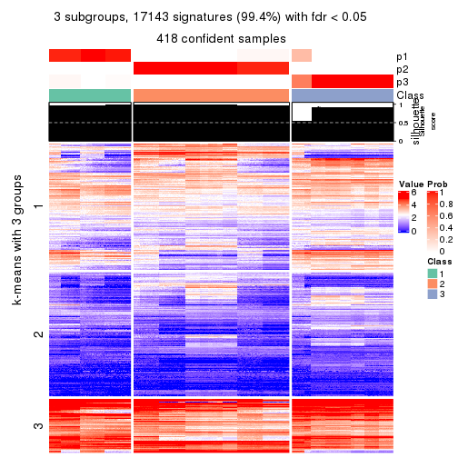</p>

</div>
<div id='tab-CV-skmeans-get-signatures-no-scale-3'>
<pre><code class="r">get_signatures(res, k = 4, scale_rows = FALSE)
</code></pre>

<p>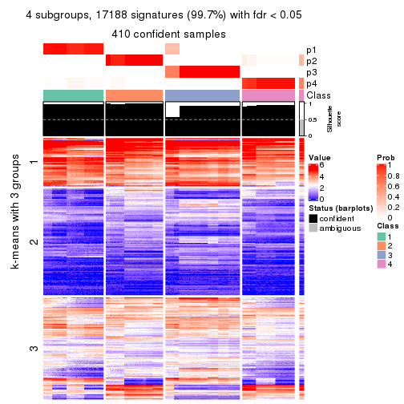</p>

</div>
<div id='tab-CV-skmeans-get-signatures-no-scale-4'>
<pre><code class="r">get_signatures(res, k = 5, scale_rows = FALSE)
</code></pre>

<p></p>

</div>
<div id='tab-CV-skmeans-get-signatures-no-scale-5'>
<pre><code class="r">get_signatures(res, k = 6, scale_rows = FALSE)
</code></pre>

<p></p>

</div>
</div>


Compare the overlap of signatures from different k:

```r
compare_signatures(res)
```


`get_signature()` returns a data frame invisibly. TO get the list of signatures, the function
call should be assigned to a variable explicitly. In following code, if `plot` argument is set
to `FALSE`, no heatmap is plotted while only the differential analysis is performed.

```r
# code only for demonstration
tb = get_signature(res, k = ..., plot = FALSE)
```

An example of the output of `tb` is:

```
#>   which_row         fdr    mean_1    mean_2 scaled_mean_1 scaled_mean_2 km
#> 1        38 0.042760348  8.373488  9.131774    -0.5533452     0.5164555  1
#> 2        40 0.018707592  7.106213  8.469186    -0.6173731     0.5762149  1
#> 3        55 0.019134737 10.221463 11.207825    -0.6159697     0.5749050  1
#> 4        59 0.006059896  5.921854  7.869574    -0.6899429     0.6439467  1
#> 5        60 0.018055526  8.928898 10.211722    -0.6204761     0.5791110  1
#> 6        98 0.009384629 15.714769 14.887706     0.6635654    -0.6193277  2
...
```

The columns in `tb` are:

1. `which_row`: row indices corresponding to the input matrix.
2. `fdr`: FDR for the differential test. 
3. `mean_x`: The mean value in group x.
4. `scaled_mean_x`: The mean value in group x after rows are scaled.
5. `km`: Row groups if k-means clustering is applied to rows.


UMAP plot which shows how samples are separated.


<script>
$( function() {
	$( '#tabs-CV-skmeans-dimension-reduction' ).tabs();
} );
</script>
<div id='tabs-CV-skmeans-dimension-reduction'>
<ul>
<li><a href='#tab-CV-skmeans-dimension-reduction-1'>k = 2</a></li>
<li><a href='#tab-CV-skmeans-dimension-reduction-2'>k = 3</a></li>
<li><a href='#tab-CV-skmeans-dimension-reduction-3'>k = 4</a></li>
<li><a href='#tab-CV-skmeans-dimension-reduction-4'>k = 5</a></li>
<li><a href='#tab-CV-skmeans-dimension-reduction-5'>k = 6</a></li>
</ul>
<div id='tab-CV-skmeans-dimension-reduction-1'>
<pre><code class="r">dimension_reduction(res, k = 2, method = &quot;UMAP&quot;)
</code></pre>

<p></p>

</div>
<div id='tab-CV-skmeans-dimension-reduction-2'>
<pre><code class="r">dimension_reduction(res, k = 3, method = &quot;UMAP&quot;)
</code></pre>

<p></p>

</div>
<div id='tab-CV-skmeans-dimension-reduction-3'>
<pre><code class="r">dimension_reduction(res, k = 4, method = &quot;UMAP&quot;)
</code></pre>

<p></p>

</div>
<div id='tab-CV-skmeans-dimension-reduction-4'>
<pre><code class="r">dimension_reduction(res, k = 5, method = &quot;UMAP&quot;)
</code></pre>

<p></p>

</div>
<div id='tab-CV-skmeans-dimension-reduction-5'>
<pre><code class="r">dimension_reduction(res, k = 6, method = &quot;UMAP&quot;)
</code></pre>

<p></p>

</div>
</div>


Following heatmap shows how subgroups are split when increasing `k`:

```r
collect_classes(res)
```


If matrix rows can be associated to genes, consider to use `GO_Enrichment(res,
...)` to perform function enrichment for the signature genes.


 

---------------------------------------------------


### CV:pam**


The object with results only for a single top-value method and a single partition method 
can be extracted as:

```r
res = res_list["CV", "pam"]
# you can also extract it by
# res = res_list["CV:pam"]
```

A summary of `res` and all the functions that can be applied to it:

```r
res
```

```
#> A 'ConsensusPartition' object with k = 2, 3, 4, 5, 6.
#>   On a matrix with 17245 rows and 418 columns.
#>   Top rows (1000, 2000, 3000, 4000, 5000) are extracted by 'CV' method.
#>   Subgroups are detected by 'pam' method.
#>   Performed in total 1250 partitions by row resampling.
#>   Best k for subgroups seems to be 6.
#> 
#> Following methods can be applied to this 'ConsensusPartition' object:
#>  [1] "cola_report"             "collect_classes"         "collect_plots"          
#>  [4] "collect_stats"           "colnames"                "compare_signatures"     
#>  [7] "consensus_heatmap"       "dimension_reduction"     "functional_enrichment"  
#> [10] "get_anno_col"            "get_anno"                "get_classes"            
#> [13] "get_consensus"           "get_matrix"              "get_membership"         
#> [16] "get_param"               "get_signatures"          "get_stats"              
#> [19] "is_best_k"               "is_stable_k"             "membership_heatmap"     
#> [22] "ncol"                    "nrow"                    "plot_ecdf"              
#> [25] "rownames"                "select_partition_number" "show"                   
#> [28] "suggest_best_k"          "test_to_known_factors"
```

`collect_plots()` function collects all the plots made from `res` for all `k` (number of partitions)
into one single page to provide an easy and fast comparison between different `k`.

```r
collect_plots(res)
```


The plots are:

- The first row: a plot of the ECDF (Empirical cumulative distribution
  function) curves of the consensus matrix for each `k` and the heatmap of
  predicted classes for each `k`.
- The second row: heatmaps of the consensus matrix for each `k`.
- The third row: heatmaps of the membership matrix for each `k`.
- The fouth row: heatmaps of the signatures for each `k`.

All the plots in panels can be made by individual functions and they are
plotted later in this section.

`select_partition_number()` produces several plots showing different
statistics for choosing "optimized" `k`. There are following statistics:

- ECDF curves of the consensus matrix for each `k`;
- 1-PAC. [The PAC
  score](https://en.wikipedia.org/wiki/Consensus_clustering#Over-interpretation_potential_of_consensus_clustering)
  measures the proportion of the ambiguous subgrouping.
- Mean silhouette score.
- Concordance. The mean probability of fiting the consensus class ids in all
  partitions.
- Area increased. Denote $A_k$ as the area under the ECDF curve for current
  `k`, the area increased is defined as $A_k - A_{k-1}$.
- Rand index. The percent of pairs of samples that are both in a same cluster
  or both are not in a same cluster in the partition of k and k-1.
- Jaccard index. The ratio of pairs of samples are both in a same cluster in
  the partition of k and k-1 and the pairs of samples are both in a same
  cluster in the partition k or k-1.

The detailed explanations of these statistics can be found in [the cola
vignette](http://bioconductor.org/packages/devel/bioc/vignettes/cola/inst/doc/cola.html#toc_13).

Generally speaking, lower PAC score, higher mean silhouette score or higher
concordance corresponds to better partition. Rand index and Jaccard index
measure how similar the current partition is compared to partition with `k-1`.
If they are too similar, we won't accept `k` is better than `k-1`.

```r
select_partition_number(res)
```


The numeric values for all these statistics can be obtained by `get_stats()`.

```r
get_stats(res)
```

```
#>   k 1-PAC mean_silhouette concordance area_increased  Rand Jaccard
#> 2 2 0.386           0.722       0.871         0.4517 0.508   0.508
#> 3 3 1.000           0.989       0.995         0.4346 0.652   0.425
#> 4 4 1.000           0.974       0.988         0.1303 0.785   0.485
#> 5 5 0.922           0.918       0.957         0.0873 0.866   0.557
#> 6 6 0.954           0.929       0.965         0.0328 0.963   0.821
```

`suggest_best_k()` suggests the best $k$ based on these statistics. The rules are as follows:

- All $k$ with Jaccard index larger than 0.95 are removed because the increase of
  the partition number does not provides enough extra information. If all $k$ are removed,
  the best $k$ is assigned by `NA`.
- For $k$ with 1-PAC larger than 0.9, the maximal $k$ is taken as the "best k". Other $k$ is called "optional k".
- If it does not fit the second rule. The $k$ with the highest vote of highest
  1-PAC, mean silhouette and concordance is taken as the "best k".

```r
suggest_best_k(res)
```

```
#> [1] 6
#> attr(,"optional")
#> [1] 3 4 5
```

There is also optional best $k$ = 3 4 5 that is worth to check.

Following shows the table of the partitions (You need to click the **show/hide
code output** link to see it). The membership matrix (columns with name `p*`)
is inferred by
[`clue::cl_consensus()`](https://www.rdocumentation.org/link/cl_consensus?package=clue)
function with the `SE` method. Basically the value in the membership matrix
represents the probability to belong to a certain group. The finall class
label for an item is determined with the group with highest probability it
belongs to.

In `get_classes()` function, the entropy is calculated from the membership
matrix and the silhouette score is calculated from the consensus matrix.


<script>
$( function() {
	$( '#tabs-CV-pam-get-classes' ).tabs();
} );
</script>
<div id='tabs-CV-pam-get-classes'>
<ul>
<li><a href='#tab-CV-pam-get-classes-1'>k = 2</a></li>
<li><a href='#tab-CV-pam-get-classes-2'>k = 3</a></li>
<li><a href='#tab-CV-pam-get-classes-3'>k = 4</a></li>
<li><a href='#tab-CV-pam-get-classes-4'>k = 5</a></li>
<li><a href='#tab-CV-pam-get-classes-5'>k = 6</a></li>
</ul>

<div id='tab-CV-pam-get-classes-1'>
<p><a id='tab-CV-pam-get-classes-1-a' style='color:#0366d6' href='#'>show/hide code output</a></p>
<pre><code class="r">cbind(get_classes(res, k = 2), get_membership(res, k = 2))
</code></pre>

<pre><code>#&gt;           class entropy silhouette    p1    p2
#&gt; SRR902920     1  0.0000     0.8494 1.000 0.000
#&gt; SRR902921     1  0.0000     0.8494 1.000 0.000
#&gt; SRR902922     1  0.0000     0.8494 1.000 0.000
#&gt; SRR902923     1  0.0000     0.8494 1.000 0.000
#&gt; SRR902924     1  0.0000     0.8494 1.000 0.000
#&gt; SRR902925     1  0.0000     0.8494 1.000 0.000
#&gt; SRR902926     1  0.0000     0.8494 1.000 0.000
#&gt; SRR902927     1  0.0000     0.8494 1.000 0.000
#&gt; SRR902928     1  0.0000     0.8494 1.000 0.000
#&gt; SRR902929     1  0.0000     0.8494 1.000 0.000
#&gt; SRR902930     1  0.0000     0.8494 1.000 0.000
#&gt; SRR902931     1  0.0000     0.8494 1.000 0.000
#&gt; SRR902932     2  0.0000     0.8131 0.000 1.000
#&gt; SRR902933     2  0.0000     0.8131 0.000 1.000
#&gt; SRR902934     2  0.0000     0.8131 0.000 1.000
#&gt; SRR902935     2  0.0000     0.8131 0.000 1.000
#&gt; SRR902936     2  0.0000     0.8131 0.000 1.000
#&gt; SRR902937     2  0.0000     0.8131 0.000 1.000
#&gt; SRR902938     2  0.0000     0.8131 0.000 1.000
#&gt; SRR902939     2  0.0000     0.8131 0.000 1.000
#&gt; SRR902940     2  0.0000     0.8131 0.000 1.000
#&gt; SRR902941     2  0.0000     0.8131 0.000 1.000
#&gt; SRR902942     1  0.0000     0.8494 1.000 0.000
#&gt; SRR902943     1  0.0000     0.8494 1.000 0.000
#&gt; SRR902944     1  0.0000     0.8494 1.000 0.000
#&gt; SRR902945     1  0.0000     0.8494 1.000 0.000
#&gt; SRR902946     1  0.0000     0.8494 1.000 0.000
#&gt; SRR902947     1  0.0000     0.8494 1.000 0.000
#&gt; SRR902954     1  0.0000     0.8494 1.000 0.000
#&gt; SRR902955     1  0.0000     0.8494 1.000 0.000
#&gt; SRR902956     1  0.0000     0.8494 1.000 0.000
#&gt; SRR902957     1  0.0000     0.8494 1.000 0.000
#&gt; SRR902958     1  0.0000     0.8494 1.000 0.000
#&gt; SRR902959     1  0.0000     0.8494 1.000 0.000
#&gt; SRR902948     1  0.0000     0.8494 1.000 0.000
#&gt; SRR902949     1  0.0000     0.8494 1.000 0.000
#&gt; SRR902950     1  0.0000     0.8494 1.000 0.000
#&gt; SRR902951     1  0.0000     0.8494 1.000 0.000
#&gt; SRR902952     1  0.0000     0.8494 1.000 0.000
#&gt; SRR902953     1  0.0000     0.8494 1.000 0.000
#&gt; SRR902960     1  0.0000     0.8494 1.000 0.000
#&gt; SRR902961     1  0.0000     0.8494 1.000 0.000
#&gt; SRR902962     1  0.0000     0.8494 1.000 0.000
#&gt; SRR902963     1  0.0000     0.8494 1.000 0.000
#&gt; SRR902964     1  0.0000     0.8494 1.000 0.000
#&gt; SRR902965     1  0.0000     0.8494 1.000 0.000
#&gt; SRR902966     1  0.0000     0.8494 1.000 0.000
#&gt; SRR902967     1  0.0000     0.8494 1.000 0.000
#&gt; SRR902968     1  0.0000     0.8494 1.000 0.000
#&gt; SRR902969     1  0.0000     0.8494 1.000 0.000
#&gt; SRR902970     1  0.0000     0.8494 1.000 0.000
#&gt; SRR902971     1  0.0000     0.8494 1.000 0.000
#&gt; SRR902972     1  0.0000     0.8494 1.000 0.000
#&gt; SRR902973     1  0.0000     0.8494 1.000 0.000
#&gt; SRR902974     1  0.0000     0.8494 1.000 0.000
#&gt; SRR902975     1  0.0000     0.8494 1.000 0.000
#&gt; SRR902976     1  0.0000     0.8494 1.000 0.000
#&gt; SRR902977     1  0.0000     0.8494 1.000 0.000
#&gt; SRR902978     1  0.0000     0.8494 1.000 0.000
#&gt; SRR902980     1  0.0000     0.8494 1.000 0.000
#&gt; SRR902981     1  0.0000     0.8494 1.000 0.000
#&gt; SRR902982     1  0.0000     0.8494 1.000 0.000
#&gt; SRR902983     1  0.0000     0.8494 1.000 0.000
#&gt; SRR902984     1  0.0000     0.8494 1.000 0.000
#&gt; SRR902985     1  0.0000     0.8494 1.000 0.000
#&gt; SRR902986     1  0.0000     0.8494 1.000 0.000
#&gt; SRR902987     1  0.0000     0.8494 1.000 0.000
#&gt; SRR902988     1  0.0000     0.8494 1.000 0.000
#&gt; SRR902989     1  0.0000     0.8494 1.000 0.000
#&gt; SRR902990     1  0.0000     0.8494 1.000 0.000
#&gt; SRR902991     1  0.0000     0.8494 1.000 0.000
#&gt; SRR902992     1  0.0000     0.8494 1.000 0.000
#&gt; SRR902993     1  0.0000     0.8494 1.000 0.000
#&gt; SRR902994     1  0.0000     0.8494 1.000 0.000
#&gt; SRR902995     1  0.0000     0.8494 1.000 0.000
#&gt; SRR902996     2  0.0000     0.8131 0.000 1.000
#&gt; SRR902997     2  0.0000     0.8131 0.000 1.000
#&gt; SRR902998     2  0.0000     0.8131 0.000 1.000
#&gt; SRR902999     2  0.0000     0.8131 0.000 1.000
#&gt; SRR903000     2  0.0000     0.8131 0.000 1.000
#&gt; SRR903001     2  0.0000     0.8131 0.000 1.000
#&gt; SRR903008     2  0.0000     0.8131 0.000 1.000
#&gt; SRR903009     2  0.0000     0.8131 0.000 1.000
#&gt; SRR903010     2  0.0000     0.8131 0.000 1.000
#&gt; SRR903011     2  0.0000     0.8131 0.000 1.000
#&gt; SRR903012     2  0.0000     0.8131 0.000 1.000
#&gt; SRR903013     2  0.0000     0.8131 0.000 1.000
#&gt; SRR903002     2  0.0000     0.8131 0.000 1.000
#&gt; SRR903003     2  0.0000     0.8131 0.000 1.000
#&gt; SRR903004     2  0.0000     0.8131 0.000 1.000
#&gt; SRR903005     2  0.0000     0.8131 0.000 1.000
#&gt; SRR903006     2  0.0000     0.8131 0.000 1.000
#&gt; SRR903007     2  0.0000     0.8131 0.000 1.000
#&gt; SRR903014     1  0.0000     0.8494 1.000 0.000
#&gt; SRR903015     1  0.0000     0.8494 1.000 0.000
#&gt; SRR903016     1  0.0000     0.8494 1.000 0.000
#&gt; SRR903017     1  0.0000     0.8494 1.000 0.000
#&gt; SRR903018     1  0.0000     0.8494 1.000 0.000
#&gt; SRR903019     1  0.0000     0.8494 1.000 0.000
#&gt; SRR903020     1  0.0000     0.8494 1.000 0.000
#&gt; SRR903021     1  0.0000     0.8494 1.000 0.000
#&gt; SRR903022     1  0.0000     0.8494 1.000 0.000
#&gt; SRR903023     1  0.0000     0.8494 1.000 0.000
#&gt; SRR903024     1  0.0000     0.8494 1.000 0.000
#&gt; SRR903025     1  0.0000     0.8494 1.000 0.000
#&gt; SRR903026     1  0.0000     0.8494 1.000 0.000
#&gt; SRR903027     1  0.0000     0.8494 1.000 0.000
#&gt; SRR903028     1  0.0000     0.8494 1.000 0.000
#&gt; SRR903029     1  0.0000     0.8494 1.000 0.000
#&gt; SRR903030     1  0.0000     0.8494 1.000 0.000
#&gt; SRR903031     1  0.0000     0.8494 1.000 0.000
#&gt; SRR903032     2  0.0000     0.8131 0.000 1.000
#&gt; SRR903033     2  0.0000     0.8131 0.000 1.000
#&gt; SRR903034     2  0.0000     0.8131 0.000 1.000
#&gt; SRR903035     2  0.0000     0.8131 0.000 1.000
#&gt; SRR903036     2  0.0000     0.8131 0.000 1.000
#&gt; SRR903037     2  0.0000     0.8131 0.000 1.000
#&gt; SRR903038     2  0.0000     0.8131 0.000 1.000
#&gt; SRR903039     2  0.0000     0.8131 0.000 1.000
#&gt; SRR903040     2  0.0000     0.8131 0.000 1.000
#&gt; SRR903041     2  0.0000     0.8131 0.000 1.000
#&gt; SRR903042     2  0.0000     0.8131 0.000 1.000
#&gt; SRR903043     2  0.0000     0.8131 0.000 1.000
#&gt; SRR903044     2  0.0000     0.8131 0.000 1.000
#&gt; SRR903045     2  0.0000     0.8131 0.000 1.000
#&gt; SRR903046     2  0.0000     0.8131 0.000 1.000
#&gt; SRR903047     2  0.0000     0.8131 0.000 1.000
#&gt; SRR903048     2  0.0000     0.8131 0.000 1.000
#&gt; SRR903049     2  0.0000     0.8131 0.000 1.000
#&gt; SRR903050     1  0.9896     0.0953 0.560 0.440
#&gt; SRR903051     1  0.9896     0.0953 0.560 0.440
#&gt; SRR903052     1  0.9896     0.0953 0.560 0.440
#&gt; SRR903053     1  0.9896     0.0953 0.560 0.440
#&gt; SRR903054     1  0.9896     0.0953 0.560 0.440
#&gt; SRR903055     1  0.9896     0.0953 0.560 0.440
#&gt; SRR903056     1  0.9896     0.0953 0.560 0.440
#&gt; SRR903057     1  0.9896     0.0953 0.560 0.440
#&gt; SRR903058     1  0.9896     0.0953 0.560 0.440
#&gt; SRR903059     1  0.9896     0.0953 0.560 0.440
#&gt; SRR903060     1  0.9896     0.0953 0.560 0.440
#&gt; SRR903061     1  0.9896     0.0953 0.560 0.440
#&gt; SRR903062     1  0.9896     0.0953 0.560 0.440
#&gt; SRR903063     1  0.9896     0.0953 0.560 0.440
#&gt; SRR903064     1  0.9896     0.0953 0.560 0.440
#&gt; SRR903065     1  0.9896     0.0953 0.560 0.440
#&gt; SRR903066     1  0.9896     0.0953 0.560 0.440
#&gt; SRR903067     1  0.9896     0.0953 0.560 0.440
#&gt; SRR903068     1  0.9896     0.0953 0.560 0.440
#&gt; SRR903069     1  0.9896     0.0953 0.560 0.440
#&gt; SRR903070     1  0.9896     0.0953 0.560 0.440
#&gt; SRR903071     1  0.9896     0.0953 0.560 0.440
#&gt; SRR903072     1  0.9896     0.0953 0.560 0.440
#&gt; SRR903073     1  0.9896     0.0953 0.560 0.440
#&gt; SRR903074     1  0.9896     0.0953 0.560 0.440
#&gt; SRR903075     1  0.9896     0.0953 0.560 0.440
#&gt; SRR903076     1  0.9896     0.0953 0.560 0.440
#&gt; SRR903077     1  0.9896     0.0953 0.560 0.440
#&gt; SRR903078     1  0.9896     0.0953 0.560 0.440
#&gt; SRR903079     1  0.9896     0.0953 0.560 0.440
#&gt; SRR903080     1  0.9896     0.0953 0.560 0.440
#&gt; SRR903081     1  0.9896     0.0953 0.560 0.440
#&gt; SRR903082     2  0.7745     0.7706 0.228 0.772
#&gt; SRR903083     2  0.7745     0.7706 0.228 0.772
#&gt; SRR903084     2  0.7745     0.7706 0.228 0.772
#&gt; SRR903085     2  0.7745     0.7706 0.228 0.772
#&gt; SRR903086     2  0.7745     0.7706 0.228 0.772
#&gt; SRR903087     2  0.7745     0.7706 0.228 0.772
#&gt; SRR903088     2  0.7745     0.7706 0.228 0.772
#&gt; SRR903089     2  0.7745     0.7706 0.228 0.772
#&gt; SRR903090     2  0.7745     0.7706 0.228 0.772
#&gt; SRR903091     2  0.7745     0.7706 0.228 0.772
#&gt; SRR903092     2  0.7745     0.7706 0.228 0.772
#&gt; SRR903093     2  0.7745     0.7706 0.228 0.772
#&gt; SRR903094     2  0.7745     0.7706 0.228 0.772
#&gt; SRR903095     2  0.7745     0.7706 0.228 0.772
#&gt; SRR903096     2  0.7745     0.7706 0.228 0.772
#&gt; SRR903097     2  0.7745     0.7706 0.228 0.772
#&gt; SRR903098     2  0.7745     0.7706 0.228 0.772
#&gt; SRR903099     2  0.7745     0.7706 0.228 0.772
#&gt; SRR903100     2  0.7745     0.7706 0.228 0.772
#&gt; SRR903101     2  0.7745     0.7706 0.228 0.772
#&gt; SRR903102     2  0.7745     0.7706 0.228 0.772
#&gt; SRR903103     2  0.7745     0.7706 0.228 0.772
#&gt; SRR903104     2  0.7745     0.7706 0.228 0.772
#&gt; SRR903105     2  0.7745     0.7706 0.228 0.772
#&gt; SRR903106     2  0.7745     0.7706 0.228 0.772
#&gt; SRR903107     2  0.7745     0.7706 0.228 0.772
#&gt; SRR903108     2  0.7745     0.7706 0.228 0.772
#&gt; SRR903109     2  0.7745     0.7706 0.228 0.772
#&gt; SRR903110     2  0.7745     0.7706 0.228 0.772
#&gt; SRR903111     2  0.7745     0.7706 0.228 0.772
#&gt; SRR903112     2  0.7745     0.7706 0.228 0.772
#&gt; SRR903113     2  0.7745     0.7706 0.228 0.772
#&gt; SRR903114     2  0.9427     0.5916 0.360 0.640
#&gt; SRR903115     2  0.9427     0.5916 0.360 0.640
#&gt; SRR903116     2  0.9427     0.5916 0.360 0.640
#&gt; SRR903117     2  0.9427     0.5916 0.360 0.640
#&gt; SRR903118     2  0.9427     0.5916 0.360 0.640
#&gt; SRR903119     2  0.9427     0.5916 0.360 0.640
#&gt; SRR903121     2  0.9427     0.5916 0.360 0.640
#&gt; SRR903122     2  0.9427     0.5916 0.360 0.640
#&gt; SRR903124     2  0.9427     0.5916 0.360 0.640
#&gt; SRR903125     2  0.9427     0.5916 0.360 0.640
#&gt; SRR903126     2  0.9427     0.5916 0.360 0.640
#&gt; SRR903127     2  0.9427     0.5916 0.360 0.640
#&gt; SRR903128     2  0.9427     0.5916 0.360 0.640
#&gt; SRR903129     2  0.9427     0.5916 0.360 0.640
#&gt; SRR903130     2  0.9427     0.5916 0.360 0.640
#&gt; SRR903131     2  0.9427     0.5916 0.360 0.640
#&gt; SRR903132     2  0.9427     0.5916 0.360 0.640
#&gt; SRR903133     2  0.9427     0.5916 0.360 0.640
#&gt; SRR903134     2  0.9427     0.5916 0.360 0.640
#&gt; SRR903135     2  0.9427     0.5916 0.360 0.640
#&gt; SRR903136     2  0.9427     0.5916 0.360 0.640
#&gt; SRR903137     2  0.9427     0.5916 0.360 0.640
#&gt; SRR903146     2  0.7745     0.7706 0.228 0.772
#&gt; SRR903147     2  0.7745     0.7706 0.228 0.772
#&gt; SRR903148     2  0.7745     0.7706 0.228 0.772
#&gt; SRR903149     2  0.7745     0.7706 0.228 0.772
#&gt; SRR903150     2  0.7745     0.7706 0.228 0.772
#&gt; SRR903151     2  0.7745     0.7706 0.228 0.772
#&gt; SRR903152     2  0.7745     0.7706 0.228 0.772
#&gt; SRR903153     2  0.7745     0.7706 0.228 0.772
#&gt; SRR903138     2  0.9427     0.5916 0.360 0.640
#&gt; SRR903139     2  0.9427     0.5916 0.360 0.640
#&gt; SRR903140     2  0.9427     0.5916 0.360 0.640
#&gt; SRR903141     2  0.9427     0.5916 0.360 0.640
#&gt; SRR903142     2  0.9427     0.5916 0.360 0.640
#&gt; SRR903143     2  0.9427     0.5916 0.360 0.640
#&gt; SRR903144     2  0.9427     0.5916 0.360 0.640
#&gt; SRR903145     2  0.9427     0.5916 0.360 0.640
#&gt; SRR903154     2  0.7745     0.7706 0.228 0.772
#&gt; SRR903155     2  0.7745     0.7706 0.228 0.772
#&gt; SRR903156     2  0.7745     0.7706 0.228 0.772
#&gt; SRR903157     2  0.7745     0.7706 0.228 0.772
#&gt; SRR903158     2  0.7745     0.7706 0.228 0.772
#&gt; SRR903159     2  0.7745     0.7706 0.228 0.772
#&gt; SRR903160     2  0.7745     0.7706 0.228 0.772
#&gt; SRR903161     2  0.7745     0.7706 0.228 0.772
#&gt; SRR903162     2  0.7745     0.7706 0.228 0.772
#&gt; SRR903163     2  0.7745     0.7706 0.228 0.772
#&gt; SRR903164     2  0.7745     0.7706 0.228 0.772
#&gt; SRR903165     2  0.7745     0.7706 0.228 0.772
#&gt; SRR903166     2  0.7745     0.7706 0.228 0.772
#&gt; SRR903167     2  0.7745     0.7706 0.228 0.772
#&gt; SRR903168     2  0.7745     0.7706 0.228 0.772
#&gt; SRR903169     2  0.7745     0.7706 0.228 0.772
#&gt; SRR903178     1  0.0000     0.8494 1.000 0.000
#&gt; SRR903179     1  0.0000     0.8494 1.000 0.000
#&gt; SRR903180     1  0.0000     0.8494 1.000 0.000
#&gt; SRR903181     1  0.0000     0.8494 1.000 0.000
#&gt; SRR903182     1  0.0000     0.8494 1.000 0.000
#&gt; SRR903183     1  0.0000     0.8494 1.000 0.000
#&gt; SRR903184     1  0.0000     0.8494 1.000 0.000
#&gt; SRR903185     1  0.0000     0.8494 1.000 0.000
#&gt; SRR903170     2  0.7745     0.7706 0.228 0.772
#&gt; SRR903171     2  0.7745     0.7706 0.228 0.772
#&gt; SRR903172     2  0.7745     0.7706 0.228 0.772
#&gt; SRR903173     2  0.7745     0.7706 0.228 0.772
#&gt; SRR903174     2  0.7745     0.7706 0.228 0.772
#&gt; SRR903175     2  0.7745     0.7706 0.228 0.772
#&gt; SRR903176     2  0.7745     0.7706 0.228 0.772
#&gt; SRR903177     2  0.7745     0.7706 0.228 0.772
#&gt; SRR903186     1  0.0000     0.8494 1.000 0.000
#&gt; SRR903187     1  0.0000     0.8494 1.000 0.000
#&gt; SRR903188     1  0.0000     0.8494 1.000 0.000
#&gt; SRR903189     1  0.0000     0.8494 1.000 0.000
#&gt; SRR903190     1  0.0000     0.8494 1.000 0.000
#&gt; SRR903191     1  0.0000     0.8494 1.000 0.000
#&gt; SRR903192     1  0.0000     0.8494 1.000 0.000
#&gt; SRR903193     1  0.0000     0.8494 1.000 0.000
#&gt; SRR903194     1  0.7299     0.6445 0.796 0.204
#&gt; SRR903195     1  0.7376     0.6386 0.792 0.208
#&gt; SRR903196     1  0.7219     0.6500 0.800 0.200
#&gt; SRR903197     1  0.6623     0.6865 0.828 0.172
#&gt; SRR903198     1  0.7299     0.6445 0.796 0.204
#&gt; SRR903199     1  0.6973     0.6661 0.812 0.188
#&gt; SRR903200     1  0.6712     0.6816 0.824 0.176
#&gt; SRR903201     1  0.7602     0.6203 0.780 0.220
#&gt; SRR903210     2  0.0000     0.8131 0.000 1.000
#&gt; SRR903211     2  0.0000     0.8131 0.000 1.000
#&gt; SRR903212     2  0.0000     0.8131 0.000 1.000
#&gt; SRR903213     2  0.0000     0.8131 0.000 1.000
#&gt; SRR903214     2  0.0000     0.8131 0.000 1.000
#&gt; SRR903215     2  0.0000     0.8131 0.000 1.000
#&gt; SRR903216     2  0.0000     0.8131 0.000 1.000
#&gt; SRR903217     2  0.0000     0.8131 0.000 1.000
#&gt; SRR903202     1  0.0000     0.8494 1.000 0.000
#&gt; SRR903203     1  0.0000     0.8494 1.000 0.000
#&gt; SRR903204     1  0.0000     0.8494 1.000 0.000
#&gt; SRR903205     1  0.0000     0.8494 1.000 0.000
#&gt; SRR903206     1  0.0000     0.8494 1.000 0.000
#&gt; SRR903207     1  0.0000     0.8494 1.000 0.000
#&gt; SRR903208     1  0.0000     0.8494 1.000 0.000
#&gt; SRR903209     1  0.0000     0.8494 1.000 0.000
#&gt; SRR903218     2  0.0000     0.8131 0.000 1.000
#&gt; SRR903219     2  0.0000     0.8131 0.000 1.000
#&gt; SRR903220     2  0.0000     0.8131 0.000 1.000
#&gt; SRR903221     2  0.0000     0.8131 0.000 1.000
#&gt; SRR903222     2  0.0000     0.8131 0.000 1.000
#&gt; SRR903223     2  0.0000     0.8131 0.000 1.000
#&gt; SRR903224     2  0.0000     0.8131 0.000 1.000
#&gt; SRR903225     2  0.0000     0.8131 0.000 1.000
#&gt; SRR903226     2  0.0000     0.8131 0.000 1.000
#&gt; SRR903227     2  0.0000     0.8131 0.000 1.000
#&gt; SRR903228     2  0.0000     0.8131 0.000 1.000
#&gt; SRR903229     2  0.0000     0.8131 0.000 1.000
#&gt; SRR903230     2  0.0000     0.8131 0.000 1.000
#&gt; SRR903231     2  0.0000     0.8131 0.000 1.000
#&gt; SRR903232     2  0.0000     0.8131 0.000 1.000
#&gt; SRR903233     2  0.0000     0.8131 0.000 1.000
#&gt; SRR903242     2  0.9427     0.5916 0.360 0.640
#&gt; SRR903243     2  0.9427     0.5916 0.360 0.640
#&gt; SRR903244     2  0.9427     0.5916 0.360 0.640
#&gt; SRR903245     2  0.9427     0.5916 0.360 0.640
#&gt; SRR903246     2  0.9427     0.5916 0.360 0.640
#&gt; SRR903247     2  0.9427     0.5916 0.360 0.640
#&gt; SRR903248     2  0.9427     0.5916 0.360 0.640
#&gt; SRR903249     2  0.9427     0.5916 0.360 0.640
#&gt; SRR903234     2  0.0000     0.8131 0.000 1.000
#&gt; SRR903235     2  0.0000     0.8131 0.000 1.000
#&gt; SRR903236     2  0.0000     0.8131 0.000 1.000
#&gt; SRR903237     2  0.0000     0.8131 0.000 1.000
#&gt; SRR903238     2  0.0000     0.8131 0.000 1.000
#&gt; SRR903239     2  0.0000     0.8131 0.000 1.000
#&gt; SRR903240     2  0.0000     0.8131 0.000 1.000
#&gt; SRR903241     2  0.0000     0.8131 0.000 1.000
#&gt; SRR903258     1  0.8608     0.5075 0.716 0.284
#&gt; SRR903259     1  0.8661     0.5003 0.712 0.288
#&gt; SRR903260     1  0.8608     0.5075 0.716 0.284
#&gt; SRR903261     1  0.8608     0.5075 0.716 0.284
#&gt; SRR903262     1  0.8608     0.5075 0.716 0.284
#&gt; SRR903263     1  0.8608     0.5075 0.716 0.284
#&gt; SRR903264     1  0.8661     0.5003 0.712 0.288
#&gt; SRR903265     1  0.8608     0.5075 0.716 0.284
#&gt; SRR903250     1  0.8713     0.4928 0.708 0.292
#&gt; SRR903251     1  0.8813     0.4771 0.700 0.300
#&gt; SRR903252     1  0.8909     0.4602 0.692 0.308
#&gt; SRR903253     1  0.8763     0.4850 0.704 0.296
#&gt; SRR903254     1  0.8813     0.4769 0.700 0.300
#&gt; SRR903255     1  0.8861     0.4684 0.696 0.304
#&gt; SRR903256     1  0.8763     0.4852 0.704 0.296
#&gt; SRR903257     1  0.9248     0.3833 0.660 0.340
#&gt; SRR903266     2  0.9427     0.5916 0.360 0.640
#&gt; SRR903267     2  0.9427     0.5916 0.360 0.640
#&gt; SRR903268     2  0.9427     0.5916 0.360 0.640
#&gt; SRR903270     2  0.9427     0.5916 0.360 0.640
#&gt; SRR903271     2  0.9427     0.5916 0.360 0.640
#&gt; SRR903272     2  0.9427     0.5916 0.360 0.640
#&gt; SRR903273     2  0.9427     0.5916 0.360 0.640
#&gt; SRR903274     2  0.7745     0.7706 0.228 0.772
#&gt; SRR903275     2  0.7745     0.7706 0.228 0.772
#&gt; SRR903276     2  0.7745     0.7706 0.228 0.772
#&gt; SRR903277     2  0.7745     0.7706 0.228 0.772
#&gt; SRR903278     2  0.7745     0.7706 0.228 0.772
#&gt; SRR903279     2  0.7745     0.7706 0.228 0.772
#&gt; SRR903280     2  0.7745     0.7706 0.228 0.772
#&gt; SRR903281     2  0.7745     0.7706 0.228 0.772
#&gt; SRR903282     2  0.0376     0.8130 0.004 0.996
#&gt; SRR903283     2  0.0376     0.8130 0.004 0.996
#&gt; SRR903284     2  0.0938     0.8122 0.012 0.988
#&gt; SRR903285     2  0.0376     0.8130 0.004 0.996
#&gt; SRR903286     2  0.0376     0.8130 0.004 0.996
#&gt; SRR903287     2  0.0376     0.8130 0.004 0.996
#&gt; SRR903288     2  0.0376     0.8130 0.004 0.996
#&gt; SRR903289     2  0.0376     0.8130 0.004 0.996
#&gt; SRR903290     2  0.0000     0.8131 0.000 1.000
#&gt; SRR903291     2  0.0000     0.8131 0.000 1.000
#&gt; SRR903292     2  0.0000     0.8131 0.000 1.000
#&gt; SRR903293     2  0.0000     0.8131 0.000 1.000
#&gt; SRR903294     2  0.0000     0.8131 0.000 1.000
#&gt; SRR903295     2  0.0000     0.8131 0.000 1.000
#&gt; SRR903296     2  0.0000     0.8131 0.000 1.000
#&gt; SRR903297     2  0.0000     0.8131 0.000 1.000
#&gt; SRR903298     2  0.4022     0.8042 0.080 0.920
#&gt; SRR903299     2  0.4161     0.8037 0.084 0.916
#&gt; SRR903300     2  0.4161     0.8037 0.084 0.916
#&gt; SRR903301     2  0.4161     0.8037 0.084 0.916
#&gt; SRR903302     2  0.4161     0.8037 0.084 0.916
#&gt; SRR903303     2  0.4690     0.8008 0.100 0.900
#&gt; SRR903304     2  0.4161     0.8037 0.084 0.916
#&gt; SRR903305     2  0.4815     0.8002 0.104 0.896
#&gt; SRR903306     1  0.0000     0.8494 1.000 0.000
#&gt; SRR903307     1  0.0000     0.8494 1.000 0.000
#&gt; SRR903308     1  0.0000     0.8494 1.000 0.000
#&gt; SRR903309     1  0.0000     0.8494 1.000 0.000
#&gt; SRR903310     1  0.0000     0.8494 1.000 0.000
#&gt; SRR903311     1  0.0000     0.8494 1.000 0.000
#&gt; SRR903312     1  0.0000     0.8494 1.000 0.000
#&gt; SRR903313     1  0.0000     0.8494 1.000 0.000
#&gt; SRR903314     1  0.0000     0.8494 1.000 0.000
#&gt; SRR903315     1  0.0000     0.8494 1.000 0.000
#&gt; SRR903316     1  0.0000     0.8494 1.000 0.000
#&gt; SRR903317     1  0.0000     0.8494 1.000 0.000
#&gt; SRR903318     1  0.0000     0.8494 1.000 0.000
#&gt; SRR903319     1  0.0000     0.8494 1.000 0.000
#&gt; SRR903320     1  0.0000     0.8494 1.000 0.000
#&gt; SRR903321     1  0.0000     0.8494 1.000 0.000
#&gt; SRR903322     1  0.0000     0.8494 1.000 0.000
#&gt; SRR903323     1  0.0000     0.8494 1.000 0.000
#&gt; SRR903324     2  0.0000     0.8131 0.000 1.000
#&gt; SRR903325     2  0.0000     0.8131 0.000 1.000
#&gt; SRR903326     2  0.0000     0.8131 0.000 1.000
#&gt; SRR903327     2  0.0000     0.8131 0.000 1.000
#&gt; SRR903328     2  0.0000     0.8131 0.000 1.000
#&gt; SRR903329     2  0.0000     0.8131 0.000 1.000
#&gt; SRR903330     2  0.0000     0.8131 0.000 1.000
#&gt; SRR903331     2  0.0000     0.8131 0.000 1.000
#&gt; SRR903332     2  0.0000     0.8131 0.000 1.000
#&gt; SRR903333     2  0.0000     0.8131 0.000 1.000
#&gt; SRR903334     2  0.0000     0.8131 0.000 1.000
#&gt; SRR903335     2  0.0000     0.8131 0.000 1.000
#&gt; SRR903336     2  0.0000     0.8131 0.000 1.000
#&gt; SRR903337     2  0.0000     0.8131 0.000 1.000
#&gt; SRR903338     2  0.0000     0.8131 0.000 1.000
#&gt; SRR903339     2  0.0000     0.8131 0.000 1.000
#&gt; SRR903340     2  0.0000     0.8131 0.000 1.000
#&gt; SRR903341     2  0.0000     0.8131 0.000 1.000
</code></pre>

<script>
$('#tab-CV-pam-get-classes-1-a').parent().next().next().hide();
$('#tab-CV-pam-get-classes-1-a').click(function(){
  $('#tab-CV-pam-get-classes-1-a').parent().next().next().toggle();
  return(false);
});
</script>
</div>

<div id='tab-CV-pam-get-classes-2'>
<p><a id='tab-CV-pam-get-classes-2-a' style='color:#0366d6' href='#'>show/hide code output</a></p>
<pre><code class="r">cbind(get_classes(res, k = 3), get_membership(res, k = 3))
</code></pre>

<pre><code>#&gt;           class entropy silhouette    p1    p2    p3
#&gt; SRR902920     3  0.0000      1.000 0.000 0.000 1.000
#&gt; SRR902921     3  0.0000      1.000 0.000 0.000 1.000
#&gt; SRR902922     3  0.0000      1.000 0.000 0.000 1.000
#&gt; SRR902923     3  0.0000      1.000 0.000 0.000 1.000
#&gt; SRR902924     3  0.0000      1.000 0.000 0.000 1.000
#&gt; SRR902925     3  0.0000      1.000 0.000 0.000 1.000
#&gt; SRR902926     3  0.0000      1.000 0.000 0.000 1.000
#&gt; SRR902927     3  0.0000      1.000 0.000 0.000 1.000
#&gt; SRR902928     3  0.0000      1.000 0.000 0.000 1.000
#&gt; SRR902929     3  0.0000      1.000 0.000 0.000 1.000
#&gt; SRR902930     3  0.0000      1.000 0.000 0.000 1.000
#&gt; SRR902931     3  0.0000      1.000 0.000 0.000 1.000
#&gt; SRR902932     2  0.0000      0.997 0.000 1.000 0.000
#&gt; SRR902933     2  0.0000      0.997 0.000 1.000 0.000
#&gt; SRR902934     2  0.0000      0.997 0.000 1.000 0.000
#&gt; SRR902935     2  0.0000      0.997 0.000 1.000 0.000
#&gt; SRR902936     2  0.0000      0.997 0.000 1.000 0.000
#&gt; SRR902937     2  0.0000      0.997 0.000 1.000 0.000
#&gt; SRR902938     2  0.0000      0.997 0.000 1.000 0.000
#&gt; SRR902939     2  0.0000      0.997 0.000 1.000 0.000
#&gt; SRR902940     2  0.0000      0.997 0.000 1.000 0.000
#&gt; SRR902941     2  0.0000      0.997 0.000 1.000 0.000
#&gt; SRR902942     3  0.0000      1.000 0.000 0.000 1.000
#&gt; SRR902943     3  0.0000      1.000 0.000 0.000 1.000
#&gt; SRR902944     3  0.0000      1.000 0.000 0.000 1.000
#&gt; SRR902945     3  0.0000      1.000 0.000 0.000 1.000
#&gt; SRR902946     3  0.0000      1.000 0.000 0.000 1.000
#&gt; SRR902947     3  0.0000      1.000 0.000 0.000 1.000
#&gt; SRR902954     3  0.0000      1.000 0.000 0.000 1.000
#&gt; SRR902955     3  0.0000      1.000 0.000 0.000 1.000
#&gt; SRR902956     3  0.0000      1.000 0.000 0.000 1.000
#&gt; SRR902957     3  0.0000      1.000 0.000 0.000 1.000
#&gt; SRR902958     3  0.0000      1.000 0.000 0.000 1.000
#&gt; SRR902959     3  0.0000      1.000 0.000 0.000 1.000
#&gt; SRR902948     3  0.0000      1.000 0.000 0.000 1.000
#&gt; SRR902949     3  0.0000      1.000 0.000 0.000 1.000
#&gt; SRR902950     3  0.0000      1.000 0.000 0.000 1.000
#&gt; SRR902951     3  0.0000      1.000 0.000 0.000 1.000
#&gt; SRR902952     3  0.0000      1.000 0.000 0.000 1.000
#&gt; SRR902953     3  0.0000      1.000 0.000 0.000 1.000
#&gt; SRR902960     3  0.0000      1.000 0.000 0.000 1.000
#&gt; SRR902961     3  0.0000      1.000 0.000 0.000 1.000
#&gt; SRR902962     3  0.0000      1.000 0.000 0.000 1.000
#&gt; SRR902963     3  0.0000      1.000 0.000 0.000 1.000
#&gt; SRR902964     3  0.0000      1.000 0.000 0.000 1.000
#&gt; SRR902965     3  0.0000      1.000 0.000 0.000 1.000
#&gt; SRR902966     3  0.0000      1.000 0.000 0.000 1.000
#&gt; SRR902967     3  0.0000      1.000 0.000 0.000 1.000
#&gt; SRR902968     3  0.0000      1.000 0.000 0.000 1.000
#&gt; SRR902969     3  0.0000      1.000 0.000 0.000 1.000
#&gt; SRR902970     3  0.0000      1.000 0.000 0.000 1.000
#&gt; SRR902971     3  0.0000      1.000 0.000 0.000 1.000
#&gt; SRR902972     3  0.0000      1.000 0.000 0.000 1.000
#&gt; SRR902973     3  0.0000      1.000 0.000 0.000 1.000
#&gt; SRR902974     3  0.0000      1.000 0.000 0.000 1.000
#&gt; SRR902975     3  0.0000      1.000 0.000 0.000 1.000
#&gt; SRR902976     3  0.0000      1.000 0.000 0.000 1.000
#&gt; SRR902977     3  0.0000      1.000 0.000 0.000 1.000
#&gt; SRR902978     3  0.0000      1.000 0.000 0.000 1.000
#&gt; SRR902980     3  0.0000      1.000 0.000 0.000 1.000
#&gt; SRR902981     3  0.0000      1.000 0.000 0.000 1.000
#&gt; SRR902982     3  0.0000      1.000 0.000 0.000 1.000
#&gt; SRR902983     3  0.0000      1.000 0.000 0.000 1.000
#&gt; SRR902984     3  0.0000      1.000 0.000 0.000 1.000
#&gt; SRR902985     3  0.0000      1.000 0.000 0.000 1.000
#&gt; SRR902986     3  0.0000      1.000 0.000 0.000 1.000
#&gt; SRR902987     3  0.0000      1.000 0.000 0.000 1.000
#&gt; SRR902988     3  0.0000      1.000 0.000 0.000 1.000
#&gt; SRR902989     3  0.0000      1.000 0.000 0.000 1.000
#&gt; SRR902990     3  0.0000      1.000 0.000 0.000 1.000
#&gt; SRR902991     3  0.0000      1.000 0.000 0.000 1.000
#&gt; SRR902992     3  0.0000      1.000 0.000 0.000 1.000
#&gt; SRR902993     3  0.0000      1.000 0.000 0.000 1.000
#&gt; SRR902994     3  0.0000      1.000 0.000 0.000 1.000
#&gt; SRR902995     3  0.0000      1.000 0.000 0.000 1.000
#&gt; SRR902996     2  0.0000      0.997 0.000 1.000 0.000
#&gt; SRR902997     2  0.0000      0.997 0.000 1.000 0.000
#&gt; SRR902998     2  0.0000      0.997 0.000 1.000 0.000
#&gt; SRR902999     2  0.0000      0.997 0.000 1.000 0.000
#&gt; SRR903000     2  0.0000      0.997 0.000 1.000 0.000
#&gt; SRR903001     2  0.0000      0.997 0.000 1.000 0.000
#&gt; SRR903008     2  0.0000      0.997 0.000 1.000 0.000
#&gt; SRR903009     2  0.0000      0.997 0.000 1.000 0.000
#&gt; SRR903010     2  0.0000      0.997 0.000 1.000 0.000
#&gt; SRR903011     2  0.0000      0.997 0.000 1.000 0.000
#&gt; SRR903012     2  0.0000      0.997 0.000 1.000 0.000
#&gt; SRR903013     2  0.0000      0.997 0.000 1.000 0.000
#&gt; SRR903002     2  0.0000      0.997 0.000 1.000 0.000
#&gt; SRR903003     2  0.0000      0.997 0.000 1.000 0.000
#&gt; SRR903004     2  0.0000      0.997 0.000 1.000 0.000
#&gt; SRR903005     2  0.0000      0.997 0.000 1.000 0.000
#&gt; SRR903006     2  0.0000      0.997 0.000 1.000 0.000
#&gt; SRR903007     2  0.0000      0.997 0.000 1.000 0.000
#&gt; SRR903014     3  0.0000      1.000 0.000 0.000 1.000
#&gt; SRR903015     3  0.0000      1.000 0.000 0.000 1.000
#&gt; SRR903016     3  0.0000      1.000 0.000 0.000 1.000
#&gt; SRR903017     3  0.0000      1.000 0.000 0.000 1.000
#&gt; SRR903018     3  0.0000      1.000 0.000 0.000 1.000
#&gt; SRR903019     3  0.0000      1.000 0.000 0.000 1.000
#&gt; SRR903020     3  0.0000      1.000 0.000 0.000 1.000
#&gt; SRR903021     3  0.0000      1.000 0.000 0.000 1.000
#&gt; SRR903022     3  0.0000      1.000 0.000 0.000 1.000
#&gt; SRR903023     3  0.0000      1.000 0.000 0.000 1.000
#&gt; SRR903024     3  0.0000      1.000 0.000 0.000 1.000
#&gt; SRR903025     3  0.0000      1.000 0.000 0.000 1.000
#&gt; SRR903026     3  0.0000      1.000 0.000 0.000 1.000
#&gt; SRR903027     3  0.0000      1.000 0.000 0.000 1.000
#&gt; SRR903028     3  0.0000      1.000 0.000 0.000 1.000
#&gt; SRR903029     3  0.0000      1.000 0.000 0.000 1.000
#&gt; SRR903030     3  0.0000      1.000 0.000 0.000 1.000
#&gt; SRR903031     3  0.0000      1.000 0.000 0.000 1.000
#&gt; SRR903032     2  0.0000      0.997 0.000 1.000 0.000
#&gt; SRR903033     2  0.0000      0.997 0.000 1.000 0.000
#&gt; SRR903034     2  0.0000      0.997 0.000 1.000 0.000
#&gt; SRR903035     2  0.0000      0.997 0.000 1.000 0.000
#&gt; SRR903036     2  0.0000      0.997 0.000 1.000 0.000
#&gt; SRR903037     2  0.0000      0.997 0.000 1.000 0.000
#&gt; SRR903038     2  0.0000      0.997 0.000 1.000 0.000
#&gt; SRR903039     2  0.0000      0.997 0.000 1.000 0.000
#&gt; SRR903040     2  0.0000      0.997 0.000 1.000 0.000
#&gt; SRR903041     2  0.0000      0.997 0.000 1.000 0.000
#&gt; SRR903042     2  0.0000      0.997 0.000 1.000 0.000
#&gt; SRR903043     2  0.0000      0.997 0.000 1.000 0.000
#&gt; SRR903044     2  0.0000      0.997 0.000 1.000 0.000
#&gt; SRR903045     2  0.0000      0.997 0.000 1.000 0.000
#&gt; SRR903046     2  0.0000      0.997 0.000 1.000 0.000
#&gt; SRR903047     2  0.0000      0.997 0.000 1.000 0.000
#&gt; SRR903048     2  0.0000      0.997 0.000 1.000 0.000
#&gt; SRR903049     2  0.0000      0.997 0.000 1.000 0.000
#&gt; SRR903050     1  0.0000      0.991 1.000 0.000 0.000
#&gt; SRR903051     1  0.0000      0.991 1.000 0.000 0.000
#&gt; SRR903052     1  0.0000      0.991 1.000 0.000 0.000
#&gt; SRR903053     1  0.0000      0.991 1.000 0.000 0.000
#&gt; SRR903054     1  0.0000      0.991 1.000 0.000 0.000
#&gt; SRR903055     1  0.0000      0.991 1.000 0.000 0.000
#&gt; SRR903056     1  0.0000      0.991 1.000 0.000 0.000
#&gt; SRR903057     1  0.0000      0.991 1.000 0.000 0.000
#&gt; SRR903058     1  0.0000      0.991 1.000 0.000 0.000
#&gt; SRR903059     1  0.0000      0.991 1.000 0.000 0.000
#&gt; SRR903060     1  0.0000      0.991 1.000 0.000 0.000
#&gt; SRR903061     1  0.0000      0.991 1.000 0.000 0.000
#&gt; SRR903062     1  0.0000      0.991 1.000 0.000 0.000
#&gt; SRR903063     1  0.0000      0.991 1.000 0.000 0.000
#&gt; SRR903064     1  0.0000      0.991 1.000 0.000 0.000
#&gt; SRR903065     1  0.0000      0.991 1.000 0.000 0.000
#&gt; SRR903066     1  0.0000      0.991 1.000 0.000 0.000
#&gt; SRR903067     1  0.0000      0.991 1.000 0.000 0.000
#&gt; SRR903068     1  0.0000      0.991 1.000 0.000 0.000
#&gt; SRR903069     1  0.0000      0.991 1.000 0.000 0.000
#&gt; SRR903070     1  0.0000      0.991 1.000 0.000 0.000
#&gt; SRR903071     1  0.0000      0.991 1.000 0.000 0.000
#&gt; SRR903072     1  0.0000      0.991 1.000 0.000 0.000
#&gt; SRR903073     1  0.0000      0.991 1.000 0.000 0.000
#&gt; SRR903074     1  0.0000      0.991 1.000 0.000 0.000
#&gt; SRR903075     1  0.0000      0.991 1.000 0.000 0.000
#&gt; SRR903076     1  0.0000      0.991 1.000 0.000 0.000
#&gt; SRR903077     1  0.0000      0.991 1.000 0.000 0.000
#&gt; SRR903078     1  0.0000      0.991 1.000 0.000 0.000
#&gt; SRR903079     1  0.0000      0.991 1.000 0.000 0.000
#&gt; SRR903080     1  0.0000      0.991 1.000 0.000 0.000
#&gt; SRR903081     1  0.0000      0.991 1.000 0.000 0.000
#&gt; SRR903082     1  0.0000      0.991 1.000 0.000 0.000
#&gt; SRR903083     1  0.0000      0.991 1.000 0.000 0.000
#&gt; SRR903084     1  0.0000      0.991 1.000 0.000 0.000
#&gt; SRR903085     1  0.0000      0.991 1.000 0.000 0.000
#&gt; SRR903086     1  0.0000      0.991 1.000 0.000 0.000
#&gt; SRR903087     1  0.0000      0.991 1.000 0.000 0.000
#&gt; SRR903088     1  0.0000      0.991 1.000 0.000 0.000
#&gt; SRR903089     1  0.0000      0.991 1.000 0.000 0.000
#&gt; SRR903090     1  0.0000      0.991 1.000 0.000 0.000
#&gt; SRR903091     1  0.0000      0.991 1.000 0.000 0.000
#&gt; SRR903092     1  0.0000      0.991 1.000 0.000 0.000
#&gt; SRR903093     1  0.0000      0.991 1.000 0.000 0.000
#&gt; SRR903094     1  0.0000      0.991 1.000 0.000 0.000
#&gt; SRR903095     1  0.0000      0.991 1.000 0.000 0.000
#&gt; SRR903096     1  0.0000      0.991 1.000 0.000 0.000
#&gt; SRR903097     1  0.0000      0.991 1.000 0.000 0.000
#&gt; SRR903098     1  0.0000      0.991 1.000 0.000 0.000
#&gt; SRR903099     1  0.0000      0.991 1.000 0.000 0.000
#&gt; SRR903100     1  0.0000      0.991 1.000 0.000 0.000
#&gt; SRR903101     1  0.0000      0.991 1.000 0.000 0.000
#&gt; SRR903102     1  0.0000      0.991 1.000 0.000 0.000
#&gt; SRR903103     1  0.0000      0.991 1.000 0.000 0.000
#&gt; SRR903104     1  0.0000      0.991 1.000 0.000 0.000
#&gt; SRR903105     1  0.0000      0.991 1.000 0.000 0.000
#&gt; SRR903106     1  0.0000      0.991 1.000 0.000 0.000
#&gt; SRR903107     1  0.0000      0.991 1.000 0.000 0.000
#&gt; SRR903108     1  0.0000      0.991 1.000 0.000 0.000
#&gt; SRR903109     1  0.0000      0.991 1.000 0.000 0.000
#&gt; SRR903110     1  0.0000      0.991 1.000 0.000 0.000
#&gt; SRR903111     1  0.0000      0.991 1.000 0.000 0.000
#&gt; SRR903112     1  0.0000      0.991 1.000 0.000 0.000
#&gt; SRR903113     1  0.0000      0.991 1.000 0.000 0.000
#&gt; SRR903114     1  0.0000      0.991 1.000 0.000 0.000
#&gt; SRR903115     1  0.0000      0.991 1.000 0.000 0.000
#&gt; SRR903116     1  0.0000      0.991 1.000 0.000 0.000
#&gt; SRR903117     1  0.0000      0.991 1.000 0.000 0.000
#&gt; SRR903118     1  0.0000      0.991 1.000 0.000 0.000
#&gt; SRR903119     1  0.0000      0.991 1.000 0.000 0.000
#&gt; SRR903121     1  0.0000      0.991 1.000 0.000 0.000
#&gt; SRR903122     1  0.0000      0.991 1.000 0.000 0.000
#&gt; SRR903124     1  0.0000      0.991 1.000 0.000 0.000
#&gt; SRR903125     1  0.0000      0.991 1.000 0.000 0.000
#&gt; SRR903126     1  0.0000      0.991 1.000 0.000 0.000
#&gt; SRR903127     1  0.0000      0.991 1.000 0.000 0.000
#&gt; SRR903128     1  0.0000      0.991 1.000 0.000 0.000
#&gt; SRR903129     1  0.0000      0.991 1.000 0.000 0.000
#&gt; SRR903130     1  0.0000      0.991 1.000 0.000 0.000
#&gt; SRR903131     1  0.0000      0.991 1.000 0.000 0.000
#&gt; SRR903132     1  0.0000      0.991 1.000 0.000 0.000
#&gt; SRR903133     1  0.0000      0.991 1.000 0.000 0.000
#&gt; SRR903134     1  0.0000      0.991 1.000 0.000 0.000
#&gt; SRR903135     1  0.0000      0.991 1.000 0.000 0.000
#&gt; SRR903136     1  0.0000      0.991 1.000 0.000 0.000
#&gt; SRR903137     1  0.0000      0.991 1.000 0.000 0.000
#&gt; SRR903146     1  0.0000      0.991 1.000 0.000 0.000
#&gt; SRR903147     1  0.0000      0.991 1.000 0.000 0.000
#&gt; SRR903148     1  0.0000      0.991 1.000 0.000 0.000
#&gt; SRR903149     1  0.0000      0.991 1.000 0.000 0.000
#&gt; SRR903150     1  0.0000      0.991 1.000 0.000 0.000
#&gt; SRR903151     1  0.0000      0.991 1.000 0.000 0.000
#&gt; SRR903152     1  0.0000      0.991 1.000 0.000 0.000
#&gt; SRR903153     1  0.0000      0.991 1.000 0.000 0.000
#&gt; SRR903138     1  0.0000      0.991 1.000 0.000 0.000
#&gt; SRR903139     1  0.0000      0.991 1.000 0.000 0.000
#&gt; SRR903140     1  0.0000      0.991 1.000 0.000 0.000
#&gt; SRR903141     1  0.0000      0.991 1.000 0.000 0.000
#&gt; SRR903142     1  0.0000      0.991 1.000 0.000 0.000
#&gt; SRR903143     1  0.0000      0.991 1.000 0.000 0.000
#&gt; SRR903144     1  0.0000      0.991 1.000 0.000 0.000
#&gt; SRR903145     1  0.0000      0.991 1.000 0.000 0.000
#&gt; SRR903154     1  0.0000      0.991 1.000 0.000 0.000
#&gt; SRR903155     1  0.0000      0.991 1.000 0.000 0.000
#&gt; SRR903156     1  0.0000      0.991 1.000 0.000 0.000
#&gt; SRR903157     1  0.0000      0.991 1.000 0.000 0.000
#&gt; SRR903158     1  0.0000      0.991 1.000 0.000 0.000
#&gt; SRR903159     1  0.0000      0.991 1.000 0.000 0.000
#&gt; SRR903160     1  0.0000      0.991 1.000 0.000 0.000
#&gt; SRR903161     1  0.0000      0.991 1.000 0.000 0.000
#&gt; SRR903162     1  0.0000      0.991 1.000 0.000 0.000
#&gt; SRR903163     1  0.0000      0.991 1.000 0.000 0.000
#&gt; SRR903164     1  0.0000      0.991 1.000 0.000 0.000
#&gt; SRR903165     1  0.0000      0.991 1.000 0.000 0.000
#&gt; SRR903166     1  0.0000      0.991 1.000 0.000 0.000
#&gt; SRR903167     1  0.0000      0.991 1.000 0.000 0.000
#&gt; SRR903168     1  0.0000      0.991 1.000 0.000 0.000
#&gt; SRR903169     1  0.0000      0.991 1.000 0.000 0.000
#&gt; SRR903178     3  0.0000      1.000 0.000 0.000 1.000
#&gt; SRR903179     3  0.0000      1.000 0.000 0.000 1.000
#&gt; SRR903180     3  0.0000      1.000 0.000 0.000 1.000
#&gt; SRR903181     3  0.0000      1.000 0.000 0.000 1.000
#&gt; SRR903182     3  0.0747      0.982 0.016 0.000 0.984
#&gt; SRR903183     3  0.0000      1.000 0.000 0.000 1.000
#&gt; SRR903184     3  0.0000      1.000 0.000 0.000 1.000
#&gt; SRR903185     3  0.0000      1.000 0.000 0.000 1.000
#&gt; SRR903170     1  0.0000      0.991 1.000 0.000 0.000
#&gt; SRR903171     1  0.0000      0.991 1.000 0.000 0.000
#&gt; SRR903172     1  0.0000      0.991 1.000 0.000 0.000
#&gt; SRR903173     1  0.0000      0.991 1.000 0.000 0.000
#&gt; SRR903174     1  0.0000      0.991 1.000 0.000 0.000
#&gt; SRR903175     1  0.0000      0.991 1.000 0.000 0.000
#&gt; SRR903176     1  0.0000      0.991 1.000 0.000 0.000
#&gt; SRR903177     1  0.0000      0.991 1.000 0.000 0.000
#&gt; SRR903186     1  0.0000      0.991 1.000 0.000 0.000
#&gt; SRR903187     1  0.0000      0.991 1.000 0.000 0.000
#&gt; SRR903188     1  0.0000      0.991 1.000 0.000 0.000
#&gt; SRR903189     1  0.0000      0.991 1.000 0.000 0.000
#&gt; SRR903190     1  0.0000      0.991 1.000 0.000 0.000
#&gt; SRR903191     1  0.0000      0.991 1.000 0.000 0.000
#&gt; SRR903192     1  0.0000      0.991 1.000 0.000 0.000
#&gt; SRR903193     1  0.0000      0.991 1.000 0.000 0.000
#&gt; SRR903194     1  0.0000      0.991 1.000 0.000 0.000
#&gt; SRR903195     1  0.0000      0.991 1.000 0.000 0.000
#&gt; SRR903196     1  0.0000      0.991 1.000 0.000 0.000
#&gt; SRR903197     1  0.0000      0.991 1.000 0.000 0.000
#&gt; SRR903198     1  0.0000      0.991 1.000 0.000 0.000
#&gt; SRR903199     1  0.0000      0.991 1.000 0.000 0.000
#&gt; SRR903200     1  0.0000      0.991 1.000 0.000 0.000
#&gt; SRR903201     1  0.0000      0.991 1.000 0.000 0.000
#&gt; SRR903210     2  0.0000      0.997 0.000 1.000 0.000
#&gt; SRR903211     2  0.0000      0.997 0.000 1.000 0.000
#&gt; SRR903212     2  0.0000      0.997 0.000 1.000 0.000
#&gt; SRR903213     2  0.0000      0.997 0.000 1.000 0.000
#&gt; SRR903214     2  0.0000      0.997 0.000 1.000 0.000
#&gt; SRR903215     2  0.0000      0.997 0.000 1.000 0.000
#&gt; SRR903216     2  0.0000      0.997 0.000 1.000 0.000
#&gt; SRR903217     2  0.0000      0.997 0.000 1.000 0.000
#&gt; SRR903202     1  0.0000      0.991 1.000 0.000 0.000
#&gt; SRR903203     1  0.0000      0.991 1.000 0.000 0.000
#&gt; SRR903204     1  0.0000      0.991 1.000 0.000 0.000
#&gt; SRR903205     1  0.0000      0.991 1.000 0.000 0.000
#&gt; SRR903206     1  0.0000      0.991 1.000 0.000 0.000
#&gt; SRR903207     1  0.0000      0.991 1.000 0.000 0.000
#&gt; SRR903208     1  0.0000      0.991 1.000 0.000 0.000
#&gt; SRR903209     1  0.0000      0.991 1.000 0.000 0.000
#&gt; SRR903218     2  0.0000      0.997 0.000 1.000 0.000
#&gt; SRR903219     2  0.0000      0.997 0.000 1.000 0.000
#&gt; SRR903220     2  0.0000      0.997 0.000 1.000 0.000
#&gt; SRR903221     2  0.0000      0.997 0.000 1.000 0.000
#&gt; SRR903222     2  0.0000      0.997 0.000 1.000 0.000
#&gt; SRR903223     2  0.0000      0.997 0.000 1.000 0.000
#&gt; SRR903224     2  0.0000      0.997 0.000 1.000 0.000
#&gt; SRR903225     2  0.0000      0.997 0.000 1.000 0.000
#&gt; SRR903226     2  0.0000      0.997 0.000 1.000 0.000
#&gt; SRR903227     2  0.0000      0.997 0.000 1.000 0.000
#&gt; SRR903228     2  0.0000      0.997 0.000 1.000 0.000
#&gt; SRR903229     2  0.0000      0.997 0.000 1.000 0.000
#&gt; SRR903230     2  0.0000      0.997 0.000 1.000 0.000
#&gt; SRR903231     2  0.0000      0.997 0.000 1.000 0.000
#&gt; SRR903232     2  0.0000      0.997 0.000 1.000 0.000
#&gt; SRR903233     2  0.0000      0.997 0.000 1.000 0.000
#&gt; SRR903242     1  0.0000      0.991 1.000 0.000 0.000
#&gt; SRR903243     1  0.0000      0.991 1.000 0.000 0.000
#&gt; SRR903244     1  0.0000      0.991 1.000 0.000 0.000
#&gt; SRR903245     1  0.0000      0.991 1.000 0.000 0.000
#&gt; SRR903246     1  0.0000      0.991 1.000 0.000 0.000
#&gt; SRR903247     1  0.0000      0.991 1.000 0.000 0.000
#&gt; SRR903248     1  0.0000      0.991 1.000 0.000 0.000
#&gt; SRR903249     1  0.0000      0.991 1.000 0.000 0.000
#&gt; SRR903234     2  0.0000      0.997 0.000 1.000 0.000
#&gt; SRR903235     2  0.0000      0.997 0.000 1.000 0.000
#&gt; SRR903236     2  0.0000      0.997 0.000 1.000 0.000
#&gt; SRR903237     2  0.0000      0.997 0.000 1.000 0.000
#&gt; SRR903238     2  0.0000      0.997 0.000 1.000 0.000
#&gt; SRR903239     2  0.0000      0.997 0.000 1.000 0.000
#&gt; SRR903240     2  0.0000      0.997 0.000 1.000 0.000
#&gt; SRR903241     2  0.0000      0.997 0.000 1.000 0.000
#&gt; SRR903258     1  0.0000      0.991 1.000 0.000 0.000
#&gt; SRR903259     1  0.0000      0.991 1.000 0.000 0.000
#&gt; SRR903260     1  0.0000      0.991 1.000 0.000 0.000
#&gt; SRR903261     1  0.0000      0.991 1.000 0.000 0.000
#&gt; SRR903262     1  0.0000      0.991 1.000 0.000 0.000
#&gt; SRR903263     1  0.0000      0.991 1.000 0.000 0.000
#&gt; SRR903264     1  0.0000      0.991 1.000 0.000 0.000
#&gt; SRR903265     1  0.0000      0.991 1.000 0.000 0.000
#&gt; SRR903250     1  0.0000      0.991 1.000 0.000 0.000
#&gt; SRR903251     1  0.0000      0.991 1.000 0.000 0.000
#&gt; SRR903252     1  0.0000      0.991 1.000 0.000 0.000
#&gt; SRR903253     1  0.0000      0.991 1.000 0.000 0.000
#&gt; SRR903254     1  0.0000      0.991 1.000 0.000 0.000
#&gt; SRR903255     1  0.0000      0.991 1.000 0.000 0.000
#&gt; SRR903256     1  0.0000      0.991 1.000 0.000 0.000
#&gt; SRR903257     1  0.0000      0.991 1.000 0.000 0.000
#&gt; SRR903266     1  0.0000      0.991 1.000 0.000 0.000
#&gt; SRR903267     1  0.0000      0.991 1.000 0.000 0.000
#&gt; SRR903268     1  0.0000      0.991 1.000 0.000 0.000
#&gt; SRR903270     1  0.0000      0.991 1.000 0.000 0.000
#&gt; SRR903271     1  0.0000      0.991 1.000 0.000 0.000
#&gt; SRR903272     1  0.0000      0.991 1.000 0.000 0.000
#&gt; SRR903273     1  0.0000      0.991 1.000 0.000 0.000
#&gt; SRR903274     1  0.4842      0.719 0.776 0.224 0.000
#&gt; SRR903275     1  0.5431      0.614 0.716 0.284 0.000
#&gt; SRR903276     1  0.2537      0.910 0.920 0.080 0.000
#&gt; SRR903277     1  0.4887      0.713 0.772 0.228 0.000
#&gt; SRR903278     1  0.5254      0.651 0.736 0.264 0.000
#&gt; SRR903279     1  0.4796      0.725 0.780 0.220 0.000
#&gt; SRR903280     1  0.4931      0.706 0.768 0.232 0.000
#&gt; SRR903281     1  0.3482      0.853 0.872 0.128 0.000
#&gt; SRR903282     2  0.0000      0.997 0.000 1.000 0.000
#&gt; SRR903283     2  0.0000      0.997 0.000 1.000 0.000
#&gt; SRR903284     2  0.0000      0.997 0.000 1.000 0.000
#&gt; SRR903285     2  0.0000      0.997 0.000 1.000 0.000
#&gt; SRR903286     2  0.0000      0.997 0.000 1.000 0.000
#&gt; SRR903287     2  0.0000      0.997 0.000 1.000 0.000
#&gt; SRR903288     2  0.0000      0.997 0.000 1.000 0.000
#&gt; SRR903289     2  0.0000      0.997 0.000 1.000 0.000
#&gt; SRR903290     2  0.0000      0.997 0.000 1.000 0.000
#&gt; SRR903291     2  0.0000      0.997 0.000 1.000 0.000
#&gt; SRR903292     2  0.0000      0.997 0.000 1.000 0.000
#&gt; SRR903293     2  0.0000      0.997 0.000 1.000 0.000
#&gt; SRR903294     2  0.0000      0.997 0.000 1.000 0.000
#&gt; SRR903295     2  0.0000      0.997 0.000 1.000 0.000
#&gt; SRR903296     2  0.0000      0.997 0.000 1.000 0.000
#&gt; SRR903297     2  0.0000      0.997 0.000 1.000 0.000
#&gt; SRR903298     2  0.0424      0.989 0.008 0.992 0.000
#&gt; SRR903299     2  0.1163      0.968 0.028 0.972 0.000
#&gt; SRR903300     2  0.1031      0.972 0.024 0.976 0.000
#&gt; SRR903301     2  0.2625      0.902 0.084 0.916 0.000
#&gt; SRR903302     2  0.1031      0.972 0.024 0.976 0.000
#&gt; SRR903303     2  0.1163      0.968 0.028 0.972 0.000
#&gt; SRR903304     2  0.2537      0.907 0.080 0.920 0.000
#&gt; SRR903305     2  0.1529      0.954 0.040 0.960 0.000
#&gt; SRR903306     3  0.0000      1.000 0.000 0.000 1.000
#&gt; SRR903307     3  0.0000      1.000 0.000 0.000 1.000
#&gt; SRR903308     3  0.0000      1.000 0.000 0.000 1.000
#&gt; SRR903309     3  0.0000      1.000 0.000 0.000 1.000
#&gt; SRR903310     3  0.0000      1.000 0.000 0.000 1.000
#&gt; SRR903311     3  0.0000      1.000 0.000 0.000 1.000
#&gt; SRR903312     3  0.0000      1.000 0.000 0.000 1.000
#&gt; SRR903313     3  0.0000      1.000 0.000 0.000 1.000
#&gt; SRR903314     3  0.0000      1.000 0.000 0.000 1.000
#&gt; SRR903315     3  0.0000      1.000 0.000 0.000 1.000
#&gt; SRR903316     3  0.0000      1.000 0.000 0.000 1.000
#&gt; SRR903317     3  0.0000      1.000 0.000 0.000 1.000
#&gt; SRR903318     3  0.0000      1.000 0.000 0.000 1.000
#&gt; SRR903319     3  0.0000      1.000 0.000 0.000 1.000
#&gt; SRR903320     3  0.0000      1.000 0.000 0.000 1.000
#&gt; SRR903321     3  0.0000      1.000 0.000 0.000 1.000
#&gt; SRR903322     3  0.0000      1.000 0.000 0.000 1.000
#&gt; SRR903323     3  0.0000      1.000 0.000 0.000 1.000
#&gt; SRR903324     2  0.0000      0.997 0.000 1.000 0.000
#&gt; SRR903325     2  0.0000      0.997 0.000 1.000 0.000
#&gt; SRR903326     2  0.0000      0.997 0.000 1.000 0.000
#&gt; SRR903327     2  0.0000      0.997 0.000 1.000 0.000
#&gt; SRR903328     2  0.0000      0.997 0.000 1.000 0.000
#&gt; SRR903329     2  0.0000      0.997 0.000 1.000 0.000
#&gt; SRR903330     2  0.0000      0.997 0.000 1.000 0.000
#&gt; SRR903331     2  0.0000      0.997 0.000 1.000 0.000
#&gt; SRR903332     2  0.0000      0.997 0.000 1.000 0.000
#&gt; SRR903333     2  0.0000      0.997 0.000 1.000 0.000
#&gt; SRR903334     2  0.0000      0.997 0.000 1.000 0.000
#&gt; SRR903335     2  0.0000      0.997 0.000 1.000 0.000
#&gt; SRR903336     2  0.0000      0.997 0.000 1.000 0.000
#&gt; SRR903337     2  0.0000      0.997 0.000 1.000 0.000
#&gt; SRR903338     2  0.0000      0.997 0.000 1.000 0.000
#&gt; SRR903339     2  0.0000      0.997 0.000 1.000 0.000
#&gt; SRR903340     2  0.0000      0.997 0.000 1.000 0.000
#&gt; SRR903341     2  0.0000      0.997 0.000 1.000 0.000
</code></pre>

<script>
$('#tab-CV-pam-get-classes-2-a').parent().next().next().hide();
$('#tab-CV-pam-get-classes-2-a').click(function(){
  $('#tab-CV-pam-get-classes-2-a').parent().next().next().toggle();
  return(false);
});
</script>
</div>

<div id='tab-CV-pam-get-classes-3'>
<p><a id='tab-CV-pam-get-classes-3-a' style='color:#0366d6' href='#'>show/hide code output</a></p>
<pre><code class="r">cbind(get_classes(res, k = 4), get_membership(res, k = 4))
</code></pre>

<pre><code>#&gt;           class entropy silhouette    p1    p2 p3    p4
#&gt; SRR902920     3  0.0000      1.000 0.000 0.000  1 0.000
#&gt; SRR902921     3  0.0000      1.000 0.000 0.000  1 0.000
#&gt; SRR902922     3  0.0000      1.000 0.000 0.000  1 0.000
#&gt; SRR902923     3  0.0000      1.000 0.000 0.000  1 0.000
#&gt; SRR902924     3  0.0000      1.000 0.000 0.000  1 0.000
#&gt; SRR902925     3  0.0000      1.000 0.000 0.000  1 0.000
#&gt; SRR902926     3  0.0000      1.000 0.000 0.000  1 0.000
#&gt; SRR902927     3  0.0000      1.000 0.000 0.000  1 0.000
#&gt; SRR902928     3  0.0000      1.000 0.000 0.000  1 0.000
#&gt; SRR902929     3  0.0000      1.000 0.000 0.000  1 0.000
#&gt; SRR902930     3  0.0000      1.000 0.000 0.000  1 0.000
#&gt; SRR902931     3  0.0000      1.000 0.000 0.000  1 0.000
#&gt; SRR902932     2  0.0000      0.957 0.000 1.000  0 0.000
#&gt; SRR902933     2  0.0000      0.957 0.000 1.000  0 0.000
#&gt; SRR902934     2  0.0000      0.957 0.000 1.000  0 0.000
#&gt; SRR902935     2  0.0000      0.957 0.000 1.000  0 0.000
#&gt; SRR902936     2  0.0000      0.957 0.000 1.000  0 0.000
#&gt; SRR902937     2  0.0000      0.957 0.000 1.000  0 0.000
#&gt; SRR902938     2  0.0000      0.957 0.000 1.000  0 0.000
#&gt; SRR902939     2  0.0000      0.957 0.000 1.000  0 0.000
#&gt; SRR902940     2  0.0000      0.957 0.000 1.000  0 0.000
#&gt; SRR902941     2  0.0000      0.957 0.000 1.000  0 0.000
#&gt; SRR902942     3  0.0000      1.000 0.000 0.000  1 0.000
#&gt; SRR902943     3  0.0000      1.000 0.000 0.000  1 0.000
#&gt; SRR902944     3  0.0000      1.000 0.000 0.000  1 0.000
#&gt; SRR902945     3  0.0000      1.000 0.000 0.000  1 0.000
#&gt; SRR902946     3  0.0000      1.000 0.000 0.000  1 0.000
#&gt; SRR902947     3  0.0000      1.000 0.000 0.000  1 0.000
#&gt; SRR902954     3  0.0000      1.000 0.000 0.000  1 0.000
#&gt; SRR902955     3  0.0000      1.000 0.000 0.000  1 0.000
#&gt; SRR902956     3  0.0000      1.000 0.000 0.000  1 0.000
#&gt; SRR902957     3  0.0000      1.000 0.000 0.000  1 0.000
#&gt; SRR902958     3  0.0000      1.000 0.000 0.000  1 0.000
#&gt; SRR902959     3  0.0000      1.000 0.000 0.000  1 0.000
#&gt; SRR902948     3  0.0000      1.000 0.000 0.000  1 0.000
#&gt; SRR902949     3  0.0000      1.000 0.000 0.000  1 0.000
#&gt; SRR902950     3  0.0000      1.000 0.000 0.000  1 0.000
#&gt; SRR902951     3  0.0000      1.000 0.000 0.000  1 0.000
#&gt; SRR902952     3  0.0000      1.000 0.000 0.000  1 0.000
#&gt; SRR902953     3  0.0000      1.000 0.000 0.000  1 0.000
#&gt; SRR902960     3  0.0000      1.000 0.000 0.000  1 0.000
#&gt; SRR902961     3  0.0000      1.000 0.000 0.000  1 0.000
#&gt; SRR902962     3  0.0000      1.000 0.000 0.000  1 0.000
#&gt; SRR902963     3  0.0000      1.000 0.000 0.000  1 0.000
#&gt; SRR902964     3  0.0000      1.000 0.000 0.000  1 0.000
#&gt; SRR902965     3  0.0000      1.000 0.000 0.000  1 0.000
#&gt; SRR902966     3  0.0000      1.000 0.000 0.000  1 0.000
#&gt; SRR902967     3  0.0000      1.000 0.000 0.000  1 0.000
#&gt; SRR902968     3  0.0000      1.000 0.000 0.000  1 0.000
#&gt; SRR902969     3  0.0000      1.000 0.000 0.000  1 0.000
#&gt; SRR902970     3  0.0000      1.000 0.000 0.000  1 0.000
#&gt; SRR902971     3  0.0000      1.000 0.000 0.000  1 0.000
#&gt; SRR902972     3  0.0000      1.000 0.000 0.000  1 0.000
#&gt; SRR902973     3  0.0000      1.000 0.000 0.000  1 0.000
#&gt; SRR902974     3  0.0000      1.000 0.000 0.000  1 0.000
#&gt; SRR902975     3  0.0000      1.000 0.000 0.000  1 0.000
#&gt; SRR902976     3  0.0000      1.000 0.000 0.000  1 0.000
#&gt; SRR902977     3  0.0000      1.000 0.000 0.000  1 0.000
#&gt; SRR902978     3  0.0000      1.000 0.000 0.000  1 0.000
#&gt; SRR902980     3  0.0000      1.000 0.000 0.000  1 0.000
#&gt; SRR902981     3  0.0000      1.000 0.000 0.000  1 0.000
#&gt; SRR902982     3  0.0000      1.000 0.000 0.000  1 0.000
#&gt; SRR902983     3  0.0000      1.000 0.000 0.000  1 0.000
#&gt; SRR902984     3  0.0000      1.000 0.000 0.000  1 0.000
#&gt; SRR902985     3  0.0000      1.000 0.000 0.000  1 0.000
#&gt; SRR902986     3  0.0000      1.000 0.000 0.000  1 0.000
#&gt; SRR902987     3  0.0000      1.000 0.000 0.000  1 0.000
#&gt; SRR902988     3  0.0000      1.000 0.000 0.000  1 0.000
#&gt; SRR902989     3  0.0000      1.000 0.000 0.000  1 0.000
#&gt; SRR902990     3  0.0000      1.000 0.000 0.000  1 0.000
#&gt; SRR902991     3  0.0000      1.000 0.000 0.000  1 0.000
#&gt; SRR902992     3  0.0000      1.000 0.000 0.000  1 0.000
#&gt; SRR902993     3  0.0000      1.000 0.000 0.000  1 0.000
#&gt; SRR902994     3  0.0000      1.000 0.000 0.000  1 0.000
#&gt; SRR902995     3  0.0000      1.000 0.000 0.000  1 0.000
#&gt; SRR902996     2  0.0000      0.957 0.000 1.000  0 0.000
#&gt; SRR902997     2  0.0000      0.957 0.000 1.000  0 0.000
#&gt; SRR902998     2  0.0000      0.957 0.000 1.000  0 0.000
#&gt; SRR902999     2  0.0000      0.957 0.000 1.000  0 0.000
#&gt; SRR903000     2  0.0000      0.957 0.000 1.000  0 0.000
#&gt; SRR903001     2  0.0000      0.957 0.000 1.000  0 0.000
#&gt; SRR903008     2  0.0000      0.957 0.000 1.000  0 0.000
#&gt; SRR903009     2  0.0000      0.957 0.000 1.000  0 0.000
#&gt; SRR903010     2  0.0000      0.957 0.000 1.000  0 0.000
#&gt; SRR903011     2  0.0000      0.957 0.000 1.000  0 0.000
#&gt; SRR903012     2  0.0000      0.957 0.000 1.000  0 0.000
#&gt; SRR903013     2  0.0000      0.957 0.000 1.000  0 0.000
#&gt; SRR903002     2  0.0000      0.957 0.000 1.000  0 0.000
#&gt; SRR903003     2  0.0000      0.957 0.000 1.000  0 0.000
#&gt; SRR903004     2  0.0000      0.957 0.000 1.000  0 0.000
#&gt; SRR903005     2  0.0000      0.957 0.000 1.000  0 0.000
#&gt; SRR903006     2  0.0000      0.957 0.000 1.000  0 0.000
#&gt; SRR903007     2  0.0000      0.957 0.000 1.000  0 0.000
#&gt; SRR903014     3  0.0000      1.000 0.000 0.000  1 0.000
#&gt; SRR903015     3  0.0000      1.000 0.000 0.000  1 0.000
#&gt; SRR903016     3  0.0000      1.000 0.000 0.000  1 0.000
#&gt; SRR903017     3  0.0000      1.000 0.000 0.000  1 0.000
#&gt; SRR903018     3  0.0000      1.000 0.000 0.000  1 0.000
#&gt; SRR903019     3  0.0000      1.000 0.000 0.000  1 0.000
#&gt; SRR903020     3  0.0000      1.000 0.000 0.000  1 0.000
#&gt; SRR903021     3  0.0000      1.000 0.000 0.000  1 0.000
#&gt; SRR903022     3  0.0000      1.000 0.000 0.000  1 0.000
#&gt; SRR903023     3  0.0000      1.000 0.000 0.000  1 0.000
#&gt; SRR903024     3  0.0000      1.000 0.000 0.000  1 0.000
#&gt; SRR903025     3  0.0000      1.000 0.000 0.000  1 0.000
#&gt; SRR903026     3  0.0000      1.000 0.000 0.000  1 0.000
#&gt; SRR903027     3  0.0000      1.000 0.000 0.000  1 0.000
#&gt; SRR903028     3  0.0000      1.000 0.000 0.000  1 0.000
#&gt; SRR903029     3  0.0000      1.000 0.000 0.000  1 0.000
#&gt; SRR903030     3  0.0000      1.000 0.000 0.000  1 0.000
#&gt; SRR903031     3  0.0000      1.000 0.000 0.000  1 0.000
#&gt; SRR903032     2  0.0000      0.957 0.000 1.000  0 0.000
#&gt; SRR903033     2  0.0000      0.957 0.000 1.000  0 0.000
#&gt; SRR903034     2  0.0000      0.957 0.000 1.000  0 0.000
#&gt; SRR903035     2  0.0000      0.957 0.000 1.000  0 0.000
#&gt; SRR903036     2  0.0000      0.957 0.000 1.000  0 0.000
#&gt; SRR903037     2  0.0000      0.957 0.000 1.000  0 0.000
#&gt; SRR903038     2  0.0000      0.957 0.000 1.000  0 0.000
#&gt; SRR903039     2  0.0000      0.957 0.000 1.000  0 0.000
#&gt; SRR903040     2  0.0000      0.957 0.000 1.000  0 0.000
#&gt; SRR903041     2  0.0000      0.957 0.000 1.000  0 0.000
#&gt; SRR903042     2  0.0000      0.957 0.000 1.000  0 0.000
#&gt; SRR903043     2  0.0000      0.957 0.000 1.000  0 0.000
#&gt; SRR903044     2  0.0000      0.957 0.000 1.000  0 0.000
#&gt; SRR903045     2  0.0000      0.957 0.000 1.000  0 0.000
#&gt; SRR903046     2  0.0000      0.957 0.000 1.000  0 0.000
#&gt; SRR903047     2  0.0000      0.957 0.000 1.000  0 0.000
#&gt; SRR903048     2  0.0000      0.957 0.000 1.000  0 0.000
#&gt; SRR903049     2  0.0000      0.957 0.000 1.000  0 0.000
#&gt; SRR903050     1  0.0000      1.000 1.000 0.000  0 0.000
#&gt; SRR903051     1  0.0000      1.000 1.000 0.000  0 0.000
#&gt; SRR903052     1  0.0000      1.000 1.000 0.000  0 0.000
#&gt; SRR903053     1  0.0000      1.000 1.000 0.000  0 0.000
#&gt; SRR903054     1  0.0000      1.000 1.000 0.000  0 0.000
#&gt; SRR903055     1  0.0000      1.000 1.000 0.000  0 0.000
#&gt; SRR903056     1  0.0000      1.000 1.000 0.000  0 0.000
#&gt; SRR903057     1  0.0000      1.000 1.000 0.000  0 0.000
#&gt; SRR903058     1  0.0000      1.000 1.000 0.000  0 0.000
#&gt; SRR903059     1  0.0000      1.000 1.000 0.000  0 0.000
#&gt; SRR903060     1  0.0000      1.000 1.000 0.000  0 0.000
#&gt; SRR903061     1  0.0000      1.000 1.000 0.000  0 0.000
#&gt; SRR903062     1  0.0000      1.000 1.000 0.000  0 0.000
#&gt; SRR903063     1  0.0000      1.000 1.000 0.000  0 0.000
#&gt; SRR903064     1  0.0000      1.000 1.000 0.000  0 0.000
#&gt; SRR903065     1  0.0000      1.000 1.000 0.000  0 0.000
#&gt; SRR903066     1  0.0000      1.000 1.000 0.000  0 0.000
#&gt; SRR903067     1  0.0000      1.000 1.000 0.000  0 0.000
#&gt; SRR903068     1  0.0000      1.000 1.000 0.000  0 0.000
#&gt; SRR903069     1  0.0000      1.000 1.000 0.000  0 0.000
#&gt; SRR903070     1  0.0000      1.000 1.000 0.000  0 0.000
#&gt; SRR903071     1  0.0000      1.000 1.000 0.000  0 0.000
#&gt; SRR903072     1  0.0000      1.000 1.000 0.000  0 0.000
#&gt; SRR903073     1  0.0000      1.000 1.000 0.000  0 0.000
#&gt; SRR903074     1  0.0000      1.000 1.000 0.000  0 0.000
#&gt; SRR903075     1  0.0000      1.000 1.000 0.000  0 0.000
#&gt; SRR903076     1  0.0000      1.000 1.000 0.000  0 0.000
#&gt; SRR903077     1  0.0000      1.000 1.000 0.000  0 0.000
#&gt; SRR903078     1  0.0000      1.000 1.000 0.000  0 0.000
#&gt; SRR903079     1  0.0000      1.000 1.000 0.000  0 0.000
#&gt; SRR903080     1  0.0000      1.000 1.000 0.000  0 0.000
#&gt; SRR903081     1  0.0000      1.000 1.000 0.000  0 0.000
#&gt; SRR903082     4  0.0000      0.984 0.000 0.000  0 1.000
#&gt; SRR903083     4  0.0000      0.984 0.000 0.000  0 1.000
#&gt; SRR903084     4  0.0000      0.984 0.000 0.000  0 1.000
#&gt; SRR903085     4  0.0000      0.984 0.000 0.000  0 1.000
#&gt; SRR903086     4  0.0000      0.984 0.000 0.000  0 1.000
#&gt; SRR903087     4  0.0000      0.984 0.000 0.000  0 1.000
#&gt; SRR903088     4  0.0000      0.984 0.000 0.000  0 1.000
#&gt; SRR903089     4  0.0000      0.984 0.000 0.000  0 1.000
#&gt; SRR903090     4  0.0000      0.984 0.000 0.000  0 1.000
#&gt; SRR903091     4  0.0000      0.984 0.000 0.000  0 1.000
#&gt; SRR903092     4  0.0000      0.984 0.000 0.000  0 1.000
#&gt; SRR903093     4  0.0000      0.984 0.000 0.000  0 1.000
#&gt; SRR903094     4  0.0000      0.984 0.000 0.000  0 1.000
#&gt; SRR903095     4  0.0000      0.984 0.000 0.000  0 1.000
#&gt; SRR903096     4  0.0000      0.984 0.000 0.000  0 1.000
#&gt; SRR903097     4  0.0000      0.984 0.000 0.000  0 1.000
#&gt; SRR903098     4  0.0000      0.984 0.000 0.000  0 1.000
#&gt; SRR903099     4  0.0000      0.984 0.000 0.000  0 1.000
#&gt; SRR903100     4  0.0000      0.984 0.000 0.000  0 1.000
#&gt; SRR903101     4  0.0000      0.984 0.000 0.000  0 1.000
#&gt; SRR903102     4  0.0000      0.984 0.000 0.000  0 1.000
#&gt; SRR903103     4  0.0000      0.984 0.000 0.000  0 1.000
#&gt; SRR903104     4  0.0000      0.984 0.000 0.000  0 1.000
#&gt; SRR903105     4  0.0000      0.984 0.000 0.000  0 1.000
#&gt; SRR903106     4  0.0000      0.984 0.000 0.000  0 1.000
#&gt; SRR903107     4  0.0000      0.984 0.000 0.000  0 1.000
#&gt; SRR903108     4  0.0000      0.984 0.000 0.000  0 1.000
#&gt; SRR903109     4  0.0000      0.984 0.000 0.000  0 1.000
#&gt; SRR903110     4  0.0000      0.984 0.000 0.000  0 1.000
#&gt; SRR903111     4  0.0000      0.984 0.000 0.000  0 1.000
#&gt; SRR903112     4  0.0000      0.984 0.000 0.000  0 1.000
#&gt; SRR903113     4  0.0000      0.984 0.000 0.000  0 1.000
#&gt; SRR903114     4  0.0592      0.977 0.016 0.000  0 0.984
#&gt; SRR903115     4  0.0592      0.977 0.016 0.000  0 0.984
#&gt; SRR903116     4  0.0592      0.977 0.016 0.000  0 0.984
#&gt; SRR903117     4  0.0592      0.977 0.016 0.000  0 0.984
#&gt; SRR903118     4  0.0592      0.977 0.016 0.000  0 0.984
#&gt; SRR903119     4  0.0592      0.977 0.016 0.000  0 0.984
#&gt; SRR903121     4  0.0592      0.977 0.016 0.000  0 0.984
#&gt; SRR903122     4  0.0592      0.977 0.016 0.000  0 0.984
#&gt; SRR903124     4  0.0592      0.977 0.016 0.000  0 0.984
#&gt; SRR903125     4  0.0592      0.977 0.016 0.000  0 0.984
#&gt; SRR903126     4  0.0592      0.977 0.016 0.000  0 0.984
#&gt; SRR903127     4  0.0592      0.977 0.016 0.000  0 0.984
#&gt; SRR903128     4  0.0592      0.977 0.016 0.000  0 0.984
#&gt; SRR903129     4  0.0592      0.977 0.016 0.000  0 0.984
#&gt; SRR903130     4  0.0592      0.977 0.016 0.000  0 0.984
#&gt; SRR903131     4  0.0592      0.977 0.016 0.000  0 0.984
#&gt; SRR903132     4  0.0592      0.977 0.016 0.000  0 0.984
#&gt; SRR903133     4  0.0592      0.977 0.016 0.000  0 0.984
#&gt; SRR903134     4  0.0592      0.977 0.016 0.000  0 0.984
#&gt; SRR903135     4  0.0592      0.977 0.016 0.000  0 0.984
#&gt; SRR903136     4  0.0592      0.977 0.016 0.000  0 0.984
#&gt; SRR903137     4  0.0592      0.977 0.016 0.000  0 0.984
#&gt; SRR903146     4  0.0000      0.984 0.000 0.000  0 1.000
#&gt; SRR903147     4  0.0000      0.984 0.000 0.000  0 1.000
#&gt; SRR903148     4  0.0000      0.984 0.000 0.000  0 1.000
#&gt; SRR903149     4  0.0000      0.984 0.000 0.000  0 1.000
#&gt; SRR903150     4  0.0000      0.984 0.000 0.000  0 1.000
#&gt; SRR903151     4  0.0000      0.984 0.000 0.000  0 1.000
#&gt; SRR903152     4  0.0000      0.984 0.000 0.000  0 1.000
#&gt; SRR903153     4  0.0000      0.984 0.000 0.000  0 1.000
#&gt; SRR903138     4  0.0592      0.977 0.016 0.000  0 0.984
#&gt; SRR903139     4  0.0592      0.977 0.016 0.000  0 0.984
#&gt; SRR903140     4  0.0592      0.977 0.016 0.000  0 0.984
#&gt; SRR903141     4  0.0592      0.977 0.016 0.000  0 0.984
#&gt; SRR903142     4  0.0592      0.977 0.016 0.000  0 0.984
#&gt; SRR903143     4  0.0592      0.977 0.016 0.000  0 0.984
#&gt; SRR903144     4  0.0592      0.977 0.016 0.000  0 0.984
#&gt; SRR903145     4  0.0592      0.977 0.016 0.000  0 0.984
#&gt; SRR903154     4  0.0000      0.984 0.000 0.000  0 1.000
#&gt; SRR903155     4  0.0000      0.984 0.000 0.000  0 1.000
#&gt; SRR903156     4  0.0000      0.984 0.000 0.000  0 1.000
#&gt; SRR903157     4  0.0000      0.984 0.000 0.000  0 1.000
#&gt; SRR903158     4  0.0000      0.984 0.000 0.000  0 1.000
#&gt; SRR903159     4  0.0000      0.984 0.000 0.000  0 1.000
#&gt; SRR903160     4  0.0000      0.984 0.000 0.000  0 1.000
#&gt; SRR903161     4  0.0000      0.984 0.000 0.000  0 1.000
#&gt; SRR903162     4  0.0000      0.984 0.000 0.000  0 1.000
#&gt; SRR903163     4  0.0000      0.984 0.000 0.000  0 1.000
#&gt; SRR903164     4  0.0000      0.984 0.000 0.000  0 1.000
#&gt; SRR903165     4  0.0000      0.984 0.000 0.000  0 1.000
#&gt; SRR903166     4  0.0000      0.984 0.000 0.000  0 1.000
#&gt; SRR903167     4  0.0000      0.984 0.000 0.000  0 1.000
#&gt; SRR903168     4  0.0000      0.984 0.000 0.000  0 1.000
#&gt; SRR903169     4  0.0000      0.984 0.000 0.000  0 1.000
#&gt; SRR903178     1  0.0000      1.000 1.000 0.000  0 0.000
#&gt; SRR903179     1  0.0000      1.000 1.000 0.000  0 0.000
#&gt; SRR903180     1  0.0000      1.000 1.000 0.000  0 0.000
#&gt; SRR903181     1  0.0000      1.000 1.000 0.000  0 0.000
#&gt; SRR903182     1  0.0000      1.000 1.000 0.000  0 0.000
#&gt; SRR903183     1  0.0000      1.000 1.000 0.000  0 0.000
#&gt; SRR903184     1  0.0000      1.000 1.000 0.000  0 0.000
#&gt; SRR903185     1  0.0000      1.000 1.000 0.000  0 0.000
#&gt; SRR903170     4  0.0000      0.984 0.000 0.000  0 1.000
#&gt; SRR903171     4  0.0000      0.984 0.000 0.000  0 1.000
#&gt; SRR903172     4  0.0000      0.984 0.000 0.000  0 1.000
#&gt; SRR903173     4  0.0000      0.984 0.000 0.000  0 1.000
#&gt; SRR903174     4  0.0000      0.984 0.000 0.000  0 1.000
#&gt; SRR903175     4  0.0000      0.984 0.000 0.000  0 1.000
#&gt; SRR903176     4  0.0000      0.984 0.000 0.000  0 1.000
#&gt; SRR903177     4  0.0000      0.984 0.000 0.000  0 1.000
#&gt; SRR903186     1  0.0000      1.000 1.000 0.000  0 0.000
#&gt; SRR903187     1  0.0000      1.000 1.000 0.000  0 0.000
#&gt; SRR903188     1  0.0000      1.000 1.000 0.000  0 0.000
#&gt; SRR903189     1  0.0000      1.000 1.000 0.000  0 0.000
#&gt; SRR903190     1  0.0000      1.000 1.000 0.000  0 0.000
#&gt; SRR903191     1  0.0000      1.000 1.000 0.000  0 0.000
#&gt; SRR903192     1  0.0000      1.000 1.000 0.000  0 0.000
#&gt; SRR903193     1  0.0000      1.000 1.000 0.000  0 0.000
#&gt; SRR903194     1  0.0000      1.000 1.000 0.000  0 0.000
#&gt; SRR903195     1  0.0000      1.000 1.000 0.000  0 0.000
#&gt; SRR903196     1  0.0000      1.000 1.000 0.000  0 0.000
#&gt; SRR903197     1  0.0000      1.000 1.000 0.000  0 0.000
#&gt; SRR903198     1  0.0000      1.000 1.000 0.000  0 0.000
#&gt; SRR903199     1  0.0000      1.000 1.000 0.000  0 0.000
#&gt; SRR903200     1  0.0000      1.000 1.000 0.000  0 0.000
#&gt; SRR903201     1  0.0000      1.000 1.000 0.000  0 0.000
#&gt; SRR903210     4  0.0000      0.984 0.000 0.000  0 1.000
#&gt; SRR903211     4  0.0000      0.984 0.000 0.000  0 1.000
#&gt; SRR903212     4  0.0000      0.984 0.000 0.000  0 1.000
#&gt; SRR903213     4  0.0000      0.984 0.000 0.000  0 1.000
#&gt; SRR903214     4  0.0000      0.984 0.000 0.000  0 1.000
#&gt; SRR903215     4  0.0000      0.984 0.000 0.000  0 1.000
#&gt; SRR903216     4  0.0000      0.984 0.000 0.000  0 1.000
#&gt; SRR903217     4  0.0000      0.984 0.000 0.000  0 1.000
#&gt; SRR903202     1  0.0000      1.000 1.000 0.000  0 0.000
#&gt; SRR903203     1  0.0000      1.000 1.000 0.000  0 0.000
#&gt; SRR903204     1  0.0000      1.000 1.000 0.000  0 0.000
#&gt; SRR903205     1  0.0000      1.000 1.000 0.000  0 0.000
#&gt; SRR903206     1  0.0000      1.000 1.000 0.000  0 0.000
#&gt; SRR903207     1  0.0000      1.000 1.000 0.000  0 0.000
#&gt; SRR903208     1  0.0000      1.000 1.000 0.000  0 0.000
#&gt; SRR903209     1  0.0000      1.000 1.000 0.000  0 0.000
#&gt; SRR903218     4  0.3356      0.783 0.000 0.176  0 0.824
#&gt; SRR903219     4  0.3649      0.740 0.000 0.204  0 0.796
#&gt; SRR903220     4  0.3074      0.817 0.000 0.152  0 0.848
#&gt; SRR903221     4  0.3764      0.721 0.000 0.216  0 0.784
#&gt; SRR903222     4  0.3569      0.753 0.000 0.196  0 0.804
#&gt; SRR903223     4  0.3649      0.740 0.000 0.204  0 0.796
#&gt; SRR903224     4  0.3528      0.759 0.000 0.192  0 0.808
#&gt; SRR903225     4  0.2760      0.849 0.000 0.128  0 0.872
#&gt; SRR903226     4  0.0000      0.984 0.000 0.000  0 1.000
#&gt; SRR903227     4  0.0000      0.984 0.000 0.000  0 1.000
#&gt; SRR903228     4  0.0000      0.984 0.000 0.000  0 1.000
#&gt; SRR903229     4  0.0000      0.984 0.000 0.000  0 1.000
#&gt; SRR903230     4  0.0000      0.984 0.000 0.000  0 1.000
#&gt; SRR903231     4  0.0000      0.984 0.000 0.000  0 1.000
#&gt; SRR903232     4  0.0000      0.984 0.000 0.000  0 1.000
#&gt; SRR903233     4  0.0000      0.984 0.000 0.000  0 1.000
#&gt; SRR903242     1  0.0000      1.000 1.000 0.000  0 0.000
#&gt; SRR903243     1  0.0000      1.000 1.000 0.000  0 0.000
#&gt; SRR903244     1  0.0000      1.000 1.000 0.000  0 0.000
#&gt; SRR903245     1  0.0000      1.000 1.000 0.000  0 0.000
#&gt; SRR903246     1  0.0000      1.000 1.000 0.000  0 0.000
#&gt; SRR903247     1  0.0000      1.000 1.000 0.000  0 0.000
#&gt; SRR903248     1  0.0000      1.000 1.000 0.000  0 0.000
#&gt; SRR903249     1  0.0000      1.000 1.000 0.000  0 0.000
#&gt; SRR903234     4  0.0000      0.984 0.000 0.000  0 1.000
#&gt; SRR903235     4  0.0000      0.984 0.000 0.000  0 1.000
#&gt; SRR903236     4  0.0000      0.984 0.000 0.000  0 1.000
#&gt; SRR903237     4  0.0000      0.984 0.000 0.000  0 1.000
#&gt; SRR903238     4  0.0000      0.984 0.000 0.000  0 1.000
#&gt; SRR903239     4  0.0000      0.984 0.000 0.000  0 1.000
#&gt; SRR903240     4  0.0000      0.984 0.000 0.000  0 1.000
#&gt; SRR903241     4  0.0000      0.984 0.000 0.000  0 1.000
#&gt; SRR903258     1  0.0000      1.000 1.000 0.000  0 0.000
#&gt; SRR903259     1  0.0000      1.000 1.000 0.000  0 0.000
#&gt; SRR903260     1  0.0000      1.000 1.000 0.000  0 0.000
#&gt; SRR903261     1  0.0000      1.000 1.000 0.000  0 0.000
#&gt; SRR903262     1  0.0000      1.000 1.000 0.000  0 0.000
#&gt; SRR903263     1  0.0000      1.000 1.000 0.000  0 0.000
#&gt; SRR903264     1  0.0000      1.000 1.000 0.000  0 0.000
#&gt; SRR903265     1  0.0000      1.000 1.000 0.000  0 0.000
#&gt; SRR903250     1  0.0000      1.000 1.000 0.000  0 0.000
#&gt; SRR903251     1  0.0000      1.000 1.000 0.000  0 0.000
#&gt; SRR903252     1  0.0000      1.000 1.000 0.000  0 0.000
#&gt; SRR903253     1  0.0000      1.000 1.000 0.000  0 0.000
#&gt; SRR903254     1  0.0000      1.000 1.000 0.000  0 0.000
#&gt; SRR903255     1  0.0000      1.000 1.000 0.000  0 0.000
#&gt; SRR903256     1  0.0000      1.000 1.000 0.000  0 0.000
#&gt; SRR903257     1  0.0000      1.000 1.000 0.000  0 0.000
#&gt; SRR903266     1  0.0000      1.000 1.000 0.000  0 0.000
#&gt; SRR903267     1  0.0000      1.000 1.000 0.000  0 0.000
#&gt; SRR903268     1  0.0000      1.000 1.000 0.000  0 0.000
#&gt; SRR903270     1  0.0000      1.000 1.000 0.000  0 0.000
#&gt; SRR903271     1  0.0000      1.000 1.000 0.000  0 0.000
#&gt; SRR903272     1  0.0000      1.000 1.000 0.000  0 0.000
#&gt; SRR903273     1  0.0000      1.000 1.000 0.000  0 0.000
#&gt; SRR903274     4  0.0592      0.977 0.000 0.016  0 0.984
#&gt; SRR903275     4  0.0592      0.977 0.000 0.016  0 0.984
#&gt; SRR903276     4  0.0469      0.979 0.000 0.012  0 0.988
#&gt; SRR903277     4  0.0592      0.977 0.000 0.016  0 0.984
#&gt; SRR903278     4  0.0592      0.977 0.000 0.016  0 0.984
#&gt; SRR903279     4  0.0592      0.977 0.000 0.016  0 0.984
#&gt; SRR903280     4  0.0592      0.977 0.000 0.016  0 0.984
#&gt; SRR903281     4  0.0469      0.979 0.000 0.012  0 0.988
#&gt; SRR903282     4  0.0592      0.977 0.000 0.016  0 0.984
#&gt; SRR903283     4  0.0592      0.977 0.000 0.016  0 0.984
#&gt; SRR903284     4  0.0592      0.977 0.000 0.016  0 0.984
#&gt; SRR903285     4  0.0592      0.977 0.000 0.016  0 0.984
#&gt; SRR903286     4  0.0592      0.977 0.000 0.016  0 0.984
#&gt; SRR903287     4  0.0592      0.977 0.000 0.016  0 0.984
#&gt; SRR903288     4  0.0592      0.977 0.000 0.016  0 0.984
#&gt; SRR903289     4  0.0592      0.977 0.000 0.016  0 0.984
#&gt; SRR903290     2  0.4624      0.514 0.000 0.660  0 0.340
#&gt; SRR903291     2  0.4585      0.531 0.000 0.668  0 0.332
#&gt; SRR903292     2  0.4585      0.531 0.000 0.668  0 0.332
#&gt; SRR903293     2  0.4624      0.514 0.000 0.660  0 0.340
#&gt; SRR903294     2  0.4431      0.585 0.000 0.696  0 0.304
#&gt; SRR903295     2  0.4406      0.592 0.000 0.700  0 0.300
#&gt; SRR903296     2  0.4679      0.487 0.000 0.648  0 0.352
#&gt; SRR903297     2  0.4643      0.506 0.000 0.656  0 0.344
#&gt; SRR903298     4  0.0592      0.977 0.000 0.016  0 0.984
#&gt; SRR903299     4  0.0592      0.977 0.000 0.016  0 0.984
#&gt; SRR903300     4  0.0592      0.977 0.000 0.016  0 0.984
#&gt; SRR903301     4  0.0592      0.977 0.000 0.016  0 0.984
#&gt; SRR903302     4  0.0592      0.977 0.000 0.016  0 0.984
#&gt; SRR903303     4  0.0592      0.977 0.000 0.016  0 0.984
#&gt; SRR903304     4  0.0592      0.977 0.000 0.016  0 0.984
#&gt; SRR903305     4  0.0592      0.977 0.000 0.016  0 0.984
#&gt; SRR903306     3  0.0000      1.000 0.000 0.000  1 0.000
#&gt; SRR903307     3  0.0000      1.000 0.000 0.000  1 0.000
#&gt; SRR903308     3  0.0000      1.000 0.000 0.000  1 0.000
#&gt; SRR903309     3  0.0000      1.000 0.000 0.000  1 0.000
#&gt; SRR903310     3  0.0000      1.000 0.000 0.000  1 0.000
#&gt; SRR903311     3  0.0000      1.000 0.000 0.000  1 0.000
#&gt; SRR903312     3  0.0000      1.000 0.000 0.000  1 0.000
#&gt; SRR903313     3  0.0000      1.000 0.000 0.000  1 0.000
#&gt; SRR903314     3  0.0000      1.000 0.000 0.000  1 0.000
#&gt; SRR903315     3  0.0000      1.000 0.000 0.000  1 0.000
#&gt; SRR903316     3  0.0000      1.000 0.000 0.000  1 0.000
#&gt; SRR903317     3  0.0000      1.000 0.000 0.000  1 0.000
#&gt; SRR903318     3  0.0000      1.000 0.000 0.000  1 0.000
#&gt; SRR903319     3  0.0000      1.000 0.000 0.000  1 0.000
#&gt; SRR903320     3  0.0000      1.000 0.000 0.000  1 0.000
#&gt; SRR903321     3  0.0000      1.000 0.000 0.000  1 0.000
#&gt; SRR903322     3  0.0000      1.000 0.000 0.000  1 0.000
#&gt; SRR903323     3  0.0000      1.000 0.000 0.000  1 0.000
#&gt; SRR903324     2  0.0000      0.957 0.000 1.000  0 0.000
#&gt; SRR903325     2  0.0000      0.957 0.000 1.000  0 0.000
#&gt; SRR903326     2  0.0000      0.957 0.000 1.000  0 0.000
#&gt; SRR903327     2  0.0000      0.957 0.000 1.000  0 0.000
#&gt; SRR903328     2  0.0000      0.957 0.000 1.000  0 0.000
#&gt; SRR903329     2  0.0000      0.957 0.000 1.000  0 0.000
#&gt; SRR903330     2  0.0000      0.957 0.000 1.000  0 0.000
#&gt; SRR903331     2  0.0000      0.957 0.000 1.000  0 0.000
#&gt; SRR903332     2  0.0000      0.957 0.000 1.000  0 0.000
#&gt; SRR903333     2  0.0000      0.957 0.000 1.000  0 0.000
#&gt; SRR903334     2  0.0000      0.957 0.000 1.000  0 0.000
#&gt; SRR903335     2  0.0000      0.957 0.000 1.000  0 0.000
#&gt; SRR903336     2  0.0000      0.957 0.000 1.000  0 0.000
#&gt; SRR903337     2  0.0000      0.957 0.000 1.000  0 0.000
#&gt; SRR903338     2  0.0000      0.957 0.000 1.000  0 0.000
#&gt; SRR903339     2  0.0000      0.957 0.000 1.000  0 0.000
#&gt; SRR903340     2  0.0000      0.957 0.000 1.000  0 0.000
#&gt; SRR903341     2  0.0000      0.957 0.000 1.000  0 0.000
</code></pre>

<script>
$('#tab-CV-pam-get-classes-3-a').parent().next().next().hide();
$('#tab-CV-pam-get-classes-3-a').click(function(){
  $('#tab-CV-pam-get-classes-3-a').parent().next().next().toggle();
  return(false);
});
</script>
</div>

<div id='tab-CV-pam-get-classes-4'>
<p><a id='tab-CV-pam-get-classes-4-a' style='color:#0366d6' href='#'>show/hide code output</a></p>
<pre><code class="r">cbind(get_classes(res, k = 5), get_membership(res, k = 5))
</code></pre>

<pre><code>#&gt;           class entropy silhouette    p1    p2    p3    p4    p5
#&gt; SRR902920     3  0.0000      1.000 0.000 0.000 1.000 0.000 0.000
#&gt; SRR902921     3  0.0000      1.000 0.000 0.000 1.000 0.000 0.000
#&gt; SRR902922     3  0.0000      1.000 0.000 0.000 1.000 0.000 0.000
#&gt; SRR902923     3  0.0000      1.000 0.000 0.000 1.000 0.000 0.000
#&gt; SRR902924     3  0.0000      1.000 0.000 0.000 1.000 0.000 0.000
#&gt; SRR902925     3  0.0000      1.000 0.000 0.000 1.000 0.000 0.000
#&gt; SRR902926     3  0.0000      1.000 0.000 0.000 1.000 0.000 0.000
#&gt; SRR902927     3  0.0000      1.000 0.000 0.000 1.000 0.000 0.000
#&gt; SRR902928     3  0.0000      1.000 0.000 0.000 1.000 0.000 0.000
#&gt; SRR902929     3  0.0000      1.000 0.000 0.000 1.000 0.000 0.000
#&gt; SRR902930     3  0.0000      1.000 0.000 0.000 1.000 0.000 0.000
#&gt; SRR902931     3  0.0000      1.000 0.000 0.000 1.000 0.000 0.000
#&gt; SRR902932     2  0.0000      1.000 0.000 1.000 0.000 0.000 0.000
#&gt; SRR902933     2  0.0000      1.000 0.000 1.000 0.000 0.000 0.000
#&gt; SRR902934     2  0.0000      1.000 0.000 1.000 0.000 0.000 0.000
#&gt; SRR902935     2  0.0000      1.000 0.000 1.000 0.000 0.000 0.000
#&gt; SRR902936     2  0.0000      1.000 0.000 1.000 0.000 0.000 0.000
#&gt; SRR902937     2  0.0000      1.000 0.000 1.000 0.000 0.000 0.000
#&gt; SRR902938     2  0.0000      1.000 0.000 1.000 0.000 0.000 0.000
#&gt; SRR902939     2  0.0000      1.000 0.000 1.000 0.000 0.000 0.000
#&gt; SRR902940     2  0.0000      1.000 0.000 1.000 0.000 0.000 0.000
#&gt; SRR902941     2  0.0000      1.000 0.000 1.000 0.000 0.000 0.000
#&gt; SRR902942     3  0.0000      1.000 0.000 0.000 1.000 0.000 0.000
#&gt; SRR902943     3  0.0000      1.000 0.000 0.000 1.000 0.000 0.000
#&gt; SRR902944     3  0.0000      1.000 0.000 0.000 1.000 0.000 0.000
#&gt; SRR902945     3  0.0000      1.000 0.000 0.000 1.000 0.000 0.000
#&gt; SRR902946     3  0.0000      1.000 0.000 0.000 1.000 0.000 0.000
#&gt; SRR902947     3  0.0000      1.000 0.000 0.000 1.000 0.000 0.000
#&gt; SRR902954     3  0.0000      1.000 0.000 0.000 1.000 0.000 0.000
#&gt; SRR902955     3  0.0000      1.000 0.000 0.000 1.000 0.000 0.000
#&gt; SRR902956     3  0.0000      1.000 0.000 0.000 1.000 0.000 0.000
#&gt; SRR902957     3  0.0000      1.000 0.000 0.000 1.000 0.000 0.000
#&gt; SRR902958     3  0.0000      1.000 0.000 0.000 1.000 0.000 0.000
#&gt; SRR902959     3  0.0000      1.000 0.000 0.000 1.000 0.000 0.000
#&gt; SRR902948     3  0.0000      1.000 0.000 0.000 1.000 0.000 0.000
#&gt; SRR902949     3  0.0000      1.000 0.000 0.000 1.000 0.000 0.000
#&gt; SRR902950     3  0.0000      1.000 0.000 0.000 1.000 0.000 0.000
#&gt; SRR902951     3  0.0000      1.000 0.000 0.000 1.000 0.000 0.000
#&gt; SRR902952     3  0.0000      1.000 0.000 0.000 1.000 0.000 0.000
#&gt; SRR902953     3  0.0000      1.000 0.000 0.000 1.000 0.000 0.000
#&gt; SRR902960     3  0.0000      1.000 0.000 0.000 1.000 0.000 0.000
#&gt; SRR902961     3  0.0000      1.000 0.000 0.000 1.000 0.000 0.000
#&gt; SRR902962     3  0.0000      1.000 0.000 0.000 1.000 0.000 0.000
#&gt; SRR902963     3  0.0000      1.000 0.000 0.000 1.000 0.000 0.000
#&gt; SRR902964     3  0.0000      1.000 0.000 0.000 1.000 0.000 0.000
#&gt; SRR902965     3  0.0000      1.000 0.000 0.000 1.000 0.000 0.000
#&gt; SRR902966     3  0.0000      1.000 0.000 0.000 1.000 0.000 0.000
#&gt; SRR902967     3  0.0000      1.000 0.000 0.000 1.000 0.000 0.000
#&gt; SRR902968     3  0.0000      1.000 0.000 0.000 1.000 0.000 0.000
#&gt; SRR902969     3  0.0000      1.000 0.000 0.000 1.000 0.000 0.000
#&gt; SRR902970     3  0.0000      1.000 0.000 0.000 1.000 0.000 0.000
#&gt; SRR902971     3  0.0000      1.000 0.000 0.000 1.000 0.000 0.000
#&gt; SRR902972     3  0.0000      1.000 0.000 0.000 1.000 0.000 0.000
#&gt; SRR902973     3  0.0000      1.000 0.000 0.000 1.000 0.000 0.000
#&gt; SRR902974     3  0.0000      1.000 0.000 0.000 1.000 0.000 0.000
#&gt; SRR902975     3  0.0000      1.000 0.000 0.000 1.000 0.000 0.000
#&gt; SRR902976     3  0.0000      1.000 0.000 0.000 1.000 0.000 0.000
#&gt; SRR902977     3  0.0000      1.000 0.000 0.000 1.000 0.000 0.000
#&gt; SRR902978     3  0.0000      1.000 0.000 0.000 1.000 0.000 0.000
#&gt; SRR902980     3  0.0000      1.000 0.000 0.000 1.000 0.000 0.000
#&gt; SRR902981     3  0.0000      1.000 0.000 0.000 1.000 0.000 0.000
#&gt; SRR902982     3  0.0000      1.000 0.000 0.000 1.000 0.000 0.000
#&gt; SRR902983     3  0.0000      1.000 0.000 0.000 1.000 0.000 0.000
#&gt; SRR902984     3  0.0000      1.000 0.000 0.000 1.000 0.000 0.000
#&gt; SRR902985     3  0.0000      1.000 0.000 0.000 1.000 0.000 0.000
#&gt; SRR902986     3  0.0000      1.000 0.000 0.000 1.000 0.000 0.000
#&gt; SRR902987     3  0.0000      1.000 0.000 0.000 1.000 0.000 0.000
#&gt; SRR902988     3  0.0000      1.000 0.000 0.000 1.000 0.000 0.000
#&gt; SRR902989     3  0.0000      1.000 0.000 0.000 1.000 0.000 0.000
#&gt; SRR902990     3  0.0000      1.000 0.000 0.000 1.000 0.000 0.000
#&gt; SRR902991     3  0.0000      1.000 0.000 0.000 1.000 0.000 0.000
#&gt; SRR902992     3  0.0000      1.000 0.000 0.000 1.000 0.000 0.000
#&gt; SRR902993     3  0.0000      1.000 0.000 0.000 1.000 0.000 0.000
#&gt; SRR902994     3  0.0000      1.000 0.000 0.000 1.000 0.000 0.000
#&gt; SRR902995     3  0.0000      1.000 0.000 0.000 1.000 0.000 0.000
#&gt; SRR902996     2  0.0000      1.000 0.000 1.000 0.000 0.000 0.000
#&gt; SRR902997     2  0.0000      1.000 0.000 1.000 0.000 0.000 0.000
#&gt; SRR902998     2  0.0000      1.000 0.000 1.000 0.000 0.000 0.000
#&gt; SRR902999     2  0.0000      1.000 0.000 1.000 0.000 0.000 0.000
#&gt; SRR903000     2  0.0000      1.000 0.000 1.000 0.000 0.000 0.000
#&gt; SRR903001     2  0.0000      1.000 0.000 1.000 0.000 0.000 0.000
#&gt; SRR903008     2  0.0000      1.000 0.000 1.000 0.000 0.000 0.000
#&gt; SRR903009     2  0.0000      1.000 0.000 1.000 0.000 0.000 0.000
#&gt; SRR903010     2  0.0000      1.000 0.000 1.000 0.000 0.000 0.000
#&gt; SRR903011     2  0.0000      1.000 0.000 1.000 0.000 0.000 0.000
#&gt; SRR903012     2  0.0000      1.000 0.000 1.000 0.000 0.000 0.000
#&gt; SRR903013     2  0.0000      1.000 0.000 1.000 0.000 0.000 0.000
#&gt; SRR903002     2  0.0000      1.000 0.000 1.000 0.000 0.000 0.000
#&gt; SRR903003     2  0.0000      1.000 0.000 1.000 0.000 0.000 0.000
#&gt; SRR903004     2  0.0000      1.000 0.000 1.000 0.000 0.000 0.000
#&gt; SRR903005     2  0.0000      1.000 0.000 1.000 0.000 0.000 0.000
#&gt; SRR903006     2  0.0000      1.000 0.000 1.000 0.000 0.000 0.000
#&gt; SRR903007     2  0.0000      1.000 0.000 1.000 0.000 0.000 0.000
#&gt; SRR903014     3  0.0000      1.000 0.000 0.000 1.000 0.000 0.000
#&gt; SRR903015     3  0.0000      1.000 0.000 0.000 1.000 0.000 0.000
#&gt; SRR903016     3  0.0000      1.000 0.000 0.000 1.000 0.000 0.000
#&gt; SRR903017     3  0.0000      1.000 0.000 0.000 1.000 0.000 0.000
#&gt; SRR903018     3  0.0000      1.000 0.000 0.000 1.000 0.000 0.000
#&gt; SRR903019     3  0.0000      1.000 0.000 0.000 1.000 0.000 0.000
#&gt; SRR903020     3  0.0000      1.000 0.000 0.000 1.000 0.000 0.000
#&gt; SRR903021     3  0.0000      1.000 0.000 0.000 1.000 0.000 0.000
#&gt; SRR903022     3  0.0000      1.000 0.000 0.000 1.000 0.000 0.000
#&gt; SRR903023     3  0.0000      1.000 0.000 0.000 1.000 0.000 0.000
#&gt; SRR903024     3  0.0000      1.000 0.000 0.000 1.000 0.000 0.000
#&gt; SRR903025     3  0.0000      1.000 0.000 0.000 1.000 0.000 0.000
#&gt; SRR903026     3  0.0000      1.000 0.000 0.000 1.000 0.000 0.000
#&gt; SRR903027     3  0.0000      1.000 0.000 0.000 1.000 0.000 0.000
#&gt; SRR903028     3  0.0000      1.000 0.000 0.000 1.000 0.000 0.000
#&gt; SRR903029     3  0.0000      1.000 0.000 0.000 1.000 0.000 0.000
#&gt; SRR903030     3  0.0000      1.000 0.000 0.000 1.000 0.000 0.000
#&gt; SRR903031     3  0.0000      1.000 0.000 0.000 1.000 0.000 0.000
#&gt; SRR903032     2  0.0000      1.000 0.000 1.000 0.000 0.000 0.000
#&gt; SRR903033     2  0.0000      1.000 0.000 1.000 0.000 0.000 0.000
#&gt; SRR903034     2  0.0000      1.000 0.000 1.000 0.000 0.000 0.000
#&gt; SRR903035     2  0.0000      1.000 0.000 1.000 0.000 0.000 0.000
#&gt; SRR903036     2  0.0000      1.000 0.000 1.000 0.000 0.000 0.000
#&gt; SRR903037     2  0.0000      1.000 0.000 1.000 0.000 0.000 0.000
#&gt; SRR903038     2  0.0000      1.000 0.000 1.000 0.000 0.000 0.000
#&gt; SRR903039     2  0.0000      1.000 0.000 1.000 0.000 0.000 0.000
#&gt; SRR903040     2  0.0000      1.000 0.000 1.000 0.000 0.000 0.000
#&gt; SRR903041     2  0.0000      1.000 0.000 1.000 0.000 0.000 0.000
#&gt; SRR903042     2  0.0000      1.000 0.000 1.000 0.000 0.000 0.000
#&gt; SRR903043     2  0.0000      1.000 0.000 1.000 0.000 0.000 0.000
#&gt; SRR903044     2  0.0000      1.000 0.000 1.000 0.000 0.000 0.000
#&gt; SRR903045     2  0.0000      1.000 0.000 1.000 0.000 0.000 0.000
#&gt; SRR903046     2  0.0000      1.000 0.000 1.000 0.000 0.000 0.000
#&gt; SRR903047     2  0.0000      1.000 0.000 1.000 0.000 0.000 0.000
#&gt; SRR903048     2  0.0000      1.000 0.000 1.000 0.000 0.000 0.000
#&gt; SRR903049     2  0.0000      1.000 0.000 1.000 0.000 0.000 0.000
#&gt; SRR903050     1  0.0000      0.913 1.000 0.000 0.000 0.000 0.000
#&gt; SRR903051     1  0.0000      0.913 1.000 0.000 0.000 0.000 0.000
#&gt; SRR903052     1  0.0000      0.913 1.000 0.000 0.000 0.000 0.000
#&gt; SRR903053     1  0.0000      0.913 1.000 0.000 0.000 0.000 0.000
#&gt; SRR903054     1  0.0000      0.913 1.000 0.000 0.000 0.000 0.000
#&gt; SRR903055     1  0.0000      0.913 1.000 0.000 0.000 0.000 0.000
#&gt; SRR903056     1  0.0000      0.913 1.000 0.000 0.000 0.000 0.000
#&gt; SRR903057     1  0.0000      0.913 1.000 0.000 0.000 0.000 0.000
#&gt; SRR903058     1  0.0000      0.913 1.000 0.000 0.000 0.000 0.000
#&gt; SRR903059     1  0.0000      0.913 1.000 0.000 0.000 0.000 0.000
#&gt; SRR903060     1  0.0000      0.913 1.000 0.000 0.000 0.000 0.000
#&gt; SRR903061     1  0.0000      0.913 1.000 0.000 0.000 0.000 0.000
#&gt; SRR903062     1  0.0000      0.913 1.000 0.000 0.000 0.000 0.000
#&gt; SRR903063     1  0.0000      0.913 1.000 0.000 0.000 0.000 0.000
#&gt; SRR903064     1  0.0000      0.913 1.000 0.000 0.000 0.000 0.000
#&gt; SRR903065     1  0.0000      0.913 1.000 0.000 0.000 0.000 0.000
#&gt; SRR903066     1  0.0000      0.913 1.000 0.000 0.000 0.000 0.000
#&gt; SRR903067     1  0.0000      0.913 1.000 0.000 0.000 0.000 0.000
#&gt; SRR903068     1  0.0000      0.913 1.000 0.000 0.000 0.000 0.000
#&gt; SRR903069     1  0.0000      0.913 1.000 0.000 0.000 0.000 0.000
#&gt; SRR903070     1  0.0000      0.913 1.000 0.000 0.000 0.000 0.000
#&gt; SRR903071     1  0.0000      0.913 1.000 0.000 0.000 0.000 0.000
#&gt; SRR903072     1  0.0000      0.913 1.000 0.000 0.000 0.000 0.000
#&gt; SRR903073     1  0.0000      0.913 1.000 0.000 0.000 0.000 0.000
#&gt; SRR903074     1  0.0000      0.913 1.000 0.000 0.000 0.000 0.000
#&gt; SRR903075     1  0.0000      0.913 1.000 0.000 0.000 0.000 0.000
#&gt; SRR903076     1  0.0000      0.913 1.000 0.000 0.000 0.000 0.000
#&gt; SRR903077     1  0.0000      0.913 1.000 0.000 0.000 0.000 0.000
#&gt; SRR903078     1  0.0000      0.913 1.000 0.000 0.000 0.000 0.000
#&gt; SRR903079     1  0.0000      0.913 1.000 0.000 0.000 0.000 0.000
#&gt; SRR903080     1  0.0000      0.913 1.000 0.000 0.000 0.000 0.000
#&gt; SRR903081     1  0.0000      0.913 1.000 0.000 0.000 0.000 0.000
#&gt; SRR903082     4  0.0000      0.966 0.000 0.000 0.000 1.000 0.000
#&gt; SRR903083     4  0.0000      0.966 0.000 0.000 0.000 1.000 0.000
#&gt; SRR903084     4  0.0000      0.966 0.000 0.000 0.000 1.000 0.000
#&gt; SRR903085     4  0.0000      0.966 0.000 0.000 0.000 1.000 0.000
#&gt; SRR903086     4  0.0000      0.966 0.000 0.000 0.000 1.000 0.000
#&gt; SRR903087     4  0.0000      0.966 0.000 0.000 0.000 1.000 0.000
#&gt; SRR903088     4  0.0000      0.966 0.000 0.000 0.000 1.000 0.000
#&gt; SRR903089     4  0.0000      0.966 0.000 0.000 0.000 1.000 0.000
#&gt; SRR903090     4  0.0000      0.966 0.000 0.000 0.000 1.000 0.000
#&gt; SRR903091     4  0.0000      0.966 0.000 0.000 0.000 1.000 0.000
#&gt; SRR903092     4  0.0000      0.966 0.000 0.000 0.000 1.000 0.000
#&gt; SRR903093     4  0.0000      0.966 0.000 0.000 0.000 1.000 0.000
#&gt; SRR903094     4  0.0000      0.966 0.000 0.000 0.000 1.000 0.000
#&gt; SRR903095     4  0.0000      0.966 0.000 0.000 0.000 1.000 0.000
#&gt; SRR903096     4  0.0000      0.966 0.000 0.000 0.000 1.000 0.000
#&gt; SRR903097     4  0.0000      0.966 0.000 0.000 0.000 1.000 0.000
#&gt; SRR903098     4  0.0000      0.966 0.000 0.000 0.000 1.000 0.000
#&gt; SRR903099     4  0.0000      0.966 0.000 0.000 0.000 1.000 0.000
#&gt; SRR903100     4  0.0000      0.966 0.000 0.000 0.000 1.000 0.000
#&gt; SRR903101     4  0.0000      0.966 0.000 0.000 0.000 1.000 0.000
#&gt; SRR903102     4  0.0000      0.966 0.000 0.000 0.000 1.000 0.000
#&gt; SRR903103     4  0.0000      0.966 0.000 0.000 0.000 1.000 0.000
#&gt; SRR903104     4  0.0000      0.966 0.000 0.000 0.000 1.000 0.000
#&gt; SRR903105     4  0.0000      0.966 0.000 0.000 0.000 1.000 0.000
#&gt; SRR903106     4  0.0000      0.966 0.000 0.000 0.000 1.000 0.000
#&gt; SRR903107     4  0.0000      0.966 0.000 0.000 0.000 1.000 0.000
#&gt; SRR903108     4  0.0000      0.966 0.000 0.000 0.000 1.000 0.000
#&gt; SRR903109     4  0.0000      0.966 0.000 0.000 0.000 1.000 0.000
#&gt; SRR903110     4  0.0000      0.966 0.000 0.000 0.000 1.000 0.000
#&gt; SRR903111     4  0.0000      0.966 0.000 0.000 0.000 1.000 0.000
#&gt; SRR903112     4  0.0000      0.966 0.000 0.000 0.000 1.000 0.000
#&gt; SRR903113     4  0.0000      0.966 0.000 0.000 0.000 1.000 0.000
#&gt; SRR903114     1  0.2971      0.835 0.836 0.000 0.000 0.008 0.156
#&gt; SRR903115     1  0.2971      0.835 0.836 0.000 0.000 0.008 0.156
#&gt; SRR903116     1  0.2971      0.835 0.836 0.000 0.000 0.008 0.156
#&gt; SRR903117     1  0.2971      0.835 0.836 0.000 0.000 0.008 0.156
#&gt; SRR903118     1  0.2971      0.835 0.836 0.000 0.000 0.008 0.156
#&gt; SRR903119     1  0.2971      0.835 0.836 0.000 0.000 0.008 0.156
#&gt; SRR903121     1  0.2971      0.835 0.836 0.000 0.000 0.008 0.156
#&gt; SRR903122     5  0.4165      0.459 0.320 0.000 0.000 0.008 0.672
#&gt; SRR903124     5  0.4235      0.427 0.336 0.000 0.000 0.008 0.656
#&gt; SRR903125     5  0.4183      0.451 0.324 0.000 0.000 0.008 0.668
#&gt; SRR903126     5  0.4165      0.459 0.320 0.000 0.000 0.008 0.672
#&gt; SRR903127     5  0.4201      0.443 0.328 0.000 0.000 0.008 0.664
#&gt; SRR903128     5  0.4165      0.459 0.320 0.000 0.000 0.008 0.672
#&gt; SRR903129     5  0.4268      0.409 0.344 0.000 0.000 0.008 0.648
#&gt; SRR903130     1  0.3013      0.831 0.832 0.000 0.000 0.008 0.160
#&gt; SRR903131     1  0.3013      0.831 0.832 0.000 0.000 0.008 0.160
#&gt; SRR903132     1  0.3013      0.831 0.832 0.000 0.000 0.008 0.160
#&gt; SRR903133     1  0.3013      0.831 0.832 0.000 0.000 0.008 0.160
#&gt; SRR903134     1  0.3053      0.828 0.828 0.000 0.000 0.008 0.164
#&gt; SRR903135     1  0.3053      0.828 0.828 0.000 0.000 0.008 0.164
#&gt; SRR903136     1  0.3053      0.828 0.828 0.000 0.000 0.008 0.164
#&gt; SRR903137     1  0.3053      0.828 0.828 0.000 0.000 0.008 0.164
#&gt; SRR903146     4  0.0000      0.966 0.000 0.000 0.000 1.000 0.000
#&gt; SRR903147     4  0.0000      0.966 0.000 0.000 0.000 1.000 0.000
#&gt; SRR903148     4  0.0000      0.966 0.000 0.000 0.000 1.000 0.000
#&gt; SRR903149     4  0.0000      0.966 0.000 0.000 0.000 1.000 0.000
#&gt; SRR903150     4  0.0000      0.966 0.000 0.000 0.000 1.000 0.000
#&gt; SRR903151     4  0.0000      0.966 0.000 0.000 0.000 1.000 0.000
#&gt; SRR903152     4  0.0000      0.966 0.000 0.000 0.000 1.000 0.000
#&gt; SRR903153     4  0.0000      0.966 0.000 0.000 0.000 1.000 0.000
#&gt; SRR903138     1  0.2971      0.835 0.836 0.000 0.000 0.008 0.156
#&gt; SRR903139     1  0.2971      0.835 0.836 0.000 0.000 0.008 0.156
#&gt; SRR903140     1  0.2971      0.835 0.836 0.000 0.000 0.008 0.156
#&gt; SRR903141     1  0.2971      0.835 0.836 0.000 0.000 0.008 0.156
#&gt; SRR903142     1  0.2971      0.835 0.836 0.000 0.000 0.008 0.156
#&gt; SRR903143     1  0.2971      0.835 0.836 0.000 0.000 0.008 0.156
#&gt; SRR903144     1  0.2971      0.835 0.836 0.000 0.000 0.008 0.156
#&gt; SRR903145     1  0.2971      0.835 0.836 0.000 0.000 0.008 0.156
#&gt; SRR903154     4  0.0000      0.966 0.000 0.000 0.000 1.000 0.000
#&gt; SRR903155     4  0.0000      0.966 0.000 0.000 0.000 1.000 0.000
#&gt; SRR903156     4  0.0000      0.966 0.000 0.000 0.000 1.000 0.000
#&gt; SRR903157     4  0.0000      0.966 0.000 0.000 0.000 1.000 0.000
#&gt; SRR903158     4  0.0000      0.966 0.000 0.000 0.000 1.000 0.000
#&gt; SRR903159     4  0.0000      0.966 0.000 0.000 0.000 1.000 0.000
#&gt; SRR903160     4  0.0000      0.966 0.000 0.000 0.000 1.000 0.000
#&gt; SRR903161     4  0.0000      0.966 0.000 0.000 0.000 1.000 0.000
#&gt; SRR903162     4  0.0000      0.966 0.000 0.000 0.000 1.000 0.000
#&gt; SRR903163     4  0.0000      0.966 0.000 0.000 0.000 1.000 0.000
#&gt; SRR903164     4  0.0000      0.966 0.000 0.000 0.000 1.000 0.000
#&gt; SRR903165     4  0.0000      0.966 0.000 0.000 0.000 1.000 0.000
#&gt; SRR903166     4  0.0000      0.966 0.000 0.000 0.000 1.000 0.000
#&gt; SRR903167     4  0.0000      0.966 0.000 0.000 0.000 1.000 0.000
#&gt; SRR903168     4  0.0000      0.966 0.000 0.000 0.000 1.000 0.000
#&gt; SRR903169     4  0.0000      0.966 0.000 0.000 0.000 1.000 0.000
#&gt; SRR903178     5  0.6301      0.387 0.300 0.000 0.184 0.000 0.516
#&gt; SRR903179     5  0.6301      0.387 0.300 0.000 0.184 0.000 0.516
#&gt; SRR903180     5  0.6323      0.391 0.292 0.000 0.192 0.000 0.516
#&gt; SRR903181     5  0.6301      0.387 0.300 0.000 0.184 0.000 0.516
#&gt; SRR903182     5  0.6301      0.387 0.300 0.000 0.184 0.000 0.516
#&gt; SRR903183     5  0.6301      0.387 0.300 0.000 0.184 0.000 0.516
#&gt; SRR903184     5  0.6313      0.389 0.296 0.000 0.188 0.000 0.516
#&gt; SRR903185     5  0.6301      0.387 0.300 0.000 0.184 0.000 0.516
#&gt; SRR903170     4  0.0000      0.966 0.000 0.000 0.000 1.000 0.000
#&gt; SRR903171     4  0.0000      0.966 0.000 0.000 0.000 1.000 0.000
#&gt; SRR903172     4  0.0000      0.966 0.000 0.000 0.000 1.000 0.000
#&gt; SRR903173     4  0.0000      0.966 0.000 0.000 0.000 1.000 0.000
#&gt; SRR903174     4  0.0000      0.966 0.000 0.000 0.000 1.000 0.000
#&gt; SRR903175     4  0.0000      0.966 0.000 0.000 0.000 1.000 0.000
#&gt; SRR903176     4  0.0000      0.966 0.000 0.000 0.000 1.000 0.000
#&gt; SRR903177     4  0.0000      0.966 0.000 0.000 0.000 1.000 0.000
#&gt; SRR903186     1  0.3395      0.678 0.764 0.000 0.000 0.000 0.236
#&gt; SRR903187     1  0.3366      0.685 0.768 0.000 0.000 0.000 0.232
#&gt; SRR903188     1  0.3395      0.678 0.764 0.000 0.000 0.000 0.236
#&gt; SRR903189     1  0.3395      0.678 0.764 0.000 0.000 0.000 0.236
#&gt; SRR903190     1  0.3395      0.678 0.764 0.000 0.000 0.000 0.236
#&gt; SRR903191     1  0.3366      0.685 0.768 0.000 0.000 0.000 0.232
#&gt; SRR903192     1  0.3395      0.678 0.764 0.000 0.000 0.000 0.236
#&gt; SRR903193     1  0.3395      0.678 0.764 0.000 0.000 0.000 0.236
#&gt; SRR903194     1  0.0000      0.913 1.000 0.000 0.000 0.000 0.000
#&gt; SRR903195     1  0.0000      0.913 1.000 0.000 0.000 0.000 0.000
#&gt; SRR903196     1  0.0000      0.913 1.000 0.000 0.000 0.000 0.000
#&gt; SRR903197     1  0.0000      0.913 1.000 0.000 0.000 0.000 0.000
#&gt; SRR903198     1  0.0000      0.913 1.000 0.000 0.000 0.000 0.000
#&gt; SRR903199     1  0.0000      0.913 1.000 0.000 0.000 0.000 0.000
#&gt; SRR903200     1  0.0000      0.913 1.000 0.000 0.000 0.000 0.000
#&gt; SRR903201     1  0.0000      0.913 1.000 0.000 0.000 0.000 0.000
#&gt; SRR903210     4  0.0290      0.962 0.000 0.000 0.000 0.992 0.008
#&gt; SRR903211     4  0.0290      0.962 0.000 0.000 0.000 0.992 0.008
#&gt; SRR903212     4  0.0290      0.962 0.000 0.000 0.000 0.992 0.008
#&gt; SRR903213     4  0.0290      0.962 0.000 0.000 0.000 0.992 0.008
#&gt; SRR903214     4  0.0290      0.962 0.000 0.000 0.000 0.992 0.008
#&gt; SRR903215     4  0.0290      0.962 0.000 0.000 0.000 0.992 0.008
#&gt; SRR903216     4  0.0290      0.962 0.000 0.000 0.000 0.992 0.008
#&gt; SRR903217     4  0.0290      0.962 0.000 0.000 0.000 0.992 0.008
#&gt; SRR903202     1  0.0162      0.912 0.996 0.000 0.000 0.000 0.004
#&gt; SRR903203     1  0.0162      0.912 0.996 0.000 0.000 0.000 0.004
#&gt; SRR903204     1  0.0162      0.912 0.996 0.000 0.000 0.000 0.004
#&gt; SRR903205     1  0.0162      0.912 0.996 0.000 0.000 0.000 0.004
#&gt; SRR903206     1  0.0162      0.912 0.996 0.000 0.000 0.000 0.004
#&gt; SRR903207     1  0.0162      0.912 0.996 0.000 0.000 0.000 0.004
#&gt; SRR903208     1  0.0162      0.912 0.996 0.000 0.000 0.000 0.004
#&gt; SRR903209     1  0.0162      0.912 0.996 0.000 0.000 0.000 0.004
#&gt; SRR903218     4  0.3305      0.759 0.000 0.000 0.000 0.776 0.224
#&gt; SRR903219     4  0.3336      0.753 0.000 0.000 0.000 0.772 0.228
#&gt; SRR903220     4  0.3305      0.759 0.000 0.000 0.000 0.776 0.224
#&gt; SRR903221     4  0.3491      0.749 0.000 0.004 0.000 0.768 0.228
#&gt; SRR903222     4  0.3305      0.759 0.000 0.000 0.000 0.776 0.224
#&gt; SRR903223     4  0.3305      0.759 0.000 0.000 0.000 0.776 0.224
#&gt; SRR903224     4  0.3305      0.759 0.000 0.000 0.000 0.776 0.224
#&gt; SRR903225     4  0.3305      0.759 0.000 0.000 0.000 0.776 0.224
#&gt; SRR903226     4  0.2773      0.830 0.000 0.000 0.000 0.836 0.164
#&gt; SRR903227     4  0.2648      0.843 0.000 0.000 0.000 0.848 0.152
#&gt; SRR903228     4  0.2732      0.834 0.000 0.000 0.000 0.840 0.160
#&gt; SRR903229     4  0.2561      0.851 0.000 0.000 0.000 0.856 0.144
#&gt; SRR903230     4  0.2516      0.854 0.000 0.000 0.000 0.860 0.140
#&gt; SRR903231     4  0.2561      0.851 0.000 0.000 0.000 0.856 0.144
#&gt; SRR903232     4  0.2891      0.817 0.000 0.000 0.000 0.824 0.176
#&gt; SRR903233     4  0.2561      0.851 0.000 0.000 0.000 0.856 0.144
#&gt; SRR903242     5  0.0000      0.886 0.000 0.000 0.000 0.000 1.000
#&gt; SRR903243     5  0.0000      0.886 0.000 0.000 0.000 0.000 1.000
#&gt; SRR903244     5  0.0000      0.886 0.000 0.000 0.000 0.000 1.000
#&gt; SRR903245     5  0.0000      0.886 0.000 0.000 0.000 0.000 1.000
#&gt; SRR903246     5  0.0000      0.886 0.000 0.000 0.000 0.000 1.000
#&gt; SRR903247     5  0.0000      0.886 0.000 0.000 0.000 0.000 1.000
#&gt; SRR903248     5  0.0000      0.886 0.000 0.000 0.000 0.000 1.000
#&gt; SRR903249     5  0.0000      0.886 0.000 0.000 0.000 0.000 1.000
#&gt; SRR903234     4  0.0290      0.962 0.000 0.000 0.000 0.992 0.008
#&gt; SRR903235     4  0.0290      0.962 0.000 0.000 0.000 0.992 0.008
#&gt; SRR903236     4  0.0290      0.962 0.000 0.000 0.000 0.992 0.008
#&gt; SRR903237     4  0.0290      0.962 0.000 0.000 0.000 0.992 0.008
#&gt; SRR903238     4  0.0290      0.962 0.000 0.000 0.000 0.992 0.008
#&gt; SRR903239     4  0.0290      0.962 0.000 0.000 0.000 0.992 0.008
#&gt; SRR903240     4  0.0290      0.962 0.000 0.000 0.000 0.992 0.008
#&gt; SRR903241     4  0.0290      0.962 0.000 0.000 0.000 0.992 0.008
#&gt; SRR903258     5  0.0000      0.886 0.000 0.000 0.000 0.000 1.000
#&gt; SRR903259     5  0.0000      0.886 0.000 0.000 0.000 0.000 1.000
#&gt; SRR903260     5  0.0000      0.886 0.000 0.000 0.000 0.000 1.000
#&gt; SRR903261     5  0.0000      0.886 0.000 0.000 0.000 0.000 1.000
#&gt; SRR903262     5  0.0000      0.886 0.000 0.000 0.000 0.000 1.000
#&gt; SRR903263     5  0.0000      0.886 0.000 0.000 0.000 0.000 1.000
#&gt; SRR903264     5  0.0000      0.886 0.000 0.000 0.000 0.000 1.000
#&gt; SRR903265     5  0.0000      0.886 0.000 0.000 0.000 0.000 1.000
#&gt; SRR903250     5  0.0000      0.886 0.000 0.000 0.000 0.000 1.000
#&gt; SRR903251     5  0.0000      0.886 0.000 0.000 0.000 0.000 1.000
#&gt; SRR903252     5  0.0000      0.886 0.000 0.000 0.000 0.000 1.000
#&gt; SRR903253     5  0.0000      0.886 0.000 0.000 0.000 0.000 1.000
#&gt; SRR903254     5  0.0000      0.886 0.000 0.000 0.000 0.000 1.000
#&gt; SRR903255     5  0.0000      0.886 0.000 0.000 0.000 0.000 1.000
#&gt; SRR903256     5  0.0000      0.886 0.000 0.000 0.000 0.000 1.000
#&gt; SRR903257     5  0.0000      0.886 0.000 0.000 0.000 0.000 1.000
#&gt; SRR903266     5  0.0000      0.886 0.000 0.000 0.000 0.000 1.000
#&gt; SRR903267     5  0.0000      0.886 0.000 0.000 0.000 0.000 1.000
#&gt; SRR903268     5  0.0000      0.886 0.000 0.000 0.000 0.000 1.000
#&gt; SRR903270     5  0.0000      0.886 0.000 0.000 0.000 0.000 1.000
#&gt; SRR903271     5  0.0000      0.886 0.000 0.000 0.000 0.000 1.000
#&gt; SRR903272     5  0.0000      0.886 0.000 0.000 0.000 0.000 1.000
#&gt; SRR903273     5  0.0000      0.886 0.000 0.000 0.000 0.000 1.000
#&gt; SRR903274     5  0.0000      0.886 0.000 0.000 0.000 0.000 1.000
#&gt; SRR903275     5  0.0000      0.886 0.000 0.000 0.000 0.000 1.000
#&gt; SRR903276     5  0.0000      0.886 0.000 0.000 0.000 0.000 1.000
#&gt; SRR903277     5  0.0000      0.886 0.000 0.000 0.000 0.000 1.000
#&gt; SRR903278     5  0.0000      0.886 0.000 0.000 0.000 0.000 1.000
#&gt; SRR903279     5  0.0000      0.886 0.000 0.000 0.000 0.000 1.000
#&gt; SRR903280     5  0.0000      0.886 0.000 0.000 0.000 0.000 1.000
#&gt; SRR903281     5  0.0000      0.886 0.000 0.000 0.000 0.000 1.000
#&gt; SRR903282     5  0.0000      0.886 0.000 0.000 0.000 0.000 1.000
#&gt; SRR903283     5  0.0000      0.886 0.000 0.000 0.000 0.000 1.000
#&gt; SRR903284     5  0.0000      0.886 0.000 0.000 0.000 0.000 1.000
#&gt; SRR903285     5  0.0000      0.886 0.000 0.000 0.000 0.000 1.000
#&gt; SRR903286     5  0.0000      0.886 0.000 0.000 0.000 0.000 1.000
#&gt; SRR903287     5  0.0000      0.886 0.000 0.000 0.000 0.000 1.000
#&gt; SRR903288     5  0.0000      0.886 0.000 0.000 0.000 0.000 1.000
#&gt; SRR903289     5  0.0000      0.886 0.000 0.000 0.000 0.000 1.000
#&gt; SRR903290     5  0.3305      0.679 0.000 0.224 0.000 0.000 0.776
#&gt; SRR903291     5  0.3274      0.684 0.000 0.220 0.000 0.000 0.780
#&gt; SRR903292     5  0.3336      0.674 0.000 0.228 0.000 0.000 0.772
#&gt; SRR903293     5  0.3274      0.684 0.000 0.220 0.000 0.000 0.780
#&gt; SRR903294     5  0.3366      0.668 0.000 0.232 0.000 0.000 0.768
#&gt; SRR903295     5  0.3586      0.620 0.000 0.264 0.000 0.000 0.736
#&gt; SRR903296     5  0.3274      0.684 0.000 0.220 0.000 0.000 0.780
#&gt; SRR903297     5  0.3395      0.663 0.000 0.236 0.000 0.000 0.764
#&gt; SRR903298     5  0.0000      0.886 0.000 0.000 0.000 0.000 1.000
#&gt; SRR903299     5  0.0000      0.886 0.000 0.000 0.000 0.000 1.000
#&gt; SRR903300     5  0.0000      0.886 0.000 0.000 0.000 0.000 1.000
#&gt; SRR903301     5  0.0000      0.886 0.000 0.000 0.000 0.000 1.000
#&gt; SRR903302     5  0.0000      0.886 0.000 0.000 0.000 0.000 1.000
#&gt; SRR903303     5  0.0000      0.886 0.000 0.000 0.000 0.000 1.000
#&gt; SRR903304     5  0.0000      0.886 0.000 0.000 0.000 0.000 1.000
#&gt; SRR903305     5  0.0000      0.886 0.000 0.000 0.000 0.000 1.000
#&gt; SRR903306     3  0.0000      1.000 0.000 0.000 1.000 0.000 0.000
#&gt; SRR903307     3  0.0000      1.000 0.000 0.000 1.000 0.000 0.000
#&gt; SRR903308     3  0.0000      1.000 0.000 0.000 1.000 0.000 0.000
#&gt; SRR903309     3  0.0000      1.000 0.000 0.000 1.000 0.000 0.000
#&gt; SRR903310     3  0.0000      1.000 0.000 0.000 1.000 0.000 0.000
#&gt; SRR903311     3  0.0000      1.000 0.000 0.000 1.000 0.000 0.000
#&gt; SRR903312     3  0.0000      1.000 0.000 0.000 1.000 0.000 0.000
#&gt; SRR903313     3  0.0000      1.000 0.000 0.000 1.000 0.000 0.000
#&gt; SRR903314     3  0.0000      1.000 0.000 0.000 1.000 0.000 0.000
#&gt; SRR903315     3  0.0000      1.000 0.000 0.000 1.000 0.000 0.000
#&gt; SRR903316     3  0.0000      1.000 0.000 0.000 1.000 0.000 0.000
#&gt; SRR903317     3  0.0000      1.000 0.000 0.000 1.000 0.000 0.000
#&gt; SRR903318     3  0.0000      1.000 0.000 0.000 1.000 0.000 0.000
#&gt; SRR903319     3  0.0000      1.000 0.000 0.000 1.000 0.000 0.000
#&gt; SRR903320     3  0.0000      1.000 0.000 0.000 1.000 0.000 0.000
#&gt; SRR903321     3  0.0000      1.000 0.000 0.000 1.000 0.000 0.000
#&gt; SRR903322     3  0.0000      1.000 0.000 0.000 1.000 0.000 0.000
#&gt; SRR903323     3  0.0000      1.000 0.000 0.000 1.000 0.000 0.000
#&gt; SRR903324     2  0.0000      1.000 0.000 1.000 0.000 0.000 0.000
#&gt; SRR903325     2  0.0000      1.000 0.000 1.000 0.000 0.000 0.000
#&gt; SRR903326     2  0.0000      1.000 0.000 1.000 0.000 0.000 0.000
#&gt; SRR903327     2  0.0000      1.000 0.000 1.000 0.000 0.000 0.000
#&gt; SRR903328     2  0.0000      1.000 0.000 1.000 0.000 0.000 0.000
#&gt; SRR903329     2  0.0000      1.000 0.000 1.000 0.000 0.000 0.000
#&gt; SRR903330     2  0.0000      1.000 0.000 1.000 0.000 0.000 0.000
#&gt; SRR903331     2  0.0000      1.000 0.000 1.000 0.000 0.000 0.000
#&gt; SRR903332     2  0.0000      1.000 0.000 1.000 0.000 0.000 0.000
#&gt; SRR903333     2  0.0000      1.000 0.000 1.000 0.000 0.000 0.000
#&gt; SRR903334     2  0.0000      1.000 0.000 1.000 0.000 0.000 0.000
#&gt; SRR903335     2  0.0000      1.000 0.000 1.000 0.000 0.000 0.000
#&gt; SRR903336     2  0.0000      1.000 0.000 1.000 0.000 0.000 0.000
#&gt; SRR903337     2  0.0000      1.000 0.000 1.000 0.000 0.000 0.000
#&gt; SRR903338     2  0.0000      1.000 0.000 1.000 0.000 0.000 0.000
#&gt; SRR903339     2  0.0000      1.000 0.000 1.000 0.000 0.000 0.000
#&gt; SRR903340     2  0.0000      1.000 0.000 1.000 0.000 0.000 0.000
#&gt; SRR903341     2  0.0000      1.000 0.000 1.000 0.000 0.000 0.000
</code></pre>

<script>
$('#tab-CV-pam-get-classes-4-a').parent().next().next().hide();
$('#tab-CV-pam-get-classes-4-a').click(function(){
  $('#tab-CV-pam-get-classes-4-a').parent().next().next().toggle();
  return(false);
});
</script>
</div>

<div id='tab-CV-pam-get-classes-5'>
<p><a id='tab-CV-pam-get-classes-5-a' style='color:#0366d6' href='#'>show/hide code output</a></p>
<pre><code class="r">cbind(get_classes(res, k = 6), get_membership(res, k = 6))
</code></pre>

<pre><code>#&gt;           class entropy silhouette    p1 p2 p3    p4    p5    p6
#&gt; SRR902920     3  0.0000      1.000 0.000  0  1 0.000 0.000 0.000
#&gt; SRR902921     3  0.0000      1.000 0.000  0  1 0.000 0.000 0.000
#&gt; SRR902922     3  0.0000      1.000 0.000  0  1 0.000 0.000 0.000
#&gt; SRR902923     3  0.0000      1.000 0.000  0  1 0.000 0.000 0.000
#&gt; SRR902924     3  0.0000      1.000 0.000  0  1 0.000 0.000 0.000
#&gt; SRR902925     3  0.0000      1.000 0.000  0  1 0.000 0.000 0.000
#&gt; SRR902926     3  0.0000      1.000 0.000  0  1 0.000 0.000 0.000
#&gt; SRR902927     3  0.0000      1.000 0.000  0  1 0.000 0.000 0.000
#&gt; SRR902928     3  0.0000      1.000 0.000  0  1 0.000 0.000 0.000
#&gt; SRR902929     3  0.0000      1.000 0.000  0  1 0.000 0.000 0.000
#&gt; SRR902930     3  0.0000      1.000 0.000  0  1 0.000 0.000 0.000
#&gt; SRR902931     3  0.0000      1.000 0.000  0  1 0.000 0.000 0.000
#&gt; SRR902932     2  0.0000      1.000 0.000  1  0 0.000 0.000 0.000
#&gt; SRR902933     2  0.0000      1.000 0.000  1  0 0.000 0.000 0.000
#&gt; SRR902934     2  0.0000      1.000 0.000  1  0 0.000 0.000 0.000
#&gt; SRR902935     2  0.0000      1.000 0.000  1  0 0.000 0.000 0.000
#&gt; SRR902936     2  0.0000      1.000 0.000  1  0 0.000 0.000 0.000
#&gt; SRR902937     2  0.0000      1.000 0.000  1  0 0.000 0.000 0.000
#&gt; SRR902938     2  0.0000      1.000 0.000  1  0 0.000 0.000 0.000
#&gt; SRR902939     2  0.0000      1.000 0.000  1  0 0.000 0.000 0.000
#&gt; SRR902940     2  0.0000      1.000 0.000  1  0 0.000 0.000 0.000
#&gt; SRR902941     2  0.0000      1.000 0.000  1  0 0.000 0.000 0.000
#&gt; SRR902942     3  0.0000      1.000 0.000  0  1 0.000 0.000 0.000
#&gt; SRR902943     3  0.0000      1.000 0.000  0  1 0.000 0.000 0.000
#&gt; SRR902944     3  0.0000      1.000 0.000  0  1 0.000 0.000 0.000
#&gt; SRR902945     3  0.0000      1.000 0.000  0  1 0.000 0.000 0.000
#&gt; SRR902946     3  0.0000      1.000 0.000  0  1 0.000 0.000 0.000
#&gt; SRR902947     3  0.0000      1.000 0.000  0  1 0.000 0.000 0.000
#&gt; SRR902954     3  0.0000      1.000 0.000  0  1 0.000 0.000 0.000
#&gt; SRR902955     3  0.0000      1.000 0.000  0  1 0.000 0.000 0.000
#&gt; SRR902956     3  0.0000      1.000 0.000  0  1 0.000 0.000 0.000
#&gt; SRR902957     3  0.0000      1.000 0.000  0  1 0.000 0.000 0.000
#&gt; SRR902958     3  0.0000      1.000 0.000  0  1 0.000 0.000 0.000
#&gt; SRR902959     3  0.0000      1.000 0.000  0  1 0.000 0.000 0.000
#&gt; SRR902948     3  0.0000      1.000 0.000  0  1 0.000 0.000 0.000
#&gt; SRR902949     3  0.0000      1.000 0.000  0  1 0.000 0.000 0.000
#&gt; SRR902950     3  0.0000      1.000 0.000  0  1 0.000 0.000 0.000
#&gt; SRR902951     3  0.0000      1.000 0.000  0  1 0.000 0.000 0.000
#&gt; SRR902952     3  0.0000      1.000 0.000  0  1 0.000 0.000 0.000
#&gt; SRR902953     3  0.0000      1.000 0.000  0  1 0.000 0.000 0.000
#&gt; SRR902960     3  0.0000      1.000 0.000  0  1 0.000 0.000 0.000
#&gt; SRR902961     3  0.0000      1.000 0.000  0  1 0.000 0.000 0.000
#&gt; SRR902962     3  0.0000      1.000 0.000  0  1 0.000 0.000 0.000
#&gt; SRR902963     3  0.0000      1.000 0.000  0  1 0.000 0.000 0.000
#&gt; SRR902964     3  0.0000      1.000 0.000  0  1 0.000 0.000 0.000
#&gt; SRR902965     3  0.0000      1.000 0.000  0  1 0.000 0.000 0.000
#&gt; SRR902966     3  0.0000      1.000 0.000  0  1 0.000 0.000 0.000
#&gt; SRR902967     3  0.0000      1.000 0.000  0  1 0.000 0.000 0.000
#&gt; SRR902968     3  0.0000      1.000 0.000  0  1 0.000 0.000 0.000
#&gt; SRR902969     3  0.0000      1.000 0.000  0  1 0.000 0.000 0.000
#&gt; SRR902970     3  0.0000      1.000 0.000  0  1 0.000 0.000 0.000
#&gt; SRR902971     3  0.0000      1.000 0.000  0  1 0.000 0.000 0.000
#&gt; SRR902972     3  0.0000      1.000 0.000  0  1 0.000 0.000 0.000
#&gt; SRR902973     3  0.0000      1.000 0.000  0  1 0.000 0.000 0.000
#&gt; SRR902974     3  0.0000      1.000 0.000  0  1 0.000 0.000 0.000
#&gt; SRR902975     3  0.0000      1.000 0.000  0  1 0.000 0.000 0.000
#&gt; SRR902976     3  0.0000      1.000 0.000  0  1 0.000 0.000 0.000
#&gt; SRR902977     3  0.0000      1.000 0.000  0  1 0.000 0.000 0.000
#&gt; SRR902978     3  0.0000      1.000 0.000  0  1 0.000 0.000 0.000
#&gt; SRR902980     3  0.0000      1.000 0.000  0  1 0.000 0.000 0.000
#&gt; SRR902981     3  0.0000      1.000 0.000  0  1 0.000 0.000 0.000
#&gt; SRR902982     3  0.0000      1.000 0.000  0  1 0.000 0.000 0.000
#&gt; SRR902983     3  0.0000      1.000 0.000  0  1 0.000 0.000 0.000
#&gt; SRR902984     3  0.0000      1.000 0.000  0  1 0.000 0.000 0.000
#&gt; SRR902985     3  0.0000      1.000 0.000  0  1 0.000 0.000 0.000
#&gt; SRR902986     3  0.0000      1.000 0.000  0  1 0.000 0.000 0.000
#&gt; SRR902987     3  0.0000      1.000 0.000  0  1 0.000 0.000 0.000
#&gt; SRR902988     3  0.0000      1.000 0.000  0  1 0.000 0.000 0.000
#&gt; SRR902989     3  0.0000      1.000 0.000  0  1 0.000 0.000 0.000
#&gt; SRR902990     3  0.0000      1.000 0.000  0  1 0.000 0.000 0.000
#&gt; SRR902991     3  0.0000      1.000 0.000  0  1 0.000 0.000 0.000
#&gt; SRR902992     3  0.0000      1.000 0.000  0  1 0.000 0.000 0.000
#&gt; SRR902993     3  0.0000      1.000 0.000  0  1 0.000 0.000 0.000
#&gt; SRR902994     3  0.0000      1.000 0.000  0  1 0.000 0.000 0.000
#&gt; SRR902995     3  0.0000      1.000 0.000  0  1 0.000 0.000 0.000
#&gt; SRR902996     2  0.0000      1.000 0.000  1  0 0.000 0.000 0.000
#&gt; SRR902997     2  0.0000      1.000 0.000  1  0 0.000 0.000 0.000
#&gt; SRR902998     2  0.0000      1.000 0.000  1  0 0.000 0.000 0.000
#&gt; SRR902999     2  0.0000      1.000 0.000  1  0 0.000 0.000 0.000
#&gt; SRR903000     2  0.0000      1.000 0.000  1  0 0.000 0.000 0.000
#&gt; SRR903001     2  0.0000      1.000 0.000  1  0 0.000 0.000 0.000
#&gt; SRR903008     2  0.0000      1.000 0.000  1  0 0.000 0.000 0.000
#&gt; SRR903009     2  0.0000      1.000 0.000  1  0 0.000 0.000 0.000
#&gt; SRR903010     2  0.0000      1.000 0.000  1  0 0.000 0.000 0.000
#&gt; SRR903011     2  0.0000      1.000 0.000  1  0 0.000 0.000 0.000
#&gt; SRR903012     2  0.0000      1.000 0.000  1  0 0.000 0.000 0.000
#&gt; SRR903013     2  0.0000      1.000 0.000  1  0 0.000 0.000 0.000
#&gt; SRR903002     2  0.0000      1.000 0.000  1  0 0.000 0.000 0.000
#&gt; SRR903003     2  0.0000      1.000 0.000  1  0 0.000 0.000 0.000
#&gt; SRR903004     2  0.0000      1.000 0.000  1  0 0.000 0.000 0.000
#&gt; SRR903005     2  0.0000      1.000 0.000  1  0 0.000 0.000 0.000
#&gt; SRR903006     2  0.0000      1.000 0.000  1  0 0.000 0.000 0.000
#&gt; SRR903007     2  0.0000      1.000 0.000  1  0 0.000 0.000 0.000
#&gt; SRR903014     3  0.0000      1.000 0.000  0  1 0.000 0.000 0.000
#&gt; SRR903015     3  0.0000      1.000 0.000  0  1 0.000 0.000 0.000
#&gt; SRR903016     3  0.0000      1.000 0.000  0  1 0.000 0.000 0.000
#&gt; SRR903017     3  0.0000      1.000 0.000  0  1 0.000 0.000 0.000
#&gt; SRR903018     3  0.0000      1.000 0.000  0  1 0.000 0.000 0.000
#&gt; SRR903019     3  0.0000      1.000 0.000  0  1 0.000 0.000 0.000
#&gt; SRR903020     3  0.0000      1.000 0.000  0  1 0.000 0.000 0.000
#&gt; SRR903021     3  0.0000      1.000 0.000  0  1 0.000 0.000 0.000
#&gt; SRR903022     3  0.0000      1.000 0.000  0  1 0.000 0.000 0.000
#&gt; SRR903023     3  0.0000      1.000 0.000  0  1 0.000 0.000 0.000
#&gt; SRR903024     3  0.0000      1.000 0.000  0  1 0.000 0.000 0.000
#&gt; SRR903025     3  0.0000      1.000 0.000  0  1 0.000 0.000 0.000
#&gt; SRR903026     3  0.0000      1.000 0.000  0  1 0.000 0.000 0.000
#&gt; SRR903027     3  0.0000      1.000 0.000  0  1 0.000 0.000 0.000
#&gt; SRR903028     3  0.0000      1.000 0.000  0  1 0.000 0.000 0.000
#&gt; SRR903029     3  0.0000      1.000 0.000  0  1 0.000 0.000 0.000
#&gt; SRR903030     3  0.0000      1.000 0.000  0  1 0.000 0.000 0.000
#&gt; SRR903031     3  0.0000      1.000 0.000  0  1 0.000 0.000 0.000
#&gt; SRR903032     2  0.0000      1.000 0.000  1  0 0.000 0.000 0.000
#&gt; SRR903033     2  0.0000      1.000 0.000  1  0 0.000 0.000 0.000
#&gt; SRR903034     2  0.0000      1.000 0.000  1  0 0.000 0.000 0.000
#&gt; SRR903035     2  0.0000      1.000 0.000  1  0 0.000 0.000 0.000
#&gt; SRR903036     2  0.0000      1.000 0.000  1  0 0.000 0.000 0.000
#&gt; SRR903037     2  0.0000      1.000 0.000  1  0 0.000 0.000 0.000
#&gt; SRR903038     2  0.0000      1.000 0.000  1  0 0.000 0.000 0.000
#&gt; SRR903039     2  0.0000      1.000 0.000  1  0 0.000 0.000 0.000
#&gt; SRR903040     2  0.0000      1.000 0.000  1  0 0.000 0.000 0.000
#&gt; SRR903041     2  0.0000      1.000 0.000  1  0 0.000 0.000 0.000
#&gt; SRR903042     2  0.0000      1.000 0.000  1  0 0.000 0.000 0.000
#&gt; SRR903043     2  0.0000      1.000 0.000  1  0 0.000 0.000 0.000
#&gt; SRR903044     2  0.0000      1.000 0.000  1  0 0.000 0.000 0.000
#&gt; SRR903045     2  0.0000      1.000 0.000  1  0 0.000 0.000 0.000
#&gt; SRR903046     2  0.0000      1.000 0.000  1  0 0.000 0.000 0.000
#&gt; SRR903047     2  0.0000      1.000 0.000  1  0 0.000 0.000 0.000
#&gt; SRR903048     2  0.0000      1.000 0.000  1  0 0.000 0.000 0.000
#&gt; SRR903049     2  0.0000      1.000 0.000  1  0 0.000 0.000 0.000
#&gt; SRR903050     1  0.0000      0.870 1.000  0  0 0.000 0.000 0.000
#&gt; SRR903051     1  0.0000      0.870 1.000  0  0 0.000 0.000 0.000
#&gt; SRR903052     1  0.0000      0.870 1.000  0  0 0.000 0.000 0.000
#&gt; SRR903053     1  0.0000      0.870 1.000  0  0 0.000 0.000 0.000
#&gt; SRR903054     1  0.0000      0.870 1.000  0  0 0.000 0.000 0.000
#&gt; SRR903055     1  0.0000      0.870 1.000  0  0 0.000 0.000 0.000
#&gt; SRR903056     1  0.0000      0.870 1.000  0  0 0.000 0.000 0.000
#&gt; SRR903057     1  0.0000      0.870 1.000  0  0 0.000 0.000 0.000
#&gt; SRR903058     1  0.0000      0.870 1.000  0  0 0.000 0.000 0.000
#&gt; SRR903059     1  0.0000      0.870 1.000  0  0 0.000 0.000 0.000
#&gt; SRR903060     1  0.0000      0.870 1.000  0  0 0.000 0.000 0.000
#&gt; SRR903061     1  0.0000      0.870 1.000  0  0 0.000 0.000 0.000
#&gt; SRR903062     1  0.0000      0.870 1.000  0  0 0.000 0.000 0.000
#&gt; SRR903063     1  0.0000      0.870 1.000  0  0 0.000 0.000 0.000
#&gt; SRR903064     1  0.0000      0.870 1.000  0  0 0.000 0.000 0.000
#&gt; SRR903065     1  0.0000      0.870 1.000  0  0 0.000 0.000 0.000
#&gt; SRR903066     1  0.0000      0.870 1.000  0  0 0.000 0.000 0.000
#&gt; SRR903067     1  0.0000      0.870 1.000  0  0 0.000 0.000 0.000
#&gt; SRR903068     1  0.0000      0.870 1.000  0  0 0.000 0.000 0.000
#&gt; SRR903069     1  0.0000      0.870 1.000  0  0 0.000 0.000 0.000
#&gt; SRR903070     1  0.0000      0.870 1.000  0  0 0.000 0.000 0.000
#&gt; SRR903071     1  0.0000      0.870 1.000  0  0 0.000 0.000 0.000
#&gt; SRR903072     1  0.0000      0.870 1.000  0  0 0.000 0.000 0.000
#&gt; SRR903073     1  0.0000      0.870 1.000  0  0 0.000 0.000 0.000
#&gt; SRR903074     1  0.0000      0.870 1.000  0  0 0.000 0.000 0.000
#&gt; SRR903075     1  0.0000      0.870 1.000  0  0 0.000 0.000 0.000
#&gt; SRR903076     1  0.0000      0.870 1.000  0  0 0.000 0.000 0.000
#&gt; SRR903077     1  0.0000      0.870 1.000  0  0 0.000 0.000 0.000
#&gt; SRR903078     1  0.0000      0.870 1.000  0  0 0.000 0.000 0.000
#&gt; SRR903079     1  0.0000      0.870 1.000  0  0 0.000 0.000 0.000
#&gt; SRR903080     1  0.0000      0.870 1.000  0  0 0.000 0.000 0.000
#&gt; SRR903081     1  0.0000      0.870 1.000  0  0 0.000 0.000 0.000
#&gt; SRR903082     4  0.0000      0.999 0.000  0  0 1.000 0.000 0.000
#&gt; SRR903083     4  0.0000      0.999 0.000  0  0 1.000 0.000 0.000
#&gt; SRR903084     4  0.0000      0.999 0.000  0  0 1.000 0.000 0.000
#&gt; SRR903085     4  0.0000      0.999 0.000  0  0 1.000 0.000 0.000
#&gt; SRR903086     4  0.0000      0.999 0.000  0  0 1.000 0.000 0.000
#&gt; SRR903087     4  0.0000      0.999 0.000  0  0 1.000 0.000 0.000
#&gt; SRR903088     4  0.0000      0.999 0.000  0  0 1.000 0.000 0.000
#&gt; SRR903089     4  0.0000      0.999 0.000  0  0 1.000 0.000 0.000
#&gt; SRR903090     4  0.0000      0.999 0.000  0  0 1.000 0.000 0.000
#&gt; SRR903091     4  0.0000      0.999 0.000  0  0 1.000 0.000 0.000
#&gt; SRR903092     4  0.0000      0.999 0.000  0  0 1.000 0.000 0.000
#&gt; SRR903093     4  0.0000      0.999 0.000  0  0 1.000 0.000 0.000
#&gt; SRR903094     4  0.0000      0.999 0.000  0  0 1.000 0.000 0.000
#&gt; SRR903095     4  0.0000      0.999 0.000  0  0 1.000 0.000 0.000
#&gt; SRR903096     4  0.0000      0.999 0.000  0  0 1.000 0.000 0.000
#&gt; SRR903097     4  0.0000      0.999 0.000  0  0 1.000 0.000 0.000
#&gt; SRR903098     4  0.0000      0.999 0.000  0  0 1.000 0.000 0.000
#&gt; SRR903099     4  0.0000      0.999 0.000  0  0 1.000 0.000 0.000
#&gt; SRR903100     4  0.0000      0.999 0.000  0  0 1.000 0.000 0.000
#&gt; SRR903101     4  0.0000      0.999 0.000  0  0 1.000 0.000 0.000
#&gt; SRR903102     4  0.0000      0.999 0.000  0  0 1.000 0.000 0.000
#&gt; SRR903103     4  0.0000      0.999 0.000  0  0 1.000 0.000 0.000
#&gt; SRR903104     4  0.0000      0.999 0.000  0  0 1.000 0.000 0.000
#&gt; SRR903105     4  0.0000      0.999 0.000  0  0 1.000 0.000 0.000
#&gt; SRR903106     4  0.0000      0.999 0.000  0  0 1.000 0.000 0.000
#&gt; SRR903107     4  0.0000      0.999 0.000  0  0 1.000 0.000 0.000
#&gt; SRR903108     4  0.0000      0.999 0.000  0  0 1.000 0.000 0.000
#&gt; SRR903109     4  0.0000      0.999 0.000  0  0 1.000 0.000 0.000
#&gt; SRR903110     4  0.0000      0.999 0.000  0  0 1.000 0.000 0.000
#&gt; SRR903111     4  0.0000      0.999 0.000  0  0 1.000 0.000 0.000
#&gt; SRR903112     4  0.0000      0.999 0.000  0  0 1.000 0.000 0.000
#&gt; SRR903113     4  0.0000      0.999 0.000  0  0 1.000 0.000 0.000
#&gt; SRR903114     1  0.2558      0.808 0.840  0  0 0.004 0.156 0.000
#&gt; SRR903115     1  0.2558      0.808 0.840  0  0 0.004 0.156 0.000
#&gt; SRR903116     1  0.2595      0.806 0.836  0  0 0.004 0.160 0.000
#&gt; SRR903117     1  0.2558      0.808 0.840  0  0 0.004 0.156 0.000
#&gt; SRR903118     1  0.2738      0.794 0.820  0  0 0.004 0.176 0.000
#&gt; SRR903119     1  0.2558      0.808 0.840  0  0 0.004 0.156 0.000
#&gt; SRR903121     1  0.2558      0.808 0.840  0  0 0.004 0.156 0.000
#&gt; SRR903122     5  0.0000      0.964 0.000  0  0 0.000 1.000 0.000
#&gt; SRR903124     5  0.0000      0.964 0.000  0  0 0.000 1.000 0.000
#&gt; SRR903125     5  0.0000      0.964 0.000  0  0 0.000 1.000 0.000
#&gt; SRR903126     5  0.0000      0.964 0.000  0  0 0.000 1.000 0.000
#&gt; SRR903127     5  0.0000      0.964 0.000  0  0 0.000 1.000 0.000
#&gt; SRR903128     5  0.0000      0.964 0.000  0  0 0.000 1.000 0.000
#&gt; SRR903129     5  0.0000      0.964 0.000  0  0 0.000 1.000 0.000
#&gt; SRR903130     1  0.3163      0.744 0.764  0  0 0.004 0.232 0.000
#&gt; SRR903131     1  0.3052      0.761 0.780  0  0 0.004 0.216 0.000
#&gt; SRR903132     1  0.3189      0.739 0.760  0  0 0.004 0.236 0.000
#&gt; SRR903133     1  0.2933      0.775 0.796  0  0 0.004 0.200 0.000
#&gt; SRR903134     1  0.3023      0.764 0.784  0  0 0.004 0.212 0.000
#&gt; SRR903135     1  0.3081      0.757 0.776  0  0 0.004 0.220 0.000
#&gt; SRR903136     1  0.3337      0.710 0.736  0  0 0.004 0.260 0.000
#&gt; SRR903137     1  0.3136      0.748 0.768  0  0 0.004 0.228 0.000
#&gt; SRR903146     4  0.0000      0.999 0.000  0  0 1.000 0.000 0.000
#&gt; SRR903147     4  0.0000      0.999 0.000  0  0 1.000 0.000 0.000
#&gt; SRR903148     4  0.0000      0.999 0.000  0  0 1.000 0.000 0.000
#&gt; SRR903149     4  0.0000      0.999 0.000  0  0 1.000 0.000 0.000
#&gt; SRR903150     4  0.0000      0.999 0.000  0  0 1.000 0.000 0.000
#&gt; SRR903151     4  0.0000      0.999 0.000  0  0 1.000 0.000 0.000
#&gt; SRR903152     4  0.0000      0.999 0.000  0  0 1.000 0.000 0.000
#&gt; SRR903153     4  0.0000      0.999 0.000  0  0 1.000 0.000 0.000
#&gt; SRR903138     1  0.2558      0.808 0.840  0  0 0.004 0.156 0.000
#&gt; SRR903139     1  0.2558      0.808 0.840  0  0 0.004 0.156 0.000
#&gt; SRR903140     1  0.2558      0.808 0.840  0  0 0.004 0.156 0.000
#&gt; SRR903141     1  0.2558      0.808 0.840  0  0 0.004 0.156 0.000
#&gt; SRR903142     1  0.2558      0.808 0.840  0  0 0.004 0.156 0.000
#&gt; SRR903143     1  0.2558      0.808 0.840  0  0 0.004 0.156 0.000
#&gt; SRR903144     1  0.2558      0.808 0.840  0  0 0.004 0.156 0.000
#&gt; SRR903145     1  0.2558      0.808 0.840  0  0 0.004 0.156 0.000
#&gt; SRR903154     4  0.0000      0.999 0.000  0  0 1.000 0.000 0.000
#&gt; SRR903155     4  0.0000      0.999 0.000  0  0 1.000 0.000 0.000
#&gt; SRR903156     4  0.0000      0.999 0.000  0  0 1.000 0.000 0.000
#&gt; SRR903157     4  0.0000      0.999 0.000  0  0 1.000 0.000 0.000
#&gt; SRR903158     4  0.0000      0.999 0.000  0  0 1.000 0.000 0.000
#&gt; SRR903159     4  0.0000      0.999 0.000  0  0 1.000 0.000 0.000
#&gt; SRR903160     4  0.0000      0.999 0.000  0  0 1.000 0.000 0.000
#&gt; SRR903161     4  0.0000      0.999 0.000  0  0 1.000 0.000 0.000
#&gt; SRR903162     4  0.0000      0.999 0.000  0  0 1.000 0.000 0.000
#&gt; SRR903163     4  0.0000      0.999 0.000  0  0 1.000 0.000 0.000
#&gt; SRR903164     4  0.0000      0.999 0.000  0  0 1.000 0.000 0.000
#&gt; SRR903165     4  0.0000      0.999 0.000  0  0 1.000 0.000 0.000
#&gt; SRR903166     4  0.0000      0.999 0.000  0  0 1.000 0.000 0.000
#&gt; SRR903167     4  0.0000      0.999 0.000  0  0 1.000 0.000 0.000
#&gt; SRR903168     4  0.0000      0.999 0.000  0  0 1.000 0.000 0.000
#&gt; SRR903169     4  0.0000      0.999 0.000  0  0 1.000 0.000 0.000
#&gt; SRR903178     5  0.2454      0.811 0.160  0  0 0.000 0.840 0.000
#&gt; SRR903179     5  0.2454      0.811 0.160  0  0 0.000 0.840 0.000
#&gt; SRR903180     5  0.2454      0.811 0.160  0  0 0.000 0.840 0.000
#&gt; SRR903181     5  0.2454      0.811 0.160  0  0 0.000 0.840 0.000
#&gt; SRR903182     5  0.2454      0.811 0.160  0  0 0.000 0.840 0.000
#&gt; SRR903183     5  0.2454      0.811 0.160  0  0 0.000 0.840 0.000
#&gt; SRR903184     5  0.2454      0.811 0.160  0  0 0.000 0.840 0.000
#&gt; SRR903185     5  0.2454      0.811 0.160  0  0 0.000 0.840 0.000
#&gt; SRR903170     4  0.0000      0.999 0.000  0  0 1.000 0.000 0.000
#&gt; SRR903171     4  0.0000      0.999 0.000  0  0 1.000 0.000 0.000
#&gt; SRR903172     4  0.0000      0.999 0.000  0  0 1.000 0.000 0.000
#&gt; SRR903173     4  0.0000      0.999 0.000  0  0 1.000 0.000 0.000
#&gt; SRR903174     4  0.0000      0.999 0.000  0  0 1.000 0.000 0.000
#&gt; SRR903175     4  0.0000      0.999 0.000  0  0 1.000 0.000 0.000
#&gt; SRR903176     4  0.0000      0.999 0.000  0  0 1.000 0.000 0.000
#&gt; SRR903177     4  0.0000      0.999 0.000  0  0 1.000 0.000 0.000
#&gt; SRR903186     1  0.3797      0.307 0.580  0  0 0.000 0.420 0.000
#&gt; SRR903187     1  0.3789      0.318 0.584  0  0 0.000 0.416 0.000
#&gt; SRR903188     1  0.3810      0.284 0.572  0  0 0.000 0.428 0.000
#&gt; SRR903189     1  0.3804      0.296 0.576  0  0 0.000 0.424 0.000
#&gt; SRR903190     1  0.3804      0.296 0.576  0  0 0.000 0.424 0.000
#&gt; SRR903191     1  0.3774      0.339 0.592  0  0 0.000 0.408 0.000
#&gt; SRR903192     1  0.3817      0.272 0.568  0  0 0.000 0.432 0.000
#&gt; SRR903193     1  0.3804      0.296 0.576  0  0 0.000 0.424 0.000
#&gt; SRR903194     1  0.0000      0.870 1.000  0  0 0.000 0.000 0.000
#&gt; SRR903195     1  0.0000      0.870 1.000  0  0 0.000 0.000 0.000
#&gt; SRR903196     1  0.0000      0.870 1.000  0  0 0.000 0.000 0.000
#&gt; SRR903197     1  0.0000      0.870 1.000  0  0 0.000 0.000 0.000
#&gt; SRR903198     1  0.0000      0.870 1.000  0  0 0.000 0.000 0.000
#&gt; SRR903199     1  0.0000      0.870 1.000  0  0 0.000 0.000 0.000
#&gt; SRR903200     1  0.0000      0.870 1.000  0  0 0.000 0.000 0.000
#&gt; SRR903201     1  0.0000      0.870 1.000  0  0 0.000 0.000 0.000
#&gt; SRR903210     4  0.0260      0.992 0.000  0  0 0.992 0.000 0.008
#&gt; SRR903211     4  0.0146      0.996 0.000  0  0 0.996 0.000 0.004
#&gt; SRR903212     4  0.0260      0.992 0.000  0  0 0.992 0.000 0.008
#&gt; SRR903213     4  0.0146      0.996 0.000  0  0 0.996 0.000 0.004
#&gt; SRR903214     4  0.0146      0.996 0.000  0  0 0.996 0.000 0.004
#&gt; SRR903215     4  0.0146      0.996 0.000  0  0 0.996 0.000 0.004
#&gt; SRR903216     4  0.0146      0.996 0.000  0  0 0.996 0.000 0.004
#&gt; SRR903217     4  0.0146      0.996 0.000  0  0 0.996 0.000 0.004
#&gt; SRR903202     1  0.2631      0.747 0.820  0  0 0.000 0.180 0.000
#&gt; SRR903203     1  0.2697      0.738 0.812  0  0 0.000 0.188 0.000
#&gt; SRR903204     1  0.2416      0.771 0.844  0  0 0.000 0.156 0.000
#&gt; SRR903205     1  0.2454      0.767 0.840  0  0 0.000 0.160 0.000
#&gt; SRR903206     1  0.2597      0.751 0.824  0  0 0.000 0.176 0.000
#&gt; SRR903207     1  0.2562      0.755 0.828  0  0 0.000 0.172 0.000
#&gt; SRR903208     1  0.2664      0.742 0.816  0  0 0.000 0.184 0.000
#&gt; SRR903209     1  0.2378      0.774 0.848  0  0 0.000 0.152 0.000
#&gt; SRR903218     6  0.2003      0.840 0.000  0  0 0.116 0.000 0.884
#&gt; SRR903219     6  0.1814      0.849 0.000  0  0 0.100 0.000 0.900
#&gt; SRR903220     6  0.2092      0.835 0.000  0  0 0.124 0.000 0.876
#&gt; SRR903221     6  0.2003      0.840 0.000  0  0 0.116 0.000 0.884
#&gt; SRR903222     6  0.1714      0.853 0.000  0  0 0.092 0.000 0.908
#&gt; SRR903223     6  0.2048      0.838 0.000  0  0 0.120 0.000 0.880
#&gt; SRR903224     6  0.2048      0.838 0.000  0  0 0.120 0.000 0.880
#&gt; SRR903225     6  0.2048      0.838 0.000  0  0 0.120 0.000 0.880
#&gt; SRR903226     6  0.3765      0.465 0.000  0  0 0.404 0.000 0.596
#&gt; SRR903227     6  0.3756      0.473 0.000  0  0 0.400 0.000 0.600
#&gt; SRR903228     6  0.3765      0.465 0.000  0  0 0.404 0.000 0.596
#&gt; SRR903229     6  0.3774      0.456 0.000  0  0 0.408 0.000 0.592
#&gt; SRR903230     6  0.3774      0.456 0.000  0  0 0.408 0.000 0.592
#&gt; SRR903231     6  0.3765      0.465 0.000  0  0 0.404 0.000 0.596
#&gt; SRR903232     6  0.3747      0.481 0.000  0  0 0.396 0.000 0.604
#&gt; SRR903233     6  0.3782      0.446 0.000  0  0 0.412 0.000 0.588
#&gt; SRR903242     5  0.0000      0.964 0.000  0  0 0.000 1.000 0.000
#&gt; SRR903243     5  0.0000      0.964 0.000  0  0 0.000 1.000 0.000
#&gt; SRR903244     5  0.0000      0.964 0.000  0  0 0.000 1.000 0.000
#&gt; SRR903245     5  0.0000      0.964 0.000  0  0 0.000 1.000 0.000
#&gt; SRR903246     5  0.0000      0.964 0.000  0  0 0.000 1.000 0.000
#&gt; SRR903247     5  0.0000      0.964 0.000  0  0 0.000 1.000 0.000
#&gt; SRR903248     5  0.0000      0.964 0.000  0  0 0.000 1.000 0.000
#&gt; SRR903249     5  0.0000      0.964 0.000  0  0 0.000 1.000 0.000
#&gt; SRR903234     4  0.0146      0.996 0.000  0  0 0.996 0.000 0.004
#&gt; SRR903235     4  0.0146      0.996 0.000  0  0 0.996 0.000 0.004
#&gt; SRR903236     4  0.0146      0.996 0.000  0  0 0.996 0.000 0.004
#&gt; SRR903237     4  0.0146      0.996 0.000  0  0 0.996 0.000 0.004
#&gt; SRR903238     4  0.0146      0.996 0.000  0  0 0.996 0.000 0.004
#&gt; SRR903239     4  0.0146      0.996 0.000  0  0 0.996 0.000 0.004
#&gt; SRR903240     4  0.0146      0.996 0.000  0  0 0.996 0.000 0.004
#&gt; SRR903241     4  0.0146      0.996 0.000  0  0 0.996 0.000 0.004
#&gt; SRR903258     5  0.0000      0.964 0.000  0  0 0.000 1.000 0.000
#&gt; SRR903259     5  0.0000      0.964 0.000  0  0 0.000 1.000 0.000
#&gt; SRR903260     5  0.0000      0.964 0.000  0  0 0.000 1.000 0.000
#&gt; SRR903261     5  0.0000      0.964 0.000  0  0 0.000 1.000 0.000
#&gt; SRR903262     5  0.0000      0.964 0.000  0  0 0.000 1.000 0.000
#&gt; SRR903263     5  0.0000      0.964 0.000  0  0 0.000 1.000 0.000
#&gt; SRR903264     5  0.0000      0.964 0.000  0  0 0.000 1.000 0.000
#&gt; SRR903265     5  0.0000      0.964 0.000  0  0 0.000 1.000 0.000
#&gt; SRR903250     5  0.0000      0.964 0.000  0  0 0.000 1.000 0.000
#&gt; SRR903251     5  0.0000      0.964 0.000  0  0 0.000 1.000 0.000
#&gt; SRR903252     5  0.0000      0.964 0.000  0  0 0.000 1.000 0.000
#&gt; SRR903253     5  0.0000      0.964 0.000  0  0 0.000 1.000 0.000
#&gt; SRR903254     5  0.0000      0.964 0.000  0  0 0.000 1.000 0.000
#&gt; SRR903255     5  0.0000      0.964 0.000  0  0 0.000 1.000 0.000
#&gt; SRR903256     5  0.0000      0.964 0.000  0  0 0.000 1.000 0.000
#&gt; SRR903257     5  0.0000      0.964 0.000  0  0 0.000 1.000 0.000
#&gt; SRR903266     5  0.0000      0.964 0.000  0  0 0.000 1.000 0.000
#&gt; SRR903267     5  0.0000      0.964 0.000  0  0 0.000 1.000 0.000
#&gt; SRR903268     5  0.0000      0.964 0.000  0  0 0.000 1.000 0.000
#&gt; SRR903270     5  0.0000      0.964 0.000  0  0 0.000 1.000 0.000
#&gt; SRR903271     5  0.0000      0.964 0.000  0  0 0.000 1.000 0.000
#&gt; SRR903272     5  0.0000      0.964 0.000  0  0 0.000 1.000 0.000
#&gt; SRR903273     5  0.0000      0.964 0.000  0  0 0.000 1.000 0.000
#&gt; SRR903274     6  0.0000      0.895 0.000  0  0 0.000 0.000 1.000
#&gt; SRR903275     6  0.0000      0.895 0.000  0  0 0.000 0.000 1.000
#&gt; SRR903276     6  0.0000      0.895 0.000  0  0 0.000 0.000 1.000
#&gt; SRR903277     6  0.0000      0.895 0.000  0  0 0.000 0.000 1.000
#&gt; SRR903278     6  0.0000      0.895 0.000  0  0 0.000 0.000 1.000
#&gt; SRR903279     6  0.0000      0.895 0.000  0  0 0.000 0.000 1.000
#&gt; SRR903280     6  0.0000      0.895 0.000  0  0 0.000 0.000 1.000
#&gt; SRR903281     6  0.0000      0.895 0.000  0  0 0.000 0.000 1.000
#&gt; SRR903282     6  0.0000      0.895 0.000  0  0 0.000 0.000 1.000
#&gt; SRR903283     6  0.0000      0.895 0.000  0  0 0.000 0.000 1.000
#&gt; SRR903284     6  0.0000      0.895 0.000  0  0 0.000 0.000 1.000
#&gt; SRR903285     6  0.0000      0.895 0.000  0  0 0.000 0.000 1.000
#&gt; SRR903286     6  0.0000      0.895 0.000  0  0 0.000 0.000 1.000
#&gt; SRR903287     6  0.0000      0.895 0.000  0  0 0.000 0.000 1.000
#&gt; SRR903288     6  0.0000      0.895 0.000  0  0 0.000 0.000 1.000
#&gt; SRR903289     6  0.0000      0.895 0.000  0  0 0.000 0.000 1.000
#&gt; SRR903290     6  0.0000      0.895 0.000  0  0 0.000 0.000 1.000
#&gt; SRR903291     6  0.0000      0.895 0.000  0  0 0.000 0.000 1.000
#&gt; SRR903292     6  0.0000      0.895 0.000  0  0 0.000 0.000 1.000
#&gt; SRR903293     6  0.0000      0.895 0.000  0  0 0.000 0.000 1.000
#&gt; SRR903294     6  0.0000      0.895 0.000  0  0 0.000 0.000 1.000
#&gt; SRR903295     6  0.0000      0.895 0.000  0  0 0.000 0.000 1.000
#&gt; SRR903296     6  0.0000      0.895 0.000  0  0 0.000 0.000 1.000
#&gt; SRR903297     6  0.0000      0.895 0.000  0  0 0.000 0.000 1.000
#&gt; SRR903298     6  0.0000      0.895 0.000  0  0 0.000 0.000 1.000
#&gt; SRR903299     6  0.0000      0.895 0.000  0  0 0.000 0.000 1.000
#&gt; SRR903300     6  0.0000      0.895 0.000  0  0 0.000 0.000 1.000
#&gt; SRR903301     6  0.0000      0.895 0.000  0  0 0.000 0.000 1.000
#&gt; SRR903302     6  0.0000      0.895 0.000  0  0 0.000 0.000 1.000
#&gt; SRR903303     6  0.0000      0.895 0.000  0  0 0.000 0.000 1.000
#&gt; SRR903304     6  0.0000      0.895 0.000  0  0 0.000 0.000 1.000
#&gt; SRR903305     6  0.0000      0.895 0.000  0  0 0.000 0.000 1.000
#&gt; SRR903306     3  0.0000      1.000 0.000  0  1 0.000 0.000 0.000
#&gt; SRR903307     3  0.0000      1.000 0.000  0  1 0.000 0.000 0.000
#&gt; SRR903308     3  0.0000      1.000 0.000  0  1 0.000 0.000 0.000
#&gt; SRR903309     3  0.0000      1.000 0.000  0  1 0.000 0.000 0.000
#&gt; SRR903310     3  0.0000      1.000 0.000  0  1 0.000 0.000 0.000
#&gt; SRR903311     3  0.0000      1.000 0.000  0  1 0.000 0.000 0.000
#&gt; SRR903312     3  0.0000      1.000 0.000  0  1 0.000 0.000 0.000
#&gt; SRR903313     3  0.0000      1.000 0.000  0  1 0.000 0.000 0.000
#&gt; SRR903314     3  0.0000      1.000 0.000  0  1 0.000 0.000 0.000
#&gt; SRR903315     3  0.0000      1.000 0.000  0  1 0.000 0.000 0.000
#&gt; SRR903316     3  0.0000      1.000 0.000  0  1 0.000 0.000 0.000
#&gt; SRR903317     3  0.0000      1.000 0.000  0  1 0.000 0.000 0.000
#&gt; SRR903318     3  0.0000      1.000 0.000  0  1 0.000 0.000 0.000
#&gt; SRR903319     3  0.0000      1.000 0.000  0  1 0.000 0.000 0.000
#&gt; SRR903320     3  0.0000      1.000 0.000  0  1 0.000 0.000 0.000
#&gt; SRR903321     3  0.0000      1.000 0.000  0  1 0.000 0.000 0.000
#&gt; SRR903322     3  0.0000      1.000 0.000  0  1 0.000 0.000 0.000
#&gt; SRR903323     3  0.0000      1.000 0.000  0  1 0.000 0.000 0.000
#&gt; SRR903324     2  0.0000      1.000 0.000  1  0 0.000 0.000 0.000
#&gt; SRR903325     2  0.0000      1.000 0.000  1  0 0.000 0.000 0.000
#&gt; SRR903326     2  0.0000      1.000 0.000  1  0 0.000 0.000 0.000
#&gt; SRR903327     2  0.0000      1.000 0.000  1  0 0.000 0.000 0.000
#&gt; SRR903328     2  0.0000      1.000 0.000  1  0 0.000 0.000 0.000
#&gt; SRR903329     2  0.0000      1.000 0.000  1  0 0.000 0.000 0.000
#&gt; SRR903330     2  0.0000      1.000 0.000  1  0 0.000 0.000 0.000
#&gt; SRR903331     2  0.0000      1.000 0.000  1  0 0.000 0.000 0.000
#&gt; SRR903332     2  0.0000      1.000 0.000  1  0 0.000 0.000 0.000
#&gt; SRR903333     2  0.0000      1.000 0.000  1  0 0.000 0.000 0.000
#&gt; SRR903334     2  0.0000      1.000 0.000  1  0 0.000 0.000 0.000
#&gt; SRR903335     2  0.0000      1.000 0.000  1  0 0.000 0.000 0.000
#&gt; SRR903336     2  0.0000      1.000 0.000  1  0 0.000 0.000 0.000
#&gt; SRR903337     2  0.0000      1.000 0.000  1  0 0.000 0.000 0.000
#&gt; SRR903338     2  0.0000      1.000 0.000  1  0 0.000 0.000 0.000
#&gt; SRR903339     2  0.0000      1.000 0.000  1  0 0.000 0.000 0.000
#&gt; SRR903340     2  0.0000      1.000 0.000  1  0 0.000 0.000 0.000
#&gt; SRR903341     2  0.0000      1.000 0.000  1  0 0.000 0.000 0.000
</code></pre>

<script>
$('#tab-CV-pam-get-classes-5-a').parent().next().next().hide();
$('#tab-CV-pam-get-classes-5-a').click(function(){
  $('#tab-CV-pam-get-classes-5-a').parent().next().next().toggle();
  return(false);
});
</script>
</div>
</div>

Heatmaps for the consensus matrix. It visualizes the probability of two
samples to be in a same group.


<script>
$( function() {
	$( '#tabs-CV-pam-consensus-heatmap' ).tabs();
} );
</script>
<div id='tabs-CV-pam-consensus-heatmap'>
<ul>
<li><a href='#tab-CV-pam-consensus-heatmap-1'>k = 2</a></li>
<li><a href='#tab-CV-pam-consensus-heatmap-2'>k = 3</a></li>
<li><a href='#tab-CV-pam-consensus-heatmap-3'>k = 4</a></li>
<li><a href='#tab-CV-pam-consensus-heatmap-4'>k = 5</a></li>
<li><a href='#tab-CV-pam-consensus-heatmap-5'>k = 6</a></li>
</ul>
<div id='tab-CV-pam-consensus-heatmap-1'>
<pre><code class="r">consensus_heatmap(res, k = 2)
</code></pre>

<p></p>

</div>
<div id='tab-CV-pam-consensus-heatmap-2'>
<pre><code class="r">consensus_heatmap(res, k = 3)
</code></pre>

<p></p>

</div>
<div id='tab-CV-pam-consensus-heatmap-3'>
<pre><code class="r">consensus_heatmap(res, k = 4)
</code></pre>

<p></p>

</div>
<div id='tab-CV-pam-consensus-heatmap-4'>
<pre><code class="r">consensus_heatmap(res, k = 5)
</code></pre>

<p></p>

</div>
<div id='tab-CV-pam-consensus-heatmap-5'>
<pre><code class="r">consensus_heatmap(res, k = 6)
</code></pre>

<p></p>

</div>
</div>

Heatmaps for the membership of samples in all partitions to see how consistent they are:


<script>
$( function() {
	$( '#tabs-CV-pam-membership-heatmap' ).tabs();
} );
</script>
<div id='tabs-CV-pam-membership-heatmap'>
<ul>
<li><a href='#tab-CV-pam-membership-heatmap-1'>k = 2</a></li>
<li><a href='#tab-CV-pam-membership-heatmap-2'>k = 3</a></li>
<li><a href='#tab-CV-pam-membership-heatmap-3'>k = 4</a></li>
<li><a href='#tab-CV-pam-membership-heatmap-4'>k = 5</a></li>
<li><a href='#tab-CV-pam-membership-heatmap-5'>k = 6</a></li>
</ul>
<div id='tab-CV-pam-membership-heatmap-1'>
<pre><code class="r">membership_heatmap(res, k = 2)
</code></pre>

<p></p>

</div>
<div id='tab-CV-pam-membership-heatmap-2'>
<pre><code class="r">membership_heatmap(res, k = 3)
</code></pre>

<p></p>

</div>
<div id='tab-CV-pam-membership-heatmap-3'>
<pre><code class="r">membership_heatmap(res, k = 4)
</code></pre>

<p></p>

</div>
<div id='tab-CV-pam-membership-heatmap-4'>
<pre><code class="r">membership_heatmap(res, k = 5)
</code></pre>

<p></p>

</div>
<div id='tab-CV-pam-membership-heatmap-5'>
<pre><code class="r">membership_heatmap(res, k = 6)
</code></pre>

<p></p>

</div>
</div>

As soon as we have had the classes for columns, we can look for signatures
which are significantly different between classes which can be candidate marks
for certain classes. Following are the heatmaps for signatures.


Signature heatmaps where rows are scaled:


<script>
$( function() {
	$( '#tabs-CV-pam-get-signatures' ).tabs();
} );
</script>
<div id='tabs-CV-pam-get-signatures'>
<ul>
<li><a href='#tab-CV-pam-get-signatures-1'>k = 2</a></li>
<li><a href='#tab-CV-pam-get-signatures-2'>k = 3</a></li>
<li><a href='#tab-CV-pam-get-signatures-3'>k = 4</a></li>
<li><a href='#tab-CV-pam-get-signatures-4'>k = 5</a></li>
<li><a href='#tab-CV-pam-get-signatures-5'>k = 6</a></li>
</ul>
<div id='tab-CV-pam-get-signatures-1'>
<pre><code class="r">get_signatures(res, k = 2)
</code></pre>

<p></p>

</div>
<div id='tab-CV-pam-get-signatures-2'>
<pre><code class="r">get_signatures(res, k = 3)
</code></pre>

<p></p>

</div>
<div id='tab-CV-pam-get-signatures-3'>
<pre><code class="r">get_signatures(res, k = 4)
</code></pre>

<pre><code>#&gt; Error in mat[ceiling(1:nr/h_ratio), ceiling(1:nc/w_ratio), drop = FALSE]: subscript out of bounds
</code></pre>

<p></p>

</div>
<div id='tab-CV-pam-get-signatures-4'>
<pre><code class="r">get_signatures(res, k = 5)
</code></pre>

<p></p>

</div>
<div id='tab-CV-pam-get-signatures-5'>
<pre><code class="r">get_signatures(res, k = 6)
</code></pre>

<p></p>

</div>
</div>


Signature heatmaps where rows are not scaled:


<script>
$( function() {
	$( '#tabs-CV-pam-get-signatures-no-scale' ).tabs();
} );
</script>
<div id='tabs-CV-pam-get-signatures-no-scale'>
<ul>
<li><a href='#tab-CV-pam-get-signatures-no-scale-1'>k = 2</a></li>
<li><a href='#tab-CV-pam-get-signatures-no-scale-2'>k = 3</a></li>
<li><a href='#tab-CV-pam-get-signatures-no-scale-3'>k = 4</a></li>
<li><a href='#tab-CV-pam-get-signatures-no-scale-4'>k = 5</a></li>
<li><a href='#tab-CV-pam-get-signatures-no-scale-5'>k = 6</a></li>
</ul>
<div id='tab-CV-pam-get-signatures-no-scale-1'>
<pre><code class="r">get_signatures(res, k = 2, scale_rows = FALSE)
</code></pre>

<p></p>

</div>
<div id='tab-CV-pam-get-signatures-no-scale-2'>
<pre><code class="r">get_signatures(res, k = 3, scale_rows = FALSE)
</code></pre>

<p></p>

</div>
<div id='tab-CV-pam-get-signatures-no-scale-3'>
<pre><code class="r">get_signatures(res, k = 4, scale_rows = FALSE)
</code></pre>

<pre><code>#&gt; Error in mat[ceiling(1:nr/h_ratio), ceiling(1:nc/w_ratio), drop = FALSE]: subscript out of bounds
</code></pre>

<p></p>

</div>
<div id='tab-CV-pam-get-signatures-no-scale-4'>
<pre><code class="r">get_signatures(res, k = 5, scale_rows = FALSE)
</code></pre>

<p></p>

</div>
<div id='tab-CV-pam-get-signatures-no-scale-5'>
<pre><code class="r">get_signatures(res, k = 6, scale_rows = FALSE)
</code></pre>

<p></p>

</div>
</div>


Compare the overlap of signatures from different k:

```r
compare_signatures(res)
```


`get_signature()` returns a data frame invisibly. TO get the list of signatures, the function
call should be assigned to a variable explicitly. In following code, if `plot` argument is set
to `FALSE`, no heatmap is plotted while only the differential analysis is performed.

```r
# code only for demonstration
tb = get_signature(res, k = ..., plot = FALSE)
```

An example of the output of `tb` is:

```
#>   which_row         fdr    mean_1    mean_2 scaled_mean_1 scaled_mean_2 km
#> 1        38 0.042760348  8.373488  9.131774    -0.5533452     0.5164555  1
#> 2        40 0.018707592  7.106213  8.469186    -0.6173731     0.5762149  1
#> 3        55 0.019134737 10.221463 11.207825    -0.6159697     0.5749050  1
#> 4        59 0.006059896  5.921854  7.869574    -0.6899429     0.6439467  1
#> 5        60 0.018055526  8.928898 10.211722    -0.6204761     0.5791110  1
#> 6        98 0.009384629 15.714769 14.887706     0.6635654    -0.6193277  2
...
```

The columns in `tb` are:

1. `which_row`: row indices corresponding to the input matrix.
2. `fdr`: FDR for the differential test. 
3. `mean_x`: The mean value in group x.
4. `scaled_mean_x`: The mean value in group x after rows are scaled.
5. `km`: Row groups if k-means clustering is applied to rows.


UMAP plot which shows how samples are separated.


<script>
$( function() {
	$( '#tabs-CV-pam-dimension-reduction' ).tabs();
} );
</script>
<div id='tabs-CV-pam-dimension-reduction'>
<ul>
<li><a href='#tab-CV-pam-dimension-reduction-1'>k = 2</a></li>
<li><a href='#tab-CV-pam-dimension-reduction-2'>k = 3</a></li>
<li><a href='#tab-CV-pam-dimension-reduction-3'>k = 4</a></li>
<li><a href='#tab-CV-pam-dimension-reduction-4'>k = 5</a></li>
<li><a href='#tab-CV-pam-dimension-reduction-5'>k = 6</a></li>
</ul>
<div id='tab-CV-pam-dimension-reduction-1'>
<pre><code class="r">dimension_reduction(res, k = 2, method = &quot;UMAP&quot;)
</code></pre>

<p></p>

</div>
<div id='tab-CV-pam-dimension-reduction-2'>
<pre><code class="r">dimension_reduction(res, k = 3, method = &quot;UMAP&quot;)
</code></pre>

<p></p>

</div>
<div id='tab-CV-pam-dimension-reduction-3'>
<pre><code class="r">dimension_reduction(res, k = 4, method = &quot;UMAP&quot;)
</code></pre>

<p></p>

</div>
<div id='tab-CV-pam-dimension-reduction-4'>
<pre><code class="r">dimension_reduction(res, k = 5, method = &quot;UMAP&quot;)
</code></pre>

<p></p>

</div>
<div id='tab-CV-pam-dimension-reduction-5'>
<pre><code class="r">dimension_reduction(res, k = 6, method = &quot;UMAP&quot;)
</code></pre>

<p></p>

</div>
</div>


Following heatmap shows how subgroups are split when increasing `k`:

```r
collect_classes(res)
```


If matrix rows can be associated to genes, consider to use `GO_Enrichment(res,
...)` to perform function enrichment for the signature genes.


 

---------------------------------------------------


### CV:mclust*


The object with results only for a single top-value method and a single partition method 
can be extracted as:

```r
res = res_list["CV", "mclust"]
# you can also extract it by
# res = res_list["CV:mclust"]
```

A summary of `res` and all the functions that can be applied to it:

```r
res
```

```
#> A 'ConsensusPartition' object with k = 2, 3, 4, 5, 6.
#>   On a matrix with 17245 rows and 418 columns.
#>   Top rows (1000, 2000, 3000, 4000, 5000) are extracted by 'CV' method.
#>   Subgroups are detected by 'mclust' method.
#>   Performed in total 1250 partitions by row resampling.
#>   Best k for subgroups seems to be 6.
#> 
#> Following methods can be applied to this 'ConsensusPartition' object:
#>  [1] "cola_report"             "collect_classes"         "collect_plots"          
#>  [4] "collect_stats"           "colnames"                "compare_signatures"     
#>  [7] "consensus_heatmap"       "dimension_reduction"     "functional_enrichment"  
#> [10] "get_anno_col"            "get_anno"                "get_classes"            
#> [13] "get_consensus"           "get_matrix"              "get_membership"         
#> [16] "get_param"               "get_signatures"          "get_stats"              
#> [19] "is_best_k"               "is_stable_k"             "membership_heatmap"     
#> [22] "ncol"                    "nrow"                    "plot_ecdf"              
#> [25] "rownames"                "select_partition_number" "show"                   
#> [28] "suggest_best_k"          "test_to_known_factors"
```

`collect_plots()` function collects all the plots made from `res` for all `k` (number of partitions)
into one single page to provide an easy and fast comparison between different `k`.

```r
collect_plots(res)
```


The plots are:

- The first row: a plot of the ECDF (Empirical cumulative distribution
  function) curves of the consensus matrix for each `k` and the heatmap of
  predicted classes for each `k`.
- The second row: heatmaps of the consensus matrix for each `k`.
- The third row: heatmaps of the membership matrix for each `k`.
- The fouth row: heatmaps of the signatures for each `k`.

All the plots in panels can be made by individual functions and they are
plotted later in this section.

`select_partition_number()` produces several plots showing different
statistics for choosing "optimized" `k`. There are following statistics:

- ECDF curves of the consensus matrix for each `k`;
- 1-PAC. [The PAC
  score](https://en.wikipedia.org/wiki/Consensus_clustering#Over-interpretation_potential_of_consensus_clustering)
  measures the proportion of the ambiguous subgrouping.
- Mean silhouette score.
- Concordance. The mean probability of fiting the consensus class ids in all
  partitions.
- Area increased. Denote $A_k$ as the area under the ECDF curve for current
  `k`, the area increased is defined as $A_k - A_{k-1}$.
- Rand index. The percent of pairs of samples that are both in a same cluster
  or both are not in a same cluster in the partition of k and k-1.
- Jaccard index. The ratio of pairs of samples are both in a same cluster in
  the partition of k and k-1 and the pairs of samples are both in a same
  cluster in the partition k or k-1.

The detailed explanations of these statistics can be found in [the cola
vignette](http://bioconductor.org/packages/devel/bioc/vignettes/cola/inst/doc/cola.html#toc_13).

Generally speaking, lower PAC score, higher mean silhouette score or higher
concordance corresponds to better partition. Rand index and Jaccard index
measure how similar the current partition is compared to partition with `k-1`.
If they are too similar, we won't accept `k` is better than `k-1`.

```r
select_partition_number(res)
```


The numeric values for all these statistics can be obtained by `get_stats()`.

```r
get_stats(res)
```

```
#>   k 1-PAC mean_silhouette concordance area_increased  Rand Jaccard
#> 2 2 0.521           0.917       0.924         0.2812 0.740   0.740
#> 3 3 0.869           0.927       0.966         0.8582 0.707   0.604
#> 4 4 0.766           0.848       0.907         0.4056 0.816   0.589
#> 5 5 0.864           0.923       0.881         0.0456 0.973   0.898
#> 6 6 0.924           0.915       0.954         0.0498 0.965   0.854
```

`suggest_best_k()` suggests the best $k$ based on these statistics. The rules are as follows:

- All $k$ with Jaccard index larger than 0.95 are removed because the increase of
  the partition number does not provides enough extra information. If all $k$ are removed,
  the best $k$ is assigned by `NA`.
- For $k$ with 1-PAC larger than 0.9, the maximal $k$ is taken as the "best k". Other $k$ is called "optional k".
- If it does not fit the second rule. The $k$ with the highest vote of highest
  1-PAC, mean silhouette and concordance is taken as the "best k".

```r
suggest_best_k(res)
```

```
#> [1] 6
```


Following shows the table of the partitions (You need to click the **show/hide
code output** link to see it). The membership matrix (columns with name `p*`)
is inferred by
[`clue::cl_consensus()`](https://www.rdocumentation.org/link/cl_consensus?package=clue)
function with the `SE` method. Basically the value in the membership matrix
represents the probability to belong to a certain group. The finall class
label for an item is determined with the group with highest probability it
belongs to.

In `get_classes()` function, the entropy is calculated from the membership
matrix and the silhouette score is calculated from the consensus matrix.


<script>
$( function() {
	$( '#tabs-CV-mclust-get-classes' ).tabs();
} );
</script>
<div id='tabs-CV-mclust-get-classes'>
<ul>
<li><a href='#tab-CV-mclust-get-classes-1'>k = 2</a></li>
<li><a href='#tab-CV-mclust-get-classes-2'>k = 3</a></li>
<li><a href='#tab-CV-mclust-get-classes-3'>k = 4</a></li>
<li><a href='#tab-CV-mclust-get-classes-4'>k = 5</a></li>
<li><a href='#tab-CV-mclust-get-classes-5'>k = 6</a></li>
</ul>

<div id='tab-CV-mclust-get-classes-1'>
<p><a id='tab-CV-mclust-get-classes-1-a' style='color:#0366d6' href='#'>show/hide code output</a></p>
<pre><code class="r">cbind(get_classes(res, k = 2), get_membership(res, k = 2))
</code></pre>

<pre><code>#&gt;           class entropy silhouette    p1    p2
#&gt; SRR902920     1   0.706      0.826 0.808 0.192
#&gt; SRR902921     1   0.706      0.826 0.808 0.192
#&gt; SRR902922     1   0.706      0.826 0.808 0.192
#&gt; SRR902923     1   0.706      0.826 0.808 0.192
#&gt; SRR902924     1   0.706      0.826 0.808 0.192
#&gt; SRR902925     1   0.706      0.826 0.808 0.192
#&gt; SRR902926     1   0.706      0.826 0.808 0.192
#&gt; SRR902927     1   0.706      0.826 0.808 0.192
#&gt; SRR902928     1   0.706      0.826 0.808 0.192
#&gt; SRR902929     1   0.706      0.826 0.808 0.192
#&gt; SRR902930     1   0.706      0.826 0.808 0.192
#&gt; SRR902931     1   0.706      0.826 0.808 0.192
#&gt; SRR902932     2   0.706      1.000 0.192 0.808
#&gt; SRR902933     2   0.706      1.000 0.192 0.808
#&gt; SRR902934     2   0.706      1.000 0.192 0.808
#&gt; SRR902935     2   0.706      1.000 0.192 0.808
#&gt; SRR902936     2   0.706      1.000 0.192 0.808
#&gt; SRR902937     2   0.706      1.000 0.192 0.808
#&gt; SRR902938     2   0.706      1.000 0.192 0.808
#&gt; SRR902939     2   0.706      1.000 0.192 0.808
#&gt; SRR902940     2   0.706      1.000 0.192 0.808
#&gt; SRR902941     2   0.706      1.000 0.192 0.808
#&gt; SRR902942     1   0.706      0.826 0.808 0.192
#&gt; SRR902943     1   0.706      0.826 0.808 0.192
#&gt; SRR902944     1   0.706      0.826 0.808 0.192
#&gt; SRR902945     1   0.706      0.826 0.808 0.192
#&gt; SRR902946     1   0.706      0.826 0.808 0.192
#&gt; SRR902947     1   0.706      0.826 0.808 0.192
#&gt; SRR902954     1   0.706      0.826 0.808 0.192
#&gt; SRR902955     1   0.706      0.826 0.808 0.192
#&gt; SRR902956     1   0.706      0.826 0.808 0.192
#&gt; SRR902957     1   0.706      0.826 0.808 0.192
#&gt; SRR902958     1   0.706      0.826 0.808 0.192
#&gt; SRR902959     1   0.706      0.826 0.808 0.192
#&gt; SRR902948     1   0.706      0.826 0.808 0.192
#&gt; SRR902949     1   0.706      0.826 0.808 0.192
#&gt; SRR902950     1   0.706      0.826 0.808 0.192
#&gt; SRR902951     1   0.706      0.826 0.808 0.192
#&gt; SRR902952     1   0.706      0.826 0.808 0.192
#&gt; SRR902953     1   0.706      0.826 0.808 0.192
#&gt; SRR902960     1   0.706      0.826 0.808 0.192
#&gt; SRR902961     1   0.706      0.826 0.808 0.192
#&gt; SRR902962     1   0.706      0.826 0.808 0.192
#&gt; SRR902963     1   0.706      0.826 0.808 0.192
#&gt; SRR902964     1   0.706      0.826 0.808 0.192
#&gt; SRR902965     1   0.706      0.826 0.808 0.192
#&gt; SRR902966     1   0.706      0.826 0.808 0.192
#&gt; SRR902967     1   0.706      0.826 0.808 0.192
#&gt; SRR902968     1   0.706      0.826 0.808 0.192
#&gt; SRR902969     1   0.706      0.826 0.808 0.192
#&gt; SRR902970     1   0.706      0.826 0.808 0.192
#&gt; SRR902971     1   0.706      0.826 0.808 0.192
#&gt; SRR902972     1   0.706      0.826 0.808 0.192
#&gt; SRR902973     1   0.706      0.826 0.808 0.192
#&gt; SRR902974     1   0.706      0.826 0.808 0.192
#&gt; SRR902975     1   0.706      0.826 0.808 0.192
#&gt; SRR902976     1   0.706      0.826 0.808 0.192
#&gt; SRR902977     1   0.706      0.826 0.808 0.192
#&gt; SRR902978     1   0.706      0.826 0.808 0.192
#&gt; SRR902980     1   0.706      0.826 0.808 0.192
#&gt; SRR902981     1   0.706      0.826 0.808 0.192
#&gt; SRR902982     1   0.706      0.826 0.808 0.192
#&gt; SRR902983     1   0.706      0.826 0.808 0.192
#&gt; SRR902984     1   0.706      0.826 0.808 0.192
#&gt; SRR902985     1   0.706      0.826 0.808 0.192
#&gt; SRR902986     1   0.706      0.826 0.808 0.192
#&gt; SRR902987     1   0.706      0.826 0.808 0.192
#&gt; SRR902988     1   0.706      0.826 0.808 0.192
#&gt; SRR902989     1   0.706      0.826 0.808 0.192
#&gt; SRR902990     1   0.706      0.826 0.808 0.192
#&gt; SRR902991     1   0.706      0.826 0.808 0.192
#&gt; SRR902992     1   0.706      0.826 0.808 0.192
#&gt; SRR902993     1   0.706      0.826 0.808 0.192
#&gt; SRR902994     1   0.706      0.826 0.808 0.192
#&gt; SRR902995     1   0.706      0.826 0.808 0.192
#&gt; SRR902996     2   0.706      1.000 0.192 0.808
#&gt; SRR902997     2   0.706      1.000 0.192 0.808
#&gt; SRR902998     2   0.706      1.000 0.192 0.808
#&gt; SRR902999     2   0.706      1.000 0.192 0.808
#&gt; SRR903000     2   0.706      1.000 0.192 0.808
#&gt; SRR903001     2   0.706      1.000 0.192 0.808
#&gt; SRR903008     2   0.706      1.000 0.192 0.808
#&gt; SRR903009     2   0.706      1.000 0.192 0.808
#&gt; SRR903010     2   0.706      1.000 0.192 0.808
#&gt; SRR903011     2   0.706      1.000 0.192 0.808
#&gt; SRR903012     2   0.706      1.000 0.192 0.808
#&gt; SRR903013     2   0.706      1.000 0.192 0.808
#&gt; SRR903002     2   0.706      1.000 0.192 0.808
#&gt; SRR903003     2   0.706      1.000 0.192 0.808
#&gt; SRR903004     2   0.706      1.000 0.192 0.808
#&gt; SRR903005     2   0.706      1.000 0.192 0.808
#&gt; SRR903006     2   0.706      1.000 0.192 0.808
#&gt; SRR903007     2   0.706      1.000 0.192 0.808
#&gt; SRR903014     1   0.706      0.826 0.808 0.192
#&gt; SRR903015     1   0.706      0.826 0.808 0.192
#&gt; SRR903016     1   0.706      0.826 0.808 0.192
#&gt; SRR903017     1   0.706      0.826 0.808 0.192
#&gt; SRR903018     1   0.706      0.826 0.808 0.192
#&gt; SRR903019     1   0.706      0.826 0.808 0.192
#&gt; SRR903020     1   0.706      0.826 0.808 0.192
#&gt; SRR903021     1   0.706      0.826 0.808 0.192
#&gt; SRR903022     1   0.706      0.826 0.808 0.192
#&gt; SRR903023     1   0.706      0.826 0.808 0.192
#&gt; SRR903024     1   0.706      0.826 0.808 0.192
#&gt; SRR903025     1   0.706      0.826 0.808 0.192
#&gt; SRR903026     1   0.706      0.826 0.808 0.192
#&gt; SRR903027     1   0.706      0.826 0.808 0.192
#&gt; SRR903028     1   0.706      0.826 0.808 0.192
#&gt; SRR903029     1   0.706      0.826 0.808 0.192
#&gt; SRR903030     1   0.706      0.826 0.808 0.192
#&gt; SRR903031     1   0.706      0.826 0.808 0.192
#&gt; SRR903032     2   0.706      1.000 0.192 0.808
#&gt; SRR903033     2   0.706      1.000 0.192 0.808
#&gt; SRR903034     2   0.706      1.000 0.192 0.808
#&gt; SRR903035     2   0.706      1.000 0.192 0.808
#&gt; SRR903036     2   0.706      1.000 0.192 0.808
#&gt; SRR903037     2   0.706      1.000 0.192 0.808
#&gt; SRR903038     2   0.706      1.000 0.192 0.808
#&gt; SRR903039     2   0.706      1.000 0.192 0.808
#&gt; SRR903040     2   0.706      1.000 0.192 0.808
#&gt; SRR903041     2   0.706      1.000 0.192 0.808
#&gt; SRR903042     2   0.706      1.000 0.192 0.808
#&gt; SRR903043     2   0.706      1.000 0.192 0.808
#&gt; SRR903044     2   0.706      1.000 0.192 0.808
#&gt; SRR903045     2   0.706      1.000 0.192 0.808
#&gt; SRR903046     2   0.706      1.000 0.192 0.808
#&gt; SRR903047     2   0.706      1.000 0.192 0.808
#&gt; SRR903048     2   0.706      1.000 0.192 0.808
#&gt; SRR903049     2   0.706      1.000 0.192 0.808
#&gt; SRR903050     1   0.000      0.932 1.000 0.000
#&gt; SRR903051     1   0.000      0.932 1.000 0.000
#&gt; SRR903052     1   0.000      0.932 1.000 0.000
#&gt; SRR903053     1   0.000      0.932 1.000 0.000
#&gt; SRR903054     1   0.000      0.932 1.000 0.000
#&gt; SRR903055     1   0.000      0.932 1.000 0.000
#&gt; SRR903056     1   0.000      0.932 1.000 0.000
#&gt; SRR903057     1   0.000      0.932 1.000 0.000
#&gt; SRR903058     1   0.000      0.932 1.000 0.000
#&gt; SRR903059     1   0.000      0.932 1.000 0.000
#&gt; SRR903060     1   0.000      0.932 1.000 0.000
#&gt; SRR903061     1   0.000      0.932 1.000 0.000
#&gt; SRR903062     1   0.000      0.932 1.000 0.000
#&gt; SRR903063     1   0.000      0.932 1.000 0.000
#&gt; SRR903064     1   0.000      0.932 1.000 0.000
#&gt; SRR903065     1   0.000      0.932 1.000 0.000
#&gt; SRR903066     1   0.000      0.932 1.000 0.000
#&gt; SRR903067     1   0.000      0.932 1.000 0.000
#&gt; SRR903068     1   0.000      0.932 1.000 0.000
#&gt; SRR903069     1   0.000      0.932 1.000 0.000
#&gt; SRR903070     1   0.000      0.932 1.000 0.000
#&gt; SRR903071     1   0.000      0.932 1.000 0.000
#&gt; SRR903072     1   0.000      0.932 1.000 0.000
#&gt; SRR903073     1   0.000      0.932 1.000 0.000
#&gt; SRR903074     1   0.000      0.932 1.000 0.000
#&gt; SRR903075     1   0.000      0.932 1.000 0.000
#&gt; SRR903076     1   0.000      0.932 1.000 0.000
#&gt; SRR903077     1   0.000      0.932 1.000 0.000
#&gt; SRR903078     1   0.000      0.932 1.000 0.000
#&gt; SRR903079     1   0.000      0.932 1.000 0.000
#&gt; SRR903080     1   0.000      0.932 1.000 0.000
#&gt; SRR903081     1   0.000      0.932 1.000 0.000
#&gt; SRR903082     1   0.000      0.932 1.000 0.000
#&gt; SRR903083     1   0.000      0.932 1.000 0.000
#&gt; SRR903084     1   0.000      0.932 1.000 0.000
#&gt; SRR903085     1   0.000      0.932 1.000 0.000
#&gt; SRR903086     1   0.000      0.932 1.000 0.000
#&gt; SRR903087     1   0.000      0.932 1.000 0.000
#&gt; SRR903088     1   0.000      0.932 1.000 0.000
#&gt; SRR903089     1   0.000      0.932 1.000 0.000
#&gt; SRR903090     1   0.000      0.932 1.000 0.000
#&gt; SRR903091     1   0.000      0.932 1.000 0.000
#&gt; SRR903092     1   0.000      0.932 1.000 0.000
#&gt; SRR903093     1   0.000      0.932 1.000 0.000
#&gt; SRR903094     1   0.000      0.932 1.000 0.000
#&gt; SRR903095     1   0.000      0.932 1.000 0.000
#&gt; SRR903096     1   0.000      0.932 1.000 0.000
#&gt; SRR903097     1   0.000      0.932 1.000 0.000
#&gt; SRR903098     1   0.000      0.932 1.000 0.000
#&gt; SRR903099     1   0.000      0.932 1.000 0.000
#&gt; SRR903100     1   0.000      0.932 1.000 0.000
#&gt; SRR903101     1   0.000      0.932 1.000 0.000
#&gt; SRR903102     1   0.000      0.932 1.000 0.000
#&gt; SRR903103     1   0.000      0.932 1.000 0.000
#&gt; SRR903104     1   0.000      0.932 1.000 0.000
#&gt; SRR903105     1   0.000      0.932 1.000 0.000
#&gt; SRR903106     1   0.000      0.932 1.000 0.000
#&gt; SRR903107     1   0.000      0.932 1.000 0.000
#&gt; SRR903108     1   0.000      0.932 1.000 0.000
#&gt; SRR903109     1   0.000      0.932 1.000 0.000
#&gt; SRR903110     1   0.000      0.932 1.000 0.000
#&gt; SRR903111     1   0.000      0.932 1.000 0.000
#&gt; SRR903112     1   0.000      0.932 1.000 0.000
#&gt; SRR903113     1   0.000      0.932 1.000 0.000
#&gt; SRR903114     1   0.000      0.932 1.000 0.000
#&gt; SRR903115     1   0.000      0.932 1.000 0.000
#&gt; SRR903116     1   0.000      0.932 1.000 0.000
#&gt; SRR903117     1   0.000      0.932 1.000 0.000
#&gt; SRR903118     1   0.000      0.932 1.000 0.000
#&gt; SRR903119     1   0.000      0.932 1.000 0.000
#&gt; SRR903121     1   0.000      0.932 1.000 0.000
#&gt; SRR903122     1   0.000      0.932 1.000 0.000
#&gt; SRR903124     1   0.000      0.932 1.000 0.000
#&gt; SRR903125     1   0.000      0.932 1.000 0.000
#&gt; SRR903126     1   0.000      0.932 1.000 0.000
#&gt; SRR903127     1   0.000      0.932 1.000 0.000
#&gt; SRR903128     1   0.000      0.932 1.000 0.000
#&gt; SRR903129     1   0.000      0.932 1.000 0.000
#&gt; SRR903130     1   0.000      0.932 1.000 0.000
#&gt; SRR903131     1   0.000      0.932 1.000 0.000
#&gt; SRR903132     1   0.000      0.932 1.000 0.000
#&gt; SRR903133     1   0.000      0.932 1.000 0.000
#&gt; SRR903134     1   0.000      0.932 1.000 0.000
#&gt; SRR903135     1   0.000      0.932 1.000 0.000
#&gt; SRR903136     1   0.000      0.932 1.000 0.000
#&gt; SRR903137     1   0.000      0.932 1.000 0.000
#&gt; SRR903146     1   0.000      0.932 1.000 0.000
#&gt; SRR903147     1   0.000      0.932 1.000 0.000
#&gt; SRR903148     1   0.000      0.932 1.000 0.000
#&gt; SRR903149     1   0.000      0.932 1.000 0.000
#&gt; SRR903150     1   0.000      0.932 1.000 0.000
#&gt; SRR903151     1   0.000      0.932 1.000 0.000
#&gt; SRR903152     1   0.000      0.932 1.000 0.000
#&gt; SRR903153     1   0.000      0.932 1.000 0.000
#&gt; SRR903138     1   0.000      0.932 1.000 0.000
#&gt; SRR903139     1   0.000      0.932 1.000 0.000
#&gt; SRR903140     1   0.000      0.932 1.000 0.000
#&gt; SRR903141     1   0.000      0.932 1.000 0.000
#&gt; SRR903142     1   0.000      0.932 1.000 0.000
#&gt; SRR903143     1   0.000      0.932 1.000 0.000
#&gt; SRR903144     1   0.000      0.932 1.000 0.000
#&gt; SRR903145     1   0.000      0.932 1.000 0.000
#&gt; SRR903154     1   0.000      0.932 1.000 0.000
#&gt; SRR903155     1   0.000      0.932 1.000 0.000
#&gt; SRR903156     1   0.000      0.932 1.000 0.000
#&gt; SRR903157     1   0.000      0.932 1.000 0.000
#&gt; SRR903158     1   0.000      0.932 1.000 0.000
#&gt; SRR903159     1   0.000      0.932 1.000 0.000
#&gt; SRR903160     1   0.000      0.932 1.000 0.000
#&gt; SRR903161     1   0.000      0.932 1.000 0.000
#&gt; SRR903162     1   0.000      0.932 1.000 0.000
#&gt; SRR903163     1   0.000      0.932 1.000 0.000
#&gt; SRR903164     1   0.000      0.932 1.000 0.000
#&gt; SRR903165     1   0.000      0.932 1.000 0.000
#&gt; SRR903166     1   0.000      0.932 1.000 0.000
#&gt; SRR903167     1   0.000      0.932 1.000 0.000
#&gt; SRR903168     1   0.000      0.932 1.000 0.000
#&gt; SRR903169     1   0.000      0.932 1.000 0.000
#&gt; SRR903178     1   0.000      0.932 1.000 0.000
#&gt; SRR903179     1   0.000      0.932 1.000 0.000
#&gt; SRR903180     1   0.000      0.932 1.000 0.000
#&gt; SRR903181     1   0.000      0.932 1.000 0.000
#&gt; SRR903182     1   0.000      0.932 1.000 0.000
#&gt; SRR903183     1   0.000      0.932 1.000 0.000
#&gt; SRR903184     1   0.000      0.932 1.000 0.000
#&gt; SRR903185     1   0.000      0.932 1.000 0.000
#&gt; SRR903170     1   0.000      0.932 1.000 0.000
#&gt; SRR903171     1   0.000      0.932 1.000 0.000
#&gt; SRR903172     1   0.000      0.932 1.000 0.000
#&gt; SRR903173     1   0.000      0.932 1.000 0.000
#&gt; SRR903174     1   0.000      0.932 1.000 0.000
#&gt; SRR903175     1   0.000      0.932 1.000 0.000
#&gt; SRR903176     1   0.000      0.932 1.000 0.000
#&gt; SRR903177     1   0.000      0.932 1.000 0.000
#&gt; SRR903186     1   0.000      0.932 1.000 0.000
#&gt; SRR903187     1   0.000      0.932 1.000 0.000
#&gt; SRR903188     1   0.000      0.932 1.000 0.000
#&gt; SRR903189     1   0.000      0.932 1.000 0.000
#&gt; SRR903190     1   0.000      0.932 1.000 0.000
#&gt; SRR903191     1   0.000      0.932 1.000 0.000
#&gt; SRR903192     1   0.000      0.932 1.000 0.000
#&gt; SRR903193     1   0.000      0.932 1.000 0.000
#&gt; SRR903194     1   0.000      0.932 1.000 0.000
#&gt; SRR903195     1   0.000      0.932 1.000 0.000
#&gt; SRR903196     1   0.000      0.932 1.000 0.000
#&gt; SRR903197     1   0.000      0.932 1.000 0.000
#&gt; SRR903198     1   0.000      0.932 1.000 0.000
#&gt; SRR903199     1   0.000      0.932 1.000 0.000
#&gt; SRR903200     1   0.000      0.932 1.000 0.000
#&gt; SRR903201     1   0.000      0.932 1.000 0.000
#&gt; SRR903210     1   0.000      0.932 1.000 0.000
#&gt; SRR903211     1   0.000      0.932 1.000 0.000
#&gt; SRR903212     1   0.000      0.932 1.000 0.000
#&gt; SRR903213     1   0.000      0.932 1.000 0.000
#&gt; SRR903214     1   0.000      0.932 1.000 0.000
#&gt; SRR903215     1   0.000      0.932 1.000 0.000
#&gt; SRR903216     1   0.000      0.932 1.000 0.000
#&gt; SRR903217     1   0.000      0.932 1.000 0.000
#&gt; SRR903202     1   0.000      0.932 1.000 0.000
#&gt; SRR903203     1   0.000      0.932 1.000 0.000
#&gt; SRR903204     1   0.000      0.932 1.000 0.000
#&gt; SRR903205     1   0.000      0.932 1.000 0.000
#&gt; SRR903206     1   0.000      0.932 1.000 0.000
#&gt; SRR903207     1   0.000      0.932 1.000 0.000
#&gt; SRR903208     1   0.000      0.932 1.000 0.000
#&gt; SRR903209     1   0.000      0.932 1.000 0.000
#&gt; SRR903218     1   0.000      0.932 1.000 0.000
#&gt; SRR903219     1   0.000      0.932 1.000 0.000
#&gt; SRR903220     1   0.000      0.932 1.000 0.000
#&gt; SRR903221     1   0.000      0.932 1.000 0.000
#&gt; SRR903222     1   0.000      0.932 1.000 0.000
#&gt; SRR903223     1   0.000      0.932 1.000 0.000
#&gt; SRR903224     1   0.000      0.932 1.000 0.000
#&gt; SRR903225     1   0.000      0.932 1.000 0.000
#&gt; SRR903226     1   0.000      0.932 1.000 0.000
#&gt; SRR903227     1   0.000      0.932 1.000 0.000
#&gt; SRR903228     1   0.000      0.932 1.000 0.000
#&gt; SRR903229     1   0.000      0.932 1.000 0.000
#&gt; SRR903230     1   0.000      0.932 1.000 0.000
#&gt; SRR903231     1   0.000      0.932 1.000 0.000
#&gt; SRR903232     1   0.000      0.932 1.000 0.000
#&gt; SRR903233     1   0.000      0.932 1.000 0.000
#&gt; SRR903242     1   0.000      0.932 1.000 0.000
#&gt; SRR903243     1   0.000      0.932 1.000 0.000
#&gt; SRR903244     1   0.000      0.932 1.000 0.000
#&gt; SRR903245     1   0.000      0.932 1.000 0.000
#&gt; SRR903246     1   0.000      0.932 1.000 0.000
#&gt; SRR903247     1   0.000      0.932 1.000 0.000
#&gt; SRR903248     1   0.000      0.932 1.000 0.000
#&gt; SRR903249     1   0.000      0.932 1.000 0.000
#&gt; SRR903234     1   0.000      0.932 1.000 0.000
#&gt; SRR903235     1   0.000      0.932 1.000 0.000
#&gt; SRR903236     1   0.000      0.932 1.000 0.000
#&gt; SRR903237     1   0.000      0.932 1.000 0.000
#&gt; SRR903238     1   0.000      0.932 1.000 0.000
#&gt; SRR903239     1   0.000      0.932 1.000 0.000
#&gt; SRR903240     1   0.000      0.932 1.000 0.000
#&gt; SRR903241     1   0.000      0.932 1.000 0.000
#&gt; SRR903258     1   0.000      0.932 1.000 0.000
#&gt; SRR903259     1   0.000      0.932 1.000 0.000
#&gt; SRR903260     1   0.000      0.932 1.000 0.000
#&gt; SRR903261     1   0.000      0.932 1.000 0.000
#&gt; SRR903262     1   0.000      0.932 1.000 0.000
#&gt; SRR903263     1   0.000      0.932 1.000 0.000
#&gt; SRR903264     1   0.000      0.932 1.000 0.000
#&gt; SRR903265     1   0.000      0.932 1.000 0.000
#&gt; SRR903250     1   0.000      0.932 1.000 0.000
#&gt; SRR903251     1   0.000      0.932 1.000 0.000
#&gt; SRR903252     1   0.000      0.932 1.000 0.000
#&gt; SRR903253     1   0.000      0.932 1.000 0.000
#&gt; SRR903254     1   0.000      0.932 1.000 0.000
#&gt; SRR903255     1   0.000      0.932 1.000 0.000
#&gt; SRR903256     1   0.000      0.932 1.000 0.000
#&gt; SRR903257     1   0.000      0.932 1.000 0.000
#&gt; SRR903266     1   0.000      0.932 1.000 0.000
#&gt; SRR903267     1   0.000      0.932 1.000 0.000
#&gt; SRR903268     1   0.000      0.932 1.000 0.000
#&gt; SRR903270     1   0.000      0.932 1.000 0.000
#&gt; SRR903271     1   0.000      0.932 1.000 0.000
#&gt; SRR903272     1   0.000      0.932 1.000 0.000
#&gt; SRR903273     1   0.000      0.932 1.000 0.000
#&gt; SRR903274     1   0.000      0.932 1.000 0.000
#&gt; SRR903275     1   0.000      0.932 1.000 0.000
#&gt; SRR903276     1   0.000      0.932 1.000 0.000
#&gt; SRR903277     1   0.000      0.932 1.000 0.000
#&gt; SRR903278     1   0.000      0.932 1.000 0.000
#&gt; SRR903279     1   0.000      0.932 1.000 0.000
#&gt; SRR903280     1   0.000      0.932 1.000 0.000
#&gt; SRR903281     1   0.000      0.932 1.000 0.000
#&gt; SRR903282     1   0.000      0.932 1.000 0.000
#&gt; SRR903283     1   0.000      0.932 1.000 0.000
#&gt; SRR903284     1   0.000      0.932 1.000 0.000
#&gt; SRR903285     1   0.000      0.932 1.000 0.000
#&gt; SRR903286     1   0.000      0.932 1.000 0.000
#&gt; SRR903287     1   0.000      0.932 1.000 0.000
#&gt; SRR903288     1   0.000      0.932 1.000 0.000
#&gt; SRR903289     1   0.000      0.932 1.000 0.000
#&gt; SRR903290     1   0.000      0.932 1.000 0.000
#&gt; SRR903291     1   0.000      0.932 1.000 0.000
#&gt; SRR903292     1   0.000      0.932 1.000 0.000
#&gt; SRR903293     1   0.000      0.932 1.000 0.000
#&gt; SRR903294     1   0.000      0.932 1.000 0.000
#&gt; SRR903295     1   0.000      0.932 1.000 0.000
#&gt; SRR903296     1   0.000      0.932 1.000 0.000
#&gt; SRR903297     1   0.000      0.932 1.000 0.000
#&gt; SRR903298     1   0.000      0.932 1.000 0.000
#&gt; SRR903299     1   0.000      0.932 1.000 0.000
#&gt; SRR903300     1   0.000      0.932 1.000 0.000
#&gt; SRR903301     1   0.000      0.932 1.000 0.000
#&gt; SRR903302     1   0.000      0.932 1.000 0.000
#&gt; SRR903303     1   0.000      0.932 1.000 0.000
#&gt; SRR903304     1   0.000      0.932 1.000 0.000
#&gt; SRR903305     1   0.000      0.932 1.000 0.000
#&gt; SRR903306     1   0.706      0.826 0.808 0.192
#&gt; SRR903307     1   0.706      0.826 0.808 0.192
#&gt; SRR903308     1   0.706      0.826 0.808 0.192
#&gt; SRR903309     1   0.706      0.826 0.808 0.192
#&gt; SRR903310     1   0.706      0.826 0.808 0.192
#&gt; SRR903311     1   0.706      0.826 0.808 0.192
#&gt; SRR903312     1   0.706      0.826 0.808 0.192
#&gt; SRR903313     1   0.706      0.826 0.808 0.192
#&gt; SRR903314     1   0.706      0.826 0.808 0.192
#&gt; SRR903315     1   0.706      0.826 0.808 0.192
#&gt; SRR903316     1   0.706      0.826 0.808 0.192
#&gt; SRR903317     1   0.706      0.826 0.808 0.192
#&gt; SRR903318     1   0.706      0.826 0.808 0.192
#&gt; SRR903319     1   0.706      0.826 0.808 0.192
#&gt; SRR903320     1   0.706      0.826 0.808 0.192
#&gt; SRR903321     1   0.706      0.826 0.808 0.192
#&gt; SRR903322     1   0.706      0.826 0.808 0.192
#&gt; SRR903323     1   0.706      0.826 0.808 0.192
#&gt; SRR903324     2   0.706      1.000 0.192 0.808
#&gt; SRR903325     2   0.706      1.000 0.192 0.808
#&gt; SRR903326     2   0.706      1.000 0.192 0.808
#&gt; SRR903327     2   0.706      1.000 0.192 0.808
#&gt; SRR903328     2   0.706      1.000 0.192 0.808
#&gt; SRR903329     2   0.706      1.000 0.192 0.808
#&gt; SRR903330     2   0.706      1.000 0.192 0.808
#&gt; SRR903331     2   0.706      1.000 0.192 0.808
#&gt; SRR903332     2   0.706      1.000 0.192 0.808
#&gt; SRR903333     2   0.706      1.000 0.192 0.808
#&gt; SRR903334     2   0.706      1.000 0.192 0.808
#&gt; SRR903335     2   0.706      1.000 0.192 0.808
#&gt; SRR903336     2   0.706      1.000 0.192 0.808
#&gt; SRR903337     2   0.706      1.000 0.192 0.808
#&gt; SRR903338     2   0.706      1.000 0.192 0.808
#&gt; SRR903339     2   0.706      1.000 0.192 0.808
#&gt; SRR903340     2   0.706      1.000 0.192 0.808
#&gt; SRR903341     2   0.706      1.000 0.192 0.808
</code></pre>

<script>
$('#tab-CV-mclust-get-classes-1-a').parent().next().next().hide();
$('#tab-CV-mclust-get-classes-1-a').click(function(){
  $('#tab-CV-mclust-get-classes-1-a').parent().next().next().toggle();
  return(false);
});
</script>
</div>

<div id='tab-CV-mclust-get-classes-2'>
<p><a id='tab-CV-mclust-get-classes-2-a' style='color:#0366d6' href='#'>show/hide code output</a></p>
<pre><code class="r">cbind(get_classes(res, k = 3), get_membership(res, k = 3))
</code></pre>

<pre><code>#&gt;           class entropy silhouette  p1 p2  p3
#&gt; SRR902920     3   0.000      0.773 0.0  0 1.0
#&gt; SRR902921     3   0.000      0.773 0.0  0 1.0
#&gt; SRR902922     3   0.000      0.773 0.0  0 1.0
#&gt; SRR902923     3   0.000      0.773 0.0  0 1.0
#&gt; SRR902924     3   0.000      0.773 0.0  0 1.0
#&gt; SRR902925     3   0.000      0.773 0.0  0 1.0
#&gt; SRR902926     3   0.000      0.773 0.0  0 1.0
#&gt; SRR902927     3   0.000      0.773 0.0  0 1.0
#&gt; SRR902928     3   0.000      0.773 0.0  0 1.0
#&gt; SRR902929     3   0.000      0.773 0.0  0 1.0
#&gt; SRR902930     3   0.000      0.773 0.0  0 1.0
#&gt; SRR902931     3   0.000      0.773 0.0  0 1.0
#&gt; SRR902932     2   0.000      1.000 0.0  1 0.0
#&gt; SRR902933     2   0.000      1.000 0.0  1 0.0
#&gt; SRR902934     2   0.000      1.000 0.0  1 0.0
#&gt; SRR902935     2   0.000      1.000 0.0  1 0.0
#&gt; SRR902936     2   0.000      1.000 0.0  1 0.0
#&gt; SRR902937     2   0.000      1.000 0.0  1 0.0
#&gt; SRR902938     2   0.000      1.000 0.0  1 0.0
#&gt; SRR902939     2   0.000      1.000 0.0  1 0.0
#&gt; SRR902940     2   0.000      1.000 0.0  1 0.0
#&gt; SRR902941     2   0.000      1.000 0.0  1 0.0
#&gt; SRR902942     3   0.613      0.567 0.4  0 0.6
#&gt; SRR902943     3   0.613      0.567 0.4  0 0.6
#&gt; SRR902944     3   0.613      0.567 0.4  0 0.6
#&gt; SRR902945     3   0.613      0.567 0.4  0 0.6
#&gt; SRR902946     3   0.613      0.567 0.4  0 0.6
#&gt; SRR902947     3   0.613      0.567 0.4  0 0.6
#&gt; SRR902954     3   0.613      0.567 0.4  0 0.6
#&gt; SRR902955     3   0.613      0.567 0.4  0 0.6
#&gt; SRR902956     3   0.613      0.567 0.4  0 0.6
#&gt; SRR902957     3   0.613      0.567 0.4  0 0.6
#&gt; SRR902958     3   0.613      0.567 0.4  0 0.6
#&gt; SRR902959     3   0.613      0.567 0.4  0 0.6
#&gt; SRR902948     3   0.613      0.567 0.4  0 0.6
#&gt; SRR902949     3   0.613      0.567 0.4  0 0.6
#&gt; SRR902950     3   0.613      0.567 0.4  0 0.6
#&gt; SRR902951     3   0.613      0.567 0.4  0 0.6
#&gt; SRR902952     3   0.613      0.567 0.4  0 0.6
#&gt; SRR902953     3   0.613      0.567 0.4  0 0.6
#&gt; SRR902960     3   0.613      0.567 0.4  0 0.6
#&gt; SRR902961     3   0.613      0.567 0.4  0 0.6
#&gt; SRR902962     3   0.613      0.567 0.4  0 0.6
#&gt; SRR902963     3   0.613      0.567 0.4  0 0.6
#&gt; SRR902964     3   0.613      0.567 0.4  0 0.6
#&gt; SRR902965     3   0.613      0.567 0.4  0 0.6
#&gt; SRR902966     3   0.613      0.567 0.4  0 0.6
#&gt; SRR902967     3   0.613      0.567 0.4  0 0.6
#&gt; SRR902968     3   0.613      0.567 0.4  0 0.6
#&gt; SRR902969     3   0.613      0.567 0.4  0 0.6
#&gt; SRR902970     3   0.613      0.567 0.4  0 0.6
#&gt; SRR902971     3   0.613      0.567 0.4  0 0.6
#&gt; SRR902972     3   0.613      0.567 0.4  0 0.6
#&gt; SRR902973     3   0.613      0.567 0.4  0 0.6
#&gt; SRR902974     3   0.613      0.567 0.4  0 0.6
#&gt; SRR902975     3   0.613      0.567 0.4  0 0.6
#&gt; SRR902976     3   0.613      0.567 0.4  0 0.6
#&gt; SRR902977     3   0.613      0.567 0.4  0 0.6
#&gt; SRR902978     3   0.000      0.773 0.0  0 1.0
#&gt; SRR902980     3   0.000      0.773 0.0  0 1.0
#&gt; SRR902981     3   0.000      0.773 0.0  0 1.0
#&gt; SRR902982     3   0.000      0.773 0.0  0 1.0
#&gt; SRR902983     3   0.000      0.773 0.0  0 1.0
#&gt; SRR902984     3   0.000      0.773 0.0  0 1.0
#&gt; SRR902985     3   0.000      0.773 0.0  0 1.0
#&gt; SRR902986     3   0.000      0.773 0.0  0 1.0
#&gt; SRR902987     3   0.000      0.773 0.0  0 1.0
#&gt; SRR902988     3   0.000      0.773 0.0  0 1.0
#&gt; SRR902989     3   0.000      0.773 0.0  0 1.0
#&gt; SRR902990     3   0.000      0.773 0.0  0 1.0
#&gt; SRR902991     3   0.000      0.773 0.0  0 1.0
#&gt; SRR902992     3   0.000      0.773 0.0  0 1.0
#&gt; SRR902993     3   0.000      0.773 0.0  0 1.0
#&gt; SRR902994     3   0.000      0.773 0.0  0 1.0
#&gt; SRR902995     3   0.000      0.773 0.0  0 1.0
#&gt; SRR902996     2   0.000      1.000 0.0  1 0.0
#&gt; SRR902997     2   0.000      1.000 0.0  1 0.0
#&gt; SRR902998     2   0.000      1.000 0.0  1 0.0
#&gt; SRR902999     2   0.000      1.000 0.0  1 0.0
#&gt; SRR903000     2   0.000      1.000 0.0  1 0.0
#&gt; SRR903001     2   0.000      1.000 0.0  1 0.0
#&gt; SRR903008     2   0.000      1.000 0.0  1 0.0
#&gt; SRR903009     2   0.000      1.000 0.0  1 0.0
#&gt; SRR903010     2   0.000      1.000 0.0  1 0.0
#&gt; SRR903011     2   0.000      1.000 0.0  1 0.0
#&gt; SRR903012     2   0.000      1.000 0.0  1 0.0
#&gt; SRR903013     2   0.000      1.000 0.0  1 0.0
#&gt; SRR903002     2   0.000      1.000 0.0  1 0.0
#&gt; SRR903003     2   0.000      1.000 0.0  1 0.0
#&gt; SRR903004     2   0.000      1.000 0.0  1 0.0
#&gt; SRR903005     2   0.000      1.000 0.0  1 0.0
#&gt; SRR903006     2   0.000      1.000 0.0  1 0.0
#&gt; SRR903007     2   0.000      1.000 0.0  1 0.0
#&gt; SRR903014     3   0.000      0.773 0.0  0 1.0
#&gt; SRR903015     3   0.000      0.773 0.0  0 1.0
#&gt; SRR903016     3   0.000      0.773 0.0  0 1.0
#&gt; SRR903017     3   0.000      0.773 0.0  0 1.0
#&gt; SRR903018     3   0.000      0.773 0.0  0 1.0
#&gt; SRR903019     3   0.000      0.773 0.0  0 1.0
#&gt; SRR903020     3   0.000      0.773 0.0  0 1.0
#&gt; SRR903021     3   0.000      0.773 0.0  0 1.0
#&gt; SRR903022     3   0.000      0.773 0.0  0 1.0
#&gt; SRR903023     3   0.000      0.773 0.0  0 1.0
#&gt; SRR903024     3   0.000      0.773 0.0  0 1.0
#&gt; SRR903025     3   0.000      0.773 0.0  0 1.0
#&gt; SRR903026     3   0.000      0.773 0.0  0 1.0
#&gt; SRR903027     3   0.000      0.773 0.0  0 1.0
#&gt; SRR903028     3   0.000      0.773 0.0  0 1.0
#&gt; SRR903029     3   0.000      0.773 0.0  0 1.0
#&gt; SRR903030     3   0.000      0.773 0.0  0 1.0
#&gt; SRR903031     3   0.000      0.773 0.0  0 1.0
#&gt; SRR903032     2   0.000      1.000 0.0  1 0.0
#&gt; SRR903033     2   0.000      1.000 0.0  1 0.0
#&gt; SRR903034     2   0.000      1.000 0.0  1 0.0
#&gt; SRR903035     2   0.000      1.000 0.0  1 0.0
#&gt; SRR903036     2   0.000      1.000 0.0  1 0.0
#&gt; SRR903037     2   0.000      1.000 0.0  1 0.0
#&gt; SRR903038     2   0.000      1.000 0.0  1 0.0
#&gt; SRR903039     2   0.000      1.000 0.0  1 0.0
#&gt; SRR903040     2   0.000      1.000 0.0  1 0.0
#&gt; SRR903041     2   0.000      1.000 0.0  1 0.0
#&gt; SRR903042     2   0.000      1.000 0.0  1 0.0
#&gt; SRR903043     2   0.000      1.000 0.0  1 0.0
#&gt; SRR903044     2   0.000      1.000 0.0  1 0.0
#&gt; SRR903045     2   0.000      1.000 0.0  1 0.0
#&gt; SRR903046     2   0.000      1.000 0.0  1 0.0
#&gt; SRR903047     2   0.000      1.000 0.0  1 0.0
#&gt; SRR903048     2   0.000      1.000 0.0  1 0.0
#&gt; SRR903049     2   0.000      1.000 0.0  1 0.0
#&gt; SRR903050     1   0.000      1.000 1.0  0 0.0
#&gt; SRR903051     1   0.000      1.000 1.0  0 0.0
#&gt; SRR903052     1   0.000      1.000 1.0  0 0.0
#&gt; SRR903053     1   0.000      1.000 1.0  0 0.0
#&gt; SRR903054     1   0.000      1.000 1.0  0 0.0
#&gt; SRR903055     1   0.000      1.000 1.0  0 0.0
#&gt; SRR903056     1   0.000      1.000 1.0  0 0.0
#&gt; SRR903057     1   0.000      1.000 1.0  0 0.0
#&gt; SRR903058     1   0.000      1.000 1.0  0 0.0
#&gt; SRR903059     1   0.000      1.000 1.0  0 0.0
#&gt; SRR903060     1   0.000      1.000 1.0  0 0.0
#&gt; SRR903061     1   0.000      1.000 1.0  0 0.0
#&gt; SRR903062     1   0.000      1.000 1.0  0 0.0
#&gt; SRR903063     1   0.000      1.000 1.0  0 0.0
#&gt; SRR903064     1   0.000      1.000 1.0  0 0.0
#&gt; SRR903065     1   0.000      1.000 1.0  0 0.0
#&gt; SRR903066     1   0.000      1.000 1.0  0 0.0
#&gt; SRR903067     1   0.000      1.000 1.0  0 0.0
#&gt; SRR903068     1   0.000      1.000 1.0  0 0.0
#&gt; SRR903069     1   0.000      1.000 1.0  0 0.0
#&gt; SRR903070     1   0.000      1.000 1.0  0 0.0
#&gt; SRR903071     1   0.000      1.000 1.0  0 0.0
#&gt; SRR903072     1   0.000      1.000 1.0  0 0.0
#&gt; SRR903073     1   0.000      1.000 1.0  0 0.0
#&gt; SRR903074     1   0.000      1.000 1.0  0 0.0
#&gt; SRR903075     1   0.000      1.000 1.0  0 0.0
#&gt; SRR903076     1   0.000      1.000 1.0  0 0.0
#&gt; SRR903077     1   0.000      1.000 1.0  0 0.0
#&gt; SRR903078     1   0.000      1.000 1.0  0 0.0
#&gt; SRR903079     1   0.000      1.000 1.0  0 0.0
#&gt; SRR903080     1   0.000      1.000 1.0  0 0.0
#&gt; SRR903081     1   0.000      1.000 1.0  0 0.0
#&gt; SRR903082     1   0.000      1.000 1.0  0 0.0
#&gt; SRR903083     1   0.000      1.000 1.0  0 0.0
#&gt; SRR903084     1   0.000      1.000 1.0  0 0.0
#&gt; SRR903085     1   0.000      1.000 1.0  0 0.0
#&gt; SRR903086     1   0.000      1.000 1.0  0 0.0
#&gt; SRR903087     1   0.000      1.000 1.0  0 0.0
#&gt; SRR903088     1   0.000      1.000 1.0  0 0.0
#&gt; SRR903089     1   0.000      1.000 1.0  0 0.0
#&gt; SRR903090     1   0.000      1.000 1.0  0 0.0
#&gt; SRR903091     1   0.000      1.000 1.0  0 0.0
#&gt; SRR903092     1   0.000      1.000 1.0  0 0.0
#&gt; SRR903093     1   0.000      1.000 1.0  0 0.0
#&gt; SRR903094     1   0.000      1.000 1.0  0 0.0
#&gt; SRR903095     1   0.000      1.000 1.0  0 0.0
#&gt; SRR903096     1   0.000      1.000 1.0  0 0.0
#&gt; SRR903097     1   0.000      1.000 1.0  0 0.0
#&gt; SRR903098     1   0.000      1.000 1.0  0 0.0
#&gt; SRR903099     1   0.000      1.000 1.0  0 0.0
#&gt; SRR903100     1   0.000      1.000 1.0  0 0.0
#&gt; SRR903101     1   0.000      1.000 1.0  0 0.0
#&gt; SRR903102     1   0.000      1.000 1.0  0 0.0
#&gt; SRR903103     1   0.000      1.000 1.0  0 0.0
#&gt; SRR903104     1   0.000      1.000 1.0  0 0.0
#&gt; SRR903105     1   0.000      1.000 1.0  0 0.0
#&gt; SRR903106     1   0.000      1.000 1.0  0 0.0
#&gt; SRR903107     1   0.000      1.000 1.0  0 0.0
#&gt; SRR903108     1   0.000      1.000 1.0  0 0.0
#&gt; SRR903109     1   0.000      1.000 1.0  0 0.0
#&gt; SRR903110     1   0.000      1.000 1.0  0 0.0
#&gt; SRR903111     1   0.000      1.000 1.0  0 0.0
#&gt; SRR903112     1   0.000      1.000 1.0  0 0.0
#&gt; SRR903113     1   0.000      1.000 1.0  0 0.0
#&gt; SRR903114     1   0.000      1.000 1.0  0 0.0
#&gt; SRR903115     1   0.000      1.000 1.0  0 0.0
#&gt; SRR903116     1   0.000      1.000 1.0  0 0.0
#&gt; SRR903117     1   0.000      1.000 1.0  0 0.0
#&gt; SRR903118     1   0.000      1.000 1.0  0 0.0
#&gt; SRR903119     1   0.000      1.000 1.0  0 0.0
#&gt; SRR903121     1   0.000      1.000 1.0  0 0.0
#&gt; SRR903122     1   0.000      1.000 1.0  0 0.0
#&gt; SRR903124     1   0.000      1.000 1.0  0 0.0
#&gt; SRR903125     1   0.000      1.000 1.0  0 0.0
#&gt; SRR903126     1   0.000      1.000 1.0  0 0.0
#&gt; SRR903127     1   0.000      1.000 1.0  0 0.0
#&gt; SRR903128     1   0.000      1.000 1.0  0 0.0
#&gt; SRR903129     1   0.000      1.000 1.0  0 0.0
#&gt; SRR903130     1   0.000      1.000 1.0  0 0.0
#&gt; SRR903131     1   0.000      1.000 1.0  0 0.0
#&gt; SRR903132     1   0.000      1.000 1.0  0 0.0
#&gt; SRR903133     1   0.000      1.000 1.0  0 0.0
#&gt; SRR903134     1   0.000      1.000 1.0  0 0.0
#&gt; SRR903135     1   0.000      1.000 1.0  0 0.0
#&gt; SRR903136     1   0.000      1.000 1.0  0 0.0
#&gt; SRR903137     1   0.000      1.000 1.0  0 0.0
#&gt; SRR903146     1   0.000      1.000 1.0  0 0.0
#&gt; SRR903147     1   0.000      1.000 1.0  0 0.0
#&gt; SRR903148     1   0.000      1.000 1.0  0 0.0
#&gt; SRR903149     1   0.000      1.000 1.0  0 0.0
#&gt; SRR903150     1   0.000      1.000 1.0  0 0.0
#&gt; SRR903151     1   0.000      1.000 1.0  0 0.0
#&gt; SRR903152     1   0.000      1.000 1.0  0 0.0
#&gt; SRR903153     1   0.000      1.000 1.0  0 0.0
#&gt; SRR903138     1   0.000      1.000 1.0  0 0.0
#&gt; SRR903139     1   0.000      1.000 1.0  0 0.0
#&gt; SRR903140     1   0.000      1.000 1.0  0 0.0
#&gt; SRR903141     1   0.000      1.000 1.0  0 0.0
#&gt; SRR903142     1   0.000      1.000 1.0  0 0.0
#&gt; SRR903143     1   0.000      1.000 1.0  0 0.0
#&gt; SRR903144     1   0.000      1.000 1.0  0 0.0
#&gt; SRR903145     1   0.000      1.000 1.0  0 0.0
#&gt; SRR903154     1   0.000      1.000 1.0  0 0.0
#&gt; SRR903155     1   0.000      1.000 1.0  0 0.0
#&gt; SRR903156     1   0.000      1.000 1.0  0 0.0
#&gt; SRR903157     1   0.000      1.000 1.0  0 0.0
#&gt; SRR903158     1   0.000      1.000 1.0  0 0.0
#&gt; SRR903159     1   0.000      1.000 1.0  0 0.0
#&gt; SRR903160     1   0.000      1.000 1.0  0 0.0
#&gt; SRR903161     1   0.000      1.000 1.0  0 0.0
#&gt; SRR903162     1   0.000      1.000 1.0  0 0.0
#&gt; SRR903163     1   0.000      1.000 1.0  0 0.0
#&gt; SRR903164     1   0.000      1.000 1.0  0 0.0
#&gt; SRR903165     1   0.000      1.000 1.0  0 0.0
#&gt; SRR903166     1   0.000      1.000 1.0  0 0.0
#&gt; SRR903167     1   0.000      1.000 1.0  0 0.0
#&gt; SRR903168     1   0.000      1.000 1.0  0 0.0
#&gt; SRR903169     1   0.000      1.000 1.0  0 0.0
#&gt; SRR903178     1   0.000      1.000 1.0  0 0.0
#&gt; SRR903179     1   0.000      1.000 1.0  0 0.0
#&gt; SRR903180     1   0.000      1.000 1.0  0 0.0
#&gt; SRR903181     1   0.000      1.000 1.0  0 0.0
#&gt; SRR903182     1   0.000      1.000 1.0  0 0.0
#&gt; SRR903183     1   0.000      1.000 1.0  0 0.0
#&gt; SRR903184     1   0.000      1.000 1.0  0 0.0
#&gt; SRR903185     1   0.000      1.000 1.0  0 0.0
#&gt; SRR903170     1   0.000      1.000 1.0  0 0.0
#&gt; SRR903171     1   0.000      1.000 1.0  0 0.0
#&gt; SRR903172     1   0.000      1.000 1.0  0 0.0
#&gt; SRR903173     1   0.000      1.000 1.0  0 0.0
#&gt; SRR903174     1   0.000      1.000 1.0  0 0.0
#&gt; SRR903175     1   0.000      1.000 1.0  0 0.0
#&gt; SRR903176     1   0.000      1.000 1.0  0 0.0
#&gt; SRR903177     1   0.000      1.000 1.0  0 0.0
#&gt; SRR903186     1   0.000      1.000 1.0  0 0.0
#&gt; SRR903187     1   0.000      1.000 1.0  0 0.0
#&gt; SRR903188     1   0.000      1.000 1.0  0 0.0
#&gt; SRR903189     1   0.000      1.000 1.0  0 0.0
#&gt; SRR903190     1   0.000      1.000 1.0  0 0.0
#&gt; SRR903191     1   0.000      1.000 1.0  0 0.0
#&gt; SRR903192     1   0.000      1.000 1.0  0 0.0
#&gt; SRR903193     1   0.000      1.000 1.0  0 0.0
#&gt; SRR903194     1   0.000      1.000 1.0  0 0.0
#&gt; SRR903195     1   0.000      1.000 1.0  0 0.0
#&gt; SRR903196     1   0.000      1.000 1.0  0 0.0
#&gt; SRR903197     1   0.000      1.000 1.0  0 0.0
#&gt; SRR903198     1   0.000      1.000 1.0  0 0.0
#&gt; SRR903199     1   0.000      1.000 1.0  0 0.0
#&gt; SRR903200     1   0.000      1.000 1.0  0 0.0
#&gt; SRR903201     1   0.000      1.000 1.0  0 0.0
#&gt; SRR903210     1   0.000      1.000 1.0  0 0.0
#&gt; SRR903211     1   0.000      1.000 1.0  0 0.0
#&gt; SRR903212     1   0.000      1.000 1.0  0 0.0
#&gt; SRR903213     1   0.000      1.000 1.0  0 0.0
#&gt; SRR903214     1   0.000      1.000 1.0  0 0.0
#&gt; SRR903215     1   0.000      1.000 1.0  0 0.0
#&gt; SRR903216     1   0.000      1.000 1.0  0 0.0
#&gt; SRR903217     1   0.000      1.000 1.0  0 0.0
#&gt; SRR903202     1   0.000      1.000 1.0  0 0.0
#&gt; SRR903203     1   0.000      1.000 1.0  0 0.0
#&gt; SRR903204     1   0.000      1.000 1.0  0 0.0
#&gt; SRR903205     1   0.000      1.000 1.0  0 0.0
#&gt; SRR903206     1   0.000      1.000 1.0  0 0.0
#&gt; SRR903207     1   0.000      1.000 1.0  0 0.0
#&gt; SRR903208     1   0.000      1.000 1.0  0 0.0
#&gt; SRR903209     1   0.000      1.000 1.0  0 0.0
#&gt; SRR903218     1   0.000      1.000 1.0  0 0.0
#&gt; SRR903219     1   0.000      1.000 1.0  0 0.0
#&gt; SRR903220     1   0.000      1.000 1.0  0 0.0
#&gt; SRR903221     1   0.000      1.000 1.0  0 0.0
#&gt; SRR903222     1   0.000      1.000 1.0  0 0.0
#&gt; SRR903223     1   0.000      1.000 1.0  0 0.0
#&gt; SRR903224     1   0.000      1.000 1.0  0 0.0
#&gt; SRR903225     1   0.000      1.000 1.0  0 0.0
#&gt; SRR903226     1   0.000      1.000 1.0  0 0.0
#&gt; SRR903227     1   0.000      1.000 1.0  0 0.0
#&gt; SRR903228     1   0.000      1.000 1.0  0 0.0
#&gt; SRR903229     1   0.000      1.000 1.0  0 0.0
#&gt; SRR903230     1   0.000      1.000 1.0  0 0.0
#&gt; SRR903231     1   0.000      1.000 1.0  0 0.0
#&gt; SRR903232     1   0.000      1.000 1.0  0 0.0
#&gt; SRR903233     1   0.000      1.000 1.0  0 0.0
#&gt; SRR903242     1   0.000      1.000 1.0  0 0.0
#&gt; SRR903243     1   0.000      1.000 1.0  0 0.0
#&gt; SRR903244     1   0.000      1.000 1.0  0 0.0
#&gt; SRR903245     1   0.000      1.000 1.0  0 0.0
#&gt; SRR903246     1   0.000      1.000 1.0  0 0.0
#&gt; SRR903247     1   0.000      1.000 1.0  0 0.0
#&gt; SRR903248     1   0.000      1.000 1.0  0 0.0
#&gt; SRR903249     1   0.000      1.000 1.0  0 0.0
#&gt; SRR903234     1   0.000      1.000 1.0  0 0.0
#&gt; SRR903235     1   0.000      1.000 1.0  0 0.0
#&gt; SRR903236     1   0.000      1.000 1.0  0 0.0
#&gt; SRR903237     1   0.000      1.000 1.0  0 0.0
#&gt; SRR903238     1   0.000      1.000 1.0  0 0.0
#&gt; SRR903239     1   0.000      1.000 1.0  0 0.0
#&gt; SRR903240     1   0.000      1.000 1.0  0 0.0
#&gt; SRR903241     1   0.000      1.000 1.0  0 0.0
#&gt; SRR903258     1   0.000      1.000 1.0  0 0.0
#&gt; SRR903259     1   0.000      1.000 1.0  0 0.0
#&gt; SRR903260     1   0.000      1.000 1.0  0 0.0
#&gt; SRR903261     1   0.000      1.000 1.0  0 0.0
#&gt; SRR903262     1   0.000      1.000 1.0  0 0.0
#&gt; SRR903263     1   0.000      1.000 1.0  0 0.0
#&gt; SRR903264     1   0.000      1.000 1.0  0 0.0
#&gt; SRR903265     1   0.000      1.000 1.0  0 0.0
#&gt; SRR903250     1   0.000      1.000 1.0  0 0.0
#&gt; SRR903251     1   0.000      1.000 1.0  0 0.0
#&gt; SRR903252     1   0.000      1.000 1.0  0 0.0
#&gt; SRR903253     1   0.000      1.000 1.0  0 0.0
#&gt; SRR903254     1   0.000      1.000 1.0  0 0.0
#&gt; SRR903255     1   0.000      1.000 1.0  0 0.0
#&gt; SRR903256     1   0.000      1.000 1.0  0 0.0
#&gt; SRR903257     1   0.000      1.000 1.0  0 0.0
#&gt; SRR903266     1   0.000      1.000 1.0  0 0.0
#&gt; SRR903267     1   0.000      1.000 1.0  0 0.0
#&gt; SRR903268     1   0.000      1.000 1.0  0 0.0
#&gt; SRR903270     1   0.000      1.000 1.0  0 0.0
#&gt; SRR903271     1   0.000      1.000 1.0  0 0.0
#&gt; SRR903272     1   0.000      1.000 1.0  0 0.0
#&gt; SRR903273     1   0.000      1.000 1.0  0 0.0
#&gt; SRR903274     1   0.000      1.000 1.0  0 0.0
#&gt; SRR903275     1   0.000      1.000 1.0  0 0.0
#&gt; SRR903276     1   0.000      1.000 1.0  0 0.0
#&gt; SRR903277     1   0.000      1.000 1.0  0 0.0
#&gt; SRR903278     1   0.000      1.000 1.0  0 0.0
#&gt; SRR903279     1   0.000      1.000 1.0  0 0.0
#&gt; SRR903280     1   0.000      1.000 1.0  0 0.0
#&gt; SRR903281     1   0.000      1.000 1.0  0 0.0
#&gt; SRR903282     1   0.000      1.000 1.0  0 0.0
#&gt; SRR903283     1   0.000      1.000 1.0  0 0.0
#&gt; SRR903284     1   0.000      1.000 1.0  0 0.0
#&gt; SRR903285     1   0.000      1.000 1.0  0 0.0
#&gt; SRR903286     1   0.000      1.000 1.0  0 0.0
#&gt; SRR903287     1   0.000      1.000 1.0  0 0.0
#&gt; SRR903288     1   0.000      1.000 1.0  0 0.0
#&gt; SRR903289     1   0.000      1.000 1.0  0 0.0
#&gt; SRR903290     1   0.000      1.000 1.0  0 0.0
#&gt; SRR903291     1   0.000      1.000 1.0  0 0.0
#&gt; SRR903292     1   0.000      1.000 1.0  0 0.0
#&gt; SRR903293     1   0.000      1.000 1.0  0 0.0
#&gt; SRR903294     1   0.000      1.000 1.0  0 0.0
#&gt; SRR903295     1   0.000      1.000 1.0  0 0.0
#&gt; SRR903296     1   0.000      1.000 1.0  0 0.0
#&gt; SRR903297     1   0.000      1.000 1.0  0 0.0
#&gt; SRR903298     1   0.000      1.000 1.0  0 0.0
#&gt; SRR903299     1   0.000      1.000 1.0  0 0.0
#&gt; SRR903300     1   0.000      1.000 1.0  0 0.0
#&gt; SRR903301     1   0.000      1.000 1.0  0 0.0
#&gt; SRR903302     1   0.000      1.000 1.0  0 0.0
#&gt; SRR903303     1   0.000      1.000 1.0  0 0.0
#&gt; SRR903304     1   0.000      1.000 1.0  0 0.0
#&gt; SRR903305     1   0.000      1.000 1.0  0 0.0
#&gt; SRR903306     3   0.000      0.773 0.0  0 1.0
#&gt; SRR903307     3   0.000      0.773 0.0  0 1.0
#&gt; SRR903308     3   0.000      0.773 0.0  0 1.0
#&gt; SRR903309     3   0.000      0.773 0.0  0 1.0
#&gt; SRR903310     3   0.000      0.773 0.0  0 1.0
#&gt; SRR903311     3   0.000      0.773 0.0  0 1.0
#&gt; SRR903312     3   0.000      0.773 0.0  0 1.0
#&gt; SRR903313     3   0.000      0.773 0.0  0 1.0
#&gt; SRR903314     3   0.000      0.773 0.0  0 1.0
#&gt; SRR903315     3   0.000      0.773 0.0  0 1.0
#&gt; SRR903316     3   0.000      0.773 0.0  0 1.0
#&gt; SRR903317     3   0.000      0.773 0.0  0 1.0
#&gt; SRR903318     3   0.000      0.773 0.0  0 1.0
#&gt; SRR903319     3   0.000      0.773 0.0  0 1.0
#&gt; SRR903320     3   0.000      0.773 0.0  0 1.0
#&gt; SRR903321     3   0.000      0.773 0.0  0 1.0
#&gt; SRR903322     3   0.000      0.773 0.0  0 1.0
#&gt; SRR903323     3   0.000      0.773 0.0  0 1.0
#&gt; SRR903324     2   0.000      1.000 0.0  1 0.0
#&gt; SRR903325     2   0.000      1.000 0.0  1 0.0
#&gt; SRR903326     2   0.000      1.000 0.0  1 0.0
#&gt; SRR903327     2   0.000      1.000 0.0  1 0.0
#&gt; SRR903328     2   0.000      1.000 0.0  1 0.0
#&gt; SRR903329     2   0.000      1.000 0.0  1 0.0
#&gt; SRR903330     2   0.000      1.000 0.0  1 0.0
#&gt; SRR903331     2   0.000      1.000 0.0  1 0.0
#&gt; SRR903332     2   0.000      1.000 0.0  1 0.0
#&gt; SRR903333     2   0.000      1.000 0.0  1 0.0
#&gt; SRR903334     2   0.000      1.000 0.0  1 0.0
#&gt; SRR903335     2   0.000      1.000 0.0  1 0.0
#&gt; SRR903336     2   0.000      1.000 0.0  1 0.0
#&gt; SRR903337     2   0.000      1.000 0.0  1 0.0
#&gt; SRR903338     2   0.000      1.000 0.0  1 0.0
#&gt; SRR903339     2   0.000      1.000 0.0  1 0.0
#&gt; SRR903340     2   0.000      1.000 0.0  1 0.0
#&gt; SRR903341     2   0.000      1.000 0.0  1 0.0
</code></pre>

<script>
$('#tab-CV-mclust-get-classes-2-a').parent().next().next().hide();
$('#tab-CV-mclust-get-classes-2-a').click(function(){
  $('#tab-CV-mclust-get-classes-2-a').parent().next().next().toggle();
  return(false);
});
</script>
</div>

<div id='tab-CV-mclust-get-classes-3'>
<p><a id='tab-CV-mclust-get-classes-3-a' style='color:#0366d6' href='#'>show/hide code output</a></p>
<pre><code class="r">cbind(get_classes(res, k = 4), get_membership(res, k = 4))
</code></pre>

<pre><code>#&gt;           class entropy silhouette    p1    p2    p3    p4
#&gt; SRR902920     3   0.000      0.975 0.000 0.000 1.000 0.000
#&gt; SRR902921     3   0.000      0.975 0.000 0.000 1.000 0.000
#&gt; SRR902922     3   0.000      0.975 0.000 0.000 1.000 0.000
#&gt; SRR902923     3   0.000      0.975 0.000 0.000 1.000 0.000
#&gt; SRR902924     3   0.000      0.975 0.000 0.000 1.000 0.000
#&gt; SRR902925     3   0.000      0.975 0.000 0.000 1.000 0.000
#&gt; SRR902926     3   0.000      0.975 0.000 0.000 1.000 0.000
#&gt; SRR902927     3   0.000      0.975 0.000 0.000 1.000 0.000
#&gt; SRR902928     3   0.000      0.975 0.000 0.000 1.000 0.000
#&gt; SRR902929     3   0.000      0.975 0.000 0.000 1.000 0.000
#&gt; SRR902930     3   0.000      0.975 0.000 0.000 1.000 0.000
#&gt; SRR902931     3   0.000      0.975 0.000 0.000 1.000 0.000
#&gt; SRR902932     2   0.000      1.000 0.000 1.000 0.000 0.000
#&gt; SRR902933     2   0.000      1.000 0.000 1.000 0.000 0.000
#&gt; SRR902934     2   0.000      1.000 0.000 1.000 0.000 0.000
#&gt; SRR902935     2   0.000      1.000 0.000 1.000 0.000 0.000
#&gt; SRR902936     2   0.000      1.000 0.000 1.000 0.000 0.000
#&gt; SRR902937     2   0.000      1.000 0.000 1.000 0.000 0.000
#&gt; SRR902938     2   0.000      1.000 0.000 1.000 0.000 0.000
#&gt; SRR902939     2   0.000      1.000 0.000 1.000 0.000 0.000
#&gt; SRR902940     2   0.000      1.000 0.000 1.000 0.000 0.000
#&gt; SRR902941     2   0.000      1.000 0.000 1.000 0.000 0.000
#&gt; SRR902942     3   0.164      0.952 0.000 0.000 0.940 0.060
#&gt; SRR902943     3   0.164      0.952 0.000 0.000 0.940 0.060
#&gt; SRR902944     3   0.164      0.952 0.000 0.000 0.940 0.060
#&gt; SRR902945     3   0.164      0.952 0.000 0.000 0.940 0.060
#&gt; SRR902946     3   0.164      0.952 0.000 0.000 0.940 0.060
#&gt; SRR902947     3   0.164      0.952 0.000 0.000 0.940 0.060
#&gt; SRR902954     3   0.164      0.952 0.000 0.000 0.940 0.060
#&gt; SRR902955     3   0.164      0.952 0.000 0.000 0.940 0.060
#&gt; SRR902956     3   0.164      0.952 0.000 0.000 0.940 0.060
#&gt; SRR902957     3   0.164      0.952 0.000 0.000 0.940 0.060
#&gt; SRR902958     3   0.164      0.952 0.000 0.000 0.940 0.060
#&gt; SRR902959     3   0.164      0.952 0.000 0.000 0.940 0.060
#&gt; SRR902948     3   0.164      0.952 0.000 0.000 0.940 0.060
#&gt; SRR902949     3   0.164      0.952 0.000 0.000 0.940 0.060
#&gt; SRR902950     3   0.164      0.952 0.000 0.000 0.940 0.060
#&gt; SRR902951     3   0.164      0.952 0.000 0.000 0.940 0.060
#&gt; SRR902952     3   0.164      0.952 0.000 0.000 0.940 0.060
#&gt; SRR902953     3   0.164      0.952 0.000 0.000 0.940 0.060
#&gt; SRR902960     3   0.164      0.952 0.000 0.000 0.940 0.060
#&gt; SRR902961     3   0.164      0.952 0.000 0.000 0.940 0.060
#&gt; SRR902962     3   0.164      0.952 0.000 0.000 0.940 0.060
#&gt; SRR902963     3   0.164      0.952 0.000 0.000 0.940 0.060
#&gt; SRR902964     3   0.164      0.952 0.000 0.000 0.940 0.060
#&gt; SRR902965     3   0.164      0.952 0.000 0.000 0.940 0.060
#&gt; SRR902966     3   0.164      0.952 0.000 0.000 0.940 0.060
#&gt; SRR902967     3   0.164      0.952 0.000 0.000 0.940 0.060
#&gt; SRR902968     3   0.164      0.952 0.000 0.000 0.940 0.060
#&gt; SRR902969     3   0.164      0.952 0.000 0.000 0.940 0.060
#&gt; SRR902970     3   0.164      0.952 0.000 0.000 0.940 0.060
#&gt; SRR902971     3   0.164      0.952 0.000 0.000 0.940 0.060
#&gt; SRR902972     3   0.164      0.952 0.000 0.000 0.940 0.060
#&gt; SRR902973     3   0.164      0.952 0.000 0.000 0.940 0.060
#&gt; SRR902974     3   0.164      0.952 0.000 0.000 0.940 0.060
#&gt; SRR902975     3   0.164      0.952 0.000 0.000 0.940 0.060
#&gt; SRR902976     3   0.164      0.952 0.000 0.000 0.940 0.060
#&gt; SRR902977     3   0.164      0.952 0.000 0.000 0.940 0.060
#&gt; SRR902978     3   0.000      0.975 0.000 0.000 1.000 0.000
#&gt; SRR902980     3   0.000      0.975 0.000 0.000 1.000 0.000
#&gt; SRR902981     3   0.000      0.975 0.000 0.000 1.000 0.000
#&gt; SRR902982     3   0.000      0.975 0.000 0.000 1.000 0.000
#&gt; SRR902983     3   0.000      0.975 0.000 0.000 1.000 0.000
#&gt; SRR902984     3   0.000      0.975 0.000 0.000 1.000 0.000
#&gt; SRR902985     3   0.000      0.975 0.000 0.000 1.000 0.000
#&gt; SRR902986     3   0.000      0.975 0.000 0.000 1.000 0.000
#&gt; SRR902987     3   0.000      0.975 0.000 0.000 1.000 0.000
#&gt; SRR902988     3   0.000      0.975 0.000 0.000 1.000 0.000
#&gt; SRR902989     3   0.000      0.975 0.000 0.000 1.000 0.000
#&gt; SRR902990     3   0.000      0.975 0.000 0.000 1.000 0.000
#&gt; SRR902991     3   0.000      0.975 0.000 0.000 1.000 0.000
#&gt; SRR902992     3   0.000      0.975 0.000 0.000 1.000 0.000
#&gt; SRR902993     3   0.000      0.975 0.000 0.000 1.000 0.000
#&gt; SRR902994     3   0.000      0.975 0.000 0.000 1.000 0.000
#&gt; SRR902995     3   0.000      0.975 0.000 0.000 1.000 0.000
#&gt; SRR902996     2   0.000      1.000 0.000 1.000 0.000 0.000
#&gt; SRR902997     2   0.000      1.000 0.000 1.000 0.000 0.000
#&gt; SRR902998     2   0.000      1.000 0.000 1.000 0.000 0.000
#&gt; SRR902999     2   0.000      1.000 0.000 1.000 0.000 0.000
#&gt; SRR903000     2   0.000      1.000 0.000 1.000 0.000 0.000
#&gt; SRR903001     2   0.000      1.000 0.000 1.000 0.000 0.000
#&gt; SRR903008     2   0.000      1.000 0.000 1.000 0.000 0.000
#&gt; SRR903009     2   0.000      1.000 0.000 1.000 0.000 0.000
#&gt; SRR903010     2   0.000      1.000 0.000 1.000 0.000 0.000
#&gt; SRR903011     2   0.000      1.000 0.000 1.000 0.000 0.000
#&gt; SRR903012     2   0.000      1.000 0.000 1.000 0.000 0.000
#&gt; SRR903013     2   0.000      1.000 0.000 1.000 0.000 0.000
#&gt; SRR903002     2   0.000      1.000 0.000 1.000 0.000 0.000
#&gt; SRR903003     2   0.000      1.000 0.000 1.000 0.000 0.000
#&gt; SRR903004     2   0.000      1.000 0.000 1.000 0.000 0.000
#&gt; SRR903005     2   0.000      1.000 0.000 1.000 0.000 0.000
#&gt; SRR903006     2   0.000      1.000 0.000 1.000 0.000 0.000
#&gt; SRR903007     2   0.000      1.000 0.000 1.000 0.000 0.000
#&gt; SRR903014     3   0.000      0.975 0.000 0.000 1.000 0.000
#&gt; SRR903015     3   0.000      0.975 0.000 0.000 1.000 0.000
#&gt; SRR903016     3   0.000      0.975 0.000 0.000 1.000 0.000
#&gt; SRR903017     3   0.000      0.975 0.000 0.000 1.000 0.000
#&gt; SRR903018     3   0.000      0.975 0.000 0.000 1.000 0.000
#&gt; SRR903019     3   0.000      0.975 0.000 0.000 1.000 0.000
#&gt; SRR903020     3   0.000      0.975 0.000 0.000 1.000 0.000
#&gt; SRR903021     3   0.000      0.975 0.000 0.000 1.000 0.000
#&gt; SRR903022     3   0.000      0.975 0.000 0.000 1.000 0.000
#&gt; SRR903023     3   0.000      0.975 0.000 0.000 1.000 0.000
#&gt; SRR903024     3   0.000      0.975 0.000 0.000 1.000 0.000
#&gt; SRR903025     3   0.000      0.975 0.000 0.000 1.000 0.000
#&gt; SRR903026     3   0.000      0.975 0.000 0.000 1.000 0.000
#&gt; SRR903027     3   0.000      0.975 0.000 0.000 1.000 0.000
#&gt; SRR903028     3   0.000      0.975 0.000 0.000 1.000 0.000
#&gt; SRR903029     3   0.000      0.975 0.000 0.000 1.000 0.000
#&gt; SRR903030     3   0.000      0.975 0.000 0.000 1.000 0.000
#&gt; SRR903031     3   0.000      0.975 0.000 0.000 1.000 0.000
#&gt; SRR903032     2   0.000      1.000 0.000 1.000 0.000 0.000
#&gt; SRR903033     2   0.000      1.000 0.000 1.000 0.000 0.000
#&gt; SRR903034     2   0.000      1.000 0.000 1.000 0.000 0.000
#&gt; SRR903035     2   0.000      1.000 0.000 1.000 0.000 0.000
#&gt; SRR903036     2   0.000      1.000 0.000 1.000 0.000 0.000
#&gt; SRR903037     2   0.000      1.000 0.000 1.000 0.000 0.000
#&gt; SRR903038     2   0.000      1.000 0.000 1.000 0.000 0.000
#&gt; SRR903039     2   0.000      1.000 0.000 1.000 0.000 0.000
#&gt; SRR903040     2   0.000      1.000 0.000 1.000 0.000 0.000
#&gt; SRR903041     2   0.000      1.000 0.000 1.000 0.000 0.000
#&gt; SRR903042     2   0.000      1.000 0.000 1.000 0.000 0.000
#&gt; SRR903043     2   0.000      1.000 0.000 1.000 0.000 0.000
#&gt; SRR903044     2   0.000      1.000 0.000 1.000 0.000 0.000
#&gt; SRR903045     2   0.000      1.000 0.000 1.000 0.000 0.000
#&gt; SRR903046     2   0.000      1.000 0.000 1.000 0.000 0.000
#&gt; SRR903047     2   0.000      1.000 0.000 1.000 0.000 0.000
#&gt; SRR903048     2   0.000      1.000 0.000 1.000 0.000 0.000
#&gt; SRR903049     2   0.000      1.000 0.000 1.000 0.000 0.000
#&gt; SRR903050     1   0.000      0.867 1.000 0.000 0.000 0.000
#&gt; SRR903051     1   0.000      0.867 1.000 0.000 0.000 0.000
#&gt; SRR903052     1   0.000      0.867 1.000 0.000 0.000 0.000
#&gt; SRR903053     1   0.000      0.867 1.000 0.000 0.000 0.000
#&gt; SRR903054     1   0.000      0.867 1.000 0.000 0.000 0.000
#&gt; SRR903055     1   0.000      0.867 1.000 0.000 0.000 0.000
#&gt; SRR903056     1   0.000      0.867 1.000 0.000 0.000 0.000
#&gt; SRR903057     1   0.000      0.867 1.000 0.000 0.000 0.000
#&gt; SRR903058     1   0.000      0.867 1.000 0.000 0.000 0.000
#&gt; SRR903059     1   0.000      0.867 1.000 0.000 0.000 0.000
#&gt; SRR903060     1   0.000      0.867 1.000 0.000 0.000 0.000
#&gt; SRR903061     1   0.000      0.867 1.000 0.000 0.000 0.000
#&gt; SRR903062     1   0.000      0.867 1.000 0.000 0.000 0.000
#&gt; SRR903063     1   0.000      0.867 1.000 0.000 0.000 0.000
#&gt; SRR903064     1   0.000      0.867 1.000 0.000 0.000 0.000
#&gt; SRR903065     1   0.000      0.867 1.000 0.000 0.000 0.000
#&gt; SRR903066     1   0.000      0.867 1.000 0.000 0.000 0.000
#&gt; SRR903067     1   0.000      0.867 1.000 0.000 0.000 0.000
#&gt; SRR903068     1   0.000      0.867 1.000 0.000 0.000 0.000
#&gt; SRR903069     1   0.000      0.867 1.000 0.000 0.000 0.000
#&gt; SRR903070     1   0.000      0.867 1.000 0.000 0.000 0.000
#&gt; SRR903071     1   0.000      0.867 1.000 0.000 0.000 0.000
#&gt; SRR903072     1   0.000      0.867 1.000 0.000 0.000 0.000
#&gt; SRR903073     1   0.000      0.867 1.000 0.000 0.000 0.000
#&gt; SRR903074     1   0.000      0.867 1.000 0.000 0.000 0.000
#&gt; SRR903075     1   0.000      0.867 1.000 0.000 0.000 0.000
#&gt; SRR903076     1   0.000      0.867 1.000 0.000 0.000 0.000
#&gt; SRR903077     1   0.000      0.867 1.000 0.000 0.000 0.000
#&gt; SRR903078     1   0.000      0.867 1.000 0.000 0.000 0.000
#&gt; SRR903079     1   0.000      0.867 1.000 0.000 0.000 0.000
#&gt; SRR903080     1   0.000      0.867 1.000 0.000 0.000 0.000
#&gt; SRR903081     1   0.000      0.867 1.000 0.000 0.000 0.000
#&gt; SRR903082     1   0.460      0.655 0.664 0.336 0.000 0.000
#&gt; SRR903083     1   0.460      0.655 0.664 0.336 0.000 0.000
#&gt; SRR903084     1   0.460      0.655 0.664 0.336 0.000 0.000
#&gt; SRR903085     1   0.460      0.655 0.664 0.336 0.000 0.000
#&gt; SRR903086     1   0.460      0.655 0.664 0.336 0.000 0.000
#&gt; SRR903087     1   0.460      0.655 0.664 0.336 0.000 0.000
#&gt; SRR903088     1   0.460      0.655 0.664 0.336 0.000 0.000
#&gt; SRR903089     1   0.460      0.655 0.664 0.336 0.000 0.000
#&gt; SRR903090     1   0.460      0.655 0.664 0.336 0.000 0.000
#&gt; SRR903091     1   0.460      0.655 0.664 0.336 0.000 0.000
#&gt; SRR903092     1   0.460      0.655 0.664 0.336 0.000 0.000
#&gt; SRR903093     1   0.460      0.655 0.664 0.336 0.000 0.000
#&gt; SRR903094     1   0.460      0.655 0.664 0.336 0.000 0.000
#&gt; SRR903095     1   0.460      0.655 0.664 0.336 0.000 0.000
#&gt; SRR903096     1   0.460      0.655 0.664 0.336 0.000 0.000
#&gt; SRR903097     1   0.460      0.655 0.664 0.336 0.000 0.000
#&gt; SRR903098     1   0.460      0.655 0.664 0.336 0.000 0.000
#&gt; SRR903099     1   0.460      0.655 0.664 0.336 0.000 0.000
#&gt; SRR903100     1   0.460      0.655 0.664 0.336 0.000 0.000
#&gt; SRR903101     1   0.460      0.655 0.664 0.336 0.000 0.000
#&gt; SRR903102     1   0.460      0.655 0.664 0.336 0.000 0.000
#&gt; SRR903103     1   0.460      0.655 0.664 0.336 0.000 0.000
#&gt; SRR903104     1   0.460      0.655 0.664 0.336 0.000 0.000
#&gt; SRR903105     1   0.460      0.655 0.664 0.336 0.000 0.000
#&gt; SRR903106     1   0.460      0.655 0.664 0.336 0.000 0.000
#&gt; SRR903107     1   0.460      0.655 0.664 0.336 0.000 0.000
#&gt; SRR903108     1   0.460      0.655 0.664 0.336 0.000 0.000
#&gt; SRR903109     1   0.460      0.655 0.664 0.336 0.000 0.000
#&gt; SRR903110     1   0.460      0.655 0.664 0.336 0.000 0.000
#&gt; SRR903111     1   0.460      0.655 0.664 0.336 0.000 0.000
#&gt; SRR903112     1   0.460      0.655 0.664 0.336 0.000 0.000
#&gt; SRR903113     1   0.460      0.655 0.664 0.336 0.000 0.000
#&gt; SRR903114     1   0.000      0.867 1.000 0.000 0.000 0.000
#&gt; SRR903115     1   0.000      0.867 1.000 0.000 0.000 0.000
#&gt; SRR903116     1   0.000      0.867 1.000 0.000 0.000 0.000
#&gt; SRR903117     1   0.000      0.867 1.000 0.000 0.000 0.000
#&gt; SRR903118     1   0.000      0.867 1.000 0.000 0.000 0.000
#&gt; SRR903119     1   0.000      0.867 1.000 0.000 0.000 0.000
#&gt; SRR903121     1   0.000      0.867 1.000 0.000 0.000 0.000
#&gt; SRR903122     1   0.000      0.867 1.000 0.000 0.000 0.000
#&gt; SRR903124     1   0.000      0.867 1.000 0.000 0.000 0.000
#&gt; SRR903125     1   0.000      0.867 1.000 0.000 0.000 0.000
#&gt; SRR903126     1   0.000      0.867 1.000 0.000 0.000 0.000
#&gt; SRR903127     1   0.000      0.867 1.000 0.000 0.000 0.000
#&gt; SRR903128     1   0.000      0.867 1.000 0.000 0.000 0.000
#&gt; SRR903129     1   0.000      0.867 1.000 0.000 0.000 0.000
#&gt; SRR903130     1   0.000      0.867 1.000 0.000 0.000 0.000
#&gt; SRR903131     1   0.000      0.867 1.000 0.000 0.000 0.000
#&gt; SRR903132     1   0.000      0.867 1.000 0.000 0.000 0.000
#&gt; SRR903133     1   0.000      0.867 1.000 0.000 0.000 0.000
#&gt; SRR903134     1   0.000      0.867 1.000 0.000 0.000 0.000
#&gt; SRR903135     1   0.000      0.867 1.000 0.000 0.000 0.000
#&gt; SRR903136     1   0.000      0.867 1.000 0.000 0.000 0.000
#&gt; SRR903137     1   0.000      0.867 1.000 0.000 0.000 0.000
#&gt; SRR903146     1   0.259      0.852 0.884 0.116 0.000 0.000
#&gt; SRR903147     1   0.259      0.852 0.884 0.116 0.000 0.000
#&gt; SRR903148     1   0.259      0.852 0.884 0.116 0.000 0.000
#&gt; SRR903149     1   0.259      0.852 0.884 0.116 0.000 0.000
#&gt; SRR903150     1   0.259      0.852 0.884 0.116 0.000 0.000
#&gt; SRR903151     1   0.259      0.852 0.884 0.116 0.000 0.000
#&gt; SRR903152     1   0.259      0.852 0.884 0.116 0.000 0.000
#&gt; SRR903153     1   0.259      0.852 0.884 0.116 0.000 0.000
#&gt; SRR903138     1   0.000      0.867 1.000 0.000 0.000 0.000
#&gt; SRR903139     1   0.000      0.867 1.000 0.000 0.000 0.000
#&gt; SRR903140     1   0.000      0.867 1.000 0.000 0.000 0.000
#&gt; SRR903141     1   0.000      0.867 1.000 0.000 0.000 0.000
#&gt; SRR903142     1   0.000      0.867 1.000 0.000 0.000 0.000
#&gt; SRR903143     1   0.000      0.867 1.000 0.000 0.000 0.000
#&gt; SRR903144     1   0.000      0.867 1.000 0.000 0.000 0.000
#&gt; SRR903145     1   0.000      0.867 1.000 0.000 0.000 0.000
#&gt; SRR903154     1   0.259      0.852 0.884 0.116 0.000 0.000
#&gt; SRR903155     1   0.259      0.852 0.884 0.116 0.000 0.000
#&gt; SRR903156     1   0.259      0.852 0.884 0.116 0.000 0.000
#&gt; SRR903157     1   0.259      0.852 0.884 0.116 0.000 0.000
#&gt; SRR903158     1   0.259      0.852 0.884 0.116 0.000 0.000
#&gt; SRR903159     1   0.259      0.852 0.884 0.116 0.000 0.000
#&gt; SRR903160     1   0.259      0.852 0.884 0.116 0.000 0.000
#&gt; SRR903161     1   0.259      0.852 0.884 0.116 0.000 0.000
#&gt; SRR903162     1   0.259      0.852 0.884 0.116 0.000 0.000
#&gt; SRR903163     1   0.259      0.852 0.884 0.116 0.000 0.000
#&gt; SRR903164     1   0.259      0.852 0.884 0.116 0.000 0.000
#&gt; SRR903165     1   0.259      0.852 0.884 0.116 0.000 0.000
#&gt; SRR903166     1   0.259      0.852 0.884 0.116 0.000 0.000
#&gt; SRR903167     1   0.259      0.852 0.884 0.116 0.000 0.000
#&gt; SRR903168     1   0.259      0.852 0.884 0.116 0.000 0.000
#&gt; SRR903169     1   0.259      0.852 0.884 0.116 0.000 0.000
#&gt; SRR903178     4   0.460      0.603 0.000 0.000 0.336 0.664
#&gt; SRR903179     4   0.460      0.603 0.000 0.000 0.336 0.664
#&gt; SRR903180     4   0.460      0.603 0.000 0.000 0.336 0.664
#&gt; SRR903181     4   0.460      0.603 0.000 0.000 0.336 0.664
#&gt; SRR903182     4   0.460      0.603 0.000 0.000 0.336 0.664
#&gt; SRR903183     4   0.460      0.603 0.000 0.000 0.336 0.664
#&gt; SRR903184     4   0.460      0.603 0.000 0.000 0.336 0.664
#&gt; SRR903185     4   0.460      0.603 0.000 0.000 0.336 0.664
#&gt; SRR903170     1   0.259      0.852 0.884 0.116 0.000 0.000
#&gt; SRR903171     1   0.259      0.852 0.884 0.116 0.000 0.000
#&gt; SRR903172     1   0.259      0.852 0.884 0.116 0.000 0.000
#&gt; SRR903173     1   0.259      0.852 0.884 0.116 0.000 0.000
#&gt; SRR903174     1   0.259      0.852 0.884 0.116 0.000 0.000
#&gt; SRR903175     1   0.259      0.852 0.884 0.116 0.000 0.000
#&gt; SRR903176     1   0.259      0.852 0.884 0.116 0.000 0.000
#&gt; SRR903177     1   0.259      0.852 0.884 0.116 0.000 0.000
#&gt; SRR903186     4   0.494      0.601 0.008 0.000 0.340 0.652
#&gt; SRR903187     4   0.494      0.601 0.008 0.000 0.340 0.652
#&gt; SRR903188     4   0.494      0.601 0.008 0.000 0.340 0.652
#&gt; SRR903189     4   0.494      0.601 0.008 0.000 0.340 0.652
#&gt; SRR903190     4   0.494      0.601 0.008 0.000 0.340 0.652
#&gt; SRR903191     4   0.494      0.601 0.008 0.000 0.340 0.652
#&gt; SRR903192     4   0.494      0.601 0.008 0.000 0.340 0.652
#&gt; SRR903193     4   0.494      0.601 0.008 0.000 0.340 0.652
#&gt; SRR903194     4   0.494      0.601 0.008 0.000 0.340 0.652
#&gt; SRR903195     4   0.494      0.601 0.008 0.000 0.340 0.652
#&gt; SRR903196     4   0.494      0.601 0.008 0.000 0.340 0.652
#&gt; SRR903197     4   0.494      0.601 0.008 0.000 0.340 0.652
#&gt; SRR903198     4   0.494      0.601 0.008 0.000 0.340 0.652
#&gt; SRR903199     4   0.494      0.601 0.008 0.000 0.340 0.652
#&gt; SRR903200     4   0.494      0.601 0.008 0.000 0.340 0.652
#&gt; SRR903201     4   0.494      0.601 0.008 0.000 0.340 0.652
#&gt; SRR903210     4   0.470      0.649 0.356 0.000 0.000 0.644
#&gt; SRR903211     4   0.470      0.649 0.356 0.000 0.000 0.644
#&gt; SRR903212     4   0.470      0.649 0.356 0.000 0.000 0.644
#&gt; SRR903213     4   0.470      0.649 0.356 0.000 0.000 0.644
#&gt; SRR903214     4   0.470      0.649 0.356 0.000 0.000 0.644
#&gt; SRR903215     4   0.470      0.649 0.356 0.000 0.000 0.644
#&gt; SRR903216     4   0.470      0.649 0.356 0.000 0.000 0.644
#&gt; SRR903217     4   0.470      0.649 0.356 0.000 0.000 0.644
#&gt; SRR903202     4   0.494      0.601 0.008 0.000 0.340 0.652
#&gt; SRR903203     4   0.494      0.601 0.008 0.000 0.340 0.652
#&gt; SRR903204     4   0.494      0.601 0.008 0.000 0.340 0.652
#&gt; SRR903205     4   0.494      0.601 0.008 0.000 0.340 0.652
#&gt; SRR903206     4   0.494      0.601 0.008 0.000 0.340 0.652
#&gt; SRR903207     4   0.494      0.601 0.008 0.000 0.340 0.652
#&gt; SRR903208     4   0.494      0.601 0.008 0.000 0.340 0.652
#&gt; SRR903209     4   0.494      0.601 0.008 0.000 0.340 0.652
#&gt; SRR903218     4   0.470      0.649 0.356 0.000 0.000 0.644
#&gt; SRR903219     4   0.470      0.649 0.356 0.000 0.000 0.644
#&gt; SRR903220     4   0.470      0.649 0.356 0.000 0.000 0.644
#&gt; SRR903221     4   0.470      0.649 0.356 0.000 0.000 0.644
#&gt; SRR903222     4   0.470      0.649 0.356 0.000 0.000 0.644
#&gt; SRR903223     4   0.470      0.649 0.356 0.000 0.000 0.644
#&gt; SRR903224     4   0.470      0.649 0.356 0.000 0.000 0.644
#&gt; SRR903225     4   0.470      0.649 0.356 0.000 0.000 0.644
#&gt; SRR903226     4   0.470      0.649 0.356 0.000 0.000 0.644
#&gt; SRR903227     4   0.470      0.649 0.356 0.000 0.000 0.644
#&gt; SRR903228     4   0.470      0.649 0.356 0.000 0.000 0.644
#&gt; SRR903229     4   0.470      0.649 0.356 0.000 0.000 0.644
#&gt; SRR903230     4   0.470      0.649 0.356 0.000 0.000 0.644
#&gt; SRR903231     4   0.470      0.649 0.356 0.000 0.000 0.644
#&gt; SRR903232     4   0.470      0.649 0.356 0.000 0.000 0.644
#&gt; SRR903233     4   0.470      0.649 0.356 0.000 0.000 0.644
#&gt; SRR903242     4   0.000      0.810 0.000 0.000 0.000 1.000
#&gt; SRR903243     4   0.000      0.810 0.000 0.000 0.000 1.000
#&gt; SRR903244     4   0.000      0.810 0.000 0.000 0.000 1.000
#&gt; SRR903245     4   0.000      0.810 0.000 0.000 0.000 1.000
#&gt; SRR903246     4   0.000      0.810 0.000 0.000 0.000 1.000
#&gt; SRR903247     4   0.000      0.810 0.000 0.000 0.000 1.000
#&gt; SRR903248     4   0.000      0.810 0.000 0.000 0.000 1.000
#&gt; SRR903249     4   0.000      0.810 0.000 0.000 0.000 1.000
#&gt; SRR903234     4   0.470      0.649 0.356 0.000 0.000 0.644
#&gt; SRR903235     4   0.470      0.649 0.356 0.000 0.000 0.644
#&gt; SRR903236     4   0.470      0.649 0.356 0.000 0.000 0.644
#&gt; SRR903237     4   0.470      0.649 0.356 0.000 0.000 0.644
#&gt; SRR903238     4   0.470      0.649 0.356 0.000 0.000 0.644
#&gt; SRR903239     4   0.470      0.649 0.356 0.000 0.000 0.644
#&gt; SRR903240     4   0.470      0.649 0.356 0.000 0.000 0.644
#&gt; SRR903241     4   0.470      0.649 0.356 0.000 0.000 0.644
#&gt; SRR903258     4   0.000      0.810 0.000 0.000 0.000 1.000
#&gt; SRR903259     4   0.000      0.810 0.000 0.000 0.000 1.000
#&gt; SRR903260     4   0.000      0.810 0.000 0.000 0.000 1.000
#&gt; SRR903261     4   0.000      0.810 0.000 0.000 0.000 1.000
#&gt; SRR903262     4   0.000      0.810 0.000 0.000 0.000 1.000
#&gt; SRR903263     4   0.000      0.810 0.000 0.000 0.000 1.000
#&gt; SRR903264     4   0.000      0.810 0.000 0.000 0.000 1.000
#&gt; SRR903265     4   0.000      0.810 0.000 0.000 0.000 1.000
#&gt; SRR903250     4   0.000      0.810 0.000 0.000 0.000 1.000
#&gt; SRR903251     4   0.000      0.810 0.000 0.000 0.000 1.000
#&gt; SRR903252     4   0.000      0.810 0.000 0.000 0.000 1.000
#&gt; SRR903253     4   0.000      0.810 0.000 0.000 0.000 1.000
#&gt; SRR903254     4   0.000      0.810 0.000 0.000 0.000 1.000
#&gt; SRR903255     4   0.000      0.810 0.000 0.000 0.000 1.000
#&gt; SRR903256     4   0.000      0.810 0.000 0.000 0.000 1.000
#&gt; SRR903257     4   0.000      0.810 0.000 0.000 0.000 1.000
#&gt; SRR903266     4   0.000      0.810 0.000 0.000 0.000 1.000
#&gt; SRR903267     4   0.000      0.810 0.000 0.000 0.000 1.000
#&gt; SRR903268     4   0.000      0.810 0.000 0.000 0.000 1.000
#&gt; SRR903270     4   0.000      0.810 0.000 0.000 0.000 1.000
#&gt; SRR903271     4   0.000      0.810 0.000 0.000 0.000 1.000
#&gt; SRR903272     4   0.000      0.810 0.000 0.000 0.000 1.000
#&gt; SRR903273     4   0.000      0.810 0.000 0.000 0.000 1.000
#&gt; SRR903274     4   0.000      0.810 0.000 0.000 0.000 1.000
#&gt; SRR903275     4   0.000      0.810 0.000 0.000 0.000 1.000
#&gt; SRR903276     4   0.000      0.810 0.000 0.000 0.000 1.000
#&gt; SRR903277     4   0.000      0.810 0.000 0.000 0.000 1.000
#&gt; SRR903278     4   0.000      0.810 0.000 0.000 0.000 1.000
#&gt; SRR903279     4   0.000      0.810 0.000 0.000 0.000 1.000
#&gt; SRR903280     4   0.000      0.810 0.000 0.000 0.000 1.000
#&gt; SRR903281     4   0.000      0.810 0.000 0.000 0.000 1.000
#&gt; SRR903282     4   0.000      0.810 0.000 0.000 0.000 1.000
#&gt; SRR903283     4   0.000      0.810 0.000 0.000 0.000 1.000
#&gt; SRR903284     4   0.000      0.810 0.000 0.000 0.000 1.000
#&gt; SRR903285     4   0.000      0.810 0.000 0.000 0.000 1.000
#&gt; SRR903286     4   0.000      0.810 0.000 0.000 0.000 1.000
#&gt; SRR903287     4   0.000      0.810 0.000 0.000 0.000 1.000
#&gt; SRR903288     4   0.000      0.810 0.000 0.000 0.000 1.000
#&gt; SRR903289     4   0.000      0.810 0.000 0.000 0.000 1.000
#&gt; SRR903290     4   0.000      0.810 0.000 0.000 0.000 1.000
#&gt; SRR903291     4   0.000      0.810 0.000 0.000 0.000 1.000
#&gt; SRR903292     4   0.000      0.810 0.000 0.000 0.000 1.000
#&gt; SRR903293     4   0.000      0.810 0.000 0.000 0.000 1.000
#&gt; SRR903294     4   0.000      0.810 0.000 0.000 0.000 1.000
#&gt; SRR903295     4   0.000      0.810 0.000 0.000 0.000 1.000
#&gt; SRR903296     4   0.000      0.810 0.000 0.000 0.000 1.000
#&gt; SRR903297     4   0.000      0.810 0.000 0.000 0.000 1.000
#&gt; SRR903298     4   0.000      0.810 0.000 0.000 0.000 1.000
#&gt; SRR903299     4   0.000      0.810 0.000 0.000 0.000 1.000
#&gt; SRR903300     4   0.000      0.810 0.000 0.000 0.000 1.000
#&gt; SRR903301     4   0.000      0.810 0.000 0.000 0.000 1.000
#&gt; SRR903302     4   0.000      0.810 0.000 0.000 0.000 1.000
#&gt; SRR903303     4   0.000      0.810 0.000 0.000 0.000 1.000
#&gt; SRR903304     4   0.000      0.810 0.000 0.000 0.000 1.000
#&gt; SRR903305     4   0.000      0.810 0.000 0.000 0.000 1.000
#&gt; SRR903306     3   0.000      0.975 0.000 0.000 1.000 0.000
#&gt; SRR903307     3   0.000      0.975 0.000 0.000 1.000 0.000
#&gt; SRR903308     3   0.000      0.975 0.000 0.000 1.000 0.000
#&gt; SRR903309     3   0.000      0.975 0.000 0.000 1.000 0.000
#&gt; SRR903310     3   0.000      0.975 0.000 0.000 1.000 0.000
#&gt; SRR903311     3   0.000      0.975 0.000 0.000 1.000 0.000
#&gt; SRR903312     3   0.000      0.975 0.000 0.000 1.000 0.000
#&gt; SRR903313     3   0.000      0.975 0.000 0.000 1.000 0.000
#&gt; SRR903314     3   0.000      0.975 0.000 0.000 1.000 0.000
#&gt; SRR903315     3   0.000      0.975 0.000 0.000 1.000 0.000
#&gt; SRR903316     3   0.000      0.975 0.000 0.000 1.000 0.000
#&gt; SRR903317     3   0.000      0.975 0.000 0.000 1.000 0.000
#&gt; SRR903318     3   0.000      0.975 0.000 0.000 1.000 0.000
#&gt; SRR903319     3   0.000      0.975 0.000 0.000 1.000 0.000
#&gt; SRR903320     3   0.000      0.975 0.000 0.000 1.000 0.000
#&gt; SRR903321     3   0.000      0.975 0.000 0.000 1.000 0.000
#&gt; SRR903322     3   0.000      0.975 0.000 0.000 1.000 0.000
#&gt; SRR903323     3   0.000      0.975 0.000 0.000 1.000 0.000
#&gt; SRR903324     2   0.000      1.000 0.000 1.000 0.000 0.000
#&gt; SRR903325     2   0.000      1.000 0.000 1.000 0.000 0.000
#&gt; SRR903326     2   0.000      1.000 0.000 1.000 0.000 0.000
#&gt; SRR903327     2   0.000      1.000 0.000 1.000 0.000 0.000
#&gt; SRR903328     2   0.000      1.000 0.000 1.000 0.000 0.000
#&gt; SRR903329     2   0.000      1.000 0.000 1.000 0.000 0.000
#&gt; SRR903330     2   0.000      1.000 0.000 1.000 0.000 0.000
#&gt; SRR903331     2   0.000      1.000 0.000 1.000 0.000 0.000
#&gt; SRR903332     2   0.000      1.000 0.000 1.000 0.000 0.000
#&gt; SRR903333     2   0.000      1.000 0.000 1.000 0.000 0.000
#&gt; SRR903334     2   0.000      1.000 0.000 1.000 0.000 0.000
#&gt; SRR903335     2   0.000      1.000 0.000 1.000 0.000 0.000
#&gt; SRR903336     2   0.000      1.000 0.000 1.000 0.000 0.000
#&gt; SRR903337     2   0.000      1.000 0.000 1.000 0.000 0.000
#&gt; SRR903338     2   0.000      1.000 0.000 1.000 0.000 0.000
#&gt; SRR903339     2   0.000      1.000 0.000 1.000 0.000 0.000
#&gt; SRR903340     2   0.000      1.000 0.000 1.000 0.000 0.000
#&gt; SRR903341     2   0.000      1.000 0.000 1.000 0.000 0.000
</code></pre>

<script>
$('#tab-CV-mclust-get-classes-3-a').parent().next().next().hide();
$('#tab-CV-mclust-get-classes-3-a').click(function(){
  $('#tab-CV-mclust-get-classes-3-a').parent().next().next().toggle();
  return(false);
});
</script>
</div>

<div id='tab-CV-mclust-get-classes-4'>
<p><a id='tab-CV-mclust-get-classes-4-a' style='color:#0366d6' href='#'>show/hide code output</a></p>
<pre><code class="r">cbind(get_classes(res, k = 5), get_membership(res, k = 5))
</code></pre>

<pre><code>#&gt;           class entropy silhouette    p1    p2   p3    p4    p5
#&gt; SRR902920     3  0.0000      1.000 0.000 0.000 1.00 0.000 0.000
#&gt; SRR902921     3  0.0000      1.000 0.000 0.000 1.00 0.000 0.000
#&gt; SRR902922     3  0.0000      1.000 0.000 0.000 1.00 0.000 0.000
#&gt; SRR902923     3  0.0000      1.000 0.000 0.000 1.00 0.000 0.000
#&gt; SRR902924     3  0.0000      1.000 0.000 0.000 1.00 0.000 0.000
#&gt; SRR902925     3  0.0000      1.000 0.000 0.000 1.00 0.000 0.000
#&gt; SRR902926     3  0.0000      1.000 0.000 0.000 1.00 0.000 0.000
#&gt; SRR902927     3  0.0000      1.000 0.000 0.000 1.00 0.000 0.000
#&gt; SRR902928     3  0.0000      1.000 0.000 0.000 1.00 0.000 0.000
#&gt; SRR902929     3  0.0000      1.000 0.000 0.000 1.00 0.000 0.000
#&gt; SRR902930     3  0.0000      1.000 0.000 0.000 1.00 0.000 0.000
#&gt; SRR902931     3  0.0000      1.000 0.000 0.000 1.00 0.000 0.000
#&gt; SRR902932     2  0.4138      1.000 0.384 0.616 0.00 0.000 0.000
#&gt; SRR902933     2  0.4138      1.000 0.384 0.616 0.00 0.000 0.000
#&gt; SRR902934     2  0.4138      1.000 0.384 0.616 0.00 0.000 0.000
#&gt; SRR902935     2  0.4138      1.000 0.384 0.616 0.00 0.000 0.000
#&gt; SRR902936     2  0.4138      1.000 0.384 0.616 0.00 0.000 0.000
#&gt; SRR902937     2  0.4138      1.000 0.384 0.616 0.00 0.000 0.000
#&gt; SRR902938     2  0.4138      1.000 0.384 0.616 0.00 0.000 0.000
#&gt; SRR902939     2  0.4138      1.000 0.384 0.616 0.00 0.000 0.000
#&gt; SRR902940     2  0.4138      1.000 0.384 0.616 0.00 0.000 0.000
#&gt; SRR902941     2  0.4138      1.000 0.384 0.616 0.00 0.000 0.000
#&gt; SRR902942     1  0.6519      1.000 0.448 0.000 0.38 0.004 0.168
#&gt; SRR902943     1  0.6519      1.000 0.448 0.000 0.38 0.004 0.168
#&gt; SRR902944     1  0.6519      1.000 0.448 0.000 0.38 0.004 0.168
#&gt; SRR902945     1  0.6519      1.000 0.448 0.000 0.38 0.004 0.168
#&gt; SRR902946     1  0.6519      1.000 0.448 0.000 0.38 0.004 0.168
#&gt; SRR902947     1  0.6519      1.000 0.448 0.000 0.38 0.004 0.168
#&gt; SRR902954     1  0.6519      1.000 0.448 0.000 0.38 0.004 0.168
#&gt; SRR902955     1  0.6519      1.000 0.448 0.000 0.38 0.004 0.168
#&gt; SRR902956     1  0.6519      1.000 0.448 0.000 0.38 0.004 0.168
#&gt; SRR902957     1  0.6519      1.000 0.448 0.000 0.38 0.004 0.168
#&gt; SRR902958     1  0.6519      1.000 0.448 0.000 0.38 0.004 0.168
#&gt; SRR902959     1  0.6519      1.000 0.448 0.000 0.38 0.004 0.168
#&gt; SRR902948     1  0.6519      1.000 0.448 0.000 0.38 0.004 0.168
#&gt; SRR902949     1  0.6519      1.000 0.448 0.000 0.38 0.004 0.168
#&gt; SRR902950     1  0.6519      1.000 0.448 0.000 0.38 0.004 0.168
#&gt; SRR902951     1  0.6519      1.000 0.448 0.000 0.38 0.004 0.168
#&gt; SRR902952     1  0.6519      1.000 0.448 0.000 0.38 0.004 0.168
#&gt; SRR902953     1  0.6519      1.000 0.448 0.000 0.38 0.004 0.168
#&gt; SRR902960     1  0.6519      1.000 0.448 0.000 0.38 0.004 0.168
#&gt; SRR902961     1  0.6519      1.000 0.448 0.000 0.38 0.004 0.168
#&gt; SRR902962     1  0.6519      1.000 0.448 0.000 0.38 0.004 0.168
#&gt; SRR902963     1  0.6519      1.000 0.448 0.000 0.38 0.004 0.168
#&gt; SRR902964     1  0.6519      1.000 0.448 0.000 0.38 0.004 0.168
#&gt; SRR902965     1  0.6519      1.000 0.448 0.000 0.38 0.004 0.168
#&gt; SRR902966     1  0.6519      1.000 0.448 0.000 0.38 0.004 0.168
#&gt; SRR902967     1  0.6519      1.000 0.448 0.000 0.38 0.004 0.168
#&gt; SRR902968     1  0.6519      1.000 0.448 0.000 0.38 0.004 0.168
#&gt; SRR902969     1  0.6519      1.000 0.448 0.000 0.38 0.004 0.168
#&gt; SRR902970     1  0.6519      1.000 0.448 0.000 0.38 0.004 0.168
#&gt; SRR902971     1  0.6519      1.000 0.448 0.000 0.38 0.004 0.168
#&gt; SRR902972     1  0.6519      1.000 0.448 0.000 0.38 0.004 0.168
#&gt; SRR902973     1  0.6519      1.000 0.448 0.000 0.38 0.004 0.168
#&gt; SRR902974     1  0.6519      1.000 0.448 0.000 0.38 0.004 0.168
#&gt; SRR902975     1  0.6519      1.000 0.448 0.000 0.38 0.004 0.168
#&gt; SRR902976     1  0.6519      1.000 0.448 0.000 0.38 0.004 0.168
#&gt; SRR902977     1  0.6519      1.000 0.448 0.000 0.38 0.004 0.168
#&gt; SRR902978     3  0.0000      1.000 0.000 0.000 1.00 0.000 0.000
#&gt; SRR902980     3  0.0000      1.000 0.000 0.000 1.00 0.000 0.000
#&gt; SRR902981     3  0.0000      1.000 0.000 0.000 1.00 0.000 0.000
#&gt; SRR902982     3  0.0000      1.000 0.000 0.000 1.00 0.000 0.000
#&gt; SRR902983     3  0.0000      1.000 0.000 0.000 1.00 0.000 0.000
#&gt; SRR902984     3  0.0000      1.000 0.000 0.000 1.00 0.000 0.000
#&gt; SRR902985     3  0.0000      1.000 0.000 0.000 1.00 0.000 0.000
#&gt; SRR902986     3  0.0000      1.000 0.000 0.000 1.00 0.000 0.000
#&gt; SRR902987     3  0.0000      1.000 0.000 0.000 1.00 0.000 0.000
#&gt; SRR902988     3  0.0000      1.000 0.000 0.000 1.00 0.000 0.000
#&gt; SRR902989     3  0.0000      1.000 0.000 0.000 1.00 0.000 0.000
#&gt; SRR902990     3  0.0000      1.000 0.000 0.000 1.00 0.000 0.000
#&gt; SRR902991     3  0.0000      1.000 0.000 0.000 1.00 0.000 0.000
#&gt; SRR902992     3  0.0000      1.000 0.000 0.000 1.00 0.000 0.000
#&gt; SRR902993     3  0.0000      1.000 0.000 0.000 1.00 0.000 0.000
#&gt; SRR902994     3  0.0000      1.000 0.000 0.000 1.00 0.000 0.000
#&gt; SRR902995     3  0.0000      1.000 0.000 0.000 1.00 0.000 0.000
#&gt; SRR902996     2  0.4138      1.000 0.384 0.616 0.00 0.000 0.000
#&gt; SRR902997     2  0.4138      1.000 0.384 0.616 0.00 0.000 0.000
#&gt; SRR902998     2  0.4138      1.000 0.384 0.616 0.00 0.000 0.000
#&gt; SRR902999     2  0.4138      1.000 0.384 0.616 0.00 0.000 0.000
#&gt; SRR903000     2  0.4138      1.000 0.384 0.616 0.00 0.000 0.000
#&gt; SRR903001     2  0.4138      1.000 0.384 0.616 0.00 0.000 0.000
#&gt; SRR903008     2  0.4138      1.000 0.384 0.616 0.00 0.000 0.000
#&gt; SRR903009     2  0.4138      1.000 0.384 0.616 0.00 0.000 0.000
#&gt; SRR903010     2  0.4138      1.000 0.384 0.616 0.00 0.000 0.000
#&gt; SRR903011     2  0.4138      1.000 0.384 0.616 0.00 0.000 0.000
#&gt; SRR903012     2  0.4138      1.000 0.384 0.616 0.00 0.000 0.000
#&gt; SRR903013     2  0.4138      1.000 0.384 0.616 0.00 0.000 0.000
#&gt; SRR903002     2  0.4138      1.000 0.384 0.616 0.00 0.000 0.000
#&gt; SRR903003     2  0.4138      1.000 0.384 0.616 0.00 0.000 0.000
#&gt; SRR903004     2  0.4138      1.000 0.384 0.616 0.00 0.000 0.000
#&gt; SRR903005     2  0.4138      1.000 0.384 0.616 0.00 0.000 0.000
#&gt; SRR903006     2  0.4138      1.000 0.384 0.616 0.00 0.000 0.000
#&gt; SRR903007     2  0.4138      1.000 0.384 0.616 0.00 0.000 0.000
#&gt; SRR903014     3  0.0000      1.000 0.000 0.000 1.00 0.000 0.000
#&gt; SRR903015     3  0.0000      1.000 0.000 0.000 1.00 0.000 0.000
#&gt; SRR903016     3  0.0000      1.000 0.000 0.000 1.00 0.000 0.000
#&gt; SRR903017     3  0.0000      1.000 0.000 0.000 1.00 0.000 0.000
#&gt; SRR903018     3  0.0000      1.000 0.000 0.000 1.00 0.000 0.000
#&gt; SRR903019     3  0.0000      1.000 0.000 0.000 1.00 0.000 0.000
#&gt; SRR903020     3  0.0000      1.000 0.000 0.000 1.00 0.000 0.000
#&gt; SRR903021     3  0.0000      1.000 0.000 0.000 1.00 0.000 0.000
#&gt; SRR903022     3  0.0000      1.000 0.000 0.000 1.00 0.000 0.000
#&gt; SRR903023     3  0.0000      1.000 0.000 0.000 1.00 0.000 0.000
#&gt; SRR903024     3  0.0000      1.000 0.000 0.000 1.00 0.000 0.000
#&gt; SRR903025     3  0.0000      1.000 0.000 0.000 1.00 0.000 0.000
#&gt; SRR903026     3  0.0000      1.000 0.000 0.000 1.00 0.000 0.000
#&gt; SRR903027     3  0.0000      1.000 0.000 0.000 1.00 0.000 0.000
#&gt; SRR903028     3  0.0000      1.000 0.000 0.000 1.00 0.000 0.000
#&gt; SRR903029     3  0.0000      1.000 0.000 0.000 1.00 0.000 0.000
#&gt; SRR903030     3  0.0000      1.000 0.000 0.000 1.00 0.000 0.000
#&gt; SRR903031     3  0.0000      1.000 0.000 0.000 1.00 0.000 0.000
#&gt; SRR903032     2  0.4138      1.000 0.384 0.616 0.00 0.000 0.000
#&gt; SRR903033     2  0.4138      1.000 0.384 0.616 0.00 0.000 0.000
#&gt; SRR903034     2  0.4138      1.000 0.384 0.616 0.00 0.000 0.000
#&gt; SRR903035     2  0.4138      1.000 0.384 0.616 0.00 0.000 0.000
#&gt; SRR903036     2  0.4138      1.000 0.384 0.616 0.00 0.000 0.000
#&gt; SRR903037     2  0.4138      1.000 0.384 0.616 0.00 0.000 0.000
#&gt; SRR903038     2  0.4138      1.000 0.384 0.616 0.00 0.000 0.000
#&gt; SRR903039     2  0.4138      1.000 0.384 0.616 0.00 0.000 0.000
#&gt; SRR903040     2  0.4138      1.000 0.384 0.616 0.00 0.000 0.000
#&gt; SRR903041     2  0.4138      1.000 0.384 0.616 0.00 0.000 0.000
#&gt; SRR903042     2  0.4138      1.000 0.384 0.616 0.00 0.000 0.000
#&gt; SRR903043     2  0.4138      1.000 0.384 0.616 0.00 0.000 0.000
#&gt; SRR903044     2  0.4138      1.000 0.384 0.616 0.00 0.000 0.000
#&gt; SRR903045     2  0.4138      1.000 0.384 0.616 0.00 0.000 0.000
#&gt; SRR903046     2  0.4138      1.000 0.384 0.616 0.00 0.000 0.000
#&gt; SRR903047     2  0.4138      1.000 0.384 0.616 0.00 0.000 0.000
#&gt; SRR903048     2  0.4138      1.000 0.384 0.616 0.00 0.000 0.000
#&gt; SRR903049     2  0.4138      1.000 0.384 0.616 0.00 0.000 0.000
#&gt; SRR903050     4  0.2813      0.692 0.168 0.000 0.00 0.832 0.000
#&gt; SRR903051     4  0.2813      0.692 0.168 0.000 0.00 0.832 0.000
#&gt; SRR903052     4  0.2813      0.692 0.168 0.000 0.00 0.832 0.000
#&gt; SRR903053     4  0.2813      0.692 0.168 0.000 0.00 0.832 0.000
#&gt; SRR903054     4  0.2813      0.692 0.168 0.000 0.00 0.832 0.000
#&gt; SRR903055     4  0.2813      0.692 0.168 0.000 0.00 0.832 0.000
#&gt; SRR903056     4  0.2813      0.692 0.168 0.000 0.00 0.832 0.000
#&gt; SRR903057     4  0.2813      0.692 0.168 0.000 0.00 0.832 0.000
#&gt; SRR903058     4  0.2813      0.692 0.168 0.000 0.00 0.832 0.000
#&gt; SRR903059     4  0.2813      0.692 0.168 0.000 0.00 0.832 0.000
#&gt; SRR903060     4  0.2813      0.692 0.168 0.000 0.00 0.832 0.000
#&gt; SRR903061     4  0.2813      0.692 0.168 0.000 0.00 0.832 0.000
#&gt; SRR903062     4  0.2813      0.692 0.168 0.000 0.00 0.832 0.000
#&gt; SRR903063     4  0.2813      0.692 0.168 0.000 0.00 0.832 0.000
#&gt; SRR903064     4  0.2813      0.692 0.168 0.000 0.00 0.832 0.000
#&gt; SRR903065     4  0.2813      0.692 0.168 0.000 0.00 0.832 0.000
#&gt; SRR903066     4  0.2813      0.692 0.168 0.000 0.00 0.832 0.000
#&gt; SRR903067     4  0.2813      0.692 0.168 0.000 0.00 0.832 0.000
#&gt; SRR903068     4  0.2813      0.692 0.168 0.000 0.00 0.832 0.000
#&gt; SRR903069     4  0.2813      0.692 0.168 0.000 0.00 0.832 0.000
#&gt; SRR903070     4  0.2813      0.692 0.168 0.000 0.00 0.832 0.000
#&gt; SRR903071     4  0.2813      0.692 0.168 0.000 0.00 0.832 0.000
#&gt; SRR903072     4  0.2813      0.692 0.168 0.000 0.00 0.832 0.000
#&gt; SRR903073     4  0.2813      0.692 0.168 0.000 0.00 0.832 0.000
#&gt; SRR903074     4  0.2813      0.692 0.168 0.000 0.00 0.832 0.000
#&gt; SRR903075     4  0.2813      0.692 0.168 0.000 0.00 0.832 0.000
#&gt; SRR903076     4  0.2813      0.692 0.168 0.000 0.00 0.832 0.000
#&gt; SRR903077     4  0.2813      0.692 0.168 0.000 0.00 0.832 0.000
#&gt; SRR903078     4  0.2813      0.692 0.168 0.000 0.00 0.832 0.000
#&gt; SRR903079     4  0.2813      0.692 0.168 0.000 0.00 0.832 0.000
#&gt; SRR903080     4  0.2813      0.692 0.168 0.000 0.00 0.832 0.000
#&gt; SRR903081     4  0.2813      0.692 0.168 0.000 0.00 0.832 0.000
#&gt; SRR903082     4  0.4138      0.783 0.000 0.384 0.00 0.616 0.000
#&gt; SRR903083     4  0.4138      0.783 0.000 0.384 0.00 0.616 0.000
#&gt; SRR903084     4  0.4138      0.783 0.000 0.384 0.00 0.616 0.000
#&gt; SRR903085     4  0.4138      0.783 0.000 0.384 0.00 0.616 0.000
#&gt; SRR903086     4  0.4138      0.783 0.000 0.384 0.00 0.616 0.000
#&gt; SRR903087     4  0.4138      0.783 0.000 0.384 0.00 0.616 0.000
#&gt; SRR903088     4  0.4138      0.783 0.000 0.384 0.00 0.616 0.000
#&gt; SRR903089     4  0.4138      0.783 0.000 0.384 0.00 0.616 0.000
#&gt; SRR903090     4  0.4138      0.783 0.000 0.384 0.00 0.616 0.000
#&gt; SRR903091     4  0.4138      0.783 0.000 0.384 0.00 0.616 0.000
#&gt; SRR903092     4  0.4138      0.783 0.000 0.384 0.00 0.616 0.000
#&gt; SRR903093     4  0.4138      0.783 0.000 0.384 0.00 0.616 0.000
#&gt; SRR903094     4  0.4138      0.783 0.000 0.384 0.00 0.616 0.000
#&gt; SRR903095     4  0.4138      0.783 0.000 0.384 0.00 0.616 0.000
#&gt; SRR903096     4  0.4138      0.783 0.000 0.384 0.00 0.616 0.000
#&gt; SRR903097     4  0.4138      0.783 0.000 0.384 0.00 0.616 0.000
#&gt; SRR903098     4  0.4138      0.783 0.000 0.384 0.00 0.616 0.000
#&gt; SRR903099     4  0.4138      0.783 0.000 0.384 0.00 0.616 0.000
#&gt; SRR903100     4  0.4138      0.783 0.000 0.384 0.00 0.616 0.000
#&gt; SRR903101     4  0.4138      0.783 0.000 0.384 0.00 0.616 0.000
#&gt; SRR903102     4  0.4138      0.783 0.000 0.384 0.00 0.616 0.000
#&gt; SRR903103     4  0.4138      0.783 0.000 0.384 0.00 0.616 0.000
#&gt; SRR903104     4  0.4138      0.783 0.000 0.384 0.00 0.616 0.000
#&gt; SRR903105     4  0.4138      0.783 0.000 0.384 0.00 0.616 0.000
#&gt; SRR903106     4  0.4138      0.783 0.000 0.384 0.00 0.616 0.000
#&gt; SRR903107     4  0.4138      0.783 0.000 0.384 0.00 0.616 0.000
#&gt; SRR903108     4  0.4138      0.783 0.000 0.384 0.00 0.616 0.000
#&gt; SRR903109     4  0.4138      0.783 0.000 0.384 0.00 0.616 0.000
#&gt; SRR903110     4  0.4138      0.783 0.000 0.384 0.00 0.616 0.000
#&gt; SRR903111     4  0.4138      0.783 0.000 0.384 0.00 0.616 0.000
#&gt; SRR903112     4  0.4138      0.783 0.000 0.384 0.00 0.616 0.000
#&gt; SRR903113     4  0.4138      0.783 0.000 0.384 0.00 0.616 0.000
#&gt; SRR903114     4  0.0000      0.755 0.000 0.000 0.00 1.000 0.000
#&gt; SRR903115     4  0.0000      0.755 0.000 0.000 0.00 1.000 0.000
#&gt; SRR903116     4  0.0000      0.755 0.000 0.000 0.00 1.000 0.000
#&gt; SRR903117     4  0.0000      0.755 0.000 0.000 0.00 1.000 0.000
#&gt; SRR903118     4  0.0000      0.755 0.000 0.000 0.00 1.000 0.000
#&gt; SRR903119     4  0.0000      0.755 0.000 0.000 0.00 1.000 0.000
#&gt; SRR903121     4  0.0000      0.755 0.000 0.000 0.00 1.000 0.000
#&gt; SRR903122     4  0.0963      0.739 0.000 0.000 0.00 0.964 0.036
#&gt; SRR903124     4  0.0963      0.739 0.000 0.000 0.00 0.964 0.036
#&gt; SRR903125     4  0.0963      0.739 0.000 0.000 0.00 0.964 0.036
#&gt; SRR903126     4  0.1121      0.733 0.000 0.000 0.00 0.956 0.044
#&gt; SRR903127     4  0.1043      0.736 0.000 0.000 0.00 0.960 0.040
#&gt; SRR903128     4  0.0880      0.741 0.000 0.000 0.00 0.968 0.032
#&gt; SRR903129     4  0.0794      0.744 0.000 0.000 0.00 0.972 0.028
#&gt; SRR903130     4  0.0000      0.755 0.000 0.000 0.00 1.000 0.000
#&gt; SRR903131     4  0.0000      0.755 0.000 0.000 0.00 1.000 0.000
#&gt; SRR903132     4  0.0000      0.755 0.000 0.000 0.00 1.000 0.000
#&gt; SRR903133     4  0.0000      0.755 0.000 0.000 0.00 1.000 0.000
#&gt; SRR903134     4  0.0000      0.755 0.000 0.000 0.00 1.000 0.000
#&gt; SRR903135     4  0.0000      0.755 0.000 0.000 0.00 1.000 0.000
#&gt; SRR903136     4  0.0000      0.755 0.000 0.000 0.00 1.000 0.000
#&gt; SRR903137     4  0.0000      0.755 0.000 0.000 0.00 1.000 0.000
#&gt; SRR903146     4  0.4138      0.783 0.000 0.384 0.00 0.616 0.000
#&gt; SRR903147     4  0.4138      0.783 0.000 0.384 0.00 0.616 0.000
#&gt; SRR903148     4  0.4138      0.783 0.000 0.384 0.00 0.616 0.000
#&gt; SRR903149     4  0.4138      0.783 0.000 0.384 0.00 0.616 0.000
#&gt; SRR903150     4  0.4138      0.783 0.000 0.384 0.00 0.616 0.000
#&gt; SRR903151     4  0.4138      0.783 0.000 0.384 0.00 0.616 0.000
#&gt; SRR903152     4  0.4138      0.783 0.000 0.384 0.00 0.616 0.000
#&gt; SRR903153     4  0.4138      0.783 0.000 0.384 0.00 0.616 0.000
#&gt; SRR903138     4  0.0290      0.753 0.000 0.000 0.00 0.992 0.008
#&gt; SRR903139     4  0.0000      0.755 0.000 0.000 0.00 1.000 0.000
#&gt; SRR903140     4  0.0290      0.753 0.000 0.000 0.00 0.992 0.008
#&gt; SRR903141     4  0.0000      0.755 0.000 0.000 0.00 1.000 0.000
#&gt; SRR903142     4  0.0000      0.755 0.000 0.000 0.00 1.000 0.000
#&gt; SRR903143     4  0.0000      0.755 0.000 0.000 0.00 1.000 0.000
#&gt; SRR903144     4  0.0000      0.755 0.000 0.000 0.00 1.000 0.000
#&gt; SRR903145     4  0.0404      0.751 0.000 0.000 0.00 0.988 0.012
#&gt; SRR903154     4  0.4138      0.783 0.000 0.384 0.00 0.616 0.000
#&gt; SRR903155     4  0.4138      0.783 0.000 0.384 0.00 0.616 0.000
#&gt; SRR903156     4  0.4138      0.783 0.000 0.384 0.00 0.616 0.000
#&gt; SRR903157     4  0.4138      0.783 0.000 0.384 0.00 0.616 0.000
#&gt; SRR903158     4  0.4138      0.783 0.000 0.384 0.00 0.616 0.000
#&gt; SRR903159     4  0.4138      0.783 0.000 0.384 0.00 0.616 0.000
#&gt; SRR903160     4  0.4138      0.783 0.000 0.384 0.00 0.616 0.000
#&gt; SRR903161     4  0.4138      0.783 0.000 0.384 0.00 0.616 0.000
#&gt; SRR903162     4  0.4403      0.778 0.000 0.384 0.00 0.608 0.008
#&gt; SRR903163     4  0.4403      0.778 0.000 0.384 0.00 0.608 0.008
#&gt; SRR903164     4  0.4403      0.778 0.000 0.384 0.00 0.608 0.008
#&gt; SRR903165     4  0.4403      0.778 0.000 0.384 0.00 0.608 0.008
#&gt; SRR903166     4  0.4599      0.772 0.000 0.384 0.00 0.600 0.016
#&gt; SRR903167     4  0.4403      0.778 0.000 0.384 0.00 0.608 0.008
#&gt; SRR903168     4  0.4403      0.778 0.000 0.384 0.00 0.608 0.008
#&gt; SRR903169     4  0.4403      0.778 0.000 0.384 0.00 0.608 0.008
#&gt; SRR903178     5  0.0451      0.990 0.008 0.000 0.00 0.004 0.988
#&gt; SRR903179     5  0.0451      0.990 0.008 0.000 0.00 0.004 0.988
#&gt; SRR903180     5  0.0451      0.990 0.008 0.000 0.00 0.004 0.988
#&gt; SRR903181     5  0.0451      0.990 0.008 0.000 0.00 0.004 0.988
#&gt; SRR903182     5  0.0451      0.990 0.008 0.000 0.00 0.004 0.988
#&gt; SRR903183     5  0.0451      0.990 0.008 0.000 0.00 0.004 0.988
#&gt; SRR903184     5  0.0451      0.990 0.008 0.000 0.00 0.004 0.988
#&gt; SRR903185     5  0.0451      0.990 0.008 0.000 0.00 0.004 0.988
#&gt; SRR903170     4  0.4138      0.783 0.000 0.384 0.00 0.616 0.000
#&gt; SRR903171     4  0.4138      0.783 0.000 0.384 0.00 0.616 0.000
#&gt; SRR903172     4  0.4138      0.783 0.000 0.384 0.00 0.616 0.000
#&gt; SRR903173     4  0.4138      0.783 0.000 0.384 0.00 0.616 0.000
#&gt; SRR903174     4  0.4138      0.783 0.000 0.384 0.00 0.616 0.000
#&gt; SRR903175     4  0.4138      0.783 0.000 0.384 0.00 0.616 0.000
#&gt; SRR903176     4  0.4138      0.783 0.000 0.384 0.00 0.616 0.000
#&gt; SRR903177     4  0.4138      0.783 0.000 0.384 0.00 0.616 0.000
#&gt; SRR903186     5  0.0451      0.990 0.008 0.000 0.00 0.004 0.988
#&gt; SRR903187     5  0.0451      0.990 0.008 0.000 0.00 0.004 0.988
#&gt; SRR903188     5  0.0451      0.990 0.008 0.000 0.00 0.004 0.988
#&gt; SRR903189     5  0.0451      0.990 0.008 0.000 0.00 0.004 0.988
#&gt; SRR903190     5  0.0451      0.990 0.008 0.000 0.00 0.004 0.988
#&gt; SRR903191     5  0.0451      0.990 0.008 0.000 0.00 0.004 0.988
#&gt; SRR903192     5  0.0451      0.990 0.008 0.000 0.00 0.004 0.988
#&gt; SRR903193     5  0.0451      0.990 0.008 0.000 0.00 0.004 0.988
#&gt; SRR903194     5  0.0451      0.990 0.008 0.000 0.00 0.004 0.988
#&gt; SRR903195     5  0.0451      0.990 0.008 0.000 0.00 0.004 0.988
#&gt; SRR903196     5  0.0451      0.990 0.008 0.000 0.00 0.004 0.988
#&gt; SRR903197     5  0.0451      0.990 0.008 0.000 0.00 0.004 0.988
#&gt; SRR903198     5  0.0451      0.990 0.008 0.000 0.00 0.004 0.988
#&gt; SRR903199     5  0.0451      0.990 0.008 0.000 0.00 0.004 0.988
#&gt; SRR903200     5  0.0451      0.990 0.008 0.000 0.00 0.004 0.988
#&gt; SRR903201     5  0.0451      0.990 0.008 0.000 0.00 0.004 0.988
#&gt; SRR903210     5  0.0162      0.994 0.000 0.000 0.00 0.004 0.996
#&gt; SRR903211     5  0.0162      0.994 0.000 0.000 0.00 0.004 0.996
#&gt; SRR903212     5  0.0162      0.994 0.000 0.000 0.00 0.004 0.996
#&gt; SRR903213     5  0.0162      0.994 0.000 0.000 0.00 0.004 0.996
#&gt; SRR903214     5  0.0162      0.994 0.000 0.000 0.00 0.004 0.996
#&gt; SRR903215     5  0.0162      0.994 0.000 0.000 0.00 0.004 0.996
#&gt; SRR903216     5  0.0162      0.994 0.000 0.000 0.00 0.004 0.996
#&gt; SRR903217     5  0.0162      0.994 0.000 0.000 0.00 0.004 0.996
#&gt; SRR903202     5  0.0451      0.990 0.008 0.000 0.00 0.004 0.988
#&gt; SRR903203     5  0.0451      0.990 0.008 0.000 0.00 0.004 0.988
#&gt; SRR903204     5  0.0451      0.990 0.008 0.000 0.00 0.004 0.988
#&gt; SRR903205     5  0.0451      0.990 0.008 0.000 0.00 0.004 0.988
#&gt; SRR903206     5  0.0451      0.990 0.008 0.000 0.00 0.004 0.988
#&gt; SRR903207     5  0.0451      0.990 0.008 0.000 0.00 0.004 0.988
#&gt; SRR903208     5  0.0451      0.990 0.008 0.000 0.00 0.004 0.988
#&gt; SRR903209     5  0.0451      0.990 0.008 0.000 0.00 0.004 0.988
#&gt; SRR903218     5  0.0162      0.994 0.000 0.000 0.00 0.004 0.996
#&gt; SRR903219     5  0.0162      0.994 0.000 0.000 0.00 0.004 0.996
#&gt; SRR903220     5  0.0162      0.994 0.000 0.000 0.00 0.004 0.996
#&gt; SRR903221     5  0.0162      0.994 0.000 0.000 0.00 0.004 0.996
#&gt; SRR903222     5  0.0162      0.994 0.000 0.000 0.00 0.004 0.996
#&gt; SRR903223     5  0.0162      0.994 0.000 0.000 0.00 0.004 0.996
#&gt; SRR903224     5  0.0162      0.994 0.000 0.000 0.00 0.004 0.996
#&gt; SRR903225     5  0.0162      0.994 0.000 0.000 0.00 0.004 0.996
#&gt; SRR903226     5  0.0162      0.994 0.000 0.000 0.00 0.004 0.996
#&gt; SRR903227     5  0.0162      0.994 0.000 0.000 0.00 0.004 0.996
#&gt; SRR903228     5  0.0162      0.994 0.000 0.000 0.00 0.004 0.996
#&gt; SRR903229     5  0.0162      0.994 0.000 0.000 0.00 0.004 0.996
#&gt; SRR903230     5  0.0162      0.994 0.000 0.000 0.00 0.004 0.996
#&gt; SRR903231     5  0.0162      0.994 0.000 0.000 0.00 0.004 0.996
#&gt; SRR903232     5  0.0162      0.994 0.000 0.000 0.00 0.004 0.996
#&gt; SRR903233     5  0.0162      0.994 0.000 0.000 0.00 0.004 0.996
#&gt; SRR903242     5  0.0000      0.995 0.000 0.000 0.00 0.000 1.000
#&gt; SRR903243     5  0.0000      0.995 0.000 0.000 0.00 0.000 1.000
#&gt; SRR903244     5  0.0000      0.995 0.000 0.000 0.00 0.000 1.000
#&gt; SRR903245     5  0.0000      0.995 0.000 0.000 0.00 0.000 1.000
#&gt; SRR903246     5  0.0000      0.995 0.000 0.000 0.00 0.000 1.000
#&gt; SRR903247     5  0.0000      0.995 0.000 0.000 0.00 0.000 1.000
#&gt; SRR903248     5  0.0000      0.995 0.000 0.000 0.00 0.000 1.000
#&gt; SRR903249     5  0.0000      0.995 0.000 0.000 0.00 0.000 1.000
#&gt; SRR903234     5  0.0162      0.994 0.000 0.000 0.00 0.004 0.996
#&gt; SRR903235     5  0.0162      0.994 0.000 0.000 0.00 0.004 0.996
#&gt; SRR903236     5  0.0162      0.994 0.000 0.000 0.00 0.004 0.996
#&gt; SRR903237     5  0.0162      0.994 0.000 0.000 0.00 0.004 0.996
#&gt; SRR903238     5  0.0162      0.994 0.000 0.000 0.00 0.004 0.996
#&gt; SRR903239     5  0.0162      0.994 0.000 0.000 0.00 0.004 0.996
#&gt; SRR903240     5  0.0162      0.994 0.000 0.000 0.00 0.004 0.996
#&gt; SRR903241     5  0.0162      0.994 0.000 0.000 0.00 0.004 0.996
#&gt; SRR903258     5  0.0000      0.995 0.000 0.000 0.00 0.000 1.000
#&gt; SRR903259     5  0.0000      0.995 0.000 0.000 0.00 0.000 1.000
#&gt; SRR903260     5  0.0000      0.995 0.000 0.000 0.00 0.000 1.000
#&gt; SRR903261     5  0.0000      0.995 0.000 0.000 0.00 0.000 1.000
#&gt; SRR903262     5  0.0000      0.995 0.000 0.000 0.00 0.000 1.000
#&gt; SRR903263     5  0.0000      0.995 0.000 0.000 0.00 0.000 1.000
#&gt; SRR903264     5  0.0000      0.995 0.000 0.000 0.00 0.000 1.000
#&gt; SRR903265     5  0.0000      0.995 0.000 0.000 0.00 0.000 1.000
#&gt; SRR903250     5  0.0000      0.995 0.000 0.000 0.00 0.000 1.000
#&gt; SRR903251     5  0.0000      0.995 0.000 0.000 0.00 0.000 1.000
#&gt; SRR903252     5  0.0000      0.995 0.000 0.000 0.00 0.000 1.000
#&gt; SRR903253     5  0.0000      0.995 0.000 0.000 0.00 0.000 1.000
#&gt; SRR903254     5  0.0000      0.995 0.000 0.000 0.00 0.000 1.000
#&gt; SRR903255     5  0.0000      0.995 0.000 0.000 0.00 0.000 1.000
#&gt; SRR903256     5  0.0000      0.995 0.000 0.000 0.00 0.000 1.000
#&gt; SRR903257     5  0.0000      0.995 0.000 0.000 0.00 0.000 1.000
#&gt; SRR903266     5  0.0000      0.995 0.000 0.000 0.00 0.000 1.000
#&gt; SRR903267     5  0.0000      0.995 0.000 0.000 0.00 0.000 1.000
#&gt; SRR903268     5  0.0000      0.995 0.000 0.000 0.00 0.000 1.000
#&gt; SRR903270     5  0.0000      0.995 0.000 0.000 0.00 0.000 1.000
#&gt; SRR903271     5  0.0000      0.995 0.000 0.000 0.00 0.000 1.000
#&gt; SRR903272     5  0.0000      0.995 0.000 0.000 0.00 0.000 1.000
#&gt; SRR903273     5  0.0000      0.995 0.000 0.000 0.00 0.000 1.000
#&gt; SRR903274     5  0.0000      0.995 0.000 0.000 0.00 0.000 1.000
#&gt; SRR903275     5  0.0000      0.995 0.000 0.000 0.00 0.000 1.000
#&gt; SRR903276     5  0.0000      0.995 0.000 0.000 0.00 0.000 1.000
#&gt; SRR903277     5  0.0000      0.995 0.000 0.000 0.00 0.000 1.000
#&gt; SRR903278     5  0.0000      0.995 0.000 0.000 0.00 0.000 1.000
#&gt; SRR903279     5  0.0000      0.995 0.000 0.000 0.00 0.000 1.000
#&gt; SRR903280     5  0.0000      0.995 0.000 0.000 0.00 0.000 1.000
#&gt; SRR903281     5  0.0000      0.995 0.000 0.000 0.00 0.000 1.000
#&gt; SRR903282     5  0.0000      0.995 0.000 0.000 0.00 0.000 1.000
#&gt; SRR903283     5  0.0000      0.995 0.000 0.000 0.00 0.000 1.000
#&gt; SRR903284     5  0.0000      0.995 0.000 0.000 0.00 0.000 1.000
#&gt; SRR903285     5  0.0000      0.995 0.000 0.000 0.00 0.000 1.000
#&gt; SRR903286     5  0.0000      0.995 0.000 0.000 0.00 0.000 1.000
#&gt; SRR903287     5  0.0000      0.995 0.000 0.000 0.00 0.000 1.000
#&gt; SRR903288     5  0.0000      0.995 0.000 0.000 0.00 0.000 1.000
#&gt; SRR903289     5  0.0000      0.995 0.000 0.000 0.00 0.000 1.000
#&gt; SRR903290     5  0.0000      0.995 0.000 0.000 0.00 0.000 1.000
#&gt; SRR903291     5  0.0000      0.995 0.000 0.000 0.00 0.000 1.000
#&gt; SRR903292     5  0.0000      0.995 0.000 0.000 0.00 0.000 1.000
#&gt; SRR903293     5  0.0000      0.995 0.000 0.000 0.00 0.000 1.000
#&gt; SRR903294     5  0.0000      0.995 0.000 0.000 0.00 0.000 1.000
#&gt; SRR903295     5  0.0000      0.995 0.000 0.000 0.00 0.000 1.000
#&gt; SRR903296     5  0.0000      0.995 0.000 0.000 0.00 0.000 1.000
#&gt; SRR903297     5  0.0000      0.995 0.000 0.000 0.00 0.000 1.000
#&gt; SRR903298     5  0.0000      0.995 0.000 0.000 0.00 0.000 1.000
#&gt; SRR903299     5  0.0000      0.995 0.000 0.000 0.00 0.000 1.000
#&gt; SRR903300     5  0.0000      0.995 0.000 0.000 0.00 0.000 1.000
#&gt; SRR903301     5  0.0000      0.995 0.000 0.000 0.00 0.000 1.000
#&gt; SRR903302     5  0.0000      0.995 0.000 0.000 0.00 0.000 1.000
#&gt; SRR903303     5  0.0000      0.995 0.000 0.000 0.00 0.000 1.000
#&gt; SRR903304     5  0.0000      0.995 0.000 0.000 0.00 0.000 1.000
#&gt; SRR903305     5  0.0000      0.995 0.000 0.000 0.00 0.000 1.000
#&gt; SRR903306     3  0.0000      1.000 0.000 0.000 1.00 0.000 0.000
#&gt; SRR903307     3  0.0000      1.000 0.000 0.000 1.00 0.000 0.000
#&gt; SRR903308     3  0.0000      1.000 0.000 0.000 1.00 0.000 0.000
#&gt; SRR903309     3  0.0000      1.000 0.000 0.000 1.00 0.000 0.000
#&gt; SRR903310     3  0.0000      1.000 0.000 0.000 1.00 0.000 0.000
#&gt; SRR903311     3  0.0000      1.000 0.000 0.000 1.00 0.000 0.000
#&gt; SRR903312     3  0.0000      1.000 0.000 0.000 1.00 0.000 0.000
#&gt; SRR903313     3  0.0000      1.000 0.000 0.000 1.00 0.000 0.000
#&gt; SRR903314     3  0.0000      1.000 0.000 0.000 1.00 0.000 0.000
#&gt; SRR903315     3  0.0000      1.000 0.000 0.000 1.00 0.000 0.000
#&gt; SRR903316     3  0.0000      1.000 0.000 0.000 1.00 0.000 0.000
#&gt; SRR903317     3  0.0000      1.000 0.000 0.000 1.00 0.000 0.000
#&gt; SRR903318     3  0.0000      1.000 0.000 0.000 1.00 0.000 0.000
#&gt; SRR903319     3  0.0000      1.000 0.000 0.000 1.00 0.000 0.000
#&gt; SRR903320     3  0.0000      1.000 0.000 0.000 1.00 0.000 0.000
#&gt; SRR903321     3  0.0000      1.000 0.000 0.000 1.00 0.000 0.000
#&gt; SRR903322     3  0.0000      1.000 0.000 0.000 1.00 0.000 0.000
#&gt; SRR903323     3  0.0000      1.000 0.000 0.000 1.00 0.000 0.000
#&gt; SRR903324     2  0.4138      1.000 0.384 0.616 0.00 0.000 0.000
#&gt; SRR903325     2  0.4138      1.000 0.384 0.616 0.00 0.000 0.000
#&gt; SRR903326     2  0.4138      1.000 0.384 0.616 0.00 0.000 0.000
#&gt; SRR903327     2  0.4138      1.000 0.384 0.616 0.00 0.000 0.000
#&gt; SRR903328     2  0.4138      1.000 0.384 0.616 0.00 0.000 0.000
#&gt; SRR903329     2  0.4138      1.000 0.384 0.616 0.00 0.000 0.000
#&gt; SRR903330     2  0.4138      1.000 0.384 0.616 0.00 0.000 0.000
#&gt; SRR903331     2  0.4138      1.000 0.384 0.616 0.00 0.000 0.000
#&gt; SRR903332     2  0.4138      1.000 0.384 0.616 0.00 0.000 0.000
#&gt; SRR903333     2  0.4138      1.000 0.384 0.616 0.00 0.000 0.000
#&gt; SRR903334     2  0.4138      1.000 0.384 0.616 0.00 0.000 0.000
#&gt; SRR903335     2  0.4138      1.000 0.384 0.616 0.00 0.000 0.000
#&gt; SRR903336     2  0.4138      1.000 0.384 0.616 0.00 0.000 0.000
#&gt; SRR903337     2  0.4138      1.000 0.384 0.616 0.00 0.000 0.000
#&gt; SRR903338     2  0.4138      1.000 0.384 0.616 0.00 0.000 0.000
#&gt; SRR903339     2  0.4138      1.000 0.384 0.616 0.00 0.000 0.000
#&gt; SRR903340     2  0.4138      1.000 0.384 0.616 0.00 0.000 0.000
#&gt; SRR903341     2  0.4138      1.000 0.384 0.616 0.00 0.000 0.000
</code></pre>

<script>
$('#tab-CV-mclust-get-classes-4-a').parent().next().next().hide();
$('#tab-CV-mclust-get-classes-4-a').click(function(){
  $('#tab-CV-mclust-get-classes-4-a').parent().next().next().toggle();
  return(false);
});
</script>
</div>

<div id='tab-CV-mclust-get-classes-5'>
<p><a id='tab-CV-mclust-get-classes-5-a' style='color:#0366d6' href='#'>show/hide code output</a></p>
<pre><code class="r">cbind(get_classes(res, k = 6), get_membership(res, k = 6))
</code></pre>

<pre><code>#&gt;           class entropy silhouette    p1 p2    p3    p4    p5    p6
#&gt; SRR902920     3  0.0000      1.000 0.000  0 1.000 0.000 0.000 0.000
#&gt; SRR902921     3  0.0000      1.000 0.000  0 1.000 0.000 0.000 0.000
#&gt; SRR902922     3  0.0000      1.000 0.000  0 1.000 0.000 0.000 0.000
#&gt; SRR902923     3  0.0000      1.000 0.000  0 1.000 0.000 0.000 0.000
#&gt; SRR902924     3  0.0000      1.000 0.000  0 1.000 0.000 0.000 0.000
#&gt; SRR902925     3  0.0000      1.000 0.000  0 1.000 0.000 0.000 0.000
#&gt; SRR902926     3  0.0000      1.000 0.000  0 1.000 0.000 0.000 0.000
#&gt; SRR902927     3  0.0000      1.000 0.000  0 1.000 0.000 0.000 0.000
#&gt; SRR902928     3  0.0000      1.000 0.000  0 1.000 0.000 0.000 0.000
#&gt; SRR902929     3  0.0000      1.000 0.000  0 1.000 0.000 0.000 0.000
#&gt; SRR902930     3  0.0000      1.000 0.000  0 1.000 0.000 0.000 0.000
#&gt; SRR902931     3  0.0000      1.000 0.000  0 1.000 0.000 0.000 0.000
#&gt; SRR902932     2  0.0000      1.000 0.000  1 0.000 0.000 0.000 0.000
#&gt; SRR902933     2  0.0000      1.000 0.000  1 0.000 0.000 0.000 0.000
#&gt; SRR902934     2  0.0000      1.000 0.000  1 0.000 0.000 0.000 0.000
#&gt; SRR902935     2  0.0000      1.000 0.000  1 0.000 0.000 0.000 0.000
#&gt; SRR902936     2  0.0000      1.000 0.000  1 0.000 0.000 0.000 0.000
#&gt; SRR902937     2  0.0000      1.000 0.000  1 0.000 0.000 0.000 0.000
#&gt; SRR902938     2  0.0000      1.000 0.000  1 0.000 0.000 0.000 0.000
#&gt; SRR902939     2  0.0000      1.000 0.000  1 0.000 0.000 0.000 0.000
#&gt; SRR902940     2  0.0000      1.000 0.000  1 0.000 0.000 0.000 0.000
#&gt; SRR902941     2  0.0000      1.000 0.000  1 0.000 0.000 0.000 0.000
#&gt; SRR902942     6  0.0291      1.000 0.004  0 0.004 0.000 0.000 0.992
#&gt; SRR902943     6  0.0291      1.000 0.004  0 0.004 0.000 0.000 0.992
#&gt; SRR902944     6  0.0291      1.000 0.004  0 0.004 0.000 0.000 0.992
#&gt; SRR902945     6  0.0291      1.000 0.004  0 0.004 0.000 0.000 0.992
#&gt; SRR902946     6  0.0291      1.000 0.004  0 0.004 0.000 0.000 0.992
#&gt; SRR902947     6  0.0291      1.000 0.004  0 0.004 0.000 0.000 0.992
#&gt; SRR902954     6  0.0291      1.000 0.004  0 0.004 0.000 0.000 0.992
#&gt; SRR902955     6  0.0291      1.000 0.004  0 0.004 0.000 0.000 0.992
#&gt; SRR902956     6  0.0291      1.000 0.004  0 0.004 0.000 0.000 0.992
#&gt; SRR902957     6  0.0291      1.000 0.004  0 0.004 0.000 0.000 0.992
#&gt; SRR902958     6  0.0291      1.000 0.004  0 0.004 0.000 0.000 0.992
#&gt; SRR902959     6  0.0291      1.000 0.004  0 0.004 0.000 0.000 0.992
#&gt; SRR902948     6  0.0291      1.000 0.004  0 0.004 0.000 0.000 0.992
#&gt; SRR902949     6  0.0291      1.000 0.004  0 0.004 0.000 0.000 0.992
#&gt; SRR902950     6  0.0291      1.000 0.004  0 0.004 0.000 0.000 0.992
#&gt; SRR902951     6  0.0291      1.000 0.004  0 0.004 0.000 0.000 0.992
#&gt; SRR902952     6  0.0291      1.000 0.004  0 0.004 0.000 0.000 0.992
#&gt; SRR902953     6  0.0291      1.000 0.004  0 0.004 0.000 0.000 0.992
#&gt; SRR902960     6  0.0291      1.000 0.004  0 0.004 0.000 0.000 0.992
#&gt; SRR902961     6  0.0291      1.000 0.004  0 0.004 0.000 0.000 0.992
#&gt; SRR902962     6  0.0291      1.000 0.004  0 0.004 0.000 0.000 0.992
#&gt; SRR902963     6  0.0291      1.000 0.004  0 0.004 0.000 0.000 0.992
#&gt; SRR902964     6  0.0291      1.000 0.004  0 0.004 0.000 0.000 0.992
#&gt; SRR902965     6  0.0291      1.000 0.004  0 0.004 0.000 0.000 0.992
#&gt; SRR902966     6  0.0291      1.000 0.004  0 0.004 0.000 0.000 0.992
#&gt; SRR902967     6  0.0291      1.000 0.004  0 0.004 0.000 0.000 0.992
#&gt; SRR902968     6  0.0291      1.000 0.004  0 0.004 0.000 0.000 0.992
#&gt; SRR902969     6  0.0291      1.000 0.004  0 0.004 0.000 0.000 0.992
#&gt; SRR902970     6  0.0291      1.000 0.004  0 0.004 0.000 0.000 0.992
#&gt; SRR902971     6  0.0291      1.000 0.004  0 0.004 0.000 0.000 0.992
#&gt; SRR902972     6  0.0291      1.000 0.004  0 0.004 0.000 0.000 0.992
#&gt; SRR902973     6  0.0291      1.000 0.004  0 0.004 0.000 0.000 0.992
#&gt; SRR902974     6  0.0291      1.000 0.004  0 0.004 0.000 0.000 0.992
#&gt; SRR902975     6  0.0291      1.000 0.004  0 0.004 0.000 0.000 0.992
#&gt; SRR902976     6  0.0291      1.000 0.004  0 0.004 0.000 0.000 0.992
#&gt; SRR902977     6  0.0291      1.000 0.004  0 0.004 0.000 0.000 0.992
#&gt; SRR902978     3  0.0000      1.000 0.000  0 1.000 0.000 0.000 0.000
#&gt; SRR902980     3  0.0000      1.000 0.000  0 1.000 0.000 0.000 0.000
#&gt; SRR902981     3  0.0000      1.000 0.000  0 1.000 0.000 0.000 0.000
#&gt; SRR902982     3  0.0000      1.000 0.000  0 1.000 0.000 0.000 0.000
#&gt; SRR902983     3  0.0000      1.000 0.000  0 1.000 0.000 0.000 0.000
#&gt; SRR902984     3  0.0000      1.000 0.000  0 1.000 0.000 0.000 0.000
#&gt; SRR902985     3  0.0000      1.000 0.000  0 1.000 0.000 0.000 0.000
#&gt; SRR902986     3  0.0000      1.000 0.000  0 1.000 0.000 0.000 0.000
#&gt; SRR902987     3  0.0000      1.000 0.000  0 1.000 0.000 0.000 0.000
#&gt; SRR902988     3  0.0000      1.000 0.000  0 1.000 0.000 0.000 0.000
#&gt; SRR902989     3  0.0000      1.000 0.000  0 1.000 0.000 0.000 0.000
#&gt; SRR902990     3  0.0000      1.000 0.000  0 1.000 0.000 0.000 0.000
#&gt; SRR902991     3  0.0000      1.000 0.000  0 1.000 0.000 0.000 0.000
#&gt; SRR902992     3  0.0000      1.000 0.000  0 1.000 0.000 0.000 0.000
#&gt; SRR902993     3  0.0000      1.000 0.000  0 1.000 0.000 0.000 0.000
#&gt; SRR902994     3  0.0000      1.000 0.000  0 1.000 0.000 0.000 0.000
#&gt; SRR902995     3  0.0000      1.000 0.000  0 1.000 0.000 0.000 0.000
#&gt; SRR902996     2  0.0000      1.000 0.000  1 0.000 0.000 0.000 0.000
#&gt; SRR902997     2  0.0000      1.000 0.000  1 0.000 0.000 0.000 0.000
#&gt; SRR902998     2  0.0000      1.000 0.000  1 0.000 0.000 0.000 0.000
#&gt; SRR902999     2  0.0000      1.000 0.000  1 0.000 0.000 0.000 0.000
#&gt; SRR903000     2  0.0000      1.000 0.000  1 0.000 0.000 0.000 0.000
#&gt; SRR903001     2  0.0000      1.000 0.000  1 0.000 0.000 0.000 0.000
#&gt; SRR903008     2  0.0000      1.000 0.000  1 0.000 0.000 0.000 0.000
#&gt; SRR903009     2  0.0000      1.000 0.000  1 0.000 0.000 0.000 0.000
#&gt; SRR903010     2  0.0000      1.000 0.000  1 0.000 0.000 0.000 0.000
#&gt; SRR903011     2  0.0000      1.000 0.000  1 0.000 0.000 0.000 0.000
#&gt; SRR903012     2  0.0000      1.000 0.000  1 0.000 0.000 0.000 0.000
#&gt; SRR903013     2  0.0000      1.000 0.000  1 0.000 0.000 0.000 0.000
#&gt; SRR903002     2  0.0000      1.000 0.000  1 0.000 0.000 0.000 0.000
#&gt; SRR903003     2  0.0000      1.000 0.000  1 0.000 0.000 0.000 0.000
#&gt; SRR903004     2  0.0000      1.000 0.000  1 0.000 0.000 0.000 0.000
#&gt; SRR903005     2  0.0000      1.000 0.000  1 0.000 0.000 0.000 0.000
#&gt; SRR903006     2  0.0000      1.000 0.000  1 0.000 0.000 0.000 0.000
#&gt; SRR903007     2  0.0000      1.000 0.000  1 0.000 0.000 0.000 0.000
#&gt; SRR903014     3  0.0000      1.000 0.000  0 1.000 0.000 0.000 0.000
#&gt; SRR903015     3  0.0000      1.000 0.000  0 1.000 0.000 0.000 0.000
#&gt; SRR903016     3  0.0000      1.000 0.000  0 1.000 0.000 0.000 0.000
#&gt; SRR903017     3  0.0000      1.000 0.000  0 1.000 0.000 0.000 0.000
#&gt; SRR903018     3  0.0000      1.000 0.000  0 1.000 0.000 0.000 0.000
#&gt; SRR903019     3  0.0000      1.000 0.000  0 1.000 0.000 0.000 0.000
#&gt; SRR903020     3  0.0000      1.000 0.000  0 1.000 0.000 0.000 0.000
#&gt; SRR903021     3  0.0000      1.000 0.000  0 1.000 0.000 0.000 0.000
#&gt; SRR903022     3  0.0000      1.000 0.000  0 1.000 0.000 0.000 0.000
#&gt; SRR903023     3  0.0000      1.000 0.000  0 1.000 0.000 0.000 0.000
#&gt; SRR903024     3  0.0000      1.000 0.000  0 1.000 0.000 0.000 0.000
#&gt; SRR903025     3  0.0000      1.000 0.000  0 1.000 0.000 0.000 0.000
#&gt; SRR903026     3  0.0000      1.000 0.000  0 1.000 0.000 0.000 0.000
#&gt; SRR903027     3  0.0000      1.000 0.000  0 1.000 0.000 0.000 0.000
#&gt; SRR903028     3  0.0000      1.000 0.000  0 1.000 0.000 0.000 0.000
#&gt; SRR903029     3  0.0000      1.000 0.000  0 1.000 0.000 0.000 0.000
#&gt; SRR903030     3  0.0000      1.000 0.000  0 1.000 0.000 0.000 0.000
#&gt; SRR903031     3  0.0000      1.000 0.000  0 1.000 0.000 0.000 0.000
#&gt; SRR903032     2  0.0000      1.000 0.000  1 0.000 0.000 0.000 0.000
#&gt; SRR903033     2  0.0000      1.000 0.000  1 0.000 0.000 0.000 0.000
#&gt; SRR903034     2  0.0000      1.000 0.000  1 0.000 0.000 0.000 0.000
#&gt; SRR903035     2  0.0000      1.000 0.000  1 0.000 0.000 0.000 0.000
#&gt; SRR903036     2  0.0000      1.000 0.000  1 0.000 0.000 0.000 0.000
#&gt; SRR903037     2  0.0000      1.000 0.000  1 0.000 0.000 0.000 0.000
#&gt; SRR903038     2  0.0000      1.000 0.000  1 0.000 0.000 0.000 0.000
#&gt; SRR903039     2  0.0000      1.000 0.000  1 0.000 0.000 0.000 0.000
#&gt; SRR903040     2  0.0000      1.000 0.000  1 0.000 0.000 0.000 0.000
#&gt; SRR903041     2  0.0000      1.000 0.000  1 0.000 0.000 0.000 0.000
#&gt; SRR903042     2  0.0000      1.000 0.000  1 0.000 0.000 0.000 0.000
#&gt; SRR903043     2  0.0000      1.000 0.000  1 0.000 0.000 0.000 0.000
#&gt; SRR903044     2  0.0000      1.000 0.000  1 0.000 0.000 0.000 0.000
#&gt; SRR903045     2  0.0000      1.000 0.000  1 0.000 0.000 0.000 0.000
#&gt; SRR903046     2  0.0000      1.000 0.000  1 0.000 0.000 0.000 0.000
#&gt; SRR903047     2  0.0000      1.000 0.000  1 0.000 0.000 0.000 0.000
#&gt; SRR903048     2  0.0000      1.000 0.000  1 0.000 0.000 0.000 0.000
#&gt; SRR903049     2  0.0000      1.000 0.000  1 0.000 0.000 0.000 0.000
#&gt; SRR903050     1  0.0146      1.000 0.996  0 0.000 0.004 0.000 0.000
#&gt; SRR903051     1  0.0146      1.000 0.996  0 0.000 0.004 0.000 0.000
#&gt; SRR903052     1  0.0146      1.000 0.996  0 0.000 0.004 0.000 0.000
#&gt; SRR903053     1  0.0146      1.000 0.996  0 0.000 0.004 0.000 0.000
#&gt; SRR903054     1  0.0146      1.000 0.996  0 0.000 0.004 0.000 0.000
#&gt; SRR903055     1  0.0146      1.000 0.996  0 0.000 0.004 0.000 0.000
#&gt; SRR903056     1  0.0146      1.000 0.996  0 0.000 0.004 0.000 0.000
#&gt; SRR903057     1  0.0146      1.000 0.996  0 0.000 0.004 0.000 0.000
#&gt; SRR903058     1  0.0146      1.000 0.996  0 0.000 0.004 0.000 0.000
#&gt; SRR903059     1  0.0146      1.000 0.996  0 0.000 0.004 0.000 0.000
#&gt; SRR903060     1  0.0146      1.000 0.996  0 0.000 0.004 0.000 0.000
#&gt; SRR903061     1  0.0146      1.000 0.996  0 0.000 0.004 0.000 0.000
#&gt; SRR903062     1  0.0146      1.000 0.996  0 0.000 0.004 0.000 0.000
#&gt; SRR903063     1  0.0146      1.000 0.996  0 0.000 0.004 0.000 0.000
#&gt; SRR903064     1  0.0146      1.000 0.996  0 0.000 0.004 0.000 0.000
#&gt; SRR903065     1  0.0146      1.000 0.996  0 0.000 0.004 0.000 0.000
#&gt; SRR903066     1  0.0146      1.000 0.996  0 0.000 0.004 0.000 0.000
#&gt; SRR903067     1  0.0146      1.000 0.996  0 0.000 0.004 0.000 0.000
#&gt; SRR903068     1  0.0146      1.000 0.996  0 0.000 0.004 0.000 0.000
#&gt; SRR903069     1  0.0146      1.000 0.996  0 0.000 0.004 0.000 0.000
#&gt; SRR903070     1  0.0146      1.000 0.996  0 0.000 0.004 0.000 0.000
#&gt; SRR903071     1  0.0146      1.000 0.996  0 0.000 0.004 0.000 0.000
#&gt; SRR903072     1  0.0146      1.000 0.996  0 0.000 0.004 0.000 0.000
#&gt; SRR903073     1  0.0146      1.000 0.996  0 0.000 0.004 0.000 0.000
#&gt; SRR903074     1  0.0146      1.000 0.996  0 0.000 0.004 0.000 0.000
#&gt; SRR903075     1  0.0146      1.000 0.996  0 0.000 0.004 0.000 0.000
#&gt; SRR903076     1  0.0146      1.000 0.996  0 0.000 0.004 0.000 0.000
#&gt; SRR903077     1  0.0146      1.000 0.996  0 0.000 0.004 0.000 0.000
#&gt; SRR903078     1  0.0146      1.000 0.996  0 0.000 0.004 0.000 0.000
#&gt; SRR903079     1  0.0146      1.000 0.996  0 0.000 0.004 0.000 0.000
#&gt; SRR903080     1  0.0146      1.000 0.996  0 0.000 0.004 0.000 0.000
#&gt; SRR903081     1  0.0146      1.000 0.996  0 0.000 0.004 0.000 0.000
#&gt; SRR903082     4  0.0000      0.847 0.000  0 0.000 1.000 0.000 0.000
#&gt; SRR903083     4  0.0000      0.847 0.000  0 0.000 1.000 0.000 0.000
#&gt; SRR903084     4  0.0000      0.847 0.000  0 0.000 1.000 0.000 0.000
#&gt; SRR903085     4  0.0000      0.847 0.000  0 0.000 1.000 0.000 0.000
#&gt; SRR903086     4  0.0000      0.847 0.000  0 0.000 1.000 0.000 0.000
#&gt; SRR903087     4  0.0000      0.847 0.000  0 0.000 1.000 0.000 0.000
#&gt; SRR903088     4  0.0000      0.847 0.000  0 0.000 1.000 0.000 0.000
#&gt; SRR903089     4  0.0000      0.847 0.000  0 0.000 1.000 0.000 0.000
#&gt; SRR903090     4  0.0000      0.847 0.000  0 0.000 1.000 0.000 0.000
#&gt; SRR903091     4  0.0000      0.847 0.000  0 0.000 1.000 0.000 0.000
#&gt; SRR903092     4  0.0000      0.847 0.000  0 0.000 1.000 0.000 0.000
#&gt; SRR903093     4  0.0000      0.847 0.000  0 0.000 1.000 0.000 0.000
#&gt; SRR903094     4  0.0000      0.847 0.000  0 0.000 1.000 0.000 0.000
#&gt; SRR903095     4  0.0000      0.847 0.000  0 0.000 1.000 0.000 0.000
#&gt; SRR903096     4  0.0000      0.847 0.000  0 0.000 1.000 0.000 0.000
#&gt; SRR903097     4  0.0000      0.847 0.000  0 0.000 1.000 0.000 0.000
#&gt; SRR903098     4  0.0000      0.847 0.000  0 0.000 1.000 0.000 0.000
#&gt; SRR903099     4  0.0000      0.847 0.000  0 0.000 1.000 0.000 0.000
#&gt; SRR903100     4  0.0000      0.847 0.000  0 0.000 1.000 0.000 0.000
#&gt; SRR903101     4  0.0000      0.847 0.000  0 0.000 1.000 0.000 0.000
#&gt; SRR903102     4  0.0000      0.847 0.000  0 0.000 1.000 0.000 0.000
#&gt; SRR903103     4  0.0000      0.847 0.000  0 0.000 1.000 0.000 0.000
#&gt; SRR903104     4  0.0000      0.847 0.000  0 0.000 1.000 0.000 0.000
#&gt; SRR903105     4  0.0000      0.847 0.000  0 0.000 1.000 0.000 0.000
#&gt; SRR903106     4  0.0000      0.847 0.000  0 0.000 1.000 0.000 0.000
#&gt; SRR903107     4  0.0000      0.847 0.000  0 0.000 1.000 0.000 0.000
#&gt; SRR903108     4  0.0000      0.847 0.000  0 0.000 1.000 0.000 0.000
#&gt; SRR903109     4  0.0000      0.847 0.000  0 0.000 1.000 0.000 0.000
#&gt; SRR903110     4  0.0000      0.847 0.000  0 0.000 1.000 0.000 0.000
#&gt; SRR903111     4  0.0000      0.847 0.000  0 0.000 1.000 0.000 0.000
#&gt; SRR903112     4  0.0000      0.847 0.000  0 0.000 1.000 0.000 0.000
#&gt; SRR903113     4  0.0000      0.847 0.000  0 0.000 1.000 0.000 0.000
#&gt; SRR903114     4  0.3756      0.517 0.400  0 0.000 0.600 0.000 0.000
#&gt; SRR903115     4  0.3756      0.517 0.400  0 0.000 0.600 0.000 0.000
#&gt; SRR903116     4  0.3756      0.517 0.400  0 0.000 0.600 0.000 0.000
#&gt; SRR903117     4  0.3756      0.517 0.400  0 0.000 0.600 0.000 0.000
#&gt; SRR903118     4  0.3756      0.517 0.400  0 0.000 0.600 0.000 0.000
#&gt; SRR903119     4  0.3756      0.517 0.400  0 0.000 0.600 0.000 0.000
#&gt; SRR903121     4  0.3756      0.517 0.400  0 0.000 0.600 0.000 0.000
#&gt; SRR903122     4  0.5265      0.356 0.400  0 0.000 0.500 0.100 0.000
#&gt; SRR903124     4  0.5265      0.356 0.400  0 0.000 0.500 0.100 0.000
#&gt; SRR903125     4  0.5265      0.356 0.400  0 0.000 0.500 0.100 0.000
#&gt; SRR903126     4  0.5265      0.356 0.400  0 0.000 0.500 0.100 0.000
#&gt; SRR903127     4  0.5265      0.356 0.400  0 0.000 0.500 0.100 0.000
#&gt; SRR903128     4  0.5265      0.356 0.400  0 0.000 0.500 0.100 0.000
#&gt; SRR903129     4  0.5265      0.356 0.400  0 0.000 0.500 0.100 0.000
#&gt; SRR903130     4  0.3756      0.517 0.400  0 0.000 0.600 0.000 0.000
#&gt; SRR903131     4  0.3756      0.517 0.400  0 0.000 0.600 0.000 0.000
#&gt; SRR903132     4  0.3756      0.517 0.400  0 0.000 0.600 0.000 0.000
#&gt; SRR903133     4  0.3756      0.517 0.400  0 0.000 0.600 0.000 0.000
#&gt; SRR903134     4  0.3756      0.517 0.400  0 0.000 0.600 0.000 0.000
#&gt; SRR903135     4  0.3756      0.517 0.400  0 0.000 0.600 0.000 0.000
#&gt; SRR903136     4  0.3756      0.517 0.400  0 0.000 0.600 0.000 0.000
#&gt; SRR903137     4  0.3756      0.517 0.400  0 0.000 0.600 0.000 0.000
#&gt; SRR903146     4  0.0000      0.847 0.000  0 0.000 1.000 0.000 0.000
#&gt; SRR903147     4  0.0000      0.847 0.000  0 0.000 1.000 0.000 0.000
#&gt; SRR903148     4  0.0000      0.847 0.000  0 0.000 1.000 0.000 0.000
#&gt; SRR903149     4  0.0000      0.847 0.000  0 0.000 1.000 0.000 0.000
#&gt; SRR903150     4  0.0000      0.847 0.000  0 0.000 1.000 0.000 0.000
#&gt; SRR903151     4  0.0000      0.847 0.000  0 0.000 1.000 0.000 0.000
#&gt; SRR903152     4  0.0000      0.847 0.000  0 0.000 1.000 0.000 0.000
#&gt; SRR903153     4  0.0000      0.847 0.000  0 0.000 1.000 0.000 0.000
#&gt; SRR903138     4  0.3756      0.517 0.400  0 0.000 0.600 0.000 0.000
#&gt; SRR903139     4  0.3756      0.517 0.400  0 0.000 0.600 0.000 0.000
#&gt; SRR903140     4  0.3756      0.517 0.400  0 0.000 0.600 0.000 0.000
#&gt; SRR903141     4  0.3756      0.517 0.400  0 0.000 0.600 0.000 0.000
#&gt; SRR903142     4  0.3756      0.517 0.400  0 0.000 0.600 0.000 0.000
#&gt; SRR903143     4  0.3756      0.517 0.400  0 0.000 0.600 0.000 0.000
#&gt; SRR903144     4  0.3756      0.517 0.400  0 0.000 0.600 0.000 0.000
#&gt; SRR903145     4  0.3756      0.517 0.400  0 0.000 0.600 0.000 0.000
#&gt; SRR903154     4  0.0000      0.847 0.000  0 0.000 1.000 0.000 0.000
#&gt; SRR903155     4  0.0000      0.847 0.000  0 0.000 1.000 0.000 0.000
#&gt; SRR903156     4  0.0000      0.847 0.000  0 0.000 1.000 0.000 0.000
#&gt; SRR903157     4  0.0000      0.847 0.000  0 0.000 1.000 0.000 0.000
#&gt; SRR903158     4  0.0000      0.847 0.000  0 0.000 1.000 0.000 0.000
#&gt; SRR903159     4  0.0000      0.847 0.000  0 0.000 1.000 0.000 0.000
#&gt; SRR903160     4  0.0000      0.847 0.000  0 0.000 1.000 0.000 0.000
#&gt; SRR903161     4  0.0000      0.847 0.000  0 0.000 1.000 0.000 0.000
#&gt; SRR903162     4  0.0000      0.847 0.000  0 0.000 1.000 0.000 0.000
#&gt; SRR903163     4  0.0000      0.847 0.000  0 0.000 1.000 0.000 0.000
#&gt; SRR903164     4  0.0000      0.847 0.000  0 0.000 1.000 0.000 0.000
#&gt; SRR903165     4  0.0000      0.847 0.000  0 0.000 1.000 0.000 0.000
#&gt; SRR903166     4  0.0000      0.847 0.000  0 0.000 1.000 0.000 0.000
#&gt; SRR903167     4  0.0000      0.847 0.000  0 0.000 1.000 0.000 0.000
#&gt; SRR903168     4  0.0000      0.847 0.000  0 0.000 1.000 0.000 0.000
#&gt; SRR903169     4  0.0000      0.847 0.000  0 0.000 1.000 0.000 0.000
#&gt; SRR903178     5  0.2738      0.837 0.004  0 0.000 0.000 0.820 0.176
#&gt; SRR903179     5  0.2738      0.837 0.004  0 0.000 0.000 0.820 0.176
#&gt; SRR903180     5  0.2738      0.837 0.004  0 0.000 0.000 0.820 0.176
#&gt; SRR903181     5  0.2738      0.837 0.004  0 0.000 0.000 0.820 0.176
#&gt; SRR903182     5  0.2738      0.837 0.004  0 0.000 0.000 0.820 0.176
#&gt; SRR903183     5  0.2738      0.837 0.004  0 0.000 0.000 0.820 0.176
#&gt; SRR903184     5  0.2738      0.837 0.004  0 0.000 0.000 0.820 0.176
#&gt; SRR903185     5  0.2738      0.837 0.004  0 0.000 0.000 0.820 0.176
#&gt; SRR903170     4  0.0000      0.847 0.000  0 0.000 1.000 0.000 0.000
#&gt; SRR903171     4  0.0000      0.847 0.000  0 0.000 1.000 0.000 0.000
#&gt; SRR903172     4  0.0000      0.847 0.000  0 0.000 1.000 0.000 0.000
#&gt; SRR903173     4  0.0000      0.847 0.000  0 0.000 1.000 0.000 0.000
#&gt; SRR903174     4  0.0000      0.847 0.000  0 0.000 1.000 0.000 0.000
#&gt; SRR903175     4  0.0000      0.847 0.000  0 0.000 1.000 0.000 0.000
#&gt; SRR903176     4  0.0000      0.847 0.000  0 0.000 1.000 0.000 0.000
#&gt; SRR903177     4  0.0000      0.847 0.000  0 0.000 1.000 0.000 0.000
#&gt; SRR903186     5  0.2738      0.837 0.004  0 0.000 0.000 0.820 0.176
#&gt; SRR903187     5  0.2738      0.837 0.004  0 0.000 0.000 0.820 0.176
#&gt; SRR903188     5  0.2738      0.837 0.004  0 0.000 0.000 0.820 0.176
#&gt; SRR903189     5  0.2738      0.837 0.004  0 0.000 0.000 0.820 0.176
#&gt; SRR903190     5  0.2738      0.837 0.004  0 0.000 0.000 0.820 0.176
#&gt; SRR903191     5  0.2738      0.837 0.004  0 0.000 0.000 0.820 0.176
#&gt; SRR903192     5  0.2738      0.837 0.004  0 0.000 0.000 0.820 0.176
#&gt; SRR903193     5  0.2738      0.837 0.004  0 0.000 0.000 0.820 0.176
#&gt; SRR903194     5  0.2738      0.837 0.004  0 0.000 0.000 0.820 0.176
#&gt; SRR903195     5  0.2738      0.837 0.004  0 0.000 0.000 0.820 0.176
#&gt; SRR903196     5  0.2738      0.837 0.004  0 0.000 0.000 0.820 0.176
#&gt; SRR903197     5  0.2738      0.837 0.004  0 0.000 0.000 0.820 0.176
#&gt; SRR903198     5  0.2738      0.837 0.004  0 0.000 0.000 0.820 0.176
#&gt; SRR903199     5  0.2738      0.837 0.004  0 0.000 0.000 0.820 0.176
#&gt; SRR903200     5  0.2738      0.837 0.004  0 0.000 0.000 0.820 0.176
#&gt; SRR903201     5  0.2738      0.837 0.004  0 0.000 0.000 0.820 0.176
#&gt; SRR903210     5  0.0551      0.945 0.004  0 0.000 0.004 0.984 0.008
#&gt; SRR903211     5  0.0551      0.945 0.004  0 0.000 0.004 0.984 0.008
#&gt; SRR903212     5  0.0551      0.945 0.004  0 0.000 0.004 0.984 0.008
#&gt; SRR903213     5  0.0551      0.945 0.004  0 0.000 0.004 0.984 0.008
#&gt; SRR903214     5  0.0551      0.945 0.004  0 0.000 0.004 0.984 0.008
#&gt; SRR903215     5  0.0551      0.945 0.004  0 0.000 0.004 0.984 0.008
#&gt; SRR903216     5  0.0551      0.945 0.004  0 0.000 0.004 0.984 0.008
#&gt; SRR903217     5  0.0551      0.945 0.004  0 0.000 0.004 0.984 0.008
#&gt; SRR903202     5  0.2738      0.837 0.004  0 0.000 0.000 0.820 0.176
#&gt; SRR903203     5  0.2738      0.837 0.004  0 0.000 0.000 0.820 0.176
#&gt; SRR903204     5  0.2738      0.837 0.004  0 0.000 0.000 0.820 0.176
#&gt; SRR903205     5  0.2738      0.837 0.004  0 0.000 0.000 0.820 0.176
#&gt; SRR903206     5  0.2738      0.837 0.004  0 0.000 0.000 0.820 0.176
#&gt; SRR903207     5  0.2738      0.837 0.004  0 0.000 0.000 0.820 0.176
#&gt; SRR903208     5  0.2738      0.837 0.004  0 0.000 0.000 0.820 0.176
#&gt; SRR903209     5  0.2738      0.837 0.004  0 0.000 0.000 0.820 0.176
#&gt; SRR903218     5  0.0551      0.945 0.004  0 0.000 0.004 0.984 0.008
#&gt; SRR903219     5  0.0551      0.945 0.004  0 0.000 0.004 0.984 0.008
#&gt; SRR903220     5  0.0551      0.945 0.004  0 0.000 0.004 0.984 0.008
#&gt; SRR903221     5  0.0551      0.945 0.004  0 0.000 0.004 0.984 0.008
#&gt; SRR903222     5  0.0551      0.945 0.004  0 0.000 0.004 0.984 0.008
#&gt; SRR903223     5  0.0551      0.945 0.004  0 0.000 0.004 0.984 0.008
#&gt; SRR903224     5  0.0551      0.945 0.004  0 0.000 0.004 0.984 0.008
#&gt; SRR903225     5  0.0551      0.945 0.004  0 0.000 0.004 0.984 0.008
#&gt; SRR903226     5  0.0551      0.945 0.004  0 0.000 0.004 0.984 0.008
#&gt; SRR903227     5  0.0551      0.945 0.004  0 0.000 0.004 0.984 0.008
#&gt; SRR903228     5  0.0551      0.945 0.004  0 0.000 0.004 0.984 0.008
#&gt; SRR903229     5  0.0551      0.945 0.004  0 0.000 0.004 0.984 0.008
#&gt; SRR903230     5  0.0551      0.945 0.004  0 0.000 0.004 0.984 0.008
#&gt; SRR903231     5  0.0551      0.945 0.004  0 0.000 0.004 0.984 0.008
#&gt; SRR903232     5  0.0551      0.945 0.004  0 0.000 0.004 0.984 0.008
#&gt; SRR903233     5  0.0551      0.945 0.004  0 0.000 0.004 0.984 0.008
#&gt; SRR903242     5  0.0000      0.948 0.000  0 0.000 0.000 1.000 0.000
#&gt; SRR903243     5  0.0000      0.948 0.000  0 0.000 0.000 1.000 0.000
#&gt; SRR903244     5  0.0000      0.948 0.000  0 0.000 0.000 1.000 0.000
#&gt; SRR903245     5  0.0000      0.948 0.000  0 0.000 0.000 1.000 0.000
#&gt; SRR903246     5  0.0000      0.948 0.000  0 0.000 0.000 1.000 0.000
#&gt; SRR903247     5  0.0000      0.948 0.000  0 0.000 0.000 1.000 0.000
#&gt; SRR903248     5  0.0000      0.948 0.000  0 0.000 0.000 1.000 0.000
#&gt; SRR903249     5  0.0000      0.948 0.000  0 0.000 0.000 1.000 0.000
#&gt; SRR903234     5  0.0551      0.945 0.004  0 0.000 0.004 0.984 0.008
#&gt; SRR903235     5  0.0551      0.945 0.004  0 0.000 0.004 0.984 0.008
#&gt; SRR903236     5  0.0551      0.945 0.004  0 0.000 0.004 0.984 0.008
#&gt; SRR903237     5  0.0551      0.945 0.004  0 0.000 0.004 0.984 0.008
#&gt; SRR903238     5  0.0551      0.945 0.004  0 0.000 0.004 0.984 0.008
#&gt; SRR903239     5  0.0551      0.945 0.004  0 0.000 0.004 0.984 0.008
#&gt; SRR903240     5  0.0551      0.945 0.004  0 0.000 0.004 0.984 0.008
#&gt; SRR903241     5  0.0551      0.945 0.004  0 0.000 0.004 0.984 0.008
#&gt; SRR903258     5  0.0000      0.948 0.000  0 0.000 0.000 1.000 0.000
#&gt; SRR903259     5  0.0000      0.948 0.000  0 0.000 0.000 1.000 0.000
#&gt; SRR903260     5  0.0000      0.948 0.000  0 0.000 0.000 1.000 0.000
#&gt; SRR903261     5  0.0000      0.948 0.000  0 0.000 0.000 1.000 0.000
#&gt; SRR903262     5  0.0000      0.948 0.000  0 0.000 0.000 1.000 0.000
#&gt; SRR903263     5  0.0000      0.948 0.000  0 0.000 0.000 1.000 0.000
#&gt; SRR903264     5  0.0000      0.948 0.000  0 0.000 0.000 1.000 0.000
#&gt; SRR903265     5  0.0000      0.948 0.000  0 0.000 0.000 1.000 0.000
#&gt; SRR903250     5  0.0000      0.948 0.000  0 0.000 0.000 1.000 0.000
#&gt; SRR903251     5  0.0000      0.948 0.000  0 0.000 0.000 1.000 0.000
#&gt; SRR903252     5  0.0000      0.948 0.000  0 0.000 0.000 1.000 0.000
#&gt; SRR903253     5  0.0000      0.948 0.000  0 0.000 0.000 1.000 0.000
#&gt; SRR903254     5  0.0000      0.948 0.000  0 0.000 0.000 1.000 0.000
#&gt; SRR903255     5  0.0000      0.948 0.000  0 0.000 0.000 1.000 0.000
#&gt; SRR903256     5  0.0000      0.948 0.000  0 0.000 0.000 1.000 0.000
#&gt; SRR903257     5  0.0000      0.948 0.000  0 0.000 0.000 1.000 0.000
#&gt; SRR903266     5  0.0000      0.948 0.000  0 0.000 0.000 1.000 0.000
#&gt; SRR903267     5  0.0000      0.948 0.000  0 0.000 0.000 1.000 0.000
#&gt; SRR903268     5  0.0000      0.948 0.000  0 0.000 0.000 1.000 0.000
#&gt; SRR903270     5  0.0000      0.948 0.000  0 0.000 0.000 1.000 0.000
#&gt; SRR903271     5  0.0000      0.948 0.000  0 0.000 0.000 1.000 0.000
#&gt; SRR903272     5  0.0000      0.948 0.000  0 0.000 0.000 1.000 0.000
#&gt; SRR903273     5  0.0000      0.948 0.000  0 0.000 0.000 1.000 0.000
#&gt; SRR903274     5  0.0000      0.948 0.000  0 0.000 0.000 1.000 0.000
#&gt; SRR903275     5  0.0000      0.948 0.000  0 0.000 0.000 1.000 0.000
#&gt; SRR903276     5  0.0000      0.948 0.000  0 0.000 0.000 1.000 0.000
#&gt; SRR903277     5  0.0000      0.948 0.000  0 0.000 0.000 1.000 0.000
#&gt; SRR903278     5  0.0000      0.948 0.000  0 0.000 0.000 1.000 0.000
#&gt; SRR903279     5  0.0000      0.948 0.000  0 0.000 0.000 1.000 0.000
#&gt; SRR903280     5  0.0000      0.948 0.000  0 0.000 0.000 1.000 0.000
#&gt; SRR903281     5  0.0000      0.948 0.000  0 0.000 0.000 1.000 0.000
#&gt; SRR903282     5  0.0000      0.948 0.000  0 0.000 0.000 1.000 0.000
#&gt; SRR903283     5  0.0000      0.948 0.000  0 0.000 0.000 1.000 0.000
#&gt; SRR903284     5  0.0000      0.948 0.000  0 0.000 0.000 1.000 0.000
#&gt; SRR903285     5  0.0000      0.948 0.000  0 0.000 0.000 1.000 0.000
#&gt; SRR903286     5  0.0000      0.948 0.000  0 0.000 0.000 1.000 0.000
#&gt; SRR903287     5  0.0000      0.948 0.000  0 0.000 0.000 1.000 0.000
#&gt; SRR903288     5  0.0000      0.948 0.000  0 0.000 0.000 1.000 0.000
#&gt; SRR903289     5  0.0000      0.948 0.000  0 0.000 0.000 1.000 0.000
#&gt; SRR903290     5  0.0000      0.948 0.000  0 0.000 0.000 1.000 0.000
#&gt; SRR903291     5  0.0000      0.948 0.000  0 0.000 0.000 1.000 0.000
#&gt; SRR903292     5  0.0000      0.948 0.000  0 0.000 0.000 1.000 0.000
#&gt; SRR903293     5  0.0000      0.948 0.000  0 0.000 0.000 1.000 0.000
#&gt; SRR903294     5  0.0000      0.948 0.000  0 0.000 0.000 1.000 0.000
#&gt; SRR903295     5  0.0000      0.948 0.000  0 0.000 0.000 1.000 0.000
#&gt; SRR903296     5  0.0000      0.948 0.000  0 0.000 0.000 1.000 0.000
#&gt; SRR903297     5  0.0000      0.948 0.000  0 0.000 0.000 1.000 0.000
#&gt; SRR903298     5  0.0000      0.948 0.000  0 0.000 0.000 1.000 0.000
#&gt; SRR903299     5  0.0000      0.948 0.000  0 0.000 0.000 1.000 0.000
#&gt; SRR903300     5  0.0000      0.948 0.000  0 0.000 0.000 1.000 0.000
#&gt; SRR903301     5  0.0000      0.948 0.000  0 0.000 0.000 1.000 0.000
#&gt; SRR903302     5  0.0000      0.948 0.000  0 0.000 0.000 1.000 0.000
#&gt; SRR903303     5  0.0000      0.948 0.000  0 0.000 0.000 1.000 0.000
#&gt; SRR903304     5  0.0000      0.948 0.000  0 0.000 0.000 1.000 0.000
#&gt; SRR903305     5  0.0000      0.948 0.000  0 0.000 0.000 1.000 0.000
#&gt; SRR903306     3  0.0000      1.000 0.000  0 1.000 0.000 0.000 0.000
#&gt; SRR903307     3  0.0000      1.000 0.000  0 1.000 0.000 0.000 0.000
#&gt; SRR903308     3  0.0000      1.000 0.000  0 1.000 0.000 0.000 0.000
#&gt; SRR903309     3  0.0000      1.000 0.000  0 1.000 0.000 0.000 0.000
#&gt; SRR903310     3  0.0000      1.000 0.000  0 1.000 0.000 0.000 0.000
#&gt; SRR903311     3  0.0000      1.000 0.000  0 1.000 0.000 0.000 0.000
#&gt; SRR903312     3  0.0000      1.000 0.000  0 1.000 0.000 0.000 0.000
#&gt; SRR903313     3  0.0000      1.000 0.000  0 1.000 0.000 0.000 0.000
#&gt; SRR903314     3  0.0000      1.000 0.000  0 1.000 0.000 0.000 0.000
#&gt; SRR903315     3  0.0000      1.000 0.000  0 1.000 0.000 0.000 0.000
#&gt; SRR903316     3  0.0000      1.000 0.000  0 1.000 0.000 0.000 0.000
#&gt; SRR903317     3  0.0000      1.000 0.000  0 1.000 0.000 0.000 0.000
#&gt; SRR903318     3  0.0000      1.000 0.000  0 1.000 0.000 0.000 0.000
#&gt; SRR903319     3  0.0000      1.000 0.000  0 1.000 0.000 0.000 0.000
#&gt; SRR903320     3  0.0000      1.000 0.000  0 1.000 0.000 0.000 0.000
#&gt; SRR903321     3  0.0000      1.000 0.000  0 1.000 0.000 0.000 0.000
#&gt; SRR903322     3  0.0000      1.000 0.000  0 1.000 0.000 0.000 0.000
#&gt; SRR903323     3  0.0000      1.000 0.000  0 1.000 0.000 0.000 0.000
#&gt; SRR903324     2  0.0000      1.000 0.000  1 0.000 0.000 0.000 0.000
#&gt; SRR903325     2  0.0000      1.000 0.000  1 0.000 0.000 0.000 0.000
#&gt; SRR903326     2  0.0000      1.000 0.000  1 0.000 0.000 0.000 0.000
#&gt; SRR903327     2  0.0000      1.000 0.000  1 0.000 0.000 0.000 0.000
#&gt; SRR903328     2  0.0000      1.000 0.000  1 0.000 0.000 0.000 0.000
#&gt; SRR903329     2  0.0000      1.000 0.000  1 0.000 0.000 0.000 0.000
#&gt; SRR903330     2  0.0000      1.000 0.000  1 0.000 0.000 0.000 0.000
#&gt; SRR903331     2  0.0000      1.000 0.000  1 0.000 0.000 0.000 0.000
#&gt; SRR903332     2  0.0000      1.000 0.000  1 0.000 0.000 0.000 0.000
#&gt; SRR903333     2  0.0000      1.000 0.000  1 0.000 0.000 0.000 0.000
#&gt; SRR903334     2  0.0000      1.000 0.000  1 0.000 0.000 0.000 0.000
#&gt; SRR903335     2  0.0000      1.000 0.000  1 0.000 0.000 0.000 0.000
#&gt; SRR903336     2  0.0000      1.000 0.000  1 0.000 0.000 0.000 0.000
#&gt; SRR903337     2  0.0000      1.000 0.000  1 0.000 0.000 0.000 0.000
#&gt; SRR903338     2  0.0000      1.000 0.000  1 0.000 0.000 0.000 0.000
#&gt; SRR903339     2  0.0000      1.000 0.000  1 0.000 0.000 0.000 0.000
#&gt; SRR903340     2  0.0000      1.000 0.000  1 0.000 0.000 0.000 0.000
#&gt; SRR903341     2  0.0000      1.000 0.000  1 0.000 0.000 0.000 0.000
</code></pre>

<script>
$('#tab-CV-mclust-get-classes-5-a').parent().next().next().hide();
$('#tab-CV-mclust-get-classes-5-a').click(function(){
  $('#tab-CV-mclust-get-classes-5-a').parent().next().next().toggle();
  return(false);
});
</script>
</div>
</div>

Heatmaps for the consensus matrix. It visualizes the probability of two
samples to be in a same group.


<script>
$( function() {
	$( '#tabs-CV-mclust-consensus-heatmap' ).tabs();
} );
</script>
<div id='tabs-CV-mclust-consensus-heatmap'>
<ul>
<li><a href='#tab-CV-mclust-consensus-heatmap-1'>k = 2</a></li>
<li><a href='#tab-CV-mclust-consensus-heatmap-2'>k = 3</a></li>
<li><a href='#tab-CV-mclust-consensus-heatmap-3'>k = 4</a></li>
<li><a href='#tab-CV-mclust-consensus-heatmap-4'>k = 5</a></li>
<li><a href='#tab-CV-mclust-consensus-heatmap-5'>k = 6</a></li>
</ul>
<div id='tab-CV-mclust-consensus-heatmap-1'>
<pre><code class="r">consensus_heatmap(res, k = 2)
</code></pre>

<p>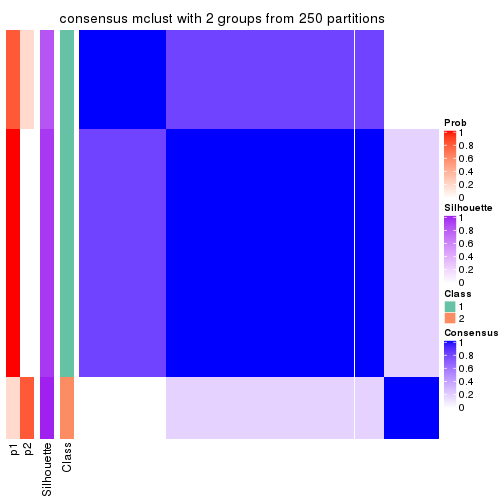</p>

</div>
<div id='tab-CV-mclust-consensus-heatmap-2'>
<pre><code class="r">consensus_heatmap(res, k = 3)
</code></pre>

<p></p>

</div>
<div id='tab-CV-mclust-consensus-heatmap-3'>
<pre><code class="r">consensus_heatmap(res, k = 4)
</code></pre>

<p></p>

</div>
<div id='tab-CV-mclust-consensus-heatmap-4'>
<pre><code class="r">consensus_heatmap(res, k = 5)
</code></pre>

<p></p>

</div>
<div id='tab-CV-mclust-consensus-heatmap-5'>
<pre><code class="r">consensus_heatmap(res, k = 6)
</code></pre>

<p></p>

</div>
</div>

Heatmaps for the membership of samples in all partitions to see how consistent they are:


<script>
$( function() {
	$( '#tabs-CV-mclust-membership-heatmap' ).tabs();
} );
</script>
<div id='tabs-CV-mclust-membership-heatmap'>
<ul>
<li><a href='#tab-CV-mclust-membership-heatmap-1'>k = 2</a></li>
<li><a href='#tab-CV-mclust-membership-heatmap-2'>k = 3</a></li>
<li><a href='#tab-CV-mclust-membership-heatmap-3'>k = 4</a></li>
<li><a href='#tab-CV-mclust-membership-heatmap-4'>k = 5</a></li>
<li><a href='#tab-CV-mclust-membership-heatmap-5'>k = 6</a></li>
</ul>
<div id='tab-CV-mclust-membership-heatmap-1'>
<pre><code class="r">membership_heatmap(res, k = 2)
</code></pre>

<p></p>

</div>
<div id='tab-CV-mclust-membership-heatmap-2'>
<pre><code class="r">membership_heatmap(res, k = 3)
</code></pre>

<p></p>

</div>
<div id='tab-CV-mclust-membership-heatmap-3'>
<pre><code class="r">membership_heatmap(res, k = 4)
</code></pre>

<p></p>

</div>
<div id='tab-CV-mclust-membership-heatmap-4'>
<pre><code class="r">membership_heatmap(res, k = 5)
</code></pre>

<p></p>

</div>
<div id='tab-CV-mclust-membership-heatmap-5'>
<pre><code class="r">membership_heatmap(res, k = 6)
</code></pre>

<p></p>

</div>
</div>

As soon as we have had the classes for columns, we can look for signatures
which are significantly different between classes which can be candidate marks
for certain classes. Following are the heatmaps for signatures.


Signature heatmaps where rows are scaled:


<script>
$( function() {
	$( '#tabs-CV-mclust-get-signatures' ).tabs();
} );
</script>
<div id='tabs-CV-mclust-get-signatures'>
<ul>
<li><a href='#tab-CV-mclust-get-signatures-1'>k = 2</a></li>
<li><a href='#tab-CV-mclust-get-signatures-2'>k = 3</a></li>
<li><a href='#tab-CV-mclust-get-signatures-3'>k = 4</a></li>
<li><a href='#tab-CV-mclust-get-signatures-4'>k = 5</a></li>
<li><a href='#tab-CV-mclust-get-signatures-5'>k = 6</a></li>
</ul>
<div id='tab-CV-mclust-get-signatures-1'>
<pre><code class="r">get_signatures(res, k = 2)
</code></pre>

<p></p>

</div>
<div id='tab-CV-mclust-get-signatures-2'>
<pre><code class="r">get_signatures(res, k = 3)
</code></pre>

<p></p>

</div>
<div id='tab-CV-mclust-get-signatures-3'>
<pre><code class="r">get_signatures(res, k = 4)
</code></pre>

<p></p>

</div>
<div id='tab-CV-mclust-get-signatures-4'>
<pre><code class="r">get_signatures(res, k = 5)
</code></pre>

<p></p>

</div>
<div id='tab-CV-mclust-get-signatures-5'>
<pre><code class="r">get_signatures(res, k = 6)
</code></pre>

<p>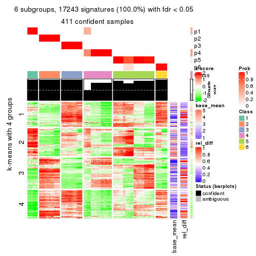</p>

</div>
</div>


Signature heatmaps where rows are not scaled:


<script>
$( function() {
	$( '#tabs-CV-mclust-get-signatures-no-scale' ).tabs();
} );
</script>
<div id='tabs-CV-mclust-get-signatures-no-scale'>
<ul>
<li><a href='#tab-CV-mclust-get-signatures-no-scale-1'>k = 2</a></li>
<li><a href='#tab-CV-mclust-get-signatures-no-scale-2'>k = 3</a></li>
<li><a href='#tab-CV-mclust-get-signatures-no-scale-3'>k = 4</a></li>
<li><a href='#tab-CV-mclust-get-signatures-no-scale-4'>k = 5</a></li>
<li><a href='#tab-CV-mclust-get-signatures-no-scale-5'>k = 6</a></li>
</ul>
<div id='tab-CV-mclust-get-signatures-no-scale-1'>
<pre><code class="r">get_signatures(res, k = 2, scale_rows = FALSE)
</code></pre>

<p></p>

</div>
<div id='tab-CV-mclust-get-signatures-no-scale-2'>
<pre><code class="r">get_signatures(res, k = 3, scale_rows = FALSE)
</code></pre>

<p></p>

</div>
<div id='tab-CV-mclust-get-signatures-no-scale-3'>
<pre><code class="r">get_signatures(res, k = 4, scale_rows = FALSE)
</code></pre>

<p></p>

</div>
<div id='tab-CV-mclust-get-signatures-no-scale-4'>
<pre><code class="r">get_signatures(res, k = 5, scale_rows = FALSE)
</code></pre>

<p></p>

</div>
<div id='tab-CV-mclust-get-signatures-no-scale-5'>
<pre><code class="r">get_signatures(res, k = 6, scale_rows = FALSE)
</code></pre>

<p></p>

</div>
</div>


Compare the overlap of signatures from different k:

```r
compare_signatures(res)
```


`get_signature()` returns a data frame invisibly. TO get the list of signatures, the function
call should be assigned to a variable explicitly. In following code, if `plot` argument is set
to `FALSE`, no heatmap is plotted while only the differential analysis is performed.

```r
# code only for demonstration
tb = get_signature(res, k = ..., plot = FALSE)
```

An example of the output of `tb` is:

```
#>   which_row         fdr    mean_1    mean_2 scaled_mean_1 scaled_mean_2 km
#> 1        38 0.042760348  8.373488  9.131774    -0.5533452     0.5164555  1
#> 2        40 0.018707592  7.106213  8.469186    -0.6173731     0.5762149  1
#> 3        55 0.019134737 10.221463 11.207825    -0.6159697     0.5749050  1
#> 4        59 0.006059896  5.921854  7.869574    -0.6899429     0.6439467  1
#> 5        60 0.018055526  8.928898 10.211722    -0.6204761     0.5791110  1
#> 6        98 0.009384629 15.714769 14.887706     0.6635654    -0.6193277  2
...
```

The columns in `tb` are:

1. `which_row`: row indices corresponding to the input matrix.
2. `fdr`: FDR for the differential test. 
3. `mean_x`: The mean value in group x.
4. `scaled_mean_x`: The mean value in group x after rows are scaled.
5. `km`: Row groups if k-means clustering is applied to rows.


UMAP plot which shows how samples are separated.


<script>
$( function() {
	$( '#tabs-CV-mclust-dimension-reduction' ).tabs();
} );
</script>
<div id='tabs-CV-mclust-dimension-reduction'>
<ul>
<li><a href='#tab-CV-mclust-dimension-reduction-1'>k = 2</a></li>
<li><a href='#tab-CV-mclust-dimension-reduction-2'>k = 3</a></li>
<li><a href='#tab-CV-mclust-dimension-reduction-3'>k = 4</a></li>
<li><a href='#tab-CV-mclust-dimension-reduction-4'>k = 5</a></li>
<li><a href='#tab-CV-mclust-dimension-reduction-5'>k = 6</a></li>
</ul>
<div id='tab-CV-mclust-dimension-reduction-1'>
<pre><code class="r">dimension_reduction(res, k = 2, method = &quot;UMAP&quot;)
</code></pre>

<p></p>

</div>
<div id='tab-CV-mclust-dimension-reduction-2'>
<pre><code class="r">dimension_reduction(res, k = 3, method = &quot;UMAP&quot;)
</code></pre>

<p></p>

</div>
<div id='tab-CV-mclust-dimension-reduction-3'>
<pre><code class="r">dimension_reduction(res, k = 4, method = &quot;UMAP&quot;)
</code></pre>

<p></p>

</div>
<div id='tab-CV-mclust-dimension-reduction-4'>
<pre><code class="r">dimension_reduction(res, k = 5, method = &quot;UMAP&quot;)
</code></pre>

<p></p>

</div>
<div id='tab-CV-mclust-dimension-reduction-5'>
<pre><code class="r">dimension_reduction(res, k = 6, method = &quot;UMAP&quot;)
</code></pre>

<p></p>

</div>
</div>


Following heatmap shows how subgroups are split when increasing `k`:

```r
collect_classes(res)
```


If matrix rows can be associated to genes, consider to use `GO_Enrichment(res,
...)` to perform function enrichment for the signature genes.


 

---------------------------------------------------


### CV:NMF**


The object with results only for a single top-value method and a single partition method 
can be extracted as:

```r
res = res_list["CV", "NMF"]
# you can also extract it by
# res = res_list["CV:NMF"]
```

A summary of `res` and all the functions that can be applied to it:

```r
res
```

```
#> A 'ConsensusPartition' object with k = 2, 3, 4, 5, 6.
#>   On a matrix with 17245 rows and 418 columns.
#>   Top rows (1000, 2000, 3000, 4000, 5000) are extracted by 'CV' method.
#>   Subgroups are detected by 'NMF' method.
#>   Performed in total 1250 partitions by row resampling.
#>   Best k for subgroups seems to be 6.
#> 
#> Following methods can be applied to this 'ConsensusPartition' object:
#>  [1] "cola_report"             "collect_classes"         "collect_plots"          
#>  [4] "collect_stats"           "colnames"                "compare_signatures"     
#>  [7] "consensus_heatmap"       "dimension_reduction"     "functional_enrichment"  
#> [10] "get_anno_col"            "get_anno"                "get_classes"            
#> [13] "get_consensus"           "get_matrix"              "get_membership"         
#> [16] "get_param"               "get_signatures"          "get_stats"              
#> [19] "is_best_k"               "is_stable_k"             "membership_heatmap"     
#> [22] "ncol"                    "nrow"                    "plot_ecdf"              
#> [25] "rownames"                "select_partition_number" "show"                   
#> [28] "suggest_best_k"          "test_to_known_factors"
```

`collect_plots()` function collects all the plots made from `res` for all `k` (number of partitions)
into one single page to provide an easy and fast comparison between different `k`.

```r
collect_plots(res)
```


The plots are:

- The first row: a plot of the ECDF (Empirical cumulative distribution
  function) curves of the consensus matrix for each `k` and the heatmap of
  predicted classes for each `k`.
- The second row: heatmaps of the consensus matrix for each `k`.
- The third row: heatmaps of the membership matrix for each `k`.
- The fouth row: heatmaps of the signatures for each `k`.

All the plots in panels can be made by individual functions and they are
plotted later in this section.

`select_partition_number()` produces several plots showing different
statistics for choosing "optimized" `k`. There are following statistics:

- ECDF curves of the consensus matrix for each `k`;
- 1-PAC. [The PAC
  score](https://en.wikipedia.org/wiki/Consensus_clustering#Over-interpretation_potential_of_consensus_clustering)
  measures the proportion of the ambiguous subgrouping.
- Mean silhouette score.
- Concordance. The mean probability of fiting the consensus class ids in all
  partitions.
- Area increased. Denote $A_k$ as the area under the ECDF curve for current
  `k`, the area increased is defined as $A_k - A_{k-1}$.
- Rand index. The percent of pairs of samples that are both in a same cluster
  or both are not in a same cluster in the partition of k and k-1.
- Jaccard index. The ratio of pairs of samples are both in a same cluster in
  the partition of k and k-1 and the pairs of samples are both in a same
  cluster in the partition k or k-1.

The detailed explanations of these statistics can be found in [the cola
vignette](http://bioconductor.org/packages/devel/bioc/vignettes/cola/inst/doc/cola.html#toc_13).

Generally speaking, lower PAC score, higher mean silhouette score or higher
concordance corresponds to better partition. Rand index and Jaccard index
measure how similar the current partition is compared to partition with `k-1`.
If they are too similar, we won't accept `k` is better than `k-1`.

```r
select_partition_number(res)
```


The numeric values for all these statistics can be obtained by `get_stats()`.

```r
get_stats(res)
```

```
#>   k 1-PAC mean_silhouette concordance area_increased  Rand Jaccard
#> 2 2 0.819           0.965       0.981         0.4978 0.502   0.502
#> 3 3 0.842           0.868       0.926         0.2584 0.874   0.749
#> 4 4 0.709           0.802       0.864         0.1627 0.794   0.510
#> 5 5 0.747           0.647       0.753         0.0769 0.886   0.605
#> 6 6 0.986           0.940       0.969         0.0519 0.926   0.673
```

`suggest_best_k()` suggests the best $k$ based on these statistics. The rules are as follows:

- All $k$ with Jaccard index larger than 0.95 are removed because the increase of
  the partition number does not provides enough extra information. If all $k$ are removed,
  the best $k$ is assigned by `NA`.
- For $k$ with 1-PAC larger than 0.9, the maximal $k$ is taken as the "best k". Other $k$ is called "optional k".
- If it does not fit the second rule. The $k$ with the highest vote of highest
  1-PAC, mean silhouette and concordance is taken as the "best k".

```r
suggest_best_k(res)
```

```
#> [1] 6
```


Following shows the table of the partitions (You need to click the **show/hide
code output** link to see it). The membership matrix (columns with name `p*`)
is inferred by
[`clue::cl_consensus()`](https://www.rdocumentation.org/link/cl_consensus?package=clue)
function with the `SE` method. Basically the value in the membership matrix
represents the probability to belong to a certain group. The finall class
label for an item is determined with the group with highest probability it
belongs to.

In `get_classes()` function, the entropy is calculated from the membership
matrix and the silhouette score is calculated from the consensus matrix.


<script>
$( function() {
	$( '#tabs-CV-NMF-get-classes' ).tabs();
} );
</script>
<div id='tabs-CV-NMF-get-classes'>
<ul>
<li><a href='#tab-CV-NMF-get-classes-1'>k = 2</a></li>
<li><a href='#tab-CV-NMF-get-classes-2'>k = 3</a></li>
<li><a href='#tab-CV-NMF-get-classes-3'>k = 4</a></li>
<li><a href='#tab-CV-NMF-get-classes-4'>k = 5</a></li>
<li><a href='#tab-CV-NMF-get-classes-5'>k = 6</a></li>
</ul>

<div id='tab-CV-NMF-get-classes-1'>
<p><a id='tab-CV-NMF-get-classes-1-a' style='color:#0366d6' href='#'>show/hide code output</a></p>
<pre><code class="r">cbind(get_classes(res, k = 2), get_membership(res, k = 2))
</code></pre>

<pre><code>#&gt;           class entropy silhouette    p1    p2
#&gt; SRR902920     1   0.000      0.964 1.000 0.000
#&gt; SRR902921     1   0.000      0.964 1.000 0.000
#&gt; SRR902922     1   0.000      0.964 1.000 0.000
#&gt; SRR902923     1   0.000      0.964 1.000 0.000
#&gt; SRR902924     1   0.000      0.964 1.000 0.000
#&gt; SRR902925     1   0.000      0.964 1.000 0.000
#&gt; SRR902926     1   0.000      0.964 1.000 0.000
#&gt; SRR902927     1   0.000      0.964 1.000 0.000
#&gt; SRR902928     1   0.000      0.964 1.000 0.000
#&gt; SRR902929     1   0.000      0.964 1.000 0.000
#&gt; SRR902930     1   0.000      0.964 1.000 0.000
#&gt; SRR902931     1   0.000      0.964 1.000 0.000
#&gt; SRR902932     2   0.000      1.000 0.000 1.000
#&gt; SRR902933     2   0.000      1.000 0.000 1.000
#&gt; SRR902934     2   0.000      1.000 0.000 1.000
#&gt; SRR902935     2   0.000      1.000 0.000 1.000
#&gt; SRR902936     2   0.000      1.000 0.000 1.000
#&gt; SRR902937     2   0.000      1.000 0.000 1.000
#&gt; SRR902938     2   0.000      1.000 0.000 1.000
#&gt; SRR902939     2   0.000      1.000 0.000 1.000
#&gt; SRR902940     2   0.000      1.000 0.000 1.000
#&gt; SRR902941     2   0.000      1.000 0.000 1.000
#&gt; SRR902942     1   0.000      0.964 1.000 0.000
#&gt; SRR902943     1   0.000      0.964 1.000 0.000
#&gt; SRR902944     1   0.000      0.964 1.000 0.000
#&gt; SRR902945     1   0.000      0.964 1.000 0.000
#&gt; SRR902946     1   0.000      0.964 1.000 0.000
#&gt; SRR902947     1   0.000      0.964 1.000 0.000
#&gt; SRR902954     1   0.000      0.964 1.000 0.000
#&gt; SRR902955     1   0.000      0.964 1.000 0.000
#&gt; SRR902956     1   0.000      0.964 1.000 0.000
#&gt; SRR902957     1   0.000      0.964 1.000 0.000
#&gt; SRR902958     1   0.000      0.964 1.000 0.000
#&gt; SRR902959     1   0.000      0.964 1.000 0.000
#&gt; SRR902948     1   0.000      0.964 1.000 0.000
#&gt; SRR902949     1   0.000      0.964 1.000 0.000
#&gt; SRR902950     1   0.000      0.964 1.000 0.000
#&gt; SRR902951     1   0.000      0.964 1.000 0.000
#&gt; SRR902952     1   0.000      0.964 1.000 0.000
#&gt; SRR902953     1   0.000      0.964 1.000 0.000
#&gt; SRR902960     1   0.000      0.964 1.000 0.000
#&gt; SRR902961     1   0.000      0.964 1.000 0.000
#&gt; SRR902962     1   0.000      0.964 1.000 0.000
#&gt; SRR902963     1   0.000      0.964 1.000 0.000
#&gt; SRR902964     1   0.000      0.964 1.000 0.000
#&gt; SRR902965     1   0.000      0.964 1.000 0.000
#&gt; SRR902966     1   0.000      0.964 1.000 0.000
#&gt; SRR902967     1   0.000      0.964 1.000 0.000
#&gt; SRR902968     1   0.000      0.964 1.000 0.000
#&gt; SRR902969     1   0.000      0.964 1.000 0.000
#&gt; SRR902970     1   0.000      0.964 1.000 0.000
#&gt; SRR902971     1   0.000      0.964 1.000 0.000
#&gt; SRR902972     1   0.000      0.964 1.000 0.000
#&gt; SRR902973     1   0.000      0.964 1.000 0.000
#&gt; SRR902974     1   0.000      0.964 1.000 0.000
#&gt; SRR902975     1   0.000      0.964 1.000 0.000
#&gt; SRR902976     1   0.000      0.964 1.000 0.000
#&gt; SRR902977     1   0.000      0.964 1.000 0.000
#&gt; SRR902978     1   0.000      0.964 1.000 0.000
#&gt; SRR902980     1   0.000      0.964 1.000 0.000
#&gt; SRR902981     1   0.000      0.964 1.000 0.000
#&gt; SRR902982     1   0.000      0.964 1.000 0.000
#&gt; SRR902983     1   0.000      0.964 1.000 0.000
#&gt; SRR902984     1   0.000      0.964 1.000 0.000
#&gt; SRR902985     1   0.000      0.964 1.000 0.000
#&gt; SRR902986     1   0.000      0.964 1.000 0.000
#&gt; SRR902987     1   0.000      0.964 1.000 0.000
#&gt; SRR902988     1   0.000      0.964 1.000 0.000
#&gt; SRR902989     1   0.000      0.964 1.000 0.000
#&gt; SRR902990     1   0.000      0.964 1.000 0.000
#&gt; SRR902991     1   0.000      0.964 1.000 0.000
#&gt; SRR902992     1   0.000      0.964 1.000 0.000
#&gt; SRR902993     1   0.000      0.964 1.000 0.000
#&gt; SRR902994     1   0.000      0.964 1.000 0.000
#&gt; SRR902995     1   0.000      0.964 1.000 0.000
#&gt; SRR902996     2   0.000      1.000 0.000 1.000
#&gt; SRR902997     2   0.000      1.000 0.000 1.000
#&gt; SRR902998     2   0.000      1.000 0.000 1.000
#&gt; SRR902999     2   0.000      1.000 0.000 1.000
#&gt; SRR903000     2   0.000      1.000 0.000 1.000
#&gt; SRR903001     2   0.000      1.000 0.000 1.000
#&gt; SRR903008     2   0.000      1.000 0.000 1.000
#&gt; SRR903009     2   0.000      1.000 0.000 1.000
#&gt; SRR903010     2   0.000      1.000 0.000 1.000
#&gt; SRR903011     2   0.000      1.000 0.000 1.000
#&gt; SRR903012     2   0.000      1.000 0.000 1.000
#&gt; SRR903013     2   0.000      1.000 0.000 1.000
#&gt; SRR903002     2   0.000      1.000 0.000 1.000
#&gt; SRR903003     2   0.000      1.000 0.000 1.000
#&gt; SRR903004     2   0.000      1.000 0.000 1.000
#&gt; SRR903005     2   0.000      1.000 0.000 1.000
#&gt; SRR903006     2   0.000      1.000 0.000 1.000
#&gt; SRR903007     2   0.000      1.000 0.000 1.000
#&gt; SRR903014     1   0.000      0.964 1.000 0.000
#&gt; SRR903015     1   0.000      0.964 1.000 0.000
#&gt; SRR903016     1   0.000      0.964 1.000 0.000
#&gt; SRR903017     1   0.000      0.964 1.000 0.000
#&gt; SRR903018     1   0.000      0.964 1.000 0.000
#&gt; SRR903019     1   0.000      0.964 1.000 0.000
#&gt; SRR903020     1   0.000      0.964 1.000 0.000
#&gt; SRR903021     1   0.000      0.964 1.000 0.000
#&gt; SRR903022     1   0.000      0.964 1.000 0.000
#&gt; SRR903023     1   0.000      0.964 1.000 0.000
#&gt; SRR903024     1   0.000      0.964 1.000 0.000
#&gt; SRR903025     1   0.000      0.964 1.000 0.000
#&gt; SRR903026     1   0.000      0.964 1.000 0.000
#&gt; SRR903027     1   0.000      0.964 1.000 0.000
#&gt; SRR903028     1   0.000      0.964 1.000 0.000
#&gt; SRR903029     1   0.000      0.964 1.000 0.000
#&gt; SRR903030     1   0.000      0.964 1.000 0.000
#&gt; SRR903031     1   0.000      0.964 1.000 0.000
#&gt; SRR903032     2   0.000      1.000 0.000 1.000
#&gt; SRR903033     2   0.000      1.000 0.000 1.000
#&gt; SRR903034     2   0.000      1.000 0.000 1.000
#&gt; SRR903035     2   0.000      1.000 0.000 1.000
#&gt; SRR903036     2   0.000      1.000 0.000 1.000
#&gt; SRR903037     2   0.000      1.000 0.000 1.000
#&gt; SRR903038     2   0.000      1.000 0.000 1.000
#&gt; SRR903039     2   0.000      1.000 0.000 1.000
#&gt; SRR903040     2   0.000      1.000 0.000 1.000
#&gt; SRR903041     2   0.000      1.000 0.000 1.000
#&gt; SRR903042     2   0.000      1.000 0.000 1.000
#&gt; SRR903043     2   0.000      1.000 0.000 1.000
#&gt; SRR903044     2   0.000      1.000 0.000 1.000
#&gt; SRR903045     2   0.000      1.000 0.000 1.000
#&gt; SRR903046     2   0.000      1.000 0.000 1.000
#&gt; SRR903047     2   0.000      1.000 0.000 1.000
#&gt; SRR903048     2   0.000      1.000 0.000 1.000
#&gt; SRR903049     2   0.000      1.000 0.000 1.000
#&gt; SRR903050     1   0.000      0.964 1.000 0.000
#&gt; SRR903051     1   0.000      0.964 1.000 0.000
#&gt; SRR903052     1   0.000      0.964 1.000 0.000
#&gt; SRR903053     1   0.000      0.964 1.000 0.000
#&gt; SRR903054     1   0.000      0.964 1.000 0.000
#&gt; SRR903055     1   0.000      0.964 1.000 0.000
#&gt; SRR903056     1   0.000      0.964 1.000 0.000
#&gt; SRR903057     1   0.000      0.964 1.000 0.000
#&gt; SRR903058     1   0.000      0.964 1.000 0.000
#&gt; SRR903059     1   0.000      0.964 1.000 0.000
#&gt; SRR903060     1   0.000      0.964 1.000 0.000
#&gt; SRR903061     1   0.000      0.964 1.000 0.000
#&gt; SRR903062     1   0.000      0.964 1.000 0.000
#&gt; SRR903063     1   0.000      0.964 1.000 0.000
#&gt; SRR903064     1   0.000      0.964 1.000 0.000
#&gt; SRR903065     1   0.000      0.964 1.000 0.000
#&gt; SRR903066     1   0.000      0.964 1.000 0.000
#&gt; SRR903067     1   0.000      0.964 1.000 0.000
#&gt; SRR903068     1   0.000      0.964 1.000 0.000
#&gt; SRR903069     1   0.000      0.964 1.000 0.000
#&gt; SRR903070     1   0.000      0.964 1.000 0.000
#&gt; SRR903071     1   0.000      0.964 1.000 0.000
#&gt; SRR903072     1   0.000      0.964 1.000 0.000
#&gt; SRR903073     1   0.000      0.964 1.000 0.000
#&gt; SRR903074     1   0.000      0.964 1.000 0.000
#&gt; SRR903075     1   0.000      0.964 1.000 0.000
#&gt; SRR903076     1   0.000      0.964 1.000 0.000
#&gt; SRR903077     1   0.000      0.964 1.000 0.000
#&gt; SRR903078     1   0.000      0.964 1.000 0.000
#&gt; SRR903079     1   0.000      0.964 1.000 0.000
#&gt; SRR903080     1   0.000      0.964 1.000 0.000
#&gt; SRR903081     1   0.000      0.964 1.000 0.000
#&gt; SRR903082     2   0.000      1.000 0.000 1.000
#&gt; SRR903083     2   0.000      1.000 0.000 1.000
#&gt; SRR903084     2   0.000      1.000 0.000 1.000
#&gt; SRR903085     2   0.000      1.000 0.000 1.000
#&gt; SRR903086     2   0.000      1.000 0.000 1.000
#&gt; SRR903087     2   0.000      1.000 0.000 1.000
#&gt; SRR903088     2   0.000      1.000 0.000 1.000
#&gt; SRR903089     2   0.000      1.000 0.000 1.000
#&gt; SRR903090     2   0.000      1.000 0.000 1.000
#&gt; SRR903091     2   0.000      1.000 0.000 1.000
#&gt; SRR903092     2   0.000      1.000 0.000 1.000
#&gt; SRR903093     2   0.000      1.000 0.000 1.000
#&gt; SRR903094     2   0.000      1.000 0.000 1.000
#&gt; SRR903095     2   0.000      1.000 0.000 1.000
#&gt; SRR903096     2   0.000      1.000 0.000 1.000
#&gt; SRR903097     2   0.000      1.000 0.000 1.000
#&gt; SRR903098     2   0.000      1.000 0.000 1.000
#&gt; SRR903099     2   0.000      1.000 0.000 1.000
#&gt; SRR903100     2   0.000      1.000 0.000 1.000
#&gt; SRR903101     2   0.000      1.000 0.000 1.000
#&gt; SRR903102     2   0.000      1.000 0.000 1.000
#&gt; SRR903103     2   0.000      1.000 0.000 1.000
#&gt; SRR903104     2   0.000      1.000 0.000 1.000
#&gt; SRR903105     2   0.000      1.000 0.000 1.000
#&gt; SRR903106     2   0.000      1.000 0.000 1.000
#&gt; SRR903107     2   0.000      1.000 0.000 1.000
#&gt; SRR903108     2   0.000      1.000 0.000 1.000
#&gt; SRR903109     2   0.000      1.000 0.000 1.000
#&gt; SRR903110     2   0.000      1.000 0.000 1.000
#&gt; SRR903111     2   0.000      1.000 0.000 1.000
#&gt; SRR903112     2   0.000      1.000 0.000 1.000
#&gt; SRR903113     2   0.000      1.000 0.000 1.000
#&gt; SRR903114     1   0.722      0.796 0.800 0.200
#&gt; SRR903115     1   0.722      0.796 0.800 0.200
#&gt; SRR903116     1   0.722      0.796 0.800 0.200
#&gt; SRR903117     1   0.722      0.796 0.800 0.200
#&gt; SRR903118     1   0.722      0.796 0.800 0.200
#&gt; SRR903119     1   0.722      0.796 0.800 0.200
#&gt; SRR903121     1   0.722      0.796 0.800 0.200
#&gt; SRR903122     1   0.722      0.796 0.800 0.200
#&gt; SRR903124     1   0.722      0.796 0.800 0.200
#&gt; SRR903125     1   0.722      0.796 0.800 0.200
#&gt; SRR903126     1   0.714      0.800 0.804 0.196
#&gt; SRR903127     1   0.722      0.796 0.800 0.200
#&gt; SRR903128     1   0.722      0.796 0.800 0.200
#&gt; SRR903129     1   0.722      0.796 0.800 0.200
#&gt; SRR903130     1   0.722      0.796 0.800 0.200
#&gt; SRR903131     1   0.722      0.796 0.800 0.200
#&gt; SRR903132     1   0.722      0.796 0.800 0.200
#&gt; SRR903133     1   0.722      0.796 0.800 0.200
#&gt; SRR903134     1   0.722      0.796 0.800 0.200
#&gt; SRR903135     1   0.722      0.796 0.800 0.200
#&gt; SRR903136     1   0.722      0.796 0.800 0.200
#&gt; SRR903137     1   0.722      0.796 0.800 0.200
#&gt; SRR903146     2   0.000      1.000 0.000 1.000
#&gt; SRR903147     2   0.000      1.000 0.000 1.000
#&gt; SRR903148     2   0.000      1.000 0.000 1.000
#&gt; SRR903149     2   0.000      1.000 0.000 1.000
#&gt; SRR903150     2   0.000      1.000 0.000 1.000
#&gt; SRR903151     2   0.000      1.000 0.000 1.000
#&gt; SRR903152     2   0.000      1.000 0.000 1.000
#&gt; SRR903153     2   0.000      1.000 0.000 1.000
#&gt; SRR903138     1   0.722      0.796 0.800 0.200
#&gt; SRR903139     1   0.722      0.796 0.800 0.200
#&gt; SRR903140     1   0.722      0.796 0.800 0.200
#&gt; SRR903141     1   0.722      0.796 0.800 0.200
#&gt; SRR903142     1   0.722      0.796 0.800 0.200
#&gt; SRR903143     1   0.722      0.796 0.800 0.200
#&gt; SRR903144     1   0.722      0.796 0.800 0.200
#&gt; SRR903145     1   0.722      0.796 0.800 0.200
#&gt; SRR903154     2   0.000      1.000 0.000 1.000
#&gt; SRR903155     2   0.000      1.000 0.000 1.000
#&gt; SRR903156     2   0.000      1.000 0.000 1.000
#&gt; SRR903157     2   0.000      1.000 0.000 1.000
#&gt; SRR903158     2   0.000      1.000 0.000 1.000
#&gt; SRR903159     2   0.000      1.000 0.000 1.000
#&gt; SRR903160     2   0.000      1.000 0.000 1.000
#&gt; SRR903161     2   0.000      1.000 0.000 1.000
#&gt; SRR903162     2   0.000      1.000 0.000 1.000
#&gt; SRR903163     2   0.000      1.000 0.000 1.000
#&gt; SRR903164     2   0.000      1.000 0.000 1.000
#&gt; SRR903165     2   0.000      1.000 0.000 1.000
#&gt; SRR903166     2   0.000      1.000 0.000 1.000
#&gt; SRR903167     2   0.000      1.000 0.000 1.000
#&gt; SRR903168     2   0.000      1.000 0.000 1.000
#&gt; SRR903169     2   0.000      1.000 0.000 1.000
#&gt; SRR903178     1   0.000      0.964 1.000 0.000
#&gt; SRR903179     1   0.000      0.964 1.000 0.000
#&gt; SRR903180     1   0.000      0.964 1.000 0.000
#&gt; SRR903181     1   0.000      0.964 1.000 0.000
#&gt; SRR903182     1   0.000      0.964 1.000 0.000
#&gt; SRR903183     1   0.000      0.964 1.000 0.000
#&gt; SRR903184     1   0.000      0.964 1.000 0.000
#&gt; SRR903185     1   0.000      0.964 1.000 0.000
#&gt; SRR903170     2   0.000      1.000 0.000 1.000
#&gt; SRR903171     2   0.000      1.000 0.000 1.000
#&gt; SRR903172     2   0.000      1.000 0.000 1.000
#&gt; SRR903173     2   0.000      1.000 0.000 1.000
#&gt; SRR903174     2   0.000      1.000 0.000 1.000
#&gt; SRR903175     2   0.000      1.000 0.000 1.000
#&gt; SRR903176     2   0.000      1.000 0.000 1.000
#&gt; SRR903177     2   0.000      1.000 0.000 1.000
#&gt; SRR903186     1   0.000      0.964 1.000 0.000
#&gt; SRR903187     1   0.000      0.964 1.000 0.000
#&gt; SRR903188     1   0.000      0.964 1.000 0.000
#&gt; SRR903189     1   0.000      0.964 1.000 0.000
#&gt; SRR903190     1   0.000      0.964 1.000 0.000
#&gt; SRR903191     1   0.000      0.964 1.000 0.000
#&gt; SRR903192     1   0.000      0.964 1.000 0.000
#&gt; SRR903193     1   0.000      0.964 1.000 0.000
#&gt; SRR903194     1   0.000      0.964 1.000 0.000
#&gt; SRR903195     1   0.000      0.964 1.000 0.000
#&gt; SRR903196     1   0.000      0.964 1.000 0.000
#&gt; SRR903197     1   0.000      0.964 1.000 0.000
#&gt; SRR903198     1   0.000      0.964 1.000 0.000
#&gt; SRR903199     1   0.000      0.964 1.000 0.000
#&gt; SRR903200     1   0.000      0.964 1.000 0.000
#&gt; SRR903201     1   0.000      0.964 1.000 0.000
#&gt; SRR903210     2   0.000      1.000 0.000 1.000
#&gt; SRR903211     2   0.000      1.000 0.000 1.000
#&gt; SRR903212     2   0.000      1.000 0.000 1.000
#&gt; SRR903213     2   0.000      1.000 0.000 1.000
#&gt; SRR903214     2   0.000      1.000 0.000 1.000
#&gt; SRR903215     2   0.000      1.000 0.000 1.000
#&gt; SRR903216     2   0.000      1.000 0.000 1.000
#&gt; SRR903217     2   0.000      1.000 0.000 1.000
#&gt; SRR903202     1   0.000      0.964 1.000 0.000
#&gt; SRR903203     1   0.000      0.964 1.000 0.000
#&gt; SRR903204     1   0.000      0.964 1.000 0.000
#&gt; SRR903205     1   0.000      0.964 1.000 0.000
#&gt; SRR903206     1   0.000      0.964 1.000 0.000
#&gt; SRR903207     1   0.000      0.964 1.000 0.000
#&gt; SRR903208     1   0.000      0.964 1.000 0.000
#&gt; SRR903209     1   0.000      0.964 1.000 0.000
#&gt; SRR903218     2   0.000      1.000 0.000 1.000
#&gt; SRR903219     2   0.000      1.000 0.000 1.000
#&gt; SRR903220     2   0.000      1.000 0.000 1.000
#&gt; SRR903221     2   0.000      1.000 0.000 1.000
#&gt; SRR903222     2   0.000      1.000 0.000 1.000
#&gt; SRR903223     2   0.000      1.000 0.000 1.000
#&gt; SRR903224     2   0.000      1.000 0.000 1.000
#&gt; SRR903225     2   0.000      1.000 0.000 1.000
#&gt; SRR903226     2   0.000      1.000 0.000 1.000
#&gt; SRR903227     2   0.000      1.000 0.000 1.000
#&gt; SRR903228     2   0.000      1.000 0.000 1.000
#&gt; SRR903229     2   0.000      1.000 0.000 1.000
#&gt; SRR903230     2   0.000      1.000 0.000 1.000
#&gt; SRR903231     2   0.000      1.000 0.000 1.000
#&gt; SRR903232     2   0.000      1.000 0.000 1.000
#&gt; SRR903233     2   0.000      1.000 0.000 1.000
#&gt; SRR903242     1   0.644      0.834 0.836 0.164
#&gt; SRR903243     1   0.634      0.838 0.840 0.160
#&gt; SRR903244     1   0.595      0.854 0.856 0.144
#&gt; SRR903245     1   0.595      0.854 0.856 0.144
#&gt; SRR903246     1   0.552      0.868 0.872 0.128
#&gt; SRR903247     1   0.605      0.850 0.852 0.148
#&gt; SRR903248     1   0.644      0.834 0.836 0.164
#&gt; SRR903249     1   0.552      0.868 0.872 0.128
#&gt; SRR903234     2   0.000      1.000 0.000 1.000
#&gt; SRR903235     2   0.000      1.000 0.000 1.000
#&gt; SRR903236     2   0.000      1.000 0.000 1.000
#&gt; SRR903237     2   0.000      1.000 0.000 1.000
#&gt; SRR903238     2   0.000      1.000 0.000 1.000
#&gt; SRR903239     2   0.000      1.000 0.000 1.000
#&gt; SRR903240     2   0.000      1.000 0.000 1.000
#&gt; SRR903241     2   0.000      1.000 0.000 1.000
#&gt; SRR903258     1   0.000      0.964 1.000 0.000
#&gt; SRR903259     1   0.000      0.964 1.000 0.000
#&gt; SRR903260     1   0.000      0.964 1.000 0.000
#&gt; SRR903261     1   0.000      0.964 1.000 0.000
#&gt; SRR903262     1   0.000      0.964 1.000 0.000
#&gt; SRR903263     1   0.000      0.964 1.000 0.000
#&gt; SRR903264     1   0.000      0.964 1.000 0.000
#&gt; SRR903265     1   0.000      0.964 1.000 0.000
#&gt; SRR903250     1   0.000      0.964 1.000 0.000
#&gt; SRR903251     1   0.000      0.964 1.000 0.000
#&gt; SRR903252     1   0.000      0.964 1.000 0.000
#&gt; SRR903253     1   0.000      0.964 1.000 0.000
#&gt; SRR903254     1   0.000      0.964 1.000 0.000
#&gt; SRR903255     1   0.000      0.964 1.000 0.000
#&gt; SRR903256     1   0.000      0.964 1.000 0.000
#&gt; SRR903257     1   0.000      0.964 1.000 0.000
#&gt; SRR903266     1   0.494      0.886 0.892 0.108
#&gt; SRR903267     1   0.529      0.875 0.880 0.120
#&gt; SRR903268     1   0.456      0.895 0.904 0.096
#&gt; SRR903270     1   0.430      0.902 0.912 0.088
#&gt; SRR903271     1   0.443      0.899 0.908 0.092
#&gt; SRR903272     1   0.506      0.882 0.888 0.112
#&gt; SRR903273     1   0.469      0.892 0.900 0.100
#&gt; SRR903274     2   0.000      1.000 0.000 1.000
#&gt; SRR903275     2   0.000      1.000 0.000 1.000
#&gt; SRR903276     2   0.000      1.000 0.000 1.000
#&gt; SRR903277     2   0.000      1.000 0.000 1.000
#&gt; SRR903278     2   0.000      1.000 0.000 1.000
#&gt; SRR903279     2   0.000      1.000 0.000 1.000
#&gt; SRR903280     2   0.000      1.000 0.000 1.000
#&gt; SRR903281     2   0.000      1.000 0.000 1.000
#&gt; SRR903282     2   0.000      1.000 0.000 1.000
#&gt; SRR903283     2   0.000      1.000 0.000 1.000
#&gt; SRR903284     2   0.000      1.000 0.000 1.000
#&gt; SRR903285     2   0.000      1.000 0.000 1.000
#&gt; SRR903286     2   0.000      1.000 0.000 1.000
#&gt; SRR903287     2   0.000      1.000 0.000 1.000
#&gt; SRR903288     2   0.000      1.000 0.000 1.000
#&gt; SRR903289     2   0.000      1.000 0.000 1.000
#&gt; SRR903290     2   0.000      1.000 0.000 1.000
#&gt; SRR903291     2   0.000      1.000 0.000 1.000
#&gt; SRR903292     2   0.000      1.000 0.000 1.000
#&gt; SRR903293     2   0.000      1.000 0.000 1.000
#&gt; SRR903294     2   0.000      1.000 0.000 1.000
#&gt; SRR903295     2   0.000      1.000 0.000 1.000
#&gt; SRR903296     2   0.000      1.000 0.000 1.000
#&gt; SRR903297     2   0.000      1.000 0.000 1.000
#&gt; SRR903298     2   0.000      1.000 0.000 1.000
#&gt; SRR903299     2   0.000      1.000 0.000 1.000
#&gt; SRR903300     2   0.000      1.000 0.000 1.000
#&gt; SRR903301     2   0.000      1.000 0.000 1.000
#&gt; SRR903302     2   0.000      1.000 0.000 1.000
#&gt; SRR903303     2   0.000      1.000 0.000 1.000
#&gt; SRR903304     2   0.000      1.000 0.000 1.000
#&gt; SRR903305     2   0.000      1.000 0.000 1.000
#&gt; SRR903306     1   0.000      0.964 1.000 0.000
#&gt; SRR903307     1   0.000      0.964 1.000 0.000
#&gt; SRR903308     1   0.000      0.964 1.000 0.000
#&gt; SRR903309     1   0.000      0.964 1.000 0.000
#&gt; SRR903310     1   0.000      0.964 1.000 0.000
#&gt; SRR903311     1   0.000      0.964 1.000 0.000
#&gt; SRR903312     1   0.000      0.964 1.000 0.000
#&gt; SRR903313     1   0.000      0.964 1.000 0.000
#&gt; SRR903314     1   0.000      0.964 1.000 0.000
#&gt; SRR903315     1   0.000      0.964 1.000 0.000
#&gt; SRR903316     1   0.000      0.964 1.000 0.000
#&gt; SRR903317     1   0.000      0.964 1.000 0.000
#&gt; SRR903318     1   0.000      0.964 1.000 0.000
#&gt; SRR903319     1   0.000      0.964 1.000 0.000
#&gt; SRR903320     1   0.000      0.964 1.000 0.000
#&gt; SRR903321     1   0.000      0.964 1.000 0.000
#&gt; SRR903322     1   0.000      0.964 1.000 0.000
#&gt; SRR903323     1   0.000      0.964 1.000 0.000
#&gt; SRR903324     2   0.000      1.000 0.000 1.000
#&gt; SRR903325     2   0.000      1.000 0.000 1.000
#&gt; SRR903326     2   0.000      1.000 0.000 1.000
#&gt; SRR903327     2   0.000      1.000 0.000 1.000
#&gt; SRR903328     2   0.000      1.000 0.000 1.000
#&gt; SRR903329     2   0.000      1.000 0.000 1.000
#&gt; SRR903330     2   0.000      1.000 0.000 1.000
#&gt; SRR903331     2   0.000      1.000 0.000 1.000
#&gt; SRR903332     2   0.000      1.000 0.000 1.000
#&gt; SRR903333     2   0.000      1.000 0.000 1.000
#&gt; SRR903334     2   0.000      1.000 0.000 1.000
#&gt; SRR903335     2   0.000      1.000 0.000 1.000
#&gt; SRR903336     2   0.000      1.000 0.000 1.000
#&gt; SRR903337     2   0.000      1.000 0.000 1.000
#&gt; SRR903338     2   0.000      1.000 0.000 1.000
#&gt; SRR903339     2   0.000      1.000 0.000 1.000
#&gt; SRR903340     2   0.000      1.000 0.000 1.000
#&gt; SRR903341     2   0.000      1.000 0.000 1.000
</code></pre>

<script>
$('#tab-CV-NMF-get-classes-1-a').parent().next().next().hide();
$('#tab-CV-NMF-get-classes-1-a').click(function(){
  $('#tab-CV-NMF-get-classes-1-a').parent().next().next().toggle();
  return(false);
});
</script>
</div>

<div id='tab-CV-NMF-get-classes-2'>
<p><a id='tab-CV-NMF-get-classes-2-a' style='color:#0366d6' href='#'>show/hide code output</a></p>
<pre><code class="r">cbind(get_classes(res, k = 3), get_membership(res, k = 3))
</code></pre>

<pre><code>#&gt;           class entropy silhouette    p1    p2    p3
#&gt; SRR902920     3  0.2878    0.95031 0.096 0.000 0.904
#&gt; SRR902921     3  0.2878    0.95031 0.096 0.000 0.904
#&gt; SRR902922     3  0.3038    0.94370 0.104 0.000 0.896
#&gt; SRR902923     3  0.2959    0.94705 0.100 0.000 0.900
#&gt; SRR902924     3  0.2796    0.95304 0.092 0.000 0.908
#&gt; SRR902925     3  0.2796    0.95293 0.092 0.000 0.908
#&gt; SRR902926     3  0.2878    0.95031 0.096 0.000 0.904
#&gt; SRR902927     3  0.2878    0.95031 0.096 0.000 0.904
#&gt; SRR902928     3  0.3192    0.93609 0.112 0.000 0.888
#&gt; SRR902929     3  0.3116    0.94003 0.108 0.000 0.892
#&gt; SRR902930     3  0.3116    0.94003 0.108 0.000 0.892
#&gt; SRR902931     3  0.3192    0.93609 0.112 0.000 0.888
#&gt; SRR902932     2  0.2448    0.95296 0.000 0.924 0.076
#&gt; SRR902933     2  0.2448    0.95296 0.000 0.924 0.076
#&gt; SRR902934     2  0.2448    0.95296 0.000 0.924 0.076
#&gt; SRR902935     2  0.2448    0.95296 0.000 0.924 0.076
#&gt; SRR902936     2  0.2448    0.95296 0.000 0.924 0.076
#&gt; SRR902937     2  0.2448    0.95296 0.000 0.924 0.076
#&gt; SRR902938     2  0.2448    0.95296 0.000 0.924 0.076
#&gt; SRR902939     2  0.2448    0.95296 0.000 0.924 0.076
#&gt; SRR902940     2  0.2448    0.95296 0.000 0.924 0.076
#&gt; SRR902941     2  0.2448    0.95296 0.000 0.924 0.076
#&gt; SRR902942     1  0.3619    0.73794 0.864 0.000 0.136
#&gt; SRR902943     1  0.3340    0.75507 0.880 0.000 0.120
#&gt; SRR902944     1  0.3551    0.74240 0.868 0.000 0.132
#&gt; SRR902945     1  0.3340    0.75507 0.880 0.000 0.120
#&gt; SRR902946     1  0.3551    0.74240 0.868 0.000 0.132
#&gt; SRR902947     1  0.3619    0.73794 0.864 0.000 0.136
#&gt; SRR902954     1  0.5465    0.51190 0.712 0.000 0.288
#&gt; SRR902955     1  0.5431    0.51941 0.716 0.000 0.284
#&gt; SRR902956     1  0.5650    0.46392 0.688 0.000 0.312
#&gt; SRR902957     1  0.5621    0.47233 0.692 0.000 0.308
#&gt; SRR902958     1  0.5591    0.48050 0.696 0.000 0.304
#&gt; SRR902959     1  0.5497    0.50424 0.708 0.000 0.292
#&gt; SRR902948     1  0.5760    0.42894 0.672 0.000 0.328
#&gt; SRR902949     1  0.5835    0.40098 0.660 0.000 0.340
#&gt; SRR902950     1  0.5810    0.41051 0.664 0.000 0.336
#&gt; SRR902951     1  0.5785    0.41983 0.668 0.000 0.332
#&gt; SRR902952     1  0.5859    0.39123 0.656 0.000 0.344
#&gt; SRR902953     1  0.5905    0.37114 0.648 0.000 0.352
#&gt; SRR902960     3  0.6180    0.41337 0.416 0.000 0.584
#&gt; SRR902961     3  0.6180    0.41337 0.416 0.000 0.584
#&gt; SRR902962     3  0.6204    0.39033 0.424 0.000 0.576
#&gt; SRR902963     3  0.6180    0.41337 0.416 0.000 0.584
#&gt; SRR902964     3  0.6252    0.32873 0.444 0.000 0.556
#&gt; SRR902965     3  0.6140    0.44502 0.404 0.000 0.596
#&gt; SRR902966     1  0.6260    0.07065 0.552 0.000 0.448
#&gt; SRR902967     1  0.6235    0.11536 0.564 0.000 0.436
#&gt; SRR902968     1  0.6244    0.10081 0.560 0.000 0.440
#&gt; SRR902969     1  0.6267    0.05499 0.548 0.000 0.452
#&gt; SRR902970     1  0.6280    0.02236 0.540 0.000 0.460
#&gt; SRR902971     1  0.6252    0.08591 0.556 0.000 0.444
#&gt; SRR902972     1  0.6291   -0.01203 0.532 0.000 0.468
#&gt; SRR902973     1  0.6267    0.05499 0.548 0.000 0.452
#&gt; SRR902974     1  0.6280    0.02236 0.540 0.000 0.460
#&gt; SRR902975     1  0.6291   -0.01203 0.532 0.000 0.468
#&gt; SRR902976     1  0.6295   -0.02938 0.528 0.000 0.472
#&gt; SRR902977     1  0.6286    0.00533 0.536 0.000 0.464
#&gt; SRR902978     3  0.2537    0.95872 0.080 0.000 0.920
#&gt; SRR902980     3  0.2537    0.95872 0.080 0.000 0.920
#&gt; SRR902981     3  0.2537    0.95872 0.080 0.000 0.920
#&gt; SRR902982     3  0.2537    0.95872 0.080 0.000 0.920
#&gt; SRR902983     3  0.2537    0.95872 0.080 0.000 0.920
#&gt; SRR902984     3  0.2448    0.95619 0.076 0.000 0.924
#&gt; SRR902985     3  0.2448    0.95619 0.076 0.000 0.924
#&gt; SRR902986     3  0.2448    0.95619 0.076 0.000 0.924
#&gt; SRR902987     3  0.2448    0.95619 0.076 0.000 0.924
#&gt; SRR902988     3  0.2448    0.95619 0.076 0.000 0.924
#&gt; SRR902989     3  0.2448    0.95619 0.076 0.000 0.924
#&gt; SRR902990     3  0.2448    0.95619 0.076 0.000 0.924
#&gt; SRR902991     3  0.2448    0.95619 0.076 0.000 0.924
#&gt; SRR902992     3  0.2448    0.95619 0.076 0.000 0.924
#&gt; SRR902993     3  0.2448    0.95619 0.076 0.000 0.924
#&gt; SRR902994     3  0.2448    0.95619 0.076 0.000 0.924
#&gt; SRR902995     3  0.2448    0.95619 0.076 0.000 0.924
#&gt; SRR902996     2  0.2448    0.95296 0.000 0.924 0.076
#&gt; SRR902997     2  0.2448    0.95296 0.000 0.924 0.076
#&gt; SRR902998     2  0.2448    0.95296 0.000 0.924 0.076
#&gt; SRR902999     2  0.2448    0.95296 0.000 0.924 0.076
#&gt; SRR903000     2  0.2448    0.95296 0.000 0.924 0.076
#&gt; SRR903001     2  0.2448    0.95296 0.000 0.924 0.076
#&gt; SRR903008     2  0.2448    0.95296 0.000 0.924 0.076
#&gt; SRR903009     2  0.2448    0.95296 0.000 0.924 0.076
#&gt; SRR903010     2  0.2448    0.95296 0.000 0.924 0.076
#&gt; SRR903011     2  0.2448    0.95296 0.000 0.924 0.076
#&gt; SRR903012     2  0.2448    0.95296 0.000 0.924 0.076
#&gt; SRR903013     2  0.2448    0.95296 0.000 0.924 0.076
#&gt; SRR903002     2  0.2448    0.95296 0.000 0.924 0.076
#&gt; SRR903003     2  0.2448    0.95296 0.000 0.924 0.076
#&gt; SRR903004     2  0.2448    0.95296 0.000 0.924 0.076
#&gt; SRR903005     2  0.2448    0.95296 0.000 0.924 0.076
#&gt; SRR903006     2  0.2448    0.95296 0.000 0.924 0.076
#&gt; SRR903007     2  0.2448    0.95296 0.000 0.924 0.076
#&gt; SRR903014     3  0.2711    0.95527 0.088 0.000 0.912
#&gt; SRR903015     3  0.2711    0.95527 0.088 0.000 0.912
#&gt; SRR903016     3  0.2537    0.95872 0.080 0.000 0.920
#&gt; SRR903017     3  0.2537    0.95872 0.080 0.000 0.920
#&gt; SRR903018     3  0.2625    0.95714 0.084 0.000 0.916
#&gt; SRR903019     3  0.2537    0.95872 0.080 0.000 0.920
#&gt; SRR903020     3  0.2537    0.95872 0.080 0.000 0.920
#&gt; SRR903021     3  0.2537    0.95872 0.080 0.000 0.920
#&gt; SRR903022     3  0.2537    0.95872 0.080 0.000 0.920
#&gt; SRR903023     3  0.2537    0.95872 0.080 0.000 0.920
#&gt; SRR903024     3  0.2537    0.95872 0.080 0.000 0.920
#&gt; SRR903025     3  0.2537    0.95872 0.080 0.000 0.920
#&gt; SRR903026     3  0.2711    0.95527 0.088 0.000 0.912
#&gt; SRR903027     3  0.2625    0.95714 0.084 0.000 0.916
#&gt; SRR903028     3  0.2537    0.95872 0.080 0.000 0.920
#&gt; SRR903029     3  0.2796    0.95304 0.092 0.000 0.908
#&gt; SRR903030     3  0.2711    0.95527 0.088 0.000 0.912
#&gt; SRR903031     3  0.2537    0.95872 0.080 0.000 0.920
#&gt; SRR903032     2  0.2448    0.95296 0.000 0.924 0.076
#&gt; SRR903033     2  0.2448    0.95296 0.000 0.924 0.076
#&gt; SRR903034     2  0.2448    0.95296 0.000 0.924 0.076
#&gt; SRR903035     2  0.2448    0.95296 0.000 0.924 0.076
#&gt; SRR903036     2  0.2448    0.95296 0.000 0.924 0.076
#&gt; SRR903037     2  0.2448    0.95296 0.000 0.924 0.076
#&gt; SRR903038     2  0.2448    0.95296 0.000 0.924 0.076
#&gt; SRR903039     2  0.2448    0.95296 0.000 0.924 0.076
#&gt; SRR903040     2  0.2448    0.95296 0.000 0.924 0.076
#&gt; SRR903041     2  0.2448    0.95296 0.000 0.924 0.076
#&gt; SRR903042     2  0.2448    0.95296 0.000 0.924 0.076
#&gt; SRR903043     2  0.2448    0.95296 0.000 0.924 0.076
#&gt; SRR903044     2  0.2448    0.95296 0.000 0.924 0.076
#&gt; SRR903045     2  0.2448    0.95296 0.000 0.924 0.076
#&gt; SRR903046     2  0.2448    0.95296 0.000 0.924 0.076
#&gt; SRR903047     2  0.2448    0.95296 0.000 0.924 0.076
#&gt; SRR903048     2  0.2448    0.95296 0.000 0.924 0.076
#&gt; SRR903049     2  0.2448    0.95296 0.000 0.924 0.076
#&gt; SRR903050     1  0.0000    0.85067 1.000 0.000 0.000
#&gt; SRR903051     1  0.0000    0.85067 1.000 0.000 0.000
#&gt; SRR903052     1  0.0000    0.85067 1.000 0.000 0.000
#&gt; SRR903053     1  0.0000    0.85067 1.000 0.000 0.000
#&gt; SRR903054     1  0.0000    0.85067 1.000 0.000 0.000
#&gt; SRR903055     1  0.0000    0.85067 1.000 0.000 0.000
#&gt; SRR903056     1  0.0000    0.85067 1.000 0.000 0.000
#&gt; SRR903057     1  0.0000    0.85067 1.000 0.000 0.000
#&gt; SRR903058     1  0.0000    0.85067 1.000 0.000 0.000
#&gt; SRR903059     1  0.0000    0.85067 1.000 0.000 0.000
#&gt; SRR903060     1  0.0000    0.85067 1.000 0.000 0.000
#&gt; SRR903061     1  0.0000    0.85067 1.000 0.000 0.000
#&gt; SRR903062     1  0.0000    0.85067 1.000 0.000 0.000
#&gt; SRR903063     1  0.0000    0.85067 1.000 0.000 0.000
#&gt; SRR903064     1  0.0000    0.85067 1.000 0.000 0.000
#&gt; SRR903065     1  0.0000    0.85067 1.000 0.000 0.000
#&gt; SRR903066     1  0.0000    0.85067 1.000 0.000 0.000
#&gt; SRR903067     1  0.0000    0.85067 1.000 0.000 0.000
#&gt; SRR903068     1  0.0000    0.85067 1.000 0.000 0.000
#&gt; SRR903069     1  0.0000    0.85067 1.000 0.000 0.000
#&gt; SRR903070     1  0.0000    0.85067 1.000 0.000 0.000
#&gt; SRR903071     1  0.0000    0.85067 1.000 0.000 0.000
#&gt; SRR903072     1  0.0000    0.85067 1.000 0.000 0.000
#&gt; SRR903073     1  0.0000    0.85067 1.000 0.000 0.000
#&gt; SRR903074     1  0.0000    0.85067 1.000 0.000 0.000
#&gt; SRR903075     1  0.0000    0.85067 1.000 0.000 0.000
#&gt; SRR903076     1  0.0000    0.85067 1.000 0.000 0.000
#&gt; SRR903077     1  0.0000    0.85067 1.000 0.000 0.000
#&gt; SRR903078     1  0.0000    0.85067 1.000 0.000 0.000
#&gt; SRR903079     1  0.0000    0.85067 1.000 0.000 0.000
#&gt; SRR903080     1  0.0000    0.85067 1.000 0.000 0.000
#&gt; SRR903081     1  0.0000    0.85067 1.000 0.000 0.000
#&gt; SRR903082     2  0.0000    0.97220 0.000 1.000 0.000
#&gt; SRR903083     2  0.0000    0.97220 0.000 1.000 0.000
#&gt; SRR903084     2  0.0000    0.97220 0.000 1.000 0.000
#&gt; SRR903085     2  0.0000    0.97220 0.000 1.000 0.000
#&gt; SRR903086     2  0.0000    0.97220 0.000 1.000 0.000
#&gt; SRR903087     2  0.0000    0.97220 0.000 1.000 0.000
#&gt; SRR903088     2  0.0000    0.97220 0.000 1.000 0.000
#&gt; SRR903089     2  0.0000    0.97220 0.000 1.000 0.000
#&gt; SRR903090     2  0.0000    0.97220 0.000 1.000 0.000
#&gt; SRR903091     2  0.0000    0.97220 0.000 1.000 0.000
#&gt; SRR903092     2  0.0000    0.97220 0.000 1.000 0.000
#&gt; SRR903093     2  0.0000    0.97220 0.000 1.000 0.000
#&gt; SRR903094     2  0.0000    0.97220 0.000 1.000 0.000
#&gt; SRR903095     2  0.0000    0.97220 0.000 1.000 0.000
#&gt; SRR903096     2  0.0000    0.97220 0.000 1.000 0.000
#&gt; SRR903097     2  0.0000    0.97220 0.000 1.000 0.000
#&gt; SRR903098     2  0.0000    0.97220 0.000 1.000 0.000
#&gt; SRR903099     2  0.0000    0.97220 0.000 1.000 0.000
#&gt; SRR903100     2  0.0000    0.97220 0.000 1.000 0.000
#&gt; SRR903101     2  0.0000    0.97220 0.000 1.000 0.000
#&gt; SRR903102     2  0.0000    0.97220 0.000 1.000 0.000
#&gt; SRR903103     2  0.0000    0.97220 0.000 1.000 0.000
#&gt; SRR903104     2  0.0000    0.97220 0.000 1.000 0.000
#&gt; SRR903105     2  0.0000    0.97220 0.000 1.000 0.000
#&gt; SRR903106     2  0.0000    0.97220 0.000 1.000 0.000
#&gt; SRR903107     2  0.0000    0.97220 0.000 1.000 0.000
#&gt; SRR903108     2  0.0000    0.97220 0.000 1.000 0.000
#&gt; SRR903109     2  0.0000    0.97220 0.000 1.000 0.000
#&gt; SRR903110     2  0.0000    0.97220 0.000 1.000 0.000
#&gt; SRR903111     2  0.0000    0.97220 0.000 1.000 0.000
#&gt; SRR903112     2  0.0000    0.97220 0.000 1.000 0.000
#&gt; SRR903113     2  0.0000    0.97220 0.000 1.000 0.000
#&gt; SRR903114     1  0.4555    0.74200 0.800 0.200 0.000
#&gt; SRR903115     1  0.4555    0.74200 0.800 0.200 0.000
#&gt; SRR903116     1  0.4555    0.74200 0.800 0.200 0.000
#&gt; SRR903117     1  0.4555    0.74200 0.800 0.200 0.000
#&gt; SRR903118     1  0.4555    0.74200 0.800 0.200 0.000
#&gt; SRR903119     1  0.4555    0.74200 0.800 0.200 0.000
#&gt; SRR903121     1  0.4555    0.74200 0.800 0.200 0.000
#&gt; SRR903122     1  0.4291    0.75952 0.820 0.180 0.000
#&gt; SRR903124     1  0.4291    0.75952 0.820 0.180 0.000
#&gt; SRR903125     1  0.3879    0.78163 0.848 0.152 0.000
#&gt; SRR903126     1  0.3686    0.79058 0.860 0.140 0.000
#&gt; SRR903127     1  0.4062    0.77256 0.836 0.164 0.000
#&gt; SRR903128     1  0.4062    0.77251 0.836 0.164 0.000
#&gt; SRR903129     1  0.3340    0.80446 0.880 0.120 0.000
#&gt; SRR903130     1  0.4555    0.74200 0.800 0.200 0.000
#&gt; SRR903131     1  0.4504    0.74571 0.804 0.196 0.000
#&gt; SRR903132     1  0.4504    0.74571 0.804 0.196 0.000
#&gt; SRR903133     1  0.4504    0.74571 0.804 0.196 0.000
#&gt; SRR903134     1  0.4555    0.74200 0.800 0.200 0.000
#&gt; SRR903135     1  0.4555    0.74200 0.800 0.200 0.000
#&gt; SRR903136     1  0.4555    0.74200 0.800 0.200 0.000
#&gt; SRR903137     1  0.4504    0.74571 0.804 0.196 0.000
#&gt; SRR903146     2  0.0000    0.97220 0.000 1.000 0.000
#&gt; SRR903147     2  0.0000    0.97220 0.000 1.000 0.000
#&gt; SRR903148     2  0.0000    0.97220 0.000 1.000 0.000
#&gt; SRR903149     2  0.0000    0.97220 0.000 1.000 0.000
#&gt; SRR903150     2  0.0000    0.97220 0.000 1.000 0.000
#&gt; SRR903151     2  0.0000    0.97220 0.000 1.000 0.000
#&gt; SRR903152     2  0.0000    0.97220 0.000 1.000 0.000
#&gt; SRR903153     2  0.0000    0.97220 0.000 1.000 0.000
#&gt; SRR903138     1  0.4555    0.74200 0.800 0.200 0.000
#&gt; SRR903139     1  0.4555    0.74200 0.800 0.200 0.000
#&gt; SRR903140     1  0.4555    0.74200 0.800 0.200 0.000
#&gt; SRR903141     1  0.4555    0.74200 0.800 0.200 0.000
#&gt; SRR903142     1  0.4555    0.74200 0.800 0.200 0.000
#&gt; SRR903143     1  0.4555    0.74200 0.800 0.200 0.000
#&gt; SRR903144     1  0.4555    0.74200 0.800 0.200 0.000
#&gt; SRR903145     1  0.4555    0.74200 0.800 0.200 0.000
#&gt; SRR903154     2  0.0000    0.97220 0.000 1.000 0.000
#&gt; SRR903155     2  0.0000    0.97220 0.000 1.000 0.000
#&gt; SRR903156     2  0.0000    0.97220 0.000 1.000 0.000
#&gt; SRR903157     2  0.0000    0.97220 0.000 1.000 0.000
#&gt; SRR903158     2  0.0000    0.97220 0.000 1.000 0.000
#&gt; SRR903159     2  0.0000    0.97220 0.000 1.000 0.000
#&gt; SRR903160     2  0.0000    0.97220 0.000 1.000 0.000
#&gt; SRR903161     2  0.0000    0.97220 0.000 1.000 0.000
#&gt; SRR903162     2  0.0000    0.97220 0.000 1.000 0.000
#&gt; SRR903163     2  0.0000    0.97220 0.000 1.000 0.000
#&gt; SRR903164     2  0.0000    0.97220 0.000 1.000 0.000
#&gt; SRR903165     2  0.0000    0.97220 0.000 1.000 0.000
#&gt; SRR903166     2  0.0000    0.97220 0.000 1.000 0.000
#&gt; SRR903167     2  0.0000    0.97220 0.000 1.000 0.000
#&gt; SRR903168     2  0.0000    0.97220 0.000 1.000 0.000
#&gt; SRR903169     2  0.0000    0.97220 0.000 1.000 0.000
#&gt; SRR903178     1  0.0000    0.85067 1.000 0.000 0.000
#&gt; SRR903179     1  0.0000    0.85067 1.000 0.000 0.000
#&gt; SRR903180     1  0.0000    0.85067 1.000 0.000 0.000
#&gt; SRR903181     1  0.0000    0.85067 1.000 0.000 0.000
#&gt; SRR903182     1  0.0000    0.85067 1.000 0.000 0.000
#&gt; SRR903183     1  0.0000    0.85067 1.000 0.000 0.000
#&gt; SRR903184     1  0.0000    0.85067 1.000 0.000 0.000
#&gt; SRR903185     1  0.0000    0.85067 1.000 0.000 0.000
#&gt; SRR903170     2  0.0000    0.97220 0.000 1.000 0.000
#&gt; SRR903171     2  0.0000    0.97220 0.000 1.000 0.000
#&gt; SRR903172     2  0.0000    0.97220 0.000 1.000 0.000
#&gt; SRR903173     2  0.0000    0.97220 0.000 1.000 0.000
#&gt; SRR903174     2  0.0000    0.97220 0.000 1.000 0.000
#&gt; SRR903175     2  0.0000    0.97220 0.000 1.000 0.000
#&gt; SRR903176     2  0.0000    0.97220 0.000 1.000 0.000
#&gt; SRR903177     2  0.0000    0.97220 0.000 1.000 0.000
#&gt; SRR903186     1  0.0000    0.85067 1.000 0.000 0.000
#&gt; SRR903187     1  0.0000    0.85067 1.000 0.000 0.000
#&gt; SRR903188     1  0.0000    0.85067 1.000 0.000 0.000
#&gt; SRR903189     1  0.0000    0.85067 1.000 0.000 0.000
#&gt; SRR903190     1  0.0000    0.85067 1.000 0.000 0.000
#&gt; SRR903191     1  0.0000    0.85067 1.000 0.000 0.000
#&gt; SRR903192     1  0.0000    0.85067 1.000 0.000 0.000
#&gt; SRR903193     1  0.0000    0.85067 1.000 0.000 0.000
#&gt; SRR903194     1  0.0000    0.85067 1.000 0.000 0.000
#&gt; SRR903195     1  0.0000    0.85067 1.000 0.000 0.000
#&gt; SRR903196     1  0.0000    0.85067 1.000 0.000 0.000
#&gt; SRR903197     1  0.0000    0.85067 1.000 0.000 0.000
#&gt; SRR903198     1  0.0000    0.85067 1.000 0.000 0.000
#&gt; SRR903199     1  0.0000    0.85067 1.000 0.000 0.000
#&gt; SRR903200     1  0.0000    0.85067 1.000 0.000 0.000
#&gt; SRR903201     1  0.0000    0.85067 1.000 0.000 0.000
#&gt; SRR903210     2  0.0000    0.97220 0.000 1.000 0.000
#&gt; SRR903211     2  0.0000    0.97220 0.000 1.000 0.000
#&gt; SRR903212     2  0.0000    0.97220 0.000 1.000 0.000
#&gt; SRR903213     2  0.0000    0.97220 0.000 1.000 0.000
#&gt; SRR903214     2  0.0000    0.97220 0.000 1.000 0.000
#&gt; SRR903215     2  0.0000    0.97220 0.000 1.000 0.000
#&gt; SRR903216     2  0.0000    0.97220 0.000 1.000 0.000
#&gt; SRR903217     2  0.0000    0.97220 0.000 1.000 0.000
#&gt; SRR903202     1  0.0000    0.85067 1.000 0.000 0.000
#&gt; SRR903203     1  0.0000    0.85067 1.000 0.000 0.000
#&gt; SRR903204     1  0.0000    0.85067 1.000 0.000 0.000
#&gt; SRR903205     1  0.0000    0.85067 1.000 0.000 0.000
#&gt; SRR903206     1  0.0000    0.85067 1.000 0.000 0.000
#&gt; SRR903207     1  0.0000    0.85067 1.000 0.000 0.000
#&gt; SRR903208     1  0.0000    0.85067 1.000 0.000 0.000
#&gt; SRR903209     1  0.0000    0.85067 1.000 0.000 0.000
#&gt; SRR903218     2  0.0000    0.97220 0.000 1.000 0.000
#&gt; SRR903219     2  0.0000    0.97220 0.000 1.000 0.000
#&gt; SRR903220     2  0.0000    0.97220 0.000 1.000 0.000
#&gt; SRR903221     2  0.0000    0.97220 0.000 1.000 0.000
#&gt; SRR903222     2  0.0000    0.97220 0.000 1.000 0.000
#&gt; SRR903223     2  0.0000    0.97220 0.000 1.000 0.000
#&gt; SRR903224     2  0.0000    0.97220 0.000 1.000 0.000
#&gt; SRR903225     2  0.0000    0.97220 0.000 1.000 0.000
#&gt; SRR903226     2  0.0000    0.97220 0.000 1.000 0.000
#&gt; SRR903227     2  0.0000    0.97220 0.000 1.000 0.000
#&gt; SRR903228     2  0.0000    0.97220 0.000 1.000 0.000
#&gt; SRR903229     2  0.0000    0.97220 0.000 1.000 0.000
#&gt; SRR903230     2  0.0000    0.97220 0.000 1.000 0.000
#&gt; SRR903231     2  0.0000    0.97220 0.000 1.000 0.000
#&gt; SRR903232     2  0.0000    0.97220 0.000 1.000 0.000
#&gt; SRR903233     2  0.0000    0.97220 0.000 1.000 0.000
#&gt; SRR903242     1  0.3267    0.80657 0.884 0.116 0.000
#&gt; SRR903243     1  0.3116    0.81166 0.892 0.108 0.000
#&gt; SRR903244     1  0.2959    0.81609 0.900 0.100 0.000
#&gt; SRR903245     1  0.2878    0.81811 0.904 0.096 0.000
#&gt; SRR903246     1  0.2878    0.81808 0.904 0.096 0.000
#&gt; SRR903247     1  0.3038    0.81390 0.896 0.104 0.000
#&gt; SRR903248     1  0.3038    0.81407 0.896 0.104 0.000
#&gt; SRR903249     1  0.2878    0.81811 0.904 0.096 0.000
#&gt; SRR903234     2  0.0000    0.97220 0.000 1.000 0.000
#&gt; SRR903235     2  0.0000    0.97220 0.000 1.000 0.000
#&gt; SRR903236     2  0.0000    0.97220 0.000 1.000 0.000
#&gt; SRR903237     2  0.0000    0.97220 0.000 1.000 0.000
#&gt; SRR903238     2  0.0000    0.97220 0.000 1.000 0.000
#&gt; SRR903239     2  0.0000    0.97220 0.000 1.000 0.000
#&gt; SRR903240     2  0.0000    0.97220 0.000 1.000 0.000
#&gt; SRR903241     2  0.0000    0.97220 0.000 1.000 0.000
#&gt; SRR903258     1  0.1163    0.84585 0.972 0.028 0.000
#&gt; SRR903259     1  0.0747    0.84880 0.984 0.016 0.000
#&gt; SRR903260     1  0.1289    0.84483 0.968 0.032 0.000
#&gt; SRR903261     1  0.1031    0.84679 0.976 0.024 0.000
#&gt; SRR903262     1  0.1289    0.84483 0.968 0.032 0.000
#&gt; SRR903263     1  0.1031    0.84679 0.976 0.024 0.000
#&gt; SRR903264     1  0.1289    0.84483 0.968 0.032 0.000
#&gt; SRR903265     1  0.0892    0.84758 0.980 0.020 0.000
#&gt; SRR903250     1  0.1289    0.84483 0.968 0.032 0.000
#&gt; SRR903251     1  0.1529    0.84268 0.960 0.040 0.000
#&gt; SRR903252     1  0.1643    0.84113 0.956 0.044 0.000
#&gt; SRR903253     1  0.1411    0.84353 0.964 0.036 0.000
#&gt; SRR903254     1  0.1529    0.84212 0.960 0.040 0.000
#&gt; SRR903255     1  0.1411    0.84360 0.964 0.036 0.000
#&gt; SRR903256     1  0.1289    0.84483 0.968 0.032 0.000
#&gt; SRR903257     1  0.1643    0.84048 0.956 0.044 0.000
#&gt; SRR903266     1  0.2878    0.81808 0.904 0.096 0.000
#&gt; SRR903267     1  0.2959    0.81609 0.900 0.100 0.000
#&gt; SRR903268     1  0.2711    0.82139 0.912 0.088 0.000
#&gt; SRR903270     1  0.2537    0.82425 0.920 0.080 0.000
#&gt; SRR903271     1  0.2537    0.82425 0.920 0.080 0.000
#&gt; SRR903272     1  0.2711    0.82139 0.912 0.088 0.000
#&gt; SRR903273     1  0.2625    0.82284 0.916 0.084 0.000
#&gt; SRR903274     2  0.0000    0.97220 0.000 1.000 0.000
#&gt; SRR903275     2  0.0000    0.97220 0.000 1.000 0.000
#&gt; SRR903276     2  0.0000    0.97220 0.000 1.000 0.000
#&gt; SRR903277     2  0.0000    0.97220 0.000 1.000 0.000
#&gt; SRR903278     2  0.0000    0.97220 0.000 1.000 0.000
#&gt; SRR903279     2  0.0000    0.97220 0.000 1.000 0.000
#&gt; SRR903280     2  0.0000    0.97220 0.000 1.000 0.000
#&gt; SRR903281     2  0.0000    0.97220 0.000 1.000 0.000
#&gt; SRR903282     2  0.0000    0.97220 0.000 1.000 0.000
#&gt; SRR903283     2  0.0000    0.97220 0.000 1.000 0.000
#&gt; SRR903284     2  0.0000    0.97220 0.000 1.000 0.000
#&gt; SRR903285     2  0.0000    0.97220 0.000 1.000 0.000
#&gt; SRR903286     2  0.0000    0.97220 0.000 1.000 0.000
#&gt; SRR903287     2  0.0000    0.97220 0.000 1.000 0.000
#&gt; SRR903288     2  0.0000    0.97220 0.000 1.000 0.000
#&gt; SRR903289     2  0.0000    0.97220 0.000 1.000 0.000
#&gt; SRR903290     2  0.2448    0.95296 0.000 0.924 0.076
#&gt; SRR903291     2  0.2448    0.95296 0.000 0.924 0.076
#&gt; SRR903292     2  0.2448    0.95296 0.000 0.924 0.076
#&gt; SRR903293     2  0.2448    0.95296 0.000 0.924 0.076
#&gt; SRR903294     2  0.2448    0.95296 0.000 0.924 0.076
#&gt; SRR903295     2  0.2448    0.95296 0.000 0.924 0.076
#&gt; SRR903296     2  0.2448    0.95296 0.000 0.924 0.076
#&gt; SRR903297     2  0.2448    0.95296 0.000 0.924 0.076
#&gt; SRR903298     2  0.0000    0.97220 0.000 1.000 0.000
#&gt; SRR903299     2  0.0000    0.97220 0.000 1.000 0.000
#&gt; SRR903300     2  0.0000    0.97220 0.000 1.000 0.000
#&gt; SRR903301     2  0.0000    0.97220 0.000 1.000 0.000
#&gt; SRR903302     2  0.0000    0.97220 0.000 1.000 0.000
#&gt; SRR903303     2  0.0000    0.97220 0.000 1.000 0.000
#&gt; SRR903304     2  0.0000    0.97220 0.000 1.000 0.000
#&gt; SRR903305     2  0.0000    0.97220 0.000 1.000 0.000
#&gt; SRR903306     3  0.2537    0.95872 0.080 0.000 0.920
#&gt; SRR903307     3  0.2537    0.95872 0.080 0.000 0.920
#&gt; SRR903308     3  0.2537    0.95872 0.080 0.000 0.920
#&gt; SRR903309     3  0.2537    0.95872 0.080 0.000 0.920
#&gt; SRR903310     3  0.2537    0.95872 0.080 0.000 0.920
#&gt; SRR903311     3  0.2537    0.95872 0.080 0.000 0.920
#&gt; SRR903312     3  0.2537    0.95872 0.080 0.000 0.920
#&gt; SRR903313     3  0.2537    0.95872 0.080 0.000 0.920
#&gt; SRR903314     3  0.2537    0.95872 0.080 0.000 0.920
#&gt; SRR903315     3  0.2537    0.95872 0.080 0.000 0.920
#&gt; SRR903316     3  0.2537    0.95872 0.080 0.000 0.920
#&gt; SRR903317     3  0.2537    0.95872 0.080 0.000 0.920
#&gt; SRR903318     3  0.2537    0.95872 0.080 0.000 0.920
#&gt; SRR903319     3  0.2537    0.95872 0.080 0.000 0.920
#&gt; SRR903320     3  0.2537    0.95872 0.080 0.000 0.920
#&gt; SRR903321     3  0.2537    0.95872 0.080 0.000 0.920
#&gt; SRR903322     3  0.2537    0.95872 0.080 0.000 0.920
#&gt; SRR903323     3  0.2537    0.95872 0.080 0.000 0.920
#&gt; SRR903324     2  0.2448    0.95296 0.000 0.924 0.076
#&gt; SRR903325     2  0.2448    0.95296 0.000 0.924 0.076
#&gt; SRR903326     2  0.2448    0.95296 0.000 0.924 0.076
#&gt; SRR903327     2  0.2448    0.95296 0.000 0.924 0.076
#&gt; SRR903328     2  0.2448    0.95296 0.000 0.924 0.076
#&gt; SRR903329     2  0.2448    0.95296 0.000 0.924 0.076
#&gt; SRR903330     2  0.2448    0.95296 0.000 0.924 0.076
#&gt; SRR903331     2  0.2448    0.95296 0.000 0.924 0.076
#&gt; SRR903332     2  0.2448    0.95296 0.000 0.924 0.076
#&gt; SRR903333     2  0.2448    0.95296 0.000 0.924 0.076
#&gt; SRR903334     2  0.2448    0.95296 0.000 0.924 0.076
#&gt; SRR903335     2  0.2448    0.95296 0.000 0.924 0.076
#&gt; SRR903336     2  0.2448    0.95296 0.000 0.924 0.076
#&gt; SRR903337     2  0.2448    0.95296 0.000 0.924 0.076
#&gt; SRR903338     2  0.2448    0.95296 0.000 0.924 0.076
#&gt; SRR903339     2  0.2448    0.95296 0.000 0.924 0.076
#&gt; SRR903340     2  0.2448    0.95296 0.000 0.924 0.076
#&gt; SRR903341     2  0.2448    0.95296 0.000 0.924 0.076
</code></pre>

<script>
$('#tab-CV-NMF-get-classes-2-a').parent().next().next().hide();
$('#tab-CV-NMF-get-classes-2-a').click(function(){
  $('#tab-CV-NMF-get-classes-2-a').parent().next().next().toggle();
  return(false);
});
</script>
</div>

<div id='tab-CV-NMF-get-classes-3'>
<p><a id='tab-CV-NMF-get-classes-3-a' style='color:#0366d6' href='#'>show/hide code output</a></p>
<pre><code class="r">cbind(get_classes(res, k = 4), get_membership(res, k = 4))
</code></pre>

<pre><code>#&gt;           class entropy silhouette    p1    p2    p3    p4
#&gt; SRR902920     3  0.0188      0.866 0.000 0.004 0.996 0.000
#&gt; SRR902921     3  0.0188      0.866 0.000 0.004 0.996 0.000
#&gt; SRR902922     3  0.0188      0.866 0.000 0.004 0.996 0.000
#&gt; SRR902923     3  0.0188      0.866 0.000 0.004 0.996 0.000
#&gt; SRR902924     3  0.0188      0.866 0.000 0.004 0.996 0.000
#&gt; SRR902925     3  0.0188      0.866 0.000 0.004 0.996 0.000
#&gt; SRR902926     3  0.0188      0.866 0.000 0.004 0.996 0.000
#&gt; SRR902927     3  0.0188      0.866 0.000 0.004 0.996 0.000
#&gt; SRR902928     3  0.0188      0.866 0.000 0.004 0.996 0.000
#&gt; SRR902929     3  0.0188      0.866 0.000 0.004 0.996 0.000
#&gt; SRR902930     3  0.0188      0.866 0.000 0.004 0.996 0.000
#&gt; SRR902931     3  0.0188      0.866 0.000 0.004 0.996 0.000
#&gt; SRR902932     2  0.3219      0.958 0.000 0.836 0.000 0.164
#&gt; SRR902933     2  0.3219      0.958 0.000 0.836 0.000 0.164
#&gt; SRR902934     2  0.3219      0.958 0.000 0.836 0.000 0.164
#&gt; SRR902935     2  0.3219      0.958 0.000 0.836 0.000 0.164
#&gt; SRR902936     2  0.3219      0.958 0.000 0.836 0.000 0.164
#&gt; SRR902937     2  0.3219      0.958 0.000 0.836 0.000 0.164
#&gt; SRR902938     2  0.3219      0.958 0.000 0.836 0.000 0.164
#&gt; SRR902939     2  0.3219      0.958 0.000 0.836 0.000 0.164
#&gt; SRR902940     2  0.3219      0.958 0.000 0.836 0.000 0.164
#&gt; SRR902941     2  0.3219      0.958 0.000 0.836 0.000 0.164
#&gt; SRR902942     3  0.1284      0.856 0.024 0.012 0.964 0.000
#&gt; SRR902943     3  0.1388      0.854 0.028 0.012 0.960 0.000
#&gt; SRR902944     3  0.1284      0.856 0.024 0.012 0.964 0.000
#&gt; SRR902945     3  0.1388      0.854 0.028 0.012 0.960 0.000
#&gt; SRR902946     3  0.1388      0.854 0.028 0.012 0.960 0.000
#&gt; SRR902947     3  0.1284      0.856 0.024 0.012 0.964 0.000
#&gt; SRR902954     3  0.1059      0.860 0.016 0.012 0.972 0.000
#&gt; SRR902955     3  0.0937      0.861 0.012 0.012 0.976 0.000
#&gt; SRR902956     3  0.0937      0.861 0.012 0.012 0.976 0.000
#&gt; SRR902957     3  0.0937      0.861 0.012 0.012 0.976 0.000
#&gt; SRR902958     3  0.0804      0.862 0.008 0.012 0.980 0.000
#&gt; SRR902959     3  0.1059      0.860 0.016 0.012 0.972 0.000
#&gt; SRR902948     3  0.0804      0.862 0.008 0.012 0.980 0.000
#&gt; SRR902949     3  0.0804      0.862 0.008 0.012 0.980 0.000
#&gt; SRR902950     3  0.0937      0.861 0.012 0.012 0.976 0.000
#&gt; SRR902951     3  0.0937      0.861 0.012 0.012 0.976 0.000
#&gt; SRR902952     3  0.0657      0.863 0.004 0.012 0.984 0.000
#&gt; SRR902953     3  0.0937      0.861 0.012 0.012 0.976 0.000
#&gt; SRR902960     3  0.0657      0.863 0.004 0.012 0.984 0.000
#&gt; SRR902961     3  0.0657      0.863 0.004 0.012 0.984 0.000
#&gt; SRR902962     3  0.0657      0.863 0.004 0.012 0.984 0.000
#&gt; SRR902963     3  0.0657      0.863 0.004 0.012 0.984 0.000
#&gt; SRR902964     3  0.0657      0.863 0.004 0.012 0.984 0.000
#&gt; SRR902965     3  0.0657      0.863 0.004 0.012 0.984 0.000
#&gt; SRR902966     3  0.1059      0.860 0.016 0.012 0.972 0.000
#&gt; SRR902967     3  0.1284      0.856 0.024 0.012 0.964 0.000
#&gt; SRR902968     3  0.1059      0.860 0.016 0.012 0.972 0.000
#&gt; SRR902969     3  0.0937      0.861 0.012 0.012 0.976 0.000
#&gt; SRR902970     3  0.1059      0.860 0.016 0.012 0.972 0.000
#&gt; SRR902971     3  0.0937      0.861 0.012 0.012 0.976 0.000
#&gt; SRR902972     3  0.0937      0.861 0.012 0.012 0.976 0.000
#&gt; SRR902973     3  0.1059      0.860 0.016 0.012 0.972 0.000
#&gt; SRR902974     3  0.1059      0.860 0.016 0.012 0.972 0.000
#&gt; SRR902975     3  0.1059      0.860 0.016 0.012 0.972 0.000
#&gt; SRR902976     3  0.0804      0.862 0.008 0.012 0.980 0.000
#&gt; SRR902977     3  0.1059      0.860 0.016 0.012 0.972 0.000
#&gt; SRR902978     3  0.0817      0.865 0.000 0.024 0.976 0.000
#&gt; SRR902980     3  0.0707      0.865 0.000 0.020 0.980 0.000
#&gt; SRR902981     3  0.0707      0.865 0.000 0.020 0.980 0.000
#&gt; SRR902982     3  0.0469      0.866 0.000 0.012 0.988 0.000
#&gt; SRR902983     3  0.0817      0.865 0.000 0.024 0.976 0.000
#&gt; SRR902984     3  0.1867      0.857 0.000 0.072 0.928 0.000
#&gt; SRR902985     3  0.1867      0.857 0.000 0.072 0.928 0.000
#&gt; SRR902986     3  0.1867      0.857 0.000 0.072 0.928 0.000
#&gt; SRR902987     3  0.1867      0.857 0.000 0.072 0.928 0.000
#&gt; SRR902988     3  0.1867      0.857 0.000 0.072 0.928 0.000
#&gt; SRR902989     3  0.1716      0.860 0.000 0.064 0.936 0.000
#&gt; SRR902990     3  0.1867      0.857 0.000 0.072 0.928 0.000
#&gt; SRR902991     3  0.1716      0.860 0.000 0.064 0.936 0.000
#&gt; SRR902992     3  0.1792      0.858 0.000 0.068 0.932 0.000
#&gt; SRR902993     3  0.1867      0.857 0.000 0.072 0.928 0.000
#&gt; SRR902994     3  0.1867      0.857 0.000 0.072 0.928 0.000
#&gt; SRR902995     3  0.1637      0.861 0.000 0.060 0.940 0.000
#&gt; SRR902996     2  0.2589      0.926 0.000 0.884 0.000 0.116
#&gt; SRR902997     2  0.2530      0.921 0.000 0.888 0.000 0.112
#&gt; SRR902998     2  0.2647      0.930 0.000 0.880 0.000 0.120
#&gt; SRR902999     2  0.2530      0.921 0.000 0.888 0.000 0.112
#&gt; SRR903000     2  0.2647      0.930 0.000 0.880 0.000 0.120
#&gt; SRR903001     2  0.2647      0.930 0.000 0.880 0.000 0.120
#&gt; SRR903008     2  0.2530      0.921 0.000 0.888 0.000 0.112
#&gt; SRR903009     2  0.2647      0.930 0.000 0.880 0.000 0.120
#&gt; SRR903010     2  0.2647      0.930 0.000 0.880 0.000 0.120
#&gt; SRR903011     2  0.2647      0.930 0.000 0.880 0.000 0.120
#&gt; SRR903012     2  0.2704      0.934 0.000 0.876 0.000 0.124
#&gt; SRR903013     2  0.2704      0.934 0.000 0.876 0.000 0.124
#&gt; SRR903002     2  0.2647      0.930 0.000 0.880 0.000 0.120
#&gt; SRR903003     2  0.2647      0.930 0.000 0.880 0.000 0.120
#&gt; SRR903004     2  0.2868      0.943 0.000 0.864 0.000 0.136
#&gt; SRR903005     2  0.2814      0.940 0.000 0.868 0.000 0.132
#&gt; SRR903006     2  0.2868      0.943 0.000 0.864 0.000 0.136
#&gt; SRR903007     2  0.2868      0.943 0.000 0.864 0.000 0.136
#&gt; SRR903014     3  0.1867      0.857 0.000 0.072 0.928 0.000
#&gt; SRR903015     3  0.1716      0.859 0.000 0.064 0.936 0.000
#&gt; SRR903016     3  0.2011      0.853 0.000 0.080 0.920 0.000
#&gt; SRR903017     3  0.2011      0.853 0.000 0.080 0.920 0.000
#&gt; SRR903018     3  0.1792      0.858 0.000 0.068 0.932 0.000
#&gt; SRR903019     3  0.2345      0.840 0.000 0.100 0.900 0.000
#&gt; SRR903020     3  0.1940      0.855 0.000 0.076 0.924 0.000
#&gt; SRR903021     3  0.1940      0.855 0.000 0.076 0.924 0.000
#&gt; SRR903022     3  0.2081      0.850 0.000 0.084 0.916 0.000
#&gt; SRR903023     3  0.1867      0.857 0.000 0.072 0.928 0.000
#&gt; SRR903024     3  0.2281      0.843 0.000 0.096 0.904 0.000
#&gt; SRR903025     3  0.2216      0.845 0.000 0.092 0.908 0.000
#&gt; SRR903026     3  0.1211      0.864 0.000 0.040 0.960 0.000
#&gt; SRR903027     3  0.1118      0.864 0.000 0.036 0.964 0.000
#&gt; SRR903028     3  0.1118      0.864 0.000 0.036 0.964 0.000
#&gt; SRR903029     3  0.1474      0.862 0.000 0.052 0.948 0.000
#&gt; SRR903030     3  0.1716      0.859 0.000 0.064 0.936 0.000
#&gt; SRR903031     3  0.1118      0.864 0.000 0.036 0.964 0.000
#&gt; SRR903032     2  0.3219      0.958 0.000 0.836 0.000 0.164
#&gt; SRR903033     2  0.3219      0.958 0.000 0.836 0.000 0.164
#&gt; SRR903034     2  0.3219      0.958 0.000 0.836 0.000 0.164
#&gt; SRR903035     2  0.3219      0.958 0.000 0.836 0.000 0.164
#&gt; SRR903036     2  0.3172      0.956 0.000 0.840 0.000 0.160
#&gt; SRR903037     2  0.3172      0.956 0.000 0.840 0.000 0.160
#&gt; SRR903038     2  0.3219      0.958 0.000 0.836 0.000 0.164
#&gt; SRR903039     2  0.3219      0.958 0.000 0.836 0.000 0.164
#&gt; SRR903040     2  0.3219      0.958 0.000 0.836 0.000 0.164
#&gt; SRR903041     2  0.3219      0.958 0.000 0.836 0.000 0.164
#&gt; SRR903042     2  0.3172      0.956 0.000 0.840 0.000 0.160
#&gt; SRR903043     2  0.3172      0.956 0.000 0.840 0.000 0.160
#&gt; SRR903044     2  0.3219      0.958 0.000 0.836 0.000 0.164
#&gt; SRR903045     2  0.3219      0.958 0.000 0.836 0.000 0.164
#&gt; SRR903046     2  0.3219      0.958 0.000 0.836 0.000 0.164
#&gt; SRR903047     2  0.3219      0.958 0.000 0.836 0.000 0.164
#&gt; SRR903048     2  0.3219      0.958 0.000 0.836 0.000 0.164
#&gt; SRR903049     2  0.3219      0.958 0.000 0.836 0.000 0.164
#&gt; SRR903050     1  0.0000      0.809 1.000 0.000 0.000 0.000
#&gt; SRR903051     1  0.0000      0.809 1.000 0.000 0.000 0.000
#&gt; SRR903052     1  0.0000      0.809 1.000 0.000 0.000 0.000
#&gt; SRR903053     1  0.0000      0.809 1.000 0.000 0.000 0.000
#&gt; SRR903054     1  0.0000      0.809 1.000 0.000 0.000 0.000
#&gt; SRR903055     1  0.0000      0.809 1.000 0.000 0.000 0.000
#&gt; SRR903056     1  0.0000      0.809 1.000 0.000 0.000 0.000
#&gt; SRR903057     1  0.0000      0.809 1.000 0.000 0.000 0.000
#&gt; SRR903058     1  0.0000      0.809 1.000 0.000 0.000 0.000
#&gt; SRR903059     1  0.0000      0.809 1.000 0.000 0.000 0.000
#&gt; SRR903060     1  0.0000      0.809 1.000 0.000 0.000 0.000
#&gt; SRR903061     1  0.0000      0.809 1.000 0.000 0.000 0.000
#&gt; SRR903062     1  0.0000      0.809 1.000 0.000 0.000 0.000
#&gt; SRR903063     1  0.0000      0.809 1.000 0.000 0.000 0.000
#&gt; SRR903064     1  0.0000      0.809 1.000 0.000 0.000 0.000
#&gt; SRR903065     1  0.0000      0.809 1.000 0.000 0.000 0.000
#&gt; SRR903066     1  0.0000      0.809 1.000 0.000 0.000 0.000
#&gt; SRR903067     1  0.0000      0.809 1.000 0.000 0.000 0.000
#&gt; SRR903068     1  0.0000      0.809 1.000 0.000 0.000 0.000
#&gt; SRR903069     1  0.0000      0.809 1.000 0.000 0.000 0.000
#&gt; SRR903070     1  0.0000      0.809 1.000 0.000 0.000 0.000
#&gt; SRR903071     1  0.0000      0.809 1.000 0.000 0.000 0.000
#&gt; SRR903072     1  0.0000      0.809 1.000 0.000 0.000 0.000
#&gt; SRR903073     1  0.0000      0.809 1.000 0.000 0.000 0.000
#&gt; SRR903074     1  0.0000      0.809 1.000 0.000 0.000 0.000
#&gt; SRR903075     1  0.0000      0.809 1.000 0.000 0.000 0.000
#&gt; SRR903076     1  0.0000      0.809 1.000 0.000 0.000 0.000
#&gt; SRR903077     1  0.0000      0.809 1.000 0.000 0.000 0.000
#&gt; SRR903078     1  0.0000      0.809 1.000 0.000 0.000 0.000
#&gt; SRR903079     1  0.0000      0.809 1.000 0.000 0.000 0.000
#&gt; SRR903080     1  0.0000      0.809 1.000 0.000 0.000 0.000
#&gt; SRR903081     1  0.0000      0.809 1.000 0.000 0.000 0.000
#&gt; SRR903082     4  0.0000      0.902 0.000 0.000 0.000 1.000
#&gt; SRR903083     4  0.0000      0.902 0.000 0.000 0.000 1.000
#&gt; SRR903084     4  0.0000      0.902 0.000 0.000 0.000 1.000
#&gt; SRR903085     4  0.0000      0.902 0.000 0.000 0.000 1.000
#&gt; SRR903086     4  0.0000      0.902 0.000 0.000 0.000 1.000
#&gt; SRR903087     4  0.0000      0.902 0.000 0.000 0.000 1.000
#&gt; SRR903088     4  0.0000      0.902 0.000 0.000 0.000 1.000
#&gt; SRR903089     4  0.0000      0.902 0.000 0.000 0.000 1.000
#&gt; SRR903090     4  0.0000      0.902 0.000 0.000 0.000 1.000
#&gt; SRR903091     4  0.0000      0.902 0.000 0.000 0.000 1.000
#&gt; SRR903092     4  0.0000      0.902 0.000 0.000 0.000 1.000
#&gt; SRR903093     4  0.0000      0.902 0.000 0.000 0.000 1.000
#&gt; SRR903094     4  0.0000      0.902 0.000 0.000 0.000 1.000
#&gt; SRR903095     4  0.0000      0.902 0.000 0.000 0.000 1.000
#&gt; SRR903096     4  0.0000      0.902 0.000 0.000 0.000 1.000
#&gt; SRR903097     4  0.0000      0.902 0.000 0.000 0.000 1.000
#&gt; SRR903098     4  0.0000      0.902 0.000 0.000 0.000 1.000
#&gt; SRR903099     4  0.0000      0.902 0.000 0.000 0.000 1.000
#&gt; SRR903100     4  0.0000      0.902 0.000 0.000 0.000 1.000
#&gt; SRR903101     4  0.0000      0.902 0.000 0.000 0.000 1.000
#&gt; SRR903102     4  0.0000      0.902 0.000 0.000 0.000 1.000
#&gt; SRR903103     4  0.0000      0.902 0.000 0.000 0.000 1.000
#&gt; SRR903104     4  0.0000      0.902 0.000 0.000 0.000 1.000
#&gt; SRR903105     4  0.0000      0.902 0.000 0.000 0.000 1.000
#&gt; SRR903106     4  0.0000      0.902 0.000 0.000 0.000 1.000
#&gt; SRR903107     4  0.0000      0.902 0.000 0.000 0.000 1.000
#&gt; SRR903108     4  0.0000      0.902 0.000 0.000 0.000 1.000
#&gt; SRR903109     4  0.0000      0.902 0.000 0.000 0.000 1.000
#&gt; SRR903110     4  0.0000      0.902 0.000 0.000 0.000 1.000
#&gt; SRR903111     4  0.0000      0.902 0.000 0.000 0.000 1.000
#&gt; SRR903112     4  0.0000      0.902 0.000 0.000 0.000 1.000
#&gt; SRR903113     4  0.0000      0.902 0.000 0.000 0.000 1.000
#&gt; SRR903114     1  0.4331      0.675 0.712 0.000 0.000 0.288
#&gt; SRR903115     1  0.4331      0.675 0.712 0.000 0.000 0.288
#&gt; SRR903116     1  0.4331      0.675 0.712 0.000 0.000 0.288
#&gt; SRR903117     1  0.4304      0.679 0.716 0.000 0.000 0.284
#&gt; SRR903118     1  0.4331      0.675 0.712 0.000 0.000 0.288
#&gt; SRR903119     1  0.4331      0.675 0.712 0.000 0.000 0.288
#&gt; SRR903121     1  0.4331      0.675 0.712 0.000 0.000 0.288
#&gt; SRR903122     1  0.4661      0.579 0.652 0.000 0.000 0.348
#&gt; SRR903124     1  0.4830      0.495 0.608 0.000 0.000 0.392
#&gt; SRR903125     1  0.4713      0.560 0.640 0.000 0.000 0.360
#&gt; SRR903126     1  0.4679      0.575 0.648 0.000 0.000 0.352
#&gt; SRR903127     1  0.4730      0.554 0.636 0.000 0.000 0.364
#&gt; SRR903128     1  0.4830      0.494 0.608 0.000 0.000 0.392
#&gt; SRR903129     1  0.4661      0.584 0.652 0.000 0.000 0.348
#&gt; SRR903130     1  0.4382      0.665 0.704 0.000 0.000 0.296
#&gt; SRR903131     1  0.4356      0.670 0.708 0.000 0.000 0.292
#&gt; SRR903132     1  0.4331      0.675 0.712 0.000 0.000 0.288
#&gt; SRR903133     1  0.4304      0.679 0.716 0.000 0.000 0.284
#&gt; SRR903134     1  0.4331      0.675 0.712 0.000 0.000 0.288
#&gt; SRR903135     1  0.4331      0.675 0.712 0.000 0.000 0.288
#&gt; SRR903136     1  0.4304      0.678 0.716 0.000 0.000 0.284
#&gt; SRR903137     1  0.4331      0.675 0.712 0.000 0.000 0.288
#&gt; SRR903146     4  0.0000      0.902 0.000 0.000 0.000 1.000
#&gt; SRR903147     4  0.0000      0.902 0.000 0.000 0.000 1.000
#&gt; SRR903148     4  0.0000      0.902 0.000 0.000 0.000 1.000
#&gt; SRR903149     4  0.0000      0.902 0.000 0.000 0.000 1.000
#&gt; SRR903150     4  0.0000      0.902 0.000 0.000 0.000 1.000
#&gt; SRR903151     4  0.0000      0.902 0.000 0.000 0.000 1.000
#&gt; SRR903152     4  0.0000      0.902 0.000 0.000 0.000 1.000
#&gt; SRR903153     4  0.0000      0.902 0.000 0.000 0.000 1.000
#&gt; SRR903138     1  0.4331      0.675 0.712 0.000 0.000 0.288
#&gt; SRR903139     1  0.4331      0.675 0.712 0.000 0.000 0.288
#&gt; SRR903140     1  0.4304      0.679 0.716 0.000 0.000 0.284
#&gt; SRR903141     1  0.4304      0.679 0.716 0.000 0.000 0.284
#&gt; SRR903142     1  0.4277      0.683 0.720 0.000 0.000 0.280
#&gt; SRR903143     1  0.4304      0.679 0.716 0.000 0.000 0.284
#&gt; SRR903144     1  0.4331      0.675 0.712 0.000 0.000 0.288
#&gt; SRR903145     1  0.4331      0.675 0.712 0.000 0.000 0.288
#&gt; SRR903154     4  0.0000      0.902 0.000 0.000 0.000 1.000
#&gt; SRR903155     4  0.0000      0.902 0.000 0.000 0.000 1.000
#&gt; SRR903156     4  0.0000      0.902 0.000 0.000 0.000 1.000
#&gt; SRR903157     4  0.0000      0.902 0.000 0.000 0.000 1.000
#&gt; SRR903158     4  0.0000      0.902 0.000 0.000 0.000 1.000
#&gt; SRR903159     4  0.0000      0.902 0.000 0.000 0.000 1.000
#&gt; SRR903160     4  0.0000      0.902 0.000 0.000 0.000 1.000
#&gt; SRR903161     4  0.0000      0.902 0.000 0.000 0.000 1.000
#&gt; SRR903162     4  0.0000      0.902 0.000 0.000 0.000 1.000
#&gt; SRR903163     4  0.0000      0.902 0.000 0.000 0.000 1.000
#&gt; SRR903164     4  0.0000      0.902 0.000 0.000 0.000 1.000
#&gt; SRR903165     4  0.0000      0.902 0.000 0.000 0.000 1.000
#&gt; SRR903166     4  0.0000      0.902 0.000 0.000 0.000 1.000
#&gt; SRR903167     4  0.0000      0.902 0.000 0.000 0.000 1.000
#&gt; SRR903168     4  0.0000      0.902 0.000 0.000 0.000 1.000
#&gt; SRR903169     4  0.0000      0.902 0.000 0.000 0.000 1.000
#&gt; SRR903178     3  0.5256      0.386 0.392 0.012 0.596 0.000
#&gt; SRR903179     3  0.5290      0.361 0.404 0.012 0.584 0.000
#&gt; SRR903180     3  0.5143      0.451 0.360 0.012 0.628 0.000
#&gt; SRR903181     3  0.5204      0.420 0.376 0.012 0.612 0.000
#&gt; SRR903182     3  0.5290      0.361 0.404 0.012 0.584 0.000
#&gt; SRR903183     3  0.5290      0.361 0.404 0.012 0.584 0.000
#&gt; SRR903184     3  0.5159      0.443 0.364 0.012 0.624 0.000
#&gt; SRR903185     3  0.5290      0.361 0.404 0.012 0.584 0.000
#&gt; SRR903170     4  0.0000      0.902 0.000 0.000 0.000 1.000
#&gt; SRR903171     4  0.0000      0.902 0.000 0.000 0.000 1.000
#&gt; SRR903172     4  0.0000      0.902 0.000 0.000 0.000 1.000
#&gt; SRR903173     4  0.0000      0.902 0.000 0.000 0.000 1.000
#&gt; SRR903174     4  0.0000      0.902 0.000 0.000 0.000 1.000
#&gt; SRR903175     4  0.0000      0.902 0.000 0.000 0.000 1.000
#&gt; SRR903176     4  0.0000      0.902 0.000 0.000 0.000 1.000
#&gt; SRR903177     4  0.0000      0.902 0.000 0.000 0.000 1.000
#&gt; SRR903186     1  0.3529      0.744 0.836 0.012 0.152 0.000
#&gt; SRR903187     1  0.3529      0.744 0.836 0.012 0.152 0.000
#&gt; SRR903188     1  0.3529      0.744 0.836 0.012 0.152 0.000
#&gt; SRR903189     1  0.3529      0.744 0.836 0.012 0.152 0.000
#&gt; SRR903190     1  0.3529      0.744 0.836 0.012 0.152 0.000
#&gt; SRR903191     1  0.3529      0.744 0.836 0.012 0.152 0.000
#&gt; SRR903192     1  0.3529      0.744 0.836 0.012 0.152 0.000
#&gt; SRR903193     1  0.3529      0.744 0.836 0.012 0.152 0.000
#&gt; SRR903194     1  0.2401      0.781 0.904 0.004 0.092 0.000
#&gt; SRR903195     1  0.1743      0.795 0.940 0.004 0.056 0.000
#&gt; SRR903196     1  0.1902      0.792 0.932 0.004 0.064 0.000
#&gt; SRR903197     1  0.1978      0.791 0.928 0.004 0.068 0.000
#&gt; SRR903198     1  0.1824      0.794 0.936 0.004 0.060 0.000
#&gt; SRR903199     1  0.1576      0.797 0.948 0.004 0.048 0.000
#&gt; SRR903200     1  0.2773      0.769 0.880 0.004 0.116 0.000
#&gt; SRR903201     1  0.1743      0.795 0.940 0.004 0.056 0.000
#&gt; SRR903210     4  0.2281      0.874 0.000 0.096 0.000 0.904
#&gt; SRR903211     4  0.2216      0.876 0.000 0.092 0.000 0.908
#&gt; SRR903212     4  0.2216      0.876 0.000 0.092 0.000 0.908
#&gt; SRR903213     4  0.2216      0.876 0.000 0.092 0.000 0.908
#&gt; SRR903214     4  0.2216      0.876 0.000 0.092 0.000 0.908
#&gt; SRR903215     4  0.2216      0.876 0.000 0.092 0.000 0.908
#&gt; SRR903216     4  0.2216      0.876 0.000 0.092 0.000 0.908
#&gt; SRR903217     4  0.2149      0.878 0.000 0.088 0.000 0.912
#&gt; SRR903202     1  0.3401      0.747 0.840 0.008 0.152 0.000
#&gt; SRR903203     1  0.3401      0.747 0.840 0.008 0.152 0.000
#&gt; SRR903204     1  0.3401      0.747 0.840 0.008 0.152 0.000
#&gt; SRR903205     1  0.3401      0.747 0.840 0.008 0.152 0.000
#&gt; SRR903206     1  0.3401      0.747 0.840 0.008 0.152 0.000
#&gt; SRR903207     1  0.3401      0.747 0.840 0.008 0.152 0.000
#&gt; SRR903208     1  0.3401      0.747 0.840 0.008 0.152 0.000
#&gt; SRR903209     1  0.3401      0.747 0.840 0.008 0.152 0.000
#&gt; SRR903218     4  0.2647      0.857 0.000 0.120 0.000 0.880
#&gt; SRR903219     4  0.2760      0.851 0.000 0.128 0.000 0.872
#&gt; SRR903220     4  0.2589      0.860 0.000 0.116 0.000 0.884
#&gt; SRR903221     4  0.2704      0.854 0.000 0.124 0.000 0.876
#&gt; SRR903222     4  0.2647      0.857 0.000 0.120 0.000 0.880
#&gt; SRR903223     4  0.2647      0.857 0.000 0.120 0.000 0.880
#&gt; SRR903224     4  0.2647      0.857 0.000 0.120 0.000 0.880
#&gt; SRR903225     4  0.2589      0.860 0.000 0.116 0.000 0.884
#&gt; SRR903226     4  0.2469      0.866 0.000 0.108 0.000 0.892
#&gt; SRR903227     4  0.2408      0.869 0.000 0.104 0.000 0.896
#&gt; SRR903228     4  0.2469      0.866 0.000 0.108 0.000 0.892
#&gt; SRR903229     4  0.2408      0.869 0.000 0.104 0.000 0.896
#&gt; SRR903230     4  0.2469      0.866 0.000 0.108 0.000 0.892
#&gt; SRR903231     4  0.2469      0.866 0.000 0.108 0.000 0.892
#&gt; SRR903232     4  0.2469      0.866 0.000 0.108 0.000 0.892
#&gt; SRR903233     4  0.2408      0.869 0.000 0.104 0.000 0.896
#&gt; SRR903242     1  0.5084      0.723 0.764 0.012 0.180 0.044
#&gt; SRR903243     1  0.5165      0.722 0.760 0.012 0.180 0.048
#&gt; SRR903244     1  0.4419      0.719 0.792 0.012 0.180 0.016
#&gt; SRR903245     1  0.5166      0.714 0.756 0.012 0.188 0.044
#&gt; SRR903246     1  0.5083      0.714 0.760 0.012 0.188 0.040
#&gt; SRR903247     1  0.4996      0.714 0.764 0.012 0.188 0.036
#&gt; SRR903248     1  0.5166      0.714 0.756 0.012 0.188 0.044
#&gt; SRR903249     1  0.4955      0.718 0.768 0.012 0.184 0.036
#&gt; SRR903234     4  0.1867      0.885 0.000 0.072 0.000 0.928
#&gt; SRR903235     4  0.1867      0.885 0.000 0.072 0.000 0.928
#&gt; SRR903236     4  0.1792      0.886 0.000 0.068 0.000 0.932
#&gt; SRR903237     4  0.1940      0.883 0.000 0.076 0.000 0.924
#&gt; SRR903238     4  0.1940      0.883 0.000 0.076 0.000 0.924
#&gt; SRR903239     4  0.1867      0.885 0.000 0.072 0.000 0.928
#&gt; SRR903240     4  0.1940      0.883 0.000 0.076 0.000 0.924
#&gt; SRR903241     4  0.1940      0.883 0.000 0.076 0.000 0.924
#&gt; SRR903258     3  0.5576      0.247 0.444 0.020 0.536 0.000
#&gt; SRR903259     3  0.5755      0.229 0.444 0.028 0.528 0.000
#&gt; SRR903260     3  0.5497      0.210 0.460 0.016 0.524 0.000
#&gt; SRR903261     3  0.5668      0.238 0.444 0.024 0.532 0.000
#&gt; SRR903262     3  0.5888      0.238 0.440 0.016 0.532 0.012
#&gt; SRR903263     3  0.5668      0.239 0.444 0.024 0.532 0.000
#&gt; SRR903264     3  0.5902      0.266 0.428 0.028 0.540 0.004
#&gt; SRR903265     3  0.5497      0.210 0.460 0.016 0.524 0.000
#&gt; SRR903250     3  0.5662      0.210 0.456 0.016 0.524 0.004
#&gt; SRR903251     3  0.5497      0.210 0.460 0.016 0.524 0.000
#&gt; SRR903252     3  0.5783      0.226 0.448 0.016 0.528 0.008
#&gt; SRR903253     3  0.5658      0.222 0.452 0.016 0.528 0.004
#&gt; SRR903254     3  0.5497      0.210 0.460 0.016 0.524 0.000
#&gt; SRR903255     3  0.5594      0.201 0.460 0.020 0.520 0.000
#&gt; SRR903256     3  0.5500      0.197 0.464 0.016 0.520 0.000
#&gt; SRR903257     3  0.5500      0.197 0.464 0.016 0.520 0.000
#&gt; SRR903266     1  0.5045      0.511 0.680 0.012 0.304 0.004
#&gt; SRR903267     1  0.5257      0.530 0.680 0.012 0.296 0.012
#&gt; SRR903268     1  0.5281      0.522 0.676 0.012 0.300 0.012
#&gt; SRR903270     1  0.5392      0.523 0.672 0.012 0.300 0.016
#&gt; SRR903271     1  0.5415      0.514 0.668 0.012 0.304 0.016
#&gt; SRR903272     1  0.5595      0.525 0.664 0.012 0.300 0.024
#&gt; SRR903273     1  0.5885      0.512 0.648 0.012 0.304 0.036
#&gt; SRR903274     4  0.3486      0.781 0.000 0.188 0.000 0.812
#&gt; SRR903275     4  0.3688      0.752 0.000 0.208 0.000 0.792
#&gt; SRR903276     4  0.3266      0.807 0.000 0.168 0.000 0.832
#&gt; SRR903277     4  0.3266      0.807 0.000 0.168 0.000 0.832
#&gt; SRR903278     4  0.3400      0.792 0.000 0.180 0.000 0.820
#&gt; SRR903279     4  0.3610      0.764 0.000 0.200 0.000 0.800
#&gt; SRR903280     4  0.3400      0.792 0.000 0.180 0.000 0.820
#&gt; SRR903281     4  0.3400      0.792 0.000 0.180 0.000 0.820
#&gt; SRR903282     4  0.4500      0.527 0.000 0.316 0.000 0.684
#&gt; SRR903283     4  0.4382      0.578 0.000 0.296 0.000 0.704
#&gt; SRR903284     4  0.4356      0.585 0.000 0.292 0.000 0.708
#&gt; SRR903285     4  0.4331      0.596 0.000 0.288 0.000 0.712
#&gt; SRR903286     4  0.4431      0.557 0.000 0.304 0.000 0.696
#&gt; SRR903287     4  0.4454      0.546 0.000 0.308 0.000 0.692
#&gt; SRR903288     4  0.4500      0.527 0.000 0.316 0.000 0.684
#&gt; SRR903289     4  0.4193      0.640 0.000 0.268 0.000 0.732
#&gt; SRR903290     2  0.4564      0.724 0.000 0.672 0.000 0.328
#&gt; SRR903291     2  0.4564      0.724 0.000 0.672 0.000 0.328
#&gt; SRR903292     2  0.4564      0.724 0.000 0.672 0.000 0.328
#&gt; SRR903293     2  0.4564      0.724 0.000 0.672 0.000 0.328
#&gt; SRR903294     2  0.4564      0.724 0.000 0.672 0.000 0.328
#&gt; SRR903295     2  0.4564      0.724 0.000 0.672 0.000 0.328
#&gt; SRR903296     2  0.4564      0.724 0.000 0.672 0.000 0.328
#&gt; SRR903297     2  0.4564      0.724 0.000 0.672 0.000 0.328
#&gt; SRR903298     4  0.3801      0.732 0.000 0.220 0.000 0.780
#&gt; SRR903299     4  0.3907      0.711 0.000 0.232 0.000 0.768
#&gt; SRR903300     4  0.3688      0.752 0.000 0.208 0.000 0.792
#&gt; SRR903301     4  0.3610      0.764 0.000 0.200 0.000 0.800
#&gt; SRR903302     4  0.3942      0.704 0.000 0.236 0.000 0.764
#&gt; SRR903303     4  0.3837      0.726 0.000 0.224 0.000 0.776
#&gt; SRR903304     4  0.3688      0.752 0.000 0.208 0.000 0.792
#&gt; SRR903305     4  0.4072      0.673 0.000 0.252 0.000 0.748
#&gt; SRR903306     3  0.1716      0.859 0.000 0.064 0.936 0.000
#&gt; SRR903307     3  0.1792      0.858 0.000 0.068 0.932 0.000
#&gt; SRR903308     3  0.1792      0.858 0.000 0.068 0.932 0.000
#&gt; SRR903309     3  0.1940      0.855 0.000 0.076 0.924 0.000
#&gt; SRR903310     3  0.1557      0.861 0.000 0.056 0.944 0.000
#&gt; SRR903311     3  0.1792      0.858 0.000 0.068 0.932 0.000
#&gt; SRR903312     3  0.2011      0.853 0.000 0.080 0.920 0.000
#&gt; SRR903313     3  0.2011      0.853 0.000 0.080 0.920 0.000
#&gt; SRR903314     3  0.2011      0.853 0.000 0.080 0.920 0.000
#&gt; SRR903315     3  0.2149      0.848 0.000 0.088 0.912 0.000
#&gt; SRR903316     3  0.2081      0.850 0.000 0.084 0.916 0.000
#&gt; SRR903317     3  0.1792      0.858 0.000 0.068 0.932 0.000
#&gt; SRR903318     3  0.1716      0.859 0.000 0.064 0.936 0.000
#&gt; SRR903319     3  0.1940      0.855 0.000 0.076 0.924 0.000
#&gt; SRR903320     3  0.1792      0.858 0.000 0.068 0.932 0.000
#&gt; SRR903321     3  0.2216      0.845 0.000 0.092 0.908 0.000
#&gt; SRR903322     3  0.1557      0.861 0.000 0.056 0.944 0.000
#&gt; SRR903323     3  0.1792      0.858 0.000 0.068 0.932 0.000
#&gt; SRR903324     2  0.3219      0.958 0.000 0.836 0.000 0.164
#&gt; SRR903325     2  0.3219      0.958 0.000 0.836 0.000 0.164
#&gt; SRR903326     2  0.3219      0.958 0.000 0.836 0.000 0.164
#&gt; SRR903327     2  0.3219      0.958 0.000 0.836 0.000 0.164
#&gt; SRR903328     2  0.3219      0.958 0.000 0.836 0.000 0.164
#&gt; SRR903329     2  0.3219      0.958 0.000 0.836 0.000 0.164
#&gt; SRR903330     2  0.3074      0.953 0.000 0.848 0.000 0.152
#&gt; SRR903331     2  0.3074      0.953 0.000 0.848 0.000 0.152
#&gt; SRR903332     2  0.3172      0.956 0.000 0.840 0.000 0.160
#&gt; SRR903333     2  0.3074      0.953 0.000 0.848 0.000 0.152
#&gt; SRR903334     2  0.3172      0.956 0.000 0.840 0.000 0.160
#&gt; SRR903335     2  0.3074      0.953 0.000 0.848 0.000 0.152
#&gt; SRR903336     2  0.3219      0.958 0.000 0.836 0.000 0.164
#&gt; SRR903337     2  0.3219      0.958 0.000 0.836 0.000 0.164
#&gt; SRR903338     2  0.3219      0.958 0.000 0.836 0.000 0.164
#&gt; SRR903339     2  0.3219      0.958 0.000 0.836 0.000 0.164
#&gt; SRR903340     2  0.3219      0.958 0.000 0.836 0.000 0.164
#&gt; SRR903341     2  0.3219      0.958 0.000 0.836 0.000 0.164
</code></pre>

<script>
$('#tab-CV-NMF-get-classes-3-a').parent().next().next().hide();
$('#tab-CV-NMF-get-classes-3-a').click(function(){
  $('#tab-CV-NMF-get-classes-3-a').parent().next().next().toggle();
  return(false);
});
</script>
</div>

<div id='tab-CV-NMF-get-classes-4'>
<p><a id='tab-CV-NMF-get-classes-4-a' style='color:#0366d6' href='#'>show/hide code output</a></p>
<pre><code class="r">cbind(get_classes(res, k = 5), get_membership(res, k = 5))
</code></pre>

<pre><code>#&gt;           class entropy silhouette    p1    p2    p3    p4    p5
#&gt; SRR902920     3  0.1197    0.93316 0.000 0.000 0.952 0.000 0.048
#&gt; SRR902921     3  0.1197    0.93316 0.000 0.000 0.952 0.000 0.048
#&gt; SRR902922     3  0.1043    0.93447 0.000 0.000 0.960 0.000 0.040
#&gt; SRR902923     3  0.1197    0.93316 0.000 0.000 0.952 0.000 0.048
#&gt; SRR902924     3  0.1043    0.93447 0.000 0.000 0.960 0.000 0.040
#&gt; SRR902925     3  0.1121    0.93386 0.000 0.000 0.956 0.000 0.044
#&gt; SRR902926     3  0.1043    0.93447 0.000 0.000 0.960 0.000 0.040
#&gt; SRR902927     3  0.1043    0.93447 0.000 0.000 0.960 0.000 0.040
#&gt; SRR902928     3  0.1197    0.93316 0.000 0.000 0.952 0.000 0.048
#&gt; SRR902929     3  0.1197    0.93316 0.000 0.000 0.952 0.000 0.048
#&gt; SRR902930     3  0.1197    0.93316 0.000 0.000 0.952 0.000 0.048
#&gt; SRR902931     3  0.1197    0.93316 0.000 0.000 0.952 0.000 0.048
#&gt; SRR902932     2  0.0000    0.94490 0.000 1.000 0.000 0.000 0.000
#&gt; SRR902933     2  0.0000    0.94490 0.000 1.000 0.000 0.000 0.000
#&gt; SRR902934     2  0.0000    0.94490 0.000 1.000 0.000 0.000 0.000
#&gt; SRR902935     2  0.0000    0.94490 0.000 1.000 0.000 0.000 0.000
#&gt; SRR902936     2  0.0000    0.94490 0.000 1.000 0.000 0.000 0.000
#&gt; SRR902937     2  0.0000    0.94490 0.000 1.000 0.000 0.000 0.000
#&gt; SRR902938     2  0.0000    0.94490 0.000 1.000 0.000 0.000 0.000
#&gt; SRR902939     2  0.0000    0.94490 0.000 1.000 0.000 0.000 0.000
#&gt; SRR902940     2  0.0000    0.94490 0.000 1.000 0.000 0.000 0.000
#&gt; SRR902941     2  0.0000    0.94490 0.000 1.000 0.000 0.000 0.000
#&gt; SRR902942     3  0.2377    0.90548 0.000 0.000 0.872 0.000 0.128
#&gt; SRR902943     3  0.2377    0.90548 0.000 0.000 0.872 0.000 0.128
#&gt; SRR902944     3  0.2377    0.90548 0.000 0.000 0.872 0.000 0.128
#&gt; SRR902945     3  0.2377    0.90548 0.000 0.000 0.872 0.000 0.128
#&gt; SRR902946     3  0.2377    0.90548 0.000 0.000 0.872 0.000 0.128
#&gt; SRR902947     3  0.2377    0.90548 0.000 0.000 0.872 0.000 0.128
#&gt; SRR902954     3  0.2377    0.90548 0.000 0.000 0.872 0.000 0.128
#&gt; SRR902955     3  0.2377    0.90548 0.000 0.000 0.872 0.000 0.128
#&gt; SRR902956     3  0.2377    0.90548 0.000 0.000 0.872 0.000 0.128
#&gt; SRR902957     3  0.2377    0.90548 0.000 0.000 0.872 0.000 0.128
#&gt; SRR902958     3  0.2377    0.90548 0.000 0.000 0.872 0.000 0.128
#&gt; SRR902959     3  0.2377    0.90548 0.000 0.000 0.872 0.000 0.128
#&gt; SRR902948     3  0.2377    0.90548 0.000 0.000 0.872 0.000 0.128
#&gt; SRR902949     3  0.2377    0.90548 0.000 0.000 0.872 0.000 0.128
#&gt; SRR902950     3  0.2377    0.90548 0.000 0.000 0.872 0.000 0.128
#&gt; SRR902951     3  0.2377    0.90548 0.000 0.000 0.872 0.000 0.128
#&gt; SRR902952     3  0.2377    0.90548 0.000 0.000 0.872 0.000 0.128
#&gt; SRR902953     3  0.2377    0.90548 0.000 0.000 0.872 0.000 0.128
#&gt; SRR902960     3  0.2329    0.90720 0.000 0.000 0.876 0.000 0.124
#&gt; SRR902961     3  0.2377    0.90548 0.000 0.000 0.872 0.000 0.128
#&gt; SRR902962     3  0.2329    0.90720 0.000 0.000 0.876 0.000 0.124
#&gt; SRR902963     3  0.2329    0.90720 0.000 0.000 0.876 0.000 0.124
#&gt; SRR902964     3  0.2377    0.90548 0.000 0.000 0.872 0.000 0.128
#&gt; SRR902965     3  0.2377    0.90548 0.000 0.000 0.872 0.000 0.128
#&gt; SRR902966     3  0.2377    0.90548 0.000 0.000 0.872 0.000 0.128
#&gt; SRR902967     3  0.2377    0.90548 0.000 0.000 0.872 0.000 0.128
#&gt; SRR902968     3  0.2377    0.90548 0.000 0.000 0.872 0.000 0.128
#&gt; SRR902969     3  0.2377    0.90548 0.000 0.000 0.872 0.000 0.128
#&gt; SRR902970     3  0.2377    0.90548 0.000 0.000 0.872 0.000 0.128
#&gt; SRR902971     3  0.2377    0.90548 0.000 0.000 0.872 0.000 0.128
#&gt; SRR902972     3  0.2377    0.90548 0.000 0.000 0.872 0.000 0.128
#&gt; SRR902973     3  0.2377    0.90548 0.000 0.000 0.872 0.000 0.128
#&gt; SRR902974     3  0.2377    0.90548 0.000 0.000 0.872 0.000 0.128
#&gt; SRR902975     3  0.2377    0.90548 0.000 0.000 0.872 0.000 0.128
#&gt; SRR902976     3  0.2377    0.90548 0.000 0.000 0.872 0.000 0.128
#&gt; SRR902977     3  0.2377    0.90548 0.000 0.000 0.872 0.000 0.128
#&gt; SRR902978     3  0.0609    0.93564 0.000 0.000 0.980 0.000 0.020
#&gt; SRR902980     3  0.0609    0.93564 0.000 0.000 0.980 0.000 0.020
#&gt; SRR902981     3  0.0794    0.93548 0.000 0.000 0.972 0.000 0.028
#&gt; SRR902982     3  0.0880    0.93524 0.000 0.000 0.968 0.000 0.032
#&gt; SRR902983     3  0.0609    0.93564 0.000 0.000 0.980 0.000 0.020
#&gt; SRR902984     3  0.0703    0.92317 0.000 0.000 0.976 0.000 0.024
#&gt; SRR902985     3  0.0703    0.92317 0.000 0.000 0.976 0.000 0.024
#&gt; SRR902986     3  0.0703    0.92317 0.000 0.000 0.976 0.000 0.024
#&gt; SRR902987     3  0.0794    0.92046 0.000 0.000 0.972 0.000 0.028
#&gt; SRR902988     3  0.0794    0.92046 0.000 0.000 0.972 0.000 0.028
#&gt; SRR902989     3  0.0703    0.92317 0.000 0.000 0.976 0.000 0.024
#&gt; SRR902990     3  0.0703    0.92317 0.000 0.000 0.976 0.000 0.024
#&gt; SRR902991     3  0.0703    0.93070 0.000 0.000 0.976 0.000 0.024
#&gt; SRR902992     3  0.0794    0.92539 0.000 0.000 0.972 0.000 0.028
#&gt; SRR902993     3  0.0703    0.92317 0.000 0.000 0.976 0.000 0.024
#&gt; SRR902994     3  0.0703    0.92349 0.000 0.000 0.976 0.000 0.024
#&gt; SRR902995     3  0.0510    0.93056 0.000 0.000 0.984 0.000 0.016
#&gt; SRR902996     2  0.0000    0.94490 0.000 1.000 0.000 0.000 0.000
#&gt; SRR902997     2  0.0000    0.94490 0.000 1.000 0.000 0.000 0.000
#&gt; SRR902998     2  0.0000    0.94490 0.000 1.000 0.000 0.000 0.000
#&gt; SRR902999     2  0.0000    0.94490 0.000 1.000 0.000 0.000 0.000
#&gt; SRR903000     2  0.0000    0.94490 0.000 1.000 0.000 0.000 0.000
#&gt; SRR903001     2  0.0000    0.94490 0.000 1.000 0.000 0.000 0.000
#&gt; SRR903008     2  0.0000    0.94490 0.000 1.000 0.000 0.000 0.000
#&gt; SRR903009     2  0.0000    0.94490 0.000 1.000 0.000 0.000 0.000
#&gt; SRR903010     2  0.0000    0.94490 0.000 1.000 0.000 0.000 0.000
#&gt; SRR903011     2  0.0000    0.94490 0.000 1.000 0.000 0.000 0.000
#&gt; SRR903012     2  0.0000    0.94490 0.000 1.000 0.000 0.000 0.000
#&gt; SRR903013     2  0.0000    0.94490 0.000 1.000 0.000 0.000 0.000
#&gt; SRR903002     2  0.0000    0.94490 0.000 1.000 0.000 0.000 0.000
#&gt; SRR903003     2  0.0000    0.94490 0.000 1.000 0.000 0.000 0.000
#&gt; SRR903004     2  0.0000    0.94490 0.000 1.000 0.000 0.000 0.000
#&gt; SRR903005     2  0.0000    0.94490 0.000 1.000 0.000 0.000 0.000
#&gt; SRR903006     2  0.0000    0.94490 0.000 1.000 0.000 0.000 0.000
#&gt; SRR903007     2  0.0000    0.94490 0.000 1.000 0.000 0.000 0.000
#&gt; SRR903014     3  0.0794    0.92046 0.000 0.000 0.972 0.000 0.028
#&gt; SRR903015     3  0.0404    0.92887 0.000 0.000 0.988 0.000 0.012
#&gt; SRR903016     3  0.0794    0.92046 0.000 0.000 0.972 0.000 0.028
#&gt; SRR903017     3  0.0794    0.92046 0.000 0.000 0.972 0.000 0.028
#&gt; SRR903018     3  0.0609    0.92530 0.000 0.000 0.980 0.000 0.020
#&gt; SRR903019     3  0.0794    0.92046 0.000 0.000 0.972 0.000 0.028
#&gt; SRR903020     3  0.0609    0.92556 0.000 0.000 0.980 0.000 0.020
#&gt; SRR903021     3  0.0609    0.92530 0.000 0.000 0.980 0.000 0.020
#&gt; SRR903022     3  0.0703    0.92335 0.000 0.000 0.976 0.000 0.024
#&gt; SRR903023     3  0.0510    0.92713 0.000 0.000 0.984 0.000 0.016
#&gt; SRR903024     3  0.0703    0.92335 0.000 0.000 0.976 0.000 0.024
#&gt; SRR903025     3  0.0794    0.92046 0.000 0.000 0.972 0.000 0.028
#&gt; SRR903026     3  0.0510    0.93550 0.000 0.000 0.984 0.000 0.016
#&gt; SRR903027     3  0.0404    0.93529 0.000 0.000 0.988 0.000 0.012
#&gt; SRR903028     3  0.0510    0.93550 0.000 0.000 0.984 0.000 0.016
#&gt; SRR903029     3  0.0290    0.93466 0.000 0.000 0.992 0.000 0.008
#&gt; SRR903030     3  0.0290    0.93466 0.000 0.000 0.992 0.000 0.008
#&gt; SRR903031     3  0.0404    0.93529 0.000 0.000 0.988 0.000 0.012
#&gt; SRR903032     2  0.0000    0.94490 0.000 1.000 0.000 0.000 0.000
#&gt; SRR903033     2  0.0162    0.94317 0.000 0.996 0.000 0.000 0.004
#&gt; SRR903034     2  0.0290    0.93995 0.000 0.992 0.000 0.000 0.008
#&gt; SRR903035     2  0.0162    0.94317 0.000 0.996 0.000 0.000 0.004
#&gt; SRR903036     2  0.0290    0.93995 0.000 0.992 0.000 0.000 0.008
#&gt; SRR903037     2  0.0290    0.93995 0.000 0.992 0.000 0.000 0.008
#&gt; SRR903038     2  0.0162    0.94317 0.000 0.996 0.000 0.000 0.004
#&gt; SRR903039     2  0.0000    0.94490 0.000 1.000 0.000 0.000 0.000
#&gt; SRR903040     2  0.0162    0.94317 0.000 0.996 0.000 0.000 0.004
#&gt; SRR903041     2  0.0162    0.94317 0.000 0.996 0.000 0.000 0.004
#&gt; SRR903042     2  0.0290    0.93995 0.000 0.992 0.000 0.000 0.008
#&gt; SRR903043     2  0.0162    0.94317 0.000 0.996 0.000 0.000 0.004
#&gt; SRR903044     2  0.0000    0.94490 0.000 1.000 0.000 0.000 0.000
#&gt; SRR903045     2  0.0000    0.94490 0.000 1.000 0.000 0.000 0.000
#&gt; SRR903046     2  0.0000    0.94490 0.000 1.000 0.000 0.000 0.000
#&gt; SRR903047     2  0.0000    0.94490 0.000 1.000 0.000 0.000 0.000
#&gt; SRR903048     2  0.0290    0.93995 0.000 0.992 0.000 0.000 0.008
#&gt; SRR903049     2  0.0000    0.94490 0.000 1.000 0.000 0.000 0.000
#&gt; SRR903050     1  0.0000    0.70927 1.000 0.000 0.000 0.000 0.000
#&gt; SRR903051     1  0.0000    0.70927 1.000 0.000 0.000 0.000 0.000
#&gt; SRR903052     1  0.0000    0.70927 1.000 0.000 0.000 0.000 0.000
#&gt; SRR903053     1  0.0000    0.70927 1.000 0.000 0.000 0.000 0.000
#&gt; SRR903054     1  0.0000    0.70927 1.000 0.000 0.000 0.000 0.000
#&gt; SRR903055     1  0.0000    0.70927 1.000 0.000 0.000 0.000 0.000
#&gt; SRR903056     1  0.0000    0.70927 1.000 0.000 0.000 0.000 0.000
#&gt; SRR903057     1  0.0000    0.70927 1.000 0.000 0.000 0.000 0.000
#&gt; SRR903058     1  0.0000    0.70927 1.000 0.000 0.000 0.000 0.000
#&gt; SRR903059     1  0.0000    0.70927 1.000 0.000 0.000 0.000 0.000
#&gt; SRR903060     1  0.0000    0.70927 1.000 0.000 0.000 0.000 0.000
#&gt; SRR903061     1  0.0000    0.70927 1.000 0.000 0.000 0.000 0.000
#&gt; SRR903062     1  0.0000    0.70927 1.000 0.000 0.000 0.000 0.000
#&gt; SRR903063     1  0.0000    0.70927 1.000 0.000 0.000 0.000 0.000
#&gt; SRR903064     1  0.0000    0.70927 1.000 0.000 0.000 0.000 0.000
#&gt; SRR903065     1  0.0000    0.70927 1.000 0.000 0.000 0.000 0.000
#&gt; SRR903066     1  0.0000    0.70927 1.000 0.000 0.000 0.000 0.000
#&gt; SRR903067     1  0.0000    0.70927 1.000 0.000 0.000 0.000 0.000
#&gt; SRR903068     1  0.0000    0.70927 1.000 0.000 0.000 0.000 0.000
#&gt; SRR903069     1  0.0000    0.70927 1.000 0.000 0.000 0.000 0.000
#&gt; SRR903070     1  0.0000    0.70927 1.000 0.000 0.000 0.000 0.000
#&gt; SRR903071     1  0.0000    0.70927 1.000 0.000 0.000 0.000 0.000
#&gt; SRR903072     1  0.0000    0.70927 1.000 0.000 0.000 0.000 0.000
#&gt; SRR903073     1  0.0000    0.70927 1.000 0.000 0.000 0.000 0.000
#&gt; SRR903074     1  0.0000    0.70927 1.000 0.000 0.000 0.000 0.000
#&gt; SRR903075     1  0.0000    0.70927 1.000 0.000 0.000 0.000 0.000
#&gt; SRR903076     1  0.0000    0.70927 1.000 0.000 0.000 0.000 0.000
#&gt; SRR903077     1  0.0000    0.70927 1.000 0.000 0.000 0.000 0.000
#&gt; SRR903078     1  0.0000    0.70927 1.000 0.000 0.000 0.000 0.000
#&gt; SRR903079     1  0.0000    0.70927 1.000 0.000 0.000 0.000 0.000
#&gt; SRR903080     1  0.0000    0.70927 1.000 0.000 0.000 0.000 0.000
#&gt; SRR903081     1  0.0000    0.70927 1.000 0.000 0.000 0.000 0.000
#&gt; SRR903082     4  0.0000    0.72098 0.000 0.000 0.000 1.000 0.000
#&gt; SRR903083     4  0.0000    0.72098 0.000 0.000 0.000 1.000 0.000
#&gt; SRR903084     4  0.0000    0.72098 0.000 0.000 0.000 1.000 0.000
#&gt; SRR903085     4  0.0000    0.72098 0.000 0.000 0.000 1.000 0.000
#&gt; SRR903086     4  0.0000    0.72098 0.000 0.000 0.000 1.000 0.000
#&gt; SRR903087     4  0.0000    0.72098 0.000 0.000 0.000 1.000 0.000
#&gt; SRR903088     4  0.0000    0.72098 0.000 0.000 0.000 1.000 0.000
#&gt; SRR903089     4  0.0000    0.72098 0.000 0.000 0.000 1.000 0.000
#&gt; SRR903090     4  0.0000    0.72098 0.000 0.000 0.000 1.000 0.000
#&gt; SRR903091     4  0.0000    0.72098 0.000 0.000 0.000 1.000 0.000
#&gt; SRR903092     4  0.0000    0.72098 0.000 0.000 0.000 1.000 0.000
#&gt; SRR903093     4  0.0000    0.72098 0.000 0.000 0.000 1.000 0.000
#&gt; SRR903094     4  0.0000    0.72098 0.000 0.000 0.000 1.000 0.000
#&gt; SRR903095     4  0.0000    0.72098 0.000 0.000 0.000 1.000 0.000
#&gt; SRR903096     4  0.0000    0.72098 0.000 0.000 0.000 1.000 0.000
#&gt; SRR903097     4  0.0000    0.72098 0.000 0.000 0.000 1.000 0.000
#&gt; SRR903098     4  0.0000    0.72098 0.000 0.000 0.000 1.000 0.000
#&gt; SRR903099     4  0.0000    0.72098 0.000 0.000 0.000 1.000 0.000
#&gt; SRR903100     4  0.0000    0.72098 0.000 0.000 0.000 1.000 0.000
#&gt; SRR903101     4  0.0000    0.72098 0.000 0.000 0.000 1.000 0.000
#&gt; SRR903102     4  0.0000    0.72098 0.000 0.000 0.000 1.000 0.000
#&gt; SRR903103     4  0.0000    0.72098 0.000 0.000 0.000 1.000 0.000
#&gt; SRR903104     4  0.0000    0.72098 0.000 0.000 0.000 1.000 0.000
#&gt; SRR903105     4  0.0000    0.72098 0.000 0.000 0.000 1.000 0.000
#&gt; SRR903106     4  0.0000    0.72098 0.000 0.000 0.000 1.000 0.000
#&gt; SRR903107     4  0.0000    0.72098 0.000 0.000 0.000 1.000 0.000
#&gt; SRR903108     4  0.0000    0.72098 0.000 0.000 0.000 1.000 0.000
#&gt; SRR903109     4  0.0000    0.72098 0.000 0.000 0.000 1.000 0.000
#&gt; SRR903110     4  0.0000    0.72098 0.000 0.000 0.000 1.000 0.000
#&gt; SRR903111     4  0.0000    0.72098 0.000 0.000 0.000 1.000 0.000
#&gt; SRR903112     4  0.0000    0.72098 0.000 0.000 0.000 1.000 0.000
#&gt; SRR903113     4  0.0000    0.72098 0.000 0.000 0.000 1.000 0.000
#&gt; SRR903114     1  0.4251    0.55878 0.624 0.000 0.000 0.372 0.004
#&gt; SRR903115     1  0.4238    0.56270 0.628 0.000 0.000 0.368 0.004
#&gt; SRR903116     1  0.4060    0.57288 0.640 0.000 0.000 0.360 0.000
#&gt; SRR903117     1  0.4114    0.55688 0.624 0.000 0.000 0.376 0.000
#&gt; SRR903118     1  0.4126    0.55243 0.620 0.000 0.000 0.380 0.000
#&gt; SRR903119     1  0.4101    0.56155 0.628 0.000 0.000 0.372 0.000
#&gt; SRR903121     1  0.4138    0.54771 0.616 0.000 0.000 0.384 0.000
#&gt; SRR903122     1  0.4307    0.36939 0.504 0.000 0.000 0.496 0.000
#&gt; SRR903124     4  0.4305   -0.35311 0.488 0.000 0.000 0.512 0.000
#&gt; SRR903125     4  0.4304   -0.34525 0.484 0.000 0.000 0.516 0.000
#&gt; SRR903126     4  0.4304   -0.34626 0.484 0.000 0.000 0.516 0.000
#&gt; SRR903127     4  0.4302   -0.33856 0.480 0.000 0.000 0.520 0.000
#&gt; SRR903128     4  0.4287   -0.29199 0.460 0.000 0.000 0.540 0.000
#&gt; SRR903129     4  0.4300   -0.33088 0.476 0.000 0.000 0.524 0.000
#&gt; SRR903130     1  0.4249    0.48428 0.568 0.000 0.000 0.432 0.000
#&gt; SRR903131     1  0.4249    0.48428 0.568 0.000 0.000 0.432 0.000
#&gt; SRR903132     1  0.4273    0.45765 0.552 0.000 0.000 0.448 0.000
#&gt; SRR903133     1  0.4210    0.51213 0.588 0.000 0.000 0.412 0.000
#&gt; SRR903134     1  0.4219    0.50704 0.584 0.000 0.000 0.416 0.000
#&gt; SRR903135     1  0.4235    0.49595 0.576 0.000 0.000 0.424 0.000
#&gt; SRR903136     1  0.4249    0.48428 0.568 0.000 0.000 0.432 0.000
#&gt; SRR903137     1  0.4235    0.49595 0.576 0.000 0.000 0.424 0.000
#&gt; SRR903146     4  0.0000    0.72098 0.000 0.000 0.000 1.000 0.000
#&gt; SRR903147     4  0.0000    0.72098 0.000 0.000 0.000 1.000 0.000
#&gt; SRR903148     4  0.0000    0.72098 0.000 0.000 0.000 1.000 0.000
#&gt; SRR903149     4  0.0000    0.72098 0.000 0.000 0.000 1.000 0.000
#&gt; SRR903150     4  0.0000    0.72098 0.000 0.000 0.000 1.000 0.000
#&gt; SRR903151     4  0.0000    0.72098 0.000 0.000 0.000 1.000 0.000
#&gt; SRR903152     4  0.0000    0.72098 0.000 0.000 0.000 1.000 0.000
#&gt; SRR903153     4  0.0000    0.72098 0.000 0.000 0.000 1.000 0.000
#&gt; SRR903138     1  0.4045    0.57716 0.644 0.000 0.000 0.356 0.000
#&gt; SRR903139     1  0.4015    0.58384 0.652 0.000 0.000 0.348 0.000
#&gt; SRR903140     1  0.3999    0.58691 0.656 0.000 0.000 0.344 0.000
#&gt; SRR903141     1  0.4045    0.57716 0.644 0.000 0.000 0.356 0.000
#&gt; SRR903142     1  0.4151    0.58518 0.652 0.000 0.000 0.344 0.004
#&gt; SRR903143     1  0.3999    0.58691 0.656 0.000 0.000 0.344 0.000
#&gt; SRR903144     1  0.4196    0.57507 0.640 0.000 0.000 0.356 0.004
#&gt; SRR903145     1  0.4030    0.58050 0.648 0.000 0.000 0.352 0.000
#&gt; SRR903154     4  0.0000    0.72098 0.000 0.000 0.000 1.000 0.000
#&gt; SRR903155     4  0.0000    0.72098 0.000 0.000 0.000 1.000 0.000
#&gt; SRR903156     4  0.0000    0.72098 0.000 0.000 0.000 1.000 0.000
#&gt; SRR903157     4  0.0000    0.72098 0.000 0.000 0.000 1.000 0.000
#&gt; SRR903158     4  0.0000    0.72098 0.000 0.000 0.000 1.000 0.000
#&gt; SRR903159     4  0.0000    0.72098 0.000 0.000 0.000 1.000 0.000
#&gt; SRR903160     4  0.0000    0.72098 0.000 0.000 0.000 1.000 0.000
#&gt; SRR903161     4  0.0000    0.72098 0.000 0.000 0.000 1.000 0.000
#&gt; SRR903162     4  0.0000    0.72098 0.000 0.000 0.000 1.000 0.000
#&gt; SRR903163     4  0.0000    0.72098 0.000 0.000 0.000 1.000 0.000
#&gt; SRR903164     4  0.0000    0.72098 0.000 0.000 0.000 1.000 0.000
#&gt; SRR903165     4  0.0000    0.72098 0.000 0.000 0.000 1.000 0.000
#&gt; SRR903166     4  0.0000    0.72098 0.000 0.000 0.000 1.000 0.000
#&gt; SRR903167     4  0.0000    0.72098 0.000 0.000 0.000 1.000 0.000
#&gt; SRR903168     4  0.0000    0.72098 0.000 0.000 0.000 1.000 0.000
#&gt; SRR903169     4  0.0000    0.72098 0.000 0.000 0.000 1.000 0.000
#&gt; SRR903178     5  0.6343    0.40297 0.200 0.000 0.284 0.000 0.516
#&gt; SRR903179     5  0.6343    0.40297 0.200 0.000 0.284 0.000 0.516
#&gt; SRR903180     5  0.6288    0.36842 0.180 0.000 0.304 0.000 0.516
#&gt; SRR903181     5  0.6301    0.37553 0.184 0.000 0.300 0.000 0.516
#&gt; SRR903182     5  0.6343    0.40297 0.200 0.000 0.284 0.000 0.516
#&gt; SRR903183     5  0.6343    0.40297 0.200 0.000 0.284 0.000 0.516
#&gt; SRR903184     5  0.6275    0.35997 0.176 0.000 0.308 0.000 0.516
#&gt; SRR903185     5  0.6343    0.40297 0.200 0.000 0.284 0.000 0.516
#&gt; SRR903170     4  0.0000    0.72098 0.000 0.000 0.000 1.000 0.000
#&gt; SRR903171     4  0.0000    0.72098 0.000 0.000 0.000 1.000 0.000
#&gt; SRR903172     4  0.0000    0.72098 0.000 0.000 0.000 1.000 0.000
#&gt; SRR903173     4  0.0000    0.72098 0.000 0.000 0.000 1.000 0.000
#&gt; SRR903174     4  0.0000    0.72098 0.000 0.000 0.000 1.000 0.000
#&gt; SRR903175     4  0.0000    0.72098 0.000 0.000 0.000 1.000 0.000
#&gt; SRR903176     4  0.0000    0.72098 0.000 0.000 0.000 1.000 0.000
#&gt; SRR903177     4  0.0000    0.72098 0.000 0.000 0.000 1.000 0.000
#&gt; SRR903186     5  0.5691    0.36576 0.400 0.000 0.084 0.000 0.516
#&gt; SRR903187     5  0.5691    0.36576 0.400 0.000 0.084 0.000 0.516
#&gt; SRR903188     5  0.5691    0.36576 0.400 0.000 0.084 0.000 0.516
#&gt; SRR903189     5  0.5691    0.36576 0.400 0.000 0.084 0.000 0.516
#&gt; SRR903190     5  0.5691    0.36576 0.400 0.000 0.084 0.000 0.516
#&gt; SRR903191     5  0.5691    0.36576 0.400 0.000 0.084 0.000 0.516
#&gt; SRR903192     5  0.5691    0.36576 0.400 0.000 0.084 0.000 0.516
#&gt; SRR903193     5  0.5691    0.36576 0.400 0.000 0.084 0.000 0.516
#&gt; SRR903194     1  0.4210    0.03399 0.588 0.000 0.000 0.000 0.412
#&gt; SRR903195     1  0.4192    0.05567 0.596 0.000 0.000 0.000 0.404
#&gt; SRR903196     1  0.4201    0.04521 0.592 0.000 0.000 0.000 0.408
#&gt; SRR903197     1  0.4210    0.03399 0.588 0.000 0.000 0.000 0.412
#&gt; SRR903198     1  0.4201    0.04521 0.592 0.000 0.000 0.000 0.408
#&gt; SRR903199     1  0.4192    0.05567 0.596 0.000 0.000 0.000 0.404
#&gt; SRR903200     1  0.4210    0.03399 0.588 0.000 0.000 0.000 0.412
#&gt; SRR903201     1  0.4192    0.05558 0.596 0.000 0.000 0.000 0.404
#&gt; SRR903210     4  0.6589    0.27389 0.000 0.212 0.000 0.424 0.364
#&gt; SRR903211     4  0.6589    0.27389 0.000 0.212 0.000 0.424 0.364
#&gt; SRR903212     4  0.6589    0.27389 0.000 0.212 0.000 0.424 0.364
#&gt; SRR903213     4  0.6589    0.27389 0.000 0.212 0.000 0.424 0.364
#&gt; SRR903214     4  0.6589    0.27389 0.000 0.212 0.000 0.424 0.364
#&gt; SRR903215     4  0.6589    0.27389 0.000 0.212 0.000 0.424 0.364
#&gt; SRR903216     4  0.6589    0.27389 0.000 0.212 0.000 0.424 0.364
#&gt; SRR903217     4  0.6589    0.27389 0.000 0.212 0.000 0.424 0.364
#&gt; SRR903202     5  0.5227    0.29721 0.448 0.000 0.044 0.000 0.508
#&gt; SRR903203     5  0.5227    0.29721 0.448 0.000 0.044 0.000 0.508
#&gt; SRR903204     5  0.5106    0.28237 0.456 0.000 0.036 0.000 0.508
#&gt; SRR903205     5  0.5042    0.27458 0.460 0.000 0.032 0.000 0.508
#&gt; SRR903206     5  0.5168    0.29027 0.452 0.000 0.040 0.000 0.508
#&gt; SRR903207     5  0.5168    0.29027 0.452 0.000 0.040 0.000 0.508
#&gt; SRR903208     5  0.5227    0.29721 0.448 0.000 0.044 0.000 0.508
#&gt; SRR903209     5  0.5042    0.27458 0.460 0.000 0.032 0.000 0.508
#&gt; SRR903218     4  0.6638    0.25950 0.000 0.224 0.000 0.412 0.364
#&gt; SRR903219     4  0.6653    0.25373 0.000 0.228 0.000 0.408 0.364
#&gt; SRR903220     4  0.6638    0.25950 0.000 0.224 0.000 0.412 0.364
#&gt; SRR903221     4  0.6653    0.25373 0.000 0.228 0.000 0.408 0.364
#&gt; SRR903222     4  0.6638    0.25950 0.000 0.224 0.000 0.412 0.364
#&gt; SRR903223     4  0.6638    0.25950 0.000 0.224 0.000 0.412 0.364
#&gt; SRR903224     4  0.6638    0.25950 0.000 0.224 0.000 0.412 0.364
#&gt; SRR903225     4  0.6638    0.25950 0.000 0.224 0.000 0.412 0.364
#&gt; SRR903226     4  0.6622    0.26509 0.000 0.220 0.000 0.416 0.364
#&gt; SRR903227     4  0.6622    0.26509 0.000 0.220 0.000 0.416 0.364
#&gt; SRR903228     4  0.6622    0.26509 0.000 0.220 0.000 0.416 0.364
#&gt; SRR903229     4  0.6622    0.26509 0.000 0.220 0.000 0.416 0.364
#&gt; SRR903230     4  0.6622    0.26509 0.000 0.220 0.000 0.416 0.364
#&gt; SRR903231     4  0.6622    0.26509 0.000 0.220 0.000 0.416 0.364
#&gt; SRR903232     4  0.6622    0.26509 0.000 0.220 0.000 0.416 0.364
#&gt; SRR903233     4  0.6622    0.26509 0.000 0.220 0.000 0.416 0.364
#&gt; SRR903242     5  0.5215    0.50443 0.256 0.000 0.088 0.000 0.656
#&gt; SRR903243     5  0.5215    0.50443 0.256 0.000 0.088 0.000 0.656
#&gt; SRR903244     5  0.5238    0.50156 0.260 0.000 0.088 0.000 0.652
#&gt; SRR903245     5  0.5240    0.50718 0.252 0.000 0.092 0.000 0.656
#&gt; SRR903246     5  0.5240    0.50718 0.252 0.000 0.092 0.000 0.656
#&gt; SRR903247     5  0.5216    0.50942 0.248 0.000 0.092 0.000 0.660
#&gt; SRR903248     5  0.5240    0.50718 0.252 0.000 0.092 0.000 0.656
#&gt; SRR903249     5  0.5215    0.50443 0.256 0.000 0.088 0.000 0.656
#&gt; SRR903234     4  0.6428    0.30060 0.000 0.180 0.000 0.456 0.364
#&gt; SRR903235     4  0.6428    0.30060 0.000 0.180 0.000 0.456 0.364
#&gt; SRR903236     4  0.6428    0.30060 0.000 0.180 0.000 0.456 0.364
#&gt; SRR903237     4  0.6428    0.30060 0.000 0.180 0.000 0.456 0.364
#&gt; SRR903238     4  0.6428    0.30060 0.000 0.180 0.000 0.456 0.364
#&gt; SRR903239     4  0.6428    0.30060 0.000 0.180 0.000 0.456 0.364
#&gt; SRR903240     4  0.6428    0.30060 0.000 0.180 0.000 0.456 0.364
#&gt; SRR903241     4  0.6428    0.30060 0.000 0.180 0.000 0.456 0.364
#&gt; SRR903258     5  0.3970    0.54024 0.056 0.000 0.156 0.000 0.788
#&gt; SRR903259     5  0.4309    0.54663 0.084 0.000 0.148 0.000 0.768
#&gt; SRR903260     5  0.4364    0.54655 0.088 0.000 0.148 0.000 0.764
#&gt; SRR903261     5  0.4254    0.54671 0.080 0.000 0.148 0.000 0.772
#&gt; SRR903262     5  0.4309    0.54663 0.084 0.000 0.148 0.000 0.768
#&gt; SRR903263     5  0.4179    0.54437 0.072 0.000 0.152 0.000 0.776
#&gt; SRR903264     5  0.3995    0.54152 0.060 0.000 0.152 0.000 0.788
#&gt; SRR903265     5  0.4309    0.54664 0.084 0.000 0.148 0.000 0.768
#&gt; SRR903250     5  0.4386    0.54716 0.096 0.000 0.140 0.000 0.764
#&gt; SRR903251     5  0.4334    0.54735 0.092 0.000 0.140 0.000 0.768
#&gt; SRR903252     5  0.4226    0.54683 0.084 0.000 0.140 0.000 0.776
#&gt; SRR903253     5  0.4226    0.54683 0.084 0.000 0.140 0.000 0.776
#&gt; SRR903254     5  0.4343    0.54705 0.096 0.000 0.136 0.000 0.768
#&gt; SRR903255     5  0.4280    0.54725 0.088 0.000 0.140 0.000 0.772
#&gt; SRR903256     5  0.4334    0.54735 0.092 0.000 0.140 0.000 0.768
#&gt; SRR903257     5  0.4444    0.54635 0.104 0.000 0.136 0.000 0.760
#&gt; SRR903266     5  0.5164    0.51690 0.232 0.000 0.096 0.000 0.672
#&gt; SRR903267     5  0.5190    0.51545 0.236 0.000 0.096 0.000 0.668
#&gt; SRR903268     5  0.5164    0.51677 0.232 0.000 0.096 0.000 0.672
#&gt; SRR903270     5  0.5215    0.51395 0.240 0.000 0.096 0.000 0.664
#&gt; SRR903271     5  0.5215    0.51395 0.240 0.000 0.096 0.000 0.664
#&gt; SRR903272     5  0.5215    0.51395 0.240 0.000 0.096 0.000 0.664
#&gt; SRR903273     5  0.5215    0.51395 0.240 0.000 0.096 0.000 0.664
#&gt; SRR903274     5  0.6510    0.00444 0.000 0.224 0.000 0.296 0.480
#&gt; SRR903275     5  0.6510    0.00444 0.000 0.224 0.000 0.296 0.480
#&gt; SRR903276     5  0.6522   -0.00359 0.000 0.224 0.000 0.300 0.476
#&gt; SRR903277     5  0.6522   -0.00359 0.000 0.224 0.000 0.300 0.476
#&gt; SRR903278     5  0.6522   -0.00359 0.000 0.224 0.000 0.300 0.476
#&gt; SRR903279     5  0.6498    0.01145 0.000 0.224 0.000 0.292 0.484
#&gt; SRR903280     5  0.6510    0.00444 0.000 0.224 0.000 0.296 0.480
#&gt; SRR903281     5  0.6522   -0.00359 0.000 0.224 0.000 0.300 0.476
#&gt; SRR903282     5  0.6562    0.00997 0.000 0.244 0.000 0.284 0.472
#&gt; SRR903283     5  0.6553    0.00261 0.000 0.236 0.000 0.292 0.472
#&gt; SRR903284     5  0.6553    0.00261 0.000 0.236 0.000 0.292 0.472
#&gt; SRR903285     5  0.6553    0.00261 0.000 0.236 0.000 0.292 0.472
#&gt; SRR903286     5  0.6557    0.00647 0.000 0.240 0.000 0.288 0.472
#&gt; SRR903287     5  0.6562    0.00997 0.000 0.244 0.000 0.284 0.472
#&gt; SRR903288     5  0.6545    0.01380 0.000 0.240 0.000 0.284 0.476
#&gt; SRR903289     5  0.6547   -0.00207 0.000 0.232 0.000 0.296 0.472
#&gt; SRR903290     2  0.4464    0.41659 0.000 0.584 0.000 0.008 0.408
#&gt; SRR903291     2  0.4481    0.40275 0.000 0.576 0.000 0.008 0.416
#&gt; SRR903292     2  0.4481    0.40275 0.000 0.576 0.000 0.008 0.416
#&gt; SRR903293     2  0.4455    0.42351 0.000 0.588 0.000 0.008 0.404
#&gt; SRR903294     2  0.4446    0.43015 0.000 0.592 0.000 0.008 0.400
#&gt; SRR903295     2  0.4446    0.43018 0.000 0.592 0.000 0.008 0.400
#&gt; SRR903296     2  0.4473    0.41026 0.000 0.580 0.000 0.008 0.412
#&gt; SRR903297     2  0.4473    0.41026 0.000 0.580 0.000 0.008 0.412
#&gt; SRR903298     5  0.6533   -0.01280 0.000 0.224 0.000 0.304 0.472
#&gt; SRR903299     5  0.6533   -0.01280 0.000 0.224 0.000 0.304 0.472
#&gt; SRR903300     5  0.6533   -0.01280 0.000 0.224 0.000 0.304 0.472
#&gt; SRR903301     5  0.6533   -0.01280 0.000 0.224 0.000 0.304 0.472
#&gt; SRR903302     5  0.6533   -0.01280 0.000 0.224 0.000 0.304 0.472
#&gt; SRR903303     5  0.6533   -0.01280 0.000 0.224 0.000 0.304 0.472
#&gt; SRR903304     5  0.6533   -0.01280 0.000 0.224 0.000 0.304 0.472
#&gt; SRR903305     5  0.6533   -0.01280 0.000 0.224 0.000 0.304 0.472
#&gt; SRR903306     3  0.0404    0.93529 0.000 0.000 0.988 0.000 0.012
#&gt; SRR903307     3  0.0162    0.93401 0.000 0.000 0.996 0.000 0.004
#&gt; SRR903308     3  0.0162    0.93398 0.000 0.000 0.996 0.000 0.004
#&gt; SRR903309     3  0.0404    0.93193 0.000 0.000 0.988 0.000 0.012
#&gt; SRR903310     3  0.0404    0.93529 0.000 0.000 0.988 0.000 0.012
#&gt; SRR903311     3  0.0162    0.93401 0.000 0.000 0.996 0.000 0.004
#&gt; SRR903312     3  0.0000    0.93299 0.000 0.000 1.000 0.000 0.000
#&gt; SRR903313     3  0.0703    0.92335 0.000 0.000 0.976 0.000 0.024
#&gt; SRR903314     3  0.0510    0.92713 0.000 0.000 0.984 0.000 0.016
#&gt; SRR903315     3  0.0510    0.92713 0.000 0.000 0.984 0.000 0.016
#&gt; SRR903316     3  0.0510    0.92713 0.000 0.000 0.984 0.000 0.016
#&gt; SRR903317     3  0.0290    0.93309 0.000 0.000 0.992 0.000 0.008
#&gt; SRR903318     3  0.0404    0.93529 0.000 0.000 0.988 0.000 0.012
#&gt; SRR903319     3  0.0162    0.93184 0.000 0.000 0.996 0.000 0.004
#&gt; SRR903320     3  0.0162    0.93401 0.000 0.000 0.996 0.000 0.004
#&gt; SRR903321     3  0.0703    0.92335 0.000 0.000 0.976 0.000 0.024
#&gt; SRR903322     3  0.0404    0.93529 0.000 0.000 0.988 0.000 0.012
#&gt; SRR903323     3  0.0162    0.93184 0.000 0.000 0.996 0.000 0.004
#&gt; SRR903324     2  0.0162    0.94317 0.000 0.996 0.000 0.000 0.004
#&gt; SRR903325     2  0.0000    0.94490 0.000 1.000 0.000 0.000 0.000
#&gt; SRR903326     2  0.0162    0.94317 0.000 0.996 0.000 0.000 0.004
#&gt; SRR903327     2  0.0162    0.94317 0.000 0.996 0.000 0.000 0.004
#&gt; SRR903328     2  0.0000    0.94490 0.000 1.000 0.000 0.000 0.000
#&gt; SRR903329     2  0.0000    0.94490 0.000 1.000 0.000 0.000 0.000
#&gt; SRR903330     2  0.0162    0.94317 0.000 0.996 0.000 0.000 0.004
#&gt; SRR903331     2  0.0162    0.94317 0.000 0.996 0.000 0.000 0.004
#&gt; SRR903332     2  0.0000    0.94490 0.000 1.000 0.000 0.000 0.000
#&gt; SRR903333     2  0.0162    0.94317 0.000 0.996 0.000 0.000 0.004
#&gt; SRR903334     2  0.0000    0.94490 0.000 1.000 0.000 0.000 0.000
#&gt; SRR903335     2  0.0162    0.94317 0.000 0.996 0.000 0.000 0.004
#&gt; SRR903336     2  0.0000    0.94490 0.000 1.000 0.000 0.000 0.000
#&gt; SRR903337     2  0.0000    0.94490 0.000 1.000 0.000 0.000 0.000
#&gt; SRR903338     2  0.0000    0.94490 0.000 1.000 0.000 0.000 0.000
#&gt; SRR903339     2  0.0162    0.94317 0.000 0.996 0.000 0.000 0.004
#&gt; SRR903340     2  0.0000    0.94490 0.000 1.000 0.000 0.000 0.000
#&gt; SRR903341     2  0.0162    0.94317 0.000 0.996 0.000 0.000 0.004
</code></pre>

<script>
$('#tab-CV-NMF-get-classes-4-a').parent().next().next().hide();
$('#tab-CV-NMF-get-classes-4-a').click(function(){
  $('#tab-CV-NMF-get-classes-4-a').parent().next().next().toggle();
  return(false);
});
</script>
</div>

<div id='tab-CV-NMF-get-classes-5'>
<p><a id='tab-CV-NMF-get-classes-5-a' style='color:#0366d6' href='#'>show/hide code output</a></p>
<pre><code class="r">cbind(get_classes(res, k = 6), get_membership(res, k = 6))
</code></pre>

<pre><code>#&gt;           class entropy silhouette    p1   p2    p3    p4    p5    p6
#&gt; SRR902920     3  0.0146    0.99363 0.000 0.00 0.996 0.000 0.000 0.004
#&gt; SRR902921     3  0.0146    0.99363 0.000 0.00 0.996 0.000 0.000 0.004
#&gt; SRR902922     3  0.0146    0.99363 0.000 0.00 0.996 0.000 0.000 0.004
#&gt; SRR902923     3  0.0146    0.99363 0.000 0.00 0.996 0.000 0.000 0.004
#&gt; SRR902924     3  0.0146    0.99363 0.000 0.00 0.996 0.000 0.000 0.004
#&gt; SRR902925     3  0.0146    0.99363 0.000 0.00 0.996 0.000 0.000 0.004
#&gt; SRR902926     3  0.0146    0.99363 0.000 0.00 0.996 0.000 0.000 0.004
#&gt; SRR902927     3  0.0146    0.99363 0.000 0.00 0.996 0.000 0.000 0.004
#&gt; SRR902928     3  0.0146    0.99363 0.000 0.00 0.996 0.000 0.000 0.004
#&gt; SRR902929     3  0.0146    0.99363 0.000 0.00 0.996 0.000 0.000 0.004
#&gt; SRR902930     3  0.0146    0.99363 0.000 0.00 0.996 0.000 0.000 0.004
#&gt; SRR902931     3  0.0146    0.99363 0.000 0.00 0.996 0.000 0.000 0.004
#&gt; SRR902932     2  0.0000    1.00000 0.000 1.00 0.000 0.000 0.000 0.000
#&gt; SRR902933     2  0.0000    1.00000 0.000 1.00 0.000 0.000 0.000 0.000
#&gt; SRR902934     2  0.0000    1.00000 0.000 1.00 0.000 0.000 0.000 0.000
#&gt; SRR902935     2  0.0000    1.00000 0.000 1.00 0.000 0.000 0.000 0.000
#&gt; SRR902936     2  0.0000    1.00000 0.000 1.00 0.000 0.000 0.000 0.000
#&gt; SRR902937     2  0.0000    1.00000 0.000 1.00 0.000 0.000 0.000 0.000
#&gt; SRR902938     2  0.0000    1.00000 0.000 1.00 0.000 0.000 0.000 0.000
#&gt; SRR902939     2  0.0000    1.00000 0.000 1.00 0.000 0.000 0.000 0.000
#&gt; SRR902940     2  0.0000    1.00000 0.000 1.00 0.000 0.000 0.000 0.000
#&gt; SRR902941     2  0.0000    1.00000 0.000 1.00 0.000 0.000 0.000 0.000
#&gt; SRR902942     3  0.0458    0.99036 0.000 0.00 0.984 0.000 0.000 0.016
#&gt; SRR902943     3  0.0458    0.99036 0.000 0.00 0.984 0.000 0.000 0.016
#&gt; SRR902944     3  0.0458    0.99036 0.000 0.00 0.984 0.000 0.000 0.016
#&gt; SRR902945     3  0.0458    0.99036 0.000 0.00 0.984 0.000 0.000 0.016
#&gt; SRR902946     3  0.0458    0.99036 0.000 0.00 0.984 0.000 0.000 0.016
#&gt; SRR902947     3  0.0458    0.99036 0.000 0.00 0.984 0.000 0.000 0.016
#&gt; SRR902954     3  0.0458    0.99036 0.000 0.00 0.984 0.000 0.000 0.016
#&gt; SRR902955     3  0.0458    0.99036 0.000 0.00 0.984 0.000 0.000 0.016
#&gt; SRR902956     3  0.0458    0.99036 0.000 0.00 0.984 0.000 0.000 0.016
#&gt; SRR902957     3  0.0458    0.99036 0.000 0.00 0.984 0.000 0.000 0.016
#&gt; SRR902958     3  0.0458    0.99036 0.000 0.00 0.984 0.000 0.000 0.016
#&gt; SRR902959     3  0.0458    0.99036 0.000 0.00 0.984 0.000 0.000 0.016
#&gt; SRR902948     3  0.0458    0.99036 0.000 0.00 0.984 0.000 0.000 0.016
#&gt; SRR902949     3  0.0458    0.99036 0.000 0.00 0.984 0.000 0.000 0.016
#&gt; SRR902950     3  0.0458    0.99036 0.000 0.00 0.984 0.000 0.000 0.016
#&gt; SRR902951     3  0.0458    0.99036 0.000 0.00 0.984 0.000 0.000 0.016
#&gt; SRR902952     3  0.0458    0.99036 0.000 0.00 0.984 0.000 0.000 0.016
#&gt; SRR902953     3  0.0458    0.99036 0.000 0.00 0.984 0.000 0.000 0.016
#&gt; SRR902960     3  0.0458    0.99036 0.000 0.00 0.984 0.000 0.000 0.016
#&gt; SRR902961     3  0.0458    0.99036 0.000 0.00 0.984 0.000 0.000 0.016
#&gt; SRR902962     3  0.0458    0.99036 0.000 0.00 0.984 0.000 0.000 0.016
#&gt; SRR902963     3  0.0458    0.99036 0.000 0.00 0.984 0.000 0.000 0.016
#&gt; SRR902964     3  0.0458    0.99036 0.000 0.00 0.984 0.000 0.000 0.016
#&gt; SRR902965     3  0.0458    0.99036 0.000 0.00 0.984 0.000 0.000 0.016
#&gt; SRR902966     3  0.0458    0.99036 0.000 0.00 0.984 0.000 0.000 0.016
#&gt; SRR902967     3  0.0458    0.99036 0.000 0.00 0.984 0.000 0.000 0.016
#&gt; SRR902968     3  0.0458    0.99036 0.000 0.00 0.984 0.000 0.000 0.016
#&gt; SRR902969     3  0.0458    0.99036 0.000 0.00 0.984 0.000 0.000 0.016
#&gt; SRR902970     3  0.0458    0.99036 0.000 0.00 0.984 0.000 0.000 0.016
#&gt; SRR902971     3  0.0458    0.99036 0.000 0.00 0.984 0.000 0.000 0.016
#&gt; SRR902972     3  0.0458    0.99036 0.000 0.00 0.984 0.000 0.000 0.016
#&gt; SRR902973     3  0.0458    0.99036 0.000 0.00 0.984 0.000 0.000 0.016
#&gt; SRR902974     3  0.0458    0.99036 0.000 0.00 0.984 0.000 0.000 0.016
#&gt; SRR902975     3  0.0458    0.99036 0.000 0.00 0.984 0.000 0.000 0.016
#&gt; SRR902976     3  0.0458    0.99036 0.000 0.00 0.984 0.000 0.000 0.016
#&gt; SRR902977     3  0.0458    0.99036 0.000 0.00 0.984 0.000 0.000 0.016
#&gt; SRR902978     3  0.0146    0.99295 0.000 0.00 0.996 0.000 0.000 0.004
#&gt; SRR902980     3  0.0146    0.99295 0.000 0.00 0.996 0.000 0.000 0.004
#&gt; SRR902981     3  0.0146    0.99295 0.000 0.00 0.996 0.000 0.000 0.004
#&gt; SRR902982     3  0.0146    0.99295 0.000 0.00 0.996 0.000 0.000 0.004
#&gt; SRR902983     3  0.0146    0.99295 0.000 0.00 0.996 0.000 0.000 0.004
#&gt; SRR902984     3  0.0000    0.99349 0.000 0.00 1.000 0.000 0.000 0.000
#&gt; SRR902985     3  0.0000    0.99349 0.000 0.00 1.000 0.000 0.000 0.000
#&gt; SRR902986     3  0.0000    0.99349 0.000 0.00 1.000 0.000 0.000 0.000
#&gt; SRR902987     3  0.0000    0.99349 0.000 0.00 1.000 0.000 0.000 0.000
#&gt; SRR902988     3  0.0000    0.99349 0.000 0.00 1.000 0.000 0.000 0.000
#&gt; SRR902989     3  0.0000    0.99349 0.000 0.00 1.000 0.000 0.000 0.000
#&gt; SRR902990     3  0.0000    0.99349 0.000 0.00 1.000 0.000 0.000 0.000
#&gt; SRR902991     3  0.0000    0.99349 0.000 0.00 1.000 0.000 0.000 0.000
#&gt; SRR902992     3  0.0000    0.99349 0.000 0.00 1.000 0.000 0.000 0.000
#&gt; SRR902993     3  0.0000    0.99349 0.000 0.00 1.000 0.000 0.000 0.000
#&gt; SRR902994     3  0.0000    0.99349 0.000 0.00 1.000 0.000 0.000 0.000
#&gt; SRR902995     3  0.0000    0.99349 0.000 0.00 1.000 0.000 0.000 0.000
#&gt; SRR902996     2  0.0000    1.00000 0.000 1.00 0.000 0.000 0.000 0.000
#&gt; SRR902997     2  0.0000    1.00000 0.000 1.00 0.000 0.000 0.000 0.000
#&gt; SRR902998     2  0.0000    1.00000 0.000 1.00 0.000 0.000 0.000 0.000
#&gt; SRR902999     2  0.0000    1.00000 0.000 1.00 0.000 0.000 0.000 0.000
#&gt; SRR903000     2  0.0000    1.00000 0.000 1.00 0.000 0.000 0.000 0.000
#&gt; SRR903001     2  0.0000    1.00000 0.000 1.00 0.000 0.000 0.000 0.000
#&gt; SRR903008     2  0.0000    1.00000 0.000 1.00 0.000 0.000 0.000 0.000
#&gt; SRR903009     2  0.0000    1.00000 0.000 1.00 0.000 0.000 0.000 0.000
#&gt; SRR903010     2  0.0000    1.00000 0.000 1.00 0.000 0.000 0.000 0.000
#&gt; SRR903011     2  0.0000    1.00000 0.000 1.00 0.000 0.000 0.000 0.000
#&gt; SRR903012     2  0.0000    1.00000 0.000 1.00 0.000 0.000 0.000 0.000
#&gt; SRR903013     2  0.0000    1.00000 0.000 1.00 0.000 0.000 0.000 0.000
#&gt; SRR903002     2  0.0000    1.00000 0.000 1.00 0.000 0.000 0.000 0.000
#&gt; SRR903003     2  0.0000    1.00000 0.000 1.00 0.000 0.000 0.000 0.000
#&gt; SRR903004     2  0.0000    1.00000 0.000 1.00 0.000 0.000 0.000 0.000
#&gt; SRR903005     2  0.0000    1.00000 0.000 1.00 0.000 0.000 0.000 0.000
#&gt; SRR903006     2  0.0000    1.00000 0.000 1.00 0.000 0.000 0.000 0.000
#&gt; SRR903007     2  0.0000    1.00000 0.000 1.00 0.000 0.000 0.000 0.000
#&gt; SRR903014     3  0.0146    0.99363 0.000 0.00 0.996 0.000 0.000 0.004
#&gt; SRR903015     3  0.0146    0.99363 0.000 0.00 0.996 0.000 0.000 0.004
#&gt; SRR903016     3  0.0146    0.99363 0.000 0.00 0.996 0.000 0.000 0.004
#&gt; SRR903017     3  0.0146    0.99363 0.000 0.00 0.996 0.000 0.000 0.004
#&gt; SRR903018     3  0.0146    0.99363 0.000 0.00 0.996 0.000 0.000 0.004
#&gt; SRR903019     3  0.0146    0.99363 0.000 0.00 0.996 0.000 0.000 0.004
#&gt; SRR903020     3  0.0146    0.99363 0.000 0.00 0.996 0.000 0.000 0.004
#&gt; SRR903021     3  0.0146    0.99363 0.000 0.00 0.996 0.000 0.000 0.004
#&gt; SRR903022     3  0.0146    0.99363 0.000 0.00 0.996 0.000 0.000 0.004
#&gt; SRR903023     3  0.0146    0.99363 0.000 0.00 0.996 0.000 0.000 0.004
#&gt; SRR903024     3  0.0146    0.99363 0.000 0.00 0.996 0.000 0.000 0.004
#&gt; SRR903025     3  0.0146    0.99363 0.000 0.00 0.996 0.000 0.000 0.004
#&gt; SRR903026     3  0.0146    0.99363 0.000 0.00 0.996 0.000 0.000 0.004
#&gt; SRR903027     3  0.0146    0.99363 0.000 0.00 0.996 0.000 0.000 0.004
#&gt; SRR903028     3  0.0146    0.99363 0.000 0.00 0.996 0.000 0.000 0.004
#&gt; SRR903029     3  0.0146    0.99363 0.000 0.00 0.996 0.000 0.000 0.004
#&gt; SRR903030     3  0.0146    0.99363 0.000 0.00 0.996 0.000 0.000 0.004
#&gt; SRR903031     3  0.0146    0.99363 0.000 0.00 0.996 0.000 0.000 0.004
#&gt; SRR903032     2  0.0000    1.00000 0.000 1.00 0.000 0.000 0.000 0.000
#&gt; SRR903033     2  0.0000    1.00000 0.000 1.00 0.000 0.000 0.000 0.000
#&gt; SRR903034     2  0.0000    1.00000 0.000 1.00 0.000 0.000 0.000 0.000
#&gt; SRR903035     2  0.0000    1.00000 0.000 1.00 0.000 0.000 0.000 0.000
#&gt; SRR903036     2  0.0000    1.00000 0.000 1.00 0.000 0.000 0.000 0.000
#&gt; SRR903037     2  0.0000    1.00000 0.000 1.00 0.000 0.000 0.000 0.000
#&gt; SRR903038     2  0.0000    1.00000 0.000 1.00 0.000 0.000 0.000 0.000
#&gt; SRR903039     2  0.0000    1.00000 0.000 1.00 0.000 0.000 0.000 0.000
#&gt; SRR903040     2  0.0000    1.00000 0.000 1.00 0.000 0.000 0.000 0.000
#&gt; SRR903041     2  0.0000    1.00000 0.000 1.00 0.000 0.000 0.000 0.000
#&gt; SRR903042     2  0.0000    1.00000 0.000 1.00 0.000 0.000 0.000 0.000
#&gt; SRR903043     2  0.0000    1.00000 0.000 1.00 0.000 0.000 0.000 0.000
#&gt; SRR903044     2  0.0000    1.00000 0.000 1.00 0.000 0.000 0.000 0.000
#&gt; SRR903045     2  0.0000    1.00000 0.000 1.00 0.000 0.000 0.000 0.000
#&gt; SRR903046     2  0.0000    1.00000 0.000 1.00 0.000 0.000 0.000 0.000
#&gt; SRR903047     2  0.0000    1.00000 0.000 1.00 0.000 0.000 0.000 0.000
#&gt; SRR903048     2  0.0000    1.00000 0.000 1.00 0.000 0.000 0.000 0.000
#&gt; SRR903049     2  0.0000    1.00000 0.000 1.00 0.000 0.000 0.000 0.000
#&gt; SRR903050     1  0.0000    0.86466 1.000 0.00 0.000 0.000 0.000 0.000
#&gt; SRR903051     1  0.0146    0.86425 0.996 0.00 0.000 0.000 0.004 0.000
#&gt; SRR903052     1  0.0146    0.86425 0.996 0.00 0.000 0.000 0.004 0.000
#&gt; SRR903053     1  0.0146    0.86425 0.996 0.00 0.000 0.000 0.004 0.000
#&gt; SRR903054     1  0.0000    0.86466 1.000 0.00 0.000 0.000 0.000 0.000
#&gt; SRR903055     1  0.0146    0.86425 0.996 0.00 0.000 0.000 0.004 0.000
#&gt; SRR903056     1  0.0000    0.86466 1.000 0.00 0.000 0.000 0.000 0.000
#&gt; SRR903057     1  0.0146    0.86425 0.996 0.00 0.000 0.000 0.004 0.000
#&gt; SRR903058     1  0.0146    0.86425 0.996 0.00 0.000 0.000 0.004 0.000
#&gt; SRR903059     1  0.0146    0.86425 0.996 0.00 0.000 0.000 0.004 0.000
#&gt; SRR903060     1  0.0146    0.86425 0.996 0.00 0.000 0.000 0.004 0.000
#&gt; SRR903061     1  0.0146    0.86425 0.996 0.00 0.000 0.000 0.004 0.000
#&gt; SRR903062     1  0.0146    0.86425 0.996 0.00 0.000 0.000 0.004 0.000
#&gt; SRR903063     1  0.0146    0.86425 0.996 0.00 0.000 0.000 0.004 0.000
#&gt; SRR903064     1  0.0146    0.86425 0.996 0.00 0.000 0.000 0.004 0.000
#&gt; SRR903065     1  0.0146    0.86425 0.996 0.00 0.000 0.000 0.004 0.000
#&gt; SRR903066     1  0.0000    0.86466 1.000 0.00 0.000 0.000 0.000 0.000
#&gt; SRR903067     1  0.0000    0.86466 1.000 0.00 0.000 0.000 0.000 0.000
#&gt; SRR903068     1  0.0000    0.86466 1.000 0.00 0.000 0.000 0.000 0.000
#&gt; SRR903069     1  0.0000    0.86466 1.000 0.00 0.000 0.000 0.000 0.000
#&gt; SRR903070     1  0.0000    0.86466 1.000 0.00 0.000 0.000 0.000 0.000
#&gt; SRR903071     1  0.0000    0.86466 1.000 0.00 0.000 0.000 0.000 0.000
#&gt; SRR903072     1  0.0000    0.86466 1.000 0.00 0.000 0.000 0.000 0.000
#&gt; SRR903073     1  0.0000    0.86466 1.000 0.00 0.000 0.000 0.000 0.000
#&gt; SRR903074     1  0.0000    0.86466 1.000 0.00 0.000 0.000 0.000 0.000
#&gt; SRR903075     1  0.0000    0.86466 1.000 0.00 0.000 0.000 0.000 0.000
#&gt; SRR903076     1  0.0000    0.86466 1.000 0.00 0.000 0.000 0.000 0.000
#&gt; SRR903077     1  0.0000    0.86466 1.000 0.00 0.000 0.000 0.000 0.000
#&gt; SRR903078     1  0.0000    0.86466 1.000 0.00 0.000 0.000 0.000 0.000
#&gt; SRR903079     1  0.0000    0.86466 1.000 0.00 0.000 0.000 0.000 0.000
#&gt; SRR903080     1  0.0000    0.86466 1.000 0.00 0.000 0.000 0.000 0.000
#&gt; SRR903081     1  0.0000    0.86466 1.000 0.00 0.000 0.000 0.000 0.000
#&gt; SRR903082     4  0.0000    0.94035 0.000 0.00 0.000 1.000 0.000 0.000
#&gt; SRR903083     4  0.0000    0.94035 0.000 0.00 0.000 1.000 0.000 0.000
#&gt; SRR903084     4  0.0000    0.94035 0.000 0.00 0.000 1.000 0.000 0.000
#&gt; SRR903085     4  0.0146    0.94104 0.000 0.00 0.000 0.996 0.000 0.004
#&gt; SRR903086     4  0.0000    0.94035 0.000 0.00 0.000 1.000 0.000 0.000
#&gt; SRR903087     4  0.0146    0.94104 0.000 0.00 0.000 0.996 0.000 0.004
#&gt; SRR903088     4  0.0000    0.94035 0.000 0.00 0.000 1.000 0.000 0.000
#&gt; SRR903089     4  0.0146    0.94104 0.000 0.00 0.000 0.996 0.000 0.004
#&gt; SRR903090     4  0.0260    0.94075 0.000 0.00 0.000 0.992 0.000 0.008
#&gt; SRR903091     4  0.0260    0.94075 0.000 0.00 0.000 0.992 0.000 0.008
#&gt; SRR903092     4  0.0260    0.94075 0.000 0.00 0.000 0.992 0.000 0.008
#&gt; SRR903093     4  0.0260    0.94075 0.000 0.00 0.000 0.992 0.000 0.008
#&gt; SRR903094     4  0.0146    0.94104 0.000 0.00 0.000 0.996 0.000 0.004
#&gt; SRR903095     4  0.0000    0.94035 0.000 0.00 0.000 1.000 0.000 0.000
#&gt; SRR903096     4  0.0146    0.94104 0.000 0.00 0.000 0.996 0.000 0.004
#&gt; SRR903097     4  0.0146    0.94104 0.000 0.00 0.000 0.996 0.000 0.004
#&gt; SRR903098     4  0.0000    0.94035 0.000 0.00 0.000 1.000 0.000 0.000
#&gt; SRR903099     4  0.0000    0.94035 0.000 0.00 0.000 1.000 0.000 0.000
#&gt; SRR903100     4  0.0000    0.94035 0.000 0.00 0.000 1.000 0.000 0.000
#&gt; SRR903101     4  0.0000    0.94035 0.000 0.00 0.000 1.000 0.000 0.000
#&gt; SRR903102     4  0.0000    0.94035 0.000 0.00 0.000 1.000 0.000 0.000
#&gt; SRR903103     4  0.0000    0.94035 0.000 0.00 0.000 1.000 0.000 0.000
#&gt; SRR903104     4  0.0000    0.94035 0.000 0.00 0.000 1.000 0.000 0.000
#&gt; SRR903105     4  0.0000    0.94035 0.000 0.00 0.000 1.000 0.000 0.000
#&gt; SRR903106     4  0.0000    0.94035 0.000 0.00 0.000 1.000 0.000 0.000
#&gt; SRR903107     4  0.0000    0.94035 0.000 0.00 0.000 1.000 0.000 0.000
#&gt; SRR903108     4  0.0000    0.94035 0.000 0.00 0.000 1.000 0.000 0.000
#&gt; SRR903109     4  0.0000    0.94035 0.000 0.00 0.000 1.000 0.000 0.000
#&gt; SRR903110     4  0.0000    0.94035 0.000 0.00 0.000 1.000 0.000 0.000
#&gt; SRR903111     4  0.0000    0.94035 0.000 0.00 0.000 1.000 0.000 0.000
#&gt; SRR903112     4  0.0000    0.94035 0.000 0.00 0.000 1.000 0.000 0.000
#&gt; SRR903113     4  0.0000    0.94035 0.000 0.00 0.000 1.000 0.000 0.000
#&gt; SRR903114     1  0.2912    0.77089 0.784 0.00 0.000 0.216 0.000 0.000
#&gt; SRR903115     1  0.2912    0.77089 0.784 0.00 0.000 0.216 0.000 0.000
#&gt; SRR903116     1  0.2912    0.77089 0.784 0.00 0.000 0.216 0.000 0.000
#&gt; SRR903117     1  0.2912    0.77089 0.784 0.00 0.000 0.216 0.000 0.000
#&gt; SRR903118     1  0.3175    0.72524 0.744 0.00 0.000 0.256 0.000 0.000
#&gt; SRR903119     1  0.3151    0.73042 0.748 0.00 0.000 0.252 0.000 0.000
#&gt; SRR903121     1  0.3076    0.74468 0.760 0.00 0.000 0.240 0.000 0.000
#&gt; SRR903122     4  0.3843   -0.00329 0.452 0.00 0.000 0.548 0.000 0.000
#&gt; SRR903124     4  0.3823    0.05532 0.436 0.00 0.000 0.564 0.000 0.000
#&gt; SRR903125     4  0.3647    0.32319 0.360 0.00 0.000 0.640 0.000 0.000
#&gt; SRR903126     4  0.3684    0.29021 0.372 0.00 0.000 0.628 0.000 0.000
#&gt; SRR903127     4  0.3727    0.24220 0.388 0.00 0.000 0.612 0.000 0.000
#&gt; SRR903128     4  0.3659    0.31130 0.364 0.00 0.000 0.636 0.000 0.000
#&gt; SRR903129     4  0.3515    0.41980 0.324 0.00 0.000 0.676 0.000 0.000
#&gt; SRR903130     1  0.3843    0.34091 0.548 0.00 0.000 0.452 0.000 0.000
#&gt; SRR903131     1  0.3843    0.34091 0.548 0.00 0.000 0.452 0.000 0.000
#&gt; SRR903132     4  0.3867   -0.16202 0.488 0.00 0.000 0.512 0.000 0.000
#&gt; SRR903133     1  0.3620    0.57292 0.648 0.00 0.000 0.352 0.000 0.000
#&gt; SRR903134     1  0.3804    0.41763 0.576 0.00 0.000 0.424 0.000 0.000
#&gt; SRR903135     1  0.3774    0.45608 0.592 0.00 0.000 0.408 0.000 0.000
#&gt; SRR903136     1  0.3867    0.22423 0.512 0.00 0.000 0.488 0.000 0.000
#&gt; SRR903137     1  0.3810    0.40761 0.572 0.00 0.000 0.428 0.000 0.000
#&gt; SRR903146     4  0.0146    0.94084 0.000 0.00 0.000 0.996 0.000 0.004
#&gt; SRR903147     4  0.0000    0.94035 0.000 0.00 0.000 1.000 0.000 0.000
#&gt; SRR903148     4  0.0260    0.94075 0.000 0.00 0.000 0.992 0.000 0.008
#&gt; SRR903149     4  0.0146    0.94084 0.000 0.00 0.000 0.996 0.000 0.004
#&gt; SRR903150     4  0.0260    0.94075 0.000 0.00 0.000 0.992 0.000 0.008
#&gt; SRR903151     4  0.0260    0.94075 0.000 0.00 0.000 0.992 0.000 0.008
#&gt; SRR903152     4  0.0000    0.94035 0.000 0.00 0.000 1.000 0.000 0.000
#&gt; SRR903153     4  0.0000    0.94035 0.000 0.00 0.000 1.000 0.000 0.000
#&gt; SRR903138     1  0.2912    0.77089 0.784 0.00 0.000 0.216 0.000 0.000
#&gt; SRR903139     1  0.2912    0.77089 0.784 0.00 0.000 0.216 0.000 0.000
#&gt; SRR903140     1  0.2883    0.77374 0.788 0.00 0.000 0.212 0.000 0.000
#&gt; SRR903141     1  0.2883    0.77374 0.788 0.00 0.000 0.212 0.000 0.000
#&gt; SRR903142     1  0.2883    0.77374 0.788 0.00 0.000 0.212 0.000 0.000
#&gt; SRR903143     1  0.2883    0.77374 0.788 0.00 0.000 0.212 0.000 0.000
#&gt; SRR903144     1  0.2912    0.77089 0.784 0.00 0.000 0.216 0.000 0.000
#&gt; SRR903145     1  0.2912    0.77089 0.784 0.00 0.000 0.216 0.000 0.000
#&gt; SRR903154     4  0.0363    0.93771 0.000 0.00 0.000 0.988 0.000 0.012
#&gt; SRR903155     4  0.0260    0.94075 0.000 0.00 0.000 0.992 0.000 0.008
#&gt; SRR903156     4  0.0260    0.94075 0.000 0.00 0.000 0.992 0.000 0.008
#&gt; SRR903157     4  0.0260    0.94075 0.000 0.00 0.000 0.992 0.000 0.008
#&gt; SRR903158     4  0.0260    0.94075 0.000 0.00 0.000 0.992 0.000 0.008
#&gt; SRR903159     4  0.0146    0.94104 0.000 0.00 0.000 0.996 0.000 0.004
#&gt; SRR903160     4  0.0260    0.94075 0.000 0.00 0.000 0.992 0.000 0.008
#&gt; SRR903161     4  0.0260    0.94075 0.000 0.00 0.000 0.992 0.000 0.008
#&gt; SRR903162     4  0.0363    0.93771 0.000 0.00 0.000 0.988 0.000 0.012
#&gt; SRR903163     4  0.0260    0.94075 0.000 0.00 0.000 0.992 0.000 0.008
#&gt; SRR903164     4  0.0363    0.93771 0.000 0.00 0.000 0.988 0.000 0.012
#&gt; SRR903165     4  0.0260    0.94075 0.000 0.00 0.000 0.992 0.000 0.008
#&gt; SRR903166     4  0.0260    0.94075 0.000 0.00 0.000 0.992 0.000 0.008
#&gt; SRR903167     4  0.0260    0.94075 0.000 0.00 0.000 0.992 0.000 0.008
#&gt; SRR903168     4  0.0363    0.93771 0.000 0.00 0.000 0.988 0.000 0.012
#&gt; SRR903169     4  0.0260    0.94075 0.000 0.00 0.000 0.992 0.000 0.008
#&gt; SRR903178     5  0.0146    0.98560 0.000 0.00 0.004 0.000 0.996 0.000
#&gt; SRR903179     5  0.0146    0.98560 0.000 0.00 0.004 0.000 0.996 0.000
#&gt; SRR903180     5  0.0146    0.98560 0.000 0.00 0.004 0.000 0.996 0.000
#&gt; SRR903181     5  0.0146    0.98560 0.000 0.00 0.004 0.000 0.996 0.000
#&gt; SRR903182     5  0.0146    0.98560 0.000 0.00 0.004 0.000 0.996 0.000
#&gt; SRR903183     5  0.0146    0.98560 0.000 0.00 0.004 0.000 0.996 0.000
#&gt; SRR903184     5  0.0146    0.98560 0.000 0.00 0.004 0.000 0.996 0.000
#&gt; SRR903185     5  0.0146    0.98560 0.000 0.00 0.004 0.000 0.996 0.000
#&gt; SRR903170     4  0.0363    0.93771 0.000 0.00 0.000 0.988 0.000 0.012
#&gt; SRR903171     4  0.0260    0.94075 0.000 0.00 0.000 0.992 0.000 0.008
#&gt; SRR903172     4  0.0260    0.94075 0.000 0.00 0.000 0.992 0.000 0.008
#&gt; SRR903173     4  0.0260    0.94075 0.000 0.00 0.000 0.992 0.000 0.008
#&gt; SRR903174     4  0.0260    0.94075 0.000 0.00 0.000 0.992 0.000 0.008
#&gt; SRR903175     4  0.0260    0.94075 0.000 0.00 0.000 0.992 0.000 0.008
#&gt; SRR903176     4  0.0260    0.94075 0.000 0.00 0.000 0.992 0.000 0.008
#&gt; SRR903177     4  0.0146    0.94104 0.000 0.00 0.000 0.996 0.000 0.004
#&gt; SRR903186     5  0.0146    0.98670 0.004 0.00 0.000 0.000 0.996 0.000
#&gt; SRR903187     5  0.0146    0.98670 0.004 0.00 0.000 0.000 0.996 0.000
#&gt; SRR903188     5  0.0146    0.98670 0.004 0.00 0.000 0.000 0.996 0.000
#&gt; SRR903189     5  0.0146    0.98670 0.004 0.00 0.000 0.000 0.996 0.000
#&gt; SRR903190     5  0.0146    0.98670 0.004 0.00 0.000 0.000 0.996 0.000
#&gt; SRR903191     5  0.0146    0.98670 0.004 0.00 0.000 0.000 0.996 0.000
#&gt; SRR903192     5  0.0146    0.98670 0.004 0.00 0.000 0.000 0.996 0.000
#&gt; SRR903193     5  0.0146    0.98670 0.004 0.00 0.000 0.000 0.996 0.000
#&gt; SRR903194     5  0.0146    0.98670 0.004 0.00 0.000 0.000 0.996 0.000
#&gt; SRR903195     5  0.0146    0.98670 0.004 0.00 0.000 0.000 0.996 0.000
#&gt; SRR903196     5  0.0146    0.98670 0.004 0.00 0.000 0.000 0.996 0.000
#&gt; SRR903197     5  0.0146    0.98670 0.004 0.00 0.000 0.000 0.996 0.000
#&gt; SRR903198     5  0.0146    0.98670 0.004 0.00 0.000 0.000 0.996 0.000
#&gt; SRR903199     5  0.0146    0.98670 0.004 0.00 0.000 0.000 0.996 0.000
#&gt; SRR903200     5  0.0146    0.98670 0.004 0.00 0.000 0.000 0.996 0.000
#&gt; SRR903201     5  0.0146    0.98670 0.004 0.00 0.000 0.000 0.996 0.000
#&gt; SRR903210     6  0.0632    0.98724 0.000 0.00 0.000 0.024 0.000 0.976
#&gt; SRR903211     6  0.0632    0.98724 0.000 0.00 0.000 0.024 0.000 0.976
#&gt; SRR903212     6  0.0632    0.98724 0.000 0.00 0.000 0.024 0.000 0.976
#&gt; SRR903213     6  0.0632    0.98724 0.000 0.00 0.000 0.024 0.000 0.976
#&gt; SRR903214     6  0.0632    0.98724 0.000 0.00 0.000 0.024 0.000 0.976
#&gt; SRR903215     6  0.0632    0.98724 0.000 0.00 0.000 0.024 0.000 0.976
#&gt; SRR903216     6  0.0632    0.98724 0.000 0.00 0.000 0.024 0.000 0.976
#&gt; SRR903217     6  0.0632    0.98724 0.000 0.00 0.000 0.024 0.000 0.976
#&gt; SRR903202     5  0.0146    0.98670 0.004 0.00 0.000 0.000 0.996 0.000
#&gt; SRR903203     5  0.0146    0.98670 0.004 0.00 0.000 0.000 0.996 0.000
#&gt; SRR903204     5  0.0146    0.98670 0.004 0.00 0.000 0.000 0.996 0.000
#&gt; SRR903205     5  0.0146    0.98670 0.004 0.00 0.000 0.000 0.996 0.000
#&gt; SRR903206     5  0.0146    0.98670 0.004 0.00 0.000 0.000 0.996 0.000
#&gt; SRR903207     5  0.0146    0.98670 0.004 0.00 0.000 0.000 0.996 0.000
#&gt; SRR903208     5  0.0146    0.98670 0.004 0.00 0.000 0.000 0.996 0.000
#&gt; SRR903209     5  0.0146    0.98670 0.004 0.00 0.000 0.000 0.996 0.000
#&gt; SRR903218     6  0.0632    0.98724 0.000 0.00 0.000 0.024 0.000 0.976
#&gt; SRR903219     6  0.0632    0.98724 0.000 0.00 0.000 0.024 0.000 0.976
#&gt; SRR903220     6  0.0632    0.98724 0.000 0.00 0.000 0.024 0.000 0.976
#&gt; SRR903221     6  0.0632    0.98724 0.000 0.00 0.000 0.024 0.000 0.976
#&gt; SRR903222     6  0.0632    0.98724 0.000 0.00 0.000 0.024 0.000 0.976
#&gt; SRR903223     6  0.0632    0.98724 0.000 0.00 0.000 0.024 0.000 0.976
#&gt; SRR903224     6  0.0632    0.98724 0.000 0.00 0.000 0.024 0.000 0.976
#&gt; SRR903225     6  0.0632    0.98724 0.000 0.00 0.000 0.024 0.000 0.976
#&gt; SRR903226     6  0.0632    0.98724 0.000 0.00 0.000 0.024 0.000 0.976
#&gt; SRR903227     6  0.0632    0.98724 0.000 0.00 0.000 0.024 0.000 0.976
#&gt; SRR903228     6  0.0632    0.98724 0.000 0.00 0.000 0.024 0.000 0.976
#&gt; SRR903229     6  0.0632    0.98724 0.000 0.00 0.000 0.024 0.000 0.976
#&gt; SRR903230     6  0.0632    0.98724 0.000 0.00 0.000 0.024 0.000 0.976
#&gt; SRR903231     6  0.0632    0.98724 0.000 0.00 0.000 0.024 0.000 0.976
#&gt; SRR903232     6  0.0632    0.98724 0.000 0.00 0.000 0.024 0.000 0.976
#&gt; SRR903233     6  0.0632    0.98724 0.000 0.00 0.000 0.024 0.000 0.976
#&gt; SRR903242     5  0.0458    0.98614 0.000 0.00 0.000 0.000 0.984 0.016
#&gt; SRR903243     5  0.0458    0.98614 0.000 0.00 0.000 0.000 0.984 0.016
#&gt; SRR903244     5  0.0458    0.98614 0.000 0.00 0.000 0.000 0.984 0.016
#&gt; SRR903245     5  0.0363    0.98662 0.000 0.00 0.000 0.000 0.988 0.012
#&gt; SRR903246     5  0.0363    0.98662 0.000 0.00 0.000 0.000 0.988 0.012
#&gt; SRR903247     5  0.0458    0.98614 0.000 0.00 0.000 0.000 0.984 0.016
#&gt; SRR903248     5  0.0458    0.98614 0.000 0.00 0.000 0.000 0.984 0.016
#&gt; SRR903249     5  0.0363    0.98662 0.000 0.00 0.000 0.000 0.988 0.012
#&gt; SRR903234     6  0.0632    0.98724 0.000 0.00 0.000 0.024 0.000 0.976
#&gt; SRR903235     6  0.0632    0.98724 0.000 0.00 0.000 0.024 0.000 0.976
#&gt; SRR903236     6  0.0632    0.98724 0.000 0.00 0.000 0.024 0.000 0.976
#&gt; SRR903237     6  0.0632    0.98724 0.000 0.00 0.000 0.024 0.000 0.976
#&gt; SRR903238     6  0.0632    0.98724 0.000 0.00 0.000 0.024 0.000 0.976
#&gt; SRR903239     6  0.0632    0.98724 0.000 0.00 0.000 0.024 0.000 0.976
#&gt; SRR903240     6  0.0632    0.98724 0.000 0.00 0.000 0.024 0.000 0.976
#&gt; SRR903241     6  0.0632    0.98724 0.000 0.00 0.000 0.024 0.000 0.976
#&gt; SRR903258     5  0.0713    0.98096 0.000 0.00 0.000 0.000 0.972 0.028
#&gt; SRR903259     5  0.0713    0.98096 0.000 0.00 0.000 0.000 0.972 0.028
#&gt; SRR903260     5  0.0632    0.98314 0.000 0.00 0.000 0.000 0.976 0.024
#&gt; SRR903261     5  0.0713    0.98096 0.000 0.00 0.000 0.000 0.972 0.028
#&gt; SRR903262     5  0.0632    0.98314 0.000 0.00 0.000 0.000 0.976 0.024
#&gt; SRR903263     5  0.0713    0.98096 0.000 0.00 0.000 0.000 0.972 0.028
#&gt; SRR903264     5  0.0713    0.98096 0.000 0.00 0.000 0.000 0.972 0.028
#&gt; SRR903265     5  0.0713    0.98096 0.000 0.00 0.000 0.000 0.972 0.028
#&gt; SRR903250     5  0.0632    0.98314 0.000 0.00 0.000 0.000 0.976 0.024
#&gt; SRR903251     5  0.0713    0.98096 0.000 0.00 0.000 0.000 0.972 0.028
#&gt; SRR903252     5  0.0713    0.98096 0.000 0.00 0.000 0.000 0.972 0.028
#&gt; SRR903253     5  0.0713    0.98096 0.000 0.00 0.000 0.000 0.972 0.028
#&gt; SRR903254     5  0.0713    0.98096 0.000 0.00 0.000 0.000 0.972 0.028
#&gt; SRR903255     5  0.0713    0.98096 0.000 0.00 0.000 0.000 0.972 0.028
#&gt; SRR903256     5  0.0713    0.98096 0.000 0.00 0.000 0.000 0.972 0.028
#&gt; SRR903257     5  0.0713    0.98096 0.000 0.00 0.000 0.000 0.972 0.028
#&gt; SRR903266     5  0.0632    0.98314 0.000 0.00 0.000 0.000 0.976 0.024
#&gt; SRR903267     5  0.0458    0.98614 0.000 0.00 0.000 0.000 0.984 0.016
#&gt; SRR903268     5  0.0458    0.98614 0.000 0.00 0.000 0.000 0.984 0.016
#&gt; SRR903270     5  0.0458    0.98614 0.000 0.00 0.000 0.000 0.984 0.016
#&gt; SRR903271     5  0.0458    0.98614 0.000 0.00 0.000 0.000 0.984 0.016
#&gt; SRR903272     5  0.0632    0.98314 0.000 0.00 0.000 0.000 0.976 0.024
#&gt; SRR903273     5  0.0547    0.98476 0.000 0.00 0.000 0.000 0.980 0.020
#&gt; SRR903274     6  0.0717    0.98524 0.000 0.00 0.000 0.008 0.016 0.976
#&gt; SRR903275     6  0.0717    0.98524 0.000 0.00 0.000 0.008 0.016 0.976
#&gt; SRR903276     6  0.0717    0.98524 0.000 0.00 0.000 0.008 0.016 0.976
#&gt; SRR903277     6  0.0717    0.98524 0.000 0.00 0.000 0.008 0.016 0.976
#&gt; SRR903278     6  0.0717    0.98524 0.000 0.00 0.000 0.008 0.016 0.976
#&gt; SRR903279     6  0.0717    0.98524 0.000 0.00 0.000 0.008 0.016 0.976
#&gt; SRR903280     6  0.0717    0.98524 0.000 0.00 0.000 0.008 0.016 0.976
#&gt; SRR903281     6  0.0717    0.98524 0.000 0.00 0.000 0.008 0.016 0.976
#&gt; SRR903282     6  0.0717    0.98524 0.000 0.00 0.000 0.008 0.016 0.976
#&gt; SRR903283     6  0.0717    0.98524 0.000 0.00 0.000 0.008 0.016 0.976
#&gt; SRR903284     6  0.0717    0.98524 0.000 0.00 0.000 0.008 0.016 0.976
#&gt; SRR903285     6  0.0717    0.98524 0.000 0.00 0.000 0.008 0.016 0.976
#&gt; SRR903286     6  0.0692    0.98168 0.000 0.00 0.000 0.004 0.020 0.976
#&gt; SRR903287     6  0.0692    0.98168 0.000 0.00 0.000 0.004 0.020 0.976
#&gt; SRR903288     6  0.0692    0.98168 0.000 0.00 0.000 0.004 0.020 0.976
#&gt; SRR903289     6  0.0717    0.98524 0.000 0.00 0.000 0.008 0.016 0.976
#&gt; SRR903290     6  0.0692    0.97616 0.000 0.02 0.000 0.000 0.004 0.976
#&gt; SRR903291     6  0.0692    0.97616 0.000 0.02 0.000 0.000 0.004 0.976
#&gt; SRR903292     6  0.0692    0.97616 0.000 0.02 0.000 0.000 0.004 0.976
#&gt; SRR903293     6  0.0692    0.97616 0.000 0.02 0.000 0.000 0.004 0.976
#&gt; SRR903294     6  0.0692    0.97616 0.000 0.02 0.000 0.000 0.004 0.976
#&gt; SRR903295     6  0.0692    0.97616 0.000 0.02 0.000 0.000 0.004 0.976
#&gt; SRR903296     6  0.0692    0.97616 0.000 0.02 0.000 0.000 0.004 0.976
#&gt; SRR903297     6  0.0692    0.97616 0.000 0.02 0.000 0.000 0.004 0.976
#&gt; SRR903298     6  0.0717    0.98524 0.000 0.00 0.000 0.008 0.016 0.976
#&gt; SRR903299     6  0.0717    0.98524 0.000 0.00 0.000 0.008 0.016 0.976
#&gt; SRR903300     6  0.0717    0.98524 0.000 0.00 0.000 0.008 0.016 0.976
#&gt; SRR903301     6  0.0717    0.98524 0.000 0.00 0.000 0.008 0.016 0.976
#&gt; SRR903302     6  0.0717    0.98524 0.000 0.00 0.000 0.008 0.016 0.976
#&gt; SRR903303     6  0.0717    0.98524 0.000 0.00 0.000 0.008 0.016 0.976
#&gt; SRR903304     6  0.0717    0.98524 0.000 0.00 0.000 0.008 0.016 0.976
#&gt; SRR903305     6  0.0717    0.98524 0.000 0.00 0.000 0.008 0.016 0.976
#&gt; SRR903306     3  0.0146    0.99363 0.000 0.00 0.996 0.000 0.000 0.004
#&gt; SRR903307     3  0.0146    0.99363 0.000 0.00 0.996 0.000 0.000 0.004
#&gt; SRR903308     3  0.0146    0.99363 0.000 0.00 0.996 0.000 0.000 0.004
#&gt; SRR903309     3  0.0146    0.99363 0.000 0.00 0.996 0.000 0.000 0.004
#&gt; SRR903310     3  0.0146    0.99363 0.000 0.00 0.996 0.000 0.000 0.004
#&gt; SRR903311     3  0.0146    0.99363 0.000 0.00 0.996 0.000 0.000 0.004
#&gt; SRR903312     3  0.0146    0.99363 0.000 0.00 0.996 0.000 0.000 0.004
#&gt; SRR903313     3  0.0146    0.99363 0.000 0.00 0.996 0.000 0.000 0.004
#&gt; SRR903314     3  0.0146    0.99363 0.000 0.00 0.996 0.000 0.000 0.004
#&gt; SRR903315     3  0.0146    0.99363 0.000 0.00 0.996 0.000 0.000 0.004
#&gt; SRR903316     3  0.0146    0.99363 0.000 0.00 0.996 0.000 0.000 0.004
#&gt; SRR903317     3  0.0146    0.99363 0.000 0.00 0.996 0.000 0.000 0.004
#&gt; SRR903318     3  0.0146    0.99363 0.000 0.00 0.996 0.000 0.000 0.004
#&gt; SRR903319     3  0.0146    0.99363 0.000 0.00 0.996 0.000 0.000 0.004
#&gt; SRR903320     3  0.0146    0.99363 0.000 0.00 0.996 0.000 0.000 0.004
#&gt; SRR903321     3  0.0146    0.99363 0.000 0.00 0.996 0.000 0.000 0.004
#&gt; SRR903322     3  0.0146    0.99363 0.000 0.00 0.996 0.000 0.000 0.004
#&gt; SRR903323     3  0.0146    0.99363 0.000 0.00 0.996 0.000 0.000 0.004
#&gt; SRR903324     2  0.0000    1.00000 0.000 1.00 0.000 0.000 0.000 0.000
#&gt; SRR903325     2  0.0000    1.00000 0.000 1.00 0.000 0.000 0.000 0.000
#&gt; SRR903326     2  0.0000    1.00000 0.000 1.00 0.000 0.000 0.000 0.000
#&gt; SRR903327     2  0.0000    1.00000 0.000 1.00 0.000 0.000 0.000 0.000
#&gt; SRR903328     2  0.0000    1.00000 0.000 1.00 0.000 0.000 0.000 0.000
#&gt; SRR903329     2  0.0000    1.00000 0.000 1.00 0.000 0.000 0.000 0.000
#&gt; SRR903330     2  0.0000    1.00000 0.000 1.00 0.000 0.000 0.000 0.000
#&gt; SRR903331     2  0.0000    1.00000 0.000 1.00 0.000 0.000 0.000 0.000
#&gt; SRR903332     2  0.0000    1.00000 0.000 1.00 0.000 0.000 0.000 0.000
#&gt; SRR903333     2  0.0000    1.00000 0.000 1.00 0.000 0.000 0.000 0.000
#&gt; SRR903334     2  0.0000    1.00000 0.000 1.00 0.000 0.000 0.000 0.000
#&gt; SRR903335     2  0.0000    1.00000 0.000 1.00 0.000 0.000 0.000 0.000
#&gt; SRR903336     2  0.0000    1.00000 0.000 1.00 0.000 0.000 0.000 0.000
#&gt; SRR903337     2  0.0000    1.00000 0.000 1.00 0.000 0.000 0.000 0.000
#&gt; SRR903338     2  0.0000    1.00000 0.000 1.00 0.000 0.000 0.000 0.000
#&gt; SRR903339     2  0.0000    1.00000 0.000 1.00 0.000 0.000 0.000 0.000
#&gt; SRR903340     2  0.0000    1.00000 0.000 1.00 0.000 0.000 0.000 0.000
#&gt; SRR903341     2  0.0000    1.00000 0.000 1.00 0.000 0.000 0.000 0.000
</code></pre>

<script>
$('#tab-CV-NMF-get-classes-5-a').parent().next().next().hide();
$('#tab-CV-NMF-get-classes-5-a').click(function(){
  $('#tab-CV-NMF-get-classes-5-a').parent().next().next().toggle();
  return(false);
});
</script>
</div>
</div>

Heatmaps for the consensus matrix. It visualizes the probability of two
samples to be in a same group.


<script>
$( function() {
	$( '#tabs-CV-NMF-consensus-heatmap' ).tabs();
} );
</script>
<div id='tabs-CV-NMF-consensus-heatmap'>
<ul>
<li><a href='#tab-CV-NMF-consensus-heatmap-1'>k = 2</a></li>
<li><a href='#tab-CV-NMF-consensus-heatmap-2'>k = 3</a></li>
<li><a href='#tab-CV-NMF-consensus-heatmap-3'>k = 4</a></li>
<li><a href='#tab-CV-NMF-consensus-heatmap-4'>k = 5</a></li>
<li><a href='#tab-CV-NMF-consensus-heatmap-5'>k = 6</a></li>
</ul>
<div id='tab-CV-NMF-consensus-heatmap-1'>
<pre><code class="r">consensus_heatmap(res, k = 2)
</code></pre>

<p></p>

</div>
<div id='tab-CV-NMF-consensus-heatmap-2'>
<pre><code class="r">consensus_heatmap(res, k = 3)
</code></pre>

<p></p>

</div>
<div id='tab-CV-NMF-consensus-heatmap-3'>
<pre><code class="r">consensus_heatmap(res, k = 4)
</code></pre>

<p></p>

</div>
<div id='tab-CV-NMF-consensus-heatmap-4'>
<pre><code class="r">consensus_heatmap(res, k = 5)
</code></pre>

<p></p>

</div>
<div id='tab-CV-NMF-consensus-heatmap-5'>
<pre><code class="r">consensus_heatmap(res, k = 6)
</code></pre>

<p></p>

</div>
</div>

Heatmaps for the membership of samples in all partitions to see how consistent they are:


<script>
$( function() {
	$( '#tabs-CV-NMF-membership-heatmap' ).tabs();
} );
</script>
<div id='tabs-CV-NMF-membership-heatmap'>
<ul>
<li><a href='#tab-CV-NMF-membership-heatmap-1'>k = 2</a></li>
<li><a href='#tab-CV-NMF-membership-heatmap-2'>k = 3</a></li>
<li><a href='#tab-CV-NMF-membership-heatmap-3'>k = 4</a></li>
<li><a href='#tab-CV-NMF-membership-heatmap-4'>k = 5</a></li>
<li><a href='#tab-CV-NMF-membership-heatmap-5'>k = 6</a></li>
</ul>
<div id='tab-CV-NMF-membership-heatmap-1'>
<pre><code class="r">membership_heatmap(res, k = 2)
</code></pre>

<p></p>

</div>
<div id='tab-CV-NMF-membership-heatmap-2'>
<pre><code class="r">membership_heatmap(res, k = 3)
</code></pre>

<p></p>

</div>
<div id='tab-CV-NMF-membership-heatmap-3'>
<pre><code class="r">membership_heatmap(res, k = 4)
</code></pre>

<p></p>

</div>
<div id='tab-CV-NMF-membership-heatmap-4'>
<pre><code class="r">membership_heatmap(res, k = 5)
</code></pre>

<p>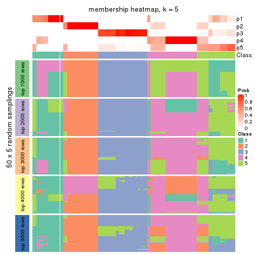</p>

</div>
<div id='tab-CV-NMF-membership-heatmap-5'>
<pre><code class="r">membership_heatmap(res, k = 6)
</code></pre>

<p></p>

</div>
</div>

As soon as we have had the classes for columns, we can look for signatures
which are significantly different between classes which can be candidate marks
for certain classes. Following are the heatmaps for signatures.


Signature heatmaps where rows are scaled:


<script>
$( function() {
	$( '#tabs-CV-NMF-get-signatures' ).tabs();
} );
</script>
<div id='tabs-CV-NMF-get-signatures'>
<ul>
<li><a href='#tab-CV-NMF-get-signatures-1'>k = 2</a></li>
<li><a href='#tab-CV-NMF-get-signatures-2'>k = 3</a></li>
<li><a href='#tab-CV-NMF-get-signatures-3'>k = 4</a></li>
<li><a href='#tab-CV-NMF-get-signatures-4'>k = 5</a></li>
<li><a href='#tab-CV-NMF-get-signatures-5'>k = 6</a></li>
</ul>
<div id='tab-CV-NMF-get-signatures-1'>
<pre><code class="r">get_signatures(res, k = 2)
</code></pre>

<p></p>

</div>
<div id='tab-CV-NMF-get-signatures-2'>
<pre><code class="r">get_signatures(res, k = 3)
</code></pre>

<p></p>

</div>
<div id='tab-CV-NMF-get-signatures-3'>
<pre><code class="r">get_signatures(res, k = 4)
</code></pre>

<p></p>

</div>
<div id='tab-CV-NMF-get-signatures-4'>
<pre><code class="r">get_signatures(res, k = 5)
</code></pre>

<p></p>

</div>
<div id='tab-CV-NMF-get-signatures-5'>
<pre><code class="r">get_signatures(res, k = 6)
</code></pre>

<p>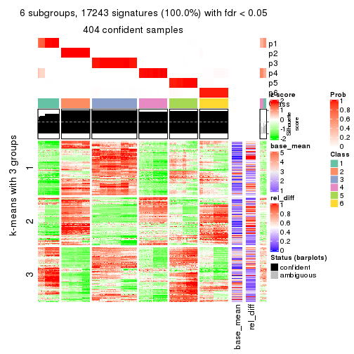</p>

</div>
</div>


Signature heatmaps where rows are not scaled:


<script>
$( function() {
	$( '#tabs-CV-NMF-get-signatures-no-scale' ).tabs();
} );
</script>
<div id='tabs-CV-NMF-get-signatures-no-scale'>
<ul>
<li><a href='#tab-CV-NMF-get-signatures-no-scale-1'>k = 2</a></li>
<li><a href='#tab-CV-NMF-get-signatures-no-scale-2'>k = 3</a></li>
<li><a href='#tab-CV-NMF-get-signatures-no-scale-3'>k = 4</a></li>
<li><a href='#tab-CV-NMF-get-signatures-no-scale-4'>k = 5</a></li>
<li><a href='#tab-CV-NMF-get-signatures-no-scale-5'>k = 6</a></li>
</ul>
<div id='tab-CV-NMF-get-signatures-no-scale-1'>
<pre><code class="r">get_signatures(res, k = 2, scale_rows = FALSE)
</code></pre>

<p></p>

</div>
<div id='tab-CV-NMF-get-signatures-no-scale-2'>
<pre><code class="r">get_signatures(res, k = 3, scale_rows = FALSE)
</code></pre>

<p></p>

</div>
<div id='tab-CV-NMF-get-signatures-no-scale-3'>
<pre><code class="r">get_signatures(res, k = 4, scale_rows = FALSE)
</code></pre>

<p></p>

</div>
<div id='tab-CV-NMF-get-signatures-no-scale-4'>
<pre><code class="r">get_signatures(res, k = 5, scale_rows = FALSE)
</code></pre>

<p></p>

</div>
<div id='tab-CV-NMF-get-signatures-no-scale-5'>
<pre><code class="r">get_signatures(res, k = 6, scale_rows = FALSE)
</code></pre>

<p></p>

</div>
</div>


Compare the overlap of signatures from different k:

```r
compare_signatures(res)
```

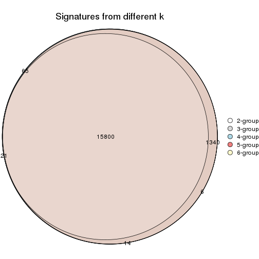

`get_signature()` returns a data frame invisibly. TO get the list of signatures, the function
call should be assigned to a variable explicitly. In following code, if `plot` argument is set
to `FALSE`, no heatmap is plotted while only the differential analysis is performed.

```r
# code only for demonstration
tb = get_signature(res, k = ..., plot = FALSE)
```

An example of the output of `tb` is:

```
#>   which_row         fdr    mean_1    mean_2 scaled_mean_1 scaled_mean_2 km
#> 1        38 0.042760348  8.373488  9.131774    -0.5533452     0.5164555  1
#> 2        40 0.018707592  7.106213  8.469186    -0.6173731     0.5762149  1
#> 3        55 0.019134737 10.221463 11.207825    -0.6159697     0.5749050  1
#> 4        59 0.006059896  5.921854  7.869574    -0.6899429     0.6439467  1
#> 5        60 0.018055526  8.928898 10.211722    -0.6204761     0.5791110  1
#> 6        98 0.009384629 15.714769 14.887706     0.6635654    -0.6193277  2
...
```

The columns in `tb` are:

1. `which_row`: row indices corresponding to the input matrix.
2. `fdr`: FDR for the differential test. 
3. `mean_x`: The mean value in group x.
4. `scaled_mean_x`: The mean value in group x after rows are scaled.
5. `km`: Row groups if k-means clustering is applied to rows.


UMAP plot which shows how samples are separated.


<script>
$( function() {
	$( '#tabs-CV-NMF-dimension-reduction' ).tabs();
} );
</script>
<div id='tabs-CV-NMF-dimension-reduction'>
<ul>
<li><a href='#tab-CV-NMF-dimension-reduction-1'>k = 2</a></li>
<li><a href='#tab-CV-NMF-dimension-reduction-2'>k = 3</a></li>
<li><a href='#tab-CV-NMF-dimension-reduction-3'>k = 4</a></li>
<li><a href='#tab-CV-NMF-dimension-reduction-4'>k = 5</a></li>
<li><a href='#tab-CV-NMF-dimension-reduction-5'>k = 6</a></li>
</ul>
<div id='tab-CV-NMF-dimension-reduction-1'>
<pre><code class="r">dimension_reduction(res, k = 2, method = &quot;UMAP&quot;)
</code></pre>

<p></p>

</div>
<div id='tab-CV-NMF-dimension-reduction-2'>
<pre><code class="r">dimension_reduction(res, k = 3, method = &quot;UMAP&quot;)
</code></pre>

<p></p>

</div>
<div id='tab-CV-NMF-dimension-reduction-3'>
<pre><code class="r">dimension_reduction(res, k = 4, method = &quot;UMAP&quot;)
</code></pre>

<p></p>

</div>
<div id='tab-CV-NMF-dimension-reduction-4'>
<pre><code class="r">dimension_reduction(res, k = 5, method = &quot;UMAP&quot;)
</code></pre>

<p></p>

</div>
<div id='tab-CV-NMF-dimension-reduction-5'>
<pre><code class="r">dimension_reduction(res, k = 6, method = &quot;UMAP&quot;)
</code></pre>

<p></p>

</div>
</div>


Following heatmap shows how subgroups are split when increasing `k`:

```r
collect_classes(res)
```


If matrix rows can be associated to genes, consider to use `GO_Enrichment(res,
...)` to perform function enrichment for the signature genes.


 

---------------------------------------------------


### MAD:hclust


The object with results only for a single top-value method and a single partition method 
can be extracted as:

```r
res = res_list["MAD", "hclust"]
# you can also extract it by
# res = res_list["MAD:hclust"]
```

A summary of `res` and all the functions that can be applied to it:

```r
res
```

```
#> A 'ConsensusPartition' object with k = 2, 3, 4, 5, 6.
#>   On a matrix with 17245 rows and 418 columns.
#>   Top rows (1000, 2000, 3000, 4000, 5000) are extracted by 'MAD' method.
#>   Subgroups are detected by 'hclust' method.
#>   Performed in total 1250 partitions by row resampling.
#>   Best k for subgroups seems to be 6.
#> 
#> Following methods can be applied to this 'ConsensusPartition' object:
#>  [1] "cola_report"             "collect_classes"         "collect_plots"          
#>  [4] "collect_stats"           "colnames"                "compare_signatures"     
#>  [7] "consensus_heatmap"       "dimension_reduction"     "functional_enrichment"  
#> [10] "get_anno_col"            "get_anno"                "get_classes"            
#> [13] "get_consensus"           "get_matrix"              "get_membership"         
#> [16] "get_param"               "get_signatures"          "get_stats"              
#> [19] "is_best_k"               "is_stable_k"             "membership_heatmap"     
#> [22] "ncol"                    "nrow"                    "plot_ecdf"              
#> [25] "rownames"                "select_partition_number" "show"                   
#> [28] "suggest_best_k"          "test_to_known_factors"
```

`collect_plots()` function collects all the plots made from `res` for all `k` (number of partitions)
into one single page to provide an easy and fast comparison between different `k`.

```r
collect_plots(res)
```


The plots are:

- The first row: a plot of the ECDF (Empirical cumulative distribution
  function) curves of the consensus matrix for each `k` and the heatmap of
  predicted classes for each `k`.
- The second row: heatmaps of the consensus matrix for each `k`.
- The third row: heatmaps of the membership matrix for each `k`.
- The fouth row: heatmaps of the signatures for each `k`.

All the plots in panels can be made by individual functions and they are
plotted later in this section.

`select_partition_number()` produces several plots showing different
statistics for choosing "optimized" `k`. There are following statistics:

- ECDF curves of the consensus matrix for each `k`;
- 1-PAC. [The PAC
  score](https://en.wikipedia.org/wiki/Consensus_clustering#Over-interpretation_potential_of_consensus_clustering)
  measures the proportion of the ambiguous subgrouping.
- Mean silhouette score.
- Concordance. The mean probability of fiting the consensus class ids in all
  partitions.
- Area increased. Denote $A_k$ as the area under the ECDF curve for current
  `k`, the area increased is defined as $A_k - A_{k-1}$.
- Rand index. The percent of pairs of samples that are both in a same cluster
  or both are not in a same cluster in the partition of k and k-1.
- Jaccard index. The ratio of pairs of samples are both in a same cluster in
  the partition of k and k-1 and the pairs of samples are both in a same
  cluster in the partition k or k-1.

The detailed explanations of these statistics can be found in [the cola
vignette](http://bioconductor.org/packages/devel/bioc/vignettes/cola/inst/doc/cola.html#toc_13).

Generally speaking, lower PAC score, higher mean silhouette score or higher
concordance corresponds to better partition. Rand index and Jaccard index
measure how similar the current partition is compared to partition with `k-1`.
If they are too similar, we won't accept `k` is better than `k-1`.

```r
select_partition_number(res)
```


The numeric values for all these statistics can be obtained by `get_stats()`.

```r
get_stats(res)
```

```
#>   k 1-PAC mean_silhouette concordance area_increased  Rand Jaccard
#> 2 2 0.375           0.783       0.878         0.4780 0.502   0.502
#> 3 3 0.623           0.810       0.869         0.3025 0.883   0.768
#> 4 4 0.812           0.860       0.893         0.1427 0.883   0.704
#> 5 5 0.800           0.740       0.832         0.0663 1.000   1.000
#> 6 6 0.872           0.911       0.909         0.0613 0.892   0.630
```

`suggest_best_k()` suggests the best $k$ based on these statistics. The rules are as follows:

- All $k$ with Jaccard index larger than 0.95 are removed because the increase of
  the partition number does not provides enough extra information. If all $k$ are removed,
  the best $k$ is assigned by `NA`.
- For $k$ with 1-PAC larger than 0.9, the maximal $k$ is taken as the "best k". Other $k$ is called "optional k".
- If it does not fit the second rule. The $k$ with the highest vote of highest
  1-PAC, mean silhouette and concordance is taken as the "best k".

```r
suggest_best_k(res)
```

```
#> [1] 6
```


Following shows the table of the partitions (You need to click the **show/hide
code output** link to see it). The membership matrix (columns with name `p*`)
is inferred by
[`clue::cl_consensus()`](https://www.rdocumentation.org/link/cl_consensus?package=clue)
function with the `SE` method. Basically the value in the membership matrix
represents the probability to belong to a certain group. The finall class
label for an item is determined with the group with highest probability it
belongs to.

In `get_classes()` function, the entropy is calculated from the membership
matrix and the silhouette score is calculated from the consensus matrix.


<script>
$( function() {
	$( '#tabs-MAD-hclust-get-classes' ).tabs();
} );
</script>
<div id='tabs-MAD-hclust-get-classes'>
<ul>
<li><a href='#tab-MAD-hclust-get-classes-1'>k = 2</a></li>
<li><a href='#tab-MAD-hclust-get-classes-2'>k = 3</a></li>
<li><a href='#tab-MAD-hclust-get-classes-3'>k = 4</a></li>
<li><a href='#tab-MAD-hclust-get-classes-4'>k = 5</a></li>
<li><a href='#tab-MAD-hclust-get-classes-5'>k = 6</a></li>
</ul>

<div id='tab-MAD-hclust-get-classes-1'>
<p><a id='tab-MAD-hclust-get-classes-1-a' style='color:#0366d6' href='#'>show/hide code output</a></p>
<pre><code class="r">cbind(get_classes(res, k = 2), get_membership(res, k = 2))
</code></pre>

<pre><code>#&gt;           class entropy silhouette    p1    p2
#&gt; SRR902920     1   0.653      0.886 0.832 0.168
#&gt; SRR902921     1   0.653      0.886 0.832 0.168
#&gt; SRR902922     1   0.653      0.886 0.832 0.168
#&gt; SRR902923     1   0.653      0.886 0.832 0.168
#&gt; SRR902924     1   0.653      0.886 0.832 0.168
#&gt; SRR902925     1   0.653      0.886 0.832 0.168
#&gt; SRR902926     1   0.653      0.886 0.832 0.168
#&gt; SRR902927     1   0.653      0.886 0.832 0.168
#&gt; SRR902928     1   0.653      0.886 0.832 0.168
#&gt; SRR902929     1   0.653      0.886 0.832 0.168
#&gt; SRR902930     1   0.653      0.886 0.832 0.168
#&gt; SRR902931     1   0.653      0.886 0.832 0.168
#&gt; SRR902932     2   0.000      0.850 0.000 1.000
#&gt; SRR902933     2   0.000      0.850 0.000 1.000
#&gt; SRR902934     2   0.000      0.850 0.000 1.000
#&gt; SRR902935     2   0.000      0.850 0.000 1.000
#&gt; SRR902936     2   0.000      0.850 0.000 1.000
#&gt; SRR902937     2   0.000      0.850 0.000 1.000
#&gt; SRR902938     2   0.000      0.850 0.000 1.000
#&gt; SRR902939     2   0.000      0.850 0.000 1.000
#&gt; SRR902940     2   0.000      0.850 0.000 1.000
#&gt; SRR902941     2   0.000      0.850 0.000 1.000
#&gt; SRR902942     1   0.653      0.886 0.832 0.168
#&gt; SRR902943     1   0.653      0.886 0.832 0.168
#&gt; SRR902944     1   0.653      0.886 0.832 0.168
#&gt; SRR902945     1   0.653      0.886 0.832 0.168
#&gt; SRR902946     1   0.653      0.886 0.832 0.168
#&gt; SRR902947     1   0.653      0.886 0.832 0.168
#&gt; SRR902954     1   0.653      0.886 0.832 0.168
#&gt; SRR902955     1   0.653      0.886 0.832 0.168
#&gt; SRR902956     1   0.653      0.886 0.832 0.168
#&gt; SRR902957     1   0.653      0.886 0.832 0.168
#&gt; SRR902958     1   0.653      0.886 0.832 0.168
#&gt; SRR902959     1   0.653      0.886 0.832 0.168
#&gt; SRR902948     1   0.653      0.886 0.832 0.168
#&gt; SRR902949     1   0.653      0.886 0.832 0.168
#&gt; SRR902950     1   0.653      0.886 0.832 0.168
#&gt; SRR902951     1   0.653      0.886 0.832 0.168
#&gt; SRR902952     1   0.653      0.886 0.832 0.168
#&gt; SRR902953     1   0.653      0.886 0.832 0.168
#&gt; SRR902960     1   0.653      0.886 0.832 0.168
#&gt; SRR902961     1   0.653      0.886 0.832 0.168
#&gt; SRR902962     1   0.653      0.886 0.832 0.168
#&gt; SRR902963     1   0.653      0.886 0.832 0.168
#&gt; SRR902964     1   0.653      0.886 0.832 0.168
#&gt; SRR902965     1   0.653      0.886 0.832 0.168
#&gt; SRR902966     1   0.653      0.886 0.832 0.168
#&gt; SRR902967     1   0.653      0.886 0.832 0.168
#&gt; SRR902968     1   0.653      0.886 0.832 0.168
#&gt; SRR902969     1   0.653      0.886 0.832 0.168
#&gt; SRR902970     1   0.653      0.886 0.832 0.168
#&gt; SRR902971     1   0.653      0.886 0.832 0.168
#&gt; SRR902972     1   0.653      0.886 0.832 0.168
#&gt; SRR902973     1   0.653      0.886 0.832 0.168
#&gt; SRR902974     1   0.653      0.886 0.832 0.168
#&gt; SRR902975     1   0.653      0.886 0.832 0.168
#&gt; SRR902976     1   0.653      0.886 0.832 0.168
#&gt; SRR902977     1   0.653      0.886 0.832 0.168
#&gt; SRR902978     1   0.653      0.886 0.832 0.168
#&gt; SRR902980     1   0.653      0.886 0.832 0.168
#&gt; SRR902981     1   0.653      0.886 0.832 0.168
#&gt; SRR902982     1   0.653      0.886 0.832 0.168
#&gt; SRR902983     1   0.653      0.886 0.832 0.168
#&gt; SRR902984     1   0.653      0.886 0.832 0.168
#&gt; SRR902985     1   0.653      0.886 0.832 0.168
#&gt; SRR902986     1   0.653      0.886 0.832 0.168
#&gt; SRR902987     1   0.653      0.886 0.832 0.168
#&gt; SRR902988     1   0.653      0.886 0.832 0.168
#&gt; SRR902989     1   0.653      0.886 0.832 0.168
#&gt; SRR902990     1   0.653      0.886 0.832 0.168
#&gt; SRR902991     1   0.653      0.886 0.832 0.168
#&gt; SRR902992     1   0.653      0.886 0.832 0.168
#&gt; SRR902993     1   0.653      0.886 0.832 0.168
#&gt; SRR902994     1   0.653      0.886 0.832 0.168
#&gt; SRR902995     1   0.653      0.886 0.832 0.168
#&gt; SRR902996     2   0.000      0.850 0.000 1.000
#&gt; SRR902997     2   0.000      0.850 0.000 1.000
#&gt; SRR902998     2   0.000      0.850 0.000 1.000
#&gt; SRR902999     2   0.000      0.850 0.000 1.000
#&gt; SRR903000     2   0.000      0.850 0.000 1.000
#&gt; SRR903001     2   0.000      0.850 0.000 1.000
#&gt; SRR903008     2   0.000      0.850 0.000 1.000
#&gt; SRR903009     2   0.000      0.850 0.000 1.000
#&gt; SRR903010     2   0.000      0.850 0.000 1.000
#&gt; SRR903011     2   0.000      0.850 0.000 1.000
#&gt; SRR903012     2   0.000      0.850 0.000 1.000
#&gt; SRR903013     2   0.000      0.850 0.000 1.000
#&gt; SRR903002     2   0.000      0.850 0.000 1.000
#&gt; SRR903003     2   0.000      0.850 0.000 1.000
#&gt; SRR903004     2   0.000      0.850 0.000 1.000
#&gt; SRR903005     2   0.000      0.850 0.000 1.000
#&gt; SRR903006     2   0.000      0.850 0.000 1.000
#&gt; SRR903007     2   0.000      0.850 0.000 1.000
#&gt; SRR903014     1   0.653      0.886 0.832 0.168
#&gt; SRR903015     1   0.653      0.886 0.832 0.168
#&gt; SRR903016     1   0.653      0.886 0.832 0.168
#&gt; SRR903017     1   0.653      0.886 0.832 0.168
#&gt; SRR903018     1   0.653      0.886 0.832 0.168
#&gt; SRR903019     1   0.653      0.886 0.832 0.168
#&gt; SRR903020     1   0.653      0.886 0.832 0.168
#&gt; SRR903021     1   0.653      0.886 0.832 0.168
#&gt; SRR903022     1   0.653      0.886 0.832 0.168
#&gt; SRR903023     1   0.653      0.886 0.832 0.168
#&gt; SRR903024     1   0.653      0.886 0.832 0.168
#&gt; SRR903025     1   0.653      0.886 0.832 0.168
#&gt; SRR903026     1   0.653      0.886 0.832 0.168
#&gt; SRR903027     1   0.653      0.886 0.832 0.168
#&gt; SRR903028     1   0.653      0.886 0.832 0.168
#&gt; SRR903029     1   0.653      0.886 0.832 0.168
#&gt; SRR903030     1   0.653      0.886 0.832 0.168
#&gt; SRR903031     1   0.653      0.886 0.832 0.168
#&gt; SRR903032     2   0.000      0.850 0.000 1.000
#&gt; SRR903033     2   0.000      0.850 0.000 1.000
#&gt; SRR903034     2   0.000      0.850 0.000 1.000
#&gt; SRR903035     2   0.000      0.850 0.000 1.000
#&gt; SRR903036     2   0.000      0.850 0.000 1.000
#&gt; SRR903037     2   0.000      0.850 0.000 1.000
#&gt; SRR903038     2   0.000      0.850 0.000 1.000
#&gt; SRR903039     2   0.000      0.850 0.000 1.000
#&gt; SRR903040     2   0.000      0.850 0.000 1.000
#&gt; SRR903041     2   0.000      0.850 0.000 1.000
#&gt; SRR903042     2   0.000      0.850 0.000 1.000
#&gt; SRR903043     2   0.000      0.850 0.000 1.000
#&gt; SRR903044     2   0.000      0.850 0.000 1.000
#&gt; SRR903045     2   0.000      0.850 0.000 1.000
#&gt; SRR903046     2   0.000      0.850 0.000 1.000
#&gt; SRR903047     2   0.000      0.850 0.000 1.000
#&gt; SRR903048     2   0.000      0.850 0.000 1.000
#&gt; SRR903049     2   0.000      0.850 0.000 1.000
#&gt; SRR903050     1   0.000      0.802 1.000 0.000
#&gt; SRR903051     1   0.000      0.802 1.000 0.000
#&gt; SRR903052     1   0.000      0.802 1.000 0.000
#&gt; SRR903053     1   0.000      0.802 1.000 0.000
#&gt; SRR903054     1   0.000      0.802 1.000 0.000
#&gt; SRR903055     1   0.000      0.802 1.000 0.000
#&gt; SRR903056     1   0.000      0.802 1.000 0.000
#&gt; SRR903057     1   0.000      0.802 1.000 0.000
#&gt; SRR903058     1   0.000      0.802 1.000 0.000
#&gt; SRR903059     1   0.000      0.802 1.000 0.000
#&gt; SRR903060     1   0.000      0.802 1.000 0.000
#&gt; SRR903061     1   0.000      0.802 1.000 0.000
#&gt; SRR903062     1   0.000      0.802 1.000 0.000
#&gt; SRR903063     1   0.000      0.802 1.000 0.000
#&gt; SRR903064     1   0.000      0.802 1.000 0.000
#&gt; SRR903065     1   0.000      0.802 1.000 0.000
#&gt; SRR903066     1   0.000      0.802 1.000 0.000
#&gt; SRR903067     1   0.000      0.802 1.000 0.000
#&gt; SRR903068     1   0.000      0.802 1.000 0.000
#&gt; SRR903069     1   0.000      0.802 1.000 0.000
#&gt; SRR903070     1   0.000      0.802 1.000 0.000
#&gt; SRR903071     1   0.000      0.802 1.000 0.000
#&gt; SRR903072     1   0.000      0.802 1.000 0.000
#&gt; SRR903073     1   0.000      0.802 1.000 0.000
#&gt; SRR903074     1   0.000      0.802 1.000 0.000
#&gt; SRR903075     1   0.000      0.802 1.000 0.000
#&gt; SRR903076     1   0.000      0.802 1.000 0.000
#&gt; SRR903077     1   0.000      0.802 1.000 0.000
#&gt; SRR903078     1   0.000      0.802 1.000 0.000
#&gt; SRR903079     1   0.000      0.802 1.000 0.000
#&gt; SRR903080     1   0.000      0.802 1.000 0.000
#&gt; SRR903081     1   0.000      0.802 1.000 0.000
#&gt; SRR903082     2   0.653      0.802 0.168 0.832
#&gt; SRR903083     2   0.653      0.802 0.168 0.832
#&gt; SRR903084     2   0.653      0.802 0.168 0.832
#&gt; SRR903085     2   0.653      0.802 0.168 0.832
#&gt; SRR903086     2   0.653      0.802 0.168 0.832
#&gt; SRR903087     2   0.653      0.802 0.168 0.832
#&gt; SRR903088     2   0.653      0.802 0.168 0.832
#&gt; SRR903089     2   0.653      0.802 0.168 0.832
#&gt; SRR903090     2   0.653      0.802 0.168 0.832
#&gt; SRR903091     2   0.653      0.802 0.168 0.832
#&gt; SRR903092     2   0.653      0.802 0.168 0.832
#&gt; SRR903093     2   0.653      0.802 0.168 0.832
#&gt; SRR903094     2   0.653      0.802 0.168 0.832
#&gt; SRR903095     2   0.653      0.802 0.168 0.832
#&gt; SRR903096     2   0.653      0.802 0.168 0.832
#&gt; SRR903097     2   0.653      0.802 0.168 0.832
#&gt; SRR903098     2   0.653      0.802 0.168 0.832
#&gt; SRR903099     2   0.653      0.802 0.168 0.832
#&gt; SRR903100     2   0.653      0.802 0.168 0.832
#&gt; SRR903101     2   0.653      0.802 0.168 0.832
#&gt; SRR903102     2   0.653      0.802 0.168 0.832
#&gt; SRR903103     2   0.653      0.802 0.168 0.832
#&gt; SRR903104     2   0.653      0.802 0.168 0.832
#&gt; SRR903105     2   0.653      0.802 0.168 0.832
#&gt; SRR903106     2   0.653      0.802 0.168 0.832
#&gt; SRR903107     2   0.653      0.802 0.168 0.832
#&gt; SRR903108     2   0.653      0.802 0.168 0.832
#&gt; SRR903109     2   0.653      0.802 0.168 0.832
#&gt; SRR903110     2   0.653      0.802 0.168 0.832
#&gt; SRR903111     2   0.653      0.802 0.168 0.832
#&gt; SRR903112     2   0.653      0.802 0.168 0.832
#&gt; SRR903113     2   0.653      0.802 0.168 0.832
#&gt; SRR903114     1   0.000      0.802 1.000 0.000
#&gt; SRR903115     1   0.000      0.802 1.000 0.000
#&gt; SRR903116     1   0.000      0.802 1.000 0.000
#&gt; SRR903117     1   0.000      0.802 1.000 0.000
#&gt; SRR903118     1   0.000      0.802 1.000 0.000
#&gt; SRR903119     1   0.000      0.802 1.000 0.000
#&gt; SRR903121     1   0.000      0.802 1.000 0.000
#&gt; SRR903122     1   0.000      0.802 1.000 0.000
#&gt; SRR903124     1   0.000      0.802 1.000 0.000
#&gt; SRR903125     1   0.000      0.802 1.000 0.000
#&gt; SRR903126     1   0.000      0.802 1.000 0.000
#&gt; SRR903127     1   0.000      0.802 1.000 0.000
#&gt; SRR903128     1   0.000      0.802 1.000 0.000
#&gt; SRR903129     1   0.000      0.802 1.000 0.000
#&gt; SRR903130     1   0.000      0.802 1.000 0.000
#&gt; SRR903131     1   0.000      0.802 1.000 0.000
#&gt; SRR903132     1   0.000      0.802 1.000 0.000
#&gt; SRR903133     1   0.000      0.802 1.000 0.000
#&gt; SRR903134     1   0.000      0.802 1.000 0.000
#&gt; SRR903135     1   0.000      0.802 1.000 0.000
#&gt; SRR903136     1   0.000      0.802 1.000 0.000
#&gt; SRR903137     1   0.000      0.802 1.000 0.000
#&gt; SRR903146     2   0.653      0.802 0.168 0.832
#&gt; SRR903147     2   0.653      0.802 0.168 0.832
#&gt; SRR903148     2   0.653      0.802 0.168 0.832
#&gt; SRR903149     2   0.653      0.802 0.168 0.832
#&gt; SRR903150     2   0.653      0.802 0.168 0.832
#&gt; SRR903151     2   0.653      0.802 0.168 0.832
#&gt; SRR903152     2   0.653      0.802 0.168 0.832
#&gt; SRR903153     2   0.653      0.802 0.168 0.832
#&gt; SRR903138     1   0.000      0.802 1.000 0.000
#&gt; SRR903139     1   0.000      0.802 1.000 0.000
#&gt; SRR903140     1   0.000      0.802 1.000 0.000
#&gt; SRR903141     1   0.000      0.802 1.000 0.000
#&gt; SRR903142     1   0.000      0.802 1.000 0.000
#&gt; SRR903143     1   0.000      0.802 1.000 0.000
#&gt; SRR903144     1   0.000      0.802 1.000 0.000
#&gt; SRR903145     1   0.000      0.802 1.000 0.000
#&gt; SRR903154     2   0.653      0.802 0.168 0.832
#&gt; SRR903155     2   0.653      0.802 0.168 0.832
#&gt; SRR903156     2   0.653      0.802 0.168 0.832
#&gt; SRR903157     2   0.653      0.802 0.168 0.832
#&gt; SRR903158     2   0.653      0.802 0.168 0.832
#&gt; SRR903159     2   0.653      0.802 0.168 0.832
#&gt; SRR903160     2   0.653      0.802 0.168 0.832
#&gt; SRR903161     2   0.653      0.802 0.168 0.832
#&gt; SRR903162     2   0.653      0.802 0.168 0.832
#&gt; SRR903163     2   0.653      0.802 0.168 0.832
#&gt; SRR903164     2   0.653      0.802 0.168 0.832
#&gt; SRR903165     2   0.653      0.802 0.168 0.832
#&gt; SRR903166     2   0.653      0.802 0.168 0.832
#&gt; SRR903167     2   0.653      0.802 0.168 0.832
#&gt; SRR903168     2   0.653      0.802 0.168 0.832
#&gt; SRR903169     2   0.653      0.802 0.168 0.832
#&gt; SRR903178     1   0.653      0.886 0.832 0.168
#&gt; SRR903179     1   0.653      0.886 0.832 0.168
#&gt; SRR903180     1   0.653      0.886 0.832 0.168
#&gt; SRR903181     1   0.653      0.886 0.832 0.168
#&gt; SRR903182     1   0.653      0.886 0.832 0.168
#&gt; SRR903183     1   0.653      0.886 0.832 0.168
#&gt; SRR903184     1   0.653      0.886 0.832 0.168
#&gt; SRR903185     1   0.653      0.886 0.832 0.168
#&gt; SRR903170     2   0.653      0.802 0.168 0.832
#&gt; SRR903171     2   0.653      0.802 0.168 0.832
#&gt; SRR903172     2   0.653      0.802 0.168 0.832
#&gt; SRR903173     2   0.653      0.802 0.168 0.832
#&gt; SRR903174     2   0.653      0.802 0.168 0.832
#&gt; SRR903175     2   0.653      0.802 0.168 0.832
#&gt; SRR903176     2   0.653      0.802 0.168 0.832
#&gt; SRR903177     2   0.653      0.802 0.168 0.832
#&gt; SRR903186     1   0.653      0.886 0.832 0.168
#&gt; SRR903187     1   0.653      0.886 0.832 0.168
#&gt; SRR903188     1   0.653      0.886 0.832 0.168
#&gt; SRR903189     1   0.653      0.886 0.832 0.168
#&gt; SRR903190     1   0.653      0.886 0.832 0.168
#&gt; SRR903191     1   0.653      0.886 0.832 0.168
#&gt; SRR903192     1   0.653      0.886 0.832 0.168
#&gt; SRR903193     1   0.653      0.886 0.832 0.168
#&gt; SRR903194     1   0.653      0.886 0.832 0.168
#&gt; SRR903195     1   0.653      0.886 0.832 0.168
#&gt; SRR903196     1   0.653      0.886 0.832 0.168
#&gt; SRR903197     1   0.653      0.886 0.832 0.168
#&gt; SRR903198     1   0.653      0.886 0.832 0.168
#&gt; SRR903199     1   0.653      0.886 0.832 0.168
#&gt; SRR903200     1   0.653      0.886 0.832 0.168
#&gt; SRR903201     1   0.653      0.886 0.832 0.168
#&gt; SRR903210     2   0.000      0.850 0.000 1.000
#&gt; SRR903211     2   0.000      0.850 0.000 1.000
#&gt; SRR903212     2   0.000      0.850 0.000 1.000
#&gt; SRR903213     2   0.000      0.850 0.000 1.000
#&gt; SRR903214     2   0.000      0.850 0.000 1.000
#&gt; SRR903215     2   0.000      0.850 0.000 1.000
#&gt; SRR903216     2   0.000      0.850 0.000 1.000
#&gt; SRR903217     2   0.000      0.850 0.000 1.000
#&gt; SRR903202     1   0.653      0.886 0.832 0.168
#&gt; SRR903203     1   0.653      0.886 0.832 0.168
#&gt; SRR903204     1   0.653      0.886 0.832 0.168
#&gt; SRR903205     1   0.653      0.886 0.832 0.168
#&gt; SRR903206     1   0.653      0.886 0.832 0.168
#&gt; SRR903207     1   0.653      0.886 0.832 0.168
#&gt; SRR903208     1   0.653      0.886 0.832 0.168
#&gt; SRR903209     1   0.653      0.886 0.832 0.168
#&gt; SRR903218     2   0.000      0.850 0.000 1.000
#&gt; SRR903219     2   0.000      0.850 0.000 1.000
#&gt; SRR903220     2   0.000      0.850 0.000 1.000
#&gt; SRR903221     2   0.000      0.850 0.000 1.000
#&gt; SRR903222     2   0.000      0.850 0.000 1.000
#&gt; SRR903223     2   0.000      0.850 0.000 1.000
#&gt; SRR903224     2   0.000      0.850 0.000 1.000
#&gt; SRR903225     2   0.000      0.850 0.000 1.000
#&gt; SRR903226     2   0.000      0.850 0.000 1.000
#&gt; SRR903227     2   0.000      0.850 0.000 1.000
#&gt; SRR903228     2   0.000      0.850 0.000 1.000
#&gt; SRR903229     2   0.000      0.850 0.000 1.000
#&gt; SRR903230     2   0.000      0.850 0.000 1.000
#&gt; SRR903231     2   0.000      0.850 0.000 1.000
#&gt; SRR903232     2   0.000      0.850 0.000 1.000
#&gt; SRR903233     2   0.000      0.850 0.000 1.000
#&gt; SRR903242     1   0.990      0.504 0.560 0.440
#&gt; SRR903243     1   0.990      0.504 0.560 0.440
#&gt; SRR903244     1   0.990      0.504 0.560 0.440
#&gt; SRR903245     1   0.990      0.504 0.560 0.440
#&gt; SRR903246     1   0.990      0.504 0.560 0.440
#&gt; SRR903247     1   0.990      0.504 0.560 0.440
#&gt; SRR903248     1   0.990      0.504 0.560 0.440
#&gt; SRR903249     1   0.990      0.504 0.560 0.440
#&gt; SRR903234     2   0.000      0.850 0.000 1.000
#&gt; SRR903235     2   0.000      0.850 0.000 1.000
#&gt; SRR903236     2   0.000      0.850 0.000 1.000
#&gt; SRR903237     2   0.000      0.850 0.000 1.000
#&gt; SRR903238     2   0.000      0.850 0.000 1.000
#&gt; SRR903239     2   0.000      0.850 0.000 1.000
#&gt; SRR903240     2   0.000      0.850 0.000 1.000
#&gt; SRR903241     2   0.000      0.850 0.000 1.000
#&gt; SRR903258     1   0.990      0.504 0.560 0.440
#&gt; SRR903259     1   0.990      0.504 0.560 0.440
#&gt; SRR903260     1   0.990      0.504 0.560 0.440
#&gt; SRR903261     1   0.990      0.504 0.560 0.440
#&gt; SRR903262     1   0.990      0.504 0.560 0.440
#&gt; SRR903263     1   0.990      0.504 0.560 0.440
#&gt; SRR903264     1   0.990      0.504 0.560 0.440
#&gt; SRR903265     1   0.990      0.504 0.560 0.440
#&gt; SRR903250     1   0.990      0.504 0.560 0.440
#&gt; SRR903251     1   0.990      0.504 0.560 0.440
#&gt; SRR903252     1   0.990      0.504 0.560 0.440
#&gt; SRR903253     1   0.990      0.504 0.560 0.440
#&gt; SRR903254     1   0.990      0.504 0.560 0.440
#&gt; SRR903255     1   0.990      0.504 0.560 0.440
#&gt; SRR903256     1   0.990      0.504 0.560 0.440
#&gt; SRR903257     1   0.990      0.504 0.560 0.440
#&gt; SRR903266     1   0.990      0.504 0.560 0.440
#&gt; SRR903267     1   0.990      0.504 0.560 0.440
#&gt; SRR903268     1   0.990      0.504 0.560 0.440
#&gt; SRR903270     1   0.990      0.504 0.560 0.440
#&gt; SRR903271     1   0.990      0.504 0.560 0.440
#&gt; SRR903272     1   0.990      0.504 0.560 0.440
#&gt; SRR903273     1   0.990      0.504 0.560 0.440
#&gt; SRR903274     2   0.913      0.344 0.328 0.672
#&gt; SRR903275     2   0.913      0.344 0.328 0.672
#&gt; SRR903276     2   0.913      0.344 0.328 0.672
#&gt; SRR903277     2   0.913      0.344 0.328 0.672
#&gt; SRR903278     2   0.913      0.344 0.328 0.672
#&gt; SRR903279     2   0.913      0.344 0.328 0.672
#&gt; SRR903280     2   0.913      0.344 0.328 0.672
#&gt; SRR903281     2   0.913      0.344 0.328 0.672
#&gt; SRR903282     2   0.913      0.344 0.328 0.672
#&gt; SRR903283     2   0.913      0.344 0.328 0.672
#&gt; SRR903284     2   0.913      0.344 0.328 0.672
#&gt; SRR903285     2   0.913      0.344 0.328 0.672
#&gt; SRR903286     2   0.913      0.344 0.328 0.672
#&gt; SRR903287     2   0.913      0.344 0.328 0.672
#&gt; SRR903288     2   0.913      0.344 0.328 0.672
#&gt; SRR903289     2   0.913      0.344 0.328 0.672
#&gt; SRR903290     2   0.913      0.344 0.328 0.672
#&gt; SRR903291     2   0.913      0.344 0.328 0.672
#&gt; SRR903292     2   0.913      0.344 0.328 0.672
#&gt; SRR903293     2   0.913      0.344 0.328 0.672
#&gt; SRR903294     2   0.913      0.344 0.328 0.672
#&gt; SRR903295     2   0.913      0.344 0.328 0.672
#&gt; SRR903296     2   0.913      0.344 0.328 0.672
#&gt; SRR903297     2   0.913      0.344 0.328 0.672
#&gt; SRR903298     2   0.913      0.344 0.328 0.672
#&gt; SRR903299     2   0.913      0.344 0.328 0.672
#&gt; SRR903300     2   0.913      0.344 0.328 0.672
#&gt; SRR903301     2   0.913      0.344 0.328 0.672
#&gt; SRR903302     2   0.913      0.344 0.328 0.672
#&gt; SRR903303     2   0.913      0.344 0.328 0.672
#&gt; SRR903304     2   0.913      0.344 0.328 0.672
#&gt; SRR903305     2   0.913      0.344 0.328 0.672
#&gt; SRR903306     1   0.653      0.886 0.832 0.168
#&gt; SRR903307     1   0.653      0.886 0.832 0.168
#&gt; SRR903308     1   0.653      0.886 0.832 0.168
#&gt; SRR903309     1   0.653      0.886 0.832 0.168
#&gt; SRR903310     1   0.653      0.886 0.832 0.168
#&gt; SRR903311     1   0.653      0.886 0.832 0.168
#&gt; SRR903312     1   0.653      0.886 0.832 0.168
#&gt; SRR903313     1   0.653      0.886 0.832 0.168
#&gt; SRR903314     1   0.653      0.886 0.832 0.168
#&gt; SRR903315     1   0.653      0.886 0.832 0.168
#&gt; SRR903316     1   0.653      0.886 0.832 0.168
#&gt; SRR903317     1   0.653      0.886 0.832 0.168
#&gt; SRR903318     1   0.653      0.886 0.832 0.168
#&gt; SRR903319     1   0.653      0.886 0.832 0.168
#&gt; SRR903320     1   0.653      0.886 0.832 0.168
#&gt; SRR903321     1   0.653      0.886 0.832 0.168
#&gt; SRR903322     1   0.653      0.886 0.832 0.168
#&gt; SRR903323     1   0.653      0.886 0.832 0.168
#&gt; SRR903324     2   0.000      0.850 0.000 1.000
#&gt; SRR903325     2   0.000      0.850 0.000 1.000
#&gt; SRR903326     2   0.000      0.850 0.000 1.000
#&gt; SRR903327     2   0.000      0.850 0.000 1.000
#&gt; SRR903328     2   0.000      0.850 0.000 1.000
#&gt; SRR903329     2   0.000      0.850 0.000 1.000
#&gt; SRR903330     2   0.000      0.850 0.000 1.000
#&gt; SRR903331     2   0.000      0.850 0.000 1.000
#&gt; SRR903332     2   0.000      0.850 0.000 1.000
#&gt; SRR903333     2   0.000      0.850 0.000 1.000
#&gt; SRR903334     2   0.000      0.850 0.000 1.000
#&gt; SRR903335     2   0.000      0.850 0.000 1.000
#&gt; SRR903336     2   0.000      0.850 0.000 1.000
#&gt; SRR903337     2   0.000      0.850 0.000 1.000
#&gt; SRR903338     2   0.000      0.850 0.000 1.000
#&gt; SRR903339     2   0.000      0.850 0.000 1.000
#&gt; SRR903340     2   0.000      0.850 0.000 1.000
#&gt; SRR903341     2   0.000      0.850 0.000 1.000
</code></pre>

<script>
$('#tab-MAD-hclust-get-classes-1-a').parent().next().next().hide();
$('#tab-MAD-hclust-get-classes-1-a').click(function(){
  $('#tab-MAD-hclust-get-classes-1-a').parent().next().next().toggle();
  return(false);
});
</script>
</div>

<div id='tab-MAD-hclust-get-classes-2'>
<p><a id='tab-MAD-hclust-get-classes-2-a' style='color:#0366d6' href='#'>show/hide code output</a></p>
<pre><code class="r">cbind(get_classes(res, k = 3), get_membership(res, k = 3))
</code></pre>

<pre><code>#&gt;           class entropy silhouette    p1    p2    p3
#&gt; SRR902920     3   0.000      0.926 0.000 0.000 1.000
#&gt; SRR902921     3   0.000      0.926 0.000 0.000 1.000
#&gt; SRR902922     3   0.000      0.926 0.000 0.000 1.000
#&gt; SRR902923     3   0.000      0.926 0.000 0.000 1.000
#&gt; SRR902924     3   0.000      0.926 0.000 0.000 1.000
#&gt; SRR902925     3   0.000      0.926 0.000 0.000 1.000
#&gt; SRR902926     3   0.000      0.926 0.000 0.000 1.000
#&gt; SRR902927     3   0.000      0.926 0.000 0.000 1.000
#&gt; SRR902928     3   0.000      0.926 0.000 0.000 1.000
#&gt; SRR902929     3   0.000      0.926 0.000 0.000 1.000
#&gt; SRR902930     3   0.000      0.926 0.000 0.000 1.000
#&gt; SRR902931     3   0.000      0.926 0.000 0.000 1.000
#&gt; SRR902932     2   0.000      0.822 0.000 1.000 0.000
#&gt; SRR902933     2   0.000      0.822 0.000 1.000 0.000
#&gt; SRR902934     2   0.000      0.822 0.000 1.000 0.000
#&gt; SRR902935     2   0.000      0.822 0.000 1.000 0.000
#&gt; SRR902936     2   0.000      0.822 0.000 1.000 0.000
#&gt; SRR902937     2   0.000      0.822 0.000 1.000 0.000
#&gt; SRR902938     2   0.000      0.822 0.000 1.000 0.000
#&gt; SRR902939     2   0.000      0.822 0.000 1.000 0.000
#&gt; SRR902940     2   0.000      0.822 0.000 1.000 0.000
#&gt; SRR902941     2   0.000      0.822 0.000 1.000 0.000
#&gt; SRR902942     3   0.000      0.926 0.000 0.000 1.000
#&gt; SRR902943     3   0.000      0.926 0.000 0.000 1.000
#&gt; SRR902944     3   0.000      0.926 0.000 0.000 1.000
#&gt; SRR902945     3   0.000      0.926 0.000 0.000 1.000
#&gt; SRR902946     3   0.000      0.926 0.000 0.000 1.000
#&gt; SRR902947     3   0.000      0.926 0.000 0.000 1.000
#&gt; SRR902954     3   0.000      0.926 0.000 0.000 1.000
#&gt; SRR902955     3   0.000      0.926 0.000 0.000 1.000
#&gt; SRR902956     3   0.000      0.926 0.000 0.000 1.000
#&gt; SRR902957     3   0.000      0.926 0.000 0.000 1.000
#&gt; SRR902958     3   0.000      0.926 0.000 0.000 1.000
#&gt; SRR902959     3   0.000      0.926 0.000 0.000 1.000
#&gt; SRR902948     3   0.000      0.926 0.000 0.000 1.000
#&gt; SRR902949     3   0.000      0.926 0.000 0.000 1.000
#&gt; SRR902950     3   0.000      0.926 0.000 0.000 1.000
#&gt; SRR902951     3   0.000      0.926 0.000 0.000 1.000
#&gt; SRR902952     3   0.000      0.926 0.000 0.000 1.000
#&gt; SRR902953     3   0.000      0.926 0.000 0.000 1.000
#&gt; SRR902960     3   0.000      0.926 0.000 0.000 1.000
#&gt; SRR902961     3   0.000      0.926 0.000 0.000 1.000
#&gt; SRR902962     3   0.000      0.926 0.000 0.000 1.000
#&gt; SRR902963     3   0.000      0.926 0.000 0.000 1.000
#&gt; SRR902964     3   0.000      0.926 0.000 0.000 1.000
#&gt; SRR902965     3   0.000      0.926 0.000 0.000 1.000
#&gt; SRR902966     3   0.000      0.926 0.000 0.000 1.000
#&gt; SRR902967     3   0.000      0.926 0.000 0.000 1.000
#&gt; SRR902968     3   0.000      0.926 0.000 0.000 1.000
#&gt; SRR902969     3   0.000      0.926 0.000 0.000 1.000
#&gt; SRR902970     3   0.000      0.926 0.000 0.000 1.000
#&gt; SRR902971     3   0.000      0.926 0.000 0.000 1.000
#&gt; SRR902972     3   0.000      0.926 0.000 0.000 1.000
#&gt; SRR902973     3   0.000      0.926 0.000 0.000 1.000
#&gt; SRR902974     3   0.000      0.926 0.000 0.000 1.000
#&gt; SRR902975     3   0.000      0.926 0.000 0.000 1.000
#&gt; SRR902976     3   0.000      0.926 0.000 0.000 1.000
#&gt; SRR902977     3   0.000      0.926 0.000 0.000 1.000
#&gt; SRR902978     3   0.000      0.926 0.000 0.000 1.000
#&gt; SRR902980     3   0.000      0.926 0.000 0.000 1.000
#&gt; SRR902981     3   0.000      0.926 0.000 0.000 1.000
#&gt; SRR902982     3   0.000      0.926 0.000 0.000 1.000
#&gt; SRR902983     3   0.000      0.926 0.000 0.000 1.000
#&gt; SRR902984     3   0.000      0.926 0.000 0.000 1.000
#&gt; SRR902985     3   0.000      0.926 0.000 0.000 1.000
#&gt; SRR902986     3   0.000      0.926 0.000 0.000 1.000
#&gt; SRR902987     3   0.000      0.926 0.000 0.000 1.000
#&gt; SRR902988     3   0.000      0.926 0.000 0.000 1.000
#&gt; SRR902989     3   0.000      0.926 0.000 0.000 1.000
#&gt; SRR902990     3   0.000      0.926 0.000 0.000 1.000
#&gt; SRR902991     3   0.000      0.926 0.000 0.000 1.000
#&gt; SRR902992     3   0.000      0.926 0.000 0.000 1.000
#&gt; SRR902993     3   0.000      0.926 0.000 0.000 1.000
#&gt; SRR902994     3   0.000      0.926 0.000 0.000 1.000
#&gt; SRR902995     3   0.000      0.926 0.000 0.000 1.000
#&gt; SRR902996     2   0.000      0.822 0.000 1.000 0.000
#&gt; SRR902997     2   0.000      0.822 0.000 1.000 0.000
#&gt; SRR902998     2   0.000      0.822 0.000 1.000 0.000
#&gt; SRR902999     2   0.000      0.822 0.000 1.000 0.000
#&gt; SRR903000     2   0.000      0.822 0.000 1.000 0.000
#&gt; SRR903001     2   0.000      0.822 0.000 1.000 0.000
#&gt; SRR903008     2   0.000      0.822 0.000 1.000 0.000
#&gt; SRR903009     2   0.000      0.822 0.000 1.000 0.000
#&gt; SRR903010     2   0.000      0.822 0.000 1.000 0.000
#&gt; SRR903011     2   0.000      0.822 0.000 1.000 0.000
#&gt; SRR903012     2   0.000      0.822 0.000 1.000 0.000
#&gt; SRR903013     2   0.000      0.822 0.000 1.000 0.000
#&gt; SRR903002     2   0.000      0.822 0.000 1.000 0.000
#&gt; SRR903003     2   0.000      0.822 0.000 1.000 0.000
#&gt; SRR903004     2   0.000      0.822 0.000 1.000 0.000
#&gt; SRR903005     2   0.000      0.822 0.000 1.000 0.000
#&gt; SRR903006     2   0.000      0.822 0.000 1.000 0.000
#&gt; SRR903007     2   0.000      0.822 0.000 1.000 0.000
#&gt; SRR903014     3   0.000      0.926 0.000 0.000 1.000
#&gt; SRR903015     3   0.000      0.926 0.000 0.000 1.000
#&gt; SRR903016     3   0.000      0.926 0.000 0.000 1.000
#&gt; SRR903017     3   0.000      0.926 0.000 0.000 1.000
#&gt; SRR903018     3   0.000      0.926 0.000 0.000 1.000
#&gt; SRR903019     3   0.000      0.926 0.000 0.000 1.000
#&gt; SRR903020     3   0.000      0.926 0.000 0.000 1.000
#&gt; SRR903021     3   0.000      0.926 0.000 0.000 1.000
#&gt; SRR903022     3   0.000      0.926 0.000 0.000 1.000
#&gt; SRR903023     3   0.000      0.926 0.000 0.000 1.000
#&gt; SRR903024     3   0.000      0.926 0.000 0.000 1.000
#&gt; SRR903025     3   0.000      0.926 0.000 0.000 1.000
#&gt; SRR903026     3   0.000      0.926 0.000 0.000 1.000
#&gt; SRR903027     3   0.000      0.926 0.000 0.000 1.000
#&gt; SRR903028     3   0.000      0.926 0.000 0.000 1.000
#&gt; SRR903029     3   0.000      0.926 0.000 0.000 1.000
#&gt; SRR903030     3   0.000      0.926 0.000 0.000 1.000
#&gt; SRR903031     3   0.000      0.926 0.000 0.000 1.000
#&gt; SRR903032     2   0.000      0.822 0.000 1.000 0.000
#&gt; SRR903033     2   0.000      0.822 0.000 1.000 0.000
#&gt; SRR903034     2   0.000      0.822 0.000 1.000 0.000
#&gt; SRR903035     2   0.000      0.822 0.000 1.000 0.000
#&gt; SRR903036     2   0.000      0.822 0.000 1.000 0.000
#&gt; SRR903037     2   0.000      0.822 0.000 1.000 0.000
#&gt; SRR903038     2   0.000      0.822 0.000 1.000 0.000
#&gt; SRR903039     2   0.000      0.822 0.000 1.000 0.000
#&gt; SRR903040     2   0.000      0.822 0.000 1.000 0.000
#&gt; SRR903041     2   0.000      0.822 0.000 1.000 0.000
#&gt; SRR903042     2   0.000      0.822 0.000 1.000 0.000
#&gt; SRR903043     2   0.000      0.822 0.000 1.000 0.000
#&gt; SRR903044     2   0.000      0.822 0.000 1.000 0.000
#&gt; SRR903045     2   0.000      0.822 0.000 1.000 0.000
#&gt; SRR903046     2   0.000      0.822 0.000 1.000 0.000
#&gt; SRR903047     2   0.000      0.822 0.000 1.000 0.000
#&gt; SRR903048     2   0.000      0.822 0.000 1.000 0.000
#&gt; SRR903049     2   0.000      0.822 0.000 1.000 0.000
#&gt; SRR903050     1   0.529      1.000 0.732 0.000 0.268
#&gt; SRR903051     1   0.529      1.000 0.732 0.000 0.268
#&gt; SRR903052     1   0.529      1.000 0.732 0.000 0.268
#&gt; SRR903053     1   0.529      1.000 0.732 0.000 0.268
#&gt; SRR903054     1   0.529      1.000 0.732 0.000 0.268
#&gt; SRR903055     1   0.529      1.000 0.732 0.000 0.268
#&gt; SRR903056     1   0.529      1.000 0.732 0.000 0.268
#&gt; SRR903057     1   0.529      1.000 0.732 0.000 0.268
#&gt; SRR903058     1   0.529      1.000 0.732 0.000 0.268
#&gt; SRR903059     1   0.529      1.000 0.732 0.000 0.268
#&gt; SRR903060     1   0.529      1.000 0.732 0.000 0.268
#&gt; SRR903061     1   0.529      1.000 0.732 0.000 0.268
#&gt; SRR903062     1   0.529      1.000 0.732 0.000 0.268
#&gt; SRR903063     1   0.529      1.000 0.732 0.000 0.268
#&gt; SRR903064     1   0.529      1.000 0.732 0.000 0.268
#&gt; SRR903065     1   0.529      1.000 0.732 0.000 0.268
#&gt; SRR903066     1   0.529      1.000 0.732 0.000 0.268
#&gt; SRR903067     1   0.529      1.000 0.732 0.000 0.268
#&gt; SRR903068     1   0.529      1.000 0.732 0.000 0.268
#&gt; SRR903069     1   0.529      1.000 0.732 0.000 0.268
#&gt; SRR903070     1   0.529      1.000 0.732 0.000 0.268
#&gt; SRR903071     1   0.529      1.000 0.732 0.000 0.268
#&gt; SRR903072     1   0.529      1.000 0.732 0.000 0.268
#&gt; SRR903073     1   0.529      1.000 0.732 0.000 0.268
#&gt; SRR903074     1   0.529      1.000 0.732 0.000 0.268
#&gt; SRR903075     1   0.529      1.000 0.732 0.000 0.268
#&gt; SRR903076     1   0.529      1.000 0.732 0.000 0.268
#&gt; SRR903077     1   0.529      1.000 0.732 0.000 0.268
#&gt; SRR903078     1   0.529      1.000 0.732 0.000 0.268
#&gt; SRR903079     1   0.529      1.000 0.732 0.000 0.268
#&gt; SRR903080     1   0.529      1.000 0.732 0.000 0.268
#&gt; SRR903081     1   0.529      1.000 0.732 0.000 0.268
#&gt; SRR903082     2   0.412      0.764 0.168 0.832 0.000
#&gt; SRR903083     2   0.412      0.764 0.168 0.832 0.000
#&gt; SRR903084     2   0.412      0.764 0.168 0.832 0.000
#&gt; SRR903085     2   0.412      0.764 0.168 0.832 0.000
#&gt; SRR903086     2   0.412      0.764 0.168 0.832 0.000
#&gt; SRR903087     2   0.412      0.764 0.168 0.832 0.000
#&gt; SRR903088     2   0.412      0.764 0.168 0.832 0.000
#&gt; SRR903089     2   0.412      0.764 0.168 0.832 0.000
#&gt; SRR903090     2   0.412      0.764 0.168 0.832 0.000
#&gt; SRR903091     2   0.412      0.764 0.168 0.832 0.000
#&gt; SRR903092     2   0.412      0.764 0.168 0.832 0.000
#&gt; SRR903093     2   0.412      0.764 0.168 0.832 0.000
#&gt; SRR903094     2   0.412      0.764 0.168 0.832 0.000
#&gt; SRR903095     2   0.412      0.764 0.168 0.832 0.000
#&gt; SRR903096     2   0.412      0.764 0.168 0.832 0.000
#&gt; SRR903097     2   0.412      0.764 0.168 0.832 0.000
#&gt; SRR903098     2   0.412      0.764 0.168 0.832 0.000
#&gt; SRR903099     2   0.412      0.764 0.168 0.832 0.000
#&gt; SRR903100     2   0.412      0.764 0.168 0.832 0.000
#&gt; SRR903101     2   0.412      0.764 0.168 0.832 0.000
#&gt; SRR903102     2   0.412      0.764 0.168 0.832 0.000
#&gt; SRR903103     2   0.412      0.764 0.168 0.832 0.000
#&gt; SRR903104     2   0.412      0.764 0.168 0.832 0.000
#&gt; SRR903105     2   0.412      0.764 0.168 0.832 0.000
#&gt; SRR903106     2   0.412      0.764 0.168 0.832 0.000
#&gt; SRR903107     2   0.412      0.764 0.168 0.832 0.000
#&gt; SRR903108     2   0.412      0.764 0.168 0.832 0.000
#&gt; SRR903109     2   0.412      0.764 0.168 0.832 0.000
#&gt; SRR903110     2   0.412      0.764 0.168 0.832 0.000
#&gt; SRR903111     2   0.412      0.764 0.168 0.832 0.000
#&gt; SRR903112     2   0.412      0.764 0.168 0.832 0.000
#&gt; SRR903113     2   0.412      0.764 0.168 0.832 0.000
#&gt; SRR903114     1   0.529      1.000 0.732 0.000 0.268
#&gt; SRR903115     1   0.529      1.000 0.732 0.000 0.268
#&gt; SRR903116     1   0.529      1.000 0.732 0.000 0.268
#&gt; SRR903117     1   0.529      1.000 0.732 0.000 0.268
#&gt; SRR903118     1   0.529      1.000 0.732 0.000 0.268
#&gt; SRR903119     1   0.529      1.000 0.732 0.000 0.268
#&gt; SRR903121     1   0.529      1.000 0.732 0.000 0.268
#&gt; SRR903122     1   0.529      1.000 0.732 0.000 0.268
#&gt; SRR903124     1   0.529      1.000 0.732 0.000 0.268
#&gt; SRR903125     1   0.529      1.000 0.732 0.000 0.268
#&gt; SRR903126     1   0.529      1.000 0.732 0.000 0.268
#&gt; SRR903127     1   0.529      1.000 0.732 0.000 0.268
#&gt; SRR903128     1   0.529      1.000 0.732 0.000 0.268
#&gt; SRR903129     1   0.529      1.000 0.732 0.000 0.268
#&gt; SRR903130     1   0.529      1.000 0.732 0.000 0.268
#&gt; SRR903131     1   0.529      1.000 0.732 0.000 0.268
#&gt; SRR903132     1   0.529      1.000 0.732 0.000 0.268
#&gt; SRR903133     1   0.529      1.000 0.732 0.000 0.268
#&gt; SRR903134     1   0.529      1.000 0.732 0.000 0.268
#&gt; SRR903135     1   0.529      1.000 0.732 0.000 0.268
#&gt; SRR903136     1   0.529      1.000 0.732 0.000 0.268
#&gt; SRR903137     1   0.529      1.000 0.732 0.000 0.268
#&gt; SRR903146     2   0.412      0.764 0.168 0.832 0.000
#&gt; SRR903147     2   0.412      0.764 0.168 0.832 0.000
#&gt; SRR903148     2   0.412      0.764 0.168 0.832 0.000
#&gt; SRR903149     2   0.412      0.764 0.168 0.832 0.000
#&gt; SRR903150     2   0.412      0.764 0.168 0.832 0.000
#&gt; SRR903151     2   0.412      0.764 0.168 0.832 0.000
#&gt; SRR903152     2   0.412      0.764 0.168 0.832 0.000
#&gt; SRR903153     2   0.412      0.764 0.168 0.832 0.000
#&gt; SRR903138     1   0.529      1.000 0.732 0.000 0.268
#&gt; SRR903139     1   0.529      1.000 0.732 0.000 0.268
#&gt; SRR903140     1   0.529      1.000 0.732 0.000 0.268
#&gt; SRR903141     1   0.529      1.000 0.732 0.000 0.268
#&gt; SRR903142     1   0.529      1.000 0.732 0.000 0.268
#&gt; SRR903143     1   0.529      1.000 0.732 0.000 0.268
#&gt; SRR903144     1   0.529      1.000 0.732 0.000 0.268
#&gt; SRR903145     1   0.529      1.000 0.732 0.000 0.268
#&gt; SRR903154     2   0.412      0.764 0.168 0.832 0.000
#&gt; SRR903155     2   0.412      0.764 0.168 0.832 0.000
#&gt; SRR903156     2   0.412      0.764 0.168 0.832 0.000
#&gt; SRR903157     2   0.412      0.764 0.168 0.832 0.000
#&gt; SRR903158     2   0.412      0.764 0.168 0.832 0.000
#&gt; SRR903159     2   0.412      0.764 0.168 0.832 0.000
#&gt; SRR903160     2   0.412      0.764 0.168 0.832 0.000
#&gt; SRR903161     2   0.412      0.764 0.168 0.832 0.000
#&gt; SRR903162     2   0.412      0.764 0.168 0.832 0.000
#&gt; SRR903163     2   0.412      0.764 0.168 0.832 0.000
#&gt; SRR903164     2   0.412      0.764 0.168 0.832 0.000
#&gt; SRR903165     2   0.412      0.764 0.168 0.832 0.000
#&gt; SRR903166     2   0.412      0.764 0.168 0.832 0.000
#&gt; SRR903167     2   0.412      0.764 0.168 0.832 0.000
#&gt; SRR903168     2   0.412      0.764 0.168 0.832 0.000
#&gt; SRR903169     2   0.412      0.764 0.168 0.832 0.000
#&gt; SRR903178     3   0.000      0.926 0.000 0.000 1.000
#&gt; SRR903179     3   0.000      0.926 0.000 0.000 1.000
#&gt; SRR903180     3   0.000      0.926 0.000 0.000 1.000
#&gt; SRR903181     3   0.000      0.926 0.000 0.000 1.000
#&gt; SRR903182     3   0.000      0.926 0.000 0.000 1.000
#&gt; SRR903183     3   0.000      0.926 0.000 0.000 1.000
#&gt; SRR903184     3   0.000      0.926 0.000 0.000 1.000
#&gt; SRR903185     3   0.000      0.926 0.000 0.000 1.000
#&gt; SRR903170     2   0.412      0.764 0.168 0.832 0.000
#&gt; SRR903171     2   0.412      0.764 0.168 0.832 0.000
#&gt; SRR903172     2   0.412      0.764 0.168 0.832 0.000
#&gt; SRR903173     2   0.412      0.764 0.168 0.832 0.000
#&gt; SRR903174     2   0.412      0.764 0.168 0.832 0.000
#&gt; SRR903175     2   0.412      0.764 0.168 0.832 0.000
#&gt; SRR903176     2   0.412      0.764 0.168 0.832 0.000
#&gt; SRR903177     2   0.412      0.764 0.168 0.832 0.000
#&gt; SRR903186     3   0.000      0.926 0.000 0.000 1.000
#&gt; SRR903187     3   0.000      0.926 0.000 0.000 1.000
#&gt; SRR903188     3   0.000      0.926 0.000 0.000 1.000
#&gt; SRR903189     3   0.000      0.926 0.000 0.000 1.000
#&gt; SRR903190     3   0.000      0.926 0.000 0.000 1.000
#&gt; SRR903191     3   0.000      0.926 0.000 0.000 1.000
#&gt; SRR903192     3   0.000      0.926 0.000 0.000 1.000
#&gt; SRR903193     3   0.000      0.926 0.000 0.000 1.000
#&gt; SRR903194     3   0.000      0.926 0.000 0.000 1.000
#&gt; SRR903195     3   0.000      0.926 0.000 0.000 1.000
#&gt; SRR903196     3   0.000      0.926 0.000 0.000 1.000
#&gt; SRR903197     3   0.000      0.926 0.000 0.000 1.000
#&gt; SRR903198     3   0.000      0.926 0.000 0.000 1.000
#&gt; SRR903199     3   0.000      0.926 0.000 0.000 1.000
#&gt; SRR903200     3   0.000      0.926 0.000 0.000 1.000
#&gt; SRR903201     3   0.000      0.926 0.000 0.000 1.000
#&gt; SRR903210     2   0.000      0.822 0.000 1.000 0.000
#&gt; SRR903211     2   0.000      0.822 0.000 1.000 0.000
#&gt; SRR903212     2   0.000      0.822 0.000 1.000 0.000
#&gt; SRR903213     2   0.000      0.822 0.000 1.000 0.000
#&gt; SRR903214     2   0.000      0.822 0.000 1.000 0.000
#&gt; SRR903215     2   0.000      0.822 0.000 1.000 0.000
#&gt; SRR903216     2   0.000      0.822 0.000 1.000 0.000
#&gt; SRR903217     2   0.000      0.822 0.000 1.000 0.000
#&gt; SRR903202     3   0.000      0.926 0.000 0.000 1.000
#&gt; SRR903203     3   0.000      0.926 0.000 0.000 1.000
#&gt; SRR903204     3   0.000      0.926 0.000 0.000 1.000
#&gt; SRR903205     3   0.000      0.926 0.000 0.000 1.000
#&gt; SRR903206     3   0.000      0.926 0.000 0.000 1.000
#&gt; SRR903207     3   0.000      0.926 0.000 0.000 1.000
#&gt; SRR903208     3   0.000      0.926 0.000 0.000 1.000
#&gt; SRR903209     3   0.000      0.926 0.000 0.000 1.000
#&gt; SRR903218     2   0.000      0.822 0.000 1.000 0.000
#&gt; SRR903219     2   0.000      0.822 0.000 1.000 0.000
#&gt; SRR903220     2   0.000      0.822 0.000 1.000 0.000
#&gt; SRR903221     2   0.000      0.822 0.000 1.000 0.000
#&gt; SRR903222     2   0.000      0.822 0.000 1.000 0.000
#&gt; SRR903223     2   0.000      0.822 0.000 1.000 0.000
#&gt; SRR903224     2   0.000      0.822 0.000 1.000 0.000
#&gt; SRR903225     2   0.000      0.822 0.000 1.000 0.000
#&gt; SRR903226     2   0.000      0.822 0.000 1.000 0.000
#&gt; SRR903227     2   0.000      0.822 0.000 1.000 0.000
#&gt; SRR903228     2   0.000      0.822 0.000 1.000 0.000
#&gt; SRR903229     2   0.000      0.822 0.000 1.000 0.000
#&gt; SRR903230     2   0.000      0.822 0.000 1.000 0.000
#&gt; SRR903231     2   0.000      0.822 0.000 1.000 0.000
#&gt; SRR903232     2   0.000      0.822 0.000 1.000 0.000
#&gt; SRR903233     2   0.000      0.822 0.000 1.000 0.000
#&gt; SRR903242     3   0.552      0.694 0.268 0.004 0.728
#&gt; SRR903243     3   0.552      0.694 0.268 0.004 0.728
#&gt; SRR903244     3   0.552      0.694 0.268 0.004 0.728
#&gt; SRR903245     3   0.552      0.694 0.268 0.004 0.728
#&gt; SRR903246     3   0.552      0.694 0.268 0.004 0.728
#&gt; SRR903247     3   0.552      0.694 0.268 0.004 0.728
#&gt; SRR903248     3   0.552      0.694 0.268 0.004 0.728
#&gt; SRR903249     3   0.552      0.694 0.268 0.004 0.728
#&gt; SRR903234     2   0.000      0.822 0.000 1.000 0.000
#&gt; SRR903235     2   0.000      0.822 0.000 1.000 0.000
#&gt; SRR903236     2   0.000      0.822 0.000 1.000 0.000
#&gt; SRR903237     2   0.000      0.822 0.000 1.000 0.000
#&gt; SRR903238     2   0.000      0.822 0.000 1.000 0.000
#&gt; SRR903239     2   0.000      0.822 0.000 1.000 0.000
#&gt; SRR903240     2   0.000      0.822 0.000 1.000 0.000
#&gt; SRR903241     2   0.000      0.822 0.000 1.000 0.000
#&gt; SRR903258     3   0.552      0.694 0.268 0.004 0.728
#&gt; SRR903259     3   0.552      0.694 0.268 0.004 0.728
#&gt; SRR903260     3   0.552      0.694 0.268 0.004 0.728
#&gt; SRR903261     3   0.552      0.694 0.268 0.004 0.728
#&gt; SRR903262     3   0.552      0.694 0.268 0.004 0.728
#&gt; SRR903263     3   0.552      0.694 0.268 0.004 0.728
#&gt; SRR903264     3   0.552      0.694 0.268 0.004 0.728
#&gt; SRR903265     3   0.552      0.694 0.268 0.004 0.728
#&gt; SRR903250     3   0.552      0.694 0.268 0.004 0.728
#&gt; SRR903251     3   0.552      0.694 0.268 0.004 0.728
#&gt; SRR903252     3   0.552      0.694 0.268 0.004 0.728
#&gt; SRR903253     3   0.552      0.694 0.268 0.004 0.728
#&gt; SRR903254     3   0.552      0.694 0.268 0.004 0.728
#&gt; SRR903255     3   0.552      0.694 0.268 0.004 0.728
#&gt; SRR903256     3   0.552      0.694 0.268 0.004 0.728
#&gt; SRR903257     3   0.552      0.694 0.268 0.004 0.728
#&gt; SRR903266     3   0.552      0.694 0.268 0.004 0.728
#&gt; SRR903267     3   0.552      0.694 0.268 0.004 0.728
#&gt; SRR903268     3   0.552      0.694 0.268 0.004 0.728
#&gt; SRR903270     3   0.552      0.694 0.268 0.004 0.728
#&gt; SRR903271     3   0.552      0.694 0.268 0.004 0.728
#&gt; SRR903272     3   0.552      0.694 0.268 0.004 0.728
#&gt; SRR903273     3   0.552      0.694 0.268 0.004 0.728
#&gt; SRR903274     2   0.987      0.125 0.268 0.404 0.328
#&gt; SRR903275     2   0.987      0.125 0.268 0.404 0.328
#&gt; SRR903276     2   0.987      0.125 0.268 0.404 0.328
#&gt; SRR903277     2   0.987      0.125 0.268 0.404 0.328
#&gt; SRR903278     2   0.987      0.125 0.268 0.404 0.328
#&gt; SRR903279     2   0.987      0.125 0.268 0.404 0.328
#&gt; SRR903280     2   0.987      0.125 0.268 0.404 0.328
#&gt; SRR903281     2   0.987      0.125 0.268 0.404 0.328
#&gt; SRR903282     2   0.987      0.125 0.268 0.404 0.328
#&gt; SRR903283     2   0.987      0.125 0.268 0.404 0.328
#&gt; SRR903284     2   0.987      0.125 0.268 0.404 0.328
#&gt; SRR903285     2   0.987      0.125 0.268 0.404 0.328
#&gt; SRR903286     2   0.987      0.125 0.268 0.404 0.328
#&gt; SRR903287     2   0.987      0.125 0.268 0.404 0.328
#&gt; SRR903288     2   0.987      0.125 0.268 0.404 0.328
#&gt; SRR903289     2   0.987      0.125 0.268 0.404 0.328
#&gt; SRR903290     2   0.987      0.125 0.268 0.404 0.328
#&gt; SRR903291     2   0.987      0.125 0.268 0.404 0.328
#&gt; SRR903292     2   0.987      0.125 0.268 0.404 0.328
#&gt; SRR903293     2   0.987      0.125 0.268 0.404 0.328
#&gt; SRR903294     2   0.987      0.125 0.268 0.404 0.328
#&gt; SRR903295     2   0.987      0.125 0.268 0.404 0.328
#&gt; SRR903296     2   0.987      0.125 0.268 0.404 0.328
#&gt; SRR903297     2   0.987      0.125 0.268 0.404 0.328
#&gt; SRR903298     2   0.987      0.125 0.268 0.404 0.328
#&gt; SRR903299     2   0.987      0.125 0.268 0.404 0.328
#&gt; SRR903300     2   0.987      0.125 0.268 0.404 0.328
#&gt; SRR903301     2   0.987      0.125 0.268 0.404 0.328
#&gt; SRR903302     2   0.987      0.125 0.268 0.404 0.328
#&gt; SRR903303     2   0.987      0.125 0.268 0.404 0.328
#&gt; SRR903304     2   0.987      0.125 0.268 0.404 0.328
#&gt; SRR903305     2   0.987      0.125 0.268 0.404 0.328
#&gt; SRR903306     3   0.000      0.926 0.000 0.000 1.000
#&gt; SRR903307     3   0.000      0.926 0.000 0.000 1.000
#&gt; SRR903308     3   0.000      0.926 0.000 0.000 1.000
#&gt; SRR903309     3   0.000      0.926 0.000 0.000 1.000
#&gt; SRR903310     3   0.000      0.926 0.000 0.000 1.000
#&gt; SRR903311     3   0.000      0.926 0.000 0.000 1.000
#&gt; SRR903312     3   0.000      0.926 0.000 0.000 1.000
#&gt; SRR903313     3   0.000      0.926 0.000 0.000 1.000
#&gt; SRR903314     3   0.000      0.926 0.000 0.000 1.000
#&gt; SRR903315     3   0.000      0.926 0.000 0.000 1.000
#&gt; SRR903316     3   0.000      0.926 0.000 0.000 1.000
#&gt; SRR903317     3   0.000      0.926 0.000 0.000 1.000
#&gt; SRR903318     3   0.000      0.926 0.000 0.000 1.000
#&gt; SRR903319     3   0.000      0.926 0.000 0.000 1.000
#&gt; SRR903320     3   0.000      0.926 0.000 0.000 1.000
#&gt; SRR903321     3   0.000      0.926 0.000 0.000 1.000
#&gt; SRR903322     3   0.000      0.926 0.000 0.000 1.000
#&gt; SRR903323     3   0.000      0.926 0.000 0.000 1.000
#&gt; SRR903324     2   0.000      0.822 0.000 1.000 0.000
#&gt; SRR903325     2   0.000      0.822 0.000 1.000 0.000
#&gt; SRR903326     2   0.000      0.822 0.000 1.000 0.000
#&gt; SRR903327     2   0.000      0.822 0.000 1.000 0.000
#&gt; SRR903328     2   0.000      0.822 0.000 1.000 0.000
#&gt; SRR903329     2   0.000      0.822 0.000 1.000 0.000
#&gt; SRR903330     2   0.000      0.822 0.000 1.000 0.000
#&gt; SRR903331     2   0.000      0.822 0.000 1.000 0.000
#&gt; SRR903332     2   0.000      0.822 0.000 1.000 0.000
#&gt; SRR903333     2   0.000      0.822 0.000 1.000 0.000
#&gt; SRR903334     2   0.000      0.822 0.000 1.000 0.000
#&gt; SRR903335     2   0.000      0.822 0.000 1.000 0.000
#&gt; SRR903336     2   0.000      0.822 0.000 1.000 0.000
#&gt; SRR903337     2   0.000      0.822 0.000 1.000 0.000
#&gt; SRR903338     2   0.000      0.822 0.000 1.000 0.000
#&gt; SRR903339     2   0.000      0.822 0.000 1.000 0.000
#&gt; SRR903340     2   0.000      0.822 0.000 1.000 0.000
#&gt; SRR903341     2   0.000      0.822 0.000 1.000 0.000
</code></pre>

<script>
$('#tab-MAD-hclust-get-classes-2-a').parent().next().next().hide();
$('#tab-MAD-hclust-get-classes-2-a').click(function(){
  $('#tab-MAD-hclust-get-classes-2-a').parent().next().next().toggle();
  return(false);
});
</script>
</div>

<div id='tab-MAD-hclust-get-classes-3'>
<p><a id='tab-MAD-hclust-get-classes-3-a' style='color:#0366d6' href='#'>show/hide code output</a></p>
<pre><code class="r">cbind(get_classes(res, k = 4), get_membership(res, k = 4))
</code></pre>

<pre><code>#&gt;           class entropy silhouette p1    p2  p3    p4
#&gt; SRR902920     3   0.000      1.000  0 0.000 1.0 0.000
#&gt; SRR902921     3   0.000      1.000  0 0.000 1.0 0.000
#&gt; SRR902922     3   0.000      1.000  0 0.000 1.0 0.000
#&gt; SRR902923     3   0.000      1.000  0 0.000 1.0 0.000
#&gt; SRR902924     3   0.000      1.000  0 0.000 1.0 0.000
#&gt; SRR902925     3   0.000      1.000  0 0.000 1.0 0.000
#&gt; SRR902926     3   0.000      1.000  0 0.000 1.0 0.000
#&gt; SRR902927     3   0.000      1.000  0 0.000 1.0 0.000
#&gt; SRR902928     3   0.000      1.000  0 0.000 1.0 0.000
#&gt; SRR902929     3   0.000      1.000  0 0.000 1.0 0.000
#&gt; SRR902930     3   0.000      1.000  0 0.000 1.0 0.000
#&gt; SRR902931     3   0.000      1.000  0 0.000 1.0 0.000
#&gt; SRR902932     4   0.485      0.762  0 0.400 0.0 0.600
#&gt; SRR902933     4   0.485      0.762  0 0.400 0.0 0.600
#&gt; SRR902934     4   0.485      0.762  0 0.400 0.0 0.600
#&gt; SRR902935     4   0.485      0.762  0 0.400 0.0 0.600
#&gt; SRR902936     4   0.485      0.762  0 0.400 0.0 0.600
#&gt; SRR902937     4   0.485      0.762  0 0.400 0.0 0.600
#&gt; SRR902938     4   0.485      0.762  0 0.400 0.0 0.600
#&gt; SRR902939     4   0.485      0.762  0 0.400 0.0 0.600
#&gt; SRR902940     4   0.485      0.762  0 0.400 0.0 0.600
#&gt; SRR902941     4   0.485      0.762  0 0.400 0.0 0.600
#&gt; SRR902942     3   0.000      1.000  0 0.000 1.0 0.000
#&gt; SRR902943     3   0.000      1.000  0 0.000 1.0 0.000
#&gt; SRR902944     3   0.000      1.000  0 0.000 1.0 0.000
#&gt; SRR902945     3   0.000      1.000  0 0.000 1.0 0.000
#&gt; SRR902946     3   0.000      1.000  0 0.000 1.0 0.000
#&gt; SRR902947     3   0.000      1.000  0 0.000 1.0 0.000
#&gt; SRR902954     3   0.000      1.000  0 0.000 1.0 0.000
#&gt; SRR902955     3   0.000      1.000  0 0.000 1.0 0.000
#&gt; SRR902956     3   0.000      1.000  0 0.000 1.0 0.000
#&gt; SRR902957     3   0.000      1.000  0 0.000 1.0 0.000
#&gt; SRR902958     3   0.000      1.000  0 0.000 1.0 0.000
#&gt; SRR902959     3   0.000      1.000  0 0.000 1.0 0.000
#&gt; SRR902948     3   0.000      1.000  0 0.000 1.0 0.000
#&gt; SRR902949     3   0.000      1.000  0 0.000 1.0 0.000
#&gt; SRR902950     3   0.000      1.000  0 0.000 1.0 0.000
#&gt; SRR902951     3   0.000      1.000  0 0.000 1.0 0.000
#&gt; SRR902952     3   0.000      1.000  0 0.000 1.0 0.000
#&gt; SRR902953     3   0.000      1.000  0 0.000 1.0 0.000
#&gt; SRR902960     3   0.000      1.000  0 0.000 1.0 0.000
#&gt; SRR902961     3   0.000      1.000  0 0.000 1.0 0.000
#&gt; SRR902962     3   0.000      1.000  0 0.000 1.0 0.000
#&gt; SRR902963     3   0.000      1.000  0 0.000 1.0 0.000
#&gt; SRR902964     3   0.000      1.000  0 0.000 1.0 0.000
#&gt; SRR902965     3   0.000      1.000  0 0.000 1.0 0.000
#&gt; SRR902966     3   0.000      1.000  0 0.000 1.0 0.000
#&gt; SRR902967     3   0.000      1.000  0 0.000 1.0 0.000
#&gt; SRR902968     3   0.000      1.000  0 0.000 1.0 0.000
#&gt; SRR902969     3   0.000      1.000  0 0.000 1.0 0.000
#&gt; SRR902970     3   0.000      1.000  0 0.000 1.0 0.000
#&gt; SRR902971     3   0.000      1.000  0 0.000 1.0 0.000
#&gt; SRR902972     3   0.000      1.000  0 0.000 1.0 0.000
#&gt; SRR902973     3   0.000      1.000  0 0.000 1.0 0.000
#&gt; SRR902974     3   0.000      1.000  0 0.000 1.0 0.000
#&gt; SRR902975     3   0.000      1.000  0 0.000 1.0 0.000
#&gt; SRR902976     3   0.000      1.000  0 0.000 1.0 0.000
#&gt; SRR902977     3   0.000      1.000  0 0.000 1.0 0.000
#&gt; SRR902978     3   0.000      1.000  0 0.000 1.0 0.000
#&gt; SRR902980     3   0.000      1.000  0 0.000 1.0 0.000
#&gt; SRR902981     3   0.000      1.000  0 0.000 1.0 0.000
#&gt; SRR902982     3   0.000      1.000  0 0.000 1.0 0.000
#&gt; SRR902983     3   0.000      1.000  0 0.000 1.0 0.000
#&gt; SRR902984     3   0.000      1.000  0 0.000 1.0 0.000
#&gt; SRR902985     3   0.000      1.000  0 0.000 1.0 0.000
#&gt; SRR902986     3   0.000      1.000  0 0.000 1.0 0.000
#&gt; SRR902987     3   0.000      1.000  0 0.000 1.0 0.000
#&gt; SRR902988     3   0.000      1.000  0 0.000 1.0 0.000
#&gt; SRR902989     3   0.000      1.000  0 0.000 1.0 0.000
#&gt; SRR902990     3   0.000      1.000  0 0.000 1.0 0.000
#&gt; SRR902991     3   0.000      1.000  0 0.000 1.0 0.000
#&gt; SRR902992     3   0.000      1.000  0 0.000 1.0 0.000
#&gt; SRR902993     3   0.000      1.000  0 0.000 1.0 0.000
#&gt; SRR902994     3   0.000      1.000  0 0.000 1.0 0.000
#&gt; SRR902995     3   0.000      1.000  0 0.000 1.0 0.000
#&gt; SRR902996     4   0.485      0.762  0 0.400 0.0 0.600
#&gt; SRR902997     4   0.485      0.762  0 0.400 0.0 0.600
#&gt; SRR902998     4   0.485      0.762  0 0.400 0.0 0.600
#&gt; SRR902999     4   0.485      0.762  0 0.400 0.0 0.600
#&gt; SRR903000     4   0.485      0.762  0 0.400 0.0 0.600
#&gt; SRR903001     4   0.485      0.762  0 0.400 0.0 0.600
#&gt; SRR903008     4   0.485      0.762  0 0.400 0.0 0.600
#&gt; SRR903009     4   0.485      0.762  0 0.400 0.0 0.600
#&gt; SRR903010     4   0.485      0.762  0 0.400 0.0 0.600
#&gt; SRR903011     4   0.485      0.762  0 0.400 0.0 0.600
#&gt; SRR903012     4   0.485      0.762  0 0.400 0.0 0.600
#&gt; SRR903013     4   0.485      0.762  0 0.400 0.0 0.600
#&gt; SRR903002     4   0.485      0.762  0 0.400 0.0 0.600
#&gt; SRR903003     4   0.485      0.762  0 0.400 0.0 0.600
#&gt; SRR903004     4   0.485      0.762  0 0.400 0.0 0.600
#&gt; SRR903005     4   0.485      0.762  0 0.400 0.0 0.600
#&gt; SRR903006     4   0.485      0.762  0 0.400 0.0 0.600
#&gt; SRR903007     4   0.485      0.762  0 0.400 0.0 0.600
#&gt; SRR903014     3   0.000      1.000  0 0.000 1.0 0.000
#&gt; SRR903015     3   0.000      1.000  0 0.000 1.0 0.000
#&gt; SRR903016     3   0.000      1.000  0 0.000 1.0 0.000
#&gt; SRR903017     3   0.000      1.000  0 0.000 1.0 0.000
#&gt; SRR903018     3   0.000      1.000  0 0.000 1.0 0.000
#&gt; SRR903019     3   0.000      1.000  0 0.000 1.0 0.000
#&gt; SRR903020     3   0.000      1.000  0 0.000 1.0 0.000
#&gt; SRR903021     3   0.000      1.000  0 0.000 1.0 0.000
#&gt; SRR903022     3   0.000      1.000  0 0.000 1.0 0.000
#&gt; SRR903023     3   0.000      1.000  0 0.000 1.0 0.000
#&gt; SRR903024     3   0.000      1.000  0 0.000 1.0 0.000
#&gt; SRR903025     3   0.000      1.000  0 0.000 1.0 0.000
#&gt; SRR903026     3   0.000      1.000  0 0.000 1.0 0.000
#&gt; SRR903027     3   0.000      1.000  0 0.000 1.0 0.000
#&gt; SRR903028     3   0.000      1.000  0 0.000 1.0 0.000
#&gt; SRR903029     3   0.000      1.000  0 0.000 1.0 0.000
#&gt; SRR903030     3   0.000      1.000  0 0.000 1.0 0.000
#&gt; SRR903031     3   0.000      1.000  0 0.000 1.0 0.000
#&gt; SRR903032     4   0.485      0.762  0 0.400 0.0 0.600
#&gt; SRR903033     4   0.485      0.762  0 0.400 0.0 0.600
#&gt; SRR903034     4   0.485      0.762  0 0.400 0.0 0.600
#&gt; SRR903035     4   0.485      0.762  0 0.400 0.0 0.600
#&gt; SRR903036     4   0.485      0.762  0 0.400 0.0 0.600
#&gt; SRR903037     4   0.485      0.762  0 0.400 0.0 0.600
#&gt; SRR903038     4   0.485      0.762  0 0.400 0.0 0.600
#&gt; SRR903039     4   0.485      0.762  0 0.400 0.0 0.600
#&gt; SRR903040     4   0.485      0.762  0 0.400 0.0 0.600
#&gt; SRR903041     4   0.485      0.762  0 0.400 0.0 0.600
#&gt; SRR903042     4   0.485      0.762  0 0.400 0.0 0.600
#&gt; SRR903043     4   0.485      0.762  0 0.400 0.0 0.600
#&gt; SRR903044     4   0.485      0.762  0 0.400 0.0 0.600
#&gt; SRR903045     4   0.485      0.762  0 0.400 0.0 0.600
#&gt; SRR903046     4   0.485      0.762  0 0.400 0.0 0.600
#&gt; SRR903047     4   0.485      0.762  0 0.400 0.0 0.600
#&gt; SRR903048     4   0.485      0.762  0 0.400 0.0 0.600
#&gt; SRR903049     4   0.485      0.762  0 0.400 0.0 0.600
#&gt; SRR903050     1   0.000      1.000  1 0.000 0.0 0.000
#&gt; SRR903051     1   0.000      1.000  1 0.000 0.0 0.000
#&gt; SRR903052     1   0.000      1.000  1 0.000 0.0 0.000
#&gt; SRR903053     1   0.000      1.000  1 0.000 0.0 0.000
#&gt; SRR903054     1   0.000      1.000  1 0.000 0.0 0.000
#&gt; SRR903055     1   0.000      1.000  1 0.000 0.0 0.000
#&gt; SRR903056     1   0.000      1.000  1 0.000 0.0 0.000
#&gt; SRR903057     1   0.000      1.000  1 0.000 0.0 0.000
#&gt; SRR903058     1   0.000      1.000  1 0.000 0.0 0.000
#&gt; SRR903059     1   0.000      1.000  1 0.000 0.0 0.000
#&gt; SRR903060     1   0.000      1.000  1 0.000 0.0 0.000
#&gt; SRR903061     1   0.000      1.000  1 0.000 0.0 0.000
#&gt; SRR903062     1   0.000      1.000  1 0.000 0.0 0.000
#&gt; SRR903063     1   0.000      1.000  1 0.000 0.0 0.000
#&gt; SRR903064     1   0.000      1.000  1 0.000 0.0 0.000
#&gt; SRR903065     1   0.000      1.000  1 0.000 0.0 0.000
#&gt; SRR903066     1   0.000      1.000  1 0.000 0.0 0.000
#&gt; SRR903067     1   0.000      1.000  1 0.000 0.0 0.000
#&gt; SRR903068     1   0.000      1.000  1 0.000 0.0 0.000
#&gt; SRR903069     1   0.000      1.000  1 0.000 0.0 0.000
#&gt; SRR903070     1   0.000      1.000  1 0.000 0.0 0.000
#&gt; SRR903071     1   0.000      1.000  1 0.000 0.0 0.000
#&gt; SRR903072     1   0.000      1.000  1 0.000 0.0 0.000
#&gt; SRR903073     1   0.000      1.000  1 0.000 0.0 0.000
#&gt; SRR903074     1   0.000      1.000  1 0.000 0.0 0.000
#&gt; SRR903075     1   0.000      1.000  1 0.000 0.0 0.000
#&gt; SRR903076     1   0.000      1.000  1 0.000 0.0 0.000
#&gt; SRR903077     1   0.000      1.000  1 0.000 0.0 0.000
#&gt; SRR903078     1   0.000      1.000  1 0.000 0.0 0.000
#&gt; SRR903079     1   0.000      1.000  1 0.000 0.0 0.000
#&gt; SRR903080     1   0.000      1.000  1 0.000 0.0 0.000
#&gt; SRR903081     1   0.000      1.000  1 0.000 0.0 0.000
#&gt; SRR903082     4   0.000      0.782  0 0.000 0.0 1.000
#&gt; SRR903083     4   0.000      0.782  0 0.000 0.0 1.000
#&gt; SRR903084     4   0.000      0.782  0 0.000 0.0 1.000
#&gt; SRR903085     4   0.000      0.782  0 0.000 0.0 1.000
#&gt; SRR903086     4   0.000      0.782  0 0.000 0.0 1.000
#&gt; SRR903087     4   0.000      0.782  0 0.000 0.0 1.000
#&gt; SRR903088     4   0.000      0.782  0 0.000 0.0 1.000
#&gt; SRR903089     4   0.000      0.782  0 0.000 0.0 1.000
#&gt; SRR903090     4   0.000      0.782  0 0.000 0.0 1.000
#&gt; SRR903091     4   0.000      0.782  0 0.000 0.0 1.000
#&gt; SRR903092     4   0.000      0.782  0 0.000 0.0 1.000
#&gt; SRR903093     4   0.000      0.782  0 0.000 0.0 1.000
#&gt; SRR903094     4   0.000      0.782  0 0.000 0.0 1.000
#&gt; SRR903095     4   0.000      0.782  0 0.000 0.0 1.000
#&gt; SRR903096     4   0.000      0.782  0 0.000 0.0 1.000
#&gt; SRR903097     4   0.000      0.782  0 0.000 0.0 1.000
#&gt; SRR903098     4   0.000      0.782  0 0.000 0.0 1.000
#&gt; SRR903099     4   0.000      0.782  0 0.000 0.0 1.000
#&gt; SRR903100     4   0.000      0.782  0 0.000 0.0 1.000
#&gt; SRR903101     4   0.000      0.782  0 0.000 0.0 1.000
#&gt; SRR903102     4   0.000      0.782  0 0.000 0.0 1.000
#&gt; SRR903103     4   0.000      0.782  0 0.000 0.0 1.000
#&gt; SRR903104     4   0.000      0.782  0 0.000 0.0 1.000
#&gt; SRR903105     4   0.000      0.782  0 0.000 0.0 1.000
#&gt; SRR903106     4   0.000      0.782  0 0.000 0.0 1.000
#&gt; SRR903107     4   0.000      0.782  0 0.000 0.0 1.000
#&gt; SRR903108     4   0.000      0.782  0 0.000 0.0 1.000
#&gt; SRR903109     4   0.000      0.782  0 0.000 0.0 1.000
#&gt; SRR903110     4   0.000      0.782  0 0.000 0.0 1.000
#&gt; SRR903111     4   0.000      0.782  0 0.000 0.0 1.000
#&gt; SRR903112     4   0.000      0.782  0 0.000 0.0 1.000
#&gt; SRR903113     4   0.000      0.782  0 0.000 0.0 1.000
#&gt; SRR903114     1   0.000      1.000  1 0.000 0.0 0.000
#&gt; SRR903115     1   0.000      1.000  1 0.000 0.0 0.000
#&gt; SRR903116     1   0.000      1.000  1 0.000 0.0 0.000
#&gt; SRR903117     1   0.000      1.000  1 0.000 0.0 0.000
#&gt; SRR903118     1   0.000      1.000  1 0.000 0.0 0.000
#&gt; SRR903119     1   0.000      1.000  1 0.000 0.0 0.000
#&gt; SRR903121     1   0.000      1.000  1 0.000 0.0 0.000
#&gt; SRR903122     1   0.000      1.000  1 0.000 0.0 0.000
#&gt; SRR903124     1   0.000      1.000  1 0.000 0.0 0.000
#&gt; SRR903125     1   0.000      1.000  1 0.000 0.0 0.000
#&gt; SRR903126     1   0.000      1.000  1 0.000 0.0 0.000
#&gt; SRR903127     1   0.000      1.000  1 0.000 0.0 0.000
#&gt; SRR903128     1   0.000      1.000  1 0.000 0.0 0.000
#&gt; SRR903129     1   0.000      1.000  1 0.000 0.0 0.000
#&gt; SRR903130     1   0.000      1.000  1 0.000 0.0 0.000
#&gt; SRR903131     1   0.000      1.000  1 0.000 0.0 0.000
#&gt; SRR903132     1   0.000      1.000  1 0.000 0.0 0.000
#&gt; SRR903133     1   0.000      1.000  1 0.000 0.0 0.000
#&gt; SRR903134     1   0.000      1.000  1 0.000 0.0 0.000
#&gt; SRR903135     1   0.000      1.000  1 0.000 0.0 0.000
#&gt; SRR903136     1   0.000      1.000  1 0.000 0.0 0.000
#&gt; SRR903137     1   0.000      1.000  1 0.000 0.0 0.000
#&gt; SRR903146     4   0.000      0.782  0 0.000 0.0 1.000
#&gt; SRR903147     4   0.000      0.782  0 0.000 0.0 1.000
#&gt; SRR903148     4   0.000      0.782  0 0.000 0.0 1.000
#&gt; SRR903149     4   0.000      0.782  0 0.000 0.0 1.000
#&gt; SRR903150     4   0.000      0.782  0 0.000 0.0 1.000
#&gt; SRR903151     4   0.000      0.782  0 0.000 0.0 1.000
#&gt; SRR903152     4   0.000      0.782  0 0.000 0.0 1.000
#&gt; SRR903153     4   0.000      0.782  0 0.000 0.0 1.000
#&gt; SRR903138     1   0.000      1.000  1 0.000 0.0 0.000
#&gt; SRR903139     1   0.000      1.000  1 0.000 0.0 0.000
#&gt; SRR903140     1   0.000      1.000  1 0.000 0.0 0.000
#&gt; SRR903141     1   0.000      1.000  1 0.000 0.0 0.000
#&gt; SRR903142     1   0.000      1.000  1 0.000 0.0 0.000
#&gt; SRR903143     1   0.000      1.000  1 0.000 0.0 0.000
#&gt; SRR903144     1   0.000      1.000  1 0.000 0.0 0.000
#&gt; SRR903145     1   0.000      1.000  1 0.000 0.0 0.000
#&gt; SRR903154     4   0.000      0.782  0 0.000 0.0 1.000
#&gt; SRR903155     4   0.000      0.782  0 0.000 0.0 1.000
#&gt; SRR903156     4   0.000      0.782  0 0.000 0.0 1.000
#&gt; SRR903157     4   0.000      0.782  0 0.000 0.0 1.000
#&gt; SRR903158     4   0.000      0.782  0 0.000 0.0 1.000
#&gt; SRR903159     4   0.000      0.782  0 0.000 0.0 1.000
#&gt; SRR903160     4   0.000      0.782  0 0.000 0.0 1.000
#&gt; SRR903161     4   0.000      0.782  0 0.000 0.0 1.000
#&gt; SRR903162     4   0.000      0.782  0 0.000 0.0 1.000
#&gt; SRR903163     4   0.000      0.782  0 0.000 0.0 1.000
#&gt; SRR903164     4   0.000      0.782  0 0.000 0.0 1.000
#&gt; SRR903165     4   0.000      0.782  0 0.000 0.0 1.000
#&gt; SRR903166     4   0.000      0.782  0 0.000 0.0 1.000
#&gt; SRR903167     4   0.000      0.782  0 0.000 0.0 1.000
#&gt; SRR903168     4   0.000      0.782  0 0.000 0.0 1.000
#&gt; SRR903169     4   0.000      0.782  0 0.000 0.0 1.000
#&gt; SRR903178     3   0.000      1.000  0 0.000 1.0 0.000
#&gt; SRR903179     3   0.000      1.000  0 0.000 1.0 0.000
#&gt; SRR903180     3   0.000      1.000  0 0.000 1.0 0.000
#&gt; SRR903181     3   0.000      1.000  0 0.000 1.0 0.000
#&gt; SRR903182     3   0.000      1.000  0 0.000 1.0 0.000
#&gt; SRR903183     3   0.000      1.000  0 0.000 1.0 0.000
#&gt; SRR903184     3   0.000      1.000  0 0.000 1.0 0.000
#&gt; SRR903185     3   0.000      1.000  0 0.000 1.0 0.000
#&gt; SRR903170     4   0.000      0.782  0 0.000 0.0 1.000
#&gt; SRR903171     4   0.000      0.782  0 0.000 0.0 1.000
#&gt; SRR903172     4   0.000      0.782  0 0.000 0.0 1.000
#&gt; SRR903173     4   0.000      0.782  0 0.000 0.0 1.000
#&gt; SRR903174     4   0.000      0.782  0 0.000 0.0 1.000
#&gt; SRR903175     4   0.000      0.782  0 0.000 0.0 1.000
#&gt; SRR903176     4   0.000      0.782  0 0.000 0.0 1.000
#&gt; SRR903177     4   0.000      0.782  0 0.000 0.0 1.000
#&gt; SRR903186     3   0.000      1.000  0 0.000 1.0 0.000
#&gt; SRR903187     3   0.000      1.000  0 0.000 1.0 0.000
#&gt; SRR903188     3   0.000      1.000  0 0.000 1.0 0.000
#&gt; SRR903189     3   0.000      1.000  0 0.000 1.0 0.000
#&gt; SRR903190     3   0.000      1.000  0 0.000 1.0 0.000
#&gt; SRR903191     3   0.000      1.000  0 0.000 1.0 0.000
#&gt; SRR903192     3   0.000      1.000  0 0.000 1.0 0.000
#&gt; SRR903193     3   0.000      1.000  0 0.000 1.0 0.000
#&gt; SRR903194     3   0.000      1.000  0 0.000 1.0 0.000
#&gt; SRR903195     3   0.000      1.000  0 0.000 1.0 0.000
#&gt; SRR903196     3   0.000      1.000  0 0.000 1.0 0.000
#&gt; SRR903197     3   0.000      1.000  0 0.000 1.0 0.000
#&gt; SRR903198     3   0.000      1.000  0 0.000 1.0 0.000
#&gt; SRR903199     3   0.000      1.000  0 0.000 1.0 0.000
#&gt; SRR903200     3   0.000      1.000  0 0.000 1.0 0.000
#&gt; SRR903201     3   0.000      1.000  0 0.000 1.0 0.000
#&gt; SRR903210     4   0.369      0.807  0 0.208 0.0 0.792
#&gt; SRR903211     4   0.369      0.807  0 0.208 0.0 0.792
#&gt; SRR903212     4   0.369      0.807  0 0.208 0.0 0.792
#&gt; SRR903213     4   0.369      0.807  0 0.208 0.0 0.792
#&gt; SRR903214     4   0.369      0.807  0 0.208 0.0 0.792
#&gt; SRR903215     4   0.369      0.807  0 0.208 0.0 0.792
#&gt; SRR903216     4   0.369      0.807  0 0.208 0.0 0.792
#&gt; SRR903217     4   0.369      0.807  0 0.208 0.0 0.792
#&gt; SRR903202     3   0.000      1.000  0 0.000 1.0 0.000
#&gt; SRR903203     3   0.000      1.000  0 0.000 1.0 0.000
#&gt; SRR903204     3   0.000      1.000  0 0.000 1.0 0.000
#&gt; SRR903205     3   0.000      1.000  0 0.000 1.0 0.000
#&gt; SRR903206     3   0.000      1.000  0 0.000 1.0 0.000
#&gt; SRR903207     3   0.000      1.000  0 0.000 1.0 0.000
#&gt; SRR903208     3   0.000      1.000  0 0.000 1.0 0.000
#&gt; SRR903209     3   0.000      1.000  0 0.000 1.0 0.000
#&gt; SRR903218     4   0.369      0.807  0 0.208 0.0 0.792
#&gt; SRR903219     4   0.369      0.807  0 0.208 0.0 0.792
#&gt; SRR903220     4   0.369      0.807  0 0.208 0.0 0.792
#&gt; SRR903221     4   0.369      0.807  0 0.208 0.0 0.792
#&gt; SRR903222     4   0.369      0.807  0 0.208 0.0 0.792
#&gt; SRR903223     4   0.369      0.807  0 0.208 0.0 0.792
#&gt; SRR903224     4   0.369      0.807  0 0.208 0.0 0.792
#&gt; SRR903225     4   0.369      0.807  0 0.208 0.0 0.792
#&gt; SRR903226     4   0.369      0.807  0 0.208 0.0 0.792
#&gt; SRR903227     4   0.369      0.807  0 0.208 0.0 0.792
#&gt; SRR903228     4   0.369      0.807  0 0.208 0.0 0.792
#&gt; SRR903229     4   0.369      0.807  0 0.208 0.0 0.792
#&gt; SRR903230     4   0.369      0.807  0 0.208 0.0 0.792
#&gt; SRR903231     4   0.369      0.807  0 0.208 0.0 0.792
#&gt; SRR903232     4   0.369      0.807  0 0.208 0.0 0.792
#&gt; SRR903233     4   0.369      0.807  0 0.208 0.0 0.792
#&gt; SRR903242     2   0.485      0.597  0 0.600 0.4 0.000
#&gt; SRR903243     2   0.485      0.597  0 0.600 0.4 0.000
#&gt; SRR903244     2   0.485      0.597  0 0.600 0.4 0.000
#&gt; SRR903245     2   0.485      0.597  0 0.600 0.4 0.000
#&gt; SRR903246     2   0.485      0.597  0 0.600 0.4 0.000
#&gt; SRR903247     2   0.485      0.597  0 0.600 0.4 0.000
#&gt; SRR903248     2   0.485      0.597  0 0.600 0.4 0.000
#&gt; SRR903249     2   0.485      0.597  0 0.600 0.4 0.000
#&gt; SRR903234     4   0.369      0.807  0 0.208 0.0 0.792
#&gt; SRR903235     4   0.369      0.807  0 0.208 0.0 0.792
#&gt; SRR903236     4   0.369      0.807  0 0.208 0.0 0.792
#&gt; SRR903237     4   0.369      0.807  0 0.208 0.0 0.792
#&gt; SRR903238     4   0.369      0.807  0 0.208 0.0 0.792
#&gt; SRR903239     4   0.369      0.807  0 0.208 0.0 0.792
#&gt; SRR903240     4   0.369      0.807  0 0.208 0.0 0.792
#&gt; SRR903241     4   0.369      0.807  0 0.208 0.0 0.792
#&gt; SRR903258     2   0.485      0.597  0 0.600 0.4 0.000
#&gt; SRR903259     2   0.485      0.597  0 0.600 0.4 0.000
#&gt; SRR903260     2   0.485      0.597  0 0.600 0.4 0.000
#&gt; SRR903261     2   0.485      0.597  0 0.600 0.4 0.000
#&gt; SRR903262     2   0.485      0.597  0 0.600 0.4 0.000
#&gt; SRR903263     2   0.485      0.597  0 0.600 0.4 0.000
#&gt; SRR903264     2   0.485      0.597  0 0.600 0.4 0.000
#&gt; SRR903265     2   0.485      0.597  0 0.600 0.4 0.000
#&gt; SRR903250     2   0.485      0.597  0 0.600 0.4 0.000
#&gt; SRR903251     2   0.485      0.597  0 0.600 0.4 0.000
#&gt; SRR903252     2   0.485      0.597  0 0.600 0.4 0.000
#&gt; SRR903253     2   0.485      0.597  0 0.600 0.4 0.000
#&gt; SRR903254     2   0.485      0.597  0 0.600 0.4 0.000
#&gt; SRR903255     2   0.485      0.597  0 0.600 0.4 0.000
#&gt; SRR903256     2   0.485      0.597  0 0.600 0.4 0.000
#&gt; SRR903257     2   0.485      0.597  0 0.600 0.4 0.000
#&gt; SRR903266     2   0.485      0.597  0 0.600 0.4 0.000
#&gt; SRR903267     2   0.485      0.597  0 0.600 0.4 0.000
#&gt; SRR903268     2   0.485      0.597  0 0.600 0.4 0.000
#&gt; SRR903270     2   0.485      0.597  0 0.600 0.4 0.000
#&gt; SRR903271     2   0.485      0.597  0 0.600 0.4 0.000
#&gt; SRR903272     2   0.485      0.597  0 0.600 0.4 0.000
#&gt; SRR903273     2   0.485      0.597  0 0.600 0.4 0.000
#&gt; SRR903274     2   0.000      0.672  0 1.000 0.0 0.000
#&gt; SRR903275     2   0.000      0.672  0 1.000 0.0 0.000
#&gt; SRR903276     2   0.000      0.672  0 1.000 0.0 0.000
#&gt; SRR903277     2   0.000      0.672  0 1.000 0.0 0.000
#&gt; SRR903278     2   0.000      0.672  0 1.000 0.0 0.000
#&gt; SRR903279     2   0.000      0.672  0 1.000 0.0 0.000
#&gt; SRR903280     2   0.000      0.672  0 1.000 0.0 0.000
#&gt; SRR903281     2   0.000      0.672  0 1.000 0.0 0.000
#&gt; SRR903282     2   0.000      0.672  0 1.000 0.0 0.000
#&gt; SRR903283     2   0.000      0.672  0 1.000 0.0 0.000
#&gt; SRR903284     2   0.000      0.672  0 1.000 0.0 0.000
#&gt; SRR903285     2   0.000      0.672  0 1.000 0.0 0.000
#&gt; SRR903286     2   0.000      0.672  0 1.000 0.0 0.000
#&gt; SRR903287     2   0.000      0.672  0 1.000 0.0 0.000
#&gt; SRR903288     2   0.000      0.672  0 1.000 0.0 0.000
#&gt; SRR903289     2   0.000      0.672  0 1.000 0.0 0.000
#&gt; SRR903290     2   0.000      0.672  0 1.000 0.0 0.000
#&gt; SRR903291     2   0.000      0.672  0 1.000 0.0 0.000
#&gt; SRR903292     2   0.000      0.672  0 1.000 0.0 0.000
#&gt; SRR903293     2   0.000      0.672  0 1.000 0.0 0.000
#&gt; SRR903294     2   0.000      0.672  0 1.000 0.0 0.000
#&gt; SRR903295     2   0.000      0.672  0 1.000 0.0 0.000
#&gt; SRR903296     2   0.000      0.672  0 1.000 0.0 0.000
#&gt; SRR903297     2   0.000      0.672  0 1.000 0.0 0.000
#&gt; SRR903298     2   0.000      0.672  0 1.000 0.0 0.000
#&gt; SRR903299     2   0.000      0.672  0 1.000 0.0 0.000
#&gt; SRR903300     2   0.000      0.672  0 1.000 0.0 0.000
#&gt; SRR903301     2   0.000      0.672  0 1.000 0.0 0.000
#&gt; SRR903302     2   0.000      0.672  0 1.000 0.0 0.000
#&gt; SRR903303     2   0.000      0.672  0 1.000 0.0 0.000
#&gt; SRR903304     2   0.000      0.672  0 1.000 0.0 0.000
#&gt; SRR903305     2   0.000      0.672  0 1.000 0.0 0.000
#&gt; SRR903306     3   0.000      1.000  0 0.000 1.0 0.000
#&gt; SRR903307     3   0.000      1.000  0 0.000 1.0 0.000
#&gt; SRR903308     3   0.000      1.000  0 0.000 1.0 0.000
#&gt; SRR903309     3   0.000      1.000  0 0.000 1.0 0.000
#&gt; SRR903310     3   0.000      1.000  0 0.000 1.0 0.000
#&gt; SRR903311     3   0.000      1.000  0 0.000 1.0 0.000
#&gt; SRR903312     3   0.000      1.000  0 0.000 1.0 0.000
#&gt; SRR903313     3   0.000      1.000  0 0.000 1.0 0.000
#&gt; SRR903314     3   0.000      1.000  0 0.000 1.0 0.000
#&gt; SRR903315     3   0.000      1.000  0 0.000 1.0 0.000
#&gt; SRR903316     3   0.000      1.000  0 0.000 1.0 0.000
#&gt; SRR903317     3   0.000      1.000  0 0.000 1.0 0.000
#&gt; SRR903318     3   0.000      1.000  0 0.000 1.0 0.000
#&gt; SRR903319     3   0.000      1.000  0 0.000 1.0 0.000
#&gt; SRR903320     3   0.000      1.000  0 0.000 1.0 0.000
#&gt; SRR903321     3   0.000      1.000  0 0.000 1.0 0.000
#&gt; SRR903322     3   0.000      1.000  0 0.000 1.0 0.000
#&gt; SRR903323     3   0.000      1.000  0 0.000 1.0 0.000
#&gt; SRR903324     4   0.485      0.762  0 0.400 0.0 0.600
#&gt; SRR903325     4   0.485      0.762  0 0.400 0.0 0.600
#&gt; SRR903326     4   0.485      0.762  0 0.400 0.0 0.600
#&gt; SRR903327     4   0.485      0.762  0 0.400 0.0 0.600
#&gt; SRR903328     4   0.485      0.762  0 0.400 0.0 0.600
#&gt; SRR903329     4   0.485      0.762  0 0.400 0.0 0.600
#&gt; SRR903330     4   0.485      0.762  0 0.400 0.0 0.600
#&gt; SRR903331     4   0.485      0.762  0 0.400 0.0 0.600
#&gt; SRR903332     4   0.485      0.762  0 0.400 0.0 0.600
#&gt; SRR903333     4   0.485      0.762  0 0.400 0.0 0.600
#&gt; SRR903334     4   0.485      0.762  0 0.400 0.0 0.600
#&gt; SRR903335     4   0.485      0.762  0 0.400 0.0 0.600
#&gt; SRR903336     4   0.485      0.762  0 0.400 0.0 0.600
#&gt; SRR903337     4   0.485      0.762  0 0.400 0.0 0.600
#&gt; SRR903338     4   0.485      0.762  0 0.400 0.0 0.600
#&gt; SRR903339     4   0.485      0.762  0 0.400 0.0 0.600
#&gt; SRR903340     4   0.485      0.762  0 0.400 0.0 0.600
#&gt; SRR903341     4   0.485      0.762  0 0.400 0.0 0.600
</code></pre>

<script>
$('#tab-MAD-hclust-get-classes-3-a').parent().next().next().hide();
$('#tab-MAD-hclust-get-classes-3-a').click(function(){
  $('#tab-MAD-hclust-get-classes-3-a').parent().next().next().toggle();
  return(false);
});
</script>
</div>

<div id='tab-MAD-hclust-get-classes-4'>
<p><a id='tab-MAD-hclust-get-classes-4-a' style='color:#0366d6' href='#'>show/hide code output</a></p>
<pre><code class="r">cbind(get_classes(res, k = 5), get_membership(res, k = 5))
</code></pre>

<pre><code>#&gt;           class entropy silhouette    p1 p2    p3    p4  p5
#&gt; SRR902920     3   0.426    0.80479 0.000 NA 0.564 0.000 0.0
#&gt; SRR902921     3   0.426    0.80479 0.000 NA 0.564 0.000 0.0
#&gt; SRR902922     3   0.426    0.80479 0.000 NA 0.564 0.000 0.0
#&gt; SRR902923     3   0.426    0.80479 0.000 NA 0.564 0.000 0.0
#&gt; SRR902924     3   0.426    0.80479 0.000 NA 0.564 0.000 0.0
#&gt; SRR902925     3   0.426    0.80479 0.000 NA 0.564 0.000 0.0
#&gt; SRR902926     3   0.426    0.80479 0.000 NA 0.564 0.000 0.0
#&gt; SRR902927     3   0.426    0.80479 0.000 NA 0.564 0.000 0.0
#&gt; SRR902928     3   0.426    0.80479 0.000 NA 0.564 0.000 0.0
#&gt; SRR902929     3   0.426    0.80479 0.000 NA 0.564 0.000 0.0
#&gt; SRR902930     3   0.426    0.80479 0.000 NA 0.564 0.000 0.0
#&gt; SRR902931     3   0.426    0.80479 0.000 NA 0.564 0.000 0.0
#&gt; SRR902932     4   0.000    0.75462 0.000 NA 0.000 1.000 0.0
#&gt; SRR902933     4   0.000    0.75462 0.000 NA 0.000 1.000 0.0
#&gt; SRR902934     4   0.000    0.75462 0.000 NA 0.000 1.000 0.0
#&gt; SRR902935     4   0.000    0.75462 0.000 NA 0.000 1.000 0.0
#&gt; SRR902936     4   0.000    0.75462 0.000 NA 0.000 1.000 0.0
#&gt; SRR902937     4   0.000    0.75462 0.000 NA 0.000 1.000 0.0
#&gt; SRR902938     4   0.000    0.75462 0.000 NA 0.000 1.000 0.0
#&gt; SRR902939     4   0.000    0.75462 0.000 NA 0.000 1.000 0.0
#&gt; SRR902940     4   0.000    0.75462 0.000 NA 0.000 1.000 0.0
#&gt; SRR902941     4   0.000    0.75462 0.000 NA 0.000 1.000 0.0
#&gt; SRR902942     3   0.426    0.80479 0.000 NA 0.564 0.000 0.0
#&gt; SRR902943     3   0.426    0.80479 0.000 NA 0.564 0.000 0.0
#&gt; SRR902944     3   0.426    0.80479 0.000 NA 0.564 0.000 0.0
#&gt; SRR902945     3   0.426    0.80479 0.000 NA 0.564 0.000 0.0
#&gt; SRR902946     3   0.426    0.80479 0.000 NA 0.564 0.000 0.0
#&gt; SRR902947     3   0.426    0.80479 0.000 NA 0.564 0.000 0.0
#&gt; SRR902954     3   0.426    0.80479 0.000 NA 0.564 0.000 0.0
#&gt; SRR902955     3   0.426    0.80479 0.000 NA 0.564 0.000 0.0
#&gt; SRR902956     3   0.426    0.80479 0.000 NA 0.564 0.000 0.0
#&gt; SRR902957     3   0.426    0.80479 0.000 NA 0.564 0.000 0.0
#&gt; SRR902958     3   0.426    0.80479 0.000 NA 0.564 0.000 0.0
#&gt; SRR902959     3   0.426    0.80479 0.000 NA 0.564 0.000 0.0
#&gt; SRR902948     3   0.426    0.80479 0.000 NA 0.564 0.000 0.0
#&gt; SRR902949     3   0.426    0.80479 0.000 NA 0.564 0.000 0.0
#&gt; SRR902950     3   0.426    0.80479 0.000 NA 0.564 0.000 0.0
#&gt; SRR902951     3   0.426    0.80479 0.000 NA 0.564 0.000 0.0
#&gt; SRR902952     3   0.426    0.80479 0.000 NA 0.564 0.000 0.0
#&gt; SRR902953     3   0.426    0.80479 0.000 NA 0.564 0.000 0.0
#&gt; SRR902960     3   0.426    0.80479 0.000 NA 0.564 0.000 0.0
#&gt; SRR902961     3   0.426    0.80479 0.000 NA 0.564 0.000 0.0
#&gt; SRR902962     3   0.426    0.80479 0.000 NA 0.564 0.000 0.0
#&gt; SRR902963     3   0.426    0.80479 0.000 NA 0.564 0.000 0.0
#&gt; SRR902964     3   0.426    0.80479 0.000 NA 0.564 0.000 0.0
#&gt; SRR902965     3   0.426    0.80479 0.000 NA 0.564 0.000 0.0
#&gt; SRR902966     3   0.426    0.80479 0.000 NA 0.564 0.000 0.0
#&gt; SRR902967     3   0.426    0.80479 0.000 NA 0.564 0.000 0.0
#&gt; SRR902968     3   0.426    0.80479 0.000 NA 0.564 0.000 0.0
#&gt; SRR902969     3   0.426    0.80479 0.000 NA 0.564 0.000 0.0
#&gt; SRR902970     3   0.426    0.80479 0.000 NA 0.564 0.000 0.0
#&gt; SRR902971     3   0.426    0.80479 0.000 NA 0.564 0.000 0.0
#&gt; SRR902972     3   0.426    0.80479 0.000 NA 0.564 0.000 0.0
#&gt; SRR902973     3   0.426    0.80479 0.000 NA 0.564 0.000 0.0
#&gt; SRR902974     3   0.426    0.80479 0.000 NA 0.564 0.000 0.0
#&gt; SRR902975     3   0.426    0.80479 0.000 NA 0.564 0.000 0.0
#&gt; SRR902976     3   0.426    0.80479 0.000 NA 0.564 0.000 0.0
#&gt; SRR902977     3   0.426    0.80479 0.000 NA 0.564 0.000 0.0
#&gt; SRR902978     3   0.426    0.80479 0.000 NA 0.564 0.000 0.0
#&gt; SRR902980     3   0.426    0.80479 0.000 NA 0.564 0.000 0.0
#&gt; SRR902981     3   0.426    0.80479 0.000 NA 0.564 0.000 0.0
#&gt; SRR902982     3   0.426    0.80479 0.000 NA 0.564 0.000 0.0
#&gt; SRR902983     3   0.426    0.80479 0.000 NA 0.564 0.000 0.0
#&gt; SRR902984     3   0.426    0.80479 0.000 NA 0.564 0.000 0.0
#&gt; SRR902985     3   0.426    0.80479 0.000 NA 0.564 0.000 0.0
#&gt; SRR902986     3   0.426    0.80479 0.000 NA 0.564 0.000 0.0
#&gt; SRR902987     3   0.426    0.80479 0.000 NA 0.564 0.000 0.0
#&gt; SRR902988     3   0.426    0.80479 0.000 NA 0.564 0.000 0.0
#&gt; SRR902989     3   0.426    0.80479 0.000 NA 0.564 0.000 0.0
#&gt; SRR902990     3   0.426    0.80479 0.000 NA 0.564 0.000 0.0
#&gt; SRR902991     3   0.426    0.80479 0.000 NA 0.564 0.000 0.0
#&gt; SRR902992     3   0.426    0.80479 0.000 NA 0.564 0.000 0.0
#&gt; SRR902993     3   0.426    0.80479 0.000 NA 0.564 0.000 0.0
#&gt; SRR902994     3   0.426    0.80479 0.000 NA 0.564 0.000 0.0
#&gt; SRR902995     3   0.426    0.80479 0.000 NA 0.564 0.000 0.0
#&gt; SRR902996     4   0.000    0.75462 0.000 NA 0.000 1.000 0.0
#&gt; SRR902997     4   0.000    0.75462 0.000 NA 0.000 1.000 0.0
#&gt; SRR902998     4   0.000    0.75462 0.000 NA 0.000 1.000 0.0
#&gt; SRR902999     4   0.000    0.75462 0.000 NA 0.000 1.000 0.0
#&gt; SRR903000     4   0.000    0.75462 0.000 NA 0.000 1.000 0.0
#&gt; SRR903001     4   0.000    0.75462 0.000 NA 0.000 1.000 0.0
#&gt; SRR903008     4   0.000    0.75462 0.000 NA 0.000 1.000 0.0
#&gt; SRR903009     4   0.000    0.75462 0.000 NA 0.000 1.000 0.0
#&gt; SRR903010     4   0.000    0.75462 0.000 NA 0.000 1.000 0.0
#&gt; SRR903011     4   0.000    0.75462 0.000 NA 0.000 1.000 0.0
#&gt; SRR903012     4   0.000    0.75462 0.000 NA 0.000 1.000 0.0
#&gt; SRR903013     4   0.000    0.75462 0.000 NA 0.000 1.000 0.0
#&gt; SRR903002     4   0.000    0.75462 0.000 NA 0.000 1.000 0.0
#&gt; SRR903003     4   0.000    0.75462 0.000 NA 0.000 1.000 0.0
#&gt; SRR903004     4   0.000    0.75462 0.000 NA 0.000 1.000 0.0
#&gt; SRR903005     4   0.000    0.75462 0.000 NA 0.000 1.000 0.0
#&gt; SRR903006     4   0.000    0.75462 0.000 NA 0.000 1.000 0.0
#&gt; SRR903007     4   0.000    0.75462 0.000 NA 0.000 1.000 0.0
#&gt; SRR903014     3   0.426    0.80479 0.000 NA 0.564 0.000 0.0
#&gt; SRR903015     3   0.426    0.80479 0.000 NA 0.564 0.000 0.0
#&gt; SRR903016     3   0.426    0.80479 0.000 NA 0.564 0.000 0.0
#&gt; SRR903017     3   0.426    0.80479 0.000 NA 0.564 0.000 0.0
#&gt; SRR903018     3   0.426    0.80479 0.000 NA 0.564 0.000 0.0
#&gt; SRR903019     3   0.426    0.80479 0.000 NA 0.564 0.000 0.0
#&gt; SRR903020     3   0.426    0.80479 0.000 NA 0.564 0.000 0.0
#&gt; SRR903021     3   0.426    0.80479 0.000 NA 0.564 0.000 0.0
#&gt; SRR903022     3   0.426    0.80479 0.000 NA 0.564 0.000 0.0
#&gt; SRR903023     3   0.426    0.80479 0.000 NA 0.564 0.000 0.0
#&gt; SRR903024     3   0.426    0.80479 0.000 NA 0.564 0.000 0.0
#&gt; SRR903025     3   0.426    0.80479 0.000 NA 0.564 0.000 0.0
#&gt; SRR903026     3   0.426    0.80479 0.000 NA 0.564 0.000 0.0
#&gt; SRR903027     3   0.426    0.80479 0.000 NA 0.564 0.000 0.0
#&gt; SRR903028     3   0.426    0.80479 0.000 NA 0.564 0.000 0.0
#&gt; SRR903029     3   0.426    0.80479 0.000 NA 0.564 0.000 0.0
#&gt; SRR903030     3   0.426    0.80479 0.000 NA 0.564 0.000 0.0
#&gt; SRR903031     3   0.426    0.80479 0.000 NA 0.564 0.000 0.0
#&gt; SRR903032     4   0.000    0.75462 0.000 NA 0.000 1.000 0.0
#&gt; SRR903033     4   0.000    0.75462 0.000 NA 0.000 1.000 0.0
#&gt; SRR903034     4   0.000    0.75462 0.000 NA 0.000 1.000 0.0
#&gt; SRR903035     4   0.000    0.75462 0.000 NA 0.000 1.000 0.0
#&gt; SRR903036     4   0.000    0.75462 0.000 NA 0.000 1.000 0.0
#&gt; SRR903037     4   0.000    0.75462 0.000 NA 0.000 1.000 0.0
#&gt; SRR903038     4   0.000    0.75462 0.000 NA 0.000 1.000 0.0
#&gt; SRR903039     4   0.000    0.75462 0.000 NA 0.000 1.000 0.0
#&gt; SRR903040     4   0.000    0.75462 0.000 NA 0.000 1.000 0.0
#&gt; SRR903041     4   0.000    0.75462 0.000 NA 0.000 1.000 0.0
#&gt; SRR903042     4   0.000    0.75462 0.000 NA 0.000 1.000 0.0
#&gt; SRR903043     4   0.000    0.75462 0.000 NA 0.000 1.000 0.0
#&gt; SRR903044     4   0.000    0.75462 0.000 NA 0.000 1.000 0.0
#&gt; SRR903045     4   0.000    0.75462 0.000 NA 0.000 1.000 0.0
#&gt; SRR903046     4   0.000    0.75462 0.000 NA 0.000 1.000 0.0
#&gt; SRR903047     4   0.000    0.75462 0.000 NA 0.000 1.000 0.0
#&gt; SRR903048     4   0.000    0.75462 0.000 NA 0.000 1.000 0.0
#&gt; SRR903049     4   0.000    0.75462 0.000 NA 0.000 1.000 0.0
#&gt; SRR903050     1   0.000    0.93779 1.000 NA 0.000 0.000 0.0
#&gt; SRR903051     1   0.000    0.93779 1.000 NA 0.000 0.000 0.0
#&gt; SRR903052     1   0.000    0.93779 1.000 NA 0.000 0.000 0.0
#&gt; SRR903053     1   0.000    0.93779 1.000 NA 0.000 0.000 0.0
#&gt; SRR903054     1   0.000    0.93779 1.000 NA 0.000 0.000 0.0
#&gt; SRR903055     1   0.000    0.93779 1.000 NA 0.000 0.000 0.0
#&gt; SRR903056     1   0.000    0.93779 1.000 NA 0.000 0.000 0.0
#&gt; SRR903057     1   0.000    0.93779 1.000 NA 0.000 0.000 0.0
#&gt; SRR903058     1   0.000    0.93779 1.000 NA 0.000 0.000 0.0
#&gt; SRR903059     1   0.000    0.93779 1.000 NA 0.000 0.000 0.0
#&gt; SRR903060     1   0.000    0.93779 1.000 NA 0.000 0.000 0.0
#&gt; SRR903061     1   0.000    0.93779 1.000 NA 0.000 0.000 0.0
#&gt; SRR903062     1   0.000    0.93779 1.000 NA 0.000 0.000 0.0
#&gt; SRR903063     1   0.000    0.93779 1.000 NA 0.000 0.000 0.0
#&gt; SRR903064     1   0.000    0.93779 1.000 NA 0.000 0.000 0.0
#&gt; SRR903065     1   0.000    0.93779 1.000 NA 0.000 0.000 0.0
#&gt; SRR903066     1   0.000    0.93779 1.000 NA 0.000 0.000 0.0
#&gt; SRR903067     1   0.000    0.93779 1.000 NA 0.000 0.000 0.0
#&gt; SRR903068     1   0.000    0.93779 1.000 NA 0.000 0.000 0.0
#&gt; SRR903069     1   0.000    0.93779 1.000 NA 0.000 0.000 0.0
#&gt; SRR903070     1   0.000    0.93779 1.000 NA 0.000 0.000 0.0
#&gt; SRR903071     1   0.000    0.93779 1.000 NA 0.000 0.000 0.0
#&gt; SRR903072     1   0.000    0.93779 1.000 NA 0.000 0.000 0.0
#&gt; SRR903073     1   0.000    0.93779 1.000 NA 0.000 0.000 0.0
#&gt; SRR903074     1   0.000    0.93779 1.000 NA 0.000 0.000 0.0
#&gt; SRR903075     1   0.000    0.93779 1.000 NA 0.000 0.000 0.0
#&gt; SRR903076     1   0.000    0.93779 1.000 NA 0.000 0.000 0.0
#&gt; SRR903077     1   0.000    0.93779 1.000 NA 0.000 0.000 0.0
#&gt; SRR903078     1   0.000    0.93779 1.000 NA 0.000 0.000 0.0
#&gt; SRR903079     1   0.000    0.93779 1.000 NA 0.000 0.000 0.0
#&gt; SRR903080     1   0.000    0.93779 1.000 NA 0.000 0.000 0.0
#&gt; SRR903081     1   0.000    0.93779 1.000 NA 0.000 0.000 0.0
#&gt; SRR903082     4   0.418    0.77633 0.000 NA 0.000 0.600 0.0
#&gt; SRR903083     4   0.418    0.77633 0.000 NA 0.000 0.600 0.0
#&gt; SRR903084     4   0.418    0.77633 0.000 NA 0.000 0.600 0.0
#&gt; SRR903085     4   0.418    0.77633 0.000 NA 0.000 0.600 0.0
#&gt; SRR903086     4   0.418    0.77633 0.000 NA 0.000 0.600 0.0
#&gt; SRR903087     4   0.418    0.77633 0.000 NA 0.000 0.600 0.0
#&gt; SRR903088     4   0.418    0.77633 0.000 NA 0.000 0.600 0.0
#&gt; SRR903089     4   0.418    0.77633 0.000 NA 0.000 0.600 0.0
#&gt; SRR903090     4   0.418    0.77633 0.000 NA 0.000 0.600 0.0
#&gt; SRR903091     4   0.418    0.77633 0.000 NA 0.000 0.600 0.0
#&gt; SRR903092     4   0.418    0.77633 0.000 NA 0.000 0.600 0.0
#&gt; SRR903093     4   0.418    0.77633 0.000 NA 0.000 0.600 0.0
#&gt; SRR903094     4   0.418    0.77633 0.000 NA 0.000 0.600 0.0
#&gt; SRR903095     4   0.418    0.77633 0.000 NA 0.000 0.600 0.0
#&gt; SRR903096     4   0.418    0.77633 0.000 NA 0.000 0.600 0.0
#&gt; SRR903097     4   0.418    0.77633 0.000 NA 0.000 0.600 0.0
#&gt; SRR903098     4   0.418    0.77633 0.000 NA 0.000 0.600 0.0
#&gt; SRR903099     4   0.418    0.77633 0.000 NA 0.000 0.600 0.0
#&gt; SRR903100     4   0.418    0.77633 0.000 NA 0.000 0.600 0.0
#&gt; SRR903101     4   0.418    0.77633 0.000 NA 0.000 0.600 0.0
#&gt; SRR903102     4   0.418    0.77633 0.000 NA 0.000 0.600 0.0
#&gt; SRR903103     4   0.418    0.77633 0.000 NA 0.000 0.600 0.0
#&gt; SRR903104     4   0.418    0.77633 0.000 NA 0.000 0.600 0.0
#&gt; SRR903105     4   0.418    0.77633 0.000 NA 0.000 0.600 0.0
#&gt; SRR903106     4   0.418    0.77633 0.000 NA 0.000 0.600 0.0
#&gt; SRR903107     4   0.418    0.77633 0.000 NA 0.000 0.600 0.0
#&gt; SRR903108     4   0.418    0.77633 0.000 NA 0.000 0.600 0.0
#&gt; SRR903109     4   0.418    0.77633 0.000 NA 0.000 0.600 0.0
#&gt; SRR903110     4   0.418    0.77633 0.000 NA 0.000 0.600 0.0
#&gt; SRR903111     4   0.418    0.77633 0.000 NA 0.000 0.600 0.0
#&gt; SRR903112     4   0.418    0.77633 0.000 NA 0.000 0.600 0.0
#&gt; SRR903113     4   0.418    0.77633 0.000 NA 0.000 0.600 0.0
#&gt; SRR903114     1   0.277    0.93345 0.836 NA 0.000 0.000 0.0
#&gt; SRR903115     1   0.277    0.93345 0.836 NA 0.000 0.000 0.0
#&gt; SRR903116     1   0.277    0.93345 0.836 NA 0.000 0.000 0.0
#&gt; SRR903117     1   0.277    0.93345 0.836 NA 0.000 0.000 0.0
#&gt; SRR903118     1   0.277    0.93345 0.836 NA 0.000 0.000 0.0
#&gt; SRR903119     1   0.277    0.93345 0.836 NA 0.000 0.000 0.0
#&gt; SRR903121     1   0.277    0.93345 0.836 NA 0.000 0.000 0.0
#&gt; SRR903122     1   0.277    0.93345 0.836 NA 0.000 0.000 0.0
#&gt; SRR903124     1   0.277    0.93345 0.836 NA 0.000 0.000 0.0
#&gt; SRR903125     1   0.277    0.93345 0.836 NA 0.000 0.000 0.0
#&gt; SRR903126     1   0.277    0.93345 0.836 NA 0.000 0.000 0.0
#&gt; SRR903127     1   0.277    0.93345 0.836 NA 0.000 0.000 0.0
#&gt; SRR903128     1   0.277    0.93345 0.836 NA 0.000 0.000 0.0
#&gt; SRR903129     1   0.277    0.93345 0.836 NA 0.000 0.000 0.0
#&gt; SRR903130     1   0.277    0.93345 0.836 NA 0.000 0.000 0.0
#&gt; SRR903131     1   0.277    0.93345 0.836 NA 0.000 0.000 0.0
#&gt; SRR903132     1   0.277    0.93345 0.836 NA 0.000 0.000 0.0
#&gt; SRR903133     1   0.277    0.93345 0.836 NA 0.000 0.000 0.0
#&gt; SRR903134     1   0.277    0.93345 0.836 NA 0.000 0.000 0.0
#&gt; SRR903135     1   0.277    0.93345 0.836 NA 0.000 0.000 0.0
#&gt; SRR903136     1   0.277    0.93345 0.836 NA 0.000 0.000 0.0
#&gt; SRR903137     1   0.277    0.93345 0.836 NA 0.000 0.000 0.0
#&gt; SRR903146     4   0.418    0.77633 0.000 NA 0.000 0.600 0.0
#&gt; SRR903147     4   0.418    0.77633 0.000 NA 0.000 0.600 0.0
#&gt; SRR903148     4   0.418    0.77633 0.000 NA 0.000 0.600 0.0
#&gt; SRR903149     4   0.418    0.77633 0.000 NA 0.000 0.600 0.0
#&gt; SRR903150     4   0.418    0.77633 0.000 NA 0.000 0.600 0.0
#&gt; SRR903151     4   0.418    0.77633 0.000 NA 0.000 0.600 0.0
#&gt; SRR903152     4   0.418    0.77633 0.000 NA 0.000 0.600 0.0
#&gt; SRR903153     4   0.418    0.77633 0.000 NA 0.000 0.600 0.0
#&gt; SRR903138     1   0.277    0.93345 0.836 NA 0.000 0.000 0.0
#&gt; SRR903139     1   0.277    0.93345 0.836 NA 0.000 0.000 0.0
#&gt; SRR903140     1   0.277    0.93345 0.836 NA 0.000 0.000 0.0
#&gt; SRR903141     1   0.277    0.93345 0.836 NA 0.000 0.000 0.0
#&gt; SRR903142     1   0.277    0.93345 0.836 NA 0.000 0.000 0.0
#&gt; SRR903143     1   0.277    0.93345 0.836 NA 0.000 0.000 0.0
#&gt; SRR903144     1   0.277    0.93345 0.836 NA 0.000 0.000 0.0
#&gt; SRR903145     1   0.277    0.93345 0.836 NA 0.000 0.000 0.0
#&gt; SRR903154     4   0.418    0.77633 0.000 NA 0.000 0.600 0.0
#&gt; SRR903155     4   0.418    0.77633 0.000 NA 0.000 0.600 0.0
#&gt; SRR903156     4   0.418    0.77633 0.000 NA 0.000 0.600 0.0
#&gt; SRR903157     4   0.418    0.77633 0.000 NA 0.000 0.600 0.0
#&gt; SRR903158     4   0.418    0.77633 0.000 NA 0.000 0.600 0.0
#&gt; SRR903159     4   0.418    0.77633 0.000 NA 0.000 0.600 0.0
#&gt; SRR903160     4   0.418    0.77633 0.000 NA 0.000 0.600 0.0
#&gt; SRR903161     4   0.418    0.77633 0.000 NA 0.000 0.600 0.0
#&gt; SRR903162     4   0.418    0.77633 0.000 NA 0.000 0.600 0.0
#&gt; SRR903163     4   0.418    0.77633 0.000 NA 0.000 0.600 0.0
#&gt; SRR903164     4   0.418    0.77633 0.000 NA 0.000 0.600 0.0
#&gt; SRR903165     4   0.418    0.77633 0.000 NA 0.000 0.600 0.0
#&gt; SRR903166     4   0.418    0.77633 0.000 NA 0.000 0.600 0.0
#&gt; SRR903167     4   0.418    0.77633 0.000 NA 0.000 0.600 0.0
#&gt; SRR903168     4   0.418    0.77633 0.000 NA 0.000 0.600 0.0
#&gt; SRR903169     4   0.418    0.77633 0.000 NA 0.000 0.600 0.0
#&gt; SRR903178     3   0.418   -0.00665 0.000 NA 0.600 0.000 0.4
#&gt; SRR903179     3   0.418   -0.00665 0.000 NA 0.600 0.000 0.4
#&gt; SRR903180     3   0.418   -0.00665 0.000 NA 0.600 0.000 0.4
#&gt; SRR903181     3   0.418   -0.00665 0.000 NA 0.600 0.000 0.4
#&gt; SRR903182     3   0.418   -0.00665 0.000 NA 0.600 0.000 0.4
#&gt; SRR903183     3   0.418   -0.00665 0.000 NA 0.600 0.000 0.4
#&gt; SRR903184     3   0.418   -0.00665 0.000 NA 0.600 0.000 0.4
#&gt; SRR903185     3   0.418   -0.00665 0.000 NA 0.600 0.000 0.4
#&gt; SRR903170     4   0.418    0.77633 0.000 NA 0.000 0.600 0.0
#&gt; SRR903171     4   0.418    0.77633 0.000 NA 0.000 0.600 0.0
#&gt; SRR903172     4   0.418    0.77633 0.000 NA 0.000 0.600 0.0
#&gt; SRR903173     4   0.418    0.77633 0.000 NA 0.000 0.600 0.0
#&gt; SRR903174     4   0.418    0.77633 0.000 NA 0.000 0.600 0.0
#&gt; SRR903175     4   0.418    0.77633 0.000 NA 0.000 0.600 0.0
#&gt; SRR903176     4   0.418    0.77633 0.000 NA 0.000 0.600 0.0
#&gt; SRR903177     4   0.418    0.77633 0.000 NA 0.000 0.600 0.0
#&gt; SRR903186     3   0.418   -0.00665 0.000 NA 0.600 0.000 0.4
#&gt; SRR903187     3   0.418   -0.00665 0.000 NA 0.600 0.000 0.4
#&gt; SRR903188     3   0.418   -0.00665 0.000 NA 0.600 0.000 0.4
#&gt; SRR903189     3   0.418   -0.00665 0.000 NA 0.600 0.000 0.4
#&gt; SRR903190     3   0.418   -0.00665 0.000 NA 0.600 0.000 0.4
#&gt; SRR903191     3   0.418   -0.00665 0.000 NA 0.600 0.000 0.4
#&gt; SRR903192     3   0.418   -0.00665 0.000 NA 0.600 0.000 0.4
#&gt; SRR903193     3   0.418   -0.00665 0.000 NA 0.600 0.000 0.4
#&gt; SRR903194     3   0.418   -0.00665 0.000 NA 0.600 0.000 0.4
#&gt; SRR903195     3   0.418   -0.00665 0.000 NA 0.600 0.000 0.4
#&gt; SRR903196     3   0.418   -0.00665 0.000 NA 0.600 0.000 0.4
#&gt; SRR903197     3   0.418   -0.00665 0.000 NA 0.600 0.000 0.4
#&gt; SRR903198     3   0.418   -0.00665 0.000 NA 0.600 0.000 0.4
#&gt; SRR903199     3   0.418   -0.00665 0.000 NA 0.600 0.000 0.4
#&gt; SRR903200     3   0.418   -0.00665 0.000 NA 0.600 0.000 0.4
#&gt; SRR903201     3   0.418   -0.00665 0.000 NA 0.600 0.000 0.4
#&gt; SRR903210     4   0.304    0.80183 0.000 NA 0.000 0.808 0.0
#&gt; SRR903211     4   0.304    0.80183 0.000 NA 0.000 0.808 0.0
#&gt; SRR903212     4   0.304    0.80183 0.000 NA 0.000 0.808 0.0
#&gt; SRR903213     4   0.304    0.80183 0.000 NA 0.000 0.808 0.0
#&gt; SRR903214     4   0.304    0.80183 0.000 NA 0.000 0.808 0.0
#&gt; SRR903215     4   0.304    0.80183 0.000 NA 0.000 0.808 0.0
#&gt; SRR903216     4   0.304    0.80183 0.000 NA 0.000 0.808 0.0
#&gt; SRR903217     4   0.304    0.80183 0.000 NA 0.000 0.808 0.0
#&gt; SRR903202     3   0.418   -0.00665 0.000 NA 0.600 0.000 0.4
#&gt; SRR903203     3   0.418   -0.00665 0.000 NA 0.600 0.000 0.4
#&gt; SRR903204     3   0.418   -0.00665 0.000 NA 0.600 0.000 0.4
#&gt; SRR903205     3   0.418   -0.00665 0.000 NA 0.600 0.000 0.4
#&gt; SRR903206     3   0.418   -0.00665 0.000 NA 0.600 0.000 0.4
#&gt; SRR903207     3   0.418   -0.00665 0.000 NA 0.600 0.000 0.4
#&gt; SRR903208     3   0.418   -0.00665 0.000 NA 0.600 0.000 0.4
#&gt; SRR903209     3   0.418   -0.00665 0.000 NA 0.600 0.000 0.4
#&gt; SRR903218     4   0.304    0.80183 0.000 NA 0.000 0.808 0.0
#&gt; SRR903219     4   0.304    0.80183 0.000 NA 0.000 0.808 0.0
#&gt; SRR903220     4   0.304    0.80183 0.000 NA 0.000 0.808 0.0
#&gt; SRR903221     4   0.304    0.80183 0.000 NA 0.000 0.808 0.0
#&gt; SRR903222     4   0.304    0.80183 0.000 NA 0.000 0.808 0.0
#&gt; SRR903223     4   0.304    0.80183 0.000 NA 0.000 0.808 0.0
#&gt; SRR903224     4   0.304    0.80183 0.000 NA 0.000 0.808 0.0
#&gt; SRR903225     4   0.304    0.80183 0.000 NA 0.000 0.808 0.0
#&gt; SRR903226     4   0.304    0.80183 0.000 NA 0.000 0.808 0.0
#&gt; SRR903227     4   0.304    0.80183 0.000 NA 0.000 0.808 0.0
#&gt; SRR903228     4   0.304    0.80183 0.000 NA 0.000 0.808 0.0
#&gt; SRR903229     4   0.304    0.80183 0.000 NA 0.000 0.808 0.0
#&gt; SRR903230     4   0.304    0.80183 0.000 NA 0.000 0.808 0.0
#&gt; SRR903231     4   0.304    0.80183 0.000 NA 0.000 0.808 0.0
#&gt; SRR903232     4   0.304    0.80183 0.000 NA 0.000 0.808 0.0
#&gt; SRR903233     4   0.304    0.80183 0.000 NA 0.000 0.808 0.0
#&gt; SRR903242     5   0.000    0.73311 0.000 NA 0.000 0.000 1.0
#&gt; SRR903243     5   0.000    0.73311 0.000 NA 0.000 0.000 1.0
#&gt; SRR903244     5   0.000    0.73311 0.000 NA 0.000 0.000 1.0
#&gt; SRR903245     5   0.000    0.73311 0.000 NA 0.000 0.000 1.0
#&gt; SRR903246     5   0.000    0.73311 0.000 NA 0.000 0.000 1.0
#&gt; SRR903247     5   0.000    0.73311 0.000 NA 0.000 0.000 1.0
#&gt; SRR903248     5   0.000    0.73311 0.000 NA 0.000 0.000 1.0
#&gt; SRR903249     5   0.000    0.73311 0.000 NA 0.000 0.000 1.0
#&gt; SRR903234     4   0.304    0.80183 0.000 NA 0.000 0.808 0.0
#&gt; SRR903235     4   0.304    0.80183 0.000 NA 0.000 0.808 0.0
#&gt; SRR903236     4   0.304    0.80183 0.000 NA 0.000 0.808 0.0
#&gt; SRR903237     4   0.304    0.80183 0.000 NA 0.000 0.808 0.0
#&gt; SRR903238     4   0.304    0.80183 0.000 NA 0.000 0.808 0.0
#&gt; SRR903239     4   0.304    0.80183 0.000 NA 0.000 0.808 0.0
#&gt; SRR903240     4   0.304    0.80183 0.000 NA 0.000 0.808 0.0
#&gt; SRR903241     4   0.304    0.80183 0.000 NA 0.000 0.808 0.0
#&gt; SRR903258     5   0.000    0.73311 0.000 NA 0.000 0.000 1.0
#&gt; SRR903259     5   0.000    0.73311 0.000 NA 0.000 0.000 1.0
#&gt; SRR903260     5   0.000    0.73311 0.000 NA 0.000 0.000 1.0
#&gt; SRR903261     5   0.000    0.73311 0.000 NA 0.000 0.000 1.0
#&gt; SRR903262     5   0.000    0.73311 0.000 NA 0.000 0.000 1.0
#&gt; SRR903263     5   0.000    0.73311 0.000 NA 0.000 0.000 1.0
#&gt; SRR903264     5   0.000    0.73311 0.000 NA 0.000 0.000 1.0
#&gt; SRR903265     5   0.000    0.73311 0.000 NA 0.000 0.000 1.0
#&gt; SRR903250     5   0.000    0.73311 0.000 NA 0.000 0.000 1.0
#&gt; SRR903251     5   0.000    0.73311 0.000 NA 0.000 0.000 1.0
#&gt; SRR903252     5   0.000    0.73311 0.000 NA 0.000 0.000 1.0
#&gt; SRR903253     5   0.000    0.73311 0.000 NA 0.000 0.000 1.0
#&gt; SRR903254     5   0.000    0.73311 0.000 NA 0.000 0.000 1.0
#&gt; SRR903255     5   0.000    0.73311 0.000 NA 0.000 0.000 1.0
#&gt; SRR903256     5   0.000    0.73311 0.000 NA 0.000 0.000 1.0
#&gt; SRR903257     5   0.000    0.73311 0.000 NA 0.000 0.000 1.0
#&gt; SRR903266     5   0.000    0.73311 0.000 NA 0.000 0.000 1.0
#&gt; SRR903267     5   0.000    0.73311 0.000 NA 0.000 0.000 1.0
#&gt; SRR903268     5   0.000    0.73311 0.000 NA 0.000 0.000 1.0
#&gt; SRR903270     5   0.000    0.73311 0.000 NA 0.000 0.000 1.0
#&gt; SRR903271     5   0.000    0.73311 0.000 NA 0.000 0.000 1.0
#&gt; SRR903272     5   0.000    0.73311 0.000 NA 0.000 0.000 1.0
#&gt; SRR903273     5   0.000    0.73311 0.000 NA 0.000 0.000 1.0
#&gt; SRR903274     5   0.418    0.74099 0.000 NA 0.000 0.400 0.6
#&gt; SRR903275     5   0.418    0.74099 0.000 NA 0.000 0.400 0.6
#&gt; SRR903276     5   0.418    0.74099 0.000 NA 0.000 0.400 0.6
#&gt; SRR903277     5   0.418    0.74099 0.000 NA 0.000 0.400 0.6
#&gt; SRR903278     5   0.418    0.74099 0.000 NA 0.000 0.400 0.6
#&gt; SRR903279     5   0.418    0.74099 0.000 NA 0.000 0.400 0.6
#&gt; SRR903280     5   0.418    0.74099 0.000 NA 0.000 0.400 0.6
#&gt; SRR903281     5   0.418    0.74099 0.000 NA 0.000 0.400 0.6
#&gt; SRR903282     5   0.418    0.74099 0.000 NA 0.000 0.400 0.6
#&gt; SRR903283     5   0.418    0.74099 0.000 NA 0.000 0.400 0.6
#&gt; SRR903284     5   0.418    0.74099 0.000 NA 0.000 0.400 0.6
#&gt; SRR903285     5   0.418    0.74099 0.000 NA 0.000 0.400 0.6
#&gt; SRR903286     5   0.418    0.74099 0.000 NA 0.000 0.400 0.6
#&gt; SRR903287     5   0.418    0.74099 0.000 NA 0.000 0.400 0.6
#&gt; SRR903288     5   0.418    0.74099 0.000 NA 0.000 0.400 0.6
#&gt; SRR903289     5   0.418    0.74099 0.000 NA 0.000 0.400 0.6
#&gt; SRR903290     5   0.418    0.74099 0.000 NA 0.000 0.400 0.6
#&gt; SRR903291     5   0.418    0.74099 0.000 NA 0.000 0.400 0.6
#&gt; SRR903292     5   0.418    0.74099 0.000 NA 0.000 0.400 0.6
#&gt; SRR903293     5   0.418    0.74099 0.000 NA 0.000 0.400 0.6
#&gt; SRR903294     5   0.418    0.74099 0.000 NA 0.000 0.400 0.6
#&gt; SRR903295     5   0.418    0.74099 0.000 NA 0.000 0.400 0.6
#&gt; SRR903296     5   0.418    0.74099 0.000 NA 0.000 0.400 0.6
#&gt; SRR903297     5   0.418    0.74099 0.000 NA 0.000 0.400 0.6
#&gt; SRR903298     5   0.418    0.74099 0.000 NA 0.000 0.400 0.6
#&gt; SRR903299     5   0.418    0.74099 0.000 NA 0.000 0.400 0.6
#&gt; SRR903300     5   0.418    0.74099 0.000 NA 0.000 0.400 0.6
#&gt; SRR903301     5   0.418    0.74099 0.000 NA 0.000 0.400 0.6
#&gt; SRR903302     5   0.418    0.74099 0.000 NA 0.000 0.400 0.6
#&gt; SRR903303     5   0.418    0.74099 0.000 NA 0.000 0.400 0.6
#&gt; SRR903304     5   0.418    0.74099 0.000 NA 0.000 0.400 0.6
#&gt; SRR903305     5   0.418    0.74099 0.000 NA 0.000 0.400 0.6
#&gt; SRR903306     3   0.426    0.80479 0.000 NA 0.564 0.000 0.0
#&gt; SRR903307     3   0.426    0.80479 0.000 NA 0.564 0.000 0.0
#&gt; SRR903308     3   0.426    0.80479 0.000 NA 0.564 0.000 0.0
#&gt; SRR903309     3   0.426    0.80479 0.000 NA 0.564 0.000 0.0
#&gt; SRR903310     3   0.426    0.80479 0.000 NA 0.564 0.000 0.0
#&gt; SRR903311     3   0.426    0.80479 0.000 NA 0.564 0.000 0.0
#&gt; SRR903312     3   0.426    0.80479 0.000 NA 0.564 0.000 0.0
#&gt; SRR903313     3   0.426    0.80479 0.000 NA 0.564 0.000 0.0
#&gt; SRR903314     3   0.426    0.80479 0.000 NA 0.564 0.000 0.0
#&gt; SRR903315     3   0.426    0.80479 0.000 NA 0.564 0.000 0.0
#&gt; SRR903316     3   0.426    0.80479 0.000 NA 0.564 0.000 0.0
#&gt; SRR903317     3   0.426    0.80479 0.000 NA 0.564 0.000 0.0
#&gt; SRR903318     3   0.426    0.80479 0.000 NA 0.564 0.000 0.0
#&gt; SRR903319     3   0.426    0.80479 0.000 NA 0.564 0.000 0.0
#&gt; SRR903320     3   0.426    0.80479 0.000 NA 0.564 0.000 0.0
#&gt; SRR903321     3   0.426    0.80479 0.000 NA 0.564 0.000 0.0
#&gt; SRR903322     3   0.426    0.80479 0.000 NA 0.564 0.000 0.0
#&gt; SRR903323     3   0.426    0.80479 0.000 NA 0.564 0.000 0.0
#&gt; SRR903324     4   0.000    0.75462 0.000 NA 0.000 1.000 0.0
#&gt; SRR903325     4   0.000    0.75462 0.000 NA 0.000 1.000 0.0
#&gt; SRR903326     4   0.000    0.75462 0.000 NA 0.000 1.000 0.0
#&gt; SRR903327     4   0.000    0.75462 0.000 NA 0.000 1.000 0.0
#&gt; SRR903328     4   0.000    0.75462 0.000 NA 0.000 1.000 0.0
#&gt; SRR903329     4   0.000    0.75462 0.000 NA 0.000 1.000 0.0
#&gt; SRR903330     4   0.000    0.75462 0.000 NA 0.000 1.000 0.0
#&gt; SRR903331     4   0.000    0.75462 0.000 NA 0.000 1.000 0.0
#&gt; SRR903332     4   0.000    0.75462 0.000 NA 0.000 1.000 0.0
#&gt; SRR903333     4   0.000    0.75462 0.000 NA 0.000 1.000 0.0
#&gt; SRR903334     4   0.000    0.75462 0.000 NA 0.000 1.000 0.0
#&gt; SRR903335     4   0.000    0.75462 0.000 NA 0.000 1.000 0.0
#&gt; SRR903336     4   0.000    0.75462 0.000 NA 0.000 1.000 0.0
#&gt; SRR903337     4   0.000    0.75462 0.000 NA 0.000 1.000 0.0
#&gt; SRR903338     4   0.000    0.75462 0.000 NA 0.000 1.000 0.0
#&gt; SRR903339     4   0.000    0.75462 0.000 NA 0.000 1.000 0.0
#&gt; SRR903340     4   0.000    0.75462 0.000 NA 0.000 1.000 0.0
#&gt; SRR903341     4   0.000    0.75462 0.000 NA 0.000 1.000 0.0
</code></pre>

<script>
$('#tab-MAD-hclust-get-classes-4-a').parent().next().next().hide();
$('#tab-MAD-hclust-get-classes-4-a').click(function(){
  $('#tab-MAD-hclust-get-classes-4-a').parent().next().next().toggle();
  return(false);
});
</script>
</div>

<div id='tab-MAD-hclust-get-classes-5'>
<p><a id='tab-MAD-hclust-get-classes-5-a' style='color:#0366d6' href='#'>show/hide code output</a></p>
<pre><code class="r">cbind(get_classes(res, k = 6), get_membership(res, k = 6))
</code></pre>

<pre><code>#&gt;           class entropy silhouette  p1    p2 p3    p4  p5  p6
#&gt; SRR902920     3   0.000      1.000 0.0 0.000  1 0.000 0.0 0.0
#&gt; SRR902921     3   0.000      1.000 0.0 0.000  1 0.000 0.0 0.0
#&gt; SRR902922     3   0.000      1.000 0.0 0.000  1 0.000 0.0 0.0
#&gt; SRR902923     3   0.000      1.000 0.0 0.000  1 0.000 0.0 0.0
#&gt; SRR902924     3   0.000      1.000 0.0 0.000  1 0.000 0.0 0.0
#&gt; SRR902925     3   0.000      1.000 0.0 0.000  1 0.000 0.0 0.0
#&gt; SRR902926     3   0.000      1.000 0.0 0.000  1 0.000 0.0 0.0
#&gt; SRR902927     3   0.000      1.000 0.0 0.000  1 0.000 0.0 0.0
#&gt; SRR902928     3   0.000      1.000 0.0 0.000  1 0.000 0.0 0.0
#&gt; SRR902929     3   0.000      1.000 0.0 0.000  1 0.000 0.0 0.0
#&gt; SRR902930     3   0.000      1.000 0.0 0.000  1 0.000 0.0 0.0
#&gt; SRR902931     3   0.000      1.000 0.0 0.000  1 0.000 0.0 0.0
#&gt; SRR902932     2   0.000      1.000 0.0 1.000  0 0.000 0.0 0.0
#&gt; SRR902933     2   0.000      1.000 0.0 1.000  0 0.000 0.0 0.0
#&gt; SRR902934     2   0.000      1.000 0.0 1.000  0 0.000 0.0 0.0
#&gt; SRR902935     2   0.000      1.000 0.0 1.000  0 0.000 0.0 0.0
#&gt; SRR902936     2   0.000      1.000 0.0 1.000  0 0.000 0.0 0.0
#&gt; SRR902937     2   0.000      1.000 0.0 1.000  0 0.000 0.0 0.0
#&gt; SRR902938     2   0.000      1.000 0.0 1.000  0 0.000 0.0 0.0
#&gt; SRR902939     2   0.000      1.000 0.0 1.000  0 0.000 0.0 0.0
#&gt; SRR902940     2   0.000      1.000 0.0 1.000  0 0.000 0.0 0.0
#&gt; SRR902941     2   0.000      1.000 0.0 1.000  0 0.000 0.0 0.0
#&gt; SRR902942     3   0.000      1.000 0.0 0.000  1 0.000 0.0 0.0
#&gt; SRR902943     3   0.000      1.000 0.0 0.000  1 0.000 0.0 0.0
#&gt; SRR902944     3   0.000      1.000 0.0 0.000  1 0.000 0.0 0.0
#&gt; SRR902945     3   0.000      1.000 0.0 0.000  1 0.000 0.0 0.0
#&gt; SRR902946     3   0.000      1.000 0.0 0.000  1 0.000 0.0 0.0
#&gt; SRR902947     3   0.000      1.000 0.0 0.000  1 0.000 0.0 0.0
#&gt; SRR902954     3   0.000      1.000 0.0 0.000  1 0.000 0.0 0.0
#&gt; SRR902955     3   0.000      1.000 0.0 0.000  1 0.000 0.0 0.0
#&gt; SRR902956     3   0.000      1.000 0.0 0.000  1 0.000 0.0 0.0
#&gt; SRR902957     3   0.000      1.000 0.0 0.000  1 0.000 0.0 0.0
#&gt; SRR902958     3   0.000      1.000 0.0 0.000  1 0.000 0.0 0.0
#&gt; SRR902959     3   0.000      1.000 0.0 0.000  1 0.000 0.0 0.0
#&gt; SRR902948     3   0.000      1.000 0.0 0.000  1 0.000 0.0 0.0
#&gt; SRR902949     3   0.000      1.000 0.0 0.000  1 0.000 0.0 0.0
#&gt; SRR902950     3   0.000      1.000 0.0 0.000  1 0.000 0.0 0.0
#&gt; SRR902951     3   0.000      1.000 0.0 0.000  1 0.000 0.0 0.0
#&gt; SRR902952     3   0.000      1.000 0.0 0.000  1 0.000 0.0 0.0
#&gt; SRR902953     3   0.000      1.000 0.0 0.000  1 0.000 0.0 0.0
#&gt; SRR902960     3   0.000      1.000 0.0 0.000  1 0.000 0.0 0.0
#&gt; SRR902961     3   0.000      1.000 0.0 0.000  1 0.000 0.0 0.0
#&gt; SRR902962     3   0.000      1.000 0.0 0.000  1 0.000 0.0 0.0
#&gt; SRR902963     3   0.000      1.000 0.0 0.000  1 0.000 0.0 0.0
#&gt; SRR902964     3   0.000      1.000 0.0 0.000  1 0.000 0.0 0.0
#&gt; SRR902965     3   0.000      1.000 0.0 0.000  1 0.000 0.0 0.0
#&gt; SRR902966     3   0.000      1.000 0.0 0.000  1 0.000 0.0 0.0
#&gt; SRR902967     3   0.000      1.000 0.0 0.000  1 0.000 0.0 0.0
#&gt; SRR902968     3   0.000      1.000 0.0 0.000  1 0.000 0.0 0.0
#&gt; SRR902969     3   0.000      1.000 0.0 0.000  1 0.000 0.0 0.0
#&gt; SRR902970     3   0.000      1.000 0.0 0.000  1 0.000 0.0 0.0
#&gt; SRR902971     3   0.000      1.000 0.0 0.000  1 0.000 0.0 0.0
#&gt; SRR902972     3   0.000      1.000 0.0 0.000  1 0.000 0.0 0.0
#&gt; SRR902973     3   0.000      1.000 0.0 0.000  1 0.000 0.0 0.0
#&gt; SRR902974     3   0.000      1.000 0.0 0.000  1 0.000 0.0 0.0
#&gt; SRR902975     3   0.000      1.000 0.0 0.000  1 0.000 0.0 0.0
#&gt; SRR902976     3   0.000      1.000 0.0 0.000  1 0.000 0.0 0.0
#&gt; SRR902977     3   0.000      1.000 0.0 0.000  1 0.000 0.0 0.0
#&gt; SRR902978     3   0.000      1.000 0.0 0.000  1 0.000 0.0 0.0
#&gt; SRR902980     3   0.000      1.000 0.0 0.000  1 0.000 0.0 0.0
#&gt; SRR902981     3   0.000      1.000 0.0 0.000  1 0.000 0.0 0.0
#&gt; SRR902982     3   0.000      1.000 0.0 0.000  1 0.000 0.0 0.0
#&gt; SRR902983     3   0.000      1.000 0.0 0.000  1 0.000 0.0 0.0
#&gt; SRR902984     3   0.000      1.000 0.0 0.000  1 0.000 0.0 0.0
#&gt; SRR902985     3   0.000      1.000 0.0 0.000  1 0.000 0.0 0.0
#&gt; SRR902986     3   0.000      1.000 0.0 0.000  1 0.000 0.0 0.0
#&gt; SRR902987     3   0.000      1.000 0.0 0.000  1 0.000 0.0 0.0
#&gt; SRR902988     3   0.000      1.000 0.0 0.000  1 0.000 0.0 0.0
#&gt; SRR902989     3   0.000      1.000 0.0 0.000  1 0.000 0.0 0.0
#&gt; SRR902990     3   0.000      1.000 0.0 0.000  1 0.000 0.0 0.0
#&gt; SRR902991     3   0.000      1.000 0.0 0.000  1 0.000 0.0 0.0
#&gt; SRR902992     3   0.000      1.000 0.0 0.000  1 0.000 0.0 0.0
#&gt; SRR902993     3   0.000      1.000 0.0 0.000  1 0.000 0.0 0.0
#&gt; SRR902994     3   0.000      1.000 0.0 0.000  1 0.000 0.0 0.0
#&gt; SRR902995     3   0.000      1.000 0.0 0.000  1 0.000 0.0 0.0
#&gt; SRR902996     2   0.000      1.000 0.0 1.000  0 0.000 0.0 0.0
#&gt; SRR902997     2   0.000      1.000 0.0 1.000  0 0.000 0.0 0.0
#&gt; SRR902998     2   0.000      1.000 0.0 1.000  0 0.000 0.0 0.0
#&gt; SRR902999     2   0.000      1.000 0.0 1.000  0 0.000 0.0 0.0
#&gt; SRR903000     2   0.000      1.000 0.0 1.000  0 0.000 0.0 0.0
#&gt; SRR903001     2   0.000      1.000 0.0 1.000  0 0.000 0.0 0.0
#&gt; SRR903008     2   0.000      1.000 0.0 1.000  0 0.000 0.0 0.0
#&gt; SRR903009     2   0.000      1.000 0.0 1.000  0 0.000 0.0 0.0
#&gt; SRR903010     2   0.000      1.000 0.0 1.000  0 0.000 0.0 0.0
#&gt; SRR903011     2   0.000      1.000 0.0 1.000  0 0.000 0.0 0.0
#&gt; SRR903012     2   0.000      1.000 0.0 1.000  0 0.000 0.0 0.0
#&gt; SRR903013     2   0.000      1.000 0.0 1.000  0 0.000 0.0 0.0
#&gt; SRR903002     2   0.000      1.000 0.0 1.000  0 0.000 0.0 0.0
#&gt; SRR903003     2   0.000      1.000 0.0 1.000  0 0.000 0.0 0.0
#&gt; SRR903004     2   0.000      1.000 0.0 1.000  0 0.000 0.0 0.0
#&gt; SRR903005     2   0.000      1.000 0.0 1.000  0 0.000 0.0 0.0
#&gt; SRR903006     2   0.000      1.000 0.0 1.000  0 0.000 0.0 0.0
#&gt; SRR903007     2   0.000      1.000 0.0 1.000  0 0.000 0.0 0.0
#&gt; SRR903014     3   0.000      1.000 0.0 0.000  1 0.000 0.0 0.0
#&gt; SRR903015     3   0.000      1.000 0.0 0.000  1 0.000 0.0 0.0
#&gt; SRR903016     3   0.000      1.000 0.0 0.000  1 0.000 0.0 0.0
#&gt; SRR903017     3   0.000      1.000 0.0 0.000  1 0.000 0.0 0.0
#&gt; SRR903018     3   0.000      1.000 0.0 0.000  1 0.000 0.0 0.0
#&gt; SRR903019     3   0.000      1.000 0.0 0.000  1 0.000 0.0 0.0
#&gt; SRR903020     3   0.000      1.000 0.0 0.000  1 0.000 0.0 0.0
#&gt; SRR903021     3   0.000      1.000 0.0 0.000  1 0.000 0.0 0.0
#&gt; SRR903022     3   0.000      1.000 0.0 0.000  1 0.000 0.0 0.0
#&gt; SRR903023     3   0.000      1.000 0.0 0.000  1 0.000 0.0 0.0
#&gt; SRR903024     3   0.000      1.000 0.0 0.000  1 0.000 0.0 0.0
#&gt; SRR903025     3   0.000      1.000 0.0 0.000  1 0.000 0.0 0.0
#&gt; SRR903026     3   0.000      1.000 0.0 0.000  1 0.000 0.0 0.0
#&gt; SRR903027     3   0.000      1.000 0.0 0.000  1 0.000 0.0 0.0
#&gt; SRR903028     3   0.000      1.000 0.0 0.000  1 0.000 0.0 0.0
#&gt; SRR903029     3   0.000      1.000 0.0 0.000  1 0.000 0.0 0.0
#&gt; SRR903030     3   0.000      1.000 0.0 0.000  1 0.000 0.0 0.0
#&gt; SRR903031     3   0.000      1.000 0.0 0.000  1 0.000 0.0 0.0
#&gt; SRR903032     2   0.000      1.000 0.0 1.000  0 0.000 0.0 0.0
#&gt; SRR903033     2   0.000      1.000 0.0 1.000  0 0.000 0.0 0.0
#&gt; SRR903034     2   0.000      1.000 0.0 1.000  0 0.000 0.0 0.0
#&gt; SRR903035     2   0.000      1.000 0.0 1.000  0 0.000 0.0 0.0
#&gt; SRR903036     2   0.000      1.000 0.0 1.000  0 0.000 0.0 0.0
#&gt; SRR903037     2   0.000      1.000 0.0 1.000  0 0.000 0.0 0.0
#&gt; SRR903038     2   0.000      1.000 0.0 1.000  0 0.000 0.0 0.0
#&gt; SRR903039     2   0.000      1.000 0.0 1.000  0 0.000 0.0 0.0
#&gt; SRR903040     2   0.000      1.000 0.0 1.000  0 0.000 0.0 0.0
#&gt; SRR903041     2   0.000      1.000 0.0 1.000  0 0.000 0.0 0.0
#&gt; SRR903042     2   0.000      1.000 0.0 1.000  0 0.000 0.0 0.0
#&gt; SRR903043     2   0.000      1.000 0.0 1.000  0 0.000 0.0 0.0
#&gt; SRR903044     2   0.000      1.000 0.0 1.000  0 0.000 0.0 0.0
#&gt; SRR903045     2   0.000      1.000 0.0 1.000  0 0.000 0.0 0.0
#&gt; SRR903046     2   0.000      1.000 0.0 1.000  0 0.000 0.0 0.0
#&gt; SRR903047     2   0.000      1.000 0.0 1.000  0 0.000 0.0 0.0
#&gt; SRR903048     2   0.000      1.000 0.0 1.000  0 0.000 0.0 0.0
#&gt; SRR903049     2   0.000      1.000 0.0 1.000  0 0.000 0.0 0.0
#&gt; SRR903050     1   0.000      0.918 1.0 0.000  0 0.000 0.0 0.0
#&gt; SRR903051     1   0.000      0.918 1.0 0.000  0 0.000 0.0 0.0
#&gt; SRR903052     1   0.000      0.918 1.0 0.000  0 0.000 0.0 0.0
#&gt; SRR903053     1   0.000      0.918 1.0 0.000  0 0.000 0.0 0.0
#&gt; SRR903054     1   0.000      0.918 1.0 0.000  0 0.000 0.0 0.0
#&gt; SRR903055     1   0.000      0.918 1.0 0.000  0 0.000 0.0 0.0
#&gt; SRR903056     1   0.000      0.918 1.0 0.000  0 0.000 0.0 0.0
#&gt; SRR903057     1   0.000      0.918 1.0 0.000  0 0.000 0.0 0.0
#&gt; SRR903058     1   0.000      0.918 1.0 0.000  0 0.000 0.0 0.0
#&gt; SRR903059     1   0.000      0.918 1.0 0.000  0 0.000 0.0 0.0
#&gt; SRR903060     1   0.000      0.918 1.0 0.000  0 0.000 0.0 0.0
#&gt; SRR903061     1   0.000      0.918 1.0 0.000  0 0.000 0.0 0.0
#&gt; SRR903062     1   0.000      0.918 1.0 0.000  0 0.000 0.0 0.0
#&gt; SRR903063     1   0.000      0.918 1.0 0.000  0 0.000 0.0 0.0
#&gt; SRR903064     1   0.000      0.918 1.0 0.000  0 0.000 0.0 0.0
#&gt; SRR903065     1   0.000      0.918 1.0 0.000  0 0.000 0.0 0.0
#&gt; SRR903066     1   0.000      0.918 1.0 0.000  0 0.000 0.0 0.0
#&gt; SRR903067     1   0.000      0.918 1.0 0.000  0 0.000 0.0 0.0
#&gt; SRR903068     1   0.000      0.918 1.0 0.000  0 0.000 0.0 0.0
#&gt; SRR903069     1   0.000      0.918 1.0 0.000  0 0.000 0.0 0.0
#&gt; SRR903070     1   0.000      0.918 1.0 0.000  0 0.000 0.0 0.0
#&gt; SRR903071     1   0.000      0.918 1.0 0.000  0 0.000 0.0 0.0
#&gt; SRR903072     1   0.000      0.918 1.0 0.000  0 0.000 0.0 0.0
#&gt; SRR903073     1   0.000      0.918 1.0 0.000  0 0.000 0.0 0.0
#&gt; SRR903074     1   0.000      0.918 1.0 0.000  0 0.000 0.0 0.0
#&gt; SRR903075     1   0.000      0.918 1.0 0.000  0 0.000 0.0 0.0
#&gt; SRR903076     1   0.000      0.918 1.0 0.000  0 0.000 0.0 0.0
#&gt; SRR903077     1   0.000      0.918 1.0 0.000  0 0.000 0.0 0.0
#&gt; SRR903078     1   0.000      0.918 1.0 0.000  0 0.000 0.0 0.0
#&gt; SRR903079     1   0.000      0.918 1.0 0.000  0 0.000 0.0 0.0
#&gt; SRR903080     1   0.000      0.918 1.0 0.000  0 0.000 0.0 0.0
#&gt; SRR903081     1   0.000      0.918 1.0 0.000  0 0.000 0.0 0.0
#&gt; SRR903082     4   0.279      0.905 0.0 0.200  0 0.800 0.0 0.0
#&gt; SRR903083     4   0.279      0.905 0.0 0.200  0 0.800 0.0 0.0
#&gt; SRR903084     4   0.279      0.905 0.0 0.200  0 0.800 0.0 0.0
#&gt; SRR903085     4   0.279      0.905 0.0 0.200  0 0.800 0.0 0.0
#&gt; SRR903086     4   0.279      0.905 0.0 0.200  0 0.800 0.0 0.0
#&gt; SRR903087     4   0.279      0.905 0.0 0.200  0 0.800 0.0 0.0
#&gt; SRR903088     4   0.279      0.905 0.0 0.200  0 0.800 0.0 0.0
#&gt; SRR903089     4   0.279      0.905 0.0 0.200  0 0.800 0.0 0.0
#&gt; SRR903090     4   0.279      0.905 0.0 0.200  0 0.800 0.0 0.0
#&gt; SRR903091     4   0.279      0.905 0.0 0.200  0 0.800 0.0 0.0
#&gt; SRR903092     4   0.279      0.905 0.0 0.200  0 0.800 0.0 0.0
#&gt; SRR903093     4   0.279      0.905 0.0 0.200  0 0.800 0.0 0.0
#&gt; SRR903094     4   0.279      0.905 0.0 0.200  0 0.800 0.0 0.0
#&gt; SRR903095     4   0.279      0.905 0.0 0.200  0 0.800 0.0 0.0
#&gt; SRR903096     4   0.279      0.905 0.0 0.200  0 0.800 0.0 0.0
#&gt; SRR903097     4   0.279      0.905 0.0 0.200  0 0.800 0.0 0.0
#&gt; SRR903098     4   0.279      0.905 0.0 0.200  0 0.800 0.0 0.0
#&gt; SRR903099     4   0.279      0.905 0.0 0.200  0 0.800 0.0 0.0
#&gt; SRR903100     4   0.279      0.905 0.0 0.200  0 0.800 0.0 0.0
#&gt; SRR903101     4   0.279      0.905 0.0 0.200  0 0.800 0.0 0.0
#&gt; SRR903102     4   0.279      0.905 0.0 0.200  0 0.800 0.0 0.0
#&gt; SRR903103     4   0.279      0.905 0.0 0.200  0 0.800 0.0 0.0
#&gt; SRR903104     4   0.279      0.905 0.0 0.200  0 0.800 0.0 0.0
#&gt; SRR903105     4   0.279      0.905 0.0 0.200  0 0.800 0.0 0.0
#&gt; SRR903106     4   0.279      0.905 0.0 0.200  0 0.800 0.0 0.0
#&gt; SRR903107     4   0.279      0.905 0.0 0.200  0 0.800 0.0 0.0
#&gt; SRR903108     4   0.279      0.905 0.0 0.200  0 0.800 0.0 0.0
#&gt; SRR903109     4   0.279      0.905 0.0 0.200  0 0.800 0.0 0.0
#&gt; SRR903110     4   0.279      0.905 0.0 0.200  0 0.800 0.0 0.0
#&gt; SRR903111     4   0.279      0.905 0.0 0.200  0 0.800 0.0 0.0
#&gt; SRR903112     4   0.279      0.905 0.0 0.200  0 0.800 0.0 0.0
#&gt; SRR903113     4   0.279      0.905 0.0 0.200  0 0.800 0.0 0.0
#&gt; SRR903114     1   0.279      0.912 0.8 0.000  0 0.200 0.0 0.0
#&gt; SRR903115     1   0.279      0.912 0.8 0.000  0 0.200 0.0 0.0
#&gt; SRR903116     1   0.279      0.912 0.8 0.000  0 0.200 0.0 0.0
#&gt; SRR903117     1   0.279      0.912 0.8 0.000  0 0.200 0.0 0.0
#&gt; SRR903118     1   0.279      0.912 0.8 0.000  0 0.200 0.0 0.0
#&gt; SRR903119     1   0.279      0.912 0.8 0.000  0 0.200 0.0 0.0
#&gt; SRR903121     1   0.279      0.912 0.8 0.000  0 0.200 0.0 0.0
#&gt; SRR903122     1   0.279      0.912 0.8 0.000  0 0.200 0.0 0.0
#&gt; SRR903124     1   0.279      0.912 0.8 0.000  0 0.200 0.0 0.0
#&gt; SRR903125     1   0.279      0.912 0.8 0.000  0 0.200 0.0 0.0
#&gt; SRR903126     1   0.279      0.912 0.8 0.000  0 0.200 0.0 0.0
#&gt; SRR903127     1   0.279      0.912 0.8 0.000  0 0.200 0.0 0.0
#&gt; SRR903128     1   0.279      0.912 0.8 0.000  0 0.200 0.0 0.0
#&gt; SRR903129     1   0.279      0.912 0.8 0.000  0 0.200 0.0 0.0
#&gt; SRR903130     1   0.279      0.912 0.8 0.000  0 0.200 0.0 0.0
#&gt; SRR903131     1   0.279      0.912 0.8 0.000  0 0.200 0.0 0.0
#&gt; SRR903132     1   0.279      0.912 0.8 0.000  0 0.200 0.0 0.0
#&gt; SRR903133     1   0.279      0.912 0.8 0.000  0 0.200 0.0 0.0
#&gt; SRR903134     1   0.279      0.912 0.8 0.000  0 0.200 0.0 0.0
#&gt; SRR903135     1   0.279      0.912 0.8 0.000  0 0.200 0.0 0.0
#&gt; SRR903136     1   0.279      0.912 0.8 0.000  0 0.200 0.0 0.0
#&gt; SRR903137     1   0.279      0.912 0.8 0.000  0 0.200 0.0 0.0
#&gt; SRR903146     4   0.279      0.905 0.0 0.200  0 0.800 0.0 0.0
#&gt; SRR903147     4   0.279      0.905 0.0 0.200  0 0.800 0.0 0.0
#&gt; SRR903148     4   0.279      0.905 0.0 0.200  0 0.800 0.0 0.0
#&gt; SRR903149     4   0.279      0.905 0.0 0.200  0 0.800 0.0 0.0
#&gt; SRR903150     4   0.279      0.905 0.0 0.200  0 0.800 0.0 0.0
#&gt; SRR903151     4   0.279      0.905 0.0 0.200  0 0.800 0.0 0.0
#&gt; SRR903152     4   0.279      0.905 0.0 0.200  0 0.800 0.0 0.0
#&gt; SRR903153     4   0.279      0.905 0.0 0.200  0 0.800 0.0 0.0
#&gt; SRR903138     1   0.279      0.912 0.8 0.000  0 0.200 0.0 0.0
#&gt; SRR903139     1   0.279      0.912 0.8 0.000  0 0.200 0.0 0.0
#&gt; SRR903140     1   0.279      0.912 0.8 0.000  0 0.200 0.0 0.0
#&gt; SRR903141     1   0.279      0.912 0.8 0.000  0 0.200 0.0 0.0
#&gt; SRR903142     1   0.279      0.912 0.8 0.000  0 0.200 0.0 0.0
#&gt; SRR903143     1   0.279      0.912 0.8 0.000  0 0.200 0.0 0.0
#&gt; SRR903144     1   0.279      0.912 0.8 0.000  0 0.200 0.0 0.0
#&gt; SRR903145     1   0.279      0.912 0.8 0.000  0 0.200 0.0 0.0
#&gt; SRR903154     4   0.279      0.905 0.0 0.200  0 0.800 0.0 0.0
#&gt; SRR903155     4   0.279      0.905 0.0 0.200  0 0.800 0.0 0.0
#&gt; SRR903156     4   0.279      0.905 0.0 0.200  0 0.800 0.0 0.0
#&gt; SRR903157     4   0.279      0.905 0.0 0.200  0 0.800 0.0 0.0
#&gt; SRR903158     4   0.279      0.905 0.0 0.200  0 0.800 0.0 0.0
#&gt; SRR903159     4   0.279      0.905 0.0 0.200  0 0.800 0.0 0.0
#&gt; SRR903160     4   0.279      0.905 0.0 0.200  0 0.800 0.0 0.0
#&gt; SRR903161     4   0.279      0.905 0.0 0.200  0 0.800 0.0 0.0
#&gt; SRR903162     4   0.279      0.905 0.0 0.200  0 0.800 0.0 0.0
#&gt; SRR903163     4   0.279      0.905 0.0 0.200  0 0.800 0.0 0.0
#&gt; SRR903164     4   0.279      0.905 0.0 0.200  0 0.800 0.0 0.0
#&gt; SRR903165     4   0.279      0.905 0.0 0.200  0 0.800 0.0 0.0
#&gt; SRR903166     4   0.279      0.905 0.0 0.200  0 0.800 0.0 0.0
#&gt; SRR903167     4   0.279      0.905 0.0 0.200  0 0.800 0.0 0.0
#&gt; SRR903168     4   0.279      0.905 0.0 0.200  0 0.800 0.0 0.0
#&gt; SRR903169     4   0.279      0.905 0.0 0.200  0 0.800 0.0 0.0
#&gt; SRR903178     5   0.000      1.000 0.0 0.000  0 0.000 1.0 0.0
#&gt; SRR903179     5   0.000      1.000 0.0 0.000  0 0.000 1.0 0.0
#&gt; SRR903180     5   0.000      1.000 0.0 0.000  0 0.000 1.0 0.0
#&gt; SRR903181     5   0.000      1.000 0.0 0.000  0 0.000 1.0 0.0
#&gt; SRR903182     5   0.000      1.000 0.0 0.000  0 0.000 1.0 0.0
#&gt; SRR903183     5   0.000      1.000 0.0 0.000  0 0.000 1.0 0.0
#&gt; SRR903184     5   0.000      1.000 0.0 0.000  0 0.000 1.0 0.0
#&gt; SRR903185     5   0.000      1.000 0.0 0.000  0 0.000 1.0 0.0
#&gt; SRR903170     4   0.279      0.905 0.0 0.200  0 0.800 0.0 0.0
#&gt; SRR903171     4   0.279      0.905 0.0 0.200  0 0.800 0.0 0.0
#&gt; SRR903172     4   0.279      0.905 0.0 0.200  0 0.800 0.0 0.0
#&gt; SRR903173     4   0.279      0.905 0.0 0.200  0 0.800 0.0 0.0
#&gt; SRR903174     4   0.279      0.905 0.0 0.200  0 0.800 0.0 0.0
#&gt; SRR903175     4   0.279      0.905 0.0 0.200  0 0.800 0.0 0.0
#&gt; SRR903176     4   0.279      0.905 0.0 0.200  0 0.800 0.0 0.0
#&gt; SRR903177     4   0.279      0.905 0.0 0.200  0 0.800 0.0 0.0
#&gt; SRR903186     5   0.000      1.000 0.0 0.000  0 0.000 1.0 0.0
#&gt; SRR903187     5   0.000      1.000 0.0 0.000  0 0.000 1.0 0.0
#&gt; SRR903188     5   0.000      1.000 0.0 0.000  0 0.000 1.0 0.0
#&gt; SRR903189     5   0.000      1.000 0.0 0.000  0 0.000 1.0 0.0
#&gt; SRR903190     5   0.000      1.000 0.0 0.000  0 0.000 1.0 0.0
#&gt; SRR903191     5   0.000      1.000 0.0 0.000  0 0.000 1.0 0.0
#&gt; SRR903192     5   0.000      1.000 0.0 0.000  0 0.000 1.0 0.0
#&gt; SRR903193     5   0.000      1.000 0.0 0.000  0 0.000 1.0 0.0
#&gt; SRR903194     5   0.000      1.000 0.0 0.000  0 0.000 1.0 0.0
#&gt; SRR903195     5   0.000      1.000 0.0 0.000  0 0.000 1.0 0.0
#&gt; SRR903196     5   0.000      1.000 0.0 0.000  0 0.000 1.0 0.0
#&gt; SRR903197     5   0.000      1.000 0.0 0.000  0 0.000 1.0 0.0
#&gt; SRR903198     5   0.000      1.000 0.0 0.000  0 0.000 1.0 0.0
#&gt; SRR903199     5   0.000      1.000 0.0 0.000  0 0.000 1.0 0.0
#&gt; SRR903200     5   0.000      1.000 0.0 0.000  0 0.000 1.0 0.0
#&gt; SRR903201     5   0.000      1.000 0.0 0.000  0 0.000 1.0 0.0
#&gt; SRR903210     4   0.377      0.763 0.0 0.408  0 0.592 0.0 0.0
#&gt; SRR903211     4   0.377      0.763 0.0 0.408  0 0.592 0.0 0.0
#&gt; SRR903212     4   0.377      0.763 0.0 0.408  0 0.592 0.0 0.0
#&gt; SRR903213     4   0.377      0.763 0.0 0.408  0 0.592 0.0 0.0
#&gt; SRR903214     4   0.377      0.763 0.0 0.408  0 0.592 0.0 0.0
#&gt; SRR903215     4   0.377      0.763 0.0 0.408  0 0.592 0.0 0.0
#&gt; SRR903216     4   0.377      0.763 0.0 0.408  0 0.592 0.0 0.0
#&gt; SRR903217     4   0.377      0.763 0.0 0.408  0 0.592 0.0 0.0
#&gt; SRR903202     5   0.000      1.000 0.0 0.000  0 0.000 1.0 0.0
#&gt; SRR903203     5   0.000      1.000 0.0 0.000  0 0.000 1.0 0.0
#&gt; SRR903204     5   0.000      1.000 0.0 0.000  0 0.000 1.0 0.0
#&gt; SRR903205     5   0.000      1.000 0.0 0.000  0 0.000 1.0 0.0
#&gt; SRR903206     5   0.000      1.000 0.0 0.000  0 0.000 1.0 0.0
#&gt; SRR903207     5   0.000      1.000 0.0 0.000  0 0.000 1.0 0.0
#&gt; SRR903208     5   0.000      1.000 0.0 0.000  0 0.000 1.0 0.0
#&gt; SRR903209     5   0.000      1.000 0.0 0.000  0 0.000 1.0 0.0
#&gt; SRR903218     4   0.377      0.763 0.0 0.408  0 0.592 0.0 0.0
#&gt; SRR903219     4   0.377      0.763 0.0 0.408  0 0.592 0.0 0.0
#&gt; SRR903220     4   0.377      0.763 0.0 0.408  0 0.592 0.0 0.0
#&gt; SRR903221     4   0.377      0.763 0.0 0.408  0 0.592 0.0 0.0
#&gt; SRR903222     4   0.377      0.763 0.0 0.408  0 0.592 0.0 0.0
#&gt; SRR903223     4   0.377      0.763 0.0 0.408  0 0.592 0.0 0.0
#&gt; SRR903224     4   0.377      0.763 0.0 0.408  0 0.592 0.0 0.0
#&gt; SRR903225     4   0.377      0.763 0.0 0.408  0 0.592 0.0 0.0
#&gt; SRR903226     4   0.377      0.763 0.0 0.408  0 0.592 0.0 0.0
#&gt; SRR903227     4   0.377      0.763 0.0 0.408  0 0.592 0.0 0.0
#&gt; SRR903228     4   0.377      0.763 0.0 0.408  0 0.592 0.0 0.0
#&gt; SRR903229     4   0.377      0.763 0.0 0.408  0 0.592 0.0 0.0
#&gt; SRR903230     4   0.377      0.763 0.0 0.408  0 0.592 0.0 0.0
#&gt; SRR903231     4   0.377      0.763 0.0 0.408  0 0.592 0.0 0.0
#&gt; SRR903232     4   0.377      0.763 0.0 0.408  0 0.592 0.0 0.0
#&gt; SRR903233     4   0.377      0.763 0.0 0.408  0 0.592 0.0 0.0
#&gt; SRR903242     6   0.376      0.656 0.0 0.000  0 0.000 0.4 0.6
#&gt; SRR903243     6   0.376      0.656 0.0 0.000  0 0.000 0.4 0.6
#&gt; SRR903244     6   0.376      0.656 0.0 0.000  0 0.000 0.4 0.6
#&gt; SRR903245     6   0.376      0.656 0.0 0.000  0 0.000 0.4 0.6
#&gt; SRR903246     6   0.376      0.656 0.0 0.000  0 0.000 0.4 0.6
#&gt; SRR903247     6   0.376      0.656 0.0 0.000  0 0.000 0.4 0.6
#&gt; SRR903248     6   0.376      0.656 0.0 0.000  0 0.000 0.4 0.6
#&gt; SRR903249     6   0.376      0.656 0.0 0.000  0 0.000 0.4 0.6
#&gt; SRR903234     4   0.377      0.763 0.0 0.408  0 0.592 0.0 0.0
#&gt; SRR903235     4   0.377      0.763 0.0 0.408  0 0.592 0.0 0.0
#&gt; SRR903236     4   0.377      0.763 0.0 0.408  0 0.592 0.0 0.0
#&gt; SRR903237     4   0.377      0.763 0.0 0.408  0 0.592 0.0 0.0
#&gt; SRR903238     4   0.377      0.763 0.0 0.408  0 0.592 0.0 0.0
#&gt; SRR903239     4   0.377      0.763 0.0 0.408  0 0.592 0.0 0.0
#&gt; SRR903240     4   0.377      0.763 0.0 0.408  0 0.592 0.0 0.0
#&gt; SRR903241     4   0.377      0.763 0.0 0.408  0 0.592 0.0 0.0
#&gt; SRR903258     6   0.376      0.656 0.0 0.000  0 0.000 0.4 0.6
#&gt; SRR903259     6   0.376      0.656 0.0 0.000  0 0.000 0.4 0.6
#&gt; SRR903260     6   0.376      0.656 0.0 0.000  0 0.000 0.4 0.6
#&gt; SRR903261     6   0.376      0.656 0.0 0.000  0 0.000 0.4 0.6
#&gt; SRR903262     6   0.376      0.656 0.0 0.000  0 0.000 0.4 0.6
#&gt; SRR903263     6   0.376      0.656 0.0 0.000  0 0.000 0.4 0.6
#&gt; SRR903264     6   0.376      0.656 0.0 0.000  0 0.000 0.4 0.6
#&gt; SRR903265     6   0.376      0.656 0.0 0.000  0 0.000 0.4 0.6
#&gt; SRR903250     6   0.376      0.656 0.0 0.000  0 0.000 0.4 0.6
#&gt; SRR903251     6   0.376      0.656 0.0 0.000  0 0.000 0.4 0.6
#&gt; SRR903252     6   0.376      0.656 0.0 0.000  0 0.000 0.4 0.6
#&gt; SRR903253     6   0.376      0.656 0.0 0.000  0 0.000 0.4 0.6
#&gt; SRR903254     6   0.376      0.656 0.0 0.000  0 0.000 0.4 0.6
#&gt; SRR903255     6   0.376      0.656 0.0 0.000  0 0.000 0.4 0.6
#&gt; SRR903256     6   0.376      0.656 0.0 0.000  0 0.000 0.4 0.6
#&gt; SRR903257     6   0.376      0.656 0.0 0.000  0 0.000 0.4 0.6
#&gt; SRR903266     6   0.376      0.656 0.0 0.000  0 0.000 0.4 0.6
#&gt; SRR903267     6   0.376      0.656 0.0 0.000  0 0.000 0.4 0.6
#&gt; SRR903268     6   0.376      0.656 0.0 0.000  0 0.000 0.4 0.6
#&gt; SRR903270     6   0.376      0.656 0.0 0.000  0 0.000 0.4 0.6
#&gt; SRR903271     6   0.376      0.656 0.0 0.000  0 0.000 0.4 0.6
#&gt; SRR903272     6   0.376      0.656 0.0 0.000  0 0.000 0.4 0.6
#&gt; SRR903273     6   0.376      0.656 0.0 0.000  0 0.000 0.4 0.6
#&gt; SRR903274     6   0.000      0.759 0.0 0.000  0 0.000 0.0 1.0
#&gt; SRR903275     6   0.000      0.759 0.0 0.000  0 0.000 0.0 1.0
#&gt; SRR903276     6   0.000      0.759 0.0 0.000  0 0.000 0.0 1.0
#&gt; SRR903277     6   0.000      0.759 0.0 0.000  0 0.000 0.0 1.0
#&gt; SRR903278     6   0.000      0.759 0.0 0.000  0 0.000 0.0 1.0
#&gt; SRR903279     6   0.000      0.759 0.0 0.000  0 0.000 0.0 1.0
#&gt; SRR903280     6   0.000      0.759 0.0 0.000  0 0.000 0.0 1.0
#&gt; SRR903281     6   0.000      0.759 0.0 0.000  0 0.000 0.0 1.0
#&gt; SRR903282     6   0.000      0.759 0.0 0.000  0 0.000 0.0 1.0
#&gt; SRR903283     6   0.000      0.759 0.0 0.000  0 0.000 0.0 1.0
#&gt; SRR903284     6   0.000      0.759 0.0 0.000  0 0.000 0.0 1.0
#&gt; SRR903285     6   0.000      0.759 0.0 0.000  0 0.000 0.0 1.0
#&gt; SRR903286     6   0.000      0.759 0.0 0.000  0 0.000 0.0 1.0
#&gt; SRR903287     6   0.000      0.759 0.0 0.000  0 0.000 0.0 1.0
#&gt; SRR903288     6   0.000      0.759 0.0 0.000  0 0.000 0.0 1.0
#&gt; SRR903289     6   0.000      0.759 0.0 0.000  0 0.000 0.0 1.0
#&gt; SRR903290     6   0.000      0.759 0.0 0.000  0 0.000 0.0 1.0
#&gt; SRR903291     6   0.000      0.759 0.0 0.000  0 0.000 0.0 1.0
#&gt; SRR903292     6   0.000      0.759 0.0 0.000  0 0.000 0.0 1.0
#&gt; SRR903293     6   0.000      0.759 0.0 0.000  0 0.000 0.0 1.0
#&gt; SRR903294     6   0.000      0.759 0.0 0.000  0 0.000 0.0 1.0
#&gt; SRR903295     6   0.000      0.759 0.0 0.000  0 0.000 0.0 1.0
#&gt; SRR903296     6   0.000      0.759 0.0 0.000  0 0.000 0.0 1.0
#&gt; SRR903297     6   0.000      0.759 0.0 0.000  0 0.000 0.0 1.0
#&gt; SRR903298     6   0.000      0.759 0.0 0.000  0 0.000 0.0 1.0
#&gt; SRR903299     6   0.000      0.759 0.0 0.000  0 0.000 0.0 1.0
#&gt; SRR903300     6   0.000      0.759 0.0 0.000  0 0.000 0.0 1.0
#&gt; SRR903301     6   0.000      0.759 0.0 0.000  0 0.000 0.0 1.0
#&gt; SRR903302     6   0.000      0.759 0.0 0.000  0 0.000 0.0 1.0
#&gt; SRR903303     6   0.000      0.759 0.0 0.000  0 0.000 0.0 1.0
#&gt; SRR903304     6   0.000      0.759 0.0 0.000  0 0.000 0.0 1.0
#&gt; SRR903305     6   0.000      0.759 0.0 0.000  0 0.000 0.0 1.0
#&gt; SRR903306     3   0.000      1.000 0.0 0.000  1 0.000 0.0 0.0
#&gt; SRR903307     3   0.000      1.000 0.0 0.000  1 0.000 0.0 0.0
#&gt; SRR903308     3   0.000      1.000 0.0 0.000  1 0.000 0.0 0.0
#&gt; SRR903309     3   0.000      1.000 0.0 0.000  1 0.000 0.0 0.0
#&gt; SRR903310     3   0.000      1.000 0.0 0.000  1 0.000 0.0 0.0
#&gt; SRR903311     3   0.000      1.000 0.0 0.000  1 0.000 0.0 0.0
#&gt; SRR903312     3   0.000      1.000 0.0 0.000  1 0.000 0.0 0.0
#&gt; SRR903313     3   0.000      1.000 0.0 0.000  1 0.000 0.0 0.0
#&gt; SRR903314     3   0.000      1.000 0.0 0.000  1 0.000 0.0 0.0
#&gt; SRR903315     3   0.000      1.000 0.0 0.000  1 0.000 0.0 0.0
#&gt; SRR903316     3   0.000      1.000 0.0 0.000  1 0.000 0.0 0.0
#&gt; SRR903317     3   0.000      1.000 0.0 0.000  1 0.000 0.0 0.0
#&gt; SRR903318     3   0.000      1.000 0.0 0.000  1 0.000 0.0 0.0
#&gt; SRR903319     3   0.000      1.000 0.0 0.000  1 0.000 0.0 0.0
#&gt; SRR903320     3   0.000      1.000 0.0 0.000  1 0.000 0.0 0.0
#&gt; SRR903321     3   0.000      1.000 0.0 0.000  1 0.000 0.0 0.0
#&gt; SRR903322     3   0.000      1.000 0.0 0.000  1 0.000 0.0 0.0
#&gt; SRR903323     3   0.000      1.000 0.0 0.000  1 0.000 0.0 0.0
#&gt; SRR903324     2   0.000      1.000 0.0 1.000  0 0.000 0.0 0.0
#&gt; SRR903325     2   0.000      1.000 0.0 1.000  0 0.000 0.0 0.0
#&gt; SRR903326     2   0.000      1.000 0.0 1.000  0 0.000 0.0 0.0
#&gt; SRR903327     2   0.000      1.000 0.0 1.000  0 0.000 0.0 0.0
#&gt; SRR903328     2   0.000      1.000 0.0 1.000  0 0.000 0.0 0.0
#&gt; SRR903329     2   0.000      1.000 0.0 1.000  0 0.000 0.0 0.0
#&gt; SRR903330     2   0.000      1.000 0.0 1.000  0 0.000 0.0 0.0
#&gt; SRR903331     2   0.000      1.000 0.0 1.000  0 0.000 0.0 0.0
#&gt; SRR903332     2   0.000      1.000 0.0 1.000  0 0.000 0.0 0.0
#&gt; SRR903333     2   0.000      1.000 0.0 1.000  0 0.000 0.0 0.0
#&gt; SRR903334     2   0.000      1.000 0.0 1.000  0 0.000 0.0 0.0
#&gt; SRR903335     2   0.000      1.000 0.0 1.000  0 0.000 0.0 0.0
#&gt; SRR903336     2   0.000      1.000 0.0 1.000  0 0.000 0.0 0.0
#&gt; SRR903337     2   0.000      1.000 0.0 1.000  0 0.000 0.0 0.0
#&gt; SRR903338     2   0.000      1.000 0.0 1.000  0 0.000 0.0 0.0
#&gt; SRR903339     2   0.000      1.000 0.0 1.000  0 0.000 0.0 0.0
#&gt; SRR903340     2   0.000      1.000 0.0 1.000  0 0.000 0.0 0.0
#&gt; SRR903341     2   0.000      1.000 0.0 1.000  0 0.000 0.0 0.0
</code></pre>

<script>
$('#tab-MAD-hclust-get-classes-5-a').parent().next().next().hide();
$('#tab-MAD-hclust-get-classes-5-a').click(function(){
  $('#tab-MAD-hclust-get-classes-5-a').parent().next().next().toggle();
  return(false);
});
</script>
</div>
</div>

Heatmaps for the consensus matrix. It visualizes the probability of two
samples to be in a same group.


<script>
$( function() {
	$( '#tabs-MAD-hclust-consensus-heatmap' ).tabs();
} );
</script>
<div id='tabs-MAD-hclust-consensus-heatmap'>
<ul>
<li><a href='#tab-MAD-hclust-consensus-heatmap-1'>k = 2</a></li>
<li><a href='#tab-MAD-hclust-consensus-heatmap-2'>k = 3</a></li>
<li><a href='#tab-MAD-hclust-consensus-heatmap-3'>k = 4</a></li>
<li><a href='#tab-MAD-hclust-consensus-heatmap-4'>k = 5</a></li>
<li><a href='#tab-MAD-hclust-consensus-heatmap-5'>k = 6</a></li>
</ul>
<div id='tab-MAD-hclust-consensus-heatmap-1'>
<pre><code class="r">consensus_heatmap(res, k = 2)
</code></pre>

<p></p>

</div>
<div id='tab-MAD-hclust-consensus-heatmap-2'>
<pre><code class="r">consensus_heatmap(res, k = 3)
</code></pre>

<p></p>

</div>
<div id='tab-MAD-hclust-consensus-heatmap-3'>
<pre><code class="r">consensus_heatmap(res, k = 4)
</code></pre>

<p></p>

</div>
<div id='tab-MAD-hclust-consensus-heatmap-4'>
<pre><code class="r">consensus_heatmap(res, k = 5)
</code></pre>

<p></p>

</div>
<div id='tab-MAD-hclust-consensus-heatmap-5'>
<pre><code class="r">consensus_heatmap(res, k = 6)
</code></pre>

<p></p>

</div>
</div>

Heatmaps for the membership of samples in all partitions to see how consistent they are:


<script>
$( function() {
	$( '#tabs-MAD-hclust-membership-heatmap' ).tabs();
} );
</script>
<div id='tabs-MAD-hclust-membership-heatmap'>
<ul>
<li><a href='#tab-MAD-hclust-membership-heatmap-1'>k = 2</a></li>
<li><a href='#tab-MAD-hclust-membership-heatmap-2'>k = 3</a></li>
<li><a href='#tab-MAD-hclust-membership-heatmap-3'>k = 4</a></li>
<li><a href='#tab-MAD-hclust-membership-heatmap-4'>k = 5</a></li>
<li><a href='#tab-MAD-hclust-membership-heatmap-5'>k = 6</a></li>
</ul>
<div id='tab-MAD-hclust-membership-heatmap-1'>
<pre><code class="r">membership_heatmap(res, k = 2)
</code></pre>

<p></p>

</div>
<div id='tab-MAD-hclust-membership-heatmap-2'>
<pre><code class="r">membership_heatmap(res, k = 3)
</code></pre>

<p></p>

</div>
<div id='tab-MAD-hclust-membership-heatmap-3'>
<pre><code class="r">membership_heatmap(res, k = 4)
</code></pre>

<p></p>

</div>
<div id='tab-MAD-hclust-membership-heatmap-4'>
<pre><code class="r">membership_heatmap(res, k = 5)
</code></pre>

<p></p>

</div>
<div id='tab-MAD-hclust-membership-heatmap-5'>
<pre><code class="r">membership_heatmap(res, k = 6)
</code></pre>

<p></p>

</div>
</div>

As soon as we have had the classes for columns, we can look for signatures
which are significantly different between classes which can be candidate marks
for certain classes. Following are the heatmaps for signatures.


Signature heatmaps where rows are scaled:


<script>
$( function() {
	$( '#tabs-MAD-hclust-get-signatures' ).tabs();
} );
</script>
<div id='tabs-MAD-hclust-get-signatures'>
<ul>
<li><a href='#tab-MAD-hclust-get-signatures-1'>k = 2</a></li>
<li><a href='#tab-MAD-hclust-get-signatures-2'>k = 3</a></li>
<li><a href='#tab-MAD-hclust-get-signatures-3'>k = 4</a></li>
<li><a href='#tab-MAD-hclust-get-signatures-4'>k = 5</a></li>
<li><a href='#tab-MAD-hclust-get-signatures-5'>k = 6</a></li>
</ul>
<div id='tab-MAD-hclust-get-signatures-1'>
<pre><code class="r">get_signatures(res, k = 2)
</code></pre>

<p></p>

</div>
<div id='tab-MAD-hclust-get-signatures-2'>
<pre><code class="r">get_signatures(res, k = 3)
</code></pre>

<p></p>

</div>
<div id='tab-MAD-hclust-get-signatures-3'>
<pre><code class="r">get_signatures(res, k = 4)
</code></pre>

<p></p>

</div>
<div id='tab-MAD-hclust-get-signatures-4'>
<pre><code class="r">get_signatures(res, k = 5)
</code></pre>

<p></p>

</div>
<div id='tab-MAD-hclust-get-signatures-5'>
<pre><code class="r">get_signatures(res, k = 6)
</code></pre>

<p></p>

</div>
</div>


Signature heatmaps where rows are not scaled:


<script>
$( function() {
	$( '#tabs-MAD-hclust-get-signatures-no-scale' ).tabs();
} );
</script>
<div id='tabs-MAD-hclust-get-signatures-no-scale'>
<ul>
<li><a href='#tab-MAD-hclust-get-signatures-no-scale-1'>k = 2</a></li>
<li><a href='#tab-MAD-hclust-get-signatures-no-scale-2'>k = 3</a></li>
<li><a href='#tab-MAD-hclust-get-signatures-no-scale-3'>k = 4</a></li>
<li><a href='#tab-MAD-hclust-get-signatures-no-scale-4'>k = 5</a></li>
<li><a href='#tab-MAD-hclust-get-signatures-no-scale-5'>k = 6</a></li>
</ul>
<div id='tab-MAD-hclust-get-signatures-no-scale-1'>
<pre><code class="r">get_signatures(res, k = 2, scale_rows = FALSE)
</code></pre>

<p></p>

</div>
<div id='tab-MAD-hclust-get-signatures-no-scale-2'>
<pre><code class="r">get_signatures(res, k = 3, scale_rows = FALSE)
</code></pre>

<p></p>

</div>
<div id='tab-MAD-hclust-get-signatures-no-scale-3'>
<pre><code class="r">get_signatures(res, k = 4, scale_rows = FALSE)
</code></pre>

<p></p>

</div>
<div id='tab-MAD-hclust-get-signatures-no-scale-4'>
<pre><code class="r">get_signatures(res, k = 5, scale_rows = FALSE)
</code></pre>

<p></p>

</div>
<div id='tab-MAD-hclust-get-signatures-no-scale-5'>
<pre><code class="r">get_signatures(res, k = 6, scale_rows = FALSE)
</code></pre>

<p></p>

</div>
</div>


Compare the overlap of signatures from different k:

```r
compare_signatures(res)
```


`get_signature()` returns a data frame invisibly. TO get the list of signatures, the function
call should be assigned to a variable explicitly. In following code, if `plot` argument is set
to `FALSE`, no heatmap is plotted while only the differential analysis is performed.

```r
# code only for demonstration
tb = get_signature(res, k = ..., plot = FALSE)
```

An example of the output of `tb` is:

```
#>   which_row         fdr    mean_1    mean_2 scaled_mean_1 scaled_mean_2 km
#> 1        38 0.042760348  8.373488  9.131774    -0.5533452     0.5164555  1
#> 2        40 0.018707592  7.106213  8.469186    -0.6173731     0.5762149  1
#> 3        55 0.019134737 10.221463 11.207825    -0.6159697     0.5749050  1
#> 4        59 0.006059896  5.921854  7.869574    -0.6899429     0.6439467  1
#> 5        60 0.018055526  8.928898 10.211722    -0.6204761     0.5791110  1
#> 6        98 0.009384629 15.714769 14.887706     0.6635654    -0.6193277  2
...
```

The columns in `tb` are:

1. `which_row`: row indices corresponding to the input matrix.
2. `fdr`: FDR for the differential test. 
3. `mean_x`: The mean value in group x.
4. `scaled_mean_x`: The mean value in group x after rows are scaled.
5. `km`: Row groups if k-means clustering is applied to rows.


UMAP plot which shows how samples are separated.


<script>
$( function() {
	$( '#tabs-MAD-hclust-dimension-reduction' ).tabs();
} );
</script>
<div id='tabs-MAD-hclust-dimension-reduction'>
<ul>
<li><a href='#tab-MAD-hclust-dimension-reduction-1'>k = 2</a></li>
<li><a href='#tab-MAD-hclust-dimension-reduction-2'>k = 3</a></li>
<li><a href='#tab-MAD-hclust-dimension-reduction-3'>k = 4</a></li>
<li><a href='#tab-MAD-hclust-dimension-reduction-4'>k = 5</a></li>
<li><a href='#tab-MAD-hclust-dimension-reduction-5'>k = 6</a></li>
</ul>
<div id='tab-MAD-hclust-dimension-reduction-1'>
<pre><code class="r">dimension_reduction(res, k = 2, method = &quot;UMAP&quot;)
</code></pre>

<p></p>

</div>
<div id='tab-MAD-hclust-dimension-reduction-2'>
<pre><code class="r">dimension_reduction(res, k = 3, method = &quot;UMAP&quot;)
</code></pre>

<p></p>

</div>
<div id='tab-MAD-hclust-dimension-reduction-3'>
<pre><code class="r">dimension_reduction(res, k = 4, method = &quot;UMAP&quot;)
</code></pre>

<p></p>

</div>
<div id='tab-MAD-hclust-dimension-reduction-4'>
<pre><code class="r">dimension_reduction(res, k = 5, method = &quot;UMAP&quot;)
</code></pre>

<p></p>

</div>
<div id='tab-MAD-hclust-dimension-reduction-5'>
<pre><code class="r">dimension_reduction(res, k = 6, method = &quot;UMAP&quot;)
</code></pre>

<p></p>

</div>
</div>


Following heatmap shows how subgroups are split when increasing `k`:

```r
collect_classes(res)
```


If matrix rows can be associated to genes, consider to use `GO_Enrichment(res,
...)` to perform function enrichment for the signature genes.


 

---------------------------------------------------


### MAD:kmeans**


The object with results only for a single top-value method and a single partition method 
can be extracted as:

```r
res = res_list["MAD", "kmeans"]
# you can also extract it by
# res = res_list["MAD:kmeans"]
```

A summary of `res` and all the functions that can be applied to it:

```r
res
```

```
#> A 'ConsensusPartition' object with k = 2, 3, 4, 5, 6.
#>   On a matrix with 17245 rows and 418 columns.
#>   Top rows (1000, 2000, 3000, 4000, 5000) are extracted by 'MAD' method.
#>   Subgroups are detected by 'kmeans' method.
#>   Performed in total 1250 partitions by row resampling.
#>   Best k for subgroups seems to be 2.
#> 
#> Following methods can be applied to this 'ConsensusPartition' object:
#>  [1] "cola_report"             "collect_classes"         "collect_plots"          
#>  [4] "collect_stats"           "colnames"                "compare_signatures"     
#>  [7] "consensus_heatmap"       "dimension_reduction"     "functional_enrichment"  
#> [10] "get_anno_col"            "get_anno"                "get_classes"            
#> [13] "get_consensus"           "get_matrix"              "get_membership"         
#> [16] "get_param"               "get_signatures"          "get_stats"              
#> [19] "is_best_k"               "is_stable_k"             "membership_heatmap"     
#> [22] "ncol"                    "nrow"                    "plot_ecdf"              
#> [25] "rownames"                "select_partition_number" "show"                   
#> [28] "suggest_best_k"          "test_to_known_factors"
```

`collect_plots()` function collects all the plots made from `res` for all `k` (number of partitions)
into one single page to provide an easy and fast comparison between different `k`.

```r
collect_plots(res)
```


The plots are:

- The first row: a plot of the ECDF (Empirical cumulative distribution
  function) curves of the consensus matrix for each `k` and the heatmap of
  predicted classes for each `k`.
- The second row: heatmaps of the consensus matrix for each `k`.
- The third row: heatmaps of the membership matrix for each `k`.
- The fouth row: heatmaps of the signatures for each `k`.

All the plots in panels can be made by individual functions and they are
plotted later in this section.

`select_partition_number()` produces several plots showing different
statistics for choosing "optimized" `k`. There are following statistics:

- ECDF curves of the consensus matrix for each `k`;
- 1-PAC. [The PAC
  score](https://en.wikipedia.org/wiki/Consensus_clustering#Over-interpretation_potential_of_consensus_clustering)
  measures the proportion of the ambiguous subgrouping.
- Mean silhouette score.
- Concordance. The mean probability of fiting the consensus class ids in all
  partitions.
- Area increased. Denote $A_k$ as the area under the ECDF curve for current
  `k`, the area increased is defined as $A_k - A_{k-1}$.
- Rand index. The percent of pairs of samples that are both in a same cluster
  or both are not in a same cluster in the partition of k and k-1.
- Jaccard index. The ratio of pairs of samples are both in a same cluster in
  the partition of k and k-1 and the pairs of samples are both in a same
  cluster in the partition k or k-1.

The detailed explanations of these statistics can be found in [the cola
vignette](http://bioconductor.org/packages/devel/bioc/vignettes/cola/inst/doc/cola.html#toc_13).

Generally speaking, lower PAC score, higher mean silhouette score or higher
concordance corresponds to better partition. Rand index and Jaccard index
measure how similar the current partition is compared to partition with `k-1`.
If they are too similar, we won't accept `k` is better than `k-1`.

```r
select_partition_number(res)
```


The numeric values for all these statistics can be obtained by `get_stats()`.

```r
get_stats(res)
```

```
#>   k 1-PAC mean_silhouette concordance area_increased  Rand Jaccard
#> 2 2 1.000           0.982       0.984         0.4944 0.502   0.502
#> 3 3 0.606           0.727       0.840         0.2991 0.883   0.768
#> 4 4 0.613           0.689       0.721         0.1192 0.822   0.570
#> 5 5 0.689           0.751       0.793         0.0675 0.889   0.617
#> 6 6 0.723           0.700       0.756         0.0431 0.964   0.837
```

`suggest_best_k()` suggests the best $k$ based on these statistics. The rules are as follows:

- All $k$ with Jaccard index larger than 0.95 are removed because the increase of
  the partition number does not provides enough extra information. If all $k$ are removed,
  the best $k$ is assigned by `NA`.
- For $k$ with 1-PAC larger than 0.9, the maximal $k$ is taken as the "best k". Other $k$ is called "optional k".
- If it does not fit the second rule. The $k$ with the highest vote of highest
  1-PAC, mean silhouette and concordance is taken as the "best k".

```r
suggest_best_k(res)
```

```
#> [1] 2
```


Following shows the table of the partitions (You need to click the **show/hide
code output** link to see it). The membership matrix (columns with name `p*`)
is inferred by
[`clue::cl_consensus()`](https://www.rdocumentation.org/link/cl_consensus?package=clue)
function with the `SE` method. Basically the value in the membership matrix
represents the probability to belong to a certain group. The finall class
label for an item is determined with the group with highest probability it
belongs to.

In `get_classes()` function, the entropy is calculated from the membership
matrix and the silhouette score is calculated from the consensus matrix.


<script>
$( function() {
	$( '#tabs-MAD-kmeans-get-classes' ).tabs();
} );
</script>
<div id='tabs-MAD-kmeans-get-classes'>
<ul>
<li><a href='#tab-MAD-kmeans-get-classes-1'>k = 2</a></li>
<li><a href='#tab-MAD-kmeans-get-classes-2'>k = 3</a></li>
<li><a href='#tab-MAD-kmeans-get-classes-3'>k = 4</a></li>
<li><a href='#tab-MAD-kmeans-get-classes-4'>k = 5</a></li>
<li><a href='#tab-MAD-kmeans-get-classes-5'>k = 6</a></li>
</ul>

<div id='tab-MAD-kmeans-get-classes-1'>
<p><a id='tab-MAD-kmeans-get-classes-1-a' style='color:#0366d6' href='#'>show/hide code output</a></p>
<pre><code class="r">cbind(get_classes(res, k = 2), get_membership(res, k = 2))
</code></pre>

<pre><code>#&gt;           class entropy silhouette    p1    p2
#&gt; SRR902920     1   0.141      0.977 0.980 0.020
#&gt; SRR902921     1   0.141      0.977 0.980 0.020
#&gt; SRR902922     1   0.141      0.977 0.980 0.020
#&gt; SRR902923     1   0.141      0.977 0.980 0.020
#&gt; SRR902924     1   0.141      0.977 0.980 0.020
#&gt; SRR902925     1   0.141      0.977 0.980 0.020
#&gt; SRR902926     1   0.141      0.977 0.980 0.020
#&gt; SRR902927     1   0.141      0.977 0.980 0.020
#&gt; SRR902928     1   0.141      0.977 0.980 0.020
#&gt; SRR902929     1   0.141      0.977 0.980 0.020
#&gt; SRR902930     1   0.141      0.977 0.980 0.020
#&gt; SRR902931     1   0.141      0.977 0.980 0.020
#&gt; SRR902932     2   0.000      1.000 0.000 1.000
#&gt; SRR902933     2   0.000      1.000 0.000 1.000
#&gt; SRR902934     2   0.000      1.000 0.000 1.000
#&gt; SRR902935     2   0.000      1.000 0.000 1.000
#&gt; SRR902936     2   0.000      1.000 0.000 1.000
#&gt; SRR902937     2   0.000      1.000 0.000 1.000
#&gt; SRR902938     2   0.000      1.000 0.000 1.000
#&gt; SRR902939     2   0.000      1.000 0.000 1.000
#&gt; SRR902940     2   0.000      1.000 0.000 1.000
#&gt; SRR902941     2   0.000      1.000 0.000 1.000
#&gt; SRR902942     1   0.141      0.977 0.980 0.020
#&gt; SRR902943     1   0.141      0.977 0.980 0.020
#&gt; SRR902944     1   0.141      0.977 0.980 0.020
#&gt; SRR902945     1   0.141      0.977 0.980 0.020
#&gt; SRR902946     1   0.141      0.977 0.980 0.020
#&gt; SRR902947     1   0.141      0.977 0.980 0.020
#&gt; SRR902954     1   0.141      0.977 0.980 0.020
#&gt; SRR902955     1   0.141      0.977 0.980 0.020
#&gt; SRR902956     1   0.141      0.977 0.980 0.020
#&gt; SRR902957     1   0.141      0.977 0.980 0.020
#&gt; SRR902958     1   0.141      0.977 0.980 0.020
#&gt; SRR902959     1   0.141      0.977 0.980 0.020
#&gt; SRR902948     1   0.141      0.977 0.980 0.020
#&gt; SRR902949     1   0.141      0.977 0.980 0.020
#&gt; SRR902950     1   0.141      0.977 0.980 0.020
#&gt; SRR902951     1   0.141      0.977 0.980 0.020
#&gt; SRR902952     1   0.141      0.977 0.980 0.020
#&gt; SRR902953     1   0.141      0.977 0.980 0.020
#&gt; SRR902960     1   0.141      0.977 0.980 0.020
#&gt; SRR902961     1   0.141      0.977 0.980 0.020
#&gt; SRR902962     1   0.141      0.977 0.980 0.020
#&gt; SRR902963     1   0.141      0.977 0.980 0.020
#&gt; SRR902964     1   0.141      0.977 0.980 0.020
#&gt; SRR902965     1   0.141      0.977 0.980 0.020
#&gt; SRR902966     1   0.141      0.977 0.980 0.020
#&gt; SRR902967     1   0.141      0.977 0.980 0.020
#&gt; SRR902968     1   0.141      0.977 0.980 0.020
#&gt; SRR902969     1   0.141      0.977 0.980 0.020
#&gt; SRR902970     1   0.141      0.977 0.980 0.020
#&gt; SRR902971     1   0.141      0.977 0.980 0.020
#&gt; SRR902972     1   0.141      0.977 0.980 0.020
#&gt; SRR902973     1   0.141      0.977 0.980 0.020
#&gt; SRR902974     1   0.141      0.977 0.980 0.020
#&gt; SRR902975     1   0.141      0.977 0.980 0.020
#&gt; SRR902976     1   0.141      0.977 0.980 0.020
#&gt; SRR902977     1   0.141      0.977 0.980 0.020
#&gt; SRR902978     1   0.141      0.977 0.980 0.020
#&gt; SRR902980     1   0.141      0.977 0.980 0.020
#&gt; SRR902981     1   0.141      0.977 0.980 0.020
#&gt; SRR902982     1   0.141      0.977 0.980 0.020
#&gt; SRR902983     1   0.141      0.977 0.980 0.020
#&gt; SRR902984     1   0.141      0.977 0.980 0.020
#&gt; SRR902985     1   0.141      0.977 0.980 0.020
#&gt; SRR902986     1   0.141      0.977 0.980 0.020
#&gt; SRR902987     1   0.141      0.977 0.980 0.020
#&gt; SRR902988     1   0.141      0.977 0.980 0.020
#&gt; SRR902989     1   0.141      0.977 0.980 0.020
#&gt; SRR902990     1   0.141      0.977 0.980 0.020
#&gt; SRR902991     1   0.141      0.977 0.980 0.020
#&gt; SRR902992     1   0.141      0.977 0.980 0.020
#&gt; SRR902993     1   0.141      0.977 0.980 0.020
#&gt; SRR902994     1   0.141      0.977 0.980 0.020
#&gt; SRR902995     1   0.141      0.977 0.980 0.020
#&gt; SRR902996     2   0.000      1.000 0.000 1.000
#&gt; SRR902997     2   0.000      1.000 0.000 1.000
#&gt; SRR902998     2   0.000      1.000 0.000 1.000
#&gt; SRR902999     2   0.000      1.000 0.000 1.000
#&gt; SRR903000     2   0.000      1.000 0.000 1.000
#&gt; SRR903001     2   0.000      1.000 0.000 1.000
#&gt; SRR903008     2   0.000      1.000 0.000 1.000
#&gt; SRR903009     2   0.000      1.000 0.000 1.000
#&gt; SRR903010     2   0.000      1.000 0.000 1.000
#&gt; SRR903011     2   0.000      1.000 0.000 1.000
#&gt; SRR903012     2   0.000      1.000 0.000 1.000
#&gt; SRR903013     2   0.000      1.000 0.000 1.000
#&gt; SRR903002     2   0.000      1.000 0.000 1.000
#&gt; SRR903003     2   0.000      1.000 0.000 1.000
#&gt; SRR903004     2   0.000      1.000 0.000 1.000
#&gt; SRR903005     2   0.000      1.000 0.000 1.000
#&gt; SRR903006     2   0.000      1.000 0.000 1.000
#&gt; SRR903007     2   0.000      1.000 0.000 1.000
#&gt; SRR903014     1   0.141      0.977 0.980 0.020
#&gt; SRR903015     1   0.141      0.977 0.980 0.020
#&gt; SRR903016     1   0.141      0.977 0.980 0.020
#&gt; SRR903017     1   0.141      0.977 0.980 0.020
#&gt; SRR903018     1   0.141      0.977 0.980 0.020
#&gt; SRR903019     1   0.141      0.977 0.980 0.020
#&gt; SRR903020     1   0.141      0.977 0.980 0.020
#&gt; SRR903021     1   0.141      0.977 0.980 0.020
#&gt; SRR903022     1   0.141      0.977 0.980 0.020
#&gt; SRR903023     1   0.141      0.977 0.980 0.020
#&gt; SRR903024     1   0.141      0.977 0.980 0.020
#&gt; SRR903025     1   0.141      0.977 0.980 0.020
#&gt; SRR903026     1   0.141      0.977 0.980 0.020
#&gt; SRR903027     1   0.141      0.977 0.980 0.020
#&gt; SRR903028     1   0.141      0.977 0.980 0.020
#&gt; SRR903029     1   0.141      0.977 0.980 0.020
#&gt; SRR903030     1   0.141      0.977 0.980 0.020
#&gt; SRR903031     1   0.141      0.977 0.980 0.020
#&gt; SRR903032     2   0.000      1.000 0.000 1.000
#&gt; SRR903033     2   0.000      1.000 0.000 1.000
#&gt; SRR903034     2   0.000      1.000 0.000 1.000
#&gt; SRR903035     2   0.000      1.000 0.000 1.000
#&gt; SRR903036     2   0.000      1.000 0.000 1.000
#&gt; SRR903037     2   0.000      1.000 0.000 1.000
#&gt; SRR903038     2   0.000      1.000 0.000 1.000
#&gt; SRR903039     2   0.000      1.000 0.000 1.000
#&gt; SRR903040     2   0.000      1.000 0.000 1.000
#&gt; SRR903041     2   0.000      1.000 0.000 1.000
#&gt; SRR903042     2   0.000      1.000 0.000 1.000
#&gt; SRR903043     2   0.000      1.000 0.000 1.000
#&gt; SRR903044     2   0.000      1.000 0.000 1.000
#&gt; SRR903045     2   0.000      1.000 0.000 1.000
#&gt; SRR903046     2   0.000      1.000 0.000 1.000
#&gt; SRR903047     2   0.000      1.000 0.000 1.000
#&gt; SRR903048     2   0.000      1.000 0.000 1.000
#&gt; SRR903049     2   0.000      1.000 0.000 1.000
#&gt; SRR903050     1   0.000      0.971 1.000 0.000
#&gt; SRR903051     1   0.000      0.971 1.000 0.000
#&gt; SRR903052     1   0.000      0.971 1.000 0.000
#&gt; SRR903053     1   0.000      0.971 1.000 0.000
#&gt; SRR903054     1   0.000      0.971 1.000 0.000
#&gt; SRR903055     1   0.000      0.971 1.000 0.000
#&gt; SRR903056     1   0.000      0.971 1.000 0.000
#&gt; SRR903057     1   0.000      0.971 1.000 0.000
#&gt; SRR903058     1   0.000      0.971 1.000 0.000
#&gt; SRR903059     1   0.000      0.971 1.000 0.000
#&gt; SRR903060     1   0.000      0.971 1.000 0.000
#&gt; SRR903061     1   0.000      0.971 1.000 0.000
#&gt; SRR903062     1   0.000      0.971 1.000 0.000
#&gt; SRR903063     1   0.000      0.971 1.000 0.000
#&gt; SRR903064     1   0.000      0.971 1.000 0.000
#&gt; SRR903065     1   0.000      0.971 1.000 0.000
#&gt; SRR903066     1   0.000      0.971 1.000 0.000
#&gt; SRR903067     1   0.000      0.971 1.000 0.000
#&gt; SRR903068     1   0.000      0.971 1.000 0.000
#&gt; SRR903069     1   0.000      0.971 1.000 0.000
#&gt; SRR903070     1   0.000      0.971 1.000 0.000
#&gt; SRR903071     1   0.000      0.971 1.000 0.000
#&gt; SRR903072     1   0.000      0.971 1.000 0.000
#&gt; SRR903073     1   0.000      0.971 1.000 0.000
#&gt; SRR903074     1   0.000      0.971 1.000 0.000
#&gt; SRR903075     1   0.000      0.971 1.000 0.000
#&gt; SRR903076     1   0.000      0.971 1.000 0.000
#&gt; SRR903077     1   0.000      0.971 1.000 0.000
#&gt; SRR903078     1   0.000      0.971 1.000 0.000
#&gt; SRR903079     1   0.000      0.971 1.000 0.000
#&gt; SRR903080     1   0.000      0.971 1.000 0.000
#&gt; SRR903081     1   0.000      0.971 1.000 0.000
#&gt; SRR903082     2   0.000      1.000 0.000 1.000
#&gt; SRR903083     2   0.000      1.000 0.000 1.000
#&gt; SRR903084     2   0.000      1.000 0.000 1.000
#&gt; SRR903085     2   0.000      1.000 0.000 1.000
#&gt; SRR903086     2   0.000      1.000 0.000 1.000
#&gt; SRR903087     2   0.000      1.000 0.000 1.000
#&gt; SRR903088     2   0.000      1.000 0.000 1.000
#&gt; SRR903089     2   0.000      1.000 0.000 1.000
#&gt; SRR903090     2   0.000      1.000 0.000 1.000
#&gt; SRR903091     2   0.000      1.000 0.000 1.000
#&gt; SRR903092     2   0.000      1.000 0.000 1.000
#&gt; SRR903093     2   0.000      1.000 0.000 1.000
#&gt; SRR903094     2   0.000      1.000 0.000 1.000
#&gt; SRR903095     2   0.000      1.000 0.000 1.000
#&gt; SRR903096     2   0.000      1.000 0.000 1.000
#&gt; SRR903097     2   0.000      1.000 0.000 1.000
#&gt; SRR903098     2   0.000      1.000 0.000 1.000
#&gt; SRR903099     2   0.000      1.000 0.000 1.000
#&gt; SRR903100     2   0.000      1.000 0.000 1.000
#&gt; SRR903101     2   0.000      1.000 0.000 1.000
#&gt; SRR903102     2   0.000      1.000 0.000 1.000
#&gt; SRR903103     2   0.000      1.000 0.000 1.000
#&gt; SRR903104     2   0.000      1.000 0.000 1.000
#&gt; SRR903105     2   0.000      1.000 0.000 1.000
#&gt; SRR903106     2   0.000      1.000 0.000 1.000
#&gt; SRR903107     2   0.000      1.000 0.000 1.000
#&gt; SRR903108     2   0.000      1.000 0.000 1.000
#&gt; SRR903109     2   0.000      1.000 0.000 1.000
#&gt; SRR903110     2   0.000      1.000 0.000 1.000
#&gt; SRR903111     2   0.000      1.000 0.000 1.000
#&gt; SRR903112     2   0.000      1.000 0.000 1.000
#&gt; SRR903113     2   0.000      1.000 0.000 1.000
#&gt; SRR903114     1   0.343      0.948 0.936 0.064
#&gt; SRR903115     1   0.343      0.948 0.936 0.064
#&gt; SRR903116     1   0.343      0.948 0.936 0.064
#&gt; SRR903117     1   0.343      0.948 0.936 0.064
#&gt; SRR903118     1   0.343      0.948 0.936 0.064
#&gt; SRR903119     1   0.343      0.948 0.936 0.064
#&gt; SRR903121     1   0.343      0.948 0.936 0.064
#&gt; SRR903122     1   0.343      0.948 0.936 0.064
#&gt; SRR903124     1   0.343      0.948 0.936 0.064
#&gt; SRR903125     1   0.343      0.948 0.936 0.064
#&gt; SRR903126     1   0.343      0.948 0.936 0.064
#&gt; SRR903127     1   0.343      0.948 0.936 0.064
#&gt; SRR903128     1   0.343      0.948 0.936 0.064
#&gt; SRR903129     1   0.343      0.948 0.936 0.064
#&gt; SRR903130     1   0.343      0.948 0.936 0.064
#&gt; SRR903131     1   0.343      0.948 0.936 0.064
#&gt; SRR903132     1   0.343      0.948 0.936 0.064
#&gt; SRR903133     1   0.343      0.948 0.936 0.064
#&gt; SRR903134     1   0.343      0.948 0.936 0.064
#&gt; SRR903135     1   0.343      0.948 0.936 0.064
#&gt; SRR903136     1   0.343      0.948 0.936 0.064
#&gt; SRR903137     1   0.343      0.948 0.936 0.064
#&gt; SRR903146     2   0.000      1.000 0.000 1.000
#&gt; SRR903147     2   0.000      1.000 0.000 1.000
#&gt; SRR903148     2   0.000      1.000 0.000 1.000
#&gt; SRR903149     2   0.000      1.000 0.000 1.000
#&gt; SRR903150     2   0.000      1.000 0.000 1.000
#&gt; SRR903151     2   0.000      1.000 0.000 1.000
#&gt; SRR903152     2   0.000      1.000 0.000 1.000
#&gt; SRR903153     2   0.000      1.000 0.000 1.000
#&gt; SRR903138     1   0.343      0.948 0.936 0.064
#&gt; SRR903139     1   0.343      0.948 0.936 0.064
#&gt; SRR903140     1   0.343      0.948 0.936 0.064
#&gt; SRR903141     1   0.343      0.948 0.936 0.064
#&gt; SRR903142     1   0.343      0.948 0.936 0.064
#&gt; SRR903143     1   0.343      0.948 0.936 0.064
#&gt; SRR903144     1   0.343      0.948 0.936 0.064
#&gt; SRR903145     1   0.343      0.948 0.936 0.064
#&gt; SRR903154     2   0.000      1.000 0.000 1.000
#&gt; SRR903155     2   0.000      1.000 0.000 1.000
#&gt; SRR903156     2   0.000      1.000 0.000 1.000
#&gt; SRR903157     2   0.000      1.000 0.000 1.000
#&gt; SRR903158     2   0.000      1.000 0.000 1.000
#&gt; SRR903159     2   0.000      1.000 0.000 1.000
#&gt; SRR903160     2   0.000      1.000 0.000 1.000
#&gt; SRR903161     2   0.000      1.000 0.000 1.000
#&gt; SRR903162     2   0.000      1.000 0.000 1.000
#&gt; SRR903163     2   0.000      1.000 0.000 1.000
#&gt; SRR903164     2   0.000      1.000 0.000 1.000
#&gt; SRR903165     2   0.000      1.000 0.000 1.000
#&gt; SRR903166     2   0.000      1.000 0.000 1.000
#&gt; SRR903167     2   0.000      1.000 0.000 1.000
#&gt; SRR903168     2   0.000      1.000 0.000 1.000
#&gt; SRR903169     2   0.000      1.000 0.000 1.000
#&gt; SRR903178     1   0.000      0.971 1.000 0.000
#&gt; SRR903179     1   0.000      0.971 1.000 0.000
#&gt; SRR903180     1   0.000      0.971 1.000 0.000
#&gt; SRR903181     1   0.000      0.971 1.000 0.000
#&gt; SRR903182     1   0.000      0.971 1.000 0.000
#&gt; SRR903183     1   0.000      0.971 1.000 0.000
#&gt; SRR903184     1   0.000      0.971 1.000 0.000
#&gt; SRR903185     1   0.000      0.971 1.000 0.000
#&gt; SRR903170     2   0.000      1.000 0.000 1.000
#&gt; SRR903171     2   0.000      1.000 0.000 1.000
#&gt; SRR903172     2   0.000      1.000 0.000 1.000
#&gt; SRR903173     2   0.000      1.000 0.000 1.000
#&gt; SRR903174     2   0.000      1.000 0.000 1.000
#&gt; SRR903175     2   0.000      1.000 0.000 1.000
#&gt; SRR903176     2   0.000      1.000 0.000 1.000
#&gt; SRR903177     2   0.000      1.000 0.000 1.000
#&gt; SRR903186     1   0.000      0.971 1.000 0.000
#&gt; SRR903187     1   0.000      0.971 1.000 0.000
#&gt; SRR903188     1   0.000      0.971 1.000 0.000
#&gt; SRR903189     1   0.000      0.971 1.000 0.000
#&gt; SRR903190     1   0.000      0.971 1.000 0.000
#&gt; SRR903191     1   0.000      0.971 1.000 0.000
#&gt; SRR903192     1   0.000      0.971 1.000 0.000
#&gt; SRR903193     1   0.000      0.971 1.000 0.000
#&gt; SRR903194     1   0.000      0.971 1.000 0.000
#&gt; SRR903195     1   0.000      0.971 1.000 0.000
#&gt; SRR903196     1   0.000      0.971 1.000 0.000
#&gt; SRR903197     1   0.000      0.971 1.000 0.000
#&gt; SRR903198     1   0.000      0.971 1.000 0.000
#&gt; SRR903199     1   0.000      0.971 1.000 0.000
#&gt; SRR903200     1   0.000      0.971 1.000 0.000
#&gt; SRR903201     1   0.000      0.971 1.000 0.000
#&gt; SRR903210     2   0.000      1.000 0.000 1.000
#&gt; SRR903211     2   0.000      1.000 0.000 1.000
#&gt; SRR903212     2   0.000      1.000 0.000 1.000
#&gt; SRR903213     2   0.000      1.000 0.000 1.000
#&gt; SRR903214     2   0.000      1.000 0.000 1.000
#&gt; SRR903215     2   0.000      1.000 0.000 1.000
#&gt; SRR903216     2   0.000      1.000 0.000 1.000
#&gt; SRR903217     2   0.000      1.000 0.000 1.000
#&gt; SRR903202     1   0.000      0.971 1.000 0.000
#&gt; SRR903203     1   0.000      0.971 1.000 0.000
#&gt; SRR903204     1   0.000      0.971 1.000 0.000
#&gt; SRR903205     1   0.000      0.971 1.000 0.000
#&gt; SRR903206     1   0.000      0.971 1.000 0.000
#&gt; SRR903207     1   0.000      0.971 1.000 0.000
#&gt; SRR903208     1   0.000      0.971 1.000 0.000
#&gt; SRR903209     1   0.000      0.971 1.000 0.000
#&gt; SRR903218     2   0.000      1.000 0.000 1.000
#&gt; SRR903219     2   0.000      1.000 0.000 1.000
#&gt; SRR903220     2   0.000      1.000 0.000 1.000
#&gt; SRR903221     2   0.000      1.000 0.000 1.000
#&gt; SRR903222     2   0.000      1.000 0.000 1.000
#&gt; SRR903223     2   0.000      1.000 0.000 1.000
#&gt; SRR903224     2   0.000      1.000 0.000 1.000
#&gt; SRR903225     2   0.000      1.000 0.000 1.000
#&gt; SRR903226     2   0.000      1.000 0.000 1.000
#&gt; SRR903227     2   0.000      1.000 0.000 1.000
#&gt; SRR903228     2   0.000      1.000 0.000 1.000
#&gt; SRR903229     2   0.000      1.000 0.000 1.000
#&gt; SRR903230     2   0.000      1.000 0.000 1.000
#&gt; SRR903231     2   0.000      1.000 0.000 1.000
#&gt; SRR903232     2   0.000      1.000 0.000 1.000
#&gt; SRR903233     2   0.000      1.000 0.000 1.000
#&gt; SRR903242     1   0.416      0.943 0.916 0.084
#&gt; SRR903243     1   0.416      0.943 0.916 0.084
#&gt; SRR903244     1   0.416      0.943 0.916 0.084
#&gt; SRR903245     1   0.416      0.943 0.916 0.084
#&gt; SRR903246     1   0.416      0.943 0.916 0.084
#&gt; SRR903247     1   0.416      0.943 0.916 0.084
#&gt; SRR903248     1   0.416      0.943 0.916 0.084
#&gt; SRR903249     1   0.416      0.943 0.916 0.084
#&gt; SRR903234     2   0.000      1.000 0.000 1.000
#&gt; SRR903235     2   0.000      1.000 0.000 1.000
#&gt; SRR903236     2   0.000      1.000 0.000 1.000
#&gt; SRR903237     2   0.000      1.000 0.000 1.000
#&gt; SRR903238     2   0.000      1.000 0.000 1.000
#&gt; SRR903239     2   0.000      1.000 0.000 1.000
#&gt; SRR903240     2   0.000      1.000 0.000 1.000
#&gt; SRR903241     2   0.000      1.000 0.000 1.000
#&gt; SRR903258     1   0.416      0.943 0.916 0.084
#&gt; SRR903259     1   0.416      0.943 0.916 0.084
#&gt; SRR903260     1   0.416      0.943 0.916 0.084
#&gt; SRR903261     1   0.416      0.943 0.916 0.084
#&gt; SRR903262     1   0.416      0.943 0.916 0.084
#&gt; SRR903263     1   0.416      0.943 0.916 0.084
#&gt; SRR903264     1   0.416      0.943 0.916 0.084
#&gt; SRR903265     1   0.416      0.943 0.916 0.084
#&gt; SRR903250     1   0.416      0.943 0.916 0.084
#&gt; SRR903251     1   0.416      0.943 0.916 0.084
#&gt; SRR903252     1   0.416      0.943 0.916 0.084
#&gt; SRR903253     1   0.416      0.943 0.916 0.084
#&gt; SRR903254     1   0.416      0.943 0.916 0.084
#&gt; SRR903255     1   0.416      0.943 0.916 0.084
#&gt; SRR903256     1   0.416      0.943 0.916 0.084
#&gt; SRR903257     1   0.416      0.943 0.916 0.084
#&gt; SRR903266     1   0.416      0.943 0.916 0.084
#&gt; SRR903267     1   0.416      0.943 0.916 0.084
#&gt; SRR903268     1   0.416      0.943 0.916 0.084
#&gt; SRR903270     1   0.416      0.943 0.916 0.084
#&gt; SRR903271     1   0.416      0.943 0.916 0.084
#&gt; SRR903272     1   0.416      0.943 0.916 0.084
#&gt; SRR903273     1   0.416      0.943 0.916 0.084
#&gt; SRR903274     2   0.000      1.000 0.000 1.000
#&gt; SRR903275     2   0.000      1.000 0.000 1.000
#&gt; SRR903276     2   0.000      1.000 0.000 1.000
#&gt; SRR903277     2   0.000      1.000 0.000 1.000
#&gt; SRR903278     2   0.000      1.000 0.000 1.000
#&gt; SRR903279     2   0.000      1.000 0.000 1.000
#&gt; SRR903280     2   0.000      1.000 0.000 1.000
#&gt; SRR903281     2   0.000      1.000 0.000 1.000
#&gt; SRR903282     2   0.000      1.000 0.000 1.000
#&gt; SRR903283     2   0.000      1.000 0.000 1.000
#&gt; SRR903284     2   0.000      1.000 0.000 1.000
#&gt; SRR903285     2   0.000      1.000 0.000 1.000
#&gt; SRR903286     2   0.000      1.000 0.000 1.000
#&gt; SRR903287     2   0.000      1.000 0.000 1.000
#&gt; SRR903288     2   0.000      1.000 0.000 1.000
#&gt; SRR903289     2   0.000      1.000 0.000 1.000
#&gt; SRR903290     2   0.000      1.000 0.000 1.000
#&gt; SRR903291     2   0.000      1.000 0.000 1.000
#&gt; SRR903292     2   0.000      1.000 0.000 1.000
#&gt; SRR903293     2   0.000      1.000 0.000 1.000
#&gt; SRR903294     2   0.000      1.000 0.000 1.000
#&gt; SRR903295     2   0.000      1.000 0.000 1.000
#&gt; SRR903296     2   0.000      1.000 0.000 1.000
#&gt; SRR903297     2   0.000      1.000 0.000 1.000
#&gt; SRR903298     2   0.000      1.000 0.000 1.000
#&gt; SRR903299     2   0.000      1.000 0.000 1.000
#&gt; SRR903300     2   0.000      1.000 0.000 1.000
#&gt; SRR903301     2   0.000      1.000 0.000 1.000
#&gt; SRR903302     2   0.000      1.000 0.000 1.000
#&gt; SRR903303     2   0.000      1.000 0.000 1.000
#&gt; SRR903304     2   0.000      1.000 0.000 1.000
#&gt; SRR903305     2   0.000      1.000 0.000 1.000
#&gt; SRR903306     1   0.141      0.977 0.980 0.020
#&gt; SRR903307     1   0.141      0.977 0.980 0.020
#&gt; SRR903308     1   0.141      0.977 0.980 0.020
#&gt; SRR903309     1   0.141      0.977 0.980 0.020
#&gt; SRR903310     1   0.141      0.977 0.980 0.020
#&gt; SRR903311     1   0.141      0.977 0.980 0.020
#&gt; SRR903312     1   0.141      0.977 0.980 0.020
#&gt; SRR903313     1   0.141      0.977 0.980 0.020
#&gt; SRR903314     1   0.141      0.977 0.980 0.020
#&gt; SRR903315     1   0.141      0.977 0.980 0.020
#&gt; SRR903316     1   0.141      0.977 0.980 0.020
#&gt; SRR903317     1   0.141      0.977 0.980 0.020
#&gt; SRR903318     1   0.141      0.977 0.980 0.020
#&gt; SRR903319     1   0.141      0.977 0.980 0.020
#&gt; SRR903320     1   0.141      0.977 0.980 0.020
#&gt; SRR903321     1   0.141      0.977 0.980 0.020
#&gt; SRR903322     1   0.141      0.977 0.980 0.020
#&gt; SRR903323     1   0.141      0.977 0.980 0.020
#&gt; SRR903324     2   0.000      1.000 0.000 1.000
#&gt; SRR903325     2   0.000      1.000 0.000 1.000
#&gt; SRR903326     2   0.000      1.000 0.000 1.000
#&gt; SRR903327     2   0.000      1.000 0.000 1.000
#&gt; SRR903328     2   0.000      1.000 0.000 1.000
#&gt; SRR903329     2   0.000      1.000 0.000 1.000
#&gt; SRR903330     2   0.000      1.000 0.000 1.000
#&gt; SRR903331     2   0.000      1.000 0.000 1.000
#&gt; SRR903332     2   0.000      1.000 0.000 1.000
#&gt; SRR903333     2   0.000      1.000 0.000 1.000
#&gt; SRR903334     2   0.000      1.000 0.000 1.000
#&gt; SRR903335     2   0.000      1.000 0.000 1.000
#&gt; SRR903336     2   0.000      1.000 0.000 1.000
#&gt; SRR903337     2   0.000      1.000 0.000 1.000
#&gt; SRR903338     2   0.000      1.000 0.000 1.000
#&gt; SRR903339     2   0.000      1.000 0.000 1.000
#&gt; SRR903340     2   0.000      1.000 0.000 1.000
#&gt; SRR903341     2   0.000      1.000 0.000 1.000
</code></pre>

<script>
$('#tab-MAD-kmeans-get-classes-1-a').parent().next().next().hide();
$('#tab-MAD-kmeans-get-classes-1-a').click(function(){
  $('#tab-MAD-kmeans-get-classes-1-a').parent().next().next().toggle();
  return(false);
});
</script>
</div>

<div id='tab-MAD-kmeans-get-classes-2'>
<p><a id='tab-MAD-kmeans-get-classes-2-a' style='color:#0366d6' href='#'>show/hide code output</a></p>
<pre><code class="r">cbind(get_classes(res, k = 3), get_membership(res, k = 3))
</code></pre>

<pre><code>#&gt;           class entropy silhouette    p1    p2    p3
#&gt; SRR902920     3  0.0000     0.8252 0.000 0.000 1.000
#&gt; SRR902921     3  0.0000     0.8252 0.000 0.000 1.000
#&gt; SRR902922     3  0.0000     0.8252 0.000 0.000 1.000
#&gt; SRR902923     3  0.0000     0.8252 0.000 0.000 1.000
#&gt; SRR902924     3  0.0000     0.8252 0.000 0.000 1.000
#&gt; SRR902925     3  0.0000     0.8252 0.000 0.000 1.000
#&gt; SRR902926     3  0.0000     0.8252 0.000 0.000 1.000
#&gt; SRR902927     3  0.0000     0.8252 0.000 0.000 1.000
#&gt; SRR902928     3  0.0000     0.8252 0.000 0.000 1.000
#&gt; SRR902929     3  0.0000     0.8252 0.000 0.000 1.000
#&gt; SRR902930     3  0.0000     0.8252 0.000 0.000 1.000
#&gt; SRR902931     3  0.0000     0.8252 0.000 0.000 1.000
#&gt; SRR902932     2  0.1647     0.8224 0.036 0.960 0.004
#&gt; SRR902933     2  0.1647     0.8224 0.036 0.960 0.004
#&gt; SRR902934     2  0.1647     0.8224 0.036 0.960 0.004
#&gt; SRR902935     2  0.1647     0.8224 0.036 0.960 0.004
#&gt; SRR902936     2  0.1647     0.8224 0.036 0.960 0.004
#&gt; SRR902937     2  0.1647     0.8224 0.036 0.960 0.004
#&gt; SRR902938     2  0.1647     0.8224 0.036 0.960 0.004
#&gt; SRR902939     2  0.1647     0.8224 0.036 0.960 0.004
#&gt; SRR902940     2  0.1647     0.8224 0.036 0.960 0.004
#&gt; SRR902941     2  0.1647     0.8224 0.036 0.960 0.004
#&gt; SRR902942     3  0.0000     0.8252 0.000 0.000 1.000
#&gt; SRR902943     3  0.0000     0.8252 0.000 0.000 1.000
#&gt; SRR902944     3  0.0000     0.8252 0.000 0.000 1.000
#&gt; SRR902945     3  0.0000     0.8252 0.000 0.000 1.000
#&gt; SRR902946     3  0.0000     0.8252 0.000 0.000 1.000
#&gt; SRR902947     3  0.0000     0.8252 0.000 0.000 1.000
#&gt; SRR902954     3  0.0000     0.8252 0.000 0.000 1.000
#&gt; SRR902955     3  0.0000     0.8252 0.000 0.000 1.000
#&gt; SRR902956     3  0.0000     0.8252 0.000 0.000 1.000
#&gt; SRR902957     3  0.0000     0.8252 0.000 0.000 1.000
#&gt; SRR902958     3  0.0000     0.8252 0.000 0.000 1.000
#&gt; SRR902959     3  0.0000     0.8252 0.000 0.000 1.000
#&gt; SRR902948     3  0.0000     0.8252 0.000 0.000 1.000
#&gt; SRR902949     3  0.0000     0.8252 0.000 0.000 1.000
#&gt; SRR902950     3  0.0000     0.8252 0.000 0.000 1.000
#&gt; SRR902951     3  0.0000     0.8252 0.000 0.000 1.000
#&gt; SRR902952     3  0.0000     0.8252 0.000 0.000 1.000
#&gt; SRR902953     3  0.0000     0.8252 0.000 0.000 1.000
#&gt; SRR902960     3  0.0000     0.8252 0.000 0.000 1.000
#&gt; SRR902961     3  0.0000     0.8252 0.000 0.000 1.000
#&gt; SRR902962     3  0.0000     0.8252 0.000 0.000 1.000
#&gt; SRR902963     3  0.0000     0.8252 0.000 0.000 1.000
#&gt; SRR902964     3  0.0000     0.8252 0.000 0.000 1.000
#&gt; SRR902965     3  0.0000     0.8252 0.000 0.000 1.000
#&gt; SRR902966     3  0.0000     0.8252 0.000 0.000 1.000
#&gt; SRR902967     3  0.0000     0.8252 0.000 0.000 1.000
#&gt; SRR902968     3  0.0000     0.8252 0.000 0.000 1.000
#&gt; SRR902969     3  0.0000     0.8252 0.000 0.000 1.000
#&gt; SRR902970     3  0.0000     0.8252 0.000 0.000 1.000
#&gt; SRR902971     3  0.0000     0.8252 0.000 0.000 1.000
#&gt; SRR902972     3  0.0000     0.8252 0.000 0.000 1.000
#&gt; SRR902973     3  0.0000     0.8252 0.000 0.000 1.000
#&gt; SRR902974     3  0.0000     0.8252 0.000 0.000 1.000
#&gt; SRR902975     3  0.0000     0.8252 0.000 0.000 1.000
#&gt; SRR902976     3  0.0000     0.8252 0.000 0.000 1.000
#&gt; SRR902977     3  0.0000     0.8252 0.000 0.000 1.000
#&gt; SRR902978     3  0.0000     0.8252 0.000 0.000 1.000
#&gt; SRR902980     3  0.0000     0.8252 0.000 0.000 1.000
#&gt; SRR902981     3  0.0000     0.8252 0.000 0.000 1.000
#&gt; SRR902982     3  0.0000     0.8252 0.000 0.000 1.000
#&gt; SRR902983     3  0.0000     0.8252 0.000 0.000 1.000
#&gt; SRR902984     3  0.0000     0.8252 0.000 0.000 1.000
#&gt; SRR902985     3  0.0000     0.8252 0.000 0.000 1.000
#&gt; SRR902986     3  0.0000     0.8252 0.000 0.000 1.000
#&gt; SRR902987     3  0.0000     0.8252 0.000 0.000 1.000
#&gt; SRR902988     3  0.0000     0.8252 0.000 0.000 1.000
#&gt; SRR902989     3  0.0000     0.8252 0.000 0.000 1.000
#&gt; SRR902990     3  0.0000     0.8252 0.000 0.000 1.000
#&gt; SRR902991     3  0.0000     0.8252 0.000 0.000 1.000
#&gt; SRR902992     3  0.0000     0.8252 0.000 0.000 1.000
#&gt; SRR902993     3  0.0000     0.8252 0.000 0.000 1.000
#&gt; SRR902994     3  0.0000     0.8252 0.000 0.000 1.000
#&gt; SRR902995     3  0.0000     0.8252 0.000 0.000 1.000
#&gt; SRR902996     2  0.1647     0.8224 0.036 0.960 0.004
#&gt; SRR902997     2  0.1647     0.8224 0.036 0.960 0.004
#&gt; SRR902998     2  0.1647     0.8224 0.036 0.960 0.004
#&gt; SRR902999     2  0.1647     0.8224 0.036 0.960 0.004
#&gt; SRR903000     2  0.1647     0.8224 0.036 0.960 0.004
#&gt; SRR903001     2  0.1647     0.8224 0.036 0.960 0.004
#&gt; SRR903008     2  0.1647     0.8224 0.036 0.960 0.004
#&gt; SRR903009     2  0.1647     0.8224 0.036 0.960 0.004
#&gt; SRR903010     2  0.1647     0.8224 0.036 0.960 0.004
#&gt; SRR903011     2  0.1647     0.8224 0.036 0.960 0.004
#&gt; SRR903012     2  0.1647     0.8224 0.036 0.960 0.004
#&gt; SRR903013     2  0.1647     0.8224 0.036 0.960 0.004
#&gt; SRR903002     2  0.1647     0.8224 0.036 0.960 0.004
#&gt; SRR903003     2  0.1647     0.8224 0.036 0.960 0.004
#&gt; SRR903004     2  0.1647     0.8224 0.036 0.960 0.004
#&gt; SRR903005     2  0.1647     0.8224 0.036 0.960 0.004
#&gt; SRR903006     2  0.1647     0.8224 0.036 0.960 0.004
#&gt; SRR903007     2  0.1647     0.8224 0.036 0.960 0.004
#&gt; SRR903014     3  0.0000     0.8252 0.000 0.000 1.000
#&gt; SRR903015     3  0.0000     0.8252 0.000 0.000 1.000
#&gt; SRR903016     3  0.0000     0.8252 0.000 0.000 1.000
#&gt; SRR903017     3  0.0000     0.8252 0.000 0.000 1.000
#&gt; SRR903018     3  0.0000     0.8252 0.000 0.000 1.000
#&gt; SRR903019     3  0.0000     0.8252 0.000 0.000 1.000
#&gt; SRR903020     3  0.0000     0.8252 0.000 0.000 1.000
#&gt; SRR903021     3  0.0000     0.8252 0.000 0.000 1.000
#&gt; SRR903022     3  0.0000     0.8252 0.000 0.000 1.000
#&gt; SRR903023     3  0.0000     0.8252 0.000 0.000 1.000
#&gt; SRR903024     3  0.0000     0.8252 0.000 0.000 1.000
#&gt; SRR903025     3  0.0000     0.8252 0.000 0.000 1.000
#&gt; SRR903026     3  0.0000     0.8252 0.000 0.000 1.000
#&gt; SRR903027     3  0.0000     0.8252 0.000 0.000 1.000
#&gt; SRR903028     3  0.0000     0.8252 0.000 0.000 1.000
#&gt; SRR903029     3  0.0000     0.8252 0.000 0.000 1.000
#&gt; SRR903030     3  0.0000     0.8252 0.000 0.000 1.000
#&gt; SRR903031     3  0.0000     0.8252 0.000 0.000 1.000
#&gt; SRR903032     2  0.1647     0.8224 0.036 0.960 0.004
#&gt; SRR903033     2  0.1647     0.8224 0.036 0.960 0.004
#&gt; SRR903034     2  0.1647     0.8224 0.036 0.960 0.004
#&gt; SRR903035     2  0.1647     0.8224 0.036 0.960 0.004
#&gt; SRR903036     2  0.1647     0.8224 0.036 0.960 0.004
#&gt; SRR903037     2  0.1647     0.8224 0.036 0.960 0.004
#&gt; SRR903038     2  0.1647     0.8224 0.036 0.960 0.004
#&gt; SRR903039     2  0.1647     0.8224 0.036 0.960 0.004
#&gt; SRR903040     2  0.1647     0.8224 0.036 0.960 0.004
#&gt; SRR903041     2  0.1647     0.8224 0.036 0.960 0.004
#&gt; SRR903042     2  0.1647     0.8224 0.036 0.960 0.004
#&gt; SRR903043     2  0.1647     0.8224 0.036 0.960 0.004
#&gt; SRR903044     2  0.1647     0.8224 0.036 0.960 0.004
#&gt; SRR903045     2  0.1647     0.8224 0.036 0.960 0.004
#&gt; SRR903046     2  0.1647     0.8224 0.036 0.960 0.004
#&gt; SRR903047     2  0.1647     0.8224 0.036 0.960 0.004
#&gt; SRR903048     2  0.1647     0.8224 0.036 0.960 0.004
#&gt; SRR903049     2  0.1647     0.8224 0.036 0.960 0.004
#&gt; SRR903050     1  0.5327     0.8353 0.728 0.000 0.272
#&gt; SRR903051     1  0.5327     0.8353 0.728 0.000 0.272
#&gt; SRR903052     1  0.5327     0.8353 0.728 0.000 0.272
#&gt; SRR903053     1  0.5327     0.8353 0.728 0.000 0.272
#&gt; SRR903054     1  0.5327     0.8353 0.728 0.000 0.272
#&gt; SRR903055     1  0.5327     0.8353 0.728 0.000 0.272
#&gt; SRR903056     1  0.5327     0.8353 0.728 0.000 0.272
#&gt; SRR903057     1  0.5327     0.8353 0.728 0.000 0.272
#&gt; SRR903058     1  0.5327     0.8353 0.728 0.000 0.272
#&gt; SRR903059     1  0.5327     0.8353 0.728 0.000 0.272
#&gt; SRR903060     1  0.5327     0.8353 0.728 0.000 0.272
#&gt; SRR903061     1  0.5327     0.8353 0.728 0.000 0.272
#&gt; SRR903062     1  0.5327     0.8353 0.728 0.000 0.272
#&gt; SRR903063     1  0.5327     0.8353 0.728 0.000 0.272
#&gt; SRR903064     1  0.5327     0.8353 0.728 0.000 0.272
#&gt; SRR903065     1  0.5327     0.8353 0.728 0.000 0.272
#&gt; SRR903066     1  0.5327     0.8353 0.728 0.000 0.272
#&gt; SRR903067     1  0.5327     0.8353 0.728 0.000 0.272
#&gt; SRR903068     1  0.5327     0.8353 0.728 0.000 0.272
#&gt; SRR903069     1  0.5327     0.8353 0.728 0.000 0.272
#&gt; SRR903070     1  0.5327     0.8353 0.728 0.000 0.272
#&gt; SRR903071     1  0.5327     0.8353 0.728 0.000 0.272
#&gt; SRR903072     1  0.5327     0.8353 0.728 0.000 0.272
#&gt; SRR903073     1  0.5327     0.8353 0.728 0.000 0.272
#&gt; SRR903074     1  0.5327     0.8353 0.728 0.000 0.272
#&gt; SRR903075     1  0.5327     0.8353 0.728 0.000 0.272
#&gt; SRR903076     1  0.5327     0.8353 0.728 0.000 0.272
#&gt; SRR903077     1  0.5327     0.8353 0.728 0.000 0.272
#&gt; SRR903078     1  0.5327     0.8353 0.728 0.000 0.272
#&gt; SRR903079     1  0.5327     0.8353 0.728 0.000 0.272
#&gt; SRR903080     1  0.5327     0.8353 0.728 0.000 0.272
#&gt; SRR903081     1  0.5327     0.8353 0.728 0.000 0.272
#&gt; SRR903082     2  0.6008     0.6845 0.372 0.628 0.000
#&gt; SRR903083     2  0.6008     0.6845 0.372 0.628 0.000
#&gt; SRR903084     2  0.6008     0.6845 0.372 0.628 0.000
#&gt; SRR903085     2  0.6008     0.6845 0.372 0.628 0.000
#&gt; SRR903086     2  0.6008     0.6845 0.372 0.628 0.000
#&gt; SRR903087     2  0.6008     0.6845 0.372 0.628 0.000
#&gt; SRR903088     2  0.6008     0.6845 0.372 0.628 0.000
#&gt; SRR903089     2  0.6008     0.6845 0.372 0.628 0.000
#&gt; SRR903090     2  0.6008     0.6845 0.372 0.628 0.000
#&gt; SRR903091     2  0.6008     0.6845 0.372 0.628 0.000
#&gt; SRR903092     2  0.6008     0.6845 0.372 0.628 0.000
#&gt; SRR903093     2  0.6008     0.6845 0.372 0.628 0.000
#&gt; SRR903094     2  0.6008     0.6845 0.372 0.628 0.000
#&gt; SRR903095     2  0.6008     0.6845 0.372 0.628 0.000
#&gt; SRR903096     2  0.6008     0.6845 0.372 0.628 0.000
#&gt; SRR903097     2  0.6008     0.6845 0.372 0.628 0.000
#&gt; SRR903098     2  0.6008     0.6845 0.372 0.628 0.000
#&gt; SRR903099     2  0.6008     0.6845 0.372 0.628 0.000
#&gt; SRR903100     2  0.6008     0.6845 0.372 0.628 0.000
#&gt; SRR903101     2  0.6008     0.6845 0.372 0.628 0.000
#&gt; SRR903102     2  0.6008     0.6845 0.372 0.628 0.000
#&gt; SRR903103     2  0.6008     0.6845 0.372 0.628 0.000
#&gt; SRR903104     2  0.6008     0.6845 0.372 0.628 0.000
#&gt; SRR903105     2  0.6008     0.6845 0.372 0.628 0.000
#&gt; SRR903106     2  0.6008     0.6845 0.372 0.628 0.000
#&gt; SRR903107     2  0.6008     0.6845 0.372 0.628 0.000
#&gt; SRR903108     2  0.6008     0.6845 0.372 0.628 0.000
#&gt; SRR903109     2  0.6008     0.6845 0.372 0.628 0.000
#&gt; SRR903110     2  0.6008     0.6845 0.372 0.628 0.000
#&gt; SRR903111     2  0.6008     0.6845 0.372 0.628 0.000
#&gt; SRR903112     2  0.6008     0.6845 0.372 0.628 0.000
#&gt; SRR903113     2  0.6008     0.6845 0.372 0.628 0.000
#&gt; SRR903114     1  0.2955     0.8414 0.912 0.008 0.080
#&gt; SRR903115     1  0.2955     0.8414 0.912 0.008 0.080
#&gt; SRR903116     1  0.2955     0.8414 0.912 0.008 0.080
#&gt; SRR903117     1  0.2955     0.8414 0.912 0.008 0.080
#&gt; SRR903118     1  0.2955     0.8414 0.912 0.008 0.080
#&gt; SRR903119     1  0.2955     0.8414 0.912 0.008 0.080
#&gt; SRR903121     1  0.2955     0.8414 0.912 0.008 0.080
#&gt; SRR903122     1  0.3682     0.8467 0.876 0.008 0.116
#&gt; SRR903124     1  0.3682     0.8467 0.876 0.008 0.116
#&gt; SRR903125     1  0.3682     0.8467 0.876 0.008 0.116
#&gt; SRR903126     1  0.3682     0.8467 0.876 0.008 0.116
#&gt; SRR903127     1  0.3682     0.8467 0.876 0.008 0.116
#&gt; SRR903128     1  0.3682     0.8467 0.876 0.008 0.116
#&gt; SRR903129     1  0.3682     0.8467 0.876 0.008 0.116
#&gt; SRR903130     1  0.2955     0.8414 0.912 0.008 0.080
#&gt; SRR903131     1  0.2955     0.8414 0.912 0.008 0.080
#&gt; SRR903132     1  0.2955     0.8414 0.912 0.008 0.080
#&gt; SRR903133     1  0.2955     0.8414 0.912 0.008 0.080
#&gt; SRR903134     1  0.2955     0.8414 0.912 0.008 0.080
#&gt; SRR903135     1  0.2955     0.8414 0.912 0.008 0.080
#&gt; SRR903136     1  0.2955     0.8414 0.912 0.008 0.080
#&gt; SRR903137     1  0.2955     0.8414 0.912 0.008 0.080
#&gt; SRR903146     2  0.6154     0.6629 0.408 0.592 0.000
#&gt; SRR903147     2  0.6154     0.6629 0.408 0.592 0.000
#&gt; SRR903148     2  0.6154     0.6629 0.408 0.592 0.000
#&gt; SRR903149     2  0.6154     0.6629 0.408 0.592 0.000
#&gt; SRR903150     2  0.6154     0.6629 0.408 0.592 0.000
#&gt; SRR903151     2  0.6154     0.6629 0.408 0.592 0.000
#&gt; SRR903152     2  0.6154     0.6629 0.408 0.592 0.000
#&gt; SRR903153     2  0.6154     0.6629 0.408 0.592 0.000
#&gt; SRR903138     1  0.2955     0.8414 0.912 0.008 0.080
#&gt; SRR903139     1  0.2955     0.8414 0.912 0.008 0.080
#&gt; SRR903140     1  0.2955     0.8414 0.912 0.008 0.080
#&gt; SRR903141     1  0.2955     0.8414 0.912 0.008 0.080
#&gt; SRR903142     1  0.2955     0.8414 0.912 0.008 0.080
#&gt; SRR903143     1  0.2955     0.8414 0.912 0.008 0.080
#&gt; SRR903144     1  0.2955     0.8414 0.912 0.008 0.080
#&gt; SRR903145     1  0.2955     0.8414 0.912 0.008 0.080
#&gt; SRR903154     2  0.6154     0.6629 0.408 0.592 0.000
#&gt; SRR903155     2  0.6154     0.6629 0.408 0.592 0.000
#&gt; SRR903156     2  0.6154     0.6629 0.408 0.592 0.000
#&gt; SRR903157     2  0.6154     0.6629 0.408 0.592 0.000
#&gt; SRR903158     2  0.6154     0.6629 0.408 0.592 0.000
#&gt; SRR903159     2  0.6154     0.6629 0.408 0.592 0.000
#&gt; SRR903160     2  0.6154     0.6629 0.408 0.592 0.000
#&gt; SRR903161     2  0.6154     0.6629 0.408 0.592 0.000
#&gt; SRR903162     2  0.6154     0.6629 0.408 0.592 0.000
#&gt; SRR903163     2  0.6154     0.6629 0.408 0.592 0.000
#&gt; SRR903164     2  0.6154     0.6629 0.408 0.592 0.000
#&gt; SRR903165     2  0.6154     0.6629 0.408 0.592 0.000
#&gt; SRR903166     2  0.6154     0.6629 0.408 0.592 0.000
#&gt; SRR903167     2  0.6154     0.6629 0.408 0.592 0.000
#&gt; SRR903168     2  0.6154     0.6629 0.408 0.592 0.000
#&gt; SRR903169     2  0.6154     0.6629 0.408 0.592 0.000
#&gt; SRR903178     3  0.0237     0.8223 0.000 0.004 0.996
#&gt; SRR903179     3  0.0237     0.8223 0.000 0.004 0.996
#&gt; SRR903180     3  0.0237     0.8223 0.000 0.004 0.996
#&gt; SRR903181     3  0.0237     0.8223 0.000 0.004 0.996
#&gt; SRR903182     3  0.0237     0.8223 0.000 0.004 0.996
#&gt; SRR903183     3  0.0237     0.8223 0.000 0.004 0.996
#&gt; SRR903184     3  0.0237     0.8223 0.000 0.004 0.996
#&gt; SRR903185     3  0.0237     0.8223 0.000 0.004 0.996
#&gt; SRR903170     2  0.6154     0.6629 0.408 0.592 0.000
#&gt; SRR903171     2  0.6154     0.6629 0.408 0.592 0.000
#&gt; SRR903172     2  0.6154     0.6629 0.408 0.592 0.000
#&gt; SRR903173     2  0.6154     0.6629 0.408 0.592 0.000
#&gt; SRR903174     2  0.6154     0.6629 0.408 0.592 0.000
#&gt; SRR903175     2  0.6154     0.6629 0.408 0.592 0.000
#&gt; SRR903176     2  0.6154     0.6629 0.408 0.592 0.000
#&gt; SRR903177     2  0.6154     0.6629 0.408 0.592 0.000
#&gt; SRR903186     3  0.6521    -0.0771 0.496 0.004 0.500
#&gt; SRR903187     3  0.6521    -0.0771 0.496 0.004 0.500
#&gt; SRR903188     3  0.6521    -0.0771 0.496 0.004 0.500
#&gt; SRR903189     3  0.6521    -0.0771 0.496 0.004 0.500
#&gt; SRR903190     3  0.6521    -0.0771 0.496 0.004 0.500
#&gt; SRR903191     3  0.6521    -0.0771 0.496 0.004 0.500
#&gt; SRR903192     3  0.6521    -0.0771 0.496 0.004 0.500
#&gt; SRR903193     3  0.6521    -0.0771 0.496 0.004 0.500
#&gt; SRR903194     3  0.6521    -0.0771 0.496 0.004 0.500
#&gt; SRR903195     3  0.6521    -0.0771 0.496 0.004 0.500
#&gt; SRR903196     3  0.6521    -0.0771 0.496 0.004 0.500
#&gt; SRR903197     3  0.6521    -0.0771 0.496 0.004 0.500
#&gt; SRR903198     3  0.6521    -0.0771 0.496 0.004 0.500
#&gt; SRR903199     3  0.6521    -0.0771 0.496 0.004 0.500
#&gt; SRR903200     3  0.6521    -0.0771 0.496 0.004 0.500
#&gt; SRR903201     3  0.6521    -0.0771 0.496 0.004 0.500
#&gt; SRR903210     2  0.2356     0.8284 0.072 0.928 0.000
#&gt; SRR903211     2  0.2356     0.8284 0.072 0.928 0.000
#&gt; SRR903212     2  0.2356     0.8284 0.072 0.928 0.000
#&gt; SRR903213     2  0.2356     0.8284 0.072 0.928 0.000
#&gt; SRR903214     2  0.2356     0.8284 0.072 0.928 0.000
#&gt; SRR903215     2  0.2356     0.8284 0.072 0.928 0.000
#&gt; SRR903216     2  0.2356     0.8284 0.072 0.928 0.000
#&gt; SRR903217     2  0.2356     0.8284 0.072 0.928 0.000
#&gt; SRR903202     3  0.6521    -0.0771 0.496 0.004 0.500
#&gt; SRR903203     3  0.6521    -0.0771 0.496 0.004 0.500
#&gt; SRR903204     3  0.6521    -0.0771 0.496 0.004 0.500
#&gt; SRR903205     3  0.6521    -0.0771 0.496 0.004 0.500
#&gt; SRR903206     3  0.6521    -0.0771 0.496 0.004 0.500
#&gt; SRR903207     3  0.6521    -0.0771 0.496 0.004 0.500
#&gt; SRR903208     3  0.6521    -0.0771 0.496 0.004 0.500
#&gt; SRR903209     3  0.6521    -0.0771 0.496 0.004 0.500
#&gt; SRR903218     2  0.2261     0.8285 0.068 0.932 0.000
#&gt; SRR903219     2  0.2261     0.8285 0.068 0.932 0.000
#&gt; SRR903220     2  0.2261     0.8285 0.068 0.932 0.000
#&gt; SRR903221     2  0.2261     0.8285 0.068 0.932 0.000
#&gt; SRR903222     2  0.2261     0.8285 0.068 0.932 0.000
#&gt; SRR903223     2  0.2261     0.8285 0.068 0.932 0.000
#&gt; SRR903224     2  0.2261     0.8285 0.068 0.932 0.000
#&gt; SRR903225     2  0.2261     0.8285 0.068 0.932 0.000
#&gt; SRR903226     2  0.2356     0.8284 0.072 0.928 0.000
#&gt; SRR903227     2  0.2356     0.8284 0.072 0.928 0.000
#&gt; SRR903228     2  0.2356     0.8284 0.072 0.928 0.000
#&gt; SRR903229     2  0.2356     0.8284 0.072 0.928 0.000
#&gt; SRR903230     2  0.2356     0.8284 0.072 0.928 0.000
#&gt; SRR903231     2  0.2356     0.8284 0.072 0.928 0.000
#&gt; SRR903232     2  0.2356     0.8284 0.072 0.928 0.000
#&gt; SRR903233     2  0.2356     0.8284 0.072 0.928 0.000
#&gt; SRR903242     3  0.6849     0.4012 0.380 0.020 0.600
#&gt; SRR903243     3  0.6849     0.4012 0.380 0.020 0.600
#&gt; SRR903244     3  0.6849     0.4012 0.380 0.020 0.600
#&gt; SRR903245     3  0.6849     0.4012 0.380 0.020 0.600
#&gt; SRR903246     3  0.6849     0.4012 0.380 0.020 0.600
#&gt; SRR903247     3  0.6849     0.4012 0.380 0.020 0.600
#&gt; SRR903248     3  0.6849     0.4012 0.380 0.020 0.600
#&gt; SRR903249     3  0.6849     0.4012 0.380 0.020 0.600
#&gt; SRR903234     2  0.2356     0.8284 0.072 0.928 0.000
#&gt; SRR903235     2  0.2356     0.8284 0.072 0.928 0.000
#&gt; SRR903236     2  0.2356     0.8284 0.072 0.928 0.000
#&gt; SRR903237     2  0.2356     0.8284 0.072 0.928 0.000
#&gt; SRR903238     2  0.2356     0.8284 0.072 0.928 0.000
#&gt; SRR903239     2  0.2356     0.8284 0.072 0.928 0.000
#&gt; SRR903240     2  0.2356     0.8284 0.072 0.928 0.000
#&gt; SRR903241     2  0.2356     0.8284 0.072 0.928 0.000
#&gt; SRR903258     3  0.6229     0.5737 0.280 0.020 0.700
#&gt; SRR903259     3  0.6229     0.5737 0.280 0.020 0.700
#&gt; SRR903260     3  0.6229     0.5737 0.280 0.020 0.700
#&gt; SRR903261     3  0.6229     0.5737 0.280 0.020 0.700
#&gt; SRR903262     3  0.6229     0.5737 0.280 0.020 0.700
#&gt; SRR903263     3  0.6229     0.5737 0.280 0.020 0.700
#&gt; SRR903264     3  0.6229     0.5737 0.280 0.020 0.700
#&gt; SRR903265     3  0.6229     0.5737 0.280 0.020 0.700
#&gt; SRR903250     3  0.6229     0.5737 0.280 0.020 0.700
#&gt; SRR903251     3  0.6229     0.5737 0.280 0.020 0.700
#&gt; SRR903252     3  0.6229     0.5737 0.280 0.020 0.700
#&gt; SRR903253     3  0.6229     0.5737 0.280 0.020 0.700
#&gt; SRR903254     3  0.6229     0.5737 0.280 0.020 0.700
#&gt; SRR903255     3  0.6229     0.5737 0.280 0.020 0.700
#&gt; SRR903256     3  0.6229     0.5737 0.280 0.020 0.700
#&gt; SRR903257     3  0.6229     0.5737 0.280 0.020 0.700
#&gt; SRR903266     3  0.6717     0.4589 0.352 0.020 0.628
#&gt; SRR903267     3  0.6717     0.4589 0.352 0.020 0.628
#&gt; SRR903268     3  0.6717     0.4589 0.352 0.020 0.628
#&gt; SRR903270     3  0.6717     0.4589 0.352 0.020 0.628
#&gt; SRR903271     3  0.6717     0.4589 0.352 0.020 0.628
#&gt; SRR903272     3  0.6717     0.4589 0.352 0.020 0.628
#&gt; SRR903273     3  0.6717     0.4589 0.352 0.020 0.628
#&gt; SRR903274     2  0.3816     0.8065 0.148 0.852 0.000
#&gt; SRR903275     2  0.3816     0.8065 0.148 0.852 0.000
#&gt; SRR903276     2  0.3816     0.8065 0.148 0.852 0.000
#&gt; SRR903277     2  0.3816     0.8065 0.148 0.852 0.000
#&gt; SRR903278     2  0.3816     0.8065 0.148 0.852 0.000
#&gt; SRR903279     2  0.3816     0.8065 0.148 0.852 0.000
#&gt; SRR903280     2  0.3816     0.8065 0.148 0.852 0.000
#&gt; SRR903281     2  0.3816     0.8065 0.148 0.852 0.000
#&gt; SRR903282     2  0.3816     0.8065 0.148 0.852 0.000
#&gt; SRR903283     2  0.3816     0.8065 0.148 0.852 0.000
#&gt; SRR903284     2  0.3816     0.8065 0.148 0.852 0.000
#&gt; SRR903285     2  0.3816     0.8065 0.148 0.852 0.000
#&gt; SRR903286     2  0.3816     0.8065 0.148 0.852 0.000
#&gt; SRR903287     2  0.3816     0.8065 0.148 0.852 0.000
#&gt; SRR903288     2  0.3816     0.8065 0.148 0.852 0.000
#&gt; SRR903289     2  0.3816     0.8065 0.148 0.852 0.000
#&gt; SRR903290     2  0.2796     0.8027 0.092 0.908 0.000
#&gt; SRR903291     2  0.2796     0.8027 0.092 0.908 0.000
#&gt; SRR903292     2  0.2796     0.8027 0.092 0.908 0.000
#&gt; SRR903293     2  0.2796     0.8027 0.092 0.908 0.000
#&gt; SRR903294     2  0.2796     0.8027 0.092 0.908 0.000
#&gt; SRR903295     2  0.2796     0.8027 0.092 0.908 0.000
#&gt; SRR903296     2  0.2796     0.8027 0.092 0.908 0.000
#&gt; SRR903297     2  0.2796     0.8027 0.092 0.908 0.000
#&gt; SRR903298     2  0.3816     0.8065 0.148 0.852 0.000
#&gt; SRR903299     2  0.3816     0.8065 0.148 0.852 0.000
#&gt; SRR903300     2  0.3816     0.8065 0.148 0.852 0.000
#&gt; SRR903301     2  0.3816     0.8065 0.148 0.852 0.000
#&gt; SRR903302     2  0.3816     0.8065 0.148 0.852 0.000
#&gt; SRR903303     2  0.3816     0.8065 0.148 0.852 0.000
#&gt; SRR903304     2  0.3816     0.8065 0.148 0.852 0.000
#&gt; SRR903305     2  0.3816     0.8065 0.148 0.852 0.000
#&gt; SRR903306     3  0.0000     0.8252 0.000 0.000 1.000
#&gt; SRR903307     3  0.0000     0.8252 0.000 0.000 1.000
#&gt; SRR903308     3  0.0000     0.8252 0.000 0.000 1.000
#&gt; SRR903309     3  0.0000     0.8252 0.000 0.000 1.000
#&gt; SRR903310     3  0.0000     0.8252 0.000 0.000 1.000
#&gt; SRR903311     3  0.0000     0.8252 0.000 0.000 1.000
#&gt; SRR903312     3  0.0000     0.8252 0.000 0.000 1.000
#&gt; SRR903313     3  0.0000     0.8252 0.000 0.000 1.000
#&gt; SRR903314     3  0.0000     0.8252 0.000 0.000 1.000
#&gt; SRR903315     3  0.0000     0.8252 0.000 0.000 1.000
#&gt; SRR903316     3  0.0000     0.8252 0.000 0.000 1.000
#&gt; SRR903317     3  0.0000     0.8252 0.000 0.000 1.000
#&gt; SRR903318     3  0.0000     0.8252 0.000 0.000 1.000
#&gt; SRR903319     3  0.0000     0.8252 0.000 0.000 1.000
#&gt; SRR903320     3  0.0000     0.8252 0.000 0.000 1.000
#&gt; SRR903321     3  0.0000     0.8252 0.000 0.000 1.000
#&gt; SRR903322     3  0.0000     0.8252 0.000 0.000 1.000
#&gt; SRR903323     3  0.0000     0.8252 0.000 0.000 1.000
#&gt; SRR903324     2  0.1647     0.8224 0.036 0.960 0.004
#&gt; SRR903325     2  0.1647     0.8224 0.036 0.960 0.004
#&gt; SRR903326     2  0.1647     0.8224 0.036 0.960 0.004
#&gt; SRR903327     2  0.1647     0.8224 0.036 0.960 0.004
#&gt; SRR903328     2  0.1647     0.8224 0.036 0.960 0.004
#&gt; SRR903329     2  0.1647     0.8224 0.036 0.960 0.004
#&gt; SRR903330     2  0.1647     0.8224 0.036 0.960 0.004
#&gt; SRR903331     2  0.1647     0.8224 0.036 0.960 0.004
#&gt; SRR903332     2  0.1647     0.8224 0.036 0.960 0.004
#&gt; SRR903333     2  0.1647     0.8224 0.036 0.960 0.004
#&gt; SRR903334     2  0.1647     0.8224 0.036 0.960 0.004
#&gt; SRR903335     2  0.1647     0.8224 0.036 0.960 0.004
#&gt; SRR903336     2  0.1647     0.8224 0.036 0.960 0.004
#&gt; SRR903337     2  0.1647     0.8224 0.036 0.960 0.004
#&gt; SRR903338     2  0.1647     0.8224 0.036 0.960 0.004
#&gt; SRR903339     2  0.1647     0.8224 0.036 0.960 0.004
#&gt; SRR903340     2  0.1647     0.8224 0.036 0.960 0.004
#&gt; SRR903341     2  0.1647     0.8224 0.036 0.960 0.004
</code></pre>

<script>
$('#tab-MAD-kmeans-get-classes-2-a').parent().next().next().hide();
$('#tab-MAD-kmeans-get-classes-2-a').click(function(){
  $('#tab-MAD-kmeans-get-classes-2-a').parent().next().next().toggle();
  return(false);
});
</script>
</div>

<div id='tab-MAD-kmeans-get-classes-3'>
<p><a id='tab-MAD-kmeans-get-classes-3-a' style='color:#0366d6' href='#'>show/hide code output</a></p>
<pre><code class="r">cbind(get_classes(res, k = 4), get_membership(res, k = 4))
</code></pre>

<pre><code>#&gt;           class entropy silhouette    p1    p2    p3    p4
#&gt; SRR902920     3  0.0000     0.8849 0.000 0.000 1.000 0.000
#&gt; SRR902921     3  0.0000     0.8849 0.000 0.000 1.000 0.000
#&gt; SRR902922     3  0.0000     0.8849 0.000 0.000 1.000 0.000
#&gt; SRR902923     3  0.0000     0.8849 0.000 0.000 1.000 0.000
#&gt; SRR902924     3  0.0000     0.8849 0.000 0.000 1.000 0.000
#&gt; SRR902925     3  0.0000     0.8849 0.000 0.000 1.000 0.000
#&gt; SRR902926     3  0.0000     0.8849 0.000 0.000 1.000 0.000
#&gt; SRR902927     3  0.0000     0.8849 0.000 0.000 1.000 0.000
#&gt; SRR902928     3  0.0000     0.8849 0.000 0.000 1.000 0.000
#&gt; SRR902929     3  0.0000     0.8849 0.000 0.000 1.000 0.000
#&gt; SRR902930     3  0.0000     0.8849 0.000 0.000 1.000 0.000
#&gt; SRR902931     3  0.0000     0.8849 0.000 0.000 1.000 0.000
#&gt; SRR902932     2  0.0000     0.7121 0.000 1.000 0.000 0.000
#&gt; SRR902933     2  0.0000     0.7121 0.000 1.000 0.000 0.000
#&gt; SRR902934     2  0.0000     0.7121 0.000 1.000 0.000 0.000
#&gt; SRR902935     2  0.0000     0.7121 0.000 1.000 0.000 0.000
#&gt; SRR902936     2  0.0000     0.7121 0.000 1.000 0.000 0.000
#&gt; SRR902937     2  0.0000     0.7121 0.000 1.000 0.000 0.000
#&gt; SRR902938     2  0.0000     0.7121 0.000 1.000 0.000 0.000
#&gt; SRR902939     2  0.0000     0.7121 0.000 1.000 0.000 0.000
#&gt; SRR902940     2  0.0000     0.7121 0.000 1.000 0.000 0.000
#&gt; SRR902941     2  0.0000     0.7121 0.000 1.000 0.000 0.000
#&gt; SRR902942     3  0.0707     0.8809 0.000 0.000 0.980 0.020
#&gt; SRR902943     3  0.0707     0.8809 0.000 0.000 0.980 0.020
#&gt; SRR902944     3  0.0707     0.8809 0.000 0.000 0.980 0.020
#&gt; SRR902945     3  0.0707     0.8809 0.000 0.000 0.980 0.020
#&gt; SRR902946     3  0.0707     0.8809 0.000 0.000 0.980 0.020
#&gt; SRR902947     3  0.0707     0.8809 0.000 0.000 0.980 0.020
#&gt; SRR902954     3  0.0707     0.8809 0.000 0.000 0.980 0.020
#&gt; SRR902955     3  0.0707     0.8809 0.000 0.000 0.980 0.020
#&gt; SRR902956     3  0.0707     0.8809 0.000 0.000 0.980 0.020
#&gt; SRR902957     3  0.0707     0.8809 0.000 0.000 0.980 0.020
#&gt; SRR902958     3  0.0707     0.8809 0.000 0.000 0.980 0.020
#&gt; SRR902959     3  0.0707     0.8809 0.000 0.000 0.980 0.020
#&gt; SRR902948     3  0.0707     0.8809 0.000 0.000 0.980 0.020
#&gt; SRR902949     3  0.0707     0.8809 0.000 0.000 0.980 0.020
#&gt; SRR902950     3  0.0707     0.8809 0.000 0.000 0.980 0.020
#&gt; SRR902951     3  0.0707     0.8809 0.000 0.000 0.980 0.020
#&gt; SRR902952     3  0.0707     0.8809 0.000 0.000 0.980 0.020
#&gt; SRR902953     3  0.0707     0.8809 0.000 0.000 0.980 0.020
#&gt; SRR902960     3  0.0707     0.8809 0.000 0.000 0.980 0.020
#&gt; SRR902961     3  0.0707     0.8809 0.000 0.000 0.980 0.020
#&gt; SRR902962     3  0.0707     0.8809 0.000 0.000 0.980 0.020
#&gt; SRR902963     3  0.0707     0.8809 0.000 0.000 0.980 0.020
#&gt; SRR902964     3  0.0707     0.8809 0.000 0.000 0.980 0.020
#&gt; SRR902965     3  0.0707     0.8809 0.000 0.000 0.980 0.020
#&gt; SRR902966     3  0.0707     0.8809 0.000 0.000 0.980 0.020
#&gt; SRR902967     3  0.0707     0.8809 0.000 0.000 0.980 0.020
#&gt; SRR902968     3  0.0707     0.8809 0.000 0.000 0.980 0.020
#&gt; SRR902969     3  0.0707     0.8809 0.000 0.000 0.980 0.020
#&gt; SRR902970     3  0.0707     0.8809 0.000 0.000 0.980 0.020
#&gt; SRR902971     3  0.0707     0.8809 0.000 0.000 0.980 0.020
#&gt; SRR902972     3  0.0707     0.8809 0.000 0.000 0.980 0.020
#&gt; SRR902973     3  0.0707     0.8809 0.000 0.000 0.980 0.020
#&gt; SRR902974     3  0.0707     0.8809 0.000 0.000 0.980 0.020
#&gt; SRR902975     3  0.0707     0.8809 0.000 0.000 0.980 0.020
#&gt; SRR902976     3  0.0707     0.8809 0.000 0.000 0.980 0.020
#&gt; SRR902977     3  0.0707     0.8809 0.000 0.000 0.980 0.020
#&gt; SRR902978     3  0.0000     0.8849 0.000 0.000 1.000 0.000
#&gt; SRR902980     3  0.0000     0.8849 0.000 0.000 1.000 0.000
#&gt; SRR902981     3  0.0000     0.8849 0.000 0.000 1.000 0.000
#&gt; SRR902982     3  0.0000     0.8849 0.000 0.000 1.000 0.000
#&gt; SRR902983     3  0.0000     0.8849 0.000 0.000 1.000 0.000
#&gt; SRR902984     3  0.0000     0.8849 0.000 0.000 1.000 0.000
#&gt; SRR902985     3  0.0000     0.8849 0.000 0.000 1.000 0.000
#&gt; SRR902986     3  0.0000     0.8849 0.000 0.000 1.000 0.000
#&gt; SRR902987     3  0.0000     0.8849 0.000 0.000 1.000 0.000
#&gt; SRR902988     3  0.0000     0.8849 0.000 0.000 1.000 0.000
#&gt; SRR902989     3  0.0000     0.8849 0.000 0.000 1.000 0.000
#&gt; SRR902990     3  0.0000     0.8849 0.000 0.000 1.000 0.000
#&gt; SRR902991     3  0.0000     0.8849 0.000 0.000 1.000 0.000
#&gt; SRR902992     3  0.0000     0.8849 0.000 0.000 1.000 0.000
#&gt; SRR902993     3  0.0000     0.8849 0.000 0.000 1.000 0.000
#&gt; SRR902994     3  0.0000     0.8849 0.000 0.000 1.000 0.000
#&gt; SRR902995     3  0.0000     0.8849 0.000 0.000 1.000 0.000
#&gt; SRR902996     2  0.0336     0.7107 0.008 0.992 0.000 0.000
#&gt; SRR902997     2  0.0336     0.7107 0.008 0.992 0.000 0.000
#&gt; SRR902998     2  0.0336     0.7107 0.008 0.992 0.000 0.000
#&gt; SRR902999     2  0.0336     0.7107 0.008 0.992 0.000 0.000
#&gt; SRR903000     2  0.0336     0.7107 0.008 0.992 0.000 0.000
#&gt; SRR903001     2  0.0336     0.7107 0.008 0.992 0.000 0.000
#&gt; SRR903008     2  0.0336     0.7107 0.008 0.992 0.000 0.000
#&gt; SRR903009     2  0.0336     0.7107 0.008 0.992 0.000 0.000
#&gt; SRR903010     2  0.0336     0.7107 0.008 0.992 0.000 0.000
#&gt; SRR903011     2  0.0336     0.7107 0.008 0.992 0.000 0.000
#&gt; SRR903012     2  0.0336     0.7107 0.008 0.992 0.000 0.000
#&gt; SRR903013     2  0.0336     0.7107 0.008 0.992 0.000 0.000
#&gt; SRR903002     2  0.0336     0.7107 0.008 0.992 0.000 0.000
#&gt; SRR903003     2  0.0336     0.7107 0.008 0.992 0.000 0.000
#&gt; SRR903004     2  0.0336     0.7107 0.008 0.992 0.000 0.000
#&gt; SRR903005     2  0.0336     0.7107 0.008 0.992 0.000 0.000
#&gt; SRR903006     2  0.0336     0.7107 0.008 0.992 0.000 0.000
#&gt; SRR903007     2  0.0336     0.7107 0.008 0.992 0.000 0.000
#&gt; SRR903014     3  0.0000     0.8849 0.000 0.000 1.000 0.000
#&gt; SRR903015     3  0.0000     0.8849 0.000 0.000 1.000 0.000
#&gt; SRR903016     3  0.0000     0.8849 0.000 0.000 1.000 0.000
#&gt; SRR903017     3  0.0000     0.8849 0.000 0.000 1.000 0.000
#&gt; SRR903018     3  0.0000     0.8849 0.000 0.000 1.000 0.000
#&gt; SRR903019     3  0.0000     0.8849 0.000 0.000 1.000 0.000
#&gt; SRR903020     3  0.0000     0.8849 0.000 0.000 1.000 0.000
#&gt; SRR903021     3  0.0000     0.8849 0.000 0.000 1.000 0.000
#&gt; SRR903022     3  0.0000     0.8849 0.000 0.000 1.000 0.000
#&gt; SRR903023     3  0.0000     0.8849 0.000 0.000 1.000 0.000
#&gt; SRR903024     3  0.0000     0.8849 0.000 0.000 1.000 0.000
#&gt; SRR903025     3  0.0000     0.8849 0.000 0.000 1.000 0.000
#&gt; SRR903026     3  0.0000     0.8849 0.000 0.000 1.000 0.000
#&gt; SRR903027     3  0.0000     0.8849 0.000 0.000 1.000 0.000
#&gt; SRR903028     3  0.0000     0.8849 0.000 0.000 1.000 0.000
#&gt; SRR903029     3  0.0000     0.8849 0.000 0.000 1.000 0.000
#&gt; SRR903030     3  0.0000     0.8849 0.000 0.000 1.000 0.000
#&gt; SRR903031     3  0.0000     0.8849 0.000 0.000 1.000 0.000
#&gt; SRR903032     2  0.0000     0.7121 0.000 1.000 0.000 0.000
#&gt; SRR903033     2  0.0000     0.7121 0.000 1.000 0.000 0.000
#&gt; SRR903034     2  0.0000     0.7121 0.000 1.000 0.000 0.000
#&gt; SRR903035     2  0.0000     0.7121 0.000 1.000 0.000 0.000
#&gt; SRR903036     2  0.0000     0.7121 0.000 1.000 0.000 0.000
#&gt; SRR903037     2  0.0000     0.7121 0.000 1.000 0.000 0.000
#&gt; SRR903038     2  0.0000     0.7121 0.000 1.000 0.000 0.000
#&gt; SRR903039     2  0.0000     0.7121 0.000 1.000 0.000 0.000
#&gt; SRR903040     2  0.0000     0.7121 0.000 1.000 0.000 0.000
#&gt; SRR903041     2  0.0000     0.7121 0.000 1.000 0.000 0.000
#&gt; SRR903042     2  0.0000     0.7121 0.000 1.000 0.000 0.000
#&gt; SRR903043     2  0.0000     0.7121 0.000 1.000 0.000 0.000
#&gt; SRR903044     2  0.0000     0.7121 0.000 1.000 0.000 0.000
#&gt; SRR903045     2  0.0000     0.7121 0.000 1.000 0.000 0.000
#&gt; SRR903046     2  0.0000     0.7121 0.000 1.000 0.000 0.000
#&gt; SRR903047     2  0.0000     0.7121 0.000 1.000 0.000 0.000
#&gt; SRR903048     2  0.0000     0.7121 0.000 1.000 0.000 0.000
#&gt; SRR903049     2  0.0000     0.7121 0.000 1.000 0.000 0.000
#&gt; SRR903050     1  0.5861     0.7504 0.704 0.000 0.144 0.152
#&gt; SRR903051     1  0.5861     0.7504 0.704 0.000 0.144 0.152
#&gt; SRR903052     1  0.5861     0.7504 0.704 0.000 0.144 0.152
#&gt; SRR903053     1  0.5861     0.7504 0.704 0.000 0.144 0.152
#&gt; SRR903054     1  0.5861     0.7504 0.704 0.000 0.144 0.152
#&gt; SRR903055     1  0.5861     0.7504 0.704 0.000 0.144 0.152
#&gt; SRR903056     1  0.5861     0.7504 0.704 0.000 0.144 0.152
#&gt; SRR903057     1  0.5861     0.7504 0.704 0.000 0.144 0.152
#&gt; SRR903058     1  0.5861     0.7504 0.704 0.000 0.144 0.152
#&gt; SRR903059     1  0.5861     0.7504 0.704 0.000 0.144 0.152
#&gt; SRR903060     1  0.5861     0.7504 0.704 0.000 0.144 0.152
#&gt; SRR903061     1  0.5861     0.7504 0.704 0.000 0.144 0.152
#&gt; SRR903062     1  0.5861     0.7504 0.704 0.000 0.144 0.152
#&gt; SRR903063     1  0.5861     0.7504 0.704 0.000 0.144 0.152
#&gt; SRR903064     1  0.5861     0.7504 0.704 0.000 0.144 0.152
#&gt; SRR903065     1  0.5861     0.7504 0.704 0.000 0.144 0.152
#&gt; SRR903066     1  0.5861     0.7504 0.704 0.000 0.144 0.152
#&gt; SRR903067     1  0.5861     0.7504 0.704 0.000 0.144 0.152
#&gt; SRR903068     1  0.5861     0.7504 0.704 0.000 0.144 0.152
#&gt; SRR903069     1  0.5861     0.7504 0.704 0.000 0.144 0.152
#&gt; SRR903070     1  0.5861     0.7504 0.704 0.000 0.144 0.152
#&gt; SRR903071     1  0.5861     0.7504 0.704 0.000 0.144 0.152
#&gt; SRR903072     1  0.5861     0.7504 0.704 0.000 0.144 0.152
#&gt; SRR903073     1  0.5861     0.7504 0.704 0.000 0.144 0.152
#&gt; SRR903074     1  0.5861     0.7504 0.704 0.000 0.144 0.152
#&gt; SRR903075     1  0.5861     0.7504 0.704 0.000 0.144 0.152
#&gt; SRR903076     1  0.5861     0.7504 0.704 0.000 0.144 0.152
#&gt; SRR903077     1  0.5861     0.7504 0.704 0.000 0.144 0.152
#&gt; SRR903078     1  0.5861     0.7504 0.704 0.000 0.144 0.152
#&gt; SRR903079     1  0.5861     0.7504 0.704 0.000 0.144 0.152
#&gt; SRR903080     1  0.5861     0.7504 0.704 0.000 0.144 0.152
#&gt; SRR903081     1  0.5861     0.7504 0.704 0.000 0.144 0.152
#&gt; SRR903082     4  0.4761     0.9443 0.000 0.372 0.000 0.628
#&gt; SRR903083     4  0.4761     0.9443 0.000 0.372 0.000 0.628
#&gt; SRR903084     4  0.4761     0.9443 0.000 0.372 0.000 0.628
#&gt; SRR903085     4  0.4761     0.9443 0.000 0.372 0.000 0.628
#&gt; SRR903086     4  0.4761     0.9443 0.000 0.372 0.000 0.628
#&gt; SRR903087     4  0.4761     0.9443 0.000 0.372 0.000 0.628
#&gt; SRR903088     4  0.4761     0.9443 0.000 0.372 0.000 0.628
#&gt; SRR903089     4  0.4761     0.9443 0.000 0.372 0.000 0.628
#&gt; SRR903090     4  0.4761     0.9443 0.000 0.372 0.000 0.628
#&gt; SRR903091     4  0.4761     0.9443 0.000 0.372 0.000 0.628
#&gt; SRR903092     4  0.4761     0.9443 0.000 0.372 0.000 0.628
#&gt; SRR903093     4  0.4761     0.9443 0.000 0.372 0.000 0.628
#&gt; SRR903094     4  0.4761     0.9443 0.000 0.372 0.000 0.628
#&gt; SRR903095     4  0.4761     0.9443 0.000 0.372 0.000 0.628
#&gt; SRR903096     4  0.4761     0.9443 0.000 0.372 0.000 0.628
#&gt; SRR903097     4  0.4761     0.9443 0.000 0.372 0.000 0.628
#&gt; SRR903098     4  0.4761     0.9443 0.000 0.372 0.000 0.628
#&gt; SRR903099     4  0.4761     0.9443 0.000 0.372 0.000 0.628
#&gt; SRR903100     4  0.4761     0.9443 0.000 0.372 0.000 0.628
#&gt; SRR903101     4  0.4761     0.9443 0.000 0.372 0.000 0.628
#&gt; SRR903102     4  0.4761     0.9443 0.000 0.372 0.000 0.628
#&gt; SRR903103     4  0.4761     0.9443 0.000 0.372 0.000 0.628
#&gt; SRR903104     4  0.4761     0.9443 0.000 0.372 0.000 0.628
#&gt; SRR903105     4  0.4761     0.9443 0.000 0.372 0.000 0.628
#&gt; SRR903106     4  0.4761     0.9443 0.000 0.372 0.000 0.628
#&gt; SRR903107     4  0.4761     0.9443 0.000 0.372 0.000 0.628
#&gt; SRR903108     4  0.4761     0.9443 0.000 0.372 0.000 0.628
#&gt; SRR903109     4  0.4761     0.9443 0.000 0.372 0.000 0.628
#&gt; SRR903110     4  0.4761     0.9443 0.000 0.372 0.000 0.628
#&gt; SRR903111     4  0.4761     0.9443 0.000 0.372 0.000 0.628
#&gt; SRR903112     4  0.4761     0.9443 0.000 0.372 0.000 0.628
#&gt; SRR903113     4  0.4761     0.9443 0.000 0.372 0.000 0.628
#&gt; SRR903114     1  0.4635     0.6921 0.720 0.000 0.012 0.268
#&gt; SRR903115     1  0.4635     0.6921 0.720 0.000 0.012 0.268
#&gt; SRR903116     1  0.4635     0.6921 0.720 0.000 0.012 0.268
#&gt; SRR903117     1  0.4635     0.6921 0.720 0.000 0.012 0.268
#&gt; SRR903118     1  0.4635     0.6921 0.720 0.000 0.012 0.268
#&gt; SRR903119     1  0.4635     0.6921 0.720 0.000 0.012 0.268
#&gt; SRR903121     1  0.4635     0.6921 0.720 0.000 0.012 0.268
#&gt; SRR903122     1  0.4661     0.6965 0.728 0.000 0.016 0.256
#&gt; SRR903124     1  0.4661     0.6965 0.728 0.000 0.016 0.256
#&gt; SRR903125     1  0.4661     0.6965 0.728 0.000 0.016 0.256
#&gt; SRR903126     1  0.4661     0.6965 0.728 0.000 0.016 0.256
#&gt; SRR903127     1  0.4661     0.6965 0.728 0.000 0.016 0.256
#&gt; SRR903128     1  0.4661     0.6965 0.728 0.000 0.016 0.256
#&gt; SRR903129     1  0.4661     0.6965 0.728 0.000 0.016 0.256
#&gt; SRR903130     1  0.4635     0.6921 0.720 0.000 0.012 0.268
#&gt; SRR903131     1  0.4635     0.6921 0.720 0.000 0.012 0.268
#&gt; SRR903132     1  0.4635     0.6921 0.720 0.000 0.012 0.268
#&gt; SRR903133     1  0.4635     0.6921 0.720 0.000 0.012 0.268
#&gt; SRR903134     1  0.4635     0.6921 0.720 0.000 0.012 0.268
#&gt; SRR903135     1  0.4635     0.6921 0.720 0.000 0.012 0.268
#&gt; SRR903136     1  0.4635     0.6921 0.720 0.000 0.012 0.268
#&gt; SRR903137     1  0.4635     0.6921 0.720 0.000 0.012 0.268
#&gt; SRR903146     4  0.4500     0.9458 0.000 0.316 0.000 0.684
#&gt; SRR903147     4  0.4500     0.9458 0.000 0.316 0.000 0.684
#&gt; SRR903148     4  0.4500     0.9458 0.000 0.316 0.000 0.684
#&gt; SRR903149     4  0.4500     0.9458 0.000 0.316 0.000 0.684
#&gt; SRR903150     4  0.4500     0.9458 0.000 0.316 0.000 0.684
#&gt; SRR903151     4  0.4500     0.9458 0.000 0.316 0.000 0.684
#&gt; SRR903152     4  0.4500     0.9458 0.000 0.316 0.000 0.684
#&gt; SRR903153     4  0.4500     0.9458 0.000 0.316 0.000 0.684
#&gt; SRR903138     1  0.4635     0.6921 0.720 0.000 0.012 0.268
#&gt; SRR903139     1  0.4635     0.6921 0.720 0.000 0.012 0.268
#&gt; SRR903140     1  0.4635     0.6921 0.720 0.000 0.012 0.268
#&gt; SRR903141     1  0.4635     0.6921 0.720 0.000 0.012 0.268
#&gt; SRR903142     1  0.4635     0.6921 0.720 0.000 0.012 0.268
#&gt; SRR903143     1  0.4635     0.6921 0.720 0.000 0.012 0.268
#&gt; SRR903144     1  0.4635     0.6921 0.720 0.000 0.012 0.268
#&gt; SRR903145     1  0.4635     0.6921 0.720 0.000 0.012 0.268
#&gt; SRR903154     4  0.4500     0.9458 0.000 0.316 0.000 0.684
#&gt; SRR903155     4  0.4500     0.9458 0.000 0.316 0.000 0.684
#&gt; SRR903156     4  0.4500     0.9458 0.000 0.316 0.000 0.684
#&gt; SRR903157     4  0.4500     0.9458 0.000 0.316 0.000 0.684
#&gt; SRR903158     4  0.4500     0.9458 0.000 0.316 0.000 0.684
#&gt; SRR903159     4  0.4500     0.9458 0.000 0.316 0.000 0.684
#&gt; SRR903160     4  0.4500     0.9458 0.000 0.316 0.000 0.684
#&gt; SRR903161     4  0.4500     0.9458 0.000 0.316 0.000 0.684
#&gt; SRR903162     4  0.4522     0.9444 0.000 0.320 0.000 0.680
#&gt; SRR903163     4  0.4500     0.9458 0.000 0.316 0.000 0.684
#&gt; SRR903164     4  0.4500     0.9458 0.000 0.316 0.000 0.684
#&gt; SRR903165     4  0.4500     0.9458 0.000 0.316 0.000 0.684
#&gt; SRR903166     4  0.4500     0.9458 0.000 0.316 0.000 0.684
#&gt; SRR903167     4  0.4500     0.9458 0.000 0.316 0.000 0.684
#&gt; SRR903168     4  0.4500     0.9458 0.000 0.316 0.000 0.684
#&gt; SRR903169     4  0.4500     0.9458 0.000 0.316 0.000 0.684
#&gt; SRR903178     3  0.4820     0.6778 0.060 0.000 0.772 0.168
#&gt; SRR903179     3  0.4820     0.6778 0.060 0.000 0.772 0.168
#&gt; SRR903180     3  0.4820     0.6778 0.060 0.000 0.772 0.168
#&gt; SRR903181     3  0.4820     0.6778 0.060 0.000 0.772 0.168
#&gt; SRR903182     3  0.4820     0.6778 0.060 0.000 0.772 0.168
#&gt; SRR903183     3  0.4820     0.6778 0.060 0.000 0.772 0.168
#&gt; SRR903184     3  0.4820     0.6778 0.060 0.000 0.772 0.168
#&gt; SRR903185     3  0.4820     0.6778 0.060 0.000 0.772 0.168
#&gt; SRR903170     4  0.4500     0.9458 0.000 0.316 0.000 0.684
#&gt; SRR903171     4  0.4500     0.9458 0.000 0.316 0.000 0.684
#&gt; SRR903172     4  0.4500     0.9458 0.000 0.316 0.000 0.684
#&gt; SRR903173     4  0.4500     0.9458 0.000 0.316 0.000 0.684
#&gt; SRR903174     4  0.4500     0.9458 0.000 0.316 0.000 0.684
#&gt; SRR903175     4  0.4500     0.9458 0.000 0.316 0.000 0.684
#&gt; SRR903176     4  0.4500     0.9458 0.000 0.316 0.000 0.684
#&gt; SRR903177     4  0.4500     0.9458 0.000 0.316 0.000 0.684
#&gt; SRR903186     1  0.6594     0.6275 0.624 0.000 0.228 0.148
#&gt; SRR903187     1  0.6594     0.6275 0.624 0.000 0.228 0.148
#&gt; SRR903188     1  0.6594     0.6275 0.624 0.000 0.228 0.148
#&gt; SRR903189     1  0.6594     0.6275 0.624 0.000 0.228 0.148
#&gt; SRR903190     1  0.6594     0.6275 0.624 0.000 0.228 0.148
#&gt; SRR903191     1  0.6594     0.6275 0.624 0.000 0.228 0.148
#&gt; SRR903192     1  0.6594     0.6275 0.624 0.000 0.228 0.148
#&gt; SRR903193     1  0.6594     0.6275 0.624 0.000 0.228 0.148
#&gt; SRR903194     1  0.6552     0.6293 0.628 0.000 0.228 0.144
#&gt; SRR903195     1  0.6552     0.6293 0.628 0.000 0.228 0.144
#&gt; SRR903196     1  0.6552     0.6293 0.628 0.000 0.228 0.144
#&gt; SRR903197     1  0.6552     0.6293 0.628 0.000 0.228 0.144
#&gt; SRR903198     1  0.6552     0.6293 0.628 0.000 0.228 0.144
#&gt; SRR903199     1  0.6552     0.6293 0.628 0.000 0.228 0.144
#&gt; SRR903200     1  0.6552     0.6293 0.628 0.000 0.228 0.144
#&gt; SRR903201     1  0.6552     0.6293 0.628 0.000 0.228 0.144
#&gt; SRR903210     2  0.5951     0.2930 0.064 0.636 0.000 0.300
#&gt; SRR903211     2  0.5951     0.2930 0.064 0.636 0.000 0.300
#&gt; SRR903212     2  0.5951     0.2930 0.064 0.636 0.000 0.300
#&gt; SRR903213     2  0.5951     0.2930 0.064 0.636 0.000 0.300
#&gt; SRR903214     2  0.5951     0.2930 0.064 0.636 0.000 0.300
#&gt; SRR903215     2  0.5951     0.2930 0.064 0.636 0.000 0.300
#&gt; SRR903216     2  0.5951     0.2930 0.064 0.636 0.000 0.300
#&gt; SRR903217     2  0.5951     0.2930 0.064 0.636 0.000 0.300
#&gt; SRR903202     1  0.6594     0.6275 0.624 0.000 0.228 0.148
#&gt; SRR903203     1  0.6594     0.6275 0.624 0.000 0.228 0.148
#&gt; SRR903204     1  0.6594     0.6275 0.624 0.000 0.228 0.148
#&gt; SRR903205     1  0.6594     0.6275 0.624 0.000 0.228 0.148
#&gt; SRR903206     1  0.6594     0.6275 0.624 0.000 0.228 0.148
#&gt; SRR903207     1  0.6594     0.6275 0.624 0.000 0.228 0.148
#&gt; SRR903208     1  0.6594     0.6275 0.624 0.000 0.228 0.148
#&gt; SRR903209     1  0.6594     0.6275 0.624 0.000 0.228 0.148
#&gt; SRR903218     2  0.5218     0.5283 0.064 0.736 0.000 0.200
#&gt; SRR903219     2  0.5218     0.5283 0.064 0.736 0.000 0.200
#&gt; SRR903220     2  0.5218     0.5283 0.064 0.736 0.000 0.200
#&gt; SRR903221     2  0.5218     0.5283 0.064 0.736 0.000 0.200
#&gt; SRR903222     2  0.5218     0.5283 0.064 0.736 0.000 0.200
#&gt; SRR903223     2  0.5218     0.5283 0.064 0.736 0.000 0.200
#&gt; SRR903224     2  0.5218     0.5283 0.064 0.736 0.000 0.200
#&gt; SRR903225     2  0.5218     0.5283 0.064 0.736 0.000 0.200
#&gt; SRR903226     2  0.5363     0.5027 0.064 0.720 0.000 0.216
#&gt; SRR903227     2  0.5363     0.5027 0.064 0.720 0.000 0.216
#&gt; SRR903228     2  0.5363     0.5027 0.064 0.720 0.000 0.216
#&gt; SRR903229     2  0.5363     0.5027 0.064 0.720 0.000 0.216
#&gt; SRR903230     2  0.5363     0.5027 0.064 0.720 0.000 0.216
#&gt; SRR903231     2  0.5363     0.5027 0.064 0.720 0.000 0.216
#&gt; SRR903232     2  0.5363     0.5027 0.064 0.720 0.000 0.216
#&gt; SRR903233     2  0.5363     0.5027 0.064 0.720 0.000 0.216
#&gt; SRR903242     1  0.8195     0.2470 0.408 0.012 0.276 0.304
#&gt; SRR903243     1  0.8195     0.2470 0.408 0.012 0.276 0.304
#&gt; SRR903244     1  0.8195     0.2470 0.408 0.012 0.276 0.304
#&gt; SRR903245     1  0.8195     0.2470 0.408 0.012 0.276 0.304
#&gt; SRR903246     1  0.8195     0.2470 0.408 0.012 0.276 0.304
#&gt; SRR903247     1  0.8195     0.2470 0.408 0.012 0.276 0.304
#&gt; SRR903248     1  0.8195     0.2470 0.408 0.012 0.276 0.304
#&gt; SRR903249     1  0.8195     0.2470 0.408 0.012 0.276 0.304
#&gt; SRR903234     2  0.6306    -0.1232 0.064 0.544 0.000 0.392
#&gt; SRR903235     2  0.6306    -0.1232 0.064 0.544 0.000 0.392
#&gt; SRR903236     2  0.6306    -0.1232 0.064 0.544 0.000 0.392
#&gt; SRR903237     2  0.6306    -0.1232 0.064 0.544 0.000 0.392
#&gt; SRR903238     2  0.6306    -0.1232 0.064 0.544 0.000 0.392
#&gt; SRR903239     2  0.6306    -0.1232 0.064 0.544 0.000 0.392
#&gt; SRR903240     2  0.6306    -0.1232 0.064 0.544 0.000 0.392
#&gt; SRR903241     2  0.6306    -0.1232 0.064 0.544 0.000 0.392
#&gt; SRR903258     3  0.8286    -0.0515 0.332 0.012 0.352 0.304
#&gt; SRR903259     3  0.8286    -0.0515 0.332 0.012 0.352 0.304
#&gt; SRR903260     3  0.8286    -0.0515 0.332 0.012 0.352 0.304
#&gt; SRR903261     3  0.8286    -0.0515 0.332 0.012 0.352 0.304
#&gt; SRR903262     3  0.8286    -0.0515 0.332 0.012 0.352 0.304
#&gt; SRR903263     3  0.8286    -0.0515 0.332 0.012 0.352 0.304
#&gt; SRR903264     3  0.8286    -0.0515 0.332 0.012 0.352 0.304
#&gt; SRR903265     3  0.8286    -0.0515 0.332 0.012 0.352 0.304
#&gt; SRR903250     3  0.8286    -0.0515 0.332 0.012 0.352 0.304
#&gt; SRR903251     3  0.8286    -0.0515 0.332 0.012 0.352 0.304
#&gt; SRR903252     3  0.8286    -0.0515 0.332 0.012 0.352 0.304
#&gt; SRR903253     3  0.8286    -0.0515 0.332 0.012 0.352 0.304
#&gt; SRR903254     3  0.8286    -0.0515 0.332 0.012 0.352 0.304
#&gt; SRR903255     3  0.8286    -0.0515 0.332 0.012 0.352 0.304
#&gt; SRR903256     3  0.8286    -0.0515 0.332 0.012 0.352 0.304
#&gt; SRR903257     3  0.8286    -0.0515 0.332 0.012 0.352 0.304
#&gt; SRR903266     1  0.8243     0.1999 0.388 0.012 0.296 0.304
#&gt; SRR903267     1  0.8243     0.1999 0.388 0.012 0.296 0.304
#&gt; SRR903268     1  0.8243     0.1999 0.388 0.012 0.296 0.304
#&gt; SRR903270     1  0.8243     0.1999 0.388 0.012 0.296 0.304
#&gt; SRR903271     1  0.8243     0.1999 0.388 0.012 0.296 0.304
#&gt; SRR903272     1  0.8243     0.1999 0.388 0.012 0.296 0.304
#&gt; SRR903273     1  0.8243     0.1999 0.388 0.012 0.296 0.304
#&gt; SRR903274     2  0.7380     0.4644 0.200 0.512 0.000 0.288
#&gt; SRR903275     2  0.7380     0.4644 0.200 0.512 0.000 0.288
#&gt; SRR903276     2  0.7380     0.4644 0.200 0.512 0.000 0.288
#&gt; SRR903277     2  0.7380     0.4644 0.200 0.512 0.000 0.288
#&gt; SRR903278     2  0.7380     0.4644 0.200 0.512 0.000 0.288
#&gt; SRR903279     2  0.7380     0.4644 0.200 0.512 0.000 0.288
#&gt; SRR903280     2  0.7380     0.4644 0.200 0.512 0.000 0.288
#&gt; SRR903281     2  0.7380     0.4644 0.200 0.512 0.000 0.288
#&gt; SRR903282     2  0.7380     0.4644 0.200 0.512 0.000 0.288
#&gt; SRR903283     2  0.7380     0.4644 0.200 0.512 0.000 0.288
#&gt; SRR903284     2  0.7380     0.4644 0.200 0.512 0.000 0.288
#&gt; SRR903285     2  0.7380     0.4644 0.200 0.512 0.000 0.288
#&gt; SRR903286     2  0.7380     0.4644 0.200 0.512 0.000 0.288
#&gt; SRR903287     2  0.7380     0.4644 0.200 0.512 0.000 0.288
#&gt; SRR903288     2  0.7380     0.4644 0.200 0.512 0.000 0.288
#&gt; SRR903289     2  0.7380     0.4644 0.200 0.512 0.000 0.288
#&gt; SRR903290     2  0.6946     0.5138 0.200 0.588 0.000 0.212
#&gt; SRR903291     2  0.6946     0.5138 0.200 0.588 0.000 0.212
#&gt; SRR903292     2  0.6946     0.5138 0.200 0.588 0.000 0.212
#&gt; SRR903293     2  0.6946     0.5138 0.200 0.588 0.000 0.212
#&gt; SRR903294     2  0.6946     0.5138 0.200 0.588 0.000 0.212
#&gt; SRR903295     2  0.6946     0.5138 0.200 0.588 0.000 0.212
#&gt; SRR903296     2  0.6946     0.5138 0.200 0.588 0.000 0.212
#&gt; SRR903297     2  0.6946     0.5138 0.200 0.588 0.000 0.212
#&gt; SRR903298     2  0.7380     0.4644 0.200 0.512 0.000 0.288
#&gt; SRR903299     2  0.7380     0.4644 0.200 0.512 0.000 0.288
#&gt; SRR903300     2  0.7380     0.4644 0.200 0.512 0.000 0.288
#&gt; SRR903301     2  0.7380     0.4644 0.200 0.512 0.000 0.288
#&gt; SRR903302     2  0.7380     0.4644 0.200 0.512 0.000 0.288
#&gt; SRR903303     2  0.7380     0.4644 0.200 0.512 0.000 0.288
#&gt; SRR903304     2  0.7380     0.4644 0.200 0.512 0.000 0.288
#&gt; SRR903305     2  0.7380     0.4644 0.200 0.512 0.000 0.288
#&gt; SRR903306     3  0.0000     0.8849 0.000 0.000 1.000 0.000
#&gt; SRR903307     3  0.0000     0.8849 0.000 0.000 1.000 0.000
#&gt; SRR903308     3  0.0000     0.8849 0.000 0.000 1.000 0.000
#&gt; SRR903309     3  0.0000     0.8849 0.000 0.000 1.000 0.000
#&gt; SRR903310     3  0.0000     0.8849 0.000 0.000 1.000 0.000
#&gt; SRR903311     3  0.0000     0.8849 0.000 0.000 1.000 0.000
#&gt; SRR903312     3  0.0000     0.8849 0.000 0.000 1.000 0.000
#&gt; SRR903313     3  0.0000     0.8849 0.000 0.000 1.000 0.000
#&gt; SRR903314     3  0.0000     0.8849 0.000 0.000 1.000 0.000
#&gt; SRR903315     3  0.0000     0.8849 0.000 0.000 1.000 0.000
#&gt; SRR903316     3  0.0000     0.8849 0.000 0.000 1.000 0.000
#&gt; SRR903317     3  0.0000     0.8849 0.000 0.000 1.000 0.000
#&gt; SRR903318     3  0.0000     0.8849 0.000 0.000 1.000 0.000
#&gt; SRR903319     3  0.0000     0.8849 0.000 0.000 1.000 0.000
#&gt; SRR903320     3  0.0000     0.8849 0.000 0.000 1.000 0.000
#&gt; SRR903321     3  0.0000     0.8849 0.000 0.000 1.000 0.000
#&gt; SRR903322     3  0.0000     0.8849 0.000 0.000 1.000 0.000
#&gt; SRR903323     3  0.0000     0.8849 0.000 0.000 1.000 0.000
#&gt; SRR903324     2  0.0000     0.7121 0.000 1.000 0.000 0.000
#&gt; SRR903325     2  0.0000     0.7121 0.000 1.000 0.000 0.000
#&gt; SRR903326     2  0.0000     0.7121 0.000 1.000 0.000 0.000
#&gt; SRR903327     2  0.0000     0.7121 0.000 1.000 0.000 0.000
#&gt; SRR903328     2  0.0000     0.7121 0.000 1.000 0.000 0.000
#&gt; SRR903329     2  0.0000     0.7121 0.000 1.000 0.000 0.000
#&gt; SRR903330     2  0.0000     0.7121 0.000 1.000 0.000 0.000
#&gt; SRR903331     2  0.0000     0.7121 0.000 1.000 0.000 0.000
#&gt; SRR903332     2  0.0000     0.7121 0.000 1.000 0.000 0.000
#&gt; SRR903333     2  0.0000     0.7121 0.000 1.000 0.000 0.000
#&gt; SRR903334     2  0.0000     0.7121 0.000 1.000 0.000 0.000
#&gt; SRR903335     2  0.0000     0.7121 0.000 1.000 0.000 0.000
#&gt; SRR903336     2  0.0000     0.7121 0.000 1.000 0.000 0.000
#&gt; SRR903337     2  0.0000     0.7121 0.000 1.000 0.000 0.000
#&gt; SRR903338     2  0.0000     0.7121 0.000 1.000 0.000 0.000
#&gt; SRR903339     2  0.0000     0.7121 0.000 1.000 0.000 0.000
#&gt; SRR903340     2  0.0000     0.7121 0.000 1.000 0.000 0.000
#&gt; SRR903341     2  0.0000     0.7121 0.000 1.000 0.000 0.000
</code></pre>

<script>
$('#tab-MAD-kmeans-get-classes-3-a').parent().next().next().hide();
$('#tab-MAD-kmeans-get-classes-3-a').click(function(){
  $('#tab-MAD-kmeans-get-classes-3-a').parent().next().next().toggle();
  return(false);
});
</script>
</div>

<div id='tab-MAD-kmeans-get-classes-4'>
<p><a id='tab-MAD-kmeans-get-classes-4-a' style='color:#0366d6' href='#'>show/hide code output</a></p>
<pre><code class="r">cbind(get_classes(res, k = 5), get_membership(res, k = 5))
</code></pre>

<pre><code>#&gt;           class entropy silhouette    p1    p2    p3    p4    p5
#&gt; SRR902920     3  0.1043      0.921 0.000 0.000 0.960 0.040 0.000
#&gt; SRR902921     3  0.1043      0.921 0.000 0.000 0.960 0.040 0.000
#&gt; SRR902922     3  0.1043      0.921 0.000 0.000 0.960 0.040 0.000
#&gt; SRR902923     3  0.1043      0.921 0.000 0.000 0.960 0.040 0.000
#&gt; SRR902924     3  0.1043      0.921 0.000 0.000 0.960 0.040 0.000
#&gt; SRR902925     3  0.1043      0.921 0.000 0.000 0.960 0.040 0.000
#&gt; SRR902926     3  0.1043      0.921 0.000 0.000 0.960 0.040 0.000
#&gt; SRR902927     3  0.1043      0.921 0.000 0.000 0.960 0.040 0.000
#&gt; SRR902928     3  0.1043      0.921 0.000 0.000 0.960 0.040 0.000
#&gt; SRR902929     3  0.1043      0.921 0.000 0.000 0.960 0.040 0.000
#&gt; SRR902930     3  0.1043      0.921 0.000 0.000 0.960 0.040 0.000
#&gt; SRR902931     3  0.1043      0.921 0.000 0.000 0.960 0.040 0.000
#&gt; SRR902932     2  0.0162      0.880 0.004 0.996 0.000 0.000 0.000
#&gt; SRR902933     2  0.0162      0.880 0.004 0.996 0.000 0.000 0.000
#&gt; SRR902934     2  0.0162      0.880 0.004 0.996 0.000 0.000 0.000
#&gt; SRR902935     2  0.0162      0.880 0.004 0.996 0.000 0.000 0.000
#&gt; SRR902936     2  0.0162      0.880 0.004 0.996 0.000 0.000 0.000
#&gt; SRR902937     2  0.0162      0.880 0.004 0.996 0.000 0.000 0.000
#&gt; SRR902938     2  0.0162      0.880 0.004 0.996 0.000 0.000 0.000
#&gt; SRR902939     2  0.0162      0.880 0.004 0.996 0.000 0.000 0.000
#&gt; SRR902940     2  0.0162      0.880 0.004 0.996 0.000 0.000 0.000
#&gt; SRR902941     2  0.0162      0.880 0.004 0.996 0.000 0.000 0.000
#&gt; SRR902942     3  0.2293      0.901 0.000 0.000 0.900 0.084 0.016
#&gt; SRR902943     3  0.2293      0.901 0.000 0.000 0.900 0.084 0.016
#&gt; SRR902944     3  0.2293      0.901 0.000 0.000 0.900 0.084 0.016
#&gt; SRR902945     3  0.2293      0.901 0.000 0.000 0.900 0.084 0.016
#&gt; SRR902946     3  0.2293      0.901 0.000 0.000 0.900 0.084 0.016
#&gt; SRR902947     3  0.2293      0.901 0.000 0.000 0.900 0.084 0.016
#&gt; SRR902954     3  0.2293      0.901 0.000 0.000 0.900 0.084 0.016
#&gt; SRR902955     3  0.2293      0.901 0.000 0.000 0.900 0.084 0.016
#&gt; SRR902956     3  0.2293      0.901 0.000 0.000 0.900 0.084 0.016
#&gt; SRR902957     3  0.2293      0.901 0.000 0.000 0.900 0.084 0.016
#&gt; SRR902958     3  0.2293      0.901 0.000 0.000 0.900 0.084 0.016
#&gt; SRR902959     3  0.2293      0.901 0.000 0.000 0.900 0.084 0.016
#&gt; SRR902948     3  0.2293      0.901 0.000 0.000 0.900 0.084 0.016
#&gt; SRR902949     3  0.2293      0.901 0.000 0.000 0.900 0.084 0.016
#&gt; SRR902950     3  0.2293      0.901 0.000 0.000 0.900 0.084 0.016
#&gt; SRR902951     3  0.2293      0.901 0.000 0.000 0.900 0.084 0.016
#&gt; SRR902952     3  0.2293      0.901 0.000 0.000 0.900 0.084 0.016
#&gt; SRR902953     3  0.2293      0.901 0.000 0.000 0.900 0.084 0.016
#&gt; SRR902960     3  0.2293      0.901 0.000 0.000 0.900 0.084 0.016
#&gt; SRR902961     3  0.2293      0.901 0.000 0.000 0.900 0.084 0.016
#&gt; SRR902962     3  0.2293      0.901 0.000 0.000 0.900 0.084 0.016
#&gt; SRR902963     3  0.2293      0.901 0.000 0.000 0.900 0.084 0.016
#&gt; SRR902964     3  0.2293      0.901 0.000 0.000 0.900 0.084 0.016
#&gt; SRR902965     3  0.2293      0.901 0.000 0.000 0.900 0.084 0.016
#&gt; SRR902966     3  0.2293      0.901 0.000 0.000 0.900 0.084 0.016
#&gt; SRR902967     3  0.2293      0.901 0.000 0.000 0.900 0.084 0.016
#&gt; SRR902968     3  0.2293      0.901 0.000 0.000 0.900 0.084 0.016
#&gt; SRR902969     3  0.2293      0.901 0.000 0.000 0.900 0.084 0.016
#&gt; SRR902970     3  0.2293      0.901 0.000 0.000 0.900 0.084 0.016
#&gt; SRR902971     3  0.2293      0.901 0.000 0.000 0.900 0.084 0.016
#&gt; SRR902972     3  0.2293      0.901 0.000 0.000 0.900 0.084 0.016
#&gt; SRR902973     3  0.2293      0.901 0.000 0.000 0.900 0.084 0.016
#&gt; SRR902974     3  0.2293      0.901 0.000 0.000 0.900 0.084 0.016
#&gt; SRR902975     3  0.2293      0.901 0.000 0.000 0.900 0.084 0.016
#&gt; SRR902976     3  0.2293      0.901 0.000 0.000 0.900 0.084 0.016
#&gt; SRR902977     3  0.2293      0.901 0.000 0.000 0.900 0.084 0.016
#&gt; SRR902978     3  0.0566      0.918 0.000 0.000 0.984 0.004 0.012
#&gt; SRR902980     3  0.0566      0.918 0.000 0.000 0.984 0.004 0.012
#&gt; SRR902981     3  0.0566      0.918 0.000 0.000 0.984 0.004 0.012
#&gt; SRR902982     3  0.0566      0.918 0.000 0.000 0.984 0.004 0.012
#&gt; SRR902983     3  0.0566      0.918 0.000 0.000 0.984 0.004 0.012
#&gt; SRR902984     3  0.0566      0.918 0.000 0.000 0.984 0.004 0.012
#&gt; SRR902985     3  0.0566      0.918 0.000 0.000 0.984 0.004 0.012
#&gt; SRR902986     3  0.0566      0.918 0.000 0.000 0.984 0.004 0.012
#&gt; SRR902987     3  0.0566      0.918 0.000 0.000 0.984 0.004 0.012
#&gt; SRR902988     3  0.0566      0.918 0.000 0.000 0.984 0.004 0.012
#&gt; SRR902989     3  0.0566      0.918 0.000 0.000 0.984 0.004 0.012
#&gt; SRR902990     3  0.0566      0.918 0.000 0.000 0.984 0.004 0.012
#&gt; SRR902991     3  0.0566      0.918 0.000 0.000 0.984 0.004 0.012
#&gt; SRR902992     3  0.0566      0.918 0.000 0.000 0.984 0.004 0.012
#&gt; SRR902993     3  0.0566      0.918 0.000 0.000 0.984 0.004 0.012
#&gt; SRR902994     3  0.0566      0.918 0.000 0.000 0.984 0.004 0.012
#&gt; SRR902995     3  0.0566      0.918 0.000 0.000 0.984 0.004 0.012
#&gt; SRR902996     2  0.0867      0.874 0.008 0.976 0.000 0.008 0.008
#&gt; SRR902997     2  0.0867      0.874 0.008 0.976 0.000 0.008 0.008
#&gt; SRR902998     2  0.0867      0.874 0.008 0.976 0.000 0.008 0.008
#&gt; SRR902999     2  0.0867      0.874 0.008 0.976 0.000 0.008 0.008
#&gt; SRR903000     2  0.0867      0.874 0.008 0.976 0.000 0.008 0.008
#&gt; SRR903001     2  0.0867      0.874 0.008 0.976 0.000 0.008 0.008
#&gt; SRR903008     2  0.0867      0.874 0.008 0.976 0.000 0.008 0.008
#&gt; SRR903009     2  0.0867      0.874 0.008 0.976 0.000 0.008 0.008
#&gt; SRR903010     2  0.0867      0.874 0.008 0.976 0.000 0.008 0.008
#&gt; SRR903011     2  0.0867      0.874 0.008 0.976 0.000 0.008 0.008
#&gt; SRR903012     2  0.0867      0.874 0.008 0.976 0.000 0.008 0.008
#&gt; SRR903013     2  0.0867      0.874 0.008 0.976 0.000 0.008 0.008
#&gt; SRR903002     2  0.0867      0.874 0.008 0.976 0.000 0.008 0.008
#&gt; SRR903003     2  0.0867      0.874 0.008 0.976 0.000 0.008 0.008
#&gt; SRR903004     2  0.0867      0.874 0.008 0.976 0.000 0.008 0.008
#&gt; SRR903005     2  0.0867      0.874 0.008 0.976 0.000 0.008 0.008
#&gt; SRR903006     2  0.0867      0.874 0.008 0.976 0.000 0.008 0.008
#&gt; SRR903007     2  0.0867      0.874 0.008 0.976 0.000 0.008 0.008
#&gt; SRR903014     3  0.1043      0.921 0.000 0.000 0.960 0.040 0.000
#&gt; SRR903015     3  0.1043      0.921 0.000 0.000 0.960 0.040 0.000
#&gt; SRR903016     3  0.1043      0.921 0.000 0.000 0.960 0.040 0.000
#&gt; SRR903017     3  0.1043      0.921 0.000 0.000 0.960 0.040 0.000
#&gt; SRR903018     3  0.1043      0.921 0.000 0.000 0.960 0.040 0.000
#&gt; SRR903019     3  0.1043      0.921 0.000 0.000 0.960 0.040 0.000
#&gt; SRR903020     3  0.1043      0.921 0.000 0.000 0.960 0.040 0.000
#&gt; SRR903021     3  0.1043      0.921 0.000 0.000 0.960 0.040 0.000
#&gt; SRR903022     3  0.1043      0.921 0.000 0.000 0.960 0.040 0.000
#&gt; SRR903023     3  0.1043      0.921 0.000 0.000 0.960 0.040 0.000
#&gt; SRR903024     3  0.1043      0.921 0.000 0.000 0.960 0.040 0.000
#&gt; SRR903025     3  0.1043      0.921 0.000 0.000 0.960 0.040 0.000
#&gt; SRR903026     3  0.1043      0.921 0.000 0.000 0.960 0.040 0.000
#&gt; SRR903027     3  0.1043      0.921 0.000 0.000 0.960 0.040 0.000
#&gt; SRR903028     3  0.1043      0.921 0.000 0.000 0.960 0.040 0.000
#&gt; SRR903029     3  0.1043      0.921 0.000 0.000 0.960 0.040 0.000
#&gt; SRR903030     3  0.1043      0.921 0.000 0.000 0.960 0.040 0.000
#&gt; SRR903031     3  0.1043      0.921 0.000 0.000 0.960 0.040 0.000
#&gt; SRR903032     2  0.0000      0.880 0.000 1.000 0.000 0.000 0.000
#&gt; SRR903033     2  0.0000      0.880 0.000 1.000 0.000 0.000 0.000
#&gt; SRR903034     2  0.0000      0.880 0.000 1.000 0.000 0.000 0.000
#&gt; SRR903035     2  0.0000      0.880 0.000 1.000 0.000 0.000 0.000
#&gt; SRR903036     2  0.0000      0.880 0.000 1.000 0.000 0.000 0.000
#&gt; SRR903037     2  0.0000      0.880 0.000 1.000 0.000 0.000 0.000
#&gt; SRR903038     2  0.0000      0.880 0.000 1.000 0.000 0.000 0.000
#&gt; SRR903039     2  0.0000      0.880 0.000 1.000 0.000 0.000 0.000
#&gt; SRR903040     2  0.0000      0.880 0.000 1.000 0.000 0.000 0.000
#&gt; SRR903041     2  0.0000      0.880 0.000 1.000 0.000 0.000 0.000
#&gt; SRR903042     2  0.0000      0.880 0.000 1.000 0.000 0.000 0.000
#&gt; SRR903043     2  0.0000      0.880 0.000 1.000 0.000 0.000 0.000
#&gt; SRR903044     2  0.0000      0.880 0.000 1.000 0.000 0.000 0.000
#&gt; SRR903045     2  0.0000      0.880 0.000 1.000 0.000 0.000 0.000
#&gt; SRR903046     2  0.0000      0.880 0.000 1.000 0.000 0.000 0.000
#&gt; SRR903047     2  0.0000      0.880 0.000 1.000 0.000 0.000 0.000
#&gt; SRR903048     2  0.0000      0.880 0.000 1.000 0.000 0.000 0.000
#&gt; SRR903049     2  0.0000      0.880 0.000 1.000 0.000 0.000 0.000
#&gt; SRR903050     1  0.1768      0.803 0.924 0.000 0.072 0.004 0.000
#&gt; SRR903051     1  0.1768      0.803 0.924 0.000 0.072 0.004 0.000
#&gt; SRR903052     1  0.1768      0.803 0.924 0.000 0.072 0.004 0.000
#&gt; SRR903053     1  0.1768      0.803 0.924 0.000 0.072 0.004 0.000
#&gt; SRR903054     1  0.1768      0.803 0.924 0.000 0.072 0.004 0.000
#&gt; SRR903055     1  0.1768      0.803 0.924 0.000 0.072 0.004 0.000
#&gt; SRR903056     1  0.1768      0.803 0.924 0.000 0.072 0.004 0.000
#&gt; SRR903057     1  0.1768      0.803 0.924 0.000 0.072 0.004 0.000
#&gt; SRR903058     1  0.1768      0.803 0.924 0.000 0.072 0.004 0.000
#&gt; SRR903059     1  0.1768      0.803 0.924 0.000 0.072 0.004 0.000
#&gt; SRR903060     1  0.1768      0.803 0.924 0.000 0.072 0.004 0.000
#&gt; SRR903061     1  0.1768      0.803 0.924 0.000 0.072 0.004 0.000
#&gt; SRR903062     1  0.1768      0.803 0.924 0.000 0.072 0.004 0.000
#&gt; SRR903063     1  0.1768      0.803 0.924 0.000 0.072 0.004 0.000
#&gt; SRR903064     1  0.1768      0.803 0.924 0.000 0.072 0.004 0.000
#&gt; SRR903065     1  0.1768      0.803 0.924 0.000 0.072 0.004 0.000
#&gt; SRR903066     1  0.1768      0.803 0.924 0.000 0.072 0.004 0.000
#&gt; SRR903067     1  0.1768      0.803 0.924 0.000 0.072 0.004 0.000
#&gt; SRR903068     1  0.1768      0.803 0.924 0.000 0.072 0.004 0.000
#&gt; SRR903069     1  0.1768      0.803 0.924 0.000 0.072 0.004 0.000
#&gt; SRR903070     1  0.1768      0.803 0.924 0.000 0.072 0.004 0.000
#&gt; SRR903071     1  0.1768      0.803 0.924 0.000 0.072 0.004 0.000
#&gt; SRR903072     1  0.1768      0.803 0.924 0.000 0.072 0.004 0.000
#&gt; SRR903073     1  0.1768      0.803 0.924 0.000 0.072 0.004 0.000
#&gt; SRR903074     1  0.1768      0.803 0.924 0.000 0.072 0.004 0.000
#&gt; SRR903075     1  0.1768      0.803 0.924 0.000 0.072 0.004 0.000
#&gt; SRR903076     1  0.1768      0.803 0.924 0.000 0.072 0.004 0.000
#&gt; SRR903077     1  0.1768      0.803 0.924 0.000 0.072 0.004 0.000
#&gt; SRR903078     1  0.1768      0.803 0.924 0.000 0.072 0.004 0.000
#&gt; SRR903079     1  0.1768      0.803 0.924 0.000 0.072 0.004 0.000
#&gt; SRR903080     1  0.1768      0.803 0.924 0.000 0.072 0.004 0.000
#&gt; SRR903081     1  0.1768      0.803 0.924 0.000 0.072 0.004 0.000
#&gt; SRR903082     4  0.5398      0.880 0.056 0.240 0.000 0.676 0.028
#&gt; SRR903083     4  0.5398      0.880 0.056 0.240 0.000 0.676 0.028
#&gt; SRR903084     4  0.5398      0.880 0.056 0.240 0.000 0.676 0.028
#&gt; SRR903085     4  0.5398      0.880 0.056 0.240 0.000 0.676 0.028
#&gt; SRR903086     4  0.5398      0.880 0.056 0.240 0.000 0.676 0.028
#&gt; SRR903087     4  0.5398      0.880 0.056 0.240 0.000 0.676 0.028
#&gt; SRR903088     4  0.5398      0.880 0.056 0.240 0.000 0.676 0.028
#&gt; SRR903089     4  0.5398      0.880 0.056 0.240 0.000 0.676 0.028
#&gt; SRR903090     4  0.5398      0.880 0.056 0.240 0.000 0.676 0.028
#&gt; SRR903091     4  0.5398      0.880 0.056 0.240 0.000 0.676 0.028
#&gt; SRR903092     4  0.5398      0.880 0.056 0.240 0.000 0.676 0.028
#&gt; SRR903093     4  0.5398      0.880 0.056 0.240 0.000 0.676 0.028
#&gt; SRR903094     4  0.5398      0.880 0.056 0.240 0.000 0.676 0.028
#&gt; SRR903095     4  0.5398      0.880 0.056 0.240 0.000 0.676 0.028
#&gt; SRR903096     4  0.5398      0.880 0.056 0.240 0.000 0.676 0.028
#&gt; SRR903097     4  0.5398      0.880 0.056 0.240 0.000 0.676 0.028
#&gt; SRR903098     4  0.5398      0.880 0.056 0.240 0.000 0.676 0.028
#&gt; SRR903099     4  0.5398      0.880 0.056 0.240 0.000 0.676 0.028
#&gt; SRR903100     4  0.5398      0.880 0.056 0.240 0.000 0.676 0.028
#&gt; SRR903101     4  0.5398      0.880 0.056 0.240 0.000 0.676 0.028
#&gt; SRR903102     4  0.5398      0.880 0.056 0.240 0.000 0.676 0.028
#&gt; SRR903103     4  0.5398      0.880 0.056 0.240 0.000 0.676 0.028
#&gt; SRR903104     4  0.5398      0.880 0.056 0.240 0.000 0.676 0.028
#&gt; SRR903105     4  0.5398      0.880 0.056 0.240 0.000 0.676 0.028
#&gt; SRR903106     4  0.5398      0.880 0.056 0.240 0.000 0.676 0.028
#&gt; SRR903107     4  0.5398      0.880 0.056 0.240 0.000 0.676 0.028
#&gt; SRR903108     4  0.5398      0.880 0.056 0.240 0.000 0.676 0.028
#&gt; SRR903109     4  0.5398      0.880 0.056 0.240 0.000 0.676 0.028
#&gt; SRR903110     4  0.5398      0.880 0.056 0.240 0.000 0.676 0.028
#&gt; SRR903111     4  0.5398      0.880 0.056 0.240 0.000 0.676 0.028
#&gt; SRR903112     4  0.5398      0.880 0.056 0.240 0.000 0.676 0.028
#&gt; SRR903113     4  0.5398      0.880 0.056 0.240 0.000 0.676 0.028
#&gt; SRR903114     1  0.3736      0.765 0.824 0.000 0.004 0.072 0.100
#&gt; SRR903115     1  0.3736      0.765 0.824 0.000 0.004 0.072 0.100
#&gt; SRR903116     1  0.3736      0.765 0.824 0.000 0.004 0.072 0.100
#&gt; SRR903117     1  0.3736      0.765 0.824 0.000 0.004 0.072 0.100
#&gt; SRR903118     1  0.3736      0.765 0.824 0.000 0.004 0.072 0.100
#&gt; SRR903119     1  0.3736      0.765 0.824 0.000 0.004 0.072 0.100
#&gt; SRR903121     1  0.3736      0.765 0.824 0.000 0.004 0.072 0.100
#&gt; SRR903122     1  0.3778      0.762 0.820 0.000 0.004 0.068 0.108
#&gt; SRR903124     1  0.3778      0.762 0.820 0.000 0.004 0.068 0.108
#&gt; SRR903125     1  0.3778      0.762 0.820 0.000 0.004 0.068 0.108
#&gt; SRR903126     1  0.3778      0.762 0.820 0.000 0.004 0.068 0.108
#&gt; SRR903127     1  0.3778      0.762 0.820 0.000 0.004 0.068 0.108
#&gt; SRR903128     1  0.3778      0.762 0.820 0.000 0.004 0.068 0.108
#&gt; SRR903129     1  0.3778      0.762 0.820 0.000 0.004 0.068 0.108
#&gt; SRR903130     1  0.3736      0.765 0.824 0.000 0.004 0.072 0.100
#&gt; SRR903131     1  0.3736      0.765 0.824 0.000 0.004 0.072 0.100
#&gt; SRR903132     1  0.3736      0.765 0.824 0.000 0.004 0.072 0.100
#&gt; SRR903133     1  0.3736      0.765 0.824 0.000 0.004 0.072 0.100
#&gt; SRR903134     1  0.3736      0.765 0.824 0.000 0.004 0.072 0.100
#&gt; SRR903135     1  0.3736      0.765 0.824 0.000 0.004 0.072 0.100
#&gt; SRR903136     1  0.3736      0.765 0.824 0.000 0.004 0.072 0.100
#&gt; SRR903137     1  0.3736      0.765 0.824 0.000 0.004 0.072 0.100
#&gt; SRR903146     4  0.5095      0.878 0.068 0.208 0.000 0.708 0.016
#&gt; SRR903147     4  0.5095      0.878 0.068 0.208 0.000 0.708 0.016
#&gt; SRR903148     4  0.5095      0.878 0.068 0.208 0.000 0.708 0.016
#&gt; SRR903149     4  0.5095      0.878 0.068 0.208 0.000 0.708 0.016
#&gt; SRR903150     4  0.5095      0.878 0.068 0.208 0.000 0.708 0.016
#&gt; SRR903151     4  0.5095      0.878 0.068 0.208 0.000 0.708 0.016
#&gt; SRR903152     4  0.5095      0.878 0.068 0.208 0.000 0.708 0.016
#&gt; SRR903153     4  0.5095      0.878 0.068 0.208 0.000 0.708 0.016
#&gt; SRR903138     1  0.3736      0.765 0.824 0.000 0.004 0.072 0.100
#&gt; SRR903139     1  0.3736      0.765 0.824 0.000 0.004 0.072 0.100
#&gt; SRR903140     1  0.3736      0.765 0.824 0.000 0.004 0.072 0.100
#&gt; SRR903141     1  0.3736      0.765 0.824 0.000 0.004 0.072 0.100
#&gt; SRR903142     1  0.3736      0.765 0.824 0.000 0.004 0.072 0.100
#&gt; SRR903143     1  0.3736      0.765 0.824 0.000 0.004 0.072 0.100
#&gt; SRR903144     1  0.3736      0.765 0.824 0.000 0.004 0.072 0.100
#&gt; SRR903145     1  0.3736      0.765 0.824 0.000 0.004 0.072 0.100
#&gt; SRR903154     4  0.5095      0.878 0.068 0.208 0.000 0.708 0.016
#&gt; SRR903155     4  0.5095      0.878 0.068 0.208 0.000 0.708 0.016
#&gt; SRR903156     4  0.5095      0.878 0.068 0.208 0.000 0.708 0.016
#&gt; SRR903157     4  0.5095      0.878 0.068 0.208 0.000 0.708 0.016
#&gt; SRR903158     4  0.5095      0.878 0.068 0.208 0.000 0.708 0.016
#&gt; SRR903159     4  0.5095      0.878 0.068 0.208 0.000 0.708 0.016
#&gt; SRR903160     4  0.5095      0.878 0.068 0.208 0.000 0.708 0.016
#&gt; SRR903161     4  0.5095      0.878 0.068 0.208 0.000 0.708 0.016
#&gt; SRR903162     4  0.5095      0.878 0.068 0.208 0.000 0.708 0.016
#&gt; SRR903163     4  0.5095      0.878 0.068 0.208 0.000 0.708 0.016
#&gt; SRR903164     4  0.5095      0.878 0.068 0.208 0.000 0.708 0.016
#&gt; SRR903165     4  0.5095      0.878 0.068 0.208 0.000 0.708 0.016
#&gt; SRR903166     4  0.5095      0.878 0.068 0.208 0.000 0.708 0.016
#&gt; SRR903167     4  0.5095      0.878 0.068 0.208 0.000 0.708 0.016
#&gt; SRR903168     4  0.5095      0.878 0.068 0.208 0.000 0.708 0.016
#&gt; SRR903169     4  0.5095      0.878 0.068 0.208 0.000 0.708 0.016
#&gt; SRR903178     3  0.5880      0.493 0.000 0.000 0.568 0.128 0.304
#&gt; SRR903179     3  0.5880      0.493 0.000 0.000 0.568 0.128 0.304
#&gt; SRR903180     3  0.5880      0.493 0.000 0.000 0.568 0.128 0.304
#&gt; SRR903181     3  0.5880      0.493 0.000 0.000 0.568 0.128 0.304
#&gt; SRR903182     3  0.5880      0.493 0.000 0.000 0.568 0.128 0.304
#&gt; SRR903183     3  0.5880      0.493 0.000 0.000 0.568 0.128 0.304
#&gt; SRR903184     3  0.5880      0.493 0.000 0.000 0.568 0.128 0.304
#&gt; SRR903185     3  0.5880      0.493 0.000 0.000 0.568 0.128 0.304
#&gt; SRR903170     4  0.5095      0.878 0.068 0.208 0.000 0.708 0.016
#&gt; SRR903171     4  0.5095      0.878 0.068 0.208 0.000 0.708 0.016
#&gt; SRR903172     4  0.5095      0.878 0.068 0.208 0.000 0.708 0.016
#&gt; SRR903173     4  0.5095      0.878 0.068 0.208 0.000 0.708 0.016
#&gt; SRR903174     4  0.5095      0.878 0.068 0.208 0.000 0.708 0.016
#&gt; SRR903175     4  0.5095      0.878 0.068 0.208 0.000 0.708 0.016
#&gt; SRR903176     4  0.5095      0.878 0.068 0.208 0.000 0.708 0.016
#&gt; SRR903177     4  0.5095      0.878 0.068 0.208 0.000 0.708 0.016
#&gt; SRR903186     1  0.6989      0.581 0.536 0.000 0.096 0.084 0.284
#&gt; SRR903187     1  0.6989      0.581 0.536 0.000 0.096 0.084 0.284
#&gt; SRR903188     1  0.6989      0.581 0.536 0.000 0.096 0.084 0.284
#&gt; SRR903189     1  0.6989      0.581 0.536 0.000 0.096 0.084 0.284
#&gt; SRR903190     1  0.6989      0.581 0.536 0.000 0.096 0.084 0.284
#&gt; SRR903191     1  0.6989      0.581 0.536 0.000 0.096 0.084 0.284
#&gt; SRR903192     1  0.6989      0.581 0.536 0.000 0.096 0.084 0.284
#&gt; SRR903193     1  0.6989      0.581 0.536 0.000 0.096 0.084 0.284
#&gt; SRR903194     1  0.6687      0.608 0.568 0.000 0.096 0.064 0.272
#&gt; SRR903195     1  0.6687      0.608 0.568 0.000 0.096 0.064 0.272
#&gt; SRR903196     1  0.6687      0.608 0.568 0.000 0.096 0.064 0.272
#&gt; SRR903197     1  0.6687      0.608 0.568 0.000 0.096 0.064 0.272
#&gt; SRR903198     1  0.6687      0.608 0.568 0.000 0.096 0.064 0.272
#&gt; SRR903199     1  0.6687      0.608 0.568 0.000 0.096 0.064 0.272
#&gt; SRR903200     1  0.6687      0.608 0.568 0.000 0.096 0.064 0.272
#&gt; SRR903201     1  0.6687      0.608 0.568 0.000 0.096 0.064 0.272
#&gt; SRR903210     4  0.6719      0.392 0.028 0.416 0.000 0.436 0.120
#&gt; SRR903211     4  0.6719      0.392 0.028 0.416 0.000 0.436 0.120
#&gt; SRR903212     4  0.6719      0.392 0.028 0.416 0.000 0.436 0.120
#&gt; SRR903213     4  0.6719      0.392 0.028 0.416 0.000 0.436 0.120
#&gt; SRR903214     4  0.6719      0.392 0.028 0.416 0.000 0.436 0.120
#&gt; SRR903215     4  0.6719      0.392 0.028 0.416 0.000 0.436 0.120
#&gt; SRR903216     4  0.6719      0.392 0.028 0.416 0.000 0.436 0.120
#&gt; SRR903217     4  0.6719      0.392 0.028 0.416 0.000 0.436 0.120
#&gt; SRR903202     1  0.6776      0.600 0.556 0.000 0.096 0.068 0.280
#&gt; SRR903203     1  0.6776      0.600 0.556 0.000 0.096 0.068 0.280
#&gt; SRR903204     1  0.6776      0.600 0.556 0.000 0.096 0.068 0.280
#&gt; SRR903205     1  0.6776      0.600 0.556 0.000 0.096 0.068 0.280
#&gt; SRR903206     1  0.6776      0.600 0.556 0.000 0.096 0.068 0.280
#&gt; SRR903207     1  0.6776      0.600 0.556 0.000 0.096 0.068 0.280
#&gt; SRR903208     1  0.6776      0.600 0.556 0.000 0.096 0.068 0.280
#&gt; SRR903209     1  0.6776      0.600 0.556 0.000 0.096 0.068 0.280
#&gt; SRR903218     2  0.6381      0.297 0.028 0.588 0.000 0.252 0.132
#&gt; SRR903219     2  0.6381      0.297 0.028 0.588 0.000 0.252 0.132
#&gt; SRR903220     2  0.6381      0.297 0.028 0.588 0.000 0.252 0.132
#&gt; SRR903221     2  0.6381      0.297 0.028 0.588 0.000 0.252 0.132
#&gt; SRR903222     2  0.6381      0.297 0.028 0.588 0.000 0.252 0.132
#&gt; SRR903223     2  0.6381      0.297 0.028 0.588 0.000 0.252 0.132
#&gt; SRR903224     2  0.6381      0.297 0.028 0.588 0.000 0.252 0.132
#&gt; SRR903225     2  0.6381      0.297 0.028 0.588 0.000 0.252 0.132
#&gt; SRR903226     2  0.6528      0.175 0.028 0.552 0.000 0.292 0.128
#&gt; SRR903227     2  0.6528      0.175 0.028 0.552 0.000 0.292 0.128
#&gt; SRR903228     2  0.6528      0.175 0.028 0.552 0.000 0.292 0.128
#&gt; SRR903229     2  0.6528      0.175 0.028 0.552 0.000 0.292 0.128
#&gt; SRR903230     2  0.6528      0.175 0.028 0.552 0.000 0.292 0.128
#&gt; SRR903231     2  0.6528      0.175 0.028 0.552 0.000 0.292 0.128
#&gt; SRR903232     2  0.6528      0.175 0.028 0.552 0.000 0.292 0.128
#&gt; SRR903233     2  0.6528      0.175 0.028 0.552 0.000 0.292 0.128
#&gt; SRR903242     5  0.4696      0.528 0.096 0.004 0.140 0.004 0.756
#&gt; SRR903243     5  0.4696      0.528 0.096 0.004 0.140 0.004 0.756
#&gt; SRR903244     5  0.4696      0.528 0.096 0.004 0.140 0.004 0.756
#&gt; SRR903245     5  0.4696      0.528 0.096 0.004 0.140 0.004 0.756
#&gt; SRR903246     5  0.4696      0.528 0.096 0.004 0.140 0.004 0.756
#&gt; SRR903247     5  0.4696      0.528 0.096 0.004 0.140 0.004 0.756
#&gt; SRR903248     5  0.4696      0.528 0.096 0.004 0.140 0.004 0.756
#&gt; SRR903249     5  0.4696      0.528 0.096 0.004 0.140 0.004 0.756
#&gt; SRR903234     4  0.6631      0.567 0.028 0.348 0.000 0.504 0.120
#&gt; SRR903235     4  0.6631      0.567 0.028 0.348 0.000 0.504 0.120
#&gt; SRR903236     4  0.6631      0.567 0.028 0.348 0.000 0.504 0.120
#&gt; SRR903237     4  0.6631      0.567 0.028 0.348 0.000 0.504 0.120
#&gt; SRR903238     4  0.6631      0.567 0.028 0.348 0.000 0.504 0.120
#&gt; SRR903239     4  0.6631      0.567 0.028 0.348 0.000 0.504 0.120
#&gt; SRR903240     4  0.6631      0.567 0.028 0.348 0.000 0.504 0.120
#&gt; SRR903241     4  0.6631      0.567 0.028 0.348 0.000 0.504 0.120
#&gt; SRR903258     5  0.4645      0.540 0.072 0.004 0.168 0.004 0.752
#&gt; SRR903259     5  0.4645      0.540 0.072 0.004 0.168 0.004 0.752
#&gt; SRR903260     5  0.4645      0.540 0.072 0.004 0.168 0.004 0.752
#&gt; SRR903261     5  0.4645      0.540 0.072 0.004 0.168 0.004 0.752
#&gt; SRR903262     5  0.4645      0.540 0.072 0.004 0.168 0.004 0.752
#&gt; SRR903263     5  0.4645      0.540 0.072 0.004 0.168 0.004 0.752
#&gt; SRR903264     5  0.4645      0.540 0.072 0.004 0.168 0.004 0.752
#&gt; SRR903265     5  0.4645      0.540 0.072 0.004 0.168 0.004 0.752
#&gt; SRR903250     5  0.4645      0.540 0.072 0.004 0.168 0.004 0.752
#&gt; SRR903251     5  0.4645      0.540 0.072 0.004 0.168 0.004 0.752
#&gt; SRR903252     5  0.4645      0.540 0.072 0.004 0.168 0.004 0.752
#&gt; SRR903253     5  0.4645      0.540 0.072 0.004 0.168 0.004 0.752
#&gt; SRR903254     5  0.4645      0.540 0.072 0.004 0.168 0.004 0.752
#&gt; SRR903255     5  0.4645      0.540 0.072 0.004 0.168 0.004 0.752
#&gt; SRR903256     5  0.4645      0.540 0.072 0.004 0.168 0.004 0.752
#&gt; SRR903257     5  0.4645      0.540 0.072 0.004 0.168 0.004 0.752
#&gt; SRR903266     5  0.4696      0.528 0.096 0.004 0.140 0.004 0.756
#&gt; SRR903267     5  0.4696      0.528 0.096 0.004 0.140 0.004 0.756
#&gt; SRR903268     5  0.4696      0.528 0.096 0.004 0.140 0.004 0.756
#&gt; SRR903270     5  0.4696      0.528 0.096 0.004 0.140 0.004 0.756
#&gt; SRR903271     5  0.4696      0.528 0.096 0.004 0.140 0.004 0.756
#&gt; SRR903272     5  0.4696      0.528 0.096 0.004 0.140 0.004 0.756
#&gt; SRR903273     5  0.4696      0.528 0.096 0.004 0.140 0.004 0.756
#&gt; SRR903274     5  0.5989      0.463 0.000 0.336 0.000 0.128 0.536
#&gt; SRR903275     5  0.5989      0.463 0.000 0.336 0.000 0.128 0.536
#&gt; SRR903276     5  0.5989      0.463 0.000 0.336 0.000 0.128 0.536
#&gt; SRR903277     5  0.5989      0.463 0.000 0.336 0.000 0.128 0.536
#&gt; SRR903278     5  0.5989      0.463 0.000 0.336 0.000 0.128 0.536
#&gt; SRR903279     5  0.5989      0.463 0.000 0.336 0.000 0.128 0.536
#&gt; SRR903280     5  0.5989      0.463 0.000 0.336 0.000 0.128 0.536
#&gt; SRR903281     5  0.5989      0.463 0.000 0.336 0.000 0.128 0.536
#&gt; SRR903282     5  0.5989      0.463 0.000 0.336 0.000 0.128 0.536
#&gt; SRR903283     5  0.5989      0.463 0.000 0.336 0.000 0.128 0.536
#&gt; SRR903284     5  0.5989      0.463 0.000 0.336 0.000 0.128 0.536
#&gt; SRR903285     5  0.5989      0.463 0.000 0.336 0.000 0.128 0.536
#&gt; SRR903286     5  0.5989      0.463 0.000 0.336 0.000 0.128 0.536
#&gt; SRR903287     5  0.5989      0.463 0.000 0.336 0.000 0.128 0.536
#&gt; SRR903288     5  0.5989      0.463 0.000 0.336 0.000 0.128 0.536
#&gt; SRR903289     5  0.5989      0.463 0.000 0.336 0.000 0.128 0.536
#&gt; SRR903290     5  0.5670      0.413 0.000 0.388 0.000 0.084 0.528
#&gt; SRR903291     5  0.5670      0.413 0.000 0.388 0.000 0.084 0.528
#&gt; SRR903292     5  0.5670      0.413 0.000 0.388 0.000 0.084 0.528
#&gt; SRR903293     5  0.5670      0.413 0.000 0.388 0.000 0.084 0.528
#&gt; SRR903294     5  0.5670      0.413 0.000 0.388 0.000 0.084 0.528
#&gt; SRR903295     5  0.5670      0.413 0.000 0.388 0.000 0.084 0.528
#&gt; SRR903296     5  0.5670      0.413 0.000 0.388 0.000 0.084 0.528
#&gt; SRR903297     5  0.5670      0.413 0.000 0.388 0.000 0.084 0.528
#&gt; SRR903298     5  0.5989      0.463 0.000 0.336 0.000 0.128 0.536
#&gt; SRR903299     5  0.5989      0.463 0.000 0.336 0.000 0.128 0.536
#&gt; SRR903300     5  0.5989      0.463 0.000 0.336 0.000 0.128 0.536
#&gt; SRR903301     5  0.5989      0.463 0.000 0.336 0.000 0.128 0.536
#&gt; SRR903302     5  0.5989      0.463 0.000 0.336 0.000 0.128 0.536
#&gt; SRR903303     5  0.5989      0.463 0.000 0.336 0.000 0.128 0.536
#&gt; SRR903304     5  0.5989      0.463 0.000 0.336 0.000 0.128 0.536
#&gt; SRR903305     5  0.5989      0.463 0.000 0.336 0.000 0.128 0.536
#&gt; SRR903306     3  0.1043      0.921 0.000 0.000 0.960 0.040 0.000
#&gt; SRR903307     3  0.1043      0.921 0.000 0.000 0.960 0.040 0.000
#&gt; SRR903308     3  0.1043      0.921 0.000 0.000 0.960 0.040 0.000
#&gt; SRR903309     3  0.1043      0.921 0.000 0.000 0.960 0.040 0.000
#&gt; SRR903310     3  0.1043      0.921 0.000 0.000 0.960 0.040 0.000
#&gt; SRR903311     3  0.1043      0.921 0.000 0.000 0.960 0.040 0.000
#&gt; SRR903312     3  0.1043      0.921 0.000 0.000 0.960 0.040 0.000
#&gt; SRR903313     3  0.1043      0.921 0.000 0.000 0.960 0.040 0.000
#&gt; SRR903314     3  0.1043      0.921 0.000 0.000 0.960 0.040 0.000
#&gt; SRR903315     3  0.1043      0.921 0.000 0.000 0.960 0.040 0.000
#&gt; SRR903316     3  0.1043      0.921 0.000 0.000 0.960 0.040 0.000
#&gt; SRR903317     3  0.1043      0.921 0.000 0.000 0.960 0.040 0.000
#&gt; SRR903318     3  0.1043      0.921 0.000 0.000 0.960 0.040 0.000
#&gt; SRR903319     3  0.1043      0.921 0.000 0.000 0.960 0.040 0.000
#&gt; SRR903320     3  0.1043      0.921 0.000 0.000 0.960 0.040 0.000
#&gt; SRR903321     3  0.1043      0.921 0.000 0.000 0.960 0.040 0.000
#&gt; SRR903322     3  0.1043      0.921 0.000 0.000 0.960 0.040 0.000
#&gt; SRR903323     3  0.1043      0.921 0.000 0.000 0.960 0.040 0.000
#&gt; SRR903324     2  0.0162      0.880 0.000 0.996 0.000 0.000 0.004
#&gt; SRR903325     2  0.0162      0.880 0.000 0.996 0.000 0.000 0.004
#&gt; SRR903326     2  0.0162      0.880 0.000 0.996 0.000 0.000 0.004
#&gt; SRR903327     2  0.0162      0.880 0.000 0.996 0.000 0.000 0.004
#&gt; SRR903328     2  0.0162      0.880 0.000 0.996 0.000 0.000 0.004
#&gt; SRR903329     2  0.0162      0.880 0.000 0.996 0.000 0.000 0.004
#&gt; SRR903330     2  0.0162      0.880 0.000 0.996 0.000 0.000 0.004
#&gt; SRR903331     2  0.0162      0.880 0.000 0.996 0.000 0.000 0.004
#&gt; SRR903332     2  0.0162      0.880 0.000 0.996 0.000 0.000 0.004
#&gt; SRR903333     2  0.0162      0.880 0.000 0.996 0.000 0.000 0.004
#&gt; SRR903334     2  0.0162      0.880 0.000 0.996 0.000 0.000 0.004
#&gt; SRR903335     2  0.0162      0.880 0.000 0.996 0.000 0.000 0.004
#&gt; SRR903336     2  0.0162      0.880 0.000 0.996 0.000 0.000 0.004
#&gt; SRR903337     2  0.0162      0.880 0.000 0.996 0.000 0.000 0.004
#&gt; SRR903338     2  0.0162      0.880 0.000 0.996 0.000 0.000 0.004
#&gt; SRR903339     2  0.0162      0.880 0.000 0.996 0.000 0.000 0.004
#&gt; SRR903340     2  0.0162      0.880 0.000 0.996 0.000 0.000 0.004
#&gt; SRR903341     2  0.0162      0.880 0.000 0.996 0.000 0.000 0.004
</code></pre>

<script>
$('#tab-MAD-kmeans-get-classes-4-a').parent().next().next().hide();
$('#tab-MAD-kmeans-get-classes-4-a').click(function(){
  $('#tab-MAD-kmeans-get-classes-4-a').parent().next().next().toggle();
  return(false);
});
</script>
</div>

<div id='tab-MAD-kmeans-get-classes-5'>
<p><a id='tab-MAD-kmeans-get-classes-5-a' style='color:#0366d6' href='#'>show/hide code output</a></p>
<pre><code class="r">cbind(get_classes(res, k = 6), get_membership(res, k = 6))
</code></pre>

<pre><code>#&gt;           class entropy silhouette    p1    p2    p3    p4    p5    p6
#&gt; SRR902920     3  0.0146      0.805 0.000 0.004 0.996 0.000 0.000 0.000
#&gt; SRR902921     3  0.0146      0.805 0.000 0.004 0.996 0.000 0.000 0.000
#&gt; SRR902922     3  0.0146      0.805 0.000 0.004 0.996 0.000 0.000 0.000
#&gt; SRR902923     3  0.0146      0.805 0.000 0.004 0.996 0.000 0.000 0.000
#&gt; SRR902924     3  0.0146      0.805 0.000 0.004 0.996 0.000 0.000 0.000
#&gt; SRR902925     3  0.0146      0.805 0.000 0.004 0.996 0.000 0.000 0.000
#&gt; SRR902926     3  0.0146      0.805 0.000 0.004 0.996 0.000 0.000 0.000
#&gt; SRR902927     3  0.0146      0.805 0.000 0.004 0.996 0.000 0.000 0.000
#&gt; SRR902928     3  0.0146      0.805 0.000 0.004 0.996 0.000 0.000 0.000
#&gt; SRR902929     3  0.0146      0.805 0.000 0.004 0.996 0.000 0.000 0.000
#&gt; SRR902930     3  0.0146      0.805 0.000 0.004 0.996 0.000 0.000 0.000
#&gt; SRR902931     3  0.0146      0.805 0.000 0.004 0.996 0.000 0.000 0.000
#&gt; SRR902932     2  0.2362      0.976 0.000 0.860 0.000 0.136 0.004 0.000
#&gt; SRR902933     2  0.2362      0.976 0.000 0.860 0.000 0.136 0.004 0.000
#&gt; SRR902934     2  0.2362      0.976 0.000 0.860 0.000 0.136 0.004 0.000
#&gt; SRR902935     2  0.2362      0.976 0.000 0.860 0.000 0.136 0.004 0.000
#&gt; SRR902936     2  0.2362      0.976 0.000 0.860 0.000 0.136 0.004 0.000
#&gt; SRR902937     2  0.2362      0.976 0.000 0.860 0.000 0.136 0.004 0.000
#&gt; SRR902938     2  0.2362      0.976 0.000 0.860 0.000 0.136 0.004 0.000
#&gt; SRR902939     2  0.2362      0.976 0.000 0.860 0.000 0.136 0.004 0.000
#&gt; SRR902940     2  0.2362      0.976 0.000 0.860 0.000 0.136 0.004 0.000
#&gt; SRR902941     2  0.2362      0.976 0.000 0.860 0.000 0.136 0.004 0.000
#&gt; SRR902942     3  0.4022      0.658 0.000 0.040 0.708 0.000 0.252 0.000
#&gt; SRR902943     3  0.4022      0.658 0.000 0.040 0.708 0.000 0.252 0.000
#&gt; SRR902944     3  0.4022      0.658 0.000 0.040 0.708 0.000 0.252 0.000
#&gt; SRR902945     3  0.4022      0.658 0.000 0.040 0.708 0.000 0.252 0.000
#&gt; SRR902946     3  0.4022      0.658 0.000 0.040 0.708 0.000 0.252 0.000
#&gt; SRR902947     3  0.4022      0.658 0.000 0.040 0.708 0.000 0.252 0.000
#&gt; SRR902954     3  0.4022      0.658 0.000 0.040 0.708 0.000 0.252 0.000
#&gt; SRR902955     3  0.4022      0.658 0.000 0.040 0.708 0.000 0.252 0.000
#&gt; SRR902956     3  0.4022      0.658 0.000 0.040 0.708 0.000 0.252 0.000
#&gt; SRR902957     3  0.4022      0.658 0.000 0.040 0.708 0.000 0.252 0.000
#&gt; SRR902958     3  0.4022      0.658 0.000 0.040 0.708 0.000 0.252 0.000
#&gt; SRR902959     3  0.4022      0.658 0.000 0.040 0.708 0.000 0.252 0.000
#&gt; SRR902948     3  0.4022      0.658 0.000 0.040 0.708 0.000 0.252 0.000
#&gt; SRR902949     3  0.4022      0.658 0.000 0.040 0.708 0.000 0.252 0.000
#&gt; SRR902950     3  0.4022      0.658 0.000 0.040 0.708 0.000 0.252 0.000
#&gt; SRR902951     3  0.4022      0.658 0.000 0.040 0.708 0.000 0.252 0.000
#&gt; SRR902952     3  0.4022      0.658 0.000 0.040 0.708 0.000 0.252 0.000
#&gt; SRR902953     3  0.4022      0.658 0.000 0.040 0.708 0.000 0.252 0.000
#&gt; SRR902960     3  0.4022      0.658 0.000 0.040 0.708 0.000 0.252 0.000
#&gt; SRR902961     3  0.4022      0.658 0.000 0.040 0.708 0.000 0.252 0.000
#&gt; SRR902962     3  0.4022      0.658 0.000 0.040 0.708 0.000 0.252 0.000
#&gt; SRR902963     3  0.4022      0.658 0.000 0.040 0.708 0.000 0.252 0.000
#&gt; SRR902964     3  0.4022      0.658 0.000 0.040 0.708 0.000 0.252 0.000
#&gt; SRR902965     3  0.4022      0.658 0.000 0.040 0.708 0.000 0.252 0.000
#&gt; SRR902966     3  0.4022      0.658 0.000 0.040 0.708 0.000 0.252 0.000
#&gt; SRR902967     3  0.4022      0.658 0.000 0.040 0.708 0.000 0.252 0.000
#&gt; SRR902968     3  0.4022      0.658 0.000 0.040 0.708 0.000 0.252 0.000
#&gt; SRR902969     3  0.4022      0.658 0.000 0.040 0.708 0.000 0.252 0.000
#&gt; SRR902970     3  0.4022      0.658 0.000 0.040 0.708 0.000 0.252 0.000
#&gt; SRR902971     3  0.4022      0.658 0.000 0.040 0.708 0.000 0.252 0.000
#&gt; SRR902972     3  0.4022      0.658 0.000 0.040 0.708 0.000 0.252 0.000
#&gt; SRR902973     3  0.4022      0.658 0.000 0.040 0.708 0.000 0.252 0.000
#&gt; SRR902974     3  0.4022      0.658 0.000 0.040 0.708 0.000 0.252 0.000
#&gt; SRR902975     3  0.4022      0.658 0.000 0.040 0.708 0.000 0.252 0.000
#&gt; SRR902976     3  0.4022      0.658 0.000 0.040 0.708 0.000 0.252 0.000
#&gt; SRR902977     3  0.4022      0.658 0.000 0.040 0.708 0.000 0.252 0.000
#&gt; SRR902978     3  0.2423      0.782 0.004 0.048 0.896 0.000 0.048 0.004
#&gt; SRR902980     3  0.2423      0.782 0.004 0.048 0.896 0.000 0.048 0.004
#&gt; SRR902981     3  0.2423      0.782 0.004 0.048 0.896 0.000 0.048 0.004
#&gt; SRR902982     3  0.2423      0.782 0.004 0.048 0.896 0.000 0.048 0.004
#&gt; SRR902983     3  0.2423      0.782 0.004 0.048 0.896 0.000 0.048 0.004
#&gt; SRR902984     3  0.2423      0.782 0.004 0.048 0.896 0.000 0.048 0.004
#&gt; SRR902985     3  0.2423      0.782 0.004 0.048 0.896 0.000 0.048 0.004
#&gt; SRR902986     3  0.2423      0.782 0.004 0.048 0.896 0.000 0.048 0.004
#&gt; SRR902987     3  0.2423      0.782 0.004 0.048 0.896 0.000 0.048 0.004
#&gt; SRR902988     3  0.2423      0.782 0.004 0.048 0.896 0.000 0.048 0.004
#&gt; SRR902989     3  0.2423      0.782 0.004 0.048 0.896 0.000 0.048 0.004
#&gt; SRR902990     3  0.2423      0.782 0.004 0.048 0.896 0.000 0.048 0.004
#&gt; SRR902991     3  0.2423      0.782 0.004 0.048 0.896 0.000 0.048 0.004
#&gt; SRR902992     3  0.2423      0.782 0.004 0.048 0.896 0.000 0.048 0.004
#&gt; SRR902993     3  0.2423      0.782 0.004 0.048 0.896 0.000 0.048 0.004
#&gt; SRR902994     3  0.2423      0.782 0.004 0.048 0.896 0.000 0.048 0.004
#&gt; SRR902995     3  0.2423      0.782 0.004 0.048 0.896 0.000 0.048 0.004
#&gt; SRR902996     2  0.3874      0.944 0.016 0.788 0.000 0.136 0.060 0.000
#&gt; SRR902997     2  0.3874      0.944 0.016 0.788 0.000 0.136 0.060 0.000
#&gt; SRR902998     2  0.3874      0.944 0.016 0.788 0.000 0.136 0.060 0.000
#&gt; SRR902999     2  0.3874      0.944 0.016 0.788 0.000 0.136 0.060 0.000
#&gt; SRR903000     2  0.3874      0.944 0.016 0.788 0.000 0.136 0.060 0.000
#&gt; SRR903001     2  0.3874      0.944 0.016 0.788 0.000 0.136 0.060 0.000
#&gt; SRR903008     2  0.3874      0.944 0.016 0.788 0.000 0.136 0.060 0.000
#&gt; SRR903009     2  0.3874      0.944 0.016 0.788 0.000 0.136 0.060 0.000
#&gt; SRR903010     2  0.3874      0.944 0.016 0.788 0.000 0.136 0.060 0.000
#&gt; SRR903011     2  0.3874      0.944 0.016 0.788 0.000 0.136 0.060 0.000
#&gt; SRR903012     2  0.3874      0.944 0.016 0.788 0.000 0.136 0.060 0.000
#&gt; SRR903013     2  0.3874      0.944 0.016 0.788 0.000 0.136 0.060 0.000
#&gt; SRR903002     2  0.3874      0.944 0.016 0.788 0.000 0.136 0.060 0.000
#&gt; SRR903003     2  0.3874      0.944 0.016 0.788 0.000 0.136 0.060 0.000
#&gt; SRR903004     2  0.3874      0.944 0.016 0.788 0.000 0.136 0.060 0.000
#&gt; SRR903005     2  0.3874      0.944 0.016 0.788 0.000 0.136 0.060 0.000
#&gt; SRR903006     2  0.3874      0.944 0.016 0.788 0.000 0.136 0.060 0.000
#&gt; SRR903007     2  0.3874      0.944 0.016 0.788 0.000 0.136 0.060 0.000
#&gt; SRR903014     3  0.0146      0.805 0.000 0.000 0.996 0.000 0.004 0.000
#&gt; SRR903015     3  0.0146      0.805 0.000 0.000 0.996 0.000 0.004 0.000
#&gt; SRR903016     3  0.0146      0.805 0.000 0.000 0.996 0.000 0.004 0.000
#&gt; SRR903017     3  0.0146      0.805 0.000 0.000 0.996 0.000 0.004 0.000
#&gt; SRR903018     3  0.0146      0.805 0.000 0.000 0.996 0.000 0.004 0.000
#&gt; SRR903019     3  0.0146      0.805 0.000 0.000 0.996 0.000 0.004 0.000
#&gt; SRR903020     3  0.0146      0.805 0.000 0.000 0.996 0.000 0.004 0.000
#&gt; SRR903021     3  0.0146      0.805 0.000 0.000 0.996 0.000 0.004 0.000
#&gt; SRR903022     3  0.0146      0.805 0.000 0.000 0.996 0.000 0.004 0.000
#&gt; SRR903023     3  0.0146      0.805 0.000 0.000 0.996 0.000 0.004 0.000
#&gt; SRR903024     3  0.0146      0.805 0.000 0.000 0.996 0.000 0.004 0.000
#&gt; SRR903025     3  0.0146      0.805 0.000 0.000 0.996 0.000 0.004 0.000
#&gt; SRR903026     3  0.0146      0.805 0.000 0.000 0.996 0.000 0.004 0.000
#&gt; SRR903027     3  0.0146      0.805 0.000 0.000 0.996 0.000 0.004 0.000
#&gt; SRR903028     3  0.0146      0.805 0.000 0.000 0.996 0.000 0.004 0.000
#&gt; SRR903029     3  0.0146      0.805 0.000 0.000 0.996 0.000 0.004 0.000
#&gt; SRR903030     3  0.0146      0.805 0.000 0.000 0.996 0.000 0.004 0.000
#&gt; SRR903031     3  0.0146      0.805 0.000 0.000 0.996 0.000 0.004 0.000
#&gt; SRR903032     2  0.2473      0.975 0.000 0.856 0.000 0.136 0.008 0.000
#&gt; SRR903033     2  0.2473      0.975 0.000 0.856 0.000 0.136 0.008 0.000
#&gt; SRR903034     2  0.2473      0.975 0.000 0.856 0.000 0.136 0.008 0.000
#&gt; SRR903035     2  0.2473      0.975 0.000 0.856 0.000 0.136 0.008 0.000
#&gt; SRR903036     2  0.2473      0.975 0.000 0.856 0.000 0.136 0.008 0.000
#&gt; SRR903037     2  0.2473      0.975 0.000 0.856 0.000 0.136 0.008 0.000
#&gt; SRR903038     2  0.2219      0.976 0.000 0.864 0.000 0.136 0.000 0.000
#&gt; SRR903039     2  0.2219      0.976 0.000 0.864 0.000 0.136 0.000 0.000
#&gt; SRR903040     2  0.2219      0.976 0.000 0.864 0.000 0.136 0.000 0.000
#&gt; SRR903041     2  0.2219      0.976 0.000 0.864 0.000 0.136 0.000 0.000
#&gt; SRR903042     2  0.2219      0.976 0.000 0.864 0.000 0.136 0.000 0.000
#&gt; SRR903043     2  0.2219      0.976 0.000 0.864 0.000 0.136 0.000 0.000
#&gt; SRR903044     2  0.2362      0.976 0.000 0.860 0.000 0.136 0.004 0.000
#&gt; SRR903045     2  0.2362      0.976 0.000 0.860 0.000 0.136 0.004 0.000
#&gt; SRR903046     2  0.2362      0.976 0.000 0.860 0.000 0.136 0.004 0.000
#&gt; SRR903047     2  0.2362      0.976 0.000 0.860 0.000 0.136 0.004 0.000
#&gt; SRR903048     2  0.2362      0.976 0.000 0.860 0.000 0.136 0.004 0.000
#&gt; SRR903049     2  0.2362      0.976 0.000 0.860 0.000 0.136 0.004 0.000
#&gt; SRR903050     1  0.1605      0.717 0.936 0.004 0.044 0.016 0.000 0.000
#&gt; SRR903051     1  0.1605      0.717 0.936 0.004 0.044 0.016 0.000 0.000
#&gt; SRR903052     1  0.1605      0.717 0.936 0.004 0.044 0.016 0.000 0.000
#&gt; SRR903053     1  0.1605      0.717 0.936 0.004 0.044 0.016 0.000 0.000
#&gt; SRR903054     1  0.1605      0.717 0.936 0.004 0.044 0.016 0.000 0.000
#&gt; SRR903055     1  0.1605      0.717 0.936 0.004 0.044 0.016 0.000 0.000
#&gt; SRR903056     1  0.1605      0.717 0.936 0.004 0.044 0.016 0.000 0.000
#&gt; SRR903057     1  0.1605      0.717 0.936 0.004 0.044 0.016 0.000 0.000
#&gt; SRR903058     1  0.1605      0.717 0.936 0.004 0.044 0.016 0.000 0.000
#&gt; SRR903059     1  0.1605      0.717 0.936 0.004 0.044 0.016 0.000 0.000
#&gt; SRR903060     1  0.1605      0.717 0.936 0.004 0.044 0.016 0.000 0.000
#&gt; SRR903061     1  0.1605      0.717 0.936 0.004 0.044 0.016 0.000 0.000
#&gt; SRR903062     1  0.1605      0.717 0.936 0.004 0.044 0.016 0.000 0.000
#&gt; SRR903063     1  0.1605      0.717 0.936 0.004 0.044 0.016 0.000 0.000
#&gt; SRR903064     1  0.1605      0.717 0.936 0.004 0.044 0.016 0.000 0.000
#&gt; SRR903065     1  0.1605      0.717 0.936 0.004 0.044 0.016 0.000 0.000
#&gt; SRR903066     1  0.1605      0.717 0.936 0.004 0.044 0.016 0.000 0.000
#&gt; SRR903067     1  0.1605      0.717 0.936 0.004 0.044 0.016 0.000 0.000
#&gt; SRR903068     1  0.1605      0.717 0.936 0.004 0.044 0.016 0.000 0.000
#&gt; SRR903069     1  0.1605      0.717 0.936 0.004 0.044 0.016 0.000 0.000
#&gt; SRR903070     1  0.1605      0.717 0.936 0.004 0.044 0.016 0.000 0.000
#&gt; SRR903071     1  0.1605      0.717 0.936 0.004 0.044 0.016 0.000 0.000
#&gt; SRR903072     1  0.1605      0.717 0.936 0.004 0.044 0.016 0.000 0.000
#&gt; SRR903073     1  0.1605      0.717 0.936 0.004 0.044 0.016 0.000 0.000
#&gt; SRR903074     1  0.1605      0.717 0.936 0.004 0.044 0.016 0.000 0.000
#&gt; SRR903075     1  0.1605      0.717 0.936 0.004 0.044 0.016 0.000 0.000
#&gt; SRR903076     1  0.1605      0.717 0.936 0.004 0.044 0.016 0.000 0.000
#&gt; SRR903077     1  0.1605      0.717 0.936 0.004 0.044 0.016 0.000 0.000
#&gt; SRR903078     1  0.1605      0.717 0.936 0.004 0.044 0.016 0.000 0.000
#&gt; SRR903079     1  0.1605      0.717 0.936 0.004 0.044 0.016 0.000 0.000
#&gt; SRR903080     1  0.1605      0.717 0.936 0.004 0.044 0.016 0.000 0.000
#&gt; SRR903081     1  0.1605      0.717 0.936 0.004 0.044 0.016 0.000 0.000
#&gt; SRR903082     4  0.2050      0.765 0.004 0.036 0.000 0.920 0.032 0.008
#&gt; SRR903083     4  0.2050      0.765 0.004 0.036 0.000 0.920 0.032 0.008
#&gt; SRR903084     4  0.2050      0.765 0.004 0.036 0.000 0.920 0.032 0.008
#&gt; SRR903085     4  0.2050      0.765 0.004 0.036 0.000 0.920 0.032 0.008
#&gt; SRR903086     4  0.2050      0.765 0.004 0.036 0.000 0.920 0.032 0.008
#&gt; SRR903087     4  0.2050      0.765 0.004 0.036 0.000 0.920 0.032 0.008
#&gt; SRR903088     4  0.2050      0.765 0.004 0.036 0.000 0.920 0.032 0.008
#&gt; SRR903089     4  0.2050      0.765 0.004 0.036 0.000 0.920 0.032 0.008
#&gt; SRR903090     4  0.2050      0.765 0.004 0.036 0.000 0.920 0.032 0.008
#&gt; SRR903091     4  0.2050      0.765 0.004 0.036 0.000 0.920 0.032 0.008
#&gt; SRR903092     4  0.2050      0.765 0.004 0.036 0.000 0.920 0.032 0.008
#&gt; SRR903093     4  0.2050      0.765 0.004 0.036 0.000 0.920 0.032 0.008
#&gt; SRR903094     4  0.2050      0.765 0.004 0.036 0.000 0.920 0.032 0.008
#&gt; SRR903095     4  0.2050      0.765 0.004 0.036 0.000 0.920 0.032 0.008
#&gt; SRR903096     4  0.2050      0.765 0.004 0.036 0.000 0.920 0.032 0.008
#&gt; SRR903097     4  0.2050      0.765 0.004 0.036 0.000 0.920 0.032 0.008
#&gt; SRR903098     4  0.2074      0.765 0.004 0.036 0.000 0.920 0.028 0.012
#&gt; SRR903099     4  0.2074      0.765 0.004 0.036 0.000 0.920 0.028 0.012
#&gt; SRR903100     4  0.2074      0.765 0.004 0.036 0.000 0.920 0.028 0.012
#&gt; SRR903101     4  0.2074      0.765 0.004 0.036 0.000 0.920 0.028 0.012
#&gt; SRR903102     4  0.2074      0.765 0.004 0.036 0.000 0.920 0.028 0.012
#&gt; SRR903103     4  0.2074      0.765 0.004 0.036 0.000 0.920 0.028 0.012
#&gt; SRR903104     4  0.2074      0.765 0.004 0.036 0.000 0.920 0.028 0.012
#&gt; SRR903105     4  0.2074      0.765 0.004 0.036 0.000 0.920 0.028 0.012
#&gt; SRR903106     4  0.2074      0.765 0.004 0.036 0.000 0.920 0.028 0.012
#&gt; SRR903107     4  0.2074      0.765 0.004 0.036 0.000 0.920 0.028 0.012
#&gt; SRR903108     4  0.2074      0.765 0.004 0.036 0.000 0.920 0.028 0.012
#&gt; SRR903109     4  0.2074      0.765 0.004 0.036 0.000 0.920 0.028 0.012
#&gt; SRR903110     4  0.2074      0.765 0.004 0.036 0.000 0.920 0.028 0.012
#&gt; SRR903111     4  0.2074      0.765 0.004 0.036 0.000 0.920 0.028 0.012
#&gt; SRR903112     4  0.2074      0.765 0.004 0.036 0.000 0.920 0.028 0.012
#&gt; SRR903113     4  0.2074      0.765 0.004 0.036 0.000 0.920 0.028 0.012
#&gt; SRR903114     1  0.5545      0.683 0.692 0.028 0.000 0.088 0.144 0.048
#&gt; SRR903115     1  0.5545      0.683 0.692 0.028 0.000 0.088 0.144 0.048
#&gt; SRR903116     1  0.5545      0.683 0.692 0.028 0.000 0.088 0.144 0.048
#&gt; SRR903117     1  0.5545      0.683 0.692 0.028 0.000 0.088 0.144 0.048
#&gt; SRR903118     1  0.5545      0.683 0.692 0.028 0.000 0.088 0.144 0.048
#&gt; SRR903119     1  0.5545      0.683 0.692 0.028 0.000 0.088 0.144 0.048
#&gt; SRR903121     1  0.5545      0.683 0.692 0.028 0.000 0.088 0.144 0.048
#&gt; SRR903122     1  0.5519      0.683 0.692 0.024 0.000 0.084 0.148 0.052
#&gt; SRR903124     1  0.5519      0.683 0.692 0.024 0.000 0.084 0.148 0.052
#&gt; SRR903125     1  0.5519      0.683 0.692 0.024 0.000 0.084 0.148 0.052
#&gt; SRR903126     1  0.5519      0.683 0.692 0.024 0.000 0.084 0.148 0.052
#&gt; SRR903127     1  0.5519      0.683 0.692 0.024 0.000 0.084 0.148 0.052
#&gt; SRR903128     1  0.5519      0.683 0.692 0.024 0.000 0.084 0.148 0.052
#&gt; SRR903129     1  0.5519      0.683 0.692 0.024 0.000 0.084 0.148 0.052
#&gt; SRR903130     1  0.5507      0.683 0.692 0.024 0.000 0.088 0.148 0.048
#&gt; SRR903131     1  0.5507      0.683 0.692 0.024 0.000 0.088 0.148 0.048
#&gt; SRR903132     1  0.5507      0.683 0.692 0.024 0.000 0.088 0.148 0.048
#&gt; SRR903133     1  0.5507      0.683 0.692 0.024 0.000 0.088 0.148 0.048
#&gt; SRR903134     1  0.5507      0.683 0.692 0.024 0.000 0.088 0.148 0.048
#&gt; SRR903135     1  0.5507      0.683 0.692 0.024 0.000 0.088 0.148 0.048
#&gt; SRR903136     1  0.5507      0.683 0.692 0.024 0.000 0.088 0.148 0.048
#&gt; SRR903137     1  0.5507      0.683 0.692 0.024 0.000 0.088 0.148 0.048
#&gt; SRR903146     4  0.1951      0.765 0.020 0.000 0.000 0.916 0.060 0.004
#&gt; SRR903147     4  0.1951      0.765 0.020 0.000 0.000 0.916 0.060 0.004
#&gt; SRR903148     4  0.1951      0.765 0.020 0.000 0.000 0.916 0.060 0.004
#&gt; SRR903149     4  0.1951      0.765 0.020 0.000 0.000 0.916 0.060 0.004
#&gt; SRR903150     4  0.1951      0.765 0.020 0.000 0.000 0.916 0.060 0.004
#&gt; SRR903151     4  0.1951      0.765 0.020 0.000 0.000 0.916 0.060 0.004
#&gt; SRR903152     4  0.1951      0.765 0.020 0.000 0.000 0.916 0.060 0.004
#&gt; SRR903153     4  0.1951      0.765 0.020 0.000 0.000 0.916 0.060 0.004
#&gt; SRR903138     1  0.5545      0.683 0.692 0.028 0.000 0.088 0.144 0.048
#&gt; SRR903139     1  0.5545      0.683 0.692 0.028 0.000 0.088 0.144 0.048
#&gt; SRR903140     1  0.5545      0.683 0.692 0.028 0.000 0.088 0.144 0.048
#&gt; SRR903141     1  0.5545      0.683 0.692 0.028 0.000 0.088 0.144 0.048
#&gt; SRR903142     1  0.5545      0.683 0.692 0.028 0.000 0.088 0.144 0.048
#&gt; SRR903143     1  0.5545      0.683 0.692 0.028 0.000 0.088 0.144 0.048
#&gt; SRR903144     1  0.5545      0.683 0.692 0.028 0.000 0.088 0.144 0.048
#&gt; SRR903145     1  0.5545      0.683 0.692 0.028 0.000 0.088 0.144 0.048
#&gt; SRR903154     4  0.1951      0.765 0.020 0.000 0.000 0.916 0.060 0.004
#&gt; SRR903155     4  0.1951      0.765 0.020 0.000 0.000 0.916 0.060 0.004
#&gt; SRR903156     4  0.1951      0.765 0.020 0.000 0.000 0.916 0.060 0.004
#&gt; SRR903157     4  0.1951      0.765 0.020 0.000 0.000 0.916 0.060 0.004
#&gt; SRR903158     4  0.1951      0.765 0.020 0.000 0.000 0.916 0.060 0.004
#&gt; SRR903159     4  0.1951      0.765 0.020 0.000 0.000 0.916 0.060 0.004
#&gt; SRR903160     4  0.1951      0.765 0.020 0.000 0.000 0.916 0.060 0.004
#&gt; SRR903161     4  0.1951      0.765 0.020 0.000 0.000 0.916 0.060 0.004
#&gt; SRR903162     4  0.1951      0.765 0.020 0.000 0.000 0.916 0.060 0.004
#&gt; SRR903163     4  0.1951      0.765 0.020 0.000 0.000 0.916 0.060 0.004
#&gt; SRR903164     4  0.1951      0.765 0.020 0.000 0.000 0.916 0.060 0.004
#&gt; SRR903165     4  0.1951      0.765 0.020 0.000 0.000 0.916 0.060 0.004
#&gt; SRR903166     4  0.1951      0.765 0.020 0.000 0.000 0.916 0.060 0.004
#&gt; SRR903167     4  0.1951      0.765 0.020 0.000 0.000 0.916 0.060 0.004
#&gt; SRR903168     4  0.1951      0.765 0.020 0.000 0.000 0.916 0.060 0.004
#&gt; SRR903169     4  0.1951      0.765 0.020 0.000 0.000 0.916 0.060 0.004
#&gt; SRR903178     5  0.5966      1.000 0.008 0.000 0.372 0.000 0.448 0.172
#&gt; SRR903179     5  0.5966      1.000 0.008 0.000 0.372 0.000 0.448 0.172
#&gt; SRR903180     5  0.5966      1.000 0.008 0.000 0.372 0.000 0.448 0.172
#&gt; SRR903181     5  0.5966      1.000 0.008 0.000 0.372 0.000 0.448 0.172
#&gt; SRR903182     5  0.5966      1.000 0.008 0.000 0.372 0.000 0.448 0.172
#&gt; SRR903183     5  0.5966      1.000 0.008 0.000 0.372 0.000 0.448 0.172
#&gt; SRR903184     5  0.5966      1.000 0.008 0.000 0.372 0.000 0.448 0.172
#&gt; SRR903185     5  0.5966      1.000 0.008 0.000 0.372 0.000 0.448 0.172
#&gt; SRR903170     4  0.1951      0.765 0.020 0.000 0.000 0.916 0.060 0.004
#&gt; SRR903171     4  0.1951      0.765 0.020 0.000 0.000 0.916 0.060 0.004
#&gt; SRR903172     4  0.1951      0.765 0.020 0.000 0.000 0.916 0.060 0.004
#&gt; SRR903173     4  0.1951      0.765 0.020 0.000 0.000 0.916 0.060 0.004
#&gt; SRR903174     4  0.1951      0.765 0.020 0.000 0.000 0.916 0.060 0.004
#&gt; SRR903175     4  0.1951      0.765 0.020 0.000 0.000 0.916 0.060 0.004
#&gt; SRR903176     4  0.1951      0.765 0.020 0.000 0.000 0.916 0.060 0.004
#&gt; SRR903177     4  0.1951      0.765 0.020 0.000 0.000 0.916 0.060 0.004
#&gt; SRR903186     1  0.6637      0.289 0.460 0.008 0.044 0.000 0.332 0.156
#&gt; SRR903187     1  0.6637      0.289 0.460 0.008 0.044 0.000 0.332 0.156
#&gt; SRR903188     1  0.6637      0.289 0.460 0.008 0.044 0.000 0.332 0.156
#&gt; SRR903189     1  0.6637      0.289 0.460 0.008 0.044 0.000 0.332 0.156
#&gt; SRR903190     1  0.6637      0.289 0.460 0.008 0.044 0.000 0.332 0.156
#&gt; SRR903191     1  0.6637      0.289 0.460 0.008 0.044 0.000 0.332 0.156
#&gt; SRR903192     1  0.6637      0.289 0.460 0.008 0.044 0.000 0.332 0.156
#&gt; SRR903193     1  0.6637      0.289 0.460 0.008 0.044 0.000 0.332 0.156
#&gt; SRR903194     1  0.6541      0.353 0.500 0.008 0.044 0.000 0.292 0.156
#&gt; SRR903195     1  0.6541      0.353 0.500 0.008 0.044 0.000 0.292 0.156
#&gt; SRR903196     1  0.6541      0.353 0.500 0.008 0.044 0.000 0.292 0.156
#&gt; SRR903197     1  0.6541      0.353 0.500 0.008 0.044 0.000 0.292 0.156
#&gt; SRR903198     1  0.6541      0.353 0.500 0.008 0.044 0.000 0.292 0.156
#&gt; SRR903199     1  0.6541      0.353 0.500 0.008 0.044 0.000 0.292 0.156
#&gt; SRR903200     1  0.6541      0.353 0.500 0.008 0.044 0.000 0.292 0.156
#&gt; SRR903201     1  0.6541      0.353 0.500 0.008 0.044 0.000 0.292 0.156
#&gt; SRR903210     4  0.6809      0.508 0.004 0.176 0.000 0.532 0.128 0.160
#&gt; SRR903211     4  0.6809      0.508 0.004 0.176 0.000 0.532 0.128 0.160
#&gt; SRR903212     4  0.6809      0.508 0.004 0.176 0.000 0.532 0.128 0.160
#&gt; SRR903213     4  0.6809      0.508 0.004 0.176 0.000 0.532 0.128 0.160
#&gt; SRR903214     4  0.6809      0.508 0.004 0.176 0.000 0.532 0.128 0.160
#&gt; SRR903215     4  0.6809      0.508 0.004 0.176 0.000 0.532 0.128 0.160
#&gt; SRR903216     4  0.6809      0.508 0.004 0.176 0.000 0.532 0.128 0.160
#&gt; SRR903217     4  0.6809      0.508 0.004 0.176 0.000 0.532 0.128 0.160
#&gt; SRR903202     1  0.6564      0.341 0.492 0.008 0.044 0.000 0.300 0.156
#&gt; SRR903203     1  0.6564      0.341 0.492 0.008 0.044 0.000 0.300 0.156
#&gt; SRR903204     1  0.6564      0.341 0.492 0.008 0.044 0.000 0.300 0.156
#&gt; SRR903205     1  0.6564      0.341 0.492 0.008 0.044 0.000 0.300 0.156
#&gt; SRR903206     1  0.6564      0.341 0.492 0.008 0.044 0.000 0.300 0.156
#&gt; SRR903207     1  0.6564      0.341 0.492 0.008 0.044 0.000 0.300 0.156
#&gt; SRR903208     1  0.6564      0.341 0.492 0.008 0.044 0.000 0.300 0.156
#&gt; SRR903209     1  0.6564      0.341 0.492 0.008 0.044 0.000 0.300 0.156
#&gt; SRR903218     4  0.7331      0.278 0.004 0.292 0.000 0.404 0.128 0.172
#&gt; SRR903219     4  0.7331      0.278 0.004 0.292 0.000 0.404 0.128 0.172
#&gt; SRR903220     4  0.7331      0.278 0.004 0.292 0.000 0.404 0.128 0.172
#&gt; SRR903221     4  0.7331      0.278 0.004 0.292 0.000 0.404 0.128 0.172
#&gt; SRR903222     4  0.7331      0.278 0.004 0.292 0.000 0.404 0.128 0.172
#&gt; SRR903223     4  0.7331      0.278 0.004 0.292 0.000 0.404 0.128 0.172
#&gt; SRR903224     4  0.7331      0.278 0.004 0.292 0.000 0.404 0.128 0.172
#&gt; SRR903225     4  0.7331      0.278 0.004 0.292 0.000 0.404 0.128 0.172
#&gt; SRR903226     4  0.7288      0.326 0.004 0.272 0.000 0.424 0.128 0.172
#&gt; SRR903227     4  0.7288      0.326 0.004 0.272 0.000 0.424 0.128 0.172
#&gt; SRR903228     4  0.7288      0.326 0.004 0.272 0.000 0.424 0.128 0.172
#&gt; SRR903229     4  0.7288      0.326 0.004 0.272 0.000 0.424 0.128 0.172
#&gt; SRR903230     4  0.7288      0.326 0.004 0.272 0.000 0.424 0.128 0.172
#&gt; SRR903231     4  0.7288      0.326 0.004 0.272 0.000 0.424 0.128 0.172
#&gt; SRR903232     4  0.7288      0.326 0.004 0.272 0.000 0.424 0.128 0.172
#&gt; SRR903233     4  0.7288      0.326 0.004 0.272 0.000 0.424 0.128 0.172
#&gt; SRR903242     6  0.5484      0.463 0.056 0.004 0.068 0.000 0.224 0.648
#&gt; SRR903243     6  0.5484      0.463 0.056 0.004 0.068 0.000 0.224 0.648
#&gt; SRR903244     6  0.5484      0.463 0.056 0.004 0.068 0.000 0.224 0.648
#&gt; SRR903245     6  0.5484      0.463 0.056 0.004 0.068 0.000 0.224 0.648
#&gt; SRR903246     6  0.5484      0.463 0.056 0.004 0.068 0.000 0.224 0.648
#&gt; SRR903247     6  0.5484      0.463 0.056 0.004 0.068 0.000 0.224 0.648
#&gt; SRR903248     6  0.5484      0.463 0.056 0.004 0.068 0.000 0.224 0.648
#&gt; SRR903249     6  0.5484      0.463 0.056 0.004 0.068 0.000 0.224 0.648
#&gt; SRR903234     4  0.6426      0.570 0.004 0.124 0.000 0.584 0.128 0.160
#&gt; SRR903235     4  0.6426      0.570 0.004 0.124 0.000 0.584 0.128 0.160
#&gt; SRR903236     4  0.6426      0.570 0.004 0.124 0.000 0.584 0.128 0.160
#&gt; SRR903237     4  0.6426      0.570 0.004 0.124 0.000 0.584 0.128 0.160
#&gt; SRR903238     4  0.6426      0.570 0.004 0.124 0.000 0.584 0.128 0.160
#&gt; SRR903239     4  0.6426      0.570 0.004 0.124 0.000 0.584 0.128 0.160
#&gt; SRR903240     4  0.6426      0.570 0.004 0.124 0.000 0.584 0.128 0.160
#&gt; SRR903241     4  0.6426      0.570 0.004 0.124 0.000 0.584 0.128 0.160
#&gt; SRR903258     6  0.5458      0.456 0.044 0.004 0.080 0.000 0.224 0.648
#&gt; SRR903259     6  0.5458      0.456 0.044 0.004 0.080 0.000 0.224 0.648
#&gt; SRR903260     6  0.5458      0.456 0.044 0.004 0.080 0.000 0.224 0.648
#&gt; SRR903261     6  0.5458      0.456 0.044 0.004 0.080 0.000 0.224 0.648
#&gt; SRR903262     6  0.5458      0.456 0.044 0.004 0.080 0.000 0.224 0.648
#&gt; SRR903263     6  0.5458      0.456 0.044 0.004 0.080 0.000 0.224 0.648
#&gt; SRR903264     6  0.5458      0.456 0.044 0.004 0.080 0.000 0.224 0.648
#&gt; SRR903265     6  0.5458      0.456 0.044 0.004 0.080 0.000 0.224 0.648
#&gt; SRR903250     6  0.5458      0.456 0.044 0.004 0.080 0.000 0.224 0.648
#&gt; SRR903251     6  0.5458      0.456 0.044 0.004 0.080 0.000 0.224 0.648
#&gt; SRR903252     6  0.5458      0.456 0.044 0.004 0.080 0.000 0.224 0.648
#&gt; SRR903253     6  0.5458      0.456 0.044 0.004 0.080 0.000 0.224 0.648
#&gt; SRR903254     6  0.5458      0.456 0.044 0.004 0.080 0.000 0.224 0.648
#&gt; SRR903255     6  0.5458      0.456 0.044 0.004 0.080 0.000 0.224 0.648
#&gt; SRR903256     6  0.5458      0.456 0.044 0.004 0.080 0.000 0.224 0.648
#&gt; SRR903257     6  0.5458      0.456 0.044 0.004 0.080 0.000 0.224 0.648
#&gt; SRR903266     6  0.5484      0.463 0.056 0.004 0.068 0.000 0.224 0.648
#&gt; SRR903267     6  0.5484      0.463 0.056 0.004 0.068 0.000 0.224 0.648
#&gt; SRR903268     6  0.5484      0.463 0.056 0.004 0.068 0.000 0.224 0.648
#&gt; SRR903270     6  0.5484      0.463 0.056 0.004 0.068 0.000 0.224 0.648
#&gt; SRR903271     6  0.5484      0.463 0.056 0.004 0.068 0.000 0.224 0.648
#&gt; SRR903272     6  0.5484      0.463 0.056 0.004 0.068 0.000 0.224 0.648
#&gt; SRR903273     6  0.5484      0.463 0.056 0.004 0.068 0.000 0.224 0.648
#&gt; SRR903274     6  0.4583      0.604 0.000 0.176 0.000 0.128 0.000 0.696
#&gt; SRR903275     6  0.4583      0.604 0.000 0.176 0.000 0.128 0.000 0.696
#&gt; SRR903276     6  0.4583      0.604 0.000 0.176 0.000 0.128 0.000 0.696
#&gt; SRR903277     6  0.4583      0.604 0.000 0.176 0.000 0.128 0.000 0.696
#&gt; SRR903278     6  0.4583      0.604 0.000 0.176 0.000 0.128 0.000 0.696
#&gt; SRR903279     6  0.4583      0.604 0.000 0.176 0.000 0.128 0.000 0.696
#&gt; SRR903280     6  0.4583      0.604 0.000 0.176 0.000 0.128 0.000 0.696
#&gt; SRR903281     6  0.4583      0.604 0.000 0.176 0.000 0.128 0.000 0.696
#&gt; SRR903282     6  0.4583      0.604 0.000 0.176 0.000 0.128 0.000 0.696
#&gt; SRR903283     6  0.4583      0.604 0.000 0.176 0.000 0.128 0.000 0.696
#&gt; SRR903284     6  0.4583      0.604 0.000 0.176 0.000 0.128 0.000 0.696
#&gt; SRR903285     6  0.4583      0.604 0.000 0.176 0.000 0.128 0.000 0.696
#&gt; SRR903286     6  0.4583      0.604 0.000 0.176 0.000 0.128 0.000 0.696
#&gt; SRR903287     6  0.4583      0.604 0.000 0.176 0.000 0.128 0.000 0.696
#&gt; SRR903288     6  0.4583      0.604 0.000 0.176 0.000 0.128 0.000 0.696
#&gt; SRR903289     6  0.4583      0.604 0.000 0.176 0.000 0.128 0.000 0.696
#&gt; SRR903290     6  0.4566      0.573 0.000 0.220 0.000 0.084 0.004 0.692
#&gt; SRR903291     6  0.4566      0.573 0.000 0.220 0.000 0.084 0.004 0.692
#&gt; SRR903292     6  0.4566      0.573 0.000 0.220 0.000 0.084 0.004 0.692
#&gt; SRR903293     6  0.4566      0.573 0.000 0.220 0.000 0.084 0.004 0.692
#&gt; SRR903294     6  0.4566      0.573 0.000 0.220 0.000 0.084 0.004 0.692
#&gt; SRR903295     6  0.4566      0.573 0.000 0.220 0.000 0.084 0.004 0.692
#&gt; SRR903296     6  0.4566      0.573 0.000 0.220 0.000 0.084 0.004 0.692
#&gt; SRR903297     6  0.4566      0.573 0.000 0.220 0.000 0.084 0.004 0.692
#&gt; SRR903298     6  0.4583      0.604 0.000 0.176 0.000 0.128 0.000 0.696
#&gt; SRR903299     6  0.4583      0.604 0.000 0.176 0.000 0.128 0.000 0.696
#&gt; SRR903300     6  0.4583      0.604 0.000 0.176 0.000 0.128 0.000 0.696
#&gt; SRR903301     6  0.4583      0.604 0.000 0.176 0.000 0.128 0.000 0.696
#&gt; SRR903302     6  0.4583      0.604 0.000 0.176 0.000 0.128 0.000 0.696
#&gt; SRR903303     6  0.4583      0.604 0.000 0.176 0.000 0.128 0.000 0.696
#&gt; SRR903304     6  0.4583      0.604 0.000 0.176 0.000 0.128 0.000 0.696
#&gt; SRR903305     6  0.4583      0.604 0.000 0.176 0.000 0.128 0.000 0.696
#&gt; SRR903306     3  0.0146      0.805 0.000 0.004 0.996 0.000 0.000 0.000
#&gt; SRR903307     3  0.0146      0.805 0.000 0.004 0.996 0.000 0.000 0.000
#&gt; SRR903308     3  0.0146      0.805 0.000 0.004 0.996 0.000 0.000 0.000
#&gt; SRR903309     3  0.0146      0.805 0.000 0.004 0.996 0.000 0.000 0.000
#&gt; SRR903310     3  0.0146      0.805 0.000 0.004 0.996 0.000 0.000 0.000
#&gt; SRR903311     3  0.0146      0.805 0.000 0.004 0.996 0.000 0.000 0.000
#&gt; SRR903312     3  0.0146      0.805 0.000 0.004 0.996 0.000 0.000 0.000
#&gt; SRR903313     3  0.0146      0.805 0.000 0.004 0.996 0.000 0.000 0.000
#&gt; SRR903314     3  0.0146      0.805 0.000 0.004 0.996 0.000 0.000 0.000
#&gt; SRR903315     3  0.0146      0.805 0.000 0.004 0.996 0.000 0.000 0.000
#&gt; SRR903316     3  0.0146      0.805 0.000 0.004 0.996 0.000 0.000 0.000
#&gt; SRR903317     3  0.0146      0.805 0.000 0.004 0.996 0.000 0.000 0.000
#&gt; SRR903318     3  0.0146      0.805 0.000 0.004 0.996 0.000 0.000 0.000
#&gt; SRR903319     3  0.0146      0.805 0.000 0.004 0.996 0.000 0.000 0.000
#&gt; SRR903320     3  0.0146      0.805 0.000 0.004 0.996 0.000 0.000 0.000
#&gt; SRR903321     3  0.0146      0.805 0.000 0.004 0.996 0.000 0.000 0.000
#&gt; SRR903322     3  0.0146      0.805 0.000 0.004 0.996 0.000 0.000 0.000
#&gt; SRR903323     3  0.0146      0.805 0.000 0.004 0.996 0.000 0.000 0.000
#&gt; SRR903324     2  0.2362      0.976 0.000 0.860 0.000 0.136 0.004 0.000
#&gt; SRR903325     2  0.2362      0.976 0.000 0.860 0.000 0.136 0.004 0.000
#&gt; SRR903326     2  0.2362      0.976 0.000 0.860 0.000 0.136 0.004 0.000
#&gt; SRR903327     2  0.2362      0.976 0.000 0.860 0.000 0.136 0.004 0.000
#&gt; SRR903328     2  0.2362      0.976 0.000 0.860 0.000 0.136 0.004 0.000
#&gt; SRR903329     2  0.2362      0.976 0.000 0.860 0.000 0.136 0.004 0.000
#&gt; SRR903330     2  0.2362      0.976 0.000 0.860 0.000 0.136 0.004 0.000
#&gt; SRR903331     2  0.2362      0.976 0.000 0.860 0.000 0.136 0.004 0.000
#&gt; SRR903332     2  0.2362      0.976 0.000 0.860 0.000 0.136 0.004 0.000
#&gt; SRR903333     2  0.2362      0.976 0.000 0.860 0.000 0.136 0.004 0.000
#&gt; SRR903334     2  0.2362      0.976 0.000 0.860 0.000 0.136 0.004 0.000
#&gt; SRR903335     2  0.2362      0.976 0.000 0.860 0.000 0.136 0.004 0.000
#&gt; SRR903336     2  0.2362      0.976 0.000 0.860 0.000 0.136 0.004 0.000
#&gt; SRR903337     2  0.2362      0.976 0.000 0.860 0.000 0.136 0.004 0.000
#&gt; SRR903338     2  0.2362      0.976 0.000 0.860 0.000 0.136 0.004 0.000
#&gt; SRR903339     2  0.2362      0.976 0.000 0.860 0.000 0.136 0.004 0.000
#&gt; SRR903340     2  0.2362      0.976 0.000 0.860 0.000 0.136 0.004 0.000
#&gt; SRR903341     2  0.2362      0.976 0.000 0.860 0.000 0.136 0.004 0.000
</code></pre>

<script>
$('#tab-MAD-kmeans-get-classes-5-a').parent().next().next().hide();
$('#tab-MAD-kmeans-get-classes-5-a').click(function(){
  $('#tab-MAD-kmeans-get-classes-5-a').parent().next().next().toggle();
  return(false);
});
</script>
</div>
</div>

Heatmaps for the consensus matrix. It visualizes the probability of two
samples to be in a same group.


<script>
$( function() {
	$( '#tabs-MAD-kmeans-consensus-heatmap' ).tabs();
} );
</script>
<div id='tabs-MAD-kmeans-consensus-heatmap'>
<ul>
<li><a href='#tab-MAD-kmeans-consensus-heatmap-1'>k = 2</a></li>
<li><a href='#tab-MAD-kmeans-consensus-heatmap-2'>k = 3</a></li>
<li><a href='#tab-MAD-kmeans-consensus-heatmap-3'>k = 4</a></li>
<li><a href='#tab-MAD-kmeans-consensus-heatmap-4'>k = 5</a></li>
<li><a href='#tab-MAD-kmeans-consensus-heatmap-5'>k = 6</a></li>
</ul>
<div id='tab-MAD-kmeans-consensus-heatmap-1'>
<pre><code class="r">consensus_heatmap(res, k = 2)
</code></pre>

<p></p>

</div>
<div id='tab-MAD-kmeans-consensus-heatmap-2'>
<pre><code class="r">consensus_heatmap(res, k = 3)
</code></pre>

<p></p>

</div>
<div id='tab-MAD-kmeans-consensus-heatmap-3'>
<pre><code class="r">consensus_heatmap(res, k = 4)
</code></pre>

<p></p>

</div>
<div id='tab-MAD-kmeans-consensus-heatmap-4'>
<pre><code class="r">consensus_heatmap(res, k = 5)
</code></pre>

<p></p>

</div>
<div id='tab-MAD-kmeans-consensus-heatmap-5'>
<pre><code class="r">consensus_heatmap(res, k = 6)
</code></pre>

<p></p>

</div>
</div>

Heatmaps for the membership of samples in all partitions to see how consistent they are:


<script>
$( function() {
	$( '#tabs-MAD-kmeans-membership-heatmap' ).tabs();
} );
</script>
<div id='tabs-MAD-kmeans-membership-heatmap'>
<ul>
<li><a href='#tab-MAD-kmeans-membership-heatmap-1'>k = 2</a></li>
<li><a href='#tab-MAD-kmeans-membership-heatmap-2'>k = 3</a></li>
<li><a href='#tab-MAD-kmeans-membership-heatmap-3'>k = 4</a></li>
<li><a href='#tab-MAD-kmeans-membership-heatmap-4'>k = 5</a></li>
<li><a href='#tab-MAD-kmeans-membership-heatmap-5'>k = 6</a></li>
</ul>
<div id='tab-MAD-kmeans-membership-heatmap-1'>
<pre><code class="r">membership_heatmap(res, k = 2)
</code></pre>

<p></p>

</div>
<div id='tab-MAD-kmeans-membership-heatmap-2'>
<pre><code class="r">membership_heatmap(res, k = 3)
</code></pre>

<p></p>

</div>
<div id='tab-MAD-kmeans-membership-heatmap-3'>
<pre><code class="r">membership_heatmap(res, k = 4)
</code></pre>

<p></p>

</div>
<div id='tab-MAD-kmeans-membership-heatmap-4'>
<pre><code class="r">membership_heatmap(res, k = 5)
</code></pre>

<p></p>

</div>
<div id='tab-MAD-kmeans-membership-heatmap-5'>
<pre><code class="r">membership_heatmap(res, k = 6)
</code></pre>

<p></p>

</div>
</div>

As soon as we have had the classes for columns, we can look for signatures
which are significantly different between classes which can be candidate marks
for certain classes. Following are the heatmaps for signatures.


Signature heatmaps where rows are scaled:


<script>
$( function() {
	$( '#tabs-MAD-kmeans-get-signatures' ).tabs();
} );
</script>
<div id='tabs-MAD-kmeans-get-signatures'>
<ul>
<li><a href='#tab-MAD-kmeans-get-signatures-1'>k = 2</a></li>
<li><a href='#tab-MAD-kmeans-get-signatures-2'>k = 3</a></li>
<li><a href='#tab-MAD-kmeans-get-signatures-3'>k = 4</a></li>
<li><a href='#tab-MAD-kmeans-get-signatures-4'>k = 5</a></li>
<li><a href='#tab-MAD-kmeans-get-signatures-5'>k = 6</a></li>
</ul>
<div id='tab-MAD-kmeans-get-signatures-1'>
<pre><code class="r">get_signatures(res, k = 2)
</code></pre>

<p></p>

</div>
<div id='tab-MAD-kmeans-get-signatures-2'>
<pre><code class="r">get_signatures(res, k = 3)
</code></pre>

<p></p>

</div>
<div id='tab-MAD-kmeans-get-signatures-3'>
<pre><code class="r">get_signatures(res, k = 4)
</code></pre>

<p></p>

</div>
<div id='tab-MAD-kmeans-get-signatures-4'>
<pre><code class="r">get_signatures(res, k = 5)
</code></pre>

<p></p>

</div>
<div id='tab-MAD-kmeans-get-signatures-5'>
<pre><code class="r">get_signatures(res, k = 6)
</code></pre>

<p></p>

</div>
</div>


Signature heatmaps where rows are not scaled:


<script>
$( function() {
	$( '#tabs-MAD-kmeans-get-signatures-no-scale' ).tabs();
} );
</script>
<div id='tabs-MAD-kmeans-get-signatures-no-scale'>
<ul>
<li><a href='#tab-MAD-kmeans-get-signatures-no-scale-1'>k = 2</a></li>
<li><a href='#tab-MAD-kmeans-get-signatures-no-scale-2'>k = 3</a></li>
<li><a href='#tab-MAD-kmeans-get-signatures-no-scale-3'>k = 4</a></li>
<li><a href='#tab-MAD-kmeans-get-signatures-no-scale-4'>k = 5</a></li>
<li><a href='#tab-MAD-kmeans-get-signatures-no-scale-5'>k = 6</a></li>
</ul>
<div id='tab-MAD-kmeans-get-signatures-no-scale-1'>
<pre><code class="r">get_signatures(res, k = 2, scale_rows = FALSE)
</code></pre>

<p></p>

</div>
<div id='tab-MAD-kmeans-get-signatures-no-scale-2'>
<pre><code class="r">get_signatures(res, k = 3, scale_rows = FALSE)
</code></pre>

<p></p>

</div>
<div id='tab-MAD-kmeans-get-signatures-no-scale-3'>
<pre><code class="r">get_signatures(res, k = 4, scale_rows = FALSE)
</code></pre>

<p></p>

</div>
<div id='tab-MAD-kmeans-get-signatures-no-scale-4'>
<pre><code class="r">get_signatures(res, k = 5, scale_rows = FALSE)
</code></pre>

<p></p>

</div>
<div id='tab-MAD-kmeans-get-signatures-no-scale-5'>
<pre><code class="r">get_signatures(res, k = 6, scale_rows = FALSE)
</code></pre>

<p></p>

</div>
</div>


Compare the overlap of signatures from different k:

```r
compare_signatures(res)
```


`get_signature()` returns a data frame invisibly. TO get the list of signatures, the function
call should be assigned to a variable explicitly. In following code, if `plot` argument is set
to `FALSE`, no heatmap is plotted while only the differential analysis is performed.

```r
# code only for demonstration
tb = get_signature(res, k = ..., plot = FALSE)
```

An example of the output of `tb` is:

```
#>   which_row         fdr    mean_1    mean_2 scaled_mean_1 scaled_mean_2 km
#> 1        38 0.042760348  8.373488  9.131774    -0.5533452     0.5164555  1
#> 2        40 0.018707592  7.106213  8.469186    -0.6173731     0.5762149  1
#> 3        55 0.019134737 10.221463 11.207825    -0.6159697     0.5749050  1
#> 4        59 0.006059896  5.921854  7.869574    -0.6899429     0.6439467  1
#> 5        60 0.018055526  8.928898 10.211722    -0.6204761     0.5791110  1
#> 6        98 0.009384629 15.714769 14.887706     0.6635654    -0.6193277  2
...
```

The columns in `tb` are:

1. `which_row`: row indices corresponding to the input matrix.
2. `fdr`: FDR for the differential test. 
3. `mean_x`: The mean value in group x.
4. `scaled_mean_x`: The mean value in group x after rows are scaled.
5. `km`: Row groups if k-means clustering is applied to rows.


UMAP plot which shows how samples are separated.


<script>
$( function() {
	$( '#tabs-MAD-kmeans-dimension-reduction' ).tabs();
} );
</script>
<div id='tabs-MAD-kmeans-dimension-reduction'>
<ul>
<li><a href='#tab-MAD-kmeans-dimension-reduction-1'>k = 2</a></li>
<li><a href='#tab-MAD-kmeans-dimension-reduction-2'>k = 3</a></li>
<li><a href='#tab-MAD-kmeans-dimension-reduction-3'>k = 4</a></li>
<li><a href='#tab-MAD-kmeans-dimension-reduction-4'>k = 5</a></li>
<li><a href='#tab-MAD-kmeans-dimension-reduction-5'>k = 6</a></li>
</ul>
<div id='tab-MAD-kmeans-dimension-reduction-1'>
<pre><code class="r">dimension_reduction(res, k = 2, method = &quot;UMAP&quot;)
</code></pre>

<p></p>

</div>
<div id='tab-MAD-kmeans-dimension-reduction-2'>
<pre><code class="r">dimension_reduction(res, k = 3, method = &quot;UMAP&quot;)
</code></pre>

<p></p>

</div>
<div id='tab-MAD-kmeans-dimension-reduction-3'>
<pre><code class="r">dimension_reduction(res, k = 4, method = &quot;UMAP&quot;)
</code></pre>

<p></p>

</div>
<div id='tab-MAD-kmeans-dimension-reduction-4'>
<pre><code class="r">dimension_reduction(res, k = 5, method = &quot;UMAP&quot;)
</code></pre>

<p></p>

</div>
<div id='tab-MAD-kmeans-dimension-reduction-5'>
<pre><code class="r">dimension_reduction(res, k = 6, method = &quot;UMAP&quot;)
</code></pre>

<p></p>

</div>
</div>


Following heatmap shows how subgroups are split when increasing `k`:

```r
collect_classes(res)
```


If matrix rows can be associated to genes, consider to use `GO_Enrichment(res,
...)` to perform function enrichment for the signature genes.


 

---------------------------------------------------


### MAD:skmeans**


The object with results only for a single top-value method and a single partition method 
can be extracted as:

```r
res = res_list["MAD", "skmeans"]
# you can also extract it by
# res = res_list["MAD:skmeans"]
```

A summary of `res` and all the functions that can be applied to it:

```r
res
```

```
#> A 'ConsensusPartition' object with k = 2, 3, 4, 5, 6.
#>   On a matrix with 17245 rows and 418 columns.
#>   Top rows (1000, 2000, 3000, 4000, 5000) are extracted by 'MAD' method.
#>   Subgroups are detected by 'skmeans' method.
#>   Performed in total 1250 partitions by row resampling.
#>   Best k for subgroups seems to be 3.
#> 
#> Following methods can be applied to this 'ConsensusPartition' object:
#>  [1] "cola_report"             "collect_classes"         "collect_plots"          
#>  [4] "collect_stats"           "colnames"                "compare_signatures"     
#>  [7] "consensus_heatmap"       "dimension_reduction"     "functional_enrichment"  
#> [10] "get_anno_col"            "get_anno"                "get_classes"            
#> [13] "get_consensus"           "get_matrix"              "get_membership"         
#> [16] "get_param"               "get_signatures"          "get_stats"              
#> [19] "is_best_k"               "is_stable_k"             "membership_heatmap"     
#> [22] "ncol"                    "nrow"                    "plot_ecdf"              
#> [25] "rownames"                "select_partition_number" "show"                   
#> [28] "suggest_best_k"          "test_to_known_factors"
```

`collect_plots()` function collects all the plots made from `res` for all `k` (number of partitions)
into one single page to provide an easy and fast comparison between different `k`.

```r
collect_plots(res)
```


The plots are:

- The first row: a plot of the ECDF (Empirical cumulative distribution
  function) curves of the consensus matrix for each `k` and the heatmap of
  predicted classes for each `k`.
- The second row: heatmaps of the consensus matrix for each `k`.
- The third row: heatmaps of the membership matrix for each `k`.
- The fouth row: heatmaps of the signatures for each `k`.

All the plots in panels can be made by individual functions and they are
plotted later in this section.

`select_partition_number()` produces several plots showing different
statistics for choosing "optimized" `k`. There are following statistics:

- ECDF curves of the consensus matrix for each `k`;
- 1-PAC. [The PAC
  score](https://en.wikipedia.org/wiki/Consensus_clustering#Over-interpretation_potential_of_consensus_clustering)
  measures the proportion of the ambiguous subgrouping.
- Mean silhouette score.
- Concordance. The mean probability of fiting the consensus class ids in all
  partitions.
- Area increased. Denote $A_k$ as the area under the ECDF curve for current
  `k`, the area increased is defined as $A_k - A_{k-1}$.
- Rand index. The percent of pairs of samples that are both in a same cluster
  or both are not in a same cluster in the partition of k and k-1.
- Jaccard index. The ratio of pairs of samples are both in a same cluster in
  the partition of k and k-1 and the pairs of samples are both in a same
  cluster in the partition k or k-1.

The detailed explanations of these statistics can be found in [the cola
vignette](http://bioconductor.org/packages/devel/bioc/vignettes/cola/inst/doc/cola.html#toc_13).

Generally speaking, lower PAC score, higher mean silhouette score or higher
concordance corresponds to better partition. Rand index and Jaccard index
measure how similar the current partition is compared to partition with `k-1`.
If they are too similar, we won't accept `k` is better than `k-1`.

```r
select_partition_number(res)
```


The numeric values for all these statistics can be obtained by `get_stats()`.

```r
get_stats(res)
```

```
#>   k 1-PAC mean_silhouette concordance area_increased  Rand Jaccard
#> 2 2 1.000           1.000       1.000         0.4984 0.502   0.502
#> 3 3 0.961           0.949       0.972         0.2691 0.862   0.725
#> 4 4 0.780           0.888       0.903         0.1461 0.899   0.722
#> 5 5 0.887           0.918       0.928         0.0742 0.918   0.707
#> 6 6 0.888           0.874       0.905         0.0421 0.954   0.790
```

`suggest_best_k()` suggests the best $k$ based on these statistics. The rules are as follows:

- All $k$ with Jaccard index larger than 0.95 are removed because the increase of
  the partition number does not provides enough extra information. If all $k$ are removed,
  the best $k$ is assigned by `NA`.
- For $k$ with 1-PAC larger than 0.9, the maximal $k$ is taken as the "best k". Other $k$ is called "optional k".
- If it does not fit the second rule. The $k$ with the highest vote of highest
  1-PAC, mean silhouette and concordance is taken as the "best k".

```r
suggest_best_k(res)
```

```
#> [1] 3
#> attr(,"optional")
#> [1] 2
```

There is also optional best $k$ = 2 that is worth to check.

Following shows the table of the partitions (You need to click the **show/hide
code output** link to see it). The membership matrix (columns with name `p*`)
is inferred by
[`clue::cl_consensus()`](https://www.rdocumentation.org/link/cl_consensus?package=clue)
function with the `SE` method. Basically the value in the membership matrix
represents the probability to belong to a certain group. The finall class
label for an item is determined with the group with highest probability it
belongs to.

In `get_classes()` function, the entropy is calculated from the membership
matrix and the silhouette score is calculated from the consensus matrix.


<script>
$( function() {
	$( '#tabs-MAD-skmeans-get-classes' ).tabs();
} );
</script>
<div id='tabs-MAD-skmeans-get-classes'>
<ul>
<li><a href='#tab-MAD-skmeans-get-classes-1'>k = 2</a></li>
<li><a href='#tab-MAD-skmeans-get-classes-2'>k = 3</a></li>
<li><a href='#tab-MAD-skmeans-get-classes-3'>k = 4</a></li>
<li><a href='#tab-MAD-skmeans-get-classes-4'>k = 5</a></li>
<li><a href='#tab-MAD-skmeans-get-classes-5'>k = 6</a></li>
</ul>

<div id='tab-MAD-skmeans-get-classes-1'>
<p><a id='tab-MAD-skmeans-get-classes-1-a' style='color:#0366d6' href='#'>show/hide code output</a></p>
<pre><code class="r">cbind(get_classes(res, k = 2), get_membership(res, k = 2))
</code></pre>

<pre><code>#&gt;           class entropy silhouette p1 p2
#&gt; SRR902920     1       0          1  1  0
#&gt; SRR902921     1       0          1  1  0
#&gt; SRR902922     1       0          1  1  0
#&gt; SRR902923     1       0          1  1  0
#&gt; SRR902924     1       0          1  1  0
#&gt; SRR902925     1       0          1  1  0
#&gt; SRR902926     1       0          1  1  0
#&gt; SRR902927     1       0          1  1  0
#&gt; SRR902928     1       0          1  1  0
#&gt; SRR902929     1       0          1  1  0
#&gt; SRR902930     1       0          1  1  0
#&gt; SRR902931     1       0          1  1  0
#&gt; SRR902932     2       0          1  0  1
#&gt; SRR902933     2       0          1  0  1
#&gt; SRR902934     2       0          1  0  1
#&gt; SRR902935     2       0          1  0  1
#&gt; SRR902936     2       0          1  0  1
#&gt; SRR902937     2       0          1  0  1
#&gt; SRR902938     2       0          1  0  1
#&gt; SRR902939     2       0          1  0  1
#&gt; SRR902940     2       0          1  0  1
#&gt; SRR902941     2       0          1  0  1
#&gt; SRR902942     1       0          1  1  0
#&gt; SRR902943     1       0          1  1  0
#&gt; SRR902944     1       0          1  1  0
#&gt; SRR902945     1       0          1  1  0
#&gt; SRR902946     1       0          1  1  0
#&gt; SRR902947     1       0          1  1  0
#&gt; SRR902954     1       0          1  1  0
#&gt; SRR902955     1       0          1  1  0
#&gt; SRR902956     1       0          1  1  0
#&gt; SRR902957     1       0          1  1  0
#&gt; SRR902958     1       0          1  1  0
#&gt; SRR902959     1       0          1  1  0
#&gt; SRR902948     1       0          1  1  0
#&gt; SRR902949     1       0          1  1  0
#&gt; SRR902950     1       0          1  1  0
#&gt; SRR902951     1       0          1  1  0
#&gt; SRR902952     1       0          1  1  0
#&gt; SRR902953     1       0          1  1  0
#&gt; SRR902960     1       0          1  1  0
#&gt; SRR902961     1       0          1  1  0
#&gt; SRR902962     1       0          1  1  0
#&gt; SRR902963     1       0          1  1  0
#&gt; SRR902964     1       0          1  1  0
#&gt; SRR902965     1       0          1  1  0
#&gt; SRR902966     1       0          1  1  0
#&gt; SRR902967     1       0          1  1  0
#&gt; SRR902968     1       0          1  1  0
#&gt; SRR902969     1       0          1  1  0
#&gt; SRR902970     1       0          1  1  0
#&gt; SRR902971     1       0          1  1  0
#&gt; SRR902972     1       0          1  1  0
#&gt; SRR902973     1       0          1  1  0
#&gt; SRR902974     1       0          1  1  0
#&gt; SRR902975     1       0          1  1  0
#&gt; SRR902976     1       0          1  1  0
#&gt; SRR902977     1       0          1  1  0
#&gt; SRR902978     1       0          1  1  0
#&gt; SRR902980     1       0          1  1  0
#&gt; SRR902981     1       0          1  1  0
#&gt; SRR902982     1       0          1  1  0
#&gt; SRR902983     1       0          1  1  0
#&gt; SRR902984     1       0          1  1  0
#&gt; SRR902985     1       0          1  1  0
#&gt; SRR902986     1       0          1  1  0
#&gt; SRR902987     1       0          1  1  0
#&gt; SRR902988     1       0          1  1  0
#&gt; SRR902989     1       0          1  1  0
#&gt; SRR902990     1       0          1  1  0
#&gt; SRR902991     1       0          1  1  0
#&gt; SRR902992     1       0          1  1  0
#&gt; SRR902993     1       0          1  1  0
#&gt; SRR902994     1       0          1  1  0
#&gt; SRR902995     1       0          1  1  0
#&gt; SRR902996     2       0          1  0  1
#&gt; SRR902997     2       0          1  0  1
#&gt; SRR902998     2       0          1  0  1
#&gt; SRR902999     2       0          1  0  1
#&gt; SRR903000     2       0          1  0  1
#&gt; SRR903001     2       0          1  0  1
#&gt; SRR903008     2       0          1  0  1
#&gt; SRR903009     2       0          1  0  1
#&gt; SRR903010     2       0          1  0  1
#&gt; SRR903011     2       0          1  0  1
#&gt; SRR903012     2       0          1  0  1
#&gt; SRR903013     2       0          1  0  1
#&gt; SRR903002     2       0          1  0  1
#&gt; SRR903003     2       0          1  0  1
#&gt; SRR903004     2       0          1  0  1
#&gt; SRR903005     2       0          1  0  1
#&gt; SRR903006     2       0          1  0  1
#&gt; SRR903007     2       0          1  0  1
#&gt; SRR903014     1       0          1  1  0
#&gt; SRR903015     1       0          1  1  0
#&gt; SRR903016     1       0          1  1  0
#&gt; SRR903017     1       0          1  1  0
#&gt; SRR903018     1       0          1  1  0
#&gt; SRR903019     1       0          1  1  0
#&gt; SRR903020     1       0          1  1  0
#&gt; SRR903021     1       0          1  1  0
#&gt; SRR903022     1       0          1  1  0
#&gt; SRR903023     1       0          1  1  0
#&gt; SRR903024     1       0          1  1  0
#&gt; SRR903025     1       0          1  1  0
#&gt; SRR903026     1       0          1  1  0
#&gt; SRR903027     1       0          1  1  0
#&gt; SRR903028     1       0          1  1  0
#&gt; SRR903029     1       0          1  1  0
#&gt; SRR903030     1       0          1  1  0
#&gt; SRR903031     1       0          1  1  0
#&gt; SRR903032     2       0          1  0  1
#&gt; SRR903033     2       0          1  0  1
#&gt; SRR903034     2       0          1  0  1
#&gt; SRR903035     2       0          1  0  1
#&gt; SRR903036     2       0          1  0  1
#&gt; SRR903037     2       0          1  0  1
#&gt; SRR903038     2       0          1  0  1
#&gt; SRR903039     2       0          1  0  1
#&gt; SRR903040     2       0          1  0  1
#&gt; SRR903041     2       0          1  0  1
#&gt; SRR903042     2       0          1  0  1
#&gt; SRR903043     2       0          1  0  1
#&gt; SRR903044     2       0          1  0  1
#&gt; SRR903045     2       0          1  0  1
#&gt; SRR903046     2       0          1  0  1
#&gt; SRR903047     2       0          1  0  1
#&gt; SRR903048     2       0          1  0  1
#&gt; SRR903049     2       0          1  0  1
#&gt; SRR903050     1       0          1  1  0
#&gt; SRR903051     1       0          1  1  0
#&gt; SRR903052     1       0          1  1  0
#&gt; SRR903053     1       0          1  1  0
#&gt; SRR903054     1       0          1  1  0
#&gt; SRR903055     1       0          1  1  0
#&gt; SRR903056     1       0          1  1  0
#&gt; SRR903057     1       0          1  1  0
#&gt; SRR903058     1       0          1  1  0
#&gt; SRR903059     1       0          1  1  0
#&gt; SRR903060     1       0          1  1  0
#&gt; SRR903061     1       0          1  1  0
#&gt; SRR903062     1       0          1  1  0
#&gt; SRR903063     1       0          1  1  0
#&gt; SRR903064     1       0          1  1  0
#&gt; SRR903065     1       0          1  1  0
#&gt; SRR903066     1       0          1  1  0
#&gt; SRR903067     1       0          1  1  0
#&gt; SRR903068     1       0          1  1  0
#&gt; SRR903069     1       0          1  1  0
#&gt; SRR903070     1       0          1  1  0
#&gt; SRR903071     1       0          1  1  0
#&gt; SRR903072     1       0          1  1  0
#&gt; SRR903073     1       0          1  1  0
#&gt; SRR903074     1       0          1  1  0
#&gt; SRR903075     1       0          1  1  0
#&gt; SRR903076     1       0          1  1  0
#&gt; SRR903077     1       0          1  1  0
#&gt; SRR903078     1       0          1  1  0
#&gt; SRR903079     1       0          1  1  0
#&gt; SRR903080     1       0          1  1  0
#&gt; SRR903081     1       0          1  1  0
#&gt; SRR903082     2       0          1  0  1
#&gt; SRR903083     2       0          1  0  1
#&gt; SRR903084     2       0          1  0  1
#&gt; SRR903085     2       0          1  0  1
#&gt; SRR903086     2       0          1  0  1
#&gt; SRR903087     2       0          1  0  1
#&gt; SRR903088     2       0          1  0  1
#&gt; SRR903089     2       0          1  0  1
#&gt; SRR903090     2       0          1  0  1
#&gt; SRR903091     2       0          1  0  1
#&gt; SRR903092     2       0          1  0  1
#&gt; SRR903093     2       0          1  0  1
#&gt; SRR903094     2       0          1  0  1
#&gt; SRR903095     2       0          1  0  1
#&gt; SRR903096     2       0          1  0  1
#&gt; SRR903097     2       0          1  0  1
#&gt; SRR903098     2       0          1  0  1
#&gt; SRR903099     2       0          1  0  1
#&gt; SRR903100     2       0          1  0  1
#&gt; SRR903101     2       0          1  0  1
#&gt; SRR903102     2       0          1  0  1
#&gt; SRR903103     2       0          1  0  1
#&gt; SRR903104     2       0          1  0  1
#&gt; SRR903105     2       0          1  0  1
#&gt; SRR903106     2       0          1  0  1
#&gt; SRR903107     2       0          1  0  1
#&gt; SRR903108     2       0          1  0  1
#&gt; SRR903109     2       0          1  0  1
#&gt; SRR903110     2       0          1  0  1
#&gt; SRR903111     2       0          1  0  1
#&gt; SRR903112     2       0          1  0  1
#&gt; SRR903113     2       0          1  0  1
#&gt; SRR903114     1       0          1  1  0
#&gt; SRR903115     1       0          1  1  0
#&gt; SRR903116     1       0          1  1  0
#&gt; SRR903117     1       0          1  1  0
#&gt; SRR903118     1       0          1  1  0
#&gt; SRR903119     1       0          1  1  0
#&gt; SRR903121     1       0          1  1  0
#&gt; SRR903122     1       0          1  1  0
#&gt; SRR903124     1       0          1  1  0
#&gt; SRR903125     1       0          1  1  0
#&gt; SRR903126     1       0          1  1  0
#&gt; SRR903127     1       0          1  1  0
#&gt; SRR903128     1       0          1  1  0
#&gt; SRR903129     1       0          1  1  0
#&gt; SRR903130     1       0          1  1  0
#&gt; SRR903131     1       0          1  1  0
#&gt; SRR903132     1       0          1  1  0
#&gt; SRR903133     1       0          1  1  0
#&gt; SRR903134     1       0          1  1  0
#&gt; SRR903135     1       0          1  1  0
#&gt; SRR903136     1       0          1  1  0
#&gt; SRR903137     1       0          1  1  0
#&gt; SRR903146     2       0          1  0  1
#&gt; SRR903147     2       0          1  0  1
#&gt; SRR903148     2       0          1  0  1
#&gt; SRR903149     2       0          1  0  1
#&gt; SRR903150     2       0          1  0  1
#&gt; SRR903151     2       0          1  0  1
#&gt; SRR903152     2       0          1  0  1
#&gt; SRR903153     2       0          1  0  1
#&gt; SRR903138     1       0          1  1  0
#&gt; SRR903139     1       0          1  1  0
#&gt; SRR903140     1       0          1  1  0
#&gt; SRR903141     1       0          1  1  0
#&gt; SRR903142     1       0          1  1  0
#&gt; SRR903143     1       0          1  1  0
#&gt; SRR903144     1       0          1  1  0
#&gt; SRR903145     1       0          1  1  0
#&gt; SRR903154     2       0          1  0  1
#&gt; SRR903155     2       0          1  0  1
#&gt; SRR903156     2       0          1  0  1
#&gt; SRR903157     2       0          1  0  1
#&gt; SRR903158     2       0          1  0  1
#&gt; SRR903159     2       0          1  0  1
#&gt; SRR903160     2       0          1  0  1
#&gt; SRR903161     2       0          1  0  1
#&gt; SRR903162     2       0          1  0  1
#&gt; SRR903163     2       0          1  0  1
#&gt; SRR903164     2       0          1  0  1
#&gt; SRR903165     2       0          1  0  1
#&gt; SRR903166     2       0          1  0  1
#&gt; SRR903167     2       0          1  0  1
#&gt; SRR903168     2       0          1  0  1
#&gt; SRR903169     2       0          1  0  1
#&gt; SRR903178     1       0          1  1  0
#&gt; SRR903179     1       0          1  1  0
#&gt; SRR903180     1       0          1  1  0
#&gt; SRR903181     1       0          1  1  0
#&gt; SRR903182     1       0          1  1  0
#&gt; SRR903183     1       0          1  1  0
#&gt; SRR903184     1       0          1  1  0
#&gt; SRR903185     1       0          1  1  0
#&gt; SRR903170     2       0          1  0  1
#&gt; SRR903171     2       0          1  0  1
#&gt; SRR903172     2       0          1  0  1
#&gt; SRR903173     2       0          1  0  1
#&gt; SRR903174     2       0          1  0  1
#&gt; SRR903175     2       0          1  0  1
#&gt; SRR903176     2       0          1  0  1
#&gt; SRR903177     2       0          1  0  1
#&gt; SRR903186     1       0          1  1  0
#&gt; SRR903187     1       0          1  1  0
#&gt; SRR903188     1       0          1  1  0
#&gt; SRR903189     1       0          1  1  0
#&gt; SRR903190     1       0          1  1  0
#&gt; SRR903191     1       0          1  1  0
#&gt; SRR903192     1       0          1  1  0
#&gt; SRR903193     1       0          1  1  0
#&gt; SRR903194     1       0          1  1  0
#&gt; SRR903195     1       0          1  1  0
#&gt; SRR903196     1       0          1  1  0
#&gt; SRR903197     1       0          1  1  0
#&gt; SRR903198     1       0          1  1  0
#&gt; SRR903199     1       0          1  1  0
#&gt; SRR903200     1       0          1  1  0
#&gt; SRR903201     1       0          1  1  0
#&gt; SRR903210     2       0          1  0  1
#&gt; SRR903211     2       0          1  0  1
#&gt; SRR903212     2       0          1  0  1
#&gt; SRR903213     2       0          1  0  1
#&gt; SRR903214     2       0          1  0  1
#&gt; SRR903215     2       0          1  0  1
#&gt; SRR903216     2       0          1  0  1
#&gt; SRR903217     2       0          1  0  1
#&gt; SRR903202     1       0          1  1  0
#&gt; SRR903203     1       0          1  1  0
#&gt; SRR903204     1       0          1  1  0
#&gt; SRR903205     1       0          1  1  0
#&gt; SRR903206     1       0          1  1  0
#&gt; SRR903207     1       0          1  1  0
#&gt; SRR903208     1       0          1  1  0
#&gt; SRR903209     1       0          1  1  0
#&gt; SRR903218     2       0          1  0  1
#&gt; SRR903219     2       0          1  0  1
#&gt; SRR903220     2       0          1  0  1
#&gt; SRR903221     2       0          1  0  1
#&gt; SRR903222     2       0          1  0  1
#&gt; SRR903223     2       0          1  0  1
#&gt; SRR903224     2       0          1  0  1
#&gt; SRR903225     2       0          1  0  1
#&gt; SRR903226     2       0          1  0  1
#&gt; SRR903227     2       0          1  0  1
#&gt; SRR903228     2       0          1  0  1
#&gt; SRR903229     2       0          1  0  1
#&gt; SRR903230     2       0          1  0  1
#&gt; SRR903231     2       0          1  0  1
#&gt; SRR903232     2       0          1  0  1
#&gt; SRR903233     2       0          1  0  1
#&gt; SRR903242     1       0          1  1  0
#&gt; SRR903243     1       0          1  1  0
#&gt; SRR903244     1       0          1  1  0
#&gt; SRR903245     1       0          1  1  0
#&gt; SRR903246     1       0          1  1  0
#&gt; SRR903247     1       0          1  1  0
#&gt; SRR903248     1       0          1  1  0
#&gt; SRR903249     1       0          1  1  0
#&gt; SRR903234     2       0          1  0  1
#&gt; SRR903235     2       0          1  0  1
#&gt; SRR903236     2       0          1  0  1
#&gt; SRR903237     2       0          1  0  1
#&gt; SRR903238     2       0          1  0  1
#&gt; SRR903239     2       0          1  0  1
#&gt; SRR903240     2       0          1  0  1
#&gt; SRR903241     2       0          1  0  1
#&gt; SRR903258     1       0          1  1  0
#&gt; SRR903259     1       0          1  1  0
#&gt; SRR903260     1       0          1  1  0
#&gt; SRR903261     1       0          1  1  0
#&gt; SRR903262     1       0          1  1  0
#&gt; SRR903263     1       0          1  1  0
#&gt; SRR903264     1       0          1  1  0
#&gt; SRR903265     1       0          1  1  0
#&gt; SRR903250     1       0          1  1  0
#&gt; SRR903251     1       0          1  1  0
#&gt; SRR903252     1       0          1  1  0
#&gt; SRR903253     1       0          1  1  0
#&gt; SRR903254     1       0          1  1  0
#&gt; SRR903255     1       0          1  1  0
#&gt; SRR903256     1       0          1  1  0
#&gt; SRR903257     1       0          1  1  0
#&gt; SRR903266     1       0          1  1  0
#&gt; SRR903267     1       0          1  1  0
#&gt; SRR903268     1       0          1  1  0
#&gt; SRR903270     1       0          1  1  0
#&gt; SRR903271     1       0          1  1  0
#&gt; SRR903272     1       0          1  1  0
#&gt; SRR903273     1       0          1  1  0
#&gt; SRR903274     2       0          1  0  1
#&gt; SRR903275     2       0          1  0  1
#&gt; SRR903276     2       0          1  0  1
#&gt; SRR903277     2       0          1  0  1
#&gt; SRR903278     2       0          1  0  1
#&gt; SRR903279     2       0          1  0  1
#&gt; SRR903280     2       0          1  0  1
#&gt; SRR903281     2       0          1  0  1
#&gt; SRR903282     2       0          1  0  1
#&gt; SRR903283     2       0          1  0  1
#&gt; SRR903284     2       0          1  0  1
#&gt; SRR903285     2       0          1  0  1
#&gt; SRR903286     2       0          1  0  1
#&gt; SRR903287     2       0          1  0  1
#&gt; SRR903288     2       0          1  0  1
#&gt; SRR903289     2       0          1  0  1
#&gt; SRR903290     2       0          1  0  1
#&gt; SRR903291     2       0          1  0  1
#&gt; SRR903292     2       0          1  0  1
#&gt; SRR903293     2       0          1  0  1
#&gt; SRR903294     2       0          1  0  1
#&gt; SRR903295     2       0          1  0  1
#&gt; SRR903296     2       0          1  0  1
#&gt; SRR903297     2       0          1  0  1
#&gt; SRR903298     2       0          1  0  1
#&gt; SRR903299     2       0          1  0  1
#&gt; SRR903300     2       0          1  0  1
#&gt; SRR903301     2       0          1  0  1
#&gt; SRR903302     2       0          1  0  1
#&gt; SRR903303     2       0          1  0  1
#&gt; SRR903304     2       0          1  0  1
#&gt; SRR903305     2       0          1  0  1
#&gt; SRR903306     1       0          1  1  0
#&gt; SRR903307     1       0          1  1  0
#&gt; SRR903308     1       0          1  1  0
#&gt; SRR903309     1       0          1  1  0
#&gt; SRR903310     1       0          1  1  0
#&gt; SRR903311     1       0          1  1  0
#&gt; SRR903312     1       0          1  1  0
#&gt; SRR903313     1       0          1  1  0
#&gt; SRR903314     1       0          1  1  0
#&gt; SRR903315     1       0          1  1  0
#&gt; SRR903316     1       0          1  1  0
#&gt; SRR903317     1       0          1  1  0
#&gt; SRR903318     1       0          1  1  0
#&gt; SRR903319     1       0          1  1  0
#&gt; SRR903320     1       0          1  1  0
#&gt; SRR903321     1       0          1  1  0
#&gt; SRR903322     1       0          1  1  0
#&gt; SRR903323     1       0          1  1  0
#&gt; SRR903324     2       0          1  0  1
#&gt; SRR903325     2       0          1  0  1
#&gt; SRR903326     2       0          1  0  1
#&gt; SRR903327     2       0          1  0  1
#&gt; SRR903328     2       0          1  0  1
#&gt; SRR903329     2       0          1  0  1
#&gt; SRR903330     2       0          1  0  1
#&gt; SRR903331     2       0          1  0  1
#&gt; SRR903332     2       0          1  0  1
#&gt; SRR903333     2       0          1  0  1
#&gt; SRR903334     2       0          1  0  1
#&gt; SRR903335     2       0          1  0  1
#&gt; SRR903336     2       0          1  0  1
#&gt; SRR903337     2       0          1  0  1
#&gt; SRR903338     2       0          1  0  1
#&gt; SRR903339     2       0          1  0  1
#&gt; SRR903340     2       0          1  0  1
#&gt; SRR903341     2       0          1  0  1
</code></pre>

<script>
$('#tab-MAD-skmeans-get-classes-1-a').parent().next().next().hide();
$('#tab-MAD-skmeans-get-classes-1-a').click(function(){
  $('#tab-MAD-skmeans-get-classes-1-a').parent().next().next().toggle();
  return(false);
});
</script>
</div>

<div id='tab-MAD-skmeans-get-classes-2'>
<p><a id='tab-MAD-skmeans-get-classes-2-a' style='color:#0366d6' href='#'>show/hide code output</a></p>
<pre><code class="r">cbind(get_classes(res, k = 3), get_membership(res, k = 3))
</code></pre>

<pre><code>#&gt;           class entropy silhouette    p1   p2    p3
#&gt; SRR902920     3   0.000      1.000 0.000 0.00 1.000
#&gt; SRR902921     3   0.000      1.000 0.000 0.00 1.000
#&gt; SRR902922     3   0.000      1.000 0.000 0.00 1.000
#&gt; SRR902923     3   0.000      1.000 0.000 0.00 1.000
#&gt; SRR902924     3   0.000      1.000 0.000 0.00 1.000
#&gt; SRR902925     3   0.000      1.000 0.000 0.00 1.000
#&gt; SRR902926     3   0.000      1.000 0.000 0.00 1.000
#&gt; SRR902927     3   0.000      1.000 0.000 0.00 1.000
#&gt; SRR902928     3   0.000      1.000 0.000 0.00 1.000
#&gt; SRR902929     3   0.000      1.000 0.000 0.00 1.000
#&gt; SRR902930     3   0.000      1.000 0.000 0.00 1.000
#&gt; SRR902931     3   0.000      1.000 0.000 0.00 1.000
#&gt; SRR902932     2   0.000      0.980 0.000 1.00 0.000
#&gt; SRR902933     2   0.000      0.980 0.000 1.00 0.000
#&gt; SRR902934     2   0.000      0.980 0.000 1.00 0.000
#&gt; SRR902935     2   0.000      0.980 0.000 1.00 0.000
#&gt; SRR902936     2   0.000      0.980 0.000 1.00 0.000
#&gt; SRR902937     2   0.000      0.980 0.000 1.00 0.000
#&gt; SRR902938     2   0.000      0.980 0.000 1.00 0.000
#&gt; SRR902939     2   0.000      0.980 0.000 1.00 0.000
#&gt; SRR902940     2   0.000      0.980 0.000 1.00 0.000
#&gt; SRR902941     2   0.000      0.980 0.000 1.00 0.000
#&gt; SRR902942     3   0.000      1.000 0.000 0.00 1.000
#&gt; SRR902943     3   0.000      1.000 0.000 0.00 1.000
#&gt; SRR902944     3   0.000      1.000 0.000 0.00 1.000
#&gt; SRR902945     3   0.000      1.000 0.000 0.00 1.000
#&gt; SRR902946     3   0.000      1.000 0.000 0.00 1.000
#&gt; SRR902947     3   0.000      1.000 0.000 0.00 1.000
#&gt; SRR902954     3   0.000      1.000 0.000 0.00 1.000
#&gt; SRR902955     3   0.000      1.000 0.000 0.00 1.000
#&gt; SRR902956     3   0.000      1.000 0.000 0.00 1.000
#&gt; SRR902957     3   0.000      1.000 0.000 0.00 1.000
#&gt; SRR902958     3   0.000      1.000 0.000 0.00 1.000
#&gt; SRR902959     3   0.000      1.000 0.000 0.00 1.000
#&gt; SRR902948     3   0.000      1.000 0.000 0.00 1.000
#&gt; SRR902949     3   0.000      1.000 0.000 0.00 1.000
#&gt; SRR902950     3   0.000      1.000 0.000 0.00 1.000
#&gt; SRR902951     3   0.000      1.000 0.000 0.00 1.000
#&gt; SRR902952     3   0.000      1.000 0.000 0.00 1.000
#&gt; SRR902953     3   0.000      1.000 0.000 0.00 1.000
#&gt; SRR902960     3   0.000      1.000 0.000 0.00 1.000
#&gt; SRR902961     3   0.000      1.000 0.000 0.00 1.000
#&gt; SRR902962     3   0.000      1.000 0.000 0.00 1.000
#&gt; SRR902963     3   0.000      1.000 0.000 0.00 1.000
#&gt; SRR902964     3   0.000      1.000 0.000 0.00 1.000
#&gt; SRR902965     3   0.000      1.000 0.000 0.00 1.000
#&gt; SRR902966     3   0.000      1.000 0.000 0.00 1.000
#&gt; SRR902967     3   0.000      1.000 0.000 0.00 1.000
#&gt; SRR902968     3   0.000      1.000 0.000 0.00 1.000
#&gt; SRR902969     3   0.000      1.000 0.000 0.00 1.000
#&gt; SRR902970     3   0.000      1.000 0.000 0.00 1.000
#&gt; SRR902971     3   0.000      1.000 0.000 0.00 1.000
#&gt; SRR902972     3   0.000      1.000 0.000 0.00 1.000
#&gt; SRR902973     3   0.000      1.000 0.000 0.00 1.000
#&gt; SRR902974     3   0.000      1.000 0.000 0.00 1.000
#&gt; SRR902975     3   0.000      1.000 0.000 0.00 1.000
#&gt; SRR902976     3   0.000      1.000 0.000 0.00 1.000
#&gt; SRR902977     3   0.000      1.000 0.000 0.00 1.000
#&gt; SRR902978     3   0.000      1.000 0.000 0.00 1.000
#&gt; SRR902980     3   0.000      1.000 0.000 0.00 1.000
#&gt; SRR902981     3   0.000      1.000 0.000 0.00 1.000
#&gt; SRR902982     3   0.000      1.000 0.000 0.00 1.000
#&gt; SRR902983     3   0.000      1.000 0.000 0.00 1.000
#&gt; SRR902984     3   0.000      1.000 0.000 0.00 1.000
#&gt; SRR902985     3   0.000      1.000 0.000 0.00 1.000
#&gt; SRR902986     3   0.000      1.000 0.000 0.00 1.000
#&gt; SRR902987     3   0.000      1.000 0.000 0.00 1.000
#&gt; SRR902988     3   0.000      1.000 0.000 0.00 1.000
#&gt; SRR902989     3   0.000      1.000 0.000 0.00 1.000
#&gt; SRR902990     3   0.000      1.000 0.000 0.00 1.000
#&gt; SRR902991     3   0.000      1.000 0.000 0.00 1.000
#&gt; SRR902992     3   0.000      1.000 0.000 0.00 1.000
#&gt; SRR902993     3   0.000      1.000 0.000 0.00 1.000
#&gt; SRR902994     3   0.000      1.000 0.000 0.00 1.000
#&gt; SRR902995     3   0.000      1.000 0.000 0.00 1.000
#&gt; SRR902996     2   0.000      0.980 0.000 1.00 0.000
#&gt; SRR902997     2   0.000      0.980 0.000 1.00 0.000
#&gt; SRR902998     2   0.000      0.980 0.000 1.00 0.000
#&gt; SRR902999     2   0.000      0.980 0.000 1.00 0.000
#&gt; SRR903000     2   0.000      0.980 0.000 1.00 0.000
#&gt; SRR903001     2   0.000      0.980 0.000 1.00 0.000
#&gt; SRR903008     2   0.000      0.980 0.000 1.00 0.000
#&gt; SRR903009     2   0.000      0.980 0.000 1.00 0.000
#&gt; SRR903010     2   0.000      0.980 0.000 1.00 0.000
#&gt; SRR903011     2   0.000      0.980 0.000 1.00 0.000
#&gt; SRR903012     2   0.000      0.980 0.000 1.00 0.000
#&gt; SRR903013     2   0.000      0.980 0.000 1.00 0.000
#&gt; SRR903002     2   0.000      0.980 0.000 1.00 0.000
#&gt; SRR903003     2   0.000      0.980 0.000 1.00 0.000
#&gt; SRR903004     2   0.000      0.980 0.000 1.00 0.000
#&gt; SRR903005     2   0.000      0.980 0.000 1.00 0.000
#&gt; SRR903006     2   0.000      0.980 0.000 1.00 0.000
#&gt; SRR903007     2   0.000      0.980 0.000 1.00 0.000
#&gt; SRR903014     3   0.000      1.000 0.000 0.00 1.000
#&gt; SRR903015     3   0.000      1.000 0.000 0.00 1.000
#&gt; SRR903016     3   0.000      1.000 0.000 0.00 1.000
#&gt; SRR903017     3   0.000      1.000 0.000 0.00 1.000
#&gt; SRR903018     3   0.000      1.000 0.000 0.00 1.000
#&gt; SRR903019     3   0.000      1.000 0.000 0.00 1.000
#&gt; SRR903020     3   0.000      1.000 0.000 0.00 1.000
#&gt; SRR903021     3   0.000      1.000 0.000 0.00 1.000
#&gt; SRR903022     3   0.000      1.000 0.000 0.00 1.000
#&gt; SRR903023     3   0.000      1.000 0.000 0.00 1.000
#&gt; SRR903024     3   0.000      1.000 0.000 0.00 1.000
#&gt; SRR903025     3   0.000      1.000 0.000 0.00 1.000
#&gt; SRR903026     3   0.000      1.000 0.000 0.00 1.000
#&gt; SRR903027     3   0.000      1.000 0.000 0.00 1.000
#&gt; SRR903028     3   0.000      1.000 0.000 0.00 1.000
#&gt; SRR903029     3   0.000      1.000 0.000 0.00 1.000
#&gt; SRR903030     3   0.000      1.000 0.000 0.00 1.000
#&gt; SRR903031     3   0.000      1.000 0.000 0.00 1.000
#&gt; SRR903032     2   0.000      0.980 0.000 1.00 0.000
#&gt; SRR903033     2   0.000      0.980 0.000 1.00 0.000
#&gt; SRR903034     2   0.000      0.980 0.000 1.00 0.000
#&gt; SRR903035     2   0.000      0.980 0.000 1.00 0.000
#&gt; SRR903036     2   0.000      0.980 0.000 1.00 0.000
#&gt; SRR903037     2   0.000      0.980 0.000 1.00 0.000
#&gt; SRR903038     2   0.000      0.980 0.000 1.00 0.000
#&gt; SRR903039     2   0.000      0.980 0.000 1.00 0.000
#&gt; SRR903040     2   0.000      0.980 0.000 1.00 0.000
#&gt; SRR903041     2   0.000      0.980 0.000 1.00 0.000
#&gt; SRR903042     2   0.000      0.980 0.000 1.00 0.000
#&gt; SRR903043     2   0.000      0.980 0.000 1.00 0.000
#&gt; SRR903044     2   0.000      0.980 0.000 1.00 0.000
#&gt; SRR903045     2   0.000      0.980 0.000 1.00 0.000
#&gt; SRR903046     2   0.000      0.980 0.000 1.00 0.000
#&gt; SRR903047     2   0.000      0.980 0.000 1.00 0.000
#&gt; SRR903048     2   0.000      0.980 0.000 1.00 0.000
#&gt; SRR903049     2   0.000      0.980 0.000 1.00 0.000
#&gt; SRR903050     1   0.000      0.904 1.000 0.00 0.000
#&gt; SRR903051     1   0.000      0.904 1.000 0.00 0.000
#&gt; SRR903052     1   0.000      0.904 1.000 0.00 0.000
#&gt; SRR903053     1   0.000      0.904 1.000 0.00 0.000
#&gt; SRR903054     1   0.000      0.904 1.000 0.00 0.000
#&gt; SRR903055     1   0.000      0.904 1.000 0.00 0.000
#&gt; SRR903056     1   0.000      0.904 1.000 0.00 0.000
#&gt; SRR903057     1   0.000      0.904 1.000 0.00 0.000
#&gt; SRR903058     1   0.000      0.904 1.000 0.00 0.000
#&gt; SRR903059     1   0.000      0.904 1.000 0.00 0.000
#&gt; SRR903060     1   0.000      0.904 1.000 0.00 0.000
#&gt; SRR903061     1   0.000      0.904 1.000 0.00 0.000
#&gt; SRR903062     1   0.000      0.904 1.000 0.00 0.000
#&gt; SRR903063     1   0.000      0.904 1.000 0.00 0.000
#&gt; SRR903064     1   0.000      0.904 1.000 0.00 0.000
#&gt; SRR903065     1   0.000      0.904 1.000 0.00 0.000
#&gt; SRR903066     1   0.000      0.904 1.000 0.00 0.000
#&gt; SRR903067     1   0.000      0.904 1.000 0.00 0.000
#&gt; SRR903068     1   0.000      0.904 1.000 0.00 0.000
#&gt; SRR903069     1   0.000      0.904 1.000 0.00 0.000
#&gt; SRR903070     1   0.000      0.904 1.000 0.00 0.000
#&gt; SRR903071     1   0.000      0.904 1.000 0.00 0.000
#&gt; SRR903072     1   0.000      0.904 1.000 0.00 0.000
#&gt; SRR903073     1   0.000      0.904 1.000 0.00 0.000
#&gt; SRR903074     1   0.000      0.904 1.000 0.00 0.000
#&gt; SRR903075     1   0.000      0.904 1.000 0.00 0.000
#&gt; SRR903076     1   0.000      0.904 1.000 0.00 0.000
#&gt; SRR903077     1   0.000      0.904 1.000 0.00 0.000
#&gt; SRR903078     1   0.000      0.904 1.000 0.00 0.000
#&gt; SRR903079     1   0.000      0.904 1.000 0.00 0.000
#&gt; SRR903080     1   0.000      0.904 1.000 0.00 0.000
#&gt; SRR903081     1   0.000      0.904 1.000 0.00 0.000
#&gt; SRR903082     2   0.207      0.958 0.060 0.94 0.000
#&gt; SRR903083     2   0.207      0.958 0.060 0.94 0.000
#&gt; SRR903084     2   0.207      0.958 0.060 0.94 0.000
#&gt; SRR903085     2   0.207      0.958 0.060 0.94 0.000
#&gt; SRR903086     2   0.207      0.958 0.060 0.94 0.000
#&gt; SRR903087     2   0.207      0.958 0.060 0.94 0.000
#&gt; SRR903088     2   0.207      0.958 0.060 0.94 0.000
#&gt; SRR903089     2   0.207      0.958 0.060 0.94 0.000
#&gt; SRR903090     2   0.207      0.958 0.060 0.94 0.000
#&gt; SRR903091     2   0.207      0.958 0.060 0.94 0.000
#&gt; SRR903092     2   0.207      0.958 0.060 0.94 0.000
#&gt; SRR903093     2   0.207      0.958 0.060 0.94 0.000
#&gt; SRR903094     2   0.207      0.958 0.060 0.94 0.000
#&gt; SRR903095     2   0.207      0.958 0.060 0.94 0.000
#&gt; SRR903096     2   0.207      0.958 0.060 0.94 0.000
#&gt; SRR903097     2   0.207      0.958 0.060 0.94 0.000
#&gt; SRR903098     2   0.207      0.958 0.060 0.94 0.000
#&gt; SRR903099     2   0.207      0.958 0.060 0.94 0.000
#&gt; SRR903100     2   0.207      0.958 0.060 0.94 0.000
#&gt; SRR903101     2   0.207      0.958 0.060 0.94 0.000
#&gt; SRR903102     2   0.207      0.958 0.060 0.94 0.000
#&gt; SRR903103     2   0.207      0.958 0.060 0.94 0.000
#&gt; SRR903104     2   0.207      0.958 0.060 0.94 0.000
#&gt; SRR903105     2   0.207      0.958 0.060 0.94 0.000
#&gt; SRR903106     2   0.207      0.958 0.060 0.94 0.000
#&gt; SRR903107     2   0.207      0.958 0.060 0.94 0.000
#&gt; SRR903108     2   0.207      0.958 0.060 0.94 0.000
#&gt; SRR903109     2   0.207      0.958 0.060 0.94 0.000
#&gt; SRR903110     2   0.207      0.958 0.060 0.94 0.000
#&gt; SRR903111     2   0.207      0.958 0.060 0.94 0.000
#&gt; SRR903112     2   0.207      0.958 0.060 0.94 0.000
#&gt; SRR903113     2   0.207      0.958 0.060 0.94 0.000
#&gt; SRR903114     1   0.000      0.904 1.000 0.00 0.000
#&gt; SRR903115     1   0.000      0.904 1.000 0.00 0.000
#&gt; SRR903116     1   0.000      0.904 1.000 0.00 0.000
#&gt; SRR903117     1   0.000      0.904 1.000 0.00 0.000
#&gt; SRR903118     1   0.000      0.904 1.000 0.00 0.000
#&gt; SRR903119     1   0.000      0.904 1.000 0.00 0.000
#&gt; SRR903121     1   0.000      0.904 1.000 0.00 0.000
#&gt; SRR903122     1   0.000      0.904 1.000 0.00 0.000
#&gt; SRR903124     1   0.000      0.904 1.000 0.00 0.000
#&gt; SRR903125     1   0.000      0.904 1.000 0.00 0.000
#&gt; SRR903126     1   0.000      0.904 1.000 0.00 0.000
#&gt; SRR903127     1   0.000      0.904 1.000 0.00 0.000
#&gt; SRR903128     1   0.000      0.904 1.000 0.00 0.000
#&gt; SRR903129     1   0.000      0.904 1.000 0.00 0.000
#&gt; SRR903130     1   0.000      0.904 1.000 0.00 0.000
#&gt; SRR903131     1   0.000      0.904 1.000 0.00 0.000
#&gt; SRR903132     1   0.000      0.904 1.000 0.00 0.000
#&gt; SRR903133     1   0.000      0.904 1.000 0.00 0.000
#&gt; SRR903134     1   0.000      0.904 1.000 0.00 0.000
#&gt; SRR903135     1   0.000      0.904 1.000 0.00 0.000
#&gt; SRR903136     1   0.000      0.904 1.000 0.00 0.000
#&gt; SRR903137     1   0.000      0.904 1.000 0.00 0.000
#&gt; SRR903146     2   0.207      0.958 0.060 0.94 0.000
#&gt; SRR903147     2   0.207      0.958 0.060 0.94 0.000
#&gt; SRR903148     2   0.207      0.958 0.060 0.94 0.000
#&gt; SRR903149     2   0.207      0.958 0.060 0.94 0.000
#&gt; SRR903150     2   0.207      0.958 0.060 0.94 0.000
#&gt; SRR903151     2   0.207      0.958 0.060 0.94 0.000
#&gt; SRR903152     2   0.207      0.958 0.060 0.94 0.000
#&gt; SRR903153     2   0.207      0.958 0.060 0.94 0.000
#&gt; SRR903138     1   0.000      0.904 1.000 0.00 0.000
#&gt; SRR903139     1   0.000      0.904 1.000 0.00 0.000
#&gt; SRR903140     1   0.000      0.904 1.000 0.00 0.000
#&gt; SRR903141     1   0.000      0.904 1.000 0.00 0.000
#&gt; SRR903142     1   0.000      0.904 1.000 0.00 0.000
#&gt; SRR903143     1   0.000      0.904 1.000 0.00 0.000
#&gt; SRR903144     1   0.000      0.904 1.000 0.00 0.000
#&gt; SRR903145     1   0.000      0.904 1.000 0.00 0.000
#&gt; SRR903154     2   0.207      0.958 0.060 0.94 0.000
#&gt; SRR903155     2   0.207      0.958 0.060 0.94 0.000
#&gt; SRR903156     2   0.207      0.958 0.060 0.94 0.000
#&gt; SRR903157     2   0.207      0.958 0.060 0.94 0.000
#&gt; SRR903158     2   0.207      0.958 0.060 0.94 0.000
#&gt; SRR903159     2   0.207      0.958 0.060 0.94 0.000
#&gt; SRR903160     2   0.207      0.958 0.060 0.94 0.000
#&gt; SRR903161     2   0.207      0.958 0.060 0.94 0.000
#&gt; SRR903162     2   0.207      0.958 0.060 0.94 0.000
#&gt; SRR903163     2   0.207      0.958 0.060 0.94 0.000
#&gt; SRR903164     2   0.207      0.958 0.060 0.94 0.000
#&gt; SRR903165     2   0.207      0.958 0.060 0.94 0.000
#&gt; SRR903166     2   0.207      0.958 0.060 0.94 0.000
#&gt; SRR903167     2   0.207      0.958 0.060 0.94 0.000
#&gt; SRR903168     2   0.207      0.958 0.060 0.94 0.000
#&gt; SRR903169     2   0.207      0.958 0.060 0.94 0.000
#&gt; SRR903178     3   0.000      1.000 0.000 0.00 1.000
#&gt; SRR903179     3   0.000      1.000 0.000 0.00 1.000
#&gt; SRR903180     3   0.000      1.000 0.000 0.00 1.000
#&gt; SRR903181     3   0.000      1.000 0.000 0.00 1.000
#&gt; SRR903182     3   0.000      1.000 0.000 0.00 1.000
#&gt; SRR903183     3   0.000      1.000 0.000 0.00 1.000
#&gt; SRR903184     3   0.000      1.000 0.000 0.00 1.000
#&gt; SRR903185     3   0.000      1.000 0.000 0.00 1.000
#&gt; SRR903170     2   0.207      0.958 0.060 0.94 0.000
#&gt; SRR903171     2   0.207      0.958 0.060 0.94 0.000
#&gt; SRR903172     2   0.207      0.958 0.060 0.94 0.000
#&gt; SRR903173     2   0.207      0.958 0.060 0.94 0.000
#&gt; SRR903174     2   0.207      0.958 0.060 0.94 0.000
#&gt; SRR903175     2   0.207      0.958 0.060 0.94 0.000
#&gt; SRR903176     2   0.207      0.958 0.060 0.94 0.000
#&gt; SRR903177     2   0.207      0.958 0.060 0.94 0.000
#&gt; SRR903186     1   0.629      0.318 0.536 0.00 0.464
#&gt; SRR903187     1   0.629      0.318 0.536 0.00 0.464
#&gt; SRR903188     1   0.629      0.318 0.536 0.00 0.464
#&gt; SRR903189     1   0.629      0.318 0.536 0.00 0.464
#&gt; SRR903190     1   0.629      0.318 0.536 0.00 0.464
#&gt; SRR903191     1   0.629      0.318 0.536 0.00 0.464
#&gt; SRR903192     1   0.629      0.318 0.536 0.00 0.464
#&gt; SRR903193     1   0.629      0.318 0.536 0.00 0.464
#&gt; SRR903194     1   0.522      0.712 0.740 0.00 0.260
#&gt; SRR903195     1   0.522      0.712 0.740 0.00 0.260
#&gt; SRR903196     1   0.522      0.712 0.740 0.00 0.260
#&gt; SRR903197     1   0.522      0.712 0.740 0.00 0.260
#&gt; SRR903198     1   0.522      0.712 0.740 0.00 0.260
#&gt; SRR903199     1   0.522      0.712 0.740 0.00 0.260
#&gt; SRR903200     1   0.522      0.712 0.740 0.00 0.260
#&gt; SRR903201     1   0.522      0.712 0.740 0.00 0.260
#&gt; SRR903210     2   0.000      0.980 0.000 1.00 0.000
#&gt; SRR903211     2   0.000      0.980 0.000 1.00 0.000
#&gt; SRR903212     2   0.000      0.980 0.000 1.00 0.000
#&gt; SRR903213     2   0.000      0.980 0.000 1.00 0.000
#&gt; SRR903214     2   0.000      0.980 0.000 1.00 0.000
#&gt; SRR903215     2   0.000      0.980 0.000 1.00 0.000
#&gt; SRR903216     2   0.000      0.980 0.000 1.00 0.000
#&gt; SRR903217     2   0.000      0.980 0.000 1.00 0.000
#&gt; SRR903202     1   0.522      0.712 0.740 0.00 0.260
#&gt; SRR903203     1   0.522      0.712 0.740 0.00 0.260
#&gt; SRR903204     1   0.522      0.712 0.740 0.00 0.260
#&gt; SRR903205     1   0.522      0.712 0.740 0.00 0.260
#&gt; SRR903206     1   0.522      0.712 0.740 0.00 0.260
#&gt; SRR903207     1   0.522      0.712 0.740 0.00 0.260
#&gt; SRR903208     1   0.522      0.712 0.740 0.00 0.260
#&gt; SRR903209     1   0.522      0.712 0.740 0.00 0.260
#&gt; SRR903218     2   0.000      0.980 0.000 1.00 0.000
#&gt; SRR903219     2   0.000      0.980 0.000 1.00 0.000
#&gt; SRR903220     2   0.000      0.980 0.000 1.00 0.000
#&gt; SRR903221     2   0.000      0.980 0.000 1.00 0.000
#&gt; SRR903222     2   0.000      0.980 0.000 1.00 0.000
#&gt; SRR903223     2   0.000      0.980 0.000 1.00 0.000
#&gt; SRR903224     2   0.000      0.980 0.000 1.00 0.000
#&gt; SRR903225     2   0.000      0.980 0.000 1.00 0.000
#&gt; SRR903226     2   0.000      0.980 0.000 1.00 0.000
#&gt; SRR903227     2   0.000      0.980 0.000 1.00 0.000
#&gt; SRR903228     2   0.000      0.980 0.000 1.00 0.000
#&gt; SRR903229     2   0.000      0.980 0.000 1.00 0.000
#&gt; SRR903230     2   0.000      0.980 0.000 1.00 0.000
#&gt; SRR903231     2   0.000      0.980 0.000 1.00 0.000
#&gt; SRR903232     2   0.000      0.980 0.000 1.00 0.000
#&gt; SRR903233     2   0.000      0.980 0.000 1.00 0.000
#&gt; SRR903242     3   0.000      1.000 0.000 0.00 1.000
#&gt; SRR903243     3   0.000      1.000 0.000 0.00 1.000
#&gt; SRR903244     3   0.000      1.000 0.000 0.00 1.000
#&gt; SRR903245     3   0.000      1.000 0.000 0.00 1.000
#&gt; SRR903246     3   0.000      1.000 0.000 0.00 1.000
#&gt; SRR903247     3   0.000      1.000 0.000 0.00 1.000
#&gt; SRR903248     3   0.000      1.000 0.000 0.00 1.000
#&gt; SRR903249     3   0.000      1.000 0.000 0.00 1.000
#&gt; SRR903234     2   0.000      0.980 0.000 1.00 0.000
#&gt; SRR903235     2   0.000      0.980 0.000 1.00 0.000
#&gt; SRR903236     2   0.000      0.980 0.000 1.00 0.000
#&gt; SRR903237     2   0.000      0.980 0.000 1.00 0.000
#&gt; SRR903238     2   0.000      0.980 0.000 1.00 0.000
#&gt; SRR903239     2   0.000      0.980 0.000 1.00 0.000
#&gt; SRR903240     2   0.000      0.980 0.000 1.00 0.000
#&gt; SRR903241     2   0.000      0.980 0.000 1.00 0.000
#&gt; SRR903258     3   0.000      1.000 0.000 0.00 1.000
#&gt; SRR903259     3   0.000      1.000 0.000 0.00 1.000
#&gt; SRR903260     3   0.000      1.000 0.000 0.00 1.000
#&gt; SRR903261     3   0.000      1.000 0.000 0.00 1.000
#&gt; SRR903262     3   0.000      1.000 0.000 0.00 1.000
#&gt; SRR903263     3   0.000      1.000 0.000 0.00 1.000
#&gt; SRR903264     3   0.000      1.000 0.000 0.00 1.000
#&gt; SRR903265     3   0.000      1.000 0.000 0.00 1.000
#&gt; SRR903250     3   0.000      1.000 0.000 0.00 1.000
#&gt; SRR903251     3   0.000      1.000 0.000 0.00 1.000
#&gt; SRR903252     3   0.000      1.000 0.000 0.00 1.000
#&gt; SRR903253     3   0.000      1.000 0.000 0.00 1.000
#&gt; SRR903254     3   0.000      1.000 0.000 0.00 1.000
#&gt; SRR903255     3   0.000      1.000 0.000 0.00 1.000
#&gt; SRR903256     3   0.000      1.000 0.000 0.00 1.000
#&gt; SRR903257     3   0.000      1.000 0.000 0.00 1.000
#&gt; SRR903266     3   0.000      1.000 0.000 0.00 1.000
#&gt; SRR903267     3   0.000      1.000 0.000 0.00 1.000
#&gt; SRR903268     3   0.000      1.000 0.000 0.00 1.000
#&gt; SRR903270     3   0.000      1.000 0.000 0.00 1.000
#&gt; SRR903271     3   0.000      1.000 0.000 0.00 1.000
#&gt; SRR903272     3   0.000      1.000 0.000 0.00 1.000
#&gt; SRR903273     3   0.000      1.000 0.000 0.00 1.000
#&gt; SRR903274     2   0.000      0.980 0.000 1.00 0.000
#&gt; SRR903275     2   0.000      0.980 0.000 1.00 0.000
#&gt; SRR903276     2   0.000      0.980 0.000 1.00 0.000
#&gt; SRR903277     2   0.000      0.980 0.000 1.00 0.000
#&gt; SRR903278     2   0.000      0.980 0.000 1.00 0.000
#&gt; SRR903279     2   0.000      0.980 0.000 1.00 0.000
#&gt; SRR903280     2   0.000      0.980 0.000 1.00 0.000
#&gt; SRR903281     2   0.000      0.980 0.000 1.00 0.000
#&gt; SRR903282     2   0.000      0.980 0.000 1.00 0.000
#&gt; SRR903283     2   0.000      0.980 0.000 1.00 0.000
#&gt; SRR903284     2   0.000      0.980 0.000 1.00 0.000
#&gt; SRR903285     2   0.000      0.980 0.000 1.00 0.000
#&gt; SRR903286     2   0.000      0.980 0.000 1.00 0.000
#&gt; SRR903287     2   0.000      0.980 0.000 1.00 0.000
#&gt; SRR903288     2   0.000      0.980 0.000 1.00 0.000
#&gt; SRR903289     2   0.000      0.980 0.000 1.00 0.000
#&gt; SRR903290     2   0.000      0.980 0.000 1.00 0.000
#&gt; SRR903291     2   0.000      0.980 0.000 1.00 0.000
#&gt; SRR903292     2   0.000      0.980 0.000 1.00 0.000
#&gt; SRR903293     2   0.000      0.980 0.000 1.00 0.000
#&gt; SRR903294     2   0.000      0.980 0.000 1.00 0.000
#&gt; SRR903295     2   0.000      0.980 0.000 1.00 0.000
#&gt; SRR903296     2   0.000      0.980 0.000 1.00 0.000
#&gt; SRR903297     2   0.000      0.980 0.000 1.00 0.000
#&gt; SRR903298     2   0.000      0.980 0.000 1.00 0.000
#&gt; SRR903299     2   0.000      0.980 0.000 1.00 0.000
#&gt; SRR903300     2   0.000      0.980 0.000 1.00 0.000
#&gt; SRR903301     2   0.000      0.980 0.000 1.00 0.000
#&gt; SRR903302     2   0.000      0.980 0.000 1.00 0.000
#&gt; SRR903303     2   0.000      0.980 0.000 1.00 0.000
#&gt; SRR903304     2   0.000      0.980 0.000 1.00 0.000
#&gt; SRR903305     2   0.000      0.980 0.000 1.00 0.000
#&gt; SRR903306     3   0.000      1.000 0.000 0.00 1.000
#&gt; SRR903307     3   0.000      1.000 0.000 0.00 1.000
#&gt; SRR903308     3   0.000      1.000 0.000 0.00 1.000
#&gt; SRR903309     3   0.000      1.000 0.000 0.00 1.000
#&gt; SRR903310     3   0.000      1.000 0.000 0.00 1.000
#&gt; SRR903311     3   0.000      1.000 0.000 0.00 1.000
#&gt; SRR903312     3   0.000      1.000 0.000 0.00 1.000
#&gt; SRR903313     3   0.000      1.000 0.000 0.00 1.000
#&gt; SRR903314     3   0.000      1.000 0.000 0.00 1.000
#&gt; SRR903315     3   0.000      1.000 0.000 0.00 1.000
#&gt; SRR903316     3   0.000      1.000 0.000 0.00 1.000
#&gt; SRR903317     3   0.000      1.000 0.000 0.00 1.000
#&gt; SRR903318     3   0.000      1.000 0.000 0.00 1.000
#&gt; SRR903319     3   0.000      1.000 0.000 0.00 1.000
#&gt; SRR903320     3   0.000      1.000 0.000 0.00 1.000
#&gt; SRR903321     3   0.000      1.000 0.000 0.00 1.000
#&gt; SRR903322     3   0.000      1.000 0.000 0.00 1.000
#&gt; SRR903323     3   0.000      1.000 0.000 0.00 1.000
#&gt; SRR903324     2   0.000      0.980 0.000 1.00 0.000
#&gt; SRR903325     2   0.000      0.980 0.000 1.00 0.000
#&gt; SRR903326     2   0.000      0.980 0.000 1.00 0.000
#&gt; SRR903327     2   0.000      0.980 0.000 1.00 0.000
#&gt; SRR903328     2   0.000      0.980 0.000 1.00 0.000
#&gt; SRR903329     2   0.000      0.980 0.000 1.00 0.000
#&gt; SRR903330     2   0.000      0.980 0.000 1.00 0.000
#&gt; SRR903331     2   0.000      0.980 0.000 1.00 0.000
#&gt; SRR903332     2   0.000      0.980 0.000 1.00 0.000
#&gt; SRR903333     2   0.000      0.980 0.000 1.00 0.000
#&gt; SRR903334     2   0.000      0.980 0.000 1.00 0.000
#&gt; SRR903335     2   0.000      0.980 0.000 1.00 0.000
#&gt; SRR903336     2   0.000      0.980 0.000 1.00 0.000
#&gt; SRR903337     2   0.000      0.980 0.000 1.00 0.000
#&gt; SRR903338     2   0.000      0.980 0.000 1.00 0.000
#&gt; SRR903339     2   0.000      0.980 0.000 1.00 0.000
#&gt; SRR903340     2   0.000      0.980 0.000 1.00 0.000
#&gt; SRR903341     2   0.000      0.980 0.000 1.00 0.000
</code></pre>

<script>
$('#tab-MAD-skmeans-get-classes-2-a').parent().next().next().hide();
$('#tab-MAD-skmeans-get-classes-2-a').click(function(){
  $('#tab-MAD-skmeans-get-classes-2-a').parent().next().next().toggle();
  return(false);
});
</script>
</div>

<div id='tab-MAD-skmeans-get-classes-3'>
<p><a id='tab-MAD-skmeans-get-classes-3-a' style='color:#0366d6' href='#'>show/hide code output</a></p>
<pre><code class="r">cbind(get_classes(res, k = 4), get_membership(res, k = 4))
</code></pre>

<pre><code>#&gt;           class entropy silhouette    p1    p2    p3    p4
#&gt; SRR902920     3  0.0000      0.945 0.000 0.000 1.000 0.000
#&gt; SRR902921     3  0.0000      0.945 0.000 0.000 1.000 0.000
#&gt; SRR902922     3  0.0000      0.945 0.000 0.000 1.000 0.000
#&gt; SRR902923     3  0.0000      0.945 0.000 0.000 1.000 0.000
#&gt; SRR902924     3  0.0000      0.945 0.000 0.000 1.000 0.000
#&gt; SRR902925     3  0.0000      0.945 0.000 0.000 1.000 0.000
#&gt; SRR902926     3  0.0000      0.945 0.000 0.000 1.000 0.000
#&gt; SRR902927     3  0.0000      0.945 0.000 0.000 1.000 0.000
#&gt; SRR902928     3  0.0000      0.945 0.000 0.000 1.000 0.000
#&gt; SRR902929     3  0.0000      0.945 0.000 0.000 1.000 0.000
#&gt; SRR902930     3  0.0000      0.945 0.000 0.000 1.000 0.000
#&gt; SRR902931     3  0.0000      0.945 0.000 0.000 1.000 0.000
#&gt; SRR902932     2  0.2973      0.922 0.000 0.856 0.000 0.144
#&gt; SRR902933     2  0.2973      0.922 0.000 0.856 0.000 0.144
#&gt; SRR902934     2  0.2973      0.922 0.000 0.856 0.000 0.144
#&gt; SRR902935     2  0.2973      0.922 0.000 0.856 0.000 0.144
#&gt; SRR902936     2  0.2973      0.922 0.000 0.856 0.000 0.144
#&gt; SRR902937     2  0.2973      0.922 0.000 0.856 0.000 0.144
#&gt; SRR902938     2  0.2973      0.922 0.000 0.856 0.000 0.144
#&gt; SRR902939     2  0.2973      0.922 0.000 0.856 0.000 0.144
#&gt; SRR902940     2  0.2973      0.922 0.000 0.856 0.000 0.144
#&gt; SRR902941     2  0.2973      0.922 0.000 0.856 0.000 0.144
#&gt; SRR902942     3  0.0000      0.945 0.000 0.000 1.000 0.000
#&gt; SRR902943     3  0.0000      0.945 0.000 0.000 1.000 0.000
#&gt; SRR902944     3  0.0000      0.945 0.000 0.000 1.000 0.000
#&gt; SRR902945     3  0.0000      0.945 0.000 0.000 1.000 0.000
#&gt; SRR902946     3  0.0000      0.945 0.000 0.000 1.000 0.000
#&gt; SRR902947     3  0.0000      0.945 0.000 0.000 1.000 0.000
#&gt; SRR902954     3  0.0000      0.945 0.000 0.000 1.000 0.000
#&gt; SRR902955     3  0.0000      0.945 0.000 0.000 1.000 0.000
#&gt; SRR902956     3  0.0000      0.945 0.000 0.000 1.000 0.000
#&gt; SRR902957     3  0.0000      0.945 0.000 0.000 1.000 0.000
#&gt; SRR902958     3  0.0000      0.945 0.000 0.000 1.000 0.000
#&gt; SRR902959     3  0.0000      0.945 0.000 0.000 1.000 0.000
#&gt; SRR902948     3  0.0000      0.945 0.000 0.000 1.000 0.000
#&gt; SRR902949     3  0.0000      0.945 0.000 0.000 1.000 0.000
#&gt; SRR902950     3  0.0000      0.945 0.000 0.000 1.000 0.000
#&gt; SRR902951     3  0.0000      0.945 0.000 0.000 1.000 0.000
#&gt; SRR902952     3  0.0000      0.945 0.000 0.000 1.000 0.000
#&gt; SRR902953     3  0.0000      0.945 0.000 0.000 1.000 0.000
#&gt; SRR902960     3  0.0000      0.945 0.000 0.000 1.000 0.000
#&gt; SRR902961     3  0.0000      0.945 0.000 0.000 1.000 0.000
#&gt; SRR902962     3  0.0000      0.945 0.000 0.000 1.000 0.000
#&gt; SRR902963     3  0.0000      0.945 0.000 0.000 1.000 0.000
#&gt; SRR902964     3  0.0000      0.945 0.000 0.000 1.000 0.000
#&gt; SRR902965     3  0.0000      0.945 0.000 0.000 1.000 0.000
#&gt; SRR902966     3  0.0000      0.945 0.000 0.000 1.000 0.000
#&gt; SRR902967     3  0.0000      0.945 0.000 0.000 1.000 0.000
#&gt; SRR902968     3  0.0000      0.945 0.000 0.000 1.000 0.000
#&gt; SRR902969     3  0.0000      0.945 0.000 0.000 1.000 0.000
#&gt; SRR902970     3  0.0000      0.945 0.000 0.000 1.000 0.000
#&gt; SRR902971     3  0.0000      0.945 0.000 0.000 1.000 0.000
#&gt; SRR902972     3  0.0000      0.945 0.000 0.000 1.000 0.000
#&gt; SRR902973     3  0.0000      0.945 0.000 0.000 1.000 0.000
#&gt; SRR902974     3  0.0000      0.945 0.000 0.000 1.000 0.000
#&gt; SRR902975     3  0.0000      0.945 0.000 0.000 1.000 0.000
#&gt; SRR902976     3  0.0000      0.945 0.000 0.000 1.000 0.000
#&gt; SRR902977     3  0.0000      0.945 0.000 0.000 1.000 0.000
#&gt; SRR902978     3  0.0000      0.945 0.000 0.000 1.000 0.000
#&gt; SRR902980     3  0.0000      0.945 0.000 0.000 1.000 0.000
#&gt; SRR902981     3  0.0000      0.945 0.000 0.000 1.000 0.000
#&gt; SRR902982     3  0.0000      0.945 0.000 0.000 1.000 0.000
#&gt; SRR902983     3  0.0000      0.945 0.000 0.000 1.000 0.000
#&gt; SRR902984     3  0.0000      0.945 0.000 0.000 1.000 0.000
#&gt; SRR902985     3  0.0000      0.945 0.000 0.000 1.000 0.000
#&gt; SRR902986     3  0.0000      0.945 0.000 0.000 1.000 0.000
#&gt; SRR902987     3  0.0000      0.945 0.000 0.000 1.000 0.000
#&gt; SRR902988     3  0.0000      0.945 0.000 0.000 1.000 0.000
#&gt; SRR902989     3  0.0000      0.945 0.000 0.000 1.000 0.000
#&gt; SRR902990     3  0.0000      0.945 0.000 0.000 1.000 0.000
#&gt; SRR902991     3  0.0000      0.945 0.000 0.000 1.000 0.000
#&gt; SRR902992     3  0.0000      0.945 0.000 0.000 1.000 0.000
#&gt; SRR902993     3  0.0000      0.945 0.000 0.000 1.000 0.000
#&gt; SRR902994     3  0.0000      0.945 0.000 0.000 1.000 0.000
#&gt; SRR902995     3  0.0000      0.945 0.000 0.000 1.000 0.000
#&gt; SRR902996     2  0.2973      0.922 0.000 0.856 0.000 0.144
#&gt; SRR902997     2  0.2973      0.922 0.000 0.856 0.000 0.144
#&gt; SRR902998     2  0.2973      0.922 0.000 0.856 0.000 0.144
#&gt; SRR902999     2  0.2973      0.922 0.000 0.856 0.000 0.144
#&gt; SRR903000     2  0.2973      0.922 0.000 0.856 0.000 0.144
#&gt; SRR903001     2  0.2973      0.922 0.000 0.856 0.000 0.144
#&gt; SRR903008     2  0.2973      0.922 0.000 0.856 0.000 0.144
#&gt; SRR903009     2  0.2973      0.922 0.000 0.856 0.000 0.144
#&gt; SRR903010     2  0.2973      0.922 0.000 0.856 0.000 0.144
#&gt; SRR903011     2  0.2973      0.922 0.000 0.856 0.000 0.144
#&gt; SRR903012     2  0.2973      0.922 0.000 0.856 0.000 0.144
#&gt; SRR903013     2  0.2973      0.922 0.000 0.856 0.000 0.144
#&gt; SRR903002     2  0.2973      0.922 0.000 0.856 0.000 0.144
#&gt; SRR903003     2  0.2973      0.922 0.000 0.856 0.000 0.144
#&gt; SRR903004     2  0.2973      0.922 0.000 0.856 0.000 0.144
#&gt; SRR903005     2  0.2973      0.922 0.000 0.856 0.000 0.144
#&gt; SRR903006     2  0.2973      0.922 0.000 0.856 0.000 0.144
#&gt; SRR903007     2  0.2973      0.922 0.000 0.856 0.000 0.144
#&gt; SRR903014     3  0.0000      0.945 0.000 0.000 1.000 0.000
#&gt; SRR903015     3  0.0000      0.945 0.000 0.000 1.000 0.000
#&gt; SRR903016     3  0.0000      0.945 0.000 0.000 1.000 0.000
#&gt; SRR903017     3  0.0000      0.945 0.000 0.000 1.000 0.000
#&gt; SRR903018     3  0.0000      0.945 0.000 0.000 1.000 0.000
#&gt; SRR903019     3  0.0000      0.945 0.000 0.000 1.000 0.000
#&gt; SRR903020     3  0.0000      0.945 0.000 0.000 1.000 0.000
#&gt; SRR903021     3  0.0000      0.945 0.000 0.000 1.000 0.000
#&gt; SRR903022     3  0.0000      0.945 0.000 0.000 1.000 0.000
#&gt; SRR903023     3  0.0000      0.945 0.000 0.000 1.000 0.000
#&gt; SRR903024     3  0.0000      0.945 0.000 0.000 1.000 0.000
#&gt; SRR903025     3  0.0000      0.945 0.000 0.000 1.000 0.000
#&gt; SRR903026     3  0.0000      0.945 0.000 0.000 1.000 0.000
#&gt; SRR903027     3  0.0000      0.945 0.000 0.000 1.000 0.000
#&gt; SRR903028     3  0.0000      0.945 0.000 0.000 1.000 0.000
#&gt; SRR903029     3  0.0000      0.945 0.000 0.000 1.000 0.000
#&gt; SRR903030     3  0.0000      0.945 0.000 0.000 1.000 0.000
#&gt; SRR903031     3  0.0000      0.945 0.000 0.000 1.000 0.000
#&gt; SRR903032     2  0.2973      0.922 0.000 0.856 0.000 0.144
#&gt; SRR903033     2  0.2973      0.922 0.000 0.856 0.000 0.144
#&gt; SRR903034     2  0.2973      0.922 0.000 0.856 0.000 0.144
#&gt; SRR903035     2  0.2973      0.922 0.000 0.856 0.000 0.144
#&gt; SRR903036     2  0.2973      0.922 0.000 0.856 0.000 0.144
#&gt; SRR903037     2  0.2973      0.922 0.000 0.856 0.000 0.144
#&gt; SRR903038     2  0.2973      0.922 0.000 0.856 0.000 0.144
#&gt; SRR903039     2  0.2973      0.922 0.000 0.856 0.000 0.144
#&gt; SRR903040     2  0.2973      0.922 0.000 0.856 0.000 0.144
#&gt; SRR903041     2  0.2973      0.922 0.000 0.856 0.000 0.144
#&gt; SRR903042     2  0.2973      0.922 0.000 0.856 0.000 0.144
#&gt; SRR903043     2  0.2973      0.922 0.000 0.856 0.000 0.144
#&gt; SRR903044     2  0.2973      0.922 0.000 0.856 0.000 0.144
#&gt; SRR903045     2  0.2973      0.922 0.000 0.856 0.000 0.144
#&gt; SRR903046     2  0.2973      0.922 0.000 0.856 0.000 0.144
#&gt; SRR903047     2  0.2973      0.922 0.000 0.856 0.000 0.144
#&gt; SRR903048     2  0.2973      0.922 0.000 0.856 0.000 0.144
#&gt; SRR903049     2  0.2973      0.922 0.000 0.856 0.000 0.144
#&gt; SRR903050     1  0.0336      0.915 0.992 0.000 0.000 0.008
#&gt; SRR903051     1  0.0336      0.915 0.992 0.000 0.000 0.008
#&gt; SRR903052     1  0.0336      0.915 0.992 0.000 0.000 0.008
#&gt; SRR903053     1  0.0336      0.915 0.992 0.000 0.000 0.008
#&gt; SRR903054     1  0.0336      0.915 0.992 0.000 0.000 0.008
#&gt; SRR903055     1  0.0336      0.915 0.992 0.000 0.000 0.008
#&gt; SRR903056     1  0.0336      0.915 0.992 0.000 0.000 0.008
#&gt; SRR903057     1  0.0336      0.915 0.992 0.000 0.000 0.008
#&gt; SRR903058     1  0.0336      0.915 0.992 0.000 0.000 0.008
#&gt; SRR903059     1  0.0336      0.915 0.992 0.000 0.000 0.008
#&gt; SRR903060     1  0.0336      0.915 0.992 0.000 0.000 0.008
#&gt; SRR903061     1  0.0336      0.915 0.992 0.000 0.000 0.008
#&gt; SRR903062     1  0.0336      0.915 0.992 0.000 0.000 0.008
#&gt; SRR903063     1  0.0336      0.915 0.992 0.000 0.000 0.008
#&gt; SRR903064     1  0.0336      0.915 0.992 0.000 0.000 0.008
#&gt; SRR903065     1  0.0336      0.915 0.992 0.000 0.000 0.008
#&gt; SRR903066     1  0.0336      0.915 0.992 0.000 0.000 0.008
#&gt; SRR903067     1  0.0336      0.915 0.992 0.000 0.000 0.008
#&gt; SRR903068     1  0.0336      0.915 0.992 0.000 0.000 0.008
#&gt; SRR903069     1  0.0336      0.915 0.992 0.000 0.000 0.008
#&gt; SRR903070     1  0.0336      0.915 0.992 0.000 0.000 0.008
#&gt; SRR903071     1  0.0336      0.915 0.992 0.000 0.000 0.008
#&gt; SRR903072     1  0.0336      0.915 0.992 0.000 0.000 0.008
#&gt; SRR903073     1  0.0336      0.915 0.992 0.000 0.000 0.008
#&gt; SRR903074     1  0.0336      0.915 0.992 0.000 0.000 0.008
#&gt; SRR903075     1  0.0336      0.915 0.992 0.000 0.000 0.008
#&gt; SRR903076     1  0.0336      0.915 0.992 0.000 0.000 0.008
#&gt; SRR903077     1  0.0336      0.915 0.992 0.000 0.000 0.008
#&gt; SRR903078     1  0.0336      0.915 0.992 0.000 0.000 0.008
#&gt; SRR903079     1  0.0336      0.915 0.992 0.000 0.000 0.008
#&gt; SRR903080     1  0.0336      0.915 0.992 0.000 0.000 0.008
#&gt; SRR903081     1  0.0336      0.915 0.992 0.000 0.000 0.008
#&gt; SRR903082     4  0.2408      0.969 0.000 0.104 0.000 0.896
#&gt; SRR903083     4  0.2408      0.969 0.000 0.104 0.000 0.896
#&gt; SRR903084     4  0.2408      0.969 0.000 0.104 0.000 0.896
#&gt; SRR903085     4  0.2408      0.969 0.000 0.104 0.000 0.896
#&gt; SRR903086     4  0.2408      0.969 0.000 0.104 0.000 0.896
#&gt; SRR903087     4  0.2408      0.969 0.000 0.104 0.000 0.896
#&gt; SRR903088     4  0.2408      0.969 0.000 0.104 0.000 0.896
#&gt; SRR903089     4  0.2408      0.969 0.000 0.104 0.000 0.896
#&gt; SRR903090     4  0.2408      0.969 0.000 0.104 0.000 0.896
#&gt; SRR903091     4  0.2408      0.969 0.000 0.104 0.000 0.896
#&gt; SRR903092     4  0.2408      0.969 0.000 0.104 0.000 0.896
#&gt; SRR903093     4  0.2408      0.969 0.000 0.104 0.000 0.896
#&gt; SRR903094     4  0.2408      0.969 0.000 0.104 0.000 0.896
#&gt; SRR903095     4  0.2408      0.969 0.000 0.104 0.000 0.896
#&gt; SRR903096     4  0.2408      0.969 0.000 0.104 0.000 0.896
#&gt; SRR903097     4  0.2408      0.969 0.000 0.104 0.000 0.896
#&gt; SRR903098     4  0.2408      0.969 0.000 0.104 0.000 0.896
#&gt; SRR903099     4  0.2408      0.969 0.000 0.104 0.000 0.896
#&gt; SRR903100     4  0.2408      0.969 0.000 0.104 0.000 0.896
#&gt; SRR903101     4  0.2408      0.969 0.000 0.104 0.000 0.896
#&gt; SRR903102     4  0.2408      0.969 0.000 0.104 0.000 0.896
#&gt; SRR903103     4  0.2408      0.969 0.000 0.104 0.000 0.896
#&gt; SRR903104     4  0.2408      0.969 0.000 0.104 0.000 0.896
#&gt; SRR903105     4  0.2408      0.969 0.000 0.104 0.000 0.896
#&gt; SRR903106     4  0.2408      0.969 0.000 0.104 0.000 0.896
#&gt; SRR903107     4  0.2408      0.969 0.000 0.104 0.000 0.896
#&gt; SRR903108     4  0.2408      0.969 0.000 0.104 0.000 0.896
#&gt; SRR903109     4  0.2408      0.969 0.000 0.104 0.000 0.896
#&gt; SRR903110     4  0.2408      0.969 0.000 0.104 0.000 0.896
#&gt; SRR903111     4  0.2408      0.969 0.000 0.104 0.000 0.896
#&gt; SRR903112     4  0.2408      0.969 0.000 0.104 0.000 0.896
#&gt; SRR903113     4  0.2408      0.969 0.000 0.104 0.000 0.896
#&gt; SRR903114     1  0.0336      0.915 0.992 0.000 0.000 0.008
#&gt; SRR903115     1  0.0336      0.915 0.992 0.000 0.000 0.008
#&gt; SRR903116     1  0.0336      0.915 0.992 0.000 0.000 0.008
#&gt; SRR903117     1  0.0336      0.915 0.992 0.000 0.000 0.008
#&gt; SRR903118     1  0.0336      0.915 0.992 0.000 0.000 0.008
#&gt; SRR903119     1  0.0336      0.915 0.992 0.000 0.000 0.008
#&gt; SRR903121     1  0.0336      0.915 0.992 0.000 0.000 0.008
#&gt; SRR903122     1  0.0336      0.915 0.992 0.000 0.000 0.008
#&gt; SRR903124     1  0.0336      0.915 0.992 0.000 0.000 0.008
#&gt; SRR903125     1  0.0336      0.915 0.992 0.000 0.000 0.008
#&gt; SRR903126     1  0.0336      0.915 0.992 0.000 0.000 0.008
#&gt; SRR903127     1  0.0336      0.915 0.992 0.000 0.000 0.008
#&gt; SRR903128     1  0.0336      0.915 0.992 0.000 0.000 0.008
#&gt; SRR903129     1  0.0336      0.915 0.992 0.000 0.000 0.008
#&gt; SRR903130     1  0.0336      0.915 0.992 0.000 0.000 0.008
#&gt; SRR903131     1  0.0336      0.915 0.992 0.000 0.000 0.008
#&gt; SRR903132     1  0.0336      0.915 0.992 0.000 0.000 0.008
#&gt; SRR903133     1  0.0336      0.915 0.992 0.000 0.000 0.008
#&gt; SRR903134     1  0.0336      0.915 0.992 0.000 0.000 0.008
#&gt; SRR903135     1  0.0336      0.915 0.992 0.000 0.000 0.008
#&gt; SRR903136     1  0.0336      0.915 0.992 0.000 0.000 0.008
#&gt; SRR903137     1  0.0336      0.915 0.992 0.000 0.000 0.008
#&gt; SRR903146     4  0.2408      0.969 0.000 0.104 0.000 0.896
#&gt; SRR903147     4  0.2408      0.969 0.000 0.104 0.000 0.896
#&gt; SRR903148     4  0.2408      0.969 0.000 0.104 0.000 0.896
#&gt; SRR903149     4  0.2408      0.969 0.000 0.104 0.000 0.896
#&gt; SRR903150     4  0.2408      0.969 0.000 0.104 0.000 0.896
#&gt; SRR903151     4  0.2408      0.969 0.000 0.104 0.000 0.896
#&gt; SRR903152     4  0.2408      0.969 0.000 0.104 0.000 0.896
#&gt; SRR903153     4  0.2408      0.969 0.000 0.104 0.000 0.896
#&gt; SRR903138     1  0.0336      0.915 0.992 0.000 0.000 0.008
#&gt; SRR903139     1  0.0336      0.915 0.992 0.000 0.000 0.008
#&gt; SRR903140     1  0.0336      0.915 0.992 0.000 0.000 0.008
#&gt; SRR903141     1  0.0336      0.915 0.992 0.000 0.000 0.008
#&gt; SRR903142     1  0.0336      0.915 0.992 0.000 0.000 0.008
#&gt; SRR903143     1  0.0336      0.915 0.992 0.000 0.000 0.008
#&gt; SRR903144     1  0.0336      0.915 0.992 0.000 0.000 0.008
#&gt; SRR903145     1  0.0336      0.915 0.992 0.000 0.000 0.008
#&gt; SRR903154     4  0.2408      0.969 0.000 0.104 0.000 0.896
#&gt; SRR903155     4  0.2408      0.969 0.000 0.104 0.000 0.896
#&gt; SRR903156     4  0.2408      0.969 0.000 0.104 0.000 0.896
#&gt; SRR903157     4  0.2408      0.969 0.000 0.104 0.000 0.896
#&gt; SRR903158     4  0.2408      0.969 0.000 0.104 0.000 0.896
#&gt; SRR903159     4  0.2408      0.969 0.000 0.104 0.000 0.896
#&gt; SRR903160     4  0.2408      0.969 0.000 0.104 0.000 0.896
#&gt; SRR903161     4  0.2408      0.969 0.000 0.104 0.000 0.896
#&gt; SRR903162     4  0.2408      0.969 0.000 0.104 0.000 0.896
#&gt; SRR903163     4  0.2408      0.969 0.000 0.104 0.000 0.896
#&gt; SRR903164     4  0.2408      0.969 0.000 0.104 0.000 0.896
#&gt; SRR903165     4  0.2408      0.969 0.000 0.104 0.000 0.896
#&gt; SRR903166     4  0.2408      0.969 0.000 0.104 0.000 0.896
#&gt; SRR903167     4  0.2408      0.969 0.000 0.104 0.000 0.896
#&gt; SRR903168     4  0.2408      0.969 0.000 0.104 0.000 0.896
#&gt; SRR903169     4  0.2408      0.969 0.000 0.104 0.000 0.896
#&gt; SRR903178     3  0.0672      0.936 0.008 0.000 0.984 0.008
#&gt; SRR903179     3  0.0672      0.936 0.008 0.000 0.984 0.008
#&gt; SRR903180     3  0.0672      0.936 0.008 0.000 0.984 0.008
#&gt; SRR903181     3  0.0672      0.936 0.008 0.000 0.984 0.008
#&gt; SRR903182     3  0.0672      0.936 0.008 0.000 0.984 0.008
#&gt; SRR903183     3  0.0672      0.936 0.008 0.000 0.984 0.008
#&gt; SRR903184     3  0.0672      0.936 0.008 0.000 0.984 0.008
#&gt; SRR903185     3  0.0672      0.936 0.008 0.000 0.984 0.008
#&gt; SRR903170     4  0.2408      0.969 0.000 0.104 0.000 0.896
#&gt; SRR903171     4  0.2408      0.969 0.000 0.104 0.000 0.896
#&gt; SRR903172     4  0.2408      0.969 0.000 0.104 0.000 0.896
#&gt; SRR903173     4  0.2408      0.969 0.000 0.104 0.000 0.896
#&gt; SRR903174     4  0.2408      0.969 0.000 0.104 0.000 0.896
#&gt; SRR903175     4  0.2408      0.969 0.000 0.104 0.000 0.896
#&gt; SRR903176     4  0.2408      0.969 0.000 0.104 0.000 0.896
#&gt; SRR903177     4  0.2408      0.969 0.000 0.104 0.000 0.896
#&gt; SRR903186     1  0.5112      0.502 0.608 0.000 0.384 0.008
#&gt; SRR903187     1  0.5112      0.502 0.608 0.000 0.384 0.008
#&gt; SRR903188     1  0.5112      0.502 0.608 0.000 0.384 0.008
#&gt; SRR903189     1  0.5112      0.502 0.608 0.000 0.384 0.008
#&gt; SRR903190     1  0.5112      0.502 0.608 0.000 0.384 0.008
#&gt; SRR903191     1  0.5112      0.502 0.608 0.000 0.384 0.008
#&gt; SRR903192     1  0.5112      0.502 0.608 0.000 0.384 0.008
#&gt; SRR903193     1  0.5112      0.502 0.608 0.000 0.384 0.008
#&gt; SRR903194     1  0.3933      0.793 0.792 0.000 0.200 0.008
#&gt; SRR903195     1  0.3933      0.793 0.792 0.000 0.200 0.008
#&gt; SRR903196     1  0.3933      0.793 0.792 0.000 0.200 0.008
#&gt; SRR903197     1  0.3933      0.793 0.792 0.000 0.200 0.008
#&gt; SRR903198     1  0.3933      0.793 0.792 0.000 0.200 0.008
#&gt; SRR903199     1  0.3933      0.793 0.792 0.000 0.200 0.008
#&gt; SRR903200     1  0.3933      0.793 0.792 0.000 0.200 0.008
#&gt; SRR903201     1  0.3933      0.793 0.792 0.000 0.200 0.008
#&gt; SRR903210     2  0.5000      0.029 0.000 0.500 0.000 0.500
#&gt; SRR903211     2  0.5000      0.029 0.000 0.500 0.000 0.500
#&gt; SRR903212     4  0.5000     -0.050 0.000 0.500 0.000 0.500
#&gt; SRR903213     2  0.5000      0.029 0.000 0.500 0.000 0.500
#&gt; SRR903214     4  0.5000     -0.050 0.000 0.500 0.000 0.500
#&gt; SRR903215     4  0.5000     -0.050 0.000 0.500 0.000 0.500
#&gt; SRR903216     4  0.5000     -0.050 0.000 0.500 0.000 0.500
#&gt; SRR903217     2  0.5000      0.029 0.000 0.500 0.000 0.500
#&gt; SRR903202     1  0.3933      0.793 0.792 0.000 0.200 0.008
#&gt; SRR903203     1  0.3933      0.793 0.792 0.000 0.200 0.008
#&gt; SRR903204     1  0.3933      0.793 0.792 0.000 0.200 0.008
#&gt; SRR903205     1  0.3933      0.793 0.792 0.000 0.200 0.008
#&gt; SRR903206     1  0.3933      0.793 0.792 0.000 0.200 0.008
#&gt; SRR903207     1  0.3933      0.793 0.792 0.000 0.200 0.008
#&gt; SRR903208     1  0.3933      0.793 0.792 0.000 0.200 0.008
#&gt; SRR903209     1  0.3933      0.793 0.792 0.000 0.200 0.008
#&gt; SRR903218     2  0.2973      0.922 0.000 0.856 0.000 0.144
#&gt; SRR903219     2  0.2973      0.922 0.000 0.856 0.000 0.144
#&gt; SRR903220     2  0.2973      0.922 0.000 0.856 0.000 0.144
#&gt; SRR903221     2  0.2973      0.922 0.000 0.856 0.000 0.144
#&gt; SRR903222     2  0.2973      0.922 0.000 0.856 0.000 0.144
#&gt; SRR903223     2  0.2973      0.922 0.000 0.856 0.000 0.144
#&gt; SRR903224     2  0.2973      0.922 0.000 0.856 0.000 0.144
#&gt; SRR903225     2  0.2973      0.922 0.000 0.856 0.000 0.144
#&gt; SRR903226     2  0.2973      0.922 0.000 0.856 0.000 0.144
#&gt; SRR903227     2  0.2973      0.922 0.000 0.856 0.000 0.144
#&gt; SRR903228     2  0.2973      0.922 0.000 0.856 0.000 0.144
#&gt; SRR903229     2  0.2973      0.922 0.000 0.856 0.000 0.144
#&gt; SRR903230     2  0.2973      0.922 0.000 0.856 0.000 0.144
#&gt; SRR903231     2  0.2973      0.922 0.000 0.856 0.000 0.144
#&gt; SRR903232     2  0.2973      0.922 0.000 0.856 0.000 0.144
#&gt; SRR903233     2  0.2973      0.922 0.000 0.856 0.000 0.144
#&gt; SRR903242     3  0.5529      0.794 0.008 0.140 0.748 0.104
#&gt; SRR903243     3  0.5529      0.794 0.008 0.140 0.748 0.104
#&gt; SRR903244     3  0.5529      0.794 0.008 0.140 0.748 0.104
#&gt; SRR903245     3  0.5529      0.794 0.008 0.140 0.748 0.104
#&gt; SRR903246     3  0.5529      0.794 0.008 0.140 0.748 0.104
#&gt; SRR903247     3  0.5529      0.794 0.008 0.140 0.748 0.104
#&gt; SRR903248     3  0.5529      0.794 0.008 0.140 0.748 0.104
#&gt; SRR903249     3  0.5529      0.794 0.008 0.140 0.748 0.104
#&gt; SRR903234     4  0.2647      0.952 0.000 0.120 0.000 0.880
#&gt; SRR903235     4  0.2647      0.952 0.000 0.120 0.000 0.880
#&gt; SRR903236     4  0.2647      0.952 0.000 0.120 0.000 0.880
#&gt; SRR903237     4  0.2647      0.952 0.000 0.120 0.000 0.880
#&gt; SRR903238     4  0.2647      0.952 0.000 0.120 0.000 0.880
#&gt; SRR903239     4  0.2647      0.952 0.000 0.120 0.000 0.880
#&gt; SRR903240     4  0.2647      0.952 0.000 0.120 0.000 0.880
#&gt; SRR903241     4  0.2647      0.952 0.000 0.120 0.000 0.880
#&gt; SRR903258     3  0.5529      0.794 0.008 0.140 0.748 0.104
#&gt; SRR903259     3  0.5529      0.794 0.008 0.140 0.748 0.104
#&gt; SRR903260     3  0.5529      0.794 0.008 0.140 0.748 0.104
#&gt; SRR903261     3  0.5529      0.794 0.008 0.140 0.748 0.104
#&gt; SRR903262     3  0.5529      0.794 0.008 0.140 0.748 0.104
#&gt; SRR903263     3  0.5529      0.794 0.008 0.140 0.748 0.104
#&gt; SRR903264     3  0.5529      0.794 0.008 0.140 0.748 0.104
#&gt; SRR903265     3  0.5529      0.794 0.008 0.140 0.748 0.104
#&gt; SRR903250     3  0.5529      0.794 0.008 0.140 0.748 0.104
#&gt; SRR903251     3  0.5529      0.794 0.008 0.140 0.748 0.104
#&gt; SRR903252     3  0.5529      0.794 0.008 0.140 0.748 0.104
#&gt; SRR903253     3  0.5529      0.794 0.008 0.140 0.748 0.104
#&gt; SRR903254     3  0.5529      0.794 0.008 0.140 0.748 0.104
#&gt; SRR903255     3  0.5529      0.794 0.008 0.140 0.748 0.104
#&gt; SRR903256     3  0.5529      0.794 0.008 0.140 0.748 0.104
#&gt; SRR903257     3  0.5529      0.794 0.008 0.140 0.748 0.104
#&gt; SRR903266     3  0.5529      0.794 0.008 0.140 0.748 0.104
#&gt; SRR903267     3  0.5529      0.794 0.008 0.140 0.748 0.104
#&gt; SRR903268     3  0.5529      0.794 0.008 0.140 0.748 0.104
#&gt; SRR903270     3  0.5529      0.794 0.008 0.140 0.748 0.104
#&gt; SRR903271     3  0.5529      0.794 0.008 0.140 0.748 0.104
#&gt; SRR903272     3  0.5529      0.794 0.008 0.140 0.748 0.104
#&gt; SRR903273     3  0.5529      0.794 0.008 0.140 0.748 0.104
#&gt; SRR903274     2  0.0000      0.837 0.000 1.000 0.000 0.000
#&gt; SRR903275     2  0.0000      0.837 0.000 1.000 0.000 0.000
#&gt; SRR903276     2  0.0000      0.837 0.000 1.000 0.000 0.000
#&gt; SRR903277     2  0.0000      0.837 0.000 1.000 0.000 0.000
#&gt; SRR903278     2  0.0000      0.837 0.000 1.000 0.000 0.000
#&gt; SRR903279     2  0.0000      0.837 0.000 1.000 0.000 0.000
#&gt; SRR903280     2  0.0000      0.837 0.000 1.000 0.000 0.000
#&gt; SRR903281     2  0.0000      0.837 0.000 1.000 0.000 0.000
#&gt; SRR903282     2  0.0000      0.837 0.000 1.000 0.000 0.000
#&gt; SRR903283     2  0.0000      0.837 0.000 1.000 0.000 0.000
#&gt; SRR903284     2  0.0000      0.837 0.000 1.000 0.000 0.000
#&gt; SRR903285     2  0.0000      0.837 0.000 1.000 0.000 0.000
#&gt; SRR903286     2  0.0000      0.837 0.000 1.000 0.000 0.000
#&gt; SRR903287     2  0.0000      0.837 0.000 1.000 0.000 0.000
#&gt; SRR903288     2  0.0000      0.837 0.000 1.000 0.000 0.000
#&gt; SRR903289     2  0.0000      0.837 0.000 1.000 0.000 0.000
#&gt; SRR903290     2  0.0000      0.837 0.000 1.000 0.000 0.000
#&gt; SRR903291     2  0.0000      0.837 0.000 1.000 0.000 0.000
#&gt; SRR903292     2  0.0000      0.837 0.000 1.000 0.000 0.000
#&gt; SRR903293     2  0.0000      0.837 0.000 1.000 0.000 0.000
#&gt; SRR903294     2  0.0000      0.837 0.000 1.000 0.000 0.000
#&gt; SRR903295     2  0.0000      0.837 0.000 1.000 0.000 0.000
#&gt; SRR903296     2  0.0000      0.837 0.000 1.000 0.000 0.000
#&gt; SRR903297     2  0.0000      0.837 0.000 1.000 0.000 0.000
#&gt; SRR903298     2  0.0000      0.837 0.000 1.000 0.000 0.000
#&gt; SRR903299     2  0.0000      0.837 0.000 1.000 0.000 0.000
#&gt; SRR903300     2  0.0000      0.837 0.000 1.000 0.000 0.000
#&gt; SRR903301     2  0.0000      0.837 0.000 1.000 0.000 0.000
#&gt; SRR903302     2  0.0000      0.837 0.000 1.000 0.000 0.000
#&gt; SRR903303     2  0.0000      0.837 0.000 1.000 0.000 0.000
#&gt; SRR903304     2  0.0000      0.837 0.000 1.000 0.000 0.000
#&gt; SRR903305     2  0.0000      0.837 0.000 1.000 0.000 0.000
#&gt; SRR903306     3  0.0000      0.945 0.000 0.000 1.000 0.000
#&gt; SRR903307     3  0.0000      0.945 0.000 0.000 1.000 0.000
#&gt; SRR903308     3  0.0000      0.945 0.000 0.000 1.000 0.000
#&gt; SRR903309     3  0.0000      0.945 0.000 0.000 1.000 0.000
#&gt; SRR903310     3  0.0000      0.945 0.000 0.000 1.000 0.000
#&gt; SRR903311     3  0.0000      0.945 0.000 0.000 1.000 0.000
#&gt; SRR903312     3  0.0000      0.945 0.000 0.000 1.000 0.000
#&gt; SRR903313     3  0.0000      0.945 0.000 0.000 1.000 0.000
#&gt; SRR903314     3  0.0000      0.945 0.000 0.000 1.000 0.000
#&gt; SRR903315     3  0.0000      0.945 0.000 0.000 1.000 0.000
#&gt; SRR903316     3  0.0000      0.945 0.000 0.000 1.000 0.000
#&gt; SRR903317     3  0.0000      0.945 0.000 0.000 1.000 0.000
#&gt; SRR903318     3  0.0000      0.945 0.000 0.000 1.000 0.000
#&gt; SRR903319     3  0.0000      0.945 0.000 0.000 1.000 0.000
#&gt; SRR903320     3  0.0000      0.945 0.000 0.000 1.000 0.000
#&gt; SRR903321     3  0.0000      0.945 0.000 0.000 1.000 0.000
#&gt; SRR903322     3  0.0000      0.945 0.000 0.000 1.000 0.000
#&gt; SRR903323     3  0.0000      0.945 0.000 0.000 1.000 0.000
#&gt; SRR903324     2  0.2973      0.922 0.000 0.856 0.000 0.144
#&gt; SRR903325     2  0.2973      0.922 0.000 0.856 0.000 0.144
#&gt; SRR903326     2  0.2973      0.922 0.000 0.856 0.000 0.144
#&gt; SRR903327     2  0.2973      0.922 0.000 0.856 0.000 0.144
#&gt; SRR903328     2  0.2973      0.922 0.000 0.856 0.000 0.144
#&gt; SRR903329     2  0.2973      0.922 0.000 0.856 0.000 0.144
#&gt; SRR903330     2  0.2973      0.922 0.000 0.856 0.000 0.144
#&gt; SRR903331     2  0.2973      0.922 0.000 0.856 0.000 0.144
#&gt; SRR903332     2  0.2973      0.922 0.000 0.856 0.000 0.144
#&gt; SRR903333     2  0.2973      0.922 0.000 0.856 0.000 0.144
#&gt; SRR903334     2  0.2973      0.922 0.000 0.856 0.000 0.144
#&gt; SRR903335     2  0.2973      0.922 0.000 0.856 0.000 0.144
#&gt; SRR903336     2  0.2973      0.922 0.000 0.856 0.000 0.144
#&gt; SRR903337     2  0.2973      0.922 0.000 0.856 0.000 0.144
#&gt; SRR903338     2  0.2973      0.922 0.000 0.856 0.000 0.144
#&gt; SRR903339     2  0.2973      0.922 0.000 0.856 0.000 0.144
#&gt; SRR903340     2  0.2973      0.922 0.000 0.856 0.000 0.144
#&gt; SRR903341     2  0.2973      0.922 0.000 0.856 0.000 0.144
</code></pre>

<script>
$('#tab-MAD-skmeans-get-classes-3-a').parent().next().next().hide();
$('#tab-MAD-skmeans-get-classes-3-a').click(function(){
  $('#tab-MAD-skmeans-get-classes-3-a').parent().next().next().toggle();
  return(false);
});
</script>
</div>

<div id='tab-MAD-skmeans-get-classes-4'>
<p><a id='tab-MAD-skmeans-get-classes-4-a' style='color:#0366d6' href='#'>show/hide code output</a></p>
<pre><code class="r">cbind(get_classes(res, k = 5), get_membership(res, k = 5))
</code></pre>

<pre><code>#&gt;           class entropy silhouette    p1    p2    p3    p4    p5
#&gt; SRR902920     3  0.0000      1.000 0.000 0.000 1.000 0.000 0.000
#&gt; SRR902921     3  0.0000      1.000 0.000 0.000 1.000 0.000 0.000
#&gt; SRR902922     3  0.0000      1.000 0.000 0.000 1.000 0.000 0.000
#&gt; SRR902923     3  0.0000      1.000 0.000 0.000 1.000 0.000 0.000
#&gt; SRR902924     3  0.0000      1.000 0.000 0.000 1.000 0.000 0.000
#&gt; SRR902925     3  0.0000      1.000 0.000 0.000 1.000 0.000 0.000
#&gt; SRR902926     3  0.0000      1.000 0.000 0.000 1.000 0.000 0.000
#&gt; SRR902927     3  0.0000      1.000 0.000 0.000 1.000 0.000 0.000
#&gt; SRR902928     3  0.0000      1.000 0.000 0.000 1.000 0.000 0.000
#&gt; SRR902929     3  0.0000      1.000 0.000 0.000 1.000 0.000 0.000
#&gt; SRR902930     3  0.0000      1.000 0.000 0.000 1.000 0.000 0.000
#&gt; SRR902931     3  0.0000      1.000 0.000 0.000 1.000 0.000 0.000
#&gt; SRR902932     2  0.0880      0.923 0.000 0.968 0.000 0.032 0.000
#&gt; SRR902933     2  0.0880      0.923 0.000 0.968 0.000 0.032 0.000
#&gt; SRR902934     2  0.0880      0.923 0.000 0.968 0.000 0.032 0.000
#&gt; SRR902935     2  0.0880      0.923 0.000 0.968 0.000 0.032 0.000
#&gt; SRR902936     2  0.0880      0.923 0.000 0.968 0.000 0.032 0.000
#&gt; SRR902937     2  0.0880      0.923 0.000 0.968 0.000 0.032 0.000
#&gt; SRR902938     2  0.0880      0.923 0.000 0.968 0.000 0.032 0.000
#&gt; SRR902939     2  0.0880      0.923 0.000 0.968 0.000 0.032 0.000
#&gt; SRR902940     2  0.0880      0.923 0.000 0.968 0.000 0.032 0.000
#&gt; SRR902941     2  0.0880      0.923 0.000 0.968 0.000 0.032 0.000
#&gt; SRR902942     3  0.0000      1.000 0.000 0.000 1.000 0.000 0.000
#&gt; SRR902943     3  0.0000      1.000 0.000 0.000 1.000 0.000 0.000
#&gt; SRR902944     3  0.0000      1.000 0.000 0.000 1.000 0.000 0.000
#&gt; SRR902945     3  0.0000      1.000 0.000 0.000 1.000 0.000 0.000
#&gt; SRR902946     3  0.0000      1.000 0.000 0.000 1.000 0.000 0.000
#&gt; SRR902947     3  0.0000      1.000 0.000 0.000 1.000 0.000 0.000
#&gt; SRR902954     3  0.0000      1.000 0.000 0.000 1.000 0.000 0.000
#&gt; SRR902955     3  0.0000      1.000 0.000 0.000 1.000 0.000 0.000
#&gt; SRR902956     3  0.0000      1.000 0.000 0.000 1.000 0.000 0.000
#&gt; SRR902957     3  0.0000      1.000 0.000 0.000 1.000 0.000 0.000
#&gt; SRR902958     3  0.0000      1.000 0.000 0.000 1.000 0.000 0.000
#&gt; SRR902959     3  0.0000      1.000 0.000 0.000 1.000 0.000 0.000
#&gt; SRR902948     3  0.0000      1.000 0.000 0.000 1.000 0.000 0.000
#&gt; SRR902949     3  0.0000      1.000 0.000 0.000 1.000 0.000 0.000
#&gt; SRR902950     3  0.0000      1.000 0.000 0.000 1.000 0.000 0.000
#&gt; SRR902951     3  0.0000      1.000 0.000 0.000 1.000 0.000 0.000
#&gt; SRR902952     3  0.0000      1.000 0.000 0.000 1.000 0.000 0.000
#&gt; SRR902953     3  0.0000      1.000 0.000 0.000 1.000 0.000 0.000
#&gt; SRR902960     3  0.0000      1.000 0.000 0.000 1.000 0.000 0.000
#&gt; SRR902961     3  0.0000      1.000 0.000 0.000 1.000 0.000 0.000
#&gt; SRR902962     3  0.0000      1.000 0.000 0.000 1.000 0.000 0.000
#&gt; SRR902963     3  0.0000      1.000 0.000 0.000 1.000 0.000 0.000
#&gt; SRR902964     3  0.0000      1.000 0.000 0.000 1.000 0.000 0.000
#&gt; SRR902965     3  0.0000      1.000 0.000 0.000 1.000 0.000 0.000
#&gt; SRR902966     3  0.0000      1.000 0.000 0.000 1.000 0.000 0.000
#&gt; SRR902967     3  0.0000      1.000 0.000 0.000 1.000 0.000 0.000
#&gt; SRR902968     3  0.0000      1.000 0.000 0.000 1.000 0.000 0.000
#&gt; SRR902969     3  0.0000      1.000 0.000 0.000 1.000 0.000 0.000
#&gt; SRR902970     3  0.0000      1.000 0.000 0.000 1.000 0.000 0.000
#&gt; SRR902971     3  0.0000      1.000 0.000 0.000 1.000 0.000 0.000
#&gt; SRR902972     3  0.0000      1.000 0.000 0.000 1.000 0.000 0.000
#&gt; SRR902973     3  0.0000      1.000 0.000 0.000 1.000 0.000 0.000
#&gt; SRR902974     3  0.0000      1.000 0.000 0.000 1.000 0.000 0.000
#&gt; SRR902975     3  0.0000      1.000 0.000 0.000 1.000 0.000 0.000
#&gt; SRR902976     3  0.0000      1.000 0.000 0.000 1.000 0.000 0.000
#&gt; SRR902977     3  0.0000      1.000 0.000 0.000 1.000 0.000 0.000
#&gt; SRR902978     3  0.0000      1.000 0.000 0.000 1.000 0.000 0.000
#&gt; SRR902980     3  0.0000      1.000 0.000 0.000 1.000 0.000 0.000
#&gt; SRR902981     3  0.0000      1.000 0.000 0.000 1.000 0.000 0.000
#&gt; SRR902982     3  0.0000      1.000 0.000 0.000 1.000 0.000 0.000
#&gt; SRR902983     3  0.0000      1.000 0.000 0.000 1.000 0.000 0.000
#&gt; SRR902984     3  0.0000      1.000 0.000 0.000 1.000 0.000 0.000
#&gt; SRR902985     3  0.0000      1.000 0.000 0.000 1.000 0.000 0.000
#&gt; SRR902986     3  0.0000      1.000 0.000 0.000 1.000 0.000 0.000
#&gt; SRR902987     3  0.0000      1.000 0.000 0.000 1.000 0.000 0.000
#&gt; SRR902988     3  0.0000      1.000 0.000 0.000 1.000 0.000 0.000
#&gt; SRR902989     3  0.0000      1.000 0.000 0.000 1.000 0.000 0.000
#&gt; SRR902990     3  0.0000      1.000 0.000 0.000 1.000 0.000 0.000
#&gt; SRR902991     3  0.0000      1.000 0.000 0.000 1.000 0.000 0.000
#&gt; SRR902992     3  0.0000      1.000 0.000 0.000 1.000 0.000 0.000
#&gt; SRR902993     3  0.0000      1.000 0.000 0.000 1.000 0.000 0.000
#&gt; SRR902994     3  0.0000      1.000 0.000 0.000 1.000 0.000 0.000
#&gt; SRR902995     3  0.0000      1.000 0.000 0.000 1.000 0.000 0.000
#&gt; SRR902996     2  0.0880      0.923 0.000 0.968 0.000 0.032 0.000
#&gt; SRR902997     2  0.0880      0.923 0.000 0.968 0.000 0.032 0.000
#&gt; SRR902998     2  0.0880      0.923 0.000 0.968 0.000 0.032 0.000
#&gt; SRR902999     2  0.0880      0.923 0.000 0.968 0.000 0.032 0.000
#&gt; SRR903000     2  0.0880      0.923 0.000 0.968 0.000 0.032 0.000
#&gt; SRR903001     2  0.0880      0.923 0.000 0.968 0.000 0.032 0.000
#&gt; SRR903008     2  0.0880      0.923 0.000 0.968 0.000 0.032 0.000
#&gt; SRR903009     2  0.0880      0.923 0.000 0.968 0.000 0.032 0.000
#&gt; SRR903010     2  0.0880      0.923 0.000 0.968 0.000 0.032 0.000
#&gt; SRR903011     2  0.0880      0.923 0.000 0.968 0.000 0.032 0.000
#&gt; SRR903012     2  0.0880      0.923 0.000 0.968 0.000 0.032 0.000
#&gt; SRR903013     2  0.0880      0.923 0.000 0.968 0.000 0.032 0.000
#&gt; SRR903002     2  0.0880      0.923 0.000 0.968 0.000 0.032 0.000
#&gt; SRR903003     2  0.0880      0.923 0.000 0.968 0.000 0.032 0.000
#&gt; SRR903004     2  0.0880      0.923 0.000 0.968 0.000 0.032 0.000
#&gt; SRR903005     2  0.0880      0.923 0.000 0.968 0.000 0.032 0.000
#&gt; SRR903006     2  0.0880      0.923 0.000 0.968 0.000 0.032 0.000
#&gt; SRR903007     2  0.0880      0.923 0.000 0.968 0.000 0.032 0.000
#&gt; SRR903014     3  0.0000      1.000 0.000 0.000 1.000 0.000 0.000
#&gt; SRR903015     3  0.0000      1.000 0.000 0.000 1.000 0.000 0.000
#&gt; SRR903016     3  0.0000      1.000 0.000 0.000 1.000 0.000 0.000
#&gt; SRR903017     3  0.0000      1.000 0.000 0.000 1.000 0.000 0.000
#&gt; SRR903018     3  0.0000      1.000 0.000 0.000 1.000 0.000 0.000
#&gt; SRR903019     3  0.0000      1.000 0.000 0.000 1.000 0.000 0.000
#&gt; SRR903020     3  0.0000      1.000 0.000 0.000 1.000 0.000 0.000
#&gt; SRR903021     3  0.0000      1.000 0.000 0.000 1.000 0.000 0.000
#&gt; SRR903022     3  0.0000      1.000 0.000 0.000 1.000 0.000 0.000
#&gt; SRR903023     3  0.0000      1.000 0.000 0.000 1.000 0.000 0.000
#&gt; SRR903024     3  0.0000      1.000 0.000 0.000 1.000 0.000 0.000
#&gt; SRR903025     3  0.0000      1.000 0.000 0.000 1.000 0.000 0.000
#&gt; SRR903026     3  0.0000      1.000 0.000 0.000 1.000 0.000 0.000
#&gt; SRR903027     3  0.0000      1.000 0.000 0.000 1.000 0.000 0.000
#&gt; SRR903028     3  0.0000      1.000 0.000 0.000 1.000 0.000 0.000
#&gt; SRR903029     3  0.0000      1.000 0.000 0.000 1.000 0.000 0.000
#&gt; SRR903030     3  0.0000      1.000 0.000 0.000 1.000 0.000 0.000
#&gt; SRR903031     3  0.0000      1.000 0.000 0.000 1.000 0.000 0.000
#&gt; SRR903032     2  0.0880      0.923 0.000 0.968 0.000 0.032 0.000
#&gt; SRR903033     2  0.0880      0.923 0.000 0.968 0.000 0.032 0.000
#&gt; SRR903034     2  0.0880      0.923 0.000 0.968 0.000 0.032 0.000
#&gt; SRR903035     2  0.0880      0.923 0.000 0.968 0.000 0.032 0.000
#&gt; SRR903036     2  0.0880      0.923 0.000 0.968 0.000 0.032 0.000
#&gt; SRR903037     2  0.0880      0.923 0.000 0.968 0.000 0.032 0.000
#&gt; SRR903038     2  0.0880      0.923 0.000 0.968 0.000 0.032 0.000
#&gt; SRR903039     2  0.0880      0.923 0.000 0.968 0.000 0.032 0.000
#&gt; SRR903040     2  0.0880      0.923 0.000 0.968 0.000 0.032 0.000
#&gt; SRR903041     2  0.0880      0.923 0.000 0.968 0.000 0.032 0.000
#&gt; SRR903042     2  0.0880      0.923 0.000 0.968 0.000 0.032 0.000
#&gt; SRR903043     2  0.0880      0.923 0.000 0.968 0.000 0.032 0.000
#&gt; SRR903044     2  0.0880      0.923 0.000 0.968 0.000 0.032 0.000
#&gt; SRR903045     2  0.0880      0.923 0.000 0.968 0.000 0.032 0.000
#&gt; SRR903046     2  0.0880      0.923 0.000 0.968 0.000 0.032 0.000
#&gt; SRR903047     2  0.0880      0.923 0.000 0.968 0.000 0.032 0.000
#&gt; SRR903048     2  0.0880      0.923 0.000 0.968 0.000 0.032 0.000
#&gt; SRR903049     2  0.0880      0.923 0.000 0.968 0.000 0.032 0.000
#&gt; SRR903050     1  0.0162      0.989 0.996 0.000 0.000 0.004 0.000
#&gt; SRR903051     1  0.0162      0.989 0.996 0.000 0.000 0.004 0.000
#&gt; SRR903052     1  0.0162      0.989 0.996 0.000 0.000 0.004 0.000
#&gt; SRR903053     1  0.0162      0.989 0.996 0.000 0.000 0.004 0.000
#&gt; SRR903054     1  0.0162      0.989 0.996 0.000 0.000 0.004 0.000
#&gt; SRR903055     1  0.0162      0.989 0.996 0.000 0.000 0.004 0.000
#&gt; SRR903056     1  0.0162      0.989 0.996 0.000 0.000 0.004 0.000
#&gt; SRR903057     1  0.0162      0.989 0.996 0.000 0.000 0.004 0.000
#&gt; SRR903058     1  0.0162      0.989 0.996 0.000 0.000 0.004 0.000
#&gt; SRR903059     1  0.0162      0.989 0.996 0.000 0.000 0.004 0.000
#&gt; SRR903060     1  0.0162      0.989 0.996 0.000 0.000 0.004 0.000
#&gt; SRR903061     1  0.0162      0.989 0.996 0.000 0.000 0.004 0.000
#&gt; SRR903062     1  0.0162      0.989 0.996 0.000 0.000 0.004 0.000
#&gt; SRR903063     1  0.0162      0.989 0.996 0.000 0.000 0.004 0.000
#&gt; SRR903064     1  0.0162      0.989 0.996 0.000 0.000 0.004 0.000
#&gt; SRR903065     1  0.0162      0.989 0.996 0.000 0.000 0.004 0.000
#&gt; SRR903066     1  0.0162      0.989 0.996 0.000 0.000 0.004 0.000
#&gt; SRR903067     1  0.0162      0.989 0.996 0.000 0.000 0.004 0.000
#&gt; SRR903068     1  0.0162      0.989 0.996 0.000 0.000 0.004 0.000
#&gt; SRR903069     1  0.0162      0.989 0.996 0.000 0.000 0.004 0.000
#&gt; SRR903070     1  0.0162      0.989 0.996 0.000 0.000 0.004 0.000
#&gt; SRR903071     1  0.0162      0.989 0.996 0.000 0.000 0.004 0.000
#&gt; SRR903072     1  0.0162      0.989 0.996 0.000 0.000 0.004 0.000
#&gt; SRR903073     1  0.0162      0.989 0.996 0.000 0.000 0.004 0.000
#&gt; SRR903074     1  0.0162      0.989 0.996 0.000 0.000 0.004 0.000
#&gt; SRR903075     1  0.0162      0.989 0.996 0.000 0.000 0.004 0.000
#&gt; SRR903076     1  0.0162      0.989 0.996 0.000 0.000 0.004 0.000
#&gt; SRR903077     1  0.0162      0.989 0.996 0.000 0.000 0.004 0.000
#&gt; SRR903078     1  0.0162      0.989 0.996 0.000 0.000 0.004 0.000
#&gt; SRR903079     1  0.0162      0.989 0.996 0.000 0.000 0.004 0.000
#&gt; SRR903080     1  0.0162      0.989 0.996 0.000 0.000 0.004 0.000
#&gt; SRR903081     1  0.0162      0.989 0.996 0.000 0.000 0.004 0.000
#&gt; SRR903082     4  0.0794      0.979 0.000 0.028 0.000 0.972 0.000
#&gt; SRR903083     4  0.0794      0.979 0.000 0.028 0.000 0.972 0.000
#&gt; SRR903084     4  0.0794      0.979 0.000 0.028 0.000 0.972 0.000
#&gt; SRR903085     4  0.0794      0.979 0.000 0.028 0.000 0.972 0.000
#&gt; SRR903086     4  0.0794      0.979 0.000 0.028 0.000 0.972 0.000
#&gt; SRR903087     4  0.0794      0.979 0.000 0.028 0.000 0.972 0.000
#&gt; SRR903088     4  0.0794      0.979 0.000 0.028 0.000 0.972 0.000
#&gt; SRR903089     4  0.0794      0.979 0.000 0.028 0.000 0.972 0.000
#&gt; SRR903090     4  0.0794      0.979 0.000 0.028 0.000 0.972 0.000
#&gt; SRR903091     4  0.0794      0.979 0.000 0.028 0.000 0.972 0.000
#&gt; SRR903092     4  0.0794      0.979 0.000 0.028 0.000 0.972 0.000
#&gt; SRR903093     4  0.0794      0.979 0.000 0.028 0.000 0.972 0.000
#&gt; SRR903094     4  0.0794      0.979 0.000 0.028 0.000 0.972 0.000
#&gt; SRR903095     4  0.0794      0.979 0.000 0.028 0.000 0.972 0.000
#&gt; SRR903096     4  0.0794      0.979 0.000 0.028 0.000 0.972 0.000
#&gt; SRR903097     4  0.0794      0.979 0.000 0.028 0.000 0.972 0.000
#&gt; SRR903098     4  0.0794      0.979 0.000 0.028 0.000 0.972 0.000
#&gt; SRR903099     4  0.0794      0.979 0.000 0.028 0.000 0.972 0.000
#&gt; SRR903100     4  0.0794      0.979 0.000 0.028 0.000 0.972 0.000
#&gt; SRR903101     4  0.0794      0.979 0.000 0.028 0.000 0.972 0.000
#&gt; SRR903102     4  0.0794      0.979 0.000 0.028 0.000 0.972 0.000
#&gt; SRR903103     4  0.0794      0.979 0.000 0.028 0.000 0.972 0.000
#&gt; SRR903104     4  0.0794      0.979 0.000 0.028 0.000 0.972 0.000
#&gt; SRR903105     4  0.0794      0.979 0.000 0.028 0.000 0.972 0.000
#&gt; SRR903106     4  0.0794      0.979 0.000 0.028 0.000 0.972 0.000
#&gt; SRR903107     4  0.0794      0.979 0.000 0.028 0.000 0.972 0.000
#&gt; SRR903108     4  0.0794      0.979 0.000 0.028 0.000 0.972 0.000
#&gt; SRR903109     4  0.0794      0.979 0.000 0.028 0.000 0.972 0.000
#&gt; SRR903110     4  0.0794      0.979 0.000 0.028 0.000 0.972 0.000
#&gt; SRR903111     4  0.0794      0.979 0.000 0.028 0.000 0.972 0.000
#&gt; SRR903112     4  0.0794      0.979 0.000 0.028 0.000 0.972 0.000
#&gt; SRR903113     4  0.0794      0.979 0.000 0.028 0.000 0.972 0.000
#&gt; SRR903114     1  0.0794      0.988 0.972 0.000 0.000 0.028 0.000
#&gt; SRR903115     1  0.0794      0.988 0.972 0.000 0.000 0.028 0.000
#&gt; SRR903116     1  0.0794      0.988 0.972 0.000 0.000 0.028 0.000
#&gt; SRR903117     1  0.0794      0.988 0.972 0.000 0.000 0.028 0.000
#&gt; SRR903118     1  0.0794      0.988 0.972 0.000 0.000 0.028 0.000
#&gt; SRR903119     1  0.0794      0.988 0.972 0.000 0.000 0.028 0.000
#&gt; SRR903121     1  0.0794      0.988 0.972 0.000 0.000 0.028 0.000
#&gt; SRR903122     1  0.0794      0.988 0.972 0.000 0.000 0.028 0.000
#&gt; SRR903124     1  0.0794      0.988 0.972 0.000 0.000 0.028 0.000
#&gt; SRR903125     1  0.0794      0.988 0.972 0.000 0.000 0.028 0.000
#&gt; SRR903126     1  0.0794      0.988 0.972 0.000 0.000 0.028 0.000
#&gt; SRR903127     1  0.0794      0.988 0.972 0.000 0.000 0.028 0.000
#&gt; SRR903128     1  0.0794      0.988 0.972 0.000 0.000 0.028 0.000
#&gt; SRR903129     1  0.0794      0.988 0.972 0.000 0.000 0.028 0.000
#&gt; SRR903130     1  0.0794      0.988 0.972 0.000 0.000 0.028 0.000
#&gt; SRR903131     1  0.0794      0.988 0.972 0.000 0.000 0.028 0.000
#&gt; SRR903132     1  0.0794      0.988 0.972 0.000 0.000 0.028 0.000
#&gt; SRR903133     1  0.0794      0.988 0.972 0.000 0.000 0.028 0.000
#&gt; SRR903134     1  0.0794      0.988 0.972 0.000 0.000 0.028 0.000
#&gt; SRR903135     1  0.0794      0.988 0.972 0.000 0.000 0.028 0.000
#&gt; SRR903136     1  0.0794      0.988 0.972 0.000 0.000 0.028 0.000
#&gt; SRR903137     1  0.0794      0.988 0.972 0.000 0.000 0.028 0.000
#&gt; SRR903146     4  0.0794      0.979 0.000 0.028 0.000 0.972 0.000
#&gt; SRR903147     4  0.0794      0.979 0.000 0.028 0.000 0.972 0.000
#&gt; SRR903148     4  0.0794      0.979 0.000 0.028 0.000 0.972 0.000
#&gt; SRR903149     4  0.0794      0.979 0.000 0.028 0.000 0.972 0.000
#&gt; SRR903150     4  0.0794      0.979 0.000 0.028 0.000 0.972 0.000
#&gt; SRR903151     4  0.0794      0.979 0.000 0.028 0.000 0.972 0.000
#&gt; SRR903152     4  0.0794      0.979 0.000 0.028 0.000 0.972 0.000
#&gt; SRR903153     4  0.0794      0.979 0.000 0.028 0.000 0.972 0.000
#&gt; SRR903138     1  0.0794      0.988 0.972 0.000 0.000 0.028 0.000
#&gt; SRR903139     1  0.0794      0.988 0.972 0.000 0.000 0.028 0.000
#&gt; SRR903140     1  0.0794      0.988 0.972 0.000 0.000 0.028 0.000
#&gt; SRR903141     1  0.0794      0.988 0.972 0.000 0.000 0.028 0.000
#&gt; SRR903142     1  0.0794      0.988 0.972 0.000 0.000 0.028 0.000
#&gt; SRR903143     1  0.0794      0.988 0.972 0.000 0.000 0.028 0.000
#&gt; SRR903144     1  0.0794      0.988 0.972 0.000 0.000 0.028 0.000
#&gt; SRR903145     1  0.0794      0.988 0.972 0.000 0.000 0.028 0.000
#&gt; SRR903154     4  0.0794      0.979 0.000 0.028 0.000 0.972 0.000
#&gt; SRR903155     4  0.0794      0.979 0.000 0.028 0.000 0.972 0.000
#&gt; SRR903156     4  0.0794      0.979 0.000 0.028 0.000 0.972 0.000
#&gt; SRR903157     4  0.0794      0.979 0.000 0.028 0.000 0.972 0.000
#&gt; SRR903158     4  0.0794      0.979 0.000 0.028 0.000 0.972 0.000
#&gt; SRR903159     4  0.0794      0.979 0.000 0.028 0.000 0.972 0.000
#&gt; SRR903160     4  0.0794      0.979 0.000 0.028 0.000 0.972 0.000
#&gt; SRR903161     4  0.0794      0.979 0.000 0.028 0.000 0.972 0.000
#&gt; SRR903162     4  0.0794      0.979 0.000 0.028 0.000 0.972 0.000
#&gt; SRR903163     4  0.0794      0.979 0.000 0.028 0.000 0.972 0.000
#&gt; SRR903164     4  0.0794      0.979 0.000 0.028 0.000 0.972 0.000
#&gt; SRR903165     4  0.0794      0.979 0.000 0.028 0.000 0.972 0.000
#&gt; SRR903166     4  0.0794      0.979 0.000 0.028 0.000 0.972 0.000
#&gt; SRR903167     4  0.0794      0.979 0.000 0.028 0.000 0.972 0.000
#&gt; SRR903168     4  0.0794      0.979 0.000 0.028 0.000 0.972 0.000
#&gt; SRR903169     4  0.0794      0.979 0.000 0.028 0.000 0.972 0.000
#&gt; SRR903178     5  0.4238      0.636 0.000 0.000 0.368 0.004 0.628
#&gt; SRR903179     5  0.4238      0.636 0.000 0.000 0.368 0.004 0.628
#&gt; SRR903180     5  0.4238      0.636 0.000 0.000 0.368 0.004 0.628
#&gt; SRR903181     5  0.4238      0.636 0.000 0.000 0.368 0.004 0.628
#&gt; SRR903182     5  0.4238      0.636 0.000 0.000 0.368 0.004 0.628
#&gt; SRR903183     5  0.4238      0.636 0.000 0.000 0.368 0.004 0.628
#&gt; SRR903184     5  0.4238      0.636 0.000 0.000 0.368 0.004 0.628
#&gt; SRR903185     5  0.4238      0.636 0.000 0.000 0.368 0.004 0.628
#&gt; SRR903170     4  0.0794      0.979 0.000 0.028 0.000 0.972 0.000
#&gt; SRR903171     4  0.0794      0.979 0.000 0.028 0.000 0.972 0.000
#&gt; SRR903172     4  0.0794      0.979 0.000 0.028 0.000 0.972 0.000
#&gt; SRR903173     4  0.0794      0.979 0.000 0.028 0.000 0.972 0.000
#&gt; SRR903174     4  0.0794      0.979 0.000 0.028 0.000 0.972 0.000
#&gt; SRR903175     4  0.0794      0.979 0.000 0.028 0.000 0.972 0.000
#&gt; SRR903176     4  0.0794      0.979 0.000 0.028 0.000 0.972 0.000
#&gt; SRR903177     4  0.0794      0.979 0.000 0.028 0.000 0.972 0.000
#&gt; SRR903186     5  0.5792      0.771 0.184 0.000 0.180 0.004 0.632
#&gt; SRR903187     5  0.5792      0.771 0.184 0.000 0.180 0.004 0.632
#&gt; SRR903188     5  0.5792      0.771 0.184 0.000 0.180 0.004 0.632
#&gt; SRR903189     5  0.5792      0.771 0.184 0.000 0.180 0.004 0.632
#&gt; SRR903190     5  0.5792      0.771 0.184 0.000 0.180 0.004 0.632
#&gt; SRR903191     5  0.5792      0.771 0.184 0.000 0.180 0.004 0.632
#&gt; SRR903192     5  0.5792      0.771 0.184 0.000 0.180 0.004 0.632
#&gt; SRR903193     5  0.5792      0.771 0.184 0.000 0.180 0.004 0.632
#&gt; SRR903194     5  0.5814      0.763 0.200 0.000 0.168 0.004 0.628
#&gt; SRR903195     5  0.5814      0.763 0.200 0.000 0.168 0.004 0.628
#&gt; SRR903196     5  0.5814      0.763 0.200 0.000 0.168 0.004 0.628
#&gt; SRR903197     5  0.5814      0.763 0.200 0.000 0.168 0.004 0.628
#&gt; SRR903198     5  0.5814      0.763 0.200 0.000 0.168 0.004 0.628
#&gt; SRR903199     5  0.5814      0.763 0.200 0.000 0.168 0.004 0.628
#&gt; SRR903200     5  0.5814      0.763 0.200 0.000 0.168 0.004 0.628
#&gt; SRR903201     5  0.5814      0.763 0.200 0.000 0.168 0.004 0.628
#&gt; SRR903210     2  0.4723      0.241 0.000 0.536 0.000 0.448 0.016
#&gt; SRR903211     2  0.4723      0.241 0.000 0.536 0.000 0.448 0.016
#&gt; SRR903212     2  0.4723      0.241 0.000 0.536 0.000 0.448 0.016
#&gt; SRR903213     2  0.4723      0.241 0.000 0.536 0.000 0.448 0.016
#&gt; SRR903214     2  0.4723      0.241 0.000 0.536 0.000 0.448 0.016
#&gt; SRR903215     2  0.4723      0.241 0.000 0.536 0.000 0.448 0.016
#&gt; SRR903216     2  0.4723      0.241 0.000 0.536 0.000 0.448 0.016
#&gt; SRR903217     2  0.4723      0.241 0.000 0.536 0.000 0.448 0.016
#&gt; SRR903202     5  0.5814      0.763 0.200 0.000 0.168 0.004 0.628
#&gt; SRR903203     5  0.5814      0.763 0.200 0.000 0.168 0.004 0.628
#&gt; SRR903204     5  0.5814      0.763 0.200 0.000 0.168 0.004 0.628
#&gt; SRR903205     5  0.5814      0.763 0.200 0.000 0.168 0.004 0.628
#&gt; SRR903206     5  0.5814      0.763 0.200 0.000 0.168 0.004 0.628
#&gt; SRR903207     5  0.5814      0.763 0.200 0.000 0.168 0.004 0.628
#&gt; SRR903208     5  0.5814      0.763 0.200 0.000 0.168 0.004 0.628
#&gt; SRR903209     5  0.5814      0.763 0.200 0.000 0.168 0.004 0.628
#&gt; SRR903218     2  0.2046      0.905 0.000 0.916 0.000 0.068 0.016
#&gt; SRR903219     2  0.2046      0.905 0.000 0.916 0.000 0.068 0.016
#&gt; SRR903220     2  0.2046      0.905 0.000 0.916 0.000 0.068 0.016
#&gt; SRR903221     2  0.2046      0.905 0.000 0.916 0.000 0.068 0.016
#&gt; SRR903222     2  0.2046      0.905 0.000 0.916 0.000 0.068 0.016
#&gt; SRR903223     2  0.2046      0.905 0.000 0.916 0.000 0.068 0.016
#&gt; SRR903224     2  0.2046      0.905 0.000 0.916 0.000 0.068 0.016
#&gt; SRR903225     2  0.2046      0.905 0.000 0.916 0.000 0.068 0.016
#&gt; SRR903226     2  0.2172      0.901 0.000 0.908 0.000 0.076 0.016
#&gt; SRR903227     2  0.2172      0.901 0.000 0.908 0.000 0.076 0.016
#&gt; SRR903228     2  0.2172      0.901 0.000 0.908 0.000 0.076 0.016
#&gt; SRR903229     2  0.2172      0.901 0.000 0.908 0.000 0.076 0.016
#&gt; SRR903230     2  0.2172      0.901 0.000 0.908 0.000 0.076 0.016
#&gt; SRR903231     2  0.2172      0.901 0.000 0.908 0.000 0.076 0.016
#&gt; SRR903232     2  0.2172      0.901 0.000 0.908 0.000 0.076 0.016
#&gt; SRR903233     2  0.2172      0.901 0.000 0.908 0.000 0.076 0.016
#&gt; SRR903242     5  0.1571      0.823 0.000 0.004 0.060 0.000 0.936
#&gt; SRR903243     5  0.1571      0.823 0.000 0.004 0.060 0.000 0.936
#&gt; SRR903244     5  0.1571      0.823 0.000 0.004 0.060 0.000 0.936
#&gt; SRR903245     5  0.1571      0.823 0.000 0.004 0.060 0.000 0.936
#&gt; SRR903246     5  0.1571      0.823 0.000 0.004 0.060 0.000 0.936
#&gt; SRR903247     5  0.1571      0.823 0.000 0.004 0.060 0.000 0.936
#&gt; SRR903248     5  0.1571      0.823 0.000 0.004 0.060 0.000 0.936
#&gt; SRR903249     5  0.1571      0.823 0.000 0.004 0.060 0.000 0.936
#&gt; SRR903234     4  0.3264      0.821 0.000 0.164 0.000 0.820 0.016
#&gt; SRR903235     4  0.3264      0.821 0.000 0.164 0.000 0.820 0.016
#&gt; SRR903236     4  0.3264      0.821 0.000 0.164 0.000 0.820 0.016
#&gt; SRR903237     4  0.3264      0.821 0.000 0.164 0.000 0.820 0.016
#&gt; SRR903238     4  0.3264      0.821 0.000 0.164 0.000 0.820 0.016
#&gt; SRR903239     4  0.3264      0.821 0.000 0.164 0.000 0.820 0.016
#&gt; SRR903240     4  0.3264      0.821 0.000 0.164 0.000 0.820 0.016
#&gt; SRR903241     4  0.3264      0.821 0.000 0.164 0.000 0.820 0.016
#&gt; SRR903258     5  0.1571      0.823 0.000 0.004 0.060 0.000 0.936
#&gt; SRR903259     5  0.1571      0.823 0.000 0.004 0.060 0.000 0.936
#&gt; SRR903260     5  0.1571      0.823 0.000 0.004 0.060 0.000 0.936
#&gt; SRR903261     5  0.1571      0.823 0.000 0.004 0.060 0.000 0.936
#&gt; SRR903262     5  0.1571      0.823 0.000 0.004 0.060 0.000 0.936
#&gt; SRR903263     5  0.1571      0.823 0.000 0.004 0.060 0.000 0.936
#&gt; SRR903264     5  0.1571      0.823 0.000 0.004 0.060 0.000 0.936
#&gt; SRR903265     5  0.1571      0.823 0.000 0.004 0.060 0.000 0.936
#&gt; SRR903250     5  0.1571      0.823 0.000 0.004 0.060 0.000 0.936
#&gt; SRR903251     5  0.1571      0.823 0.000 0.004 0.060 0.000 0.936
#&gt; SRR903252     5  0.1571      0.823 0.000 0.004 0.060 0.000 0.936
#&gt; SRR903253     5  0.1571      0.823 0.000 0.004 0.060 0.000 0.936
#&gt; SRR903254     5  0.1571      0.823 0.000 0.004 0.060 0.000 0.936
#&gt; SRR903255     5  0.1571      0.823 0.000 0.004 0.060 0.000 0.936
#&gt; SRR903256     5  0.1571      0.823 0.000 0.004 0.060 0.000 0.936
#&gt; SRR903257     5  0.1571      0.823 0.000 0.004 0.060 0.000 0.936
#&gt; SRR903266     5  0.1571      0.823 0.000 0.004 0.060 0.000 0.936
#&gt; SRR903267     5  0.1571      0.823 0.000 0.004 0.060 0.000 0.936
#&gt; SRR903268     5  0.1571      0.823 0.000 0.004 0.060 0.000 0.936
#&gt; SRR903270     5  0.1571      0.823 0.000 0.004 0.060 0.000 0.936
#&gt; SRR903271     5  0.1571      0.823 0.000 0.004 0.060 0.000 0.936
#&gt; SRR903272     5  0.1571      0.823 0.000 0.004 0.060 0.000 0.936
#&gt; SRR903273     5  0.1571      0.823 0.000 0.004 0.060 0.000 0.936
#&gt; SRR903274     2  0.2536      0.866 0.004 0.868 0.000 0.000 0.128
#&gt; SRR903275     2  0.2536      0.866 0.004 0.868 0.000 0.000 0.128
#&gt; SRR903276     2  0.2536      0.866 0.004 0.868 0.000 0.000 0.128
#&gt; SRR903277     2  0.2536      0.866 0.004 0.868 0.000 0.000 0.128
#&gt; SRR903278     2  0.2536      0.866 0.004 0.868 0.000 0.000 0.128
#&gt; SRR903279     2  0.2536      0.866 0.004 0.868 0.000 0.000 0.128
#&gt; SRR903280     2  0.2536      0.866 0.004 0.868 0.000 0.000 0.128
#&gt; SRR903281     2  0.2536      0.866 0.004 0.868 0.000 0.000 0.128
#&gt; SRR903282     2  0.2536      0.866 0.004 0.868 0.000 0.000 0.128
#&gt; SRR903283     2  0.2536      0.866 0.004 0.868 0.000 0.000 0.128
#&gt; SRR903284     2  0.2536      0.866 0.004 0.868 0.000 0.000 0.128
#&gt; SRR903285     2  0.2536      0.866 0.004 0.868 0.000 0.000 0.128
#&gt; SRR903286     2  0.2536      0.866 0.004 0.868 0.000 0.000 0.128
#&gt; SRR903287     2  0.2536      0.866 0.004 0.868 0.000 0.000 0.128
#&gt; SRR903288     2  0.2536      0.866 0.004 0.868 0.000 0.000 0.128
#&gt; SRR903289     2  0.2536      0.866 0.004 0.868 0.000 0.000 0.128
#&gt; SRR903290     2  0.2536      0.866 0.004 0.868 0.000 0.000 0.128
#&gt; SRR903291     2  0.2536      0.866 0.004 0.868 0.000 0.000 0.128
#&gt; SRR903292     2  0.2536      0.866 0.004 0.868 0.000 0.000 0.128
#&gt; SRR903293     2  0.2536      0.866 0.004 0.868 0.000 0.000 0.128
#&gt; SRR903294     2  0.2536      0.866 0.004 0.868 0.000 0.000 0.128
#&gt; SRR903295     2  0.2536      0.866 0.004 0.868 0.000 0.000 0.128
#&gt; SRR903296     2  0.2536      0.866 0.004 0.868 0.000 0.000 0.128
#&gt; SRR903297     2  0.2536      0.866 0.004 0.868 0.000 0.000 0.128
#&gt; SRR903298     2  0.2536      0.866 0.004 0.868 0.000 0.000 0.128
#&gt; SRR903299     2  0.2536      0.866 0.004 0.868 0.000 0.000 0.128
#&gt; SRR903300     2  0.2536      0.866 0.004 0.868 0.000 0.000 0.128
#&gt; SRR903301     2  0.2536      0.866 0.004 0.868 0.000 0.000 0.128
#&gt; SRR903302     2  0.2536      0.866 0.004 0.868 0.000 0.000 0.128
#&gt; SRR903303     2  0.2536      0.866 0.004 0.868 0.000 0.000 0.128
#&gt; SRR903304     2  0.2536      0.866 0.004 0.868 0.000 0.000 0.128
#&gt; SRR903305     2  0.2536      0.866 0.004 0.868 0.000 0.000 0.128
#&gt; SRR903306     3  0.0000      1.000 0.000 0.000 1.000 0.000 0.000
#&gt; SRR903307     3  0.0000      1.000 0.000 0.000 1.000 0.000 0.000
#&gt; SRR903308     3  0.0000      1.000 0.000 0.000 1.000 0.000 0.000
#&gt; SRR903309     3  0.0000      1.000 0.000 0.000 1.000 0.000 0.000
#&gt; SRR903310     3  0.0000      1.000 0.000 0.000 1.000 0.000 0.000
#&gt; SRR903311     3  0.0000      1.000 0.000 0.000 1.000 0.000 0.000
#&gt; SRR903312     3  0.0000      1.000 0.000 0.000 1.000 0.000 0.000
#&gt; SRR903313     3  0.0000      1.000 0.000 0.000 1.000 0.000 0.000
#&gt; SRR903314     3  0.0000      1.000 0.000 0.000 1.000 0.000 0.000
#&gt; SRR903315     3  0.0000      1.000 0.000 0.000 1.000 0.000 0.000
#&gt; SRR903316     3  0.0000      1.000 0.000 0.000 1.000 0.000 0.000
#&gt; SRR903317     3  0.0000      1.000 0.000 0.000 1.000 0.000 0.000
#&gt; SRR903318     3  0.0000      1.000 0.000 0.000 1.000 0.000 0.000
#&gt; SRR903319     3  0.0000      1.000 0.000 0.000 1.000 0.000 0.000
#&gt; SRR903320     3  0.0000      1.000 0.000 0.000 1.000 0.000 0.000
#&gt; SRR903321     3  0.0000      1.000 0.000 0.000 1.000 0.000 0.000
#&gt; SRR903322     3  0.0000      1.000 0.000 0.000 1.000 0.000 0.000
#&gt; SRR903323     3  0.0000      1.000 0.000 0.000 1.000 0.000 0.000
#&gt; SRR903324     2  0.0880      0.923 0.000 0.968 0.000 0.032 0.000
#&gt; SRR903325     2  0.0880      0.923 0.000 0.968 0.000 0.032 0.000
#&gt; SRR903326     2  0.0880      0.923 0.000 0.968 0.000 0.032 0.000
#&gt; SRR903327     2  0.0880      0.923 0.000 0.968 0.000 0.032 0.000
#&gt; SRR903328     2  0.0880      0.923 0.000 0.968 0.000 0.032 0.000
#&gt; SRR903329     2  0.0880      0.923 0.000 0.968 0.000 0.032 0.000
#&gt; SRR903330     2  0.0880      0.923 0.000 0.968 0.000 0.032 0.000
#&gt; SRR903331     2  0.0880      0.923 0.000 0.968 0.000 0.032 0.000
#&gt; SRR903332     2  0.0880      0.923 0.000 0.968 0.000 0.032 0.000
#&gt; SRR903333     2  0.0880      0.923 0.000 0.968 0.000 0.032 0.000
#&gt; SRR903334     2  0.0880      0.923 0.000 0.968 0.000 0.032 0.000
#&gt; SRR903335     2  0.0880      0.923 0.000 0.968 0.000 0.032 0.000
#&gt; SRR903336     2  0.0880      0.923 0.000 0.968 0.000 0.032 0.000
#&gt; SRR903337     2  0.0880      0.923 0.000 0.968 0.000 0.032 0.000
#&gt; SRR903338     2  0.0880      0.923 0.000 0.968 0.000 0.032 0.000
#&gt; SRR903339     2  0.0880      0.923 0.000 0.968 0.000 0.032 0.000
#&gt; SRR903340     2  0.0880      0.923 0.000 0.968 0.000 0.032 0.000
#&gt; SRR903341     2  0.0880      0.923 0.000 0.968 0.000 0.032 0.000
</code></pre>

<script>
$('#tab-MAD-skmeans-get-classes-4-a').parent().next().next().hide();
$('#tab-MAD-skmeans-get-classes-4-a').click(function(){
  $('#tab-MAD-skmeans-get-classes-4-a').parent().next().next().toggle();
  return(false);
});
</script>
</div>

<div id='tab-MAD-skmeans-get-classes-5'>
<p><a id='tab-MAD-skmeans-get-classes-5-a' style='color:#0366d6' href='#'>show/hide code output</a></p>
<pre><code class="r">cbind(get_classes(res, k = 6), get_membership(res, k = 6))
</code></pre>

<pre><code>#&gt;           class entropy silhouette    p1    p2    p3    p4    p5    p6
#&gt; SRR902920     3  0.0000      0.997 0.000 0.000 1.000 0.000 0.000 0.000
#&gt; SRR902921     3  0.0000      0.997 0.000 0.000 1.000 0.000 0.000 0.000
#&gt; SRR902922     3  0.0000      0.997 0.000 0.000 1.000 0.000 0.000 0.000
#&gt; SRR902923     3  0.0000      0.997 0.000 0.000 1.000 0.000 0.000 0.000
#&gt; SRR902924     3  0.0000      0.997 0.000 0.000 1.000 0.000 0.000 0.000
#&gt; SRR902925     3  0.0000      0.997 0.000 0.000 1.000 0.000 0.000 0.000
#&gt; SRR902926     3  0.0000      0.997 0.000 0.000 1.000 0.000 0.000 0.000
#&gt; SRR902927     3  0.0000      0.997 0.000 0.000 1.000 0.000 0.000 0.000
#&gt; SRR902928     3  0.0000      0.997 0.000 0.000 1.000 0.000 0.000 0.000
#&gt; SRR902929     3  0.0000      0.997 0.000 0.000 1.000 0.000 0.000 0.000
#&gt; SRR902930     3  0.0000      0.997 0.000 0.000 1.000 0.000 0.000 0.000
#&gt; SRR902931     3  0.0000      0.997 0.000 0.000 1.000 0.000 0.000 0.000
#&gt; SRR902932     2  0.0458      0.858 0.000 0.984 0.000 0.016 0.000 0.000
#&gt; SRR902933     2  0.0458      0.858 0.000 0.984 0.000 0.016 0.000 0.000
#&gt; SRR902934     2  0.0458      0.858 0.000 0.984 0.000 0.016 0.000 0.000
#&gt; SRR902935     2  0.0458      0.858 0.000 0.984 0.000 0.016 0.000 0.000
#&gt; SRR902936     2  0.0458      0.858 0.000 0.984 0.000 0.016 0.000 0.000
#&gt; SRR902937     2  0.0458      0.858 0.000 0.984 0.000 0.016 0.000 0.000
#&gt; SRR902938     2  0.0458      0.858 0.000 0.984 0.000 0.016 0.000 0.000
#&gt; SRR902939     2  0.0458      0.858 0.000 0.984 0.000 0.016 0.000 0.000
#&gt; SRR902940     2  0.0458      0.858 0.000 0.984 0.000 0.016 0.000 0.000
#&gt; SRR902941     2  0.0458      0.858 0.000 0.984 0.000 0.016 0.000 0.000
#&gt; SRR902942     3  0.0260      0.995 0.000 0.000 0.992 0.000 0.000 0.008
#&gt; SRR902943     3  0.0260      0.995 0.000 0.000 0.992 0.000 0.000 0.008
#&gt; SRR902944     3  0.0260      0.995 0.000 0.000 0.992 0.000 0.000 0.008
#&gt; SRR902945     3  0.0260      0.995 0.000 0.000 0.992 0.000 0.000 0.008
#&gt; SRR902946     3  0.0260      0.995 0.000 0.000 0.992 0.000 0.000 0.008
#&gt; SRR902947     3  0.0260      0.995 0.000 0.000 0.992 0.000 0.000 0.008
#&gt; SRR902954     3  0.0260      0.995 0.000 0.000 0.992 0.000 0.000 0.008
#&gt; SRR902955     3  0.0260      0.995 0.000 0.000 0.992 0.000 0.000 0.008
#&gt; SRR902956     3  0.0260      0.995 0.000 0.000 0.992 0.000 0.000 0.008
#&gt; SRR902957     3  0.0260      0.995 0.000 0.000 0.992 0.000 0.000 0.008
#&gt; SRR902958     3  0.0260      0.995 0.000 0.000 0.992 0.000 0.000 0.008
#&gt; SRR902959     3  0.0260      0.995 0.000 0.000 0.992 0.000 0.000 0.008
#&gt; SRR902948     3  0.0260      0.995 0.000 0.000 0.992 0.000 0.000 0.008
#&gt; SRR902949     3  0.0260      0.995 0.000 0.000 0.992 0.000 0.000 0.008
#&gt; SRR902950     3  0.0260      0.995 0.000 0.000 0.992 0.000 0.000 0.008
#&gt; SRR902951     3  0.0260      0.995 0.000 0.000 0.992 0.000 0.000 0.008
#&gt; SRR902952     3  0.0260      0.995 0.000 0.000 0.992 0.000 0.000 0.008
#&gt; SRR902953     3  0.0260      0.995 0.000 0.000 0.992 0.000 0.000 0.008
#&gt; SRR902960     3  0.0260      0.995 0.000 0.000 0.992 0.000 0.000 0.008
#&gt; SRR902961     3  0.0260      0.995 0.000 0.000 0.992 0.000 0.000 0.008
#&gt; SRR902962     3  0.0260      0.995 0.000 0.000 0.992 0.000 0.000 0.008
#&gt; SRR902963     3  0.0260      0.995 0.000 0.000 0.992 0.000 0.000 0.008
#&gt; SRR902964     3  0.0260      0.995 0.000 0.000 0.992 0.000 0.000 0.008
#&gt; SRR902965     3  0.0260      0.995 0.000 0.000 0.992 0.000 0.000 0.008
#&gt; SRR902966     3  0.0260      0.995 0.000 0.000 0.992 0.000 0.000 0.008
#&gt; SRR902967     3  0.0260      0.995 0.000 0.000 0.992 0.000 0.000 0.008
#&gt; SRR902968     3  0.0260      0.995 0.000 0.000 0.992 0.000 0.000 0.008
#&gt; SRR902969     3  0.0260      0.995 0.000 0.000 0.992 0.000 0.000 0.008
#&gt; SRR902970     3  0.0260      0.995 0.000 0.000 0.992 0.000 0.000 0.008
#&gt; SRR902971     3  0.0260      0.995 0.000 0.000 0.992 0.000 0.000 0.008
#&gt; SRR902972     3  0.0260      0.995 0.000 0.000 0.992 0.000 0.000 0.008
#&gt; SRR902973     3  0.0260      0.995 0.000 0.000 0.992 0.000 0.000 0.008
#&gt; SRR902974     3  0.0260      0.995 0.000 0.000 0.992 0.000 0.000 0.008
#&gt; SRR902975     3  0.0260      0.995 0.000 0.000 0.992 0.000 0.000 0.008
#&gt; SRR902976     3  0.0260      0.995 0.000 0.000 0.992 0.000 0.000 0.008
#&gt; SRR902977     3  0.0260      0.995 0.000 0.000 0.992 0.000 0.000 0.008
#&gt; SRR902978     3  0.0000      0.997 0.000 0.000 1.000 0.000 0.000 0.000
#&gt; SRR902980     3  0.0000      0.997 0.000 0.000 1.000 0.000 0.000 0.000
#&gt; SRR902981     3  0.0000      0.997 0.000 0.000 1.000 0.000 0.000 0.000
#&gt; SRR902982     3  0.0000      0.997 0.000 0.000 1.000 0.000 0.000 0.000
#&gt; SRR902983     3  0.0000      0.997 0.000 0.000 1.000 0.000 0.000 0.000
#&gt; SRR902984     3  0.0000      0.997 0.000 0.000 1.000 0.000 0.000 0.000
#&gt; SRR902985     3  0.0000      0.997 0.000 0.000 1.000 0.000 0.000 0.000
#&gt; SRR902986     3  0.0000      0.997 0.000 0.000 1.000 0.000 0.000 0.000
#&gt; SRR902987     3  0.0000      0.997 0.000 0.000 1.000 0.000 0.000 0.000
#&gt; SRR902988     3  0.0000      0.997 0.000 0.000 1.000 0.000 0.000 0.000
#&gt; SRR902989     3  0.0000      0.997 0.000 0.000 1.000 0.000 0.000 0.000
#&gt; SRR902990     3  0.0000      0.997 0.000 0.000 1.000 0.000 0.000 0.000
#&gt; SRR902991     3  0.0000      0.997 0.000 0.000 1.000 0.000 0.000 0.000
#&gt; SRR902992     3  0.0000      0.997 0.000 0.000 1.000 0.000 0.000 0.000
#&gt; SRR902993     3  0.0000      0.997 0.000 0.000 1.000 0.000 0.000 0.000
#&gt; SRR902994     3  0.0000      0.997 0.000 0.000 1.000 0.000 0.000 0.000
#&gt; SRR902995     3  0.0000      0.997 0.000 0.000 1.000 0.000 0.000 0.000
#&gt; SRR902996     2  0.0458      0.858 0.000 0.984 0.000 0.016 0.000 0.000
#&gt; SRR902997     2  0.0458      0.858 0.000 0.984 0.000 0.016 0.000 0.000
#&gt; SRR902998     2  0.0458      0.858 0.000 0.984 0.000 0.016 0.000 0.000
#&gt; SRR902999     2  0.0458      0.858 0.000 0.984 0.000 0.016 0.000 0.000
#&gt; SRR903000     2  0.0458      0.858 0.000 0.984 0.000 0.016 0.000 0.000
#&gt; SRR903001     2  0.0458      0.858 0.000 0.984 0.000 0.016 0.000 0.000
#&gt; SRR903008     2  0.0458      0.858 0.000 0.984 0.000 0.016 0.000 0.000
#&gt; SRR903009     2  0.0458      0.858 0.000 0.984 0.000 0.016 0.000 0.000
#&gt; SRR903010     2  0.0458      0.858 0.000 0.984 0.000 0.016 0.000 0.000
#&gt; SRR903011     2  0.0458      0.858 0.000 0.984 0.000 0.016 0.000 0.000
#&gt; SRR903012     2  0.0458      0.858 0.000 0.984 0.000 0.016 0.000 0.000
#&gt; SRR903013     2  0.0458      0.858 0.000 0.984 0.000 0.016 0.000 0.000
#&gt; SRR903002     2  0.0458      0.858 0.000 0.984 0.000 0.016 0.000 0.000
#&gt; SRR903003     2  0.0458      0.858 0.000 0.984 0.000 0.016 0.000 0.000
#&gt; SRR903004     2  0.0458      0.858 0.000 0.984 0.000 0.016 0.000 0.000
#&gt; SRR903005     2  0.0458      0.858 0.000 0.984 0.000 0.016 0.000 0.000
#&gt; SRR903006     2  0.0458      0.858 0.000 0.984 0.000 0.016 0.000 0.000
#&gt; SRR903007     2  0.0458      0.858 0.000 0.984 0.000 0.016 0.000 0.000
#&gt; SRR903014     3  0.0000      0.997 0.000 0.000 1.000 0.000 0.000 0.000
#&gt; SRR903015     3  0.0000      0.997 0.000 0.000 1.000 0.000 0.000 0.000
#&gt; SRR903016     3  0.0000      0.997 0.000 0.000 1.000 0.000 0.000 0.000
#&gt; SRR903017     3  0.0000      0.997 0.000 0.000 1.000 0.000 0.000 0.000
#&gt; SRR903018     3  0.0000      0.997 0.000 0.000 1.000 0.000 0.000 0.000
#&gt; SRR903019     3  0.0000      0.997 0.000 0.000 1.000 0.000 0.000 0.000
#&gt; SRR903020     3  0.0000      0.997 0.000 0.000 1.000 0.000 0.000 0.000
#&gt; SRR903021     3  0.0000      0.997 0.000 0.000 1.000 0.000 0.000 0.000
#&gt; SRR903022     3  0.0000      0.997 0.000 0.000 1.000 0.000 0.000 0.000
#&gt; SRR903023     3  0.0000      0.997 0.000 0.000 1.000 0.000 0.000 0.000
#&gt; SRR903024     3  0.0000      0.997 0.000 0.000 1.000 0.000 0.000 0.000
#&gt; SRR903025     3  0.0000      0.997 0.000 0.000 1.000 0.000 0.000 0.000
#&gt; SRR903026     3  0.0000      0.997 0.000 0.000 1.000 0.000 0.000 0.000
#&gt; SRR903027     3  0.0000      0.997 0.000 0.000 1.000 0.000 0.000 0.000
#&gt; SRR903028     3  0.0000      0.997 0.000 0.000 1.000 0.000 0.000 0.000
#&gt; SRR903029     3  0.0000      0.997 0.000 0.000 1.000 0.000 0.000 0.000
#&gt; SRR903030     3  0.0000      0.997 0.000 0.000 1.000 0.000 0.000 0.000
#&gt; SRR903031     3  0.0000      0.997 0.000 0.000 1.000 0.000 0.000 0.000
#&gt; SRR903032     2  0.0458      0.858 0.000 0.984 0.000 0.016 0.000 0.000
#&gt; SRR903033     2  0.0458      0.858 0.000 0.984 0.000 0.016 0.000 0.000
#&gt; SRR903034     2  0.0458      0.858 0.000 0.984 0.000 0.016 0.000 0.000
#&gt; SRR903035     2  0.0458      0.858 0.000 0.984 0.000 0.016 0.000 0.000
#&gt; SRR903036     2  0.0458      0.858 0.000 0.984 0.000 0.016 0.000 0.000
#&gt; SRR903037     2  0.0458      0.858 0.000 0.984 0.000 0.016 0.000 0.000
#&gt; SRR903038     2  0.0458      0.858 0.000 0.984 0.000 0.016 0.000 0.000
#&gt; SRR903039     2  0.0458      0.858 0.000 0.984 0.000 0.016 0.000 0.000
#&gt; SRR903040     2  0.0458      0.858 0.000 0.984 0.000 0.016 0.000 0.000
#&gt; SRR903041     2  0.0458      0.858 0.000 0.984 0.000 0.016 0.000 0.000
#&gt; SRR903042     2  0.0458      0.858 0.000 0.984 0.000 0.016 0.000 0.000
#&gt; SRR903043     2  0.0458      0.858 0.000 0.984 0.000 0.016 0.000 0.000
#&gt; SRR903044     2  0.0458      0.858 0.000 0.984 0.000 0.016 0.000 0.000
#&gt; SRR903045     2  0.0458      0.858 0.000 0.984 0.000 0.016 0.000 0.000
#&gt; SRR903046     2  0.0458      0.858 0.000 0.984 0.000 0.016 0.000 0.000
#&gt; SRR903047     2  0.0458      0.858 0.000 0.984 0.000 0.016 0.000 0.000
#&gt; SRR903048     2  0.0458      0.858 0.000 0.984 0.000 0.016 0.000 0.000
#&gt; SRR903049     2  0.0458      0.858 0.000 0.984 0.000 0.016 0.000 0.000
#&gt; SRR903050     1  0.2361      0.935 0.884 0.000 0.000 0.000 0.028 0.088
#&gt; SRR903051     1  0.2361      0.935 0.884 0.000 0.000 0.000 0.028 0.088
#&gt; SRR903052     1  0.2361      0.935 0.884 0.000 0.000 0.000 0.028 0.088
#&gt; SRR903053     1  0.2361      0.935 0.884 0.000 0.000 0.000 0.028 0.088
#&gt; SRR903054     1  0.2361      0.935 0.884 0.000 0.000 0.000 0.028 0.088
#&gt; SRR903055     1  0.2361      0.935 0.884 0.000 0.000 0.000 0.028 0.088
#&gt; SRR903056     1  0.2361      0.935 0.884 0.000 0.000 0.000 0.028 0.088
#&gt; SRR903057     1  0.2361      0.935 0.884 0.000 0.000 0.000 0.028 0.088
#&gt; SRR903058     1  0.2361      0.935 0.884 0.000 0.000 0.000 0.028 0.088
#&gt; SRR903059     1  0.2361      0.935 0.884 0.000 0.000 0.000 0.028 0.088
#&gt; SRR903060     1  0.2361      0.935 0.884 0.000 0.000 0.000 0.028 0.088
#&gt; SRR903061     1  0.2361      0.935 0.884 0.000 0.000 0.000 0.028 0.088
#&gt; SRR903062     1  0.2361      0.935 0.884 0.000 0.000 0.000 0.028 0.088
#&gt; SRR903063     1  0.2361      0.935 0.884 0.000 0.000 0.000 0.028 0.088
#&gt; SRR903064     1  0.2361      0.935 0.884 0.000 0.000 0.000 0.028 0.088
#&gt; SRR903065     1  0.2361      0.935 0.884 0.000 0.000 0.000 0.028 0.088
#&gt; SRR903066     1  0.2361      0.935 0.884 0.000 0.000 0.000 0.028 0.088
#&gt; SRR903067     1  0.2361      0.935 0.884 0.000 0.000 0.000 0.028 0.088
#&gt; SRR903068     1  0.2361      0.935 0.884 0.000 0.000 0.000 0.028 0.088
#&gt; SRR903069     1  0.2361      0.935 0.884 0.000 0.000 0.000 0.028 0.088
#&gt; SRR903070     1  0.2361      0.935 0.884 0.000 0.000 0.000 0.028 0.088
#&gt; SRR903071     1  0.2361      0.935 0.884 0.000 0.000 0.000 0.028 0.088
#&gt; SRR903072     1  0.2361      0.935 0.884 0.000 0.000 0.000 0.028 0.088
#&gt; SRR903073     1  0.2361      0.935 0.884 0.000 0.000 0.000 0.028 0.088
#&gt; SRR903074     1  0.2361      0.935 0.884 0.000 0.000 0.000 0.028 0.088
#&gt; SRR903075     1  0.2361      0.935 0.884 0.000 0.000 0.000 0.028 0.088
#&gt; SRR903076     1  0.2361      0.935 0.884 0.000 0.000 0.000 0.028 0.088
#&gt; SRR903077     1  0.2361      0.935 0.884 0.000 0.000 0.000 0.028 0.088
#&gt; SRR903078     1  0.2361      0.935 0.884 0.000 0.000 0.000 0.028 0.088
#&gt; SRR903079     1  0.2361      0.935 0.884 0.000 0.000 0.000 0.028 0.088
#&gt; SRR903080     1  0.2361      0.935 0.884 0.000 0.000 0.000 0.028 0.088
#&gt; SRR903081     1  0.2361      0.935 0.884 0.000 0.000 0.000 0.028 0.088
#&gt; SRR903082     4  0.0000      0.927 0.000 0.000 0.000 1.000 0.000 0.000
#&gt; SRR903083     4  0.0000      0.927 0.000 0.000 0.000 1.000 0.000 0.000
#&gt; SRR903084     4  0.0000      0.927 0.000 0.000 0.000 1.000 0.000 0.000
#&gt; SRR903085     4  0.0000      0.927 0.000 0.000 0.000 1.000 0.000 0.000
#&gt; SRR903086     4  0.0000      0.927 0.000 0.000 0.000 1.000 0.000 0.000
#&gt; SRR903087     4  0.0000      0.927 0.000 0.000 0.000 1.000 0.000 0.000
#&gt; SRR903088     4  0.0000      0.927 0.000 0.000 0.000 1.000 0.000 0.000
#&gt; SRR903089     4  0.0000      0.927 0.000 0.000 0.000 1.000 0.000 0.000
#&gt; SRR903090     4  0.0000      0.927 0.000 0.000 0.000 1.000 0.000 0.000
#&gt; SRR903091     4  0.0000      0.927 0.000 0.000 0.000 1.000 0.000 0.000
#&gt; SRR903092     4  0.0000      0.927 0.000 0.000 0.000 1.000 0.000 0.000
#&gt; SRR903093     4  0.0000      0.927 0.000 0.000 0.000 1.000 0.000 0.000
#&gt; SRR903094     4  0.0000      0.927 0.000 0.000 0.000 1.000 0.000 0.000
#&gt; SRR903095     4  0.0000      0.927 0.000 0.000 0.000 1.000 0.000 0.000
#&gt; SRR903096     4  0.0000      0.927 0.000 0.000 0.000 1.000 0.000 0.000
#&gt; SRR903097     4  0.0000      0.927 0.000 0.000 0.000 1.000 0.000 0.000
#&gt; SRR903098     4  0.0000      0.927 0.000 0.000 0.000 1.000 0.000 0.000
#&gt; SRR903099     4  0.0000      0.927 0.000 0.000 0.000 1.000 0.000 0.000
#&gt; SRR903100     4  0.0000      0.927 0.000 0.000 0.000 1.000 0.000 0.000
#&gt; SRR903101     4  0.0000      0.927 0.000 0.000 0.000 1.000 0.000 0.000
#&gt; SRR903102     4  0.0000      0.927 0.000 0.000 0.000 1.000 0.000 0.000
#&gt; SRR903103     4  0.0000      0.927 0.000 0.000 0.000 1.000 0.000 0.000
#&gt; SRR903104     4  0.0000      0.927 0.000 0.000 0.000 1.000 0.000 0.000
#&gt; SRR903105     4  0.0000      0.927 0.000 0.000 0.000 1.000 0.000 0.000
#&gt; SRR903106     4  0.0000      0.927 0.000 0.000 0.000 1.000 0.000 0.000
#&gt; SRR903107     4  0.0000      0.927 0.000 0.000 0.000 1.000 0.000 0.000
#&gt; SRR903108     4  0.0000      0.927 0.000 0.000 0.000 1.000 0.000 0.000
#&gt; SRR903109     4  0.0000      0.927 0.000 0.000 0.000 1.000 0.000 0.000
#&gt; SRR903110     4  0.0000      0.927 0.000 0.000 0.000 1.000 0.000 0.000
#&gt; SRR903111     4  0.0000      0.927 0.000 0.000 0.000 1.000 0.000 0.000
#&gt; SRR903112     4  0.0000      0.927 0.000 0.000 0.000 1.000 0.000 0.000
#&gt; SRR903113     4  0.0000      0.927 0.000 0.000 0.000 1.000 0.000 0.000
#&gt; SRR903114     1  0.0363      0.932 0.988 0.012 0.000 0.000 0.000 0.000
#&gt; SRR903115     1  0.0363      0.932 0.988 0.012 0.000 0.000 0.000 0.000
#&gt; SRR903116     1  0.0363      0.932 0.988 0.012 0.000 0.000 0.000 0.000
#&gt; SRR903117     1  0.0363      0.932 0.988 0.012 0.000 0.000 0.000 0.000
#&gt; SRR903118     1  0.0363      0.932 0.988 0.012 0.000 0.000 0.000 0.000
#&gt; SRR903119     1  0.0363      0.932 0.988 0.012 0.000 0.000 0.000 0.000
#&gt; SRR903121     1  0.0363      0.932 0.988 0.012 0.000 0.000 0.000 0.000
#&gt; SRR903122     1  0.0363      0.932 0.988 0.012 0.000 0.000 0.000 0.000
#&gt; SRR903124     1  0.0363      0.932 0.988 0.012 0.000 0.000 0.000 0.000
#&gt; SRR903125     1  0.0363      0.932 0.988 0.012 0.000 0.000 0.000 0.000
#&gt; SRR903126     1  0.0363      0.932 0.988 0.012 0.000 0.000 0.000 0.000
#&gt; SRR903127     1  0.0363      0.932 0.988 0.012 0.000 0.000 0.000 0.000
#&gt; SRR903128     1  0.0363      0.932 0.988 0.012 0.000 0.000 0.000 0.000
#&gt; SRR903129     1  0.0363      0.932 0.988 0.012 0.000 0.000 0.000 0.000
#&gt; SRR903130     1  0.0363      0.932 0.988 0.012 0.000 0.000 0.000 0.000
#&gt; SRR903131     1  0.0363      0.932 0.988 0.012 0.000 0.000 0.000 0.000
#&gt; SRR903132     1  0.0363      0.932 0.988 0.012 0.000 0.000 0.000 0.000
#&gt; SRR903133     1  0.0363      0.932 0.988 0.012 0.000 0.000 0.000 0.000
#&gt; SRR903134     1  0.0363      0.932 0.988 0.012 0.000 0.000 0.000 0.000
#&gt; SRR903135     1  0.0363      0.932 0.988 0.012 0.000 0.000 0.000 0.000
#&gt; SRR903136     1  0.0363      0.932 0.988 0.012 0.000 0.000 0.000 0.000
#&gt; SRR903137     1  0.0363      0.932 0.988 0.012 0.000 0.000 0.000 0.000
#&gt; SRR903146     4  0.0000      0.927 0.000 0.000 0.000 1.000 0.000 0.000
#&gt; SRR903147     4  0.0000      0.927 0.000 0.000 0.000 1.000 0.000 0.000
#&gt; SRR903148     4  0.0000      0.927 0.000 0.000 0.000 1.000 0.000 0.000
#&gt; SRR903149     4  0.0000      0.927 0.000 0.000 0.000 1.000 0.000 0.000
#&gt; SRR903150     4  0.0000      0.927 0.000 0.000 0.000 1.000 0.000 0.000
#&gt; SRR903151     4  0.0000      0.927 0.000 0.000 0.000 1.000 0.000 0.000
#&gt; SRR903152     4  0.0000      0.927 0.000 0.000 0.000 1.000 0.000 0.000
#&gt; SRR903153     4  0.0000      0.927 0.000 0.000 0.000 1.000 0.000 0.000
#&gt; SRR903138     1  0.0363      0.932 0.988 0.012 0.000 0.000 0.000 0.000
#&gt; SRR903139     1  0.0363      0.932 0.988 0.012 0.000 0.000 0.000 0.000
#&gt; SRR903140     1  0.0363      0.932 0.988 0.012 0.000 0.000 0.000 0.000
#&gt; SRR903141     1  0.0363      0.932 0.988 0.012 0.000 0.000 0.000 0.000
#&gt; SRR903142     1  0.0363      0.932 0.988 0.012 0.000 0.000 0.000 0.000
#&gt; SRR903143     1  0.0363      0.932 0.988 0.012 0.000 0.000 0.000 0.000
#&gt; SRR903144     1  0.0363      0.932 0.988 0.012 0.000 0.000 0.000 0.000
#&gt; SRR903145     1  0.0363      0.932 0.988 0.012 0.000 0.000 0.000 0.000
#&gt; SRR903154     4  0.0000      0.927 0.000 0.000 0.000 1.000 0.000 0.000
#&gt; SRR903155     4  0.0000      0.927 0.000 0.000 0.000 1.000 0.000 0.000
#&gt; SRR903156     4  0.0000      0.927 0.000 0.000 0.000 1.000 0.000 0.000
#&gt; SRR903157     4  0.0000      0.927 0.000 0.000 0.000 1.000 0.000 0.000
#&gt; SRR903158     4  0.0000      0.927 0.000 0.000 0.000 1.000 0.000 0.000
#&gt; SRR903159     4  0.0000      0.927 0.000 0.000 0.000 1.000 0.000 0.000
#&gt; SRR903160     4  0.0000      0.927 0.000 0.000 0.000 1.000 0.000 0.000
#&gt; SRR903161     4  0.0000      0.927 0.000 0.000 0.000 1.000 0.000 0.000
#&gt; SRR903162     4  0.0000      0.927 0.000 0.000 0.000 1.000 0.000 0.000
#&gt; SRR903163     4  0.0000      0.927 0.000 0.000 0.000 1.000 0.000 0.000
#&gt; SRR903164     4  0.0000      0.927 0.000 0.000 0.000 1.000 0.000 0.000
#&gt; SRR903165     4  0.0000      0.927 0.000 0.000 0.000 1.000 0.000 0.000
#&gt; SRR903166     4  0.0000      0.927 0.000 0.000 0.000 1.000 0.000 0.000
#&gt; SRR903167     4  0.0000      0.927 0.000 0.000 0.000 1.000 0.000 0.000
#&gt; SRR903168     4  0.0000      0.927 0.000 0.000 0.000 1.000 0.000 0.000
#&gt; SRR903169     4  0.0000      0.927 0.000 0.000 0.000 1.000 0.000 0.000
#&gt; SRR903178     5  0.4688      0.624 0.000 0.004 0.328 0.000 0.616 0.052
#&gt; SRR903179     5  0.4688      0.624 0.000 0.004 0.328 0.000 0.616 0.052
#&gt; SRR903180     5  0.4688      0.624 0.000 0.004 0.328 0.000 0.616 0.052
#&gt; SRR903181     5  0.4688      0.624 0.000 0.004 0.328 0.000 0.616 0.052
#&gt; SRR903182     5  0.4688      0.624 0.000 0.004 0.328 0.000 0.616 0.052
#&gt; SRR903183     5  0.4688      0.624 0.000 0.004 0.328 0.000 0.616 0.052
#&gt; SRR903184     5  0.4688      0.624 0.000 0.004 0.328 0.000 0.616 0.052
#&gt; SRR903185     5  0.4688      0.624 0.000 0.004 0.328 0.000 0.616 0.052
#&gt; SRR903170     4  0.0000      0.927 0.000 0.000 0.000 1.000 0.000 0.000
#&gt; SRR903171     4  0.0000      0.927 0.000 0.000 0.000 1.000 0.000 0.000
#&gt; SRR903172     4  0.0000      0.927 0.000 0.000 0.000 1.000 0.000 0.000
#&gt; SRR903173     4  0.0000      0.927 0.000 0.000 0.000 1.000 0.000 0.000
#&gt; SRR903174     4  0.0000      0.927 0.000 0.000 0.000 1.000 0.000 0.000
#&gt; SRR903175     4  0.0000      0.927 0.000 0.000 0.000 1.000 0.000 0.000
#&gt; SRR903176     4  0.0000      0.927 0.000 0.000 0.000 1.000 0.000 0.000
#&gt; SRR903177     4  0.0000      0.927 0.000 0.000 0.000 1.000 0.000 0.000
#&gt; SRR903186     5  0.5883      0.743 0.140 0.004 0.076 0.000 0.640 0.140
#&gt; SRR903187     5  0.5883      0.743 0.140 0.004 0.076 0.000 0.640 0.140
#&gt; SRR903188     5  0.5883      0.743 0.140 0.004 0.076 0.000 0.640 0.140
#&gt; SRR903189     5  0.5883      0.743 0.140 0.004 0.076 0.000 0.640 0.140
#&gt; SRR903190     5  0.5883      0.743 0.140 0.004 0.076 0.000 0.640 0.140
#&gt; SRR903191     5  0.5883      0.743 0.140 0.004 0.076 0.000 0.640 0.140
#&gt; SRR903192     5  0.5883      0.743 0.140 0.004 0.076 0.000 0.640 0.140
#&gt; SRR903193     5  0.5883      0.743 0.140 0.004 0.076 0.000 0.640 0.140
#&gt; SRR903194     5  0.5883      0.743 0.140 0.004 0.076 0.000 0.640 0.140
#&gt; SRR903195     5  0.5883      0.743 0.140 0.004 0.076 0.000 0.640 0.140
#&gt; SRR903196     5  0.5883      0.743 0.140 0.004 0.076 0.000 0.640 0.140
#&gt; SRR903197     5  0.5883      0.743 0.140 0.004 0.076 0.000 0.640 0.140
#&gt; SRR903198     5  0.5883      0.743 0.140 0.004 0.076 0.000 0.640 0.140
#&gt; SRR903199     5  0.5883      0.743 0.140 0.004 0.076 0.000 0.640 0.140
#&gt; SRR903200     5  0.5883      0.743 0.140 0.004 0.076 0.000 0.640 0.140
#&gt; SRR903201     5  0.5883      0.743 0.140 0.004 0.076 0.000 0.640 0.140
#&gt; SRR903210     4  0.5354      0.577 0.000 0.140 0.000 0.660 0.032 0.168
#&gt; SRR903211     4  0.5354      0.577 0.000 0.140 0.000 0.660 0.032 0.168
#&gt; SRR903212     4  0.5354      0.577 0.000 0.140 0.000 0.660 0.032 0.168
#&gt; SRR903213     4  0.5354      0.577 0.000 0.140 0.000 0.660 0.032 0.168
#&gt; SRR903214     4  0.5354      0.577 0.000 0.140 0.000 0.660 0.032 0.168
#&gt; SRR903215     4  0.5354      0.577 0.000 0.140 0.000 0.660 0.032 0.168
#&gt; SRR903216     4  0.5354      0.577 0.000 0.140 0.000 0.660 0.032 0.168
#&gt; SRR903217     4  0.5354      0.577 0.000 0.140 0.000 0.660 0.032 0.168
#&gt; SRR903202     5  0.5883      0.743 0.140 0.004 0.076 0.000 0.640 0.140
#&gt; SRR903203     5  0.5883      0.743 0.140 0.004 0.076 0.000 0.640 0.140
#&gt; SRR903204     5  0.5883      0.743 0.140 0.004 0.076 0.000 0.640 0.140
#&gt; SRR903205     5  0.5883      0.743 0.140 0.004 0.076 0.000 0.640 0.140
#&gt; SRR903206     5  0.5883      0.743 0.140 0.004 0.076 0.000 0.640 0.140
#&gt; SRR903207     5  0.5883      0.743 0.140 0.004 0.076 0.000 0.640 0.140
#&gt; SRR903208     5  0.5883      0.743 0.140 0.004 0.076 0.000 0.640 0.140
#&gt; SRR903209     5  0.5883      0.743 0.140 0.004 0.076 0.000 0.640 0.140
#&gt; SRR903218     2  0.6328      0.245 0.000 0.468 0.000 0.328 0.032 0.172
#&gt; SRR903219     2  0.6328      0.245 0.000 0.468 0.000 0.328 0.032 0.172
#&gt; SRR903220     2  0.6328      0.245 0.000 0.468 0.000 0.328 0.032 0.172
#&gt; SRR903221     2  0.6328      0.245 0.000 0.468 0.000 0.328 0.032 0.172
#&gt; SRR903222     2  0.6328      0.245 0.000 0.468 0.000 0.328 0.032 0.172
#&gt; SRR903223     2  0.6328      0.245 0.000 0.468 0.000 0.328 0.032 0.172
#&gt; SRR903224     2  0.6328      0.245 0.000 0.468 0.000 0.328 0.032 0.172
#&gt; SRR903225     2  0.6328      0.245 0.000 0.468 0.000 0.328 0.032 0.172
#&gt; SRR903226     2  0.6377      0.205 0.000 0.436 0.000 0.360 0.032 0.172
#&gt; SRR903227     2  0.6377      0.205 0.000 0.436 0.000 0.360 0.032 0.172
#&gt; SRR903228     2  0.6377      0.205 0.000 0.436 0.000 0.360 0.032 0.172
#&gt; SRR903229     2  0.6377      0.205 0.000 0.436 0.000 0.360 0.032 0.172
#&gt; SRR903230     2  0.6377      0.205 0.000 0.436 0.000 0.360 0.032 0.172
#&gt; SRR903231     2  0.6377      0.205 0.000 0.436 0.000 0.360 0.032 0.172
#&gt; SRR903232     2  0.6377      0.205 0.000 0.436 0.000 0.360 0.032 0.172
#&gt; SRR903233     2  0.6377      0.205 0.000 0.436 0.000 0.360 0.032 0.172
#&gt; SRR903242     5  0.1498      0.796 0.000 0.000 0.032 0.000 0.940 0.028
#&gt; SRR903243     5  0.1498      0.796 0.000 0.000 0.032 0.000 0.940 0.028
#&gt; SRR903244     5  0.1498      0.796 0.000 0.000 0.032 0.000 0.940 0.028
#&gt; SRR903245     5  0.1498      0.796 0.000 0.000 0.032 0.000 0.940 0.028
#&gt; SRR903246     5  0.1498      0.796 0.000 0.000 0.032 0.000 0.940 0.028
#&gt; SRR903247     5  0.1498      0.796 0.000 0.000 0.032 0.000 0.940 0.028
#&gt; SRR903248     5  0.1498      0.796 0.000 0.000 0.032 0.000 0.940 0.028
#&gt; SRR903249     5  0.1498      0.796 0.000 0.000 0.032 0.000 0.940 0.028
#&gt; SRR903234     4  0.5009      0.633 0.000 0.104 0.000 0.696 0.032 0.168
#&gt; SRR903235     4  0.5009      0.633 0.000 0.104 0.000 0.696 0.032 0.168
#&gt; SRR903236     4  0.5009      0.633 0.000 0.104 0.000 0.696 0.032 0.168
#&gt; SRR903237     4  0.5009      0.633 0.000 0.104 0.000 0.696 0.032 0.168
#&gt; SRR903238     4  0.5009      0.633 0.000 0.104 0.000 0.696 0.032 0.168
#&gt; SRR903239     4  0.5009      0.633 0.000 0.104 0.000 0.696 0.032 0.168
#&gt; SRR903240     4  0.5009      0.633 0.000 0.104 0.000 0.696 0.032 0.168
#&gt; SRR903241     4  0.5009      0.633 0.000 0.104 0.000 0.696 0.032 0.168
#&gt; SRR903258     5  0.1498      0.796 0.000 0.000 0.032 0.000 0.940 0.028
#&gt; SRR903259     5  0.1498      0.796 0.000 0.000 0.032 0.000 0.940 0.028
#&gt; SRR903260     5  0.1498      0.796 0.000 0.000 0.032 0.000 0.940 0.028
#&gt; SRR903261     5  0.1498      0.796 0.000 0.000 0.032 0.000 0.940 0.028
#&gt; SRR903262     5  0.1498      0.796 0.000 0.000 0.032 0.000 0.940 0.028
#&gt; SRR903263     5  0.1498      0.796 0.000 0.000 0.032 0.000 0.940 0.028
#&gt; SRR903264     5  0.1498      0.796 0.000 0.000 0.032 0.000 0.940 0.028
#&gt; SRR903265     5  0.1498      0.796 0.000 0.000 0.032 0.000 0.940 0.028
#&gt; SRR903250     5  0.1498      0.796 0.000 0.000 0.032 0.000 0.940 0.028
#&gt; SRR903251     5  0.1498      0.796 0.000 0.000 0.032 0.000 0.940 0.028
#&gt; SRR903252     5  0.1498      0.796 0.000 0.000 0.032 0.000 0.940 0.028
#&gt; SRR903253     5  0.1498      0.796 0.000 0.000 0.032 0.000 0.940 0.028
#&gt; SRR903254     5  0.1498      0.796 0.000 0.000 0.032 0.000 0.940 0.028
#&gt; SRR903255     5  0.1498      0.796 0.000 0.000 0.032 0.000 0.940 0.028
#&gt; SRR903256     5  0.1498      0.796 0.000 0.000 0.032 0.000 0.940 0.028
#&gt; SRR903257     5  0.1498      0.796 0.000 0.000 0.032 0.000 0.940 0.028
#&gt; SRR903266     5  0.1498      0.796 0.000 0.000 0.032 0.000 0.940 0.028
#&gt; SRR903267     5  0.1498      0.796 0.000 0.000 0.032 0.000 0.940 0.028
#&gt; SRR903268     5  0.1498      0.796 0.000 0.000 0.032 0.000 0.940 0.028
#&gt; SRR903270     5  0.1498      0.796 0.000 0.000 0.032 0.000 0.940 0.028
#&gt; SRR903271     5  0.1498      0.796 0.000 0.000 0.032 0.000 0.940 0.028
#&gt; SRR903272     5  0.1498      0.796 0.000 0.000 0.032 0.000 0.940 0.028
#&gt; SRR903273     5  0.1498      0.796 0.000 0.000 0.032 0.000 0.940 0.028
#&gt; SRR903274     6  0.2442      0.998 0.000 0.144 0.000 0.004 0.000 0.852
#&gt; SRR903275     6  0.2442      0.998 0.000 0.144 0.000 0.004 0.000 0.852
#&gt; SRR903276     6  0.2442      0.998 0.000 0.144 0.000 0.004 0.000 0.852
#&gt; SRR903277     6  0.2442      0.998 0.000 0.144 0.000 0.004 0.000 0.852
#&gt; SRR903278     6  0.2442      0.998 0.000 0.144 0.000 0.004 0.000 0.852
#&gt; SRR903279     6  0.2442      0.998 0.000 0.144 0.000 0.004 0.000 0.852
#&gt; SRR903280     6  0.2442      0.998 0.000 0.144 0.000 0.004 0.000 0.852
#&gt; SRR903281     6  0.2442      0.998 0.000 0.144 0.000 0.004 0.000 0.852
#&gt; SRR903282     6  0.2442      0.998 0.000 0.144 0.000 0.004 0.000 0.852
#&gt; SRR903283     6  0.2442      0.998 0.000 0.144 0.000 0.004 0.000 0.852
#&gt; SRR903284     6  0.2442      0.998 0.000 0.144 0.000 0.004 0.000 0.852
#&gt; SRR903285     6  0.2442      0.998 0.000 0.144 0.000 0.004 0.000 0.852
#&gt; SRR903286     6  0.2442      0.998 0.000 0.144 0.000 0.004 0.000 0.852
#&gt; SRR903287     6  0.2442      0.998 0.000 0.144 0.000 0.004 0.000 0.852
#&gt; SRR903288     6  0.2442      0.998 0.000 0.144 0.000 0.004 0.000 0.852
#&gt; SRR903289     6  0.2442      0.998 0.000 0.144 0.000 0.004 0.000 0.852
#&gt; SRR903290     6  0.2340      0.995 0.000 0.148 0.000 0.000 0.000 0.852
#&gt; SRR903291     6  0.2340      0.995 0.000 0.148 0.000 0.000 0.000 0.852
#&gt; SRR903292     6  0.2340      0.995 0.000 0.148 0.000 0.000 0.000 0.852
#&gt; SRR903293     6  0.2340      0.995 0.000 0.148 0.000 0.000 0.000 0.852
#&gt; SRR903294     6  0.2340      0.995 0.000 0.148 0.000 0.000 0.000 0.852
#&gt; SRR903295     6  0.2340      0.995 0.000 0.148 0.000 0.000 0.000 0.852
#&gt; SRR903296     6  0.2340      0.995 0.000 0.148 0.000 0.000 0.000 0.852
#&gt; SRR903297     6  0.2340      0.995 0.000 0.148 0.000 0.000 0.000 0.852
#&gt; SRR903298     6  0.2442      0.998 0.000 0.144 0.000 0.004 0.000 0.852
#&gt; SRR903299     6  0.2442      0.998 0.000 0.144 0.000 0.004 0.000 0.852
#&gt; SRR903300     6  0.2442      0.998 0.000 0.144 0.000 0.004 0.000 0.852
#&gt; SRR903301     6  0.2442      0.998 0.000 0.144 0.000 0.004 0.000 0.852
#&gt; SRR903302     6  0.2442      0.998 0.000 0.144 0.000 0.004 0.000 0.852
#&gt; SRR903303     6  0.2442      0.998 0.000 0.144 0.000 0.004 0.000 0.852
#&gt; SRR903304     6  0.2442      0.998 0.000 0.144 0.000 0.004 0.000 0.852
#&gt; SRR903305     6  0.2442      0.998 0.000 0.144 0.000 0.004 0.000 0.852
#&gt; SRR903306     3  0.0000      0.997 0.000 0.000 1.000 0.000 0.000 0.000
#&gt; SRR903307     3  0.0000      0.997 0.000 0.000 1.000 0.000 0.000 0.000
#&gt; SRR903308     3  0.0000      0.997 0.000 0.000 1.000 0.000 0.000 0.000
#&gt; SRR903309     3  0.0000      0.997 0.000 0.000 1.000 0.000 0.000 0.000
#&gt; SRR903310     3  0.0000      0.997 0.000 0.000 1.000 0.000 0.000 0.000
#&gt; SRR903311     3  0.0000      0.997 0.000 0.000 1.000 0.000 0.000 0.000
#&gt; SRR903312     3  0.0000      0.997 0.000 0.000 1.000 0.000 0.000 0.000
#&gt; SRR903313     3  0.0000      0.997 0.000 0.000 1.000 0.000 0.000 0.000
#&gt; SRR903314     3  0.0000      0.997 0.000 0.000 1.000 0.000 0.000 0.000
#&gt; SRR903315     3  0.0000      0.997 0.000 0.000 1.000 0.000 0.000 0.000
#&gt; SRR903316     3  0.0000      0.997 0.000 0.000 1.000 0.000 0.000 0.000
#&gt; SRR903317     3  0.0000      0.997 0.000 0.000 1.000 0.000 0.000 0.000
#&gt; SRR903318     3  0.0000      0.997 0.000 0.000 1.000 0.000 0.000 0.000
#&gt; SRR903319     3  0.0000      0.997 0.000 0.000 1.000 0.000 0.000 0.000
#&gt; SRR903320     3  0.0000      0.997 0.000 0.000 1.000 0.000 0.000 0.000
#&gt; SRR903321     3  0.0000      0.997 0.000 0.000 1.000 0.000 0.000 0.000
#&gt; SRR903322     3  0.0000      0.997 0.000 0.000 1.000 0.000 0.000 0.000
#&gt; SRR903323     3  0.0000      0.997 0.000 0.000 1.000 0.000 0.000 0.000
#&gt; SRR903324     2  0.0458      0.858 0.000 0.984 0.000 0.016 0.000 0.000
#&gt; SRR903325     2  0.0458      0.858 0.000 0.984 0.000 0.016 0.000 0.000
#&gt; SRR903326     2  0.0458      0.858 0.000 0.984 0.000 0.016 0.000 0.000
#&gt; SRR903327     2  0.0458      0.858 0.000 0.984 0.000 0.016 0.000 0.000
#&gt; SRR903328     2  0.0458      0.858 0.000 0.984 0.000 0.016 0.000 0.000
#&gt; SRR903329     2  0.0458      0.858 0.000 0.984 0.000 0.016 0.000 0.000
#&gt; SRR903330     2  0.0458      0.858 0.000 0.984 0.000 0.016 0.000 0.000
#&gt; SRR903331     2  0.0458      0.858 0.000 0.984 0.000 0.016 0.000 0.000
#&gt; SRR903332     2  0.0458      0.858 0.000 0.984 0.000 0.016 0.000 0.000
#&gt; SRR903333     2  0.0458      0.858 0.000 0.984 0.000 0.016 0.000 0.000
#&gt; SRR903334     2  0.0458      0.858 0.000 0.984 0.000 0.016 0.000 0.000
#&gt; SRR903335     2  0.0458      0.858 0.000 0.984 0.000 0.016 0.000 0.000
#&gt; SRR903336     2  0.0458      0.858 0.000 0.984 0.000 0.016 0.000 0.000
#&gt; SRR903337     2  0.0458      0.858 0.000 0.984 0.000 0.016 0.000 0.000
#&gt; SRR903338     2  0.0458      0.858 0.000 0.984 0.000 0.016 0.000 0.000
#&gt; SRR903339     2  0.0458      0.858 0.000 0.984 0.000 0.016 0.000 0.000
#&gt; SRR903340     2  0.0458      0.858 0.000 0.984 0.000 0.016 0.000 0.000
#&gt; SRR903341     2  0.0458      0.858 0.000 0.984 0.000 0.016 0.000 0.000
</code></pre>

<script>
$('#tab-MAD-skmeans-get-classes-5-a').parent().next().next().hide();
$('#tab-MAD-skmeans-get-classes-5-a').click(function(){
  $('#tab-MAD-skmeans-get-classes-5-a').parent().next().next().toggle();
  return(false);
});
</script>
</div>
</div>

Heatmaps for the consensus matrix. It visualizes the probability of two
samples to be in a same group.


<script>
$( function() {
	$( '#tabs-MAD-skmeans-consensus-heatmap' ).tabs();
} );
</script>
<div id='tabs-MAD-skmeans-consensus-heatmap'>
<ul>
<li><a href='#tab-MAD-skmeans-consensus-heatmap-1'>k = 2</a></li>
<li><a href='#tab-MAD-skmeans-consensus-heatmap-2'>k = 3</a></li>
<li><a href='#tab-MAD-skmeans-consensus-heatmap-3'>k = 4</a></li>
<li><a href='#tab-MAD-skmeans-consensus-heatmap-4'>k = 5</a></li>
<li><a href='#tab-MAD-skmeans-consensus-heatmap-5'>k = 6</a></li>
</ul>
<div id='tab-MAD-skmeans-consensus-heatmap-1'>
<pre><code class="r">consensus_heatmap(res, k = 2)
</code></pre>

<p></p>

</div>
<div id='tab-MAD-skmeans-consensus-heatmap-2'>
<pre><code class="r">consensus_heatmap(res, k = 3)
</code></pre>

<p></p>

</div>
<div id='tab-MAD-skmeans-consensus-heatmap-3'>
<pre><code class="r">consensus_heatmap(res, k = 4)
</code></pre>

<p></p>

</div>
<div id='tab-MAD-skmeans-consensus-heatmap-4'>
<pre><code class="r">consensus_heatmap(res, k = 5)
</code></pre>

<p></p>

</div>
<div id='tab-MAD-skmeans-consensus-heatmap-5'>
<pre><code class="r">consensus_heatmap(res, k = 6)
</code></pre>

<p></p>

</div>
</div>

Heatmaps for the membership of samples in all partitions to see how consistent they are:


<script>
$( function() {
	$( '#tabs-MAD-skmeans-membership-heatmap' ).tabs();
} );
</script>
<div id='tabs-MAD-skmeans-membership-heatmap'>
<ul>
<li><a href='#tab-MAD-skmeans-membership-heatmap-1'>k = 2</a></li>
<li><a href='#tab-MAD-skmeans-membership-heatmap-2'>k = 3</a></li>
<li><a href='#tab-MAD-skmeans-membership-heatmap-3'>k = 4</a></li>
<li><a href='#tab-MAD-skmeans-membership-heatmap-4'>k = 5</a></li>
<li><a href='#tab-MAD-skmeans-membership-heatmap-5'>k = 6</a></li>
</ul>
<div id='tab-MAD-skmeans-membership-heatmap-1'>
<pre><code class="r">membership_heatmap(res, k = 2)
</code></pre>

<p></p>

</div>
<div id='tab-MAD-skmeans-membership-heatmap-2'>
<pre><code class="r">membership_heatmap(res, k = 3)
</code></pre>

<p>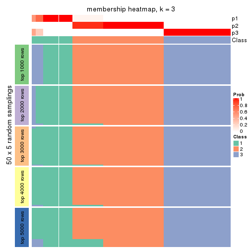</p>

</div>
<div id='tab-MAD-skmeans-membership-heatmap-3'>
<pre><code class="r">membership_heatmap(res, k = 4)
</code></pre>

<p></p>

</div>
<div id='tab-MAD-skmeans-membership-heatmap-4'>
<pre><code class="r">membership_heatmap(res, k = 5)
</code></pre>

<p></p>

</div>
<div id='tab-MAD-skmeans-membership-heatmap-5'>
<pre><code class="r">membership_heatmap(res, k = 6)
</code></pre>

<p></p>

</div>
</div>

As soon as we have had the classes for columns, we can look for signatures
which are significantly different between classes which can be candidate marks
for certain classes. Following are the heatmaps for signatures.


Signature heatmaps where rows are scaled:


<script>
$( function() {
	$( '#tabs-MAD-skmeans-get-signatures' ).tabs();
} );
</script>
<div id='tabs-MAD-skmeans-get-signatures'>
<ul>
<li><a href='#tab-MAD-skmeans-get-signatures-1'>k = 2</a></li>
<li><a href='#tab-MAD-skmeans-get-signatures-2'>k = 3</a></li>
<li><a href='#tab-MAD-skmeans-get-signatures-3'>k = 4</a></li>
<li><a href='#tab-MAD-skmeans-get-signatures-4'>k = 5</a></li>
<li><a href='#tab-MAD-skmeans-get-signatures-5'>k = 6</a></li>
</ul>
<div id='tab-MAD-skmeans-get-signatures-1'>
<pre><code class="r">get_signatures(res, k = 2)
</code></pre>

<p></p>

</div>
<div id='tab-MAD-skmeans-get-signatures-2'>
<pre><code class="r">get_signatures(res, k = 3)
</code></pre>

<p></p>

</div>
<div id='tab-MAD-skmeans-get-signatures-3'>
<pre><code class="r">get_signatures(res, k = 4)
</code></pre>

<p></p>

</div>
<div id='tab-MAD-skmeans-get-signatures-4'>
<pre><code class="r">get_signatures(res, k = 5)
</code></pre>

<p></p>

</div>
<div id='tab-MAD-skmeans-get-signatures-5'>
<pre><code class="r">get_signatures(res, k = 6)
</code></pre>

<p>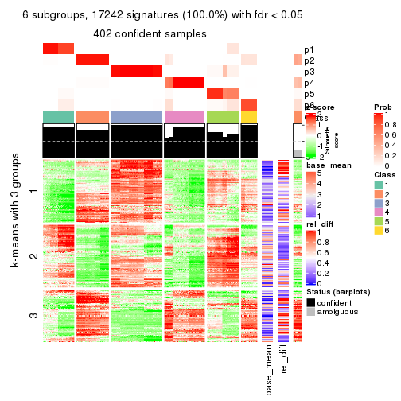</p>

</div>
</div>


Signature heatmaps where rows are not scaled:


<script>
$( function() {
	$( '#tabs-MAD-skmeans-get-signatures-no-scale' ).tabs();
} );
</script>
<div id='tabs-MAD-skmeans-get-signatures-no-scale'>
<ul>
<li><a href='#tab-MAD-skmeans-get-signatures-no-scale-1'>k = 2</a></li>
<li><a href='#tab-MAD-skmeans-get-signatures-no-scale-2'>k = 3</a></li>
<li><a href='#tab-MAD-skmeans-get-signatures-no-scale-3'>k = 4</a></li>
<li><a href='#tab-MAD-skmeans-get-signatures-no-scale-4'>k = 5</a></li>
<li><a href='#tab-MAD-skmeans-get-signatures-no-scale-5'>k = 6</a></li>
</ul>
<div id='tab-MAD-skmeans-get-signatures-no-scale-1'>
<pre><code class="r">get_signatures(res, k = 2, scale_rows = FALSE)
</code></pre>

<p></p>

</div>
<div id='tab-MAD-skmeans-get-signatures-no-scale-2'>
<pre><code class="r">get_signatures(res, k = 3, scale_rows = FALSE)
</code></pre>

<p></p>

</div>
<div id='tab-MAD-skmeans-get-signatures-no-scale-3'>
<pre><code class="r">get_signatures(res, k = 4, scale_rows = FALSE)
</code></pre>

<p></p>

</div>
<div id='tab-MAD-skmeans-get-signatures-no-scale-4'>
<pre><code class="r">get_signatures(res, k = 5, scale_rows = FALSE)
</code></pre>

<p>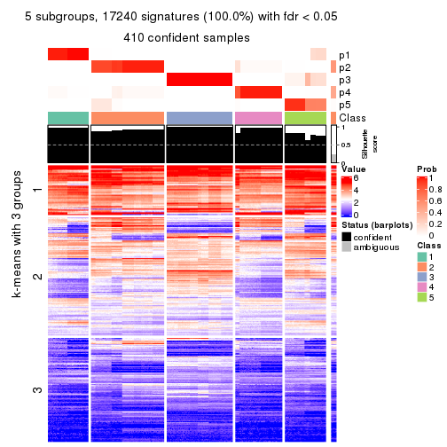</p>

</div>
<div id='tab-MAD-skmeans-get-signatures-no-scale-5'>
<pre><code class="r">get_signatures(res, k = 6, scale_rows = FALSE)
</code></pre>

<p></p>

</div>
</div>


Compare the overlap of signatures from different k:

```r
compare_signatures(res)
```


`get_signature()` returns a data frame invisibly. TO get the list of signatures, the function
call should be assigned to a variable explicitly. In following code, if `plot` argument is set
to `FALSE`, no heatmap is plotted while only the differential analysis is performed.

```r
# code only for demonstration
tb = get_signature(res, k = ..., plot = FALSE)
```

An example of the output of `tb` is:

```
#>   which_row         fdr    mean_1    mean_2 scaled_mean_1 scaled_mean_2 km
#> 1        38 0.042760348  8.373488  9.131774    -0.5533452     0.5164555  1
#> 2        40 0.018707592  7.106213  8.469186    -0.6173731     0.5762149  1
#> 3        55 0.019134737 10.221463 11.207825    -0.6159697     0.5749050  1
#> 4        59 0.006059896  5.921854  7.869574    -0.6899429     0.6439467  1
#> 5        60 0.018055526  8.928898 10.211722    -0.6204761     0.5791110  1
#> 6        98 0.009384629 15.714769 14.887706     0.6635654    -0.6193277  2
...
```

The columns in `tb` are:

1. `which_row`: row indices corresponding to the input matrix.
2. `fdr`: FDR for the differential test. 
3. `mean_x`: The mean value in group x.
4. `scaled_mean_x`: The mean value in group x after rows are scaled.
5. `km`: Row groups if k-means clustering is applied to rows.


UMAP plot which shows how samples are separated.


<script>
$( function() {
	$( '#tabs-MAD-skmeans-dimension-reduction' ).tabs();
} );
</script>
<div id='tabs-MAD-skmeans-dimension-reduction'>
<ul>
<li><a href='#tab-MAD-skmeans-dimension-reduction-1'>k = 2</a></li>
<li><a href='#tab-MAD-skmeans-dimension-reduction-2'>k = 3</a></li>
<li><a href='#tab-MAD-skmeans-dimension-reduction-3'>k = 4</a></li>
<li><a href='#tab-MAD-skmeans-dimension-reduction-4'>k = 5</a></li>
<li><a href='#tab-MAD-skmeans-dimension-reduction-5'>k = 6</a></li>
</ul>
<div id='tab-MAD-skmeans-dimension-reduction-1'>
<pre><code class="r">dimension_reduction(res, k = 2, method = &quot;UMAP&quot;)
</code></pre>

<p></p>

</div>
<div id='tab-MAD-skmeans-dimension-reduction-2'>
<pre><code class="r">dimension_reduction(res, k = 3, method = &quot;UMAP&quot;)
</code></pre>

<p></p>

</div>
<div id='tab-MAD-skmeans-dimension-reduction-3'>
<pre><code class="r">dimension_reduction(res, k = 4, method = &quot;UMAP&quot;)
</code></pre>

<p></p>

</div>
<div id='tab-MAD-skmeans-dimension-reduction-4'>
<pre><code class="r">dimension_reduction(res, k = 5, method = &quot;UMAP&quot;)
</code></pre>

<p></p>

</div>
<div id='tab-MAD-skmeans-dimension-reduction-5'>
<pre><code class="r">dimension_reduction(res, k = 6, method = &quot;UMAP&quot;)
</code></pre>

<p></p>

</div>
</div>


Following heatmap shows how subgroups are split when increasing `k`:

```r
collect_classes(res)
```


If matrix rows can be associated to genes, consider to use `GO_Enrichment(res,
...)` to perform function enrichment for the signature genes.


 

---------------------------------------------------


### MAD:pam*


The object with results only for a single top-value method and a single partition method 
can be extracted as:

```r
res = res_list["MAD", "pam"]
# you can also extract it by
# res = res_list["MAD:pam"]
```

A summary of `res` and all the functions that can be applied to it:

```r
res
```

```
#> A 'ConsensusPartition' object with k = 2, 3, 4, 5, 6.
#>   On a matrix with 17245 rows and 418 columns.
#>   Top rows (1000, 2000, 3000, 4000, 5000) are extracted by 'MAD' method.
#>   Subgroups are detected by 'pam' method.
#>   Performed in total 1250 partitions by row resampling.
#>   Best k for subgroups seems to be 6.
#> 
#> Following methods can be applied to this 'ConsensusPartition' object:
#>  [1] "cola_report"             "collect_classes"         "collect_plots"          
#>  [4] "collect_stats"           "colnames"                "compare_signatures"     
#>  [7] "consensus_heatmap"       "dimension_reduction"     "functional_enrichment"  
#> [10] "get_anno_col"            "get_anno"                "get_classes"            
#> [13] "get_consensus"           "get_matrix"              "get_membership"         
#> [16] "get_param"               "get_signatures"          "get_stats"              
#> [19] "is_best_k"               "is_stable_k"             "membership_heatmap"     
#> [22] "ncol"                    "nrow"                    "plot_ecdf"              
#> [25] "rownames"                "select_partition_number" "show"                   
#> [28] "suggest_best_k"          "test_to_known_factors"
```

`collect_plots()` function collects all the plots made from `res` for all `k` (number of partitions)
into one single page to provide an easy and fast comparison between different `k`.

```r
collect_plots(res)
```


The plots are:

- The first row: a plot of the ECDF (Empirical cumulative distribution
  function) curves of the consensus matrix for each `k` and the heatmap of
  predicted classes for each `k`.
- The second row: heatmaps of the consensus matrix for each `k`.
- The third row: heatmaps of the membership matrix for each `k`.
- The fouth row: heatmaps of the signatures for each `k`.

All the plots in panels can be made by individual functions and they are
plotted later in this section.

`select_partition_number()` produces several plots showing different
statistics for choosing "optimized" `k`. There are following statistics:

- ECDF curves of the consensus matrix for each `k`;
- 1-PAC. [The PAC
  score](https://en.wikipedia.org/wiki/Consensus_clustering#Over-interpretation_potential_of_consensus_clustering)
  measures the proportion of the ambiguous subgrouping.
- Mean silhouette score.
- Concordance. The mean probability of fiting the consensus class ids in all
  partitions.
- Area increased. Denote $A_k$ as the area under the ECDF curve for current
  `k`, the area increased is defined as $A_k - A_{k-1}$.
- Rand index. The percent of pairs of samples that are both in a same cluster
  or both are not in a same cluster in the partition of k and k-1.
- Jaccard index. The ratio of pairs of samples are both in a same cluster in
  the partition of k and k-1 and the pairs of samples are both in a same
  cluster in the partition k or k-1.

The detailed explanations of these statistics can be found in [the cola
vignette](http://bioconductor.org/packages/devel/bioc/vignettes/cola/inst/doc/cola.html#toc_13).

Generally speaking, lower PAC score, higher mean silhouette score or higher
concordance corresponds to better partition. Rand index and Jaccard index
measure how similar the current partition is compared to partition with `k-1`.
If they are too similar, we won't accept `k` is better than `k-1`.

```r
select_partition_number(res)
```


The numeric values for all these statistics can be obtained by `get_stats()`.

```r
get_stats(res)
```

```
#>   k 1-PAC mean_silhouette concordance area_increased  Rand Jaccard
#> 2 2 0.760           0.897       0.957         0.4835 0.518   0.518
#> 3 3 0.718           0.852       0.923         0.3676 0.704   0.485
#> 4 4 0.765           0.865       0.923         0.1204 0.853   0.603
#> 5 5 0.942           0.914       0.959         0.0752 0.876   0.578
#> 6 6 0.946           0.893       0.948         0.0286 0.975   0.879
```

`suggest_best_k()` suggests the best $k$ based on these statistics. The rules are as follows:

- All $k$ with Jaccard index larger than 0.95 are removed because the increase of
  the partition number does not provides enough extra information. If all $k$ are removed,
  the best $k$ is assigned by `NA`.
- For $k$ with 1-PAC larger than 0.9, the maximal $k$ is taken as the "best k". Other $k$ is called "optional k".
- If it does not fit the second rule. The $k$ with the highest vote of highest
  1-PAC, mean silhouette and concordance is taken as the "best k".

```r
suggest_best_k(res)
```

```
#> [1] 6
#> attr(,"optional")
#> [1] 5
```

There is also optional best $k$ = 5 that is worth to check.

Following shows the table of the partitions (You need to click the **show/hide
code output** link to see it). The membership matrix (columns with name `p*`)
is inferred by
[`clue::cl_consensus()`](https://www.rdocumentation.org/link/cl_consensus?package=clue)
function with the `SE` method. Basically the value in the membership matrix
represents the probability to belong to a certain group. The finall class
label for an item is determined with the group with highest probability it
belongs to.

In `get_classes()` function, the entropy is calculated from the membership
matrix and the silhouette score is calculated from the consensus matrix.


<script>
$( function() {
	$( '#tabs-MAD-pam-get-classes' ).tabs();
} );
</script>
<div id='tabs-MAD-pam-get-classes'>
<ul>
<li><a href='#tab-MAD-pam-get-classes-1'>k = 2</a></li>
<li><a href='#tab-MAD-pam-get-classes-2'>k = 3</a></li>
<li><a href='#tab-MAD-pam-get-classes-3'>k = 4</a></li>
<li><a href='#tab-MAD-pam-get-classes-4'>k = 5</a></li>
<li><a href='#tab-MAD-pam-get-classes-5'>k = 6</a></li>
</ul>

<div id='tab-MAD-pam-get-classes-1'>
<p><a id='tab-MAD-pam-get-classes-1-a' style='color:#0366d6' href='#'>show/hide code output</a></p>
<pre><code class="r">cbind(get_classes(res, k = 2), get_membership(res, k = 2))
</code></pre>

<pre><code>#&gt;           class entropy silhouette    p1    p2
#&gt; SRR902920     1   0.000   0.948075 1.000 0.000
#&gt; SRR902921     1   0.000   0.948075 1.000 0.000
#&gt; SRR902922     1   0.000   0.948075 1.000 0.000
#&gt; SRR902923     1   0.000   0.948075 1.000 0.000
#&gt; SRR902924     1   0.000   0.948075 1.000 0.000
#&gt; SRR902925     1   0.000   0.948075 1.000 0.000
#&gt; SRR902926     1   0.000   0.948075 1.000 0.000
#&gt; SRR902927     1   0.000   0.948075 1.000 0.000
#&gt; SRR902928     1   0.000   0.948075 1.000 0.000
#&gt; SRR902929     1   0.000   0.948075 1.000 0.000
#&gt; SRR902930     1   0.000   0.948075 1.000 0.000
#&gt; SRR902931     1   0.000   0.948075 1.000 0.000
#&gt; SRR902932     2   0.000   0.956506 0.000 1.000
#&gt; SRR902933     2   0.000   0.956506 0.000 1.000
#&gt; SRR902934     2   0.000   0.956506 0.000 1.000
#&gt; SRR902935     2   0.000   0.956506 0.000 1.000
#&gt; SRR902936     2   0.000   0.956506 0.000 1.000
#&gt; SRR902937     2   0.000   0.956506 0.000 1.000
#&gt; SRR902938     2   0.000   0.956506 0.000 1.000
#&gt; SRR902939     2   0.000   0.956506 0.000 1.000
#&gt; SRR902940     2   0.000   0.956506 0.000 1.000
#&gt; SRR902941     2   0.000   0.956506 0.000 1.000
#&gt; SRR902942     1   0.000   0.948075 1.000 0.000
#&gt; SRR902943     1   0.000   0.948075 1.000 0.000
#&gt; SRR902944     1   0.000   0.948075 1.000 0.000
#&gt; SRR902945     1   0.000   0.948075 1.000 0.000
#&gt; SRR902946     1   0.000   0.948075 1.000 0.000
#&gt; SRR902947     1   0.000   0.948075 1.000 0.000
#&gt; SRR902954     1   0.000   0.948075 1.000 0.000
#&gt; SRR902955     1   0.000   0.948075 1.000 0.000
#&gt; SRR902956     1   0.000   0.948075 1.000 0.000
#&gt; SRR902957     1   0.000   0.948075 1.000 0.000
#&gt; SRR902958     1   0.000   0.948075 1.000 0.000
#&gt; SRR902959     1   0.000   0.948075 1.000 0.000
#&gt; SRR902948     1   0.000   0.948075 1.000 0.000
#&gt; SRR902949     1   0.000   0.948075 1.000 0.000
#&gt; SRR902950     1   0.000   0.948075 1.000 0.000
#&gt; SRR902951     1   0.000   0.948075 1.000 0.000
#&gt; SRR902952     1   0.000   0.948075 1.000 0.000
#&gt; SRR902953     1   0.000   0.948075 1.000 0.000
#&gt; SRR902960     1   0.000   0.948075 1.000 0.000
#&gt; SRR902961     1   0.000   0.948075 1.000 0.000
#&gt; SRR902962     1   0.000   0.948075 1.000 0.000
#&gt; SRR902963     1   0.000   0.948075 1.000 0.000
#&gt; SRR902964     1   0.000   0.948075 1.000 0.000
#&gt; SRR902965     1   0.000   0.948075 1.000 0.000
#&gt; SRR902966     1   0.000   0.948075 1.000 0.000
#&gt; SRR902967     1   0.000   0.948075 1.000 0.000
#&gt; SRR902968     1   0.000   0.948075 1.000 0.000
#&gt; SRR902969     1   0.000   0.948075 1.000 0.000
#&gt; SRR902970     1   0.000   0.948075 1.000 0.000
#&gt; SRR902971     1   0.000   0.948075 1.000 0.000
#&gt; SRR902972     1   0.000   0.948075 1.000 0.000
#&gt; SRR902973     1   0.000   0.948075 1.000 0.000
#&gt; SRR902974     1   0.000   0.948075 1.000 0.000
#&gt; SRR902975     1   0.000   0.948075 1.000 0.000
#&gt; SRR902976     1   0.000   0.948075 1.000 0.000
#&gt; SRR902977     1   0.000   0.948075 1.000 0.000
#&gt; SRR902978     1   0.000   0.948075 1.000 0.000
#&gt; SRR902980     1   0.000   0.948075 1.000 0.000
#&gt; SRR902981     1   0.000   0.948075 1.000 0.000
#&gt; SRR902982     1   0.000   0.948075 1.000 0.000
#&gt; SRR902983     1   0.000   0.948075 1.000 0.000
#&gt; SRR902984     1   0.000   0.948075 1.000 0.000
#&gt; SRR902985     1   0.000   0.948075 1.000 0.000
#&gt; SRR902986     1   0.000   0.948075 1.000 0.000
#&gt; SRR902987     1   0.000   0.948075 1.000 0.000
#&gt; SRR902988     1   0.000   0.948075 1.000 0.000
#&gt; SRR902989     1   0.000   0.948075 1.000 0.000
#&gt; SRR902990     1   0.000   0.948075 1.000 0.000
#&gt; SRR902991     1   0.000   0.948075 1.000 0.000
#&gt; SRR902992     1   0.000   0.948075 1.000 0.000
#&gt; SRR902993     1   0.000   0.948075 1.000 0.000
#&gt; SRR902994     1   0.000   0.948075 1.000 0.000
#&gt; SRR902995     1   0.000   0.948075 1.000 0.000
#&gt; SRR902996     2   0.000   0.956506 0.000 1.000
#&gt; SRR902997     2   0.000   0.956506 0.000 1.000
#&gt; SRR902998     2   0.000   0.956506 0.000 1.000
#&gt; SRR902999     2   0.000   0.956506 0.000 1.000
#&gt; SRR903000     2   0.000   0.956506 0.000 1.000
#&gt; SRR903001     2   0.000   0.956506 0.000 1.000
#&gt; SRR903008     2   0.000   0.956506 0.000 1.000
#&gt; SRR903009     2   0.000   0.956506 0.000 1.000
#&gt; SRR903010     2   0.000   0.956506 0.000 1.000
#&gt; SRR903011     2   0.000   0.956506 0.000 1.000
#&gt; SRR903012     2   0.000   0.956506 0.000 1.000
#&gt; SRR903013     2   0.000   0.956506 0.000 1.000
#&gt; SRR903002     2   0.000   0.956506 0.000 1.000
#&gt; SRR903003     2   0.000   0.956506 0.000 1.000
#&gt; SRR903004     2   0.000   0.956506 0.000 1.000
#&gt; SRR903005     2   0.000   0.956506 0.000 1.000
#&gt; SRR903006     2   0.000   0.956506 0.000 1.000
#&gt; SRR903007     2   0.000   0.956506 0.000 1.000
#&gt; SRR903014     1   0.000   0.948075 1.000 0.000
#&gt; SRR903015     1   0.000   0.948075 1.000 0.000
#&gt; SRR903016     1   0.000   0.948075 1.000 0.000
#&gt; SRR903017     1   0.000   0.948075 1.000 0.000
#&gt; SRR903018     1   0.000   0.948075 1.000 0.000
#&gt; SRR903019     1   0.000   0.948075 1.000 0.000
#&gt; SRR903020     1   0.000   0.948075 1.000 0.000
#&gt; SRR903021     1   0.000   0.948075 1.000 0.000
#&gt; SRR903022     1   0.000   0.948075 1.000 0.000
#&gt; SRR903023     1   0.000   0.948075 1.000 0.000
#&gt; SRR903024     1   0.000   0.948075 1.000 0.000
#&gt; SRR903025     1   0.000   0.948075 1.000 0.000
#&gt; SRR903026     1   0.000   0.948075 1.000 0.000
#&gt; SRR903027     1   0.000   0.948075 1.000 0.000
#&gt; SRR903028     1   0.000   0.948075 1.000 0.000
#&gt; SRR903029     1   0.000   0.948075 1.000 0.000
#&gt; SRR903030     1   0.000   0.948075 1.000 0.000
#&gt; SRR903031     1   0.000   0.948075 1.000 0.000
#&gt; SRR903032     2   0.000   0.956506 0.000 1.000
#&gt; SRR903033     2   0.000   0.956506 0.000 1.000
#&gt; SRR903034     2   0.000   0.956506 0.000 1.000
#&gt; SRR903035     2   0.000   0.956506 0.000 1.000
#&gt; SRR903036     2   0.000   0.956506 0.000 1.000
#&gt; SRR903037     2   0.000   0.956506 0.000 1.000
#&gt; SRR903038     2   0.000   0.956506 0.000 1.000
#&gt; SRR903039     2   0.000   0.956506 0.000 1.000
#&gt; SRR903040     2   0.000   0.956506 0.000 1.000
#&gt; SRR903041     2   0.000   0.956506 0.000 1.000
#&gt; SRR903042     2   0.000   0.956506 0.000 1.000
#&gt; SRR903043     2   0.000   0.956506 0.000 1.000
#&gt; SRR903044     2   0.000   0.956506 0.000 1.000
#&gt; SRR903045     2   0.000   0.956506 0.000 1.000
#&gt; SRR903046     2   0.000   0.956506 0.000 1.000
#&gt; SRR903047     2   0.000   0.956506 0.000 1.000
#&gt; SRR903048     2   0.000   0.956506 0.000 1.000
#&gt; SRR903049     2   0.000   0.956506 0.000 1.000
#&gt; SRR903050     2   0.971   0.385118 0.400 0.600
#&gt; SRR903051     2   0.971   0.385118 0.400 0.600
#&gt; SRR903052     2   0.971   0.385118 0.400 0.600
#&gt; SRR903053     2   0.971   0.385118 0.400 0.600
#&gt; SRR903054     2   0.971   0.385118 0.400 0.600
#&gt; SRR903055     2   0.971   0.385118 0.400 0.600
#&gt; SRR903056     2   0.971   0.385118 0.400 0.600
#&gt; SRR903057     2   0.971   0.385118 0.400 0.600
#&gt; SRR903058     1   0.997   0.048200 0.532 0.468
#&gt; SRR903059     2   1.000   0.101527 0.492 0.508
#&gt; SRR903060     1   0.999  -0.000257 0.520 0.480
#&gt; SRR903061     1   0.995   0.079103 0.540 0.460
#&gt; SRR903062     1   0.999  -0.000257 0.520 0.480
#&gt; SRR903063     2   0.999   0.130644 0.484 0.516
#&gt; SRR903064     2   1.000   0.101527 0.492 0.508
#&gt; SRR903065     2   1.000   0.116242 0.488 0.512
#&gt; SRR903066     2   0.971   0.385118 0.400 0.600
#&gt; SRR903067     2   0.971   0.385118 0.400 0.600
#&gt; SRR903068     2   0.971   0.385118 0.400 0.600
#&gt; SRR903069     2   0.971   0.385118 0.400 0.600
#&gt; SRR903070     2   0.971   0.385118 0.400 0.600
#&gt; SRR903071     2   0.971   0.385118 0.400 0.600
#&gt; SRR903072     2   0.971   0.385118 0.400 0.600
#&gt; SRR903073     2   0.971   0.385118 0.400 0.600
#&gt; SRR903074     2   0.781   0.696098 0.232 0.768
#&gt; SRR903075     2   0.788   0.690569 0.236 0.764
#&gt; SRR903076     2   0.767   0.706764 0.224 0.776
#&gt; SRR903077     2   0.775   0.701488 0.228 0.772
#&gt; SRR903078     2   0.781   0.696098 0.232 0.768
#&gt; SRR903079     2   0.795   0.684908 0.240 0.760
#&gt; SRR903080     2   0.788   0.690569 0.236 0.764
#&gt; SRR903081     2   0.781   0.696098 0.232 0.768
#&gt; SRR903082     2   0.000   0.956506 0.000 1.000
#&gt; SRR903083     2   0.000   0.956506 0.000 1.000
#&gt; SRR903084     2   0.000   0.956506 0.000 1.000
#&gt; SRR903085     2   0.000   0.956506 0.000 1.000
#&gt; SRR903086     2   0.000   0.956506 0.000 1.000
#&gt; SRR903087     2   0.000   0.956506 0.000 1.000
#&gt; SRR903088     2   0.000   0.956506 0.000 1.000
#&gt; SRR903089     2   0.000   0.956506 0.000 1.000
#&gt; SRR903090     2   0.000   0.956506 0.000 1.000
#&gt; SRR903091     2   0.000   0.956506 0.000 1.000
#&gt; SRR903092     2   0.000   0.956506 0.000 1.000
#&gt; SRR903093     2   0.000   0.956506 0.000 1.000
#&gt; SRR903094     2   0.000   0.956506 0.000 1.000
#&gt; SRR903095     2   0.000   0.956506 0.000 1.000
#&gt; SRR903096     2   0.000   0.956506 0.000 1.000
#&gt; SRR903097     2   0.000   0.956506 0.000 1.000
#&gt; SRR903098     2   0.000   0.956506 0.000 1.000
#&gt; SRR903099     2   0.000   0.956506 0.000 1.000
#&gt; SRR903100     2   0.000   0.956506 0.000 1.000
#&gt; SRR903101     2   0.000   0.956506 0.000 1.000
#&gt; SRR903102     2   0.000   0.956506 0.000 1.000
#&gt; SRR903103     2   0.000   0.956506 0.000 1.000
#&gt; SRR903104     2   0.000   0.956506 0.000 1.000
#&gt; SRR903105     2   0.000   0.956506 0.000 1.000
#&gt; SRR903106     2   0.000   0.956506 0.000 1.000
#&gt; SRR903107     2   0.000   0.956506 0.000 1.000
#&gt; SRR903108     2   0.000   0.956506 0.000 1.000
#&gt; SRR903109     2   0.000   0.956506 0.000 1.000
#&gt; SRR903110     2   0.000   0.956506 0.000 1.000
#&gt; SRR903111     2   0.000   0.956506 0.000 1.000
#&gt; SRR903112     2   0.000   0.956506 0.000 1.000
#&gt; SRR903113     2   0.000   0.956506 0.000 1.000
#&gt; SRR903114     2   0.000   0.956506 0.000 1.000
#&gt; SRR903115     2   0.000   0.956506 0.000 1.000
#&gt; SRR903116     2   0.000   0.956506 0.000 1.000
#&gt; SRR903117     2   0.000   0.956506 0.000 1.000
#&gt; SRR903118     2   0.000   0.956506 0.000 1.000
#&gt; SRR903119     2   0.000   0.956506 0.000 1.000
#&gt; SRR903121     2   0.000   0.956506 0.000 1.000
#&gt; SRR903122     2   0.000   0.956506 0.000 1.000
#&gt; SRR903124     2   0.000   0.956506 0.000 1.000
#&gt; SRR903125     2   0.000   0.956506 0.000 1.000
#&gt; SRR903126     2   0.000   0.956506 0.000 1.000
#&gt; SRR903127     2   0.000   0.956506 0.000 1.000
#&gt; SRR903128     2   0.000   0.956506 0.000 1.000
#&gt; SRR903129     2   0.000   0.956506 0.000 1.000
#&gt; SRR903130     2   0.000   0.956506 0.000 1.000
#&gt; SRR903131     2   0.000   0.956506 0.000 1.000
#&gt; SRR903132     2   0.000   0.956506 0.000 1.000
#&gt; SRR903133     2   0.000   0.956506 0.000 1.000
#&gt; SRR903134     2   0.000   0.956506 0.000 1.000
#&gt; SRR903135     2   0.000   0.956506 0.000 1.000
#&gt; SRR903136     2   0.000   0.956506 0.000 1.000
#&gt; SRR903137     2   0.000   0.956506 0.000 1.000
#&gt; SRR903146     2   0.000   0.956506 0.000 1.000
#&gt; SRR903147     2   0.000   0.956506 0.000 1.000
#&gt; SRR903148     2   0.000   0.956506 0.000 1.000
#&gt; SRR903149     2   0.000   0.956506 0.000 1.000
#&gt; SRR903150     2   0.000   0.956506 0.000 1.000
#&gt; SRR903151     2   0.000   0.956506 0.000 1.000
#&gt; SRR903152     2   0.000   0.956506 0.000 1.000
#&gt; SRR903153     2   0.000   0.956506 0.000 1.000
#&gt; SRR903138     2   0.000   0.956506 0.000 1.000
#&gt; SRR903139     2   0.000   0.956506 0.000 1.000
#&gt; SRR903140     2   0.000   0.956506 0.000 1.000
#&gt; SRR903141     2   0.000   0.956506 0.000 1.000
#&gt; SRR903142     2   0.000   0.956506 0.000 1.000
#&gt; SRR903143     2   0.000   0.956506 0.000 1.000
#&gt; SRR903144     2   0.000   0.956506 0.000 1.000
#&gt; SRR903145     2   0.000   0.956506 0.000 1.000
#&gt; SRR903154     2   0.000   0.956506 0.000 1.000
#&gt; SRR903155     2   0.000   0.956506 0.000 1.000
#&gt; SRR903156     2   0.000   0.956506 0.000 1.000
#&gt; SRR903157     2   0.000   0.956506 0.000 1.000
#&gt; SRR903158     2   0.000   0.956506 0.000 1.000
#&gt; SRR903159     2   0.000   0.956506 0.000 1.000
#&gt; SRR903160     2   0.000   0.956506 0.000 1.000
#&gt; SRR903161     2   0.000   0.956506 0.000 1.000
#&gt; SRR903162     2   0.000   0.956506 0.000 1.000
#&gt; SRR903163     2   0.000   0.956506 0.000 1.000
#&gt; SRR903164     2   0.000   0.956506 0.000 1.000
#&gt; SRR903165     2   0.000   0.956506 0.000 1.000
#&gt; SRR903166     2   0.000   0.956506 0.000 1.000
#&gt; SRR903167     2   0.000   0.956506 0.000 1.000
#&gt; SRR903168     2   0.000   0.956506 0.000 1.000
#&gt; SRR903169     2   0.000   0.956506 0.000 1.000
#&gt; SRR903178     1   0.000   0.948075 1.000 0.000
#&gt; SRR903179     1   0.000   0.948075 1.000 0.000
#&gt; SRR903180     1   0.000   0.948075 1.000 0.000
#&gt; SRR903181     1   0.000   0.948075 1.000 0.000
#&gt; SRR903182     1   0.000   0.948075 1.000 0.000
#&gt; SRR903183     1   0.000   0.948075 1.000 0.000
#&gt; SRR903184     1   0.000   0.948075 1.000 0.000
#&gt; SRR903185     1   0.000   0.948075 1.000 0.000
#&gt; SRR903170     2   0.000   0.956506 0.000 1.000
#&gt; SRR903171     2   0.000   0.956506 0.000 1.000
#&gt; SRR903172     2   0.000   0.956506 0.000 1.000
#&gt; SRR903173     2   0.000   0.956506 0.000 1.000
#&gt; SRR903174     2   0.000   0.956506 0.000 1.000
#&gt; SRR903175     2   0.000   0.956506 0.000 1.000
#&gt; SRR903176     2   0.000   0.956506 0.000 1.000
#&gt; SRR903177     2   0.000   0.956506 0.000 1.000
#&gt; SRR903186     1   0.000   0.948075 1.000 0.000
#&gt; SRR903187     1   0.000   0.948075 1.000 0.000
#&gt; SRR903188     1   0.000   0.948075 1.000 0.000
#&gt; SRR903189     1   0.000   0.948075 1.000 0.000
#&gt; SRR903190     1   0.000   0.948075 1.000 0.000
#&gt; SRR903191     1   0.000   0.948075 1.000 0.000
#&gt; SRR903192     1   0.000   0.948075 1.000 0.000
#&gt; SRR903193     1   0.000   0.948075 1.000 0.000
#&gt; SRR903194     1   0.000   0.948075 1.000 0.000
#&gt; SRR903195     1   0.000   0.948075 1.000 0.000
#&gt; SRR903196     1   0.000   0.948075 1.000 0.000
#&gt; SRR903197     1   0.000   0.948075 1.000 0.000
#&gt; SRR903198     1   0.000   0.948075 1.000 0.000
#&gt; SRR903199     1   0.000   0.948075 1.000 0.000
#&gt; SRR903200     1   0.000   0.948075 1.000 0.000
#&gt; SRR903201     1   0.000   0.948075 1.000 0.000
#&gt; SRR903210     2   0.000   0.956506 0.000 1.000
#&gt; SRR903211     2   0.000   0.956506 0.000 1.000
#&gt; SRR903212     2   0.000   0.956506 0.000 1.000
#&gt; SRR903213     2   0.000   0.956506 0.000 1.000
#&gt; SRR903214     2   0.000   0.956506 0.000 1.000
#&gt; SRR903215     2   0.000   0.956506 0.000 1.000
#&gt; SRR903216     2   0.000   0.956506 0.000 1.000
#&gt; SRR903217     2   0.000   0.956506 0.000 1.000
#&gt; SRR903202     1   0.000   0.948075 1.000 0.000
#&gt; SRR903203     1   0.000   0.948075 1.000 0.000
#&gt; SRR903204     1   0.000   0.948075 1.000 0.000
#&gt; SRR903205     1   0.000   0.948075 1.000 0.000
#&gt; SRR903206     1   0.000   0.948075 1.000 0.000
#&gt; SRR903207     1   0.000   0.948075 1.000 0.000
#&gt; SRR903208     1   0.000   0.948075 1.000 0.000
#&gt; SRR903209     1   0.000   0.948075 1.000 0.000
#&gt; SRR903218     2   0.000   0.956506 0.000 1.000
#&gt; SRR903219     2   0.000   0.956506 0.000 1.000
#&gt; SRR903220     2   0.000   0.956506 0.000 1.000
#&gt; SRR903221     2   0.000   0.956506 0.000 1.000
#&gt; SRR903222     2   0.000   0.956506 0.000 1.000
#&gt; SRR903223     2   0.000   0.956506 0.000 1.000
#&gt; SRR903224     2   0.000   0.956506 0.000 1.000
#&gt; SRR903225     2   0.000   0.956506 0.000 1.000
#&gt; SRR903226     2   0.000   0.956506 0.000 1.000
#&gt; SRR903227     2   0.000   0.956506 0.000 1.000
#&gt; SRR903228     2   0.000   0.956506 0.000 1.000
#&gt; SRR903229     2   0.000   0.956506 0.000 1.000
#&gt; SRR903230     2   0.000   0.956506 0.000 1.000
#&gt; SRR903231     2   0.000   0.956506 0.000 1.000
#&gt; SRR903232     2   0.000   0.956506 0.000 1.000
#&gt; SRR903233     2   0.000   0.956506 0.000 1.000
#&gt; SRR903242     1   0.722   0.775029 0.800 0.200
#&gt; SRR903243     1   0.722   0.775029 0.800 0.200
#&gt; SRR903244     1   0.722   0.775029 0.800 0.200
#&gt; SRR903245     1   0.722   0.775029 0.800 0.200
#&gt; SRR903246     1   0.722   0.775029 0.800 0.200
#&gt; SRR903247     1   0.722   0.775029 0.800 0.200
#&gt; SRR903248     1   0.722   0.775029 0.800 0.200
#&gt; SRR903249     1   0.722   0.775029 0.800 0.200
#&gt; SRR903234     2   0.000   0.956506 0.000 1.000
#&gt; SRR903235     2   0.000   0.956506 0.000 1.000
#&gt; SRR903236     2   0.000   0.956506 0.000 1.000
#&gt; SRR903237     2   0.000   0.956506 0.000 1.000
#&gt; SRR903238     2   0.000   0.956506 0.000 1.000
#&gt; SRR903239     2   0.000   0.956506 0.000 1.000
#&gt; SRR903240     2   0.000   0.956506 0.000 1.000
#&gt; SRR903241     2   0.000   0.956506 0.000 1.000
#&gt; SRR903258     1   0.697   0.788857 0.812 0.188
#&gt; SRR903259     1   0.697   0.788857 0.812 0.188
#&gt; SRR903260     1   0.680   0.797210 0.820 0.180
#&gt; SRR903261     1   0.680   0.797210 0.820 0.180
#&gt; SRR903262     1   0.605   0.828323 0.852 0.148
#&gt; SRR903263     1   0.697   0.788857 0.812 0.188
#&gt; SRR903264     1   0.644   0.813097 0.836 0.164
#&gt; SRR903265     1   0.697   0.788857 0.812 0.188
#&gt; SRR903250     1   0.706   0.784446 0.808 0.192
#&gt; SRR903251     1   0.722   0.775029 0.800 0.200
#&gt; SRR903252     1   0.714   0.779808 0.804 0.196
#&gt; SRR903253     1   0.706   0.784446 0.808 0.192
#&gt; SRR903254     1   0.706   0.784446 0.808 0.192
#&gt; SRR903255     1   0.706   0.784446 0.808 0.192
#&gt; SRR903256     1   0.714   0.779808 0.804 0.196
#&gt; SRR903257     1   0.722   0.775029 0.800 0.200
#&gt; SRR903266     1   0.722   0.775029 0.800 0.200
#&gt; SRR903267     1   0.722   0.775029 0.800 0.200
#&gt; SRR903268     1   0.722   0.775029 0.800 0.200
#&gt; SRR903270     1   0.722   0.775029 0.800 0.200
#&gt; SRR903271     1   0.722   0.775029 0.800 0.200
#&gt; SRR903272     1   0.722   0.775029 0.800 0.200
#&gt; SRR903273     1   0.722   0.775029 0.800 0.200
#&gt; SRR903274     2   0.000   0.956506 0.000 1.000
#&gt; SRR903275     2   0.000   0.956506 0.000 1.000
#&gt; SRR903276     2   0.000   0.956506 0.000 1.000
#&gt; SRR903277     2   0.000   0.956506 0.000 1.000
#&gt; SRR903278     2   0.000   0.956506 0.000 1.000
#&gt; SRR903279     2   0.000   0.956506 0.000 1.000
#&gt; SRR903280     2   0.000   0.956506 0.000 1.000
#&gt; SRR903281     2   0.000   0.956506 0.000 1.000
#&gt; SRR903282     2   0.000   0.956506 0.000 1.000
#&gt; SRR903283     2   0.000   0.956506 0.000 1.000
#&gt; SRR903284     2   0.000   0.956506 0.000 1.000
#&gt; SRR903285     2   0.000   0.956506 0.000 1.000
#&gt; SRR903286     2   0.000   0.956506 0.000 1.000
#&gt; SRR903287     2   0.000   0.956506 0.000 1.000
#&gt; SRR903288     2   0.000   0.956506 0.000 1.000
#&gt; SRR903289     2   0.000   0.956506 0.000 1.000
#&gt; SRR903290     2   0.000   0.956506 0.000 1.000
#&gt; SRR903291     2   0.000   0.956506 0.000 1.000
#&gt; SRR903292     2   0.000   0.956506 0.000 1.000
#&gt; SRR903293     2   0.000   0.956506 0.000 1.000
#&gt; SRR903294     2   0.000   0.956506 0.000 1.000
#&gt; SRR903295     2   0.000   0.956506 0.000 1.000
#&gt; SRR903296     2   0.000   0.956506 0.000 1.000
#&gt; SRR903297     2   0.000   0.956506 0.000 1.000
#&gt; SRR903298     2   0.000   0.956506 0.000 1.000
#&gt; SRR903299     2   0.000   0.956506 0.000 1.000
#&gt; SRR903300     2   0.000   0.956506 0.000 1.000
#&gt; SRR903301     2   0.000   0.956506 0.000 1.000
#&gt; SRR903302     2   0.000   0.956506 0.000 1.000
#&gt; SRR903303     2   0.000   0.956506 0.000 1.000
#&gt; SRR903304     2   0.000   0.956506 0.000 1.000
#&gt; SRR903305     2   0.000   0.956506 0.000 1.000
#&gt; SRR903306     1   0.000   0.948075 1.000 0.000
#&gt; SRR903307     1   0.000   0.948075 1.000 0.000
#&gt; SRR903308     1   0.000   0.948075 1.000 0.000
#&gt; SRR903309     1   0.000   0.948075 1.000 0.000
#&gt; SRR903310     1   0.000   0.948075 1.000 0.000
#&gt; SRR903311     1   0.000   0.948075 1.000 0.000
#&gt; SRR903312     1   0.000   0.948075 1.000 0.000
#&gt; SRR903313     1   0.000   0.948075 1.000 0.000
#&gt; SRR903314     1   0.000   0.948075 1.000 0.000
#&gt; SRR903315     1   0.000   0.948075 1.000 0.000
#&gt; SRR903316     1   0.000   0.948075 1.000 0.000
#&gt; SRR903317     1   0.000   0.948075 1.000 0.000
#&gt; SRR903318     1   0.000   0.948075 1.000 0.000
#&gt; SRR903319     1   0.000   0.948075 1.000 0.000
#&gt; SRR903320     1   0.000   0.948075 1.000 0.000
#&gt; SRR903321     1   0.000   0.948075 1.000 0.000
#&gt; SRR903322     1   0.000   0.948075 1.000 0.000
#&gt; SRR903323     1   0.000   0.948075 1.000 0.000
#&gt; SRR903324     2   0.000   0.956506 0.000 1.000
#&gt; SRR903325     2   0.000   0.956506 0.000 1.000
#&gt; SRR903326     2   0.000   0.956506 0.000 1.000
#&gt; SRR903327     2   0.000   0.956506 0.000 1.000
#&gt; SRR903328     2   0.000   0.956506 0.000 1.000
#&gt; SRR903329     2   0.000   0.956506 0.000 1.000
#&gt; SRR903330     2   0.000   0.956506 0.000 1.000
#&gt; SRR903331     2   0.000   0.956506 0.000 1.000
#&gt; SRR903332     2   0.000   0.956506 0.000 1.000
#&gt; SRR903333     2   0.000   0.956506 0.000 1.000
#&gt; SRR903334     2   0.000   0.956506 0.000 1.000
#&gt; SRR903335     2   0.000   0.956506 0.000 1.000
#&gt; SRR903336     2   0.000   0.956506 0.000 1.000
#&gt; SRR903337     2   0.000   0.956506 0.000 1.000
#&gt; SRR903338     2   0.000   0.956506 0.000 1.000
#&gt; SRR903339     2   0.000   0.956506 0.000 1.000
#&gt; SRR903340     2   0.000   0.956506 0.000 1.000
#&gt; SRR903341     2   0.000   0.956506 0.000 1.000
</code></pre>

<script>
$('#tab-MAD-pam-get-classes-1-a').parent().next().next().hide();
$('#tab-MAD-pam-get-classes-1-a').click(function(){
  $('#tab-MAD-pam-get-classes-1-a').parent().next().next().toggle();
  return(false);
});
</script>
</div>

<div id='tab-MAD-pam-get-classes-2'>
<p><a id='tab-MAD-pam-get-classes-2-a' style='color:#0366d6' href='#'>show/hide code output</a></p>
<pre><code class="r">cbind(get_classes(res, k = 3), get_membership(res, k = 3))
</code></pre>

<pre><code>#&gt;           class entropy silhouette    p1    p2    p3
#&gt; SRR902920     3  0.0000     0.9621 0.000 0.000 1.000
#&gt; SRR902921     3  0.0000     0.9621 0.000 0.000 1.000
#&gt; SRR902922     3  0.0000     0.9621 0.000 0.000 1.000
#&gt; SRR902923     3  0.0000     0.9621 0.000 0.000 1.000
#&gt; SRR902924     3  0.0000     0.9621 0.000 0.000 1.000
#&gt; SRR902925     3  0.0000     0.9621 0.000 0.000 1.000
#&gt; SRR902926     3  0.0000     0.9621 0.000 0.000 1.000
#&gt; SRR902927     3  0.0000     0.9621 0.000 0.000 1.000
#&gt; SRR902928     3  0.0000     0.9621 0.000 0.000 1.000
#&gt; SRR902929     3  0.0000     0.9621 0.000 0.000 1.000
#&gt; SRR902930     3  0.0000     0.9621 0.000 0.000 1.000
#&gt; SRR902931     3  0.0000     0.9621 0.000 0.000 1.000
#&gt; SRR902932     2  0.0000     0.9317 0.000 1.000 0.000
#&gt; SRR902933     2  0.0000     0.9317 0.000 1.000 0.000
#&gt; SRR902934     2  0.0000     0.9317 0.000 1.000 0.000
#&gt; SRR902935     2  0.0000     0.9317 0.000 1.000 0.000
#&gt; SRR902936     2  0.0000     0.9317 0.000 1.000 0.000
#&gt; SRR902937     2  0.0000     0.9317 0.000 1.000 0.000
#&gt; SRR902938     2  0.0000     0.9317 0.000 1.000 0.000
#&gt; SRR902939     2  0.0000     0.9317 0.000 1.000 0.000
#&gt; SRR902940     2  0.0000     0.9317 0.000 1.000 0.000
#&gt; SRR902941     2  0.0000     0.9317 0.000 1.000 0.000
#&gt; SRR902942     3  0.0000     0.9621 0.000 0.000 1.000
#&gt; SRR902943     3  0.0000     0.9621 0.000 0.000 1.000
#&gt; SRR902944     3  0.0000     0.9621 0.000 0.000 1.000
#&gt; SRR902945     3  0.0000     0.9621 0.000 0.000 1.000
#&gt; SRR902946     3  0.0000     0.9621 0.000 0.000 1.000
#&gt; SRR902947     3  0.0000     0.9621 0.000 0.000 1.000
#&gt; SRR902954     3  0.0000     0.9621 0.000 0.000 1.000
#&gt; SRR902955     3  0.0000     0.9621 0.000 0.000 1.000
#&gt; SRR902956     3  0.0000     0.9621 0.000 0.000 1.000
#&gt; SRR902957     3  0.0000     0.9621 0.000 0.000 1.000
#&gt; SRR902958     3  0.0000     0.9621 0.000 0.000 1.000
#&gt; SRR902959     3  0.0000     0.9621 0.000 0.000 1.000
#&gt; SRR902948     3  0.0000     0.9621 0.000 0.000 1.000
#&gt; SRR902949     3  0.0000     0.9621 0.000 0.000 1.000
#&gt; SRR902950     3  0.0000     0.9621 0.000 0.000 1.000
#&gt; SRR902951     3  0.0000     0.9621 0.000 0.000 1.000
#&gt; SRR902952     3  0.0000     0.9621 0.000 0.000 1.000
#&gt; SRR902953     3  0.0000     0.9621 0.000 0.000 1.000
#&gt; SRR902960     3  0.0000     0.9621 0.000 0.000 1.000
#&gt; SRR902961     3  0.0000     0.9621 0.000 0.000 1.000
#&gt; SRR902962     3  0.0000     0.9621 0.000 0.000 1.000
#&gt; SRR902963     3  0.0000     0.9621 0.000 0.000 1.000
#&gt; SRR902964     3  0.0000     0.9621 0.000 0.000 1.000
#&gt; SRR902965     3  0.0000     0.9621 0.000 0.000 1.000
#&gt; SRR902966     3  0.0000     0.9621 0.000 0.000 1.000
#&gt; SRR902967     3  0.0000     0.9621 0.000 0.000 1.000
#&gt; SRR902968     3  0.0000     0.9621 0.000 0.000 1.000
#&gt; SRR902969     3  0.0000     0.9621 0.000 0.000 1.000
#&gt; SRR902970     3  0.0000     0.9621 0.000 0.000 1.000
#&gt; SRR902971     3  0.0000     0.9621 0.000 0.000 1.000
#&gt; SRR902972     3  0.0000     0.9621 0.000 0.000 1.000
#&gt; SRR902973     3  0.0000     0.9621 0.000 0.000 1.000
#&gt; SRR902974     3  0.0000     0.9621 0.000 0.000 1.000
#&gt; SRR902975     3  0.0000     0.9621 0.000 0.000 1.000
#&gt; SRR902976     3  0.0000     0.9621 0.000 0.000 1.000
#&gt; SRR902977     3  0.0000     0.9621 0.000 0.000 1.000
#&gt; SRR902978     3  0.0000     0.9621 0.000 0.000 1.000
#&gt; SRR902980     3  0.0000     0.9621 0.000 0.000 1.000
#&gt; SRR902981     3  0.0000     0.9621 0.000 0.000 1.000
#&gt; SRR902982     3  0.0000     0.9621 0.000 0.000 1.000
#&gt; SRR902983     3  0.0000     0.9621 0.000 0.000 1.000
#&gt; SRR902984     3  0.0000     0.9621 0.000 0.000 1.000
#&gt; SRR902985     3  0.0000     0.9621 0.000 0.000 1.000
#&gt; SRR902986     3  0.0000     0.9621 0.000 0.000 1.000
#&gt; SRR902987     3  0.0000     0.9621 0.000 0.000 1.000
#&gt; SRR902988     3  0.0000     0.9621 0.000 0.000 1.000
#&gt; SRR902989     3  0.0000     0.9621 0.000 0.000 1.000
#&gt; SRR902990     3  0.0000     0.9621 0.000 0.000 1.000
#&gt; SRR902991     3  0.0000     0.9621 0.000 0.000 1.000
#&gt; SRR902992     3  0.0000     0.9621 0.000 0.000 1.000
#&gt; SRR902993     3  0.0000     0.9621 0.000 0.000 1.000
#&gt; SRR902994     3  0.0000     0.9621 0.000 0.000 1.000
#&gt; SRR902995     3  0.0000     0.9621 0.000 0.000 1.000
#&gt; SRR902996     2  0.0000     0.9317 0.000 1.000 0.000
#&gt; SRR902997     2  0.0000     0.9317 0.000 1.000 0.000
#&gt; SRR902998     2  0.0000     0.9317 0.000 1.000 0.000
#&gt; SRR902999     2  0.0000     0.9317 0.000 1.000 0.000
#&gt; SRR903000     2  0.0000     0.9317 0.000 1.000 0.000
#&gt; SRR903001     2  0.0000     0.9317 0.000 1.000 0.000
#&gt; SRR903008     2  0.0000     0.9317 0.000 1.000 0.000
#&gt; SRR903009     2  0.0000     0.9317 0.000 1.000 0.000
#&gt; SRR903010     2  0.0000     0.9317 0.000 1.000 0.000
#&gt; SRR903011     2  0.0000     0.9317 0.000 1.000 0.000
#&gt; SRR903012     2  0.0000     0.9317 0.000 1.000 0.000
#&gt; SRR903013     2  0.0000     0.9317 0.000 1.000 0.000
#&gt; SRR903002     2  0.0000     0.9317 0.000 1.000 0.000
#&gt; SRR903003     2  0.0000     0.9317 0.000 1.000 0.000
#&gt; SRR903004     2  0.0000     0.9317 0.000 1.000 0.000
#&gt; SRR903005     2  0.0000     0.9317 0.000 1.000 0.000
#&gt; SRR903006     2  0.0000     0.9317 0.000 1.000 0.000
#&gt; SRR903007     2  0.0000     0.9317 0.000 1.000 0.000
#&gt; SRR903014     3  0.0000     0.9621 0.000 0.000 1.000
#&gt; SRR903015     3  0.0000     0.9621 0.000 0.000 1.000
#&gt; SRR903016     3  0.0000     0.9621 0.000 0.000 1.000
#&gt; SRR903017     3  0.0000     0.9621 0.000 0.000 1.000
#&gt; SRR903018     3  0.0000     0.9621 0.000 0.000 1.000
#&gt; SRR903019     3  0.0000     0.9621 0.000 0.000 1.000
#&gt; SRR903020     3  0.0000     0.9621 0.000 0.000 1.000
#&gt; SRR903021     3  0.0000     0.9621 0.000 0.000 1.000
#&gt; SRR903022     3  0.0000     0.9621 0.000 0.000 1.000
#&gt; SRR903023     3  0.0000     0.9621 0.000 0.000 1.000
#&gt; SRR903024     3  0.0000     0.9621 0.000 0.000 1.000
#&gt; SRR903025     3  0.0000     0.9621 0.000 0.000 1.000
#&gt; SRR903026     3  0.0000     0.9621 0.000 0.000 1.000
#&gt; SRR903027     3  0.0000     0.9621 0.000 0.000 1.000
#&gt; SRR903028     3  0.0000     0.9621 0.000 0.000 1.000
#&gt; SRR903029     3  0.0000     0.9621 0.000 0.000 1.000
#&gt; SRR903030     3  0.0000     0.9621 0.000 0.000 1.000
#&gt; SRR903031     3  0.0000     0.9621 0.000 0.000 1.000
#&gt; SRR903032     2  0.0000     0.9317 0.000 1.000 0.000
#&gt; SRR903033     2  0.0000     0.9317 0.000 1.000 0.000
#&gt; SRR903034     2  0.0000     0.9317 0.000 1.000 0.000
#&gt; SRR903035     2  0.0000     0.9317 0.000 1.000 0.000
#&gt; SRR903036     2  0.0000     0.9317 0.000 1.000 0.000
#&gt; SRR903037     2  0.0000     0.9317 0.000 1.000 0.000
#&gt; SRR903038     2  0.0000     0.9317 0.000 1.000 0.000
#&gt; SRR903039     2  0.0000     0.9317 0.000 1.000 0.000
#&gt; SRR903040     2  0.0000     0.9317 0.000 1.000 0.000
#&gt; SRR903041     2  0.0000     0.9317 0.000 1.000 0.000
#&gt; SRR903042     2  0.0000     0.9317 0.000 1.000 0.000
#&gt; SRR903043     2  0.0000     0.9317 0.000 1.000 0.000
#&gt; SRR903044     2  0.0000     0.9317 0.000 1.000 0.000
#&gt; SRR903045     2  0.0000     0.9317 0.000 1.000 0.000
#&gt; SRR903046     2  0.0000     0.9317 0.000 1.000 0.000
#&gt; SRR903047     2  0.0000     0.9317 0.000 1.000 0.000
#&gt; SRR903048     2  0.0000     0.9317 0.000 1.000 0.000
#&gt; SRR903049     2  0.0000     0.9317 0.000 1.000 0.000
#&gt; SRR903050     1  0.4555     0.7733 0.800 0.000 0.200
#&gt; SRR903051     1  0.4555     0.7733 0.800 0.000 0.200
#&gt; SRR903052     1  0.4555     0.7733 0.800 0.000 0.200
#&gt; SRR903053     1  0.4555     0.7733 0.800 0.000 0.200
#&gt; SRR903054     1  0.4555     0.7733 0.800 0.000 0.200
#&gt; SRR903055     1  0.4555     0.7733 0.800 0.000 0.200
#&gt; SRR903056     1  0.4555     0.7733 0.800 0.000 0.200
#&gt; SRR903057     1  0.4555     0.7733 0.800 0.000 0.200
#&gt; SRR903058     1  0.4555     0.7733 0.800 0.000 0.200
#&gt; SRR903059     1  0.4555     0.7733 0.800 0.000 0.200
#&gt; SRR903060     1  0.4555     0.7733 0.800 0.000 0.200
#&gt; SRR903061     1  0.4555     0.7733 0.800 0.000 0.200
#&gt; SRR903062     1  0.4555     0.7733 0.800 0.000 0.200
#&gt; SRR903063     1  0.4555     0.7733 0.800 0.000 0.200
#&gt; SRR903064     1  0.4555     0.7733 0.800 0.000 0.200
#&gt; SRR903065     1  0.4555     0.7733 0.800 0.000 0.200
#&gt; SRR903066     1  0.4555     0.7733 0.800 0.000 0.200
#&gt; SRR903067     1  0.4555     0.7733 0.800 0.000 0.200
#&gt; SRR903068     1  0.4555     0.7733 0.800 0.000 0.200
#&gt; SRR903069     1  0.4555     0.7733 0.800 0.000 0.200
#&gt; SRR903070     1  0.4555     0.7733 0.800 0.000 0.200
#&gt; SRR903071     1  0.4555     0.7733 0.800 0.000 0.200
#&gt; SRR903072     1  0.4555     0.7733 0.800 0.000 0.200
#&gt; SRR903073     1  0.4555     0.7733 0.800 0.000 0.200
#&gt; SRR903074     1  0.4555     0.7733 0.800 0.000 0.200
#&gt; SRR903075     1  0.4555     0.7733 0.800 0.000 0.200
#&gt; SRR903076     1  0.4555     0.7733 0.800 0.000 0.200
#&gt; SRR903077     1  0.4555     0.7733 0.800 0.000 0.200
#&gt; SRR903078     1  0.4555     0.7733 0.800 0.000 0.200
#&gt; SRR903079     1  0.4555     0.7733 0.800 0.000 0.200
#&gt; SRR903080     1  0.4555     0.7733 0.800 0.000 0.200
#&gt; SRR903081     1  0.4555     0.7733 0.800 0.000 0.200
#&gt; SRR903082     1  0.6225     0.1076 0.568 0.432 0.000
#&gt; SRR903083     1  0.6225     0.1076 0.568 0.432 0.000
#&gt; SRR903084     1  0.6225     0.1076 0.568 0.432 0.000
#&gt; SRR903085     1  0.6180     0.1645 0.584 0.416 0.000
#&gt; SRR903086     1  0.6235     0.0924 0.564 0.436 0.000
#&gt; SRR903087     1  0.6260     0.0450 0.552 0.448 0.000
#&gt; SRR903088     1  0.6260     0.0450 0.552 0.448 0.000
#&gt; SRR903089     1  0.6111     0.2301 0.604 0.396 0.000
#&gt; SRR903090     2  0.4750     0.8145 0.216 0.784 0.000
#&gt; SRR903091     2  0.4750     0.8145 0.216 0.784 0.000
#&gt; SRR903092     2  0.4796     0.8096 0.220 0.780 0.000
#&gt; SRR903093     2  0.4750     0.8145 0.216 0.784 0.000
#&gt; SRR903094     2  0.4796     0.8096 0.220 0.780 0.000
#&gt; SRR903095     2  0.4750     0.8145 0.216 0.784 0.000
#&gt; SRR903096     2  0.4750     0.8145 0.216 0.784 0.000
#&gt; SRR903097     2  0.4750     0.8145 0.216 0.784 0.000
#&gt; SRR903098     1  0.5621     0.4627 0.692 0.308 0.000
#&gt; SRR903099     1  0.5621     0.4627 0.692 0.308 0.000
#&gt; SRR903100     1  0.5760     0.4170 0.672 0.328 0.000
#&gt; SRR903101     1  0.5621     0.4627 0.692 0.308 0.000
#&gt; SRR903102     1  0.5785     0.4074 0.668 0.332 0.000
#&gt; SRR903103     1  0.5465     0.5039 0.712 0.288 0.000
#&gt; SRR903104     1  0.5621     0.4627 0.692 0.308 0.000
#&gt; SRR903105     1  0.5397     0.5195 0.720 0.280 0.000
#&gt; SRR903106     1  0.4750     0.6285 0.784 0.216 0.000
#&gt; SRR903107     1  0.4842     0.6165 0.776 0.224 0.000
#&gt; SRR903108     1  0.4750     0.6285 0.784 0.216 0.000
#&gt; SRR903109     1  0.4887     0.6103 0.772 0.228 0.000
#&gt; SRR903110     1  0.4887     0.6103 0.772 0.228 0.000
#&gt; SRR903111     1  0.4654     0.6399 0.792 0.208 0.000
#&gt; SRR903112     1  0.4702     0.6343 0.788 0.212 0.000
#&gt; SRR903113     1  0.4796     0.6226 0.780 0.220 0.000
#&gt; SRR903114     1  0.0000     0.8547 1.000 0.000 0.000
#&gt; SRR903115     1  0.0000     0.8547 1.000 0.000 0.000
#&gt; SRR903116     1  0.0000     0.8547 1.000 0.000 0.000
#&gt; SRR903117     1  0.0000     0.8547 1.000 0.000 0.000
#&gt; SRR903118     1  0.0000     0.8547 1.000 0.000 0.000
#&gt; SRR903119     1  0.0000     0.8547 1.000 0.000 0.000
#&gt; SRR903121     1  0.0000     0.8547 1.000 0.000 0.000
#&gt; SRR903122     1  0.0000     0.8547 1.000 0.000 0.000
#&gt; SRR903124     1  0.0000     0.8547 1.000 0.000 0.000
#&gt; SRR903125     1  0.0000     0.8547 1.000 0.000 0.000
#&gt; SRR903126     1  0.0000     0.8547 1.000 0.000 0.000
#&gt; SRR903127     1  0.0000     0.8547 1.000 0.000 0.000
#&gt; SRR903128     1  0.0000     0.8547 1.000 0.000 0.000
#&gt; SRR903129     1  0.0000     0.8547 1.000 0.000 0.000
#&gt; SRR903130     1  0.0000     0.8547 1.000 0.000 0.000
#&gt; SRR903131     1  0.0000     0.8547 1.000 0.000 0.000
#&gt; SRR903132     1  0.0000     0.8547 1.000 0.000 0.000
#&gt; SRR903133     1  0.0000     0.8547 1.000 0.000 0.000
#&gt; SRR903134     1  0.0000     0.8547 1.000 0.000 0.000
#&gt; SRR903135     1  0.0000     0.8547 1.000 0.000 0.000
#&gt; SRR903136     1  0.0000     0.8547 1.000 0.000 0.000
#&gt; SRR903137     1  0.0000     0.8547 1.000 0.000 0.000
#&gt; SRR903146     1  0.0000     0.8547 1.000 0.000 0.000
#&gt; SRR903147     1  0.0000     0.8547 1.000 0.000 0.000
#&gt; SRR903148     1  0.0000     0.8547 1.000 0.000 0.000
#&gt; SRR903149     1  0.0000     0.8547 1.000 0.000 0.000
#&gt; SRR903150     1  0.0000     0.8547 1.000 0.000 0.000
#&gt; SRR903151     1  0.0000     0.8547 1.000 0.000 0.000
#&gt; SRR903152     1  0.0000     0.8547 1.000 0.000 0.000
#&gt; SRR903153     1  0.0000     0.8547 1.000 0.000 0.000
#&gt; SRR903138     1  0.0000     0.8547 1.000 0.000 0.000
#&gt; SRR903139     1  0.0000     0.8547 1.000 0.000 0.000
#&gt; SRR903140     1  0.0000     0.8547 1.000 0.000 0.000
#&gt; SRR903141     1  0.0000     0.8547 1.000 0.000 0.000
#&gt; SRR903142     1  0.0000     0.8547 1.000 0.000 0.000
#&gt; SRR903143     1  0.0000     0.8547 1.000 0.000 0.000
#&gt; SRR903144     1  0.0000     0.8547 1.000 0.000 0.000
#&gt; SRR903145     1  0.0000     0.8547 1.000 0.000 0.000
#&gt; SRR903154     1  0.0000     0.8547 1.000 0.000 0.000
#&gt; SRR903155     1  0.0000     0.8547 1.000 0.000 0.000
#&gt; SRR903156     1  0.0000     0.8547 1.000 0.000 0.000
#&gt; SRR903157     1  0.0000     0.8547 1.000 0.000 0.000
#&gt; SRR903158     1  0.0000     0.8547 1.000 0.000 0.000
#&gt; SRR903159     1  0.0000     0.8547 1.000 0.000 0.000
#&gt; SRR903160     1  0.0000     0.8547 1.000 0.000 0.000
#&gt; SRR903161     1  0.0000     0.8547 1.000 0.000 0.000
#&gt; SRR903162     1  0.0000     0.8547 1.000 0.000 0.000
#&gt; SRR903163     1  0.0000     0.8547 1.000 0.000 0.000
#&gt; SRR903164     1  0.0000     0.8547 1.000 0.000 0.000
#&gt; SRR903165     1  0.0000     0.8547 1.000 0.000 0.000
#&gt; SRR903166     1  0.0000     0.8547 1.000 0.000 0.000
#&gt; SRR903167     1  0.0000     0.8547 1.000 0.000 0.000
#&gt; SRR903168     1  0.0000     0.8547 1.000 0.000 0.000
#&gt; SRR903169     1  0.0000     0.8547 1.000 0.000 0.000
#&gt; SRR903178     3  0.0000     0.9621 0.000 0.000 1.000
#&gt; SRR903179     3  0.0000     0.9621 0.000 0.000 1.000
#&gt; SRR903180     3  0.0000     0.9621 0.000 0.000 1.000
#&gt; SRR903181     3  0.0000     0.9621 0.000 0.000 1.000
#&gt; SRR903182     3  0.0000     0.9621 0.000 0.000 1.000
#&gt; SRR903183     3  0.0000     0.9621 0.000 0.000 1.000
#&gt; SRR903184     3  0.0000     0.9621 0.000 0.000 1.000
#&gt; SRR903185     3  0.0000     0.9621 0.000 0.000 1.000
#&gt; SRR903170     1  0.0000     0.8547 1.000 0.000 0.000
#&gt; SRR903171     1  0.0000     0.8547 1.000 0.000 0.000
#&gt; SRR903172     1  0.0000     0.8547 1.000 0.000 0.000
#&gt; SRR903173     1  0.0000     0.8547 1.000 0.000 0.000
#&gt; SRR903174     1  0.0000     0.8547 1.000 0.000 0.000
#&gt; SRR903175     1  0.0000     0.8547 1.000 0.000 0.000
#&gt; SRR903176     1  0.0000     0.8547 1.000 0.000 0.000
#&gt; SRR903177     1  0.0000     0.8547 1.000 0.000 0.000
#&gt; SRR903186     1  0.4555     0.7733 0.800 0.000 0.200
#&gt; SRR903187     1  0.4555     0.7733 0.800 0.000 0.200
#&gt; SRR903188     1  0.4555     0.7733 0.800 0.000 0.200
#&gt; SRR903189     1  0.4555     0.7733 0.800 0.000 0.200
#&gt; SRR903190     1  0.4555     0.7733 0.800 0.000 0.200
#&gt; SRR903191     1  0.4555     0.7733 0.800 0.000 0.200
#&gt; SRR903192     1  0.4555     0.7733 0.800 0.000 0.200
#&gt; SRR903193     1  0.4555     0.7733 0.800 0.000 0.200
#&gt; SRR903194     1  0.4555     0.7733 0.800 0.000 0.200
#&gt; SRR903195     1  0.4555     0.7733 0.800 0.000 0.200
#&gt; SRR903196     1  0.4555     0.7733 0.800 0.000 0.200
#&gt; SRR903197     1  0.4555     0.7733 0.800 0.000 0.200
#&gt; SRR903198     1  0.4555     0.7733 0.800 0.000 0.200
#&gt; SRR903199     1  0.4555     0.7733 0.800 0.000 0.200
#&gt; SRR903200     1  0.4555     0.7733 0.800 0.000 0.200
#&gt; SRR903201     1  0.4555     0.7733 0.800 0.000 0.200
#&gt; SRR903210     2  0.0000     0.9317 0.000 1.000 0.000
#&gt; SRR903211     2  0.0237     0.9304 0.004 0.996 0.000
#&gt; SRR903212     2  0.0000     0.9317 0.000 1.000 0.000
#&gt; SRR903213     2  0.0000     0.9317 0.000 1.000 0.000
#&gt; SRR903214     2  0.0000     0.9317 0.000 1.000 0.000
#&gt; SRR903215     2  0.0000     0.9317 0.000 1.000 0.000
#&gt; SRR903216     2  0.0237     0.9304 0.004 0.996 0.000
#&gt; SRR903217     2  0.0237     0.9304 0.004 0.996 0.000
#&gt; SRR903202     1  0.4555     0.7733 0.800 0.000 0.200
#&gt; SRR903203     1  0.4555     0.7733 0.800 0.000 0.200
#&gt; SRR903204     1  0.4555     0.7733 0.800 0.000 0.200
#&gt; SRR903205     1  0.4555     0.7733 0.800 0.000 0.200
#&gt; SRR903206     1  0.4555     0.7733 0.800 0.000 0.200
#&gt; SRR903207     1  0.4555     0.7733 0.800 0.000 0.200
#&gt; SRR903208     1  0.4555     0.7733 0.800 0.000 0.200
#&gt; SRR903209     1  0.4555     0.7733 0.800 0.000 0.200
#&gt; SRR903218     2  0.0000     0.9317 0.000 1.000 0.000
#&gt; SRR903219     2  0.0000     0.9317 0.000 1.000 0.000
#&gt; SRR903220     2  0.0000     0.9317 0.000 1.000 0.000
#&gt; SRR903221     2  0.0000     0.9317 0.000 1.000 0.000
#&gt; SRR903222     2  0.0000     0.9317 0.000 1.000 0.000
#&gt; SRR903223     2  0.0000     0.9317 0.000 1.000 0.000
#&gt; SRR903224     2  0.0000     0.9317 0.000 1.000 0.000
#&gt; SRR903225     2  0.0000     0.9317 0.000 1.000 0.000
#&gt; SRR903226     2  0.0000     0.9317 0.000 1.000 0.000
#&gt; SRR903227     2  0.0000     0.9317 0.000 1.000 0.000
#&gt; SRR903228     2  0.0000     0.9317 0.000 1.000 0.000
#&gt; SRR903229     2  0.0000     0.9317 0.000 1.000 0.000
#&gt; SRR903230     2  0.0000     0.9317 0.000 1.000 0.000
#&gt; SRR903231     2  0.0000     0.9317 0.000 1.000 0.000
#&gt; SRR903232     2  0.0000     0.9317 0.000 1.000 0.000
#&gt; SRR903233     2  0.0000     0.9317 0.000 1.000 0.000
#&gt; SRR903242     1  0.0000     0.8547 1.000 0.000 0.000
#&gt; SRR903243     1  0.0000     0.8547 1.000 0.000 0.000
#&gt; SRR903244     1  0.0000     0.8547 1.000 0.000 0.000
#&gt; SRR903245     1  0.0000     0.8547 1.000 0.000 0.000
#&gt; SRR903246     1  0.0000     0.8547 1.000 0.000 0.000
#&gt; SRR903247     1  0.0000     0.8547 1.000 0.000 0.000
#&gt; SRR903248     1  0.0000     0.8547 1.000 0.000 0.000
#&gt; SRR903249     1  0.0000     0.8547 1.000 0.000 0.000
#&gt; SRR903234     2  0.4555     0.8323 0.200 0.800 0.000
#&gt; SRR903235     2  0.4555     0.8323 0.200 0.800 0.000
#&gt; SRR903236     2  0.4555     0.8323 0.200 0.800 0.000
#&gt; SRR903237     2  0.4555     0.8323 0.200 0.800 0.000
#&gt; SRR903238     2  0.4555     0.8323 0.200 0.800 0.000
#&gt; SRR903239     2  0.4555     0.8323 0.200 0.800 0.000
#&gt; SRR903240     2  0.4555     0.8323 0.200 0.800 0.000
#&gt; SRR903241     2  0.4555     0.8323 0.200 0.800 0.000
#&gt; SRR903258     3  0.5397     0.6524 0.280 0.000 0.720
#&gt; SRR903259     3  0.5327     0.6629 0.272 0.000 0.728
#&gt; SRR903260     3  0.5138     0.6867 0.252 0.000 0.748
#&gt; SRR903261     3  0.5178     0.6822 0.256 0.000 0.744
#&gt; SRR903262     3  0.5058     0.6952 0.244 0.000 0.756
#&gt; SRR903263     3  0.5363     0.6577 0.276 0.000 0.724
#&gt; SRR903264     3  0.5098     0.6910 0.248 0.000 0.752
#&gt; SRR903265     3  0.5216     0.6776 0.260 0.000 0.740
#&gt; SRR903250     3  0.5431     0.6468 0.284 0.000 0.716
#&gt; SRR903251     3  0.5591     0.6165 0.304 0.000 0.696
#&gt; SRR903252     3  0.5733     0.5830 0.324 0.000 0.676
#&gt; SRR903253     3  0.5397     0.6524 0.280 0.000 0.720
#&gt; SRR903254     3  0.5431     0.6468 0.284 0.000 0.716
#&gt; SRR903255     3  0.5560     0.6228 0.300 0.000 0.700
#&gt; SRR903256     3  0.5529     0.6290 0.296 0.000 0.704
#&gt; SRR903257     3  0.5760     0.5759 0.328 0.000 0.672
#&gt; SRR903266     1  0.0000     0.8547 1.000 0.000 0.000
#&gt; SRR903267     1  0.0000     0.8547 1.000 0.000 0.000
#&gt; SRR903268     1  0.0000     0.8547 1.000 0.000 0.000
#&gt; SRR903270     1  0.0000     0.8547 1.000 0.000 0.000
#&gt; SRR903271     1  0.0000     0.8547 1.000 0.000 0.000
#&gt; SRR903272     1  0.0000     0.8547 1.000 0.000 0.000
#&gt; SRR903273     1  0.0000     0.8547 1.000 0.000 0.000
#&gt; SRR903274     2  0.4555     0.8323 0.200 0.800 0.000
#&gt; SRR903275     2  0.4555     0.8323 0.200 0.800 0.000
#&gt; SRR903276     2  0.4555     0.8323 0.200 0.800 0.000
#&gt; SRR903277     2  0.4555     0.8323 0.200 0.800 0.000
#&gt; SRR903278     2  0.4555     0.8323 0.200 0.800 0.000
#&gt; SRR903279     2  0.4555     0.8323 0.200 0.800 0.000
#&gt; SRR903280     2  0.4555     0.8323 0.200 0.800 0.000
#&gt; SRR903281     2  0.4555     0.8323 0.200 0.800 0.000
#&gt; SRR903282     2  0.4555     0.8323 0.200 0.800 0.000
#&gt; SRR903283     2  0.4555     0.8323 0.200 0.800 0.000
#&gt; SRR903284     2  0.4555     0.8323 0.200 0.800 0.000
#&gt; SRR903285     2  0.4555     0.8323 0.200 0.800 0.000
#&gt; SRR903286     2  0.4555     0.8323 0.200 0.800 0.000
#&gt; SRR903287     2  0.4555     0.8323 0.200 0.800 0.000
#&gt; SRR903288     2  0.4555     0.8323 0.200 0.800 0.000
#&gt; SRR903289     2  0.4555     0.8323 0.200 0.800 0.000
#&gt; SRR903290     2  0.2261     0.9049 0.068 0.932 0.000
#&gt; SRR903291     2  0.2066     0.9084 0.060 0.940 0.000
#&gt; SRR903292     2  0.2066     0.9084 0.060 0.940 0.000
#&gt; SRR903293     2  0.2711     0.8955 0.088 0.912 0.000
#&gt; SRR903294     2  0.2165     0.9066 0.064 0.936 0.000
#&gt; SRR903295     2  0.2448     0.9013 0.076 0.924 0.000
#&gt; SRR903296     2  0.2356     0.9031 0.072 0.928 0.000
#&gt; SRR903297     2  0.2537     0.8994 0.080 0.920 0.000
#&gt; SRR903298     2  0.4555     0.8323 0.200 0.800 0.000
#&gt; SRR903299     2  0.4555     0.8323 0.200 0.800 0.000
#&gt; SRR903300     2  0.4555     0.8323 0.200 0.800 0.000
#&gt; SRR903301     2  0.4555     0.8323 0.200 0.800 0.000
#&gt; SRR903302     2  0.4555     0.8323 0.200 0.800 0.000
#&gt; SRR903303     2  0.4555     0.8323 0.200 0.800 0.000
#&gt; SRR903304     2  0.4555     0.8323 0.200 0.800 0.000
#&gt; SRR903305     2  0.4555     0.8323 0.200 0.800 0.000
#&gt; SRR903306     3  0.0000     0.9621 0.000 0.000 1.000
#&gt; SRR903307     3  0.0000     0.9621 0.000 0.000 1.000
#&gt; SRR903308     3  0.0000     0.9621 0.000 0.000 1.000
#&gt; SRR903309     3  0.0000     0.9621 0.000 0.000 1.000
#&gt; SRR903310     3  0.0000     0.9621 0.000 0.000 1.000
#&gt; SRR903311     3  0.0000     0.9621 0.000 0.000 1.000
#&gt; SRR903312     3  0.0000     0.9621 0.000 0.000 1.000
#&gt; SRR903313     3  0.0000     0.9621 0.000 0.000 1.000
#&gt; SRR903314     3  0.0000     0.9621 0.000 0.000 1.000
#&gt; SRR903315     3  0.0000     0.9621 0.000 0.000 1.000
#&gt; SRR903316     3  0.0000     0.9621 0.000 0.000 1.000
#&gt; SRR903317     3  0.0000     0.9621 0.000 0.000 1.000
#&gt; SRR903318     3  0.0000     0.9621 0.000 0.000 1.000
#&gt; SRR903319     3  0.0000     0.9621 0.000 0.000 1.000
#&gt; SRR903320     3  0.0000     0.9621 0.000 0.000 1.000
#&gt; SRR903321     3  0.0000     0.9621 0.000 0.000 1.000
#&gt; SRR903322     3  0.0000     0.9621 0.000 0.000 1.000
#&gt; SRR903323     3  0.0000     0.9621 0.000 0.000 1.000
#&gt; SRR903324     2  0.0000     0.9317 0.000 1.000 0.000
#&gt; SRR903325     2  0.0000     0.9317 0.000 1.000 0.000
#&gt; SRR903326     2  0.0000     0.9317 0.000 1.000 0.000
#&gt; SRR903327     2  0.0000     0.9317 0.000 1.000 0.000
#&gt; SRR903328     2  0.0000     0.9317 0.000 1.000 0.000
#&gt; SRR903329     2  0.0000     0.9317 0.000 1.000 0.000
#&gt; SRR903330     2  0.0000     0.9317 0.000 1.000 0.000
#&gt; SRR903331     2  0.0000     0.9317 0.000 1.000 0.000
#&gt; SRR903332     2  0.0000     0.9317 0.000 1.000 0.000
#&gt; SRR903333     2  0.0000     0.9317 0.000 1.000 0.000
#&gt; SRR903334     2  0.0000     0.9317 0.000 1.000 0.000
#&gt; SRR903335     2  0.0000     0.9317 0.000 1.000 0.000
#&gt; SRR903336     2  0.0000     0.9317 0.000 1.000 0.000
#&gt; SRR903337     2  0.0000     0.9317 0.000 1.000 0.000
#&gt; SRR903338     2  0.0000     0.9317 0.000 1.000 0.000
#&gt; SRR903339     2  0.0000     0.9317 0.000 1.000 0.000
#&gt; SRR903340     2  0.0000     0.9317 0.000 1.000 0.000
#&gt; SRR903341     2  0.0000     0.9317 0.000 1.000 0.000
</code></pre>

<script>
$('#tab-MAD-pam-get-classes-2-a').parent().next().next().hide();
$('#tab-MAD-pam-get-classes-2-a').click(function(){
  $('#tab-MAD-pam-get-classes-2-a').parent().next().next().toggle();
  return(false);
});
</script>
</div>

<div id='tab-MAD-pam-get-classes-3'>
<p><a id='tab-MAD-pam-get-classes-3-a' style='color:#0366d6' href='#'>show/hide code output</a></p>
<pre><code class="r">cbind(get_classes(res, k = 4), get_membership(res, k = 4))
</code></pre>

<pre><code>#&gt;           class entropy silhouette    p1    p2    p3    p4
#&gt; SRR902920     3  0.0000      0.893 0.000 0.000 1.000 0.000
#&gt; SRR902921     3  0.0000      0.893 0.000 0.000 1.000 0.000
#&gt; SRR902922     3  0.0000      0.893 0.000 0.000 1.000 0.000
#&gt; SRR902923     3  0.0000      0.893 0.000 0.000 1.000 0.000
#&gt; SRR902924     3  0.0000      0.893 0.000 0.000 1.000 0.000
#&gt; SRR902925     3  0.0000      0.893 0.000 0.000 1.000 0.000
#&gt; SRR902926     3  0.0000      0.893 0.000 0.000 1.000 0.000
#&gt; SRR902927     3  0.0000      0.893 0.000 0.000 1.000 0.000
#&gt; SRR902928     3  0.0000      0.893 0.000 0.000 1.000 0.000
#&gt; SRR902929     3  0.0000      0.893 0.000 0.000 1.000 0.000
#&gt; SRR902930     3  0.0000      0.893 0.000 0.000 1.000 0.000
#&gt; SRR902931     3  0.0000      0.893 0.000 0.000 1.000 0.000
#&gt; SRR902932     2  0.0000      0.936 0.000 1.000 0.000 0.000
#&gt; SRR902933     2  0.0000      0.936 0.000 1.000 0.000 0.000
#&gt; SRR902934     2  0.0000      0.936 0.000 1.000 0.000 0.000
#&gt; SRR902935     2  0.0000      0.936 0.000 1.000 0.000 0.000
#&gt; SRR902936     2  0.0000      0.936 0.000 1.000 0.000 0.000
#&gt; SRR902937     2  0.0000      0.936 0.000 1.000 0.000 0.000
#&gt; SRR902938     2  0.0000      0.936 0.000 1.000 0.000 0.000
#&gt; SRR902939     2  0.0000      0.936 0.000 1.000 0.000 0.000
#&gt; SRR902940     2  0.0000      0.936 0.000 1.000 0.000 0.000
#&gt; SRR902941     2  0.0000      0.936 0.000 1.000 0.000 0.000
#&gt; SRR902942     3  0.0000      0.893 0.000 0.000 1.000 0.000
#&gt; SRR902943     3  0.0000      0.893 0.000 0.000 1.000 0.000
#&gt; SRR902944     3  0.0000      0.893 0.000 0.000 1.000 0.000
#&gt; SRR902945     3  0.0000      0.893 0.000 0.000 1.000 0.000
#&gt; SRR902946     3  0.0000      0.893 0.000 0.000 1.000 0.000
#&gt; SRR902947     3  0.0000      0.893 0.000 0.000 1.000 0.000
#&gt; SRR902954     3  0.0000      0.893 0.000 0.000 1.000 0.000
#&gt; SRR902955     3  0.0000      0.893 0.000 0.000 1.000 0.000
#&gt; SRR902956     3  0.0000      0.893 0.000 0.000 1.000 0.000
#&gt; SRR902957     3  0.0000      0.893 0.000 0.000 1.000 0.000
#&gt; SRR902958     3  0.0000      0.893 0.000 0.000 1.000 0.000
#&gt; SRR902959     3  0.0000      0.893 0.000 0.000 1.000 0.000
#&gt; SRR902948     3  0.0000      0.893 0.000 0.000 1.000 0.000
#&gt; SRR902949     3  0.0000      0.893 0.000 0.000 1.000 0.000
#&gt; SRR902950     3  0.0000      0.893 0.000 0.000 1.000 0.000
#&gt; SRR902951     3  0.0000      0.893 0.000 0.000 1.000 0.000
#&gt; SRR902952     3  0.0000      0.893 0.000 0.000 1.000 0.000
#&gt; SRR902953     3  0.0000      0.893 0.000 0.000 1.000 0.000
#&gt; SRR902960     3  0.0000      0.893 0.000 0.000 1.000 0.000
#&gt; SRR902961     3  0.0000      0.893 0.000 0.000 1.000 0.000
#&gt; SRR902962     3  0.0000      0.893 0.000 0.000 1.000 0.000
#&gt; SRR902963     3  0.0000      0.893 0.000 0.000 1.000 0.000
#&gt; SRR902964     3  0.0000      0.893 0.000 0.000 1.000 0.000
#&gt; SRR902965     3  0.0000      0.893 0.000 0.000 1.000 0.000
#&gt; SRR902966     3  0.0000      0.893 0.000 0.000 1.000 0.000
#&gt; SRR902967     3  0.0000      0.893 0.000 0.000 1.000 0.000
#&gt; SRR902968     3  0.0000      0.893 0.000 0.000 1.000 0.000
#&gt; SRR902969     3  0.0000      0.893 0.000 0.000 1.000 0.000
#&gt; SRR902970     3  0.0000      0.893 0.000 0.000 1.000 0.000
#&gt; SRR902971     3  0.0000      0.893 0.000 0.000 1.000 0.000
#&gt; SRR902972     3  0.0000      0.893 0.000 0.000 1.000 0.000
#&gt; SRR902973     3  0.0000      0.893 0.000 0.000 1.000 0.000
#&gt; SRR902974     3  0.0000      0.893 0.000 0.000 1.000 0.000
#&gt; SRR902975     3  0.0000      0.893 0.000 0.000 1.000 0.000
#&gt; SRR902976     3  0.0000      0.893 0.000 0.000 1.000 0.000
#&gt; SRR902977     3  0.0000      0.893 0.000 0.000 1.000 0.000
#&gt; SRR902978     3  0.0000      0.893 0.000 0.000 1.000 0.000
#&gt; SRR902980     3  0.0000      0.893 0.000 0.000 1.000 0.000
#&gt; SRR902981     3  0.0000      0.893 0.000 0.000 1.000 0.000
#&gt; SRR902982     3  0.0000      0.893 0.000 0.000 1.000 0.000
#&gt; SRR902983     3  0.0000      0.893 0.000 0.000 1.000 0.000
#&gt; SRR902984     3  0.0000      0.893 0.000 0.000 1.000 0.000
#&gt; SRR902985     3  0.0000      0.893 0.000 0.000 1.000 0.000
#&gt; SRR902986     3  0.0000      0.893 0.000 0.000 1.000 0.000
#&gt; SRR902987     3  0.0000      0.893 0.000 0.000 1.000 0.000
#&gt; SRR902988     3  0.0000      0.893 0.000 0.000 1.000 0.000
#&gt; SRR902989     3  0.0000      0.893 0.000 0.000 1.000 0.000
#&gt; SRR902990     3  0.0000      0.893 0.000 0.000 1.000 0.000
#&gt; SRR902991     3  0.0000      0.893 0.000 0.000 1.000 0.000
#&gt; SRR902992     3  0.0000      0.893 0.000 0.000 1.000 0.000
#&gt; SRR902993     3  0.0000      0.893 0.000 0.000 1.000 0.000
#&gt; SRR902994     3  0.0000      0.893 0.000 0.000 1.000 0.000
#&gt; SRR902995     3  0.0000      0.893 0.000 0.000 1.000 0.000
#&gt; SRR902996     2  0.0000      0.936 0.000 1.000 0.000 0.000
#&gt; SRR902997     2  0.0000      0.936 0.000 1.000 0.000 0.000
#&gt; SRR902998     2  0.0000      0.936 0.000 1.000 0.000 0.000
#&gt; SRR902999     2  0.0000      0.936 0.000 1.000 0.000 0.000
#&gt; SRR903000     2  0.0000      0.936 0.000 1.000 0.000 0.000
#&gt; SRR903001     2  0.0000      0.936 0.000 1.000 0.000 0.000
#&gt; SRR903008     2  0.0000      0.936 0.000 1.000 0.000 0.000
#&gt; SRR903009     2  0.0000      0.936 0.000 1.000 0.000 0.000
#&gt; SRR903010     2  0.0000      0.936 0.000 1.000 0.000 0.000
#&gt; SRR903011     2  0.0000      0.936 0.000 1.000 0.000 0.000
#&gt; SRR903012     2  0.0000      0.936 0.000 1.000 0.000 0.000
#&gt; SRR903013     2  0.0000      0.936 0.000 1.000 0.000 0.000
#&gt; SRR903002     2  0.0000      0.936 0.000 1.000 0.000 0.000
#&gt; SRR903003     2  0.0000      0.936 0.000 1.000 0.000 0.000
#&gt; SRR903004     2  0.0000      0.936 0.000 1.000 0.000 0.000
#&gt; SRR903005     2  0.0000      0.936 0.000 1.000 0.000 0.000
#&gt; SRR903006     2  0.0000      0.936 0.000 1.000 0.000 0.000
#&gt; SRR903007     2  0.0000      0.936 0.000 1.000 0.000 0.000
#&gt; SRR903014     3  0.0000      0.893 0.000 0.000 1.000 0.000
#&gt; SRR903015     3  0.0000      0.893 0.000 0.000 1.000 0.000
#&gt; SRR903016     3  0.0000      0.893 0.000 0.000 1.000 0.000
#&gt; SRR903017     3  0.0000      0.893 0.000 0.000 1.000 0.000
#&gt; SRR903018     3  0.0000      0.893 0.000 0.000 1.000 0.000
#&gt; SRR903019     3  0.0000      0.893 0.000 0.000 1.000 0.000
#&gt; SRR903020     3  0.0000      0.893 0.000 0.000 1.000 0.000
#&gt; SRR903021     3  0.0000      0.893 0.000 0.000 1.000 0.000
#&gt; SRR903022     3  0.0000      0.893 0.000 0.000 1.000 0.000
#&gt; SRR903023     3  0.0000      0.893 0.000 0.000 1.000 0.000
#&gt; SRR903024     3  0.0000      0.893 0.000 0.000 1.000 0.000
#&gt; SRR903025     3  0.0000      0.893 0.000 0.000 1.000 0.000
#&gt; SRR903026     3  0.0000      0.893 0.000 0.000 1.000 0.000
#&gt; SRR903027     3  0.0000      0.893 0.000 0.000 1.000 0.000
#&gt; SRR903028     3  0.0000      0.893 0.000 0.000 1.000 0.000
#&gt; SRR903029     3  0.0000      0.893 0.000 0.000 1.000 0.000
#&gt; SRR903030     3  0.0000      0.893 0.000 0.000 1.000 0.000
#&gt; SRR903031     3  0.0000      0.893 0.000 0.000 1.000 0.000
#&gt; SRR903032     2  0.0000      0.936 0.000 1.000 0.000 0.000
#&gt; SRR903033     2  0.0000      0.936 0.000 1.000 0.000 0.000
#&gt; SRR903034     2  0.0000      0.936 0.000 1.000 0.000 0.000
#&gt; SRR903035     2  0.0000      0.936 0.000 1.000 0.000 0.000
#&gt; SRR903036     2  0.0000      0.936 0.000 1.000 0.000 0.000
#&gt; SRR903037     2  0.0000      0.936 0.000 1.000 0.000 0.000
#&gt; SRR903038     2  0.0000      0.936 0.000 1.000 0.000 0.000
#&gt; SRR903039     2  0.0000      0.936 0.000 1.000 0.000 0.000
#&gt; SRR903040     2  0.0000      0.936 0.000 1.000 0.000 0.000
#&gt; SRR903041     2  0.0000      0.936 0.000 1.000 0.000 0.000
#&gt; SRR903042     2  0.0000      0.936 0.000 1.000 0.000 0.000
#&gt; SRR903043     2  0.0000      0.936 0.000 1.000 0.000 0.000
#&gt; SRR903044     2  0.0000      0.936 0.000 1.000 0.000 0.000
#&gt; SRR903045     2  0.0000      0.936 0.000 1.000 0.000 0.000
#&gt; SRR903046     2  0.0000      0.936 0.000 1.000 0.000 0.000
#&gt; SRR903047     2  0.0000      0.936 0.000 1.000 0.000 0.000
#&gt; SRR903048     2  0.0000      0.936 0.000 1.000 0.000 0.000
#&gt; SRR903049     2  0.0000      0.936 0.000 1.000 0.000 0.000
#&gt; SRR903050     1  0.0817      0.840 0.976 0.000 0.024 0.000
#&gt; SRR903051     1  0.0817      0.840 0.976 0.000 0.024 0.000
#&gt; SRR903052     1  0.0817      0.840 0.976 0.000 0.024 0.000
#&gt; SRR903053     1  0.0817      0.840 0.976 0.000 0.024 0.000
#&gt; SRR903054     1  0.0817      0.840 0.976 0.000 0.024 0.000
#&gt; SRR903055     1  0.0817      0.840 0.976 0.000 0.024 0.000
#&gt; SRR903056     1  0.0817      0.840 0.976 0.000 0.024 0.000
#&gt; SRR903057     1  0.0817      0.840 0.976 0.000 0.024 0.000
#&gt; SRR903058     1  0.0817      0.840 0.976 0.000 0.024 0.000
#&gt; SRR903059     1  0.0817      0.840 0.976 0.000 0.024 0.000
#&gt; SRR903060     1  0.0817      0.840 0.976 0.000 0.024 0.000
#&gt; SRR903061     1  0.0817      0.840 0.976 0.000 0.024 0.000
#&gt; SRR903062     1  0.0817      0.840 0.976 0.000 0.024 0.000
#&gt; SRR903063     1  0.0817      0.840 0.976 0.000 0.024 0.000
#&gt; SRR903064     1  0.0817      0.840 0.976 0.000 0.024 0.000
#&gt; SRR903065     1  0.0817      0.840 0.976 0.000 0.024 0.000
#&gt; SRR903066     1  0.0817      0.840 0.976 0.000 0.024 0.000
#&gt; SRR903067     1  0.0817      0.840 0.976 0.000 0.024 0.000
#&gt; SRR903068     1  0.0817      0.840 0.976 0.000 0.024 0.000
#&gt; SRR903069     1  0.0817      0.840 0.976 0.000 0.024 0.000
#&gt; SRR903070     1  0.0817      0.840 0.976 0.000 0.024 0.000
#&gt; SRR903071     1  0.0817      0.840 0.976 0.000 0.024 0.000
#&gt; SRR903072     1  0.0817      0.840 0.976 0.000 0.024 0.000
#&gt; SRR903073     1  0.0817      0.840 0.976 0.000 0.024 0.000
#&gt; SRR903074     1  0.0817      0.840 0.976 0.000 0.024 0.000
#&gt; SRR903075     1  0.0817      0.840 0.976 0.000 0.024 0.000
#&gt; SRR903076     1  0.0817      0.840 0.976 0.000 0.024 0.000
#&gt; SRR903077     1  0.0817      0.840 0.976 0.000 0.024 0.000
#&gt; SRR903078     1  0.0817      0.840 0.976 0.000 0.024 0.000
#&gt; SRR903079     1  0.0817      0.840 0.976 0.000 0.024 0.000
#&gt; SRR903080     1  0.0817      0.840 0.976 0.000 0.024 0.000
#&gt; SRR903081     1  0.0817      0.840 0.976 0.000 0.024 0.000
#&gt; SRR903082     4  0.0000      1.000 0.000 0.000 0.000 1.000
#&gt; SRR903083     4  0.0000      1.000 0.000 0.000 0.000 1.000
#&gt; SRR903084     4  0.0000      1.000 0.000 0.000 0.000 1.000
#&gt; SRR903085     4  0.0000      1.000 0.000 0.000 0.000 1.000
#&gt; SRR903086     4  0.0000      1.000 0.000 0.000 0.000 1.000
#&gt; SRR903087     4  0.0000      1.000 0.000 0.000 0.000 1.000
#&gt; SRR903088     4  0.0000      1.000 0.000 0.000 0.000 1.000
#&gt; SRR903089     4  0.0000      1.000 0.000 0.000 0.000 1.000
#&gt; SRR903090     4  0.0000      1.000 0.000 0.000 0.000 1.000
#&gt; SRR903091     4  0.0000      1.000 0.000 0.000 0.000 1.000
#&gt; SRR903092     4  0.0000      1.000 0.000 0.000 0.000 1.000
#&gt; SRR903093     4  0.0000      1.000 0.000 0.000 0.000 1.000
#&gt; SRR903094     4  0.0000      1.000 0.000 0.000 0.000 1.000
#&gt; SRR903095     4  0.0000      1.000 0.000 0.000 0.000 1.000
#&gt; SRR903096     4  0.0000      1.000 0.000 0.000 0.000 1.000
#&gt; SRR903097     4  0.0000      1.000 0.000 0.000 0.000 1.000
#&gt; SRR903098     4  0.0000      1.000 0.000 0.000 0.000 1.000
#&gt; SRR903099     4  0.0000      1.000 0.000 0.000 0.000 1.000
#&gt; SRR903100     4  0.0000      1.000 0.000 0.000 0.000 1.000
#&gt; SRR903101     4  0.0000      1.000 0.000 0.000 0.000 1.000
#&gt; SRR903102     4  0.0000      1.000 0.000 0.000 0.000 1.000
#&gt; SRR903103     4  0.0000      1.000 0.000 0.000 0.000 1.000
#&gt; SRR903104     4  0.0000      1.000 0.000 0.000 0.000 1.000
#&gt; SRR903105     4  0.0000      1.000 0.000 0.000 0.000 1.000
#&gt; SRR903106     4  0.0000      1.000 0.000 0.000 0.000 1.000
#&gt; SRR903107     4  0.0000      1.000 0.000 0.000 0.000 1.000
#&gt; SRR903108     4  0.0000      1.000 0.000 0.000 0.000 1.000
#&gt; SRR903109     4  0.0000      1.000 0.000 0.000 0.000 1.000
#&gt; SRR903110     4  0.0000      1.000 0.000 0.000 0.000 1.000
#&gt; SRR903111     4  0.0000      1.000 0.000 0.000 0.000 1.000
#&gt; SRR903112     4  0.0000      1.000 0.000 0.000 0.000 1.000
#&gt; SRR903113     4  0.0000      1.000 0.000 0.000 0.000 1.000
#&gt; SRR903114     1  0.3610      0.759 0.800 0.000 0.000 0.200
#&gt; SRR903115     1  0.3610      0.759 0.800 0.000 0.000 0.200
#&gt; SRR903116     1  0.3610      0.759 0.800 0.000 0.000 0.200
#&gt; SRR903117     1  0.3610      0.759 0.800 0.000 0.000 0.200
#&gt; SRR903118     1  0.3610      0.759 0.800 0.000 0.000 0.200
#&gt; SRR903119     1  0.3610      0.759 0.800 0.000 0.000 0.200
#&gt; SRR903121     1  0.3610      0.759 0.800 0.000 0.000 0.200
#&gt; SRR903122     1  0.3610      0.759 0.800 0.000 0.000 0.200
#&gt; SRR903124     1  0.3610      0.759 0.800 0.000 0.000 0.200
#&gt; SRR903125     1  0.3610      0.759 0.800 0.000 0.000 0.200
#&gt; SRR903126     1  0.3610      0.759 0.800 0.000 0.000 0.200
#&gt; SRR903127     1  0.3610      0.759 0.800 0.000 0.000 0.200
#&gt; SRR903128     1  0.3610      0.759 0.800 0.000 0.000 0.200
#&gt; SRR903129     1  0.3610      0.759 0.800 0.000 0.000 0.200
#&gt; SRR903130     1  0.3610      0.759 0.800 0.000 0.000 0.200
#&gt; SRR903131     1  0.3610      0.759 0.800 0.000 0.000 0.200
#&gt; SRR903132     1  0.3610      0.759 0.800 0.000 0.000 0.200
#&gt; SRR903133     1  0.3610      0.759 0.800 0.000 0.000 0.200
#&gt; SRR903134     1  0.3610      0.759 0.800 0.000 0.000 0.200
#&gt; SRR903135     1  0.3610      0.759 0.800 0.000 0.000 0.200
#&gt; SRR903136     1  0.3610      0.759 0.800 0.000 0.000 0.200
#&gt; SRR903137     1  0.3610      0.759 0.800 0.000 0.000 0.200
#&gt; SRR903146     4  0.0000      1.000 0.000 0.000 0.000 1.000
#&gt; SRR903147     4  0.0000      1.000 0.000 0.000 0.000 1.000
#&gt; SRR903148     4  0.0000      1.000 0.000 0.000 0.000 1.000
#&gt; SRR903149     4  0.0000      1.000 0.000 0.000 0.000 1.000
#&gt; SRR903150     4  0.0000      1.000 0.000 0.000 0.000 1.000
#&gt; SRR903151     4  0.0000      1.000 0.000 0.000 0.000 1.000
#&gt; SRR903152     4  0.0000      1.000 0.000 0.000 0.000 1.000
#&gt; SRR903153     4  0.0000      1.000 0.000 0.000 0.000 1.000
#&gt; SRR903138     1  0.3610      0.759 0.800 0.000 0.000 0.200
#&gt; SRR903139     1  0.3610      0.759 0.800 0.000 0.000 0.200
#&gt; SRR903140     1  0.3610      0.759 0.800 0.000 0.000 0.200
#&gt; SRR903141     1  0.3610      0.759 0.800 0.000 0.000 0.200
#&gt; SRR903142     1  0.3610      0.759 0.800 0.000 0.000 0.200
#&gt; SRR903143     1  0.3610      0.759 0.800 0.000 0.000 0.200
#&gt; SRR903144     1  0.3610      0.759 0.800 0.000 0.000 0.200
#&gt; SRR903145     1  0.3610      0.759 0.800 0.000 0.000 0.200
#&gt; SRR903154     4  0.0000      1.000 0.000 0.000 0.000 1.000
#&gt; SRR903155     4  0.0000      1.000 0.000 0.000 0.000 1.000
#&gt; SRR903156     4  0.0000      1.000 0.000 0.000 0.000 1.000
#&gt; SRR903157     4  0.0000      1.000 0.000 0.000 0.000 1.000
#&gt; SRR903158     4  0.0000      1.000 0.000 0.000 0.000 1.000
#&gt; SRR903159     4  0.0000      1.000 0.000 0.000 0.000 1.000
#&gt; SRR903160     4  0.0000      1.000 0.000 0.000 0.000 1.000
#&gt; SRR903161     4  0.0000      1.000 0.000 0.000 0.000 1.000
#&gt; SRR903162     4  0.0000      1.000 0.000 0.000 0.000 1.000
#&gt; SRR903163     4  0.0000      1.000 0.000 0.000 0.000 1.000
#&gt; SRR903164     4  0.0000      1.000 0.000 0.000 0.000 1.000
#&gt; SRR903165     4  0.0000      1.000 0.000 0.000 0.000 1.000
#&gt; SRR903166     4  0.0000      1.000 0.000 0.000 0.000 1.000
#&gt; SRR903167     4  0.0000      1.000 0.000 0.000 0.000 1.000
#&gt; SRR903168     4  0.0000      1.000 0.000 0.000 0.000 1.000
#&gt; SRR903169     4  0.0000      1.000 0.000 0.000 0.000 1.000
#&gt; SRR903178     3  0.3610      0.743 0.200 0.000 0.800 0.000
#&gt; SRR903179     3  0.3610      0.743 0.200 0.000 0.800 0.000
#&gt; SRR903180     3  0.3610      0.743 0.200 0.000 0.800 0.000
#&gt; SRR903181     3  0.3610      0.743 0.200 0.000 0.800 0.000
#&gt; SRR903182     3  0.3610      0.743 0.200 0.000 0.800 0.000
#&gt; SRR903183     3  0.3610      0.743 0.200 0.000 0.800 0.000
#&gt; SRR903184     3  0.3610      0.743 0.200 0.000 0.800 0.000
#&gt; SRR903185     3  0.3610      0.743 0.200 0.000 0.800 0.000
#&gt; SRR903170     4  0.0000      1.000 0.000 0.000 0.000 1.000
#&gt; SRR903171     4  0.0000      1.000 0.000 0.000 0.000 1.000
#&gt; SRR903172     4  0.0000      1.000 0.000 0.000 0.000 1.000
#&gt; SRR903173     4  0.0000      1.000 0.000 0.000 0.000 1.000
#&gt; SRR903174     4  0.0000      1.000 0.000 0.000 0.000 1.000
#&gt; SRR903175     4  0.0000      1.000 0.000 0.000 0.000 1.000
#&gt; SRR903176     4  0.0000      1.000 0.000 0.000 0.000 1.000
#&gt; SRR903177     4  0.0000      1.000 0.000 0.000 0.000 1.000
#&gt; SRR903186     1  0.3610      0.751 0.800 0.000 0.200 0.000
#&gt; SRR903187     1  0.3610      0.751 0.800 0.000 0.200 0.000
#&gt; SRR903188     1  0.3610      0.751 0.800 0.000 0.200 0.000
#&gt; SRR903189     1  0.3610      0.751 0.800 0.000 0.200 0.000
#&gt; SRR903190     1  0.3610      0.751 0.800 0.000 0.200 0.000
#&gt; SRR903191     1  0.3610      0.751 0.800 0.000 0.200 0.000
#&gt; SRR903192     1  0.3610      0.751 0.800 0.000 0.200 0.000
#&gt; SRR903193     1  0.3610      0.751 0.800 0.000 0.200 0.000
#&gt; SRR903194     1  0.3569      0.755 0.804 0.000 0.196 0.000
#&gt; SRR903195     1  0.3569      0.755 0.804 0.000 0.196 0.000
#&gt; SRR903196     1  0.3569      0.755 0.804 0.000 0.196 0.000
#&gt; SRR903197     1  0.3569      0.755 0.804 0.000 0.196 0.000
#&gt; SRR903198     1  0.3569      0.755 0.804 0.000 0.196 0.000
#&gt; SRR903199     1  0.3569      0.755 0.804 0.000 0.196 0.000
#&gt; SRR903200     1  0.3569      0.755 0.804 0.000 0.196 0.000
#&gt; SRR903201     1  0.3569      0.755 0.804 0.000 0.196 0.000
#&gt; SRR903210     4  0.0000      1.000 0.000 0.000 0.000 1.000
#&gt; SRR903211     4  0.0000      1.000 0.000 0.000 0.000 1.000
#&gt; SRR903212     4  0.0000      1.000 0.000 0.000 0.000 1.000
#&gt; SRR903213     4  0.0000      1.000 0.000 0.000 0.000 1.000
#&gt; SRR903214     4  0.0000      1.000 0.000 0.000 0.000 1.000
#&gt; SRR903215     4  0.0000      1.000 0.000 0.000 0.000 1.000
#&gt; SRR903216     4  0.0000      1.000 0.000 0.000 0.000 1.000
#&gt; SRR903217     4  0.0000      1.000 0.000 0.000 0.000 1.000
#&gt; SRR903202     1  0.3610      0.751 0.800 0.000 0.200 0.000
#&gt; SRR903203     1  0.3610      0.751 0.800 0.000 0.200 0.000
#&gt; SRR903204     1  0.3610      0.751 0.800 0.000 0.200 0.000
#&gt; SRR903205     1  0.3610      0.751 0.800 0.000 0.200 0.000
#&gt; SRR903206     1  0.3610      0.751 0.800 0.000 0.200 0.000
#&gt; SRR903207     1  0.3610      0.751 0.800 0.000 0.200 0.000
#&gt; SRR903208     1  0.3610      0.751 0.800 0.000 0.200 0.000
#&gt; SRR903209     1  0.3610      0.751 0.800 0.000 0.200 0.000
#&gt; SRR903218     2  0.0000      0.936 0.000 1.000 0.000 0.000
#&gt; SRR903219     2  0.0000      0.936 0.000 1.000 0.000 0.000
#&gt; SRR903220     2  0.0000      0.936 0.000 1.000 0.000 0.000
#&gt; SRR903221     2  0.0000      0.936 0.000 1.000 0.000 0.000
#&gt; SRR903222     2  0.0000      0.936 0.000 1.000 0.000 0.000
#&gt; SRR903223     2  0.0000      0.936 0.000 1.000 0.000 0.000
#&gt; SRR903224     2  0.0000      0.936 0.000 1.000 0.000 0.000
#&gt; SRR903225     2  0.0000      0.936 0.000 1.000 0.000 0.000
#&gt; SRR903226     2  0.2408      0.870 0.000 0.896 0.000 0.104
#&gt; SRR903227     2  0.2814      0.843 0.000 0.868 0.000 0.132
#&gt; SRR903228     2  0.2530      0.863 0.000 0.888 0.000 0.112
#&gt; SRR903229     2  0.2011      0.888 0.000 0.920 0.000 0.080
#&gt; SRR903230     2  0.2530      0.863 0.000 0.888 0.000 0.112
#&gt; SRR903231     2  0.2408      0.870 0.000 0.896 0.000 0.104
#&gt; SRR903232     2  0.2408      0.870 0.000 0.896 0.000 0.104
#&gt; SRR903233     2  0.2814      0.843 0.000 0.868 0.000 0.132
#&gt; SRR903242     3  0.4855      0.564 0.400 0.000 0.600 0.000
#&gt; SRR903243     3  0.4855      0.564 0.400 0.000 0.600 0.000
#&gt; SRR903244     3  0.4855      0.564 0.400 0.000 0.600 0.000
#&gt; SRR903245     3  0.4855      0.564 0.400 0.000 0.600 0.000
#&gt; SRR903246     3  0.4855      0.564 0.400 0.000 0.600 0.000
#&gt; SRR903247     3  0.4855      0.564 0.400 0.000 0.600 0.000
#&gt; SRR903248     3  0.4855      0.564 0.400 0.000 0.600 0.000
#&gt; SRR903249     3  0.4855      0.564 0.400 0.000 0.600 0.000
#&gt; SRR903234     4  0.0000      1.000 0.000 0.000 0.000 1.000
#&gt; SRR903235     4  0.0000      1.000 0.000 0.000 0.000 1.000
#&gt; SRR903236     4  0.0000      1.000 0.000 0.000 0.000 1.000
#&gt; SRR903237     4  0.0000      1.000 0.000 0.000 0.000 1.000
#&gt; SRR903238     4  0.0000      1.000 0.000 0.000 0.000 1.000
#&gt; SRR903239     4  0.0000      1.000 0.000 0.000 0.000 1.000
#&gt; SRR903240     4  0.0000      1.000 0.000 0.000 0.000 1.000
#&gt; SRR903241     4  0.0000      1.000 0.000 0.000 0.000 1.000
#&gt; SRR903258     3  0.4855      0.564 0.400 0.000 0.600 0.000
#&gt; SRR903259     3  0.4855      0.564 0.400 0.000 0.600 0.000
#&gt; SRR903260     3  0.4855      0.564 0.400 0.000 0.600 0.000
#&gt; SRR903261     3  0.4855      0.564 0.400 0.000 0.600 0.000
#&gt; SRR903262     3  0.4855      0.564 0.400 0.000 0.600 0.000
#&gt; SRR903263     3  0.4855      0.564 0.400 0.000 0.600 0.000
#&gt; SRR903264     3  0.4855      0.564 0.400 0.000 0.600 0.000
#&gt; SRR903265     3  0.4855      0.564 0.400 0.000 0.600 0.000
#&gt; SRR903250     3  0.4855      0.564 0.400 0.000 0.600 0.000
#&gt; SRR903251     3  0.4855      0.564 0.400 0.000 0.600 0.000
#&gt; SRR903252     3  0.4855      0.564 0.400 0.000 0.600 0.000
#&gt; SRR903253     3  0.4855      0.564 0.400 0.000 0.600 0.000
#&gt; SRR903254     3  0.4855      0.564 0.400 0.000 0.600 0.000
#&gt; SRR903255     3  0.4855      0.564 0.400 0.000 0.600 0.000
#&gt; SRR903256     3  0.4855      0.564 0.400 0.000 0.600 0.000
#&gt; SRR903257     3  0.4855      0.564 0.400 0.000 0.600 0.000
#&gt; SRR903266     3  0.4855      0.564 0.400 0.000 0.600 0.000
#&gt; SRR903267     3  0.4855      0.564 0.400 0.000 0.600 0.000
#&gt; SRR903268     3  0.4855      0.564 0.400 0.000 0.600 0.000
#&gt; SRR903270     3  0.4855      0.564 0.400 0.000 0.600 0.000
#&gt; SRR903271     3  0.4855      0.564 0.400 0.000 0.600 0.000
#&gt; SRR903272     3  0.4855      0.564 0.400 0.000 0.600 0.000
#&gt; SRR903273     3  0.4855      0.564 0.400 0.000 0.600 0.000
#&gt; SRR903274     2  0.4387      0.774 0.024 0.776 0.000 0.200
#&gt; SRR903275     2  0.4387      0.774 0.024 0.776 0.000 0.200
#&gt; SRR903276     2  0.4387      0.774 0.024 0.776 0.000 0.200
#&gt; SRR903277     2  0.4387      0.774 0.024 0.776 0.000 0.200
#&gt; SRR903278     2  0.4387      0.774 0.024 0.776 0.000 0.200
#&gt; SRR903279     2  0.4387      0.774 0.024 0.776 0.000 0.200
#&gt; SRR903280     2  0.4387      0.774 0.024 0.776 0.000 0.200
#&gt; SRR903281     2  0.4387      0.774 0.024 0.776 0.000 0.200
#&gt; SRR903282     2  0.4387      0.774 0.024 0.776 0.000 0.200
#&gt; SRR903283     2  0.4387      0.774 0.024 0.776 0.000 0.200
#&gt; SRR903284     2  0.4387      0.774 0.024 0.776 0.000 0.200
#&gt; SRR903285     2  0.4387      0.774 0.024 0.776 0.000 0.200
#&gt; SRR903286     2  0.4387      0.774 0.024 0.776 0.000 0.200
#&gt; SRR903287     2  0.4387      0.774 0.024 0.776 0.000 0.200
#&gt; SRR903288     2  0.4387      0.774 0.024 0.776 0.000 0.200
#&gt; SRR903289     2  0.4387      0.774 0.024 0.776 0.000 0.200
#&gt; SRR903290     2  0.0817      0.925 0.024 0.976 0.000 0.000
#&gt; SRR903291     2  0.0817      0.925 0.024 0.976 0.000 0.000
#&gt; SRR903292     2  0.0817      0.925 0.024 0.976 0.000 0.000
#&gt; SRR903293     2  0.0817      0.925 0.024 0.976 0.000 0.000
#&gt; SRR903294     2  0.0817      0.925 0.024 0.976 0.000 0.000
#&gt; SRR903295     2  0.0817      0.925 0.024 0.976 0.000 0.000
#&gt; SRR903296     2  0.0817      0.925 0.024 0.976 0.000 0.000
#&gt; SRR903297     2  0.0817      0.925 0.024 0.976 0.000 0.000
#&gt; SRR903298     2  0.4387      0.774 0.024 0.776 0.000 0.200
#&gt; SRR903299     2  0.4387      0.774 0.024 0.776 0.000 0.200
#&gt; SRR903300     2  0.4387      0.774 0.024 0.776 0.000 0.200
#&gt; SRR903301     2  0.4387      0.774 0.024 0.776 0.000 0.200
#&gt; SRR903302     2  0.4387      0.774 0.024 0.776 0.000 0.200
#&gt; SRR903303     2  0.4387      0.774 0.024 0.776 0.000 0.200
#&gt; SRR903304     2  0.4387      0.774 0.024 0.776 0.000 0.200
#&gt; SRR903305     2  0.4387      0.774 0.024 0.776 0.000 0.200
#&gt; SRR903306     3  0.0000      0.893 0.000 0.000 1.000 0.000
#&gt; SRR903307     3  0.0000      0.893 0.000 0.000 1.000 0.000
#&gt; SRR903308     3  0.0000      0.893 0.000 0.000 1.000 0.000
#&gt; SRR903309     3  0.0000      0.893 0.000 0.000 1.000 0.000
#&gt; SRR903310     3  0.0000      0.893 0.000 0.000 1.000 0.000
#&gt; SRR903311     3  0.0000      0.893 0.000 0.000 1.000 0.000
#&gt; SRR903312     3  0.0000      0.893 0.000 0.000 1.000 0.000
#&gt; SRR903313     3  0.0000      0.893 0.000 0.000 1.000 0.000
#&gt; SRR903314     3  0.0000      0.893 0.000 0.000 1.000 0.000
#&gt; SRR903315     3  0.0000      0.893 0.000 0.000 1.000 0.000
#&gt; SRR903316     3  0.0000      0.893 0.000 0.000 1.000 0.000
#&gt; SRR903317     3  0.0000      0.893 0.000 0.000 1.000 0.000
#&gt; SRR903318     3  0.0000      0.893 0.000 0.000 1.000 0.000
#&gt; SRR903319     3  0.0000      0.893 0.000 0.000 1.000 0.000
#&gt; SRR903320     3  0.0000      0.893 0.000 0.000 1.000 0.000
#&gt; SRR903321     3  0.0000      0.893 0.000 0.000 1.000 0.000
#&gt; SRR903322     3  0.0000      0.893 0.000 0.000 1.000 0.000
#&gt; SRR903323     3  0.0000      0.893 0.000 0.000 1.000 0.000
#&gt; SRR903324     2  0.0000      0.936 0.000 1.000 0.000 0.000
#&gt; SRR903325     2  0.0000      0.936 0.000 1.000 0.000 0.000
#&gt; SRR903326     2  0.0000      0.936 0.000 1.000 0.000 0.000
#&gt; SRR903327     2  0.0000      0.936 0.000 1.000 0.000 0.000
#&gt; SRR903328     2  0.0000      0.936 0.000 1.000 0.000 0.000
#&gt; SRR903329     2  0.0000      0.936 0.000 1.000 0.000 0.000
#&gt; SRR903330     2  0.0000      0.936 0.000 1.000 0.000 0.000
#&gt; SRR903331     2  0.0000      0.936 0.000 1.000 0.000 0.000
#&gt; SRR903332     2  0.0000      0.936 0.000 1.000 0.000 0.000
#&gt; SRR903333     2  0.0000      0.936 0.000 1.000 0.000 0.000
#&gt; SRR903334     2  0.0000      0.936 0.000 1.000 0.000 0.000
#&gt; SRR903335     2  0.0000      0.936 0.000 1.000 0.000 0.000
#&gt; SRR903336     2  0.0000      0.936 0.000 1.000 0.000 0.000
#&gt; SRR903337     2  0.0000      0.936 0.000 1.000 0.000 0.000
#&gt; SRR903338     2  0.0000      0.936 0.000 1.000 0.000 0.000
#&gt; SRR903339     2  0.0000      0.936 0.000 1.000 0.000 0.000
#&gt; SRR903340     2  0.0000      0.936 0.000 1.000 0.000 0.000
#&gt; SRR903341     2  0.0000      0.936 0.000 1.000 0.000 0.000
</code></pre>

<script>
$('#tab-MAD-pam-get-classes-3-a').parent().next().next().hide();
$('#tab-MAD-pam-get-classes-3-a').click(function(){
  $('#tab-MAD-pam-get-classes-3-a').parent().next().next().toggle();
  return(false);
});
</script>
</div>

<div id='tab-MAD-pam-get-classes-4'>
<p><a id='tab-MAD-pam-get-classes-4-a' style='color:#0366d6' href='#'>show/hide code output</a></p>
<pre><code class="r">cbind(get_classes(res, k = 5), get_membership(res, k = 5))
</code></pre>

<pre><code>#&gt;           class entropy silhouette    p1    p2    p3    p4    p5
#&gt; SRR902920     3   0.000      1.000 0.000 0.000 1.000 0.000 0.000
#&gt; SRR902921     3   0.000      1.000 0.000 0.000 1.000 0.000 0.000
#&gt; SRR902922     3   0.000      1.000 0.000 0.000 1.000 0.000 0.000
#&gt; SRR902923     3   0.000      1.000 0.000 0.000 1.000 0.000 0.000
#&gt; SRR902924     3   0.000      1.000 0.000 0.000 1.000 0.000 0.000
#&gt; SRR902925     3   0.000      1.000 0.000 0.000 1.000 0.000 0.000
#&gt; SRR902926     3   0.000      1.000 0.000 0.000 1.000 0.000 0.000
#&gt; SRR902927     3   0.000      1.000 0.000 0.000 1.000 0.000 0.000
#&gt; SRR902928     3   0.000      1.000 0.000 0.000 1.000 0.000 0.000
#&gt; SRR902929     3   0.000      1.000 0.000 0.000 1.000 0.000 0.000
#&gt; SRR902930     3   0.000      1.000 0.000 0.000 1.000 0.000 0.000
#&gt; SRR902931     3   0.000      1.000 0.000 0.000 1.000 0.000 0.000
#&gt; SRR902932     2   0.000      0.962 0.000 1.000 0.000 0.000 0.000
#&gt; SRR902933     2   0.000      0.962 0.000 1.000 0.000 0.000 0.000
#&gt; SRR902934     2   0.000      0.962 0.000 1.000 0.000 0.000 0.000
#&gt; SRR902935     2   0.000      0.962 0.000 1.000 0.000 0.000 0.000
#&gt; SRR902936     2   0.000      0.962 0.000 1.000 0.000 0.000 0.000
#&gt; SRR902937     2   0.000      0.962 0.000 1.000 0.000 0.000 0.000
#&gt; SRR902938     2   0.000      0.962 0.000 1.000 0.000 0.000 0.000
#&gt; SRR902939     2   0.000      0.962 0.000 1.000 0.000 0.000 0.000
#&gt; SRR902940     2   0.000      0.962 0.000 1.000 0.000 0.000 0.000
#&gt; SRR902941     2   0.000      0.962 0.000 1.000 0.000 0.000 0.000
#&gt; SRR902942     3   0.000      1.000 0.000 0.000 1.000 0.000 0.000
#&gt; SRR902943     3   0.000      1.000 0.000 0.000 1.000 0.000 0.000
#&gt; SRR902944     3   0.000      1.000 0.000 0.000 1.000 0.000 0.000
#&gt; SRR902945     3   0.000      1.000 0.000 0.000 1.000 0.000 0.000
#&gt; SRR902946     3   0.000      1.000 0.000 0.000 1.000 0.000 0.000
#&gt; SRR902947     3   0.000      1.000 0.000 0.000 1.000 0.000 0.000
#&gt; SRR902954     3   0.000      1.000 0.000 0.000 1.000 0.000 0.000
#&gt; SRR902955     3   0.000      1.000 0.000 0.000 1.000 0.000 0.000
#&gt; SRR902956     3   0.000      1.000 0.000 0.000 1.000 0.000 0.000
#&gt; SRR902957     3   0.000      1.000 0.000 0.000 1.000 0.000 0.000
#&gt; SRR902958     3   0.000      1.000 0.000 0.000 1.000 0.000 0.000
#&gt; SRR902959     3   0.000      1.000 0.000 0.000 1.000 0.000 0.000
#&gt; SRR902948     3   0.000      1.000 0.000 0.000 1.000 0.000 0.000
#&gt; SRR902949     3   0.000      1.000 0.000 0.000 1.000 0.000 0.000
#&gt; SRR902950     3   0.000      1.000 0.000 0.000 1.000 0.000 0.000
#&gt; SRR902951     3   0.000      1.000 0.000 0.000 1.000 0.000 0.000
#&gt; SRR902952     3   0.000      1.000 0.000 0.000 1.000 0.000 0.000
#&gt; SRR902953     3   0.000      1.000 0.000 0.000 1.000 0.000 0.000
#&gt; SRR902960     3   0.000      1.000 0.000 0.000 1.000 0.000 0.000
#&gt; SRR902961     3   0.000      1.000 0.000 0.000 1.000 0.000 0.000
#&gt; SRR902962     3   0.000      1.000 0.000 0.000 1.000 0.000 0.000
#&gt; SRR902963     3   0.000      1.000 0.000 0.000 1.000 0.000 0.000
#&gt; SRR902964     3   0.000      1.000 0.000 0.000 1.000 0.000 0.000
#&gt; SRR902965     3   0.000      1.000 0.000 0.000 1.000 0.000 0.000
#&gt; SRR902966     3   0.000      1.000 0.000 0.000 1.000 0.000 0.000
#&gt; SRR902967     3   0.000      1.000 0.000 0.000 1.000 0.000 0.000
#&gt; SRR902968     3   0.000      1.000 0.000 0.000 1.000 0.000 0.000
#&gt; SRR902969     3   0.000      1.000 0.000 0.000 1.000 0.000 0.000
#&gt; SRR902970     3   0.000      1.000 0.000 0.000 1.000 0.000 0.000
#&gt; SRR902971     3   0.000      1.000 0.000 0.000 1.000 0.000 0.000
#&gt; SRR902972     3   0.000      1.000 0.000 0.000 1.000 0.000 0.000
#&gt; SRR902973     3   0.000      1.000 0.000 0.000 1.000 0.000 0.000
#&gt; SRR902974     3   0.000      1.000 0.000 0.000 1.000 0.000 0.000
#&gt; SRR902975     3   0.000      1.000 0.000 0.000 1.000 0.000 0.000
#&gt; SRR902976     3   0.000      1.000 0.000 0.000 1.000 0.000 0.000
#&gt; SRR902977     3   0.000      1.000 0.000 0.000 1.000 0.000 0.000
#&gt; SRR902978     3   0.000      1.000 0.000 0.000 1.000 0.000 0.000
#&gt; SRR902980     3   0.000      1.000 0.000 0.000 1.000 0.000 0.000
#&gt; SRR902981     3   0.000      1.000 0.000 0.000 1.000 0.000 0.000
#&gt; SRR902982     3   0.000      1.000 0.000 0.000 1.000 0.000 0.000
#&gt; SRR902983     3   0.000      1.000 0.000 0.000 1.000 0.000 0.000
#&gt; SRR902984     3   0.000      1.000 0.000 0.000 1.000 0.000 0.000
#&gt; SRR902985     3   0.000      1.000 0.000 0.000 1.000 0.000 0.000
#&gt; SRR902986     3   0.000      1.000 0.000 0.000 1.000 0.000 0.000
#&gt; SRR902987     3   0.000      1.000 0.000 0.000 1.000 0.000 0.000
#&gt; SRR902988     3   0.000      1.000 0.000 0.000 1.000 0.000 0.000
#&gt; SRR902989     3   0.000      1.000 0.000 0.000 1.000 0.000 0.000
#&gt; SRR902990     3   0.000      1.000 0.000 0.000 1.000 0.000 0.000
#&gt; SRR902991     3   0.000      1.000 0.000 0.000 1.000 0.000 0.000
#&gt; SRR902992     3   0.000      1.000 0.000 0.000 1.000 0.000 0.000
#&gt; SRR902993     3   0.000      1.000 0.000 0.000 1.000 0.000 0.000
#&gt; SRR902994     3   0.000      1.000 0.000 0.000 1.000 0.000 0.000
#&gt; SRR902995     3   0.000      1.000 0.000 0.000 1.000 0.000 0.000
#&gt; SRR902996     2   0.000      0.962 0.000 1.000 0.000 0.000 0.000
#&gt; SRR902997     2   0.000      0.962 0.000 1.000 0.000 0.000 0.000
#&gt; SRR902998     2   0.000      0.962 0.000 1.000 0.000 0.000 0.000
#&gt; SRR902999     2   0.000      0.962 0.000 1.000 0.000 0.000 0.000
#&gt; SRR903000     2   0.000      0.962 0.000 1.000 0.000 0.000 0.000
#&gt; SRR903001     2   0.000      0.962 0.000 1.000 0.000 0.000 0.000
#&gt; SRR903008     2   0.000      0.962 0.000 1.000 0.000 0.000 0.000
#&gt; SRR903009     2   0.000      0.962 0.000 1.000 0.000 0.000 0.000
#&gt; SRR903010     2   0.000      0.962 0.000 1.000 0.000 0.000 0.000
#&gt; SRR903011     2   0.000      0.962 0.000 1.000 0.000 0.000 0.000
#&gt; SRR903012     2   0.000      0.962 0.000 1.000 0.000 0.000 0.000
#&gt; SRR903013     2   0.000      0.962 0.000 1.000 0.000 0.000 0.000
#&gt; SRR903002     2   0.000      0.962 0.000 1.000 0.000 0.000 0.000
#&gt; SRR903003     2   0.000      0.962 0.000 1.000 0.000 0.000 0.000
#&gt; SRR903004     2   0.000      0.962 0.000 1.000 0.000 0.000 0.000
#&gt; SRR903005     2   0.000      0.962 0.000 1.000 0.000 0.000 0.000
#&gt; SRR903006     2   0.000      0.962 0.000 1.000 0.000 0.000 0.000
#&gt; SRR903007     2   0.000      0.962 0.000 1.000 0.000 0.000 0.000
#&gt; SRR903014     3   0.000      1.000 0.000 0.000 1.000 0.000 0.000
#&gt; SRR903015     3   0.000      1.000 0.000 0.000 1.000 0.000 0.000
#&gt; SRR903016     3   0.000      1.000 0.000 0.000 1.000 0.000 0.000
#&gt; SRR903017     3   0.000      1.000 0.000 0.000 1.000 0.000 0.000
#&gt; SRR903018     3   0.000      1.000 0.000 0.000 1.000 0.000 0.000
#&gt; SRR903019     3   0.000      1.000 0.000 0.000 1.000 0.000 0.000
#&gt; SRR903020     3   0.000      1.000 0.000 0.000 1.000 0.000 0.000
#&gt; SRR903021     3   0.000      1.000 0.000 0.000 1.000 0.000 0.000
#&gt; SRR903022     3   0.000      1.000 0.000 0.000 1.000 0.000 0.000
#&gt; SRR903023     3   0.000      1.000 0.000 0.000 1.000 0.000 0.000
#&gt; SRR903024     3   0.000      1.000 0.000 0.000 1.000 0.000 0.000
#&gt; SRR903025     3   0.000      1.000 0.000 0.000 1.000 0.000 0.000
#&gt; SRR903026     3   0.000      1.000 0.000 0.000 1.000 0.000 0.000
#&gt; SRR903027     3   0.000      1.000 0.000 0.000 1.000 0.000 0.000
#&gt; SRR903028     3   0.000      1.000 0.000 0.000 1.000 0.000 0.000
#&gt; SRR903029     3   0.000      1.000 0.000 0.000 1.000 0.000 0.000
#&gt; SRR903030     3   0.000      1.000 0.000 0.000 1.000 0.000 0.000
#&gt; SRR903031     3   0.000      1.000 0.000 0.000 1.000 0.000 0.000
#&gt; SRR903032     2   0.000      0.962 0.000 1.000 0.000 0.000 0.000
#&gt; SRR903033     2   0.000      0.962 0.000 1.000 0.000 0.000 0.000
#&gt; SRR903034     2   0.000      0.962 0.000 1.000 0.000 0.000 0.000
#&gt; SRR903035     2   0.000      0.962 0.000 1.000 0.000 0.000 0.000
#&gt; SRR903036     2   0.000      0.962 0.000 1.000 0.000 0.000 0.000
#&gt; SRR903037     2   0.000      0.962 0.000 1.000 0.000 0.000 0.000
#&gt; SRR903038     2   0.000      0.962 0.000 1.000 0.000 0.000 0.000
#&gt; SRR903039     2   0.000      0.962 0.000 1.000 0.000 0.000 0.000
#&gt; SRR903040     2   0.000      0.962 0.000 1.000 0.000 0.000 0.000
#&gt; SRR903041     2   0.000      0.962 0.000 1.000 0.000 0.000 0.000
#&gt; SRR903042     2   0.000      0.962 0.000 1.000 0.000 0.000 0.000
#&gt; SRR903043     2   0.000      0.962 0.000 1.000 0.000 0.000 0.000
#&gt; SRR903044     2   0.000      0.962 0.000 1.000 0.000 0.000 0.000
#&gt; SRR903045     2   0.000      0.962 0.000 1.000 0.000 0.000 0.000
#&gt; SRR903046     2   0.000      0.962 0.000 1.000 0.000 0.000 0.000
#&gt; SRR903047     2   0.000      0.962 0.000 1.000 0.000 0.000 0.000
#&gt; SRR903048     2   0.000      0.962 0.000 1.000 0.000 0.000 0.000
#&gt; SRR903049     2   0.000      0.962 0.000 1.000 0.000 0.000 0.000
#&gt; SRR903050     1   0.000      0.912 1.000 0.000 0.000 0.000 0.000
#&gt; SRR903051     1   0.000      0.912 1.000 0.000 0.000 0.000 0.000
#&gt; SRR903052     1   0.000      0.912 1.000 0.000 0.000 0.000 0.000
#&gt; SRR903053     1   0.000      0.912 1.000 0.000 0.000 0.000 0.000
#&gt; SRR903054     1   0.000      0.912 1.000 0.000 0.000 0.000 0.000
#&gt; SRR903055     1   0.000      0.912 1.000 0.000 0.000 0.000 0.000
#&gt; SRR903056     1   0.000      0.912 1.000 0.000 0.000 0.000 0.000
#&gt; SRR903057     1   0.000      0.912 1.000 0.000 0.000 0.000 0.000
#&gt; SRR903058     1   0.000      0.912 1.000 0.000 0.000 0.000 0.000
#&gt; SRR903059     1   0.000      0.912 1.000 0.000 0.000 0.000 0.000
#&gt; SRR903060     1   0.000      0.912 1.000 0.000 0.000 0.000 0.000
#&gt; SRR903061     1   0.000      0.912 1.000 0.000 0.000 0.000 0.000
#&gt; SRR903062     1   0.000      0.912 1.000 0.000 0.000 0.000 0.000
#&gt; SRR903063     1   0.000      0.912 1.000 0.000 0.000 0.000 0.000
#&gt; SRR903064     1   0.000      0.912 1.000 0.000 0.000 0.000 0.000
#&gt; SRR903065     1   0.000      0.912 1.000 0.000 0.000 0.000 0.000
#&gt; SRR903066     1   0.000      0.912 1.000 0.000 0.000 0.000 0.000
#&gt; SRR903067     1   0.000      0.912 1.000 0.000 0.000 0.000 0.000
#&gt; SRR903068     1   0.000      0.912 1.000 0.000 0.000 0.000 0.000
#&gt; SRR903069     1   0.000      0.912 1.000 0.000 0.000 0.000 0.000
#&gt; SRR903070     1   0.000      0.912 1.000 0.000 0.000 0.000 0.000
#&gt; SRR903071     1   0.000      0.912 1.000 0.000 0.000 0.000 0.000
#&gt; SRR903072     1   0.000      0.912 1.000 0.000 0.000 0.000 0.000
#&gt; SRR903073     1   0.000      0.912 1.000 0.000 0.000 0.000 0.000
#&gt; SRR903074     1   0.000      0.912 1.000 0.000 0.000 0.000 0.000
#&gt; SRR903075     1   0.000      0.912 1.000 0.000 0.000 0.000 0.000
#&gt; SRR903076     1   0.000      0.912 1.000 0.000 0.000 0.000 0.000
#&gt; SRR903077     1   0.000      0.912 1.000 0.000 0.000 0.000 0.000
#&gt; SRR903078     1   0.000      0.912 1.000 0.000 0.000 0.000 0.000
#&gt; SRR903079     1   0.000      0.912 1.000 0.000 0.000 0.000 0.000
#&gt; SRR903080     1   0.000      0.912 1.000 0.000 0.000 0.000 0.000
#&gt; SRR903081     1   0.000      0.912 1.000 0.000 0.000 0.000 0.000
#&gt; SRR903082     4   0.000      1.000 0.000 0.000 0.000 1.000 0.000
#&gt; SRR903083     4   0.000      1.000 0.000 0.000 0.000 1.000 0.000
#&gt; SRR903084     4   0.000      1.000 0.000 0.000 0.000 1.000 0.000
#&gt; SRR903085     4   0.000      1.000 0.000 0.000 0.000 1.000 0.000
#&gt; SRR903086     4   0.000      1.000 0.000 0.000 0.000 1.000 0.000
#&gt; SRR903087     4   0.000      1.000 0.000 0.000 0.000 1.000 0.000
#&gt; SRR903088     4   0.000      1.000 0.000 0.000 0.000 1.000 0.000
#&gt; SRR903089     4   0.000      1.000 0.000 0.000 0.000 1.000 0.000
#&gt; SRR903090     4   0.000      1.000 0.000 0.000 0.000 1.000 0.000
#&gt; SRR903091     4   0.000      1.000 0.000 0.000 0.000 1.000 0.000
#&gt; SRR903092     4   0.000      1.000 0.000 0.000 0.000 1.000 0.000
#&gt; SRR903093     4   0.000      1.000 0.000 0.000 0.000 1.000 0.000
#&gt; SRR903094     4   0.000      1.000 0.000 0.000 0.000 1.000 0.000
#&gt; SRR903095     4   0.000      1.000 0.000 0.000 0.000 1.000 0.000
#&gt; SRR903096     4   0.000      1.000 0.000 0.000 0.000 1.000 0.000
#&gt; SRR903097     4   0.000      1.000 0.000 0.000 0.000 1.000 0.000
#&gt; SRR903098     4   0.000      1.000 0.000 0.000 0.000 1.000 0.000
#&gt; SRR903099     4   0.000      1.000 0.000 0.000 0.000 1.000 0.000
#&gt; SRR903100     4   0.000      1.000 0.000 0.000 0.000 1.000 0.000
#&gt; SRR903101     4   0.000      1.000 0.000 0.000 0.000 1.000 0.000
#&gt; SRR903102     4   0.000      1.000 0.000 0.000 0.000 1.000 0.000
#&gt; SRR903103     4   0.000      1.000 0.000 0.000 0.000 1.000 0.000
#&gt; SRR903104     4   0.000      1.000 0.000 0.000 0.000 1.000 0.000
#&gt; SRR903105     4   0.000      1.000 0.000 0.000 0.000 1.000 0.000
#&gt; SRR903106     4   0.000      1.000 0.000 0.000 0.000 1.000 0.000
#&gt; SRR903107     4   0.000      1.000 0.000 0.000 0.000 1.000 0.000
#&gt; SRR903108     4   0.000      1.000 0.000 0.000 0.000 1.000 0.000
#&gt; SRR903109     4   0.000      1.000 0.000 0.000 0.000 1.000 0.000
#&gt; SRR903110     4   0.000      1.000 0.000 0.000 0.000 1.000 0.000
#&gt; SRR903111     4   0.000      1.000 0.000 0.000 0.000 1.000 0.000
#&gt; SRR903112     4   0.000      1.000 0.000 0.000 0.000 1.000 0.000
#&gt; SRR903113     4   0.000      1.000 0.000 0.000 0.000 1.000 0.000
#&gt; SRR903114     1   0.311      0.825 0.800 0.000 0.000 0.000 0.200
#&gt; SRR903115     1   0.311      0.825 0.800 0.000 0.000 0.000 0.200
#&gt; SRR903116     1   0.311      0.825 0.800 0.000 0.000 0.000 0.200
#&gt; SRR903117     1   0.311      0.825 0.800 0.000 0.000 0.000 0.200
#&gt; SRR903118     1   0.311      0.825 0.800 0.000 0.000 0.000 0.200
#&gt; SRR903119     1   0.311      0.825 0.800 0.000 0.000 0.000 0.200
#&gt; SRR903121     1   0.311      0.825 0.800 0.000 0.000 0.000 0.200
#&gt; SRR903122     5   0.300      0.692 0.188 0.000 0.000 0.000 0.812
#&gt; SRR903124     5   0.300      0.692 0.188 0.000 0.000 0.000 0.812
#&gt; SRR903125     5   0.318      0.662 0.208 0.000 0.000 0.000 0.792
#&gt; SRR903126     5   0.307      0.680 0.196 0.000 0.000 0.000 0.804
#&gt; SRR903127     5   0.311      0.675 0.200 0.000 0.000 0.000 0.800
#&gt; SRR903128     5   0.300      0.692 0.188 0.000 0.000 0.000 0.812
#&gt; SRR903129     5   0.324      0.649 0.216 0.000 0.000 0.000 0.784
#&gt; SRR903130     1   0.311      0.825 0.800 0.000 0.000 0.000 0.200
#&gt; SRR903131     1   0.311      0.825 0.800 0.000 0.000 0.000 0.200
#&gt; SRR903132     1   0.311      0.825 0.800 0.000 0.000 0.000 0.200
#&gt; SRR903133     1   0.311      0.825 0.800 0.000 0.000 0.000 0.200
#&gt; SRR903134     1   0.311      0.825 0.800 0.000 0.000 0.000 0.200
#&gt; SRR903135     1   0.311      0.825 0.800 0.000 0.000 0.000 0.200
#&gt; SRR903136     1   0.311      0.825 0.800 0.000 0.000 0.000 0.200
#&gt; SRR903137     1   0.311      0.825 0.800 0.000 0.000 0.000 0.200
#&gt; SRR903146     4   0.000      1.000 0.000 0.000 0.000 1.000 0.000
#&gt; SRR903147     4   0.000      1.000 0.000 0.000 0.000 1.000 0.000
#&gt; SRR903148     4   0.000      1.000 0.000 0.000 0.000 1.000 0.000
#&gt; SRR903149     4   0.000      1.000 0.000 0.000 0.000 1.000 0.000
#&gt; SRR903150     4   0.000      1.000 0.000 0.000 0.000 1.000 0.000
#&gt; SRR903151     4   0.000      1.000 0.000 0.000 0.000 1.000 0.000
#&gt; SRR903152     4   0.000      1.000 0.000 0.000 0.000 1.000 0.000
#&gt; SRR903153     4   0.000      1.000 0.000 0.000 0.000 1.000 0.000
#&gt; SRR903138     1   0.311      0.825 0.800 0.000 0.000 0.000 0.200
#&gt; SRR903139     1   0.311      0.825 0.800 0.000 0.000 0.000 0.200
#&gt; SRR903140     1   0.311      0.825 0.800 0.000 0.000 0.000 0.200
#&gt; SRR903141     1   0.311      0.825 0.800 0.000 0.000 0.000 0.200
#&gt; SRR903142     1   0.311      0.825 0.800 0.000 0.000 0.000 0.200
#&gt; SRR903143     1   0.311      0.825 0.800 0.000 0.000 0.000 0.200
#&gt; SRR903144     1   0.311      0.825 0.800 0.000 0.000 0.000 0.200
#&gt; SRR903145     1   0.311      0.825 0.800 0.000 0.000 0.000 0.200
#&gt; SRR903154     4   0.000      1.000 0.000 0.000 0.000 1.000 0.000
#&gt; SRR903155     4   0.000      1.000 0.000 0.000 0.000 1.000 0.000
#&gt; SRR903156     4   0.000      1.000 0.000 0.000 0.000 1.000 0.000
#&gt; SRR903157     4   0.000      1.000 0.000 0.000 0.000 1.000 0.000
#&gt; SRR903158     4   0.000      1.000 0.000 0.000 0.000 1.000 0.000
#&gt; SRR903159     4   0.000      1.000 0.000 0.000 0.000 1.000 0.000
#&gt; SRR903160     4   0.000      1.000 0.000 0.000 0.000 1.000 0.000
#&gt; SRR903161     4   0.000      1.000 0.000 0.000 0.000 1.000 0.000
#&gt; SRR903162     4   0.000      1.000 0.000 0.000 0.000 1.000 0.000
#&gt; SRR903163     4   0.000      1.000 0.000 0.000 0.000 1.000 0.000
#&gt; SRR903164     4   0.000      1.000 0.000 0.000 0.000 1.000 0.000
#&gt; SRR903165     4   0.000      1.000 0.000 0.000 0.000 1.000 0.000
#&gt; SRR903166     4   0.000      1.000 0.000 0.000 0.000 1.000 0.000
#&gt; SRR903167     4   0.000      1.000 0.000 0.000 0.000 1.000 0.000
#&gt; SRR903168     4   0.000      1.000 0.000 0.000 0.000 1.000 0.000
#&gt; SRR903169     4   0.000      1.000 0.000 0.000 0.000 1.000 0.000
#&gt; SRR903178     5   0.423      0.339 0.000 0.000 0.424 0.000 0.576
#&gt; SRR903179     5   0.419      0.387 0.000 0.000 0.404 0.000 0.596
#&gt; SRR903180     5   0.419      0.387 0.000 0.000 0.404 0.000 0.596
#&gt; SRR903181     5   0.426      0.297 0.000 0.000 0.440 0.000 0.560
#&gt; SRR903182     5   0.423      0.349 0.000 0.000 0.420 0.000 0.580
#&gt; SRR903183     5   0.429      0.239 0.000 0.000 0.460 0.000 0.540
#&gt; SRR903184     5   0.422      0.359 0.000 0.000 0.416 0.000 0.584
#&gt; SRR903185     5   0.425      0.318 0.000 0.000 0.432 0.000 0.568
#&gt; SRR903170     4   0.000      1.000 0.000 0.000 0.000 1.000 0.000
#&gt; SRR903171     4   0.000      1.000 0.000 0.000 0.000 1.000 0.000
#&gt; SRR903172     4   0.000      1.000 0.000 0.000 0.000 1.000 0.000
#&gt; SRR903173     4   0.000      1.000 0.000 0.000 0.000 1.000 0.000
#&gt; SRR903174     4   0.000      1.000 0.000 0.000 0.000 1.000 0.000
#&gt; SRR903175     4   0.000      1.000 0.000 0.000 0.000 1.000 0.000
#&gt; SRR903176     4   0.000      1.000 0.000 0.000 0.000 1.000 0.000
#&gt; SRR903177     4   0.000      1.000 0.000 0.000 0.000 1.000 0.000
#&gt; SRR903186     5   0.324      0.714 0.216 0.000 0.000 0.000 0.784
#&gt; SRR903187     5   0.324      0.714 0.216 0.000 0.000 0.000 0.784
#&gt; SRR903188     5   0.324      0.714 0.216 0.000 0.000 0.000 0.784
#&gt; SRR903189     5   0.324      0.714 0.216 0.000 0.000 0.000 0.784
#&gt; SRR903190     5   0.324      0.714 0.216 0.000 0.000 0.000 0.784
#&gt; SRR903191     5   0.324      0.714 0.216 0.000 0.000 0.000 0.784
#&gt; SRR903192     5   0.324      0.714 0.216 0.000 0.000 0.000 0.784
#&gt; SRR903193     5   0.324      0.714 0.216 0.000 0.000 0.000 0.784
#&gt; SRR903194     1   0.000      0.912 1.000 0.000 0.000 0.000 0.000
#&gt; SRR903195     1   0.000      0.912 1.000 0.000 0.000 0.000 0.000
#&gt; SRR903196     1   0.000      0.912 1.000 0.000 0.000 0.000 0.000
#&gt; SRR903197     1   0.000      0.912 1.000 0.000 0.000 0.000 0.000
#&gt; SRR903198     1   0.000      0.912 1.000 0.000 0.000 0.000 0.000
#&gt; SRR903199     1   0.000      0.912 1.000 0.000 0.000 0.000 0.000
#&gt; SRR903200     1   0.000      0.912 1.000 0.000 0.000 0.000 0.000
#&gt; SRR903201     1   0.000      0.912 1.000 0.000 0.000 0.000 0.000
#&gt; SRR903210     4   0.000      1.000 0.000 0.000 0.000 1.000 0.000
#&gt; SRR903211     4   0.000      1.000 0.000 0.000 0.000 1.000 0.000
#&gt; SRR903212     4   0.000      1.000 0.000 0.000 0.000 1.000 0.000
#&gt; SRR903213     4   0.000      1.000 0.000 0.000 0.000 1.000 0.000
#&gt; SRR903214     4   0.000      1.000 0.000 0.000 0.000 1.000 0.000
#&gt; SRR903215     4   0.000      1.000 0.000 0.000 0.000 1.000 0.000
#&gt; SRR903216     4   0.000      1.000 0.000 0.000 0.000 1.000 0.000
#&gt; SRR903217     4   0.000      1.000 0.000 0.000 0.000 1.000 0.000
#&gt; SRR903202     5   0.420      0.442 0.408 0.000 0.000 0.000 0.592
#&gt; SRR903203     5   0.419      0.450 0.404 0.000 0.000 0.000 0.596
#&gt; SRR903204     5   0.420      0.442 0.408 0.000 0.000 0.000 0.592
#&gt; SRR903205     5   0.421      0.433 0.412 0.000 0.000 0.000 0.588
#&gt; SRR903206     5   0.419      0.450 0.404 0.000 0.000 0.000 0.596
#&gt; SRR903207     5   0.421      0.433 0.412 0.000 0.000 0.000 0.588
#&gt; SRR903208     5   0.421      0.433 0.412 0.000 0.000 0.000 0.588
#&gt; SRR903209     5   0.421      0.433 0.412 0.000 0.000 0.000 0.588
#&gt; SRR903218     2   0.000      0.962 0.000 1.000 0.000 0.000 0.000
#&gt; SRR903219     2   0.000      0.962 0.000 1.000 0.000 0.000 0.000
#&gt; SRR903220     2   0.000      0.962 0.000 1.000 0.000 0.000 0.000
#&gt; SRR903221     2   0.000      0.962 0.000 1.000 0.000 0.000 0.000
#&gt; SRR903222     2   0.000      0.962 0.000 1.000 0.000 0.000 0.000
#&gt; SRR903223     2   0.000      0.962 0.000 1.000 0.000 0.000 0.000
#&gt; SRR903224     2   0.000      0.962 0.000 1.000 0.000 0.000 0.000
#&gt; SRR903225     2   0.000      0.962 0.000 1.000 0.000 0.000 0.000
#&gt; SRR903226     2   0.395      0.545 0.000 0.668 0.000 0.332 0.000
#&gt; SRR903227     2   0.400      0.522 0.000 0.656 0.000 0.344 0.000
#&gt; SRR903228     2   0.398      0.530 0.000 0.660 0.000 0.340 0.000
#&gt; SRR903229     2   0.389      0.568 0.000 0.680 0.000 0.320 0.000
#&gt; SRR903230     2   0.398      0.530 0.000 0.660 0.000 0.340 0.000
#&gt; SRR903231     2   0.400      0.522 0.000 0.656 0.000 0.344 0.000
#&gt; SRR903232     2   0.389      0.568 0.000 0.680 0.000 0.320 0.000
#&gt; SRR903233     2   0.406      0.487 0.000 0.640 0.000 0.360 0.000
#&gt; SRR903242     5   0.000      0.877 0.000 0.000 0.000 0.000 1.000
#&gt; SRR903243     5   0.000      0.877 0.000 0.000 0.000 0.000 1.000
#&gt; SRR903244     5   0.000      0.877 0.000 0.000 0.000 0.000 1.000
#&gt; SRR903245     5   0.000      0.877 0.000 0.000 0.000 0.000 1.000
#&gt; SRR903246     5   0.000      0.877 0.000 0.000 0.000 0.000 1.000
#&gt; SRR903247     5   0.000      0.877 0.000 0.000 0.000 0.000 1.000
#&gt; SRR903248     5   0.000      0.877 0.000 0.000 0.000 0.000 1.000
#&gt; SRR903249     5   0.000      0.877 0.000 0.000 0.000 0.000 1.000
#&gt; SRR903234     4   0.000      1.000 0.000 0.000 0.000 1.000 0.000
#&gt; SRR903235     4   0.000      1.000 0.000 0.000 0.000 1.000 0.000
#&gt; SRR903236     4   0.000      1.000 0.000 0.000 0.000 1.000 0.000
#&gt; SRR903237     4   0.000      1.000 0.000 0.000 0.000 1.000 0.000
#&gt; SRR903238     4   0.000      1.000 0.000 0.000 0.000 1.000 0.000
#&gt; SRR903239     4   0.000      1.000 0.000 0.000 0.000 1.000 0.000
#&gt; SRR903240     4   0.000      1.000 0.000 0.000 0.000 1.000 0.000
#&gt; SRR903241     4   0.000      1.000 0.000 0.000 0.000 1.000 0.000
#&gt; SRR903258     5   0.000      0.877 0.000 0.000 0.000 0.000 1.000
#&gt; SRR903259     5   0.000      0.877 0.000 0.000 0.000 0.000 1.000
#&gt; SRR903260     5   0.000      0.877 0.000 0.000 0.000 0.000 1.000
#&gt; SRR903261     5   0.000      0.877 0.000 0.000 0.000 0.000 1.000
#&gt; SRR903262     5   0.000      0.877 0.000 0.000 0.000 0.000 1.000
#&gt; SRR903263     5   0.000      0.877 0.000 0.000 0.000 0.000 1.000
#&gt; SRR903264     5   0.000      0.877 0.000 0.000 0.000 0.000 1.000
#&gt; SRR903265     5   0.000      0.877 0.000 0.000 0.000 0.000 1.000
#&gt; SRR903250     5   0.000      0.877 0.000 0.000 0.000 0.000 1.000
#&gt; SRR903251     5   0.000      0.877 0.000 0.000 0.000 0.000 1.000
#&gt; SRR903252     5   0.000      0.877 0.000 0.000 0.000 0.000 1.000
#&gt; SRR903253     5   0.000      0.877 0.000 0.000 0.000 0.000 1.000
#&gt; SRR903254     5   0.000      0.877 0.000 0.000 0.000 0.000 1.000
#&gt; SRR903255     5   0.000      0.877 0.000 0.000 0.000 0.000 1.000
#&gt; SRR903256     5   0.000      0.877 0.000 0.000 0.000 0.000 1.000
#&gt; SRR903257     5   0.000      0.877 0.000 0.000 0.000 0.000 1.000
#&gt; SRR903266     5   0.000      0.877 0.000 0.000 0.000 0.000 1.000
#&gt; SRR903267     5   0.000      0.877 0.000 0.000 0.000 0.000 1.000
#&gt; SRR903268     5   0.000      0.877 0.000 0.000 0.000 0.000 1.000
#&gt; SRR903270     5   0.000      0.877 0.000 0.000 0.000 0.000 1.000
#&gt; SRR903271     5   0.000      0.877 0.000 0.000 0.000 0.000 1.000
#&gt; SRR903272     5   0.000      0.877 0.000 0.000 0.000 0.000 1.000
#&gt; SRR903273     5   0.000      0.877 0.000 0.000 0.000 0.000 1.000
#&gt; SRR903274     5   0.000      0.877 0.000 0.000 0.000 0.000 1.000
#&gt; SRR903275     5   0.000      0.877 0.000 0.000 0.000 0.000 1.000
#&gt; SRR903276     5   0.000      0.877 0.000 0.000 0.000 0.000 1.000
#&gt; SRR903277     5   0.000      0.877 0.000 0.000 0.000 0.000 1.000
#&gt; SRR903278     5   0.000      0.877 0.000 0.000 0.000 0.000 1.000
#&gt; SRR903279     5   0.000      0.877 0.000 0.000 0.000 0.000 1.000
#&gt; SRR903280     5   0.000      0.877 0.000 0.000 0.000 0.000 1.000
#&gt; SRR903281     5   0.000      0.877 0.000 0.000 0.000 0.000 1.000
#&gt; SRR903282     5   0.000      0.877 0.000 0.000 0.000 0.000 1.000
#&gt; SRR903283     5   0.000      0.877 0.000 0.000 0.000 0.000 1.000
#&gt; SRR903284     5   0.000      0.877 0.000 0.000 0.000 0.000 1.000
#&gt; SRR903285     5   0.000      0.877 0.000 0.000 0.000 0.000 1.000
#&gt; SRR903286     5   0.000      0.877 0.000 0.000 0.000 0.000 1.000
#&gt; SRR903287     5   0.000      0.877 0.000 0.000 0.000 0.000 1.000
#&gt; SRR903288     5   0.000      0.877 0.000 0.000 0.000 0.000 1.000
#&gt; SRR903289     5   0.000      0.877 0.000 0.000 0.000 0.000 1.000
#&gt; SRR903290     5   0.000      0.877 0.000 0.000 0.000 0.000 1.000
#&gt; SRR903291     5   0.000      0.877 0.000 0.000 0.000 0.000 1.000
#&gt; SRR903292     5   0.000      0.877 0.000 0.000 0.000 0.000 1.000
#&gt; SRR903293     5   0.000      0.877 0.000 0.000 0.000 0.000 1.000
#&gt; SRR903294     5   0.000      0.877 0.000 0.000 0.000 0.000 1.000
#&gt; SRR903295     5   0.000      0.877 0.000 0.000 0.000 0.000 1.000
#&gt; SRR903296     5   0.000      0.877 0.000 0.000 0.000 0.000 1.000
#&gt; SRR903297     5   0.000      0.877 0.000 0.000 0.000 0.000 1.000
#&gt; SRR903298     5   0.000      0.877 0.000 0.000 0.000 0.000 1.000
#&gt; SRR903299     5   0.000      0.877 0.000 0.000 0.000 0.000 1.000
#&gt; SRR903300     5   0.000      0.877 0.000 0.000 0.000 0.000 1.000
#&gt; SRR903301     5   0.000      0.877 0.000 0.000 0.000 0.000 1.000
#&gt; SRR903302     5   0.000      0.877 0.000 0.000 0.000 0.000 1.000
#&gt; SRR903303     5   0.000      0.877 0.000 0.000 0.000 0.000 1.000
#&gt; SRR903304     5   0.000      0.877 0.000 0.000 0.000 0.000 1.000
#&gt; SRR903305     5   0.000      0.877 0.000 0.000 0.000 0.000 1.000
#&gt; SRR903306     3   0.000      1.000 0.000 0.000 1.000 0.000 0.000
#&gt; SRR903307     3   0.000      1.000 0.000 0.000 1.000 0.000 0.000
#&gt; SRR903308     3   0.000      1.000 0.000 0.000 1.000 0.000 0.000
#&gt; SRR903309     3   0.000      1.000 0.000 0.000 1.000 0.000 0.000
#&gt; SRR903310     3   0.000      1.000 0.000 0.000 1.000 0.000 0.000
#&gt; SRR903311     3   0.000      1.000 0.000 0.000 1.000 0.000 0.000
#&gt; SRR903312     3   0.000      1.000 0.000 0.000 1.000 0.000 0.000
#&gt; SRR903313     3   0.000      1.000 0.000 0.000 1.000 0.000 0.000
#&gt; SRR903314     3   0.000      1.000 0.000 0.000 1.000 0.000 0.000
#&gt; SRR903315     3   0.000      1.000 0.000 0.000 1.000 0.000 0.000
#&gt; SRR903316     3   0.000      1.000 0.000 0.000 1.000 0.000 0.000
#&gt; SRR903317     3   0.000      1.000 0.000 0.000 1.000 0.000 0.000
#&gt; SRR903318     3   0.000      1.000 0.000 0.000 1.000 0.000 0.000
#&gt; SRR903319     3   0.000      1.000 0.000 0.000 1.000 0.000 0.000
#&gt; SRR903320     3   0.000      1.000 0.000 0.000 1.000 0.000 0.000
#&gt; SRR903321     3   0.000      1.000 0.000 0.000 1.000 0.000 0.000
#&gt; SRR903322     3   0.000      1.000 0.000 0.000 1.000 0.000 0.000
#&gt; SRR903323     3   0.000      1.000 0.000 0.000 1.000 0.000 0.000
#&gt; SRR903324     2   0.000      0.962 0.000 1.000 0.000 0.000 0.000
#&gt; SRR903325     2   0.000      0.962 0.000 1.000 0.000 0.000 0.000
#&gt; SRR903326     2   0.000      0.962 0.000 1.000 0.000 0.000 0.000
#&gt; SRR903327     2   0.000      0.962 0.000 1.000 0.000 0.000 0.000
#&gt; SRR903328     2   0.000      0.962 0.000 1.000 0.000 0.000 0.000
#&gt; SRR903329     2   0.000      0.962 0.000 1.000 0.000 0.000 0.000
#&gt; SRR903330     2   0.000      0.962 0.000 1.000 0.000 0.000 0.000
#&gt; SRR903331     2   0.000      0.962 0.000 1.000 0.000 0.000 0.000
#&gt; SRR903332     2   0.000      0.962 0.000 1.000 0.000 0.000 0.000
#&gt; SRR903333     2   0.000      0.962 0.000 1.000 0.000 0.000 0.000
#&gt; SRR903334     2   0.000      0.962 0.000 1.000 0.000 0.000 0.000
#&gt; SRR903335     2   0.000      0.962 0.000 1.000 0.000 0.000 0.000
#&gt; SRR903336     2   0.000      0.962 0.000 1.000 0.000 0.000 0.000
#&gt; SRR903337     2   0.000      0.962 0.000 1.000 0.000 0.000 0.000
#&gt; SRR903338     2   0.000      0.962 0.000 1.000 0.000 0.000 0.000
#&gt; SRR903339     2   0.000      0.962 0.000 1.000 0.000 0.000 0.000
#&gt; SRR903340     2   0.000      0.962 0.000 1.000 0.000 0.000 0.000
#&gt; SRR903341     2   0.000      0.962 0.000 1.000 0.000 0.000 0.000
</code></pre>

<script>
$('#tab-MAD-pam-get-classes-4-a').parent().next().next().hide();
$('#tab-MAD-pam-get-classes-4-a').click(function(){
  $('#tab-MAD-pam-get-classes-4-a').parent().next().next().toggle();
  return(false);
});
</script>
</div>

<div id='tab-MAD-pam-get-classes-5'>
<p><a id='tab-MAD-pam-get-classes-5-a' style='color:#0366d6' href='#'>show/hide code output</a></p>
<pre><code class="r">cbind(get_classes(res, k = 6), get_membership(res, k = 6))
</code></pre>

<pre><code>#&gt;           class entropy silhouette    p1    p2    p3    p4    p5    p6
#&gt; SRR902920     3  0.0000     1.0000 0.000 0.000 1.000 0.000 0.000 0.000
#&gt; SRR902921     3  0.0000     1.0000 0.000 0.000 1.000 0.000 0.000 0.000
#&gt; SRR902922     3  0.0000     1.0000 0.000 0.000 1.000 0.000 0.000 0.000
#&gt; SRR902923     3  0.0000     1.0000 0.000 0.000 1.000 0.000 0.000 0.000
#&gt; SRR902924     3  0.0000     1.0000 0.000 0.000 1.000 0.000 0.000 0.000
#&gt; SRR902925     3  0.0000     1.0000 0.000 0.000 1.000 0.000 0.000 0.000
#&gt; SRR902926     3  0.0000     1.0000 0.000 0.000 1.000 0.000 0.000 0.000
#&gt; SRR902927     3  0.0000     1.0000 0.000 0.000 1.000 0.000 0.000 0.000
#&gt; SRR902928     3  0.0000     1.0000 0.000 0.000 1.000 0.000 0.000 0.000
#&gt; SRR902929     3  0.0000     1.0000 0.000 0.000 1.000 0.000 0.000 0.000
#&gt; SRR902930     3  0.0000     1.0000 0.000 0.000 1.000 0.000 0.000 0.000
#&gt; SRR902931     3  0.0000     1.0000 0.000 0.000 1.000 0.000 0.000 0.000
#&gt; SRR902932     2  0.0000     0.9151 0.000 1.000 0.000 0.000 0.000 0.000
#&gt; SRR902933     2  0.0000     0.9151 0.000 1.000 0.000 0.000 0.000 0.000
#&gt; SRR902934     2  0.0000     0.9151 0.000 1.000 0.000 0.000 0.000 0.000
#&gt; SRR902935     2  0.0000     0.9151 0.000 1.000 0.000 0.000 0.000 0.000
#&gt; SRR902936     2  0.0000     0.9151 0.000 1.000 0.000 0.000 0.000 0.000
#&gt; SRR902937     2  0.0000     0.9151 0.000 1.000 0.000 0.000 0.000 0.000
#&gt; SRR902938     2  0.0000     0.9151 0.000 1.000 0.000 0.000 0.000 0.000
#&gt; SRR902939     2  0.0000     0.9151 0.000 1.000 0.000 0.000 0.000 0.000
#&gt; SRR902940     2  0.0000     0.9151 0.000 1.000 0.000 0.000 0.000 0.000
#&gt; SRR902941     2  0.0000     0.9151 0.000 1.000 0.000 0.000 0.000 0.000
#&gt; SRR902942     3  0.0000     1.0000 0.000 0.000 1.000 0.000 0.000 0.000
#&gt; SRR902943     3  0.0000     1.0000 0.000 0.000 1.000 0.000 0.000 0.000
#&gt; SRR902944     3  0.0000     1.0000 0.000 0.000 1.000 0.000 0.000 0.000
#&gt; SRR902945     3  0.0000     1.0000 0.000 0.000 1.000 0.000 0.000 0.000
#&gt; SRR902946     3  0.0000     1.0000 0.000 0.000 1.000 0.000 0.000 0.000
#&gt; SRR902947     3  0.0000     1.0000 0.000 0.000 1.000 0.000 0.000 0.000
#&gt; SRR902954     3  0.0000     1.0000 0.000 0.000 1.000 0.000 0.000 0.000
#&gt; SRR902955     3  0.0000     1.0000 0.000 0.000 1.000 0.000 0.000 0.000
#&gt; SRR902956     3  0.0000     1.0000 0.000 0.000 1.000 0.000 0.000 0.000
#&gt; SRR902957     3  0.0000     1.0000 0.000 0.000 1.000 0.000 0.000 0.000
#&gt; SRR902958     3  0.0000     1.0000 0.000 0.000 1.000 0.000 0.000 0.000
#&gt; SRR902959     3  0.0000     1.0000 0.000 0.000 1.000 0.000 0.000 0.000
#&gt; SRR902948     3  0.0000     1.0000 0.000 0.000 1.000 0.000 0.000 0.000
#&gt; SRR902949     3  0.0000     1.0000 0.000 0.000 1.000 0.000 0.000 0.000
#&gt; SRR902950     3  0.0000     1.0000 0.000 0.000 1.000 0.000 0.000 0.000
#&gt; SRR902951     3  0.0000     1.0000 0.000 0.000 1.000 0.000 0.000 0.000
#&gt; SRR902952     3  0.0000     1.0000 0.000 0.000 1.000 0.000 0.000 0.000
#&gt; SRR902953     3  0.0000     1.0000 0.000 0.000 1.000 0.000 0.000 0.000
#&gt; SRR902960     3  0.0000     1.0000 0.000 0.000 1.000 0.000 0.000 0.000
#&gt; SRR902961     3  0.0000     1.0000 0.000 0.000 1.000 0.000 0.000 0.000
#&gt; SRR902962     3  0.0000     1.0000 0.000 0.000 1.000 0.000 0.000 0.000
#&gt; SRR902963     3  0.0000     1.0000 0.000 0.000 1.000 0.000 0.000 0.000
#&gt; SRR902964     3  0.0000     1.0000 0.000 0.000 1.000 0.000 0.000 0.000
#&gt; SRR902965     3  0.0000     1.0000 0.000 0.000 1.000 0.000 0.000 0.000
#&gt; SRR902966     3  0.0000     1.0000 0.000 0.000 1.000 0.000 0.000 0.000
#&gt; SRR902967     3  0.0000     1.0000 0.000 0.000 1.000 0.000 0.000 0.000
#&gt; SRR902968     3  0.0000     1.0000 0.000 0.000 1.000 0.000 0.000 0.000
#&gt; SRR902969     3  0.0000     1.0000 0.000 0.000 1.000 0.000 0.000 0.000
#&gt; SRR902970     3  0.0000     1.0000 0.000 0.000 1.000 0.000 0.000 0.000
#&gt; SRR902971     3  0.0000     1.0000 0.000 0.000 1.000 0.000 0.000 0.000
#&gt; SRR902972     3  0.0000     1.0000 0.000 0.000 1.000 0.000 0.000 0.000
#&gt; SRR902973     3  0.0000     1.0000 0.000 0.000 1.000 0.000 0.000 0.000
#&gt; SRR902974     3  0.0000     1.0000 0.000 0.000 1.000 0.000 0.000 0.000
#&gt; SRR902975     3  0.0000     1.0000 0.000 0.000 1.000 0.000 0.000 0.000
#&gt; SRR902976     3  0.0000     1.0000 0.000 0.000 1.000 0.000 0.000 0.000
#&gt; SRR902977     3  0.0000     1.0000 0.000 0.000 1.000 0.000 0.000 0.000
#&gt; SRR902978     3  0.0000     1.0000 0.000 0.000 1.000 0.000 0.000 0.000
#&gt; SRR902980     3  0.0000     1.0000 0.000 0.000 1.000 0.000 0.000 0.000
#&gt; SRR902981     3  0.0000     1.0000 0.000 0.000 1.000 0.000 0.000 0.000
#&gt; SRR902982     3  0.0000     1.0000 0.000 0.000 1.000 0.000 0.000 0.000
#&gt; SRR902983     3  0.0000     1.0000 0.000 0.000 1.000 0.000 0.000 0.000
#&gt; SRR902984     3  0.0000     1.0000 0.000 0.000 1.000 0.000 0.000 0.000
#&gt; SRR902985     3  0.0000     1.0000 0.000 0.000 1.000 0.000 0.000 0.000
#&gt; SRR902986     3  0.0000     1.0000 0.000 0.000 1.000 0.000 0.000 0.000
#&gt; SRR902987     3  0.0000     1.0000 0.000 0.000 1.000 0.000 0.000 0.000
#&gt; SRR902988     3  0.0000     1.0000 0.000 0.000 1.000 0.000 0.000 0.000
#&gt; SRR902989     3  0.0000     1.0000 0.000 0.000 1.000 0.000 0.000 0.000
#&gt; SRR902990     3  0.0000     1.0000 0.000 0.000 1.000 0.000 0.000 0.000
#&gt; SRR902991     3  0.0000     1.0000 0.000 0.000 1.000 0.000 0.000 0.000
#&gt; SRR902992     3  0.0000     1.0000 0.000 0.000 1.000 0.000 0.000 0.000
#&gt; SRR902993     3  0.0000     1.0000 0.000 0.000 1.000 0.000 0.000 0.000
#&gt; SRR902994     3  0.0000     1.0000 0.000 0.000 1.000 0.000 0.000 0.000
#&gt; SRR902995     3  0.0000     1.0000 0.000 0.000 1.000 0.000 0.000 0.000
#&gt; SRR902996     2  0.0000     0.9151 0.000 1.000 0.000 0.000 0.000 0.000
#&gt; SRR902997     2  0.0000     0.9151 0.000 1.000 0.000 0.000 0.000 0.000
#&gt; SRR902998     2  0.0000     0.9151 0.000 1.000 0.000 0.000 0.000 0.000
#&gt; SRR902999     2  0.0000     0.9151 0.000 1.000 0.000 0.000 0.000 0.000
#&gt; SRR903000     2  0.0000     0.9151 0.000 1.000 0.000 0.000 0.000 0.000
#&gt; SRR903001     2  0.0000     0.9151 0.000 1.000 0.000 0.000 0.000 0.000
#&gt; SRR903008     2  0.0000     0.9151 0.000 1.000 0.000 0.000 0.000 0.000
#&gt; SRR903009     2  0.0000     0.9151 0.000 1.000 0.000 0.000 0.000 0.000
#&gt; SRR903010     2  0.0000     0.9151 0.000 1.000 0.000 0.000 0.000 0.000
#&gt; SRR903011     2  0.0000     0.9151 0.000 1.000 0.000 0.000 0.000 0.000
#&gt; SRR903012     2  0.0000     0.9151 0.000 1.000 0.000 0.000 0.000 0.000
#&gt; SRR903013     2  0.0000     0.9151 0.000 1.000 0.000 0.000 0.000 0.000
#&gt; SRR903002     2  0.0000     0.9151 0.000 1.000 0.000 0.000 0.000 0.000
#&gt; SRR903003     2  0.0000     0.9151 0.000 1.000 0.000 0.000 0.000 0.000
#&gt; SRR903004     2  0.0000     0.9151 0.000 1.000 0.000 0.000 0.000 0.000
#&gt; SRR903005     2  0.0000     0.9151 0.000 1.000 0.000 0.000 0.000 0.000
#&gt; SRR903006     2  0.0000     0.9151 0.000 1.000 0.000 0.000 0.000 0.000
#&gt; SRR903007     2  0.0000     0.9151 0.000 1.000 0.000 0.000 0.000 0.000
#&gt; SRR903014     3  0.0000     1.0000 0.000 0.000 1.000 0.000 0.000 0.000
#&gt; SRR903015     3  0.0000     1.0000 0.000 0.000 1.000 0.000 0.000 0.000
#&gt; SRR903016     3  0.0000     1.0000 0.000 0.000 1.000 0.000 0.000 0.000
#&gt; SRR903017     3  0.0000     1.0000 0.000 0.000 1.000 0.000 0.000 0.000
#&gt; SRR903018     3  0.0000     1.0000 0.000 0.000 1.000 0.000 0.000 0.000
#&gt; SRR903019     3  0.0000     1.0000 0.000 0.000 1.000 0.000 0.000 0.000
#&gt; SRR903020     3  0.0000     1.0000 0.000 0.000 1.000 0.000 0.000 0.000
#&gt; SRR903021     3  0.0000     1.0000 0.000 0.000 1.000 0.000 0.000 0.000
#&gt; SRR903022     3  0.0000     1.0000 0.000 0.000 1.000 0.000 0.000 0.000
#&gt; SRR903023     3  0.0000     1.0000 0.000 0.000 1.000 0.000 0.000 0.000
#&gt; SRR903024     3  0.0000     1.0000 0.000 0.000 1.000 0.000 0.000 0.000
#&gt; SRR903025     3  0.0000     1.0000 0.000 0.000 1.000 0.000 0.000 0.000
#&gt; SRR903026     3  0.0000     1.0000 0.000 0.000 1.000 0.000 0.000 0.000
#&gt; SRR903027     3  0.0000     1.0000 0.000 0.000 1.000 0.000 0.000 0.000
#&gt; SRR903028     3  0.0000     1.0000 0.000 0.000 1.000 0.000 0.000 0.000
#&gt; SRR903029     3  0.0000     1.0000 0.000 0.000 1.000 0.000 0.000 0.000
#&gt; SRR903030     3  0.0000     1.0000 0.000 0.000 1.000 0.000 0.000 0.000
#&gt; SRR903031     3  0.0000     1.0000 0.000 0.000 1.000 0.000 0.000 0.000
#&gt; SRR903032     2  0.0000     0.9151 0.000 1.000 0.000 0.000 0.000 0.000
#&gt; SRR903033     2  0.0000     0.9151 0.000 1.000 0.000 0.000 0.000 0.000
#&gt; SRR903034     2  0.0000     0.9151 0.000 1.000 0.000 0.000 0.000 0.000
#&gt; SRR903035     2  0.0000     0.9151 0.000 1.000 0.000 0.000 0.000 0.000
#&gt; SRR903036     2  0.0000     0.9151 0.000 1.000 0.000 0.000 0.000 0.000
#&gt; SRR903037     2  0.0000     0.9151 0.000 1.000 0.000 0.000 0.000 0.000
#&gt; SRR903038     2  0.0000     0.9151 0.000 1.000 0.000 0.000 0.000 0.000
#&gt; SRR903039     2  0.0000     0.9151 0.000 1.000 0.000 0.000 0.000 0.000
#&gt; SRR903040     2  0.0000     0.9151 0.000 1.000 0.000 0.000 0.000 0.000
#&gt; SRR903041     2  0.0000     0.9151 0.000 1.000 0.000 0.000 0.000 0.000
#&gt; SRR903042     2  0.0000     0.9151 0.000 1.000 0.000 0.000 0.000 0.000
#&gt; SRR903043     2  0.0000     0.9151 0.000 1.000 0.000 0.000 0.000 0.000
#&gt; SRR903044     2  0.0000     0.9151 0.000 1.000 0.000 0.000 0.000 0.000
#&gt; SRR903045     2  0.0000     0.9151 0.000 1.000 0.000 0.000 0.000 0.000
#&gt; SRR903046     2  0.0000     0.9151 0.000 1.000 0.000 0.000 0.000 0.000
#&gt; SRR903047     2  0.0000     0.9151 0.000 1.000 0.000 0.000 0.000 0.000
#&gt; SRR903048     2  0.0000     0.9151 0.000 1.000 0.000 0.000 0.000 0.000
#&gt; SRR903049     2  0.0000     0.9151 0.000 1.000 0.000 0.000 0.000 0.000
#&gt; SRR903050     1  0.0000     0.9065 1.000 0.000 0.000 0.000 0.000 0.000
#&gt; SRR903051     1  0.0000     0.9065 1.000 0.000 0.000 0.000 0.000 0.000
#&gt; SRR903052     1  0.0000     0.9065 1.000 0.000 0.000 0.000 0.000 0.000
#&gt; SRR903053     1  0.0000     0.9065 1.000 0.000 0.000 0.000 0.000 0.000
#&gt; SRR903054     1  0.0000     0.9065 1.000 0.000 0.000 0.000 0.000 0.000
#&gt; SRR903055     1  0.0000     0.9065 1.000 0.000 0.000 0.000 0.000 0.000
#&gt; SRR903056     1  0.0000     0.9065 1.000 0.000 0.000 0.000 0.000 0.000
#&gt; SRR903057     1  0.0000     0.9065 1.000 0.000 0.000 0.000 0.000 0.000
#&gt; SRR903058     1  0.0000     0.9065 1.000 0.000 0.000 0.000 0.000 0.000
#&gt; SRR903059     1  0.0000     0.9065 1.000 0.000 0.000 0.000 0.000 0.000
#&gt; SRR903060     1  0.0000     0.9065 1.000 0.000 0.000 0.000 0.000 0.000
#&gt; SRR903061     1  0.0000     0.9065 1.000 0.000 0.000 0.000 0.000 0.000
#&gt; SRR903062     1  0.0000     0.9065 1.000 0.000 0.000 0.000 0.000 0.000
#&gt; SRR903063     1  0.0000     0.9065 1.000 0.000 0.000 0.000 0.000 0.000
#&gt; SRR903064     1  0.0000     0.9065 1.000 0.000 0.000 0.000 0.000 0.000
#&gt; SRR903065     1  0.0000     0.9065 1.000 0.000 0.000 0.000 0.000 0.000
#&gt; SRR903066     1  0.0000     0.9065 1.000 0.000 0.000 0.000 0.000 0.000
#&gt; SRR903067     1  0.0000     0.9065 1.000 0.000 0.000 0.000 0.000 0.000
#&gt; SRR903068     1  0.0000     0.9065 1.000 0.000 0.000 0.000 0.000 0.000
#&gt; SRR903069     1  0.0000     0.9065 1.000 0.000 0.000 0.000 0.000 0.000
#&gt; SRR903070     1  0.0000     0.9065 1.000 0.000 0.000 0.000 0.000 0.000
#&gt; SRR903071     1  0.0000     0.9065 1.000 0.000 0.000 0.000 0.000 0.000
#&gt; SRR903072     1  0.0000     0.9065 1.000 0.000 0.000 0.000 0.000 0.000
#&gt; SRR903073     1  0.0000     0.9065 1.000 0.000 0.000 0.000 0.000 0.000
#&gt; SRR903074     1  0.0000     0.9065 1.000 0.000 0.000 0.000 0.000 0.000
#&gt; SRR903075     1  0.0000     0.9065 1.000 0.000 0.000 0.000 0.000 0.000
#&gt; SRR903076     1  0.0000     0.9065 1.000 0.000 0.000 0.000 0.000 0.000
#&gt; SRR903077     1  0.0000     0.9065 1.000 0.000 0.000 0.000 0.000 0.000
#&gt; SRR903078     1  0.0000     0.9065 1.000 0.000 0.000 0.000 0.000 0.000
#&gt; SRR903079     1  0.0000     0.9065 1.000 0.000 0.000 0.000 0.000 0.000
#&gt; SRR903080     1  0.0000     0.9065 1.000 0.000 0.000 0.000 0.000 0.000
#&gt; SRR903081     1  0.0000     0.9065 1.000 0.000 0.000 0.000 0.000 0.000
#&gt; SRR903082     4  0.0000     0.9858 0.000 0.000 0.000 1.000 0.000 0.000
#&gt; SRR903083     4  0.0000     0.9858 0.000 0.000 0.000 1.000 0.000 0.000
#&gt; SRR903084     4  0.0000     0.9858 0.000 0.000 0.000 1.000 0.000 0.000
#&gt; SRR903085     4  0.0000     0.9858 0.000 0.000 0.000 1.000 0.000 0.000
#&gt; SRR903086     4  0.0000     0.9858 0.000 0.000 0.000 1.000 0.000 0.000
#&gt; SRR903087     4  0.0000     0.9858 0.000 0.000 0.000 1.000 0.000 0.000
#&gt; SRR903088     4  0.0000     0.9858 0.000 0.000 0.000 1.000 0.000 0.000
#&gt; SRR903089     4  0.0000     0.9858 0.000 0.000 0.000 1.000 0.000 0.000
#&gt; SRR903090     4  0.0000     0.9858 0.000 0.000 0.000 1.000 0.000 0.000
#&gt; SRR903091     4  0.0000     0.9858 0.000 0.000 0.000 1.000 0.000 0.000
#&gt; SRR903092     4  0.0000     0.9858 0.000 0.000 0.000 1.000 0.000 0.000
#&gt; SRR903093     4  0.0000     0.9858 0.000 0.000 0.000 1.000 0.000 0.000
#&gt; SRR903094     4  0.0000     0.9858 0.000 0.000 0.000 1.000 0.000 0.000
#&gt; SRR903095     4  0.0000     0.9858 0.000 0.000 0.000 1.000 0.000 0.000
#&gt; SRR903096     4  0.0000     0.9858 0.000 0.000 0.000 1.000 0.000 0.000
#&gt; SRR903097     4  0.0000     0.9858 0.000 0.000 0.000 1.000 0.000 0.000
#&gt; SRR903098     4  0.0000     0.9858 0.000 0.000 0.000 1.000 0.000 0.000
#&gt; SRR903099     4  0.0000     0.9858 0.000 0.000 0.000 1.000 0.000 0.000
#&gt; SRR903100     4  0.0000     0.9858 0.000 0.000 0.000 1.000 0.000 0.000
#&gt; SRR903101     4  0.0000     0.9858 0.000 0.000 0.000 1.000 0.000 0.000
#&gt; SRR903102     4  0.0000     0.9858 0.000 0.000 0.000 1.000 0.000 0.000
#&gt; SRR903103     4  0.0000     0.9858 0.000 0.000 0.000 1.000 0.000 0.000
#&gt; SRR903104     4  0.0000     0.9858 0.000 0.000 0.000 1.000 0.000 0.000
#&gt; SRR903105     4  0.0000     0.9858 0.000 0.000 0.000 1.000 0.000 0.000
#&gt; SRR903106     4  0.0000     0.9858 0.000 0.000 0.000 1.000 0.000 0.000
#&gt; SRR903107     4  0.0000     0.9858 0.000 0.000 0.000 1.000 0.000 0.000
#&gt; SRR903108     4  0.0000     0.9858 0.000 0.000 0.000 1.000 0.000 0.000
#&gt; SRR903109     4  0.0000     0.9858 0.000 0.000 0.000 1.000 0.000 0.000
#&gt; SRR903110     4  0.0000     0.9858 0.000 0.000 0.000 1.000 0.000 0.000
#&gt; SRR903111     4  0.0000     0.9858 0.000 0.000 0.000 1.000 0.000 0.000
#&gt; SRR903112     4  0.0000     0.9858 0.000 0.000 0.000 1.000 0.000 0.000
#&gt; SRR903113     4  0.0000     0.9858 0.000 0.000 0.000 1.000 0.000 0.000
#&gt; SRR903114     1  0.2793     0.8240 0.800 0.000 0.000 0.000 0.200 0.000
#&gt; SRR903115     1  0.2793     0.8240 0.800 0.000 0.000 0.000 0.200 0.000
#&gt; SRR903116     1  0.2793     0.8240 0.800 0.000 0.000 0.000 0.200 0.000
#&gt; SRR903117     1  0.2793     0.8240 0.800 0.000 0.000 0.000 0.200 0.000
#&gt; SRR903118     1  0.2793     0.8240 0.800 0.000 0.000 0.000 0.200 0.000
#&gt; SRR903119     1  0.2793     0.8240 0.800 0.000 0.000 0.000 0.200 0.000
#&gt; SRR903121     1  0.2793     0.8240 0.800 0.000 0.000 0.000 0.200 0.000
#&gt; SRR903122     5  0.2491     0.6771 0.164 0.000 0.000 0.000 0.836 0.000
#&gt; SRR903124     5  0.2491     0.6771 0.164 0.000 0.000 0.000 0.836 0.000
#&gt; SRR903125     5  0.2664     0.6508 0.184 0.000 0.000 0.000 0.816 0.000
#&gt; SRR903126     5  0.2562     0.6672 0.172 0.000 0.000 0.000 0.828 0.000
#&gt; SRR903127     5  0.2597     0.6619 0.176 0.000 0.000 0.000 0.824 0.000
#&gt; SRR903128     5  0.2491     0.6771 0.164 0.000 0.000 0.000 0.836 0.000
#&gt; SRR903129     5  0.2730     0.6390 0.192 0.000 0.000 0.000 0.808 0.000
#&gt; SRR903130     1  0.2793     0.8240 0.800 0.000 0.000 0.000 0.200 0.000
#&gt; SRR903131     1  0.2793     0.8240 0.800 0.000 0.000 0.000 0.200 0.000
#&gt; SRR903132     1  0.2793     0.8240 0.800 0.000 0.000 0.000 0.200 0.000
#&gt; SRR903133     1  0.2793     0.8240 0.800 0.000 0.000 0.000 0.200 0.000
#&gt; SRR903134     1  0.2793     0.8240 0.800 0.000 0.000 0.000 0.200 0.000
#&gt; SRR903135     1  0.2793     0.8240 0.800 0.000 0.000 0.000 0.200 0.000
#&gt; SRR903136     1  0.2793     0.8240 0.800 0.000 0.000 0.000 0.200 0.000
#&gt; SRR903137     1  0.2793     0.8240 0.800 0.000 0.000 0.000 0.200 0.000
#&gt; SRR903146     4  0.0000     0.9858 0.000 0.000 0.000 1.000 0.000 0.000
#&gt; SRR903147     4  0.0000     0.9858 0.000 0.000 0.000 1.000 0.000 0.000
#&gt; SRR903148     4  0.0000     0.9858 0.000 0.000 0.000 1.000 0.000 0.000
#&gt; SRR903149     4  0.0000     0.9858 0.000 0.000 0.000 1.000 0.000 0.000
#&gt; SRR903150     4  0.0000     0.9858 0.000 0.000 0.000 1.000 0.000 0.000
#&gt; SRR903151     4  0.0000     0.9858 0.000 0.000 0.000 1.000 0.000 0.000
#&gt; SRR903152     4  0.0000     0.9858 0.000 0.000 0.000 1.000 0.000 0.000
#&gt; SRR903153     4  0.0000     0.9858 0.000 0.000 0.000 1.000 0.000 0.000
#&gt; SRR903138     1  0.2793     0.8240 0.800 0.000 0.000 0.000 0.200 0.000
#&gt; SRR903139     1  0.2793     0.8240 0.800 0.000 0.000 0.000 0.200 0.000
#&gt; SRR903140     1  0.2793     0.8240 0.800 0.000 0.000 0.000 0.200 0.000
#&gt; SRR903141     1  0.2793     0.8240 0.800 0.000 0.000 0.000 0.200 0.000
#&gt; SRR903142     1  0.2793     0.8240 0.800 0.000 0.000 0.000 0.200 0.000
#&gt; SRR903143     1  0.2793     0.8240 0.800 0.000 0.000 0.000 0.200 0.000
#&gt; SRR903144     1  0.2793     0.8240 0.800 0.000 0.000 0.000 0.200 0.000
#&gt; SRR903145     1  0.2793     0.8240 0.800 0.000 0.000 0.000 0.200 0.000
#&gt; SRR903154     4  0.0000     0.9858 0.000 0.000 0.000 1.000 0.000 0.000
#&gt; SRR903155     4  0.0000     0.9858 0.000 0.000 0.000 1.000 0.000 0.000
#&gt; SRR903156     4  0.0000     0.9858 0.000 0.000 0.000 1.000 0.000 0.000
#&gt; SRR903157     4  0.0000     0.9858 0.000 0.000 0.000 1.000 0.000 0.000
#&gt; SRR903158     4  0.0000     0.9858 0.000 0.000 0.000 1.000 0.000 0.000
#&gt; SRR903159     4  0.0000     0.9858 0.000 0.000 0.000 1.000 0.000 0.000
#&gt; SRR903160     4  0.0000     0.9858 0.000 0.000 0.000 1.000 0.000 0.000
#&gt; SRR903161     4  0.0000     0.9858 0.000 0.000 0.000 1.000 0.000 0.000
#&gt; SRR903162     4  0.0000     0.9858 0.000 0.000 0.000 1.000 0.000 0.000
#&gt; SRR903163     4  0.0000     0.9858 0.000 0.000 0.000 1.000 0.000 0.000
#&gt; SRR903164     4  0.0000     0.9858 0.000 0.000 0.000 1.000 0.000 0.000
#&gt; SRR903165     4  0.0000     0.9858 0.000 0.000 0.000 1.000 0.000 0.000
#&gt; SRR903166     4  0.0000     0.9858 0.000 0.000 0.000 1.000 0.000 0.000
#&gt; SRR903167     4  0.0000     0.9858 0.000 0.000 0.000 1.000 0.000 0.000
#&gt; SRR903168     4  0.0000     0.9858 0.000 0.000 0.000 1.000 0.000 0.000
#&gt; SRR903169     4  0.0000     0.9858 0.000 0.000 0.000 1.000 0.000 0.000
#&gt; SRR903178     5  0.3782     0.3855 0.000 0.000 0.412 0.000 0.588 0.000
#&gt; SRR903179     5  0.3765     0.4027 0.000 0.000 0.404 0.000 0.596 0.000
#&gt; SRR903180     5  0.3774     0.3942 0.000 0.000 0.408 0.000 0.592 0.000
#&gt; SRR903181     5  0.3817     0.3364 0.000 0.000 0.432 0.000 0.568 0.000
#&gt; SRR903182     5  0.3789     0.3764 0.000 0.000 0.416 0.000 0.584 0.000
#&gt; SRR903183     5  0.3828     0.3149 0.000 0.000 0.440 0.000 0.560 0.000
#&gt; SRR903184     5  0.3789     0.3764 0.000 0.000 0.416 0.000 0.584 0.000
#&gt; SRR903185     5  0.3797     0.3667 0.000 0.000 0.420 0.000 0.580 0.000
#&gt; SRR903170     4  0.0000     0.9858 0.000 0.000 0.000 1.000 0.000 0.000
#&gt; SRR903171     4  0.0000     0.9858 0.000 0.000 0.000 1.000 0.000 0.000
#&gt; SRR903172     4  0.0000     0.9858 0.000 0.000 0.000 1.000 0.000 0.000
#&gt; SRR903173     4  0.0000     0.9858 0.000 0.000 0.000 1.000 0.000 0.000
#&gt; SRR903174     4  0.0000     0.9858 0.000 0.000 0.000 1.000 0.000 0.000
#&gt; SRR903175     4  0.0000     0.9858 0.000 0.000 0.000 1.000 0.000 0.000
#&gt; SRR903176     4  0.0000     0.9858 0.000 0.000 0.000 1.000 0.000 0.000
#&gt; SRR903177     4  0.0000     0.9858 0.000 0.000 0.000 1.000 0.000 0.000
#&gt; SRR903186     5  0.2854     0.7114 0.208 0.000 0.000 0.000 0.792 0.000
#&gt; SRR903187     5  0.2854     0.7114 0.208 0.000 0.000 0.000 0.792 0.000
#&gt; SRR903188     5  0.2854     0.7114 0.208 0.000 0.000 0.000 0.792 0.000
#&gt; SRR903189     5  0.2854     0.7114 0.208 0.000 0.000 0.000 0.792 0.000
#&gt; SRR903190     5  0.2854     0.7114 0.208 0.000 0.000 0.000 0.792 0.000
#&gt; SRR903191     5  0.2854     0.7114 0.208 0.000 0.000 0.000 0.792 0.000
#&gt; SRR903192     5  0.2854     0.7114 0.208 0.000 0.000 0.000 0.792 0.000
#&gt; SRR903193     5  0.2854     0.7114 0.208 0.000 0.000 0.000 0.792 0.000
#&gt; SRR903194     1  0.0260     0.9024 0.992 0.000 0.000 0.000 0.008 0.000
#&gt; SRR903195     1  0.0260     0.9024 0.992 0.000 0.000 0.000 0.008 0.000
#&gt; SRR903196     1  0.0260     0.9024 0.992 0.000 0.000 0.000 0.008 0.000
#&gt; SRR903197     1  0.0260     0.9024 0.992 0.000 0.000 0.000 0.008 0.000
#&gt; SRR903198     1  0.0260     0.9024 0.992 0.000 0.000 0.000 0.008 0.000
#&gt; SRR903199     1  0.0260     0.9024 0.992 0.000 0.000 0.000 0.008 0.000
#&gt; SRR903200     1  0.0260     0.9024 0.992 0.000 0.000 0.000 0.008 0.000
#&gt; SRR903201     1  0.0260     0.9024 0.992 0.000 0.000 0.000 0.008 0.000
#&gt; SRR903210     4  0.2300     0.8234 0.000 0.000 0.000 0.856 0.000 0.144
#&gt; SRR903211     4  0.1444     0.9150 0.000 0.000 0.000 0.928 0.000 0.072
#&gt; SRR903212     4  0.1267     0.9284 0.000 0.000 0.000 0.940 0.000 0.060
#&gt; SRR903213     4  0.0865     0.9528 0.000 0.000 0.000 0.964 0.000 0.036
#&gt; SRR903214     4  0.0363     0.9753 0.000 0.000 0.000 0.988 0.000 0.012
#&gt; SRR903215     4  0.1267     0.9285 0.000 0.000 0.000 0.940 0.000 0.060
#&gt; SRR903216     4  0.1075     0.9411 0.000 0.000 0.000 0.952 0.000 0.048
#&gt; SRR903217     4  0.0547     0.9681 0.000 0.000 0.000 0.980 0.000 0.020
#&gt; SRR903202     5  0.3765     0.4909 0.404 0.000 0.000 0.000 0.596 0.000
#&gt; SRR903203     5  0.3756     0.4982 0.400 0.000 0.000 0.000 0.600 0.000
#&gt; SRR903204     5  0.3765     0.4909 0.404 0.000 0.000 0.000 0.596 0.000
#&gt; SRR903205     5  0.3756     0.4982 0.400 0.000 0.000 0.000 0.600 0.000
#&gt; SRR903206     5  0.3756     0.4982 0.400 0.000 0.000 0.000 0.600 0.000
#&gt; SRR903207     5  0.3774     0.4831 0.408 0.000 0.000 0.000 0.592 0.000
#&gt; SRR903208     5  0.3756     0.4982 0.400 0.000 0.000 0.000 0.600 0.000
#&gt; SRR903209     5  0.3774     0.4831 0.408 0.000 0.000 0.000 0.592 0.000
#&gt; SRR903218     2  0.3151     0.6613 0.000 0.748 0.000 0.000 0.000 0.252
#&gt; SRR903219     2  0.3175     0.6555 0.000 0.744 0.000 0.000 0.000 0.256
#&gt; SRR903220     2  0.3076     0.6776 0.000 0.760 0.000 0.000 0.000 0.240
#&gt; SRR903221     2  0.3023     0.6880 0.000 0.768 0.000 0.000 0.000 0.232
#&gt; SRR903222     2  0.3151     0.6613 0.000 0.748 0.000 0.000 0.000 0.252
#&gt; SRR903223     2  0.3050     0.6829 0.000 0.764 0.000 0.000 0.000 0.236
#&gt; SRR903224     2  0.3050     0.6829 0.000 0.764 0.000 0.000 0.000 0.236
#&gt; SRR903225     2  0.3151     0.6613 0.000 0.748 0.000 0.000 0.000 0.252
#&gt; SRR903226     2  0.6112     0.0715 0.000 0.368 0.000 0.332 0.000 0.300
#&gt; SRR903227     2  0.6117     0.0518 0.000 0.356 0.000 0.344 0.000 0.300
#&gt; SRR903228     2  0.6116     0.0588 0.000 0.360 0.000 0.340 0.000 0.300
#&gt; SRR903229     2  0.6103     0.0901 0.000 0.380 0.000 0.320 0.000 0.300
#&gt; SRR903230     2  0.6116     0.0588 0.000 0.360 0.000 0.340 0.000 0.300
#&gt; SRR903231     2  0.6117     0.0520 0.000 0.356 0.000 0.344 0.000 0.300
#&gt; SRR903232     2  0.6103     0.0902 0.000 0.380 0.000 0.320 0.000 0.300
#&gt; SRR903233     4  0.6116    -0.1361 0.000 0.340 0.000 0.360 0.000 0.300
#&gt; SRR903242     5  0.0000     0.8124 0.000 0.000 0.000 0.000 1.000 0.000
#&gt; SRR903243     5  0.0000     0.8124 0.000 0.000 0.000 0.000 1.000 0.000
#&gt; SRR903244     5  0.0000     0.8124 0.000 0.000 0.000 0.000 1.000 0.000
#&gt; SRR903245     5  0.0000     0.8124 0.000 0.000 0.000 0.000 1.000 0.000
#&gt; SRR903246     5  0.0000     0.8124 0.000 0.000 0.000 0.000 1.000 0.000
#&gt; SRR903247     5  0.0000     0.8124 0.000 0.000 0.000 0.000 1.000 0.000
#&gt; SRR903248     5  0.0000     0.8124 0.000 0.000 0.000 0.000 1.000 0.000
#&gt; SRR903249     5  0.0000     0.8124 0.000 0.000 0.000 0.000 1.000 0.000
#&gt; SRR903234     4  0.0000     0.9858 0.000 0.000 0.000 1.000 0.000 0.000
#&gt; SRR903235     4  0.0000     0.9858 0.000 0.000 0.000 1.000 0.000 0.000
#&gt; SRR903236     4  0.0000     0.9858 0.000 0.000 0.000 1.000 0.000 0.000
#&gt; SRR903237     4  0.0000     0.9858 0.000 0.000 0.000 1.000 0.000 0.000
#&gt; SRR903238     4  0.0000     0.9858 0.000 0.000 0.000 1.000 0.000 0.000
#&gt; SRR903239     4  0.0000     0.9858 0.000 0.000 0.000 1.000 0.000 0.000
#&gt; SRR903240     4  0.0000     0.9858 0.000 0.000 0.000 1.000 0.000 0.000
#&gt; SRR903241     4  0.0000     0.9858 0.000 0.000 0.000 1.000 0.000 0.000
#&gt; SRR903258     5  0.0000     0.8124 0.000 0.000 0.000 0.000 1.000 0.000
#&gt; SRR903259     5  0.0000     0.8124 0.000 0.000 0.000 0.000 1.000 0.000
#&gt; SRR903260     5  0.0000     0.8124 0.000 0.000 0.000 0.000 1.000 0.000
#&gt; SRR903261     5  0.0000     0.8124 0.000 0.000 0.000 0.000 1.000 0.000
#&gt; SRR903262     5  0.0000     0.8124 0.000 0.000 0.000 0.000 1.000 0.000
#&gt; SRR903263     5  0.0000     0.8124 0.000 0.000 0.000 0.000 1.000 0.000
#&gt; SRR903264     5  0.0000     0.8124 0.000 0.000 0.000 0.000 1.000 0.000
#&gt; SRR903265     5  0.0000     0.8124 0.000 0.000 0.000 0.000 1.000 0.000
#&gt; SRR903250     5  0.0000     0.8124 0.000 0.000 0.000 0.000 1.000 0.000
#&gt; SRR903251     5  0.0000     0.8124 0.000 0.000 0.000 0.000 1.000 0.000
#&gt; SRR903252     5  0.0000     0.8124 0.000 0.000 0.000 0.000 1.000 0.000
#&gt; SRR903253     5  0.0000     0.8124 0.000 0.000 0.000 0.000 1.000 0.000
#&gt; SRR903254     5  0.0000     0.8124 0.000 0.000 0.000 0.000 1.000 0.000
#&gt; SRR903255     5  0.0000     0.8124 0.000 0.000 0.000 0.000 1.000 0.000
#&gt; SRR903256     5  0.0000     0.8124 0.000 0.000 0.000 0.000 1.000 0.000
#&gt; SRR903257     5  0.0000     0.8124 0.000 0.000 0.000 0.000 1.000 0.000
#&gt; SRR903266     5  0.0000     0.8124 0.000 0.000 0.000 0.000 1.000 0.000
#&gt; SRR903267     5  0.0000     0.8124 0.000 0.000 0.000 0.000 1.000 0.000
#&gt; SRR903268     5  0.0000     0.8124 0.000 0.000 0.000 0.000 1.000 0.000
#&gt; SRR903270     5  0.0000     0.8124 0.000 0.000 0.000 0.000 1.000 0.000
#&gt; SRR903271     5  0.0000     0.8124 0.000 0.000 0.000 0.000 1.000 0.000
#&gt; SRR903272     5  0.0000     0.8124 0.000 0.000 0.000 0.000 1.000 0.000
#&gt; SRR903273     5  0.0000     0.8124 0.000 0.000 0.000 0.000 1.000 0.000
#&gt; SRR903274     6  0.0000     1.0000 0.000 0.000 0.000 0.000 0.000 1.000
#&gt; SRR903275     6  0.0000     1.0000 0.000 0.000 0.000 0.000 0.000 1.000
#&gt; SRR903276     6  0.0000     1.0000 0.000 0.000 0.000 0.000 0.000 1.000
#&gt; SRR903277     6  0.0000     1.0000 0.000 0.000 0.000 0.000 0.000 1.000
#&gt; SRR903278     6  0.0000     1.0000 0.000 0.000 0.000 0.000 0.000 1.000
#&gt; SRR903279     6  0.0000     1.0000 0.000 0.000 0.000 0.000 0.000 1.000
#&gt; SRR903280     6  0.0000     1.0000 0.000 0.000 0.000 0.000 0.000 1.000
#&gt; SRR903281     6  0.0000     1.0000 0.000 0.000 0.000 0.000 0.000 1.000
#&gt; SRR903282     6  0.0000     1.0000 0.000 0.000 0.000 0.000 0.000 1.000
#&gt; SRR903283     6  0.0000     1.0000 0.000 0.000 0.000 0.000 0.000 1.000
#&gt; SRR903284     6  0.0000     1.0000 0.000 0.000 0.000 0.000 0.000 1.000
#&gt; SRR903285     6  0.0000     1.0000 0.000 0.000 0.000 0.000 0.000 1.000
#&gt; SRR903286     6  0.0000     1.0000 0.000 0.000 0.000 0.000 0.000 1.000
#&gt; SRR903287     6  0.0000     1.0000 0.000 0.000 0.000 0.000 0.000 1.000
#&gt; SRR903288     6  0.0000     1.0000 0.000 0.000 0.000 0.000 0.000 1.000
#&gt; SRR903289     6  0.0000     1.0000 0.000 0.000 0.000 0.000 0.000 1.000
#&gt; SRR903290     6  0.0000     1.0000 0.000 0.000 0.000 0.000 0.000 1.000
#&gt; SRR903291     6  0.0000     1.0000 0.000 0.000 0.000 0.000 0.000 1.000
#&gt; SRR903292     6  0.0000     1.0000 0.000 0.000 0.000 0.000 0.000 1.000
#&gt; SRR903293     6  0.0000     1.0000 0.000 0.000 0.000 0.000 0.000 1.000
#&gt; SRR903294     6  0.0000     1.0000 0.000 0.000 0.000 0.000 0.000 1.000
#&gt; SRR903295     6  0.0000     1.0000 0.000 0.000 0.000 0.000 0.000 1.000
#&gt; SRR903296     6  0.0000     1.0000 0.000 0.000 0.000 0.000 0.000 1.000
#&gt; SRR903297     6  0.0000     1.0000 0.000 0.000 0.000 0.000 0.000 1.000
#&gt; SRR903298     6  0.0000     1.0000 0.000 0.000 0.000 0.000 0.000 1.000
#&gt; SRR903299     6  0.0000     1.0000 0.000 0.000 0.000 0.000 0.000 1.000
#&gt; SRR903300     6  0.0000     1.0000 0.000 0.000 0.000 0.000 0.000 1.000
#&gt; SRR903301     6  0.0000     1.0000 0.000 0.000 0.000 0.000 0.000 1.000
#&gt; SRR903302     6  0.0000     1.0000 0.000 0.000 0.000 0.000 0.000 1.000
#&gt; SRR903303     6  0.0000     1.0000 0.000 0.000 0.000 0.000 0.000 1.000
#&gt; SRR903304     6  0.0000     1.0000 0.000 0.000 0.000 0.000 0.000 1.000
#&gt; SRR903305     6  0.0000     1.0000 0.000 0.000 0.000 0.000 0.000 1.000
#&gt; SRR903306     3  0.0000     1.0000 0.000 0.000 1.000 0.000 0.000 0.000
#&gt; SRR903307     3  0.0000     1.0000 0.000 0.000 1.000 0.000 0.000 0.000
#&gt; SRR903308     3  0.0000     1.0000 0.000 0.000 1.000 0.000 0.000 0.000
#&gt; SRR903309     3  0.0000     1.0000 0.000 0.000 1.000 0.000 0.000 0.000
#&gt; SRR903310     3  0.0000     1.0000 0.000 0.000 1.000 0.000 0.000 0.000
#&gt; SRR903311     3  0.0000     1.0000 0.000 0.000 1.000 0.000 0.000 0.000
#&gt; SRR903312     3  0.0000     1.0000 0.000 0.000 1.000 0.000 0.000 0.000
#&gt; SRR903313     3  0.0000     1.0000 0.000 0.000 1.000 0.000 0.000 0.000
#&gt; SRR903314     3  0.0000     1.0000 0.000 0.000 1.000 0.000 0.000 0.000
#&gt; SRR903315     3  0.0000     1.0000 0.000 0.000 1.000 0.000 0.000 0.000
#&gt; SRR903316     3  0.0000     1.0000 0.000 0.000 1.000 0.000 0.000 0.000
#&gt; SRR903317     3  0.0000     1.0000 0.000 0.000 1.000 0.000 0.000 0.000
#&gt; SRR903318     3  0.0000     1.0000 0.000 0.000 1.000 0.000 0.000 0.000
#&gt; SRR903319     3  0.0000     1.0000 0.000 0.000 1.000 0.000 0.000 0.000
#&gt; SRR903320     3  0.0000     1.0000 0.000 0.000 1.000 0.000 0.000 0.000
#&gt; SRR903321     3  0.0000     1.0000 0.000 0.000 1.000 0.000 0.000 0.000
#&gt; SRR903322     3  0.0000     1.0000 0.000 0.000 1.000 0.000 0.000 0.000
#&gt; SRR903323     3  0.0000     1.0000 0.000 0.000 1.000 0.000 0.000 0.000
#&gt; SRR903324     2  0.0000     0.9151 0.000 1.000 0.000 0.000 0.000 0.000
#&gt; SRR903325     2  0.0000     0.9151 0.000 1.000 0.000 0.000 0.000 0.000
#&gt; SRR903326     2  0.0000     0.9151 0.000 1.000 0.000 0.000 0.000 0.000
#&gt; SRR903327     2  0.0000     0.9151 0.000 1.000 0.000 0.000 0.000 0.000
#&gt; SRR903328     2  0.0000     0.9151 0.000 1.000 0.000 0.000 0.000 0.000
#&gt; SRR903329     2  0.0000     0.9151 0.000 1.000 0.000 0.000 0.000 0.000
#&gt; SRR903330     2  0.0000     0.9151 0.000 1.000 0.000 0.000 0.000 0.000
#&gt; SRR903331     2  0.0000     0.9151 0.000 1.000 0.000 0.000 0.000 0.000
#&gt; SRR903332     2  0.0000     0.9151 0.000 1.000 0.000 0.000 0.000 0.000
#&gt; SRR903333     2  0.0000     0.9151 0.000 1.000 0.000 0.000 0.000 0.000
#&gt; SRR903334     2  0.0000     0.9151 0.000 1.000 0.000 0.000 0.000 0.000
#&gt; SRR903335     2  0.0000     0.9151 0.000 1.000 0.000 0.000 0.000 0.000
#&gt; SRR903336     2  0.0000     0.9151 0.000 1.000 0.000 0.000 0.000 0.000
#&gt; SRR903337     2  0.0000     0.9151 0.000 1.000 0.000 0.000 0.000 0.000
#&gt; SRR903338     2  0.0000     0.9151 0.000 1.000 0.000 0.000 0.000 0.000
#&gt; SRR903339     2  0.0000     0.9151 0.000 1.000 0.000 0.000 0.000 0.000
#&gt; SRR903340     2  0.0000     0.9151 0.000 1.000 0.000 0.000 0.000 0.000
#&gt; SRR903341     2  0.0000     0.9151 0.000 1.000 0.000 0.000 0.000 0.000
</code></pre>

<script>
$('#tab-MAD-pam-get-classes-5-a').parent().next().next().hide();
$('#tab-MAD-pam-get-classes-5-a').click(function(){
  $('#tab-MAD-pam-get-classes-5-a').parent().next().next().toggle();
  return(false);
});
</script>
</div>
</div>

Heatmaps for the consensus matrix. It visualizes the probability of two
samples to be in a same group.


<script>
$( function() {
	$( '#tabs-MAD-pam-consensus-heatmap' ).tabs();
} );
</script>
<div id='tabs-MAD-pam-consensus-heatmap'>
<ul>
<li><a href='#tab-MAD-pam-consensus-heatmap-1'>k = 2</a></li>
<li><a href='#tab-MAD-pam-consensus-heatmap-2'>k = 3</a></li>
<li><a href='#tab-MAD-pam-consensus-heatmap-3'>k = 4</a></li>
<li><a href='#tab-MAD-pam-consensus-heatmap-4'>k = 5</a></li>
<li><a href='#tab-MAD-pam-consensus-heatmap-5'>k = 6</a></li>
</ul>
<div id='tab-MAD-pam-consensus-heatmap-1'>
<pre><code class="r">consensus_heatmap(res, k = 2)
</code></pre>

<p></p>

</div>
<div id='tab-MAD-pam-consensus-heatmap-2'>
<pre><code class="r">consensus_heatmap(res, k = 3)
</code></pre>

<p></p>

</div>
<div id='tab-MAD-pam-consensus-heatmap-3'>
<pre><code class="r">consensus_heatmap(res, k = 4)
</code></pre>

<p></p>

</div>
<div id='tab-MAD-pam-consensus-heatmap-4'>
<pre><code class="r">consensus_heatmap(res, k = 5)
</code></pre>

<p></p>

</div>
<div id='tab-MAD-pam-consensus-heatmap-5'>
<pre><code class="r">consensus_heatmap(res, k = 6)
</code></pre>

<p></p>

</div>
</div>

Heatmaps for the membership of samples in all partitions to see how consistent they are:


<script>
$( function() {
	$( '#tabs-MAD-pam-membership-heatmap' ).tabs();
} );
</script>
<div id='tabs-MAD-pam-membership-heatmap'>
<ul>
<li><a href='#tab-MAD-pam-membership-heatmap-1'>k = 2</a></li>
<li><a href='#tab-MAD-pam-membership-heatmap-2'>k = 3</a></li>
<li><a href='#tab-MAD-pam-membership-heatmap-3'>k = 4</a></li>
<li><a href='#tab-MAD-pam-membership-heatmap-4'>k = 5</a></li>
<li><a href='#tab-MAD-pam-membership-heatmap-5'>k = 6</a></li>
</ul>
<div id='tab-MAD-pam-membership-heatmap-1'>
<pre><code class="r">membership_heatmap(res, k = 2)
</code></pre>

<p>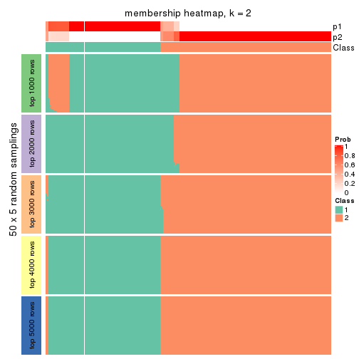</p>

</div>
<div id='tab-MAD-pam-membership-heatmap-2'>
<pre><code class="r">membership_heatmap(res, k = 3)
</code></pre>

<p></p>

</div>
<div id='tab-MAD-pam-membership-heatmap-3'>
<pre><code class="r">membership_heatmap(res, k = 4)
</code></pre>

<p></p>

</div>
<div id='tab-MAD-pam-membership-heatmap-4'>
<pre><code class="r">membership_heatmap(res, k = 5)
</code></pre>

<p></p>

</div>
<div id='tab-MAD-pam-membership-heatmap-5'>
<pre><code class="r">membership_heatmap(res, k = 6)
</code></pre>

<p></p>

</div>
</div>

As soon as we have had the classes for columns, we can look for signatures
which are significantly different between classes which can be candidate marks
for certain classes. Following are the heatmaps for signatures.


Signature heatmaps where rows are scaled:


<script>
$( function() {
	$( '#tabs-MAD-pam-get-signatures' ).tabs();
} );
</script>
<div id='tabs-MAD-pam-get-signatures'>
<ul>
<li><a href='#tab-MAD-pam-get-signatures-1'>k = 2</a></li>
<li><a href='#tab-MAD-pam-get-signatures-2'>k = 3</a></li>
<li><a href='#tab-MAD-pam-get-signatures-3'>k = 4</a></li>
<li><a href='#tab-MAD-pam-get-signatures-4'>k = 5</a></li>
<li><a href='#tab-MAD-pam-get-signatures-5'>k = 6</a></li>
</ul>
<div id='tab-MAD-pam-get-signatures-1'>
<pre><code class="r">get_signatures(res, k = 2)
</code></pre>

<p></p>

</div>
<div id='tab-MAD-pam-get-signatures-2'>
<pre><code class="r">get_signatures(res, k = 3)
</code></pre>

<p></p>

</div>
<div id='tab-MAD-pam-get-signatures-3'>
<pre><code class="r">get_signatures(res, k = 4)
</code></pre>

<p></p>

</div>
<div id='tab-MAD-pam-get-signatures-4'>
<pre><code class="r">get_signatures(res, k = 5)
</code></pre>

<p></p>

</div>
<div id='tab-MAD-pam-get-signatures-5'>
<pre><code class="r">get_signatures(res, k = 6)
</code></pre>

<p></p>

</div>
</div>


Signature heatmaps where rows are not scaled:


<script>
$( function() {
	$( '#tabs-MAD-pam-get-signatures-no-scale' ).tabs();
} );
</script>
<div id='tabs-MAD-pam-get-signatures-no-scale'>
<ul>
<li><a href='#tab-MAD-pam-get-signatures-no-scale-1'>k = 2</a></li>
<li><a href='#tab-MAD-pam-get-signatures-no-scale-2'>k = 3</a></li>
<li><a href='#tab-MAD-pam-get-signatures-no-scale-3'>k = 4</a></li>
<li><a href='#tab-MAD-pam-get-signatures-no-scale-4'>k = 5</a></li>
<li><a href='#tab-MAD-pam-get-signatures-no-scale-5'>k = 6</a></li>
</ul>
<div id='tab-MAD-pam-get-signatures-no-scale-1'>
<pre><code class="r">get_signatures(res, k = 2, scale_rows = FALSE)
</code></pre>

<p></p>

</div>
<div id='tab-MAD-pam-get-signatures-no-scale-2'>
<pre><code class="r">get_signatures(res, k = 3, scale_rows = FALSE)
</code></pre>

<p></p>

</div>
<div id='tab-MAD-pam-get-signatures-no-scale-3'>
<pre><code class="r">get_signatures(res, k = 4, scale_rows = FALSE)
</code></pre>

<p></p>

</div>
<div id='tab-MAD-pam-get-signatures-no-scale-4'>
<pre><code class="r">get_signatures(res, k = 5, scale_rows = FALSE)
</code></pre>

<p></p>

</div>
<div id='tab-MAD-pam-get-signatures-no-scale-5'>
<pre><code class="r">get_signatures(res, k = 6, scale_rows = FALSE)
</code></pre>

<p></p>

</div>
</div>


Compare the overlap of signatures from different k:

```r
compare_signatures(res)
```


`get_signature()` returns a data frame invisibly. TO get the list of signatures, the function
call should be assigned to a variable explicitly. In following code, if `plot` argument is set
to `FALSE`, no heatmap is plotted while only the differential analysis is performed.

```r
# code only for demonstration
tb = get_signature(res, k = ..., plot = FALSE)
```

An example of the output of `tb` is:

```
#>   which_row         fdr    mean_1    mean_2 scaled_mean_1 scaled_mean_2 km
#> 1        38 0.042760348  8.373488  9.131774    -0.5533452     0.5164555  1
#> 2        40 0.018707592  7.106213  8.469186    -0.6173731     0.5762149  1
#> 3        55 0.019134737 10.221463 11.207825    -0.6159697     0.5749050  1
#> 4        59 0.006059896  5.921854  7.869574    -0.6899429     0.6439467  1
#> 5        60 0.018055526  8.928898 10.211722    -0.6204761     0.5791110  1
#> 6        98 0.009384629 15.714769 14.887706     0.6635654    -0.6193277  2
...
```

The columns in `tb` are:

1. `which_row`: row indices corresponding to the input matrix.
2. `fdr`: FDR for the differential test. 
3. `mean_x`: The mean value in group x.
4. `scaled_mean_x`: The mean value in group x after rows are scaled.
5. `km`: Row groups if k-means clustering is applied to rows.


UMAP plot which shows how samples are separated.


<script>
$( function() {
	$( '#tabs-MAD-pam-dimension-reduction' ).tabs();
} );
</script>
<div id='tabs-MAD-pam-dimension-reduction'>
<ul>
<li><a href='#tab-MAD-pam-dimension-reduction-1'>k = 2</a></li>
<li><a href='#tab-MAD-pam-dimension-reduction-2'>k = 3</a></li>
<li><a href='#tab-MAD-pam-dimension-reduction-3'>k = 4</a></li>
<li><a href='#tab-MAD-pam-dimension-reduction-4'>k = 5</a></li>
<li><a href='#tab-MAD-pam-dimension-reduction-5'>k = 6</a></li>
</ul>
<div id='tab-MAD-pam-dimension-reduction-1'>
<pre><code class="r">dimension_reduction(res, k = 2, method = &quot;UMAP&quot;)
</code></pre>

<p></p>

</div>
<div id='tab-MAD-pam-dimension-reduction-2'>
<pre><code class="r">dimension_reduction(res, k = 3, method = &quot;UMAP&quot;)
</code></pre>

<p></p>

</div>
<div id='tab-MAD-pam-dimension-reduction-3'>
<pre><code class="r">dimension_reduction(res, k = 4, method = &quot;UMAP&quot;)
</code></pre>

<p></p>

</div>
<div id='tab-MAD-pam-dimension-reduction-4'>
<pre><code class="r">dimension_reduction(res, k = 5, method = &quot;UMAP&quot;)
</code></pre>

<p></p>

</div>
<div id='tab-MAD-pam-dimension-reduction-5'>
<pre><code class="r">dimension_reduction(res, k = 6, method = &quot;UMAP&quot;)
</code></pre>

<p></p>

</div>
</div>


Following heatmap shows how subgroups are split when increasing `k`:

```r
collect_classes(res)
```


If matrix rows can be associated to genes, consider to use `GO_Enrichment(res,
...)` to perform function enrichment for the signature genes.


 

---------------------------------------------------


### MAD:mclust**


The object with results only for a single top-value method and a single partition method 
can be extracted as:

```r
res = res_list["MAD", "mclust"]
# you can also extract it by
# res = res_list["MAD:mclust"]
```

A summary of `res` and all the functions that can be applied to it:

```r
res
```

```
#> A 'ConsensusPartition' object with k = 2, 3, 4, 5, 6.
#>   On a matrix with 17245 rows and 418 columns.
#>   Top rows (1000, 2000, 3000, 4000, 5000) are extracted by 'MAD' method.
#>   Subgroups are detected by 'mclust' method.
#>   Performed in total 1250 partitions by row resampling.
#>   Best k for subgroups seems to be 3.
#> 
#> Following methods can be applied to this 'ConsensusPartition' object:
#>  [1] "cola_report"             "collect_classes"         "collect_plots"          
#>  [4] "collect_stats"           "colnames"                "compare_signatures"     
#>  [7] "consensus_heatmap"       "dimension_reduction"     "functional_enrichment"  
#> [10] "get_anno_col"            "get_anno"                "get_classes"            
#> [13] "get_consensus"           "get_matrix"              "get_membership"         
#> [16] "get_param"               "get_signatures"          "get_stats"              
#> [19] "is_best_k"               "is_stable_k"             "membership_heatmap"     
#> [22] "ncol"                    "nrow"                    "plot_ecdf"              
#> [25] "rownames"                "select_partition_number" "show"                   
#> [28] "suggest_best_k"          "test_to_known_factors"
```

`collect_plots()` function collects all the plots made from `res` for all `k` (number of partitions)
into one single page to provide an easy and fast comparison between different `k`.

```r
collect_plots(res)
```


The plots are:

- The first row: a plot of the ECDF (Empirical cumulative distribution
  function) curves of the consensus matrix for each `k` and the heatmap of
  predicted classes for each `k`.
- The second row: heatmaps of the consensus matrix for each `k`.
- The third row: heatmaps of the membership matrix for each `k`.
- The fouth row: heatmaps of the signatures for each `k`.

All the plots in panels can be made by individual functions and they are
plotted later in this section.

`select_partition_number()` produces several plots showing different
statistics for choosing "optimized" `k`. There are following statistics:

- ECDF curves of the consensus matrix for each `k`;
- 1-PAC. [The PAC
  score](https://en.wikipedia.org/wiki/Consensus_clustering#Over-interpretation_potential_of_consensus_clustering)
  measures the proportion of the ambiguous subgrouping.
- Mean silhouette score.
- Concordance. The mean probability of fiting the consensus class ids in all
  partitions.
- Area increased. Denote $A_k$ as the area under the ECDF curve for current
  `k`, the area increased is defined as $A_k - A_{k-1}$.
- Rand index. The percent of pairs of samples that are both in a same cluster
  or both are not in a same cluster in the partition of k and k-1.
- Jaccard index. The ratio of pairs of samples are both in a same cluster in
  the partition of k and k-1 and the pairs of samples are both in a same
  cluster in the partition k or k-1.

The detailed explanations of these statistics can be found in [the cola
vignette](http://bioconductor.org/packages/devel/bioc/vignettes/cola/inst/doc/cola.html#toc_13).

Generally speaking, lower PAC score, higher mean silhouette score or higher
concordance corresponds to better partition. Rand index and Jaccard index
measure how similar the current partition is compared to partition with `k-1`.
If they are too similar, we won't accept `k` is better than `k-1`.

```r
select_partition_number(res)
```


The numeric values for all these statistics can be obtained by `get_stats()`.

```r
get_stats(res)
```

```
#>   k 1-PAC mean_silhouette concordance area_increased  Rand Jaccard
#> 2 2 1.000           1.000       1.000         0.3680 0.633   0.633
#> 3 3 1.000           1.000       1.000         0.5044 0.814   0.706
#> 4 4 0.861           0.877       0.923         0.2888 0.816   0.589
#> 5 5 0.768           0.785       0.879         0.0595 0.911   0.693
#> 6 6 0.823           0.839       0.841         0.0577 0.934   0.723
```

`suggest_best_k()` suggests the best $k$ based on these statistics. The rules are as follows:

- All $k$ with Jaccard index larger than 0.95 are removed because the increase of
  the partition number does not provides enough extra information. If all $k$ are removed,
  the best $k$ is assigned by `NA`.
- For $k$ with 1-PAC larger than 0.9, the maximal $k$ is taken as the "best k". Other $k$ is called "optional k".
- If it does not fit the second rule. The $k$ with the highest vote of highest
  1-PAC, mean silhouette and concordance is taken as the "best k".

```r
suggest_best_k(res)
```

```
#> [1] 3
#> attr(,"optional")
#> [1] 2
```

There is also optional best $k$ = 2 that is worth to check.

Following shows the table of the partitions (You need to click the **show/hide
code output** link to see it). The membership matrix (columns with name `p*`)
is inferred by
[`clue::cl_consensus()`](https://www.rdocumentation.org/link/cl_consensus?package=clue)
function with the `SE` method. Basically the value in the membership matrix
represents the probability to belong to a certain group. The finall class
label for an item is determined with the group with highest probability it
belongs to.

In `get_classes()` function, the entropy is calculated from the membership
matrix and the silhouette score is calculated from the consensus matrix.


<script>
$( function() {
	$( '#tabs-MAD-mclust-get-classes' ).tabs();
} );
</script>
<div id='tabs-MAD-mclust-get-classes'>
<ul>
<li><a href='#tab-MAD-mclust-get-classes-1'>k = 2</a></li>
<li><a href='#tab-MAD-mclust-get-classes-2'>k = 3</a></li>
<li><a href='#tab-MAD-mclust-get-classes-3'>k = 4</a></li>
<li><a href='#tab-MAD-mclust-get-classes-4'>k = 5</a></li>
<li><a href='#tab-MAD-mclust-get-classes-5'>k = 6</a></li>
</ul>

<div id='tab-MAD-mclust-get-classes-1'>
<p><a id='tab-MAD-mclust-get-classes-1-a' style='color:#0366d6' href='#'>show/hide code output</a></p>
<pre><code class="r">cbind(get_classes(res, k = 2), get_membership(res, k = 2))
</code></pre>

<pre><code>#&gt;           class entropy silhouette p1 p2
#&gt; SRR902920     1       0          1  1  0
#&gt; SRR902921     1       0          1  1  0
#&gt; SRR902922     1       0          1  1  0
#&gt; SRR902923     1       0          1  1  0
#&gt; SRR902924     1       0          1  1  0
#&gt; SRR902925     1       0          1  1  0
#&gt; SRR902926     1       0          1  1  0
#&gt; SRR902927     1       0          1  1  0
#&gt; SRR902928     1       0          1  1  0
#&gt; SRR902929     1       0          1  1  0
#&gt; SRR902930     1       0          1  1  0
#&gt; SRR902931     1       0          1  1  0
#&gt; SRR902932     2       0          1  0  1
#&gt; SRR902933     2       0          1  0  1
#&gt; SRR902934     2       0          1  0  1
#&gt; SRR902935     2       0          1  0  1
#&gt; SRR902936     2       0          1  0  1
#&gt; SRR902937     2       0          1  0  1
#&gt; SRR902938     2       0          1  0  1
#&gt; SRR902939     2       0          1  0  1
#&gt; SRR902940     2       0          1  0  1
#&gt; SRR902941     2       0          1  0  1
#&gt; SRR902942     1       0          1  1  0
#&gt; SRR902943     1       0          1  1  0
#&gt; SRR902944     1       0          1  1  0
#&gt; SRR902945     1       0          1  1  0
#&gt; SRR902946     1       0          1  1  0
#&gt; SRR902947     1       0          1  1  0
#&gt; SRR902954     1       0          1  1  0
#&gt; SRR902955     1       0          1  1  0
#&gt; SRR902956     1       0          1  1  0
#&gt; SRR902957     1       0          1  1  0
#&gt; SRR902958     1       0          1  1  0
#&gt; SRR902959     1       0          1  1  0
#&gt; SRR902948     1       0          1  1  0
#&gt; SRR902949     1       0          1  1  0
#&gt; SRR902950     1       0          1  1  0
#&gt; SRR902951     1       0          1  1  0
#&gt; SRR902952     1       0          1  1  0
#&gt; SRR902953     1       0          1  1  0
#&gt; SRR902960     1       0          1  1  0
#&gt; SRR902961     1       0          1  1  0
#&gt; SRR902962     1       0          1  1  0
#&gt; SRR902963     1       0          1  1  0
#&gt; SRR902964     1       0          1  1  0
#&gt; SRR902965     1       0          1  1  0
#&gt; SRR902966     1       0          1  1  0
#&gt; SRR902967     1       0          1  1  0
#&gt; SRR902968     1       0          1  1  0
#&gt; SRR902969     1       0          1  1  0
#&gt; SRR902970     1       0          1  1  0
#&gt; SRR902971     1       0          1  1  0
#&gt; SRR902972     1       0          1  1  0
#&gt; SRR902973     1       0          1  1  0
#&gt; SRR902974     1       0          1  1  0
#&gt; SRR902975     1       0          1  1  0
#&gt; SRR902976     1       0          1  1  0
#&gt; SRR902977     1       0          1  1  0
#&gt; SRR902978     1       0          1  1  0
#&gt; SRR902980     1       0          1  1  0
#&gt; SRR902981     1       0          1  1  0
#&gt; SRR902982     1       0          1  1  0
#&gt; SRR902983     1       0          1  1  0
#&gt; SRR902984     1       0          1  1  0
#&gt; SRR902985     1       0          1  1  0
#&gt; SRR902986     1       0          1  1  0
#&gt; SRR902987     1       0          1  1  0
#&gt; SRR902988     1       0          1  1  0
#&gt; SRR902989     1       0          1  1  0
#&gt; SRR902990     1       0          1  1  0
#&gt; SRR902991     1       0          1  1  0
#&gt; SRR902992     1       0          1  1  0
#&gt; SRR902993     1       0          1  1  0
#&gt; SRR902994     1       0          1  1  0
#&gt; SRR902995     1       0          1  1  0
#&gt; SRR902996     2       0          1  0  1
#&gt; SRR902997     2       0          1  0  1
#&gt; SRR902998     2       0          1  0  1
#&gt; SRR902999     2       0          1  0  1
#&gt; SRR903000     2       0          1  0  1
#&gt; SRR903001     2       0          1  0  1
#&gt; SRR903008     2       0          1  0  1
#&gt; SRR903009     2       0          1  0  1
#&gt; SRR903010     2       0          1  0  1
#&gt; SRR903011     2       0          1  0  1
#&gt; SRR903012     2       0          1  0  1
#&gt; SRR903013     2       0          1  0  1
#&gt; SRR903002     2       0          1  0  1
#&gt; SRR903003     2       0          1  0  1
#&gt; SRR903004     2       0          1  0  1
#&gt; SRR903005     2       0          1  0  1
#&gt; SRR903006     2       0          1  0  1
#&gt; SRR903007     2       0          1  0  1
#&gt; SRR903014     1       0          1  1  0
#&gt; SRR903015     1       0          1  1  0
#&gt; SRR903016     1       0          1  1  0
#&gt; SRR903017     1       0          1  1  0
#&gt; SRR903018     1       0          1  1  0
#&gt; SRR903019     1       0          1  1  0
#&gt; SRR903020     1       0          1  1  0
#&gt; SRR903021     1       0          1  1  0
#&gt; SRR903022     1       0          1  1  0
#&gt; SRR903023     1       0          1  1  0
#&gt; SRR903024     1       0          1  1  0
#&gt; SRR903025     1       0          1  1  0
#&gt; SRR903026     1       0          1  1  0
#&gt; SRR903027     1       0          1  1  0
#&gt; SRR903028     1       0          1  1  0
#&gt; SRR903029     1       0          1  1  0
#&gt; SRR903030     1       0          1  1  0
#&gt; SRR903031     1       0          1  1  0
#&gt; SRR903032     2       0          1  0  1
#&gt; SRR903033     2       0          1  0  1
#&gt; SRR903034     2       0          1  0  1
#&gt; SRR903035     2       0          1  0  1
#&gt; SRR903036     2       0          1  0  1
#&gt; SRR903037     2       0          1  0  1
#&gt; SRR903038     2       0          1  0  1
#&gt; SRR903039     2       0          1  0  1
#&gt; SRR903040     2       0          1  0  1
#&gt; SRR903041     2       0          1  0  1
#&gt; SRR903042     2       0          1  0  1
#&gt; SRR903043     2       0          1  0  1
#&gt; SRR903044     2       0          1  0  1
#&gt; SRR903045     2       0          1  0  1
#&gt; SRR903046     2       0          1  0  1
#&gt; SRR903047     2       0          1  0  1
#&gt; SRR903048     2       0          1  0  1
#&gt; SRR903049     2       0          1  0  1
#&gt; SRR903050     2       0          1  0  1
#&gt; SRR903051     2       0          1  0  1
#&gt; SRR903052     2       0          1  0  1
#&gt; SRR903053     2       0          1  0  1
#&gt; SRR903054     2       0          1  0  1
#&gt; SRR903055     2       0          1  0  1
#&gt; SRR903056     2       0          1  0  1
#&gt; SRR903057     2       0          1  0  1
#&gt; SRR903058     2       0          1  0  1
#&gt; SRR903059     2       0          1  0  1
#&gt; SRR903060     2       0          1  0  1
#&gt; SRR903061     2       0          1  0  1
#&gt; SRR903062     2       0          1  0  1
#&gt; SRR903063     2       0          1  0  1
#&gt; SRR903064     2       0          1  0  1
#&gt; SRR903065     2       0          1  0  1
#&gt; SRR903066     2       0          1  0  1
#&gt; SRR903067     2       0          1  0  1
#&gt; SRR903068     2       0          1  0  1
#&gt; SRR903069     2       0          1  0  1
#&gt; SRR903070     2       0          1  0  1
#&gt; SRR903071     2       0          1  0  1
#&gt; SRR903072     2       0          1  0  1
#&gt; SRR903073     2       0          1  0  1
#&gt; SRR903074     2       0          1  0  1
#&gt; SRR903075     2       0          1  0  1
#&gt; SRR903076     2       0          1  0  1
#&gt; SRR903077     2       0          1  0  1
#&gt; SRR903078     2       0          1  0  1
#&gt; SRR903079     2       0          1  0  1
#&gt; SRR903080     2       0          1  0  1
#&gt; SRR903081     2       0          1  0  1
#&gt; SRR903082     2       0          1  0  1
#&gt; SRR903083     2       0          1  0  1
#&gt; SRR903084     2       0          1  0  1
#&gt; SRR903085     2       0          1  0  1
#&gt; SRR903086     2       0          1  0  1
#&gt; SRR903087     2       0          1  0  1
#&gt; SRR903088     2       0          1  0  1
#&gt; SRR903089     2       0          1  0  1
#&gt; SRR903090     2       0          1  0  1
#&gt; SRR903091     2       0          1  0  1
#&gt; SRR903092     2       0          1  0  1
#&gt; SRR903093     2       0          1  0  1
#&gt; SRR903094     2       0          1  0  1
#&gt; SRR903095     2       0          1  0  1
#&gt; SRR903096     2       0          1  0  1
#&gt; SRR903097     2       0          1  0  1
#&gt; SRR903098     2       0          1  0  1
#&gt; SRR903099     2       0          1  0  1
#&gt; SRR903100     2       0          1  0  1
#&gt; SRR903101     2       0          1  0  1
#&gt; SRR903102     2       0          1  0  1
#&gt; SRR903103     2       0          1  0  1
#&gt; SRR903104     2       0          1  0  1
#&gt; SRR903105     2       0          1  0  1
#&gt; SRR903106     2       0          1  0  1
#&gt; SRR903107     2       0          1  0  1
#&gt; SRR903108     2       0          1  0  1
#&gt; SRR903109     2       0          1  0  1
#&gt; SRR903110     2       0          1  0  1
#&gt; SRR903111     2       0          1  0  1
#&gt; SRR903112     2       0          1  0  1
#&gt; SRR903113     2       0          1  0  1
#&gt; SRR903114     2       0          1  0  1
#&gt; SRR903115     2       0          1  0  1
#&gt; SRR903116     2       0          1  0  1
#&gt; SRR903117     2       0          1  0  1
#&gt; SRR903118     2       0          1  0  1
#&gt; SRR903119     2       0          1  0  1
#&gt; SRR903121     2       0          1  0  1
#&gt; SRR903122     2       0          1  0  1
#&gt; SRR903124     2       0          1  0  1
#&gt; SRR903125     2       0          1  0  1
#&gt; SRR903126     2       0          1  0  1
#&gt; SRR903127     2       0          1  0  1
#&gt; SRR903128     2       0          1  0  1
#&gt; SRR903129     2       0          1  0  1
#&gt; SRR903130     2       0          1  0  1
#&gt; SRR903131     2       0          1  0  1
#&gt; SRR903132     2       0          1  0  1
#&gt; SRR903133     2       0          1  0  1
#&gt; SRR903134     2       0          1  0  1
#&gt; SRR903135     2       0          1  0  1
#&gt; SRR903136     2       0          1  0  1
#&gt; SRR903137     2       0          1  0  1
#&gt; SRR903146     2       0          1  0  1
#&gt; SRR903147     2       0          1  0  1
#&gt; SRR903148     2       0          1  0  1
#&gt; SRR903149     2       0          1  0  1
#&gt; SRR903150     2       0          1  0  1
#&gt; SRR903151     2       0          1  0  1
#&gt; SRR903152     2       0          1  0  1
#&gt; SRR903153     2       0          1  0  1
#&gt; SRR903138     2       0          1  0  1
#&gt; SRR903139     2       0          1  0  1
#&gt; SRR903140     2       0          1  0  1
#&gt; SRR903141     2       0          1  0  1
#&gt; SRR903142     2       0          1  0  1
#&gt; SRR903143     2       0          1  0  1
#&gt; SRR903144     2       0          1  0  1
#&gt; SRR903145     2       0          1  0  1
#&gt; SRR903154     2       0          1  0  1
#&gt; SRR903155     2       0          1  0  1
#&gt; SRR903156     2       0          1  0  1
#&gt; SRR903157     2       0          1  0  1
#&gt; SRR903158     2       0          1  0  1
#&gt; SRR903159     2       0          1  0  1
#&gt; SRR903160     2       0          1  0  1
#&gt; SRR903161     2       0          1  0  1
#&gt; SRR903162     2       0          1  0  1
#&gt; SRR903163     2       0          1  0  1
#&gt; SRR903164     2       0          1  0  1
#&gt; SRR903165     2       0          1  0  1
#&gt; SRR903166     2       0          1  0  1
#&gt; SRR903167     2       0          1  0  1
#&gt; SRR903168     2       0          1  0  1
#&gt; SRR903169     2       0          1  0  1
#&gt; SRR903178     2       0          1  0  1
#&gt; SRR903179     2       0          1  0  1
#&gt; SRR903180     2       0          1  0  1
#&gt; SRR903181     2       0          1  0  1
#&gt; SRR903182     2       0          1  0  1
#&gt; SRR903183     2       0          1  0  1
#&gt; SRR903184     2       0          1  0  1
#&gt; SRR903185     2       0          1  0  1
#&gt; SRR903170     2       0          1  0  1
#&gt; SRR903171     2       0          1  0  1
#&gt; SRR903172     2       0          1  0  1
#&gt; SRR903173     2       0          1  0  1
#&gt; SRR903174     2       0          1  0  1
#&gt; SRR903175     2       0          1  0  1
#&gt; SRR903176     2       0          1  0  1
#&gt; SRR903177     2       0          1  0  1
#&gt; SRR903186     2       0          1  0  1
#&gt; SRR903187     2       0          1  0  1
#&gt; SRR903188     2       0          1  0  1
#&gt; SRR903189     2       0          1  0  1
#&gt; SRR903190     2       0          1  0  1
#&gt; SRR903191     2       0          1  0  1
#&gt; SRR903192     2       0          1  0  1
#&gt; SRR903193     2       0          1  0  1
#&gt; SRR903194     2       0          1  0  1
#&gt; SRR903195     2       0          1  0  1
#&gt; SRR903196     2       0          1  0  1
#&gt; SRR903197     2       0          1  0  1
#&gt; SRR903198     2       0          1  0  1
#&gt; SRR903199     2       0          1  0  1
#&gt; SRR903200     2       0          1  0  1
#&gt; SRR903201     2       0          1  0  1
#&gt; SRR903210     2       0          1  0  1
#&gt; SRR903211     2       0          1  0  1
#&gt; SRR903212     2       0          1  0  1
#&gt; SRR903213     2       0          1  0  1
#&gt; SRR903214     2       0          1  0  1
#&gt; SRR903215     2       0          1  0  1
#&gt; SRR903216     2       0          1  0  1
#&gt; SRR903217     2       0          1  0  1
#&gt; SRR903202     2       0          1  0  1
#&gt; SRR903203     2       0          1  0  1
#&gt; SRR903204     2       0          1  0  1
#&gt; SRR903205     2       0          1  0  1
#&gt; SRR903206     2       0          1  0  1
#&gt; SRR903207     2       0          1  0  1
#&gt; SRR903208     2       0          1  0  1
#&gt; SRR903209     2       0          1  0  1
#&gt; SRR903218     2       0          1  0  1
#&gt; SRR903219     2       0          1  0  1
#&gt; SRR903220     2       0          1  0  1
#&gt; SRR903221     2       0          1  0  1
#&gt; SRR903222     2       0          1  0  1
#&gt; SRR903223     2       0          1  0  1
#&gt; SRR903224     2       0          1  0  1
#&gt; SRR903225     2       0          1  0  1
#&gt; SRR903226     2       0          1  0  1
#&gt; SRR903227     2       0          1  0  1
#&gt; SRR903228     2       0          1  0  1
#&gt; SRR903229     2       0          1  0  1
#&gt; SRR903230     2       0          1  0  1
#&gt; SRR903231     2       0          1  0  1
#&gt; SRR903232     2       0          1  0  1
#&gt; SRR903233     2       0          1  0  1
#&gt; SRR903242     2       0          1  0  1
#&gt; SRR903243     2       0          1  0  1
#&gt; SRR903244     2       0          1  0  1
#&gt; SRR903245     2       0          1  0  1
#&gt; SRR903246     2       0          1  0  1
#&gt; SRR903247     2       0          1  0  1
#&gt; SRR903248     2       0          1  0  1
#&gt; SRR903249     2       0          1  0  1
#&gt; SRR903234     2       0          1  0  1
#&gt; SRR903235     2       0          1  0  1
#&gt; SRR903236     2       0          1  0  1
#&gt; SRR903237     2       0          1  0  1
#&gt; SRR903238     2       0          1  0  1
#&gt; SRR903239     2       0          1  0  1
#&gt; SRR903240     2       0          1  0  1
#&gt; SRR903241     2       0          1  0  1
#&gt; SRR903258     2       0          1  0  1
#&gt; SRR903259     2       0          1  0  1
#&gt; SRR903260     2       0          1  0  1
#&gt; SRR903261     2       0          1  0  1
#&gt; SRR903262     2       0          1  0  1
#&gt; SRR903263     2       0          1  0  1
#&gt; SRR903264     2       0          1  0  1
#&gt; SRR903265     2       0          1  0  1
#&gt; SRR903250     2       0          1  0  1
#&gt; SRR903251     2       0          1  0  1
#&gt; SRR903252     2       0          1  0  1
#&gt; SRR903253     2       0          1  0  1
#&gt; SRR903254     2       0          1  0  1
#&gt; SRR903255     2       0          1  0  1
#&gt; SRR903256     2       0          1  0  1
#&gt; SRR903257     2       0          1  0  1
#&gt; SRR903266     2       0          1  0  1
#&gt; SRR903267     2       0          1  0  1
#&gt; SRR903268     2       0          1  0  1
#&gt; SRR903270     2       0          1  0  1
#&gt; SRR903271     2       0          1  0  1
#&gt; SRR903272     2       0          1  0  1
#&gt; SRR903273     2       0          1  0  1
#&gt; SRR903274     2       0          1  0  1
#&gt; SRR903275     2       0          1  0  1
#&gt; SRR903276     2       0          1  0  1
#&gt; SRR903277     2       0          1  0  1
#&gt; SRR903278     2       0          1  0  1
#&gt; SRR903279     2       0          1  0  1
#&gt; SRR903280     2       0          1  0  1
#&gt; SRR903281     2       0          1  0  1
#&gt; SRR903282     2       0          1  0  1
#&gt; SRR903283     2       0          1  0  1
#&gt; SRR903284     2       0          1  0  1
#&gt; SRR903285     2       0          1  0  1
#&gt; SRR903286     2       0          1  0  1
#&gt; SRR903287     2       0          1  0  1
#&gt; SRR903288     2       0          1  0  1
#&gt; SRR903289     2       0          1  0  1
#&gt; SRR903290     2       0          1  0  1
#&gt; SRR903291     2       0          1  0  1
#&gt; SRR903292     2       0          1  0  1
#&gt; SRR903293     2       0          1  0  1
#&gt; SRR903294     2       0          1  0  1
#&gt; SRR903295     2       0          1  0  1
#&gt; SRR903296     2       0          1  0  1
#&gt; SRR903297     2       0          1  0  1
#&gt; SRR903298     2       0          1  0  1
#&gt; SRR903299     2       0          1  0  1
#&gt; SRR903300     2       0          1  0  1
#&gt; SRR903301     2       0          1  0  1
#&gt; SRR903302     2       0          1  0  1
#&gt; SRR903303     2       0          1  0  1
#&gt; SRR903304     2       0          1  0  1
#&gt; SRR903305     2       0          1  0  1
#&gt; SRR903306     1       0          1  1  0
#&gt; SRR903307     1       0          1  1  0
#&gt; SRR903308     1       0          1  1  0
#&gt; SRR903309     1       0          1  1  0
#&gt; SRR903310     1       0          1  1  0
#&gt; SRR903311     1       0          1  1  0
#&gt; SRR903312     1       0          1  1  0
#&gt; SRR903313     1       0          1  1  0
#&gt; SRR903314     1       0          1  1  0
#&gt; SRR903315     1       0          1  1  0
#&gt; SRR903316     1       0          1  1  0
#&gt; SRR903317     1       0          1  1  0
#&gt; SRR903318     1       0          1  1  0
#&gt; SRR903319     1       0          1  1  0
#&gt; SRR903320     1       0          1  1  0
#&gt; SRR903321     1       0          1  1  0
#&gt; SRR903322     1       0          1  1  0
#&gt; SRR903323     1       0          1  1  0
#&gt; SRR903324     2       0          1  0  1
#&gt; SRR903325     2       0          1  0  1
#&gt; SRR903326     2       0          1  0  1
#&gt; SRR903327     2       0          1  0  1
#&gt; SRR903328     2       0          1  0  1
#&gt; SRR903329     2       0          1  0  1
#&gt; SRR903330     2       0          1  0  1
#&gt; SRR903331     2       0          1  0  1
#&gt; SRR903332     2       0          1  0  1
#&gt; SRR903333     2       0          1  0  1
#&gt; SRR903334     2       0          1  0  1
#&gt; SRR903335     2       0          1  0  1
#&gt; SRR903336     2       0          1  0  1
#&gt; SRR903337     2       0          1  0  1
#&gt; SRR903338     2       0          1  0  1
#&gt; SRR903339     2       0          1  0  1
#&gt; SRR903340     2       0          1  0  1
#&gt; SRR903341     2       0          1  0  1
</code></pre>

<script>
$('#tab-MAD-mclust-get-classes-1-a').parent().next().next().hide();
$('#tab-MAD-mclust-get-classes-1-a').click(function(){
  $('#tab-MAD-mclust-get-classes-1-a').parent().next().next().toggle();
  return(false);
});
</script>
</div>

<div id='tab-MAD-mclust-get-classes-2'>
<p><a id='tab-MAD-mclust-get-classes-2-a' style='color:#0366d6' href='#'>show/hide code output</a></p>
<pre><code class="r">cbind(get_classes(res, k = 3), get_membership(res, k = 3))
</code></pre>

<pre><code>#&gt;           class entropy silhouette p1 p2 p3
#&gt; SRR902920     3       0          1  0  0  1
#&gt; SRR902921     3       0          1  0  0  1
#&gt; SRR902922     3       0          1  0  0  1
#&gt; SRR902923     3       0          1  0  0  1
#&gt; SRR902924     3       0          1  0  0  1
#&gt; SRR902925     3       0          1  0  0  1
#&gt; SRR902926     3       0          1  0  0  1
#&gt; SRR902927     3       0          1  0  0  1
#&gt; SRR902928     3       0          1  0  0  1
#&gt; SRR902929     3       0          1  0  0  1
#&gt; SRR902930     3       0          1  0  0  1
#&gt; SRR902931     3       0          1  0  0  1
#&gt; SRR902932     2       0          1  0  1  0
#&gt; SRR902933     2       0          1  0  1  0
#&gt; SRR902934     2       0          1  0  1  0
#&gt; SRR902935     2       0          1  0  1  0
#&gt; SRR902936     2       0          1  0  1  0
#&gt; SRR902937     2       0          1  0  1  0
#&gt; SRR902938     2       0          1  0  1  0
#&gt; SRR902939     2       0          1  0  1  0
#&gt; SRR902940     2       0          1  0  1  0
#&gt; SRR902941     2       0          1  0  1  0
#&gt; SRR902942     3       0          1  0  0  1
#&gt; SRR902943     3       0          1  0  0  1
#&gt; SRR902944     3       0          1  0  0  1
#&gt; SRR902945     3       0          1  0  0  1
#&gt; SRR902946     3       0          1  0  0  1
#&gt; SRR902947     3       0          1  0  0  1
#&gt; SRR902954     3       0          1  0  0  1
#&gt; SRR902955     3       0          1  0  0  1
#&gt; SRR902956     3       0          1  0  0  1
#&gt; SRR902957     3       0          1  0  0  1
#&gt; SRR902958     3       0          1  0  0  1
#&gt; SRR902959     3       0          1  0  0  1
#&gt; SRR902948     3       0          1  0  0  1
#&gt; SRR902949     3       0          1  0  0  1
#&gt; SRR902950     3       0          1  0  0  1
#&gt; SRR902951     3       0          1  0  0  1
#&gt; SRR902952     3       0          1  0  0  1
#&gt; SRR902953     3       0          1  0  0  1
#&gt; SRR902960     3       0          1  0  0  1
#&gt; SRR902961     3       0          1  0  0  1
#&gt; SRR902962     3       0          1  0  0  1
#&gt; SRR902963     3       0          1  0  0  1
#&gt; SRR902964     3       0          1  0  0  1
#&gt; SRR902965     3       0          1  0  0  1
#&gt; SRR902966     3       0          1  0  0  1
#&gt; SRR902967     3       0          1  0  0  1
#&gt; SRR902968     3       0          1  0  0  1
#&gt; SRR902969     3       0          1  0  0  1
#&gt; SRR902970     3       0          1  0  0  1
#&gt; SRR902971     3       0          1  0  0  1
#&gt; SRR902972     3       0          1  0  0  1
#&gt; SRR902973     3       0          1  0  0  1
#&gt; SRR902974     3       0          1  0  0  1
#&gt; SRR902975     3       0          1  0  0  1
#&gt; SRR902976     3       0          1  0  0  1
#&gt; SRR902977     3       0          1  0  0  1
#&gt; SRR902978     3       0          1  0  0  1
#&gt; SRR902980     3       0          1  0  0  1
#&gt; SRR902981     3       0          1  0  0  1
#&gt; SRR902982     3       0          1  0  0  1
#&gt; SRR902983     3       0          1  0  0  1
#&gt; SRR902984     3       0          1  0  0  1
#&gt; SRR902985     3       0          1  0  0  1
#&gt; SRR902986     3       0          1  0  0  1
#&gt; SRR902987     3       0          1  0  0  1
#&gt; SRR902988     3       0          1  0  0  1
#&gt; SRR902989     3       0          1  0  0  1
#&gt; SRR902990     3       0          1  0  0  1
#&gt; SRR902991     3       0          1  0  0  1
#&gt; SRR902992     3       0          1  0  0  1
#&gt; SRR902993     3       0          1  0  0  1
#&gt; SRR902994     3       0          1  0  0  1
#&gt; SRR902995     3       0          1  0  0  1
#&gt; SRR902996     2       0          1  0  1  0
#&gt; SRR902997     2       0          1  0  1  0
#&gt; SRR902998     2       0          1  0  1  0
#&gt; SRR902999     2       0          1  0  1  0
#&gt; SRR903000     2       0          1  0  1  0
#&gt; SRR903001     2       0          1  0  1  0
#&gt; SRR903008     2       0          1  0  1  0
#&gt; SRR903009     2       0          1  0  1  0
#&gt; SRR903010     2       0          1  0  1  0
#&gt; SRR903011     2       0          1  0  1  0
#&gt; SRR903012     2       0          1  0  1  0
#&gt; SRR903013     2       0          1  0  1  0
#&gt; SRR903002     2       0          1  0  1  0
#&gt; SRR903003     2       0          1  0  1  0
#&gt; SRR903004     2       0          1  0  1  0
#&gt; SRR903005     2       0          1  0  1  0
#&gt; SRR903006     2       0          1  0  1  0
#&gt; SRR903007     2       0          1  0  1  0
#&gt; SRR903014     3       0          1  0  0  1
#&gt; SRR903015     3       0          1  0  0  1
#&gt; SRR903016     3       0          1  0  0  1
#&gt; SRR903017     3       0          1  0  0  1
#&gt; SRR903018     3       0          1  0  0  1
#&gt; SRR903019     3       0          1  0  0  1
#&gt; SRR903020     3       0          1  0  0  1
#&gt; SRR903021     3       0          1  0  0  1
#&gt; SRR903022     3       0          1  0  0  1
#&gt; SRR903023     3       0          1  0  0  1
#&gt; SRR903024     3       0          1  0  0  1
#&gt; SRR903025     3       0          1  0  0  1
#&gt; SRR903026     3       0          1  0  0  1
#&gt; SRR903027     3       0          1  0  0  1
#&gt; SRR903028     3       0          1  0  0  1
#&gt; SRR903029     3       0          1  0  0  1
#&gt; SRR903030     3       0          1  0  0  1
#&gt; SRR903031     3       0          1  0  0  1
#&gt; SRR903032     2       0          1  0  1  0
#&gt; SRR903033     2       0          1  0  1  0
#&gt; SRR903034     2       0          1  0  1  0
#&gt; SRR903035     2       0          1  0  1  0
#&gt; SRR903036     2       0          1  0  1  0
#&gt; SRR903037     2       0          1  0  1  0
#&gt; SRR903038     2       0          1  0  1  0
#&gt; SRR903039     2       0          1  0  1  0
#&gt; SRR903040     2       0          1  0  1  0
#&gt; SRR903041     2       0          1  0  1  0
#&gt; SRR903042     2       0          1  0  1  0
#&gt; SRR903043     2       0          1  0  1  0
#&gt; SRR903044     2       0          1  0  1  0
#&gt; SRR903045     2       0          1  0  1  0
#&gt; SRR903046     2       0          1  0  1  0
#&gt; SRR903047     2       0          1  0  1  0
#&gt; SRR903048     2       0          1  0  1  0
#&gt; SRR903049     2       0          1  0  1  0
#&gt; SRR903050     1       0          1  1  0  0
#&gt; SRR903051     1       0          1  1  0  0
#&gt; SRR903052     1       0          1  1  0  0
#&gt; SRR903053     1       0          1  1  0  0
#&gt; SRR903054     1       0          1  1  0  0
#&gt; SRR903055     1       0          1  1  0  0
#&gt; SRR903056     1       0          1  1  0  0
#&gt; SRR903057     1       0          1  1  0  0
#&gt; SRR903058     1       0          1  1  0  0
#&gt; SRR903059     1       0          1  1  0  0
#&gt; SRR903060     1       0          1  1  0  0
#&gt; SRR903061     1       0          1  1  0  0
#&gt; SRR903062     1       0          1  1  0  0
#&gt; SRR903063     1       0          1  1  0  0
#&gt; SRR903064     1       0          1  1  0  0
#&gt; SRR903065     1       0          1  1  0  0
#&gt; SRR903066     1       0          1  1  0  0
#&gt; SRR903067     1       0          1  1  0  0
#&gt; SRR903068     1       0          1  1  0  0
#&gt; SRR903069     1       0          1  1  0  0
#&gt; SRR903070     1       0          1  1  0  0
#&gt; SRR903071     1       0          1  1  0  0
#&gt; SRR903072     1       0          1  1  0  0
#&gt; SRR903073     1       0          1  1  0  0
#&gt; SRR903074     1       0          1  1  0  0
#&gt; SRR903075     1       0          1  1  0  0
#&gt; SRR903076     1       0          1  1  0  0
#&gt; SRR903077     1       0          1  1  0  0
#&gt; SRR903078     1       0          1  1  0  0
#&gt; SRR903079     1       0          1  1  0  0
#&gt; SRR903080     1       0          1  1  0  0
#&gt; SRR903081     1       0          1  1  0  0
#&gt; SRR903082     1       0          1  1  0  0
#&gt; SRR903083     1       0          1  1  0  0
#&gt; SRR903084     1       0          1  1  0  0
#&gt; SRR903085     1       0          1  1  0  0
#&gt; SRR903086     1       0          1  1  0  0
#&gt; SRR903087     1       0          1  1  0  0
#&gt; SRR903088     1       0          1  1  0  0
#&gt; SRR903089     1       0          1  1  0  0
#&gt; SRR903090     1       0          1  1  0  0
#&gt; SRR903091     1       0          1  1  0  0
#&gt; SRR903092     1       0          1  1  0  0
#&gt; SRR903093     1       0          1  1  0  0
#&gt; SRR903094     1       0          1  1  0  0
#&gt; SRR903095     1       0          1  1  0  0
#&gt; SRR903096     1       0          1  1  0  0
#&gt; SRR903097     1       0          1  1  0  0
#&gt; SRR903098     1       0          1  1  0  0
#&gt; SRR903099     1       0          1  1  0  0
#&gt; SRR903100     1       0          1  1  0  0
#&gt; SRR903101     1       0          1  1  0  0
#&gt; SRR903102     1       0          1  1  0  0
#&gt; SRR903103     1       0          1  1  0  0
#&gt; SRR903104     1       0          1  1  0  0
#&gt; SRR903105     1       0          1  1  0  0
#&gt; SRR903106     1       0          1  1  0  0
#&gt; SRR903107     1       0          1  1  0  0
#&gt; SRR903108     1       0          1  1  0  0
#&gt; SRR903109     1       0          1  1  0  0
#&gt; SRR903110     1       0          1  1  0  0
#&gt; SRR903111     1       0          1  1  0  0
#&gt; SRR903112     1       0          1  1  0  0
#&gt; SRR903113     1       0          1  1  0  0
#&gt; SRR903114     1       0          1  1  0  0
#&gt; SRR903115     1       0          1  1  0  0
#&gt; SRR903116     1       0          1  1  0  0
#&gt; SRR903117     1       0          1  1  0  0
#&gt; SRR903118     1       0          1  1  0  0
#&gt; SRR903119     1       0          1  1  0  0
#&gt; SRR903121     1       0          1  1  0  0
#&gt; SRR903122     1       0          1  1  0  0
#&gt; SRR903124     1       0          1  1  0  0
#&gt; SRR903125     1       0          1  1  0  0
#&gt; SRR903126     1       0          1  1  0  0
#&gt; SRR903127     1       0          1  1  0  0
#&gt; SRR903128     1       0          1  1  0  0
#&gt; SRR903129     1       0          1  1  0  0
#&gt; SRR903130     1       0          1  1  0  0
#&gt; SRR903131     1       0          1  1  0  0
#&gt; SRR903132     1       0          1  1  0  0
#&gt; SRR903133     1       0          1  1  0  0
#&gt; SRR903134     1       0          1  1  0  0
#&gt; SRR903135     1       0          1  1  0  0
#&gt; SRR903136     1       0          1  1  0  0
#&gt; SRR903137     1       0          1  1  0  0
#&gt; SRR903146     1       0          1  1  0  0
#&gt; SRR903147     1       0          1  1  0  0
#&gt; SRR903148     1       0          1  1  0  0
#&gt; SRR903149     1       0          1  1  0  0
#&gt; SRR903150     1       0          1  1  0  0
#&gt; SRR903151     1       0          1  1  0  0
#&gt; SRR903152     1       0          1  1  0  0
#&gt; SRR903153     1       0          1  1  0  0
#&gt; SRR903138     1       0          1  1  0  0
#&gt; SRR903139     1       0          1  1  0  0
#&gt; SRR903140     1       0          1  1  0  0
#&gt; SRR903141     1       0          1  1  0  0
#&gt; SRR903142     1       0          1  1  0  0
#&gt; SRR903143     1       0          1  1  0  0
#&gt; SRR903144     1       0          1  1  0  0
#&gt; SRR903145     1       0          1  1  0  0
#&gt; SRR903154     1       0          1  1  0  0
#&gt; SRR903155     1       0          1  1  0  0
#&gt; SRR903156     1       0          1  1  0  0
#&gt; SRR903157     1       0          1  1  0  0
#&gt; SRR903158     1       0          1  1  0  0
#&gt; SRR903159     1       0          1  1  0  0
#&gt; SRR903160     1       0          1  1  0  0
#&gt; SRR903161     1       0          1  1  0  0
#&gt; SRR903162     1       0          1  1  0  0
#&gt; SRR903163     1       0          1  1  0  0
#&gt; SRR903164     1       0          1  1  0  0
#&gt; SRR903165     1       0          1  1  0  0
#&gt; SRR903166     1       0          1  1  0  0
#&gt; SRR903167     1       0          1  1  0  0
#&gt; SRR903168     1       0          1  1  0  0
#&gt; SRR903169     1       0          1  1  0  0
#&gt; SRR903178     1       0          1  1  0  0
#&gt; SRR903179     1       0          1  1  0  0
#&gt; SRR903180     1       0          1  1  0  0
#&gt; SRR903181     1       0          1  1  0  0
#&gt; SRR903182     1       0          1  1  0  0
#&gt; SRR903183     1       0          1  1  0  0
#&gt; SRR903184     1       0          1  1  0  0
#&gt; SRR903185     1       0          1  1  0  0
#&gt; SRR903170     1       0          1  1  0  0
#&gt; SRR903171     1       0          1  1  0  0
#&gt; SRR903172     1       0          1  1  0  0
#&gt; SRR903173     1       0          1  1  0  0
#&gt; SRR903174     1       0          1  1  0  0
#&gt; SRR903175     1       0          1  1  0  0
#&gt; SRR903176     1       0          1  1  0  0
#&gt; SRR903177     1       0          1  1  0  0
#&gt; SRR903186     1       0          1  1  0  0
#&gt; SRR903187     1       0          1  1  0  0
#&gt; SRR903188     1       0          1  1  0  0
#&gt; SRR903189     1       0          1  1  0  0
#&gt; SRR903190     1       0          1  1  0  0
#&gt; SRR903191     1       0          1  1  0  0
#&gt; SRR903192     1       0          1  1  0  0
#&gt; SRR903193     1       0          1  1  0  0
#&gt; SRR903194     1       0          1  1  0  0
#&gt; SRR903195     1       0          1  1  0  0
#&gt; SRR903196     1       0          1  1  0  0
#&gt; SRR903197     1       0          1  1  0  0
#&gt; SRR903198     1       0          1  1  0  0
#&gt; SRR903199     1       0          1  1  0  0
#&gt; SRR903200     1       0          1  1  0  0
#&gt; SRR903201     1       0          1  1  0  0
#&gt; SRR903210     1       0          1  1  0  0
#&gt; SRR903211     1       0          1  1  0  0
#&gt; SRR903212     1       0          1  1  0  0
#&gt; SRR903213     1       0          1  1  0  0
#&gt; SRR903214     1       0          1  1  0  0
#&gt; SRR903215     1       0          1  1  0  0
#&gt; SRR903216     1       0          1  1  0  0
#&gt; SRR903217     1       0          1  1  0  0
#&gt; SRR903202     1       0          1  1  0  0
#&gt; SRR903203     1       0          1  1  0  0
#&gt; SRR903204     1       0          1  1  0  0
#&gt; SRR903205     1       0          1  1  0  0
#&gt; SRR903206     1       0          1  1  0  0
#&gt; SRR903207     1       0          1  1  0  0
#&gt; SRR903208     1       0          1  1  0  0
#&gt; SRR903209     1       0          1  1  0  0
#&gt; SRR903218     1       0          1  1  0  0
#&gt; SRR903219     1       0          1  1  0  0
#&gt; SRR903220     1       0          1  1  0  0
#&gt; SRR903221     1       0          1  1  0  0
#&gt; SRR903222     1       0          1  1  0  0
#&gt; SRR903223     1       0          1  1  0  0
#&gt; SRR903224     1       0          1  1  0  0
#&gt; SRR903225     1       0          1  1  0  0
#&gt; SRR903226     1       0          1  1  0  0
#&gt; SRR903227     1       0          1  1  0  0
#&gt; SRR903228     1       0          1  1  0  0
#&gt; SRR903229     1       0          1  1  0  0
#&gt; SRR903230     1       0          1  1  0  0
#&gt; SRR903231     1       0          1  1  0  0
#&gt; SRR903232     1       0          1  1  0  0
#&gt; SRR903233     1       0          1  1  0  0
#&gt; SRR903242     1       0          1  1  0  0
#&gt; SRR903243     1       0          1  1  0  0
#&gt; SRR903244     1       0          1  1  0  0
#&gt; SRR903245     1       0          1  1  0  0
#&gt; SRR903246     1       0          1  1  0  0
#&gt; SRR903247     1       0          1  1  0  0
#&gt; SRR903248     1       0          1  1  0  0
#&gt; SRR903249     1       0          1  1  0  0
#&gt; SRR903234     1       0          1  1  0  0
#&gt; SRR903235     1       0          1  1  0  0
#&gt; SRR903236     1       0          1  1  0  0
#&gt; SRR903237     1       0          1  1  0  0
#&gt; SRR903238     1       0          1  1  0  0
#&gt; SRR903239     1       0          1  1  0  0
#&gt; SRR903240     1       0          1  1  0  0
#&gt; SRR903241     1       0          1  1  0  0
#&gt; SRR903258     1       0          1  1  0  0
#&gt; SRR903259     1       0          1  1  0  0
#&gt; SRR903260     1       0          1  1  0  0
#&gt; SRR903261     1       0          1  1  0  0
#&gt; SRR903262     1       0          1  1  0  0
#&gt; SRR903263     1       0          1  1  0  0
#&gt; SRR903264     1       0          1  1  0  0
#&gt; SRR903265     1       0          1  1  0  0
#&gt; SRR903250     1       0          1  1  0  0
#&gt; SRR903251     1       0          1  1  0  0
#&gt; SRR903252     1       0          1  1  0  0
#&gt; SRR903253     1       0          1  1  0  0
#&gt; SRR903254     1       0          1  1  0  0
#&gt; SRR903255     1       0          1  1  0  0
#&gt; SRR903256     1       0          1  1  0  0
#&gt; SRR903257     1       0          1  1  0  0
#&gt; SRR903266     1       0          1  1  0  0
#&gt; SRR903267     1       0          1  1  0  0
#&gt; SRR903268     1       0          1  1  0  0
#&gt; SRR903270     1       0          1  1  0  0
#&gt; SRR903271     1       0          1  1  0  0
#&gt; SRR903272     1       0          1  1  0  0
#&gt; SRR903273     1       0          1  1  0  0
#&gt; SRR903274     1       0          1  1  0  0
#&gt; SRR903275     1       0          1  1  0  0
#&gt; SRR903276     1       0          1  1  0  0
#&gt; SRR903277     1       0          1  1  0  0
#&gt; SRR903278     1       0          1  1  0  0
#&gt; SRR903279     1       0          1  1  0  0
#&gt; SRR903280     1       0          1  1  0  0
#&gt; SRR903281     1       0          1  1  0  0
#&gt; SRR903282     1       0          1  1  0  0
#&gt; SRR903283     1       0          1  1  0  0
#&gt; SRR903284     1       0          1  1  0  0
#&gt; SRR903285     1       0          1  1  0  0
#&gt; SRR903286     1       0          1  1  0  0
#&gt; SRR903287     1       0          1  1  0  0
#&gt; SRR903288     1       0          1  1  0  0
#&gt; SRR903289     1       0          1  1  0  0
#&gt; SRR903290     1       0          1  1  0  0
#&gt; SRR903291     1       0          1  1  0  0
#&gt; SRR903292     1       0          1  1  0  0
#&gt; SRR903293     1       0          1  1  0  0
#&gt; SRR903294     1       0          1  1  0  0
#&gt; SRR903295     1       0          1  1  0  0
#&gt; SRR903296     1       0          1  1  0  0
#&gt; SRR903297     1       0          1  1  0  0
#&gt; SRR903298     1       0          1  1  0  0
#&gt; SRR903299     1       0          1  1  0  0
#&gt; SRR903300     1       0          1  1  0  0
#&gt; SRR903301     1       0          1  1  0  0
#&gt; SRR903302     1       0          1  1  0  0
#&gt; SRR903303     1       0          1  1  0  0
#&gt; SRR903304     1       0          1  1  0  0
#&gt; SRR903305     1       0          1  1  0  0
#&gt; SRR903306     3       0          1  0  0  1
#&gt; SRR903307     3       0          1  0  0  1
#&gt; SRR903308     3       0          1  0  0  1
#&gt; SRR903309     3       0          1  0  0  1
#&gt; SRR903310     3       0          1  0  0  1
#&gt; SRR903311     3       0          1  0  0  1
#&gt; SRR903312     3       0          1  0  0  1
#&gt; SRR903313     3       0          1  0  0  1
#&gt; SRR903314     3       0          1  0  0  1
#&gt; SRR903315     3       0          1  0  0  1
#&gt; SRR903316     3       0          1  0  0  1
#&gt; SRR903317     3       0          1  0  0  1
#&gt; SRR903318     3       0          1  0  0  1
#&gt; SRR903319     3       0          1  0  0  1
#&gt; SRR903320     3       0          1  0  0  1
#&gt; SRR903321     3       0          1  0  0  1
#&gt; SRR903322     3       0          1  0  0  1
#&gt; SRR903323     3       0          1  0  0  1
#&gt; SRR903324     2       0          1  0  1  0
#&gt; SRR903325     2       0          1  0  1  0
#&gt; SRR903326     2       0          1  0  1  0
#&gt; SRR903327     2       0          1  0  1  0
#&gt; SRR903328     2       0          1  0  1  0
#&gt; SRR903329     2       0          1  0  1  0
#&gt; SRR903330     2       0          1  0  1  0
#&gt; SRR903331     2       0          1  0  1  0
#&gt; SRR903332     2       0          1  0  1  0
#&gt; SRR903333     2       0          1  0  1  0
#&gt; SRR903334     2       0          1  0  1  0
#&gt; SRR903335     2       0          1  0  1  0
#&gt; SRR903336     2       0          1  0  1  0
#&gt; SRR903337     2       0          1  0  1  0
#&gt; SRR903338     2       0          1  0  1  0
#&gt; SRR903339     2       0          1  0  1  0
#&gt; SRR903340     2       0          1  0  1  0
#&gt; SRR903341     2       0          1  0  1  0
</code></pre>

<script>
$('#tab-MAD-mclust-get-classes-2-a').parent().next().next().hide();
$('#tab-MAD-mclust-get-classes-2-a').click(function(){
  $('#tab-MAD-mclust-get-classes-2-a').parent().next().next().toggle();
  return(false);
});
</script>
</div>

<div id='tab-MAD-mclust-get-classes-3'>
<p><a id='tab-MAD-mclust-get-classes-3-a' style='color:#0366d6' href='#'>show/hide code output</a></p>
<pre><code class="r">cbind(get_classes(res, k = 4), get_membership(res, k = 4))
</code></pre>

<pre><code>#&gt;           class entropy silhouette    p1  p2 p3    p4
#&gt; SRR902920     3   0.000      1.000 0.000 0.0  1 0.000
#&gt; SRR902921     3   0.000      1.000 0.000 0.0  1 0.000
#&gt; SRR902922     3   0.000      1.000 0.000 0.0  1 0.000
#&gt; SRR902923     3   0.000      1.000 0.000 0.0  1 0.000
#&gt; SRR902924     3   0.000      1.000 0.000 0.0  1 0.000
#&gt; SRR902925     3   0.000      1.000 0.000 0.0  1 0.000
#&gt; SRR902926     3   0.000      1.000 0.000 0.0  1 0.000
#&gt; SRR902927     3   0.000      1.000 0.000 0.0  1 0.000
#&gt; SRR902928     3   0.000      1.000 0.000 0.0  1 0.000
#&gt; SRR902929     3   0.000      1.000 0.000 0.0  1 0.000
#&gt; SRR902930     3   0.000      1.000 0.000 0.0  1 0.000
#&gt; SRR902931     3   0.000      1.000 0.000 0.0  1 0.000
#&gt; SRR902932     2   0.485      1.000 0.400 0.6  0 0.000
#&gt; SRR902933     2   0.485      1.000 0.400 0.6  0 0.000
#&gt; SRR902934     2   0.485      1.000 0.400 0.6  0 0.000
#&gt; SRR902935     2   0.485      1.000 0.400 0.6  0 0.000
#&gt; SRR902936     2   0.485      1.000 0.400 0.6  0 0.000
#&gt; SRR902937     2   0.485      1.000 0.400 0.6  0 0.000
#&gt; SRR902938     2   0.485      1.000 0.400 0.6  0 0.000
#&gt; SRR902939     2   0.485      1.000 0.400 0.6  0 0.000
#&gt; SRR902940     2   0.485      1.000 0.400 0.6  0 0.000
#&gt; SRR902941     2   0.485      1.000 0.400 0.6  0 0.000
#&gt; SRR902942     3   0.000      1.000 0.000 0.0  1 0.000
#&gt; SRR902943     3   0.000      1.000 0.000 0.0  1 0.000
#&gt; SRR902944     3   0.000      1.000 0.000 0.0  1 0.000
#&gt; SRR902945     3   0.000      1.000 0.000 0.0  1 0.000
#&gt; SRR902946     3   0.000      1.000 0.000 0.0  1 0.000
#&gt; SRR902947     3   0.000      1.000 0.000 0.0  1 0.000
#&gt; SRR902954     3   0.000      1.000 0.000 0.0  1 0.000
#&gt; SRR902955     3   0.000      1.000 0.000 0.0  1 0.000
#&gt; SRR902956     3   0.000      1.000 0.000 0.0  1 0.000
#&gt; SRR902957     3   0.000      1.000 0.000 0.0  1 0.000
#&gt; SRR902958     3   0.000      1.000 0.000 0.0  1 0.000
#&gt; SRR902959     3   0.000      1.000 0.000 0.0  1 0.000
#&gt; SRR902948     3   0.000      1.000 0.000 0.0  1 0.000
#&gt; SRR902949     3   0.000      1.000 0.000 0.0  1 0.000
#&gt; SRR902950     3   0.000      1.000 0.000 0.0  1 0.000
#&gt; SRR902951     3   0.000      1.000 0.000 0.0  1 0.000
#&gt; SRR902952     3   0.000      1.000 0.000 0.0  1 0.000
#&gt; SRR902953     3   0.000      1.000 0.000 0.0  1 0.000
#&gt; SRR902960     3   0.000      1.000 0.000 0.0  1 0.000
#&gt; SRR902961     3   0.000      1.000 0.000 0.0  1 0.000
#&gt; SRR902962     3   0.000      1.000 0.000 0.0  1 0.000
#&gt; SRR902963     3   0.000      1.000 0.000 0.0  1 0.000
#&gt; SRR902964     3   0.000      1.000 0.000 0.0  1 0.000
#&gt; SRR902965     3   0.000      1.000 0.000 0.0  1 0.000
#&gt; SRR902966     3   0.000      1.000 0.000 0.0  1 0.000
#&gt; SRR902967     3   0.000      1.000 0.000 0.0  1 0.000
#&gt; SRR902968     3   0.000      1.000 0.000 0.0  1 0.000
#&gt; SRR902969     3   0.000      1.000 0.000 0.0  1 0.000
#&gt; SRR902970     3   0.000      1.000 0.000 0.0  1 0.000
#&gt; SRR902971     3   0.000      1.000 0.000 0.0  1 0.000
#&gt; SRR902972     3   0.000      1.000 0.000 0.0  1 0.000
#&gt; SRR902973     3   0.000      1.000 0.000 0.0  1 0.000
#&gt; SRR902974     3   0.000      1.000 0.000 0.0  1 0.000
#&gt; SRR902975     3   0.000      1.000 0.000 0.0  1 0.000
#&gt; SRR902976     3   0.000      1.000 0.000 0.0  1 0.000
#&gt; SRR902977     3   0.000      1.000 0.000 0.0  1 0.000
#&gt; SRR902978     3   0.000      1.000 0.000 0.0  1 0.000
#&gt; SRR902980     3   0.000      1.000 0.000 0.0  1 0.000
#&gt; SRR902981     3   0.000      1.000 0.000 0.0  1 0.000
#&gt; SRR902982     3   0.000      1.000 0.000 0.0  1 0.000
#&gt; SRR902983     3   0.000      1.000 0.000 0.0  1 0.000
#&gt; SRR902984     3   0.000      1.000 0.000 0.0  1 0.000
#&gt; SRR902985     3   0.000      1.000 0.000 0.0  1 0.000
#&gt; SRR902986     3   0.000      1.000 0.000 0.0  1 0.000
#&gt; SRR902987     3   0.000      1.000 0.000 0.0  1 0.000
#&gt; SRR902988     3   0.000      1.000 0.000 0.0  1 0.000
#&gt; SRR902989     3   0.000      1.000 0.000 0.0  1 0.000
#&gt; SRR902990     3   0.000      1.000 0.000 0.0  1 0.000
#&gt; SRR902991     3   0.000      1.000 0.000 0.0  1 0.000
#&gt; SRR902992     3   0.000      1.000 0.000 0.0  1 0.000
#&gt; SRR902993     3   0.000      1.000 0.000 0.0  1 0.000
#&gt; SRR902994     3   0.000      1.000 0.000 0.0  1 0.000
#&gt; SRR902995     3   0.000      1.000 0.000 0.0  1 0.000
#&gt; SRR902996     2   0.485      1.000 0.400 0.6  0 0.000
#&gt; SRR902997     2   0.485      1.000 0.400 0.6  0 0.000
#&gt; SRR902998     2   0.485      1.000 0.400 0.6  0 0.000
#&gt; SRR902999     2   0.485      1.000 0.400 0.6  0 0.000
#&gt; SRR903000     2   0.485      1.000 0.400 0.6  0 0.000
#&gt; SRR903001     2   0.485      1.000 0.400 0.6  0 0.000
#&gt; SRR903008     2   0.485      1.000 0.400 0.6  0 0.000
#&gt; SRR903009     2   0.485      1.000 0.400 0.6  0 0.000
#&gt; SRR903010     2   0.485      1.000 0.400 0.6  0 0.000
#&gt; SRR903011     2   0.485      1.000 0.400 0.6  0 0.000
#&gt; SRR903012     2   0.485      1.000 0.400 0.6  0 0.000
#&gt; SRR903013     2   0.485      1.000 0.400 0.6  0 0.000
#&gt; SRR903002     2   0.485      1.000 0.400 0.6  0 0.000
#&gt; SRR903003     2   0.485      1.000 0.400 0.6  0 0.000
#&gt; SRR903004     2   0.485      1.000 0.400 0.6  0 0.000
#&gt; SRR903005     2   0.485      1.000 0.400 0.6  0 0.000
#&gt; SRR903006     2   0.485      1.000 0.400 0.6  0 0.000
#&gt; SRR903007     2   0.485      1.000 0.400 0.6  0 0.000
#&gt; SRR903014     3   0.000      1.000 0.000 0.0  1 0.000
#&gt; SRR903015     3   0.000      1.000 0.000 0.0  1 0.000
#&gt; SRR903016     3   0.000      1.000 0.000 0.0  1 0.000
#&gt; SRR903017     3   0.000      1.000 0.000 0.0  1 0.000
#&gt; SRR903018     3   0.000      1.000 0.000 0.0  1 0.000
#&gt; SRR903019     3   0.000      1.000 0.000 0.0  1 0.000
#&gt; SRR903020     3   0.000      1.000 0.000 0.0  1 0.000
#&gt; SRR903021     3   0.000      1.000 0.000 0.0  1 0.000
#&gt; SRR903022     3   0.000      1.000 0.000 0.0  1 0.000
#&gt; SRR903023     3   0.000      1.000 0.000 0.0  1 0.000
#&gt; SRR903024     3   0.000      1.000 0.000 0.0  1 0.000
#&gt; SRR903025     3   0.000      1.000 0.000 0.0  1 0.000
#&gt; SRR903026     3   0.000      1.000 0.000 0.0  1 0.000
#&gt; SRR903027     3   0.000      1.000 0.000 0.0  1 0.000
#&gt; SRR903028     3   0.000      1.000 0.000 0.0  1 0.000
#&gt; SRR903029     3   0.000      1.000 0.000 0.0  1 0.000
#&gt; SRR903030     3   0.000      1.000 0.000 0.0  1 0.000
#&gt; SRR903031     3   0.000      1.000 0.000 0.0  1 0.000
#&gt; SRR903032     2   0.485      1.000 0.400 0.6  0 0.000
#&gt; SRR903033     2   0.485      1.000 0.400 0.6  0 0.000
#&gt; SRR903034     2   0.485      1.000 0.400 0.6  0 0.000
#&gt; SRR903035     2   0.485      1.000 0.400 0.6  0 0.000
#&gt; SRR903036     2   0.485      1.000 0.400 0.6  0 0.000
#&gt; SRR903037     2   0.485      1.000 0.400 0.6  0 0.000
#&gt; SRR903038     2   0.485      1.000 0.400 0.6  0 0.000
#&gt; SRR903039     2   0.485      1.000 0.400 0.6  0 0.000
#&gt; SRR903040     2   0.485      1.000 0.400 0.6  0 0.000
#&gt; SRR903041     2   0.485      1.000 0.400 0.6  0 0.000
#&gt; SRR903042     2   0.485      1.000 0.400 0.6  0 0.000
#&gt; SRR903043     2   0.485      1.000 0.400 0.6  0 0.000
#&gt; SRR903044     2   0.485      1.000 0.400 0.6  0 0.000
#&gt; SRR903045     2   0.485      1.000 0.400 0.6  0 0.000
#&gt; SRR903046     2   0.485      1.000 0.400 0.6  0 0.000
#&gt; SRR903047     2   0.485      1.000 0.400 0.6  0 0.000
#&gt; SRR903048     2   0.485      1.000 0.400 0.6  0 0.000
#&gt; SRR903049     2   0.485      1.000 0.400 0.6  0 0.000
#&gt; SRR903050     1   0.485      0.955 0.600 0.0  0 0.400
#&gt; SRR903051     1   0.485      0.955 0.600 0.0  0 0.400
#&gt; SRR903052     1   0.485      0.955 0.600 0.0  0 0.400
#&gt; SRR903053     1   0.485      0.955 0.600 0.0  0 0.400
#&gt; SRR903054     1   0.485      0.955 0.600 0.0  0 0.400
#&gt; SRR903055     1   0.485      0.955 0.600 0.0  0 0.400
#&gt; SRR903056     1   0.485      0.955 0.600 0.0  0 0.400
#&gt; SRR903057     1   0.485      0.955 0.600 0.0  0 0.400
#&gt; SRR903058     1   0.485      0.955 0.600 0.0  0 0.400
#&gt; SRR903059     1   0.485      0.955 0.600 0.0  0 0.400
#&gt; SRR903060     1   0.485      0.955 0.600 0.0  0 0.400
#&gt; SRR903061     1   0.485      0.955 0.600 0.0  0 0.400
#&gt; SRR903062     1   0.485      0.955 0.600 0.0  0 0.400
#&gt; SRR903063     1   0.485      0.955 0.600 0.0  0 0.400
#&gt; SRR903064     1   0.485      0.955 0.600 0.0  0 0.400
#&gt; SRR903065     1   0.485      0.955 0.600 0.0  0 0.400
#&gt; SRR903066     1   0.485      0.955 0.600 0.0  0 0.400
#&gt; SRR903067     1   0.485      0.955 0.600 0.0  0 0.400
#&gt; SRR903068     1   0.485      0.955 0.600 0.0  0 0.400
#&gt; SRR903069     1   0.485      0.955 0.600 0.0  0 0.400
#&gt; SRR903070     1   0.485      0.955 0.600 0.0  0 0.400
#&gt; SRR903071     1   0.485      0.955 0.600 0.0  0 0.400
#&gt; SRR903072     1   0.485      0.955 0.600 0.0  0 0.400
#&gt; SRR903073     1   0.485      0.955 0.600 0.0  0 0.400
#&gt; SRR903074     1   0.485      0.955 0.600 0.0  0 0.400
#&gt; SRR903075     1   0.485      0.955 0.600 0.0  0 0.400
#&gt; SRR903076     1   0.485      0.955 0.600 0.0  0 0.400
#&gt; SRR903077     1   0.485      0.955 0.600 0.0  0 0.400
#&gt; SRR903078     1   0.485      0.955 0.600 0.0  0 0.400
#&gt; SRR903079     1   0.485      0.955 0.600 0.0  0 0.400
#&gt; SRR903080     1   0.485      0.955 0.600 0.0  0 0.400
#&gt; SRR903081     1   0.485      0.955 0.600 0.0  0 0.400
#&gt; SRR903082     1   0.495      0.985 0.560 0.0  0 0.440
#&gt; SRR903083     1   0.495      0.985 0.560 0.0  0 0.440
#&gt; SRR903084     1   0.495      0.985 0.560 0.0  0 0.440
#&gt; SRR903085     1   0.495      0.985 0.560 0.0  0 0.440
#&gt; SRR903086     1   0.495      0.985 0.560 0.0  0 0.440
#&gt; SRR903087     1   0.495      0.985 0.560 0.0  0 0.440
#&gt; SRR903088     1   0.495      0.985 0.560 0.0  0 0.440
#&gt; SRR903089     1   0.495      0.985 0.560 0.0  0 0.440
#&gt; SRR903090     1   0.495      0.985 0.560 0.0  0 0.440
#&gt; SRR903091     1   0.495      0.985 0.560 0.0  0 0.440
#&gt; SRR903092     1   0.495      0.985 0.560 0.0  0 0.440
#&gt; SRR903093     1   0.495      0.985 0.560 0.0  0 0.440
#&gt; SRR903094     1   0.495      0.985 0.560 0.0  0 0.440
#&gt; SRR903095     1   0.495      0.985 0.560 0.0  0 0.440
#&gt; SRR903096     1   0.495      0.985 0.560 0.0  0 0.440
#&gt; SRR903097     1   0.495      0.985 0.560 0.0  0 0.440
#&gt; SRR903098     1   0.495      0.985 0.560 0.0  0 0.440
#&gt; SRR903099     1   0.495      0.985 0.560 0.0  0 0.440
#&gt; SRR903100     1   0.495      0.985 0.560 0.0  0 0.440
#&gt; SRR903101     1   0.495      0.985 0.560 0.0  0 0.440
#&gt; SRR903102     1   0.495      0.985 0.560 0.0  0 0.440
#&gt; SRR903103     1   0.495      0.985 0.560 0.0  0 0.440
#&gt; SRR903104     1   0.495      0.985 0.560 0.0  0 0.440
#&gt; SRR903105     1   0.495      0.985 0.560 0.0  0 0.440
#&gt; SRR903106     1   0.495      0.985 0.560 0.0  0 0.440
#&gt; SRR903107     1   0.495      0.985 0.560 0.0  0 0.440
#&gt; SRR903108     1   0.495      0.985 0.560 0.0  0 0.440
#&gt; SRR903109     1   0.495      0.985 0.560 0.0  0 0.440
#&gt; SRR903110     1   0.495      0.985 0.560 0.0  0 0.440
#&gt; SRR903111     1   0.495      0.985 0.560 0.0  0 0.440
#&gt; SRR903112     1   0.495      0.985 0.560 0.0  0 0.440
#&gt; SRR903113     1   0.495      0.985 0.560 0.0  0 0.440
#&gt; SRR903114     1   0.495      0.985 0.560 0.0  0 0.440
#&gt; SRR903115     1   0.495      0.985 0.560 0.0  0 0.440
#&gt; SRR903116     1   0.495      0.985 0.560 0.0  0 0.440
#&gt; SRR903117     1   0.495      0.985 0.560 0.0  0 0.440
#&gt; SRR903118     1   0.495      0.985 0.560 0.0  0 0.440
#&gt; SRR903119     1   0.495      0.985 0.560 0.0  0 0.440
#&gt; SRR903121     1   0.495      0.985 0.560 0.0  0 0.440
#&gt; SRR903122     1   0.495      0.985 0.560 0.0  0 0.440
#&gt; SRR903124     1   0.495      0.985 0.560 0.0  0 0.440
#&gt; SRR903125     1   0.495      0.985 0.560 0.0  0 0.440
#&gt; SRR903126     1   0.495      0.985 0.560 0.0  0 0.440
#&gt; SRR903127     1   0.495      0.985 0.560 0.0  0 0.440
#&gt; SRR903128     1   0.495      0.985 0.560 0.0  0 0.440
#&gt; SRR903129     1   0.495      0.985 0.560 0.0  0 0.440
#&gt; SRR903130     1   0.495      0.985 0.560 0.0  0 0.440
#&gt; SRR903131     1   0.495      0.985 0.560 0.0  0 0.440
#&gt; SRR903132     1   0.495      0.985 0.560 0.0  0 0.440
#&gt; SRR903133     1   0.495      0.985 0.560 0.0  0 0.440
#&gt; SRR903134     1   0.495      0.985 0.560 0.0  0 0.440
#&gt; SRR903135     1   0.495      0.985 0.560 0.0  0 0.440
#&gt; SRR903136     1   0.495      0.985 0.560 0.0  0 0.440
#&gt; SRR903137     1   0.495      0.985 0.560 0.0  0 0.440
#&gt; SRR903146     1   0.495      0.985 0.560 0.0  0 0.440
#&gt; SRR903147     1   0.495      0.985 0.560 0.0  0 0.440
#&gt; SRR903148     1   0.495      0.985 0.560 0.0  0 0.440
#&gt; SRR903149     1   0.495      0.985 0.560 0.0  0 0.440
#&gt; SRR903150     1   0.495      0.985 0.560 0.0  0 0.440
#&gt; SRR903151     1   0.495      0.985 0.560 0.0  0 0.440
#&gt; SRR903152     1   0.495      0.985 0.560 0.0  0 0.440
#&gt; SRR903153     1   0.495      0.985 0.560 0.0  0 0.440
#&gt; SRR903138     1   0.495      0.985 0.560 0.0  0 0.440
#&gt; SRR903139     1   0.495      0.985 0.560 0.0  0 0.440
#&gt; SRR903140     1   0.495      0.985 0.560 0.0  0 0.440
#&gt; SRR903141     1   0.495      0.985 0.560 0.0  0 0.440
#&gt; SRR903142     1   0.495      0.985 0.560 0.0  0 0.440
#&gt; SRR903143     1   0.495      0.985 0.560 0.0  0 0.440
#&gt; SRR903144     1   0.495      0.985 0.560 0.0  0 0.440
#&gt; SRR903145     1   0.495      0.985 0.560 0.0  0 0.440
#&gt; SRR903154     1   0.495      0.985 0.560 0.0  0 0.440
#&gt; SRR903155     1   0.495      0.985 0.560 0.0  0 0.440
#&gt; SRR903156     1   0.495      0.985 0.560 0.0  0 0.440
#&gt; SRR903157     1   0.495      0.985 0.560 0.0  0 0.440
#&gt; SRR903158     1   0.495      0.985 0.560 0.0  0 0.440
#&gt; SRR903159     1   0.495      0.985 0.560 0.0  0 0.440
#&gt; SRR903160     1   0.495      0.985 0.560 0.0  0 0.440
#&gt; SRR903161     1   0.495      0.985 0.560 0.0  0 0.440
#&gt; SRR903162     1   0.495      0.985 0.560 0.0  0 0.440
#&gt; SRR903163     1   0.495      0.985 0.560 0.0  0 0.440
#&gt; SRR903164     1   0.495      0.985 0.560 0.0  0 0.440
#&gt; SRR903165     1   0.495      0.985 0.560 0.0  0 0.440
#&gt; SRR903166     1   0.495      0.985 0.560 0.0  0 0.440
#&gt; SRR903167     1   0.495      0.985 0.560 0.0  0 0.440
#&gt; SRR903168     1   0.495      0.985 0.560 0.0  0 0.440
#&gt; SRR903169     1   0.495      0.985 0.560 0.0  0 0.440
#&gt; SRR903178     4   0.215      0.459 0.088 0.0  0 0.912
#&gt; SRR903179     4   0.215      0.459 0.088 0.0  0 0.912
#&gt; SRR903180     4   0.215      0.459 0.088 0.0  0 0.912
#&gt; SRR903181     4   0.215      0.459 0.088 0.0  0 0.912
#&gt; SRR903182     4   0.215      0.459 0.088 0.0  0 0.912
#&gt; SRR903183     4   0.215      0.459 0.088 0.0  0 0.912
#&gt; SRR903184     4   0.215      0.459 0.088 0.0  0 0.912
#&gt; SRR903185     4   0.215      0.459 0.088 0.0  0 0.912
#&gt; SRR903170     1   0.495      0.985 0.560 0.0  0 0.440
#&gt; SRR903171     1   0.495      0.985 0.560 0.0  0 0.440
#&gt; SRR903172     1   0.495      0.985 0.560 0.0  0 0.440
#&gt; SRR903173     1   0.495      0.985 0.560 0.0  0 0.440
#&gt; SRR903174     1   0.495      0.985 0.560 0.0  0 0.440
#&gt; SRR903175     1   0.495      0.985 0.560 0.0  0 0.440
#&gt; SRR903176     1   0.495      0.985 0.560 0.0  0 0.440
#&gt; SRR903177     1   0.495      0.985 0.560 0.0  0 0.440
#&gt; SRR903186     4   0.215      0.459 0.088 0.0  0 0.912
#&gt; SRR903187     4   0.215      0.459 0.088 0.0  0 0.912
#&gt; SRR903188     4   0.215      0.459 0.088 0.0  0 0.912
#&gt; SRR903189     4   0.215      0.459 0.088 0.0  0 0.912
#&gt; SRR903190     4   0.215      0.459 0.088 0.0  0 0.912
#&gt; SRR903191     4   0.215      0.459 0.088 0.0  0 0.912
#&gt; SRR903192     4   0.215      0.459 0.088 0.0  0 0.912
#&gt; SRR903193     4   0.215      0.459 0.088 0.0  0 0.912
#&gt; SRR903194     4   0.215      0.459 0.088 0.0  0 0.912
#&gt; SRR903195     4   0.215      0.459 0.088 0.0  0 0.912
#&gt; SRR903196     4   0.215      0.459 0.088 0.0  0 0.912
#&gt; SRR903197     4   0.215      0.459 0.088 0.0  0 0.912
#&gt; SRR903198     4   0.215      0.459 0.088 0.0  0 0.912
#&gt; SRR903199     4   0.215      0.459 0.088 0.0  0 0.912
#&gt; SRR903200     4   0.215      0.459 0.088 0.0  0 0.912
#&gt; SRR903201     4   0.215      0.459 0.088 0.0  0 0.912
#&gt; SRR903210     4   0.000      0.591 0.000 0.0  0 1.000
#&gt; SRR903211     4   0.000      0.591 0.000 0.0  0 1.000
#&gt; SRR903212     4   0.000      0.591 0.000 0.0  0 1.000
#&gt; SRR903213     4   0.000      0.591 0.000 0.0  0 1.000
#&gt; SRR903214     4   0.000      0.591 0.000 0.0  0 1.000
#&gt; SRR903215     4   0.000      0.591 0.000 0.0  0 1.000
#&gt; SRR903216     4   0.000      0.591 0.000 0.0  0 1.000
#&gt; SRR903217     4   0.000      0.591 0.000 0.0  0 1.000
#&gt; SRR903202     4   0.215      0.459 0.088 0.0  0 0.912
#&gt; SRR903203     4   0.215      0.459 0.088 0.0  0 0.912
#&gt; SRR903204     4   0.215      0.459 0.088 0.0  0 0.912
#&gt; SRR903205     4   0.215      0.459 0.088 0.0  0 0.912
#&gt; SRR903206     4   0.215      0.459 0.088 0.0  0 0.912
#&gt; SRR903207     4   0.215      0.459 0.088 0.0  0 0.912
#&gt; SRR903208     4   0.215      0.459 0.088 0.0  0 0.912
#&gt; SRR903209     4   0.215      0.459 0.088 0.0  0 0.912
#&gt; SRR903218     4   0.000      0.591 0.000 0.0  0 1.000
#&gt; SRR903219     4   0.000      0.591 0.000 0.0  0 1.000
#&gt; SRR903220     4   0.000      0.591 0.000 0.0  0 1.000
#&gt; SRR903221     4   0.000      0.591 0.000 0.0  0 1.000
#&gt; SRR903222     4   0.000      0.591 0.000 0.0  0 1.000
#&gt; SRR903223     4   0.000      0.591 0.000 0.0  0 1.000
#&gt; SRR903224     4   0.000      0.591 0.000 0.0  0 1.000
#&gt; SRR903225     4   0.000      0.591 0.000 0.0  0 1.000
#&gt; SRR903226     4   0.000      0.591 0.000 0.0  0 1.000
#&gt; SRR903227     4   0.000      0.591 0.000 0.0  0 1.000
#&gt; SRR903228     4   0.000      0.591 0.000 0.0  0 1.000
#&gt; SRR903229     4   0.000      0.591 0.000 0.0  0 1.000
#&gt; SRR903230     4   0.000      0.591 0.000 0.0  0 1.000
#&gt; SRR903231     4   0.000      0.591 0.000 0.0  0 1.000
#&gt; SRR903232     4   0.000      0.591 0.000 0.0  0 1.000
#&gt; SRR903233     4   0.000      0.591 0.000 0.0  0 1.000
#&gt; SRR903242     4   0.485      0.710 0.000 0.4  0 0.600
#&gt; SRR903243     4   0.485      0.710 0.000 0.4  0 0.600
#&gt; SRR903244     4   0.485      0.710 0.000 0.4  0 0.600
#&gt; SRR903245     4   0.485      0.710 0.000 0.4  0 0.600
#&gt; SRR903246     4   0.485      0.710 0.000 0.4  0 0.600
#&gt; SRR903247     4   0.485      0.710 0.000 0.4  0 0.600
#&gt; SRR903248     4   0.485      0.710 0.000 0.4  0 0.600
#&gt; SRR903249     4   0.485      0.710 0.000 0.4  0 0.600
#&gt; SRR903234     4   0.000      0.591 0.000 0.0  0 1.000
#&gt; SRR903235     4   0.000      0.591 0.000 0.0  0 1.000
#&gt; SRR903236     4   0.000      0.591 0.000 0.0  0 1.000
#&gt; SRR903237     4   0.000      0.591 0.000 0.0  0 1.000
#&gt; SRR903238     4   0.000      0.591 0.000 0.0  0 1.000
#&gt; SRR903239     4   0.000      0.591 0.000 0.0  0 1.000
#&gt; SRR903240     4   0.000      0.591 0.000 0.0  0 1.000
#&gt; SRR903241     4   0.000      0.591 0.000 0.0  0 1.000
#&gt; SRR903258     4   0.485      0.710 0.000 0.4  0 0.600
#&gt; SRR903259     4   0.485      0.710 0.000 0.4  0 0.600
#&gt; SRR903260     4   0.485      0.710 0.000 0.4  0 0.600
#&gt; SRR903261     4   0.485      0.710 0.000 0.4  0 0.600
#&gt; SRR903262     4   0.485      0.710 0.000 0.4  0 0.600
#&gt; SRR903263     4   0.485      0.710 0.000 0.4  0 0.600
#&gt; SRR903264     4   0.485      0.710 0.000 0.4  0 0.600
#&gt; SRR903265     4   0.485      0.710 0.000 0.4  0 0.600
#&gt; SRR903250     4   0.485      0.710 0.000 0.4  0 0.600
#&gt; SRR903251     4   0.485      0.710 0.000 0.4  0 0.600
#&gt; SRR903252     4   0.485      0.710 0.000 0.4  0 0.600
#&gt; SRR903253     4   0.485      0.710 0.000 0.4  0 0.600
#&gt; SRR903254     4   0.485      0.710 0.000 0.4  0 0.600
#&gt; SRR903255     4   0.485      0.710 0.000 0.4  0 0.600
#&gt; SRR903256     4   0.485      0.710 0.000 0.4  0 0.600
#&gt; SRR903257     4   0.485      0.710 0.000 0.4  0 0.600
#&gt; SRR903266     4   0.485      0.710 0.000 0.4  0 0.600
#&gt; SRR903267     4   0.485      0.710 0.000 0.4  0 0.600
#&gt; SRR903268     4   0.485      0.710 0.000 0.4  0 0.600
#&gt; SRR903270     4   0.485      0.710 0.000 0.4  0 0.600
#&gt; SRR903271     4   0.485      0.710 0.000 0.4  0 0.600
#&gt; SRR903272     4   0.485      0.710 0.000 0.4  0 0.600
#&gt; SRR903273     4   0.485      0.710 0.000 0.4  0 0.600
#&gt; SRR903274     4   0.485      0.710 0.000 0.4  0 0.600
#&gt; SRR903275     4   0.485      0.710 0.000 0.4  0 0.600
#&gt; SRR903276     4   0.485      0.710 0.000 0.4  0 0.600
#&gt; SRR903277     4   0.485      0.710 0.000 0.4  0 0.600
#&gt; SRR903278     4   0.485      0.710 0.000 0.4  0 0.600
#&gt; SRR903279     4   0.485      0.710 0.000 0.4  0 0.600
#&gt; SRR903280     4   0.485      0.710 0.000 0.4  0 0.600
#&gt; SRR903281     4   0.485      0.710 0.000 0.4  0 0.600
#&gt; SRR903282     4   0.485      0.710 0.000 0.4  0 0.600
#&gt; SRR903283     4   0.485      0.710 0.000 0.4  0 0.600
#&gt; SRR903284     4   0.485      0.710 0.000 0.4  0 0.600
#&gt; SRR903285     4   0.485      0.710 0.000 0.4  0 0.600
#&gt; SRR903286     4   0.485      0.710 0.000 0.4  0 0.600
#&gt; SRR903287     4   0.485      0.710 0.000 0.4  0 0.600
#&gt; SRR903288     4   0.485      0.710 0.000 0.4  0 0.600
#&gt; SRR903289     4   0.485      0.710 0.000 0.4  0 0.600
#&gt; SRR903290     4   0.485      0.710 0.000 0.4  0 0.600
#&gt; SRR903291     4   0.485      0.710 0.000 0.4  0 0.600
#&gt; SRR903292     4   0.485      0.710 0.000 0.4  0 0.600
#&gt; SRR903293     4   0.485      0.710 0.000 0.4  0 0.600
#&gt; SRR903294     4   0.485      0.710 0.000 0.4  0 0.600
#&gt; SRR903295     4   0.485      0.710 0.000 0.4  0 0.600
#&gt; SRR903296     4   0.485      0.710 0.000 0.4  0 0.600
#&gt; SRR903297     4   0.485      0.710 0.000 0.4  0 0.600
#&gt; SRR903298     4   0.485      0.710 0.000 0.4  0 0.600
#&gt; SRR903299     4   0.485      0.710 0.000 0.4  0 0.600
#&gt; SRR903300     4   0.485      0.710 0.000 0.4  0 0.600
#&gt; SRR903301     4   0.485      0.710 0.000 0.4  0 0.600
#&gt; SRR903302     4   0.485      0.710 0.000 0.4  0 0.600
#&gt; SRR903303     4   0.485      0.710 0.000 0.4  0 0.600
#&gt; SRR903304     4   0.485      0.710 0.000 0.4  0 0.600
#&gt; SRR903305     4   0.485      0.710 0.000 0.4  0 0.600
#&gt; SRR903306     3   0.000      1.000 0.000 0.0  1 0.000
#&gt; SRR903307     3   0.000      1.000 0.000 0.0  1 0.000
#&gt; SRR903308     3   0.000      1.000 0.000 0.0  1 0.000
#&gt; SRR903309     3   0.000      1.000 0.000 0.0  1 0.000
#&gt; SRR903310     3   0.000      1.000 0.000 0.0  1 0.000
#&gt; SRR903311     3   0.000      1.000 0.000 0.0  1 0.000
#&gt; SRR903312     3   0.000      1.000 0.000 0.0  1 0.000
#&gt; SRR903313     3   0.000      1.000 0.000 0.0  1 0.000
#&gt; SRR903314     3   0.000      1.000 0.000 0.0  1 0.000
#&gt; SRR903315     3   0.000      1.000 0.000 0.0  1 0.000
#&gt; SRR903316     3   0.000      1.000 0.000 0.0  1 0.000
#&gt; SRR903317     3   0.000      1.000 0.000 0.0  1 0.000
#&gt; SRR903318     3   0.000      1.000 0.000 0.0  1 0.000
#&gt; SRR903319     3   0.000      1.000 0.000 0.0  1 0.000
#&gt; SRR903320     3   0.000      1.000 0.000 0.0  1 0.000
#&gt; SRR903321     3   0.000      1.000 0.000 0.0  1 0.000
#&gt; SRR903322     3   0.000      1.000 0.000 0.0  1 0.000
#&gt; SRR903323     3   0.000      1.000 0.000 0.0  1 0.000
#&gt; SRR903324     2   0.485      1.000 0.400 0.6  0 0.000
#&gt; SRR903325     2   0.485      1.000 0.400 0.6  0 0.000
#&gt; SRR903326     2   0.485      1.000 0.400 0.6  0 0.000
#&gt; SRR903327     2   0.485      1.000 0.400 0.6  0 0.000
#&gt; SRR903328     2   0.485      1.000 0.400 0.6  0 0.000
#&gt; SRR903329     2   0.485      1.000 0.400 0.6  0 0.000
#&gt; SRR903330     2   0.485      1.000 0.400 0.6  0 0.000
#&gt; SRR903331     2   0.485      1.000 0.400 0.6  0 0.000
#&gt; SRR903332     2   0.485      1.000 0.400 0.6  0 0.000
#&gt; SRR903333     2   0.485      1.000 0.400 0.6  0 0.000
#&gt; SRR903334     2   0.485      1.000 0.400 0.6  0 0.000
#&gt; SRR903335     2   0.485      1.000 0.400 0.6  0 0.000
#&gt; SRR903336     2   0.485      1.000 0.400 0.6  0 0.000
#&gt; SRR903337     2   0.485      1.000 0.400 0.6  0 0.000
#&gt; SRR903338     2   0.485      1.000 0.400 0.6  0 0.000
#&gt; SRR903339     2   0.485      1.000 0.400 0.6  0 0.000
#&gt; SRR903340     2   0.485      1.000 0.400 0.6  0 0.000
#&gt; SRR903341     2   0.485      1.000 0.400 0.6  0 0.000
</code></pre>

<script>
$('#tab-MAD-mclust-get-classes-3-a').parent().next().next().hide();
$('#tab-MAD-mclust-get-classes-3-a').click(function(){
  $('#tab-MAD-mclust-get-classes-3-a').parent().next().next().toggle();
  return(false);
});
</script>
</div>

<div id='tab-MAD-mclust-get-classes-4'>
<p><a id='tab-MAD-mclust-get-classes-4-a' style='color:#0366d6' href='#'>show/hide code output</a></p>
<pre><code class="r">cbind(get_classes(res, k = 5), get_membership(res, k = 5))
</code></pre>

<pre><code>#&gt;           class entropy silhouette    p1 p2    p3    p4    p5
#&gt; SRR902920     3   0.000    0.95935 0.000  0 1.000 0.000 0.000
#&gt; SRR902921     3   0.000    0.95935 0.000  0 1.000 0.000 0.000
#&gt; SRR902922     3   0.000    0.95935 0.000  0 1.000 0.000 0.000
#&gt; SRR902923     3   0.000    0.95935 0.000  0 1.000 0.000 0.000
#&gt; SRR902924     3   0.000    0.95935 0.000  0 1.000 0.000 0.000
#&gt; SRR902925     3   0.000    0.95935 0.000  0 1.000 0.000 0.000
#&gt; SRR902926     3   0.000    0.95935 0.000  0 1.000 0.000 0.000
#&gt; SRR902927     3   0.000    0.95935 0.000  0 1.000 0.000 0.000
#&gt; SRR902928     3   0.000    0.95935 0.000  0 1.000 0.000 0.000
#&gt; SRR902929     3   0.000    0.95935 0.000  0 1.000 0.000 0.000
#&gt; SRR902930     3   0.000    0.95935 0.000  0 1.000 0.000 0.000
#&gt; SRR902931     3   0.000    0.95935 0.000  0 1.000 0.000 0.000
#&gt; SRR902932     2   0.000    1.00000 0.000  1 0.000 0.000 0.000
#&gt; SRR902933     2   0.000    1.00000 0.000  1 0.000 0.000 0.000
#&gt; SRR902934     2   0.000    1.00000 0.000  1 0.000 0.000 0.000
#&gt; SRR902935     2   0.000    1.00000 0.000  1 0.000 0.000 0.000
#&gt; SRR902936     2   0.000    1.00000 0.000  1 0.000 0.000 0.000
#&gt; SRR902937     2   0.000    1.00000 0.000  1 0.000 0.000 0.000
#&gt; SRR902938     2   0.000    1.00000 0.000  1 0.000 0.000 0.000
#&gt; SRR902939     2   0.000    1.00000 0.000  1 0.000 0.000 0.000
#&gt; SRR902940     2   0.000    1.00000 0.000  1 0.000 0.000 0.000
#&gt; SRR902941     2   0.000    1.00000 0.000  1 0.000 0.000 0.000
#&gt; SRR902942     3   0.238    0.92456 0.128  0 0.872 0.000 0.000
#&gt; SRR902943     3   0.238    0.92456 0.128  0 0.872 0.000 0.000
#&gt; SRR902944     3   0.238    0.92456 0.128  0 0.872 0.000 0.000
#&gt; SRR902945     3   0.238    0.92456 0.128  0 0.872 0.000 0.000
#&gt; SRR902946     3   0.238    0.92456 0.128  0 0.872 0.000 0.000
#&gt; SRR902947     3   0.238    0.92456 0.128  0 0.872 0.000 0.000
#&gt; SRR902954     3   0.238    0.92456 0.128  0 0.872 0.000 0.000
#&gt; SRR902955     3   0.238    0.92456 0.128  0 0.872 0.000 0.000
#&gt; SRR902956     3   0.238    0.92456 0.128  0 0.872 0.000 0.000
#&gt; SRR902957     3   0.238    0.92456 0.128  0 0.872 0.000 0.000
#&gt; SRR902958     3   0.238    0.92456 0.128  0 0.872 0.000 0.000
#&gt; SRR902959     3   0.238    0.92456 0.128  0 0.872 0.000 0.000
#&gt; SRR902948     3   0.238    0.92456 0.128  0 0.872 0.000 0.000
#&gt; SRR902949     3   0.238    0.92456 0.128  0 0.872 0.000 0.000
#&gt; SRR902950     3   0.238    0.92456 0.128  0 0.872 0.000 0.000
#&gt; SRR902951     3   0.238    0.92456 0.128  0 0.872 0.000 0.000
#&gt; SRR902952     3   0.238    0.92456 0.128  0 0.872 0.000 0.000
#&gt; SRR902953     3   0.238    0.92456 0.128  0 0.872 0.000 0.000
#&gt; SRR902960     3   0.238    0.92456 0.128  0 0.872 0.000 0.000
#&gt; SRR902961     3   0.238    0.92456 0.128  0 0.872 0.000 0.000
#&gt; SRR902962     3   0.238    0.92456 0.128  0 0.872 0.000 0.000
#&gt; SRR902963     3   0.238    0.92456 0.128  0 0.872 0.000 0.000
#&gt; SRR902964     3   0.238    0.92456 0.128  0 0.872 0.000 0.000
#&gt; SRR902965     3   0.238    0.92456 0.128  0 0.872 0.000 0.000
#&gt; SRR902966     3   0.238    0.92456 0.128  0 0.872 0.000 0.000
#&gt; SRR902967     3   0.238    0.92456 0.128  0 0.872 0.000 0.000
#&gt; SRR902968     3   0.238    0.92456 0.128  0 0.872 0.000 0.000
#&gt; SRR902969     3   0.238    0.92456 0.128  0 0.872 0.000 0.000
#&gt; SRR902970     3   0.238    0.92456 0.128  0 0.872 0.000 0.000
#&gt; SRR902971     3   0.238    0.92456 0.128  0 0.872 0.000 0.000
#&gt; SRR902972     3   0.238    0.92456 0.128  0 0.872 0.000 0.000
#&gt; SRR902973     3   0.238    0.92456 0.128  0 0.872 0.000 0.000
#&gt; SRR902974     3   0.238    0.92456 0.128  0 0.872 0.000 0.000
#&gt; SRR902975     3   0.238    0.92456 0.128  0 0.872 0.000 0.000
#&gt; SRR902976     3   0.238    0.92456 0.128  0 0.872 0.000 0.000
#&gt; SRR902977     3   0.238    0.92456 0.128  0 0.872 0.000 0.000
#&gt; SRR902978     3   0.000    0.95935 0.000  0 1.000 0.000 0.000
#&gt; SRR902980     3   0.000    0.95935 0.000  0 1.000 0.000 0.000
#&gt; SRR902981     3   0.000    0.95935 0.000  0 1.000 0.000 0.000
#&gt; SRR902982     3   0.000    0.95935 0.000  0 1.000 0.000 0.000
#&gt; SRR902983     3   0.000    0.95935 0.000  0 1.000 0.000 0.000
#&gt; SRR902984     3   0.000    0.95935 0.000  0 1.000 0.000 0.000
#&gt; SRR902985     3   0.000    0.95935 0.000  0 1.000 0.000 0.000
#&gt; SRR902986     3   0.000    0.95935 0.000  0 1.000 0.000 0.000
#&gt; SRR902987     3   0.000    0.95935 0.000  0 1.000 0.000 0.000
#&gt; SRR902988     3   0.000    0.95935 0.000  0 1.000 0.000 0.000
#&gt; SRR902989     3   0.000    0.95935 0.000  0 1.000 0.000 0.000
#&gt; SRR902990     3   0.000    0.95935 0.000  0 1.000 0.000 0.000
#&gt; SRR902991     3   0.000    0.95935 0.000  0 1.000 0.000 0.000
#&gt; SRR902992     3   0.000    0.95935 0.000  0 1.000 0.000 0.000
#&gt; SRR902993     3   0.000    0.95935 0.000  0 1.000 0.000 0.000
#&gt; SRR902994     3   0.000    0.95935 0.000  0 1.000 0.000 0.000
#&gt; SRR902995     3   0.000    0.95935 0.000  0 1.000 0.000 0.000
#&gt; SRR902996     2   0.000    1.00000 0.000  1 0.000 0.000 0.000
#&gt; SRR902997     2   0.000    1.00000 0.000  1 0.000 0.000 0.000
#&gt; SRR902998     2   0.000    1.00000 0.000  1 0.000 0.000 0.000
#&gt; SRR902999     2   0.000    1.00000 0.000  1 0.000 0.000 0.000
#&gt; SRR903000     2   0.000    1.00000 0.000  1 0.000 0.000 0.000
#&gt; SRR903001     2   0.000    1.00000 0.000  1 0.000 0.000 0.000
#&gt; SRR903008     2   0.000    1.00000 0.000  1 0.000 0.000 0.000
#&gt; SRR903009     2   0.000    1.00000 0.000  1 0.000 0.000 0.000
#&gt; SRR903010     2   0.000    1.00000 0.000  1 0.000 0.000 0.000
#&gt; SRR903011     2   0.000    1.00000 0.000  1 0.000 0.000 0.000
#&gt; SRR903012     2   0.000    1.00000 0.000  1 0.000 0.000 0.000
#&gt; SRR903013     2   0.000    1.00000 0.000  1 0.000 0.000 0.000
#&gt; SRR903002     2   0.000    1.00000 0.000  1 0.000 0.000 0.000
#&gt; SRR903003     2   0.000    1.00000 0.000  1 0.000 0.000 0.000
#&gt; SRR903004     2   0.000    1.00000 0.000  1 0.000 0.000 0.000
#&gt; SRR903005     2   0.000    1.00000 0.000  1 0.000 0.000 0.000
#&gt; SRR903006     2   0.000    1.00000 0.000  1 0.000 0.000 0.000
#&gt; SRR903007     2   0.000    1.00000 0.000  1 0.000 0.000 0.000
#&gt; SRR903014     3   0.000    0.95935 0.000  0 1.000 0.000 0.000
#&gt; SRR903015     3   0.000    0.95935 0.000  0 1.000 0.000 0.000
#&gt; SRR903016     3   0.000    0.95935 0.000  0 1.000 0.000 0.000
#&gt; SRR903017     3   0.000    0.95935 0.000  0 1.000 0.000 0.000
#&gt; SRR903018     3   0.000    0.95935 0.000  0 1.000 0.000 0.000
#&gt; SRR903019     3   0.000    0.95935 0.000  0 1.000 0.000 0.000
#&gt; SRR903020     3   0.000    0.95935 0.000  0 1.000 0.000 0.000
#&gt; SRR903021     3   0.000    0.95935 0.000  0 1.000 0.000 0.000
#&gt; SRR903022     3   0.000    0.95935 0.000  0 1.000 0.000 0.000
#&gt; SRR903023     3   0.000    0.95935 0.000  0 1.000 0.000 0.000
#&gt; SRR903024     3   0.000    0.95935 0.000  0 1.000 0.000 0.000
#&gt; SRR903025     3   0.000    0.95935 0.000  0 1.000 0.000 0.000
#&gt; SRR903026     3   0.000    0.95935 0.000  0 1.000 0.000 0.000
#&gt; SRR903027     3   0.000    0.95935 0.000  0 1.000 0.000 0.000
#&gt; SRR903028     3   0.000    0.95935 0.000  0 1.000 0.000 0.000
#&gt; SRR903029     3   0.000    0.95935 0.000  0 1.000 0.000 0.000
#&gt; SRR903030     3   0.000    0.95935 0.000  0 1.000 0.000 0.000
#&gt; SRR903031     3   0.000    0.95935 0.000  0 1.000 0.000 0.000
#&gt; SRR903032     2   0.000    1.00000 0.000  1 0.000 0.000 0.000
#&gt; SRR903033     2   0.000    1.00000 0.000  1 0.000 0.000 0.000
#&gt; SRR903034     2   0.000    1.00000 0.000  1 0.000 0.000 0.000
#&gt; SRR903035     2   0.000    1.00000 0.000  1 0.000 0.000 0.000
#&gt; SRR903036     2   0.000    1.00000 0.000  1 0.000 0.000 0.000
#&gt; SRR903037     2   0.000    1.00000 0.000  1 0.000 0.000 0.000
#&gt; SRR903038     2   0.000    1.00000 0.000  1 0.000 0.000 0.000
#&gt; SRR903039     2   0.000    1.00000 0.000  1 0.000 0.000 0.000
#&gt; SRR903040     2   0.000    1.00000 0.000  1 0.000 0.000 0.000
#&gt; SRR903041     2   0.000    1.00000 0.000  1 0.000 0.000 0.000
#&gt; SRR903042     2   0.000    1.00000 0.000  1 0.000 0.000 0.000
#&gt; SRR903043     2   0.000    1.00000 0.000  1 0.000 0.000 0.000
#&gt; SRR903044     2   0.000    1.00000 0.000  1 0.000 0.000 0.000
#&gt; SRR903045     2   0.000    1.00000 0.000  1 0.000 0.000 0.000
#&gt; SRR903046     2   0.000    1.00000 0.000  1 0.000 0.000 0.000
#&gt; SRR903047     2   0.000    1.00000 0.000  1 0.000 0.000 0.000
#&gt; SRR903048     2   0.000    1.00000 0.000  1 0.000 0.000 0.000
#&gt; SRR903049     2   0.000    1.00000 0.000  1 0.000 0.000 0.000
#&gt; SRR903050     1   0.324    1.00000 0.784  0 0.000 0.216 0.000
#&gt; SRR903051     1   0.324    1.00000 0.784  0 0.000 0.216 0.000
#&gt; SRR903052     1   0.324    1.00000 0.784  0 0.000 0.216 0.000
#&gt; SRR903053     1   0.324    1.00000 0.784  0 0.000 0.216 0.000
#&gt; SRR903054     1   0.324    1.00000 0.784  0 0.000 0.216 0.000
#&gt; SRR903055     1   0.324    1.00000 0.784  0 0.000 0.216 0.000
#&gt; SRR903056     1   0.324    1.00000 0.784  0 0.000 0.216 0.000
#&gt; SRR903057     1   0.324    1.00000 0.784  0 0.000 0.216 0.000
#&gt; SRR903058     1   0.324    1.00000 0.784  0 0.000 0.216 0.000
#&gt; SRR903059     1   0.324    1.00000 0.784  0 0.000 0.216 0.000
#&gt; SRR903060     1   0.324    1.00000 0.784  0 0.000 0.216 0.000
#&gt; SRR903061     1   0.324    1.00000 0.784  0 0.000 0.216 0.000
#&gt; SRR903062     1   0.324    1.00000 0.784  0 0.000 0.216 0.000
#&gt; SRR903063     1   0.324    1.00000 0.784  0 0.000 0.216 0.000
#&gt; SRR903064     1   0.324    1.00000 0.784  0 0.000 0.216 0.000
#&gt; SRR903065     1   0.324    1.00000 0.784  0 0.000 0.216 0.000
#&gt; SRR903066     1   0.324    1.00000 0.784  0 0.000 0.216 0.000
#&gt; SRR903067     1   0.324    1.00000 0.784  0 0.000 0.216 0.000
#&gt; SRR903068     1   0.324    1.00000 0.784  0 0.000 0.216 0.000
#&gt; SRR903069     1   0.324    1.00000 0.784  0 0.000 0.216 0.000
#&gt; SRR903070     1   0.324    1.00000 0.784  0 0.000 0.216 0.000
#&gt; SRR903071     1   0.324    1.00000 0.784  0 0.000 0.216 0.000
#&gt; SRR903072     1   0.324    1.00000 0.784  0 0.000 0.216 0.000
#&gt; SRR903073     1   0.324    1.00000 0.784  0 0.000 0.216 0.000
#&gt; SRR903074     1   0.324    1.00000 0.784  0 0.000 0.216 0.000
#&gt; SRR903075     1   0.324    1.00000 0.784  0 0.000 0.216 0.000
#&gt; SRR903076     1   0.324    1.00000 0.784  0 0.000 0.216 0.000
#&gt; SRR903077     1   0.324    1.00000 0.784  0 0.000 0.216 0.000
#&gt; SRR903078     1   0.324    1.00000 0.784  0 0.000 0.216 0.000
#&gt; SRR903079     1   0.324    1.00000 0.784  0 0.000 0.216 0.000
#&gt; SRR903080     1   0.324    1.00000 0.784  0 0.000 0.216 0.000
#&gt; SRR903081     1   0.324    1.00000 0.784  0 0.000 0.216 0.000
#&gt; SRR903082     4   0.185    0.74928 0.088  0 0.000 0.912 0.000
#&gt; SRR903083     4   0.185    0.74928 0.088  0 0.000 0.912 0.000
#&gt; SRR903084     4   0.185    0.74928 0.088  0 0.000 0.912 0.000
#&gt; SRR903085     4   0.185    0.74928 0.088  0 0.000 0.912 0.000
#&gt; SRR903086     4   0.185    0.74928 0.088  0 0.000 0.912 0.000
#&gt; SRR903087     4   0.185    0.74928 0.088  0 0.000 0.912 0.000
#&gt; SRR903088     4   0.185    0.74928 0.088  0 0.000 0.912 0.000
#&gt; SRR903089     4   0.185    0.74928 0.088  0 0.000 0.912 0.000
#&gt; SRR903090     4   0.185    0.74928 0.088  0 0.000 0.912 0.000
#&gt; SRR903091     4   0.185    0.74928 0.088  0 0.000 0.912 0.000
#&gt; SRR903092     4   0.185    0.74928 0.088  0 0.000 0.912 0.000
#&gt; SRR903093     4   0.185    0.74928 0.088  0 0.000 0.912 0.000
#&gt; SRR903094     4   0.185    0.74928 0.088  0 0.000 0.912 0.000
#&gt; SRR903095     4   0.185    0.74928 0.088  0 0.000 0.912 0.000
#&gt; SRR903096     4   0.185    0.74928 0.088  0 0.000 0.912 0.000
#&gt; SRR903097     4   0.185    0.74928 0.088  0 0.000 0.912 0.000
#&gt; SRR903098     4   0.185    0.74928 0.088  0 0.000 0.912 0.000
#&gt; SRR903099     4   0.185    0.74928 0.088  0 0.000 0.912 0.000
#&gt; SRR903100     4   0.185    0.74928 0.088  0 0.000 0.912 0.000
#&gt; SRR903101     4   0.185    0.74928 0.088  0 0.000 0.912 0.000
#&gt; SRR903102     4   0.185    0.74928 0.088  0 0.000 0.912 0.000
#&gt; SRR903103     4   0.185    0.74928 0.088  0 0.000 0.912 0.000
#&gt; SRR903104     4   0.185    0.74928 0.088  0 0.000 0.912 0.000
#&gt; SRR903105     4   0.185    0.74928 0.088  0 0.000 0.912 0.000
#&gt; SRR903106     4   0.185    0.74928 0.088  0 0.000 0.912 0.000
#&gt; SRR903107     4   0.185    0.74928 0.088  0 0.000 0.912 0.000
#&gt; SRR903108     4   0.185    0.74928 0.088  0 0.000 0.912 0.000
#&gt; SRR903109     4   0.185    0.74928 0.088  0 0.000 0.912 0.000
#&gt; SRR903110     4   0.185    0.74928 0.088  0 0.000 0.912 0.000
#&gt; SRR903111     4   0.185    0.74928 0.088  0 0.000 0.912 0.000
#&gt; SRR903112     4   0.185    0.74928 0.088  0 0.000 0.912 0.000
#&gt; SRR903113     4   0.185    0.74928 0.088  0 0.000 0.912 0.000
#&gt; SRR903114     4   0.104    0.80519 0.000  0 0.000 0.960 0.040
#&gt; SRR903115     4   0.104    0.80519 0.000  0 0.000 0.960 0.040
#&gt; SRR903116     4   0.104    0.80519 0.000  0 0.000 0.960 0.040
#&gt; SRR903117     4   0.104    0.80519 0.000  0 0.000 0.960 0.040
#&gt; SRR903118     4   0.104    0.80519 0.000  0 0.000 0.960 0.040
#&gt; SRR903119     4   0.104    0.80519 0.000  0 0.000 0.960 0.040
#&gt; SRR903121     4   0.104    0.80519 0.000  0 0.000 0.960 0.040
#&gt; SRR903122     4   0.185    0.77285 0.000  0 0.000 0.912 0.088
#&gt; SRR903124     4   0.185    0.77285 0.000  0 0.000 0.912 0.088
#&gt; SRR903125     4   0.185    0.77285 0.000  0 0.000 0.912 0.088
#&gt; SRR903126     4   0.185    0.77285 0.000  0 0.000 0.912 0.088
#&gt; SRR903127     4   0.185    0.77285 0.000  0 0.000 0.912 0.088
#&gt; SRR903128     4   0.185    0.77285 0.000  0 0.000 0.912 0.088
#&gt; SRR903129     4   0.185    0.77285 0.000  0 0.000 0.912 0.088
#&gt; SRR903130     4   0.104    0.80519 0.000  0 0.000 0.960 0.040
#&gt; SRR903131     4   0.104    0.80519 0.000  0 0.000 0.960 0.040
#&gt; SRR903132     4   0.104    0.80519 0.000  0 0.000 0.960 0.040
#&gt; SRR903133     4   0.104    0.80519 0.000  0 0.000 0.960 0.040
#&gt; SRR903134     4   0.104    0.80519 0.000  0 0.000 0.960 0.040
#&gt; SRR903135     4   0.104    0.80519 0.000  0 0.000 0.960 0.040
#&gt; SRR903136     4   0.104    0.80519 0.000  0 0.000 0.960 0.040
#&gt; SRR903137     4   0.104    0.80519 0.000  0 0.000 0.960 0.040
#&gt; SRR903146     4   0.104    0.80519 0.000  0 0.000 0.960 0.040
#&gt; SRR903147     4   0.104    0.80519 0.000  0 0.000 0.960 0.040
#&gt; SRR903148     4   0.104    0.80519 0.000  0 0.000 0.960 0.040
#&gt; SRR903149     4   0.104    0.80519 0.000  0 0.000 0.960 0.040
#&gt; SRR903150     4   0.104    0.80519 0.000  0 0.000 0.960 0.040
#&gt; SRR903151     4   0.104    0.80519 0.000  0 0.000 0.960 0.040
#&gt; SRR903152     4   0.104    0.80519 0.000  0 0.000 0.960 0.040
#&gt; SRR903153     4   0.104    0.80519 0.000  0 0.000 0.960 0.040
#&gt; SRR903138     4   0.104    0.80519 0.000  0 0.000 0.960 0.040
#&gt; SRR903139     4   0.104    0.80519 0.000  0 0.000 0.960 0.040
#&gt; SRR903140     4   0.104    0.80519 0.000  0 0.000 0.960 0.040
#&gt; SRR903141     4   0.104    0.80519 0.000  0 0.000 0.960 0.040
#&gt; SRR903142     4   0.104    0.80519 0.000  0 0.000 0.960 0.040
#&gt; SRR903143     4   0.104    0.80519 0.000  0 0.000 0.960 0.040
#&gt; SRR903144     4   0.104    0.80519 0.000  0 0.000 0.960 0.040
#&gt; SRR903145     4   0.104    0.80519 0.000  0 0.000 0.960 0.040
#&gt; SRR903154     4   0.104    0.80519 0.000  0 0.000 0.960 0.040
#&gt; SRR903155     4   0.104    0.80519 0.000  0 0.000 0.960 0.040
#&gt; SRR903156     4   0.104    0.80519 0.000  0 0.000 0.960 0.040
#&gt; SRR903157     4   0.104    0.80519 0.000  0 0.000 0.960 0.040
#&gt; SRR903158     4   0.104    0.80519 0.000  0 0.000 0.960 0.040
#&gt; SRR903159     4   0.104    0.80519 0.000  0 0.000 0.960 0.040
#&gt; SRR903160     4   0.104    0.80519 0.000  0 0.000 0.960 0.040
#&gt; SRR903161     4   0.104    0.80519 0.000  0 0.000 0.960 0.040
#&gt; SRR903162     4   0.104    0.80519 0.000  0 0.000 0.960 0.040
#&gt; SRR903163     4   0.104    0.80519 0.000  0 0.000 0.960 0.040
#&gt; SRR903164     4   0.104    0.80519 0.000  0 0.000 0.960 0.040
#&gt; SRR903165     4   0.104    0.80519 0.000  0 0.000 0.960 0.040
#&gt; SRR903166     4   0.104    0.80519 0.000  0 0.000 0.960 0.040
#&gt; SRR903167     4   0.104    0.80519 0.000  0 0.000 0.960 0.040
#&gt; SRR903168     4   0.104    0.80519 0.000  0 0.000 0.960 0.040
#&gt; SRR903169     4   0.104    0.80519 0.000  0 0.000 0.960 0.040
#&gt; SRR903178     5   0.430    0.18006 0.000  0 0.000 0.488 0.512
#&gt; SRR903179     5   0.430    0.18006 0.000  0 0.000 0.488 0.512
#&gt; SRR903180     5   0.430    0.18006 0.000  0 0.000 0.488 0.512
#&gt; SRR903181     5   0.430    0.18006 0.000  0 0.000 0.488 0.512
#&gt; SRR903182     5   0.430    0.18006 0.000  0 0.000 0.488 0.512
#&gt; SRR903183     5   0.430    0.18006 0.000  0 0.000 0.488 0.512
#&gt; SRR903184     5   0.430    0.18006 0.000  0 0.000 0.488 0.512
#&gt; SRR903185     5   0.430    0.18006 0.000  0 0.000 0.488 0.512
#&gt; SRR903170     4   0.104    0.80519 0.000  0 0.000 0.960 0.040
#&gt; SRR903171     4   0.104    0.80519 0.000  0 0.000 0.960 0.040
#&gt; SRR903172     4   0.104    0.80519 0.000  0 0.000 0.960 0.040
#&gt; SRR903173     4   0.104    0.80519 0.000  0 0.000 0.960 0.040
#&gt; SRR903174     4   0.104    0.80519 0.000  0 0.000 0.960 0.040
#&gt; SRR903175     4   0.104    0.80519 0.000  0 0.000 0.960 0.040
#&gt; SRR903176     4   0.104    0.80519 0.000  0 0.000 0.960 0.040
#&gt; SRR903177     4   0.104    0.80519 0.000  0 0.000 0.960 0.040
#&gt; SRR903186     4   0.429   -0.00545 0.000  0 0.000 0.536 0.464
#&gt; SRR903187     4   0.429   -0.00545 0.000  0 0.000 0.536 0.464
#&gt; SRR903188     4   0.429   -0.00545 0.000  0 0.000 0.536 0.464
#&gt; SRR903189     4   0.429   -0.00545 0.000  0 0.000 0.536 0.464
#&gt; SRR903190     4   0.429   -0.00545 0.000  0 0.000 0.536 0.464
#&gt; SRR903191     4   0.429   -0.00545 0.000  0 0.000 0.536 0.464
#&gt; SRR903192     4   0.429   -0.00545 0.000  0 0.000 0.536 0.464
#&gt; SRR903193     4   0.429   -0.00545 0.000  0 0.000 0.536 0.464
#&gt; SRR903194     4   0.429   -0.00545 0.000  0 0.000 0.536 0.464
#&gt; SRR903195     4   0.429   -0.00545 0.000  0 0.000 0.536 0.464
#&gt; SRR903196     4   0.429   -0.00545 0.000  0 0.000 0.536 0.464
#&gt; SRR903197     4   0.429   -0.00545 0.000  0 0.000 0.536 0.464
#&gt; SRR903198     4   0.429   -0.00545 0.000  0 0.000 0.536 0.464
#&gt; SRR903199     4   0.429   -0.00545 0.000  0 0.000 0.536 0.464
#&gt; SRR903200     4   0.429   -0.00545 0.000  0 0.000 0.536 0.464
#&gt; SRR903201     4   0.429   -0.00545 0.000  0 0.000 0.536 0.464
#&gt; SRR903210     5   0.418    0.41881 0.000  0 0.000 0.400 0.600
#&gt; SRR903211     5   0.418    0.41881 0.000  0 0.000 0.400 0.600
#&gt; SRR903212     5   0.418    0.41881 0.000  0 0.000 0.400 0.600
#&gt; SRR903213     5   0.418    0.41881 0.000  0 0.000 0.400 0.600
#&gt; SRR903214     5   0.418    0.41881 0.000  0 0.000 0.400 0.600
#&gt; SRR903215     5   0.418    0.41881 0.000  0 0.000 0.400 0.600
#&gt; SRR903216     5   0.418    0.41881 0.000  0 0.000 0.400 0.600
#&gt; SRR903217     5   0.418    0.41881 0.000  0 0.000 0.400 0.600
#&gt; SRR903202     4   0.429   -0.00545 0.000  0 0.000 0.536 0.464
#&gt; SRR903203     4   0.429   -0.00545 0.000  0 0.000 0.536 0.464
#&gt; SRR903204     4   0.429   -0.00545 0.000  0 0.000 0.536 0.464
#&gt; SRR903205     4   0.429   -0.00545 0.000  0 0.000 0.536 0.464
#&gt; SRR903206     4   0.429   -0.00545 0.000  0 0.000 0.536 0.464
#&gt; SRR903207     4   0.429   -0.00545 0.000  0 0.000 0.536 0.464
#&gt; SRR903208     4   0.429   -0.00545 0.000  0 0.000 0.536 0.464
#&gt; SRR903209     4   0.429   -0.00545 0.000  0 0.000 0.536 0.464
#&gt; SRR903218     5   0.418    0.41881 0.000  0 0.000 0.400 0.600
#&gt; SRR903219     5   0.418    0.41881 0.000  0 0.000 0.400 0.600
#&gt; SRR903220     5   0.418    0.41881 0.000  0 0.000 0.400 0.600
#&gt; SRR903221     5   0.418    0.41881 0.000  0 0.000 0.400 0.600
#&gt; SRR903222     5   0.418    0.41881 0.000  0 0.000 0.400 0.600
#&gt; SRR903223     5   0.418    0.41881 0.000  0 0.000 0.400 0.600
#&gt; SRR903224     5   0.418    0.41881 0.000  0 0.000 0.400 0.600
#&gt; SRR903225     5   0.418    0.41881 0.000  0 0.000 0.400 0.600
#&gt; SRR903226     5   0.418    0.41881 0.000  0 0.000 0.400 0.600
#&gt; SRR903227     5   0.418    0.41881 0.000  0 0.000 0.400 0.600
#&gt; SRR903228     5   0.418    0.41881 0.000  0 0.000 0.400 0.600
#&gt; SRR903229     5   0.418    0.41881 0.000  0 0.000 0.400 0.600
#&gt; SRR903230     5   0.418    0.41881 0.000  0 0.000 0.400 0.600
#&gt; SRR903231     5   0.418    0.41881 0.000  0 0.000 0.400 0.600
#&gt; SRR903232     5   0.418    0.41881 0.000  0 0.000 0.400 0.600
#&gt; SRR903233     5   0.418    0.41881 0.000  0 0.000 0.400 0.600
#&gt; SRR903242     5   0.000    0.76589 0.000  0 0.000 0.000 1.000
#&gt; SRR903243     5   0.000    0.76589 0.000  0 0.000 0.000 1.000
#&gt; SRR903244     5   0.000    0.76589 0.000  0 0.000 0.000 1.000
#&gt; SRR903245     5   0.000    0.76589 0.000  0 0.000 0.000 1.000
#&gt; SRR903246     5   0.000    0.76589 0.000  0 0.000 0.000 1.000
#&gt; SRR903247     5   0.000    0.76589 0.000  0 0.000 0.000 1.000
#&gt; SRR903248     5   0.000    0.76589 0.000  0 0.000 0.000 1.000
#&gt; SRR903249     5   0.000    0.76589 0.000  0 0.000 0.000 1.000
#&gt; SRR903234     5   0.418    0.41881 0.000  0 0.000 0.400 0.600
#&gt; SRR903235     5   0.418    0.41881 0.000  0 0.000 0.400 0.600
#&gt; SRR903236     5   0.418    0.41881 0.000  0 0.000 0.400 0.600
#&gt; SRR903237     5   0.418    0.41881 0.000  0 0.000 0.400 0.600
#&gt; SRR903238     5   0.418    0.41881 0.000  0 0.000 0.400 0.600
#&gt; SRR903239     5   0.418    0.41881 0.000  0 0.000 0.400 0.600
#&gt; SRR903240     5   0.418    0.41881 0.000  0 0.000 0.400 0.600
#&gt; SRR903241     5   0.418    0.41881 0.000  0 0.000 0.400 0.600
#&gt; SRR903258     5   0.000    0.76589 0.000  0 0.000 0.000 1.000
#&gt; SRR903259     5   0.000    0.76589 0.000  0 0.000 0.000 1.000
#&gt; SRR903260     5   0.000    0.76589 0.000  0 0.000 0.000 1.000
#&gt; SRR903261     5   0.000    0.76589 0.000  0 0.000 0.000 1.000
#&gt; SRR903262     5   0.000    0.76589 0.000  0 0.000 0.000 1.000
#&gt; SRR903263     5   0.000    0.76589 0.000  0 0.000 0.000 1.000
#&gt; SRR903264     5   0.000    0.76589 0.000  0 0.000 0.000 1.000
#&gt; SRR903265     5   0.000    0.76589 0.000  0 0.000 0.000 1.000
#&gt; SRR903250     5   0.000    0.76589 0.000  0 0.000 0.000 1.000
#&gt; SRR903251     5   0.000    0.76589 0.000  0 0.000 0.000 1.000
#&gt; SRR903252     5   0.000    0.76589 0.000  0 0.000 0.000 1.000
#&gt; SRR903253     5   0.000    0.76589 0.000  0 0.000 0.000 1.000
#&gt; SRR903254     5   0.000    0.76589 0.000  0 0.000 0.000 1.000
#&gt; SRR903255     5   0.000    0.76589 0.000  0 0.000 0.000 1.000
#&gt; SRR903256     5   0.000    0.76589 0.000  0 0.000 0.000 1.000
#&gt; SRR903257     5   0.000    0.76589 0.000  0 0.000 0.000 1.000
#&gt; SRR903266     5   0.000    0.76589 0.000  0 0.000 0.000 1.000
#&gt; SRR903267     5   0.000    0.76589 0.000  0 0.000 0.000 1.000
#&gt; SRR903268     5   0.000    0.76589 0.000  0 0.000 0.000 1.000
#&gt; SRR903270     5   0.000    0.76589 0.000  0 0.000 0.000 1.000
#&gt; SRR903271     5   0.000    0.76589 0.000  0 0.000 0.000 1.000
#&gt; SRR903272     5   0.000    0.76589 0.000  0 0.000 0.000 1.000
#&gt; SRR903273     5   0.000    0.76589 0.000  0 0.000 0.000 1.000
#&gt; SRR903274     5   0.000    0.76589 0.000  0 0.000 0.000 1.000
#&gt; SRR903275     5   0.000    0.76589 0.000  0 0.000 0.000 1.000
#&gt; SRR903276     5   0.000    0.76589 0.000  0 0.000 0.000 1.000
#&gt; SRR903277     5   0.000    0.76589 0.000  0 0.000 0.000 1.000
#&gt; SRR903278     5   0.000    0.76589 0.000  0 0.000 0.000 1.000
#&gt; SRR903279     5   0.000    0.76589 0.000  0 0.000 0.000 1.000
#&gt; SRR903280     5   0.000    0.76589 0.000  0 0.000 0.000 1.000
#&gt; SRR903281     5   0.000    0.76589 0.000  0 0.000 0.000 1.000
#&gt; SRR903282     5   0.000    0.76589 0.000  0 0.000 0.000 1.000
#&gt; SRR903283     5   0.000    0.76589 0.000  0 0.000 0.000 1.000
#&gt; SRR903284     5   0.000    0.76589 0.000  0 0.000 0.000 1.000
#&gt; SRR903285     5   0.000    0.76589 0.000  0 0.000 0.000 1.000
#&gt; SRR903286     5   0.000    0.76589 0.000  0 0.000 0.000 1.000
#&gt; SRR903287     5   0.000    0.76589 0.000  0 0.000 0.000 1.000
#&gt; SRR903288     5   0.000    0.76589 0.000  0 0.000 0.000 1.000
#&gt; SRR903289     5   0.000    0.76589 0.000  0 0.000 0.000 1.000
#&gt; SRR903290     5   0.000    0.76589 0.000  0 0.000 0.000 1.000
#&gt; SRR903291     5   0.000    0.76589 0.000  0 0.000 0.000 1.000
#&gt; SRR903292     5   0.000    0.76589 0.000  0 0.000 0.000 1.000
#&gt; SRR903293     5   0.000    0.76589 0.000  0 0.000 0.000 1.000
#&gt; SRR903294     5   0.000    0.76589 0.000  0 0.000 0.000 1.000
#&gt; SRR903295     5   0.000    0.76589 0.000  0 0.000 0.000 1.000
#&gt; SRR903296     5   0.000    0.76589 0.000  0 0.000 0.000 1.000
#&gt; SRR903297     5   0.000    0.76589 0.000  0 0.000 0.000 1.000
#&gt; SRR903298     5   0.000    0.76589 0.000  0 0.000 0.000 1.000
#&gt; SRR903299     5   0.000    0.76589 0.000  0 0.000 0.000 1.000
#&gt; SRR903300     5   0.000    0.76589 0.000  0 0.000 0.000 1.000
#&gt; SRR903301     5   0.000    0.76589 0.000  0 0.000 0.000 1.000
#&gt; SRR903302     5   0.000    0.76589 0.000  0 0.000 0.000 1.000
#&gt; SRR903303     5   0.000    0.76589 0.000  0 0.000 0.000 1.000
#&gt; SRR903304     5   0.000    0.76589 0.000  0 0.000 0.000 1.000
#&gt; SRR903305     5   0.000    0.76589 0.000  0 0.000 0.000 1.000
#&gt; SRR903306     3   0.000    0.95935 0.000  0 1.000 0.000 0.000
#&gt; SRR903307     3   0.000    0.95935 0.000  0 1.000 0.000 0.000
#&gt; SRR903308     3   0.000    0.95935 0.000  0 1.000 0.000 0.000
#&gt; SRR903309     3   0.000    0.95935 0.000  0 1.000 0.000 0.000
#&gt; SRR903310     3   0.000    0.95935 0.000  0 1.000 0.000 0.000
#&gt; SRR903311     3   0.000    0.95935 0.000  0 1.000 0.000 0.000
#&gt; SRR903312     3   0.000    0.95935 0.000  0 1.000 0.000 0.000
#&gt; SRR903313     3   0.000    0.95935 0.000  0 1.000 0.000 0.000
#&gt; SRR903314     3   0.000    0.95935 0.000  0 1.000 0.000 0.000
#&gt; SRR903315     3   0.000    0.95935 0.000  0 1.000 0.000 0.000
#&gt; SRR903316     3   0.000    0.95935 0.000  0 1.000 0.000 0.000
#&gt; SRR903317     3   0.000    0.95935 0.000  0 1.000 0.000 0.000
#&gt; SRR903318     3   0.000    0.95935 0.000  0 1.000 0.000 0.000
#&gt; SRR903319     3   0.000    0.95935 0.000  0 1.000 0.000 0.000
#&gt; SRR903320     3   0.000    0.95935 0.000  0 1.000 0.000 0.000
#&gt; SRR903321     3   0.000    0.95935 0.000  0 1.000 0.000 0.000
#&gt; SRR903322     3   0.000    0.95935 0.000  0 1.000 0.000 0.000
#&gt; SRR903323     3   0.000    0.95935 0.000  0 1.000 0.000 0.000
#&gt; SRR903324     2   0.000    1.00000 0.000  1 0.000 0.000 0.000
#&gt; SRR903325     2   0.000    1.00000 0.000  1 0.000 0.000 0.000
#&gt; SRR903326     2   0.000    1.00000 0.000  1 0.000 0.000 0.000
#&gt; SRR903327     2   0.000    1.00000 0.000  1 0.000 0.000 0.000
#&gt; SRR903328     2   0.000    1.00000 0.000  1 0.000 0.000 0.000
#&gt; SRR903329     2   0.000    1.00000 0.000  1 0.000 0.000 0.000
#&gt; SRR903330     2   0.000    1.00000 0.000  1 0.000 0.000 0.000
#&gt; SRR903331     2   0.000    1.00000 0.000  1 0.000 0.000 0.000
#&gt; SRR903332     2   0.000    1.00000 0.000  1 0.000 0.000 0.000
#&gt; SRR903333     2   0.000    1.00000 0.000  1 0.000 0.000 0.000
#&gt; SRR903334     2   0.000    1.00000 0.000  1 0.000 0.000 0.000
#&gt; SRR903335     2   0.000    1.00000 0.000  1 0.000 0.000 0.000
#&gt; SRR903336     2   0.000    1.00000 0.000  1 0.000 0.000 0.000
#&gt; SRR903337     2   0.000    1.00000 0.000  1 0.000 0.000 0.000
#&gt; SRR903338     2   0.000    1.00000 0.000  1 0.000 0.000 0.000
#&gt; SRR903339     2   0.000    1.00000 0.000  1 0.000 0.000 0.000
#&gt; SRR903340     2   0.000    1.00000 0.000  1 0.000 0.000 0.000
#&gt; SRR903341     2   0.000    1.00000 0.000  1 0.000 0.000 0.000
</code></pre>

<script>
$('#tab-MAD-mclust-get-classes-4-a').parent().next().next().hide();
$('#tab-MAD-mclust-get-classes-4-a').click(function(){
  $('#tab-MAD-mclust-get-classes-4-a').parent().next().next().toggle();
  return(false);
});
</script>
</div>

<div id='tab-MAD-mclust-get-classes-5'>
<p><a id='tab-MAD-mclust-get-classes-5-a' style='color:#0366d6' href='#'>show/hide code output</a></p>
<pre><code class="r">cbind(get_classes(res, k = 6), get_membership(res, k = 6))
</code></pre>

<pre><code>#&gt;           class entropy silhouette    p1 p2    p3    p4    p5    p6
#&gt; SRR902920     3   0.000      0.949 0.000  0 1.000 0.000 0.000 0.000
#&gt; SRR902921     3   0.000      0.949 0.000  0 1.000 0.000 0.000 0.000
#&gt; SRR902922     3   0.000      0.949 0.000  0 1.000 0.000 0.000 0.000
#&gt; SRR902923     3   0.000      0.949 0.000  0 1.000 0.000 0.000 0.000
#&gt; SRR902924     3   0.000      0.949 0.000  0 1.000 0.000 0.000 0.000
#&gt; SRR902925     3   0.000      0.949 0.000  0 1.000 0.000 0.000 0.000
#&gt; SRR902926     3   0.000      0.949 0.000  0 1.000 0.000 0.000 0.000
#&gt; SRR902927     3   0.000      0.949 0.000  0 1.000 0.000 0.000 0.000
#&gt; SRR902928     3   0.000      0.949 0.000  0 1.000 0.000 0.000 0.000
#&gt; SRR902929     3   0.000      0.949 0.000  0 1.000 0.000 0.000 0.000
#&gt; SRR902930     3   0.000      0.949 0.000  0 1.000 0.000 0.000 0.000
#&gt; SRR902931     3   0.000      0.949 0.000  0 1.000 0.000 0.000 0.000
#&gt; SRR902932     2   0.000      1.000 0.000  1 0.000 0.000 0.000 0.000
#&gt; SRR902933     2   0.000      1.000 0.000  1 0.000 0.000 0.000 0.000
#&gt; SRR902934     2   0.000      1.000 0.000  1 0.000 0.000 0.000 0.000
#&gt; SRR902935     2   0.000      1.000 0.000  1 0.000 0.000 0.000 0.000
#&gt; SRR902936     2   0.000      1.000 0.000  1 0.000 0.000 0.000 0.000
#&gt; SRR902937     2   0.000      1.000 0.000  1 0.000 0.000 0.000 0.000
#&gt; SRR902938     2   0.000      1.000 0.000  1 0.000 0.000 0.000 0.000
#&gt; SRR902939     2   0.000      1.000 0.000  1 0.000 0.000 0.000 0.000
#&gt; SRR902940     2   0.000      1.000 0.000  1 0.000 0.000 0.000 0.000
#&gt; SRR902941     2   0.000      1.000 0.000  1 0.000 0.000 0.000 0.000
#&gt; SRR902942     3   0.252      0.905 0.000  0 0.844 0.152 0.000 0.004
#&gt; SRR902943     3   0.252      0.905 0.000  0 0.844 0.152 0.000 0.004
#&gt; SRR902944     3   0.252      0.905 0.000  0 0.844 0.152 0.000 0.004
#&gt; SRR902945     3   0.252      0.905 0.000  0 0.844 0.152 0.000 0.004
#&gt; SRR902946     3   0.252      0.905 0.000  0 0.844 0.152 0.000 0.004
#&gt; SRR902947     3   0.252      0.905 0.000  0 0.844 0.152 0.000 0.004
#&gt; SRR902954     3   0.252      0.905 0.000  0 0.844 0.152 0.000 0.004
#&gt; SRR902955     3   0.252      0.905 0.000  0 0.844 0.152 0.000 0.004
#&gt; SRR902956     3   0.252      0.905 0.000  0 0.844 0.152 0.000 0.004
#&gt; SRR902957     3   0.252      0.905 0.000  0 0.844 0.152 0.000 0.004
#&gt; SRR902958     3   0.252      0.905 0.000  0 0.844 0.152 0.000 0.004
#&gt; SRR902959     3   0.252      0.905 0.000  0 0.844 0.152 0.000 0.004
#&gt; SRR902948     3   0.252      0.905 0.000  0 0.844 0.152 0.000 0.004
#&gt; SRR902949     3   0.252      0.905 0.000  0 0.844 0.152 0.000 0.004
#&gt; SRR902950     3   0.252      0.905 0.000  0 0.844 0.152 0.000 0.004
#&gt; SRR902951     3   0.252      0.905 0.000  0 0.844 0.152 0.000 0.004
#&gt; SRR902952     3   0.252      0.905 0.000  0 0.844 0.152 0.000 0.004
#&gt; SRR902953     3   0.252      0.905 0.000  0 0.844 0.152 0.000 0.004
#&gt; SRR902960     3   0.252      0.905 0.000  0 0.844 0.152 0.000 0.004
#&gt; SRR902961     3   0.252      0.905 0.000  0 0.844 0.152 0.000 0.004
#&gt; SRR902962     3   0.252      0.905 0.000  0 0.844 0.152 0.000 0.004
#&gt; SRR902963     3   0.252      0.905 0.000  0 0.844 0.152 0.000 0.004
#&gt; SRR902964     3   0.252      0.905 0.000  0 0.844 0.152 0.000 0.004
#&gt; SRR902965     3   0.252      0.905 0.000  0 0.844 0.152 0.000 0.004
#&gt; SRR902966     3   0.252      0.905 0.000  0 0.844 0.152 0.000 0.004
#&gt; SRR902967     3   0.252      0.905 0.000  0 0.844 0.152 0.000 0.004
#&gt; SRR902968     3   0.252      0.905 0.000  0 0.844 0.152 0.000 0.004
#&gt; SRR902969     3   0.252      0.905 0.000  0 0.844 0.152 0.000 0.004
#&gt; SRR902970     3   0.252      0.905 0.000  0 0.844 0.152 0.000 0.004
#&gt; SRR902971     3   0.252      0.905 0.000  0 0.844 0.152 0.000 0.004
#&gt; SRR902972     3   0.252      0.905 0.000  0 0.844 0.152 0.000 0.004
#&gt; SRR902973     3   0.252      0.905 0.000  0 0.844 0.152 0.000 0.004
#&gt; SRR902974     3   0.252      0.905 0.000  0 0.844 0.152 0.000 0.004
#&gt; SRR902975     3   0.252      0.905 0.000  0 0.844 0.152 0.000 0.004
#&gt; SRR902976     3   0.252      0.905 0.000  0 0.844 0.152 0.000 0.004
#&gt; SRR902977     3   0.252      0.905 0.000  0 0.844 0.152 0.000 0.004
#&gt; SRR902978     3   0.000      0.949 0.000  0 1.000 0.000 0.000 0.000
#&gt; SRR902980     3   0.000      0.949 0.000  0 1.000 0.000 0.000 0.000
#&gt; SRR902981     3   0.000      0.949 0.000  0 1.000 0.000 0.000 0.000
#&gt; SRR902982     3   0.000      0.949 0.000  0 1.000 0.000 0.000 0.000
#&gt; SRR902983     3   0.000      0.949 0.000  0 1.000 0.000 0.000 0.000
#&gt; SRR902984     3   0.000      0.949 0.000  0 1.000 0.000 0.000 0.000
#&gt; SRR902985     3   0.000      0.949 0.000  0 1.000 0.000 0.000 0.000
#&gt; SRR902986     3   0.000      0.949 0.000  0 1.000 0.000 0.000 0.000
#&gt; SRR902987     3   0.000      0.949 0.000  0 1.000 0.000 0.000 0.000
#&gt; SRR902988     3   0.000      0.949 0.000  0 1.000 0.000 0.000 0.000
#&gt; SRR902989     3   0.000      0.949 0.000  0 1.000 0.000 0.000 0.000
#&gt; SRR902990     3   0.000      0.949 0.000  0 1.000 0.000 0.000 0.000
#&gt; SRR902991     3   0.000      0.949 0.000  0 1.000 0.000 0.000 0.000
#&gt; SRR902992     3   0.000      0.949 0.000  0 1.000 0.000 0.000 0.000
#&gt; SRR902993     3   0.000      0.949 0.000  0 1.000 0.000 0.000 0.000
#&gt; SRR902994     3   0.000      0.949 0.000  0 1.000 0.000 0.000 0.000
#&gt; SRR902995     3   0.000      0.949 0.000  0 1.000 0.000 0.000 0.000
#&gt; SRR902996     2   0.000      1.000 0.000  1 0.000 0.000 0.000 0.000
#&gt; SRR902997     2   0.000      1.000 0.000  1 0.000 0.000 0.000 0.000
#&gt; SRR902998     2   0.000      1.000 0.000  1 0.000 0.000 0.000 0.000
#&gt; SRR902999     2   0.000      1.000 0.000  1 0.000 0.000 0.000 0.000
#&gt; SRR903000     2   0.000      1.000 0.000  1 0.000 0.000 0.000 0.000
#&gt; SRR903001     2   0.000      1.000 0.000  1 0.000 0.000 0.000 0.000
#&gt; SRR903008     2   0.000      1.000 0.000  1 0.000 0.000 0.000 0.000
#&gt; SRR903009     2   0.000      1.000 0.000  1 0.000 0.000 0.000 0.000
#&gt; SRR903010     2   0.000      1.000 0.000  1 0.000 0.000 0.000 0.000
#&gt; SRR903011     2   0.000      1.000 0.000  1 0.000 0.000 0.000 0.000
#&gt; SRR903012     2   0.000      1.000 0.000  1 0.000 0.000 0.000 0.000
#&gt; SRR903013     2   0.000      1.000 0.000  1 0.000 0.000 0.000 0.000
#&gt; SRR903002     2   0.000      1.000 0.000  1 0.000 0.000 0.000 0.000
#&gt; SRR903003     2   0.000      1.000 0.000  1 0.000 0.000 0.000 0.000
#&gt; SRR903004     2   0.000      1.000 0.000  1 0.000 0.000 0.000 0.000
#&gt; SRR903005     2   0.000      1.000 0.000  1 0.000 0.000 0.000 0.000
#&gt; SRR903006     2   0.000      1.000 0.000  1 0.000 0.000 0.000 0.000
#&gt; SRR903007     2   0.000      1.000 0.000  1 0.000 0.000 0.000 0.000
#&gt; SRR903014     3   0.000      0.949 0.000  0 1.000 0.000 0.000 0.000
#&gt; SRR903015     3   0.000      0.949 0.000  0 1.000 0.000 0.000 0.000
#&gt; SRR903016     3   0.000      0.949 0.000  0 1.000 0.000 0.000 0.000
#&gt; SRR903017     3   0.000      0.949 0.000  0 1.000 0.000 0.000 0.000
#&gt; SRR903018     3   0.000      0.949 0.000  0 1.000 0.000 0.000 0.000
#&gt; SRR903019     3   0.000      0.949 0.000  0 1.000 0.000 0.000 0.000
#&gt; SRR903020     3   0.000      0.949 0.000  0 1.000 0.000 0.000 0.000
#&gt; SRR903021     3   0.000      0.949 0.000  0 1.000 0.000 0.000 0.000
#&gt; SRR903022     3   0.000      0.949 0.000  0 1.000 0.000 0.000 0.000
#&gt; SRR903023     3   0.000      0.949 0.000  0 1.000 0.000 0.000 0.000
#&gt; SRR903024     3   0.000      0.949 0.000  0 1.000 0.000 0.000 0.000
#&gt; SRR903025     3   0.000      0.949 0.000  0 1.000 0.000 0.000 0.000
#&gt; SRR903026     3   0.000      0.949 0.000  0 1.000 0.000 0.000 0.000
#&gt; SRR903027     3   0.000      0.949 0.000  0 1.000 0.000 0.000 0.000
#&gt; SRR903028     3   0.000      0.949 0.000  0 1.000 0.000 0.000 0.000
#&gt; SRR903029     3   0.000      0.949 0.000  0 1.000 0.000 0.000 0.000
#&gt; SRR903030     3   0.000      0.949 0.000  0 1.000 0.000 0.000 0.000
#&gt; SRR903031     3   0.000      0.949 0.000  0 1.000 0.000 0.000 0.000
#&gt; SRR903032     2   0.000      1.000 0.000  1 0.000 0.000 0.000 0.000
#&gt; SRR903033     2   0.000      1.000 0.000  1 0.000 0.000 0.000 0.000
#&gt; SRR903034     2   0.000      1.000 0.000  1 0.000 0.000 0.000 0.000
#&gt; SRR903035     2   0.000      1.000 0.000  1 0.000 0.000 0.000 0.000
#&gt; SRR903036     2   0.000      1.000 0.000  1 0.000 0.000 0.000 0.000
#&gt; SRR903037     2   0.000      1.000 0.000  1 0.000 0.000 0.000 0.000
#&gt; SRR903038     2   0.000      1.000 0.000  1 0.000 0.000 0.000 0.000
#&gt; SRR903039     2   0.000      1.000 0.000  1 0.000 0.000 0.000 0.000
#&gt; SRR903040     2   0.000      1.000 0.000  1 0.000 0.000 0.000 0.000
#&gt; SRR903041     2   0.000      1.000 0.000  1 0.000 0.000 0.000 0.000
#&gt; SRR903042     2   0.000      1.000 0.000  1 0.000 0.000 0.000 0.000
#&gt; SRR903043     2   0.000      1.000 0.000  1 0.000 0.000 0.000 0.000
#&gt; SRR903044     2   0.000      1.000 0.000  1 0.000 0.000 0.000 0.000
#&gt; SRR903045     2   0.000      1.000 0.000  1 0.000 0.000 0.000 0.000
#&gt; SRR903046     2   0.000      1.000 0.000  1 0.000 0.000 0.000 0.000
#&gt; SRR903047     2   0.000      1.000 0.000  1 0.000 0.000 0.000 0.000
#&gt; SRR903048     2   0.000      1.000 0.000  1 0.000 0.000 0.000 0.000
#&gt; SRR903049     2   0.000      1.000 0.000  1 0.000 0.000 0.000 0.000
#&gt; SRR903050     1   0.000      1.000 1.000  0 0.000 0.000 0.000 0.000
#&gt; SRR903051     1   0.000      1.000 1.000  0 0.000 0.000 0.000 0.000
#&gt; SRR903052     1   0.000      1.000 1.000  0 0.000 0.000 0.000 0.000
#&gt; SRR903053     1   0.000      1.000 1.000  0 0.000 0.000 0.000 0.000
#&gt; SRR903054     1   0.000      1.000 1.000  0 0.000 0.000 0.000 0.000
#&gt; SRR903055     1   0.000      1.000 1.000  0 0.000 0.000 0.000 0.000
#&gt; SRR903056     1   0.000      1.000 1.000  0 0.000 0.000 0.000 0.000
#&gt; SRR903057     1   0.000      1.000 1.000  0 0.000 0.000 0.000 0.000
#&gt; SRR903058     1   0.000      1.000 1.000  0 0.000 0.000 0.000 0.000
#&gt; SRR903059     1   0.000      1.000 1.000  0 0.000 0.000 0.000 0.000
#&gt; SRR903060     1   0.000      1.000 1.000  0 0.000 0.000 0.000 0.000
#&gt; SRR903061     1   0.000      1.000 1.000  0 0.000 0.000 0.000 0.000
#&gt; SRR903062     1   0.000      1.000 1.000  0 0.000 0.000 0.000 0.000
#&gt; SRR903063     1   0.000      1.000 1.000  0 0.000 0.000 0.000 0.000
#&gt; SRR903064     1   0.000      1.000 1.000  0 0.000 0.000 0.000 0.000
#&gt; SRR903065     1   0.000      1.000 1.000  0 0.000 0.000 0.000 0.000
#&gt; SRR903066     1   0.000      1.000 1.000  0 0.000 0.000 0.000 0.000
#&gt; SRR903067     1   0.000      1.000 1.000  0 0.000 0.000 0.000 0.000
#&gt; SRR903068     1   0.000      1.000 1.000  0 0.000 0.000 0.000 0.000
#&gt; SRR903069     1   0.000      1.000 1.000  0 0.000 0.000 0.000 0.000
#&gt; SRR903070     1   0.000      1.000 1.000  0 0.000 0.000 0.000 0.000
#&gt; SRR903071     1   0.000      1.000 1.000  0 0.000 0.000 0.000 0.000
#&gt; SRR903072     1   0.000      1.000 1.000  0 0.000 0.000 0.000 0.000
#&gt; SRR903073     1   0.000      1.000 1.000  0 0.000 0.000 0.000 0.000
#&gt; SRR903074     1   0.000      1.000 1.000  0 0.000 0.000 0.000 0.000
#&gt; SRR903075     1   0.000      1.000 1.000  0 0.000 0.000 0.000 0.000
#&gt; SRR903076     1   0.000      1.000 1.000  0 0.000 0.000 0.000 0.000
#&gt; SRR903077     1   0.000      1.000 1.000  0 0.000 0.000 0.000 0.000
#&gt; SRR903078     1   0.000      1.000 1.000  0 0.000 0.000 0.000 0.000
#&gt; SRR903079     1   0.000      1.000 1.000  0 0.000 0.000 0.000 0.000
#&gt; SRR903080     1   0.000      1.000 1.000  0 0.000 0.000 0.000 0.000
#&gt; SRR903081     1   0.000      1.000 1.000  0 0.000 0.000 0.000 0.000
#&gt; SRR903082     4   0.238      0.640 0.000  0 0.000 0.848 0.152 0.000
#&gt; SRR903083     4   0.238      0.640 0.000  0 0.000 0.848 0.152 0.000
#&gt; SRR903084     4   0.238      0.640 0.000  0 0.000 0.848 0.152 0.000
#&gt; SRR903085     4   0.238      0.640 0.000  0 0.000 0.848 0.152 0.000
#&gt; SRR903086     4   0.238      0.640 0.000  0 0.000 0.848 0.152 0.000
#&gt; SRR903087     4   0.238      0.640 0.000  0 0.000 0.848 0.152 0.000
#&gt; SRR903088     4   0.238      0.640 0.000  0 0.000 0.848 0.152 0.000
#&gt; SRR903089     4   0.238      0.640 0.000  0 0.000 0.848 0.152 0.000
#&gt; SRR903090     4   0.238      0.640 0.000  0 0.000 0.848 0.152 0.000
#&gt; SRR903091     4   0.238      0.640 0.000  0 0.000 0.848 0.152 0.000
#&gt; SRR903092     4   0.238      0.640 0.000  0 0.000 0.848 0.152 0.000
#&gt; SRR903093     4   0.238      0.640 0.000  0 0.000 0.848 0.152 0.000
#&gt; SRR903094     4   0.238      0.640 0.000  0 0.000 0.848 0.152 0.000
#&gt; SRR903095     4   0.238      0.640 0.000  0 0.000 0.848 0.152 0.000
#&gt; SRR903096     4   0.238      0.640 0.000  0 0.000 0.848 0.152 0.000
#&gt; SRR903097     4   0.238      0.640 0.000  0 0.000 0.848 0.152 0.000
#&gt; SRR903098     4   0.238      0.640 0.000  0 0.000 0.848 0.152 0.000
#&gt; SRR903099     4   0.238      0.640 0.000  0 0.000 0.848 0.152 0.000
#&gt; SRR903100     4   0.238      0.640 0.000  0 0.000 0.848 0.152 0.000
#&gt; SRR903101     4   0.238      0.640 0.000  0 0.000 0.848 0.152 0.000
#&gt; SRR903102     4   0.238      0.640 0.000  0 0.000 0.848 0.152 0.000
#&gt; SRR903103     4   0.238      0.640 0.000  0 0.000 0.848 0.152 0.000
#&gt; SRR903104     4   0.238      0.640 0.000  0 0.000 0.848 0.152 0.000
#&gt; SRR903105     4   0.238      0.640 0.000  0 0.000 0.848 0.152 0.000
#&gt; SRR903106     4   0.238      0.640 0.000  0 0.000 0.848 0.152 0.000
#&gt; SRR903107     4   0.238      0.640 0.000  0 0.000 0.848 0.152 0.000
#&gt; SRR903108     4   0.238      0.640 0.000  0 0.000 0.848 0.152 0.000
#&gt; SRR903109     4   0.238      0.640 0.000  0 0.000 0.848 0.152 0.000
#&gt; SRR903110     4   0.238      0.640 0.000  0 0.000 0.848 0.152 0.000
#&gt; SRR903111     4   0.238      0.640 0.000  0 0.000 0.848 0.152 0.000
#&gt; SRR903112     4   0.238      0.640 0.000  0 0.000 0.848 0.152 0.000
#&gt; SRR903113     4   0.238      0.640 0.000  0 0.000 0.848 0.152 0.000
#&gt; SRR903114     4   0.514      0.790 0.088  0 0.000 0.520 0.392 0.000
#&gt; SRR903115     4   0.514      0.790 0.088  0 0.000 0.520 0.392 0.000
#&gt; SRR903116     4   0.514      0.790 0.088  0 0.000 0.520 0.392 0.000
#&gt; SRR903117     4   0.514      0.790 0.088  0 0.000 0.520 0.392 0.000
#&gt; SRR903118     4   0.514      0.790 0.088  0 0.000 0.520 0.392 0.000
#&gt; SRR903119     4   0.514      0.790 0.088  0 0.000 0.520 0.392 0.000
#&gt; SRR903121     4   0.514      0.790 0.088  0 0.000 0.520 0.392 0.000
#&gt; SRR903122     4   0.514      0.790 0.088  0 0.000 0.520 0.392 0.000
#&gt; SRR903124     4   0.514      0.790 0.088  0 0.000 0.520 0.392 0.000
#&gt; SRR903125     4   0.514      0.790 0.088  0 0.000 0.520 0.392 0.000
#&gt; SRR903126     4   0.514      0.790 0.088  0 0.000 0.520 0.392 0.000
#&gt; SRR903127     4   0.514      0.790 0.088  0 0.000 0.520 0.392 0.000
#&gt; SRR903128     4   0.514      0.790 0.088  0 0.000 0.520 0.392 0.000
#&gt; SRR903129     4   0.514      0.790 0.088  0 0.000 0.520 0.392 0.000
#&gt; SRR903130     4   0.514      0.790 0.088  0 0.000 0.520 0.392 0.000
#&gt; SRR903131     4   0.514      0.790 0.088  0 0.000 0.520 0.392 0.000
#&gt; SRR903132     4   0.514      0.790 0.088  0 0.000 0.520 0.392 0.000
#&gt; SRR903133     4   0.514      0.790 0.088  0 0.000 0.520 0.392 0.000
#&gt; SRR903134     4   0.514      0.790 0.088  0 0.000 0.520 0.392 0.000
#&gt; SRR903135     4   0.514      0.790 0.088  0 0.000 0.520 0.392 0.000
#&gt; SRR903136     4   0.514      0.790 0.088  0 0.000 0.520 0.392 0.000
#&gt; SRR903137     4   0.514      0.790 0.088  0 0.000 0.520 0.392 0.000
#&gt; SRR903146     4   0.514      0.790 0.088  0 0.000 0.520 0.392 0.000
#&gt; SRR903147     4   0.514      0.790 0.088  0 0.000 0.520 0.392 0.000
#&gt; SRR903148     4   0.514      0.790 0.088  0 0.000 0.520 0.392 0.000
#&gt; SRR903149     4   0.514      0.790 0.088  0 0.000 0.520 0.392 0.000
#&gt; SRR903150     4   0.514      0.790 0.088  0 0.000 0.520 0.392 0.000
#&gt; SRR903151     4   0.514      0.790 0.088  0 0.000 0.520 0.392 0.000
#&gt; SRR903152     4   0.514      0.790 0.088  0 0.000 0.520 0.392 0.000
#&gt; SRR903153     4   0.514      0.790 0.088  0 0.000 0.520 0.392 0.000
#&gt; SRR903138     4   0.514      0.790 0.088  0 0.000 0.520 0.392 0.000
#&gt; SRR903139     4   0.514      0.790 0.088  0 0.000 0.520 0.392 0.000
#&gt; SRR903140     4   0.514      0.790 0.088  0 0.000 0.520 0.392 0.000
#&gt; SRR903141     4   0.514      0.790 0.088  0 0.000 0.520 0.392 0.000
#&gt; SRR903142     4   0.514      0.790 0.088  0 0.000 0.520 0.392 0.000
#&gt; SRR903143     4   0.514      0.790 0.088  0 0.000 0.520 0.392 0.000
#&gt; SRR903144     4   0.514      0.790 0.088  0 0.000 0.520 0.392 0.000
#&gt; SRR903145     4   0.514      0.790 0.088  0 0.000 0.520 0.392 0.000
#&gt; SRR903154     4   0.514      0.790 0.088  0 0.000 0.520 0.392 0.000
#&gt; SRR903155     4   0.514      0.790 0.088  0 0.000 0.520 0.392 0.000
#&gt; SRR903156     4   0.514      0.790 0.088  0 0.000 0.520 0.392 0.000
#&gt; SRR903157     4   0.514      0.790 0.088  0 0.000 0.520 0.392 0.000
#&gt; SRR903158     4   0.514      0.790 0.088  0 0.000 0.520 0.392 0.000
#&gt; SRR903159     4   0.514      0.790 0.088  0 0.000 0.520 0.392 0.000
#&gt; SRR903160     4   0.514      0.790 0.088  0 0.000 0.520 0.392 0.000
#&gt; SRR903161     4   0.514      0.790 0.088  0 0.000 0.520 0.392 0.000
#&gt; SRR903162     4   0.514      0.790 0.088  0 0.000 0.520 0.392 0.000
#&gt; SRR903163     4   0.514      0.790 0.088  0 0.000 0.520 0.392 0.000
#&gt; SRR903164     4   0.514      0.790 0.088  0 0.000 0.520 0.392 0.000
#&gt; SRR903165     4   0.514      0.790 0.088  0 0.000 0.520 0.392 0.000
#&gt; SRR903166     4   0.514      0.790 0.088  0 0.000 0.520 0.392 0.000
#&gt; SRR903167     4   0.514      0.790 0.088  0 0.000 0.520 0.392 0.000
#&gt; SRR903168     4   0.514      0.790 0.088  0 0.000 0.520 0.392 0.000
#&gt; SRR903169     4   0.514      0.790 0.088  0 0.000 0.520 0.392 0.000
#&gt; SRR903178     5   0.192      0.600 0.088  0 0.000 0.000 0.904 0.008
#&gt; SRR903179     5   0.192      0.600 0.088  0 0.000 0.000 0.904 0.008
#&gt; SRR903180     5   0.192      0.600 0.088  0 0.000 0.000 0.904 0.008
#&gt; SRR903181     5   0.192      0.600 0.088  0 0.000 0.000 0.904 0.008
#&gt; SRR903182     5   0.192      0.600 0.088  0 0.000 0.000 0.904 0.008
#&gt; SRR903183     5   0.192      0.600 0.088  0 0.000 0.000 0.904 0.008
#&gt; SRR903184     5   0.192      0.600 0.088  0 0.000 0.000 0.904 0.008
#&gt; SRR903185     5   0.192      0.600 0.088  0 0.000 0.000 0.904 0.008
#&gt; SRR903170     4   0.514      0.790 0.088  0 0.000 0.520 0.392 0.000
#&gt; SRR903171     4   0.514      0.790 0.088  0 0.000 0.520 0.392 0.000
#&gt; SRR903172     4   0.514      0.790 0.088  0 0.000 0.520 0.392 0.000
#&gt; SRR903173     4   0.514      0.790 0.088  0 0.000 0.520 0.392 0.000
#&gt; SRR903174     4   0.514      0.790 0.088  0 0.000 0.520 0.392 0.000
#&gt; SRR903175     4   0.514      0.790 0.088  0 0.000 0.520 0.392 0.000
#&gt; SRR903176     4   0.514      0.790 0.088  0 0.000 0.520 0.392 0.000
#&gt; SRR903177     4   0.514      0.790 0.088  0 0.000 0.520 0.392 0.000
#&gt; SRR903186     5   0.192      0.600 0.088  0 0.000 0.000 0.904 0.008
#&gt; SRR903187     5   0.192      0.600 0.088  0 0.000 0.000 0.904 0.008
#&gt; SRR903188     5   0.192      0.600 0.088  0 0.000 0.000 0.904 0.008
#&gt; SRR903189     5   0.192      0.600 0.088  0 0.000 0.000 0.904 0.008
#&gt; SRR903190     5   0.192      0.600 0.088  0 0.000 0.000 0.904 0.008
#&gt; SRR903191     5   0.192      0.600 0.088  0 0.000 0.000 0.904 0.008
#&gt; SRR903192     5   0.192      0.600 0.088  0 0.000 0.000 0.904 0.008
#&gt; SRR903193     5   0.192      0.600 0.088  0 0.000 0.000 0.904 0.008
#&gt; SRR903194     5   0.192      0.600 0.088  0 0.000 0.000 0.904 0.008
#&gt; SRR903195     5   0.192      0.600 0.088  0 0.000 0.000 0.904 0.008
#&gt; SRR903196     5   0.192      0.600 0.088  0 0.000 0.000 0.904 0.008
#&gt; SRR903197     5   0.192      0.600 0.088  0 0.000 0.000 0.904 0.008
#&gt; SRR903198     5   0.192      0.600 0.088  0 0.000 0.000 0.904 0.008
#&gt; SRR903199     5   0.192      0.600 0.088  0 0.000 0.000 0.904 0.008
#&gt; SRR903200     5   0.192      0.600 0.088  0 0.000 0.000 0.904 0.008
#&gt; SRR903201     5   0.192      0.600 0.088  0 0.000 0.000 0.904 0.008
#&gt; SRR903210     5   0.486      0.563 0.000  0 0.000 0.056 0.476 0.468
#&gt; SRR903211     5   0.486      0.563 0.000  0 0.000 0.056 0.476 0.468
#&gt; SRR903212     5   0.486      0.563 0.000  0 0.000 0.056 0.476 0.468
#&gt; SRR903213     5   0.486      0.563 0.000  0 0.000 0.056 0.476 0.468
#&gt; SRR903214     5   0.486      0.563 0.000  0 0.000 0.056 0.476 0.468
#&gt; SRR903215     5   0.486      0.563 0.000  0 0.000 0.056 0.476 0.468
#&gt; SRR903216     5   0.486      0.563 0.000  0 0.000 0.056 0.476 0.468
#&gt; SRR903217     5   0.486      0.563 0.000  0 0.000 0.056 0.476 0.468
#&gt; SRR903202     5   0.192      0.600 0.088  0 0.000 0.000 0.904 0.008
#&gt; SRR903203     5   0.192      0.600 0.088  0 0.000 0.000 0.904 0.008
#&gt; SRR903204     5   0.192      0.600 0.088  0 0.000 0.000 0.904 0.008
#&gt; SRR903205     5   0.192      0.600 0.088  0 0.000 0.000 0.904 0.008
#&gt; SRR903206     5   0.192      0.600 0.088  0 0.000 0.000 0.904 0.008
#&gt; SRR903207     5   0.192      0.600 0.088  0 0.000 0.000 0.904 0.008
#&gt; SRR903208     5   0.192      0.600 0.088  0 0.000 0.000 0.904 0.008
#&gt; SRR903209     5   0.192      0.600 0.088  0 0.000 0.000 0.904 0.008
#&gt; SRR903218     5   0.486      0.563 0.000  0 0.000 0.056 0.476 0.468
#&gt; SRR903219     5   0.486      0.563 0.000  0 0.000 0.056 0.476 0.468
#&gt; SRR903220     5   0.486      0.563 0.000  0 0.000 0.056 0.476 0.468
#&gt; SRR903221     5   0.486      0.563 0.000  0 0.000 0.056 0.476 0.468
#&gt; SRR903222     5   0.486      0.563 0.000  0 0.000 0.056 0.476 0.468
#&gt; SRR903223     5   0.486      0.563 0.000  0 0.000 0.056 0.476 0.468
#&gt; SRR903224     5   0.486      0.563 0.000  0 0.000 0.056 0.476 0.468
#&gt; SRR903225     5   0.486      0.563 0.000  0 0.000 0.056 0.476 0.468
#&gt; SRR903226     5   0.486      0.563 0.000  0 0.000 0.056 0.476 0.468
#&gt; SRR903227     5   0.486      0.563 0.000  0 0.000 0.056 0.476 0.468
#&gt; SRR903228     5   0.486      0.563 0.000  0 0.000 0.056 0.476 0.468
#&gt; SRR903229     5   0.486      0.563 0.000  0 0.000 0.056 0.476 0.468
#&gt; SRR903230     5   0.486      0.563 0.000  0 0.000 0.056 0.476 0.468
#&gt; SRR903231     5   0.486      0.563 0.000  0 0.000 0.056 0.476 0.468
#&gt; SRR903232     5   0.486      0.563 0.000  0 0.000 0.056 0.476 0.468
#&gt; SRR903233     5   0.486      0.563 0.000  0 0.000 0.056 0.476 0.468
#&gt; SRR903242     6   0.385      0.855 0.000  0 0.000 0.000 0.464 0.536
#&gt; SRR903243     6   0.385      0.855 0.000  0 0.000 0.000 0.464 0.536
#&gt; SRR903244     6   0.385      0.855 0.000  0 0.000 0.000 0.464 0.536
#&gt; SRR903245     6   0.385      0.855 0.000  0 0.000 0.000 0.464 0.536
#&gt; SRR903246     6   0.385      0.855 0.000  0 0.000 0.000 0.464 0.536
#&gt; SRR903247     6   0.385      0.855 0.000  0 0.000 0.000 0.464 0.536
#&gt; SRR903248     6   0.385      0.855 0.000  0 0.000 0.000 0.464 0.536
#&gt; SRR903249     6   0.385      0.855 0.000  0 0.000 0.000 0.464 0.536
#&gt; SRR903234     5   0.486      0.563 0.000  0 0.000 0.056 0.476 0.468
#&gt; SRR903235     5   0.486      0.563 0.000  0 0.000 0.056 0.476 0.468
#&gt; SRR903236     5   0.486      0.563 0.000  0 0.000 0.056 0.476 0.468
#&gt; SRR903237     5   0.486      0.563 0.000  0 0.000 0.056 0.476 0.468
#&gt; SRR903238     5   0.486      0.563 0.000  0 0.000 0.056 0.476 0.468
#&gt; SRR903239     5   0.486      0.563 0.000  0 0.000 0.056 0.476 0.468
#&gt; SRR903240     5   0.486      0.563 0.000  0 0.000 0.056 0.476 0.468
#&gt; SRR903241     5   0.486      0.563 0.000  0 0.000 0.056 0.476 0.468
#&gt; SRR903258     6   0.385      0.855 0.000  0 0.000 0.000 0.464 0.536
#&gt; SRR903259     6   0.385      0.855 0.000  0 0.000 0.000 0.464 0.536
#&gt; SRR903260     6   0.385      0.855 0.000  0 0.000 0.000 0.464 0.536
#&gt; SRR903261     6   0.385      0.855 0.000  0 0.000 0.000 0.464 0.536
#&gt; SRR903262     6   0.385      0.855 0.000  0 0.000 0.000 0.464 0.536
#&gt; SRR903263     6   0.385      0.855 0.000  0 0.000 0.000 0.464 0.536
#&gt; SRR903264     6   0.385      0.855 0.000  0 0.000 0.000 0.464 0.536
#&gt; SRR903265     6   0.385      0.855 0.000  0 0.000 0.000 0.464 0.536
#&gt; SRR903250     6   0.385      0.855 0.000  0 0.000 0.000 0.464 0.536
#&gt; SRR903251     6   0.385      0.855 0.000  0 0.000 0.000 0.464 0.536
#&gt; SRR903252     6   0.385      0.855 0.000  0 0.000 0.000 0.464 0.536
#&gt; SRR903253     6   0.385      0.855 0.000  0 0.000 0.000 0.464 0.536
#&gt; SRR903254     6   0.385      0.855 0.000  0 0.000 0.000 0.464 0.536
#&gt; SRR903255     6   0.385      0.855 0.000  0 0.000 0.000 0.464 0.536
#&gt; SRR903256     6   0.385      0.855 0.000  0 0.000 0.000 0.464 0.536
#&gt; SRR903257     6   0.385      0.855 0.000  0 0.000 0.000 0.464 0.536
#&gt; SRR903266     6   0.385      0.855 0.000  0 0.000 0.000 0.464 0.536
#&gt; SRR903267     6   0.385      0.855 0.000  0 0.000 0.000 0.464 0.536
#&gt; SRR903268     6   0.385      0.855 0.000  0 0.000 0.000 0.464 0.536
#&gt; SRR903270     6   0.385      0.855 0.000  0 0.000 0.000 0.464 0.536
#&gt; SRR903271     6   0.385      0.855 0.000  0 0.000 0.000 0.464 0.536
#&gt; SRR903272     6   0.385      0.855 0.000  0 0.000 0.000 0.464 0.536
#&gt; SRR903273     6   0.385      0.855 0.000  0 0.000 0.000 0.464 0.536
#&gt; SRR903274     6   0.322      0.858 0.000  0 0.000 0.000 0.264 0.736
#&gt; SRR903275     6   0.322      0.858 0.000  0 0.000 0.000 0.264 0.736
#&gt; SRR903276     6   0.322      0.858 0.000  0 0.000 0.000 0.264 0.736
#&gt; SRR903277     6   0.322      0.858 0.000  0 0.000 0.000 0.264 0.736
#&gt; SRR903278     6   0.322      0.858 0.000  0 0.000 0.000 0.264 0.736
#&gt; SRR903279     6   0.322      0.858 0.000  0 0.000 0.000 0.264 0.736
#&gt; SRR903280     6   0.322      0.858 0.000  0 0.000 0.000 0.264 0.736
#&gt; SRR903281     6   0.322      0.858 0.000  0 0.000 0.000 0.264 0.736
#&gt; SRR903282     6   0.322      0.858 0.000  0 0.000 0.000 0.264 0.736
#&gt; SRR903283     6   0.322      0.858 0.000  0 0.000 0.000 0.264 0.736
#&gt; SRR903284     6   0.322      0.858 0.000  0 0.000 0.000 0.264 0.736
#&gt; SRR903285     6   0.322      0.858 0.000  0 0.000 0.000 0.264 0.736
#&gt; SRR903286     6   0.322      0.858 0.000  0 0.000 0.000 0.264 0.736
#&gt; SRR903287     6   0.322      0.858 0.000  0 0.000 0.000 0.264 0.736
#&gt; SRR903288     6   0.322      0.858 0.000  0 0.000 0.000 0.264 0.736
#&gt; SRR903289     6   0.322      0.858 0.000  0 0.000 0.000 0.264 0.736
#&gt; SRR903290     6   0.322      0.858 0.000  0 0.000 0.000 0.264 0.736
#&gt; SRR903291     6   0.322      0.858 0.000  0 0.000 0.000 0.264 0.736
#&gt; SRR903292     6   0.322      0.858 0.000  0 0.000 0.000 0.264 0.736
#&gt; SRR903293     6   0.322      0.858 0.000  0 0.000 0.000 0.264 0.736
#&gt; SRR903294     6   0.322      0.858 0.000  0 0.000 0.000 0.264 0.736
#&gt; SRR903295     6   0.322      0.858 0.000  0 0.000 0.000 0.264 0.736
#&gt; SRR903296     6   0.322      0.858 0.000  0 0.000 0.000 0.264 0.736
#&gt; SRR903297     6   0.322      0.858 0.000  0 0.000 0.000 0.264 0.736
#&gt; SRR903298     6   0.322      0.858 0.000  0 0.000 0.000 0.264 0.736
#&gt; SRR903299     6   0.322      0.858 0.000  0 0.000 0.000 0.264 0.736
#&gt; SRR903300     6   0.322      0.858 0.000  0 0.000 0.000 0.264 0.736
#&gt; SRR903301     6   0.322      0.858 0.000  0 0.000 0.000 0.264 0.736
#&gt; SRR903302     6   0.322      0.858 0.000  0 0.000 0.000 0.264 0.736
#&gt; SRR903303     6   0.322      0.858 0.000  0 0.000 0.000 0.264 0.736
#&gt; SRR903304     6   0.322      0.858 0.000  0 0.000 0.000 0.264 0.736
#&gt; SRR903305     6   0.322      0.858 0.000  0 0.000 0.000 0.264 0.736
#&gt; SRR903306     3   0.000      0.949 0.000  0 1.000 0.000 0.000 0.000
#&gt; SRR903307     3   0.000      0.949 0.000  0 1.000 0.000 0.000 0.000
#&gt; SRR903308     3   0.000      0.949 0.000  0 1.000 0.000 0.000 0.000
#&gt; SRR903309     3   0.000      0.949 0.000  0 1.000 0.000 0.000 0.000
#&gt; SRR903310     3   0.000      0.949 0.000  0 1.000 0.000 0.000 0.000
#&gt; SRR903311     3   0.000      0.949 0.000  0 1.000 0.000 0.000 0.000
#&gt; SRR903312     3   0.000      0.949 0.000  0 1.000 0.000 0.000 0.000
#&gt; SRR903313     3   0.000      0.949 0.000  0 1.000 0.000 0.000 0.000
#&gt; SRR903314     3   0.000      0.949 0.000  0 1.000 0.000 0.000 0.000
#&gt; SRR903315     3   0.000      0.949 0.000  0 1.000 0.000 0.000 0.000
#&gt; SRR903316     3   0.000      0.949 0.000  0 1.000 0.000 0.000 0.000
#&gt; SRR903317     3   0.000      0.949 0.000  0 1.000 0.000 0.000 0.000
#&gt; SRR903318     3   0.000      0.949 0.000  0 1.000 0.000 0.000 0.000
#&gt; SRR903319     3   0.000      0.949 0.000  0 1.000 0.000 0.000 0.000
#&gt; SRR903320     3   0.000      0.949 0.000  0 1.000 0.000 0.000 0.000
#&gt; SRR903321     3   0.000      0.949 0.000  0 1.000 0.000 0.000 0.000
#&gt; SRR903322     3   0.000      0.949 0.000  0 1.000 0.000 0.000 0.000
#&gt; SRR903323     3   0.000      0.949 0.000  0 1.000 0.000 0.000 0.000
#&gt; SRR903324     2   0.000      1.000 0.000  1 0.000 0.000 0.000 0.000
#&gt; SRR903325     2   0.000      1.000 0.000  1 0.000 0.000 0.000 0.000
#&gt; SRR903326     2   0.000      1.000 0.000  1 0.000 0.000 0.000 0.000
#&gt; SRR903327     2   0.000      1.000 0.000  1 0.000 0.000 0.000 0.000
#&gt; SRR903328     2   0.000      1.000 0.000  1 0.000 0.000 0.000 0.000
#&gt; SRR903329     2   0.000      1.000 0.000  1 0.000 0.000 0.000 0.000
#&gt; SRR903330     2   0.000      1.000 0.000  1 0.000 0.000 0.000 0.000
#&gt; SRR903331     2   0.000      1.000 0.000  1 0.000 0.000 0.000 0.000
#&gt; SRR903332     2   0.000      1.000 0.000  1 0.000 0.000 0.000 0.000
#&gt; SRR903333     2   0.000      1.000 0.000  1 0.000 0.000 0.000 0.000
#&gt; SRR903334     2   0.000      1.000 0.000  1 0.000 0.000 0.000 0.000
#&gt; SRR903335     2   0.000      1.000 0.000  1 0.000 0.000 0.000 0.000
#&gt; SRR903336     2   0.000      1.000 0.000  1 0.000 0.000 0.000 0.000
#&gt; SRR903337     2   0.000      1.000 0.000  1 0.000 0.000 0.000 0.000
#&gt; SRR903338     2   0.000      1.000 0.000  1 0.000 0.000 0.000 0.000
#&gt; SRR903339     2   0.000      1.000 0.000  1 0.000 0.000 0.000 0.000
#&gt; SRR903340     2   0.000      1.000 0.000  1 0.000 0.000 0.000 0.000
#&gt; SRR903341     2   0.000      1.000 0.000  1 0.000 0.000 0.000 0.000
</code></pre>

<script>
$('#tab-MAD-mclust-get-classes-5-a').parent().next().next().hide();
$('#tab-MAD-mclust-get-classes-5-a').click(function(){
  $('#tab-MAD-mclust-get-classes-5-a').parent().next().next().toggle();
  return(false);
});
</script>
</div>
</div>

Heatmaps for the consensus matrix. It visualizes the probability of two
samples to be in a same group.


<script>
$( function() {
	$( '#tabs-MAD-mclust-consensus-heatmap' ).tabs();
} );
</script>
<div id='tabs-MAD-mclust-consensus-heatmap'>
<ul>
<li><a href='#tab-MAD-mclust-consensus-heatmap-1'>k = 2</a></li>
<li><a href='#tab-MAD-mclust-consensus-heatmap-2'>k = 3</a></li>
<li><a href='#tab-MAD-mclust-consensus-heatmap-3'>k = 4</a></li>
<li><a href='#tab-MAD-mclust-consensus-heatmap-4'>k = 5</a></li>
<li><a href='#tab-MAD-mclust-consensus-heatmap-5'>k = 6</a></li>
</ul>
<div id='tab-MAD-mclust-consensus-heatmap-1'>
<pre><code class="r">consensus_heatmap(res, k = 2)
</code></pre>

<p></p>

</div>
<div id='tab-MAD-mclust-consensus-heatmap-2'>
<pre><code class="r">consensus_heatmap(res, k = 3)
</code></pre>

<p></p>

</div>
<div id='tab-MAD-mclust-consensus-heatmap-3'>
<pre><code class="r">consensus_heatmap(res, k = 4)
</code></pre>

<p></p>

</div>
<div id='tab-MAD-mclust-consensus-heatmap-4'>
<pre><code class="r">consensus_heatmap(res, k = 5)
</code></pre>

<p></p>

</div>
<div id='tab-MAD-mclust-consensus-heatmap-5'>
<pre><code class="r">consensus_heatmap(res, k = 6)
</code></pre>

<p></p>

</div>
</div>

Heatmaps for the membership of samples in all partitions to see how consistent they are:


<script>
$( function() {
	$( '#tabs-MAD-mclust-membership-heatmap' ).tabs();
} );
</script>
<div id='tabs-MAD-mclust-membership-heatmap'>
<ul>
<li><a href='#tab-MAD-mclust-membership-heatmap-1'>k = 2</a></li>
<li><a href='#tab-MAD-mclust-membership-heatmap-2'>k = 3</a></li>
<li><a href='#tab-MAD-mclust-membership-heatmap-3'>k = 4</a></li>
<li><a href='#tab-MAD-mclust-membership-heatmap-4'>k = 5</a></li>
<li><a href='#tab-MAD-mclust-membership-heatmap-5'>k = 6</a></li>
</ul>
<div id='tab-MAD-mclust-membership-heatmap-1'>
<pre><code class="r">membership_heatmap(res, k = 2)
</code></pre>

<p></p>

</div>
<div id='tab-MAD-mclust-membership-heatmap-2'>
<pre><code class="r">membership_heatmap(res, k = 3)
</code></pre>

<p></p>

</div>
<div id='tab-MAD-mclust-membership-heatmap-3'>
<pre><code class="r">membership_heatmap(res, k = 4)
</code></pre>

<p></p>

</div>
<div id='tab-MAD-mclust-membership-heatmap-4'>
<pre><code class="r">membership_heatmap(res, k = 5)
</code></pre>

<p></p>

</div>
<div id='tab-MAD-mclust-membership-heatmap-5'>
<pre><code class="r">membership_heatmap(res, k = 6)
</code></pre>

<p></p>

</div>
</div>

As soon as we have had the classes for columns, we can look for signatures
which are significantly different between classes which can be candidate marks
for certain classes. Following are the heatmaps for signatures.


Signature heatmaps where rows are scaled:


<script>
$( function() {
	$( '#tabs-MAD-mclust-get-signatures' ).tabs();
} );
</script>
<div id='tabs-MAD-mclust-get-signatures'>
<ul>
<li><a href='#tab-MAD-mclust-get-signatures-1'>k = 2</a></li>
<li><a href='#tab-MAD-mclust-get-signatures-2'>k = 3</a></li>
<li><a href='#tab-MAD-mclust-get-signatures-3'>k = 4</a></li>
<li><a href='#tab-MAD-mclust-get-signatures-4'>k = 5</a></li>
<li><a href='#tab-MAD-mclust-get-signatures-5'>k = 6</a></li>
</ul>
<div id='tab-MAD-mclust-get-signatures-1'>
<pre><code class="r">get_signatures(res, k = 2)
</code></pre>

<p></p>

</div>
<div id='tab-MAD-mclust-get-signatures-2'>
<pre><code class="r">get_signatures(res, k = 3)
</code></pre>

<p></p>

</div>
<div id='tab-MAD-mclust-get-signatures-3'>
<pre><code class="r">get_signatures(res, k = 4)
</code></pre>

<p></p>

</div>
<div id='tab-MAD-mclust-get-signatures-4'>
<pre><code class="r">get_signatures(res, k = 5)
</code></pre>

<p></p>

</div>
<div id='tab-MAD-mclust-get-signatures-5'>
<pre><code class="r">get_signatures(res, k = 6)
</code></pre>

<p></p>

</div>
</div>


Signature heatmaps where rows are not scaled:


<script>
$( function() {
	$( '#tabs-MAD-mclust-get-signatures-no-scale' ).tabs();
} );
</script>
<div id='tabs-MAD-mclust-get-signatures-no-scale'>
<ul>
<li><a href='#tab-MAD-mclust-get-signatures-no-scale-1'>k = 2</a></li>
<li><a href='#tab-MAD-mclust-get-signatures-no-scale-2'>k = 3</a></li>
<li><a href='#tab-MAD-mclust-get-signatures-no-scale-3'>k = 4</a></li>
<li><a href='#tab-MAD-mclust-get-signatures-no-scale-4'>k = 5</a></li>
<li><a href='#tab-MAD-mclust-get-signatures-no-scale-5'>k = 6</a></li>
</ul>
<div id='tab-MAD-mclust-get-signatures-no-scale-1'>
<pre><code class="r">get_signatures(res, k = 2, scale_rows = FALSE)
</code></pre>

<p></p>

</div>
<div id='tab-MAD-mclust-get-signatures-no-scale-2'>
<pre><code class="r">get_signatures(res, k = 3, scale_rows = FALSE)
</code></pre>

<p></p>

</div>
<div id='tab-MAD-mclust-get-signatures-no-scale-3'>
<pre><code class="r">get_signatures(res, k = 4, scale_rows = FALSE)
</code></pre>

<p></p>

</div>
<div id='tab-MAD-mclust-get-signatures-no-scale-4'>
<pre><code class="r">get_signatures(res, k = 5, scale_rows = FALSE)
</code></pre>

<p></p>

</div>
<div id='tab-MAD-mclust-get-signatures-no-scale-5'>
<pre><code class="r">get_signatures(res, k = 6, scale_rows = FALSE)
</code></pre>

<p></p>

</div>
</div>


Compare the overlap of signatures from different k:

```r
compare_signatures(res)
```


`get_signature()` returns a data frame invisibly. TO get the list of signatures, the function
call should be assigned to a variable explicitly. In following code, if `plot` argument is set
to `FALSE`, no heatmap is plotted while only the differential analysis is performed.

```r
# code only for demonstration
tb = get_signature(res, k = ..., plot = FALSE)
```

An example of the output of `tb` is:

```
#>   which_row         fdr    mean_1    mean_2 scaled_mean_1 scaled_mean_2 km
#> 1        38 0.042760348  8.373488  9.131774    -0.5533452     0.5164555  1
#> 2        40 0.018707592  7.106213  8.469186    -0.6173731     0.5762149  1
#> 3        55 0.019134737 10.221463 11.207825    -0.6159697     0.5749050  1
#> 4        59 0.006059896  5.921854  7.869574    -0.6899429     0.6439467  1
#> 5        60 0.018055526  8.928898 10.211722    -0.6204761     0.5791110  1
#> 6        98 0.009384629 15.714769 14.887706     0.6635654    -0.6193277  2
...
```

The columns in `tb` are:

1. `which_row`: row indices corresponding to the input matrix.
2. `fdr`: FDR for the differential test. 
3. `mean_x`: The mean value in group x.
4. `scaled_mean_x`: The mean value in group x after rows are scaled.
5. `km`: Row groups if k-means clustering is applied to rows.


UMAP plot which shows how samples are separated.


<script>
$( function() {
	$( '#tabs-MAD-mclust-dimension-reduction' ).tabs();
} );
</script>
<div id='tabs-MAD-mclust-dimension-reduction'>
<ul>
<li><a href='#tab-MAD-mclust-dimension-reduction-1'>k = 2</a></li>
<li><a href='#tab-MAD-mclust-dimension-reduction-2'>k = 3</a></li>
<li><a href='#tab-MAD-mclust-dimension-reduction-3'>k = 4</a></li>
<li><a href='#tab-MAD-mclust-dimension-reduction-4'>k = 5</a></li>
<li><a href='#tab-MAD-mclust-dimension-reduction-5'>k = 6</a></li>
</ul>
<div id='tab-MAD-mclust-dimension-reduction-1'>
<pre><code class="r">dimension_reduction(res, k = 2, method = &quot;UMAP&quot;)
</code></pre>

<p></p>

</div>
<div id='tab-MAD-mclust-dimension-reduction-2'>
<pre><code class="r">dimension_reduction(res, k = 3, method = &quot;UMAP&quot;)
</code></pre>

<p></p>

</div>
<div id='tab-MAD-mclust-dimension-reduction-3'>
<pre><code class="r">dimension_reduction(res, k = 4, method = &quot;UMAP&quot;)
</code></pre>

<p></p>

</div>
<div id='tab-MAD-mclust-dimension-reduction-4'>
<pre><code class="r">dimension_reduction(res, k = 5, method = &quot;UMAP&quot;)
</code></pre>

<p></p>

</div>
<div id='tab-MAD-mclust-dimension-reduction-5'>
<pre><code class="r">dimension_reduction(res, k = 6, method = &quot;UMAP&quot;)
</code></pre>

<p></p>

</div>
</div>


Following heatmap shows how subgroups are split when increasing `k`:

```r
collect_classes(res)
```


If matrix rows can be associated to genes, consider to use `GO_Enrichment(res,
...)` to perform function enrichment for the signature genes.


 

---------------------------------------------------


### MAD:NMF*


The object with results only for a single top-value method and a single partition method 
can be extracted as:

```r
res = res_list["MAD", "NMF"]
# you can also extract it by
# res = res_list["MAD:NMF"]
```

A summary of `res` and all the functions that can be applied to it:

```r
res
```

```
#> A 'ConsensusPartition' object with k = 2, 3, 4, 5, 6.
#>   On a matrix with 17245 rows and 418 columns.
#>   Top rows (1000, 2000, 3000, 4000, 5000) are extracted by 'MAD' method.
#>   Subgroups are detected by 'NMF' method.
#>   Performed in total 1250 partitions by row resampling.
#>   Best k for subgroups seems to be 2.
#> 
#> Following methods can be applied to this 'ConsensusPartition' object:
#>  [1] "cola_report"             "collect_classes"         "collect_plots"          
#>  [4] "collect_stats"           "colnames"                "compare_signatures"     
#>  [7] "consensus_heatmap"       "dimension_reduction"     "functional_enrichment"  
#> [10] "get_anno_col"            "get_anno"                "get_classes"            
#> [13] "get_consensus"           "get_matrix"              "get_membership"         
#> [16] "get_param"               "get_signatures"          "get_stats"              
#> [19] "is_best_k"               "is_stable_k"             "membership_heatmap"     
#> [22] "ncol"                    "nrow"                    "plot_ecdf"              
#> [25] "rownames"                "select_partition_number" "show"                   
#> [28] "suggest_best_k"          "test_to_known_factors"
```

`collect_plots()` function collects all the plots made from `res` for all `k` (number of partitions)
into one single page to provide an easy and fast comparison between different `k`.

```r
collect_plots(res)
```


The plots are:

- The first row: a plot of the ECDF (Empirical cumulative distribution
  function) curves of the consensus matrix for each `k` and the heatmap of
  predicted classes for each `k`.
- The second row: heatmaps of the consensus matrix for each `k`.
- The third row: heatmaps of the membership matrix for each `k`.
- The fouth row: heatmaps of the signatures for each `k`.

All the plots in panels can be made by individual functions and they are
plotted later in this section.

`select_partition_number()` produces several plots showing different
statistics for choosing "optimized" `k`. There are following statistics:

- ECDF curves of the consensus matrix for each `k`;
- 1-PAC. [The PAC
  score](https://en.wikipedia.org/wiki/Consensus_clustering#Over-interpretation_potential_of_consensus_clustering)
  measures the proportion of the ambiguous subgrouping.
- Mean silhouette score.
- Concordance. The mean probability of fiting the consensus class ids in all
  partitions.
- Area increased. Denote $A_k$ as the area under the ECDF curve for current
  `k`, the area increased is defined as $A_k - A_{k-1}$.
- Rand index. The percent of pairs of samples that are both in a same cluster
  or both are not in a same cluster in the partition of k and k-1.
- Jaccard index. The ratio of pairs of samples are both in a same cluster in
  the partition of k and k-1 and the pairs of samples are both in a same
  cluster in the partition k or k-1.

The detailed explanations of these statistics can be found in [the cola
vignette](http://bioconductor.org/packages/devel/bioc/vignettes/cola/inst/doc/cola.html#toc_13).

Generally speaking, lower PAC score, higher mean silhouette score or higher
concordance corresponds to better partition. Rand index and Jaccard index
measure how similar the current partition is compared to partition with `k-1`.
If they are too similar, we won't accept `k` is better than `k-1`.

```r
select_partition_number(res)
```

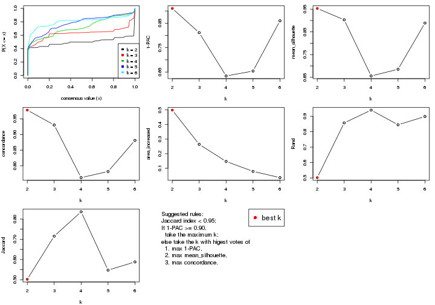

The numeric values for all these statistics can be obtained by `get_stats()`.

```r
get_stats(res)
```

```
#>   k 1-PAC mean_silhouette concordance area_increased  Rand Jaccard
#> 2 2 0.910           0.953       0.978         0.4989 0.502   0.502
#> 3 3 0.811           0.903       0.930         0.2639 0.857   0.716
#> 4 4 0.634           0.656       0.762         0.1469 0.940   0.836
#> 5 5 0.654           0.685       0.782         0.0787 0.845   0.548
#> 6 6 0.860           0.889       0.881         0.0358 0.899   0.588
```

`suggest_best_k()` suggests the best $k$ based on these statistics. The rules are as follows:

- All $k$ with Jaccard index larger than 0.95 are removed because the increase of
  the partition number does not provides enough extra information. If all $k$ are removed,
  the best $k$ is assigned by `NA`.
- For $k$ with 1-PAC larger than 0.9, the maximal $k$ is taken as the "best k". Other $k$ is called "optional k".
- If it does not fit the second rule. The $k$ with the highest vote of highest
  1-PAC, mean silhouette and concordance is taken as the "best k".

```r
suggest_best_k(res)
```

```
#> [1] 2
```


Following shows the table of the partitions (You need to click the **show/hide
code output** link to see it). The membership matrix (columns with name `p*`)
is inferred by
[`clue::cl_consensus()`](https://www.rdocumentation.org/link/cl_consensus?package=clue)
function with the `SE` method. Basically the value in the membership matrix
represents the probability to belong to a certain group. The finall class
label for an item is determined with the group with highest probability it
belongs to.

In `get_classes()` function, the entropy is calculated from the membership
matrix and the silhouette score is calculated from the consensus matrix.


<script>
$( function() {
	$( '#tabs-MAD-NMF-get-classes' ).tabs();
} );
</script>
<div id='tabs-MAD-NMF-get-classes'>
<ul>
<li><a href='#tab-MAD-NMF-get-classes-1'>k = 2</a></li>
<li><a href='#tab-MAD-NMF-get-classes-2'>k = 3</a></li>
<li><a href='#tab-MAD-NMF-get-classes-3'>k = 4</a></li>
<li><a href='#tab-MAD-NMF-get-classes-4'>k = 5</a></li>
<li><a href='#tab-MAD-NMF-get-classes-5'>k = 6</a></li>
</ul>

<div id='tab-MAD-NMF-get-classes-1'>
<p><a id='tab-MAD-NMF-get-classes-1-a' style='color:#0366d6' href='#'>show/hide code output</a></p>
<pre><code class="r">cbind(get_classes(res, k = 2), get_membership(res, k = 2))
</code></pre>

<pre><code>#&gt;           class entropy silhouette    p1    p2
#&gt; SRR902920     1  0.0000      0.959 1.000 0.000
#&gt; SRR902921     1  0.0000      0.959 1.000 0.000
#&gt; SRR902922     1  0.0000      0.959 1.000 0.000
#&gt; SRR902923     1  0.0000      0.959 1.000 0.000
#&gt; SRR902924     1  0.0000      0.959 1.000 0.000
#&gt; SRR902925     1  0.0000      0.959 1.000 0.000
#&gt; SRR902926     1  0.0000      0.959 1.000 0.000
#&gt; SRR902927     1  0.0000      0.959 1.000 0.000
#&gt; SRR902928     1  0.0000      0.959 1.000 0.000
#&gt; SRR902929     1  0.0000      0.959 1.000 0.000
#&gt; SRR902930     1  0.0000      0.959 1.000 0.000
#&gt; SRR902931     1  0.0000      0.959 1.000 0.000
#&gt; SRR902932     2  0.0000      1.000 0.000 1.000
#&gt; SRR902933     2  0.0000      1.000 0.000 1.000
#&gt; SRR902934     2  0.0000      1.000 0.000 1.000
#&gt; SRR902935     2  0.0000      1.000 0.000 1.000
#&gt; SRR902936     2  0.0000      1.000 0.000 1.000
#&gt; SRR902937     2  0.0000      1.000 0.000 1.000
#&gt; SRR902938     2  0.0000      1.000 0.000 1.000
#&gt; SRR902939     2  0.0000      1.000 0.000 1.000
#&gt; SRR902940     2  0.0000      1.000 0.000 1.000
#&gt; SRR902941     2  0.0000      1.000 0.000 1.000
#&gt; SRR902942     1  0.0000      0.959 1.000 0.000
#&gt; SRR902943     1  0.0000      0.959 1.000 0.000
#&gt; SRR902944     1  0.0000      0.959 1.000 0.000
#&gt; SRR902945     1  0.0000      0.959 1.000 0.000
#&gt; SRR902946     1  0.0000      0.959 1.000 0.000
#&gt; SRR902947     1  0.0000      0.959 1.000 0.000
#&gt; SRR902954     1  0.0000      0.959 1.000 0.000
#&gt; SRR902955     1  0.0000      0.959 1.000 0.000
#&gt; SRR902956     1  0.0000      0.959 1.000 0.000
#&gt; SRR902957     1  0.0000      0.959 1.000 0.000
#&gt; SRR902958     1  0.0000      0.959 1.000 0.000
#&gt; SRR902959     1  0.0000      0.959 1.000 0.000
#&gt; SRR902948     1  0.0000      0.959 1.000 0.000
#&gt; SRR902949     1  0.0000      0.959 1.000 0.000
#&gt; SRR902950     1  0.0000      0.959 1.000 0.000
#&gt; SRR902951     1  0.0000      0.959 1.000 0.000
#&gt; SRR902952     1  0.0000      0.959 1.000 0.000
#&gt; SRR902953     1  0.0000      0.959 1.000 0.000
#&gt; SRR902960     1  0.0000      0.959 1.000 0.000
#&gt; SRR902961     1  0.0000      0.959 1.000 0.000
#&gt; SRR902962     1  0.0000      0.959 1.000 0.000
#&gt; SRR902963     1  0.0000      0.959 1.000 0.000
#&gt; SRR902964     1  0.0000      0.959 1.000 0.000
#&gt; SRR902965     1  0.0000      0.959 1.000 0.000
#&gt; SRR902966     1  0.0000      0.959 1.000 0.000
#&gt; SRR902967     1  0.0000      0.959 1.000 0.000
#&gt; SRR902968     1  0.0000      0.959 1.000 0.000
#&gt; SRR902969     1  0.0000      0.959 1.000 0.000
#&gt; SRR902970     1  0.0000      0.959 1.000 0.000
#&gt; SRR902971     1  0.0000      0.959 1.000 0.000
#&gt; SRR902972     1  0.0000      0.959 1.000 0.000
#&gt; SRR902973     1  0.0000      0.959 1.000 0.000
#&gt; SRR902974     1  0.0000      0.959 1.000 0.000
#&gt; SRR902975     1  0.0000      0.959 1.000 0.000
#&gt; SRR902976     1  0.0000      0.959 1.000 0.000
#&gt; SRR902977     1  0.0000      0.959 1.000 0.000
#&gt; SRR902978     1  0.0000      0.959 1.000 0.000
#&gt; SRR902980     1  0.0000      0.959 1.000 0.000
#&gt; SRR902981     1  0.0000      0.959 1.000 0.000
#&gt; SRR902982     1  0.0000      0.959 1.000 0.000
#&gt; SRR902983     1  0.0000      0.959 1.000 0.000
#&gt; SRR902984     1  0.0000      0.959 1.000 0.000
#&gt; SRR902985     1  0.0000      0.959 1.000 0.000
#&gt; SRR902986     1  0.0000      0.959 1.000 0.000
#&gt; SRR902987     1  0.0000      0.959 1.000 0.000
#&gt; SRR902988     1  0.0000      0.959 1.000 0.000
#&gt; SRR902989     1  0.0000      0.959 1.000 0.000
#&gt; SRR902990     1  0.0000      0.959 1.000 0.000
#&gt; SRR902991     1  0.0000      0.959 1.000 0.000
#&gt; SRR902992     1  0.0000      0.959 1.000 0.000
#&gt; SRR902993     1  0.0000      0.959 1.000 0.000
#&gt; SRR902994     1  0.0000      0.959 1.000 0.000
#&gt; SRR902995     1  0.0000      0.959 1.000 0.000
#&gt; SRR902996     2  0.0000      1.000 0.000 1.000
#&gt; SRR902997     2  0.0000      1.000 0.000 1.000
#&gt; SRR902998     2  0.0000      1.000 0.000 1.000
#&gt; SRR902999     2  0.0000      1.000 0.000 1.000
#&gt; SRR903000     2  0.0000      1.000 0.000 1.000
#&gt; SRR903001     2  0.0000      1.000 0.000 1.000
#&gt; SRR903008     2  0.0000      1.000 0.000 1.000
#&gt; SRR903009     2  0.0000      1.000 0.000 1.000
#&gt; SRR903010     2  0.0000      1.000 0.000 1.000
#&gt; SRR903011     2  0.0000      1.000 0.000 1.000
#&gt; SRR903012     2  0.0000      1.000 0.000 1.000
#&gt; SRR903013     2  0.0000      1.000 0.000 1.000
#&gt; SRR903002     2  0.0000      1.000 0.000 1.000
#&gt; SRR903003     2  0.0000      1.000 0.000 1.000
#&gt; SRR903004     2  0.0000      1.000 0.000 1.000
#&gt; SRR903005     2  0.0000      1.000 0.000 1.000
#&gt; SRR903006     2  0.0000      1.000 0.000 1.000
#&gt; SRR903007     2  0.0000      1.000 0.000 1.000
#&gt; SRR903014     1  0.0000      0.959 1.000 0.000
#&gt; SRR903015     1  0.0000      0.959 1.000 0.000
#&gt; SRR903016     1  0.0000      0.959 1.000 0.000
#&gt; SRR903017     1  0.0000      0.959 1.000 0.000
#&gt; SRR903018     1  0.0000      0.959 1.000 0.000
#&gt; SRR903019     1  0.0000      0.959 1.000 0.000
#&gt; SRR903020     1  0.0000      0.959 1.000 0.000
#&gt; SRR903021     1  0.0000      0.959 1.000 0.000
#&gt; SRR903022     1  0.0000      0.959 1.000 0.000
#&gt; SRR903023     1  0.0000      0.959 1.000 0.000
#&gt; SRR903024     1  0.0000      0.959 1.000 0.000
#&gt; SRR903025     1  0.0000      0.959 1.000 0.000
#&gt; SRR903026     1  0.0000      0.959 1.000 0.000
#&gt; SRR903027     1  0.0000      0.959 1.000 0.000
#&gt; SRR903028     1  0.0000      0.959 1.000 0.000
#&gt; SRR903029     1  0.0000      0.959 1.000 0.000
#&gt; SRR903030     1  0.0000      0.959 1.000 0.000
#&gt; SRR903031     1  0.0000      0.959 1.000 0.000
#&gt; SRR903032     2  0.0000      1.000 0.000 1.000
#&gt; SRR903033     2  0.0000      1.000 0.000 1.000
#&gt; SRR903034     2  0.0000      1.000 0.000 1.000
#&gt; SRR903035     2  0.0000      1.000 0.000 1.000
#&gt; SRR903036     2  0.0000      1.000 0.000 1.000
#&gt; SRR903037     2  0.0000      1.000 0.000 1.000
#&gt; SRR903038     2  0.0000      1.000 0.000 1.000
#&gt; SRR903039     2  0.0000      1.000 0.000 1.000
#&gt; SRR903040     2  0.0000      1.000 0.000 1.000
#&gt; SRR903041     2  0.0000      1.000 0.000 1.000
#&gt; SRR903042     2  0.0000      1.000 0.000 1.000
#&gt; SRR903043     2  0.0000      1.000 0.000 1.000
#&gt; SRR903044     2  0.0000      1.000 0.000 1.000
#&gt; SRR903045     2  0.0000      1.000 0.000 1.000
#&gt; SRR903046     2  0.0000      1.000 0.000 1.000
#&gt; SRR903047     2  0.0000      1.000 0.000 1.000
#&gt; SRR903048     2  0.0000      1.000 0.000 1.000
#&gt; SRR903049     2  0.0000      1.000 0.000 1.000
#&gt; SRR903050     1  0.0000      0.959 1.000 0.000
#&gt; SRR903051     1  0.0000      0.959 1.000 0.000
#&gt; SRR903052     1  0.0000      0.959 1.000 0.000
#&gt; SRR903053     1  0.0000      0.959 1.000 0.000
#&gt; SRR903054     1  0.0000      0.959 1.000 0.000
#&gt; SRR903055     1  0.0000      0.959 1.000 0.000
#&gt; SRR903056     1  0.0000      0.959 1.000 0.000
#&gt; SRR903057     1  0.0000      0.959 1.000 0.000
#&gt; SRR903058     1  0.0000      0.959 1.000 0.000
#&gt; SRR903059     1  0.0000      0.959 1.000 0.000
#&gt; SRR903060     1  0.0000      0.959 1.000 0.000
#&gt; SRR903061     1  0.0000      0.959 1.000 0.000
#&gt; SRR903062     1  0.0000      0.959 1.000 0.000
#&gt; SRR903063     1  0.0000      0.959 1.000 0.000
#&gt; SRR903064     1  0.0000      0.959 1.000 0.000
#&gt; SRR903065     1  0.0000      0.959 1.000 0.000
#&gt; SRR903066     1  0.0000      0.959 1.000 0.000
#&gt; SRR903067     1  0.0000      0.959 1.000 0.000
#&gt; SRR903068     1  0.0000      0.959 1.000 0.000
#&gt; SRR903069     1  0.0000      0.959 1.000 0.000
#&gt; SRR903070     1  0.0000      0.959 1.000 0.000
#&gt; SRR903071     1  0.0000      0.959 1.000 0.000
#&gt; SRR903072     1  0.0000      0.959 1.000 0.000
#&gt; SRR903073     1  0.0000      0.959 1.000 0.000
#&gt; SRR903074     1  0.0000      0.959 1.000 0.000
#&gt; SRR903075     1  0.0000      0.959 1.000 0.000
#&gt; SRR903076     1  0.0000      0.959 1.000 0.000
#&gt; SRR903077     1  0.0000      0.959 1.000 0.000
#&gt; SRR903078     1  0.0000      0.959 1.000 0.000
#&gt; SRR903079     1  0.0000      0.959 1.000 0.000
#&gt; SRR903080     1  0.0000      0.959 1.000 0.000
#&gt; SRR903081     1  0.0000      0.959 1.000 0.000
#&gt; SRR903082     2  0.0000      1.000 0.000 1.000
#&gt; SRR903083     2  0.0000      1.000 0.000 1.000
#&gt; SRR903084     2  0.0000      1.000 0.000 1.000
#&gt; SRR903085     2  0.0000      1.000 0.000 1.000
#&gt; SRR903086     2  0.0000      1.000 0.000 1.000
#&gt; SRR903087     2  0.0000      1.000 0.000 1.000
#&gt; SRR903088     2  0.0000      1.000 0.000 1.000
#&gt; SRR903089     2  0.0000      1.000 0.000 1.000
#&gt; SRR903090     2  0.0000      1.000 0.000 1.000
#&gt; SRR903091     2  0.0000      1.000 0.000 1.000
#&gt; SRR903092     2  0.0000      1.000 0.000 1.000
#&gt; SRR903093     2  0.0000      1.000 0.000 1.000
#&gt; SRR903094     2  0.0000      1.000 0.000 1.000
#&gt; SRR903095     2  0.0000      1.000 0.000 1.000
#&gt; SRR903096     2  0.0000      1.000 0.000 1.000
#&gt; SRR903097     2  0.0000      1.000 0.000 1.000
#&gt; SRR903098     2  0.0000      1.000 0.000 1.000
#&gt; SRR903099     2  0.0000      1.000 0.000 1.000
#&gt; SRR903100     2  0.0000      1.000 0.000 1.000
#&gt; SRR903101     2  0.0000      1.000 0.000 1.000
#&gt; SRR903102     2  0.0000      1.000 0.000 1.000
#&gt; SRR903103     2  0.0000      1.000 0.000 1.000
#&gt; SRR903104     2  0.0000      1.000 0.000 1.000
#&gt; SRR903105     2  0.0000      1.000 0.000 1.000
#&gt; SRR903106     2  0.0000      1.000 0.000 1.000
#&gt; SRR903107     2  0.0000      1.000 0.000 1.000
#&gt; SRR903108     2  0.0000      1.000 0.000 1.000
#&gt; SRR903109     2  0.0000      1.000 0.000 1.000
#&gt; SRR903110     2  0.0000      1.000 0.000 1.000
#&gt; SRR903111     2  0.0000      1.000 0.000 1.000
#&gt; SRR903112     2  0.0000      1.000 0.000 1.000
#&gt; SRR903113     2  0.0000      1.000 0.000 1.000
#&gt; SRR903114     1  0.9129      0.574 0.672 0.328
#&gt; SRR903115     1  0.9248      0.551 0.660 0.340
#&gt; SRR903116     1  0.9087      0.582 0.676 0.324
#&gt; SRR903117     1  0.9000      0.596 0.684 0.316
#&gt; SRR903118     1  0.9087      0.582 0.676 0.324
#&gt; SRR903119     1  0.9000      0.596 0.684 0.316
#&gt; SRR903121     1  0.9460      0.501 0.636 0.364
#&gt; SRR903122     1  0.7219      0.774 0.800 0.200
#&gt; SRR903124     1  0.7219      0.774 0.800 0.200
#&gt; SRR903125     1  0.7219      0.774 0.800 0.200
#&gt; SRR903126     1  0.7219      0.774 0.800 0.200
#&gt; SRR903127     1  0.7219      0.774 0.800 0.200
#&gt; SRR903128     1  0.7219      0.774 0.800 0.200
#&gt; SRR903129     1  0.7219      0.774 0.800 0.200
#&gt; SRR903130     1  0.7219      0.774 0.800 0.200
#&gt; SRR903131     1  0.7219      0.774 0.800 0.200
#&gt; SRR903132     1  0.7219      0.774 0.800 0.200
#&gt; SRR903133     1  0.7219      0.774 0.800 0.200
#&gt; SRR903134     1  0.7219      0.774 0.800 0.200
#&gt; SRR903135     1  0.7219      0.774 0.800 0.200
#&gt; SRR903136     1  0.7219      0.774 0.800 0.200
#&gt; SRR903137     1  0.7219      0.774 0.800 0.200
#&gt; SRR903146     2  0.0000      1.000 0.000 1.000
#&gt; SRR903147     2  0.0000      1.000 0.000 1.000
#&gt; SRR903148     2  0.0000      1.000 0.000 1.000
#&gt; SRR903149     2  0.0000      1.000 0.000 1.000
#&gt; SRR903150     2  0.0000      1.000 0.000 1.000
#&gt; SRR903151     2  0.0000      1.000 0.000 1.000
#&gt; SRR903152     2  0.0000      1.000 0.000 1.000
#&gt; SRR903153     2  0.0000      1.000 0.000 1.000
#&gt; SRR903138     1  0.9635      0.447 0.612 0.388
#&gt; SRR903139     1  0.9635      0.447 0.612 0.388
#&gt; SRR903140     1  0.9635      0.447 0.612 0.388
#&gt; SRR903141     1  0.9608      0.457 0.616 0.384
#&gt; SRR903142     1  0.9522      0.484 0.628 0.372
#&gt; SRR903143     1  0.9522      0.484 0.628 0.372
#&gt; SRR903144     1  0.9608      0.457 0.616 0.384
#&gt; SRR903145     1  0.9635      0.447 0.612 0.388
#&gt; SRR903154     2  0.0000      1.000 0.000 1.000
#&gt; SRR903155     2  0.0000      1.000 0.000 1.000
#&gt; SRR903156     2  0.0000      1.000 0.000 1.000
#&gt; SRR903157     2  0.0000      1.000 0.000 1.000
#&gt; SRR903158     2  0.0000      1.000 0.000 1.000
#&gt; SRR903159     2  0.0000      1.000 0.000 1.000
#&gt; SRR903160     2  0.0000      1.000 0.000 1.000
#&gt; SRR903161     2  0.0000      1.000 0.000 1.000
#&gt; SRR903162     2  0.0000      1.000 0.000 1.000
#&gt; SRR903163     2  0.0000      1.000 0.000 1.000
#&gt; SRR903164     2  0.0000      1.000 0.000 1.000
#&gt; SRR903165     2  0.0000      1.000 0.000 1.000
#&gt; SRR903166     2  0.0000      1.000 0.000 1.000
#&gt; SRR903167     2  0.0000      1.000 0.000 1.000
#&gt; SRR903168     2  0.0000      1.000 0.000 1.000
#&gt; SRR903169     2  0.0000      1.000 0.000 1.000
#&gt; SRR903178     1  0.0000      0.959 1.000 0.000
#&gt; SRR903179     1  0.0000      0.959 1.000 0.000
#&gt; SRR903180     1  0.0000      0.959 1.000 0.000
#&gt; SRR903181     1  0.0000      0.959 1.000 0.000
#&gt; SRR903182     1  0.0000      0.959 1.000 0.000
#&gt; SRR903183     1  0.0000      0.959 1.000 0.000
#&gt; SRR903184     1  0.0000      0.959 1.000 0.000
#&gt; SRR903185     1  0.0000      0.959 1.000 0.000
#&gt; SRR903170     2  0.0000      1.000 0.000 1.000
#&gt; SRR903171     2  0.0000      1.000 0.000 1.000
#&gt; SRR903172     2  0.0000      1.000 0.000 1.000
#&gt; SRR903173     2  0.0000      1.000 0.000 1.000
#&gt; SRR903174     2  0.0000      1.000 0.000 1.000
#&gt; SRR903175     2  0.0000      1.000 0.000 1.000
#&gt; SRR903176     2  0.0000      1.000 0.000 1.000
#&gt; SRR903177     2  0.0000      1.000 0.000 1.000
#&gt; SRR903186     1  0.0000      0.959 1.000 0.000
#&gt; SRR903187     1  0.0000      0.959 1.000 0.000
#&gt; SRR903188     1  0.0000      0.959 1.000 0.000
#&gt; SRR903189     1  0.0000      0.959 1.000 0.000
#&gt; SRR903190     1  0.0000      0.959 1.000 0.000
#&gt; SRR903191     1  0.0000      0.959 1.000 0.000
#&gt; SRR903192     1  0.0000      0.959 1.000 0.000
#&gt; SRR903193     1  0.0000      0.959 1.000 0.000
#&gt; SRR903194     1  0.0000      0.959 1.000 0.000
#&gt; SRR903195     1  0.0000      0.959 1.000 0.000
#&gt; SRR903196     1  0.0000      0.959 1.000 0.000
#&gt; SRR903197     1  0.0000      0.959 1.000 0.000
#&gt; SRR903198     1  0.0000      0.959 1.000 0.000
#&gt; SRR903199     1  0.0000      0.959 1.000 0.000
#&gt; SRR903200     1  0.0000      0.959 1.000 0.000
#&gt; SRR903201     1  0.0000      0.959 1.000 0.000
#&gt; SRR903210     2  0.0000      1.000 0.000 1.000
#&gt; SRR903211     2  0.0000      1.000 0.000 1.000
#&gt; SRR903212     2  0.0000      1.000 0.000 1.000
#&gt; SRR903213     2  0.0000      1.000 0.000 1.000
#&gt; SRR903214     2  0.0000      1.000 0.000 1.000
#&gt; SRR903215     2  0.0000      1.000 0.000 1.000
#&gt; SRR903216     2  0.0000      1.000 0.000 1.000
#&gt; SRR903217     2  0.0000      1.000 0.000 1.000
#&gt; SRR903202     1  0.0000      0.959 1.000 0.000
#&gt; SRR903203     1  0.0000      0.959 1.000 0.000
#&gt; SRR903204     1  0.0000      0.959 1.000 0.000
#&gt; SRR903205     1  0.0000      0.959 1.000 0.000
#&gt; SRR903206     1  0.0000      0.959 1.000 0.000
#&gt; SRR903207     1  0.0000      0.959 1.000 0.000
#&gt; SRR903208     1  0.0000      0.959 1.000 0.000
#&gt; SRR903209     1  0.0000      0.959 1.000 0.000
#&gt; SRR903218     2  0.0000      1.000 0.000 1.000
#&gt; SRR903219     2  0.0000      1.000 0.000 1.000
#&gt; SRR903220     2  0.0000      1.000 0.000 1.000
#&gt; SRR903221     2  0.0000      1.000 0.000 1.000
#&gt; SRR903222     2  0.0000      1.000 0.000 1.000
#&gt; SRR903223     2  0.0000      1.000 0.000 1.000
#&gt; SRR903224     2  0.0000      1.000 0.000 1.000
#&gt; SRR903225     2  0.0000      1.000 0.000 1.000
#&gt; SRR903226     2  0.0000      1.000 0.000 1.000
#&gt; SRR903227     2  0.0000      1.000 0.000 1.000
#&gt; SRR903228     2  0.0000      1.000 0.000 1.000
#&gt; SRR903229     2  0.0000      1.000 0.000 1.000
#&gt; SRR903230     2  0.0000      1.000 0.000 1.000
#&gt; SRR903231     2  0.0000      1.000 0.000 1.000
#&gt; SRR903232     2  0.0000      1.000 0.000 1.000
#&gt; SRR903233     2  0.0000      1.000 0.000 1.000
#&gt; SRR903242     1  0.4815      0.875 0.896 0.104
#&gt; SRR903243     1  0.4815      0.875 0.896 0.104
#&gt; SRR903244     1  0.4431      0.886 0.908 0.092
#&gt; SRR903245     1  0.4022      0.897 0.920 0.080
#&gt; SRR903246     1  0.4431      0.886 0.908 0.092
#&gt; SRR903247     1  0.4690      0.879 0.900 0.100
#&gt; SRR903248     1  0.4431      0.886 0.908 0.092
#&gt; SRR903249     1  0.4939      0.872 0.892 0.108
#&gt; SRR903234     2  0.0000      1.000 0.000 1.000
#&gt; SRR903235     2  0.0000      1.000 0.000 1.000
#&gt; SRR903236     2  0.0000      1.000 0.000 1.000
#&gt; SRR903237     2  0.0000      1.000 0.000 1.000
#&gt; SRR903238     2  0.0000      1.000 0.000 1.000
#&gt; SRR903239     2  0.0000      1.000 0.000 1.000
#&gt; SRR903240     2  0.0000      1.000 0.000 1.000
#&gt; SRR903241     2  0.0000      1.000 0.000 1.000
#&gt; SRR903258     1  0.0000      0.959 1.000 0.000
#&gt; SRR903259     1  0.0000      0.959 1.000 0.000
#&gt; SRR903260     1  0.0000      0.959 1.000 0.000
#&gt; SRR903261     1  0.0000      0.959 1.000 0.000
#&gt; SRR903262     1  0.0000      0.959 1.000 0.000
#&gt; SRR903263     1  0.0000      0.959 1.000 0.000
#&gt; SRR903264     1  0.0000      0.959 1.000 0.000
#&gt; SRR903265     1  0.0000      0.959 1.000 0.000
#&gt; SRR903250     1  0.0000      0.959 1.000 0.000
#&gt; SRR903251     1  0.0000      0.959 1.000 0.000
#&gt; SRR903252     1  0.0000      0.959 1.000 0.000
#&gt; SRR903253     1  0.0000      0.959 1.000 0.000
#&gt; SRR903254     1  0.0000      0.959 1.000 0.000
#&gt; SRR903255     1  0.0000      0.959 1.000 0.000
#&gt; SRR903256     1  0.0000      0.959 1.000 0.000
#&gt; SRR903257     1  0.0000      0.959 1.000 0.000
#&gt; SRR903266     1  0.0672      0.953 0.992 0.008
#&gt; SRR903267     1  0.0938      0.950 0.988 0.012
#&gt; SRR903268     1  0.0938      0.950 0.988 0.012
#&gt; SRR903270     1  0.0672      0.953 0.992 0.008
#&gt; SRR903271     1  0.1184      0.947 0.984 0.016
#&gt; SRR903272     1  0.0672      0.953 0.992 0.008
#&gt; SRR903273     1  0.1414      0.944 0.980 0.020
#&gt; SRR903274     2  0.0000      1.000 0.000 1.000
#&gt; SRR903275     2  0.0000      1.000 0.000 1.000
#&gt; SRR903276     2  0.0000      1.000 0.000 1.000
#&gt; SRR903277     2  0.0000      1.000 0.000 1.000
#&gt; SRR903278     2  0.0000      1.000 0.000 1.000
#&gt; SRR903279     2  0.0000      1.000 0.000 1.000
#&gt; SRR903280     2  0.0000      1.000 0.000 1.000
#&gt; SRR903281     2  0.0000      1.000 0.000 1.000
#&gt; SRR903282     2  0.0000      1.000 0.000 1.000
#&gt; SRR903283     2  0.0000      1.000 0.000 1.000
#&gt; SRR903284     2  0.0000      1.000 0.000 1.000
#&gt; SRR903285     2  0.0000      1.000 0.000 1.000
#&gt; SRR903286     2  0.0000      1.000 0.000 1.000
#&gt; SRR903287     2  0.0000      1.000 0.000 1.000
#&gt; SRR903288     2  0.0000      1.000 0.000 1.000
#&gt; SRR903289     2  0.0000      1.000 0.000 1.000
#&gt; SRR903290     2  0.0000      1.000 0.000 1.000
#&gt; SRR903291     2  0.0000      1.000 0.000 1.000
#&gt; SRR903292     2  0.0000      1.000 0.000 1.000
#&gt; SRR903293     2  0.0000      1.000 0.000 1.000
#&gt; SRR903294     2  0.0000      1.000 0.000 1.000
#&gt; SRR903295     2  0.0000      1.000 0.000 1.000
#&gt; SRR903296     2  0.0000      1.000 0.000 1.000
#&gt; SRR903297     2  0.0000      1.000 0.000 1.000
#&gt; SRR903298     2  0.0000      1.000 0.000 1.000
#&gt; SRR903299     2  0.0000      1.000 0.000 1.000
#&gt; SRR903300     2  0.0000      1.000 0.000 1.000
#&gt; SRR903301     2  0.0000      1.000 0.000 1.000
#&gt; SRR903302     2  0.0000      1.000 0.000 1.000
#&gt; SRR903303     2  0.0000      1.000 0.000 1.000
#&gt; SRR903304     2  0.0000      1.000 0.000 1.000
#&gt; SRR903305     2  0.0000      1.000 0.000 1.000
#&gt; SRR903306     1  0.0000      0.959 1.000 0.000
#&gt; SRR903307     1  0.0000      0.959 1.000 0.000
#&gt; SRR903308     1  0.0000      0.959 1.000 0.000
#&gt; SRR903309     1  0.0000      0.959 1.000 0.000
#&gt; SRR903310     1  0.0000      0.959 1.000 0.000
#&gt; SRR903311     1  0.0000      0.959 1.000 0.000
#&gt; SRR903312     1  0.0000      0.959 1.000 0.000
#&gt; SRR903313     1  0.0000      0.959 1.000 0.000
#&gt; SRR903314     1  0.0000      0.959 1.000 0.000
#&gt; SRR903315     1  0.0000      0.959 1.000 0.000
#&gt; SRR903316     1  0.0000      0.959 1.000 0.000
#&gt; SRR903317     1  0.0000      0.959 1.000 0.000
#&gt; SRR903318     1  0.0000      0.959 1.000 0.000
#&gt; SRR903319     1  0.0000      0.959 1.000 0.000
#&gt; SRR903320     1  0.0000      0.959 1.000 0.000
#&gt; SRR903321     1  0.0000      0.959 1.000 0.000
#&gt; SRR903322     1  0.0000      0.959 1.000 0.000
#&gt; SRR903323     1  0.0000      0.959 1.000 0.000
#&gt; SRR903324     2  0.0000      1.000 0.000 1.000
#&gt; SRR903325     2  0.0000      1.000 0.000 1.000
#&gt; SRR903326     2  0.0000      1.000 0.000 1.000
#&gt; SRR903327     2  0.0000      1.000 0.000 1.000
#&gt; SRR903328     2  0.0000      1.000 0.000 1.000
#&gt; SRR903329     2  0.0000      1.000 0.000 1.000
#&gt; SRR903330     2  0.0000      1.000 0.000 1.000
#&gt; SRR903331     2  0.0000      1.000 0.000 1.000
#&gt; SRR903332     2  0.0000      1.000 0.000 1.000
#&gt; SRR903333     2  0.0000      1.000 0.000 1.000
#&gt; SRR903334     2  0.0000      1.000 0.000 1.000
#&gt; SRR903335     2  0.0000      1.000 0.000 1.000
#&gt; SRR903336     2  0.0000      1.000 0.000 1.000
#&gt; SRR903337     2  0.0000      1.000 0.000 1.000
#&gt; SRR903338     2  0.0000      1.000 0.000 1.000
#&gt; SRR903339     2  0.0000      1.000 0.000 1.000
#&gt; SRR903340     2  0.0000      1.000 0.000 1.000
#&gt; SRR903341     2  0.0000      1.000 0.000 1.000
</code></pre>

<script>
$('#tab-MAD-NMF-get-classes-1-a').parent().next().next().hide();
$('#tab-MAD-NMF-get-classes-1-a').click(function(){
  $('#tab-MAD-NMF-get-classes-1-a').parent().next().next().toggle();
  return(false);
});
</script>
</div>

<div id='tab-MAD-NMF-get-classes-2'>
<p><a id='tab-MAD-NMF-get-classes-2-a' style='color:#0366d6' href='#'>show/hide code output</a></p>
<pre><code class="r">cbind(get_classes(res, k = 3), get_membership(res, k = 3))
</code></pre>

<pre><code>#&gt;           class entropy silhouette    p1    p2    p3
#&gt; SRR902920     3  0.2165     0.9253 0.064 0.000 0.936
#&gt; SRR902921     3  0.2261     0.9250 0.068 0.000 0.932
#&gt; SRR902922     3  0.2261     0.9250 0.068 0.000 0.932
#&gt; SRR902923     3  0.2165     0.9253 0.064 0.000 0.936
#&gt; SRR902924     3  0.1529     0.9250 0.040 0.000 0.960
#&gt; SRR902925     3  0.1529     0.9250 0.040 0.000 0.960
#&gt; SRR902926     3  0.1643     0.9253 0.044 0.000 0.956
#&gt; SRR902927     3  0.1860     0.9256 0.052 0.000 0.948
#&gt; SRR902928     3  0.2356     0.9244 0.072 0.000 0.928
#&gt; SRR902929     3  0.2356     0.9244 0.072 0.000 0.928
#&gt; SRR902930     3  0.2356     0.9244 0.072 0.000 0.928
#&gt; SRR902931     3  0.2356     0.9244 0.072 0.000 0.928
#&gt; SRR902932     2  0.0000     0.9703 0.000 1.000 0.000
#&gt; SRR902933     2  0.0000     0.9703 0.000 1.000 0.000
#&gt; SRR902934     2  0.0000     0.9703 0.000 1.000 0.000
#&gt; SRR902935     2  0.0000     0.9703 0.000 1.000 0.000
#&gt; SRR902936     2  0.0000     0.9703 0.000 1.000 0.000
#&gt; SRR902937     2  0.0000     0.9703 0.000 1.000 0.000
#&gt; SRR902938     2  0.0000     0.9703 0.000 1.000 0.000
#&gt; SRR902939     2  0.0000     0.9703 0.000 1.000 0.000
#&gt; SRR902940     2  0.0000     0.9703 0.000 1.000 0.000
#&gt; SRR902941     2  0.0000     0.9703 0.000 1.000 0.000
#&gt; SRR902942     1  0.6305    -0.1089 0.516 0.000 0.484
#&gt; SRR902943     1  0.6299    -0.0765 0.524 0.000 0.476
#&gt; SRR902944     1  0.6305    -0.1089 0.516 0.000 0.484
#&gt; SRR902945     1  0.6295    -0.0600 0.528 0.000 0.472
#&gt; SRR902946     1  0.6305    -0.1089 0.516 0.000 0.484
#&gt; SRR902947     1  0.6307    -0.1250 0.512 0.000 0.488
#&gt; SRR902954     3  0.5678     0.6728 0.316 0.000 0.684
#&gt; SRR902955     3  0.5785     0.6414 0.332 0.000 0.668
#&gt; SRR902956     3  0.5760     0.6495 0.328 0.000 0.672
#&gt; SRR902957     3  0.5706     0.6652 0.320 0.000 0.680
#&gt; SRR902958     3  0.5650     0.6800 0.312 0.000 0.688
#&gt; SRR902959     3  0.5678     0.6728 0.316 0.000 0.684
#&gt; SRR902948     3  0.5431     0.7267 0.284 0.000 0.716
#&gt; SRR902949     3  0.5591     0.6940 0.304 0.000 0.696
#&gt; SRR902950     3  0.5497     0.7140 0.292 0.000 0.708
#&gt; SRR902951     3  0.5465     0.7204 0.288 0.000 0.712
#&gt; SRR902952     3  0.5397     0.7327 0.280 0.000 0.720
#&gt; SRR902953     3  0.5431     0.7267 0.284 0.000 0.716
#&gt; SRR902960     3  0.3752     0.8928 0.144 0.000 0.856
#&gt; SRR902961     3  0.3752     0.8928 0.144 0.000 0.856
#&gt; SRR902962     3  0.3752     0.8928 0.144 0.000 0.856
#&gt; SRR902963     3  0.3752     0.8928 0.144 0.000 0.856
#&gt; SRR902964     3  0.3752     0.8928 0.144 0.000 0.856
#&gt; SRR902965     3  0.3752     0.8928 0.144 0.000 0.856
#&gt; SRR902966     3  0.3752     0.8928 0.144 0.000 0.856
#&gt; SRR902967     3  0.3752     0.8928 0.144 0.000 0.856
#&gt; SRR902968     3  0.3752     0.8928 0.144 0.000 0.856
#&gt; SRR902969     3  0.3752     0.8928 0.144 0.000 0.856
#&gt; SRR902970     3  0.3752     0.8928 0.144 0.000 0.856
#&gt; SRR902971     3  0.3752     0.8928 0.144 0.000 0.856
#&gt; SRR902972     3  0.3752     0.8928 0.144 0.000 0.856
#&gt; SRR902973     3  0.3752     0.8928 0.144 0.000 0.856
#&gt; SRR902974     3  0.3752     0.8928 0.144 0.000 0.856
#&gt; SRR902975     3  0.3752     0.8928 0.144 0.000 0.856
#&gt; SRR902976     3  0.3752     0.8928 0.144 0.000 0.856
#&gt; SRR902977     3  0.3752     0.8928 0.144 0.000 0.856
#&gt; SRR902978     3  0.1031     0.9224 0.024 0.000 0.976
#&gt; SRR902980     3  0.1031     0.9224 0.024 0.000 0.976
#&gt; SRR902981     3  0.1031     0.9224 0.024 0.000 0.976
#&gt; SRR902982     3  0.0747     0.9184 0.016 0.000 0.984
#&gt; SRR902983     3  0.1163     0.9235 0.028 0.000 0.972
#&gt; SRR902984     3  0.0000     0.9087 0.000 0.000 1.000
#&gt; SRR902985     3  0.0000     0.9087 0.000 0.000 1.000
#&gt; SRR902986     3  0.0000     0.9087 0.000 0.000 1.000
#&gt; SRR902987     3  0.0000     0.9087 0.000 0.000 1.000
#&gt; SRR902988     3  0.0000     0.9087 0.000 0.000 1.000
#&gt; SRR902989     3  0.0000     0.9087 0.000 0.000 1.000
#&gt; SRR902990     3  0.0000     0.9087 0.000 0.000 1.000
#&gt; SRR902991     3  0.0000     0.9087 0.000 0.000 1.000
#&gt; SRR902992     3  0.0000     0.9087 0.000 0.000 1.000
#&gt; SRR902993     3  0.0000     0.9087 0.000 0.000 1.000
#&gt; SRR902994     3  0.0000     0.9087 0.000 0.000 1.000
#&gt; SRR902995     3  0.0000     0.9087 0.000 0.000 1.000
#&gt; SRR902996     2  0.0000     0.9703 0.000 1.000 0.000
#&gt; SRR902997     2  0.0000     0.9703 0.000 1.000 0.000
#&gt; SRR902998     2  0.0000     0.9703 0.000 1.000 0.000
#&gt; SRR902999     2  0.0000     0.9703 0.000 1.000 0.000
#&gt; SRR903000     2  0.0000     0.9703 0.000 1.000 0.000
#&gt; SRR903001     2  0.0000     0.9703 0.000 1.000 0.000
#&gt; SRR903008     2  0.0000     0.9703 0.000 1.000 0.000
#&gt; SRR903009     2  0.0000     0.9703 0.000 1.000 0.000
#&gt; SRR903010     2  0.0000     0.9703 0.000 1.000 0.000
#&gt; SRR903011     2  0.0000     0.9703 0.000 1.000 0.000
#&gt; SRR903012     2  0.0000     0.9703 0.000 1.000 0.000
#&gt; SRR903013     2  0.0000     0.9703 0.000 1.000 0.000
#&gt; SRR903002     2  0.0000     0.9703 0.000 1.000 0.000
#&gt; SRR903003     2  0.0000     0.9703 0.000 1.000 0.000
#&gt; SRR903004     2  0.0000     0.9703 0.000 1.000 0.000
#&gt; SRR903005     2  0.0000     0.9703 0.000 1.000 0.000
#&gt; SRR903006     2  0.0000     0.9703 0.000 1.000 0.000
#&gt; SRR903007     2  0.0000     0.9703 0.000 1.000 0.000
#&gt; SRR903014     3  0.2448     0.9235 0.076 0.000 0.924
#&gt; SRR903015     3  0.2448     0.9235 0.076 0.000 0.924
#&gt; SRR903016     3  0.2356     0.9244 0.072 0.000 0.928
#&gt; SRR903017     3  0.2448     0.9235 0.076 0.000 0.924
#&gt; SRR903018     3  0.2261     0.9250 0.068 0.000 0.932
#&gt; SRR903019     3  0.2356     0.9244 0.072 0.000 0.928
#&gt; SRR903020     3  0.1289     0.9241 0.032 0.000 0.968
#&gt; SRR903021     3  0.1289     0.9241 0.032 0.000 0.968
#&gt; SRR903022     3  0.1860     0.9256 0.052 0.000 0.948
#&gt; SRR903023     3  0.1289     0.9241 0.032 0.000 0.968
#&gt; SRR903024     3  0.1411     0.9246 0.036 0.000 0.964
#&gt; SRR903025     3  0.1964     0.9256 0.056 0.000 0.944
#&gt; SRR903026     3  0.2448     0.9235 0.076 0.000 0.924
#&gt; SRR903027     3  0.2625     0.9208 0.084 0.000 0.916
#&gt; SRR903028     3  0.2625     0.9208 0.084 0.000 0.916
#&gt; SRR903029     3  0.2625     0.9208 0.084 0.000 0.916
#&gt; SRR903030     3  0.2448     0.9235 0.076 0.000 0.924
#&gt; SRR903031     3  0.2537     0.9222 0.080 0.000 0.920
#&gt; SRR903032     2  0.0000     0.9703 0.000 1.000 0.000
#&gt; SRR903033     2  0.0000     0.9703 0.000 1.000 0.000
#&gt; SRR903034     2  0.0000     0.9703 0.000 1.000 0.000
#&gt; SRR903035     2  0.0000     0.9703 0.000 1.000 0.000
#&gt; SRR903036     2  0.0000     0.9703 0.000 1.000 0.000
#&gt; SRR903037     2  0.0000     0.9703 0.000 1.000 0.000
#&gt; SRR903038     2  0.0000     0.9703 0.000 1.000 0.000
#&gt; SRR903039     2  0.0000     0.9703 0.000 1.000 0.000
#&gt; SRR903040     2  0.0000     0.9703 0.000 1.000 0.000
#&gt; SRR903041     2  0.0000     0.9703 0.000 1.000 0.000
#&gt; SRR903042     2  0.0000     0.9703 0.000 1.000 0.000
#&gt; SRR903043     2  0.0000     0.9703 0.000 1.000 0.000
#&gt; SRR903044     2  0.0000     0.9703 0.000 1.000 0.000
#&gt; SRR903045     2  0.0000     0.9703 0.000 1.000 0.000
#&gt; SRR903046     2  0.0000     0.9703 0.000 1.000 0.000
#&gt; SRR903047     2  0.0000     0.9703 0.000 1.000 0.000
#&gt; SRR903048     2  0.0000     0.9703 0.000 1.000 0.000
#&gt; SRR903049     2  0.0000     0.9703 0.000 1.000 0.000
#&gt; SRR903050     1  0.1964     0.8858 0.944 0.000 0.056
#&gt; SRR903051     1  0.1964     0.8858 0.944 0.000 0.056
#&gt; SRR903052     1  0.1964     0.8858 0.944 0.000 0.056
#&gt; SRR903053     1  0.1964     0.8858 0.944 0.000 0.056
#&gt; SRR903054     1  0.1964     0.8858 0.944 0.000 0.056
#&gt; SRR903055     1  0.1964     0.8858 0.944 0.000 0.056
#&gt; SRR903056     1  0.1964     0.8858 0.944 0.000 0.056
#&gt; SRR903057     1  0.1964     0.8858 0.944 0.000 0.056
#&gt; SRR903058     1  0.1964     0.8858 0.944 0.000 0.056
#&gt; SRR903059     1  0.1964     0.8858 0.944 0.000 0.056
#&gt; SRR903060     1  0.1964     0.8858 0.944 0.000 0.056
#&gt; SRR903061     1  0.1964     0.8858 0.944 0.000 0.056
#&gt; SRR903062     1  0.1964     0.8858 0.944 0.000 0.056
#&gt; SRR903063     1  0.1964     0.8858 0.944 0.000 0.056
#&gt; SRR903064     1  0.1964     0.8858 0.944 0.000 0.056
#&gt; SRR903065     1  0.1964     0.8858 0.944 0.000 0.056
#&gt; SRR903066     1  0.1964     0.8858 0.944 0.000 0.056
#&gt; SRR903067     1  0.1964     0.8858 0.944 0.000 0.056
#&gt; SRR903068     1  0.1964     0.8858 0.944 0.000 0.056
#&gt; SRR903069     1  0.1964     0.8858 0.944 0.000 0.056
#&gt; SRR903070     1  0.1964     0.8858 0.944 0.000 0.056
#&gt; SRR903071     1  0.1964     0.8858 0.944 0.000 0.056
#&gt; SRR903072     1  0.1964     0.8858 0.944 0.000 0.056
#&gt; SRR903073     1  0.1964     0.8858 0.944 0.000 0.056
#&gt; SRR903074     1  0.1964     0.8858 0.944 0.000 0.056
#&gt; SRR903075     1  0.1964     0.8858 0.944 0.000 0.056
#&gt; SRR903076     1  0.1964     0.8858 0.944 0.000 0.056
#&gt; SRR903077     1  0.1964     0.8858 0.944 0.000 0.056
#&gt; SRR903078     1  0.1964     0.8858 0.944 0.000 0.056
#&gt; SRR903079     1  0.1964     0.8858 0.944 0.000 0.056
#&gt; SRR903080     1  0.1964     0.8858 0.944 0.000 0.056
#&gt; SRR903081     1  0.1964     0.8858 0.944 0.000 0.056
#&gt; SRR903082     2  0.1964     0.9768 0.056 0.944 0.000
#&gt; SRR903083     2  0.1964     0.9768 0.056 0.944 0.000
#&gt; SRR903084     2  0.1964     0.9768 0.056 0.944 0.000
#&gt; SRR903085     2  0.1964     0.9768 0.056 0.944 0.000
#&gt; SRR903086     2  0.1964     0.9768 0.056 0.944 0.000
#&gt; SRR903087     2  0.1964     0.9768 0.056 0.944 0.000
#&gt; SRR903088     2  0.1964     0.9768 0.056 0.944 0.000
#&gt; SRR903089     2  0.1964     0.9768 0.056 0.944 0.000
#&gt; SRR903090     2  0.1964     0.9768 0.056 0.944 0.000
#&gt; SRR903091     2  0.1964     0.9768 0.056 0.944 0.000
#&gt; SRR903092     2  0.1964     0.9768 0.056 0.944 0.000
#&gt; SRR903093     2  0.1964     0.9768 0.056 0.944 0.000
#&gt; SRR903094     2  0.1964     0.9768 0.056 0.944 0.000
#&gt; SRR903095     2  0.1964     0.9768 0.056 0.944 0.000
#&gt; SRR903096     2  0.1964     0.9768 0.056 0.944 0.000
#&gt; SRR903097     2  0.1964     0.9768 0.056 0.944 0.000
#&gt; SRR903098     2  0.1964     0.9768 0.056 0.944 0.000
#&gt; SRR903099     2  0.1964     0.9768 0.056 0.944 0.000
#&gt; SRR903100     2  0.1964     0.9768 0.056 0.944 0.000
#&gt; SRR903101     2  0.1964     0.9768 0.056 0.944 0.000
#&gt; SRR903102     2  0.1964     0.9768 0.056 0.944 0.000
#&gt; SRR903103     2  0.1964     0.9768 0.056 0.944 0.000
#&gt; SRR903104     2  0.1964     0.9768 0.056 0.944 0.000
#&gt; SRR903105     2  0.1964     0.9768 0.056 0.944 0.000
#&gt; SRR903106     2  0.1964     0.9768 0.056 0.944 0.000
#&gt; SRR903107     2  0.1964     0.9768 0.056 0.944 0.000
#&gt; SRR903108     2  0.1964     0.9768 0.056 0.944 0.000
#&gt; SRR903109     2  0.1964     0.9768 0.056 0.944 0.000
#&gt; SRR903110     2  0.1964     0.9768 0.056 0.944 0.000
#&gt; SRR903111     2  0.1964     0.9768 0.056 0.944 0.000
#&gt; SRR903112     2  0.1964     0.9768 0.056 0.944 0.000
#&gt; SRR903113     2  0.1964     0.9768 0.056 0.944 0.000
#&gt; SRR903114     1  0.3752     0.7847 0.856 0.144 0.000
#&gt; SRR903115     1  0.3752     0.7847 0.856 0.144 0.000
#&gt; SRR903116     1  0.3752     0.7847 0.856 0.144 0.000
#&gt; SRR903117     1  0.3752     0.7847 0.856 0.144 0.000
#&gt; SRR903118     1  0.3752     0.7847 0.856 0.144 0.000
#&gt; SRR903119     1  0.3752     0.7847 0.856 0.144 0.000
#&gt; SRR903121     1  0.3752     0.7847 0.856 0.144 0.000
#&gt; SRR903122     1  0.3752     0.7847 0.856 0.144 0.000
#&gt; SRR903124     1  0.3752     0.7847 0.856 0.144 0.000
#&gt; SRR903125     1  0.3752     0.7847 0.856 0.144 0.000
#&gt; SRR903126     1  0.3752     0.7847 0.856 0.144 0.000
#&gt; SRR903127     1  0.3752     0.7847 0.856 0.144 0.000
#&gt; SRR903128     1  0.3752     0.7847 0.856 0.144 0.000
#&gt; SRR903129     1  0.3752     0.7847 0.856 0.144 0.000
#&gt; SRR903130     1  0.3752     0.7847 0.856 0.144 0.000
#&gt; SRR903131     1  0.3752     0.7847 0.856 0.144 0.000
#&gt; SRR903132     1  0.3752     0.7847 0.856 0.144 0.000
#&gt; SRR903133     1  0.3752     0.7847 0.856 0.144 0.000
#&gt; SRR903134     1  0.3752     0.7847 0.856 0.144 0.000
#&gt; SRR903135     1  0.3752     0.7847 0.856 0.144 0.000
#&gt; SRR903136     1  0.3752     0.7847 0.856 0.144 0.000
#&gt; SRR903137     1  0.3752     0.7847 0.856 0.144 0.000
#&gt; SRR903146     2  0.1964     0.9768 0.056 0.944 0.000
#&gt; SRR903147     2  0.1964     0.9768 0.056 0.944 0.000
#&gt; SRR903148     2  0.1964     0.9768 0.056 0.944 0.000
#&gt; SRR903149     2  0.1964     0.9768 0.056 0.944 0.000
#&gt; SRR903150     2  0.1964     0.9768 0.056 0.944 0.000
#&gt; SRR903151     2  0.1964     0.9768 0.056 0.944 0.000
#&gt; SRR903152     2  0.1964     0.9768 0.056 0.944 0.000
#&gt; SRR903153     2  0.1964     0.9768 0.056 0.944 0.000
#&gt; SRR903138     1  0.3752     0.7847 0.856 0.144 0.000
#&gt; SRR903139     1  0.3752     0.7847 0.856 0.144 0.000
#&gt; SRR903140     1  0.3752     0.7847 0.856 0.144 0.000
#&gt; SRR903141     1  0.3752     0.7847 0.856 0.144 0.000
#&gt; SRR903142     1  0.3752     0.7847 0.856 0.144 0.000
#&gt; SRR903143     1  0.3752     0.7847 0.856 0.144 0.000
#&gt; SRR903144     1  0.3752     0.7847 0.856 0.144 0.000
#&gt; SRR903145     1  0.3752     0.7847 0.856 0.144 0.000
#&gt; SRR903154     2  0.1964     0.9768 0.056 0.944 0.000
#&gt; SRR903155     2  0.1964     0.9768 0.056 0.944 0.000
#&gt; SRR903156     2  0.1964     0.9768 0.056 0.944 0.000
#&gt; SRR903157     2  0.1964     0.9768 0.056 0.944 0.000
#&gt; SRR903158     2  0.1964     0.9768 0.056 0.944 0.000
#&gt; SRR903159     2  0.1964     0.9768 0.056 0.944 0.000
#&gt; SRR903160     2  0.1964     0.9768 0.056 0.944 0.000
#&gt; SRR903161     2  0.1964     0.9768 0.056 0.944 0.000
#&gt; SRR903162     2  0.1964     0.9768 0.056 0.944 0.000
#&gt; SRR903163     2  0.1964     0.9768 0.056 0.944 0.000
#&gt; SRR903164     2  0.1964     0.9768 0.056 0.944 0.000
#&gt; SRR903165     2  0.1964     0.9768 0.056 0.944 0.000
#&gt; SRR903166     2  0.1964     0.9768 0.056 0.944 0.000
#&gt; SRR903167     2  0.1964     0.9768 0.056 0.944 0.000
#&gt; SRR903168     2  0.1964     0.9768 0.056 0.944 0.000
#&gt; SRR903169     2  0.1964     0.9768 0.056 0.944 0.000
#&gt; SRR903178     1  0.1964     0.8858 0.944 0.000 0.056
#&gt; SRR903179     1  0.1964     0.8858 0.944 0.000 0.056
#&gt; SRR903180     1  0.1964     0.8858 0.944 0.000 0.056
#&gt; SRR903181     1  0.1964     0.8858 0.944 0.000 0.056
#&gt; SRR903182     1  0.1964     0.8858 0.944 0.000 0.056
#&gt; SRR903183     1  0.1964     0.8858 0.944 0.000 0.056
#&gt; SRR903184     1  0.1964     0.8858 0.944 0.000 0.056
#&gt; SRR903185     1  0.1964     0.8858 0.944 0.000 0.056
#&gt; SRR903170     2  0.1964     0.9768 0.056 0.944 0.000
#&gt; SRR903171     2  0.1964     0.9768 0.056 0.944 0.000
#&gt; SRR903172     2  0.1964     0.9768 0.056 0.944 0.000
#&gt; SRR903173     2  0.1964     0.9768 0.056 0.944 0.000
#&gt; SRR903174     2  0.1964     0.9768 0.056 0.944 0.000
#&gt; SRR903175     2  0.1964     0.9768 0.056 0.944 0.000
#&gt; SRR903176     2  0.1964     0.9768 0.056 0.944 0.000
#&gt; SRR903177     2  0.1964     0.9768 0.056 0.944 0.000
#&gt; SRR903186     1  0.1964     0.8858 0.944 0.000 0.056
#&gt; SRR903187     1  0.1964     0.8858 0.944 0.000 0.056
#&gt; SRR903188     1  0.1964     0.8858 0.944 0.000 0.056
#&gt; SRR903189     1  0.1964     0.8858 0.944 0.000 0.056
#&gt; SRR903190     1  0.1964     0.8858 0.944 0.000 0.056
#&gt; SRR903191     1  0.1964     0.8858 0.944 0.000 0.056
#&gt; SRR903192     1  0.1964     0.8858 0.944 0.000 0.056
#&gt; SRR903193     1  0.1964     0.8858 0.944 0.000 0.056
#&gt; SRR903194     1  0.1964     0.8858 0.944 0.000 0.056
#&gt; SRR903195     1  0.1964     0.8858 0.944 0.000 0.056
#&gt; SRR903196     1  0.1964     0.8858 0.944 0.000 0.056
#&gt; SRR903197     1  0.1964     0.8858 0.944 0.000 0.056
#&gt; SRR903198     1  0.1964     0.8858 0.944 0.000 0.056
#&gt; SRR903199     1  0.1964     0.8858 0.944 0.000 0.056
#&gt; SRR903200     1  0.1964     0.8858 0.944 0.000 0.056
#&gt; SRR903201     1  0.1964     0.8858 0.944 0.000 0.056
#&gt; SRR903210     2  0.1964     0.9768 0.056 0.944 0.000
#&gt; SRR903211     2  0.1964     0.9768 0.056 0.944 0.000
#&gt; SRR903212     2  0.1964     0.9768 0.056 0.944 0.000
#&gt; SRR903213     2  0.1964     0.9768 0.056 0.944 0.000
#&gt; SRR903214     2  0.1964     0.9768 0.056 0.944 0.000
#&gt; SRR903215     2  0.1964     0.9768 0.056 0.944 0.000
#&gt; SRR903216     2  0.1964     0.9768 0.056 0.944 0.000
#&gt; SRR903217     2  0.1964     0.9768 0.056 0.944 0.000
#&gt; SRR903202     1  0.1964     0.8858 0.944 0.000 0.056
#&gt; SRR903203     1  0.1964     0.8858 0.944 0.000 0.056
#&gt; SRR903204     1  0.1964     0.8858 0.944 0.000 0.056
#&gt; SRR903205     1  0.1964     0.8858 0.944 0.000 0.056
#&gt; SRR903206     1  0.1964     0.8858 0.944 0.000 0.056
#&gt; SRR903207     1  0.1964     0.8858 0.944 0.000 0.056
#&gt; SRR903208     1  0.1964     0.8858 0.944 0.000 0.056
#&gt; SRR903209     1  0.1964     0.8858 0.944 0.000 0.056
#&gt; SRR903218     2  0.0000     0.9703 0.000 1.000 0.000
#&gt; SRR903219     2  0.0000     0.9703 0.000 1.000 0.000
#&gt; SRR903220     2  0.0000     0.9703 0.000 1.000 0.000
#&gt; SRR903221     2  0.0000     0.9703 0.000 1.000 0.000
#&gt; SRR903222     2  0.0000     0.9703 0.000 1.000 0.000
#&gt; SRR903223     2  0.0000     0.9703 0.000 1.000 0.000
#&gt; SRR903224     2  0.0000     0.9703 0.000 1.000 0.000
#&gt; SRR903225     2  0.0000     0.9703 0.000 1.000 0.000
#&gt; SRR903226     2  0.1163     0.9742 0.028 0.972 0.000
#&gt; SRR903227     2  0.1411     0.9750 0.036 0.964 0.000
#&gt; SRR903228     2  0.1163     0.9742 0.028 0.972 0.000
#&gt; SRR903229     2  0.1031     0.9737 0.024 0.976 0.000
#&gt; SRR903230     2  0.1031     0.9737 0.024 0.976 0.000
#&gt; SRR903231     2  0.1031     0.9737 0.024 0.976 0.000
#&gt; SRR903232     2  0.1163     0.9742 0.028 0.972 0.000
#&gt; SRR903233     2  0.1289     0.9746 0.032 0.968 0.000
#&gt; SRR903242     1  0.2711     0.8234 0.912 0.088 0.000
#&gt; SRR903243     1  0.2625     0.8262 0.916 0.084 0.000
#&gt; SRR903244     1  0.2537     0.8285 0.920 0.080 0.000
#&gt; SRR903245     1  0.2537     0.8285 0.920 0.080 0.000
#&gt; SRR903246     1  0.2537     0.8285 0.920 0.080 0.000
#&gt; SRR903247     1  0.2625     0.8262 0.916 0.084 0.000
#&gt; SRR903248     1  0.2625     0.8262 0.916 0.084 0.000
#&gt; SRR903249     1  0.2625     0.8262 0.916 0.084 0.000
#&gt; SRR903234     2  0.1964     0.9768 0.056 0.944 0.000
#&gt; SRR903235     2  0.1964     0.9768 0.056 0.944 0.000
#&gt; SRR903236     2  0.1964     0.9768 0.056 0.944 0.000
#&gt; SRR903237     2  0.1964     0.9768 0.056 0.944 0.000
#&gt; SRR903238     2  0.1964     0.9768 0.056 0.944 0.000
#&gt; SRR903239     2  0.1964     0.9768 0.056 0.944 0.000
#&gt; SRR903240     2  0.1964     0.9768 0.056 0.944 0.000
#&gt; SRR903241     2  0.1964     0.9768 0.056 0.944 0.000
#&gt; SRR903258     1  0.2200     0.8848 0.940 0.004 0.056
#&gt; SRR903259     1  0.2200     0.8848 0.940 0.004 0.056
#&gt; SRR903260     1  0.1964     0.8858 0.944 0.000 0.056
#&gt; SRR903261     1  0.1964     0.8858 0.944 0.000 0.056
#&gt; SRR903262     1  0.1964     0.8858 0.944 0.000 0.056
#&gt; SRR903263     1  0.2200     0.8848 0.940 0.004 0.056
#&gt; SRR903264     1  0.1964     0.8858 0.944 0.000 0.056
#&gt; SRR903265     1  0.2200     0.8848 0.940 0.004 0.056
#&gt; SRR903250     1  0.2200     0.8848 0.940 0.004 0.056
#&gt; SRR903251     1  0.2200     0.8848 0.940 0.004 0.056
#&gt; SRR903252     1  0.2550     0.8815 0.932 0.012 0.056
#&gt; SRR903253     1  0.1964     0.8858 0.944 0.000 0.056
#&gt; SRR903254     1  0.2200     0.8848 0.940 0.004 0.056
#&gt; SRR903255     1  0.2384     0.8832 0.936 0.008 0.056
#&gt; SRR903256     1  0.2200     0.8848 0.940 0.004 0.056
#&gt; SRR903257     1  0.1964     0.8858 0.944 0.000 0.056
#&gt; SRR903266     1  0.1163     0.8530 0.972 0.028 0.000
#&gt; SRR903267     1  0.1964     0.8412 0.944 0.056 0.000
#&gt; SRR903268     1  0.1643     0.8468 0.956 0.044 0.000
#&gt; SRR903270     1  0.1643     0.8468 0.956 0.044 0.000
#&gt; SRR903271     1  0.1964     0.8412 0.944 0.056 0.000
#&gt; SRR903272     1  0.1643     0.8469 0.956 0.044 0.000
#&gt; SRR903273     1  0.1753     0.8450 0.952 0.048 0.000
#&gt; SRR903274     2  0.1964     0.9768 0.056 0.944 0.000
#&gt; SRR903275     2  0.1964     0.9768 0.056 0.944 0.000
#&gt; SRR903276     2  0.1964     0.9768 0.056 0.944 0.000
#&gt; SRR903277     2  0.1964     0.9768 0.056 0.944 0.000
#&gt; SRR903278     2  0.1964     0.9768 0.056 0.944 0.000
#&gt; SRR903279     2  0.1964     0.9768 0.056 0.944 0.000
#&gt; SRR903280     2  0.1964     0.9768 0.056 0.944 0.000
#&gt; SRR903281     2  0.1964     0.9768 0.056 0.944 0.000
#&gt; SRR903282     2  0.1964     0.9768 0.056 0.944 0.000
#&gt; SRR903283     2  0.1964     0.9768 0.056 0.944 0.000
#&gt; SRR903284     2  0.1964     0.9768 0.056 0.944 0.000
#&gt; SRR903285     2  0.1964     0.9768 0.056 0.944 0.000
#&gt; SRR903286     2  0.1964     0.9768 0.056 0.944 0.000
#&gt; SRR903287     2  0.1964     0.9768 0.056 0.944 0.000
#&gt; SRR903288     2  0.1964     0.9768 0.056 0.944 0.000
#&gt; SRR903289     2  0.1964     0.9768 0.056 0.944 0.000
#&gt; SRR903290     2  0.0000     0.9703 0.000 1.000 0.000
#&gt; SRR903291     2  0.0000     0.9703 0.000 1.000 0.000
#&gt; SRR903292     2  0.0000     0.9703 0.000 1.000 0.000
#&gt; SRR903293     2  0.0000     0.9703 0.000 1.000 0.000
#&gt; SRR903294     2  0.0000     0.9703 0.000 1.000 0.000
#&gt; SRR903295     2  0.0000     0.9703 0.000 1.000 0.000
#&gt; SRR903296     2  0.0000     0.9703 0.000 1.000 0.000
#&gt; SRR903297     2  0.0000     0.9703 0.000 1.000 0.000
#&gt; SRR903298     2  0.1964     0.9768 0.056 0.944 0.000
#&gt; SRR903299     2  0.1964     0.9768 0.056 0.944 0.000
#&gt; SRR903300     2  0.1964     0.9768 0.056 0.944 0.000
#&gt; SRR903301     2  0.1964     0.9768 0.056 0.944 0.000
#&gt; SRR903302     2  0.1964     0.9768 0.056 0.944 0.000
#&gt; SRR903303     2  0.1964     0.9768 0.056 0.944 0.000
#&gt; SRR903304     2  0.1964     0.9768 0.056 0.944 0.000
#&gt; SRR903305     2  0.1964     0.9768 0.056 0.944 0.000
#&gt; SRR903306     3  0.1031     0.9224 0.024 0.000 0.976
#&gt; SRR903307     3  0.1031     0.9224 0.024 0.000 0.976
#&gt; SRR903308     3  0.1031     0.9224 0.024 0.000 0.976
#&gt; SRR903309     3  0.1031     0.9224 0.024 0.000 0.976
#&gt; SRR903310     3  0.1031     0.9224 0.024 0.000 0.976
#&gt; SRR903311     3  0.1031     0.9224 0.024 0.000 0.976
#&gt; SRR903312     3  0.0592     0.9161 0.012 0.000 0.988
#&gt; SRR903313     3  0.1031     0.9224 0.024 0.000 0.976
#&gt; SRR903314     3  0.0747     0.9184 0.016 0.000 0.984
#&gt; SRR903315     3  0.1031     0.9224 0.024 0.000 0.976
#&gt; SRR903316     3  0.0592     0.9161 0.012 0.000 0.988
#&gt; SRR903317     3  0.1031     0.9224 0.024 0.000 0.976
#&gt; SRR903318     3  0.1031     0.9224 0.024 0.000 0.976
#&gt; SRR903319     3  0.1031     0.9224 0.024 0.000 0.976
#&gt; SRR903320     3  0.1031     0.9224 0.024 0.000 0.976
#&gt; SRR903321     3  0.1163     0.9234 0.028 0.000 0.972
#&gt; SRR903322     3  0.1031     0.9224 0.024 0.000 0.976
#&gt; SRR903323     3  0.1163     0.9234 0.028 0.000 0.972
#&gt; SRR903324     2  0.0000     0.9703 0.000 1.000 0.000
#&gt; SRR903325     2  0.0000     0.9703 0.000 1.000 0.000
#&gt; SRR903326     2  0.0000     0.9703 0.000 1.000 0.000
#&gt; SRR903327     2  0.0000     0.9703 0.000 1.000 0.000
#&gt; SRR903328     2  0.0000     0.9703 0.000 1.000 0.000
#&gt; SRR903329     2  0.0000     0.9703 0.000 1.000 0.000
#&gt; SRR903330     2  0.0000     0.9703 0.000 1.000 0.000
#&gt; SRR903331     2  0.0000     0.9703 0.000 1.000 0.000
#&gt; SRR903332     2  0.0000     0.9703 0.000 1.000 0.000
#&gt; SRR903333     2  0.0000     0.9703 0.000 1.000 0.000
#&gt; SRR903334     2  0.0000     0.9703 0.000 1.000 0.000
#&gt; SRR903335     2  0.0000     0.9703 0.000 1.000 0.000
#&gt; SRR903336     2  0.0000     0.9703 0.000 1.000 0.000
#&gt; SRR903337     2  0.0000     0.9703 0.000 1.000 0.000
#&gt; SRR903338     2  0.0000     0.9703 0.000 1.000 0.000
#&gt; SRR903339     2  0.0000     0.9703 0.000 1.000 0.000
#&gt; SRR903340     2  0.0000     0.9703 0.000 1.000 0.000
#&gt; SRR903341     2  0.0000     0.9703 0.000 1.000 0.000
</code></pre>

<script>
$('#tab-MAD-NMF-get-classes-2-a').parent().next().next().hide();
$('#tab-MAD-NMF-get-classes-2-a').click(function(){
  $('#tab-MAD-NMF-get-classes-2-a').parent().next().next().toggle();
  return(false);
});
</script>
</div>

<div id='tab-MAD-NMF-get-classes-3'>
<p><a id='tab-MAD-NMF-get-classes-3-a' style='color:#0366d6' href='#'>show/hide code output</a></p>
<pre><code class="r">cbind(get_classes(res, k = 4), get_membership(res, k = 4))
</code></pre>

<pre><code>#&gt;           class entropy silhouette    p1    p2    p3    p4
#&gt; SRR902920     3  0.0188     0.8861 0.000 0.004 0.996 0.000
#&gt; SRR902921     3  0.0188     0.8861 0.000 0.004 0.996 0.000
#&gt; SRR902922     3  0.0188     0.8861 0.000 0.004 0.996 0.000
#&gt; SRR902923     3  0.0188     0.8861 0.000 0.004 0.996 0.000
#&gt; SRR902924     3  0.0188     0.8861 0.000 0.004 0.996 0.000
#&gt; SRR902925     3  0.0188     0.8861 0.000 0.004 0.996 0.000
#&gt; SRR902926     3  0.0188     0.8861 0.000 0.004 0.996 0.000
#&gt; SRR902927     3  0.0188     0.8861 0.000 0.004 0.996 0.000
#&gt; SRR902928     3  0.0188     0.8861 0.000 0.004 0.996 0.000
#&gt; SRR902929     3  0.0188     0.8861 0.000 0.004 0.996 0.000
#&gt; SRR902930     3  0.0188     0.8861 0.000 0.004 0.996 0.000
#&gt; SRR902931     3  0.0188     0.8861 0.000 0.004 0.996 0.000
#&gt; SRR902932     4  0.0927     0.7157 0.016 0.008 0.000 0.976
#&gt; SRR902933     4  0.0927     0.7157 0.016 0.008 0.000 0.976
#&gt; SRR902934     4  0.0927     0.7157 0.016 0.008 0.000 0.976
#&gt; SRR902935     4  0.0927     0.7157 0.016 0.008 0.000 0.976
#&gt; SRR902936     4  0.0927     0.7157 0.016 0.008 0.000 0.976
#&gt; SRR902937     4  0.0927     0.7157 0.016 0.008 0.000 0.976
#&gt; SRR902938     4  0.0927     0.7157 0.016 0.008 0.000 0.976
#&gt; SRR902939     4  0.1151     0.7160 0.024 0.008 0.000 0.968
#&gt; SRR902940     4  0.1151     0.7160 0.024 0.008 0.000 0.968
#&gt; SRR902941     4  0.1151     0.7160 0.024 0.008 0.000 0.968
#&gt; SRR902942     3  0.5472     0.7005 0.044 0.280 0.676 0.000
#&gt; SRR902943     3  0.5697     0.6832 0.056 0.280 0.664 0.000
#&gt; SRR902944     3  0.5472     0.7005 0.044 0.280 0.676 0.000
#&gt; SRR902945     3  0.5767     0.6766 0.060 0.280 0.660 0.000
#&gt; SRR902946     3  0.5649     0.6830 0.052 0.284 0.664 0.000
#&gt; SRR902947     3  0.5472     0.7005 0.044 0.280 0.676 0.000
#&gt; SRR902954     3  0.4103     0.7803 0.000 0.256 0.744 0.000
#&gt; SRR902955     3  0.4283     0.7767 0.004 0.256 0.740 0.000
#&gt; SRR902956     3  0.4283     0.7767 0.004 0.256 0.740 0.000
#&gt; SRR902957     3  0.4040     0.7875 0.000 0.248 0.752 0.000
#&gt; SRR902958     3  0.4103     0.7803 0.000 0.256 0.744 0.000
#&gt; SRR902959     3  0.4283     0.7767 0.004 0.256 0.740 0.000
#&gt; SRR902948     3  0.4008     0.7908 0.000 0.244 0.756 0.000
#&gt; SRR902949     3  0.4072     0.7840 0.000 0.252 0.748 0.000
#&gt; SRR902950     3  0.4040     0.7883 0.000 0.248 0.752 0.000
#&gt; SRR902951     3  0.4072     0.7840 0.000 0.252 0.748 0.000
#&gt; SRR902952     3  0.3975     0.7947 0.000 0.240 0.760 0.000
#&gt; SRR902953     3  0.4040     0.7875 0.000 0.248 0.752 0.000
#&gt; SRR902960     3  0.3837     0.8052 0.000 0.224 0.776 0.000
#&gt; SRR902961     3  0.3873     0.8025 0.000 0.228 0.772 0.000
#&gt; SRR902962     3  0.3873     0.8025 0.000 0.228 0.772 0.000
#&gt; SRR902963     3  0.3837     0.8052 0.000 0.224 0.776 0.000
#&gt; SRR902964     3  0.3837     0.8052 0.000 0.224 0.776 0.000
#&gt; SRR902965     3  0.3837     0.8052 0.000 0.224 0.776 0.000
#&gt; SRR902966     3  0.3873     0.8025 0.000 0.228 0.772 0.000
#&gt; SRR902967     3  0.3873     0.8025 0.000 0.228 0.772 0.000
#&gt; SRR902968     3  0.3873     0.8025 0.000 0.228 0.772 0.000
#&gt; SRR902969     3  0.3873     0.8025 0.000 0.228 0.772 0.000
#&gt; SRR902970     3  0.3873     0.8025 0.000 0.228 0.772 0.000
#&gt; SRR902971     3  0.3873     0.8025 0.000 0.228 0.772 0.000
#&gt; SRR902972     3  0.3873     0.8025 0.000 0.228 0.772 0.000
#&gt; SRR902973     3  0.3873     0.8025 0.000 0.228 0.772 0.000
#&gt; SRR902974     3  0.3873     0.8025 0.000 0.228 0.772 0.000
#&gt; SRR902975     3  0.3873     0.8025 0.000 0.228 0.772 0.000
#&gt; SRR902976     3  0.3873     0.8025 0.000 0.228 0.772 0.000
#&gt; SRR902977     3  0.3873     0.8025 0.000 0.228 0.772 0.000
#&gt; SRR902978     3  0.1716     0.8814 0.000 0.064 0.936 0.000
#&gt; SRR902980     3  0.1792     0.8800 0.000 0.068 0.932 0.000
#&gt; SRR902981     3  0.1637     0.8823 0.000 0.060 0.940 0.000
#&gt; SRR902982     3  0.1940     0.8772 0.000 0.076 0.924 0.000
#&gt; SRR902983     3  0.1716     0.8814 0.000 0.064 0.936 0.000
#&gt; SRR902984     3  0.1716     0.8813 0.000 0.064 0.936 0.000
#&gt; SRR902985     3  0.1557     0.8826 0.000 0.056 0.944 0.000
#&gt; SRR902986     3  0.1557     0.8826 0.000 0.056 0.944 0.000
#&gt; SRR902987     3  0.1716     0.8813 0.000 0.064 0.936 0.000
#&gt; SRR902988     3  0.1637     0.8820 0.000 0.060 0.940 0.000
#&gt; SRR902989     3  0.1557     0.8826 0.000 0.056 0.944 0.000
#&gt; SRR902990     3  0.1637     0.8820 0.000 0.060 0.940 0.000
#&gt; SRR902991     3  0.1716     0.8813 0.000 0.064 0.936 0.000
#&gt; SRR902992     3  0.1716     0.8813 0.000 0.064 0.936 0.000
#&gt; SRR902993     3  0.1716     0.8813 0.000 0.064 0.936 0.000
#&gt; SRR902994     3  0.1557     0.8826 0.000 0.056 0.944 0.000
#&gt; SRR902995     3  0.1716     0.8813 0.000 0.064 0.936 0.000
#&gt; SRR902996     4  0.1929     0.6952 0.000 0.024 0.036 0.940
#&gt; SRR902997     4  0.1833     0.6973 0.000 0.024 0.032 0.944
#&gt; SRR902998     4  0.1733     0.6993 0.000 0.024 0.028 0.948
#&gt; SRR902999     4  0.1733     0.6993 0.000 0.024 0.028 0.948
#&gt; SRR903000     4  0.1833     0.6973 0.000 0.024 0.032 0.944
#&gt; SRR903001     4  0.1520     0.7028 0.000 0.024 0.020 0.956
#&gt; SRR903008     4  0.1520     0.7027 0.000 0.020 0.024 0.956
#&gt; SRR903009     4  0.1411     0.7042 0.000 0.020 0.020 0.960
#&gt; SRR903010     4  0.1297     0.7056 0.000 0.020 0.016 0.964
#&gt; SRR903011     4  0.1174     0.7067 0.000 0.020 0.012 0.968
#&gt; SRR903012     4  0.1174     0.7067 0.000 0.020 0.012 0.968
#&gt; SRR903013     4  0.1174     0.7067 0.000 0.020 0.012 0.968
#&gt; SRR903002     4  0.1520     0.7028 0.000 0.024 0.020 0.956
#&gt; SRR903003     4  0.1406     0.7042 0.000 0.024 0.016 0.960
#&gt; SRR903004     4  0.1406     0.7042 0.000 0.024 0.016 0.960
#&gt; SRR903005     4  0.1284     0.7053 0.000 0.024 0.012 0.964
#&gt; SRR903006     4  0.1297     0.7056 0.000 0.020 0.016 0.964
#&gt; SRR903007     4  0.1284     0.7053 0.000 0.024 0.012 0.964
#&gt; SRR903014     3  0.0000     0.8850 0.000 0.000 1.000 0.000
#&gt; SRR903015     3  0.0000     0.8850 0.000 0.000 1.000 0.000
#&gt; SRR903016     3  0.0000     0.8850 0.000 0.000 1.000 0.000
#&gt; SRR903017     3  0.0000     0.8850 0.000 0.000 1.000 0.000
#&gt; SRR903018     3  0.0000     0.8850 0.000 0.000 1.000 0.000
#&gt; SRR903019     3  0.0000     0.8850 0.000 0.000 1.000 0.000
#&gt; SRR903020     3  0.0000     0.8850 0.000 0.000 1.000 0.000
#&gt; SRR903021     3  0.0000     0.8850 0.000 0.000 1.000 0.000
#&gt; SRR903022     3  0.0000     0.8850 0.000 0.000 1.000 0.000
#&gt; SRR903023     3  0.0000     0.8850 0.000 0.000 1.000 0.000
#&gt; SRR903024     3  0.0000     0.8850 0.000 0.000 1.000 0.000
#&gt; SRR903025     3  0.0000     0.8850 0.000 0.000 1.000 0.000
#&gt; SRR903026     3  0.0188     0.8861 0.000 0.004 0.996 0.000
#&gt; SRR903027     3  0.0188     0.8861 0.000 0.004 0.996 0.000
#&gt; SRR903028     3  0.0188     0.8861 0.000 0.004 0.996 0.000
#&gt; SRR903029     3  0.0188     0.8861 0.000 0.004 0.996 0.000
#&gt; SRR903030     3  0.0188     0.8861 0.000 0.004 0.996 0.000
#&gt; SRR903031     3  0.0188     0.8861 0.000 0.004 0.996 0.000
#&gt; SRR903032     4  0.2353     0.7138 0.056 0.008 0.012 0.924
#&gt; SRR903033     4  0.2186     0.7147 0.048 0.008 0.012 0.932
#&gt; SRR903034     4  0.2433     0.7132 0.060 0.008 0.012 0.920
#&gt; SRR903035     4  0.2271     0.7143 0.052 0.008 0.012 0.928
#&gt; SRR903036     4  0.2271     0.7143 0.052 0.008 0.012 0.928
#&gt; SRR903037     4  0.2186     0.7147 0.048 0.008 0.012 0.932
#&gt; SRR903038     4  0.1114     0.7149 0.016 0.008 0.004 0.972
#&gt; SRR903039     4  0.1114     0.7149 0.016 0.008 0.004 0.972
#&gt; SRR903040     4  0.1262     0.7138 0.016 0.008 0.008 0.968
#&gt; SRR903041     4  0.1262     0.7138 0.016 0.008 0.008 0.968
#&gt; SRR903042     4  0.1262     0.7138 0.016 0.008 0.008 0.968
#&gt; SRR903043     4  0.1262     0.7138 0.016 0.008 0.008 0.968
#&gt; SRR903044     4  0.1635     0.7165 0.044 0.008 0.000 0.948
#&gt; SRR903045     4  0.1635     0.7165 0.044 0.008 0.000 0.948
#&gt; SRR903046     4  0.1452     0.7164 0.036 0.008 0.000 0.956
#&gt; SRR903047     4  0.1635     0.7165 0.044 0.008 0.000 0.948
#&gt; SRR903048     4  0.1635     0.7165 0.044 0.008 0.000 0.948
#&gt; SRR903049     4  0.1635     0.7165 0.044 0.008 0.000 0.948
#&gt; SRR903050     1  0.5269     0.7313 0.620 0.364 0.016 0.000
#&gt; SRR903051     1  0.5269     0.7313 0.620 0.364 0.016 0.000
#&gt; SRR903052     1  0.5269     0.7313 0.620 0.364 0.016 0.000
#&gt; SRR903053     1  0.5269     0.7313 0.620 0.364 0.016 0.000
#&gt; SRR903054     1  0.5269     0.7313 0.620 0.364 0.016 0.000
#&gt; SRR903055     1  0.5269     0.7313 0.620 0.364 0.016 0.000
#&gt; SRR903056     1  0.5269     0.7313 0.620 0.364 0.016 0.000
#&gt; SRR903057     1  0.5269     0.7313 0.620 0.364 0.016 0.000
#&gt; SRR903058     1  0.5269     0.7313 0.620 0.364 0.016 0.000
#&gt; SRR903059     1  0.5269     0.7313 0.620 0.364 0.016 0.000
#&gt; SRR903060     1  0.5269     0.7313 0.620 0.364 0.016 0.000
#&gt; SRR903061     1  0.5269     0.7313 0.620 0.364 0.016 0.000
#&gt; SRR903062     1  0.5269     0.7313 0.620 0.364 0.016 0.000
#&gt; SRR903063     1  0.5269     0.7313 0.620 0.364 0.016 0.000
#&gt; SRR903064     1  0.5269     0.7313 0.620 0.364 0.016 0.000
#&gt; SRR903065     1  0.5269     0.7313 0.620 0.364 0.016 0.000
#&gt; SRR903066     1  0.5269     0.7313 0.620 0.364 0.016 0.000
#&gt; SRR903067     1  0.5269     0.7313 0.620 0.364 0.016 0.000
#&gt; SRR903068     1  0.5269     0.7313 0.620 0.364 0.016 0.000
#&gt; SRR903069     1  0.5269     0.7313 0.620 0.364 0.016 0.000
#&gt; SRR903070     1  0.5269     0.7313 0.620 0.364 0.016 0.000
#&gt; SRR903071     1  0.5269     0.7313 0.620 0.364 0.016 0.000
#&gt; SRR903072     1  0.5269     0.7313 0.620 0.364 0.016 0.000
#&gt; SRR903073     1  0.5269     0.7313 0.620 0.364 0.016 0.000
#&gt; SRR903074     1  0.5174     0.7309 0.620 0.368 0.012 0.000
#&gt; SRR903075     1  0.5174     0.7309 0.620 0.368 0.012 0.000
#&gt; SRR903076     1  0.5174     0.7309 0.620 0.368 0.012 0.000
#&gt; SRR903077     1  0.5174     0.7309 0.620 0.368 0.012 0.000
#&gt; SRR903078     1  0.5174     0.7309 0.620 0.368 0.012 0.000
#&gt; SRR903079     1  0.5174     0.7309 0.620 0.368 0.012 0.000
#&gt; SRR903080     1  0.5174     0.7309 0.620 0.368 0.012 0.000
#&gt; SRR903081     1  0.5174     0.7309 0.620 0.368 0.012 0.000
#&gt; SRR903082     4  0.4746     0.6612 0.368 0.000 0.000 0.632
#&gt; SRR903083     4  0.4746     0.6612 0.368 0.000 0.000 0.632
#&gt; SRR903084     4  0.4746     0.6612 0.368 0.000 0.000 0.632
#&gt; SRR903085     4  0.4746     0.6612 0.368 0.000 0.000 0.632
#&gt; SRR903086     4  0.4746     0.6612 0.368 0.000 0.000 0.632
#&gt; SRR903087     4  0.4746     0.6612 0.368 0.000 0.000 0.632
#&gt; SRR903088     4  0.4746     0.6612 0.368 0.000 0.000 0.632
#&gt; SRR903089     4  0.4746     0.6612 0.368 0.000 0.000 0.632
#&gt; SRR903090     4  0.4746     0.6612 0.368 0.000 0.000 0.632
#&gt; SRR903091     4  0.4746     0.6612 0.368 0.000 0.000 0.632
#&gt; SRR903092     4  0.4746     0.6612 0.368 0.000 0.000 0.632
#&gt; SRR903093     4  0.4746     0.6612 0.368 0.000 0.000 0.632
#&gt; SRR903094     4  0.4746     0.6612 0.368 0.000 0.000 0.632
#&gt; SRR903095     4  0.4746     0.6612 0.368 0.000 0.000 0.632
#&gt; SRR903096     4  0.4746     0.6612 0.368 0.000 0.000 0.632
#&gt; SRR903097     4  0.4746     0.6612 0.368 0.000 0.000 0.632
#&gt; SRR903098     4  0.4746     0.6612 0.368 0.000 0.000 0.632
#&gt; SRR903099     4  0.4746     0.6612 0.368 0.000 0.000 0.632
#&gt; SRR903100     4  0.4746     0.6612 0.368 0.000 0.000 0.632
#&gt; SRR903101     4  0.4746     0.6612 0.368 0.000 0.000 0.632
#&gt; SRR903102     4  0.4746     0.6612 0.368 0.000 0.000 0.632
#&gt; SRR903103     4  0.4746     0.6612 0.368 0.000 0.000 0.632
#&gt; SRR903104     4  0.4746     0.6612 0.368 0.000 0.000 0.632
#&gt; SRR903105     4  0.4746     0.6612 0.368 0.000 0.000 0.632
#&gt; SRR903106     4  0.4746     0.6612 0.368 0.000 0.000 0.632
#&gt; SRR903107     4  0.4746     0.6612 0.368 0.000 0.000 0.632
#&gt; SRR903108     4  0.4746     0.6612 0.368 0.000 0.000 0.632
#&gt; SRR903109     4  0.4746     0.6612 0.368 0.000 0.000 0.632
#&gt; SRR903110     4  0.4746     0.6612 0.368 0.000 0.000 0.632
#&gt; SRR903111     4  0.4746     0.6612 0.368 0.000 0.000 0.632
#&gt; SRR903112     4  0.4746     0.6612 0.368 0.000 0.000 0.632
#&gt; SRR903113     4  0.4746     0.6612 0.368 0.000 0.000 0.632
#&gt; SRR903114     1  0.4949     0.7376 0.760 0.180 0.000 0.060
#&gt; SRR903115     1  0.4907     0.7358 0.764 0.176 0.000 0.060
#&gt; SRR903116     1  0.4907     0.7358 0.764 0.176 0.000 0.060
#&gt; SRR903117     1  0.4949     0.7376 0.760 0.180 0.000 0.060
#&gt; SRR903118     1  0.4907     0.7358 0.764 0.176 0.000 0.060
#&gt; SRR903119     1  0.4949     0.7376 0.760 0.180 0.000 0.060
#&gt; SRR903121     1  0.4907     0.7358 0.764 0.176 0.000 0.060
#&gt; SRR903122     1  0.3312     0.6420 0.876 0.072 0.000 0.052
#&gt; SRR903124     1  0.3312     0.6420 0.876 0.072 0.000 0.052
#&gt; SRR903125     1  0.3312     0.6420 0.876 0.072 0.000 0.052
#&gt; SRR903126     1  0.3320     0.6327 0.876 0.068 0.000 0.056
#&gt; SRR903127     1  0.3312     0.6420 0.876 0.072 0.000 0.052
#&gt; SRR903128     1  0.3239     0.6367 0.880 0.068 0.000 0.052
#&gt; SRR903129     1  0.3453     0.6506 0.868 0.080 0.000 0.052
#&gt; SRR903130     1  0.4436     0.7240 0.800 0.148 0.000 0.052
#&gt; SRR903131     1  0.4436     0.7240 0.800 0.148 0.000 0.052
#&gt; SRR903132     1  0.4436     0.7240 0.800 0.148 0.000 0.052
#&gt; SRR903133     1  0.4436     0.7240 0.800 0.148 0.000 0.052
#&gt; SRR903134     1  0.4436     0.7240 0.800 0.148 0.000 0.052
#&gt; SRR903135     1  0.4436     0.7240 0.800 0.148 0.000 0.052
#&gt; SRR903136     1  0.4436     0.7240 0.800 0.148 0.000 0.052
#&gt; SRR903137     1  0.4436     0.7240 0.800 0.148 0.000 0.052
#&gt; SRR903146     4  0.4746     0.6612 0.368 0.000 0.000 0.632
#&gt; SRR903147     4  0.4746     0.6612 0.368 0.000 0.000 0.632
#&gt; SRR903148     4  0.4746     0.6612 0.368 0.000 0.000 0.632
#&gt; SRR903149     4  0.4746     0.6612 0.368 0.000 0.000 0.632
#&gt; SRR903150     4  0.4746     0.6612 0.368 0.000 0.000 0.632
#&gt; SRR903151     4  0.4746     0.6612 0.368 0.000 0.000 0.632
#&gt; SRR903152     4  0.4746     0.6612 0.368 0.000 0.000 0.632
#&gt; SRR903153     4  0.4746     0.6612 0.368 0.000 0.000 0.632
#&gt; SRR903138     1  0.4949     0.7376 0.760 0.180 0.000 0.060
#&gt; SRR903139     1  0.4949     0.7376 0.760 0.180 0.000 0.060
#&gt; SRR903140     1  0.4949     0.7376 0.760 0.180 0.000 0.060
#&gt; SRR903141     1  0.4949     0.7376 0.760 0.180 0.000 0.060
#&gt; SRR903142     1  0.4990     0.7370 0.756 0.184 0.000 0.060
#&gt; SRR903143     1  0.4949     0.7376 0.760 0.180 0.000 0.060
#&gt; SRR903144     1  0.4949     0.7376 0.760 0.180 0.000 0.060
#&gt; SRR903145     1  0.4949     0.7376 0.760 0.180 0.000 0.060
#&gt; SRR903154     4  0.4746     0.6612 0.368 0.000 0.000 0.632
#&gt; SRR903155     4  0.4746     0.6612 0.368 0.000 0.000 0.632
#&gt; SRR903156     4  0.4746     0.6612 0.368 0.000 0.000 0.632
#&gt; SRR903157     4  0.4746     0.6612 0.368 0.000 0.000 0.632
#&gt; SRR903158     4  0.4746     0.6612 0.368 0.000 0.000 0.632
#&gt; SRR903159     4  0.4746     0.6612 0.368 0.000 0.000 0.632
#&gt; SRR903160     4  0.4746     0.6612 0.368 0.000 0.000 0.632
#&gt; SRR903161     4  0.4746     0.6612 0.368 0.000 0.000 0.632
#&gt; SRR903162     4  0.4746     0.6612 0.368 0.000 0.000 0.632
#&gt; SRR903163     4  0.4746     0.6612 0.368 0.000 0.000 0.632
#&gt; SRR903164     4  0.4746     0.6612 0.368 0.000 0.000 0.632
#&gt; SRR903165     4  0.4746     0.6612 0.368 0.000 0.000 0.632
#&gt; SRR903166     4  0.4746     0.6612 0.368 0.000 0.000 0.632
#&gt; SRR903167     4  0.4746     0.6612 0.368 0.000 0.000 0.632
#&gt; SRR903168     4  0.4746     0.6612 0.368 0.000 0.000 0.632
#&gt; SRR903169     4  0.4746     0.6612 0.368 0.000 0.000 0.632
#&gt; SRR903178     2  0.6808     0.4191 0.164 0.600 0.236 0.000
#&gt; SRR903179     2  0.6808     0.4191 0.164 0.600 0.236 0.000
#&gt; SRR903180     2  0.6808     0.4191 0.164 0.600 0.236 0.000
#&gt; SRR903181     2  0.6834     0.4173 0.164 0.596 0.240 0.000
#&gt; SRR903182     2  0.6808     0.4191 0.164 0.600 0.236 0.000
#&gt; SRR903183     2  0.6808     0.4191 0.164 0.600 0.236 0.000
#&gt; SRR903184     2  0.6808     0.4191 0.164 0.600 0.236 0.000
#&gt; SRR903185     2  0.6808     0.4191 0.164 0.600 0.236 0.000
#&gt; SRR903170     4  0.4746     0.6612 0.368 0.000 0.000 0.632
#&gt; SRR903171     4  0.4746     0.6612 0.368 0.000 0.000 0.632
#&gt; SRR903172     4  0.4746     0.6612 0.368 0.000 0.000 0.632
#&gt; SRR903173     4  0.4746     0.6612 0.368 0.000 0.000 0.632
#&gt; SRR903174     4  0.4746     0.6612 0.368 0.000 0.000 0.632
#&gt; SRR903175     4  0.4746     0.6612 0.368 0.000 0.000 0.632
#&gt; SRR903176     4  0.4746     0.6612 0.368 0.000 0.000 0.632
#&gt; SRR903177     4  0.4746     0.6612 0.368 0.000 0.000 0.632
#&gt; SRR903186     2  0.4290     0.3475 0.212 0.772 0.016 0.000
#&gt; SRR903187     2  0.4290     0.3475 0.212 0.772 0.016 0.000
#&gt; SRR903188     2  0.4290     0.3474 0.212 0.772 0.016 0.000
#&gt; SRR903189     2  0.4214     0.3586 0.204 0.780 0.016 0.000
#&gt; SRR903190     2  0.4253     0.3535 0.208 0.776 0.016 0.000
#&gt; SRR903191     2  0.4253     0.3535 0.208 0.776 0.016 0.000
#&gt; SRR903192     2  0.4175     0.3633 0.200 0.784 0.016 0.000
#&gt; SRR903193     2  0.4253     0.3535 0.208 0.776 0.016 0.000
#&gt; SRR903194     2  0.5364    -0.1076 0.392 0.592 0.016 0.000
#&gt; SRR903195     2  0.5364    -0.1076 0.392 0.592 0.016 0.000
#&gt; SRR903196     2  0.5364    -0.1076 0.392 0.592 0.016 0.000
#&gt; SRR903197     2  0.5364    -0.1076 0.392 0.592 0.016 0.000
#&gt; SRR903198     2  0.5364    -0.1076 0.392 0.592 0.016 0.000
#&gt; SRR903199     2  0.5364    -0.1076 0.392 0.592 0.016 0.000
#&gt; SRR903200     2  0.5364    -0.1076 0.392 0.592 0.016 0.000
#&gt; SRR903201     2  0.5364    -0.1076 0.392 0.592 0.016 0.000
#&gt; SRR903210     4  0.6776     0.6420 0.216 0.176 0.000 0.608
#&gt; SRR903211     4  0.6776     0.6420 0.216 0.176 0.000 0.608
#&gt; SRR903212     4  0.6776     0.6420 0.216 0.176 0.000 0.608
#&gt; SRR903213     4  0.6776     0.6420 0.216 0.176 0.000 0.608
#&gt; SRR903214     4  0.6776     0.6420 0.216 0.176 0.000 0.608
#&gt; SRR903215     4  0.6805     0.6411 0.220 0.176 0.000 0.604
#&gt; SRR903216     4  0.6776     0.6420 0.216 0.176 0.000 0.608
#&gt; SRR903217     4  0.6805     0.6411 0.220 0.176 0.000 0.604
#&gt; SRR903202     2  0.5149     0.0808 0.336 0.648 0.016 0.000
#&gt; SRR903203     2  0.5149     0.0808 0.336 0.648 0.016 0.000
#&gt; SRR903204     2  0.5167     0.0690 0.340 0.644 0.016 0.000
#&gt; SRR903205     2  0.5167     0.0690 0.340 0.644 0.016 0.000
#&gt; SRR903206     2  0.5149     0.0808 0.336 0.648 0.016 0.000
#&gt; SRR903207     2  0.5167     0.0690 0.340 0.644 0.016 0.000
#&gt; SRR903208     2  0.5149     0.0808 0.336 0.648 0.016 0.000
#&gt; SRR903209     2  0.5167     0.0690 0.340 0.644 0.016 0.000
#&gt; SRR903218     4  0.4238     0.6322 0.028 0.176 0.000 0.796
#&gt; SRR903219     4  0.4332     0.6337 0.032 0.176 0.000 0.792
#&gt; SRR903220     4  0.4332     0.6337 0.032 0.176 0.000 0.792
#&gt; SRR903221     4  0.4332     0.6337 0.032 0.176 0.000 0.792
#&gt; SRR903222     4  0.4332     0.6337 0.032 0.176 0.000 0.792
#&gt; SRR903223     4  0.4332     0.6337 0.032 0.176 0.000 0.792
#&gt; SRR903224     4  0.4238     0.6322 0.028 0.176 0.000 0.796
#&gt; SRR903225     4  0.4332     0.6337 0.032 0.176 0.000 0.792
#&gt; SRR903226     4  0.4907     0.6415 0.060 0.176 0.000 0.764
#&gt; SRR903227     4  0.4907     0.6415 0.060 0.176 0.000 0.764
#&gt; SRR903228     4  0.4907     0.6415 0.060 0.176 0.000 0.764
#&gt; SRR903229     4  0.4832     0.6414 0.056 0.176 0.000 0.768
#&gt; SRR903230     4  0.4907     0.6415 0.060 0.176 0.000 0.764
#&gt; SRR903231     4  0.4907     0.6415 0.060 0.176 0.000 0.764
#&gt; SRR903232     4  0.4907     0.6415 0.060 0.176 0.000 0.764
#&gt; SRR903233     4  0.4907     0.6415 0.060 0.176 0.000 0.764
#&gt; SRR903242     2  0.3432     0.6106 0.004 0.848 0.008 0.140
#&gt; SRR903243     2  0.3432     0.6106 0.004 0.848 0.008 0.140
#&gt; SRR903244     2  0.3216     0.6050 0.004 0.864 0.008 0.124
#&gt; SRR903245     2  0.3326     0.6085 0.004 0.856 0.008 0.132
#&gt; SRR903246     2  0.3326     0.6085 0.004 0.856 0.008 0.132
#&gt; SRR903247     2  0.3380     0.6097 0.004 0.852 0.008 0.136
#&gt; SRR903248     2  0.3432     0.6106 0.004 0.848 0.008 0.140
#&gt; SRR903249     2  0.3272     0.6069 0.004 0.860 0.008 0.128
#&gt; SRR903234     4  0.6942     0.6364 0.240 0.176 0.000 0.584
#&gt; SRR903235     4  0.6942     0.6364 0.240 0.176 0.000 0.584
#&gt; SRR903236     4  0.6942     0.6364 0.240 0.176 0.000 0.584
#&gt; SRR903237     4  0.6942     0.6364 0.240 0.176 0.000 0.584
#&gt; SRR903238     4  0.6942     0.6364 0.240 0.176 0.000 0.584
#&gt; SRR903239     4  0.6942     0.6364 0.240 0.176 0.000 0.584
#&gt; SRR903240     4  0.6942     0.6364 0.240 0.176 0.000 0.584
#&gt; SRR903241     4  0.6942     0.6364 0.240 0.176 0.000 0.584
#&gt; SRR903258     2  0.4485     0.5887 0.000 0.740 0.012 0.248
#&gt; SRR903259     2  0.4353     0.5994 0.000 0.756 0.012 0.232
#&gt; SRR903260     2  0.4420     0.5941 0.000 0.748 0.012 0.240
#&gt; SRR903261     2  0.4485     0.5887 0.000 0.740 0.012 0.248
#&gt; SRR903262     2  0.4420     0.5941 0.000 0.748 0.012 0.240
#&gt; SRR903263     2  0.4485     0.5887 0.000 0.740 0.012 0.248
#&gt; SRR903264     2  0.4453     0.5910 0.000 0.744 0.012 0.244
#&gt; SRR903265     2  0.4353     0.5994 0.000 0.756 0.012 0.232
#&gt; SRR903250     2  0.4319     0.6013 0.000 0.760 0.012 0.228
#&gt; SRR903251     2  0.4353     0.5998 0.000 0.756 0.012 0.232
#&gt; SRR903252     2  0.4353     0.5998 0.000 0.756 0.012 0.232
#&gt; SRR903253     2  0.4284     0.6027 0.000 0.764 0.012 0.224
#&gt; SRR903254     2  0.4284     0.6027 0.000 0.764 0.012 0.224
#&gt; SRR903255     2  0.4387     0.5975 0.000 0.752 0.012 0.236
#&gt; SRR903256     2  0.4319     0.6013 0.000 0.760 0.012 0.228
#&gt; SRR903257     2  0.4284     0.6024 0.000 0.764 0.012 0.224
#&gt; SRR903266     2  0.3680     0.6123 0.004 0.828 0.008 0.160
#&gt; SRR903267     2  0.3680     0.6123 0.004 0.828 0.008 0.160
#&gt; SRR903268     2  0.3680     0.6123 0.004 0.828 0.008 0.160
#&gt; SRR903270     2  0.3680     0.6123 0.004 0.828 0.008 0.160
#&gt; SRR903271     2  0.3680     0.6123 0.004 0.828 0.008 0.160
#&gt; SRR903272     2  0.3680     0.6123 0.004 0.828 0.008 0.160
#&gt; SRR903273     2  0.3680     0.6123 0.004 0.828 0.008 0.160
#&gt; SRR903274     4  0.4991     0.3483 0.004 0.388 0.000 0.608
#&gt; SRR903275     4  0.4991     0.3483 0.004 0.388 0.000 0.608
#&gt; SRR903276     4  0.4978     0.3556 0.004 0.384 0.000 0.612
#&gt; SRR903277     4  0.4991     0.3483 0.004 0.388 0.000 0.608
#&gt; SRR903278     4  0.4991     0.3483 0.004 0.388 0.000 0.608
#&gt; SRR903279     4  0.5016     0.3312 0.004 0.396 0.000 0.600
#&gt; SRR903280     4  0.4991     0.3483 0.004 0.388 0.000 0.608
#&gt; SRR903281     4  0.4991     0.3473 0.004 0.388 0.000 0.608
#&gt; SRR903282     4  0.4978     0.3567 0.004 0.384 0.000 0.612
#&gt; SRR903283     4  0.4978     0.3567 0.004 0.384 0.000 0.612
#&gt; SRR903284     4  0.4978     0.3567 0.004 0.384 0.000 0.612
#&gt; SRR903285     4  0.4978     0.3567 0.004 0.384 0.000 0.612
#&gt; SRR903286     4  0.4978     0.3567 0.004 0.384 0.000 0.612
#&gt; SRR903287     4  0.4978     0.3567 0.004 0.384 0.000 0.612
#&gt; SRR903288     4  0.4978     0.3567 0.004 0.384 0.000 0.612
#&gt; SRR903289     4  0.4978     0.3567 0.004 0.384 0.000 0.612
#&gt; SRR903290     4  0.5016     0.3276 0.000 0.396 0.004 0.600
#&gt; SRR903291     4  0.5016     0.3276 0.000 0.396 0.004 0.600
#&gt; SRR903292     4  0.5016     0.3276 0.000 0.396 0.004 0.600
#&gt; SRR903293     4  0.5016     0.3276 0.000 0.396 0.004 0.600
#&gt; SRR903294     4  0.5016     0.3276 0.000 0.396 0.004 0.600
#&gt; SRR903295     4  0.5016     0.3276 0.000 0.396 0.004 0.600
#&gt; SRR903296     4  0.5016     0.3276 0.000 0.396 0.004 0.600
#&gt; SRR903297     4  0.5016     0.3276 0.000 0.396 0.004 0.600
#&gt; SRR903298     4  0.4978     0.3567 0.004 0.384 0.000 0.612
#&gt; SRR903299     4  0.4978     0.3567 0.004 0.384 0.000 0.612
#&gt; SRR903300     4  0.4978     0.3567 0.004 0.384 0.000 0.612
#&gt; SRR903301     4  0.4978     0.3567 0.004 0.384 0.000 0.612
#&gt; SRR903302     4  0.4978     0.3567 0.004 0.384 0.000 0.612
#&gt; SRR903303     4  0.4978     0.3567 0.004 0.384 0.000 0.612
#&gt; SRR903304     4  0.4978     0.3567 0.004 0.384 0.000 0.612
#&gt; SRR903305     4  0.4978     0.3567 0.004 0.384 0.000 0.612
#&gt; SRR903306     3  0.0000     0.8850 0.000 0.000 1.000 0.000
#&gt; SRR903307     3  0.0000     0.8850 0.000 0.000 1.000 0.000
#&gt; SRR903308     3  0.0000     0.8850 0.000 0.000 1.000 0.000
#&gt; SRR903309     3  0.0000     0.8850 0.000 0.000 1.000 0.000
#&gt; SRR903310     3  0.0000     0.8850 0.000 0.000 1.000 0.000
#&gt; SRR903311     3  0.0000     0.8850 0.000 0.000 1.000 0.000
#&gt; SRR903312     3  0.0000     0.8850 0.000 0.000 1.000 0.000
#&gt; SRR903313     3  0.0000     0.8850 0.000 0.000 1.000 0.000
#&gt; SRR903314     3  0.0000     0.8850 0.000 0.000 1.000 0.000
#&gt; SRR903315     3  0.0000     0.8850 0.000 0.000 1.000 0.000
#&gt; SRR903316     3  0.0000     0.8850 0.000 0.000 1.000 0.000
#&gt; SRR903317     3  0.0000     0.8850 0.000 0.000 1.000 0.000
#&gt; SRR903318     3  0.0000     0.8850 0.000 0.000 1.000 0.000
#&gt; SRR903319     3  0.0000     0.8850 0.000 0.000 1.000 0.000
#&gt; SRR903320     3  0.0000     0.8850 0.000 0.000 1.000 0.000
#&gt; SRR903321     3  0.0000     0.8850 0.000 0.000 1.000 0.000
#&gt; SRR903322     3  0.0000     0.8850 0.000 0.000 1.000 0.000
#&gt; SRR903323     3  0.0000     0.8850 0.000 0.000 1.000 0.000
#&gt; SRR903324     4  0.0712     0.7132 0.004 0.008 0.004 0.984
#&gt; SRR903325     4  0.0524     0.7140 0.004 0.008 0.000 0.988
#&gt; SRR903326     4  0.0524     0.7140 0.004 0.008 0.000 0.988
#&gt; SRR903327     4  0.0524     0.7140 0.004 0.008 0.000 0.988
#&gt; SRR903328     4  0.0712     0.7132 0.004 0.008 0.004 0.984
#&gt; SRR903329     4  0.0524     0.7140 0.004 0.008 0.000 0.988
#&gt; SRR903330     4  0.0672     0.7114 0.000 0.008 0.008 0.984
#&gt; SRR903331     4  0.0672     0.7114 0.000 0.008 0.008 0.984
#&gt; SRR903332     4  0.0859     0.7121 0.004 0.008 0.008 0.980
#&gt; SRR903333     4  0.0672     0.7114 0.000 0.008 0.008 0.984
#&gt; SRR903334     4  0.0672     0.7114 0.000 0.008 0.008 0.984
#&gt; SRR903335     4  0.0672     0.7114 0.000 0.008 0.008 0.984
#&gt; SRR903336     4  0.0524     0.7140 0.004 0.008 0.000 0.988
#&gt; SRR903337     4  0.0524     0.7140 0.004 0.008 0.000 0.988
#&gt; SRR903338     4  0.0524     0.7140 0.004 0.008 0.000 0.988
#&gt; SRR903339     4  0.0524     0.7140 0.004 0.008 0.000 0.988
#&gt; SRR903340     4  0.0524     0.7140 0.004 0.008 0.000 0.988
#&gt; SRR903341     4  0.0524     0.7140 0.004 0.008 0.000 0.988
</code></pre>

<script>
$('#tab-MAD-NMF-get-classes-3-a').parent().next().next().hide();
$('#tab-MAD-NMF-get-classes-3-a').click(function(){
  $('#tab-MAD-NMF-get-classes-3-a').parent().next().next().toggle();
  return(false);
});
</script>
</div>

<div id='tab-MAD-NMF-get-classes-4'>
<p><a id='tab-MAD-NMF-get-classes-4-a' style='color:#0366d6' href='#'>show/hide code output</a></p>
<pre><code class="r">cbind(get_classes(res, k = 5), get_membership(res, k = 5))
</code></pre>

<pre><code>#&gt;           class entropy silhouette    p1    p2    p3    p4    p5
#&gt; SRR902920     3  0.0510     0.9581 0.000 0.000 0.984 0.000 0.016
#&gt; SRR902921     3  0.0510     0.9581 0.000 0.000 0.984 0.000 0.016
#&gt; SRR902922     3  0.0510     0.9581 0.000 0.000 0.984 0.000 0.016
#&gt; SRR902923     3  0.0510     0.9581 0.000 0.000 0.984 0.000 0.016
#&gt; SRR902924     3  0.0510     0.9581 0.000 0.000 0.984 0.000 0.016
#&gt; SRR902925     3  0.0510     0.9581 0.000 0.000 0.984 0.000 0.016
#&gt; SRR902926     3  0.0510     0.9581 0.000 0.000 0.984 0.000 0.016
#&gt; SRR902927     3  0.0510     0.9581 0.000 0.000 0.984 0.000 0.016
#&gt; SRR902928     3  0.0609     0.9557 0.000 0.000 0.980 0.000 0.020
#&gt; SRR902929     3  0.0510     0.9581 0.000 0.000 0.984 0.000 0.016
#&gt; SRR902930     3  0.0609     0.9557 0.000 0.000 0.980 0.000 0.020
#&gt; SRR902931     3  0.0609     0.9557 0.000 0.000 0.980 0.000 0.020
#&gt; SRR902932     2  0.5656     0.4961 0.000 0.588 0.104 0.308 0.000
#&gt; SRR902933     2  0.5656     0.4960 0.000 0.588 0.104 0.308 0.000
#&gt; SRR902934     2  0.5600     0.4889 0.000 0.588 0.096 0.316 0.000
#&gt; SRR902935     2  0.5656     0.4961 0.000 0.588 0.104 0.308 0.000
#&gt; SRR902936     2  0.5868     0.5021 0.000 0.576 0.132 0.292 0.000
#&gt; SRR902937     2  0.5906     0.5077 0.000 0.576 0.140 0.284 0.000
#&gt; SRR902938     2  0.5906     0.5077 0.000 0.576 0.140 0.284 0.000
#&gt; SRR902939     2  0.4341     0.3908 0.000 0.592 0.004 0.404 0.000
#&gt; SRR902940     2  0.4350     0.3840 0.000 0.588 0.004 0.408 0.000
#&gt; SRR902941     2  0.4350     0.3840 0.000 0.588 0.004 0.408 0.000
#&gt; SRR902942     5  0.4302     0.3680 0.000 0.000 0.480 0.000 0.520
#&gt; SRR902943     5  0.4302     0.3680 0.000 0.000 0.480 0.000 0.520
#&gt; SRR902944     5  0.4300     0.3717 0.000 0.000 0.476 0.000 0.524
#&gt; SRR902945     5  0.4302     0.3680 0.000 0.000 0.480 0.000 0.520
#&gt; SRR902946     5  0.4300     0.3717 0.000 0.000 0.476 0.000 0.524
#&gt; SRR902947     5  0.4302     0.3680 0.000 0.000 0.480 0.000 0.520
#&gt; SRR902954     5  0.4306     0.3529 0.000 0.000 0.492 0.000 0.508
#&gt; SRR902955     5  0.4306     0.3529 0.000 0.000 0.492 0.000 0.508
#&gt; SRR902956     5  0.4304     0.3637 0.000 0.000 0.484 0.000 0.516
#&gt; SRR902957     5  0.4306     0.3529 0.000 0.000 0.492 0.000 0.508
#&gt; SRR902958     5  0.4305     0.3592 0.000 0.000 0.488 0.000 0.512
#&gt; SRR902959     5  0.4306     0.3529 0.000 0.000 0.492 0.000 0.508
#&gt; SRR902948     5  0.4306     0.3529 0.000 0.000 0.492 0.000 0.508
#&gt; SRR902949     5  0.4306     0.3529 0.000 0.000 0.492 0.000 0.508
#&gt; SRR902950     5  0.4306     0.3529 0.000 0.000 0.492 0.000 0.508
#&gt; SRR902951     5  0.4306     0.3529 0.000 0.000 0.492 0.000 0.508
#&gt; SRR902952     5  0.4306     0.3529 0.000 0.000 0.492 0.000 0.508
#&gt; SRR902953     5  0.4306     0.3529 0.000 0.000 0.492 0.000 0.508
#&gt; SRR902960     5  0.4307     0.3451 0.000 0.000 0.496 0.000 0.504
#&gt; SRR902961     5  0.4307     0.3451 0.000 0.000 0.496 0.000 0.504
#&gt; SRR902962     5  0.4307     0.3451 0.000 0.000 0.496 0.000 0.504
#&gt; SRR902963     5  0.4307     0.3451 0.000 0.000 0.496 0.000 0.504
#&gt; SRR902964     5  0.4307     0.3451 0.000 0.000 0.496 0.000 0.504
#&gt; SRR902965     5  0.4307     0.3451 0.000 0.000 0.496 0.000 0.504
#&gt; SRR902966     5  0.4305     0.3592 0.000 0.000 0.488 0.000 0.512
#&gt; SRR902967     5  0.4305     0.3592 0.000 0.000 0.488 0.000 0.512
#&gt; SRR902968     5  0.4305     0.3592 0.000 0.000 0.488 0.000 0.512
#&gt; SRR902969     5  0.4305     0.3592 0.000 0.000 0.488 0.000 0.512
#&gt; SRR902970     5  0.4305     0.3592 0.000 0.000 0.488 0.000 0.512
#&gt; SRR902971     5  0.4305     0.3592 0.000 0.000 0.488 0.000 0.512
#&gt; SRR902972     5  0.4305     0.3592 0.000 0.000 0.488 0.000 0.512
#&gt; SRR902973     5  0.4306     0.3529 0.000 0.000 0.492 0.000 0.508
#&gt; SRR902974     5  0.4305     0.3592 0.000 0.000 0.488 0.000 0.512
#&gt; SRR902975     5  0.4306     0.3529 0.000 0.000 0.492 0.000 0.508
#&gt; SRR902976     5  0.4306     0.3529 0.000 0.000 0.492 0.000 0.508
#&gt; SRR902977     5  0.4306     0.3529 0.000 0.000 0.492 0.000 0.508
#&gt; SRR902978     3  0.2930     0.7587 0.004 0.000 0.832 0.000 0.164
#&gt; SRR902980     3  0.3231     0.6919 0.004 0.000 0.800 0.000 0.196
#&gt; SRR902981     3  0.2806     0.7810 0.004 0.000 0.844 0.000 0.152
#&gt; SRR902982     3  0.3300     0.6777 0.004 0.000 0.792 0.000 0.204
#&gt; SRR902983     3  0.3010     0.7461 0.004 0.000 0.824 0.000 0.172
#&gt; SRR902984     3  0.1502     0.9264 0.004 0.000 0.940 0.000 0.056
#&gt; SRR902985     3  0.1357     0.9338 0.004 0.000 0.948 0.000 0.048
#&gt; SRR902986     3  0.1430     0.9303 0.004 0.000 0.944 0.000 0.052
#&gt; SRR902987     3  0.1502     0.9264 0.004 0.000 0.940 0.000 0.056
#&gt; SRR902988     3  0.1430     0.9303 0.004 0.000 0.944 0.000 0.052
#&gt; SRR902989     3  0.1430     0.9304 0.004 0.000 0.944 0.000 0.052
#&gt; SRR902990     3  0.1502     0.9264 0.004 0.000 0.940 0.000 0.056
#&gt; SRR902991     3  0.1502     0.9264 0.004 0.000 0.940 0.000 0.056
#&gt; SRR902992     3  0.1502     0.9264 0.004 0.000 0.940 0.000 0.056
#&gt; SRR902993     3  0.1502     0.9264 0.004 0.000 0.940 0.000 0.056
#&gt; SRR902994     3  0.1357     0.9338 0.004 0.000 0.948 0.000 0.048
#&gt; SRR902995     3  0.1502     0.9264 0.004 0.000 0.940 0.000 0.056
#&gt; SRR902996     2  0.5324     0.5908 0.000 0.668 0.204 0.128 0.000
#&gt; SRR902997     2  0.5394     0.5880 0.000 0.660 0.208 0.132 0.000
#&gt; SRR902998     2  0.5365     0.5896 0.000 0.664 0.204 0.132 0.000
#&gt; SRR902999     2  0.5335     0.5910 0.000 0.668 0.200 0.132 0.000
#&gt; SRR903000     2  0.5335     0.5910 0.000 0.668 0.200 0.132 0.000
#&gt; SRR903001     2  0.5335     0.5910 0.000 0.668 0.200 0.132 0.000
#&gt; SRR903008     2  0.5489     0.5834 0.000 0.648 0.216 0.136 0.000
#&gt; SRR903009     2  0.5335     0.5910 0.000 0.668 0.200 0.132 0.000
#&gt; SRR903010     2  0.5305     0.5921 0.000 0.672 0.196 0.132 0.000
#&gt; SRR903011     2  0.5434     0.5871 0.000 0.656 0.208 0.136 0.000
#&gt; SRR903012     2  0.5405     0.5886 0.000 0.660 0.204 0.136 0.000
#&gt; SRR903013     2  0.5444     0.5872 0.000 0.656 0.204 0.140 0.000
#&gt; SRR903002     2  0.5335     0.5910 0.000 0.668 0.200 0.132 0.000
#&gt; SRR903003     2  0.5422     0.5865 0.000 0.656 0.212 0.132 0.000
#&gt; SRR903004     2  0.5274     0.5930 0.000 0.676 0.192 0.132 0.000
#&gt; SRR903005     2  0.5335     0.5910 0.000 0.668 0.200 0.132 0.000
#&gt; SRR903006     2  0.5394     0.5883 0.000 0.660 0.208 0.132 0.000
#&gt; SRR903007     2  0.5283     0.5933 0.000 0.676 0.188 0.136 0.000
#&gt; SRR903014     3  0.0000     0.9621 0.000 0.000 1.000 0.000 0.000
#&gt; SRR903015     3  0.0000     0.9621 0.000 0.000 1.000 0.000 0.000
#&gt; SRR903016     3  0.0000     0.9621 0.000 0.000 1.000 0.000 0.000
#&gt; SRR903017     3  0.0000     0.9621 0.000 0.000 1.000 0.000 0.000
#&gt; SRR903018     3  0.0000     0.9621 0.000 0.000 1.000 0.000 0.000
#&gt; SRR903019     3  0.0000     0.9621 0.000 0.000 1.000 0.000 0.000
#&gt; SRR903020     3  0.0000     0.9621 0.000 0.000 1.000 0.000 0.000
#&gt; SRR903021     3  0.0000     0.9621 0.000 0.000 1.000 0.000 0.000
#&gt; SRR903022     3  0.0000     0.9621 0.000 0.000 1.000 0.000 0.000
#&gt; SRR903023     3  0.0000     0.9621 0.000 0.000 1.000 0.000 0.000
#&gt; SRR903024     3  0.0000     0.9621 0.000 0.000 1.000 0.000 0.000
#&gt; SRR903025     3  0.0000     0.9621 0.000 0.000 1.000 0.000 0.000
#&gt; SRR903026     3  0.0000     0.9621 0.000 0.000 1.000 0.000 0.000
#&gt; SRR903027     3  0.0000     0.9621 0.000 0.000 1.000 0.000 0.000
#&gt; SRR903028     3  0.0000     0.9621 0.000 0.000 1.000 0.000 0.000
#&gt; SRR903029     3  0.0000     0.9621 0.000 0.000 1.000 0.000 0.000
#&gt; SRR903030     3  0.0000     0.9621 0.000 0.000 1.000 0.000 0.000
#&gt; SRR903031     3  0.0000     0.9621 0.000 0.000 1.000 0.000 0.000
#&gt; SRR903032     2  0.6112     0.4227 0.000 0.516 0.140 0.344 0.000
#&gt; SRR903033     2  0.6124     0.4328 0.000 0.520 0.144 0.336 0.000
#&gt; SRR903034     2  0.6144     0.4358 0.000 0.520 0.148 0.332 0.000
#&gt; SRR903035     2  0.6182     0.4418 0.000 0.520 0.156 0.324 0.000
#&gt; SRR903036     2  0.6217     0.4470 0.000 0.520 0.164 0.316 0.000
#&gt; SRR903037     2  0.6164     0.4389 0.000 0.520 0.152 0.328 0.000
#&gt; SRR903038     2  0.6053     0.5353 0.000 0.576 0.196 0.228 0.000
#&gt; SRR903039     2  0.6060     0.5391 0.000 0.576 0.208 0.216 0.000
#&gt; SRR903040     2  0.6083     0.5340 0.000 0.572 0.204 0.224 0.000
#&gt; SRR903041     2  0.6053     0.5353 0.000 0.576 0.196 0.228 0.000
#&gt; SRR903042     2  0.6061     0.5400 0.000 0.576 0.212 0.212 0.000
#&gt; SRR903043     2  0.6061     0.5401 0.000 0.576 0.212 0.212 0.000
#&gt; SRR903044     2  0.5386     0.4216 0.000 0.564 0.064 0.372 0.000
#&gt; SRR903045     2  0.5378     0.3895 0.000 0.548 0.060 0.392 0.000
#&gt; SRR903046     2  0.5313     0.3987 0.000 0.556 0.056 0.388 0.000
#&gt; SRR903047     2  0.5272     0.3868 0.000 0.552 0.052 0.396 0.000
#&gt; SRR903048     2  0.5386     0.3820 0.000 0.544 0.060 0.396 0.000
#&gt; SRR903049     2  0.5338     0.3763 0.000 0.544 0.056 0.400 0.000
#&gt; SRR903050     1  0.1892     0.8719 0.916 0.000 0.004 0.000 0.080
#&gt; SRR903051     1  0.1892     0.8719 0.916 0.000 0.004 0.000 0.080
#&gt; SRR903052     1  0.1892     0.8719 0.916 0.000 0.004 0.000 0.080
#&gt; SRR903053     1  0.1892     0.8719 0.916 0.000 0.004 0.000 0.080
#&gt; SRR903054     1  0.1892     0.8719 0.916 0.000 0.004 0.000 0.080
#&gt; SRR903055     1  0.1892     0.8719 0.916 0.000 0.004 0.000 0.080
#&gt; SRR903056     1  0.1892     0.8719 0.916 0.000 0.004 0.000 0.080
#&gt; SRR903057     1  0.1892     0.8719 0.916 0.000 0.004 0.000 0.080
#&gt; SRR903058     1  0.1956     0.8706 0.916 0.000 0.008 0.000 0.076
#&gt; SRR903059     1  0.1956     0.8706 0.916 0.000 0.008 0.000 0.076
#&gt; SRR903060     1  0.2116     0.8692 0.912 0.004 0.008 0.000 0.076
#&gt; SRR903061     1  0.1956     0.8706 0.916 0.000 0.008 0.000 0.076
#&gt; SRR903062     1  0.1956     0.8706 0.916 0.000 0.008 0.000 0.076
#&gt; SRR903063     1  0.1956     0.8706 0.916 0.000 0.008 0.000 0.076
#&gt; SRR903064     1  0.1956     0.8706 0.916 0.000 0.008 0.000 0.076
#&gt; SRR903065     1  0.1956     0.8706 0.916 0.000 0.008 0.000 0.076
#&gt; SRR903066     1  0.1892     0.8719 0.916 0.000 0.004 0.000 0.080
#&gt; SRR903067     1  0.1892     0.8719 0.916 0.000 0.004 0.000 0.080
#&gt; SRR903068     1  0.1892     0.8719 0.916 0.000 0.004 0.000 0.080
#&gt; SRR903069     1  0.1892     0.8719 0.916 0.000 0.004 0.000 0.080
#&gt; SRR903070     1  0.1892     0.8719 0.916 0.000 0.004 0.000 0.080
#&gt; SRR903071     1  0.1892     0.8719 0.916 0.000 0.004 0.000 0.080
#&gt; SRR903072     1  0.1892     0.8719 0.916 0.000 0.004 0.000 0.080
#&gt; SRR903073     1  0.1892     0.8719 0.916 0.000 0.004 0.000 0.080
#&gt; SRR903074     1  0.1892     0.8719 0.916 0.000 0.004 0.000 0.080
#&gt; SRR903075     1  0.1892     0.8719 0.916 0.000 0.004 0.000 0.080
#&gt; SRR903076     1  0.1892     0.8719 0.916 0.000 0.004 0.000 0.080
#&gt; SRR903077     1  0.1892     0.8719 0.916 0.000 0.004 0.000 0.080
#&gt; SRR903078     1  0.1892     0.8719 0.916 0.000 0.004 0.000 0.080
#&gt; SRR903079     1  0.1892     0.8719 0.916 0.000 0.004 0.000 0.080
#&gt; SRR903080     1  0.1892     0.8719 0.916 0.000 0.004 0.000 0.080
#&gt; SRR903081     1  0.1892     0.8719 0.916 0.000 0.004 0.000 0.080
#&gt; SRR903082     4  0.0162     0.9402 0.000 0.004 0.000 0.996 0.000
#&gt; SRR903083     4  0.0162     0.9402 0.000 0.004 0.000 0.996 0.000
#&gt; SRR903084     4  0.0162     0.9402 0.000 0.004 0.000 0.996 0.000
#&gt; SRR903085     4  0.0162     0.9402 0.000 0.004 0.000 0.996 0.000
#&gt; SRR903086     4  0.0162     0.9402 0.000 0.004 0.000 0.996 0.000
#&gt; SRR903087     4  0.0162     0.9402 0.000 0.004 0.000 0.996 0.000
#&gt; SRR903088     4  0.0162     0.9402 0.000 0.004 0.000 0.996 0.000
#&gt; SRR903089     4  0.0290     0.9355 0.000 0.008 0.000 0.992 0.000
#&gt; SRR903090     4  0.0162     0.9402 0.000 0.004 0.000 0.996 0.000
#&gt; SRR903091     4  0.0162     0.9402 0.000 0.004 0.000 0.996 0.000
#&gt; SRR903092     4  0.0162     0.9402 0.000 0.004 0.000 0.996 0.000
#&gt; SRR903093     4  0.0162     0.9402 0.000 0.004 0.000 0.996 0.000
#&gt; SRR903094     4  0.0162     0.9402 0.000 0.004 0.000 0.996 0.000
#&gt; SRR903095     4  0.0162     0.9402 0.000 0.004 0.000 0.996 0.000
#&gt; SRR903096     4  0.0162     0.9402 0.000 0.004 0.000 0.996 0.000
#&gt; SRR903097     4  0.0162     0.9402 0.000 0.004 0.000 0.996 0.000
#&gt; SRR903098     4  0.0162     0.9402 0.000 0.004 0.000 0.996 0.000
#&gt; SRR903099     4  0.0162     0.9402 0.000 0.004 0.000 0.996 0.000
#&gt; SRR903100     4  0.0162     0.9402 0.000 0.004 0.000 0.996 0.000
#&gt; SRR903101     4  0.0162     0.9402 0.000 0.004 0.000 0.996 0.000
#&gt; SRR903102     4  0.0162     0.9402 0.000 0.004 0.000 0.996 0.000
#&gt; SRR903103     4  0.0162     0.9402 0.000 0.004 0.000 0.996 0.000
#&gt; SRR903104     4  0.0162     0.9402 0.000 0.004 0.000 0.996 0.000
#&gt; SRR903105     4  0.0162     0.9402 0.000 0.004 0.000 0.996 0.000
#&gt; SRR903106     4  0.0162     0.9402 0.000 0.004 0.000 0.996 0.000
#&gt; SRR903107     4  0.0162     0.9402 0.000 0.004 0.000 0.996 0.000
#&gt; SRR903108     4  0.0290     0.9355 0.000 0.008 0.000 0.992 0.000
#&gt; SRR903109     4  0.0162     0.9402 0.000 0.004 0.000 0.996 0.000
#&gt; SRR903110     4  0.0162     0.9402 0.000 0.004 0.000 0.996 0.000
#&gt; SRR903111     4  0.0162     0.9402 0.000 0.004 0.000 0.996 0.000
#&gt; SRR903112     4  0.0290     0.9355 0.000 0.008 0.000 0.992 0.000
#&gt; SRR903113     4  0.0162     0.9402 0.000 0.004 0.000 0.996 0.000
#&gt; SRR903114     1  0.3300     0.8035 0.792 0.004 0.000 0.204 0.000
#&gt; SRR903115     1  0.3300     0.8035 0.792 0.004 0.000 0.204 0.000
#&gt; SRR903116     1  0.3300     0.8035 0.792 0.004 0.000 0.204 0.000
#&gt; SRR903117     1  0.3300     0.8035 0.792 0.004 0.000 0.204 0.000
#&gt; SRR903118     1  0.3300     0.8035 0.792 0.004 0.000 0.204 0.000
#&gt; SRR903119     1  0.3333     0.8000 0.788 0.004 0.000 0.208 0.000
#&gt; SRR903121     1  0.3300     0.8035 0.792 0.004 0.000 0.204 0.000
#&gt; SRR903122     4  0.4704    -0.1933 0.480 0.004 0.008 0.508 0.000
#&gt; SRR903124     4  0.4596    -0.2416 0.496 0.004 0.004 0.496 0.000
#&gt; SRR903125     4  0.4593    -0.1821 0.480 0.004 0.004 0.512 0.000
#&gt; SRR903126     4  0.4448    -0.1773 0.480 0.000 0.004 0.516 0.000
#&gt; SRR903127     4  0.4557    -0.1722 0.476 0.000 0.008 0.516 0.000
#&gt; SRR903128     4  0.4538    -0.0817 0.452 0.000 0.008 0.540 0.000
#&gt; SRR903129     1  0.4594     0.2579 0.508 0.004 0.004 0.484 0.000
#&gt; SRR903130     1  0.3928     0.7011 0.700 0.004 0.000 0.296 0.000
#&gt; SRR903131     1  0.3928     0.7011 0.700 0.004 0.000 0.296 0.000
#&gt; SRR903132     1  0.3928     0.7011 0.700 0.004 0.000 0.296 0.000
#&gt; SRR903133     1  0.3884     0.7118 0.708 0.004 0.000 0.288 0.000
#&gt; SRR903134     1  0.3928     0.7011 0.700 0.004 0.000 0.296 0.000
#&gt; SRR903135     1  0.3884     0.7118 0.708 0.004 0.000 0.288 0.000
#&gt; SRR903136     1  0.3906     0.7065 0.704 0.004 0.000 0.292 0.000
#&gt; SRR903137     1  0.3928     0.7011 0.700 0.004 0.000 0.296 0.000
#&gt; SRR903146     4  0.0000     0.9392 0.000 0.000 0.000 1.000 0.000
#&gt; SRR903147     4  0.0000     0.9392 0.000 0.000 0.000 1.000 0.000
#&gt; SRR903148     4  0.0000     0.9392 0.000 0.000 0.000 1.000 0.000
#&gt; SRR903149     4  0.0000     0.9392 0.000 0.000 0.000 1.000 0.000
#&gt; SRR903150     4  0.0000     0.9392 0.000 0.000 0.000 1.000 0.000
#&gt; SRR903151     4  0.0000     0.9392 0.000 0.000 0.000 1.000 0.000
#&gt; SRR903152     4  0.0000     0.9392 0.000 0.000 0.000 1.000 0.000
#&gt; SRR903153     4  0.0000     0.9392 0.000 0.000 0.000 1.000 0.000
#&gt; SRR903138     1  0.3266     0.8061 0.796 0.004 0.000 0.200 0.000
#&gt; SRR903139     1  0.3231     0.8083 0.800 0.004 0.000 0.196 0.000
#&gt; SRR903140     1  0.3231     0.8083 0.800 0.004 0.000 0.196 0.000
#&gt; SRR903141     1  0.3231     0.8083 0.800 0.004 0.000 0.196 0.000
#&gt; SRR903142     1  0.3231     0.8084 0.800 0.004 0.000 0.196 0.000
#&gt; SRR903143     1  0.3231     0.8084 0.800 0.004 0.000 0.196 0.000
#&gt; SRR903144     1  0.3266     0.8061 0.796 0.004 0.000 0.200 0.000
#&gt; SRR903145     1  0.3231     0.8083 0.800 0.004 0.000 0.196 0.000
#&gt; SRR903154     4  0.0000     0.9392 0.000 0.000 0.000 1.000 0.000
#&gt; SRR903155     4  0.0000     0.9392 0.000 0.000 0.000 1.000 0.000
#&gt; SRR903156     4  0.0000     0.9392 0.000 0.000 0.000 1.000 0.000
#&gt; SRR903157     4  0.0000     0.9392 0.000 0.000 0.000 1.000 0.000
#&gt; SRR903158     4  0.0000     0.9392 0.000 0.000 0.000 1.000 0.000
#&gt; SRR903159     4  0.0000     0.9392 0.000 0.000 0.000 1.000 0.000
#&gt; SRR903160     4  0.0000     0.9392 0.000 0.000 0.000 1.000 0.000
#&gt; SRR903161     4  0.0000     0.9392 0.000 0.000 0.000 1.000 0.000
#&gt; SRR903162     4  0.0162     0.9402 0.000 0.004 0.000 0.996 0.000
#&gt; SRR903163     4  0.0162     0.9402 0.000 0.004 0.000 0.996 0.000
#&gt; SRR903164     4  0.0162     0.9402 0.000 0.004 0.000 0.996 0.000
#&gt; SRR903165     4  0.0162     0.9402 0.000 0.004 0.000 0.996 0.000
#&gt; SRR903166     4  0.0162     0.9402 0.000 0.004 0.000 0.996 0.000
#&gt; SRR903167     4  0.0162     0.9402 0.000 0.004 0.000 0.996 0.000
#&gt; SRR903168     4  0.0162     0.9402 0.000 0.004 0.000 0.996 0.000
#&gt; SRR903169     4  0.0162     0.9402 0.000 0.004 0.000 0.996 0.000
#&gt; SRR903178     5  0.2338     0.6961 0.004 0.000 0.112 0.000 0.884
#&gt; SRR903179     5  0.2338     0.6961 0.004 0.000 0.112 0.000 0.884
#&gt; SRR903180     5  0.2338     0.6961 0.004 0.000 0.112 0.000 0.884
#&gt; SRR903181     5  0.2497     0.6959 0.004 0.004 0.112 0.000 0.880
#&gt; SRR903182     5  0.2338     0.6961 0.004 0.000 0.112 0.000 0.884
#&gt; SRR903183     5  0.2497     0.6959 0.004 0.004 0.112 0.000 0.880
#&gt; SRR903184     5  0.2497     0.6959 0.004 0.004 0.112 0.000 0.880
#&gt; SRR903185     5  0.2497     0.6959 0.004 0.004 0.112 0.000 0.880
#&gt; SRR903170     4  0.0000     0.9392 0.000 0.000 0.000 1.000 0.000
#&gt; SRR903171     4  0.0000     0.9392 0.000 0.000 0.000 1.000 0.000
#&gt; SRR903172     4  0.0000     0.9392 0.000 0.000 0.000 1.000 0.000
#&gt; SRR903173     4  0.0000     0.9392 0.000 0.000 0.000 1.000 0.000
#&gt; SRR903174     4  0.0000     0.9392 0.000 0.000 0.000 1.000 0.000
#&gt; SRR903175     4  0.0000     0.9392 0.000 0.000 0.000 1.000 0.000
#&gt; SRR903176     4  0.0000     0.9392 0.000 0.000 0.000 1.000 0.000
#&gt; SRR903177     4  0.0000     0.9392 0.000 0.000 0.000 1.000 0.000
#&gt; SRR903186     5  0.2733     0.6739 0.112 0.012 0.004 0.000 0.872
#&gt; SRR903187     5  0.2733     0.6739 0.112 0.012 0.004 0.000 0.872
#&gt; SRR903188     5  0.2621     0.6743 0.112 0.008 0.004 0.000 0.876
#&gt; SRR903189     5  0.2621     0.6743 0.112 0.008 0.004 0.000 0.876
#&gt; SRR903190     5  0.2733     0.6739 0.112 0.012 0.004 0.000 0.872
#&gt; SRR903191     5  0.2733     0.6739 0.112 0.012 0.004 0.000 0.872
#&gt; SRR903192     5  0.2621     0.6743 0.112 0.008 0.004 0.000 0.876
#&gt; SRR903193     5  0.2621     0.6743 0.112 0.008 0.004 0.000 0.876
#&gt; SRR903194     5  0.2909     0.6615 0.140 0.012 0.000 0.000 0.848
#&gt; SRR903195     5  0.2909     0.6615 0.140 0.012 0.000 0.000 0.848
#&gt; SRR903196     5  0.2909     0.6615 0.140 0.012 0.000 0.000 0.848
#&gt; SRR903197     5  0.2909     0.6615 0.140 0.012 0.000 0.000 0.848
#&gt; SRR903198     5  0.2909     0.6615 0.140 0.012 0.000 0.000 0.848
#&gt; SRR903199     5  0.2909     0.6615 0.140 0.012 0.000 0.000 0.848
#&gt; SRR903200     5  0.2909     0.6615 0.140 0.012 0.000 0.000 0.848
#&gt; SRR903201     5  0.2953     0.6588 0.144 0.012 0.000 0.000 0.844
#&gt; SRR903210     2  0.5781     0.4591 0.000 0.576 0.000 0.308 0.116
#&gt; SRR903211     2  0.5730     0.4516 0.000 0.576 0.000 0.316 0.108
#&gt; SRR903212     2  0.5781     0.4591 0.000 0.576 0.000 0.308 0.116
#&gt; SRR903213     2  0.5730     0.4516 0.000 0.576 0.000 0.316 0.108
#&gt; SRR903214     2  0.5756     0.4554 0.000 0.576 0.000 0.312 0.112
#&gt; SRR903215     2  0.5781     0.4591 0.000 0.576 0.000 0.308 0.116
#&gt; SRR903216     2  0.5730     0.4516 0.000 0.576 0.000 0.316 0.108
#&gt; SRR903217     2  0.5730     0.4516 0.000 0.576 0.000 0.316 0.108
#&gt; SRR903202     5  0.2771     0.6665 0.128 0.012 0.000 0.000 0.860
#&gt; SRR903203     5  0.2771     0.6665 0.128 0.012 0.000 0.000 0.860
#&gt; SRR903204     5  0.2771     0.6665 0.128 0.012 0.000 0.000 0.860
#&gt; SRR903205     5  0.2771     0.6665 0.128 0.012 0.000 0.000 0.860
#&gt; SRR903206     5  0.2771     0.6665 0.128 0.012 0.000 0.000 0.860
#&gt; SRR903207     5  0.2771     0.6665 0.128 0.012 0.000 0.000 0.860
#&gt; SRR903208     5  0.2771     0.6665 0.128 0.012 0.000 0.000 0.860
#&gt; SRR903209     5  0.2771     0.6665 0.128 0.012 0.000 0.000 0.860
#&gt; SRR903218     2  0.4901     0.5659 0.000 0.716 0.000 0.168 0.116
#&gt; SRR903219     2  0.4901     0.5659 0.000 0.716 0.000 0.168 0.116
#&gt; SRR903220     2  0.4971     0.5610 0.000 0.708 0.000 0.176 0.116
#&gt; SRR903221     2  0.4901     0.5659 0.000 0.716 0.000 0.168 0.116
#&gt; SRR903222     2  0.4901     0.5659 0.000 0.716 0.000 0.168 0.116
#&gt; SRR903223     2  0.4936     0.5635 0.000 0.712 0.000 0.172 0.116
#&gt; SRR903224     2  0.4901     0.5659 0.000 0.716 0.000 0.168 0.116
#&gt; SRR903225     2  0.4936     0.5635 0.000 0.712 0.000 0.172 0.116
#&gt; SRR903226     2  0.5678     0.4748 0.000 0.600 0.000 0.284 0.116
#&gt; SRR903227     2  0.5678     0.4748 0.000 0.600 0.000 0.284 0.116
#&gt; SRR903228     2  0.5697     0.4706 0.000 0.596 0.000 0.288 0.116
#&gt; SRR903229     2  0.5678     0.4748 0.000 0.600 0.000 0.284 0.116
#&gt; SRR903230     2  0.5678     0.4748 0.000 0.600 0.000 0.284 0.116
#&gt; SRR903231     2  0.5697     0.4706 0.000 0.596 0.000 0.288 0.116
#&gt; SRR903232     2  0.5678     0.4748 0.000 0.600 0.000 0.284 0.116
#&gt; SRR903233     2  0.5697     0.4706 0.000 0.596 0.000 0.288 0.116
#&gt; SRR903242     5  0.1732     0.6661 0.000 0.080 0.000 0.000 0.920
#&gt; SRR903243     5  0.1851     0.6607 0.000 0.088 0.000 0.000 0.912
#&gt; SRR903244     5  0.1792     0.6649 0.000 0.084 0.000 0.000 0.916
#&gt; SRR903245     5  0.1792     0.6635 0.000 0.084 0.000 0.000 0.916
#&gt; SRR903246     5  0.1792     0.6635 0.000 0.084 0.000 0.000 0.916
#&gt; SRR903247     5  0.1732     0.6661 0.000 0.080 0.000 0.000 0.920
#&gt; SRR903248     5  0.1732     0.6667 0.000 0.080 0.000 0.000 0.920
#&gt; SRR903249     5  0.1792     0.6635 0.000 0.084 0.000 0.000 0.916
#&gt; SRR903234     2  0.5785     0.3705 0.000 0.504 0.000 0.404 0.092
#&gt; SRR903235     2  0.5785     0.3705 0.000 0.504 0.000 0.404 0.092
#&gt; SRR903236     2  0.5790     0.3626 0.000 0.500 0.000 0.408 0.092
#&gt; SRR903237     2  0.5785     0.3705 0.000 0.504 0.000 0.404 0.092
#&gt; SRR903238     2  0.5779     0.3755 0.000 0.508 0.000 0.400 0.092
#&gt; SRR903239     2  0.5795     0.3617 0.000 0.496 0.000 0.412 0.092
#&gt; SRR903240     2  0.5785     0.3705 0.000 0.504 0.000 0.404 0.092
#&gt; SRR903241     2  0.5779     0.3755 0.000 0.508 0.000 0.400 0.092
#&gt; SRR903258     5  0.2519     0.6656 0.000 0.100 0.016 0.000 0.884
#&gt; SRR903259     5  0.2408     0.6708 0.000 0.092 0.016 0.000 0.892
#&gt; SRR903260     5  0.2573     0.6627 0.000 0.104 0.016 0.000 0.880
#&gt; SRR903261     5  0.2625     0.6597 0.000 0.108 0.016 0.000 0.876
#&gt; SRR903262     5  0.2573     0.6627 0.000 0.104 0.016 0.000 0.880
#&gt; SRR903263     5  0.2573     0.6627 0.000 0.104 0.016 0.000 0.880
#&gt; SRR903264     5  0.2777     0.6486 0.000 0.120 0.016 0.000 0.864
#&gt; SRR903265     5  0.2519     0.6656 0.000 0.100 0.016 0.000 0.884
#&gt; SRR903250     5  0.2519     0.6656 0.000 0.100 0.016 0.000 0.884
#&gt; SRR903251     5  0.2677     0.6563 0.000 0.112 0.016 0.000 0.872
#&gt; SRR903252     5  0.2411     0.6525 0.000 0.108 0.008 0.000 0.884
#&gt; SRR903253     5  0.2193     0.6651 0.000 0.092 0.008 0.000 0.900
#&gt; SRR903254     5  0.2305     0.6679 0.000 0.092 0.012 0.000 0.896
#&gt; SRR903255     5  0.2625     0.6597 0.000 0.108 0.016 0.000 0.876
#&gt; SRR903256     5  0.2519     0.6649 0.000 0.100 0.016 0.000 0.884
#&gt; SRR903257     5  0.2305     0.6670 0.000 0.092 0.012 0.000 0.896
#&gt; SRR903266     5  0.1792     0.6635 0.000 0.084 0.000 0.000 0.916
#&gt; SRR903267     5  0.1851     0.6609 0.000 0.088 0.000 0.000 0.912
#&gt; SRR903268     5  0.1792     0.6626 0.000 0.084 0.000 0.000 0.916
#&gt; SRR903270     5  0.1792     0.6635 0.000 0.084 0.000 0.000 0.916
#&gt; SRR903271     5  0.1851     0.6609 0.000 0.088 0.000 0.000 0.912
#&gt; SRR903272     5  0.1792     0.6626 0.000 0.084 0.000 0.000 0.916
#&gt; SRR903273     5  0.1732     0.6666 0.000 0.080 0.000 0.000 0.920
#&gt; SRR903274     2  0.5019     0.5129 0.000 0.632 0.000 0.052 0.316
#&gt; SRR903275     2  0.5019     0.5129 0.000 0.632 0.000 0.052 0.316
#&gt; SRR903276     2  0.5080     0.5159 0.000 0.628 0.000 0.056 0.316
#&gt; SRR903277     2  0.5019     0.5129 0.000 0.632 0.000 0.052 0.316
#&gt; SRR903278     2  0.5019     0.5129 0.000 0.632 0.000 0.052 0.316
#&gt; SRR903279     2  0.5019     0.5129 0.000 0.632 0.000 0.052 0.316
#&gt; SRR903280     2  0.5019     0.5129 0.000 0.632 0.000 0.052 0.316
#&gt; SRR903281     2  0.5019     0.5129 0.000 0.632 0.000 0.052 0.316
#&gt; SRR903282     2  0.5019     0.5129 0.000 0.632 0.000 0.052 0.316
#&gt; SRR903283     2  0.5019     0.5129 0.000 0.632 0.000 0.052 0.316
#&gt; SRR903284     2  0.5019     0.5129 0.000 0.632 0.000 0.052 0.316
#&gt; SRR903285     2  0.5019     0.5129 0.000 0.632 0.000 0.052 0.316
#&gt; SRR903286     2  0.5019     0.5129 0.000 0.632 0.000 0.052 0.316
#&gt; SRR903287     2  0.5019     0.5129 0.000 0.632 0.000 0.052 0.316
#&gt; SRR903288     2  0.5019     0.5129 0.000 0.632 0.000 0.052 0.316
#&gt; SRR903289     2  0.5019     0.5129 0.000 0.632 0.000 0.052 0.316
#&gt; SRR903290     2  0.3993     0.5769 0.000 0.756 0.000 0.028 0.216
#&gt; SRR903291     2  0.4197     0.5795 0.004 0.752 0.000 0.032 0.212
#&gt; SRR903292     2  0.4087     0.5823 0.000 0.756 0.000 0.036 0.208
#&gt; SRR903293     2  0.4042     0.5798 0.000 0.756 0.000 0.032 0.212
#&gt; SRR903294     2  0.4087     0.5823 0.000 0.756 0.000 0.036 0.208
#&gt; SRR903295     2  0.4042     0.5798 0.000 0.756 0.000 0.032 0.212
#&gt; SRR903296     2  0.4119     0.5805 0.000 0.752 0.000 0.036 0.212
#&gt; SRR903297     2  0.4119     0.5805 0.000 0.752 0.000 0.036 0.212
#&gt; SRR903298     2  0.5019     0.5129 0.000 0.632 0.000 0.052 0.316
#&gt; SRR903299     2  0.5019     0.5129 0.000 0.632 0.000 0.052 0.316
#&gt; SRR903300     2  0.5080     0.5159 0.000 0.628 0.000 0.056 0.316
#&gt; SRR903301     2  0.5019     0.5129 0.000 0.632 0.000 0.052 0.316
#&gt; SRR903302     2  0.5019     0.5129 0.000 0.632 0.000 0.052 0.316
#&gt; SRR903303     2  0.5019     0.5129 0.000 0.632 0.000 0.052 0.316
#&gt; SRR903304     2  0.5019     0.5129 0.000 0.632 0.000 0.052 0.316
#&gt; SRR903305     2  0.5019     0.5129 0.000 0.632 0.000 0.052 0.316
#&gt; SRR903306     3  0.0000     0.9621 0.000 0.000 1.000 0.000 0.000
#&gt; SRR903307     3  0.0000     0.9621 0.000 0.000 1.000 0.000 0.000
#&gt; SRR903308     3  0.0000     0.9621 0.000 0.000 1.000 0.000 0.000
#&gt; SRR903309     3  0.0000     0.9621 0.000 0.000 1.000 0.000 0.000
#&gt; SRR903310     3  0.0000     0.9621 0.000 0.000 1.000 0.000 0.000
#&gt; SRR903311     3  0.0000     0.9621 0.000 0.000 1.000 0.000 0.000
#&gt; SRR903312     3  0.0000     0.9621 0.000 0.000 1.000 0.000 0.000
#&gt; SRR903313     3  0.0000     0.9621 0.000 0.000 1.000 0.000 0.000
#&gt; SRR903314     3  0.0000     0.9621 0.000 0.000 1.000 0.000 0.000
#&gt; SRR903315     3  0.0000     0.9621 0.000 0.000 1.000 0.000 0.000
#&gt; SRR903316     3  0.0000     0.9621 0.000 0.000 1.000 0.000 0.000
#&gt; SRR903317     3  0.0000     0.9621 0.000 0.000 1.000 0.000 0.000
#&gt; SRR903318     3  0.0000     0.9621 0.000 0.000 1.000 0.000 0.000
#&gt; SRR903319     3  0.0000     0.9621 0.000 0.000 1.000 0.000 0.000
#&gt; SRR903320     3  0.0000     0.9621 0.000 0.000 1.000 0.000 0.000
#&gt; SRR903321     3  0.0000     0.9621 0.000 0.000 1.000 0.000 0.000
#&gt; SRR903322     3  0.0000     0.9621 0.000 0.000 1.000 0.000 0.000
#&gt; SRR903323     3  0.0000     0.9621 0.000 0.000 1.000 0.000 0.000
#&gt; SRR903324     2  0.5608     0.5779 0.000 0.640 0.172 0.188 0.000
#&gt; SRR903325     2  0.5590     0.5737 0.000 0.640 0.156 0.204 0.000
#&gt; SRR903326     2  0.5725     0.5685 0.000 0.624 0.172 0.204 0.000
#&gt; SRR903327     2  0.5590     0.5737 0.000 0.640 0.156 0.204 0.000
#&gt; SRR903328     2  0.5659     0.5716 0.000 0.632 0.164 0.204 0.000
#&gt; SRR903329     2  0.5659     0.5716 0.000 0.632 0.164 0.204 0.000
#&gt; SRR903330     2  0.5605     0.5808 0.000 0.640 0.192 0.168 0.000
#&gt; SRR903331     2  0.5605     0.5808 0.000 0.640 0.192 0.168 0.000
#&gt; SRR903332     2  0.5635     0.5793 0.000 0.636 0.196 0.168 0.000
#&gt; SRR903333     2  0.5635     0.5793 0.000 0.636 0.196 0.168 0.000
#&gt; SRR903334     2  0.5720     0.5735 0.000 0.624 0.208 0.168 0.000
#&gt; SRR903335     2  0.5610     0.5802 0.000 0.640 0.184 0.176 0.000
#&gt; SRR903336     2  0.5664     0.5727 0.000 0.632 0.168 0.200 0.000
#&gt; SRR903337     2  0.5590     0.5737 0.000 0.640 0.156 0.204 0.000
#&gt; SRR903338     2  0.5692     0.5702 0.000 0.628 0.168 0.204 0.000
#&gt; SRR903339     2  0.5756     0.5667 0.000 0.620 0.176 0.204 0.000
#&gt; SRR903340     2  0.5590     0.5737 0.000 0.640 0.156 0.204 0.000
#&gt; SRR903341     2  0.5583     0.5724 0.000 0.640 0.152 0.208 0.000
</code></pre>

<script>
$('#tab-MAD-NMF-get-classes-4-a').parent().next().next().hide();
$('#tab-MAD-NMF-get-classes-4-a').click(function(){
  $('#tab-MAD-NMF-get-classes-4-a').parent().next().next().toggle();
  return(false);
});
</script>
</div>

<div id='tab-MAD-NMF-get-classes-5'>
<p><a id='tab-MAD-NMF-get-classes-5-a' style='color:#0366d6' href='#'>show/hide code output</a></p>
<pre><code class="r">cbind(get_classes(res, k = 6), get_membership(res, k = 6))
</code></pre>

<pre><code>#&gt;           class entropy silhouette    p1    p2    p3    p4    p5    p6
#&gt; SRR902920     3  0.0260      0.890 0.000 0.008 0.992 0.000 0.000 0.000
#&gt; SRR902921     3  0.0260      0.890 0.000 0.008 0.992 0.000 0.000 0.000
#&gt; SRR902922     3  0.0260      0.890 0.000 0.008 0.992 0.000 0.000 0.000
#&gt; SRR902923     3  0.0260      0.890 0.000 0.008 0.992 0.000 0.000 0.000
#&gt; SRR902924     3  0.0260      0.890 0.000 0.008 0.992 0.000 0.000 0.000
#&gt; SRR902925     3  0.0260      0.890 0.000 0.008 0.992 0.000 0.000 0.000
#&gt; SRR902926     3  0.0260      0.890 0.000 0.008 0.992 0.000 0.000 0.000
#&gt; SRR902927     3  0.0260      0.890 0.000 0.008 0.992 0.000 0.000 0.000
#&gt; SRR902928     3  0.0260      0.890 0.000 0.008 0.992 0.000 0.000 0.000
#&gt; SRR902929     3  0.0260      0.890 0.000 0.008 0.992 0.000 0.000 0.000
#&gt; SRR902930     3  0.0260      0.890 0.000 0.008 0.992 0.000 0.000 0.000
#&gt; SRR902931     3  0.0260      0.890 0.000 0.008 0.992 0.000 0.000 0.000
#&gt; SRR902932     2  0.1471      0.950 0.000 0.932 0.004 0.064 0.000 0.000
#&gt; SRR902933     2  0.1411      0.951 0.000 0.936 0.004 0.060 0.000 0.000
#&gt; SRR902934     2  0.1531      0.948 0.000 0.928 0.004 0.068 0.000 0.000
#&gt; SRR902935     2  0.1531      0.948 0.000 0.928 0.004 0.068 0.000 0.000
#&gt; SRR902936     2  0.1471      0.950 0.000 0.932 0.004 0.064 0.000 0.000
#&gt; SRR902937     2  0.1471      0.950 0.000 0.932 0.004 0.064 0.000 0.000
#&gt; SRR902938     2  0.1471      0.950 0.000 0.932 0.004 0.064 0.000 0.000
#&gt; SRR902939     2  0.1610      0.937 0.000 0.916 0.000 0.084 0.000 0.000
#&gt; SRR902940     2  0.1610      0.937 0.000 0.916 0.000 0.084 0.000 0.000
#&gt; SRR902941     2  0.1610      0.937 0.000 0.916 0.000 0.084 0.000 0.000
#&gt; SRR902942     3  0.3288      0.762 0.000 0.000 0.724 0.000 0.276 0.000
#&gt; SRR902943     3  0.3266      0.766 0.000 0.000 0.728 0.000 0.272 0.000
#&gt; SRR902944     3  0.3288      0.762 0.000 0.000 0.724 0.000 0.276 0.000
#&gt; SRR902945     3  0.3288      0.762 0.000 0.000 0.724 0.000 0.276 0.000
#&gt; SRR902946     3  0.3266      0.766 0.000 0.000 0.728 0.000 0.272 0.000
#&gt; SRR902947     3  0.3266      0.766 0.000 0.000 0.728 0.000 0.272 0.000
#&gt; SRR902954     3  0.3221      0.773 0.000 0.000 0.736 0.000 0.264 0.000
#&gt; SRR902955     3  0.3221      0.773 0.000 0.000 0.736 0.000 0.264 0.000
#&gt; SRR902956     3  0.3266      0.766 0.000 0.000 0.728 0.000 0.272 0.000
#&gt; SRR902957     3  0.3221      0.773 0.000 0.000 0.736 0.000 0.264 0.000
#&gt; SRR902958     3  0.3221      0.773 0.000 0.000 0.736 0.000 0.264 0.000
#&gt; SRR902959     3  0.3266      0.766 0.000 0.000 0.728 0.000 0.272 0.000
#&gt; SRR902948     3  0.3221      0.773 0.000 0.000 0.736 0.000 0.264 0.000
#&gt; SRR902949     3  0.3221      0.773 0.000 0.000 0.736 0.000 0.264 0.000
#&gt; SRR902950     3  0.3221      0.773 0.000 0.000 0.736 0.000 0.264 0.000
#&gt; SRR902951     3  0.3221      0.773 0.000 0.000 0.736 0.000 0.264 0.000
#&gt; SRR902952     3  0.3221      0.773 0.000 0.000 0.736 0.000 0.264 0.000
#&gt; SRR902953     3  0.3221      0.773 0.000 0.000 0.736 0.000 0.264 0.000
#&gt; SRR902960     3  0.3151      0.780 0.000 0.000 0.748 0.000 0.252 0.000
#&gt; SRR902961     3  0.3314      0.777 0.004 0.000 0.740 0.000 0.256 0.000
#&gt; SRR902962     3  0.3175      0.778 0.000 0.000 0.744 0.000 0.256 0.000
#&gt; SRR902963     3  0.3175      0.778 0.000 0.000 0.744 0.000 0.256 0.000
#&gt; SRR902964     3  0.3175      0.778 0.000 0.000 0.744 0.000 0.256 0.000
#&gt; SRR902965     3  0.3151      0.780 0.000 0.000 0.748 0.000 0.252 0.000
#&gt; SRR902966     3  0.3383      0.768 0.004 0.000 0.728 0.000 0.268 0.000
#&gt; SRR902967     3  0.3383      0.768 0.004 0.000 0.728 0.000 0.268 0.000
#&gt; SRR902968     3  0.3383      0.768 0.004 0.000 0.728 0.000 0.268 0.000
#&gt; SRR902969     3  0.3360      0.771 0.004 0.000 0.732 0.000 0.264 0.000
#&gt; SRR902970     3  0.3383      0.768 0.004 0.000 0.728 0.000 0.268 0.000
#&gt; SRR902971     3  0.3383      0.768 0.004 0.000 0.728 0.000 0.268 0.000
#&gt; SRR902972     3  0.3383      0.768 0.004 0.000 0.728 0.000 0.268 0.000
#&gt; SRR902973     3  0.3314      0.777 0.004 0.000 0.740 0.000 0.256 0.000
#&gt; SRR902974     3  0.3314      0.777 0.004 0.000 0.740 0.000 0.256 0.000
#&gt; SRR902975     3  0.3314      0.777 0.004 0.000 0.740 0.000 0.256 0.000
#&gt; SRR902976     3  0.3337      0.774 0.004 0.000 0.736 0.000 0.260 0.000
#&gt; SRR902977     3  0.3360      0.771 0.004 0.000 0.732 0.000 0.264 0.000
#&gt; SRR902978     3  0.1010      0.883 0.004 0.000 0.960 0.000 0.036 0.000
#&gt; SRR902980     3  0.1082      0.881 0.004 0.000 0.956 0.000 0.040 0.000
#&gt; SRR902981     3  0.1010      0.883 0.004 0.000 0.960 0.000 0.036 0.000
#&gt; SRR902982     3  0.1082      0.881 0.004 0.000 0.956 0.000 0.040 0.000
#&gt; SRR902983     3  0.1082      0.881 0.004 0.000 0.956 0.000 0.040 0.000
#&gt; SRR902984     3  0.0748      0.888 0.004 0.004 0.976 0.000 0.016 0.000
#&gt; SRR902985     3  0.0653      0.888 0.004 0.004 0.980 0.000 0.012 0.000
#&gt; SRR902986     3  0.0508      0.889 0.004 0.000 0.984 0.000 0.012 0.000
#&gt; SRR902987     3  0.0748      0.888 0.004 0.004 0.976 0.000 0.016 0.000
#&gt; SRR902988     3  0.0748      0.888 0.004 0.004 0.976 0.000 0.016 0.000
#&gt; SRR902989     3  0.0603      0.888 0.004 0.000 0.980 0.000 0.016 0.000
#&gt; SRR902990     3  0.0603      0.888 0.004 0.000 0.980 0.000 0.016 0.000
#&gt; SRR902991     3  0.0603      0.888 0.004 0.000 0.980 0.000 0.016 0.000
#&gt; SRR902992     3  0.0603      0.888 0.004 0.000 0.980 0.000 0.016 0.000
#&gt; SRR902993     3  0.0603      0.888 0.004 0.000 0.980 0.000 0.016 0.000
#&gt; SRR902994     3  0.0603      0.888 0.004 0.000 0.980 0.000 0.016 0.000
#&gt; SRR902995     3  0.0603      0.888 0.004 0.000 0.980 0.000 0.016 0.000
#&gt; SRR902996     2  0.1332      0.940 0.000 0.952 0.012 0.008 0.000 0.028
#&gt; SRR902997     2  0.1332      0.940 0.000 0.952 0.012 0.008 0.000 0.028
#&gt; SRR902998     2  0.1332      0.940 0.000 0.952 0.012 0.008 0.000 0.028
#&gt; SRR902999     2  0.1332      0.940 0.000 0.952 0.012 0.008 0.000 0.028
#&gt; SRR903000     2  0.1332      0.940 0.000 0.952 0.012 0.008 0.000 0.028
#&gt; SRR903001     2  0.1332      0.940 0.000 0.952 0.012 0.008 0.000 0.028
#&gt; SRR903008     2  0.1332      0.940 0.000 0.952 0.012 0.008 0.000 0.028
#&gt; SRR903009     2  0.1332      0.940 0.000 0.952 0.012 0.008 0.000 0.028
#&gt; SRR903010     2  0.1332      0.940 0.000 0.952 0.012 0.008 0.000 0.028
#&gt; SRR903011     2  0.1434      0.943 0.000 0.948 0.012 0.012 0.000 0.028
#&gt; SRR903012     2  0.1434      0.943 0.000 0.948 0.012 0.012 0.000 0.028
#&gt; SRR903013     2  0.1434      0.943 0.000 0.948 0.012 0.012 0.000 0.028
#&gt; SRR903002     2  0.1332      0.940 0.000 0.952 0.012 0.008 0.000 0.028
#&gt; SRR903003     2  0.1434      0.943 0.000 0.948 0.012 0.012 0.000 0.028
#&gt; SRR903004     2  0.1332      0.940 0.000 0.952 0.012 0.008 0.000 0.028
#&gt; SRR903005     2  0.1434      0.943 0.000 0.948 0.012 0.012 0.000 0.028
#&gt; SRR903006     2  0.1434      0.943 0.000 0.948 0.012 0.012 0.000 0.028
#&gt; SRR903007     2  0.1434      0.943 0.000 0.948 0.012 0.012 0.000 0.028
#&gt; SRR903014     3  0.0260      0.890 0.000 0.008 0.992 0.000 0.000 0.000
#&gt; SRR903015     3  0.0260      0.890 0.000 0.008 0.992 0.000 0.000 0.000
#&gt; SRR903016     3  0.0260      0.890 0.000 0.008 0.992 0.000 0.000 0.000
#&gt; SRR903017     3  0.0260      0.890 0.000 0.008 0.992 0.000 0.000 0.000
#&gt; SRR903018     3  0.0260      0.890 0.000 0.008 0.992 0.000 0.000 0.000
#&gt; SRR903019     3  0.0260      0.890 0.000 0.008 0.992 0.000 0.000 0.000
#&gt; SRR903020     3  0.0146      0.890 0.000 0.004 0.996 0.000 0.000 0.000
#&gt; SRR903021     3  0.0146      0.890 0.000 0.004 0.996 0.000 0.000 0.000
#&gt; SRR903022     3  0.0146      0.890 0.000 0.004 0.996 0.000 0.000 0.000
#&gt; SRR903023     3  0.0146      0.890 0.000 0.004 0.996 0.000 0.000 0.000
#&gt; SRR903024     3  0.0146      0.890 0.000 0.004 0.996 0.000 0.000 0.000
#&gt; SRR903025     3  0.0146      0.890 0.000 0.004 0.996 0.000 0.000 0.000
#&gt; SRR903026     3  0.0146      0.890 0.000 0.004 0.996 0.000 0.000 0.000
#&gt; SRR903027     3  0.0146      0.890 0.000 0.004 0.996 0.000 0.000 0.000
#&gt; SRR903028     3  0.0146      0.890 0.000 0.004 0.996 0.000 0.000 0.000
#&gt; SRR903029     3  0.0146      0.890 0.000 0.004 0.996 0.000 0.000 0.000
#&gt; SRR903030     3  0.0146      0.890 0.000 0.004 0.996 0.000 0.000 0.000
#&gt; SRR903031     3  0.0146      0.890 0.000 0.004 0.996 0.000 0.000 0.000
#&gt; SRR903032     2  0.2006      0.918 0.000 0.892 0.004 0.104 0.000 0.000
#&gt; SRR903033     2  0.1958      0.922 0.000 0.896 0.004 0.100 0.000 0.000
#&gt; SRR903034     2  0.2020      0.927 0.000 0.896 0.008 0.096 0.000 0.000
#&gt; SRR903035     2  0.1918      0.935 0.000 0.904 0.008 0.088 0.000 0.000
#&gt; SRR903036     2  0.2020      0.927 0.000 0.896 0.008 0.096 0.000 0.000
#&gt; SRR903037     2  0.1918      0.935 0.000 0.904 0.008 0.088 0.000 0.000
#&gt; SRR903038     2  0.1584      0.950 0.000 0.928 0.008 0.064 0.000 0.000
#&gt; SRR903039     2  0.1584      0.950 0.000 0.928 0.008 0.064 0.000 0.000
#&gt; SRR903040     2  0.1584      0.950 0.000 0.928 0.008 0.064 0.000 0.000
#&gt; SRR903041     2  0.1524      0.952 0.000 0.932 0.008 0.060 0.000 0.000
#&gt; SRR903042     2  0.1584      0.950 0.000 0.928 0.008 0.064 0.000 0.000
#&gt; SRR903043     2  0.1584      0.950 0.000 0.928 0.008 0.064 0.000 0.000
#&gt; SRR903044     2  0.1700      0.941 0.000 0.916 0.004 0.080 0.000 0.000
#&gt; SRR903045     2  0.1753      0.938 0.000 0.912 0.004 0.084 0.000 0.000
#&gt; SRR903046     2  0.1806      0.935 0.000 0.908 0.004 0.088 0.000 0.000
#&gt; SRR903047     2  0.1806      0.935 0.000 0.908 0.004 0.088 0.000 0.000
#&gt; SRR903048     2  0.1806      0.935 0.000 0.908 0.004 0.088 0.000 0.000
#&gt; SRR903049     2  0.1806      0.935 0.000 0.908 0.004 0.088 0.000 0.000
#&gt; SRR903050     1  0.0603      0.863 0.980 0.000 0.004 0.000 0.016 0.000
#&gt; SRR903051     1  0.0622      0.862 0.980 0.000 0.008 0.000 0.012 0.000
#&gt; SRR903052     1  0.0603      0.863 0.980 0.000 0.004 0.000 0.016 0.000
#&gt; SRR903053     1  0.0622      0.862 0.980 0.000 0.008 0.000 0.012 0.000
#&gt; SRR903054     1  0.0603      0.863 0.980 0.000 0.004 0.000 0.016 0.000
#&gt; SRR903055     1  0.0603      0.863 0.980 0.000 0.004 0.000 0.016 0.000
#&gt; SRR903056     1  0.0603      0.863 0.980 0.000 0.004 0.000 0.016 0.000
#&gt; SRR903057     1  0.0603      0.863 0.980 0.000 0.004 0.000 0.016 0.000
#&gt; SRR903058     1  0.0603      0.863 0.980 0.000 0.004 0.000 0.016 0.000
#&gt; SRR903059     1  0.0603      0.863 0.980 0.000 0.004 0.000 0.016 0.000
#&gt; SRR903060     1  0.0603      0.863 0.980 0.000 0.004 0.000 0.016 0.000
#&gt; SRR903061     1  0.0603      0.863 0.980 0.000 0.004 0.000 0.016 0.000
#&gt; SRR903062     1  0.0603      0.863 0.980 0.000 0.004 0.000 0.016 0.000
#&gt; SRR903063     1  0.0603      0.863 0.980 0.000 0.004 0.000 0.016 0.000
#&gt; SRR903064     1  0.0622      0.862 0.980 0.000 0.008 0.000 0.012 0.000
#&gt; SRR903065     1  0.0603      0.863 0.980 0.000 0.004 0.000 0.016 0.000
#&gt; SRR903066     1  0.0622      0.862 0.980 0.000 0.008 0.000 0.012 0.000
#&gt; SRR903067     1  0.0603      0.863 0.980 0.000 0.004 0.000 0.016 0.000
#&gt; SRR903068     1  0.0622      0.862 0.980 0.000 0.008 0.000 0.012 0.000
#&gt; SRR903069     1  0.0603      0.863 0.980 0.000 0.004 0.000 0.016 0.000
#&gt; SRR903070     1  0.0603      0.863 0.980 0.000 0.004 0.000 0.016 0.000
#&gt; SRR903071     1  0.0603      0.863 0.980 0.000 0.004 0.000 0.016 0.000
#&gt; SRR903072     1  0.0603      0.863 0.980 0.000 0.004 0.000 0.016 0.000
#&gt; SRR903073     1  0.0622      0.862 0.980 0.000 0.008 0.000 0.012 0.000
#&gt; SRR903074     1  0.0622      0.862 0.980 0.000 0.008 0.000 0.012 0.000
#&gt; SRR903075     1  0.0603      0.863 0.980 0.000 0.004 0.000 0.016 0.000
#&gt; SRR903076     1  0.0622      0.862 0.980 0.000 0.008 0.000 0.012 0.000
#&gt; SRR903077     1  0.0603      0.863 0.980 0.000 0.004 0.000 0.016 0.000
#&gt; SRR903078     1  0.0622      0.862 0.980 0.000 0.008 0.000 0.012 0.000
#&gt; SRR903079     1  0.0622      0.862 0.980 0.000 0.008 0.000 0.012 0.000
#&gt; SRR903080     1  0.0603      0.863 0.980 0.000 0.004 0.000 0.016 0.000
#&gt; SRR903081     1  0.0622      0.862 0.980 0.000 0.008 0.000 0.012 0.000
#&gt; SRR903082     4  0.0000      0.956 0.000 0.000 0.000 1.000 0.000 0.000
#&gt; SRR903083     4  0.0000      0.956 0.000 0.000 0.000 1.000 0.000 0.000
#&gt; SRR903084     4  0.0000      0.956 0.000 0.000 0.000 1.000 0.000 0.000
#&gt; SRR903085     4  0.0000      0.956 0.000 0.000 0.000 1.000 0.000 0.000
#&gt; SRR903086     4  0.0000      0.956 0.000 0.000 0.000 1.000 0.000 0.000
#&gt; SRR903087     4  0.0000      0.956 0.000 0.000 0.000 1.000 0.000 0.000
#&gt; SRR903088     4  0.0000      0.956 0.000 0.000 0.000 1.000 0.000 0.000
#&gt; SRR903089     4  0.0000      0.956 0.000 0.000 0.000 1.000 0.000 0.000
#&gt; SRR903090     4  0.0000      0.956 0.000 0.000 0.000 1.000 0.000 0.000
#&gt; SRR903091     4  0.0000      0.956 0.000 0.000 0.000 1.000 0.000 0.000
#&gt; SRR903092     4  0.0000      0.956 0.000 0.000 0.000 1.000 0.000 0.000
#&gt; SRR903093     4  0.0000      0.956 0.000 0.000 0.000 1.000 0.000 0.000
#&gt; SRR903094     4  0.0000      0.956 0.000 0.000 0.000 1.000 0.000 0.000
#&gt; SRR903095     4  0.0000      0.956 0.000 0.000 0.000 1.000 0.000 0.000
#&gt; SRR903096     4  0.0000      0.956 0.000 0.000 0.000 1.000 0.000 0.000
#&gt; SRR903097     4  0.0000      0.956 0.000 0.000 0.000 1.000 0.000 0.000
#&gt; SRR903098     4  0.0000      0.956 0.000 0.000 0.000 1.000 0.000 0.000
#&gt; SRR903099     4  0.0000      0.956 0.000 0.000 0.000 1.000 0.000 0.000
#&gt; SRR903100     4  0.0000      0.956 0.000 0.000 0.000 1.000 0.000 0.000
#&gt; SRR903101     4  0.0000      0.956 0.000 0.000 0.000 1.000 0.000 0.000
#&gt; SRR903102     4  0.0000      0.956 0.000 0.000 0.000 1.000 0.000 0.000
#&gt; SRR903103     4  0.0000      0.956 0.000 0.000 0.000 1.000 0.000 0.000
#&gt; SRR903104     4  0.0000      0.956 0.000 0.000 0.000 1.000 0.000 0.000
#&gt; SRR903105     4  0.0000      0.956 0.000 0.000 0.000 1.000 0.000 0.000
#&gt; SRR903106     4  0.0000      0.956 0.000 0.000 0.000 1.000 0.000 0.000
#&gt; SRR903107     4  0.0000      0.956 0.000 0.000 0.000 1.000 0.000 0.000
#&gt; SRR903108     4  0.0000      0.956 0.000 0.000 0.000 1.000 0.000 0.000
#&gt; SRR903109     4  0.0000      0.956 0.000 0.000 0.000 1.000 0.000 0.000
#&gt; SRR903110     4  0.0000      0.956 0.000 0.000 0.000 1.000 0.000 0.000
#&gt; SRR903111     4  0.0000      0.956 0.000 0.000 0.000 1.000 0.000 0.000
#&gt; SRR903112     4  0.0000      0.956 0.000 0.000 0.000 1.000 0.000 0.000
#&gt; SRR903113     4  0.0000      0.956 0.000 0.000 0.000 1.000 0.000 0.000
#&gt; SRR903114     1  0.2902      0.779 0.800 0.000 0.000 0.196 0.000 0.004
#&gt; SRR903115     1  0.2871      0.783 0.804 0.000 0.000 0.192 0.000 0.004
#&gt; SRR903116     1  0.3011      0.781 0.800 0.004 0.000 0.192 0.000 0.004
#&gt; SRR903117     1  0.3011      0.781 0.800 0.004 0.000 0.192 0.000 0.004
#&gt; SRR903118     1  0.2871      0.783 0.804 0.000 0.000 0.192 0.000 0.004
#&gt; SRR903119     1  0.3043      0.777 0.796 0.004 0.000 0.196 0.000 0.004
#&gt; SRR903121     1  0.2902      0.779 0.800 0.000 0.000 0.196 0.000 0.004
#&gt; SRR903122     4  0.4444      0.385 0.316 0.008 0.032 0.644 0.000 0.000
#&gt; SRR903124     4  0.4411      0.275 0.356 0.004 0.028 0.612 0.000 0.000
#&gt; SRR903125     4  0.4359      0.402 0.312 0.008 0.028 0.652 0.000 0.000
#&gt; SRR903126     4  0.4331      0.351 0.332 0.004 0.028 0.636 0.000 0.000
#&gt; SRR903127     4  0.4303      0.399 0.316 0.008 0.024 0.652 0.000 0.000
#&gt; SRR903128     4  0.4122      0.411 0.316 0.004 0.020 0.660 0.000 0.000
#&gt; SRR903129     4  0.4406      0.369 0.324 0.008 0.028 0.640 0.000 0.000
#&gt; SRR903130     1  0.4122      0.281 0.520 0.004 0.000 0.472 0.000 0.004
#&gt; SRR903131     1  0.4227      0.224 0.500 0.008 0.000 0.488 0.000 0.004
#&gt; SRR903132     1  0.4224      0.263 0.512 0.008 0.000 0.476 0.000 0.004
#&gt; SRR903133     1  0.4111      0.325 0.536 0.004 0.000 0.456 0.000 0.004
#&gt; SRR903134     1  0.4226      0.237 0.504 0.008 0.000 0.484 0.000 0.004
#&gt; SRR903135     1  0.4220      0.287 0.520 0.008 0.000 0.468 0.000 0.004
#&gt; SRR903136     1  0.4117      0.303 0.528 0.004 0.000 0.464 0.000 0.004
#&gt; SRR903137     1  0.4127      0.244 0.508 0.004 0.000 0.484 0.000 0.004
#&gt; SRR903146     4  0.0000      0.956 0.000 0.000 0.000 1.000 0.000 0.000
#&gt; SRR903147     4  0.0000      0.956 0.000 0.000 0.000 1.000 0.000 0.000
#&gt; SRR903148     4  0.0000      0.956 0.000 0.000 0.000 1.000 0.000 0.000
#&gt; SRR903149     4  0.0000      0.956 0.000 0.000 0.000 1.000 0.000 0.000
#&gt; SRR903150     4  0.0000      0.956 0.000 0.000 0.000 1.000 0.000 0.000
#&gt; SRR903151     4  0.0000      0.956 0.000 0.000 0.000 1.000 0.000 0.000
#&gt; SRR903152     4  0.0000      0.956 0.000 0.000 0.000 1.000 0.000 0.000
#&gt; SRR903153     4  0.0000      0.956 0.000 0.000 0.000 1.000 0.000 0.000
#&gt; SRR903138     1  0.2838      0.786 0.808 0.000 0.000 0.188 0.000 0.004
#&gt; SRR903139     1  0.2703      0.796 0.824 0.000 0.000 0.172 0.000 0.004
#&gt; SRR903140     1  0.2703      0.796 0.824 0.000 0.000 0.172 0.000 0.004
#&gt; SRR903141     1  0.2703      0.796 0.824 0.000 0.000 0.172 0.000 0.004
#&gt; SRR903142     1  0.2805      0.789 0.812 0.000 0.000 0.184 0.000 0.004
#&gt; SRR903143     1  0.2805      0.789 0.812 0.000 0.000 0.184 0.000 0.004
#&gt; SRR903144     1  0.2838      0.786 0.808 0.000 0.000 0.188 0.000 0.004
#&gt; SRR903145     1  0.2703      0.796 0.824 0.000 0.000 0.172 0.000 0.004
#&gt; SRR903154     4  0.0146      0.953 0.000 0.000 0.000 0.996 0.000 0.004
#&gt; SRR903155     4  0.0291      0.951 0.000 0.004 0.000 0.992 0.000 0.004
#&gt; SRR903156     4  0.0000      0.956 0.000 0.000 0.000 1.000 0.000 0.000
#&gt; SRR903157     4  0.0146      0.953 0.000 0.000 0.000 0.996 0.000 0.004
#&gt; SRR903158     4  0.0146      0.953 0.000 0.000 0.000 0.996 0.000 0.004
#&gt; SRR903159     4  0.0146      0.953 0.000 0.000 0.000 0.996 0.000 0.004
#&gt; SRR903160     4  0.0146      0.953 0.000 0.000 0.000 0.996 0.000 0.004
#&gt; SRR903161     4  0.0146      0.952 0.000 0.004 0.000 0.996 0.000 0.000
#&gt; SRR903162     4  0.0146      0.953 0.000 0.000 0.000 0.996 0.000 0.004
#&gt; SRR903163     4  0.0291      0.951 0.000 0.004 0.000 0.992 0.000 0.004
#&gt; SRR903164     4  0.0146      0.953 0.000 0.000 0.000 0.996 0.000 0.004
#&gt; SRR903165     4  0.0146      0.953 0.000 0.000 0.000 0.996 0.000 0.004
#&gt; SRR903166     4  0.0146      0.953 0.000 0.000 0.000 0.996 0.000 0.004
#&gt; SRR903167     4  0.0405      0.947 0.000 0.008 0.000 0.988 0.000 0.004
#&gt; SRR903168     4  0.0405      0.947 0.000 0.008 0.000 0.988 0.000 0.004
#&gt; SRR903169     4  0.0291      0.951 0.000 0.004 0.000 0.992 0.000 0.004
#&gt; SRR903178     5  0.0951      0.941 0.008 0.000 0.020 0.000 0.968 0.004
#&gt; SRR903179     5  0.0951      0.941 0.008 0.000 0.020 0.000 0.968 0.004
#&gt; SRR903180     5  0.0806      0.941 0.008 0.000 0.020 0.000 0.972 0.000
#&gt; SRR903181     5  0.0891      0.939 0.008 0.000 0.024 0.000 0.968 0.000
#&gt; SRR903182     5  0.0891      0.939 0.008 0.000 0.024 0.000 0.968 0.000
#&gt; SRR903183     5  0.0891      0.939 0.008 0.000 0.024 0.000 0.968 0.000
#&gt; SRR903184     5  0.0891      0.939 0.008 0.000 0.024 0.000 0.968 0.000
#&gt; SRR903185     5  0.0891      0.939 0.008 0.000 0.024 0.000 0.968 0.000
#&gt; SRR903170     4  0.0146      0.952 0.000 0.004 0.000 0.996 0.000 0.000
#&gt; SRR903171     4  0.0000      0.956 0.000 0.000 0.000 1.000 0.000 0.000
#&gt; SRR903172     4  0.0000      0.956 0.000 0.000 0.000 1.000 0.000 0.000
#&gt; SRR903173     4  0.0000      0.956 0.000 0.000 0.000 1.000 0.000 0.000
#&gt; SRR903174     4  0.0000      0.956 0.000 0.000 0.000 1.000 0.000 0.000
#&gt; SRR903175     4  0.0146      0.952 0.000 0.004 0.000 0.996 0.000 0.000
#&gt; SRR903176     4  0.0146      0.952 0.000 0.004 0.000 0.996 0.000 0.000
#&gt; SRR903177     4  0.0000      0.956 0.000 0.000 0.000 1.000 0.000 0.000
#&gt; SRR903186     5  0.0865      0.944 0.036 0.000 0.000 0.000 0.964 0.000
#&gt; SRR903187     5  0.0865      0.944 0.036 0.000 0.000 0.000 0.964 0.000
#&gt; SRR903188     5  0.0865      0.944 0.036 0.000 0.000 0.000 0.964 0.000
#&gt; SRR903189     5  0.0865      0.944 0.036 0.000 0.000 0.000 0.964 0.000
#&gt; SRR903190     5  0.0865      0.944 0.036 0.000 0.000 0.000 0.964 0.000
#&gt; SRR903191     5  0.0865      0.944 0.036 0.000 0.000 0.000 0.964 0.000
#&gt; SRR903192     5  0.0865      0.944 0.036 0.000 0.000 0.000 0.964 0.000
#&gt; SRR903193     5  0.0865      0.944 0.036 0.000 0.000 0.000 0.964 0.000
#&gt; SRR903194     5  0.2499      0.903 0.048 0.000 0.000 0.000 0.880 0.072
#&gt; SRR903195     5  0.2554      0.900 0.048 0.000 0.000 0.000 0.876 0.076
#&gt; SRR903196     5  0.2608      0.897 0.048 0.000 0.000 0.000 0.872 0.080
#&gt; SRR903197     5  0.2384      0.909 0.048 0.000 0.000 0.000 0.888 0.064
#&gt; SRR903198     5  0.2442      0.906 0.048 0.000 0.000 0.000 0.884 0.068
#&gt; SRR903199     5  0.2442      0.906 0.048 0.000 0.000 0.000 0.884 0.068
#&gt; SRR903200     5  0.2318      0.913 0.044 0.000 0.000 0.000 0.892 0.064
#&gt; SRR903201     5  0.2786      0.885 0.056 0.000 0.000 0.000 0.860 0.084
#&gt; SRR903210     6  0.4641      0.954 0.000 0.248 0.000 0.088 0.000 0.664
#&gt; SRR903211     6  0.4641      0.954 0.000 0.248 0.000 0.088 0.000 0.664
#&gt; SRR903212     6  0.4641      0.954 0.000 0.248 0.000 0.088 0.000 0.664
#&gt; SRR903213     6  0.4641      0.954 0.000 0.248 0.000 0.088 0.000 0.664
#&gt; SRR903214     6  0.4641      0.954 0.000 0.248 0.000 0.088 0.000 0.664
#&gt; SRR903215     6  0.4641      0.954 0.000 0.248 0.000 0.088 0.000 0.664
#&gt; SRR903216     6  0.4641      0.954 0.000 0.248 0.000 0.088 0.000 0.664
#&gt; SRR903217     6  0.4641      0.954 0.000 0.248 0.000 0.088 0.000 0.664
#&gt; SRR903202     5  0.1152      0.941 0.044 0.000 0.000 0.000 0.952 0.004
#&gt; SRR903203     5  0.1007      0.942 0.044 0.000 0.000 0.000 0.956 0.000
#&gt; SRR903204     5  0.1007      0.942 0.044 0.000 0.000 0.000 0.956 0.000
#&gt; SRR903205     5  0.1007      0.942 0.044 0.000 0.000 0.000 0.956 0.000
#&gt; SRR903206     5  0.1007      0.942 0.044 0.000 0.000 0.000 0.956 0.000
#&gt; SRR903207     5  0.1007      0.942 0.044 0.000 0.000 0.000 0.956 0.000
#&gt; SRR903208     5  0.0937      0.943 0.040 0.000 0.000 0.000 0.960 0.000
#&gt; SRR903209     5  0.1007      0.942 0.044 0.000 0.000 0.000 0.956 0.000
#&gt; SRR903218     6  0.4527      0.965 0.000 0.272 0.000 0.068 0.000 0.660
#&gt; SRR903219     6  0.4527      0.965 0.000 0.272 0.000 0.068 0.000 0.660
#&gt; SRR903220     6  0.4527      0.965 0.000 0.272 0.000 0.068 0.000 0.660
#&gt; SRR903221     6  0.4527      0.965 0.000 0.272 0.000 0.068 0.000 0.660
#&gt; SRR903222     6  0.4527      0.965 0.000 0.272 0.000 0.068 0.000 0.660
#&gt; SRR903223     6  0.4527      0.965 0.000 0.272 0.000 0.068 0.000 0.660
#&gt; SRR903224     6  0.4527      0.965 0.000 0.272 0.000 0.068 0.000 0.660
#&gt; SRR903225     6  0.4527      0.965 0.000 0.272 0.000 0.068 0.000 0.660
#&gt; SRR903226     6  0.4565      0.962 0.000 0.260 0.000 0.076 0.000 0.664
#&gt; SRR903227     6  0.4565      0.962 0.000 0.260 0.000 0.076 0.000 0.664
#&gt; SRR903228     6  0.4565      0.962 0.000 0.260 0.000 0.076 0.000 0.664
#&gt; SRR903229     6  0.4565      0.962 0.000 0.260 0.000 0.076 0.000 0.664
#&gt; SRR903230     6  0.4565      0.962 0.000 0.260 0.000 0.076 0.000 0.664
#&gt; SRR903231     6  0.4565      0.962 0.000 0.260 0.000 0.076 0.000 0.664
#&gt; SRR903232     6  0.4565      0.962 0.000 0.260 0.000 0.076 0.000 0.664
#&gt; SRR903233     6  0.4565      0.962 0.000 0.260 0.000 0.076 0.000 0.664
#&gt; SRR903242     5  0.1807      0.940 0.000 0.020 0.000 0.000 0.920 0.060
#&gt; SRR903243     5  0.1867      0.937 0.000 0.020 0.000 0.000 0.916 0.064
#&gt; SRR903244     5  0.1867      0.937 0.000 0.020 0.000 0.000 0.916 0.064
#&gt; SRR903245     5  0.1807      0.940 0.000 0.020 0.000 0.000 0.920 0.060
#&gt; SRR903246     5  0.1807      0.940 0.000 0.020 0.000 0.000 0.920 0.060
#&gt; SRR903247     5  0.1867      0.937 0.000 0.020 0.000 0.000 0.916 0.064
#&gt; SRR903248     5  0.1807      0.940 0.000 0.020 0.000 0.000 0.920 0.060
#&gt; SRR903249     5  0.1807      0.940 0.000 0.020 0.000 0.000 0.920 0.060
#&gt; SRR903234     6  0.4819      0.926 0.000 0.228 0.000 0.116 0.000 0.656
#&gt; SRR903235     6  0.4804      0.932 0.000 0.232 0.000 0.112 0.000 0.656
#&gt; SRR903236     6  0.4819      0.926 0.000 0.228 0.000 0.116 0.000 0.656
#&gt; SRR903237     6  0.4804      0.932 0.000 0.232 0.000 0.112 0.000 0.656
#&gt; SRR903238     6  0.4804      0.932 0.000 0.232 0.000 0.112 0.000 0.656
#&gt; SRR903239     6  0.4819      0.926 0.000 0.228 0.000 0.116 0.000 0.656
#&gt; SRR903240     6  0.4804      0.932 0.000 0.232 0.000 0.112 0.000 0.656
#&gt; SRR903241     6  0.4819      0.926 0.000 0.228 0.000 0.116 0.000 0.656
#&gt; SRR903258     5  0.1461      0.950 0.000 0.016 0.000 0.000 0.940 0.044
#&gt; SRR903259     5  0.1367      0.951 0.000 0.012 0.000 0.000 0.944 0.044
#&gt; SRR903260     5  0.1461      0.950 0.000 0.016 0.000 0.000 0.940 0.044
#&gt; SRR903261     5  0.1391      0.951 0.000 0.016 0.000 0.000 0.944 0.040
#&gt; SRR903262     5  0.1320      0.951 0.000 0.016 0.000 0.000 0.948 0.036
#&gt; SRR903263     5  0.1461      0.950 0.000 0.016 0.000 0.000 0.940 0.044
#&gt; SRR903264     5  0.1461      0.950 0.000 0.016 0.000 0.000 0.940 0.044
#&gt; SRR903265     5  0.1391      0.951 0.000 0.016 0.000 0.000 0.944 0.040
#&gt; SRR903250     5  0.1528      0.948 0.000 0.016 0.000 0.000 0.936 0.048
#&gt; SRR903251     5  0.1391      0.950 0.000 0.016 0.000 0.000 0.944 0.040
#&gt; SRR903252     5  0.1320      0.951 0.000 0.016 0.000 0.000 0.948 0.036
#&gt; SRR903253     5  0.1461      0.950 0.000 0.016 0.000 0.000 0.940 0.044
#&gt; SRR903254     5  0.1461      0.950 0.000 0.016 0.000 0.000 0.940 0.044
#&gt; SRR903255     5  0.1320      0.951 0.000 0.016 0.000 0.000 0.948 0.036
#&gt; SRR903256     5  0.1528      0.949 0.000 0.016 0.000 0.000 0.936 0.048
#&gt; SRR903257     5  0.1528      0.948 0.000 0.016 0.000 0.000 0.936 0.048
#&gt; SRR903266     5  0.1745      0.942 0.000 0.020 0.000 0.000 0.924 0.056
#&gt; SRR903267     5  0.1682      0.944 0.000 0.020 0.000 0.000 0.928 0.052
#&gt; SRR903268     5  0.1807      0.940 0.000 0.020 0.000 0.000 0.920 0.060
#&gt; SRR903270     5  0.1745      0.942 0.000 0.020 0.000 0.000 0.924 0.056
#&gt; SRR903271     5  0.1745      0.942 0.000 0.020 0.000 0.000 0.924 0.056
#&gt; SRR903272     5  0.1807      0.940 0.000 0.020 0.000 0.000 0.920 0.060
#&gt; SRR903273     5  0.1682      0.944 0.000 0.020 0.000 0.000 0.928 0.052
#&gt; SRR903274     6  0.4998      0.960 0.000 0.268 0.000 0.056 0.028 0.648
#&gt; SRR903275     6  0.5195      0.950 0.000 0.268 0.000 0.056 0.040 0.636
#&gt; SRR903276     6  0.5086      0.957 0.000 0.272 0.000 0.056 0.032 0.640
#&gt; SRR903277     6  0.4946      0.962 0.000 0.272 0.000 0.056 0.024 0.648
#&gt; SRR903278     6  0.5152      0.953 0.000 0.272 0.000 0.056 0.036 0.636
#&gt; SRR903279     6  0.5086      0.957 0.000 0.272 0.000 0.056 0.032 0.640
#&gt; SRR903280     6  0.4946      0.962 0.000 0.272 0.000 0.056 0.024 0.648
#&gt; SRR903281     6  0.5086      0.957 0.000 0.272 0.000 0.056 0.032 0.640
#&gt; SRR903282     6  0.4687      0.963 0.000 0.280 0.000 0.052 0.012 0.656
#&gt; SRR903283     6  0.4687      0.963 0.000 0.280 0.000 0.052 0.012 0.656
#&gt; SRR903284     6  0.4687      0.963 0.000 0.280 0.000 0.052 0.012 0.656
#&gt; SRR903285     6  0.4687      0.963 0.000 0.280 0.000 0.052 0.012 0.656
#&gt; SRR903286     6  0.4687      0.963 0.000 0.280 0.000 0.052 0.012 0.656
#&gt; SRR903287     6  0.4687      0.963 0.000 0.280 0.000 0.052 0.012 0.656
#&gt; SRR903288     6  0.4687      0.963 0.000 0.280 0.000 0.052 0.012 0.656
#&gt; SRR903289     6  0.4687      0.963 0.000 0.280 0.000 0.052 0.012 0.656
#&gt; SRR903290     6  0.4694      0.951 0.000 0.288 0.000 0.044 0.016 0.652
#&gt; SRR903291     6  0.4694      0.951 0.000 0.288 0.000 0.044 0.016 0.652
#&gt; SRR903292     6  0.4694      0.951 0.000 0.288 0.000 0.044 0.016 0.652
#&gt; SRR903293     6  0.4753      0.955 0.000 0.288 0.000 0.048 0.016 0.648
#&gt; SRR903294     6  0.4632      0.947 0.000 0.288 0.000 0.040 0.016 0.656
#&gt; SRR903295     6  0.4753      0.955 0.000 0.288 0.000 0.048 0.016 0.648
#&gt; SRR903296     6  0.4753      0.955 0.000 0.288 0.000 0.048 0.016 0.648
#&gt; SRR903297     6  0.4753      0.955 0.000 0.288 0.000 0.048 0.016 0.648
#&gt; SRR903298     6  0.4790      0.965 0.000 0.272 0.000 0.056 0.016 0.656
#&gt; SRR903299     6  0.4790      0.965 0.000 0.272 0.000 0.056 0.016 0.656
#&gt; SRR903300     6  0.4870      0.964 0.000 0.272 0.000 0.056 0.020 0.652
#&gt; SRR903301     6  0.4870      0.964 0.000 0.272 0.000 0.056 0.020 0.652
#&gt; SRR903302     6  0.4724      0.965 0.000 0.276 0.000 0.056 0.012 0.656
#&gt; SRR903303     6  0.4870      0.964 0.000 0.272 0.000 0.056 0.020 0.652
#&gt; SRR903304     6  0.4870      0.964 0.000 0.272 0.000 0.056 0.020 0.652
#&gt; SRR903305     6  0.4870      0.964 0.000 0.272 0.000 0.056 0.020 0.652
#&gt; SRR903306     3  0.0146      0.890 0.000 0.004 0.996 0.000 0.000 0.000
#&gt; SRR903307     3  0.0146      0.890 0.000 0.004 0.996 0.000 0.000 0.000
#&gt; SRR903308     3  0.0146      0.890 0.000 0.004 0.996 0.000 0.000 0.000
#&gt; SRR903309     3  0.0146      0.890 0.000 0.004 0.996 0.000 0.000 0.000
#&gt; SRR903310     3  0.0146      0.890 0.000 0.004 0.996 0.000 0.000 0.000
#&gt; SRR903311     3  0.0146      0.890 0.000 0.004 0.996 0.000 0.000 0.000
#&gt; SRR903312     3  0.0146      0.890 0.000 0.004 0.996 0.000 0.000 0.000
#&gt; SRR903313     3  0.0146      0.890 0.000 0.004 0.996 0.000 0.000 0.000
#&gt; SRR903314     3  0.0146      0.890 0.000 0.004 0.996 0.000 0.000 0.000
#&gt; SRR903315     3  0.0146      0.890 0.000 0.004 0.996 0.000 0.000 0.000
#&gt; SRR903316     3  0.0146      0.890 0.000 0.004 0.996 0.000 0.000 0.000
#&gt; SRR903317     3  0.0146      0.890 0.000 0.004 0.996 0.000 0.000 0.000
#&gt; SRR903318     3  0.0146      0.890 0.000 0.004 0.996 0.000 0.000 0.000
#&gt; SRR903319     3  0.0146      0.890 0.000 0.004 0.996 0.000 0.000 0.000
#&gt; SRR903320     3  0.0146      0.890 0.000 0.004 0.996 0.000 0.000 0.000
#&gt; SRR903321     3  0.0146      0.890 0.000 0.004 0.996 0.000 0.000 0.000
#&gt; SRR903322     3  0.0146      0.890 0.000 0.004 0.996 0.000 0.000 0.000
#&gt; SRR903323     3  0.0146      0.890 0.000 0.004 0.996 0.000 0.000 0.000
#&gt; SRR903324     2  0.0909      0.952 0.000 0.968 0.012 0.020 0.000 0.000
#&gt; SRR903325     2  0.1049      0.955 0.000 0.960 0.008 0.032 0.000 0.000
#&gt; SRR903326     2  0.0972      0.954 0.000 0.964 0.008 0.028 0.000 0.000
#&gt; SRR903327     2  0.0891      0.953 0.000 0.968 0.008 0.024 0.000 0.000
#&gt; SRR903328     2  0.0972      0.954 0.000 0.964 0.008 0.028 0.000 0.000
#&gt; SRR903329     2  0.1124      0.955 0.000 0.956 0.008 0.036 0.000 0.000
#&gt; SRR903330     2  0.0909      0.952 0.000 0.968 0.012 0.020 0.000 0.000
#&gt; SRR903331     2  0.0909      0.952 0.000 0.968 0.012 0.020 0.000 0.000
#&gt; SRR903332     2  0.0909      0.952 0.000 0.968 0.012 0.020 0.000 0.000
#&gt; SRR903333     2  0.0909      0.952 0.000 0.968 0.012 0.020 0.000 0.000
#&gt; SRR903334     2  0.0909      0.952 0.000 0.968 0.012 0.020 0.000 0.000
#&gt; SRR903335     2  0.0909      0.952 0.000 0.968 0.012 0.020 0.000 0.000
#&gt; SRR903336     2  0.0972      0.954 0.000 0.964 0.008 0.028 0.000 0.000
#&gt; SRR903337     2  0.1049      0.955 0.000 0.960 0.008 0.032 0.000 0.000
#&gt; SRR903338     2  0.1124      0.955 0.000 0.956 0.008 0.036 0.000 0.000
#&gt; SRR903339     2  0.1049      0.955 0.000 0.960 0.008 0.032 0.000 0.000
#&gt; SRR903340     2  0.1049      0.955 0.000 0.960 0.008 0.032 0.000 0.000
#&gt; SRR903341     2  0.1049      0.955 0.000 0.960 0.008 0.032 0.000 0.000
</code></pre>

<script>
$('#tab-MAD-NMF-get-classes-5-a').parent().next().next().hide();
$('#tab-MAD-NMF-get-classes-5-a').click(function(){
  $('#tab-MAD-NMF-get-classes-5-a').parent().next().next().toggle();
  return(false);
});
</script>
</div>
</div>

Heatmaps for the consensus matrix. It visualizes the probability of two
samples to be in a same group.


<script>
$( function() {
	$( '#tabs-MAD-NMF-consensus-heatmap' ).tabs();
} );
</script>
<div id='tabs-MAD-NMF-consensus-heatmap'>
<ul>
<li><a href='#tab-MAD-NMF-consensus-heatmap-1'>k = 2</a></li>
<li><a href='#tab-MAD-NMF-consensus-heatmap-2'>k = 3</a></li>
<li><a href='#tab-MAD-NMF-consensus-heatmap-3'>k = 4</a></li>
<li><a href='#tab-MAD-NMF-consensus-heatmap-4'>k = 5</a></li>
<li><a href='#tab-MAD-NMF-consensus-heatmap-5'>k = 6</a></li>
</ul>
<div id='tab-MAD-NMF-consensus-heatmap-1'>
<pre><code class="r">consensus_heatmap(res, k = 2)
</code></pre>

<p></p>

</div>
<div id='tab-MAD-NMF-consensus-heatmap-2'>
<pre><code class="r">consensus_heatmap(res, k = 3)
</code></pre>

<p></p>

</div>
<div id='tab-MAD-NMF-consensus-heatmap-3'>
<pre><code class="r">consensus_heatmap(res, k = 4)
</code></pre>

<p></p>

</div>
<div id='tab-MAD-NMF-consensus-heatmap-4'>
<pre><code class="r">consensus_heatmap(res, k = 5)
</code></pre>

<p></p>

</div>
<div id='tab-MAD-NMF-consensus-heatmap-5'>
<pre><code class="r">consensus_heatmap(res, k = 6)
</code></pre>

<p></p>

</div>
</div>

Heatmaps for the membership of samples in all partitions to see how consistent they are:


<script>
$( function() {
	$( '#tabs-MAD-NMF-membership-heatmap' ).tabs();
} );
</script>
<div id='tabs-MAD-NMF-membership-heatmap'>
<ul>
<li><a href='#tab-MAD-NMF-membership-heatmap-1'>k = 2</a></li>
<li><a href='#tab-MAD-NMF-membership-heatmap-2'>k = 3</a></li>
<li><a href='#tab-MAD-NMF-membership-heatmap-3'>k = 4</a></li>
<li><a href='#tab-MAD-NMF-membership-heatmap-4'>k = 5</a></li>
<li><a href='#tab-MAD-NMF-membership-heatmap-5'>k = 6</a></li>
</ul>
<div id='tab-MAD-NMF-membership-heatmap-1'>
<pre><code class="r">membership_heatmap(res, k = 2)
</code></pre>

<p></p>

</div>
<div id='tab-MAD-NMF-membership-heatmap-2'>
<pre><code class="r">membership_heatmap(res, k = 3)
</code></pre>

<p></p>

</div>
<div id='tab-MAD-NMF-membership-heatmap-3'>
<pre><code class="r">membership_heatmap(res, k = 4)
</code></pre>

<p>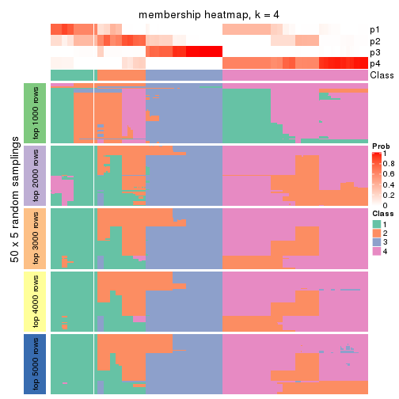</p>

</div>
<div id='tab-MAD-NMF-membership-heatmap-4'>
<pre><code class="r">membership_heatmap(res, k = 5)
</code></pre>

<p></p>

</div>
<div id='tab-MAD-NMF-membership-heatmap-5'>
<pre><code class="r">membership_heatmap(res, k = 6)
</code></pre>

<p></p>

</div>
</div>

As soon as we have had the classes for columns, we can look for signatures
which are significantly different between classes which can be candidate marks
for certain classes. Following are the heatmaps for signatures.


Signature heatmaps where rows are scaled:


<script>
$( function() {
	$( '#tabs-MAD-NMF-get-signatures' ).tabs();
} );
</script>
<div id='tabs-MAD-NMF-get-signatures'>
<ul>
<li><a href='#tab-MAD-NMF-get-signatures-1'>k = 2</a></li>
<li><a href='#tab-MAD-NMF-get-signatures-2'>k = 3</a></li>
<li><a href='#tab-MAD-NMF-get-signatures-3'>k = 4</a></li>
<li><a href='#tab-MAD-NMF-get-signatures-4'>k = 5</a></li>
<li><a href='#tab-MAD-NMF-get-signatures-5'>k = 6</a></li>
</ul>
<div id='tab-MAD-NMF-get-signatures-1'>
<pre><code class="r">get_signatures(res, k = 2)
</code></pre>

<p></p>

</div>
<div id='tab-MAD-NMF-get-signatures-2'>
<pre><code class="r">get_signatures(res, k = 3)
</code></pre>

<p></p>

</div>
<div id='tab-MAD-NMF-get-signatures-3'>
<pre><code class="r">get_signatures(res, k = 4)
</code></pre>

<p></p>

</div>
<div id='tab-MAD-NMF-get-signatures-4'>
<pre><code class="r">get_signatures(res, k = 5)
</code></pre>

<p></p>

</div>
<div id='tab-MAD-NMF-get-signatures-5'>
<pre><code class="r">get_signatures(res, k = 6)
</code></pre>

<p></p>

</div>
</div>


Signature heatmaps where rows are not scaled:


<script>
$( function() {
	$( '#tabs-MAD-NMF-get-signatures-no-scale' ).tabs();
} );
</script>
<div id='tabs-MAD-NMF-get-signatures-no-scale'>
<ul>
<li><a href='#tab-MAD-NMF-get-signatures-no-scale-1'>k = 2</a></li>
<li><a href='#tab-MAD-NMF-get-signatures-no-scale-2'>k = 3</a></li>
<li><a href='#tab-MAD-NMF-get-signatures-no-scale-3'>k = 4</a></li>
<li><a href='#tab-MAD-NMF-get-signatures-no-scale-4'>k = 5</a></li>
<li><a href='#tab-MAD-NMF-get-signatures-no-scale-5'>k = 6</a></li>
</ul>
<div id='tab-MAD-NMF-get-signatures-no-scale-1'>
<pre><code class="r">get_signatures(res, k = 2, scale_rows = FALSE)
</code></pre>

<p></p>

</div>
<div id='tab-MAD-NMF-get-signatures-no-scale-2'>
<pre><code class="r">get_signatures(res, k = 3, scale_rows = FALSE)
</code></pre>

<p></p>

</div>
<div id='tab-MAD-NMF-get-signatures-no-scale-3'>
<pre><code class="r">get_signatures(res, k = 4, scale_rows = FALSE)
</code></pre>

<p></p>

</div>
<div id='tab-MAD-NMF-get-signatures-no-scale-4'>
<pre><code class="r">get_signatures(res, k = 5, scale_rows = FALSE)
</code></pre>

<p>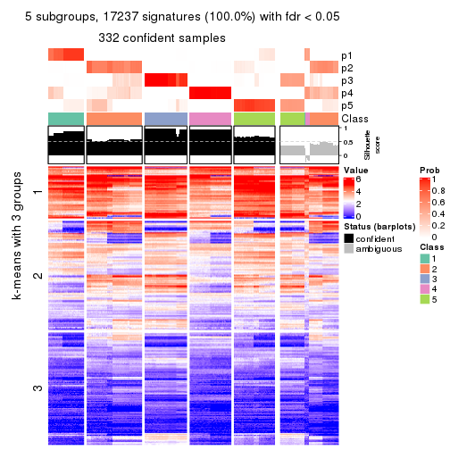</p>

</div>
<div id='tab-MAD-NMF-get-signatures-no-scale-5'>
<pre><code class="r">get_signatures(res, k = 6, scale_rows = FALSE)
</code></pre>

<p></p>

</div>
</div>


Compare the overlap of signatures from different k:

```r
compare_signatures(res)
```


`get_signature()` returns a data frame invisibly. TO get the list of signatures, the function
call should be assigned to a variable explicitly. In following code, if `plot` argument is set
to `FALSE`, no heatmap is plotted while only the differential analysis is performed.

```r
# code only for demonstration
tb = get_signature(res, k = ..., plot = FALSE)
```

An example of the output of `tb` is:

```
#>   which_row         fdr    mean_1    mean_2 scaled_mean_1 scaled_mean_2 km
#> 1        38 0.042760348  8.373488  9.131774    -0.5533452     0.5164555  1
#> 2        40 0.018707592  7.106213  8.469186    -0.6173731     0.5762149  1
#> 3        55 0.019134737 10.221463 11.207825    -0.6159697     0.5749050  1
#> 4        59 0.006059896  5.921854  7.869574    -0.6899429     0.6439467  1
#> 5        60 0.018055526  8.928898 10.211722    -0.6204761     0.5791110  1
#> 6        98 0.009384629 15.714769 14.887706     0.6635654    -0.6193277  2
...
```

The columns in `tb` are:

1. `which_row`: row indices corresponding to the input matrix.
2. `fdr`: FDR for the differential test. 
3. `mean_x`: The mean value in group x.
4. `scaled_mean_x`: The mean value in group x after rows are scaled.
5. `km`: Row groups if k-means clustering is applied to rows.


UMAP plot which shows how samples are separated.


<script>
$( function() {
	$( '#tabs-MAD-NMF-dimension-reduction' ).tabs();
} );
</script>
<div id='tabs-MAD-NMF-dimension-reduction'>
<ul>
<li><a href='#tab-MAD-NMF-dimension-reduction-1'>k = 2</a></li>
<li><a href='#tab-MAD-NMF-dimension-reduction-2'>k = 3</a></li>
<li><a href='#tab-MAD-NMF-dimension-reduction-3'>k = 4</a></li>
<li><a href='#tab-MAD-NMF-dimension-reduction-4'>k = 5</a></li>
<li><a href='#tab-MAD-NMF-dimension-reduction-5'>k = 6</a></li>
</ul>
<div id='tab-MAD-NMF-dimension-reduction-1'>
<pre><code class="r">dimension_reduction(res, k = 2, method = &quot;UMAP&quot;)
</code></pre>

<p></p>

</div>
<div id='tab-MAD-NMF-dimension-reduction-2'>
<pre><code class="r">dimension_reduction(res, k = 3, method = &quot;UMAP&quot;)
</code></pre>

<p></p>

</div>
<div id='tab-MAD-NMF-dimension-reduction-3'>
<pre><code class="r">dimension_reduction(res, k = 4, method = &quot;UMAP&quot;)
</code></pre>

<p></p>

</div>
<div id='tab-MAD-NMF-dimension-reduction-4'>
<pre><code class="r">dimension_reduction(res, k = 5, method = &quot;UMAP&quot;)
</code></pre>

<p></p>

</div>
<div id='tab-MAD-NMF-dimension-reduction-5'>
<pre><code class="r">dimension_reduction(res, k = 6, method = &quot;UMAP&quot;)
</code></pre>

<p></p>

</div>
</div>


Following heatmap shows how subgroups are split when increasing `k`:

```r
collect_classes(res)
```


If matrix rows can be associated to genes, consider to use `GO_Enrichment(res,
...)` to perform function enrichment for the signature genes.


 

---------------------------------------------------


### ATC:hclust**


The object with results only for a single top-value method and a single partition method 
can be extracted as:

```r
res = res_list["ATC", "hclust"]
# you can also extract it by
# res = res_list["ATC:hclust"]
```

A summary of `res` and all the functions that can be applied to it:

```r
res
```

```
#> A 'ConsensusPartition' object with k = 2, 3, 4, 5, 6.
#>   On a matrix with 17245 rows and 418 columns.
#>   Top rows (1000, 2000, 3000, 4000, 5000) are extracted by 'ATC' method.
#>   Subgroups are detected by 'hclust' method.
#>   Performed in total 1250 partitions by row resampling.
#>   Best k for subgroups seems to be 5.
#> 
#> Following methods can be applied to this 'ConsensusPartition' object:
#>  [1] "cola_report"             "collect_classes"         "collect_plots"          
#>  [4] "collect_stats"           "colnames"                "compare_signatures"     
#>  [7] "consensus_heatmap"       "dimension_reduction"     "functional_enrichment"  
#> [10] "get_anno_col"            "get_anno"                "get_classes"            
#> [13] "get_consensus"           "get_matrix"              "get_membership"         
#> [16] "get_param"               "get_signatures"          "get_stats"              
#> [19] "is_best_k"               "is_stable_k"             "membership_heatmap"     
#> [22] "ncol"                    "nrow"                    "plot_ecdf"              
#> [25] "rownames"                "select_partition_number" "show"                   
#> [28] "suggest_best_k"          "test_to_known_factors"
```

`collect_plots()` function collects all the plots made from `res` for all `k` (number of partitions)
into one single page to provide an easy and fast comparison between different `k`.

```r
collect_plots(res)
```


The plots are:

- The first row: a plot of the ECDF (Empirical cumulative distribution
  function) curves of the consensus matrix for each `k` and the heatmap of
  predicted classes for each `k`.
- The second row: heatmaps of the consensus matrix for each `k`.
- The third row: heatmaps of the membership matrix for each `k`.
- The fouth row: heatmaps of the signatures for each `k`.

All the plots in panels can be made by individual functions and they are
plotted later in this section.

`select_partition_number()` produces several plots showing different
statistics for choosing "optimized" `k`. There are following statistics:

- ECDF curves of the consensus matrix for each `k`;
- 1-PAC. [The PAC
  score](https://en.wikipedia.org/wiki/Consensus_clustering#Over-interpretation_potential_of_consensus_clustering)
  measures the proportion of the ambiguous subgrouping.
- Mean silhouette score.
- Concordance. The mean probability of fiting the consensus class ids in all
  partitions.
- Area increased. Denote $A_k$ as the area under the ECDF curve for current
  `k`, the area increased is defined as $A_k - A_{k-1}$.
- Rand index. The percent of pairs of samples that are both in a same cluster
  or both are not in a same cluster in the partition of k and k-1.
- Jaccard index. The ratio of pairs of samples are both in a same cluster in
  the partition of k and k-1 and the pairs of samples are both in a same
  cluster in the partition k or k-1.

The detailed explanations of these statistics can be found in [the cola
vignette](http://bioconductor.org/packages/devel/bioc/vignettes/cola/inst/doc/cola.html#toc_13).

Generally speaking, lower PAC score, higher mean silhouette score or higher
concordance corresponds to better partition. Rand index and Jaccard index
measure how similar the current partition is compared to partition with `k-1`.
If they are too similar, we won't accept `k` is better than `k-1`.

```r
select_partition_number(res)
```


The numeric values for all these statistics can be obtained by `get_stats()`.

```r
get_stats(res)
```

```
#>   k 1-PAC mean_silhouette concordance area_increased  Rand Jaccard
#> 2 2 0.858           0.934       0.970         0.4898 0.502   0.502
#> 3 3 0.918           0.927       0.966         0.2812 0.883   0.768
#> 4 4 0.978           0.957       0.971         0.0734 0.941   0.848
#> 5 5 0.966           0.944       0.963         0.1042 0.927   0.777
#> 6 6 0.930           0.962       0.962         0.0244 0.989   0.957
```

`suggest_best_k()` suggests the best $k$ based on these statistics. The rules are as follows:

- All $k$ with Jaccard index larger than 0.95 are removed because the increase of
  the partition number does not provides enough extra information. If all $k$ are removed,
  the best $k$ is assigned by `NA`.
- For $k$ with 1-PAC larger than 0.9, the maximal $k$ is taken as the "best k". Other $k$ is called "optional k".
- If it does not fit the second rule. The $k$ with the highest vote of highest
  1-PAC, mean silhouette and concordance is taken as the "best k".

```r
suggest_best_k(res)
```

```
#> [1] 5
#> attr(,"optional")
#> [1] 3 4
```

There is also optional best $k$ = 3 4 that is worth to check.

Following shows the table of the partitions (You need to click the **show/hide
code output** link to see it). The membership matrix (columns with name `p*`)
is inferred by
[`clue::cl_consensus()`](https://www.rdocumentation.org/link/cl_consensus?package=clue)
function with the `SE` method. Basically the value in the membership matrix
represents the probability to belong to a certain group. The finall class
label for an item is determined with the group with highest probability it
belongs to.

In `get_classes()` function, the entropy is calculated from the membership
matrix and the silhouette score is calculated from the consensus matrix.


<script>
$( function() {
	$( '#tabs-ATC-hclust-get-classes' ).tabs();
} );
</script>
<div id='tabs-ATC-hclust-get-classes'>
<ul>
<li><a href='#tab-ATC-hclust-get-classes-1'>k = 2</a></li>
<li><a href='#tab-ATC-hclust-get-classes-2'>k = 3</a></li>
<li><a href='#tab-ATC-hclust-get-classes-3'>k = 4</a></li>
<li><a href='#tab-ATC-hclust-get-classes-4'>k = 5</a></li>
<li><a href='#tab-ATC-hclust-get-classes-5'>k = 6</a></li>
</ul>

<div id='tab-ATC-hclust-get-classes-1'>
<p><a id='tab-ATC-hclust-get-classes-1-a' style='color:#0366d6' href='#'>show/hide code output</a></p>
<pre><code class="r">cbind(get_classes(res, k = 2), get_membership(res, k = 2))
</code></pre>

<pre><code>#&gt;           class entropy silhouette    p1    p2
#&gt; SRR902920     1   0.000      0.994 1.000 0.000
#&gt; SRR902921     1   0.000      0.994 1.000 0.000
#&gt; SRR902922     1   0.000      0.994 1.000 0.000
#&gt; SRR902923     1   0.000      0.994 1.000 0.000
#&gt; SRR902924     1   0.000      0.994 1.000 0.000
#&gt; SRR902925     1   0.000      0.994 1.000 0.000
#&gt; SRR902926     1   0.000      0.994 1.000 0.000
#&gt; SRR902927     1   0.000      0.994 1.000 0.000
#&gt; SRR902928     1   0.000      0.994 1.000 0.000
#&gt; SRR902929     1   0.000      0.994 1.000 0.000
#&gt; SRR902930     1   0.000      0.994 1.000 0.000
#&gt; SRR902931     1   0.000      0.994 1.000 0.000
#&gt; SRR902932     2   0.000      0.937 0.000 1.000
#&gt; SRR902933     2   0.000      0.937 0.000 1.000
#&gt; SRR902934     2   0.000      0.937 0.000 1.000
#&gt; SRR902935     2   0.000      0.937 0.000 1.000
#&gt; SRR902936     2   0.000      0.937 0.000 1.000
#&gt; SRR902937     2   0.000      0.937 0.000 1.000
#&gt; SRR902938     2   0.000      0.937 0.000 1.000
#&gt; SRR902939     2   0.000      0.937 0.000 1.000
#&gt; SRR902940     2   0.000      0.937 0.000 1.000
#&gt; SRR902941     2   0.000      0.937 0.000 1.000
#&gt; SRR902942     1   0.000      0.994 1.000 0.000
#&gt; SRR902943     1   0.000      0.994 1.000 0.000
#&gt; SRR902944     1   0.000      0.994 1.000 0.000
#&gt; SRR902945     1   0.000      0.994 1.000 0.000
#&gt; SRR902946     1   0.000      0.994 1.000 0.000
#&gt; SRR902947     1   0.000      0.994 1.000 0.000
#&gt; SRR902954     1   0.000      0.994 1.000 0.000
#&gt; SRR902955     1   0.000      0.994 1.000 0.000
#&gt; SRR902956     1   0.000      0.994 1.000 0.000
#&gt; SRR902957     1   0.000      0.994 1.000 0.000
#&gt; SRR902958     1   0.000      0.994 1.000 0.000
#&gt; SRR902959     1   0.000      0.994 1.000 0.000
#&gt; SRR902948     1   0.000      0.994 1.000 0.000
#&gt; SRR902949     1   0.000      0.994 1.000 0.000
#&gt; SRR902950     1   0.000      0.994 1.000 0.000
#&gt; SRR902951     1   0.000      0.994 1.000 0.000
#&gt; SRR902952     1   0.000      0.994 1.000 0.000
#&gt; SRR902953     1   0.000      0.994 1.000 0.000
#&gt; SRR902960     1   0.000      0.994 1.000 0.000
#&gt; SRR902961     1   0.000      0.994 1.000 0.000
#&gt; SRR902962     1   0.000      0.994 1.000 0.000
#&gt; SRR902963     1   0.000      0.994 1.000 0.000
#&gt; SRR902964     1   0.000      0.994 1.000 0.000
#&gt; SRR902965     1   0.000      0.994 1.000 0.000
#&gt; SRR902966     1   0.000      0.994 1.000 0.000
#&gt; SRR902967     1   0.000      0.994 1.000 0.000
#&gt; SRR902968     1   0.000      0.994 1.000 0.000
#&gt; SRR902969     1   0.000      0.994 1.000 0.000
#&gt; SRR902970     1   0.000      0.994 1.000 0.000
#&gt; SRR902971     1   0.000      0.994 1.000 0.000
#&gt; SRR902972     1   0.000      0.994 1.000 0.000
#&gt; SRR902973     1   0.000      0.994 1.000 0.000
#&gt; SRR902974     1   0.000      0.994 1.000 0.000
#&gt; SRR902975     1   0.000      0.994 1.000 0.000
#&gt; SRR902976     1   0.000      0.994 1.000 0.000
#&gt; SRR902977     1   0.000      0.994 1.000 0.000
#&gt; SRR902978     1   0.000      0.994 1.000 0.000
#&gt; SRR902980     1   0.000      0.994 1.000 0.000
#&gt; SRR902981     1   0.000      0.994 1.000 0.000
#&gt; SRR902982     1   0.000      0.994 1.000 0.000
#&gt; SRR902983     1   0.000      0.994 1.000 0.000
#&gt; SRR902984     1   0.000      0.994 1.000 0.000
#&gt; SRR902985     1   0.000      0.994 1.000 0.000
#&gt; SRR902986     1   0.000      0.994 1.000 0.000
#&gt; SRR902987     1   0.000      0.994 1.000 0.000
#&gt; SRR902988     1   0.000      0.994 1.000 0.000
#&gt; SRR902989     1   0.000      0.994 1.000 0.000
#&gt; SRR902990     1   0.000      0.994 1.000 0.000
#&gt; SRR902991     1   0.000      0.994 1.000 0.000
#&gt; SRR902992     1   0.000      0.994 1.000 0.000
#&gt; SRR902993     1   0.000      0.994 1.000 0.000
#&gt; SRR902994     1   0.000      0.994 1.000 0.000
#&gt; SRR902995     1   0.000      0.994 1.000 0.000
#&gt; SRR902996     2   0.000      0.937 0.000 1.000
#&gt; SRR902997     2   0.000      0.937 0.000 1.000
#&gt; SRR902998     2   0.000      0.937 0.000 1.000
#&gt; SRR902999     2   0.000      0.937 0.000 1.000
#&gt; SRR903000     2   0.000      0.937 0.000 1.000
#&gt; SRR903001     2   0.000      0.937 0.000 1.000
#&gt; SRR903008     2   0.000      0.937 0.000 1.000
#&gt; SRR903009     2   0.000      0.937 0.000 1.000
#&gt; SRR903010     2   0.000      0.937 0.000 1.000
#&gt; SRR903011     2   0.000      0.937 0.000 1.000
#&gt; SRR903012     2   0.000      0.937 0.000 1.000
#&gt; SRR903013     2   0.000      0.937 0.000 1.000
#&gt; SRR903002     2   0.000      0.937 0.000 1.000
#&gt; SRR903003     2   0.000      0.937 0.000 1.000
#&gt; SRR903004     2   0.000      0.937 0.000 1.000
#&gt; SRR903005     2   0.000      0.937 0.000 1.000
#&gt; SRR903006     2   0.000      0.937 0.000 1.000
#&gt; SRR903007     2   0.000      0.937 0.000 1.000
#&gt; SRR903014     1   0.000      0.994 1.000 0.000
#&gt; SRR903015     1   0.000      0.994 1.000 0.000
#&gt; SRR903016     1   0.000      0.994 1.000 0.000
#&gt; SRR903017     1   0.000      0.994 1.000 0.000
#&gt; SRR903018     1   0.000      0.994 1.000 0.000
#&gt; SRR903019     1   0.000      0.994 1.000 0.000
#&gt; SRR903020     1   0.000      0.994 1.000 0.000
#&gt; SRR903021     1   0.000      0.994 1.000 0.000
#&gt; SRR903022     1   0.000      0.994 1.000 0.000
#&gt; SRR903023     1   0.000      0.994 1.000 0.000
#&gt; SRR903024     1   0.000      0.994 1.000 0.000
#&gt; SRR903025     1   0.000      0.994 1.000 0.000
#&gt; SRR903026     1   0.000      0.994 1.000 0.000
#&gt; SRR903027     1   0.000      0.994 1.000 0.000
#&gt; SRR903028     1   0.000      0.994 1.000 0.000
#&gt; SRR903029     1   0.000      0.994 1.000 0.000
#&gt; SRR903030     1   0.000      0.994 1.000 0.000
#&gt; SRR903031     1   0.000      0.994 1.000 0.000
#&gt; SRR903032     2   0.000      0.937 0.000 1.000
#&gt; SRR903033     2   0.000      0.937 0.000 1.000
#&gt; SRR903034     2   0.000      0.937 0.000 1.000
#&gt; SRR903035     2   0.000      0.937 0.000 1.000
#&gt; SRR903036     2   0.000      0.937 0.000 1.000
#&gt; SRR903037     2   0.000      0.937 0.000 1.000
#&gt; SRR903038     2   0.000      0.937 0.000 1.000
#&gt; SRR903039     2   0.000      0.937 0.000 1.000
#&gt; SRR903040     2   0.000      0.937 0.000 1.000
#&gt; SRR903041     2   0.000      0.937 0.000 1.000
#&gt; SRR903042     2   0.000      0.937 0.000 1.000
#&gt; SRR903043     2   0.000      0.937 0.000 1.000
#&gt; SRR903044     2   0.000      0.937 0.000 1.000
#&gt; SRR903045     2   0.000      0.937 0.000 1.000
#&gt; SRR903046     2   0.000      0.937 0.000 1.000
#&gt; SRR903047     2   0.000      0.937 0.000 1.000
#&gt; SRR903048     2   0.000      0.937 0.000 1.000
#&gt; SRR903049     2   0.000      0.937 0.000 1.000
#&gt; SRR903050     1   0.000      0.994 1.000 0.000
#&gt; SRR903051     1   0.000      0.994 1.000 0.000
#&gt; SRR903052     1   0.000      0.994 1.000 0.000
#&gt; SRR903053     1   0.000      0.994 1.000 0.000
#&gt; SRR903054     1   0.000      0.994 1.000 0.000
#&gt; SRR903055     1   0.000      0.994 1.000 0.000
#&gt; SRR903056     1   0.000      0.994 1.000 0.000
#&gt; SRR903057     1   0.000      0.994 1.000 0.000
#&gt; SRR903058     1   0.000      0.994 1.000 0.000
#&gt; SRR903059     1   0.000      0.994 1.000 0.000
#&gt; SRR903060     1   0.000      0.994 1.000 0.000
#&gt; SRR903061     1   0.000      0.994 1.000 0.000
#&gt; SRR903062     1   0.000      0.994 1.000 0.000
#&gt; SRR903063     1   0.000      0.994 1.000 0.000
#&gt; SRR903064     1   0.000      0.994 1.000 0.000
#&gt; SRR903065     1   0.000      0.994 1.000 0.000
#&gt; SRR903066     1   0.000      0.994 1.000 0.000
#&gt; SRR903067     1   0.000      0.994 1.000 0.000
#&gt; SRR903068     1   0.000      0.994 1.000 0.000
#&gt; SRR903069     1   0.000      0.994 1.000 0.000
#&gt; SRR903070     1   0.000      0.994 1.000 0.000
#&gt; SRR903071     1   0.000      0.994 1.000 0.000
#&gt; SRR903072     1   0.000      0.994 1.000 0.000
#&gt; SRR903073     1   0.000      0.994 1.000 0.000
#&gt; SRR903074     1   0.000      0.994 1.000 0.000
#&gt; SRR903075     1   0.000      0.994 1.000 0.000
#&gt; SRR903076     1   0.000      0.994 1.000 0.000
#&gt; SRR903077     1   0.000      0.994 1.000 0.000
#&gt; SRR903078     1   0.000      0.994 1.000 0.000
#&gt; SRR903079     1   0.000      0.994 1.000 0.000
#&gt; SRR903080     1   0.000      0.994 1.000 0.000
#&gt; SRR903081     1   0.000      0.994 1.000 0.000
#&gt; SRR903082     2   0.000      0.937 0.000 1.000
#&gt; SRR903083     2   0.000      0.937 0.000 1.000
#&gt; SRR903084     2   0.000      0.937 0.000 1.000
#&gt; SRR903085     2   0.000      0.937 0.000 1.000
#&gt; SRR903086     2   0.000      0.937 0.000 1.000
#&gt; SRR903087     2   0.000      0.937 0.000 1.000
#&gt; SRR903088     2   0.000      0.937 0.000 1.000
#&gt; SRR903089     2   0.000      0.937 0.000 1.000
#&gt; SRR903090     2   0.000      0.937 0.000 1.000
#&gt; SRR903091     2   0.000      0.937 0.000 1.000
#&gt; SRR903092     2   0.000      0.937 0.000 1.000
#&gt; SRR903093     2   0.000      0.937 0.000 1.000
#&gt; SRR903094     2   0.000      0.937 0.000 1.000
#&gt; SRR903095     2   0.000      0.937 0.000 1.000
#&gt; SRR903096     2   0.000      0.937 0.000 1.000
#&gt; SRR903097     2   0.000      0.937 0.000 1.000
#&gt; SRR903098     2   0.000      0.937 0.000 1.000
#&gt; SRR903099     2   0.000      0.937 0.000 1.000
#&gt; SRR903100     2   0.000      0.937 0.000 1.000
#&gt; SRR903101     2   0.000      0.937 0.000 1.000
#&gt; SRR903102     2   0.000      0.937 0.000 1.000
#&gt; SRR903103     2   0.000      0.937 0.000 1.000
#&gt; SRR903104     2   0.000      0.937 0.000 1.000
#&gt; SRR903105     2   0.000      0.937 0.000 1.000
#&gt; SRR903106     2   0.000      0.937 0.000 1.000
#&gt; SRR903107     2   0.000      0.937 0.000 1.000
#&gt; SRR903108     2   0.000      0.937 0.000 1.000
#&gt; SRR903109     2   0.000      0.937 0.000 1.000
#&gt; SRR903110     2   0.000      0.937 0.000 1.000
#&gt; SRR903111     2   0.000      0.937 0.000 1.000
#&gt; SRR903112     2   0.000      0.937 0.000 1.000
#&gt; SRR903113     2   0.000      0.937 0.000 1.000
#&gt; SRR903114     1   0.260      0.956 0.956 0.044
#&gt; SRR903115     1   0.260      0.956 0.956 0.044
#&gt; SRR903116     1   0.260      0.956 0.956 0.044
#&gt; SRR903117     1   0.260      0.956 0.956 0.044
#&gt; SRR903118     1   0.260      0.956 0.956 0.044
#&gt; SRR903119     1   0.260      0.956 0.956 0.044
#&gt; SRR903121     1   0.260      0.956 0.956 0.044
#&gt; SRR903122     1   0.260      0.956 0.956 0.044
#&gt; SRR903124     1   0.260      0.956 0.956 0.044
#&gt; SRR903125     1   0.260      0.956 0.956 0.044
#&gt; SRR903126     1   0.260      0.956 0.956 0.044
#&gt; SRR903127     1   0.260      0.956 0.956 0.044
#&gt; SRR903128     1   0.260      0.956 0.956 0.044
#&gt; SRR903129     1   0.260      0.956 0.956 0.044
#&gt; SRR903130     1   0.260      0.956 0.956 0.044
#&gt; SRR903131     1   0.260      0.956 0.956 0.044
#&gt; SRR903132     1   0.260      0.956 0.956 0.044
#&gt; SRR903133     1   0.260      0.956 0.956 0.044
#&gt; SRR903134     1   0.260      0.956 0.956 0.044
#&gt; SRR903135     1   0.260      0.956 0.956 0.044
#&gt; SRR903136     1   0.260      0.956 0.956 0.044
#&gt; SRR903137     1   0.260      0.956 0.956 0.044
#&gt; SRR903146     2   0.000      0.937 0.000 1.000
#&gt; SRR903147     2   0.000      0.937 0.000 1.000
#&gt; SRR903148     2   0.000      0.937 0.000 1.000
#&gt; SRR903149     2   0.000      0.937 0.000 1.000
#&gt; SRR903150     2   0.000      0.937 0.000 1.000
#&gt; SRR903151     2   0.000      0.937 0.000 1.000
#&gt; SRR903152     2   0.000      0.937 0.000 1.000
#&gt; SRR903153     2   0.000      0.937 0.000 1.000
#&gt; SRR903138     1   0.260      0.956 0.956 0.044
#&gt; SRR903139     1   0.260      0.956 0.956 0.044
#&gt; SRR903140     1   0.260      0.956 0.956 0.044
#&gt; SRR903141     1   0.260      0.956 0.956 0.044
#&gt; SRR903142     1   0.260      0.956 0.956 0.044
#&gt; SRR903143     1   0.260      0.956 0.956 0.044
#&gt; SRR903144     1   0.260      0.956 0.956 0.044
#&gt; SRR903145     1   0.260      0.956 0.956 0.044
#&gt; SRR903154     2   0.000      0.937 0.000 1.000
#&gt; SRR903155     2   0.000      0.937 0.000 1.000
#&gt; SRR903156     2   0.000      0.937 0.000 1.000
#&gt; SRR903157     2   0.000      0.937 0.000 1.000
#&gt; SRR903158     2   0.000      0.937 0.000 1.000
#&gt; SRR903159     2   0.000      0.937 0.000 1.000
#&gt; SRR903160     2   0.000      0.937 0.000 1.000
#&gt; SRR903161     2   0.000      0.937 0.000 1.000
#&gt; SRR903162     2   0.000      0.937 0.000 1.000
#&gt; SRR903163     2   0.000      0.937 0.000 1.000
#&gt; SRR903164     2   0.000      0.937 0.000 1.000
#&gt; SRR903165     2   0.000      0.937 0.000 1.000
#&gt; SRR903166     2   0.000      0.937 0.000 1.000
#&gt; SRR903167     2   0.000      0.937 0.000 1.000
#&gt; SRR903168     2   0.000      0.937 0.000 1.000
#&gt; SRR903169     2   0.000      0.937 0.000 1.000
#&gt; SRR903178     1   0.000      0.994 1.000 0.000
#&gt; SRR903179     1   0.000      0.994 1.000 0.000
#&gt; SRR903180     1   0.000      0.994 1.000 0.000
#&gt; SRR903181     1   0.000      0.994 1.000 0.000
#&gt; SRR903182     1   0.000      0.994 1.000 0.000
#&gt; SRR903183     1   0.000      0.994 1.000 0.000
#&gt; SRR903184     1   0.000      0.994 1.000 0.000
#&gt; SRR903185     1   0.000      0.994 1.000 0.000
#&gt; SRR903170     2   0.000      0.937 0.000 1.000
#&gt; SRR903171     2   0.000      0.937 0.000 1.000
#&gt; SRR903172     2   0.000      0.937 0.000 1.000
#&gt; SRR903173     2   0.000      0.937 0.000 1.000
#&gt; SRR903174     2   0.000      0.937 0.000 1.000
#&gt; SRR903175     2   0.000      0.937 0.000 1.000
#&gt; SRR903176     2   0.000      0.937 0.000 1.000
#&gt; SRR903177     2   0.000      0.937 0.000 1.000
#&gt; SRR903186     1   0.000      0.994 1.000 0.000
#&gt; SRR903187     1   0.000      0.994 1.000 0.000
#&gt; SRR903188     1   0.000      0.994 1.000 0.000
#&gt; SRR903189     1   0.000      0.994 1.000 0.000
#&gt; SRR903190     1   0.000      0.994 1.000 0.000
#&gt; SRR903191     1   0.000      0.994 1.000 0.000
#&gt; SRR903192     1   0.000      0.994 1.000 0.000
#&gt; SRR903193     1   0.000      0.994 1.000 0.000
#&gt; SRR903194     1   0.000      0.994 1.000 0.000
#&gt; SRR903195     1   0.000      0.994 1.000 0.000
#&gt; SRR903196     1   0.000      0.994 1.000 0.000
#&gt; SRR903197     1   0.000      0.994 1.000 0.000
#&gt; SRR903198     1   0.000      0.994 1.000 0.000
#&gt; SRR903199     1   0.000      0.994 1.000 0.000
#&gt; SRR903200     1   0.000      0.994 1.000 0.000
#&gt; SRR903201     1   0.000      0.994 1.000 0.000
#&gt; SRR903210     2   0.000      0.937 0.000 1.000
#&gt; SRR903211     2   0.000      0.937 0.000 1.000
#&gt; SRR903212     2   0.000      0.937 0.000 1.000
#&gt; SRR903213     2   0.000      0.937 0.000 1.000
#&gt; SRR903214     2   0.000      0.937 0.000 1.000
#&gt; SRR903215     2   0.000      0.937 0.000 1.000
#&gt; SRR903216     2   0.000      0.937 0.000 1.000
#&gt; SRR903217     2   0.000      0.937 0.000 1.000
#&gt; SRR903202     1   0.000      0.994 1.000 0.000
#&gt; SRR903203     1   0.000      0.994 1.000 0.000
#&gt; SRR903204     1   0.000      0.994 1.000 0.000
#&gt; SRR903205     1   0.000      0.994 1.000 0.000
#&gt; SRR903206     1   0.000      0.994 1.000 0.000
#&gt; SRR903207     1   0.000      0.994 1.000 0.000
#&gt; SRR903208     1   0.000      0.994 1.000 0.000
#&gt; SRR903209     1   0.000      0.994 1.000 0.000
#&gt; SRR903218     2   0.000      0.937 0.000 1.000
#&gt; SRR903219     2   0.000      0.937 0.000 1.000
#&gt; SRR903220     2   0.000      0.937 0.000 1.000
#&gt; SRR903221     2   0.000      0.937 0.000 1.000
#&gt; SRR903222     2   0.000      0.937 0.000 1.000
#&gt; SRR903223     2   0.000      0.937 0.000 1.000
#&gt; SRR903224     2   0.000      0.937 0.000 1.000
#&gt; SRR903225     2   0.000      0.937 0.000 1.000
#&gt; SRR903226     2   0.000      0.937 0.000 1.000
#&gt; SRR903227     2   0.000      0.937 0.000 1.000
#&gt; SRR903228     2   0.000      0.937 0.000 1.000
#&gt; SRR903229     2   0.000      0.937 0.000 1.000
#&gt; SRR903230     2   0.000      0.937 0.000 1.000
#&gt; SRR903231     2   0.000      0.937 0.000 1.000
#&gt; SRR903232     2   0.000      0.937 0.000 1.000
#&gt; SRR903233     2   0.000      0.937 0.000 1.000
#&gt; SRR903242     1   0.000      0.994 1.000 0.000
#&gt; SRR903243     1   0.000      0.994 1.000 0.000
#&gt; SRR903244     1   0.000      0.994 1.000 0.000
#&gt; SRR903245     1   0.000      0.994 1.000 0.000
#&gt; SRR903246     1   0.000      0.994 1.000 0.000
#&gt; SRR903247     1   0.000      0.994 1.000 0.000
#&gt; SRR903248     1   0.000      0.994 1.000 0.000
#&gt; SRR903249     1   0.000      0.994 1.000 0.000
#&gt; SRR903234     2   0.000      0.937 0.000 1.000
#&gt; SRR903235     2   0.000      0.937 0.000 1.000
#&gt; SRR903236     2   0.000      0.937 0.000 1.000
#&gt; SRR903237     2   0.000      0.937 0.000 1.000
#&gt; SRR903238     2   0.000      0.937 0.000 1.000
#&gt; SRR903239     2   0.000      0.937 0.000 1.000
#&gt; SRR903240     2   0.000      0.937 0.000 1.000
#&gt; SRR903241     2   0.000      0.937 0.000 1.000
#&gt; SRR903258     1   0.000      0.994 1.000 0.000
#&gt; SRR903259     1   0.000      0.994 1.000 0.000
#&gt; SRR903260     1   0.000      0.994 1.000 0.000
#&gt; SRR903261     1   0.000      0.994 1.000 0.000
#&gt; SRR903262     1   0.000      0.994 1.000 0.000
#&gt; SRR903263     1   0.000      0.994 1.000 0.000
#&gt; SRR903264     1   0.000      0.994 1.000 0.000
#&gt; SRR903265     1   0.000      0.994 1.000 0.000
#&gt; SRR903250     1   0.000      0.994 1.000 0.000
#&gt; SRR903251     1   0.000      0.994 1.000 0.000
#&gt; SRR903252     1   0.000      0.994 1.000 0.000
#&gt; SRR903253     1   0.000      0.994 1.000 0.000
#&gt; SRR903254     1   0.000      0.994 1.000 0.000
#&gt; SRR903255     1   0.000      0.994 1.000 0.000
#&gt; SRR903256     1   0.000      0.994 1.000 0.000
#&gt; SRR903257     1   0.000      0.994 1.000 0.000
#&gt; SRR903266     1   0.000      0.994 1.000 0.000
#&gt; SRR903267     1   0.000      0.994 1.000 0.000
#&gt; SRR903268     1   0.000      0.994 1.000 0.000
#&gt; SRR903270     1   0.000      0.994 1.000 0.000
#&gt; SRR903271     1   0.000      0.994 1.000 0.000
#&gt; SRR903272     1   0.000      0.994 1.000 0.000
#&gt; SRR903273     1   0.000      0.994 1.000 0.000
#&gt; SRR903274     2   0.939      0.529 0.356 0.644
#&gt; SRR903275     2   0.939      0.529 0.356 0.644
#&gt; SRR903276     2   0.939      0.529 0.356 0.644
#&gt; SRR903277     2   0.939      0.529 0.356 0.644
#&gt; SRR903278     2   0.939      0.529 0.356 0.644
#&gt; SRR903279     2   0.939      0.529 0.356 0.644
#&gt; SRR903280     2   0.939      0.529 0.356 0.644
#&gt; SRR903281     2   0.939      0.529 0.356 0.644
#&gt; SRR903282     2   0.939      0.529 0.356 0.644
#&gt; SRR903283     2   0.939      0.529 0.356 0.644
#&gt; SRR903284     2   0.939      0.529 0.356 0.644
#&gt; SRR903285     2   0.939      0.529 0.356 0.644
#&gt; SRR903286     2   0.939      0.529 0.356 0.644
#&gt; SRR903287     2   0.939      0.529 0.356 0.644
#&gt; SRR903288     2   0.939      0.529 0.356 0.644
#&gt; SRR903289     2   0.939      0.529 0.356 0.644
#&gt; SRR903290     2   0.939      0.529 0.356 0.644
#&gt; SRR903291     2   0.939      0.529 0.356 0.644
#&gt; SRR903292     2   0.939      0.529 0.356 0.644
#&gt; SRR903293     2   0.939      0.529 0.356 0.644
#&gt; SRR903294     2   0.939      0.529 0.356 0.644
#&gt; SRR903295     2   0.939      0.529 0.356 0.644
#&gt; SRR903296     2   0.939      0.529 0.356 0.644
#&gt; SRR903297     2   0.939      0.529 0.356 0.644
#&gt; SRR903298     2   0.939      0.529 0.356 0.644
#&gt; SRR903299     2   0.939      0.529 0.356 0.644
#&gt; SRR903300     2   0.939      0.529 0.356 0.644
#&gt; SRR903301     2   0.939      0.529 0.356 0.644
#&gt; SRR903302     2   0.939      0.529 0.356 0.644
#&gt; SRR903303     2   0.939      0.529 0.356 0.644
#&gt; SRR903304     2   0.939      0.529 0.356 0.644
#&gt; SRR903305     2   0.939      0.529 0.356 0.644
#&gt; SRR903306     1   0.000      0.994 1.000 0.000
#&gt; SRR903307     1   0.000      0.994 1.000 0.000
#&gt; SRR903308     1   0.000      0.994 1.000 0.000
#&gt; SRR903309     1   0.000      0.994 1.000 0.000
#&gt; SRR903310     1   0.000      0.994 1.000 0.000
#&gt; SRR903311     1   0.000      0.994 1.000 0.000
#&gt; SRR903312     1   0.000      0.994 1.000 0.000
#&gt; SRR903313     1   0.000      0.994 1.000 0.000
#&gt; SRR903314     1   0.000      0.994 1.000 0.000
#&gt; SRR903315     1   0.000      0.994 1.000 0.000
#&gt; SRR903316     1   0.000      0.994 1.000 0.000
#&gt; SRR903317     1   0.000      0.994 1.000 0.000
#&gt; SRR903318     1   0.000      0.994 1.000 0.000
#&gt; SRR903319     1   0.000      0.994 1.000 0.000
#&gt; SRR903320     1   0.000      0.994 1.000 0.000
#&gt; SRR903321     1   0.000      0.994 1.000 0.000
#&gt; SRR903322     1   0.000      0.994 1.000 0.000
#&gt; SRR903323     1   0.000      0.994 1.000 0.000
#&gt; SRR903324     2   0.000      0.937 0.000 1.000
#&gt; SRR903325     2   0.000      0.937 0.000 1.000
#&gt; SRR903326     2   0.000      0.937 0.000 1.000
#&gt; SRR903327     2   0.000      0.937 0.000 1.000
#&gt; SRR903328     2   0.000      0.937 0.000 1.000
#&gt; SRR903329     2   0.000      0.937 0.000 1.000
#&gt; SRR903330     2   0.000      0.937 0.000 1.000
#&gt; SRR903331     2   0.000      0.937 0.000 1.000
#&gt; SRR903332     2   0.000      0.937 0.000 1.000
#&gt; SRR903333     2   0.000      0.937 0.000 1.000
#&gt; SRR903334     2   0.000      0.937 0.000 1.000
#&gt; SRR903335     2   0.000      0.937 0.000 1.000
#&gt; SRR903336     2   0.000      0.937 0.000 1.000
#&gt; SRR903337     2   0.000      0.937 0.000 1.000
#&gt; SRR903338     2   0.000      0.937 0.000 1.000
#&gt; SRR903339     2   0.000      0.937 0.000 1.000
#&gt; SRR903340     2   0.000      0.937 0.000 1.000
#&gt; SRR903341     2   0.000      0.937 0.000 1.000
</code></pre>

<script>
$('#tab-ATC-hclust-get-classes-1-a').parent().next().next().hide();
$('#tab-ATC-hclust-get-classes-1-a').click(function(){
  $('#tab-ATC-hclust-get-classes-1-a').parent().next().next().toggle();
  return(false);
});
</script>
</div>

<div id='tab-ATC-hclust-get-classes-2'>
<p><a id='tab-ATC-hclust-get-classes-2-a' style='color:#0366d6' href='#'>show/hide code output</a></p>
<pre><code class="r">cbind(get_classes(res, k = 3), get_membership(res, k = 3))
</code></pre>

<pre><code>#&gt;           class entropy silhouette    p1  p2    p3
#&gt; SRR902920     3   0.000      1.000 0.000 0.0 1.000
#&gt; SRR902921     3   0.000      1.000 0.000 0.0 1.000
#&gt; SRR902922     3   0.000      1.000 0.000 0.0 1.000
#&gt; SRR902923     3   0.000      1.000 0.000 0.0 1.000
#&gt; SRR902924     3   0.000      1.000 0.000 0.0 1.000
#&gt; SRR902925     3   0.000      1.000 0.000 0.0 1.000
#&gt; SRR902926     3   0.000      1.000 0.000 0.0 1.000
#&gt; SRR902927     3   0.000      1.000 0.000 0.0 1.000
#&gt; SRR902928     3   0.000      1.000 0.000 0.0 1.000
#&gt; SRR902929     3   0.000      1.000 0.000 0.0 1.000
#&gt; SRR902930     3   0.000      1.000 0.000 0.0 1.000
#&gt; SRR902931     3   0.000      1.000 0.000 0.0 1.000
#&gt; SRR902932     2   0.000      0.929 0.000 1.0 0.000
#&gt; SRR902933     2   0.000      0.929 0.000 1.0 0.000
#&gt; SRR902934     2   0.000      0.929 0.000 1.0 0.000
#&gt; SRR902935     2   0.000      0.929 0.000 1.0 0.000
#&gt; SRR902936     2   0.000      0.929 0.000 1.0 0.000
#&gt; SRR902937     2   0.000      0.929 0.000 1.0 0.000
#&gt; SRR902938     2   0.000      0.929 0.000 1.0 0.000
#&gt; SRR902939     2   0.000      0.929 0.000 1.0 0.000
#&gt; SRR902940     2   0.000      0.929 0.000 1.0 0.000
#&gt; SRR902941     2   0.000      0.929 0.000 1.0 0.000
#&gt; SRR902942     3   0.000      1.000 0.000 0.0 1.000
#&gt; SRR902943     3   0.000      1.000 0.000 0.0 1.000
#&gt; SRR902944     3   0.000      1.000 0.000 0.0 1.000
#&gt; SRR902945     3   0.000      1.000 0.000 0.0 1.000
#&gt; SRR902946     3   0.000      1.000 0.000 0.0 1.000
#&gt; SRR902947     3   0.000      1.000 0.000 0.0 1.000
#&gt; SRR902954     3   0.000      1.000 0.000 0.0 1.000
#&gt; SRR902955     3   0.000      1.000 0.000 0.0 1.000
#&gt; SRR902956     3   0.000      1.000 0.000 0.0 1.000
#&gt; SRR902957     3   0.000      1.000 0.000 0.0 1.000
#&gt; SRR902958     3   0.000      1.000 0.000 0.0 1.000
#&gt; SRR902959     3   0.000      1.000 0.000 0.0 1.000
#&gt; SRR902948     3   0.000      1.000 0.000 0.0 1.000
#&gt; SRR902949     3   0.000      1.000 0.000 0.0 1.000
#&gt; SRR902950     3   0.000      1.000 0.000 0.0 1.000
#&gt; SRR902951     3   0.000      1.000 0.000 0.0 1.000
#&gt; SRR902952     3   0.000      1.000 0.000 0.0 1.000
#&gt; SRR902953     3   0.000      1.000 0.000 0.0 1.000
#&gt; SRR902960     3   0.000      1.000 0.000 0.0 1.000
#&gt; SRR902961     3   0.000      1.000 0.000 0.0 1.000
#&gt; SRR902962     3   0.000      1.000 0.000 0.0 1.000
#&gt; SRR902963     3   0.000      1.000 0.000 0.0 1.000
#&gt; SRR902964     3   0.000      1.000 0.000 0.0 1.000
#&gt; SRR902965     3   0.000      1.000 0.000 0.0 1.000
#&gt; SRR902966     3   0.000      1.000 0.000 0.0 1.000
#&gt; SRR902967     3   0.000      1.000 0.000 0.0 1.000
#&gt; SRR902968     3   0.000      1.000 0.000 0.0 1.000
#&gt; SRR902969     3   0.000      1.000 0.000 0.0 1.000
#&gt; SRR902970     3   0.000      1.000 0.000 0.0 1.000
#&gt; SRR902971     3   0.000      1.000 0.000 0.0 1.000
#&gt; SRR902972     3   0.000      1.000 0.000 0.0 1.000
#&gt; SRR902973     3   0.000      1.000 0.000 0.0 1.000
#&gt; SRR902974     3   0.000      1.000 0.000 0.0 1.000
#&gt; SRR902975     3   0.000      1.000 0.000 0.0 1.000
#&gt; SRR902976     3   0.000      1.000 0.000 0.0 1.000
#&gt; SRR902977     3   0.000      1.000 0.000 0.0 1.000
#&gt; SRR902978     3   0.000      1.000 0.000 0.0 1.000
#&gt; SRR902980     3   0.000      1.000 0.000 0.0 1.000
#&gt; SRR902981     3   0.000      1.000 0.000 0.0 1.000
#&gt; SRR902982     3   0.000      1.000 0.000 0.0 1.000
#&gt; SRR902983     3   0.000      1.000 0.000 0.0 1.000
#&gt; SRR902984     3   0.000      1.000 0.000 0.0 1.000
#&gt; SRR902985     3   0.000      1.000 0.000 0.0 1.000
#&gt; SRR902986     3   0.000      1.000 0.000 0.0 1.000
#&gt; SRR902987     3   0.000      1.000 0.000 0.0 1.000
#&gt; SRR902988     3   0.000      1.000 0.000 0.0 1.000
#&gt; SRR902989     3   0.000      1.000 0.000 0.0 1.000
#&gt; SRR902990     3   0.000      1.000 0.000 0.0 1.000
#&gt; SRR902991     3   0.000      1.000 0.000 0.0 1.000
#&gt; SRR902992     3   0.000      1.000 0.000 0.0 1.000
#&gt; SRR902993     3   0.000      1.000 0.000 0.0 1.000
#&gt; SRR902994     3   0.000      1.000 0.000 0.0 1.000
#&gt; SRR902995     3   0.000      1.000 0.000 0.0 1.000
#&gt; SRR902996     2   0.000      0.929 0.000 1.0 0.000
#&gt; SRR902997     2   0.000      0.929 0.000 1.0 0.000
#&gt; SRR902998     2   0.000      0.929 0.000 1.0 0.000
#&gt; SRR902999     2   0.000      0.929 0.000 1.0 0.000
#&gt; SRR903000     2   0.000      0.929 0.000 1.0 0.000
#&gt; SRR903001     2   0.000      0.929 0.000 1.0 0.000
#&gt; SRR903008     2   0.000      0.929 0.000 1.0 0.000
#&gt; SRR903009     2   0.000      0.929 0.000 1.0 0.000
#&gt; SRR903010     2   0.000      0.929 0.000 1.0 0.000
#&gt; SRR903011     2   0.000      0.929 0.000 1.0 0.000
#&gt; SRR903012     2   0.000      0.929 0.000 1.0 0.000
#&gt; SRR903013     2   0.000      0.929 0.000 1.0 0.000
#&gt; SRR903002     2   0.000      0.929 0.000 1.0 0.000
#&gt; SRR903003     2   0.000      0.929 0.000 1.0 0.000
#&gt; SRR903004     2   0.000      0.929 0.000 1.0 0.000
#&gt; SRR903005     2   0.000      0.929 0.000 1.0 0.000
#&gt; SRR903006     2   0.000      0.929 0.000 1.0 0.000
#&gt; SRR903007     2   0.000      0.929 0.000 1.0 0.000
#&gt; SRR903014     3   0.000      1.000 0.000 0.0 1.000
#&gt; SRR903015     3   0.000      1.000 0.000 0.0 1.000
#&gt; SRR903016     3   0.000      1.000 0.000 0.0 1.000
#&gt; SRR903017     3   0.000      1.000 0.000 0.0 1.000
#&gt; SRR903018     3   0.000      1.000 0.000 0.0 1.000
#&gt; SRR903019     3   0.000      1.000 0.000 0.0 1.000
#&gt; SRR903020     3   0.000      1.000 0.000 0.0 1.000
#&gt; SRR903021     3   0.000      1.000 0.000 0.0 1.000
#&gt; SRR903022     3   0.000      1.000 0.000 0.0 1.000
#&gt; SRR903023     3   0.000      1.000 0.000 0.0 1.000
#&gt; SRR903024     3   0.000      1.000 0.000 0.0 1.000
#&gt; SRR903025     3   0.000      1.000 0.000 0.0 1.000
#&gt; SRR903026     3   0.000      1.000 0.000 0.0 1.000
#&gt; SRR903027     3   0.000      1.000 0.000 0.0 1.000
#&gt; SRR903028     3   0.000      1.000 0.000 0.0 1.000
#&gt; SRR903029     3   0.000      1.000 0.000 0.0 1.000
#&gt; SRR903030     3   0.000      1.000 0.000 0.0 1.000
#&gt; SRR903031     3   0.000      1.000 0.000 0.0 1.000
#&gt; SRR903032     2   0.000      0.929 0.000 1.0 0.000
#&gt; SRR903033     2   0.000      0.929 0.000 1.0 0.000
#&gt; SRR903034     2   0.000      0.929 0.000 1.0 0.000
#&gt; SRR903035     2   0.000      0.929 0.000 1.0 0.000
#&gt; SRR903036     2   0.000      0.929 0.000 1.0 0.000
#&gt; SRR903037     2   0.000      0.929 0.000 1.0 0.000
#&gt; SRR903038     2   0.000      0.929 0.000 1.0 0.000
#&gt; SRR903039     2   0.000      0.929 0.000 1.0 0.000
#&gt; SRR903040     2   0.000      0.929 0.000 1.0 0.000
#&gt; SRR903041     2   0.000      0.929 0.000 1.0 0.000
#&gt; SRR903042     2   0.000      0.929 0.000 1.0 0.000
#&gt; SRR903043     2   0.000      0.929 0.000 1.0 0.000
#&gt; SRR903044     2   0.000      0.929 0.000 1.0 0.000
#&gt; SRR903045     2   0.000      0.929 0.000 1.0 0.000
#&gt; SRR903046     2   0.000      0.929 0.000 1.0 0.000
#&gt; SRR903047     2   0.000      0.929 0.000 1.0 0.000
#&gt; SRR903048     2   0.000      0.929 0.000 1.0 0.000
#&gt; SRR903049     2   0.000      0.929 0.000 1.0 0.000
#&gt; SRR903050     1   0.175      0.973 0.952 0.0 0.048
#&gt; SRR903051     1   0.175      0.973 0.952 0.0 0.048
#&gt; SRR903052     1   0.175      0.973 0.952 0.0 0.048
#&gt; SRR903053     1   0.175      0.973 0.952 0.0 0.048
#&gt; SRR903054     1   0.175      0.973 0.952 0.0 0.048
#&gt; SRR903055     1   0.175      0.973 0.952 0.0 0.048
#&gt; SRR903056     1   0.175      0.973 0.952 0.0 0.048
#&gt; SRR903057     1   0.175      0.973 0.952 0.0 0.048
#&gt; SRR903058     1   0.175      0.973 0.952 0.0 0.048
#&gt; SRR903059     1   0.175      0.973 0.952 0.0 0.048
#&gt; SRR903060     1   0.175      0.973 0.952 0.0 0.048
#&gt; SRR903061     1   0.175      0.973 0.952 0.0 0.048
#&gt; SRR903062     1   0.175      0.973 0.952 0.0 0.048
#&gt; SRR903063     1   0.175      0.973 0.952 0.0 0.048
#&gt; SRR903064     1   0.175      0.973 0.952 0.0 0.048
#&gt; SRR903065     1   0.175      0.973 0.952 0.0 0.048
#&gt; SRR903066     1   0.175      0.973 0.952 0.0 0.048
#&gt; SRR903067     1   0.175      0.973 0.952 0.0 0.048
#&gt; SRR903068     1   0.175      0.973 0.952 0.0 0.048
#&gt; SRR903069     1   0.175      0.973 0.952 0.0 0.048
#&gt; SRR903070     1   0.175      0.973 0.952 0.0 0.048
#&gt; SRR903071     1   0.175      0.973 0.952 0.0 0.048
#&gt; SRR903072     1   0.175      0.973 0.952 0.0 0.048
#&gt; SRR903073     1   0.175      0.973 0.952 0.0 0.048
#&gt; SRR903074     1   0.175      0.973 0.952 0.0 0.048
#&gt; SRR903075     1   0.175      0.973 0.952 0.0 0.048
#&gt; SRR903076     1   0.175      0.973 0.952 0.0 0.048
#&gt; SRR903077     1   0.175      0.973 0.952 0.0 0.048
#&gt; SRR903078     1   0.175      0.973 0.952 0.0 0.048
#&gt; SRR903079     1   0.175      0.973 0.952 0.0 0.048
#&gt; SRR903080     1   0.175      0.973 0.952 0.0 0.048
#&gt; SRR903081     1   0.175      0.973 0.952 0.0 0.048
#&gt; SRR903082     2   0.000      0.929 0.000 1.0 0.000
#&gt; SRR903083     2   0.000      0.929 0.000 1.0 0.000
#&gt; SRR903084     2   0.000      0.929 0.000 1.0 0.000
#&gt; SRR903085     2   0.000      0.929 0.000 1.0 0.000
#&gt; SRR903086     2   0.000      0.929 0.000 1.0 0.000
#&gt; SRR903087     2   0.000      0.929 0.000 1.0 0.000
#&gt; SRR903088     2   0.000      0.929 0.000 1.0 0.000
#&gt; SRR903089     2   0.000      0.929 0.000 1.0 0.000
#&gt; SRR903090     2   0.000      0.929 0.000 1.0 0.000
#&gt; SRR903091     2   0.000      0.929 0.000 1.0 0.000
#&gt; SRR903092     2   0.000      0.929 0.000 1.0 0.000
#&gt; SRR903093     2   0.000      0.929 0.000 1.0 0.000
#&gt; SRR903094     2   0.000      0.929 0.000 1.0 0.000
#&gt; SRR903095     2   0.000      0.929 0.000 1.0 0.000
#&gt; SRR903096     2   0.000      0.929 0.000 1.0 0.000
#&gt; SRR903097     2   0.000      0.929 0.000 1.0 0.000
#&gt; SRR903098     2   0.000      0.929 0.000 1.0 0.000
#&gt; SRR903099     2   0.000      0.929 0.000 1.0 0.000
#&gt; SRR903100     2   0.000      0.929 0.000 1.0 0.000
#&gt; SRR903101     2   0.000      0.929 0.000 1.0 0.000
#&gt; SRR903102     2   0.000      0.929 0.000 1.0 0.000
#&gt; SRR903103     2   0.000      0.929 0.000 1.0 0.000
#&gt; SRR903104     2   0.000      0.929 0.000 1.0 0.000
#&gt; SRR903105     2   0.000      0.929 0.000 1.0 0.000
#&gt; SRR903106     2   0.000      0.929 0.000 1.0 0.000
#&gt; SRR903107     2   0.000      0.929 0.000 1.0 0.000
#&gt; SRR903108     2   0.000      0.929 0.000 1.0 0.000
#&gt; SRR903109     2   0.000      0.929 0.000 1.0 0.000
#&gt; SRR903110     2   0.000      0.929 0.000 1.0 0.000
#&gt; SRR903111     2   0.000      0.929 0.000 1.0 0.000
#&gt; SRR903112     2   0.000      0.929 0.000 1.0 0.000
#&gt; SRR903113     2   0.000      0.929 0.000 1.0 0.000
#&gt; SRR903114     1   0.000      0.971 1.000 0.0 0.000
#&gt; SRR903115     1   0.000      0.971 1.000 0.0 0.000
#&gt; SRR903116     1   0.000      0.971 1.000 0.0 0.000
#&gt; SRR903117     1   0.000      0.971 1.000 0.0 0.000
#&gt; SRR903118     1   0.000      0.971 1.000 0.0 0.000
#&gt; SRR903119     1   0.000      0.971 1.000 0.0 0.000
#&gt; SRR903121     1   0.000      0.971 1.000 0.0 0.000
#&gt; SRR903122     1   0.000      0.971 1.000 0.0 0.000
#&gt; SRR903124     1   0.000      0.971 1.000 0.0 0.000
#&gt; SRR903125     1   0.000      0.971 1.000 0.0 0.000
#&gt; SRR903126     1   0.000      0.971 1.000 0.0 0.000
#&gt; SRR903127     1   0.000      0.971 1.000 0.0 0.000
#&gt; SRR903128     1   0.000      0.971 1.000 0.0 0.000
#&gt; SRR903129     1   0.000      0.971 1.000 0.0 0.000
#&gt; SRR903130     1   0.000      0.971 1.000 0.0 0.000
#&gt; SRR903131     1   0.000      0.971 1.000 0.0 0.000
#&gt; SRR903132     1   0.000      0.971 1.000 0.0 0.000
#&gt; SRR903133     1   0.000      0.971 1.000 0.0 0.000
#&gt; SRR903134     1   0.000      0.971 1.000 0.0 0.000
#&gt; SRR903135     1   0.000      0.971 1.000 0.0 0.000
#&gt; SRR903136     1   0.000      0.971 1.000 0.0 0.000
#&gt; SRR903137     1   0.000      0.971 1.000 0.0 0.000
#&gt; SRR903146     2   0.000      0.929 0.000 1.0 0.000
#&gt; SRR903147     2   0.000      0.929 0.000 1.0 0.000
#&gt; SRR903148     2   0.000      0.929 0.000 1.0 0.000
#&gt; SRR903149     2   0.000      0.929 0.000 1.0 0.000
#&gt; SRR903150     2   0.000      0.929 0.000 1.0 0.000
#&gt; SRR903151     2   0.000      0.929 0.000 1.0 0.000
#&gt; SRR903152     2   0.000      0.929 0.000 1.0 0.000
#&gt; SRR903153     2   0.000      0.929 0.000 1.0 0.000
#&gt; SRR903138     1   0.000      0.971 1.000 0.0 0.000
#&gt; SRR903139     1   0.000      0.971 1.000 0.0 0.000
#&gt; SRR903140     1   0.000      0.971 1.000 0.0 0.000
#&gt; SRR903141     1   0.000      0.971 1.000 0.0 0.000
#&gt; SRR903142     1   0.000      0.971 1.000 0.0 0.000
#&gt; SRR903143     1   0.000      0.971 1.000 0.0 0.000
#&gt; SRR903144     1   0.000      0.971 1.000 0.0 0.000
#&gt; SRR903145     1   0.000      0.971 1.000 0.0 0.000
#&gt; SRR903154     2   0.000      0.929 0.000 1.0 0.000
#&gt; SRR903155     2   0.000      0.929 0.000 1.0 0.000
#&gt; SRR903156     2   0.000      0.929 0.000 1.0 0.000
#&gt; SRR903157     2   0.000      0.929 0.000 1.0 0.000
#&gt; SRR903158     2   0.000      0.929 0.000 1.0 0.000
#&gt; SRR903159     2   0.000      0.929 0.000 1.0 0.000
#&gt; SRR903160     2   0.000      0.929 0.000 1.0 0.000
#&gt; SRR903161     2   0.000      0.929 0.000 1.0 0.000
#&gt; SRR903162     2   0.000      0.929 0.000 1.0 0.000
#&gt; SRR903163     2   0.000      0.929 0.000 1.0 0.000
#&gt; SRR903164     2   0.000      0.929 0.000 1.0 0.000
#&gt; SRR903165     2   0.000      0.929 0.000 1.0 0.000
#&gt; SRR903166     2   0.000      0.929 0.000 1.0 0.000
#&gt; SRR903167     2   0.000      0.929 0.000 1.0 0.000
#&gt; SRR903168     2   0.000      0.929 0.000 1.0 0.000
#&gt; SRR903169     2   0.000      0.929 0.000 1.0 0.000
#&gt; SRR903178     3   0.000      1.000 0.000 0.0 1.000
#&gt; SRR903179     3   0.000      1.000 0.000 0.0 1.000
#&gt; SRR903180     3   0.000      1.000 0.000 0.0 1.000
#&gt; SRR903181     3   0.000      1.000 0.000 0.0 1.000
#&gt; SRR903182     3   0.000      1.000 0.000 0.0 1.000
#&gt; SRR903183     3   0.000      1.000 0.000 0.0 1.000
#&gt; SRR903184     3   0.000      1.000 0.000 0.0 1.000
#&gt; SRR903185     3   0.000      1.000 0.000 0.0 1.000
#&gt; SRR903170     2   0.000      0.929 0.000 1.0 0.000
#&gt; SRR903171     2   0.000      0.929 0.000 1.0 0.000
#&gt; SRR903172     2   0.000      0.929 0.000 1.0 0.000
#&gt; SRR903173     2   0.000      0.929 0.000 1.0 0.000
#&gt; SRR903174     2   0.000      0.929 0.000 1.0 0.000
#&gt; SRR903175     2   0.000      0.929 0.000 1.0 0.000
#&gt; SRR903176     2   0.000      0.929 0.000 1.0 0.000
#&gt; SRR903177     2   0.000      0.929 0.000 1.0 0.000
#&gt; SRR903186     3   0.000      1.000 0.000 0.0 1.000
#&gt; SRR903187     3   0.000      1.000 0.000 0.0 1.000
#&gt; SRR903188     3   0.000      1.000 0.000 0.0 1.000
#&gt; SRR903189     3   0.000      1.000 0.000 0.0 1.000
#&gt; SRR903190     3   0.000      1.000 0.000 0.0 1.000
#&gt; SRR903191     3   0.000      1.000 0.000 0.0 1.000
#&gt; SRR903192     3   0.000      1.000 0.000 0.0 1.000
#&gt; SRR903193     3   0.000      1.000 0.000 0.0 1.000
#&gt; SRR903194     3   0.000      1.000 0.000 0.0 1.000
#&gt; SRR903195     3   0.000      1.000 0.000 0.0 1.000
#&gt; SRR903196     3   0.000      1.000 0.000 0.0 1.000
#&gt; SRR903197     3   0.000      1.000 0.000 0.0 1.000
#&gt; SRR903198     3   0.000      1.000 0.000 0.0 1.000
#&gt; SRR903199     3   0.000      1.000 0.000 0.0 1.000
#&gt; SRR903200     3   0.000      1.000 0.000 0.0 1.000
#&gt; SRR903201     3   0.000      1.000 0.000 0.0 1.000
#&gt; SRR903210     2   0.000      0.929 0.000 1.0 0.000
#&gt; SRR903211     2   0.000      0.929 0.000 1.0 0.000
#&gt; SRR903212     2   0.000      0.929 0.000 1.0 0.000
#&gt; SRR903213     2   0.000      0.929 0.000 1.0 0.000
#&gt; SRR903214     2   0.000      0.929 0.000 1.0 0.000
#&gt; SRR903215     2   0.000      0.929 0.000 1.0 0.000
#&gt; SRR903216     2   0.000      0.929 0.000 1.0 0.000
#&gt; SRR903217     2   0.000      0.929 0.000 1.0 0.000
#&gt; SRR903202     3   0.000      1.000 0.000 0.0 1.000
#&gt; SRR903203     3   0.000      1.000 0.000 0.0 1.000
#&gt; SRR903204     3   0.000      1.000 0.000 0.0 1.000
#&gt; SRR903205     3   0.000      1.000 0.000 0.0 1.000
#&gt; SRR903206     3   0.000      1.000 0.000 0.0 1.000
#&gt; SRR903207     3   0.000      1.000 0.000 0.0 1.000
#&gt; SRR903208     3   0.000      1.000 0.000 0.0 1.000
#&gt; SRR903209     3   0.000      1.000 0.000 0.0 1.000
#&gt; SRR903218     2   0.000      0.929 0.000 1.0 0.000
#&gt; SRR903219     2   0.000      0.929 0.000 1.0 0.000
#&gt; SRR903220     2   0.000      0.929 0.000 1.0 0.000
#&gt; SRR903221     2   0.000      0.929 0.000 1.0 0.000
#&gt; SRR903222     2   0.000      0.929 0.000 1.0 0.000
#&gt; SRR903223     2   0.000      0.929 0.000 1.0 0.000
#&gt; SRR903224     2   0.000      0.929 0.000 1.0 0.000
#&gt; SRR903225     2   0.000      0.929 0.000 1.0 0.000
#&gt; SRR903226     2   0.000      0.929 0.000 1.0 0.000
#&gt; SRR903227     2   0.000      0.929 0.000 1.0 0.000
#&gt; SRR903228     2   0.000      0.929 0.000 1.0 0.000
#&gt; SRR903229     2   0.000      0.929 0.000 1.0 0.000
#&gt; SRR903230     2   0.000      0.929 0.000 1.0 0.000
#&gt; SRR903231     2   0.000      0.929 0.000 1.0 0.000
#&gt; SRR903232     2   0.000      0.929 0.000 1.0 0.000
#&gt; SRR903233     2   0.000      0.929 0.000 1.0 0.000
#&gt; SRR903242     3   0.000      1.000 0.000 0.0 1.000
#&gt; SRR903243     3   0.000      1.000 0.000 0.0 1.000
#&gt; SRR903244     3   0.000      1.000 0.000 0.0 1.000
#&gt; SRR903245     3   0.000      1.000 0.000 0.0 1.000
#&gt; SRR903246     3   0.000      1.000 0.000 0.0 1.000
#&gt; SRR903247     3   0.000      1.000 0.000 0.0 1.000
#&gt; SRR903248     3   0.000      1.000 0.000 0.0 1.000
#&gt; SRR903249     3   0.000      1.000 0.000 0.0 1.000
#&gt; SRR903234     2   0.000      0.929 0.000 1.0 0.000
#&gt; SRR903235     2   0.000      0.929 0.000 1.0 0.000
#&gt; SRR903236     2   0.000      0.929 0.000 1.0 0.000
#&gt; SRR903237     2   0.000      0.929 0.000 1.0 0.000
#&gt; SRR903238     2   0.000      0.929 0.000 1.0 0.000
#&gt; SRR903239     2   0.000      0.929 0.000 1.0 0.000
#&gt; SRR903240     2   0.000      0.929 0.000 1.0 0.000
#&gt; SRR903241     2   0.000      0.929 0.000 1.0 0.000
#&gt; SRR903258     3   0.000      1.000 0.000 0.0 1.000
#&gt; SRR903259     3   0.000      1.000 0.000 0.0 1.000
#&gt; SRR903260     3   0.000      1.000 0.000 0.0 1.000
#&gt; SRR903261     3   0.000      1.000 0.000 0.0 1.000
#&gt; SRR903262     3   0.000      1.000 0.000 0.0 1.000
#&gt; SRR903263     3   0.000      1.000 0.000 0.0 1.000
#&gt; SRR903264     3   0.000      1.000 0.000 0.0 1.000
#&gt; SRR903265     3   0.000      1.000 0.000 0.0 1.000
#&gt; SRR903250     3   0.000      1.000 0.000 0.0 1.000
#&gt; SRR903251     3   0.000      1.000 0.000 0.0 1.000
#&gt; SRR903252     3   0.000      1.000 0.000 0.0 1.000
#&gt; SRR903253     3   0.000      1.000 0.000 0.0 1.000
#&gt; SRR903254     3   0.000      1.000 0.000 0.0 1.000
#&gt; SRR903255     3   0.000      1.000 0.000 0.0 1.000
#&gt; SRR903256     3   0.000      1.000 0.000 0.0 1.000
#&gt; SRR903257     3   0.000      1.000 0.000 0.0 1.000
#&gt; SRR903266     3   0.000      1.000 0.000 0.0 1.000
#&gt; SRR903267     3   0.000      1.000 0.000 0.0 1.000
#&gt; SRR903268     3   0.000      1.000 0.000 0.0 1.000
#&gt; SRR903270     3   0.000      1.000 0.000 0.0 1.000
#&gt; SRR903271     3   0.000      1.000 0.000 0.0 1.000
#&gt; SRR903272     3   0.000      1.000 0.000 0.0 1.000
#&gt; SRR903273     3   0.000      1.000 0.000 0.0 1.000
#&gt; SRR903274     2   0.613      0.453 0.400 0.6 0.000
#&gt; SRR903275     2   0.613      0.453 0.400 0.6 0.000
#&gt; SRR903276     2   0.613      0.453 0.400 0.6 0.000
#&gt; SRR903277     2   0.613      0.453 0.400 0.6 0.000
#&gt; SRR903278     2   0.613      0.453 0.400 0.6 0.000
#&gt; SRR903279     2   0.613      0.453 0.400 0.6 0.000
#&gt; SRR903280     2   0.613      0.453 0.400 0.6 0.000
#&gt; SRR903281     2   0.613      0.453 0.400 0.6 0.000
#&gt; SRR903282     2   0.613      0.453 0.400 0.6 0.000
#&gt; SRR903283     2   0.613      0.453 0.400 0.6 0.000
#&gt; SRR903284     2   0.613      0.453 0.400 0.6 0.000
#&gt; SRR903285     2   0.613      0.453 0.400 0.6 0.000
#&gt; SRR903286     2   0.613      0.453 0.400 0.6 0.000
#&gt; SRR903287     2   0.613      0.453 0.400 0.6 0.000
#&gt; SRR903288     2   0.613      0.453 0.400 0.6 0.000
#&gt; SRR903289     2   0.613      0.453 0.400 0.6 0.000
#&gt; SRR903290     2   0.613      0.453 0.400 0.6 0.000
#&gt; SRR903291     2   0.613      0.453 0.400 0.6 0.000
#&gt; SRR903292     2   0.613      0.453 0.400 0.6 0.000
#&gt; SRR903293     2   0.613      0.453 0.400 0.6 0.000
#&gt; SRR903294     2   0.613      0.453 0.400 0.6 0.000
#&gt; SRR903295     2   0.613      0.453 0.400 0.6 0.000
#&gt; SRR903296     2   0.613      0.453 0.400 0.6 0.000
#&gt; SRR903297     2   0.613      0.453 0.400 0.6 0.000
#&gt; SRR903298     2   0.613      0.453 0.400 0.6 0.000
#&gt; SRR903299     2   0.613      0.453 0.400 0.6 0.000
#&gt; SRR903300     2   0.613      0.453 0.400 0.6 0.000
#&gt; SRR903301     2   0.613      0.453 0.400 0.6 0.000
#&gt; SRR903302     2   0.613      0.453 0.400 0.6 0.000
#&gt; SRR903303     2   0.613      0.453 0.400 0.6 0.000
#&gt; SRR903304     2   0.613      0.453 0.400 0.6 0.000
#&gt; SRR903305     2   0.613      0.453 0.400 0.6 0.000
#&gt; SRR903306     3   0.000      1.000 0.000 0.0 1.000
#&gt; SRR903307     3   0.000      1.000 0.000 0.0 1.000
#&gt; SRR903308     3   0.000      1.000 0.000 0.0 1.000
#&gt; SRR903309     3   0.000      1.000 0.000 0.0 1.000
#&gt; SRR903310     3   0.000      1.000 0.000 0.0 1.000
#&gt; SRR903311     3   0.000      1.000 0.000 0.0 1.000
#&gt; SRR903312     3   0.000      1.000 0.000 0.0 1.000
#&gt; SRR903313     3   0.000      1.000 0.000 0.0 1.000
#&gt; SRR903314     3   0.000      1.000 0.000 0.0 1.000
#&gt; SRR903315     3   0.000      1.000 0.000 0.0 1.000
#&gt; SRR903316     3   0.000      1.000 0.000 0.0 1.000
#&gt; SRR903317     3   0.000      1.000 0.000 0.0 1.000
#&gt; SRR903318     3   0.000      1.000 0.000 0.0 1.000
#&gt; SRR903319     3   0.000      1.000 0.000 0.0 1.000
#&gt; SRR903320     3   0.000      1.000 0.000 0.0 1.000
#&gt; SRR903321     3   0.000      1.000 0.000 0.0 1.000
#&gt; SRR903322     3   0.000      1.000 0.000 0.0 1.000
#&gt; SRR903323     3   0.000      1.000 0.000 0.0 1.000
#&gt; SRR903324     2   0.000      0.929 0.000 1.0 0.000
#&gt; SRR903325     2   0.000      0.929 0.000 1.0 0.000
#&gt; SRR903326     2   0.000      0.929 0.000 1.0 0.000
#&gt; SRR903327     2   0.000      0.929 0.000 1.0 0.000
#&gt; SRR903328     2   0.000      0.929 0.000 1.0 0.000
#&gt; SRR903329     2   0.000      0.929 0.000 1.0 0.000
#&gt; SRR903330     2   0.000      0.929 0.000 1.0 0.000
#&gt; SRR903331     2   0.000      0.929 0.000 1.0 0.000
#&gt; SRR903332     2   0.000      0.929 0.000 1.0 0.000
#&gt; SRR903333     2   0.000      0.929 0.000 1.0 0.000
#&gt; SRR903334     2   0.000      0.929 0.000 1.0 0.000
#&gt; SRR903335     2   0.000      0.929 0.000 1.0 0.000
#&gt; SRR903336     2   0.000      0.929 0.000 1.0 0.000
#&gt; SRR903337     2   0.000      0.929 0.000 1.0 0.000
#&gt; SRR903338     2   0.000      0.929 0.000 1.0 0.000
#&gt; SRR903339     2   0.000      0.929 0.000 1.0 0.000
#&gt; SRR903340     2   0.000      0.929 0.000 1.0 0.000
#&gt; SRR903341     2   0.000      0.929 0.000 1.0 0.000
</code></pre>

<script>
$('#tab-ATC-hclust-get-classes-2-a').parent().next().next().hide();
$('#tab-ATC-hclust-get-classes-2-a').click(function(){
  $('#tab-ATC-hclust-get-classes-2-a').parent().next().next().toggle();
  return(false);
});
</script>
</div>

<div id='tab-ATC-hclust-get-classes-3'>
<p><a id='tab-ATC-hclust-get-classes-3-a' style='color:#0366d6' href='#'>show/hide code output</a></p>
<pre><code class="r">cbind(get_classes(res, k = 4), get_membership(res, k = 4))
</code></pre>

<pre><code>#&gt;           class entropy silhouette  p1  p2 p3 p4
#&gt; SRR902920     3   0.000      1.000 0.0 0.0  1  0
#&gt; SRR902921     3   0.000      1.000 0.0 0.0  1  0
#&gt; SRR902922     3   0.000      1.000 0.0 0.0  1  0
#&gt; SRR902923     3   0.000      1.000 0.0 0.0  1  0
#&gt; SRR902924     3   0.000      1.000 0.0 0.0  1  0
#&gt; SRR902925     3   0.000      1.000 0.0 0.0  1  0
#&gt; SRR902926     3   0.000      1.000 0.0 0.0  1  0
#&gt; SRR902927     3   0.000      1.000 0.0 0.0  1  0
#&gt; SRR902928     3   0.000      1.000 0.0 0.0  1  0
#&gt; SRR902929     3   0.000      1.000 0.0 0.0  1  0
#&gt; SRR902930     3   0.000      1.000 0.0 0.0  1  0
#&gt; SRR902931     3   0.000      1.000 0.0 0.0  1  0
#&gt; SRR902932     4   0.000      1.000 0.0 0.0  0  1
#&gt; SRR902933     4   0.000      1.000 0.0 0.0  0  1
#&gt; SRR902934     4   0.000      1.000 0.0 0.0  0  1
#&gt; SRR902935     4   0.000      1.000 0.0 0.0  0  1
#&gt; SRR902936     4   0.000      1.000 0.0 0.0  0  1
#&gt; SRR902937     4   0.000      1.000 0.0 0.0  0  1
#&gt; SRR902938     4   0.000      1.000 0.0 0.0  0  1
#&gt; SRR902939     4   0.000      1.000 0.0 0.0  0  1
#&gt; SRR902940     4   0.000      1.000 0.0 0.0  0  1
#&gt; SRR902941     4   0.000      1.000 0.0 0.0  0  1
#&gt; SRR902942     3   0.000      1.000 0.0 0.0  1  0
#&gt; SRR902943     3   0.000      1.000 0.0 0.0  1  0
#&gt; SRR902944     3   0.000      1.000 0.0 0.0  1  0
#&gt; SRR902945     3   0.000      1.000 0.0 0.0  1  0
#&gt; SRR902946     3   0.000      1.000 0.0 0.0  1  0
#&gt; SRR902947     3   0.000      1.000 0.0 0.0  1  0
#&gt; SRR902954     3   0.000      1.000 0.0 0.0  1  0
#&gt; SRR902955     3   0.000      1.000 0.0 0.0  1  0
#&gt; SRR902956     3   0.000      1.000 0.0 0.0  1  0
#&gt; SRR902957     3   0.000      1.000 0.0 0.0  1  0
#&gt; SRR902958     3   0.000      1.000 0.0 0.0  1  0
#&gt; SRR902959     3   0.000      1.000 0.0 0.0  1  0
#&gt; SRR902948     3   0.000      1.000 0.0 0.0  1  0
#&gt; SRR902949     3   0.000      1.000 0.0 0.0  1  0
#&gt; SRR902950     3   0.000      1.000 0.0 0.0  1  0
#&gt; SRR902951     3   0.000      1.000 0.0 0.0  1  0
#&gt; SRR902952     3   0.000      1.000 0.0 0.0  1  0
#&gt; SRR902953     3   0.000      1.000 0.0 0.0  1  0
#&gt; SRR902960     3   0.000      1.000 0.0 0.0  1  0
#&gt; SRR902961     3   0.000      1.000 0.0 0.0  1  0
#&gt; SRR902962     3   0.000      1.000 0.0 0.0  1  0
#&gt; SRR902963     3   0.000      1.000 0.0 0.0  1  0
#&gt; SRR902964     3   0.000      1.000 0.0 0.0  1  0
#&gt; SRR902965     3   0.000      1.000 0.0 0.0  1  0
#&gt; SRR902966     3   0.000      1.000 0.0 0.0  1  0
#&gt; SRR902967     3   0.000      1.000 0.0 0.0  1  0
#&gt; SRR902968     3   0.000      1.000 0.0 0.0  1  0
#&gt; SRR902969     3   0.000      1.000 0.0 0.0  1  0
#&gt; SRR902970     3   0.000      1.000 0.0 0.0  1  0
#&gt; SRR902971     3   0.000      1.000 0.0 0.0  1  0
#&gt; SRR902972     3   0.000      1.000 0.0 0.0  1  0
#&gt; SRR902973     3   0.000      1.000 0.0 0.0  1  0
#&gt; SRR902974     3   0.000      1.000 0.0 0.0  1  0
#&gt; SRR902975     3   0.000      1.000 0.0 0.0  1  0
#&gt; SRR902976     3   0.000      1.000 0.0 0.0  1  0
#&gt; SRR902977     3   0.000      1.000 0.0 0.0  1  0
#&gt; SRR902978     3   0.000      1.000 0.0 0.0  1  0
#&gt; SRR902980     3   0.000      1.000 0.0 0.0  1  0
#&gt; SRR902981     3   0.000      1.000 0.0 0.0  1  0
#&gt; SRR902982     3   0.000      1.000 0.0 0.0  1  0
#&gt; SRR902983     3   0.000      1.000 0.0 0.0  1  0
#&gt; SRR902984     3   0.000      1.000 0.0 0.0  1  0
#&gt; SRR902985     3   0.000      1.000 0.0 0.0  1  0
#&gt; SRR902986     3   0.000      1.000 0.0 0.0  1  0
#&gt; SRR902987     3   0.000      1.000 0.0 0.0  1  0
#&gt; SRR902988     3   0.000      1.000 0.0 0.0  1  0
#&gt; SRR902989     3   0.000      1.000 0.0 0.0  1  0
#&gt; SRR902990     3   0.000      1.000 0.0 0.0  1  0
#&gt; SRR902991     3   0.000      1.000 0.0 0.0  1  0
#&gt; SRR902992     3   0.000      1.000 0.0 0.0  1  0
#&gt; SRR902993     3   0.000      1.000 0.0 0.0  1  0
#&gt; SRR902994     3   0.000      1.000 0.0 0.0  1  0
#&gt; SRR902995     3   0.000      1.000 0.0 0.0  1  0
#&gt; SRR902996     4   0.000      1.000 0.0 0.0  0  1
#&gt; SRR902997     4   0.000      1.000 0.0 0.0  0  1
#&gt; SRR902998     4   0.000      1.000 0.0 0.0  0  1
#&gt; SRR902999     4   0.000      1.000 0.0 0.0  0  1
#&gt; SRR903000     4   0.000      1.000 0.0 0.0  0  1
#&gt; SRR903001     4   0.000      1.000 0.0 0.0  0  1
#&gt; SRR903008     4   0.000      1.000 0.0 0.0  0  1
#&gt; SRR903009     4   0.000      1.000 0.0 0.0  0  1
#&gt; SRR903010     4   0.000      1.000 0.0 0.0  0  1
#&gt; SRR903011     4   0.000      1.000 0.0 0.0  0  1
#&gt; SRR903012     4   0.000      1.000 0.0 0.0  0  1
#&gt; SRR903013     4   0.000      1.000 0.0 0.0  0  1
#&gt; SRR903002     4   0.000      1.000 0.0 0.0  0  1
#&gt; SRR903003     4   0.000      1.000 0.0 0.0  0  1
#&gt; SRR903004     4   0.000      1.000 0.0 0.0  0  1
#&gt; SRR903005     4   0.000      1.000 0.0 0.0  0  1
#&gt; SRR903006     4   0.000      1.000 0.0 0.0  0  1
#&gt; SRR903007     4   0.000      1.000 0.0 0.0  0  1
#&gt; SRR903014     3   0.000      1.000 0.0 0.0  1  0
#&gt; SRR903015     3   0.000      1.000 0.0 0.0  1  0
#&gt; SRR903016     3   0.000      1.000 0.0 0.0  1  0
#&gt; SRR903017     3   0.000      1.000 0.0 0.0  1  0
#&gt; SRR903018     3   0.000      1.000 0.0 0.0  1  0
#&gt; SRR903019     3   0.000      1.000 0.0 0.0  1  0
#&gt; SRR903020     3   0.000      1.000 0.0 0.0  1  0
#&gt; SRR903021     3   0.000      1.000 0.0 0.0  1  0
#&gt; SRR903022     3   0.000      1.000 0.0 0.0  1  0
#&gt; SRR903023     3   0.000      1.000 0.0 0.0  1  0
#&gt; SRR903024     3   0.000      1.000 0.0 0.0  1  0
#&gt; SRR903025     3   0.000      1.000 0.0 0.0  1  0
#&gt; SRR903026     3   0.000      1.000 0.0 0.0  1  0
#&gt; SRR903027     3   0.000      1.000 0.0 0.0  1  0
#&gt; SRR903028     3   0.000      1.000 0.0 0.0  1  0
#&gt; SRR903029     3   0.000      1.000 0.0 0.0  1  0
#&gt; SRR903030     3   0.000      1.000 0.0 0.0  1  0
#&gt; SRR903031     3   0.000      1.000 0.0 0.0  1  0
#&gt; SRR903032     4   0.000      1.000 0.0 0.0  0  1
#&gt; SRR903033     4   0.000      1.000 0.0 0.0  0  1
#&gt; SRR903034     4   0.000      1.000 0.0 0.0  0  1
#&gt; SRR903035     4   0.000      1.000 0.0 0.0  0  1
#&gt; SRR903036     4   0.000      1.000 0.0 0.0  0  1
#&gt; SRR903037     4   0.000      1.000 0.0 0.0  0  1
#&gt; SRR903038     4   0.000      1.000 0.0 0.0  0  1
#&gt; SRR903039     4   0.000      1.000 0.0 0.0  0  1
#&gt; SRR903040     4   0.000      1.000 0.0 0.0  0  1
#&gt; SRR903041     4   0.000      1.000 0.0 0.0  0  1
#&gt; SRR903042     4   0.000      1.000 0.0 0.0  0  1
#&gt; SRR903043     4   0.000      1.000 0.0 0.0  0  1
#&gt; SRR903044     4   0.000      1.000 0.0 0.0  0  1
#&gt; SRR903045     4   0.000      1.000 0.0 0.0  0  1
#&gt; SRR903046     4   0.000      1.000 0.0 0.0  0  1
#&gt; SRR903047     4   0.000      1.000 0.0 0.0  0  1
#&gt; SRR903048     4   0.000      1.000 0.0 0.0  0  1
#&gt; SRR903049     4   0.000      1.000 0.0 0.0  0  1
#&gt; SRR903050     1   0.000      0.764 1.0 0.0  0  0
#&gt; SRR903051     1   0.000      0.764 1.0 0.0  0  0
#&gt; SRR903052     1   0.000      0.764 1.0 0.0  0  0
#&gt; SRR903053     1   0.000      0.764 1.0 0.0  0  0
#&gt; SRR903054     1   0.000      0.764 1.0 0.0  0  0
#&gt; SRR903055     1   0.000      0.764 1.0 0.0  0  0
#&gt; SRR903056     1   0.000      0.764 1.0 0.0  0  0
#&gt; SRR903057     1   0.000      0.764 1.0 0.0  0  0
#&gt; SRR903058     1   0.000      0.764 1.0 0.0  0  0
#&gt; SRR903059     1   0.000      0.764 1.0 0.0  0  0
#&gt; SRR903060     1   0.000      0.764 1.0 0.0  0  0
#&gt; SRR903061     1   0.000      0.764 1.0 0.0  0  0
#&gt; SRR903062     1   0.000      0.764 1.0 0.0  0  0
#&gt; SRR903063     1   0.000      0.764 1.0 0.0  0  0
#&gt; SRR903064     1   0.000      0.764 1.0 0.0  0  0
#&gt; SRR903065     1   0.000      0.764 1.0 0.0  0  0
#&gt; SRR903066     1   0.000      0.764 1.0 0.0  0  0
#&gt; SRR903067     1   0.000      0.764 1.0 0.0  0  0
#&gt; SRR903068     1   0.000      0.764 1.0 0.0  0  0
#&gt; SRR903069     1   0.000      0.764 1.0 0.0  0  0
#&gt; SRR903070     1   0.000      0.764 1.0 0.0  0  0
#&gt; SRR903071     1   0.000      0.764 1.0 0.0  0  0
#&gt; SRR903072     1   0.000      0.764 1.0 0.0  0  0
#&gt; SRR903073     1   0.000      0.764 1.0 0.0  0  0
#&gt; SRR903074     1   0.000      0.764 1.0 0.0  0  0
#&gt; SRR903075     1   0.000      0.764 1.0 0.0  0  0
#&gt; SRR903076     1   0.000      0.764 1.0 0.0  0  0
#&gt; SRR903077     1   0.000      0.764 1.0 0.0  0  0
#&gt; SRR903078     1   0.000      0.764 1.0 0.0  0  0
#&gt; SRR903079     1   0.000      0.764 1.0 0.0  0  0
#&gt; SRR903080     1   0.000      0.764 1.0 0.0  0  0
#&gt; SRR903081     1   0.000      0.764 1.0 0.0  0  0
#&gt; SRR903082     4   0.000      1.000 0.0 0.0  0  1
#&gt; SRR903083     4   0.000      1.000 0.0 0.0  0  1
#&gt; SRR903084     4   0.000      1.000 0.0 0.0  0  1
#&gt; SRR903085     4   0.000      1.000 0.0 0.0  0  1
#&gt; SRR903086     4   0.000      1.000 0.0 0.0  0  1
#&gt; SRR903087     4   0.000      1.000 0.0 0.0  0  1
#&gt; SRR903088     4   0.000      1.000 0.0 0.0  0  1
#&gt; SRR903089     4   0.000      1.000 0.0 0.0  0  1
#&gt; SRR903090     4   0.000      1.000 0.0 0.0  0  1
#&gt; SRR903091     4   0.000      1.000 0.0 0.0  0  1
#&gt; SRR903092     4   0.000      1.000 0.0 0.0  0  1
#&gt; SRR903093     4   0.000      1.000 0.0 0.0  0  1
#&gt; SRR903094     4   0.000      1.000 0.0 0.0  0  1
#&gt; SRR903095     4   0.000      1.000 0.0 0.0  0  1
#&gt; SRR903096     4   0.000      1.000 0.0 0.0  0  1
#&gt; SRR903097     4   0.000      1.000 0.0 0.0  0  1
#&gt; SRR903098     4   0.000      1.000 0.0 0.0  0  1
#&gt; SRR903099     4   0.000      1.000 0.0 0.0  0  1
#&gt; SRR903100     4   0.000      1.000 0.0 0.0  0  1
#&gt; SRR903101     4   0.000      1.000 0.0 0.0  0  1
#&gt; SRR903102     4   0.000      1.000 0.0 0.0  0  1
#&gt; SRR903103     4   0.000      1.000 0.0 0.0  0  1
#&gt; SRR903104     4   0.000      1.000 0.0 0.0  0  1
#&gt; SRR903105     4   0.000      1.000 0.0 0.0  0  1
#&gt; SRR903106     4   0.000      1.000 0.0 0.0  0  1
#&gt; SRR903107     4   0.000      1.000 0.0 0.0  0  1
#&gt; SRR903108     4   0.000      1.000 0.0 0.0  0  1
#&gt; SRR903109     4   0.000      1.000 0.0 0.0  0  1
#&gt; SRR903110     4   0.000      1.000 0.0 0.0  0  1
#&gt; SRR903111     4   0.000      1.000 0.0 0.0  0  1
#&gt; SRR903112     4   0.000      1.000 0.0 0.0  0  1
#&gt; SRR903113     4   0.000      1.000 0.0 0.0  0  1
#&gt; SRR903114     1   0.485      0.650 0.6 0.4  0  0
#&gt; SRR903115     1   0.485      0.650 0.6 0.4  0  0
#&gt; SRR903116     1   0.485      0.650 0.6 0.4  0  0
#&gt; SRR903117     1   0.485      0.650 0.6 0.4  0  0
#&gt; SRR903118     1   0.485      0.650 0.6 0.4  0  0
#&gt; SRR903119     1   0.485      0.650 0.6 0.4  0  0
#&gt; SRR903121     1   0.485      0.650 0.6 0.4  0  0
#&gt; SRR903122     1   0.485      0.650 0.6 0.4  0  0
#&gt; SRR903124     1   0.485      0.650 0.6 0.4  0  0
#&gt; SRR903125     1   0.485      0.650 0.6 0.4  0  0
#&gt; SRR903126     1   0.485      0.650 0.6 0.4  0  0
#&gt; SRR903127     1   0.485      0.650 0.6 0.4  0  0
#&gt; SRR903128     1   0.485      0.650 0.6 0.4  0  0
#&gt; SRR903129     1   0.485      0.650 0.6 0.4  0  0
#&gt; SRR903130     1   0.485      0.650 0.6 0.4  0  0
#&gt; SRR903131     1   0.485      0.650 0.6 0.4  0  0
#&gt; SRR903132     1   0.485      0.650 0.6 0.4  0  0
#&gt; SRR903133     1   0.485      0.650 0.6 0.4  0  0
#&gt; SRR903134     1   0.485      0.650 0.6 0.4  0  0
#&gt; SRR903135     1   0.485      0.650 0.6 0.4  0  0
#&gt; SRR903136     1   0.485      0.650 0.6 0.4  0  0
#&gt; SRR903137     1   0.485      0.650 0.6 0.4  0  0
#&gt; SRR903146     4   0.000      1.000 0.0 0.0  0  1
#&gt; SRR903147     4   0.000      1.000 0.0 0.0  0  1
#&gt; SRR903148     4   0.000      1.000 0.0 0.0  0  1
#&gt; SRR903149     4   0.000      1.000 0.0 0.0  0  1
#&gt; SRR903150     4   0.000      1.000 0.0 0.0  0  1
#&gt; SRR903151     4   0.000      1.000 0.0 0.0  0  1
#&gt; SRR903152     4   0.000      1.000 0.0 0.0  0  1
#&gt; SRR903153     4   0.000      1.000 0.0 0.0  0  1
#&gt; SRR903138     1   0.485      0.650 0.6 0.4  0  0
#&gt; SRR903139     1   0.485      0.650 0.6 0.4  0  0
#&gt; SRR903140     1   0.485      0.650 0.6 0.4  0  0
#&gt; SRR903141     1   0.485      0.650 0.6 0.4  0  0
#&gt; SRR903142     1   0.485      0.650 0.6 0.4  0  0
#&gt; SRR903143     1   0.485      0.650 0.6 0.4  0  0
#&gt; SRR903144     1   0.485      0.650 0.6 0.4  0  0
#&gt; SRR903145     1   0.485      0.650 0.6 0.4  0  0
#&gt; SRR903154     4   0.000      1.000 0.0 0.0  0  1
#&gt; SRR903155     4   0.000      1.000 0.0 0.0  0  1
#&gt; SRR903156     4   0.000      1.000 0.0 0.0  0  1
#&gt; SRR903157     4   0.000      1.000 0.0 0.0  0  1
#&gt; SRR903158     4   0.000      1.000 0.0 0.0  0  1
#&gt; SRR903159     4   0.000      1.000 0.0 0.0  0  1
#&gt; SRR903160     4   0.000      1.000 0.0 0.0  0  1
#&gt; SRR903161     4   0.000      1.000 0.0 0.0  0  1
#&gt; SRR903162     4   0.000      1.000 0.0 0.0  0  1
#&gt; SRR903163     4   0.000      1.000 0.0 0.0  0  1
#&gt; SRR903164     4   0.000      1.000 0.0 0.0  0  1
#&gt; SRR903165     4   0.000      1.000 0.0 0.0  0  1
#&gt; SRR903166     4   0.000      1.000 0.0 0.0  0  1
#&gt; SRR903167     4   0.000      1.000 0.0 0.0  0  1
#&gt; SRR903168     4   0.000      1.000 0.0 0.0  0  1
#&gt; SRR903169     4   0.000      1.000 0.0 0.0  0  1
#&gt; SRR903178     3   0.000      1.000 0.0 0.0  1  0
#&gt; SRR903179     3   0.000      1.000 0.0 0.0  1  0
#&gt; SRR903180     3   0.000      1.000 0.0 0.0  1  0
#&gt; SRR903181     3   0.000      1.000 0.0 0.0  1  0
#&gt; SRR903182     3   0.000      1.000 0.0 0.0  1  0
#&gt; SRR903183     3   0.000      1.000 0.0 0.0  1  0
#&gt; SRR903184     3   0.000      1.000 0.0 0.0  1  0
#&gt; SRR903185     3   0.000      1.000 0.0 0.0  1  0
#&gt; SRR903170     4   0.000      1.000 0.0 0.0  0  1
#&gt; SRR903171     4   0.000      1.000 0.0 0.0  0  1
#&gt; SRR903172     4   0.000      1.000 0.0 0.0  0  1
#&gt; SRR903173     4   0.000      1.000 0.0 0.0  0  1
#&gt; SRR903174     4   0.000      1.000 0.0 0.0  0  1
#&gt; SRR903175     4   0.000      1.000 0.0 0.0  0  1
#&gt; SRR903176     4   0.000      1.000 0.0 0.0  0  1
#&gt; SRR903177     4   0.000      1.000 0.0 0.0  0  1
#&gt; SRR903186     3   0.000      1.000 0.0 0.0  1  0
#&gt; SRR903187     3   0.000      1.000 0.0 0.0  1  0
#&gt; SRR903188     3   0.000      1.000 0.0 0.0  1  0
#&gt; SRR903189     3   0.000      1.000 0.0 0.0  1  0
#&gt; SRR903190     3   0.000      1.000 0.0 0.0  1  0
#&gt; SRR903191     3   0.000      1.000 0.0 0.0  1  0
#&gt; SRR903192     3   0.000      1.000 0.0 0.0  1  0
#&gt; SRR903193     3   0.000      1.000 0.0 0.0  1  0
#&gt; SRR903194     3   0.000      1.000 0.0 0.0  1  0
#&gt; SRR903195     3   0.000      1.000 0.0 0.0  1  0
#&gt; SRR903196     3   0.000      1.000 0.0 0.0  1  0
#&gt; SRR903197     3   0.000      1.000 0.0 0.0  1  0
#&gt; SRR903198     3   0.000      1.000 0.0 0.0  1  0
#&gt; SRR903199     3   0.000      1.000 0.0 0.0  1  0
#&gt; SRR903200     3   0.000      1.000 0.0 0.0  1  0
#&gt; SRR903201     3   0.000      1.000 0.0 0.0  1  0
#&gt; SRR903210     4   0.000      1.000 0.0 0.0  0  1
#&gt; SRR903211     4   0.000      1.000 0.0 0.0  0  1
#&gt; SRR903212     4   0.000      1.000 0.0 0.0  0  1
#&gt; SRR903213     4   0.000      1.000 0.0 0.0  0  1
#&gt; SRR903214     4   0.000      1.000 0.0 0.0  0  1
#&gt; SRR903215     4   0.000      1.000 0.0 0.0  0  1
#&gt; SRR903216     4   0.000      1.000 0.0 0.0  0  1
#&gt; SRR903217     4   0.000      1.000 0.0 0.0  0  1
#&gt; SRR903202     3   0.000      1.000 0.0 0.0  1  0
#&gt; SRR903203     3   0.000      1.000 0.0 0.0  1  0
#&gt; SRR903204     3   0.000      1.000 0.0 0.0  1  0
#&gt; SRR903205     3   0.000      1.000 0.0 0.0  1  0
#&gt; SRR903206     3   0.000      1.000 0.0 0.0  1  0
#&gt; SRR903207     3   0.000      1.000 0.0 0.0  1  0
#&gt; SRR903208     3   0.000      1.000 0.0 0.0  1  0
#&gt; SRR903209     3   0.000      1.000 0.0 0.0  1  0
#&gt; SRR903218     4   0.000      1.000 0.0 0.0  0  1
#&gt; SRR903219     4   0.000      1.000 0.0 0.0  0  1
#&gt; SRR903220     4   0.000      1.000 0.0 0.0  0  1
#&gt; SRR903221     4   0.000      1.000 0.0 0.0  0  1
#&gt; SRR903222     4   0.000      1.000 0.0 0.0  0  1
#&gt; SRR903223     4   0.000      1.000 0.0 0.0  0  1
#&gt; SRR903224     4   0.000      1.000 0.0 0.0  0  1
#&gt; SRR903225     4   0.000      1.000 0.0 0.0  0  1
#&gt; SRR903226     4   0.000      1.000 0.0 0.0  0  1
#&gt; SRR903227     4   0.000      1.000 0.0 0.0  0  1
#&gt; SRR903228     4   0.000      1.000 0.0 0.0  0  1
#&gt; SRR903229     4   0.000      1.000 0.0 0.0  0  1
#&gt; SRR903230     4   0.000      1.000 0.0 0.0  0  1
#&gt; SRR903231     4   0.000      1.000 0.0 0.0  0  1
#&gt; SRR903232     4   0.000      1.000 0.0 0.0  0  1
#&gt; SRR903233     4   0.000      1.000 0.0 0.0  0  1
#&gt; SRR903242     3   0.000      1.000 0.0 0.0  1  0
#&gt; SRR903243     3   0.000      1.000 0.0 0.0  1  0
#&gt; SRR903244     3   0.000      1.000 0.0 0.0  1  0
#&gt; SRR903245     3   0.000      1.000 0.0 0.0  1  0
#&gt; SRR903246     3   0.000      1.000 0.0 0.0  1  0
#&gt; SRR903247     3   0.000      1.000 0.0 0.0  1  0
#&gt; SRR903248     3   0.000      1.000 0.0 0.0  1  0
#&gt; SRR903249     3   0.000      1.000 0.0 0.0  1  0
#&gt; SRR903234     4   0.000      1.000 0.0 0.0  0  1
#&gt; SRR903235     4   0.000      1.000 0.0 0.0  0  1
#&gt; SRR903236     4   0.000      1.000 0.0 0.0  0  1
#&gt; SRR903237     4   0.000      1.000 0.0 0.0  0  1
#&gt; SRR903238     4   0.000      1.000 0.0 0.0  0  1
#&gt; SRR903239     4   0.000      1.000 0.0 0.0  0  1
#&gt; SRR903240     4   0.000      1.000 0.0 0.0  0  1
#&gt; SRR903241     4   0.000      1.000 0.0 0.0  0  1
#&gt; SRR903258     3   0.000      1.000 0.0 0.0  1  0
#&gt; SRR903259     3   0.000      1.000 0.0 0.0  1  0
#&gt; SRR903260     3   0.000      1.000 0.0 0.0  1  0
#&gt; SRR903261     3   0.000      1.000 0.0 0.0  1  0
#&gt; SRR903262     3   0.000      1.000 0.0 0.0  1  0
#&gt; SRR903263     3   0.000      1.000 0.0 0.0  1  0
#&gt; SRR903264     3   0.000      1.000 0.0 0.0  1  0
#&gt; SRR903265     3   0.000      1.000 0.0 0.0  1  0
#&gt; SRR903250     3   0.000      1.000 0.0 0.0  1  0
#&gt; SRR903251     3   0.000      1.000 0.0 0.0  1  0
#&gt; SRR903252     3   0.000      1.000 0.0 0.0  1  0
#&gt; SRR903253     3   0.000      1.000 0.0 0.0  1  0
#&gt; SRR903254     3   0.000      1.000 0.0 0.0  1  0
#&gt; SRR903255     3   0.000      1.000 0.0 0.0  1  0
#&gt; SRR903256     3   0.000      1.000 0.0 0.0  1  0
#&gt; SRR903257     3   0.000      1.000 0.0 0.0  1  0
#&gt; SRR903266     3   0.000      1.000 0.0 0.0  1  0
#&gt; SRR903267     3   0.000      1.000 0.0 0.0  1  0
#&gt; SRR903268     3   0.000      1.000 0.0 0.0  1  0
#&gt; SRR903270     3   0.000      1.000 0.0 0.0  1  0
#&gt; SRR903271     3   0.000      1.000 0.0 0.0  1  0
#&gt; SRR903272     3   0.000      1.000 0.0 0.0  1  0
#&gt; SRR903273     3   0.000      1.000 0.0 0.0  1  0
#&gt; SRR903274     2   0.000      1.000 0.0 1.0  0  0
#&gt; SRR903275     2   0.000      1.000 0.0 1.0  0  0
#&gt; SRR903276     2   0.000      1.000 0.0 1.0  0  0
#&gt; SRR903277     2   0.000      1.000 0.0 1.0  0  0
#&gt; SRR903278     2   0.000      1.000 0.0 1.0  0  0
#&gt; SRR903279     2   0.000      1.000 0.0 1.0  0  0
#&gt; SRR903280     2   0.000      1.000 0.0 1.0  0  0
#&gt; SRR903281     2   0.000      1.000 0.0 1.0  0  0
#&gt; SRR903282     2   0.000      1.000 0.0 1.0  0  0
#&gt; SRR903283     2   0.000      1.000 0.0 1.0  0  0
#&gt; SRR903284     2   0.000      1.000 0.0 1.0  0  0
#&gt; SRR903285     2   0.000      1.000 0.0 1.0  0  0
#&gt; SRR903286     2   0.000      1.000 0.0 1.0  0  0
#&gt; SRR903287     2   0.000      1.000 0.0 1.0  0  0
#&gt; SRR903288     2   0.000      1.000 0.0 1.0  0  0
#&gt; SRR903289     2   0.000      1.000 0.0 1.0  0  0
#&gt; SRR903290     2   0.000      1.000 0.0 1.0  0  0
#&gt; SRR903291     2   0.000      1.000 0.0 1.0  0  0
#&gt; SRR903292     2   0.000      1.000 0.0 1.0  0  0
#&gt; SRR903293     2   0.000      1.000 0.0 1.0  0  0
#&gt; SRR903294     2   0.000      1.000 0.0 1.0  0  0
#&gt; SRR903295     2   0.000      1.000 0.0 1.0  0  0
#&gt; SRR903296     2   0.000      1.000 0.0 1.0  0  0
#&gt; SRR903297     2   0.000      1.000 0.0 1.0  0  0
#&gt; SRR903298     2   0.000      1.000 0.0 1.0  0  0
#&gt; SRR903299     2   0.000      1.000 0.0 1.0  0  0
#&gt; SRR903300     2   0.000      1.000 0.0 1.0  0  0
#&gt; SRR903301     2   0.000      1.000 0.0 1.0  0  0
#&gt; SRR903302     2   0.000      1.000 0.0 1.0  0  0
#&gt; SRR903303     2   0.000      1.000 0.0 1.0  0  0
#&gt; SRR903304     2   0.000      1.000 0.0 1.0  0  0
#&gt; SRR903305     2   0.000      1.000 0.0 1.0  0  0
#&gt; SRR903306     3   0.000      1.000 0.0 0.0  1  0
#&gt; SRR903307     3   0.000      1.000 0.0 0.0  1  0
#&gt; SRR903308     3   0.000      1.000 0.0 0.0  1  0
#&gt; SRR903309     3   0.000      1.000 0.0 0.0  1  0
#&gt; SRR903310     3   0.000      1.000 0.0 0.0  1  0
#&gt; SRR903311     3   0.000      1.000 0.0 0.0  1  0
#&gt; SRR903312     3   0.000      1.000 0.0 0.0  1  0
#&gt; SRR903313     3   0.000      1.000 0.0 0.0  1  0
#&gt; SRR903314     3   0.000      1.000 0.0 0.0  1  0
#&gt; SRR903315     3   0.000      1.000 0.0 0.0  1  0
#&gt; SRR903316     3   0.000      1.000 0.0 0.0  1  0
#&gt; SRR903317     3   0.000      1.000 0.0 0.0  1  0
#&gt; SRR903318     3   0.000      1.000 0.0 0.0  1  0
#&gt; SRR903319     3   0.000      1.000 0.0 0.0  1  0
#&gt; SRR903320     3   0.000      1.000 0.0 0.0  1  0
#&gt; SRR903321     3   0.000      1.000 0.0 0.0  1  0
#&gt; SRR903322     3   0.000      1.000 0.0 0.0  1  0
#&gt; SRR903323     3   0.000      1.000 0.0 0.0  1  0
#&gt; SRR903324     4   0.000      1.000 0.0 0.0  0  1
#&gt; SRR903325     4   0.000      1.000 0.0 0.0  0  1
#&gt; SRR903326     4   0.000      1.000 0.0 0.0  0  1
#&gt; SRR903327     4   0.000      1.000 0.0 0.0  0  1
#&gt; SRR903328     4   0.000      1.000 0.0 0.0  0  1
#&gt; SRR903329     4   0.000      1.000 0.0 0.0  0  1
#&gt; SRR903330     4   0.000      1.000 0.0 0.0  0  1
#&gt; SRR903331     4   0.000      1.000 0.0 0.0  0  1
#&gt; SRR903332     4   0.000      1.000 0.0 0.0  0  1
#&gt; SRR903333     4   0.000      1.000 0.0 0.0  0  1
#&gt; SRR903334     4   0.000      1.000 0.0 0.0  0  1
#&gt; SRR903335     4   0.000      1.000 0.0 0.0  0  1
#&gt; SRR903336     4   0.000      1.000 0.0 0.0  0  1
#&gt; SRR903337     4   0.000      1.000 0.0 0.0  0  1
#&gt; SRR903338     4   0.000      1.000 0.0 0.0  0  1
#&gt; SRR903339     4   0.000      1.000 0.0 0.0  0  1
#&gt; SRR903340     4   0.000      1.000 0.0 0.0  0  1
#&gt; SRR903341     4   0.000      1.000 0.0 0.0  0  1
</code></pre>

<script>
$('#tab-ATC-hclust-get-classes-3-a').parent().next().next().hide();
$('#tab-ATC-hclust-get-classes-3-a').click(function(){
  $('#tab-ATC-hclust-get-classes-3-a').parent().next().next().toggle();
  return(false);
});
</script>
</div>

<div id='tab-ATC-hclust-get-classes-4'>
<p><a id='tab-ATC-hclust-get-classes-4-a' style='color:#0366d6' href='#'>show/hide code output</a></p>
<pre><code class="r">cbind(get_classes(res, k = 5), get_membership(res, k = 5))
</code></pre>

<pre><code>#&gt;           class entropy silhouette  p1  p2    p3 p4    p5
#&gt; SRR902920     3   0.000      1.000 0.0 0.0 1.000  0 0.000
#&gt; SRR902921     3   0.000      1.000 0.0 0.0 1.000  0 0.000
#&gt; SRR902922     3   0.000      1.000 0.0 0.0 1.000  0 0.000
#&gt; SRR902923     3   0.000      1.000 0.0 0.0 1.000  0 0.000
#&gt; SRR902924     3   0.000      1.000 0.0 0.0 1.000  0 0.000
#&gt; SRR902925     3   0.000      1.000 0.0 0.0 1.000  0 0.000
#&gt; SRR902926     3   0.000      1.000 0.0 0.0 1.000  0 0.000
#&gt; SRR902927     3   0.000      1.000 0.0 0.0 1.000  0 0.000
#&gt; SRR902928     3   0.000      1.000 0.0 0.0 1.000  0 0.000
#&gt; SRR902929     3   0.000      1.000 0.0 0.0 1.000  0 0.000
#&gt; SRR902930     3   0.000      1.000 0.0 0.0 1.000  0 0.000
#&gt; SRR902931     3   0.000      1.000 0.0 0.0 1.000  0 0.000
#&gt; SRR902932     4   0.000      1.000 0.0 0.0 0.000  1 0.000
#&gt; SRR902933     4   0.000      1.000 0.0 0.0 0.000  1 0.000
#&gt; SRR902934     4   0.000      1.000 0.0 0.0 0.000  1 0.000
#&gt; SRR902935     4   0.000      1.000 0.0 0.0 0.000  1 0.000
#&gt; SRR902936     4   0.000      1.000 0.0 0.0 0.000  1 0.000
#&gt; SRR902937     4   0.000      1.000 0.0 0.0 0.000  1 0.000
#&gt; SRR902938     4   0.000      1.000 0.0 0.0 0.000  1 0.000
#&gt; SRR902939     4   0.000      1.000 0.0 0.0 0.000  1 0.000
#&gt; SRR902940     4   0.000      1.000 0.0 0.0 0.000  1 0.000
#&gt; SRR902941     4   0.000      1.000 0.0 0.0 0.000  1 0.000
#&gt; SRR902942     3   0.000      1.000 0.0 0.0 1.000  0 0.000
#&gt; SRR902943     3   0.000      1.000 0.0 0.0 1.000  0 0.000
#&gt; SRR902944     3   0.000      1.000 0.0 0.0 1.000  0 0.000
#&gt; SRR902945     3   0.000      1.000 0.0 0.0 1.000  0 0.000
#&gt; SRR902946     3   0.000      1.000 0.0 0.0 1.000  0 0.000
#&gt; SRR902947     3   0.000      1.000 0.0 0.0 1.000  0 0.000
#&gt; SRR902954     3   0.000      1.000 0.0 0.0 1.000  0 0.000
#&gt; SRR902955     3   0.000      1.000 0.0 0.0 1.000  0 0.000
#&gt; SRR902956     3   0.000      1.000 0.0 0.0 1.000  0 0.000
#&gt; SRR902957     3   0.000      1.000 0.0 0.0 1.000  0 0.000
#&gt; SRR902958     3   0.000      1.000 0.0 0.0 1.000  0 0.000
#&gt; SRR902959     3   0.000      1.000 0.0 0.0 1.000  0 0.000
#&gt; SRR902948     3   0.000      1.000 0.0 0.0 1.000  0 0.000
#&gt; SRR902949     3   0.000      1.000 0.0 0.0 1.000  0 0.000
#&gt; SRR902950     3   0.000      1.000 0.0 0.0 1.000  0 0.000
#&gt; SRR902951     3   0.000      1.000 0.0 0.0 1.000  0 0.000
#&gt; SRR902952     3   0.000      1.000 0.0 0.0 1.000  0 0.000
#&gt; SRR902953     3   0.000      1.000 0.0 0.0 1.000  0 0.000
#&gt; SRR902960     3   0.000      1.000 0.0 0.0 1.000  0 0.000
#&gt; SRR902961     3   0.000      1.000 0.0 0.0 1.000  0 0.000
#&gt; SRR902962     3   0.000      1.000 0.0 0.0 1.000  0 0.000
#&gt; SRR902963     3   0.000      1.000 0.0 0.0 1.000  0 0.000
#&gt; SRR902964     3   0.000      1.000 0.0 0.0 1.000  0 0.000
#&gt; SRR902965     3   0.000      1.000 0.0 0.0 1.000  0 0.000
#&gt; SRR902966     3   0.000      1.000 0.0 0.0 1.000  0 0.000
#&gt; SRR902967     3   0.000      1.000 0.0 0.0 1.000  0 0.000
#&gt; SRR902968     3   0.000      1.000 0.0 0.0 1.000  0 0.000
#&gt; SRR902969     3   0.000      1.000 0.0 0.0 1.000  0 0.000
#&gt; SRR902970     3   0.000      1.000 0.0 0.0 1.000  0 0.000
#&gt; SRR902971     3   0.000      1.000 0.0 0.0 1.000  0 0.000
#&gt; SRR902972     3   0.000      1.000 0.0 0.0 1.000  0 0.000
#&gt; SRR902973     3   0.000      1.000 0.0 0.0 1.000  0 0.000
#&gt; SRR902974     3   0.000      1.000 0.0 0.0 1.000  0 0.000
#&gt; SRR902975     3   0.000      1.000 0.0 0.0 1.000  0 0.000
#&gt; SRR902976     3   0.000      1.000 0.0 0.0 1.000  0 0.000
#&gt; SRR902977     3   0.000      1.000 0.0 0.0 1.000  0 0.000
#&gt; SRR902978     3   0.000      1.000 0.0 0.0 1.000  0 0.000
#&gt; SRR902980     3   0.000      1.000 0.0 0.0 1.000  0 0.000
#&gt; SRR902981     3   0.000      1.000 0.0 0.0 1.000  0 0.000
#&gt; SRR902982     3   0.000      1.000 0.0 0.0 1.000  0 0.000
#&gt; SRR902983     3   0.000      1.000 0.0 0.0 1.000  0 0.000
#&gt; SRR902984     3   0.000      1.000 0.0 0.0 1.000  0 0.000
#&gt; SRR902985     3   0.000      1.000 0.0 0.0 1.000  0 0.000
#&gt; SRR902986     3   0.000      1.000 0.0 0.0 1.000  0 0.000
#&gt; SRR902987     3   0.000      1.000 0.0 0.0 1.000  0 0.000
#&gt; SRR902988     3   0.000      1.000 0.0 0.0 1.000  0 0.000
#&gt; SRR902989     3   0.000      1.000 0.0 0.0 1.000  0 0.000
#&gt; SRR902990     3   0.000      1.000 0.0 0.0 1.000  0 0.000
#&gt; SRR902991     3   0.000      1.000 0.0 0.0 1.000  0 0.000
#&gt; SRR902992     3   0.000      1.000 0.0 0.0 1.000  0 0.000
#&gt; SRR902993     3   0.000      1.000 0.0 0.0 1.000  0 0.000
#&gt; SRR902994     3   0.000      1.000 0.0 0.0 1.000  0 0.000
#&gt; SRR902995     3   0.000      1.000 0.0 0.0 1.000  0 0.000
#&gt; SRR902996     4   0.000      1.000 0.0 0.0 0.000  1 0.000
#&gt; SRR902997     4   0.000      1.000 0.0 0.0 0.000  1 0.000
#&gt; SRR902998     4   0.000      1.000 0.0 0.0 0.000  1 0.000
#&gt; SRR902999     4   0.000      1.000 0.0 0.0 0.000  1 0.000
#&gt; SRR903000     4   0.000      1.000 0.0 0.0 0.000  1 0.000
#&gt; SRR903001     4   0.000      1.000 0.0 0.0 0.000  1 0.000
#&gt; SRR903008     4   0.000      1.000 0.0 0.0 0.000  1 0.000
#&gt; SRR903009     4   0.000      1.000 0.0 0.0 0.000  1 0.000
#&gt; SRR903010     4   0.000      1.000 0.0 0.0 0.000  1 0.000
#&gt; SRR903011     4   0.000      1.000 0.0 0.0 0.000  1 0.000
#&gt; SRR903012     4   0.000      1.000 0.0 0.0 0.000  1 0.000
#&gt; SRR903013     4   0.000      1.000 0.0 0.0 0.000  1 0.000
#&gt; SRR903002     4   0.000      1.000 0.0 0.0 0.000  1 0.000
#&gt; SRR903003     4   0.000      1.000 0.0 0.0 0.000  1 0.000
#&gt; SRR903004     4   0.000      1.000 0.0 0.0 0.000  1 0.000
#&gt; SRR903005     4   0.000      1.000 0.0 0.0 0.000  1 0.000
#&gt; SRR903006     4   0.000      1.000 0.0 0.0 0.000  1 0.000
#&gt; SRR903007     4   0.000      1.000 0.0 0.0 0.000  1 0.000
#&gt; SRR903014     3   0.000      1.000 0.0 0.0 1.000  0 0.000
#&gt; SRR903015     3   0.000      1.000 0.0 0.0 1.000  0 0.000
#&gt; SRR903016     3   0.000      1.000 0.0 0.0 1.000  0 0.000
#&gt; SRR903017     3   0.000      1.000 0.0 0.0 1.000  0 0.000
#&gt; SRR903018     3   0.000      1.000 0.0 0.0 1.000  0 0.000
#&gt; SRR903019     3   0.000      1.000 0.0 0.0 1.000  0 0.000
#&gt; SRR903020     3   0.000      1.000 0.0 0.0 1.000  0 0.000
#&gt; SRR903021     3   0.000      1.000 0.0 0.0 1.000  0 0.000
#&gt; SRR903022     3   0.000      1.000 0.0 0.0 1.000  0 0.000
#&gt; SRR903023     3   0.000      1.000 0.0 0.0 1.000  0 0.000
#&gt; SRR903024     3   0.000      1.000 0.0 0.0 1.000  0 0.000
#&gt; SRR903025     3   0.000      1.000 0.0 0.0 1.000  0 0.000
#&gt; SRR903026     3   0.000      1.000 0.0 0.0 1.000  0 0.000
#&gt; SRR903027     3   0.000      1.000 0.0 0.0 1.000  0 0.000
#&gt; SRR903028     3   0.000      1.000 0.0 0.0 1.000  0 0.000
#&gt; SRR903029     3   0.000      1.000 0.0 0.0 1.000  0 0.000
#&gt; SRR903030     3   0.000      1.000 0.0 0.0 1.000  0 0.000
#&gt; SRR903031     3   0.000      1.000 0.0 0.0 1.000  0 0.000
#&gt; SRR903032     4   0.000      1.000 0.0 0.0 0.000  1 0.000
#&gt; SRR903033     4   0.000      1.000 0.0 0.0 0.000  1 0.000
#&gt; SRR903034     4   0.000      1.000 0.0 0.0 0.000  1 0.000
#&gt; SRR903035     4   0.000      1.000 0.0 0.0 0.000  1 0.000
#&gt; SRR903036     4   0.000      1.000 0.0 0.0 0.000  1 0.000
#&gt; SRR903037     4   0.000      1.000 0.0 0.0 0.000  1 0.000
#&gt; SRR903038     4   0.000      1.000 0.0 0.0 0.000  1 0.000
#&gt; SRR903039     4   0.000      1.000 0.0 0.0 0.000  1 0.000
#&gt; SRR903040     4   0.000      1.000 0.0 0.0 0.000  1 0.000
#&gt; SRR903041     4   0.000      1.000 0.0 0.0 0.000  1 0.000
#&gt; SRR903042     4   0.000      1.000 0.0 0.0 0.000  1 0.000
#&gt; SRR903043     4   0.000      1.000 0.0 0.0 0.000  1 0.000
#&gt; SRR903044     4   0.000      1.000 0.0 0.0 0.000  1 0.000
#&gt; SRR903045     4   0.000      1.000 0.0 0.0 0.000  1 0.000
#&gt; SRR903046     4   0.000      1.000 0.0 0.0 0.000  1 0.000
#&gt; SRR903047     4   0.000      1.000 0.0 0.0 0.000  1 0.000
#&gt; SRR903048     4   0.000      1.000 0.0 0.0 0.000  1 0.000
#&gt; SRR903049     4   0.000      1.000 0.0 0.0 0.000  1 0.000
#&gt; SRR903050     1   0.418      0.764 0.6 0.4 0.000  0 0.000
#&gt; SRR903051     1   0.418      0.764 0.6 0.4 0.000  0 0.000
#&gt; SRR903052     1   0.418      0.764 0.6 0.4 0.000  0 0.000
#&gt; SRR903053     1   0.418      0.764 0.6 0.4 0.000  0 0.000
#&gt; SRR903054     1   0.418      0.764 0.6 0.4 0.000  0 0.000
#&gt; SRR903055     1   0.418      0.764 0.6 0.4 0.000  0 0.000
#&gt; SRR903056     1   0.418      0.764 0.6 0.4 0.000  0 0.000
#&gt; SRR903057     1   0.418      0.764 0.6 0.4 0.000  0 0.000
#&gt; SRR903058     1   0.418      0.764 0.6 0.4 0.000  0 0.000
#&gt; SRR903059     1   0.418      0.764 0.6 0.4 0.000  0 0.000
#&gt; SRR903060     1   0.418      0.764 0.6 0.4 0.000  0 0.000
#&gt; SRR903061     1   0.418      0.764 0.6 0.4 0.000  0 0.000
#&gt; SRR903062     1   0.418      0.764 0.6 0.4 0.000  0 0.000
#&gt; SRR903063     1   0.418      0.764 0.6 0.4 0.000  0 0.000
#&gt; SRR903064     1   0.418      0.764 0.6 0.4 0.000  0 0.000
#&gt; SRR903065     1   0.418      0.764 0.6 0.4 0.000  0 0.000
#&gt; SRR903066     1   0.418      0.764 0.6 0.4 0.000  0 0.000
#&gt; SRR903067     1   0.418      0.764 0.6 0.4 0.000  0 0.000
#&gt; SRR903068     1   0.418      0.764 0.6 0.4 0.000  0 0.000
#&gt; SRR903069     1   0.418      0.764 0.6 0.4 0.000  0 0.000
#&gt; SRR903070     1   0.418      0.764 0.6 0.4 0.000  0 0.000
#&gt; SRR903071     1   0.418      0.764 0.6 0.4 0.000  0 0.000
#&gt; SRR903072     1   0.418      0.764 0.6 0.4 0.000  0 0.000
#&gt; SRR903073     1   0.418      0.764 0.6 0.4 0.000  0 0.000
#&gt; SRR903074     1   0.418      0.764 0.6 0.4 0.000  0 0.000
#&gt; SRR903075     1   0.418      0.764 0.6 0.4 0.000  0 0.000
#&gt; SRR903076     1   0.418      0.764 0.6 0.4 0.000  0 0.000
#&gt; SRR903077     1   0.418      0.764 0.6 0.4 0.000  0 0.000
#&gt; SRR903078     1   0.418      0.764 0.6 0.4 0.000  0 0.000
#&gt; SRR903079     1   0.418      0.764 0.6 0.4 0.000  0 0.000
#&gt; SRR903080     1   0.418      0.764 0.6 0.4 0.000  0 0.000
#&gt; SRR903081     1   0.418      0.764 0.6 0.4 0.000  0 0.000
#&gt; SRR903082     4   0.000      1.000 0.0 0.0 0.000  1 0.000
#&gt; SRR903083     4   0.000      1.000 0.0 0.0 0.000  1 0.000
#&gt; SRR903084     4   0.000      1.000 0.0 0.0 0.000  1 0.000
#&gt; SRR903085     4   0.000      1.000 0.0 0.0 0.000  1 0.000
#&gt; SRR903086     4   0.000      1.000 0.0 0.0 0.000  1 0.000
#&gt; SRR903087     4   0.000      1.000 0.0 0.0 0.000  1 0.000
#&gt; SRR903088     4   0.000      1.000 0.0 0.0 0.000  1 0.000
#&gt; SRR903089     4   0.000      1.000 0.0 0.0 0.000  1 0.000
#&gt; SRR903090     4   0.000      1.000 0.0 0.0 0.000  1 0.000
#&gt; SRR903091     4   0.000      1.000 0.0 0.0 0.000  1 0.000
#&gt; SRR903092     4   0.000      1.000 0.0 0.0 0.000  1 0.000
#&gt; SRR903093     4   0.000      1.000 0.0 0.0 0.000  1 0.000
#&gt; SRR903094     4   0.000      1.000 0.0 0.0 0.000  1 0.000
#&gt; SRR903095     4   0.000      1.000 0.0 0.0 0.000  1 0.000
#&gt; SRR903096     4   0.000      1.000 0.0 0.0 0.000  1 0.000
#&gt; SRR903097     4   0.000      1.000 0.0 0.0 0.000  1 0.000
#&gt; SRR903098     4   0.000      1.000 0.0 0.0 0.000  1 0.000
#&gt; SRR903099     4   0.000      1.000 0.0 0.0 0.000  1 0.000
#&gt; SRR903100     4   0.000      1.000 0.0 0.0 0.000  1 0.000
#&gt; SRR903101     4   0.000      1.000 0.0 0.0 0.000  1 0.000
#&gt; SRR903102     4   0.000      1.000 0.0 0.0 0.000  1 0.000
#&gt; SRR903103     4   0.000      1.000 0.0 0.0 0.000  1 0.000
#&gt; SRR903104     4   0.000      1.000 0.0 0.0 0.000  1 0.000
#&gt; SRR903105     4   0.000      1.000 0.0 0.0 0.000  1 0.000
#&gt; SRR903106     4   0.000      1.000 0.0 0.0 0.000  1 0.000
#&gt; SRR903107     4   0.000      1.000 0.0 0.0 0.000  1 0.000
#&gt; SRR903108     4   0.000      1.000 0.0 0.0 0.000  1 0.000
#&gt; SRR903109     4   0.000      1.000 0.0 0.0 0.000  1 0.000
#&gt; SRR903110     4   0.000      1.000 0.0 0.0 0.000  1 0.000
#&gt; SRR903111     4   0.000      1.000 0.0 0.0 0.000  1 0.000
#&gt; SRR903112     4   0.000      1.000 0.0 0.0 0.000  1 0.000
#&gt; SRR903113     4   0.000      1.000 0.0 0.0 0.000  1 0.000
#&gt; SRR903114     1   0.000      0.650 1.0 0.0 0.000  0 0.000
#&gt; SRR903115     1   0.000      0.650 1.0 0.0 0.000  0 0.000
#&gt; SRR903116     1   0.000      0.650 1.0 0.0 0.000  0 0.000
#&gt; SRR903117     1   0.000      0.650 1.0 0.0 0.000  0 0.000
#&gt; SRR903118     1   0.000      0.650 1.0 0.0 0.000  0 0.000
#&gt; SRR903119     1   0.000      0.650 1.0 0.0 0.000  0 0.000
#&gt; SRR903121     1   0.000      0.650 1.0 0.0 0.000  0 0.000
#&gt; SRR903122     1   0.000      0.650 1.0 0.0 0.000  0 0.000
#&gt; SRR903124     1   0.000      0.650 1.0 0.0 0.000  0 0.000
#&gt; SRR903125     1   0.000      0.650 1.0 0.0 0.000  0 0.000
#&gt; SRR903126     1   0.000      0.650 1.0 0.0 0.000  0 0.000
#&gt; SRR903127     1   0.000      0.650 1.0 0.0 0.000  0 0.000
#&gt; SRR903128     1   0.000      0.650 1.0 0.0 0.000  0 0.000
#&gt; SRR903129     1   0.000      0.650 1.0 0.0 0.000  0 0.000
#&gt; SRR903130     1   0.000      0.650 1.0 0.0 0.000  0 0.000
#&gt; SRR903131     1   0.000      0.650 1.0 0.0 0.000  0 0.000
#&gt; SRR903132     1   0.000      0.650 1.0 0.0 0.000  0 0.000
#&gt; SRR903133     1   0.000      0.650 1.0 0.0 0.000  0 0.000
#&gt; SRR903134     1   0.000      0.650 1.0 0.0 0.000  0 0.000
#&gt; SRR903135     1   0.000      0.650 1.0 0.0 0.000  0 0.000
#&gt; SRR903136     1   0.000      0.650 1.0 0.0 0.000  0 0.000
#&gt; SRR903137     1   0.000      0.650 1.0 0.0 0.000  0 0.000
#&gt; SRR903146     4   0.000      1.000 0.0 0.0 0.000  1 0.000
#&gt; SRR903147     4   0.000      1.000 0.0 0.0 0.000  1 0.000
#&gt; SRR903148     4   0.000      1.000 0.0 0.0 0.000  1 0.000
#&gt; SRR903149     4   0.000      1.000 0.0 0.0 0.000  1 0.000
#&gt; SRR903150     4   0.000      1.000 0.0 0.0 0.000  1 0.000
#&gt; SRR903151     4   0.000      1.000 0.0 0.0 0.000  1 0.000
#&gt; SRR903152     4   0.000      1.000 0.0 0.0 0.000  1 0.000
#&gt; SRR903153     4   0.000      1.000 0.0 0.0 0.000  1 0.000
#&gt; SRR903138     1   0.000      0.650 1.0 0.0 0.000  0 0.000
#&gt; SRR903139     1   0.000      0.650 1.0 0.0 0.000  0 0.000
#&gt; SRR903140     1   0.000      0.650 1.0 0.0 0.000  0 0.000
#&gt; SRR903141     1   0.000      0.650 1.0 0.0 0.000  0 0.000
#&gt; SRR903142     1   0.000      0.650 1.0 0.0 0.000  0 0.000
#&gt; SRR903143     1   0.000      0.650 1.0 0.0 0.000  0 0.000
#&gt; SRR903144     1   0.000      0.650 1.0 0.0 0.000  0 0.000
#&gt; SRR903145     1   0.000      0.650 1.0 0.0 0.000  0 0.000
#&gt; SRR903154     4   0.000      1.000 0.0 0.0 0.000  1 0.000
#&gt; SRR903155     4   0.000      1.000 0.0 0.0 0.000  1 0.000
#&gt; SRR903156     4   0.000      1.000 0.0 0.0 0.000  1 0.000
#&gt; SRR903157     4   0.000      1.000 0.0 0.0 0.000  1 0.000
#&gt; SRR903158     4   0.000      1.000 0.0 0.0 0.000  1 0.000
#&gt; SRR903159     4   0.000      1.000 0.0 0.0 0.000  1 0.000
#&gt; SRR903160     4   0.000      1.000 0.0 0.0 0.000  1 0.000
#&gt; SRR903161     4   0.000      1.000 0.0 0.0 0.000  1 0.000
#&gt; SRR903162     4   0.000      1.000 0.0 0.0 0.000  1 0.000
#&gt; SRR903163     4   0.000      1.000 0.0 0.0 0.000  1 0.000
#&gt; SRR903164     4   0.000      1.000 0.0 0.0 0.000  1 0.000
#&gt; SRR903165     4   0.000      1.000 0.0 0.0 0.000  1 0.000
#&gt; SRR903166     4   0.000      1.000 0.0 0.0 0.000  1 0.000
#&gt; SRR903167     4   0.000      1.000 0.0 0.0 0.000  1 0.000
#&gt; SRR903168     4   0.000      1.000 0.0 0.0 0.000  1 0.000
#&gt; SRR903169     4   0.000      1.000 0.0 0.0 0.000  1 0.000
#&gt; SRR903178     5   0.281      0.857 0.0 0.0 0.168  0 0.832
#&gt; SRR903179     5   0.281      0.857 0.0 0.0 0.168  0 0.832
#&gt; SRR903180     5   0.281      0.857 0.0 0.0 0.168  0 0.832
#&gt; SRR903181     5   0.281      0.857 0.0 0.0 0.168  0 0.832
#&gt; SRR903182     5   0.281      0.857 0.0 0.0 0.168  0 0.832
#&gt; SRR903183     5   0.281      0.857 0.0 0.0 0.168  0 0.832
#&gt; SRR903184     5   0.281      0.857 0.0 0.0 0.168  0 0.832
#&gt; SRR903185     5   0.281      0.857 0.0 0.0 0.168  0 0.832
#&gt; SRR903170     4   0.000      1.000 0.0 0.0 0.000  1 0.000
#&gt; SRR903171     4   0.000      1.000 0.0 0.0 0.000  1 0.000
#&gt; SRR903172     4   0.000      1.000 0.0 0.0 0.000  1 0.000
#&gt; SRR903173     4   0.000      1.000 0.0 0.0 0.000  1 0.000
#&gt; SRR903174     4   0.000      1.000 0.0 0.0 0.000  1 0.000
#&gt; SRR903175     4   0.000      1.000 0.0 0.0 0.000  1 0.000
#&gt; SRR903176     4   0.000      1.000 0.0 0.0 0.000  1 0.000
#&gt; SRR903177     4   0.000      1.000 0.0 0.0 0.000  1 0.000
#&gt; SRR903186     5   0.196      0.924 0.0 0.0 0.096  0 0.904
#&gt; SRR903187     5   0.196      0.924 0.0 0.0 0.096  0 0.904
#&gt; SRR903188     5   0.196      0.924 0.0 0.0 0.096  0 0.904
#&gt; SRR903189     5   0.196      0.924 0.0 0.0 0.096  0 0.904
#&gt; SRR903190     5   0.196      0.924 0.0 0.0 0.096  0 0.904
#&gt; SRR903191     5   0.196      0.924 0.0 0.0 0.096  0 0.904
#&gt; SRR903192     5   0.196      0.924 0.0 0.0 0.096  0 0.904
#&gt; SRR903193     5   0.196      0.924 0.0 0.0 0.096  0 0.904
#&gt; SRR903194     5   0.196      0.924 0.0 0.0 0.096  0 0.904
#&gt; SRR903195     5   0.196      0.924 0.0 0.0 0.096  0 0.904
#&gt; SRR903196     5   0.196      0.924 0.0 0.0 0.096  0 0.904
#&gt; SRR903197     5   0.196      0.924 0.0 0.0 0.096  0 0.904
#&gt; SRR903198     5   0.196      0.924 0.0 0.0 0.096  0 0.904
#&gt; SRR903199     5   0.196      0.924 0.0 0.0 0.096  0 0.904
#&gt; SRR903200     5   0.196      0.924 0.0 0.0 0.096  0 0.904
#&gt; SRR903201     5   0.196      0.924 0.0 0.0 0.096  0 0.904
#&gt; SRR903210     4   0.000      1.000 0.0 0.0 0.000  1 0.000
#&gt; SRR903211     4   0.000      1.000 0.0 0.0 0.000  1 0.000
#&gt; SRR903212     4   0.000      1.000 0.0 0.0 0.000  1 0.000
#&gt; SRR903213     4   0.000      1.000 0.0 0.0 0.000  1 0.000
#&gt; SRR903214     4   0.000      1.000 0.0 0.0 0.000  1 0.000
#&gt; SRR903215     4   0.000      1.000 0.0 0.0 0.000  1 0.000
#&gt; SRR903216     4   0.000      1.000 0.0 0.0 0.000  1 0.000
#&gt; SRR903217     4   0.000      1.000 0.0 0.0 0.000  1 0.000
#&gt; SRR903202     5   0.196      0.924 0.0 0.0 0.096  0 0.904
#&gt; SRR903203     5   0.196      0.924 0.0 0.0 0.096  0 0.904
#&gt; SRR903204     5   0.196      0.924 0.0 0.0 0.096  0 0.904
#&gt; SRR903205     5   0.196      0.924 0.0 0.0 0.096  0 0.904
#&gt; SRR903206     5   0.196      0.924 0.0 0.0 0.096  0 0.904
#&gt; SRR903207     5   0.196      0.924 0.0 0.0 0.096  0 0.904
#&gt; SRR903208     5   0.196      0.924 0.0 0.0 0.096  0 0.904
#&gt; SRR903209     5   0.196      0.924 0.0 0.0 0.096  0 0.904
#&gt; SRR903218     4   0.000      1.000 0.0 0.0 0.000  1 0.000
#&gt; SRR903219     4   0.000      1.000 0.0 0.0 0.000  1 0.000
#&gt; SRR903220     4   0.000      1.000 0.0 0.0 0.000  1 0.000
#&gt; SRR903221     4   0.000      1.000 0.0 0.0 0.000  1 0.000
#&gt; SRR903222     4   0.000      1.000 0.0 0.0 0.000  1 0.000
#&gt; SRR903223     4   0.000      1.000 0.0 0.0 0.000  1 0.000
#&gt; SRR903224     4   0.000      1.000 0.0 0.0 0.000  1 0.000
#&gt; SRR903225     4   0.000      1.000 0.0 0.0 0.000  1 0.000
#&gt; SRR903226     4   0.000      1.000 0.0 0.0 0.000  1 0.000
#&gt; SRR903227     4   0.000      1.000 0.0 0.0 0.000  1 0.000
#&gt; SRR903228     4   0.000      1.000 0.0 0.0 0.000  1 0.000
#&gt; SRR903229     4   0.000      1.000 0.0 0.0 0.000  1 0.000
#&gt; SRR903230     4   0.000      1.000 0.0 0.0 0.000  1 0.000
#&gt; SRR903231     4   0.000      1.000 0.0 0.0 0.000  1 0.000
#&gt; SRR903232     4   0.000      1.000 0.0 0.0 0.000  1 0.000
#&gt; SRR903233     4   0.000      1.000 0.0 0.0 0.000  1 0.000
#&gt; SRR903242     5   0.000      0.924 0.0 0.0 0.000  0 1.000
#&gt; SRR903243     5   0.000      0.924 0.0 0.0 0.000  0 1.000
#&gt; SRR903244     5   0.000      0.924 0.0 0.0 0.000  0 1.000
#&gt; SRR903245     5   0.000      0.924 0.0 0.0 0.000  0 1.000
#&gt; SRR903246     5   0.000      0.924 0.0 0.0 0.000  0 1.000
#&gt; SRR903247     5   0.000      0.924 0.0 0.0 0.000  0 1.000
#&gt; SRR903248     5   0.000      0.924 0.0 0.0 0.000  0 1.000
#&gt; SRR903249     5   0.000      0.924 0.0 0.0 0.000  0 1.000
#&gt; SRR903234     4   0.000      1.000 0.0 0.0 0.000  1 0.000
#&gt; SRR903235     4   0.000      1.000 0.0 0.0 0.000  1 0.000
#&gt; SRR903236     4   0.000      1.000 0.0 0.0 0.000  1 0.000
#&gt; SRR903237     4   0.000      1.000 0.0 0.0 0.000  1 0.000
#&gt; SRR903238     4   0.000      1.000 0.0 0.0 0.000  1 0.000
#&gt; SRR903239     4   0.000      1.000 0.0 0.0 0.000  1 0.000
#&gt; SRR903240     4   0.000      1.000 0.0 0.0 0.000  1 0.000
#&gt; SRR903241     4   0.000      1.000 0.0 0.0 0.000  1 0.000
#&gt; SRR903258     5   0.000      0.924 0.0 0.0 0.000  0 1.000
#&gt; SRR903259     5   0.000      0.924 0.0 0.0 0.000  0 1.000
#&gt; SRR903260     5   0.000      0.924 0.0 0.0 0.000  0 1.000
#&gt; SRR903261     5   0.000      0.924 0.0 0.0 0.000  0 1.000
#&gt; SRR903262     5   0.000      0.924 0.0 0.0 0.000  0 1.000
#&gt; SRR903263     5   0.000      0.924 0.0 0.0 0.000  0 1.000
#&gt; SRR903264     5   0.000      0.924 0.0 0.0 0.000  0 1.000
#&gt; SRR903265     5   0.000      0.924 0.0 0.0 0.000  0 1.000
#&gt; SRR903250     5   0.000      0.924 0.0 0.0 0.000  0 1.000
#&gt; SRR903251     5   0.000      0.924 0.0 0.0 0.000  0 1.000
#&gt; SRR903252     5   0.000      0.924 0.0 0.0 0.000  0 1.000
#&gt; SRR903253     5   0.000      0.924 0.0 0.0 0.000  0 1.000
#&gt; SRR903254     5   0.000      0.924 0.0 0.0 0.000  0 1.000
#&gt; SRR903255     5   0.000      0.924 0.0 0.0 0.000  0 1.000
#&gt; SRR903256     5   0.000      0.924 0.0 0.0 0.000  0 1.000
#&gt; SRR903257     5   0.000      0.924 0.0 0.0 0.000  0 1.000
#&gt; SRR903266     5   0.000      0.924 0.0 0.0 0.000  0 1.000
#&gt; SRR903267     5   0.000      0.924 0.0 0.0 0.000  0 1.000
#&gt; SRR903268     5   0.000      0.924 0.0 0.0 0.000  0 1.000
#&gt; SRR903270     5   0.000      0.924 0.0 0.0 0.000  0 1.000
#&gt; SRR903271     5   0.000      0.924 0.0 0.0 0.000  0 1.000
#&gt; SRR903272     5   0.000      0.924 0.0 0.0 0.000  0 1.000
#&gt; SRR903273     5   0.000      0.924 0.0 0.0 0.000  0 1.000
#&gt; SRR903274     2   0.418      1.000 0.4 0.6 0.000  0 0.000
#&gt; SRR903275     2   0.418      1.000 0.4 0.6 0.000  0 0.000
#&gt; SRR903276     2   0.418      1.000 0.4 0.6 0.000  0 0.000
#&gt; SRR903277     2   0.418      1.000 0.4 0.6 0.000  0 0.000
#&gt; SRR903278     2   0.418      1.000 0.4 0.6 0.000  0 0.000
#&gt; SRR903279     2   0.418      1.000 0.4 0.6 0.000  0 0.000
#&gt; SRR903280     2   0.418      1.000 0.4 0.6 0.000  0 0.000
#&gt; SRR903281     2   0.418      1.000 0.4 0.6 0.000  0 0.000
#&gt; SRR903282     2   0.418      1.000 0.4 0.6 0.000  0 0.000
#&gt; SRR903283     2   0.418      1.000 0.4 0.6 0.000  0 0.000
#&gt; SRR903284     2   0.418      1.000 0.4 0.6 0.000  0 0.000
#&gt; SRR903285     2   0.418      1.000 0.4 0.6 0.000  0 0.000
#&gt; SRR903286     2   0.418      1.000 0.4 0.6 0.000  0 0.000
#&gt; SRR903287     2   0.418      1.000 0.4 0.6 0.000  0 0.000
#&gt; SRR903288     2   0.418      1.000 0.4 0.6 0.000  0 0.000
#&gt; SRR903289     2   0.418      1.000 0.4 0.6 0.000  0 0.000
#&gt; SRR903290     2   0.418      1.000 0.4 0.6 0.000  0 0.000
#&gt; SRR903291     2   0.418      1.000 0.4 0.6 0.000  0 0.000
#&gt; SRR903292     2   0.418      1.000 0.4 0.6 0.000  0 0.000
#&gt; SRR903293     2   0.418      1.000 0.4 0.6 0.000  0 0.000
#&gt; SRR903294     2   0.418      1.000 0.4 0.6 0.000  0 0.000
#&gt; SRR903295     2   0.418      1.000 0.4 0.6 0.000  0 0.000
#&gt; SRR903296     2   0.418      1.000 0.4 0.6 0.000  0 0.000
#&gt; SRR903297     2   0.418      1.000 0.4 0.6 0.000  0 0.000
#&gt; SRR903298     2   0.418      1.000 0.4 0.6 0.000  0 0.000
#&gt; SRR903299     2   0.418      1.000 0.4 0.6 0.000  0 0.000
#&gt; SRR903300     2   0.418      1.000 0.4 0.6 0.000  0 0.000
#&gt; SRR903301     2   0.418      1.000 0.4 0.6 0.000  0 0.000
#&gt; SRR903302     2   0.418      1.000 0.4 0.6 0.000  0 0.000
#&gt; SRR903303     2   0.418      1.000 0.4 0.6 0.000  0 0.000
#&gt; SRR903304     2   0.418      1.000 0.4 0.6 0.000  0 0.000
#&gt; SRR903305     2   0.418      1.000 0.4 0.6 0.000  0 0.000
#&gt; SRR903306     3   0.000      1.000 0.0 0.0 1.000  0 0.000
#&gt; SRR903307     3   0.000      1.000 0.0 0.0 1.000  0 0.000
#&gt; SRR903308     3   0.000      1.000 0.0 0.0 1.000  0 0.000
#&gt; SRR903309     3   0.000      1.000 0.0 0.0 1.000  0 0.000
#&gt; SRR903310     3   0.000      1.000 0.0 0.0 1.000  0 0.000
#&gt; SRR903311     3   0.000      1.000 0.0 0.0 1.000  0 0.000
#&gt; SRR903312     3   0.000      1.000 0.0 0.0 1.000  0 0.000
#&gt; SRR903313     3   0.000      1.000 0.0 0.0 1.000  0 0.000
#&gt; SRR903314     3   0.000      1.000 0.0 0.0 1.000  0 0.000
#&gt; SRR903315     3   0.000      1.000 0.0 0.0 1.000  0 0.000
#&gt; SRR903316     3   0.000      1.000 0.0 0.0 1.000  0 0.000
#&gt; SRR903317     3   0.000      1.000 0.0 0.0 1.000  0 0.000
#&gt; SRR903318     3   0.000      1.000 0.0 0.0 1.000  0 0.000
#&gt; SRR903319     3   0.000      1.000 0.0 0.0 1.000  0 0.000
#&gt; SRR903320     3   0.000      1.000 0.0 0.0 1.000  0 0.000
#&gt; SRR903321     3   0.000      1.000 0.0 0.0 1.000  0 0.000
#&gt; SRR903322     3   0.000      1.000 0.0 0.0 1.000  0 0.000
#&gt; SRR903323     3   0.000      1.000 0.0 0.0 1.000  0 0.000
#&gt; SRR903324     4   0.000      1.000 0.0 0.0 0.000  1 0.000
#&gt; SRR903325     4   0.000      1.000 0.0 0.0 0.000  1 0.000
#&gt; SRR903326     4   0.000      1.000 0.0 0.0 0.000  1 0.000
#&gt; SRR903327     4   0.000      1.000 0.0 0.0 0.000  1 0.000
#&gt; SRR903328     4   0.000      1.000 0.0 0.0 0.000  1 0.000
#&gt; SRR903329     4   0.000      1.000 0.0 0.0 0.000  1 0.000
#&gt; SRR903330     4   0.000      1.000 0.0 0.0 0.000  1 0.000
#&gt; SRR903331     4   0.000      1.000 0.0 0.0 0.000  1 0.000
#&gt; SRR903332     4   0.000      1.000 0.0 0.0 0.000  1 0.000
#&gt; SRR903333     4   0.000      1.000 0.0 0.0 0.000  1 0.000
#&gt; SRR903334     4   0.000      1.000 0.0 0.0 0.000  1 0.000
#&gt; SRR903335     4   0.000      1.000 0.0 0.0 0.000  1 0.000
#&gt; SRR903336     4   0.000      1.000 0.0 0.0 0.000  1 0.000
#&gt; SRR903337     4   0.000      1.000 0.0 0.0 0.000  1 0.000
#&gt; SRR903338     4   0.000      1.000 0.0 0.0 0.000  1 0.000
#&gt; SRR903339     4   0.000      1.000 0.0 0.0 0.000  1 0.000
#&gt; SRR903340     4   0.000      1.000 0.0 0.0 0.000  1 0.000
#&gt; SRR903341     4   0.000      1.000 0.0 0.0 0.000  1 0.000
</code></pre>

<script>
$('#tab-ATC-hclust-get-classes-4-a').parent().next().next().hide();
$('#tab-ATC-hclust-get-classes-4-a').click(function(){
  $('#tab-ATC-hclust-get-classes-4-a').parent().next().next().toggle();
  return(false);
});
</script>
</div>

<div id='tab-ATC-hclust-get-classes-5'>
<p><a id='tab-ATC-hclust-get-classes-5-a' style='color:#0366d6' href='#'>show/hide code output</a></p>
<pre><code class="r">cbind(get_classes(res, k = 6), get_membership(res, k = 6))
</code></pre>

<pre><code>#&gt;           class entropy silhouette p1  p2    p3  p4    p5  p6
#&gt; SRR902920     3   0.000      1.000  0 0.0 1.000 0.0 0.000 0.0
#&gt; SRR902921     3   0.000      1.000  0 0.0 1.000 0.0 0.000 0.0
#&gt; SRR902922     3   0.000      1.000  0 0.0 1.000 0.0 0.000 0.0
#&gt; SRR902923     3   0.000      1.000  0 0.0 1.000 0.0 0.000 0.0
#&gt; SRR902924     3   0.000      1.000  0 0.0 1.000 0.0 0.000 0.0
#&gt; SRR902925     3   0.000      1.000  0 0.0 1.000 0.0 0.000 0.0
#&gt; SRR902926     3   0.000      1.000  0 0.0 1.000 0.0 0.000 0.0
#&gt; SRR902927     3   0.000      1.000  0 0.0 1.000 0.0 0.000 0.0
#&gt; SRR902928     3   0.000      1.000  0 0.0 1.000 0.0 0.000 0.0
#&gt; SRR902929     3   0.000      1.000  0 0.0 1.000 0.0 0.000 0.0
#&gt; SRR902930     3   0.000      1.000  0 0.0 1.000 0.0 0.000 0.0
#&gt; SRR902931     3   0.000      1.000  0 0.0 1.000 0.0 0.000 0.0
#&gt; SRR902932     4   0.000      0.962  0 0.0 0.000 1.0 0.000 0.0
#&gt; SRR902933     4   0.000      0.962  0 0.0 0.000 1.0 0.000 0.0
#&gt; SRR902934     4   0.000      0.962  0 0.0 0.000 1.0 0.000 0.0
#&gt; SRR902935     4   0.000      0.962  0 0.0 0.000 1.0 0.000 0.0
#&gt; SRR902936     4   0.000      0.962  0 0.0 0.000 1.0 0.000 0.0
#&gt; SRR902937     4   0.000      0.962  0 0.0 0.000 1.0 0.000 0.0
#&gt; SRR902938     4   0.000      0.962  0 0.0 0.000 1.0 0.000 0.0
#&gt; SRR902939     4   0.000      0.962  0 0.0 0.000 1.0 0.000 0.0
#&gt; SRR902940     4   0.000      0.962  0 0.0 0.000 1.0 0.000 0.0
#&gt; SRR902941     4   0.000      0.962  0 0.0 0.000 1.0 0.000 0.0
#&gt; SRR902942     3   0.000      1.000  0 0.0 1.000 0.0 0.000 0.0
#&gt; SRR902943     3   0.000      1.000  0 0.0 1.000 0.0 0.000 0.0
#&gt; SRR902944     3   0.000      1.000  0 0.0 1.000 0.0 0.000 0.0
#&gt; SRR902945     3   0.000      1.000  0 0.0 1.000 0.0 0.000 0.0
#&gt; SRR902946     3   0.000      1.000  0 0.0 1.000 0.0 0.000 0.0
#&gt; SRR902947     3   0.000      1.000  0 0.0 1.000 0.0 0.000 0.0
#&gt; SRR902954     3   0.000      1.000  0 0.0 1.000 0.0 0.000 0.0
#&gt; SRR902955     3   0.000      1.000  0 0.0 1.000 0.0 0.000 0.0
#&gt; SRR902956     3   0.000      1.000  0 0.0 1.000 0.0 0.000 0.0
#&gt; SRR902957     3   0.000      1.000  0 0.0 1.000 0.0 0.000 0.0
#&gt; SRR902958     3   0.000      1.000  0 0.0 1.000 0.0 0.000 0.0
#&gt; SRR902959     3   0.000      1.000  0 0.0 1.000 0.0 0.000 0.0
#&gt; SRR902948     3   0.000      1.000  0 0.0 1.000 0.0 0.000 0.0
#&gt; SRR902949     3   0.000      1.000  0 0.0 1.000 0.0 0.000 0.0
#&gt; SRR902950     3   0.000      1.000  0 0.0 1.000 0.0 0.000 0.0
#&gt; SRR902951     3   0.000      1.000  0 0.0 1.000 0.0 0.000 0.0
#&gt; SRR902952     3   0.000      1.000  0 0.0 1.000 0.0 0.000 0.0
#&gt; SRR902953     3   0.000      1.000  0 0.0 1.000 0.0 0.000 0.0
#&gt; SRR902960     3   0.000      1.000  0 0.0 1.000 0.0 0.000 0.0
#&gt; SRR902961     3   0.000      1.000  0 0.0 1.000 0.0 0.000 0.0
#&gt; SRR902962     3   0.000      1.000  0 0.0 1.000 0.0 0.000 0.0
#&gt; SRR902963     3   0.000      1.000  0 0.0 1.000 0.0 0.000 0.0
#&gt; SRR902964     3   0.000      1.000  0 0.0 1.000 0.0 0.000 0.0
#&gt; SRR902965     3   0.000      1.000  0 0.0 1.000 0.0 0.000 0.0
#&gt; SRR902966     3   0.000      1.000  0 0.0 1.000 0.0 0.000 0.0
#&gt; SRR902967     3   0.000      1.000  0 0.0 1.000 0.0 0.000 0.0
#&gt; SRR902968     3   0.000      1.000  0 0.0 1.000 0.0 0.000 0.0
#&gt; SRR902969     3   0.000      1.000  0 0.0 1.000 0.0 0.000 0.0
#&gt; SRR902970     3   0.000      1.000  0 0.0 1.000 0.0 0.000 0.0
#&gt; SRR902971     3   0.000      1.000  0 0.0 1.000 0.0 0.000 0.0
#&gt; SRR902972     3   0.000      1.000  0 0.0 1.000 0.0 0.000 0.0
#&gt; SRR902973     3   0.000      1.000  0 0.0 1.000 0.0 0.000 0.0
#&gt; SRR902974     3   0.000      1.000  0 0.0 1.000 0.0 0.000 0.0
#&gt; SRR902975     3   0.000      1.000  0 0.0 1.000 0.0 0.000 0.0
#&gt; SRR902976     3   0.000      1.000  0 0.0 1.000 0.0 0.000 0.0
#&gt; SRR902977     3   0.000      1.000  0 0.0 1.000 0.0 0.000 0.0
#&gt; SRR902978     3   0.000      1.000  0 0.0 1.000 0.0 0.000 0.0
#&gt; SRR902980     3   0.000      1.000  0 0.0 1.000 0.0 0.000 0.0
#&gt; SRR902981     3   0.000      1.000  0 0.0 1.000 0.0 0.000 0.0
#&gt; SRR902982     3   0.000      1.000  0 0.0 1.000 0.0 0.000 0.0
#&gt; SRR902983     3   0.000      1.000  0 0.0 1.000 0.0 0.000 0.0
#&gt; SRR902984     3   0.000      1.000  0 0.0 1.000 0.0 0.000 0.0
#&gt; SRR902985     3   0.000      1.000  0 0.0 1.000 0.0 0.000 0.0
#&gt; SRR902986     3   0.000      1.000  0 0.0 1.000 0.0 0.000 0.0
#&gt; SRR902987     3   0.000      1.000  0 0.0 1.000 0.0 0.000 0.0
#&gt; SRR902988     3   0.000      1.000  0 0.0 1.000 0.0 0.000 0.0
#&gt; SRR902989     3   0.000      1.000  0 0.0 1.000 0.0 0.000 0.0
#&gt; SRR902990     3   0.000      1.000  0 0.0 1.000 0.0 0.000 0.0
#&gt; SRR902991     3   0.000      1.000  0 0.0 1.000 0.0 0.000 0.0
#&gt; SRR902992     3   0.000      1.000  0 0.0 1.000 0.0 0.000 0.0
#&gt; SRR902993     3   0.000      1.000  0 0.0 1.000 0.0 0.000 0.0
#&gt; SRR902994     3   0.000      1.000  0 0.0 1.000 0.0 0.000 0.0
#&gt; SRR902995     3   0.000      1.000  0 0.0 1.000 0.0 0.000 0.0
#&gt; SRR902996     4   0.000      0.962  0 0.0 0.000 1.0 0.000 0.0
#&gt; SRR902997     4   0.000      0.962  0 0.0 0.000 1.0 0.000 0.0
#&gt; SRR902998     4   0.000      0.962  0 0.0 0.000 1.0 0.000 0.0
#&gt; SRR902999     4   0.000      0.962  0 0.0 0.000 1.0 0.000 0.0
#&gt; SRR903000     4   0.000      0.962  0 0.0 0.000 1.0 0.000 0.0
#&gt; SRR903001     4   0.000      0.962  0 0.0 0.000 1.0 0.000 0.0
#&gt; SRR903008     4   0.000      0.962  0 0.0 0.000 1.0 0.000 0.0
#&gt; SRR903009     4   0.000      0.962  0 0.0 0.000 1.0 0.000 0.0
#&gt; SRR903010     4   0.000      0.962  0 0.0 0.000 1.0 0.000 0.0
#&gt; SRR903011     4   0.000      0.962  0 0.0 0.000 1.0 0.000 0.0
#&gt; SRR903012     4   0.000      0.962  0 0.0 0.000 1.0 0.000 0.0
#&gt; SRR903013     4   0.000      0.962  0 0.0 0.000 1.0 0.000 0.0
#&gt; SRR903002     4   0.000      0.962  0 0.0 0.000 1.0 0.000 0.0
#&gt; SRR903003     4   0.000      0.962  0 0.0 0.000 1.0 0.000 0.0
#&gt; SRR903004     4   0.000      0.962  0 0.0 0.000 1.0 0.000 0.0
#&gt; SRR903005     4   0.000      0.962  0 0.0 0.000 1.0 0.000 0.0
#&gt; SRR903006     4   0.000      0.962  0 0.0 0.000 1.0 0.000 0.0
#&gt; SRR903007     4   0.000      0.962  0 0.0 0.000 1.0 0.000 0.0
#&gt; SRR903014     3   0.000      1.000  0 0.0 1.000 0.0 0.000 0.0
#&gt; SRR903015     3   0.000      1.000  0 0.0 1.000 0.0 0.000 0.0
#&gt; SRR903016     3   0.000      1.000  0 0.0 1.000 0.0 0.000 0.0
#&gt; SRR903017     3   0.000      1.000  0 0.0 1.000 0.0 0.000 0.0
#&gt; SRR903018     3   0.000      1.000  0 0.0 1.000 0.0 0.000 0.0
#&gt; SRR903019     3   0.000      1.000  0 0.0 1.000 0.0 0.000 0.0
#&gt; SRR903020     3   0.000      1.000  0 0.0 1.000 0.0 0.000 0.0
#&gt; SRR903021     3   0.000      1.000  0 0.0 1.000 0.0 0.000 0.0
#&gt; SRR903022     3   0.000      1.000  0 0.0 1.000 0.0 0.000 0.0
#&gt; SRR903023     3   0.000      1.000  0 0.0 1.000 0.0 0.000 0.0
#&gt; SRR903024     3   0.000      1.000  0 0.0 1.000 0.0 0.000 0.0
#&gt; SRR903025     3   0.000      1.000  0 0.0 1.000 0.0 0.000 0.0
#&gt; SRR903026     3   0.000      1.000  0 0.0 1.000 0.0 0.000 0.0
#&gt; SRR903027     3   0.000      1.000  0 0.0 1.000 0.0 0.000 0.0
#&gt; SRR903028     3   0.000      1.000  0 0.0 1.000 0.0 0.000 0.0
#&gt; SRR903029     3   0.000      1.000  0 0.0 1.000 0.0 0.000 0.0
#&gt; SRR903030     3   0.000      1.000  0 0.0 1.000 0.0 0.000 0.0
#&gt; SRR903031     3   0.000      1.000  0 0.0 1.000 0.0 0.000 0.0
#&gt; SRR903032     4   0.000      0.962  0 0.0 0.000 1.0 0.000 0.0
#&gt; SRR903033     4   0.000      0.962  0 0.0 0.000 1.0 0.000 0.0
#&gt; SRR903034     4   0.000      0.962  0 0.0 0.000 1.0 0.000 0.0
#&gt; SRR903035     4   0.000      0.962  0 0.0 0.000 1.0 0.000 0.0
#&gt; SRR903036     4   0.000      0.962  0 0.0 0.000 1.0 0.000 0.0
#&gt; SRR903037     4   0.000      0.962  0 0.0 0.000 1.0 0.000 0.0
#&gt; SRR903038     4   0.000      0.962  0 0.0 0.000 1.0 0.000 0.0
#&gt; SRR903039     4   0.000      0.962  0 0.0 0.000 1.0 0.000 0.0
#&gt; SRR903040     4   0.000      0.962  0 0.0 0.000 1.0 0.000 0.0
#&gt; SRR903041     4   0.000      0.962  0 0.0 0.000 1.0 0.000 0.0
#&gt; SRR903042     4   0.000      0.962  0 0.0 0.000 1.0 0.000 0.0
#&gt; SRR903043     4   0.000      0.962  0 0.0 0.000 1.0 0.000 0.0
#&gt; SRR903044     4   0.000      0.962  0 0.0 0.000 1.0 0.000 0.0
#&gt; SRR903045     4   0.000      0.962  0 0.0 0.000 1.0 0.000 0.0
#&gt; SRR903046     4   0.000      0.962  0 0.0 0.000 1.0 0.000 0.0
#&gt; SRR903047     4   0.000      0.962  0 0.0 0.000 1.0 0.000 0.0
#&gt; SRR903048     4   0.000      0.962  0 0.0 0.000 1.0 0.000 0.0
#&gt; SRR903049     4   0.000      0.962  0 0.0 0.000 1.0 0.000 0.0
#&gt; SRR903050     1   0.000      1.000  1 0.0 0.000 0.0 0.000 0.0
#&gt; SRR903051     1   0.000      1.000  1 0.0 0.000 0.0 0.000 0.0
#&gt; SRR903052     1   0.000      1.000  1 0.0 0.000 0.0 0.000 0.0
#&gt; SRR903053     1   0.000      1.000  1 0.0 0.000 0.0 0.000 0.0
#&gt; SRR903054     1   0.000      1.000  1 0.0 0.000 0.0 0.000 0.0
#&gt; SRR903055     1   0.000      1.000  1 0.0 0.000 0.0 0.000 0.0
#&gt; SRR903056     1   0.000      1.000  1 0.0 0.000 0.0 0.000 0.0
#&gt; SRR903057     1   0.000      1.000  1 0.0 0.000 0.0 0.000 0.0
#&gt; SRR903058     1   0.000      1.000  1 0.0 0.000 0.0 0.000 0.0
#&gt; SRR903059     1   0.000      1.000  1 0.0 0.000 0.0 0.000 0.0
#&gt; SRR903060     1   0.000      1.000  1 0.0 0.000 0.0 0.000 0.0
#&gt; SRR903061     1   0.000      1.000  1 0.0 0.000 0.0 0.000 0.0
#&gt; SRR903062     1   0.000      1.000  1 0.0 0.000 0.0 0.000 0.0
#&gt; SRR903063     1   0.000      1.000  1 0.0 0.000 0.0 0.000 0.0
#&gt; SRR903064     1   0.000      1.000  1 0.0 0.000 0.0 0.000 0.0
#&gt; SRR903065     1   0.000      1.000  1 0.0 0.000 0.0 0.000 0.0
#&gt; SRR903066     1   0.000      1.000  1 0.0 0.000 0.0 0.000 0.0
#&gt; SRR903067     1   0.000      1.000  1 0.0 0.000 0.0 0.000 0.0
#&gt; SRR903068     1   0.000      1.000  1 0.0 0.000 0.0 0.000 0.0
#&gt; SRR903069     1   0.000      1.000  1 0.0 0.000 0.0 0.000 0.0
#&gt; SRR903070     1   0.000      1.000  1 0.0 0.000 0.0 0.000 0.0
#&gt; SRR903071     1   0.000      1.000  1 0.0 0.000 0.0 0.000 0.0
#&gt; SRR903072     1   0.000      1.000  1 0.0 0.000 0.0 0.000 0.0
#&gt; SRR903073     1   0.000      1.000  1 0.0 0.000 0.0 0.000 0.0
#&gt; SRR903074     1   0.000      1.000  1 0.0 0.000 0.0 0.000 0.0
#&gt; SRR903075     1   0.000      1.000  1 0.0 0.000 0.0 0.000 0.0
#&gt; SRR903076     1   0.000      1.000  1 0.0 0.000 0.0 0.000 0.0
#&gt; SRR903077     1   0.000      1.000  1 0.0 0.000 0.0 0.000 0.0
#&gt; SRR903078     1   0.000      1.000  1 0.0 0.000 0.0 0.000 0.0
#&gt; SRR903079     1   0.000      1.000  1 0.0 0.000 0.0 0.000 0.0
#&gt; SRR903080     1   0.000      1.000  1 0.0 0.000 0.0 0.000 0.0
#&gt; SRR903081     1   0.000      1.000  1 0.0 0.000 0.0 0.000 0.0
#&gt; SRR903082     4   0.000      0.962  0 0.0 0.000 1.0 0.000 0.0
#&gt; SRR903083     4   0.000      0.962  0 0.0 0.000 1.0 0.000 0.0
#&gt; SRR903084     4   0.000      0.962  0 0.0 0.000 1.0 0.000 0.0
#&gt; SRR903085     4   0.000      0.962  0 0.0 0.000 1.0 0.000 0.0
#&gt; SRR903086     4   0.000      0.962  0 0.0 0.000 1.0 0.000 0.0
#&gt; SRR903087     4   0.000      0.962  0 0.0 0.000 1.0 0.000 0.0
#&gt; SRR903088     4   0.000      0.962  0 0.0 0.000 1.0 0.000 0.0
#&gt; SRR903089     4   0.000      0.962  0 0.0 0.000 1.0 0.000 0.0
#&gt; SRR903090     4   0.000      0.962  0 0.0 0.000 1.0 0.000 0.0
#&gt; SRR903091     4   0.000      0.962  0 0.0 0.000 1.0 0.000 0.0
#&gt; SRR903092     4   0.000      0.962  0 0.0 0.000 1.0 0.000 0.0
#&gt; SRR903093     4   0.000      0.962  0 0.0 0.000 1.0 0.000 0.0
#&gt; SRR903094     4   0.000      0.962  0 0.0 0.000 1.0 0.000 0.0
#&gt; SRR903095     4   0.000      0.962  0 0.0 0.000 1.0 0.000 0.0
#&gt; SRR903096     4   0.000      0.962  0 0.0 0.000 1.0 0.000 0.0
#&gt; SRR903097     4   0.000      0.962  0 0.0 0.000 1.0 0.000 0.0
#&gt; SRR903098     4   0.000      0.962  0 0.0 0.000 1.0 0.000 0.0
#&gt; SRR903099     4   0.000      0.962  0 0.0 0.000 1.0 0.000 0.0
#&gt; SRR903100     4   0.000      0.962  0 0.0 0.000 1.0 0.000 0.0
#&gt; SRR903101     4   0.000      0.962  0 0.0 0.000 1.0 0.000 0.0
#&gt; SRR903102     4   0.000      0.962  0 0.0 0.000 1.0 0.000 0.0
#&gt; SRR903103     4   0.000      0.962  0 0.0 0.000 1.0 0.000 0.0
#&gt; SRR903104     4   0.000      0.962  0 0.0 0.000 1.0 0.000 0.0
#&gt; SRR903105     4   0.000      0.962  0 0.0 0.000 1.0 0.000 0.0
#&gt; SRR903106     4   0.000      0.962  0 0.0 0.000 1.0 0.000 0.0
#&gt; SRR903107     4   0.000      0.962  0 0.0 0.000 1.0 0.000 0.0
#&gt; SRR903108     4   0.000      0.962  0 0.0 0.000 1.0 0.000 0.0
#&gt; SRR903109     4   0.000      0.962  0 0.0 0.000 1.0 0.000 0.0
#&gt; SRR903110     4   0.000      0.962  0 0.0 0.000 1.0 0.000 0.0
#&gt; SRR903111     4   0.000      0.962  0 0.0 0.000 1.0 0.000 0.0
#&gt; SRR903112     4   0.000      0.962  0 0.0 0.000 1.0 0.000 0.0
#&gt; SRR903113     4   0.000      0.962  0 0.0 0.000 1.0 0.000 0.0
#&gt; SRR903114     2   0.279      1.000  0 0.8 0.000 0.0 0.000 0.2
#&gt; SRR903115     2   0.279      1.000  0 0.8 0.000 0.0 0.000 0.2
#&gt; SRR903116     2   0.279      1.000  0 0.8 0.000 0.0 0.000 0.2
#&gt; SRR903117     2   0.279      1.000  0 0.8 0.000 0.0 0.000 0.2
#&gt; SRR903118     2   0.279      1.000  0 0.8 0.000 0.0 0.000 0.2
#&gt; SRR903119     2   0.279      1.000  0 0.8 0.000 0.0 0.000 0.2
#&gt; SRR903121     2   0.279      1.000  0 0.8 0.000 0.0 0.000 0.2
#&gt; SRR903122     2   0.279      1.000  0 0.8 0.000 0.0 0.000 0.2
#&gt; SRR903124     2   0.279      1.000  0 0.8 0.000 0.0 0.000 0.2
#&gt; SRR903125     2   0.279      1.000  0 0.8 0.000 0.0 0.000 0.2
#&gt; SRR903126     2   0.279      1.000  0 0.8 0.000 0.0 0.000 0.2
#&gt; SRR903127     2   0.279      1.000  0 0.8 0.000 0.0 0.000 0.2
#&gt; SRR903128     2   0.279      1.000  0 0.8 0.000 0.0 0.000 0.2
#&gt; SRR903129     2   0.279      1.000  0 0.8 0.000 0.0 0.000 0.2
#&gt; SRR903130     2   0.279      1.000  0 0.8 0.000 0.0 0.000 0.2
#&gt; SRR903131     2   0.279      1.000  0 0.8 0.000 0.0 0.000 0.2
#&gt; SRR903132     2   0.279      1.000  0 0.8 0.000 0.0 0.000 0.2
#&gt; SRR903133     2   0.279      1.000  0 0.8 0.000 0.0 0.000 0.2
#&gt; SRR903134     2   0.279      1.000  0 0.8 0.000 0.0 0.000 0.2
#&gt; SRR903135     2   0.279      1.000  0 0.8 0.000 0.0 0.000 0.2
#&gt; SRR903136     2   0.279      1.000  0 0.8 0.000 0.0 0.000 0.2
#&gt; SRR903137     2   0.279      1.000  0 0.8 0.000 0.0 0.000 0.2
#&gt; SRR903146     4   0.279      0.831  0 0.2 0.000 0.8 0.000 0.0
#&gt; SRR903147     4   0.279      0.831  0 0.2 0.000 0.8 0.000 0.0
#&gt; SRR903148     4   0.279      0.831  0 0.2 0.000 0.8 0.000 0.0
#&gt; SRR903149     4   0.279      0.831  0 0.2 0.000 0.8 0.000 0.0
#&gt; SRR903150     4   0.279      0.831  0 0.2 0.000 0.8 0.000 0.0
#&gt; SRR903151     4   0.279      0.831  0 0.2 0.000 0.8 0.000 0.0
#&gt; SRR903152     4   0.279      0.831  0 0.2 0.000 0.8 0.000 0.0
#&gt; SRR903153     4   0.279      0.831  0 0.2 0.000 0.8 0.000 0.0
#&gt; SRR903138     2   0.279      1.000  0 0.8 0.000 0.0 0.000 0.2
#&gt; SRR903139     2   0.279      1.000  0 0.8 0.000 0.0 0.000 0.2
#&gt; SRR903140     2   0.279      1.000  0 0.8 0.000 0.0 0.000 0.2
#&gt; SRR903141     2   0.279      1.000  0 0.8 0.000 0.0 0.000 0.2
#&gt; SRR903142     2   0.279      1.000  0 0.8 0.000 0.0 0.000 0.2
#&gt; SRR903143     2   0.279      1.000  0 0.8 0.000 0.0 0.000 0.2
#&gt; SRR903144     2   0.279      1.000  0 0.8 0.000 0.0 0.000 0.2
#&gt; SRR903145     2   0.279      1.000  0 0.8 0.000 0.0 0.000 0.2
#&gt; SRR903154     4   0.279      0.831  0 0.2 0.000 0.8 0.000 0.0
#&gt; SRR903155     4   0.279      0.831  0 0.2 0.000 0.8 0.000 0.0
#&gt; SRR903156     4   0.279      0.831  0 0.2 0.000 0.8 0.000 0.0
#&gt; SRR903157     4   0.279      0.831  0 0.2 0.000 0.8 0.000 0.0
#&gt; SRR903158     4   0.279      0.831  0 0.2 0.000 0.8 0.000 0.0
#&gt; SRR903159     4   0.279      0.831  0 0.2 0.000 0.8 0.000 0.0
#&gt; SRR903160     4   0.279      0.831  0 0.2 0.000 0.8 0.000 0.0
#&gt; SRR903161     4   0.279      0.831  0 0.2 0.000 0.8 0.000 0.0
#&gt; SRR903162     4   0.279      0.831  0 0.2 0.000 0.8 0.000 0.0
#&gt; SRR903163     4   0.279      0.831  0 0.2 0.000 0.8 0.000 0.0
#&gt; SRR903164     4   0.279      0.831  0 0.2 0.000 0.8 0.000 0.0
#&gt; SRR903165     4   0.279      0.831  0 0.2 0.000 0.8 0.000 0.0
#&gt; SRR903166     4   0.279      0.831  0 0.2 0.000 0.8 0.000 0.0
#&gt; SRR903167     4   0.279      0.831  0 0.2 0.000 0.8 0.000 0.0
#&gt; SRR903168     4   0.279      0.831  0 0.2 0.000 0.8 0.000 0.0
#&gt; SRR903169     4   0.279      0.831  0 0.2 0.000 0.8 0.000 0.0
#&gt; SRR903178     5   0.253      0.853  0 0.0 0.168 0.0 0.832 0.0
#&gt; SRR903179     5   0.253      0.853  0 0.0 0.168 0.0 0.832 0.0
#&gt; SRR903180     5   0.253      0.853  0 0.0 0.168 0.0 0.832 0.0
#&gt; SRR903181     5   0.253      0.853  0 0.0 0.168 0.0 0.832 0.0
#&gt; SRR903182     5   0.253      0.853  0 0.0 0.168 0.0 0.832 0.0
#&gt; SRR903183     5   0.253      0.853  0 0.0 0.168 0.0 0.832 0.0
#&gt; SRR903184     5   0.253      0.853  0 0.0 0.168 0.0 0.832 0.0
#&gt; SRR903185     5   0.253      0.853  0 0.0 0.168 0.0 0.832 0.0
#&gt; SRR903170     4   0.279      0.831  0 0.2 0.000 0.8 0.000 0.0
#&gt; SRR903171     4   0.279      0.831  0 0.2 0.000 0.8 0.000 0.0
#&gt; SRR903172     4   0.279      0.831  0 0.2 0.000 0.8 0.000 0.0
#&gt; SRR903173     4   0.279      0.831  0 0.2 0.000 0.8 0.000 0.0
#&gt; SRR903174     4   0.279      0.831  0 0.2 0.000 0.8 0.000 0.0
#&gt; SRR903175     4   0.279      0.831  0 0.2 0.000 0.8 0.000 0.0
#&gt; SRR903176     4   0.279      0.831  0 0.2 0.000 0.8 0.000 0.0
#&gt; SRR903177     4   0.279      0.831  0 0.2 0.000 0.8 0.000 0.0
#&gt; SRR903186     5   0.176      0.922  0 0.0 0.096 0.0 0.904 0.0
#&gt; SRR903187     5   0.176      0.922  0 0.0 0.096 0.0 0.904 0.0
#&gt; SRR903188     5   0.176      0.922  0 0.0 0.096 0.0 0.904 0.0
#&gt; SRR903189     5   0.176      0.922  0 0.0 0.096 0.0 0.904 0.0
#&gt; SRR903190     5   0.176      0.922  0 0.0 0.096 0.0 0.904 0.0
#&gt; SRR903191     5   0.176      0.922  0 0.0 0.096 0.0 0.904 0.0
#&gt; SRR903192     5   0.176      0.922  0 0.0 0.096 0.0 0.904 0.0
#&gt; SRR903193     5   0.176      0.922  0 0.0 0.096 0.0 0.904 0.0
#&gt; SRR903194     5   0.176      0.922  0 0.0 0.096 0.0 0.904 0.0
#&gt; SRR903195     5   0.176      0.922  0 0.0 0.096 0.0 0.904 0.0
#&gt; SRR903196     5   0.176      0.922  0 0.0 0.096 0.0 0.904 0.0
#&gt; SRR903197     5   0.176      0.922  0 0.0 0.096 0.0 0.904 0.0
#&gt; SRR903198     5   0.176      0.922  0 0.0 0.096 0.0 0.904 0.0
#&gt; SRR903199     5   0.176      0.922  0 0.0 0.096 0.0 0.904 0.0
#&gt; SRR903200     5   0.176      0.922  0 0.0 0.096 0.0 0.904 0.0
#&gt; SRR903201     5   0.176      0.922  0 0.0 0.096 0.0 0.904 0.0
#&gt; SRR903210     4   0.000      0.962  0 0.0 0.000 1.0 0.000 0.0
#&gt; SRR903211     4   0.000      0.962  0 0.0 0.000 1.0 0.000 0.0
#&gt; SRR903212     4   0.000      0.962  0 0.0 0.000 1.0 0.000 0.0
#&gt; SRR903213     4   0.000      0.962  0 0.0 0.000 1.0 0.000 0.0
#&gt; SRR903214     4   0.000      0.962  0 0.0 0.000 1.0 0.000 0.0
#&gt; SRR903215     4   0.000      0.962  0 0.0 0.000 1.0 0.000 0.0
#&gt; SRR903216     4   0.000      0.962  0 0.0 0.000 1.0 0.000 0.0
#&gt; SRR903217     4   0.000      0.962  0 0.0 0.000 1.0 0.000 0.0
#&gt; SRR903202     5   0.176      0.922  0 0.0 0.096 0.0 0.904 0.0
#&gt; SRR903203     5   0.176      0.922  0 0.0 0.096 0.0 0.904 0.0
#&gt; SRR903204     5   0.176      0.922  0 0.0 0.096 0.0 0.904 0.0
#&gt; SRR903205     5   0.176      0.922  0 0.0 0.096 0.0 0.904 0.0
#&gt; SRR903206     5   0.176      0.922  0 0.0 0.096 0.0 0.904 0.0
#&gt; SRR903207     5   0.176      0.922  0 0.0 0.096 0.0 0.904 0.0
#&gt; SRR903208     5   0.176      0.922  0 0.0 0.096 0.0 0.904 0.0
#&gt; SRR903209     5   0.176      0.922  0 0.0 0.096 0.0 0.904 0.0
#&gt; SRR903218     4   0.000      0.962  0 0.0 0.000 1.0 0.000 0.0
#&gt; SRR903219     4   0.000      0.962  0 0.0 0.000 1.0 0.000 0.0
#&gt; SRR903220     4   0.000      0.962  0 0.0 0.000 1.0 0.000 0.0
#&gt; SRR903221     4   0.000      0.962  0 0.0 0.000 1.0 0.000 0.0
#&gt; SRR903222     4   0.000      0.962  0 0.0 0.000 1.0 0.000 0.0
#&gt; SRR903223     4   0.000      0.962  0 0.0 0.000 1.0 0.000 0.0
#&gt; SRR903224     4   0.000      0.962  0 0.0 0.000 1.0 0.000 0.0
#&gt; SRR903225     4   0.000      0.962  0 0.0 0.000 1.0 0.000 0.0
#&gt; SRR903226     4   0.000      0.962  0 0.0 0.000 1.0 0.000 0.0
#&gt; SRR903227     4   0.000      0.962  0 0.0 0.000 1.0 0.000 0.0
#&gt; SRR903228     4   0.000      0.962  0 0.0 0.000 1.0 0.000 0.0
#&gt; SRR903229     4   0.000      0.962  0 0.0 0.000 1.0 0.000 0.0
#&gt; SRR903230     4   0.000      0.962  0 0.0 0.000 1.0 0.000 0.0
#&gt; SRR903231     4   0.000      0.962  0 0.0 0.000 1.0 0.000 0.0
#&gt; SRR903232     4   0.000      0.962  0 0.0 0.000 1.0 0.000 0.0
#&gt; SRR903233     4   0.000      0.962  0 0.0 0.000 1.0 0.000 0.0
#&gt; SRR903242     5   0.000      0.922  0 0.0 0.000 0.0 1.000 0.0
#&gt; SRR903243     5   0.000      0.922  0 0.0 0.000 0.0 1.000 0.0
#&gt; SRR903244     5   0.000      0.922  0 0.0 0.000 0.0 1.000 0.0
#&gt; SRR903245     5   0.000      0.922  0 0.0 0.000 0.0 1.000 0.0
#&gt; SRR903246     5   0.000      0.922  0 0.0 0.000 0.0 1.000 0.0
#&gt; SRR903247     5   0.000      0.922  0 0.0 0.000 0.0 1.000 0.0
#&gt; SRR903248     5   0.000      0.922  0 0.0 0.000 0.0 1.000 0.0
#&gt; SRR903249     5   0.000      0.922  0 0.0 0.000 0.0 1.000 0.0
#&gt; SRR903234     4   0.000      0.962  0 0.0 0.000 1.0 0.000 0.0
#&gt; SRR903235     4   0.000      0.962  0 0.0 0.000 1.0 0.000 0.0
#&gt; SRR903236     4   0.000      0.962  0 0.0 0.000 1.0 0.000 0.0
#&gt; SRR903237     4   0.000      0.962  0 0.0 0.000 1.0 0.000 0.0
#&gt; SRR903238     4   0.000      0.962  0 0.0 0.000 1.0 0.000 0.0
#&gt; SRR903239     4   0.000      0.962  0 0.0 0.000 1.0 0.000 0.0
#&gt; SRR903240     4   0.000      0.962  0 0.0 0.000 1.0 0.000 0.0
#&gt; SRR903241     4   0.000      0.962  0 0.0 0.000 1.0 0.000 0.0
#&gt; SRR903258     5   0.000      0.922  0 0.0 0.000 0.0 1.000 0.0
#&gt; SRR903259     5   0.000      0.922  0 0.0 0.000 0.0 1.000 0.0
#&gt; SRR903260     5   0.000      0.922  0 0.0 0.000 0.0 1.000 0.0
#&gt; SRR903261     5   0.000      0.922  0 0.0 0.000 0.0 1.000 0.0
#&gt; SRR903262     5   0.000      0.922  0 0.0 0.000 0.0 1.000 0.0
#&gt; SRR903263     5   0.000      0.922  0 0.0 0.000 0.0 1.000 0.0
#&gt; SRR903264     5   0.000      0.922  0 0.0 0.000 0.0 1.000 0.0
#&gt; SRR903265     5   0.000      0.922  0 0.0 0.000 0.0 1.000 0.0
#&gt; SRR903250     5   0.000      0.922  0 0.0 0.000 0.0 1.000 0.0
#&gt; SRR903251     5   0.000      0.922  0 0.0 0.000 0.0 1.000 0.0
#&gt; SRR903252     5   0.000      0.922  0 0.0 0.000 0.0 1.000 0.0
#&gt; SRR903253     5   0.000      0.922  0 0.0 0.000 0.0 1.000 0.0
#&gt; SRR903254     5   0.000      0.922  0 0.0 0.000 0.0 1.000 0.0
#&gt; SRR903255     5   0.000      0.922  0 0.0 0.000 0.0 1.000 0.0
#&gt; SRR903256     5   0.000      0.922  0 0.0 0.000 0.0 1.000 0.0
#&gt; SRR903257     5   0.000      0.922  0 0.0 0.000 0.0 1.000 0.0
#&gt; SRR903266     5   0.000      0.922  0 0.0 0.000 0.0 1.000 0.0
#&gt; SRR903267     5   0.000      0.922  0 0.0 0.000 0.0 1.000 0.0
#&gt; SRR903268     5   0.000      0.922  0 0.0 0.000 0.0 1.000 0.0
#&gt; SRR903270     5   0.000      0.922  0 0.0 0.000 0.0 1.000 0.0
#&gt; SRR903271     5   0.000      0.922  0 0.0 0.000 0.0 1.000 0.0
#&gt; SRR903272     5   0.000      0.922  0 0.0 0.000 0.0 1.000 0.0
#&gt; SRR903273     5   0.000      0.922  0 0.0 0.000 0.0 1.000 0.0
#&gt; SRR903274     6   0.000      1.000  0 0.0 0.000 0.0 0.000 1.0
#&gt; SRR903275     6   0.000      1.000  0 0.0 0.000 0.0 0.000 1.0
#&gt; SRR903276     6   0.000      1.000  0 0.0 0.000 0.0 0.000 1.0
#&gt; SRR903277     6   0.000      1.000  0 0.0 0.000 0.0 0.000 1.0
#&gt; SRR903278     6   0.000      1.000  0 0.0 0.000 0.0 0.000 1.0
#&gt; SRR903279     6   0.000      1.000  0 0.0 0.000 0.0 0.000 1.0
#&gt; SRR903280     6   0.000      1.000  0 0.0 0.000 0.0 0.000 1.0
#&gt; SRR903281     6   0.000      1.000  0 0.0 0.000 0.0 0.000 1.0
#&gt; SRR903282     6   0.000      1.000  0 0.0 0.000 0.0 0.000 1.0
#&gt; SRR903283     6   0.000      1.000  0 0.0 0.000 0.0 0.000 1.0
#&gt; SRR903284     6   0.000      1.000  0 0.0 0.000 0.0 0.000 1.0
#&gt; SRR903285     6   0.000      1.000  0 0.0 0.000 0.0 0.000 1.0
#&gt; SRR903286     6   0.000      1.000  0 0.0 0.000 0.0 0.000 1.0
#&gt; SRR903287     6   0.000      1.000  0 0.0 0.000 0.0 0.000 1.0
#&gt; SRR903288     6   0.000      1.000  0 0.0 0.000 0.0 0.000 1.0
#&gt; SRR903289     6   0.000      1.000  0 0.0 0.000 0.0 0.000 1.0
#&gt; SRR903290     6   0.000      1.000  0 0.0 0.000 0.0 0.000 1.0
#&gt; SRR903291     6   0.000      1.000  0 0.0 0.000 0.0 0.000 1.0
#&gt; SRR903292     6   0.000      1.000  0 0.0 0.000 0.0 0.000 1.0
#&gt; SRR903293     6   0.000      1.000  0 0.0 0.000 0.0 0.000 1.0
#&gt; SRR903294     6   0.000      1.000  0 0.0 0.000 0.0 0.000 1.0
#&gt; SRR903295     6   0.000      1.000  0 0.0 0.000 0.0 0.000 1.0
#&gt; SRR903296     6   0.000      1.000  0 0.0 0.000 0.0 0.000 1.0
#&gt; SRR903297     6   0.000      1.000  0 0.0 0.000 0.0 0.000 1.0
#&gt; SRR903298     6   0.000      1.000  0 0.0 0.000 0.0 0.000 1.0
#&gt; SRR903299     6   0.000      1.000  0 0.0 0.000 0.0 0.000 1.0
#&gt; SRR903300     6   0.000      1.000  0 0.0 0.000 0.0 0.000 1.0
#&gt; SRR903301     6   0.000      1.000  0 0.0 0.000 0.0 0.000 1.0
#&gt; SRR903302     6   0.000      1.000  0 0.0 0.000 0.0 0.000 1.0
#&gt; SRR903303     6   0.000      1.000  0 0.0 0.000 0.0 0.000 1.0
#&gt; SRR903304     6   0.000      1.000  0 0.0 0.000 0.0 0.000 1.0
#&gt; SRR903305     6   0.000      1.000  0 0.0 0.000 0.0 0.000 1.0
#&gt; SRR903306     3   0.000      1.000  0 0.0 1.000 0.0 0.000 0.0
#&gt; SRR903307     3   0.000      1.000  0 0.0 1.000 0.0 0.000 0.0
#&gt; SRR903308     3   0.000      1.000  0 0.0 1.000 0.0 0.000 0.0
#&gt; SRR903309     3   0.000      1.000  0 0.0 1.000 0.0 0.000 0.0
#&gt; SRR903310     3   0.000      1.000  0 0.0 1.000 0.0 0.000 0.0
#&gt; SRR903311     3   0.000      1.000  0 0.0 1.000 0.0 0.000 0.0
#&gt; SRR903312     3   0.000      1.000  0 0.0 1.000 0.0 0.000 0.0
#&gt; SRR903313     3   0.000      1.000  0 0.0 1.000 0.0 0.000 0.0
#&gt; SRR903314     3   0.000      1.000  0 0.0 1.000 0.0 0.000 0.0
#&gt; SRR903315     3   0.000      1.000  0 0.0 1.000 0.0 0.000 0.0
#&gt; SRR903316     3   0.000      1.000  0 0.0 1.000 0.0 0.000 0.0
#&gt; SRR903317     3   0.000      1.000  0 0.0 1.000 0.0 0.000 0.0
#&gt; SRR903318     3   0.000      1.000  0 0.0 1.000 0.0 0.000 0.0
#&gt; SRR903319     3   0.000      1.000  0 0.0 1.000 0.0 0.000 0.0
#&gt; SRR903320     3   0.000      1.000  0 0.0 1.000 0.0 0.000 0.0
#&gt; SRR903321     3   0.000      1.000  0 0.0 1.000 0.0 0.000 0.0
#&gt; SRR903322     3   0.000      1.000  0 0.0 1.000 0.0 0.000 0.0
#&gt; SRR903323     3   0.000      1.000  0 0.0 1.000 0.0 0.000 0.0
#&gt; SRR903324     4   0.000      0.962  0 0.0 0.000 1.0 0.000 0.0
#&gt; SRR903325     4   0.000      0.962  0 0.0 0.000 1.0 0.000 0.0
#&gt; SRR903326     4   0.000      0.962  0 0.0 0.000 1.0 0.000 0.0
#&gt; SRR903327     4   0.000      0.962  0 0.0 0.000 1.0 0.000 0.0
#&gt; SRR903328     4   0.000      0.962  0 0.0 0.000 1.0 0.000 0.0
#&gt; SRR903329     4   0.000      0.962  0 0.0 0.000 1.0 0.000 0.0
#&gt; SRR903330     4   0.000      0.962  0 0.0 0.000 1.0 0.000 0.0
#&gt; SRR903331     4   0.000      0.962  0 0.0 0.000 1.0 0.000 0.0
#&gt; SRR903332     4   0.000      0.962  0 0.0 0.000 1.0 0.000 0.0
#&gt; SRR903333     4   0.000      0.962  0 0.0 0.000 1.0 0.000 0.0
#&gt; SRR903334     4   0.000      0.962  0 0.0 0.000 1.0 0.000 0.0
#&gt; SRR903335     4   0.000      0.962  0 0.0 0.000 1.0 0.000 0.0
#&gt; SRR903336     4   0.000      0.962  0 0.0 0.000 1.0 0.000 0.0
#&gt; SRR903337     4   0.000      0.962  0 0.0 0.000 1.0 0.000 0.0
#&gt; SRR903338     4   0.000      0.962  0 0.0 0.000 1.0 0.000 0.0
#&gt; SRR903339     4   0.000      0.962  0 0.0 0.000 1.0 0.000 0.0
#&gt; SRR903340     4   0.000      0.962  0 0.0 0.000 1.0 0.000 0.0
#&gt; SRR903341     4   0.000      0.962  0 0.0 0.000 1.0 0.000 0.0
</code></pre>

<script>
$('#tab-ATC-hclust-get-classes-5-a').parent().next().next().hide();
$('#tab-ATC-hclust-get-classes-5-a').click(function(){
  $('#tab-ATC-hclust-get-classes-5-a').parent().next().next().toggle();
  return(false);
});
</script>
</div>
</div>

Heatmaps for the consensus matrix. It visualizes the probability of two
samples to be in a same group.


<script>
$( function() {
	$( '#tabs-ATC-hclust-consensus-heatmap' ).tabs();
} );
</script>
<div id='tabs-ATC-hclust-consensus-heatmap'>
<ul>
<li><a href='#tab-ATC-hclust-consensus-heatmap-1'>k = 2</a></li>
<li><a href='#tab-ATC-hclust-consensus-heatmap-2'>k = 3</a></li>
<li><a href='#tab-ATC-hclust-consensus-heatmap-3'>k = 4</a></li>
<li><a href='#tab-ATC-hclust-consensus-heatmap-4'>k = 5</a></li>
<li><a href='#tab-ATC-hclust-consensus-heatmap-5'>k = 6</a></li>
</ul>
<div id='tab-ATC-hclust-consensus-heatmap-1'>
<pre><code class="r">consensus_heatmap(res, k = 2)
</code></pre>

<p></p>

</div>
<div id='tab-ATC-hclust-consensus-heatmap-2'>
<pre><code class="r">consensus_heatmap(res, k = 3)
</code></pre>

<p></p>

</div>
<div id='tab-ATC-hclust-consensus-heatmap-3'>
<pre><code class="r">consensus_heatmap(res, k = 4)
</code></pre>

<p></p>

</div>
<div id='tab-ATC-hclust-consensus-heatmap-4'>
<pre><code class="r">consensus_heatmap(res, k = 5)
</code></pre>

<p></p>

</div>
<div id='tab-ATC-hclust-consensus-heatmap-5'>
<pre><code class="r">consensus_heatmap(res, k = 6)
</code></pre>

<p></p>

</div>
</div>

Heatmaps for the membership of samples in all partitions to see how consistent they are:


<script>
$( function() {
	$( '#tabs-ATC-hclust-membership-heatmap' ).tabs();
} );
</script>
<div id='tabs-ATC-hclust-membership-heatmap'>
<ul>
<li><a href='#tab-ATC-hclust-membership-heatmap-1'>k = 2</a></li>
<li><a href='#tab-ATC-hclust-membership-heatmap-2'>k = 3</a></li>
<li><a href='#tab-ATC-hclust-membership-heatmap-3'>k = 4</a></li>
<li><a href='#tab-ATC-hclust-membership-heatmap-4'>k = 5</a></li>
<li><a href='#tab-ATC-hclust-membership-heatmap-5'>k = 6</a></li>
</ul>
<div id='tab-ATC-hclust-membership-heatmap-1'>
<pre><code class="r">membership_heatmap(res, k = 2)
</code></pre>

<p></p>

</div>
<div id='tab-ATC-hclust-membership-heatmap-2'>
<pre><code class="r">membership_heatmap(res, k = 3)
</code></pre>

<p></p>

</div>
<div id='tab-ATC-hclust-membership-heatmap-3'>
<pre><code class="r">membership_heatmap(res, k = 4)
</code></pre>

<p></p>

</div>
<div id='tab-ATC-hclust-membership-heatmap-4'>
<pre><code class="r">membership_heatmap(res, k = 5)
</code></pre>

<p></p>

</div>
<div id='tab-ATC-hclust-membership-heatmap-5'>
<pre><code class="r">membership_heatmap(res, k = 6)
</code></pre>

<p></p>

</div>
</div>

As soon as we have had the classes for columns, we can look for signatures
which are significantly different between classes which can be candidate marks
for certain classes. Following are the heatmaps for signatures.


Signature heatmaps where rows are scaled:


<script>
$( function() {
	$( '#tabs-ATC-hclust-get-signatures' ).tabs();
} );
</script>
<div id='tabs-ATC-hclust-get-signatures'>
<ul>
<li><a href='#tab-ATC-hclust-get-signatures-1'>k = 2</a></li>
<li><a href='#tab-ATC-hclust-get-signatures-2'>k = 3</a></li>
<li><a href='#tab-ATC-hclust-get-signatures-3'>k = 4</a></li>
<li><a href='#tab-ATC-hclust-get-signatures-4'>k = 5</a></li>
<li><a href='#tab-ATC-hclust-get-signatures-5'>k = 6</a></li>
</ul>
<div id='tab-ATC-hclust-get-signatures-1'>
<pre><code class="r">get_signatures(res, k = 2)
</code></pre>

<p></p>

</div>
<div id='tab-ATC-hclust-get-signatures-2'>
<pre><code class="r">get_signatures(res, k = 3)
</code></pre>

<p></p>

</div>
<div id='tab-ATC-hclust-get-signatures-3'>
<pre><code class="r">get_signatures(res, k = 4)
</code></pre>

<p></p>

</div>
<div id='tab-ATC-hclust-get-signatures-4'>
<pre><code class="r">get_signatures(res, k = 5)
</code></pre>

<p></p>

</div>
<div id='tab-ATC-hclust-get-signatures-5'>
<pre><code class="r">get_signatures(res, k = 6)
</code></pre>

<p></p>

</div>
</div>


Signature heatmaps where rows are not scaled:


<script>
$( function() {
	$( '#tabs-ATC-hclust-get-signatures-no-scale' ).tabs();
} );
</script>
<div id='tabs-ATC-hclust-get-signatures-no-scale'>
<ul>
<li><a href='#tab-ATC-hclust-get-signatures-no-scale-1'>k = 2</a></li>
<li><a href='#tab-ATC-hclust-get-signatures-no-scale-2'>k = 3</a></li>
<li><a href='#tab-ATC-hclust-get-signatures-no-scale-3'>k = 4</a></li>
<li><a href='#tab-ATC-hclust-get-signatures-no-scale-4'>k = 5</a></li>
<li><a href='#tab-ATC-hclust-get-signatures-no-scale-5'>k = 6</a></li>
</ul>
<div id='tab-ATC-hclust-get-signatures-no-scale-1'>
<pre><code class="r">get_signatures(res, k = 2, scale_rows = FALSE)
</code></pre>

<p></p>

</div>
<div id='tab-ATC-hclust-get-signatures-no-scale-2'>
<pre><code class="r">get_signatures(res, k = 3, scale_rows = FALSE)
</code></pre>

<p></p>

</div>
<div id='tab-ATC-hclust-get-signatures-no-scale-3'>
<pre><code class="r">get_signatures(res, k = 4, scale_rows = FALSE)
</code></pre>

<p></p>

</div>
<div id='tab-ATC-hclust-get-signatures-no-scale-4'>
<pre><code class="r">get_signatures(res, k = 5, scale_rows = FALSE)
</code></pre>

<p></p>

</div>
<div id='tab-ATC-hclust-get-signatures-no-scale-5'>
<pre><code class="r">get_signatures(res, k = 6, scale_rows = FALSE)
</code></pre>

<p></p>

</div>
</div>


Compare the overlap of signatures from different k:

```r
compare_signatures(res)
```


`get_signature()` returns a data frame invisibly. TO get the list of signatures, the function
call should be assigned to a variable explicitly. In following code, if `plot` argument is set
to `FALSE`, no heatmap is plotted while only the differential analysis is performed.

```r
# code only for demonstration
tb = get_signature(res, k = ..., plot = FALSE)
```

An example of the output of `tb` is:

```
#>   which_row         fdr    mean_1    mean_2 scaled_mean_1 scaled_mean_2 km
#> 1        38 0.042760348  8.373488  9.131774    -0.5533452     0.5164555  1
#> 2        40 0.018707592  7.106213  8.469186    -0.6173731     0.5762149  1
#> 3        55 0.019134737 10.221463 11.207825    -0.6159697     0.5749050  1
#> 4        59 0.006059896  5.921854  7.869574    -0.6899429     0.6439467  1
#> 5        60 0.018055526  8.928898 10.211722    -0.6204761     0.5791110  1
#> 6        98 0.009384629 15.714769 14.887706     0.6635654    -0.6193277  2
...
```

The columns in `tb` are:

1. `which_row`: row indices corresponding to the input matrix.
2. `fdr`: FDR for the differential test. 
3. `mean_x`: The mean value in group x.
4. `scaled_mean_x`: The mean value in group x after rows are scaled.
5. `km`: Row groups if k-means clustering is applied to rows.


UMAP plot which shows how samples are separated.


<script>
$( function() {
	$( '#tabs-ATC-hclust-dimension-reduction' ).tabs();
} );
</script>
<div id='tabs-ATC-hclust-dimension-reduction'>
<ul>
<li><a href='#tab-ATC-hclust-dimension-reduction-1'>k = 2</a></li>
<li><a href='#tab-ATC-hclust-dimension-reduction-2'>k = 3</a></li>
<li><a href='#tab-ATC-hclust-dimension-reduction-3'>k = 4</a></li>
<li><a href='#tab-ATC-hclust-dimension-reduction-4'>k = 5</a></li>
<li><a href='#tab-ATC-hclust-dimension-reduction-5'>k = 6</a></li>
</ul>
<div id='tab-ATC-hclust-dimension-reduction-1'>
<pre><code class="r">dimension_reduction(res, k = 2, method = &quot;UMAP&quot;)
</code></pre>

<p></p>

</div>
<div id='tab-ATC-hclust-dimension-reduction-2'>
<pre><code class="r">dimension_reduction(res, k = 3, method = &quot;UMAP&quot;)
</code></pre>

<p></p>

</div>
<div id='tab-ATC-hclust-dimension-reduction-3'>
<pre><code class="r">dimension_reduction(res, k = 4, method = &quot;UMAP&quot;)
</code></pre>

<p></p>

</div>
<div id='tab-ATC-hclust-dimension-reduction-4'>
<pre><code class="r">dimension_reduction(res, k = 5, method = &quot;UMAP&quot;)
</code></pre>

<p></p>

</div>
<div id='tab-ATC-hclust-dimension-reduction-5'>
<pre><code class="r">dimension_reduction(res, k = 6, method = &quot;UMAP&quot;)
</code></pre>

<p>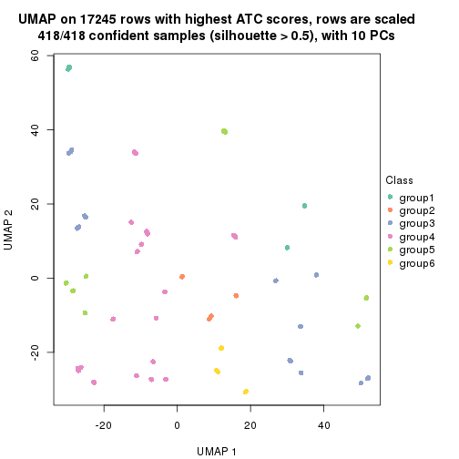</p>

</div>
</div>


Following heatmap shows how subgroups are split when increasing `k`:

```r
collect_classes(res)
```


If matrix rows can be associated to genes, consider to use `GO_Enrichment(res,
...)` to perform function enrichment for the signature genes.


 

---------------------------------------------------


### ATC:kmeans**


The object with results only for a single top-value method and a single partition method 
can be extracted as:

```r
res = res_list["ATC", "kmeans"]
# you can also extract it by
# res = res_list["ATC:kmeans"]
```

A summary of `res` and all the functions that can be applied to it:

```r
res
```

```
#> A 'ConsensusPartition' object with k = 2, 3, 4, 5, 6.
#>   On a matrix with 17245 rows and 418 columns.
#>   Top rows (1000, 2000, 3000, 4000, 5000) are extracted by 'ATC' method.
#>   Subgroups are detected by 'kmeans' method.
#>   Performed in total 1250 partitions by row resampling.
#>   Best k for subgroups seems to be 2.
#> 
#> Following methods can be applied to this 'ConsensusPartition' object:
#>  [1] "cola_report"             "collect_classes"         "collect_plots"          
#>  [4] "collect_stats"           "colnames"                "compare_signatures"     
#>  [7] "consensus_heatmap"       "dimension_reduction"     "functional_enrichment"  
#> [10] "get_anno_col"            "get_anno"                "get_classes"            
#> [13] "get_consensus"           "get_matrix"              "get_membership"         
#> [16] "get_param"               "get_signatures"          "get_stats"              
#> [19] "is_best_k"               "is_stable_k"             "membership_heatmap"     
#> [22] "ncol"                    "nrow"                    "plot_ecdf"              
#> [25] "rownames"                "select_partition_number" "show"                   
#> [28] "suggest_best_k"          "test_to_known_factors"
```

`collect_plots()` function collects all the plots made from `res` for all `k` (number of partitions)
into one single page to provide an easy and fast comparison between different `k`.

```r
collect_plots(res)
```


The plots are:

- The first row: a plot of the ECDF (Empirical cumulative distribution
  function) curves of the consensus matrix for each `k` and the heatmap of
  predicted classes for each `k`.
- The second row: heatmaps of the consensus matrix for each `k`.
- The third row: heatmaps of the membership matrix for each `k`.
- The fouth row: heatmaps of the signatures for each `k`.

All the plots in panels can be made by individual functions and they are
plotted later in this section.

`select_partition_number()` produces several plots showing different
statistics for choosing "optimized" `k`. There are following statistics:

- ECDF curves of the consensus matrix for each `k`;
- 1-PAC. [The PAC
  score](https://en.wikipedia.org/wiki/Consensus_clustering#Over-interpretation_potential_of_consensus_clustering)
  measures the proportion of the ambiguous subgrouping.
- Mean silhouette score.
- Concordance. The mean probability of fiting the consensus class ids in all
  partitions.
- Area increased. Denote $A_k$ as the area under the ECDF curve for current
  `k`, the area increased is defined as $A_k - A_{k-1}$.
- Rand index. The percent of pairs of samples that are both in a same cluster
  or both are not in a same cluster in the partition of k and k-1.
- Jaccard index. The ratio of pairs of samples are both in a same cluster in
  the partition of k and k-1 and the pairs of samples are both in a same
  cluster in the partition k or k-1.

The detailed explanations of these statistics can be found in [the cola
vignette](http://bioconductor.org/packages/devel/bioc/vignettes/cola/inst/doc/cola.html#toc_13).

Generally speaking, lower PAC score, higher mean silhouette score or higher
concordance corresponds to better partition. Rand index and Jaccard index
measure how similar the current partition is compared to partition with `k-1`.
If they are too similar, we won't accept `k` is better than `k-1`.

```r
select_partition_number(res)
```


The numeric values for all these statistics can be obtained by `get_stats()`.

```r
get_stats(res)
```

```
#>   k 1-PAC mean_silhouette concordance area_increased  Rand Jaccard
#> 2 2 1.000           1.000       1.000         0.4984 0.502   0.502
#> 3 3 0.654           0.809       0.890         0.2564 0.802   0.622
#> 4 4 0.647           0.748       0.796         0.1083 0.977   0.935
#> 5 5 0.641           0.660       0.698         0.0652 0.921   0.775
#> 6 6 0.726           0.681       0.735         0.0508 0.903   0.678
```

`suggest_best_k()` suggests the best $k$ based on these statistics. The rules are as follows:

- All $k$ with Jaccard index larger than 0.95 are removed because the increase of
  the partition number does not provides enough extra information. If all $k$ are removed,
  the best $k$ is assigned by `NA`.
- For $k$ with 1-PAC larger than 0.9, the maximal $k$ is taken as the "best k". Other $k$ is called "optional k".
- If it does not fit the second rule. The $k$ with the highest vote of highest
  1-PAC, mean silhouette and concordance is taken as the "best k".

```r
suggest_best_k(res)
```

```
#> [1] 2
```


Following shows the table of the partitions (You need to click the **show/hide
code output** link to see it). The membership matrix (columns with name `p*`)
is inferred by
[`clue::cl_consensus()`](https://www.rdocumentation.org/link/cl_consensus?package=clue)
function with the `SE` method. Basically the value in the membership matrix
represents the probability to belong to a certain group. The finall class
label for an item is determined with the group with highest probability it
belongs to.

In `get_classes()` function, the entropy is calculated from the membership
matrix and the silhouette score is calculated from the consensus matrix.


<script>
$( function() {
	$( '#tabs-ATC-kmeans-get-classes' ).tabs();
} );
</script>
<div id='tabs-ATC-kmeans-get-classes'>
<ul>
<li><a href='#tab-ATC-kmeans-get-classes-1'>k = 2</a></li>
<li><a href='#tab-ATC-kmeans-get-classes-2'>k = 3</a></li>
<li><a href='#tab-ATC-kmeans-get-classes-3'>k = 4</a></li>
<li><a href='#tab-ATC-kmeans-get-classes-4'>k = 5</a></li>
<li><a href='#tab-ATC-kmeans-get-classes-5'>k = 6</a></li>
</ul>

<div id='tab-ATC-kmeans-get-classes-1'>
<p><a id='tab-ATC-kmeans-get-classes-1-a' style='color:#0366d6' href='#'>show/hide code output</a></p>
<pre><code class="r">cbind(get_classes(res, k = 2), get_membership(res, k = 2))
</code></pre>

<pre><code>#&gt;           class entropy silhouette    p1    p2
#&gt; SRR902920     1  0.0000      1.000 1.000 0.000
#&gt; SRR902921     1  0.0000      1.000 1.000 0.000
#&gt; SRR902922     1  0.0000      1.000 1.000 0.000
#&gt; SRR902923     1  0.0000      1.000 1.000 0.000
#&gt; SRR902924     1  0.0000      1.000 1.000 0.000
#&gt; SRR902925     1  0.0000      1.000 1.000 0.000
#&gt; SRR902926     1  0.0000      1.000 1.000 0.000
#&gt; SRR902927     1  0.0000      1.000 1.000 0.000
#&gt; SRR902928     1  0.0000      1.000 1.000 0.000
#&gt; SRR902929     1  0.0000      1.000 1.000 0.000
#&gt; SRR902930     1  0.0000      1.000 1.000 0.000
#&gt; SRR902931     1  0.0000      1.000 1.000 0.000
#&gt; SRR902932     2  0.0000      1.000 0.000 1.000
#&gt; SRR902933     2  0.0000      1.000 0.000 1.000
#&gt; SRR902934     2  0.0000      1.000 0.000 1.000
#&gt; SRR902935     2  0.0000      1.000 0.000 1.000
#&gt; SRR902936     2  0.0000      1.000 0.000 1.000
#&gt; SRR902937     2  0.0000      1.000 0.000 1.000
#&gt; SRR902938     2  0.0000      1.000 0.000 1.000
#&gt; SRR902939     2  0.0000      1.000 0.000 1.000
#&gt; SRR902940     2  0.0000      1.000 0.000 1.000
#&gt; SRR902941     2  0.0000      1.000 0.000 1.000
#&gt; SRR902942     1  0.0000      1.000 1.000 0.000
#&gt; SRR902943     1  0.0000      1.000 1.000 0.000
#&gt; SRR902944     1  0.0000      1.000 1.000 0.000
#&gt; SRR902945     1  0.0000      1.000 1.000 0.000
#&gt; SRR902946     1  0.0000      1.000 1.000 0.000
#&gt; SRR902947     1  0.0000      1.000 1.000 0.000
#&gt; SRR902954     1  0.0000      1.000 1.000 0.000
#&gt; SRR902955     1  0.0000      1.000 1.000 0.000
#&gt; SRR902956     1  0.0000      1.000 1.000 0.000
#&gt; SRR902957     1  0.0000      1.000 1.000 0.000
#&gt; SRR902958     1  0.0000      1.000 1.000 0.000
#&gt; SRR902959     1  0.0000      1.000 1.000 0.000
#&gt; SRR902948     1  0.0000      1.000 1.000 0.000
#&gt; SRR902949     1  0.0000      1.000 1.000 0.000
#&gt; SRR902950     1  0.0000      1.000 1.000 0.000
#&gt; SRR902951     1  0.0000      1.000 1.000 0.000
#&gt; SRR902952     1  0.0000      1.000 1.000 0.000
#&gt; SRR902953     1  0.0000      1.000 1.000 0.000
#&gt; SRR902960     1  0.0000      1.000 1.000 0.000
#&gt; SRR902961     1  0.0000      1.000 1.000 0.000
#&gt; SRR902962     1  0.0000      1.000 1.000 0.000
#&gt; SRR902963     1  0.0000      1.000 1.000 0.000
#&gt; SRR902964     1  0.0000      1.000 1.000 0.000
#&gt; SRR902965     1  0.0000      1.000 1.000 0.000
#&gt; SRR902966     1  0.0000      1.000 1.000 0.000
#&gt; SRR902967     1  0.0000      1.000 1.000 0.000
#&gt; SRR902968     1  0.0000      1.000 1.000 0.000
#&gt; SRR902969     1  0.0000      1.000 1.000 0.000
#&gt; SRR902970     1  0.0000      1.000 1.000 0.000
#&gt; SRR902971     1  0.0000      1.000 1.000 0.000
#&gt; SRR902972     1  0.0000      1.000 1.000 0.000
#&gt; SRR902973     1  0.0000      1.000 1.000 0.000
#&gt; SRR902974     1  0.0000      1.000 1.000 0.000
#&gt; SRR902975     1  0.0000      1.000 1.000 0.000
#&gt; SRR902976     1  0.0000      1.000 1.000 0.000
#&gt; SRR902977     1  0.0000      1.000 1.000 0.000
#&gt; SRR902978     1  0.0000      1.000 1.000 0.000
#&gt; SRR902980     1  0.0000      1.000 1.000 0.000
#&gt; SRR902981     1  0.0000      1.000 1.000 0.000
#&gt; SRR902982     1  0.0000      1.000 1.000 0.000
#&gt; SRR902983     1  0.0000      1.000 1.000 0.000
#&gt; SRR902984     1  0.0000      1.000 1.000 0.000
#&gt; SRR902985     1  0.0000      1.000 1.000 0.000
#&gt; SRR902986     1  0.0000      1.000 1.000 0.000
#&gt; SRR902987     1  0.0000      1.000 1.000 0.000
#&gt; SRR902988     1  0.0000      1.000 1.000 0.000
#&gt; SRR902989     1  0.0000      1.000 1.000 0.000
#&gt; SRR902990     1  0.0000      1.000 1.000 0.000
#&gt; SRR902991     1  0.0000      1.000 1.000 0.000
#&gt; SRR902992     1  0.0000      1.000 1.000 0.000
#&gt; SRR902993     1  0.0000      1.000 1.000 0.000
#&gt; SRR902994     1  0.0000      1.000 1.000 0.000
#&gt; SRR902995     1  0.0000      1.000 1.000 0.000
#&gt; SRR902996     2  0.0000      1.000 0.000 1.000
#&gt; SRR902997     2  0.0000      1.000 0.000 1.000
#&gt; SRR902998     2  0.0000      1.000 0.000 1.000
#&gt; SRR902999     2  0.0000      1.000 0.000 1.000
#&gt; SRR903000     2  0.0000      1.000 0.000 1.000
#&gt; SRR903001     2  0.0000      1.000 0.000 1.000
#&gt; SRR903008     2  0.0000      1.000 0.000 1.000
#&gt; SRR903009     2  0.0000      1.000 0.000 1.000
#&gt; SRR903010     2  0.0000      1.000 0.000 1.000
#&gt; SRR903011     2  0.0000      1.000 0.000 1.000
#&gt; SRR903012     2  0.0000      1.000 0.000 1.000
#&gt; SRR903013     2  0.0000      1.000 0.000 1.000
#&gt; SRR903002     2  0.0000      1.000 0.000 1.000
#&gt; SRR903003     2  0.0000      1.000 0.000 1.000
#&gt; SRR903004     2  0.0000      1.000 0.000 1.000
#&gt; SRR903005     2  0.0000      1.000 0.000 1.000
#&gt; SRR903006     2  0.0000      1.000 0.000 1.000
#&gt; SRR903007     2  0.0000      1.000 0.000 1.000
#&gt; SRR903014     1  0.0000      1.000 1.000 0.000
#&gt; SRR903015     1  0.0000      1.000 1.000 0.000
#&gt; SRR903016     1  0.0000      1.000 1.000 0.000
#&gt; SRR903017     1  0.0000      1.000 1.000 0.000
#&gt; SRR903018     1  0.0000      1.000 1.000 0.000
#&gt; SRR903019     1  0.0000      1.000 1.000 0.000
#&gt; SRR903020     1  0.0000      1.000 1.000 0.000
#&gt; SRR903021     1  0.0000      1.000 1.000 0.000
#&gt; SRR903022     1  0.0000      1.000 1.000 0.000
#&gt; SRR903023     1  0.0000      1.000 1.000 0.000
#&gt; SRR903024     1  0.0000      1.000 1.000 0.000
#&gt; SRR903025     1  0.0000      1.000 1.000 0.000
#&gt; SRR903026     1  0.0000      1.000 1.000 0.000
#&gt; SRR903027     1  0.0000      1.000 1.000 0.000
#&gt; SRR903028     1  0.0000      1.000 1.000 0.000
#&gt; SRR903029     1  0.0000      1.000 1.000 0.000
#&gt; SRR903030     1  0.0000      1.000 1.000 0.000
#&gt; SRR903031     1  0.0000      1.000 1.000 0.000
#&gt; SRR903032     2  0.0000      1.000 0.000 1.000
#&gt; SRR903033     2  0.0000      1.000 0.000 1.000
#&gt; SRR903034     2  0.0000      1.000 0.000 1.000
#&gt; SRR903035     2  0.0000      1.000 0.000 1.000
#&gt; SRR903036     2  0.0000      1.000 0.000 1.000
#&gt; SRR903037     2  0.0000      1.000 0.000 1.000
#&gt; SRR903038     2  0.0000      1.000 0.000 1.000
#&gt; SRR903039     2  0.0000      1.000 0.000 1.000
#&gt; SRR903040     2  0.0000      1.000 0.000 1.000
#&gt; SRR903041     2  0.0000      1.000 0.000 1.000
#&gt; SRR903042     2  0.0000      1.000 0.000 1.000
#&gt; SRR903043     2  0.0000      1.000 0.000 1.000
#&gt; SRR903044     2  0.0000      1.000 0.000 1.000
#&gt; SRR903045     2  0.0000      1.000 0.000 1.000
#&gt; SRR903046     2  0.0000      1.000 0.000 1.000
#&gt; SRR903047     2  0.0000      1.000 0.000 1.000
#&gt; SRR903048     2  0.0000      1.000 0.000 1.000
#&gt; SRR903049     2  0.0000      1.000 0.000 1.000
#&gt; SRR903050     1  0.0000      1.000 1.000 0.000
#&gt; SRR903051     1  0.0000      1.000 1.000 0.000
#&gt; SRR903052     1  0.0000      1.000 1.000 0.000
#&gt; SRR903053     1  0.0000      1.000 1.000 0.000
#&gt; SRR903054     1  0.0000      1.000 1.000 0.000
#&gt; SRR903055     1  0.0000      1.000 1.000 0.000
#&gt; SRR903056     1  0.0000      1.000 1.000 0.000
#&gt; SRR903057     1  0.0000      1.000 1.000 0.000
#&gt; SRR903058     1  0.0000      1.000 1.000 0.000
#&gt; SRR903059     1  0.0000      1.000 1.000 0.000
#&gt; SRR903060     1  0.0000      1.000 1.000 0.000
#&gt; SRR903061     1  0.0000      1.000 1.000 0.000
#&gt; SRR903062     1  0.0000      1.000 1.000 0.000
#&gt; SRR903063     1  0.0000      1.000 1.000 0.000
#&gt; SRR903064     1  0.0000      1.000 1.000 0.000
#&gt; SRR903065     1  0.0000      1.000 1.000 0.000
#&gt; SRR903066     1  0.0000      1.000 1.000 0.000
#&gt; SRR903067     1  0.0000      1.000 1.000 0.000
#&gt; SRR903068     1  0.0000      1.000 1.000 0.000
#&gt; SRR903069     1  0.0000      1.000 1.000 0.000
#&gt; SRR903070     1  0.0000      1.000 1.000 0.000
#&gt; SRR903071     1  0.0000      1.000 1.000 0.000
#&gt; SRR903072     1  0.0000      1.000 1.000 0.000
#&gt; SRR903073     1  0.0000      1.000 1.000 0.000
#&gt; SRR903074     1  0.0000      1.000 1.000 0.000
#&gt; SRR903075     1  0.0000      1.000 1.000 0.000
#&gt; SRR903076     1  0.0000      1.000 1.000 0.000
#&gt; SRR903077     1  0.0000      1.000 1.000 0.000
#&gt; SRR903078     1  0.0000      1.000 1.000 0.000
#&gt; SRR903079     1  0.0000      1.000 1.000 0.000
#&gt; SRR903080     1  0.0000      1.000 1.000 0.000
#&gt; SRR903081     1  0.0000      1.000 1.000 0.000
#&gt; SRR903082     2  0.0000      1.000 0.000 1.000
#&gt; SRR903083     2  0.0000      1.000 0.000 1.000
#&gt; SRR903084     2  0.0000      1.000 0.000 1.000
#&gt; SRR903085     2  0.0000      1.000 0.000 1.000
#&gt; SRR903086     2  0.0000      1.000 0.000 1.000
#&gt; SRR903087     2  0.0000      1.000 0.000 1.000
#&gt; SRR903088     2  0.0000      1.000 0.000 1.000
#&gt; SRR903089     2  0.0000      1.000 0.000 1.000
#&gt; SRR903090     2  0.0000      1.000 0.000 1.000
#&gt; SRR903091     2  0.0000      1.000 0.000 1.000
#&gt; SRR903092     2  0.0000      1.000 0.000 1.000
#&gt; SRR903093     2  0.0000      1.000 0.000 1.000
#&gt; SRR903094     2  0.0000      1.000 0.000 1.000
#&gt; SRR903095     2  0.0000      1.000 0.000 1.000
#&gt; SRR903096     2  0.0000      1.000 0.000 1.000
#&gt; SRR903097     2  0.0000      1.000 0.000 1.000
#&gt; SRR903098     2  0.0000      1.000 0.000 1.000
#&gt; SRR903099     2  0.0000      1.000 0.000 1.000
#&gt; SRR903100     2  0.0000      1.000 0.000 1.000
#&gt; SRR903101     2  0.0000      1.000 0.000 1.000
#&gt; SRR903102     2  0.0000      1.000 0.000 1.000
#&gt; SRR903103     2  0.0000      1.000 0.000 1.000
#&gt; SRR903104     2  0.0000      1.000 0.000 1.000
#&gt; SRR903105     2  0.0000      1.000 0.000 1.000
#&gt; SRR903106     2  0.0000      1.000 0.000 1.000
#&gt; SRR903107     2  0.0000      1.000 0.000 1.000
#&gt; SRR903108     2  0.0000      1.000 0.000 1.000
#&gt; SRR903109     2  0.0000      1.000 0.000 1.000
#&gt; SRR903110     2  0.0000      1.000 0.000 1.000
#&gt; SRR903111     2  0.0000      1.000 0.000 1.000
#&gt; SRR903112     2  0.0000      1.000 0.000 1.000
#&gt; SRR903113     2  0.0000      1.000 0.000 1.000
#&gt; SRR903114     1  0.0376      0.996 0.996 0.004
#&gt; SRR903115     1  0.0376      0.996 0.996 0.004
#&gt; SRR903116     1  0.0376      0.996 0.996 0.004
#&gt; SRR903117     1  0.0376      0.996 0.996 0.004
#&gt; SRR903118     1  0.0376      0.996 0.996 0.004
#&gt; SRR903119     1  0.0376      0.996 0.996 0.004
#&gt; SRR903121     1  0.0376      0.996 0.996 0.004
#&gt; SRR903122     1  0.0000      1.000 1.000 0.000
#&gt; SRR903124     1  0.0000      1.000 1.000 0.000
#&gt; SRR903125     1  0.0000      1.000 1.000 0.000
#&gt; SRR903126     1  0.0000      1.000 1.000 0.000
#&gt; SRR903127     1  0.0000      1.000 1.000 0.000
#&gt; SRR903128     1  0.0000      1.000 1.000 0.000
#&gt; SRR903129     1  0.0000      1.000 1.000 0.000
#&gt; SRR903130     1  0.0000      1.000 1.000 0.000
#&gt; SRR903131     1  0.0000      1.000 1.000 0.000
#&gt; SRR903132     1  0.0000      1.000 1.000 0.000
#&gt; SRR903133     1  0.0000      1.000 1.000 0.000
#&gt; SRR903134     1  0.0000      1.000 1.000 0.000
#&gt; SRR903135     1  0.0000      1.000 1.000 0.000
#&gt; SRR903136     1  0.0000      1.000 1.000 0.000
#&gt; SRR903137     1  0.0000      1.000 1.000 0.000
#&gt; SRR903146     2  0.0000      1.000 0.000 1.000
#&gt; SRR903147     2  0.0000      1.000 0.000 1.000
#&gt; SRR903148     2  0.0000      1.000 0.000 1.000
#&gt; SRR903149     2  0.0000      1.000 0.000 1.000
#&gt; SRR903150     2  0.0000      1.000 0.000 1.000
#&gt; SRR903151     2  0.0000      1.000 0.000 1.000
#&gt; SRR903152     2  0.0000      1.000 0.000 1.000
#&gt; SRR903153     2  0.0000      1.000 0.000 1.000
#&gt; SRR903138     1  0.0376      0.996 0.996 0.004
#&gt; SRR903139     1  0.0376      0.996 0.996 0.004
#&gt; SRR903140     1  0.0376      0.996 0.996 0.004
#&gt; SRR903141     1  0.0376      0.996 0.996 0.004
#&gt; SRR903142     1  0.0376      0.996 0.996 0.004
#&gt; SRR903143     1  0.0376      0.996 0.996 0.004
#&gt; SRR903144     1  0.0376      0.996 0.996 0.004
#&gt; SRR903145     1  0.0376      0.996 0.996 0.004
#&gt; SRR903154     2  0.0000      1.000 0.000 1.000
#&gt; SRR903155     2  0.0000      1.000 0.000 1.000
#&gt; SRR903156     2  0.0000      1.000 0.000 1.000
#&gt; SRR903157     2  0.0000      1.000 0.000 1.000
#&gt; SRR903158     2  0.0000      1.000 0.000 1.000
#&gt; SRR903159     2  0.0000      1.000 0.000 1.000
#&gt; SRR903160     2  0.0000      1.000 0.000 1.000
#&gt; SRR903161     2  0.0000      1.000 0.000 1.000
#&gt; SRR903162     2  0.0000      1.000 0.000 1.000
#&gt; SRR903163     2  0.0000      1.000 0.000 1.000
#&gt; SRR903164     2  0.0000      1.000 0.000 1.000
#&gt; SRR903165     2  0.0000      1.000 0.000 1.000
#&gt; SRR903166     2  0.0000      1.000 0.000 1.000
#&gt; SRR903167     2  0.0000      1.000 0.000 1.000
#&gt; SRR903168     2  0.0000      1.000 0.000 1.000
#&gt; SRR903169     2  0.0000      1.000 0.000 1.000
#&gt; SRR903178     1  0.0000      1.000 1.000 0.000
#&gt; SRR903179     1  0.0000      1.000 1.000 0.000
#&gt; SRR903180     1  0.0000      1.000 1.000 0.000
#&gt; SRR903181     1  0.0000      1.000 1.000 0.000
#&gt; SRR903182     1  0.0000      1.000 1.000 0.000
#&gt; SRR903183     1  0.0000      1.000 1.000 0.000
#&gt; SRR903184     1  0.0000      1.000 1.000 0.000
#&gt; SRR903185     1  0.0000      1.000 1.000 0.000
#&gt; SRR903170     2  0.0000      1.000 0.000 1.000
#&gt; SRR903171     2  0.0000      1.000 0.000 1.000
#&gt; SRR903172     2  0.0000      1.000 0.000 1.000
#&gt; SRR903173     2  0.0000      1.000 0.000 1.000
#&gt; SRR903174     2  0.0000      1.000 0.000 1.000
#&gt; SRR903175     2  0.0000      1.000 0.000 1.000
#&gt; SRR903176     2  0.0000      1.000 0.000 1.000
#&gt; SRR903177     2  0.0000      1.000 0.000 1.000
#&gt; SRR903186     1  0.0000      1.000 1.000 0.000
#&gt; SRR903187     1  0.0000      1.000 1.000 0.000
#&gt; SRR903188     1  0.0000      1.000 1.000 0.000
#&gt; SRR903189     1  0.0000      1.000 1.000 0.000
#&gt; SRR903190     1  0.0000      1.000 1.000 0.000
#&gt; SRR903191     1  0.0000      1.000 1.000 0.000
#&gt; SRR903192     1  0.0000      1.000 1.000 0.000
#&gt; SRR903193     1  0.0000      1.000 1.000 0.000
#&gt; SRR903194     1  0.0000      1.000 1.000 0.000
#&gt; SRR903195     1  0.0000      1.000 1.000 0.000
#&gt; SRR903196     1  0.0000      1.000 1.000 0.000
#&gt; SRR903197     1  0.0000      1.000 1.000 0.000
#&gt; SRR903198     1  0.0000      1.000 1.000 0.000
#&gt; SRR903199     1  0.0000      1.000 1.000 0.000
#&gt; SRR903200     1  0.0000      1.000 1.000 0.000
#&gt; SRR903201     1  0.0000      1.000 1.000 0.000
#&gt; SRR903210     2  0.0000      1.000 0.000 1.000
#&gt; SRR903211     2  0.0000      1.000 0.000 1.000
#&gt; SRR903212     2  0.0000      1.000 0.000 1.000
#&gt; SRR903213     2  0.0000      1.000 0.000 1.000
#&gt; SRR903214     2  0.0000      1.000 0.000 1.000
#&gt; SRR903215     2  0.0000      1.000 0.000 1.000
#&gt; SRR903216     2  0.0000      1.000 0.000 1.000
#&gt; SRR903217     2  0.0000      1.000 0.000 1.000
#&gt; SRR903202     1  0.0000      1.000 1.000 0.000
#&gt; SRR903203     1  0.0000      1.000 1.000 0.000
#&gt; SRR903204     1  0.0000      1.000 1.000 0.000
#&gt; SRR903205     1  0.0000      1.000 1.000 0.000
#&gt; SRR903206     1  0.0000      1.000 1.000 0.000
#&gt; SRR903207     1  0.0000      1.000 1.000 0.000
#&gt; SRR903208     1  0.0000      1.000 1.000 0.000
#&gt; SRR903209     1  0.0000      1.000 1.000 0.000
#&gt; SRR903218     2  0.0000      1.000 0.000 1.000
#&gt; SRR903219     2  0.0000      1.000 0.000 1.000
#&gt; SRR903220     2  0.0000      1.000 0.000 1.000
#&gt; SRR903221     2  0.0000      1.000 0.000 1.000
#&gt; SRR903222     2  0.0000      1.000 0.000 1.000
#&gt; SRR903223     2  0.0000      1.000 0.000 1.000
#&gt; SRR903224     2  0.0000      1.000 0.000 1.000
#&gt; SRR903225     2  0.0000      1.000 0.000 1.000
#&gt; SRR903226     2  0.0000      1.000 0.000 1.000
#&gt; SRR903227     2  0.0000      1.000 0.000 1.000
#&gt; SRR903228     2  0.0000      1.000 0.000 1.000
#&gt; SRR903229     2  0.0000      1.000 0.000 1.000
#&gt; SRR903230     2  0.0000      1.000 0.000 1.000
#&gt; SRR903231     2  0.0000      1.000 0.000 1.000
#&gt; SRR903232     2  0.0000      1.000 0.000 1.000
#&gt; SRR903233     2  0.0000      1.000 0.000 1.000
#&gt; SRR903242     1  0.0000      1.000 1.000 0.000
#&gt; SRR903243     1  0.0000      1.000 1.000 0.000
#&gt; SRR903244     1  0.0000      1.000 1.000 0.000
#&gt; SRR903245     1  0.0000      1.000 1.000 0.000
#&gt; SRR903246     1  0.0000      1.000 1.000 0.000
#&gt; SRR903247     1  0.0000      1.000 1.000 0.000
#&gt; SRR903248     1  0.0000      1.000 1.000 0.000
#&gt; SRR903249     1  0.0000      1.000 1.000 0.000
#&gt; SRR903234     2  0.0000      1.000 0.000 1.000
#&gt; SRR903235     2  0.0000      1.000 0.000 1.000
#&gt; SRR903236     2  0.0000      1.000 0.000 1.000
#&gt; SRR903237     2  0.0000      1.000 0.000 1.000
#&gt; SRR903238     2  0.0000      1.000 0.000 1.000
#&gt; SRR903239     2  0.0000      1.000 0.000 1.000
#&gt; SRR903240     2  0.0000      1.000 0.000 1.000
#&gt; SRR903241     2  0.0000      1.000 0.000 1.000
#&gt; SRR903258     1  0.0000      1.000 1.000 0.000
#&gt; SRR903259     1  0.0000      1.000 1.000 0.000
#&gt; SRR903260     1  0.0000      1.000 1.000 0.000
#&gt; SRR903261     1  0.0000      1.000 1.000 0.000
#&gt; SRR903262     1  0.0000      1.000 1.000 0.000
#&gt; SRR903263     1  0.0000      1.000 1.000 0.000
#&gt; SRR903264     1  0.0000      1.000 1.000 0.000
#&gt; SRR903265     1  0.0000      1.000 1.000 0.000
#&gt; SRR903250     1  0.0000      1.000 1.000 0.000
#&gt; SRR903251     1  0.0000      1.000 1.000 0.000
#&gt; SRR903252     1  0.0000      1.000 1.000 0.000
#&gt; SRR903253     1  0.0000      1.000 1.000 0.000
#&gt; SRR903254     1  0.0000      1.000 1.000 0.000
#&gt; SRR903255     1  0.0000      1.000 1.000 0.000
#&gt; SRR903256     1  0.0000      1.000 1.000 0.000
#&gt; SRR903257     1  0.0000      1.000 1.000 0.000
#&gt; SRR903266     1  0.0000      1.000 1.000 0.000
#&gt; SRR903267     1  0.0000      1.000 1.000 0.000
#&gt; SRR903268     1  0.0000      1.000 1.000 0.000
#&gt; SRR903270     1  0.0000      1.000 1.000 0.000
#&gt; SRR903271     1  0.0000      1.000 1.000 0.000
#&gt; SRR903272     1  0.0000      1.000 1.000 0.000
#&gt; SRR903273     1  0.0000      1.000 1.000 0.000
#&gt; SRR903274     2  0.0000      1.000 0.000 1.000
#&gt; SRR903275     2  0.0000      1.000 0.000 1.000
#&gt; SRR903276     2  0.0000      1.000 0.000 1.000
#&gt; SRR903277     2  0.0000      1.000 0.000 1.000
#&gt; SRR903278     2  0.0000      1.000 0.000 1.000
#&gt; SRR903279     2  0.0000      1.000 0.000 1.000
#&gt; SRR903280     2  0.0000      1.000 0.000 1.000
#&gt; SRR903281     2  0.0000      1.000 0.000 1.000
#&gt; SRR903282     2  0.0000      1.000 0.000 1.000
#&gt; SRR903283     2  0.0000      1.000 0.000 1.000
#&gt; SRR903284     2  0.0000      1.000 0.000 1.000
#&gt; SRR903285     2  0.0000      1.000 0.000 1.000
#&gt; SRR903286     2  0.0000      1.000 0.000 1.000
#&gt; SRR903287     2  0.0000      1.000 0.000 1.000
#&gt; SRR903288     2  0.0000      1.000 0.000 1.000
#&gt; SRR903289     2  0.0000      1.000 0.000 1.000
#&gt; SRR903290     2  0.0000      1.000 0.000 1.000
#&gt; SRR903291     2  0.0000      1.000 0.000 1.000
#&gt; SRR903292     2  0.0000      1.000 0.000 1.000
#&gt; SRR903293     2  0.0000      1.000 0.000 1.000
#&gt; SRR903294     2  0.0000      1.000 0.000 1.000
#&gt; SRR903295     2  0.0000      1.000 0.000 1.000
#&gt; SRR903296     2  0.0000      1.000 0.000 1.000
#&gt; SRR903297     2  0.0000      1.000 0.000 1.000
#&gt; SRR903298     2  0.0000      1.000 0.000 1.000
#&gt; SRR903299     2  0.0000      1.000 0.000 1.000
#&gt; SRR903300     2  0.0000      1.000 0.000 1.000
#&gt; SRR903301     2  0.0000      1.000 0.000 1.000
#&gt; SRR903302     2  0.0000      1.000 0.000 1.000
#&gt; SRR903303     2  0.0000      1.000 0.000 1.000
#&gt; SRR903304     2  0.0000      1.000 0.000 1.000
#&gt; SRR903305     2  0.0000      1.000 0.000 1.000
#&gt; SRR903306     1  0.0000      1.000 1.000 0.000
#&gt; SRR903307     1  0.0000      1.000 1.000 0.000
#&gt; SRR903308     1  0.0000      1.000 1.000 0.000
#&gt; SRR903309     1  0.0000      1.000 1.000 0.000
#&gt; SRR903310     1  0.0000      1.000 1.000 0.000
#&gt; SRR903311     1  0.0000      1.000 1.000 0.000
#&gt; SRR903312     1  0.0000      1.000 1.000 0.000
#&gt; SRR903313     1  0.0000      1.000 1.000 0.000
#&gt; SRR903314     1  0.0000      1.000 1.000 0.000
#&gt; SRR903315     1  0.0000      1.000 1.000 0.000
#&gt; SRR903316     1  0.0000      1.000 1.000 0.000
#&gt; SRR903317     1  0.0000      1.000 1.000 0.000
#&gt; SRR903318     1  0.0000      1.000 1.000 0.000
#&gt; SRR903319     1  0.0000      1.000 1.000 0.000
#&gt; SRR903320     1  0.0000      1.000 1.000 0.000
#&gt; SRR903321     1  0.0000      1.000 1.000 0.000
#&gt; SRR903322     1  0.0000      1.000 1.000 0.000
#&gt; SRR903323     1  0.0000      1.000 1.000 0.000
#&gt; SRR903324     2  0.0000      1.000 0.000 1.000
#&gt; SRR903325     2  0.0000      1.000 0.000 1.000
#&gt; SRR903326     2  0.0000      1.000 0.000 1.000
#&gt; SRR903327     2  0.0000      1.000 0.000 1.000
#&gt; SRR903328     2  0.0000      1.000 0.000 1.000
#&gt; SRR903329     2  0.0000      1.000 0.000 1.000
#&gt; SRR903330     2  0.0000      1.000 0.000 1.000
#&gt; SRR903331     2  0.0000      1.000 0.000 1.000
#&gt; SRR903332     2  0.0000      1.000 0.000 1.000
#&gt; SRR903333     2  0.0000      1.000 0.000 1.000
#&gt; SRR903334     2  0.0000      1.000 0.000 1.000
#&gt; SRR903335     2  0.0000      1.000 0.000 1.000
#&gt; SRR903336     2  0.0000      1.000 0.000 1.000
#&gt; SRR903337     2  0.0000      1.000 0.000 1.000
#&gt; SRR903338     2  0.0000      1.000 0.000 1.000
#&gt; SRR903339     2  0.0000      1.000 0.000 1.000
#&gt; SRR903340     2  0.0000      1.000 0.000 1.000
#&gt; SRR903341     2  0.0000      1.000 0.000 1.000
</code></pre>

<script>
$('#tab-ATC-kmeans-get-classes-1-a').parent().next().next().hide();
$('#tab-ATC-kmeans-get-classes-1-a').click(function(){
  $('#tab-ATC-kmeans-get-classes-1-a').parent().next().next().toggle();
  return(false);
});
</script>
</div>

<div id='tab-ATC-kmeans-get-classes-2'>
<p><a id='tab-ATC-kmeans-get-classes-2-a' style='color:#0366d6' href='#'>show/hide code output</a></p>
<pre><code class="r">cbind(get_classes(res, k = 3), get_membership(res, k = 3))
</code></pre>

<pre><code>#&gt;           class entropy silhouette    p1    p2    p3
#&gt; SRR902920     3  0.0000      0.938 0.000 0.000 1.000
#&gt; SRR902921     3  0.0000      0.938 0.000 0.000 1.000
#&gt; SRR902922     3  0.0000      0.938 0.000 0.000 1.000
#&gt; SRR902923     3  0.0000      0.938 0.000 0.000 1.000
#&gt; SRR902924     3  0.0000      0.938 0.000 0.000 1.000
#&gt; SRR902925     3  0.0000      0.938 0.000 0.000 1.000
#&gt; SRR902926     3  0.0000      0.938 0.000 0.000 1.000
#&gt; SRR902927     3  0.0000      0.938 0.000 0.000 1.000
#&gt; SRR902928     3  0.0000      0.938 0.000 0.000 1.000
#&gt; SRR902929     3  0.0000      0.938 0.000 0.000 1.000
#&gt; SRR902930     3  0.0000      0.938 0.000 0.000 1.000
#&gt; SRR902931     3  0.0000      0.938 0.000 0.000 1.000
#&gt; SRR902932     2  0.0237      0.952 0.004 0.996 0.000
#&gt; SRR902933     2  0.0237      0.952 0.004 0.996 0.000
#&gt; SRR902934     2  0.0237      0.952 0.004 0.996 0.000
#&gt; SRR902935     2  0.0237      0.952 0.004 0.996 0.000
#&gt; SRR902936     2  0.0237      0.952 0.004 0.996 0.000
#&gt; SRR902937     2  0.0237      0.952 0.004 0.996 0.000
#&gt; SRR902938     2  0.0237      0.952 0.004 0.996 0.000
#&gt; SRR902939     2  0.0237      0.952 0.004 0.996 0.000
#&gt; SRR902940     2  0.0237      0.952 0.004 0.996 0.000
#&gt; SRR902941     2  0.0237      0.952 0.004 0.996 0.000
#&gt; SRR902942     3  0.0000      0.938 0.000 0.000 1.000
#&gt; SRR902943     3  0.0000      0.938 0.000 0.000 1.000
#&gt; SRR902944     3  0.0000      0.938 0.000 0.000 1.000
#&gt; SRR902945     3  0.0000      0.938 0.000 0.000 1.000
#&gt; SRR902946     3  0.0000      0.938 0.000 0.000 1.000
#&gt; SRR902947     3  0.0000      0.938 0.000 0.000 1.000
#&gt; SRR902954     3  0.0000      0.938 0.000 0.000 1.000
#&gt; SRR902955     3  0.0000      0.938 0.000 0.000 1.000
#&gt; SRR902956     3  0.0000      0.938 0.000 0.000 1.000
#&gt; SRR902957     3  0.0000      0.938 0.000 0.000 1.000
#&gt; SRR902958     3  0.0000      0.938 0.000 0.000 1.000
#&gt; SRR902959     3  0.0000      0.938 0.000 0.000 1.000
#&gt; SRR902948     3  0.0000      0.938 0.000 0.000 1.000
#&gt; SRR902949     3  0.0000      0.938 0.000 0.000 1.000
#&gt; SRR902950     3  0.0000      0.938 0.000 0.000 1.000
#&gt; SRR902951     3  0.0000      0.938 0.000 0.000 1.000
#&gt; SRR902952     3  0.0000      0.938 0.000 0.000 1.000
#&gt; SRR902953     3  0.0000      0.938 0.000 0.000 1.000
#&gt; SRR902960     3  0.0000      0.938 0.000 0.000 1.000
#&gt; SRR902961     3  0.0000      0.938 0.000 0.000 1.000
#&gt; SRR902962     3  0.0000      0.938 0.000 0.000 1.000
#&gt; SRR902963     3  0.0000      0.938 0.000 0.000 1.000
#&gt; SRR902964     3  0.0000      0.938 0.000 0.000 1.000
#&gt; SRR902965     3  0.0000      0.938 0.000 0.000 1.000
#&gt; SRR902966     3  0.0000      0.938 0.000 0.000 1.000
#&gt; SRR902967     3  0.0000      0.938 0.000 0.000 1.000
#&gt; SRR902968     3  0.0000      0.938 0.000 0.000 1.000
#&gt; SRR902969     3  0.0000      0.938 0.000 0.000 1.000
#&gt; SRR902970     3  0.0000      0.938 0.000 0.000 1.000
#&gt; SRR902971     3  0.0000      0.938 0.000 0.000 1.000
#&gt; SRR902972     3  0.0000      0.938 0.000 0.000 1.000
#&gt; SRR902973     3  0.0000      0.938 0.000 0.000 1.000
#&gt; SRR902974     3  0.0000      0.938 0.000 0.000 1.000
#&gt; SRR902975     3  0.0000      0.938 0.000 0.000 1.000
#&gt; SRR902976     3  0.0000      0.938 0.000 0.000 1.000
#&gt; SRR902977     3  0.0000      0.938 0.000 0.000 1.000
#&gt; SRR902978     3  0.0000      0.938 0.000 0.000 1.000
#&gt; SRR902980     3  0.0000      0.938 0.000 0.000 1.000
#&gt; SRR902981     3  0.0000      0.938 0.000 0.000 1.000
#&gt; SRR902982     3  0.0000      0.938 0.000 0.000 1.000
#&gt; SRR902983     3  0.0000      0.938 0.000 0.000 1.000
#&gt; SRR902984     3  0.0000      0.938 0.000 0.000 1.000
#&gt; SRR902985     3  0.0000      0.938 0.000 0.000 1.000
#&gt; SRR902986     3  0.0000      0.938 0.000 0.000 1.000
#&gt; SRR902987     3  0.0000      0.938 0.000 0.000 1.000
#&gt; SRR902988     3  0.0000      0.938 0.000 0.000 1.000
#&gt; SRR902989     3  0.0000      0.938 0.000 0.000 1.000
#&gt; SRR902990     3  0.0000      0.938 0.000 0.000 1.000
#&gt; SRR902991     3  0.0000      0.938 0.000 0.000 1.000
#&gt; SRR902992     3  0.0000      0.938 0.000 0.000 1.000
#&gt; SRR902993     3  0.0000      0.938 0.000 0.000 1.000
#&gt; SRR902994     3  0.0000      0.938 0.000 0.000 1.000
#&gt; SRR902995     3  0.0000      0.938 0.000 0.000 1.000
#&gt; SRR902996     2  0.0237      0.952 0.004 0.996 0.000
#&gt; SRR902997     2  0.0237      0.952 0.004 0.996 0.000
#&gt; SRR902998     2  0.0237      0.952 0.004 0.996 0.000
#&gt; SRR902999     2  0.0237      0.952 0.004 0.996 0.000
#&gt; SRR903000     2  0.0237      0.952 0.004 0.996 0.000
#&gt; SRR903001     2  0.0237      0.952 0.004 0.996 0.000
#&gt; SRR903008     2  0.0237      0.952 0.004 0.996 0.000
#&gt; SRR903009     2  0.0237      0.952 0.004 0.996 0.000
#&gt; SRR903010     2  0.0237      0.952 0.004 0.996 0.000
#&gt; SRR903011     2  0.0237      0.952 0.004 0.996 0.000
#&gt; SRR903012     2  0.0237      0.952 0.004 0.996 0.000
#&gt; SRR903013     2  0.0237      0.952 0.004 0.996 0.000
#&gt; SRR903002     2  0.0237      0.952 0.004 0.996 0.000
#&gt; SRR903003     2  0.0237      0.952 0.004 0.996 0.000
#&gt; SRR903004     2  0.0237      0.952 0.004 0.996 0.000
#&gt; SRR903005     2  0.0237      0.952 0.004 0.996 0.000
#&gt; SRR903006     2  0.0237      0.952 0.004 0.996 0.000
#&gt; SRR903007     2  0.0237      0.952 0.004 0.996 0.000
#&gt; SRR903014     3  0.0000      0.938 0.000 0.000 1.000
#&gt; SRR903015     3  0.0000      0.938 0.000 0.000 1.000
#&gt; SRR903016     3  0.0000      0.938 0.000 0.000 1.000
#&gt; SRR903017     3  0.0000      0.938 0.000 0.000 1.000
#&gt; SRR903018     3  0.0000      0.938 0.000 0.000 1.000
#&gt; SRR903019     3  0.0000      0.938 0.000 0.000 1.000
#&gt; SRR903020     3  0.0000      0.938 0.000 0.000 1.000
#&gt; SRR903021     3  0.0000      0.938 0.000 0.000 1.000
#&gt; SRR903022     3  0.0000      0.938 0.000 0.000 1.000
#&gt; SRR903023     3  0.0000      0.938 0.000 0.000 1.000
#&gt; SRR903024     3  0.0000      0.938 0.000 0.000 1.000
#&gt; SRR903025     3  0.0000      0.938 0.000 0.000 1.000
#&gt; SRR903026     3  0.0000      0.938 0.000 0.000 1.000
#&gt; SRR903027     3  0.0000      0.938 0.000 0.000 1.000
#&gt; SRR903028     3  0.0000      0.938 0.000 0.000 1.000
#&gt; SRR903029     3  0.0000      0.938 0.000 0.000 1.000
#&gt; SRR903030     3  0.0000      0.938 0.000 0.000 1.000
#&gt; SRR903031     3  0.0000      0.938 0.000 0.000 1.000
#&gt; SRR903032     2  0.0237      0.952 0.004 0.996 0.000
#&gt; SRR903033     2  0.0237      0.952 0.004 0.996 0.000
#&gt; SRR903034     2  0.0237      0.952 0.004 0.996 0.000
#&gt; SRR903035     2  0.0237      0.952 0.004 0.996 0.000
#&gt; SRR903036     2  0.0237      0.952 0.004 0.996 0.000
#&gt; SRR903037     2  0.0237      0.952 0.004 0.996 0.000
#&gt; SRR903038     2  0.0237      0.952 0.004 0.996 0.000
#&gt; SRR903039     2  0.0237      0.952 0.004 0.996 0.000
#&gt; SRR903040     2  0.0237      0.952 0.004 0.996 0.000
#&gt; SRR903041     2  0.0237      0.952 0.004 0.996 0.000
#&gt; SRR903042     2  0.0237      0.952 0.004 0.996 0.000
#&gt; SRR903043     2  0.0237      0.952 0.004 0.996 0.000
#&gt; SRR903044     2  0.0237      0.952 0.004 0.996 0.000
#&gt; SRR903045     2  0.0237      0.952 0.004 0.996 0.000
#&gt; SRR903046     2  0.0237      0.952 0.004 0.996 0.000
#&gt; SRR903047     2  0.0237      0.952 0.004 0.996 0.000
#&gt; SRR903048     2  0.0237      0.952 0.004 0.996 0.000
#&gt; SRR903049     2  0.0237      0.952 0.004 0.996 0.000
#&gt; SRR903050     1  0.6008      0.435 0.628 0.000 0.372
#&gt; SRR903051     1  0.6008      0.435 0.628 0.000 0.372
#&gt; SRR903052     1  0.6008      0.435 0.628 0.000 0.372
#&gt; SRR903053     1  0.6008      0.435 0.628 0.000 0.372
#&gt; SRR903054     1  0.6008      0.435 0.628 0.000 0.372
#&gt; SRR903055     1  0.6008      0.435 0.628 0.000 0.372
#&gt; SRR903056     1  0.6008      0.435 0.628 0.000 0.372
#&gt; SRR903057     1  0.6008      0.435 0.628 0.000 0.372
#&gt; SRR903058     1  0.6008      0.435 0.628 0.000 0.372
#&gt; SRR903059     1  0.6008      0.435 0.628 0.000 0.372
#&gt; SRR903060     1  0.6008      0.435 0.628 0.000 0.372
#&gt; SRR903061     1  0.6008      0.435 0.628 0.000 0.372
#&gt; SRR903062     1  0.6008      0.435 0.628 0.000 0.372
#&gt; SRR903063     1  0.6008      0.435 0.628 0.000 0.372
#&gt; SRR903064     1  0.6008      0.435 0.628 0.000 0.372
#&gt; SRR903065     1  0.6008      0.435 0.628 0.000 0.372
#&gt; SRR903066     1  0.6008      0.435 0.628 0.000 0.372
#&gt; SRR903067     1  0.6008      0.435 0.628 0.000 0.372
#&gt; SRR903068     1  0.6008      0.435 0.628 0.000 0.372
#&gt; SRR903069     1  0.6008      0.435 0.628 0.000 0.372
#&gt; SRR903070     1  0.6008      0.435 0.628 0.000 0.372
#&gt; SRR903071     1  0.6008      0.435 0.628 0.000 0.372
#&gt; SRR903072     1  0.6008      0.435 0.628 0.000 0.372
#&gt; SRR903073     1  0.6008      0.435 0.628 0.000 0.372
#&gt; SRR903074     1  0.6008      0.435 0.628 0.000 0.372
#&gt; SRR903075     1  0.6008      0.435 0.628 0.000 0.372
#&gt; SRR903076     1  0.6008      0.435 0.628 0.000 0.372
#&gt; SRR903077     1  0.6008      0.435 0.628 0.000 0.372
#&gt; SRR903078     1  0.6008      0.435 0.628 0.000 0.372
#&gt; SRR903079     1  0.6008      0.435 0.628 0.000 0.372
#&gt; SRR903080     1  0.6008      0.435 0.628 0.000 0.372
#&gt; SRR903081     1  0.6008      0.435 0.628 0.000 0.372
#&gt; SRR903082     2  0.3116      0.902 0.108 0.892 0.000
#&gt; SRR903083     2  0.3116      0.902 0.108 0.892 0.000
#&gt; SRR903084     2  0.3116      0.902 0.108 0.892 0.000
#&gt; SRR903085     2  0.3116      0.902 0.108 0.892 0.000
#&gt; SRR903086     2  0.3116      0.902 0.108 0.892 0.000
#&gt; SRR903087     2  0.3116      0.902 0.108 0.892 0.000
#&gt; SRR903088     2  0.3116      0.902 0.108 0.892 0.000
#&gt; SRR903089     2  0.3116      0.902 0.108 0.892 0.000
#&gt; SRR903090     2  0.3116      0.902 0.108 0.892 0.000
#&gt; SRR903091     2  0.3116      0.902 0.108 0.892 0.000
#&gt; SRR903092     2  0.3116      0.902 0.108 0.892 0.000
#&gt; SRR903093     2  0.3116      0.902 0.108 0.892 0.000
#&gt; SRR903094     2  0.3116      0.902 0.108 0.892 0.000
#&gt; SRR903095     2  0.3116      0.902 0.108 0.892 0.000
#&gt; SRR903096     2  0.3116      0.902 0.108 0.892 0.000
#&gt; SRR903097     2  0.3116      0.902 0.108 0.892 0.000
#&gt; SRR903098     2  0.3116      0.902 0.108 0.892 0.000
#&gt; SRR903099     2  0.3116      0.902 0.108 0.892 0.000
#&gt; SRR903100     2  0.3116      0.902 0.108 0.892 0.000
#&gt; SRR903101     2  0.3116      0.902 0.108 0.892 0.000
#&gt; SRR903102     2  0.3116      0.902 0.108 0.892 0.000
#&gt; SRR903103     2  0.3116      0.902 0.108 0.892 0.000
#&gt; SRR903104     2  0.3116      0.902 0.108 0.892 0.000
#&gt; SRR903105     2  0.3116      0.902 0.108 0.892 0.000
#&gt; SRR903106     2  0.3116      0.902 0.108 0.892 0.000
#&gt; SRR903107     2  0.3116      0.902 0.108 0.892 0.000
#&gt; SRR903108     2  0.3116      0.902 0.108 0.892 0.000
#&gt; SRR903109     2  0.3116      0.902 0.108 0.892 0.000
#&gt; SRR903110     2  0.3116      0.902 0.108 0.892 0.000
#&gt; SRR903111     2  0.3116      0.902 0.108 0.892 0.000
#&gt; SRR903112     2  0.3116      0.902 0.108 0.892 0.000
#&gt; SRR903113     2  0.3116      0.902 0.108 0.892 0.000
#&gt; SRR903114     1  0.3412      0.652 0.876 0.000 0.124
#&gt; SRR903115     1  0.3412      0.652 0.876 0.000 0.124
#&gt; SRR903116     1  0.3412      0.652 0.876 0.000 0.124
#&gt; SRR903117     1  0.3412      0.652 0.876 0.000 0.124
#&gt; SRR903118     1  0.3412      0.652 0.876 0.000 0.124
#&gt; SRR903119     1  0.3412      0.652 0.876 0.000 0.124
#&gt; SRR903121     1  0.3412      0.652 0.876 0.000 0.124
#&gt; SRR903122     1  0.3412      0.652 0.876 0.000 0.124
#&gt; SRR903124     1  0.3412      0.652 0.876 0.000 0.124
#&gt; SRR903125     1  0.3412      0.652 0.876 0.000 0.124
#&gt; SRR903126     1  0.3412      0.652 0.876 0.000 0.124
#&gt; SRR903127     1  0.3412      0.652 0.876 0.000 0.124
#&gt; SRR903128     1  0.3412      0.652 0.876 0.000 0.124
#&gt; SRR903129     1  0.3412      0.652 0.876 0.000 0.124
#&gt; SRR903130     1  0.3412      0.652 0.876 0.000 0.124
#&gt; SRR903131     1  0.3412      0.652 0.876 0.000 0.124
#&gt; SRR903132     1  0.3412      0.652 0.876 0.000 0.124
#&gt; SRR903133     1  0.3412      0.652 0.876 0.000 0.124
#&gt; SRR903134     1  0.3412      0.652 0.876 0.000 0.124
#&gt; SRR903135     1  0.3412      0.652 0.876 0.000 0.124
#&gt; SRR903136     1  0.3412      0.652 0.876 0.000 0.124
#&gt; SRR903137     1  0.3412      0.652 0.876 0.000 0.124
#&gt; SRR903146     2  0.3340      0.893 0.120 0.880 0.000
#&gt; SRR903147     2  0.3340      0.893 0.120 0.880 0.000
#&gt; SRR903148     2  0.3340      0.893 0.120 0.880 0.000
#&gt; SRR903149     2  0.3340      0.893 0.120 0.880 0.000
#&gt; SRR903150     2  0.3340      0.893 0.120 0.880 0.000
#&gt; SRR903151     2  0.3340      0.893 0.120 0.880 0.000
#&gt; SRR903152     2  0.3340      0.893 0.120 0.880 0.000
#&gt; SRR903153     2  0.3340      0.893 0.120 0.880 0.000
#&gt; SRR903138     1  0.3412      0.652 0.876 0.000 0.124
#&gt; SRR903139     1  0.3412      0.652 0.876 0.000 0.124
#&gt; SRR903140     1  0.3412      0.652 0.876 0.000 0.124
#&gt; SRR903141     1  0.3412      0.652 0.876 0.000 0.124
#&gt; SRR903142     1  0.3412      0.652 0.876 0.000 0.124
#&gt; SRR903143     1  0.3412      0.652 0.876 0.000 0.124
#&gt; SRR903144     1  0.3412      0.652 0.876 0.000 0.124
#&gt; SRR903145     1  0.3412      0.652 0.876 0.000 0.124
#&gt; SRR903154     2  0.3340      0.893 0.120 0.880 0.000
#&gt; SRR903155     2  0.3340      0.893 0.120 0.880 0.000
#&gt; SRR903156     2  0.3340      0.893 0.120 0.880 0.000
#&gt; SRR903157     2  0.3340      0.893 0.120 0.880 0.000
#&gt; SRR903158     2  0.3340      0.893 0.120 0.880 0.000
#&gt; SRR903159     2  0.3340      0.893 0.120 0.880 0.000
#&gt; SRR903160     2  0.3340      0.893 0.120 0.880 0.000
#&gt; SRR903161     2  0.3340      0.893 0.120 0.880 0.000
#&gt; SRR903162     2  0.3340      0.893 0.120 0.880 0.000
#&gt; SRR903163     2  0.3340      0.893 0.120 0.880 0.000
#&gt; SRR903164     2  0.3340      0.893 0.120 0.880 0.000
#&gt; SRR903165     2  0.3340      0.893 0.120 0.880 0.000
#&gt; SRR903166     2  0.3340      0.893 0.120 0.880 0.000
#&gt; SRR903167     2  0.3340      0.893 0.120 0.880 0.000
#&gt; SRR903168     2  0.3340      0.893 0.120 0.880 0.000
#&gt; SRR903169     2  0.3340      0.893 0.120 0.880 0.000
#&gt; SRR903178     3  0.0000      0.938 0.000 0.000 1.000
#&gt; SRR903179     3  0.0000      0.938 0.000 0.000 1.000
#&gt; SRR903180     3  0.0000      0.938 0.000 0.000 1.000
#&gt; SRR903181     3  0.0000      0.938 0.000 0.000 1.000
#&gt; SRR903182     3  0.0000      0.938 0.000 0.000 1.000
#&gt; SRR903183     3  0.0000      0.938 0.000 0.000 1.000
#&gt; SRR903184     3  0.0000      0.938 0.000 0.000 1.000
#&gt; SRR903185     3  0.0000      0.938 0.000 0.000 1.000
#&gt; SRR903170     2  0.3340      0.893 0.120 0.880 0.000
#&gt; SRR903171     2  0.3340      0.893 0.120 0.880 0.000
#&gt; SRR903172     2  0.3340      0.893 0.120 0.880 0.000
#&gt; SRR903173     2  0.3340      0.893 0.120 0.880 0.000
#&gt; SRR903174     2  0.3340      0.893 0.120 0.880 0.000
#&gt; SRR903175     2  0.3340      0.893 0.120 0.880 0.000
#&gt; SRR903176     2  0.3340      0.893 0.120 0.880 0.000
#&gt; SRR903177     2  0.3340      0.893 0.120 0.880 0.000
#&gt; SRR903186     3  0.2448      0.899 0.076 0.000 0.924
#&gt; SRR903187     3  0.2448      0.899 0.076 0.000 0.924
#&gt; SRR903188     3  0.2448      0.899 0.076 0.000 0.924
#&gt; SRR903189     3  0.2448      0.899 0.076 0.000 0.924
#&gt; SRR903190     3  0.2448      0.899 0.076 0.000 0.924
#&gt; SRR903191     3  0.2448      0.899 0.076 0.000 0.924
#&gt; SRR903192     3  0.2448      0.899 0.076 0.000 0.924
#&gt; SRR903193     3  0.2448      0.899 0.076 0.000 0.924
#&gt; SRR903194     3  0.3412      0.863 0.124 0.000 0.876
#&gt; SRR903195     3  0.3412      0.863 0.124 0.000 0.876
#&gt; SRR903196     3  0.3412      0.863 0.124 0.000 0.876
#&gt; SRR903197     3  0.3412      0.863 0.124 0.000 0.876
#&gt; SRR903198     3  0.3412      0.863 0.124 0.000 0.876
#&gt; SRR903199     3  0.3412      0.863 0.124 0.000 0.876
#&gt; SRR903200     3  0.3412      0.863 0.124 0.000 0.876
#&gt; SRR903201     3  0.3412      0.863 0.124 0.000 0.876
#&gt; SRR903210     2  0.0000      0.951 0.000 1.000 0.000
#&gt; SRR903211     2  0.0000      0.951 0.000 1.000 0.000
#&gt; SRR903212     2  0.0000      0.951 0.000 1.000 0.000
#&gt; SRR903213     2  0.0000      0.951 0.000 1.000 0.000
#&gt; SRR903214     2  0.0000      0.951 0.000 1.000 0.000
#&gt; SRR903215     2  0.0000      0.951 0.000 1.000 0.000
#&gt; SRR903216     2  0.0000      0.951 0.000 1.000 0.000
#&gt; SRR903217     2  0.0000      0.951 0.000 1.000 0.000
#&gt; SRR903202     3  0.2448      0.899 0.076 0.000 0.924
#&gt; SRR903203     3  0.2448      0.899 0.076 0.000 0.924
#&gt; SRR903204     3  0.2448      0.899 0.076 0.000 0.924
#&gt; SRR903205     3  0.2448      0.899 0.076 0.000 0.924
#&gt; SRR903206     3  0.2448      0.899 0.076 0.000 0.924
#&gt; SRR903207     3  0.2448      0.899 0.076 0.000 0.924
#&gt; SRR903208     3  0.2448      0.899 0.076 0.000 0.924
#&gt; SRR903209     3  0.2448      0.899 0.076 0.000 0.924
#&gt; SRR903218     2  0.0000      0.951 0.000 1.000 0.000
#&gt; SRR903219     2  0.0000      0.951 0.000 1.000 0.000
#&gt; SRR903220     2  0.0000      0.951 0.000 1.000 0.000
#&gt; SRR903221     2  0.0000      0.951 0.000 1.000 0.000
#&gt; SRR903222     2  0.0000      0.951 0.000 1.000 0.000
#&gt; SRR903223     2  0.0000      0.951 0.000 1.000 0.000
#&gt; SRR903224     2  0.0000      0.951 0.000 1.000 0.000
#&gt; SRR903225     2  0.0000      0.951 0.000 1.000 0.000
#&gt; SRR903226     2  0.0000      0.951 0.000 1.000 0.000
#&gt; SRR903227     2  0.0000      0.951 0.000 1.000 0.000
#&gt; SRR903228     2  0.0000      0.951 0.000 1.000 0.000
#&gt; SRR903229     2  0.0000      0.951 0.000 1.000 0.000
#&gt; SRR903230     2  0.0000      0.951 0.000 1.000 0.000
#&gt; SRR903231     2  0.0000      0.951 0.000 1.000 0.000
#&gt; SRR903232     2  0.0000      0.951 0.000 1.000 0.000
#&gt; SRR903233     2  0.0000      0.951 0.000 1.000 0.000
#&gt; SRR903242     3  0.4504      0.795 0.196 0.000 0.804
#&gt; SRR903243     3  0.4504      0.795 0.196 0.000 0.804
#&gt; SRR903244     3  0.4504      0.795 0.196 0.000 0.804
#&gt; SRR903245     3  0.4504      0.795 0.196 0.000 0.804
#&gt; SRR903246     3  0.4504      0.795 0.196 0.000 0.804
#&gt; SRR903247     3  0.4504      0.795 0.196 0.000 0.804
#&gt; SRR903248     3  0.4504      0.795 0.196 0.000 0.804
#&gt; SRR903249     3  0.4504      0.795 0.196 0.000 0.804
#&gt; SRR903234     2  0.0000      0.951 0.000 1.000 0.000
#&gt; SRR903235     2  0.0000      0.951 0.000 1.000 0.000
#&gt; SRR903236     2  0.0000      0.951 0.000 1.000 0.000
#&gt; SRR903237     2  0.0000      0.951 0.000 1.000 0.000
#&gt; SRR903238     2  0.0000      0.951 0.000 1.000 0.000
#&gt; SRR903239     2  0.0000      0.951 0.000 1.000 0.000
#&gt; SRR903240     2  0.0000      0.951 0.000 1.000 0.000
#&gt; SRR903241     2  0.0000      0.951 0.000 1.000 0.000
#&gt; SRR903258     3  0.4504      0.795 0.196 0.000 0.804
#&gt; SRR903259     3  0.4504      0.795 0.196 0.000 0.804
#&gt; SRR903260     3  0.4504      0.795 0.196 0.000 0.804
#&gt; SRR903261     3  0.4504      0.795 0.196 0.000 0.804
#&gt; SRR903262     3  0.4504      0.795 0.196 0.000 0.804
#&gt; SRR903263     3  0.4504      0.795 0.196 0.000 0.804
#&gt; SRR903264     3  0.4504      0.795 0.196 0.000 0.804
#&gt; SRR903265     3  0.4504      0.795 0.196 0.000 0.804
#&gt; SRR903250     3  0.4504      0.795 0.196 0.000 0.804
#&gt; SRR903251     3  0.4504      0.795 0.196 0.000 0.804
#&gt; SRR903252     3  0.4504      0.795 0.196 0.000 0.804
#&gt; SRR903253     3  0.4504      0.795 0.196 0.000 0.804
#&gt; SRR903254     3  0.4504      0.795 0.196 0.000 0.804
#&gt; SRR903255     3  0.4504      0.795 0.196 0.000 0.804
#&gt; SRR903256     3  0.4504      0.795 0.196 0.000 0.804
#&gt; SRR903257     3  0.4504      0.795 0.196 0.000 0.804
#&gt; SRR903266     3  0.4504      0.795 0.196 0.000 0.804
#&gt; SRR903267     3  0.4504      0.795 0.196 0.000 0.804
#&gt; SRR903268     3  0.4504      0.795 0.196 0.000 0.804
#&gt; SRR903270     3  0.4504      0.795 0.196 0.000 0.804
#&gt; SRR903271     3  0.4504      0.795 0.196 0.000 0.804
#&gt; SRR903272     3  0.4504      0.795 0.196 0.000 0.804
#&gt; SRR903273     3  0.4504      0.795 0.196 0.000 0.804
#&gt; SRR903274     1  0.6280      0.244 0.540 0.460 0.000
#&gt; SRR903275     1  0.6280      0.244 0.540 0.460 0.000
#&gt; SRR903276     1  0.6280      0.244 0.540 0.460 0.000
#&gt; SRR903277     1  0.6280      0.244 0.540 0.460 0.000
#&gt; SRR903278     1  0.6280      0.244 0.540 0.460 0.000
#&gt; SRR903279     1  0.6280      0.244 0.540 0.460 0.000
#&gt; SRR903280     1  0.6280      0.244 0.540 0.460 0.000
#&gt; SRR903281     1  0.6280      0.244 0.540 0.460 0.000
#&gt; SRR903282     1  0.6280      0.244 0.540 0.460 0.000
#&gt; SRR903283     1  0.6280      0.244 0.540 0.460 0.000
#&gt; SRR903284     1  0.6280      0.244 0.540 0.460 0.000
#&gt; SRR903285     1  0.6280      0.244 0.540 0.460 0.000
#&gt; SRR903286     1  0.6280      0.244 0.540 0.460 0.000
#&gt; SRR903287     1  0.6280      0.244 0.540 0.460 0.000
#&gt; SRR903288     1  0.6280      0.244 0.540 0.460 0.000
#&gt; SRR903289     1  0.6280      0.244 0.540 0.460 0.000
#&gt; SRR903290     1  0.6280      0.244 0.540 0.460 0.000
#&gt; SRR903291     1  0.6280      0.244 0.540 0.460 0.000
#&gt; SRR903292     1  0.6280      0.244 0.540 0.460 0.000
#&gt; SRR903293     1  0.6280      0.244 0.540 0.460 0.000
#&gt; SRR903294     1  0.6280      0.244 0.540 0.460 0.000
#&gt; SRR903295     1  0.6280      0.244 0.540 0.460 0.000
#&gt; SRR903296     1  0.6280      0.244 0.540 0.460 0.000
#&gt; SRR903297     1  0.6280      0.244 0.540 0.460 0.000
#&gt; SRR903298     1  0.6280      0.244 0.540 0.460 0.000
#&gt; SRR903299     1  0.6280      0.244 0.540 0.460 0.000
#&gt; SRR903300     1  0.6280      0.244 0.540 0.460 0.000
#&gt; SRR903301     1  0.6280      0.244 0.540 0.460 0.000
#&gt; SRR903302     1  0.6280      0.244 0.540 0.460 0.000
#&gt; SRR903303     1  0.6280      0.244 0.540 0.460 0.000
#&gt; SRR903304     1  0.6280      0.244 0.540 0.460 0.000
#&gt; SRR903305     1  0.6280      0.244 0.540 0.460 0.000
#&gt; SRR903306     3  0.0000      0.938 0.000 0.000 1.000
#&gt; SRR903307     3  0.0000      0.938 0.000 0.000 1.000
#&gt; SRR903308     3  0.0000      0.938 0.000 0.000 1.000
#&gt; SRR903309     3  0.0000      0.938 0.000 0.000 1.000
#&gt; SRR903310     3  0.0000      0.938 0.000 0.000 1.000
#&gt; SRR903311     3  0.0000      0.938 0.000 0.000 1.000
#&gt; SRR903312     3  0.0000      0.938 0.000 0.000 1.000
#&gt; SRR903313     3  0.0000      0.938 0.000 0.000 1.000
#&gt; SRR903314     3  0.0000      0.938 0.000 0.000 1.000
#&gt; SRR903315     3  0.0000      0.938 0.000 0.000 1.000
#&gt; SRR903316     3  0.0000      0.938 0.000 0.000 1.000
#&gt; SRR903317     3  0.0000      0.938 0.000 0.000 1.000
#&gt; SRR903318     3  0.0000      0.938 0.000 0.000 1.000
#&gt; SRR903319     3  0.0000      0.938 0.000 0.000 1.000
#&gt; SRR903320     3  0.0000      0.938 0.000 0.000 1.000
#&gt; SRR903321     3  0.0000      0.938 0.000 0.000 1.000
#&gt; SRR903322     3  0.0000      0.938 0.000 0.000 1.000
#&gt; SRR903323     3  0.0000      0.938 0.000 0.000 1.000
#&gt; SRR903324     2  0.0237      0.952 0.004 0.996 0.000
#&gt; SRR903325     2  0.0237      0.952 0.004 0.996 0.000
#&gt; SRR903326     2  0.0237      0.952 0.004 0.996 0.000
#&gt; SRR903327     2  0.0237      0.952 0.004 0.996 0.000
#&gt; SRR903328     2  0.0237      0.952 0.004 0.996 0.000
#&gt; SRR903329     2  0.0237      0.952 0.004 0.996 0.000
#&gt; SRR903330     2  0.0237      0.952 0.004 0.996 0.000
#&gt; SRR903331     2  0.0237      0.952 0.004 0.996 0.000
#&gt; SRR903332     2  0.0237      0.952 0.004 0.996 0.000
#&gt; SRR903333     2  0.0237      0.952 0.004 0.996 0.000
#&gt; SRR903334     2  0.0237      0.952 0.004 0.996 0.000
#&gt; SRR903335     2  0.0237      0.952 0.004 0.996 0.000
#&gt; SRR903336     2  0.0237      0.952 0.004 0.996 0.000
#&gt; SRR903337     2  0.0237      0.952 0.004 0.996 0.000
#&gt; SRR903338     2  0.0237      0.952 0.004 0.996 0.000
#&gt; SRR903339     2  0.0237      0.952 0.004 0.996 0.000
#&gt; SRR903340     2  0.0237      0.952 0.004 0.996 0.000
#&gt; SRR903341     2  0.0237      0.952 0.004 0.996 0.000
</code></pre>

<script>
$('#tab-ATC-kmeans-get-classes-2-a').parent().next().next().hide();
$('#tab-ATC-kmeans-get-classes-2-a').click(function(){
  $('#tab-ATC-kmeans-get-classes-2-a').parent().next().next().toggle();
  return(false);
});
</script>
</div>

<div id='tab-ATC-kmeans-get-classes-3'>
<p><a id='tab-ATC-kmeans-get-classes-3-a' style='color:#0366d6' href='#'>show/hide code output</a></p>
<pre><code class="r">cbind(get_classes(res, k = 4), get_membership(res, k = 4))
</code></pre>

<pre><code>#&gt;           class entropy silhouette    p1    p2    p3    p4
#&gt; SRR902920     3  0.0000      0.835 0.000 0.000 1.000 0.000
#&gt; SRR902921     3  0.0000      0.835 0.000 0.000 1.000 0.000
#&gt; SRR902922     3  0.0000      0.835 0.000 0.000 1.000 0.000
#&gt; SRR902923     3  0.0000      0.835 0.000 0.000 1.000 0.000
#&gt; SRR902924     3  0.0000      0.835 0.000 0.000 1.000 0.000
#&gt; SRR902925     3  0.0000      0.835 0.000 0.000 1.000 0.000
#&gt; SRR902926     3  0.0000      0.835 0.000 0.000 1.000 0.000
#&gt; SRR902927     3  0.0000      0.835 0.000 0.000 1.000 0.000
#&gt; SRR902928     3  0.0000      0.835 0.000 0.000 1.000 0.000
#&gt; SRR902929     3  0.0000      0.835 0.000 0.000 1.000 0.000
#&gt; SRR902930     3  0.0000      0.835 0.000 0.000 1.000 0.000
#&gt; SRR902931     3  0.0000      0.835 0.000 0.000 1.000 0.000
#&gt; SRR902932     4  0.0000      0.827 0.000 0.000 0.000 1.000
#&gt; SRR902933     4  0.0000      0.827 0.000 0.000 0.000 1.000
#&gt; SRR902934     4  0.0000      0.827 0.000 0.000 0.000 1.000
#&gt; SRR902935     4  0.0000      0.827 0.000 0.000 0.000 1.000
#&gt; SRR902936     4  0.0000      0.827 0.000 0.000 0.000 1.000
#&gt; SRR902937     4  0.0000      0.827 0.000 0.000 0.000 1.000
#&gt; SRR902938     4  0.0000      0.827 0.000 0.000 0.000 1.000
#&gt; SRR902939     4  0.0000      0.827 0.000 0.000 0.000 1.000
#&gt; SRR902940     4  0.0000      0.827 0.000 0.000 0.000 1.000
#&gt; SRR902941     4  0.0000      0.827 0.000 0.000 0.000 1.000
#&gt; SRR902942     3  0.0000      0.835 0.000 0.000 1.000 0.000
#&gt; SRR902943     3  0.0000      0.835 0.000 0.000 1.000 0.000
#&gt; SRR902944     3  0.0000      0.835 0.000 0.000 1.000 0.000
#&gt; SRR902945     3  0.0000      0.835 0.000 0.000 1.000 0.000
#&gt; SRR902946     3  0.0000      0.835 0.000 0.000 1.000 0.000
#&gt; SRR902947     3  0.0000      0.835 0.000 0.000 1.000 0.000
#&gt; SRR902954     3  0.0000      0.835 0.000 0.000 1.000 0.000
#&gt; SRR902955     3  0.0000      0.835 0.000 0.000 1.000 0.000
#&gt; SRR902956     3  0.0000      0.835 0.000 0.000 1.000 0.000
#&gt; SRR902957     3  0.0000      0.835 0.000 0.000 1.000 0.000
#&gt; SRR902958     3  0.0000      0.835 0.000 0.000 1.000 0.000
#&gt; SRR902959     3  0.0000      0.835 0.000 0.000 1.000 0.000
#&gt; SRR902948     3  0.0000      0.835 0.000 0.000 1.000 0.000
#&gt; SRR902949     3  0.0000      0.835 0.000 0.000 1.000 0.000
#&gt; SRR902950     3  0.0000      0.835 0.000 0.000 1.000 0.000
#&gt; SRR902951     3  0.0000      0.835 0.000 0.000 1.000 0.000
#&gt; SRR902952     3  0.0000      0.835 0.000 0.000 1.000 0.000
#&gt; SRR902953     3  0.0000      0.835 0.000 0.000 1.000 0.000
#&gt; SRR902960     3  0.0336      0.834 0.000 0.008 0.992 0.000
#&gt; SRR902961     3  0.0336      0.834 0.000 0.008 0.992 0.000
#&gt; SRR902962     3  0.0336      0.834 0.000 0.008 0.992 0.000
#&gt; SRR902963     3  0.0336      0.834 0.000 0.008 0.992 0.000
#&gt; SRR902964     3  0.0336      0.834 0.000 0.008 0.992 0.000
#&gt; SRR902965     3  0.0336      0.834 0.000 0.008 0.992 0.000
#&gt; SRR902966     3  0.0336      0.834 0.000 0.008 0.992 0.000
#&gt; SRR902967     3  0.0336      0.834 0.000 0.008 0.992 0.000
#&gt; SRR902968     3  0.0336      0.834 0.000 0.008 0.992 0.000
#&gt; SRR902969     3  0.0336      0.834 0.000 0.008 0.992 0.000
#&gt; SRR902970     3  0.0336      0.834 0.000 0.008 0.992 0.000
#&gt; SRR902971     3  0.0336      0.834 0.000 0.008 0.992 0.000
#&gt; SRR902972     3  0.0336      0.834 0.000 0.008 0.992 0.000
#&gt; SRR902973     3  0.0336      0.834 0.000 0.008 0.992 0.000
#&gt; SRR902974     3  0.0336      0.834 0.000 0.008 0.992 0.000
#&gt; SRR902975     3  0.0336      0.834 0.000 0.008 0.992 0.000
#&gt; SRR902976     3  0.0336      0.834 0.000 0.008 0.992 0.000
#&gt; SRR902977     3  0.0336      0.834 0.000 0.008 0.992 0.000
#&gt; SRR902978     3  0.0336      0.834 0.000 0.008 0.992 0.000
#&gt; SRR902980     3  0.0336      0.834 0.000 0.008 0.992 0.000
#&gt; SRR902981     3  0.0336      0.834 0.000 0.008 0.992 0.000
#&gt; SRR902982     3  0.0336      0.834 0.000 0.008 0.992 0.000
#&gt; SRR902983     3  0.0336      0.834 0.000 0.008 0.992 0.000
#&gt; SRR902984     3  0.0336      0.834 0.000 0.008 0.992 0.000
#&gt; SRR902985     3  0.0336      0.834 0.000 0.008 0.992 0.000
#&gt; SRR902986     3  0.0336      0.834 0.000 0.008 0.992 0.000
#&gt; SRR902987     3  0.0336      0.834 0.000 0.008 0.992 0.000
#&gt; SRR902988     3  0.0336      0.834 0.000 0.008 0.992 0.000
#&gt; SRR902989     3  0.0336      0.834 0.000 0.008 0.992 0.000
#&gt; SRR902990     3  0.0336      0.834 0.000 0.008 0.992 0.000
#&gt; SRR902991     3  0.0336      0.834 0.000 0.008 0.992 0.000
#&gt; SRR902992     3  0.0336      0.834 0.000 0.008 0.992 0.000
#&gt; SRR902993     3  0.0336      0.834 0.000 0.008 0.992 0.000
#&gt; SRR902994     3  0.0336      0.834 0.000 0.008 0.992 0.000
#&gt; SRR902995     3  0.0336      0.834 0.000 0.008 0.992 0.000
#&gt; SRR902996     4  0.0921      0.817 0.000 0.028 0.000 0.972
#&gt; SRR902997     4  0.0921      0.817 0.000 0.028 0.000 0.972
#&gt; SRR902998     4  0.0921      0.817 0.000 0.028 0.000 0.972
#&gt; SRR902999     4  0.0921      0.817 0.000 0.028 0.000 0.972
#&gt; SRR903000     4  0.0921      0.817 0.000 0.028 0.000 0.972
#&gt; SRR903001     4  0.0921      0.817 0.000 0.028 0.000 0.972
#&gt; SRR903008     4  0.0921      0.817 0.000 0.028 0.000 0.972
#&gt; SRR903009     4  0.0921      0.817 0.000 0.028 0.000 0.972
#&gt; SRR903010     4  0.0921      0.817 0.000 0.028 0.000 0.972
#&gt; SRR903011     4  0.0921      0.817 0.000 0.028 0.000 0.972
#&gt; SRR903012     4  0.0921      0.817 0.000 0.028 0.000 0.972
#&gt; SRR903013     4  0.0921      0.817 0.000 0.028 0.000 0.972
#&gt; SRR903002     4  0.0921      0.817 0.000 0.028 0.000 0.972
#&gt; SRR903003     4  0.0921      0.817 0.000 0.028 0.000 0.972
#&gt; SRR903004     4  0.0921      0.817 0.000 0.028 0.000 0.972
#&gt; SRR903005     4  0.0921      0.817 0.000 0.028 0.000 0.972
#&gt; SRR903006     4  0.0921      0.817 0.000 0.028 0.000 0.972
#&gt; SRR903007     4  0.0921      0.817 0.000 0.028 0.000 0.972
#&gt; SRR903014     3  0.0000      0.835 0.000 0.000 1.000 0.000
#&gt; SRR903015     3  0.0000      0.835 0.000 0.000 1.000 0.000
#&gt; SRR903016     3  0.0000      0.835 0.000 0.000 1.000 0.000
#&gt; SRR903017     3  0.0000      0.835 0.000 0.000 1.000 0.000
#&gt; SRR903018     3  0.0000      0.835 0.000 0.000 1.000 0.000
#&gt; SRR903019     3  0.0000      0.835 0.000 0.000 1.000 0.000
#&gt; SRR903020     3  0.0000      0.835 0.000 0.000 1.000 0.000
#&gt; SRR903021     3  0.0000      0.835 0.000 0.000 1.000 0.000
#&gt; SRR903022     3  0.0000      0.835 0.000 0.000 1.000 0.000
#&gt; SRR903023     3  0.0000      0.835 0.000 0.000 1.000 0.000
#&gt; SRR903024     3  0.0000      0.835 0.000 0.000 1.000 0.000
#&gt; SRR903025     3  0.0000      0.835 0.000 0.000 1.000 0.000
#&gt; SRR903026     3  0.0000      0.835 0.000 0.000 1.000 0.000
#&gt; SRR903027     3  0.0000      0.835 0.000 0.000 1.000 0.000
#&gt; SRR903028     3  0.0000      0.835 0.000 0.000 1.000 0.000
#&gt; SRR903029     3  0.0000      0.835 0.000 0.000 1.000 0.000
#&gt; SRR903030     3  0.0000      0.835 0.000 0.000 1.000 0.000
#&gt; SRR903031     3  0.0000      0.835 0.000 0.000 1.000 0.000
#&gt; SRR903032     4  0.0188      0.827 0.000 0.004 0.000 0.996
#&gt; SRR903033     4  0.0188      0.827 0.000 0.004 0.000 0.996
#&gt; SRR903034     4  0.0188      0.827 0.000 0.004 0.000 0.996
#&gt; SRR903035     4  0.0188      0.827 0.000 0.004 0.000 0.996
#&gt; SRR903036     4  0.0188      0.827 0.000 0.004 0.000 0.996
#&gt; SRR903037     4  0.0188      0.827 0.000 0.004 0.000 0.996
#&gt; SRR903038     4  0.0188      0.827 0.000 0.004 0.000 0.996
#&gt; SRR903039     4  0.0188      0.827 0.000 0.004 0.000 0.996
#&gt; SRR903040     4  0.0188      0.827 0.000 0.004 0.000 0.996
#&gt; SRR903041     4  0.0188      0.827 0.000 0.004 0.000 0.996
#&gt; SRR903042     4  0.0188      0.827 0.000 0.004 0.000 0.996
#&gt; SRR903043     4  0.0188      0.827 0.000 0.004 0.000 0.996
#&gt; SRR903044     4  0.0188      0.827 0.000 0.004 0.000 0.996
#&gt; SRR903045     4  0.0188      0.827 0.000 0.004 0.000 0.996
#&gt; SRR903046     4  0.0188      0.827 0.000 0.004 0.000 0.996
#&gt; SRR903047     4  0.0188      0.827 0.000 0.004 0.000 0.996
#&gt; SRR903048     4  0.0188      0.827 0.000 0.004 0.000 0.996
#&gt; SRR903049     4  0.0188      0.827 0.000 0.004 0.000 0.996
#&gt; SRR903050     1  0.3801      0.729 0.780 0.000 0.220 0.000
#&gt; SRR903051     1  0.3801      0.729 0.780 0.000 0.220 0.000
#&gt; SRR903052     1  0.3801      0.729 0.780 0.000 0.220 0.000
#&gt; SRR903053     1  0.3801      0.729 0.780 0.000 0.220 0.000
#&gt; SRR903054     1  0.3801      0.729 0.780 0.000 0.220 0.000
#&gt; SRR903055     1  0.3801      0.729 0.780 0.000 0.220 0.000
#&gt; SRR903056     1  0.3801      0.729 0.780 0.000 0.220 0.000
#&gt; SRR903057     1  0.3801      0.729 0.780 0.000 0.220 0.000
#&gt; SRR903058     1  0.3801      0.729 0.780 0.000 0.220 0.000
#&gt; SRR903059     1  0.3801      0.729 0.780 0.000 0.220 0.000
#&gt; SRR903060     1  0.3801      0.729 0.780 0.000 0.220 0.000
#&gt; SRR903061     1  0.3801      0.729 0.780 0.000 0.220 0.000
#&gt; SRR903062     1  0.3801      0.729 0.780 0.000 0.220 0.000
#&gt; SRR903063     1  0.3801      0.729 0.780 0.000 0.220 0.000
#&gt; SRR903064     1  0.3801      0.729 0.780 0.000 0.220 0.000
#&gt; SRR903065     1  0.3801      0.729 0.780 0.000 0.220 0.000
#&gt; SRR903066     1  0.3801      0.729 0.780 0.000 0.220 0.000
#&gt; SRR903067     1  0.3801      0.729 0.780 0.000 0.220 0.000
#&gt; SRR903068     1  0.3801      0.729 0.780 0.000 0.220 0.000
#&gt; SRR903069     1  0.3801      0.729 0.780 0.000 0.220 0.000
#&gt; SRR903070     1  0.3801      0.729 0.780 0.000 0.220 0.000
#&gt; SRR903071     1  0.3801      0.729 0.780 0.000 0.220 0.000
#&gt; SRR903072     1  0.3801      0.729 0.780 0.000 0.220 0.000
#&gt; SRR903073     1  0.3801      0.729 0.780 0.000 0.220 0.000
#&gt; SRR903074     1  0.3801      0.729 0.780 0.000 0.220 0.000
#&gt; SRR903075     1  0.3801      0.729 0.780 0.000 0.220 0.000
#&gt; SRR903076     1  0.3801      0.729 0.780 0.000 0.220 0.000
#&gt; SRR903077     1  0.3801      0.729 0.780 0.000 0.220 0.000
#&gt; SRR903078     1  0.3801      0.729 0.780 0.000 0.220 0.000
#&gt; SRR903079     1  0.3801      0.729 0.780 0.000 0.220 0.000
#&gt; SRR903080     1  0.3801      0.729 0.780 0.000 0.220 0.000
#&gt; SRR903081     1  0.3801      0.729 0.780 0.000 0.220 0.000
#&gt; SRR903082     4  0.4401      0.729 0.004 0.272 0.000 0.724
#&gt; SRR903083     4  0.4401      0.729 0.004 0.272 0.000 0.724
#&gt; SRR903084     4  0.4401      0.729 0.004 0.272 0.000 0.724
#&gt; SRR903085     4  0.4401      0.729 0.004 0.272 0.000 0.724
#&gt; SRR903086     4  0.4401      0.729 0.004 0.272 0.000 0.724
#&gt; SRR903087     4  0.4401      0.729 0.004 0.272 0.000 0.724
#&gt; SRR903088     4  0.4401      0.729 0.004 0.272 0.000 0.724
#&gt; SRR903089     4  0.4401      0.729 0.004 0.272 0.000 0.724
#&gt; SRR903090     4  0.4401      0.729 0.004 0.272 0.000 0.724
#&gt; SRR903091     4  0.4401      0.729 0.004 0.272 0.000 0.724
#&gt; SRR903092     4  0.4401      0.729 0.004 0.272 0.000 0.724
#&gt; SRR903093     4  0.4401      0.729 0.004 0.272 0.000 0.724
#&gt; SRR903094     4  0.4401      0.729 0.004 0.272 0.000 0.724
#&gt; SRR903095     4  0.4401      0.729 0.004 0.272 0.000 0.724
#&gt; SRR903096     4  0.4401      0.729 0.004 0.272 0.000 0.724
#&gt; SRR903097     4  0.4401      0.729 0.004 0.272 0.000 0.724
#&gt; SRR903098     4  0.4511      0.729 0.008 0.268 0.000 0.724
#&gt; SRR903099     4  0.4690      0.729 0.016 0.260 0.000 0.724
#&gt; SRR903100     4  0.4690      0.729 0.016 0.260 0.000 0.724
#&gt; SRR903101     4  0.4606      0.729 0.012 0.264 0.000 0.724
#&gt; SRR903102     4  0.4690      0.729 0.016 0.260 0.000 0.724
#&gt; SRR903103     4  0.4606      0.729 0.012 0.264 0.000 0.724
#&gt; SRR903104     4  0.4690      0.729 0.016 0.260 0.000 0.724
#&gt; SRR903105     4  0.4690      0.729 0.016 0.260 0.000 0.724
#&gt; SRR903106     4  0.4690      0.729 0.016 0.260 0.000 0.724
#&gt; SRR903107     4  0.4690      0.729 0.016 0.260 0.000 0.724
#&gt; SRR903108     4  0.4690      0.729 0.016 0.260 0.000 0.724
#&gt; SRR903109     4  0.4690      0.729 0.016 0.260 0.000 0.724
#&gt; SRR903110     4  0.4690      0.729 0.016 0.260 0.000 0.724
#&gt; SRR903111     4  0.4690      0.729 0.016 0.260 0.000 0.724
#&gt; SRR903112     4  0.4690      0.729 0.016 0.260 0.000 0.724
#&gt; SRR903113     4  0.4690      0.729 0.016 0.260 0.000 0.724
#&gt; SRR903114     1  0.4289      0.552 0.796 0.172 0.032 0.000
#&gt; SRR903115     1  0.4289      0.552 0.796 0.172 0.032 0.000
#&gt; SRR903116     1  0.4289      0.552 0.796 0.172 0.032 0.000
#&gt; SRR903117     1  0.4289      0.552 0.796 0.172 0.032 0.000
#&gt; SRR903118     1  0.4289      0.552 0.796 0.172 0.032 0.000
#&gt; SRR903119     1  0.4289      0.552 0.796 0.172 0.032 0.000
#&gt; SRR903121     1  0.4289      0.552 0.796 0.172 0.032 0.000
#&gt; SRR903122     1  0.4375      0.546 0.788 0.180 0.032 0.000
#&gt; SRR903124     1  0.4375      0.546 0.788 0.180 0.032 0.000
#&gt; SRR903125     1  0.4375      0.546 0.788 0.180 0.032 0.000
#&gt; SRR903126     1  0.4375      0.546 0.788 0.180 0.032 0.000
#&gt; SRR903127     1  0.4375      0.546 0.788 0.180 0.032 0.000
#&gt; SRR903128     1  0.4375      0.546 0.788 0.180 0.032 0.000
#&gt; SRR903129     1  0.4375      0.546 0.788 0.180 0.032 0.000
#&gt; SRR903130     1  0.4289      0.555 0.796 0.172 0.032 0.000
#&gt; SRR903131     1  0.4289      0.555 0.796 0.172 0.032 0.000
#&gt; SRR903132     1  0.4289      0.555 0.796 0.172 0.032 0.000
#&gt; SRR903133     1  0.4289      0.555 0.796 0.172 0.032 0.000
#&gt; SRR903134     1  0.4289      0.555 0.796 0.172 0.032 0.000
#&gt; SRR903135     1  0.4289      0.555 0.796 0.172 0.032 0.000
#&gt; SRR903136     1  0.4289      0.555 0.796 0.172 0.032 0.000
#&gt; SRR903137     1  0.4289      0.555 0.796 0.172 0.032 0.000
#&gt; SRR903146     4  0.6340      0.509 0.096 0.284 0.000 0.620
#&gt; SRR903147     4  0.6340      0.509 0.096 0.284 0.000 0.620
#&gt; SRR903148     4  0.6340      0.509 0.096 0.284 0.000 0.620
#&gt; SRR903149     4  0.6340      0.509 0.096 0.284 0.000 0.620
#&gt; SRR903150     4  0.6340      0.509 0.096 0.284 0.000 0.620
#&gt; SRR903151     4  0.6340      0.509 0.096 0.284 0.000 0.620
#&gt; SRR903152     4  0.6340      0.509 0.096 0.284 0.000 0.620
#&gt; SRR903153     4  0.6340      0.509 0.096 0.284 0.000 0.620
#&gt; SRR903138     1  0.4289      0.552 0.796 0.172 0.032 0.000
#&gt; SRR903139     1  0.4289      0.552 0.796 0.172 0.032 0.000
#&gt; SRR903140     1  0.4289      0.552 0.796 0.172 0.032 0.000
#&gt; SRR903141     1  0.4289      0.552 0.796 0.172 0.032 0.000
#&gt; SRR903142     1  0.4289      0.552 0.796 0.172 0.032 0.000
#&gt; SRR903143     1  0.4289      0.552 0.796 0.172 0.032 0.000
#&gt; SRR903144     1  0.4289      0.552 0.796 0.172 0.032 0.000
#&gt; SRR903145     1  0.4289      0.552 0.796 0.172 0.032 0.000
#&gt; SRR903154     4  0.6340      0.509 0.096 0.284 0.000 0.620
#&gt; SRR903155     4  0.6340      0.509 0.096 0.284 0.000 0.620
#&gt; SRR903156     4  0.6340      0.509 0.096 0.284 0.000 0.620
#&gt; SRR903157     4  0.6340      0.509 0.096 0.284 0.000 0.620
#&gt; SRR903158     4  0.6340      0.509 0.096 0.284 0.000 0.620
#&gt; SRR903159     4  0.6340      0.509 0.096 0.284 0.000 0.620
#&gt; SRR903160     4  0.6340      0.509 0.096 0.284 0.000 0.620
#&gt; SRR903161     4  0.6340      0.509 0.096 0.284 0.000 0.620
#&gt; SRR903162     4  0.6340      0.509 0.096 0.284 0.000 0.620
#&gt; SRR903163     4  0.6340      0.509 0.096 0.284 0.000 0.620
#&gt; SRR903164     4  0.6340      0.509 0.096 0.284 0.000 0.620
#&gt; SRR903165     4  0.6340      0.509 0.096 0.284 0.000 0.620
#&gt; SRR903166     4  0.6340      0.509 0.096 0.284 0.000 0.620
#&gt; SRR903167     4  0.6340      0.509 0.096 0.284 0.000 0.620
#&gt; SRR903168     4  0.6340      0.509 0.096 0.284 0.000 0.620
#&gt; SRR903169     4  0.6340      0.509 0.096 0.284 0.000 0.620
#&gt; SRR903178     3  0.2760      0.784 0.000 0.128 0.872 0.000
#&gt; SRR903179     3  0.2760      0.784 0.000 0.128 0.872 0.000
#&gt; SRR903180     3  0.2760      0.784 0.000 0.128 0.872 0.000
#&gt; SRR903181     3  0.2760      0.784 0.000 0.128 0.872 0.000
#&gt; SRR903182     3  0.2760      0.784 0.000 0.128 0.872 0.000
#&gt; SRR903183     3  0.2760      0.784 0.000 0.128 0.872 0.000
#&gt; SRR903184     3  0.2760      0.784 0.000 0.128 0.872 0.000
#&gt; SRR903185     3  0.2760      0.784 0.000 0.128 0.872 0.000
#&gt; SRR903170     4  0.6340      0.509 0.096 0.284 0.000 0.620
#&gt; SRR903171     4  0.6340      0.509 0.096 0.284 0.000 0.620
#&gt; SRR903172     4  0.6340      0.509 0.096 0.284 0.000 0.620
#&gt; SRR903173     4  0.6340      0.509 0.096 0.284 0.000 0.620
#&gt; SRR903174     4  0.6340      0.509 0.096 0.284 0.000 0.620
#&gt; SRR903175     4  0.6340      0.509 0.096 0.284 0.000 0.620
#&gt; SRR903176     4  0.6340      0.509 0.096 0.284 0.000 0.620
#&gt; SRR903177     4  0.6340      0.509 0.096 0.284 0.000 0.620
#&gt; SRR903186     3  0.6295      0.657 0.132 0.212 0.656 0.000
#&gt; SRR903187     3  0.6295      0.657 0.132 0.212 0.656 0.000
#&gt; SRR903188     3  0.6295      0.657 0.132 0.212 0.656 0.000
#&gt; SRR903189     3  0.6295      0.657 0.132 0.212 0.656 0.000
#&gt; SRR903190     3  0.6295      0.657 0.132 0.212 0.656 0.000
#&gt; SRR903191     3  0.6295      0.657 0.132 0.212 0.656 0.000
#&gt; SRR903192     3  0.6295      0.657 0.132 0.212 0.656 0.000
#&gt; SRR903193     3  0.6295      0.657 0.132 0.212 0.656 0.000
#&gt; SRR903194     3  0.6781      0.611 0.180 0.212 0.608 0.000
#&gt; SRR903195     3  0.6781      0.611 0.180 0.212 0.608 0.000
#&gt; SRR903196     3  0.6781      0.611 0.180 0.212 0.608 0.000
#&gt; SRR903197     3  0.6781      0.611 0.180 0.212 0.608 0.000
#&gt; SRR903198     3  0.6781      0.611 0.180 0.212 0.608 0.000
#&gt; SRR903199     3  0.6781      0.611 0.180 0.212 0.608 0.000
#&gt; SRR903200     3  0.6781      0.611 0.180 0.212 0.608 0.000
#&gt; SRR903201     3  0.6781      0.611 0.180 0.212 0.608 0.000
#&gt; SRR903210     4  0.2412      0.821 0.008 0.084 0.000 0.908
#&gt; SRR903211     4  0.2412      0.821 0.008 0.084 0.000 0.908
#&gt; SRR903212     4  0.2412      0.821 0.008 0.084 0.000 0.908
#&gt; SRR903213     4  0.2412      0.821 0.008 0.084 0.000 0.908
#&gt; SRR903214     4  0.2412      0.821 0.008 0.084 0.000 0.908
#&gt; SRR903215     4  0.2412      0.821 0.008 0.084 0.000 0.908
#&gt; SRR903216     4  0.2412      0.821 0.008 0.084 0.000 0.908
#&gt; SRR903217     4  0.2412      0.821 0.008 0.084 0.000 0.908
#&gt; SRR903202     3  0.6429      0.647 0.144 0.212 0.644 0.000
#&gt; SRR903203     3  0.6429      0.647 0.144 0.212 0.644 0.000
#&gt; SRR903204     3  0.6429      0.647 0.144 0.212 0.644 0.000
#&gt; SRR903205     3  0.6429      0.647 0.144 0.212 0.644 0.000
#&gt; SRR903206     3  0.6429      0.647 0.144 0.212 0.644 0.000
#&gt; SRR903207     3  0.6429      0.647 0.144 0.212 0.644 0.000
#&gt; SRR903208     3  0.6429      0.647 0.144 0.212 0.644 0.000
#&gt; SRR903209     3  0.6429      0.647 0.144 0.212 0.644 0.000
#&gt; SRR903218     4  0.2412      0.821 0.008 0.084 0.000 0.908
#&gt; SRR903219     4  0.2412      0.821 0.008 0.084 0.000 0.908
#&gt; SRR903220     4  0.2412      0.821 0.008 0.084 0.000 0.908
#&gt; SRR903221     4  0.2412      0.821 0.008 0.084 0.000 0.908
#&gt; SRR903222     4  0.2412      0.821 0.008 0.084 0.000 0.908
#&gt; SRR903223     4  0.2412      0.821 0.008 0.084 0.000 0.908
#&gt; SRR903224     4  0.2412      0.821 0.008 0.084 0.000 0.908
#&gt; SRR903225     4  0.2412      0.821 0.008 0.084 0.000 0.908
#&gt; SRR903226     4  0.2412      0.821 0.008 0.084 0.000 0.908
#&gt; SRR903227     4  0.2412      0.821 0.008 0.084 0.000 0.908
#&gt; SRR903228     4  0.2412      0.821 0.008 0.084 0.000 0.908
#&gt; SRR903229     4  0.2412      0.821 0.008 0.084 0.000 0.908
#&gt; SRR903230     4  0.2412      0.821 0.008 0.084 0.000 0.908
#&gt; SRR903231     4  0.2412      0.821 0.008 0.084 0.000 0.908
#&gt; SRR903232     4  0.2412      0.821 0.008 0.084 0.000 0.908
#&gt; SRR903233     4  0.2412      0.821 0.008 0.084 0.000 0.908
#&gt; SRR903242     3  0.7222      0.521 0.172 0.300 0.528 0.000
#&gt; SRR903243     3  0.7222      0.521 0.172 0.300 0.528 0.000
#&gt; SRR903244     3  0.7222      0.521 0.172 0.300 0.528 0.000
#&gt; SRR903245     3  0.7222      0.521 0.172 0.300 0.528 0.000
#&gt; SRR903246     3  0.7222      0.521 0.172 0.300 0.528 0.000
#&gt; SRR903247     3  0.7222      0.521 0.172 0.300 0.528 0.000
#&gt; SRR903248     3  0.7222      0.521 0.172 0.300 0.528 0.000
#&gt; SRR903249     3  0.7222      0.521 0.172 0.300 0.528 0.000
#&gt; SRR903234     4  0.2412      0.821 0.008 0.084 0.000 0.908
#&gt; SRR903235     4  0.2412      0.821 0.008 0.084 0.000 0.908
#&gt; SRR903236     4  0.2412      0.821 0.008 0.084 0.000 0.908
#&gt; SRR903237     4  0.2412      0.821 0.008 0.084 0.000 0.908
#&gt; SRR903238     4  0.2412      0.821 0.008 0.084 0.000 0.908
#&gt; SRR903239     4  0.2412      0.821 0.008 0.084 0.000 0.908
#&gt; SRR903240     4  0.2412      0.821 0.008 0.084 0.000 0.908
#&gt; SRR903241     4  0.2412      0.821 0.008 0.084 0.000 0.908
#&gt; SRR903258     3  0.7205      0.527 0.172 0.296 0.532 0.000
#&gt; SRR903259     3  0.7205      0.527 0.172 0.296 0.532 0.000
#&gt; SRR903260     3  0.7205      0.527 0.172 0.296 0.532 0.000
#&gt; SRR903261     3  0.7205      0.527 0.172 0.296 0.532 0.000
#&gt; SRR903262     3  0.7205      0.527 0.172 0.296 0.532 0.000
#&gt; SRR903263     3  0.7205      0.527 0.172 0.296 0.532 0.000
#&gt; SRR903264     3  0.7205      0.527 0.172 0.296 0.532 0.000
#&gt; SRR903265     3  0.7205      0.527 0.172 0.296 0.532 0.000
#&gt; SRR903250     3  0.7205      0.527 0.172 0.296 0.532 0.000
#&gt; SRR903251     3  0.7205      0.527 0.172 0.296 0.532 0.000
#&gt; SRR903252     3  0.7205      0.527 0.172 0.296 0.532 0.000
#&gt; SRR903253     3  0.7205      0.527 0.172 0.296 0.532 0.000
#&gt; SRR903254     3  0.7205      0.527 0.172 0.296 0.532 0.000
#&gt; SRR903255     3  0.7205      0.527 0.172 0.296 0.532 0.000
#&gt; SRR903256     3  0.7205      0.527 0.172 0.296 0.532 0.000
#&gt; SRR903257     3  0.7205      0.527 0.172 0.296 0.532 0.000
#&gt; SRR903266     3  0.7222      0.521 0.172 0.300 0.528 0.000
#&gt; SRR903267     3  0.7222      0.521 0.172 0.300 0.528 0.000
#&gt; SRR903268     3  0.7222      0.521 0.172 0.300 0.528 0.000
#&gt; SRR903270     3  0.7222      0.521 0.172 0.300 0.528 0.000
#&gt; SRR903271     3  0.7222      0.521 0.172 0.300 0.528 0.000
#&gt; SRR903272     3  0.7222      0.521 0.172 0.300 0.528 0.000
#&gt; SRR903273     3  0.7222      0.521 0.172 0.300 0.528 0.000
#&gt; SRR903274     2  0.7666      1.000 0.388 0.400 0.000 0.212
#&gt; SRR903275     2  0.7666      1.000 0.388 0.400 0.000 0.212
#&gt; SRR903276     2  0.7666      1.000 0.388 0.400 0.000 0.212
#&gt; SRR903277     2  0.7666      1.000 0.388 0.400 0.000 0.212
#&gt; SRR903278     2  0.7666      1.000 0.388 0.400 0.000 0.212
#&gt; SRR903279     2  0.7666      1.000 0.388 0.400 0.000 0.212
#&gt; SRR903280     2  0.7666      1.000 0.388 0.400 0.000 0.212
#&gt; SRR903281     2  0.7666      1.000 0.388 0.400 0.000 0.212
#&gt; SRR903282     2  0.7666      1.000 0.388 0.400 0.000 0.212
#&gt; SRR903283     2  0.7666      1.000 0.388 0.400 0.000 0.212
#&gt; SRR903284     2  0.7666      1.000 0.388 0.400 0.000 0.212
#&gt; SRR903285     2  0.7666      1.000 0.388 0.400 0.000 0.212
#&gt; SRR903286     2  0.7666      1.000 0.388 0.400 0.000 0.212
#&gt; SRR903287     2  0.7666      1.000 0.388 0.400 0.000 0.212
#&gt; SRR903288     2  0.7666      1.000 0.388 0.400 0.000 0.212
#&gt; SRR903289     2  0.7666      1.000 0.388 0.400 0.000 0.212
#&gt; SRR903290     2  0.7666      1.000 0.388 0.400 0.000 0.212
#&gt; SRR903291     2  0.7666      1.000 0.388 0.400 0.000 0.212
#&gt; SRR903292     2  0.7666      1.000 0.388 0.400 0.000 0.212
#&gt; SRR903293     2  0.7666      1.000 0.388 0.400 0.000 0.212
#&gt; SRR903294     2  0.7666      1.000 0.388 0.400 0.000 0.212
#&gt; SRR903295     2  0.7666      1.000 0.388 0.400 0.000 0.212
#&gt; SRR903296     2  0.7666      1.000 0.388 0.400 0.000 0.212
#&gt; SRR903297     2  0.7666      1.000 0.388 0.400 0.000 0.212
#&gt; SRR903298     2  0.7666      1.000 0.388 0.400 0.000 0.212
#&gt; SRR903299     2  0.7666      1.000 0.388 0.400 0.000 0.212
#&gt; SRR903300     2  0.7666      1.000 0.388 0.400 0.000 0.212
#&gt; SRR903301     2  0.7666      1.000 0.388 0.400 0.000 0.212
#&gt; SRR903302     2  0.7666      1.000 0.388 0.400 0.000 0.212
#&gt; SRR903303     2  0.7666      1.000 0.388 0.400 0.000 0.212
#&gt; SRR903304     2  0.7666      1.000 0.388 0.400 0.000 0.212
#&gt; SRR903305     2  0.7666      1.000 0.388 0.400 0.000 0.212
#&gt; SRR903306     3  0.0000      0.835 0.000 0.000 1.000 0.000
#&gt; SRR903307     3  0.0000      0.835 0.000 0.000 1.000 0.000
#&gt; SRR903308     3  0.0000      0.835 0.000 0.000 1.000 0.000
#&gt; SRR903309     3  0.0000      0.835 0.000 0.000 1.000 0.000
#&gt; SRR903310     3  0.0000      0.835 0.000 0.000 1.000 0.000
#&gt; SRR903311     3  0.0000      0.835 0.000 0.000 1.000 0.000
#&gt; SRR903312     3  0.0000      0.835 0.000 0.000 1.000 0.000
#&gt; SRR903313     3  0.0000      0.835 0.000 0.000 1.000 0.000
#&gt; SRR903314     3  0.0000      0.835 0.000 0.000 1.000 0.000
#&gt; SRR903315     3  0.0000      0.835 0.000 0.000 1.000 0.000
#&gt; SRR903316     3  0.0000      0.835 0.000 0.000 1.000 0.000
#&gt; SRR903317     3  0.0000      0.835 0.000 0.000 1.000 0.000
#&gt; SRR903318     3  0.0000      0.835 0.000 0.000 1.000 0.000
#&gt; SRR903319     3  0.0000      0.835 0.000 0.000 1.000 0.000
#&gt; SRR903320     3  0.0000      0.835 0.000 0.000 1.000 0.000
#&gt; SRR903321     3  0.0000      0.835 0.000 0.000 1.000 0.000
#&gt; SRR903322     3  0.0000      0.835 0.000 0.000 1.000 0.000
#&gt; SRR903323     3  0.0000      0.835 0.000 0.000 1.000 0.000
#&gt; SRR903324     4  0.0188      0.827 0.000 0.004 0.000 0.996
#&gt; SRR903325     4  0.0188      0.827 0.000 0.004 0.000 0.996
#&gt; SRR903326     4  0.0188      0.827 0.000 0.004 0.000 0.996
#&gt; SRR903327     4  0.0188      0.827 0.000 0.004 0.000 0.996
#&gt; SRR903328     4  0.0188      0.827 0.000 0.004 0.000 0.996
#&gt; SRR903329     4  0.0188      0.827 0.000 0.004 0.000 0.996
#&gt; SRR903330     4  0.0188      0.827 0.000 0.004 0.000 0.996
#&gt; SRR903331     4  0.0188      0.827 0.000 0.004 0.000 0.996
#&gt; SRR903332     4  0.0188      0.827 0.000 0.004 0.000 0.996
#&gt; SRR903333     4  0.0188      0.827 0.000 0.004 0.000 0.996
#&gt; SRR903334     4  0.0188      0.827 0.000 0.004 0.000 0.996
#&gt; SRR903335     4  0.0188      0.827 0.000 0.004 0.000 0.996
#&gt; SRR903336     4  0.0188      0.827 0.000 0.004 0.000 0.996
#&gt; SRR903337     4  0.0188      0.827 0.000 0.004 0.000 0.996
#&gt; SRR903338     4  0.0188      0.827 0.000 0.004 0.000 0.996
#&gt; SRR903339     4  0.0188      0.827 0.000 0.004 0.000 0.996
#&gt; SRR903340     4  0.0188      0.827 0.000 0.004 0.000 0.996
#&gt; SRR903341     4  0.0188      0.827 0.000 0.004 0.000 0.996
</code></pre>

<script>
$('#tab-ATC-kmeans-get-classes-3-a').parent().next().next().hide();
$('#tab-ATC-kmeans-get-classes-3-a').click(function(){
  $('#tab-ATC-kmeans-get-classes-3-a').parent().next().next().toggle();
  return(false);
});
</script>
</div>

<div id='tab-ATC-kmeans-get-classes-4'>
<p><a id='tab-ATC-kmeans-get-classes-4-a' style='color:#0366d6' href='#'>show/hide code output</a></p>
<pre><code class="r">cbind(get_classes(res, k = 5), get_membership(res, k = 5))
</code></pre>

<pre><code>#&gt;           class entropy silhouette    p1 p2    p3    p4    p5
#&gt; SRR902920     3  0.0000      0.805 0.000 NA 1.000 0.000 0.000
#&gt; SRR902921     3  0.0000      0.805 0.000 NA 1.000 0.000 0.000
#&gt; SRR902922     3  0.0000      0.805 0.000 NA 1.000 0.000 0.000
#&gt; SRR902923     3  0.0000      0.805 0.000 NA 1.000 0.000 0.000
#&gt; SRR902924     3  0.0000      0.805 0.000 NA 1.000 0.000 0.000
#&gt; SRR902925     3  0.0000      0.805 0.000 NA 1.000 0.000 0.000
#&gt; SRR902926     3  0.0000      0.805 0.000 NA 1.000 0.000 0.000
#&gt; SRR902927     3  0.0000      0.805 0.000 NA 1.000 0.000 0.000
#&gt; SRR902928     3  0.0000      0.805 0.000 NA 1.000 0.000 0.000
#&gt; SRR902929     3  0.0000      0.805 0.000 NA 1.000 0.000 0.000
#&gt; SRR902930     3  0.0000      0.805 0.000 NA 1.000 0.000 0.000
#&gt; SRR902931     3  0.0000      0.805 0.000 NA 1.000 0.000 0.000
#&gt; SRR902932     4  0.4287      0.794 0.000 NA 0.000 0.540 0.000
#&gt; SRR902933     4  0.4287      0.794 0.000 NA 0.000 0.540 0.000
#&gt; SRR902934     4  0.4287      0.794 0.000 NA 0.000 0.540 0.000
#&gt; SRR902935     4  0.4287      0.794 0.000 NA 0.000 0.540 0.000
#&gt; SRR902936     4  0.4287      0.794 0.000 NA 0.000 0.540 0.000
#&gt; SRR902937     4  0.4287      0.794 0.000 NA 0.000 0.540 0.000
#&gt; SRR902938     4  0.4287      0.794 0.000 NA 0.000 0.540 0.000
#&gt; SRR902939     4  0.4287      0.794 0.000 NA 0.000 0.540 0.000
#&gt; SRR902940     4  0.4287      0.794 0.000 NA 0.000 0.540 0.000
#&gt; SRR902941     4  0.4287      0.794 0.000 NA 0.000 0.540 0.000
#&gt; SRR902942     3  0.1410      0.801 0.000 NA 0.940 0.000 0.000
#&gt; SRR902943     3  0.1410      0.801 0.000 NA 0.940 0.000 0.000
#&gt; SRR902944     3  0.1410      0.801 0.000 NA 0.940 0.000 0.000
#&gt; SRR902945     3  0.1410      0.801 0.000 NA 0.940 0.000 0.000
#&gt; SRR902946     3  0.1410      0.801 0.000 NA 0.940 0.000 0.000
#&gt; SRR902947     3  0.1410      0.801 0.000 NA 0.940 0.000 0.000
#&gt; SRR902954     3  0.1410      0.801 0.000 NA 0.940 0.000 0.000
#&gt; SRR902955     3  0.1410      0.801 0.000 NA 0.940 0.000 0.000
#&gt; SRR902956     3  0.1410      0.801 0.000 NA 0.940 0.000 0.000
#&gt; SRR902957     3  0.1410      0.801 0.000 NA 0.940 0.000 0.000
#&gt; SRR902958     3  0.1410      0.801 0.000 NA 0.940 0.000 0.000
#&gt; SRR902959     3  0.1410      0.801 0.000 NA 0.940 0.000 0.000
#&gt; SRR902948     3  0.1410      0.801 0.000 NA 0.940 0.000 0.000
#&gt; SRR902949     3  0.1410      0.801 0.000 NA 0.940 0.000 0.000
#&gt; SRR902950     3  0.1410      0.801 0.000 NA 0.940 0.000 0.000
#&gt; SRR902951     3  0.1410      0.801 0.000 NA 0.940 0.000 0.000
#&gt; SRR902952     3  0.1410      0.801 0.000 NA 0.940 0.000 0.000
#&gt; SRR902953     3  0.1410      0.801 0.000 NA 0.940 0.000 0.000
#&gt; SRR902960     3  0.2707      0.775 0.000 NA 0.860 0.000 0.008
#&gt; SRR902961     3  0.2707      0.775 0.000 NA 0.860 0.000 0.008
#&gt; SRR902962     3  0.2707      0.775 0.000 NA 0.860 0.000 0.008
#&gt; SRR902963     3  0.2707      0.775 0.000 NA 0.860 0.000 0.008
#&gt; SRR902964     3  0.2707      0.775 0.000 NA 0.860 0.000 0.008
#&gt; SRR902965     3  0.2707      0.775 0.000 NA 0.860 0.000 0.008
#&gt; SRR902966     3  0.2707      0.775 0.000 NA 0.860 0.000 0.008
#&gt; SRR902967     3  0.2707      0.775 0.000 NA 0.860 0.000 0.008
#&gt; SRR902968     3  0.2707      0.775 0.000 NA 0.860 0.000 0.008
#&gt; SRR902969     3  0.2707      0.775 0.000 NA 0.860 0.000 0.008
#&gt; SRR902970     3  0.2707      0.775 0.000 NA 0.860 0.000 0.008
#&gt; SRR902971     3  0.2707      0.775 0.000 NA 0.860 0.000 0.008
#&gt; SRR902972     3  0.2707      0.775 0.000 NA 0.860 0.000 0.008
#&gt; SRR902973     3  0.2707      0.775 0.000 NA 0.860 0.000 0.008
#&gt; SRR902974     3  0.2707      0.775 0.000 NA 0.860 0.000 0.008
#&gt; SRR902975     3  0.2707      0.775 0.000 NA 0.860 0.000 0.008
#&gt; SRR902976     3  0.2707      0.775 0.000 NA 0.860 0.000 0.008
#&gt; SRR902977     3  0.2707      0.775 0.000 NA 0.860 0.000 0.008
#&gt; SRR902978     3  0.2707      0.775 0.000 NA 0.860 0.000 0.008
#&gt; SRR902980     3  0.2707      0.775 0.000 NA 0.860 0.000 0.008
#&gt; SRR902981     3  0.2707      0.775 0.000 NA 0.860 0.000 0.008
#&gt; SRR902982     3  0.2707      0.775 0.000 NA 0.860 0.000 0.008
#&gt; SRR902983     3  0.2707      0.775 0.000 NA 0.860 0.000 0.008
#&gt; SRR902984     3  0.2707      0.775 0.000 NA 0.860 0.000 0.008
#&gt; SRR902985     3  0.2707      0.775 0.000 NA 0.860 0.000 0.008
#&gt; SRR902986     3  0.2707      0.775 0.000 NA 0.860 0.000 0.008
#&gt; SRR902987     3  0.2707      0.775 0.000 NA 0.860 0.000 0.008
#&gt; SRR902988     3  0.2707      0.775 0.000 NA 0.860 0.000 0.008
#&gt; SRR902989     3  0.2707      0.775 0.000 NA 0.860 0.000 0.008
#&gt; SRR902990     3  0.2707      0.775 0.000 NA 0.860 0.000 0.008
#&gt; SRR902991     3  0.2707      0.775 0.000 NA 0.860 0.000 0.008
#&gt; SRR902992     3  0.2707      0.775 0.000 NA 0.860 0.000 0.008
#&gt; SRR902993     3  0.2707      0.775 0.000 NA 0.860 0.000 0.008
#&gt; SRR902994     3  0.2707      0.775 0.000 NA 0.860 0.000 0.008
#&gt; SRR902995     3  0.2707      0.775 0.000 NA 0.860 0.000 0.008
#&gt; SRR902996     4  0.4883      0.790 0.004 NA 0.000 0.516 0.016
#&gt; SRR902997     4  0.4883      0.790 0.004 NA 0.000 0.516 0.016
#&gt; SRR902998     4  0.4883      0.790 0.004 NA 0.000 0.516 0.016
#&gt; SRR902999     4  0.4883      0.790 0.004 NA 0.000 0.516 0.016
#&gt; SRR903000     4  0.4883      0.790 0.004 NA 0.000 0.516 0.016
#&gt; SRR903001     4  0.4883      0.790 0.004 NA 0.000 0.516 0.016
#&gt; SRR903008     4  0.4883      0.790 0.004 NA 0.000 0.516 0.016
#&gt; SRR903009     4  0.4883      0.790 0.004 NA 0.000 0.516 0.016
#&gt; SRR903010     4  0.4883      0.790 0.004 NA 0.000 0.516 0.016
#&gt; SRR903011     4  0.4883      0.790 0.004 NA 0.000 0.516 0.016
#&gt; SRR903012     4  0.4883      0.790 0.004 NA 0.000 0.516 0.016
#&gt; SRR903013     4  0.4883      0.790 0.004 NA 0.000 0.516 0.016
#&gt; SRR903002     4  0.4883      0.790 0.004 NA 0.000 0.516 0.016
#&gt; SRR903003     4  0.4883      0.790 0.004 NA 0.000 0.516 0.016
#&gt; SRR903004     4  0.4883      0.790 0.004 NA 0.000 0.516 0.016
#&gt; SRR903005     4  0.4883      0.790 0.004 NA 0.000 0.516 0.016
#&gt; SRR903006     4  0.4883      0.790 0.004 NA 0.000 0.516 0.016
#&gt; SRR903007     4  0.4883      0.790 0.004 NA 0.000 0.516 0.016
#&gt; SRR903014     3  0.0000      0.805 0.000 NA 1.000 0.000 0.000
#&gt; SRR903015     3  0.0000      0.805 0.000 NA 1.000 0.000 0.000
#&gt; SRR903016     3  0.0000      0.805 0.000 NA 1.000 0.000 0.000
#&gt; SRR903017     3  0.0000      0.805 0.000 NA 1.000 0.000 0.000
#&gt; SRR903018     3  0.0000      0.805 0.000 NA 1.000 0.000 0.000
#&gt; SRR903019     3  0.0000      0.805 0.000 NA 1.000 0.000 0.000
#&gt; SRR903020     3  0.0000      0.805 0.000 NA 1.000 0.000 0.000
#&gt; SRR903021     3  0.0000      0.805 0.000 NA 1.000 0.000 0.000
#&gt; SRR903022     3  0.0000      0.805 0.000 NA 1.000 0.000 0.000
#&gt; SRR903023     3  0.0000      0.805 0.000 NA 1.000 0.000 0.000
#&gt; SRR903024     3  0.0000      0.805 0.000 NA 1.000 0.000 0.000
#&gt; SRR903025     3  0.0000      0.805 0.000 NA 1.000 0.000 0.000
#&gt; SRR903026     3  0.0000      0.805 0.000 NA 1.000 0.000 0.000
#&gt; SRR903027     3  0.0000      0.805 0.000 NA 1.000 0.000 0.000
#&gt; SRR903028     3  0.0000      0.805 0.000 NA 1.000 0.000 0.000
#&gt; SRR903029     3  0.0000      0.805 0.000 NA 1.000 0.000 0.000
#&gt; SRR903030     3  0.0000      0.805 0.000 NA 1.000 0.000 0.000
#&gt; SRR903031     3  0.0000      0.805 0.000 NA 1.000 0.000 0.000
#&gt; SRR903032     4  0.4283      0.795 0.000 NA 0.000 0.544 0.000
#&gt; SRR903033     4  0.4283      0.795 0.000 NA 0.000 0.544 0.000
#&gt; SRR903034     4  0.4283      0.795 0.000 NA 0.000 0.544 0.000
#&gt; SRR903035     4  0.4283      0.795 0.000 NA 0.000 0.544 0.000
#&gt; SRR903036     4  0.4283      0.795 0.000 NA 0.000 0.544 0.000
#&gt; SRR903037     4  0.4283      0.795 0.000 NA 0.000 0.544 0.000
#&gt; SRR903038     4  0.4283      0.795 0.000 NA 0.000 0.544 0.000
#&gt; SRR903039     4  0.4283      0.795 0.000 NA 0.000 0.544 0.000
#&gt; SRR903040     4  0.4283      0.795 0.000 NA 0.000 0.544 0.000
#&gt; SRR903041     4  0.4283      0.795 0.000 NA 0.000 0.544 0.000
#&gt; SRR903042     4  0.4283      0.795 0.000 NA 0.000 0.544 0.000
#&gt; SRR903043     4  0.4283      0.795 0.000 NA 0.000 0.544 0.000
#&gt; SRR903044     4  0.4283      0.795 0.000 NA 0.000 0.544 0.000
#&gt; SRR903045     4  0.4283      0.795 0.000 NA 0.000 0.544 0.000
#&gt; SRR903046     4  0.4283      0.795 0.000 NA 0.000 0.544 0.000
#&gt; SRR903047     4  0.4283      0.795 0.000 NA 0.000 0.544 0.000
#&gt; SRR903048     4  0.4283      0.795 0.000 NA 0.000 0.544 0.000
#&gt; SRR903049     4  0.4283      0.795 0.000 NA 0.000 0.544 0.000
#&gt; SRR903050     1  0.7169      0.444 0.564 NA 0.112 0.000 0.188
#&gt; SRR903051     1  0.7169      0.444 0.564 NA 0.112 0.000 0.188
#&gt; SRR903052     1  0.7169      0.444 0.564 NA 0.112 0.000 0.188
#&gt; SRR903053     1  0.7169      0.444 0.564 NA 0.112 0.000 0.188
#&gt; SRR903054     1  0.7169      0.444 0.564 NA 0.112 0.000 0.188
#&gt; SRR903055     1  0.7169      0.444 0.564 NA 0.112 0.000 0.188
#&gt; SRR903056     1  0.7169      0.444 0.564 NA 0.112 0.000 0.188
#&gt; SRR903057     1  0.7169      0.444 0.564 NA 0.112 0.000 0.188
#&gt; SRR903058     1  0.7169      0.444 0.564 NA 0.112 0.000 0.188
#&gt; SRR903059     1  0.7169      0.444 0.564 NA 0.112 0.000 0.188
#&gt; SRR903060     1  0.7169      0.444 0.564 NA 0.112 0.000 0.188
#&gt; SRR903061     1  0.7169      0.444 0.564 NA 0.112 0.000 0.188
#&gt; SRR903062     1  0.7169      0.444 0.564 NA 0.112 0.000 0.188
#&gt; SRR903063     1  0.7169      0.444 0.564 NA 0.112 0.000 0.188
#&gt; SRR903064     1  0.7169      0.444 0.564 NA 0.112 0.000 0.188
#&gt; SRR903065     1  0.7169      0.444 0.564 NA 0.112 0.000 0.188
#&gt; SRR903066     1  0.7169      0.444 0.564 NA 0.112 0.000 0.188
#&gt; SRR903067     1  0.7169      0.444 0.564 NA 0.112 0.000 0.188
#&gt; SRR903068     1  0.7169      0.444 0.564 NA 0.112 0.000 0.188
#&gt; SRR903069     1  0.7169      0.444 0.564 NA 0.112 0.000 0.188
#&gt; SRR903070     1  0.7169      0.444 0.564 NA 0.112 0.000 0.188
#&gt; SRR903071     1  0.7169      0.444 0.564 NA 0.112 0.000 0.188
#&gt; SRR903072     1  0.7169      0.444 0.564 NA 0.112 0.000 0.188
#&gt; SRR903073     1  0.7169      0.444 0.564 NA 0.112 0.000 0.188
#&gt; SRR903074     1  0.7169      0.444 0.564 NA 0.112 0.000 0.188
#&gt; SRR903075     1  0.7169      0.444 0.564 NA 0.112 0.000 0.188
#&gt; SRR903076     1  0.7169      0.444 0.564 NA 0.112 0.000 0.188
#&gt; SRR903077     1  0.7169      0.444 0.564 NA 0.112 0.000 0.188
#&gt; SRR903078     1  0.7169      0.444 0.564 NA 0.112 0.000 0.188
#&gt; SRR903079     1  0.7169      0.444 0.564 NA 0.112 0.000 0.188
#&gt; SRR903080     1  0.7169      0.444 0.564 NA 0.112 0.000 0.188
#&gt; SRR903081     1  0.7169      0.444 0.564 NA 0.112 0.000 0.188
#&gt; SRR903082     4  0.6000      0.685 0.000 NA 0.000 0.572 0.160
#&gt; SRR903083     4  0.6012      0.685 0.000 NA 0.000 0.572 0.164
#&gt; SRR903084     4  0.6000      0.685 0.000 NA 0.000 0.572 0.160
#&gt; SRR903085     4  0.6000      0.685 0.000 NA 0.000 0.572 0.160
#&gt; SRR903086     4  0.6000      0.685 0.000 NA 0.000 0.572 0.160
#&gt; SRR903087     4  0.6012      0.685 0.000 NA 0.000 0.572 0.164
#&gt; SRR903088     4  0.6000      0.685 0.000 NA 0.000 0.572 0.160
#&gt; SRR903089     4  0.6000      0.685 0.000 NA 0.000 0.572 0.160
#&gt; SRR903090     4  0.6000      0.685 0.000 NA 0.000 0.572 0.160
#&gt; SRR903091     4  0.6000      0.685 0.000 NA 0.000 0.572 0.160
#&gt; SRR903092     4  0.6000      0.685 0.000 NA 0.000 0.572 0.160
#&gt; SRR903093     4  0.6000      0.685 0.000 NA 0.000 0.572 0.160
#&gt; SRR903094     4  0.6000      0.685 0.000 NA 0.000 0.572 0.160
#&gt; SRR903095     4  0.6000      0.685 0.000 NA 0.000 0.572 0.160
#&gt; SRR903096     4  0.6000      0.685 0.000 NA 0.000 0.572 0.160
#&gt; SRR903097     4  0.6000      0.685 0.000 NA 0.000 0.572 0.160
#&gt; SRR903098     4  0.6012      0.685 0.000 NA 0.000 0.572 0.164
#&gt; SRR903099     4  0.6043      0.685 0.000 NA 0.000 0.572 0.176
#&gt; SRR903100     4  0.6043      0.685 0.000 NA 0.000 0.572 0.176
#&gt; SRR903101     4  0.6023      0.685 0.000 NA 0.000 0.572 0.168
#&gt; SRR903102     4  0.6034      0.685 0.000 NA 0.000 0.572 0.172
#&gt; SRR903103     4  0.6012      0.685 0.000 NA 0.000 0.572 0.164
#&gt; SRR903104     4  0.6034      0.685 0.000 NA 0.000 0.572 0.172
#&gt; SRR903105     4  0.6052      0.685 0.000 NA 0.000 0.572 0.180
#&gt; SRR903106     4  0.6043      0.685 0.000 NA 0.000 0.572 0.176
#&gt; SRR903107     4  0.6052      0.685 0.000 NA 0.000 0.572 0.180
#&gt; SRR903108     4  0.6052      0.685 0.000 NA 0.000 0.572 0.180
#&gt; SRR903109     4  0.6052      0.685 0.000 NA 0.000 0.572 0.180
#&gt; SRR903110     4  0.6052      0.685 0.000 NA 0.000 0.572 0.180
#&gt; SRR903111     4  0.6052      0.685 0.000 NA 0.000 0.572 0.180
#&gt; SRR903112     4  0.6052      0.685 0.000 NA 0.000 0.572 0.180
#&gt; SRR903113     4  0.6052      0.685 0.000 NA 0.000 0.572 0.180
#&gt; SRR903114     1  0.0404      0.645 0.988 NA 0.012 0.000 0.000
#&gt; SRR903115     1  0.0404      0.645 0.988 NA 0.012 0.000 0.000
#&gt; SRR903116     1  0.0404      0.645 0.988 NA 0.012 0.000 0.000
#&gt; SRR903117     1  0.0404      0.645 0.988 NA 0.012 0.000 0.000
#&gt; SRR903118     1  0.0404      0.645 0.988 NA 0.012 0.000 0.000
#&gt; SRR903119     1  0.0404      0.645 0.988 NA 0.012 0.000 0.000
#&gt; SRR903121     1  0.0404      0.645 0.988 NA 0.012 0.000 0.000
#&gt; SRR903122     1  0.0566      0.643 0.984 NA 0.012 0.000 0.004
#&gt; SRR903124     1  0.0566      0.643 0.984 NA 0.012 0.000 0.004
#&gt; SRR903125     1  0.0566      0.643 0.984 NA 0.012 0.000 0.004
#&gt; SRR903126     1  0.0566      0.643 0.984 NA 0.012 0.000 0.004
#&gt; SRR903127     1  0.0566      0.643 0.984 NA 0.012 0.000 0.004
#&gt; SRR903128     1  0.0566      0.643 0.984 NA 0.012 0.000 0.004
#&gt; SRR903129     1  0.0566      0.643 0.984 NA 0.012 0.000 0.004
#&gt; SRR903130     1  0.0404      0.645 0.988 NA 0.012 0.000 0.000
#&gt; SRR903131     1  0.0404      0.645 0.988 NA 0.012 0.000 0.000
#&gt; SRR903132     1  0.0404      0.645 0.988 NA 0.012 0.000 0.000
#&gt; SRR903133     1  0.0404      0.645 0.988 NA 0.012 0.000 0.000
#&gt; SRR903134     1  0.0404      0.645 0.988 NA 0.012 0.000 0.000
#&gt; SRR903135     1  0.0404      0.645 0.988 NA 0.012 0.000 0.000
#&gt; SRR903136     1  0.0404      0.645 0.988 NA 0.012 0.000 0.000
#&gt; SRR903137     1  0.0404      0.645 0.988 NA 0.012 0.000 0.000
#&gt; SRR903146     4  0.2012      0.603 0.060 NA 0.000 0.920 0.020
#&gt; SRR903147     4  0.2012      0.603 0.060 NA 0.000 0.920 0.020
#&gt; SRR903148     4  0.2012      0.603 0.060 NA 0.000 0.920 0.020
#&gt; SRR903149     4  0.2012      0.603 0.060 NA 0.000 0.920 0.020
#&gt; SRR903150     4  0.2012      0.603 0.060 NA 0.000 0.920 0.020
#&gt; SRR903151     4  0.2012      0.603 0.060 NA 0.000 0.920 0.020
#&gt; SRR903152     4  0.2012      0.603 0.060 NA 0.000 0.920 0.020
#&gt; SRR903153     4  0.2012      0.603 0.060 NA 0.000 0.920 0.020
#&gt; SRR903138     1  0.0404      0.645 0.988 NA 0.012 0.000 0.000
#&gt; SRR903139     1  0.0404      0.645 0.988 NA 0.012 0.000 0.000
#&gt; SRR903140     1  0.0404      0.645 0.988 NA 0.012 0.000 0.000
#&gt; SRR903141     1  0.0404      0.645 0.988 NA 0.012 0.000 0.000
#&gt; SRR903142     1  0.0404      0.645 0.988 NA 0.012 0.000 0.000
#&gt; SRR903143     1  0.0404      0.645 0.988 NA 0.012 0.000 0.000
#&gt; SRR903144     1  0.0404      0.645 0.988 NA 0.012 0.000 0.000
#&gt; SRR903145     1  0.0404      0.645 0.988 NA 0.012 0.000 0.000
#&gt; SRR903154     4  0.2012      0.603 0.060 NA 0.000 0.920 0.020
#&gt; SRR903155     4  0.2012      0.603 0.060 NA 0.000 0.920 0.020
#&gt; SRR903156     4  0.2012      0.603 0.060 NA 0.000 0.920 0.020
#&gt; SRR903157     4  0.2012      0.603 0.060 NA 0.000 0.920 0.020
#&gt; SRR903158     4  0.2012      0.603 0.060 NA 0.000 0.920 0.020
#&gt; SRR903159     4  0.2012      0.603 0.060 NA 0.000 0.920 0.020
#&gt; SRR903160     4  0.2012      0.603 0.060 NA 0.000 0.920 0.020
#&gt; SRR903161     4  0.2012      0.603 0.060 NA 0.000 0.920 0.020
#&gt; SRR903162     4  0.2012      0.603 0.060 NA 0.000 0.920 0.020
#&gt; SRR903163     4  0.2012      0.603 0.060 NA 0.000 0.920 0.020
#&gt; SRR903164     4  0.2012      0.603 0.060 NA 0.000 0.920 0.020
#&gt; SRR903165     4  0.2012      0.603 0.060 NA 0.000 0.920 0.020
#&gt; SRR903166     4  0.2012      0.603 0.060 NA 0.000 0.920 0.020
#&gt; SRR903167     4  0.2012      0.603 0.060 NA 0.000 0.920 0.020
#&gt; SRR903168     4  0.2012      0.603 0.060 NA 0.000 0.920 0.020
#&gt; SRR903169     4  0.2012      0.603 0.060 NA 0.000 0.920 0.020
#&gt; SRR903178     3  0.3909      0.410 0.000 NA 0.760 0.000 0.216
#&gt; SRR903179     3  0.3909      0.410 0.000 NA 0.760 0.000 0.216
#&gt; SRR903180     3  0.3909      0.410 0.000 NA 0.760 0.000 0.216
#&gt; SRR903181     3  0.3909      0.410 0.000 NA 0.760 0.000 0.216
#&gt; SRR903182     3  0.3909      0.410 0.000 NA 0.760 0.000 0.216
#&gt; SRR903183     3  0.3909      0.410 0.000 NA 0.760 0.000 0.216
#&gt; SRR903184     3  0.3909      0.410 0.000 NA 0.760 0.000 0.216
#&gt; SRR903185     3  0.3909      0.410 0.000 NA 0.760 0.000 0.216
#&gt; SRR903170     4  0.2012      0.603 0.060 NA 0.000 0.920 0.020
#&gt; SRR903171     4  0.2012      0.603 0.060 NA 0.000 0.920 0.020
#&gt; SRR903172     4  0.2012      0.603 0.060 NA 0.000 0.920 0.020
#&gt; SRR903173     4  0.2012      0.603 0.060 NA 0.000 0.920 0.020
#&gt; SRR903174     4  0.2012      0.603 0.060 NA 0.000 0.920 0.020
#&gt; SRR903175     4  0.2012      0.603 0.060 NA 0.000 0.920 0.020
#&gt; SRR903176     4  0.2012      0.603 0.060 NA 0.000 0.920 0.020
#&gt; SRR903177     4  0.2012      0.603 0.060 NA 0.000 0.920 0.020
#&gt; SRR903186     3  0.5863     -0.621 0.048 NA 0.508 0.000 0.420
#&gt; SRR903187     3  0.5863     -0.621 0.048 NA 0.508 0.000 0.420
#&gt; SRR903188     3  0.5863     -0.621 0.048 NA 0.508 0.000 0.420
#&gt; SRR903189     3  0.5863     -0.621 0.048 NA 0.508 0.000 0.420
#&gt; SRR903190     3  0.5863     -0.621 0.048 NA 0.508 0.000 0.420
#&gt; SRR903191     3  0.5863     -0.621 0.048 NA 0.508 0.000 0.420
#&gt; SRR903192     3  0.5863     -0.621 0.048 NA 0.508 0.000 0.420
#&gt; SRR903193     3  0.5863     -0.621 0.048 NA 0.508 0.000 0.420
#&gt; SRR903194     5  0.6120      0.774 0.060 NA 0.448 0.000 0.464
#&gt; SRR903195     5  0.6120      0.774 0.060 NA 0.448 0.000 0.464
#&gt; SRR903196     5  0.6120      0.774 0.060 NA 0.448 0.000 0.464
#&gt; SRR903197     5  0.6120      0.774 0.060 NA 0.448 0.000 0.464
#&gt; SRR903198     5  0.6120      0.774 0.060 NA 0.448 0.000 0.464
#&gt; SRR903199     5  0.6120      0.774 0.060 NA 0.448 0.000 0.464
#&gt; SRR903200     5  0.6120      0.774 0.060 NA 0.448 0.000 0.464
#&gt; SRR903201     5  0.6120      0.774 0.060 NA 0.448 0.000 0.464
#&gt; SRR903210     4  0.5237      0.782 0.000 NA 0.000 0.628 0.072
#&gt; SRR903211     4  0.5237      0.782 0.000 NA 0.000 0.628 0.072
#&gt; SRR903212     4  0.5237      0.782 0.000 NA 0.000 0.628 0.072
#&gt; SRR903213     4  0.5237      0.782 0.000 NA 0.000 0.628 0.072
#&gt; SRR903214     4  0.5237      0.782 0.000 NA 0.000 0.628 0.072
#&gt; SRR903215     4  0.5237      0.782 0.000 NA 0.000 0.628 0.072
#&gt; SRR903216     4  0.5237      0.782 0.000 NA 0.000 0.628 0.072
#&gt; SRR903217     4  0.5237      0.782 0.000 NA 0.000 0.628 0.072
#&gt; SRR903202     3  0.5876     -0.654 0.048 NA 0.496 0.000 0.432
#&gt; SRR903203     3  0.5876     -0.654 0.048 NA 0.496 0.000 0.432
#&gt; SRR903204     3  0.5876     -0.654 0.048 NA 0.496 0.000 0.432
#&gt; SRR903205     3  0.5876     -0.654 0.048 NA 0.496 0.000 0.432
#&gt; SRR903206     3  0.5876     -0.654 0.048 NA 0.496 0.000 0.432
#&gt; SRR903207     3  0.5876     -0.654 0.048 NA 0.496 0.000 0.432
#&gt; SRR903208     3  0.5876     -0.654 0.048 NA 0.496 0.000 0.432
#&gt; SRR903209     3  0.5876     -0.654 0.048 NA 0.496 0.000 0.432
#&gt; SRR903218     4  0.5162      0.783 0.000 NA 0.000 0.628 0.064
#&gt; SRR903219     4  0.5162      0.783 0.000 NA 0.000 0.628 0.064
#&gt; SRR903220     4  0.5162      0.783 0.000 NA 0.000 0.628 0.064
#&gt; SRR903221     4  0.5162      0.783 0.000 NA 0.000 0.628 0.064
#&gt; SRR903222     4  0.5162      0.783 0.000 NA 0.000 0.628 0.064
#&gt; SRR903223     4  0.5162      0.783 0.000 NA 0.000 0.628 0.064
#&gt; SRR903224     4  0.5162      0.783 0.000 NA 0.000 0.628 0.064
#&gt; SRR903225     4  0.5162      0.783 0.000 NA 0.000 0.628 0.064
#&gt; SRR903226     4  0.5162      0.783 0.000 NA 0.000 0.628 0.064
#&gt; SRR903227     4  0.5162      0.783 0.000 NA 0.000 0.628 0.064
#&gt; SRR903228     4  0.5162      0.783 0.000 NA 0.000 0.628 0.064
#&gt; SRR903229     4  0.5162      0.783 0.000 NA 0.000 0.628 0.064
#&gt; SRR903230     4  0.5162      0.783 0.000 NA 0.000 0.628 0.064
#&gt; SRR903231     4  0.5162      0.783 0.000 NA 0.000 0.628 0.064
#&gt; SRR903232     4  0.5162      0.783 0.000 NA 0.000 0.628 0.064
#&gt; SRR903233     4  0.5162      0.783 0.000 NA 0.000 0.628 0.064
#&gt; SRR903242     5  0.5739      0.947 0.100 NA 0.344 0.000 0.556
#&gt; SRR903243     5  0.5739      0.947 0.100 NA 0.344 0.000 0.556
#&gt; SRR903244     5  0.5739      0.947 0.100 NA 0.344 0.000 0.556
#&gt; SRR903245     5  0.5739      0.947 0.100 NA 0.344 0.000 0.556
#&gt; SRR903246     5  0.5739      0.947 0.100 NA 0.344 0.000 0.556
#&gt; SRR903247     5  0.5739      0.947 0.100 NA 0.344 0.000 0.556
#&gt; SRR903248     5  0.5739      0.947 0.100 NA 0.344 0.000 0.556
#&gt; SRR903249     5  0.5739      0.947 0.100 NA 0.344 0.000 0.556
#&gt; SRR903234     4  0.5237      0.782 0.000 NA 0.000 0.628 0.072
#&gt; SRR903235     4  0.5237      0.782 0.000 NA 0.000 0.628 0.072
#&gt; SRR903236     4  0.5237      0.782 0.000 NA 0.000 0.628 0.072
#&gt; SRR903237     4  0.5237      0.782 0.000 NA 0.000 0.628 0.072
#&gt; SRR903238     4  0.5237      0.782 0.000 NA 0.000 0.628 0.072
#&gt; SRR903239     4  0.5237      0.782 0.000 NA 0.000 0.628 0.072
#&gt; SRR903240     4  0.5237      0.782 0.000 NA 0.000 0.628 0.072
#&gt; SRR903241     4  0.5237      0.782 0.000 NA 0.000 0.628 0.072
#&gt; SRR903258     5  0.5708      0.947 0.096 NA 0.348 0.000 0.556
#&gt; SRR903259     5  0.5708      0.947 0.096 NA 0.348 0.000 0.556
#&gt; SRR903260     5  0.5708      0.947 0.096 NA 0.348 0.000 0.556
#&gt; SRR903261     5  0.5708      0.947 0.096 NA 0.348 0.000 0.556
#&gt; SRR903262     5  0.5708      0.947 0.096 NA 0.348 0.000 0.556
#&gt; SRR903263     5  0.5708      0.947 0.096 NA 0.348 0.000 0.556
#&gt; SRR903264     5  0.5708      0.947 0.096 NA 0.348 0.000 0.556
#&gt; SRR903265     5  0.5708      0.947 0.096 NA 0.348 0.000 0.556
#&gt; SRR903250     5  0.5708      0.947 0.096 NA 0.348 0.000 0.556
#&gt; SRR903251     5  0.5708      0.947 0.096 NA 0.348 0.000 0.556
#&gt; SRR903252     5  0.5708      0.947 0.096 NA 0.348 0.000 0.556
#&gt; SRR903253     5  0.5708      0.947 0.096 NA 0.348 0.000 0.556
#&gt; SRR903254     5  0.5708      0.947 0.096 NA 0.348 0.000 0.556
#&gt; SRR903255     5  0.5708      0.947 0.096 NA 0.348 0.000 0.556
#&gt; SRR903256     5  0.5708      0.947 0.096 NA 0.348 0.000 0.556
#&gt; SRR903257     5  0.5708      0.947 0.096 NA 0.348 0.000 0.556
#&gt; SRR903266     5  0.5739      0.947 0.100 NA 0.344 0.000 0.556
#&gt; SRR903267     5  0.5739      0.947 0.100 NA 0.344 0.000 0.556
#&gt; SRR903268     5  0.5739      0.947 0.100 NA 0.344 0.000 0.556
#&gt; SRR903270     5  0.5739      0.947 0.100 NA 0.344 0.000 0.556
#&gt; SRR903271     5  0.5739      0.947 0.100 NA 0.344 0.000 0.556
#&gt; SRR903272     5  0.5739      0.947 0.100 NA 0.344 0.000 0.556
#&gt; SRR903273     5  0.5739      0.947 0.100 NA 0.344 0.000 0.556
#&gt; SRR903274     1  0.7419      0.520 0.496 NA 0.000 0.280 0.104
#&gt; SRR903275     1  0.7419      0.520 0.496 NA 0.000 0.280 0.104
#&gt; SRR903276     1  0.7419      0.520 0.496 NA 0.000 0.280 0.104
#&gt; SRR903277     1  0.7419      0.520 0.496 NA 0.000 0.280 0.104
#&gt; SRR903278     1  0.7419      0.520 0.496 NA 0.000 0.280 0.104
#&gt; SRR903279     1  0.7419      0.520 0.496 NA 0.000 0.280 0.104
#&gt; SRR903280     1  0.7419      0.520 0.496 NA 0.000 0.280 0.104
#&gt; SRR903281     1  0.7419      0.520 0.496 NA 0.000 0.280 0.104
#&gt; SRR903282     1  0.7415      0.520 0.496 NA 0.000 0.280 0.100
#&gt; SRR903283     1  0.7415      0.520 0.496 NA 0.000 0.280 0.100
#&gt; SRR903284     1  0.7415      0.520 0.496 NA 0.000 0.280 0.100
#&gt; SRR903285     1  0.7415      0.520 0.496 NA 0.000 0.280 0.100
#&gt; SRR903286     1  0.7415      0.520 0.496 NA 0.000 0.280 0.100
#&gt; SRR903287     1  0.7415      0.520 0.496 NA 0.000 0.280 0.100
#&gt; SRR903288     1  0.7415      0.520 0.496 NA 0.000 0.280 0.100
#&gt; SRR903289     1  0.7415      0.520 0.496 NA 0.000 0.280 0.100
#&gt; SRR903290     1  0.7422      0.520 0.496 NA 0.000 0.280 0.108
#&gt; SRR903291     1  0.7422      0.520 0.496 NA 0.000 0.280 0.108
#&gt; SRR903292     1  0.7422      0.520 0.496 NA 0.000 0.280 0.108
#&gt; SRR903293     1  0.7422      0.520 0.496 NA 0.000 0.280 0.108
#&gt; SRR903294     1  0.7422      0.520 0.496 NA 0.000 0.280 0.108
#&gt; SRR903295     1  0.7422      0.520 0.496 NA 0.000 0.280 0.108
#&gt; SRR903296     1  0.7422      0.520 0.496 NA 0.000 0.280 0.108
#&gt; SRR903297     1  0.7422      0.520 0.496 NA 0.000 0.280 0.108
#&gt; SRR903298     1  0.7415      0.520 0.496 NA 0.000 0.280 0.100
#&gt; SRR903299     1  0.7415      0.520 0.496 NA 0.000 0.280 0.100
#&gt; SRR903300     1  0.7415      0.520 0.496 NA 0.000 0.280 0.100
#&gt; SRR903301     1  0.7415      0.520 0.496 NA 0.000 0.280 0.100
#&gt; SRR903302     1  0.7415      0.520 0.496 NA 0.000 0.280 0.100
#&gt; SRR903303     1  0.7415      0.520 0.496 NA 0.000 0.280 0.100
#&gt; SRR903304     1  0.7415      0.520 0.496 NA 0.000 0.280 0.100
#&gt; SRR903305     1  0.7415      0.520 0.496 NA 0.000 0.280 0.100
#&gt; SRR903306     3  0.0000      0.805 0.000 NA 1.000 0.000 0.000
#&gt; SRR903307     3  0.0000      0.805 0.000 NA 1.000 0.000 0.000
#&gt; SRR903308     3  0.0000      0.805 0.000 NA 1.000 0.000 0.000
#&gt; SRR903309     3  0.0000      0.805 0.000 NA 1.000 0.000 0.000
#&gt; SRR903310     3  0.0000      0.805 0.000 NA 1.000 0.000 0.000
#&gt; SRR903311     3  0.0000      0.805 0.000 NA 1.000 0.000 0.000
#&gt; SRR903312     3  0.0000      0.805 0.000 NA 1.000 0.000 0.000
#&gt; SRR903313     3  0.0000      0.805 0.000 NA 1.000 0.000 0.000
#&gt; SRR903314     3  0.0000      0.805 0.000 NA 1.000 0.000 0.000
#&gt; SRR903315     3  0.0000      0.805 0.000 NA 1.000 0.000 0.000
#&gt; SRR903316     3  0.0000      0.805 0.000 NA 1.000 0.000 0.000
#&gt; SRR903317     3  0.0000      0.805 0.000 NA 1.000 0.000 0.000
#&gt; SRR903318     3  0.0000      0.805 0.000 NA 1.000 0.000 0.000
#&gt; SRR903319     3  0.0000      0.805 0.000 NA 1.000 0.000 0.000
#&gt; SRR903320     3  0.0000      0.805 0.000 NA 1.000 0.000 0.000
#&gt; SRR903321     3  0.0000      0.805 0.000 NA 1.000 0.000 0.000
#&gt; SRR903322     3  0.0000      0.805 0.000 NA 1.000 0.000 0.000
#&gt; SRR903323     3  0.0000      0.805 0.000 NA 1.000 0.000 0.000
#&gt; SRR903324     4  0.4283      0.795 0.000 NA 0.000 0.544 0.000
#&gt; SRR903325     4  0.4283      0.795 0.000 NA 0.000 0.544 0.000
#&gt; SRR903326     4  0.4283      0.795 0.000 NA 0.000 0.544 0.000
#&gt; SRR903327     4  0.4283      0.795 0.000 NA 0.000 0.544 0.000
#&gt; SRR903328     4  0.4283      0.795 0.000 NA 0.000 0.544 0.000
#&gt; SRR903329     4  0.4283      0.795 0.000 NA 0.000 0.544 0.000
#&gt; SRR903330     4  0.4283      0.795 0.000 NA 0.000 0.544 0.000
#&gt; SRR903331     4  0.4283      0.795 0.000 NA 0.000 0.544 0.000
#&gt; SRR903332     4  0.4283      0.795 0.000 NA 0.000 0.544 0.000
#&gt; SRR903333     4  0.4283      0.795 0.000 NA 0.000 0.544 0.000
#&gt; SRR903334     4  0.4283      0.795 0.000 NA 0.000 0.544 0.000
#&gt; SRR903335     4  0.4283      0.795 0.000 NA 0.000 0.544 0.000
#&gt; SRR903336     4  0.4283      0.795 0.000 NA 0.000 0.544 0.000
#&gt; SRR903337     4  0.4283      0.795 0.000 NA 0.000 0.544 0.000
#&gt; SRR903338     4  0.4283      0.795 0.000 NA 0.000 0.544 0.000
#&gt; SRR903339     4  0.4283      0.795 0.000 NA 0.000 0.544 0.000
#&gt; SRR903340     4  0.4283      0.795 0.000 NA 0.000 0.544 0.000
#&gt; SRR903341     4  0.4283      0.795 0.000 NA 0.000 0.544 0.000
</code></pre>

<script>
$('#tab-ATC-kmeans-get-classes-4-a').parent().next().next().hide();
$('#tab-ATC-kmeans-get-classes-4-a').click(function(){
  $('#tab-ATC-kmeans-get-classes-4-a').parent().next().next().toggle();
  return(false);
});
</script>
</div>

<div id='tab-ATC-kmeans-get-classes-5'>
<p><a id='tab-ATC-kmeans-get-classes-5-a' style='color:#0366d6' href='#'>show/hide code output</a></p>
<pre><code class="r">cbind(get_classes(res, k = 6), get_membership(res, k = 6))
</code></pre>

<pre><code>#&gt;           class entropy silhouette    p1    p2    p3    p4    p5    p6
#&gt; SRR902920     3  0.0146      0.840 0.000 0.000 0.996 0.000 0.000 0.004
#&gt; SRR902921     3  0.0146      0.840 0.000 0.000 0.996 0.000 0.000 0.004
#&gt; SRR902922     3  0.0146      0.840 0.000 0.000 0.996 0.000 0.000 0.004
#&gt; SRR902923     3  0.0146      0.840 0.000 0.000 0.996 0.000 0.000 0.004
#&gt; SRR902924     3  0.0146      0.840 0.000 0.000 0.996 0.000 0.000 0.004
#&gt; SRR902925     3  0.0146      0.840 0.000 0.000 0.996 0.000 0.000 0.004
#&gt; SRR902926     3  0.0146      0.840 0.000 0.000 0.996 0.000 0.000 0.004
#&gt; SRR902927     3  0.0146      0.840 0.000 0.000 0.996 0.000 0.000 0.004
#&gt; SRR902928     3  0.0146      0.840 0.000 0.000 0.996 0.000 0.000 0.004
#&gt; SRR902929     3  0.0146      0.840 0.000 0.000 0.996 0.000 0.000 0.004
#&gt; SRR902930     3  0.0146      0.840 0.000 0.000 0.996 0.000 0.000 0.004
#&gt; SRR902931     3  0.0146      0.840 0.000 0.000 0.996 0.000 0.000 0.004
#&gt; SRR902932     2  0.0000      0.535 0.000 1.000 0.000 0.000 0.000 0.000
#&gt; SRR902933     2  0.0000      0.535 0.000 1.000 0.000 0.000 0.000 0.000
#&gt; SRR902934     2  0.0000      0.535 0.000 1.000 0.000 0.000 0.000 0.000
#&gt; SRR902935     2  0.0000      0.535 0.000 1.000 0.000 0.000 0.000 0.000
#&gt; SRR902936     2  0.0146      0.534 0.000 0.996 0.000 0.000 0.004 0.000
#&gt; SRR902937     2  0.0146      0.534 0.000 0.996 0.000 0.000 0.004 0.000
#&gt; SRR902938     2  0.0146      0.534 0.000 0.996 0.000 0.000 0.004 0.000
#&gt; SRR902939     2  0.0000      0.535 0.000 1.000 0.000 0.000 0.000 0.000
#&gt; SRR902940     2  0.0000      0.535 0.000 1.000 0.000 0.000 0.000 0.000
#&gt; SRR902941     2  0.0000      0.535 0.000 1.000 0.000 0.000 0.000 0.000
#&gt; SRR902942     3  0.2736      0.826 0.000 0.000 0.876 0.076 0.020 0.028
#&gt; SRR902943     3  0.2736      0.826 0.000 0.000 0.876 0.076 0.020 0.028
#&gt; SRR902944     3  0.2736      0.826 0.000 0.000 0.876 0.076 0.020 0.028
#&gt; SRR902945     3  0.2736      0.826 0.000 0.000 0.876 0.076 0.020 0.028
#&gt; SRR902946     3  0.2736      0.826 0.000 0.000 0.876 0.076 0.020 0.028
#&gt; SRR902947     3  0.2736      0.826 0.000 0.000 0.876 0.076 0.020 0.028
#&gt; SRR902954     3  0.2736      0.826 0.000 0.000 0.876 0.076 0.020 0.028
#&gt; SRR902955     3  0.2736      0.826 0.000 0.000 0.876 0.076 0.020 0.028
#&gt; SRR902956     3  0.2736      0.826 0.000 0.000 0.876 0.076 0.020 0.028
#&gt; SRR902957     3  0.2736      0.826 0.000 0.000 0.876 0.076 0.020 0.028
#&gt; SRR902958     3  0.2736      0.826 0.000 0.000 0.876 0.076 0.020 0.028
#&gt; SRR902959     3  0.2736      0.826 0.000 0.000 0.876 0.076 0.020 0.028
#&gt; SRR902948     3  0.2736      0.826 0.000 0.000 0.876 0.076 0.020 0.028
#&gt; SRR902949     3  0.2736      0.826 0.000 0.000 0.876 0.076 0.020 0.028
#&gt; SRR902950     3  0.2736      0.826 0.000 0.000 0.876 0.076 0.020 0.028
#&gt; SRR902951     3  0.2736      0.826 0.000 0.000 0.876 0.076 0.020 0.028
#&gt; SRR902952     3  0.2736      0.826 0.000 0.000 0.876 0.076 0.020 0.028
#&gt; SRR902953     3  0.2736      0.826 0.000 0.000 0.876 0.076 0.020 0.028
#&gt; SRR902960     3  0.4139      0.776 0.000 0.000 0.744 0.200 0.032 0.024
#&gt; SRR902961     3  0.4139      0.776 0.000 0.000 0.744 0.200 0.032 0.024
#&gt; SRR902962     3  0.4139      0.776 0.000 0.000 0.744 0.200 0.032 0.024
#&gt; SRR902963     3  0.4139      0.776 0.000 0.000 0.744 0.200 0.032 0.024
#&gt; SRR902964     3  0.4139      0.776 0.000 0.000 0.744 0.200 0.032 0.024
#&gt; SRR902965     3  0.4139      0.776 0.000 0.000 0.744 0.200 0.032 0.024
#&gt; SRR902966     3  0.4139      0.776 0.000 0.000 0.744 0.200 0.032 0.024
#&gt; SRR902967     3  0.4139      0.776 0.000 0.000 0.744 0.200 0.032 0.024
#&gt; SRR902968     3  0.4139      0.776 0.000 0.000 0.744 0.200 0.032 0.024
#&gt; SRR902969     3  0.4139      0.776 0.000 0.000 0.744 0.200 0.032 0.024
#&gt; SRR902970     3  0.4139      0.776 0.000 0.000 0.744 0.200 0.032 0.024
#&gt; SRR902971     3  0.4139      0.776 0.000 0.000 0.744 0.200 0.032 0.024
#&gt; SRR902972     3  0.4139      0.776 0.000 0.000 0.744 0.200 0.032 0.024
#&gt; SRR902973     3  0.4139      0.776 0.000 0.000 0.744 0.200 0.032 0.024
#&gt; SRR902974     3  0.4139      0.776 0.000 0.000 0.744 0.200 0.032 0.024
#&gt; SRR902975     3  0.4139      0.776 0.000 0.000 0.744 0.200 0.032 0.024
#&gt; SRR902976     3  0.4139      0.776 0.000 0.000 0.744 0.200 0.032 0.024
#&gt; SRR902977     3  0.4139      0.776 0.000 0.000 0.744 0.200 0.032 0.024
#&gt; SRR902978     3  0.4063      0.774 0.000 0.000 0.740 0.212 0.032 0.016
#&gt; SRR902980     3  0.4063      0.774 0.000 0.000 0.740 0.212 0.032 0.016
#&gt; SRR902981     3  0.4063      0.774 0.000 0.000 0.740 0.212 0.032 0.016
#&gt; SRR902982     3  0.4063      0.774 0.000 0.000 0.740 0.212 0.032 0.016
#&gt; SRR902983     3  0.4063      0.774 0.000 0.000 0.740 0.212 0.032 0.016
#&gt; SRR902984     3  0.4035      0.776 0.000 0.000 0.744 0.208 0.032 0.016
#&gt; SRR902985     3  0.4035      0.776 0.000 0.000 0.744 0.208 0.032 0.016
#&gt; SRR902986     3  0.4035      0.776 0.000 0.000 0.744 0.208 0.032 0.016
#&gt; SRR902987     3  0.4035      0.776 0.000 0.000 0.744 0.208 0.032 0.016
#&gt; SRR902988     3  0.4035      0.776 0.000 0.000 0.744 0.208 0.032 0.016
#&gt; SRR902989     3  0.4035      0.776 0.000 0.000 0.744 0.208 0.032 0.016
#&gt; SRR902990     3  0.4035      0.776 0.000 0.000 0.744 0.208 0.032 0.016
#&gt; SRR902991     3  0.4035      0.776 0.000 0.000 0.744 0.208 0.032 0.016
#&gt; SRR902992     3  0.4035      0.776 0.000 0.000 0.744 0.208 0.032 0.016
#&gt; SRR902993     3  0.4035      0.776 0.000 0.000 0.744 0.208 0.032 0.016
#&gt; SRR902994     3  0.4035      0.776 0.000 0.000 0.744 0.208 0.032 0.016
#&gt; SRR902995     3  0.4035      0.776 0.000 0.000 0.744 0.208 0.032 0.016
#&gt; SRR902996     2  0.2143      0.499 0.012 0.916 0.000 0.016 0.048 0.008
#&gt; SRR902997     2  0.2143      0.499 0.012 0.916 0.000 0.016 0.048 0.008
#&gt; SRR902998     2  0.2143      0.499 0.012 0.916 0.000 0.016 0.048 0.008
#&gt; SRR902999     2  0.2143      0.499 0.012 0.916 0.000 0.016 0.048 0.008
#&gt; SRR903000     2  0.2143      0.499 0.012 0.916 0.000 0.016 0.048 0.008
#&gt; SRR903001     2  0.2143      0.499 0.012 0.916 0.000 0.016 0.048 0.008
#&gt; SRR903008     2  0.2143      0.499 0.012 0.916 0.000 0.016 0.048 0.008
#&gt; SRR903009     2  0.2143      0.499 0.012 0.916 0.000 0.016 0.048 0.008
#&gt; SRR903010     2  0.2143      0.499 0.012 0.916 0.000 0.016 0.048 0.008
#&gt; SRR903011     2  0.2143      0.499 0.012 0.916 0.000 0.016 0.048 0.008
#&gt; SRR903012     2  0.2143      0.499 0.012 0.916 0.000 0.016 0.048 0.008
#&gt; SRR903013     2  0.2143      0.499 0.012 0.916 0.000 0.016 0.048 0.008
#&gt; SRR903002     2  0.2143      0.499 0.012 0.916 0.000 0.016 0.048 0.008
#&gt; SRR903003     2  0.2143      0.499 0.012 0.916 0.000 0.016 0.048 0.008
#&gt; SRR903004     2  0.2143      0.499 0.012 0.916 0.000 0.016 0.048 0.008
#&gt; SRR903005     2  0.2143      0.499 0.012 0.916 0.000 0.016 0.048 0.008
#&gt; SRR903006     2  0.2143      0.499 0.012 0.916 0.000 0.016 0.048 0.008
#&gt; SRR903007     2  0.2143      0.499 0.012 0.916 0.000 0.016 0.048 0.008
#&gt; SRR903014     3  0.0146      0.840 0.000 0.000 0.996 0.000 0.000 0.004
#&gt; SRR903015     3  0.0146      0.840 0.000 0.000 0.996 0.000 0.000 0.004
#&gt; SRR903016     3  0.0146      0.840 0.000 0.000 0.996 0.000 0.000 0.004
#&gt; SRR903017     3  0.0146      0.840 0.000 0.000 0.996 0.000 0.000 0.004
#&gt; SRR903018     3  0.0146      0.840 0.000 0.000 0.996 0.000 0.000 0.004
#&gt; SRR903019     3  0.0146      0.840 0.000 0.000 0.996 0.000 0.000 0.004
#&gt; SRR903020     3  0.0146      0.840 0.000 0.000 0.996 0.000 0.000 0.004
#&gt; SRR903021     3  0.0146      0.840 0.000 0.000 0.996 0.000 0.000 0.004
#&gt; SRR903022     3  0.0146      0.840 0.000 0.000 0.996 0.000 0.000 0.004
#&gt; SRR903023     3  0.0146      0.840 0.000 0.000 0.996 0.000 0.000 0.004
#&gt; SRR903024     3  0.0146      0.840 0.000 0.000 0.996 0.000 0.000 0.004
#&gt; SRR903025     3  0.0146      0.840 0.000 0.000 0.996 0.000 0.000 0.004
#&gt; SRR903026     3  0.0146      0.840 0.000 0.000 0.996 0.000 0.000 0.004
#&gt; SRR903027     3  0.0146      0.840 0.000 0.000 0.996 0.000 0.000 0.004
#&gt; SRR903028     3  0.0146      0.840 0.000 0.000 0.996 0.000 0.000 0.004
#&gt; SRR903029     3  0.0146      0.840 0.000 0.000 0.996 0.000 0.000 0.004
#&gt; SRR903030     3  0.0146      0.840 0.000 0.000 0.996 0.000 0.000 0.004
#&gt; SRR903031     3  0.0146      0.840 0.000 0.000 0.996 0.000 0.000 0.004
#&gt; SRR903032     2  0.0146      0.538 0.000 0.996 0.000 0.004 0.000 0.000
#&gt; SRR903033     2  0.0146      0.538 0.000 0.996 0.000 0.004 0.000 0.000
#&gt; SRR903034     2  0.0146      0.538 0.000 0.996 0.000 0.004 0.000 0.000
#&gt; SRR903035     2  0.0146      0.538 0.000 0.996 0.000 0.004 0.000 0.000
#&gt; SRR903036     2  0.0146      0.538 0.000 0.996 0.000 0.004 0.000 0.000
#&gt; SRR903037     2  0.0146      0.538 0.000 0.996 0.000 0.004 0.000 0.000
#&gt; SRR903038     2  0.0146      0.538 0.000 0.996 0.000 0.004 0.000 0.000
#&gt; SRR903039     2  0.0146      0.538 0.000 0.996 0.000 0.004 0.000 0.000
#&gt; SRR903040     2  0.0146      0.538 0.000 0.996 0.000 0.004 0.000 0.000
#&gt; SRR903041     2  0.0146      0.538 0.000 0.996 0.000 0.004 0.000 0.000
#&gt; SRR903042     2  0.0146      0.538 0.000 0.996 0.000 0.004 0.000 0.000
#&gt; SRR903043     2  0.0146      0.538 0.000 0.996 0.000 0.004 0.000 0.000
#&gt; SRR903044     2  0.0146      0.538 0.000 0.996 0.000 0.004 0.000 0.000
#&gt; SRR903045     2  0.0146      0.538 0.000 0.996 0.000 0.004 0.000 0.000
#&gt; SRR903046     2  0.0146      0.538 0.000 0.996 0.000 0.004 0.000 0.000
#&gt; SRR903047     2  0.0146      0.538 0.000 0.996 0.000 0.004 0.000 0.000
#&gt; SRR903048     2  0.0146      0.538 0.000 0.996 0.000 0.004 0.000 0.000
#&gt; SRR903049     2  0.0146      0.538 0.000 0.996 0.000 0.004 0.000 0.000
#&gt; SRR903050     1  0.1265      0.748 0.948 0.000 0.044 0.000 0.008 0.000
#&gt; SRR903051     1  0.1265      0.748 0.948 0.000 0.044 0.000 0.008 0.000
#&gt; SRR903052     1  0.1265      0.748 0.948 0.000 0.044 0.000 0.008 0.000
#&gt; SRR903053     1  0.1265      0.748 0.948 0.000 0.044 0.000 0.008 0.000
#&gt; SRR903054     1  0.1265      0.748 0.948 0.000 0.044 0.000 0.008 0.000
#&gt; SRR903055     1  0.1265      0.748 0.948 0.000 0.044 0.000 0.008 0.000
#&gt; SRR903056     1  0.1265      0.748 0.948 0.000 0.044 0.000 0.008 0.000
#&gt; SRR903057     1  0.1265      0.748 0.948 0.000 0.044 0.000 0.008 0.000
#&gt; SRR903058     1  0.1265      0.748 0.948 0.000 0.044 0.000 0.008 0.000
#&gt; SRR903059     1  0.1265      0.748 0.948 0.000 0.044 0.000 0.008 0.000
#&gt; SRR903060     1  0.1265      0.748 0.948 0.000 0.044 0.000 0.008 0.000
#&gt; SRR903061     1  0.1265      0.748 0.948 0.000 0.044 0.000 0.008 0.000
#&gt; SRR903062     1  0.1265      0.748 0.948 0.000 0.044 0.000 0.008 0.000
#&gt; SRR903063     1  0.1265      0.748 0.948 0.000 0.044 0.000 0.008 0.000
#&gt; SRR903064     1  0.1265      0.748 0.948 0.000 0.044 0.000 0.008 0.000
#&gt; SRR903065     1  0.1265      0.748 0.948 0.000 0.044 0.000 0.008 0.000
#&gt; SRR903066     1  0.1265      0.748 0.948 0.000 0.044 0.000 0.008 0.000
#&gt; SRR903067     1  0.1265      0.748 0.948 0.000 0.044 0.000 0.008 0.000
#&gt; SRR903068     1  0.1265      0.748 0.948 0.000 0.044 0.000 0.008 0.000
#&gt; SRR903069     1  0.1265      0.748 0.948 0.000 0.044 0.000 0.008 0.000
#&gt; SRR903070     1  0.1265      0.748 0.948 0.000 0.044 0.000 0.008 0.000
#&gt; SRR903071     1  0.1265      0.748 0.948 0.000 0.044 0.000 0.008 0.000
#&gt; SRR903072     1  0.1265      0.748 0.948 0.000 0.044 0.000 0.008 0.000
#&gt; SRR903073     1  0.1265      0.748 0.948 0.000 0.044 0.000 0.008 0.000
#&gt; SRR903074     1  0.1265      0.748 0.948 0.000 0.044 0.000 0.008 0.000
#&gt; SRR903075     1  0.1265      0.748 0.948 0.000 0.044 0.000 0.008 0.000
#&gt; SRR903076     1  0.1265      0.748 0.948 0.000 0.044 0.000 0.008 0.000
#&gt; SRR903077     1  0.1265      0.748 0.948 0.000 0.044 0.000 0.008 0.000
#&gt; SRR903078     1  0.1265      0.748 0.948 0.000 0.044 0.000 0.008 0.000
#&gt; SRR903079     1  0.1265      0.748 0.948 0.000 0.044 0.000 0.008 0.000
#&gt; SRR903080     1  0.1265      0.748 0.948 0.000 0.044 0.000 0.008 0.000
#&gt; SRR903081     1  0.1265      0.748 0.948 0.000 0.044 0.000 0.008 0.000
#&gt; SRR903082     4  0.3979      0.988 0.004 0.456 0.000 0.540 0.000 0.000
#&gt; SRR903083     4  0.3979      0.989 0.000 0.456 0.000 0.540 0.004 0.000
#&gt; SRR903084     4  0.3979      0.988 0.004 0.456 0.000 0.540 0.000 0.000
#&gt; SRR903085     4  0.3979      0.988 0.004 0.456 0.000 0.540 0.000 0.000
#&gt; SRR903086     4  0.3979      0.988 0.004 0.456 0.000 0.540 0.000 0.000
#&gt; SRR903087     4  0.3847      0.988 0.000 0.456 0.000 0.544 0.000 0.000
#&gt; SRR903088     4  0.3979      0.988 0.004 0.456 0.000 0.540 0.000 0.000
#&gt; SRR903089     4  0.3847      0.988 0.000 0.456 0.000 0.544 0.000 0.000
#&gt; SRR903090     4  0.3979      0.988 0.004 0.456 0.000 0.540 0.000 0.000
#&gt; SRR903091     4  0.3847      0.988 0.000 0.456 0.000 0.544 0.000 0.000
#&gt; SRR903092     4  0.3847      0.988 0.000 0.456 0.000 0.544 0.000 0.000
#&gt; SRR903093     4  0.3979      0.988 0.004 0.456 0.000 0.540 0.000 0.000
#&gt; SRR903094     4  0.3847      0.988 0.000 0.456 0.000 0.544 0.000 0.000
#&gt; SRR903095     4  0.3847      0.988 0.000 0.456 0.000 0.544 0.000 0.000
#&gt; SRR903096     4  0.3847      0.988 0.000 0.456 0.000 0.544 0.000 0.000
#&gt; SRR903097     4  0.3979      0.988 0.004 0.456 0.000 0.540 0.000 0.000
#&gt; SRR903098     4  0.4211      0.988 0.000 0.456 0.000 0.532 0.008 0.004
#&gt; SRR903099     4  0.4431      0.986 0.004 0.456 0.000 0.524 0.012 0.004
#&gt; SRR903100     4  0.4431      0.986 0.004 0.456 0.000 0.524 0.012 0.004
#&gt; SRR903101     4  0.4211      0.988 0.004 0.456 0.000 0.532 0.008 0.000
#&gt; SRR903102     4  0.4481      0.986 0.008 0.456 0.000 0.520 0.016 0.000
#&gt; SRR903103     4  0.4080      0.988 0.000 0.456 0.000 0.536 0.008 0.000
#&gt; SRR903104     4  0.4300      0.987 0.004 0.456 0.000 0.528 0.012 0.000
#&gt; SRR903105     4  0.4300      0.987 0.000 0.456 0.000 0.528 0.012 0.004
#&gt; SRR903106     4  0.4644      0.981 0.012 0.456 0.000 0.512 0.020 0.000
#&gt; SRR903107     4  0.4481      0.984 0.008 0.456 0.000 0.520 0.016 0.000
#&gt; SRR903108     4  0.4569      0.983 0.012 0.456 0.000 0.516 0.016 0.000
#&gt; SRR903109     4  0.4569      0.983 0.012 0.456 0.000 0.516 0.016 0.000
#&gt; SRR903110     4  0.4644      0.981 0.012 0.456 0.000 0.512 0.020 0.000
#&gt; SRR903111     4  0.4569      0.983 0.012 0.456 0.000 0.516 0.016 0.000
#&gt; SRR903112     4  0.4569      0.983 0.012 0.456 0.000 0.516 0.016 0.000
#&gt; SRR903113     4  0.4481      0.984 0.008 0.456 0.000 0.520 0.016 0.000
#&gt; SRR903114     1  0.5684      0.640 0.576 0.000 0.000 0.044 0.080 0.300
#&gt; SRR903115     1  0.5684      0.640 0.576 0.000 0.000 0.044 0.080 0.300
#&gt; SRR903116     1  0.5684      0.640 0.576 0.000 0.000 0.044 0.080 0.300
#&gt; SRR903117     1  0.5684      0.640 0.576 0.000 0.000 0.044 0.080 0.300
#&gt; SRR903118     1  0.5684      0.640 0.576 0.000 0.000 0.044 0.080 0.300
#&gt; SRR903119     1  0.5684      0.640 0.576 0.000 0.000 0.044 0.080 0.300
#&gt; SRR903121     1  0.5684      0.640 0.576 0.000 0.000 0.044 0.080 0.300
#&gt; SRR903122     1  0.5768      0.630 0.564 0.000 0.000 0.048 0.080 0.308
#&gt; SRR903124     1  0.5768      0.630 0.564 0.000 0.000 0.048 0.080 0.308
#&gt; SRR903125     1  0.5768      0.630 0.564 0.000 0.000 0.048 0.080 0.308
#&gt; SRR903126     1  0.5768      0.630 0.564 0.000 0.000 0.048 0.080 0.308
#&gt; SRR903127     1  0.5768      0.630 0.564 0.000 0.000 0.048 0.080 0.308
#&gt; SRR903128     1  0.5768      0.630 0.564 0.000 0.000 0.048 0.080 0.308
#&gt; SRR903129     1  0.5768      0.630 0.564 0.000 0.000 0.048 0.080 0.308
#&gt; SRR903130     1  0.5740      0.639 0.572 0.000 0.000 0.048 0.080 0.300
#&gt; SRR903131     1  0.5740      0.639 0.572 0.000 0.000 0.048 0.080 0.300
#&gt; SRR903132     1  0.5740      0.639 0.572 0.000 0.000 0.048 0.080 0.300
#&gt; SRR903133     1  0.5740      0.639 0.572 0.000 0.000 0.048 0.080 0.300
#&gt; SRR903134     1  0.5740      0.639 0.572 0.000 0.000 0.048 0.080 0.300
#&gt; SRR903135     1  0.5740      0.639 0.572 0.000 0.000 0.048 0.080 0.300
#&gt; SRR903136     1  0.5740      0.639 0.572 0.000 0.000 0.048 0.080 0.300
#&gt; SRR903137     1  0.5740      0.639 0.572 0.000 0.000 0.048 0.080 0.300
#&gt; SRR903146     2  0.7580      0.144 0.020 0.376 0.000 0.244 0.088 0.272
#&gt; SRR903147     2  0.7580      0.144 0.020 0.376 0.000 0.244 0.088 0.272
#&gt; SRR903148     2  0.7580      0.144 0.020 0.376 0.000 0.244 0.088 0.272
#&gt; SRR903149     2  0.7580      0.144 0.020 0.376 0.000 0.244 0.088 0.272
#&gt; SRR903150     2  0.7580      0.144 0.020 0.376 0.000 0.244 0.088 0.272
#&gt; SRR903151     2  0.7580      0.144 0.020 0.376 0.000 0.244 0.088 0.272
#&gt; SRR903152     2  0.7580      0.144 0.020 0.376 0.000 0.244 0.088 0.272
#&gt; SRR903153     2  0.7580      0.144 0.020 0.376 0.000 0.244 0.088 0.272
#&gt; SRR903138     1  0.5684      0.640 0.576 0.000 0.000 0.044 0.080 0.300
#&gt; SRR903139     1  0.5684      0.640 0.576 0.000 0.000 0.044 0.080 0.300
#&gt; SRR903140     1  0.5684      0.640 0.576 0.000 0.000 0.044 0.080 0.300
#&gt; SRR903141     1  0.5684      0.640 0.576 0.000 0.000 0.044 0.080 0.300
#&gt; SRR903142     1  0.5684      0.640 0.576 0.000 0.000 0.044 0.080 0.300
#&gt; SRR903143     1  0.5684      0.640 0.576 0.000 0.000 0.044 0.080 0.300
#&gt; SRR903144     1  0.5684      0.640 0.576 0.000 0.000 0.044 0.080 0.300
#&gt; SRR903145     1  0.5684      0.640 0.576 0.000 0.000 0.044 0.080 0.300
#&gt; SRR903154     2  0.7599      0.145 0.012 0.376 0.000 0.216 0.120 0.276
#&gt; SRR903155     2  0.7599      0.145 0.012 0.376 0.000 0.216 0.120 0.276
#&gt; SRR903156     2  0.7599      0.145 0.012 0.376 0.000 0.216 0.120 0.276
#&gt; SRR903157     2  0.7599      0.145 0.012 0.376 0.000 0.216 0.120 0.276
#&gt; SRR903158     2  0.7599      0.145 0.012 0.376 0.000 0.216 0.120 0.276
#&gt; SRR903159     2  0.7599      0.145 0.012 0.376 0.000 0.216 0.120 0.276
#&gt; SRR903160     2  0.7599      0.145 0.012 0.376 0.000 0.216 0.120 0.276
#&gt; SRR903161     2  0.7599      0.145 0.012 0.376 0.000 0.216 0.120 0.276
#&gt; SRR903162     2  0.7599      0.145 0.012 0.376 0.000 0.216 0.120 0.276
#&gt; SRR903163     2  0.7599      0.145 0.012 0.376 0.000 0.216 0.120 0.276
#&gt; SRR903164     2  0.7599      0.145 0.012 0.376 0.000 0.216 0.120 0.276
#&gt; SRR903165     2  0.7599      0.145 0.012 0.376 0.000 0.216 0.120 0.276
#&gt; SRR903166     2  0.7599      0.145 0.012 0.376 0.000 0.216 0.120 0.276
#&gt; SRR903167     2  0.7599      0.145 0.012 0.376 0.000 0.216 0.120 0.276
#&gt; SRR903168     2  0.7599      0.145 0.012 0.376 0.000 0.216 0.120 0.276
#&gt; SRR903169     2  0.7599      0.145 0.012 0.376 0.000 0.216 0.120 0.276
#&gt; SRR903178     3  0.4361      0.352 0.000 0.000 0.716 0.040 0.224 0.020
#&gt; SRR903179     3  0.4361      0.352 0.000 0.000 0.716 0.040 0.224 0.020
#&gt; SRR903180     3  0.4361      0.352 0.000 0.000 0.716 0.040 0.224 0.020
#&gt; SRR903181     3  0.4361      0.352 0.000 0.000 0.716 0.040 0.224 0.020
#&gt; SRR903182     3  0.4361      0.352 0.000 0.000 0.716 0.040 0.224 0.020
#&gt; SRR903183     3  0.4361      0.352 0.000 0.000 0.716 0.040 0.224 0.020
#&gt; SRR903184     3  0.4361      0.352 0.000 0.000 0.716 0.040 0.224 0.020
#&gt; SRR903185     3  0.4361      0.352 0.000 0.000 0.716 0.040 0.224 0.020
#&gt; SRR903170     2  0.7544      0.144 0.016 0.376 0.000 0.244 0.092 0.272
#&gt; SRR903171     2  0.7544      0.144 0.016 0.376 0.000 0.244 0.092 0.272
#&gt; SRR903172     2  0.7544      0.144 0.016 0.376 0.000 0.244 0.092 0.272
#&gt; SRR903173     2  0.7544      0.144 0.016 0.376 0.000 0.244 0.092 0.272
#&gt; SRR903174     2  0.7544      0.144 0.016 0.376 0.000 0.244 0.092 0.272
#&gt; SRR903175     2  0.7582      0.145 0.016 0.376 0.000 0.232 0.100 0.276
#&gt; SRR903176     2  0.7544      0.144 0.016 0.376 0.000 0.244 0.092 0.272
#&gt; SRR903177     2  0.7580      0.144 0.020 0.376 0.000 0.244 0.088 0.272
#&gt; SRR903186     5  0.6679      0.776 0.132 0.000 0.392 0.036 0.420 0.020
#&gt; SRR903187     5  0.6679      0.776 0.132 0.000 0.392 0.036 0.420 0.020
#&gt; SRR903188     5  0.6679      0.776 0.132 0.000 0.392 0.036 0.420 0.020
#&gt; SRR903189     5  0.6679      0.776 0.132 0.000 0.392 0.036 0.420 0.020
#&gt; SRR903190     5  0.6679      0.776 0.132 0.000 0.392 0.036 0.420 0.020
#&gt; SRR903191     5  0.6679      0.776 0.132 0.000 0.392 0.036 0.420 0.020
#&gt; SRR903192     5  0.6679      0.776 0.132 0.000 0.392 0.036 0.420 0.020
#&gt; SRR903193     5  0.6679      0.776 0.132 0.000 0.392 0.036 0.420 0.020
#&gt; SRR903194     5  0.6783      0.803 0.152 0.000 0.364 0.036 0.428 0.020
#&gt; SRR903195     5  0.6783      0.803 0.152 0.000 0.364 0.036 0.428 0.020
#&gt; SRR903196     5  0.6783      0.803 0.152 0.000 0.364 0.036 0.428 0.020
#&gt; SRR903197     5  0.6783      0.803 0.152 0.000 0.364 0.036 0.428 0.020
#&gt; SRR903198     5  0.6783      0.803 0.152 0.000 0.364 0.036 0.428 0.020
#&gt; SRR903199     5  0.6783      0.803 0.152 0.000 0.364 0.036 0.428 0.020
#&gt; SRR903200     5  0.6783      0.803 0.152 0.000 0.364 0.036 0.428 0.020
#&gt; SRR903201     5  0.6783      0.803 0.152 0.000 0.364 0.036 0.428 0.020
#&gt; SRR903210     2  0.4924      0.276 0.000 0.704 0.000 0.156 0.112 0.028
#&gt; SRR903211     2  0.4924      0.276 0.000 0.704 0.000 0.156 0.112 0.028
#&gt; SRR903212     2  0.4924      0.276 0.000 0.704 0.000 0.156 0.112 0.028
#&gt; SRR903213     2  0.4924      0.276 0.000 0.704 0.000 0.156 0.112 0.028
#&gt; SRR903214     2  0.4924      0.276 0.000 0.704 0.000 0.156 0.112 0.028
#&gt; SRR903215     2  0.4924      0.276 0.000 0.704 0.000 0.156 0.112 0.028
#&gt; SRR903216     2  0.4924      0.276 0.000 0.704 0.000 0.156 0.112 0.028
#&gt; SRR903217     2  0.4924      0.276 0.000 0.704 0.000 0.156 0.112 0.028
#&gt; SRR903202     5  0.6726      0.788 0.140 0.000 0.384 0.036 0.420 0.020
#&gt; SRR903203     5  0.6726      0.788 0.140 0.000 0.384 0.036 0.420 0.020
#&gt; SRR903204     5  0.6726      0.788 0.140 0.000 0.384 0.036 0.420 0.020
#&gt; SRR903205     5  0.6726      0.788 0.140 0.000 0.384 0.036 0.420 0.020
#&gt; SRR903206     5  0.6726      0.788 0.140 0.000 0.384 0.036 0.420 0.020
#&gt; SRR903207     5  0.6726      0.788 0.140 0.000 0.384 0.036 0.420 0.020
#&gt; SRR903208     5  0.6726      0.788 0.140 0.000 0.384 0.036 0.420 0.020
#&gt; SRR903209     5  0.6726      0.788 0.140 0.000 0.384 0.036 0.420 0.020
#&gt; SRR903218     2  0.4866      0.285 0.000 0.708 0.000 0.144 0.124 0.024
#&gt; SRR903219     2  0.4866      0.285 0.000 0.708 0.000 0.144 0.124 0.024
#&gt; SRR903220     2  0.4866      0.285 0.000 0.708 0.000 0.144 0.124 0.024
#&gt; SRR903221     2  0.4866      0.285 0.000 0.708 0.000 0.144 0.124 0.024
#&gt; SRR903222     2  0.4866      0.285 0.000 0.708 0.000 0.144 0.124 0.024
#&gt; SRR903223     2  0.4866      0.285 0.000 0.708 0.000 0.144 0.124 0.024
#&gt; SRR903224     2  0.4866      0.285 0.000 0.708 0.000 0.144 0.124 0.024
#&gt; SRR903225     2  0.4866      0.285 0.000 0.708 0.000 0.144 0.124 0.024
#&gt; SRR903226     2  0.4866      0.285 0.000 0.708 0.000 0.144 0.124 0.024
#&gt; SRR903227     2  0.4866      0.285 0.000 0.708 0.000 0.144 0.124 0.024
#&gt; SRR903228     2  0.4866      0.285 0.000 0.708 0.000 0.144 0.124 0.024
#&gt; SRR903229     2  0.4866      0.285 0.000 0.708 0.000 0.144 0.124 0.024
#&gt; SRR903230     2  0.4866      0.285 0.000 0.708 0.000 0.144 0.124 0.024
#&gt; SRR903231     2  0.4866      0.285 0.000 0.708 0.000 0.144 0.124 0.024
#&gt; SRR903232     2  0.4866      0.285 0.000 0.708 0.000 0.144 0.124 0.024
#&gt; SRR903233     2  0.4866      0.285 0.000 0.708 0.000 0.144 0.124 0.024
#&gt; SRR903242     5  0.6001      0.860 0.140 0.000 0.232 0.008 0.588 0.032
#&gt; SRR903243     5  0.6001      0.860 0.140 0.000 0.232 0.008 0.588 0.032
#&gt; SRR903244     5  0.6001      0.860 0.140 0.000 0.232 0.008 0.588 0.032
#&gt; SRR903245     5  0.6001      0.860 0.140 0.000 0.232 0.008 0.588 0.032
#&gt; SRR903246     5  0.6001      0.860 0.140 0.000 0.232 0.008 0.588 0.032
#&gt; SRR903247     5  0.6001      0.860 0.140 0.000 0.232 0.008 0.588 0.032
#&gt; SRR903248     5  0.6001      0.860 0.140 0.000 0.232 0.008 0.588 0.032
#&gt; SRR903249     5  0.6001      0.860 0.140 0.000 0.232 0.008 0.588 0.032
#&gt; SRR903234     2  0.4931      0.276 0.000 0.704 0.000 0.152 0.116 0.028
#&gt; SRR903235     2  0.4931      0.276 0.000 0.704 0.000 0.152 0.116 0.028
#&gt; SRR903236     2  0.4931      0.276 0.000 0.704 0.000 0.152 0.116 0.028
#&gt; SRR903237     2  0.4931      0.276 0.000 0.704 0.000 0.152 0.116 0.028
#&gt; SRR903238     2  0.4931      0.276 0.000 0.704 0.000 0.152 0.116 0.028
#&gt; SRR903239     2  0.4931      0.276 0.000 0.704 0.000 0.152 0.116 0.028
#&gt; SRR903240     2  0.4931      0.276 0.000 0.704 0.000 0.152 0.116 0.028
#&gt; SRR903241     2  0.4931      0.276 0.000 0.704 0.000 0.152 0.116 0.028
#&gt; SRR903258     5  0.5888      0.866 0.140 0.000 0.244 0.000 0.580 0.036
#&gt; SRR903259     5  0.5888      0.866 0.140 0.000 0.244 0.000 0.580 0.036
#&gt; SRR903260     5  0.5888      0.866 0.140 0.000 0.244 0.000 0.580 0.036
#&gt; SRR903261     5  0.5888      0.866 0.140 0.000 0.244 0.000 0.580 0.036
#&gt; SRR903262     5  0.5888      0.866 0.140 0.000 0.244 0.000 0.580 0.036
#&gt; SRR903263     5  0.5888      0.866 0.140 0.000 0.244 0.000 0.580 0.036
#&gt; SRR903264     5  0.5888      0.866 0.140 0.000 0.244 0.000 0.580 0.036
#&gt; SRR903265     5  0.5888      0.866 0.140 0.000 0.244 0.000 0.580 0.036
#&gt; SRR903250     5  0.5888      0.866 0.140 0.000 0.244 0.000 0.580 0.036
#&gt; SRR903251     5  0.5888      0.866 0.140 0.000 0.244 0.000 0.580 0.036
#&gt; SRR903252     5  0.5888      0.866 0.140 0.000 0.244 0.000 0.580 0.036
#&gt; SRR903253     5  0.5888      0.866 0.140 0.000 0.244 0.000 0.580 0.036
#&gt; SRR903254     5  0.5888      0.866 0.140 0.000 0.244 0.000 0.580 0.036
#&gt; SRR903255     5  0.5888      0.866 0.140 0.000 0.244 0.000 0.580 0.036
#&gt; SRR903256     5  0.5888      0.866 0.140 0.000 0.244 0.000 0.580 0.036
#&gt; SRR903257     5  0.5888      0.866 0.140 0.000 0.244 0.000 0.580 0.036
#&gt; SRR903266     5  0.6021      0.863 0.140 0.000 0.236 0.008 0.584 0.032
#&gt; SRR903267     5  0.6021      0.863 0.140 0.000 0.236 0.008 0.584 0.032
#&gt; SRR903268     5  0.6021      0.863 0.140 0.000 0.236 0.008 0.584 0.032
#&gt; SRR903270     5  0.6021      0.863 0.140 0.000 0.236 0.008 0.584 0.032
#&gt; SRR903271     5  0.6021      0.863 0.140 0.000 0.236 0.008 0.584 0.032
#&gt; SRR903272     5  0.6021      0.863 0.140 0.000 0.236 0.008 0.584 0.032
#&gt; SRR903273     5  0.6021      0.863 0.140 0.000 0.236 0.008 0.584 0.032
#&gt; SRR903274     6  0.2631      0.996 0.076 0.044 0.000 0.004 0.000 0.876
#&gt; SRR903275     6  0.2631      0.996 0.076 0.044 0.000 0.004 0.000 0.876
#&gt; SRR903276     6  0.2631      0.996 0.076 0.044 0.000 0.004 0.000 0.876
#&gt; SRR903277     6  0.2631      0.996 0.076 0.044 0.000 0.004 0.000 0.876
#&gt; SRR903278     6  0.2631      0.996 0.076 0.044 0.000 0.004 0.000 0.876
#&gt; SRR903279     6  0.2631      0.996 0.076 0.044 0.000 0.004 0.000 0.876
#&gt; SRR903280     6  0.2631      0.996 0.076 0.044 0.000 0.004 0.000 0.876
#&gt; SRR903281     6  0.2631      0.996 0.076 0.044 0.000 0.004 0.000 0.876
#&gt; SRR903282     6  0.2488      0.996 0.076 0.044 0.000 0.000 0.000 0.880
#&gt; SRR903283     6  0.2488      0.996 0.076 0.044 0.000 0.000 0.000 0.880
#&gt; SRR903284     6  0.2488      0.996 0.076 0.044 0.000 0.000 0.000 0.880
#&gt; SRR903285     6  0.2488      0.996 0.076 0.044 0.000 0.000 0.000 0.880
#&gt; SRR903286     6  0.2488      0.996 0.076 0.044 0.000 0.000 0.000 0.880
#&gt; SRR903287     6  0.2488      0.996 0.076 0.044 0.000 0.000 0.000 0.880
#&gt; SRR903288     6  0.2488      0.996 0.076 0.044 0.000 0.000 0.000 0.880
#&gt; SRR903289     6  0.2488      0.996 0.076 0.044 0.000 0.000 0.000 0.880
#&gt; SRR903290     6  0.2934      0.991 0.076 0.044 0.000 0.000 0.016 0.864
#&gt; SRR903291     6  0.2934      0.991 0.076 0.044 0.000 0.000 0.016 0.864
#&gt; SRR903292     6  0.2934      0.991 0.076 0.044 0.000 0.000 0.016 0.864
#&gt; SRR903293     6  0.2934      0.991 0.076 0.044 0.000 0.000 0.016 0.864
#&gt; SRR903294     6  0.2934      0.991 0.076 0.044 0.000 0.000 0.016 0.864
#&gt; SRR903295     6  0.2934      0.991 0.076 0.044 0.000 0.000 0.016 0.864
#&gt; SRR903296     6  0.2934      0.991 0.076 0.044 0.000 0.000 0.016 0.864
#&gt; SRR903297     6  0.2934      0.991 0.076 0.044 0.000 0.000 0.016 0.864
#&gt; SRR903298     6  0.2488      0.996 0.076 0.044 0.000 0.000 0.000 0.880
#&gt; SRR903299     6  0.2488      0.996 0.076 0.044 0.000 0.000 0.000 0.880
#&gt; SRR903300     6  0.2488      0.996 0.076 0.044 0.000 0.000 0.000 0.880
#&gt; SRR903301     6  0.2488      0.996 0.076 0.044 0.000 0.000 0.000 0.880
#&gt; SRR903302     6  0.2488      0.996 0.076 0.044 0.000 0.000 0.000 0.880
#&gt; SRR903303     6  0.2488      0.996 0.076 0.044 0.000 0.000 0.000 0.880
#&gt; SRR903304     6  0.2488      0.996 0.076 0.044 0.000 0.000 0.000 0.880
#&gt; SRR903305     6  0.2488      0.996 0.076 0.044 0.000 0.000 0.000 0.880
#&gt; SRR903306     3  0.0146      0.840 0.000 0.000 0.996 0.000 0.000 0.004
#&gt; SRR903307     3  0.0146      0.840 0.000 0.000 0.996 0.000 0.000 0.004
#&gt; SRR903308     3  0.0146      0.840 0.000 0.000 0.996 0.000 0.000 0.004
#&gt; SRR903309     3  0.0146      0.840 0.000 0.000 0.996 0.000 0.000 0.004
#&gt; SRR903310     3  0.0146      0.840 0.000 0.000 0.996 0.000 0.000 0.004
#&gt; SRR903311     3  0.0146      0.840 0.000 0.000 0.996 0.000 0.000 0.004
#&gt; SRR903312     3  0.0146      0.840 0.000 0.000 0.996 0.000 0.000 0.004
#&gt; SRR903313     3  0.0146      0.840 0.000 0.000 0.996 0.000 0.000 0.004
#&gt; SRR903314     3  0.0146      0.840 0.000 0.000 0.996 0.000 0.000 0.004
#&gt; SRR903315     3  0.0146      0.840 0.000 0.000 0.996 0.000 0.000 0.004
#&gt; SRR903316     3  0.0146      0.840 0.000 0.000 0.996 0.000 0.000 0.004
#&gt; SRR903317     3  0.0146      0.840 0.000 0.000 0.996 0.000 0.000 0.004
#&gt; SRR903318     3  0.0146      0.840 0.000 0.000 0.996 0.000 0.000 0.004
#&gt; SRR903319     3  0.0146      0.840 0.000 0.000 0.996 0.000 0.000 0.004
#&gt; SRR903320     3  0.0146      0.840 0.000 0.000 0.996 0.000 0.000 0.004
#&gt; SRR903321     3  0.0146      0.840 0.000 0.000 0.996 0.000 0.000 0.004
#&gt; SRR903322     3  0.0146      0.840 0.000 0.000 0.996 0.000 0.000 0.004
#&gt; SRR903323     3  0.0146      0.840 0.000 0.000 0.996 0.000 0.000 0.004
#&gt; SRR903324     2  0.0146      0.538 0.000 0.996 0.000 0.004 0.000 0.000
#&gt; SRR903325     2  0.0146      0.538 0.000 0.996 0.000 0.004 0.000 0.000
#&gt; SRR903326     2  0.0146      0.538 0.000 0.996 0.000 0.004 0.000 0.000
#&gt; SRR903327     2  0.0146      0.538 0.000 0.996 0.000 0.004 0.000 0.000
#&gt; SRR903328     2  0.0146      0.538 0.000 0.996 0.000 0.004 0.000 0.000
#&gt; SRR903329     2  0.0146      0.538 0.000 0.996 0.000 0.004 0.000 0.000
#&gt; SRR903330     2  0.0146      0.538 0.000 0.996 0.000 0.004 0.000 0.000
#&gt; SRR903331     2  0.0146      0.538 0.000 0.996 0.000 0.004 0.000 0.000
#&gt; SRR903332     2  0.0146      0.538 0.000 0.996 0.000 0.004 0.000 0.000
#&gt; SRR903333     2  0.0146      0.538 0.000 0.996 0.000 0.004 0.000 0.000
#&gt; SRR903334     2  0.0146      0.538 0.000 0.996 0.000 0.004 0.000 0.000
#&gt; SRR903335     2  0.0146      0.538 0.000 0.996 0.000 0.004 0.000 0.000
#&gt; SRR903336     2  0.0146      0.538 0.000 0.996 0.000 0.004 0.000 0.000
#&gt; SRR903337     2  0.0146      0.538 0.000 0.996 0.000 0.004 0.000 0.000
#&gt; SRR903338     2  0.0146      0.538 0.000 0.996 0.000 0.004 0.000 0.000
#&gt; SRR903339     2  0.0146      0.538 0.000 0.996 0.000 0.004 0.000 0.000
#&gt; SRR903340     2  0.0146      0.538 0.000 0.996 0.000 0.004 0.000 0.000
#&gt; SRR903341     2  0.0146      0.538 0.000 0.996 0.000 0.004 0.000 0.000
</code></pre>

<script>
$('#tab-ATC-kmeans-get-classes-5-a').parent().next().next().hide();
$('#tab-ATC-kmeans-get-classes-5-a').click(function(){
  $('#tab-ATC-kmeans-get-classes-5-a').parent().next().next().toggle();
  return(false);
});
</script>
</div>
</div>

Heatmaps for the consensus matrix. It visualizes the probability of two
samples to be in a same group.


<script>
$( function() {
	$( '#tabs-ATC-kmeans-consensus-heatmap' ).tabs();
} );
</script>
<div id='tabs-ATC-kmeans-consensus-heatmap'>
<ul>
<li><a href='#tab-ATC-kmeans-consensus-heatmap-1'>k = 2</a></li>
<li><a href='#tab-ATC-kmeans-consensus-heatmap-2'>k = 3</a></li>
<li><a href='#tab-ATC-kmeans-consensus-heatmap-3'>k = 4</a></li>
<li><a href='#tab-ATC-kmeans-consensus-heatmap-4'>k = 5</a></li>
<li><a href='#tab-ATC-kmeans-consensus-heatmap-5'>k = 6</a></li>
</ul>
<div id='tab-ATC-kmeans-consensus-heatmap-1'>
<pre><code class="r">consensus_heatmap(res, k = 2)
</code></pre>

<p></p>

</div>
<div id='tab-ATC-kmeans-consensus-heatmap-2'>
<pre><code class="r">consensus_heatmap(res, k = 3)
</code></pre>

<p></p>

</div>
<div id='tab-ATC-kmeans-consensus-heatmap-3'>
<pre><code class="r">consensus_heatmap(res, k = 4)
</code></pre>

<p></p>

</div>
<div id='tab-ATC-kmeans-consensus-heatmap-4'>
<pre><code class="r">consensus_heatmap(res, k = 5)
</code></pre>

<p></p>

</div>
<div id='tab-ATC-kmeans-consensus-heatmap-5'>
<pre><code class="r">consensus_heatmap(res, k = 6)
</code></pre>

<p>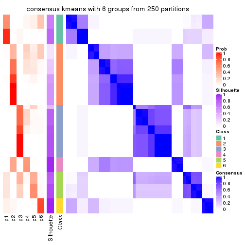</p>

</div>
</div>

Heatmaps for the membership of samples in all partitions to see how consistent they are:


<script>
$( function() {
	$( '#tabs-ATC-kmeans-membership-heatmap' ).tabs();
} );
</script>
<div id='tabs-ATC-kmeans-membership-heatmap'>
<ul>
<li><a href='#tab-ATC-kmeans-membership-heatmap-1'>k = 2</a></li>
<li><a href='#tab-ATC-kmeans-membership-heatmap-2'>k = 3</a></li>
<li><a href='#tab-ATC-kmeans-membership-heatmap-3'>k = 4</a></li>
<li><a href='#tab-ATC-kmeans-membership-heatmap-4'>k = 5</a></li>
<li><a href='#tab-ATC-kmeans-membership-heatmap-5'>k = 6</a></li>
</ul>
<div id='tab-ATC-kmeans-membership-heatmap-1'>
<pre><code class="r">membership_heatmap(res, k = 2)
</code></pre>

<p></p>

</div>
<div id='tab-ATC-kmeans-membership-heatmap-2'>
<pre><code class="r">membership_heatmap(res, k = 3)
</code></pre>

<p></p>

</div>
<div id='tab-ATC-kmeans-membership-heatmap-3'>
<pre><code class="r">membership_heatmap(res, k = 4)
</code></pre>

<p></p>

</div>
<div id='tab-ATC-kmeans-membership-heatmap-4'>
<pre><code class="r">membership_heatmap(res, k = 5)
</code></pre>

<p></p>

</div>
<div id='tab-ATC-kmeans-membership-heatmap-5'>
<pre><code class="r">membership_heatmap(res, k = 6)
</code></pre>

<p></p>

</div>
</div>

As soon as we have had the classes for columns, we can look for signatures
which are significantly different between classes which can be candidate marks
for certain classes. Following are the heatmaps for signatures.


Signature heatmaps where rows are scaled:


<script>
$( function() {
	$( '#tabs-ATC-kmeans-get-signatures' ).tabs();
} );
</script>
<div id='tabs-ATC-kmeans-get-signatures'>
<ul>
<li><a href='#tab-ATC-kmeans-get-signatures-1'>k = 2</a></li>
<li><a href='#tab-ATC-kmeans-get-signatures-2'>k = 3</a></li>
<li><a href='#tab-ATC-kmeans-get-signatures-3'>k = 4</a></li>
<li><a href='#tab-ATC-kmeans-get-signatures-4'>k = 5</a></li>
<li><a href='#tab-ATC-kmeans-get-signatures-5'>k = 6</a></li>
</ul>
<div id='tab-ATC-kmeans-get-signatures-1'>
<pre><code class="r">get_signatures(res, k = 2)
</code></pre>

<p></p>

</div>
<div id='tab-ATC-kmeans-get-signatures-2'>
<pre><code class="r">get_signatures(res, k = 3)
</code></pre>

<p></p>

</div>
<div id='tab-ATC-kmeans-get-signatures-3'>
<pre><code class="r">get_signatures(res, k = 4)
</code></pre>

<p></p>

</div>
<div id='tab-ATC-kmeans-get-signatures-4'>
<pre><code class="r">get_signatures(res, k = 5)
</code></pre>

<p></p>

</div>
<div id='tab-ATC-kmeans-get-signatures-5'>
<pre><code class="r">get_signatures(res, k = 6)
</code></pre>

<p></p>

</div>
</div>


Signature heatmaps where rows are not scaled:


<script>
$( function() {
	$( '#tabs-ATC-kmeans-get-signatures-no-scale' ).tabs();
} );
</script>
<div id='tabs-ATC-kmeans-get-signatures-no-scale'>
<ul>
<li><a href='#tab-ATC-kmeans-get-signatures-no-scale-1'>k = 2</a></li>
<li><a href='#tab-ATC-kmeans-get-signatures-no-scale-2'>k = 3</a></li>
<li><a href='#tab-ATC-kmeans-get-signatures-no-scale-3'>k = 4</a></li>
<li><a href='#tab-ATC-kmeans-get-signatures-no-scale-4'>k = 5</a></li>
<li><a href='#tab-ATC-kmeans-get-signatures-no-scale-5'>k = 6</a></li>
</ul>
<div id='tab-ATC-kmeans-get-signatures-no-scale-1'>
<pre><code class="r">get_signatures(res, k = 2, scale_rows = FALSE)
</code></pre>

<p></p>

</div>
<div id='tab-ATC-kmeans-get-signatures-no-scale-2'>
<pre><code class="r">get_signatures(res, k = 3, scale_rows = FALSE)
</code></pre>

<p></p>

</div>
<div id='tab-ATC-kmeans-get-signatures-no-scale-3'>
<pre><code class="r">get_signatures(res, k = 4, scale_rows = FALSE)
</code></pre>

<p>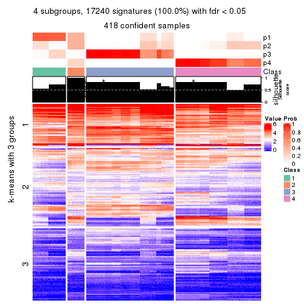</p>

</div>
<div id='tab-ATC-kmeans-get-signatures-no-scale-4'>
<pre><code class="r">get_signatures(res, k = 5, scale_rows = FALSE)
</code></pre>

<p></p>

</div>
<div id='tab-ATC-kmeans-get-signatures-no-scale-5'>
<pre><code class="r">get_signatures(res, k = 6, scale_rows = FALSE)
</code></pre>

<p></p>

</div>
</div>


Compare the overlap of signatures from different k:

```r
compare_signatures(res)
```


`get_signature()` returns a data frame invisibly. TO get the list of signatures, the function
call should be assigned to a variable explicitly. In following code, if `plot` argument is set
to `FALSE`, no heatmap is plotted while only the differential analysis is performed.

```r
# code only for demonstration
tb = get_signature(res, k = ..., plot = FALSE)
```

An example of the output of `tb` is:

```
#>   which_row         fdr    mean_1    mean_2 scaled_mean_1 scaled_mean_2 km
#> 1        38 0.042760348  8.373488  9.131774    -0.5533452     0.5164555  1
#> 2        40 0.018707592  7.106213  8.469186    -0.6173731     0.5762149  1
#> 3        55 0.019134737 10.221463 11.207825    -0.6159697     0.5749050  1
#> 4        59 0.006059896  5.921854  7.869574    -0.6899429     0.6439467  1
#> 5        60 0.018055526  8.928898 10.211722    -0.6204761     0.5791110  1
#> 6        98 0.009384629 15.714769 14.887706     0.6635654    -0.6193277  2
...
```

The columns in `tb` are:

1. `which_row`: row indices corresponding to the input matrix.
2. `fdr`: FDR for the differential test. 
3. `mean_x`: The mean value in group x.
4. `scaled_mean_x`: The mean value in group x after rows are scaled.
5. `km`: Row groups if k-means clustering is applied to rows.


UMAP plot which shows how samples are separated.


<script>
$( function() {
	$( '#tabs-ATC-kmeans-dimension-reduction' ).tabs();
} );
</script>
<div id='tabs-ATC-kmeans-dimension-reduction'>
<ul>
<li><a href='#tab-ATC-kmeans-dimension-reduction-1'>k = 2</a></li>
<li><a href='#tab-ATC-kmeans-dimension-reduction-2'>k = 3</a></li>
<li><a href='#tab-ATC-kmeans-dimension-reduction-3'>k = 4</a></li>
<li><a href='#tab-ATC-kmeans-dimension-reduction-4'>k = 5</a></li>
<li><a href='#tab-ATC-kmeans-dimension-reduction-5'>k = 6</a></li>
</ul>
<div id='tab-ATC-kmeans-dimension-reduction-1'>
<pre><code class="r">dimension_reduction(res, k = 2, method = &quot;UMAP&quot;)
</code></pre>

<p></p>

</div>
<div id='tab-ATC-kmeans-dimension-reduction-2'>
<pre><code class="r">dimension_reduction(res, k = 3, method = &quot;UMAP&quot;)
</code></pre>

<p></p>

</div>
<div id='tab-ATC-kmeans-dimension-reduction-3'>
<pre><code class="r">dimension_reduction(res, k = 4, method = &quot;UMAP&quot;)
</code></pre>

<p></p>

</div>
<div id='tab-ATC-kmeans-dimension-reduction-4'>
<pre><code class="r">dimension_reduction(res, k = 5, method = &quot;UMAP&quot;)
</code></pre>

<p></p>

</div>
<div id='tab-ATC-kmeans-dimension-reduction-5'>
<pre><code class="r">dimension_reduction(res, k = 6, method = &quot;UMAP&quot;)
</code></pre>

<p></p>

</div>
</div>


Following heatmap shows how subgroups are split when increasing `k`:

```r
collect_classes(res)
```


If matrix rows can be associated to genes, consider to use `GO_Enrichment(res,
...)` to perform function enrichment for the signature genes.


 

---------------------------------------------------


### ATC:skmeans**


The object with results only for a single top-value method and a single partition method 
can be extracted as:

```r
res = res_list["ATC", "skmeans"]
# you can also extract it by
# res = res_list["ATC:skmeans"]
```

A summary of `res` and all the functions that can be applied to it:

```r
res
```

```
#> A 'ConsensusPartition' object with k = 2, 3, 4, 5, 6.
#>   On a matrix with 17245 rows and 418 columns.
#>   Top rows (1000, 2000, 3000, 4000, 5000) are extracted by 'ATC' method.
#>   Subgroups are detected by 'skmeans' method.
#>   Performed in total 1250 partitions by row resampling.
#>   Best k for subgroups seems to be 4.
#> 
#> Following methods can be applied to this 'ConsensusPartition' object:
#>  [1] "cola_report"             "collect_classes"         "collect_plots"          
#>  [4] "collect_stats"           "colnames"                "compare_signatures"     
#>  [7] "consensus_heatmap"       "dimension_reduction"     "functional_enrichment"  
#> [10] "get_anno_col"            "get_anno"                "get_classes"            
#> [13] "get_consensus"           "get_matrix"              "get_membership"         
#> [16] "get_param"               "get_signatures"          "get_stats"              
#> [19] "is_best_k"               "is_stable_k"             "membership_heatmap"     
#> [22] "ncol"                    "nrow"                    "plot_ecdf"              
#> [25] "rownames"                "select_partition_number" "show"                   
#> [28] "suggest_best_k"          "test_to_known_factors"
```

`collect_plots()` function collects all the plots made from `res` for all `k` (number of partitions)
into one single page to provide an easy and fast comparison between different `k`.

```r
collect_plots(res)
```


The plots are:

- The first row: a plot of the ECDF (Empirical cumulative distribution
  function) curves of the consensus matrix for each `k` and the heatmap of
  predicted classes for each `k`.
- The second row: heatmaps of the consensus matrix for each `k`.
- The third row: heatmaps of the membership matrix for each `k`.
- The fouth row: heatmaps of the signatures for each `k`.

All the plots in panels can be made by individual functions and they are
plotted later in this section.

`select_partition_number()` produces several plots showing different
statistics for choosing "optimized" `k`. There are following statistics:

- ECDF curves of the consensus matrix for each `k`;
- 1-PAC. [The PAC
  score](https://en.wikipedia.org/wiki/Consensus_clustering#Over-interpretation_potential_of_consensus_clustering)
  measures the proportion of the ambiguous subgrouping.
- Mean silhouette score.
- Concordance. The mean probability of fiting the consensus class ids in all
  partitions.
- Area increased. Denote $A_k$ as the area under the ECDF curve for current
  `k`, the area increased is defined as $A_k - A_{k-1}$.
- Rand index. The percent of pairs of samples that are both in a same cluster
  or both are not in a same cluster in the partition of k and k-1.
- Jaccard index. The ratio of pairs of samples are both in a same cluster in
  the partition of k and k-1 and the pairs of samples are both in a same
  cluster in the partition k or k-1.

The detailed explanations of these statistics can be found in [the cola
vignette](http://bioconductor.org/packages/devel/bioc/vignettes/cola/inst/doc/cola.html#toc_13).

Generally speaking, lower PAC score, higher mean silhouette score or higher
concordance corresponds to better partition. Rand index and Jaccard index
measure how similar the current partition is compared to partition with `k-1`.
If they are too similar, we won't accept `k` is better than `k-1`.

```r
select_partition_number(res)
```


The numeric values for all these statistics can be obtained by `get_stats()`.

```r
get_stats(res)
```

```
#>   k 1-PAC mean_silhouette concordance area_increased  Rand Jaccard
#> 2 2 1.000           0.993       0.996         0.4988 0.502   0.502
#> 3 3 1.000           0.999       0.997         0.2317 0.883   0.768
#> 4 4 1.000           0.985       0.980         0.0982 0.941   0.848
#> 5 5 0.845           0.951       0.892         0.0750 0.927   0.777
#> 6 6 0.834           0.848       0.852         0.0698 1.000   1.000
```

`suggest_best_k()` suggests the best $k$ based on these statistics. The rules are as follows:

- All $k$ with Jaccard index larger than 0.95 are removed because the increase of
  the partition number does not provides enough extra information. If all $k$ are removed,
  the best $k$ is assigned by `NA`.
- For $k$ with 1-PAC larger than 0.9, the maximal $k$ is taken as the "best k". Other $k$ is called "optional k".
- If it does not fit the second rule. The $k$ with the highest vote of highest
  1-PAC, mean silhouette and concordance is taken as the "best k".

```r
suggest_best_k(res)
```

```
#> [1] 4
#> attr(,"optional")
#> [1] 2 3
```

There is also optional best $k$ = 2 3 that is worth to check.

Following shows the table of the partitions (You need to click the **show/hide
code output** link to see it). The membership matrix (columns with name `p*`)
is inferred by
[`clue::cl_consensus()`](https://www.rdocumentation.org/link/cl_consensus?package=clue)
function with the `SE` method. Basically the value in the membership matrix
represents the probability to belong to a certain group. The finall class
label for an item is determined with the group with highest probability it
belongs to.

In `get_classes()` function, the entropy is calculated from the membership
matrix and the silhouette score is calculated from the consensus matrix.


<script>
$( function() {
	$( '#tabs-ATC-skmeans-get-classes' ).tabs();
} );
</script>
<div id='tabs-ATC-skmeans-get-classes'>
<ul>
<li><a href='#tab-ATC-skmeans-get-classes-1'>k = 2</a></li>
<li><a href='#tab-ATC-skmeans-get-classes-2'>k = 3</a></li>
<li><a href='#tab-ATC-skmeans-get-classes-3'>k = 4</a></li>
<li><a href='#tab-ATC-skmeans-get-classes-4'>k = 5</a></li>
<li><a href='#tab-ATC-skmeans-get-classes-5'>k = 6</a></li>
</ul>

<div id='tab-ATC-skmeans-get-classes-1'>
<p><a id='tab-ATC-skmeans-get-classes-1-a' style='color:#0366d6' href='#'>show/hide code output</a></p>
<pre><code class="r">cbind(get_classes(res, k = 2), get_membership(res, k = 2))
</code></pre>

<pre><code>#&gt;           class entropy silhouette    p1    p2
#&gt; SRR902920     1   0.000      0.993 1.000 0.000
#&gt; SRR902921     1   0.000      0.993 1.000 0.000
#&gt; SRR902922     1   0.000      0.993 1.000 0.000
#&gt; SRR902923     1   0.000      0.993 1.000 0.000
#&gt; SRR902924     1   0.000      0.993 1.000 0.000
#&gt; SRR902925     1   0.000      0.993 1.000 0.000
#&gt; SRR902926     1   0.000      0.993 1.000 0.000
#&gt; SRR902927     1   0.000      0.993 1.000 0.000
#&gt; SRR902928     1   0.000      0.993 1.000 0.000
#&gt; SRR902929     1   0.000      0.993 1.000 0.000
#&gt; SRR902930     1   0.000      0.993 1.000 0.000
#&gt; SRR902931     1   0.000      0.993 1.000 0.000
#&gt; SRR902932     2   0.000      1.000 0.000 1.000
#&gt; SRR902933     2   0.000      1.000 0.000 1.000
#&gt; SRR902934     2   0.000      1.000 0.000 1.000
#&gt; SRR902935     2   0.000      1.000 0.000 1.000
#&gt; SRR902936     2   0.000      1.000 0.000 1.000
#&gt; SRR902937     2   0.000      1.000 0.000 1.000
#&gt; SRR902938     2   0.000      1.000 0.000 1.000
#&gt; SRR902939     2   0.000      1.000 0.000 1.000
#&gt; SRR902940     2   0.000      1.000 0.000 1.000
#&gt; SRR902941     2   0.000      1.000 0.000 1.000
#&gt; SRR902942     1   0.000      0.993 1.000 0.000
#&gt; SRR902943     1   0.000      0.993 1.000 0.000
#&gt; SRR902944     1   0.000      0.993 1.000 0.000
#&gt; SRR902945     1   0.000      0.993 1.000 0.000
#&gt; SRR902946     1   0.000      0.993 1.000 0.000
#&gt; SRR902947     1   0.000      0.993 1.000 0.000
#&gt; SRR902954     1   0.000      0.993 1.000 0.000
#&gt; SRR902955     1   0.000      0.993 1.000 0.000
#&gt; SRR902956     1   0.000      0.993 1.000 0.000
#&gt; SRR902957     1   0.000      0.993 1.000 0.000
#&gt; SRR902958     1   0.000      0.993 1.000 0.000
#&gt; SRR902959     1   0.000      0.993 1.000 0.000
#&gt; SRR902948     1   0.000      0.993 1.000 0.000
#&gt; SRR902949     1   0.000      0.993 1.000 0.000
#&gt; SRR902950     1   0.000      0.993 1.000 0.000
#&gt; SRR902951     1   0.000      0.993 1.000 0.000
#&gt; SRR902952     1   0.000      0.993 1.000 0.000
#&gt; SRR902953     1   0.000      0.993 1.000 0.000
#&gt; SRR902960     1   0.000      0.993 1.000 0.000
#&gt; SRR902961     1   0.000      0.993 1.000 0.000
#&gt; SRR902962     1   0.000      0.993 1.000 0.000
#&gt; SRR902963     1   0.000      0.993 1.000 0.000
#&gt; SRR902964     1   0.000      0.993 1.000 0.000
#&gt; SRR902965     1   0.000      0.993 1.000 0.000
#&gt; SRR902966     1   0.000      0.993 1.000 0.000
#&gt; SRR902967     1   0.000      0.993 1.000 0.000
#&gt; SRR902968     1   0.000      0.993 1.000 0.000
#&gt; SRR902969     1   0.000      0.993 1.000 0.000
#&gt; SRR902970     1   0.000      0.993 1.000 0.000
#&gt; SRR902971     1   0.000      0.993 1.000 0.000
#&gt; SRR902972     1   0.000      0.993 1.000 0.000
#&gt; SRR902973     1   0.000      0.993 1.000 0.000
#&gt; SRR902974     1   0.000      0.993 1.000 0.000
#&gt; SRR902975     1   0.000      0.993 1.000 0.000
#&gt; SRR902976     1   0.000      0.993 1.000 0.000
#&gt; SRR902977     1   0.000      0.993 1.000 0.000
#&gt; SRR902978     1   0.000      0.993 1.000 0.000
#&gt; SRR902980     1   0.000      0.993 1.000 0.000
#&gt; SRR902981     1   0.000      0.993 1.000 0.000
#&gt; SRR902982     1   0.000      0.993 1.000 0.000
#&gt; SRR902983     1   0.000      0.993 1.000 0.000
#&gt; SRR902984     1   0.000      0.993 1.000 0.000
#&gt; SRR902985     1   0.000      0.993 1.000 0.000
#&gt; SRR902986     1   0.000      0.993 1.000 0.000
#&gt; SRR902987     1   0.000      0.993 1.000 0.000
#&gt; SRR902988     1   0.000      0.993 1.000 0.000
#&gt; SRR902989     1   0.000      0.993 1.000 0.000
#&gt; SRR902990     1   0.000      0.993 1.000 0.000
#&gt; SRR902991     1   0.000      0.993 1.000 0.000
#&gt; SRR902992     1   0.000      0.993 1.000 0.000
#&gt; SRR902993     1   0.000      0.993 1.000 0.000
#&gt; SRR902994     1   0.000      0.993 1.000 0.000
#&gt; SRR902995     1   0.000      0.993 1.000 0.000
#&gt; SRR902996     2   0.000      1.000 0.000 1.000
#&gt; SRR902997     2   0.000      1.000 0.000 1.000
#&gt; SRR902998     2   0.000      1.000 0.000 1.000
#&gt; SRR902999     2   0.000      1.000 0.000 1.000
#&gt; SRR903000     2   0.000      1.000 0.000 1.000
#&gt; SRR903001     2   0.000      1.000 0.000 1.000
#&gt; SRR903008     2   0.000      1.000 0.000 1.000
#&gt; SRR903009     2   0.000      1.000 0.000 1.000
#&gt; SRR903010     2   0.000      1.000 0.000 1.000
#&gt; SRR903011     2   0.000      1.000 0.000 1.000
#&gt; SRR903012     2   0.000      1.000 0.000 1.000
#&gt; SRR903013     2   0.000      1.000 0.000 1.000
#&gt; SRR903002     2   0.000      1.000 0.000 1.000
#&gt; SRR903003     2   0.000      1.000 0.000 1.000
#&gt; SRR903004     2   0.000      1.000 0.000 1.000
#&gt; SRR903005     2   0.000      1.000 0.000 1.000
#&gt; SRR903006     2   0.000      1.000 0.000 1.000
#&gt; SRR903007     2   0.000      1.000 0.000 1.000
#&gt; SRR903014     1   0.000      0.993 1.000 0.000
#&gt; SRR903015     1   0.000      0.993 1.000 0.000
#&gt; SRR903016     1   0.000      0.993 1.000 0.000
#&gt; SRR903017     1   0.000      0.993 1.000 0.000
#&gt; SRR903018     1   0.000      0.993 1.000 0.000
#&gt; SRR903019     1   0.000      0.993 1.000 0.000
#&gt; SRR903020     1   0.000      0.993 1.000 0.000
#&gt; SRR903021     1   0.000      0.993 1.000 0.000
#&gt; SRR903022     1   0.000      0.993 1.000 0.000
#&gt; SRR903023     1   0.000      0.993 1.000 0.000
#&gt; SRR903024     1   0.000      0.993 1.000 0.000
#&gt; SRR903025     1   0.000      0.993 1.000 0.000
#&gt; SRR903026     1   0.000      0.993 1.000 0.000
#&gt; SRR903027     1   0.000      0.993 1.000 0.000
#&gt; SRR903028     1   0.000      0.993 1.000 0.000
#&gt; SRR903029     1   0.000      0.993 1.000 0.000
#&gt; SRR903030     1   0.000      0.993 1.000 0.000
#&gt; SRR903031     1   0.000      0.993 1.000 0.000
#&gt; SRR903032     2   0.000      1.000 0.000 1.000
#&gt; SRR903033     2   0.000      1.000 0.000 1.000
#&gt; SRR903034     2   0.000      1.000 0.000 1.000
#&gt; SRR903035     2   0.000      1.000 0.000 1.000
#&gt; SRR903036     2   0.000      1.000 0.000 1.000
#&gt; SRR903037     2   0.000      1.000 0.000 1.000
#&gt; SRR903038     2   0.000      1.000 0.000 1.000
#&gt; SRR903039     2   0.000      1.000 0.000 1.000
#&gt; SRR903040     2   0.000      1.000 0.000 1.000
#&gt; SRR903041     2   0.000      1.000 0.000 1.000
#&gt; SRR903042     2   0.000      1.000 0.000 1.000
#&gt; SRR903043     2   0.000      1.000 0.000 1.000
#&gt; SRR903044     2   0.000      1.000 0.000 1.000
#&gt; SRR903045     2   0.000      1.000 0.000 1.000
#&gt; SRR903046     2   0.000      1.000 0.000 1.000
#&gt; SRR903047     2   0.000      1.000 0.000 1.000
#&gt; SRR903048     2   0.000      1.000 0.000 1.000
#&gt; SRR903049     2   0.000      1.000 0.000 1.000
#&gt; SRR903050     1   0.000      0.993 1.000 0.000
#&gt; SRR903051     1   0.000      0.993 1.000 0.000
#&gt; SRR903052     1   0.000      0.993 1.000 0.000
#&gt; SRR903053     1   0.000      0.993 1.000 0.000
#&gt; SRR903054     1   0.000      0.993 1.000 0.000
#&gt; SRR903055     1   0.000      0.993 1.000 0.000
#&gt; SRR903056     1   0.000      0.993 1.000 0.000
#&gt; SRR903057     1   0.000      0.993 1.000 0.000
#&gt; SRR903058     1   0.000      0.993 1.000 0.000
#&gt; SRR903059     1   0.000      0.993 1.000 0.000
#&gt; SRR903060     1   0.000      0.993 1.000 0.000
#&gt; SRR903061     1   0.000      0.993 1.000 0.000
#&gt; SRR903062     1   0.000      0.993 1.000 0.000
#&gt; SRR903063     1   0.000      0.993 1.000 0.000
#&gt; SRR903064     1   0.000      0.993 1.000 0.000
#&gt; SRR903065     1   0.000      0.993 1.000 0.000
#&gt; SRR903066     1   0.000      0.993 1.000 0.000
#&gt; SRR903067     1   0.000      0.993 1.000 0.000
#&gt; SRR903068     1   0.000      0.993 1.000 0.000
#&gt; SRR903069     1   0.000      0.993 1.000 0.000
#&gt; SRR903070     1   0.000      0.993 1.000 0.000
#&gt; SRR903071     1   0.000      0.993 1.000 0.000
#&gt; SRR903072     1   0.000      0.993 1.000 0.000
#&gt; SRR903073     1   0.000      0.993 1.000 0.000
#&gt; SRR903074     1   0.000      0.993 1.000 0.000
#&gt; SRR903075     1   0.000      0.993 1.000 0.000
#&gt; SRR903076     1   0.000      0.993 1.000 0.000
#&gt; SRR903077     1   0.000      0.993 1.000 0.000
#&gt; SRR903078     1   0.000      0.993 1.000 0.000
#&gt; SRR903079     1   0.000      0.993 1.000 0.000
#&gt; SRR903080     1   0.000      0.993 1.000 0.000
#&gt; SRR903081     1   0.000      0.993 1.000 0.000
#&gt; SRR903082     2   0.000      1.000 0.000 1.000
#&gt; SRR903083     2   0.000      1.000 0.000 1.000
#&gt; SRR903084     2   0.000      1.000 0.000 1.000
#&gt; SRR903085     2   0.000      1.000 0.000 1.000
#&gt; SRR903086     2   0.000      1.000 0.000 1.000
#&gt; SRR903087     2   0.000      1.000 0.000 1.000
#&gt; SRR903088     2   0.000      1.000 0.000 1.000
#&gt; SRR903089     2   0.000      1.000 0.000 1.000
#&gt; SRR903090     2   0.000      1.000 0.000 1.000
#&gt; SRR903091     2   0.000      1.000 0.000 1.000
#&gt; SRR903092     2   0.000      1.000 0.000 1.000
#&gt; SRR903093     2   0.000      1.000 0.000 1.000
#&gt; SRR903094     2   0.000      1.000 0.000 1.000
#&gt; SRR903095     2   0.000      1.000 0.000 1.000
#&gt; SRR903096     2   0.000      1.000 0.000 1.000
#&gt; SRR903097     2   0.000      1.000 0.000 1.000
#&gt; SRR903098     2   0.000      1.000 0.000 1.000
#&gt; SRR903099     2   0.000      1.000 0.000 1.000
#&gt; SRR903100     2   0.000      1.000 0.000 1.000
#&gt; SRR903101     2   0.000      1.000 0.000 1.000
#&gt; SRR903102     2   0.000      1.000 0.000 1.000
#&gt; SRR903103     2   0.000      1.000 0.000 1.000
#&gt; SRR903104     2   0.000      1.000 0.000 1.000
#&gt; SRR903105     2   0.000      1.000 0.000 1.000
#&gt; SRR903106     2   0.000      1.000 0.000 1.000
#&gt; SRR903107     2   0.000      1.000 0.000 1.000
#&gt; SRR903108     2   0.000      1.000 0.000 1.000
#&gt; SRR903109     2   0.000      1.000 0.000 1.000
#&gt; SRR903110     2   0.000      1.000 0.000 1.000
#&gt; SRR903111     2   0.000      1.000 0.000 1.000
#&gt; SRR903112     2   0.000      1.000 0.000 1.000
#&gt; SRR903113     2   0.000      1.000 0.000 1.000
#&gt; SRR903114     1   0.373      0.925 0.928 0.072
#&gt; SRR903115     1   0.388      0.921 0.924 0.076
#&gt; SRR903116     1   0.388      0.921 0.924 0.076
#&gt; SRR903117     1   0.373      0.925 0.928 0.072
#&gt; SRR903118     1   0.358      0.929 0.932 0.068
#&gt; SRR903119     1   0.358      0.929 0.932 0.068
#&gt; SRR903121     1   0.358      0.929 0.932 0.068
#&gt; SRR903122     1   0.000      0.993 1.000 0.000
#&gt; SRR903124     1   0.000      0.993 1.000 0.000
#&gt; SRR903125     1   0.000      0.993 1.000 0.000
#&gt; SRR903126     1   0.000      0.993 1.000 0.000
#&gt; SRR903127     1   0.000      0.993 1.000 0.000
#&gt; SRR903128     1   0.000      0.993 1.000 0.000
#&gt; SRR903129     1   0.000      0.993 1.000 0.000
#&gt; SRR903130     1   0.000      0.993 1.000 0.000
#&gt; SRR903131     1   0.000      0.993 1.000 0.000
#&gt; SRR903132     1   0.000      0.993 1.000 0.000
#&gt; SRR903133     1   0.000      0.993 1.000 0.000
#&gt; SRR903134     1   0.000      0.993 1.000 0.000
#&gt; SRR903135     1   0.000      0.993 1.000 0.000
#&gt; SRR903136     1   0.000      0.993 1.000 0.000
#&gt; SRR903137     1   0.000      0.993 1.000 0.000
#&gt; SRR903146     2   0.000      1.000 0.000 1.000
#&gt; SRR903147     2   0.000      1.000 0.000 1.000
#&gt; SRR903148     2   0.000      1.000 0.000 1.000
#&gt; SRR903149     2   0.000      1.000 0.000 1.000
#&gt; SRR903150     2   0.000      1.000 0.000 1.000
#&gt; SRR903151     2   0.000      1.000 0.000 1.000
#&gt; SRR903152     2   0.000      1.000 0.000 1.000
#&gt; SRR903153     2   0.000      1.000 0.000 1.000
#&gt; SRR903138     1   0.552      0.861 0.872 0.128
#&gt; SRR903139     1   0.563      0.856 0.868 0.132
#&gt; SRR903140     1   0.552      0.861 0.872 0.128
#&gt; SRR903141     1   0.552      0.861 0.872 0.128
#&gt; SRR903142     1   0.552      0.861 0.872 0.128
#&gt; SRR903143     1   0.552      0.861 0.872 0.128
#&gt; SRR903144     1   0.518      0.876 0.884 0.116
#&gt; SRR903145     1   0.552      0.861 0.872 0.128
#&gt; SRR903154     2   0.000      1.000 0.000 1.000
#&gt; SRR903155     2   0.000      1.000 0.000 1.000
#&gt; SRR903156     2   0.000      1.000 0.000 1.000
#&gt; SRR903157     2   0.000      1.000 0.000 1.000
#&gt; SRR903158     2   0.000      1.000 0.000 1.000
#&gt; SRR903159     2   0.000      1.000 0.000 1.000
#&gt; SRR903160     2   0.000      1.000 0.000 1.000
#&gt; SRR903161     2   0.000      1.000 0.000 1.000
#&gt; SRR903162     2   0.000      1.000 0.000 1.000
#&gt; SRR903163     2   0.000      1.000 0.000 1.000
#&gt; SRR903164     2   0.000      1.000 0.000 1.000
#&gt; SRR903165     2   0.000      1.000 0.000 1.000
#&gt; SRR903166     2   0.000      1.000 0.000 1.000
#&gt; SRR903167     2   0.000      1.000 0.000 1.000
#&gt; SRR903168     2   0.000      1.000 0.000 1.000
#&gt; SRR903169     2   0.000      1.000 0.000 1.000
#&gt; SRR903178     1   0.000      0.993 1.000 0.000
#&gt; SRR903179     1   0.000      0.993 1.000 0.000
#&gt; SRR903180     1   0.000      0.993 1.000 0.000
#&gt; SRR903181     1   0.000      0.993 1.000 0.000
#&gt; SRR903182     1   0.000      0.993 1.000 0.000
#&gt; SRR903183     1   0.000      0.993 1.000 0.000
#&gt; SRR903184     1   0.000      0.993 1.000 0.000
#&gt; SRR903185     1   0.000      0.993 1.000 0.000
#&gt; SRR903170     2   0.000      1.000 0.000 1.000
#&gt; SRR903171     2   0.000      1.000 0.000 1.000
#&gt; SRR903172     2   0.000      1.000 0.000 1.000
#&gt; SRR903173     2   0.000      1.000 0.000 1.000
#&gt; SRR903174     2   0.000      1.000 0.000 1.000
#&gt; SRR903175     2   0.000      1.000 0.000 1.000
#&gt; SRR903176     2   0.000      1.000 0.000 1.000
#&gt; SRR903177     2   0.000      1.000 0.000 1.000
#&gt; SRR903186     1   0.000      0.993 1.000 0.000
#&gt; SRR903187     1   0.000      0.993 1.000 0.000
#&gt; SRR903188     1   0.000      0.993 1.000 0.000
#&gt; SRR903189     1   0.000      0.993 1.000 0.000
#&gt; SRR903190     1   0.000      0.993 1.000 0.000
#&gt; SRR903191     1   0.000      0.993 1.000 0.000
#&gt; SRR903192     1   0.000      0.993 1.000 0.000
#&gt; SRR903193     1   0.000      0.993 1.000 0.000
#&gt; SRR903194     1   0.000      0.993 1.000 0.000
#&gt; SRR903195     1   0.000      0.993 1.000 0.000
#&gt; SRR903196     1   0.000      0.993 1.000 0.000
#&gt; SRR903197     1   0.000      0.993 1.000 0.000
#&gt; SRR903198     1   0.000      0.993 1.000 0.000
#&gt; SRR903199     1   0.000      0.993 1.000 0.000
#&gt; SRR903200     1   0.000      0.993 1.000 0.000
#&gt; SRR903201     1   0.000      0.993 1.000 0.000
#&gt; SRR903210     2   0.000      1.000 0.000 1.000
#&gt; SRR903211     2   0.000      1.000 0.000 1.000
#&gt; SRR903212     2   0.000      1.000 0.000 1.000
#&gt; SRR903213     2   0.000      1.000 0.000 1.000
#&gt; SRR903214     2   0.000      1.000 0.000 1.000
#&gt; SRR903215     2   0.000      1.000 0.000 1.000
#&gt; SRR903216     2   0.000      1.000 0.000 1.000
#&gt; SRR903217     2   0.000      1.000 0.000 1.000
#&gt; SRR903202     1   0.000      0.993 1.000 0.000
#&gt; SRR903203     1   0.000      0.993 1.000 0.000
#&gt; SRR903204     1   0.000      0.993 1.000 0.000
#&gt; SRR903205     1   0.000      0.993 1.000 0.000
#&gt; SRR903206     1   0.000      0.993 1.000 0.000
#&gt; SRR903207     1   0.000      0.993 1.000 0.000
#&gt; SRR903208     1   0.000      0.993 1.000 0.000
#&gt; SRR903209     1   0.000      0.993 1.000 0.000
#&gt; SRR903218     2   0.000      1.000 0.000 1.000
#&gt; SRR903219     2   0.000      1.000 0.000 1.000
#&gt; SRR903220     2   0.000      1.000 0.000 1.000
#&gt; SRR903221     2   0.000      1.000 0.000 1.000
#&gt; SRR903222     2   0.000      1.000 0.000 1.000
#&gt; SRR903223     2   0.000      1.000 0.000 1.000
#&gt; SRR903224     2   0.000      1.000 0.000 1.000
#&gt; SRR903225     2   0.000      1.000 0.000 1.000
#&gt; SRR903226     2   0.000      1.000 0.000 1.000
#&gt; SRR903227     2   0.000      1.000 0.000 1.000
#&gt; SRR903228     2   0.000      1.000 0.000 1.000
#&gt; SRR903229     2   0.000      1.000 0.000 1.000
#&gt; SRR903230     2   0.000      1.000 0.000 1.000
#&gt; SRR903231     2   0.000      1.000 0.000 1.000
#&gt; SRR903232     2   0.000      1.000 0.000 1.000
#&gt; SRR903233     2   0.000      1.000 0.000 1.000
#&gt; SRR903242     1   0.000      0.993 1.000 0.000
#&gt; SRR903243     1   0.000      0.993 1.000 0.000
#&gt; SRR903244     1   0.000      0.993 1.000 0.000
#&gt; SRR903245     1   0.000      0.993 1.000 0.000
#&gt; SRR903246     1   0.000      0.993 1.000 0.000
#&gt; SRR903247     1   0.000      0.993 1.000 0.000
#&gt; SRR903248     1   0.000      0.993 1.000 0.000
#&gt; SRR903249     1   0.000      0.993 1.000 0.000
#&gt; SRR903234     2   0.000      1.000 0.000 1.000
#&gt; SRR903235     2   0.000      1.000 0.000 1.000
#&gt; SRR903236     2   0.000      1.000 0.000 1.000
#&gt; SRR903237     2   0.000      1.000 0.000 1.000
#&gt; SRR903238     2   0.000      1.000 0.000 1.000
#&gt; SRR903239     2   0.000      1.000 0.000 1.000
#&gt; SRR903240     2   0.000      1.000 0.000 1.000
#&gt; SRR903241     2   0.000      1.000 0.000 1.000
#&gt; SRR903258     1   0.000      0.993 1.000 0.000
#&gt; SRR903259     1   0.000      0.993 1.000 0.000
#&gt; SRR903260     1   0.000      0.993 1.000 0.000
#&gt; SRR903261     1   0.000      0.993 1.000 0.000
#&gt; SRR903262     1   0.000      0.993 1.000 0.000
#&gt; SRR903263     1   0.000      0.993 1.000 0.000
#&gt; SRR903264     1   0.000      0.993 1.000 0.000
#&gt; SRR903265     1   0.000      0.993 1.000 0.000
#&gt; SRR903250     1   0.000      0.993 1.000 0.000
#&gt; SRR903251     1   0.000      0.993 1.000 0.000
#&gt; SRR903252     1   0.000      0.993 1.000 0.000
#&gt; SRR903253     1   0.000      0.993 1.000 0.000
#&gt; SRR903254     1   0.000      0.993 1.000 0.000
#&gt; SRR903255     1   0.000      0.993 1.000 0.000
#&gt; SRR903256     1   0.000      0.993 1.000 0.000
#&gt; SRR903257     1   0.000      0.993 1.000 0.000
#&gt; SRR903266     1   0.000      0.993 1.000 0.000
#&gt; SRR903267     1   0.000      0.993 1.000 0.000
#&gt; SRR903268     1   0.000      0.993 1.000 0.000
#&gt; SRR903270     1   0.000      0.993 1.000 0.000
#&gt; SRR903271     1   0.000      0.993 1.000 0.000
#&gt; SRR903272     1   0.000      0.993 1.000 0.000
#&gt; SRR903273     1   0.000      0.993 1.000 0.000
#&gt; SRR903274     2   0.000      1.000 0.000 1.000
#&gt; SRR903275     2   0.000      1.000 0.000 1.000
#&gt; SRR903276     2   0.000      1.000 0.000 1.000
#&gt; SRR903277     2   0.000      1.000 0.000 1.000
#&gt; SRR903278     2   0.000      1.000 0.000 1.000
#&gt; SRR903279     2   0.000      1.000 0.000 1.000
#&gt; SRR903280     2   0.000      1.000 0.000 1.000
#&gt; SRR903281     2   0.000      1.000 0.000 1.000
#&gt; SRR903282     2   0.000      1.000 0.000 1.000
#&gt; SRR903283     2   0.000      1.000 0.000 1.000
#&gt; SRR903284     2   0.000      1.000 0.000 1.000
#&gt; SRR903285     2   0.000      1.000 0.000 1.000
#&gt; SRR903286     2   0.000      1.000 0.000 1.000
#&gt; SRR903287     2   0.000      1.000 0.000 1.000
#&gt; SRR903288     2   0.000      1.000 0.000 1.000
#&gt; SRR903289     2   0.000      1.000 0.000 1.000
#&gt; SRR903290     2   0.000      1.000 0.000 1.000
#&gt; SRR903291     2   0.000      1.000 0.000 1.000
#&gt; SRR903292     2   0.000      1.000 0.000 1.000
#&gt; SRR903293     2   0.000      1.000 0.000 1.000
#&gt; SRR903294     2   0.000      1.000 0.000 1.000
#&gt; SRR903295     2   0.000      1.000 0.000 1.000
#&gt; SRR903296     2   0.000      1.000 0.000 1.000
#&gt; SRR903297     2   0.000      1.000 0.000 1.000
#&gt; SRR903298     2   0.000      1.000 0.000 1.000
#&gt; SRR903299     2   0.000      1.000 0.000 1.000
#&gt; SRR903300     2   0.000      1.000 0.000 1.000
#&gt; SRR903301     2   0.000      1.000 0.000 1.000
#&gt; SRR903302     2   0.000      1.000 0.000 1.000
#&gt; SRR903303     2   0.000      1.000 0.000 1.000
#&gt; SRR903304     2   0.000      1.000 0.000 1.000
#&gt; SRR903305     2   0.000      1.000 0.000 1.000
#&gt; SRR903306     1   0.000      0.993 1.000 0.000
#&gt; SRR903307     1   0.000      0.993 1.000 0.000
#&gt; SRR903308     1   0.000      0.993 1.000 0.000
#&gt; SRR903309     1   0.000      0.993 1.000 0.000
#&gt; SRR903310     1   0.000      0.993 1.000 0.000
#&gt; SRR903311     1   0.000      0.993 1.000 0.000
#&gt; SRR903312     1   0.000      0.993 1.000 0.000
#&gt; SRR903313     1   0.000      0.993 1.000 0.000
#&gt; SRR903314     1   0.000      0.993 1.000 0.000
#&gt; SRR903315     1   0.000      0.993 1.000 0.000
#&gt; SRR903316     1   0.000      0.993 1.000 0.000
#&gt; SRR903317     1   0.000      0.993 1.000 0.000
#&gt; SRR903318     1   0.000      0.993 1.000 0.000
#&gt; SRR903319     1   0.000      0.993 1.000 0.000
#&gt; SRR903320     1   0.000      0.993 1.000 0.000
#&gt; SRR903321     1   0.000      0.993 1.000 0.000
#&gt; SRR903322     1   0.000      0.993 1.000 0.000
#&gt; SRR903323     1   0.000      0.993 1.000 0.000
#&gt; SRR903324     2   0.000      1.000 0.000 1.000
#&gt; SRR903325     2   0.000      1.000 0.000 1.000
#&gt; SRR903326     2   0.000      1.000 0.000 1.000
#&gt; SRR903327     2   0.000      1.000 0.000 1.000
#&gt; SRR903328     2   0.000      1.000 0.000 1.000
#&gt; SRR903329     2   0.000      1.000 0.000 1.000
#&gt; SRR903330     2   0.000      1.000 0.000 1.000
#&gt; SRR903331     2   0.000      1.000 0.000 1.000
#&gt; SRR903332     2   0.000      1.000 0.000 1.000
#&gt; SRR903333     2   0.000      1.000 0.000 1.000
#&gt; SRR903334     2   0.000      1.000 0.000 1.000
#&gt; SRR903335     2   0.000      1.000 0.000 1.000
#&gt; SRR903336     2   0.000      1.000 0.000 1.000
#&gt; SRR903337     2   0.000      1.000 0.000 1.000
#&gt; SRR903338     2   0.000      1.000 0.000 1.000
#&gt; SRR903339     2   0.000      1.000 0.000 1.000
#&gt; SRR903340     2   0.000      1.000 0.000 1.000
#&gt; SRR903341     2   0.000      1.000 0.000 1.000
</code></pre>

<script>
$('#tab-ATC-skmeans-get-classes-1-a').parent().next().next().hide();
$('#tab-ATC-skmeans-get-classes-1-a').click(function(){
  $('#tab-ATC-skmeans-get-classes-1-a').parent().next().next().toggle();
  return(false);
});
</script>
</div>

<div id='tab-ATC-skmeans-get-classes-2'>
<p><a id='tab-ATC-skmeans-get-classes-2-a' style='color:#0366d6' href='#'>show/hide code output</a></p>
<pre><code class="r">cbind(get_classes(res, k = 3), get_membership(res, k = 3))
</code></pre>

<pre><code>#&gt;           class entropy silhouette    p1    p2    p3
#&gt; SRR902920     3  0.0000      1.000 0.000 0.000 1.000
#&gt; SRR902921     3  0.0000      1.000 0.000 0.000 1.000
#&gt; SRR902922     3  0.0000      1.000 0.000 0.000 1.000
#&gt; SRR902923     3  0.0000      1.000 0.000 0.000 1.000
#&gt; SRR902924     3  0.0000      1.000 0.000 0.000 1.000
#&gt; SRR902925     3  0.0000      1.000 0.000 0.000 1.000
#&gt; SRR902926     3  0.0000      1.000 0.000 0.000 1.000
#&gt; SRR902927     3  0.0000      1.000 0.000 0.000 1.000
#&gt; SRR902928     3  0.0000      1.000 0.000 0.000 1.000
#&gt; SRR902929     3  0.0000      1.000 0.000 0.000 1.000
#&gt; SRR902930     3  0.0000      1.000 0.000 0.000 1.000
#&gt; SRR902931     3  0.0000      1.000 0.000 0.000 1.000
#&gt; SRR902932     2  0.0000      0.998 0.000 1.000 0.000
#&gt; SRR902933     2  0.0000      0.998 0.000 1.000 0.000
#&gt; SRR902934     2  0.0000      0.998 0.000 1.000 0.000
#&gt; SRR902935     2  0.0000      0.998 0.000 1.000 0.000
#&gt; SRR902936     2  0.0000      0.998 0.000 1.000 0.000
#&gt; SRR902937     2  0.0000      0.998 0.000 1.000 0.000
#&gt; SRR902938     2  0.0000      0.998 0.000 1.000 0.000
#&gt; SRR902939     2  0.0000      0.998 0.000 1.000 0.000
#&gt; SRR902940     2  0.0000      0.998 0.000 1.000 0.000
#&gt; SRR902941     2  0.0000      0.998 0.000 1.000 0.000
#&gt; SRR902942     3  0.0000      1.000 0.000 0.000 1.000
#&gt; SRR902943     3  0.0000      1.000 0.000 0.000 1.000
#&gt; SRR902944     3  0.0000      1.000 0.000 0.000 1.000
#&gt; SRR902945     3  0.0000      1.000 0.000 0.000 1.000
#&gt; SRR902946     3  0.0000      1.000 0.000 0.000 1.000
#&gt; SRR902947     3  0.0000      1.000 0.000 0.000 1.000
#&gt; SRR902954     3  0.0000      1.000 0.000 0.000 1.000
#&gt; SRR902955     3  0.0000      1.000 0.000 0.000 1.000
#&gt; SRR902956     3  0.0000      1.000 0.000 0.000 1.000
#&gt; SRR902957     3  0.0000      1.000 0.000 0.000 1.000
#&gt; SRR902958     3  0.0000      1.000 0.000 0.000 1.000
#&gt; SRR902959     3  0.0000      1.000 0.000 0.000 1.000
#&gt; SRR902948     3  0.0000      1.000 0.000 0.000 1.000
#&gt; SRR902949     3  0.0000      1.000 0.000 0.000 1.000
#&gt; SRR902950     3  0.0000      1.000 0.000 0.000 1.000
#&gt; SRR902951     3  0.0000      1.000 0.000 0.000 1.000
#&gt; SRR902952     3  0.0000      1.000 0.000 0.000 1.000
#&gt; SRR902953     3  0.0000      1.000 0.000 0.000 1.000
#&gt; SRR902960     3  0.0000      1.000 0.000 0.000 1.000
#&gt; SRR902961     3  0.0000      1.000 0.000 0.000 1.000
#&gt; SRR902962     3  0.0000      1.000 0.000 0.000 1.000
#&gt; SRR902963     3  0.0000      1.000 0.000 0.000 1.000
#&gt; SRR902964     3  0.0000      1.000 0.000 0.000 1.000
#&gt; SRR902965     3  0.0000      1.000 0.000 0.000 1.000
#&gt; SRR902966     3  0.0000      1.000 0.000 0.000 1.000
#&gt; SRR902967     3  0.0000      1.000 0.000 0.000 1.000
#&gt; SRR902968     3  0.0000      1.000 0.000 0.000 1.000
#&gt; SRR902969     3  0.0000      1.000 0.000 0.000 1.000
#&gt; SRR902970     3  0.0000      1.000 0.000 0.000 1.000
#&gt; SRR902971     3  0.0000      1.000 0.000 0.000 1.000
#&gt; SRR902972     3  0.0000      1.000 0.000 0.000 1.000
#&gt; SRR902973     3  0.0000      1.000 0.000 0.000 1.000
#&gt; SRR902974     3  0.0000      1.000 0.000 0.000 1.000
#&gt; SRR902975     3  0.0000      1.000 0.000 0.000 1.000
#&gt; SRR902976     3  0.0000      1.000 0.000 0.000 1.000
#&gt; SRR902977     3  0.0000      1.000 0.000 0.000 1.000
#&gt; SRR902978     3  0.0000      1.000 0.000 0.000 1.000
#&gt; SRR902980     3  0.0000      1.000 0.000 0.000 1.000
#&gt; SRR902981     3  0.0000      1.000 0.000 0.000 1.000
#&gt; SRR902982     3  0.0000      1.000 0.000 0.000 1.000
#&gt; SRR902983     3  0.0000      1.000 0.000 0.000 1.000
#&gt; SRR902984     3  0.0000      1.000 0.000 0.000 1.000
#&gt; SRR902985     3  0.0000      1.000 0.000 0.000 1.000
#&gt; SRR902986     3  0.0000      1.000 0.000 0.000 1.000
#&gt; SRR902987     3  0.0000      1.000 0.000 0.000 1.000
#&gt; SRR902988     3  0.0000      1.000 0.000 0.000 1.000
#&gt; SRR902989     3  0.0000      1.000 0.000 0.000 1.000
#&gt; SRR902990     3  0.0000      1.000 0.000 0.000 1.000
#&gt; SRR902991     3  0.0000      1.000 0.000 0.000 1.000
#&gt; SRR902992     3  0.0000      1.000 0.000 0.000 1.000
#&gt; SRR902993     3  0.0000      1.000 0.000 0.000 1.000
#&gt; SRR902994     3  0.0000      1.000 0.000 0.000 1.000
#&gt; SRR902995     3  0.0000      1.000 0.000 0.000 1.000
#&gt; SRR902996     2  0.0000      0.998 0.000 1.000 0.000
#&gt; SRR902997     2  0.0000      0.998 0.000 1.000 0.000
#&gt; SRR902998     2  0.0000      0.998 0.000 1.000 0.000
#&gt; SRR902999     2  0.0000      0.998 0.000 1.000 0.000
#&gt; SRR903000     2  0.0000      0.998 0.000 1.000 0.000
#&gt; SRR903001     2  0.0000      0.998 0.000 1.000 0.000
#&gt; SRR903008     2  0.0000      0.998 0.000 1.000 0.000
#&gt; SRR903009     2  0.0000      0.998 0.000 1.000 0.000
#&gt; SRR903010     2  0.0000      0.998 0.000 1.000 0.000
#&gt; SRR903011     2  0.0000      0.998 0.000 1.000 0.000
#&gt; SRR903012     2  0.0000      0.998 0.000 1.000 0.000
#&gt; SRR903013     2  0.0000      0.998 0.000 1.000 0.000
#&gt; SRR903002     2  0.0000      0.998 0.000 1.000 0.000
#&gt; SRR903003     2  0.0000      0.998 0.000 1.000 0.000
#&gt; SRR903004     2  0.0000      0.998 0.000 1.000 0.000
#&gt; SRR903005     2  0.0000      0.998 0.000 1.000 0.000
#&gt; SRR903006     2  0.0000      0.998 0.000 1.000 0.000
#&gt; SRR903007     2  0.0000      0.998 0.000 1.000 0.000
#&gt; SRR903014     3  0.0000      1.000 0.000 0.000 1.000
#&gt; SRR903015     3  0.0000      1.000 0.000 0.000 1.000
#&gt; SRR903016     3  0.0000      1.000 0.000 0.000 1.000
#&gt; SRR903017     3  0.0000      1.000 0.000 0.000 1.000
#&gt; SRR903018     3  0.0000      1.000 0.000 0.000 1.000
#&gt; SRR903019     3  0.0000      1.000 0.000 0.000 1.000
#&gt; SRR903020     3  0.0000      1.000 0.000 0.000 1.000
#&gt; SRR903021     3  0.0000      1.000 0.000 0.000 1.000
#&gt; SRR903022     3  0.0000      1.000 0.000 0.000 1.000
#&gt; SRR903023     3  0.0000      1.000 0.000 0.000 1.000
#&gt; SRR903024     3  0.0000      1.000 0.000 0.000 1.000
#&gt; SRR903025     3  0.0000      1.000 0.000 0.000 1.000
#&gt; SRR903026     3  0.0000      1.000 0.000 0.000 1.000
#&gt; SRR903027     3  0.0000      1.000 0.000 0.000 1.000
#&gt; SRR903028     3  0.0000      1.000 0.000 0.000 1.000
#&gt; SRR903029     3  0.0000      1.000 0.000 0.000 1.000
#&gt; SRR903030     3  0.0000      1.000 0.000 0.000 1.000
#&gt; SRR903031     3  0.0000      1.000 0.000 0.000 1.000
#&gt; SRR903032     2  0.0000      0.998 0.000 1.000 0.000
#&gt; SRR903033     2  0.0000      0.998 0.000 1.000 0.000
#&gt; SRR903034     2  0.0000      0.998 0.000 1.000 0.000
#&gt; SRR903035     2  0.0000      0.998 0.000 1.000 0.000
#&gt; SRR903036     2  0.0000      0.998 0.000 1.000 0.000
#&gt; SRR903037     2  0.0000      0.998 0.000 1.000 0.000
#&gt; SRR903038     2  0.0000      0.998 0.000 1.000 0.000
#&gt; SRR903039     2  0.0000      0.998 0.000 1.000 0.000
#&gt; SRR903040     2  0.0000      0.998 0.000 1.000 0.000
#&gt; SRR903041     2  0.0000      0.998 0.000 1.000 0.000
#&gt; SRR903042     2  0.0000      0.998 0.000 1.000 0.000
#&gt; SRR903043     2  0.0000      0.998 0.000 1.000 0.000
#&gt; SRR903044     2  0.0000      0.998 0.000 1.000 0.000
#&gt; SRR903045     2  0.0000      0.998 0.000 1.000 0.000
#&gt; SRR903046     2  0.0000      0.998 0.000 1.000 0.000
#&gt; SRR903047     2  0.0000      0.998 0.000 1.000 0.000
#&gt; SRR903048     2  0.0000      0.998 0.000 1.000 0.000
#&gt; SRR903049     2  0.0000      0.998 0.000 1.000 0.000
#&gt; SRR903050     1  0.0592      1.000 0.988 0.000 0.012
#&gt; SRR903051     1  0.0592      1.000 0.988 0.000 0.012
#&gt; SRR903052     1  0.0592      1.000 0.988 0.000 0.012
#&gt; SRR903053     1  0.0592      1.000 0.988 0.000 0.012
#&gt; SRR903054     1  0.0592      1.000 0.988 0.000 0.012
#&gt; SRR903055     1  0.0592      1.000 0.988 0.000 0.012
#&gt; SRR903056     1  0.0592      1.000 0.988 0.000 0.012
#&gt; SRR903057     1  0.0592      1.000 0.988 0.000 0.012
#&gt; SRR903058     1  0.0592      1.000 0.988 0.000 0.012
#&gt; SRR903059     1  0.0592      1.000 0.988 0.000 0.012
#&gt; SRR903060     1  0.0592      1.000 0.988 0.000 0.012
#&gt; SRR903061     1  0.0592      1.000 0.988 0.000 0.012
#&gt; SRR903062     1  0.0592      1.000 0.988 0.000 0.012
#&gt; SRR903063     1  0.0592      1.000 0.988 0.000 0.012
#&gt; SRR903064     1  0.0592      1.000 0.988 0.000 0.012
#&gt; SRR903065     1  0.0592      1.000 0.988 0.000 0.012
#&gt; SRR903066     1  0.0592      1.000 0.988 0.000 0.012
#&gt; SRR903067     1  0.0592      1.000 0.988 0.000 0.012
#&gt; SRR903068     1  0.0592      1.000 0.988 0.000 0.012
#&gt; SRR903069     1  0.0592      1.000 0.988 0.000 0.012
#&gt; SRR903070     1  0.0592      1.000 0.988 0.000 0.012
#&gt; SRR903071     1  0.0592      1.000 0.988 0.000 0.012
#&gt; SRR903072     1  0.0592      1.000 0.988 0.000 0.012
#&gt; SRR903073     1  0.0592      1.000 0.988 0.000 0.012
#&gt; SRR903074     1  0.0592      1.000 0.988 0.000 0.012
#&gt; SRR903075     1  0.0592      1.000 0.988 0.000 0.012
#&gt; SRR903076     1  0.0592      1.000 0.988 0.000 0.012
#&gt; SRR903077     1  0.0592      1.000 0.988 0.000 0.012
#&gt; SRR903078     1  0.0592      1.000 0.988 0.000 0.012
#&gt; SRR903079     1  0.0592      1.000 0.988 0.000 0.012
#&gt; SRR903080     1  0.0592      1.000 0.988 0.000 0.012
#&gt; SRR903081     1  0.0592      1.000 0.988 0.000 0.012
#&gt; SRR903082     2  0.0000      0.998 0.000 1.000 0.000
#&gt; SRR903083     2  0.0000      0.998 0.000 1.000 0.000
#&gt; SRR903084     2  0.0000      0.998 0.000 1.000 0.000
#&gt; SRR903085     2  0.0000      0.998 0.000 1.000 0.000
#&gt; SRR903086     2  0.0000      0.998 0.000 1.000 0.000
#&gt; SRR903087     2  0.0000      0.998 0.000 1.000 0.000
#&gt; SRR903088     2  0.0000      0.998 0.000 1.000 0.000
#&gt; SRR903089     2  0.0000      0.998 0.000 1.000 0.000
#&gt; SRR903090     2  0.0000      0.998 0.000 1.000 0.000
#&gt; SRR903091     2  0.0000      0.998 0.000 1.000 0.000
#&gt; SRR903092     2  0.0000      0.998 0.000 1.000 0.000
#&gt; SRR903093     2  0.0000      0.998 0.000 1.000 0.000
#&gt; SRR903094     2  0.0000      0.998 0.000 1.000 0.000
#&gt; SRR903095     2  0.0000      0.998 0.000 1.000 0.000
#&gt; SRR903096     2  0.0000      0.998 0.000 1.000 0.000
#&gt; SRR903097     2  0.0000      0.998 0.000 1.000 0.000
#&gt; SRR903098     2  0.0000      0.998 0.000 1.000 0.000
#&gt; SRR903099     2  0.0000      0.998 0.000 1.000 0.000
#&gt; SRR903100     2  0.0000      0.998 0.000 1.000 0.000
#&gt; SRR903101     2  0.0000      0.998 0.000 1.000 0.000
#&gt; SRR903102     2  0.0000      0.998 0.000 1.000 0.000
#&gt; SRR903103     2  0.0000      0.998 0.000 1.000 0.000
#&gt; SRR903104     2  0.0000      0.998 0.000 1.000 0.000
#&gt; SRR903105     2  0.0000      0.998 0.000 1.000 0.000
#&gt; SRR903106     2  0.0000      0.998 0.000 1.000 0.000
#&gt; SRR903107     2  0.0000      0.998 0.000 1.000 0.000
#&gt; SRR903108     2  0.0000      0.998 0.000 1.000 0.000
#&gt; SRR903109     2  0.0000      0.998 0.000 1.000 0.000
#&gt; SRR903110     2  0.0000      0.998 0.000 1.000 0.000
#&gt; SRR903111     2  0.0000      0.998 0.000 1.000 0.000
#&gt; SRR903112     2  0.0000      0.998 0.000 1.000 0.000
#&gt; SRR903113     2  0.0000      0.998 0.000 1.000 0.000
#&gt; SRR903114     1  0.0592      1.000 0.988 0.000 0.012
#&gt; SRR903115     1  0.0592      1.000 0.988 0.000 0.012
#&gt; SRR903116     1  0.0592      1.000 0.988 0.000 0.012
#&gt; SRR903117     1  0.0592      1.000 0.988 0.000 0.012
#&gt; SRR903118     1  0.0592      1.000 0.988 0.000 0.012
#&gt; SRR903119     1  0.0592      1.000 0.988 0.000 0.012
#&gt; SRR903121     1  0.0592      1.000 0.988 0.000 0.012
#&gt; SRR903122     1  0.0592      1.000 0.988 0.000 0.012
#&gt; SRR903124     1  0.0592      1.000 0.988 0.000 0.012
#&gt; SRR903125     1  0.0592      1.000 0.988 0.000 0.012
#&gt; SRR903126     1  0.0592      1.000 0.988 0.000 0.012
#&gt; SRR903127     1  0.0592      1.000 0.988 0.000 0.012
#&gt; SRR903128     1  0.0592      1.000 0.988 0.000 0.012
#&gt; SRR903129     1  0.0592      1.000 0.988 0.000 0.012
#&gt; SRR903130     1  0.0592      1.000 0.988 0.000 0.012
#&gt; SRR903131     1  0.0592      1.000 0.988 0.000 0.012
#&gt; SRR903132     1  0.0592      1.000 0.988 0.000 0.012
#&gt; SRR903133     1  0.0592      1.000 0.988 0.000 0.012
#&gt; SRR903134     1  0.0592      1.000 0.988 0.000 0.012
#&gt; SRR903135     1  0.0592      1.000 0.988 0.000 0.012
#&gt; SRR903136     1  0.0592      1.000 0.988 0.000 0.012
#&gt; SRR903137     1  0.0592      1.000 0.988 0.000 0.012
#&gt; SRR903146     2  0.0000      0.998 0.000 1.000 0.000
#&gt; SRR903147     2  0.0000      0.998 0.000 1.000 0.000
#&gt; SRR903148     2  0.0000      0.998 0.000 1.000 0.000
#&gt; SRR903149     2  0.0000      0.998 0.000 1.000 0.000
#&gt; SRR903150     2  0.0000      0.998 0.000 1.000 0.000
#&gt; SRR903151     2  0.0000      0.998 0.000 1.000 0.000
#&gt; SRR903152     2  0.0000      0.998 0.000 1.000 0.000
#&gt; SRR903153     2  0.0000      0.998 0.000 1.000 0.000
#&gt; SRR903138     1  0.0592      1.000 0.988 0.000 0.012
#&gt; SRR903139     1  0.0592      1.000 0.988 0.000 0.012
#&gt; SRR903140     1  0.0592      1.000 0.988 0.000 0.012
#&gt; SRR903141     1  0.0592      1.000 0.988 0.000 0.012
#&gt; SRR903142     1  0.0592      1.000 0.988 0.000 0.012
#&gt; SRR903143     1  0.0592      1.000 0.988 0.000 0.012
#&gt; SRR903144     1  0.0592      1.000 0.988 0.000 0.012
#&gt; SRR903145     1  0.0592      1.000 0.988 0.000 0.012
#&gt; SRR903154     2  0.0000      0.998 0.000 1.000 0.000
#&gt; SRR903155     2  0.0000      0.998 0.000 1.000 0.000
#&gt; SRR903156     2  0.0000      0.998 0.000 1.000 0.000
#&gt; SRR903157     2  0.0000      0.998 0.000 1.000 0.000
#&gt; SRR903158     2  0.0000      0.998 0.000 1.000 0.000
#&gt; SRR903159     2  0.0000      0.998 0.000 1.000 0.000
#&gt; SRR903160     2  0.0000      0.998 0.000 1.000 0.000
#&gt; SRR903161     2  0.0000      0.998 0.000 1.000 0.000
#&gt; SRR903162     2  0.0000      0.998 0.000 1.000 0.000
#&gt; SRR903163     2  0.0000      0.998 0.000 1.000 0.000
#&gt; SRR903164     2  0.0000      0.998 0.000 1.000 0.000
#&gt; SRR903165     2  0.0000      0.998 0.000 1.000 0.000
#&gt; SRR903166     2  0.0000      0.998 0.000 1.000 0.000
#&gt; SRR903167     2  0.0000      0.998 0.000 1.000 0.000
#&gt; SRR903168     2  0.0000      0.998 0.000 1.000 0.000
#&gt; SRR903169     2  0.0000      0.998 0.000 1.000 0.000
#&gt; SRR903178     3  0.0000      1.000 0.000 0.000 1.000
#&gt; SRR903179     3  0.0000      1.000 0.000 0.000 1.000
#&gt; SRR903180     3  0.0000      1.000 0.000 0.000 1.000
#&gt; SRR903181     3  0.0000      1.000 0.000 0.000 1.000
#&gt; SRR903182     3  0.0000      1.000 0.000 0.000 1.000
#&gt; SRR903183     3  0.0000      1.000 0.000 0.000 1.000
#&gt; SRR903184     3  0.0000      1.000 0.000 0.000 1.000
#&gt; SRR903185     3  0.0000      1.000 0.000 0.000 1.000
#&gt; SRR903170     2  0.0000      0.998 0.000 1.000 0.000
#&gt; SRR903171     2  0.0000      0.998 0.000 1.000 0.000
#&gt; SRR903172     2  0.0000      0.998 0.000 1.000 0.000
#&gt; SRR903173     2  0.0000      0.998 0.000 1.000 0.000
#&gt; SRR903174     2  0.0000      0.998 0.000 1.000 0.000
#&gt; SRR903175     2  0.0000      0.998 0.000 1.000 0.000
#&gt; SRR903176     2  0.0000      0.998 0.000 1.000 0.000
#&gt; SRR903177     2  0.0000      0.998 0.000 1.000 0.000
#&gt; SRR903186     3  0.0000      1.000 0.000 0.000 1.000
#&gt; SRR903187     3  0.0000      1.000 0.000 0.000 1.000
#&gt; SRR903188     3  0.0000      1.000 0.000 0.000 1.000
#&gt; SRR903189     3  0.0000      1.000 0.000 0.000 1.000
#&gt; SRR903190     3  0.0000      1.000 0.000 0.000 1.000
#&gt; SRR903191     3  0.0000      1.000 0.000 0.000 1.000
#&gt; SRR903192     3  0.0000      1.000 0.000 0.000 1.000
#&gt; SRR903193     3  0.0000      1.000 0.000 0.000 1.000
#&gt; SRR903194     3  0.0000      1.000 0.000 0.000 1.000
#&gt; SRR903195     3  0.0000      1.000 0.000 0.000 1.000
#&gt; SRR903196     3  0.0000      1.000 0.000 0.000 1.000
#&gt; SRR903197     3  0.0000      1.000 0.000 0.000 1.000
#&gt; SRR903198     3  0.0000      1.000 0.000 0.000 1.000
#&gt; SRR903199     3  0.0000      1.000 0.000 0.000 1.000
#&gt; SRR903200     3  0.0000      1.000 0.000 0.000 1.000
#&gt; SRR903201     3  0.0000      1.000 0.000 0.000 1.000
#&gt; SRR903210     2  0.0000      0.998 0.000 1.000 0.000
#&gt; SRR903211     2  0.0000      0.998 0.000 1.000 0.000
#&gt; SRR903212     2  0.0000      0.998 0.000 1.000 0.000
#&gt; SRR903213     2  0.0000      0.998 0.000 1.000 0.000
#&gt; SRR903214     2  0.0000      0.998 0.000 1.000 0.000
#&gt; SRR903215     2  0.0000      0.998 0.000 1.000 0.000
#&gt; SRR903216     2  0.0000      0.998 0.000 1.000 0.000
#&gt; SRR903217     2  0.0000      0.998 0.000 1.000 0.000
#&gt; SRR903202     3  0.0000      1.000 0.000 0.000 1.000
#&gt; SRR903203     3  0.0000      1.000 0.000 0.000 1.000
#&gt; SRR903204     3  0.0000      1.000 0.000 0.000 1.000
#&gt; SRR903205     3  0.0000      1.000 0.000 0.000 1.000
#&gt; SRR903206     3  0.0000      1.000 0.000 0.000 1.000
#&gt; SRR903207     3  0.0000      1.000 0.000 0.000 1.000
#&gt; SRR903208     3  0.0000      1.000 0.000 0.000 1.000
#&gt; SRR903209     3  0.0000      1.000 0.000 0.000 1.000
#&gt; SRR903218     2  0.0000      0.998 0.000 1.000 0.000
#&gt; SRR903219     2  0.0000      0.998 0.000 1.000 0.000
#&gt; SRR903220     2  0.0000      0.998 0.000 1.000 0.000
#&gt; SRR903221     2  0.0000      0.998 0.000 1.000 0.000
#&gt; SRR903222     2  0.0000      0.998 0.000 1.000 0.000
#&gt; SRR903223     2  0.0000      0.998 0.000 1.000 0.000
#&gt; SRR903224     2  0.0000      0.998 0.000 1.000 0.000
#&gt; SRR903225     2  0.0000      0.998 0.000 1.000 0.000
#&gt; SRR903226     2  0.0000      0.998 0.000 1.000 0.000
#&gt; SRR903227     2  0.0000      0.998 0.000 1.000 0.000
#&gt; SRR903228     2  0.0000      0.998 0.000 1.000 0.000
#&gt; SRR903229     2  0.0000      0.998 0.000 1.000 0.000
#&gt; SRR903230     2  0.0000      0.998 0.000 1.000 0.000
#&gt; SRR903231     2  0.0000      0.998 0.000 1.000 0.000
#&gt; SRR903232     2  0.0000      0.998 0.000 1.000 0.000
#&gt; SRR903233     2  0.0000      0.998 0.000 1.000 0.000
#&gt; SRR903242     3  0.0000      1.000 0.000 0.000 1.000
#&gt; SRR903243     3  0.0000      1.000 0.000 0.000 1.000
#&gt; SRR903244     3  0.0000      1.000 0.000 0.000 1.000
#&gt; SRR903245     3  0.0000      1.000 0.000 0.000 1.000
#&gt; SRR903246     3  0.0000      1.000 0.000 0.000 1.000
#&gt; SRR903247     3  0.0000      1.000 0.000 0.000 1.000
#&gt; SRR903248     3  0.0000      1.000 0.000 0.000 1.000
#&gt; SRR903249     3  0.0000      1.000 0.000 0.000 1.000
#&gt; SRR903234     2  0.0000      0.998 0.000 1.000 0.000
#&gt; SRR903235     2  0.0000      0.998 0.000 1.000 0.000
#&gt; SRR903236     2  0.0000      0.998 0.000 1.000 0.000
#&gt; SRR903237     2  0.0000      0.998 0.000 1.000 0.000
#&gt; SRR903238     2  0.0000      0.998 0.000 1.000 0.000
#&gt; SRR903239     2  0.0000      0.998 0.000 1.000 0.000
#&gt; SRR903240     2  0.0000      0.998 0.000 1.000 0.000
#&gt; SRR903241     2  0.0000      0.998 0.000 1.000 0.000
#&gt; SRR903258     3  0.0000      1.000 0.000 0.000 1.000
#&gt; SRR903259     3  0.0000      1.000 0.000 0.000 1.000
#&gt; SRR903260     3  0.0000      1.000 0.000 0.000 1.000
#&gt; SRR903261     3  0.0000      1.000 0.000 0.000 1.000
#&gt; SRR903262     3  0.0000      1.000 0.000 0.000 1.000
#&gt; SRR903263     3  0.0000      1.000 0.000 0.000 1.000
#&gt; SRR903264     3  0.0000      1.000 0.000 0.000 1.000
#&gt; SRR903265     3  0.0000      1.000 0.000 0.000 1.000
#&gt; SRR903250     3  0.0000      1.000 0.000 0.000 1.000
#&gt; SRR903251     3  0.0000      1.000 0.000 0.000 1.000
#&gt; SRR903252     3  0.0000      1.000 0.000 0.000 1.000
#&gt; SRR903253     3  0.0000      1.000 0.000 0.000 1.000
#&gt; SRR903254     3  0.0000      1.000 0.000 0.000 1.000
#&gt; SRR903255     3  0.0000      1.000 0.000 0.000 1.000
#&gt; SRR903256     3  0.0000      1.000 0.000 0.000 1.000
#&gt; SRR903257     3  0.0000      1.000 0.000 0.000 1.000
#&gt; SRR903266     3  0.0000      1.000 0.000 0.000 1.000
#&gt; SRR903267     3  0.0000      1.000 0.000 0.000 1.000
#&gt; SRR903268     3  0.0000      1.000 0.000 0.000 1.000
#&gt; SRR903270     3  0.0000      1.000 0.000 0.000 1.000
#&gt; SRR903271     3  0.0000      1.000 0.000 0.000 1.000
#&gt; SRR903272     3  0.0000      1.000 0.000 0.000 1.000
#&gt; SRR903273     3  0.0000      1.000 0.000 0.000 1.000
#&gt; SRR903274     2  0.0592      0.991 0.012 0.988 0.000
#&gt; SRR903275     2  0.0592      0.991 0.012 0.988 0.000
#&gt; SRR903276     2  0.0592      0.991 0.012 0.988 0.000
#&gt; SRR903277     2  0.0592      0.991 0.012 0.988 0.000
#&gt; SRR903278     2  0.0592      0.991 0.012 0.988 0.000
#&gt; SRR903279     2  0.0592      0.991 0.012 0.988 0.000
#&gt; SRR903280     2  0.0592      0.991 0.012 0.988 0.000
#&gt; SRR903281     2  0.0592      0.991 0.012 0.988 0.000
#&gt; SRR903282     2  0.0592      0.991 0.012 0.988 0.000
#&gt; SRR903283     2  0.0592      0.991 0.012 0.988 0.000
#&gt; SRR903284     2  0.0592      0.991 0.012 0.988 0.000
#&gt; SRR903285     2  0.0592      0.991 0.012 0.988 0.000
#&gt; SRR903286     2  0.0592      0.991 0.012 0.988 0.000
#&gt; SRR903287     2  0.0592      0.991 0.012 0.988 0.000
#&gt; SRR903288     2  0.0592      0.991 0.012 0.988 0.000
#&gt; SRR903289     2  0.0592      0.991 0.012 0.988 0.000
#&gt; SRR903290     2  0.0592      0.991 0.012 0.988 0.000
#&gt; SRR903291     2  0.0592      0.991 0.012 0.988 0.000
#&gt; SRR903292     2  0.0592      0.991 0.012 0.988 0.000
#&gt; SRR903293     2  0.0592      0.991 0.012 0.988 0.000
#&gt; SRR903294     2  0.0592      0.991 0.012 0.988 0.000
#&gt; SRR903295     2  0.0592      0.991 0.012 0.988 0.000
#&gt; SRR903296     2  0.0592      0.991 0.012 0.988 0.000
#&gt; SRR903297     2  0.0592      0.991 0.012 0.988 0.000
#&gt; SRR903298     2  0.0592      0.991 0.012 0.988 0.000
#&gt; SRR903299     2  0.0592      0.991 0.012 0.988 0.000
#&gt; SRR903300     2  0.0592      0.991 0.012 0.988 0.000
#&gt; SRR903301     2  0.0592      0.991 0.012 0.988 0.000
#&gt; SRR903302     2  0.0592      0.991 0.012 0.988 0.000
#&gt; SRR903303     2  0.0592      0.991 0.012 0.988 0.000
#&gt; SRR903304     2  0.0592      0.991 0.012 0.988 0.000
#&gt; SRR903305     2  0.0592      0.991 0.012 0.988 0.000
#&gt; SRR903306     3  0.0000      1.000 0.000 0.000 1.000
#&gt; SRR903307     3  0.0000      1.000 0.000 0.000 1.000
#&gt; SRR903308     3  0.0000      1.000 0.000 0.000 1.000
#&gt; SRR903309     3  0.0000      1.000 0.000 0.000 1.000
#&gt; SRR903310     3  0.0000      1.000 0.000 0.000 1.000
#&gt; SRR903311     3  0.0000      1.000 0.000 0.000 1.000
#&gt; SRR903312     3  0.0000      1.000 0.000 0.000 1.000
#&gt; SRR903313     3  0.0000      1.000 0.000 0.000 1.000
#&gt; SRR903314     3  0.0000      1.000 0.000 0.000 1.000
#&gt; SRR903315     3  0.0000      1.000 0.000 0.000 1.000
#&gt; SRR903316     3  0.0000      1.000 0.000 0.000 1.000
#&gt; SRR903317     3  0.0000      1.000 0.000 0.000 1.000
#&gt; SRR903318     3  0.0000      1.000 0.000 0.000 1.000
#&gt; SRR903319     3  0.0000      1.000 0.000 0.000 1.000
#&gt; SRR903320     3  0.0000      1.000 0.000 0.000 1.000
#&gt; SRR903321     3  0.0000      1.000 0.000 0.000 1.000
#&gt; SRR903322     3  0.0000      1.000 0.000 0.000 1.000
#&gt; SRR903323     3  0.0000      1.000 0.000 0.000 1.000
#&gt; SRR903324     2  0.0000      0.998 0.000 1.000 0.000
#&gt; SRR903325     2  0.0000      0.998 0.000 1.000 0.000
#&gt; SRR903326     2  0.0000      0.998 0.000 1.000 0.000
#&gt; SRR903327     2  0.0000      0.998 0.000 1.000 0.000
#&gt; SRR903328     2  0.0000      0.998 0.000 1.000 0.000
#&gt; SRR903329     2  0.0000      0.998 0.000 1.000 0.000
#&gt; SRR903330     2  0.0000      0.998 0.000 1.000 0.000
#&gt; SRR903331     2  0.0000      0.998 0.000 1.000 0.000
#&gt; SRR903332     2  0.0000      0.998 0.000 1.000 0.000
#&gt; SRR903333     2  0.0000      0.998 0.000 1.000 0.000
#&gt; SRR903334     2  0.0000      0.998 0.000 1.000 0.000
#&gt; SRR903335     2  0.0000      0.998 0.000 1.000 0.000
#&gt; SRR903336     2  0.0000      0.998 0.000 1.000 0.000
#&gt; SRR903337     2  0.0000      0.998 0.000 1.000 0.000
#&gt; SRR903338     2  0.0000      0.998 0.000 1.000 0.000
#&gt; SRR903339     2  0.0000      0.998 0.000 1.000 0.000
#&gt; SRR903340     2  0.0000      0.998 0.000 1.000 0.000
#&gt; SRR903341     2  0.0000      0.998 0.000 1.000 0.000
</code></pre>

<script>
$('#tab-ATC-skmeans-get-classes-2-a').parent().next().next().hide();
$('#tab-ATC-skmeans-get-classes-2-a').click(function(){
  $('#tab-ATC-skmeans-get-classes-2-a').parent().next().next().toggle();
  return(false);
});
</script>
</div>

<div id='tab-ATC-skmeans-get-classes-3'>
<p><a id='tab-ATC-skmeans-get-classes-3-a' style='color:#0366d6' href='#'>show/hide code output</a></p>
<pre><code class="r">cbind(get_classes(res, k = 4), get_membership(res, k = 4))
</code></pre>

<pre><code>#&gt;           class entropy silhouette    p1    p2    p3    p4
#&gt; SRR902920     3  0.0000      0.970 0.000 0.000 1.000 0.000
#&gt; SRR902921     3  0.0000      0.970 0.000 0.000 1.000 0.000
#&gt; SRR902922     3  0.0000      0.970 0.000 0.000 1.000 0.000
#&gt; SRR902923     3  0.0000      0.970 0.000 0.000 1.000 0.000
#&gt; SRR902924     3  0.0000      0.970 0.000 0.000 1.000 0.000
#&gt; SRR902925     3  0.0000      0.970 0.000 0.000 1.000 0.000
#&gt; SRR902926     3  0.0000      0.970 0.000 0.000 1.000 0.000
#&gt; SRR902927     3  0.0000      0.970 0.000 0.000 1.000 0.000
#&gt; SRR902928     3  0.0000      0.970 0.000 0.000 1.000 0.000
#&gt; SRR902929     3  0.0000      0.970 0.000 0.000 1.000 0.000
#&gt; SRR902930     3  0.0000      0.970 0.000 0.000 1.000 0.000
#&gt; SRR902931     3  0.0000      0.970 0.000 0.000 1.000 0.000
#&gt; SRR902932     4  0.0000      1.000 0.000 0.000 0.000 1.000
#&gt; SRR902933     4  0.0000      1.000 0.000 0.000 0.000 1.000
#&gt; SRR902934     4  0.0000      1.000 0.000 0.000 0.000 1.000
#&gt; SRR902935     4  0.0000      1.000 0.000 0.000 0.000 1.000
#&gt; SRR902936     4  0.0000      1.000 0.000 0.000 0.000 1.000
#&gt; SRR902937     4  0.0000      1.000 0.000 0.000 0.000 1.000
#&gt; SRR902938     4  0.0000      1.000 0.000 0.000 0.000 1.000
#&gt; SRR902939     4  0.0000      1.000 0.000 0.000 0.000 1.000
#&gt; SRR902940     4  0.0000      1.000 0.000 0.000 0.000 1.000
#&gt; SRR902941     4  0.0000      1.000 0.000 0.000 0.000 1.000
#&gt; SRR902942     3  0.0000      0.970 0.000 0.000 1.000 0.000
#&gt; SRR902943     3  0.0000      0.970 0.000 0.000 1.000 0.000
#&gt; SRR902944     3  0.0000      0.970 0.000 0.000 1.000 0.000
#&gt; SRR902945     3  0.0000      0.970 0.000 0.000 1.000 0.000
#&gt; SRR902946     3  0.0000      0.970 0.000 0.000 1.000 0.000
#&gt; SRR902947     3  0.0000      0.970 0.000 0.000 1.000 0.000
#&gt; SRR902954     3  0.0000      0.970 0.000 0.000 1.000 0.000
#&gt; SRR902955     3  0.0000      0.970 0.000 0.000 1.000 0.000
#&gt; SRR902956     3  0.0000      0.970 0.000 0.000 1.000 0.000
#&gt; SRR902957     3  0.0000      0.970 0.000 0.000 1.000 0.000
#&gt; SRR902958     3  0.0000      0.970 0.000 0.000 1.000 0.000
#&gt; SRR902959     3  0.0000      0.970 0.000 0.000 1.000 0.000
#&gt; SRR902948     3  0.0000      0.970 0.000 0.000 1.000 0.000
#&gt; SRR902949     3  0.0000      0.970 0.000 0.000 1.000 0.000
#&gt; SRR902950     3  0.0000      0.970 0.000 0.000 1.000 0.000
#&gt; SRR902951     3  0.0000      0.970 0.000 0.000 1.000 0.000
#&gt; SRR902952     3  0.0000      0.970 0.000 0.000 1.000 0.000
#&gt; SRR902953     3  0.0000      0.970 0.000 0.000 1.000 0.000
#&gt; SRR902960     3  0.0000      0.970 0.000 0.000 1.000 0.000
#&gt; SRR902961     3  0.0000      0.970 0.000 0.000 1.000 0.000
#&gt; SRR902962     3  0.0000      0.970 0.000 0.000 1.000 0.000
#&gt; SRR902963     3  0.0000      0.970 0.000 0.000 1.000 0.000
#&gt; SRR902964     3  0.0000      0.970 0.000 0.000 1.000 0.000
#&gt; SRR902965     3  0.0000      0.970 0.000 0.000 1.000 0.000
#&gt; SRR902966     3  0.0000      0.970 0.000 0.000 1.000 0.000
#&gt; SRR902967     3  0.0000      0.970 0.000 0.000 1.000 0.000
#&gt; SRR902968     3  0.0000      0.970 0.000 0.000 1.000 0.000
#&gt; SRR902969     3  0.0000      0.970 0.000 0.000 1.000 0.000
#&gt; SRR902970     3  0.0000      0.970 0.000 0.000 1.000 0.000
#&gt; SRR902971     3  0.0000      0.970 0.000 0.000 1.000 0.000
#&gt; SRR902972     3  0.0000      0.970 0.000 0.000 1.000 0.000
#&gt; SRR902973     3  0.0000      0.970 0.000 0.000 1.000 0.000
#&gt; SRR902974     3  0.0000      0.970 0.000 0.000 1.000 0.000
#&gt; SRR902975     3  0.0000      0.970 0.000 0.000 1.000 0.000
#&gt; SRR902976     3  0.0000      0.970 0.000 0.000 1.000 0.000
#&gt; SRR902977     3  0.0000      0.970 0.000 0.000 1.000 0.000
#&gt; SRR902978     3  0.0000      0.970 0.000 0.000 1.000 0.000
#&gt; SRR902980     3  0.0000      0.970 0.000 0.000 1.000 0.000
#&gt; SRR902981     3  0.0000      0.970 0.000 0.000 1.000 0.000
#&gt; SRR902982     3  0.0000      0.970 0.000 0.000 1.000 0.000
#&gt; SRR902983     3  0.0000      0.970 0.000 0.000 1.000 0.000
#&gt; SRR902984     3  0.0000      0.970 0.000 0.000 1.000 0.000
#&gt; SRR902985     3  0.0000      0.970 0.000 0.000 1.000 0.000
#&gt; SRR902986     3  0.0000      0.970 0.000 0.000 1.000 0.000
#&gt; SRR902987     3  0.0000      0.970 0.000 0.000 1.000 0.000
#&gt; SRR902988     3  0.0000      0.970 0.000 0.000 1.000 0.000
#&gt; SRR902989     3  0.0000      0.970 0.000 0.000 1.000 0.000
#&gt; SRR902990     3  0.0000      0.970 0.000 0.000 1.000 0.000
#&gt; SRR902991     3  0.0000      0.970 0.000 0.000 1.000 0.000
#&gt; SRR902992     3  0.0000      0.970 0.000 0.000 1.000 0.000
#&gt; SRR902993     3  0.0000      0.970 0.000 0.000 1.000 0.000
#&gt; SRR902994     3  0.0000      0.970 0.000 0.000 1.000 0.000
#&gt; SRR902995     3  0.0000      0.970 0.000 0.000 1.000 0.000
#&gt; SRR902996     4  0.0000      1.000 0.000 0.000 0.000 1.000
#&gt; SRR902997     4  0.0000      1.000 0.000 0.000 0.000 1.000
#&gt; SRR902998     4  0.0000      1.000 0.000 0.000 0.000 1.000
#&gt; SRR902999     4  0.0000      1.000 0.000 0.000 0.000 1.000
#&gt; SRR903000     4  0.0000      1.000 0.000 0.000 0.000 1.000
#&gt; SRR903001     4  0.0000      1.000 0.000 0.000 0.000 1.000
#&gt; SRR903008     4  0.0000      1.000 0.000 0.000 0.000 1.000
#&gt; SRR903009     4  0.0000      1.000 0.000 0.000 0.000 1.000
#&gt; SRR903010     4  0.0000      1.000 0.000 0.000 0.000 1.000
#&gt; SRR903011     4  0.0000      1.000 0.000 0.000 0.000 1.000
#&gt; SRR903012     4  0.0000      1.000 0.000 0.000 0.000 1.000
#&gt; SRR903013     4  0.0000      1.000 0.000 0.000 0.000 1.000
#&gt; SRR903002     4  0.0000      1.000 0.000 0.000 0.000 1.000
#&gt; SRR903003     4  0.0000      1.000 0.000 0.000 0.000 1.000
#&gt; SRR903004     4  0.0000      1.000 0.000 0.000 0.000 1.000
#&gt; SRR903005     4  0.0000      1.000 0.000 0.000 0.000 1.000
#&gt; SRR903006     4  0.0000      1.000 0.000 0.000 0.000 1.000
#&gt; SRR903007     4  0.0000      1.000 0.000 0.000 0.000 1.000
#&gt; SRR903014     3  0.0000      0.970 0.000 0.000 1.000 0.000
#&gt; SRR903015     3  0.0000      0.970 0.000 0.000 1.000 0.000
#&gt; SRR903016     3  0.0000      0.970 0.000 0.000 1.000 0.000
#&gt; SRR903017     3  0.0000      0.970 0.000 0.000 1.000 0.000
#&gt; SRR903018     3  0.0000      0.970 0.000 0.000 1.000 0.000
#&gt; SRR903019     3  0.0000      0.970 0.000 0.000 1.000 0.000
#&gt; SRR903020     3  0.0000      0.970 0.000 0.000 1.000 0.000
#&gt; SRR903021     3  0.0000      0.970 0.000 0.000 1.000 0.000
#&gt; SRR903022     3  0.0000      0.970 0.000 0.000 1.000 0.000
#&gt; SRR903023     3  0.0000      0.970 0.000 0.000 1.000 0.000
#&gt; SRR903024     3  0.0000      0.970 0.000 0.000 1.000 0.000
#&gt; SRR903025     3  0.0000      0.970 0.000 0.000 1.000 0.000
#&gt; SRR903026     3  0.0000      0.970 0.000 0.000 1.000 0.000
#&gt; SRR903027     3  0.0000      0.970 0.000 0.000 1.000 0.000
#&gt; SRR903028     3  0.0000      0.970 0.000 0.000 1.000 0.000
#&gt; SRR903029     3  0.0000      0.970 0.000 0.000 1.000 0.000
#&gt; SRR903030     3  0.0000      0.970 0.000 0.000 1.000 0.000
#&gt; SRR903031     3  0.0000      0.970 0.000 0.000 1.000 0.000
#&gt; SRR903032     4  0.0000      1.000 0.000 0.000 0.000 1.000
#&gt; SRR903033     4  0.0000      1.000 0.000 0.000 0.000 1.000
#&gt; SRR903034     4  0.0000      1.000 0.000 0.000 0.000 1.000
#&gt; SRR903035     4  0.0000      1.000 0.000 0.000 0.000 1.000
#&gt; SRR903036     4  0.0000      1.000 0.000 0.000 0.000 1.000
#&gt; SRR903037     4  0.0000      1.000 0.000 0.000 0.000 1.000
#&gt; SRR903038     4  0.0000      1.000 0.000 0.000 0.000 1.000
#&gt; SRR903039     4  0.0000      1.000 0.000 0.000 0.000 1.000
#&gt; SRR903040     4  0.0000      1.000 0.000 0.000 0.000 1.000
#&gt; SRR903041     4  0.0000      1.000 0.000 0.000 0.000 1.000
#&gt; SRR903042     4  0.0000      1.000 0.000 0.000 0.000 1.000
#&gt; SRR903043     4  0.0000      1.000 0.000 0.000 0.000 1.000
#&gt; SRR903044     4  0.0000      1.000 0.000 0.000 0.000 1.000
#&gt; SRR903045     4  0.0000      1.000 0.000 0.000 0.000 1.000
#&gt; SRR903046     4  0.0000      1.000 0.000 0.000 0.000 1.000
#&gt; SRR903047     4  0.0000      1.000 0.000 0.000 0.000 1.000
#&gt; SRR903048     4  0.0000      1.000 0.000 0.000 0.000 1.000
#&gt; SRR903049     4  0.0000      1.000 0.000 0.000 0.000 1.000
#&gt; SRR903050     1  0.0000      0.998 1.000 0.000 0.000 0.000
#&gt; SRR903051     1  0.0000      0.998 1.000 0.000 0.000 0.000
#&gt; SRR903052     1  0.0000      0.998 1.000 0.000 0.000 0.000
#&gt; SRR903053     1  0.0000      0.998 1.000 0.000 0.000 0.000
#&gt; SRR903054     1  0.0000      0.998 1.000 0.000 0.000 0.000
#&gt; SRR903055     1  0.0000      0.998 1.000 0.000 0.000 0.000
#&gt; SRR903056     1  0.0000      0.998 1.000 0.000 0.000 0.000
#&gt; SRR903057     1  0.0000      0.998 1.000 0.000 0.000 0.000
#&gt; SRR903058     1  0.0000      0.998 1.000 0.000 0.000 0.000
#&gt; SRR903059     1  0.0000      0.998 1.000 0.000 0.000 0.000
#&gt; SRR903060     1  0.0000      0.998 1.000 0.000 0.000 0.000
#&gt; SRR903061     1  0.0000      0.998 1.000 0.000 0.000 0.000
#&gt; SRR903062     1  0.0000      0.998 1.000 0.000 0.000 0.000
#&gt; SRR903063     1  0.0000      0.998 1.000 0.000 0.000 0.000
#&gt; SRR903064     1  0.0000      0.998 1.000 0.000 0.000 0.000
#&gt; SRR903065     1  0.0000      0.998 1.000 0.000 0.000 0.000
#&gt; SRR903066     1  0.0000      0.998 1.000 0.000 0.000 0.000
#&gt; SRR903067     1  0.0000      0.998 1.000 0.000 0.000 0.000
#&gt; SRR903068     1  0.0000      0.998 1.000 0.000 0.000 0.000
#&gt; SRR903069     1  0.0000      0.998 1.000 0.000 0.000 0.000
#&gt; SRR903070     1  0.0000      0.998 1.000 0.000 0.000 0.000
#&gt; SRR903071     1  0.0000      0.998 1.000 0.000 0.000 0.000
#&gt; SRR903072     1  0.0000      0.998 1.000 0.000 0.000 0.000
#&gt; SRR903073     1  0.0000      0.998 1.000 0.000 0.000 0.000
#&gt; SRR903074     1  0.0000      0.998 1.000 0.000 0.000 0.000
#&gt; SRR903075     1  0.0000      0.998 1.000 0.000 0.000 0.000
#&gt; SRR903076     1  0.0000      0.998 1.000 0.000 0.000 0.000
#&gt; SRR903077     1  0.0000      0.998 1.000 0.000 0.000 0.000
#&gt; SRR903078     1  0.0000      0.998 1.000 0.000 0.000 0.000
#&gt; SRR903079     1  0.0000      0.998 1.000 0.000 0.000 0.000
#&gt; SRR903080     1  0.0000      0.998 1.000 0.000 0.000 0.000
#&gt; SRR903081     1  0.0000      0.998 1.000 0.000 0.000 0.000
#&gt; SRR903082     4  0.0000      1.000 0.000 0.000 0.000 1.000
#&gt; SRR903083     4  0.0000      1.000 0.000 0.000 0.000 1.000
#&gt; SRR903084     4  0.0000      1.000 0.000 0.000 0.000 1.000
#&gt; SRR903085     4  0.0000      1.000 0.000 0.000 0.000 1.000
#&gt; SRR903086     4  0.0000      1.000 0.000 0.000 0.000 1.000
#&gt; SRR903087     4  0.0000      1.000 0.000 0.000 0.000 1.000
#&gt; SRR903088     4  0.0000      1.000 0.000 0.000 0.000 1.000
#&gt; SRR903089     4  0.0000      1.000 0.000 0.000 0.000 1.000
#&gt; SRR903090     4  0.0000      1.000 0.000 0.000 0.000 1.000
#&gt; SRR903091     4  0.0000      1.000 0.000 0.000 0.000 1.000
#&gt; SRR903092     4  0.0000      1.000 0.000 0.000 0.000 1.000
#&gt; SRR903093     4  0.0000      1.000 0.000 0.000 0.000 1.000
#&gt; SRR903094     4  0.0000      1.000 0.000 0.000 0.000 1.000
#&gt; SRR903095     4  0.0000      1.000 0.000 0.000 0.000 1.000
#&gt; SRR903096     4  0.0000      1.000 0.000 0.000 0.000 1.000
#&gt; SRR903097     4  0.0000      1.000 0.000 0.000 0.000 1.000
#&gt; SRR903098     4  0.0000      1.000 0.000 0.000 0.000 1.000
#&gt; SRR903099     4  0.0000      1.000 0.000 0.000 0.000 1.000
#&gt; SRR903100     4  0.0000      1.000 0.000 0.000 0.000 1.000
#&gt; SRR903101     4  0.0000      1.000 0.000 0.000 0.000 1.000
#&gt; SRR903102     4  0.0000      1.000 0.000 0.000 0.000 1.000
#&gt; SRR903103     4  0.0000      1.000 0.000 0.000 0.000 1.000
#&gt; SRR903104     4  0.0000      1.000 0.000 0.000 0.000 1.000
#&gt; SRR903105     4  0.0000      1.000 0.000 0.000 0.000 1.000
#&gt; SRR903106     4  0.0000      1.000 0.000 0.000 0.000 1.000
#&gt; SRR903107     4  0.0000      1.000 0.000 0.000 0.000 1.000
#&gt; SRR903108     4  0.0000      1.000 0.000 0.000 0.000 1.000
#&gt; SRR903109     4  0.0000      1.000 0.000 0.000 0.000 1.000
#&gt; SRR903110     4  0.0000      1.000 0.000 0.000 0.000 1.000
#&gt; SRR903111     4  0.0000      1.000 0.000 0.000 0.000 1.000
#&gt; SRR903112     4  0.0000      1.000 0.000 0.000 0.000 1.000
#&gt; SRR903113     4  0.0000      1.000 0.000 0.000 0.000 1.000
#&gt; SRR903114     1  0.0188      0.998 0.996 0.004 0.000 0.000
#&gt; SRR903115     1  0.0188      0.998 0.996 0.004 0.000 0.000
#&gt; SRR903116     1  0.0188      0.998 0.996 0.004 0.000 0.000
#&gt; SRR903117     1  0.0188      0.998 0.996 0.004 0.000 0.000
#&gt; SRR903118     1  0.0188      0.998 0.996 0.004 0.000 0.000
#&gt; SRR903119     1  0.0188      0.998 0.996 0.004 0.000 0.000
#&gt; SRR903121     1  0.0188      0.998 0.996 0.004 0.000 0.000
#&gt; SRR903122     1  0.0188      0.998 0.996 0.004 0.000 0.000
#&gt; SRR903124     1  0.0188      0.998 0.996 0.004 0.000 0.000
#&gt; SRR903125     1  0.0188      0.998 0.996 0.004 0.000 0.000
#&gt; SRR903126     1  0.0188      0.998 0.996 0.004 0.000 0.000
#&gt; SRR903127     1  0.0188      0.998 0.996 0.004 0.000 0.000
#&gt; SRR903128     1  0.0188      0.998 0.996 0.004 0.000 0.000
#&gt; SRR903129     1  0.0188      0.998 0.996 0.004 0.000 0.000
#&gt; SRR903130     1  0.0188      0.998 0.996 0.004 0.000 0.000
#&gt; SRR903131     1  0.0188      0.998 0.996 0.004 0.000 0.000
#&gt; SRR903132     1  0.0188      0.998 0.996 0.004 0.000 0.000
#&gt; SRR903133     1  0.0188      0.998 0.996 0.004 0.000 0.000
#&gt; SRR903134     1  0.0188      0.998 0.996 0.004 0.000 0.000
#&gt; SRR903135     1  0.0188      0.998 0.996 0.004 0.000 0.000
#&gt; SRR903136     1  0.0188      0.998 0.996 0.004 0.000 0.000
#&gt; SRR903137     1  0.0188      0.998 0.996 0.004 0.000 0.000
#&gt; SRR903146     4  0.0000      1.000 0.000 0.000 0.000 1.000
#&gt; SRR903147     4  0.0000      1.000 0.000 0.000 0.000 1.000
#&gt; SRR903148     4  0.0000      1.000 0.000 0.000 0.000 1.000
#&gt; SRR903149     4  0.0000      1.000 0.000 0.000 0.000 1.000
#&gt; SRR903150     4  0.0000      1.000 0.000 0.000 0.000 1.000
#&gt; SRR903151     4  0.0000      1.000 0.000 0.000 0.000 1.000
#&gt; SRR903152     4  0.0000      1.000 0.000 0.000 0.000 1.000
#&gt; SRR903153     4  0.0000      1.000 0.000 0.000 0.000 1.000
#&gt; SRR903138     1  0.0188      0.998 0.996 0.004 0.000 0.000
#&gt; SRR903139     1  0.0188      0.998 0.996 0.004 0.000 0.000
#&gt; SRR903140     1  0.0188      0.998 0.996 0.004 0.000 0.000
#&gt; SRR903141     1  0.0188      0.998 0.996 0.004 0.000 0.000
#&gt; SRR903142     1  0.0188      0.998 0.996 0.004 0.000 0.000
#&gt; SRR903143     1  0.0188      0.998 0.996 0.004 0.000 0.000
#&gt; SRR903144     1  0.0188      0.998 0.996 0.004 0.000 0.000
#&gt; SRR903145     1  0.0188      0.998 0.996 0.004 0.000 0.000
#&gt; SRR903154     4  0.0000      1.000 0.000 0.000 0.000 1.000
#&gt; SRR903155     4  0.0000      1.000 0.000 0.000 0.000 1.000
#&gt; SRR903156     4  0.0000      1.000 0.000 0.000 0.000 1.000
#&gt; SRR903157     4  0.0000      1.000 0.000 0.000 0.000 1.000
#&gt; SRR903158     4  0.0000      1.000 0.000 0.000 0.000 1.000
#&gt; SRR903159     4  0.0000      1.000 0.000 0.000 0.000 1.000
#&gt; SRR903160     4  0.0000      1.000 0.000 0.000 0.000 1.000
#&gt; SRR903161     4  0.0000      1.000 0.000 0.000 0.000 1.000
#&gt; SRR903162     4  0.0000      1.000 0.000 0.000 0.000 1.000
#&gt; SRR903163     4  0.0000      1.000 0.000 0.000 0.000 1.000
#&gt; SRR903164     4  0.0000      1.000 0.000 0.000 0.000 1.000
#&gt; SRR903165     4  0.0000      1.000 0.000 0.000 0.000 1.000
#&gt; SRR903166     4  0.0000      1.000 0.000 0.000 0.000 1.000
#&gt; SRR903167     4  0.0000      1.000 0.000 0.000 0.000 1.000
#&gt; SRR903168     4  0.0000      1.000 0.000 0.000 0.000 1.000
#&gt; SRR903169     4  0.0000      1.000 0.000 0.000 0.000 1.000
#&gt; SRR903178     3  0.2081      0.950 0.000 0.084 0.916 0.000
#&gt; SRR903179     3  0.2081      0.950 0.000 0.084 0.916 0.000
#&gt; SRR903180     3  0.2081      0.950 0.000 0.084 0.916 0.000
#&gt; SRR903181     3  0.2081      0.950 0.000 0.084 0.916 0.000
#&gt; SRR903182     3  0.2081      0.950 0.000 0.084 0.916 0.000
#&gt; SRR903183     3  0.2081      0.950 0.000 0.084 0.916 0.000
#&gt; SRR903184     3  0.2081      0.950 0.000 0.084 0.916 0.000
#&gt; SRR903185     3  0.2081      0.950 0.000 0.084 0.916 0.000
#&gt; SRR903170     4  0.0000      1.000 0.000 0.000 0.000 1.000
#&gt; SRR903171     4  0.0000      1.000 0.000 0.000 0.000 1.000
#&gt; SRR903172     4  0.0000      1.000 0.000 0.000 0.000 1.000
#&gt; SRR903173     4  0.0000      1.000 0.000 0.000 0.000 1.000
#&gt; SRR903174     4  0.0000      1.000 0.000 0.000 0.000 1.000
#&gt; SRR903175     4  0.0000      1.000 0.000 0.000 0.000 1.000
#&gt; SRR903176     4  0.0000      1.000 0.000 0.000 0.000 1.000
#&gt; SRR903177     4  0.0000      1.000 0.000 0.000 0.000 1.000
#&gt; SRR903186     3  0.2081      0.950 0.000 0.084 0.916 0.000
#&gt; SRR903187     3  0.2081      0.950 0.000 0.084 0.916 0.000
#&gt; SRR903188     3  0.2081      0.950 0.000 0.084 0.916 0.000
#&gt; SRR903189     3  0.2081      0.950 0.000 0.084 0.916 0.000
#&gt; SRR903190     3  0.2081      0.950 0.000 0.084 0.916 0.000
#&gt; SRR903191     3  0.2081      0.950 0.000 0.084 0.916 0.000
#&gt; SRR903192     3  0.2081      0.950 0.000 0.084 0.916 0.000
#&gt; SRR903193     3  0.2081      0.950 0.000 0.084 0.916 0.000
#&gt; SRR903194     3  0.2081      0.950 0.000 0.084 0.916 0.000
#&gt; SRR903195     3  0.2081      0.950 0.000 0.084 0.916 0.000
#&gt; SRR903196     3  0.2081      0.950 0.000 0.084 0.916 0.000
#&gt; SRR903197     3  0.2081      0.950 0.000 0.084 0.916 0.000
#&gt; SRR903198     3  0.2081      0.950 0.000 0.084 0.916 0.000
#&gt; SRR903199     3  0.2081      0.950 0.000 0.084 0.916 0.000
#&gt; SRR903200     3  0.2081      0.950 0.000 0.084 0.916 0.000
#&gt; SRR903201     3  0.2081      0.950 0.000 0.084 0.916 0.000
#&gt; SRR903210     4  0.0000      1.000 0.000 0.000 0.000 1.000
#&gt; SRR903211     4  0.0000      1.000 0.000 0.000 0.000 1.000
#&gt; SRR903212     4  0.0000      1.000 0.000 0.000 0.000 1.000
#&gt; SRR903213     4  0.0000      1.000 0.000 0.000 0.000 1.000
#&gt; SRR903214     4  0.0000      1.000 0.000 0.000 0.000 1.000
#&gt; SRR903215     4  0.0000      1.000 0.000 0.000 0.000 1.000
#&gt; SRR903216     4  0.0000      1.000 0.000 0.000 0.000 1.000
#&gt; SRR903217     4  0.0000      1.000 0.000 0.000 0.000 1.000
#&gt; SRR903202     3  0.2081      0.950 0.000 0.084 0.916 0.000
#&gt; SRR903203     3  0.2081      0.950 0.000 0.084 0.916 0.000
#&gt; SRR903204     3  0.2081      0.950 0.000 0.084 0.916 0.000
#&gt; SRR903205     3  0.2081      0.950 0.000 0.084 0.916 0.000
#&gt; SRR903206     3  0.2081      0.950 0.000 0.084 0.916 0.000
#&gt; SRR903207     3  0.2081      0.950 0.000 0.084 0.916 0.000
#&gt; SRR903208     3  0.2081      0.950 0.000 0.084 0.916 0.000
#&gt; SRR903209     3  0.2081      0.950 0.000 0.084 0.916 0.000
#&gt; SRR903218     4  0.0000      1.000 0.000 0.000 0.000 1.000
#&gt; SRR903219     4  0.0000      1.000 0.000 0.000 0.000 1.000
#&gt; SRR903220     4  0.0000      1.000 0.000 0.000 0.000 1.000
#&gt; SRR903221     4  0.0000      1.000 0.000 0.000 0.000 1.000
#&gt; SRR903222     4  0.0000      1.000 0.000 0.000 0.000 1.000
#&gt; SRR903223     4  0.0000      1.000 0.000 0.000 0.000 1.000
#&gt; SRR903224     4  0.0000      1.000 0.000 0.000 0.000 1.000
#&gt; SRR903225     4  0.0000      1.000 0.000 0.000 0.000 1.000
#&gt; SRR903226     4  0.0000      1.000 0.000 0.000 0.000 1.000
#&gt; SRR903227     4  0.0000      1.000 0.000 0.000 0.000 1.000
#&gt; SRR903228     4  0.0000      1.000 0.000 0.000 0.000 1.000
#&gt; SRR903229     4  0.0000      1.000 0.000 0.000 0.000 1.000
#&gt; SRR903230     4  0.0000      1.000 0.000 0.000 0.000 1.000
#&gt; SRR903231     4  0.0000      1.000 0.000 0.000 0.000 1.000
#&gt; SRR903232     4  0.0000      1.000 0.000 0.000 0.000 1.000
#&gt; SRR903233     4  0.0000      1.000 0.000 0.000 0.000 1.000
#&gt; SRR903242     3  0.2081      0.950 0.000 0.084 0.916 0.000
#&gt; SRR903243     3  0.2081      0.950 0.000 0.084 0.916 0.000
#&gt; SRR903244     3  0.2081      0.950 0.000 0.084 0.916 0.000
#&gt; SRR903245     3  0.2081      0.950 0.000 0.084 0.916 0.000
#&gt; SRR903246     3  0.2081      0.950 0.000 0.084 0.916 0.000
#&gt; SRR903247     3  0.2081      0.950 0.000 0.084 0.916 0.000
#&gt; SRR903248     3  0.2081      0.950 0.000 0.084 0.916 0.000
#&gt; SRR903249     3  0.2081      0.950 0.000 0.084 0.916 0.000
#&gt; SRR903234     4  0.0000      1.000 0.000 0.000 0.000 1.000
#&gt; SRR903235     4  0.0000      1.000 0.000 0.000 0.000 1.000
#&gt; SRR903236     4  0.0000      1.000 0.000 0.000 0.000 1.000
#&gt; SRR903237     4  0.0000      1.000 0.000 0.000 0.000 1.000
#&gt; SRR903238     4  0.0000      1.000 0.000 0.000 0.000 1.000
#&gt; SRR903239     4  0.0000      1.000 0.000 0.000 0.000 1.000
#&gt; SRR903240     4  0.0000      1.000 0.000 0.000 0.000 1.000
#&gt; SRR903241     4  0.0000      1.000 0.000 0.000 0.000 1.000
#&gt; SRR903258     3  0.2081      0.950 0.000 0.084 0.916 0.000
#&gt; SRR903259     3  0.2081      0.950 0.000 0.084 0.916 0.000
#&gt; SRR903260     3  0.2081      0.950 0.000 0.084 0.916 0.000
#&gt; SRR903261     3  0.2081      0.950 0.000 0.084 0.916 0.000
#&gt; SRR903262     3  0.2081      0.950 0.000 0.084 0.916 0.000
#&gt; SRR903263     3  0.2081      0.950 0.000 0.084 0.916 0.000
#&gt; SRR903264     3  0.2081      0.950 0.000 0.084 0.916 0.000
#&gt; SRR903265     3  0.2081      0.950 0.000 0.084 0.916 0.000
#&gt; SRR903250     3  0.2081      0.950 0.000 0.084 0.916 0.000
#&gt; SRR903251     3  0.2081      0.950 0.000 0.084 0.916 0.000
#&gt; SRR903252     3  0.2081      0.950 0.000 0.084 0.916 0.000
#&gt; SRR903253     3  0.2081      0.950 0.000 0.084 0.916 0.000
#&gt; SRR903254     3  0.2081      0.950 0.000 0.084 0.916 0.000
#&gt; SRR903255     3  0.2081      0.950 0.000 0.084 0.916 0.000
#&gt; SRR903256     3  0.2081      0.950 0.000 0.084 0.916 0.000
#&gt; SRR903257     3  0.2081      0.950 0.000 0.084 0.916 0.000
#&gt; SRR903266     3  0.2081      0.950 0.000 0.084 0.916 0.000
#&gt; SRR903267     3  0.2081      0.950 0.000 0.084 0.916 0.000
#&gt; SRR903268     3  0.2081      0.950 0.000 0.084 0.916 0.000
#&gt; SRR903270     3  0.2081      0.950 0.000 0.084 0.916 0.000
#&gt; SRR903271     3  0.2081      0.950 0.000 0.084 0.916 0.000
#&gt; SRR903272     3  0.2081      0.950 0.000 0.084 0.916 0.000
#&gt; SRR903273     3  0.2081      0.950 0.000 0.084 0.916 0.000
#&gt; SRR903274     2  0.2149      1.000 0.000 0.912 0.000 0.088
#&gt; SRR903275     2  0.2149      1.000 0.000 0.912 0.000 0.088
#&gt; SRR903276     2  0.2149      1.000 0.000 0.912 0.000 0.088
#&gt; SRR903277     2  0.2149      1.000 0.000 0.912 0.000 0.088
#&gt; SRR903278     2  0.2149      1.000 0.000 0.912 0.000 0.088
#&gt; SRR903279     2  0.2149      1.000 0.000 0.912 0.000 0.088
#&gt; SRR903280     2  0.2149      1.000 0.000 0.912 0.000 0.088
#&gt; SRR903281     2  0.2149      1.000 0.000 0.912 0.000 0.088
#&gt; SRR903282     2  0.2149      1.000 0.000 0.912 0.000 0.088
#&gt; SRR903283     2  0.2149      1.000 0.000 0.912 0.000 0.088
#&gt; SRR903284     2  0.2149      1.000 0.000 0.912 0.000 0.088
#&gt; SRR903285     2  0.2149      1.000 0.000 0.912 0.000 0.088
#&gt; SRR903286     2  0.2149      1.000 0.000 0.912 0.000 0.088
#&gt; SRR903287     2  0.2149      1.000 0.000 0.912 0.000 0.088
#&gt; SRR903288     2  0.2149      1.000 0.000 0.912 0.000 0.088
#&gt; SRR903289     2  0.2149      1.000 0.000 0.912 0.000 0.088
#&gt; SRR903290     2  0.2149      1.000 0.000 0.912 0.000 0.088
#&gt; SRR903291     2  0.2149      1.000 0.000 0.912 0.000 0.088
#&gt; SRR903292     2  0.2149      1.000 0.000 0.912 0.000 0.088
#&gt; SRR903293     2  0.2149      1.000 0.000 0.912 0.000 0.088
#&gt; SRR903294     2  0.2149      1.000 0.000 0.912 0.000 0.088
#&gt; SRR903295     2  0.2149      1.000 0.000 0.912 0.000 0.088
#&gt; SRR903296     2  0.2149      1.000 0.000 0.912 0.000 0.088
#&gt; SRR903297     2  0.2149      1.000 0.000 0.912 0.000 0.088
#&gt; SRR903298     2  0.2149      1.000 0.000 0.912 0.000 0.088
#&gt; SRR903299     2  0.2149      1.000 0.000 0.912 0.000 0.088
#&gt; SRR903300     2  0.2149      1.000 0.000 0.912 0.000 0.088
#&gt; SRR903301     2  0.2149      1.000 0.000 0.912 0.000 0.088
#&gt; SRR903302     2  0.2149      1.000 0.000 0.912 0.000 0.088
#&gt; SRR903303     2  0.2149      1.000 0.000 0.912 0.000 0.088
#&gt; SRR903304     2  0.2149      1.000 0.000 0.912 0.000 0.088
#&gt; SRR903305     2  0.2149      1.000 0.000 0.912 0.000 0.088
#&gt; SRR903306     3  0.0000      0.970 0.000 0.000 1.000 0.000
#&gt; SRR903307     3  0.0000      0.970 0.000 0.000 1.000 0.000
#&gt; SRR903308     3  0.0000      0.970 0.000 0.000 1.000 0.000
#&gt; SRR903309     3  0.0000      0.970 0.000 0.000 1.000 0.000
#&gt; SRR903310     3  0.0000      0.970 0.000 0.000 1.000 0.000
#&gt; SRR903311     3  0.0000      0.970 0.000 0.000 1.000 0.000
#&gt; SRR903312     3  0.0000      0.970 0.000 0.000 1.000 0.000
#&gt; SRR903313     3  0.0000      0.970 0.000 0.000 1.000 0.000
#&gt; SRR903314     3  0.0000      0.970 0.000 0.000 1.000 0.000
#&gt; SRR903315     3  0.0000      0.970 0.000 0.000 1.000 0.000
#&gt; SRR903316     3  0.0000      0.970 0.000 0.000 1.000 0.000
#&gt; SRR903317     3  0.0000      0.970 0.000 0.000 1.000 0.000
#&gt; SRR903318     3  0.0000      0.970 0.000 0.000 1.000 0.000
#&gt; SRR903319     3  0.0000      0.970 0.000 0.000 1.000 0.000
#&gt; SRR903320     3  0.0000      0.970 0.000 0.000 1.000 0.000
#&gt; SRR903321     3  0.0000      0.970 0.000 0.000 1.000 0.000
#&gt; SRR903322     3  0.0000      0.970 0.000 0.000 1.000 0.000
#&gt; SRR903323     3  0.0000      0.970 0.000 0.000 1.000 0.000
#&gt; SRR903324     4  0.0000      1.000 0.000 0.000 0.000 1.000
#&gt; SRR903325     4  0.0000      1.000 0.000 0.000 0.000 1.000
#&gt; SRR903326     4  0.0000      1.000 0.000 0.000 0.000 1.000
#&gt; SRR903327     4  0.0000      1.000 0.000 0.000 0.000 1.000
#&gt; SRR903328     4  0.0000      1.000 0.000 0.000 0.000 1.000
#&gt; SRR903329     4  0.0000      1.000 0.000 0.000 0.000 1.000
#&gt; SRR903330     4  0.0000      1.000 0.000 0.000 0.000 1.000
#&gt; SRR903331     4  0.0000      1.000 0.000 0.000 0.000 1.000
#&gt; SRR903332     4  0.0000      1.000 0.000 0.000 0.000 1.000
#&gt; SRR903333     4  0.0000      1.000 0.000 0.000 0.000 1.000
#&gt; SRR903334     4  0.0000      1.000 0.000 0.000 0.000 1.000
#&gt; SRR903335     4  0.0000      1.000 0.000 0.000 0.000 1.000
#&gt; SRR903336     4  0.0000      1.000 0.000 0.000 0.000 1.000
#&gt; SRR903337     4  0.0000      1.000 0.000 0.000 0.000 1.000
#&gt; SRR903338     4  0.0000      1.000 0.000 0.000 0.000 1.000
#&gt; SRR903339     4  0.0000      1.000 0.000 0.000 0.000 1.000
#&gt; SRR903340     4  0.0000      1.000 0.000 0.000 0.000 1.000
#&gt; SRR903341     4  0.0000      1.000 0.000 0.000 0.000 1.000
</code></pre>

<script>
$('#tab-ATC-skmeans-get-classes-3-a').parent().next().next().hide();
$('#tab-ATC-skmeans-get-classes-3-a').click(function(){
  $('#tab-ATC-skmeans-get-classes-3-a').parent().next().next().toggle();
  return(false);
});
</script>
</div>

<div id='tab-ATC-skmeans-get-classes-4'>
<p><a id='tab-ATC-skmeans-get-classes-4-a' style='color:#0366d6' href='#'>show/hide code output</a></p>
<pre><code class="r">cbind(get_classes(res, k = 5), get_membership(res, k = 5))
</code></pre>

<pre><code>#&gt;           class entropy silhouette    p1 p2    p3    p4    p5
#&gt; SRR902920     3   0.000      1.000 0.000  0 1.000 0.000 0.000
#&gt; SRR902921     3   0.000      1.000 0.000  0 1.000 0.000 0.000
#&gt; SRR902922     3   0.000      1.000 0.000  0 1.000 0.000 0.000
#&gt; SRR902923     3   0.000      1.000 0.000  0 1.000 0.000 0.000
#&gt; SRR902924     3   0.000      1.000 0.000  0 1.000 0.000 0.000
#&gt; SRR902925     3   0.000      1.000 0.000  0 1.000 0.000 0.000
#&gt; SRR902926     3   0.000      1.000 0.000  0 1.000 0.000 0.000
#&gt; SRR902927     3   0.000      1.000 0.000  0 1.000 0.000 0.000
#&gt; SRR902928     3   0.000      1.000 0.000  0 1.000 0.000 0.000
#&gt; SRR902929     3   0.000      1.000 0.000  0 1.000 0.000 0.000
#&gt; SRR902930     3   0.000      1.000 0.000  0 1.000 0.000 0.000
#&gt; SRR902931     3   0.000      1.000 0.000  0 1.000 0.000 0.000
#&gt; SRR902932     4   0.000      0.959 0.000  0 0.000 1.000 0.000
#&gt; SRR902933     4   0.000      0.959 0.000  0 0.000 1.000 0.000
#&gt; SRR902934     4   0.000      0.959 0.000  0 0.000 1.000 0.000
#&gt; SRR902935     4   0.000      0.959 0.000  0 0.000 1.000 0.000
#&gt; SRR902936     4   0.000      0.959 0.000  0 0.000 1.000 0.000
#&gt; SRR902937     4   0.000      0.959 0.000  0 0.000 1.000 0.000
#&gt; SRR902938     4   0.000      0.959 0.000  0 0.000 1.000 0.000
#&gt; SRR902939     4   0.000      0.959 0.000  0 0.000 1.000 0.000
#&gt; SRR902940     4   0.000      0.959 0.000  0 0.000 1.000 0.000
#&gt; SRR902941     4   0.000      0.959 0.000  0 0.000 1.000 0.000
#&gt; SRR902942     3   0.000      1.000 0.000  0 1.000 0.000 0.000
#&gt; SRR902943     3   0.000      1.000 0.000  0 1.000 0.000 0.000
#&gt; SRR902944     3   0.000      1.000 0.000  0 1.000 0.000 0.000
#&gt; SRR902945     3   0.000      1.000 0.000  0 1.000 0.000 0.000
#&gt; SRR902946     3   0.000      1.000 0.000  0 1.000 0.000 0.000
#&gt; SRR902947     3   0.000      1.000 0.000  0 1.000 0.000 0.000
#&gt; SRR902954     3   0.000      1.000 0.000  0 1.000 0.000 0.000
#&gt; SRR902955     3   0.000      1.000 0.000  0 1.000 0.000 0.000
#&gt; SRR902956     3   0.000      1.000 0.000  0 1.000 0.000 0.000
#&gt; SRR902957     3   0.000      1.000 0.000  0 1.000 0.000 0.000
#&gt; SRR902958     3   0.000      1.000 0.000  0 1.000 0.000 0.000
#&gt; SRR902959     3   0.000      1.000 0.000  0 1.000 0.000 0.000
#&gt; SRR902948     3   0.000      1.000 0.000  0 1.000 0.000 0.000
#&gt; SRR902949     3   0.000      1.000 0.000  0 1.000 0.000 0.000
#&gt; SRR902950     3   0.000      1.000 0.000  0 1.000 0.000 0.000
#&gt; SRR902951     3   0.000      1.000 0.000  0 1.000 0.000 0.000
#&gt; SRR902952     3   0.000      1.000 0.000  0 1.000 0.000 0.000
#&gt; SRR902953     3   0.000      1.000 0.000  0 1.000 0.000 0.000
#&gt; SRR902960     3   0.000      1.000 0.000  0 1.000 0.000 0.000
#&gt; SRR902961     3   0.000      1.000 0.000  0 1.000 0.000 0.000
#&gt; SRR902962     3   0.000      1.000 0.000  0 1.000 0.000 0.000
#&gt; SRR902963     3   0.000      1.000 0.000  0 1.000 0.000 0.000
#&gt; SRR902964     3   0.000      1.000 0.000  0 1.000 0.000 0.000
#&gt; SRR902965     3   0.000      1.000 0.000  0 1.000 0.000 0.000
#&gt; SRR902966     3   0.000      1.000 0.000  0 1.000 0.000 0.000
#&gt; SRR902967     3   0.000      1.000 0.000  0 1.000 0.000 0.000
#&gt; SRR902968     3   0.000      1.000 0.000  0 1.000 0.000 0.000
#&gt; SRR902969     3   0.000      1.000 0.000  0 1.000 0.000 0.000
#&gt; SRR902970     3   0.000      1.000 0.000  0 1.000 0.000 0.000
#&gt; SRR902971     3   0.000      1.000 0.000  0 1.000 0.000 0.000
#&gt; SRR902972     3   0.000      1.000 0.000  0 1.000 0.000 0.000
#&gt; SRR902973     3   0.000      1.000 0.000  0 1.000 0.000 0.000
#&gt; SRR902974     3   0.000      1.000 0.000  0 1.000 0.000 0.000
#&gt; SRR902975     3   0.000      1.000 0.000  0 1.000 0.000 0.000
#&gt; SRR902976     3   0.000      1.000 0.000  0 1.000 0.000 0.000
#&gt; SRR902977     3   0.000      1.000 0.000  0 1.000 0.000 0.000
#&gt; SRR902978     3   0.000      1.000 0.000  0 1.000 0.000 0.000
#&gt; SRR902980     3   0.000      1.000 0.000  0 1.000 0.000 0.000
#&gt; SRR902981     3   0.000      1.000 0.000  0 1.000 0.000 0.000
#&gt; SRR902982     3   0.000      1.000 0.000  0 1.000 0.000 0.000
#&gt; SRR902983     3   0.000      1.000 0.000  0 1.000 0.000 0.000
#&gt; SRR902984     3   0.000      1.000 0.000  0 1.000 0.000 0.000
#&gt; SRR902985     3   0.000      1.000 0.000  0 1.000 0.000 0.000
#&gt; SRR902986     3   0.000      1.000 0.000  0 1.000 0.000 0.000
#&gt; SRR902987     3   0.000      1.000 0.000  0 1.000 0.000 0.000
#&gt; SRR902988     3   0.000      1.000 0.000  0 1.000 0.000 0.000
#&gt; SRR902989     3   0.000      1.000 0.000  0 1.000 0.000 0.000
#&gt; SRR902990     3   0.000      1.000 0.000  0 1.000 0.000 0.000
#&gt; SRR902991     3   0.000      1.000 0.000  0 1.000 0.000 0.000
#&gt; SRR902992     3   0.000      1.000 0.000  0 1.000 0.000 0.000
#&gt; SRR902993     3   0.000      1.000 0.000  0 1.000 0.000 0.000
#&gt; SRR902994     3   0.000      1.000 0.000  0 1.000 0.000 0.000
#&gt; SRR902995     3   0.000      1.000 0.000  0 1.000 0.000 0.000
#&gt; SRR902996     4   0.000      0.959 0.000  0 0.000 1.000 0.000
#&gt; SRR902997     4   0.000      0.959 0.000  0 0.000 1.000 0.000
#&gt; SRR902998     4   0.000      0.959 0.000  0 0.000 1.000 0.000
#&gt; SRR902999     4   0.000      0.959 0.000  0 0.000 1.000 0.000
#&gt; SRR903000     4   0.000      0.959 0.000  0 0.000 1.000 0.000
#&gt; SRR903001     4   0.000      0.959 0.000  0 0.000 1.000 0.000
#&gt; SRR903008     4   0.000      0.959 0.000  0 0.000 1.000 0.000
#&gt; SRR903009     4   0.000      0.959 0.000  0 0.000 1.000 0.000
#&gt; SRR903010     4   0.000      0.959 0.000  0 0.000 1.000 0.000
#&gt; SRR903011     4   0.000      0.959 0.000  0 0.000 1.000 0.000
#&gt; SRR903012     4   0.000      0.959 0.000  0 0.000 1.000 0.000
#&gt; SRR903013     4   0.000      0.959 0.000  0 0.000 1.000 0.000
#&gt; SRR903002     4   0.000      0.959 0.000  0 0.000 1.000 0.000
#&gt; SRR903003     4   0.000      0.959 0.000  0 0.000 1.000 0.000
#&gt; SRR903004     4   0.000      0.959 0.000  0 0.000 1.000 0.000
#&gt; SRR903005     4   0.000      0.959 0.000  0 0.000 1.000 0.000
#&gt; SRR903006     4   0.000      0.959 0.000  0 0.000 1.000 0.000
#&gt; SRR903007     4   0.000      0.959 0.000  0 0.000 1.000 0.000
#&gt; SRR903014     3   0.000      1.000 0.000  0 1.000 0.000 0.000
#&gt; SRR903015     3   0.000      1.000 0.000  0 1.000 0.000 0.000
#&gt; SRR903016     3   0.000      1.000 0.000  0 1.000 0.000 0.000
#&gt; SRR903017     3   0.000      1.000 0.000  0 1.000 0.000 0.000
#&gt; SRR903018     3   0.000      1.000 0.000  0 1.000 0.000 0.000
#&gt; SRR903019     3   0.000      1.000 0.000  0 1.000 0.000 0.000
#&gt; SRR903020     3   0.000      1.000 0.000  0 1.000 0.000 0.000
#&gt; SRR903021     3   0.000      1.000 0.000  0 1.000 0.000 0.000
#&gt; SRR903022     3   0.000      1.000 0.000  0 1.000 0.000 0.000
#&gt; SRR903023     3   0.000      1.000 0.000  0 1.000 0.000 0.000
#&gt; SRR903024     3   0.000      1.000 0.000  0 1.000 0.000 0.000
#&gt; SRR903025     3   0.000      1.000 0.000  0 1.000 0.000 0.000
#&gt; SRR903026     3   0.000      1.000 0.000  0 1.000 0.000 0.000
#&gt; SRR903027     3   0.000      1.000 0.000  0 1.000 0.000 0.000
#&gt; SRR903028     3   0.000      1.000 0.000  0 1.000 0.000 0.000
#&gt; SRR903029     3   0.000      1.000 0.000  0 1.000 0.000 0.000
#&gt; SRR903030     3   0.000      1.000 0.000  0 1.000 0.000 0.000
#&gt; SRR903031     3   0.000      1.000 0.000  0 1.000 0.000 0.000
#&gt; SRR903032     4   0.000      0.959 0.000  0 0.000 1.000 0.000
#&gt; SRR903033     4   0.000      0.959 0.000  0 0.000 1.000 0.000
#&gt; SRR903034     4   0.000      0.959 0.000  0 0.000 1.000 0.000
#&gt; SRR903035     4   0.000      0.959 0.000  0 0.000 1.000 0.000
#&gt; SRR903036     4   0.000      0.959 0.000  0 0.000 1.000 0.000
#&gt; SRR903037     4   0.000      0.959 0.000  0 0.000 1.000 0.000
#&gt; SRR903038     4   0.000      0.959 0.000  0 0.000 1.000 0.000
#&gt; SRR903039     4   0.000      0.959 0.000  0 0.000 1.000 0.000
#&gt; SRR903040     4   0.000      0.959 0.000  0 0.000 1.000 0.000
#&gt; SRR903041     4   0.000      0.959 0.000  0 0.000 1.000 0.000
#&gt; SRR903042     4   0.000      0.959 0.000  0 0.000 1.000 0.000
#&gt; SRR903043     4   0.000      0.959 0.000  0 0.000 1.000 0.000
#&gt; SRR903044     4   0.000      0.959 0.000  0 0.000 1.000 0.000
#&gt; SRR903045     4   0.000      0.959 0.000  0 0.000 1.000 0.000
#&gt; SRR903046     4   0.000      0.959 0.000  0 0.000 1.000 0.000
#&gt; SRR903047     4   0.000      0.959 0.000  0 0.000 1.000 0.000
#&gt; SRR903048     4   0.000      0.959 0.000  0 0.000 1.000 0.000
#&gt; SRR903049     4   0.000      0.959 0.000  0 0.000 1.000 0.000
#&gt; SRR903050     1   0.000      0.865 1.000  0 0.000 0.000 0.000
#&gt; SRR903051     1   0.000      0.865 1.000  0 0.000 0.000 0.000
#&gt; SRR903052     1   0.000      0.865 1.000  0 0.000 0.000 0.000
#&gt; SRR903053     1   0.000      0.865 1.000  0 0.000 0.000 0.000
#&gt; SRR903054     1   0.000      0.865 1.000  0 0.000 0.000 0.000
#&gt; SRR903055     1   0.000      0.865 1.000  0 0.000 0.000 0.000
#&gt; SRR903056     1   0.000      0.865 1.000  0 0.000 0.000 0.000
#&gt; SRR903057     1   0.000      0.865 1.000  0 0.000 0.000 0.000
#&gt; SRR903058     1   0.000      0.865 1.000  0 0.000 0.000 0.000
#&gt; SRR903059     1   0.000      0.865 1.000  0 0.000 0.000 0.000
#&gt; SRR903060     1   0.000      0.865 1.000  0 0.000 0.000 0.000
#&gt; SRR903061     1   0.000      0.865 1.000  0 0.000 0.000 0.000
#&gt; SRR903062     1   0.000      0.865 1.000  0 0.000 0.000 0.000
#&gt; SRR903063     1   0.000      0.865 1.000  0 0.000 0.000 0.000
#&gt; SRR903064     1   0.000      0.865 1.000  0 0.000 0.000 0.000
#&gt; SRR903065     1   0.000      0.865 1.000  0 0.000 0.000 0.000
#&gt; SRR903066     1   0.000      0.865 1.000  0 0.000 0.000 0.000
#&gt; SRR903067     1   0.000      0.865 1.000  0 0.000 0.000 0.000
#&gt; SRR903068     1   0.000      0.865 1.000  0 0.000 0.000 0.000
#&gt; SRR903069     1   0.000      0.865 1.000  0 0.000 0.000 0.000
#&gt; SRR903070     1   0.000      0.865 1.000  0 0.000 0.000 0.000
#&gt; SRR903071     1   0.000      0.865 1.000  0 0.000 0.000 0.000
#&gt; SRR903072     1   0.000      0.865 1.000  0 0.000 0.000 0.000
#&gt; SRR903073     1   0.000      0.865 1.000  0 0.000 0.000 0.000
#&gt; SRR903074     1   0.000      0.865 1.000  0 0.000 0.000 0.000
#&gt; SRR903075     1   0.000      0.865 1.000  0 0.000 0.000 0.000
#&gt; SRR903076     1   0.000      0.865 1.000  0 0.000 0.000 0.000
#&gt; SRR903077     1   0.000      0.865 1.000  0 0.000 0.000 0.000
#&gt; SRR903078     1   0.000      0.865 1.000  0 0.000 0.000 0.000
#&gt; SRR903079     1   0.000      0.865 1.000  0 0.000 0.000 0.000
#&gt; SRR903080     1   0.000      0.865 1.000  0 0.000 0.000 0.000
#&gt; SRR903081     1   0.000      0.865 1.000  0 0.000 0.000 0.000
#&gt; SRR903082     4   0.207      0.937 0.000  0 0.000 0.896 0.104
#&gt; SRR903083     4   0.207      0.937 0.000  0 0.000 0.896 0.104
#&gt; SRR903084     4   0.207      0.937 0.000  0 0.000 0.896 0.104
#&gt; SRR903085     4   0.207      0.937 0.000  0 0.000 0.896 0.104
#&gt; SRR903086     4   0.207      0.937 0.000  0 0.000 0.896 0.104
#&gt; SRR903087     4   0.207      0.937 0.000  0 0.000 0.896 0.104
#&gt; SRR903088     4   0.207      0.937 0.000  0 0.000 0.896 0.104
#&gt; SRR903089     4   0.207      0.937 0.000  0 0.000 0.896 0.104
#&gt; SRR903090     4   0.207      0.937 0.000  0 0.000 0.896 0.104
#&gt; SRR903091     4   0.207      0.937 0.000  0 0.000 0.896 0.104
#&gt; SRR903092     4   0.207      0.937 0.000  0 0.000 0.896 0.104
#&gt; SRR903093     4   0.207      0.937 0.000  0 0.000 0.896 0.104
#&gt; SRR903094     4   0.207      0.937 0.000  0 0.000 0.896 0.104
#&gt; SRR903095     4   0.207      0.937 0.000  0 0.000 0.896 0.104
#&gt; SRR903096     4   0.207      0.937 0.000  0 0.000 0.896 0.104
#&gt; SRR903097     4   0.207      0.937 0.000  0 0.000 0.896 0.104
#&gt; SRR903098     4   0.207      0.937 0.000  0 0.000 0.896 0.104
#&gt; SRR903099     4   0.207      0.937 0.000  0 0.000 0.896 0.104
#&gt; SRR903100     4   0.207      0.937 0.000  0 0.000 0.896 0.104
#&gt; SRR903101     4   0.207      0.937 0.000  0 0.000 0.896 0.104
#&gt; SRR903102     4   0.207      0.937 0.000  0 0.000 0.896 0.104
#&gt; SRR903103     4   0.207      0.937 0.000  0 0.000 0.896 0.104
#&gt; SRR903104     4   0.207      0.937 0.000  0 0.000 0.896 0.104
#&gt; SRR903105     4   0.207      0.937 0.000  0 0.000 0.896 0.104
#&gt; SRR903106     4   0.207      0.937 0.000  0 0.000 0.896 0.104
#&gt; SRR903107     4   0.207      0.937 0.000  0 0.000 0.896 0.104
#&gt; SRR903108     4   0.207      0.937 0.000  0 0.000 0.896 0.104
#&gt; SRR903109     4   0.207      0.937 0.000  0 0.000 0.896 0.104
#&gt; SRR903110     4   0.207      0.937 0.000  0 0.000 0.896 0.104
#&gt; SRR903111     4   0.207      0.937 0.000  0 0.000 0.896 0.104
#&gt; SRR903112     4   0.207      0.937 0.000  0 0.000 0.896 0.104
#&gt; SRR903113     4   0.207      0.937 0.000  0 0.000 0.896 0.104
#&gt; SRR903114     1   0.384      0.855 0.692  0 0.000 0.000 0.308
#&gt; SRR903115     1   0.384      0.855 0.692  0 0.000 0.000 0.308
#&gt; SRR903116     1   0.384      0.855 0.692  0 0.000 0.000 0.308
#&gt; SRR903117     1   0.384      0.855 0.692  0 0.000 0.000 0.308
#&gt; SRR903118     1   0.384      0.855 0.692  0 0.000 0.000 0.308
#&gt; SRR903119     1   0.384      0.855 0.692  0 0.000 0.000 0.308
#&gt; SRR903121     1   0.384      0.855 0.692  0 0.000 0.000 0.308
#&gt; SRR903122     1   0.384      0.855 0.692  0 0.000 0.000 0.308
#&gt; SRR903124     1   0.384      0.855 0.692  0 0.000 0.000 0.308
#&gt; SRR903125     1   0.384      0.855 0.692  0 0.000 0.000 0.308
#&gt; SRR903126     1   0.384      0.855 0.692  0 0.000 0.000 0.308
#&gt; SRR903127     1   0.384      0.855 0.692  0 0.000 0.000 0.308
#&gt; SRR903128     1   0.384      0.855 0.692  0 0.000 0.000 0.308
#&gt; SRR903129     1   0.384      0.855 0.692  0 0.000 0.000 0.308
#&gt; SRR903130     1   0.384      0.855 0.692  0 0.000 0.000 0.308
#&gt; SRR903131     1   0.384      0.855 0.692  0 0.000 0.000 0.308
#&gt; SRR903132     1   0.384      0.855 0.692  0 0.000 0.000 0.308
#&gt; SRR903133     1   0.384      0.855 0.692  0 0.000 0.000 0.308
#&gt; SRR903134     1   0.384      0.855 0.692  0 0.000 0.000 0.308
#&gt; SRR903135     1   0.384      0.855 0.692  0 0.000 0.000 0.308
#&gt; SRR903136     1   0.384      0.855 0.692  0 0.000 0.000 0.308
#&gt; SRR903137     1   0.384      0.855 0.692  0 0.000 0.000 0.308
#&gt; SRR903146     4   0.223      0.932 0.000  0 0.000 0.884 0.116
#&gt; SRR903147     4   0.223      0.932 0.000  0 0.000 0.884 0.116
#&gt; SRR903148     4   0.223      0.932 0.000  0 0.000 0.884 0.116
#&gt; SRR903149     4   0.223      0.932 0.000  0 0.000 0.884 0.116
#&gt; SRR903150     4   0.223      0.932 0.000  0 0.000 0.884 0.116
#&gt; SRR903151     4   0.223      0.932 0.000  0 0.000 0.884 0.116
#&gt; SRR903152     4   0.223      0.932 0.000  0 0.000 0.884 0.116
#&gt; SRR903153     4   0.223      0.932 0.000  0 0.000 0.884 0.116
#&gt; SRR903138     1   0.384      0.855 0.692  0 0.000 0.000 0.308
#&gt; SRR903139     1   0.384      0.855 0.692  0 0.000 0.000 0.308
#&gt; SRR903140     1   0.384      0.855 0.692  0 0.000 0.000 0.308
#&gt; SRR903141     1   0.384      0.855 0.692  0 0.000 0.000 0.308
#&gt; SRR903142     1   0.384      0.855 0.692  0 0.000 0.000 0.308
#&gt; SRR903143     1   0.384      0.855 0.692  0 0.000 0.000 0.308
#&gt; SRR903144     1   0.384      0.855 0.692  0 0.000 0.000 0.308
#&gt; SRR903145     1   0.384      0.855 0.692  0 0.000 0.000 0.308
#&gt; SRR903154     4   0.223      0.932 0.000  0 0.000 0.884 0.116
#&gt; SRR903155     4   0.223      0.932 0.000  0 0.000 0.884 0.116
#&gt; SRR903156     4   0.223      0.932 0.000  0 0.000 0.884 0.116
#&gt; SRR903157     4   0.223      0.932 0.000  0 0.000 0.884 0.116
#&gt; SRR903158     4   0.223      0.932 0.000  0 0.000 0.884 0.116
#&gt; SRR903159     4   0.223      0.932 0.000  0 0.000 0.884 0.116
#&gt; SRR903160     4   0.223      0.932 0.000  0 0.000 0.884 0.116
#&gt; SRR903161     4   0.223      0.932 0.000  0 0.000 0.884 0.116
#&gt; SRR903162     4   0.223      0.932 0.000  0 0.000 0.884 0.116
#&gt; SRR903163     4   0.223      0.932 0.000  0 0.000 0.884 0.116
#&gt; SRR903164     4   0.223      0.932 0.000  0 0.000 0.884 0.116
#&gt; SRR903165     4   0.223      0.932 0.000  0 0.000 0.884 0.116
#&gt; SRR903166     4   0.223      0.932 0.000  0 0.000 0.884 0.116
#&gt; SRR903167     4   0.223      0.932 0.000  0 0.000 0.884 0.116
#&gt; SRR903168     4   0.223      0.932 0.000  0 0.000 0.884 0.116
#&gt; SRR903169     4   0.223      0.932 0.000  0 0.000 0.884 0.116
#&gt; SRR903178     5   0.430      0.937 0.000  0 0.488 0.000 0.512
#&gt; SRR903179     5   0.430      0.937 0.000  0 0.488 0.000 0.512
#&gt; SRR903180     5   0.430      0.937 0.000  0 0.488 0.000 0.512
#&gt; SRR903181     5   0.430      0.937 0.000  0 0.488 0.000 0.512
#&gt; SRR903182     5   0.430      0.937 0.000  0 0.488 0.000 0.512
#&gt; SRR903183     5   0.430      0.937 0.000  0 0.488 0.000 0.512
#&gt; SRR903184     5   0.430      0.937 0.000  0 0.488 0.000 0.512
#&gt; SRR903185     5   0.430      0.937 0.000  0 0.488 0.000 0.512
#&gt; SRR903170     4   0.223      0.932 0.000  0 0.000 0.884 0.116
#&gt; SRR903171     4   0.223      0.932 0.000  0 0.000 0.884 0.116
#&gt; SRR903172     4   0.223      0.932 0.000  0 0.000 0.884 0.116
#&gt; SRR903173     4   0.223      0.932 0.000  0 0.000 0.884 0.116
#&gt; SRR903174     4   0.223      0.932 0.000  0 0.000 0.884 0.116
#&gt; SRR903175     4   0.223      0.932 0.000  0 0.000 0.884 0.116
#&gt; SRR903176     4   0.223      0.932 0.000  0 0.000 0.884 0.116
#&gt; SRR903177     4   0.223      0.932 0.000  0 0.000 0.884 0.116
#&gt; SRR903186     5   0.430      0.937 0.000  0 0.488 0.000 0.512
#&gt; SRR903187     5   0.430      0.937 0.000  0 0.488 0.000 0.512
#&gt; SRR903188     5   0.430      0.937 0.000  0 0.488 0.000 0.512
#&gt; SRR903189     5   0.430      0.937 0.000  0 0.488 0.000 0.512
#&gt; SRR903190     5   0.430      0.937 0.000  0 0.488 0.000 0.512
#&gt; SRR903191     5   0.430      0.937 0.000  0 0.488 0.000 0.512
#&gt; SRR903192     5   0.430      0.937 0.000  0 0.488 0.000 0.512
#&gt; SRR903193     5   0.430      0.937 0.000  0 0.488 0.000 0.512
#&gt; SRR903194     5   0.430      0.937 0.000  0 0.488 0.000 0.512
#&gt; SRR903195     5   0.430      0.937 0.000  0 0.488 0.000 0.512
#&gt; SRR903196     5   0.430      0.937 0.000  0 0.488 0.000 0.512
#&gt; SRR903197     5   0.430      0.937 0.000  0 0.488 0.000 0.512
#&gt; SRR903198     5   0.430      0.937 0.000  0 0.488 0.000 0.512
#&gt; SRR903199     5   0.430      0.937 0.000  0 0.488 0.000 0.512
#&gt; SRR903200     5   0.430      0.937 0.000  0 0.488 0.000 0.512
#&gt; SRR903201     5   0.430      0.937 0.000  0 0.488 0.000 0.512
#&gt; SRR903210     4   0.000      0.959 0.000  0 0.000 1.000 0.000
#&gt; SRR903211     4   0.000      0.959 0.000  0 0.000 1.000 0.000
#&gt; SRR903212     4   0.000      0.959 0.000  0 0.000 1.000 0.000
#&gt; SRR903213     4   0.000      0.959 0.000  0 0.000 1.000 0.000
#&gt; SRR903214     4   0.000      0.959 0.000  0 0.000 1.000 0.000
#&gt; SRR903215     4   0.000      0.959 0.000  0 0.000 1.000 0.000
#&gt; SRR903216     4   0.000      0.959 0.000  0 0.000 1.000 0.000
#&gt; SRR903217     4   0.000      0.959 0.000  0 0.000 1.000 0.000
#&gt; SRR903202     5   0.430      0.937 0.000  0 0.488 0.000 0.512
#&gt; SRR903203     5   0.430      0.937 0.000  0 0.488 0.000 0.512
#&gt; SRR903204     5   0.430      0.937 0.000  0 0.488 0.000 0.512
#&gt; SRR903205     5   0.430      0.937 0.000  0 0.488 0.000 0.512
#&gt; SRR903206     5   0.430      0.937 0.000  0 0.488 0.000 0.512
#&gt; SRR903207     5   0.430      0.937 0.000  0 0.488 0.000 0.512
#&gt; SRR903208     5   0.430      0.937 0.000  0 0.488 0.000 0.512
#&gt; SRR903209     5   0.430      0.937 0.000  0 0.488 0.000 0.512
#&gt; SRR903218     4   0.000      0.959 0.000  0 0.000 1.000 0.000
#&gt; SRR903219     4   0.000      0.959 0.000  0 0.000 1.000 0.000
#&gt; SRR903220     4   0.000      0.959 0.000  0 0.000 1.000 0.000
#&gt; SRR903221     4   0.000      0.959 0.000  0 0.000 1.000 0.000
#&gt; SRR903222     4   0.000      0.959 0.000  0 0.000 1.000 0.000
#&gt; SRR903223     4   0.000      0.959 0.000  0 0.000 1.000 0.000
#&gt; SRR903224     4   0.000      0.959 0.000  0 0.000 1.000 0.000
#&gt; SRR903225     4   0.000      0.959 0.000  0 0.000 1.000 0.000
#&gt; SRR903226     4   0.000      0.959 0.000  0 0.000 1.000 0.000
#&gt; SRR903227     4   0.000      0.959 0.000  0 0.000 1.000 0.000
#&gt; SRR903228     4   0.000      0.959 0.000  0 0.000 1.000 0.000
#&gt; SRR903229     4   0.000      0.959 0.000  0 0.000 1.000 0.000
#&gt; SRR903230     4   0.000      0.959 0.000  0 0.000 1.000 0.000
#&gt; SRR903231     4   0.000      0.959 0.000  0 0.000 1.000 0.000
#&gt; SRR903232     4   0.000      0.959 0.000  0 0.000 1.000 0.000
#&gt; SRR903233     4   0.000      0.959 0.000  0 0.000 1.000 0.000
#&gt; SRR903242     5   0.423      0.940 0.000  0 0.424 0.000 0.576
#&gt; SRR903243     5   0.423      0.940 0.000  0 0.424 0.000 0.576
#&gt; SRR903244     5   0.423      0.940 0.000  0 0.424 0.000 0.576
#&gt; SRR903245     5   0.423      0.940 0.000  0 0.424 0.000 0.576
#&gt; SRR903246     5   0.423      0.940 0.000  0 0.424 0.000 0.576
#&gt; SRR903247     5   0.423      0.940 0.000  0 0.424 0.000 0.576
#&gt; SRR903248     5   0.423      0.940 0.000  0 0.424 0.000 0.576
#&gt; SRR903249     5   0.423      0.940 0.000  0 0.424 0.000 0.576
#&gt; SRR903234     4   0.000      0.959 0.000  0 0.000 1.000 0.000
#&gt; SRR903235     4   0.000      0.959 0.000  0 0.000 1.000 0.000
#&gt; SRR903236     4   0.000      0.959 0.000  0 0.000 1.000 0.000
#&gt; SRR903237     4   0.000      0.959 0.000  0 0.000 1.000 0.000
#&gt; SRR903238     4   0.000      0.959 0.000  0 0.000 1.000 0.000
#&gt; SRR903239     4   0.000      0.959 0.000  0 0.000 1.000 0.000
#&gt; SRR903240     4   0.000      0.959 0.000  0 0.000 1.000 0.000
#&gt; SRR903241     4   0.000      0.959 0.000  0 0.000 1.000 0.000
#&gt; SRR903258     5   0.423      0.940 0.000  0 0.424 0.000 0.576
#&gt; SRR903259     5   0.423      0.940 0.000  0 0.424 0.000 0.576
#&gt; SRR903260     5   0.423      0.940 0.000  0 0.424 0.000 0.576
#&gt; SRR903261     5   0.423      0.940 0.000  0 0.424 0.000 0.576
#&gt; SRR903262     5   0.423      0.940 0.000  0 0.424 0.000 0.576
#&gt; SRR903263     5   0.423      0.940 0.000  0 0.424 0.000 0.576
#&gt; SRR903264     5   0.423      0.940 0.000  0 0.424 0.000 0.576
#&gt; SRR903265     5   0.423      0.940 0.000  0 0.424 0.000 0.576
#&gt; SRR903250     5   0.423      0.940 0.000  0 0.424 0.000 0.576
#&gt; SRR903251     5   0.423      0.940 0.000  0 0.424 0.000 0.576
#&gt; SRR903252     5   0.423      0.940 0.000  0 0.424 0.000 0.576
#&gt; SRR903253     5   0.423      0.940 0.000  0 0.424 0.000 0.576
#&gt; SRR903254     5   0.423      0.940 0.000  0 0.424 0.000 0.576
#&gt; SRR903255     5   0.423      0.940 0.000  0 0.424 0.000 0.576
#&gt; SRR903256     5   0.423      0.940 0.000  0 0.424 0.000 0.576
#&gt; SRR903257     5   0.423      0.940 0.000  0 0.424 0.000 0.576
#&gt; SRR903266     5   0.423      0.940 0.000  0 0.424 0.000 0.576
#&gt; SRR903267     5   0.423      0.940 0.000  0 0.424 0.000 0.576
#&gt; SRR903268     5   0.423      0.940 0.000  0 0.424 0.000 0.576
#&gt; SRR903270     5   0.423      0.940 0.000  0 0.424 0.000 0.576
#&gt; SRR903271     5   0.423      0.940 0.000  0 0.424 0.000 0.576
#&gt; SRR903272     5   0.423      0.940 0.000  0 0.424 0.000 0.576
#&gt; SRR903273     5   0.423      0.940 0.000  0 0.424 0.000 0.576
#&gt; SRR903274     2   0.000      1.000 0.000  1 0.000 0.000 0.000
#&gt; SRR903275     2   0.000      1.000 0.000  1 0.000 0.000 0.000
#&gt; SRR903276     2   0.000      1.000 0.000  1 0.000 0.000 0.000
#&gt; SRR903277     2   0.000      1.000 0.000  1 0.000 0.000 0.000
#&gt; SRR903278     2   0.000      1.000 0.000  1 0.000 0.000 0.000
#&gt; SRR903279     2   0.000      1.000 0.000  1 0.000 0.000 0.000
#&gt; SRR903280     2   0.000      1.000 0.000  1 0.000 0.000 0.000
#&gt; SRR903281     2   0.000      1.000 0.000  1 0.000 0.000 0.000
#&gt; SRR903282     2   0.000      1.000 0.000  1 0.000 0.000 0.000
#&gt; SRR903283     2   0.000      1.000 0.000  1 0.000 0.000 0.000
#&gt; SRR903284     2   0.000      1.000 0.000  1 0.000 0.000 0.000
#&gt; SRR903285     2   0.000      1.000 0.000  1 0.000 0.000 0.000
#&gt; SRR903286     2   0.000      1.000 0.000  1 0.000 0.000 0.000
#&gt; SRR903287     2   0.000      1.000 0.000  1 0.000 0.000 0.000
#&gt; SRR903288     2   0.000      1.000 0.000  1 0.000 0.000 0.000
#&gt; SRR903289     2   0.000      1.000 0.000  1 0.000 0.000 0.000
#&gt; SRR903290     2   0.000      1.000 0.000  1 0.000 0.000 0.000
#&gt; SRR903291     2   0.000      1.000 0.000  1 0.000 0.000 0.000
#&gt; SRR903292     2   0.000      1.000 0.000  1 0.000 0.000 0.000
#&gt; SRR903293     2   0.000      1.000 0.000  1 0.000 0.000 0.000
#&gt; SRR903294     2   0.000      1.000 0.000  1 0.000 0.000 0.000
#&gt; SRR903295     2   0.000      1.000 0.000  1 0.000 0.000 0.000
#&gt; SRR903296     2   0.000      1.000 0.000  1 0.000 0.000 0.000
#&gt; SRR903297     2   0.000      1.000 0.000  1 0.000 0.000 0.000
#&gt; SRR903298     2   0.000      1.000 0.000  1 0.000 0.000 0.000
#&gt; SRR903299     2   0.000      1.000 0.000  1 0.000 0.000 0.000
#&gt; SRR903300     2   0.000      1.000 0.000  1 0.000 0.000 0.000
#&gt; SRR903301     2   0.000      1.000 0.000  1 0.000 0.000 0.000
#&gt; SRR903302     2   0.000      1.000 0.000  1 0.000 0.000 0.000
#&gt; SRR903303     2   0.000      1.000 0.000  1 0.000 0.000 0.000
#&gt; SRR903304     2   0.000      1.000 0.000  1 0.000 0.000 0.000
#&gt; SRR903305     2   0.000      1.000 0.000  1 0.000 0.000 0.000
#&gt; SRR903306     3   0.000      1.000 0.000  0 1.000 0.000 0.000
#&gt; SRR903307     3   0.000      1.000 0.000  0 1.000 0.000 0.000
#&gt; SRR903308     3   0.000      1.000 0.000  0 1.000 0.000 0.000
#&gt; SRR903309     3   0.000      1.000 0.000  0 1.000 0.000 0.000
#&gt; SRR903310     3   0.000      1.000 0.000  0 1.000 0.000 0.000
#&gt; SRR903311     3   0.000      1.000 0.000  0 1.000 0.000 0.000
#&gt; SRR903312     3   0.000      1.000 0.000  0 1.000 0.000 0.000
#&gt; SRR903313     3   0.000      1.000 0.000  0 1.000 0.000 0.000
#&gt; SRR903314     3   0.000      1.000 0.000  0 1.000 0.000 0.000
#&gt; SRR903315     3   0.000      1.000 0.000  0 1.000 0.000 0.000
#&gt; SRR903316     3   0.000      1.000 0.000  0 1.000 0.000 0.000
#&gt; SRR903317     3   0.000      1.000 0.000  0 1.000 0.000 0.000
#&gt; SRR903318     3   0.000      1.000 0.000  0 1.000 0.000 0.000
#&gt; SRR903319     3   0.000      1.000 0.000  0 1.000 0.000 0.000
#&gt; SRR903320     3   0.000      1.000 0.000  0 1.000 0.000 0.000
#&gt; SRR903321     3   0.000      1.000 0.000  0 1.000 0.000 0.000
#&gt; SRR903322     3   0.000      1.000 0.000  0 1.000 0.000 0.000
#&gt; SRR903323     3   0.000      1.000 0.000  0 1.000 0.000 0.000
#&gt; SRR903324     4   0.000      0.959 0.000  0 0.000 1.000 0.000
#&gt; SRR903325     4   0.000      0.959 0.000  0 0.000 1.000 0.000
#&gt; SRR903326     4   0.000      0.959 0.000  0 0.000 1.000 0.000
#&gt; SRR903327     4   0.000      0.959 0.000  0 0.000 1.000 0.000
#&gt; SRR903328     4   0.000      0.959 0.000  0 0.000 1.000 0.000
#&gt; SRR903329     4   0.000      0.959 0.000  0 0.000 1.000 0.000
#&gt; SRR903330     4   0.000      0.959 0.000  0 0.000 1.000 0.000
#&gt; SRR903331     4   0.000      0.959 0.000  0 0.000 1.000 0.000
#&gt; SRR903332     4   0.000      0.959 0.000  0 0.000 1.000 0.000
#&gt; SRR903333     4   0.000      0.959 0.000  0 0.000 1.000 0.000
#&gt; SRR903334     4   0.000      0.959 0.000  0 0.000 1.000 0.000
#&gt; SRR903335     4   0.000      0.959 0.000  0 0.000 1.000 0.000
#&gt; SRR903336     4   0.000      0.959 0.000  0 0.000 1.000 0.000
#&gt; SRR903337     4   0.000      0.959 0.000  0 0.000 1.000 0.000
#&gt; SRR903338     4   0.000      0.959 0.000  0 0.000 1.000 0.000
#&gt; SRR903339     4   0.000      0.959 0.000  0 0.000 1.000 0.000
#&gt; SRR903340     4   0.000      0.959 0.000  0 0.000 1.000 0.000
#&gt; SRR903341     4   0.000      0.959 0.000  0 0.000 1.000 0.000
</code></pre>

<script>
$('#tab-ATC-skmeans-get-classes-4-a').parent().next().next().hide();
$('#tab-ATC-skmeans-get-classes-4-a').click(function(){
  $('#tab-ATC-skmeans-get-classes-4-a').parent().next().next().toggle();
  return(false);
});
</script>
</div>

<div id='tab-ATC-skmeans-get-classes-5'>
<p><a id='tab-ATC-skmeans-get-classes-5-a' style='color:#0366d6' href='#'>show/hide code output</a></p>
<pre><code class="r">cbind(get_classes(res, k = 6), get_membership(res, k = 6))
</code></pre>

<pre><code>#&gt;           class entropy silhouette    p1 p2    p3    p4    p5 p6
#&gt; SRR902920     3  0.0260      0.995 0.000 NA 0.992 0.000 0.000  0
#&gt; SRR902921     3  0.0260      0.995 0.000 NA 0.992 0.000 0.000  0
#&gt; SRR902922     3  0.0260      0.995 0.000 NA 0.992 0.000 0.000  0
#&gt; SRR902923     3  0.0260      0.995 0.000 NA 0.992 0.000 0.000  0
#&gt; SRR902924     3  0.0260      0.995 0.000 NA 0.992 0.000 0.000  0
#&gt; SRR902925     3  0.0260      0.995 0.000 NA 0.992 0.000 0.000  0
#&gt; SRR902926     3  0.0260      0.995 0.000 NA 0.992 0.000 0.000  0
#&gt; SRR902927     3  0.0260      0.995 0.000 NA 0.992 0.000 0.000  0
#&gt; SRR902928     3  0.0260      0.995 0.000 NA 0.992 0.000 0.000  0
#&gt; SRR902929     3  0.0260      0.995 0.000 NA 0.992 0.000 0.000  0
#&gt; SRR902930     3  0.0260      0.995 0.000 NA 0.992 0.000 0.000  0
#&gt; SRR902931     3  0.0260      0.995 0.000 NA 0.992 0.000 0.000  0
#&gt; SRR902932     4  0.0146      0.799 0.000 NA 0.000 0.996 0.000  0
#&gt; SRR902933     4  0.0146      0.799 0.000 NA 0.000 0.996 0.000  0
#&gt; SRR902934     4  0.0146      0.799 0.000 NA 0.000 0.996 0.000  0
#&gt; SRR902935     4  0.0146      0.799 0.000 NA 0.000 0.996 0.000  0
#&gt; SRR902936     4  0.0146      0.799 0.000 NA 0.000 0.996 0.000  0
#&gt; SRR902937     4  0.0146      0.799 0.000 NA 0.000 0.996 0.000  0
#&gt; SRR902938     4  0.0146      0.799 0.000 NA 0.000 0.996 0.000  0
#&gt; SRR902939     4  0.0146      0.799 0.000 NA 0.000 0.996 0.000  0
#&gt; SRR902940     4  0.0146      0.799 0.000 NA 0.000 0.996 0.000  0
#&gt; SRR902941     4  0.0146      0.799 0.000 NA 0.000 0.996 0.000  0
#&gt; SRR902942     3  0.0000      0.995 0.000 NA 1.000 0.000 0.000  0
#&gt; SRR902943     3  0.0000      0.995 0.000 NA 1.000 0.000 0.000  0
#&gt; SRR902944     3  0.0000      0.995 0.000 NA 1.000 0.000 0.000  0
#&gt; SRR902945     3  0.0000      0.995 0.000 NA 1.000 0.000 0.000  0
#&gt; SRR902946     3  0.0000      0.995 0.000 NA 1.000 0.000 0.000  0
#&gt; SRR902947     3  0.0000      0.995 0.000 NA 1.000 0.000 0.000  0
#&gt; SRR902954     3  0.0000      0.995 0.000 NA 1.000 0.000 0.000  0
#&gt; SRR902955     3  0.0000      0.995 0.000 NA 1.000 0.000 0.000  0
#&gt; SRR902956     3  0.0000      0.995 0.000 NA 1.000 0.000 0.000  0
#&gt; SRR902957     3  0.0000      0.995 0.000 NA 1.000 0.000 0.000  0
#&gt; SRR902958     3  0.0000      0.995 0.000 NA 1.000 0.000 0.000  0
#&gt; SRR902959     3  0.0000      0.995 0.000 NA 1.000 0.000 0.000  0
#&gt; SRR902948     3  0.0000      0.995 0.000 NA 1.000 0.000 0.000  0
#&gt; SRR902949     3  0.0000      0.995 0.000 NA 1.000 0.000 0.000  0
#&gt; SRR902950     3  0.0000      0.995 0.000 NA 1.000 0.000 0.000  0
#&gt; SRR902951     3  0.0000      0.995 0.000 NA 1.000 0.000 0.000  0
#&gt; SRR902952     3  0.0000      0.995 0.000 NA 1.000 0.000 0.000  0
#&gt; SRR902953     3  0.0000      0.995 0.000 NA 1.000 0.000 0.000  0
#&gt; SRR902960     3  0.0146      0.994 0.000 NA 0.996 0.000 0.000  0
#&gt; SRR902961     3  0.0146      0.994 0.000 NA 0.996 0.000 0.000  0
#&gt; SRR902962     3  0.0146      0.994 0.000 NA 0.996 0.000 0.000  0
#&gt; SRR902963     3  0.0146      0.994 0.000 NA 0.996 0.000 0.000  0
#&gt; SRR902964     3  0.0146      0.994 0.000 NA 0.996 0.000 0.000  0
#&gt; SRR902965     3  0.0146      0.994 0.000 NA 0.996 0.000 0.000  0
#&gt; SRR902966     3  0.0146      0.994 0.000 NA 0.996 0.000 0.000  0
#&gt; SRR902967     3  0.0146      0.994 0.000 NA 0.996 0.000 0.000  0
#&gt; SRR902968     3  0.0146      0.994 0.000 NA 0.996 0.000 0.000  0
#&gt; SRR902969     3  0.0146      0.994 0.000 NA 0.996 0.000 0.000  0
#&gt; SRR902970     3  0.0146      0.994 0.000 NA 0.996 0.000 0.000  0
#&gt; SRR902971     3  0.0146      0.994 0.000 NA 0.996 0.000 0.000  0
#&gt; SRR902972     3  0.0146      0.994 0.000 NA 0.996 0.000 0.000  0
#&gt; SRR902973     3  0.0146      0.994 0.000 NA 0.996 0.000 0.000  0
#&gt; SRR902974     3  0.0146      0.994 0.000 NA 0.996 0.000 0.000  0
#&gt; SRR902975     3  0.0146      0.994 0.000 NA 0.996 0.000 0.000  0
#&gt; SRR902976     3  0.0146      0.994 0.000 NA 0.996 0.000 0.000  0
#&gt; SRR902977     3  0.0146      0.994 0.000 NA 0.996 0.000 0.000  0
#&gt; SRR902978     3  0.0146      0.994 0.000 NA 0.996 0.000 0.000  0
#&gt; SRR902980     3  0.0146      0.994 0.000 NA 0.996 0.000 0.000  0
#&gt; SRR902981     3  0.0146      0.994 0.000 NA 0.996 0.000 0.000  0
#&gt; SRR902982     3  0.0146      0.994 0.000 NA 0.996 0.000 0.000  0
#&gt; SRR902983     3  0.0146      0.994 0.000 NA 0.996 0.000 0.000  0
#&gt; SRR902984     3  0.0146      0.994 0.000 NA 0.996 0.000 0.000  0
#&gt; SRR902985     3  0.0146      0.994 0.000 NA 0.996 0.000 0.000  0
#&gt; SRR902986     3  0.0146      0.994 0.000 NA 0.996 0.000 0.000  0
#&gt; SRR902987     3  0.0146      0.994 0.000 NA 0.996 0.000 0.000  0
#&gt; SRR902988     3  0.0146      0.994 0.000 NA 0.996 0.000 0.000  0
#&gt; SRR902989     3  0.0146      0.994 0.000 NA 0.996 0.000 0.000  0
#&gt; SRR902990     3  0.0146      0.994 0.000 NA 0.996 0.000 0.000  0
#&gt; SRR902991     3  0.0146      0.994 0.000 NA 0.996 0.000 0.000  0
#&gt; SRR902992     3  0.0146      0.994 0.000 NA 0.996 0.000 0.000  0
#&gt; SRR902993     3  0.0146      0.994 0.000 NA 0.996 0.000 0.000  0
#&gt; SRR902994     3  0.0146      0.994 0.000 NA 0.996 0.000 0.000  0
#&gt; SRR902995     3  0.0146      0.994 0.000 NA 0.996 0.000 0.000  0
#&gt; SRR902996     4  0.0146      0.798 0.000 NA 0.000 0.996 0.004  0
#&gt; SRR902997     4  0.0146      0.798 0.000 NA 0.000 0.996 0.004  0
#&gt; SRR902998     4  0.0146      0.798 0.000 NA 0.000 0.996 0.004  0
#&gt; SRR902999     4  0.0146      0.798 0.000 NA 0.000 0.996 0.004  0
#&gt; SRR903000     4  0.0146      0.798 0.000 NA 0.000 0.996 0.004  0
#&gt; SRR903001     4  0.0146      0.798 0.000 NA 0.000 0.996 0.004  0
#&gt; SRR903008     4  0.0146      0.798 0.000 NA 0.000 0.996 0.004  0
#&gt; SRR903009     4  0.0146      0.798 0.000 NA 0.000 0.996 0.004  0
#&gt; SRR903010     4  0.0146      0.798 0.000 NA 0.000 0.996 0.004  0
#&gt; SRR903011     4  0.0146      0.798 0.000 NA 0.000 0.996 0.004  0
#&gt; SRR903012     4  0.0146      0.798 0.000 NA 0.000 0.996 0.004  0
#&gt; SRR903013     4  0.0146      0.798 0.000 NA 0.000 0.996 0.004  0
#&gt; SRR903002     4  0.0146      0.798 0.000 NA 0.000 0.996 0.004  0
#&gt; SRR903003     4  0.0146      0.798 0.000 NA 0.000 0.996 0.004  0
#&gt; SRR903004     4  0.0146      0.798 0.000 NA 0.000 0.996 0.004  0
#&gt; SRR903005     4  0.0146      0.798 0.000 NA 0.000 0.996 0.004  0
#&gt; SRR903006     4  0.0146      0.798 0.000 NA 0.000 0.996 0.004  0
#&gt; SRR903007     4  0.0146      0.798 0.000 NA 0.000 0.996 0.004  0
#&gt; SRR903014     3  0.0260      0.995 0.000 NA 0.992 0.000 0.000  0
#&gt; SRR903015     3  0.0260      0.995 0.000 NA 0.992 0.000 0.000  0
#&gt; SRR903016     3  0.0260      0.995 0.000 NA 0.992 0.000 0.000  0
#&gt; SRR903017     3  0.0260      0.995 0.000 NA 0.992 0.000 0.000  0
#&gt; SRR903018     3  0.0260      0.995 0.000 NA 0.992 0.000 0.000  0
#&gt; SRR903019     3  0.0260      0.995 0.000 NA 0.992 0.000 0.000  0
#&gt; SRR903020     3  0.0260      0.995 0.000 NA 0.992 0.000 0.000  0
#&gt; SRR903021     3  0.0260      0.995 0.000 NA 0.992 0.000 0.000  0
#&gt; SRR903022     3  0.0260      0.995 0.000 NA 0.992 0.000 0.000  0
#&gt; SRR903023     3  0.0260      0.995 0.000 NA 0.992 0.000 0.000  0
#&gt; SRR903024     3  0.0260      0.995 0.000 NA 0.992 0.000 0.000  0
#&gt; SRR903025     3  0.0260      0.995 0.000 NA 0.992 0.000 0.000  0
#&gt; SRR903026     3  0.0260      0.995 0.000 NA 0.992 0.000 0.000  0
#&gt; SRR903027     3  0.0260      0.995 0.000 NA 0.992 0.000 0.000  0
#&gt; SRR903028     3  0.0260      0.995 0.000 NA 0.992 0.000 0.000  0
#&gt; SRR903029     3  0.0260      0.995 0.000 NA 0.992 0.000 0.000  0
#&gt; SRR903030     3  0.0260      0.995 0.000 NA 0.992 0.000 0.000  0
#&gt; SRR903031     3  0.0260      0.995 0.000 NA 0.992 0.000 0.000  0
#&gt; SRR903032     4  0.0146      0.799 0.000 NA 0.000 0.996 0.000  0
#&gt; SRR903033     4  0.0146      0.799 0.000 NA 0.000 0.996 0.000  0
#&gt; SRR903034     4  0.0146      0.799 0.000 NA 0.000 0.996 0.000  0
#&gt; SRR903035     4  0.0146      0.799 0.000 NA 0.000 0.996 0.000  0
#&gt; SRR903036     4  0.0146      0.799 0.000 NA 0.000 0.996 0.000  0
#&gt; SRR903037     4  0.0146      0.799 0.000 NA 0.000 0.996 0.000  0
#&gt; SRR903038     4  0.0146      0.799 0.000 NA 0.000 0.996 0.000  0
#&gt; SRR903039     4  0.0146      0.799 0.000 NA 0.000 0.996 0.000  0
#&gt; SRR903040     4  0.0146      0.799 0.000 NA 0.000 0.996 0.000  0
#&gt; SRR903041     4  0.0146      0.799 0.000 NA 0.000 0.996 0.000  0
#&gt; SRR903042     4  0.0146      0.799 0.000 NA 0.000 0.996 0.000  0
#&gt; SRR903043     4  0.0146      0.799 0.000 NA 0.000 0.996 0.000  0
#&gt; SRR903044     4  0.0146      0.799 0.000 NA 0.000 0.996 0.000  0
#&gt; SRR903045     4  0.0146      0.799 0.000 NA 0.000 0.996 0.000  0
#&gt; SRR903046     4  0.0146      0.799 0.000 NA 0.000 0.996 0.000  0
#&gt; SRR903047     4  0.0146      0.799 0.000 NA 0.000 0.996 0.000  0
#&gt; SRR903048     4  0.0146      0.799 0.000 NA 0.000 0.996 0.000  0
#&gt; SRR903049     4  0.0146      0.799 0.000 NA 0.000 0.996 0.000  0
#&gt; SRR903050     1  0.5226      0.752 0.460 NA 0.000 0.000 0.092  0
#&gt; SRR903051     1  0.5226      0.752 0.460 NA 0.000 0.000 0.092  0
#&gt; SRR903052     1  0.5226      0.752 0.460 NA 0.000 0.000 0.092  0
#&gt; SRR903053     1  0.5226      0.752 0.460 NA 0.000 0.000 0.092  0
#&gt; SRR903054     1  0.5226      0.752 0.460 NA 0.000 0.000 0.092  0
#&gt; SRR903055     1  0.5226      0.752 0.460 NA 0.000 0.000 0.092  0
#&gt; SRR903056     1  0.5226      0.752 0.460 NA 0.000 0.000 0.092  0
#&gt; SRR903057     1  0.5226      0.752 0.460 NA 0.000 0.000 0.092  0
#&gt; SRR903058     1  0.5226      0.752 0.460 NA 0.000 0.000 0.092  0
#&gt; SRR903059     1  0.5226      0.752 0.460 NA 0.000 0.000 0.092  0
#&gt; SRR903060     1  0.5226      0.752 0.460 NA 0.000 0.000 0.092  0
#&gt; SRR903061     1  0.5226      0.752 0.460 NA 0.000 0.000 0.092  0
#&gt; SRR903062     1  0.5226      0.752 0.460 NA 0.000 0.000 0.092  0
#&gt; SRR903063     1  0.5226      0.752 0.460 NA 0.000 0.000 0.092  0
#&gt; SRR903064     1  0.5226      0.752 0.460 NA 0.000 0.000 0.092  0
#&gt; SRR903065     1  0.5226      0.752 0.460 NA 0.000 0.000 0.092  0
#&gt; SRR903066     1  0.5226      0.752 0.460 NA 0.000 0.000 0.092  0
#&gt; SRR903067     1  0.5226      0.752 0.460 NA 0.000 0.000 0.092  0
#&gt; SRR903068     1  0.5226      0.752 0.460 NA 0.000 0.000 0.092  0
#&gt; SRR903069     1  0.5226      0.752 0.460 NA 0.000 0.000 0.092  0
#&gt; SRR903070     1  0.5226      0.752 0.460 NA 0.000 0.000 0.092  0
#&gt; SRR903071     1  0.5226      0.752 0.460 NA 0.000 0.000 0.092  0
#&gt; SRR903072     1  0.5226      0.752 0.460 NA 0.000 0.000 0.092  0
#&gt; SRR903073     1  0.5226      0.752 0.460 NA 0.000 0.000 0.092  0
#&gt; SRR903074     1  0.5226      0.752 0.460 NA 0.000 0.000 0.092  0
#&gt; SRR903075     1  0.5226      0.752 0.460 NA 0.000 0.000 0.092  0
#&gt; SRR903076     1  0.5226      0.752 0.460 NA 0.000 0.000 0.092  0
#&gt; SRR903077     1  0.5226      0.752 0.460 NA 0.000 0.000 0.092  0
#&gt; SRR903078     1  0.5226      0.752 0.460 NA 0.000 0.000 0.092  0
#&gt; SRR903079     1  0.5226      0.752 0.460 NA 0.000 0.000 0.092  0
#&gt; SRR903080     1  0.5226      0.752 0.460 NA 0.000 0.000 0.092  0
#&gt; SRR903081     1  0.5226      0.752 0.460 NA 0.000 0.000 0.092  0
#&gt; SRR903082     4  0.3838      0.700 0.000 NA 0.000 0.552 0.000  0
#&gt; SRR903083     4  0.3838      0.700 0.000 NA 0.000 0.552 0.000  0
#&gt; SRR903084     4  0.3838      0.700 0.000 NA 0.000 0.552 0.000  0
#&gt; SRR903085     4  0.3838      0.700 0.000 NA 0.000 0.552 0.000  0
#&gt; SRR903086     4  0.3838      0.700 0.000 NA 0.000 0.552 0.000  0
#&gt; SRR903087     4  0.3838      0.700 0.000 NA 0.000 0.552 0.000  0
#&gt; SRR903088     4  0.3838      0.700 0.000 NA 0.000 0.552 0.000  0
#&gt; SRR903089     4  0.3838      0.700 0.000 NA 0.000 0.552 0.000  0
#&gt; SRR903090     4  0.3838      0.700 0.000 NA 0.000 0.552 0.000  0
#&gt; SRR903091     4  0.3838      0.700 0.000 NA 0.000 0.552 0.000  0
#&gt; SRR903092     4  0.3838      0.700 0.000 NA 0.000 0.552 0.000  0
#&gt; SRR903093     4  0.3838      0.700 0.000 NA 0.000 0.552 0.000  0
#&gt; SRR903094     4  0.3838      0.700 0.000 NA 0.000 0.552 0.000  0
#&gt; SRR903095     4  0.3838      0.700 0.000 NA 0.000 0.552 0.000  0
#&gt; SRR903096     4  0.3838      0.700 0.000 NA 0.000 0.552 0.000  0
#&gt; SRR903097     4  0.3838      0.700 0.000 NA 0.000 0.552 0.000  0
#&gt; SRR903098     4  0.3838      0.700 0.000 NA 0.000 0.552 0.000  0
#&gt; SRR903099     4  0.3838      0.700 0.000 NA 0.000 0.552 0.000  0
#&gt; SRR903100     4  0.3838      0.700 0.000 NA 0.000 0.552 0.000  0
#&gt; SRR903101     4  0.3838      0.700 0.000 NA 0.000 0.552 0.000  0
#&gt; SRR903102     4  0.3838      0.700 0.000 NA 0.000 0.552 0.000  0
#&gt; SRR903103     4  0.3838      0.700 0.000 NA 0.000 0.552 0.000  0
#&gt; SRR903104     4  0.3838      0.700 0.000 NA 0.000 0.552 0.000  0
#&gt; SRR903105     4  0.3838      0.700 0.000 NA 0.000 0.552 0.000  0
#&gt; SRR903106     4  0.3838      0.700 0.000 NA 0.000 0.552 0.000  0
#&gt; SRR903107     4  0.3838      0.700 0.000 NA 0.000 0.552 0.000  0
#&gt; SRR903108     4  0.3838      0.700 0.000 NA 0.000 0.552 0.000  0
#&gt; SRR903109     4  0.3838      0.700 0.000 NA 0.000 0.552 0.000  0
#&gt; SRR903110     4  0.3838      0.700 0.000 NA 0.000 0.552 0.000  0
#&gt; SRR903111     4  0.3838      0.700 0.000 NA 0.000 0.552 0.000  0
#&gt; SRR903112     4  0.3838      0.700 0.000 NA 0.000 0.552 0.000  0
#&gt; SRR903113     4  0.3838      0.700 0.000 NA 0.000 0.552 0.000  0
#&gt; SRR903114     1  0.0000      0.730 1.000 NA 0.000 0.000 0.000  0
#&gt; SRR903115     1  0.0000      0.730 1.000 NA 0.000 0.000 0.000  0
#&gt; SRR903116     1  0.0000      0.730 1.000 NA 0.000 0.000 0.000  0
#&gt; SRR903117     1  0.0000      0.730 1.000 NA 0.000 0.000 0.000  0
#&gt; SRR903118     1  0.0000      0.730 1.000 NA 0.000 0.000 0.000  0
#&gt; SRR903119     1  0.0000      0.730 1.000 NA 0.000 0.000 0.000  0
#&gt; SRR903121     1  0.0000      0.730 1.000 NA 0.000 0.000 0.000  0
#&gt; SRR903122     1  0.0260      0.730 0.992 NA 0.000 0.000 0.008  0
#&gt; SRR903124     1  0.0260      0.730 0.992 NA 0.000 0.000 0.008  0
#&gt; SRR903125     1  0.0260      0.730 0.992 NA 0.000 0.000 0.008  0
#&gt; SRR903126     1  0.0260      0.730 0.992 NA 0.000 0.000 0.008  0
#&gt; SRR903127     1  0.0260      0.730 0.992 NA 0.000 0.000 0.008  0
#&gt; SRR903128     1  0.0260      0.730 0.992 NA 0.000 0.000 0.008  0
#&gt; SRR903129     1  0.0260      0.730 0.992 NA 0.000 0.000 0.008  0
#&gt; SRR903130     1  0.0260      0.730 0.992 NA 0.000 0.000 0.008  0
#&gt; SRR903131     1  0.0260      0.730 0.992 NA 0.000 0.000 0.008  0
#&gt; SRR903132     1  0.0260      0.730 0.992 NA 0.000 0.000 0.008  0
#&gt; SRR903133     1  0.0260      0.730 0.992 NA 0.000 0.000 0.008  0
#&gt; SRR903134     1  0.0260      0.730 0.992 NA 0.000 0.000 0.008  0
#&gt; SRR903135     1  0.0260      0.730 0.992 NA 0.000 0.000 0.008  0
#&gt; SRR903136     1  0.0260      0.730 0.992 NA 0.000 0.000 0.008  0
#&gt; SRR903137     1  0.0260      0.730 0.992 NA 0.000 0.000 0.008  0
#&gt; SRR903146     4  0.3868      0.675 0.000 NA 0.000 0.504 0.000  0
#&gt; SRR903147     4  0.3868      0.675 0.000 NA 0.000 0.504 0.000  0
#&gt; SRR903148     4  0.3868      0.675 0.000 NA 0.000 0.504 0.000  0
#&gt; SRR903149     4  0.3868      0.675 0.000 NA 0.000 0.504 0.000  0
#&gt; SRR903150     4  0.3868      0.675 0.000 NA 0.000 0.504 0.000  0
#&gt; SRR903151     4  0.3868      0.675 0.000 NA 0.000 0.504 0.000  0
#&gt; SRR903152     4  0.3868      0.675 0.000 NA 0.000 0.504 0.000  0
#&gt; SRR903153     4  0.3868      0.675 0.000 NA 0.000 0.504 0.000  0
#&gt; SRR903138     1  0.0000      0.730 1.000 NA 0.000 0.000 0.000  0
#&gt; SRR903139     1  0.0000      0.730 1.000 NA 0.000 0.000 0.000  0
#&gt; SRR903140     1  0.0000      0.730 1.000 NA 0.000 0.000 0.000  0
#&gt; SRR903141     1  0.0000      0.730 1.000 NA 0.000 0.000 0.000  0
#&gt; SRR903142     1  0.0000      0.730 1.000 NA 0.000 0.000 0.000  0
#&gt; SRR903143     1  0.0000      0.730 1.000 NA 0.000 0.000 0.000  0
#&gt; SRR903144     1  0.0000      0.730 1.000 NA 0.000 0.000 0.000  0
#&gt; SRR903145     1  0.0000      0.730 1.000 NA 0.000 0.000 0.000  0
#&gt; SRR903154     4  0.3868      0.675 0.000 NA 0.000 0.504 0.000  0
#&gt; SRR903155     4  0.3868      0.675 0.000 NA 0.000 0.504 0.000  0
#&gt; SRR903156     4  0.3868      0.675 0.000 NA 0.000 0.504 0.000  0
#&gt; SRR903157     4  0.3868      0.675 0.000 NA 0.000 0.504 0.000  0
#&gt; SRR903158     4  0.3868      0.675 0.000 NA 0.000 0.504 0.000  0
#&gt; SRR903159     4  0.3868      0.675 0.000 NA 0.000 0.504 0.000  0
#&gt; SRR903160     4  0.3868      0.675 0.000 NA 0.000 0.504 0.000  0
#&gt; SRR903161     4  0.3868      0.675 0.000 NA 0.000 0.504 0.000  0
#&gt; SRR903162     4  0.3868      0.675 0.000 NA 0.000 0.504 0.000  0
#&gt; SRR903163     4  0.3868      0.675 0.000 NA 0.000 0.504 0.000  0
#&gt; SRR903164     4  0.3868      0.675 0.000 NA 0.000 0.504 0.000  0
#&gt; SRR903165     4  0.3868      0.675 0.000 NA 0.000 0.504 0.000  0
#&gt; SRR903166     4  0.3868      0.675 0.000 NA 0.000 0.504 0.000  0
#&gt; SRR903167     4  0.3868      0.675 0.000 NA 0.000 0.504 0.000  0
#&gt; SRR903168     4  0.3868      0.675 0.000 NA 0.000 0.504 0.000  0
#&gt; SRR903169     4  0.3868      0.675 0.000 NA 0.000 0.504 0.000  0
#&gt; SRR903178     5  0.4024      0.882 0.000 NA 0.264 0.000 0.700  0
#&gt; SRR903179     5  0.4024      0.882 0.000 NA 0.264 0.000 0.700  0
#&gt; SRR903180     5  0.4024      0.882 0.000 NA 0.264 0.000 0.700  0
#&gt; SRR903181     5  0.4024      0.882 0.000 NA 0.264 0.000 0.700  0
#&gt; SRR903182     5  0.4024      0.882 0.000 NA 0.264 0.000 0.700  0
#&gt; SRR903183     5  0.4024      0.882 0.000 NA 0.264 0.000 0.700  0
#&gt; SRR903184     5  0.4024      0.882 0.000 NA 0.264 0.000 0.700  0
#&gt; SRR903185     5  0.4024      0.882 0.000 NA 0.264 0.000 0.700  0
#&gt; SRR903170     4  0.3868      0.675 0.000 NA 0.000 0.504 0.000  0
#&gt; SRR903171     4  0.3868      0.675 0.000 NA 0.000 0.504 0.000  0
#&gt; SRR903172     4  0.3868      0.675 0.000 NA 0.000 0.504 0.000  0
#&gt; SRR903173     4  0.3868      0.675 0.000 NA 0.000 0.504 0.000  0
#&gt; SRR903174     4  0.3868      0.675 0.000 NA 0.000 0.504 0.000  0
#&gt; SRR903175     4  0.3868      0.675 0.000 NA 0.000 0.504 0.000  0
#&gt; SRR903176     4  0.3868      0.675 0.000 NA 0.000 0.504 0.000  0
#&gt; SRR903177     4  0.3868      0.675 0.000 NA 0.000 0.504 0.000  0
#&gt; SRR903186     5  0.4024      0.882 0.000 NA 0.264 0.000 0.700  0
#&gt; SRR903187     5  0.4024      0.882 0.000 NA 0.264 0.000 0.700  0
#&gt; SRR903188     5  0.4024      0.882 0.000 NA 0.264 0.000 0.700  0
#&gt; SRR903189     5  0.4024      0.882 0.000 NA 0.264 0.000 0.700  0
#&gt; SRR903190     5  0.4024      0.882 0.000 NA 0.264 0.000 0.700  0
#&gt; SRR903191     5  0.4024      0.882 0.000 NA 0.264 0.000 0.700  0
#&gt; SRR903192     5  0.4024      0.882 0.000 NA 0.264 0.000 0.700  0
#&gt; SRR903193     5  0.4024      0.882 0.000 NA 0.264 0.000 0.700  0
#&gt; SRR903194     5  0.4024      0.882 0.000 NA 0.264 0.000 0.700  0
#&gt; SRR903195     5  0.4024      0.882 0.000 NA 0.264 0.000 0.700  0
#&gt; SRR903196     5  0.4024      0.882 0.000 NA 0.264 0.000 0.700  0
#&gt; SRR903197     5  0.4024      0.882 0.000 NA 0.264 0.000 0.700  0
#&gt; SRR903198     5  0.4024      0.882 0.000 NA 0.264 0.000 0.700  0
#&gt; SRR903199     5  0.4024      0.882 0.000 NA 0.264 0.000 0.700  0
#&gt; SRR903200     5  0.4024      0.882 0.000 NA 0.264 0.000 0.700  0
#&gt; SRR903201     5  0.4024      0.882 0.000 NA 0.264 0.000 0.700  0
#&gt; SRR903210     4  0.1285      0.799 0.000 NA 0.000 0.944 0.004  0
#&gt; SRR903211     4  0.1285      0.799 0.000 NA 0.000 0.944 0.004  0
#&gt; SRR903212     4  0.1285      0.799 0.000 NA 0.000 0.944 0.004  0
#&gt; SRR903213     4  0.1285      0.799 0.000 NA 0.000 0.944 0.004  0
#&gt; SRR903214     4  0.1285      0.799 0.000 NA 0.000 0.944 0.004  0
#&gt; SRR903215     4  0.1285      0.799 0.000 NA 0.000 0.944 0.004  0
#&gt; SRR903216     4  0.1285      0.799 0.000 NA 0.000 0.944 0.004  0
#&gt; SRR903217     4  0.1285      0.799 0.000 NA 0.000 0.944 0.004  0
#&gt; SRR903202     5  0.4024      0.882 0.000 NA 0.264 0.000 0.700  0
#&gt; SRR903203     5  0.4024      0.882 0.000 NA 0.264 0.000 0.700  0
#&gt; SRR903204     5  0.4024      0.882 0.000 NA 0.264 0.000 0.700  0
#&gt; SRR903205     5  0.4024      0.882 0.000 NA 0.264 0.000 0.700  0
#&gt; SRR903206     5  0.4024      0.882 0.000 NA 0.264 0.000 0.700  0
#&gt; SRR903207     5  0.4024      0.882 0.000 NA 0.264 0.000 0.700  0
#&gt; SRR903208     5  0.4024      0.882 0.000 NA 0.264 0.000 0.700  0
#&gt; SRR903209     5  0.4024      0.882 0.000 NA 0.264 0.000 0.700  0
#&gt; SRR903218     4  0.1285      0.799 0.000 NA 0.000 0.944 0.004  0
#&gt; SRR903219     4  0.1285      0.799 0.000 NA 0.000 0.944 0.004  0
#&gt; SRR903220     4  0.1285      0.799 0.000 NA 0.000 0.944 0.004  0
#&gt; SRR903221     4  0.1285      0.799 0.000 NA 0.000 0.944 0.004  0
#&gt; SRR903222     4  0.1285      0.799 0.000 NA 0.000 0.944 0.004  0
#&gt; SRR903223     4  0.1285      0.799 0.000 NA 0.000 0.944 0.004  0
#&gt; SRR903224     4  0.1285      0.799 0.000 NA 0.000 0.944 0.004  0
#&gt; SRR903225     4  0.1285      0.799 0.000 NA 0.000 0.944 0.004  0
#&gt; SRR903226     4  0.1285      0.799 0.000 NA 0.000 0.944 0.004  0
#&gt; SRR903227     4  0.1285      0.799 0.000 NA 0.000 0.944 0.004  0
#&gt; SRR903228     4  0.1285      0.799 0.000 NA 0.000 0.944 0.004  0
#&gt; SRR903229     4  0.1285      0.799 0.000 NA 0.000 0.944 0.004  0
#&gt; SRR903230     4  0.1285      0.799 0.000 NA 0.000 0.944 0.004  0
#&gt; SRR903231     4  0.1285      0.799 0.000 NA 0.000 0.944 0.004  0
#&gt; SRR903232     4  0.1285      0.799 0.000 NA 0.000 0.944 0.004  0
#&gt; SRR903233     4  0.1285      0.799 0.000 NA 0.000 0.944 0.004  0
#&gt; SRR903242     5  0.1910      0.878 0.000 NA 0.108 0.000 0.892  0
#&gt; SRR903243     5  0.1910      0.878 0.000 NA 0.108 0.000 0.892  0
#&gt; SRR903244     5  0.1910      0.878 0.000 NA 0.108 0.000 0.892  0
#&gt; SRR903245     5  0.1910      0.878 0.000 NA 0.108 0.000 0.892  0
#&gt; SRR903246     5  0.1910      0.878 0.000 NA 0.108 0.000 0.892  0
#&gt; SRR903247     5  0.1910      0.878 0.000 NA 0.108 0.000 0.892  0
#&gt; SRR903248     5  0.1910      0.878 0.000 NA 0.108 0.000 0.892  0
#&gt; SRR903249     5  0.1910      0.878 0.000 NA 0.108 0.000 0.892  0
#&gt; SRR903234     4  0.1285      0.799 0.000 NA 0.000 0.944 0.004  0
#&gt; SRR903235     4  0.1285      0.799 0.000 NA 0.000 0.944 0.004  0
#&gt; SRR903236     4  0.1285      0.799 0.000 NA 0.000 0.944 0.004  0
#&gt; SRR903237     4  0.1285      0.799 0.000 NA 0.000 0.944 0.004  0
#&gt; SRR903238     4  0.1285      0.799 0.000 NA 0.000 0.944 0.004  0
#&gt; SRR903239     4  0.1285      0.799 0.000 NA 0.000 0.944 0.004  0
#&gt; SRR903240     4  0.1285      0.799 0.000 NA 0.000 0.944 0.004  0
#&gt; SRR903241     4  0.1285      0.799 0.000 NA 0.000 0.944 0.004  0
#&gt; SRR903258     5  0.1910      0.878 0.000 NA 0.108 0.000 0.892  0
#&gt; SRR903259     5  0.1910      0.878 0.000 NA 0.108 0.000 0.892  0
#&gt; SRR903260     5  0.1910      0.878 0.000 NA 0.108 0.000 0.892  0
#&gt; SRR903261     5  0.1910      0.878 0.000 NA 0.108 0.000 0.892  0
#&gt; SRR903262     5  0.1910      0.878 0.000 NA 0.108 0.000 0.892  0
#&gt; SRR903263     5  0.1910      0.878 0.000 NA 0.108 0.000 0.892  0
#&gt; SRR903264     5  0.1910      0.878 0.000 NA 0.108 0.000 0.892  0
#&gt; SRR903265     5  0.1910      0.878 0.000 NA 0.108 0.000 0.892  0
#&gt; SRR903250     5  0.1910      0.878 0.000 NA 0.108 0.000 0.892  0
#&gt; SRR903251     5  0.1910      0.878 0.000 NA 0.108 0.000 0.892  0
#&gt; SRR903252     5  0.1910      0.878 0.000 NA 0.108 0.000 0.892  0
#&gt; SRR903253     5  0.1910      0.878 0.000 NA 0.108 0.000 0.892  0
#&gt; SRR903254     5  0.1910      0.878 0.000 NA 0.108 0.000 0.892  0
#&gt; SRR903255     5  0.1910      0.878 0.000 NA 0.108 0.000 0.892  0
#&gt; SRR903256     5  0.1910      0.878 0.000 NA 0.108 0.000 0.892  0
#&gt; SRR903257     5  0.1910      0.878 0.000 NA 0.108 0.000 0.892  0
#&gt; SRR903266     5  0.1910      0.878 0.000 NA 0.108 0.000 0.892  0
#&gt; SRR903267     5  0.1910      0.878 0.000 NA 0.108 0.000 0.892  0
#&gt; SRR903268     5  0.1910      0.878 0.000 NA 0.108 0.000 0.892  0
#&gt; SRR903270     5  0.1910      0.878 0.000 NA 0.108 0.000 0.892  0
#&gt; SRR903271     5  0.1910      0.878 0.000 NA 0.108 0.000 0.892  0
#&gt; SRR903272     5  0.1910      0.878 0.000 NA 0.108 0.000 0.892  0
#&gt; SRR903273     5  0.1910      0.878 0.000 NA 0.108 0.000 0.892  0
#&gt; SRR903274     6  0.0000      1.000 0.000 NA 0.000 0.000 0.000  1
#&gt; SRR903275     6  0.0000      1.000 0.000 NA 0.000 0.000 0.000  1
#&gt; SRR903276     6  0.0000      1.000 0.000 NA 0.000 0.000 0.000  1
#&gt; SRR903277     6  0.0000      1.000 0.000 NA 0.000 0.000 0.000  1
#&gt; SRR903278     6  0.0000      1.000 0.000 NA 0.000 0.000 0.000  1
#&gt; SRR903279     6  0.0000      1.000 0.000 NA 0.000 0.000 0.000  1
#&gt; SRR903280     6  0.0000      1.000 0.000 NA 0.000 0.000 0.000  1
#&gt; SRR903281     6  0.0000      1.000 0.000 NA 0.000 0.000 0.000  1
#&gt; SRR903282     6  0.0000      1.000 0.000 NA 0.000 0.000 0.000  1
#&gt; SRR903283     6  0.0000      1.000 0.000 NA 0.000 0.000 0.000  1
#&gt; SRR903284     6  0.0000      1.000 0.000 NA 0.000 0.000 0.000  1
#&gt; SRR903285     6  0.0000      1.000 0.000 NA 0.000 0.000 0.000  1
#&gt; SRR903286     6  0.0000      1.000 0.000 NA 0.000 0.000 0.000  1
#&gt; SRR903287     6  0.0000      1.000 0.000 NA 0.000 0.000 0.000  1
#&gt; SRR903288     6  0.0000      1.000 0.000 NA 0.000 0.000 0.000  1
#&gt; SRR903289     6  0.0000      1.000 0.000 NA 0.000 0.000 0.000  1
#&gt; SRR903290     6  0.0000      1.000 0.000 NA 0.000 0.000 0.000  1
#&gt; SRR903291     6  0.0000      1.000 0.000 NA 0.000 0.000 0.000  1
#&gt; SRR903292     6  0.0000      1.000 0.000 NA 0.000 0.000 0.000  1
#&gt; SRR903293     6  0.0000      1.000 0.000 NA 0.000 0.000 0.000  1
#&gt; SRR903294     6  0.0000      1.000 0.000 NA 0.000 0.000 0.000  1
#&gt; SRR903295     6  0.0000      1.000 0.000 NA 0.000 0.000 0.000  1
#&gt; SRR903296     6  0.0000      1.000 0.000 NA 0.000 0.000 0.000  1
#&gt; SRR903297     6  0.0000      1.000 0.000 NA 0.000 0.000 0.000  1
#&gt; SRR903298     6  0.0000      1.000 0.000 NA 0.000 0.000 0.000  1
#&gt; SRR903299     6  0.0000      1.000 0.000 NA 0.000 0.000 0.000  1
#&gt; SRR903300     6  0.0000      1.000 0.000 NA 0.000 0.000 0.000  1
#&gt; SRR903301     6  0.0000      1.000 0.000 NA 0.000 0.000 0.000  1
#&gt; SRR903302     6  0.0000      1.000 0.000 NA 0.000 0.000 0.000  1
#&gt; SRR903303     6  0.0000      1.000 0.000 NA 0.000 0.000 0.000  1
#&gt; SRR903304     6  0.0000      1.000 0.000 NA 0.000 0.000 0.000  1
#&gt; SRR903305     6  0.0000      1.000 0.000 NA 0.000 0.000 0.000  1
#&gt; SRR903306     3  0.0260      0.995 0.000 NA 0.992 0.000 0.000  0
#&gt; SRR903307     3  0.0260      0.995 0.000 NA 0.992 0.000 0.000  0
#&gt; SRR903308     3  0.0260      0.995 0.000 NA 0.992 0.000 0.000  0
#&gt; SRR903309     3  0.0260      0.995 0.000 NA 0.992 0.000 0.000  0
#&gt; SRR903310     3  0.0260      0.995 0.000 NA 0.992 0.000 0.000  0
#&gt; SRR903311     3  0.0260      0.995 0.000 NA 0.992 0.000 0.000  0
#&gt; SRR903312     3  0.0260      0.995 0.000 NA 0.992 0.000 0.000  0
#&gt; SRR903313     3  0.0260      0.995 0.000 NA 0.992 0.000 0.000  0
#&gt; SRR903314     3  0.0260      0.995 0.000 NA 0.992 0.000 0.000  0
#&gt; SRR903315     3  0.0260      0.995 0.000 NA 0.992 0.000 0.000  0
#&gt; SRR903316     3  0.0260      0.995 0.000 NA 0.992 0.000 0.000  0
#&gt; SRR903317     3  0.0260      0.995 0.000 NA 0.992 0.000 0.000  0
#&gt; SRR903318     3  0.0260      0.995 0.000 NA 0.992 0.000 0.000  0
#&gt; SRR903319     3  0.0260      0.995 0.000 NA 0.992 0.000 0.000  0
#&gt; SRR903320     3  0.0260      0.995 0.000 NA 0.992 0.000 0.000  0
#&gt; SRR903321     3  0.0260      0.995 0.000 NA 0.992 0.000 0.000  0
#&gt; SRR903322     3  0.0260      0.995 0.000 NA 0.992 0.000 0.000  0
#&gt; SRR903323     3  0.0260      0.995 0.000 NA 0.992 0.000 0.000  0
#&gt; SRR903324     4  0.0146      0.799 0.000 NA 0.000 0.996 0.000  0
#&gt; SRR903325     4  0.0146      0.799 0.000 NA 0.000 0.996 0.000  0
#&gt; SRR903326     4  0.0146      0.799 0.000 NA 0.000 0.996 0.000  0
#&gt; SRR903327     4  0.0146      0.799 0.000 NA 0.000 0.996 0.000  0
#&gt; SRR903328     4  0.0146      0.799 0.000 NA 0.000 0.996 0.000  0
#&gt; SRR903329     4  0.0146      0.799 0.000 NA 0.000 0.996 0.000  0
#&gt; SRR903330     4  0.0146      0.799 0.000 NA 0.000 0.996 0.000  0
#&gt; SRR903331     4  0.0146      0.799 0.000 NA 0.000 0.996 0.000  0
#&gt; SRR903332     4  0.0146      0.799 0.000 NA 0.000 0.996 0.000  0
#&gt; SRR903333     4  0.0146      0.799 0.000 NA 0.000 0.996 0.000  0
#&gt; SRR903334     4  0.0146      0.799 0.000 NA 0.000 0.996 0.000  0
#&gt; SRR903335     4  0.0146      0.799 0.000 NA 0.000 0.996 0.000  0
#&gt; SRR903336     4  0.0146      0.799 0.000 NA 0.000 0.996 0.000  0
#&gt; SRR903337     4  0.0146      0.799 0.000 NA 0.000 0.996 0.000  0
#&gt; SRR903338     4  0.0146      0.799 0.000 NA 0.000 0.996 0.000  0
#&gt; SRR903339     4  0.0146      0.799 0.000 NA 0.000 0.996 0.000  0
#&gt; SRR903340     4  0.0146      0.799 0.000 NA 0.000 0.996 0.000  0
#&gt; SRR903341     4  0.0146      0.799 0.000 NA 0.000 0.996 0.000  0
</code></pre>

<script>
$('#tab-ATC-skmeans-get-classes-5-a').parent().next().next().hide();
$('#tab-ATC-skmeans-get-classes-5-a').click(function(){
  $('#tab-ATC-skmeans-get-classes-5-a').parent().next().next().toggle();
  return(false);
});
</script>
</div>
</div>

Heatmaps for the consensus matrix. It visualizes the probability of two
samples to be in a same group.


<script>
$( function() {
	$( '#tabs-ATC-skmeans-consensus-heatmap' ).tabs();
} );
</script>
<div id='tabs-ATC-skmeans-consensus-heatmap'>
<ul>
<li><a href='#tab-ATC-skmeans-consensus-heatmap-1'>k = 2</a></li>
<li><a href='#tab-ATC-skmeans-consensus-heatmap-2'>k = 3</a></li>
<li><a href='#tab-ATC-skmeans-consensus-heatmap-3'>k = 4</a></li>
<li><a href='#tab-ATC-skmeans-consensus-heatmap-4'>k = 5</a></li>
<li><a href='#tab-ATC-skmeans-consensus-heatmap-5'>k = 6</a></li>
</ul>
<div id='tab-ATC-skmeans-consensus-heatmap-1'>
<pre><code class="r">consensus_heatmap(res, k = 2)
</code></pre>

<p></p>

</div>
<div id='tab-ATC-skmeans-consensus-heatmap-2'>
<pre><code class="r">consensus_heatmap(res, k = 3)
</code></pre>

<p></p>

</div>
<div id='tab-ATC-skmeans-consensus-heatmap-3'>
<pre><code class="r">consensus_heatmap(res, k = 4)
</code></pre>

<p></p>

</div>
<div id='tab-ATC-skmeans-consensus-heatmap-4'>
<pre><code class="r">consensus_heatmap(res, k = 5)
</code></pre>

<p></p>

</div>
<div id='tab-ATC-skmeans-consensus-heatmap-5'>
<pre><code class="r">consensus_heatmap(res, k = 6)
</code></pre>

<p></p>

</div>
</div>

Heatmaps for the membership of samples in all partitions to see how consistent they are:


<script>
$( function() {
	$( '#tabs-ATC-skmeans-membership-heatmap' ).tabs();
} );
</script>
<div id='tabs-ATC-skmeans-membership-heatmap'>
<ul>
<li><a href='#tab-ATC-skmeans-membership-heatmap-1'>k = 2</a></li>
<li><a href='#tab-ATC-skmeans-membership-heatmap-2'>k = 3</a></li>
<li><a href='#tab-ATC-skmeans-membership-heatmap-3'>k = 4</a></li>
<li><a href='#tab-ATC-skmeans-membership-heatmap-4'>k = 5</a></li>
<li><a href='#tab-ATC-skmeans-membership-heatmap-5'>k = 6</a></li>
</ul>
<div id='tab-ATC-skmeans-membership-heatmap-1'>
<pre><code class="r">membership_heatmap(res, k = 2)
</code></pre>

<p></p>

</div>
<div id='tab-ATC-skmeans-membership-heatmap-2'>
<pre><code class="r">membership_heatmap(res, k = 3)
</code></pre>

<p></p>

</div>
<div id='tab-ATC-skmeans-membership-heatmap-3'>
<pre><code class="r">membership_heatmap(res, k = 4)
</code></pre>

<p></p>

</div>
<div id='tab-ATC-skmeans-membership-heatmap-4'>
<pre><code class="r">membership_heatmap(res, k = 5)
</code></pre>

<p></p>

</div>
<div id='tab-ATC-skmeans-membership-heatmap-5'>
<pre><code class="r">membership_heatmap(res, k = 6)
</code></pre>

<p></p>

</div>
</div>

As soon as we have had the classes for columns, we can look for signatures
which are significantly different between classes which can be candidate marks
for certain classes. Following are the heatmaps for signatures.


Signature heatmaps where rows are scaled:


<script>
$( function() {
	$( '#tabs-ATC-skmeans-get-signatures' ).tabs();
} );
</script>
<div id='tabs-ATC-skmeans-get-signatures'>
<ul>
<li><a href='#tab-ATC-skmeans-get-signatures-1'>k = 2</a></li>
<li><a href='#tab-ATC-skmeans-get-signatures-2'>k = 3</a></li>
<li><a href='#tab-ATC-skmeans-get-signatures-3'>k = 4</a></li>
<li><a href='#tab-ATC-skmeans-get-signatures-4'>k = 5</a></li>
<li><a href='#tab-ATC-skmeans-get-signatures-5'>k = 6</a></li>
</ul>
<div id='tab-ATC-skmeans-get-signatures-1'>
<pre><code class="r">get_signatures(res, k = 2)
</code></pre>

<p></p>

</div>
<div id='tab-ATC-skmeans-get-signatures-2'>
<pre><code class="r">get_signatures(res, k = 3)
</code></pre>

<p></p>

</div>
<div id='tab-ATC-skmeans-get-signatures-3'>
<pre><code class="r">get_signatures(res, k = 4)
</code></pre>

<p></p>

</div>
<div id='tab-ATC-skmeans-get-signatures-4'>
<pre><code class="r">get_signatures(res, k = 5)
</code></pre>

<p>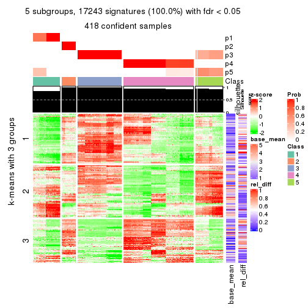</p>

</div>
<div id='tab-ATC-skmeans-get-signatures-5'>
<pre><code class="r">get_signatures(res, k = 6)
</code></pre>

<p></p>

</div>
</div>


Signature heatmaps where rows are not scaled:


<script>
$( function() {
	$( '#tabs-ATC-skmeans-get-signatures-no-scale' ).tabs();
} );
</script>
<div id='tabs-ATC-skmeans-get-signatures-no-scale'>
<ul>
<li><a href='#tab-ATC-skmeans-get-signatures-no-scale-1'>k = 2</a></li>
<li><a href='#tab-ATC-skmeans-get-signatures-no-scale-2'>k = 3</a></li>
<li><a href='#tab-ATC-skmeans-get-signatures-no-scale-3'>k = 4</a></li>
<li><a href='#tab-ATC-skmeans-get-signatures-no-scale-4'>k = 5</a></li>
<li><a href='#tab-ATC-skmeans-get-signatures-no-scale-5'>k = 6</a></li>
</ul>
<div id='tab-ATC-skmeans-get-signatures-no-scale-1'>
<pre><code class="r">get_signatures(res, k = 2, scale_rows = FALSE)
</code></pre>

<p></p>

</div>
<div id='tab-ATC-skmeans-get-signatures-no-scale-2'>
<pre><code class="r">get_signatures(res, k = 3, scale_rows = FALSE)
</code></pre>

<p></p>

</div>
<div id='tab-ATC-skmeans-get-signatures-no-scale-3'>
<pre><code class="r">get_signatures(res, k = 4, scale_rows = FALSE)
</code></pre>

<p></p>

</div>
<div id='tab-ATC-skmeans-get-signatures-no-scale-4'>
<pre><code class="r">get_signatures(res, k = 5, scale_rows = FALSE)
</code></pre>

<p></p>

</div>
<div id='tab-ATC-skmeans-get-signatures-no-scale-5'>
<pre><code class="r">get_signatures(res, k = 6, scale_rows = FALSE)
</code></pre>

<p></p>

</div>
</div>


Compare the overlap of signatures from different k:

```r
compare_signatures(res)
```


`get_signature()` returns a data frame invisibly. TO get the list of signatures, the function
call should be assigned to a variable explicitly. In following code, if `plot` argument is set
to `FALSE`, no heatmap is plotted while only the differential analysis is performed.

```r
# code only for demonstration
tb = get_signature(res, k = ..., plot = FALSE)
```

An example of the output of `tb` is:

```
#>   which_row         fdr    mean_1    mean_2 scaled_mean_1 scaled_mean_2 km
#> 1        38 0.042760348  8.373488  9.131774    -0.5533452     0.5164555  1
#> 2        40 0.018707592  7.106213  8.469186    -0.6173731     0.5762149  1
#> 3        55 0.019134737 10.221463 11.207825    -0.6159697     0.5749050  1
#> 4        59 0.006059896  5.921854  7.869574    -0.6899429     0.6439467  1
#> 5        60 0.018055526  8.928898 10.211722    -0.6204761     0.5791110  1
#> 6        98 0.009384629 15.714769 14.887706     0.6635654    -0.6193277  2
...
```

The columns in `tb` are:

1. `which_row`: row indices corresponding to the input matrix.
2. `fdr`: FDR for the differential test. 
3. `mean_x`: The mean value in group x.
4. `scaled_mean_x`: The mean value in group x after rows are scaled.
5. `km`: Row groups if k-means clustering is applied to rows.


UMAP plot which shows how samples are separated.


<script>
$( function() {
	$( '#tabs-ATC-skmeans-dimension-reduction' ).tabs();
} );
</script>
<div id='tabs-ATC-skmeans-dimension-reduction'>
<ul>
<li><a href='#tab-ATC-skmeans-dimension-reduction-1'>k = 2</a></li>
<li><a href='#tab-ATC-skmeans-dimension-reduction-2'>k = 3</a></li>
<li><a href='#tab-ATC-skmeans-dimension-reduction-3'>k = 4</a></li>
<li><a href='#tab-ATC-skmeans-dimension-reduction-4'>k = 5</a></li>
<li><a href='#tab-ATC-skmeans-dimension-reduction-5'>k = 6</a></li>
</ul>
<div id='tab-ATC-skmeans-dimension-reduction-1'>
<pre><code class="r">dimension_reduction(res, k = 2, method = &quot;UMAP&quot;)
</code></pre>

<p></p>

</div>
<div id='tab-ATC-skmeans-dimension-reduction-2'>
<pre><code class="r">dimension_reduction(res, k = 3, method = &quot;UMAP&quot;)
</code></pre>

<p></p>

</div>
<div id='tab-ATC-skmeans-dimension-reduction-3'>
<pre><code class="r">dimension_reduction(res, k = 4, method = &quot;UMAP&quot;)
</code></pre>

<p></p>

</div>
<div id='tab-ATC-skmeans-dimension-reduction-4'>
<pre><code class="r">dimension_reduction(res, k = 5, method = &quot;UMAP&quot;)
</code></pre>

<p></p>

</div>
<div id='tab-ATC-skmeans-dimension-reduction-5'>
<pre><code class="r">dimension_reduction(res, k = 6, method = &quot;UMAP&quot;)
</code></pre>

<p></p>

</div>
</div>


Following heatmap shows how subgroups are split when increasing `k`:

```r
collect_classes(res)
```

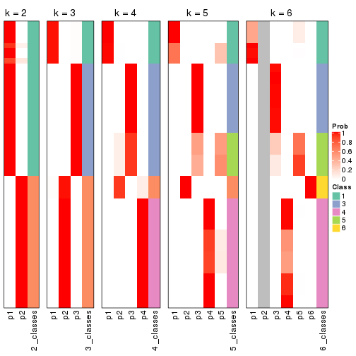


If matrix rows can be associated to genes, consider to use `GO_Enrichment(res,
...)` to perform function enrichment for the signature genes.


 

---------------------------------------------------


### ATC:pam*


The object with results only for a single top-value method and a single partition method 
can be extracted as:

```r
res = res_list["ATC", "pam"]
# you can also extract it by
# res = res_list["ATC:pam"]
```

A summary of `res` and all the functions that can be applied to it:

```r
res
```

```
#> A 'ConsensusPartition' object with k = 2, 3, 4, 5, 6.
#>   On a matrix with 17245 rows and 418 columns.
#>   Top rows (1000, 2000, 3000, 4000, 5000) are extracted by 'ATC' method.
#>   Subgroups are detected by 'pam' method.
#>   Performed in total 1250 partitions by row resampling.
#>   Best k for subgroups seems to be 6.
#> 
#> Following methods can be applied to this 'ConsensusPartition' object:
#>  [1] "cola_report"             "collect_classes"         "collect_plots"          
#>  [4] "collect_stats"           "colnames"                "compare_signatures"     
#>  [7] "consensus_heatmap"       "dimension_reduction"     "functional_enrichment"  
#> [10] "get_anno_col"            "get_anno"                "get_classes"            
#> [13] "get_consensus"           "get_matrix"              "get_membership"         
#> [16] "get_param"               "get_signatures"          "get_stats"              
#> [19] "is_best_k"               "is_stable_k"             "membership_heatmap"     
#> [22] "ncol"                    "nrow"                    "plot_ecdf"              
#> [25] "rownames"                "select_partition_number" "show"                   
#> [28] "suggest_best_k"          "test_to_known_factors"
```

`collect_plots()` function collects all the plots made from `res` for all `k` (number of partitions)
into one single page to provide an easy and fast comparison between different `k`.

```r
collect_plots(res)
```


The plots are:

- The first row: a plot of the ECDF (Empirical cumulative distribution
  function) curves of the consensus matrix for each `k` and the heatmap of
  predicted classes for each `k`.
- The second row: heatmaps of the consensus matrix for each `k`.
- The third row: heatmaps of the membership matrix for each `k`.
- The fouth row: heatmaps of the signatures for each `k`.

All the plots in panels can be made by individual functions and they are
plotted later in this section.

`select_partition_number()` produces several plots showing different
statistics for choosing "optimized" `k`. There are following statistics:

- ECDF curves of the consensus matrix for each `k`;
- 1-PAC. [The PAC
  score](https://en.wikipedia.org/wiki/Consensus_clustering#Over-interpretation_potential_of_consensus_clustering)
  measures the proportion of the ambiguous subgrouping.
- Mean silhouette score.
- Concordance. The mean probability of fiting the consensus class ids in all
  partitions.
- Area increased. Denote $A_k$ as the area under the ECDF curve for current
  `k`, the area increased is defined as $A_k - A_{k-1}$.
- Rand index. The percent of pairs of samples that are both in a same cluster
  or both are not in a same cluster in the partition of k and k-1.
- Jaccard index. The ratio of pairs of samples are both in a same cluster in
  the partition of k and k-1 and the pairs of samples are both in a same
  cluster in the partition k or k-1.

The detailed explanations of these statistics can be found in [the cola
vignette](http://bioconductor.org/packages/devel/bioc/vignettes/cola/inst/doc/cola.html#toc_13).

Generally speaking, lower PAC score, higher mean silhouette score or higher
concordance corresponds to better partition. Rand index and Jaccard index
measure how similar the current partition is compared to partition with `k-1`.
If they are too similar, we won't accept `k` is better than `k-1`.

```r
select_partition_number(res)
```


The numeric values for all these statistics can be obtained by `get_stats()`.

```r
get_stats(res)
```

```
#>   k 1-PAC mean_silhouette concordance area_increased  Rand Jaccard
#> 2 2 1.000           0.964       0.986         0.4997 0.502   0.502
#> 3 3 1.000           0.988       0.995         0.3192 0.781   0.588
#> 4 4 0.978           0.946       0.962         0.0315 0.920   0.784
#> 5 5 0.966           0.919       0.962         0.0787 0.932   0.791
#> 6 6 0.903           0.891       0.932         0.0308 0.975   0.909
```

`suggest_best_k()` suggests the best $k$ based on these statistics. The rules are as follows:

- All $k$ with Jaccard index larger than 0.95 are removed because the increase of
  the partition number does not provides enough extra information. If all $k$ are removed,
  the best $k$ is assigned by `NA`.
- For $k$ with 1-PAC larger than 0.9, the maximal $k$ is taken as the "best k". Other $k$ is called "optional k".
- If it does not fit the second rule. The $k$ with the highest vote of highest
  1-PAC, mean silhouette and concordance is taken as the "best k".

```r
suggest_best_k(res)
```

```
#> [1] 6
#> attr(,"optional")
#> [1] 2 3 4 5
```

There is also optional best $k$ = 2 3 4 5 that is worth to check.

Following shows the table of the partitions (You need to click the **show/hide
code output** link to see it). The membership matrix (columns with name `p*`)
is inferred by
[`clue::cl_consensus()`](https://www.rdocumentation.org/link/cl_consensus?package=clue)
function with the `SE` method. Basically the value in the membership matrix
represents the probability to belong to a certain group. The finall class
label for an item is determined with the group with highest probability it
belongs to.

In `get_classes()` function, the entropy is calculated from the membership
matrix and the silhouette score is calculated from the consensus matrix.


<script>
$( function() {
	$( '#tabs-ATC-pam-get-classes' ).tabs();
} );
</script>
<div id='tabs-ATC-pam-get-classes'>
<ul>
<li><a href='#tab-ATC-pam-get-classes-1'>k = 2</a></li>
<li><a href='#tab-ATC-pam-get-classes-2'>k = 3</a></li>
<li><a href='#tab-ATC-pam-get-classes-3'>k = 4</a></li>
<li><a href='#tab-ATC-pam-get-classes-4'>k = 5</a></li>
<li><a href='#tab-ATC-pam-get-classes-5'>k = 6</a></li>
</ul>

<div id='tab-ATC-pam-get-classes-1'>
<p><a id='tab-ATC-pam-get-classes-1-a' style='color:#0366d6' href='#'>show/hide code output</a></p>
<pre><code class="r">cbind(get_classes(res, k = 2), get_membership(res, k = 2))
</code></pre>

<pre><code>#&gt;           class entropy silhouette    p1    p2
#&gt; SRR902920     1   0.000      0.973 1.000 0.000
#&gt; SRR902921     1   0.000      0.973 1.000 0.000
#&gt; SRR902922     1   0.000      0.973 1.000 0.000
#&gt; SRR902923     1   0.000      0.973 1.000 0.000
#&gt; SRR902924     1   0.000      0.973 1.000 0.000
#&gt; SRR902925     1   0.000      0.973 1.000 0.000
#&gt; SRR902926     1   0.000      0.973 1.000 0.000
#&gt; SRR902927     1   0.000      0.973 1.000 0.000
#&gt; SRR902928     1   0.000      0.973 1.000 0.000
#&gt; SRR902929     1   0.000      0.973 1.000 0.000
#&gt; SRR902930     1   0.000      0.973 1.000 0.000
#&gt; SRR902931     1   0.000      0.973 1.000 0.000
#&gt; SRR902932     2   0.000      1.000 0.000 1.000
#&gt; SRR902933     2   0.000      1.000 0.000 1.000
#&gt; SRR902934     2   0.000      1.000 0.000 1.000
#&gt; SRR902935     2   0.000      1.000 0.000 1.000
#&gt; SRR902936     2   0.000      1.000 0.000 1.000
#&gt; SRR902937     2   0.000      1.000 0.000 1.000
#&gt; SRR902938     2   0.000      1.000 0.000 1.000
#&gt; SRR902939     2   0.000      1.000 0.000 1.000
#&gt; SRR902940     2   0.000      1.000 0.000 1.000
#&gt; SRR902941     2   0.000      1.000 0.000 1.000
#&gt; SRR902942     1   0.000      0.973 1.000 0.000
#&gt; SRR902943     1   0.000      0.973 1.000 0.000
#&gt; SRR902944     1   0.000      0.973 1.000 0.000
#&gt; SRR902945     1   0.000      0.973 1.000 0.000
#&gt; SRR902946     1   0.000      0.973 1.000 0.000
#&gt; SRR902947     1   0.000      0.973 1.000 0.000
#&gt; SRR902954     1   0.000      0.973 1.000 0.000
#&gt; SRR902955     1   0.000      0.973 1.000 0.000
#&gt; SRR902956     1   0.000      0.973 1.000 0.000
#&gt; SRR902957     1   0.000      0.973 1.000 0.000
#&gt; SRR902958     1   0.000      0.973 1.000 0.000
#&gt; SRR902959     1   0.000      0.973 1.000 0.000
#&gt; SRR902948     1   0.000      0.973 1.000 0.000
#&gt; SRR902949     1   0.000      0.973 1.000 0.000
#&gt; SRR902950     1   0.000      0.973 1.000 0.000
#&gt; SRR902951     1   0.000      0.973 1.000 0.000
#&gt; SRR902952     1   0.000      0.973 1.000 0.000
#&gt; SRR902953     1   0.000      0.973 1.000 0.000
#&gt; SRR902960     1   0.000      0.973 1.000 0.000
#&gt; SRR902961     1   0.000      0.973 1.000 0.000
#&gt; SRR902962     1   0.000      0.973 1.000 0.000
#&gt; SRR902963     1   0.000      0.973 1.000 0.000
#&gt; SRR902964     1   0.000      0.973 1.000 0.000
#&gt; SRR902965     1   0.000      0.973 1.000 0.000
#&gt; SRR902966     1   0.000      0.973 1.000 0.000
#&gt; SRR902967     1   0.000      0.973 1.000 0.000
#&gt; SRR902968     1   0.000      0.973 1.000 0.000
#&gt; SRR902969     1   0.000      0.973 1.000 0.000
#&gt; SRR902970     1   0.000      0.973 1.000 0.000
#&gt; SRR902971     1   0.000      0.973 1.000 0.000
#&gt; SRR902972     1   0.000      0.973 1.000 0.000
#&gt; SRR902973     1   0.000      0.973 1.000 0.000
#&gt; SRR902974     1   0.000      0.973 1.000 0.000
#&gt; SRR902975     1   0.000      0.973 1.000 0.000
#&gt; SRR902976     1   0.000      0.973 1.000 0.000
#&gt; SRR902977     1   0.000      0.973 1.000 0.000
#&gt; SRR902978     1   0.000      0.973 1.000 0.000
#&gt; SRR902980     1   0.000      0.973 1.000 0.000
#&gt; SRR902981     1   0.000      0.973 1.000 0.000
#&gt; SRR902982     1   0.000      0.973 1.000 0.000
#&gt; SRR902983     1   0.000      0.973 1.000 0.000
#&gt; SRR902984     1   0.000      0.973 1.000 0.000
#&gt; SRR902985     1   0.000      0.973 1.000 0.000
#&gt; SRR902986     1   0.000      0.973 1.000 0.000
#&gt; SRR902987     1   0.000      0.973 1.000 0.000
#&gt; SRR902988     1   0.000      0.973 1.000 0.000
#&gt; SRR902989     1   0.000      0.973 1.000 0.000
#&gt; SRR902990     1   0.000      0.973 1.000 0.000
#&gt; SRR902991     1   0.000      0.973 1.000 0.000
#&gt; SRR902992     1   0.000      0.973 1.000 0.000
#&gt; SRR902993     1   0.000      0.973 1.000 0.000
#&gt; SRR902994     1   0.000      0.973 1.000 0.000
#&gt; SRR902995     1   0.000      0.973 1.000 0.000
#&gt; SRR902996     2   0.000      1.000 0.000 1.000
#&gt; SRR902997     2   0.000      1.000 0.000 1.000
#&gt; SRR902998     2   0.000      1.000 0.000 1.000
#&gt; SRR902999     2   0.000      1.000 0.000 1.000
#&gt; SRR903000     2   0.000      1.000 0.000 1.000
#&gt; SRR903001     2   0.000      1.000 0.000 1.000
#&gt; SRR903008     2   0.000      1.000 0.000 1.000
#&gt; SRR903009     2   0.000      1.000 0.000 1.000
#&gt; SRR903010     2   0.000      1.000 0.000 1.000
#&gt; SRR903011     2   0.000      1.000 0.000 1.000
#&gt; SRR903012     2   0.000      1.000 0.000 1.000
#&gt; SRR903013     2   0.000      1.000 0.000 1.000
#&gt; SRR903002     2   0.000      1.000 0.000 1.000
#&gt; SRR903003     2   0.000      1.000 0.000 1.000
#&gt; SRR903004     2   0.000      1.000 0.000 1.000
#&gt; SRR903005     2   0.000      1.000 0.000 1.000
#&gt; SRR903006     2   0.000      1.000 0.000 1.000
#&gt; SRR903007     2   0.000      1.000 0.000 1.000
#&gt; SRR903014     1   0.000      0.973 1.000 0.000
#&gt; SRR903015     1   0.000      0.973 1.000 0.000
#&gt; SRR903016     1   0.000      0.973 1.000 0.000
#&gt; SRR903017     1   0.000      0.973 1.000 0.000
#&gt; SRR903018     1   0.000      0.973 1.000 0.000
#&gt; SRR903019     1   0.000      0.973 1.000 0.000
#&gt; SRR903020     1   0.000      0.973 1.000 0.000
#&gt; SRR903021     1   0.000      0.973 1.000 0.000
#&gt; SRR903022     1   0.000      0.973 1.000 0.000
#&gt; SRR903023     1   0.000      0.973 1.000 0.000
#&gt; SRR903024     1   0.000      0.973 1.000 0.000
#&gt; SRR903025     1   0.000      0.973 1.000 0.000
#&gt; SRR903026     1   0.000      0.973 1.000 0.000
#&gt; SRR903027     1   0.000      0.973 1.000 0.000
#&gt; SRR903028     1   0.000      0.973 1.000 0.000
#&gt; SRR903029     1   0.000      0.973 1.000 0.000
#&gt; SRR903030     1   0.000      0.973 1.000 0.000
#&gt; SRR903031     1   0.000      0.973 1.000 0.000
#&gt; SRR903032     2   0.000      1.000 0.000 1.000
#&gt; SRR903033     2   0.000      1.000 0.000 1.000
#&gt; SRR903034     2   0.000      1.000 0.000 1.000
#&gt; SRR903035     2   0.000      1.000 0.000 1.000
#&gt; SRR903036     2   0.000      1.000 0.000 1.000
#&gt; SRR903037     2   0.000      1.000 0.000 1.000
#&gt; SRR903038     2   0.000      1.000 0.000 1.000
#&gt; SRR903039     2   0.000      1.000 0.000 1.000
#&gt; SRR903040     2   0.000      1.000 0.000 1.000
#&gt; SRR903041     2   0.000      1.000 0.000 1.000
#&gt; SRR903042     2   0.000      1.000 0.000 1.000
#&gt; SRR903043     2   0.000      1.000 0.000 1.000
#&gt; SRR903044     2   0.000      1.000 0.000 1.000
#&gt; SRR903045     2   0.000      1.000 0.000 1.000
#&gt; SRR903046     2   0.000      1.000 0.000 1.000
#&gt; SRR903047     2   0.000      1.000 0.000 1.000
#&gt; SRR903048     2   0.000      1.000 0.000 1.000
#&gt; SRR903049     2   0.000      1.000 0.000 1.000
#&gt; SRR903050     1   0.000      0.973 1.000 0.000
#&gt; SRR903051     1   0.000      0.973 1.000 0.000
#&gt; SRR903052     1   0.000      0.973 1.000 0.000
#&gt; SRR903053     1   0.000      0.973 1.000 0.000
#&gt; SRR903054     1   0.000      0.973 1.000 0.000
#&gt; SRR903055     1   0.000      0.973 1.000 0.000
#&gt; SRR903056     1   0.000      0.973 1.000 0.000
#&gt; SRR903057     1   0.000      0.973 1.000 0.000
#&gt; SRR903058     1   0.000      0.973 1.000 0.000
#&gt; SRR903059     1   0.000      0.973 1.000 0.000
#&gt; SRR903060     1   0.000      0.973 1.000 0.000
#&gt; SRR903061     1   0.000      0.973 1.000 0.000
#&gt; SRR903062     1   0.000      0.973 1.000 0.000
#&gt; SRR903063     1   0.000      0.973 1.000 0.000
#&gt; SRR903064     1   0.000      0.973 1.000 0.000
#&gt; SRR903065     1   0.000      0.973 1.000 0.000
#&gt; SRR903066     1   0.000      0.973 1.000 0.000
#&gt; SRR903067     1   0.000      0.973 1.000 0.000
#&gt; SRR903068     1   0.000      0.973 1.000 0.000
#&gt; SRR903069     1   0.000      0.973 1.000 0.000
#&gt; SRR903070     1   0.000      0.973 1.000 0.000
#&gt; SRR903071     1   0.000      0.973 1.000 0.000
#&gt; SRR903072     1   0.000      0.973 1.000 0.000
#&gt; SRR903073     1   0.000      0.973 1.000 0.000
#&gt; SRR903074     1   0.000      0.973 1.000 0.000
#&gt; SRR903075     1   0.000      0.973 1.000 0.000
#&gt; SRR903076     1   0.000      0.973 1.000 0.000
#&gt; SRR903077     1   0.000      0.973 1.000 0.000
#&gt; SRR903078     1   0.000      0.973 1.000 0.000
#&gt; SRR903079     1   0.000      0.973 1.000 0.000
#&gt; SRR903080     1   0.000      0.973 1.000 0.000
#&gt; SRR903081     1   0.000      0.973 1.000 0.000
#&gt; SRR903082     2   0.000      1.000 0.000 1.000
#&gt; SRR903083     2   0.000      1.000 0.000 1.000
#&gt; SRR903084     2   0.000      1.000 0.000 1.000
#&gt; SRR903085     2   0.000      1.000 0.000 1.000
#&gt; SRR903086     2   0.000      1.000 0.000 1.000
#&gt; SRR903087     2   0.000      1.000 0.000 1.000
#&gt; SRR903088     2   0.000      1.000 0.000 1.000
#&gt; SRR903089     2   0.000      1.000 0.000 1.000
#&gt; SRR903090     2   0.000      1.000 0.000 1.000
#&gt; SRR903091     2   0.000      1.000 0.000 1.000
#&gt; SRR903092     2   0.000      1.000 0.000 1.000
#&gt; SRR903093     2   0.000      1.000 0.000 1.000
#&gt; SRR903094     2   0.000      1.000 0.000 1.000
#&gt; SRR903095     2   0.000      1.000 0.000 1.000
#&gt; SRR903096     2   0.000      1.000 0.000 1.000
#&gt; SRR903097     2   0.000      1.000 0.000 1.000
#&gt; SRR903098     2   0.000      1.000 0.000 1.000
#&gt; SRR903099     2   0.000      1.000 0.000 1.000
#&gt; SRR903100     2   0.000      1.000 0.000 1.000
#&gt; SRR903101     2   0.000      1.000 0.000 1.000
#&gt; SRR903102     2   0.000      1.000 0.000 1.000
#&gt; SRR903103     2   0.000      1.000 0.000 1.000
#&gt; SRR903104     2   0.000      1.000 0.000 1.000
#&gt; SRR903105     2   0.000      1.000 0.000 1.000
#&gt; SRR903106     2   0.000      1.000 0.000 1.000
#&gt; SRR903107     2   0.000      1.000 0.000 1.000
#&gt; SRR903108     2   0.000      1.000 0.000 1.000
#&gt; SRR903109     2   0.000      1.000 0.000 1.000
#&gt; SRR903110     2   0.000      1.000 0.000 1.000
#&gt; SRR903111     2   0.000      1.000 0.000 1.000
#&gt; SRR903112     2   0.000      1.000 0.000 1.000
#&gt; SRR903113     2   0.000      1.000 0.000 1.000
#&gt; SRR903114     1   0.971      0.374 0.600 0.400
#&gt; SRR903115     1   0.971      0.374 0.600 0.400
#&gt; SRR903116     1   0.971      0.374 0.600 0.400
#&gt; SRR903117     1   0.971      0.374 0.600 0.400
#&gt; SRR903118     1   0.971      0.374 0.600 0.400
#&gt; SRR903119     1   0.971      0.374 0.600 0.400
#&gt; SRR903121     1   0.971      0.374 0.600 0.400
#&gt; SRR903122     1   0.000      0.973 1.000 0.000
#&gt; SRR903124     1   0.000      0.973 1.000 0.000
#&gt; SRR903125     1   0.000      0.973 1.000 0.000
#&gt; SRR903126     1   0.000      0.973 1.000 0.000
#&gt; SRR903127     1   0.000      0.973 1.000 0.000
#&gt; SRR903128     1   0.000      0.973 1.000 0.000
#&gt; SRR903129     1   0.000      0.973 1.000 0.000
#&gt; SRR903130     1   0.000      0.973 1.000 0.000
#&gt; SRR903131     1   0.000      0.973 1.000 0.000
#&gt; SRR903132     1   0.000      0.973 1.000 0.000
#&gt; SRR903133     1   0.000      0.973 1.000 0.000
#&gt; SRR903134     1   0.000      0.973 1.000 0.000
#&gt; SRR903135     1   0.000      0.973 1.000 0.000
#&gt; SRR903136     1   0.000      0.973 1.000 0.000
#&gt; SRR903137     1   0.000      0.973 1.000 0.000
#&gt; SRR903146     2   0.000      1.000 0.000 1.000
#&gt; SRR903147     2   0.000      1.000 0.000 1.000
#&gt; SRR903148     2   0.000      1.000 0.000 1.000
#&gt; SRR903149     2   0.000      1.000 0.000 1.000
#&gt; SRR903150     2   0.000      1.000 0.000 1.000
#&gt; SRR903151     2   0.000      1.000 0.000 1.000
#&gt; SRR903152     2   0.000      1.000 0.000 1.000
#&gt; SRR903153     2   0.000      1.000 0.000 1.000
#&gt; SRR903138     1   0.971      0.374 0.600 0.400
#&gt; SRR903139     1   0.973      0.364 0.596 0.404
#&gt; SRR903140     1   0.971      0.374 0.600 0.400
#&gt; SRR903141     1   0.980      0.332 0.584 0.416
#&gt; SRR903142     1   0.975      0.354 0.592 0.408
#&gt; SRR903143     1   0.973      0.364 0.596 0.404
#&gt; SRR903144     1   0.973      0.364 0.596 0.404
#&gt; SRR903145     1   0.973      0.364 0.596 0.404
#&gt; SRR903154     2   0.000      1.000 0.000 1.000
#&gt; SRR903155     2   0.000      1.000 0.000 1.000
#&gt; SRR903156     2   0.000      1.000 0.000 1.000
#&gt; SRR903157     2   0.000      1.000 0.000 1.000
#&gt; SRR903158     2   0.000      1.000 0.000 1.000
#&gt; SRR903159     2   0.000      1.000 0.000 1.000
#&gt; SRR903160     2   0.000      1.000 0.000 1.000
#&gt; SRR903161     2   0.000      1.000 0.000 1.000
#&gt; SRR903162     2   0.000      1.000 0.000 1.000
#&gt; SRR903163     2   0.000      1.000 0.000 1.000
#&gt; SRR903164     2   0.000      1.000 0.000 1.000
#&gt; SRR903165     2   0.000      1.000 0.000 1.000
#&gt; SRR903166     2   0.000      1.000 0.000 1.000
#&gt; SRR903167     2   0.000      1.000 0.000 1.000
#&gt; SRR903168     2   0.000      1.000 0.000 1.000
#&gt; SRR903169     2   0.000      1.000 0.000 1.000
#&gt; SRR903178     1   0.000      0.973 1.000 0.000
#&gt; SRR903179     1   0.000      0.973 1.000 0.000
#&gt; SRR903180     1   0.000      0.973 1.000 0.000
#&gt; SRR903181     1   0.000      0.973 1.000 0.000
#&gt; SRR903182     1   0.000      0.973 1.000 0.000
#&gt; SRR903183     1   0.000      0.973 1.000 0.000
#&gt; SRR903184     1   0.000      0.973 1.000 0.000
#&gt; SRR903185     1   0.000      0.973 1.000 0.000
#&gt; SRR903170     2   0.000      1.000 0.000 1.000
#&gt; SRR903171     2   0.000      1.000 0.000 1.000
#&gt; SRR903172     2   0.000      1.000 0.000 1.000
#&gt; SRR903173     2   0.000      1.000 0.000 1.000
#&gt; SRR903174     2   0.000      1.000 0.000 1.000
#&gt; SRR903175     2   0.000      1.000 0.000 1.000
#&gt; SRR903176     2   0.000      1.000 0.000 1.000
#&gt; SRR903177     2   0.000      1.000 0.000 1.000
#&gt; SRR903186     1   0.000      0.973 1.000 0.000
#&gt; SRR903187     1   0.000      0.973 1.000 0.000
#&gt; SRR903188     1   0.000      0.973 1.000 0.000
#&gt; SRR903189     1   0.000      0.973 1.000 0.000
#&gt; SRR903190     1   0.000      0.973 1.000 0.000
#&gt; SRR903191     1   0.000      0.973 1.000 0.000
#&gt; SRR903192     1   0.000      0.973 1.000 0.000
#&gt; SRR903193     1   0.000      0.973 1.000 0.000
#&gt; SRR903194     1   0.000      0.973 1.000 0.000
#&gt; SRR903195     1   0.000      0.973 1.000 0.000
#&gt; SRR903196     1   0.000      0.973 1.000 0.000
#&gt; SRR903197     1   0.000      0.973 1.000 0.000
#&gt; SRR903198     1   0.000      0.973 1.000 0.000
#&gt; SRR903199     1   0.000      0.973 1.000 0.000
#&gt; SRR903200     1   0.000      0.973 1.000 0.000
#&gt; SRR903201     1   0.000      0.973 1.000 0.000
#&gt; SRR903210     2   0.000      1.000 0.000 1.000
#&gt; SRR903211     2   0.000      1.000 0.000 1.000
#&gt; SRR903212     2   0.000      1.000 0.000 1.000
#&gt; SRR903213     2   0.000      1.000 0.000 1.000
#&gt; SRR903214     2   0.000      1.000 0.000 1.000
#&gt; SRR903215     2   0.000      1.000 0.000 1.000
#&gt; SRR903216     2   0.000      1.000 0.000 1.000
#&gt; SRR903217     2   0.000      1.000 0.000 1.000
#&gt; SRR903202     1   0.000      0.973 1.000 0.000
#&gt; SRR903203     1   0.000      0.973 1.000 0.000
#&gt; SRR903204     1   0.000      0.973 1.000 0.000
#&gt; SRR903205     1   0.000      0.973 1.000 0.000
#&gt; SRR903206     1   0.000      0.973 1.000 0.000
#&gt; SRR903207     1   0.000      0.973 1.000 0.000
#&gt; SRR903208     1   0.000      0.973 1.000 0.000
#&gt; SRR903209     1   0.000      0.973 1.000 0.000
#&gt; SRR903218     2   0.000      1.000 0.000 1.000
#&gt; SRR903219     2   0.000      1.000 0.000 1.000
#&gt; SRR903220     2   0.000      1.000 0.000 1.000
#&gt; SRR903221     2   0.000      1.000 0.000 1.000
#&gt; SRR903222     2   0.000      1.000 0.000 1.000
#&gt; SRR903223     2   0.000      1.000 0.000 1.000
#&gt; SRR903224     2   0.000      1.000 0.000 1.000
#&gt; SRR903225     2   0.000      1.000 0.000 1.000
#&gt; SRR903226     2   0.000      1.000 0.000 1.000
#&gt; SRR903227     2   0.000      1.000 0.000 1.000
#&gt; SRR903228     2   0.000      1.000 0.000 1.000
#&gt; SRR903229     2   0.000      1.000 0.000 1.000
#&gt; SRR903230     2   0.000      1.000 0.000 1.000
#&gt; SRR903231     2   0.000      1.000 0.000 1.000
#&gt; SRR903232     2   0.000      1.000 0.000 1.000
#&gt; SRR903233     2   0.000      1.000 0.000 1.000
#&gt; SRR903242     1   0.000      0.973 1.000 0.000
#&gt; SRR903243     1   0.000      0.973 1.000 0.000
#&gt; SRR903244     1   0.000      0.973 1.000 0.000
#&gt; SRR903245     1   0.000      0.973 1.000 0.000
#&gt; SRR903246     1   0.000      0.973 1.000 0.000
#&gt; SRR903247     1   0.000      0.973 1.000 0.000
#&gt; SRR903248     1   0.000      0.973 1.000 0.000
#&gt; SRR903249     1   0.000      0.973 1.000 0.000
#&gt; SRR903234     2   0.000      1.000 0.000 1.000
#&gt; SRR903235     2   0.000      1.000 0.000 1.000
#&gt; SRR903236     2   0.000      1.000 0.000 1.000
#&gt; SRR903237     2   0.000      1.000 0.000 1.000
#&gt; SRR903238     2   0.000      1.000 0.000 1.000
#&gt; SRR903239     2   0.000      1.000 0.000 1.000
#&gt; SRR903240     2   0.000      1.000 0.000 1.000
#&gt; SRR903241     2   0.000      1.000 0.000 1.000
#&gt; SRR903258     1   0.000      0.973 1.000 0.000
#&gt; SRR903259     1   0.000      0.973 1.000 0.000
#&gt; SRR903260     1   0.000      0.973 1.000 0.000
#&gt; SRR903261     1   0.000      0.973 1.000 0.000
#&gt; SRR903262     1   0.000      0.973 1.000 0.000
#&gt; SRR903263     1   0.000      0.973 1.000 0.000
#&gt; SRR903264     1   0.000      0.973 1.000 0.000
#&gt; SRR903265     1   0.000      0.973 1.000 0.000
#&gt; SRR903250     1   0.000      0.973 1.000 0.000
#&gt; SRR903251     1   0.000      0.973 1.000 0.000
#&gt; SRR903252     1   0.000      0.973 1.000 0.000
#&gt; SRR903253     1   0.000      0.973 1.000 0.000
#&gt; SRR903254     1   0.000      0.973 1.000 0.000
#&gt; SRR903255     1   0.000      0.973 1.000 0.000
#&gt; SRR903256     1   0.000      0.973 1.000 0.000
#&gt; SRR903257     1   0.000      0.973 1.000 0.000
#&gt; SRR903266     1   0.000      0.973 1.000 0.000
#&gt; SRR903267     1   0.000      0.973 1.000 0.000
#&gt; SRR903268     1   0.000      0.973 1.000 0.000
#&gt; SRR903270     1   0.000      0.973 1.000 0.000
#&gt; SRR903271     1   0.000      0.973 1.000 0.000
#&gt; SRR903272     1   0.000      0.973 1.000 0.000
#&gt; SRR903273     1   0.000      0.973 1.000 0.000
#&gt; SRR903274     2   0.000      1.000 0.000 1.000
#&gt; SRR903275     2   0.000      1.000 0.000 1.000
#&gt; SRR903276     2   0.000      1.000 0.000 1.000
#&gt; SRR903277     2   0.000      1.000 0.000 1.000
#&gt; SRR903278     2   0.000      1.000 0.000 1.000
#&gt; SRR903279     2   0.000      1.000 0.000 1.000
#&gt; SRR903280     2   0.000      1.000 0.000 1.000
#&gt; SRR903281     2   0.000      1.000 0.000 1.000
#&gt; SRR903282     2   0.000      1.000 0.000 1.000
#&gt; SRR903283     2   0.000      1.000 0.000 1.000
#&gt; SRR903284     2   0.000      1.000 0.000 1.000
#&gt; SRR903285     2   0.000      1.000 0.000 1.000
#&gt; SRR903286     2   0.000      1.000 0.000 1.000
#&gt; SRR903287     2   0.000      1.000 0.000 1.000
#&gt; SRR903288     2   0.000      1.000 0.000 1.000
#&gt; SRR903289     2   0.000      1.000 0.000 1.000
#&gt; SRR903290     2   0.000      1.000 0.000 1.000
#&gt; SRR903291     2   0.000      1.000 0.000 1.000
#&gt; SRR903292     2   0.000      1.000 0.000 1.000
#&gt; SRR903293     2   0.000      1.000 0.000 1.000
#&gt; SRR903294     2   0.000      1.000 0.000 1.000
#&gt; SRR903295     2   0.000      1.000 0.000 1.000
#&gt; SRR903296     2   0.000      1.000 0.000 1.000
#&gt; SRR903297     2   0.000      1.000 0.000 1.000
#&gt; SRR903298     2   0.000      1.000 0.000 1.000
#&gt; SRR903299     2   0.000      1.000 0.000 1.000
#&gt; SRR903300     2   0.000      1.000 0.000 1.000
#&gt; SRR903301     2   0.000      1.000 0.000 1.000
#&gt; SRR903302     2   0.000      1.000 0.000 1.000
#&gt; SRR903303     2   0.000      1.000 0.000 1.000
#&gt; SRR903304     2   0.000      1.000 0.000 1.000
#&gt; SRR903305     2   0.000      1.000 0.000 1.000
#&gt; SRR903306     1   0.000      0.973 1.000 0.000
#&gt; SRR903307     1   0.000      0.973 1.000 0.000
#&gt; SRR903308     1   0.000      0.973 1.000 0.000
#&gt; SRR903309     1   0.000      0.973 1.000 0.000
#&gt; SRR903310     1   0.000      0.973 1.000 0.000
#&gt; SRR903311     1   0.000      0.973 1.000 0.000
#&gt; SRR903312     1   0.000      0.973 1.000 0.000
#&gt; SRR903313     1   0.000      0.973 1.000 0.000
#&gt; SRR903314     1   0.000      0.973 1.000 0.000
#&gt; SRR903315     1   0.000      0.973 1.000 0.000
#&gt; SRR903316     1   0.000      0.973 1.000 0.000
#&gt; SRR903317     1   0.000      0.973 1.000 0.000
#&gt; SRR903318     1   0.000      0.973 1.000 0.000
#&gt; SRR903319     1   0.000      0.973 1.000 0.000
#&gt; SRR903320     1   0.000      0.973 1.000 0.000
#&gt; SRR903321     1   0.000      0.973 1.000 0.000
#&gt; SRR903322     1   0.000      0.973 1.000 0.000
#&gt; SRR903323     1   0.000      0.973 1.000 0.000
#&gt; SRR903324     2   0.000      1.000 0.000 1.000
#&gt; SRR903325     2   0.000      1.000 0.000 1.000
#&gt; SRR903326     2   0.000      1.000 0.000 1.000
#&gt; SRR903327     2   0.000      1.000 0.000 1.000
#&gt; SRR903328     2   0.000      1.000 0.000 1.000
#&gt; SRR903329     2   0.000      1.000 0.000 1.000
#&gt; SRR903330     2   0.000      1.000 0.000 1.000
#&gt; SRR903331     2   0.000      1.000 0.000 1.000
#&gt; SRR903332     2   0.000      1.000 0.000 1.000
#&gt; SRR903333     2   0.000      1.000 0.000 1.000
#&gt; SRR903334     2   0.000      1.000 0.000 1.000
#&gt; SRR903335     2   0.000      1.000 0.000 1.000
#&gt; SRR903336     2   0.000      1.000 0.000 1.000
#&gt; SRR903337     2   0.000      1.000 0.000 1.000
#&gt; SRR903338     2   0.000      1.000 0.000 1.000
#&gt; SRR903339     2   0.000      1.000 0.000 1.000
#&gt; SRR903340     2   0.000      1.000 0.000 1.000
#&gt; SRR903341     2   0.000      1.000 0.000 1.000
</code></pre>

<script>
$('#tab-ATC-pam-get-classes-1-a').parent().next().next().hide();
$('#tab-ATC-pam-get-classes-1-a').click(function(){
  $('#tab-ATC-pam-get-classes-1-a').parent().next().next().toggle();
  return(false);
});
</script>
</div>

<div id='tab-ATC-pam-get-classes-2'>
<p><a id='tab-ATC-pam-get-classes-2-a' style='color:#0366d6' href='#'>show/hide code output</a></p>
<pre><code class="r">cbind(get_classes(res, k = 3), get_membership(res, k = 3))
</code></pre>

<pre><code>#&gt;           class entropy silhouette    p1 p2    p3
#&gt; SRR902920     3  0.0000      1.000 0.000  0 1.000
#&gt; SRR902921     3  0.0000      1.000 0.000  0 1.000
#&gt; SRR902922     3  0.0000      1.000 0.000  0 1.000
#&gt; SRR902923     3  0.0000      1.000 0.000  0 1.000
#&gt; SRR902924     3  0.0000      1.000 0.000  0 1.000
#&gt; SRR902925     3  0.0000      1.000 0.000  0 1.000
#&gt; SRR902926     3  0.0000      1.000 0.000  0 1.000
#&gt; SRR902927     3  0.0000      1.000 0.000  0 1.000
#&gt; SRR902928     3  0.0000      1.000 0.000  0 1.000
#&gt; SRR902929     3  0.0000      1.000 0.000  0 1.000
#&gt; SRR902930     3  0.0000      1.000 0.000  0 1.000
#&gt; SRR902931     3  0.0000      1.000 0.000  0 1.000
#&gt; SRR902932     2  0.0000      1.000 0.000  1 0.000
#&gt; SRR902933     2  0.0000      1.000 0.000  1 0.000
#&gt; SRR902934     2  0.0000      1.000 0.000  1 0.000
#&gt; SRR902935     2  0.0000      1.000 0.000  1 0.000
#&gt; SRR902936     2  0.0000      1.000 0.000  1 0.000
#&gt; SRR902937     2  0.0000      1.000 0.000  1 0.000
#&gt; SRR902938     2  0.0000      1.000 0.000  1 0.000
#&gt; SRR902939     2  0.0000      1.000 0.000  1 0.000
#&gt; SRR902940     2  0.0000      1.000 0.000  1 0.000
#&gt; SRR902941     2  0.0000      1.000 0.000  1 0.000
#&gt; SRR902942     3  0.0000      1.000 0.000  0 1.000
#&gt; SRR902943     3  0.0000      1.000 0.000  0 1.000
#&gt; SRR902944     3  0.0000      1.000 0.000  0 1.000
#&gt; SRR902945     3  0.0000      1.000 0.000  0 1.000
#&gt; SRR902946     3  0.0000      1.000 0.000  0 1.000
#&gt; SRR902947     3  0.0000      1.000 0.000  0 1.000
#&gt; SRR902954     3  0.0000      1.000 0.000  0 1.000
#&gt; SRR902955     3  0.0000      1.000 0.000  0 1.000
#&gt; SRR902956     3  0.0000      1.000 0.000  0 1.000
#&gt; SRR902957     3  0.0000      1.000 0.000  0 1.000
#&gt; SRR902958     3  0.0000      1.000 0.000  0 1.000
#&gt; SRR902959     3  0.0000      1.000 0.000  0 1.000
#&gt; SRR902948     3  0.0000      1.000 0.000  0 1.000
#&gt; SRR902949     3  0.0000      1.000 0.000  0 1.000
#&gt; SRR902950     3  0.0000      1.000 0.000  0 1.000
#&gt; SRR902951     3  0.0000      1.000 0.000  0 1.000
#&gt; SRR902952     3  0.0000      1.000 0.000  0 1.000
#&gt; SRR902953     3  0.0000      1.000 0.000  0 1.000
#&gt; SRR902960     3  0.0000      1.000 0.000  0 1.000
#&gt; SRR902961     3  0.0000      1.000 0.000  0 1.000
#&gt; SRR902962     3  0.0000      1.000 0.000  0 1.000
#&gt; SRR902963     3  0.0000      1.000 0.000  0 1.000
#&gt; SRR902964     3  0.0000      1.000 0.000  0 1.000
#&gt; SRR902965     3  0.0000      1.000 0.000  0 1.000
#&gt; SRR902966     3  0.0000      1.000 0.000  0 1.000
#&gt; SRR902967     3  0.0000      1.000 0.000  0 1.000
#&gt; SRR902968     3  0.0000      1.000 0.000  0 1.000
#&gt; SRR902969     3  0.0000      1.000 0.000  0 1.000
#&gt; SRR902970     3  0.0000      1.000 0.000  0 1.000
#&gt; SRR902971     3  0.0000      1.000 0.000  0 1.000
#&gt; SRR902972     3  0.0000      1.000 0.000  0 1.000
#&gt; SRR902973     3  0.0000      1.000 0.000  0 1.000
#&gt; SRR902974     3  0.0000      1.000 0.000  0 1.000
#&gt; SRR902975     3  0.0000      1.000 0.000  0 1.000
#&gt; SRR902976     3  0.0000      1.000 0.000  0 1.000
#&gt; SRR902977     3  0.0000      1.000 0.000  0 1.000
#&gt; SRR902978     3  0.0000      1.000 0.000  0 1.000
#&gt; SRR902980     3  0.0000      1.000 0.000  0 1.000
#&gt; SRR902981     3  0.0000      1.000 0.000  0 1.000
#&gt; SRR902982     3  0.0000      1.000 0.000  0 1.000
#&gt; SRR902983     3  0.0000      1.000 0.000  0 1.000
#&gt; SRR902984     3  0.0000      1.000 0.000  0 1.000
#&gt; SRR902985     3  0.0000      1.000 0.000  0 1.000
#&gt; SRR902986     3  0.0000      1.000 0.000  0 1.000
#&gt; SRR902987     3  0.0000      1.000 0.000  0 1.000
#&gt; SRR902988     3  0.0000      1.000 0.000  0 1.000
#&gt; SRR902989     3  0.0000      1.000 0.000  0 1.000
#&gt; SRR902990     3  0.0000      1.000 0.000  0 1.000
#&gt; SRR902991     3  0.0000      1.000 0.000  0 1.000
#&gt; SRR902992     3  0.0000      1.000 0.000  0 1.000
#&gt; SRR902993     3  0.0000      1.000 0.000  0 1.000
#&gt; SRR902994     3  0.0000      1.000 0.000  0 1.000
#&gt; SRR902995     3  0.0000      1.000 0.000  0 1.000
#&gt; SRR902996     2  0.0000      1.000 0.000  1 0.000
#&gt; SRR902997     2  0.0000      1.000 0.000  1 0.000
#&gt; SRR902998     2  0.0000      1.000 0.000  1 0.000
#&gt; SRR902999     2  0.0000      1.000 0.000  1 0.000
#&gt; SRR903000     2  0.0000      1.000 0.000  1 0.000
#&gt; SRR903001     2  0.0000      1.000 0.000  1 0.000
#&gt; SRR903008     2  0.0000      1.000 0.000  1 0.000
#&gt; SRR903009     2  0.0000      1.000 0.000  1 0.000
#&gt; SRR903010     2  0.0000      1.000 0.000  1 0.000
#&gt; SRR903011     2  0.0000      1.000 0.000  1 0.000
#&gt; SRR903012     2  0.0000      1.000 0.000  1 0.000
#&gt; SRR903013     2  0.0000      1.000 0.000  1 0.000
#&gt; SRR903002     2  0.0000      1.000 0.000  1 0.000
#&gt; SRR903003     2  0.0000      1.000 0.000  1 0.000
#&gt; SRR903004     2  0.0000      1.000 0.000  1 0.000
#&gt; SRR903005     2  0.0000      1.000 0.000  1 0.000
#&gt; SRR903006     2  0.0000      1.000 0.000  1 0.000
#&gt; SRR903007     2  0.0000      1.000 0.000  1 0.000
#&gt; SRR903014     3  0.0000      1.000 0.000  0 1.000
#&gt; SRR903015     3  0.0000      1.000 0.000  0 1.000
#&gt; SRR903016     3  0.0000      1.000 0.000  0 1.000
#&gt; SRR903017     3  0.0000      1.000 0.000  0 1.000
#&gt; SRR903018     3  0.0000      1.000 0.000  0 1.000
#&gt; SRR903019     3  0.0000      1.000 0.000  0 1.000
#&gt; SRR903020     3  0.0000      1.000 0.000  0 1.000
#&gt; SRR903021     3  0.0000      1.000 0.000  0 1.000
#&gt; SRR903022     3  0.0000      1.000 0.000  0 1.000
#&gt; SRR903023     3  0.0000      1.000 0.000  0 1.000
#&gt; SRR903024     3  0.0000      1.000 0.000  0 1.000
#&gt; SRR903025     3  0.0000      1.000 0.000  0 1.000
#&gt; SRR903026     3  0.0000      1.000 0.000  0 1.000
#&gt; SRR903027     3  0.0000      1.000 0.000  0 1.000
#&gt; SRR903028     3  0.0000      1.000 0.000  0 1.000
#&gt; SRR903029     3  0.0000      1.000 0.000  0 1.000
#&gt; SRR903030     3  0.0000      1.000 0.000  0 1.000
#&gt; SRR903031     3  0.0000      1.000 0.000  0 1.000
#&gt; SRR903032     2  0.0000      1.000 0.000  1 0.000
#&gt; SRR903033     2  0.0000      1.000 0.000  1 0.000
#&gt; SRR903034     2  0.0000      1.000 0.000  1 0.000
#&gt; SRR903035     2  0.0000      1.000 0.000  1 0.000
#&gt; SRR903036     2  0.0000      1.000 0.000  1 0.000
#&gt; SRR903037     2  0.0000      1.000 0.000  1 0.000
#&gt; SRR903038     2  0.0000      1.000 0.000  1 0.000
#&gt; SRR903039     2  0.0000      1.000 0.000  1 0.000
#&gt; SRR903040     2  0.0000      1.000 0.000  1 0.000
#&gt; SRR903041     2  0.0000      1.000 0.000  1 0.000
#&gt; SRR903042     2  0.0000      1.000 0.000  1 0.000
#&gt; SRR903043     2  0.0000      1.000 0.000  1 0.000
#&gt; SRR903044     2  0.0000      1.000 0.000  1 0.000
#&gt; SRR903045     2  0.0000      1.000 0.000  1 0.000
#&gt; SRR903046     2  0.0000      1.000 0.000  1 0.000
#&gt; SRR903047     2  0.0000      1.000 0.000  1 0.000
#&gt; SRR903048     2  0.0000      1.000 0.000  1 0.000
#&gt; SRR903049     2  0.0000      1.000 0.000  1 0.000
#&gt; SRR903050     1  0.0000      0.980 1.000  0 0.000
#&gt; SRR903051     1  0.0000      0.980 1.000  0 0.000
#&gt; SRR903052     1  0.0000      0.980 1.000  0 0.000
#&gt; SRR903053     1  0.0000      0.980 1.000  0 0.000
#&gt; SRR903054     1  0.0000      0.980 1.000  0 0.000
#&gt; SRR903055     1  0.0000      0.980 1.000  0 0.000
#&gt; SRR903056     1  0.0000      0.980 1.000  0 0.000
#&gt; SRR903057     1  0.0000      0.980 1.000  0 0.000
#&gt; SRR903058     1  0.0000      0.980 1.000  0 0.000
#&gt; SRR903059     1  0.0000      0.980 1.000  0 0.000
#&gt; SRR903060     1  0.0000      0.980 1.000  0 0.000
#&gt; SRR903061     1  0.0000      0.980 1.000  0 0.000
#&gt; SRR903062     1  0.0000      0.980 1.000  0 0.000
#&gt; SRR903063     1  0.0000      0.980 1.000  0 0.000
#&gt; SRR903064     1  0.0000      0.980 1.000  0 0.000
#&gt; SRR903065     1  0.0000      0.980 1.000  0 0.000
#&gt; SRR903066     1  0.0000      0.980 1.000  0 0.000
#&gt; SRR903067     1  0.0000      0.980 1.000  0 0.000
#&gt; SRR903068     1  0.0000      0.980 1.000  0 0.000
#&gt; SRR903069     1  0.0000      0.980 1.000  0 0.000
#&gt; SRR903070     1  0.0000      0.980 1.000  0 0.000
#&gt; SRR903071     1  0.0000      0.980 1.000  0 0.000
#&gt; SRR903072     1  0.0000      0.980 1.000  0 0.000
#&gt; SRR903073     1  0.0000      0.980 1.000  0 0.000
#&gt; SRR903074     1  0.0000      0.980 1.000  0 0.000
#&gt; SRR903075     1  0.0000      0.980 1.000  0 0.000
#&gt; SRR903076     1  0.0000      0.980 1.000  0 0.000
#&gt; SRR903077     1  0.0000      0.980 1.000  0 0.000
#&gt; SRR903078     1  0.0000      0.980 1.000  0 0.000
#&gt; SRR903079     1  0.0000      0.980 1.000  0 0.000
#&gt; SRR903080     1  0.0000      0.980 1.000  0 0.000
#&gt; SRR903081     1  0.0000      0.980 1.000  0 0.000
#&gt; SRR903082     2  0.0000      1.000 0.000  1 0.000
#&gt; SRR903083     2  0.0000      1.000 0.000  1 0.000
#&gt; SRR903084     2  0.0000      1.000 0.000  1 0.000
#&gt; SRR903085     2  0.0000      1.000 0.000  1 0.000
#&gt; SRR903086     2  0.0000      1.000 0.000  1 0.000
#&gt; SRR903087     2  0.0000      1.000 0.000  1 0.000
#&gt; SRR903088     2  0.0000      1.000 0.000  1 0.000
#&gt; SRR903089     2  0.0000      1.000 0.000  1 0.000
#&gt; SRR903090     2  0.0000      1.000 0.000  1 0.000
#&gt; SRR903091     2  0.0000      1.000 0.000  1 0.000
#&gt; SRR903092     2  0.0000      1.000 0.000  1 0.000
#&gt; SRR903093     2  0.0000      1.000 0.000  1 0.000
#&gt; SRR903094     2  0.0000      1.000 0.000  1 0.000
#&gt; SRR903095     2  0.0000      1.000 0.000  1 0.000
#&gt; SRR903096     2  0.0000      1.000 0.000  1 0.000
#&gt; SRR903097     2  0.0000      1.000 0.000  1 0.000
#&gt; SRR903098     2  0.0000      1.000 0.000  1 0.000
#&gt; SRR903099     2  0.0000      1.000 0.000  1 0.000
#&gt; SRR903100     2  0.0000      1.000 0.000  1 0.000
#&gt; SRR903101     2  0.0000      1.000 0.000  1 0.000
#&gt; SRR903102     2  0.0000      1.000 0.000  1 0.000
#&gt; SRR903103     2  0.0000      1.000 0.000  1 0.000
#&gt; SRR903104     2  0.0000      1.000 0.000  1 0.000
#&gt; SRR903105     2  0.0000      1.000 0.000  1 0.000
#&gt; SRR903106     2  0.0000      1.000 0.000  1 0.000
#&gt; SRR903107     2  0.0000      1.000 0.000  1 0.000
#&gt; SRR903108     2  0.0000      1.000 0.000  1 0.000
#&gt; SRR903109     2  0.0000      1.000 0.000  1 0.000
#&gt; SRR903110     2  0.0000      1.000 0.000  1 0.000
#&gt; SRR903111     2  0.0000      1.000 0.000  1 0.000
#&gt; SRR903112     2  0.0000      1.000 0.000  1 0.000
#&gt; SRR903113     2  0.0000      1.000 0.000  1 0.000
#&gt; SRR903114     1  0.0000      0.980 1.000  0 0.000
#&gt; SRR903115     1  0.0000      0.980 1.000  0 0.000
#&gt; SRR903116     1  0.0000      0.980 1.000  0 0.000
#&gt; SRR903117     1  0.0000      0.980 1.000  0 0.000
#&gt; SRR903118     1  0.0000      0.980 1.000  0 0.000
#&gt; SRR903119     1  0.0000      0.980 1.000  0 0.000
#&gt; SRR903121     1  0.0000      0.980 1.000  0 0.000
#&gt; SRR903122     1  0.0000      0.980 1.000  0 0.000
#&gt; SRR903124     1  0.0000      0.980 1.000  0 0.000
#&gt; SRR903125     1  0.0000      0.980 1.000  0 0.000
#&gt; SRR903126     1  0.0000      0.980 1.000  0 0.000
#&gt; SRR903127     1  0.0000      0.980 1.000  0 0.000
#&gt; SRR903128     1  0.0000      0.980 1.000  0 0.000
#&gt; SRR903129     1  0.0000      0.980 1.000  0 0.000
#&gt; SRR903130     1  0.0000      0.980 1.000  0 0.000
#&gt; SRR903131     1  0.0000      0.980 1.000  0 0.000
#&gt; SRR903132     1  0.0000      0.980 1.000  0 0.000
#&gt; SRR903133     1  0.0000      0.980 1.000  0 0.000
#&gt; SRR903134     1  0.0000      0.980 1.000  0 0.000
#&gt; SRR903135     1  0.0000      0.980 1.000  0 0.000
#&gt; SRR903136     1  0.0000      0.980 1.000  0 0.000
#&gt; SRR903137     1  0.0000      0.980 1.000  0 0.000
#&gt; SRR903146     2  0.0000      1.000 0.000  1 0.000
#&gt; SRR903147     2  0.0000      1.000 0.000  1 0.000
#&gt; SRR903148     2  0.0000      1.000 0.000  1 0.000
#&gt; SRR903149     2  0.0000      1.000 0.000  1 0.000
#&gt; SRR903150     2  0.0000      1.000 0.000  1 0.000
#&gt; SRR903151     2  0.0000      1.000 0.000  1 0.000
#&gt; SRR903152     2  0.0000      1.000 0.000  1 0.000
#&gt; SRR903153     2  0.0000      1.000 0.000  1 0.000
#&gt; SRR903138     1  0.0000      0.980 1.000  0 0.000
#&gt; SRR903139     1  0.0000      0.980 1.000  0 0.000
#&gt; SRR903140     1  0.0000      0.980 1.000  0 0.000
#&gt; SRR903141     1  0.0000      0.980 1.000  0 0.000
#&gt; SRR903142     1  0.0000      0.980 1.000  0 0.000
#&gt; SRR903143     1  0.0000      0.980 1.000  0 0.000
#&gt; SRR903144     1  0.0000      0.980 1.000  0 0.000
#&gt; SRR903145     1  0.0000      0.980 1.000  0 0.000
#&gt; SRR903154     2  0.0000      1.000 0.000  1 0.000
#&gt; SRR903155     2  0.0000      1.000 0.000  1 0.000
#&gt; SRR903156     2  0.0000      1.000 0.000  1 0.000
#&gt; SRR903157     2  0.0000      1.000 0.000  1 0.000
#&gt; SRR903158     2  0.0000      1.000 0.000  1 0.000
#&gt; SRR903159     2  0.0000      1.000 0.000  1 0.000
#&gt; SRR903160     2  0.0000      1.000 0.000  1 0.000
#&gt; SRR903161     2  0.0000      1.000 0.000  1 0.000
#&gt; SRR903162     2  0.0000      1.000 0.000  1 0.000
#&gt; SRR903163     2  0.0000      1.000 0.000  1 0.000
#&gt; SRR903164     2  0.0000      1.000 0.000  1 0.000
#&gt; SRR903165     2  0.0000      1.000 0.000  1 0.000
#&gt; SRR903166     2  0.0000      1.000 0.000  1 0.000
#&gt; SRR903167     2  0.0000      1.000 0.000  1 0.000
#&gt; SRR903168     2  0.0000      1.000 0.000  1 0.000
#&gt; SRR903169     2  0.0000      1.000 0.000  1 0.000
#&gt; SRR903178     3  0.0000      1.000 0.000  0 1.000
#&gt; SRR903179     3  0.0000      1.000 0.000  0 1.000
#&gt; SRR903180     3  0.0000      1.000 0.000  0 1.000
#&gt; SRR903181     3  0.0000      1.000 0.000  0 1.000
#&gt; SRR903182     3  0.0000      1.000 0.000  0 1.000
#&gt; SRR903183     3  0.0000      1.000 0.000  0 1.000
#&gt; SRR903184     3  0.0000      1.000 0.000  0 1.000
#&gt; SRR903185     3  0.0000      1.000 0.000  0 1.000
#&gt; SRR903170     2  0.0000      1.000 0.000  1 0.000
#&gt; SRR903171     2  0.0000      1.000 0.000  1 0.000
#&gt; SRR903172     2  0.0000      1.000 0.000  1 0.000
#&gt; SRR903173     2  0.0000      1.000 0.000  1 0.000
#&gt; SRR903174     2  0.0000      1.000 0.000  1 0.000
#&gt; SRR903175     2  0.0000      1.000 0.000  1 0.000
#&gt; SRR903176     2  0.0000      1.000 0.000  1 0.000
#&gt; SRR903177     2  0.0000      1.000 0.000  1 0.000
#&gt; SRR903186     3  0.0000      1.000 0.000  0 1.000
#&gt; SRR903187     3  0.0000      1.000 0.000  0 1.000
#&gt; SRR903188     3  0.0000      1.000 0.000  0 1.000
#&gt; SRR903189     3  0.0000      1.000 0.000  0 1.000
#&gt; SRR903190     3  0.0000      1.000 0.000  0 1.000
#&gt; SRR903191     3  0.0000      1.000 0.000  0 1.000
#&gt; SRR903192     3  0.0000      1.000 0.000  0 1.000
#&gt; SRR903193     3  0.0000      1.000 0.000  0 1.000
#&gt; SRR903194     3  0.0000      1.000 0.000  0 1.000
#&gt; SRR903195     3  0.0000      1.000 0.000  0 1.000
#&gt; SRR903196     3  0.0000      1.000 0.000  0 1.000
#&gt; SRR903197     3  0.0000      1.000 0.000  0 1.000
#&gt; SRR903198     3  0.0000      1.000 0.000  0 1.000
#&gt; SRR903199     3  0.0000      1.000 0.000  0 1.000
#&gt; SRR903200     3  0.0000      1.000 0.000  0 1.000
#&gt; SRR903201     3  0.0000      1.000 0.000  0 1.000
#&gt; SRR903210     2  0.0000      1.000 0.000  1 0.000
#&gt; SRR903211     2  0.0000      1.000 0.000  1 0.000
#&gt; SRR903212     2  0.0000      1.000 0.000  1 0.000
#&gt; SRR903213     2  0.0000      1.000 0.000  1 0.000
#&gt; SRR903214     2  0.0000      1.000 0.000  1 0.000
#&gt; SRR903215     2  0.0000      1.000 0.000  1 0.000
#&gt; SRR903216     2  0.0000      1.000 0.000  1 0.000
#&gt; SRR903217     2  0.0000      1.000 0.000  1 0.000
#&gt; SRR903202     3  0.0000      1.000 0.000  0 1.000
#&gt; SRR903203     3  0.0000      1.000 0.000  0 1.000
#&gt; SRR903204     3  0.0000      1.000 0.000  0 1.000
#&gt; SRR903205     3  0.0000      1.000 0.000  0 1.000
#&gt; SRR903206     3  0.0000      1.000 0.000  0 1.000
#&gt; SRR903207     3  0.0000      1.000 0.000  0 1.000
#&gt; SRR903208     3  0.0000      1.000 0.000  0 1.000
#&gt; SRR903209     3  0.0000      1.000 0.000  0 1.000
#&gt; SRR903218     2  0.0000      1.000 0.000  1 0.000
#&gt; SRR903219     2  0.0000      1.000 0.000  1 0.000
#&gt; SRR903220     2  0.0000      1.000 0.000  1 0.000
#&gt; SRR903221     2  0.0000      1.000 0.000  1 0.000
#&gt; SRR903222     2  0.0000      1.000 0.000  1 0.000
#&gt; SRR903223     2  0.0000      1.000 0.000  1 0.000
#&gt; SRR903224     2  0.0000      1.000 0.000  1 0.000
#&gt; SRR903225     2  0.0000      1.000 0.000  1 0.000
#&gt; SRR903226     2  0.0000      1.000 0.000  1 0.000
#&gt; SRR903227     2  0.0000      1.000 0.000  1 0.000
#&gt; SRR903228     2  0.0000      1.000 0.000  1 0.000
#&gt; SRR903229     2  0.0000      1.000 0.000  1 0.000
#&gt; SRR903230     2  0.0000      1.000 0.000  1 0.000
#&gt; SRR903231     2  0.0000      1.000 0.000  1 0.000
#&gt; SRR903232     2  0.0000      1.000 0.000  1 0.000
#&gt; SRR903233     2  0.0000      1.000 0.000  1 0.000
#&gt; SRR903242     1  0.0592      0.970 0.988  0 0.012
#&gt; SRR903243     1  0.0000      0.980 1.000  0 0.000
#&gt; SRR903244     1  0.0000      0.980 1.000  0 0.000
#&gt; SRR903245     1  0.0000      0.980 1.000  0 0.000
#&gt; SRR903246     1  0.0000      0.980 1.000  0 0.000
#&gt; SRR903247     1  0.0000      0.980 1.000  0 0.000
#&gt; SRR903248     1  0.0000      0.980 1.000  0 0.000
#&gt; SRR903249     1  0.0000      0.980 1.000  0 0.000
#&gt; SRR903234     2  0.0000      1.000 0.000  1 0.000
#&gt; SRR903235     2  0.0000      1.000 0.000  1 0.000
#&gt; SRR903236     2  0.0000      1.000 0.000  1 0.000
#&gt; SRR903237     2  0.0000      1.000 0.000  1 0.000
#&gt; SRR903238     2  0.0000      1.000 0.000  1 0.000
#&gt; SRR903239     2  0.0000      1.000 0.000  1 0.000
#&gt; SRR903240     2  0.0000      1.000 0.000  1 0.000
#&gt; SRR903241     2  0.0000      1.000 0.000  1 0.000
#&gt; SRR903258     3  0.0000      1.000 0.000  0 1.000
#&gt; SRR903259     3  0.0000      1.000 0.000  0 1.000
#&gt; SRR903260     3  0.0000      1.000 0.000  0 1.000
#&gt; SRR903261     3  0.0000      1.000 0.000  0 1.000
#&gt; SRR903262     3  0.0000      1.000 0.000  0 1.000
#&gt; SRR903263     3  0.0000      1.000 0.000  0 1.000
#&gt; SRR903264     3  0.0000      1.000 0.000  0 1.000
#&gt; SRR903265     3  0.0000      1.000 0.000  0 1.000
#&gt; SRR903250     3  0.0000      1.000 0.000  0 1.000
#&gt; SRR903251     3  0.0000      1.000 0.000  0 1.000
#&gt; SRR903252     3  0.0000      1.000 0.000  0 1.000
#&gt; SRR903253     3  0.0000      1.000 0.000  0 1.000
#&gt; SRR903254     3  0.0000      1.000 0.000  0 1.000
#&gt; SRR903255     3  0.0000      1.000 0.000  0 1.000
#&gt; SRR903256     3  0.0000      1.000 0.000  0 1.000
#&gt; SRR903257     3  0.0000      1.000 0.000  0 1.000
#&gt; SRR903266     1  0.6095      0.387 0.608  0 0.392
#&gt; SRR903267     1  0.5058      0.689 0.756  0 0.244
#&gt; SRR903268     1  0.6008      0.437 0.628  0 0.372
#&gt; SRR903270     1  0.5678      0.561 0.684  0 0.316
#&gt; SRR903271     1  0.5363      0.635 0.724  0 0.276
#&gt; SRR903272     1  0.5560      0.592 0.700  0 0.300
#&gt; SRR903273     1  0.4555      0.755 0.800  0 0.200
#&gt; SRR903274     1  0.0000      0.980 1.000  0 0.000
#&gt; SRR903275     1  0.0000      0.980 1.000  0 0.000
#&gt; SRR903276     1  0.0000      0.980 1.000  0 0.000
#&gt; SRR903277     1  0.0000      0.980 1.000  0 0.000
#&gt; SRR903278     1  0.0000      0.980 1.000  0 0.000
#&gt; SRR903279     1  0.0000      0.980 1.000  0 0.000
#&gt; SRR903280     1  0.0000      0.980 1.000  0 0.000
#&gt; SRR903281     1  0.0000      0.980 1.000  0 0.000
#&gt; SRR903282     1  0.0000      0.980 1.000  0 0.000
#&gt; SRR903283     1  0.0000      0.980 1.000  0 0.000
#&gt; SRR903284     1  0.0000      0.980 1.000  0 0.000
#&gt; SRR903285     1  0.0000      0.980 1.000  0 0.000
#&gt; SRR903286     1  0.0000      0.980 1.000  0 0.000
#&gt; SRR903287     1  0.0000      0.980 1.000  0 0.000
#&gt; SRR903288     1  0.0000      0.980 1.000  0 0.000
#&gt; SRR903289     1  0.0000      0.980 1.000  0 0.000
#&gt; SRR903290     1  0.0000      0.980 1.000  0 0.000
#&gt; SRR903291     1  0.0000      0.980 1.000  0 0.000
#&gt; SRR903292     1  0.0000      0.980 1.000  0 0.000
#&gt; SRR903293     1  0.0000      0.980 1.000  0 0.000
#&gt; SRR903294     1  0.0000      0.980 1.000  0 0.000
#&gt; SRR903295     1  0.0000      0.980 1.000  0 0.000
#&gt; SRR903296     1  0.0000      0.980 1.000  0 0.000
#&gt; SRR903297     1  0.0000      0.980 1.000  0 0.000
#&gt; SRR903298     1  0.0000      0.980 1.000  0 0.000
#&gt; SRR903299     1  0.0000      0.980 1.000  0 0.000
#&gt; SRR903300     1  0.0000      0.980 1.000  0 0.000
#&gt; SRR903301     1  0.0000      0.980 1.000  0 0.000
#&gt; SRR903302     1  0.0000      0.980 1.000  0 0.000
#&gt; SRR903303     1  0.0000      0.980 1.000  0 0.000
#&gt; SRR903304     1  0.0000      0.980 1.000  0 0.000
#&gt; SRR903305     1  0.0000      0.980 1.000  0 0.000
#&gt; SRR903306     3  0.0000      1.000 0.000  0 1.000
#&gt; SRR903307     3  0.0000      1.000 0.000  0 1.000
#&gt; SRR903308     3  0.0000      1.000 0.000  0 1.000
#&gt; SRR903309     3  0.0000      1.000 0.000  0 1.000
#&gt; SRR903310     3  0.0000      1.000 0.000  0 1.000
#&gt; SRR903311     3  0.0000      1.000 0.000  0 1.000
#&gt; SRR903312     3  0.0000      1.000 0.000  0 1.000
#&gt; SRR903313     3  0.0000      1.000 0.000  0 1.000
#&gt; SRR903314     3  0.0000      1.000 0.000  0 1.000
#&gt; SRR903315     3  0.0000      1.000 0.000  0 1.000
#&gt; SRR903316     3  0.0000      1.000 0.000  0 1.000
#&gt; SRR903317     3  0.0000      1.000 0.000  0 1.000
#&gt; SRR903318     3  0.0000      1.000 0.000  0 1.000
#&gt; SRR903319     3  0.0000      1.000 0.000  0 1.000
#&gt; SRR903320     3  0.0000      1.000 0.000  0 1.000
#&gt; SRR903321     3  0.0000      1.000 0.000  0 1.000
#&gt; SRR903322     3  0.0000      1.000 0.000  0 1.000
#&gt; SRR903323     3  0.0000      1.000 0.000  0 1.000
#&gt; SRR903324     2  0.0000      1.000 0.000  1 0.000
#&gt; SRR903325     2  0.0000      1.000 0.000  1 0.000
#&gt; SRR903326     2  0.0000      1.000 0.000  1 0.000
#&gt; SRR903327     2  0.0000      1.000 0.000  1 0.000
#&gt; SRR903328     2  0.0000      1.000 0.000  1 0.000
#&gt; SRR903329     2  0.0000      1.000 0.000  1 0.000
#&gt; SRR903330     2  0.0000      1.000 0.000  1 0.000
#&gt; SRR903331     2  0.0000      1.000 0.000  1 0.000
#&gt; SRR903332     2  0.0000      1.000 0.000  1 0.000
#&gt; SRR903333     2  0.0000      1.000 0.000  1 0.000
#&gt; SRR903334     2  0.0000      1.000 0.000  1 0.000
#&gt; SRR903335     2  0.0000      1.000 0.000  1 0.000
#&gt; SRR903336     2  0.0000      1.000 0.000  1 0.000
#&gt; SRR903337     2  0.0000      1.000 0.000  1 0.000
#&gt; SRR903338     2  0.0000      1.000 0.000  1 0.000
#&gt; SRR903339     2  0.0000      1.000 0.000  1 0.000
#&gt; SRR903340     2  0.0000      1.000 0.000  1 0.000
#&gt; SRR903341     2  0.0000      1.000 0.000  1 0.000
</code></pre>

<script>
$('#tab-ATC-pam-get-classes-2-a').parent().next().next().hide();
$('#tab-ATC-pam-get-classes-2-a').click(function(){
  $('#tab-ATC-pam-get-classes-2-a').parent().next().next().toggle();
  return(false);
});
</script>
</div>

<div id='tab-ATC-pam-get-classes-3'>
<p><a id='tab-ATC-pam-get-classes-3-a' style='color:#0366d6' href='#'>show/hide code output</a></p>
<pre><code class="r">cbind(get_classes(res, k = 4), get_membership(res, k = 4))
</code></pre>

<pre><code>#&gt;           class entropy silhouette    p1    p2    p3 p4
#&gt; SRR902920     3   0.000      0.984 0.000 0.000 1.000  0
#&gt; SRR902921     3   0.000      0.984 0.000 0.000 1.000  0
#&gt; SRR902922     3   0.000      0.984 0.000 0.000 1.000  0
#&gt; SRR902923     3   0.000      0.984 0.000 0.000 1.000  0
#&gt; SRR902924     3   0.000      0.984 0.000 0.000 1.000  0
#&gt; SRR902925     3   0.000      0.984 0.000 0.000 1.000  0
#&gt; SRR902926     3   0.000      0.984 0.000 0.000 1.000  0
#&gt; SRR902927     3   0.000      0.984 0.000 0.000 1.000  0
#&gt; SRR902928     3   0.000      0.984 0.000 0.000 1.000  0
#&gt; SRR902929     3   0.000      0.984 0.000 0.000 1.000  0
#&gt; SRR902930     3   0.000      0.984 0.000 0.000 1.000  0
#&gt; SRR902931     3   0.000      0.984 0.000 0.000 1.000  0
#&gt; SRR902932     4   0.000      1.000 0.000 0.000 0.000  1
#&gt; SRR902933     4   0.000      1.000 0.000 0.000 0.000  1
#&gt; SRR902934     4   0.000      1.000 0.000 0.000 0.000  1
#&gt; SRR902935     4   0.000      1.000 0.000 0.000 0.000  1
#&gt; SRR902936     4   0.000      1.000 0.000 0.000 0.000  1
#&gt; SRR902937     4   0.000      1.000 0.000 0.000 0.000  1
#&gt; SRR902938     4   0.000      1.000 0.000 0.000 0.000  1
#&gt; SRR902939     4   0.000      1.000 0.000 0.000 0.000  1
#&gt; SRR902940     4   0.000      1.000 0.000 0.000 0.000  1
#&gt; SRR902941     4   0.000      1.000 0.000 0.000 0.000  1
#&gt; SRR902942     3   0.000      0.984 0.000 0.000 1.000  0
#&gt; SRR902943     3   0.000      0.984 0.000 0.000 1.000  0
#&gt; SRR902944     3   0.000      0.984 0.000 0.000 1.000  0
#&gt; SRR902945     3   0.000      0.984 0.000 0.000 1.000  0
#&gt; SRR902946     3   0.000      0.984 0.000 0.000 1.000  0
#&gt; SRR902947     3   0.000      0.984 0.000 0.000 1.000  0
#&gt; SRR902954     3   0.000      0.984 0.000 0.000 1.000  0
#&gt; SRR902955     3   0.000      0.984 0.000 0.000 1.000  0
#&gt; SRR902956     3   0.000      0.984 0.000 0.000 1.000  0
#&gt; SRR902957     3   0.000      0.984 0.000 0.000 1.000  0
#&gt; SRR902958     3   0.000      0.984 0.000 0.000 1.000  0
#&gt; SRR902959     3   0.000      0.984 0.000 0.000 1.000  0
#&gt; SRR902948     3   0.000      0.984 0.000 0.000 1.000  0
#&gt; SRR902949     3   0.000      0.984 0.000 0.000 1.000  0
#&gt; SRR902950     3   0.000      0.984 0.000 0.000 1.000  0
#&gt; SRR902951     3   0.000      0.984 0.000 0.000 1.000  0
#&gt; SRR902952     3   0.000      0.984 0.000 0.000 1.000  0
#&gt; SRR902953     3   0.000      0.984 0.000 0.000 1.000  0
#&gt; SRR902960     3   0.000      0.984 0.000 0.000 1.000  0
#&gt; SRR902961     3   0.000      0.984 0.000 0.000 1.000  0
#&gt; SRR902962     3   0.000      0.984 0.000 0.000 1.000  0
#&gt; SRR902963     3   0.000      0.984 0.000 0.000 1.000  0
#&gt; SRR902964     3   0.000      0.984 0.000 0.000 1.000  0
#&gt; SRR902965     3   0.000      0.984 0.000 0.000 1.000  0
#&gt; SRR902966     3   0.000      0.984 0.000 0.000 1.000  0
#&gt; SRR902967     3   0.000      0.984 0.000 0.000 1.000  0
#&gt; SRR902968     3   0.000      0.984 0.000 0.000 1.000  0
#&gt; SRR902969     3   0.000      0.984 0.000 0.000 1.000  0
#&gt; SRR902970     3   0.000      0.984 0.000 0.000 1.000  0
#&gt; SRR902971     3   0.000      0.984 0.000 0.000 1.000  0
#&gt; SRR902972     3   0.000      0.984 0.000 0.000 1.000  0
#&gt; SRR902973     3   0.000      0.984 0.000 0.000 1.000  0
#&gt; SRR902974     3   0.000      0.984 0.000 0.000 1.000  0
#&gt; SRR902975     3   0.000      0.984 0.000 0.000 1.000  0
#&gt; SRR902976     3   0.000      0.984 0.000 0.000 1.000  0
#&gt; SRR902977     3   0.000      0.984 0.000 0.000 1.000  0
#&gt; SRR902978     3   0.000      0.984 0.000 0.000 1.000  0
#&gt; SRR902980     3   0.000      0.984 0.000 0.000 1.000  0
#&gt; SRR902981     3   0.000      0.984 0.000 0.000 1.000  0
#&gt; SRR902982     3   0.000      0.984 0.000 0.000 1.000  0
#&gt; SRR902983     3   0.000      0.984 0.000 0.000 1.000  0
#&gt; SRR902984     3   0.000      0.984 0.000 0.000 1.000  0
#&gt; SRR902985     3   0.000      0.984 0.000 0.000 1.000  0
#&gt; SRR902986     3   0.000      0.984 0.000 0.000 1.000  0
#&gt; SRR902987     3   0.000      0.984 0.000 0.000 1.000  0
#&gt; SRR902988     3   0.000      0.984 0.000 0.000 1.000  0
#&gt; SRR902989     3   0.000      0.984 0.000 0.000 1.000  0
#&gt; SRR902990     3   0.000      0.984 0.000 0.000 1.000  0
#&gt; SRR902991     3   0.000      0.984 0.000 0.000 1.000  0
#&gt; SRR902992     3   0.000      0.984 0.000 0.000 1.000  0
#&gt; SRR902993     3   0.000      0.984 0.000 0.000 1.000  0
#&gt; SRR902994     3   0.000      0.984 0.000 0.000 1.000  0
#&gt; SRR902995     3   0.000      0.984 0.000 0.000 1.000  0
#&gt; SRR902996     4   0.000      1.000 0.000 0.000 0.000  1
#&gt; SRR902997     4   0.000      1.000 0.000 0.000 0.000  1
#&gt; SRR902998     4   0.000      1.000 0.000 0.000 0.000  1
#&gt; SRR902999     4   0.000      1.000 0.000 0.000 0.000  1
#&gt; SRR903000     4   0.000      1.000 0.000 0.000 0.000  1
#&gt; SRR903001     4   0.000      1.000 0.000 0.000 0.000  1
#&gt; SRR903008     4   0.000      1.000 0.000 0.000 0.000  1
#&gt; SRR903009     4   0.000      1.000 0.000 0.000 0.000  1
#&gt; SRR903010     4   0.000      1.000 0.000 0.000 0.000  1
#&gt; SRR903011     4   0.000      1.000 0.000 0.000 0.000  1
#&gt; SRR903012     4   0.000      1.000 0.000 0.000 0.000  1
#&gt; SRR903013     4   0.000      1.000 0.000 0.000 0.000  1
#&gt; SRR903002     4   0.000      1.000 0.000 0.000 0.000  1
#&gt; SRR903003     4   0.000      1.000 0.000 0.000 0.000  1
#&gt; SRR903004     4   0.000      1.000 0.000 0.000 0.000  1
#&gt; SRR903005     4   0.000      1.000 0.000 0.000 0.000  1
#&gt; SRR903006     4   0.000      1.000 0.000 0.000 0.000  1
#&gt; SRR903007     4   0.000      1.000 0.000 0.000 0.000  1
#&gt; SRR903014     3   0.000      0.984 0.000 0.000 1.000  0
#&gt; SRR903015     3   0.000      0.984 0.000 0.000 1.000  0
#&gt; SRR903016     3   0.000      0.984 0.000 0.000 1.000  0
#&gt; SRR903017     3   0.000      0.984 0.000 0.000 1.000  0
#&gt; SRR903018     3   0.000      0.984 0.000 0.000 1.000  0
#&gt; SRR903019     3   0.000      0.984 0.000 0.000 1.000  0
#&gt; SRR903020     3   0.000      0.984 0.000 0.000 1.000  0
#&gt; SRR903021     3   0.000      0.984 0.000 0.000 1.000  0
#&gt; SRR903022     3   0.000      0.984 0.000 0.000 1.000  0
#&gt; SRR903023     3   0.000      0.984 0.000 0.000 1.000  0
#&gt; SRR903024     3   0.000      0.984 0.000 0.000 1.000  0
#&gt; SRR903025     3   0.000      0.984 0.000 0.000 1.000  0
#&gt; SRR903026     3   0.000      0.984 0.000 0.000 1.000  0
#&gt; SRR903027     3   0.000      0.984 0.000 0.000 1.000  0
#&gt; SRR903028     3   0.000      0.984 0.000 0.000 1.000  0
#&gt; SRR903029     3   0.000      0.984 0.000 0.000 1.000  0
#&gt; SRR903030     3   0.000      0.984 0.000 0.000 1.000  0
#&gt; SRR903031     3   0.000      0.984 0.000 0.000 1.000  0
#&gt; SRR903032     4   0.000      1.000 0.000 0.000 0.000  1
#&gt; SRR903033     4   0.000      1.000 0.000 0.000 0.000  1
#&gt; SRR903034     4   0.000      1.000 0.000 0.000 0.000  1
#&gt; SRR903035     4   0.000      1.000 0.000 0.000 0.000  1
#&gt; SRR903036     4   0.000      1.000 0.000 0.000 0.000  1
#&gt; SRR903037     4   0.000      1.000 0.000 0.000 0.000  1
#&gt; SRR903038     4   0.000      1.000 0.000 0.000 0.000  1
#&gt; SRR903039     4   0.000      1.000 0.000 0.000 0.000  1
#&gt; SRR903040     4   0.000      1.000 0.000 0.000 0.000  1
#&gt; SRR903041     4   0.000      1.000 0.000 0.000 0.000  1
#&gt; SRR903042     4   0.000      1.000 0.000 0.000 0.000  1
#&gt; SRR903043     4   0.000      1.000 0.000 0.000 0.000  1
#&gt; SRR903044     4   0.000      1.000 0.000 0.000 0.000  1
#&gt; SRR903045     4   0.000      1.000 0.000 0.000 0.000  1
#&gt; SRR903046     4   0.000      1.000 0.000 0.000 0.000  1
#&gt; SRR903047     4   0.000      1.000 0.000 0.000 0.000  1
#&gt; SRR903048     4   0.000      1.000 0.000 0.000 0.000  1
#&gt; SRR903049     4   0.000      1.000 0.000 0.000 0.000  1
#&gt; SRR903050     1   0.000      0.814 1.000 0.000 0.000  0
#&gt; SRR903051     1   0.000      0.814 1.000 0.000 0.000  0
#&gt; SRR903052     1   0.000      0.814 1.000 0.000 0.000  0
#&gt; SRR903053     1   0.000      0.814 1.000 0.000 0.000  0
#&gt; SRR903054     1   0.000      0.814 1.000 0.000 0.000  0
#&gt; SRR903055     1   0.000      0.814 1.000 0.000 0.000  0
#&gt; SRR903056     1   0.000      0.814 1.000 0.000 0.000  0
#&gt; SRR903057     1   0.000      0.814 1.000 0.000 0.000  0
#&gt; SRR903058     1   0.000      0.814 1.000 0.000 0.000  0
#&gt; SRR903059     1   0.000      0.814 1.000 0.000 0.000  0
#&gt; SRR903060     1   0.000      0.814 1.000 0.000 0.000  0
#&gt; SRR903061     1   0.000      0.814 1.000 0.000 0.000  0
#&gt; SRR903062     1   0.000      0.814 1.000 0.000 0.000  0
#&gt; SRR903063     1   0.000      0.814 1.000 0.000 0.000  0
#&gt; SRR903064     1   0.000      0.814 1.000 0.000 0.000  0
#&gt; SRR903065     1   0.000      0.814 1.000 0.000 0.000  0
#&gt; SRR903066     1   0.000      0.814 1.000 0.000 0.000  0
#&gt; SRR903067     1   0.000      0.814 1.000 0.000 0.000  0
#&gt; SRR903068     1   0.000      0.814 1.000 0.000 0.000  0
#&gt; SRR903069     1   0.000      0.814 1.000 0.000 0.000  0
#&gt; SRR903070     1   0.000      0.814 1.000 0.000 0.000  0
#&gt; SRR903071     1   0.000      0.814 1.000 0.000 0.000  0
#&gt; SRR903072     1   0.000      0.814 1.000 0.000 0.000  0
#&gt; SRR903073     1   0.000      0.814 1.000 0.000 0.000  0
#&gt; SRR903074     1   0.000      0.814 1.000 0.000 0.000  0
#&gt; SRR903075     1   0.000      0.814 1.000 0.000 0.000  0
#&gt; SRR903076     1   0.000      0.814 1.000 0.000 0.000  0
#&gt; SRR903077     1   0.000      0.814 1.000 0.000 0.000  0
#&gt; SRR903078     1   0.000      0.814 1.000 0.000 0.000  0
#&gt; SRR903079     1   0.000      0.814 1.000 0.000 0.000  0
#&gt; SRR903080     1   0.000      0.814 1.000 0.000 0.000  0
#&gt; SRR903081     1   0.000      0.814 1.000 0.000 0.000  0
#&gt; SRR903082     4   0.000      1.000 0.000 0.000 0.000  1
#&gt; SRR903083     4   0.000      1.000 0.000 0.000 0.000  1
#&gt; SRR903084     4   0.000      1.000 0.000 0.000 0.000  1
#&gt; SRR903085     4   0.000      1.000 0.000 0.000 0.000  1
#&gt; SRR903086     4   0.000      1.000 0.000 0.000 0.000  1
#&gt; SRR903087     4   0.000      1.000 0.000 0.000 0.000  1
#&gt; SRR903088     4   0.000      1.000 0.000 0.000 0.000  1
#&gt; SRR903089     4   0.000      1.000 0.000 0.000 0.000  1
#&gt; SRR903090     4   0.000      1.000 0.000 0.000 0.000  1
#&gt; SRR903091     4   0.000      1.000 0.000 0.000 0.000  1
#&gt; SRR903092     4   0.000      1.000 0.000 0.000 0.000  1
#&gt; SRR903093     4   0.000      1.000 0.000 0.000 0.000  1
#&gt; SRR903094     4   0.000      1.000 0.000 0.000 0.000  1
#&gt; SRR903095     4   0.000      1.000 0.000 0.000 0.000  1
#&gt; SRR903096     4   0.000      1.000 0.000 0.000 0.000  1
#&gt; SRR903097     4   0.000      1.000 0.000 0.000 0.000  1
#&gt; SRR903098     4   0.000      1.000 0.000 0.000 0.000  1
#&gt; SRR903099     4   0.000      1.000 0.000 0.000 0.000  1
#&gt; SRR903100     4   0.000      1.000 0.000 0.000 0.000  1
#&gt; SRR903101     4   0.000      1.000 0.000 0.000 0.000  1
#&gt; SRR903102     4   0.000      1.000 0.000 0.000 0.000  1
#&gt; SRR903103     4   0.000      1.000 0.000 0.000 0.000  1
#&gt; SRR903104     4   0.000      1.000 0.000 0.000 0.000  1
#&gt; SRR903105     4   0.000      1.000 0.000 0.000 0.000  1
#&gt; SRR903106     4   0.000      1.000 0.000 0.000 0.000  1
#&gt; SRR903107     4   0.000      1.000 0.000 0.000 0.000  1
#&gt; SRR903108     4   0.000      1.000 0.000 0.000 0.000  1
#&gt; SRR903109     4   0.000      1.000 0.000 0.000 0.000  1
#&gt; SRR903110     4   0.000      1.000 0.000 0.000 0.000  1
#&gt; SRR903111     4   0.000      1.000 0.000 0.000 0.000  1
#&gt; SRR903112     4   0.000      1.000 0.000 0.000 0.000  1
#&gt; SRR903113     4   0.000      1.000 0.000 0.000 0.000  1
#&gt; SRR903114     1   0.365      0.780 0.796 0.204 0.000  0
#&gt; SRR903115     1   0.365      0.780 0.796 0.204 0.000  0
#&gt; SRR903116     1   0.365      0.780 0.796 0.204 0.000  0
#&gt; SRR903117     1   0.365      0.780 0.796 0.204 0.000  0
#&gt; SRR903118     1   0.365      0.780 0.796 0.204 0.000  0
#&gt; SRR903119     1   0.365      0.780 0.796 0.204 0.000  0
#&gt; SRR903121     1   0.365      0.780 0.796 0.204 0.000  0
#&gt; SRR903122     1   0.361      0.781 0.800 0.200 0.000  0
#&gt; SRR903124     1   0.365      0.780 0.796 0.204 0.000  0
#&gt; SRR903125     1   0.357      0.782 0.804 0.196 0.000  0
#&gt; SRR903126     1   0.361      0.781 0.800 0.200 0.000  0
#&gt; SRR903127     1   0.365      0.780 0.796 0.204 0.000  0
#&gt; SRR903128     1   0.361      0.781 0.800 0.200 0.000  0
#&gt; SRR903129     1   0.365      0.780 0.796 0.204 0.000  0
#&gt; SRR903130     1   0.365      0.780 0.796 0.204 0.000  0
#&gt; SRR903131     1   0.373      0.771 0.788 0.212 0.000  0
#&gt; SRR903132     1   0.384      0.758 0.776 0.224 0.000  0
#&gt; SRR903133     1   0.365      0.780 0.796 0.204 0.000  0
#&gt; SRR903134     1   0.365      0.780 0.796 0.204 0.000  0
#&gt; SRR903135     1   0.365      0.780 0.796 0.204 0.000  0
#&gt; SRR903136     1   0.365      0.780 0.796 0.204 0.000  0
#&gt; SRR903137     1   0.365      0.780 0.796 0.204 0.000  0
#&gt; SRR903146     4   0.000      1.000 0.000 0.000 0.000  1
#&gt; SRR903147     4   0.000      1.000 0.000 0.000 0.000  1
#&gt; SRR903148     4   0.000      1.000 0.000 0.000 0.000  1
#&gt; SRR903149     4   0.000      1.000 0.000 0.000 0.000  1
#&gt; SRR903150     4   0.000      1.000 0.000 0.000 0.000  1
#&gt; SRR903151     4   0.000      1.000 0.000 0.000 0.000  1
#&gt; SRR903152     4   0.000      1.000 0.000 0.000 0.000  1
#&gt; SRR903153     4   0.000      1.000 0.000 0.000 0.000  1
#&gt; SRR903138     1   0.365      0.780 0.796 0.204 0.000  0
#&gt; SRR903139     1   0.365      0.780 0.796 0.204 0.000  0
#&gt; SRR903140     1   0.365      0.780 0.796 0.204 0.000  0
#&gt; SRR903141     1   0.365      0.780 0.796 0.204 0.000  0
#&gt; SRR903142     1   0.365      0.780 0.796 0.204 0.000  0
#&gt; SRR903143     1   0.365      0.780 0.796 0.204 0.000  0
#&gt; SRR903144     1   0.361      0.781 0.800 0.200 0.000  0
#&gt; SRR903145     1   0.365      0.780 0.796 0.204 0.000  0
#&gt; SRR903154     4   0.000      1.000 0.000 0.000 0.000  1
#&gt; SRR903155     4   0.000      1.000 0.000 0.000 0.000  1
#&gt; SRR903156     4   0.000      1.000 0.000 0.000 0.000  1
#&gt; SRR903157     4   0.000      1.000 0.000 0.000 0.000  1
#&gt; SRR903158     4   0.000      1.000 0.000 0.000 0.000  1
#&gt; SRR903159     4   0.000      1.000 0.000 0.000 0.000  1
#&gt; SRR903160     4   0.000      1.000 0.000 0.000 0.000  1
#&gt; SRR903161     4   0.000      1.000 0.000 0.000 0.000  1
#&gt; SRR903162     4   0.000      1.000 0.000 0.000 0.000  1
#&gt; SRR903163     4   0.000      1.000 0.000 0.000 0.000  1
#&gt; SRR903164     4   0.000      1.000 0.000 0.000 0.000  1
#&gt; SRR903165     4   0.000      1.000 0.000 0.000 0.000  1
#&gt; SRR903166     4   0.000      1.000 0.000 0.000 0.000  1
#&gt; SRR903167     4   0.000      1.000 0.000 0.000 0.000  1
#&gt; SRR903168     4   0.000      1.000 0.000 0.000 0.000  1
#&gt; SRR903169     4   0.000      1.000 0.000 0.000 0.000  1
#&gt; SRR903178     3   0.000      0.984 0.000 0.000 1.000  0
#&gt; SRR903179     3   0.000      0.984 0.000 0.000 1.000  0
#&gt; SRR903180     3   0.000      0.984 0.000 0.000 1.000  0
#&gt; SRR903181     3   0.000      0.984 0.000 0.000 1.000  0
#&gt; SRR903182     3   0.000      0.984 0.000 0.000 1.000  0
#&gt; SRR903183     3   0.000      0.984 0.000 0.000 1.000  0
#&gt; SRR903184     3   0.000      0.984 0.000 0.000 1.000  0
#&gt; SRR903185     3   0.000      0.984 0.000 0.000 1.000  0
#&gt; SRR903170     4   0.000      1.000 0.000 0.000 0.000  1
#&gt; SRR903171     4   0.000      1.000 0.000 0.000 0.000  1
#&gt; SRR903172     4   0.000      1.000 0.000 0.000 0.000  1
#&gt; SRR903173     4   0.000      1.000 0.000 0.000 0.000  1
#&gt; SRR903174     4   0.000      1.000 0.000 0.000 0.000  1
#&gt; SRR903175     4   0.000      1.000 0.000 0.000 0.000  1
#&gt; SRR903176     4   0.000      1.000 0.000 0.000 0.000  1
#&gt; SRR903177     4   0.000      1.000 0.000 0.000 0.000  1
#&gt; SRR903186     3   0.000      0.984 0.000 0.000 1.000  0
#&gt; SRR903187     3   0.000      0.984 0.000 0.000 1.000  0
#&gt; SRR903188     3   0.000      0.984 0.000 0.000 1.000  0
#&gt; SRR903189     3   0.000      0.984 0.000 0.000 1.000  0
#&gt; SRR903190     3   0.000      0.984 0.000 0.000 1.000  0
#&gt; SRR903191     3   0.000      0.984 0.000 0.000 1.000  0
#&gt; SRR903192     3   0.000      0.984 0.000 0.000 1.000  0
#&gt; SRR903193     3   0.000      0.984 0.000 0.000 1.000  0
#&gt; SRR903194     1   0.492      0.340 0.572 0.000 0.428  0
#&gt; SRR903195     1   0.497      0.274 0.548 0.000 0.452  0
#&gt; SRR903196     1   0.488      0.388 0.592 0.000 0.408  0
#&gt; SRR903197     1   0.500      0.147 0.508 0.000 0.492  0
#&gt; SRR903198     1   0.500      0.133 0.504 0.000 0.496  0
#&gt; SRR903199     1   0.499      0.201 0.524 0.000 0.476  0
#&gt; SRR903200     3   0.500     -0.122 0.496 0.000 0.504  0
#&gt; SRR903201     1   0.487      0.392 0.596 0.000 0.404  0
#&gt; SRR903210     4   0.000      1.000 0.000 0.000 0.000  1
#&gt; SRR903211     4   0.000      1.000 0.000 0.000 0.000  1
#&gt; SRR903212     4   0.000      1.000 0.000 0.000 0.000  1
#&gt; SRR903213     4   0.000      1.000 0.000 0.000 0.000  1
#&gt; SRR903214     4   0.000      1.000 0.000 0.000 0.000  1
#&gt; SRR903215     4   0.000      1.000 0.000 0.000 0.000  1
#&gt; SRR903216     4   0.000      1.000 0.000 0.000 0.000  1
#&gt; SRR903217     4   0.000      1.000 0.000 0.000 0.000  1
#&gt; SRR903202     3   0.000      0.984 0.000 0.000 1.000  0
#&gt; SRR903203     3   0.000      0.984 0.000 0.000 1.000  0
#&gt; SRR903204     3   0.000      0.984 0.000 0.000 1.000  0
#&gt; SRR903205     3   0.000      0.984 0.000 0.000 1.000  0
#&gt; SRR903206     3   0.000      0.984 0.000 0.000 1.000  0
#&gt; SRR903207     3   0.000      0.984 0.000 0.000 1.000  0
#&gt; SRR903208     3   0.000      0.984 0.000 0.000 1.000  0
#&gt; SRR903209     3   0.000      0.984 0.000 0.000 1.000  0
#&gt; SRR903218     4   0.000      1.000 0.000 0.000 0.000  1
#&gt; SRR903219     4   0.000      1.000 0.000 0.000 0.000  1
#&gt; SRR903220     4   0.000      1.000 0.000 0.000 0.000  1
#&gt; SRR903221     4   0.000      1.000 0.000 0.000 0.000  1
#&gt; SRR903222     4   0.000      1.000 0.000 0.000 0.000  1
#&gt; SRR903223     4   0.000      1.000 0.000 0.000 0.000  1
#&gt; SRR903224     4   0.000      1.000 0.000 0.000 0.000  1
#&gt; SRR903225     4   0.000      1.000 0.000 0.000 0.000  1
#&gt; SRR903226     4   0.000      1.000 0.000 0.000 0.000  1
#&gt; SRR903227     4   0.000      1.000 0.000 0.000 0.000  1
#&gt; SRR903228     4   0.000      1.000 0.000 0.000 0.000  1
#&gt; SRR903229     4   0.000      1.000 0.000 0.000 0.000  1
#&gt; SRR903230     4   0.000      1.000 0.000 0.000 0.000  1
#&gt; SRR903231     4   0.000      1.000 0.000 0.000 0.000  1
#&gt; SRR903232     4   0.000      1.000 0.000 0.000 0.000  1
#&gt; SRR903233     4   0.000      1.000 0.000 0.000 0.000  1
#&gt; SRR903242     3   0.205      0.940 0.008 0.064 0.928  0
#&gt; SRR903243     3   0.205      0.940 0.008 0.064 0.928  0
#&gt; SRR903244     3   0.205      0.940 0.008 0.064 0.928  0
#&gt; SRR903245     3   0.205      0.940 0.008 0.064 0.928  0
#&gt; SRR903246     3   0.205      0.940 0.008 0.064 0.928  0
#&gt; SRR903247     3   0.205      0.940 0.008 0.064 0.928  0
#&gt; SRR903248     3   0.205      0.940 0.008 0.064 0.928  0
#&gt; SRR903249     3   0.205      0.940 0.008 0.064 0.928  0
#&gt; SRR903234     4   0.000      1.000 0.000 0.000 0.000  1
#&gt; SRR903235     4   0.000      1.000 0.000 0.000 0.000  1
#&gt; SRR903236     4   0.000      1.000 0.000 0.000 0.000  1
#&gt; SRR903237     4   0.000      1.000 0.000 0.000 0.000  1
#&gt; SRR903238     4   0.000      1.000 0.000 0.000 0.000  1
#&gt; SRR903239     4   0.000      1.000 0.000 0.000 0.000  1
#&gt; SRR903240     4   0.000      1.000 0.000 0.000 0.000  1
#&gt; SRR903241     4   0.000      1.000 0.000 0.000 0.000  1
#&gt; SRR903258     3   0.172      0.946 0.000 0.064 0.936  0
#&gt; SRR903259     3   0.172      0.946 0.000 0.064 0.936  0
#&gt; SRR903260     3   0.172      0.946 0.000 0.064 0.936  0
#&gt; SRR903261     3   0.172      0.946 0.000 0.064 0.936  0
#&gt; SRR903262     3   0.172      0.946 0.000 0.064 0.936  0
#&gt; SRR903263     3   0.172      0.946 0.000 0.064 0.936  0
#&gt; SRR903264     3   0.172      0.946 0.000 0.064 0.936  0
#&gt; SRR903265     3   0.172      0.946 0.000 0.064 0.936  0
#&gt; SRR903250     3   0.172      0.946 0.000 0.064 0.936  0
#&gt; SRR903251     3   0.172      0.946 0.000 0.064 0.936  0
#&gt; SRR903252     3   0.172      0.946 0.000 0.064 0.936  0
#&gt; SRR903253     3   0.172      0.946 0.000 0.064 0.936  0
#&gt; SRR903254     3   0.172      0.946 0.000 0.064 0.936  0
#&gt; SRR903255     3   0.172      0.946 0.000 0.064 0.936  0
#&gt; SRR903256     3   0.172      0.946 0.000 0.064 0.936  0
#&gt; SRR903257     3   0.172      0.946 0.000 0.064 0.936  0
#&gt; SRR903266     3   0.205      0.940 0.008 0.064 0.928  0
#&gt; SRR903267     3   0.205      0.940 0.008 0.064 0.928  0
#&gt; SRR903268     3   0.205      0.940 0.008 0.064 0.928  0
#&gt; SRR903270     3   0.205      0.940 0.008 0.064 0.928  0
#&gt; SRR903271     3   0.205      0.940 0.008 0.064 0.928  0
#&gt; SRR903272     3   0.205      0.940 0.008 0.064 0.928  0
#&gt; SRR903273     3   0.205      0.940 0.008 0.064 0.928  0
#&gt; SRR903274     2   0.172      1.000 0.064 0.936 0.000  0
#&gt; SRR903275     2   0.172      1.000 0.064 0.936 0.000  0
#&gt; SRR903276     2   0.172      1.000 0.064 0.936 0.000  0
#&gt; SRR903277     2   0.172      1.000 0.064 0.936 0.000  0
#&gt; SRR903278     2   0.172      1.000 0.064 0.936 0.000  0
#&gt; SRR903279     2   0.172      1.000 0.064 0.936 0.000  0
#&gt; SRR903280     2   0.172      1.000 0.064 0.936 0.000  0
#&gt; SRR903281     2   0.172      1.000 0.064 0.936 0.000  0
#&gt; SRR903282     2   0.172      1.000 0.064 0.936 0.000  0
#&gt; SRR903283     2   0.172      1.000 0.064 0.936 0.000  0
#&gt; SRR903284     2   0.172      1.000 0.064 0.936 0.000  0
#&gt; SRR903285     2   0.172      1.000 0.064 0.936 0.000  0
#&gt; SRR903286     2   0.172      1.000 0.064 0.936 0.000  0
#&gt; SRR903287     2   0.172      1.000 0.064 0.936 0.000  0
#&gt; SRR903288     2   0.172      1.000 0.064 0.936 0.000  0
#&gt; SRR903289     2   0.172      1.000 0.064 0.936 0.000  0
#&gt; SRR903290     2   0.172      1.000 0.064 0.936 0.000  0
#&gt; SRR903291     2   0.172      1.000 0.064 0.936 0.000  0
#&gt; SRR903292     2   0.172      1.000 0.064 0.936 0.000  0
#&gt; SRR903293     2   0.172      1.000 0.064 0.936 0.000  0
#&gt; SRR903294     2   0.172      1.000 0.064 0.936 0.000  0
#&gt; SRR903295     2   0.172      1.000 0.064 0.936 0.000  0
#&gt; SRR903296     2   0.172      1.000 0.064 0.936 0.000  0
#&gt; SRR903297     2   0.172      1.000 0.064 0.936 0.000  0
#&gt; SRR903298     2   0.172      1.000 0.064 0.936 0.000  0
#&gt; SRR903299     2   0.172      1.000 0.064 0.936 0.000  0
#&gt; SRR903300     2   0.172      1.000 0.064 0.936 0.000  0
#&gt; SRR903301     2   0.172      1.000 0.064 0.936 0.000  0
#&gt; SRR903302     2   0.172      1.000 0.064 0.936 0.000  0
#&gt; SRR903303     2   0.172      1.000 0.064 0.936 0.000  0
#&gt; SRR903304     2   0.172      1.000 0.064 0.936 0.000  0
#&gt; SRR903305     2   0.172      1.000 0.064 0.936 0.000  0
#&gt; SRR903306     3   0.000      0.984 0.000 0.000 1.000  0
#&gt; SRR903307     3   0.000      0.984 0.000 0.000 1.000  0
#&gt; SRR903308     3   0.000      0.984 0.000 0.000 1.000  0
#&gt; SRR903309     3   0.000      0.984 0.000 0.000 1.000  0
#&gt; SRR903310     3   0.000      0.984 0.000 0.000 1.000  0
#&gt; SRR903311     3   0.000      0.984 0.000 0.000 1.000  0
#&gt; SRR903312     3   0.000      0.984 0.000 0.000 1.000  0
#&gt; SRR903313     3   0.000      0.984 0.000 0.000 1.000  0
#&gt; SRR903314     3   0.000      0.984 0.000 0.000 1.000  0
#&gt; SRR903315     3   0.000      0.984 0.000 0.000 1.000  0
#&gt; SRR903316     3   0.000      0.984 0.000 0.000 1.000  0
#&gt; SRR903317     3   0.000      0.984 0.000 0.000 1.000  0
#&gt; SRR903318     3   0.000      0.984 0.000 0.000 1.000  0
#&gt; SRR903319     3   0.000      0.984 0.000 0.000 1.000  0
#&gt; SRR903320     3   0.000      0.984 0.000 0.000 1.000  0
#&gt; SRR903321     3   0.000      0.984 0.000 0.000 1.000  0
#&gt; SRR903322     3   0.000      0.984 0.000 0.000 1.000  0
#&gt; SRR903323     3   0.000      0.984 0.000 0.000 1.000  0
#&gt; SRR903324     4   0.000      1.000 0.000 0.000 0.000  1
#&gt; SRR903325     4   0.000      1.000 0.000 0.000 0.000  1
#&gt; SRR903326     4   0.000      1.000 0.000 0.000 0.000  1
#&gt; SRR903327     4   0.000      1.000 0.000 0.000 0.000  1
#&gt; SRR903328     4   0.000      1.000 0.000 0.000 0.000  1
#&gt; SRR903329     4   0.000      1.000 0.000 0.000 0.000  1
#&gt; SRR903330     4   0.000      1.000 0.000 0.000 0.000  1
#&gt; SRR903331     4   0.000      1.000 0.000 0.000 0.000  1
#&gt; SRR903332     4   0.000      1.000 0.000 0.000 0.000  1
#&gt; SRR903333     4   0.000      1.000 0.000 0.000 0.000  1
#&gt; SRR903334     4   0.000      1.000 0.000 0.000 0.000  1
#&gt; SRR903335     4   0.000      1.000 0.000 0.000 0.000  1
#&gt; SRR903336     4   0.000      1.000 0.000 0.000 0.000  1
#&gt; SRR903337     4   0.000      1.000 0.000 0.000 0.000  1
#&gt; SRR903338     4   0.000      1.000 0.000 0.000 0.000  1
#&gt; SRR903339     4   0.000      1.000 0.000 0.000 0.000  1
#&gt; SRR903340     4   0.000      1.000 0.000 0.000 0.000  1
#&gt; SRR903341     4   0.000      1.000 0.000 0.000 0.000  1
</code></pre>

<script>
$('#tab-ATC-pam-get-classes-3-a').parent().next().next().hide();
$('#tab-ATC-pam-get-classes-3-a').click(function(){
  $('#tab-ATC-pam-get-classes-3-a').parent().next().next().toggle();
  return(false);
});
</script>
</div>

<div id='tab-ATC-pam-get-classes-4'>
<p><a id='tab-ATC-pam-get-classes-4-a' style='color:#0366d6' href='#'>show/hide code output</a></p>
<pre><code class="r">cbind(get_classes(res, k = 5), get_membership(res, k = 5))
</code></pre>

<pre><code>#&gt;           class entropy silhouette    p1    p2    p3 p4    p5
#&gt; SRR902920     3   0.000      0.970 0.000 0.000 1.000  0 0.000
#&gt; SRR902921     3   0.000      0.970 0.000 0.000 1.000  0 0.000
#&gt; SRR902922     3   0.000      0.970 0.000 0.000 1.000  0 0.000
#&gt; SRR902923     3   0.000      0.970 0.000 0.000 1.000  0 0.000
#&gt; SRR902924     3   0.000      0.970 0.000 0.000 1.000  0 0.000
#&gt; SRR902925     3   0.000      0.970 0.000 0.000 1.000  0 0.000
#&gt; SRR902926     3   0.000      0.970 0.000 0.000 1.000  0 0.000
#&gt; SRR902927     3   0.000      0.970 0.000 0.000 1.000  0 0.000
#&gt; SRR902928     3   0.000      0.970 0.000 0.000 1.000  0 0.000
#&gt; SRR902929     3   0.000      0.970 0.000 0.000 1.000  0 0.000
#&gt; SRR902930     3   0.000      0.970 0.000 0.000 1.000  0 0.000
#&gt; SRR902931     3   0.000      0.970 0.000 0.000 1.000  0 0.000
#&gt; SRR902932     4   0.000      1.000 0.000 0.000 0.000  1 0.000
#&gt; SRR902933     4   0.000      1.000 0.000 0.000 0.000  1 0.000
#&gt; SRR902934     4   0.000      1.000 0.000 0.000 0.000  1 0.000
#&gt; SRR902935     4   0.000      1.000 0.000 0.000 0.000  1 0.000
#&gt; SRR902936     4   0.000      1.000 0.000 0.000 0.000  1 0.000
#&gt; SRR902937     4   0.000      1.000 0.000 0.000 0.000  1 0.000
#&gt; SRR902938     4   0.000      1.000 0.000 0.000 0.000  1 0.000
#&gt; SRR902939     4   0.000      1.000 0.000 0.000 0.000  1 0.000
#&gt; SRR902940     4   0.000      1.000 0.000 0.000 0.000  1 0.000
#&gt; SRR902941     4   0.000      1.000 0.000 0.000 0.000  1 0.000
#&gt; SRR902942     3   0.000      0.970 0.000 0.000 1.000  0 0.000
#&gt; SRR902943     3   0.000      0.970 0.000 0.000 1.000  0 0.000
#&gt; SRR902944     3   0.000      0.970 0.000 0.000 1.000  0 0.000
#&gt; SRR902945     3   0.000      0.970 0.000 0.000 1.000  0 0.000
#&gt; SRR902946     3   0.000      0.970 0.000 0.000 1.000  0 0.000
#&gt; SRR902947     3   0.000      0.970 0.000 0.000 1.000  0 0.000
#&gt; SRR902954     3   0.000      0.970 0.000 0.000 1.000  0 0.000
#&gt; SRR902955     3   0.000      0.970 0.000 0.000 1.000  0 0.000
#&gt; SRR902956     3   0.000      0.970 0.000 0.000 1.000  0 0.000
#&gt; SRR902957     3   0.000      0.970 0.000 0.000 1.000  0 0.000
#&gt; SRR902958     3   0.000      0.970 0.000 0.000 1.000  0 0.000
#&gt; SRR902959     3   0.000      0.970 0.000 0.000 1.000  0 0.000
#&gt; SRR902948     3   0.000      0.970 0.000 0.000 1.000  0 0.000
#&gt; SRR902949     3   0.000      0.970 0.000 0.000 1.000  0 0.000
#&gt; SRR902950     3   0.000      0.970 0.000 0.000 1.000  0 0.000
#&gt; SRR902951     3   0.000      0.970 0.000 0.000 1.000  0 0.000
#&gt; SRR902952     3   0.000      0.970 0.000 0.000 1.000  0 0.000
#&gt; SRR902953     3   0.000      0.970 0.000 0.000 1.000  0 0.000
#&gt; SRR902960     3   0.000      0.970 0.000 0.000 1.000  0 0.000
#&gt; SRR902961     3   0.000      0.970 0.000 0.000 1.000  0 0.000
#&gt; SRR902962     3   0.000      0.970 0.000 0.000 1.000  0 0.000
#&gt; SRR902963     3   0.000      0.970 0.000 0.000 1.000  0 0.000
#&gt; SRR902964     3   0.000      0.970 0.000 0.000 1.000  0 0.000
#&gt; SRR902965     3   0.000      0.970 0.000 0.000 1.000  0 0.000
#&gt; SRR902966     3   0.000      0.970 0.000 0.000 1.000  0 0.000
#&gt; SRR902967     3   0.000      0.970 0.000 0.000 1.000  0 0.000
#&gt; SRR902968     3   0.000      0.970 0.000 0.000 1.000  0 0.000
#&gt; SRR902969     3   0.000      0.970 0.000 0.000 1.000  0 0.000
#&gt; SRR902970     3   0.000      0.970 0.000 0.000 1.000  0 0.000
#&gt; SRR902971     3   0.000      0.970 0.000 0.000 1.000  0 0.000
#&gt; SRR902972     3   0.000      0.970 0.000 0.000 1.000  0 0.000
#&gt; SRR902973     3   0.000      0.970 0.000 0.000 1.000  0 0.000
#&gt; SRR902974     3   0.000      0.970 0.000 0.000 1.000  0 0.000
#&gt; SRR902975     3   0.000      0.970 0.000 0.000 1.000  0 0.000
#&gt; SRR902976     3   0.000      0.970 0.000 0.000 1.000  0 0.000
#&gt; SRR902977     3   0.000      0.970 0.000 0.000 1.000  0 0.000
#&gt; SRR902978     3   0.000      0.970 0.000 0.000 1.000  0 0.000
#&gt; SRR902980     3   0.000      0.970 0.000 0.000 1.000  0 0.000
#&gt; SRR902981     3   0.000      0.970 0.000 0.000 1.000  0 0.000
#&gt; SRR902982     3   0.000      0.970 0.000 0.000 1.000  0 0.000
#&gt; SRR902983     3   0.000      0.970 0.000 0.000 1.000  0 0.000
#&gt; SRR902984     3   0.000      0.970 0.000 0.000 1.000  0 0.000
#&gt; SRR902985     3   0.000      0.970 0.000 0.000 1.000  0 0.000
#&gt; SRR902986     3   0.000      0.970 0.000 0.000 1.000  0 0.000
#&gt; SRR902987     3   0.000      0.970 0.000 0.000 1.000  0 0.000
#&gt; SRR902988     3   0.000      0.970 0.000 0.000 1.000  0 0.000
#&gt; SRR902989     3   0.000      0.970 0.000 0.000 1.000  0 0.000
#&gt; SRR902990     3   0.000      0.970 0.000 0.000 1.000  0 0.000
#&gt; SRR902991     3   0.000      0.970 0.000 0.000 1.000  0 0.000
#&gt; SRR902992     3   0.000      0.970 0.000 0.000 1.000  0 0.000
#&gt; SRR902993     3   0.000      0.970 0.000 0.000 1.000  0 0.000
#&gt; SRR902994     3   0.000      0.970 0.000 0.000 1.000  0 0.000
#&gt; SRR902995     3   0.000      0.970 0.000 0.000 1.000  0 0.000
#&gt; SRR902996     4   0.000      1.000 0.000 0.000 0.000  1 0.000
#&gt; SRR902997     4   0.000      1.000 0.000 0.000 0.000  1 0.000
#&gt; SRR902998     4   0.000      1.000 0.000 0.000 0.000  1 0.000
#&gt; SRR902999     4   0.000      1.000 0.000 0.000 0.000  1 0.000
#&gt; SRR903000     4   0.000      1.000 0.000 0.000 0.000  1 0.000
#&gt; SRR903001     4   0.000      1.000 0.000 0.000 0.000  1 0.000
#&gt; SRR903008     4   0.000      1.000 0.000 0.000 0.000  1 0.000
#&gt; SRR903009     4   0.000      1.000 0.000 0.000 0.000  1 0.000
#&gt; SRR903010     4   0.000      1.000 0.000 0.000 0.000  1 0.000
#&gt; SRR903011     4   0.000      1.000 0.000 0.000 0.000  1 0.000
#&gt; SRR903012     4   0.000      1.000 0.000 0.000 0.000  1 0.000
#&gt; SRR903013     4   0.000      1.000 0.000 0.000 0.000  1 0.000
#&gt; SRR903002     4   0.000      1.000 0.000 0.000 0.000  1 0.000
#&gt; SRR903003     4   0.000      1.000 0.000 0.000 0.000  1 0.000
#&gt; SRR903004     4   0.000      1.000 0.000 0.000 0.000  1 0.000
#&gt; SRR903005     4   0.000      1.000 0.000 0.000 0.000  1 0.000
#&gt; SRR903006     4   0.000      1.000 0.000 0.000 0.000  1 0.000
#&gt; SRR903007     4   0.000      1.000 0.000 0.000 0.000  1 0.000
#&gt; SRR903014     3   0.000      0.970 0.000 0.000 1.000  0 0.000
#&gt; SRR903015     3   0.000      0.970 0.000 0.000 1.000  0 0.000
#&gt; SRR903016     3   0.000      0.970 0.000 0.000 1.000  0 0.000
#&gt; SRR903017     3   0.000      0.970 0.000 0.000 1.000  0 0.000
#&gt; SRR903018     3   0.000      0.970 0.000 0.000 1.000  0 0.000
#&gt; SRR903019     3   0.000      0.970 0.000 0.000 1.000  0 0.000
#&gt; SRR903020     3   0.000      0.970 0.000 0.000 1.000  0 0.000
#&gt; SRR903021     3   0.000      0.970 0.000 0.000 1.000  0 0.000
#&gt; SRR903022     3   0.000      0.970 0.000 0.000 1.000  0 0.000
#&gt; SRR903023     3   0.000      0.970 0.000 0.000 1.000  0 0.000
#&gt; SRR903024     3   0.000      0.970 0.000 0.000 1.000  0 0.000
#&gt; SRR903025     3   0.000      0.970 0.000 0.000 1.000  0 0.000
#&gt; SRR903026     3   0.000      0.970 0.000 0.000 1.000  0 0.000
#&gt; SRR903027     3   0.000      0.970 0.000 0.000 1.000  0 0.000
#&gt; SRR903028     3   0.000      0.970 0.000 0.000 1.000  0 0.000
#&gt; SRR903029     3   0.000      0.970 0.000 0.000 1.000  0 0.000
#&gt; SRR903030     3   0.000      0.970 0.000 0.000 1.000  0 0.000
#&gt; SRR903031     3   0.000      0.970 0.000 0.000 1.000  0 0.000
#&gt; SRR903032     4   0.000      1.000 0.000 0.000 0.000  1 0.000
#&gt; SRR903033     4   0.000      1.000 0.000 0.000 0.000  1 0.000
#&gt; SRR903034     4   0.000      1.000 0.000 0.000 0.000  1 0.000
#&gt; SRR903035     4   0.000      1.000 0.000 0.000 0.000  1 0.000
#&gt; SRR903036     4   0.000      1.000 0.000 0.000 0.000  1 0.000
#&gt; SRR903037     4   0.000      1.000 0.000 0.000 0.000  1 0.000
#&gt; SRR903038     4   0.000      1.000 0.000 0.000 0.000  1 0.000
#&gt; SRR903039     4   0.000      1.000 0.000 0.000 0.000  1 0.000
#&gt; SRR903040     4   0.000      1.000 0.000 0.000 0.000  1 0.000
#&gt; SRR903041     4   0.000      1.000 0.000 0.000 0.000  1 0.000
#&gt; SRR903042     4   0.000      1.000 0.000 0.000 0.000  1 0.000
#&gt; SRR903043     4   0.000      1.000 0.000 0.000 0.000  1 0.000
#&gt; SRR903044     4   0.000      1.000 0.000 0.000 0.000  1 0.000
#&gt; SRR903045     4   0.000      1.000 0.000 0.000 0.000  1 0.000
#&gt; SRR903046     4   0.000      1.000 0.000 0.000 0.000  1 0.000
#&gt; SRR903047     4   0.000      1.000 0.000 0.000 0.000  1 0.000
#&gt; SRR903048     4   0.000      1.000 0.000 0.000 0.000  1 0.000
#&gt; SRR903049     4   0.000      1.000 0.000 0.000 0.000  1 0.000
#&gt; SRR903050     1   0.000      0.873 1.000 0.000 0.000  0 0.000
#&gt; SRR903051     1   0.000      0.873 1.000 0.000 0.000  0 0.000
#&gt; SRR903052     1   0.000      0.873 1.000 0.000 0.000  0 0.000
#&gt; SRR903053     1   0.000      0.873 1.000 0.000 0.000  0 0.000
#&gt; SRR903054     1   0.000      0.873 1.000 0.000 0.000  0 0.000
#&gt; SRR903055     1   0.000      0.873 1.000 0.000 0.000  0 0.000
#&gt; SRR903056     1   0.000      0.873 1.000 0.000 0.000  0 0.000
#&gt; SRR903057     1   0.000      0.873 1.000 0.000 0.000  0 0.000
#&gt; SRR903058     1   0.000      0.873 1.000 0.000 0.000  0 0.000
#&gt; SRR903059     1   0.000      0.873 1.000 0.000 0.000  0 0.000
#&gt; SRR903060     1   0.000      0.873 1.000 0.000 0.000  0 0.000
#&gt; SRR903061     1   0.000      0.873 1.000 0.000 0.000  0 0.000
#&gt; SRR903062     1   0.000      0.873 1.000 0.000 0.000  0 0.000
#&gt; SRR903063     1   0.000      0.873 1.000 0.000 0.000  0 0.000
#&gt; SRR903064     1   0.000      0.873 1.000 0.000 0.000  0 0.000
#&gt; SRR903065     1   0.000      0.873 1.000 0.000 0.000  0 0.000
#&gt; SRR903066     1   0.000      0.873 1.000 0.000 0.000  0 0.000
#&gt; SRR903067     1   0.000      0.873 1.000 0.000 0.000  0 0.000
#&gt; SRR903068     1   0.000      0.873 1.000 0.000 0.000  0 0.000
#&gt; SRR903069     1   0.000      0.873 1.000 0.000 0.000  0 0.000
#&gt; SRR903070     1   0.000      0.873 1.000 0.000 0.000  0 0.000
#&gt; SRR903071     1   0.000      0.873 1.000 0.000 0.000  0 0.000
#&gt; SRR903072     1   0.000      0.873 1.000 0.000 0.000  0 0.000
#&gt; SRR903073     1   0.000      0.873 1.000 0.000 0.000  0 0.000
#&gt; SRR903074     1   0.000      0.873 1.000 0.000 0.000  0 0.000
#&gt; SRR903075     1   0.000      0.873 1.000 0.000 0.000  0 0.000
#&gt; SRR903076     1   0.000      0.873 1.000 0.000 0.000  0 0.000
#&gt; SRR903077     1   0.000      0.873 1.000 0.000 0.000  0 0.000
#&gt; SRR903078     1   0.000      0.873 1.000 0.000 0.000  0 0.000
#&gt; SRR903079     1   0.000      0.873 1.000 0.000 0.000  0 0.000
#&gt; SRR903080     1   0.000      0.873 1.000 0.000 0.000  0 0.000
#&gt; SRR903081     1   0.000      0.873 1.000 0.000 0.000  0 0.000
#&gt; SRR903082     4   0.000      1.000 0.000 0.000 0.000  1 0.000
#&gt; SRR903083     4   0.000      1.000 0.000 0.000 0.000  1 0.000
#&gt; SRR903084     4   0.000      1.000 0.000 0.000 0.000  1 0.000
#&gt; SRR903085     4   0.000      1.000 0.000 0.000 0.000  1 0.000
#&gt; SRR903086     4   0.000      1.000 0.000 0.000 0.000  1 0.000
#&gt; SRR903087     4   0.000      1.000 0.000 0.000 0.000  1 0.000
#&gt; SRR903088     4   0.000      1.000 0.000 0.000 0.000  1 0.000
#&gt; SRR903089     4   0.000      1.000 0.000 0.000 0.000  1 0.000
#&gt; SRR903090     4   0.000      1.000 0.000 0.000 0.000  1 0.000
#&gt; SRR903091     4   0.000      1.000 0.000 0.000 0.000  1 0.000
#&gt; SRR903092     4   0.000      1.000 0.000 0.000 0.000  1 0.000
#&gt; SRR903093     4   0.000      1.000 0.000 0.000 0.000  1 0.000
#&gt; SRR903094     4   0.000      1.000 0.000 0.000 0.000  1 0.000
#&gt; SRR903095     4   0.000      1.000 0.000 0.000 0.000  1 0.000
#&gt; SRR903096     4   0.000      1.000 0.000 0.000 0.000  1 0.000
#&gt; SRR903097     4   0.000      1.000 0.000 0.000 0.000  1 0.000
#&gt; SRR903098     4   0.000      1.000 0.000 0.000 0.000  1 0.000
#&gt; SRR903099     4   0.000      1.000 0.000 0.000 0.000  1 0.000
#&gt; SRR903100     4   0.000      1.000 0.000 0.000 0.000  1 0.000
#&gt; SRR903101     4   0.000      1.000 0.000 0.000 0.000  1 0.000
#&gt; SRR903102     4   0.000      1.000 0.000 0.000 0.000  1 0.000
#&gt; SRR903103     4   0.000      1.000 0.000 0.000 0.000  1 0.000
#&gt; SRR903104     4   0.000      1.000 0.000 0.000 0.000  1 0.000
#&gt; SRR903105     4   0.000      1.000 0.000 0.000 0.000  1 0.000
#&gt; SRR903106     4   0.000      1.000 0.000 0.000 0.000  1 0.000
#&gt; SRR903107     4   0.000      1.000 0.000 0.000 0.000  1 0.000
#&gt; SRR903108     4   0.000      1.000 0.000 0.000 0.000  1 0.000
#&gt; SRR903109     4   0.000      1.000 0.000 0.000 0.000  1 0.000
#&gt; SRR903110     4   0.000      1.000 0.000 0.000 0.000  1 0.000
#&gt; SRR903111     4   0.000      1.000 0.000 0.000 0.000  1 0.000
#&gt; SRR903112     4   0.000      1.000 0.000 0.000 0.000  1 0.000
#&gt; SRR903113     4   0.000      1.000 0.000 0.000 0.000  1 0.000
#&gt; SRR903114     1   0.353      0.782 0.744 0.256 0.000  0 0.000
#&gt; SRR903115     1   0.353      0.782 0.744 0.256 0.000  0 0.000
#&gt; SRR903116     1   0.353      0.782 0.744 0.256 0.000  0 0.000
#&gt; SRR903117     1   0.353      0.782 0.744 0.256 0.000  0 0.000
#&gt; SRR903118     1   0.353      0.782 0.744 0.256 0.000  0 0.000
#&gt; SRR903119     1   0.353      0.782 0.744 0.256 0.000  0 0.000
#&gt; SRR903121     1   0.353      0.782 0.744 0.256 0.000  0 0.000
#&gt; SRR903122     5   0.300      0.677 0.000 0.188 0.000  0 0.812
#&gt; SRR903124     5   0.311      0.663 0.000 0.200 0.000  0 0.800
#&gt; SRR903125     5   0.304      0.673 0.000 0.192 0.000  0 0.808
#&gt; SRR903126     5   0.304      0.673 0.000 0.192 0.000  0 0.808
#&gt; SRR903127     5   0.307      0.668 0.000 0.196 0.000  0 0.804
#&gt; SRR903128     5   0.304      0.673 0.000 0.192 0.000  0 0.808
#&gt; SRR903129     5   0.307      0.668 0.000 0.196 0.000  0 0.804
#&gt; SRR903130     1   0.440      0.760 0.712 0.252 0.000  0 0.036
#&gt; SRR903131     1   0.488      0.723 0.676 0.264 0.000  0 0.060
#&gt; SRR903132     1   0.512      0.694 0.652 0.276 0.000  0 0.072
#&gt; SRR903133     1   0.450      0.753 0.704 0.256 0.000  0 0.040
#&gt; SRR903134     1   0.457      0.749 0.700 0.256 0.000  0 0.044
#&gt; SRR903135     1   0.443      0.756 0.708 0.256 0.000  0 0.036
#&gt; SRR903136     1   0.392      0.774 0.732 0.256 0.000  0 0.012
#&gt; SRR903137     1   0.392      0.774 0.732 0.256 0.000  0 0.012
#&gt; SRR903146     4   0.000      1.000 0.000 0.000 0.000  1 0.000
#&gt; SRR903147     4   0.000      1.000 0.000 0.000 0.000  1 0.000
#&gt; SRR903148     4   0.000      1.000 0.000 0.000 0.000  1 0.000
#&gt; SRR903149     4   0.000      1.000 0.000 0.000 0.000  1 0.000
#&gt; SRR903150     4   0.000      1.000 0.000 0.000 0.000  1 0.000
#&gt; SRR903151     4   0.000      1.000 0.000 0.000 0.000  1 0.000
#&gt; SRR903152     4   0.000      1.000 0.000 0.000 0.000  1 0.000
#&gt; SRR903153     4   0.000      1.000 0.000 0.000 0.000  1 0.000
#&gt; SRR903138     1   0.353      0.782 0.744 0.256 0.000  0 0.000
#&gt; SRR903139     1   0.353      0.782 0.744 0.256 0.000  0 0.000
#&gt; SRR903140     1   0.353      0.782 0.744 0.256 0.000  0 0.000
#&gt; SRR903141     1   0.353      0.782 0.744 0.256 0.000  0 0.000
#&gt; SRR903142     1   0.353      0.782 0.744 0.256 0.000  0 0.000
#&gt; SRR903143     1   0.353      0.782 0.744 0.256 0.000  0 0.000
#&gt; SRR903144     1   0.351      0.784 0.748 0.252 0.000  0 0.000
#&gt; SRR903145     1   0.353      0.782 0.744 0.256 0.000  0 0.000
#&gt; SRR903154     4   0.000      1.000 0.000 0.000 0.000  1 0.000
#&gt; SRR903155     4   0.000      1.000 0.000 0.000 0.000  1 0.000
#&gt; SRR903156     4   0.000      1.000 0.000 0.000 0.000  1 0.000
#&gt; SRR903157     4   0.000      1.000 0.000 0.000 0.000  1 0.000
#&gt; SRR903158     4   0.000      1.000 0.000 0.000 0.000  1 0.000
#&gt; SRR903159     4   0.000      1.000 0.000 0.000 0.000  1 0.000
#&gt; SRR903160     4   0.000      1.000 0.000 0.000 0.000  1 0.000
#&gt; SRR903161     4   0.000      1.000 0.000 0.000 0.000  1 0.000
#&gt; SRR903162     4   0.000      1.000 0.000 0.000 0.000  1 0.000
#&gt; SRR903163     4   0.000      1.000 0.000 0.000 0.000  1 0.000
#&gt; SRR903164     4   0.000      1.000 0.000 0.000 0.000  1 0.000
#&gt; SRR903165     4   0.000      1.000 0.000 0.000 0.000  1 0.000
#&gt; SRR903166     4   0.000      1.000 0.000 0.000 0.000  1 0.000
#&gt; SRR903167     4   0.000      1.000 0.000 0.000 0.000  1 0.000
#&gt; SRR903168     4   0.000      1.000 0.000 0.000 0.000  1 0.000
#&gt; SRR903169     4   0.000      1.000 0.000 0.000 0.000  1 0.000
#&gt; SRR903178     3   0.000      0.970 0.000 0.000 1.000  0 0.000
#&gt; SRR903179     3   0.000      0.970 0.000 0.000 1.000  0 0.000
#&gt; SRR903180     3   0.000      0.970 0.000 0.000 1.000  0 0.000
#&gt; SRR903181     3   0.000      0.970 0.000 0.000 1.000  0 0.000
#&gt; SRR903182     3   0.000      0.970 0.000 0.000 1.000  0 0.000
#&gt; SRR903183     3   0.000      0.970 0.000 0.000 1.000  0 0.000
#&gt; SRR903184     3   0.000      0.970 0.000 0.000 1.000  0 0.000
#&gt; SRR903185     3   0.000      0.970 0.000 0.000 1.000  0 0.000
#&gt; SRR903170     4   0.000      1.000 0.000 0.000 0.000  1 0.000
#&gt; SRR903171     4   0.000      1.000 0.000 0.000 0.000  1 0.000
#&gt; SRR903172     4   0.000      1.000 0.000 0.000 0.000  1 0.000
#&gt; SRR903173     4   0.000      1.000 0.000 0.000 0.000  1 0.000
#&gt; SRR903174     4   0.000      1.000 0.000 0.000 0.000  1 0.000
#&gt; SRR903175     4   0.000      1.000 0.000 0.000 0.000  1 0.000
#&gt; SRR903176     4   0.000      1.000 0.000 0.000 0.000  1 0.000
#&gt; SRR903177     4   0.000      1.000 0.000 0.000 0.000  1 0.000
#&gt; SRR903186     3   0.400      0.392 0.000 0.000 0.656  0 0.344
#&gt; SRR903187     3   0.373      0.531 0.000 0.000 0.712  0 0.288
#&gt; SRR903188     3   0.380      0.504 0.000 0.000 0.700  0 0.300
#&gt; SRR903189     3   0.382      0.495 0.000 0.000 0.696  0 0.304
#&gt; SRR903190     3   0.382      0.495 0.000 0.000 0.696  0 0.304
#&gt; SRR903191     3   0.391      0.446 0.000 0.000 0.676  0 0.324
#&gt; SRR903192     3   0.402      0.381 0.000 0.000 0.652  0 0.348
#&gt; SRR903193     3   0.380      0.504 0.000 0.000 0.700  0 0.300
#&gt; SRR903194     5   0.327      0.701 0.000 0.000 0.220  0 0.780
#&gt; SRR903195     5   0.327      0.701 0.000 0.000 0.220  0 0.780
#&gt; SRR903196     5   0.321      0.706 0.000 0.000 0.212  0 0.788
#&gt; SRR903197     5   0.364      0.659 0.000 0.000 0.272  0 0.728
#&gt; SRR903198     5   0.361      0.662 0.000 0.000 0.268  0 0.732
#&gt; SRR903199     5   0.342      0.685 0.000 0.000 0.240  0 0.760
#&gt; SRR903200     5   0.375      0.634 0.000 0.000 0.292  0 0.708
#&gt; SRR903201     5   0.324      0.704 0.000 0.000 0.216  0 0.784
#&gt; SRR903210     4   0.000      1.000 0.000 0.000 0.000  1 0.000
#&gt; SRR903211     4   0.000      1.000 0.000 0.000 0.000  1 0.000
#&gt; SRR903212     4   0.000      1.000 0.000 0.000 0.000  1 0.000
#&gt; SRR903213     4   0.000      1.000 0.000 0.000 0.000  1 0.000
#&gt; SRR903214     4   0.000      1.000 0.000 0.000 0.000  1 0.000
#&gt; SRR903215     4   0.000      1.000 0.000 0.000 0.000  1 0.000
#&gt; SRR903216     4   0.000      1.000 0.000 0.000 0.000  1 0.000
#&gt; SRR903217     4   0.000      1.000 0.000 0.000 0.000  1 0.000
#&gt; SRR903202     5   0.429      0.286 0.000 0.000 0.460  0 0.540
#&gt; SRR903203     5   0.430      0.239 0.000 0.000 0.476  0 0.524
#&gt; SRR903204     5   0.431      0.185 0.000 0.000 0.492  0 0.508
#&gt; SRR903205     5   0.430      0.227 0.000 0.000 0.480  0 0.520
#&gt; SRR903206     5   0.430      0.252 0.000 0.000 0.472  0 0.528
#&gt; SRR903207     3   0.430     -0.134 0.000 0.000 0.512  0 0.488
#&gt; SRR903208     5   0.430      0.227 0.000 0.000 0.480  0 0.520
#&gt; SRR903209     5   0.429      0.275 0.000 0.000 0.464  0 0.536
#&gt; SRR903218     4   0.000      1.000 0.000 0.000 0.000  1 0.000
#&gt; SRR903219     4   0.000      1.000 0.000 0.000 0.000  1 0.000
#&gt; SRR903220     4   0.000      1.000 0.000 0.000 0.000  1 0.000
#&gt; SRR903221     4   0.000      1.000 0.000 0.000 0.000  1 0.000
#&gt; SRR903222     4   0.000      1.000 0.000 0.000 0.000  1 0.000
#&gt; SRR903223     4   0.000      1.000 0.000 0.000 0.000  1 0.000
#&gt; SRR903224     4   0.000      1.000 0.000 0.000 0.000  1 0.000
#&gt; SRR903225     4   0.000      1.000 0.000 0.000 0.000  1 0.000
#&gt; SRR903226     4   0.000      1.000 0.000 0.000 0.000  1 0.000
#&gt; SRR903227     4   0.000      1.000 0.000 0.000 0.000  1 0.000
#&gt; SRR903228     4   0.000      1.000 0.000 0.000 0.000  1 0.000
#&gt; SRR903229     4   0.000      1.000 0.000 0.000 0.000  1 0.000
#&gt; SRR903230     4   0.000      1.000 0.000 0.000 0.000  1 0.000
#&gt; SRR903231     4   0.000      1.000 0.000 0.000 0.000  1 0.000
#&gt; SRR903232     4   0.000      1.000 0.000 0.000 0.000  1 0.000
#&gt; SRR903233     4   0.000      1.000 0.000 0.000 0.000  1 0.000
#&gt; SRR903242     5   0.000      0.823 0.000 0.000 0.000  0 1.000
#&gt; SRR903243     5   0.000      0.823 0.000 0.000 0.000  0 1.000
#&gt; SRR903244     5   0.000      0.823 0.000 0.000 0.000  0 1.000
#&gt; SRR903245     5   0.000      0.823 0.000 0.000 0.000  0 1.000
#&gt; SRR903246     5   0.000      0.823 0.000 0.000 0.000  0 1.000
#&gt; SRR903247     5   0.000      0.823 0.000 0.000 0.000  0 1.000
#&gt; SRR903248     5   0.000      0.823 0.000 0.000 0.000  0 1.000
#&gt; SRR903249     5   0.000      0.823 0.000 0.000 0.000  0 1.000
#&gt; SRR903234     4   0.000      1.000 0.000 0.000 0.000  1 0.000
#&gt; SRR903235     4   0.000      1.000 0.000 0.000 0.000  1 0.000
#&gt; SRR903236     4   0.000      1.000 0.000 0.000 0.000  1 0.000
#&gt; SRR903237     4   0.000      1.000 0.000 0.000 0.000  1 0.000
#&gt; SRR903238     4   0.000      1.000 0.000 0.000 0.000  1 0.000
#&gt; SRR903239     4   0.000      1.000 0.000 0.000 0.000  1 0.000
#&gt; SRR903240     4   0.000      1.000 0.000 0.000 0.000  1 0.000
#&gt; SRR903241     4   0.000      1.000 0.000 0.000 0.000  1 0.000
#&gt; SRR903258     5   0.000      0.823 0.000 0.000 0.000  0 1.000
#&gt; SRR903259     5   0.000      0.823 0.000 0.000 0.000  0 1.000
#&gt; SRR903260     5   0.000      0.823 0.000 0.000 0.000  0 1.000
#&gt; SRR903261     5   0.000      0.823 0.000 0.000 0.000  0 1.000
#&gt; SRR903262     5   0.000      0.823 0.000 0.000 0.000  0 1.000
#&gt; SRR903263     5   0.000      0.823 0.000 0.000 0.000  0 1.000
#&gt; SRR903264     5   0.000      0.823 0.000 0.000 0.000  0 1.000
#&gt; SRR903265     5   0.000      0.823 0.000 0.000 0.000  0 1.000
#&gt; SRR903250     5   0.000      0.823 0.000 0.000 0.000  0 1.000
#&gt; SRR903251     5   0.000      0.823 0.000 0.000 0.000  0 1.000
#&gt; SRR903252     5   0.000      0.823 0.000 0.000 0.000  0 1.000
#&gt; SRR903253     5   0.000      0.823 0.000 0.000 0.000  0 1.000
#&gt; SRR903254     5   0.000      0.823 0.000 0.000 0.000  0 1.000
#&gt; SRR903255     5   0.000      0.823 0.000 0.000 0.000  0 1.000
#&gt; SRR903256     5   0.000      0.823 0.000 0.000 0.000  0 1.000
#&gt; SRR903257     5   0.000      0.823 0.000 0.000 0.000  0 1.000
#&gt; SRR903266     5   0.000      0.823 0.000 0.000 0.000  0 1.000
#&gt; SRR903267     5   0.000      0.823 0.000 0.000 0.000  0 1.000
#&gt; SRR903268     5   0.000      0.823 0.000 0.000 0.000  0 1.000
#&gt; SRR903270     5   0.000      0.823 0.000 0.000 0.000  0 1.000
#&gt; SRR903271     5   0.000      0.823 0.000 0.000 0.000  0 1.000
#&gt; SRR903272     5   0.000      0.823 0.000 0.000 0.000  0 1.000
#&gt; SRR903273     5   0.000      0.823 0.000 0.000 0.000  0 1.000
#&gt; SRR903274     2   0.000      1.000 0.000 1.000 0.000  0 0.000
#&gt; SRR903275     2   0.000      1.000 0.000 1.000 0.000  0 0.000
#&gt; SRR903276     2   0.000      1.000 0.000 1.000 0.000  0 0.000
#&gt; SRR903277     2   0.000      1.000 0.000 1.000 0.000  0 0.000
#&gt; SRR903278     2   0.000      1.000 0.000 1.000 0.000  0 0.000
#&gt; SRR903279     2   0.000      1.000 0.000 1.000 0.000  0 0.000
#&gt; SRR903280     2   0.000      1.000 0.000 1.000 0.000  0 0.000
#&gt; SRR903281     2   0.000      1.000 0.000 1.000 0.000  0 0.000
#&gt; SRR903282     2   0.000      1.000 0.000 1.000 0.000  0 0.000
#&gt; SRR903283     2   0.000      1.000 0.000 1.000 0.000  0 0.000
#&gt; SRR903284     2   0.000      1.000 0.000 1.000 0.000  0 0.000
#&gt; SRR903285     2   0.000      1.000 0.000 1.000 0.000  0 0.000
#&gt; SRR903286     2   0.000      1.000 0.000 1.000 0.000  0 0.000
#&gt; SRR903287     2   0.000      1.000 0.000 1.000 0.000  0 0.000
#&gt; SRR903288     2   0.000      1.000 0.000 1.000 0.000  0 0.000
#&gt; SRR903289     2   0.000      1.000 0.000 1.000 0.000  0 0.000
#&gt; SRR903290     2   0.000      1.000 0.000 1.000 0.000  0 0.000
#&gt; SRR903291     2   0.000      1.000 0.000 1.000 0.000  0 0.000
#&gt; SRR903292     2   0.000      1.000 0.000 1.000 0.000  0 0.000
#&gt; SRR903293     2   0.000      1.000 0.000 1.000 0.000  0 0.000
#&gt; SRR903294     2   0.000      1.000 0.000 1.000 0.000  0 0.000
#&gt; SRR903295     2   0.000      1.000 0.000 1.000 0.000  0 0.000
#&gt; SRR903296     2   0.000      1.000 0.000 1.000 0.000  0 0.000
#&gt; SRR903297     2   0.000      1.000 0.000 1.000 0.000  0 0.000
#&gt; SRR903298     2   0.000      1.000 0.000 1.000 0.000  0 0.000
#&gt; SRR903299     2   0.000      1.000 0.000 1.000 0.000  0 0.000
#&gt; SRR903300     2   0.000      1.000 0.000 1.000 0.000  0 0.000
#&gt; SRR903301     2   0.000      1.000 0.000 1.000 0.000  0 0.000
#&gt; SRR903302     2   0.000      1.000 0.000 1.000 0.000  0 0.000
#&gt; SRR903303     2   0.000      1.000 0.000 1.000 0.000  0 0.000
#&gt; SRR903304     2   0.000      1.000 0.000 1.000 0.000  0 0.000
#&gt; SRR903305     2   0.000      1.000 0.000 1.000 0.000  0 0.000
#&gt; SRR903306     3   0.000      0.970 0.000 0.000 1.000  0 0.000
#&gt; SRR903307     3   0.000      0.970 0.000 0.000 1.000  0 0.000
#&gt; SRR903308     3   0.000      0.970 0.000 0.000 1.000  0 0.000
#&gt; SRR903309     3   0.000      0.970 0.000 0.000 1.000  0 0.000
#&gt; SRR903310     3   0.000      0.970 0.000 0.000 1.000  0 0.000
#&gt; SRR903311     3   0.000      0.970 0.000 0.000 1.000  0 0.000
#&gt; SRR903312     3   0.000      0.970 0.000 0.000 1.000  0 0.000
#&gt; SRR903313     3   0.000      0.970 0.000 0.000 1.000  0 0.000
#&gt; SRR903314     3   0.000      0.970 0.000 0.000 1.000  0 0.000
#&gt; SRR903315     3   0.000      0.970 0.000 0.000 1.000  0 0.000
#&gt; SRR903316     3   0.000      0.970 0.000 0.000 1.000  0 0.000
#&gt; SRR903317     3   0.000      0.970 0.000 0.000 1.000  0 0.000
#&gt; SRR903318     3   0.000      0.970 0.000 0.000 1.000  0 0.000
#&gt; SRR903319     3   0.000      0.970 0.000 0.000 1.000  0 0.000
#&gt; SRR903320     3   0.000      0.970 0.000 0.000 1.000  0 0.000
#&gt; SRR903321     3   0.000      0.970 0.000 0.000 1.000  0 0.000
#&gt; SRR903322     3   0.000      0.970 0.000 0.000 1.000  0 0.000
#&gt; SRR903323     3   0.000      0.970 0.000 0.000 1.000  0 0.000
#&gt; SRR903324     4   0.000      1.000 0.000 0.000 0.000  1 0.000
#&gt; SRR903325     4   0.000      1.000 0.000 0.000 0.000  1 0.000
#&gt; SRR903326     4   0.000      1.000 0.000 0.000 0.000  1 0.000
#&gt; SRR903327     4   0.000      1.000 0.000 0.000 0.000  1 0.000
#&gt; SRR903328     4   0.000      1.000 0.000 0.000 0.000  1 0.000
#&gt; SRR903329     4   0.000      1.000 0.000 0.000 0.000  1 0.000
#&gt; SRR903330     4   0.000      1.000 0.000 0.000 0.000  1 0.000
#&gt; SRR903331     4   0.000      1.000 0.000 0.000 0.000  1 0.000
#&gt; SRR903332     4   0.000      1.000 0.000 0.000 0.000  1 0.000
#&gt; SRR903333     4   0.000      1.000 0.000 0.000 0.000  1 0.000
#&gt; SRR903334     4   0.000      1.000 0.000 0.000 0.000  1 0.000
#&gt; SRR903335     4   0.000      1.000 0.000 0.000 0.000  1 0.000
#&gt; SRR903336     4   0.000      1.000 0.000 0.000 0.000  1 0.000
#&gt; SRR903337     4   0.000      1.000 0.000 0.000 0.000  1 0.000
#&gt; SRR903338     4   0.000      1.000 0.000 0.000 0.000  1 0.000
#&gt; SRR903339     4   0.000      1.000 0.000 0.000 0.000  1 0.000
#&gt; SRR903340     4   0.000      1.000 0.000 0.000 0.000  1 0.000
#&gt; SRR903341     4   0.000      1.000 0.000 0.000 0.000  1 0.000
</code></pre>

<script>
$('#tab-ATC-pam-get-classes-4-a').parent().next().next().hide();
$('#tab-ATC-pam-get-classes-4-a').click(function(){
  $('#tab-ATC-pam-get-classes-4-a').parent().next().next().toggle();
  return(false);
});
</script>
</div>

<div id='tab-ATC-pam-get-classes-5'>
<p><a id='tab-ATC-pam-get-classes-5-a' style='color:#0366d6' href='#'>show/hide code output</a></p>
<pre><code class="r">cbind(get_classes(res, k = 6), get_membership(res, k = 6))
</code></pre>

<pre><code>#&gt;           class entropy silhouette    p1    p2    p3    p4    p5 p6
#&gt; SRR902920     3  0.0000     0.9456 0.000 0.000 1.000 0.000 0.000  0
#&gt; SRR902921     3  0.0000     0.9456 0.000 0.000 1.000 0.000 0.000  0
#&gt; SRR902922     3  0.0000     0.9456 0.000 0.000 1.000 0.000 0.000  0
#&gt; SRR902923     3  0.0000     0.9456 0.000 0.000 1.000 0.000 0.000  0
#&gt; SRR902924     3  0.0000     0.9456 0.000 0.000 1.000 0.000 0.000  0
#&gt; SRR902925     3  0.0000     0.9456 0.000 0.000 1.000 0.000 0.000  0
#&gt; SRR902926     3  0.0000     0.9456 0.000 0.000 1.000 0.000 0.000  0
#&gt; SRR902927     3  0.0000     0.9456 0.000 0.000 1.000 0.000 0.000  0
#&gt; SRR902928     3  0.0000     0.9456 0.000 0.000 1.000 0.000 0.000  0
#&gt; SRR902929     3  0.0000     0.9456 0.000 0.000 1.000 0.000 0.000  0
#&gt; SRR902930     3  0.0000     0.9456 0.000 0.000 1.000 0.000 0.000  0
#&gt; SRR902931     3  0.0000     0.9456 0.000 0.000 1.000 0.000 0.000  0
#&gt; SRR902932     4  0.0000     0.9277 0.000 0.000 0.000 1.000 0.000  0
#&gt; SRR902933     4  0.0000     0.9277 0.000 0.000 0.000 1.000 0.000  0
#&gt; SRR902934     4  0.0000     0.9277 0.000 0.000 0.000 1.000 0.000  0
#&gt; SRR902935     4  0.0000     0.9277 0.000 0.000 0.000 1.000 0.000  0
#&gt; SRR902936     4  0.0000     0.9277 0.000 0.000 0.000 1.000 0.000  0
#&gt; SRR902937     4  0.0000     0.9277 0.000 0.000 0.000 1.000 0.000  0
#&gt; SRR902938     4  0.0000     0.9277 0.000 0.000 0.000 1.000 0.000  0
#&gt; SRR902939     4  0.0000     0.9277 0.000 0.000 0.000 1.000 0.000  0
#&gt; SRR902940     4  0.0000     0.9277 0.000 0.000 0.000 1.000 0.000  0
#&gt; SRR902941     4  0.0000     0.9277 0.000 0.000 0.000 1.000 0.000  0
#&gt; SRR902942     3  0.0000     0.9456 0.000 0.000 1.000 0.000 0.000  0
#&gt; SRR902943     3  0.0000     0.9456 0.000 0.000 1.000 0.000 0.000  0
#&gt; SRR902944     3  0.0000     0.9456 0.000 0.000 1.000 0.000 0.000  0
#&gt; SRR902945     3  0.0000     0.9456 0.000 0.000 1.000 0.000 0.000  0
#&gt; SRR902946     3  0.0000     0.9456 0.000 0.000 1.000 0.000 0.000  0
#&gt; SRR902947     3  0.0000     0.9456 0.000 0.000 1.000 0.000 0.000  0
#&gt; SRR902954     3  0.0000     0.9456 0.000 0.000 1.000 0.000 0.000  0
#&gt; SRR902955     3  0.0000     0.9456 0.000 0.000 1.000 0.000 0.000  0
#&gt; SRR902956     3  0.0000     0.9456 0.000 0.000 1.000 0.000 0.000  0
#&gt; SRR902957     3  0.0000     0.9456 0.000 0.000 1.000 0.000 0.000  0
#&gt; SRR902958     3  0.0000     0.9456 0.000 0.000 1.000 0.000 0.000  0
#&gt; SRR902959     3  0.0000     0.9456 0.000 0.000 1.000 0.000 0.000  0
#&gt; SRR902948     3  0.0000     0.9456 0.000 0.000 1.000 0.000 0.000  0
#&gt; SRR902949     3  0.0000     0.9456 0.000 0.000 1.000 0.000 0.000  0
#&gt; SRR902950     3  0.0000     0.9456 0.000 0.000 1.000 0.000 0.000  0
#&gt; SRR902951     3  0.0000     0.9456 0.000 0.000 1.000 0.000 0.000  0
#&gt; SRR902952     3  0.0000     0.9456 0.000 0.000 1.000 0.000 0.000  0
#&gt; SRR902953     3  0.0000     0.9456 0.000 0.000 1.000 0.000 0.000  0
#&gt; SRR902960     3  0.0000     0.9456 0.000 0.000 1.000 0.000 0.000  0
#&gt; SRR902961     3  0.0000     0.9456 0.000 0.000 1.000 0.000 0.000  0
#&gt; SRR902962     3  0.0000     0.9456 0.000 0.000 1.000 0.000 0.000  0
#&gt; SRR902963     3  0.0000     0.9456 0.000 0.000 1.000 0.000 0.000  0
#&gt; SRR902964     3  0.0000     0.9456 0.000 0.000 1.000 0.000 0.000  0
#&gt; SRR902965     3  0.0000     0.9456 0.000 0.000 1.000 0.000 0.000  0
#&gt; SRR902966     3  0.0000     0.9456 0.000 0.000 1.000 0.000 0.000  0
#&gt; SRR902967     3  0.0000     0.9456 0.000 0.000 1.000 0.000 0.000  0
#&gt; SRR902968     3  0.0000     0.9456 0.000 0.000 1.000 0.000 0.000  0
#&gt; SRR902969     3  0.0000     0.9456 0.000 0.000 1.000 0.000 0.000  0
#&gt; SRR902970     3  0.0000     0.9456 0.000 0.000 1.000 0.000 0.000  0
#&gt; SRR902971     3  0.0000     0.9456 0.000 0.000 1.000 0.000 0.000  0
#&gt; SRR902972     3  0.0000     0.9456 0.000 0.000 1.000 0.000 0.000  0
#&gt; SRR902973     3  0.0000     0.9456 0.000 0.000 1.000 0.000 0.000  0
#&gt; SRR902974     3  0.0000     0.9456 0.000 0.000 1.000 0.000 0.000  0
#&gt; SRR902975     3  0.0000     0.9456 0.000 0.000 1.000 0.000 0.000  0
#&gt; SRR902976     3  0.0000     0.9456 0.000 0.000 1.000 0.000 0.000  0
#&gt; SRR902977     3  0.0000     0.9456 0.000 0.000 1.000 0.000 0.000  0
#&gt; SRR902978     3  0.0000     0.9456 0.000 0.000 1.000 0.000 0.000  0
#&gt; SRR902980     3  0.0000     0.9456 0.000 0.000 1.000 0.000 0.000  0
#&gt; SRR902981     3  0.0000     0.9456 0.000 0.000 1.000 0.000 0.000  0
#&gt; SRR902982     3  0.0000     0.9456 0.000 0.000 1.000 0.000 0.000  0
#&gt; SRR902983     3  0.0000     0.9456 0.000 0.000 1.000 0.000 0.000  0
#&gt; SRR902984     3  0.0000     0.9456 0.000 0.000 1.000 0.000 0.000  0
#&gt; SRR902985     3  0.0000     0.9456 0.000 0.000 1.000 0.000 0.000  0
#&gt; SRR902986     3  0.0000     0.9456 0.000 0.000 1.000 0.000 0.000  0
#&gt; SRR902987     3  0.0000     0.9456 0.000 0.000 1.000 0.000 0.000  0
#&gt; SRR902988     3  0.0000     0.9456 0.000 0.000 1.000 0.000 0.000  0
#&gt; SRR902989     3  0.0000     0.9456 0.000 0.000 1.000 0.000 0.000  0
#&gt; SRR902990     3  0.0000     0.9456 0.000 0.000 1.000 0.000 0.000  0
#&gt; SRR902991     3  0.0000     0.9456 0.000 0.000 1.000 0.000 0.000  0
#&gt; SRR902992     3  0.0000     0.9456 0.000 0.000 1.000 0.000 0.000  0
#&gt; SRR902993     3  0.0000     0.9456 0.000 0.000 1.000 0.000 0.000  0
#&gt; SRR902994     3  0.0000     0.9456 0.000 0.000 1.000 0.000 0.000  0
#&gt; SRR902995     3  0.0000     0.9456 0.000 0.000 1.000 0.000 0.000  0
#&gt; SRR902996     4  0.0000     0.9277 0.000 0.000 0.000 1.000 0.000  0
#&gt; SRR902997     4  0.0000     0.9277 0.000 0.000 0.000 1.000 0.000  0
#&gt; SRR902998     4  0.0000     0.9277 0.000 0.000 0.000 1.000 0.000  0
#&gt; SRR902999     4  0.0000     0.9277 0.000 0.000 0.000 1.000 0.000  0
#&gt; SRR903000     4  0.0000     0.9277 0.000 0.000 0.000 1.000 0.000  0
#&gt; SRR903001     4  0.0000     0.9277 0.000 0.000 0.000 1.000 0.000  0
#&gt; SRR903008     4  0.0000     0.9277 0.000 0.000 0.000 1.000 0.000  0
#&gt; SRR903009     4  0.0000     0.9277 0.000 0.000 0.000 1.000 0.000  0
#&gt; SRR903010     4  0.0000     0.9277 0.000 0.000 0.000 1.000 0.000  0
#&gt; SRR903011     4  0.0000     0.9277 0.000 0.000 0.000 1.000 0.000  0
#&gt; SRR903012     4  0.0000     0.9277 0.000 0.000 0.000 1.000 0.000  0
#&gt; SRR903013     4  0.0000     0.9277 0.000 0.000 0.000 1.000 0.000  0
#&gt; SRR903002     4  0.0000     0.9277 0.000 0.000 0.000 1.000 0.000  0
#&gt; SRR903003     4  0.0000     0.9277 0.000 0.000 0.000 1.000 0.000  0
#&gt; SRR903004     4  0.0000     0.9277 0.000 0.000 0.000 1.000 0.000  0
#&gt; SRR903005     4  0.0000     0.9277 0.000 0.000 0.000 1.000 0.000  0
#&gt; SRR903006     4  0.0000     0.9277 0.000 0.000 0.000 1.000 0.000  0
#&gt; SRR903007     4  0.0000     0.9277 0.000 0.000 0.000 1.000 0.000  0
#&gt; SRR903014     3  0.0000     0.9456 0.000 0.000 1.000 0.000 0.000  0
#&gt; SRR903015     3  0.0000     0.9456 0.000 0.000 1.000 0.000 0.000  0
#&gt; SRR903016     3  0.0000     0.9456 0.000 0.000 1.000 0.000 0.000  0
#&gt; SRR903017     3  0.0000     0.9456 0.000 0.000 1.000 0.000 0.000  0
#&gt; SRR903018     3  0.0000     0.9456 0.000 0.000 1.000 0.000 0.000  0
#&gt; SRR903019     3  0.0000     0.9456 0.000 0.000 1.000 0.000 0.000  0
#&gt; SRR903020     3  0.0000     0.9456 0.000 0.000 1.000 0.000 0.000  0
#&gt; SRR903021     3  0.0000     0.9456 0.000 0.000 1.000 0.000 0.000  0
#&gt; SRR903022     3  0.0000     0.9456 0.000 0.000 1.000 0.000 0.000  0
#&gt; SRR903023     3  0.0000     0.9456 0.000 0.000 1.000 0.000 0.000  0
#&gt; SRR903024     3  0.0000     0.9456 0.000 0.000 1.000 0.000 0.000  0
#&gt; SRR903025     3  0.0000     0.9456 0.000 0.000 1.000 0.000 0.000  0
#&gt; SRR903026     3  0.0000     0.9456 0.000 0.000 1.000 0.000 0.000  0
#&gt; SRR903027     3  0.0000     0.9456 0.000 0.000 1.000 0.000 0.000  0
#&gt; SRR903028     3  0.0000     0.9456 0.000 0.000 1.000 0.000 0.000  0
#&gt; SRR903029     3  0.0000     0.9456 0.000 0.000 1.000 0.000 0.000  0
#&gt; SRR903030     3  0.0000     0.9456 0.000 0.000 1.000 0.000 0.000  0
#&gt; SRR903031     3  0.0000     0.9456 0.000 0.000 1.000 0.000 0.000  0
#&gt; SRR903032     4  0.0000     0.9277 0.000 0.000 0.000 1.000 0.000  0
#&gt; SRR903033     4  0.0000     0.9277 0.000 0.000 0.000 1.000 0.000  0
#&gt; SRR903034     4  0.0000     0.9277 0.000 0.000 0.000 1.000 0.000  0
#&gt; SRR903035     4  0.0000     0.9277 0.000 0.000 0.000 1.000 0.000  0
#&gt; SRR903036     4  0.0000     0.9277 0.000 0.000 0.000 1.000 0.000  0
#&gt; SRR903037     4  0.0000     0.9277 0.000 0.000 0.000 1.000 0.000  0
#&gt; SRR903038     4  0.0000     0.9277 0.000 0.000 0.000 1.000 0.000  0
#&gt; SRR903039     4  0.0000     0.9277 0.000 0.000 0.000 1.000 0.000  0
#&gt; SRR903040     4  0.0000     0.9277 0.000 0.000 0.000 1.000 0.000  0
#&gt; SRR903041     4  0.0000     0.9277 0.000 0.000 0.000 1.000 0.000  0
#&gt; SRR903042     4  0.0000     0.9277 0.000 0.000 0.000 1.000 0.000  0
#&gt; SRR903043     4  0.0000     0.9277 0.000 0.000 0.000 1.000 0.000  0
#&gt; SRR903044     4  0.0000     0.9277 0.000 0.000 0.000 1.000 0.000  0
#&gt; SRR903045     4  0.0000     0.9277 0.000 0.000 0.000 1.000 0.000  0
#&gt; SRR903046     4  0.0000     0.9277 0.000 0.000 0.000 1.000 0.000  0
#&gt; SRR903047     4  0.0000     0.9277 0.000 0.000 0.000 1.000 0.000  0
#&gt; SRR903048     4  0.0000     0.9277 0.000 0.000 0.000 1.000 0.000  0
#&gt; SRR903049     4  0.0000     0.9277 0.000 0.000 0.000 1.000 0.000  0
#&gt; SRR903050     1  0.0000     1.0000 1.000 0.000 0.000 0.000 0.000  0
#&gt; SRR903051     1  0.0000     1.0000 1.000 0.000 0.000 0.000 0.000  0
#&gt; SRR903052     1  0.0000     1.0000 1.000 0.000 0.000 0.000 0.000  0
#&gt; SRR903053     1  0.0000     1.0000 1.000 0.000 0.000 0.000 0.000  0
#&gt; SRR903054     1  0.0000     1.0000 1.000 0.000 0.000 0.000 0.000  0
#&gt; SRR903055     1  0.0000     1.0000 1.000 0.000 0.000 0.000 0.000  0
#&gt; SRR903056     1  0.0000     1.0000 1.000 0.000 0.000 0.000 0.000  0
#&gt; SRR903057     1  0.0000     1.0000 1.000 0.000 0.000 0.000 0.000  0
#&gt; SRR903058     1  0.0000     1.0000 1.000 0.000 0.000 0.000 0.000  0
#&gt; SRR903059     1  0.0000     1.0000 1.000 0.000 0.000 0.000 0.000  0
#&gt; SRR903060     1  0.0000     1.0000 1.000 0.000 0.000 0.000 0.000  0
#&gt; SRR903061     1  0.0000     1.0000 1.000 0.000 0.000 0.000 0.000  0
#&gt; SRR903062     1  0.0000     1.0000 1.000 0.000 0.000 0.000 0.000  0
#&gt; SRR903063     1  0.0000     1.0000 1.000 0.000 0.000 0.000 0.000  0
#&gt; SRR903064     1  0.0000     1.0000 1.000 0.000 0.000 0.000 0.000  0
#&gt; SRR903065     1  0.0000     1.0000 1.000 0.000 0.000 0.000 0.000  0
#&gt; SRR903066     1  0.0000     1.0000 1.000 0.000 0.000 0.000 0.000  0
#&gt; SRR903067     1  0.0000     1.0000 1.000 0.000 0.000 0.000 0.000  0
#&gt; SRR903068     1  0.0000     1.0000 1.000 0.000 0.000 0.000 0.000  0
#&gt; SRR903069     1  0.0000     1.0000 1.000 0.000 0.000 0.000 0.000  0
#&gt; SRR903070     1  0.0000     1.0000 1.000 0.000 0.000 0.000 0.000  0
#&gt; SRR903071     1  0.0000     1.0000 1.000 0.000 0.000 0.000 0.000  0
#&gt; SRR903072     1  0.0000     1.0000 1.000 0.000 0.000 0.000 0.000  0
#&gt; SRR903073     1  0.0000     1.0000 1.000 0.000 0.000 0.000 0.000  0
#&gt; SRR903074     1  0.0000     1.0000 1.000 0.000 0.000 0.000 0.000  0
#&gt; SRR903075     1  0.0000     1.0000 1.000 0.000 0.000 0.000 0.000  0
#&gt; SRR903076     1  0.0000     1.0000 1.000 0.000 0.000 0.000 0.000  0
#&gt; SRR903077     1  0.0000     1.0000 1.000 0.000 0.000 0.000 0.000  0
#&gt; SRR903078     1  0.0000     1.0000 1.000 0.000 0.000 0.000 0.000  0
#&gt; SRR903079     1  0.0000     1.0000 1.000 0.000 0.000 0.000 0.000  0
#&gt; SRR903080     1  0.0000     1.0000 1.000 0.000 0.000 0.000 0.000  0
#&gt; SRR903081     1  0.0000     1.0000 1.000 0.000 0.000 0.000 0.000  0
#&gt; SRR903082     4  0.3023     0.8387 0.000 0.232 0.000 0.768 0.000  0
#&gt; SRR903083     4  0.3023     0.8387 0.000 0.232 0.000 0.768 0.000  0
#&gt; SRR903084     4  0.3023     0.8387 0.000 0.232 0.000 0.768 0.000  0
#&gt; SRR903085     4  0.3023     0.8387 0.000 0.232 0.000 0.768 0.000  0
#&gt; SRR903086     4  0.3023     0.8387 0.000 0.232 0.000 0.768 0.000  0
#&gt; SRR903087     4  0.3023     0.8387 0.000 0.232 0.000 0.768 0.000  0
#&gt; SRR903088     4  0.3023     0.8387 0.000 0.232 0.000 0.768 0.000  0
#&gt; SRR903089     4  0.3023     0.8387 0.000 0.232 0.000 0.768 0.000  0
#&gt; SRR903090     4  0.3023     0.8387 0.000 0.232 0.000 0.768 0.000  0
#&gt; SRR903091     4  0.3023     0.8387 0.000 0.232 0.000 0.768 0.000  0
#&gt; SRR903092     4  0.3023     0.8387 0.000 0.232 0.000 0.768 0.000  0
#&gt; SRR903093     4  0.3023     0.8387 0.000 0.232 0.000 0.768 0.000  0
#&gt; SRR903094     4  0.3023     0.8387 0.000 0.232 0.000 0.768 0.000  0
#&gt; SRR903095     4  0.3023     0.8387 0.000 0.232 0.000 0.768 0.000  0
#&gt; SRR903096     4  0.3023     0.8387 0.000 0.232 0.000 0.768 0.000  0
#&gt; SRR903097     4  0.3023     0.8387 0.000 0.232 0.000 0.768 0.000  0
#&gt; SRR903098     4  0.3023     0.8387 0.000 0.232 0.000 0.768 0.000  0
#&gt; SRR903099     4  0.3023     0.8387 0.000 0.232 0.000 0.768 0.000  0
#&gt; SRR903100     4  0.3023     0.8387 0.000 0.232 0.000 0.768 0.000  0
#&gt; SRR903101     4  0.3023     0.8387 0.000 0.232 0.000 0.768 0.000  0
#&gt; SRR903102     4  0.3023     0.8387 0.000 0.232 0.000 0.768 0.000  0
#&gt; SRR903103     4  0.3023     0.8387 0.000 0.232 0.000 0.768 0.000  0
#&gt; SRR903104     4  0.3023     0.8387 0.000 0.232 0.000 0.768 0.000  0
#&gt; SRR903105     4  0.3023     0.8387 0.000 0.232 0.000 0.768 0.000  0
#&gt; SRR903106     4  0.3023     0.8387 0.000 0.232 0.000 0.768 0.000  0
#&gt; SRR903107     4  0.3023     0.8387 0.000 0.232 0.000 0.768 0.000  0
#&gt; SRR903108     4  0.3023     0.8387 0.000 0.232 0.000 0.768 0.000  0
#&gt; SRR903109     4  0.3023     0.8387 0.000 0.232 0.000 0.768 0.000  0
#&gt; SRR903110     4  0.3023     0.8387 0.000 0.232 0.000 0.768 0.000  0
#&gt; SRR903111     4  0.3023     0.8387 0.000 0.232 0.000 0.768 0.000  0
#&gt; SRR903112     4  0.3023     0.8387 0.000 0.232 0.000 0.768 0.000  0
#&gt; SRR903113     4  0.3023     0.8387 0.000 0.232 0.000 0.768 0.000  0
#&gt; SRR903114     2  0.3151     0.8888 0.252 0.748 0.000 0.000 0.000  0
#&gt; SRR903115     2  0.3151     0.8888 0.252 0.748 0.000 0.000 0.000  0
#&gt; SRR903116     2  0.3151     0.8888 0.252 0.748 0.000 0.000 0.000  0
#&gt; SRR903117     2  0.3151     0.8888 0.252 0.748 0.000 0.000 0.000  0
#&gt; SRR903118     2  0.3151     0.8888 0.252 0.748 0.000 0.000 0.000  0
#&gt; SRR903119     2  0.3151     0.8888 0.252 0.748 0.000 0.000 0.000  0
#&gt; SRR903121     2  0.3151     0.8888 0.252 0.748 0.000 0.000 0.000  0
#&gt; SRR903122     2  0.3151     0.6476 0.000 0.748 0.000 0.000 0.252  0
#&gt; SRR903124     2  0.3151     0.6476 0.000 0.748 0.000 0.000 0.252  0
#&gt; SRR903125     2  0.3151     0.6476 0.000 0.748 0.000 0.000 0.252  0
#&gt; SRR903126     2  0.3151     0.6476 0.000 0.748 0.000 0.000 0.252  0
#&gt; SRR903127     2  0.3151     0.6476 0.000 0.748 0.000 0.000 0.252  0
#&gt; SRR903128     2  0.3151     0.6476 0.000 0.748 0.000 0.000 0.252  0
#&gt; SRR903129     2  0.3151     0.6476 0.000 0.748 0.000 0.000 0.252  0
#&gt; SRR903130     2  0.3151     0.8888 0.252 0.748 0.000 0.000 0.000  0
#&gt; SRR903131     2  0.3151     0.8888 0.252 0.748 0.000 0.000 0.000  0
#&gt; SRR903132     2  0.3151     0.8888 0.252 0.748 0.000 0.000 0.000  0
#&gt; SRR903133     2  0.3151     0.8888 0.252 0.748 0.000 0.000 0.000  0
#&gt; SRR903134     2  0.3151     0.8888 0.252 0.748 0.000 0.000 0.000  0
#&gt; SRR903135     2  0.3151     0.8888 0.252 0.748 0.000 0.000 0.000  0
#&gt; SRR903136     2  0.3151     0.8888 0.252 0.748 0.000 0.000 0.000  0
#&gt; SRR903137     2  0.3151     0.8888 0.252 0.748 0.000 0.000 0.000  0
#&gt; SRR903146     4  0.2941     0.8474 0.000 0.220 0.000 0.780 0.000  0
#&gt; SRR903147     4  0.2941     0.8474 0.000 0.220 0.000 0.780 0.000  0
#&gt; SRR903148     4  0.2941     0.8474 0.000 0.220 0.000 0.780 0.000  0
#&gt; SRR903149     4  0.2941     0.8474 0.000 0.220 0.000 0.780 0.000  0
#&gt; SRR903150     4  0.2941     0.8474 0.000 0.220 0.000 0.780 0.000  0
#&gt; SRR903151     4  0.2941     0.8474 0.000 0.220 0.000 0.780 0.000  0
#&gt; SRR903152     4  0.2941     0.8474 0.000 0.220 0.000 0.780 0.000  0
#&gt; SRR903153     4  0.2941     0.8474 0.000 0.220 0.000 0.780 0.000  0
#&gt; SRR903138     2  0.3151     0.8888 0.252 0.748 0.000 0.000 0.000  0
#&gt; SRR903139     2  0.3151     0.8888 0.252 0.748 0.000 0.000 0.000  0
#&gt; SRR903140     2  0.3151     0.8888 0.252 0.748 0.000 0.000 0.000  0
#&gt; SRR903141     2  0.3151     0.8888 0.252 0.748 0.000 0.000 0.000  0
#&gt; SRR903142     2  0.3151     0.8888 0.252 0.748 0.000 0.000 0.000  0
#&gt; SRR903143     2  0.3151     0.8888 0.252 0.748 0.000 0.000 0.000  0
#&gt; SRR903144     2  0.3151     0.8888 0.252 0.748 0.000 0.000 0.000  0
#&gt; SRR903145     2  0.3151     0.8888 0.252 0.748 0.000 0.000 0.000  0
#&gt; SRR903154     4  0.2416     0.8761 0.000 0.156 0.000 0.844 0.000  0
#&gt; SRR903155     4  0.2491     0.8729 0.000 0.164 0.000 0.836 0.000  0
#&gt; SRR903156     4  0.2491     0.8729 0.000 0.164 0.000 0.836 0.000  0
#&gt; SRR903157     4  0.2491     0.8729 0.000 0.164 0.000 0.836 0.000  0
#&gt; SRR903158     4  0.2378     0.8777 0.000 0.152 0.000 0.848 0.000  0
#&gt; SRR903159     4  0.2219     0.8837 0.000 0.136 0.000 0.864 0.000  0
#&gt; SRR903160     4  0.2454     0.8745 0.000 0.160 0.000 0.840 0.000  0
#&gt; SRR903161     4  0.2491     0.8729 0.000 0.164 0.000 0.836 0.000  0
#&gt; SRR903162     4  0.0547     0.9191 0.000 0.020 0.000 0.980 0.000  0
#&gt; SRR903163     4  0.0547     0.9191 0.000 0.020 0.000 0.980 0.000  0
#&gt; SRR903164     4  0.0547     0.9191 0.000 0.020 0.000 0.980 0.000  0
#&gt; SRR903165     4  0.0547     0.9191 0.000 0.020 0.000 0.980 0.000  0
#&gt; SRR903166     4  0.0547     0.9191 0.000 0.020 0.000 0.980 0.000  0
#&gt; SRR903167     4  0.0547     0.9191 0.000 0.020 0.000 0.980 0.000  0
#&gt; SRR903168     4  0.0547     0.9191 0.000 0.020 0.000 0.980 0.000  0
#&gt; SRR903169     4  0.0547     0.9191 0.000 0.020 0.000 0.980 0.000  0
#&gt; SRR903178     3  0.0000     0.9456 0.000 0.000 1.000 0.000 0.000  0
#&gt; SRR903179     3  0.0000     0.9456 0.000 0.000 1.000 0.000 0.000  0
#&gt; SRR903180     3  0.0000     0.9456 0.000 0.000 1.000 0.000 0.000  0
#&gt; SRR903181     3  0.0000     0.9456 0.000 0.000 1.000 0.000 0.000  0
#&gt; SRR903182     3  0.0000     0.9456 0.000 0.000 1.000 0.000 0.000  0
#&gt; SRR903183     3  0.0000     0.9456 0.000 0.000 1.000 0.000 0.000  0
#&gt; SRR903184     3  0.0000     0.9456 0.000 0.000 1.000 0.000 0.000  0
#&gt; SRR903185     3  0.0000     0.9456 0.000 0.000 1.000 0.000 0.000  0
#&gt; SRR903170     4  0.2941     0.8474 0.000 0.220 0.000 0.780 0.000  0
#&gt; SRR903171     4  0.2941     0.8474 0.000 0.220 0.000 0.780 0.000  0
#&gt; SRR903172     4  0.2941     0.8474 0.000 0.220 0.000 0.780 0.000  0
#&gt; SRR903173     4  0.2941     0.8474 0.000 0.220 0.000 0.780 0.000  0
#&gt; SRR903174     4  0.2941     0.8474 0.000 0.220 0.000 0.780 0.000  0
#&gt; SRR903175     4  0.2941     0.8474 0.000 0.220 0.000 0.780 0.000  0
#&gt; SRR903176     4  0.2941     0.8474 0.000 0.220 0.000 0.780 0.000  0
#&gt; SRR903177     4  0.2941     0.8474 0.000 0.220 0.000 0.780 0.000  0
#&gt; SRR903186     3  0.3592     0.4424 0.000 0.000 0.656 0.000 0.344  0
#&gt; SRR903187     3  0.3371     0.5520 0.000 0.000 0.708 0.000 0.292  0
#&gt; SRR903188     3  0.3428     0.5290 0.000 0.000 0.696 0.000 0.304  0
#&gt; SRR903189     3  0.3446     0.5210 0.000 0.000 0.692 0.000 0.308  0
#&gt; SRR903190     3  0.3464     0.5129 0.000 0.000 0.688 0.000 0.312  0
#&gt; SRR903191     3  0.3531     0.4787 0.000 0.000 0.672 0.000 0.328  0
#&gt; SRR903192     3  0.3607     0.4332 0.000 0.000 0.652 0.000 0.348  0
#&gt; SRR903193     3  0.3428     0.5290 0.000 0.000 0.696 0.000 0.304  0
#&gt; SRR903194     5  0.3290     0.6413 0.004 0.000 0.252 0.000 0.744  0
#&gt; SRR903195     5  0.3383     0.6246 0.004 0.000 0.268 0.000 0.728  0
#&gt; SRR903196     5  0.3081     0.6720 0.004 0.000 0.220 0.000 0.776  0
#&gt; SRR903197     5  0.3584     0.5792 0.004 0.000 0.308 0.000 0.688  0
#&gt; SRR903198     5  0.3482     0.5710 0.000 0.000 0.316 0.000 0.684  0
#&gt; SRR903199     5  0.3330     0.6086 0.000 0.000 0.284 0.000 0.716  0
#&gt; SRR903200     5  0.3464     0.5761 0.000 0.000 0.312 0.000 0.688  0
#&gt; SRR903201     5  0.3189     0.6571 0.004 0.000 0.236 0.000 0.760  0
#&gt; SRR903210     4  0.0000     0.9277 0.000 0.000 0.000 1.000 0.000  0
#&gt; SRR903211     4  0.0000     0.9277 0.000 0.000 0.000 1.000 0.000  0
#&gt; SRR903212     4  0.0000     0.9277 0.000 0.000 0.000 1.000 0.000  0
#&gt; SRR903213     4  0.0000     0.9277 0.000 0.000 0.000 1.000 0.000  0
#&gt; SRR903214     4  0.0000     0.9277 0.000 0.000 0.000 1.000 0.000  0
#&gt; SRR903215     4  0.0000     0.9277 0.000 0.000 0.000 1.000 0.000  0
#&gt; SRR903216     4  0.0000     0.9277 0.000 0.000 0.000 1.000 0.000  0
#&gt; SRR903217     4  0.0000     0.9277 0.000 0.000 0.000 1.000 0.000  0
#&gt; SRR903202     5  0.3868     0.0541 0.000 0.000 0.492 0.000 0.508  0
#&gt; SRR903203     3  0.3864     0.0296 0.000 0.000 0.520 0.000 0.480  0
#&gt; SRR903204     3  0.3862     0.0454 0.000 0.000 0.524 0.000 0.476  0
#&gt; SRR903205     3  0.3864     0.0296 0.000 0.000 0.520 0.000 0.480  0
#&gt; SRR903206     3  0.3864     0.0296 0.000 0.000 0.520 0.000 0.480  0
#&gt; SRR903207     3  0.3857     0.0756 0.000 0.000 0.532 0.000 0.468  0
#&gt; SRR903208     3  0.3862     0.0454 0.000 0.000 0.524 0.000 0.476  0
#&gt; SRR903209     3  0.3867    -0.0036 0.000 0.000 0.512 0.000 0.488  0
#&gt; SRR903218     4  0.0000     0.9277 0.000 0.000 0.000 1.000 0.000  0
#&gt; SRR903219     4  0.0000     0.9277 0.000 0.000 0.000 1.000 0.000  0
#&gt; SRR903220     4  0.0000     0.9277 0.000 0.000 0.000 1.000 0.000  0
#&gt; SRR903221     4  0.0000     0.9277 0.000 0.000 0.000 1.000 0.000  0
#&gt; SRR903222     4  0.0000     0.9277 0.000 0.000 0.000 1.000 0.000  0
#&gt; SRR903223     4  0.0000     0.9277 0.000 0.000 0.000 1.000 0.000  0
#&gt; SRR903224     4  0.0000     0.9277 0.000 0.000 0.000 1.000 0.000  0
#&gt; SRR903225     4  0.0000     0.9277 0.000 0.000 0.000 1.000 0.000  0
#&gt; SRR903226     4  0.0000     0.9277 0.000 0.000 0.000 1.000 0.000  0
#&gt; SRR903227     4  0.0000     0.9277 0.000 0.000 0.000 1.000 0.000  0
#&gt; SRR903228     4  0.0000     0.9277 0.000 0.000 0.000 1.000 0.000  0
#&gt; SRR903229     4  0.0000     0.9277 0.000 0.000 0.000 1.000 0.000  0
#&gt; SRR903230     4  0.0000     0.9277 0.000 0.000 0.000 1.000 0.000  0
#&gt; SRR903231     4  0.0000     0.9277 0.000 0.000 0.000 1.000 0.000  0
#&gt; SRR903232     4  0.0000     0.9277 0.000 0.000 0.000 1.000 0.000  0
#&gt; SRR903233     4  0.0000     0.9277 0.000 0.000 0.000 1.000 0.000  0
#&gt; SRR903242     5  0.0000     0.8843 0.000 0.000 0.000 0.000 1.000  0
#&gt; SRR903243     5  0.0000     0.8843 0.000 0.000 0.000 0.000 1.000  0
#&gt; SRR903244     5  0.0000     0.8843 0.000 0.000 0.000 0.000 1.000  0
#&gt; SRR903245     5  0.0000     0.8843 0.000 0.000 0.000 0.000 1.000  0
#&gt; SRR903246     5  0.0000     0.8843 0.000 0.000 0.000 0.000 1.000  0
#&gt; SRR903247     5  0.0000     0.8843 0.000 0.000 0.000 0.000 1.000  0
#&gt; SRR903248     5  0.0000     0.8843 0.000 0.000 0.000 0.000 1.000  0
#&gt; SRR903249     5  0.0000     0.8843 0.000 0.000 0.000 0.000 1.000  0
#&gt; SRR903234     4  0.0000     0.9277 0.000 0.000 0.000 1.000 0.000  0
#&gt; SRR903235     4  0.0000     0.9277 0.000 0.000 0.000 1.000 0.000  0
#&gt; SRR903236     4  0.0000     0.9277 0.000 0.000 0.000 1.000 0.000  0
#&gt; SRR903237     4  0.0000     0.9277 0.000 0.000 0.000 1.000 0.000  0
#&gt; SRR903238     4  0.0000     0.9277 0.000 0.000 0.000 1.000 0.000  0
#&gt; SRR903239     4  0.0000     0.9277 0.000 0.000 0.000 1.000 0.000  0
#&gt; SRR903240     4  0.0000     0.9277 0.000 0.000 0.000 1.000 0.000  0
#&gt; SRR903241     4  0.0000     0.9277 0.000 0.000 0.000 1.000 0.000  0
#&gt; SRR903258     5  0.0000     0.8843 0.000 0.000 0.000 0.000 1.000  0
#&gt; SRR903259     5  0.0000     0.8843 0.000 0.000 0.000 0.000 1.000  0
#&gt; SRR903260     5  0.0000     0.8843 0.000 0.000 0.000 0.000 1.000  0
#&gt; SRR903261     5  0.0000     0.8843 0.000 0.000 0.000 0.000 1.000  0
#&gt; SRR903262     5  0.0000     0.8843 0.000 0.000 0.000 0.000 1.000  0
#&gt; SRR903263     5  0.0000     0.8843 0.000 0.000 0.000 0.000 1.000  0
#&gt; SRR903264     5  0.0000     0.8843 0.000 0.000 0.000 0.000 1.000  0
#&gt; SRR903265     5  0.0000     0.8843 0.000 0.000 0.000 0.000 1.000  0
#&gt; SRR903250     5  0.0000     0.8843 0.000 0.000 0.000 0.000 1.000  0
#&gt; SRR903251     5  0.0000     0.8843 0.000 0.000 0.000 0.000 1.000  0
#&gt; SRR903252     5  0.0000     0.8843 0.000 0.000 0.000 0.000 1.000  0
#&gt; SRR903253     5  0.0000     0.8843 0.000 0.000 0.000 0.000 1.000  0
#&gt; SRR903254     5  0.0000     0.8843 0.000 0.000 0.000 0.000 1.000  0
#&gt; SRR903255     5  0.0000     0.8843 0.000 0.000 0.000 0.000 1.000  0
#&gt; SRR903256     5  0.0000     0.8843 0.000 0.000 0.000 0.000 1.000  0
#&gt; SRR903257     5  0.0000     0.8843 0.000 0.000 0.000 0.000 1.000  0
#&gt; SRR903266     5  0.0000     0.8843 0.000 0.000 0.000 0.000 1.000  0
#&gt; SRR903267     5  0.0000     0.8843 0.000 0.000 0.000 0.000 1.000  0
#&gt; SRR903268     5  0.0000     0.8843 0.000 0.000 0.000 0.000 1.000  0
#&gt; SRR903270     5  0.0000     0.8843 0.000 0.000 0.000 0.000 1.000  0
#&gt; SRR903271     5  0.0000     0.8843 0.000 0.000 0.000 0.000 1.000  0
#&gt; SRR903272     5  0.0000     0.8843 0.000 0.000 0.000 0.000 1.000  0
#&gt; SRR903273     5  0.0000     0.8843 0.000 0.000 0.000 0.000 1.000  0
#&gt; SRR903274     6  0.0000     1.0000 0.000 0.000 0.000 0.000 0.000  1
#&gt; SRR903275     6  0.0000     1.0000 0.000 0.000 0.000 0.000 0.000  1
#&gt; SRR903276     6  0.0000     1.0000 0.000 0.000 0.000 0.000 0.000  1
#&gt; SRR903277     6  0.0000     1.0000 0.000 0.000 0.000 0.000 0.000  1
#&gt; SRR903278     6  0.0000     1.0000 0.000 0.000 0.000 0.000 0.000  1
#&gt; SRR903279     6  0.0000     1.0000 0.000 0.000 0.000 0.000 0.000  1
#&gt; SRR903280     6  0.0000     1.0000 0.000 0.000 0.000 0.000 0.000  1
#&gt; SRR903281     6  0.0000     1.0000 0.000 0.000 0.000 0.000 0.000  1
#&gt; SRR903282     6  0.0000     1.0000 0.000 0.000 0.000 0.000 0.000  1
#&gt; SRR903283     6  0.0000     1.0000 0.000 0.000 0.000 0.000 0.000  1
#&gt; SRR903284     6  0.0000     1.0000 0.000 0.000 0.000 0.000 0.000  1
#&gt; SRR903285     6  0.0000     1.0000 0.000 0.000 0.000 0.000 0.000  1
#&gt; SRR903286     6  0.0000     1.0000 0.000 0.000 0.000 0.000 0.000  1
#&gt; SRR903287     6  0.0000     1.0000 0.000 0.000 0.000 0.000 0.000  1
#&gt; SRR903288     6  0.0000     1.0000 0.000 0.000 0.000 0.000 0.000  1
#&gt; SRR903289     6  0.0000     1.0000 0.000 0.000 0.000 0.000 0.000  1
#&gt; SRR903290     6  0.0000     1.0000 0.000 0.000 0.000 0.000 0.000  1
#&gt; SRR903291     6  0.0000     1.0000 0.000 0.000 0.000 0.000 0.000  1
#&gt; SRR903292     6  0.0000     1.0000 0.000 0.000 0.000 0.000 0.000  1
#&gt; SRR903293     6  0.0000     1.0000 0.000 0.000 0.000 0.000 0.000  1
#&gt; SRR903294     6  0.0000     1.0000 0.000 0.000 0.000 0.000 0.000  1
#&gt; SRR903295     6  0.0000     1.0000 0.000 0.000 0.000 0.000 0.000  1
#&gt; SRR903296     6  0.0000     1.0000 0.000 0.000 0.000 0.000 0.000  1
#&gt; SRR903297     6  0.0000     1.0000 0.000 0.000 0.000 0.000 0.000  1
#&gt; SRR903298     6  0.0000     1.0000 0.000 0.000 0.000 0.000 0.000  1
#&gt; SRR903299     6  0.0000     1.0000 0.000 0.000 0.000 0.000 0.000  1
#&gt; SRR903300     6  0.0000     1.0000 0.000 0.000 0.000 0.000 0.000  1
#&gt; SRR903301     6  0.0000     1.0000 0.000 0.000 0.000 0.000 0.000  1
#&gt; SRR903302     6  0.0000     1.0000 0.000 0.000 0.000 0.000 0.000  1
#&gt; SRR903303     6  0.0000     1.0000 0.000 0.000 0.000 0.000 0.000  1
#&gt; SRR903304     6  0.0000     1.0000 0.000 0.000 0.000 0.000 0.000  1
#&gt; SRR903305     6  0.0000     1.0000 0.000 0.000 0.000 0.000 0.000  1
#&gt; SRR903306     3  0.0000     0.9456 0.000 0.000 1.000 0.000 0.000  0
#&gt; SRR903307     3  0.0000     0.9456 0.000 0.000 1.000 0.000 0.000  0
#&gt; SRR903308     3  0.0000     0.9456 0.000 0.000 1.000 0.000 0.000  0
#&gt; SRR903309     3  0.0000     0.9456 0.000 0.000 1.000 0.000 0.000  0
#&gt; SRR903310     3  0.0000     0.9456 0.000 0.000 1.000 0.000 0.000  0
#&gt; SRR903311     3  0.0000     0.9456 0.000 0.000 1.000 0.000 0.000  0
#&gt; SRR903312     3  0.0000     0.9456 0.000 0.000 1.000 0.000 0.000  0
#&gt; SRR903313     3  0.0000     0.9456 0.000 0.000 1.000 0.000 0.000  0
#&gt; SRR903314     3  0.0000     0.9456 0.000 0.000 1.000 0.000 0.000  0
#&gt; SRR903315     3  0.0000     0.9456 0.000 0.000 1.000 0.000 0.000  0
#&gt; SRR903316     3  0.0000     0.9456 0.000 0.000 1.000 0.000 0.000  0
#&gt; SRR903317     3  0.0000     0.9456 0.000 0.000 1.000 0.000 0.000  0
#&gt; SRR903318     3  0.0000     0.9456 0.000 0.000 1.000 0.000 0.000  0
#&gt; SRR903319     3  0.0000     0.9456 0.000 0.000 1.000 0.000 0.000  0
#&gt; SRR903320     3  0.0000     0.9456 0.000 0.000 1.000 0.000 0.000  0
#&gt; SRR903321     3  0.0000     0.9456 0.000 0.000 1.000 0.000 0.000  0
#&gt; SRR903322     3  0.0000     0.9456 0.000 0.000 1.000 0.000 0.000  0
#&gt; SRR903323     3  0.0000     0.9456 0.000 0.000 1.000 0.000 0.000  0
#&gt; SRR903324     4  0.0000     0.9277 0.000 0.000 0.000 1.000 0.000  0
#&gt; SRR903325     4  0.0000     0.9277 0.000 0.000 0.000 1.000 0.000  0
#&gt; SRR903326     4  0.0000     0.9277 0.000 0.000 0.000 1.000 0.000  0
#&gt; SRR903327     4  0.0000     0.9277 0.000 0.000 0.000 1.000 0.000  0
#&gt; SRR903328     4  0.0000     0.9277 0.000 0.000 0.000 1.000 0.000  0
#&gt; SRR903329     4  0.0000     0.9277 0.000 0.000 0.000 1.000 0.000  0
#&gt; SRR903330     4  0.0000     0.9277 0.000 0.000 0.000 1.000 0.000  0
#&gt; SRR903331     4  0.0000     0.9277 0.000 0.000 0.000 1.000 0.000  0
#&gt; SRR903332     4  0.0000     0.9277 0.000 0.000 0.000 1.000 0.000  0
#&gt; SRR903333     4  0.0000     0.9277 0.000 0.000 0.000 1.000 0.000  0
#&gt; SRR903334     4  0.0000     0.9277 0.000 0.000 0.000 1.000 0.000  0
#&gt; SRR903335     4  0.0000     0.9277 0.000 0.000 0.000 1.000 0.000  0
#&gt; SRR903336     4  0.0000     0.9277 0.000 0.000 0.000 1.000 0.000  0
#&gt; SRR903337     4  0.0000     0.9277 0.000 0.000 0.000 1.000 0.000  0
#&gt; SRR903338     4  0.0000     0.9277 0.000 0.000 0.000 1.000 0.000  0
#&gt; SRR903339     4  0.0000     0.9277 0.000 0.000 0.000 1.000 0.000  0
#&gt; SRR903340     4  0.0000     0.9277 0.000 0.000 0.000 1.000 0.000  0
#&gt; SRR903341     4  0.0000     0.9277 0.000 0.000 0.000 1.000 0.000  0
</code></pre>

<script>
$('#tab-ATC-pam-get-classes-5-a').parent().next().next().hide();
$('#tab-ATC-pam-get-classes-5-a').click(function(){
  $('#tab-ATC-pam-get-classes-5-a').parent().next().next().toggle();
  return(false);
});
</script>
</div>
</div>

Heatmaps for the consensus matrix. It visualizes the probability of two
samples to be in a same group.


<script>
$( function() {
	$( '#tabs-ATC-pam-consensus-heatmap' ).tabs();
} );
</script>
<div id='tabs-ATC-pam-consensus-heatmap'>
<ul>
<li><a href='#tab-ATC-pam-consensus-heatmap-1'>k = 2</a></li>
<li><a href='#tab-ATC-pam-consensus-heatmap-2'>k = 3</a></li>
<li><a href='#tab-ATC-pam-consensus-heatmap-3'>k = 4</a></li>
<li><a href='#tab-ATC-pam-consensus-heatmap-4'>k = 5</a></li>
<li><a href='#tab-ATC-pam-consensus-heatmap-5'>k = 6</a></li>
</ul>
<div id='tab-ATC-pam-consensus-heatmap-1'>
<pre><code class="r">consensus_heatmap(res, k = 2)
</code></pre>

<p></p>

</div>
<div id='tab-ATC-pam-consensus-heatmap-2'>
<pre><code class="r">consensus_heatmap(res, k = 3)
</code></pre>

<p></p>

</div>
<div id='tab-ATC-pam-consensus-heatmap-3'>
<pre><code class="r">consensus_heatmap(res, k = 4)
</code></pre>

<p></p>

</div>
<div id='tab-ATC-pam-consensus-heatmap-4'>
<pre><code class="r">consensus_heatmap(res, k = 5)
</code></pre>

<p></p>

</div>
<div id='tab-ATC-pam-consensus-heatmap-5'>
<pre><code class="r">consensus_heatmap(res, k = 6)
</code></pre>

<p></p>

</div>
</div>

Heatmaps for the membership of samples in all partitions to see how consistent they are:


<script>
$( function() {
	$( '#tabs-ATC-pam-membership-heatmap' ).tabs();
} );
</script>
<div id='tabs-ATC-pam-membership-heatmap'>
<ul>
<li><a href='#tab-ATC-pam-membership-heatmap-1'>k = 2</a></li>
<li><a href='#tab-ATC-pam-membership-heatmap-2'>k = 3</a></li>
<li><a href='#tab-ATC-pam-membership-heatmap-3'>k = 4</a></li>
<li><a href='#tab-ATC-pam-membership-heatmap-4'>k = 5</a></li>
<li><a href='#tab-ATC-pam-membership-heatmap-5'>k = 6</a></li>
</ul>
<div id='tab-ATC-pam-membership-heatmap-1'>
<pre><code class="r">membership_heatmap(res, k = 2)
</code></pre>

<p>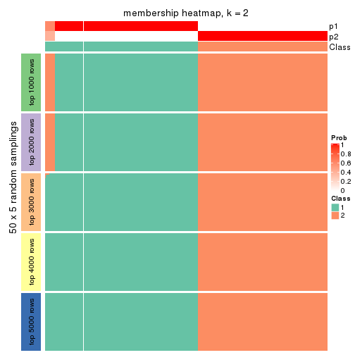</p>

</div>
<div id='tab-ATC-pam-membership-heatmap-2'>
<pre><code class="r">membership_heatmap(res, k = 3)
</code></pre>

<p></p>

</div>
<div id='tab-ATC-pam-membership-heatmap-3'>
<pre><code class="r">membership_heatmap(res, k = 4)
</code></pre>

<p></p>

</div>
<div id='tab-ATC-pam-membership-heatmap-4'>
<pre><code class="r">membership_heatmap(res, k = 5)
</code></pre>

<p></p>

</div>
<div id='tab-ATC-pam-membership-heatmap-5'>
<pre><code class="r">membership_heatmap(res, k = 6)
</code></pre>

<p></p>

</div>
</div>

As soon as we have had the classes for columns, we can look for signatures
which are significantly different between classes which can be candidate marks
for certain classes. Following are the heatmaps for signatures.


Signature heatmaps where rows are scaled:


<script>
$( function() {
	$( '#tabs-ATC-pam-get-signatures' ).tabs();
} );
</script>
<div id='tabs-ATC-pam-get-signatures'>
<ul>
<li><a href='#tab-ATC-pam-get-signatures-1'>k = 2</a></li>
<li><a href='#tab-ATC-pam-get-signatures-2'>k = 3</a></li>
<li><a href='#tab-ATC-pam-get-signatures-3'>k = 4</a></li>
<li><a href='#tab-ATC-pam-get-signatures-4'>k = 5</a></li>
<li><a href='#tab-ATC-pam-get-signatures-5'>k = 6</a></li>
</ul>
<div id='tab-ATC-pam-get-signatures-1'>
<pre><code class="r">get_signatures(res, k = 2)
</code></pre>

<p></p>

</div>
<div id='tab-ATC-pam-get-signatures-2'>
<pre><code class="r">get_signatures(res, k = 3)
</code></pre>

<p></p>

</div>
<div id='tab-ATC-pam-get-signatures-3'>
<pre><code class="r">get_signatures(res, k = 4)
</code></pre>

<p></p>

</div>
<div id='tab-ATC-pam-get-signatures-4'>
<pre><code class="r">get_signatures(res, k = 5)
</code></pre>

<p></p>

</div>
<div id='tab-ATC-pam-get-signatures-5'>
<pre><code class="r">get_signatures(res, k = 6)
</code></pre>

<p></p>

</div>
</div>


Signature heatmaps where rows are not scaled:


<script>
$( function() {
	$( '#tabs-ATC-pam-get-signatures-no-scale' ).tabs();
} );
</script>
<div id='tabs-ATC-pam-get-signatures-no-scale'>
<ul>
<li><a href='#tab-ATC-pam-get-signatures-no-scale-1'>k = 2</a></li>
<li><a href='#tab-ATC-pam-get-signatures-no-scale-2'>k = 3</a></li>
<li><a href='#tab-ATC-pam-get-signatures-no-scale-3'>k = 4</a></li>
<li><a href='#tab-ATC-pam-get-signatures-no-scale-4'>k = 5</a></li>
<li><a href='#tab-ATC-pam-get-signatures-no-scale-5'>k = 6</a></li>
</ul>
<div id='tab-ATC-pam-get-signatures-no-scale-1'>
<pre><code class="r">get_signatures(res, k = 2, scale_rows = FALSE)
</code></pre>

<p></p>

</div>
<div id='tab-ATC-pam-get-signatures-no-scale-2'>
<pre><code class="r">get_signatures(res, k = 3, scale_rows = FALSE)
</code></pre>

<p></p>

</div>
<div id='tab-ATC-pam-get-signatures-no-scale-3'>
<pre><code class="r">get_signatures(res, k = 4, scale_rows = FALSE)
</code></pre>

<p></p>

</div>
<div id='tab-ATC-pam-get-signatures-no-scale-4'>
<pre><code class="r">get_signatures(res, k = 5, scale_rows = FALSE)
</code></pre>

<p></p>

</div>
<div id='tab-ATC-pam-get-signatures-no-scale-5'>
<pre><code class="r">get_signatures(res, k = 6, scale_rows = FALSE)
</code></pre>

<p></p>

</div>
</div>


Compare the overlap of signatures from different k:

```r
compare_signatures(res)
```


`get_signature()` returns a data frame invisibly. TO get the list of signatures, the function
call should be assigned to a variable explicitly. In following code, if `plot` argument is set
to `FALSE`, no heatmap is plotted while only the differential analysis is performed.

```r
# code only for demonstration
tb = get_signature(res, k = ..., plot = FALSE)
```

An example of the output of `tb` is:

```
#>   which_row         fdr    mean_1    mean_2 scaled_mean_1 scaled_mean_2 km
#> 1        38 0.042760348  8.373488  9.131774    -0.5533452     0.5164555  1
#> 2        40 0.018707592  7.106213  8.469186    -0.6173731     0.5762149  1
#> 3        55 0.019134737 10.221463 11.207825    -0.6159697     0.5749050  1
#> 4        59 0.006059896  5.921854  7.869574    -0.6899429     0.6439467  1
#> 5        60 0.018055526  8.928898 10.211722    -0.6204761     0.5791110  1
#> 6        98 0.009384629 15.714769 14.887706     0.6635654    -0.6193277  2
...
```

The columns in `tb` are:

1. `which_row`: row indices corresponding to the input matrix.
2. `fdr`: FDR for the differential test. 
3. `mean_x`: The mean value in group x.
4. `scaled_mean_x`: The mean value in group x after rows are scaled.
5. `km`: Row groups if k-means clustering is applied to rows.


UMAP plot which shows how samples are separated.


<script>
$( function() {
	$( '#tabs-ATC-pam-dimension-reduction' ).tabs();
} );
</script>
<div id='tabs-ATC-pam-dimension-reduction'>
<ul>
<li><a href='#tab-ATC-pam-dimension-reduction-1'>k = 2</a></li>
<li><a href='#tab-ATC-pam-dimension-reduction-2'>k = 3</a></li>
<li><a href='#tab-ATC-pam-dimension-reduction-3'>k = 4</a></li>
<li><a href='#tab-ATC-pam-dimension-reduction-4'>k = 5</a></li>
<li><a href='#tab-ATC-pam-dimension-reduction-5'>k = 6</a></li>
</ul>
<div id='tab-ATC-pam-dimension-reduction-1'>
<pre><code class="r">dimension_reduction(res, k = 2, method = &quot;UMAP&quot;)
</code></pre>

<p></p>

</div>
<div id='tab-ATC-pam-dimension-reduction-2'>
<pre><code class="r">dimension_reduction(res, k = 3, method = &quot;UMAP&quot;)
</code></pre>

<p></p>

</div>
<div id='tab-ATC-pam-dimension-reduction-3'>
<pre><code class="r">dimension_reduction(res, k = 4, method = &quot;UMAP&quot;)
</code></pre>

<p></p>

</div>
<div id='tab-ATC-pam-dimension-reduction-4'>
<pre><code class="r">dimension_reduction(res, k = 5, method = &quot;UMAP&quot;)
</code></pre>

<p></p>

</div>
<div id='tab-ATC-pam-dimension-reduction-5'>
<pre><code class="r">dimension_reduction(res, k = 6, method = &quot;UMAP&quot;)
</code></pre>

<p></p>

</div>
</div>


Following heatmap shows how subgroups are split when increasing `k`:

```r
collect_classes(res)
```


If matrix rows can be associated to genes, consider to use `GO_Enrichment(res,
...)` to perform function enrichment for the signature genes.


 

---------------------------------------------------


### ATC:mclust**


The object with results only for a single top-value method and a single partition method 
can be extracted as:

```r
res = res_list["ATC", "mclust"]
# you can also extract it by
# res = res_list["ATC:mclust"]
```

A summary of `res` and all the functions that can be applied to it:

```r
res
```

```
#> A 'ConsensusPartition' object with k = 2, 3, 4, 5, 6.
#>   On a matrix with 17245 rows and 418 columns.
#>   Top rows (1000, 2000, 3000, 4000, 5000) are extracted by 'ATC' method.
#>   Subgroups are detected by 'mclust' method.
#>   Performed in total 1250 partitions by row resampling.
#>   Best k for subgroups seems to be 2.
#> 
#> Following methods can be applied to this 'ConsensusPartition' object:
#>  [1] "cola_report"             "collect_classes"         "collect_plots"          
#>  [4] "collect_stats"           "colnames"                "compare_signatures"     
#>  [7] "consensus_heatmap"       "dimension_reduction"     "functional_enrichment"  
#> [10] "get_anno_col"            "get_anno"                "get_classes"            
#> [13] "get_consensus"           "get_matrix"              "get_membership"         
#> [16] "get_param"               "get_signatures"          "get_stats"              
#> [19] "is_best_k"               "is_stable_k"             "membership_heatmap"     
#> [22] "ncol"                    "nrow"                    "plot_ecdf"              
#> [25] "rownames"                "select_partition_number" "show"                   
#> [28] "suggest_best_k"          "test_to_known_factors"
```

`collect_plots()` function collects all the plots made from `res` for all `k` (number of partitions)
into one single page to provide an easy and fast comparison between different `k`.

```r
collect_plots(res)
```


The plots are:

- The first row: a plot of the ECDF (Empirical cumulative distribution
  function) curves of the consensus matrix for each `k` and the heatmap of
  predicted classes for each `k`.
- The second row: heatmaps of the consensus matrix for each `k`.
- The third row: heatmaps of the membership matrix for each `k`.
- The fouth row: heatmaps of the signatures for each `k`.

All the plots in panels can be made by individual functions and they are
plotted later in this section.

`select_partition_number()` produces several plots showing different
statistics for choosing "optimized" `k`. There are following statistics:

- ECDF curves of the consensus matrix for each `k`;
- 1-PAC. [The PAC
  score](https://en.wikipedia.org/wiki/Consensus_clustering#Over-interpretation_potential_of_consensus_clustering)
  measures the proportion of the ambiguous subgrouping.
- Mean silhouette score.
- Concordance. The mean probability of fiting the consensus class ids in all
  partitions.
- Area increased. Denote $A_k$ as the area under the ECDF curve for current
  `k`, the area increased is defined as $A_k - A_{k-1}$.
- Rand index. The percent of pairs of samples that are both in a same cluster
  or both are not in a same cluster in the partition of k and k-1.
- Jaccard index. The ratio of pairs of samples are both in a same cluster in
  the partition of k and k-1 and the pairs of samples are both in a same
  cluster in the partition k or k-1.

The detailed explanations of these statistics can be found in [the cola
vignette](http://bioconductor.org/packages/devel/bioc/vignettes/cola/inst/doc/cola.html#toc_13).

Generally speaking, lower PAC score, higher mean silhouette score or higher
concordance corresponds to better partition. Rand index and Jaccard index
measure how similar the current partition is compared to partition with `k-1`.
If they are too similar, we won't accept `k` is better than `k-1`.

```r
select_partition_number(res)
```


The numeric values for all these statistics can be obtained by `get_stats()`.

```r
get_stats(res)
```

```
#>   k 1-PAC mean_silhouette concordance area_increased  Rand Jaccard
#> 2 2 1.000           0.977       0.992         0.3764 0.633   0.633
#> 3 3 0.710           0.759       0.897         0.6344 0.722   0.561
#> 4 4 0.663           0.802       0.860         0.1589 0.827   0.571
#> 5 5 0.718           0.790       0.836         0.0489 0.892   0.653
#> 6 6 0.765           0.811       0.860         0.0683 0.965   0.852
```

`suggest_best_k()` suggests the best $k$ based on these statistics. The rules are as follows:

- All $k$ with Jaccard index larger than 0.95 are removed because the increase of
  the partition number does not provides enough extra information. If all $k$ are removed,
  the best $k$ is assigned by `NA`.
- For $k$ with 1-PAC larger than 0.9, the maximal $k$ is taken as the "best k". Other $k$ is called "optional k".
- If it does not fit the second rule. The $k$ with the highest vote of highest
  1-PAC, mean silhouette and concordance is taken as the "best k".

```r
suggest_best_k(res)
```

```
#> [1] 2
```


Following shows the table of the partitions (You need to click the **show/hide
code output** link to see it). The membership matrix (columns with name `p*`)
is inferred by
[`clue::cl_consensus()`](https://www.rdocumentation.org/link/cl_consensus?package=clue)
function with the `SE` method. Basically the value in the membership matrix
represents the probability to belong to a certain group. The finall class
label for an item is determined with the group with highest probability it
belongs to.

In `get_classes()` function, the entropy is calculated from the membership
matrix and the silhouette score is calculated from the consensus matrix.


<script>
$( function() {
	$( '#tabs-ATC-mclust-get-classes' ).tabs();
} );
</script>
<div id='tabs-ATC-mclust-get-classes'>
<ul>
<li><a href='#tab-ATC-mclust-get-classes-1'>k = 2</a></li>
<li><a href='#tab-ATC-mclust-get-classes-2'>k = 3</a></li>
<li><a href='#tab-ATC-mclust-get-classes-3'>k = 4</a></li>
<li><a href='#tab-ATC-mclust-get-classes-4'>k = 5</a></li>
<li><a href='#tab-ATC-mclust-get-classes-5'>k = 6</a></li>
</ul>

<div id='tab-ATC-mclust-get-classes-1'>
<p><a id='tab-ATC-mclust-get-classes-1-a' style='color:#0366d6' href='#'>show/hide code output</a></p>
<pre><code class="r">cbind(get_classes(res, k = 2), get_membership(res, k = 2))
</code></pre>

<pre><code>#&gt;           class entropy silhouette   p1   p2
#&gt; SRR902920     1    0.00      1.000 1.00 0.00
#&gt; SRR902921     1    0.00      1.000 1.00 0.00
#&gt; SRR902922     1    0.00      1.000 1.00 0.00
#&gt; SRR902923     1    0.00      1.000 1.00 0.00
#&gt; SRR902924     1    0.00      1.000 1.00 0.00
#&gt; SRR902925     1    0.00      1.000 1.00 0.00
#&gt; SRR902926     1    0.00      1.000 1.00 0.00
#&gt; SRR902927     1    0.00      1.000 1.00 0.00
#&gt; SRR902928     1    0.00      1.000 1.00 0.00
#&gt; SRR902929     1    0.00      1.000 1.00 0.00
#&gt; SRR902930     1    0.00      1.000 1.00 0.00
#&gt; SRR902931     1    0.00      1.000 1.00 0.00
#&gt; SRR902932     2    0.00      0.989 0.00 1.00
#&gt; SRR902933     2    0.00      0.989 0.00 1.00
#&gt; SRR902934     2    0.00      0.989 0.00 1.00
#&gt; SRR902935     2    0.00      0.989 0.00 1.00
#&gt; SRR902936     2    0.00      0.989 0.00 1.00
#&gt; SRR902937     2    0.00      0.989 0.00 1.00
#&gt; SRR902938     2    0.00      0.989 0.00 1.00
#&gt; SRR902939     2    0.00      0.989 0.00 1.00
#&gt; SRR902940     2    0.00      0.989 0.00 1.00
#&gt; SRR902941     2    0.00      0.989 0.00 1.00
#&gt; SRR902942     1    0.00      1.000 1.00 0.00
#&gt; SRR902943     1    0.00      1.000 1.00 0.00
#&gt; SRR902944     1    0.00      1.000 1.00 0.00
#&gt; SRR902945     1    0.00      1.000 1.00 0.00
#&gt; SRR902946     1    0.00      1.000 1.00 0.00
#&gt; SRR902947     1    0.00      1.000 1.00 0.00
#&gt; SRR902954     1    0.00      1.000 1.00 0.00
#&gt; SRR902955     1    0.00      1.000 1.00 0.00
#&gt; SRR902956     1    0.00      1.000 1.00 0.00
#&gt; SRR902957     1    0.00      1.000 1.00 0.00
#&gt; SRR902958     1    0.00      1.000 1.00 0.00
#&gt; SRR902959     1    0.00      1.000 1.00 0.00
#&gt; SRR902948     1    0.00      1.000 1.00 0.00
#&gt; SRR902949     1    0.00      1.000 1.00 0.00
#&gt; SRR902950     1    0.00      1.000 1.00 0.00
#&gt; SRR902951     1    0.00      1.000 1.00 0.00
#&gt; SRR902952     1    0.00      1.000 1.00 0.00
#&gt; SRR902953     1    0.00      1.000 1.00 0.00
#&gt; SRR902960     1    0.00      1.000 1.00 0.00
#&gt; SRR902961     1    0.00      1.000 1.00 0.00
#&gt; SRR902962     1    0.00      1.000 1.00 0.00
#&gt; SRR902963     1    0.00      1.000 1.00 0.00
#&gt; SRR902964     1    0.00      1.000 1.00 0.00
#&gt; SRR902965     1    0.00      1.000 1.00 0.00
#&gt; SRR902966     1    0.00      1.000 1.00 0.00
#&gt; SRR902967     1    0.00      1.000 1.00 0.00
#&gt; SRR902968     1    0.00      1.000 1.00 0.00
#&gt; SRR902969     1    0.00      1.000 1.00 0.00
#&gt; SRR902970     1    0.00      1.000 1.00 0.00
#&gt; SRR902971     1    0.00      1.000 1.00 0.00
#&gt; SRR902972     1    0.00      1.000 1.00 0.00
#&gt; SRR902973     1    0.00      1.000 1.00 0.00
#&gt; SRR902974     1    0.00      1.000 1.00 0.00
#&gt; SRR902975     1    0.00      1.000 1.00 0.00
#&gt; SRR902976     1    0.00      1.000 1.00 0.00
#&gt; SRR902977     1    0.00      1.000 1.00 0.00
#&gt; SRR902978     1    0.00      1.000 1.00 0.00
#&gt; SRR902980     1    0.00      1.000 1.00 0.00
#&gt; SRR902981     1    0.00      1.000 1.00 0.00
#&gt; SRR902982     1    0.00      1.000 1.00 0.00
#&gt; SRR902983     1    0.00      1.000 1.00 0.00
#&gt; SRR902984     1    0.00      1.000 1.00 0.00
#&gt; SRR902985     1    0.00      1.000 1.00 0.00
#&gt; SRR902986     1    0.00      1.000 1.00 0.00
#&gt; SRR902987     1    0.00      1.000 1.00 0.00
#&gt; SRR902988     1    0.00      1.000 1.00 0.00
#&gt; SRR902989     1    0.00      1.000 1.00 0.00
#&gt; SRR902990     1    0.00      1.000 1.00 0.00
#&gt; SRR902991     1    0.00      1.000 1.00 0.00
#&gt; SRR902992     1    0.00      1.000 1.00 0.00
#&gt; SRR902993     1    0.00      1.000 1.00 0.00
#&gt; SRR902994     1    0.00      1.000 1.00 0.00
#&gt; SRR902995     1    0.00      1.000 1.00 0.00
#&gt; SRR902996     2    0.00      0.989 0.00 1.00
#&gt; SRR902997     2    0.00      0.989 0.00 1.00
#&gt; SRR902998     2    0.00      0.989 0.00 1.00
#&gt; SRR902999     2    0.00      0.989 0.00 1.00
#&gt; SRR903000     2    0.00      0.989 0.00 1.00
#&gt; SRR903001     2    0.00      0.989 0.00 1.00
#&gt; SRR903008     2    0.00      0.989 0.00 1.00
#&gt; SRR903009     2    0.00      0.989 0.00 1.00
#&gt; SRR903010     2    0.00      0.989 0.00 1.00
#&gt; SRR903011     2    0.00      0.989 0.00 1.00
#&gt; SRR903012     2    0.00      0.989 0.00 1.00
#&gt; SRR903013     2    0.00      0.989 0.00 1.00
#&gt; SRR903002     2    0.00      0.989 0.00 1.00
#&gt; SRR903003     2    0.00      0.989 0.00 1.00
#&gt; SRR903004     2    0.00      0.989 0.00 1.00
#&gt; SRR903005     2    0.00      0.989 0.00 1.00
#&gt; SRR903006     2    0.00      0.989 0.00 1.00
#&gt; SRR903007     2    0.00      0.989 0.00 1.00
#&gt; SRR903014     1    0.00      1.000 1.00 0.00
#&gt; SRR903015     1    0.00      1.000 1.00 0.00
#&gt; SRR903016     1    0.00      1.000 1.00 0.00
#&gt; SRR903017     1    0.00      1.000 1.00 0.00
#&gt; SRR903018     1    0.00      1.000 1.00 0.00
#&gt; SRR903019     1    0.00      1.000 1.00 0.00
#&gt; SRR903020     1    0.00      1.000 1.00 0.00
#&gt; SRR903021     1    0.00      1.000 1.00 0.00
#&gt; SRR903022     1    0.00      1.000 1.00 0.00
#&gt; SRR903023     1    0.00      1.000 1.00 0.00
#&gt; SRR903024     1    0.00      1.000 1.00 0.00
#&gt; SRR903025     1    0.00      1.000 1.00 0.00
#&gt; SRR903026     1    0.00      1.000 1.00 0.00
#&gt; SRR903027     1    0.00      1.000 1.00 0.00
#&gt; SRR903028     1    0.00      1.000 1.00 0.00
#&gt; SRR903029     1    0.00      1.000 1.00 0.00
#&gt; SRR903030     1    0.00      1.000 1.00 0.00
#&gt; SRR903031     1    0.00      1.000 1.00 0.00
#&gt; SRR903032     2    0.00      0.989 0.00 1.00
#&gt; SRR903033     2    0.00      0.989 0.00 1.00
#&gt; SRR903034     2    0.00      0.989 0.00 1.00
#&gt; SRR903035     2    0.00      0.989 0.00 1.00
#&gt; SRR903036     2    0.00      0.989 0.00 1.00
#&gt; SRR903037     2    0.00      0.989 0.00 1.00
#&gt; SRR903038     2    0.00      0.989 0.00 1.00
#&gt; SRR903039     2    0.00      0.989 0.00 1.00
#&gt; SRR903040     2    0.00      0.989 0.00 1.00
#&gt; SRR903041     2    0.00      0.989 0.00 1.00
#&gt; SRR903042     2    0.00      0.989 0.00 1.00
#&gt; SRR903043     2    0.00      0.989 0.00 1.00
#&gt; SRR903044     2    0.00      0.989 0.00 1.00
#&gt; SRR903045     2    0.00      0.989 0.00 1.00
#&gt; SRR903046     2    0.00      0.989 0.00 1.00
#&gt; SRR903047     2    0.00      0.989 0.00 1.00
#&gt; SRR903048     2    0.00      0.989 0.00 1.00
#&gt; SRR903049     2    0.00      0.989 0.00 1.00
#&gt; SRR903050     2    0.00      0.989 0.00 1.00
#&gt; SRR903051     2    0.00      0.989 0.00 1.00
#&gt; SRR903052     2    0.00      0.989 0.00 1.00
#&gt; SRR903053     2    0.00      0.989 0.00 1.00
#&gt; SRR903054     2    0.00      0.989 0.00 1.00
#&gt; SRR903055     2    0.00      0.989 0.00 1.00
#&gt; SRR903056     2    0.00      0.989 0.00 1.00
#&gt; SRR903057     2    0.00      0.989 0.00 1.00
#&gt; SRR903058     2    0.00      0.989 0.00 1.00
#&gt; SRR903059     2    0.00      0.989 0.00 1.00
#&gt; SRR903060     2    0.00      0.989 0.00 1.00
#&gt; SRR903061     2    0.00      0.989 0.00 1.00
#&gt; SRR903062     2    0.00      0.989 0.00 1.00
#&gt; SRR903063     2    0.00      0.989 0.00 1.00
#&gt; SRR903064     2    0.00      0.989 0.00 1.00
#&gt; SRR903065     2    0.00      0.989 0.00 1.00
#&gt; SRR903066     2    0.00      0.989 0.00 1.00
#&gt; SRR903067     2    0.00      0.989 0.00 1.00
#&gt; SRR903068     2    0.00      0.989 0.00 1.00
#&gt; SRR903069     2    0.00      0.989 0.00 1.00
#&gt; SRR903070     2    0.00      0.989 0.00 1.00
#&gt; SRR903071     2    0.00      0.989 0.00 1.00
#&gt; SRR903072     2    0.00      0.989 0.00 1.00
#&gt; SRR903073     2    0.00      0.989 0.00 1.00
#&gt; SRR903074     2    0.00      0.989 0.00 1.00
#&gt; SRR903075     2    0.00      0.989 0.00 1.00
#&gt; SRR903076     2    0.00      0.989 0.00 1.00
#&gt; SRR903077     2    0.00      0.989 0.00 1.00
#&gt; SRR903078     2    0.00      0.989 0.00 1.00
#&gt; SRR903079     2    0.00      0.989 0.00 1.00
#&gt; SRR903080     2    0.00      0.989 0.00 1.00
#&gt; SRR903081     2    0.00      0.989 0.00 1.00
#&gt; SRR903082     2    0.00      0.989 0.00 1.00
#&gt; SRR903083     2    0.00      0.989 0.00 1.00
#&gt; SRR903084     2    0.00      0.989 0.00 1.00
#&gt; SRR903085     2    0.00      0.989 0.00 1.00
#&gt; SRR903086     2    0.00      0.989 0.00 1.00
#&gt; SRR903087     2    0.00      0.989 0.00 1.00
#&gt; SRR903088     2    0.00      0.989 0.00 1.00
#&gt; SRR903089     2    0.00      0.989 0.00 1.00
#&gt; SRR903090     2    0.00      0.989 0.00 1.00
#&gt; SRR903091     2    0.00      0.989 0.00 1.00
#&gt; SRR903092     2    0.00      0.989 0.00 1.00
#&gt; SRR903093     2    0.00      0.989 0.00 1.00
#&gt; SRR903094     2    0.00      0.989 0.00 1.00
#&gt; SRR903095     2    0.00      0.989 0.00 1.00
#&gt; SRR903096     2    0.00      0.989 0.00 1.00
#&gt; SRR903097     2    0.00      0.989 0.00 1.00
#&gt; SRR903098     2    0.00      0.989 0.00 1.00
#&gt; SRR903099     2    0.00      0.989 0.00 1.00
#&gt; SRR903100     2    0.00      0.989 0.00 1.00
#&gt; SRR903101     2    0.00      0.989 0.00 1.00
#&gt; SRR903102     2    0.00      0.989 0.00 1.00
#&gt; SRR903103     2    0.00      0.989 0.00 1.00
#&gt; SRR903104     2    0.00      0.989 0.00 1.00
#&gt; SRR903105     2    0.00      0.989 0.00 1.00
#&gt; SRR903106     2    0.00      0.989 0.00 1.00
#&gt; SRR903107     2    0.00      0.989 0.00 1.00
#&gt; SRR903108     2    0.00      0.989 0.00 1.00
#&gt; SRR903109     2    0.00      0.989 0.00 1.00
#&gt; SRR903110     2    0.00      0.989 0.00 1.00
#&gt; SRR903111     2    0.00      0.989 0.00 1.00
#&gt; SRR903112     2    0.00      0.989 0.00 1.00
#&gt; SRR903113     2    0.00      0.989 0.00 1.00
#&gt; SRR903114     2    0.00      0.989 0.00 1.00
#&gt; SRR903115     2    0.00      0.989 0.00 1.00
#&gt; SRR903116     2    0.00      0.989 0.00 1.00
#&gt; SRR903117     2    0.00      0.989 0.00 1.00
#&gt; SRR903118     2    0.00      0.989 0.00 1.00
#&gt; SRR903119     2    0.00      0.989 0.00 1.00
#&gt; SRR903121     2    0.00      0.989 0.00 1.00
#&gt; SRR903122     2    0.00      0.989 0.00 1.00
#&gt; SRR903124     2    0.00      0.989 0.00 1.00
#&gt; SRR903125     2    0.00      0.989 0.00 1.00
#&gt; SRR903126     2    0.00      0.989 0.00 1.00
#&gt; SRR903127     2    0.00      0.989 0.00 1.00
#&gt; SRR903128     2    0.00      0.989 0.00 1.00
#&gt; SRR903129     2    0.00      0.989 0.00 1.00
#&gt; SRR903130     2    0.00      0.989 0.00 1.00
#&gt; SRR903131     2    0.00      0.989 0.00 1.00
#&gt; SRR903132     2    0.00      0.989 0.00 1.00
#&gt; SRR903133     2    0.00      0.989 0.00 1.00
#&gt; SRR903134     2    0.00      0.989 0.00 1.00
#&gt; SRR903135     2    0.00      0.989 0.00 1.00
#&gt; SRR903136     2    0.00      0.989 0.00 1.00
#&gt; SRR903137     2    0.00      0.989 0.00 1.00
#&gt; SRR903146     2    0.00      0.989 0.00 1.00
#&gt; SRR903147     2    0.00      0.989 0.00 1.00
#&gt; SRR903148     2    0.00      0.989 0.00 1.00
#&gt; SRR903149     2    0.00      0.989 0.00 1.00
#&gt; SRR903150     2    0.00      0.989 0.00 1.00
#&gt; SRR903151     2    0.00      0.989 0.00 1.00
#&gt; SRR903152     2    0.00      0.989 0.00 1.00
#&gt; SRR903153     2    0.00      0.989 0.00 1.00
#&gt; SRR903138     2    0.00      0.989 0.00 1.00
#&gt; SRR903139     2    0.00      0.989 0.00 1.00
#&gt; SRR903140     2    0.00      0.989 0.00 1.00
#&gt; SRR903141     2    0.00      0.989 0.00 1.00
#&gt; SRR903142     2    0.00      0.989 0.00 1.00
#&gt; SRR903143     2    0.00      0.989 0.00 1.00
#&gt; SRR903144     2    0.00      0.989 0.00 1.00
#&gt; SRR903145     2    0.00      0.989 0.00 1.00
#&gt; SRR903154     2    0.00      0.989 0.00 1.00
#&gt; SRR903155     2    0.00      0.989 0.00 1.00
#&gt; SRR903156     2    0.00      0.989 0.00 1.00
#&gt; SRR903157     2    0.00      0.989 0.00 1.00
#&gt; SRR903158     2    0.00      0.989 0.00 1.00
#&gt; SRR903159     2    0.00      0.989 0.00 1.00
#&gt; SRR903160     2    0.00      0.989 0.00 1.00
#&gt; SRR903161     2    0.00      0.989 0.00 1.00
#&gt; SRR903162     2    0.00      0.989 0.00 1.00
#&gt; SRR903163     2    0.00      0.989 0.00 1.00
#&gt; SRR903164     2    0.00      0.989 0.00 1.00
#&gt; SRR903165     2    0.00      0.989 0.00 1.00
#&gt; SRR903166     2    0.00      0.989 0.00 1.00
#&gt; SRR903167     2    0.00      0.989 0.00 1.00
#&gt; SRR903168     2    0.00      0.989 0.00 1.00
#&gt; SRR903169     2    0.00      0.989 0.00 1.00
#&gt; SRR903178     2    0.99      0.232 0.44 0.56
#&gt; SRR903179     2    0.99      0.232 0.44 0.56
#&gt; SRR903180     2    0.99      0.232 0.44 0.56
#&gt; SRR903181     2    0.99      0.232 0.44 0.56
#&gt; SRR903182     2    0.99      0.232 0.44 0.56
#&gt; SRR903183     2    0.99      0.232 0.44 0.56
#&gt; SRR903184     2    0.99      0.232 0.44 0.56
#&gt; SRR903185     2    0.99      0.232 0.44 0.56
#&gt; SRR903170     2    0.00      0.989 0.00 1.00
#&gt; SRR903171     2    0.00      0.989 0.00 1.00
#&gt; SRR903172     2    0.00      0.989 0.00 1.00
#&gt; SRR903173     2    0.00      0.989 0.00 1.00
#&gt; SRR903174     2    0.00      0.989 0.00 1.00
#&gt; SRR903175     2    0.00      0.989 0.00 1.00
#&gt; SRR903176     2    0.00      0.989 0.00 1.00
#&gt; SRR903177     2    0.00      0.989 0.00 1.00
#&gt; SRR903186     2    0.00      0.989 0.00 1.00
#&gt; SRR903187     2    0.00      0.989 0.00 1.00
#&gt; SRR903188     2    0.00      0.989 0.00 1.00
#&gt; SRR903189     2    0.00      0.989 0.00 1.00
#&gt; SRR903190     2    0.00      0.989 0.00 1.00
#&gt; SRR903191     2    0.00      0.989 0.00 1.00
#&gt; SRR903192     2    0.00      0.989 0.00 1.00
#&gt; SRR903193     2    0.00      0.989 0.00 1.00
#&gt; SRR903194     2    0.00      0.989 0.00 1.00
#&gt; SRR903195     2    0.00      0.989 0.00 1.00
#&gt; SRR903196     2    0.00      0.989 0.00 1.00
#&gt; SRR903197     2    0.00      0.989 0.00 1.00
#&gt; SRR903198     2    0.00      0.989 0.00 1.00
#&gt; SRR903199     2    0.00      0.989 0.00 1.00
#&gt; SRR903200     2    0.00      0.989 0.00 1.00
#&gt; SRR903201     2    0.00      0.989 0.00 1.00
#&gt; SRR903210     2    0.00      0.989 0.00 1.00
#&gt; SRR903211     2    0.00      0.989 0.00 1.00
#&gt; SRR903212     2    0.00      0.989 0.00 1.00
#&gt; SRR903213     2    0.00      0.989 0.00 1.00
#&gt; SRR903214     2    0.00      0.989 0.00 1.00
#&gt; SRR903215     2    0.00      0.989 0.00 1.00
#&gt; SRR903216     2    0.00      0.989 0.00 1.00
#&gt; SRR903217     2    0.00      0.989 0.00 1.00
#&gt; SRR903202     2    0.00      0.989 0.00 1.00
#&gt; SRR903203     2    0.00      0.989 0.00 1.00
#&gt; SRR903204     2    0.00      0.989 0.00 1.00
#&gt; SRR903205     2    0.00      0.989 0.00 1.00
#&gt; SRR903206     2    0.00      0.989 0.00 1.00
#&gt; SRR903207     2    0.00      0.989 0.00 1.00
#&gt; SRR903208     2    0.00      0.989 0.00 1.00
#&gt; SRR903209     2    0.00      0.989 0.00 1.00
#&gt; SRR903218     2    0.00      0.989 0.00 1.00
#&gt; SRR903219     2    0.00      0.989 0.00 1.00
#&gt; SRR903220     2    0.00      0.989 0.00 1.00
#&gt; SRR903221     2    0.00      0.989 0.00 1.00
#&gt; SRR903222     2    0.00      0.989 0.00 1.00
#&gt; SRR903223     2    0.00      0.989 0.00 1.00
#&gt; SRR903224     2    0.00      0.989 0.00 1.00
#&gt; SRR903225     2    0.00      0.989 0.00 1.00
#&gt; SRR903226     2    0.00      0.989 0.00 1.00
#&gt; SRR903227     2    0.00      0.989 0.00 1.00
#&gt; SRR903228     2    0.00      0.989 0.00 1.00
#&gt; SRR903229     2    0.00      0.989 0.00 1.00
#&gt; SRR903230     2    0.00      0.989 0.00 1.00
#&gt; SRR903231     2    0.00      0.989 0.00 1.00
#&gt; SRR903232     2    0.00      0.989 0.00 1.00
#&gt; SRR903233     2    0.00      0.989 0.00 1.00
#&gt; SRR903242     2    0.00      0.989 0.00 1.00
#&gt; SRR903243     2    0.00      0.989 0.00 1.00
#&gt; SRR903244     2    0.00      0.989 0.00 1.00
#&gt; SRR903245     2    0.00      0.989 0.00 1.00
#&gt; SRR903246     2    0.00      0.989 0.00 1.00
#&gt; SRR903247     2    0.00      0.989 0.00 1.00
#&gt; SRR903248     2    0.00      0.989 0.00 1.00
#&gt; SRR903249     2    0.00      0.989 0.00 1.00
#&gt; SRR903234     2    0.00      0.989 0.00 1.00
#&gt; SRR903235     2    0.00      0.989 0.00 1.00
#&gt; SRR903236     2    0.00      0.989 0.00 1.00
#&gt; SRR903237     2    0.00      0.989 0.00 1.00
#&gt; SRR903238     2    0.00      0.989 0.00 1.00
#&gt; SRR903239     2    0.00      0.989 0.00 1.00
#&gt; SRR903240     2    0.00      0.989 0.00 1.00
#&gt; SRR903241     2    0.00      0.989 0.00 1.00
#&gt; SRR903258     2    0.00      0.989 0.00 1.00
#&gt; SRR903259     2    0.00      0.989 0.00 1.00
#&gt; SRR903260     2    0.00      0.989 0.00 1.00
#&gt; SRR903261     2    0.00      0.989 0.00 1.00
#&gt; SRR903262     2    0.00      0.989 0.00 1.00
#&gt; SRR903263     2    0.00      0.989 0.00 1.00
#&gt; SRR903264     2    0.00      0.989 0.00 1.00
#&gt; SRR903265     2    0.00      0.989 0.00 1.00
#&gt; SRR903250     2    0.00      0.989 0.00 1.00
#&gt; SRR903251     2    0.00      0.989 0.00 1.00
#&gt; SRR903252     2    0.00      0.989 0.00 1.00
#&gt; SRR903253     2    0.00      0.989 0.00 1.00
#&gt; SRR903254     2    0.00      0.989 0.00 1.00
#&gt; SRR903255     2    0.00      0.989 0.00 1.00
#&gt; SRR903256     2    0.00      0.989 0.00 1.00
#&gt; SRR903257     2    0.00      0.989 0.00 1.00
#&gt; SRR903266     2    0.00      0.989 0.00 1.00
#&gt; SRR903267     2    0.00      0.989 0.00 1.00
#&gt; SRR903268     2    0.00      0.989 0.00 1.00
#&gt; SRR903270     2    0.00      0.989 0.00 1.00
#&gt; SRR903271     2    0.00      0.989 0.00 1.00
#&gt; SRR903272     2    0.00      0.989 0.00 1.00
#&gt; SRR903273     2    0.00      0.989 0.00 1.00
#&gt; SRR903274     2    0.00      0.989 0.00 1.00
#&gt; SRR903275     2    0.00      0.989 0.00 1.00
#&gt; SRR903276     2    0.00      0.989 0.00 1.00
#&gt; SRR903277     2    0.00      0.989 0.00 1.00
#&gt; SRR903278     2    0.00      0.989 0.00 1.00
#&gt; SRR903279     2    0.00      0.989 0.00 1.00
#&gt; SRR903280     2    0.00      0.989 0.00 1.00
#&gt; SRR903281     2    0.00      0.989 0.00 1.00
#&gt; SRR903282     2    0.00      0.989 0.00 1.00
#&gt; SRR903283     2    0.00      0.989 0.00 1.00
#&gt; SRR903284     2    0.00      0.989 0.00 1.00
#&gt; SRR903285     2    0.00      0.989 0.00 1.00
#&gt; SRR903286     2    0.00      0.989 0.00 1.00
#&gt; SRR903287     2    0.00      0.989 0.00 1.00
#&gt; SRR903288     2    0.00      0.989 0.00 1.00
#&gt; SRR903289     2    0.00      0.989 0.00 1.00
#&gt; SRR903290     2    0.00      0.989 0.00 1.00
#&gt; SRR903291     2    0.00      0.989 0.00 1.00
#&gt; SRR903292     2    0.00      0.989 0.00 1.00
#&gt; SRR903293     2    0.00      0.989 0.00 1.00
#&gt; SRR903294     2    0.00      0.989 0.00 1.00
#&gt; SRR903295     2    0.00      0.989 0.00 1.00
#&gt; SRR903296     2    0.00      0.989 0.00 1.00
#&gt; SRR903297     2    0.00      0.989 0.00 1.00
#&gt; SRR903298     2    0.00      0.989 0.00 1.00
#&gt; SRR903299     2    0.00      0.989 0.00 1.00
#&gt; SRR903300     2    0.00      0.989 0.00 1.00
#&gt; SRR903301     2    0.00      0.989 0.00 1.00
#&gt; SRR903302     2    0.00      0.989 0.00 1.00
#&gt; SRR903303     2    0.00      0.989 0.00 1.00
#&gt; SRR903304     2    0.00      0.989 0.00 1.00
#&gt; SRR903305     2    0.00      0.989 0.00 1.00
#&gt; SRR903306     1    0.00      1.000 1.00 0.00
#&gt; SRR903307     1    0.00      1.000 1.00 0.00
#&gt; SRR903308     1    0.00      1.000 1.00 0.00
#&gt; SRR903309     1    0.00      1.000 1.00 0.00
#&gt; SRR903310     1    0.00      1.000 1.00 0.00
#&gt; SRR903311     1    0.00      1.000 1.00 0.00
#&gt; SRR903312     1    0.00      1.000 1.00 0.00
#&gt; SRR903313     1    0.00      1.000 1.00 0.00
#&gt; SRR903314     1    0.00      1.000 1.00 0.00
#&gt; SRR903315     1    0.00      1.000 1.00 0.00
#&gt; SRR903316     1    0.00      1.000 1.00 0.00
#&gt; SRR903317     1    0.00      1.000 1.00 0.00
#&gt; SRR903318     1    0.00      1.000 1.00 0.00
#&gt; SRR903319     1    0.00      1.000 1.00 0.00
#&gt; SRR903320     1    0.00      1.000 1.00 0.00
#&gt; SRR903321     1    0.00      1.000 1.00 0.00
#&gt; SRR903322     1    0.00      1.000 1.00 0.00
#&gt; SRR903323     1    0.00      1.000 1.00 0.00
#&gt; SRR903324     2    0.00      0.989 0.00 1.00
#&gt; SRR903325     2    0.00      0.989 0.00 1.00
#&gt; SRR903326     2    0.00      0.989 0.00 1.00
#&gt; SRR903327     2    0.00      0.989 0.00 1.00
#&gt; SRR903328     2    0.00      0.989 0.00 1.00
#&gt; SRR903329     2    0.00      0.989 0.00 1.00
#&gt; SRR903330     2    0.00      0.989 0.00 1.00
#&gt; SRR903331     2    0.00      0.989 0.00 1.00
#&gt; SRR903332     2    0.00      0.989 0.00 1.00
#&gt; SRR903333     2    0.00      0.989 0.00 1.00
#&gt; SRR903334     2    0.00      0.989 0.00 1.00
#&gt; SRR903335     2    0.00      0.989 0.00 1.00
#&gt; SRR903336     2    0.00      0.989 0.00 1.00
#&gt; SRR903337     2    0.00      0.989 0.00 1.00
#&gt; SRR903338     2    0.00      0.989 0.00 1.00
#&gt; SRR903339     2    0.00      0.989 0.00 1.00
#&gt; SRR903340     2    0.00      0.989 0.00 1.00
#&gt; SRR903341     2    0.00      0.989 0.00 1.00
</code></pre>

<script>
$('#tab-ATC-mclust-get-classes-1-a').parent().next().next().hide();
$('#tab-ATC-mclust-get-classes-1-a').click(function(){
  $('#tab-ATC-mclust-get-classes-1-a').parent().next().next().toggle();
  return(false);
});
</script>
</div>

<div id='tab-ATC-mclust-get-classes-2'>
<p><a id='tab-ATC-mclust-get-classes-2-a' style='color:#0366d6' href='#'>show/hide code output</a></p>
<pre><code class="r">cbind(get_classes(res, k = 3), get_membership(res, k = 3))
</code></pre>

<pre><code>#&gt;           class entropy silhouette    p1    p2  p3
#&gt; SRR902920     3   0.000     1.0000 0.000 0.000 1.0
#&gt; SRR902921     3   0.000     1.0000 0.000 0.000 1.0
#&gt; SRR902922     3   0.000     1.0000 0.000 0.000 1.0
#&gt; SRR902923     3   0.000     1.0000 0.000 0.000 1.0
#&gt; SRR902924     3   0.000     1.0000 0.000 0.000 1.0
#&gt; SRR902925     3   0.000     1.0000 0.000 0.000 1.0
#&gt; SRR902926     3   0.000     1.0000 0.000 0.000 1.0
#&gt; SRR902927     3   0.000     1.0000 0.000 0.000 1.0
#&gt; SRR902928     3   0.000     1.0000 0.000 0.000 1.0
#&gt; SRR902929     3   0.000     1.0000 0.000 0.000 1.0
#&gt; SRR902930     3   0.000     1.0000 0.000 0.000 1.0
#&gt; SRR902931     3   0.000     1.0000 0.000 0.000 1.0
#&gt; SRR902932     2   0.000     0.7395 0.000 1.000 0.0
#&gt; SRR902933     2   0.000     0.7395 0.000 1.000 0.0
#&gt; SRR902934     2   0.000     0.7395 0.000 1.000 0.0
#&gt; SRR902935     2   0.000     0.7395 0.000 1.000 0.0
#&gt; SRR902936     2   0.000     0.7395 0.000 1.000 0.0
#&gt; SRR902937     2   0.000     0.7395 0.000 1.000 0.0
#&gt; SRR902938     2   0.000     0.7395 0.000 1.000 0.0
#&gt; SRR902939     2   0.000     0.7395 0.000 1.000 0.0
#&gt; SRR902940     2   0.000     0.7395 0.000 1.000 0.0
#&gt; SRR902941     2   0.000     0.7395 0.000 1.000 0.0
#&gt; SRR902942     3   0.000     1.0000 0.000 0.000 1.0
#&gt; SRR902943     3   0.000     1.0000 0.000 0.000 1.0
#&gt; SRR902944     3   0.000     1.0000 0.000 0.000 1.0
#&gt; SRR902945     3   0.000     1.0000 0.000 0.000 1.0
#&gt; SRR902946     3   0.000     1.0000 0.000 0.000 1.0
#&gt; SRR902947     3   0.000     1.0000 0.000 0.000 1.0
#&gt; SRR902954     3   0.000     1.0000 0.000 0.000 1.0
#&gt; SRR902955     3   0.000     1.0000 0.000 0.000 1.0
#&gt; SRR902956     3   0.000     1.0000 0.000 0.000 1.0
#&gt; SRR902957     3   0.000     1.0000 0.000 0.000 1.0
#&gt; SRR902958     3   0.000     1.0000 0.000 0.000 1.0
#&gt; SRR902959     3   0.000     1.0000 0.000 0.000 1.0
#&gt; SRR902948     3   0.000     1.0000 0.000 0.000 1.0
#&gt; SRR902949     3   0.000     1.0000 0.000 0.000 1.0
#&gt; SRR902950     3   0.000     1.0000 0.000 0.000 1.0
#&gt; SRR902951     3   0.000     1.0000 0.000 0.000 1.0
#&gt; SRR902952     3   0.000     1.0000 0.000 0.000 1.0
#&gt; SRR902953     3   0.000     1.0000 0.000 0.000 1.0
#&gt; SRR902960     3   0.000     1.0000 0.000 0.000 1.0
#&gt; SRR902961     3   0.000     1.0000 0.000 0.000 1.0
#&gt; SRR902962     3   0.000     1.0000 0.000 0.000 1.0
#&gt; SRR902963     3   0.000     1.0000 0.000 0.000 1.0
#&gt; SRR902964     3   0.000     1.0000 0.000 0.000 1.0
#&gt; SRR902965     3   0.000     1.0000 0.000 0.000 1.0
#&gt; SRR902966     3   0.000     1.0000 0.000 0.000 1.0
#&gt; SRR902967     3   0.000     1.0000 0.000 0.000 1.0
#&gt; SRR902968     3   0.000     1.0000 0.000 0.000 1.0
#&gt; SRR902969     3   0.000     1.0000 0.000 0.000 1.0
#&gt; SRR902970     3   0.000     1.0000 0.000 0.000 1.0
#&gt; SRR902971     3   0.000     1.0000 0.000 0.000 1.0
#&gt; SRR902972     3   0.000     1.0000 0.000 0.000 1.0
#&gt; SRR902973     3   0.000     1.0000 0.000 0.000 1.0
#&gt; SRR902974     3   0.000     1.0000 0.000 0.000 1.0
#&gt; SRR902975     3   0.000     1.0000 0.000 0.000 1.0
#&gt; SRR902976     3   0.000     1.0000 0.000 0.000 1.0
#&gt; SRR902977     3   0.000     1.0000 0.000 0.000 1.0
#&gt; SRR902978     3   0.000     1.0000 0.000 0.000 1.0
#&gt; SRR902980     3   0.000     1.0000 0.000 0.000 1.0
#&gt; SRR902981     3   0.000     1.0000 0.000 0.000 1.0
#&gt; SRR902982     3   0.000     1.0000 0.000 0.000 1.0
#&gt; SRR902983     3   0.000     1.0000 0.000 0.000 1.0
#&gt; SRR902984     3   0.000     1.0000 0.000 0.000 1.0
#&gt; SRR902985     3   0.000     1.0000 0.000 0.000 1.0
#&gt; SRR902986     3   0.000     1.0000 0.000 0.000 1.0
#&gt; SRR902987     3   0.000     1.0000 0.000 0.000 1.0
#&gt; SRR902988     3   0.000     1.0000 0.000 0.000 1.0
#&gt; SRR902989     3   0.000     1.0000 0.000 0.000 1.0
#&gt; SRR902990     3   0.000     1.0000 0.000 0.000 1.0
#&gt; SRR902991     3   0.000     1.0000 0.000 0.000 1.0
#&gt; SRR902992     3   0.000     1.0000 0.000 0.000 1.0
#&gt; SRR902993     3   0.000     1.0000 0.000 0.000 1.0
#&gt; SRR902994     3   0.000     1.0000 0.000 0.000 1.0
#&gt; SRR902995     3   0.000     1.0000 0.000 0.000 1.0
#&gt; SRR902996     2   0.000     0.7395 0.000 1.000 0.0
#&gt; SRR902997     2   0.000     0.7395 0.000 1.000 0.0
#&gt; SRR902998     2   0.000     0.7395 0.000 1.000 0.0
#&gt; SRR902999     2   0.000     0.7395 0.000 1.000 0.0
#&gt; SRR903000     2   0.000     0.7395 0.000 1.000 0.0
#&gt; SRR903001     2   0.000     0.7395 0.000 1.000 0.0
#&gt; SRR903008     2   0.000     0.7395 0.000 1.000 0.0
#&gt; SRR903009     2   0.000     0.7395 0.000 1.000 0.0
#&gt; SRR903010     2   0.000     0.7395 0.000 1.000 0.0
#&gt; SRR903011     2   0.000     0.7395 0.000 1.000 0.0
#&gt; SRR903012     2   0.000     0.7395 0.000 1.000 0.0
#&gt; SRR903013     2   0.000     0.7395 0.000 1.000 0.0
#&gt; SRR903002     2   0.000     0.7395 0.000 1.000 0.0
#&gt; SRR903003     2   0.000     0.7395 0.000 1.000 0.0
#&gt; SRR903004     2   0.000     0.7395 0.000 1.000 0.0
#&gt; SRR903005     2   0.000     0.7395 0.000 1.000 0.0
#&gt; SRR903006     2   0.000     0.7395 0.000 1.000 0.0
#&gt; SRR903007     2   0.000     0.7395 0.000 1.000 0.0
#&gt; SRR903014     3   0.000     1.0000 0.000 0.000 1.0
#&gt; SRR903015     3   0.000     1.0000 0.000 0.000 1.0
#&gt; SRR903016     3   0.000     1.0000 0.000 0.000 1.0
#&gt; SRR903017     3   0.000     1.0000 0.000 0.000 1.0
#&gt; SRR903018     3   0.000     1.0000 0.000 0.000 1.0
#&gt; SRR903019     3   0.000     1.0000 0.000 0.000 1.0
#&gt; SRR903020     3   0.000     1.0000 0.000 0.000 1.0
#&gt; SRR903021     3   0.000     1.0000 0.000 0.000 1.0
#&gt; SRR903022     3   0.000     1.0000 0.000 0.000 1.0
#&gt; SRR903023     3   0.000     1.0000 0.000 0.000 1.0
#&gt; SRR903024     3   0.000     1.0000 0.000 0.000 1.0
#&gt; SRR903025     3   0.000     1.0000 0.000 0.000 1.0
#&gt; SRR903026     3   0.000     1.0000 0.000 0.000 1.0
#&gt; SRR903027     3   0.000     1.0000 0.000 0.000 1.0
#&gt; SRR903028     3   0.000     1.0000 0.000 0.000 1.0
#&gt; SRR903029     3   0.000     1.0000 0.000 0.000 1.0
#&gt; SRR903030     3   0.000     1.0000 0.000 0.000 1.0
#&gt; SRR903031     3   0.000     1.0000 0.000 0.000 1.0
#&gt; SRR903032     2   0.103     0.7356 0.024 0.976 0.0
#&gt; SRR903033     2   0.103     0.7356 0.024 0.976 0.0
#&gt; SRR903034     2   0.103     0.7356 0.024 0.976 0.0
#&gt; SRR903035     2   0.103     0.7356 0.024 0.976 0.0
#&gt; SRR903036     2   0.103     0.7356 0.024 0.976 0.0
#&gt; SRR903037     2   0.103     0.7356 0.024 0.976 0.0
#&gt; SRR903038     2   0.000     0.7395 0.000 1.000 0.0
#&gt; SRR903039     2   0.000     0.7395 0.000 1.000 0.0
#&gt; SRR903040     2   0.000     0.7395 0.000 1.000 0.0
#&gt; SRR903041     2   0.000     0.7395 0.000 1.000 0.0
#&gt; SRR903042     2   0.000     0.7395 0.000 1.000 0.0
#&gt; SRR903043     2   0.000     0.7395 0.000 1.000 0.0
#&gt; SRR903044     2   0.000     0.7395 0.000 1.000 0.0
#&gt; SRR903045     2   0.000     0.7395 0.000 1.000 0.0
#&gt; SRR903046     2   0.000     0.7395 0.000 1.000 0.0
#&gt; SRR903047     2   0.000     0.7395 0.000 1.000 0.0
#&gt; SRR903048     2   0.000     0.7395 0.000 1.000 0.0
#&gt; SRR903049     2   0.000     0.7395 0.000 1.000 0.0
#&gt; SRR903050     1   0.000     0.8716 1.000 0.000 0.0
#&gt; SRR903051     1   0.000     0.8716 1.000 0.000 0.0
#&gt; SRR903052     1   0.000     0.8716 1.000 0.000 0.0
#&gt; SRR903053     1   0.000     0.8716 1.000 0.000 0.0
#&gt; SRR903054     1   0.000     0.8716 1.000 0.000 0.0
#&gt; SRR903055     1   0.000     0.8716 1.000 0.000 0.0
#&gt; SRR903056     1   0.000     0.8716 1.000 0.000 0.0
#&gt; SRR903057     1   0.000     0.8716 1.000 0.000 0.0
#&gt; SRR903058     1   0.000     0.8716 1.000 0.000 0.0
#&gt; SRR903059     1   0.000     0.8716 1.000 0.000 0.0
#&gt; SRR903060     1   0.000     0.8716 1.000 0.000 0.0
#&gt; SRR903061     1   0.000     0.8716 1.000 0.000 0.0
#&gt; SRR903062     1   0.000     0.8716 1.000 0.000 0.0
#&gt; SRR903063     1   0.000     0.8716 1.000 0.000 0.0
#&gt; SRR903064     1   0.000     0.8716 1.000 0.000 0.0
#&gt; SRR903065     1   0.000     0.8716 1.000 0.000 0.0
#&gt; SRR903066     1   0.000     0.8716 1.000 0.000 0.0
#&gt; SRR903067     1   0.000     0.8716 1.000 0.000 0.0
#&gt; SRR903068     1   0.000     0.8716 1.000 0.000 0.0
#&gt; SRR903069     1   0.000     0.8716 1.000 0.000 0.0
#&gt; SRR903070     1   0.000     0.8716 1.000 0.000 0.0
#&gt; SRR903071     1   0.000     0.8716 1.000 0.000 0.0
#&gt; SRR903072     1   0.000     0.8716 1.000 0.000 0.0
#&gt; SRR903073     1   0.000     0.8716 1.000 0.000 0.0
#&gt; SRR903074     1   0.000     0.8716 1.000 0.000 0.0
#&gt; SRR903075     1   0.000     0.8716 1.000 0.000 0.0
#&gt; SRR903076     1   0.000     0.8716 1.000 0.000 0.0
#&gt; SRR903077     1   0.000     0.8716 1.000 0.000 0.0
#&gt; SRR903078     1   0.000     0.8716 1.000 0.000 0.0
#&gt; SRR903079     1   0.000     0.8716 1.000 0.000 0.0
#&gt; SRR903080     1   0.000     0.8716 1.000 0.000 0.0
#&gt; SRR903081     1   0.000     0.8716 1.000 0.000 0.0
#&gt; SRR903082     2   0.611     0.6032 0.396 0.604 0.0
#&gt; SRR903083     2   0.611     0.6032 0.396 0.604 0.0
#&gt; SRR903084     2   0.611     0.6032 0.396 0.604 0.0
#&gt; SRR903085     2   0.611     0.6032 0.396 0.604 0.0
#&gt; SRR903086     2   0.611     0.6032 0.396 0.604 0.0
#&gt; SRR903087     2   0.611     0.6032 0.396 0.604 0.0
#&gt; SRR903088     2   0.611     0.6032 0.396 0.604 0.0
#&gt; SRR903089     2   0.611     0.6032 0.396 0.604 0.0
#&gt; SRR903090     2   0.611     0.6032 0.396 0.604 0.0
#&gt; SRR903091     2   0.611     0.6032 0.396 0.604 0.0
#&gt; SRR903092     2   0.611     0.6032 0.396 0.604 0.0
#&gt; SRR903093     2   0.611     0.6032 0.396 0.604 0.0
#&gt; SRR903094     2   0.611     0.6032 0.396 0.604 0.0
#&gt; SRR903095     2   0.611     0.6032 0.396 0.604 0.0
#&gt; SRR903096     2   0.611     0.6032 0.396 0.604 0.0
#&gt; SRR903097     2   0.611     0.6032 0.396 0.604 0.0
#&gt; SRR903098     2   0.611     0.6032 0.396 0.604 0.0
#&gt; SRR903099     2   0.611     0.6032 0.396 0.604 0.0
#&gt; SRR903100     2   0.611     0.6032 0.396 0.604 0.0
#&gt; SRR903101     2   0.611     0.6032 0.396 0.604 0.0
#&gt; SRR903102     2   0.611     0.6032 0.396 0.604 0.0
#&gt; SRR903103     2   0.611     0.6032 0.396 0.604 0.0
#&gt; SRR903104     2   0.611     0.6032 0.396 0.604 0.0
#&gt; SRR903105     2   0.611     0.6032 0.396 0.604 0.0
#&gt; SRR903106     2   0.611     0.6032 0.396 0.604 0.0
#&gt; SRR903107     2   0.611     0.6032 0.396 0.604 0.0
#&gt; SRR903108     2   0.611     0.6032 0.396 0.604 0.0
#&gt; SRR903109     2   0.611     0.6032 0.396 0.604 0.0
#&gt; SRR903110     2   0.611     0.6032 0.396 0.604 0.0
#&gt; SRR903111     2   0.611     0.6032 0.396 0.604 0.0
#&gt; SRR903112     2   0.611     0.6032 0.396 0.604 0.0
#&gt; SRR903113     2   0.611     0.6032 0.396 0.604 0.0
#&gt; SRR903114     1   0.000     0.8716 1.000 0.000 0.0
#&gt; SRR903115     1   0.000     0.8716 1.000 0.000 0.0
#&gt; SRR903116     1   0.000     0.8716 1.000 0.000 0.0
#&gt; SRR903117     1   0.000     0.8716 1.000 0.000 0.0
#&gt; SRR903118     1   0.000     0.8716 1.000 0.000 0.0
#&gt; SRR903119     1   0.000     0.8716 1.000 0.000 0.0
#&gt; SRR903121     1   0.000     0.8716 1.000 0.000 0.0
#&gt; SRR903122     1   0.000     0.8716 1.000 0.000 0.0
#&gt; SRR903124     1   0.000     0.8716 1.000 0.000 0.0
#&gt; SRR903125     1   0.000     0.8716 1.000 0.000 0.0
#&gt; SRR903126     1   0.000     0.8716 1.000 0.000 0.0
#&gt; SRR903127     1   0.000     0.8716 1.000 0.000 0.0
#&gt; SRR903128     1   0.000     0.8716 1.000 0.000 0.0
#&gt; SRR903129     1   0.000     0.8716 1.000 0.000 0.0
#&gt; SRR903130     1   0.000     0.8716 1.000 0.000 0.0
#&gt; SRR903131     1   0.000     0.8716 1.000 0.000 0.0
#&gt; SRR903132     1   0.000     0.8716 1.000 0.000 0.0
#&gt; SRR903133     1   0.000     0.8716 1.000 0.000 0.0
#&gt; SRR903134     1   0.000     0.8716 1.000 0.000 0.0
#&gt; SRR903135     1   0.000     0.8716 1.000 0.000 0.0
#&gt; SRR903136     1   0.000     0.8716 1.000 0.000 0.0
#&gt; SRR903137     1   0.000     0.8716 1.000 0.000 0.0
#&gt; SRR903146     1   0.625    -0.0878 0.556 0.444 0.0
#&gt; SRR903147     1   0.625    -0.0878 0.556 0.444 0.0
#&gt; SRR903148     1   0.625    -0.0878 0.556 0.444 0.0
#&gt; SRR903149     1   0.625    -0.0878 0.556 0.444 0.0
#&gt; SRR903150     1   0.625    -0.0878 0.556 0.444 0.0
#&gt; SRR903151     1   0.625    -0.0878 0.556 0.444 0.0
#&gt; SRR903152     1   0.625    -0.0878 0.556 0.444 0.0
#&gt; SRR903153     1   0.625    -0.0878 0.556 0.444 0.0
#&gt; SRR903138     1   0.000     0.8716 1.000 0.000 0.0
#&gt; SRR903139     1   0.000     0.8716 1.000 0.000 0.0
#&gt; SRR903140     1   0.000     0.8716 1.000 0.000 0.0
#&gt; SRR903141     1   0.000     0.8716 1.000 0.000 0.0
#&gt; SRR903142     1   0.000     0.8716 1.000 0.000 0.0
#&gt; SRR903143     1   0.000     0.8716 1.000 0.000 0.0
#&gt; SRR903144     1   0.000     0.8716 1.000 0.000 0.0
#&gt; SRR903145     1   0.000     0.8716 1.000 0.000 0.0
#&gt; SRR903154     1   0.625    -0.0878 0.556 0.444 0.0
#&gt; SRR903155     1   0.625    -0.0878 0.556 0.444 0.0
#&gt; SRR903156     1   0.625    -0.0878 0.556 0.444 0.0
#&gt; SRR903157     1   0.625    -0.0878 0.556 0.444 0.0
#&gt; SRR903158     1   0.625    -0.0878 0.556 0.444 0.0
#&gt; SRR903159     1   0.625    -0.0878 0.556 0.444 0.0
#&gt; SRR903160     1   0.625    -0.0878 0.556 0.444 0.0
#&gt; SRR903161     1   0.625    -0.0878 0.556 0.444 0.0
#&gt; SRR903162     1   0.625    -0.0878 0.556 0.444 0.0
#&gt; SRR903163     1   0.625    -0.0878 0.556 0.444 0.0
#&gt; SRR903164     1   0.625    -0.0878 0.556 0.444 0.0
#&gt; SRR903165     1   0.625    -0.0878 0.556 0.444 0.0
#&gt; SRR903166     1   0.625    -0.0878 0.556 0.444 0.0
#&gt; SRR903167     1   0.625    -0.0878 0.556 0.444 0.0
#&gt; SRR903168     1   0.625    -0.0878 0.556 0.444 0.0
#&gt; SRR903169     1   0.625    -0.0878 0.556 0.444 0.0
#&gt; SRR903178     1   0.613     0.3900 0.600 0.000 0.4
#&gt; SRR903179     1   0.613     0.3900 0.600 0.000 0.4
#&gt; SRR903180     1   0.613     0.3900 0.600 0.000 0.4
#&gt; SRR903181     1   0.613     0.3900 0.600 0.000 0.4
#&gt; SRR903182     1   0.613     0.3900 0.600 0.000 0.4
#&gt; SRR903183     1   0.613     0.3900 0.600 0.000 0.4
#&gt; SRR903184     1   0.613     0.3900 0.600 0.000 0.4
#&gt; SRR903185     1   0.613     0.3900 0.600 0.000 0.4
#&gt; SRR903170     1   0.625    -0.0878 0.556 0.444 0.0
#&gt; SRR903171     1   0.625    -0.0878 0.556 0.444 0.0
#&gt; SRR903172     1   0.625    -0.0878 0.556 0.444 0.0
#&gt; SRR903173     1   0.625    -0.0878 0.556 0.444 0.0
#&gt; SRR903174     1   0.625    -0.0878 0.556 0.444 0.0
#&gt; SRR903175     1   0.625    -0.0878 0.556 0.444 0.0
#&gt; SRR903176     1   0.625    -0.0878 0.556 0.444 0.0
#&gt; SRR903177     1   0.625    -0.0878 0.556 0.444 0.0
#&gt; SRR903186     1   0.000     0.8716 1.000 0.000 0.0
#&gt; SRR903187     1   0.000     0.8716 1.000 0.000 0.0
#&gt; SRR903188     1   0.000     0.8716 1.000 0.000 0.0
#&gt; SRR903189     1   0.000     0.8716 1.000 0.000 0.0
#&gt; SRR903190     1   0.000     0.8716 1.000 0.000 0.0
#&gt; SRR903191     1   0.000     0.8716 1.000 0.000 0.0
#&gt; SRR903192     1   0.000     0.8716 1.000 0.000 0.0
#&gt; SRR903193     1   0.000     0.8716 1.000 0.000 0.0
#&gt; SRR903194     1   0.000     0.8716 1.000 0.000 0.0
#&gt; SRR903195     1   0.000     0.8716 1.000 0.000 0.0
#&gt; SRR903196     1   0.000     0.8716 1.000 0.000 0.0
#&gt; SRR903197     1   0.000     0.8716 1.000 0.000 0.0
#&gt; SRR903198     1   0.000     0.8716 1.000 0.000 0.0
#&gt; SRR903199     1   0.000     0.8716 1.000 0.000 0.0
#&gt; SRR903200     1   0.000     0.8716 1.000 0.000 0.0
#&gt; SRR903201     1   0.000     0.8716 1.000 0.000 0.0
#&gt; SRR903210     2   0.611     0.6032 0.396 0.604 0.0
#&gt; SRR903211     2   0.611     0.6032 0.396 0.604 0.0
#&gt; SRR903212     2   0.611     0.6032 0.396 0.604 0.0
#&gt; SRR903213     2   0.611     0.6032 0.396 0.604 0.0
#&gt; SRR903214     2   0.611     0.6032 0.396 0.604 0.0
#&gt; SRR903215     2   0.611     0.6032 0.396 0.604 0.0
#&gt; SRR903216     2   0.611     0.6032 0.396 0.604 0.0
#&gt; SRR903217     2   0.611     0.6032 0.396 0.604 0.0
#&gt; SRR903202     1   0.000     0.8716 1.000 0.000 0.0
#&gt; SRR903203     1   0.000     0.8716 1.000 0.000 0.0
#&gt; SRR903204     1   0.000     0.8716 1.000 0.000 0.0
#&gt; SRR903205     1   0.000     0.8716 1.000 0.000 0.0
#&gt; SRR903206     1   0.000     0.8716 1.000 0.000 0.0
#&gt; SRR903207     1   0.000     0.8716 1.000 0.000 0.0
#&gt; SRR903208     1   0.000     0.8716 1.000 0.000 0.0
#&gt; SRR903209     1   0.000     0.8716 1.000 0.000 0.0
#&gt; SRR903218     2   0.611     0.6032 0.396 0.604 0.0
#&gt; SRR903219     2   0.611     0.6032 0.396 0.604 0.0
#&gt; SRR903220     2   0.611     0.6032 0.396 0.604 0.0
#&gt; SRR903221     2   0.611     0.6032 0.396 0.604 0.0
#&gt; SRR903222     2   0.611     0.6032 0.396 0.604 0.0
#&gt; SRR903223     2   0.611     0.6032 0.396 0.604 0.0
#&gt; SRR903224     2   0.611     0.6032 0.396 0.604 0.0
#&gt; SRR903225     2   0.611     0.6032 0.396 0.604 0.0
#&gt; SRR903226     2   0.611     0.6032 0.396 0.604 0.0
#&gt; SRR903227     2   0.611     0.6032 0.396 0.604 0.0
#&gt; SRR903228     2   0.611     0.6032 0.396 0.604 0.0
#&gt; SRR903229     2   0.611     0.6032 0.396 0.604 0.0
#&gt; SRR903230     2   0.611     0.6032 0.396 0.604 0.0
#&gt; SRR903231     2   0.611     0.6032 0.396 0.604 0.0
#&gt; SRR903232     2   0.611     0.6032 0.396 0.604 0.0
#&gt; SRR903233     2   0.611     0.6032 0.396 0.604 0.0
#&gt; SRR903242     1   0.000     0.8716 1.000 0.000 0.0
#&gt; SRR903243     1   0.000     0.8716 1.000 0.000 0.0
#&gt; SRR903244     1   0.000     0.8716 1.000 0.000 0.0
#&gt; SRR903245     1   0.000     0.8716 1.000 0.000 0.0
#&gt; SRR903246     1   0.000     0.8716 1.000 0.000 0.0
#&gt; SRR903247     1   0.000     0.8716 1.000 0.000 0.0
#&gt; SRR903248     1   0.000     0.8716 1.000 0.000 0.0
#&gt; SRR903249     1   0.000     0.8716 1.000 0.000 0.0
#&gt; SRR903234     2   0.611     0.6032 0.396 0.604 0.0
#&gt; SRR903235     2   0.611     0.6032 0.396 0.604 0.0
#&gt; SRR903236     2   0.611     0.6032 0.396 0.604 0.0
#&gt; SRR903237     2   0.611     0.6032 0.396 0.604 0.0
#&gt; SRR903238     2   0.611     0.6032 0.396 0.604 0.0
#&gt; SRR903239     2   0.611     0.6032 0.396 0.604 0.0
#&gt; SRR903240     2   0.611     0.6032 0.396 0.604 0.0
#&gt; SRR903241     2   0.611     0.6032 0.396 0.604 0.0
#&gt; SRR903258     1   0.000     0.8716 1.000 0.000 0.0
#&gt; SRR903259     1   0.000     0.8716 1.000 0.000 0.0
#&gt; SRR903260     1   0.000     0.8716 1.000 0.000 0.0
#&gt; SRR903261     1   0.000     0.8716 1.000 0.000 0.0
#&gt; SRR903262     1   0.000     0.8716 1.000 0.000 0.0
#&gt; SRR903263     1   0.000     0.8716 1.000 0.000 0.0
#&gt; SRR903264     1   0.000     0.8716 1.000 0.000 0.0
#&gt; SRR903265     1   0.000     0.8716 1.000 0.000 0.0
#&gt; SRR903250     1   0.000     0.8716 1.000 0.000 0.0
#&gt; SRR903251     1   0.000     0.8716 1.000 0.000 0.0
#&gt; SRR903252     1   0.000     0.8716 1.000 0.000 0.0
#&gt; SRR903253     1   0.000     0.8716 1.000 0.000 0.0
#&gt; SRR903254     1   0.000     0.8716 1.000 0.000 0.0
#&gt; SRR903255     1   0.000     0.8716 1.000 0.000 0.0
#&gt; SRR903256     1   0.000     0.8716 1.000 0.000 0.0
#&gt; SRR903257     1   0.000     0.8716 1.000 0.000 0.0
#&gt; SRR903266     1   0.000     0.8716 1.000 0.000 0.0
#&gt; SRR903267     1   0.000     0.8716 1.000 0.000 0.0
#&gt; SRR903268     1   0.000     0.8716 1.000 0.000 0.0
#&gt; SRR903270     1   0.000     0.8716 1.000 0.000 0.0
#&gt; SRR903271     1   0.000     0.8716 1.000 0.000 0.0
#&gt; SRR903272     1   0.000     0.8716 1.000 0.000 0.0
#&gt; SRR903273     1   0.000     0.8716 1.000 0.000 0.0
#&gt; SRR903274     1   0.000     0.8716 1.000 0.000 0.0
#&gt; SRR903275     1   0.000     0.8716 1.000 0.000 0.0
#&gt; SRR903276     1   0.000     0.8716 1.000 0.000 0.0
#&gt; SRR903277     1   0.000     0.8716 1.000 0.000 0.0
#&gt; SRR903278     1   0.000     0.8716 1.000 0.000 0.0
#&gt; SRR903279     1   0.000     0.8716 1.000 0.000 0.0
#&gt; SRR903280     1   0.000     0.8716 1.000 0.000 0.0
#&gt; SRR903281     1   0.000     0.8716 1.000 0.000 0.0
#&gt; SRR903282     1   0.000     0.8716 1.000 0.000 0.0
#&gt; SRR903283     1   0.000     0.8716 1.000 0.000 0.0
#&gt; SRR903284     1   0.000     0.8716 1.000 0.000 0.0
#&gt; SRR903285     1   0.000     0.8716 1.000 0.000 0.0
#&gt; SRR903286     1   0.000     0.8716 1.000 0.000 0.0
#&gt; SRR903287     1   0.000     0.8716 1.000 0.000 0.0
#&gt; SRR903288     1   0.000     0.8716 1.000 0.000 0.0
#&gt; SRR903289     1   0.000     0.8716 1.000 0.000 0.0
#&gt; SRR903290     1   0.000     0.8716 1.000 0.000 0.0
#&gt; SRR903291     1   0.000     0.8716 1.000 0.000 0.0
#&gt; SRR903292     1   0.000     0.8716 1.000 0.000 0.0
#&gt; SRR903293     1   0.000     0.8716 1.000 0.000 0.0
#&gt; SRR903294     1   0.000     0.8716 1.000 0.000 0.0
#&gt; SRR903295     1   0.000     0.8716 1.000 0.000 0.0
#&gt; SRR903296     1   0.000     0.8716 1.000 0.000 0.0
#&gt; SRR903297     1   0.000     0.8716 1.000 0.000 0.0
#&gt; SRR903298     1   0.000     0.8716 1.000 0.000 0.0
#&gt; SRR903299     1   0.000     0.8716 1.000 0.000 0.0
#&gt; SRR903300     1   0.000     0.8716 1.000 0.000 0.0
#&gt; SRR903301     1   0.000     0.8716 1.000 0.000 0.0
#&gt; SRR903302     1   0.000     0.8716 1.000 0.000 0.0
#&gt; SRR903303     1   0.000     0.8716 1.000 0.000 0.0
#&gt; SRR903304     1   0.000     0.8716 1.000 0.000 0.0
#&gt; SRR903305     1   0.000     0.8716 1.000 0.000 0.0
#&gt; SRR903306     3   0.000     1.0000 0.000 0.000 1.0
#&gt; SRR903307     3   0.000     1.0000 0.000 0.000 1.0
#&gt; SRR903308     3   0.000     1.0000 0.000 0.000 1.0
#&gt; SRR903309     3   0.000     1.0000 0.000 0.000 1.0
#&gt; SRR903310     3   0.000     1.0000 0.000 0.000 1.0
#&gt; SRR903311     3   0.000     1.0000 0.000 0.000 1.0
#&gt; SRR903312     3   0.000     1.0000 0.000 0.000 1.0
#&gt; SRR903313     3   0.000     1.0000 0.000 0.000 1.0
#&gt; SRR903314     3   0.000     1.0000 0.000 0.000 1.0
#&gt; SRR903315     3   0.000     1.0000 0.000 0.000 1.0
#&gt; SRR903316     3   0.000     1.0000 0.000 0.000 1.0
#&gt; SRR903317     3   0.000     1.0000 0.000 0.000 1.0
#&gt; SRR903318     3   0.000     1.0000 0.000 0.000 1.0
#&gt; SRR903319     3   0.000     1.0000 0.000 0.000 1.0
#&gt; SRR903320     3   0.000     1.0000 0.000 0.000 1.0
#&gt; SRR903321     3   0.000     1.0000 0.000 0.000 1.0
#&gt; SRR903322     3   0.000     1.0000 0.000 0.000 1.0
#&gt; SRR903323     3   0.000     1.0000 0.000 0.000 1.0
#&gt; SRR903324     2   0.000     0.7395 0.000 1.000 0.0
#&gt; SRR903325     2   0.000     0.7395 0.000 1.000 0.0
#&gt; SRR903326     2   0.000     0.7395 0.000 1.000 0.0
#&gt; SRR903327     2   0.000     0.7395 0.000 1.000 0.0
#&gt; SRR903328     2   0.000     0.7395 0.000 1.000 0.0
#&gt; SRR903329     2   0.000     0.7395 0.000 1.000 0.0
#&gt; SRR903330     2   0.000     0.7395 0.000 1.000 0.0
#&gt; SRR903331     2   0.000     0.7395 0.000 1.000 0.0
#&gt; SRR903332     2   0.000     0.7395 0.000 1.000 0.0
#&gt; SRR903333     2   0.000     0.7395 0.000 1.000 0.0
#&gt; SRR903334     2   0.000     0.7395 0.000 1.000 0.0
#&gt; SRR903335     2   0.000     0.7395 0.000 1.000 0.0
#&gt; SRR903336     2   0.000     0.7395 0.000 1.000 0.0
#&gt; SRR903337     2   0.000     0.7395 0.000 1.000 0.0
#&gt; SRR903338     2   0.000     0.7395 0.000 1.000 0.0
#&gt; SRR903339     2   0.000     0.7395 0.000 1.000 0.0
#&gt; SRR903340     2   0.000     0.7395 0.000 1.000 0.0
#&gt; SRR903341     2   0.000     0.7395 0.000 1.000 0.0
</code></pre>

<script>
$('#tab-ATC-mclust-get-classes-2-a').parent().next().next().hide();
$('#tab-ATC-mclust-get-classes-2-a').click(function(){
  $('#tab-ATC-mclust-get-classes-2-a').parent().next().next().toggle();
  return(false);
});
</script>
</div>

<div id='tab-ATC-mclust-get-classes-3'>
<p><a id='tab-ATC-mclust-get-classes-3-a' style='color:#0366d6' href='#'>show/hide code output</a></p>
<pre><code class="r">cbind(get_classes(res, k = 4), get_membership(res, k = 4))
</code></pre>

<pre><code>#&gt;           class entropy silhouette    p1    p2    p3    p4
#&gt; SRR902920     3   0.000      1.000 0.000 0.000 1.000 0.000
#&gt; SRR902921     3   0.000      1.000 0.000 0.000 1.000 0.000
#&gt; SRR902922     3   0.000      1.000 0.000 0.000 1.000 0.000
#&gt; SRR902923     3   0.000      1.000 0.000 0.000 1.000 0.000
#&gt; SRR902924     3   0.000      1.000 0.000 0.000 1.000 0.000
#&gt; SRR902925     3   0.000      1.000 0.000 0.000 1.000 0.000
#&gt; SRR902926     3   0.000      1.000 0.000 0.000 1.000 0.000
#&gt; SRR902927     3   0.000      1.000 0.000 0.000 1.000 0.000
#&gt; SRR902928     3   0.000      1.000 0.000 0.000 1.000 0.000
#&gt; SRR902929     3   0.000      1.000 0.000 0.000 1.000 0.000
#&gt; SRR902930     3   0.000      1.000 0.000 0.000 1.000 0.000
#&gt; SRR902931     3   0.000      1.000 0.000 0.000 1.000 0.000
#&gt; SRR902932     4   0.000      0.692 0.000 0.000 0.000 1.000
#&gt; SRR902933     4   0.000      0.692 0.000 0.000 0.000 1.000
#&gt; SRR902934     4   0.000      0.692 0.000 0.000 0.000 1.000
#&gt; SRR902935     4   0.000      0.692 0.000 0.000 0.000 1.000
#&gt; SRR902936     4   0.000      0.692 0.000 0.000 0.000 1.000
#&gt; SRR902937     4   0.000      0.692 0.000 0.000 0.000 1.000
#&gt; SRR902938     4   0.000      0.692 0.000 0.000 0.000 1.000
#&gt; SRR902939     4   0.000      0.692 0.000 0.000 0.000 1.000
#&gt; SRR902940     4   0.000      0.692 0.000 0.000 0.000 1.000
#&gt; SRR902941     4   0.000      0.692 0.000 0.000 0.000 1.000
#&gt; SRR902942     3   0.000      1.000 0.000 0.000 1.000 0.000
#&gt; SRR902943     3   0.000      1.000 0.000 0.000 1.000 0.000
#&gt; SRR902944     3   0.000      1.000 0.000 0.000 1.000 0.000
#&gt; SRR902945     3   0.000      1.000 0.000 0.000 1.000 0.000
#&gt; SRR902946     3   0.000      1.000 0.000 0.000 1.000 0.000
#&gt; SRR902947     3   0.000      1.000 0.000 0.000 1.000 0.000
#&gt; SRR902954     3   0.000      1.000 0.000 0.000 1.000 0.000
#&gt; SRR902955     3   0.000      1.000 0.000 0.000 1.000 0.000
#&gt; SRR902956     3   0.000      1.000 0.000 0.000 1.000 0.000
#&gt; SRR902957     3   0.000      1.000 0.000 0.000 1.000 0.000
#&gt; SRR902958     3   0.000      1.000 0.000 0.000 1.000 0.000
#&gt; SRR902959     3   0.000      1.000 0.000 0.000 1.000 0.000
#&gt; SRR902948     3   0.000      1.000 0.000 0.000 1.000 0.000
#&gt; SRR902949     3   0.000      1.000 0.000 0.000 1.000 0.000
#&gt; SRR902950     3   0.000      1.000 0.000 0.000 1.000 0.000
#&gt; SRR902951     3   0.000      1.000 0.000 0.000 1.000 0.000
#&gt; SRR902952     3   0.000      1.000 0.000 0.000 1.000 0.000
#&gt; SRR902953     3   0.000      1.000 0.000 0.000 1.000 0.000
#&gt; SRR902960     3   0.000      1.000 0.000 0.000 1.000 0.000
#&gt; SRR902961     3   0.000      1.000 0.000 0.000 1.000 0.000
#&gt; SRR902962     3   0.000      1.000 0.000 0.000 1.000 0.000
#&gt; SRR902963     3   0.000      1.000 0.000 0.000 1.000 0.000
#&gt; SRR902964     3   0.000      1.000 0.000 0.000 1.000 0.000
#&gt; SRR902965     3   0.000      1.000 0.000 0.000 1.000 0.000
#&gt; SRR902966     3   0.000      1.000 0.000 0.000 1.000 0.000
#&gt; SRR902967     3   0.000      1.000 0.000 0.000 1.000 0.000
#&gt; SRR902968     3   0.000      1.000 0.000 0.000 1.000 0.000
#&gt; SRR902969     3   0.000      1.000 0.000 0.000 1.000 0.000
#&gt; SRR902970     3   0.000      1.000 0.000 0.000 1.000 0.000
#&gt; SRR902971     3   0.000      1.000 0.000 0.000 1.000 0.000
#&gt; SRR902972     3   0.000      1.000 0.000 0.000 1.000 0.000
#&gt; SRR902973     3   0.000      1.000 0.000 0.000 1.000 0.000
#&gt; SRR902974     3   0.000      1.000 0.000 0.000 1.000 0.000
#&gt; SRR902975     3   0.000      1.000 0.000 0.000 1.000 0.000
#&gt; SRR902976     3   0.000      1.000 0.000 0.000 1.000 0.000
#&gt; SRR902977     3   0.000      1.000 0.000 0.000 1.000 0.000
#&gt; SRR902978     3   0.000      1.000 0.000 0.000 1.000 0.000
#&gt; SRR902980     3   0.000      1.000 0.000 0.000 1.000 0.000
#&gt; SRR902981     3   0.000      1.000 0.000 0.000 1.000 0.000
#&gt; SRR902982     3   0.000      1.000 0.000 0.000 1.000 0.000
#&gt; SRR902983     3   0.000      1.000 0.000 0.000 1.000 0.000
#&gt; SRR902984     3   0.000      1.000 0.000 0.000 1.000 0.000
#&gt; SRR902985     3   0.000      1.000 0.000 0.000 1.000 0.000
#&gt; SRR902986     3   0.000      1.000 0.000 0.000 1.000 0.000
#&gt; SRR902987     3   0.000      1.000 0.000 0.000 1.000 0.000
#&gt; SRR902988     3   0.000      1.000 0.000 0.000 1.000 0.000
#&gt; SRR902989     3   0.000      1.000 0.000 0.000 1.000 0.000
#&gt; SRR902990     3   0.000      1.000 0.000 0.000 1.000 0.000
#&gt; SRR902991     3   0.000      1.000 0.000 0.000 1.000 0.000
#&gt; SRR902992     3   0.000      1.000 0.000 0.000 1.000 0.000
#&gt; SRR902993     3   0.000      1.000 0.000 0.000 1.000 0.000
#&gt; SRR902994     3   0.000      1.000 0.000 0.000 1.000 0.000
#&gt; SRR902995     3   0.000      1.000 0.000 0.000 1.000 0.000
#&gt; SRR902996     4   0.000      0.692 0.000 0.000 0.000 1.000
#&gt; SRR902997     4   0.000      0.692 0.000 0.000 0.000 1.000
#&gt; SRR902998     4   0.000      0.692 0.000 0.000 0.000 1.000
#&gt; SRR902999     4   0.000      0.692 0.000 0.000 0.000 1.000
#&gt; SRR903000     4   0.000      0.692 0.000 0.000 0.000 1.000
#&gt; SRR903001     4   0.000      0.692 0.000 0.000 0.000 1.000
#&gt; SRR903008     4   0.000      0.692 0.000 0.000 0.000 1.000
#&gt; SRR903009     4   0.000      0.692 0.000 0.000 0.000 1.000
#&gt; SRR903010     4   0.000      0.692 0.000 0.000 0.000 1.000
#&gt; SRR903011     4   0.000      0.692 0.000 0.000 0.000 1.000
#&gt; SRR903012     4   0.000      0.692 0.000 0.000 0.000 1.000
#&gt; SRR903013     4   0.000      0.692 0.000 0.000 0.000 1.000
#&gt; SRR903002     4   0.000      0.692 0.000 0.000 0.000 1.000
#&gt; SRR903003     4   0.000      0.692 0.000 0.000 0.000 1.000
#&gt; SRR903004     4   0.000      0.692 0.000 0.000 0.000 1.000
#&gt; SRR903005     4   0.000      0.692 0.000 0.000 0.000 1.000
#&gt; SRR903006     4   0.000      0.692 0.000 0.000 0.000 1.000
#&gt; SRR903007     4   0.000      0.692 0.000 0.000 0.000 1.000
#&gt; SRR903014     3   0.000      1.000 0.000 0.000 1.000 0.000
#&gt; SRR903015     3   0.000      1.000 0.000 0.000 1.000 0.000
#&gt; SRR903016     3   0.000      1.000 0.000 0.000 1.000 0.000
#&gt; SRR903017     3   0.000      1.000 0.000 0.000 1.000 0.000
#&gt; SRR903018     3   0.000      1.000 0.000 0.000 1.000 0.000
#&gt; SRR903019     3   0.000      1.000 0.000 0.000 1.000 0.000
#&gt; SRR903020     3   0.000      1.000 0.000 0.000 1.000 0.000
#&gt; SRR903021     3   0.000      1.000 0.000 0.000 1.000 0.000
#&gt; SRR903022     3   0.000      1.000 0.000 0.000 1.000 0.000
#&gt; SRR903023     3   0.000      1.000 0.000 0.000 1.000 0.000
#&gt; SRR903024     3   0.000      1.000 0.000 0.000 1.000 0.000
#&gt; SRR903025     3   0.000      1.000 0.000 0.000 1.000 0.000
#&gt; SRR903026     3   0.000      1.000 0.000 0.000 1.000 0.000
#&gt; SRR903027     3   0.000      1.000 0.000 0.000 1.000 0.000
#&gt; SRR903028     3   0.000      1.000 0.000 0.000 1.000 0.000
#&gt; SRR903029     3   0.000      1.000 0.000 0.000 1.000 0.000
#&gt; SRR903030     3   0.000      1.000 0.000 0.000 1.000 0.000
#&gt; SRR903031     3   0.000      1.000 0.000 0.000 1.000 0.000
#&gt; SRR903032     4   0.139      0.688 0.048 0.000 0.000 0.952
#&gt; SRR903033     4   0.139      0.688 0.048 0.000 0.000 0.952
#&gt; SRR903034     4   0.139      0.688 0.048 0.000 0.000 0.952
#&gt; SRR903035     4   0.139      0.688 0.048 0.000 0.000 0.952
#&gt; SRR903036     4   0.139      0.688 0.048 0.000 0.000 0.952
#&gt; SRR903037     4   0.139      0.688 0.048 0.000 0.000 0.952
#&gt; SRR903038     4   0.000      0.692 0.000 0.000 0.000 1.000
#&gt; SRR903039     4   0.000      0.692 0.000 0.000 0.000 1.000
#&gt; SRR903040     4   0.000      0.692 0.000 0.000 0.000 1.000
#&gt; SRR903041     4   0.000      0.692 0.000 0.000 0.000 1.000
#&gt; SRR903042     4   0.000      0.692 0.000 0.000 0.000 1.000
#&gt; SRR903043     4   0.000      0.692 0.000 0.000 0.000 1.000
#&gt; SRR903044     4   0.000      0.692 0.000 0.000 0.000 1.000
#&gt; SRR903045     4   0.000      0.692 0.000 0.000 0.000 1.000
#&gt; SRR903046     4   0.000      0.692 0.000 0.000 0.000 1.000
#&gt; SRR903047     4   0.000      0.692 0.000 0.000 0.000 1.000
#&gt; SRR903048     4   0.000      0.692 0.000 0.000 0.000 1.000
#&gt; SRR903049     4   0.000      0.692 0.000 0.000 0.000 1.000
#&gt; SRR903050     1   0.000      0.794 1.000 0.000 0.000 0.000
#&gt; SRR903051     1   0.000      0.794 1.000 0.000 0.000 0.000
#&gt; SRR903052     1   0.000      0.794 1.000 0.000 0.000 0.000
#&gt; SRR903053     1   0.000      0.794 1.000 0.000 0.000 0.000
#&gt; SRR903054     1   0.000      0.794 1.000 0.000 0.000 0.000
#&gt; SRR903055     1   0.000      0.794 1.000 0.000 0.000 0.000
#&gt; SRR903056     1   0.000      0.794 1.000 0.000 0.000 0.000
#&gt; SRR903057     1   0.000      0.794 1.000 0.000 0.000 0.000
#&gt; SRR903058     1   0.000      0.794 1.000 0.000 0.000 0.000
#&gt; SRR903059     1   0.000      0.794 1.000 0.000 0.000 0.000
#&gt; SRR903060     1   0.000      0.794 1.000 0.000 0.000 0.000
#&gt; SRR903061     1   0.000      0.794 1.000 0.000 0.000 0.000
#&gt; SRR903062     1   0.000      0.794 1.000 0.000 0.000 0.000
#&gt; SRR903063     1   0.000      0.794 1.000 0.000 0.000 0.000
#&gt; SRR903064     1   0.000      0.794 1.000 0.000 0.000 0.000
#&gt; SRR903065     1   0.000      0.794 1.000 0.000 0.000 0.000
#&gt; SRR903066     1   0.000      0.794 1.000 0.000 0.000 0.000
#&gt; SRR903067     1   0.000      0.794 1.000 0.000 0.000 0.000
#&gt; SRR903068     1   0.000      0.794 1.000 0.000 0.000 0.000
#&gt; SRR903069     1   0.000      0.794 1.000 0.000 0.000 0.000
#&gt; SRR903070     1   0.000      0.794 1.000 0.000 0.000 0.000
#&gt; SRR903071     1   0.000      0.794 1.000 0.000 0.000 0.000
#&gt; SRR903072     1   0.000      0.794 1.000 0.000 0.000 0.000
#&gt; SRR903073     1   0.000      0.794 1.000 0.000 0.000 0.000
#&gt; SRR903074     1   0.000      0.794 1.000 0.000 0.000 0.000
#&gt; SRR903075     1   0.000      0.794 1.000 0.000 0.000 0.000
#&gt; SRR903076     1   0.000      0.794 1.000 0.000 0.000 0.000
#&gt; SRR903077     1   0.000      0.794 1.000 0.000 0.000 0.000
#&gt; SRR903078     1   0.000      0.794 1.000 0.000 0.000 0.000
#&gt; SRR903079     1   0.000      0.794 1.000 0.000 0.000 0.000
#&gt; SRR903080     1   0.000      0.794 1.000 0.000 0.000 0.000
#&gt; SRR903081     1   0.000      0.794 1.000 0.000 0.000 0.000
#&gt; SRR903082     4   0.484      0.590 0.396 0.000 0.000 0.604
#&gt; SRR903083     4   0.484      0.590 0.396 0.000 0.000 0.604
#&gt; SRR903084     4   0.484      0.590 0.396 0.000 0.000 0.604
#&gt; SRR903085     4   0.484      0.590 0.396 0.000 0.000 0.604
#&gt; SRR903086     4   0.484      0.590 0.396 0.000 0.000 0.604
#&gt; SRR903087     4   0.484      0.590 0.396 0.000 0.000 0.604
#&gt; SRR903088     4   0.484      0.590 0.396 0.000 0.000 0.604
#&gt; SRR903089     4   0.484      0.590 0.396 0.000 0.000 0.604
#&gt; SRR903090     4   0.484      0.590 0.396 0.000 0.000 0.604
#&gt; SRR903091     4   0.484      0.590 0.396 0.000 0.000 0.604
#&gt; SRR903092     4   0.484      0.590 0.396 0.000 0.000 0.604
#&gt; SRR903093     4   0.484      0.590 0.396 0.000 0.000 0.604
#&gt; SRR903094     4   0.484      0.590 0.396 0.000 0.000 0.604
#&gt; SRR903095     4   0.484      0.590 0.396 0.000 0.000 0.604
#&gt; SRR903096     4   0.484      0.590 0.396 0.000 0.000 0.604
#&gt; SRR903097     4   0.484      0.590 0.396 0.000 0.000 0.604
#&gt; SRR903098     4   0.484      0.590 0.396 0.000 0.000 0.604
#&gt; SRR903099     4   0.484      0.590 0.396 0.000 0.000 0.604
#&gt; SRR903100     4   0.484      0.590 0.396 0.000 0.000 0.604
#&gt; SRR903101     4   0.484      0.590 0.396 0.000 0.000 0.604
#&gt; SRR903102     4   0.484      0.590 0.396 0.000 0.000 0.604
#&gt; SRR903103     4   0.484      0.590 0.396 0.000 0.000 0.604
#&gt; SRR903104     4   0.484      0.590 0.396 0.000 0.000 0.604
#&gt; SRR903105     4   0.484      0.590 0.396 0.000 0.000 0.604
#&gt; SRR903106     4   0.484      0.590 0.396 0.000 0.000 0.604
#&gt; SRR903107     4   0.484      0.590 0.396 0.000 0.000 0.604
#&gt; SRR903108     4   0.484      0.590 0.396 0.000 0.000 0.604
#&gt; SRR903109     4   0.484      0.590 0.396 0.000 0.000 0.604
#&gt; SRR903110     4   0.484      0.590 0.396 0.000 0.000 0.604
#&gt; SRR903111     4   0.484      0.590 0.396 0.000 0.000 0.604
#&gt; SRR903112     4   0.484      0.590 0.396 0.000 0.000 0.604
#&gt; SRR903113     4   0.484      0.590 0.396 0.000 0.000 0.604
#&gt; SRR903114     1   0.357      0.863 0.804 0.196 0.000 0.000
#&gt; SRR903115     1   0.357      0.863 0.804 0.196 0.000 0.000
#&gt; SRR903116     1   0.357      0.863 0.804 0.196 0.000 0.000
#&gt; SRR903117     1   0.357      0.863 0.804 0.196 0.000 0.000
#&gt; SRR903118     1   0.357      0.863 0.804 0.196 0.000 0.000
#&gt; SRR903119     1   0.357      0.863 0.804 0.196 0.000 0.000
#&gt; SRR903121     1   0.357      0.863 0.804 0.196 0.000 0.000
#&gt; SRR903122     1   0.357      0.863 0.804 0.196 0.000 0.000
#&gt; SRR903124     1   0.357      0.863 0.804 0.196 0.000 0.000
#&gt; SRR903125     1   0.357      0.863 0.804 0.196 0.000 0.000
#&gt; SRR903126     1   0.357      0.863 0.804 0.196 0.000 0.000
#&gt; SRR903127     1   0.357      0.863 0.804 0.196 0.000 0.000
#&gt; SRR903128     1   0.357      0.863 0.804 0.196 0.000 0.000
#&gt; SRR903129     1   0.357      0.863 0.804 0.196 0.000 0.000
#&gt; SRR903130     1   0.357      0.863 0.804 0.196 0.000 0.000
#&gt; SRR903131     1   0.357      0.863 0.804 0.196 0.000 0.000
#&gt; SRR903132     1   0.357      0.863 0.804 0.196 0.000 0.000
#&gt; SRR903133     1   0.357      0.863 0.804 0.196 0.000 0.000
#&gt; SRR903134     1   0.357      0.863 0.804 0.196 0.000 0.000
#&gt; SRR903135     1   0.357      0.863 0.804 0.196 0.000 0.000
#&gt; SRR903136     1   0.357      0.863 0.804 0.196 0.000 0.000
#&gt; SRR903137     1   0.357      0.863 0.804 0.196 0.000 0.000
#&gt; SRR903146     4   0.736      0.370 0.396 0.160 0.000 0.444
#&gt; SRR903147     4   0.736      0.370 0.396 0.160 0.000 0.444
#&gt; SRR903148     4   0.736      0.370 0.396 0.160 0.000 0.444
#&gt; SRR903149     4   0.736      0.370 0.396 0.160 0.000 0.444
#&gt; SRR903150     4   0.736      0.370 0.396 0.160 0.000 0.444
#&gt; SRR903151     4   0.736      0.370 0.396 0.160 0.000 0.444
#&gt; SRR903152     4   0.736      0.370 0.396 0.160 0.000 0.444
#&gt; SRR903153     4   0.736      0.370 0.396 0.160 0.000 0.444
#&gt; SRR903138     1   0.357      0.863 0.804 0.196 0.000 0.000
#&gt; SRR903139     1   0.357      0.863 0.804 0.196 0.000 0.000
#&gt; SRR903140     1   0.357      0.863 0.804 0.196 0.000 0.000
#&gt; SRR903141     1   0.357      0.863 0.804 0.196 0.000 0.000
#&gt; SRR903142     1   0.357      0.863 0.804 0.196 0.000 0.000
#&gt; SRR903143     1   0.357      0.863 0.804 0.196 0.000 0.000
#&gt; SRR903144     1   0.357      0.863 0.804 0.196 0.000 0.000
#&gt; SRR903145     1   0.357      0.863 0.804 0.196 0.000 0.000
#&gt; SRR903154     4   0.736      0.370 0.396 0.160 0.000 0.444
#&gt; SRR903155     4   0.736      0.370 0.396 0.160 0.000 0.444
#&gt; SRR903156     4   0.736      0.370 0.396 0.160 0.000 0.444
#&gt; SRR903157     4   0.736      0.370 0.396 0.160 0.000 0.444
#&gt; SRR903158     4   0.736      0.370 0.396 0.160 0.000 0.444
#&gt; SRR903159     4   0.736      0.370 0.396 0.160 0.000 0.444
#&gt; SRR903160     4   0.736      0.370 0.396 0.160 0.000 0.444
#&gt; SRR903161     4   0.736      0.370 0.396 0.160 0.000 0.444
#&gt; SRR903162     4   0.736      0.370 0.396 0.160 0.000 0.444
#&gt; SRR903163     4   0.736      0.370 0.396 0.160 0.000 0.444
#&gt; SRR903164     4   0.736      0.370 0.396 0.160 0.000 0.444
#&gt; SRR903165     4   0.736      0.370 0.396 0.160 0.000 0.444
#&gt; SRR903166     4   0.736      0.370 0.396 0.160 0.000 0.444
#&gt; SRR903167     4   0.736      0.370 0.396 0.160 0.000 0.444
#&gt; SRR903168     4   0.736      0.370 0.396 0.160 0.000 0.444
#&gt; SRR903169     4   0.736      0.370 0.396 0.160 0.000 0.444
#&gt; SRR903178     1   0.757      0.426 0.412 0.192 0.396 0.000
#&gt; SRR903179     1   0.757      0.426 0.412 0.192 0.396 0.000
#&gt; SRR903180     1   0.757      0.426 0.412 0.192 0.396 0.000
#&gt; SRR903181     1   0.757      0.426 0.412 0.192 0.396 0.000
#&gt; SRR903182     1   0.757      0.426 0.412 0.192 0.396 0.000
#&gt; SRR903183     1   0.757      0.426 0.412 0.192 0.396 0.000
#&gt; SRR903184     1   0.757      0.426 0.412 0.192 0.396 0.000
#&gt; SRR903185     1   0.757      0.426 0.412 0.192 0.396 0.000
#&gt; SRR903170     4   0.736      0.370 0.396 0.160 0.000 0.444
#&gt; SRR903171     4   0.736      0.370 0.396 0.160 0.000 0.444
#&gt; SRR903172     4   0.736      0.370 0.396 0.160 0.000 0.444
#&gt; SRR903173     4   0.736      0.370 0.396 0.160 0.000 0.444
#&gt; SRR903174     4   0.736      0.370 0.396 0.160 0.000 0.444
#&gt; SRR903175     4   0.736      0.370 0.396 0.160 0.000 0.444
#&gt; SRR903176     4   0.736      0.370 0.396 0.160 0.000 0.444
#&gt; SRR903177     4   0.736      0.370 0.396 0.160 0.000 0.444
#&gt; SRR903186     1   0.357      0.863 0.804 0.196 0.000 0.000
#&gt; SRR903187     1   0.357      0.863 0.804 0.196 0.000 0.000
#&gt; SRR903188     1   0.357      0.863 0.804 0.196 0.000 0.000
#&gt; SRR903189     1   0.357      0.863 0.804 0.196 0.000 0.000
#&gt; SRR903190     1   0.357      0.863 0.804 0.196 0.000 0.000
#&gt; SRR903191     1   0.357      0.863 0.804 0.196 0.000 0.000
#&gt; SRR903192     1   0.357      0.863 0.804 0.196 0.000 0.000
#&gt; SRR903193     1   0.357      0.863 0.804 0.196 0.000 0.000
#&gt; SRR903194     1   0.357      0.863 0.804 0.196 0.000 0.000
#&gt; SRR903195     1   0.357      0.863 0.804 0.196 0.000 0.000
#&gt; SRR903196     1   0.357      0.863 0.804 0.196 0.000 0.000
#&gt; SRR903197     1   0.357      0.863 0.804 0.196 0.000 0.000
#&gt; SRR903198     1   0.357      0.863 0.804 0.196 0.000 0.000
#&gt; SRR903199     1   0.357      0.863 0.804 0.196 0.000 0.000
#&gt; SRR903200     1   0.357      0.863 0.804 0.196 0.000 0.000
#&gt; SRR903201     1   0.357      0.863 0.804 0.196 0.000 0.000
#&gt; SRR903210     4   0.676      0.649 0.192 0.196 0.000 0.612
#&gt; SRR903211     4   0.676      0.649 0.192 0.196 0.000 0.612
#&gt; SRR903212     4   0.676      0.649 0.192 0.196 0.000 0.612
#&gt; SRR903213     4   0.676      0.649 0.192 0.196 0.000 0.612
#&gt; SRR903214     4   0.676      0.649 0.192 0.196 0.000 0.612
#&gt; SRR903215     4   0.676      0.649 0.192 0.196 0.000 0.612
#&gt; SRR903216     4   0.676      0.649 0.192 0.196 0.000 0.612
#&gt; SRR903217     4   0.676      0.649 0.192 0.196 0.000 0.612
#&gt; SRR903202     1   0.357      0.863 0.804 0.196 0.000 0.000
#&gt; SRR903203     1   0.357      0.863 0.804 0.196 0.000 0.000
#&gt; SRR903204     1   0.357      0.863 0.804 0.196 0.000 0.000
#&gt; SRR903205     1   0.357      0.863 0.804 0.196 0.000 0.000
#&gt; SRR903206     1   0.357      0.863 0.804 0.196 0.000 0.000
#&gt; SRR903207     1   0.357      0.863 0.804 0.196 0.000 0.000
#&gt; SRR903208     1   0.357      0.863 0.804 0.196 0.000 0.000
#&gt; SRR903209     1   0.357      0.863 0.804 0.196 0.000 0.000
#&gt; SRR903218     4   0.676      0.649 0.192 0.196 0.000 0.612
#&gt; SRR903219     4   0.676      0.649 0.192 0.196 0.000 0.612
#&gt; SRR903220     4   0.676      0.649 0.192 0.196 0.000 0.612
#&gt; SRR903221     4   0.676      0.649 0.192 0.196 0.000 0.612
#&gt; SRR903222     4   0.676      0.649 0.192 0.196 0.000 0.612
#&gt; SRR903223     4   0.676      0.649 0.192 0.196 0.000 0.612
#&gt; SRR903224     4   0.676      0.649 0.192 0.196 0.000 0.612
#&gt; SRR903225     4   0.676      0.649 0.192 0.196 0.000 0.612
#&gt; SRR903226     4   0.676      0.649 0.192 0.196 0.000 0.612
#&gt; SRR903227     4   0.676      0.649 0.192 0.196 0.000 0.612
#&gt; SRR903228     4   0.676      0.649 0.192 0.196 0.000 0.612
#&gt; SRR903229     4   0.676      0.649 0.192 0.196 0.000 0.612
#&gt; SRR903230     4   0.676      0.649 0.192 0.196 0.000 0.612
#&gt; SRR903231     4   0.676      0.649 0.192 0.196 0.000 0.612
#&gt; SRR903232     4   0.676      0.649 0.192 0.196 0.000 0.612
#&gt; SRR903233     4   0.676      0.649 0.192 0.196 0.000 0.612
#&gt; SRR903242     2   0.000      1.000 0.000 1.000 0.000 0.000
#&gt; SRR903243     2   0.000      1.000 0.000 1.000 0.000 0.000
#&gt; SRR903244     2   0.000      1.000 0.000 1.000 0.000 0.000
#&gt; SRR903245     2   0.000      1.000 0.000 1.000 0.000 0.000
#&gt; SRR903246     2   0.000      1.000 0.000 1.000 0.000 0.000
#&gt; SRR903247     2   0.000      1.000 0.000 1.000 0.000 0.000
#&gt; SRR903248     2   0.000      1.000 0.000 1.000 0.000 0.000
#&gt; SRR903249     2   0.000      1.000 0.000 1.000 0.000 0.000
#&gt; SRR903234     4   0.676      0.649 0.192 0.196 0.000 0.612
#&gt; SRR903235     4   0.676      0.649 0.192 0.196 0.000 0.612
#&gt; SRR903236     4   0.676      0.649 0.192 0.196 0.000 0.612
#&gt; SRR903237     4   0.676      0.649 0.192 0.196 0.000 0.612
#&gt; SRR903238     4   0.676      0.649 0.192 0.196 0.000 0.612
#&gt; SRR903239     4   0.676      0.649 0.192 0.196 0.000 0.612
#&gt; SRR903240     4   0.676      0.649 0.192 0.196 0.000 0.612
#&gt; SRR903241     4   0.676      0.649 0.192 0.196 0.000 0.612
#&gt; SRR903258     2   0.000      1.000 0.000 1.000 0.000 0.000
#&gt; SRR903259     2   0.000      1.000 0.000 1.000 0.000 0.000
#&gt; SRR903260     2   0.000      1.000 0.000 1.000 0.000 0.000
#&gt; SRR903261     2   0.000      1.000 0.000 1.000 0.000 0.000
#&gt; SRR903262     2   0.000      1.000 0.000 1.000 0.000 0.000
#&gt; SRR903263     2   0.000      1.000 0.000 1.000 0.000 0.000
#&gt; SRR903264     2   0.000      1.000 0.000 1.000 0.000 0.000
#&gt; SRR903265     2   0.000      1.000 0.000 1.000 0.000 0.000
#&gt; SRR903250     2   0.000      1.000 0.000 1.000 0.000 0.000
#&gt; SRR903251     2   0.000      1.000 0.000 1.000 0.000 0.000
#&gt; SRR903252     2   0.000      1.000 0.000 1.000 0.000 0.000
#&gt; SRR903253     2   0.000      1.000 0.000 1.000 0.000 0.000
#&gt; SRR903254     2   0.000      1.000 0.000 1.000 0.000 0.000
#&gt; SRR903255     2   0.000      1.000 0.000 1.000 0.000 0.000
#&gt; SRR903256     2   0.000      1.000 0.000 1.000 0.000 0.000
#&gt; SRR903257     2   0.000      1.000 0.000 1.000 0.000 0.000
#&gt; SRR903266     2   0.000      1.000 0.000 1.000 0.000 0.000
#&gt; SRR903267     2   0.000      1.000 0.000 1.000 0.000 0.000
#&gt; SRR903268     2   0.000      1.000 0.000 1.000 0.000 0.000
#&gt; SRR903270     2   0.000      1.000 0.000 1.000 0.000 0.000
#&gt; SRR903271     2   0.000      1.000 0.000 1.000 0.000 0.000
#&gt; SRR903272     2   0.000      1.000 0.000 1.000 0.000 0.000
#&gt; SRR903273     2   0.000      1.000 0.000 1.000 0.000 0.000
#&gt; SRR903274     2   0.000      1.000 0.000 1.000 0.000 0.000
#&gt; SRR903275     2   0.000      1.000 0.000 1.000 0.000 0.000
#&gt; SRR903276     2   0.000      1.000 0.000 1.000 0.000 0.000
#&gt; SRR903277     2   0.000      1.000 0.000 1.000 0.000 0.000
#&gt; SRR903278     2   0.000      1.000 0.000 1.000 0.000 0.000
#&gt; SRR903279     2   0.000      1.000 0.000 1.000 0.000 0.000
#&gt; SRR903280     2   0.000      1.000 0.000 1.000 0.000 0.000
#&gt; SRR903281     2   0.000      1.000 0.000 1.000 0.000 0.000
#&gt; SRR903282     2   0.000      1.000 0.000 1.000 0.000 0.000
#&gt; SRR903283     2   0.000      1.000 0.000 1.000 0.000 0.000
#&gt; SRR903284     2   0.000      1.000 0.000 1.000 0.000 0.000
#&gt; SRR903285     2   0.000      1.000 0.000 1.000 0.000 0.000
#&gt; SRR903286     2   0.000      1.000 0.000 1.000 0.000 0.000
#&gt; SRR903287     2   0.000      1.000 0.000 1.000 0.000 0.000
#&gt; SRR903288     2   0.000      1.000 0.000 1.000 0.000 0.000
#&gt; SRR903289     2   0.000      1.000 0.000 1.000 0.000 0.000
#&gt; SRR903290     2   0.000      1.000 0.000 1.000 0.000 0.000
#&gt; SRR903291     2   0.000      1.000 0.000 1.000 0.000 0.000
#&gt; SRR903292     2   0.000      1.000 0.000 1.000 0.000 0.000
#&gt; SRR903293     2   0.000      1.000 0.000 1.000 0.000 0.000
#&gt; SRR903294     2   0.000      1.000 0.000 1.000 0.000 0.000
#&gt; SRR903295     2   0.000      1.000 0.000 1.000 0.000 0.000
#&gt; SRR903296     2   0.000      1.000 0.000 1.000 0.000 0.000
#&gt; SRR903297     2   0.000      1.000 0.000 1.000 0.000 0.000
#&gt; SRR903298     2   0.000      1.000 0.000 1.000 0.000 0.000
#&gt; SRR903299     2   0.000      1.000 0.000 1.000 0.000 0.000
#&gt; SRR903300     2   0.000      1.000 0.000 1.000 0.000 0.000
#&gt; SRR903301     2   0.000      1.000 0.000 1.000 0.000 0.000
#&gt; SRR903302     2   0.000      1.000 0.000 1.000 0.000 0.000
#&gt; SRR903303     2   0.000      1.000 0.000 1.000 0.000 0.000
#&gt; SRR903304     2   0.000      1.000 0.000 1.000 0.000 0.000
#&gt; SRR903305     2   0.000      1.000 0.000 1.000 0.000 0.000
#&gt; SRR903306     3   0.000      1.000 0.000 0.000 1.000 0.000
#&gt; SRR903307     3   0.000      1.000 0.000 0.000 1.000 0.000
#&gt; SRR903308     3   0.000      1.000 0.000 0.000 1.000 0.000
#&gt; SRR903309     3   0.000      1.000 0.000 0.000 1.000 0.000
#&gt; SRR903310     3   0.000      1.000 0.000 0.000 1.000 0.000
#&gt; SRR903311     3   0.000      1.000 0.000 0.000 1.000 0.000
#&gt; SRR903312     3   0.000      1.000 0.000 0.000 1.000 0.000
#&gt; SRR903313     3   0.000      1.000 0.000 0.000 1.000 0.000
#&gt; SRR903314     3   0.000      1.000 0.000 0.000 1.000 0.000
#&gt; SRR903315     3   0.000      1.000 0.000 0.000 1.000 0.000
#&gt; SRR903316     3   0.000      1.000 0.000 0.000 1.000 0.000
#&gt; SRR903317     3   0.000      1.000 0.000 0.000 1.000 0.000
#&gt; SRR903318     3   0.000      1.000 0.000 0.000 1.000 0.000
#&gt; SRR903319     3   0.000      1.000 0.000 0.000 1.000 0.000
#&gt; SRR903320     3   0.000      1.000 0.000 0.000 1.000 0.000
#&gt; SRR903321     3   0.000      1.000 0.000 0.000 1.000 0.000
#&gt; SRR903322     3   0.000      1.000 0.000 0.000 1.000 0.000
#&gt; SRR903323     3   0.000      1.000 0.000 0.000 1.000 0.000
#&gt; SRR903324     4   0.000      0.692 0.000 0.000 0.000 1.000
#&gt; SRR903325     4   0.000      0.692 0.000 0.000 0.000 1.000
#&gt; SRR903326     4   0.000      0.692 0.000 0.000 0.000 1.000
#&gt; SRR903327     4   0.000      0.692 0.000 0.000 0.000 1.000
#&gt; SRR903328     4   0.000      0.692 0.000 0.000 0.000 1.000
#&gt; SRR903329     4   0.000      0.692 0.000 0.000 0.000 1.000
#&gt; SRR903330     4   0.000      0.692 0.000 0.000 0.000 1.000
#&gt; SRR903331     4   0.000      0.692 0.000 0.000 0.000 1.000
#&gt; SRR903332     4   0.000      0.692 0.000 0.000 0.000 1.000
#&gt; SRR903333     4   0.000      0.692 0.000 0.000 0.000 1.000
#&gt; SRR903334     4   0.000      0.692 0.000 0.000 0.000 1.000
#&gt; SRR903335     4   0.000      0.692 0.000 0.000 0.000 1.000
#&gt; SRR903336     4   0.000      0.692 0.000 0.000 0.000 1.000
#&gt; SRR903337     4   0.000      0.692 0.000 0.000 0.000 1.000
#&gt; SRR903338     4   0.000      0.692 0.000 0.000 0.000 1.000
#&gt; SRR903339     4   0.000      0.692 0.000 0.000 0.000 1.000
#&gt; SRR903340     4   0.000      0.692 0.000 0.000 0.000 1.000
#&gt; SRR903341     4   0.000      0.692 0.000 0.000 0.000 1.000
</code></pre>

<script>
$('#tab-ATC-mclust-get-classes-3-a').parent().next().next().hide();
$('#tab-ATC-mclust-get-classes-3-a').click(function(){
  $('#tab-ATC-mclust-get-classes-3-a').parent().next().next().toggle();
  return(false);
});
</script>
</div>

<div id='tab-ATC-mclust-get-classes-4'>
<p><a id='tab-ATC-mclust-get-classes-4-a' style='color:#0366d6' href='#'>show/hide code output</a></p>
<pre><code class="r">cbind(get_classes(res, k = 5), get_membership(res, k = 5))
</code></pre>

<pre><code>#&gt;           class entropy silhouette    p1    p2    p3    p4    p5
#&gt; SRR902920     3  0.0000      1.000 0.000 0.000 1.000 0.000 0.000
#&gt; SRR902921     3  0.0000      1.000 0.000 0.000 1.000 0.000 0.000
#&gt; SRR902922     3  0.0000      1.000 0.000 0.000 1.000 0.000 0.000
#&gt; SRR902923     3  0.0000      1.000 0.000 0.000 1.000 0.000 0.000
#&gt; SRR902924     3  0.0000      1.000 0.000 0.000 1.000 0.000 0.000
#&gt; SRR902925     3  0.0000      1.000 0.000 0.000 1.000 0.000 0.000
#&gt; SRR902926     3  0.0000      1.000 0.000 0.000 1.000 0.000 0.000
#&gt; SRR902927     3  0.0000      1.000 0.000 0.000 1.000 0.000 0.000
#&gt; SRR902928     3  0.0000      1.000 0.000 0.000 1.000 0.000 0.000
#&gt; SRR902929     3  0.0000      1.000 0.000 0.000 1.000 0.000 0.000
#&gt; SRR902930     3  0.0000      1.000 0.000 0.000 1.000 0.000 0.000
#&gt; SRR902931     3  0.0000      1.000 0.000 0.000 1.000 0.000 0.000
#&gt; SRR902932     2  0.0000      0.773 0.000 1.000 0.000 0.000 0.000
#&gt; SRR902933     2  0.0000      0.773 0.000 1.000 0.000 0.000 0.000
#&gt; SRR902934     2  0.0000      0.773 0.000 1.000 0.000 0.000 0.000
#&gt; SRR902935     2  0.0000      0.773 0.000 1.000 0.000 0.000 0.000
#&gt; SRR902936     2  0.0000      0.773 0.000 1.000 0.000 0.000 0.000
#&gt; SRR902937     2  0.0000      0.773 0.000 1.000 0.000 0.000 0.000
#&gt; SRR902938     2  0.0000      0.773 0.000 1.000 0.000 0.000 0.000
#&gt; SRR902939     2  0.0000      0.773 0.000 1.000 0.000 0.000 0.000
#&gt; SRR902940     2  0.0000      0.773 0.000 1.000 0.000 0.000 0.000
#&gt; SRR902941     2  0.0000      0.773 0.000 1.000 0.000 0.000 0.000
#&gt; SRR902942     3  0.0000      1.000 0.000 0.000 1.000 0.000 0.000
#&gt; SRR902943     3  0.0000      1.000 0.000 0.000 1.000 0.000 0.000
#&gt; SRR902944     3  0.0000      1.000 0.000 0.000 1.000 0.000 0.000
#&gt; SRR902945     3  0.0000      1.000 0.000 0.000 1.000 0.000 0.000
#&gt; SRR902946     3  0.0000      1.000 0.000 0.000 1.000 0.000 0.000
#&gt; SRR902947     3  0.0000      1.000 0.000 0.000 1.000 0.000 0.000
#&gt; SRR902954     3  0.0000      1.000 0.000 0.000 1.000 0.000 0.000
#&gt; SRR902955     3  0.0000      1.000 0.000 0.000 1.000 0.000 0.000
#&gt; SRR902956     3  0.0000      1.000 0.000 0.000 1.000 0.000 0.000
#&gt; SRR902957     3  0.0000      1.000 0.000 0.000 1.000 0.000 0.000
#&gt; SRR902958     3  0.0000      1.000 0.000 0.000 1.000 0.000 0.000
#&gt; SRR902959     3  0.0000      1.000 0.000 0.000 1.000 0.000 0.000
#&gt; SRR902948     3  0.0000      1.000 0.000 0.000 1.000 0.000 0.000
#&gt; SRR902949     3  0.0000      1.000 0.000 0.000 1.000 0.000 0.000
#&gt; SRR902950     3  0.0000      1.000 0.000 0.000 1.000 0.000 0.000
#&gt; SRR902951     3  0.0000      1.000 0.000 0.000 1.000 0.000 0.000
#&gt; SRR902952     3  0.0000      1.000 0.000 0.000 1.000 0.000 0.000
#&gt; SRR902953     3  0.0000      1.000 0.000 0.000 1.000 0.000 0.000
#&gt; SRR902960     4  0.3837      1.000 0.000 0.000 0.308 0.692 0.000
#&gt; SRR902961     4  0.3837      1.000 0.000 0.000 0.308 0.692 0.000
#&gt; SRR902962     4  0.3837      1.000 0.000 0.000 0.308 0.692 0.000
#&gt; SRR902963     4  0.3837      1.000 0.000 0.000 0.308 0.692 0.000
#&gt; SRR902964     4  0.3837      1.000 0.000 0.000 0.308 0.692 0.000
#&gt; SRR902965     4  0.3837      1.000 0.000 0.000 0.308 0.692 0.000
#&gt; SRR902966     4  0.3837      1.000 0.000 0.000 0.308 0.692 0.000
#&gt; SRR902967     4  0.3837      1.000 0.000 0.000 0.308 0.692 0.000
#&gt; SRR902968     4  0.3837      1.000 0.000 0.000 0.308 0.692 0.000
#&gt; SRR902969     4  0.3837      1.000 0.000 0.000 0.308 0.692 0.000
#&gt; SRR902970     4  0.3837      1.000 0.000 0.000 0.308 0.692 0.000
#&gt; SRR902971     4  0.3837      1.000 0.000 0.000 0.308 0.692 0.000
#&gt; SRR902972     4  0.3837      1.000 0.000 0.000 0.308 0.692 0.000
#&gt; SRR902973     4  0.3837      1.000 0.000 0.000 0.308 0.692 0.000
#&gt; SRR902974     4  0.3837      1.000 0.000 0.000 0.308 0.692 0.000
#&gt; SRR902975     4  0.3837      1.000 0.000 0.000 0.308 0.692 0.000
#&gt; SRR902976     4  0.3837      1.000 0.000 0.000 0.308 0.692 0.000
#&gt; SRR902977     4  0.3837      1.000 0.000 0.000 0.308 0.692 0.000
#&gt; SRR902978     4  0.3837      1.000 0.000 0.000 0.308 0.692 0.000
#&gt; SRR902980     4  0.3837      1.000 0.000 0.000 0.308 0.692 0.000
#&gt; SRR902981     4  0.3837      1.000 0.000 0.000 0.308 0.692 0.000
#&gt; SRR902982     4  0.3837      1.000 0.000 0.000 0.308 0.692 0.000
#&gt; SRR902983     4  0.3837      1.000 0.000 0.000 0.308 0.692 0.000
#&gt; SRR902984     4  0.3837      1.000 0.000 0.000 0.308 0.692 0.000
#&gt; SRR902985     4  0.3837      1.000 0.000 0.000 0.308 0.692 0.000
#&gt; SRR902986     4  0.3837      1.000 0.000 0.000 0.308 0.692 0.000
#&gt; SRR902987     4  0.3837      1.000 0.000 0.000 0.308 0.692 0.000
#&gt; SRR902988     4  0.3837      1.000 0.000 0.000 0.308 0.692 0.000
#&gt; SRR902989     4  0.3837      1.000 0.000 0.000 0.308 0.692 0.000
#&gt; SRR902990     4  0.3837      1.000 0.000 0.000 0.308 0.692 0.000
#&gt; SRR902991     4  0.3837      1.000 0.000 0.000 0.308 0.692 0.000
#&gt; SRR902992     4  0.3837      1.000 0.000 0.000 0.308 0.692 0.000
#&gt; SRR902993     4  0.3837      1.000 0.000 0.000 0.308 0.692 0.000
#&gt; SRR902994     4  0.3837      1.000 0.000 0.000 0.308 0.692 0.000
#&gt; SRR902995     4  0.3837      1.000 0.000 0.000 0.308 0.692 0.000
#&gt; SRR902996     2  0.0000      0.773 0.000 1.000 0.000 0.000 0.000
#&gt; SRR902997     2  0.0000      0.773 0.000 1.000 0.000 0.000 0.000
#&gt; SRR902998     2  0.0000      0.773 0.000 1.000 0.000 0.000 0.000
#&gt; SRR902999     2  0.0000      0.773 0.000 1.000 0.000 0.000 0.000
#&gt; SRR903000     2  0.0000      0.773 0.000 1.000 0.000 0.000 0.000
#&gt; SRR903001     2  0.0000      0.773 0.000 1.000 0.000 0.000 0.000
#&gt; SRR903008     2  0.0000      0.773 0.000 1.000 0.000 0.000 0.000
#&gt; SRR903009     2  0.0000      0.773 0.000 1.000 0.000 0.000 0.000
#&gt; SRR903010     2  0.0000      0.773 0.000 1.000 0.000 0.000 0.000
#&gt; SRR903011     2  0.0000      0.773 0.000 1.000 0.000 0.000 0.000
#&gt; SRR903012     2  0.0000      0.773 0.000 1.000 0.000 0.000 0.000
#&gt; SRR903013     2  0.0000      0.773 0.000 1.000 0.000 0.000 0.000
#&gt; SRR903002     2  0.0000      0.773 0.000 1.000 0.000 0.000 0.000
#&gt; SRR903003     2  0.0000      0.773 0.000 1.000 0.000 0.000 0.000
#&gt; SRR903004     2  0.0000      0.773 0.000 1.000 0.000 0.000 0.000
#&gt; SRR903005     2  0.0000      0.773 0.000 1.000 0.000 0.000 0.000
#&gt; SRR903006     2  0.0000      0.773 0.000 1.000 0.000 0.000 0.000
#&gt; SRR903007     2  0.0000      0.773 0.000 1.000 0.000 0.000 0.000
#&gt; SRR903014     3  0.0000      1.000 0.000 0.000 1.000 0.000 0.000
#&gt; SRR903015     3  0.0000      1.000 0.000 0.000 1.000 0.000 0.000
#&gt; SRR903016     3  0.0000      1.000 0.000 0.000 1.000 0.000 0.000
#&gt; SRR903017     3  0.0000      1.000 0.000 0.000 1.000 0.000 0.000
#&gt; SRR903018     3  0.0000      1.000 0.000 0.000 1.000 0.000 0.000
#&gt; SRR903019     3  0.0000      1.000 0.000 0.000 1.000 0.000 0.000
#&gt; SRR903020     3  0.0000      1.000 0.000 0.000 1.000 0.000 0.000
#&gt; SRR903021     3  0.0000      1.000 0.000 0.000 1.000 0.000 0.000
#&gt; SRR903022     3  0.0000      1.000 0.000 0.000 1.000 0.000 0.000
#&gt; SRR903023     3  0.0000      1.000 0.000 0.000 1.000 0.000 0.000
#&gt; SRR903024     3  0.0000      1.000 0.000 0.000 1.000 0.000 0.000
#&gt; SRR903025     3  0.0000      1.000 0.000 0.000 1.000 0.000 0.000
#&gt; SRR903026     3  0.0000      1.000 0.000 0.000 1.000 0.000 0.000
#&gt; SRR903027     3  0.0000      1.000 0.000 0.000 1.000 0.000 0.000
#&gt; SRR903028     3  0.0000      1.000 0.000 0.000 1.000 0.000 0.000
#&gt; SRR903029     3  0.0000      1.000 0.000 0.000 1.000 0.000 0.000
#&gt; SRR903030     3  0.0000      1.000 0.000 0.000 1.000 0.000 0.000
#&gt; SRR903031     3  0.0000      1.000 0.000 0.000 1.000 0.000 0.000
#&gt; SRR903032     2  0.0404      0.770 0.012 0.988 0.000 0.000 0.000
#&gt; SRR903033     2  0.0404      0.770 0.012 0.988 0.000 0.000 0.000
#&gt; SRR903034     2  0.0404      0.770 0.012 0.988 0.000 0.000 0.000
#&gt; SRR903035     2  0.0404      0.770 0.012 0.988 0.000 0.000 0.000
#&gt; SRR903036     2  0.0404      0.770 0.012 0.988 0.000 0.000 0.000
#&gt; SRR903037     2  0.0404      0.770 0.012 0.988 0.000 0.000 0.000
#&gt; SRR903038     2  0.0000      0.773 0.000 1.000 0.000 0.000 0.000
#&gt; SRR903039     2  0.0000      0.773 0.000 1.000 0.000 0.000 0.000
#&gt; SRR903040     2  0.0000      0.773 0.000 1.000 0.000 0.000 0.000
#&gt; SRR903041     2  0.0000      0.773 0.000 1.000 0.000 0.000 0.000
#&gt; SRR903042     2  0.0000      0.773 0.000 1.000 0.000 0.000 0.000
#&gt; SRR903043     2  0.0000      0.773 0.000 1.000 0.000 0.000 0.000
#&gt; SRR903044     2  0.0000      0.773 0.000 1.000 0.000 0.000 0.000
#&gt; SRR903045     2  0.0000      0.773 0.000 1.000 0.000 0.000 0.000
#&gt; SRR903046     2  0.0000      0.773 0.000 1.000 0.000 0.000 0.000
#&gt; SRR903047     2  0.0000      0.773 0.000 1.000 0.000 0.000 0.000
#&gt; SRR903048     2  0.0000      0.773 0.000 1.000 0.000 0.000 0.000
#&gt; SRR903049     2  0.0000      0.773 0.000 1.000 0.000 0.000 0.000
#&gt; SRR903050     1  0.2074      0.727 0.896 0.000 0.000 0.104 0.000
#&gt; SRR903051     1  0.2074      0.727 0.896 0.000 0.000 0.104 0.000
#&gt; SRR903052     1  0.2074      0.727 0.896 0.000 0.000 0.104 0.000
#&gt; SRR903053     1  0.2074      0.727 0.896 0.000 0.000 0.104 0.000
#&gt; SRR903054     1  0.2074      0.727 0.896 0.000 0.000 0.104 0.000
#&gt; SRR903055     1  0.2074      0.727 0.896 0.000 0.000 0.104 0.000
#&gt; SRR903056     1  0.2074      0.727 0.896 0.000 0.000 0.104 0.000
#&gt; SRR903057     1  0.2074      0.727 0.896 0.000 0.000 0.104 0.000
#&gt; SRR903058     1  0.2074      0.727 0.896 0.000 0.000 0.104 0.000
#&gt; SRR903059     1  0.2074      0.727 0.896 0.000 0.000 0.104 0.000
#&gt; SRR903060     1  0.2074      0.727 0.896 0.000 0.000 0.104 0.000
#&gt; SRR903061     1  0.2074      0.727 0.896 0.000 0.000 0.104 0.000
#&gt; SRR903062     1  0.2074      0.727 0.896 0.000 0.000 0.104 0.000
#&gt; SRR903063     1  0.2074      0.727 0.896 0.000 0.000 0.104 0.000
#&gt; SRR903064     1  0.2074      0.727 0.896 0.000 0.000 0.104 0.000
#&gt; SRR903065     1  0.2074      0.727 0.896 0.000 0.000 0.104 0.000
#&gt; SRR903066     1  0.2074      0.727 0.896 0.000 0.000 0.104 0.000
#&gt; SRR903067     1  0.2074      0.727 0.896 0.000 0.000 0.104 0.000
#&gt; SRR903068     1  0.2074      0.727 0.896 0.000 0.000 0.104 0.000
#&gt; SRR903069     1  0.2074      0.727 0.896 0.000 0.000 0.104 0.000
#&gt; SRR903070     1  0.2074      0.727 0.896 0.000 0.000 0.104 0.000
#&gt; SRR903071     1  0.2074      0.727 0.896 0.000 0.000 0.104 0.000
#&gt; SRR903072     1  0.2074      0.727 0.896 0.000 0.000 0.104 0.000
#&gt; SRR903073     1  0.2074      0.727 0.896 0.000 0.000 0.104 0.000
#&gt; SRR903074     1  0.2074      0.727 0.896 0.000 0.000 0.104 0.000
#&gt; SRR903075     1  0.2074      0.727 0.896 0.000 0.000 0.104 0.000
#&gt; SRR903076     1  0.2074      0.727 0.896 0.000 0.000 0.104 0.000
#&gt; SRR903077     1  0.2074      0.727 0.896 0.000 0.000 0.104 0.000
#&gt; SRR903078     1  0.2074      0.727 0.896 0.000 0.000 0.104 0.000
#&gt; SRR903079     1  0.2074      0.727 0.896 0.000 0.000 0.104 0.000
#&gt; SRR903080     1  0.2074      0.727 0.896 0.000 0.000 0.104 0.000
#&gt; SRR903081     1  0.2074      0.727 0.896 0.000 0.000 0.104 0.000
#&gt; SRR903082     2  0.5964      0.630 0.232 0.588 0.000 0.180 0.000
#&gt; SRR903083     2  0.5964      0.630 0.232 0.588 0.000 0.180 0.000
#&gt; SRR903084     2  0.5964      0.630 0.232 0.588 0.000 0.180 0.000
#&gt; SRR903085     2  0.5964      0.630 0.232 0.588 0.000 0.180 0.000
#&gt; SRR903086     2  0.5964      0.630 0.232 0.588 0.000 0.180 0.000
#&gt; SRR903087     2  0.5964      0.630 0.232 0.588 0.000 0.180 0.000
#&gt; SRR903088     2  0.5964      0.630 0.232 0.588 0.000 0.180 0.000
#&gt; SRR903089     2  0.5964      0.630 0.232 0.588 0.000 0.180 0.000
#&gt; SRR903090     2  0.5964      0.630 0.232 0.588 0.000 0.180 0.000
#&gt; SRR903091     2  0.5964      0.630 0.232 0.588 0.000 0.180 0.000
#&gt; SRR903092     2  0.5964      0.630 0.232 0.588 0.000 0.180 0.000
#&gt; SRR903093     2  0.5964      0.630 0.232 0.588 0.000 0.180 0.000
#&gt; SRR903094     2  0.5964      0.630 0.232 0.588 0.000 0.180 0.000
#&gt; SRR903095     2  0.5964      0.630 0.232 0.588 0.000 0.180 0.000
#&gt; SRR903096     2  0.5964      0.630 0.232 0.588 0.000 0.180 0.000
#&gt; SRR903097     2  0.5964      0.630 0.232 0.588 0.000 0.180 0.000
#&gt; SRR903098     2  0.5964      0.630 0.232 0.588 0.000 0.180 0.000
#&gt; SRR903099     2  0.5964      0.630 0.232 0.588 0.000 0.180 0.000
#&gt; SRR903100     2  0.5964      0.630 0.232 0.588 0.000 0.180 0.000
#&gt; SRR903101     2  0.5964      0.630 0.232 0.588 0.000 0.180 0.000
#&gt; SRR903102     2  0.5964      0.630 0.232 0.588 0.000 0.180 0.000
#&gt; SRR903103     2  0.5964      0.630 0.232 0.588 0.000 0.180 0.000
#&gt; SRR903104     2  0.5964      0.630 0.232 0.588 0.000 0.180 0.000
#&gt; SRR903105     2  0.5964      0.630 0.232 0.588 0.000 0.180 0.000
#&gt; SRR903106     2  0.5964      0.630 0.232 0.588 0.000 0.180 0.000
#&gt; SRR903107     2  0.5964      0.630 0.232 0.588 0.000 0.180 0.000
#&gt; SRR903108     2  0.5964      0.630 0.232 0.588 0.000 0.180 0.000
#&gt; SRR903109     2  0.5964      0.630 0.232 0.588 0.000 0.180 0.000
#&gt; SRR903110     2  0.5964      0.630 0.232 0.588 0.000 0.180 0.000
#&gt; SRR903111     2  0.5964      0.630 0.232 0.588 0.000 0.180 0.000
#&gt; SRR903112     2  0.5964      0.630 0.232 0.588 0.000 0.180 0.000
#&gt; SRR903113     2  0.5964      0.630 0.232 0.588 0.000 0.180 0.000
#&gt; SRR903114     1  0.1965      0.785 0.904 0.000 0.000 0.000 0.096
#&gt; SRR903115     1  0.1965      0.785 0.904 0.000 0.000 0.000 0.096
#&gt; SRR903116     1  0.1965      0.785 0.904 0.000 0.000 0.000 0.096
#&gt; SRR903117     1  0.1965      0.785 0.904 0.000 0.000 0.000 0.096
#&gt; SRR903118     1  0.1965      0.785 0.904 0.000 0.000 0.000 0.096
#&gt; SRR903119     1  0.1965      0.785 0.904 0.000 0.000 0.000 0.096
#&gt; SRR903121     1  0.1965      0.785 0.904 0.000 0.000 0.000 0.096
#&gt; SRR903122     1  0.1965      0.785 0.904 0.000 0.000 0.000 0.096
#&gt; SRR903124     1  0.1965      0.785 0.904 0.000 0.000 0.000 0.096
#&gt; SRR903125     1  0.1965      0.785 0.904 0.000 0.000 0.000 0.096
#&gt; SRR903126     1  0.1965      0.785 0.904 0.000 0.000 0.000 0.096
#&gt; SRR903127     1  0.1965      0.785 0.904 0.000 0.000 0.000 0.096
#&gt; SRR903128     1  0.1965      0.785 0.904 0.000 0.000 0.000 0.096
#&gt; SRR903129     1  0.1965      0.785 0.904 0.000 0.000 0.000 0.096
#&gt; SRR903130     1  0.1965      0.785 0.904 0.000 0.000 0.000 0.096
#&gt; SRR903131     1  0.1965      0.785 0.904 0.000 0.000 0.000 0.096
#&gt; SRR903132     1  0.1965      0.785 0.904 0.000 0.000 0.000 0.096
#&gt; SRR903133     1  0.1965      0.785 0.904 0.000 0.000 0.000 0.096
#&gt; SRR903134     1  0.1965      0.785 0.904 0.000 0.000 0.000 0.096
#&gt; SRR903135     1  0.1965      0.785 0.904 0.000 0.000 0.000 0.096
#&gt; SRR903136     1  0.1965      0.785 0.904 0.000 0.000 0.000 0.096
#&gt; SRR903137     1  0.1965      0.785 0.904 0.000 0.000 0.000 0.096
#&gt; SRR903146     1  0.6437      0.139 0.460 0.420 0.000 0.024 0.096
#&gt; SRR903147     1  0.6437      0.139 0.460 0.420 0.000 0.024 0.096
#&gt; SRR903148     1  0.6437      0.139 0.460 0.420 0.000 0.024 0.096
#&gt; SRR903149     1  0.6437      0.139 0.460 0.420 0.000 0.024 0.096
#&gt; SRR903150     1  0.6437      0.139 0.460 0.420 0.000 0.024 0.096
#&gt; SRR903151     1  0.6437      0.139 0.460 0.420 0.000 0.024 0.096
#&gt; SRR903152     1  0.6437      0.139 0.460 0.420 0.000 0.024 0.096
#&gt; SRR903153     1  0.6437      0.139 0.460 0.420 0.000 0.024 0.096
#&gt; SRR903138     1  0.1965      0.785 0.904 0.000 0.000 0.000 0.096
#&gt; SRR903139     1  0.1965      0.785 0.904 0.000 0.000 0.000 0.096
#&gt; SRR903140     1  0.1965      0.785 0.904 0.000 0.000 0.000 0.096
#&gt; SRR903141     1  0.1965      0.785 0.904 0.000 0.000 0.000 0.096
#&gt; SRR903142     1  0.1965      0.785 0.904 0.000 0.000 0.000 0.096
#&gt; SRR903143     1  0.1965      0.785 0.904 0.000 0.000 0.000 0.096
#&gt; SRR903144     1  0.1965      0.785 0.904 0.000 0.000 0.000 0.096
#&gt; SRR903145     1  0.1965      0.785 0.904 0.000 0.000 0.000 0.096
#&gt; SRR903154     1  0.6437      0.139 0.460 0.420 0.000 0.024 0.096
#&gt; SRR903155     1  0.6437      0.139 0.460 0.420 0.000 0.024 0.096
#&gt; SRR903156     1  0.6437      0.139 0.460 0.420 0.000 0.024 0.096
#&gt; SRR903157     1  0.6437      0.139 0.460 0.420 0.000 0.024 0.096
#&gt; SRR903158     1  0.6437      0.139 0.460 0.420 0.000 0.024 0.096
#&gt; SRR903159     1  0.6437      0.139 0.460 0.420 0.000 0.024 0.096
#&gt; SRR903160     1  0.6437      0.139 0.460 0.420 0.000 0.024 0.096
#&gt; SRR903161     1  0.6437      0.139 0.460 0.420 0.000 0.024 0.096
#&gt; SRR903162     1  0.6437      0.139 0.460 0.420 0.000 0.024 0.096
#&gt; SRR903163     1  0.6437      0.139 0.460 0.420 0.000 0.024 0.096
#&gt; SRR903164     1  0.6437      0.139 0.460 0.420 0.000 0.024 0.096
#&gt; SRR903165     1  0.6437      0.139 0.460 0.420 0.000 0.024 0.096
#&gt; SRR903166     1  0.6437      0.139 0.460 0.420 0.000 0.024 0.096
#&gt; SRR903167     1  0.6437      0.139 0.460 0.420 0.000 0.024 0.096
#&gt; SRR903168     1  0.6437      0.139 0.460 0.420 0.000 0.024 0.096
#&gt; SRR903169     1  0.6437      0.139 0.460 0.420 0.000 0.024 0.096
#&gt; SRR903178     1  0.2983      0.777 0.864 0.000 0.040 0.000 0.096
#&gt; SRR903179     1  0.2983      0.777 0.864 0.000 0.040 0.000 0.096
#&gt; SRR903180     1  0.2983      0.777 0.864 0.000 0.040 0.000 0.096
#&gt; SRR903181     1  0.2983      0.777 0.864 0.000 0.040 0.000 0.096
#&gt; SRR903182     1  0.2983      0.777 0.864 0.000 0.040 0.000 0.096
#&gt; SRR903183     1  0.2983      0.777 0.864 0.000 0.040 0.000 0.096
#&gt; SRR903184     1  0.2983      0.777 0.864 0.000 0.040 0.000 0.096
#&gt; SRR903185     1  0.2983      0.777 0.864 0.000 0.040 0.000 0.096
#&gt; SRR903170     1  0.6437      0.139 0.460 0.420 0.000 0.024 0.096
#&gt; SRR903171     1  0.6437      0.139 0.460 0.420 0.000 0.024 0.096
#&gt; SRR903172     1  0.6437      0.139 0.460 0.420 0.000 0.024 0.096
#&gt; SRR903173     1  0.6437      0.139 0.460 0.420 0.000 0.024 0.096
#&gt; SRR903174     1  0.6437      0.139 0.460 0.420 0.000 0.024 0.096
#&gt; SRR903175     1  0.6437      0.139 0.460 0.420 0.000 0.024 0.096
#&gt; SRR903176     1  0.6437      0.139 0.460 0.420 0.000 0.024 0.096
#&gt; SRR903177     1  0.6437      0.139 0.460 0.420 0.000 0.024 0.096
#&gt; SRR903186     1  0.2653      0.783 0.880 0.000 0.024 0.000 0.096
#&gt; SRR903187     1  0.2653      0.783 0.880 0.000 0.024 0.000 0.096
#&gt; SRR903188     1  0.2653      0.783 0.880 0.000 0.024 0.000 0.096
#&gt; SRR903189     1  0.2653      0.783 0.880 0.000 0.024 0.000 0.096
#&gt; SRR903190     1  0.2653      0.783 0.880 0.000 0.024 0.000 0.096
#&gt; SRR903191     1  0.2653      0.783 0.880 0.000 0.024 0.000 0.096
#&gt; SRR903192     1  0.2653      0.783 0.880 0.000 0.024 0.000 0.096
#&gt; SRR903193     1  0.2653      0.783 0.880 0.000 0.024 0.000 0.096
#&gt; SRR903194     1  0.2653      0.783 0.880 0.000 0.024 0.000 0.096
#&gt; SRR903195     1  0.2653      0.783 0.880 0.000 0.024 0.000 0.096
#&gt; SRR903196     1  0.2653      0.783 0.880 0.000 0.024 0.000 0.096
#&gt; SRR903197     1  0.2653      0.783 0.880 0.000 0.024 0.000 0.096
#&gt; SRR903198     1  0.2653      0.783 0.880 0.000 0.024 0.000 0.096
#&gt; SRR903199     1  0.2653      0.783 0.880 0.000 0.024 0.000 0.096
#&gt; SRR903200     1  0.2653      0.783 0.880 0.000 0.024 0.000 0.096
#&gt; SRR903201     1  0.2653      0.783 0.880 0.000 0.024 0.000 0.096
#&gt; SRR903210     2  0.6503      0.633 0.192 0.580 0.000 0.024 0.204
#&gt; SRR903211     2  0.6503      0.633 0.192 0.580 0.000 0.024 0.204
#&gt; SRR903212     2  0.6503      0.633 0.192 0.580 0.000 0.024 0.204
#&gt; SRR903213     2  0.6503      0.633 0.192 0.580 0.000 0.024 0.204
#&gt; SRR903214     2  0.6503      0.633 0.192 0.580 0.000 0.024 0.204
#&gt; SRR903215     2  0.6503      0.633 0.192 0.580 0.000 0.024 0.204
#&gt; SRR903216     2  0.6503      0.633 0.192 0.580 0.000 0.024 0.204
#&gt; SRR903217     2  0.6503      0.633 0.192 0.580 0.000 0.024 0.204
#&gt; SRR903202     1  0.2653      0.783 0.880 0.000 0.024 0.000 0.096
#&gt; SRR903203     1  0.2653      0.783 0.880 0.000 0.024 0.000 0.096
#&gt; SRR903204     1  0.2653      0.783 0.880 0.000 0.024 0.000 0.096
#&gt; SRR903205     1  0.2653      0.783 0.880 0.000 0.024 0.000 0.096
#&gt; SRR903206     1  0.2653      0.783 0.880 0.000 0.024 0.000 0.096
#&gt; SRR903207     1  0.2653      0.783 0.880 0.000 0.024 0.000 0.096
#&gt; SRR903208     1  0.2653      0.783 0.880 0.000 0.024 0.000 0.096
#&gt; SRR903209     1  0.2653      0.783 0.880 0.000 0.024 0.000 0.096
#&gt; SRR903218     2  0.6503      0.633 0.192 0.580 0.000 0.024 0.204
#&gt; SRR903219     2  0.6503      0.633 0.192 0.580 0.000 0.024 0.204
#&gt; SRR903220     2  0.6503      0.633 0.192 0.580 0.000 0.024 0.204
#&gt; SRR903221     2  0.6503      0.633 0.192 0.580 0.000 0.024 0.204
#&gt; SRR903222     2  0.6503      0.633 0.192 0.580 0.000 0.024 0.204
#&gt; SRR903223     2  0.6503      0.633 0.192 0.580 0.000 0.024 0.204
#&gt; SRR903224     2  0.6503      0.633 0.192 0.580 0.000 0.024 0.204
#&gt; SRR903225     2  0.6503      0.633 0.192 0.580 0.000 0.024 0.204
#&gt; SRR903226     2  0.6503      0.633 0.192 0.580 0.000 0.024 0.204
#&gt; SRR903227     2  0.6503      0.633 0.192 0.580 0.000 0.024 0.204
#&gt; SRR903228     2  0.6503      0.633 0.192 0.580 0.000 0.024 0.204
#&gt; SRR903229     2  0.6503      0.633 0.192 0.580 0.000 0.024 0.204
#&gt; SRR903230     2  0.6503      0.633 0.192 0.580 0.000 0.024 0.204
#&gt; SRR903231     2  0.6503      0.633 0.192 0.580 0.000 0.024 0.204
#&gt; SRR903232     2  0.6503      0.633 0.192 0.580 0.000 0.024 0.204
#&gt; SRR903233     2  0.6503      0.633 0.192 0.580 0.000 0.024 0.204
#&gt; SRR903242     5  0.0000      1.000 0.000 0.000 0.000 0.000 1.000
#&gt; SRR903243     5  0.0000      1.000 0.000 0.000 0.000 0.000 1.000
#&gt; SRR903244     5  0.0000      1.000 0.000 0.000 0.000 0.000 1.000
#&gt; SRR903245     5  0.0000      1.000 0.000 0.000 0.000 0.000 1.000
#&gt; SRR903246     5  0.0000      1.000 0.000 0.000 0.000 0.000 1.000
#&gt; SRR903247     5  0.0000      1.000 0.000 0.000 0.000 0.000 1.000
#&gt; SRR903248     5  0.0000      1.000 0.000 0.000 0.000 0.000 1.000
#&gt; SRR903249     5  0.0000      1.000 0.000 0.000 0.000 0.000 1.000
#&gt; SRR903234     2  0.6503      0.633 0.192 0.580 0.000 0.024 0.204
#&gt; SRR903235     2  0.6503      0.633 0.192 0.580 0.000 0.024 0.204
#&gt; SRR903236     2  0.6503      0.633 0.192 0.580 0.000 0.024 0.204
#&gt; SRR903237     2  0.6503      0.633 0.192 0.580 0.000 0.024 0.204
#&gt; SRR903238     2  0.6503      0.633 0.192 0.580 0.000 0.024 0.204
#&gt; SRR903239     2  0.6503      0.633 0.192 0.580 0.000 0.024 0.204
#&gt; SRR903240     2  0.6503      0.633 0.192 0.580 0.000 0.024 0.204
#&gt; SRR903241     2  0.6503      0.633 0.192 0.580 0.000 0.024 0.204
#&gt; SRR903258     5  0.0000      1.000 0.000 0.000 0.000 0.000 1.000
#&gt; SRR903259     5  0.0000      1.000 0.000 0.000 0.000 0.000 1.000
#&gt; SRR903260     5  0.0000      1.000 0.000 0.000 0.000 0.000 1.000
#&gt; SRR903261     5  0.0000      1.000 0.000 0.000 0.000 0.000 1.000
#&gt; SRR903262     5  0.0000      1.000 0.000 0.000 0.000 0.000 1.000
#&gt; SRR903263     5  0.0000      1.000 0.000 0.000 0.000 0.000 1.000
#&gt; SRR903264     5  0.0000      1.000 0.000 0.000 0.000 0.000 1.000
#&gt; SRR903265     5  0.0000      1.000 0.000 0.000 0.000 0.000 1.000
#&gt; SRR903250     5  0.0000      1.000 0.000 0.000 0.000 0.000 1.000
#&gt; SRR903251     5  0.0000      1.000 0.000 0.000 0.000 0.000 1.000
#&gt; SRR903252     5  0.0000      1.000 0.000 0.000 0.000 0.000 1.000
#&gt; SRR903253     5  0.0000      1.000 0.000 0.000 0.000 0.000 1.000
#&gt; SRR903254     5  0.0000      1.000 0.000 0.000 0.000 0.000 1.000
#&gt; SRR903255     5  0.0000      1.000 0.000 0.000 0.000 0.000 1.000
#&gt; SRR903256     5  0.0000      1.000 0.000 0.000 0.000 0.000 1.000
#&gt; SRR903257     5  0.0000      1.000 0.000 0.000 0.000 0.000 1.000
#&gt; SRR903266     5  0.0000      1.000 0.000 0.000 0.000 0.000 1.000
#&gt; SRR903267     5  0.0000      1.000 0.000 0.000 0.000 0.000 1.000
#&gt; SRR903268     5  0.0000      1.000 0.000 0.000 0.000 0.000 1.000
#&gt; SRR903270     5  0.0000      1.000 0.000 0.000 0.000 0.000 1.000
#&gt; SRR903271     5  0.0000      1.000 0.000 0.000 0.000 0.000 1.000
#&gt; SRR903272     5  0.0000      1.000 0.000 0.000 0.000 0.000 1.000
#&gt; SRR903273     5  0.0000      1.000 0.000 0.000 0.000 0.000 1.000
#&gt; SRR903274     5  0.0000      1.000 0.000 0.000 0.000 0.000 1.000
#&gt; SRR903275     5  0.0000      1.000 0.000 0.000 0.000 0.000 1.000
#&gt; SRR903276     5  0.0000      1.000 0.000 0.000 0.000 0.000 1.000
#&gt; SRR903277     5  0.0000      1.000 0.000 0.000 0.000 0.000 1.000
#&gt; SRR903278     5  0.0000      1.000 0.000 0.000 0.000 0.000 1.000
#&gt; SRR903279     5  0.0000      1.000 0.000 0.000 0.000 0.000 1.000
#&gt; SRR903280     5  0.0000      1.000 0.000 0.000 0.000 0.000 1.000
#&gt; SRR903281     5  0.0000      1.000 0.000 0.000 0.000 0.000 1.000
#&gt; SRR903282     5  0.0000      1.000 0.000 0.000 0.000 0.000 1.000
#&gt; SRR903283     5  0.0000      1.000 0.000 0.000 0.000 0.000 1.000
#&gt; SRR903284     5  0.0000      1.000 0.000 0.000 0.000 0.000 1.000
#&gt; SRR903285     5  0.0000      1.000 0.000 0.000 0.000 0.000 1.000
#&gt; SRR903286     5  0.0000      1.000 0.000 0.000 0.000 0.000 1.000
#&gt; SRR903287     5  0.0000      1.000 0.000 0.000 0.000 0.000 1.000
#&gt; SRR903288     5  0.0000      1.000 0.000 0.000 0.000 0.000 1.000
#&gt; SRR903289     5  0.0000      1.000 0.000 0.000 0.000 0.000 1.000
#&gt; SRR903290     5  0.0000      1.000 0.000 0.000 0.000 0.000 1.000
#&gt; SRR903291     5  0.0000      1.000 0.000 0.000 0.000 0.000 1.000
#&gt; SRR903292     5  0.0000      1.000 0.000 0.000 0.000 0.000 1.000
#&gt; SRR903293     5  0.0000      1.000 0.000 0.000 0.000 0.000 1.000
#&gt; SRR903294     5  0.0000      1.000 0.000 0.000 0.000 0.000 1.000
#&gt; SRR903295     5  0.0000      1.000 0.000 0.000 0.000 0.000 1.000
#&gt; SRR903296     5  0.0000      1.000 0.000 0.000 0.000 0.000 1.000
#&gt; SRR903297     5  0.0000      1.000 0.000 0.000 0.000 0.000 1.000
#&gt; SRR903298     5  0.0000      1.000 0.000 0.000 0.000 0.000 1.000
#&gt; SRR903299     5  0.0000      1.000 0.000 0.000 0.000 0.000 1.000
#&gt; SRR903300     5  0.0000      1.000 0.000 0.000 0.000 0.000 1.000
#&gt; SRR903301     5  0.0000      1.000 0.000 0.000 0.000 0.000 1.000
#&gt; SRR903302     5  0.0000      1.000 0.000 0.000 0.000 0.000 1.000
#&gt; SRR903303     5  0.0000      1.000 0.000 0.000 0.000 0.000 1.000
#&gt; SRR903304     5  0.0000      1.000 0.000 0.000 0.000 0.000 1.000
#&gt; SRR903305     5  0.0000      1.000 0.000 0.000 0.000 0.000 1.000
#&gt; SRR903306     3  0.0000      1.000 0.000 0.000 1.000 0.000 0.000
#&gt; SRR903307     3  0.0000      1.000 0.000 0.000 1.000 0.000 0.000
#&gt; SRR903308     3  0.0000      1.000 0.000 0.000 1.000 0.000 0.000
#&gt; SRR903309     3  0.0000      1.000 0.000 0.000 1.000 0.000 0.000
#&gt; SRR903310     3  0.0000      1.000 0.000 0.000 1.000 0.000 0.000
#&gt; SRR903311     3  0.0000      1.000 0.000 0.000 1.000 0.000 0.000
#&gt; SRR903312     3  0.0000      1.000 0.000 0.000 1.000 0.000 0.000
#&gt; SRR903313     3  0.0000      1.000 0.000 0.000 1.000 0.000 0.000
#&gt; SRR903314     3  0.0000      1.000 0.000 0.000 1.000 0.000 0.000
#&gt; SRR903315     3  0.0000      1.000 0.000 0.000 1.000 0.000 0.000
#&gt; SRR903316     3  0.0000      1.000 0.000 0.000 1.000 0.000 0.000
#&gt; SRR903317     3  0.0000      1.000 0.000 0.000 1.000 0.000 0.000
#&gt; SRR903318     3  0.0000      1.000 0.000 0.000 1.000 0.000 0.000
#&gt; SRR903319     3  0.0000      1.000 0.000 0.000 1.000 0.000 0.000
#&gt; SRR903320     3  0.0000      1.000 0.000 0.000 1.000 0.000 0.000
#&gt; SRR903321     3  0.0000      1.000 0.000 0.000 1.000 0.000 0.000
#&gt; SRR903322     3  0.0000      1.000 0.000 0.000 1.000 0.000 0.000
#&gt; SRR903323     3  0.0000      1.000 0.000 0.000 1.000 0.000 0.000
#&gt; SRR903324     2  0.0000      0.773 0.000 1.000 0.000 0.000 0.000
#&gt; SRR903325     2  0.0000      0.773 0.000 1.000 0.000 0.000 0.000
#&gt; SRR903326     2  0.0000      0.773 0.000 1.000 0.000 0.000 0.000
#&gt; SRR903327     2  0.0000      0.773 0.000 1.000 0.000 0.000 0.000
#&gt; SRR903328     2  0.0000      0.773 0.000 1.000 0.000 0.000 0.000
#&gt; SRR903329     2  0.0000      0.773 0.000 1.000 0.000 0.000 0.000
#&gt; SRR903330     2  0.0000      0.773 0.000 1.000 0.000 0.000 0.000
#&gt; SRR903331     2  0.0000      0.773 0.000 1.000 0.000 0.000 0.000
#&gt; SRR903332     2  0.0000      0.773 0.000 1.000 0.000 0.000 0.000
#&gt; SRR903333     2  0.0000      0.773 0.000 1.000 0.000 0.000 0.000
#&gt; SRR903334     2  0.0000      0.773 0.000 1.000 0.000 0.000 0.000
#&gt; SRR903335     2  0.0000      0.773 0.000 1.000 0.000 0.000 0.000
#&gt; SRR903336     2  0.0000      0.773 0.000 1.000 0.000 0.000 0.000
#&gt; SRR903337     2  0.0000      0.773 0.000 1.000 0.000 0.000 0.000
#&gt; SRR903338     2  0.0000      0.773 0.000 1.000 0.000 0.000 0.000
#&gt; SRR903339     2  0.0000      0.773 0.000 1.000 0.000 0.000 0.000
#&gt; SRR903340     2  0.0000      0.773 0.000 1.000 0.000 0.000 0.000
#&gt; SRR903341     2  0.0000      0.773 0.000 1.000 0.000 0.000 0.000
</code></pre>

<script>
$('#tab-ATC-mclust-get-classes-4-a').parent().next().next().hide();
$('#tab-ATC-mclust-get-classes-4-a').click(function(){
  $('#tab-ATC-mclust-get-classes-4-a').parent().next().next().toggle();
  return(false);
});
</script>
</div>

<div id='tab-ATC-mclust-get-classes-5'>
<p><a id='tab-ATC-mclust-get-classes-5-a' style='color:#0366d6' href='#'>show/hide code output</a></p>
<pre><code class="r">cbind(get_classes(res, k = 6), get_membership(res, k = 6))
</code></pre>

<pre><code>#&gt;           class entropy silhouette    p1    p2   p3    p4   p5    p6
#&gt; SRR902920     3  0.0000      1.000 0.000 0.000 1.00 0.000 0.00 0.000
#&gt; SRR902921     3  0.0000      1.000 0.000 0.000 1.00 0.000 0.00 0.000
#&gt; SRR902922     3  0.0000      1.000 0.000 0.000 1.00 0.000 0.00 0.000
#&gt; SRR902923     3  0.0000      1.000 0.000 0.000 1.00 0.000 0.00 0.000
#&gt; SRR902924     3  0.0000      1.000 0.000 0.000 1.00 0.000 0.00 0.000
#&gt; SRR902925     3  0.0000      1.000 0.000 0.000 1.00 0.000 0.00 0.000
#&gt; SRR902926     3  0.0000      1.000 0.000 0.000 1.00 0.000 0.00 0.000
#&gt; SRR902927     3  0.0000      1.000 0.000 0.000 1.00 0.000 0.00 0.000
#&gt; SRR902928     3  0.0000      1.000 0.000 0.000 1.00 0.000 0.00 0.000
#&gt; SRR902929     3  0.0000      1.000 0.000 0.000 1.00 0.000 0.00 0.000
#&gt; SRR902930     3  0.0000      1.000 0.000 0.000 1.00 0.000 0.00 0.000
#&gt; SRR902931     3  0.0000      1.000 0.000 0.000 1.00 0.000 0.00 0.000
#&gt; SRR902932     2  0.3482      0.648 0.000 0.684 0.00 0.316 0.00 0.000
#&gt; SRR902933     2  0.3482      0.648 0.000 0.684 0.00 0.316 0.00 0.000
#&gt; SRR902934     2  0.3482      0.648 0.000 0.684 0.00 0.316 0.00 0.000
#&gt; SRR902935     2  0.3482      0.648 0.000 0.684 0.00 0.316 0.00 0.000
#&gt; SRR902936     2  0.3482      0.648 0.000 0.684 0.00 0.316 0.00 0.000
#&gt; SRR902937     2  0.3482      0.648 0.000 0.684 0.00 0.316 0.00 0.000
#&gt; SRR902938     2  0.3482      0.648 0.000 0.684 0.00 0.316 0.00 0.000
#&gt; SRR902939     2  0.3482      0.648 0.000 0.684 0.00 0.316 0.00 0.000
#&gt; SRR902940     2  0.3482      0.648 0.000 0.684 0.00 0.316 0.00 0.000
#&gt; SRR902941     2  0.3482      0.648 0.000 0.684 0.00 0.316 0.00 0.000
#&gt; SRR902942     3  0.0000      1.000 0.000 0.000 1.00 0.000 0.00 0.000
#&gt; SRR902943     3  0.0000      1.000 0.000 0.000 1.00 0.000 0.00 0.000
#&gt; SRR902944     3  0.0000      1.000 0.000 0.000 1.00 0.000 0.00 0.000
#&gt; SRR902945     3  0.0000      1.000 0.000 0.000 1.00 0.000 0.00 0.000
#&gt; SRR902946     3  0.0000      1.000 0.000 0.000 1.00 0.000 0.00 0.000
#&gt; SRR902947     3  0.0000      1.000 0.000 0.000 1.00 0.000 0.00 0.000
#&gt; SRR902954     3  0.0000      1.000 0.000 0.000 1.00 0.000 0.00 0.000
#&gt; SRR902955     3  0.0000      1.000 0.000 0.000 1.00 0.000 0.00 0.000
#&gt; SRR902956     3  0.0000      1.000 0.000 0.000 1.00 0.000 0.00 0.000
#&gt; SRR902957     3  0.0000      1.000 0.000 0.000 1.00 0.000 0.00 0.000
#&gt; SRR902958     3  0.0000      1.000 0.000 0.000 1.00 0.000 0.00 0.000
#&gt; SRR902959     3  0.0000      1.000 0.000 0.000 1.00 0.000 0.00 0.000
#&gt; SRR902948     3  0.0000      1.000 0.000 0.000 1.00 0.000 0.00 0.000
#&gt; SRR902949     3  0.0000      1.000 0.000 0.000 1.00 0.000 0.00 0.000
#&gt; SRR902950     3  0.0000      1.000 0.000 0.000 1.00 0.000 0.00 0.000
#&gt; SRR902951     3  0.0000      1.000 0.000 0.000 1.00 0.000 0.00 0.000
#&gt; SRR902952     3  0.0000      1.000 0.000 0.000 1.00 0.000 0.00 0.000
#&gt; SRR902953     3  0.0000      1.000 0.000 0.000 1.00 0.000 0.00 0.000
#&gt; SRR902960     5  0.2048      1.000 0.000 0.000 0.12 0.000 0.88 0.000
#&gt; SRR902961     5  0.2048      1.000 0.000 0.000 0.12 0.000 0.88 0.000
#&gt; SRR902962     5  0.2048      1.000 0.000 0.000 0.12 0.000 0.88 0.000
#&gt; SRR902963     5  0.2048      1.000 0.000 0.000 0.12 0.000 0.88 0.000
#&gt; SRR902964     5  0.2048      1.000 0.000 0.000 0.12 0.000 0.88 0.000
#&gt; SRR902965     5  0.2048      1.000 0.000 0.000 0.12 0.000 0.88 0.000
#&gt; SRR902966     5  0.2048      1.000 0.000 0.000 0.12 0.000 0.88 0.000
#&gt; SRR902967     5  0.2048      1.000 0.000 0.000 0.12 0.000 0.88 0.000
#&gt; SRR902968     5  0.2048      1.000 0.000 0.000 0.12 0.000 0.88 0.000
#&gt; SRR902969     5  0.2048      1.000 0.000 0.000 0.12 0.000 0.88 0.000
#&gt; SRR902970     5  0.2048      1.000 0.000 0.000 0.12 0.000 0.88 0.000
#&gt; SRR902971     5  0.2048      1.000 0.000 0.000 0.12 0.000 0.88 0.000
#&gt; SRR902972     5  0.2048      1.000 0.000 0.000 0.12 0.000 0.88 0.000
#&gt; SRR902973     5  0.2048      1.000 0.000 0.000 0.12 0.000 0.88 0.000
#&gt; SRR902974     5  0.2048      1.000 0.000 0.000 0.12 0.000 0.88 0.000
#&gt; SRR902975     5  0.2048      1.000 0.000 0.000 0.12 0.000 0.88 0.000
#&gt; SRR902976     5  0.2048      1.000 0.000 0.000 0.12 0.000 0.88 0.000
#&gt; SRR902977     5  0.2048      1.000 0.000 0.000 0.12 0.000 0.88 0.000
#&gt; SRR902978     5  0.2048      1.000 0.000 0.000 0.12 0.000 0.88 0.000
#&gt; SRR902980     5  0.2048      1.000 0.000 0.000 0.12 0.000 0.88 0.000
#&gt; SRR902981     5  0.2048      1.000 0.000 0.000 0.12 0.000 0.88 0.000
#&gt; SRR902982     5  0.2048      1.000 0.000 0.000 0.12 0.000 0.88 0.000
#&gt; SRR902983     5  0.2048      1.000 0.000 0.000 0.12 0.000 0.88 0.000
#&gt; SRR902984     5  0.2048      1.000 0.000 0.000 0.12 0.000 0.88 0.000
#&gt; SRR902985     5  0.2048      1.000 0.000 0.000 0.12 0.000 0.88 0.000
#&gt; SRR902986     5  0.2048      1.000 0.000 0.000 0.12 0.000 0.88 0.000
#&gt; SRR902987     5  0.2048      1.000 0.000 0.000 0.12 0.000 0.88 0.000
#&gt; SRR902988     5  0.2048      1.000 0.000 0.000 0.12 0.000 0.88 0.000
#&gt; SRR902989     5  0.2048      1.000 0.000 0.000 0.12 0.000 0.88 0.000
#&gt; SRR902990     5  0.2048      1.000 0.000 0.000 0.12 0.000 0.88 0.000
#&gt; SRR902991     5  0.2048      1.000 0.000 0.000 0.12 0.000 0.88 0.000
#&gt; SRR902992     5  0.2048      1.000 0.000 0.000 0.12 0.000 0.88 0.000
#&gt; SRR902993     5  0.2048      1.000 0.000 0.000 0.12 0.000 0.88 0.000
#&gt; SRR902994     5  0.2048      1.000 0.000 0.000 0.12 0.000 0.88 0.000
#&gt; SRR902995     5  0.2048      1.000 0.000 0.000 0.12 0.000 0.88 0.000
#&gt; SRR902996     2  0.3482      0.648 0.000 0.684 0.00 0.316 0.00 0.000
#&gt; SRR902997     2  0.3482      0.648 0.000 0.684 0.00 0.316 0.00 0.000
#&gt; SRR902998     2  0.3482      0.648 0.000 0.684 0.00 0.316 0.00 0.000
#&gt; SRR902999     2  0.3482      0.648 0.000 0.684 0.00 0.316 0.00 0.000
#&gt; SRR903000     2  0.3482      0.648 0.000 0.684 0.00 0.316 0.00 0.000
#&gt; SRR903001     2  0.3482      0.648 0.000 0.684 0.00 0.316 0.00 0.000
#&gt; SRR903008     2  0.3482      0.648 0.000 0.684 0.00 0.316 0.00 0.000
#&gt; SRR903009     2  0.3482      0.648 0.000 0.684 0.00 0.316 0.00 0.000
#&gt; SRR903010     2  0.3482      0.648 0.000 0.684 0.00 0.316 0.00 0.000
#&gt; SRR903011     2  0.3482      0.648 0.000 0.684 0.00 0.316 0.00 0.000
#&gt; SRR903012     2  0.3482      0.648 0.000 0.684 0.00 0.316 0.00 0.000
#&gt; SRR903013     2  0.3482      0.648 0.000 0.684 0.00 0.316 0.00 0.000
#&gt; SRR903002     2  0.3482      0.648 0.000 0.684 0.00 0.316 0.00 0.000
#&gt; SRR903003     2  0.3482      0.648 0.000 0.684 0.00 0.316 0.00 0.000
#&gt; SRR903004     2  0.3482      0.648 0.000 0.684 0.00 0.316 0.00 0.000
#&gt; SRR903005     2  0.3482      0.648 0.000 0.684 0.00 0.316 0.00 0.000
#&gt; SRR903006     2  0.3482      0.648 0.000 0.684 0.00 0.316 0.00 0.000
#&gt; SRR903007     2  0.3482      0.648 0.000 0.684 0.00 0.316 0.00 0.000
#&gt; SRR903014     3  0.0000      1.000 0.000 0.000 1.00 0.000 0.00 0.000
#&gt; SRR903015     3  0.0000      1.000 0.000 0.000 1.00 0.000 0.00 0.000
#&gt; SRR903016     3  0.0000      1.000 0.000 0.000 1.00 0.000 0.00 0.000
#&gt; SRR903017     3  0.0000      1.000 0.000 0.000 1.00 0.000 0.00 0.000
#&gt; SRR903018     3  0.0000      1.000 0.000 0.000 1.00 0.000 0.00 0.000
#&gt; SRR903019     3  0.0000      1.000 0.000 0.000 1.00 0.000 0.00 0.000
#&gt; SRR903020     3  0.0000      1.000 0.000 0.000 1.00 0.000 0.00 0.000
#&gt; SRR903021     3  0.0000      1.000 0.000 0.000 1.00 0.000 0.00 0.000
#&gt; SRR903022     3  0.0000      1.000 0.000 0.000 1.00 0.000 0.00 0.000
#&gt; SRR903023     3  0.0000      1.000 0.000 0.000 1.00 0.000 0.00 0.000
#&gt; SRR903024     3  0.0000      1.000 0.000 0.000 1.00 0.000 0.00 0.000
#&gt; SRR903025     3  0.0000      1.000 0.000 0.000 1.00 0.000 0.00 0.000
#&gt; SRR903026     3  0.0000      1.000 0.000 0.000 1.00 0.000 0.00 0.000
#&gt; SRR903027     3  0.0000      1.000 0.000 0.000 1.00 0.000 0.00 0.000
#&gt; SRR903028     3  0.0000      1.000 0.000 0.000 1.00 0.000 0.00 0.000
#&gt; SRR903029     3  0.0000      1.000 0.000 0.000 1.00 0.000 0.00 0.000
#&gt; SRR903030     3  0.0000      1.000 0.000 0.000 1.00 0.000 0.00 0.000
#&gt; SRR903031     3  0.0000      1.000 0.000 0.000 1.00 0.000 0.00 0.000
#&gt; SRR903032     2  0.3428      0.645 0.000 0.696 0.00 0.304 0.00 0.000
#&gt; SRR903033     2  0.3428      0.645 0.000 0.696 0.00 0.304 0.00 0.000
#&gt; SRR903034     2  0.3428      0.645 0.000 0.696 0.00 0.304 0.00 0.000
#&gt; SRR903035     2  0.3428      0.645 0.000 0.696 0.00 0.304 0.00 0.000
#&gt; SRR903036     2  0.3428      0.645 0.000 0.696 0.00 0.304 0.00 0.000
#&gt; SRR903037     2  0.3428      0.645 0.000 0.696 0.00 0.304 0.00 0.000
#&gt; SRR903038     2  0.3482      0.648 0.000 0.684 0.00 0.316 0.00 0.000
#&gt; SRR903039     2  0.3482      0.648 0.000 0.684 0.00 0.316 0.00 0.000
#&gt; SRR903040     2  0.3464      0.647 0.000 0.688 0.00 0.312 0.00 0.000
#&gt; SRR903041     2  0.3464      0.647 0.000 0.688 0.00 0.312 0.00 0.000
#&gt; SRR903042     2  0.3482      0.648 0.000 0.684 0.00 0.316 0.00 0.000
#&gt; SRR903043     2  0.3482      0.648 0.000 0.684 0.00 0.316 0.00 0.000
#&gt; SRR903044     2  0.3428      0.645 0.000 0.696 0.00 0.304 0.00 0.000
#&gt; SRR903045     2  0.3428      0.645 0.000 0.696 0.00 0.304 0.00 0.000
#&gt; SRR903046     2  0.3428      0.645 0.000 0.696 0.00 0.304 0.00 0.000
#&gt; SRR903047     2  0.3428      0.645 0.000 0.696 0.00 0.304 0.00 0.000
#&gt; SRR903048     2  0.3464      0.647 0.000 0.688 0.00 0.312 0.00 0.000
#&gt; SRR903049     2  0.3428      0.645 0.000 0.696 0.00 0.304 0.00 0.000
#&gt; SRR903050     1  0.3685      0.754 0.796 0.120 0.00 0.004 0.08 0.000
#&gt; SRR903051     1  0.3685      0.754 0.796 0.120 0.00 0.004 0.08 0.000
#&gt; SRR903052     1  0.3685      0.754 0.796 0.120 0.00 0.004 0.08 0.000
#&gt; SRR903053     1  0.3685      0.754 0.796 0.120 0.00 0.004 0.08 0.000
#&gt; SRR903054     1  0.3685      0.754 0.796 0.120 0.00 0.004 0.08 0.000
#&gt; SRR903055     1  0.3685      0.754 0.796 0.120 0.00 0.004 0.08 0.000
#&gt; SRR903056     1  0.3685      0.754 0.796 0.120 0.00 0.004 0.08 0.000
#&gt; SRR903057     1  0.3685      0.754 0.796 0.120 0.00 0.004 0.08 0.000
#&gt; SRR903058     1  0.3685      0.754 0.796 0.120 0.00 0.004 0.08 0.000
#&gt; SRR903059     1  0.3685      0.754 0.796 0.120 0.00 0.004 0.08 0.000
#&gt; SRR903060     1  0.3685      0.754 0.796 0.120 0.00 0.004 0.08 0.000
#&gt; SRR903061     1  0.3685      0.754 0.796 0.120 0.00 0.004 0.08 0.000
#&gt; SRR903062     1  0.3685      0.754 0.796 0.120 0.00 0.004 0.08 0.000
#&gt; SRR903063     1  0.3685      0.754 0.796 0.120 0.00 0.004 0.08 0.000
#&gt; SRR903064     1  0.3685      0.754 0.796 0.120 0.00 0.004 0.08 0.000
#&gt; SRR903065     1  0.3685      0.754 0.796 0.120 0.00 0.004 0.08 0.000
#&gt; SRR903066     1  0.3685      0.754 0.796 0.120 0.00 0.004 0.08 0.000
#&gt; SRR903067     1  0.3685      0.754 0.796 0.120 0.00 0.004 0.08 0.000
#&gt; SRR903068     1  0.3685      0.754 0.796 0.120 0.00 0.004 0.08 0.000
#&gt; SRR903069     1  0.3685      0.754 0.796 0.120 0.00 0.004 0.08 0.000
#&gt; SRR903070     1  0.3685      0.754 0.796 0.120 0.00 0.004 0.08 0.000
#&gt; SRR903071     1  0.3685      0.754 0.796 0.120 0.00 0.004 0.08 0.000
#&gt; SRR903072     1  0.3685      0.754 0.796 0.120 0.00 0.004 0.08 0.000
#&gt; SRR903073     1  0.3685      0.754 0.796 0.120 0.00 0.004 0.08 0.000
#&gt; SRR903074     1  0.3685      0.754 0.796 0.120 0.00 0.004 0.08 0.000
#&gt; SRR903075     1  0.3685      0.754 0.796 0.120 0.00 0.004 0.08 0.000
#&gt; SRR903076     1  0.3685      0.754 0.796 0.120 0.00 0.004 0.08 0.000
#&gt; SRR903077     1  0.3685      0.754 0.796 0.120 0.00 0.004 0.08 0.000
#&gt; SRR903078     1  0.3685      0.754 0.796 0.120 0.00 0.004 0.08 0.000
#&gt; SRR903079     1  0.3685      0.754 0.796 0.120 0.00 0.004 0.08 0.000
#&gt; SRR903080     1  0.3685      0.754 0.796 0.120 0.00 0.004 0.08 0.000
#&gt; SRR903081     1  0.3685      0.754 0.796 0.120 0.00 0.004 0.08 0.000
#&gt; SRR903082     4  0.0146      1.000 0.000 0.004 0.00 0.996 0.00 0.000
#&gt; SRR903083     4  0.0146      1.000 0.000 0.004 0.00 0.996 0.00 0.000
#&gt; SRR903084     4  0.0146      1.000 0.000 0.004 0.00 0.996 0.00 0.000
#&gt; SRR903085     4  0.0146      1.000 0.000 0.004 0.00 0.996 0.00 0.000
#&gt; SRR903086     4  0.0146      1.000 0.000 0.004 0.00 0.996 0.00 0.000
#&gt; SRR903087     4  0.0146      1.000 0.000 0.004 0.00 0.996 0.00 0.000
#&gt; SRR903088     4  0.0146      1.000 0.000 0.004 0.00 0.996 0.00 0.000
#&gt; SRR903089     4  0.0146      1.000 0.000 0.004 0.00 0.996 0.00 0.000
#&gt; SRR903090     4  0.0146      1.000 0.000 0.004 0.00 0.996 0.00 0.000
#&gt; SRR903091     4  0.0146      1.000 0.000 0.004 0.00 0.996 0.00 0.000
#&gt; SRR903092     4  0.0146      1.000 0.000 0.004 0.00 0.996 0.00 0.000
#&gt; SRR903093     4  0.0146      1.000 0.000 0.004 0.00 0.996 0.00 0.000
#&gt; SRR903094     4  0.0146      1.000 0.000 0.004 0.00 0.996 0.00 0.000
#&gt; SRR903095     4  0.0146      1.000 0.000 0.004 0.00 0.996 0.00 0.000
#&gt; SRR903096     4  0.0146      1.000 0.000 0.004 0.00 0.996 0.00 0.000
#&gt; SRR903097     4  0.0146      1.000 0.000 0.004 0.00 0.996 0.00 0.000
#&gt; SRR903098     4  0.0146      1.000 0.000 0.004 0.00 0.996 0.00 0.000
#&gt; SRR903099     4  0.0146      1.000 0.000 0.004 0.00 0.996 0.00 0.000
#&gt; SRR903100     4  0.0146      1.000 0.000 0.004 0.00 0.996 0.00 0.000
#&gt; SRR903101     4  0.0146      1.000 0.000 0.004 0.00 0.996 0.00 0.000
#&gt; SRR903102     4  0.0146      1.000 0.000 0.004 0.00 0.996 0.00 0.000
#&gt; SRR903103     4  0.0146      1.000 0.000 0.004 0.00 0.996 0.00 0.000
#&gt; SRR903104     4  0.0146      1.000 0.000 0.004 0.00 0.996 0.00 0.000
#&gt; SRR903105     4  0.0146      1.000 0.000 0.004 0.00 0.996 0.00 0.000
#&gt; SRR903106     4  0.0146      1.000 0.000 0.004 0.00 0.996 0.00 0.000
#&gt; SRR903107     4  0.0146      1.000 0.000 0.004 0.00 0.996 0.00 0.000
#&gt; SRR903108     4  0.0146      1.000 0.000 0.004 0.00 0.996 0.00 0.000
#&gt; SRR903109     4  0.0146      1.000 0.000 0.004 0.00 0.996 0.00 0.000
#&gt; SRR903110     4  0.0146      1.000 0.000 0.004 0.00 0.996 0.00 0.000
#&gt; SRR903111     4  0.0146      1.000 0.000 0.004 0.00 0.996 0.00 0.000
#&gt; SRR903112     4  0.0146      1.000 0.000 0.004 0.00 0.996 0.00 0.000
#&gt; SRR903113     4  0.0146      1.000 0.000 0.004 0.00 0.996 0.00 0.000
#&gt; SRR903114     1  0.0000      0.819 1.000 0.000 0.00 0.000 0.00 0.000
#&gt; SRR903115     1  0.0000      0.819 1.000 0.000 0.00 0.000 0.00 0.000
#&gt; SRR903116     1  0.0000      0.819 1.000 0.000 0.00 0.000 0.00 0.000
#&gt; SRR903117     1  0.0000      0.819 1.000 0.000 0.00 0.000 0.00 0.000
#&gt; SRR903118     1  0.0000      0.819 1.000 0.000 0.00 0.000 0.00 0.000
#&gt; SRR903119     1  0.0000      0.819 1.000 0.000 0.00 0.000 0.00 0.000
#&gt; SRR903121     1  0.0000      0.819 1.000 0.000 0.00 0.000 0.00 0.000
#&gt; SRR903122     1  0.0000      0.819 1.000 0.000 0.00 0.000 0.00 0.000
#&gt; SRR903124     1  0.0000      0.819 1.000 0.000 0.00 0.000 0.00 0.000
#&gt; SRR903125     1  0.0000      0.819 1.000 0.000 0.00 0.000 0.00 0.000
#&gt; SRR903126     1  0.0000      0.819 1.000 0.000 0.00 0.000 0.00 0.000
#&gt; SRR903127     1  0.0000      0.819 1.000 0.000 0.00 0.000 0.00 0.000
#&gt; SRR903128     1  0.0000      0.819 1.000 0.000 0.00 0.000 0.00 0.000
#&gt; SRR903129     1  0.0000      0.819 1.000 0.000 0.00 0.000 0.00 0.000
#&gt; SRR903130     1  0.0000      0.819 1.000 0.000 0.00 0.000 0.00 0.000
#&gt; SRR903131     1  0.0000      0.819 1.000 0.000 0.00 0.000 0.00 0.000
#&gt; SRR903132     1  0.0000      0.819 1.000 0.000 0.00 0.000 0.00 0.000
#&gt; SRR903133     1  0.0000      0.819 1.000 0.000 0.00 0.000 0.00 0.000
#&gt; SRR903134     1  0.0000      0.819 1.000 0.000 0.00 0.000 0.00 0.000
#&gt; SRR903135     1  0.0000      0.819 1.000 0.000 0.00 0.000 0.00 0.000
#&gt; SRR903136     1  0.0000      0.819 1.000 0.000 0.00 0.000 0.00 0.000
#&gt; SRR903137     1  0.0000      0.819 1.000 0.000 0.00 0.000 0.00 0.000
#&gt; SRR903146     1  0.4584      0.448 0.556 0.404 0.00 0.000 0.04 0.000
#&gt; SRR903147     1  0.4584      0.448 0.556 0.404 0.00 0.000 0.04 0.000
#&gt; SRR903148     1  0.4584      0.448 0.556 0.404 0.00 0.000 0.04 0.000
#&gt; SRR903149     1  0.4584      0.448 0.556 0.404 0.00 0.000 0.04 0.000
#&gt; SRR903150     1  0.4584      0.448 0.556 0.404 0.00 0.000 0.04 0.000
#&gt; SRR903151     1  0.4584      0.448 0.556 0.404 0.00 0.000 0.04 0.000
#&gt; SRR903152     1  0.4584      0.448 0.556 0.404 0.00 0.000 0.04 0.000
#&gt; SRR903153     1  0.4584      0.448 0.556 0.404 0.00 0.000 0.04 0.000
#&gt; SRR903138     1  0.0000      0.819 1.000 0.000 0.00 0.000 0.00 0.000
#&gt; SRR903139     1  0.0000      0.819 1.000 0.000 0.00 0.000 0.00 0.000
#&gt; SRR903140     1  0.0000      0.819 1.000 0.000 0.00 0.000 0.00 0.000
#&gt; SRR903141     1  0.0000      0.819 1.000 0.000 0.00 0.000 0.00 0.000
#&gt; SRR903142     1  0.0000      0.819 1.000 0.000 0.00 0.000 0.00 0.000
#&gt; SRR903143     1  0.0000      0.819 1.000 0.000 0.00 0.000 0.00 0.000
#&gt; SRR903144     1  0.0000      0.819 1.000 0.000 0.00 0.000 0.00 0.000
#&gt; SRR903145     1  0.0000      0.819 1.000 0.000 0.00 0.000 0.00 0.000
#&gt; SRR903154     1  0.4584      0.448 0.556 0.404 0.00 0.000 0.04 0.000
#&gt; SRR903155     1  0.4584      0.448 0.556 0.404 0.00 0.000 0.04 0.000
#&gt; SRR903156     1  0.4584      0.448 0.556 0.404 0.00 0.000 0.04 0.000
#&gt; SRR903157     1  0.4584      0.448 0.556 0.404 0.00 0.000 0.04 0.000
#&gt; SRR903158     1  0.4584      0.448 0.556 0.404 0.00 0.000 0.04 0.000
#&gt; SRR903159     1  0.4584      0.448 0.556 0.404 0.00 0.000 0.04 0.000
#&gt; SRR903160     1  0.4584      0.448 0.556 0.404 0.00 0.000 0.04 0.000
#&gt; SRR903161     1  0.4584      0.448 0.556 0.404 0.00 0.000 0.04 0.000
#&gt; SRR903162     1  0.4584      0.448 0.556 0.404 0.00 0.000 0.04 0.000
#&gt; SRR903163     1  0.4584      0.448 0.556 0.404 0.00 0.000 0.04 0.000
#&gt; SRR903164     1  0.4584      0.448 0.556 0.404 0.00 0.000 0.04 0.000
#&gt; SRR903165     1  0.4584      0.448 0.556 0.404 0.00 0.000 0.04 0.000
#&gt; SRR903166     1  0.4584      0.448 0.556 0.404 0.00 0.000 0.04 0.000
#&gt; SRR903167     1  0.4584      0.448 0.556 0.404 0.00 0.000 0.04 0.000
#&gt; SRR903168     1  0.4584      0.448 0.556 0.404 0.00 0.000 0.04 0.000
#&gt; SRR903169     1  0.4584      0.448 0.556 0.404 0.00 0.000 0.04 0.000
#&gt; SRR903178     1  0.0937      0.798 0.960 0.000 0.04 0.000 0.00 0.000
#&gt; SRR903179     1  0.0937      0.798 0.960 0.000 0.04 0.000 0.00 0.000
#&gt; SRR903180     1  0.0937      0.798 0.960 0.000 0.04 0.000 0.00 0.000
#&gt; SRR903181     1  0.0937      0.798 0.960 0.000 0.04 0.000 0.00 0.000
#&gt; SRR903182     1  0.0937      0.798 0.960 0.000 0.04 0.000 0.00 0.000
#&gt; SRR903183     1  0.0937      0.798 0.960 0.000 0.04 0.000 0.00 0.000
#&gt; SRR903184     1  0.0937      0.798 0.960 0.000 0.04 0.000 0.00 0.000
#&gt; SRR903185     1  0.0937      0.798 0.960 0.000 0.04 0.000 0.00 0.000
#&gt; SRR903170     1  0.4584      0.448 0.556 0.404 0.00 0.000 0.04 0.000
#&gt; SRR903171     1  0.4584      0.448 0.556 0.404 0.00 0.000 0.04 0.000
#&gt; SRR903172     1  0.4584      0.448 0.556 0.404 0.00 0.000 0.04 0.000
#&gt; SRR903173     1  0.4584      0.448 0.556 0.404 0.00 0.000 0.04 0.000
#&gt; SRR903174     1  0.4584      0.448 0.556 0.404 0.00 0.000 0.04 0.000
#&gt; SRR903175     1  0.4584      0.448 0.556 0.404 0.00 0.000 0.04 0.000
#&gt; SRR903176     1  0.4584      0.448 0.556 0.404 0.00 0.000 0.04 0.000
#&gt; SRR903177     1  0.4584      0.448 0.556 0.404 0.00 0.000 0.04 0.000
#&gt; SRR903186     1  0.0000      0.819 1.000 0.000 0.00 0.000 0.00 0.000
#&gt; SRR903187     1  0.0000      0.819 1.000 0.000 0.00 0.000 0.00 0.000
#&gt; SRR903188     1  0.0000      0.819 1.000 0.000 0.00 0.000 0.00 0.000
#&gt; SRR903189     1  0.0000      0.819 1.000 0.000 0.00 0.000 0.00 0.000
#&gt; SRR903190     1  0.0000      0.819 1.000 0.000 0.00 0.000 0.00 0.000
#&gt; SRR903191     1  0.0000      0.819 1.000 0.000 0.00 0.000 0.00 0.000
#&gt; SRR903192     1  0.0000      0.819 1.000 0.000 0.00 0.000 0.00 0.000
#&gt; SRR903193     1  0.0000      0.819 1.000 0.000 0.00 0.000 0.00 0.000
#&gt; SRR903194     1  0.0000      0.819 1.000 0.000 0.00 0.000 0.00 0.000
#&gt; SRR903195     1  0.0000      0.819 1.000 0.000 0.00 0.000 0.00 0.000
#&gt; SRR903196     1  0.0000      0.819 1.000 0.000 0.00 0.000 0.00 0.000
#&gt; SRR903197     1  0.0000      0.819 1.000 0.000 0.00 0.000 0.00 0.000
#&gt; SRR903198     1  0.0000      0.819 1.000 0.000 0.00 0.000 0.00 0.000
#&gt; SRR903199     1  0.0000      0.819 1.000 0.000 0.00 0.000 0.00 0.000
#&gt; SRR903200     1  0.0000      0.819 1.000 0.000 0.00 0.000 0.00 0.000
#&gt; SRR903201     1  0.0000      0.819 1.000 0.000 0.00 0.000 0.00 0.000
#&gt; SRR903210     2  0.7729      0.397 0.192 0.444 0.00 0.120 0.04 0.204
#&gt; SRR903211     2  0.7729      0.397 0.192 0.444 0.00 0.120 0.04 0.204
#&gt; SRR903212     2  0.7729      0.397 0.192 0.444 0.00 0.120 0.04 0.204
#&gt; SRR903213     2  0.7729      0.397 0.192 0.444 0.00 0.120 0.04 0.204
#&gt; SRR903214     2  0.7729      0.397 0.192 0.444 0.00 0.120 0.04 0.204
#&gt; SRR903215     2  0.7729      0.397 0.192 0.444 0.00 0.120 0.04 0.204
#&gt; SRR903216     2  0.7729      0.397 0.192 0.444 0.00 0.120 0.04 0.204
#&gt; SRR903217     2  0.7729      0.397 0.192 0.444 0.00 0.120 0.04 0.204
#&gt; SRR903202     1  0.0000      0.819 1.000 0.000 0.00 0.000 0.00 0.000
#&gt; SRR903203     1  0.0000      0.819 1.000 0.000 0.00 0.000 0.00 0.000
#&gt; SRR903204     1  0.0000      0.819 1.000 0.000 0.00 0.000 0.00 0.000
#&gt; SRR903205     1  0.0000      0.819 1.000 0.000 0.00 0.000 0.00 0.000
#&gt; SRR903206     1  0.0000      0.819 1.000 0.000 0.00 0.000 0.00 0.000
#&gt; SRR903207     1  0.0000      0.819 1.000 0.000 0.00 0.000 0.00 0.000
#&gt; SRR903208     1  0.0000      0.819 1.000 0.000 0.00 0.000 0.00 0.000
#&gt; SRR903209     1  0.0000      0.819 1.000 0.000 0.00 0.000 0.00 0.000
#&gt; SRR903218     2  0.7729      0.397 0.192 0.444 0.00 0.120 0.04 0.204
#&gt; SRR903219     2  0.7729      0.397 0.192 0.444 0.00 0.120 0.04 0.204
#&gt; SRR903220     2  0.7729      0.397 0.192 0.444 0.00 0.120 0.04 0.204
#&gt; SRR903221     2  0.7729      0.397 0.192 0.444 0.00 0.120 0.04 0.204
#&gt; SRR903222     2  0.7729      0.397 0.192 0.444 0.00 0.120 0.04 0.204
#&gt; SRR903223     2  0.7729      0.397 0.192 0.444 0.00 0.120 0.04 0.204
#&gt; SRR903224     2  0.7729      0.397 0.192 0.444 0.00 0.120 0.04 0.204
#&gt; SRR903225     2  0.7729      0.397 0.192 0.444 0.00 0.120 0.04 0.204
#&gt; SRR903226     2  0.7729      0.397 0.192 0.444 0.00 0.120 0.04 0.204
#&gt; SRR903227     2  0.7729      0.397 0.192 0.444 0.00 0.120 0.04 0.204
#&gt; SRR903228     2  0.7729      0.397 0.192 0.444 0.00 0.120 0.04 0.204
#&gt; SRR903229     2  0.7729      0.397 0.192 0.444 0.00 0.120 0.04 0.204
#&gt; SRR903230     2  0.7729      0.397 0.192 0.444 0.00 0.120 0.04 0.204
#&gt; SRR903231     2  0.7729      0.397 0.192 0.444 0.00 0.120 0.04 0.204
#&gt; SRR903232     2  0.7729      0.397 0.192 0.444 0.00 0.120 0.04 0.204
#&gt; SRR903233     2  0.7729      0.397 0.192 0.444 0.00 0.120 0.04 0.204
#&gt; SRR903242     6  0.0000      1.000 0.000 0.000 0.00 0.000 0.00 1.000
#&gt; SRR903243     6  0.0000      1.000 0.000 0.000 0.00 0.000 0.00 1.000
#&gt; SRR903244     6  0.0000      1.000 0.000 0.000 0.00 0.000 0.00 1.000
#&gt; SRR903245     6  0.0000      1.000 0.000 0.000 0.00 0.000 0.00 1.000
#&gt; SRR903246     6  0.0000      1.000 0.000 0.000 0.00 0.000 0.00 1.000
#&gt; SRR903247     6  0.0000      1.000 0.000 0.000 0.00 0.000 0.00 1.000
#&gt; SRR903248     6  0.0000      1.000 0.000 0.000 0.00 0.000 0.00 1.000
#&gt; SRR903249     6  0.0000      1.000 0.000 0.000 0.00 0.000 0.00 1.000
#&gt; SRR903234     2  0.7729      0.397 0.192 0.444 0.00 0.120 0.04 0.204
#&gt; SRR903235     2  0.7729      0.397 0.192 0.444 0.00 0.120 0.04 0.204
#&gt; SRR903236     2  0.7729      0.397 0.192 0.444 0.00 0.120 0.04 0.204
#&gt; SRR903237     2  0.7729      0.397 0.192 0.444 0.00 0.120 0.04 0.204
#&gt; SRR903238     2  0.7729      0.397 0.192 0.444 0.00 0.120 0.04 0.204
#&gt; SRR903239     2  0.7729      0.397 0.192 0.444 0.00 0.120 0.04 0.204
#&gt; SRR903240     2  0.7729      0.397 0.192 0.444 0.00 0.120 0.04 0.204
#&gt; SRR903241     2  0.7729      0.397 0.192 0.444 0.00 0.120 0.04 0.204
#&gt; SRR903258     6  0.0000      1.000 0.000 0.000 0.00 0.000 0.00 1.000
#&gt; SRR903259     6  0.0000      1.000 0.000 0.000 0.00 0.000 0.00 1.000
#&gt; SRR903260     6  0.0000      1.000 0.000 0.000 0.00 0.000 0.00 1.000
#&gt; SRR903261     6  0.0000      1.000 0.000 0.000 0.00 0.000 0.00 1.000
#&gt; SRR903262     6  0.0000      1.000 0.000 0.000 0.00 0.000 0.00 1.000
#&gt; SRR903263     6  0.0000      1.000 0.000 0.000 0.00 0.000 0.00 1.000
#&gt; SRR903264     6  0.0000      1.000 0.000 0.000 0.00 0.000 0.00 1.000
#&gt; SRR903265     6  0.0000      1.000 0.000 0.000 0.00 0.000 0.00 1.000
#&gt; SRR903250     6  0.0000      1.000 0.000 0.000 0.00 0.000 0.00 1.000
#&gt; SRR903251     6  0.0000      1.000 0.000 0.000 0.00 0.000 0.00 1.000
#&gt; SRR903252     6  0.0000      1.000 0.000 0.000 0.00 0.000 0.00 1.000
#&gt; SRR903253     6  0.0000      1.000 0.000 0.000 0.00 0.000 0.00 1.000
#&gt; SRR903254     6  0.0000      1.000 0.000 0.000 0.00 0.000 0.00 1.000
#&gt; SRR903255     6  0.0000      1.000 0.000 0.000 0.00 0.000 0.00 1.000
#&gt; SRR903256     6  0.0000      1.000 0.000 0.000 0.00 0.000 0.00 1.000
#&gt; SRR903257     6  0.0000      1.000 0.000 0.000 0.00 0.000 0.00 1.000
#&gt; SRR903266     6  0.0000      1.000 0.000 0.000 0.00 0.000 0.00 1.000
#&gt; SRR903267     6  0.0000      1.000 0.000 0.000 0.00 0.000 0.00 1.000
#&gt; SRR903268     6  0.0000      1.000 0.000 0.000 0.00 0.000 0.00 1.000
#&gt; SRR903270     6  0.0000      1.000 0.000 0.000 0.00 0.000 0.00 1.000
#&gt; SRR903271     6  0.0000      1.000 0.000 0.000 0.00 0.000 0.00 1.000
#&gt; SRR903272     6  0.0000      1.000 0.000 0.000 0.00 0.000 0.00 1.000
#&gt; SRR903273     6  0.0000      1.000 0.000 0.000 0.00 0.000 0.00 1.000
#&gt; SRR903274     6  0.0000      1.000 0.000 0.000 0.00 0.000 0.00 1.000
#&gt; SRR903275     6  0.0000      1.000 0.000 0.000 0.00 0.000 0.00 1.000
#&gt; SRR903276     6  0.0000      1.000 0.000 0.000 0.00 0.000 0.00 1.000
#&gt; SRR903277     6  0.0000      1.000 0.000 0.000 0.00 0.000 0.00 1.000
#&gt; SRR903278     6  0.0000      1.000 0.000 0.000 0.00 0.000 0.00 1.000
#&gt; SRR903279     6  0.0000      1.000 0.000 0.000 0.00 0.000 0.00 1.000
#&gt; SRR903280     6  0.0000      1.000 0.000 0.000 0.00 0.000 0.00 1.000
#&gt; SRR903281     6  0.0000      1.000 0.000 0.000 0.00 0.000 0.00 1.000
#&gt; SRR903282     6  0.0000      1.000 0.000 0.000 0.00 0.000 0.00 1.000
#&gt; SRR903283     6  0.0000      1.000 0.000 0.000 0.00 0.000 0.00 1.000
#&gt; SRR903284     6  0.0000      1.000 0.000 0.000 0.00 0.000 0.00 1.000
#&gt; SRR903285     6  0.0000      1.000 0.000 0.000 0.00 0.000 0.00 1.000
#&gt; SRR903286     6  0.0000      1.000 0.000 0.000 0.00 0.000 0.00 1.000
#&gt; SRR903287     6  0.0000      1.000 0.000 0.000 0.00 0.000 0.00 1.000
#&gt; SRR903288     6  0.0000      1.000 0.000 0.000 0.00 0.000 0.00 1.000
#&gt; SRR903289     6  0.0000      1.000 0.000 0.000 0.00 0.000 0.00 1.000
#&gt; SRR903290     6  0.0000      1.000 0.000 0.000 0.00 0.000 0.00 1.000
#&gt; SRR903291     6  0.0000      1.000 0.000 0.000 0.00 0.000 0.00 1.000
#&gt; SRR903292     6  0.0000      1.000 0.000 0.000 0.00 0.000 0.00 1.000
#&gt; SRR903293     6  0.0000      1.000 0.000 0.000 0.00 0.000 0.00 1.000
#&gt; SRR903294     6  0.0000      1.000 0.000 0.000 0.00 0.000 0.00 1.000
#&gt; SRR903295     6  0.0000      1.000 0.000 0.000 0.00 0.000 0.00 1.000
#&gt; SRR903296     6  0.0000      1.000 0.000 0.000 0.00 0.000 0.00 1.000
#&gt; SRR903297     6  0.0000      1.000 0.000 0.000 0.00 0.000 0.00 1.000
#&gt; SRR903298     6  0.0000      1.000 0.000 0.000 0.00 0.000 0.00 1.000
#&gt; SRR903299     6  0.0000      1.000 0.000 0.000 0.00 0.000 0.00 1.000
#&gt; SRR903300     6  0.0000      1.000 0.000 0.000 0.00 0.000 0.00 1.000
#&gt; SRR903301     6  0.0000      1.000 0.000 0.000 0.00 0.000 0.00 1.000
#&gt; SRR903302     6  0.0000      1.000 0.000 0.000 0.00 0.000 0.00 1.000
#&gt; SRR903303     6  0.0000      1.000 0.000 0.000 0.00 0.000 0.00 1.000
#&gt; SRR903304     6  0.0000      1.000 0.000 0.000 0.00 0.000 0.00 1.000
#&gt; SRR903305     6  0.0000      1.000 0.000 0.000 0.00 0.000 0.00 1.000
#&gt; SRR903306     3  0.0000      1.000 0.000 0.000 1.00 0.000 0.00 0.000
#&gt; SRR903307     3  0.0000      1.000 0.000 0.000 1.00 0.000 0.00 0.000
#&gt; SRR903308     3  0.0000      1.000 0.000 0.000 1.00 0.000 0.00 0.000
#&gt; SRR903309     3  0.0000      1.000 0.000 0.000 1.00 0.000 0.00 0.000
#&gt; SRR903310     3  0.0000      1.000 0.000 0.000 1.00 0.000 0.00 0.000
#&gt; SRR903311     3  0.0000      1.000 0.000 0.000 1.00 0.000 0.00 0.000
#&gt; SRR903312     3  0.0000      1.000 0.000 0.000 1.00 0.000 0.00 0.000
#&gt; SRR903313     3  0.0000      1.000 0.000 0.000 1.00 0.000 0.00 0.000
#&gt; SRR903314     3  0.0000      1.000 0.000 0.000 1.00 0.000 0.00 0.000
#&gt; SRR903315     3  0.0000      1.000 0.000 0.000 1.00 0.000 0.00 0.000
#&gt; SRR903316     3  0.0000      1.000 0.000 0.000 1.00 0.000 0.00 0.000
#&gt; SRR903317     3  0.0000      1.000 0.000 0.000 1.00 0.000 0.00 0.000
#&gt; SRR903318     3  0.0000      1.000 0.000 0.000 1.00 0.000 0.00 0.000
#&gt; SRR903319     3  0.0000      1.000 0.000 0.000 1.00 0.000 0.00 0.000
#&gt; SRR903320     3  0.0000      1.000 0.000 0.000 1.00 0.000 0.00 0.000
#&gt; SRR903321     3  0.0000      1.000 0.000 0.000 1.00 0.000 0.00 0.000
#&gt; SRR903322     3  0.0000      1.000 0.000 0.000 1.00 0.000 0.00 0.000
#&gt; SRR903323     3  0.0000      1.000 0.000 0.000 1.00 0.000 0.00 0.000
#&gt; SRR903324     2  0.3482      0.648 0.000 0.684 0.00 0.316 0.00 0.000
#&gt; SRR903325     2  0.3482      0.648 0.000 0.684 0.00 0.316 0.00 0.000
#&gt; SRR903326     2  0.3482      0.648 0.000 0.684 0.00 0.316 0.00 0.000
#&gt; SRR903327     2  0.3482      0.648 0.000 0.684 0.00 0.316 0.00 0.000
#&gt; SRR903328     2  0.3482      0.648 0.000 0.684 0.00 0.316 0.00 0.000
#&gt; SRR903329     2  0.3482      0.648 0.000 0.684 0.00 0.316 0.00 0.000
#&gt; SRR903330     2  0.3482      0.648 0.000 0.684 0.00 0.316 0.00 0.000
#&gt; SRR903331     2  0.3482      0.648 0.000 0.684 0.00 0.316 0.00 0.000
#&gt; SRR903332     2  0.3482      0.648 0.000 0.684 0.00 0.316 0.00 0.000
#&gt; SRR903333     2  0.3482      0.648 0.000 0.684 0.00 0.316 0.00 0.000
#&gt; SRR903334     2  0.3482      0.648 0.000 0.684 0.00 0.316 0.00 0.000
#&gt; SRR903335     2  0.3482      0.648 0.000 0.684 0.00 0.316 0.00 0.000
#&gt; SRR903336     2  0.3482      0.648 0.000 0.684 0.00 0.316 0.00 0.000
#&gt; SRR903337     2  0.3482      0.648 0.000 0.684 0.00 0.316 0.00 0.000
#&gt; SRR903338     2  0.3482      0.648 0.000 0.684 0.00 0.316 0.00 0.000
#&gt; SRR903339     2  0.3482      0.648 0.000 0.684 0.00 0.316 0.00 0.000
#&gt; SRR903340     2  0.3482      0.648 0.000 0.684 0.00 0.316 0.00 0.000
#&gt; SRR903341     2  0.3482      0.648 0.000 0.684 0.00 0.316 0.00 0.000
</code></pre>

<script>
$('#tab-ATC-mclust-get-classes-5-a').parent().next().next().hide();
$('#tab-ATC-mclust-get-classes-5-a').click(function(){
  $('#tab-ATC-mclust-get-classes-5-a').parent().next().next().toggle();
  return(false);
});
</script>
</div>
</div>

Heatmaps for the consensus matrix. It visualizes the probability of two
samples to be in a same group.


<script>
$( function() {
	$( '#tabs-ATC-mclust-consensus-heatmap' ).tabs();
} );
</script>
<div id='tabs-ATC-mclust-consensus-heatmap'>
<ul>
<li><a href='#tab-ATC-mclust-consensus-heatmap-1'>k = 2</a></li>
<li><a href='#tab-ATC-mclust-consensus-heatmap-2'>k = 3</a></li>
<li><a href='#tab-ATC-mclust-consensus-heatmap-3'>k = 4</a></li>
<li><a href='#tab-ATC-mclust-consensus-heatmap-4'>k = 5</a></li>
<li><a href='#tab-ATC-mclust-consensus-heatmap-5'>k = 6</a></li>
</ul>
<div id='tab-ATC-mclust-consensus-heatmap-1'>
<pre><code class="r">consensus_heatmap(res, k = 2)
</code></pre>

<p></p>

</div>
<div id='tab-ATC-mclust-consensus-heatmap-2'>
<pre><code class="r">consensus_heatmap(res, k = 3)
</code></pre>

<p></p>

</div>
<div id='tab-ATC-mclust-consensus-heatmap-3'>
<pre><code class="r">consensus_heatmap(res, k = 4)
</code></pre>

<p></p>

</div>
<div id='tab-ATC-mclust-consensus-heatmap-4'>
<pre><code class="r">consensus_heatmap(res, k = 5)
</code></pre>

<p></p>

</div>
<div id='tab-ATC-mclust-consensus-heatmap-5'>
<pre><code class="r">consensus_heatmap(res, k = 6)
</code></pre>

<p></p>

</div>
</div>

Heatmaps for the membership of samples in all partitions to see how consistent they are:


<script>
$( function() {
	$( '#tabs-ATC-mclust-membership-heatmap' ).tabs();
} );
</script>
<div id='tabs-ATC-mclust-membership-heatmap'>
<ul>
<li><a href='#tab-ATC-mclust-membership-heatmap-1'>k = 2</a></li>
<li><a href='#tab-ATC-mclust-membership-heatmap-2'>k = 3</a></li>
<li><a href='#tab-ATC-mclust-membership-heatmap-3'>k = 4</a></li>
<li><a href='#tab-ATC-mclust-membership-heatmap-4'>k = 5</a></li>
<li><a href='#tab-ATC-mclust-membership-heatmap-5'>k = 6</a></li>
</ul>
<div id='tab-ATC-mclust-membership-heatmap-1'>
<pre><code class="r">membership_heatmap(res, k = 2)
</code></pre>

<p></p>

</div>
<div id='tab-ATC-mclust-membership-heatmap-2'>
<pre><code class="r">membership_heatmap(res, k = 3)
</code></pre>

<p></p>

</div>
<div id='tab-ATC-mclust-membership-heatmap-3'>
<pre><code class="r">membership_heatmap(res, k = 4)
</code></pre>

<p></p>

</div>
<div id='tab-ATC-mclust-membership-heatmap-4'>
<pre><code class="r">membership_heatmap(res, k = 5)
</code></pre>

<p></p>

</div>
<div id='tab-ATC-mclust-membership-heatmap-5'>
<pre><code class="r">membership_heatmap(res, k = 6)
</code></pre>

<p></p>

</div>
</div>

As soon as we have had the classes for columns, we can look for signatures
which are significantly different between classes which can be candidate marks
for certain classes. Following are the heatmaps for signatures.


Signature heatmaps where rows are scaled:


<script>
$( function() {
	$( '#tabs-ATC-mclust-get-signatures' ).tabs();
} );
</script>
<div id='tabs-ATC-mclust-get-signatures'>
<ul>
<li><a href='#tab-ATC-mclust-get-signatures-1'>k = 2</a></li>
<li><a href='#tab-ATC-mclust-get-signatures-2'>k = 3</a></li>
<li><a href='#tab-ATC-mclust-get-signatures-3'>k = 4</a></li>
<li><a href='#tab-ATC-mclust-get-signatures-4'>k = 5</a></li>
<li><a href='#tab-ATC-mclust-get-signatures-5'>k = 6</a></li>
</ul>
<div id='tab-ATC-mclust-get-signatures-1'>
<pre><code class="r">get_signatures(res, k = 2)
</code></pre>

<p></p>

</div>
<div id='tab-ATC-mclust-get-signatures-2'>
<pre><code class="r">get_signatures(res, k = 3)
</code></pre>

<p></p>

</div>
<div id='tab-ATC-mclust-get-signatures-3'>
<pre><code class="r">get_signatures(res, k = 4)
</code></pre>

<p></p>

</div>
<div id='tab-ATC-mclust-get-signatures-4'>
<pre><code class="r">get_signatures(res, k = 5)
</code></pre>

<p></p>

</div>
<div id='tab-ATC-mclust-get-signatures-5'>
<pre><code class="r">get_signatures(res, k = 6)
</code></pre>

<p></p>

</div>
</div>


Signature heatmaps where rows are not scaled:


<script>
$( function() {
	$( '#tabs-ATC-mclust-get-signatures-no-scale' ).tabs();
} );
</script>
<div id='tabs-ATC-mclust-get-signatures-no-scale'>
<ul>
<li><a href='#tab-ATC-mclust-get-signatures-no-scale-1'>k = 2</a></li>
<li><a href='#tab-ATC-mclust-get-signatures-no-scale-2'>k = 3</a></li>
<li><a href='#tab-ATC-mclust-get-signatures-no-scale-3'>k = 4</a></li>
<li><a href='#tab-ATC-mclust-get-signatures-no-scale-4'>k = 5</a></li>
<li><a href='#tab-ATC-mclust-get-signatures-no-scale-5'>k = 6</a></li>
</ul>
<div id='tab-ATC-mclust-get-signatures-no-scale-1'>
<pre><code class="r">get_signatures(res, k = 2, scale_rows = FALSE)
</code></pre>

<p></p>

</div>
<div id='tab-ATC-mclust-get-signatures-no-scale-2'>
<pre><code class="r">get_signatures(res, k = 3, scale_rows = FALSE)
</code></pre>

<p></p>

</div>
<div id='tab-ATC-mclust-get-signatures-no-scale-3'>
<pre><code class="r">get_signatures(res, k = 4, scale_rows = FALSE)
</code></pre>

<p></p>

</div>
<div id='tab-ATC-mclust-get-signatures-no-scale-4'>
<pre><code class="r">get_signatures(res, k = 5, scale_rows = FALSE)
</code></pre>

<p></p>

</div>
<div id='tab-ATC-mclust-get-signatures-no-scale-5'>
<pre><code class="r">get_signatures(res, k = 6, scale_rows = FALSE)
</code></pre>

<p></p>

</div>
</div>


Compare the overlap of signatures from different k:

```r
compare_signatures(res)
```


`get_signature()` returns a data frame invisibly. TO get the list of signatures, the function
call should be assigned to a variable explicitly. In following code, if `plot` argument is set
to `FALSE`, no heatmap is plotted while only the differential analysis is performed.

```r
# code only for demonstration
tb = get_signature(res, k = ..., plot = FALSE)
```

An example of the output of `tb` is:

```
#>   which_row         fdr    mean_1    mean_2 scaled_mean_1 scaled_mean_2 km
#> 1        38 0.042760348  8.373488  9.131774    -0.5533452     0.5164555  1
#> 2        40 0.018707592  7.106213  8.469186    -0.6173731     0.5762149  1
#> 3        55 0.019134737 10.221463 11.207825    -0.6159697     0.5749050  1
#> 4        59 0.006059896  5.921854  7.869574    -0.6899429     0.6439467  1
#> 5        60 0.018055526  8.928898 10.211722    -0.6204761     0.5791110  1
#> 6        98 0.009384629 15.714769 14.887706     0.6635654    -0.6193277  2
...
```

The columns in `tb` are:

1. `which_row`: row indices corresponding to the input matrix.
2. `fdr`: FDR for the differential test. 
3. `mean_x`: The mean value in group x.
4. `scaled_mean_x`: The mean value in group x after rows are scaled.
5. `km`: Row groups if k-means clustering is applied to rows.


UMAP plot which shows how samples are separated.


<script>
$( function() {
	$( '#tabs-ATC-mclust-dimension-reduction' ).tabs();
} );
</script>
<div id='tabs-ATC-mclust-dimension-reduction'>
<ul>
<li><a href='#tab-ATC-mclust-dimension-reduction-1'>k = 2</a></li>
<li><a href='#tab-ATC-mclust-dimension-reduction-2'>k = 3</a></li>
<li><a href='#tab-ATC-mclust-dimension-reduction-3'>k = 4</a></li>
<li><a href='#tab-ATC-mclust-dimension-reduction-4'>k = 5</a></li>
<li><a href='#tab-ATC-mclust-dimension-reduction-5'>k = 6</a></li>
</ul>
<div id='tab-ATC-mclust-dimension-reduction-1'>
<pre><code class="r">dimension_reduction(res, k = 2, method = &quot;UMAP&quot;)
</code></pre>

<p></p>

</div>
<div id='tab-ATC-mclust-dimension-reduction-2'>
<pre><code class="r">dimension_reduction(res, k = 3, method = &quot;UMAP&quot;)
</code></pre>

<p></p>

</div>
<div id='tab-ATC-mclust-dimension-reduction-3'>
<pre><code class="r">dimension_reduction(res, k = 4, method = &quot;UMAP&quot;)
</code></pre>

<p></p>

</div>
<div id='tab-ATC-mclust-dimension-reduction-4'>
<pre><code class="r">dimension_reduction(res, k = 5, method = &quot;UMAP&quot;)
</code></pre>

<p></p>

</div>
<div id='tab-ATC-mclust-dimension-reduction-5'>
<pre><code class="r">dimension_reduction(res, k = 6, method = &quot;UMAP&quot;)
</code></pre>

<p></p>

</div>
</div>


Following heatmap shows how subgroups are split when increasing `k`:

```r
collect_classes(res)
```


If matrix rows can be associated to genes, consider to use `GO_Enrichment(res,
...)` to perform function enrichment for the signature genes.


 

---------------------------------------------------


### ATC:NMF**


The object with results only for a single top-value method and a single partition method 
can be extracted as:

```r
res = res_list["ATC", "NMF"]
# you can also extract it by
# res = res_list["ATC:NMF"]
```

A summary of `res` and all the functions that can be applied to it:

```r
res
```

```
#> A 'ConsensusPartition' object with k = 2, 3, 4, 5, 6.
#>   On a matrix with 17245 rows and 418 columns.
#>   Top rows (1000, 2000, 3000, 4000, 5000) are extracted by 'ATC' method.
#>   Subgroups are detected by 'NMF' method.
#>   Performed in total 1250 partitions by row resampling.
#>   Best k for subgroups seems to be 2.
#> 
#> Following methods can be applied to this 'ConsensusPartition' object:
#>  [1] "cola_report"             "collect_classes"         "collect_plots"          
#>  [4] "collect_stats"           "colnames"                "compare_signatures"     
#>  [7] "consensus_heatmap"       "dimension_reduction"     "functional_enrichment"  
#> [10] "get_anno_col"            "get_anno"                "get_classes"            
#> [13] "get_consensus"           "get_matrix"              "get_membership"         
#> [16] "get_param"               "get_signatures"          "get_stats"              
#> [19] "is_best_k"               "is_stable_k"             "membership_heatmap"     
#> [22] "ncol"                    "nrow"                    "plot_ecdf"              
#> [25] "rownames"                "select_partition_number" "show"                   
#> [28] "suggest_best_k"          "test_to_known_factors"
```

`collect_plots()` function collects all the plots made from `res` for all `k` (number of partitions)
into one single page to provide an easy and fast comparison between different `k`.

```r
collect_plots(res)
```

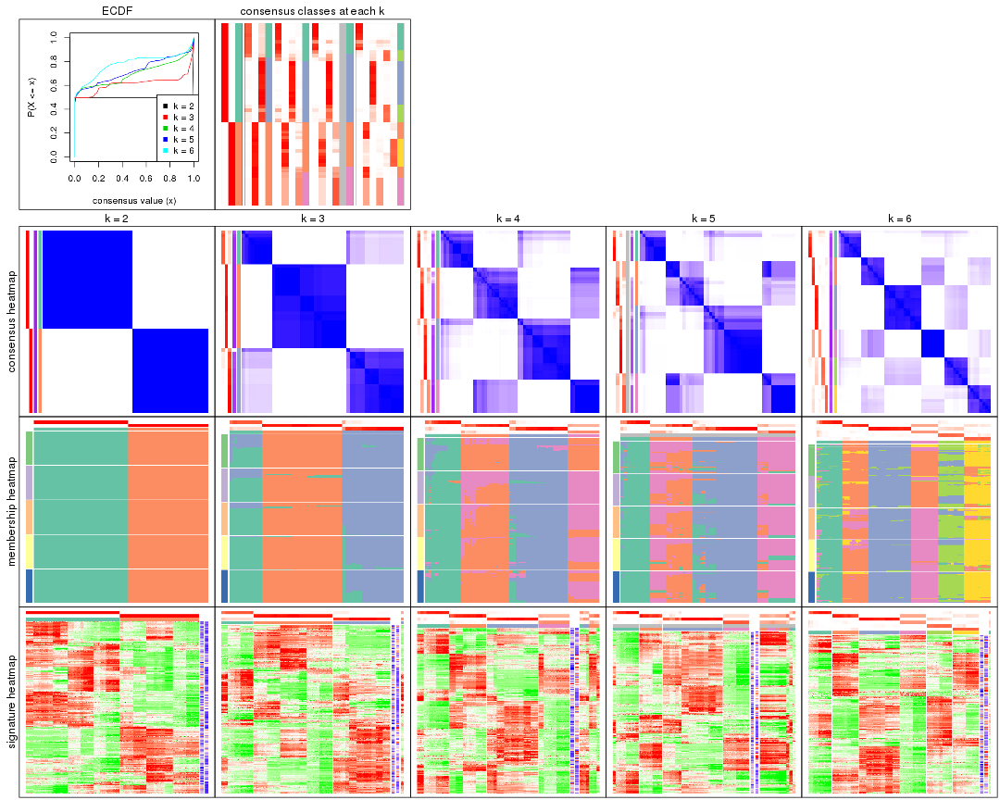

The plots are:

- The first row: a plot of the ECDF (Empirical cumulative distribution
  function) curves of the consensus matrix for each `k` and the heatmap of
  predicted classes for each `k`.
- The second row: heatmaps of the consensus matrix for each `k`.
- The third row: heatmaps of the membership matrix for each `k`.
- The fouth row: heatmaps of the signatures for each `k`.

All the plots in panels can be made by individual functions and they are
plotted later in this section.

`select_partition_number()` produces several plots showing different
statistics for choosing "optimized" `k`. There are following statistics:

- ECDF curves of the consensus matrix for each `k`;
- 1-PAC. [The PAC
  score](https://en.wikipedia.org/wiki/Consensus_clustering#Over-interpretation_potential_of_consensus_clustering)
  measures the proportion of the ambiguous subgrouping.
- Mean silhouette score.
- Concordance. The mean probability of fiting the consensus class ids in all
  partitions.
- Area increased. Denote $A_k$ as the area under the ECDF curve for current
  `k`, the area increased is defined as $A_k - A_{k-1}$.
- Rand index. The percent of pairs of samples that are both in a same cluster
  or both are not in a same cluster in the partition of k and k-1.
- Jaccard index. The ratio of pairs of samples are both in a same cluster in
  the partition of k and k-1 and the pairs of samples are both in a same
  cluster in the partition k or k-1.

The detailed explanations of these statistics can be found in [the cola
vignette](http://bioconductor.org/packages/devel/bioc/vignettes/cola/inst/doc/cola.html#toc_13).

Generally speaking, lower PAC score, higher mean silhouette score or higher
concordance corresponds to better partition. Rand index and Jaccard index
measure how similar the current partition is compared to partition with `k-1`.
If they are too similar, we won't accept `k` is better than `k-1`.

```r
select_partition_number(res)
```


The numeric values for all these statistics can be obtained by `get_stats()`.

```r
get_stats(res)
```

```
#>   k 1-PAC mean_silhouette concordance area_increased  Rand Jaccard
#> 2 2 1.000           1.000       1.000         0.4984 0.502   0.502
#> 3 3 0.853           0.935       0.936         0.2341 0.868   0.736
#> 4 4 0.773           0.791       0.826         0.1356 0.879   0.678
#> 5 5 0.711           0.657       0.799         0.0347 0.933   0.777
#> 6 6 0.752           0.919       0.819         0.0795 0.867   0.539
```

`suggest_best_k()` suggests the best $k$ based on these statistics. The rules are as follows:

- All $k$ with Jaccard index larger than 0.95 are removed because the increase of
  the partition number does not provides enough extra information. If all $k$ are removed,
  the best $k$ is assigned by `NA`.
- For $k$ with 1-PAC larger than 0.9, the maximal $k$ is taken as the "best k". Other $k$ is called "optional k".
- If it does not fit the second rule. The $k$ with the highest vote of highest
  1-PAC, mean silhouette and concordance is taken as the "best k".

```r
suggest_best_k(res)
```

```
#> [1] 2
```


Following shows the table of the partitions (You need to click the **show/hide
code output** link to see it). The membership matrix (columns with name `p*`)
is inferred by
[`clue::cl_consensus()`](https://www.rdocumentation.org/link/cl_consensus?package=clue)
function with the `SE` method. Basically the value in the membership matrix
represents the probability to belong to a certain group. The finall class
label for an item is determined with the group with highest probability it
belongs to.

In `get_classes()` function, the entropy is calculated from the membership
matrix and the silhouette score is calculated from the consensus matrix.


<script>
$( function() {
	$( '#tabs-ATC-NMF-get-classes' ).tabs();
} );
</script>
<div id='tabs-ATC-NMF-get-classes'>
<ul>
<li><a href='#tab-ATC-NMF-get-classes-1'>k = 2</a></li>
<li><a href='#tab-ATC-NMF-get-classes-2'>k = 3</a></li>
<li><a href='#tab-ATC-NMF-get-classes-3'>k = 4</a></li>
<li><a href='#tab-ATC-NMF-get-classes-4'>k = 5</a></li>
<li><a href='#tab-ATC-NMF-get-classes-5'>k = 6</a></li>
</ul>

<div id='tab-ATC-NMF-get-classes-1'>
<p><a id='tab-ATC-NMF-get-classes-1-a' style='color:#0366d6' href='#'>show/hide code output</a></p>
<pre><code class="r">cbind(get_classes(res, k = 2), get_membership(res, k = 2))
</code></pre>

<pre><code>#&gt;           class entropy silhouette p1 p2
#&gt; SRR902920     1       0          1  1  0
#&gt; SRR902921     1       0          1  1  0
#&gt; SRR902922     1       0          1  1  0
#&gt; SRR902923     1       0          1  1  0
#&gt; SRR902924     1       0          1  1  0
#&gt; SRR902925     1       0          1  1  0
#&gt; SRR902926     1       0          1  1  0
#&gt; SRR902927     1       0          1  1  0
#&gt; SRR902928     1       0          1  1  0
#&gt; SRR902929     1       0          1  1  0
#&gt; SRR902930     1       0          1  1  0
#&gt; SRR902931     1       0          1  1  0
#&gt; SRR902932     2       0          1  0  1
#&gt; SRR902933     2       0          1  0  1
#&gt; SRR902934     2       0          1  0  1
#&gt; SRR902935     2       0          1  0  1
#&gt; SRR902936     2       0          1  0  1
#&gt; SRR902937     2       0          1  0  1
#&gt; SRR902938     2       0          1  0  1
#&gt; SRR902939     2       0          1  0  1
#&gt; SRR902940     2       0          1  0  1
#&gt; SRR902941     2       0          1  0  1
#&gt; SRR902942     1       0          1  1  0
#&gt; SRR902943     1       0          1  1  0
#&gt; SRR902944     1       0          1  1  0
#&gt; SRR902945     1       0          1  1  0
#&gt; SRR902946     1       0          1  1  0
#&gt; SRR902947     1       0          1  1  0
#&gt; SRR902954     1       0          1  1  0
#&gt; SRR902955     1       0          1  1  0
#&gt; SRR902956     1       0          1  1  0
#&gt; SRR902957     1       0          1  1  0
#&gt; SRR902958     1       0          1  1  0
#&gt; SRR902959     1       0          1  1  0
#&gt; SRR902948     1       0          1  1  0
#&gt; SRR902949     1       0          1  1  0
#&gt; SRR902950     1       0          1  1  0
#&gt; SRR902951     1       0          1  1  0
#&gt; SRR902952     1       0          1  1  0
#&gt; SRR902953     1       0          1  1  0
#&gt; SRR902960     1       0          1  1  0
#&gt; SRR902961     1       0          1  1  0
#&gt; SRR902962     1       0          1  1  0
#&gt; SRR902963     1       0          1  1  0
#&gt; SRR902964     1       0          1  1  0
#&gt; SRR902965     1       0          1  1  0
#&gt; SRR902966     1       0          1  1  0
#&gt; SRR902967     1       0          1  1  0
#&gt; SRR902968     1       0          1  1  0
#&gt; SRR902969     1       0          1  1  0
#&gt; SRR902970     1       0          1  1  0
#&gt; SRR902971     1       0          1  1  0
#&gt; SRR902972     1       0          1  1  0
#&gt; SRR902973     1       0          1  1  0
#&gt; SRR902974     1       0          1  1  0
#&gt; SRR902975     1       0          1  1  0
#&gt; SRR902976     1       0          1  1  0
#&gt; SRR902977     1       0          1  1  0
#&gt; SRR902978     1       0          1  1  0
#&gt; SRR902980     1       0          1  1  0
#&gt; SRR902981     1       0          1  1  0
#&gt; SRR902982     1       0          1  1  0
#&gt; SRR902983     1       0          1  1  0
#&gt; SRR902984     1       0          1  1  0
#&gt; SRR902985     1       0          1  1  0
#&gt; SRR902986     1       0          1  1  0
#&gt; SRR902987     1       0          1  1  0
#&gt; SRR902988     1       0          1  1  0
#&gt; SRR902989     1       0          1  1  0
#&gt; SRR902990     1       0          1  1  0
#&gt; SRR902991     1       0          1  1  0
#&gt; SRR902992     1       0          1  1  0
#&gt; SRR902993     1       0          1  1  0
#&gt; SRR902994     1       0          1  1  0
#&gt; SRR902995     1       0          1  1  0
#&gt; SRR902996     2       0          1  0  1
#&gt; SRR902997     2       0          1  0  1
#&gt; SRR902998     2       0          1  0  1
#&gt; SRR902999     2       0          1  0  1
#&gt; SRR903000     2       0          1  0  1
#&gt; SRR903001     2       0          1  0  1
#&gt; SRR903008     2       0          1  0  1
#&gt; SRR903009     2       0          1  0  1
#&gt; SRR903010     2       0          1  0  1
#&gt; SRR903011     2       0          1  0  1
#&gt; SRR903012     2       0          1  0  1
#&gt; SRR903013     2       0          1  0  1
#&gt; SRR903002     2       0          1  0  1
#&gt; SRR903003     2       0          1  0  1
#&gt; SRR903004     2       0          1  0  1
#&gt; SRR903005     2       0          1  0  1
#&gt; SRR903006     2       0          1  0  1
#&gt; SRR903007     2       0          1  0  1
#&gt; SRR903014     1       0          1  1  0
#&gt; SRR903015     1       0          1  1  0
#&gt; SRR903016     1       0          1  1  0
#&gt; SRR903017     1       0          1  1  0
#&gt; SRR903018     1       0          1  1  0
#&gt; SRR903019     1       0          1  1  0
#&gt; SRR903020     1       0          1  1  0
#&gt; SRR903021     1       0          1  1  0
#&gt; SRR903022     1       0          1  1  0
#&gt; SRR903023     1       0          1  1  0
#&gt; SRR903024     1       0          1  1  0
#&gt; SRR903025     1       0          1  1  0
#&gt; SRR903026     1       0          1  1  0
#&gt; SRR903027     1       0          1  1  0
#&gt; SRR903028     1       0          1  1  0
#&gt; SRR903029     1       0          1  1  0
#&gt; SRR903030     1       0          1  1  0
#&gt; SRR903031     1       0          1  1  0
#&gt; SRR903032     2       0          1  0  1
#&gt; SRR903033     2       0          1  0  1
#&gt; SRR903034     2       0          1  0  1
#&gt; SRR903035     2       0          1  0  1
#&gt; SRR903036     2       0          1  0  1
#&gt; SRR903037     2       0          1  0  1
#&gt; SRR903038     2       0          1  0  1
#&gt; SRR903039     2       0          1  0  1
#&gt; SRR903040     2       0          1  0  1
#&gt; SRR903041     2       0          1  0  1
#&gt; SRR903042     2       0          1  0  1
#&gt; SRR903043     2       0          1  0  1
#&gt; SRR903044     2       0          1  0  1
#&gt; SRR903045     2       0          1  0  1
#&gt; SRR903046     2       0          1  0  1
#&gt; SRR903047     2       0          1  0  1
#&gt; SRR903048     2       0          1  0  1
#&gt; SRR903049     2       0          1  0  1
#&gt; SRR903050     1       0          1  1  0
#&gt; SRR903051     1       0          1  1  0
#&gt; SRR903052     1       0          1  1  0
#&gt; SRR903053     1       0          1  1  0
#&gt; SRR903054     1       0          1  1  0
#&gt; SRR903055     1       0          1  1  0
#&gt; SRR903056     1       0          1  1  0
#&gt; SRR903057     1       0          1  1  0
#&gt; SRR903058     1       0          1  1  0
#&gt; SRR903059     1       0          1  1  0
#&gt; SRR903060     1       0          1  1  0
#&gt; SRR903061     1       0          1  1  0
#&gt; SRR903062     1       0          1  1  0
#&gt; SRR903063     1       0          1  1  0
#&gt; SRR903064     1       0          1  1  0
#&gt; SRR903065     1       0          1  1  0
#&gt; SRR903066     1       0          1  1  0
#&gt; SRR903067     1       0          1  1  0
#&gt; SRR903068     1       0          1  1  0
#&gt; SRR903069     1       0          1  1  0
#&gt; SRR903070     1       0          1  1  0
#&gt; SRR903071     1       0          1  1  0
#&gt; SRR903072     1       0          1  1  0
#&gt; SRR903073     1       0          1  1  0
#&gt; SRR903074     1       0          1  1  0
#&gt; SRR903075     1       0          1  1  0
#&gt; SRR903076     1       0          1  1  0
#&gt; SRR903077     1       0          1  1  0
#&gt; SRR903078     1       0          1  1  0
#&gt; SRR903079     1       0          1  1  0
#&gt; SRR903080     1       0          1  1  0
#&gt; SRR903081     1       0          1  1  0
#&gt; SRR903082     2       0          1  0  1
#&gt; SRR903083     2       0          1  0  1
#&gt; SRR903084     2       0          1  0  1
#&gt; SRR903085     2       0          1  0  1
#&gt; SRR903086     2       0          1  0  1
#&gt; SRR903087     2       0          1  0  1
#&gt; SRR903088     2       0          1  0  1
#&gt; SRR903089     2       0          1  0  1
#&gt; SRR903090     2       0          1  0  1
#&gt; SRR903091     2       0          1  0  1
#&gt; SRR903092     2       0          1  0  1
#&gt; SRR903093     2       0          1  0  1
#&gt; SRR903094     2       0          1  0  1
#&gt; SRR903095     2       0          1  0  1
#&gt; SRR903096     2       0          1  0  1
#&gt; SRR903097     2       0          1  0  1
#&gt; SRR903098     2       0          1  0  1
#&gt; SRR903099     2       0          1  0  1
#&gt; SRR903100     2       0          1  0  1
#&gt; SRR903101     2       0          1  0  1
#&gt; SRR903102     2       0          1  0  1
#&gt; SRR903103     2       0          1  0  1
#&gt; SRR903104     2       0          1  0  1
#&gt; SRR903105     2       0          1  0  1
#&gt; SRR903106     2       0          1  0  1
#&gt; SRR903107     2       0          1  0  1
#&gt; SRR903108     2       0          1  0  1
#&gt; SRR903109     2       0          1  0  1
#&gt; SRR903110     2       0          1  0  1
#&gt; SRR903111     2       0          1  0  1
#&gt; SRR903112     2       0          1  0  1
#&gt; SRR903113     2       0          1  0  1
#&gt; SRR903114     1       0          1  1  0
#&gt; SRR903115     1       0          1  1  0
#&gt; SRR903116     1       0          1  1  0
#&gt; SRR903117     1       0          1  1  0
#&gt; SRR903118     1       0          1  1  0
#&gt; SRR903119     1       0          1  1  0
#&gt; SRR903121     1       0          1  1  0
#&gt; SRR903122     1       0          1  1  0
#&gt; SRR903124     1       0          1  1  0
#&gt; SRR903125     1       0          1  1  0
#&gt; SRR903126     1       0          1  1  0
#&gt; SRR903127     1       0          1  1  0
#&gt; SRR903128     1       0          1  1  0
#&gt; SRR903129     1       0          1  1  0
#&gt; SRR903130     1       0          1  1  0
#&gt; SRR903131     1       0          1  1  0
#&gt; SRR903132     1       0          1  1  0
#&gt; SRR903133     1       0          1  1  0
#&gt; SRR903134     1       0          1  1  0
#&gt; SRR903135     1       0          1  1  0
#&gt; SRR903136     1       0          1  1  0
#&gt; SRR903137     1       0          1  1  0
#&gt; SRR903146     2       0          1  0  1
#&gt; SRR903147     2       0          1  0  1
#&gt; SRR903148     2       0          1  0  1
#&gt; SRR903149     2       0          1  0  1
#&gt; SRR903150     2       0          1  0  1
#&gt; SRR903151     2       0          1  0  1
#&gt; SRR903152     2       0          1  0  1
#&gt; SRR903153     2       0          1  0  1
#&gt; SRR903138     1       0          1  1  0
#&gt; SRR903139     1       0          1  1  0
#&gt; SRR903140     1       0          1  1  0
#&gt; SRR903141     1       0          1  1  0
#&gt; SRR903142     1       0          1  1  0
#&gt; SRR903143     1       0          1  1  0
#&gt; SRR903144     1       0          1  1  0
#&gt; SRR903145     1       0          1  1  0
#&gt; SRR903154     2       0          1  0  1
#&gt; SRR903155     2       0          1  0  1
#&gt; SRR903156     2       0          1  0  1
#&gt; SRR903157     2       0          1  0  1
#&gt; SRR903158     2       0          1  0  1
#&gt; SRR903159     2       0          1  0  1
#&gt; SRR903160     2       0          1  0  1
#&gt; SRR903161     2       0          1  0  1
#&gt; SRR903162     2       0          1  0  1
#&gt; SRR903163     2       0          1  0  1
#&gt; SRR903164     2       0          1  0  1
#&gt; SRR903165     2       0          1  0  1
#&gt; SRR903166     2       0          1  0  1
#&gt; SRR903167     2       0          1  0  1
#&gt; SRR903168     2       0          1  0  1
#&gt; SRR903169     2       0          1  0  1
#&gt; SRR903178     1       0          1  1  0
#&gt; SRR903179     1       0          1  1  0
#&gt; SRR903180     1       0          1  1  0
#&gt; SRR903181     1       0          1  1  0
#&gt; SRR903182     1       0          1  1  0
#&gt; SRR903183     1       0          1  1  0
#&gt; SRR903184     1       0          1  1  0
#&gt; SRR903185     1       0          1  1  0
#&gt; SRR903170     2       0          1  0  1
#&gt; SRR903171     2       0          1  0  1
#&gt; SRR903172     2       0          1  0  1
#&gt; SRR903173     2       0          1  0  1
#&gt; SRR903174     2       0          1  0  1
#&gt; SRR903175     2       0          1  0  1
#&gt; SRR903176     2       0          1  0  1
#&gt; SRR903177     2       0          1  0  1
#&gt; SRR903186     1       0          1  1  0
#&gt; SRR903187     1       0          1  1  0
#&gt; SRR903188     1       0          1  1  0
#&gt; SRR903189     1       0          1  1  0
#&gt; SRR903190     1       0          1  1  0
#&gt; SRR903191     1       0          1  1  0
#&gt; SRR903192     1       0          1  1  0
#&gt; SRR903193     1       0          1  1  0
#&gt; SRR903194     1       0          1  1  0
#&gt; SRR903195     1       0          1  1  0
#&gt; SRR903196     1       0          1  1  0
#&gt; SRR903197     1       0          1  1  0
#&gt; SRR903198     1       0          1  1  0
#&gt; SRR903199     1       0          1  1  0
#&gt; SRR903200     1       0          1  1  0
#&gt; SRR903201     1       0          1  1  0
#&gt; SRR903210     2       0          1  0  1
#&gt; SRR903211     2       0          1  0  1
#&gt; SRR903212     2       0          1  0  1
#&gt; SRR903213     2       0          1  0  1
#&gt; SRR903214     2       0          1  0  1
#&gt; SRR903215     2       0          1  0  1
#&gt; SRR903216     2       0          1  0  1
#&gt; SRR903217     2       0          1  0  1
#&gt; SRR903202     1       0          1  1  0
#&gt; SRR903203     1       0          1  1  0
#&gt; SRR903204     1       0          1  1  0
#&gt; SRR903205     1       0          1  1  0
#&gt; SRR903206     1       0          1  1  0
#&gt; SRR903207     1       0          1  1  0
#&gt; SRR903208     1       0          1  1  0
#&gt; SRR903209     1       0          1  1  0
#&gt; SRR903218     2       0          1  0  1
#&gt; SRR903219     2       0          1  0  1
#&gt; SRR903220     2       0          1  0  1
#&gt; SRR903221     2       0          1  0  1
#&gt; SRR903222     2       0          1  0  1
#&gt; SRR903223     2       0          1  0  1
#&gt; SRR903224     2       0          1  0  1
#&gt; SRR903225     2       0          1  0  1
#&gt; SRR903226     2       0          1  0  1
#&gt; SRR903227     2       0          1  0  1
#&gt; SRR903228     2       0          1  0  1
#&gt; SRR903229     2       0          1  0  1
#&gt; SRR903230     2       0          1  0  1
#&gt; SRR903231     2       0          1  0  1
#&gt; SRR903232     2       0          1  0  1
#&gt; SRR903233     2       0          1  0  1
#&gt; SRR903242     1       0          1  1  0
#&gt; SRR903243     1       0          1  1  0
#&gt; SRR903244     1       0          1  1  0
#&gt; SRR903245     1       0          1  1  0
#&gt; SRR903246     1       0          1  1  0
#&gt; SRR903247     1       0          1  1  0
#&gt; SRR903248     1       0          1  1  0
#&gt; SRR903249     1       0          1  1  0
#&gt; SRR903234     2       0          1  0  1
#&gt; SRR903235     2       0          1  0  1
#&gt; SRR903236     2       0          1  0  1
#&gt; SRR903237     2       0          1  0  1
#&gt; SRR903238     2       0          1  0  1
#&gt; SRR903239     2       0          1  0  1
#&gt; SRR903240     2       0          1  0  1
#&gt; SRR903241     2       0          1  0  1
#&gt; SRR903258     1       0          1  1  0
#&gt; SRR903259     1       0          1  1  0
#&gt; SRR903260     1       0          1  1  0
#&gt; SRR903261     1       0          1  1  0
#&gt; SRR903262     1       0          1  1  0
#&gt; SRR903263     1       0          1  1  0
#&gt; SRR903264     1       0          1  1  0
#&gt; SRR903265     1       0          1  1  0
#&gt; SRR903250     1       0          1  1  0
#&gt; SRR903251     1       0          1  1  0
#&gt; SRR903252     1       0          1  1  0
#&gt; SRR903253     1       0          1  1  0
#&gt; SRR903254     1       0          1  1  0
#&gt; SRR903255     1       0          1  1  0
#&gt; SRR903256     1       0          1  1  0
#&gt; SRR903257     1       0          1  1  0
#&gt; SRR903266     1       0          1  1  0
#&gt; SRR903267     1       0          1  1  0
#&gt; SRR903268     1       0          1  1  0
#&gt; SRR903270     1       0          1  1  0
#&gt; SRR903271     1       0          1  1  0
#&gt; SRR903272     1       0          1  1  0
#&gt; SRR903273     1       0          1  1  0
#&gt; SRR903274     2       0          1  0  1
#&gt; SRR903275     2       0          1  0  1
#&gt; SRR903276     2       0          1  0  1
#&gt; SRR903277     2       0          1  0  1
#&gt; SRR903278     2       0          1  0  1
#&gt; SRR903279     2       0          1  0  1
#&gt; SRR903280     2       0          1  0  1
#&gt; SRR903281     2       0          1  0  1
#&gt; SRR903282     2       0          1  0  1
#&gt; SRR903283     2       0          1  0  1
#&gt; SRR903284     2       0          1  0  1
#&gt; SRR903285     2       0          1  0  1
#&gt; SRR903286     2       0          1  0  1
#&gt; SRR903287     2       0          1  0  1
#&gt; SRR903288     2       0          1  0  1
#&gt; SRR903289     2       0          1  0  1
#&gt; SRR903290     2       0          1  0  1
#&gt; SRR903291     2       0          1  0  1
#&gt; SRR903292     2       0          1  0  1
#&gt; SRR903293     2       0          1  0  1
#&gt; SRR903294     2       0          1  0  1
#&gt; SRR903295     2       0          1  0  1
#&gt; SRR903296     2       0          1  0  1
#&gt; SRR903297     2       0          1  0  1
#&gt; SRR903298     2       0          1  0  1
#&gt; SRR903299     2       0          1  0  1
#&gt; SRR903300     2       0          1  0  1
#&gt; SRR903301     2       0          1  0  1
#&gt; SRR903302     2       0          1  0  1
#&gt; SRR903303     2       0          1  0  1
#&gt; SRR903304     2       0          1  0  1
#&gt; SRR903305     2       0          1  0  1
#&gt; SRR903306     1       0          1  1  0
#&gt; SRR903307     1       0          1  1  0
#&gt; SRR903308     1       0          1  1  0
#&gt; SRR903309     1       0          1  1  0
#&gt; SRR903310     1       0          1  1  0
#&gt; SRR903311     1       0          1  1  0
#&gt; SRR903312     1       0          1  1  0
#&gt; SRR903313     1       0          1  1  0
#&gt; SRR903314     1       0          1  1  0
#&gt; SRR903315     1       0          1  1  0
#&gt; SRR903316     1       0          1  1  0
#&gt; SRR903317     1       0          1  1  0
#&gt; SRR903318     1       0          1  1  0
#&gt; SRR903319     1       0          1  1  0
#&gt; SRR903320     1       0          1  1  0
#&gt; SRR903321     1       0          1  1  0
#&gt; SRR903322     1       0          1  1  0
#&gt; SRR903323     1       0          1  1  0
#&gt; SRR903324     2       0          1  0  1
#&gt; SRR903325     2       0          1  0  1
#&gt; SRR903326     2       0          1  0  1
#&gt; SRR903327     2       0          1  0  1
#&gt; SRR903328     2       0          1  0  1
#&gt; SRR903329     2       0          1  0  1
#&gt; SRR903330     2       0          1  0  1
#&gt; SRR903331     2       0          1  0  1
#&gt; SRR903332     2       0          1  0  1
#&gt; SRR903333     2       0          1  0  1
#&gt; SRR903334     2       0          1  0  1
#&gt; SRR903335     2       0          1  0  1
#&gt; SRR903336     2       0          1  0  1
#&gt; SRR903337     2       0          1  0  1
#&gt; SRR903338     2       0          1  0  1
#&gt; SRR903339     2       0          1  0  1
#&gt; SRR903340     2       0          1  0  1
#&gt; SRR903341     2       0          1  0  1
</code></pre>

<script>
$('#tab-ATC-NMF-get-classes-1-a').parent().next().next().hide();
$('#tab-ATC-NMF-get-classes-1-a').click(function(){
  $('#tab-ATC-NMF-get-classes-1-a').parent().next().next().toggle();
  return(false);
});
</script>
</div>

<div id='tab-ATC-NMF-get-classes-2'>
<p><a id='tab-ATC-NMF-get-classes-2-a' style='color:#0366d6' href='#'>show/hide code output</a></p>
<pre><code class="r">cbind(get_classes(res, k = 3), get_membership(res, k = 3))
</code></pre>

<pre><code>#&gt;           class entropy silhouette    p1    p2    p3
#&gt; SRR902920     3  0.0000    0.92884 0.000 0.000 1.000
#&gt; SRR902921     3  0.0000    0.92884 0.000 0.000 1.000
#&gt; SRR902922     3  0.0000    0.92884 0.000 0.000 1.000
#&gt; SRR902923     3  0.0000    0.92884 0.000 0.000 1.000
#&gt; SRR902924     3  0.0000    0.92884 0.000 0.000 1.000
#&gt; SRR902925     3  0.0000    0.92884 0.000 0.000 1.000
#&gt; SRR902926     3  0.0000    0.92884 0.000 0.000 1.000
#&gt; SRR902927     3  0.0000    0.92884 0.000 0.000 1.000
#&gt; SRR902928     3  0.0000    0.92884 0.000 0.000 1.000
#&gt; SRR902929     3  0.0000    0.92884 0.000 0.000 1.000
#&gt; SRR902930     3  0.0000    0.92884 0.000 0.000 1.000
#&gt; SRR902931     3  0.0000    0.92884 0.000 0.000 1.000
#&gt; SRR902932     2  0.0000    0.98629 0.000 1.000 0.000
#&gt; SRR902933     2  0.0000    0.98629 0.000 1.000 0.000
#&gt; SRR902934     2  0.0000    0.98629 0.000 1.000 0.000
#&gt; SRR902935     2  0.0000    0.98629 0.000 1.000 0.000
#&gt; SRR902936     2  0.0000    0.98629 0.000 1.000 0.000
#&gt; SRR902937     2  0.0000    0.98629 0.000 1.000 0.000
#&gt; SRR902938     2  0.0000    0.98629 0.000 1.000 0.000
#&gt; SRR902939     2  0.0000    0.98629 0.000 1.000 0.000
#&gt; SRR902940     2  0.0000    0.98629 0.000 1.000 0.000
#&gt; SRR902941     2  0.0000    0.98629 0.000 1.000 0.000
#&gt; SRR902942     3  0.0237    0.92888 0.004 0.000 0.996
#&gt; SRR902943     3  0.0237    0.92888 0.004 0.000 0.996
#&gt; SRR902944     3  0.0237    0.92888 0.004 0.000 0.996
#&gt; SRR902945     3  0.0237    0.92888 0.004 0.000 0.996
#&gt; SRR902946     3  0.0237    0.92888 0.004 0.000 0.996
#&gt; SRR902947     3  0.0237    0.92888 0.004 0.000 0.996
#&gt; SRR902954     3  0.0237    0.92888 0.004 0.000 0.996
#&gt; SRR902955     3  0.0237    0.92888 0.004 0.000 0.996
#&gt; SRR902956     3  0.0237    0.92888 0.004 0.000 0.996
#&gt; SRR902957     3  0.0237    0.92888 0.004 0.000 0.996
#&gt; SRR902958     3  0.0237    0.92888 0.004 0.000 0.996
#&gt; SRR902959     3  0.0237    0.92888 0.004 0.000 0.996
#&gt; SRR902948     3  0.0237    0.92888 0.004 0.000 0.996
#&gt; SRR902949     3  0.0237    0.92888 0.004 0.000 0.996
#&gt; SRR902950     3  0.0237    0.92888 0.004 0.000 0.996
#&gt; SRR902951     3  0.0237    0.92888 0.004 0.000 0.996
#&gt; SRR902952     3  0.0237    0.92888 0.004 0.000 0.996
#&gt; SRR902953     3  0.0237    0.92888 0.004 0.000 0.996
#&gt; SRR902960     3  0.1031    0.91758 0.024 0.000 0.976
#&gt; SRR902961     3  0.1031    0.91758 0.024 0.000 0.976
#&gt; SRR902962     3  0.1031    0.91758 0.024 0.000 0.976
#&gt; SRR902963     3  0.1031    0.91758 0.024 0.000 0.976
#&gt; SRR902964     3  0.1031    0.91758 0.024 0.000 0.976
#&gt; SRR902965     3  0.1031    0.91758 0.024 0.000 0.976
#&gt; SRR902966     3  0.1031    0.91758 0.024 0.000 0.976
#&gt; SRR902967     3  0.1031    0.91758 0.024 0.000 0.976
#&gt; SRR902968     3  0.1031    0.91758 0.024 0.000 0.976
#&gt; SRR902969     3  0.1031    0.91758 0.024 0.000 0.976
#&gt; SRR902970     3  0.1031    0.91758 0.024 0.000 0.976
#&gt; SRR902971     3  0.1031    0.91758 0.024 0.000 0.976
#&gt; SRR902972     3  0.1031    0.91758 0.024 0.000 0.976
#&gt; SRR902973     3  0.1031    0.91758 0.024 0.000 0.976
#&gt; SRR902974     3  0.1031    0.91758 0.024 0.000 0.976
#&gt; SRR902975     3  0.1031    0.91758 0.024 0.000 0.976
#&gt; SRR902976     3  0.1031    0.91758 0.024 0.000 0.976
#&gt; SRR902977     3  0.1031    0.91758 0.024 0.000 0.976
#&gt; SRR902978     3  0.0892    0.91980 0.020 0.000 0.980
#&gt; SRR902980     3  0.0892    0.91980 0.020 0.000 0.980
#&gt; SRR902981     3  0.0892    0.91980 0.020 0.000 0.980
#&gt; SRR902982     3  0.0892    0.91980 0.020 0.000 0.980
#&gt; SRR902983     3  0.0892    0.91980 0.020 0.000 0.980
#&gt; SRR902984     3  0.1163    0.91461 0.028 0.000 0.972
#&gt; SRR902985     3  0.1163    0.91461 0.028 0.000 0.972
#&gt; SRR902986     3  0.1289    0.91124 0.032 0.000 0.968
#&gt; SRR902987     3  0.1289    0.91124 0.032 0.000 0.968
#&gt; SRR902988     3  0.1289    0.91124 0.032 0.000 0.968
#&gt; SRR902989     3  0.1163    0.91461 0.028 0.000 0.972
#&gt; SRR902990     3  0.1163    0.91461 0.028 0.000 0.972
#&gt; SRR902991     3  0.1289    0.91124 0.032 0.000 0.968
#&gt; SRR902992     3  0.1163    0.91461 0.028 0.000 0.972
#&gt; SRR902993     3  0.1163    0.91461 0.028 0.000 0.972
#&gt; SRR902994     3  0.1289    0.91124 0.032 0.000 0.968
#&gt; SRR902995     3  0.1163    0.91461 0.028 0.000 0.972
#&gt; SRR902996     2  0.0892    0.98472 0.020 0.980 0.000
#&gt; SRR902997     2  0.0892    0.98472 0.020 0.980 0.000
#&gt; SRR902998     2  0.0892    0.98472 0.020 0.980 0.000
#&gt; SRR902999     2  0.0892    0.98472 0.020 0.980 0.000
#&gt; SRR903000     2  0.0892    0.98472 0.020 0.980 0.000
#&gt; SRR903001     2  0.0892    0.98472 0.020 0.980 0.000
#&gt; SRR903008     2  0.0892    0.98472 0.020 0.980 0.000
#&gt; SRR903009     2  0.0892    0.98472 0.020 0.980 0.000
#&gt; SRR903010     2  0.0892    0.98472 0.020 0.980 0.000
#&gt; SRR903011     2  0.0892    0.98472 0.020 0.980 0.000
#&gt; SRR903012     2  0.0892    0.98472 0.020 0.980 0.000
#&gt; SRR903013     2  0.0892    0.98472 0.020 0.980 0.000
#&gt; SRR903002     2  0.0892    0.98472 0.020 0.980 0.000
#&gt; SRR903003     2  0.0892    0.98472 0.020 0.980 0.000
#&gt; SRR903004     2  0.0892    0.98472 0.020 0.980 0.000
#&gt; SRR903005     2  0.0892    0.98472 0.020 0.980 0.000
#&gt; SRR903006     2  0.0892    0.98472 0.020 0.980 0.000
#&gt; SRR903007     2  0.0892    0.98472 0.020 0.980 0.000
#&gt; SRR903014     3  0.0592    0.92599 0.012 0.000 0.988
#&gt; SRR903015     3  0.0747    0.92418 0.016 0.000 0.984
#&gt; SRR903016     3  0.0424    0.92760 0.008 0.000 0.992
#&gt; SRR903017     3  0.0424    0.92760 0.008 0.000 0.992
#&gt; SRR903018     3  0.0237    0.92888 0.004 0.000 0.996
#&gt; SRR903019     3  0.0424    0.92760 0.008 0.000 0.992
#&gt; SRR903020     3  0.0000    0.92884 0.000 0.000 1.000
#&gt; SRR903021     3  0.0000    0.92884 0.000 0.000 1.000
#&gt; SRR903022     3  0.0000    0.92884 0.000 0.000 1.000
#&gt; SRR903023     3  0.0000    0.92884 0.000 0.000 1.000
#&gt; SRR903024     3  0.0000    0.92884 0.000 0.000 1.000
#&gt; SRR903025     3  0.0000    0.92884 0.000 0.000 1.000
#&gt; SRR903026     3  0.0237    0.92888 0.004 0.000 0.996
#&gt; SRR903027     3  0.0237    0.92888 0.004 0.000 0.996
#&gt; SRR903028     3  0.0237    0.92888 0.004 0.000 0.996
#&gt; SRR903029     3  0.0237    0.92888 0.004 0.000 0.996
#&gt; SRR903030     3  0.0237    0.92888 0.004 0.000 0.996
#&gt; SRR903031     3  0.0237    0.92888 0.004 0.000 0.996
#&gt; SRR903032     2  0.0000    0.98629 0.000 1.000 0.000
#&gt; SRR903033     2  0.0000    0.98629 0.000 1.000 0.000
#&gt; SRR903034     2  0.0000    0.98629 0.000 1.000 0.000
#&gt; SRR903035     2  0.0000    0.98629 0.000 1.000 0.000
#&gt; SRR903036     2  0.0000    0.98629 0.000 1.000 0.000
#&gt; SRR903037     2  0.0000    0.98629 0.000 1.000 0.000
#&gt; SRR903038     2  0.0000    0.98629 0.000 1.000 0.000
#&gt; SRR903039     2  0.0000    0.98629 0.000 1.000 0.000
#&gt; SRR903040     2  0.0000    0.98629 0.000 1.000 0.000
#&gt; SRR903041     2  0.0000    0.98629 0.000 1.000 0.000
#&gt; SRR903042     2  0.0237    0.98631 0.004 0.996 0.000
#&gt; SRR903043     2  0.0237    0.98631 0.004 0.996 0.000
#&gt; SRR903044     2  0.0000    0.98629 0.000 1.000 0.000
#&gt; SRR903045     2  0.0000    0.98629 0.000 1.000 0.000
#&gt; SRR903046     2  0.0000    0.98629 0.000 1.000 0.000
#&gt; SRR903047     2  0.0000    0.98629 0.000 1.000 0.000
#&gt; SRR903048     2  0.0000    0.98629 0.000 1.000 0.000
#&gt; SRR903049     2  0.0000    0.98629 0.000 1.000 0.000
#&gt; SRR903050     1  0.4399    0.97652 0.812 0.000 0.188
#&gt; SRR903051     1  0.4399    0.97652 0.812 0.000 0.188
#&gt; SRR903052     1  0.4399    0.97652 0.812 0.000 0.188
#&gt; SRR903053     1  0.4399    0.97652 0.812 0.000 0.188
#&gt; SRR903054     1  0.4399    0.97652 0.812 0.000 0.188
#&gt; SRR903055     1  0.4399    0.97652 0.812 0.000 0.188
#&gt; SRR903056     1  0.4399    0.97652 0.812 0.000 0.188
#&gt; SRR903057     1  0.4399    0.97652 0.812 0.000 0.188
#&gt; SRR903058     1  0.4399    0.97652 0.812 0.000 0.188
#&gt; SRR903059     1  0.4399    0.97652 0.812 0.000 0.188
#&gt; SRR903060     1  0.4399    0.97652 0.812 0.000 0.188
#&gt; SRR903061     1  0.4399    0.97652 0.812 0.000 0.188
#&gt; SRR903062     1  0.4399    0.97652 0.812 0.000 0.188
#&gt; SRR903063     1  0.4399    0.97652 0.812 0.000 0.188
#&gt; SRR903064     1  0.4399    0.97652 0.812 0.000 0.188
#&gt; SRR903065     1  0.4399    0.97652 0.812 0.000 0.188
#&gt; SRR903066     1  0.4235    0.96550 0.824 0.000 0.176
#&gt; SRR903067     1  0.4399    0.97652 0.812 0.000 0.188
#&gt; SRR903068     1  0.4178    0.96158 0.828 0.000 0.172
#&gt; SRR903069     1  0.4399    0.97652 0.812 0.000 0.188
#&gt; SRR903070     1  0.4399    0.97652 0.812 0.000 0.188
#&gt; SRR903071     1  0.4399    0.97652 0.812 0.000 0.188
#&gt; SRR903072     1  0.4399    0.97652 0.812 0.000 0.188
#&gt; SRR903073     1  0.4399    0.97652 0.812 0.000 0.188
#&gt; SRR903074     1  0.3686    0.92778 0.860 0.000 0.140
#&gt; SRR903075     1  0.3752    0.93250 0.856 0.000 0.144
#&gt; SRR903076     1  0.4002    0.94944 0.840 0.000 0.160
#&gt; SRR903077     1  0.3686    0.92778 0.860 0.000 0.140
#&gt; SRR903078     1  0.3816    0.93694 0.852 0.000 0.148
#&gt; SRR903079     1  0.3816    0.93694 0.852 0.000 0.148
#&gt; SRR903080     1  0.3752    0.93250 0.856 0.000 0.144
#&gt; SRR903081     1  0.3816    0.93694 0.852 0.000 0.148
#&gt; SRR903082     2  0.1031    0.98220 0.024 0.976 0.000
#&gt; SRR903083     2  0.1031    0.98220 0.024 0.976 0.000
#&gt; SRR903084     2  0.1031    0.98220 0.024 0.976 0.000
#&gt; SRR903085     2  0.1031    0.98220 0.024 0.976 0.000
#&gt; SRR903086     2  0.1031    0.98220 0.024 0.976 0.000
#&gt; SRR903087     2  0.1031    0.98220 0.024 0.976 0.000
#&gt; SRR903088     2  0.1031    0.98220 0.024 0.976 0.000
#&gt; SRR903089     2  0.1031    0.98220 0.024 0.976 0.000
#&gt; SRR903090     2  0.1031    0.98220 0.024 0.976 0.000
#&gt; SRR903091     2  0.1031    0.98220 0.024 0.976 0.000
#&gt; SRR903092     2  0.1031    0.98220 0.024 0.976 0.000
#&gt; SRR903093     2  0.1031    0.98220 0.024 0.976 0.000
#&gt; SRR903094     2  0.1031    0.98220 0.024 0.976 0.000
#&gt; SRR903095     2  0.1031    0.98220 0.024 0.976 0.000
#&gt; SRR903096     2  0.1031    0.98220 0.024 0.976 0.000
#&gt; SRR903097     2  0.1031    0.98220 0.024 0.976 0.000
#&gt; SRR903098     2  0.1031    0.98220 0.024 0.976 0.000
#&gt; SRR903099     2  0.1031    0.98220 0.024 0.976 0.000
#&gt; SRR903100     2  0.1031    0.98220 0.024 0.976 0.000
#&gt; SRR903101     2  0.1031    0.98220 0.024 0.976 0.000
#&gt; SRR903102     2  0.1031    0.98220 0.024 0.976 0.000
#&gt; SRR903103     2  0.1031    0.98220 0.024 0.976 0.000
#&gt; SRR903104     2  0.1031    0.98220 0.024 0.976 0.000
#&gt; SRR903105     2  0.1031    0.98220 0.024 0.976 0.000
#&gt; SRR903106     2  0.1031    0.98220 0.024 0.976 0.000
#&gt; SRR903107     2  0.1031    0.98220 0.024 0.976 0.000
#&gt; SRR903108     2  0.1031    0.98220 0.024 0.976 0.000
#&gt; SRR903109     2  0.1031    0.98220 0.024 0.976 0.000
#&gt; SRR903110     2  0.1031    0.98220 0.024 0.976 0.000
#&gt; SRR903111     2  0.1031    0.98220 0.024 0.976 0.000
#&gt; SRR903112     2  0.1031    0.98220 0.024 0.976 0.000
#&gt; SRR903113     2  0.1031    0.98220 0.024 0.976 0.000
#&gt; SRR903114     1  0.4399    0.97652 0.812 0.000 0.188
#&gt; SRR903115     1  0.4399    0.97652 0.812 0.000 0.188
#&gt; SRR903116     1  0.4399    0.97652 0.812 0.000 0.188
#&gt; SRR903117     1  0.4399    0.97652 0.812 0.000 0.188
#&gt; SRR903118     1  0.4399    0.97652 0.812 0.000 0.188
#&gt; SRR903119     1  0.4399    0.97652 0.812 0.000 0.188
#&gt; SRR903121     1  0.4399    0.97652 0.812 0.000 0.188
#&gt; SRR903122     1  0.4452    0.97428 0.808 0.000 0.192
#&gt; SRR903124     1  0.4452    0.97428 0.808 0.000 0.192
#&gt; SRR903125     1  0.4452    0.97428 0.808 0.000 0.192
#&gt; SRR903126     1  0.4452    0.97428 0.808 0.000 0.192
#&gt; SRR903127     1  0.4452    0.97428 0.808 0.000 0.192
#&gt; SRR903128     1  0.4452    0.97428 0.808 0.000 0.192
#&gt; SRR903129     1  0.4452    0.97428 0.808 0.000 0.192
#&gt; SRR903130     1  0.4399    0.97652 0.812 0.000 0.188
#&gt; SRR903131     1  0.4399    0.97652 0.812 0.000 0.188
#&gt; SRR903132     1  0.4399    0.97652 0.812 0.000 0.188
#&gt; SRR903133     1  0.4399    0.97652 0.812 0.000 0.188
#&gt; SRR903134     1  0.4399    0.97652 0.812 0.000 0.188
#&gt; SRR903135     1  0.4399    0.97652 0.812 0.000 0.188
#&gt; SRR903136     1  0.4399    0.97652 0.812 0.000 0.188
#&gt; SRR903137     1  0.4399    0.97652 0.812 0.000 0.188
#&gt; SRR903146     2  0.1031    0.98220 0.024 0.976 0.000
#&gt; SRR903147     2  0.1031    0.98220 0.024 0.976 0.000
#&gt; SRR903148     2  0.1031    0.98220 0.024 0.976 0.000
#&gt; SRR903149     2  0.1031    0.98220 0.024 0.976 0.000
#&gt; SRR903150     2  0.1031    0.98220 0.024 0.976 0.000
#&gt; SRR903151     2  0.1031    0.98220 0.024 0.976 0.000
#&gt; SRR903152     2  0.1031    0.98220 0.024 0.976 0.000
#&gt; SRR903153     2  0.1031    0.98220 0.024 0.976 0.000
#&gt; SRR903138     1  0.4399    0.97652 0.812 0.000 0.188
#&gt; SRR903139     1  0.4399    0.97652 0.812 0.000 0.188
#&gt; SRR903140     1  0.4399    0.97652 0.812 0.000 0.188
#&gt; SRR903141     1  0.4399    0.97652 0.812 0.000 0.188
#&gt; SRR903142     1  0.4399    0.97652 0.812 0.000 0.188
#&gt; SRR903143     1  0.4399    0.97652 0.812 0.000 0.188
#&gt; SRR903144     1  0.4399    0.97652 0.812 0.000 0.188
#&gt; SRR903145     1  0.4399    0.97652 0.812 0.000 0.188
#&gt; SRR903154     2  0.1031    0.98220 0.024 0.976 0.000
#&gt; SRR903155     2  0.1031    0.98220 0.024 0.976 0.000
#&gt; SRR903156     2  0.1031    0.98220 0.024 0.976 0.000
#&gt; SRR903157     2  0.1031    0.98220 0.024 0.976 0.000
#&gt; SRR903158     2  0.1031    0.98220 0.024 0.976 0.000
#&gt; SRR903159     2  0.1031    0.98220 0.024 0.976 0.000
#&gt; SRR903160     2  0.1031    0.98220 0.024 0.976 0.000
#&gt; SRR903161     2  0.1031    0.98220 0.024 0.976 0.000
#&gt; SRR903162     2  0.1031    0.98220 0.024 0.976 0.000
#&gt; SRR903163     2  0.1031    0.98220 0.024 0.976 0.000
#&gt; SRR903164     2  0.1031    0.98220 0.024 0.976 0.000
#&gt; SRR903165     2  0.1031    0.98220 0.024 0.976 0.000
#&gt; SRR903166     2  0.1031    0.98220 0.024 0.976 0.000
#&gt; SRR903167     2  0.1031    0.98220 0.024 0.976 0.000
#&gt; SRR903168     2  0.1031    0.98220 0.024 0.976 0.000
#&gt; SRR903169     2  0.1031    0.98220 0.024 0.976 0.000
#&gt; SRR903178     3  0.2878    0.87379 0.096 0.000 0.904
#&gt; SRR903179     3  0.2878    0.87379 0.096 0.000 0.904
#&gt; SRR903180     3  0.2878    0.87379 0.096 0.000 0.904
#&gt; SRR903181     3  0.2878    0.87379 0.096 0.000 0.904
#&gt; SRR903182     3  0.2878    0.87379 0.096 0.000 0.904
#&gt; SRR903183     3  0.2878    0.87379 0.096 0.000 0.904
#&gt; SRR903184     3  0.2878    0.87379 0.096 0.000 0.904
#&gt; SRR903185     3  0.2878    0.87379 0.096 0.000 0.904
#&gt; SRR903170     2  0.1031    0.98220 0.024 0.976 0.000
#&gt; SRR903171     2  0.1031    0.98220 0.024 0.976 0.000
#&gt; SRR903172     2  0.1031    0.98220 0.024 0.976 0.000
#&gt; SRR903173     2  0.1031    0.98220 0.024 0.976 0.000
#&gt; SRR903174     2  0.1031    0.98220 0.024 0.976 0.000
#&gt; SRR903175     2  0.1031    0.98220 0.024 0.976 0.000
#&gt; SRR903176     2  0.1031    0.98220 0.024 0.976 0.000
#&gt; SRR903177     2  0.1031    0.98220 0.024 0.976 0.000
#&gt; SRR903186     3  0.6274   -0.12720 0.456 0.000 0.544
#&gt; SRR903187     3  0.6204    0.02827 0.424 0.000 0.576
#&gt; SRR903188     3  0.6235   -0.03143 0.436 0.000 0.564
#&gt; SRR903189     3  0.6244   -0.05115 0.440 0.000 0.560
#&gt; SRR903190     3  0.6215    0.00856 0.428 0.000 0.572
#&gt; SRR903191     3  0.6204    0.02827 0.424 0.000 0.576
#&gt; SRR903192     3  0.6260   -0.08975 0.448 0.000 0.552
#&gt; SRR903193     3  0.6235   -0.03143 0.436 0.000 0.564
#&gt; SRR903194     1  0.4504    0.97090 0.804 0.000 0.196
#&gt; SRR903195     1  0.4452    0.97428 0.808 0.000 0.192
#&gt; SRR903196     1  0.4452    0.97428 0.808 0.000 0.192
#&gt; SRR903197     1  0.4504    0.97090 0.804 0.000 0.196
#&gt; SRR903198     1  0.4555    0.96690 0.800 0.000 0.200
#&gt; SRR903199     1  0.4555    0.96690 0.800 0.000 0.200
#&gt; SRR903200     1  0.4504    0.97090 0.804 0.000 0.196
#&gt; SRR903201     1  0.4504    0.97090 0.804 0.000 0.196
#&gt; SRR903210     2  0.0000    0.98629 0.000 1.000 0.000
#&gt; SRR903211     2  0.0000    0.98629 0.000 1.000 0.000
#&gt; SRR903212     2  0.0000    0.98629 0.000 1.000 0.000
#&gt; SRR903213     2  0.0000    0.98629 0.000 1.000 0.000
#&gt; SRR903214     2  0.0000    0.98629 0.000 1.000 0.000
#&gt; SRR903215     2  0.0000    0.98629 0.000 1.000 0.000
#&gt; SRR903216     2  0.0000    0.98629 0.000 1.000 0.000
#&gt; SRR903217     2  0.0000    0.98629 0.000 1.000 0.000
#&gt; SRR903202     1  0.5465    0.85300 0.712 0.000 0.288
#&gt; SRR903203     1  0.5591    0.82646 0.696 0.000 0.304
#&gt; SRR903204     1  0.5591    0.82646 0.696 0.000 0.304
#&gt; SRR903205     1  0.5465    0.85300 0.712 0.000 0.288
#&gt; SRR903206     1  0.5497    0.84671 0.708 0.000 0.292
#&gt; SRR903207     1  0.5650    0.81192 0.688 0.000 0.312
#&gt; SRR903208     1  0.5497    0.84671 0.708 0.000 0.292
#&gt; SRR903209     1  0.5465    0.85300 0.712 0.000 0.288
#&gt; SRR903218     2  0.0892    0.98472 0.020 0.980 0.000
#&gt; SRR903219     2  0.0747    0.98543 0.016 0.984 0.000
#&gt; SRR903220     2  0.0892    0.98472 0.020 0.980 0.000
#&gt; SRR903221     2  0.0892    0.98472 0.020 0.980 0.000
#&gt; SRR903222     2  0.0892    0.98472 0.020 0.980 0.000
#&gt; SRR903223     2  0.0892    0.98472 0.020 0.980 0.000
#&gt; SRR903224     2  0.0892    0.98472 0.020 0.980 0.000
#&gt; SRR903225     2  0.0892    0.98472 0.020 0.980 0.000
#&gt; SRR903226     2  0.0592    0.98585 0.012 0.988 0.000
#&gt; SRR903227     2  0.0592    0.98585 0.012 0.988 0.000
#&gt; SRR903228     2  0.0592    0.98585 0.012 0.988 0.000
#&gt; SRR903229     2  0.0592    0.98585 0.012 0.988 0.000
#&gt; SRR903230     2  0.0592    0.98585 0.012 0.988 0.000
#&gt; SRR903231     2  0.0592    0.98585 0.012 0.988 0.000
#&gt; SRR903232     2  0.0592    0.98585 0.012 0.988 0.000
#&gt; SRR903233     2  0.0592    0.98585 0.012 0.988 0.000
#&gt; SRR903242     3  0.3038    0.86556 0.104 0.000 0.896
#&gt; SRR903243     3  0.3038    0.86556 0.104 0.000 0.896
#&gt; SRR903244     3  0.3038    0.86556 0.104 0.000 0.896
#&gt; SRR903245     3  0.3038    0.86556 0.104 0.000 0.896
#&gt; SRR903246     3  0.3038    0.86556 0.104 0.000 0.896
#&gt; SRR903247     3  0.3038    0.86556 0.104 0.000 0.896
#&gt; SRR903248     3  0.3038    0.86556 0.104 0.000 0.896
#&gt; SRR903249     3  0.3038    0.86556 0.104 0.000 0.896
#&gt; SRR903234     2  0.0747    0.98397 0.016 0.984 0.000
#&gt; SRR903235     2  0.0747    0.98397 0.016 0.984 0.000
#&gt; SRR903236     2  0.0747    0.98397 0.016 0.984 0.000
#&gt; SRR903237     2  0.0592    0.98473 0.012 0.988 0.000
#&gt; SRR903238     2  0.0592    0.98473 0.012 0.988 0.000
#&gt; SRR903239     2  0.0592    0.98473 0.012 0.988 0.000
#&gt; SRR903240     2  0.0592    0.98473 0.012 0.988 0.000
#&gt; SRR903241     2  0.0592    0.98473 0.012 0.988 0.000
#&gt; SRR903258     3  0.2625    0.88410 0.084 0.000 0.916
#&gt; SRR903259     3  0.2625    0.88410 0.084 0.000 0.916
#&gt; SRR903260     3  0.2625    0.88410 0.084 0.000 0.916
#&gt; SRR903261     3  0.2625    0.88410 0.084 0.000 0.916
#&gt; SRR903262     3  0.2625    0.88410 0.084 0.000 0.916
#&gt; SRR903263     3  0.2625    0.88410 0.084 0.000 0.916
#&gt; SRR903264     3  0.2625    0.88410 0.084 0.000 0.916
#&gt; SRR903265     3  0.2625    0.88410 0.084 0.000 0.916
#&gt; SRR903250     3  0.2625    0.88410 0.084 0.000 0.916
#&gt; SRR903251     3  0.2625    0.88410 0.084 0.000 0.916
#&gt; SRR903252     3  0.2625    0.88410 0.084 0.000 0.916
#&gt; SRR903253     3  0.2625    0.88410 0.084 0.000 0.916
#&gt; SRR903254     3  0.2625    0.88410 0.084 0.000 0.916
#&gt; SRR903255     3  0.2625    0.88410 0.084 0.000 0.916
#&gt; SRR903256     3  0.2625    0.88410 0.084 0.000 0.916
#&gt; SRR903257     3  0.2625    0.88410 0.084 0.000 0.916
#&gt; SRR903266     3  0.2959    0.86987 0.100 0.000 0.900
#&gt; SRR903267     3  0.2959    0.86987 0.100 0.000 0.900
#&gt; SRR903268     3  0.2959    0.86987 0.100 0.000 0.900
#&gt; SRR903270     3  0.2959    0.86987 0.100 0.000 0.900
#&gt; SRR903271     3  0.2959    0.86987 0.100 0.000 0.900
#&gt; SRR903272     3  0.2959    0.86987 0.100 0.000 0.900
#&gt; SRR903273     3  0.2959    0.86987 0.100 0.000 0.900
#&gt; SRR903274     2  0.0892    0.98472 0.020 0.980 0.000
#&gt; SRR903275     2  0.0892    0.98472 0.020 0.980 0.000
#&gt; SRR903276     2  0.0892    0.98472 0.020 0.980 0.000
#&gt; SRR903277     2  0.0892    0.98472 0.020 0.980 0.000
#&gt; SRR903278     2  0.0892    0.98472 0.020 0.980 0.000
#&gt; SRR903279     2  0.0892    0.98472 0.020 0.980 0.000
#&gt; SRR903280     2  0.0892    0.98472 0.020 0.980 0.000
#&gt; SRR903281     2  0.0892    0.98472 0.020 0.980 0.000
#&gt; SRR903282     2  0.0892    0.98472 0.020 0.980 0.000
#&gt; SRR903283     2  0.0892    0.98472 0.020 0.980 0.000
#&gt; SRR903284     2  0.0892    0.98472 0.020 0.980 0.000
#&gt; SRR903285     2  0.0892    0.98472 0.020 0.980 0.000
#&gt; SRR903286     2  0.0892    0.98472 0.020 0.980 0.000
#&gt; SRR903287     2  0.0892    0.98472 0.020 0.980 0.000
#&gt; SRR903288     2  0.0892    0.98472 0.020 0.980 0.000
#&gt; SRR903289     2  0.0892    0.98472 0.020 0.980 0.000
#&gt; SRR903290     2  0.0892    0.98472 0.020 0.980 0.000
#&gt; SRR903291     2  0.0892    0.98472 0.020 0.980 0.000
#&gt; SRR903292     2  0.0892    0.98472 0.020 0.980 0.000
#&gt; SRR903293     2  0.0892    0.98472 0.020 0.980 0.000
#&gt; SRR903294     2  0.0892    0.98472 0.020 0.980 0.000
#&gt; SRR903295     2  0.0892    0.98472 0.020 0.980 0.000
#&gt; SRR903296     2  0.0892    0.98472 0.020 0.980 0.000
#&gt; SRR903297     2  0.0892    0.98472 0.020 0.980 0.000
#&gt; SRR903298     2  0.0892    0.98472 0.020 0.980 0.000
#&gt; SRR903299     2  0.0892    0.98472 0.020 0.980 0.000
#&gt; SRR903300     2  0.0892    0.98472 0.020 0.980 0.000
#&gt; SRR903301     2  0.0892    0.98472 0.020 0.980 0.000
#&gt; SRR903302     2  0.0892    0.98472 0.020 0.980 0.000
#&gt; SRR903303     2  0.0892    0.98472 0.020 0.980 0.000
#&gt; SRR903304     2  0.0892    0.98472 0.020 0.980 0.000
#&gt; SRR903305     2  0.0892    0.98472 0.020 0.980 0.000
#&gt; SRR903306     3  0.0000    0.92884 0.000 0.000 1.000
#&gt; SRR903307     3  0.0000    0.92884 0.000 0.000 1.000
#&gt; SRR903308     3  0.0237    0.92888 0.004 0.000 0.996
#&gt; SRR903309     3  0.0000    0.92884 0.000 0.000 1.000
#&gt; SRR903310     3  0.0237    0.92888 0.004 0.000 0.996
#&gt; SRR903311     3  0.0237    0.92888 0.004 0.000 0.996
#&gt; SRR903312     3  0.0000    0.92884 0.000 0.000 1.000
#&gt; SRR903313     3  0.0000    0.92884 0.000 0.000 1.000
#&gt; SRR903314     3  0.0000    0.92884 0.000 0.000 1.000
#&gt; SRR903315     3  0.0000    0.92884 0.000 0.000 1.000
#&gt; SRR903316     3  0.0000    0.92884 0.000 0.000 1.000
#&gt; SRR903317     3  0.0000    0.92884 0.000 0.000 1.000
#&gt; SRR903318     3  0.0000    0.92884 0.000 0.000 1.000
#&gt; SRR903319     3  0.0000    0.92884 0.000 0.000 1.000
#&gt; SRR903320     3  0.0000    0.92884 0.000 0.000 1.000
#&gt; SRR903321     3  0.0000    0.92884 0.000 0.000 1.000
#&gt; SRR903322     3  0.0000    0.92884 0.000 0.000 1.000
#&gt; SRR903323     3  0.0000    0.92884 0.000 0.000 1.000
#&gt; SRR903324     2  0.0747    0.98538 0.016 0.984 0.000
#&gt; SRR903325     2  0.0747    0.98538 0.016 0.984 0.000
#&gt; SRR903326     2  0.0892    0.98472 0.020 0.980 0.000
#&gt; SRR903327     2  0.0747    0.98538 0.016 0.984 0.000
#&gt; SRR903328     2  0.0747    0.98538 0.016 0.984 0.000
#&gt; SRR903329     2  0.0592    0.98585 0.012 0.988 0.000
#&gt; SRR903330     2  0.0892    0.98472 0.020 0.980 0.000
#&gt; SRR903331     2  0.0892    0.98472 0.020 0.980 0.000
#&gt; SRR903332     2  0.0892    0.98472 0.020 0.980 0.000
#&gt; SRR903333     2  0.0892    0.98472 0.020 0.980 0.000
#&gt; SRR903334     2  0.0892    0.98472 0.020 0.980 0.000
#&gt; SRR903335     2  0.0892    0.98472 0.020 0.980 0.000
#&gt; SRR903336     2  0.0747    0.98538 0.016 0.984 0.000
#&gt; SRR903337     2  0.0592    0.98585 0.012 0.988 0.000
#&gt; SRR903338     2  0.0747    0.98538 0.016 0.984 0.000
#&gt; SRR903339     2  0.0592    0.98585 0.012 0.988 0.000
#&gt; SRR903340     2  0.0592    0.98585 0.012 0.988 0.000
#&gt; SRR903341     2  0.0592    0.98585 0.012 0.988 0.000
</code></pre>

<script>
$('#tab-ATC-NMF-get-classes-2-a').parent().next().next().hide();
$('#tab-ATC-NMF-get-classes-2-a').click(function(){
  $('#tab-ATC-NMF-get-classes-2-a').parent().next().next().toggle();
  return(false);
});
</script>
</div>

<div id='tab-ATC-NMF-get-classes-3'>
<p><a id='tab-ATC-NMF-get-classes-3-a' style='color:#0366d6' href='#'>show/hide code output</a></p>
<pre><code class="r">cbind(get_classes(res, k = 4), get_membership(res, k = 4))
</code></pre>

<pre><code>#&gt;           class entropy silhouette    p1    p2    p3    p4
#&gt; SRR902920     3  0.0188     0.9152 0.004 0.000 0.996 0.000
#&gt; SRR902921     3  0.0336     0.9150 0.008 0.000 0.992 0.000
#&gt; SRR902922     3  0.0188     0.9152 0.004 0.000 0.996 0.000
#&gt; SRR902923     3  0.0336     0.9150 0.008 0.000 0.992 0.000
#&gt; SRR902924     3  0.0000     0.9148 0.000 0.000 1.000 0.000
#&gt; SRR902925     3  0.0336     0.9130 0.000 0.000 0.992 0.008
#&gt; SRR902926     3  0.0000     0.9148 0.000 0.000 1.000 0.000
#&gt; SRR902927     3  0.0000     0.9148 0.000 0.000 1.000 0.000
#&gt; SRR902928     3  0.0336     0.9150 0.008 0.000 0.992 0.000
#&gt; SRR902929     3  0.0188     0.9152 0.004 0.000 0.996 0.000
#&gt; SRR902930     3  0.0188     0.9152 0.004 0.000 0.996 0.000
#&gt; SRR902931     3  0.0188     0.9152 0.004 0.000 0.996 0.000
#&gt; SRR902932     2  0.4477     0.1616 0.000 0.688 0.000 0.312
#&gt; SRR902933     2  0.4406     0.2221 0.000 0.700 0.000 0.300
#&gt; SRR902934     2  0.4500     0.1350 0.000 0.684 0.000 0.316
#&gt; SRR902935     2  0.4564     0.0647 0.000 0.672 0.000 0.328
#&gt; SRR902936     2  0.4250     0.3343 0.000 0.724 0.000 0.276
#&gt; SRR902937     2  0.4431     0.2043 0.000 0.696 0.000 0.304
#&gt; SRR902938     2  0.4040     0.4395 0.000 0.752 0.000 0.248
#&gt; SRR902939     2  0.4989    -0.6881 0.000 0.528 0.000 0.472
#&gt; SRR902940     2  0.4989    -0.6881 0.000 0.528 0.000 0.472
#&gt; SRR902941     2  0.4989    -0.6881 0.000 0.528 0.000 0.472
#&gt; SRR902942     3  0.0921     0.9109 0.028 0.000 0.972 0.000
#&gt; SRR902943     3  0.1022     0.9091 0.032 0.000 0.968 0.000
#&gt; SRR902944     3  0.0921     0.9109 0.028 0.000 0.972 0.000
#&gt; SRR902945     3  0.0921     0.9109 0.028 0.000 0.972 0.000
#&gt; SRR902946     3  0.0921     0.9109 0.028 0.000 0.972 0.000
#&gt; SRR902947     3  0.0921     0.9109 0.028 0.000 0.972 0.000
#&gt; SRR902954     3  0.0817     0.9123 0.024 0.000 0.976 0.000
#&gt; SRR902955     3  0.0817     0.9123 0.024 0.000 0.976 0.000
#&gt; SRR902956     3  0.0707     0.9132 0.020 0.000 0.980 0.000
#&gt; SRR902957     3  0.0817     0.9123 0.024 0.000 0.976 0.000
#&gt; SRR902958     3  0.0817     0.9123 0.024 0.000 0.976 0.000
#&gt; SRR902959     3  0.0817     0.9123 0.024 0.000 0.976 0.000
#&gt; SRR902948     3  0.0817     0.9123 0.024 0.000 0.976 0.000
#&gt; SRR902949     3  0.0707     0.9132 0.020 0.000 0.980 0.000
#&gt; SRR902950     3  0.0817     0.9123 0.024 0.000 0.976 0.000
#&gt; SRR902951     3  0.0817     0.9123 0.024 0.000 0.976 0.000
#&gt; SRR902952     3  0.0707     0.9132 0.020 0.000 0.980 0.000
#&gt; SRR902953     3  0.0817     0.9123 0.024 0.000 0.976 0.000
#&gt; SRR902960     3  0.0707     0.9091 0.000 0.000 0.980 0.020
#&gt; SRR902961     3  0.0707     0.9091 0.000 0.000 0.980 0.020
#&gt; SRR902962     3  0.0707     0.9091 0.000 0.000 0.980 0.020
#&gt; SRR902963     3  0.0707     0.9091 0.000 0.000 0.980 0.020
#&gt; SRR902964     3  0.0707     0.9091 0.000 0.000 0.980 0.020
#&gt; SRR902965     3  0.0707     0.9091 0.000 0.000 0.980 0.020
#&gt; SRR902966     3  0.0707     0.9091 0.000 0.000 0.980 0.020
#&gt; SRR902967     3  0.0707     0.9091 0.000 0.000 0.980 0.020
#&gt; SRR902968     3  0.0707     0.9091 0.000 0.000 0.980 0.020
#&gt; SRR902969     3  0.0707     0.9091 0.000 0.000 0.980 0.020
#&gt; SRR902970     3  0.0707     0.9091 0.000 0.000 0.980 0.020
#&gt; SRR902971     3  0.0707     0.9091 0.000 0.000 0.980 0.020
#&gt; SRR902972     3  0.0707     0.9091 0.000 0.000 0.980 0.020
#&gt; SRR902973     3  0.0707     0.9091 0.000 0.000 0.980 0.020
#&gt; SRR902974     3  0.0707     0.9091 0.000 0.000 0.980 0.020
#&gt; SRR902975     3  0.0707     0.9091 0.000 0.000 0.980 0.020
#&gt; SRR902976     3  0.0707     0.9091 0.000 0.000 0.980 0.020
#&gt; SRR902977     3  0.0707     0.9091 0.000 0.000 0.980 0.020
#&gt; SRR902978     3  0.0817     0.9072 0.000 0.000 0.976 0.024
#&gt; SRR902980     3  0.0817     0.9072 0.000 0.000 0.976 0.024
#&gt; SRR902981     3  0.0817     0.9072 0.000 0.000 0.976 0.024
#&gt; SRR902982     3  0.0817     0.9072 0.000 0.000 0.976 0.024
#&gt; SRR902983     3  0.0817     0.9072 0.000 0.000 0.976 0.024
#&gt; SRR902984     3  0.0817     0.9072 0.000 0.000 0.976 0.024
#&gt; SRR902985     3  0.0817     0.9072 0.000 0.000 0.976 0.024
#&gt; SRR902986     3  0.0817     0.9072 0.000 0.000 0.976 0.024
#&gt; SRR902987     3  0.0817     0.9072 0.000 0.000 0.976 0.024
#&gt; SRR902988     3  0.0817     0.9072 0.000 0.000 0.976 0.024
#&gt; SRR902989     3  0.0817     0.9072 0.000 0.000 0.976 0.024
#&gt; SRR902990     3  0.0817     0.9072 0.000 0.000 0.976 0.024
#&gt; SRR902991     3  0.0817     0.9072 0.000 0.000 0.976 0.024
#&gt; SRR902992     3  0.0817     0.9072 0.000 0.000 0.976 0.024
#&gt; SRR902993     3  0.0817     0.9072 0.000 0.000 0.976 0.024
#&gt; SRR902994     3  0.0817     0.9072 0.000 0.000 0.976 0.024
#&gt; SRR902995     3  0.0817     0.9072 0.000 0.000 0.976 0.024
#&gt; SRR902996     2  0.1022     0.7958 0.000 0.968 0.000 0.032
#&gt; SRR902997     2  0.1211     0.7937 0.000 0.960 0.000 0.040
#&gt; SRR902998     2  0.1211     0.7937 0.000 0.960 0.000 0.040
#&gt; SRR902999     2  0.1118     0.7949 0.000 0.964 0.000 0.036
#&gt; SRR903000     2  0.1211     0.7937 0.000 0.960 0.000 0.040
#&gt; SRR903001     2  0.1211     0.7937 0.000 0.960 0.000 0.040
#&gt; SRR903008     2  0.1557     0.7862 0.000 0.944 0.000 0.056
#&gt; SRR903009     2  0.1302     0.7921 0.000 0.956 0.000 0.044
#&gt; SRR903010     2  0.1302     0.7921 0.000 0.956 0.000 0.044
#&gt; SRR903011     2  0.2011     0.7662 0.000 0.920 0.000 0.080
#&gt; SRR903012     2  0.1557     0.7849 0.000 0.944 0.000 0.056
#&gt; SRR903013     2  0.1302     0.7921 0.000 0.956 0.000 0.044
#&gt; SRR903002     2  0.1211     0.7937 0.000 0.960 0.000 0.040
#&gt; SRR903003     2  0.1302     0.7927 0.000 0.956 0.000 0.044
#&gt; SRR903004     2  0.1211     0.7937 0.000 0.960 0.000 0.040
#&gt; SRR903005     2  0.1302     0.7927 0.000 0.956 0.000 0.044
#&gt; SRR903006     2  0.1474     0.7888 0.000 0.948 0.000 0.052
#&gt; SRR903007     2  0.1637     0.7833 0.000 0.940 0.000 0.060
#&gt; SRR903014     3  0.0921     0.9109 0.028 0.000 0.972 0.000
#&gt; SRR903015     3  0.0921     0.9109 0.028 0.000 0.972 0.000
#&gt; SRR903016     3  0.0921     0.9109 0.028 0.000 0.972 0.000
#&gt; SRR903017     3  0.0921     0.9109 0.028 0.000 0.972 0.000
#&gt; SRR903018     3  0.0921     0.9109 0.028 0.000 0.972 0.000
#&gt; SRR903019     3  0.0921     0.9109 0.028 0.000 0.972 0.000
#&gt; SRR903020     3  0.0000     0.9148 0.000 0.000 1.000 0.000
#&gt; SRR903021     3  0.0000     0.9148 0.000 0.000 1.000 0.000
#&gt; SRR903022     3  0.0188     0.9152 0.004 0.000 0.996 0.000
#&gt; SRR903023     3  0.0000     0.9148 0.000 0.000 1.000 0.000
#&gt; SRR903024     3  0.0000     0.9148 0.000 0.000 1.000 0.000
#&gt; SRR903025     3  0.0000     0.9148 0.000 0.000 1.000 0.000
#&gt; SRR903026     3  0.0336     0.9150 0.008 0.000 0.992 0.000
#&gt; SRR903027     3  0.0707     0.9132 0.020 0.000 0.980 0.000
#&gt; SRR903028     3  0.0592     0.9140 0.016 0.000 0.984 0.000
#&gt; SRR903029     3  0.0592     0.9140 0.016 0.000 0.984 0.000
#&gt; SRR903030     3  0.0336     0.9150 0.008 0.000 0.992 0.000
#&gt; SRR903031     3  0.0707     0.9132 0.020 0.000 0.980 0.000
#&gt; SRR903032     4  0.4948     0.9431 0.000 0.440 0.000 0.560
#&gt; SRR903033     4  0.4941     0.9503 0.000 0.436 0.000 0.564
#&gt; SRR903034     4  0.4948     0.9431 0.000 0.440 0.000 0.560
#&gt; SRR903035     4  0.4948     0.9431 0.000 0.440 0.000 0.560
#&gt; SRR903036     4  0.4948     0.9431 0.000 0.440 0.000 0.560
#&gt; SRR903037     4  0.4948     0.9431 0.000 0.440 0.000 0.560
#&gt; SRR903038     2  0.4916    -0.4955 0.000 0.576 0.000 0.424
#&gt; SRR903039     2  0.4925    -0.5133 0.000 0.572 0.000 0.428
#&gt; SRR903040     2  0.4955    -0.5800 0.000 0.556 0.000 0.444
#&gt; SRR903041     2  0.4933    -0.5285 0.000 0.568 0.000 0.432
#&gt; SRR903042     2  0.4866    -0.4049 0.000 0.596 0.000 0.404
#&gt; SRR903043     2  0.4925    -0.5109 0.000 0.572 0.000 0.428
#&gt; SRR903044     4  0.4967     0.9175 0.000 0.452 0.000 0.548
#&gt; SRR903045     4  0.4977     0.8982 0.000 0.460 0.000 0.540
#&gt; SRR903046     4  0.4972     0.9083 0.000 0.456 0.000 0.544
#&gt; SRR903047     4  0.4972     0.9083 0.000 0.456 0.000 0.544
#&gt; SRR903048     4  0.4972     0.9083 0.000 0.456 0.000 0.544
#&gt; SRR903049     4  0.4972     0.9083 0.000 0.456 0.000 0.544
#&gt; SRR903050     1  0.0592     0.8982 0.984 0.000 0.000 0.016
#&gt; SRR903051     1  0.0592     0.8982 0.984 0.000 0.000 0.016
#&gt; SRR903052     1  0.0469     0.8990 0.988 0.000 0.000 0.012
#&gt; SRR903053     1  0.0592     0.8982 0.984 0.000 0.000 0.016
#&gt; SRR903054     1  0.0592     0.8982 0.984 0.000 0.000 0.016
#&gt; SRR903055     1  0.0592     0.8982 0.984 0.000 0.000 0.016
#&gt; SRR903056     1  0.0592     0.8982 0.984 0.000 0.000 0.016
#&gt; SRR903057     1  0.0592     0.8982 0.984 0.000 0.000 0.016
#&gt; SRR903058     1  0.0469     0.8990 0.988 0.000 0.000 0.012
#&gt; SRR903059     1  0.0469     0.8990 0.988 0.000 0.000 0.012
#&gt; SRR903060     1  0.0592     0.8982 0.984 0.000 0.000 0.016
#&gt; SRR903061     1  0.0469     0.8990 0.988 0.000 0.000 0.012
#&gt; SRR903062     1  0.0469     0.8990 0.988 0.000 0.000 0.012
#&gt; SRR903063     1  0.0592     0.8982 0.984 0.000 0.000 0.016
#&gt; SRR903064     1  0.0469     0.8990 0.988 0.000 0.000 0.012
#&gt; SRR903065     1  0.0592     0.8982 0.984 0.000 0.000 0.016
#&gt; SRR903066     1  0.0817     0.8952 0.976 0.000 0.000 0.024
#&gt; SRR903067     1  0.0817     0.8952 0.976 0.000 0.000 0.024
#&gt; SRR903068     1  0.0817     0.8952 0.976 0.000 0.000 0.024
#&gt; SRR903069     1  0.0817     0.8952 0.976 0.000 0.000 0.024
#&gt; SRR903070     1  0.0817     0.8952 0.976 0.000 0.000 0.024
#&gt; SRR903071     1  0.0817     0.8952 0.976 0.000 0.000 0.024
#&gt; SRR903072     1  0.0817     0.8952 0.976 0.000 0.000 0.024
#&gt; SRR903073     1  0.0817     0.8952 0.976 0.000 0.000 0.024
#&gt; SRR903074     1  0.0817     0.8952 0.976 0.000 0.000 0.024
#&gt; SRR903075     1  0.0817     0.8952 0.976 0.000 0.000 0.024
#&gt; SRR903076     1  0.0817     0.8952 0.976 0.000 0.000 0.024
#&gt; SRR903077     1  0.0817     0.8952 0.976 0.000 0.000 0.024
#&gt; SRR903078     1  0.0817     0.8952 0.976 0.000 0.000 0.024
#&gt; SRR903079     1  0.0817     0.8952 0.976 0.000 0.000 0.024
#&gt; SRR903080     1  0.0817     0.8952 0.976 0.000 0.000 0.024
#&gt; SRR903081     1  0.0817     0.8952 0.976 0.000 0.000 0.024
#&gt; SRR903082     4  0.4888     0.9877 0.000 0.412 0.000 0.588
#&gt; SRR903083     4  0.4888     0.9877 0.000 0.412 0.000 0.588
#&gt; SRR903084     4  0.4888     0.9877 0.000 0.412 0.000 0.588
#&gt; SRR903085     4  0.4888     0.9877 0.000 0.412 0.000 0.588
#&gt; SRR903086     4  0.4888     0.9877 0.000 0.412 0.000 0.588
#&gt; SRR903087     4  0.4888     0.9877 0.000 0.412 0.000 0.588
#&gt; SRR903088     4  0.4888     0.9877 0.000 0.412 0.000 0.588
#&gt; SRR903089     4  0.4888     0.9877 0.000 0.412 0.000 0.588
#&gt; SRR903090     4  0.4888     0.9877 0.000 0.412 0.000 0.588
#&gt; SRR903091     4  0.4888     0.9877 0.000 0.412 0.000 0.588
#&gt; SRR903092     4  0.4888     0.9877 0.000 0.412 0.000 0.588
#&gt; SRR903093     4  0.4888     0.9877 0.000 0.412 0.000 0.588
#&gt; SRR903094     4  0.4888     0.9877 0.000 0.412 0.000 0.588
#&gt; SRR903095     4  0.4888     0.9877 0.000 0.412 0.000 0.588
#&gt; SRR903096     4  0.4888     0.9877 0.000 0.412 0.000 0.588
#&gt; SRR903097     4  0.4888     0.9877 0.000 0.412 0.000 0.588
#&gt; SRR903098     4  0.4888     0.9877 0.000 0.412 0.000 0.588
#&gt; SRR903099     4  0.4888     0.9877 0.000 0.412 0.000 0.588
#&gt; SRR903100     4  0.4888     0.9877 0.000 0.412 0.000 0.588
#&gt; SRR903101     4  0.4888     0.9877 0.000 0.412 0.000 0.588
#&gt; SRR903102     4  0.4888     0.9877 0.000 0.412 0.000 0.588
#&gt; SRR903103     4  0.4888     0.9877 0.000 0.412 0.000 0.588
#&gt; SRR903104     4  0.4888     0.9877 0.000 0.412 0.000 0.588
#&gt; SRR903105     4  0.4888     0.9877 0.000 0.412 0.000 0.588
#&gt; SRR903106     4  0.4888     0.9877 0.000 0.412 0.000 0.588
#&gt; SRR903107     4  0.4888     0.9877 0.000 0.412 0.000 0.588
#&gt; SRR903108     4  0.4888     0.9877 0.000 0.412 0.000 0.588
#&gt; SRR903109     4  0.4888     0.9877 0.000 0.412 0.000 0.588
#&gt; SRR903110     4  0.4888     0.9877 0.000 0.412 0.000 0.588
#&gt; SRR903111     4  0.4888     0.9877 0.000 0.412 0.000 0.588
#&gt; SRR903112     4  0.4888     0.9877 0.000 0.412 0.000 0.588
#&gt; SRR903113     4  0.4888     0.9877 0.000 0.412 0.000 0.588
#&gt; SRR903114     1  0.0817     0.9027 0.976 0.000 0.024 0.000
#&gt; SRR903115     1  0.0817     0.9027 0.976 0.000 0.024 0.000
#&gt; SRR903116     1  0.0817     0.9027 0.976 0.000 0.024 0.000
#&gt; SRR903117     1  0.0817     0.9027 0.976 0.000 0.024 0.000
#&gt; SRR903118     1  0.0817     0.9027 0.976 0.000 0.024 0.000
#&gt; SRR903119     1  0.0817     0.9027 0.976 0.000 0.024 0.000
#&gt; SRR903121     1  0.0817     0.9027 0.976 0.000 0.024 0.000
#&gt; SRR903122     1  0.2868     0.8318 0.864 0.000 0.136 0.000
#&gt; SRR903124     1  0.2973     0.8245 0.856 0.000 0.144 0.000
#&gt; SRR903125     1  0.3024     0.8210 0.852 0.000 0.148 0.000
#&gt; SRR903126     1  0.2760     0.8384 0.872 0.000 0.128 0.000
#&gt; SRR903127     1  0.2973     0.8247 0.856 0.000 0.144 0.000
#&gt; SRR903128     1  0.3123     0.8128 0.844 0.000 0.156 0.000
#&gt; SRR903129     1  0.3219     0.8047 0.836 0.000 0.164 0.000
#&gt; SRR903130     1  0.0817     0.9027 0.976 0.000 0.024 0.000
#&gt; SRR903131     1  0.0817     0.9027 0.976 0.000 0.024 0.000
#&gt; SRR903132     1  0.0817     0.9027 0.976 0.000 0.024 0.000
#&gt; SRR903133     1  0.0817     0.9027 0.976 0.000 0.024 0.000
#&gt; SRR903134     1  0.0817     0.9027 0.976 0.000 0.024 0.000
#&gt; SRR903135     1  0.0817     0.9027 0.976 0.000 0.024 0.000
#&gt; SRR903136     1  0.0817     0.9027 0.976 0.000 0.024 0.000
#&gt; SRR903137     1  0.0817     0.9027 0.976 0.000 0.024 0.000
#&gt; SRR903146     4  0.4888     0.9877 0.000 0.412 0.000 0.588
#&gt; SRR903147     4  0.4888     0.9877 0.000 0.412 0.000 0.588
#&gt; SRR903148     4  0.4888     0.9877 0.000 0.412 0.000 0.588
#&gt; SRR903149     4  0.4888     0.9877 0.000 0.412 0.000 0.588
#&gt; SRR903150     4  0.4888     0.9877 0.000 0.412 0.000 0.588
#&gt; SRR903151     4  0.4888     0.9877 0.000 0.412 0.000 0.588
#&gt; SRR903152     4  0.4888     0.9877 0.000 0.412 0.000 0.588
#&gt; SRR903153     4  0.4888     0.9877 0.000 0.412 0.000 0.588
#&gt; SRR903138     1  0.0817     0.9027 0.976 0.000 0.024 0.000
#&gt; SRR903139     1  0.0817     0.9027 0.976 0.000 0.024 0.000
#&gt; SRR903140     1  0.0817     0.9027 0.976 0.000 0.024 0.000
#&gt; SRR903141     1  0.0817     0.9027 0.976 0.000 0.024 0.000
#&gt; SRR903142     1  0.0817     0.9027 0.976 0.000 0.024 0.000
#&gt; SRR903143     1  0.0817     0.9027 0.976 0.000 0.024 0.000
#&gt; SRR903144     1  0.0817     0.9027 0.976 0.000 0.024 0.000
#&gt; SRR903145     1  0.0817     0.9027 0.976 0.000 0.024 0.000
#&gt; SRR903154     4  0.4888     0.9877 0.000 0.412 0.000 0.588
#&gt; SRR903155     4  0.4888     0.9877 0.000 0.412 0.000 0.588
#&gt; SRR903156     4  0.4888     0.9877 0.000 0.412 0.000 0.588
#&gt; SRR903157     4  0.4888     0.9877 0.000 0.412 0.000 0.588
#&gt; SRR903158     4  0.4888     0.9877 0.000 0.412 0.000 0.588
#&gt; SRR903159     4  0.4888     0.9877 0.000 0.412 0.000 0.588
#&gt; SRR903160     4  0.4888     0.9877 0.000 0.412 0.000 0.588
#&gt; SRR903161     4  0.4888     0.9877 0.000 0.412 0.000 0.588
#&gt; SRR903162     4  0.4888     0.9877 0.000 0.412 0.000 0.588
#&gt; SRR903163     4  0.4888     0.9877 0.000 0.412 0.000 0.588
#&gt; SRR903164     4  0.4888     0.9877 0.000 0.412 0.000 0.588
#&gt; SRR903165     4  0.4888     0.9877 0.000 0.412 0.000 0.588
#&gt; SRR903166     4  0.4888     0.9877 0.000 0.412 0.000 0.588
#&gt; SRR903167     4  0.4888     0.9877 0.000 0.412 0.000 0.588
#&gt; SRR903168     4  0.4888     0.9877 0.000 0.412 0.000 0.588
#&gt; SRR903169     4  0.4888     0.9877 0.000 0.412 0.000 0.588
#&gt; SRR903178     3  0.2402     0.8769 0.076 0.000 0.912 0.012
#&gt; SRR903179     3  0.2402     0.8769 0.076 0.000 0.912 0.012
#&gt; SRR903180     3  0.2522     0.8747 0.076 0.000 0.908 0.016
#&gt; SRR903181     3  0.2402     0.8769 0.076 0.000 0.912 0.012
#&gt; SRR903182     3  0.2402     0.8769 0.076 0.000 0.912 0.012
#&gt; SRR903183     3  0.2402     0.8769 0.076 0.000 0.912 0.012
#&gt; SRR903184     3  0.2402     0.8769 0.076 0.000 0.912 0.012
#&gt; SRR903185     3  0.2402     0.8769 0.076 0.000 0.912 0.012
#&gt; SRR903170     4  0.4888     0.9877 0.000 0.412 0.000 0.588
#&gt; SRR903171     4  0.4888     0.9877 0.000 0.412 0.000 0.588
#&gt; SRR903172     4  0.4888     0.9877 0.000 0.412 0.000 0.588
#&gt; SRR903173     4  0.4888     0.9877 0.000 0.412 0.000 0.588
#&gt; SRR903174     4  0.4888     0.9877 0.000 0.412 0.000 0.588
#&gt; SRR903175     4  0.4888     0.9877 0.000 0.412 0.000 0.588
#&gt; SRR903176     4  0.4888     0.9877 0.000 0.412 0.000 0.588
#&gt; SRR903177     4  0.4888     0.9877 0.000 0.412 0.000 0.588
#&gt; SRR903186     3  0.6143     0.0321 0.456 0.000 0.496 0.048
#&gt; SRR903187     3  0.6108     0.1581 0.424 0.000 0.528 0.048
#&gt; SRR903188     3  0.6114     0.1436 0.428 0.000 0.524 0.048
#&gt; SRR903189     3  0.6125     0.1134 0.436 0.000 0.516 0.048
#&gt; SRR903190     3  0.6102     0.1722 0.420 0.000 0.532 0.048
#&gt; SRR903191     3  0.6087     0.1996 0.412 0.000 0.540 0.048
#&gt; SRR903192     3  0.6145     0.0157 0.460 0.000 0.492 0.048
#&gt; SRR903193     3  0.6120     0.1287 0.432 0.000 0.520 0.048
#&gt; SRR903194     1  0.2224     0.8891 0.928 0.000 0.040 0.032
#&gt; SRR903195     1  0.2224     0.8891 0.928 0.000 0.040 0.032
#&gt; SRR903196     1  0.2319     0.8890 0.924 0.000 0.040 0.036
#&gt; SRR903197     1  0.2313     0.8873 0.924 0.000 0.044 0.032
#&gt; SRR903198     1  0.2483     0.8830 0.916 0.000 0.052 0.032
#&gt; SRR903199     1  0.2399     0.8853 0.920 0.000 0.048 0.032
#&gt; SRR903200     1  0.2399     0.8853 0.920 0.000 0.048 0.032
#&gt; SRR903201     1  0.2224     0.8891 0.928 0.000 0.040 0.032
#&gt; SRR903210     2  0.1389     0.7899 0.000 0.952 0.000 0.048
#&gt; SRR903211     2  0.1118     0.7951 0.000 0.964 0.000 0.036
#&gt; SRR903212     2  0.1389     0.7899 0.000 0.952 0.000 0.048
#&gt; SRR903213     2  0.1474     0.7871 0.000 0.948 0.000 0.052
#&gt; SRR903214     2  0.1302     0.7924 0.000 0.956 0.000 0.044
#&gt; SRR903215     2  0.1389     0.7910 0.000 0.952 0.000 0.048
#&gt; SRR903216     2  0.1302     0.7923 0.000 0.956 0.000 0.044
#&gt; SRR903217     2  0.1867     0.7718 0.000 0.928 0.000 0.072
#&gt; SRR903202     1  0.4877     0.7354 0.752 0.000 0.204 0.044
#&gt; SRR903203     1  0.5056     0.7071 0.732 0.000 0.224 0.044
#&gt; SRR903204     1  0.4951     0.7246 0.744 0.000 0.212 0.044
#&gt; SRR903205     1  0.4877     0.7354 0.752 0.000 0.204 0.044
#&gt; SRR903206     1  0.4986     0.7189 0.740 0.000 0.216 0.044
#&gt; SRR903207     1  0.5056     0.7070 0.732 0.000 0.224 0.044
#&gt; SRR903208     1  0.4951     0.7245 0.744 0.000 0.212 0.044
#&gt; SRR903209     1  0.4877     0.7354 0.752 0.000 0.204 0.044
#&gt; SRR903218     2  0.0336     0.7978 0.000 0.992 0.000 0.008
#&gt; SRR903219     2  0.0336     0.7978 0.000 0.992 0.000 0.008
#&gt; SRR903220     2  0.0336     0.7978 0.000 0.992 0.000 0.008
#&gt; SRR903221     2  0.0469     0.7961 0.000 0.988 0.000 0.012
#&gt; SRR903222     2  0.0336     0.7978 0.000 0.992 0.000 0.008
#&gt; SRR903223     2  0.0336     0.7978 0.000 0.992 0.000 0.008
#&gt; SRR903224     2  0.0336     0.7978 0.000 0.992 0.000 0.008
#&gt; SRR903225     2  0.0336     0.7978 0.000 0.992 0.000 0.008
#&gt; SRR903226     2  0.0188     0.7993 0.000 0.996 0.000 0.004
#&gt; SRR903227     2  0.0188     0.7993 0.000 0.996 0.000 0.004
#&gt; SRR903228     2  0.0188     0.7993 0.000 0.996 0.000 0.004
#&gt; SRR903229     2  0.0188     0.7993 0.000 0.996 0.000 0.004
#&gt; SRR903230     2  0.0188     0.7993 0.000 0.996 0.000 0.004
#&gt; SRR903231     2  0.0188     0.7993 0.000 0.996 0.000 0.004
#&gt; SRR903232     2  0.0188     0.7993 0.000 0.996 0.000 0.004
#&gt; SRR903233     2  0.0188     0.7993 0.000 0.996 0.000 0.004
#&gt; SRR903242     1  0.7214     0.3820 0.540 0.048 0.360 0.052
#&gt; SRR903243     1  0.7102     0.3568 0.536 0.040 0.372 0.052
#&gt; SRR903244     1  0.7043     0.4121 0.556 0.040 0.352 0.052
#&gt; SRR903245     1  0.7036     0.3494 0.536 0.036 0.376 0.052
#&gt; SRR903246     1  0.7036     0.3495 0.536 0.036 0.376 0.052
#&gt; SRR903247     1  0.7076     0.4383 0.564 0.044 0.340 0.052
#&gt; SRR903248     1  0.6979     0.4057 0.556 0.036 0.356 0.052
#&gt; SRR903249     1  0.6991     0.3949 0.552 0.036 0.360 0.052
#&gt; SRR903234     2  0.4382     0.2394 0.000 0.704 0.000 0.296
#&gt; SRR903235     2  0.4134     0.3956 0.000 0.740 0.000 0.260
#&gt; SRR903236     2  0.4331     0.2793 0.000 0.712 0.000 0.288
#&gt; SRR903237     2  0.3975     0.4631 0.000 0.760 0.000 0.240
#&gt; SRR903238     2  0.4103     0.4112 0.000 0.744 0.000 0.256
#&gt; SRR903239     2  0.4134     0.3943 0.000 0.740 0.000 0.260
#&gt; SRR903240     2  0.3688     0.5541 0.000 0.792 0.000 0.208
#&gt; SRR903241     2  0.4040     0.4381 0.000 0.752 0.000 0.248
#&gt; SRR903258     3  0.3182     0.8684 0.064 0.012 0.892 0.032
#&gt; SRR903259     3  0.3052     0.8707 0.064 0.008 0.896 0.032
#&gt; SRR903260     3  0.3182     0.8684 0.064 0.012 0.892 0.032
#&gt; SRR903261     3  0.3182     0.8684 0.064 0.012 0.892 0.032
#&gt; SRR903262     3  0.3276     0.8661 0.064 0.012 0.888 0.036
#&gt; SRR903263     3  0.3257     0.8651 0.068 0.012 0.888 0.032
#&gt; SRR903264     3  0.3182     0.8684 0.064 0.012 0.892 0.032
#&gt; SRR903265     3  0.3257     0.8651 0.068 0.012 0.888 0.032
#&gt; SRR903250     3  0.3351     0.8627 0.068 0.012 0.884 0.036
#&gt; SRR903251     3  0.3442     0.8600 0.068 0.012 0.880 0.040
#&gt; SRR903252     3  0.3442     0.8600 0.068 0.012 0.880 0.040
#&gt; SRR903253     3  0.3351     0.8627 0.068 0.012 0.884 0.036
#&gt; SRR903254     3  0.3351     0.8627 0.068 0.012 0.884 0.036
#&gt; SRR903255     3  0.3471     0.8601 0.068 0.016 0.880 0.036
#&gt; SRR903256     3  0.3442     0.8600 0.068 0.012 0.880 0.040
#&gt; SRR903257     3  0.3351     0.8627 0.068 0.012 0.884 0.036
#&gt; SRR903266     3  0.7118     0.2939 0.352 0.044 0.552 0.052
#&gt; SRR903267     3  0.7246     0.2233 0.372 0.048 0.528 0.052
#&gt; SRR903268     3  0.6800     0.3229 0.352 0.028 0.568 0.052
#&gt; SRR903270     3  0.7214     0.2618 0.360 0.048 0.540 0.052
#&gt; SRR903271     3  0.6839     0.2884 0.364 0.028 0.556 0.052
#&gt; SRR903272     3  0.6911     0.2929 0.360 0.032 0.556 0.052
#&gt; SRR903273     3  0.7622     0.0409 0.408 0.068 0.472 0.052
#&gt; SRR903274     2  0.1022     0.7843 0.000 0.968 0.000 0.032
#&gt; SRR903275     2  0.0921     0.7885 0.000 0.972 0.000 0.028
#&gt; SRR903276     2  0.1022     0.7843 0.000 0.968 0.000 0.032
#&gt; SRR903277     2  0.1022     0.7843 0.000 0.968 0.000 0.032
#&gt; SRR903278     2  0.1022     0.7843 0.000 0.968 0.000 0.032
#&gt; SRR903279     2  0.1022     0.7843 0.000 0.968 0.000 0.032
#&gt; SRR903280     2  0.0921     0.7885 0.000 0.972 0.000 0.028
#&gt; SRR903281     2  0.1022     0.7843 0.000 0.968 0.000 0.032
#&gt; SRR903282     2  0.0817     0.7920 0.000 0.976 0.000 0.024
#&gt; SRR903283     2  0.0817     0.7920 0.000 0.976 0.000 0.024
#&gt; SRR903284     2  0.0817     0.7920 0.000 0.976 0.000 0.024
#&gt; SRR903285     2  0.0817     0.7920 0.000 0.976 0.000 0.024
#&gt; SRR903286     2  0.0921     0.7889 0.000 0.972 0.000 0.028
#&gt; SRR903287     2  0.0707     0.7944 0.000 0.980 0.000 0.020
#&gt; SRR903288     2  0.0817     0.7920 0.000 0.976 0.000 0.024
#&gt; SRR903289     2  0.0707     0.7944 0.000 0.980 0.000 0.020
#&gt; SRR903290     2  0.1042     0.7878 0.000 0.972 0.008 0.020
#&gt; SRR903291     2  0.0895     0.7919 0.000 0.976 0.004 0.020
#&gt; SRR903292     2  0.1174     0.7825 0.000 0.968 0.012 0.020
#&gt; SRR903293     2  0.1042     0.7878 0.000 0.972 0.008 0.020
#&gt; SRR903294     2  0.1042     0.7878 0.000 0.972 0.008 0.020
#&gt; SRR903295     2  0.1004     0.7888 0.000 0.972 0.004 0.024
#&gt; SRR903296     2  0.1297     0.7765 0.000 0.964 0.016 0.020
#&gt; SRR903297     2  0.0707     0.7945 0.000 0.980 0.000 0.020
#&gt; SRR903298     2  0.0707     0.7944 0.000 0.980 0.000 0.020
#&gt; SRR903299     2  0.0592     0.7961 0.000 0.984 0.000 0.016
#&gt; SRR903300     2  0.0592     0.7961 0.000 0.984 0.000 0.016
#&gt; SRR903301     2  0.0817     0.7920 0.000 0.976 0.000 0.024
#&gt; SRR903302     2  0.0817     0.7920 0.000 0.976 0.000 0.024
#&gt; SRR903303     2  0.0592     0.7961 0.000 0.984 0.000 0.016
#&gt; SRR903304     2  0.0707     0.7944 0.000 0.980 0.000 0.020
#&gt; SRR903305     2  0.0592     0.7961 0.000 0.984 0.000 0.016
#&gt; SRR903306     3  0.0188     0.9152 0.004 0.000 0.996 0.000
#&gt; SRR903307     3  0.0188     0.9152 0.004 0.000 0.996 0.000
#&gt; SRR903308     3  0.0188     0.9152 0.004 0.000 0.996 0.000
#&gt; SRR903309     3  0.0188     0.9152 0.004 0.000 0.996 0.000
#&gt; SRR903310     3  0.0188     0.9152 0.004 0.000 0.996 0.000
#&gt; SRR903311     3  0.0188     0.9152 0.004 0.000 0.996 0.000
#&gt; SRR903312     3  0.0336     0.9130 0.000 0.000 0.992 0.008
#&gt; SRR903313     3  0.0000     0.9148 0.000 0.000 1.000 0.000
#&gt; SRR903314     3  0.0000     0.9148 0.000 0.000 1.000 0.000
#&gt; SRR903315     3  0.0188     0.9140 0.000 0.000 0.996 0.004
#&gt; SRR903316     3  0.0336     0.9130 0.000 0.000 0.992 0.008
#&gt; SRR903317     3  0.0000     0.9148 0.000 0.000 1.000 0.000
#&gt; SRR903318     3  0.0188     0.9140 0.000 0.000 0.996 0.004
#&gt; SRR903319     3  0.0000     0.9148 0.000 0.000 1.000 0.000
#&gt; SRR903320     3  0.0188     0.9152 0.004 0.000 0.996 0.000
#&gt; SRR903321     3  0.0524     0.9143 0.004 0.000 0.988 0.008
#&gt; SRR903322     3  0.0188     0.9152 0.004 0.000 0.996 0.000
#&gt; SRR903323     3  0.0188     0.9152 0.004 0.000 0.996 0.000
#&gt; SRR903324     2  0.3074     0.6643 0.000 0.848 0.000 0.152
#&gt; SRR903325     2  0.3172     0.6508 0.000 0.840 0.000 0.160
#&gt; SRR903326     2  0.3266     0.6361 0.000 0.832 0.000 0.168
#&gt; SRR903327     2  0.3444     0.6042 0.000 0.816 0.000 0.184
#&gt; SRR903328     2  0.3610     0.5708 0.000 0.800 0.000 0.200
#&gt; SRR903329     2  0.3907     0.4833 0.000 0.768 0.000 0.232
#&gt; SRR903330     2  0.1557     0.7851 0.000 0.944 0.000 0.056
#&gt; SRR903331     2  0.2011     0.7638 0.000 0.920 0.000 0.080
#&gt; SRR903332     2  0.1637     0.7820 0.000 0.940 0.000 0.060
#&gt; SRR903333     2  0.1940     0.7676 0.000 0.924 0.000 0.076
#&gt; SRR903334     2  0.2149     0.7545 0.000 0.912 0.000 0.088
#&gt; SRR903335     2  0.1940     0.7676 0.000 0.924 0.000 0.076
#&gt; SRR903336     2  0.3649     0.5597 0.000 0.796 0.000 0.204
#&gt; SRR903337     2  0.3764     0.5292 0.000 0.784 0.000 0.216
#&gt; SRR903338     2  0.3569     0.5785 0.000 0.804 0.000 0.196
#&gt; SRR903339     2  0.3764     0.5292 0.000 0.784 0.000 0.216
#&gt; SRR903340     2  0.3726     0.5398 0.000 0.788 0.000 0.212
#&gt; SRR903341     2  0.4164     0.3724 0.000 0.736 0.000 0.264
</code></pre>

<script>
$('#tab-ATC-NMF-get-classes-3-a').parent().next().next().hide();
$('#tab-ATC-NMF-get-classes-3-a').click(function(){
  $('#tab-ATC-NMF-get-classes-3-a').parent().next().next().toggle();
  return(false);
});
</script>
</div>

<div id='tab-ATC-NMF-get-classes-4'>
<p><a id='tab-ATC-NMF-get-classes-4-a' style='color:#0366d6' href='#'>show/hide code output</a></p>
<pre><code class="r">cbind(get_classes(res, k = 5), get_membership(res, k = 5))
</code></pre>

<pre><code>#&gt;           class entropy silhouette    p1    p2    p3    p4 p5
#&gt; SRR902920     3  0.0000      0.883 0.000 0.000 1.000 0.000 NA
#&gt; SRR902921     3  0.0000      0.883 0.000 0.000 1.000 0.000 NA
#&gt; SRR902922     3  0.0000      0.883 0.000 0.000 1.000 0.000 NA
#&gt; SRR902923     3  0.0000      0.883 0.000 0.000 1.000 0.000 NA
#&gt; SRR902924     3  0.0162      0.882 0.000 0.000 0.996 0.004 NA
#&gt; SRR902925     3  0.0162      0.882 0.000 0.000 0.996 0.004 NA
#&gt; SRR902926     3  0.0000      0.883 0.000 0.000 1.000 0.000 NA
#&gt; SRR902927     3  0.0000      0.883 0.000 0.000 1.000 0.000 NA
#&gt; SRR902928     3  0.0000      0.883 0.000 0.000 1.000 0.000 NA
#&gt; SRR902929     3  0.0000      0.883 0.000 0.000 1.000 0.000 NA
#&gt; SRR902930     3  0.0000      0.883 0.000 0.000 1.000 0.000 NA
#&gt; SRR902931     3  0.0000      0.883 0.000 0.000 1.000 0.000 NA
#&gt; SRR902932     2  0.6003     -0.212 0.000 0.444 0.000 0.444 NA
#&gt; SRR902933     4  0.6003      0.210 0.000 0.440 0.000 0.448 NA
#&gt; SRR902934     4  0.6003      0.195 0.000 0.444 0.000 0.444 NA
#&gt; SRR902935     2  0.6003     -0.212 0.000 0.444 0.000 0.444 NA
#&gt; SRR902936     4  0.6003      0.210 0.000 0.440 0.000 0.448 NA
#&gt; SRR902937     4  0.6003      0.210 0.000 0.440 0.000 0.448 NA
#&gt; SRR902938     4  0.6003      0.210 0.000 0.440 0.000 0.448 NA
#&gt; SRR902939     4  0.5992      0.285 0.000 0.416 0.000 0.472 NA
#&gt; SRR902940     4  0.5992      0.285 0.000 0.416 0.000 0.472 NA
#&gt; SRR902941     4  0.5992      0.285 0.000 0.416 0.000 0.472 NA
#&gt; SRR902942     3  0.0000      0.883 0.000 0.000 1.000 0.000 NA
#&gt; SRR902943     3  0.0000      0.883 0.000 0.000 1.000 0.000 NA
#&gt; SRR902944     3  0.0000      0.883 0.000 0.000 1.000 0.000 NA
#&gt; SRR902945     3  0.0000      0.883 0.000 0.000 1.000 0.000 NA
#&gt; SRR902946     3  0.0000      0.883 0.000 0.000 1.000 0.000 NA
#&gt; SRR902947     3  0.0000      0.883 0.000 0.000 1.000 0.000 NA
#&gt; SRR902954     3  0.0000      0.883 0.000 0.000 1.000 0.000 NA
#&gt; SRR902955     3  0.0000      0.883 0.000 0.000 1.000 0.000 NA
#&gt; SRR902956     3  0.0000      0.883 0.000 0.000 1.000 0.000 NA
#&gt; SRR902957     3  0.0000      0.883 0.000 0.000 1.000 0.000 NA
#&gt; SRR902958     3  0.0000      0.883 0.000 0.000 1.000 0.000 NA
#&gt; SRR902959     3  0.0000      0.883 0.000 0.000 1.000 0.000 NA
#&gt; SRR902948     3  0.0000      0.883 0.000 0.000 1.000 0.000 NA
#&gt; SRR902949     3  0.0000      0.883 0.000 0.000 1.000 0.000 NA
#&gt; SRR902950     3  0.0000      0.883 0.000 0.000 1.000 0.000 NA
#&gt; SRR902951     3  0.0000      0.883 0.000 0.000 1.000 0.000 NA
#&gt; SRR902952     3  0.0000      0.883 0.000 0.000 1.000 0.000 NA
#&gt; SRR902953     3  0.0000      0.883 0.000 0.000 1.000 0.000 NA
#&gt; SRR902960     3  0.0290      0.881 0.000 0.000 0.992 0.008 NA
#&gt; SRR902961     3  0.0290      0.881 0.000 0.000 0.992 0.008 NA
#&gt; SRR902962     3  0.0290      0.881 0.000 0.000 0.992 0.008 NA
#&gt; SRR902963     3  0.0290      0.881 0.000 0.000 0.992 0.008 NA
#&gt; SRR902964     3  0.0290      0.881 0.000 0.000 0.992 0.008 NA
#&gt; SRR902965     3  0.0290      0.881 0.000 0.000 0.992 0.008 NA
#&gt; SRR902966     3  0.0290      0.881 0.000 0.000 0.992 0.008 NA
#&gt; SRR902967     3  0.0290      0.881 0.000 0.000 0.992 0.008 NA
#&gt; SRR902968     3  0.0290      0.881 0.000 0.000 0.992 0.008 NA
#&gt; SRR902969     3  0.0290      0.881 0.000 0.000 0.992 0.008 NA
#&gt; SRR902970     3  0.0290      0.881 0.000 0.000 0.992 0.008 NA
#&gt; SRR902971     3  0.0290      0.881 0.000 0.000 0.992 0.008 NA
#&gt; SRR902972     3  0.0290      0.881 0.000 0.000 0.992 0.008 NA
#&gt; SRR902973     3  0.0290      0.881 0.000 0.000 0.992 0.008 NA
#&gt; SRR902974     3  0.0290      0.881 0.000 0.000 0.992 0.008 NA
#&gt; SRR902975     3  0.0290      0.881 0.000 0.000 0.992 0.008 NA
#&gt; SRR902976     3  0.0290      0.881 0.000 0.000 0.992 0.008 NA
#&gt; SRR902977     3  0.0290      0.881 0.000 0.000 0.992 0.008 NA
#&gt; SRR902978     3  0.0671      0.876 0.000 0.000 0.980 0.016 NA
#&gt; SRR902980     3  0.0566      0.878 0.000 0.000 0.984 0.012 NA
#&gt; SRR902981     3  0.0566      0.878 0.000 0.000 0.984 0.012 NA
#&gt; SRR902982     3  0.0566      0.878 0.000 0.000 0.984 0.012 NA
#&gt; SRR902983     3  0.0566      0.878 0.000 0.000 0.984 0.012 NA
#&gt; SRR902984     3  0.0771      0.874 0.000 0.000 0.976 0.020 NA
#&gt; SRR902985     3  0.0771      0.874 0.000 0.000 0.976 0.020 NA
#&gt; SRR902986     3  0.0771      0.874 0.000 0.000 0.976 0.020 NA
#&gt; SRR902987     3  0.0671      0.876 0.000 0.000 0.980 0.016 NA
#&gt; SRR902988     3  0.0771      0.874 0.000 0.000 0.976 0.020 NA
#&gt; SRR902989     3  0.0671      0.876 0.000 0.000 0.980 0.016 NA
#&gt; SRR902990     3  0.0671      0.876 0.000 0.000 0.980 0.016 NA
#&gt; SRR902991     3  0.0771      0.874 0.000 0.000 0.976 0.020 NA
#&gt; SRR902992     3  0.0671      0.876 0.000 0.000 0.980 0.016 NA
#&gt; SRR902993     3  0.0671      0.876 0.000 0.000 0.980 0.016 NA
#&gt; SRR902994     3  0.0771      0.874 0.000 0.000 0.976 0.020 NA
#&gt; SRR902995     3  0.0671      0.876 0.000 0.000 0.980 0.016 NA
#&gt; SRR902996     2  0.5992     -0.132 0.000 0.472 0.000 0.416 NA
#&gt; SRR902997     2  0.5992     -0.132 0.000 0.472 0.000 0.416 NA
#&gt; SRR902998     2  0.5995     -0.140 0.000 0.468 0.000 0.420 NA
#&gt; SRR902999     2  0.5995     -0.140 0.000 0.468 0.000 0.420 NA
#&gt; SRR903000     2  0.5995     -0.140 0.000 0.468 0.000 0.420 NA
#&gt; SRR903001     2  0.5998     -0.150 0.000 0.464 0.000 0.424 NA
#&gt; SRR903008     2  0.6000     -0.161 0.000 0.460 0.000 0.428 NA
#&gt; SRR903009     2  0.5998     -0.150 0.000 0.464 0.000 0.424 NA
#&gt; SRR903010     2  0.5998     -0.150 0.000 0.464 0.000 0.424 NA
#&gt; SRR903011     2  0.6000     -0.161 0.000 0.460 0.000 0.428 NA
#&gt; SRR903012     2  0.6000     -0.161 0.000 0.460 0.000 0.428 NA
#&gt; SRR903013     2  0.5998     -0.150 0.000 0.464 0.000 0.424 NA
#&gt; SRR903002     2  0.5995     -0.140 0.000 0.468 0.000 0.420 NA
#&gt; SRR903003     2  0.5995     -0.140 0.000 0.468 0.000 0.420 NA
#&gt; SRR903004     2  0.5995     -0.140 0.000 0.468 0.000 0.420 NA
#&gt; SRR903005     2  0.5995     -0.140 0.000 0.468 0.000 0.420 NA
#&gt; SRR903006     2  0.6000     -0.161 0.000 0.460 0.000 0.428 NA
#&gt; SRR903007     2  0.5998     -0.150 0.000 0.464 0.000 0.424 NA
#&gt; SRR903014     3  0.0000      0.883 0.000 0.000 1.000 0.000 NA
#&gt; SRR903015     3  0.0000      0.883 0.000 0.000 1.000 0.000 NA
#&gt; SRR903016     3  0.0000      0.883 0.000 0.000 1.000 0.000 NA
#&gt; SRR903017     3  0.0000      0.883 0.000 0.000 1.000 0.000 NA
#&gt; SRR903018     3  0.0000      0.883 0.000 0.000 1.000 0.000 NA
#&gt; SRR903019     3  0.0000      0.883 0.000 0.000 1.000 0.000 NA
#&gt; SRR903020     3  0.0000      0.883 0.000 0.000 1.000 0.000 NA
#&gt; SRR903021     3  0.0000      0.883 0.000 0.000 1.000 0.000 NA
#&gt; SRR903022     3  0.0000      0.883 0.000 0.000 1.000 0.000 NA
#&gt; SRR903023     3  0.0000      0.883 0.000 0.000 1.000 0.000 NA
#&gt; SRR903024     3  0.0000      0.883 0.000 0.000 1.000 0.000 NA
#&gt; SRR903025     3  0.0162      0.882 0.000 0.000 0.996 0.004 NA
#&gt; SRR903026     3  0.0000      0.883 0.000 0.000 1.000 0.000 NA
#&gt; SRR903027     3  0.0000      0.883 0.000 0.000 1.000 0.000 NA
#&gt; SRR903028     3  0.0000      0.883 0.000 0.000 1.000 0.000 NA
#&gt; SRR903029     3  0.0000      0.883 0.000 0.000 1.000 0.000 NA
#&gt; SRR903030     3  0.0000      0.883 0.000 0.000 1.000 0.000 NA
#&gt; SRR903031     3  0.0000      0.883 0.000 0.000 1.000 0.000 NA
#&gt; SRR903032     4  0.5799      0.495 0.000 0.324 0.000 0.564 NA
#&gt; SRR903033     4  0.5813      0.489 0.000 0.328 0.000 0.560 NA
#&gt; SRR903034     4  0.5813      0.487 0.000 0.328 0.000 0.560 NA
#&gt; SRR903035     4  0.5813      0.488 0.000 0.328 0.000 0.560 NA
#&gt; SRR903036     4  0.5826      0.481 0.000 0.332 0.000 0.556 NA
#&gt; SRR903037     4  0.5838      0.473 0.000 0.336 0.000 0.552 NA
#&gt; SRR903038     4  0.6002      0.224 0.000 0.436 0.000 0.452 NA
#&gt; SRR903039     4  0.6002      0.224 0.000 0.436 0.000 0.452 NA
#&gt; SRR903040     4  0.6002      0.224 0.000 0.436 0.000 0.452 NA
#&gt; SRR903041     4  0.6003      0.210 0.000 0.440 0.000 0.448 NA
#&gt; SRR903042     4  0.6003      0.210 0.000 0.440 0.000 0.448 NA
#&gt; SRR903043     4  0.6002      0.224 0.000 0.436 0.000 0.452 NA
#&gt; SRR903044     4  0.5959      0.358 0.000 0.388 0.000 0.500 NA
#&gt; SRR903045     4  0.5946      0.378 0.000 0.380 0.000 0.508 NA
#&gt; SRR903046     4  0.5959      0.358 0.000 0.388 0.000 0.500 NA
#&gt; SRR903047     4  0.5953      0.367 0.000 0.384 0.000 0.504 NA
#&gt; SRR903048     4  0.5953      0.369 0.000 0.384 0.000 0.504 NA
#&gt; SRR903049     4  0.5938      0.387 0.000 0.376 0.000 0.512 NA
#&gt; SRR903050     1  0.0162      0.905 0.996 0.000 0.004 0.000 NA
#&gt; SRR903051     1  0.0162      0.905 0.996 0.000 0.004 0.000 NA
#&gt; SRR903052     1  0.0162      0.905 0.996 0.000 0.004 0.000 NA
#&gt; SRR903053     1  0.0162      0.905 0.996 0.000 0.004 0.000 NA
#&gt; SRR903054     1  0.0162      0.905 0.996 0.000 0.004 0.000 NA
#&gt; SRR903055     1  0.0162      0.905 0.996 0.000 0.004 0.000 NA
#&gt; SRR903056     1  0.0162      0.905 0.996 0.000 0.004 0.000 NA
#&gt; SRR903057     1  0.0162      0.905 0.996 0.000 0.004 0.000 NA
#&gt; SRR903058     1  0.0162      0.905 0.996 0.000 0.004 0.000 NA
#&gt; SRR903059     1  0.0162      0.905 0.996 0.000 0.004 0.000 NA
#&gt; SRR903060     1  0.0162      0.905 0.996 0.000 0.004 0.000 NA
#&gt; SRR903061     1  0.0162      0.905 0.996 0.000 0.004 0.000 NA
#&gt; SRR903062     1  0.0162      0.905 0.996 0.000 0.004 0.000 NA
#&gt; SRR903063     1  0.0162      0.905 0.996 0.000 0.004 0.000 NA
#&gt; SRR903064     1  0.0162      0.905 0.996 0.000 0.004 0.000 NA
#&gt; SRR903065     1  0.0162      0.905 0.996 0.000 0.004 0.000 NA
#&gt; SRR903066     1  0.0162      0.905 0.996 0.000 0.004 0.000 NA
#&gt; SRR903067     1  0.0162      0.905 0.996 0.000 0.004 0.000 NA
#&gt; SRR903068     1  0.0162      0.905 0.996 0.000 0.004 0.000 NA
#&gt; SRR903069     1  0.0162      0.905 0.996 0.000 0.004 0.000 NA
#&gt; SRR903070     1  0.0162      0.905 0.996 0.000 0.004 0.000 NA
#&gt; SRR903071     1  0.0162      0.905 0.996 0.000 0.004 0.000 NA
#&gt; SRR903072     1  0.0162      0.905 0.996 0.000 0.004 0.000 NA
#&gt; SRR903073     1  0.0162      0.905 0.996 0.000 0.004 0.000 NA
#&gt; SRR903074     1  0.0162      0.905 0.996 0.000 0.004 0.000 NA
#&gt; SRR903075     1  0.0162      0.905 0.996 0.000 0.004 0.000 NA
#&gt; SRR903076     1  0.0162      0.905 0.996 0.000 0.004 0.000 NA
#&gt; SRR903077     1  0.0162      0.905 0.996 0.000 0.004 0.000 NA
#&gt; SRR903078     1  0.0162      0.905 0.996 0.000 0.004 0.000 NA
#&gt; SRR903079     1  0.0162      0.905 0.996 0.000 0.004 0.000 NA
#&gt; SRR903080     1  0.0162      0.905 0.996 0.000 0.004 0.000 NA
#&gt; SRR903081     1  0.0162      0.905 0.996 0.000 0.004 0.000 NA
#&gt; SRR903082     4  0.2966      0.829 0.000 0.184 0.000 0.816 NA
#&gt; SRR903083     4  0.2966      0.829 0.000 0.184 0.000 0.816 NA
#&gt; SRR903084     4  0.2966      0.829 0.000 0.184 0.000 0.816 NA
#&gt; SRR903085     4  0.2966      0.829 0.000 0.184 0.000 0.816 NA
#&gt; SRR903086     4  0.2966      0.829 0.000 0.184 0.000 0.816 NA
#&gt; SRR903087     4  0.2966      0.829 0.000 0.184 0.000 0.816 NA
#&gt; SRR903088     4  0.2966      0.829 0.000 0.184 0.000 0.816 NA
#&gt; SRR903089     4  0.2966      0.829 0.000 0.184 0.000 0.816 NA
#&gt; SRR903090     4  0.2966      0.829 0.000 0.184 0.000 0.816 NA
#&gt; SRR903091     4  0.2966      0.829 0.000 0.184 0.000 0.816 NA
#&gt; SRR903092     4  0.2966      0.829 0.000 0.184 0.000 0.816 NA
#&gt; SRR903093     4  0.2966      0.829 0.000 0.184 0.000 0.816 NA
#&gt; SRR903094     4  0.2966      0.829 0.000 0.184 0.000 0.816 NA
#&gt; SRR903095     4  0.2966      0.829 0.000 0.184 0.000 0.816 NA
#&gt; SRR903096     4  0.2966      0.829 0.000 0.184 0.000 0.816 NA
#&gt; SRR903097     4  0.2966      0.829 0.000 0.184 0.000 0.816 NA
#&gt; SRR903098     4  0.2966      0.829 0.000 0.184 0.000 0.816 NA
#&gt; SRR903099     4  0.2966      0.829 0.000 0.184 0.000 0.816 NA
#&gt; SRR903100     4  0.2966      0.829 0.000 0.184 0.000 0.816 NA
#&gt; SRR903101     4  0.2966      0.829 0.000 0.184 0.000 0.816 NA
#&gt; SRR903102     4  0.2966      0.829 0.000 0.184 0.000 0.816 NA
#&gt; SRR903103     4  0.2966      0.829 0.000 0.184 0.000 0.816 NA
#&gt; SRR903104     4  0.2966      0.829 0.000 0.184 0.000 0.816 NA
#&gt; SRR903105     4  0.2966      0.829 0.000 0.184 0.000 0.816 NA
#&gt; SRR903106     4  0.2966      0.829 0.000 0.184 0.000 0.816 NA
#&gt; SRR903107     4  0.2966      0.829 0.000 0.184 0.000 0.816 NA
#&gt; SRR903108     4  0.2966      0.829 0.000 0.184 0.000 0.816 NA
#&gt; SRR903109     4  0.2966      0.829 0.000 0.184 0.000 0.816 NA
#&gt; SRR903110     4  0.2966      0.829 0.000 0.184 0.000 0.816 NA
#&gt; SRR903111     4  0.2966      0.829 0.000 0.184 0.000 0.816 NA
#&gt; SRR903112     4  0.2966      0.829 0.000 0.184 0.000 0.816 NA
#&gt; SRR903113     4  0.2966      0.829 0.000 0.184 0.000 0.816 NA
#&gt; SRR903114     1  0.0992      0.903 0.968 0.000 0.008 0.000 NA
#&gt; SRR903115     1  0.0898      0.904 0.972 0.000 0.008 0.000 NA
#&gt; SRR903116     1  0.1106      0.902 0.964 0.000 0.012 0.000 NA
#&gt; SRR903117     1  0.0992      0.903 0.968 0.000 0.008 0.000 NA
#&gt; SRR903118     1  0.1106      0.902 0.964 0.000 0.012 0.000 NA
#&gt; SRR903119     1  0.0992      0.903 0.968 0.000 0.008 0.000 NA
#&gt; SRR903121     1  0.0992      0.903 0.968 0.000 0.008 0.000 NA
#&gt; SRR903122     1  0.5830      0.450 0.588 0.004 0.336 0.044 NA
#&gt; SRR903124     1  0.5530      0.515 0.624 0.004 0.312 0.032 NA
#&gt; SRR903125     1  0.5863      0.369 0.560 0.004 0.368 0.040 NA
#&gt; SRR903126     1  0.5688      0.498 0.612 0.004 0.316 0.040 NA
#&gt; SRR903127     1  0.5902      0.389 0.568 0.004 0.356 0.032 NA
#&gt; SRR903128     1  0.5625      0.462 0.600 0.004 0.336 0.032 NA
#&gt; SRR903129     1  0.6112      0.286 0.528 0.004 0.388 0.036 NA
#&gt; SRR903130     1  0.1403      0.898 0.952 0.000 0.024 0.000 NA
#&gt; SRR903131     1  0.2171      0.887 0.924 0.000 0.028 0.016 NA
#&gt; SRR903132     1  0.1653      0.895 0.944 0.000 0.024 0.004 NA
#&gt; SRR903133     1  0.1653      0.895 0.944 0.000 0.024 0.004 NA
#&gt; SRR903134     1  0.2086      0.888 0.928 0.000 0.028 0.016 NA
#&gt; SRR903135     1  0.1739      0.893 0.940 0.000 0.024 0.004 NA
#&gt; SRR903136     1  0.1653      0.895 0.944 0.000 0.024 0.004 NA
#&gt; SRR903137     1  0.1403      0.898 0.952 0.000 0.024 0.000 NA
#&gt; SRR903146     4  0.2966      0.829 0.000 0.184 0.000 0.816 NA
#&gt; SRR903147     4  0.2966      0.829 0.000 0.184 0.000 0.816 NA
#&gt; SRR903148     4  0.2966      0.829 0.000 0.184 0.000 0.816 NA
#&gt; SRR903149     4  0.2966      0.829 0.000 0.184 0.000 0.816 NA
#&gt; SRR903150     4  0.2966      0.829 0.000 0.184 0.000 0.816 NA
#&gt; SRR903151     4  0.2966      0.829 0.000 0.184 0.000 0.816 NA
#&gt; SRR903152     4  0.2966      0.829 0.000 0.184 0.000 0.816 NA
#&gt; SRR903153     4  0.2966      0.829 0.000 0.184 0.000 0.816 NA
#&gt; SRR903138     1  0.0992      0.903 0.968 0.000 0.008 0.000 NA
#&gt; SRR903139     1  0.0992      0.903 0.968 0.000 0.008 0.000 NA
#&gt; SRR903140     1  0.0992      0.903 0.968 0.000 0.008 0.000 NA
#&gt; SRR903141     1  0.0898      0.904 0.972 0.000 0.008 0.000 NA
#&gt; SRR903142     1  0.0992      0.903 0.968 0.000 0.008 0.000 NA
#&gt; SRR903143     1  0.0798      0.904 0.976 0.000 0.008 0.000 NA
#&gt; SRR903144     1  0.0898      0.904 0.972 0.000 0.008 0.000 NA
#&gt; SRR903145     1  0.0898      0.904 0.972 0.000 0.008 0.000 NA
#&gt; SRR903154     4  0.2966      0.829 0.000 0.184 0.000 0.816 NA
#&gt; SRR903155     4  0.2966      0.829 0.000 0.184 0.000 0.816 NA
#&gt; SRR903156     4  0.2966      0.829 0.000 0.184 0.000 0.816 NA
#&gt; SRR903157     4  0.2966      0.829 0.000 0.184 0.000 0.816 NA
#&gt; SRR903158     4  0.2966      0.829 0.000 0.184 0.000 0.816 NA
#&gt; SRR903159     4  0.2966      0.829 0.000 0.184 0.000 0.816 NA
#&gt; SRR903160     4  0.2966      0.829 0.000 0.184 0.000 0.816 NA
#&gt; SRR903161     4  0.2966      0.829 0.000 0.184 0.000 0.816 NA
#&gt; SRR903162     4  0.2966      0.829 0.000 0.184 0.000 0.816 NA
#&gt; SRR903163     4  0.2966      0.829 0.000 0.184 0.000 0.816 NA
#&gt; SRR903164     4  0.2966      0.829 0.000 0.184 0.000 0.816 NA
#&gt; SRR903165     4  0.2966      0.829 0.000 0.184 0.000 0.816 NA
#&gt; SRR903166     4  0.2966      0.829 0.000 0.184 0.000 0.816 NA
#&gt; SRR903167     4  0.2966      0.829 0.000 0.184 0.000 0.816 NA
#&gt; SRR903168     4  0.2966      0.829 0.000 0.184 0.000 0.816 NA
#&gt; SRR903169     4  0.2966      0.829 0.000 0.184 0.000 0.816 NA
#&gt; SRR903178     3  0.3038      0.828 0.024 0.016 0.872 0.000 NA
#&gt; SRR903179     3  0.3095      0.827 0.024 0.016 0.868 0.000 NA
#&gt; SRR903180     3  0.3038      0.828 0.024 0.016 0.872 0.000 NA
#&gt; SRR903181     3  0.3038      0.828 0.024 0.016 0.872 0.000 NA
#&gt; SRR903182     3  0.3038      0.828 0.024 0.016 0.872 0.000 NA
#&gt; SRR903183     3  0.3038      0.828 0.024 0.016 0.872 0.000 NA
#&gt; SRR903184     3  0.3038      0.828 0.024 0.016 0.872 0.000 NA
#&gt; SRR903185     3  0.3038      0.828 0.024 0.016 0.872 0.000 NA
#&gt; SRR903170     4  0.2966      0.829 0.000 0.184 0.000 0.816 NA
#&gt; SRR903171     4  0.2966      0.829 0.000 0.184 0.000 0.816 NA
#&gt; SRR903172     4  0.2966      0.829 0.000 0.184 0.000 0.816 NA
#&gt; SRR903173     4  0.2966      0.829 0.000 0.184 0.000 0.816 NA
#&gt; SRR903174     4  0.2966      0.829 0.000 0.184 0.000 0.816 NA
#&gt; SRR903175     4  0.2966      0.829 0.000 0.184 0.000 0.816 NA
#&gt; SRR903176     4  0.2966      0.829 0.000 0.184 0.000 0.816 NA
#&gt; SRR903177     4  0.2966      0.829 0.000 0.184 0.000 0.816 NA
#&gt; SRR903186     3  0.6110      0.608 0.156 0.016 0.616 0.000 NA
#&gt; SRR903187     3  0.6040      0.620 0.148 0.016 0.624 0.000 NA
#&gt; SRR903188     3  0.6110      0.608 0.156 0.016 0.616 0.000 NA
#&gt; SRR903189     3  0.6075      0.614 0.152 0.016 0.620 0.000 NA
#&gt; SRR903190     3  0.6040      0.620 0.148 0.016 0.624 0.000 NA
#&gt; SRR903191     3  0.6040      0.620 0.148 0.016 0.624 0.000 NA
#&gt; SRR903192     3  0.6110      0.608 0.156 0.016 0.616 0.000 NA
#&gt; SRR903193     3  0.6040      0.620 0.148 0.016 0.624 0.000 NA
#&gt; SRR903194     1  0.5943      0.657 0.632 0.016 0.132 0.000 NA
#&gt; SRR903195     1  0.6056      0.640 0.620 0.016 0.144 0.000 NA
#&gt; SRR903196     1  0.5982      0.651 0.628 0.016 0.136 0.000 NA
#&gt; SRR903197     1  0.6136      0.624 0.612 0.016 0.156 0.000 NA
#&gt; SRR903198     1  0.6169      0.618 0.608 0.016 0.160 0.000 NA
#&gt; SRR903199     1  0.6259      0.601 0.596 0.016 0.168 0.000 NA
#&gt; SRR903200     1  0.6195      0.615 0.604 0.016 0.160 0.000 NA
#&gt; SRR903201     1  0.6092      0.634 0.616 0.016 0.148 0.000 NA
#&gt; SRR903210     2  0.2561      0.560 0.000 0.856 0.000 0.144 NA
#&gt; SRR903211     2  0.2329      0.575 0.000 0.876 0.000 0.124 NA
#&gt; SRR903212     2  0.2471      0.567 0.000 0.864 0.000 0.136 NA
#&gt; SRR903213     2  0.2561      0.560 0.000 0.856 0.000 0.144 NA
#&gt; SRR903214     2  0.2471      0.566 0.000 0.864 0.000 0.136 NA
#&gt; SRR903215     2  0.2605      0.556 0.000 0.852 0.000 0.148 NA
#&gt; SRR903216     2  0.2424      0.570 0.000 0.868 0.000 0.132 NA
#&gt; SRR903217     2  0.2690      0.548 0.000 0.844 0.000 0.156 NA
#&gt; SRR903202     3  0.6864      0.352 0.276 0.016 0.488 0.000 NA
#&gt; SRR903203     3  0.6829      0.370 0.272 0.016 0.496 0.000 NA
#&gt; SRR903204     3  0.6844      0.360 0.276 0.016 0.492 0.000 NA
#&gt; SRR903205     3  0.6891      0.331 0.284 0.016 0.480 0.000 NA
#&gt; SRR903206     3  0.6864      0.352 0.276 0.016 0.488 0.000 NA
#&gt; SRR903207     3  0.6829      0.370 0.272 0.016 0.496 0.000 NA
#&gt; SRR903208     3  0.6849      0.363 0.272 0.016 0.492 0.000 NA
#&gt; SRR903209     3  0.6884      0.327 0.288 0.016 0.480 0.000 NA
#&gt; SRR903218     2  0.1522      0.610 0.000 0.944 0.000 0.044 NA
#&gt; SRR903219     2  0.1430      0.610 0.000 0.944 0.000 0.052 NA
#&gt; SRR903220     2  0.1597      0.608 0.000 0.940 0.000 0.048 NA
#&gt; SRR903221     2  0.1522      0.610 0.000 0.944 0.000 0.044 NA
#&gt; SRR903222     2  0.1597      0.609 0.000 0.940 0.000 0.048 NA
#&gt; SRR903223     2  0.1670      0.608 0.000 0.936 0.000 0.052 NA
#&gt; SRR903224     2  0.1408      0.611 0.000 0.948 0.000 0.044 NA
#&gt; SRR903225     2  0.1522      0.610 0.000 0.944 0.000 0.044 NA
#&gt; SRR903226     2  0.1341      0.611 0.000 0.944 0.000 0.056 NA
#&gt; SRR903227     2  0.1341      0.611 0.000 0.944 0.000 0.056 NA
#&gt; SRR903228     2  0.1341      0.611 0.000 0.944 0.000 0.056 NA
#&gt; SRR903229     2  0.1571      0.609 0.000 0.936 0.000 0.060 NA
#&gt; SRR903230     2  0.1341      0.611 0.000 0.944 0.000 0.056 NA
#&gt; SRR903231     2  0.1608      0.605 0.000 0.928 0.000 0.072 NA
#&gt; SRR903232     2  0.1571      0.609 0.000 0.936 0.000 0.060 NA
#&gt; SRR903233     2  0.1478      0.608 0.000 0.936 0.000 0.064 NA
#&gt; SRR903242     3  0.6967      0.545 0.040 0.188 0.532 0.000 NA
#&gt; SRR903243     3  0.6967      0.545 0.040 0.188 0.532 0.000 NA
#&gt; SRR903244     3  0.6857      0.567 0.040 0.172 0.548 0.000 NA
#&gt; SRR903245     3  0.6828      0.572 0.040 0.168 0.552 0.000 NA
#&gt; SRR903246     3  0.6857      0.567 0.040 0.172 0.548 0.000 NA
#&gt; SRR903247     3  0.6992      0.540 0.040 0.192 0.528 0.000 NA
#&gt; SRR903248     3  0.6940      0.551 0.040 0.184 0.536 0.000 NA
#&gt; SRR903249     3  0.6940      0.551 0.040 0.184 0.536 0.000 NA
#&gt; SRR903234     2  0.3636      0.411 0.000 0.728 0.000 0.272 NA
#&gt; SRR903235     2  0.3612      0.417 0.000 0.732 0.000 0.268 NA
#&gt; SRR903236     2  0.3612      0.417 0.000 0.732 0.000 0.268 NA
#&gt; SRR903237     2  0.3586      0.422 0.000 0.736 0.000 0.264 NA
#&gt; SRR903238     2  0.3586      0.421 0.000 0.736 0.000 0.264 NA
#&gt; SRR903239     2  0.3636      0.411 0.000 0.728 0.000 0.272 NA
#&gt; SRR903240     2  0.3586      0.423 0.000 0.736 0.000 0.264 NA
#&gt; SRR903241     2  0.3612      0.418 0.000 0.732 0.000 0.268 NA
#&gt; SRR903258     3  0.4338      0.770 0.028 0.020 0.764 0.000 NA
#&gt; SRR903259     3  0.4231      0.778 0.028 0.020 0.776 0.000 NA
#&gt; SRR903260     3  0.4303      0.773 0.028 0.020 0.768 0.000 NA
#&gt; SRR903261     3  0.4267      0.775 0.028 0.020 0.772 0.000 NA
#&gt; SRR903262     3  0.4219      0.776 0.024 0.020 0.772 0.000 NA
#&gt; SRR903263     3  0.4338      0.770 0.028 0.020 0.764 0.000 NA
#&gt; SRR903264     3  0.4231      0.778 0.028 0.020 0.776 0.000 NA
#&gt; SRR903265     3  0.4356      0.774 0.028 0.024 0.768 0.000 NA
#&gt; SRR903250     3  0.4373      0.767 0.028 0.020 0.760 0.000 NA
#&gt; SRR903251     3  0.4391      0.771 0.028 0.024 0.764 0.000 NA
#&gt; SRR903252     3  0.4338      0.770 0.028 0.020 0.764 0.000 NA
#&gt; SRR903253     3  0.4426      0.768 0.028 0.024 0.760 0.000 NA
#&gt; SRR903254     3  0.4338      0.770 0.028 0.020 0.764 0.000 NA
#&gt; SRR903255     3  0.4338      0.770 0.028 0.020 0.764 0.000 NA
#&gt; SRR903256     3  0.4461      0.766 0.028 0.024 0.756 0.000 NA
#&gt; SRR903257     3  0.4303      0.773 0.028 0.020 0.768 0.000 NA
#&gt; SRR903266     3  0.6281      0.643 0.036 0.116 0.612 0.000 NA
#&gt; SRR903267     3  0.6239      0.648 0.036 0.112 0.616 0.000 NA
#&gt; SRR903268     3  0.6082      0.663 0.036 0.100 0.632 0.000 NA
#&gt; SRR903270     3  0.6361      0.634 0.036 0.124 0.604 0.000 NA
#&gt; SRR903271     3  0.6196      0.652 0.036 0.108 0.620 0.000 NA
#&gt; SRR903272     3  0.6196      0.652 0.036 0.108 0.620 0.000 NA
#&gt; SRR903273     3  0.6400      0.630 0.036 0.128 0.600 0.000 NA
#&gt; SRR903274     2  0.2011      0.585 0.000 0.908 0.000 0.004 NA
#&gt; SRR903275     2  0.2124      0.579 0.000 0.900 0.000 0.004 NA
#&gt; SRR903276     2  0.2338      0.567 0.000 0.884 0.000 0.004 NA
#&gt; SRR903277     2  0.2179      0.577 0.000 0.896 0.000 0.004 NA
#&gt; SRR903278     2  0.2124      0.579 0.000 0.900 0.000 0.004 NA
#&gt; SRR903279     2  0.2179      0.576 0.000 0.896 0.000 0.004 NA
#&gt; SRR903280     2  0.2179      0.577 0.000 0.896 0.000 0.004 NA
#&gt; SRR903281     2  0.2179      0.576 0.000 0.896 0.000 0.004 NA
#&gt; SRR903282     2  0.0880      0.615 0.000 0.968 0.000 0.000 NA
#&gt; SRR903283     2  0.1043      0.612 0.000 0.960 0.000 0.000 NA
#&gt; SRR903284     2  0.0880      0.615 0.000 0.968 0.000 0.000 NA
#&gt; SRR903285     2  0.0794      0.615 0.000 0.972 0.000 0.000 NA
#&gt; SRR903286     2  0.0794      0.615 0.000 0.972 0.000 0.000 NA
#&gt; SRR903287     2  0.0880      0.615 0.000 0.968 0.000 0.000 NA
#&gt; SRR903288     2  0.1043      0.612 0.000 0.960 0.000 0.000 NA
#&gt; SRR903289     2  0.0880      0.614 0.000 0.968 0.000 0.000 NA
#&gt; SRR903290     2  0.0324      0.616 0.000 0.992 0.004 0.000 NA
#&gt; SRR903291     2  0.0324      0.616 0.000 0.992 0.004 0.000 NA
#&gt; SRR903292     2  0.0451      0.616 0.000 0.988 0.004 0.000 NA
#&gt; SRR903293     2  0.0324      0.616 0.000 0.992 0.004 0.000 NA
#&gt; SRR903294     2  0.0324      0.616 0.000 0.992 0.004 0.000 NA
#&gt; SRR903295     2  0.0324      0.616 0.000 0.992 0.004 0.000 NA
#&gt; SRR903296     2  0.0324      0.616 0.000 0.992 0.004 0.000 NA
#&gt; SRR903297     2  0.0324      0.616 0.000 0.992 0.004 0.000 NA
#&gt; SRR903298     2  0.1043      0.612 0.000 0.960 0.000 0.000 NA
#&gt; SRR903299     2  0.1197      0.609 0.000 0.952 0.000 0.000 NA
#&gt; SRR903300     2  0.1357      0.608 0.000 0.948 0.000 0.004 NA
#&gt; SRR903301     2  0.1205      0.612 0.000 0.956 0.000 0.004 NA
#&gt; SRR903302     2  0.1197      0.609 0.000 0.952 0.000 0.000 NA
#&gt; SRR903303     2  0.1121      0.611 0.000 0.956 0.000 0.000 NA
#&gt; SRR903304     2  0.1043      0.612 0.000 0.960 0.000 0.000 NA
#&gt; SRR903305     2  0.1270      0.607 0.000 0.948 0.000 0.000 NA
#&gt; SRR903306     3  0.0000      0.883 0.000 0.000 1.000 0.000 NA
#&gt; SRR903307     3  0.0000      0.883 0.000 0.000 1.000 0.000 NA
#&gt; SRR903308     3  0.0000      0.883 0.000 0.000 1.000 0.000 NA
#&gt; SRR903309     3  0.0000      0.883 0.000 0.000 1.000 0.000 NA
#&gt; SRR903310     3  0.0000      0.883 0.000 0.000 1.000 0.000 NA
#&gt; SRR903311     3  0.0000      0.883 0.000 0.000 1.000 0.000 NA
#&gt; SRR903312     3  0.0162      0.882 0.000 0.000 0.996 0.004 NA
#&gt; SRR903313     3  0.0162      0.882 0.000 0.000 0.996 0.004 NA
#&gt; SRR903314     3  0.0162      0.882 0.000 0.000 0.996 0.004 NA
#&gt; SRR903315     3  0.0162      0.882 0.000 0.000 0.996 0.004 NA
#&gt; SRR903316     3  0.0162      0.882 0.000 0.000 0.996 0.004 NA
#&gt; SRR903317     3  0.0000      0.883 0.000 0.000 1.000 0.000 NA
#&gt; SRR903318     3  0.0162      0.882 0.000 0.000 0.996 0.004 NA
#&gt; SRR903319     3  0.0162      0.882 0.000 0.000 0.996 0.004 NA
#&gt; SRR903320     3  0.0000      0.883 0.000 0.000 1.000 0.000 NA
#&gt; SRR903321     3  0.0162      0.882 0.000 0.000 0.996 0.004 NA
#&gt; SRR903322     3  0.0000      0.883 0.000 0.000 1.000 0.000 NA
#&gt; SRR903323     3  0.0000      0.883 0.000 0.000 1.000 0.000 NA
#&gt; SRR903324     2  0.6000     -0.164 0.000 0.460 0.000 0.428 NA
#&gt; SRR903325     2  0.6000     -0.164 0.000 0.460 0.000 0.428 NA
#&gt; SRR903326     2  0.6000     -0.164 0.000 0.460 0.000 0.428 NA
#&gt; SRR903327     2  0.6000     -0.164 0.000 0.460 0.000 0.428 NA
#&gt; SRR903328     2  0.6001     -0.175 0.000 0.456 0.000 0.432 NA
#&gt; SRR903329     2  0.6000     -0.164 0.000 0.460 0.000 0.428 NA
#&gt; SRR903330     2  0.6000     -0.164 0.000 0.460 0.000 0.428 NA
#&gt; SRR903331     2  0.6000     -0.164 0.000 0.460 0.000 0.428 NA
#&gt; SRR903332     2  0.6000     -0.164 0.000 0.460 0.000 0.428 NA
#&gt; SRR903333     2  0.6000     -0.164 0.000 0.460 0.000 0.428 NA
#&gt; SRR903334     2  0.6000     -0.164 0.000 0.460 0.000 0.428 NA
#&gt; SRR903335     2  0.6000     -0.164 0.000 0.460 0.000 0.428 NA
#&gt; SRR903336     2  0.6000     -0.164 0.000 0.460 0.000 0.428 NA
#&gt; SRR903337     2  0.6001     -0.175 0.000 0.456 0.000 0.432 NA
#&gt; SRR903338     2  0.6000     -0.164 0.000 0.460 0.000 0.428 NA
#&gt; SRR903339     2  0.6000     -0.164 0.000 0.460 0.000 0.428 NA
#&gt; SRR903340     2  0.6001     -0.175 0.000 0.456 0.000 0.432 NA
#&gt; SRR903341     2  0.6000     -0.164 0.000 0.460 0.000 0.428 NA
</code></pre>

<script>
$('#tab-ATC-NMF-get-classes-4-a').parent().next().next().hide();
$('#tab-ATC-NMF-get-classes-4-a').click(function(){
  $('#tab-ATC-NMF-get-classes-4-a').parent().next().next().toggle();
  return(false);
});
</script>
</div>

<div id='tab-ATC-NMF-get-classes-5'>
<p><a id='tab-ATC-NMF-get-classes-5-a' style='color:#0366d6' href='#'>show/hide code output</a></p>
<pre><code class="r">cbind(get_classes(res, k = 6), get_membership(res, k = 6))
</code></pre>

<pre><code>#&gt;           class entropy silhouette    p1    p2    p3    p4    p5    p6
#&gt; SRR902920     3  0.1075      0.964 0.000 0.000 0.952 0.000 0.048 0.000
#&gt; SRR902921     3  0.1141      0.960 0.000 0.000 0.948 0.000 0.052 0.000
#&gt; SRR902922     3  0.1007      0.967 0.000 0.000 0.956 0.000 0.044 0.000
#&gt; SRR902923     3  0.1075      0.964 0.000 0.000 0.952 0.000 0.048 0.000
#&gt; SRR902924     3  0.1075      0.964 0.000 0.000 0.952 0.000 0.048 0.000
#&gt; SRR902925     3  0.1075      0.964 0.000 0.000 0.952 0.000 0.048 0.000
#&gt; SRR902926     3  0.1075      0.964 0.000 0.000 0.952 0.000 0.048 0.000
#&gt; SRR902927     3  0.1075      0.964 0.000 0.000 0.952 0.000 0.048 0.000
#&gt; SRR902928     3  0.1141      0.960 0.000 0.000 0.948 0.000 0.052 0.000
#&gt; SRR902929     3  0.1141      0.960 0.000 0.000 0.948 0.000 0.052 0.000
#&gt; SRR902930     3  0.1075      0.964 0.000 0.000 0.952 0.000 0.048 0.000
#&gt; SRR902931     3  0.1141      0.960 0.000 0.000 0.948 0.000 0.052 0.000
#&gt; SRR902932     2  0.1334      0.895 0.000 0.948 0.000 0.020 0.000 0.032
#&gt; SRR902933     2  0.1257      0.893 0.000 0.952 0.000 0.020 0.000 0.028
#&gt; SRR902934     2  0.1245      0.896 0.000 0.952 0.000 0.016 0.000 0.032
#&gt; SRR902935     2  0.1168      0.895 0.000 0.956 0.000 0.016 0.000 0.028
#&gt; SRR902936     2  0.1461      0.894 0.000 0.940 0.000 0.016 0.000 0.044
#&gt; SRR902937     2  0.1461      0.895 0.000 0.940 0.000 0.016 0.000 0.044
#&gt; SRR902938     2  0.1391      0.895 0.000 0.944 0.000 0.016 0.000 0.040
#&gt; SRR902939     2  0.1219      0.840 0.000 0.948 0.000 0.048 0.000 0.004
#&gt; SRR902940     2  0.1285      0.836 0.000 0.944 0.000 0.052 0.000 0.004
#&gt; SRR902941     2  0.1219      0.840 0.000 0.948 0.000 0.048 0.000 0.004
#&gt; SRR902942     3  0.0405      0.967 0.000 0.000 0.988 0.004 0.008 0.000
#&gt; SRR902943     3  0.0405      0.967 0.000 0.000 0.988 0.004 0.008 0.000
#&gt; SRR902944     3  0.0405      0.967 0.000 0.000 0.988 0.004 0.008 0.000
#&gt; SRR902945     3  0.0405      0.967 0.000 0.000 0.988 0.004 0.008 0.000
#&gt; SRR902946     3  0.0405      0.967 0.000 0.000 0.988 0.004 0.008 0.000
#&gt; SRR902947     3  0.0405      0.967 0.000 0.000 0.988 0.004 0.008 0.000
#&gt; SRR902954     3  0.0260      0.970 0.000 0.000 0.992 0.000 0.008 0.000
#&gt; SRR902955     3  0.0405      0.967 0.000 0.000 0.988 0.004 0.008 0.000
#&gt; SRR902956     3  0.0405      0.967 0.000 0.000 0.988 0.004 0.008 0.000
#&gt; SRR902957     3  0.0405      0.967 0.000 0.000 0.988 0.004 0.008 0.000
#&gt; SRR902958     3  0.0260      0.970 0.000 0.000 0.992 0.000 0.008 0.000
#&gt; SRR902959     3  0.0405      0.967 0.000 0.000 0.988 0.004 0.008 0.000
#&gt; SRR902948     3  0.0260      0.970 0.000 0.000 0.992 0.000 0.008 0.000
#&gt; SRR902949     3  0.0260      0.970 0.000 0.000 0.992 0.000 0.008 0.000
#&gt; SRR902950     3  0.0260      0.970 0.000 0.000 0.992 0.000 0.008 0.000
#&gt; SRR902951     3  0.0405      0.967 0.000 0.000 0.988 0.004 0.008 0.000
#&gt; SRR902952     3  0.0405      0.967 0.000 0.000 0.988 0.004 0.008 0.000
#&gt; SRR902953     3  0.0260      0.970 0.000 0.000 0.992 0.000 0.008 0.000
#&gt; SRR902960     3  0.0713      0.976 0.000 0.000 0.972 0.000 0.028 0.000
#&gt; SRR902961     3  0.0713      0.976 0.000 0.000 0.972 0.000 0.028 0.000
#&gt; SRR902962     3  0.0713      0.976 0.000 0.000 0.972 0.000 0.028 0.000
#&gt; SRR902963     3  0.0713      0.976 0.000 0.000 0.972 0.000 0.028 0.000
#&gt; SRR902964     3  0.0713      0.976 0.000 0.000 0.972 0.000 0.028 0.000
#&gt; SRR902965     3  0.0713      0.976 0.000 0.000 0.972 0.000 0.028 0.000
#&gt; SRR902966     3  0.0790      0.974 0.000 0.000 0.968 0.000 0.032 0.000
#&gt; SRR902967     3  0.0713      0.976 0.000 0.000 0.972 0.000 0.028 0.000
#&gt; SRR902968     3  0.0713      0.976 0.000 0.000 0.972 0.000 0.028 0.000
#&gt; SRR902969     3  0.0713      0.976 0.000 0.000 0.972 0.000 0.028 0.000
#&gt; SRR902970     3  0.0713      0.976 0.000 0.000 0.972 0.000 0.028 0.000
#&gt; SRR902971     3  0.0790      0.974 0.000 0.000 0.968 0.000 0.032 0.000
#&gt; SRR902972     3  0.0713      0.976 0.000 0.000 0.972 0.000 0.028 0.000
#&gt; SRR902973     3  0.0713      0.976 0.000 0.000 0.972 0.000 0.028 0.000
#&gt; SRR902974     3  0.0713      0.976 0.000 0.000 0.972 0.000 0.028 0.000
#&gt; SRR902975     3  0.0713      0.976 0.000 0.000 0.972 0.000 0.028 0.000
#&gt; SRR902976     3  0.0713      0.976 0.000 0.000 0.972 0.000 0.028 0.000
#&gt; SRR902977     3  0.0713      0.976 0.000 0.000 0.972 0.000 0.028 0.000
#&gt; SRR902978     3  0.0260      0.974 0.000 0.000 0.992 0.000 0.008 0.000
#&gt; SRR902980     3  0.0363      0.975 0.000 0.000 0.988 0.000 0.012 0.000
#&gt; SRR902981     3  0.0260      0.974 0.000 0.000 0.992 0.000 0.008 0.000
#&gt; SRR902982     3  0.0260      0.974 0.000 0.000 0.992 0.000 0.008 0.000
#&gt; SRR902983     3  0.0260      0.974 0.000 0.000 0.992 0.000 0.008 0.000
#&gt; SRR902984     3  0.0458      0.977 0.000 0.000 0.984 0.000 0.016 0.000
#&gt; SRR902985     3  0.0458      0.977 0.000 0.000 0.984 0.000 0.016 0.000
#&gt; SRR902986     3  0.0458      0.977 0.000 0.000 0.984 0.000 0.016 0.000
#&gt; SRR902987     3  0.0458      0.977 0.000 0.000 0.984 0.000 0.016 0.000
#&gt; SRR902988     3  0.0458      0.977 0.000 0.000 0.984 0.000 0.016 0.000
#&gt; SRR902989     3  0.0458      0.977 0.000 0.000 0.984 0.000 0.016 0.000
#&gt; SRR902990     3  0.0458      0.977 0.000 0.000 0.984 0.000 0.016 0.000
#&gt; SRR902991     3  0.0458      0.977 0.000 0.000 0.984 0.000 0.016 0.000
#&gt; SRR902992     3  0.0458      0.977 0.000 0.000 0.984 0.000 0.016 0.000
#&gt; SRR902993     3  0.0458      0.977 0.000 0.000 0.984 0.000 0.016 0.000
#&gt; SRR902994     3  0.0458      0.977 0.000 0.000 0.984 0.000 0.016 0.000
#&gt; SRR902995     3  0.0458      0.977 0.000 0.000 0.984 0.000 0.016 0.000
#&gt; SRR902996     2  0.2346      0.829 0.000 0.868 0.000 0.008 0.000 0.124
#&gt; SRR902997     2  0.2278      0.833 0.000 0.868 0.000 0.004 0.000 0.128
#&gt; SRR902998     2  0.2146      0.843 0.000 0.880 0.000 0.004 0.000 0.116
#&gt; SRR902999     2  0.2234      0.832 0.000 0.872 0.000 0.004 0.000 0.124
#&gt; SRR903000     2  0.2146      0.843 0.000 0.880 0.000 0.004 0.000 0.116
#&gt; SRR903001     2  0.1957      0.849 0.000 0.888 0.000 0.000 0.000 0.112
#&gt; SRR903008     2  0.1957      0.853 0.000 0.888 0.000 0.000 0.000 0.112
#&gt; SRR903009     2  0.1957      0.853 0.000 0.888 0.000 0.000 0.000 0.112
#&gt; SRR903010     2  0.2048      0.845 0.000 0.880 0.000 0.000 0.000 0.120
#&gt; SRR903011     2  0.1957      0.853 0.000 0.888 0.000 0.000 0.000 0.112
#&gt; SRR903012     2  0.2003      0.849 0.000 0.884 0.000 0.000 0.000 0.116
#&gt; SRR903013     2  0.1910      0.853 0.000 0.892 0.000 0.000 0.000 0.108
#&gt; SRR903002     2  0.2092      0.840 0.000 0.876 0.000 0.000 0.000 0.124
#&gt; SRR903003     2  0.2092      0.840 0.000 0.876 0.000 0.000 0.000 0.124
#&gt; SRR903004     2  0.2092      0.840 0.000 0.876 0.000 0.000 0.000 0.124
#&gt; SRR903005     2  0.2092      0.840 0.000 0.876 0.000 0.000 0.000 0.124
#&gt; SRR903006     2  0.2092      0.840 0.000 0.876 0.000 0.000 0.000 0.124
#&gt; SRR903007     2  0.2092      0.840 0.000 0.876 0.000 0.000 0.000 0.124
#&gt; SRR903014     3  0.0458      0.976 0.000 0.000 0.984 0.000 0.016 0.000
#&gt; SRR903015     3  0.0458      0.976 0.000 0.000 0.984 0.000 0.016 0.000
#&gt; SRR903016     3  0.0458      0.976 0.000 0.000 0.984 0.000 0.016 0.000
#&gt; SRR903017     3  0.0458      0.976 0.000 0.000 0.984 0.000 0.016 0.000
#&gt; SRR903018     3  0.0458      0.976 0.000 0.000 0.984 0.000 0.016 0.000
#&gt; SRR903019     3  0.0458      0.976 0.000 0.000 0.984 0.000 0.016 0.000
#&gt; SRR903020     3  0.0458      0.976 0.000 0.000 0.984 0.000 0.016 0.000
#&gt; SRR903021     3  0.0458      0.976 0.000 0.000 0.984 0.000 0.016 0.000
#&gt; SRR903022     3  0.0458      0.976 0.000 0.000 0.984 0.000 0.016 0.000
#&gt; SRR903023     3  0.0458      0.976 0.000 0.000 0.984 0.000 0.016 0.000
#&gt; SRR903024     3  0.0458      0.976 0.000 0.000 0.984 0.000 0.016 0.000
#&gt; SRR903025     3  0.0458      0.976 0.000 0.000 0.984 0.000 0.016 0.000
#&gt; SRR903026     3  0.0260      0.976 0.000 0.000 0.992 0.000 0.008 0.000
#&gt; SRR903027     3  0.0260      0.976 0.000 0.000 0.992 0.000 0.008 0.000
#&gt; SRR903028     3  0.0260      0.976 0.000 0.000 0.992 0.000 0.008 0.000
#&gt; SRR903029     3  0.0363      0.976 0.000 0.000 0.988 0.000 0.012 0.000
#&gt; SRR903030     3  0.0260      0.976 0.000 0.000 0.992 0.000 0.008 0.000
#&gt; SRR903031     3  0.0260      0.976 0.000 0.000 0.992 0.000 0.008 0.000
#&gt; SRR903032     2  0.2039      0.806 0.000 0.904 0.000 0.076 0.000 0.020
#&gt; SRR903033     2  0.2066      0.818 0.000 0.904 0.000 0.072 0.000 0.024
#&gt; SRR903034     2  0.2066      0.818 0.000 0.904 0.000 0.072 0.000 0.024
#&gt; SRR903035     2  0.2066      0.818 0.000 0.904 0.000 0.072 0.000 0.024
#&gt; SRR903036     2  0.2066      0.818 0.000 0.904 0.000 0.072 0.000 0.024
#&gt; SRR903037     2  0.2145      0.825 0.000 0.900 0.000 0.072 0.000 0.028
#&gt; SRR903038     2  0.0993      0.895 0.000 0.964 0.000 0.012 0.000 0.024
#&gt; SRR903039     2  0.0909      0.895 0.000 0.968 0.000 0.012 0.000 0.020
#&gt; SRR903040     2  0.0993      0.895 0.000 0.964 0.000 0.012 0.000 0.024
#&gt; SRR903041     2  0.0891      0.897 0.000 0.968 0.000 0.008 0.000 0.024
#&gt; SRR903042     2  0.0993      0.895 0.000 0.964 0.000 0.012 0.000 0.024
#&gt; SRR903043     2  0.0993      0.895 0.000 0.964 0.000 0.012 0.000 0.024
#&gt; SRR903044     2  0.1265      0.847 0.000 0.948 0.000 0.044 0.000 0.008
#&gt; SRR903045     2  0.1398      0.835 0.000 0.940 0.000 0.052 0.000 0.008
#&gt; SRR903046     2  0.1462      0.829 0.000 0.936 0.000 0.056 0.000 0.008
#&gt; SRR903047     2  0.1462      0.829 0.000 0.936 0.000 0.056 0.000 0.008
#&gt; SRR903048     2  0.1333      0.841 0.000 0.944 0.000 0.048 0.000 0.008
#&gt; SRR903049     2  0.1462      0.829 0.000 0.936 0.000 0.056 0.000 0.008
#&gt; SRR903050     1  0.0405      0.917 0.988 0.000 0.000 0.000 0.008 0.004
#&gt; SRR903051     1  0.0520      0.917 0.984 0.000 0.000 0.000 0.008 0.008
#&gt; SRR903052     1  0.0520      0.917 0.984 0.000 0.000 0.000 0.008 0.008
#&gt; SRR903053     1  0.0260      0.917 0.992 0.000 0.000 0.000 0.008 0.000
#&gt; SRR903054     1  0.0405      0.917 0.988 0.000 0.000 0.000 0.008 0.004
#&gt; SRR903055     1  0.0405      0.917 0.988 0.000 0.000 0.000 0.008 0.004
#&gt; SRR903056     1  0.0520      0.917 0.984 0.000 0.000 0.000 0.008 0.008
#&gt; SRR903057     1  0.0260      0.917 0.992 0.000 0.000 0.000 0.008 0.000
#&gt; SRR903058     1  0.0405      0.917 0.988 0.000 0.000 0.000 0.008 0.004
#&gt; SRR903059     1  0.0260      0.917 0.992 0.000 0.000 0.000 0.008 0.000
#&gt; SRR903060     1  0.0551      0.916 0.984 0.000 0.000 0.004 0.004 0.008
#&gt; SRR903061     1  0.0405      0.917 0.988 0.000 0.000 0.004 0.008 0.000
#&gt; SRR903062     1  0.0260      0.917 0.992 0.000 0.000 0.000 0.008 0.000
#&gt; SRR903063     1  0.0551      0.916 0.984 0.000 0.000 0.004 0.004 0.008
#&gt; SRR903064     1  0.0260      0.917 0.992 0.000 0.000 0.000 0.008 0.000
#&gt; SRR903065     1  0.0405      0.916 0.988 0.000 0.000 0.000 0.004 0.008
#&gt; SRR903066     1  0.0508      0.914 0.984 0.000 0.000 0.004 0.000 0.012
#&gt; SRR903067     1  0.0363      0.915 0.988 0.000 0.000 0.000 0.000 0.012
#&gt; SRR903068     1  0.0363      0.915 0.988 0.000 0.000 0.000 0.000 0.012
#&gt; SRR903069     1  0.0363      0.915 0.988 0.000 0.000 0.000 0.000 0.012
#&gt; SRR903070     1  0.0363      0.915 0.988 0.000 0.000 0.000 0.000 0.012
#&gt; SRR903071     1  0.0363      0.915 0.988 0.000 0.000 0.000 0.000 0.012
#&gt; SRR903072     1  0.0363      0.915 0.988 0.000 0.000 0.000 0.000 0.012
#&gt; SRR903073     1  0.0363      0.915 0.988 0.000 0.000 0.000 0.000 0.012
#&gt; SRR903074     1  0.0935      0.912 0.964 0.000 0.000 0.000 0.004 0.032
#&gt; SRR903075     1  0.0935      0.912 0.964 0.000 0.000 0.000 0.004 0.032
#&gt; SRR903076     1  0.0858      0.912 0.968 0.000 0.000 0.000 0.004 0.028
#&gt; SRR903077     1  0.0935      0.912 0.964 0.000 0.000 0.000 0.004 0.032
#&gt; SRR903078     1  0.1010      0.910 0.960 0.000 0.000 0.000 0.004 0.036
#&gt; SRR903079     1  0.0935      0.912 0.964 0.000 0.000 0.000 0.004 0.032
#&gt; SRR903080     1  0.0858      0.912 0.968 0.000 0.000 0.000 0.004 0.028
#&gt; SRR903081     1  0.0935      0.912 0.964 0.000 0.000 0.000 0.004 0.032
#&gt; SRR903082     4  0.4250      1.000 0.000 0.456 0.000 0.528 0.000 0.016
#&gt; SRR903083     4  0.4250      1.000 0.000 0.456 0.000 0.528 0.000 0.016
#&gt; SRR903084     4  0.4250      1.000 0.000 0.456 0.000 0.528 0.000 0.016
#&gt; SRR903085     4  0.4250      1.000 0.000 0.456 0.000 0.528 0.000 0.016
#&gt; SRR903086     4  0.4250      1.000 0.000 0.456 0.000 0.528 0.000 0.016
#&gt; SRR903087     4  0.4250      1.000 0.000 0.456 0.000 0.528 0.000 0.016
#&gt; SRR903088     4  0.4250      1.000 0.000 0.456 0.000 0.528 0.000 0.016
#&gt; SRR903089     4  0.4250      1.000 0.000 0.456 0.000 0.528 0.000 0.016
#&gt; SRR903090     4  0.4250      1.000 0.000 0.456 0.000 0.528 0.000 0.016
#&gt; SRR903091     4  0.4250      1.000 0.000 0.456 0.000 0.528 0.000 0.016
#&gt; SRR903092     4  0.4250      1.000 0.000 0.456 0.000 0.528 0.000 0.016
#&gt; SRR903093     4  0.4250      1.000 0.000 0.456 0.000 0.528 0.000 0.016
#&gt; SRR903094     4  0.4250      1.000 0.000 0.456 0.000 0.528 0.000 0.016
#&gt; SRR903095     4  0.4250      1.000 0.000 0.456 0.000 0.528 0.000 0.016
#&gt; SRR903096     4  0.4250      1.000 0.000 0.456 0.000 0.528 0.000 0.016
#&gt; SRR903097     4  0.4250      1.000 0.000 0.456 0.000 0.528 0.000 0.016
#&gt; SRR903098     4  0.4250      1.000 0.000 0.456 0.000 0.528 0.000 0.016
#&gt; SRR903099     4  0.4250      1.000 0.000 0.456 0.000 0.528 0.000 0.016
#&gt; SRR903100     4  0.4250      1.000 0.000 0.456 0.000 0.528 0.000 0.016
#&gt; SRR903101     4  0.4250      1.000 0.000 0.456 0.000 0.528 0.000 0.016
#&gt; SRR903102     4  0.4250      1.000 0.000 0.456 0.000 0.528 0.000 0.016
#&gt; SRR903103     4  0.4250      1.000 0.000 0.456 0.000 0.528 0.000 0.016
#&gt; SRR903104     4  0.4250      1.000 0.000 0.456 0.000 0.528 0.000 0.016
#&gt; SRR903105     4  0.4250      1.000 0.000 0.456 0.000 0.528 0.000 0.016
#&gt; SRR903106     4  0.4250      1.000 0.000 0.456 0.000 0.528 0.000 0.016
#&gt; SRR903107     4  0.4250      1.000 0.000 0.456 0.000 0.528 0.000 0.016
#&gt; SRR903108     4  0.4250      1.000 0.000 0.456 0.000 0.528 0.000 0.016
#&gt; SRR903109     4  0.4250      1.000 0.000 0.456 0.000 0.528 0.000 0.016
#&gt; SRR903110     4  0.4250      1.000 0.000 0.456 0.000 0.528 0.000 0.016
#&gt; SRR903111     4  0.4250      1.000 0.000 0.456 0.000 0.528 0.000 0.016
#&gt; SRR903112     4  0.4250      1.000 0.000 0.456 0.000 0.528 0.000 0.016
#&gt; SRR903113     4  0.4250      1.000 0.000 0.456 0.000 0.528 0.000 0.016
#&gt; SRR903114     1  0.1321      0.914 0.952 0.000 0.000 0.020 0.024 0.004
#&gt; SRR903115     1  0.1321      0.914 0.952 0.000 0.000 0.020 0.024 0.004
#&gt; SRR903116     1  0.1478      0.911 0.944 0.000 0.000 0.020 0.032 0.004
#&gt; SRR903117     1  0.1401      0.912 0.948 0.000 0.000 0.020 0.028 0.004
#&gt; SRR903118     1  0.1401      0.912 0.948 0.000 0.000 0.020 0.028 0.004
#&gt; SRR903119     1  0.1401      0.912 0.948 0.000 0.000 0.020 0.028 0.004
#&gt; SRR903121     1  0.1321      0.914 0.952 0.000 0.000 0.020 0.024 0.004
#&gt; SRR903122     1  0.7009      0.489 0.476 0.016 0.048 0.264 0.192 0.004
#&gt; SRR903124     1  0.6525      0.586 0.548 0.012 0.044 0.244 0.148 0.004
#&gt; SRR903125     1  0.7115      0.499 0.484 0.020 0.056 0.240 0.196 0.004
#&gt; SRR903126     1  0.6632      0.531 0.508 0.004 0.044 0.248 0.192 0.004
#&gt; SRR903127     1  0.6733      0.500 0.488 0.004 0.044 0.248 0.212 0.004
#&gt; SRR903128     1  0.6924      0.481 0.480 0.008 0.052 0.236 0.220 0.004
#&gt; SRR903129     1  0.7374      0.437 0.440 0.020 0.068 0.260 0.208 0.004
#&gt; SRR903130     1  0.3478      0.844 0.820 0.000 0.004 0.108 0.064 0.004
#&gt; SRR903131     1  0.3731      0.832 0.800 0.000 0.004 0.116 0.076 0.004
#&gt; SRR903132     1  0.3812      0.821 0.788 0.000 0.004 0.140 0.064 0.004
#&gt; SRR903133     1  0.3181      0.861 0.844 0.000 0.004 0.088 0.060 0.004
#&gt; SRR903134     1  0.3534      0.843 0.816 0.000 0.004 0.108 0.068 0.004
#&gt; SRR903135     1  0.3856      0.822 0.788 0.000 0.004 0.128 0.076 0.004
#&gt; SRR903136     1  0.3442      0.848 0.824 0.000 0.004 0.100 0.068 0.004
#&gt; SRR903137     1  0.3315      0.852 0.832 0.000 0.004 0.104 0.056 0.004
#&gt; SRR903146     4  0.4250      1.000 0.000 0.456 0.000 0.528 0.000 0.016
#&gt; SRR903147     4  0.4250      1.000 0.000 0.456 0.000 0.528 0.000 0.016
#&gt; SRR903148     4  0.4250      1.000 0.000 0.456 0.000 0.528 0.000 0.016
#&gt; SRR903149     4  0.4250      1.000 0.000 0.456 0.000 0.528 0.000 0.016
#&gt; SRR903150     4  0.4250      1.000 0.000 0.456 0.000 0.528 0.000 0.016
#&gt; SRR903151     4  0.4250      1.000 0.000 0.456 0.000 0.528 0.000 0.016
#&gt; SRR903152     4  0.4250      1.000 0.000 0.456 0.000 0.528 0.000 0.016
#&gt; SRR903153     4  0.4250      1.000 0.000 0.456 0.000 0.528 0.000 0.016
#&gt; SRR903138     1  0.1321      0.914 0.952 0.000 0.000 0.020 0.024 0.004
#&gt; SRR903139     1  0.1237      0.914 0.956 0.000 0.000 0.020 0.020 0.004
#&gt; SRR903140     1  0.1434      0.913 0.948 0.000 0.000 0.020 0.024 0.008
#&gt; SRR903141     1  0.1148      0.915 0.960 0.000 0.000 0.016 0.020 0.004
#&gt; SRR903142     1  0.1405      0.913 0.948 0.000 0.000 0.024 0.024 0.004
#&gt; SRR903143     1  0.1237      0.914 0.956 0.000 0.000 0.020 0.020 0.004
#&gt; SRR903144     1  0.1237      0.914 0.956 0.000 0.000 0.020 0.020 0.004
#&gt; SRR903145     1  0.1321      0.914 0.952 0.000 0.000 0.020 0.024 0.004
#&gt; SRR903154     4  0.4250      1.000 0.000 0.456 0.000 0.528 0.000 0.016
#&gt; SRR903155     4  0.4250      1.000 0.000 0.456 0.000 0.528 0.000 0.016
#&gt; SRR903156     4  0.4250      1.000 0.000 0.456 0.000 0.528 0.000 0.016
#&gt; SRR903157     4  0.4250      1.000 0.000 0.456 0.000 0.528 0.000 0.016
#&gt; SRR903158     4  0.4250      1.000 0.000 0.456 0.000 0.528 0.000 0.016
#&gt; SRR903159     4  0.4250      1.000 0.000 0.456 0.000 0.528 0.000 0.016
#&gt; SRR903160     4  0.4250      1.000 0.000 0.456 0.000 0.528 0.000 0.016
#&gt; SRR903161     4  0.4250      1.000 0.000 0.456 0.000 0.528 0.000 0.016
#&gt; SRR903162     4  0.4250      1.000 0.000 0.456 0.000 0.528 0.000 0.016
#&gt; SRR903163     4  0.4250      1.000 0.000 0.456 0.000 0.528 0.000 0.016
#&gt; SRR903164     4  0.4250      1.000 0.000 0.456 0.000 0.528 0.000 0.016
#&gt; SRR903165     4  0.4250      1.000 0.000 0.456 0.000 0.528 0.000 0.016
#&gt; SRR903166     4  0.4250      1.000 0.000 0.456 0.000 0.528 0.000 0.016
#&gt; SRR903167     4  0.4250      1.000 0.000 0.456 0.000 0.528 0.000 0.016
#&gt; SRR903168     4  0.4250      1.000 0.000 0.456 0.000 0.528 0.000 0.016
#&gt; SRR903169     4  0.4250      1.000 0.000 0.456 0.000 0.528 0.000 0.016
#&gt; SRR903178     5  0.3221      0.918 0.000 0.000 0.264 0.000 0.736 0.000
#&gt; SRR903179     5  0.3221      0.918 0.000 0.000 0.264 0.000 0.736 0.000
#&gt; SRR903180     5  0.3221      0.918 0.000 0.000 0.264 0.000 0.736 0.000
#&gt; SRR903181     5  0.3221      0.918 0.000 0.000 0.264 0.000 0.736 0.000
#&gt; SRR903182     5  0.3221      0.918 0.000 0.000 0.264 0.000 0.736 0.000
#&gt; SRR903183     5  0.3221      0.918 0.000 0.000 0.264 0.000 0.736 0.000
#&gt; SRR903184     5  0.3221      0.918 0.000 0.000 0.264 0.000 0.736 0.000
#&gt; SRR903185     5  0.3221      0.918 0.000 0.000 0.264 0.000 0.736 0.000
#&gt; SRR903170     4  0.4250      1.000 0.000 0.456 0.000 0.528 0.000 0.016
#&gt; SRR903171     4  0.4250      1.000 0.000 0.456 0.000 0.528 0.000 0.016
#&gt; SRR903172     4  0.4250      1.000 0.000 0.456 0.000 0.528 0.000 0.016
#&gt; SRR903173     4  0.4250      1.000 0.000 0.456 0.000 0.528 0.000 0.016
#&gt; SRR903174     4  0.4250      1.000 0.000 0.456 0.000 0.528 0.000 0.016
#&gt; SRR903175     4  0.4250      1.000 0.000 0.456 0.000 0.528 0.000 0.016
#&gt; SRR903176     4  0.4250      1.000 0.000 0.456 0.000 0.528 0.000 0.016
#&gt; SRR903177     4  0.4250      1.000 0.000 0.456 0.000 0.528 0.000 0.016
#&gt; SRR903186     5  0.3885      0.920 0.048 0.000 0.192 0.000 0.756 0.004
#&gt; SRR903187     5  0.3916      0.921 0.048 0.000 0.196 0.000 0.752 0.004
#&gt; SRR903188     5  0.3916      0.921 0.048 0.000 0.196 0.000 0.752 0.004
#&gt; SRR903189     5  0.3916      0.921 0.048 0.000 0.196 0.000 0.752 0.004
#&gt; SRR903190     5  0.3916      0.921 0.048 0.000 0.196 0.000 0.752 0.004
#&gt; SRR903191     5  0.3916      0.921 0.048 0.000 0.196 0.000 0.752 0.004
#&gt; SRR903192     5  0.3885      0.920 0.048 0.000 0.192 0.000 0.756 0.004
#&gt; SRR903193     5  0.3916      0.921 0.048 0.000 0.196 0.000 0.752 0.004
#&gt; SRR903194     5  0.4411      0.855 0.120 0.000 0.148 0.000 0.728 0.004
#&gt; SRR903195     5  0.4406      0.862 0.116 0.000 0.152 0.000 0.728 0.004
#&gt; SRR903196     5  0.4411      0.855 0.120 0.000 0.148 0.000 0.728 0.004
#&gt; SRR903197     5  0.4411      0.855 0.120 0.000 0.148 0.000 0.728 0.004
#&gt; SRR903198     5  0.4406      0.862 0.116 0.000 0.152 0.000 0.728 0.004
#&gt; SRR903199     5  0.4406      0.862 0.116 0.000 0.152 0.000 0.728 0.004
#&gt; SRR903200     5  0.4364      0.865 0.112 0.000 0.152 0.000 0.732 0.004
#&gt; SRR903201     5  0.4406      0.862 0.116 0.000 0.152 0.000 0.728 0.004
#&gt; SRR903210     6  0.3637      0.880 0.000 0.164 0.000 0.056 0.000 0.780
#&gt; SRR903211     6  0.3672      0.881 0.000 0.168 0.000 0.056 0.000 0.776
#&gt; SRR903212     6  0.3672      0.881 0.000 0.168 0.000 0.056 0.000 0.776
#&gt; SRR903213     6  0.3730      0.879 0.000 0.168 0.000 0.060 0.000 0.772
#&gt; SRR903214     6  0.3637      0.882 0.000 0.164 0.000 0.056 0.000 0.780
#&gt; SRR903215     6  0.3730      0.880 0.000 0.168 0.000 0.060 0.000 0.772
#&gt; SRR903216     6  0.3672      0.880 0.000 0.168 0.000 0.056 0.000 0.776
#&gt; SRR903217     6  0.3730      0.877 0.000 0.168 0.000 0.060 0.000 0.772
#&gt; SRR903202     5  0.3992      0.910 0.064 0.000 0.176 0.000 0.756 0.004
#&gt; SRR903203     5  0.3992      0.910 0.064 0.000 0.176 0.000 0.756 0.004
#&gt; SRR903204     5  0.3992      0.910 0.064 0.000 0.176 0.000 0.756 0.004
#&gt; SRR903205     5  0.3992      0.910 0.064 0.000 0.176 0.000 0.756 0.004
#&gt; SRR903206     5  0.3992      0.910 0.064 0.000 0.176 0.000 0.756 0.004
#&gt; SRR903207     5  0.3992      0.910 0.064 0.000 0.176 0.000 0.756 0.004
#&gt; SRR903208     5  0.3992      0.910 0.064 0.000 0.176 0.000 0.756 0.004
#&gt; SRR903209     5  0.3992      0.910 0.064 0.000 0.176 0.000 0.756 0.004
#&gt; SRR903218     6  0.3440      0.882 0.000 0.196 0.000 0.028 0.000 0.776
#&gt; SRR903219     6  0.3409      0.883 0.000 0.192 0.000 0.028 0.000 0.780
#&gt; SRR903220     6  0.3409      0.883 0.000 0.192 0.000 0.028 0.000 0.780
#&gt; SRR903221     6  0.3301      0.883 0.000 0.188 0.000 0.024 0.000 0.788
#&gt; SRR903222     6  0.3409      0.883 0.000 0.192 0.000 0.028 0.000 0.780
#&gt; SRR903223     6  0.3377      0.884 0.000 0.188 0.000 0.028 0.000 0.784
#&gt; SRR903224     6  0.3450      0.884 0.000 0.188 0.000 0.032 0.000 0.780
#&gt; SRR903225     6  0.3409      0.883 0.000 0.192 0.000 0.028 0.000 0.780
#&gt; SRR903226     6  0.3522      0.885 0.000 0.172 0.000 0.044 0.000 0.784
#&gt; SRR903227     6  0.3522      0.885 0.000 0.172 0.000 0.044 0.000 0.784
#&gt; SRR903228     6  0.3522      0.885 0.000 0.172 0.000 0.044 0.000 0.784
#&gt; SRR903229     6  0.3522      0.885 0.000 0.172 0.000 0.044 0.000 0.784
#&gt; SRR903230     6  0.3522      0.885 0.000 0.172 0.000 0.044 0.000 0.784
#&gt; SRR903231     6  0.3522      0.885 0.000 0.172 0.000 0.044 0.000 0.784
#&gt; SRR903232     6  0.3490      0.885 0.000 0.176 0.000 0.040 0.000 0.784
#&gt; SRR903233     6  0.3522      0.885 0.000 0.172 0.000 0.044 0.000 0.784
#&gt; SRR903242     5  0.3918      0.927 0.008 0.000 0.208 0.000 0.748 0.036
#&gt; SRR903243     5  0.3878      0.929 0.008 0.000 0.212 0.000 0.748 0.032
#&gt; SRR903244     5  0.3918      0.927 0.008 0.000 0.208 0.000 0.748 0.036
#&gt; SRR903245     5  0.3947      0.928 0.008 0.000 0.212 0.000 0.744 0.036
#&gt; SRR903246     5  0.3947      0.928 0.008 0.000 0.212 0.000 0.744 0.036
#&gt; SRR903247     5  0.3890      0.926 0.008 0.000 0.204 0.000 0.752 0.036
#&gt; SRR903248     5  0.3918      0.927 0.008 0.000 0.208 0.000 0.748 0.036
#&gt; SRR903249     5  0.3918      0.927 0.008 0.000 0.208 0.000 0.748 0.036
#&gt; SRR903234     6  0.3912      0.865 0.000 0.164 0.000 0.076 0.000 0.760
#&gt; SRR903235     6  0.3912      0.865 0.000 0.164 0.000 0.076 0.000 0.760
#&gt; SRR903236     6  0.3946      0.861 0.000 0.168 0.000 0.076 0.000 0.756
#&gt; SRR903237     6  0.3860      0.871 0.000 0.164 0.000 0.072 0.000 0.764
#&gt; SRR903238     6  0.3946      0.861 0.000 0.168 0.000 0.076 0.000 0.756
#&gt; SRR903239     6  0.4012      0.852 0.000 0.176 0.000 0.076 0.000 0.748
#&gt; SRR903240     6  0.3894      0.868 0.000 0.168 0.000 0.072 0.000 0.760
#&gt; SRR903241     6  0.3894      0.868 0.000 0.168 0.000 0.072 0.000 0.760
#&gt; SRR903258     5  0.3778      0.911 0.000 0.000 0.272 0.000 0.708 0.020
#&gt; SRR903259     5  0.3936      0.906 0.000 0.000 0.276 0.004 0.700 0.020
#&gt; SRR903260     5  0.3915      0.910 0.000 0.000 0.272 0.004 0.704 0.020
#&gt; SRR903261     5  0.3717      0.907 0.000 0.000 0.276 0.000 0.708 0.016
#&gt; SRR903262     5  0.3894      0.913 0.000 0.000 0.268 0.004 0.708 0.020
#&gt; SRR903263     5  0.3936      0.906 0.000 0.000 0.276 0.004 0.700 0.020
#&gt; SRR903264     5  0.3936      0.906 0.000 0.000 0.276 0.004 0.700 0.020
#&gt; SRR903265     5  0.3915      0.910 0.000 0.000 0.272 0.004 0.704 0.020
#&gt; SRR903250     5  0.3756      0.914 0.000 0.000 0.268 0.000 0.712 0.020
#&gt; SRR903251     5  0.3778      0.911 0.000 0.000 0.272 0.000 0.708 0.020
#&gt; SRR903252     5  0.3756      0.914 0.000 0.000 0.268 0.000 0.712 0.020
#&gt; SRR903253     5  0.3894      0.913 0.000 0.000 0.268 0.004 0.708 0.020
#&gt; SRR903254     5  0.3778      0.911 0.000 0.000 0.272 0.000 0.708 0.020
#&gt; SRR903255     5  0.3894      0.913 0.000 0.000 0.268 0.004 0.708 0.020
#&gt; SRR903256     5  0.3894      0.913 0.000 0.000 0.268 0.004 0.708 0.020
#&gt; SRR903257     5  0.3915      0.910 0.000 0.000 0.272 0.004 0.704 0.020
#&gt; SRR903266     5  0.3766      0.926 0.000 0.000 0.232 0.000 0.736 0.032
#&gt; SRR903267     5  0.3821      0.925 0.000 0.000 0.220 0.000 0.740 0.040
#&gt; SRR903268     5  0.3740      0.927 0.000 0.000 0.228 0.000 0.740 0.032
#&gt; SRR903270     5  0.3766      0.926 0.000 0.000 0.232 0.000 0.736 0.032
#&gt; SRR903271     5  0.3740      0.927 0.000 0.000 0.228 0.000 0.740 0.032
#&gt; SRR903272     5  0.3782      0.926 0.000 0.000 0.224 0.000 0.740 0.036
#&gt; SRR903273     5  0.3848      0.925 0.000 0.000 0.224 0.000 0.736 0.040
#&gt; SRR903274     6  0.3893      0.851 0.000 0.080 0.000 0.000 0.156 0.764
#&gt; SRR903275     6  0.3960      0.833 0.000 0.072 0.000 0.000 0.176 0.752
#&gt; SRR903276     6  0.3912      0.845 0.000 0.076 0.000 0.000 0.164 0.760
#&gt; SRR903277     6  0.3928      0.848 0.000 0.080 0.000 0.000 0.160 0.760
#&gt; SRR903278     6  0.3963      0.845 0.000 0.080 0.000 0.000 0.164 0.756
#&gt; SRR903279     6  0.3963      0.845 0.000 0.080 0.000 0.000 0.164 0.756
#&gt; SRR903280     6  0.3928      0.848 0.000 0.080 0.000 0.000 0.160 0.760
#&gt; SRR903281     6  0.3928      0.848 0.000 0.080 0.000 0.000 0.160 0.760
#&gt; SRR903282     6  0.3693      0.884 0.000 0.120 0.000 0.000 0.092 0.788
#&gt; SRR903283     6  0.3792      0.879 0.000 0.112 0.000 0.000 0.108 0.780
#&gt; SRR903284     6  0.3686      0.885 0.000 0.124 0.000 0.000 0.088 0.788
#&gt; SRR903285     6  0.3777      0.887 0.000 0.124 0.000 0.004 0.084 0.788
#&gt; SRR903286     6  0.3785      0.884 0.000 0.120 0.000 0.004 0.088 0.788
#&gt; SRR903287     6  0.3686      0.885 0.000 0.124 0.000 0.000 0.088 0.788
#&gt; SRR903288     6  0.3745      0.883 0.000 0.116 0.000 0.000 0.100 0.784
#&gt; SRR903289     6  0.3735      0.887 0.000 0.120 0.000 0.004 0.084 0.792
#&gt; SRR903290     6  0.3356      0.886 0.000 0.140 0.000 0.000 0.052 0.808
#&gt; SRR903291     6  0.3356      0.886 0.000 0.140 0.000 0.000 0.052 0.808
#&gt; SRR903292     6  0.3332      0.885 0.000 0.144 0.000 0.000 0.048 0.808
#&gt; SRR903293     6  0.3356      0.886 0.000 0.140 0.000 0.000 0.052 0.808
#&gt; SRR903294     6  0.3356      0.886 0.000 0.140 0.000 0.000 0.052 0.808
#&gt; SRR903295     6  0.3356      0.886 0.000 0.140 0.000 0.000 0.052 0.808
#&gt; SRR903296     6  0.3332      0.885 0.000 0.144 0.000 0.000 0.048 0.808
#&gt; SRR903297     6  0.3416      0.885 0.000 0.140 0.000 0.000 0.056 0.804
#&gt; SRR903298     6  0.3701      0.884 0.000 0.112 0.000 0.000 0.100 0.788
#&gt; SRR903299     6  0.3887      0.880 0.000 0.104 0.000 0.004 0.112 0.780
#&gt; SRR903300     6  0.4053      0.871 0.000 0.104 0.000 0.004 0.128 0.764
#&gt; SRR903301     6  0.3888      0.881 0.000 0.108 0.000 0.004 0.108 0.780
#&gt; SRR903302     6  0.3887      0.880 0.000 0.104 0.000 0.004 0.112 0.780
#&gt; SRR903303     6  0.3843      0.882 0.000 0.108 0.000 0.004 0.104 0.784
#&gt; SRR903304     6  0.3843      0.882 0.000 0.108 0.000 0.004 0.104 0.784
#&gt; SRR903305     6  0.3932      0.879 0.000 0.108 0.000 0.004 0.112 0.776
#&gt; SRR903306     3  0.0790      0.972 0.000 0.000 0.968 0.000 0.032 0.000
#&gt; SRR903307     3  0.0865      0.971 0.000 0.000 0.964 0.000 0.036 0.000
#&gt; SRR903308     3  0.0865      0.971 0.000 0.000 0.964 0.000 0.036 0.000
#&gt; SRR903309     3  0.0865      0.971 0.000 0.000 0.964 0.000 0.036 0.000
#&gt; SRR903310     3  0.0790      0.973 0.000 0.000 0.968 0.000 0.032 0.000
#&gt; SRR903311     3  0.0790      0.972 0.000 0.000 0.968 0.000 0.032 0.000
#&gt; SRR903312     3  0.0790      0.972 0.000 0.000 0.968 0.000 0.032 0.000
#&gt; SRR903313     3  0.0713      0.974 0.000 0.000 0.972 0.000 0.028 0.000
#&gt; SRR903314     3  0.0790      0.972 0.000 0.000 0.968 0.000 0.032 0.000
#&gt; SRR903315     3  0.0713      0.974 0.000 0.000 0.972 0.000 0.028 0.000
#&gt; SRR903316     3  0.0865      0.971 0.000 0.000 0.964 0.000 0.036 0.000
#&gt; SRR903317     3  0.0790      0.972 0.000 0.000 0.968 0.000 0.032 0.000
#&gt; SRR903318     3  0.0713      0.974 0.000 0.000 0.972 0.000 0.028 0.000
#&gt; SRR903319     3  0.0865      0.971 0.000 0.000 0.964 0.000 0.036 0.000
#&gt; SRR903320     3  0.0790      0.972 0.000 0.000 0.968 0.000 0.032 0.000
#&gt; SRR903321     3  0.0790      0.972 0.000 0.000 0.968 0.000 0.032 0.000
#&gt; SRR903322     3  0.0790      0.972 0.000 0.000 0.968 0.000 0.032 0.000
#&gt; SRR903323     3  0.0713      0.974 0.000 0.000 0.972 0.000 0.028 0.000
#&gt; SRR903324     2  0.0820      0.893 0.000 0.972 0.000 0.012 0.000 0.016
#&gt; SRR903325     2  0.0909      0.891 0.000 0.968 0.000 0.012 0.000 0.020
#&gt; SRR903326     2  0.0820      0.893 0.000 0.972 0.000 0.012 0.000 0.016
#&gt; SRR903327     2  0.0717      0.893 0.000 0.976 0.000 0.008 0.000 0.016
#&gt; SRR903328     2  0.0725      0.893 0.000 0.976 0.000 0.012 0.000 0.012
#&gt; SRR903329     2  0.0914      0.890 0.000 0.968 0.000 0.016 0.000 0.016
#&gt; SRR903330     2  0.0909      0.891 0.000 0.968 0.000 0.012 0.000 0.020
#&gt; SRR903331     2  0.0909      0.891 0.000 0.968 0.000 0.012 0.000 0.020
#&gt; SRR903332     2  0.0820      0.893 0.000 0.972 0.000 0.012 0.000 0.016
#&gt; SRR903333     2  0.0909      0.891 0.000 0.968 0.000 0.012 0.000 0.020
#&gt; SRR903334     2  0.0820      0.893 0.000 0.972 0.000 0.012 0.000 0.016
#&gt; SRR903335     2  0.0820      0.893 0.000 0.972 0.000 0.012 0.000 0.016
#&gt; SRR903336     2  0.0820      0.894 0.000 0.972 0.000 0.012 0.000 0.016
#&gt; SRR903337     2  0.0820      0.891 0.000 0.972 0.000 0.016 0.000 0.012
#&gt; SRR903338     2  0.0914      0.893 0.000 0.968 0.000 0.016 0.000 0.016
#&gt; SRR903339     2  0.0622      0.894 0.000 0.980 0.000 0.008 0.000 0.012
#&gt; SRR903340     2  0.0717      0.891 0.000 0.976 0.000 0.016 0.000 0.008
#&gt; SRR903341     2  0.0909      0.889 0.000 0.968 0.000 0.020 0.000 0.012
</code></pre>

<script>
$('#tab-ATC-NMF-get-classes-5-a').parent().next().next().hide();
$('#tab-ATC-NMF-get-classes-5-a').click(function(){
  $('#tab-ATC-NMF-get-classes-5-a').parent().next().next().toggle();
  return(false);
});
</script>
</div>
</div>

Heatmaps for the consensus matrix. It visualizes the probability of two
samples to be in a same group.


<script>
$( function() {
	$( '#tabs-ATC-NMF-consensus-heatmap' ).tabs();
} );
</script>
<div id='tabs-ATC-NMF-consensus-heatmap'>
<ul>
<li><a href='#tab-ATC-NMF-consensus-heatmap-1'>k = 2</a></li>
<li><a href='#tab-ATC-NMF-consensus-heatmap-2'>k = 3</a></li>
<li><a href='#tab-ATC-NMF-consensus-heatmap-3'>k = 4</a></li>
<li><a href='#tab-ATC-NMF-consensus-heatmap-4'>k = 5</a></li>
<li><a href='#tab-ATC-NMF-consensus-heatmap-5'>k = 6</a></li>
</ul>
<div id='tab-ATC-NMF-consensus-heatmap-1'>
<pre><code class="r">consensus_heatmap(res, k = 2)
</code></pre>

<p></p>

</div>
<div id='tab-ATC-NMF-consensus-heatmap-2'>
<pre><code class="r">consensus_heatmap(res, k = 3)
</code></pre>

<p></p>

</div>
<div id='tab-ATC-NMF-consensus-heatmap-3'>
<pre><code class="r">consensus_heatmap(res, k = 4)
</code></pre>

<p></p>

</div>
<div id='tab-ATC-NMF-consensus-heatmap-4'>
<pre><code class="r">consensus_heatmap(res, k = 5)
</code></pre>

<p></p>

</div>
<div id='tab-ATC-NMF-consensus-heatmap-5'>
<pre><code class="r">consensus_heatmap(res, k = 6)
</code></pre>

<p></p>

</div>
</div>

Heatmaps for the membership of samples in all partitions to see how consistent they are:


<script>
$( function() {
	$( '#tabs-ATC-NMF-membership-heatmap' ).tabs();
} );
</script>
<div id='tabs-ATC-NMF-membership-heatmap'>
<ul>
<li><a href='#tab-ATC-NMF-membership-heatmap-1'>k = 2</a></li>
<li><a href='#tab-ATC-NMF-membership-heatmap-2'>k = 3</a></li>
<li><a href='#tab-ATC-NMF-membership-heatmap-3'>k = 4</a></li>
<li><a href='#tab-ATC-NMF-membership-heatmap-4'>k = 5</a></li>
<li><a href='#tab-ATC-NMF-membership-heatmap-5'>k = 6</a></li>
</ul>
<div id='tab-ATC-NMF-membership-heatmap-1'>
<pre><code class="r">membership_heatmap(res, k = 2)
</code></pre>

<p></p>

</div>
<div id='tab-ATC-NMF-membership-heatmap-2'>
<pre><code class="r">membership_heatmap(res, k = 3)
</code></pre>

<p></p>

</div>
<div id='tab-ATC-NMF-membership-heatmap-3'>
<pre><code class="r">membership_heatmap(res, k = 4)
</code></pre>

<p></p>

</div>
<div id='tab-ATC-NMF-membership-heatmap-4'>
<pre><code class="r">membership_heatmap(res, k = 5)
</code></pre>

<p></p>

</div>
<div id='tab-ATC-NMF-membership-heatmap-5'>
<pre><code class="r">membership_heatmap(res, k = 6)
</code></pre>

<p></p>

</div>
</div>

As soon as we have had the classes for columns, we can look for signatures
which are significantly different between classes which can be candidate marks
for certain classes. Following are the heatmaps for signatures.


Signature heatmaps where rows are scaled:


<script>
$( function() {
	$( '#tabs-ATC-NMF-get-signatures' ).tabs();
} );
</script>
<div id='tabs-ATC-NMF-get-signatures'>
<ul>
<li><a href='#tab-ATC-NMF-get-signatures-1'>k = 2</a></li>
<li><a href='#tab-ATC-NMF-get-signatures-2'>k = 3</a></li>
<li><a href='#tab-ATC-NMF-get-signatures-3'>k = 4</a></li>
<li><a href='#tab-ATC-NMF-get-signatures-4'>k = 5</a></li>
<li><a href='#tab-ATC-NMF-get-signatures-5'>k = 6</a></li>
</ul>
<div id='tab-ATC-NMF-get-signatures-1'>
<pre><code class="r">get_signatures(res, k = 2)
</code></pre>

<p></p>

</div>
<div id='tab-ATC-NMF-get-signatures-2'>
<pre><code class="r">get_signatures(res, k = 3)
</code></pre>

<p></p>

</div>
<div id='tab-ATC-NMF-get-signatures-3'>
<pre><code class="r">get_signatures(res, k = 4)
</code></pre>

<p></p>

</div>
<div id='tab-ATC-NMF-get-signatures-4'>
<pre><code class="r">get_signatures(res, k = 5)
</code></pre>

<p></p>

</div>
<div id='tab-ATC-NMF-get-signatures-5'>
<pre><code class="r">get_signatures(res, k = 6)
</code></pre>

<p></p>

</div>
</div>


Signature heatmaps where rows are not scaled:


<script>
$( function() {
	$( '#tabs-ATC-NMF-get-signatures-no-scale' ).tabs();
} );
</script>
<div id='tabs-ATC-NMF-get-signatures-no-scale'>
<ul>
<li><a href='#tab-ATC-NMF-get-signatures-no-scale-1'>k = 2</a></li>
<li><a href='#tab-ATC-NMF-get-signatures-no-scale-2'>k = 3</a></li>
<li><a href='#tab-ATC-NMF-get-signatures-no-scale-3'>k = 4</a></li>
<li><a href='#tab-ATC-NMF-get-signatures-no-scale-4'>k = 5</a></li>
<li><a href='#tab-ATC-NMF-get-signatures-no-scale-5'>k = 6</a></li>
</ul>
<div id='tab-ATC-NMF-get-signatures-no-scale-1'>
<pre><code class="r">get_signatures(res, k = 2, scale_rows = FALSE)
</code></pre>

<p></p>

</div>
<div id='tab-ATC-NMF-get-signatures-no-scale-2'>
<pre><code class="r">get_signatures(res, k = 3, scale_rows = FALSE)
</code></pre>

<p></p>

</div>
<div id='tab-ATC-NMF-get-signatures-no-scale-3'>
<pre><code class="r">get_signatures(res, k = 4, scale_rows = FALSE)
</code></pre>

<p></p>

</div>
<div id='tab-ATC-NMF-get-signatures-no-scale-4'>
<pre><code class="r">get_signatures(res, k = 5, scale_rows = FALSE)
</code></pre>

<p></p>

</div>
<div id='tab-ATC-NMF-get-signatures-no-scale-5'>
<pre><code class="r">get_signatures(res, k = 6, scale_rows = FALSE)
</code></pre>

<p></p>

</div>
</div>


Compare the overlap of signatures from different k:

```r
compare_signatures(res)
```


`get_signature()` returns a data frame invisibly. TO get the list of signatures, the function
call should be assigned to a variable explicitly. In following code, if `plot` argument is set
to `FALSE`, no heatmap is plotted while only the differential analysis is performed.

```r
# code only for demonstration
tb = get_signature(res, k = ..., plot = FALSE)
```

An example of the output of `tb` is:

```
#>   which_row         fdr    mean_1    mean_2 scaled_mean_1 scaled_mean_2 km
#> 1        38 0.042760348  8.373488  9.131774    -0.5533452     0.5164555  1
#> 2        40 0.018707592  7.106213  8.469186    -0.6173731     0.5762149  1
#> 3        55 0.019134737 10.221463 11.207825    -0.6159697     0.5749050  1
#> 4        59 0.006059896  5.921854  7.869574    -0.6899429     0.6439467  1
#> 5        60 0.018055526  8.928898 10.211722    -0.6204761     0.5791110  1
#> 6        98 0.009384629 15.714769 14.887706     0.6635654    -0.6193277  2
...
```

The columns in `tb` are:

1. `which_row`: row indices corresponding to the input matrix.
2. `fdr`: FDR for the differential test. 
3. `mean_x`: The mean value in group x.
4. `scaled_mean_x`: The mean value in group x after rows are scaled.
5. `km`: Row groups if k-means clustering is applied to rows.


UMAP plot which shows how samples are separated.


<script>
$( function() {
	$( '#tabs-ATC-NMF-dimension-reduction' ).tabs();
} );
</script>
<div id='tabs-ATC-NMF-dimension-reduction'>
<ul>
<li><a href='#tab-ATC-NMF-dimension-reduction-1'>k = 2</a></li>
<li><a href='#tab-ATC-NMF-dimension-reduction-2'>k = 3</a></li>
<li><a href='#tab-ATC-NMF-dimension-reduction-3'>k = 4</a></li>
<li><a href='#tab-ATC-NMF-dimension-reduction-4'>k = 5</a></li>
<li><a href='#tab-ATC-NMF-dimension-reduction-5'>k = 6</a></li>
</ul>
<div id='tab-ATC-NMF-dimension-reduction-1'>
<pre><code class="r">dimension_reduction(res, k = 2, method = &quot;UMAP&quot;)
</code></pre>

<p></p>

</div>
<div id='tab-ATC-NMF-dimension-reduction-2'>
<pre><code class="r">dimension_reduction(res, k = 3, method = &quot;UMAP&quot;)
</code></pre>

<p></p>

</div>
<div id='tab-ATC-NMF-dimension-reduction-3'>
<pre><code class="r">dimension_reduction(res, k = 4, method = &quot;UMAP&quot;)
</code></pre>

<p></p>

</div>
<div id='tab-ATC-NMF-dimension-reduction-4'>
<pre><code class="r">dimension_reduction(res, k = 5, method = &quot;UMAP&quot;)
</code></pre>

<p>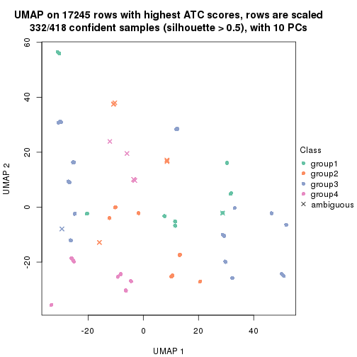</p>

</div>
<div id='tab-ATC-NMF-dimension-reduction-5'>
<pre><code class="r">dimension_reduction(res, k = 6, method = &quot;UMAP&quot;)
</code></pre>

<p></p>

</div>
</div>


Following heatmap shows how subgroups are split when increasing `k`:

```r
collect_classes(res)
```


If matrix rows can be associated to genes, consider to use `GO_Enrichment(res,
...)` to perform function enrichment for the signature genes.


 

## Session info


```r
sessionInfo()
```

```
#> R version 3.6.0 (2019-04-26)
#> Platform: x86_64-pc-linux-gnu (64-bit)
#> Running under: CentOS Linux 7 (Core)
#> 
#> Matrix products: default
#> BLAS:   /usr/lib64/libblas.so.3.4.2
#> LAPACK: /usr/lib64/liblapack.so.3.4.2
#> 
#> locale:
#>  [1] LC_CTYPE=en_US.UTF-8       LC_NUMERIC=C               LC_TIME=en_US.UTF-8       
#>  [4] LC_COLLATE=en_US.UTF-8     LC_MONETARY=en_US.UTF-8    LC_MESSAGES=en_US.UTF-8   
#>  [7] LC_PAPER=en_US.UTF-8       LC_NAME=C                  LC_ADDRESS=C              
#> [10] LC_TELEPHONE=C             LC_MEASUREMENT=en_US.UTF-8 LC_IDENTIFICATION=C       
#> 
#> attached base packages:
#>  [1] grid      parallel  stats4    stats     graphics  grDevices utils     datasets  methods  
#> [10] base     
#> 
#> other attached packages:
#>  [1] genefilter_1.66.0           ComplexHeatmap_2.1.1        markdown_1.1               
#>  [4] knitr_1.26                  cola_1.3.2                  SummarizedExperiment_1.14.1
#>  [7] DelayedArray_0.10.0         BiocParallel_1.18.1         matrixStats_0.55.0         
#> [10] Biobase_2.44.0              GenomicRanges_1.36.1        GenomeInfoDb_1.20.0        
#> [13] IRanges_2.18.3              S4Vectors_0.22.1            BiocGenerics_0.30.0        
#> [16] GetoptLong_0.1.7           
#> 
#> loaded via a namespace (and not attached):
#>  [1] bitops_1.0-6           bit64_0.9-7            doParallel_1.0.15      RColorBrewer_1.1-2    
#>  [5] httr_1.4.1             backports_1.1.5        tools_3.6.0            R6_2.4.1              
#>  [9] DBI_1.0.0              lazyeval_0.2.2         colorspace_1.4-1       withr_2.1.2           
#> [13] tidyselect_0.2.5       gridExtra_2.3          bit_1.1-14             compiler_3.6.0        
#> [17] xml2_1.2.2             microbenchmark_1.4-7   pkgmaker_0.28          slam_0.1-46           
#> [21] scales_1.1.0           NMF_0.23.6             stringr_1.4.0          digest_0.6.23         
#> [25] XVector_0.24.0         pkgconfig_2.0.3        bibtex_0.4.2           highr_0.8             
#> [29] rlang_0.4.2            GlobalOptions_0.1.1    RSQLite_2.1.2          impute_1.58.0         
#> [33] shape_1.4.4            mclust_5.4.5           dendextend_1.12.0      dplyr_0.8.3           
#> [37] RCurl_1.95-4.12        magrittr_1.5           GenomeInfoDbData_1.2.1 Matrix_1.2-17         
#> [41] Rcpp_1.0.3             munsell_0.5.0          viridis_0.5.1          lifecycle_0.1.0       
#> [45] stringi_1.4.3          zlibbioc_1.30.0        plyr_1.8.4             blob_1.2.0            
#> [49] crayon_1.3.4           lattice_0.20-38        splines_3.6.0          annotate_1.62.0       
#> [53] circlize_0.4.9         zeallot_0.1.0          pillar_1.4.2           rjson_0.2.20          
#> [57] rngtools_1.4           reshape2_1.4.3         codetools_0.2-16       XML_3.98-1.20         
#> [61] glue_1.3.1             evaluate_0.14          vctrs_0.2.0            png_0.1-7             
#> [65] foreach_1.4.7          polyclip_1.10-0        gtable_0.3.0           purrr_0.3.3           
#> [69] clue_0.3-57            assertthat_0.2.1       ggplot2_3.2.1          xfun_0.11             
#> [73] gridBase_0.4-7         eulerr_6.0.0           xtable_1.8-4           skmeans_0.2-11        
#> [77] survival_2.44-1.1      viridisLite_0.3.0      tibble_2.1.3           iterators_1.0.12      
#> [81] memoise_1.1.0          AnnotationDbi_1.46.1   registry_0.5-1         GTF_0.0.1             
#> [85] cluster_2.1.0          brew_1.0-6
```


